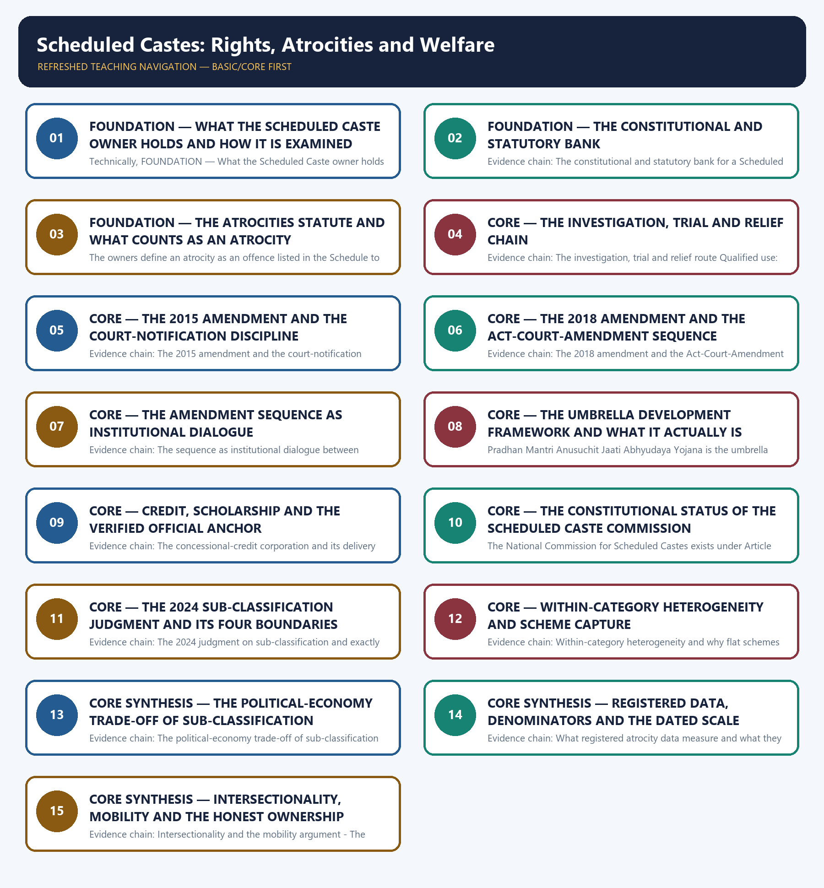

# Scheduled Castes: Rights, Atrocities and Welfare — Learner-v2 Complete Learning Session

> **Authoring-only generation:** 2026-09-02. No PDF was rendered and no tracker or index was mutated.

### SOURCE, PROGRESSION AND CURRENT-LINKAGE AUDIT

- **Generation date:** 2026-09-02.
- **Repository-first evidence:** the Basic owner is taught first and preserved in full; the Advanced owner is retained only in the optional final teaching block.
- **OCR evidence:** Repository Markdown was primary. The OCR-searchable official General Studies question papers held under books\mains and books\more_previous_papers were read only to confirm the printed wording of routed Mains demands. No official answer key, marking scheme, page precision or unsupported quotation was imported from them.
- **Qdrant:** not used; repository Markdown and available OCR context were sufficient.
- **PYQ integrity:** The audited routing ledgers route no General Studies Mains demand and no objective demand to this owner for the covered years, and that zero is reported openly rather than concealed or filled with a manufactured demand card. The four audited ledgers consulted are the Mains routing ledgers for 2018 to 2023 and for 2024 to 2025 and the Prelims routing ledgers for 2018 to 2023 and for 2024 to 2025, and neither the Basic owner nor the Advanced owner for this topic carries a generated previous-year integration block, which is itself consistent with that zero. The nearest neighbouring demand is the 2018 General Studies Paper II question on the Scheduled Caste commission and reservation in minority institutions, and the audited 2018-2023 Mains routing ledger routes it to the Polity commissions owner, so no ownership is claimed over it here; the tribal demands are routed to the Indian Society and Modern History owners and the Scheduled Area and Fifth Schedule objective demands to the Polity owner, so none of those is claimed either. The Advanced owner records expressly that there is no direct recent Mains hit on Scheduled Caste atrocities and welfare and that the 2024 sub-classification judgment is a current anchor for a possible future demand, and this package adopts exactly that position: the judgment is taught as a current anchor and is not presented as evidence that a demand already exists. The practice in this package therefore consists of six original Mains questions with model solutions, each written to the repository's examiner-grade standard using the claim, named evidence, analysis and qualification pattern, together with eighty original objective questions on a strict A → B → C → D rotation. Each model solution opens with its analytical claim so that the evidence which follows does argumentative rather than decorative work. The locally held OCR-searchable official General Studies papers were read only to confirm that no question on this owner's subject matter is routed here; no question was invented from them, no marking scheme or page precision was imported and no official answer key is claimed for any question anywhere in this package.
- **Live-link boundary:** One live official page was verified for this topic on 2026-09-02. The Department of Social Justice and Empowerment's own scheme page for the post-matric scholarship for students belonging to the Scheduled Castes, read on that date, records that the objective of the scheme is to appreciably increase the gross enrolment ratio of Scheduled Caste students in higher education with a focus on those from the poorest households by providing financial assistance at the post-matriculation or post-secondary stage to enable them to complete their education; that the scholarships are available for studies in India only; that awardees are selected by the State Government or Union Territory to which the applicant actually belongs according to the terms of domicile decided by that State; that the scheme applies to students who are currently beneficiaries as well as to fresh admissions; and that the complete scheme guidelines, revised in March 2021, are published on that page. Those statements are used only for what they say, and no coverage, disbursement, beneficiary or enrolment figure is inferred from them. Three further official checks were attempted on the same date, namely a ministry scheme identifier that returned a not-found page, a second ministry identifier that returned the same not-found page and a departmental landing page that returned navigational content only, so nothing was read or used from them and no secondary summary, coaching site or news report has been treated as an official source. The package therefore relies on the dated official anchors already carried by the repository owners, each cited with its issuing instrument or decision date: Articles 14 to 17, 23, 46, 330, 332 and 338 of the Constitution; the Protection of Civil Rights Act, 1955; the Scheduled Castes and Scheduled Tribes (Prevention of Atrocities) Act, 1989 with its Special Court, victim-relief and presumption architecture and the Scheduled Castes and Scheduled Tribes (Prevention of Atrocities) Rules, 1995 as amended; the 2015 amendment expanding the offence list, strengthening victim and witness rights and creating the Special and Exclusive Special Court architecture notified by States with the concurrence of the Chief Justice of the concerned High Court; the 2018 amendment inserting Section 18A to remove the preliminary-inquiry and arrest-approval requirements and to restore the statutory bar on anticipatory bail, which overrode rather than implemented the judicial reading of that year, and the 2020 decision in Prathvi Raj Chauhan upholding Section 18A while preserving an exceptional constitutional-court remedy where no prima facie case is disclosed; the umbrella Scheduled Caste development framework of the Ministry of Social Justice and Empowerment with its model-village, approved district and State project and hostel-support channels; the National Scheduled Castes Finance and Development Corporation as a Government of India company lending through State channelising agencies; the decision in State of Punjab against Davinder Singh of 1 August 2024, a seven-judge Constitution Bench decision by a majority of six to one, which permitted data-supported sub-classification within the Scheduled Castes and overruled E.V. Chinnaiah without altering the Presidential List or allotting any sub-quota, and whose creamy-layer observations appeared in separate opinions and are not a legislated rule; the National Crime Records Bureau annual crime report as the primary official source for registered atrocity cases, with its recorded under-reporting and registration-practice limits; and the 2011 Census share of 16.6 per cent of India's population. No atrocity count, registration, pendency, conviction, disposal, beneficiary, sanction, loan, budget or expenditure figure is asserted, no National Family Health Survey, Periodic Labour Force Survey, NITI Aayog or Sustainable Development Goal value is asserted, no legal or constitutional provision is invented or upgraded in status, no judicial observation is converted into a binding holding or a legislated rule, and no previous-year question, official answer key or option is asserted or inferred.
- **Fact/inference discipline:** no current-affairs item, PYQ wording, figure or quotation is invented.

## BASIC LEARNING SESSION

### DEEP-REVIEW LEARNING CONTRACT

| Control | Binding rule for this package |
|---|---|
| Syllabus boundary | Complete Social Justice Basic/Core is answer-complete before optional Advanced depth. |
| Legal-status boundary | Constitutional value/right, statute, rule, judgment, executive policy, scheme, eligibility rule, implementation and outcome remain distinct. |
| Rights-holder map | Rights-holder → entitlement/need → competent institution/duty-bearer → accountability forum → grievance/appeal/remedy. |
| Delivery chain | Identification → eligibility → documentation → enrolment → finance → frontline access → service/benefit → portability → outcome → audit and correction. |
| Inclusion method | Intersectional caste, tribe, gender, age, disability, religion, occupation, migration and regional variation is retained without homogenising groups. |
| Evidence method | Claim → named India-centric law/institution/scheme/case/dataset → analysis → source, reference period, release date, denominator, status and causal qualification. |
| Dignity and safeguards | Accessibility, privacy, participation, social audit, portability, offline access, due process and protection from stigma or coercion are tested. |
| Practice contract | Every model has demand decoding, detailed examiner-grade answer, executable timed/compression plan, marks rationale and answer-specific improvement. |
| Approval | This immutable successor remains `approved: false` pending explicit approval. |

**Canonical Basic/Core owner:** `upsc-ai-kit\knowledge\Social-Justice\basic\07_Scheduled-Castes-Rights-Atrocities-and-Welfare.md`  
**Substantive canonical provenance owner:** `upsc-ai-kit\knowledge\Social-Justice\07_Scheduled-Castes-Rights-Atrocities-and-Welfare_Learner-V2-Complete-Topic-Package.md`  
**Optional Advanced owner:** `upsc-ai-kit\knowledge\Social-Justice\advanced\07_Scheduled-Castes-Rights-Atrocities-and-Welfare.md`  
**Official syllabus mapping:** `upsc-ai-kit\knowledge\Social-Justice\OFFICIAL-UPSC-SYLLABUS-MAPPING.md`

### EVIDENCE, PYQ AND CURRENT-STATUS CONTROL

- **Prohibition/outcome discipline:** a legal prohibition, reported case, registration, conviction, rehabilitation measure and lived eradication are different claims.
- **Eligibility discipline:** universal, categorical, means-tested, self-declared, notified-list and residence-linked routes require exact scope; coverage never proves adequacy or access.
- **Reservation discipline:** constitutional basis, beneficiary category, competent list, ceiling, creamy-layer rule, EWS route, horizontal/vertical operation and judicial status are qualified separately.
- **Fiscal discipline:** allocation, release, expenditure, unit cost, beneficiary transfer and outcome are not interchangeable.
- **Data discipline:** retain numerator, denominator, unit, geography, reference period, release date, provisional/final status and survey-versus-administrative character.
- **Causal discipline:** headline change, before-after sequence or cross-state correlation does not establish scheme impact without mechanism and counterfactual limits.
- **PYQ discipline:** exact wording is preserved only when verified; routed or reconstructed demands remain labelled and no model is presented as an official UPSC answer.
- **Current-status note, rechecked 2026-09-03:** volatile law, scheme, judgment, list, budget and dataset claims retain issuing authority, date and operative/interim/final status.

**Generation-local live/current sources:**
- `https://socialjustice.gov.in/schemes/25 (Department of Social Justice and Empowerment, post-matric scholarship scheme page, read on 2 September 2026)`




*Distinct embedded teaching-navigation image. The separate continuous Cārvāka-style flowchart package remains an independent at-a-glance artifact.*

### SESSION 1 — FOUNDATION — WHAT THE SCHEDULED CASTE OWNER HOLDS AND HOW IT IS EXAMINED

#### DEFINITION / WHAT THIS IS CALLED

**Plain-language definition:** Evidence chain: What this owner holds and why its PYQ record is stated as zero Qualified use: Open a Scheduled Caste answer by naming the channel, protection or delivery, that the question actually tests.

**Technical definition:** Technically, FOUNDATION — What the Scheduled Caste owner holds and how it is examined is analysed by relating FOUNDATION to how it is examined, then testing the relationship through Evidence chain and Qualified use.

#### ANSWER-GRABBING OPENING — WRITE/ADAPT IN THE EXAM

> Evidence chain: What this owner holds and why its PYQ record is stated as zero Qualified use: Open a Scheduled Caste answer by naming the channel, protection or delivery, that the question actually tests.

#### MUST-WRITE KEYWORDS

- **FOUNDATION**
- **how it is examined**
- **Evidence chain**
- **Qualified use**
- **This**
- **Scheduled Caste**

**How to use them:** Frame the answer through FOUNDATION; define how it is examined, connect Evidence chain with Qualified use to explain the mechanism, and use This for the decisive comparison or qualification.

#### VISUAL FIRST

```text
WHAT THE SCHEDULED CASTE OWNER HOLDS AND HOW IT IS EXAMINED
01. What this owner holds and why its PYQ record is stated as zero
BOUNDARY -> The commissions demand of 2018 is routed to the Polity owner and reservation doctrine to the special-provisions owner.
```

*This topic-specific rail fixes the evidence sequence and its exam boundary before analysis.*

#### CORE EXPLANATION

This topic owns the Scheduled Caste half of the protection-and-welfare argument, namely the special atrocities law with its amendment sequence, the umbrella development framework, the concessional-credit corporation, the post-matriculation scholarship route and the within-category targeting debate opened by the 2024 sub-classification judgment; its distinctive feature is the honesty of its examination record, because the audited routing ledgers route no Mains demand and no objective demand to this owner for the covered years, and the nearest neighbouring demand, the 2018 General Studies Paper II question on the Scheduled Caste commission and reservation in minority institutions, is routed by the ledger to the Polity commissions owner and is therefore not claimed here; reservation doctrine such as the ceiling and the creamy-layer rule for other backward classes is owned by the Polity special-provisions owner, and the sanitation-worker rehabilitation question by the manual-scavenging owner.

#### NAMED EVIDENCE AND MECHANISM

- This topic owns the Scheduled Caste half of the protection-and-welfare argument, namely the special atrocities law with its amendment sequence, the umbrella development framework, the concessional-credit corporation, the post-matriculation scholarship route and the within-category targeting debate opened by the 2024 sub-classification judgment; its distinctive feature is the honesty of its examination record, because the audited routing ledgers route no Mains demand and no objective demand to this owner for the covered years, and the nearest neighbouring demand, the 2018 General Studies Paper II question on the Scheduled Caste commission and reservation in minority institutions, is routed by the ledger to the Polity commissions owner and is therefore not claimed here; reservation doctrine such as the ceiling and the creamy-layer rule for other backward classes is owned by the Polity special-provisions owner, and the sanitation-worker rehabilitation question by the manual-scavenging owner.

#### EXAMINER CAUTION

- The commissions demand of 2018 is routed to the Polity owner and reservation doctrine to the special-provisions owner.

#### EXAM LINK

- **Prelims:** Retain the exact statute, section, article, ministry, official category, survey round or dated edition attached to What the Scheduled Caste owner holds and how it is examined, and never upgrade a policy document into a statute or a targeted scheme into a universal entitlement.
- **Mains:** Open a Scheduled Caste answer by naming the channel, protection or delivery, that the question actually tests.

#### MINI RECAP

- **Evidence chain:** What this owner holds and why its PYQ record is stated as zero
- **Qualified use:** Open a Scheduled Caste answer by naming the channel, protection or delivery, that the question actually tests.

#### CLOSING RECALL FLOW — FOUNDATION — WHAT THE SCHEDULED CASTE OWNER HOLDS AND HOW IT IS EXAMINED

```text
START / CONCEPT: FOUNDATION — What the Scheduled Caste owner holds and how it is examined
        |
        v
EXACT TERMS: FOUNDATION · how it is examined · Evidence chain · Qualified use · This · Scheduled Caste
        |
        v
MECHANISM / ARGUMENT: This topic owns the Scheduled Caste half of the protection-and-welfare argument, namely the special atrocities law with its amendment sequence, the umbrella development framework, the concessional-credit corporation, the post-matriculation scholarship route and the within-category targeting debate opened by the 2024 sub-classification judgment; its distinctive feature is the honesty of its examination record, because the audited routing ledgers route no Mains demand and no objective demand to this owner for the covered years, and the nearest neighbouring demand, the 2018 General Studies Paper II question on the Scheduled Caste commission and reservation in minority institutions, is routed by the ledger to the Polity commissions owner and is therefore not claimed here; reservation doctrine such as the ceiling and the creamy-layer rule for other backward classes is owned by the Polity special-provisions owner, and the sanitation-worker rehabilitation question by the manual-scavenging owner.
        |
        v
CONSEQUENCE / CONTRAST: Prelims: Retain the exact statute, section, article, ministry, official category, survey round or dated edition attached to What the Scheduled Caste owner holds and how it is examined, and never upgrade a policy document into a statute or a targeted scheme into a universal entitlement.
        |
        v
UPSC TRAP / ANSWER-USE: Do not miss this limiting distinction: the commissions demand of 2018 is routed to the Polity owner and reservation doctrine...
        |
        v
ANSWER-GRABBING FORMULATION: Evidence chain: What this owner holds and why its PYQ record is stated as zero Qualified use: Open a Scheduled Caste answer by naming the channel, protection or delivery, that the question actually tests.
```
### SESSION 2 — FOUNDATION — THE CONSTITUTIONAL AND STATUTORY BANK

#### DEFINITION / WHAT THIS IS CALLED

**Plain-language definition:** The owners record the law bank as Articles 14 to 17, 23, 46, 330 and 332 and 338, where Article 15 and Article 16 permit special provision and reservation, Article 17 abolishes untouchability and makes its practice an offence, Article 23 prohibits forced labour and trafficking, Article 46 directs the State to promote with special care the educational and economic interests of the weaker sections and to protect them from social injustice and all forms of exploitation, Articles 330 and 332 reserve seats in the House of the People and in the State Assemblies, and Article 338 creates the national commission; the statutory layer is the Protection of Civil Rights Act, 1955 and the Scheduled Castes and Scheduled Tribes (Prevention of Atrocities) Act, 1989 with its special-court, relief and witness architecture, and the discipline is that an untouchability offence and an atrocity are separate statutory routes rather than synonyms.

**Technical definition:** Evidence chain: The constitutional and statutory bank for a Scheduled Caste answer Qualified use: Anchor a caste-justice answer in the exact provision and statute before any evaluation.

#### ANSWER-GRABBING OPENING — WRITE/ADAPT IN THE EXAM

> Evidence chain: The constitutional and statutory bank for a Scheduled Caste answer Qualified use: Anchor a caste-justice answer in the exact provision and statute before any evaluation.

#### MUST-WRITE KEYWORDS

- **FOUNDATION**
- **The constitutional**
- **statutory bank**
- **Evidence chain**
- **Qualified use**
- **Article 15**

**How to use them:** Frame the answer through FOUNDATION; define The constitutional, connect statutory bank with Evidence chain to explain the mechanism, and use Qualified use for the decisive comparison or qualification.

#### VISUAL FIRST

```text
THE CONSTITUTIONAL AND STATUTORY BANK
01. The constitutional and statutory bank for a Scheduled Caste answer
BOUNDARY -> An untouchability offence and an atrocity are separate statutory routes rather than synonyms.
```

*This topic-specific rail fixes the evidence sequence and its exam boundary before analysis.*

#### CORE EXPLANATION

The owners record the law bank as Articles 14 to 17, 23, 46, 330 and 332 and 338, where Article 15 and Article 16 permit special provision and reservation, Article 17 abolishes untouchability and makes its practice an offence, Article 23 prohibits forced labour and trafficking, Article 46 directs the State to promote with special care the educational and economic interests of the weaker sections and to protect them from social injustice and all forms of exploitation, Articles 330 and 332 reserve seats in the House of the People and in the State Assemblies, and Article 338 creates the national commission; the statutory layer is the Protection of Civil Rights Act, 1955 and the Scheduled Castes and Scheduled Tribes (Prevention of Atrocities) Act, 1989 with its special-court, relief and witness architecture, and the discipline is that an untouchability offence and an atrocity are separate statutory routes rather than synonyms.

#### NAMED EVIDENCE AND MECHANISM

- The owners record the law bank as Articles 14 to 17, 23, 46, 330 and 332 and 338, where Article 15 and Article 16 permit special provision and reservation, Article 17 abolishes untouchability and makes its practice an offence, Article 23 prohibits forced labour and trafficking, Article 46 directs the State to promote with special care the educational and economic interests of the weaker sections and to protect them from social injustice and all forms of exploitation, Articles 330 and 332 reserve seats in the House of the People and in the State Assemblies, and Article 338 creates the national commission; the statutory layer is the Protection of Civil Rights Act, 1955 and the Scheduled Castes and Scheduled Tribes (Prevention of Atrocities) Act, 1989 with its special-court, relief and witness architecture, and the discipline is that an untouchability offence and an atrocity are separate statutory routes rather than synonyms.

#### EXAMINER CAUTION

- An untouchability offence and an atrocity are separate statutory routes rather than synonyms.

#### EXAM LINK

- **Prelims:** Retain the exact statute, section, article, ministry, official category, survey round or dated edition attached to The constitutional and statutory bank, and never upgrade a policy document into a statute or a targeted scheme into a universal entitlement.
- **Mains:** Anchor a caste-justice answer in the exact provision and statute before any evaluation.

#### MINI RECAP

- **Evidence chain:** The constitutional and statutory bank for a Scheduled Caste answer
- **Qualified use:** Anchor a caste-justice answer in the exact provision and statute before any evaluation.

#### CLOSING RECALL FLOW — FOUNDATION — THE CONSTITUTIONAL AND STATUTORY BANK

```text
START / CONCEPT: FOUNDATION — The constitutional and statutory bank
        |
        v
EXACT TERMS: FOUNDATION · The constitutional · statutory bank · Evidence chain · Qualified use · Article 15
        |
        v
MECHANISM / ARGUMENT: The owners record the law bank as Articles 14 to 17, 23, 46, 330 and 332 and 338, where Article 15 and Article 16 permit special provision and reservation, Article 17 abolishes untouchability and makes its practice an offence, Article 23 prohibits forced labour and trafficking, Article 46 directs the State to promote with special care the educational and economic interests of the weaker sections and to protect them from social injustice and all forms of exploitation, Articles 330 and 332 reserve seats in the House of the People and in the State Assemblies, and Article 338 creates the national commission; the statutory layer is the Protection of Civil Rights Act, 1955 and the Scheduled Castes and Scheduled Tribes (Prevention of Atrocities) Act, 1989 with its special-court, relief and witness architecture, and the discipline is that an untouchability offence and an atrocity are separate statutory routes rather than synonyms.
        |
        v
CONSEQUENCE / CONTRAST: An untouchability offence and an atrocity are separate statutory routes rather than synonyms.
        |
        v
UPSC TRAP / ANSWER-USE: Do not miss this limiting distinction: the constitutional and statutory bank for a Scheduled Caste answer Qualified use.
        |
        v
ANSWER-GRABBING FORMULATION: Evidence chain: The constitutional and statutory bank for a Scheduled Caste answer Qualified use: Anchor a caste-justice answer in the exact provision and statute before any evaluation.
```
### SESSION 3 — FOUNDATION — THE ATROCITIES STATUTE AND WHAT COUNTS AS AN ATROCITY

#### DEFINITION / WHAT THIS IS CALLED

**Plain-language definition:** The Scheduled Castes and Scheduled Tribes (Prevention of Atrocities) Act, 1989 is a special law providing enhanced penalties for caste-based offences committed against members of the Scheduled Castes and Scheduled Tribes, and the owners record its distinctive architecture as Special Courts for trial, victim-relief provisions and a presumption of the offence in certain circumstances; the reason the design matters in an answer is that the same physical act may be an ordinary offence under the general penal law and an atrocity under this Act, and it is the identity of the victim, the identity of the accused and the listed nature of the act that convert the first into the second, which is why a general law-and-order framing misses what the statute is for.

**Technical definition:** The owners define an atrocity as an offence listed in the Schedule to the Act, and they name assault, wrongful dispossession, forced labour, sexual exploitation and public humiliation among the listed heads, committed against a Scheduled Caste or Scheduled Tribe person by a person who is not a member of those categories; the 2015 amendment expanded the list with new offences including garlanding with footwear and preventing entry to public places, so the offence set is not confined to physical violence and expressly reaches social and economic exclusion such as boycott, which is why an answer that treats the Act as a violence statute alone understates its coverage.

#### ANSWER-GRABBING OPENING — WRITE/ADAPT IN THE EXAM

> Evidence chain: The atrocities statute of 1989 as a special law - What counts as an atrocity and who may commit one Qualified use: Show why the same act becomes an atrocity rather than an ordinary offence.

#### MUST-WRITE KEYWORDS

- **FOUNDATION**
- **The atrocities statute**
- **what counts as an atrocity**
- **Evidence chain**
- **Qualified use**
- **The Scheduled Castes**

**How to use them:** Frame the answer through FOUNDATION; define The atrocities statute, connect what counts as an atrocity with Evidence chain to explain the mechanism, and use Qualified use for the decisive comparison or qualification.

#### VISUAL FIRST

```text
THE ATROCITIES STATUTE AND WHAT COUNTS AS AN ATROCITY
01. The atrocities statute of 1989 as a special law
    |
    v
02. What counts as an atrocity and who may commit one
BOUNDARY -> Coverage extends to social and economic exclusion and is not confined to physical violence.
```

*This topic-specific rail fixes the evidence sequence and its exam boundary before analysis.*

#### CORE EXPLANATION

The Scheduled Castes and Scheduled Tribes (Prevention of Atrocities) Act, 1989 is a special law providing enhanced penalties for caste-based offences committed against members of the Scheduled Castes and Scheduled Tribes, and the owners record its distinctive architecture as Special Courts for trial, victim-relief provisions and a presumption of the offence in certain circumstances; the reason the design matters in an answer is that the same physical act may be an ordinary offence under the general penal law and an atrocity under this Act, and it is the identity of the victim, the identity of the accused and the listed nature of the act that convert the first into the second, which is why a general law-and-order framing misses what the statute is for. The owners define an atrocity as an offence listed in the Schedule to the Act, and they name assault, wrongful dispossession, forced labour, sexual exploitation and public humiliation among the listed heads, committed against a Scheduled Caste or Scheduled Tribe person by a person who is not a member of those categories; the 2015 amendment expanded the list with new offences including garlanding with footwear and preventing entry to public places, so the offence set is not confined to physical violence and expressly reaches social and economic exclusion such as boycott, which is why an answer that treats the Act as a violence statute alone understates its coverage.

#### NAMED EVIDENCE AND MECHANISM

- The Scheduled Castes and Scheduled Tribes (Prevention of Atrocities) Act, 1989 is a special law providing enhanced penalties for caste-based offences committed against members of the Scheduled Castes and Scheduled Tribes, and the owners record its distinctive architecture as Special Courts for trial, victim-relief provisions and a presumption of the offence in certain circumstances; the reason the design matters in an answer is that the same physical act may be an ordinary offence under the general penal law and an atrocity under this Act, and it is the identity of the victim, the identity of the accused and the listed nature of the act that convert the first into the second, which is why a general law-and-order framing misses what the statute is for.
- The owners define an atrocity as an offence listed in the Schedule to the Act, and they name assault, wrongful dispossession, forced labour, sexual exploitation and public humiliation among the listed heads, committed against a Scheduled Caste or Scheduled Tribe person by a person who is not a member of those categories; the 2015 amendment expanded the list with new offences including garlanding with footwear and preventing entry to public places, so the offence set is not confined to physical violence and expressly reaches social and economic exclusion such as boycott, which is why an answer that treats the Act as a violence statute alone understates its coverage.

#### EXAMINER CAUTION

- Coverage extends to social and economic exclusion and is not confined to physical violence.

#### EXAM LINK

- **Prelims:** Retain the exact statute, section, article, ministry, official category, survey round or dated edition attached to The atrocities statute and what counts as an atrocity, and never upgrade a policy document into a statute or a targeted scheme into a universal entitlement.
- **Mains:** Show why the same act becomes an atrocity rather than an ordinary offence.

#### MINI RECAP

- **Evidence chain:** The atrocities statute of 1989 as a special law -> What counts as an atrocity and who may commit one
- **Qualified use:** Show why the same act becomes an atrocity rather than an ordinary offence.

#### CLOSING RECALL FLOW — FOUNDATION — THE ATROCITIES STATUTE AND WHAT COUNTS AS AN ATROCITY

```text
START / CONCEPT: FOUNDATION — The atrocities statute and what counts as an atrocity
        |
        v
EXACT TERMS: FOUNDATION · The atrocities statute · what counts as an atrocity · Evidence chain · Qualified use · The Scheduled Castes
        |
        v
MECHANISM / ARGUMENT: The Scheduled Castes and Scheduled Tribes (Prevention of Atrocities) Act, 1989 is a special law providing enhanced penalties for caste-based offences committed against members of the Scheduled Castes and Scheduled Tribes, and the owners record its distinctive architecture as Special Courts for trial, victim-relief provisions and a presumption of the offence in certain circumstances; the reason the design matters in an answer is that the same physical act may be an ordinary offence under the general penal law and an atrocity under this Act, and it is the identity of the victim, the identity of the accused and the listed nature of the act that convert the first into the second, which is why a general law-and-order framing misses what the statute is for.
        |
        v
CONSEQUENCE / CONTRAST: The owners define an atrocity as an offence listed in the Schedule to the Act, and they name assault, wrongful dispossession, forced labour, sexual exploitation and public humiliation among the listed heads, committed against a Scheduled Caste or Scheduled Tribe person by a person who is not a member of those categories; the 2015 amendment expanded the list with new offences including garlanding with footwear and preventing entry to public places, so the offence set is not confined to physical violence and expressly reaches social and economic exclusion such as boycott, which is why an answer that treats the Act as a violence statute alone understates its coverage.
        |
        v
UPSC TRAP / ANSWER-USE: Coverage extends to social and economic exclusion and is not confined to physical violence.
        |
        v
ANSWER-GRABBING FORMULATION: Evidence chain: The atrocities statute of 1989 as a special law - What counts as an atrocity and who may commit one Qualified use: Show why the same act becomes an atrocity rather than an ordinary offence.
```
### SESSION 4 — CORE — THE INVESTIGATION, TRIAL AND RELIEF CHAIN

#### DEFINITION / WHAT THIS IS CALLED

**Plain-language definition:** The owners set out the procedural chain as registration of a first information report for a listed atrocity offence, investigation by an officer of the rank of Deputy Superintendent of Police or above, trial before a State-notified Special Court with a Special Public Prosecutor, and victim relief in the form of monetary compensation, shelter and travel expenses in accordance with the Scheduled Castes and Scheduled Tribes (Prevention of Atrocities) Rules, 1995 as amended; the analytical value of setting out the chain in this order is that a failure can be located at exactly one joint, so an answer can say whether the defect is registration, investigation rank, court capacity, prosecutor quality or the payment of relief rather than asserting that the Act does not work.

**Technical definition:** Evidence chain: The investigation, trial and relief route Qualified use: Convert a general enforcement complaint into a located procedural diagnosis.

#### ANSWER-GRABBING OPENING — WRITE/ADAPT IN THE EXAM

> The owners set out the procedural chain as registration of a first information report for a listed atrocity offence, investigation by an officer of the rank of Deputy Superintendent of Police or above, trial before a State-notified Special Court with a Special Public Prosecutor, and victim relief in the form of monetary compensation, shelter and travel expenses in accordance with the Scheduled Castes and Scheduled Tribes (Prevention of Atrocities) Rules, 1995 as amended; the analytical value of setting out the chain in this order is that a failure can be located at exactly one joint, so an answer can say whether the defect is registration, investigation rank, court capacity, prosecutor quality or the payment of relief rather than asserting that the Act does not work.

#### MUST-WRITE KEYWORDS

- **The investigation**
- **trial**
- **relief chain**
- **Evidence chain**
- **Qualified use**
- **Deputy Superintendent**

**How to use them:** Frame the answer through The investigation; define trial, connect relief chain with Evidence chain to explain the mechanism, and use Qualified use for the decisive comparison or qualification.

#### VISUAL FIRST

```text
THE INVESTIGATION, TRIAL AND RELIEF CHAIN
01. The investigation, trial and relief route
BOUNDARY -> A failure must be located at one joint of the chain rather than asserted of the whole Act.
```

*This topic-specific rail fixes the evidence sequence and its exam boundary before analysis.*

#### CORE EXPLANATION

The owners set out the procedural chain as registration of a first information report for a listed atrocity offence, investigation by an officer of the rank of Deputy Superintendent of Police or above, trial before a State-notified Special Court with a Special Public Prosecutor, and victim relief in the form of monetary compensation, shelter and travel expenses in accordance with the Scheduled Castes and Scheduled Tribes (Prevention of Atrocities) Rules, 1995 as amended; the analytical value of setting out the chain in this order is that a failure can be located at exactly one joint, so an answer can say whether the defect is registration, investigation rank, court capacity, prosecutor quality or the payment of relief rather than asserting that the Act does not work.

#### NAMED EVIDENCE AND MECHANISM

- The owners set out the procedural chain as registration of a first information report for a listed atrocity offence, investigation by an officer of the rank of Deputy Superintendent of Police or above, trial before a State-notified Special Court with a Special Public Prosecutor, and victim relief in the form of monetary compensation, shelter and travel expenses in accordance with the Scheduled Castes and Scheduled Tribes (Prevention of Atrocities) Rules, 1995 as amended; the analytical value of setting out the chain in this order is that a failure can be located at exactly one joint, so an answer can say whether the defect is registration, investigation rank, court capacity, prosecutor quality or the payment of relief rather than asserting that the Act does not work.

#### EXAMINER CAUTION

- A failure must be located at one joint of the chain rather than asserted of the whole Act.

#### EXAM LINK

- **Prelims:** Retain the exact statute, section, article, ministry, official category, survey round or dated edition attached to The investigation, trial and relief chain, and never upgrade a policy document into a statute or a targeted scheme into a universal entitlement.
- **Mains:** Convert a general enforcement complaint into a located procedural diagnosis.

#### MINI RECAP

- **Evidence chain:** The investigation, trial and relief route
- **Qualified use:** Convert a general enforcement complaint into a located procedural diagnosis.

#### CLOSING RECALL FLOW — CORE — THE INVESTIGATION, TRIAL AND RELIEF CHAIN

```text
START / CONCEPT: CORE — The investigation, trial and relief chain
        |
        v
EXACT TERMS: The investigation · trial · relief chain · Evidence chain · Qualified use · Deputy Superintendent
        |
        v
MECHANISM / ARGUMENT: Evidence chain: The investigation, trial and relief route Qualified use: Convert a general enforcement complaint into a located procedural diagnosis.
        |
        v
CONSEQUENCE / CONTRAST: A failure must be located at one joint of the chain rather than asserted of the whole Act.
        |
        v
UPSC TRAP / ANSWER-USE: Do not miss this limiting distinction: the owners set out the procedural chain as registration of a first information report...
        |
        v
ANSWER-GRABBING FORMULATION: The owners set out the procedural chain as registration of a first information report for a listed atrocity offence, investigation by an officer of the rank of Deputy Superintendent of Police or above, trial before a State-notified Special Court with a Special Public Prosecutor, and victim relief in the form of monetary compensation, shelter and travel expenses in accordance with the Scheduled Castes and Scheduled Tribes (Prevention of Atrocities) Rules, 1995 as amended; the analytical value of setting out the chain in this order is that a failure can be located at exactly one joint, so an answer can say whether the defect is registration, investigation rank, court capacity, prosecutor quality or the payment of relief rather than asserting that the Act does not work.
```
### SESSION 5 — CORE — THE 2015 AMENDMENT AND THE COURT-NOTIFICATION DISCIPLINE

#### DEFINITION / WHAT THIS IS CALLED

**Plain-language definition:** The 2015 amendment expanded the list of atrocity offences, strengthened the rights of victims and witnesses and created the Special and Exclusive Special Court architecture, and the owners attach a precise caution to that architecture: such courts are notified by States under the conditions the Act lays down and with the concurrence of the Chief Justice of the concerned High Court, so it must not be stated that an Exclusive Special Court automatically exists in every district; the examinable consequence is that court availability is a State-specific fact to be verified rather than a national entitlement to be assumed, and pendency in atrocity trials is therefore partly a notification and staffing question.

**Technical definition:** Evidence chain: The 2015 amendment and the court-notification discipline Qualified use: State an institutional fact as verifiable and State-specific rather than as a national entitlement.

#### ANSWER-GRABBING OPENING — WRITE/ADAPT IN THE EXAM

> Evidence chain: The 2015 amendment and the court-notification discipline Qualified use: State an institutional fact as verifiable and State-specific rather than as a national entitlement.

#### MUST-WRITE KEYWORDS

- **The 2015 amendment**
- **the court-notification discipline**
- **Evidence chain**
- **Qualified use**
- **Special**
- **Exclusive Special Court**

**How to use them:** Frame the answer through The 2015 amendment; define the court-notification discipline, connect Evidence chain with Qualified use to explain the mechanism, and use Special for the decisive comparison or qualification.

#### VISUAL FIRST

```text
THE 2015 AMENDMENT AND THE COURT-NOTIFICATION DISCIPLINE
01. The 2015 amendment and the court-notification discipline
BOUNDARY -> Special and Exclusive Special Courts are State-notified and not automatic in every district.
```

*This topic-specific rail fixes the evidence sequence and its exam boundary before analysis.*

#### CORE EXPLANATION

The 2015 amendment expanded the list of atrocity offences, strengthened the rights of victims and witnesses and created the Special and Exclusive Special Court architecture, and the owners attach a precise caution to that architecture: such courts are notified by States under the conditions the Act lays down and with the concurrence of the Chief Justice of the concerned High Court, so it must not be stated that an Exclusive Special Court automatically exists in every district; the examinable consequence is that court availability is a State-specific fact to be verified rather than a national entitlement to be assumed, and pendency in atrocity trials is therefore partly a notification and staffing question.

#### NAMED EVIDENCE AND MECHANISM

- The 2015 amendment expanded the list of atrocity offences, strengthened the rights of victims and witnesses and created the Special and Exclusive Special Court architecture, and the owners attach a precise caution to that architecture: such courts are notified by States under the conditions the Act lays down and with the concurrence of the Chief Justice of the concerned High Court, so it must not be stated that an Exclusive Special Court automatically exists in every district; the examinable consequence is that court availability is a State-specific fact to be verified rather than a national entitlement to be assumed, and pendency in atrocity trials is therefore partly a notification and staffing question.

#### EXAMINER CAUTION

- Special and Exclusive Special Courts are State-notified and not automatic in every district.

#### EXAM LINK

- **Prelims:** Retain the exact statute, section, article, ministry, official category, survey round or dated edition attached to The 2015 amendment and the court-notification discipline, and never upgrade a policy document into a statute or a targeted scheme into a universal entitlement.
- **Mains:** State an institutional fact as verifiable and State-specific rather than as a national entitlement.

#### MINI RECAP

- **Evidence chain:** The 2015 amendment and the court-notification discipline
- **Qualified use:** State an institutional fact as verifiable and State-specific rather than as a national entitlement.

#### CLOSING RECALL FLOW — CORE — THE 2015 AMENDMENT AND THE COURT-NOTIFICATION DISCIPLINE

```text
START / CONCEPT: CORE — The 2015 amendment and the court-notification discipline
        |
        v
EXACT TERMS: The 2015 amendment · the court-notification discipline · Evidence chain · Qualified use · Special · Exclusive Special Court
        |
        v
MECHANISM / ARGUMENT: The 2015 amendment expanded the list of atrocity offences, strengthened the rights of victims and witnesses and created the Special and Exclusive Special Court architecture, and the owners attach a precise caution to that architecture: such courts are notified by States under the conditions the Act lays down and with the concurrence of the Chief Justice of the concerned High Court, so it must not be stated that an Exclusive Special Court automatically exists in every district; the examinable consequence is that court availability is a State-specific fact to be verified rather than a national entitlement to be assumed, and pendency in atrocity trials is therefore partly a notification and staffing question.
        |
        v
CONSEQUENCE / CONTRAST: Special and Exclusive Special Courts are State-notified and not automatic in every district.
        |
        v
UPSC TRAP / ANSWER-USE: Do not miss this limiting distinction: the 2015 amendment and the court-notification discipline Qualified use.
        |
        v
ANSWER-GRABBING FORMULATION: Evidence chain: The 2015 amendment and the court-notification discipline Qualified use: State an institutional fact as verifiable and State-specific rather than as a national entitlement.
```
### SESSION 6 — CORE — THE 2018 AMENDMENT AND THE ACT-COURT-AMENDMENT SEQUENCE

#### DEFINITION / WHAT THIS IS CALLED

**Plain-language definition:** A 2018 ruling of the Supreme Court diluted arrest and anticipatory-bail protection under the Act; Parliament responded by inserting Section 18A, under which no preliminary inquiry is required for the registration of a first information report, no approval is required for arrest and the statutory bar on anticipatory bail is restored notwithstanding that ruling; the constitutional challenge to the amendment was then decided in Prathvi Raj Chauhan in 2020, which upheld Section 18A while preserving an exceptional power in a constitutional court to intervene where the complaint discloses no prima facie case; the recurring trap is to say the 2018 amendment implemented a judicial direction when it in fact overrode one.

**Technical definition:** Evidence chain: The 2018 amendment and the Act-Court-Amendment sequence Qualified use: Narrate a contested amendment in its exact three-step sequence.

#### ANSWER-GRABBING OPENING — WRITE/ADAPT IN THE EXAM

> Evidence chain: The 2018 amendment and the Act-Court-Amendment sequence Qualified use: Narrate a contested amendment in its exact three-step sequence.

#### MUST-WRITE KEYWORDS

- **The 2018 amendment**
- **the Act-Court-Amendment sequence**
- **Evidence chain**
- **Qualified use**
- **Supreme Court**
- **Act**

**How to use them:** Frame the answer through The 2018 amendment; define the Act-Court-Amendment sequence, connect Evidence chain with Qualified use to explain the mechanism, and use Supreme Court for the decisive comparison or qualification.

#### VISUAL FIRST

```text
THE 2018 AMENDMENT AND THE ACT-COURT-AMENDMENT SEQUENCE
01. The 2018 amendment and the Act-Court-Amendment sequence
BOUNDARY -> The amendment overrode a judicial reading; it did not implement a judicial direction.
```

*This topic-specific rail fixes the evidence sequence and its exam boundary before analysis.*

#### CORE EXPLANATION

The owners record the sequence with care. A 2018 ruling of the Supreme Court diluted arrest and anticipatory-bail protection under the Act; Parliament responded by inserting Section 18A, under which no preliminary inquiry is required for the registration of a first information report, no approval is required for arrest and the statutory bar on anticipatory bail is restored notwithstanding that ruling; the constitutional challenge to the amendment was then decided in Prathvi Raj Chauhan in 2020, which upheld Section 18A while preserving an exceptional power in a constitutional court to intervene where the complaint discloses no prima facie case; the recurring trap is to say the 2018 amendment implemented a judicial direction when it in fact overrode one.

#### NAMED EVIDENCE AND MECHANISM

- The owners record the sequence with care. A 2018 ruling of the Supreme Court diluted arrest and anticipatory-bail protection under the Act; Parliament responded by inserting Section 18A, under which no preliminary inquiry is required for the registration of a first information report, no approval is required for arrest and the statutory bar on anticipatory bail is restored notwithstanding that ruling; the constitutional challenge to the amendment was then decided in Prathvi Raj Chauhan in 2020, which upheld Section 18A while preserving an exceptional power in a constitutional court to intervene where the complaint discloses no prima facie case; the recurring trap is to say the 2018 amendment implemented a judicial direction when it in fact overrode one.

#### EXAMINER CAUTION

- The amendment overrode a judicial reading; it did not implement a judicial direction.

#### EXAM LINK

- **Prelims:** Retain the exact statute, section, article, ministry, official category, survey round or dated edition attached to The 2018 amendment and the Act-Court-Amendment sequence, and never upgrade a policy document into a statute or a targeted scheme into a universal entitlement.
- **Mains:** Narrate a contested amendment in its exact three-step sequence.

#### MINI RECAP

- **Evidence chain:** The 2018 amendment and the Act-Court-Amendment sequence
- **Qualified use:** Narrate a contested amendment in its exact three-step sequence.

#### CLOSING RECALL FLOW — CORE — THE 2018 AMENDMENT AND THE ACT-COURT-AMENDMENT SEQUENCE

```text
START / CONCEPT: CORE — The 2018 amendment and the Act-Court-Amendment sequence
        |
        v
EXACT TERMS: The 2018 amendment · the Act-Court-Amendment sequence · Evidence chain · Qualified use · Supreme Court · Act
        |
        v
MECHANISM / ARGUMENT: A 2018 ruling of the Supreme Court diluted arrest and anticipatory-bail protection under the Act; Parliament responded by inserting Section 18A, under which no preliminary inquiry is required for the registration of a first information report, no approval is required for arrest and the statutory bar on anticipatory bail is restored notwithstanding that ruling; the constitutional challenge to the amendment was then decided in Prathvi Raj Chauhan in 2020, which upheld Section 18A while preserving an exceptional power in a constitutional court to intervene where the complaint discloses no prima facie case; the recurring trap is to say the 2018 amendment implemented a judicial direction when it in fact overrode one.
        |
        v
CONSEQUENCE / CONTRAST: The resulting consequence is that the 2018 amendment and the Act-Court-Amendment sequence Qualified use.
        |
        v
UPSC TRAP / ANSWER-USE: Do not miss this limiting distinction: the 2018 amendment and the Act-Court-Amendment sequence Qualified use.
        |
        v
ANSWER-GRABBING FORMULATION: Evidence chain: The 2018 amendment and the Act-Court-Amendment sequence Qualified use: Narrate a contested amendment in its exact three-step sequence.
```
### SESSION 7 — CORE — THE AMENDMENT SEQUENCE AS INSTITUTIONAL DIALOGUE

#### DEFINITION / WHAT THIS IS CALLED

**Plain-language definition:** The owners treat the 1989 Act, the 2018 ruling and the 2018 amendment as a textbook instance of the legislature responding to a judicial reading by amending the law, and they invite the cross-link to the Polity owner for the doctrine; the analytical shape is that the Court read a safeguard against misuse into a statute, Parliament restored the original stringency by express provision, and the Court then tested the restored provision and upheld it while retaining a narrow constitutional escape valve, so the episode ends in an equilibrium rather than in a victory for either branch; an answer that uses it must state all three steps, because reciting only the amendment converts a dialogue into a confrontation.

**Technical definition:** Evidence chain: The sequence as institutional dialogue between legislature and judiciary Qualified use: Use an amendment as evidence of institutional dialogue instead of confrontation.

#### ANSWER-GRABBING OPENING — WRITE/ADAPT IN THE EXAM

> The owners treat the 1989 Act, the 2018 ruling and the 2018 amendment as a textbook instance of the legislature responding to a judicial reading by amending the law, and they invite the cross-link to the Polity owner for the doctrine; the analytical shape is that the Court read a safeguard against misuse into a statute, Parliament restored the original stringency by express provision, and the Court then tested the restored provision and upheld it while retaining a narrow constitutional escape valve, so the episode ends in an equilibrium rather than in a victory for either branch; an answer that uses it must state all three steps, because reciting only the amendment converts a dialogue into a confrontation.

#### MUST-WRITE KEYWORDS

- **The amendment sequence as institutional dialogue**
- **Evidence chain**
- **Qualified use**
- **Act**
- **Polity**
- **Court**

**How to use them:** Frame the answer through The amendment sequence as institutional dialogue; define Evidence chain, connect Qualified use with Act to explain the mechanism, and use Polity for the decisive comparison or qualification.

#### VISUAL FIRST

```text
THE AMENDMENT SEQUENCE AS INSTITUTIONAL DIALOGUE
01. The sequence as institutional dialogue between legislature and judiciary
BOUNDARY -> The episode ends in an equilibrium rather than in a victory for either branch.
```

*This topic-specific rail fixes the evidence sequence and its exam boundary before analysis.*

#### CORE EXPLANATION

The owners treat the 1989 Act, the 2018 ruling and the 2018 amendment as a textbook instance of the legislature responding to a judicial reading by amending the law, and they invite the cross-link to the Polity owner for the doctrine; the analytical shape is that the Court read a safeguard against misuse into a statute, Parliament restored the original stringency by express provision, and the Court then tested the restored provision and upheld it while retaining a narrow constitutional escape valve, so the episode ends in an equilibrium rather than in a victory for either branch; an answer that uses it must state all three steps, because reciting only the amendment converts a dialogue into a confrontation.

#### NAMED EVIDENCE AND MECHANISM

- The owners treat the 1989 Act, the 2018 ruling and the 2018 amendment as a textbook instance of the legislature responding to a judicial reading by amending the law, and they invite the cross-link to the Polity owner for the doctrine; the analytical shape is that the Court read a safeguard against misuse into a statute, Parliament restored the original stringency by express provision, and the Court then tested the restored provision and upheld it while retaining a narrow constitutional escape valve, so the episode ends in an equilibrium rather than in a victory for either branch; an answer that uses it must state all three steps, because reciting only the amendment converts a dialogue into a confrontation.

#### EXAMINER CAUTION

- The episode ends in an equilibrium rather than in a victory for either branch.

#### EXAM LINK

- **Prelims:** Retain the exact statute, section, article, ministry, official category, survey round or dated edition attached to The amendment sequence as institutional dialogue, and never upgrade a policy document into a statute or a targeted scheme into a universal entitlement.
- **Mains:** Use an amendment as evidence of institutional dialogue instead of confrontation.

#### MINI RECAP

- **Evidence chain:** The sequence as institutional dialogue between legislature and judiciary
- **Qualified use:** Use an amendment as evidence of institutional dialogue instead of confrontation.

#### CLOSING RECALL FLOW — CORE — THE AMENDMENT SEQUENCE AS INSTITUTIONAL DIALOGUE

```text
START / CONCEPT: CORE — The amendment sequence as institutional dialogue
        |
        v
EXACT TERMS: The amendment sequence as institutional dialogue · Evidence chain · Qualified use · Act · Polity · Court
        |
        v
MECHANISM / ARGUMENT: Evidence chain: The sequence as institutional dialogue between legislature and judiciary Qualified use: Use an amendment as evidence of institutional dialogue instead of confrontation.
        |
        v
CONSEQUENCE / CONTRAST: Mains: Use an amendment as evidence of institutional dialogue instead of confrontation.
        |
        v
UPSC TRAP / ANSWER-USE: Do not miss this limiting distinction: the owners treat the 1989 Act, the 2018 ruling and the 2018 amendment as...
        |
        v
ANSWER-GRABBING FORMULATION: The owners treat the 1989 Act, the 2018 ruling and the 2018 amendment as a textbook instance of the legislature responding to a judicial reading by amending the law, and they invite the cross-link to the Polity owner for the doctrine; the analytical shape is that the Court read a safeguard against misuse into a statute, Parliament restored the original stringency by express provision, and the Court then tested the restored provision and upheld it while retaining a narrow constitutional escape valve, so the episode ends in an equilibrium rather than in a victory for either branch; an answer that uses it must state all three steps, because reciting only the amendment converts a dialogue into a confrontation.
```
### SESSION 8 — CORE — THE UMBRELLA DEVELOPMENT FRAMEWORK AND WHAT IT ACTUALLY IS

#### DEFINITION / WHAT THIS IS CALLED

**Plain-language definition:** Evidence chain: The umbrella development framework and what it actually is Qualified use: Attribute a benefit to the correct channel before using it as evidence of delivery.

**Technical definition:** Pradhan Mantri Anusuchit Jaati Abhyudaya Yojana is the umbrella Scheduled Caste development framework of the Ministry of Social Justice and Empowerment, and the owners record its three delivery channels as development of Scheduled Caste dominated villages under the model-village component, grants for approved district and State socio-economic development projects, and hostel support in higher educational institutions; the critical qualification is that these are project and sanction channels driven by State proposals and annual approvals rather than an automatic individual benefit, so it is an error both to describe the framework as a personal scholarship or loan entitlement and to treat every ministry scheme for Scheduled Castes as one of its components.

#### ANSWER-GRABBING OPENING — WRITE/ADAPT IN THE EXAM

> Evidence chain: The umbrella development framework and what it actually is Qualified use: Attribute a benefit to the correct channel before using it as evidence of delivery.

#### MUST-WRITE KEYWORDS

- **The umbrella development framework**
- **what it actually is**
- **Evidence chain**
- **Qualified use**
- **Pradhan Mantri Anusuchit Jaati Abhyudaya Yojana**
- **Pradhan Mantri Anusuchit Jaati Abhyudaya**

**How to use them:** Frame the answer through The umbrella development framework; define what it actually is, connect Evidence chain with Qualified use to explain the mechanism, and use Pradhan Mantri Anusuchit Jaati Abhyudaya Yojana for the decisive comparison or qualification.

#### VISUAL FIRST

```text
THE UMBRELLA DEVELOPMENT FRAMEWORK AND WHAT IT ACTUALLY IS
01. The umbrella development framework and what it actually is
BOUNDARY -> Its channels are project and sanction routes rather than an automatic individual benefit.
```

*This topic-specific rail fixes the evidence sequence and its exam boundary before analysis.*

#### CORE EXPLANATION

Pradhan Mantri Anusuchit Jaati Abhyudaya Yojana is the umbrella Scheduled Caste development framework of the Ministry of Social Justice and Empowerment, and the owners record its three delivery channels as development of Scheduled Caste dominated villages under the model-village component, grants for approved district and State socio-economic development projects, and hostel support in higher educational institutions; the critical qualification is that these are project and sanction channels driven by State proposals and annual approvals rather than an automatic individual benefit, so it is an error both to describe the framework as a personal scholarship or loan entitlement and to treat every ministry scheme for Scheduled Castes as one of its components.

#### NAMED EVIDENCE AND MECHANISM

- Pradhan Mantri Anusuchit Jaati Abhyudaya Yojana is the umbrella Scheduled Caste development framework of the Ministry of Social Justice and Empowerment, and the owners record its three delivery channels as development of Scheduled Caste dominated villages under the model-village component, grants for approved district and State socio-economic development projects, and hostel support in higher educational institutions; the critical qualification is that these are project and sanction channels driven by State proposals and annual approvals rather than an automatic individual benefit, so it is an error both to describe the framework as a personal scholarship or loan entitlement and to treat every ministry scheme for Scheduled Castes as one of its components.

#### EXAMINER CAUTION

- Its channels are project and sanction routes rather than an automatic individual benefit.

#### EXAM LINK

- **Prelims:** Retain the exact statute, section, article, ministry, official category, survey round or dated edition attached to The umbrella development framework and what it actually is, and never upgrade a policy document into a statute or a targeted scheme into a universal entitlement.
- **Mains:** Attribute a benefit to the correct channel before using it as evidence of delivery.

#### MINI RECAP

- **Evidence chain:** The umbrella development framework and what it actually is
- **Qualified use:** Attribute a benefit to the correct channel before using it as evidence of delivery.

#### CLOSING RECALL FLOW — CORE — THE UMBRELLA DEVELOPMENT FRAMEWORK AND WHAT IT ACTUALLY IS

```text
START / CONCEPT: CORE — The umbrella development framework and what it actually is
        |
        v
EXACT TERMS: The umbrella development framework · what it actually is · Evidence chain · Qualified use · Pradhan Mantri Anusuchit Jaati Abhyudaya Yojana · Pradhan Mantri Anusuchit Jaati Abhyudaya
        |
        v
MECHANISM / ARGUMENT: Pradhan Mantri Anusuchit Jaati Abhyudaya Yojana is the umbrella Scheduled Caste development framework of the Ministry of Social Justice and Empowerment, and the owners record its three delivery channels as development of Scheduled Caste dominated villages under the model-village component, grants for approved district and State socio-economic development projects, and hostel support in higher educational institutions; the critical qualification is that these are project and sanction channels driven by State proposals and annual approvals rather than an automatic individual benefit, so it is an error both to describe the framework as a personal scholarship or loan entitlement and to treat every ministry scheme for Scheduled Castes as one of its components.
        |
        v
CONSEQUENCE / CONTRAST: Prelims: Retain the exact statute, section, article, ministry, official category, survey round or dated edition attached to The umbrella development framework and what it actually is, and never upgrade a policy document into a statute or a targeted scheme into a universal entitlement.
        |
        v
UPSC TRAP / ANSWER-USE: Its channels are project and sanction routes rather than an automatic individual benefit.
        |
        v
ANSWER-GRABBING FORMULATION: Evidence chain: The umbrella development framework and what it actually is Qualified use: Attribute a benefit to the correct channel before using it as evidence of delivery.
```
### SESSION 9 — CORE — CREDIT, SCHOLARSHIP AND THE VERIFIED OFFICIAL ANCHOR

#### DEFINITION / WHAT THIS IS CALLED

**Plain-language definition:** The Department of Social Justice and Empowerment's own scheme page for the post-matric scholarship for students belonging to the Scheduled Castes, read on 2 September 2026, records that the objective of the scheme is to appreciably increase the gross enrolment ratio of Scheduled Caste students in higher education with a focus on those from the poorest households by providing financial assistance at the post-matriculation or post-secondary stage to enable them to complete their education; the same page records that the scholarships are available for studies in India only, that awardees are selected by the State Government or Union Territory to which the applicant actually belongs according to the domicile terms decided by that State, that the scheme applies both to current beneficiaries and to fresh admissions, and that the complete guidelines were revised in March 2021 and are published on that page; nothing beyond those recorded statements is claimed, and no coverage, disbursement or beneficiary count is asserted.

**Technical definition:** Evidence chain: The concessional-credit corporation and its delivery route - The post-matriculation scholarship as a verified official anchor Qualified use: Cite an official scheme statement for exactly what it says and no further.

#### ANSWER-GRABBING OPENING — WRITE/ADAPT IN THE EXAM

> Evidence chain: The concessional-credit corporation and its delivery route - The post-matriculation scholarship as a verified official anchor Qualified use: Cite an official scheme statement for exactly what it says and no further.

#### MUST-WRITE KEYWORDS

- **Credit**
- **scholarship**
- **the verified official anchor**
- **Evidence chain**
- **Qualified use**
- **The National Scheduled Castes Finance and Development Corporation**

**How to use them:** Frame the answer through Credit; define scholarship, connect the verified official anchor with Evidence chain to explain the mechanism, and use Qualified use for the decisive comparison or qualification.

#### VISUAL FIRST

```text
CREDIT, SCHOLARSHIP AND THE VERIFIED OFFICIAL ANCHOR
01. The concessional-credit corporation and its delivery route
    |
    v
02. The post-matriculation scholarship as a verified official anchor
BOUNDARY -> The verified page records objective, stage, territorial limit, selection authority and revision date and nothing more.
```

*This topic-specific rail fixes the evidence sequence and its exam boundary before analysis.*

#### CORE EXPLANATION

The National Scheduled Castes Finance and Development Corporation is a Government of India company under the Ministry of Social Justice and Empowerment which provides concessional credit to Scheduled Caste beneficiaries, and the owners record its instruments as term loans, micro-credit and skill-development finance delivered through State channelising agencies rather than directly to a borrower; the reason the delivery route is examinable is that it makes the corporation's reach a function of the capacity and the appetite of the State agency in each State, so credit access is uneven for reasons that lie outside the corporation's own design, and an answer about economic mobility must say so. The Department of Social Justice and Empowerment's own scheme page for the post-matric scholarship for students belonging to the Scheduled Castes, read on 2 September 2026, records that the objective of the scheme is to appreciably increase the gross enrolment ratio of Scheduled Caste students in higher education with a focus on those from the poorest households by providing financial assistance at the post-matriculation or post-secondary stage to enable them to complete their education; the same page records that the scholarships are available for studies in India only, that awardees are selected by the State Government or Union Territory to which the applicant actually belongs according to the domicile terms decided by that State, that the scheme applies both to current beneficiaries and to fresh admissions, and that the complete guidelines were revised in March 2021 and are published on that page; nothing beyond those recorded statements is claimed, and no coverage, disbursement or beneficiary count is asserted.

#### NAMED EVIDENCE AND MECHANISM

- The National Scheduled Castes Finance and Development Corporation is a Government of India company under the Ministry of Social Justice and Empowerment which provides concessional credit to Scheduled Caste beneficiaries, and the owners record its instruments as term loans, micro-credit and skill-development finance delivered through State channelising agencies rather than directly to a borrower; the reason the delivery route is examinable is that it makes the corporation's reach a function of the capacity and the appetite of the State agency in each State, so credit access is uneven for reasons that lie outside the corporation's own design, and an answer about economic mobility must say so.
- The Department of Social Justice and Empowerment's own scheme page for the post-matric scholarship for students belonging to the Scheduled Castes, read on 2 September 2026, records that the objective of the scheme is to appreciably increase the gross enrolment ratio of Scheduled Caste students in higher education with a focus on those from the poorest households by providing financial assistance at the post-matriculation or post-secondary stage to enable them to complete their education; the same page records that the scholarships are available for studies in India only, that awardees are selected by the State Government or Union Territory to which the applicant actually belongs according to the domicile terms decided by that State, that the scheme applies both to current beneficiaries and to fresh admissions, and that the complete guidelines were revised in March 2021 and are published on that page; nothing beyond those recorded statements is claimed, and no coverage, disbursement or beneficiary count is asserted.

#### EXAMINER CAUTION

- The verified page records objective, stage, territorial limit, selection authority and revision date and nothing more.

#### EXAM LINK

- **Prelims:** Retain the exact statute, section, article, ministry, official category, survey round or dated edition attached to Credit, scholarship and the verified official anchor, and never upgrade a policy document into a statute or a targeted scheme into a universal entitlement.
- **Mains:** Cite an official scheme statement for exactly what it says and no further.

#### MINI RECAP

- **Evidence chain:** The concessional-credit corporation and its delivery route -> The post-matriculation scholarship as a verified official anchor
- **Qualified use:** Cite an official scheme statement for exactly what it says and no further.

#### CLOSING RECALL FLOW — CORE — CREDIT, SCHOLARSHIP AND THE VERIFIED OFFICIAL ANCHOR

```text
START / CONCEPT: CORE — Credit, scholarship and the verified official anchor
        |
        v
EXACT TERMS: Credit · scholarship · the verified official anchor · Evidence chain · Qualified use · The National Scheduled Castes Finance and Development Corporation
        |
        v
MECHANISM / ARGUMENT: The National Scheduled Castes Finance and Development Corporation is a Government of India company under the Ministry of Social Justice and Empowerment which provides concessional credit to Scheduled Caste beneficiaries, and the owners record its instruments as term loans, micro-credit and skill-development finance delivered through State channelising agencies rather than directly to a borrower; the reason the delivery route is examinable is that it makes the corporation's reach a function of the capacity and the appetite of the State agency in each State, so credit access is uneven for reasons that lie outside the corporation's own design, and an answer about economic mobility must say so.
        |
        v
CONSEQUENCE / CONTRAST: The Department of Social Justice and Empowerment's own scheme page for the post-matric scholarship for students belonging to the Scheduled Castes, read on 2 September 2026, records that the objective of the scheme is to appreciably increase the gross enrolment ratio of Scheduled Caste students in higher education with a focus on those from the poorest households by providing financial assistance at the post-matriculation or post-secondary stage to enable them to complete their education; the same page records that the scholarships are available for studies in India only, that awardees are selected by the State Government or Union Territory to which the applicant actually belongs according to the domicile terms decided by that State, that the scheme applies both to current beneficiaries and to fresh admissions, and that the complete guidelines were revised in March 2021 and are published on that page; nothing beyond those recorded statements is claimed, and no coverage, disbursement or beneficiary count is asserted.
        |
        v
UPSC TRAP / ANSWER-USE: Do not miss this limiting distinction: the concessional-credit corporation and its delivery route - The post-matriculation scholarship as a verified...
        |
        v
ANSWER-GRABBING FORMULATION: Evidence chain: The concessional-credit corporation and its delivery route - The post-matriculation scholarship as a verified official anchor Qualified use: Cite an official scheme statement for exactly what it says and no further.
```
### SESSION 10 — CORE — THE CONSTITUTIONAL STATUS OF THE SCHEDULED CASTE COMMISSION

#### DEFINITION / WHAT THIS IS CALLED

**Plain-language definition:** Evidence chain: The commission for Scheduled Castes is a constitutional body Qualified use: Use a status distinction precisely and route the institutional detail.

**Technical definition:** The National Commission for Scheduled Castes exists under Article 338 of the Constitution and is therefore a constitutional body whose duties to investigate and monitor safeguards, to inquire into specific complaints and to advise on planning and socio-economic development are entrenched in the Constitution itself, which distinguishes it sharply from a statutory commission created by ordinary legislation such as the women's commission; the owners deliberately do not re-teach its composition and detailed mandate because that content belongs to the Polity commissions owner, and they require the cross-link to be stated rather than the material to be duplicated, so an answer here should use the status distinction and route the institutional detail.

#### ANSWER-GRABBING OPENING — WRITE/ADAPT IN THE EXAM

> Evidence chain: The commission for Scheduled Castes is a constitutional body Qualified use: Use a status distinction precisely and route the institutional detail.

#### MUST-WRITE KEYWORDS

- **The constitutional status of the Scheduled Caste commission**
- **Evidence chain**
- **Qualified use**
- **Article 338**
- **The National Commission**
- **Scheduled Castes**

**How to use them:** Frame the answer through The constitutional status of the Scheduled Caste commission; define Evidence chain, connect Qualified use with Article 338 to explain the mechanism, and use The National Commission for the decisive comparison or qualification.

#### VISUAL FIRST

```text
THE CONSTITUTIONAL STATUS OF THE SCHEDULED CASTE COMMISSION
01. The commission for Scheduled Castes is a constitutional body
BOUNDARY -> Institutional detail belongs to the Polity commissions owner and is cross-linked rather than duplicated.
```

*This topic-specific rail fixes the evidence sequence and its exam boundary before analysis.*

#### CORE EXPLANATION

The National Commission for Scheduled Castes exists under Article 338 of the Constitution and is therefore a constitutional body whose duties to investigate and monitor safeguards, to inquire into specific complaints and to advise on planning and socio-economic development are entrenched in the Constitution itself, which distinguishes it sharply from a statutory commission created by ordinary legislation such as the women's commission; the owners deliberately do not re-teach its composition and detailed mandate because that content belongs to the Polity commissions owner, and they require the cross-link to be stated rather than the material to be duplicated, so an answer here should use the status distinction and route the institutional detail.

#### NAMED EVIDENCE AND MECHANISM

- The National Commission for Scheduled Castes exists under Article 338 of the Constitution and is therefore a constitutional body whose duties to investigate and monitor safeguards, to inquire into specific complaints and to advise on planning and socio-economic development are entrenched in the Constitution itself, which distinguishes it sharply from a statutory commission created by ordinary legislation such as the women's commission; the owners deliberately do not re-teach its composition and detailed mandate because that content belongs to the Polity commissions owner, and they require the cross-link to be stated rather than the material to be duplicated, so an answer here should use the status distinction and route the institutional detail.

#### EXAMINER CAUTION

- Institutional detail belongs to the Polity commissions owner and is cross-linked rather than duplicated.

#### EXAM LINK

- **Prelims:** Retain the exact statute, section, article, ministry, official category, survey round or dated edition attached to The constitutional status of the Scheduled Caste commission, and never upgrade a policy document into a statute or a targeted scheme into a universal entitlement.
- **Mains:** Use a status distinction precisely and route the institutional detail.

#### MINI RECAP

- **Evidence chain:** The commission for Scheduled Castes is a constitutional body
- **Qualified use:** Use a status distinction precisely and route the institutional detail.

#### CLOSING RECALL FLOW — CORE — THE CONSTITUTIONAL STATUS OF THE SCHEDULED CASTE COMMISSION

```text
START / CONCEPT: CORE — The constitutional status of the Scheduled Caste commission
        |
        v
EXACT TERMS: The constitutional status of the Scheduled Caste commission · Evidence chain · Qualified use · Article 338 · The National Commission · Scheduled Castes
        |
        v
MECHANISM / ARGUMENT: The National Commission for Scheduled Castes exists under Article 338 of the Constitution and is therefore a constitutional body whose duties to investigate and monitor safeguards, to inquire into specific complaints and to advise on planning and socio-economic development are entrenched in the Constitution itself, which distinguishes it sharply from a statutory commission created by ordinary legislation such as the women's commission; the owners deliberately do not re-teach its composition and detailed mandate because that content belongs to the Polity commissions owner, and they require the cross-link to be stated rather than the material to be duplicated, so an answer here should use the status distinction and route the institutional detail.
        |
        v
CONSEQUENCE / CONTRAST: Institutional detail belongs to the Polity commissions owner and is cross-linked rather than duplicated.
        |
        v
UPSC TRAP / ANSWER-USE: Do not miss this limiting distinction: use a status distinction precisely and route the institutional detail.
        |
        v
ANSWER-GRABBING FORMULATION: Evidence chain: The commission for Scheduled Castes is a constitutional body Qualified use: Use a status distinction precisely and route the institutional detail.
```
### SESSION 11 — CORE — THE 2024 SUB-CLASSIFICATION JUDGMENT AND ITS FOUR BOUNDARIES

#### DEFINITION / WHAT THIS IS CALLED

**Plain-language definition:** Chinnaiah; the owners then set the boundary of the holding with unusual care, because the judgment does not alter the Presidential List of Scheduled Castes, does not itself allot any sub-quota to any group and does not direct any State to sub-classify, so what it grants is constitutional permission for an evidence-based State measure and nothing more.

**Technical definition:** Evidence chain: The 2024 judgment on sub-classification and exactly what it decided - The creamy-layer observations were separate opinions and not a rule Qualified use: State a holding with its boundaries before drawing any policy consequence.

#### ANSWER-GRABBING OPENING — WRITE/ADAPT IN THE EXAM

> Evidence chain: The 2024 judgment on sub-classification and exactly what it decided - The creamy-layer observations were separate opinions and not a rule Qualified use: State a holding with its boundaries before drawing any policy consequence.

#### MUST-WRITE KEYWORDS

- **The 2024 sub-classification judgment**
- **its four boundaries**
- **Evidence chain**
- **Qualified use**
- **Punjab**
- **Davinder Singh**

**How to use them:** Frame the answer through The 2024 sub-classification judgment; define its four boundaries, connect Evidence chain with Qualified use to explain the mechanism, and use Punjab for the decisive comparison or qualification.

#### VISUAL FIRST

```text
THE 2024 SUB-CLASSIFICATION JUDGMENT AND ITS FOUR BOUNDARIES
01. The 2024 judgment on sub-classification and exactly what it decided
    |
    v
02. The creamy-layer observations were separate opinions and not a rule
BOUNDARY -> The judgment permits an evidence-based State measure; it allots nothing and mandates nothing.
```

*This topic-specific rail fixes the evidence sequence and its exam boundary before analysis.*

#### CORE EXPLANATION

State of Punjab against Davinder Singh, decided on 1 August 2024 by a seven-judge Constitution Bench by a majority of six to one, held that sub-classification within the Scheduled Castes for the purpose of reservation is constitutionally permissible where it is supported by data, and it overruled the earlier decision in E.V. Chinnaiah; the owners then set the boundary of the holding with unusual care, because the judgment does not alter the Presidential List of Scheduled Castes, does not itself allot any sub-quota to any group and does not direct any State to sub-classify, so what it grants is constitutional permission for an evidence-based State measure and nothing more. The owners record that observations about applying a creamy-layer style filter to the Scheduled Castes and Scheduled Tribes appeared in separate opinions in the 2024 judgment and were not part of the binding holding, and that no general creamy-layer exclusion for those categories has been legislated; the discipline that follows is that the existing creamy-layer rule for other backward classes must not be transplanted in an answer, and that a candidate who writes that the Supreme Court has introduced a creamy layer for the Scheduled Castes has converted an obiter discussion into a legislated rule, which is exactly the status error this folder exists to prevent.

#### NAMED EVIDENCE AND MECHANISM

- State of Punjab against Davinder Singh, decided on 1 August 2024 by a seven-judge Constitution Bench by a majority of six to one, held that sub-classification within the Scheduled Castes for the purpose of reservation is constitutionally permissible where it is supported by data, and it overruled the earlier decision in E.V. Chinnaiah; the owners then set the boundary of the holding with unusual care, because the judgment does not alter the Presidential List of Scheduled Castes, does not itself allot any sub-quota to any group and does not direct any State to sub-classify, so what it grants is constitutional permission for an evidence-based State measure and nothing more.
- The owners record that observations about applying a creamy-layer style filter to the Scheduled Castes and Scheduled Tribes appeared in separate opinions in the 2024 judgment and were not part of the binding holding, and that no general creamy-layer exclusion for those categories has been legislated; the discipline that follows is that the existing creamy-layer rule for other backward classes must not be transplanted in an answer, and that a candidate who writes that the Supreme Court has introduced a creamy layer for the Scheduled Castes has converted an obiter discussion into a legislated rule, which is exactly the status error this folder exists to prevent.

#### EXAMINER CAUTION

- The judgment permits an evidence-based State measure; it allots nothing and mandates nothing.

#### EXAM LINK

- **Prelims:** Retain the exact statute, section, article, ministry, official category, survey round or dated edition attached to The 2024 sub-classification judgment and its four boundaries, and never upgrade a policy document into a statute or a targeted scheme into a universal entitlement.
- **Mains:** State a holding with its boundaries before drawing any policy consequence.

#### MINI RECAP

- **Evidence chain:** The 2024 judgment on sub-classification and exactly what it decided -> The creamy-layer observations were separate opinions and not a rule
- **Qualified use:** State a holding with its boundaries before drawing any policy consequence.

#### CLOSING RECALL FLOW — CORE — THE 2024 SUB-CLASSIFICATION JUDGMENT AND ITS FOUR BOUNDARIES

```text
START / CONCEPT: CORE — The 2024 sub-classification judgment and its four boundaries
        |
        v
EXACT TERMS: The 2024 sub-classification judgment · its four boundaries · Evidence chain · Qualified use · Punjab · Davinder Singh
        |
        v
MECHANISM / ARGUMENT: Chinnaiah; the owners then set the boundary of the holding with unusual care, because the judgment does not alter the Presidential List of Scheduled Castes, does not itself allot any sub-quota to any group and does not direct any State to sub-classify, so what it grants is constitutional permission for an evidence-based State measure and nothing more.
        |
        v
CONSEQUENCE / CONTRAST: The owners record that observations about applying a creamy-layer style filter to the Scheduled Castes and Scheduled Tribes appeared in separate opinions in the 2024 judgment and were not part of the binding holding, and that no general creamy-layer exclusion for those categories has been legislated; the discipline that follows is that the existing creamy-layer rule for other backward classes must not be transplanted in an answer, and that a candidate who writes that the Supreme Court has introduced a creamy layer for the Scheduled Castes has converted an obiter discussion into a legislated rule, which is exactly the status error this folder exists to prevent.
        |
        v
UPSC TRAP / ANSWER-USE: Do not miss this limiting distinction: state of Punjab against Davinder Singh, decided on 1 August 2024 by a seven-judge...
        |
        v
ANSWER-GRABBING FORMULATION: Evidence chain: The 2024 judgment on sub-classification and exactly what it decided - The creamy-layer observations were separate opinions and not a rule Qualified use: State a holding with its boundaries before drawing any policy consequence.
```
### SESSION 12 — CORE — WITHIN-CATEGORY HETEROGENEITY AND SCHEME CAPTURE

#### DEFINITION / WHAT THIS IS CALLED

**Plain-language definition:** The owners insist that the Scheduled Castes are not a monolithic category, because some sub-castes face substantially greater disadvantage than others and manual-scavenging communities are named as a boundary case carrying stigma and occupational hazard beyond general Scheduled Caste disadvantage; the policy consequence is that a scheme designed for the category as a whole may be captured disproportionately by the relatively better-placed sub-groups, so the model-village, hostel and credit channels can be fully implemented and still leave the worst-off communities untouched, and the sanitation-worker rehabilitation route belongs to the manual-scavenging owner.

**Technical definition:** Evidence chain: Within-category heterogeneity and why flat schemes may miss the worst off Qualified use: Argue targeting from heterogeneity rather than from a general call for more funds.

#### ANSWER-GRABBING OPENING — WRITE/ADAPT IN THE EXAM

> Evidence chain: Within-category heterogeneity and why flat schemes may miss the worst off Qualified use: Argue targeting from heterogeneity rather than from a general call for more funds.

#### MUST-WRITE KEYWORDS

- **Within-category heterogeneity**
- **scheme capture**
- **Evidence chain**
- **Qualified use**
- **The owners insist that the Scheduled Castes**
- **Scheduled Castes**

**How to use them:** Frame the answer through Within-category heterogeneity; define scheme capture, connect Evidence chain with Qualified use to explain the mechanism, and use The owners insist that the Scheduled Castes for the decisive comparison or qualification.

#### VISUAL FIRST

```text
WITHIN-CATEGORY HETEROGENEITY AND SCHEME CAPTURE
01. Within-category heterogeneity and why flat schemes may miss the worst off
BOUNDARY -> A category-wide scheme can be fully implemented and still miss the worst-off sub-groups.
```

*This topic-specific rail fixes the evidence sequence and its exam boundary before analysis.*

#### CORE EXPLANATION

The owners insist that the Scheduled Castes are not a monolithic category, because some sub-castes face substantially greater disadvantage than others and manual-scavenging communities are named as a boundary case carrying stigma and occupational hazard beyond general Scheduled Caste disadvantage; the policy consequence is that a scheme designed for the category as a whole may be captured disproportionately by the relatively better-placed sub-groups, so the model-village, hostel and credit channels can be fully implemented and still leave the worst-off communities untouched, and the sanitation-worker rehabilitation route belongs to the manual-scavenging owner.

#### NAMED EVIDENCE AND MECHANISM

- The owners insist that the Scheduled Castes are not a monolithic category, because some sub-castes face substantially greater disadvantage than others and manual-scavenging communities are named as a boundary case carrying stigma and occupational hazard beyond general Scheduled Caste disadvantage; the policy consequence is that a scheme designed for the category as a whole may be captured disproportionately by the relatively better-placed sub-groups, so the model-village, hostel and credit channels can be fully implemented and still leave the worst-off communities untouched, and the sanitation-worker rehabilitation route belongs to the manual-scavenging owner.

#### EXAMINER CAUTION

- A category-wide scheme can be fully implemented and still miss the worst-off sub-groups.

#### EXAM LINK

- **Prelims:** Retain the exact statute, section, article, ministry, official category, survey round or dated edition attached to Within-category heterogeneity and scheme capture, and never upgrade a policy document into a statute or a targeted scheme into a universal entitlement.
- **Mains:** Argue targeting from heterogeneity rather than from a general call for more funds.

#### MINI RECAP

- **Evidence chain:** Within-category heterogeneity and why flat schemes may miss the worst off
- **Qualified use:** Argue targeting from heterogeneity rather than from a general call for more funds.

#### CLOSING RECALL FLOW — CORE — WITHIN-CATEGORY HETEROGENEITY AND SCHEME CAPTURE

```text
START / CONCEPT: CORE — Within-category heterogeneity and scheme capture
        |
        v
EXACT TERMS: Within-category heterogeneity · scheme capture · Evidence chain · Qualified use · The owners insist that the Scheduled Castes · Scheduled Castes
        |
        v
MECHANISM / ARGUMENT: Prelims: Retain the exact statute, section, article, ministry, official category, survey round or dated edition attached to Within-category heterogeneity and scheme capture, and never upgrade a policy document into a statute or a targeted scheme into a universal entitlement.
        |
        v
CONSEQUENCE / CONTRAST: The owners insist that the Scheduled Castes are not a monolithic category, because some sub-castes face substantially greater disadvantage than others and manual-scavenging communities are named as a boundary case carrying stigma and occupational hazard beyond general Scheduled Caste disadvantage; the policy consequence is that a scheme designed for the category as a whole may be captured disproportionately by the relatively better-placed sub-groups, so the model-village, hostel and credit channels can be fully implemented and still leave the worst-off communities untouched, and the sanitation-worker rehabilitation route belongs to the manual-scavenging owner.
        |
        v
UPSC TRAP / ANSWER-USE: Do not miss this limiting distinction: a category-wide scheme can be fully implemented and still miss the worst-off sub-groups.
        |
        v
ANSWER-GRABBING FORMULATION: Evidence chain: Within-category heterogeneity and why flat schemes may miss the worst off Qualified use: Argue targeting from heterogeneity rather than from a general call for more funds.
```
### SESSION 13 — CORE SYNTHESIS — THE POLITICAL-ECONOMY TRADE-OFF OF SUB-CLASSIFICATION

#### DEFINITION / WHAT THIS IS CALLED

**Plain-language definition:** The owners set out three considerations that any sub-classification answer must hold together: the opportunity, which is that sub-classification addresses within-category inequality and prevents relatively advanced sub-castes from capturing a disproportionate share of benefits; the risk, which is that it may fragment Scheduled Caste political unity and weaken collective bargaining power while State-level politics exploits sub-caste divisions for electoral purposes; and the empirical requirement, which is that any classification must be justified by backwardness and representation data for each sub-group, failing which it is arbitrary and legally vulnerable; the owners add that the judgment permits but does not mandate the measure, so a State's inaction is not itself unconstitutional.

**Technical definition:** Evidence chain: The political-economy trade-off of sub-classification Qualified use: Hold opportunity, fragmentation risk and the evidence requirement together in one verdict.

#### ANSWER-GRABBING OPENING — WRITE/ADAPT IN THE EXAM

> Evidence chain: The political-economy trade-off of sub-classification Qualified use: Hold opportunity, fragmentation risk and the evidence requirement together in one verdict.

#### MUST-WRITE KEYWORDS

- **CORE SYNTHESIS**
- **The political-economy trade-off of sub-classification**
- **Evidence chain**
- **Qualified use**
- **Scheduled Caste**
- **Permission**

**How to use them:** Frame the answer through CORE SYNTHESIS; define The political-economy trade-off of sub-classification, connect Evidence chain with Qualified use to explain the mechanism, and use Scheduled Caste for the decisive comparison or qualification.

#### VISUAL FIRST

```text
THE POLITICAL-ECONOMY TRADE-OFF OF SUB-CLASSIFICATION
01. The political-economy trade-off of sub-classification
BOUNDARY -> Permission is not a mandate, so State inaction is not itself unconstitutional.
```

*This topic-specific rail fixes the evidence sequence and its exam boundary before analysis.*

#### CORE EXPLANATION

The owners set out three considerations that any sub-classification answer must hold together: the opportunity, which is that sub-classification addresses within-category inequality and prevents relatively advanced sub-castes from capturing a disproportionate share of benefits; the risk, which is that it may fragment Scheduled Caste political unity and weaken collective bargaining power while State-level politics exploits sub-caste divisions for electoral purposes; and the empirical requirement, which is that any classification must be justified by backwardness and representation data for each sub-group, failing which it is arbitrary and legally vulnerable; the owners add that the judgment permits but does not mandate the measure, so a State's inaction is not itself unconstitutional.

#### NAMED EVIDENCE AND MECHANISM

- The owners set out three considerations that any sub-classification answer must hold together: the opportunity, which is that sub-classification addresses within-category inequality and prevents relatively advanced sub-castes from capturing a disproportionate share of benefits; the risk, which is that it may fragment Scheduled Caste political unity and weaken collective bargaining power while State-level politics exploits sub-caste divisions for electoral purposes; and the empirical requirement, which is that any classification must be justified by backwardness and representation data for each sub-group, failing which it is arbitrary and legally vulnerable; the owners add that the judgment permits but does not mandate the measure, so a State's inaction is not itself unconstitutional.

#### EXAMINER CAUTION

- Permission is not a mandate, so State inaction is not itself unconstitutional.

#### EXAM LINK

- **Prelims:** Retain the exact statute, section, article, ministry, official category, survey round or dated edition attached to The political-economy trade-off of sub-classification, and never upgrade a policy document into a statute or a targeted scheme into a universal entitlement.
- **Mains:** Hold opportunity, fragmentation risk and the evidence requirement together in one verdict.

#### MINI RECAP

- **Evidence chain:** The political-economy trade-off of sub-classification
- **Qualified use:** Hold opportunity, fragmentation risk and the evidence requirement together in one verdict.

#### CLOSING RECALL FLOW — CORE SYNTHESIS — THE POLITICAL-ECONOMY TRADE-OFF OF SUB-CLASSIFICATION

```text
START / CONCEPT: CORE SYNTHESIS — The political-economy trade-off of sub-classification
        |
        v
EXACT TERMS: CORE SYNTHESIS · The political-economy trade-off of sub-classification · Evidence chain · Qualified use · Scheduled Caste · Permission
        |
        v
MECHANISM / ARGUMENT: The owners set out three considerations that any sub-classification answer must hold together: the opportunity, which is that sub-classification addresses within-category inequality and prevents relatively advanced sub-castes from capturing a disproportionate share of benefits; the risk, which is that it may fragment Scheduled Caste political unity and weaken collective bargaining power while State-level politics exploits sub-caste divisions for electoral purposes; and the empirical requirement, which is that any classification must be justified by backwardness and representation data for each sub-group, failing which it is arbitrary and legally vulnerable; the owners add that the judgment permits but does not mandate the measure, so a State's inaction is not itself unconstitutional.
        |
        v
CONSEQUENCE / CONTRAST: Permission is not a mandate, so State inaction is not itself unconstitutional.
        |
        v
UPSC TRAP / ANSWER-USE: Do not miss this limiting distinction: the political-economy trade-off of sub-classification Qualified use.
        |
        v
ANSWER-GRABBING FORMULATION: Evidence chain: The political-economy trade-off of sub-classification Qualified use: Hold opportunity, fragmentation risk and the evidence requirement together in one verdict.
```
### SESSION 14 — CORE SYNTHESIS — REGISTERED DATA, DENOMINATORS AND THE DATED SCALE ANCHOR

#### DEFINITION / WHAT THIS IS CALLED

**Plain-language definition:** The owners carry one dated scale anchor, namely that the Scheduled Castes formed 16.6 per cent of India's population in the 2011 Census, and they attach the instruction that current atrocity data be used only with the year and denominator attached; the analytical use of a population share is to convert an absolute count into a rate and to make a representation claim about seats, services or budget shares meaningful, and its limit is that a share measured in 2011 is a dated denominator which must not be silently applied to a later count without saying so.

**Technical definition:** Evidence chain: What registered atrocity data measure and what they do not - The scale anchor and how to use it Qualified use: Use official data with the year, the denominator and the reporting caveat attached.

#### ANSWER-GRABBING OPENING — WRITE/ADAPT IN THE EXAM

> Evidence chain: What registered atrocity data measure and what they do not - The scale anchor and how to use it Qualified use: Use official data with the year, the denominator and the reporting caveat attached.

#### MUST-WRITE KEYWORDS

- **CORE SYNTHESIS**
- **Registered data**
- **denominators**
- **the dated scale anchor**
- **Evidence chain**
- **Qualified use**

**How to use them:** Frame the answer through CORE SYNTHESIS; define Registered data, connect denominators with the dated scale anchor to explain the mechanism, and use Evidence chain for the decisive comparison or qualification.

#### VISUAL FIRST

```text
REGISTERED DATA, DENOMINATORS AND THE DATED SCALE ANCHOR
01. What registered atrocity data measure and what they do not
    |
    v
02. The scale anchor and how to use it
BOUNDARY -> Registration is not prevalence and a 2011 population share is a dated denominator.
```

*This topic-specific rail fixes the evidence sequence and its exam boundary before analysis.*

#### CORE EXPLANATION

The National Crime Records Bureau publishes registered atrocity cases under the Act in its annual crime report, and the owners record it as the primary official source while stating its limits explicitly: it counts cases that entered the system, so a rise may reflect rising victimisation, improving reporting or both, and under-reporting driven by social pressure, fear of retaliation and police reluctance depresses registration, with registration practice varying across States; the owners add that a conviction figure must be read together with pendency, investigation quality and witness vulnerability, so a bare conviction rate is not evidence about the incidence of atrocity, and any current figure must be cited with its year and its denominator. The owners carry one dated scale anchor, namely that the Scheduled Castes formed 16.6 per cent of India's population in the 2011 Census, and they attach the instruction that current atrocity data be used only with the year and denominator attached; the analytical use of a population share is to convert an absolute count into a rate and to make a representation claim about seats, services or budget shares meaningful, and its limit is that a share measured in 2011 is a dated denominator which must not be silently applied to a later count without saying so.

#### NAMED EVIDENCE AND MECHANISM

- The National Crime Records Bureau publishes registered atrocity cases under the Act in its annual crime report, and the owners record it as the primary official source while stating its limits explicitly: it counts cases that entered the system, so a rise may reflect rising victimisation, improving reporting or both, and under-reporting driven by social pressure, fear of retaliation and police reluctance depresses registration, with registration practice varying across States; the owners add that a conviction figure must be read together with pendency, investigation quality and witness vulnerability, so a bare conviction rate is not evidence about the incidence of atrocity, and any current figure must be cited with its year and its denominator.
- The owners carry one dated scale anchor, namely that the Scheduled Castes formed 16.6 per cent of India's population in the 2011 Census, and they attach the instruction that current atrocity data be used only with the year and denominator attached; the analytical use of a population share is to convert an absolute count into a rate and to make a representation claim about seats, services or budget shares meaningful, and its limit is that a share measured in 2011 is a dated denominator which must not be silently applied to a later count without saying so.

#### EXAMINER CAUTION

- Registration is not prevalence and a 2011 population share is a dated denominator.

#### EXAM LINK

- **Prelims:** Retain the exact statute, section, article, ministry, official category, survey round or dated edition attached to Registered data, denominators and the dated scale anchor, and never upgrade a policy document into a statute or a targeted scheme into a universal entitlement.
- **Mains:** Use official data with the year, the denominator and the reporting caveat attached.

#### MINI RECAP

- **Evidence chain:** What registered atrocity data measure and what they do not -> The scale anchor and how to use it
- **Qualified use:** Use official data with the year, the denominator and the reporting caveat attached.

#### CLOSING RECALL FLOW — CORE SYNTHESIS — REGISTERED DATA, DENOMINATORS AND THE DATED SCALE ANCHOR

```text
START / CONCEPT: CORE SYNTHESIS — Registered data, denominators and the dated scale anchor
        |
        v
EXACT TERMS: CORE SYNTHESIS · Registered data · denominators · the dated scale anchor · Evidence chain · Qualified use
        |
        v
MECHANISM / ARGUMENT: The owners carry one dated scale anchor, namely that the Scheduled Castes formed 16.6 per cent of India's population in the 2011 Census, and they attach the instruction that current atrocity data be used only with the year and denominator attached; the analytical use of a population share is to convert an absolute count into a rate and to make a representation claim about seats, services or budget shares meaningful, and its limit is that a share measured in 2011 is a dated denominator which must not be silently applied to a later count without saying so.
        |
        v
CONSEQUENCE / CONTRAST: Registration is not prevalence and a 2011 population share is a dated denominator.
        |
        v
UPSC TRAP / ANSWER-USE: The National Crime Records Bureau publishes registered atrocity cases under the Act in its annual crime report, and the owners record it as the primary official source while stating its limits explicitly: it counts cases that entered the system, so a rise may reflect rising victimisation, improving reporting or both, and under-reporting driven by social pressure, fear of retaliation and police reluctance depresses registration, with registration practice varying across States; the owners add that a conviction figure must be read together with pendency, investigation quality and witness vulnerability, so a bare conviction rate is not evidence about the incidence of atrocity, and any current figure must be cited with its year and its denominator.
        |
        v
ANSWER-GRABBING FORMULATION: Evidence chain: What registered atrocity data measure and what they do not - The scale anchor and how to use it Qualified use: Use official data with the year, the denominator and the reporting caveat attached.
```
### SESSION 15 — CORE SYNTHESIS — INTERSECTIONALITY, MOBILITY AND THE HONEST OWNERSHIP STATEMENT

#### DEFINITION / WHAT THIS IS CALLED

**Plain-language definition:** Second, mobility has an entry side and a conversion side: reservation, scholarships and credit widen entry, while discrimination, landlessness, occupational segregation and violence constrain the conversion of entry into income, assets and standing; the answer-writing consequence is that a recommendation must say which side it operates on, because an entry instrument does not repair a conversion failure.

**Technical definition:** Evidence chain: Intersectionality and the mobility argument - The zero-direct-PYQ audit stated openly Qualified use: Close with an entry-and-conversion verdict and an explicit ownership and data boundary.

#### ANSWER-GRABBING OPENING — WRITE/ADAPT IN THE EXAM

> Evidence chain: Intersectionality and the mobility argument - The zero-direct-PYQ audit stated openly Qualified use: Close with an entry-and-conversion verdict and an explicit ownership and data boundary.

#### MUST-WRITE KEYWORDS

- **CORE SYNTHESIS**
- **Intersectionality**
- **mobility**
- **the honest ownership statement**
- **Evidence chain**
- **Qualified use**

**How to use them:** Frame the answer through CORE SYNTHESIS; define Intersectionality, connect mobility with the honest ownership statement to explain the mechanism, and use Evidence chain for the decisive comparison or qualification.

#### VISUAL FIRST

```text
INTERSECTIONALITY, MOBILITY AND THE HONEST OWNERSHIP STATEMENT
01. Intersectionality and the mobility argument
    |
    v
02. The zero-direct-PYQ audit stated openly
BOUNDARY -> No Mains or objective demand is routed to this owner, and none is manufactured.
```

*This topic-specific rail fixes the evidence sequence and its exam boundary before analysis.*

#### CORE EXPLANATION

The owners record two analytical claims that turn a protection answer into a justice answer. First, Dalit women face caste discrimination, gender-based violence and economic dependence at the same time, so an intersectional case cannot be resolved by an atrocity remedy alone or by a gender remedy alone. Second, mobility has an entry side and a conversion side: reservation, scholarships and credit widen entry, while discrimination, landlessness, occupational segregation and violence constrain the conversion of entry into income, assets and standing; the answer-writing consequence is that a recommendation must say which side it operates on, because an entry instrument does not repair a conversion failure. The audited routing ledgers, which cover the Mains papers for 2018 to 2023 and 2024 to 2025 and the Prelims papers for 2018 to 2023 and 2024 to 2025, route no Mains demand and no objective demand to this owner, and that absence is reported here rather than concealed or filled with a manufactured demand card; the neighbouring 2018 General Studies Paper II demand on the Scheduled Caste commission and reservation in minority institutions is routed to the Polity commissions owner, the tribal demands are routed to the Indian Society and Modern History owners, and the Scheduled Area and Fifth Schedule objective demands are routed to the Polity owner, so none of them is claimed here; the practice in this package is therefore six original Mains questions with model solutions written to the repository's examiner-grade standard, and the 2024 sub-classification judgment is treated as a current anchor for a future demand rather than as evidence that a demand already exists.

#### NAMED EVIDENCE AND MECHANISM

- The owners record two analytical claims that turn a protection answer into a justice answer. First, Dalit women face caste discrimination, gender-based violence and economic dependence at the same time, so an intersectional case cannot be resolved by an atrocity remedy alone or by a gender remedy alone. Second, mobility has an entry side and a conversion side: reservation, scholarships and credit widen entry, while discrimination, landlessness, occupational segregation and violence constrain the conversion of entry into income, assets and standing; the answer-writing consequence is that a recommendation must say which side it operates on, because an entry instrument does not repair a conversion failure.
- The audited routing ledgers, which cover the Mains papers for 2018 to 2023 and 2024 to 2025 and the Prelims papers for 2018 to 2023 and 2024 to 2025, route no Mains demand and no objective demand to this owner, and that absence is reported here rather than concealed or filled with a manufactured demand card; the neighbouring 2018 General Studies Paper II demand on the Scheduled Caste commission and reservation in minority institutions is routed to the Polity commissions owner, the tribal demands are routed to the Indian Society and Modern History owners, and the Scheduled Area and Fifth Schedule objective demands are routed to the Polity owner, so none of them is claimed here; the practice in this package is therefore six original Mains questions with model solutions written to the repository's examiner-grade standard, and the 2024 sub-classification judgment is treated as a current anchor for a future demand rather than as evidence that a demand already exists.

#### EXAMINER CAUTION

- No Mains or objective demand is routed to this owner, and none is manufactured.

#### EXAM LINK

- **Prelims:** Retain the exact statute, section, article, ministry, official category, survey round or dated edition attached to Intersectionality, mobility and the honest ownership statement, and never upgrade a policy document into a statute or a targeted scheme into a universal entitlement.
- **Mains:** Close with an entry-and-conversion verdict and an explicit ownership and data boundary.

#### MINI RECAP

- **Evidence chain:** Intersectionality and the mobility argument -> The zero-direct-PYQ audit stated openly
- **Qualified use:** Close with an entry-and-conversion verdict and an explicit ownership and data boundary.
#### COMPLETE BASIC OWNER EVIDENCE BANK

> **Subject:** Social Justice | **Tier:** Must-Do (foundation) | **GS Paper:** GS-II.
> **Core area:** Prevention of atrocities, SC welfare schemes, sub-classification
> debate and targeted welfare delivery.
> **Grounded in:** Scheduled Castes and Scheduled Tribes (Prevention of Atrocities) Act,
> 1989 (amended 2015, 2018); PM-AJAY (MoSJE); National Scheduled Castes Finance and
> Development Corporation (NSFDC); State of Punjab v. Davinder Singh (Supreme Court,
> August 2024); audited UPSC PYQs.
> ✅ = source-grounded | ⚠️ = analytical inference | 📰 = current anchor.
> *Companion: `advanced/07_Scheduled-Castes-Rights-Atrocities-and-Welfare.md`.*

#### 1. Visual foundation

```text
SC PROTECTION-WELFARE ARCHITECTURE
              |
    ----------+-----------
    |                    |
    v                    v
PROTECTION           WELFARE
(legal)              (schemes)
    |                    |
    v                    v
PoA Act 1989         PM-AJAY
  |                  (umbrella)
  |                    |
  v               -----------
Amendments:       |    |    |
2015: expanded    v    v    v
offences,       Adarsh Hostels Skill/
Special Courts  Gram          Livelihood
2018: restored  (village      (Babu
arrest/bail     development)  Jagjivan Ram
provisions                    Chhatrawas)
    |                    |
    ----------+-----------
              |
              v
      NSFDC (credit/livelihood)
              |
              v
      📰 Davinder Singh (Aug 2024)
      sub-classification within SCs
      for targeted welfare
```

**Core proposition:** ✅ Scheduled Caste protection rests on the Prevention of Atrocities
Act (1989, amended 2015 and 2018) for legal remedy and PM-AJAY and NSFDC for welfare
delivery; the August 2024 Davinder Singh judgment permits states to sub-classify within
SCs for more targeted reservation/welfare allocation, introducing a new dimension to
SC-welfare policy.

#### 2. Essential definitions

| Concept | Exam-ready meaning |
|---|---|
| ✅ **PoA Act, 1989** | The Scheduled Castes and Scheduled Tribes (Prevention of Atrocities) Act, 1989, a special law providing enhanced penalties for caste-based offences against SCs/STs, with Special Courts and victim-relief provisions. |
| ✅ **Atrocity (PoA Act)** | Offences listed in the Schedule to the Act (assault, wrongful dispossession, forced labour, sexual exploitation, public humiliation, etc.) committed against an SC/ST person by a non-SC/ST person; the Act provides for enhanced punishment. |
| ✅ **2015 Amendment (PoA Act)** | Expanded atrocity offences, strengthened victim/witness rights and created the Special/Exclusive Special Court architecture. Courts are notified by States with the Chief Justice's concurrence; do not state that an Exclusive Special Court automatically exists in every district. |
| ✅ **2018 Amendment (PoA Act)** | Inserted Section 18A after the 2018 ruling: no preliminary inquiry is required for FIR registration, no approval is required for arrest, and the statutory bar on anticipatory bail is restored. *Prathvi Raj Chauhan* (2020) preserves exceptional constitutional-court protection where no prima facie case exists. |
| ✅ **PM-AJAY** | Pradhan Mantri Anusuchit Jaati Abhyudaya Yojana — umbrella SC-development framework covering SC-dominated-village development (Adarsh Gram), grants for district/state socio-economic projects and hostel support in higher educational institutions. State proposals and annual approvals determine delivery; do not treat every MoSJE SC scheme as a PM-AJAY component. |
| ✅ **NSFDC** | National Scheduled Castes Finance and Development Corporation — a Government of India company under MoSJE providing concessional credit and livelihood finance to SC beneficiaries through state channelising agencies. |
| 📰 **Davinder Singh (1 Aug 2024)** | *State of Punjab v. Davinder Singh*, a seven-judge Constitution Bench decision (6:1), overruled *E.V. Chinnaiah* and held that data-supported sub-classification within SCs for reservation is constitutionally permissible. It does not alter the Presidential List or itself allot a sub-quota. Creamy-layer comments in separate opinions are not a legislated SC/ST exclusion rule. |

#### 3. How SC protection and welfare instruments work (mechanism)

1. **PoA Act, 1989 — legal protection:** FIR registration for listed atrocity offences;
   investigation by DSP or above-rank officer; trial in Special Courts; enhanced
   punishment; victim-relief (monetary compensation, shelter, travel expenses) as per
   Schedule; presumption of offence in certain circumstances.
2. **2015 Amendment:** expanded atrocity offences (e.g., garlanding with footwear,
   preventing entry to public places), strengthened victim/witness safeguards and the
   Special/Exclusive Special Court architecture. Court notification depends on statutory
   conditions and State action; it is not an automatic one-court-per-district rule.
3. **2018 Amendment (Act-Court-Amendment sequence):** Parliament inserted Section 18A:
   no preliminary inquiry before FIR, no approval before arrest and the statutory
   anticipatory-bail bar notwithstanding the earlier ruling. *Prathvi Raj Chauhan* later
   upheld Section 18A while retaining exceptional constitutional-court protection where
   the complaint discloses no prima facie case.
4. **PM-AJAY — welfare delivery:** (a) Adarsh Gram development for SC-dominated villages;
   (b) grants for approved district/state socio-economic projects; and (c) hostel support
   in higher educational institutions. These are project/sanction channels, not automatic
   individual benefits.
5. **NSFDC — credit access:** provides term loans, micro-credit and skill-development
   finance to SC entrepreneurs/beneficiaries at concessional rates through state
   channelising agencies.

#### 4. Institutions and tools

- ✅ **PoA Act, 1989 (amended 2015, 2018):** State-notified Special/Exclusive Special
  Courts, Special Public Prosecutors, victim/witness safeguards and relief/
  rehabilitation; verify the court-notification status for the relevant State.
- ✅ **PM-AJAY (MoSJE):** umbrella framework for Adarsh Gram, district/state
  socio-economic development projects and hostel support, implemented through approved
  proposals rather than an automatic individual entitlement.
- ✅ **NSFDC (MoSJE PSU):** concessional credit, micro-credit, skill-development finance
  for SC beneficiaries.
- ✅ **NCSC (Art 338):** National Commission for Scheduled Castes — constitutional body
  investigating SC-rights violations and advising on safeguards; composition/mandate
  detail is in `Polity/basic/National-Commissions-SC-ST-BC.md` (cross-link, not
  re-taught here).

#### 5. Indian applications and examples

- ⚠️ A case of public humiliation (garlanding with footwear) of an SC person: prosecutable
  as an atrocity under the 2015-expanded offence list; Special Court jurisdiction.
- ⚠️ PM-AJAY's Adarsh Gram component targeting SC-dominated villages for saturation of
  basic services illustrates the welfare-delivery mechanism.
- 📰 **Davinder Singh (1 August 2024):** the seven-judge Bench permitted data-supported
  sub-classification within SCs and overruled *E.V. Chinnaiah*. It does not itself allot a
  sub-quota or alter the Presidential List. Creamy-layer observations were in separate
  opinions, not a current SC/ST exclusion rule; any welfare use must therefore be
  evidence-based and lawfully designed.

- ✅ **Scale anchor:** Scheduled Castes formed 16.6% of India's population in Census
  2011. Use current NCRB atrocity data only with year and denominator; registration can
  rise because victimisation rises, reporting improves, or both.

#### 6. Must-Know Facts for Prelims

- ✅ PoA Act, 1989 provides enhanced penalties for listed atrocity offences against
  SCs/STs; trial in Special Courts.
- ✅ The 2015 Amendment expanded offences and strengthened State-notified Special/
  Exclusive Special Courts and Special Public Prosecutors.
- ✅ The 2018 Amendment inserted Section 18A: no preliminary inquiry before FIR, no
  approval before arrest and the statutory anticipatory-bail bar, subject to the narrow
  *Prathvi Raj Chauhan* prima-facie-case safeguard.
- ✅ PM-AJAY is the umbrella SC-welfare scheme under MoSJE, merging erstwhile standalone
  schemes.
- ✅ NSFDC provides concessional credit to SC beneficiaries through state channelising
  agencies.

#### 7. UPSC traps

- ❌ The 2018 PoA Amendment was passed to implement a Supreme Court direction. -> The
  2018 Amendment was passed to *override* a Supreme Court ruling that diluted arrest/
  anticipatory-bail provisions; Parliament reinstated the original stringent provisions.
- ❌ Davinder Singh (2024) created a sub-classification or an SC/ST creamy-layer rule. ->
  The judgment permits data-supported sub-classification; it neither allocates a
  sub-quota by itself nor makes the separate creamy-layer observations a legislated rule.
- ❌ NCSC is a statutory body like NCW. -> NCSC is a *constitutional body* under Art 338;
  NCW is a statutory body under the NCW Act, 1990.
- ❌ PM-AJAY is an automatic individual scholarship/loan entitlement. -> It is an umbrella
  project framework for Adarsh Gram, socio-economic development proposals and hostel
  support; other SC schemes and NSFDC credit have distinct eligibility routes.

#### 8. 📰 Current anchor

- 📰 **Davinder Singh (1 August 2024):** The binding point is constitutional permission
  for evidence-based sub-classification within SCs, not automatic redistribution of a
  quota or a creamy-layer rule. Use it as a current targeting debate while retaining the
  distinct PoA enforcement problem and the relevant State's legal action.

#### 9. PYQ application

- ⚠️ No direct 2024/2025 GS-II Mains hit on SC atrocities/welfare. However, the Davinder
  Singh judgment is a current anchor that examiners may use in future questions on
  targeted welfare delivery or within-SC inequality.

#### 10. Mains angles

- ⚠️ Distinguish the PoA Act's legal-protection function from PM-AJAY's welfare-delivery
  function — both address SC disadvantage but through different instruments.
- ⚠️ The 2018 Amendment is a textbook example of Parliament responding to a judicial
  ruling by amending the law — a separation-of-powers theme (cross-link Polity).
- ⚠️ Davinder Singh's sub-classification logic connects to within-SC heterogeneity —
  Mains answers should acknowledge that "SC" is not a monolithic category and that some
  sub-castes face greater disadvantage than others.

> **Answer thesis:** Scheduled Caste protection combines legal remedy (PoA Act, 1989,
> with its 2015 and 2018 amendments) and welfare delivery (PM-AJAY, NSFDC); the August
> 2024 Davinder Singh ruling introduces a new targeting dimension by permitting sub-
> classification within SCs, potentially improving resource allocation to the most
> disadvantaged sub-groups while raising political-economy concerns about SC unity.

#### 11. Probable questions

- ⚠️ **Prelims:** Which amendment to the Scheduled Castes and Scheduled Tribes
  (Prevention of Atrocities) Act restored stringent arrest provisions after a Supreme
  Court ruling diluted them?
- ⚠️ **Mains (10 marks):** Examine the significance of the 2018 Amendment to the SC/ST
  (Prevention of Atrocities) Act in restoring procedural safeguards for victims.
- ⚠️ **Mains (15 marks):** The Supreme Court's Davinder Singh ruling permits sub-
  classification within Scheduled Castes. Discuss the implications for targeted welfare
  delivery and political representation.

#### 11A. Answer architecture (10/15/20-mark support)

- **Law bank:** Articles 14-17, 23, 46, 330/332 and 338; PCR Act, 1955; SC/ST
  (Prevention of Atrocities) Act, 1989 and its special-court, relief and witness
  architecture.
- **Data:** NCRB atrocity data show persistence, but reporting also reflects registration;
  conviction must be read with pendency, investigation and witness vulnerability.
- **Intersectionality:** Dalit women face caste, gender violence and economic dependence.
- **Mobility:** reservation, scholarships and credit widen entry, while discrimination,
  landlessness, occupational segregation and violence constrain conversion.

**10 marks:** right/law plus 2-3 barriers. **15 marks:** prevention, prosecution, relief,
representation and mobility. **20 marks:** untouchability, atrocity, assets, education,
labour, gender and institutions with data cautions.

> **Reasoned verdict:** Protective law must be joined to material mobility, recognition
> and credible local enforcement.

#### 12. Study links

- ✅ Advanced companion: `advanced/07_Scheduled-Castes-Rights-Atrocities-and-Welfare.md`.
- ✅ `Polity/basic/National-Commissions-SC-ST-BC.md` — NCSC composition and mandate
  (constitutional body).
- ✅ `Polity/advanced/22_Special-Provisions.md` — reservation doctrine (50% ceiling,
  Indra Sawhney, creamy layer) — cross-link, not re-taught here.
- ✅ `08_Scheduled-Tribes-PVTGs-and-Tribal-Welfare.md` — parallel PoA Act application for
  STs; FRA/PESA welfare architecture.

#### CLOSING RECALL FLOW — CORE SYNTHESIS — INTERSECTIONALITY, MOBILITY AND THE HONEST OWNERSHIP STATEMENT

```text
START / CONCEPT: CORE SYNTHESIS — Intersectionality, mobility and the honest ownership statement
        |
        v
EXACT TERMS: CORE SYNTHESIS · Intersectionality · mobility · the honest ownership statement · Evidence chain · Qualified use
        |
        v
MECHANISM / ARGUMENT: Second, mobility has an entry side and a conversion side: reservation, scholarships and credit widen entry, while discrimination, landlessness, occupational segregation and violence constrain the conversion of entry into income, assets and standing; the answer-writing consequence is that a recommendation must say which side it operates on, because an entry instrument does not repair a conversion failure.
        |
        v
CONSEQUENCE / CONTRAST: Court notification depends on statutory conditions and State action; it is not an automatic one-court-per-district rule. no preliminary inquiry before FIR, no approval before arrest and the statutory anticipatory-bail bar notwithstanding the earlier ruling.
        |
        v
UPSC TRAP / ANSWER-USE: It does not itself allot a sub-quota or alter the Presidential List.
        |
        v
ANSWER-GRABBING FORMULATION: Evidence chain: Intersectionality and the mobility argument - The zero-direct-PYQ audit stated openly Qualified use: Close with an entry-and-conversion verdict and an explicit ownership and data boundary.
```
### SOCIAL JUSTICE DEEP-REVIEW CORE CONTROL

- **Must remember:** Scheduled Caste justice combines abolition of untouchability, equality, representation, protection from atrocities, socio-economic capability and institutional remedy while recognising internal gender, class, occupation and regional variation.
- **Close distinction:** Article 17 is not the whole field of caste discrimination, constitutional Scheduled Caste status is not a sociological synonym for every Dalit identity, reservation is not welfare, and registration of an offence is not conviction or social eradication.
- **Authority / evidence / implementation limit:** Use Articles 15-17, 46, reservation provisions, PCR Act, SC/ST PoA Act, NCSC and named dignity safeguards precisely; trace prevention, FIR, investigation, special court, relief, rehabilitation, witness protection, grievance and outcome without converting crime data into unsupported causal claims.

## BASIC MCQS / REMEDIATION

### Q1. Which statement correctly identifies What this owner holds and why its PYQ record is stated as zero?

A. This topic owns the Scheduled Caste half of the protection-and-welfare argument, namely the special atrocities law with its amendment sequence, the umbrella development framework, the concessional-credit corporation, the post-matriculation scholarship route and the within-category targeting debate opened by the 2024 sub-classification judgment; its distinctive feature is the honesty of its examination record, because the audited routing ledgers route no Mains demand and no objective demand to this owner for the covered years, and the nearest neighbouring demand, the 2018 General Studies Paper II question on the Scheduled Caste commission and reservation in minority institutions, is routed by the ledger to the Polity commissions owner and is therefore not claimed here; reservation doctrine such as the ceiling and the creamy-layer rule for other backward classes is owned by the Polity special-provisions owner, and the sanitation-worker rehabilitation question by the manual-scavenging owner.
B. The owners record the law bank as Articles 14 to 17, 23, 46, 330 and 332 and 338, where Article 15 and Article 16 permit special provision and reservation, Article 17 abolishes untouchability and makes its practice an offence, Article 23 prohibits forced labour and trafficking, Article 46 directs the State to promote with special care the educational and economic interests of the weaker sections and to protect them from social injustice and all forms of exploitation, Articles 330 and 332 reserve seats in the House of the People and in the State Assemblies, and Article 338 creates the national commission; the statutory layer is the Protection of Civil Rights Act, 1955 and the Scheduled Castes and Scheduled Tribes (Prevention of Atrocities) Act, 1989 with its special-court, relief and witness architecture, and the discipline is that an untouchability offence and an atrocity are separate statutory routes rather than synonyms.
C. The owners define an atrocity as an offence listed in the Schedule to the Act, and they name assault, wrongful dispossession, forced labour, sexual exploitation and public humiliation among the listed heads, committed against a Scheduled Caste or Scheduled Tribe person by a person who is not a member of those categories; the 2015 amendment expanded the list with new offences including garlanding with footwear and preventing entry to public places, so the offence set is not confined to physical violence and expressly reaches social and economic exclusion such as boycott, which is why an answer that treats the Act as a violence statute alone understates its coverage.
D. The Scheduled Castes and Scheduled Tribes (Prevention of Atrocities) Act, 1989 is a special law providing enhanced penalties for caste-based offences committed against members of the Scheduled Castes and Scheduled Tribes, and the owners record its distinctive architecture as Special Courts for trial, victim-relief provisions and a presumption of the offence in certain circumstances; the reason the design matters in an answer is that the same physical act may be an ordinary offence under the general penal law and an atrocity under this Act, and it is the identity of the victim, the identity of the accused and the listed nature of the act that convert the first into the second, which is why a general law-and-order framing misses what the statute is for.

**Answer: A.**
**Explanation:** This topic owns the Scheduled Caste half of the protection-and-welfare argument, namely the special atrocities law with its amendment sequence, the umbrella development framework, the concessional-credit corporation, the post-matriculation scholarship route and the within-category targeting debate opened by the 2024 sub-classification judgment; its distinctive feature is the honesty of its examination record, because the audited routing ledgers route no Mains demand and no objective demand to this owner for the covered years, and the nearest neighbouring demand, the 2018 General Studies Paper II question on the Scheduled Caste commission and reservation in minority institutions, is routed by the ledger to the Polity commissions owner and is therefore not claimed here; reservation doctrine such as the ceiling and the creamy-layer rule for other backward classes is owned by the Polity special-provisions owner, and the sanitation-worker rehabilitation question by the manual-scavenging owner. The remaining options belong to different chronology, actor or analytical categories.

**Demand decoding:** The directive **answer** requires a direct position on “Q1. Which statement correctly identifies What this owner holds and why its PYQ record is…”, every clause, constitutional/statutory/policy distinction, rights-holder and institution map, eligibility/exclusion and delivery chain, intersectional and regional variation, named Indian evidence, accountability and qualified conclusion.

**Detailed examiner-grade model answer:**

**Introduction and thesis:** The answer must resolve the Social Justice demand in “Q1. Which statement correctly identifies What this owner holds and why its PYQ record is stated as zero?”.

**Analytical body:**

1. **Claim and named evidence:** Q1. Which statement correctly identifies What this owner holds and why its PYQ record is stated as zero? **Analysis:** Connect right or deprivation → institutional duty and eligibility rule → frontline implementation → differentiated access and outcome → grievance, audit or course correction. **Qualification:** State internal group and regional variation, legal/operative status, denominator, fiscal or causal limit, accessibility, dignity, privacy, portability or residual exclusion.

**Counter-position / limit:** A constitutional promise, prohibition, reservation provision, scheme catalogue, allocation, registration count or headline statistic cannot alone establish accessible implementation, adequate benefit, dignity, remedy or attributable outcome; test eligibility, institutions, frontline capacity, intersectionality, regional variation, grievance and evidence status.

**Qualified conclusion:** The answer must resolve the Social Justice demand in “Q1. Which statement correctly identifies What this owner holds and why its PYQ record is stated as zero?”.

**Executable exam-length answer / compression plan:** For 15 marks, spend one-sixth of the time decoding the directive and drawing right/need → institution → eligibility → delivery → outcome → remedy; state a thesis; write four to seven claim → named evidence → analysis → qualification points; reserve the final minute for dignity, accessibility, portability, grievance, denominator, fiscal and causal limits.

**Why this earns marks:** The answer obeys the directive, explains mechanisms rather than listing schemes, uses named India-centric evidence and preserves legal, institutional, group, eligibility, implementation, fiscal, data and outcome distinctions.

**How to improve this answer:** For “Q1. Which statement correctly identifies What this owner holds and why its PYQ record is…”, replace the weakest scheme-catalogue point with one named rights-holder, duty-bearer, eligibility bottleneck, safeguard, grievance route, process/outcome indicator and source-status qualification.

### Q2. Which chronology card should be filed under What this owner holds and why its PYQ record is stated as zero?

A. The owners set out the procedural chain as registration of a first information report for a listed atrocity offence, investigation by an officer of the rank of Deputy Superintendent of Police or above, trial before a State-notified Special Court with a Special Public Prosecutor, and victim relief in the form of monetary compensation, shelter and travel expenses in accordance with the Scheduled Castes and Scheduled Tribes (Prevention of Atrocities) Rules, 1995 as amended; the analytical value of setting out the chain in this order is that a failure can be located at exactly one joint, so an answer can say whether the defect is registration, investigation rank, court capacity, prosecutor quality or the payment of relief rather than asserting that the Act does not work.
B. This topic owns the Scheduled Caste half of the protection-and-welfare argument, namely the special atrocities law with its amendment sequence, the umbrella development framework, the concessional-credit corporation, the post-matriculation scholarship route and the within-category targeting debate opened by the 2024 sub-classification judgment; its distinctive feature is the honesty of its examination record, because the audited routing ledgers route no Mains demand and no objective demand to this owner for the covered years, and the nearest neighbouring demand, the 2018 General Studies Paper II question on the Scheduled Caste commission and reservation in minority institutions, is routed by the ledger to the Polity commissions owner and is therefore not claimed here; reservation doctrine such as the ceiling and the creamy-layer rule for other backward classes is owned by the Polity special-provisions owner, and the sanitation-worker rehabilitation question by the manual-scavenging owner.
C. The owners define an atrocity as an offence listed in the Schedule to the Act, and they name assault, wrongful dispossession, forced labour, sexual exploitation and public humiliation among the listed heads, committed against a Scheduled Caste or Scheduled Tribe person by a person who is not a member of those categories; the 2015 amendment expanded the list with new offences including garlanding with footwear and preventing entry to public places, so the offence set is not confined to physical violence and expressly reaches social and economic exclusion such as boycott, which is why an answer that treats the Act as a violence statute alone understates its coverage.
D. The Scheduled Castes and Scheduled Tribes (Prevention of Atrocities) Act, 1989 is a special law providing enhanced penalties for caste-based offences committed against members of the Scheduled Castes and Scheduled Tribes, and the owners record its distinctive architecture as Special Courts for trial, victim-relief provisions and a presumption of the offence in certain circumstances; the reason the design matters in an answer is that the same physical act may be an ordinary offence under the general penal law and an atrocity under this Act, and it is the identity of the victim, the identity of the accused and the listed nature of the act that convert the first into the second, which is why a general law-and-order framing misses what the statute is for.

**Answer: B.**
**Explanation:** This topic owns the Scheduled Caste half of the protection-and-welfare argument, namely the special atrocities law with its amendment sequence, the umbrella development framework, the concessional-credit corporation, the post-matriculation scholarship route and the within-category targeting debate opened by the 2024 sub-classification judgment; its distinctive feature is the honesty of its examination record, because the audited routing ledgers route no Mains demand and no objective demand to this owner for the covered years, and the nearest neighbouring demand, the 2018 General Studies Paper II question on the Scheduled Caste commission and reservation in minority institutions, is routed by the ledger to the Polity commissions owner and is therefore not claimed here; reservation doctrine such as the ceiling and the creamy-layer rule for other backward classes is owned by the Polity special-provisions owner, and the sanitation-worker rehabilitation question by the manual-scavenging owner. The remaining options belong to different chronology, actor or analytical categories.

**Demand decoding:** The directive **answer** requires a direct position on “Q2. Which chronology card should be filed under What this owner holds and why its PYQ record…”, every clause, constitutional/statutory/policy distinction, rights-holder and institution map, eligibility/exclusion and delivery chain, intersectional and regional variation, named Indian evidence, accountability and qualified conclusion.

**Detailed examiner-grade model answer:**

**Introduction and thesis:** The answer must resolve the Social Justice demand in “Q2. Which chronology card should be filed under What this owner holds and why its PYQ record is stated as zero?”.

**Analytical body:**

1. **Claim and named evidence:** Q2. Which chronology card should be filed under What this owner holds and why its PYQ record is stated as zero? **Analysis:** Connect right or deprivation → institutional duty and eligibility rule → frontline implementation → differentiated access and outcome → grievance, audit or course correction. **Qualification:** State internal group and regional variation, legal/operative status, denominator, fiscal or causal limit, accessibility, dignity, privacy, portability or residual exclusion.

**Counter-position / limit:** A constitutional promise, prohibition, reservation provision, scheme catalogue, allocation, registration count or headline statistic cannot alone establish accessible implementation, adequate benefit, dignity, remedy or attributable outcome; test eligibility, institutions, frontline capacity, intersectionality, regional variation, grievance and evidence status.

**Qualified conclusion:** The answer must resolve the Social Justice demand in “Q2. Which chronology card should be filed under What this owner holds and why its PYQ record is stated as zero?”.

**Executable exam-length answer / compression plan:** For 15 marks, spend one-sixth of the time decoding the directive and drawing right/need → institution → eligibility → delivery → outcome → remedy; state a thesis; write four to seven claim → named evidence → analysis → qualification points; reserve the final minute for dignity, accessibility, portability, grievance, denominator, fiscal and causal limits.

**Why this earns marks:** The answer obeys the directive, explains mechanisms rather than listing schemes, uses named India-centric evidence and preserves legal, institutional, group, eligibility, implementation, fiscal, data and outcome distinctions.

**How to improve this answer:** For “Q2. Which chronology card should be filed under What this owner holds and why its PYQ record…”, replace the weakest scheme-catalogue point with one named rights-holder, duty-bearer, eligibility bottleneck, safeguard, grievance route, process/outcome indicator and source-status qualification.

### Q3. Which option preserves the source-bounded meaning of What this owner holds and why its PYQ record is stated as zero?

A. The owners define an atrocity as an offence listed in the Schedule to the Act, and they name assault, wrongful dispossession, forced labour, sexual exploitation and public humiliation among the listed heads, committed against a Scheduled Caste or Scheduled Tribe person by a person who is not a member of those categories; the 2015 amendment expanded the list with new offences including garlanding with footwear and preventing entry to public places, so the offence set is not confined to physical violence and expressly reaches social and economic exclusion such as boycott, which is why an answer that treats the Act as a violence statute alone understates its coverage.
B. The owners set out the procedural chain as registration of a first information report for a listed atrocity offence, investigation by an officer of the rank of Deputy Superintendent of Police or above, trial before a State-notified Special Court with a Special Public Prosecutor, and victim relief in the form of monetary compensation, shelter and travel expenses in accordance with the Scheduled Castes and Scheduled Tribes (Prevention of Atrocities) Rules, 1995 as amended; the analytical value of setting out the chain in this order is that a failure can be located at exactly one joint, so an answer can say whether the defect is registration, investigation rank, court capacity, prosecutor quality or the payment of relief rather than asserting that the Act does not work.
C. This topic owns the Scheduled Caste half of the protection-and-welfare argument, namely the special atrocities law with its amendment sequence, the umbrella development framework, the concessional-credit corporation, the post-matriculation scholarship route and the within-category targeting debate opened by the 2024 sub-classification judgment; its distinctive feature is the honesty of its examination record, because the audited routing ledgers route no Mains demand and no objective demand to this owner for the covered years, and the nearest neighbouring demand, the 2018 General Studies Paper II question on the Scheduled Caste commission and reservation in minority institutions, is routed by the ledger to the Polity commissions owner and is therefore not claimed here; reservation doctrine such as the ceiling and the creamy-layer rule for other backward classes is owned by the Polity special-provisions owner, and the sanitation-worker rehabilitation question by the manual-scavenging owner.
D. The 2015 amendment expanded the list of atrocity offences, strengthened the rights of victims and witnesses and created the Special and Exclusive Special Court architecture, and the owners attach a precise caution to that architecture: such courts are notified by States under the conditions the Act lays down and with the concurrence of the Chief Justice of the concerned High Court, so it must not be stated that an Exclusive Special Court automatically exists in every district; the examinable consequence is that court availability is a State-specific fact to be verified rather than a national entitlement to be assumed, and pendency in atrocity trials is therefore partly a notification and staffing question.

**Answer: C.**
**Explanation:** This topic owns the Scheduled Caste half of the protection-and-welfare argument, namely the special atrocities law with its amendment sequence, the umbrella development framework, the concessional-credit corporation, the post-matriculation scholarship route and the within-category targeting debate opened by the 2024 sub-classification judgment; its distinctive feature is the honesty of its examination record, because the audited routing ledgers route no Mains demand and no objective demand to this owner for the covered years, and the nearest neighbouring demand, the 2018 General Studies Paper II question on the Scheduled Caste commission and reservation in minority institutions, is routed by the ledger to the Polity commissions owner and is therefore not claimed here; reservation doctrine such as the ceiling and the creamy-layer rule for other backward classes is owned by the Polity special-provisions owner, and the sanitation-worker rehabilitation question by the manual-scavenging owner. The remaining options belong to different chronology, actor or analytical categories.

**Demand decoding:** Treat “Q3. Which option preserves the source-bounded meaning of What this owner holds and why its…” as a category, right, authority, eligibility, implementation, indicator and source-date-status problem; test each statement.

**Detailed examiner-grade model answer:**

**Introduction and thesis:** The answer must resolve the Social Justice demand in “Q3. Which option preserves the source-bounded meaning of What this owner holds and why its PYQ record is stated as zero?”.

**Analytical body:**

1. **Claim and named evidence:** Q3. Which option preserves the source-bounded meaning of What this owner holds and why its PYQ record is stated as zero? **Analysis:** Connect right or deprivation → institutional duty and eligibility rule → frontline implementation → differentiated access and outcome → grievance, audit or course correction. **Qualification:** State internal group and regional variation, legal/operative status, denominator, fiscal or causal limit, accessibility, dignity, privacy, portability or residual exclusion.

**Counter-position / limit:** A constitutional promise, prohibition, reservation provision, scheme catalogue, allocation, registration count or headline statistic cannot alone establish accessible implementation, adequate benefit, dignity, remedy or attributable outcome; test eligibility, institutions, frontline capacity, intersectionality, regional variation, grievance and evidence status.

**Qualified conclusion:** The answer must resolve the Social Justice demand in “Q3. Which option preserves the source-bounded meaning of What this owner holds and why its PYQ record is stated as zero?”.

**Executable exam-length answer / compression plan:** Fix the legal and measured category; separate entitlement from scheme, coverage from outcome and prohibition from implementation; eliminate the nearest group-homogenising, stale-data, denominator or jurisdiction distractor.

**Why this earns marks:** It prevents a familiar scheme, group label or headline statistic from being mistaken for an exact right, operative rule or proven outcome.

**How to improve this answer:** For “Q3. Which option preserves the source-bounded meaning of What this owner holds and why its…”, state why the closest distractor fails on category, authority, eligibility, denominator, causation, date or implementation status.

### Q4. Which statement avoids a close-option trap about What this owner holds and why its PYQ record is stated as zero?

A. The 2015 amendment expanded the list of atrocity offences, strengthened the rights of victims and witnesses and created the Special and Exclusive Special Court architecture, and the owners attach a precise caution to that architecture: such courts are notified by States under the conditions the Act lays down and with the concurrence of the Chief Justice of the concerned High Court, so it must not be stated that an Exclusive Special Court automatically exists in every district; the examinable consequence is that court availability is a State-specific fact to be verified rather than a national entitlement to be assumed, and pendency in atrocity trials is therefore partly a notification and staffing question.
B. The owners record the sequence with care. A 2018 ruling of the Supreme Court diluted arrest and anticipatory-bail protection under the Act; Parliament responded by inserting Section 18A, under which no preliminary inquiry is required for the registration of a first information report, no approval is required for arrest and the statutory bar on anticipatory bail is restored notwithstanding that ruling; the constitutional challenge to the amendment was then decided in Prathvi Raj Chauhan in 2020, which upheld Section 18A while preserving an exceptional power in a constitutional court to intervene where the complaint discloses no prima facie case; the recurring trap is to say the 2018 amendment implemented a judicial direction when it in fact overrode one.
C. The owners set out the procedural chain as registration of a first information report for a listed atrocity offence, investigation by an officer of the rank of Deputy Superintendent of Police or above, trial before a State-notified Special Court with a Special Public Prosecutor, and victim relief in the form of monetary compensation, shelter and travel expenses in accordance with the Scheduled Castes and Scheduled Tribes (Prevention of Atrocities) Rules, 1995 as amended; the analytical value of setting out the chain in this order is that a failure can be located at exactly one joint, so an answer can say whether the defect is registration, investigation rank, court capacity, prosecutor quality or the payment of relief rather than asserting that the Act does not work.
D. This topic owns the Scheduled Caste half of the protection-and-welfare argument, namely the special atrocities law with its amendment sequence, the umbrella development framework, the concessional-credit corporation, the post-matriculation scholarship route and the within-category targeting debate opened by the 2024 sub-classification judgment; its distinctive feature is the honesty of its examination record, because the audited routing ledgers route no Mains demand and no objective demand to this owner for the covered years, and the nearest neighbouring demand, the 2018 General Studies Paper II question on the Scheduled Caste commission and reservation in minority institutions, is routed by the ledger to the Polity commissions owner and is therefore not claimed here; reservation doctrine such as the ceiling and the creamy-layer rule for other backward classes is owned by the Polity special-provisions owner, and the sanitation-worker rehabilitation question by the manual-scavenging owner.

**Answer: D.**
**Explanation:** This topic owns the Scheduled Caste half of the protection-and-welfare argument, namely the special atrocities law with its amendment sequence, the umbrella development framework, the concessional-credit corporation, the post-matriculation scholarship route and the within-category targeting debate opened by the 2024 sub-classification judgment; its distinctive feature is the honesty of its examination record, because the audited routing ledgers route no Mains demand and no objective demand to this owner for the covered years, and the nearest neighbouring demand, the 2018 General Studies Paper II question on the Scheduled Caste commission and reservation in minority institutions, is routed by the ledger to the Polity commissions owner and is therefore not claimed here; reservation doctrine such as the ceiling and the creamy-layer rule for other backward classes is owned by the Polity special-provisions owner, and the sanitation-worker rehabilitation question by the manual-scavenging owner. The remaining options belong to different chronology, actor or analytical categories.

### Q5. Which statement correctly identifies The constitutional and statutory bank for a Scheduled Caste answer?

A. The owners record the law bank as Articles 14 to 17, 23, 46, 330 and 332 and 338, where Article 15 and Article 16 permit special provision and reservation, Article 17 abolishes untouchability and makes its practice an offence, Article 23 prohibits forced labour and trafficking, Article 46 directs the State to promote with special care the educational and economic interests of the weaker sections and to protect them from social injustice and all forms of exploitation, Articles 330 and 332 reserve seats in the House of the People and in the State Assemblies, and Article 338 creates the national commission; the statutory layer is the Protection of Civil Rights Act, 1955 and the Scheduled Castes and Scheduled Tribes (Prevention of Atrocities) Act, 1989 with its special-court, relief and witness architecture, and the discipline is that an untouchability offence and an atrocity are separate statutory routes rather than synonyms.
B. The owners define an atrocity as an offence listed in the Schedule to the Act, and they name assault, wrongful dispossession, forced labour, sexual exploitation and public humiliation among the listed heads, committed against a Scheduled Caste or Scheduled Tribe person by a person who is not a member of those categories; the 2015 amendment expanded the list with new offences including garlanding with footwear and preventing entry to public places, so the offence set is not confined to physical violence and expressly reaches social and economic exclusion such as boycott, which is why an answer that treats the Act as a violence statute alone understates its coverage.
C. The Scheduled Castes and Scheduled Tribes (Prevention of Atrocities) Act, 1989 is a special law providing enhanced penalties for caste-based offences committed against members of the Scheduled Castes and Scheduled Tribes, and the owners record its distinctive architecture as Special Courts for trial, victim-relief provisions and a presumption of the offence in certain circumstances; the reason the design matters in an answer is that the same physical act may be an ordinary offence under the general penal law and an atrocity under this Act, and it is the identity of the victim, the identity of the accused and the listed nature of the act that convert the first into the second, which is why a general law-and-order framing misses what the statute is for.
D. The owners set out the procedural chain as registration of a first information report for a listed atrocity offence, investigation by an officer of the rank of Deputy Superintendent of Police or above, trial before a State-notified Special Court with a Special Public Prosecutor, and victim relief in the form of monetary compensation, shelter and travel expenses in accordance with the Scheduled Castes and Scheduled Tribes (Prevention of Atrocities) Rules, 1995 as amended; the analytical value of setting out the chain in this order is that a failure can be located at exactly one joint, so an answer can say whether the defect is registration, investigation rank, court capacity, prosecutor quality or the payment of relief rather than asserting that the Act does not work.

**Answer: A.**
**Explanation:** The owners record the law bank as Articles 14 to 17, 23, 46, 330 and 332 and 338, where Article 15 and Article 16 permit special provision and reservation, Article 17 abolishes untouchability and makes its practice an offence, Article 23 prohibits forced labour and trafficking, Article 46 directs the State to promote with special care the educational and economic interests of the weaker sections and to protect them from social injustice and all forms of exploitation, Articles 330 and 332 reserve seats in the House of the People and in the State Assemblies, and Article 338 creates the national commission; the statutory layer is the Protection of Civil Rights Act, 1955 and the Scheduled Castes and Scheduled Tribes (Prevention of Atrocities) Act, 1989 with its special-court, relief and witness architecture, and the discipline is that an untouchability offence and an atrocity are separate statutory routes rather than synonyms. The remaining options belong to different chronology, actor or analytical categories.

### Q6. Which chronology card should be filed under The constitutional and statutory bank for a Scheduled Caste answer?

A. The owners define an atrocity as an offence listed in the Schedule to the Act, and they name assault, wrongful dispossession, forced labour, sexual exploitation and public humiliation among the listed heads, committed against a Scheduled Caste or Scheduled Tribe person by a person who is not a member of those categories; the 2015 amendment expanded the list with new offences including garlanding with footwear and preventing entry to public places, so the offence set is not confined to physical violence and expressly reaches social and economic exclusion such as boycott, which is why an answer that treats the Act as a violence statute alone understates its coverage.
B. The owners record the law bank as Articles 14 to 17, 23, 46, 330 and 332 and 338, where Article 15 and Article 16 permit special provision and reservation, Article 17 abolishes untouchability and makes its practice an offence, Article 23 prohibits forced labour and trafficking, Article 46 directs the State to promote with special care the educational and economic interests of the weaker sections and to protect them from social injustice and all forms of exploitation, Articles 330 and 332 reserve seats in the House of the People and in the State Assemblies, and Article 338 creates the national commission; the statutory layer is the Protection of Civil Rights Act, 1955 and the Scheduled Castes and Scheduled Tribes (Prevention of Atrocities) Act, 1989 with its special-court, relief and witness architecture, and the discipline is that an untouchability offence and an atrocity are separate statutory routes rather than synonyms.
C. The owners set out the procedural chain as registration of a first information report for a listed atrocity offence, investigation by an officer of the rank of Deputy Superintendent of Police or above, trial before a State-notified Special Court with a Special Public Prosecutor, and victim relief in the form of monetary compensation, shelter and travel expenses in accordance with the Scheduled Castes and Scheduled Tribes (Prevention of Atrocities) Rules, 1995 as amended; the analytical value of setting out the chain in this order is that a failure can be located at exactly one joint, so an answer can say whether the defect is registration, investigation rank, court capacity, prosecutor quality or the payment of relief rather than asserting that the Act does not work.
D. The 2015 amendment expanded the list of atrocity offences, strengthened the rights of victims and witnesses and created the Special and Exclusive Special Court architecture, and the owners attach a precise caution to that architecture: such courts are notified by States under the conditions the Act lays down and with the concurrence of the Chief Justice of the concerned High Court, so it must not be stated that an Exclusive Special Court automatically exists in every district; the examinable consequence is that court availability is a State-specific fact to be verified rather than a national entitlement to be assumed, and pendency in atrocity trials is therefore partly a notification and staffing question.

**Answer: B.**
**Explanation:** The owners record the law bank as Articles 14 to 17, 23, 46, 330 and 332 and 338, where Article 15 and Article 16 permit special provision and reservation, Article 17 abolishes untouchability and makes its practice an offence, Article 23 prohibits forced labour and trafficking, Article 46 directs the State to promote with special care the educational and economic interests of the weaker sections and to protect them from social injustice and all forms of exploitation, Articles 330 and 332 reserve seats in the House of the People and in the State Assemblies, and Article 338 creates the national commission; the statutory layer is the Protection of Civil Rights Act, 1955 and the Scheduled Castes and Scheduled Tribes (Prevention of Atrocities) Act, 1989 with its special-court, relief and witness architecture, and the discipline is that an untouchability offence and an atrocity are separate statutory routes rather than synonyms. The remaining options belong to different chronology, actor or analytical categories.

### Q7. Which option preserves the source-bounded meaning of The constitutional and statutory bank for a Scheduled Caste answer?

A. The 2015 amendment expanded the list of atrocity offences, strengthened the rights of victims and witnesses and created the Special and Exclusive Special Court architecture, and the owners attach a precise caution to that architecture: such courts are notified by States under the conditions the Act lays down and with the concurrence of the Chief Justice of the concerned High Court, so it must not be stated that an Exclusive Special Court automatically exists in every district; the examinable consequence is that court availability is a State-specific fact to be verified rather than a national entitlement to be assumed, and pendency in atrocity trials is therefore partly a notification and staffing question.
B. The owners set out the procedural chain as registration of a first information report for a listed atrocity offence, investigation by an officer of the rank of Deputy Superintendent of Police or above, trial before a State-notified Special Court with a Special Public Prosecutor, and victim relief in the form of monetary compensation, shelter and travel expenses in accordance with the Scheduled Castes and Scheduled Tribes (Prevention of Atrocities) Rules, 1995 as amended; the analytical value of setting out the chain in this order is that a failure can be located at exactly one joint, so an answer can say whether the defect is registration, investigation rank, court capacity, prosecutor quality or the payment of relief rather than asserting that the Act does not work.
C. The owners record the law bank as Articles 14 to 17, 23, 46, 330 and 332 and 338, where Article 15 and Article 16 permit special provision and reservation, Article 17 abolishes untouchability and makes its practice an offence, Article 23 prohibits forced labour and trafficking, Article 46 directs the State to promote with special care the educational and economic interests of the weaker sections and to protect them from social injustice and all forms of exploitation, Articles 330 and 332 reserve seats in the House of the People and in the State Assemblies, and Article 338 creates the national commission; the statutory layer is the Protection of Civil Rights Act, 1955 and the Scheduled Castes and Scheduled Tribes (Prevention of Atrocities) Act, 1989 with its special-court, relief and witness architecture, and the discipline is that an untouchability offence and an atrocity are separate statutory routes rather than synonyms.
D. The owners record the sequence with care. A 2018 ruling of the Supreme Court diluted arrest and anticipatory-bail protection under the Act; Parliament responded by inserting Section 18A, under which no preliminary inquiry is required for the registration of a first information report, no approval is required for arrest and the statutory bar on anticipatory bail is restored notwithstanding that ruling; the constitutional challenge to the amendment was then decided in Prathvi Raj Chauhan in 2020, which upheld Section 18A while preserving an exceptional power in a constitutional court to intervene where the complaint discloses no prima facie case; the recurring trap is to say the 2018 amendment implemented a judicial direction when it in fact overrode one.

**Answer: C.**
**Explanation:** The owners record the law bank as Articles 14 to 17, 23, 46, 330 and 332 and 338, where Article 15 and Article 16 permit special provision and reservation, Article 17 abolishes untouchability and makes its practice an offence, Article 23 prohibits forced labour and trafficking, Article 46 directs the State to promote with special care the educational and economic interests of the weaker sections and to protect them from social injustice and all forms of exploitation, Articles 330 and 332 reserve seats in the House of the People and in the State Assemblies, and Article 338 creates the national commission; the statutory layer is the Protection of Civil Rights Act, 1955 and the Scheduled Castes and Scheduled Tribes (Prevention of Atrocities) Act, 1989 with its special-court, relief and witness architecture, and the discipline is that an untouchability offence and an atrocity are separate statutory routes rather than synonyms. The remaining options belong to different chronology, actor or analytical categories.

### Q8. Which statement avoids a close-option trap about The constitutional and statutory bank for a Scheduled Caste answer?

A. The owners treat the 1989 Act, the 2018 ruling and the 2018 amendment as a textbook instance of the legislature responding to a judicial reading by amending the law, and they invite the cross-link to the Polity owner for the doctrine; the analytical shape is that the Court read a safeguard against misuse into a statute, Parliament restored the original stringency by express provision, and the Court then tested the restored provision and upheld it while retaining a narrow constitutional escape valve, so the episode ends in an equilibrium rather than in a victory for either branch; an answer that uses it must state all three steps, because reciting only the amendment converts a dialogue into a confrontation.
B. The 2015 amendment expanded the list of atrocity offences, strengthened the rights of victims and witnesses and created the Special and Exclusive Special Court architecture, and the owners attach a precise caution to that architecture: such courts are notified by States under the conditions the Act lays down and with the concurrence of the Chief Justice of the concerned High Court, so it must not be stated that an Exclusive Special Court automatically exists in every district; the examinable consequence is that court availability is a State-specific fact to be verified rather than a national entitlement to be assumed, and pendency in atrocity trials is therefore partly a notification and staffing question.
C. The owners record the sequence with care. A 2018 ruling of the Supreme Court diluted arrest and anticipatory-bail protection under the Act; Parliament responded by inserting Section 18A, under which no preliminary inquiry is required for the registration of a first information report, no approval is required for arrest and the statutory bar on anticipatory bail is restored notwithstanding that ruling; the constitutional challenge to the amendment was then decided in Prathvi Raj Chauhan in 2020, which upheld Section 18A while preserving an exceptional power in a constitutional court to intervene where the complaint discloses no prima facie case; the recurring trap is to say the 2018 amendment implemented a judicial direction when it in fact overrode one.
D. The owners record the law bank as Articles 14 to 17, 23, 46, 330 and 332 and 338, where Article 15 and Article 16 permit special provision and reservation, Article 17 abolishes untouchability and makes its practice an offence, Article 23 prohibits forced labour and trafficking, Article 46 directs the State to promote with special care the educational and economic interests of the weaker sections and to protect them from social injustice and all forms of exploitation, Articles 330 and 332 reserve seats in the House of the People and in the State Assemblies, and Article 338 creates the national commission; the statutory layer is the Protection of Civil Rights Act, 1955 and the Scheduled Castes and Scheduled Tribes (Prevention of Atrocities) Act, 1989 with its special-court, relief and witness architecture, and the discipline is that an untouchability offence and an atrocity are separate statutory routes rather than synonyms.

**Answer: D.**
**Explanation:** The owners record the law bank as Articles 14 to 17, 23, 46, 330 and 332 and 338, where Article 15 and Article 16 permit special provision and reservation, Article 17 abolishes untouchability and makes its practice an offence, Article 23 prohibits forced labour and trafficking, Article 46 directs the State to promote with special care the educational and economic interests of the weaker sections and to protect them from social injustice and all forms of exploitation, Articles 330 and 332 reserve seats in the House of the People and in the State Assemblies, and Article 338 creates the national commission; the statutory layer is the Protection of Civil Rights Act, 1955 and the Scheduled Castes and Scheduled Tribes (Prevention of Atrocities) Act, 1989 with its special-court, relief and witness architecture, and the discipline is that an untouchability offence and an atrocity are separate statutory routes rather than synonyms. The remaining options belong to different chronology, actor or analytical categories.

### Q9. Which statement correctly identifies The atrocities statute of 1989 as a special law?

A. The Scheduled Castes and Scheduled Tribes (Prevention of Atrocities) Act, 1989 is a special law providing enhanced penalties for caste-based offences committed against members of the Scheduled Castes and Scheduled Tribes, and the owners record its distinctive architecture as Special Courts for trial, victim-relief provisions and a presumption of the offence in certain circumstances; the reason the design matters in an answer is that the same physical act may be an ordinary offence under the general penal law and an atrocity under this Act, and it is the identity of the victim, the identity of the accused and the listed nature of the act that convert the first into the second, which is why a general law-and-order framing misses what the statute is for.
B. The owners define an atrocity as an offence listed in the Schedule to the Act, and they name assault, wrongful dispossession, forced labour, sexual exploitation and public humiliation among the listed heads, committed against a Scheduled Caste or Scheduled Tribe person by a person who is not a member of those categories; the 2015 amendment expanded the list with new offences including garlanding with footwear and preventing entry to public places, so the offence set is not confined to physical violence and expressly reaches social and economic exclusion such as boycott, which is why an answer that treats the Act as a violence statute alone understates its coverage.
C. The owners set out the procedural chain as registration of a first information report for a listed atrocity offence, investigation by an officer of the rank of Deputy Superintendent of Police or above, trial before a State-notified Special Court with a Special Public Prosecutor, and victim relief in the form of monetary compensation, shelter and travel expenses in accordance with the Scheduled Castes and Scheduled Tribes (Prevention of Atrocities) Rules, 1995 as amended; the analytical value of setting out the chain in this order is that a failure can be located at exactly one joint, so an answer can say whether the defect is registration, investigation rank, court capacity, prosecutor quality or the payment of relief rather than asserting that the Act does not work.
D. The 2015 amendment expanded the list of atrocity offences, strengthened the rights of victims and witnesses and created the Special and Exclusive Special Court architecture, and the owners attach a precise caution to that architecture: such courts are notified by States under the conditions the Act lays down and with the concurrence of the Chief Justice of the concerned High Court, so it must not be stated that an Exclusive Special Court automatically exists in every district; the examinable consequence is that court availability is a State-specific fact to be verified rather than a national entitlement to be assumed, and pendency in atrocity trials is therefore partly a notification and staffing question.

**Answer: A.**
**Explanation:** The Scheduled Castes and Scheduled Tribes (Prevention of Atrocities) Act, 1989 is a special law providing enhanced penalties for caste-based offences committed against members of the Scheduled Castes and Scheduled Tribes, and the owners record its distinctive architecture as Special Courts for trial, victim-relief provisions and a presumption of the offence in certain circumstances; the reason the design matters in an answer is that the same physical act may be an ordinary offence under the general penal law and an atrocity under this Act, and it is the identity of the victim, the identity of the accused and the listed nature of the act that convert the first into the second, which is why a general law-and-order framing misses what the statute is for. The remaining options belong to different chronology, actor or analytical categories.

### Q10. Which chronology card should be filed under The atrocities statute of 1989 as a special law?

A. The owners set out the procedural chain as registration of a first information report for a listed atrocity offence, investigation by an officer of the rank of Deputy Superintendent of Police or above, trial before a State-notified Special Court with a Special Public Prosecutor, and victim relief in the form of monetary compensation, shelter and travel expenses in accordance with the Scheduled Castes and Scheduled Tribes (Prevention of Atrocities) Rules, 1995 as amended; the analytical value of setting out the chain in this order is that a failure can be located at exactly one joint, so an answer can say whether the defect is registration, investigation rank, court capacity, prosecutor quality or the payment of relief rather than asserting that the Act does not work.
B. The Scheduled Castes and Scheduled Tribes (Prevention of Atrocities) Act, 1989 is a special law providing enhanced penalties for caste-based offences committed against members of the Scheduled Castes and Scheduled Tribes, and the owners record its distinctive architecture as Special Courts for trial, victim-relief provisions and a presumption of the offence in certain circumstances; the reason the design matters in an answer is that the same physical act may be an ordinary offence under the general penal law and an atrocity under this Act, and it is the identity of the victim, the identity of the accused and the listed nature of the act that convert the first into the second, which is why a general law-and-order framing misses what the statute is for.
C. The 2015 amendment expanded the list of atrocity offences, strengthened the rights of victims and witnesses and created the Special and Exclusive Special Court architecture, and the owners attach a precise caution to that architecture: such courts are notified by States under the conditions the Act lays down and with the concurrence of the Chief Justice of the concerned High Court, so it must not be stated that an Exclusive Special Court automatically exists in every district; the examinable consequence is that court availability is a State-specific fact to be verified rather than a national entitlement to be assumed, and pendency in atrocity trials is therefore partly a notification and staffing question.
D. The owners record the sequence with care. A 2018 ruling of the Supreme Court diluted arrest and anticipatory-bail protection under the Act; Parliament responded by inserting Section 18A, under which no preliminary inquiry is required for the registration of a first information report, no approval is required for arrest and the statutory bar on anticipatory bail is restored notwithstanding that ruling; the constitutional challenge to the amendment was then decided in Prathvi Raj Chauhan in 2020, which upheld Section 18A while preserving an exceptional power in a constitutional court to intervene where the complaint discloses no prima facie case; the recurring trap is to say the 2018 amendment implemented a judicial direction when it in fact overrode one.

**Answer: B.**
**Explanation:** The Scheduled Castes and Scheduled Tribes (Prevention of Atrocities) Act, 1989 is a special law providing enhanced penalties for caste-based offences committed against members of the Scheduled Castes and Scheduled Tribes, and the owners record its distinctive architecture as Special Courts for trial, victim-relief provisions and a presumption of the offence in certain circumstances; the reason the design matters in an answer is that the same physical act may be an ordinary offence under the general penal law and an atrocity under this Act, and it is the identity of the victim, the identity of the accused and the listed nature of the act that convert the first into the second, which is why a general law-and-order framing misses what the statute is for. The remaining options belong to different chronology, actor or analytical categories.

### Q11. Which option preserves the source-bounded meaning of The atrocities statute of 1989 as a special law?

A. The owners record the sequence with care. A 2018 ruling of the Supreme Court diluted arrest and anticipatory-bail protection under the Act; Parliament responded by inserting Section 18A, under which no preliminary inquiry is required for the registration of a first information report, no approval is required for arrest and the statutory bar on anticipatory bail is restored notwithstanding that ruling; the constitutional challenge to the amendment was then decided in Prathvi Raj Chauhan in 2020, which upheld Section 18A while preserving an exceptional power in a constitutional court to intervene where the complaint discloses no prima facie case; the recurring trap is to say the 2018 amendment implemented a judicial direction when it in fact overrode one.
B. The owners treat the 1989 Act, the 2018 ruling and the 2018 amendment as a textbook instance of the legislature responding to a judicial reading by amending the law, and they invite the cross-link to the Polity owner for the doctrine; the analytical shape is that the Court read a safeguard against misuse into a statute, Parliament restored the original stringency by express provision, and the Court then tested the restored provision and upheld it while retaining a narrow constitutional escape valve, so the episode ends in an equilibrium rather than in a victory for either branch; an answer that uses it must state all three steps, because reciting only the amendment converts a dialogue into a confrontation.
C. The Scheduled Castes and Scheduled Tribes (Prevention of Atrocities) Act, 1989 is a special law providing enhanced penalties for caste-based offences committed against members of the Scheduled Castes and Scheduled Tribes, and the owners record its distinctive architecture as Special Courts for trial, victim-relief provisions and a presumption of the offence in certain circumstances; the reason the design matters in an answer is that the same physical act may be an ordinary offence under the general penal law and an atrocity under this Act, and it is the identity of the victim, the identity of the accused and the listed nature of the act that convert the first into the second, which is why a general law-and-order framing misses what the statute is for.
D. The 2015 amendment expanded the list of atrocity offences, strengthened the rights of victims and witnesses and created the Special and Exclusive Special Court architecture, and the owners attach a precise caution to that architecture: such courts are notified by States under the conditions the Act lays down and with the concurrence of the Chief Justice of the concerned High Court, so it must not be stated that an Exclusive Special Court automatically exists in every district; the examinable consequence is that court availability is a State-specific fact to be verified rather than a national entitlement to be assumed, and pendency in atrocity trials is therefore partly a notification and staffing question.

**Answer: C.**
**Explanation:** The Scheduled Castes and Scheduled Tribes (Prevention of Atrocities) Act, 1989 is a special law providing enhanced penalties for caste-based offences committed against members of the Scheduled Castes and Scheduled Tribes, and the owners record its distinctive architecture as Special Courts for trial, victim-relief provisions and a presumption of the offence in certain circumstances; the reason the design matters in an answer is that the same physical act may be an ordinary offence under the general penal law and an atrocity under this Act, and it is the identity of the victim, the identity of the accused and the listed nature of the act that convert the first into the second, which is why a general law-and-order framing misses what the statute is for. The remaining options belong to different chronology, actor or analytical categories.

### Q12. Which statement avoids a close-option trap about The atrocities statute of 1989 as a special law?

A. Pradhan Mantri Anusuchit Jaati Abhyudaya Yojana is the umbrella Scheduled Caste development framework of the Ministry of Social Justice and Empowerment, and the owners record its three delivery channels as development of Scheduled Caste dominated villages under the model-village component, grants for approved district and State socio-economic development projects, and hostel support in higher educational institutions; the critical qualification is that these are project and sanction channels driven by State proposals and annual approvals rather than an automatic individual benefit, so it is an error both to describe the framework as a personal scholarship or loan entitlement and to treat every ministry scheme for Scheduled Castes as one of its components.
B. The owners treat the 1989 Act, the 2018 ruling and the 2018 amendment as a textbook instance of the legislature responding to a judicial reading by amending the law, and they invite the cross-link to the Polity owner for the doctrine; the analytical shape is that the Court read a safeguard against misuse into a statute, Parliament restored the original stringency by express provision, and the Court then tested the restored provision and upheld it while retaining a narrow constitutional escape valve, so the episode ends in an equilibrium rather than in a victory for either branch; an answer that uses it must state all three steps, because reciting only the amendment converts a dialogue into a confrontation.
C. The owners record the sequence with care. A 2018 ruling of the Supreme Court diluted arrest and anticipatory-bail protection under the Act; Parliament responded by inserting Section 18A, under which no preliminary inquiry is required for the registration of a first information report, no approval is required for arrest and the statutory bar on anticipatory bail is restored notwithstanding that ruling; the constitutional challenge to the amendment was then decided in Prathvi Raj Chauhan in 2020, which upheld Section 18A while preserving an exceptional power in a constitutional court to intervene where the complaint discloses no prima facie case; the recurring trap is to say the 2018 amendment implemented a judicial direction when it in fact overrode one.
D. The Scheduled Castes and Scheduled Tribes (Prevention of Atrocities) Act, 1989 is a special law providing enhanced penalties for caste-based offences committed against members of the Scheduled Castes and Scheduled Tribes, and the owners record its distinctive architecture as Special Courts for trial, victim-relief provisions and a presumption of the offence in certain circumstances; the reason the design matters in an answer is that the same physical act may be an ordinary offence under the general penal law and an atrocity under this Act, and it is the identity of the victim, the identity of the accused and the listed nature of the act that convert the first into the second, which is why a general law-and-order framing misses what the statute is for.

**Answer: D.**
**Explanation:** The Scheduled Castes and Scheduled Tribes (Prevention of Atrocities) Act, 1989 is a special law providing enhanced penalties for caste-based offences committed against members of the Scheduled Castes and Scheduled Tribes, and the owners record its distinctive architecture as Special Courts for trial, victim-relief provisions and a presumption of the offence in certain circumstances; the reason the design matters in an answer is that the same physical act may be an ordinary offence under the general penal law and an atrocity under this Act, and it is the identity of the victim, the identity of the accused and the listed nature of the act that convert the first into the second, which is why a general law-and-order framing misses what the statute is for. The remaining options belong to different chronology, actor or analytical categories.

### Q13. Which statement correctly identifies What counts as an atrocity and who may commit one?

A. The owners define an atrocity as an offence listed in the Schedule to the Act, and they name assault, wrongful dispossession, forced labour, sexual exploitation and public humiliation among the listed heads, committed against a Scheduled Caste or Scheduled Tribe person by a person who is not a member of those categories; the 2015 amendment expanded the list with new offences including garlanding with footwear and preventing entry to public places, so the offence set is not confined to physical violence and expressly reaches social and economic exclusion such as boycott, which is why an answer that treats the Act as a violence statute alone understates its coverage.
B. The 2015 amendment expanded the list of atrocity offences, strengthened the rights of victims and witnesses and created the Special and Exclusive Special Court architecture, and the owners attach a precise caution to that architecture: such courts are notified by States under the conditions the Act lays down and with the concurrence of the Chief Justice of the concerned High Court, so it must not be stated that an Exclusive Special Court automatically exists in every district; the examinable consequence is that court availability is a State-specific fact to be verified rather than a national entitlement to be assumed, and pendency in atrocity trials is therefore partly a notification and staffing question.
C. The owners set out the procedural chain as registration of a first information report for a listed atrocity offence, investigation by an officer of the rank of Deputy Superintendent of Police or above, trial before a State-notified Special Court with a Special Public Prosecutor, and victim relief in the form of monetary compensation, shelter and travel expenses in accordance with the Scheduled Castes and Scheduled Tribes (Prevention of Atrocities) Rules, 1995 as amended; the analytical value of setting out the chain in this order is that a failure can be located at exactly one joint, so an answer can say whether the defect is registration, investigation rank, court capacity, prosecutor quality or the payment of relief rather than asserting that the Act does not work.
D. The owners record the sequence with care. A 2018 ruling of the Supreme Court diluted arrest and anticipatory-bail protection under the Act; Parliament responded by inserting Section 18A, under which no preliminary inquiry is required for the registration of a first information report, no approval is required for arrest and the statutory bar on anticipatory bail is restored notwithstanding that ruling; the constitutional challenge to the amendment was then decided in Prathvi Raj Chauhan in 2020, which upheld Section 18A while preserving an exceptional power in a constitutional court to intervene where the complaint discloses no prima facie case; the recurring trap is to say the 2018 amendment implemented a judicial direction when it in fact overrode one.

**Answer: A.**
**Explanation:** The owners define an atrocity as an offence listed in the Schedule to the Act, and they name assault, wrongful dispossession, forced labour, sexual exploitation and public humiliation among the listed heads, committed against a Scheduled Caste or Scheduled Tribe person by a person who is not a member of those categories; the 2015 amendment expanded the list with new offences including garlanding with footwear and preventing entry to public places, so the offence set is not confined to physical violence and expressly reaches social and economic exclusion such as boycott, which is why an answer that treats the Act as a violence statute alone understates its coverage. The remaining options belong to different chronology, actor or analytical categories.

### Q14. Which chronology card should be filed under What counts as an atrocity and who may commit one?

A. The 2015 amendment expanded the list of atrocity offences, strengthened the rights of victims and witnesses and created the Special and Exclusive Special Court architecture, and the owners attach a precise caution to that architecture: such courts are notified by States under the conditions the Act lays down and with the concurrence of the Chief Justice of the concerned High Court, so it must not be stated that an Exclusive Special Court automatically exists in every district; the examinable consequence is that court availability is a State-specific fact to be verified rather than a national entitlement to be assumed, and pendency in atrocity trials is therefore partly a notification and staffing question.
B. The owners define an atrocity as an offence listed in the Schedule to the Act, and they name assault, wrongful dispossession, forced labour, sexual exploitation and public humiliation among the listed heads, committed against a Scheduled Caste or Scheduled Tribe person by a person who is not a member of those categories; the 2015 amendment expanded the list with new offences including garlanding with footwear and preventing entry to public places, so the offence set is not confined to physical violence and expressly reaches social and economic exclusion such as boycott, which is why an answer that treats the Act as a violence statute alone understates its coverage.
C. The owners record the sequence with care. A 2018 ruling of the Supreme Court diluted arrest and anticipatory-bail protection under the Act; Parliament responded by inserting Section 18A, under which no preliminary inquiry is required for the registration of a first information report, no approval is required for arrest and the statutory bar on anticipatory bail is restored notwithstanding that ruling; the constitutional challenge to the amendment was then decided in Prathvi Raj Chauhan in 2020, which upheld Section 18A while preserving an exceptional power in a constitutional court to intervene where the complaint discloses no prima facie case; the recurring trap is to say the 2018 amendment implemented a judicial direction when it in fact overrode one.
D. The owners treat the 1989 Act, the 2018 ruling and the 2018 amendment as a textbook instance of the legislature responding to a judicial reading by amending the law, and they invite the cross-link to the Polity owner for the doctrine; the analytical shape is that the Court read a safeguard against misuse into a statute, Parliament restored the original stringency by express provision, and the Court then tested the restored provision and upheld it while retaining a narrow constitutional escape valve, so the episode ends in an equilibrium rather than in a victory for either branch; an answer that uses it must state all three steps, because reciting only the amendment converts a dialogue into a confrontation.

**Answer: B.**
**Explanation:** The owners define an atrocity as an offence listed in the Schedule to the Act, and they name assault, wrongful dispossession, forced labour, sexual exploitation and public humiliation among the listed heads, committed against a Scheduled Caste or Scheduled Tribe person by a person who is not a member of those categories; the 2015 amendment expanded the list with new offences including garlanding with footwear and preventing entry to public places, so the offence set is not confined to physical violence and expressly reaches social and economic exclusion such as boycott, which is why an answer that treats the Act as a violence statute alone understates its coverage. The remaining options belong to different chronology, actor or analytical categories.

### Q15. Which option preserves the source-bounded meaning of What counts as an atrocity and who may commit one?

A. The owners record the sequence with care. A 2018 ruling of the Supreme Court diluted arrest and anticipatory-bail protection under the Act; Parliament responded by inserting Section 18A, under which no preliminary inquiry is required for the registration of a first information report, no approval is required for arrest and the statutory bar on anticipatory bail is restored notwithstanding that ruling; the constitutional challenge to the amendment was then decided in Prathvi Raj Chauhan in 2020, which upheld Section 18A while preserving an exceptional power in a constitutional court to intervene where the complaint discloses no prima facie case; the recurring trap is to say the 2018 amendment implemented a judicial direction when it in fact overrode one.
B. The owners treat the 1989 Act, the 2018 ruling and the 2018 amendment as a textbook instance of the legislature responding to a judicial reading by amending the law, and they invite the cross-link to the Polity owner for the doctrine; the analytical shape is that the Court read a safeguard against misuse into a statute, Parliament restored the original stringency by express provision, and the Court then tested the restored provision and upheld it while retaining a narrow constitutional escape valve, so the episode ends in an equilibrium rather than in a victory for either branch; an answer that uses it must state all three steps, because reciting only the amendment converts a dialogue into a confrontation.
C. The owners define an atrocity as an offence listed in the Schedule to the Act, and they name assault, wrongful dispossession, forced labour, sexual exploitation and public humiliation among the listed heads, committed against a Scheduled Caste or Scheduled Tribe person by a person who is not a member of those categories; the 2015 amendment expanded the list with new offences including garlanding with footwear and preventing entry to public places, so the offence set is not confined to physical violence and expressly reaches social and economic exclusion such as boycott, which is why an answer that treats the Act as a violence statute alone understates its coverage.
D. Pradhan Mantri Anusuchit Jaati Abhyudaya Yojana is the umbrella Scheduled Caste development framework of the Ministry of Social Justice and Empowerment, and the owners record its three delivery channels as development of Scheduled Caste dominated villages under the model-village component, grants for approved district and State socio-economic development projects, and hostel support in higher educational institutions; the critical qualification is that these are project and sanction channels driven by State proposals and annual approvals rather than an automatic individual benefit, so it is an error both to describe the framework as a personal scholarship or loan entitlement and to treat every ministry scheme for Scheduled Castes as one of its components.

**Answer: C.**
**Explanation:** The owners define an atrocity as an offence listed in the Schedule to the Act, and they name assault, wrongful dispossession, forced labour, sexual exploitation and public humiliation among the listed heads, committed against a Scheduled Caste or Scheduled Tribe person by a person who is not a member of those categories; the 2015 amendment expanded the list with new offences including garlanding with footwear and preventing entry to public places, so the offence set is not confined to physical violence and expressly reaches social and economic exclusion such as boycott, which is why an answer that treats the Act as a violence statute alone understates its coverage. The remaining options belong to different chronology, actor or analytical categories.

### Q16. Which statement avoids a close-option trap about What counts as an atrocity and who may commit one?

A. Pradhan Mantri Anusuchit Jaati Abhyudaya Yojana is the umbrella Scheduled Caste development framework of the Ministry of Social Justice and Empowerment, and the owners record its three delivery channels as development of Scheduled Caste dominated villages under the model-village component, grants for approved district and State socio-economic development projects, and hostel support in higher educational institutions; the critical qualification is that these are project and sanction channels driven by State proposals and annual approvals rather than an automatic individual benefit, so it is an error both to describe the framework as a personal scholarship or loan entitlement and to treat every ministry scheme for Scheduled Castes as one of its components.
B. The National Scheduled Castes Finance and Development Corporation is a Government of India company under the Ministry of Social Justice and Empowerment which provides concessional credit to Scheduled Caste beneficiaries, and the owners record its instruments as term loans, micro-credit and skill-development finance delivered through State channelising agencies rather than directly to a borrower; the reason the delivery route is examinable is that it makes the corporation's reach a function of the capacity and the appetite of the State agency in each State, so credit access is uneven for reasons that lie outside the corporation's own design, and an answer about economic mobility must say so.
C. The owners treat the 1989 Act, the 2018 ruling and the 2018 amendment as a textbook instance of the legislature responding to a judicial reading by amending the law, and they invite the cross-link to the Polity owner for the doctrine; the analytical shape is that the Court read a safeguard against misuse into a statute, Parliament restored the original stringency by express provision, and the Court then tested the restored provision and upheld it while retaining a narrow constitutional escape valve, so the episode ends in an equilibrium rather than in a victory for either branch; an answer that uses it must state all three steps, because reciting only the amendment converts a dialogue into a confrontation.
D. The owners define an atrocity as an offence listed in the Schedule to the Act, and they name assault, wrongful dispossession, forced labour, sexual exploitation and public humiliation among the listed heads, committed against a Scheduled Caste or Scheduled Tribe person by a person who is not a member of those categories; the 2015 amendment expanded the list with new offences including garlanding with footwear and preventing entry to public places, so the offence set is not confined to physical violence and expressly reaches social and economic exclusion such as boycott, which is why an answer that treats the Act as a violence statute alone understates its coverage.

**Answer: D.**
**Explanation:** The owners define an atrocity as an offence listed in the Schedule to the Act, and they name assault, wrongful dispossession, forced labour, sexual exploitation and public humiliation among the listed heads, committed against a Scheduled Caste or Scheduled Tribe person by a person who is not a member of those categories; the 2015 amendment expanded the list with new offences including garlanding with footwear and preventing entry to public places, so the offence set is not confined to physical violence and expressly reaches social and economic exclusion such as boycott, which is why an answer that treats the Act as a violence statute alone understates its coverage. The remaining options belong to different chronology, actor or analytical categories.

### Q17. Which statement correctly identifies The investigation, trial and relief route?

A. The owners set out the procedural chain as registration of a first information report for a listed atrocity offence, investigation by an officer of the rank of Deputy Superintendent of Police or above, trial before a State-notified Special Court with a Special Public Prosecutor, and victim relief in the form of monetary compensation, shelter and travel expenses in accordance with the Scheduled Castes and Scheduled Tribes (Prevention of Atrocities) Rules, 1995 as amended; the analytical value of setting out the chain in this order is that a failure can be located at exactly one joint, so an answer can say whether the defect is registration, investigation rank, court capacity, prosecutor quality or the payment of relief rather than asserting that the Act does not work.
B. The owners record the sequence with care. A 2018 ruling of the Supreme Court diluted arrest and anticipatory-bail protection under the Act; Parliament responded by inserting Section 18A, under which no preliminary inquiry is required for the registration of a first information report, no approval is required for arrest and the statutory bar on anticipatory bail is restored notwithstanding that ruling; the constitutional challenge to the amendment was then decided in Prathvi Raj Chauhan in 2020, which upheld Section 18A while preserving an exceptional power in a constitutional court to intervene where the complaint discloses no prima facie case; the recurring trap is to say the 2018 amendment implemented a judicial direction when it in fact overrode one.
C. The 2015 amendment expanded the list of atrocity offences, strengthened the rights of victims and witnesses and created the Special and Exclusive Special Court architecture, and the owners attach a precise caution to that architecture: such courts are notified by States under the conditions the Act lays down and with the concurrence of the Chief Justice of the concerned High Court, so it must not be stated that an Exclusive Special Court automatically exists in every district; the examinable consequence is that court availability is a State-specific fact to be verified rather than a national entitlement to be assumed, and pendency in atrocity trials is therefore partly a notification and staffing question.
D. The owners treat the 1989 Act, the 2018 ruling and the 2018 amendment as a textbook instance of the legislature responding to a judicial reading by amending the law, and they invite the cross-link to the Polity owner for the doctrine; the analytical shape is that the Court read a safeguard against misuse into a statute, Parliament restored the original stringency by express provision, and the Court then tested the restored provision and upheld it while retaining a narrow constitutional escape valve, so the episode ends in an equilibrium rather than in a victory for either branch; an answer that uses it must state all three steps, because reciting only the amendment converts a dialogue into a confrontation.

**Answer: A.**
**Explanation:** The owners set out the procedural chain as registration of a first information report for a listed atrocity offence, investigation by an officer of the rank of Deputy Superintendent of Police or above, trial before a State-notified Special Court with a Special Public Prosecutor, and victim relief in the form of monetary compensation, shelter and travel expenses in accordance with the Scheduled Castes and Scheduled Tribes (Prevention of Atrocities) Rules, 1995 as amended; the analytical value of setting out the chain in this order is that a failure can be located at exactly one joint, so an answer can say whether the defect is registration, investigation rank, court capacity, prosecutor quality or the payment of relief rather than asserting that the Act does not work. The remaining options belong to different chronology, actor or analytical categories.

### Q18. Which chronology card should be filed under The investigation, trial and relief route?

A. The owners record the sequence with care. A 2018 ruling of the Supreme Court diluted arrest and anticipatory-bail protection under the Act; Parliament responded by inserting Section 18A, under which no preliminary inquiry is required for the registration of a first information report, no approval is required for arrest and the statutory bar on anticipatory bail is restored notwithstanding that ruling; the constitutional challenge to the amendment was then decided in Prathvi Raj Chauhan in 2020, which upheld Section 18A while preserving an exceptional power in a constitutional court to intervene where the complaint discloses no prima facie case; the recurring trap is to say the 2018 amendment implemented a judicial direction when it in fact overrode one.
B. The owners set out the procedural chain as registration of a first information report for a listed atrocity offence, investigation by an officer of the rank of Deputy Superintendent of Police or above, trial before a State-notified Special Court with a Special Public Prosecutor, and victim relief in the form of monetary compensation, shelter and travel expenses in accordance with the Scheduled Castes and Scheduled Tribes (Prevention of Atrocities) Rules, 1995 as amended; the analytical value of setting out the chain in this order is that a failure can be located at exactly one joint, so an answer can say whether the defect is registration, investigation rank, court capacity, prosecutor quality or the payment of relief rather than asserting that the Act does not work.
C. The owners treat the 1989 Act, the 2018 ruling and the 2018 amendment as a textbook instance of the legislature responding to a judicial reading by amending the law, and they invite the cross-link to the Polity owner for the doctrine; the analytical shape is that the Court read a safeguard against misuse into a statute, Parliament restored the original stringency by express provision, and the Court then tested the restored provision and upheld it while retaining a narrow constitutional escape valve, so the episode ends in an equilibrium rather than in a victory for either branch; an answer that uses it must state all three steps, because reciting only the amendment converts a dialogue into a confrontation.
D. Pradhan Mantri Anusuchit Jaati Abhyudaya Yojana is the umbrella Scheduled Caste development framework of the Ministry of Social Justice and Empowerment, and the owners record its three delivery channels as development of Scheduled Caste dominated villages under the model-village component, grants for approved district and State socio-economic development projects, and hostel support in higher educational institutions; the critical qualification is that these are project and sanction channels driven by State proposals and annual approvals rather than an automatic individual benefit, so it is an error both to describe the framework as a personal scholarship or loan entitlement and to treat every ministry scheme for Scheduled Castes as one of its components.

**Answer: B.**
**Explanation:** The owners set out the procedural chain as registration of a first information report for a listed atrocity offence, investigation by an officer of the rank of Deputy Superintendent of Police or above, trial before a State-notified Special Court with a Special Public Prosecutor, and victim relief in the form of monetary compensation, shelter and travel expenses in accordance with the Scheduled Castes and Scheduled Tribes (Prevention of Atrocities) Rules, 1995 as amended; the analytical value of setting out the chain in this order is that a failure can be located at exactly one joint, so an answer can say whether the defect is registration, investigation rank, court capacity, prosecutor quality or the payment of relief rather than asserting that the Act does not work. The remaining options belong to different chronology, actor or analytical categories.

### Q19. Which option preserves the source-bounded meaning of The investigation, trial and relief route?

A. The owners treat the 1989 Act, the 2018 ruling and the 2018 amendment as a textbook instance of the legislature responding to a judicial reading by amending the law, and they invite the cross-link to the Polity owner for the doctrine; the analytical shape is that the Court read a safeguard against misuse into a statute, Parliament restored the original stringency by express provision, and the Court then tested the restored provision and upheld it while retaining a narrow constitutional escape valve, so the episode ends in an equilibrium rather than in a victory for either branch; an answer that uses it must state all three steps, because reciting only the amendment converts a dialogue into a confrontation.
B. The National Scheduled Castes Finance and Development Corporation is a Government of India company under the Ministry of Social Justice and Empowerment which provides concessional credit to Scheduled Caste beneficiaries, and the owners record its instruments as term loans, micro-credit and skill-development finance delivered through State channelising agencies rather than directly to a borrower; the reason the delivery route is examinable is that it makes the corporation's reach a function of the capacity and the appetite of the State agency in each State, so credit access is uneven for reasons that lie outside the corporation's own design, and an answer about economic mobility must say so.
C. The owners set out the procedural chain as registration of a first information report for a listed atrocity offence, investigation by an officer of the rank of Deputy Superintendent of Police or above, trial before a State-notified Special Court with a Special Public Prosecutor, and victim relief in the form of monetary compensation, shelter and travel expenses in accordance with the Scheduled Castes and Scheduled Tribes (Prevention of Atrocities) Rules, 1995 as amended; the analytical value of setting out the chain in this order is that a failure can be located at exactly one joint, so an answer can say whether the defect is registration, investigation rank, court capacity, prosecutor quality or the payment of relief rather than asserting that the Act does not work.
D. Pradhan Mantri Anusuchit Jaati Abhyudaya Yojana is the umbrella Scheduled Caste development framework of the Ministry of Social Justice and Empowerment, and the owners record its three delivery channels as development of Scheduled Caste dominated villages under the model-village component, grants for approved district and State socio-economic development projects, and hostel support in higher educational institutions; the critical qualification is that these are project and sanction channels driven by State proposals and annual approvals rather than an automatic individual benefit, so it is an error both to describe the framework as a personal scholarship or loan entitlement and to treat every ministry scheme for Scheduled Castes as one of its components.

**Answer: C.**
**Explanation:** The owners set out the procedural chain as registration of a first information report for a listed atrocity offence, investigation by an officer of the rank of Deputy Superintendent of Police or above, trial before a State-notified Special Court with a Special Public Prosecutor, and victim relief in the form of monetary compensation, shelter and travel expenses in accordance with the Scheduled Castes and Scheduled Tribes (Prevention of Atrocities) Rules, 1995 as amended; the analytical value of setting out the chain in this order is that a failure can be located at exactly one joint, so an answer can say whether the defect is registration, investigation rank, court capacity, prosecutor quality or the payment of relief rather than asserting that the Act does not work. The remaining options belong to different chronology, actor or analytical categories.

### Q20. Which statement avoids a close-option trap about The investigation, trial and relief route?

A. The Department of Social Justice and Empowerment's own scheme page for the post-matric scholarship for students belonging to the Scheduled Castes, read on 2 September 2026, records that the objective of the scheme is to appreciably increase the gross enrolment ratio of Scheduled Caste students in higher education with a focus on those from the poorest households by providing financial assistance at the post-matriculation or post-secondary stage to enable them to complete their education; the same page records that the scholarships are available for studies in India only, that awardees are selected by the State Government or Union Territory to which the applicant actually belongs according to the domicile terms decided by that State, that the scheme applies both to current beneficiaries and to fresh admissions, and that the complete guidelines were revised in March 2021 and are published on that page; nothing beyond those recorded statements is claimed, and no coverage, disbursement or beneficiary count is asserted.
B. The National Scheduled Castes Finance and Development Corporation is a Government of India company under the Ministry of Social Justice and Empowerment which provides concessional credit to Scheduled Caste beneficiaries, and the owners record its instruments as term loans, micro-credit and skill-development finance delivered through State channelising agencies rather than directly to a borrower; the reason the delivery route is examinable is that it makes the corporation's reach a function of the capacity and the appetite of the State agency in each State, so credit access is uneven for reasons that lie outside the corporation's own design, and an answer about economic mobility must say so.
C. Pradhan Mantri Anusuchit Jaati Abhyudaya Yojana is the umbrella Scheduled Caste development framework of the Ministry of Social Justice and Empowerment, and the owners record its three delivery channels as development of Scheduled Caste dominated villages under the model-village component, grants for approved district and State socio-economic development projects, and hostel support in higher educational institutions; the critical qualification is that these are project and sanction channels driven by State proposals and annual approvals rather than an automatic individual benefit, so it is an error both to describe the framework as a personal scholarship or loan entitlement and to treat every ministry scheme for Scheduled Castes as one of its components.
D. The owners set out the procedural chain as registration of a first information report for a listed atrocity offence, investigation by an officer of the rank of Deputy Superintendent of Police or above, trial before a State-notified Special Court with a Special Public Prosecutor, and victim relief in the form of monetary compensation, shelter and travel expenses in accordance with the Scheduled Castes and Scheduled Tribes (Prevention of Atrocities) Rules, 1995 as amended; the analytical value of setting out the chain in this order is that a failure can be located at exactly one joint, so an answer can say whether the defect is registration, investigation rank, court capacity, prosecutor quality or the payment of relief rather than asserting that the Act does not work.

**Answer: D.**
**Explanation:** The owners set out the procedural chain as registration of a first information report for a listed atrocity offence, investigation by an officer of the rank of Deputy Superintendent of Police or above, trial before a State-notified Special Court with a Special Public Prosecutor, and victim relief in the form of monetary compensation, shelter and travel expenses in accordance with the Scheduled Castes and Scheduled Tribes (Prevention of Atrocities) Rules, 1995 as amended; the analytical value of setting out the chain in this order is that a failure can be located at exactly one joint, so an answer can say whether the defect is registration, investigation rank, court capacity, prosecutor quality or the payment of relief rather than asserting that the Act does not work. The remaining options belong to different chronology, actor or analytical categories.

### Q21. Which statement correctly identifies The 2015 amendment and the court-notification discipline?

A. The 2015 amendment expanded the list of atrocity offences, strengthened the rights of victims and witnesses and created the Special and Exclusive Special Court architecture, and the owners attach a precise caution to that architecture: such courts are notified by States under the conditions the Act lays down and with the concurrence of the Chief Justice of the concerned High Court, so it must not be stated that an Exclusive Special Court automatically exists in every district; the examinable consequence is that court availability is a State-specific fact to be verified rather than a national entitlement to be assumed, and pendency in atrocity trials is therefore partly a notification and staffing question.
B. The owners record the sequence with care. A 2018 ruling of the Supreme Court diluted arrest and anticipatory-bail protection under the Act; Parliament responded by inserting Section 18A, under which no preliminary inquiry is required for the registration of a first information report, no approval is required for arrest and the statutory bar on anticipatory bail is restored notwithstanding that ruling; the constitutional challenge to the amendment was then decided in Prathvi Raj Chauhan in 2020, which upheld Section 18A while preserving an exceptional power in a constitutional court to intervene where the complaint discloses no prima facie case; the recurring trap is to say the 2018 amendment implemented a judicial direction when it in fact overrode one.
C. Pradhan Mantri Anusuchit Jaati Abhyudaya Yojana is the umbrella Scheduled Caste development framework of the Ministry of Social Justice and Empowerment, and the owners record its three delivery channels as development of Scheduled Caste dominated villages under the model-village component, grants for approved district and State socio-economic development projects, and hostel support in higher educational institutions; the critical qualification is that these are project and sanction channels driven by State proposals and annual approvals rather than an automatic individual benefit, so it is an error both to describe the framework as a personal scholarship or loan entitlement and to treat every ministry scheme for Scheduled Castes as one of its components.
D. The owners treat the 1989 Act, the 2018 ruling and the 2018 amendment as a textbook instance of the legislature responding to a judicial reading by amending the law, and they invite the cross-link to the Polity owner for the doctrine; the analytical shape is that the Court read a safeguard against misuse into a statute, Parliament restored the original stringency by express provision, and the Court then tested the restored provision and upheld it while retaining a narrow constitutional escape valve, so the episode ends in an equilibrium rather than in a victory for either branch; an answer that uses it must state all three steps, because reciting only the amendment converts a dialogue into a confrontation.

**Answer: A.**
**Explanation:** The 2015 amendment expanded the list of atrocity offences, strengthened the rights of victims and witnesses and created the Special and Exclusive Special Court architecture, and the owners attach a precise caution to that architecture: such courts are notified by States under the conditions the Act lays down and with the concurrence of the Chief Justice of the concerned High Court, so it must not be stated that an Exclusive Special Court automatically exists in every district; the examinable consequence is that court availability is a State-specific fact to be verified rather than a national entitlement to be assumed, and pendency in atrocity trials is therefore partly a notification and staffing question. The remaining options belong to different chronology, actor or analytical categories.

### Q22. Which chronology card should be filed under The 2015 amendment and the court-notification discipline?

A. The owners treat the 1989 Act, the 2018 ruling and the 2018 amendment as a textbook instance of the legislature responding to a judicial reading by amending the law, and they invite the cross-link to the Polity owner for the doctrine; the analytical shape is that the Court read a safeguard against misuse into a statute, Parliament restored the original stringency by express provision, and the Court then tested the restored provision and upheld it while retaining a narrow constitutional escape valve, so the episode ends in an equilibrium rather than in a victory for either branch; an answer that uses it must state all three steps, because reciting only the amendment converts a dialogue into a confrontation.
B. The 2015 amendment expanded the list of atrocity offences, strengthened the rights of victims and witnesses and created the Special and Exclusive Special Court architecture, and the owners attach a precise caution to that architecture: such courts are notified by States under the conditions the Act lays down and with the concurrence of the Chief Justice of the concerned High Court, so it must not be stated that an Exclusive Special Court automatically exists in every district; the examinable consequence is that court availability is a State-specific fact to be verified rather than a national entitlement to be assumed, and pendency in atrocity trials is therefore partly a notification and staffing question.
C. The National Scheduled Castes Finance and Development Corporation is a Government of India company under the Ministry of Social Justice and Empowerment which provides concessional credit to Scheduled Caste beneficiaries, and the owners record its instruments as term loans, micro-credit and skill-development finance delivered through State channelising agencies rather than directly to a borrower; the reason the delivery route is examinable is that it makes the corporation's reach a function of the capacity and the appetite of the State agency in each State, so credit access is uneven for reasons that lie outside the corporation's own design, and an answer about economic mobility must say so.
D. Pradhan Mantri Anusuchit Jaati Abhyudaya Yojana is the umbrella Scheduled Caste development framework of the Ministry of Social Justice and Empowerment, and the owners record its three delivery channels as development of Scheduled Caste dominated villages under the model-village component, grants for approved district and State socio-economic development projects, and hostel support in higher educational institutions; the critical qualification is that these are project and sanction channels driven by State proposals and annual approvals rather than an automatic individual benefit, so it is an error both to describe the framework as a personal scholarship or loan entitlement and to treat every ministry scheme for Scheduled Castes as one of its components.

**Answer: B.**
**Explanation:** The 2015 amendment expanded the list of atrocity offences, strengthened the rights of victims and witnesses and created the Special and Exclusive Special Court architecture, and the owners attach a precise caution to that architecture: such courts are notified by States under the conditions the Act lays down and with the concurrence of the Chief Justice of the concerned High Court, so it must not be stated that an Exclusive Special Court automatically exists in every district; the examinable consequence is that court availability is a State-specific fact to be verified rather than a national entitlement to be assumed, and pendency in atrocity trials is therefore partly a notification and staffing question. The remaining options belong to different chronology, actor or analytical categories.

### Q23. Which option preserves the source-bounded meaning of The 2015 amendment and the court-notification discipline?

A. The National Scheduled Castes Finance and Development Corporation is a Government of India company under the Ministry of Social Justice and Empowerment which provides concessional credit to Scheduled Caste beneficiaries, and the owners record its instruments as term loans, micro-credit and skill-development finance delivered through State channelising agencies rather than directly to a borrower; the reason the delivery route is examinable is that it makes the corporation's reach a function of the capacity and the appetite of the State agency in each State, so credit access is uneven for reasons that lie outside the corporation's own design, and an answer about economic mobility must say so.
B. The Department of Social Justice and Empowerment's own scheme page for the post-matric scholarship for students belonging to the Scheduled Castes, read on 2 September 2026, records that the objective of the scheme is to appreciably increase the gross enrolment ratio of Scheduled Caste students in higher education with a focus on those from the poorest households by providing financial assistance at the post-matriculation or post-secondary stage to enable them to complete their education; the same page records that the scholarships are available for studies in India only, that awardees are selected by the State Government or Union Territory to which the applicant actually belongs according to the domicile terms decided by that State, that the scheme applies both to current beneficiaries and to fresh admissions, and that the complete guidelines were revised in March 2021 and are published on that page; nothing beyond those recorded statements is claimed, and no coverage, disbursement or beneficiary count is asserted.
C. The 2015 amendment expanded the list of atrocity offences, strengthened the rights of victims and witnesses and created the Special and Exclusive Special Court architecture, and the owners attach a precise caution to that architecture: such courts are notified by States under the conditions the Act lays down and with the concurrence of the Chief Justice of the concerned High Court, so it must not be stated that an Exclusive Special Court automatically exists in every district; the examinable consequence is that court availability is a State-specific fact to be verified rather than a national entitlement to be assumed, and pendency in atrocity trials is therefore partly a notification and staffing question.
D. Pradhan Mantri Anusuchit Jaati Abhyudaya Yojana is the umbrella Scheduled Caste development framework of the Ministry of Social Justice and Empowerment, and the owners record its three delivery channels as development of Scheduled Caste dominated villages under the model-village component, grants for approved district and State socio-economic development projects, and hostel support in higher educational institutions; the critical qualification is that these are project and sanction channels driven by State proposals and annual approvals rather than an automatic individual benefit, so it is an error both to describe the framework as a personal scholarship or loan entitlement and to treat every ministry scheme for Scheduled Castes as one of its components.

**Answer: C.**
**Explanation:** The 2015 amendment expanded the list of atrocity offences, strengthened the rights of victims and witnesses and created the Special and Exclusive Special Court architecture, and the owners attach a precise caution to that architecture: such courts are notified by States under the conditions the Act lays down and with the concurrence of the Chief Justice of the concerned High Court, so it must not be stated that an Exclusive Special Court automatically exists in every district; the examinable consequence is that court availability is a State-specific fact to be verified rather than a national entitlement to be assumed, and pendency in atrocity trials is therefore partly a notification and staffing question. The remaining options belong to different chronology, actor or analytical categories.

### Q24. Which statement avoids a close-option trap about The 2015 amendment and the court-notification discipline?

A. The Department of Social Justice and Empowerment's own scheme page for the post-matric scholarship for students belonging to the Scheduled Castes, read on 2 September 2026, records that the objective of the scheme is to appreciably increase the gross enrolment ratio of Scheduled Caste students in higher education with a focus on those from the poorest households by providing financial assistance at the post-matriculation or post-secondary stage to enable them to complete their education; the same page records that the scholarships are available for studies in India only, that awardees are selected by the State Government or Union Territory to which the applicant actually belongs according to the domicile terms decided by that State, that the scheme applies both to current beneficiaries and to fresh admissions, and that the complete guidelines were revised in March 2021 and are published on that page; nothing beyond those recorded statements is claimed, and no coverage, disbursement or beneficiary count is asserted.
B. The National Scheduled Castes Finance and Development Corporation is a Government of India company under the Ministry of Social Justice and Empowerment which provides concessional credit to Scheduled Caste beneficiaries, and the owners record its instruments as term loans, micro-credit and skill-development finance delivered through State channelising agencies rather than directly to a borrower; the reason the delivery route is examinable is that it makes the corporation's reach a function of the capacity and the appetite of the State agency in each State, so credit access is uneven for reasons that lie outside the corporation's own design, and an answer about economic mobility must say so.
C. The National Commission for Scheduled Castes exists under Article 338 of the Constitution and is therefore a constitutional body whose duties to investigate and monitor safeguards, to inquire into specific complaints and to advise on planning and socio-economic development are entrenched in the Constitution itself, which distinguishes it sharply from a statutory commission created by ordinary legislation such as the women's commission; the owners deliberately do not re-teach its composition and detailed mandate because that content belongs to the Polity commissions owner, and they require the cross-link to be stated rather than the material to be duplicated, so an answer here should use the status distinction and route the institutional detail.
D. The 2015 amendment expanded the list of atrocity offences, strengthened the rights of victims and witnesses and created the Special and Exclusive Special Court architecture, and the owners attach a precise caution to that architecture: such courts are notified by States under the conditions the Act lays down and with the concurrence of the Chief Justice of the concerned High Court, so it must not be stated that an Exclusive Special Court automatically exists in every district; the examinable consequence is that court availability is a State-specific fact to be verified rather than a national entitlement to be assumed, and pendency in atrocity trials is therefore partly a notification and staffing question.

**Answer: D.**
**Explanation:** The 2015 amendment expanded the list of atrocity offences, strengthened the rights of victims and witnesses and created the Special and Exclusive Special Court architecture, and the owners attach a precise caution to that architecture: such courts are notified by States under the conditions the Act lays down and with the concurrence of the Chief Justice of the concerned High Court, so it must not be stated that an Exclusive Special Court automatically exists in every district; the examinable consequence is that court availability is a State-specific fact to be verified rather than a national entitlement to be assumed, and pendency in atrocity trials is therefore partly a notification and staffing question. The remaining options belong to different chronology, actor or analytical categories.

### Q25. Which statement correctly identifies The 2018 amendment and the Act-Court-Amendment sequence?

A. The owners record the sequence with care. A 2018 ruling of the Supreme Court diluted arrest and anticipatory-bail protection under the Act; Parliament responded by inserting Section 18A, under which no preliminary inquiry is required for the registration of a first information report, no approval is required for arrest and the statutory bar on anticipatory bail is restored notwithstanding that ruling; the constitutional challenge to the amendment was then decided in Prathvi Raj Chauhan in 2020, which upheld Section 18A while preserving an exceptional power in a constitutional court to intervene where the complaint discloses no prima facie case; the recurring trap is to say the 2018 amendment implemented a judicial direction when it in fact overrode one.
B. The owners treat the 1989 Act, the 2018 ruling and the 2018 amendment as a textbook instance of the legislature responding to a judicial reading by amending the law, and they invite the cross-link to the Polity owner for the doctrine; the analytical shape is that the Court read a safeguard against misuse into a statute, Parliament restored the original stringency by express provision, and the Court then tested the restored provision and upheld it while retaining a narrow constitutional escape valve, so the episode ends in an equilibrium rather than in a victory for either branch; an answer that uses it must state all three steps, because reciting only the amendment converts a dialogue into a confrontation.
C. Pradhan Mantri Anusuchit Jaati Abhyudaya Yojana is the umbrella Scheduled Caste development framework of the Ministry of Social Justice and Empowerment, and the owners record its three delivery channels as development of Scheduled Caste dominated villages under the model-village component, grants for approved district and State socio-economic development projects, and hostel support in higher educational institutions; the critical qualification is that these are project and sanction channels driven by State proposals and annual approvals rather than an automatic individual benefit, so it is an error both to describe the framework as a personal scholarship or loan entitlement and to treat every ministry scheme for Scheduled Castes as one of its components.
D. The National Scheduled Castes Finance and Development Corporation is a Government of India company under the Ministry of Social Justice and Empowerment which provides concessional credit to Scheduled Caste beneficiaries, and the owners record its instruments as term loans, micro-credit and skill-development finance delivered through State channelising agencies rather than directly to a borrower; the reason the delivery route is examinable is that it makes the corporation's reach a function of the capacity and the appetite of the State agency in each State, so credit access is uneven for reasons that lie outside the corporation's own design, and an answer about economic mobility must say so.

**Answer: A.**
**Explanation:** The owners record the sequence with care. A 2018 ruling of the Supreme Court diluted arrest and anticipatory-bail protection under the Act; Parliament responded by inserting Section 18A, under which no preliminary inquiry is required for the registration of a first information report, no approval is required for arrest and the statutory bar on anticipatory bail is restored notwithstanding that ruling; the constitutional challenge to the amendment was then decided in Prathvi Raj Chauhan in 2020, which upheld Section 18A while preserving an exceptional power in a constitutional court to intervene where the complaint discloses no prima facie case; the recurring trap is to say the 2018 amendment implemented a judicial direction when it in fact overrode one. The remaining options belong to different chronology, actor or analytical categories.

### Q26. Which chronology card should be filed under The 2018 amendment and the Act-Court-Amendment sequence?

A. Pradhan Mantri Anusuchit Jaati Abhyudaya Yojana is the umbrella Scheduled Caste development framework of the Ministry of Social Justice and Empowerment, and the owners record its three delivery channels as development of Scheduled Caste dominated villages under the model-village component, grants for approved district and State socio-economic development projects, and hostel support in higher educational institutions; the critical qualification is that these are project and sanction channels driven by State proposals and annual approvals rather than an automatic individual benefit, so it is an error both to describe the framework as a personal scholarship or loan entitlement and to treat every ministry scheme for Scheduled Castes as one of its components.
B. The owners record the sequence with care. A 2018 ruling of the Supreme Court diluted arrest and anticipatory-bail protection under the Act; Parliament responded by inserting Section 18A, under which no preliminary inquiry is required for the registration of a first information report, no approval is required for arrest and the statutory bar on anticipatory bail is restored notwithstanding that ruling; the constitutional challenge to the amendment was then decided in Prathvi Raj Chauhan in 2020, which upheld Section 18A while preserving an exceptional power in a constitutional court to intervene where the complaint discloses no prima facie case; the recurring trap is to say the 2018 amendment implemented a judicial direction when it in fact overrode one.
C. The Department of Social Justice and Empowerment's own scheme page for the post-matric scholarship for students belonging to the Scheduled Castes, read on 2 September 2026, records that the objective of the scheme is to appreciably increase the gross enrolment ratio of Scheduled Caste students in higher education with a focus on those from the poorest households by providing financial assistance at the post-matriculation or post-secondary stage to enable them to complete their education; the same page records that the scholarships are available for studies in India only, that awardees are selected by the State Government or Union Territory to which the applicant actually belongs according to the domicile terms decided by that State, that the scheme applies both to current beneficiaries and to fresh admissions, and that the complete guidelines were revised in March 2021 and are published on that page; nothing beyond those recorded statements is claimed, and no coverage, disbursement or beneficiary count is asserted.
D. The National Scheduled Castes Finance and Development Corporation is a Government of India company under the Ministry of Social Justice and Empowerment which provides concessional credit to Scheduled Caste beneficiaries, and the owners record its instruments as term loans, micro-credit and skill-development finance delivered through State channelising agencies rather than directly to a borrower; the reason the delivery route is examinable is that it makes the corporation's reach a function of the capacity and the appetite of the State agency in each State, so credit access is uneven for reasons that lie outside the corporation's own design, and an answer about economic mobility must say so.

**Answer: B.**
**Explanation:** The owners record the sequence with care. A 2018 ruling of the Supreme Court diluted arrest and anticipatory-bail protection under the Act; Parliament responded by inserting Section 18A, under which no preliminary inquiry is required for the registration of a first information report, no approval is required for arrest and the statutory bar on anticipatory bail is restored notwithstanding that ruling; the constitutional challenge to the amendment was then decided in Prathvi Raj Chauhan in 2020, which upheld Section 18A while preserving an exceptional power in a constitutional court to intervene where the complaint discloses no prima facie case; the recurring trap is to say the 2018 amendment implemented a judicial direction when it in fact overrode one. The remaining options belong to different chronology, actor or analytical categories.

### Q27. Which option preserves the source-bounded meaning of The 2018 amendment and the Act-Court-Amendment sequence?

A. The National Scheduled Castes Finance and Development Corporation is a Government of India company under the Ministry of Social Justice and Empowerment which provides concessional credit to Scheduled Caste beneficiaries, and the owners record its instruments as term loans, micro-credit and skill-development finance delivered through State channelising agencies rather than directly to a borrower; the reason the delivery route is examinable is that it makes the corporation's reach a function of the capacity and the appetite of the State agency in each State, so credit access is uneven for reasons that lie outside the corporation's own design, and an answer about economic mobility must say so.
B. The National Commission for Scheduled Castes exists under Article 338 of the Constitution and is therefore a constitutional body whose duties to investigate and monitor safeguards, to inquire into specific complaints and to advise on planning and socio-economic development are entrenched in the Constitution itself, which distinguishes it sharply from a statutory commission created by ordinary legislation such as the women's commission; the owners deliberately do not re-teach its composition and detailed mandate because that content belongs to the Polity commissions owner, and they require the cross-link to be stated rather than the material to be duplicated, so an answer here should use the status distinction and route the institutional detail.
C. The owners record the sequence with care. A 2018 ruling of the Supreme Court diluted arrest and anticipatory-bail protection under the Act; Parliament responded by inserting Section 18A, under which no preliminary inquiry is required for the registration of a first information report, no approval is required for arrest and the statutory bar on anticipatory bail is restored notwithstanding that ruling; the constitutional challenge to the amendment was then decided in Prathvi Raj Chauhan in 2020, which upheld Section 18A while preserving an exceptional power in a constitutional court to intervene where the complaint discloses no prima facie case; the recurring trap is to say the 2018 amendment implemented a judicial direction when it in fact overrode one.
D. The Department of Social Justice and Empowerment's own scheme page for the post-matric scholarship for students belonging to the Scheduled Castes, read on 2 September 2026, records that the objective of the scheme is to appreciably increase the gross enrolment ratio of Scheduled Caste students in higher education with a focus on those from the poorest households by providing financial assistance at the post-matriculation or post-secondary stage to enable them to complete their education; the same page records that the scholarships are available for studies in India only, that awardees are selected by the State Government or Union Territory to which the applicant actually belongs according to the domicile terms decided by that State, that the scheme applies both to current beneficiaries and to fresh admissions, and that the complete guidelines were revised in March 2021 and are published on that page; nothing beyond those recorded statements is claimed, and no coverage, disbursement or beneficiary count is asserted.

**Answer: C.**
**Explanation:** The owners record the sequence with care. A 2018 ruling of the Supreme Court diluted arrest and anticipatory-bail protection under the Act; Parliament responded by inserting Section 18A, under which no preliminary inquiry is required for the registration of a first information report, no approval is required for arrest and the statutory bar on anticipatory bail is restored notwithstanding that ruling; the constitutional challenge to the amendment was then decided in Prathvi Raj Chauhan in 2020, which upheld Section 18A while preserving an exceptional power in a constitutional court to intervene where the complaint discloses no prima facie case; the recurring trap is to say the 2018 amendment implemented a judicial direction when it in fact overrode one. The remaining options belong to different chronology, actor or analytical categories.

### Q28. Which statement avoids a close-option trap about The 2018 amendment and the Act-Court-Amendment sequence?

A. The National Commission for Scheduled Castes exists under Article 338 of the Constitution and is therefore a constitutional body whose duties to investigate and monitor safeguards, to inquire into specific complaints and to advise on planning and socio-economic development are entrenched in the Constitution itself, which distinguishes it sharply from a statutory commission created by ordinary legislation such as the women's commission; the owners deliberately do not re-teach its composition and detailed mandate because that content belongs to the Polity commissions owner, and they require the cross-link to be stated rather than the material to be duplicated, so an answer here should use the status distinction and route the institutional detail.
B. The Department of Social Justice and Empowerment's own scheme page for the post-matric scholarship for students belonging to the Scheduled Castes, read on 2 September 2026, records that the objective of the scheme is to appreciably increase the gross enrolment ratio of Scheduled Caste students in higher education with a focus on those from the poorest households by providing financial assistance at the post-matriculation or post-secondary stage to enable them to complete their education; the same page records that the scholarships are available for studies in India only, that awardees are selected by the State Government or Union Territory to which the applicant actually belongs according to the domicile terms decided by that State, that the scheme applies both to current beneficiaries and to fresh admissions, and that the complete guidelines were revised in March 2021 and are published on that page; nothing beyond those recorded statements is claimed, and no coverage, disbursement or beneficiary count is asserted.
C. State of Punjab against Davinder Singh, decided on 1 August 2024 by a seven-judge Constitution Bench by a majority of six to one, held that sub-classification within the Scheduled Castes for the purpose of reservation is constitutionally permissible where it is supported by data, and it overruled the earlier decision in E.V. Chinnaiah; the owners then set the boundary of the holding with unusual care, because the judgment does not alter the Presidential List of Scheduled Castes, does not itself allot any sub-quota to any group and does not direct any State to sub-classify, so what it grants is constitutional permission for an evidence-based State measure and nothing more.
D. The owners record the sequence with care. A 2018 ruling of the Supreme Court diluted arrest and anticipatory-bail protection under the Act; Parliament responded by inserting Section 18A, under which no preliminary inquiry is required for the registration of a first information report, no approval is required for arrest and the statutory bar on anticipatory bail is restored notwithstanding that ruling; the constitutional challenge to the amendment was then decided in Prathvi Raj Chauhan in 2020, which upheld Section 18A while preserving an exceptional power in a constitutional court to intervene where the complaint discloses no prima facie case; the recurring trap is to say the 2018 amendment implemented a judicial direction when it in fact overrode one.

**Answer: D.**
**Explanation:** The owners record the sequence with care. A 2018 ruling of the Supreme Court diluted arrest and anticipatory-bail protection under the Act; Parliament responded by inserting Section 18A, under which no preliminary inquiry is required for the registration of a first information report, no approval is required for arrest and the statutory bar on anticipatory bail is restored notwithstanding that ruling; the constitutional challenge to the amendment was then decided in Prathvi Raj Chauhan in 2020, which upheld Section 18A while preserving an exceptional power in a constitutional court to intervene where the complaint discloses no prima facie case; the recurring trap is to say the 2018 amendment implemented a judicial direction when it in fact overrode one. The remaining options belong to different chronology, actor or analytical categories.

### Q29. Which statement correctly identifies The sequence as institutional dialogue between legislature and judiciary?

A. The owners treat the 1989 Act, the 2018 ruling and the 2018 amendment as a textbook instance of the legislature responding to a judicial reading by amending the law, and they invite the cross-link to the Polity owner for the doctrine; the analytical shape is that the Court read a safeguard against misuse into a statute, Parliament restored the original stringency by express provision, and the Court then tested the restored provision and upheld it while retaining a narrow constitutional escape valve, so the episode ends in an equilibrium rather than in a victory for either branch; an answer that uses it must state all three steps, because reciting only the amendment converts a dialogue into a confrontation.
B. The Department of Social Justice and Empowerment's own scheme page for the post-matric scholarship for students belonging to the Scheduled Castes, read on 2 September 2026, records that the objective of the scheme is to appreciably increase the gross enrolment ratio of Scheduled Caste students in higher education with a focus on those from the poorest households by providing financial assistance at the post-matriculation or post-secondary stage to enable them to complete their education; the same page records that the scholarships are available for studies in India only, that awardees are selected by the State Government or Union Territory to which the applicant actually belongs according to the domicile terms decided by that State, that the scheme applies both to current beneficiaries and to fresh admissions, and that the complete guidelines were revised in March 2021 and are published on that page; nothing beyond those recorded statements is claimed, and no coverage, disbursement or beneficiary count is asserted.
C. Pradhan Mantri Anusuchit Jaati Abhyudaya Yojana is the umbrella Scheduled Caste development framework of the Ministry of Social Justice and Empowerment, and the owners record its three delivery channels as development of Scheduled Caste dominated villages under the model-village component, grants for approved district and State socio-economic development projects, and hostel support in higher educational institutions; the critical qualification is that these are project and sanction channels driven by State proposals and annual approvals rather than an automatic individual benefit, so it is an error both to describe the framework as a personal scholarship or loan entitlement and to treat every ministry scheme for Scheduled Castes as one of its components.
D. The National Scheduled Castes Finance and Development Corporation is a Government of India company under the Ministry of Social Justice and Empowerment which provides concessional credit to Scheduled Caste beneficiaries, and the owners record its instruments as term loans, micro-credit and skill-development finance delivered through State channelising agencies rather than directly to a borrower; the reason the delivery route is examinable is that it makes the corporation's reach a function of the capacity and the appetite of the State agency in each State, so credit access is uneven for reasons that lie outside the corporation's own design, and an answer about economic mobility must say so.

**Answer: A.**
**Explanation:** The owners treat the 1989 Act, the 2018 ruling and the 2018 amendment as a textbook instance of the legislature responding to a judicial reading by amending the law, and they invite the cross-link to the Polity owner for the doctrine; the analytical shape is that the Court read a safeguard against misuse into a statute, Parliament restored the original stringency by express provision, and the Court then tested the restored provision and upheld it while retaining a narrow constitutional escape valve, so the episode ends in an equilibrium rather than in a victory for either branch; an answer that uses it must state all three steps, because reciting only the amendment converts a dialogue into a confrontation. The remaining options belong to different chronology, actor or analytical categories.

### Q30. Which chronology card should be filed under The sequence as institutional dialogue between legislature and judiciary?

A. The Department of Social Justice and Empowerment's own scheme page for the post-matric scholarship for students belonging to the Scheduled Castes, read on 2 September 2026, records that the objective of the scheme is to appreciably increase the gross enrolment ratio of Scheduled Caste students in higher education with a focus on those from the poorest households by providing financial assistance at the post-matriculation or post-secondary stage to enable them to complete their education; the same page records that the scholarships are available for studies in India only, that awardees are selected by the State Government or Union Territory to which the applicant actually belongs according to the domicile terms decided by that State, that the scheme applies both to current beneficiaries and to fresh admissions, and that the complete guidelines were revised in March 2021 and are published on that page; nothing beyond those recorded statements is claimed, and no coverage, disbursement or beneficiary count is asserted.
B. The owners treat the 1989 Act, the 2018 ruling and the 2018 amendment as a textbook instance of the legislature responding to a judicial reading by amending the law, and they invite the cross-link to the Polity owner for the doctrine; the analytical shape is that the Court read a safeguard against misuse into a statute, Parliament restored the original stringency by express provision, and the Court then tested the restored provision and upheld it while retaining a narrow constitutional escape valve, so the episode ends in an equilibrium rather than in a victory for either branch; an answer that uses it must state all three steps, because reciting only the amendment converts a dialogue into a confrontation.
C. The National Commission for Scheduled Castes exists under Article 338 of the Constitution and is therefore a constitutional body whose duties to investigate and monitor safeguards, to inquire into specific complaints and to advise on planning and socio-economic development are entrenched in the Constitution itself, which distinguishes it sharply from a statutory commission created by ordinary legislation such as the women's commission; the owners deliberately do not re-teach its composition and detailed mandate because that content belongs to the Polity commissions owner, and they require the cross-link to be stated rather than the material to be duplicated, so an answer here should use the status distinction and route the institutional detail.
D. The National Scheduled Castes Finance and Development Corporation is a Government of India company under the Ministry of Social Justice and Empowerment which provides concessional credit to Scheduled Caste beneficiaries, and the owners record its instruments as term loans, micro-credit and skill-development finance delivered through State channelising agencies rather than directly to a borrower; the reason the delivery route is examinable is that it makes the corporation's reach a function of the capacity and the appetite of the State agency in each State, so credit access is uneven for reasons that lie outside the corporation's own design, and an answer about economic mobility must say so.

**Answer: B.**
**Explanation:** The owners treat the 1989 Act, the 2018 ruling and the 2018 amendment as a textbook instance of the legislature responding to a judicial reading by amending the law, and they invite the cross-link to the Polity owner for the doctrine; the analytical shape is that the Court read a safeguard against misuse into a statute, Parliament restored the original stringency by express provision, and the Court then tested the restored provision and upheld it while retaining a narrow constitutional escape valve, so the episode ends in an equilibrium rather than in a victory for either branch; an answer that uses it must state all three steps, because reciting only the amendment converts a dialogue into a confrontation. The remaining options belong to different chronology, actor or analytical categories.

### Q31. Which option preserves the source-bounded meaning of The sequence as institutional dialogue between legislature and judiciary?

A. The Department of Social Justice and Empowerment's own scheme page for the post-matric scholarship for students belonging to the Scheduled Castes, read on 2 September 2026, records that the objective of the scheme is to appreciably increase the gross enrolment ratio of Scheduled Caste students in higher education with a focus on those from the poorest households by providing financial assistance at the post-matriculation or post-secondary stage to enable them to complete their education; the same page records that the scholarships are available for studies in India only, that awardees are selected by the State Government or Union Territory to which the applicant actually belongs according to the domicile terms decided by that State, that the scheme applies both to current beneficiaries and to fresh admissions, and that the complete guidelines were revised in March 2021 and are published on that page; nothing beyond those recorded statements is claimed, and no coverage, disbursement or beneficiary count is asserted.
B. The National Commission for Scheduled Castes exists under Article 338 of the Constitution and is therefore a constitutional body whose duties to investigate and monitor safeguards, to inquire into specific complaints and to advise on planning and socio-economic development are entrenched in the Constitution itself, which distinguishes it sharply from a statutory commission created by ordinary legislation such as the women's commission; the owners deliberately do not re-teach its composition and detailed mandate because that content belongs to the Polity commissions owner, and they require the cross-link to be stated rather than the material to be duplicated, so an answer here should use the status distinction and route the institutional detail.
C. The owners treat the 1989 Act, the 2018 ruling and the 2018 amendment as a textbook instance of the legislature responding to a judicial reading by amending the law, and they invite the cross-link to the Polity owner for the doctrine; the analytical shape is that the Court read a safeguard against misuse into a statute, Parliament restored the original stringency by express provision, and the Court then tested the restored provision and upheld it while retaining a narrow constitutional escape valve, so the episode ends in an equilibrium rather than in a victory for either branch; an answer that uses it must state all three steps, because reciting only the amendment converts a dialogue into a confrontation.
D. State of Punjab against Davinder Singh, decided on 1 August 2024 by a seven-judge Constitution Bench by a majority of six to one, held that sub-classification within the Scheduled Castes for the purpose of reservation is constitutionally permissible where it is supported by data, and it overruled the earlier decision in E.V. Chinnaiah; the owners then set the boundary of the holding with unusual care, because the judgment does not alter the Presidential List of Scheduled Castes, does not itself allot any sub-quota to any group and does not direct any State to sub-classify, so what it grants is constitutional permission for an evidence-based State measure and nothing more.

**Answer: C.**
**Explanation:** The owners treat the 1989 Act, the 2018 ruling and the 2018 amendment as a textbook instance of the legislature responding to a judicial reading by amending the law, and they invite the cross-link to the Polity owner for the doctrine; the analytical shape is that the Court read a safeguard against misuse into a statute, Parliament restored the original stringency by express provision, and the Court then tested the restored provision and upheld it while retaining a narrow constitutional escape valve, so the episode ends in an equilibrium rather than in a victory for either branch; an answer that uses it must state all three steps, because reciting only the amendment converts a dialogue into a confrontation. The remaining options belong to different chronology, actor or analytical categories.

### Q32. Which statement avoids a close-option trap about The sequence as institutional dialogue between legislature and judiciary?

A. State of Punjab against Davinder Singh, decided on 1 August 2024 by a seven-judge Constitution Bench by a majority of six to one, held that sub-classification within the Scheduled Castes for the purpose of reservation is constitutionally permissible where it is supported by data, and it overruled the earlier decision in E.V. Chinnaiah; the owners then set the boundary of the holding with unusual care, because the judgment does not alter the Presidential List of Scheduled Castes, does not itself allot any sub-quota to any group and does not direct any State to sub-classify, so what it grants is constitutional permission for an evidence-based State measure and nothing more.
B. The owners record that observations about applying a creamy-layer style filter to the Scheduled Castes and Scheduled Tribes appeared in separate opinions in the 2024 judgment and were not part of the binding holding, and that no general creamy-layer exclusion for those categories has been legislated; the discipline that follows is that the existing creamy-layer rule for other backward classes must not be transplanted in an answer, and that a candidate who writes that the Supreme Court has introduced a creamy layer for the Scheduled Castes has converted an obiter discussion into a legislated rule, which is exactly the status error this folder exists to prevent.
C. The National Commission for Scheduled Castes exists under Article 338 of the Constitution and is therefore a constitutional body whose duties to investigate and monitor safeguards, to inquire into specific complaints and to advise on planning and socio-economic development are entrenched in the Constitution itself, which distinguishes it sharply from a statutory commission created by ordinary legislation such as the women's commission; the owners deliberately do not re-teach its composition and detailed mandate because that content belongs to the Polity commissions owner, and they require the cross-link to be stated rather than the material to be duplicated, so an answer here should use the status distinction and route the institutional detail.
D. The owners treat the 1989 Act, the 2018 ruling and the 2018 amendment as a textbook instance of the legislature responding to a judicial reading by amending the law, and they invite the cross-link to the Polity owner for the doctrine; the analytical shape is that the Court read a safeguard against misuse into a statute, Parliament restored the original stringency by express provision, and the Court then tested the restored provision and upheld it while retaining a narrow constitutional escape valve, so the episode ends in an equilibrium rather than in a victory for either branch; an answer that uses it must state all three steps, because reciting only the amendment converts a dialogue into a confrontation.

**Answer: D.**
**Explanation:** The owners treat the 1989 Act, the 2018 ruling and the 2018 amendment as a textbook instance of the legislature responding to a judicial reading by amending the law, and they invite the cross-link to the Polity owner for the doctrine; the analytical shape is that the Court read a safeguard against misuse into a statute, Parliament restored the original stringency by express provision, and the Court then tested the restored provision and upheld it while retaining a narrow constitutional escape valve, so the episode ends in an equilibrium rather than in a victory for either branch; an answer that uses it must state all three steps, because reciting only the amendment converts a dialogue into a confrontation. The remaining options belong to different chronology, actor or analytical categories.

### Q33. Which statement correctly identifies The umbrella development framework and what it actually is?

A. Pradhan Mantri Anusuchit Jaati Abhyudaya Yojana is the umbrella Scheduled Caste development framework of the Ministry of Social Justice and Empowerment, and the owners record its three delivery channels as development of Scheduled Caste dominated villages under the model-village component, grants for approved district and State socio-economic development projects, and hostel support in higher educational institutions; the critical qualification is that these are project and sanction channels driven by State proposals and annual approvals rather than an automatic individual benefit, so it is an error both to describe the framework as a personal scholarship or loan entitlement and to treat every ministry scheme for Scheduled Castes as one of its components.
B. The National Commission for Scheduled Castes exists under Article 338 of the Constitution and is therefore a constitutional body whose duties to investigate and monitor safeguards, to inquire into specific complaints and to advise on planning and socio-economic development are entrenched in the Constitution itself, which distinguishes it sharply from a statutory commission created by ordinary legislation such as the women's commission; the owners deliberately do not re-teach its composition and detailed mandate because that content belongs to the Polity commissions owner, and they require the cross-link to be stated rather than the material to be duplicated, so an answer here should use the status distinction and route the institutional detail.
C. The Department of Social Justice and Empowerment's own scheme page for the post-matric scholarship for students belonging to the Scheduled Castes, read on 2 September 2026, records that the objective of the scheme is to appreciably increase the gross enrolment ratio of Scheduled Caste students in higher education with a focus on those from the poorest households by providing financial assistance at the post-matriculation or post-secondary stage to enable them to complete their education; the same page records that the scholarships are available for studies in India only, that awardees are selected by the State Government or Union Territory to which the applicant actually belongs according to the domicile terms decided by that State, that the scheme applies both to current beneficiaries and to fresh admissions, and that the complete guidelines were revised in March 2021 and are published on that page; nothing beyond those recorded statements is claimed, and no coverage, disbursement or beneficiary count is asserted.
D. The National Scheduled Castes Finance and Development Corporation is a Government of India company under the Ministry of Social Justice and Empowerment which provides concessional credit to Scheduled Caste beneficiaries, and the owners record its instruments as term loans, micro-credit and skill-development finance delivered through State channelising agencies rather than directly to a borrower; the reason the delivery route is examinable is that it makes the corporation's reach a function of the capacity and the appetite of the State agency in each State, so credit access is uneven for reasons that lie outside the corporation's own design, and an answer about economic mobility must say so.

**Answer: A.**
**Explanation:** Pradhan Mantri Anusuchit Jaati Abhyudaya Yojana is the umbrella Scheduled Caste development framework of the Ministry of Social Justice and Empowerment, and the owners record its three delivery channels as development of Scheduled Caste dominated villages under the model-village component, grants for approved district and State socio-economic development projects, and hostel support in higher educational institutions; the critical qualification is that these are project and sanction channels driven by State proposals and annual approvals rather than an automatic individual benefit, so it is an error both to describe the framework as a personal scholarship or loan entitlement and to treat every ministry scheme for Scheduled Castes as one of its components. The remaining options belong to different chronology, actor or analytical categories.

### Q34. Which chronology card should be filed under The umbrella development framework and what it actually is?

A. State of Punjab against Davinder Singh, decided on 1 August 2024 by a seven-judge Constitution Bench by a majority of six to one, held that sub-classification within the Scheduled Castes for the purpose of reservation is constitutionally permissible where it is supported by data, and it overruled the earlier decision in E.V. Chinnaiah; the owners then set the boundary of the holding with unusual care, because the judgment does not alter the Presidential List of Scheduled Castes, does not itself allot any sub-quota to any group and does not direct any State to sub-classify, so what it grants is constitutional permission for an evidence-based State measure and nothing more.
B. Pradhan Mantri Anusuchit Jaati Abhyudaya Yojana is the umbrella Scheduled Caste development framework of the Ministry of Social Justice and Empowerment, and the owners record its three delivery channels as development of Scheduled Caste dominated villages under the model-village component, grants for approved district and State socio-economic development projects, and hostel support in higher educational institutions; the critical qualification is that these are project and sanction channels driven by State proposals and annual approvals rather than an automatic individual benefit, so it is an error both to describe the framework as a personal scholarship or loan entitlement and to treat every ministry scheme for Scheduled Castes as one of its components.
C. The National Commission for Scheduled Castes exists under Article 338 of the Constitution and is therefore a constitutional body whose duties to investigate and monitor safeguards, to inquire into specific complaints and to advise on planning and socio-economic development are entrenched in the Constitution itself, which distinguishes it sharply from a statutory commission created by ordinary legislation such as the women's commission; the owners deliberately do not re-teach its composition and detailed mandate because that content belongs to the Polity commissions owner, and they require the cross-link to be stated rather than the material to be duplicated, so an answer here should use the status distinction and route the institutional detail.
D. The Department of Social Justice and Empowerment's own scheme page for the post-matric scholarship for students belonging to the Scheduled Castes, read on 2 September 2026, records that the objective of the scheme is to appreciably increase the gross enrolment ratio of Scheduled Caste students in higher education with a focus on those from the poorest households by providing financial assistance at the post-matriculation or post-secondary stage to enable them to complete their education; the same page records that the scholarships are available for studies in India only, that awardees are selected by the State Government or Union Territory to which the applicant actually belongs according to the domicile terms decided by that State, that the scheme applies both to current beneficiaries and to fresh admissions, and that the complete guidelines were revised in March 2021 and are published on that page; nothing beyond those recorded statements is claimed, and no coverage, disbursement or beneficiary count is asserted.

**Answer: B.**
**Explanation:** Pradhan Mantri Anusuchit Jaati Abhyudaya Yojana is the umbrella Scheduled Caste development framework of the Ministry of Social Justice and Empowerment, and the owners record its three delivery channels as development of Scheduled Caste dominated villages under the model-village component, grants for approved district and State socio-economic development projects, and hostel support in higher educational institutions; the critical qualification is that these are project and sanction channels driven by State proposals and annual approvals rather than an automatic individual benefit, so it is an error both to describe the framework as a personal scholarship or loan entitlement and to treat every ministry scheme for Scheduled Castes as one of its components. The remaining options belong to different chronology, actor or analytical categories.

### Q35. Which option preserves the source-bounded meaning of The umbrella development framework and what it actually is?

A. State of Punjab against Davinder Singh, decided on 1 August 2024 by a seven-judge Constitution Bench by a majority of six to one, held that sub-classification within the Scheduled Castes for the purpose of reservation is constitutionally permissible where it is supported by data, and it overruled the earlier decision in E.V. Chinnaiah; the owners then set the boundary of the holding with unusual care, because the judgment does not alter the Presidential List of Scheduled Castes, does not itself allot any sub-quota to any group and does not direct any State to sub-classify, so what it grants is constitutional permission for an evidence-based State measure and nothing more.
B. The owners record that observations about applying a creamy-layer style filter to the Scheduled Castes and Scheduled Tribes appeared in separate opinions in the 2024 judgment and were not part of the binding holding, and that no general creamy-layer exclusion for those categories has been legislated; the discipline that follows is that the existing creamy-layer rule for other backward classes must not be transplanted in an answer, and that a candidate who writes that the Supreme Court has introduced a creamy layer for the Scheduled Castes has converted an obiter discussion into a legislated rule, which is exactly the status error this folder exists to prevent.
C. Pradhan Mantri Anusuchit Jaati Abhyudaya Yojana is the umbrella Scheduled Caste development framework of the Ministry of Social Justice and Empowerment, and the owners record its three delivery channels as development of Scheduled Caste dominated villages under the model-village component, grants for approved district and State socio-economic development projects, and hostel support in higher educational institutions; the critical qualification is that these are project and sanction channels driven by State proposals and annual approvals rather than an automatic individual benefit, so it is an error both to describe the framework as a personal scholarship or loan entitlement and to treat every ministry scheme for Scheduled Castes as one of its components.
D. The National Commission for Scheduled Castes exists under Article 338 of the Constitution and is therefore a constitutional body whose duties to investigate and monitor safeguards, to inquire into specific complaints and to advise on planning and socio-economic development are entrenched in the Constitution itself, which distinguishes it sharply from a statutory commission created by ordinary legislation such as the women's commission; the owners deliberately do not re-teach its composition and detailed mandate because that content belongs to the Polity commissions owner, and they require the cross-link to be stated rather than the material to be duplicated, so an answer here should use the status distinction and route the institutional detail.

**Answer: C.**
**Explanation:** Pradhan Mantri Anusuchit Jaati Abhyudaya Yojana is the umbrella Scheduled Caste development framework of the Ministry of Social Justice and Empowerment, and the owners record its three delivery channels as development of Scheduled Caste dominated villages under the model-village component, grants for approved district and State socio-economic development projects, and hostel support in higher educational institutions; the critical qualification is that these are project and sanction channels driven by State proposals and annual approvals rather than an automatic individual benefit, so it is an error both to describe the framework as a personal scholarship or loan entitlement and to treat every ministry scheme for Scheduled Castes as one of its components. The remaining options belong to different chronology, actor or analytical categories.

### Q36. Which statement avoids a close-option trap about The umbrella development framework and what it actually is?

A. State of Punjab against Davinder Singh, decided on 1 August 2024 by a seven-judge Constitution Bench by a majority of six to one, held that sub-classification within the Scheduled Castes for the purpose of reservation is constitutionally permissible where it is supported by data, and it overruled the earlier decision in E.V. Chinnaiah; the owners then set the boundary of the holding with unusual care, because the judgment does not alter the Presidential List of Scheduled Castes, does not itself allot any sub-quota to any group and does not direct any State to sub-classify, so what it grants is constitutional permission for an evidence-based State measure and nothing more.
B. The owners record that observations about applying a creamy-layer style filter to the Scheduled Castes and Scheduled Tribes appeared in separate opinions in the 2024 judgment and were not part of the binding holding, and that no general creamy-layer exclusion for those categories has been legislated; the discipline that follows is that the existing creamy-layer rule for other backward classes must not be transplanted in an answer, and that a candidate who writes that the Supreme Court has introduced a creamy layer for the Scheduled Castes has converted an obiter discussion into a legislated rule, which is exactly the status error this folder exists to prevent.
C. The owners insist that the Scheduled Castes are not a monolithic category, because some sub-castes face substantially greater disadvantage than others and manual-scavenging communities are named as a boundary case carrying stigma and occupational hazard beyond general Scheduled Caste disadvantage; the policy consequence is that a scheme designed for the category as a whole may be captured disproportionately by the relatively better-placed sub-groups, so the model-village, hostel and credit channels can be fully implemented and still leave the worst-off communities untouched, and the sanitation-worker rehabilitation route belongs to the manual-scavenging owner.
D. Pradhan Mantri Anusuchit Jaati Abhyudaya Yojana is the umbrella Scheduled Caste development framework of the Ministry of Social Justice and Empowerment, and the owners record its three delivery channels as development of Scheduled Caste dominated villages under the model-village component, grants for approved district and State socio-economic development projects, and hostel support in higher educational institutions; the critical qualification is that these are project and sanction channels driven by State proposals and annual approvals rather than an automatic individual benefit, so it is an error both to describe the framework as a personal scholarship or loan entitlement and to treat every ministry scheme for Scheduled Castes as one of its components.

**Answer: D.**
**Explanation:** Pradhan Mantri Anusuchit Jaati Abhyudaya Yojana is the umbrella Scheduled Caste development framework of the Ministry of Social Justice and Empowerment, and the owners record its three delivery channels as development of Scheduled Caste dominated villages under the model-village component, grants for approved district and State socio-economic development projects, and hostel support in higher educational institutions; the critical qualification is that these are project and sanction channels driven by State proposals and annual approvals rather than an automatic individual benefit, so it is an error both to describe the framework as a personal scholarship or loan entitlement and to treat every ministry scheme for Scheduled Castes as one of its components. The remaining options belong to different chronology, actor or analytical categories.

### Q37. Which statement correctly identifies The concessional-credit corporation and its delivery route?

A. The National Scheduled Castes Finance and Development Corporation is a Government of India company under the Ministry of Social Justice and Empowerment which provides concessional credit to Scheduled Caste beneficiaries, and the owners record its instruments as term loans, micro-credit and skill-development finance delivered through State channelising agencies rather than directly to a borrower; the reason the delivery route is examinable is that it makes the corporation's reach a function of the capacity and the appetite of the State agency in each State, so credit access is uneven for reasons that lie outside the corporation's own design, and an answer about economic mobility must say so.
B. State of Punjab against Davinder Singh, decided on 1 August 2024 by a seven-judge Constitution Bench by a majority of six to one, held that sub-classification within the Scheduled Castes for the purpose of reservation is constitutionally permissible where it is supported by data, and it overruled the earlier decision in E.V. Chinnaiah; the owners then set the boundary of the holding with unusual care, because the judgment does not alter the Presidential List of Scheduled Castes, does not itself allot any sub-quota to any group and does not direct any State to sub-classify, so what it grants is constitutional permission for an evidence-based State measure and nothing more.
C. The National Commission for Scheduled Castes exists under Article 338 of the Constitution and is therefore a constitutional body whose duties to investigate and monitor safeguards, to inquire into specific complaints and to advise on planning and socio-economic development are entrenched in the Constitution itself, which distinguishes it sharply from a statutory commission created by ordinary legislation such as the women's commission; the owners deliberately do not re-teach its composition and detailed mandate because that content belongs to the Polity commissions owner, and they require the cross-link to be stated rather than the material to be duplicated, so an answer here should use the status distinction and route the institutional detail.
D. The Department of Social Justice and Empowerment's own scheme page for the post-matric scholarship for students belonging to the Scheduled Castes, read on 2 September 2026, records that the objective of the scheme is to appreciably increase the gross enrolment ratio of Scheduled Caste students in higher education with a focus on those from the poorest households by providing financial assistance at the post-matriculation or post-secondary stage to enable them to complete their education; the same page records that the scholarships are available for studies in India only, that awardees are selected by the State Government or Union Territory to which the applicant actually belongs according to the domicile terms decided by that State, that the scheme applies both to current beneficiaries and to fresh admissions, and that the complete guidelines were revised in March 2021 and are published on that page; nothing beyond those recorded statements is claimed, and no coverage, disbursement or beneficiary count is asserted.

**Answer: A.**
**Explanation:** The National Scheduled Castes Finance and Development Corporation is a Government of India company under the Ministry of Social Justice and Empowerment which provides concessional credit to Scheduled Caste beneficiaries, and the owners record its instruments as term loans, micro-credit and skill-development finance delivered through State channelising agencies rather than directly to a borrower; the reason the delivery route is examinable is that it makes the corporation's reach a function of the capacity and the appetite of the State agency in each State, so credit access is uneven for reasons that lie outside the corporation's own design, and an answer about economic mobility must say so. The remaining options belong to different chronology, actor or analytical categories.

### Q38. Which chronology card should be filed under The concessional-credit corporation and its delivery route?

A. State of Punjab against Davinder Singh, decided on 1 August 2024 by a seven-judge Constitution Bench by a majority of six to one, held that sub-classification within the Scheduled Castes for the purpose of reservation is constitutionally permissible where it is supported by data, and it overruled the earlier decision in E.V. Chinnaiah; the owners then set the boundary of the holding with unusual care, because the judgment does not alter the Presidential List of Scheduled Castes, does not itself allot any sub-quota to any group and does not direct any State to sub-classify, so what it grants is constitutional permission for an evidence-based State measure and nothing more.
B. The National Scheduled Castes Finance and Development Corporation is a Government of India company under the Ministry of Social Justice and Empowerment which provides concessional credit to Scheduled Caste beneficiaries, and the owners record its instruments as term loans, micro-credit and skill-development finance delivered through State channelising agencies rather than directly to a borrower; the reason the delivery route is examinable is that it makes the corporation's reach a function of the capacity and the appetite of the State agency in each State, so credit access is uneven for reasons that lie outside the corporation's own design, and an answer about economic mobility must say so.
C. The owners record that observations about applying a creamy-layer style filter to the Scheduled Castes and Scheduled Tribes appeared in separate opinions in the 2024 judgment and were not part of the binding holding, and that no general creamy-layer exclusion for those categories has been legislated; the discipline that follows is that the existing creamy-layer rule for other backward classes must not be transplanted in an answer, and that a candidate who writes that the Supreme Court has introduced a creamy layer for the Scheduled Castes has converted an obiter discussion into a legislated rule, which is exactly the status error this folder exists to prevent.
D. The National Commission for Scheduled Castes exists under Article 338 of the Constitution and is therefore a constitutional body whose duties to investigate and monitor safeguards, to inquire into specific complaints and to advise on planning and socio-economic development are entrenched in the Constitution itself, which distinguishes it sharply from a statutory commission created by ordinary legislation such as the women's commission; the owners deliberately do not re-teach its composition and detailed mandate because that content belongs to the Polity commissions owner, and they require the cross-link to be stated rather than the material to be duplicated, so an answer here should use the status distinction and route the institutional detail.

**Answer: B.**
**Explanation:** The National Scheduled Castes Finance and Development Corporation is a Government of India company under the Ministry of Social Justice and Empowerment which provides concessional credit to Scheduled Caste beneficiaries, and the owners record its instruments as term loans, micro-credit and skill-development finance delivered through State channelising agencies rather than directly to a borrower; the reason the delivery route is examinable is that it makes the corporation's reach a function of the capacity and the appetite of the State agency in each State, so credit access is uneven for reasons that lie outside the corporation's own design, and an answer about economic mobility must say so. The remaining options belong to different chronology, actor or analytical categories.

### Q39. Which option preserves the source-bounded meaning of The concessional-credit corporation and its delivery route?

A. State of Punjab against Davinder Singh, decided on 1 August 2024 by a seven-judge Constitution Bench by a majority of six to one, held that sub-classification within the Scheduled Castes for the purpose of reservation is constitutionally permissible where it is supported by data, and it overruled the earlier decision in E.V. Chinnaiah; the owners then set the boundary of the holding with unusual care, because the judgment does not alter the Presidential List of Scheduled Castes, does not itself allot any sub-quota to any group and does not direct any State to sub-classify, so what it grants is constitutional permission for an evidence-based State measure and nothing more.
B. The owners insist that the Scheduled Castes are not a monolithic category, because some sub-castes face substantially greater disadvantage than others and manual-scavenging communities are named as a boundary case carrying stigma and occupational hazard beyond general Scheduled Caste disadvantage; the policy consequence is that a scheme designed for the category as a whole may be captured disproportionately by the relatively better-placed sub-groups, so the model-village, hostel and credit channels can be fully implemented and still leave the worst-off communities untouched, and the sanitation-worker rehabilitation route belongs to the manual-scavenging owner.
C. The National Scheduled Castes Finance and Development Corporation is a Government of India company under the Ministry of Social Justice and Empowerment which provides concessional credit to Scheduled Caste beneficiaries, and the owners record its instruments as term loans, micro-credit and skill-development finance delivered through State channelising agencies rather than directly to a borrower; the reason the delivery route is examinable is that it makes the corporation's reach a function of the capacity and the appetite of the State agency in each State, so credit access is uneven for reasons that lie outside the corporation's own design, and an answer about economic mobility must say so.
D. The owners record that observations about applying a creamy-layer style filter to the Scheduled Castes and Scheduled Tribes appeared in separate opinions in the 2024 judgment and were not part of the binding holding, and that no general creamy-layer exclusion for those categories has been legislated; the discipline that follows is that the existing creamy-layer rule for other backward classes must not be transplanted in an answer, and that a candidate who writes that the Supreme Court has introduced a creamy layer for the Scheduled Castes has converted an obiter discussion into a legislated rule, which is exactly the status error this folder exists to prevent.

**Answer: C.**
**Explanation:** The National Scheduled Castes Finance and Development Corporation is a Government of India company under the Ministry of Social Justice and Empowerment which provides concessional credit to Scheduled Caste beneficiaries, and the owners record its instruments as term loans, micro-credit and skill-development finance delivered through State channelising agencies rather than directly to a borrower; the reason the delivery route is examinable is that it makes the corporation's reach a function of the capacity and the appetite of the State agency in each State, so credit access is uneven for reasons that lie outside the corporation's own design, and an answer about economic mobility must say so. The remaining options belong to different chronology, actor or analytical categories.

### Q40. Which statement avoids a close-option trap about The concessional-credit corporation and its delivery route?

A. The owners record that observations about applying a creamy-layer style filter to the Scheduled Castes and Scheduled Tribes appeared in separate opinions in the 2024 judgment and were not part of the binding holding, and that no general creamy-layer exclusion for those categories has been legislated; the discipline that follows is that the existing creamy-layer rule for other backward classes must not be transplanted in an answer, and that a candidate who writes that the Supreme Court has introduced a creamy layer for the Scheduled Castes has converted an obiter discussion into a legislated rule, which is exactly the status error this folder exists to prevent.
B. The owners set out three considerations that any sub-classification answer must hold together: the opportunity, which is that sub-classification addresses within-category inequality and prevents relatively advanced sub-castes from capturing a disproportionate share of benefits; the risk, which is that it may fragment Scheduled Caste political unity and weaken collective bargaining power while State-level politics exploits sub-caste divisions for electoral purposes; and the empirical requirement, which is that any classification must be justified by backwardness and representation data for each sub-group, failing which it is arbitrary and legally vulnerable; the owners add that the judgment permits but does not mandate the measure, so a State's inaction is not itself unconstitutional.
C. The owners insist that the Scheduled Castes are not a monolithic category, because some sub-castes face substantially greater disadvantage than others and manual-scavenging communities are named as a boundary case carrying stigma and occupational hazard beyond general Scheduled Caste disadvantage; the policy consequence is that a scheme designed for the category as a whole may be captured disproportionately by the relatively better-placed sub-groups, so the model-village, hostel and credit channels can be fully implemented and still leave the worst-off communities untouched, and the sanitation-worker rehabilitation route belongs to the manual-scavenging owner.
D. The National Scheduled Castes Finance and Development Corporation is a Government of India company under the Ministry of Social Justice and Empowerment which provides concessional credit to Scheduled Caste beneficiaries, and the owners record its instruments as term loans, micro-credit and skill-development finance delivered through State channelising agencies rather than directly to a borrower; the reason the delivery route is examinable is that it makes the corporation's reach a function of the capacity and the appetite of the State agency in each State, so credit access is uneven for reasons that lie outside the corporation's own design, and an answer about economic mobility must say so.

**Answer: D.**
**Explanation:** The National Scheduled Castes Finance and Development Corporation is a Government of India company under the Ministry of Social Justice and Empowerment which provides concessional credit to Scheduled Caste beneficiaries, and the owners record its instruments as term loans, micro-credit and skill-development finance delivered through State channelising agencies rather than directly to a borrower; the reason the delivery route is examinable is that it makes the corporation's reach a function of the capacity and the appetite of the State agency in each State, so credit access is uneven for reasons that lie outside the corporation's own design, and an answer about economic mobility must say so. The remaining options belong to different chronology, actor or analytical categories.

### Q41. Which statement correctly identifies The post-matriculation scholarship as a verified official anchor?

A. The Department of Social Justice and Empowerment's own scheme page for the post-matric scholarship for students belonging to the Scheduled Castes, read on 2 September 2026, records that the objective of the scheme is to appreciably increase the gross enrolment ratio of Scheduled Caste students in higher education with a focus on those from the poorest households by providing financial assistance at the post-matriculation or post-secondary stage to enable them to complete their education; the same page records that the scholarships are available for studies in India only, that awardees are selected by the State Government or Union Territory to which the applicant actually belongs according to the domicile terms decided by that State, that the scheme applies both to current beneficiaries and to fresh admissions, and that the complete guidelines were revised in March 2021 and are published on that page; nothing beyond those recorded statements is claimed, and no coverage, disbursement or beneficiary count is asserted.
B. State of Punjab against Davinder Singh, decided on 1 August 2024 by a seven-judge Constitution Bench by a majority of six to one, held that sub-classification within the Scheduled Castes for the purpose of reservation is constitutionally permissible where it is supported by data, and it overruled the earlier decision in E.V. Chinnaiah; the owners then set the boundary of the holding with unusual care, because the judgment does not alter the Presidential List of Scheduled Castes, does not itself allot any sub-quota to any group and does not direct any State to sub-classify, so what it grants is constitutional permission for an evidence-based State measure and nothing more.
C. The National Commission for Scheduled Castes exists under Article 338 of the Constitution and is therefore a constitutional body whose duties to investigate and monitor safeguards, to inquire into specific complaints and to advise on planning and socio-economic development are entrenched in the Constitution itself, which distinguishes it sharply from a statutory commission created by ordinary legislation such as the women's commission; the owners deliberately do not re-teach its composition and detailed mandate because that content belongs to the Polity commissions owner, and they require the cross-link to be stated rather than the material to be duplicated, so an answer here should use the status distinction and route the institutional detail.
D. The owners record that observations about applying a creamy-layer style filter to the Scheduled Castes and Scheduled Tribes appeared in separate opinions in the 2024 judgment and were not part of the binding holding, and that no general creamy-layer exclusion for those categories has been legislated; the discipline that follows is that the existing creamy-layer rule for other backward classes must not be transplanted in an answer, and that a candidate who writes that the Supreme Court has introduced a creamy layer for the Scheduled Castes has converted an obiter discussion into a legislated rule, which is exactly the status error this folder exists to prevent.

**Answer: A.**
**Explanation:** The Department of Social Justice and Empowerment's own scheme page for the post-matric scholarship for students belonging to the Scheduled Castes, read on 2 September 2026, records that the objective of the scheme is to appreciably increase the gross enrolment ratio of Scheduled Caste students in higher education with a focus on those from the poorest households by providing financial assistance at the post-matriculation or post-secondary stage to enable them to complete their education; the same page records that the scholarships are available for studies in India only, that awardees are selected by the State Government or Union Territory to which the applicant actually belongs according to the domicile terms decided by that State, that the scheme applies both to current beneficiaries and to fresh admissions, and that the complete guidelines were revised in March 2021 and are published on that page; nothing beyond those recorded statements is claimed, and no coverage, disbursement or beneficiary count is asserted. The remaining options belong to different chronology, actor or analytical categories.

### Q42. Which chronology card should be filed under The post-matriculation scholarship as a verified official anchor?

A. The owners insist that the Scheduled Castes are not a monolithic category, because some sub-castes face substantially greater disadvantage than others and manual-scavenging communities are named as a boundary case carrying stigma and occupational hazard beyond general Scheduled Caste disadvantage; the policy consequence is that a scheme designed for the category as a whole may be captured disproportionately by the relatively better-placed sub-groups, so the model-village, hostel and credit channels can be fully implemented and still leave the worst-off communities untouched, and the sanitation-worker rehabilitation route belongs to the manual-scavenging owner.
B. The Department of Social Justice and Empowerment's own scheme page for the post-matric scholarship for students belonging to the Scheduled Castes, read on 2 September 2026, records that the objective of the scheme is to appreciably increase the gross enrolment ratio of Scheduled Caste students in higher education with a focus on those from the poorest households by providing financial assistance at the post-matriculation or post-secondary stage to enable them to complete their education; the same page records that the scholarships are available for studies in India only, that awardees are selected by the State Government or Union Territory to which the applicant actually belongs according to the domicile terms decided by that State, that the scheme applies both to current beneficiaries and to fresh admissions, and that the complete guidelines were revised in March 2021 and are published on that page; nothing beyond those recorded statements is claimed, and no coverage, disbursement or beneficiary count is asserted.
C. The owners record that observations about applying a creamy-layer style filter to the Scheduled Castes and Scheduled Tribes appeared in separate opinions in the 2024 judgment and were not part of the binding holding, and that no general creamy-layer exclusion for those categories has been legislated; the discipline that follows is that the existing creamy-layer rule for other backward classes must not be transplanted in an answer, and that a candidate who writes that the Supreme Court has introduced a creamy layer for the Scheduled Castes has converted an obiter discussion into a legislated rule, which is exactly the status error this folder exists to prevent.
D. State of Punjab against Davinder Singh, decided on 1 August 2024 by a seven-judge Constitution Bench by a majority of six to one, held that sub-classification within the Scheduled Castes for the purpose of reservation is constitutionally permissible where it is supported by data, and it overruled the earlier decision in E.V. Chinnaiah; the owners then set the boundary of the holding with unusual care, because the judgment does not alter the Presidential List of Scheduled Castes, does not itself allot any sub-quota to any group and does not direct any State to sub-classify, so what it grants is constitutional permission for an evidence-based State measure and nothing more.

**Answer: B.**
**Explanation:** The Department of Social Justice and Empowerment's own scheme page for the post-matric scholarship for students belonging to the Scheduled Castes, read on 2 September 2026, records that the objective of the scheme is to appreciably increase the gross enrolment ratio of Scheduled Caste students in higher education with a focus on those from the poorest households by providing financial assistance at the post-matriculation or post-secondary stage to enable them to complete their education; the same page records that the scholarships are available for studies in India only, that awardees are selected by the State Government or Union Territory to which the applicant actually belongs according to the domicile terms decided by that State, that the scheme applies both to current beneficiaries and to fresh admissions, and that the complete guidelines were revised in March 2021 and are published on that page; nothing beyond those recorded statements is claimed, and no coverage, disbursement or beneficiary count is asserted. The remaining options belong to different chronology, actor or analytical categories.

### Q43. Which option preserves the source-bounded meaning of The post-matriculation scholarship as a verified official anchor?

A. The owners insist that the Scheduled Castes are not a monolithic category, because some sub-castes face substantially greater disadvantage than others and manual-scavenging communities are named as a boundary case carrying stigma and occupational hazard beyond general Scheduled Caste disadvantage; the policy consequence is that a scheme designed for the category as a whole may be captured disproportionately by the relatively better-placed sub-groups, so the model-village, hostel and credit channels can be fully implemented and still leave the worst-off communities untouched, and the sanitation-worker rehabilitation route belongs to the manual-scavenging owner.
B. The owners set out three considerations that any sub-classification answer must hold together: the opportunity, which is that sub-classification addresses within-category inequality and prevents relatively advanced sub-castes from capturing a disproportionate share of benefits; the risk, which is that it may fragment Scheduled Caste political unity and weaken collective bargaining power while State-level politics exploits sub-caste divisions for electoral purposes; and the empirical requirement, which is that any classification must be justified by backwardness and representation data for each sub-group, failing which it is arbitrary and legally vulnerable; the owners add that the judgment permits but does not mandate the measure, so a State's inaction is not itself unconstitutional.
C. The Department of Social Justice and Empowerment's own scheme page for the post-matric scholarship for students belonging to the Scheduled Castes, read on 2 September 2026, records that the objective of the scheme is to appreciably increase the gross enrolment ratio of Scheduled Caste students in higher education with a focus on those from the poorest households by providing financial assistance at the post-matriculation or post-secondary stage to enable them to complete their education; the same page records that the scholarships are available for studies in India only, that awardees are selected by the State Government or Union Territory to which the applicant actually belongs according to the domicile terms decided by that State, that the scheme applies both to current beneficiaries and to fresh admissions, and that the complete guidelines were revised in March 2021 and are published on that page; nothing beyond those recorded statements is claimed, and no coverage, disbursement or beneficiary count is asserted.
D. The owners record that observations about applying a creamy-layer style filter to the Scheduled Castes and Scheduled Tribes appeared in separate opinions in the 2024 judgment and were not part of the binding holding, and that no general creamy-layer exclusion for those categories has been legislated; the discipline that follows is that the existing creamy-layer rule for other backward classes must not be transplanted in an answer, and that a candidate who writes that the Supreme Court has introduced a creamy layer for the Scheduled Castes has converted an obiter discussion into a legislated rule, which is exactly the status error this folder exists to prevent.

**Answer: C.**
**Explanation:** The Department of Social Justice and Empowerment's own scheme page for the post-matric scholarship for students belonging to the Scheduled Castes, read on 2 September 2026, records that the objective of the scheme is to appreciably increase the gross enrolment ratio of Scheduled Caste students in higher education with a focus on those from the poorest households by providing financial assistance at the post-matriculation or post-secondary stage to enable them to complete their education; the same page records that the scholarships are available for studies in India only, that awardees are selected by the State Government or Union Territory to which the applicant actually belongs according to the domicile terms decided by that State, that the scheme applies both to current beneficiaries and to fresh admissions, and that the complete guidelines were revised in March 2021 and are published on that page; nothing beyond those recorded statements is claimed, and no coverage, disbursement or beneficiary count is asserted. The remaining options belong to different chronology, actor or analytical categories.

### Q44. Which statement avoids a close-option trap about The post-matriculation scholarship as a verified official anchor?

A. The owners set out three considerations that any sub-classification answer must hold together: the opportunity, which is that sub-classification addresses within-category inequality and prevents relatively advanced sub-castes from capturing a disproportionate share of benefits; the risk, which is that it may fragment Scheduled Caste political unity and weaken collective bargaining power while State-level politics exploits sub-caste divisions for electoral purposes; and the empirical requirement, which is that any classification must be justified by backwardness and representation data for each sub-group, failing which it is arbitrary and legally vulnerable; the owners add that the judgment permits but does not mandate the measure, so a State's inaction is not itself unconstitutional.
B. The National Crime Records Bureau publishes registered atrocity cases under the Act in its annual crime report, and the owners record it as the primary official source while stating its limits explicitly: it counts cases that entered the system, so a rise may reflect rising victimisation, improving reporting or both, and under-reporting driven by social pressure, fear of retaliation and police reluctance depresses registration, with registration practice varying across States; the owners add that a conviction figure must be read together with pendency, investigation quality and witness vulnerability, so a bare conviction rate is not evidence about the incidence of atrocity, and any current figure must be cited with its year and its denominator.
C. The owners insist that the Scheduled Castes are not a monolithic category, because some sub-castes face substantially greater disadvantage than others and manual-scavenging communities are named as a boundary case carrying stigma and occupational hazard beyond general Scheduled Caste disadvantage; the policy consequence is that a scheme designed for the category as a whole may be captured disproportionately by the relatively better-placed sub-groups, so the model-village, hostel and credit channels can be fully implemented and still leave the worst-off communities untouched, and the sanitation-worker rehabilitation route belongs to the manual-scavenging owner.
D. The Department of Social Justice and Empowerment's own scheme page for the post-matric scholarship for students belonging to the Scheduled Castes, read on 2 September 2026, records that the objective of the scheme is to appreciably increase the gross enrolment ratio of Scheduled Caste students in higher education with a focus on those from the poorest households by providing financial assistance at the post-matriculation or post-secondary stage to enable them to complete their education; the same page records that the scholarships are available for studies in India only, that awardees are selected by the State Government or Union Territory to which the applicant actually belongs according to the domicile terms decided by that State, that the scheme applies both to current beneficiaries and to fresh admissions, and that the complete guidelines were revised in March 2021 and are published on that page; nothing beyond those recorded statements is claimed, and no coverage, disbursement or beneficiary count is asserted.

**Answer: D.**
**Explanation:** The Department of Social Justice and Empowerment's own scheme page for the post-matric scholarship for students belonging to the Scheduled Castes, read on 2 September 2026, records that the objective of the scheme is to appreciably increase the gross enrolment ratio of Scheduled Caste students in higher education with a focus on those from the poorest households by providing financial assistance at the post-matriculation or post-secondary stage to enable them to complete their education; the same page records that the scholarships are available for studies in India only, that awardees are selected by the State Government or Union Territory to which the applicant actually belongs according to the domicile terms decided by that State, that the scheme applies both to current beneficiaries and to fresh admissions, and that the complete guidelines were revised in March 2021 and are published on that page; nothing beyond those recorded statements is claimed, and no coverage, disbursement or beneficiary count is asserted. The remaining options belong to different chronology, actor or analytical categories.

### Q45. Which statement correctly identifies The commission for Scheduled Castes is a constitutional body?

A. The National Commission for Scheduled Castes exists under Article 338 of the Constitution and is therefore a constitutional body whose duties to investigate and monitor safeguards, to inquire into specific complaints and to advise on planning and socio-economic development are entrenched in the Constitution itself, which distinguishes it sharply from a statutory commission created by ordinary legislation such as the women's commission; the owners deliberately do not re-teach its composition and detailed mandate because that content belongs to the Polity commissions owner, and they require the cross-link to be stated rather than the material to be duplicated, so an answer here should use the status distinction and route the institutional detail.
B. The owners insist that the Scheduled Castes are not a monolithic category, because some sub-castes face substantially greater disadvantage than others and manual-scavenging communities are named as a boundary case carrying stigma and occupational hazard beyond general Scheduled Caste disadvantage; the policy consequence is that a scheme designed for the category as a whole may be captured disproportionately by the relatively better-placed sub-groups, so the model-village, hostel and credit channels can be fully implemented and still leave the worst-off communities untouched, and the sanitation-worker rehabilitation route belongs to the manual-scavenging owner.
C. The owners record that observations about applying a creamy-layer style filter to the Scheduled Castes and Scheduled Tribes appeared in separate opinions in the 2024 judgment and were not part of the binding holding, and that no general creamy-layer exclusion for those categories has been legislated; the discipline that follows is that the existing creamy-layer rule for other backward classes must not be transplanted in an answer, and that a candidate who writes that the Supreme Court has introduced a creamy layer for the Scheduled Castes has converted an obiter discussion into a legislated rule, which is exactly the status error this folder exists to prevent.
D. State of Punjab against Davinder Singh, decided on 1 August 2024 by a seven-judge Constitution Bench by a majority of six to one, held that sub-classification within the Scheduled Castes for the purpose of reservation is constitutionally permissible where it is supported by data, and it overruled the earlier decision in E.V. Chinnaiah; the owners then set the boundary of the holding with unusual care, because the judgment does not alter the Presidential List of Scheduled Castes, does not itself allot any sub-quota to any group and does not direct any State to sub-classify, so what it grants is constitutional permission for an evidence-based State measure and nothing more.

**Answer: A.**
**Explanation:** The National Commission for Scheduled Castes exists under Article 338 of the Constitution and is therefore a constitutional body whose duties to investigate and monitor safeguards, to inquire into specific complaints and to advise on planning and socio-economic development are entrenched in the Constitution itself, which distinguishes it sharply from a statutory commission created by ordinary legislation such as the women's commission; the owners deliberately do not re-teach its composition and detailed mandate because that content belongs to the Polity commissions owner, and they require the cross-link to be stated rather than the material to be duplicated, so an answer here should use the status distinction and route the institutional detail. The remaining options belong to different chronology, actor or analytical categories.

### Q46. Which chronology card should be filed under The commission for Scheduled Castes is a constitutional body?

A. The owners set out three considerations that any sub-classification answer must hold together: the opportunity, which is that sub-classification addresses within-category inequality and prevents relatively advanced sub-castes from capturing a disproportionate share of benefits; the risk, which is that it may fragment Scheduled Caste political unity and weaken collective bargaining power while State-level politics exploits sub-caste divisions for electoral purposes; and the empirical requirement, which is that any classification must be justified by backwardness and representation data for each sub-group, failing which it is arbitrary and legally vulnerable; the owners add that the judgment permits but does not mandate the measure, so a State's inaction is not itself unconstitutional.
B. The National Commission for Scheduled Castes exists under Article 338 of the Constitution and is therefore a constitutional body whose duties to investigate and monitor safeguards, to inquire into specific complaints and to advise on planning and socio-economic development are entrenched in the Constitution itself, which distinguishes it sharply from a statutory commission created by ordinary legislation such as the women's commission; the owners deliberately do not re-teach its composition and detailed mandate because that content belongs to the Polity commissions owner, and they require the cross-link to be stated rather than the material to be duplicated, so an answer here should use the status distinction and route the institutional detail.
C. The owners record that observations about applying a creamy-layer style filter to the Scheduled Castes and Scheduled Tribes appeared in separate opinions in the 2024 judgment and were not part of the binding holding, and that no general creamy-layer exclusion for those categories has been legislated; the discipline that follows is that the existing creamy-layer rule for other backward classes must not be transplanted in an answer, and that a candidate who writes that the Supreme Court has introduced a creamy layer for the Scheduled Castes has converted an obiter discussion into a legislated rule, which is exactly the status error this folder exists to prevent.
D. The owners insist that the Scheduled Castes are not a monolithic category, because some sub-castes face substantially greater disadvantage than others and manual-scavenging communities are named as a boundary case carrying stigma and occupational hazard beyond general Scheduled Caste disadvantage; the policy consequence is that a scheme designed for the category as a whole may be captured disproportionately by the relatively better-placed sub-groups, so the model-village, hostel and credit channels can be fully implemented and still leave the worst-off communities untouched, and the sanitation-worker rehabilitation route belongs to the manual-scavenging owner.

**Answer: B.**
**Explanation:** The National Commission for Scheduled Castes exists under Article 338 of the Constitution and is therefore a constitutional body whose duties to investigate and monitor safeguards, to inquire into specific complaints and to advise on planning and socio-economic development are entrenched in the Constitution itself, which distinguishes it sharply from a statutory commission created by ordinary legislation such as the women's commission; the owners deliberately do not re-teach its composition and detailed mandate because that content belongs to the Polity commissions owner, and they require the cross-link to be stated rather than the material to be duplicated, so an answer here should use the status distinction and route the institutional detail. The remaining options belong to different chronology, actor or analytical categories.

### Q47. Which option preserves the source-bounded meaning of The commission for Scheduled Castes is a constitutional body?

A. The owners insist that the Scheduled Castes are not a monolithic category, because some sub-castes face substantially greater disadvantage than others and manual-scavenging communities are named as a boundary case carrying stigma and occupational hazard beyond general Scheduled Caste disadvantage; the policy consequence is that a scheme designed for the category as a whole may be captured disproportionately by the relatively better-placed sub-groups, so the model-village, hostel and credit channels can be fully implemented and still leave the worst-off communities untouched, and the sanitation-worker rehabilitation route belongs to the manual-scavenging owner.
B. The National Crime Records Bureau publishes registered atrocity cases under the Act in its annual crime report, and the owners record it as the primary official source while stating its limits explicitly: it counts cases that entered the system, so a rise may reflect rising victimisation, improving reporting or both, and under-reporting driven by social pressure, fear of retaliation and police reluctance depresses registration, with registration practice varying across States; the owners add that a conviction figure must be read together with pendency, investigation quality and witness vulnerability, so a bare conviction rate is not evidence about the incidence of atrocity, and any current figure must be cited with its year and its denominator.
C. The National Commission for Scheduled Castes exists under Article 338 of the Constitution and is therefore a constitutional body whose duties to investigate and monitor safeguards, to inquire into specific complaints and to advise on planning and socio-economic development are entrenched in the Constitution itself, which distinguishes it sharply from a statutory commission created by ordinary legislation such as the women's commission; the owners deliberately do not re-teach its composition and detailed mandate because that content belongs to the Polity commissions owner, and they require the cross-link to be stated rather than the material to be duplicated, so an answer here should use the status distinction and route the institutional detail.
D. The owners set out three considerations that any sub-classification answer must hold together: the opportunity, which is that sub-classification addresses within-category inequality and prevents relatively advanced sub-castes from capturing a disproportionate share of benefits; the risk, which is that it may fragment Scheduled Caste political unity and weaken collective bargaining power while State-level politics exploits sub-caste divisions for electoral purposes; and the empirical requirement, which is that any classification must be justified by backwardness and representation data for each sub-group, failing which it is arbitrary and legally vulnerable; the owners add that the judgment permits but does not mandate the measure, so a State's inaction is not itself unconstitutional.

**Answer: C.**
**Explanation:** The National Commission for Scheduled Castes exists under Article 338 of the Constitution and is therefore a constitutional body whose duties to investigate and monitor safeguards, to inquire into specific complaints and to advise on planning and socio-economic development are entrenched in the Constitution itself, which distinguishes it sharply from a statutory commission created by ordinary legislation such as the women's commission; the owners deliberately do not re-teach its composition and detailed mandate because that content belongs to the Polity commissions owner, and they require the cross-link to be stated rather than the material to be duplicated, so an answer here should use the status distinction and route the institutional detail. The remaining options belong to different chronology, actor or analytical categories.

### Q48. Which statement avoids a close-option trap about The commission for Scheduled Castes is a constitutional body?

A. The owners carry one dated scale anchor, namely that the Scheduled Castes formed 16.6 per cent of India's population in the 2011 Census, and they attach the instruction that current atrocity data be used only with the year and denominator attached; the analytical use of a population share is to convert an absolute count into a rate and to make a representation claim about seats, services or budget shares meaningful, and its limit is that a share measured in 2011 is a dated denominator which must not be silently applied to a later count without saying so.
B. The owners set out three considerations that any sub-classification answer must hold together: the opportunity, which is that sub-classification addresses within-category inequality and prevents relatively advanced sub-castes from capturing a disproportionate share of benefits; the risk, which is that it may fragment Scheduled Caste political unity and weaken collective bargaining power while State-level politics exploits sub-caste divisions for electoral purposes; and the empirical requirement, which is that any classification must be justified by backwardness and representation data for each sub-group, failing which it is arbitrary and legally vulnerable; the owners add that the judgment permits but does not mandate the measure, so a State's inaction is not itself unconstitutional.
C. The National Crime Records Bureau publishes registered atrocity cases under the Act in its annual crime report, and the owners record it as the primary official source while stating its limits explicitly: it counts cases that entered the system, so a rise may reflect rising victimisation, improving reporting or both, and under-reporting driven by social pressure, fear of retaliation and police reluctance depresses registration, with registration practice varying across States; the owners add that a conviction figure must be read together with pendency, investigation quality and witness vulnerability, so a bare conviction rate is not evidence about the incidence of atrocity, and any current figure must be cited with its year and its denominator.
D. The National Commission for Scheduled Castes exists under Article 338 of the Constitution and is therefore a constitutional body whose duties to investigate and monitor safeguards, to inquire into specific complaints and to advise on planning and socio-economic development are entrenched in the Constitution itself, which distinguishes it sharply from a statutory commission created by ordinary legislation such as the women's commission; the owners deliberately do not re-teach its composition and detailed mandate because that content belongs to the Polity commissions owner, and they require the cross-link to be stated rather than the material to be duplicated, so an answer here should use the status distinction and route the institutional detail.

**Answer: D.**
**Explanation:** The National Commission for Scheduled Castes exists under Article 338 of the Constitution and is therefore a constitutional body whose duties to investigate and monitor safeguards, to inquire into specific complaints and to advise on planning and socio-economic development are entrenched in the Constitution itself, which distinguishes it sharply from a statutory commission created by ordinary legislation such as the women's commission; the owners deliberately do not re-teach its composition and detailed mandate because that content belongs to the Polity commissions owner, and they require the cross-link to be stated rather than the material to be duplicated, so an answer here should use the status distinction and route the institutional detail. The remaining options belong to different chronology, actor or analytical categories.

### Q49. Which statement correctly identifies The 2024 judgment on sub-classification and exactly what it decided?

A. State of Punjab against Davinder Singh, decided on 1 August 2024 by a seven-judge Constitution Bench by a majority of six to one, held that sub-classification within the Scheduled Castes for the purpose of reservation is constitutionally permissible where it is supported by data, and it overruled the earlier decision in E.V. Chinnaiah; the owners then set the boundary of the holding with unusual care, because the judgment does not alter the Presidential List of Scheduled Castes, does not itself allot any sub-quota to any group and does not direct any State to sub-classify, so what it grants is constitutional permission for an evidence-based State measure and nothing more.
B. The owners record that observations about applying a creamy-layer style filter to the Scheduled Castes and Scheduled Tribes appeared in separate opinions in the 2024 judgment and were not part of the binding holding, and that no general creamy-layer exclusion for those categories has been legislated; the discipline that follows is that the existing creamy-layer rule for other backward classes must not be transplanted in an answer, and that a candidate who writes that the Supreme Court has introduced a creamy layer for the Scheduled Castes has converted an obiter discussion into a legislated rule, which is exactly the status error this folder exists to prevent.
C. The owners insist that the Scheduled Castes are not a monolithic category, because some sub-castes face substantially greater disadvantage than others and manual-scavenging communities are named as a boundary case carrying stigma and occupational hazard beyond general Scheduled Caste disadvantage; the policy consequence is that a scheme designed for the category as a whole may be captured disproportionately by the relatively better-placed sub-groups, so the model-village, hostel and credit channels can be fully implemented and still leave the worst-off communities untouched, and the sanitation-worker rehabilitation route belongs to the manual-scavenging owner.
D. The owners set out three considerations that any sub-classification answer must hold together: the opportunity, which is that sub-classification addresses within-category inequality and prevents relatively advanced sub-castes from capturing a disproportionate share of benefits; the risk, which is that it may fragment Scheduled Caste political unity and weaken collective bargaining power while State-level politics exploits sub-caste divisions for electoral purposes; and the empirical requirement, which is that any classification must be justified by backwardness and representation data for each sub-group, failing which it is arbitrary and legally vulnerable; the owners add that the judgment permits but does not mandate the measure, so a State's inaction is not itself unconstitutional.

**Answer: A.**
**Explanation:** State of Punjab against Davinder Singh, decided on 1 August 2024 by a seven-judge Constitution Bench by a majority of six to one, held that sub-classification within the Scheduled Castes for the purpose of reservation is constitutionally permissible where it is supported by data, and it overruled the earlier decision in E.V. Chinnaiah; the owners then set the boundary of the holding with unusual care, because the judgment does not alter the Presidential List of Scheduled Castes, does not itself allot any sub-quota to any group and does not direct any State to sub-classify, so what it grants is constitutional permission for an evidence-based State measure and nothing more. The remaining options belong to different chronology, actor or analytical categories.

### Q50. Which chronology card should be filed under The 2024 judgment on sub-classification and exactly what it decided?

A. The owners insist that the Scheduled Castes are not a monolithic category, because some sub-castes face substantially greater disadvantage than others and manual-scavenging communities are named as a boundary case carrying stigma and occupational hazard beyond general Scheduled Caste disadvantage; the policy consequence is that a scheme designed for the category as a whole may be captured disproportionately by the relatively better-placed sub-groups, so the model-village, hostel and credit channels can be fully implemented and still leave the worst-off communities untouched, and the sanitation-worker rehabilitation route belongs to the manual-scavenging owner.
B. State of Punjab against Davinder Singh, decided on 1 August 2024 by a seven-judge Constitution Bench by a majority of six to one, held that sub-classification within the Scheduled Castes for the purpose of reservation is constitutionally permissible where it is supported by data, and it overruled the earlier decision in E.V. Chinnaiah; the owners then set the boundary of the holding with unusual care, because the judgment does not alter the Presidential List of Scheduled Castes, does not itself allot any sub-quota to any group and does not direct any State to sub-classify, so what it grants is constitutional permission for an evidence-based State measure and nothing more.
C. The owners set out three considerations that any sub-classification answer must hold together: the opportunity, which is that sub-classification addresses within-category inequality and prevents relatively advanced sub-castes from capturing a disproportionate share of benefits; the risk, which is that it may fragment Scheduled Caste political unity and weaken collective bargaining power while State-level politics exploits sub-caste divisions for electoral purposes; and the empirical requirement, which is that any classification must be justified by backwardness and representation data for each sub-group, failing which it is arbitrary and legally vulnerable; the owners add that the judgment permits but does not mandate the measure, so a State's inaction is not itself unconstitutional.
D. The National Crime Records Bureau publishes registered atrocity cases under the Act in its annual crime report, and the owners record it as the primary official source while stating its limits explicitly: it counts cases that entered the system, so a rise may reflect rising victimisation, improving reporting or both, and under-reporting driven by social pressure, fear of retaliation and police reluctance depresses registration, with registration practice varying across States; the owners add that a conviction figure must be read together with pendency, investigation quality and witness vulnerability, so a bare conviction rate is not evidence about the incidence of atrocity, and any current figure must be cited with its year and its denominator.

**Answer: B.**
**Explanation:** State of Punjab against Davinder Singh, decided on 1 August 2024 by a seven-judge Constitution Bench by a majority of six to one, held that sub-classification within the Scheduled Castes for the purpose of reservation is constitutionally permissible where it is supported by data, and it overruled the earlier decision in E.V. Chinnaiah; the owners then set the boundary of the holding with unusual care, because the judgment does not alter the Presidential List of Scheduled Castes, does not itself allot any sub-quota to any group and does not direct any State to sub-classify, so what it grants is constitutional permission for an evidence-based State measure and nothing more. The remaining options belong to different chronology, actor or analytical categories.

### Q51. Which option preserves the source-bounded meaning of The 2024 judgment on sub-classification and exactly what it decided?

A. The owners carry one dated scale anchor, namely that the Scheduled Castes formed 16.6 per cent of India's population in the 2011 Census, and they attach the instruction that current atrocity data be used only with the year and denominator attached; the analytical use of a population share is to convert an absolute count into a rate and to make a representation claim about seats, services or budget shares meaningful, and its limit is that a share measured in 2011 is a dated denominator which must not be silently applied to a later count without saying so.
B. The owners set out three considerations that any sub-classification answer must hold together: the opportunity, which is that sub-classification addresses within-category inequality and prevents relatively advanced sub-castes from capturing a disproportionate share of benefits; the risk, which is that it may fragment Scheduled Caste political unity and weaken collective bargaining power while State-level politics exploits sub-caste divisions for electoral purposes; and the empirical requirement, which is that any classification must be justified by backwardness and representation data for each sub-group, failing which it is arbitrary and legally vulnerable; the owners add that the judgment permits but does not mandate the measure, so a State's inaction is not itself unconstitutional.
C. State of Punjab against Davinder Singh, decided on 1 August 2024 by a seven-judge Constitution Bench by a majority of six to one, held that sub-classification within the Scheduled Castes for the purpose of reservation is constitutionally permissible where it is supported by data, and it overruled the earlier decision in E.V. Chinnaiah; the owners then set the boundary of the holding with unusual care, because the judgment does not alter the Presidential List of Scheduled Castes, does not itself allot any sub-quota to any group and does not direct any State to sub-classify, so what it grants is constitutional permission for an evidence-based State measure and nothing more.
D. The National Crime Records Bureau publishes registered atrocity cases under the Act in its annual crime report, and the owners record it as the primary official source while stating its limits explicitly: it counts cases that entered the system, so a rise may reflect rising victimisation, improving reporting or both, and under-reporting driven by social pressure, fear of retaliation and police reluctance depresses registration, with registration practice varying across States; the owners add that a conviction figure must be read together with pendency, investigation quality and witness vulnerability, so a bare conviction rate is not evidence about the incidence of atrocity, and any current figure must be cited with its year and its denominator.

**Answer: C.**
**Explanation:** State of Punjab against Davinder Singh, decided on 1 August 2024 by a seven-judge Constitution Bench by a majority of six to one, held that sub-classification within the Scheduled Castes for the purpose of reservation is constitutionally permissible where it is supported by data, and it overruled the earlier decision in E.V. Chinnaiah; the owners then set the boundary of the holding with unusual care, because the judgment does not alter the Presidential List of Scheduled Castes, does not itself allot any sub-quota to any group and does not direct any State to sub-classify, so what it grants is constitutional permission for an evidence-based State measure and nothing more. The remaining options belong to different chronology, actor or analytical categories.

### Q52. Which statement avoids a close-option trap about The 2024 judgment on sub-classification and exactly what it decided?

A. The owners record two analytical claims that turn a protection answer into a justice answer. First, Dalit women face caste discrimination, gender-based violence and economic dependence at the same time, so an intersectional case cannot be resolved by an atrocity remedy alone or by a gender remedy alone. Second, mobility has an entry side and a conversion side: reservation, scholarships and credit widen entry, while discrimination, landlessness, occupational segregation and violence constrain the conversion of entry into income, assets and standing; the answer-writing consequence is that a recommendation must say which side it operates on, because an entry instrument does not repair a conversion failure.
B. The National Crime Records Bureau publishes registered atrocity cases under the Act in its annual crime report, and the owners record it as the primary official source while stating its limits explicitly: it counts cases that entered the system, so a rise may reflect rising victimisation, improving reporting or both, and under-reporting driven by social pressure, fear of retaliation and police reluctance depresses registration, with registration practice varying across States; the owners add that a conviction figure must be read together with pendency, investigation quality and witness vulnerability, so a bare conviction rate is not evidence about the incidence of atrocity, and any current figure must be cited with its year and its denominator.
C. The owners carry one dated scale anchor, namely that the Scheduled Castes formed 16.6 per cent of India's population in the 2011 Census, and they attach the instruction that current atrocity data be used only with the year and denominator attached; the analytical use of a population share is to convert an absolute count into a rate and to make a representation claim about seats, services or budget shares meaningful, and its limit is that a share measured in 2011 is a dated denominator which must not be silently applied to a later count without saying so.
D. State of Punjab against Davinder Singh, decided on 1 August 2024 by a seven-judge Constitution Bench by a majority of six to one, held that sub-classification within the Scheduled Castes for the purpose of reservation is constitutionally permissible where it is supported by data, and it overruled the earlier decision in E.V. Chinnaiah; the owners then set the boundary of the holding with unusual care, because the judgment does not alter the Presidential List of Scheduled Castes, does not itself allot any sub-quota to any group and does not direct any State to sub-classify, so what it grants is constitutional permission for an evidence-based State measure and nothing more.

**Answer: D.**
**Explanation:** State of Punjab against Davinder Singh, decided on 1 August 2024 by a seven-judge Constitution Bench by a majority of six to one, held that sub-classification within the Scheduled Castes for the purpose of reservation is constitutionally permissible where it is supported by data, and it overruled the earlier decision in E.V. Chinnaiah; the owners then set the boundary of the holding with unusual care, because the judgment does not alter the Presidential List of Scheduled Castes, does not itself allot any sub-quota to any group and does not direct any State to sub-classify, so what it grants is constitutional permission for an evidence-based State measure and nothing more. The remaining options belong to different chronology, actor or analytical categories.

### Q53. Which statement correctly identifies The creamy-layer observations were separate opinions and not a rule?

A. The owners record that observations about applying a creamy-layer style filter to the Scheduled Castes and Scheduled Tribes appeared in separate opinions in the 2024 judgment and were not part of the binding holding, and that no general creamy-layer exclusion for those categories has been legislated; the discipline that follows is that the existing creamy-layer rule for other backward classes must not be transplanted in an answer, and that a candidate who writes that the Supreme Court has introduced a creamy layer for the Scheduled Castes has converted an obiter discussion into a legislated rule, which is exactly the status error this folder exists to prevent.
B. The owners set out three considerations that any sub-classification answer must hold together: the opportunity, which is that sub-classification addresses within-category inequality and prevents relatively advanced sub-castes from capturing a disproportionate share of benefits; the risk, which is that it may fragment Scheduled Caste political unity and weaken collective bargaining power while State-level politics exploits sub-caste divisions for electoral purposes; and the empirical requirement, which is that any classification must be justified by backwardness and representation data for each sub-group, failing which it is arbitrary and legally vulnerable; the owners add that the judgment permits but does not mandate the measure, so a State's inaction is not itself unconstitutional.
C. The National Crime Records Bureau publishes registered atrocity cases under the Act in its annual crime report, and the owners record it as the primary official source while stating its limits explicitly: it counts cases that entered the system, so a rise may reflect rising victimisation, improving reporting or both, and under-reporting driven by social pressure, fear of retaliation and police reluctance depresses registration, with registration practice varying across States; the owners add that a conviction figure must be read together with pendency, investigation quality and witness vulnerability, so a bare conviction rate is not evidence about the incidence of atrocity, and any current figure must be cited with its year and its denominator.
D. The owners insist that the Scheduled Castes are not a monolithic category, because some sub-castes face substantially greater disadvantage than others and manual-scavenging communities are named as a boundary case carrying stigma and occupational hazard beyond general Scheduled Caste disadvantage; the policy consequence is that a scheme designed for the category as a whole may be captured disproportionately by the relatively better-placed sub-groups, so the model-village, hostel and credit channels can be fully implemented and still leave the worst-off communities untouched, and the sanitation-worker rehabilitation route belongs to the manual-scavenging owner.

**Answer: A.**
**Explanation:** The owners record that observations about applying a creamy-layer style filter to the Scheduled Castes and Scheduled Tribes appeared in separate opinions in the 2024 judgment and were not part of the binding holding, and that no general creamy-layer exclusion for those categories has been legislated; the discipline that follows is that the existing creamy-layer rule for other backward classes must not be transplanted in an answer, and that a candidate who writes that the Supreme Court has introduced a creamy layer for the Scheduled Castes has converted an obiter discussion into a legislated rule, which is exactly the status error this folder exists to prevent. The remaining options belong to different chronology, actor or analytical categories.

### Q54. Which chronology card should be filed under The creamy-layer observations were separate opinions and not a rule?

A. The owners set out three considerations that any sub-classification answer must hold together: the opportunity, which is that sub-classification addresses within-category inequality and prevents relatively advanced sub-castes from capturing a disproportionate share of benefits; the risk, which is that it may fragment Scheduled Caste political unity and weaken collective bargaining power while State-level politics exploits sub-caste divisions for electoral purposes; and the empirical requirement, which is that any classification must be justified by backwardness and representation data for each sub-group, failing which it is arbitrary and legally vulnerable; the owners add that the judgment permits but does not mandate the measure, so a State's inaction is not itself unconstitutional.
B. The owners record that observations about applying a creamy-layer style filter to the Scheduled Castes and Scheduled Tribes appeared in separate opinions in the 2024 judgment and were not part of the binding holding, and that no general creamy-layer exclusion for those categories has been legislated; the discipline that follows is that the existing creamy-layer rule for other backward classes must not be transplanted in an answer, and that a candidate who writes that the Supreme Court has introduced a creamy layer for the Scheduled Castes has converted an obiter discussion into a legislated rule, which is exactly the status error this folder exists to prevent.
C. The owners carry one dated scale anchor, namely that the Scheduled Castes formed 16.6 per cent of India's population in the 2011 Census, and they attach the instruction that current atrocity data be used only with the year and denominator attached; the analytical use of a population share is to convert an absolute count into a rate and to make a representation claim about seats, services or budget shares meaningful, and its limit is that a share measured in 2011 is a dated denominator which must not be silently applied to a later count without saying so.
D. The National Crime Records Bureau publishes registered atrocity cases under the Act in its annual crime report, and the owners record it as the primary official source while stating its limits explicitly: it counts cases that entered the system, so a rise may reflect rising victimisation, improving reporting or both, and under-reporting driven by social pressure, fear of retaliation and police reluctance depresses registration, with registration practice varying across States; the owners add that a conviction figure must be read together with pendency, investigation quality and witness vulnerability, so a bare conviction rate is not evidence about the incidence of atrocity, and any current figure must be cited with its year and its denominator.

**Answer: B.**
**Explanation:** The owners record that observations about applying a creamy-layer style filter to the Scheduled Castes and Scheduled Tribes appeared in separate opinions in the 2024 judgment and were not part of the binding holding, and that no general creamy-layer exclusion for those categories has been legislated; the discipline that follows is that the existing creamy-layer rule for other backward classes must not be transplanted in an answer, and that a candidate who writes that the Supreme Court has introduced a creamy layer for the Scheduled Castes has converted an obiter discussion into a legislated rule, which is exactly the status error this folder exists to prevent. The remaining options belong to different chronology, actor or analytical categories.

### Q55. Which option preserves the source-bounded meaning of The creamy-layer observations were separate opinions and not a rule?

A. The owners record two analytical claims that turn a protection answer into a justice answer. First, Dalit women face caste discrimination, gender-based violence and economic dependence at the same time, so an intersectional case cannot be resolved by an atrocity remedy alone or by a gender remedy alone. Second, mobility has an entry side and a conversion side: reservation, scholarships and credit widen entry, while discrimination, landlessness, occupational segregation and violence constrain the conversion of entry into income, assets and standing; the answer-writing consequence is that a recommendation must say which side it operates on, because an entry instrument does not repair a conversion failure.
B. The National Crime Records Bureau publishes registered atrocity cases under the Act in its annual crime report, and the owners record it as the primary official source while stating its limits explicitly: it counts cases that entered the system, so a rise may reflect rising victimisation, improving reporting or both, and under-reporting driven by social pressure, fear of retaliation and police reluctance depresses registration, with registration practice varying across States; the owners add that a conviction figure must be read together with pendency, investigation quality and witness vulnerability, so a bare conviction rate is not evidence about the incidence of atrocity, and any current figure must be cited with its year and its denominator.
C. The owners record that observations about applying a creamy-layer style filter to the Scheduled Castes and Scheduled Tribes appeared in separate opinions in the 2024 judgment and were not part of the binding holding, and that no general creamy-layer exclusion for those categories has been legislated; the discipline that follows is that the existing creamy-layer rule for other backward classes must not be transplanted in an answer, and that a candidate who writes that the Supreme Court has introduced a creamy layer for the Scheduled Castes has converted an obiter discussion into a legislated rule, which is exactly the status error this folder exists to prevent.
D. The owners carry one dated scale anchor, namely that the Scheduled Castes formed 16.6 per cent of India's population in the 2011 Census, and they attach the instruction that current atrocity data be used only with the year and denominator attached; the analytical use of a population share is to convert an absolute count into a rate and to make a representation claim about seats, services or budget shares meaningful, and its limit is that a share measured in 2011 is a dated denominator which must not be silently applied to a later count without saying so.

**Answer: C.**
**Explanation:** The owners record that observations about applying a creamy-layer style filter to the Scheduled Castes and Scheduled Tribes appeared in separate opinions in the 2024 judgment and were not part of the binding holding, and that no general creamy-layer exclusion for those categories has been legislated; the discipline that follows is that the existing creamy-layer rule for other backward classes must not be transplanted in an answer, and that a candidate who writes that the Supreme Court has introduced a creamy layer for the Scheduled Castes has converted an obiter discussion into a legislated rule, which is exactly the status error this folder exists to prevent. The remaining options belong to different chronology, actor or analytical categories.

### Q56. Which statement avoids a close-option trap about The creamy-layer observations were separate opinions and not a rule?

A. The owners record two analytical claims that turn a protection answer into a justice answer. First, Dalit women face caste discrimination, gender-based violence and economic dependence at the same time, so an intersectional case cannot be resolved by an atrocity remedy alone or by a gender remedy alone. Second, mobility has an entry side and a conversion side: reservation, scholarships and credit widen entry, while discrimination, landlessness, occupational segregation and violence constrain the conversion of entry into income, assets and standing; the answer-writing consequence is that a recommendation must say which side it operates on, because an entry instrument does not repair a conversion failure.
B. The audited routing ledgers, which cover the Mains papers for 2018 to 2023 and 2024 to 2025 and the Prelims papers for 2018 to 2023 and 2024 to 2025, route no Mains demand and no objective demand to this owner, and that absence is reported here rather than concealed or filled with a manufactured demand card; the neighbouring 2018 General Studies Paper II demand on the Scheduled Caste commission and reservation in minority institutions is routed to the Polity commissions owner, the tribal demands are routed to the Indian Society and Modern History owners, and the Scheduled Area and Fifth Schedule objective demands are routed to the Polity owner, so none of them is claimed here; the practice in this package is therefore six original Mains questions with model solutions written to the repository's examiner-grade standard, and the 2024 sub-classification judgment is treated as a current anchor for a future demand rather than as evidence that a demand already exists.
C. The owners carry one dated scale anchor, namely that the Scheduled Castes formed 16.6 per cent of India's population in the 2011 Census, and they attach the instruction that current atrocity data be used only with the year and denominator attached; the analytical use of a population share is to convert an absolute count into a rate and to make a representation claim about seats, services or budget shares meaningful, and its limit is that a share measured in 2011 is a dated denominator which must not be silently applied to a later count without saying so.
D. The owners record that observations about applying a creamy-layer style filter to the Scheduled Castes and Scheduled Tribes appeared in separate opinions in the 2024 judgment and were not part of the binding holding, and that no general creamy-layer exclusion for those categories has been legislated; the discipline that follows is that the existing creamy-layer rule for other backward classes must not be transplanted in an answer, and that a candidate who writes that the Supreme Court has introduced a creamy layer for the Scheduled Castes has converted an obiter discussion into a legislated rule, which is exactly the status error this folder exists to prevent.

**Answer: D.**
**Explanation:** The owners record that observations about applying a creamy-layer style filter to the Scheduled Castes and Scheduled Tribes appeared in separate opinions in the 2024 judgment and were not part of the binding holding, and that no general creamy-layer exclusion for those categories has been legislated; the discipline that follows is that the existing creamy-layer rule for other backward classes must not be transplanted in an answer, and that a candidate who writes that the Supreme Court has introduced a creamy layer for the Scheduled Castes has converted an obiter discussion into a legislated rule, which is exactly the status error this folder exists to prevent. The remaining options belong to different chronology, actor or analytical categories.

### Q57. Which statement correctly identifies Within-category heterogeneity and why flat schemes may miss the worst off?

A. The owners insist that the Scheduled Castes are not a monolithic category, because some sub-castes face substantially greater disadvantage than others and manual-scavenging communities are named as a boundary case carrying stigma and occupational hazard beyond general Scheduled Caste disadvantage; the policy consequence is that a scheme designed for the category as a whole may be captured disproportionately by the relatively better-placed sub-groups, so the model-village, hostel and credit channels can be fully implemented and still leave the worst-off communities untouched, and the sanitation-worker rehabilitation route belongs to the manual-scavenging owner.
B. The owners carry one dated scale anchor, namely that the Scheduled Castes formed 16.6 per cent of India's population in the 2011 Census, and they attach the instruction that current atrocity data be used only with the year and denominator attached; the analytical use of a population share is to convert an absolute count into a rate and to make a representation claim about seats, services or budget shares meaningful, and its limit is that a share measured in 2011 is a dated denominator which must not be silently applied to a later count without saying so.
C. The National Crime Records Bureau publishes registered atrocity cases under the Act in its annual crime report, and the owners record it as the primary official source while stating its limits explicitly: it counts cases that entered the system, so a rise may reflect rising victimisation, improving reporting or both, and under-reporting driven by social pressure, fear of retaliation and police reluctance depresses registration, with registration practice varying across States; the owners add that a conviction figure must be read together with pendency, investigation quality and witness vulnerability, so a bare conviction rate is not evidence about the incidence of atrocity, and any current figure must be cited with its year and its denominator.
D. The owners set out three considerations that any sub-classification answer must hold together: the opportunity, which is that sub-classification addresses within-category inequality and prevents relatively advanced sub-castes from capturing a disproportionate share of benefits; the risk, which is that it may fragment Scheduled Caste political unity and weaken collective bargaining power while State-level politics exploits sub-caste divisions for electoral purposes; and the empirical requirement, which is that any classification must be justified by backwardness and representation data for each sub-group, failing which it is arbitrary and legally vulnerable; the owners add that the judgment permits but does not mandate the measure, so a State's inaction is not itself unconstitutional.

**Answer: A.**
**Explanation:** The owners insist that the Scheduled Castes are not a monolithic category, because some sub-castes face substantially greater disadvantage than others and manual-scavenging communities are named as a boundary case carrying stigma and occupational hazard beyond general Scheduled Caste disadvantage; the policy consequence is that a scheme designed for the category as a whole may be captured disproportionately by the relatively better-placed sub-groups, so the model-village, hostel and credit channels can be fully implemented and still leave the worst-off communities untouched, and the sanitation-worker rehabilitation route belongs to the manual-scavenging owner. The remaining options belong to different chronology, actor or analytical categories.

### Q58. Which chronology card should be filed under Within-category heterogeneity and why flat schemes may miss the worst off?

A. The owners record two analytical claims that turn a protection answer into a justice answer. First, Dalit women face caste discrimination, gender-based violence and economic dependence at the same time, so an intersectional case cannot be resolved by an atrocity remedy alone or by a gender remedy alone. Second, mobility has an entry side and a conversion side: reservation, scholarships and credit widen entry, while discrimination, landlessness, occupational segregation and violence constrain the conversion of entry into income, assets and standing; the answer-writing consequence is that a recommendation must say which side it operates on, because an entry instrument does not repair a conversion failure.
B. The owners insist that the Scheduled Castes are not a monolithic category, because some sub-castes face substantially greater disadvantage than others and manual-scavenging communities are named as a boundary case carrying stigma and occupational hazard beyond general Scheduled Caste disadvantage; the policy consequence is that a scheme designed for the category as a whole may be captured disproportionately by the relatively better-placed sub-groups, so the model-village, hostel and credit channels can be fully implemented and still leave the worst-off communities untouched, and the sanitation-worker rehabilitation route belongs to the manual-scavenging owner.
C. The owners carry one dated scale anchor, namely that the Scheduled Castes formed 16.6 per cent of India's population in the 2011 Census, and they attach the instruction that current atrocity data be used only with the year and denominator attached; the analytical use of a population share is to convert an absolute count into a rate and to make a representation claim about seats, services or budget shares meaningful, and its limit is that a share measured in 2011 is a dated denominator which must not be silently applied to a later count without saying so.
D. The National Crime Records Bureau publishes registered atrocity cases under the Act in its annual crime report, and the owners record it as the primary official source while stating its limits explicitly: it counts cases that entered the system, so a rise may reflect rising victimisation, improving reporting or both, and under-reporting driven by social pressure, fear of retaliation and police reluctance depresses registration, with registration practice varying across States; the owners add that a conviction figure must be read together with pendency, investigation quality and witness vulnerability, so a bare conviction rate is not evidence about the incidence of atrocity, and any current figure must be cited with its year and its denominator.

**Answer: B.**
**Explanation:** The owners insist that the Scheduled Castes are not a monolithic category, because some sub-castes face substantially greater disadvantage than others and manual-scavenging communities are named as a boundary case carrying stigma and occupational hazard beyond general Scheduled Caste disadvantage; the policy consequence is that a scheme designed for the category as a whole may be captured disproportionately by the relatively better-placed sub-groups, so the model-village, hostel and credit channels can be fully implemented and still leave the worst-off communities untouched, and the sanitation-worker rehabilitation route belongs to the manual-scavenging owner. The remaining options belong to different chronology, actor or analytical categories.

### Q59. Which option preserves the source-bounded meaning of Within-category heterogeneity and why flat schemes may miss the worst off?

A. The owners carry one dated scale anchor, namely that the Scheduled Castes formed 16.6 per cent of India's population in the 2011 Census, and they attach the instruction that current atrocity data be used only with the year and denominator attached; the analytical use of a population share is to convert an absolute count into a rate and to make a representation claim about seats, services or budget shares meaningful, and its limit is that a share measured in 2011 is a dated denominator which must not be silently applied to a later count without saying so.
B. The owners record two analytical claims that turn a protection answer into a justice answer. First, Dalit women face caste discrimination, gender-based violence and economic dependence at the same time, so an intersectional case cannot be resolved by an atrocity remedy alone or by a gender remedy alone. Second, mobility has an entry side and a conversion side: reservation, scholarships and credit widen entry, while discrimination, landlessness, occupational segregation and violence constrain the conversion of entry into income, assets and standing; the answer-writing consequence is that a recommendation must say which side it operates on, because an entry instrument does not repair a conversion failure.
C. The owners insist that the Scheduled Castes are not a monolithic category, because some sub-castes face substantially greater disadvantage than others and manual-scavenging communities are named as a boundary case carrying stigma and occupational hazard beyond general Scheduled Caste disadvantage; the policy consequence is that a scheme designed for the category as a whole may be captured disproportionately by the relatively better-placed sub-groups, so the model-village, hostel and credit channels can be fully implemented and still leave the worst-off communities untouched, and the sanitation-worker rehabilitation route belongs to the manual-scavenging owner.
D. The audited routing ledgers, which cover the Mains papers for 2018 to 2023 and 2024 to 2025 and the Prelims papers for 2018 to 2023 and 2024 to 2025, route no Mains demand and no objective demand to this owner, and that absence is reported here rather than concealed or filled with a manufactured demand card; the neighbouring 2018 General Studies Paper II demand on the Scheduled Caste commission and reservation in minority institutions is routed to the Polity commissions owner, the tribal demands are routed to the Indian Society and Modern History owners, and the Scheduled Area and Fifth Schedule objective demands are routed to the Polity owner, so none of them is claimed here; the practice in this package is therefore six original Mains questions with model solutions written to the repository's examiner-grade standard, and the 2024 sub-classification judgment is treated as a current anchor for a future demand rather than as evidence that a demand already exists.

**Answer: C.**
**Explanation:** The owners insist that the Scheduled Castes are not a monolithic category, because some sub-castes face substantially greater disadvantage than others and manual-scavenging communities are named as a boundary case carrying stigma and occupational hazard beyond general Scheduled Caste disadvantage; the policy consequence is that a scheme designed for the category as a whole may be captured disproportionately by the relatively better-placed sub-groups, so the model-village, hostel and credit channels can be fully implemented and still leave the worst-off communities untouched, and the sanitation-worker rehabilitation route belongs to the manual-scavenging owner. The remaining options belong to different chronology, actor or analytical categories.

### Q60. Which statement avoids a close-option trap about Within-category heterogeneity and why flat schemes may miss the worst off?

A. The owners record two analytical claims that turn a protection answer into a justice answer. First, Dalit women face caste discrimination, gender-based violence and economic dependence at the same time, so an intersectional case cannot be resolved by an atrocity remedy alone or by a gender remedy alone. Second, mobility has an entry side and a conversion side: reservation, scholarships and credit widen entry, while discrimination, landlessness, occupational segregation and violence constrain the conversion of entry into income, assets and standing; the answer-writing consequence is that a recommendation must say which side it operates on, because an entry instrument does not repair a conversion failure.
B. This topic owns the Scheduled Caste half of the protection-and-welfare argument, namely the special atrocities law with its amendment sequence, the umbrella development framework, the concessional-credit corporation, the post-matriculation scholarship route and the within-category targeting debate opened by the 2024 sub-classification judgment; its distinctive feature is the honesty of its examination record, because the audited routing ledgers route no Mains demand and no objective demand to this owner for the covered years, and the nearest neighbouring demand, the 2018 General Studies Paper II question on the Scheduled Caste commission and reservation in minority institutions, is routed by the ledger to the Polity commissions owner and is therefore not claimed here; reservation doctrine such as the ceiling and the creamy-layer rule for other backward classes is owned by the Polity special-provisions owner, and the sanitation-worker rehabilitation question by the manual-scavenging owner.
C. The audited routing ledgers, which cover the Mains papers for 2018 to 2023 and 2024 to 2025 and the Prelims papers for 2018 to 2023 and 2024 to 2025, route no Mains demand and no objective demand to this owner, and that absence is reported here rather than concealed or filled with a manufactured demand card; the neighbouring 2018 General Studies Paper II demand on the Scheduled Caste commission and reservation in minority institutions is routed to the Polity commissions owner, the tribal demands are routed to the Indian Society and Modern History owners, and the Scheduled Area and Fifth Schedule objective demands are routed to the Polity owner, so none of them is claimed here; the practice in this package is therefore six original Mains questions with model solutions written to the repository's examiner-grade standard, and the 2024 sub-classification judgment is treated as a current anchor for a future demand rather than as evidence that a demand already exists.
D. The owners insist that the Scheduled Castes are not a monolithic category, because some sub-castes face substantially greater disadvantage than others and manual-scavenging communities are named as a boundary case carrying stigma and occupational hazard beyond general Scheduled Caste disadvantage; the policy consequence is that a scheme designed for the category as a whole may be captured disproportionately by the relatively better-placed sub-groups, so the model-village, hostel and credit channels can be fully implemented and still leave the worst-off communities untouched, and the sanitation-worker rehabilitation route belongs to the manual-scavenging owner.

**Answer: D.**
**Explanation:** The owners insist that the Scheduled Castes are not a monolithic category, because some sub-castes face substantially greater disadvantage than others and manual-scavenging communities are named as a boundary case carrying stigma and occupational hazard beyond general Scheduled Caste disadvantage; the policy consequence is that a scheme designed for the category as a whole may be captured disproportionately by the relatively better-placed sub-groups, so the model-village, hostel and credit channels can be fully implemented and still leave the worst-off communities untouched, and the sanitation-worker rehabilitation route belongs to the manual-scavenging owner. The remaining options belong to different chronology, actor or analytical categories.

### Q61. Which statement correctly identifies The political-economy trade-off of sub-classification?

A. The owners set out three considerations that any sub-classification answer must hold together: the opportunity, which is that sub-classification addresses within-category inequality and prevents relatively advanced sub-castes from capturing a disproportionate share of benefits; the risk, which is that it may fragment Scheduled Caste political unity and weaken collective bargaining power while State-level politics exploits sub-caste divisions for electoral purposes; and the empirical requirement, which is that any classification must be justified by backwardness and representation data for each sub-group, failing which it is arbitrary and legally vulnerable; the owners add that the judgment permits but does not mandate the measure, so a State's inaction is not itself unconstitutional.
B. The owners record two analytical claims that turn a protection answer into a justice answer. First, Dalit women face caste discrimination, gender-based violence and economic dependence at the same time, so an intersectional case cannot be resolved by an atrocity remedy alone or by a gender remedy alone. Second, mobility has an entry side and a conversion side: reservation, scholarships and credit widen entry, while discrimination, landlessness, occupational segregation and violence constrain the conversion of entry into income, assets and standing; the answer-writing consequence is that a recommendation must say which side it operates on, because an entry instrument does not repair a conversion failure.
C. The National Crime Records Bureau publishes registered atrocity cases under the Act in its annual crime report, and the owners record it as the primary official source while stating its limits explicitly: it counts cases that entered the system, so a rise may reflect rising victimisation, improving reporting or both, and under-reporting driven by social pressure, fear of retaliation and police reluctance depresses registration, with registration practice varying across States; the owners add that a conviction figure must be read together with pendency, investigation quality and witness vulnerability, so a bare conviction rate is not evidence about the incidence of atrocity, and any current figure must be cited with its year and its denominator.
D. The owners carry one dated scale anchor, namely that the Scheduled Castes formed 16.6 per cent of India's population in the 2011 Census, and they attach the instruction that current atrocity data be used only with the year and denominator attached; the analytical use of a population share is to convert an absolute count into a rate and to make a representation claim about seats, services or budget shares meaningful, and its limit is that a share measured in 2011 is a dated denominator which must not be silently applied to a later count without saying so.

**Answer: A.**
**Explanation:** The owners set out three considerations that any sub-classification answer must hold together: the opportunity, which is that sub-classification addresses within-category inequality and prevents relatively advanced sub-castes from capturing a disproportionate share of benefits; the risk, which is that it may fragment Scheduled Caste political unity and weaken collective bargaining power while State-level politics exploits sub-caste divisions for electoral purposes; and the empirical requirement, which is that any classification must be justified by backwardness and representation data for each sub-group, failing which it is arbitrary and legally vulnerable; the owners add that the judgment permits but does not mandate the measure, so a State's inaction is not itself unconstitutional. The remaining options belong to different chronology, actor or analytical categories.

### Q62. Which chronology card should be filed under The political-economy trade-off of sub-classification?

A. The owners record two analytical claims that turn a protection answer into a justice answer. First, Dalit women face caste discrimination, gender-based violence and economic dependence at the same time, so an intersectional case cannot be resolved by an atrocity remedy alone or by a gender remedy alone. Second, mobility has an entry side and a conversion side: reservation, scholarships and credit widen entry, while discrimination, landlessness, occupational segregation and violence constrain the conversion of entry into income, assets and standing; the answer-writing consequence is that a recommendation must say which side it operates on, because an entry instrument does not repair a conversion failure.
B. The owners set out three considerations that any sub-classification answer must hold together: the opportunity, which is that sub-classification addresses within-category inequality and prevents relatively advanced sub-castes from capturing a disproportionate share of benefits; the risk, which is that it may fragment Scheduled Caste political unity and weaken collective bargaining power while State-level politics exploits sub-caste divisions for electoral purposes; and the empirical requirement, which is that any classification must be justified by backwardness and representation data for each sub-group, failing which it is arbitrary and legally vulnerable; the owners add that the judgment permits but does not mandate the measure, so a State's inaction is not itself unconstitutional.
C. The owners carry one dated scale anchor, namely that the Scheduled Castes formed 16.6 per cent of India's population in the 2011 Census, and they attach the instruction that current atrocity data be used only with the year and denominator attached; the analytical use of a population share is to convert an absolute count into a rate and to make a representation claim about seats, services or budget shares meaningful, and its limit is that a share measured in 2011 is a dated denominator which must not be silently applied to a later count without saying so.
D. The audited routing ledgers, which cover the Mains papers for 2018 to 2023 and 2024 to 2025 and the Prelims papers for 2018 to 2023 and 2024 to 2025, route no Mains demand and no objective demand to this owner, and that absence is reported here rather than concealed or filled with a manufactured demand card; the neighbouring 2018 General Studies Paper II demand on the Scheduled Caste commission and reservation in minority institutions is routed to the Polity commissions owner, the tribal demands are routed to the Indian Society and Modern History owners, and the Scheduled Area and Fifth Schedule objective demands are routed to the Polity owner, so none of them is claimed here; the practice in this package is therefore six original Mains questions with model solutions written to the repository's examiner-grade standard, and the 2024 sub-classification judgment is treated as a current anchor for a future demand rather than as evidence that a demand already exists.

**Answer: B.**
**Explanation:** The owners set out three considerations that any sub-classification answer must hold together: the opportunity, which is that sub-classification addresses within-category inequality and prevents relatively advanced sub-castes from capturing a disproportionate share of benefits; the risk, which is that it may fragment Scheduled Caste political unity and weaken collective bargaining power while State-level politics exploits sub-caste divisions for electoral purposes; and the empirical requirement, which is that any classification must be justified by backwardness and representation data for each sub-group, failing which it is arbitrary and legally vulnerable; the owners add that the judgment permits but does not mandate the measure, so a State's inaction is not itself unconstitutional. The remaining options belong to different chronology, actor or analytical categories.

### Q63. Which option preserves the source-bounded meaning of The political-economy trade-off of sub-classification?

A. The owners record two analytical claims that turn a protection answer into a justice answer. First, Dalit women face caste discrimination, gender-based violence and economic dependence at the same time, so an intersectional case cannot be resolved by an atrocity remedy alone or by a gender remedy alone. Second, mobility has an entry side and a conversion side: reservation, scholarships and credit widen entry, while discrimination, landlessness, occupational segregation and violence constrain the conversion of entry into income, assets and standing; the answer-writing consequence is that a recommendation must say which side it operates on, because an entry instrument does not repair a conversion failure.
B. This topic owns the Scheduled Caste half of the protection-and-welfare argument, namely the special atrocities law with its amendment sequence, the umbrella development framework, the concessional-credit corporation, the post-matriculation scholarship route and the within-category targeting debate opened by the 2024 sub-classification judgment; its distinctive feature is the honesty of its examination record, because the audited routing ledgers route no Mains demand and no objective demand to this owner for the covered years, and the nearest neighbouring demand, the 2018 General Studies Paper II question on the Scheduled Caste commission and reservation in minority institutions, is routed by the ledger to the Polity commissions owner and is therefore not claimed here; reservation doctrine such as the ceiling and the creamy-layer rule for other backward classes is owned by the Polity special-provisions owner, and the sanitation-worker rehabilitation question by the manual-scavenging owner.
C. The owners set out three considerations that any sub-classification answer must hold together: the opportunity, which is that sub-classification addresses within-category inequality and prevents relatively advanced sub-castes from capturing a disproportionate share of benefits; the risk, which is that it may fragment Scheduled Caste political unity and weaken collective bargaining power while State-level politics exploits sub-caste divisions for electoral purposes; and the empirical requirement, which is that any classification must be justified by backwardness and representation data for each sub-group, failing which it is arbitrary and legally vulnerable; the owners add that the judgment permits but does not mandate the measure, so a State's inaction is not itself unconstitutional.
D. The audited routing ledgers, which cover the Mains papers for 2018 to 2023 and 2024 to 2025 and the Prelims papers for 2018 to 2023 and 2024 to 2025, route no Mains demand and no objective demand to this owner, and that absence is reported here rather than concealed or filled with a manufactured demand card; the neighbouring 2018 General Studies Paper II demand on the Scheduled Caste commission and reservation in minority institutions is routed to the Polity commissions owner, the tribal demands are routed to the Indian Society and Modern History owners, and the Scheduled Area and Fifth Schedule objective demands are routed to the Polity owner, so none of them is claimed here; the practice in this package is therefore six original Mains questions with model solutions written to the repository's examiner-grade standard, and the 2024 sub-classification judgment is treated as a current anchor for a future demand rather than as evidence that a demand already exists.

**Answer: C.**
**Explanation:** The owners set out three considerations that any sub-classification answer must hold together: the opportunity, which is that sub-classification addresses within-category inequality and prevents relatively advanced sub-castes from capturing a disproportionate share of benefits; the risk, which is that it may fragment Scheduled Caste political unity and weaken collective bargaining power while State-level politics exploits sub-caste divisions for electoral purposes; and the empirical requirement, which is that any classification must be justified by backwardness and representation data for each sub-group, failing which it is arbitrary and legally vulnerable; the owners add that the judgment permits but does not mandate the measure, so a State's inaction is not itself unconstitutional. The remaining options belong to different chronology, actor or analytical categories.

### Q64. Which statement avoids a close-option trap about The political-economy trade-off of sub-classification?

A. This topic owns the Scheduled Caste half of the protection-and-welfare argument, namely the special atrocities law with its amendment sequence, the umbrella development framework, the concessional-credit corporation, the post-matriculation scholarship route and the within-category targeting debate opened by the 2024 sub-classification judgment; its distinctive feature is the honesty of its examination record, because the audited routing ledgers route no Mains demand and no objective demand to this owner for the covered years, and the nearest neighbouring demand, the 2018 General Studies Paper II question on the Scheduled Caste commission and reservation in minority institutions, is routed by the ledger to the Polity commissions owner and is therefore not claimed here; reservation doctrine such as the ceiling and the creamy-layer rule for other backward classes is owned by the Polity special-provisions owner, and the sanitation-worker rehabilitation question by the manual-scavenging owner.
B. The audited routing ledgers, which cover the Mains papers for 2018 to 2023 and 2024 to 2025 and the Prelims papers for 2018 to 2023 and 2024 to 2025, route no Mains demand and no objective demand to this owner, and that absence is reported here rather than concealed or filled with a manufactured demand card; the neighbouring 2018 General Studies Paper II demand on the Scheduled Caste commission and reservation in minority institutions is routed to the Polity commissions owner, the tribal demands are routed to the Indian Society and Modern History owners, and the Scheduled Area and Fifth Schedule objective demands are routed to the Polity owner, so none of them is claimed here; the practice in this package is therefore six original Mains questions with model solutions written to the repository's examiner-grade standard, and the 2024 sub-classification judgment is treated as a current anchor for a future demand rather than as evidence that a demand already exists.
C. The owners record the law bank as Articles 14 to 17, 23, 46, 330 and 332 and 338, where Article 15 and Article 16 permit special provision and reservation, Article 17 abolishes untouchability and makes its practice an offence, Article 23 prohibits forced labour and trafficking, Article 46 directs the State to promote with special care the educational and economic interests of the weaker sections and to protect them from social injustice and all forms of exploitation, Articles 330 and 332 reserve seats in the House of the People and in the State Assemblies, and Article 338 creates the national commission; the statutory layer is the Protection of Civil Rights Act, 1955 and the Scheduled Castes and Scheduled Tribes (Prevention of Atrocities) Act, 1989 with its special-court, relief and witness architecture, and the discipline is that an untouchability offence and an atrocity are separate statutory routes rather than synonyms.
D. The owners set out three considerations that any sub-classification answer must hold together: the opportunity, which is that sub-classification addresses within-category inequality and prevents relatively advanced sub-castes from capturing a disproportionate share of benefits; the risk, which is that it may fragment Scheduled Caste political unity and weaken collective bargaining power while State-level politics exploits sub-caste divisions for electoral purposes; and the empirical requirement, which is that any classification must be justified by backwardness and representation data for each sub-group, failing which it is arbitrary and legally vulnerable; the owners add that the judgment permits but does not mandate the measure, so a State's inaction is not itself unconstitutional.

**Answer: D.**
**Explanation:** The owners set out three considerations that any sub-classification answer must hold together: the opportunity, which is that sub-classification addresses within-category inequality and prevents relatively advanced sub-castes from capturing a disproportionate share of benefits; the risk, which is that it may fragment Scheduled Caste political unity and weaken collective bargaining power while State-level politics exploits sub-caste divisions for electoral purposes; and the empirical requirement, which is that any classification must be justified by backwardness and representation data for each sub-group, failing which it is arbitrary and legally vulnerable; the owners add that the judgment permits but does not mandate the measure, so a State's inaction is not itself unconstitutional. The remaining options belong to different chronology, actor or analytical categories.

### Q65. Which statement correctly identifies What registered atrocity data measure and what they do not?

A. The National Crime Records Bureau publishes registered atrocity cases under the Act in its annual crime report, and the owners record it as the primary official source while stating its limits explicitly: it counts cases that entered the system, so a rise may reflect rising victimisation, improving reporting or both, and under-reporting driven by social pressure, fear of retaliation and police reluctance depresses registration, with registration practice varying across States; the owners add that a conviction figure must be read together with pendency, investigation quality and witness vulnerability, so a bare conviction rate is not evidence about the incidence of atrocity, and any current figure must be cited with its year and its denominator.
B. The owners carry one dated scale anchor, namely that the Scheduled Castes formed 16.6 per cent of India's population in the 2011 Census, and they attach the instruction that current atrocity data be used only with the year and denominator attached; the analytical use of a population share is to convert an absolute count into a rate and to make a representation claim about seats, services or budget shares meaningful, and its limit is that a share measured in 2011 is a dated denominator which must not be silently applied to a later count without saying so.
C. The owners record two analytical claims that turn a protection answer into a justice answer. First, Dalit women face caste discrimination, gender-based violence and economic dependence at the same time, so an intersectional case cannot be resolved by an atrocity remedy alone or by a gender remedy alone. Second, mobility has an entry side and a conversion side: reservation, scholarships and credit widen entry, while discrimination, landlessness, occupational segregation and violence constrain the conversion of entry into income, assets and standing; the answer-writing consequence is that a recommendation must say which side it operates on, because an entry instrument does not repair a conversion failure.
D. The audited routing ledgers, which cover the Mains papers for 2018 to 2023 and 2024 to 2025 and the Prelims papers for 2018 to 2023 and 2024 to 2025, route no Mains demand and no objective demand to this owner, and that absence is reported here rather than concealed or filled with a manufactured demand card; the neighbouring 2018 General Studies Paper II demand on the Scheduled Caste commission and reservation in minority institutions is routed to the Polity commissions owner, the tribal demands are routed to the Indian Society and Modern History owners, and the Scheduled Area and Fifth Schedule objective demands are routed to the Polity owner, so none of them is claimed here; the practice in this package is therefore six original Mains questions with model solutions written to the repository's examiner-grade standard, and the 2024 sub-classification judgment is treated as a current anchor for a future demand rather than as evidence that a demand already exists.

**Answer: A.**
**Explanation:** The National Crime Records Bureau publishes registered atrocity cases under the Act in its annual crime report, and the owners record it as the primary official source while stating its limits explicitly: it counts cases that entered the system, so a rise may reflect rising victimisation, improving reporting or both, and under-reporting driven by social pressure, fear of retaliation and police reluctance depresses registration, with registration practice varying across States; the owners add that a conviction figure must be read together with pendency, investigation quality and witness vulnerability, so a bare conviction rate is not evidence about the incidence of atrocity, and any current figure must be cited with its year and its denominator. The remaining options belong to different chronology, actor or analytical categories.

### Q66. Which chronology card should be filed under What registered atrocity data measure and what they do not?

A. The audited routing ledgers, which cover the Mains papers for 2018 to 2023 and 2024 to 2025 and the Prelims papers for 2018 to 2023 and 2024 to 2025, route no Mains demand and no objective demand to this owner, and that absence is reported here rather than concealed or filled with a manufactured demand card; the neighbouring 2018 General Studies Paper II demand on the Scheduled Caste commission and reservation in minority institutions is routed to the Polity commissions owner, the tribal demands are routed to the Indian Society and Modern History owners, and the Scheduled Area and Fifth Schedule objective demands are routed to the Polity owner, so none of them is claimed here; the practice in this package is therefore six original Mains questions with model solutions written to the repository's examiner-grade standard, and the 2024 sub-classification judgment is treated as a current anchor for a future demand rather than as evidence that a demand already exists.
B. The National Crime Records Bureau publishes registered atrocity cases under the Act in its annual crime report, and the owners record it as the primary official source while stating its limits explicitly: it counts cases that entered the system, so a rise may reflect rising victimisation, improving reporting or both, and under-reporting driven by social pressure, fear of retaliation and police reluctance depresses registration, with registration practice varying across States; the owners add that a conviction figure must be read together with pendency, investigation quality and witness vulnerability, so a bare conviction rate is not evidence about the incidence of atrocity, and any current figure must be cited with its year and its denominator.
C. The owners record two analytical claims that turn a protection answer into a justice answer. First, Dalit women face caste discrimination, gender-based violence and economic dependence at the same time, so an intersectional case cannot be resolved by an atrocity remedy alone or by a gender remedy alone. Second, mobility has an entry side and a conversion side: reservation, scholarships and credit widen entry, while discrimination, landlessness, occupational segregation and violence constrain the conversion of entry into income, assets and standing; the answer-writing consequence is that a recommendation must say which side it operates on, because an entry instrument does not repair a conversion failure.
D. This topic owns the Scheduled Caste half of the protection-and-welfare argument, namely the special atrocities law with its amendment sequence, the umbrella development framework, the concessional-credit corporation, the post-matriculation scholarship route and the within-category targeting debate opened by the 2024 sub-classification judgment; its distinctive feature is the honesty of its examination record, because the audited routing ledgers route no Mains demand and no objective demand to this owner for the covered years, and the nearest neighbouring demand, the 2018 General Studies Paper II question on the Scheduled Caste commission and reservation in minority institutions, is routed by the ledger to the Polity commissions owner and is therefore not claimed here; reservation doctrine such as the ceiling and the creamy-layer rule for other backward classes is owned by the Polity special-provisions owner, and the sanitation-worker rehabilitation question by the manual-scavenging owner.

**Answer: B.**
**Explanation:** The National Crime Records Bureau publishes registered atrocity cases under the Act in its annual crime report, and the owners record it as the primary official source while stating its limits explicitly: it counts cases that entered the system, so a rise may reflect rising victimisation, improving reporting or both, and under-reporting driven by social pressure, fear of retaliation and police reluctance depresses registration, with registration practice varying across States; the owners add that a conviction figure must be read together with pendency, investigation quality and witness vulnerability, so a bare conviction rate is not evidence about the incidence of atrocity, and any current figure must be cited with its year and its denominator. The remaining options belong to different chronology, actor or analytical categories.

### Q67. Which option preserves the source-bounded meaning of What registered atrocity data measure and what they do not?

A. The audited routing ledgers, which cover the Mains papers for 2018 to 2023 and 2024 to 2025 and the Prelims papers for 2018 to 2023 and 2024 to 2025, route no Mains demand and no objective demand to this owner, and that absence is reported here rather than concealed or filled with a manufactured demand card; the neighbouring 2018 General Studies Paper II demand on the Scheduled Caste commission and reservation in minority institutions is routed to the Polity commissions owner, the tribal demands are routed to the Indian Society and Modern History owners, and the Scheduled Area and Fifth Schedule objective demands are routed to the Polity owner, so none of them is claimed here; the practice in this package is therefore six original Mains questions with model solutions written to the repository's examiner-grade standard, and the 2024 sub-classification judgment is treated as a current anchor for a future demand rather than as evidence that a demand already exists.
B. The owners record the law bank as Articles 14 to 17, 23, 46, 330 and 332 and 338, where Article 15 and Article 16 permit special provision and reservation, Article 17 abolishes untouchability and makes its practice an offence, Article 23 prohibits forced labour and trafficking, Article 46 directs the State to promote with special care the educational and economic interests of the weaker sections and to protect them from social injustice and all forms of exploitation, Articles 330 and 332 reserve seats in the House of the People and in the State Assemblies, and Article 338 creates the national commission; the statutory layer is the Protection of Civil Rights Act, 1955 and the Scheduled Castes and Scheduled Tribes (Prevention of Atrocities) Act, 1989 with its special-court, relief and witness architecture, and the discipline is that an untouchability offence and an atrocity are separate statutory routes rather than synonyms.
C. The National Crime Records Bureau publishes registered atrocity cases under the Act in its annual crime report, and the owners record it as the primary official source while stating its limits explicitly: it counts cases that entered the system, so a rise may reflect rising victimisation, improving reporting or both, and under-reporting driven by social pressure, fear of retaliation and police reluctance depresses registration, with registration practice varying across States; the owners add that a conviction figure must be read together with pendency, investigation quality and witness vulnerability, so a bare conviction rate is not evidence about the incidence of atrocity, and any current figure must be cited with its year and its denominator.
D. This topic owns the Scheduled Caste half of the protection-and-welfare argument, namely the special atrocities law with its amendment sequence, the umbrella development framework, the concessional-credit corporation, the post-matriculation scholarship route and the within-category targeting debate opened by the 2024 sub-classification judgment; its distinctive feature is the honesty of its examination record, because the audited routing ledgers route no Mains demand and no objective demand to this owner for the covered years, and the nearest neighbouring demand, the 2018 General Studies Paper II question on the Scheduled Caste commission and reservation in minority institutions, is routed by the ledger to the Polity commissions owner and is therefore not claimed here; reservation doctrine such as the ceiling and the creamy-layer rule for other backward classes is owned by the Polity special-provisions owner, and the sanitation-worker rehabilitation question by the manual-scavenging owner.

**Answer: C.**
**Explanation:** The National Crime Records Bureau publishes registered atrocity cases under the Act in its annual crime report, and the owners record it as the primary official source while stating its limits explicitly: it counts cases that entered the system, so a rise may reflect rising victimisation, improving reporting or both, and under-reporting driven by social pressure, fear of retaliation and police reluctance depresses registration, with registration practice varying across States; the owners add that a conviction figure must be read together with pendency, investigation quality and witness vulnerability, so a bare conviction rate is not evidence about the incidence of atrocity, and any current figure must be cited with its year and its denominator. The remaining options belong to different chronology, actor or analytical categories.

### Q68. Which statement avoids a close-option trap about What registered atrocity data measure and what they do not?

A. The Scheduled Castes and Scheduled Tribes (Prevention of Atrocities) Act, 1989 is a special law providing enhanced penalties for caste-based offences committed against members of the Scheduled Castes and Scheduled Tribes, and the owners record its distinctive architecture as Special Courts for trial, victim-relief provisions and a presumption of the offence in certain circumstances; the reason the design matters in an answer is that the same physical act may be an ordinary offence under the general penal law and an atrocity under this Act, and it is the identity of the victim, the identity of the accused and the listed nature of the act that convert the first into the second, which is why a general law-and-order framing misses what the statute is for.
B. The owners record the law bank as Articles 14 to 17, 23, 46, 330 and 332 and 338, where Article 15 and Article 16 permit special provision and reservation, Article 17 abolishes untouchability and makes its practice an offence, Article 23 prohibits forced labour and trafficking, Article 46 directs the State to promote with special care the educational and economic interests of the weaker sections and to protect them from social injustice and all forms of exploitation, Articles 330 and 332 reserve seats in the House of the People and in the State Assemblies, and Article 338 creates the national commission; the statutory layer is the Protection of Civil Rights Act, 1955 and the Scheduled Castes and Scheduled Tribes (Prevention of Atrocities) Act, 1989 with its special-court, relief and witness architecture, and the discipline is that an untouchability offence and an atrocity are separate statutory routes rather than synonyms.
C. This topic owns the Scheduled Caste half of the protection-and-welfare argument, namely the special atrocities law with its amendment sequence, the umbrella development framework, the concessional-credit corporation, the post-matriculation scholarship route and the within-category targeting debate opened by the 2024 sub-classification judgment; its distinctive feature is the honesty of its examination record, because the audited routing ledgers route no Mains demand and no objective demand to this owner for the covered years, and the nearest neighbouring demand, the 2018 General Studies Paper II question on the Scheduled Caste commission and reservation in minority institutions, is routed by the ledger to the Polity commissions owner and is therefore not claimed here; reservation doctrine such as the ceiling and the creamy-layer rule for other backward classes is owned by the Polity special-provisions owner, and the sanitation-worker rehabilitation question by the manual-scavenging owner.
D. The National Crime Records Bureau publishes registered atrocity cases under the Act in its annual crime report, and the owners record it as the primary official source while stating its limits explicitly: it counts cases that entered the system, so a rise may reflect rising victimisation, improving reporting or both, and under-reporting driven by social pressure, fear of retaliation and police reluctance depresses registration, with registration practice varying across States; the owners add that a conviction figure must be read together with pendency, investigation quality and witness vulnerability, so a bare conviction rate is not evidence about the incidence of atrocity, and any current figure must be cited with its year and its denominator.

**Answer: D.**
**Explanation:** The National Crime Records Bureau publishes registered atrocity cases under the Act in its annual crime report, and the owners record it as the primary official source while stating its limits explicitly: it counts cases that entered the system, so a rise may reflect rising victimisation, improving reporting or both, and under-reporting driven by social pressure, fear of retaliation and police reluctance depresses registration, with registration practice varying across States; the owners add that a conviction figure must be read together with pendency, investigation quality and witness vulnerability, so a bare conviction rate is not evidence about the incidence of atrocity, and any current figure must be cited with its year and its denominator. The remaining options belong to different chronology, actor or analytical categories.

### Q69. Which statement correctly identifies The scale anchor and how to use it?

A. The owners carry one dated scale anchor, namely that the Scheduled Castes formed 16.6 per cent of India's population in the 2011 Census, and they attach the instruction that current atrocity data be used only with the year and denominator attached; the analytical use of a population share is to convert an absolute count into a rate and to make a representation claim about seats, services or budget shares meaningful, and its limit is that a share measured in 2011 is a dated denominator which must not be silently applied to a later count without saying so.
B. The audited routing ledgers, which cover the Mains papers for 2018 to 2023 and 2024 to 2025 and the Prelims papers for 2018 to 2023 and 2024 to 2025, route no Mains demand and no objective demand to this owner, and that absence is reported here rather than concealed or filled with a manufactured demand card; the neighbouring 2018 General Studies Paper II demand on the Scheduled Caste commission and reservation in minority institutions is routed to the Polity commissions owner, the tribal demands are routed to the Indian Society and Modern History owners, and the Scheduled Area and Fifth Schedule objective demands are routed to the Polity owner, so none of them is claimed here; the practice in this package is therefore six original Mains questions with model solutions written to the repository's examiner-grade standard, and the 2024 sub-classification judgment is treated as a current anchor for a future demand rather than as evidence that a demand already exists.
C. The owners record two analytical claims that turn a protection answer into a justice answer. First, Dalit women face caste discrimination, gender-based violence and economic dependence at the same time, so an intersectional case cannot be resolved by an atrocity remedy alone or by a gender remedy alone. Second, mobility has an entry side and a conversion side: reservation, scholarships and credit widen entry, while discrimination, landlessness, occupational segregation and violence constrain the conversion of entry into income, assets and standing; the answer-writing consequence is that a recommendation must say which side it operates on, because an entry instrument does not repair a conversion failure.
D. This topic owns the Scheduled Caste half of the protection-and-welfare argument, namely the special atrocities law with its amendment sequence, the umbrella development framework, the concessional-credit corporation, the post-matriculation scholarship route and the within-category targeting debate opened by the 2024 sub-classification judgment; its distinctive feature is the honesty of its examination record, because the audited routing ledgers route no Mains demand and no objective demand to this owner for the covered years, and the nearest neighbouring demand, the 2018 General Studies Paper II question on the Scheduled Caste commission and reservation in minority institutions, is routed by the ledger to the Polity commissions owner and is therefore not claimed here; reservation doctrine such as the ceiling and the creamy-layer rule for other backward classes is owned by the Polity special-provisions owner, and the sanitation-worker rehabilitation question by the manual-scavenging owner.

**Answer: A.**
**Explanation:** The owners carry one dated scale anchor, namely that the Scheduled Castes formed 16.6 per cent of India's population in the 2011 Census, and they attach the instruction that current atrocity data be used only with the year and denominator attached; the analytical use of a population share is to convert an absolute count into a rate and to make a representation claim about seats, services or budget shares meaningful, and its limit is that a share measured in 2011 is a dated denominator which must not be silently applied to a later count without saying so. The remaining options belong to different chronology, actor or analytical categories.

### Q70. Which chronology card should be filed under The scale anchor and how to use it?

A. The owners record the law bank as Articles 14 to 17, 23, 46, 330 and 332 and 338, where Article 15 and Article 16 permit special provision and reservation, Article 17 abolishes untouchability and makes its practice an offence, Article 23 prohibits forced labour and trafficking, Article 46 directs the State to promote with special care the educational and economic interests of the weaker sections and to protect them from social injustice and all forms of exploitation, Articles 330 and 332 reserve seats in the House of the People and in the State Assemblies, and Article 338 creates the national commission; the statutory layer is the Protection of Civil Rights Act, 1955 and the Scheduled Castes and Scheduled Tribes (Prevention of Atrocities) Act, 1989 with its special-court, relief and witness architecture, and the discipline is that an untouchability offence and an atrocity are separate statutory routes rather than synonyms.
B. The owners carry one dated scale anchor, namely that the Scheduled Castes formed 16.6 per cent of India's population in the 2011 Census, and they attach the instruction that current atrocity data be used only with the year and denominator attached; the analytical use of a population share is to convert an absolute count into a rate and to make a representation claim about seats, services or budget shares meaningful, and its limit is that a share measured in 2011 is a dated denominator which must not be silently applied to a later count without saying so.
C. This topic owns the Scheduled Caste half of the protection-and-welfare argument, namely the special atrocities law with its amendment sequence, the umbrella development framework, the concessional-credit corporation, the post-matriculation scholarship route and the within-category targeting debate opened by the 2024 sub-classification judgment; its distinctive feature is the honesty of its examination record, because the audited routing ledgers route no Mains demand and no objective demand to this owner for the covered years, and the nearest neighbouring demand, the 2018 General Studies Paper II question on the Scheduled Caste commission and reservation in minority institutions, is routed by the ledger to the Polity commissions owner and is therefore not claimed here; reservation doctrine such as the ceiling and the creamy-layer rule for other backward classes is owned by the Polity special-provisions owner, and the sanitation-worker rehabilitation question by the manual-scavenging owner.
D. The audited routing ledgers, which cover the Mains papers for 2018 to 2023 and 2024 to 2025 and the Prelims papers for 2018 to 2023 and 2024 to 2025, route no Mains demand and no objective demand to this owner, and that absence is reported here rather than concealed or filled with a manufactured demand card; the neighbouring 2018 General Studies Paper II demand on the Scheduled Caste commission and reservation in minority institutions is routed to the Polity commissions owner, the tribal demands are routed to the Indian Society and Modern History owners, and the Scheduled Area and Fifth Schedule objective demands are routed to the Polity owner, so none of them is claimed here; the practice in this package is therefore six original Mains questions with model solutions written to the repository's examiner-grade standard, and the 2024 sub-classification judgment is treated as a current anchor for a future demand rather than as evidence that a demand already exists.

**Answer: B.**
**Explanation:** The owners carry one dated scale anchor, namely that the Scheduled Castes formed 16.6 per cent of India's population in the 2011 Census, and they attach the instruction that current atrocity data be used only with the year and denominator attached; the analytical use of a population share is to convert an absolute count into a rate and to make a representation claim about seats, services or budget shares meaningful, and its limit is that a share measured in 2011 is a dated denominator which must not be silently applied to a later count without saying so. The remaining options belong to different chronology, actor or analytical categories.

### Q71. Which option preserves the source-bounded meaning of The scale anchor and how to use it?

A. The Scheduled Castes and Scheduled Tribes (Prevention of Atrocities) Act, 1989 is a special law providing enhanced penalties for caste-based offences committed against members of the Scheduled Castes and Scheduled Tribes, and the owners record its distinctive architecture as Special Courts for trial, victim-relief provisions and a presumption of the offence in certain circumstances; the reason the design matters in an answer is that the same physical act may be an ordinary offence under the general penal law and an atrocity under this Act, and it is the identity of the victim, the identity of the accused and the listed nature of the act that convert the first into the second, which is why a general law-and-order framing misses what the statute is for.
B. The owners record the law bank as Articles 14 to 17, 23, 46, 330 and 332 and 338, where Article 15 and Article 16 permit special provision and reservation, Article 17 abolishes untouchability and makes its practice an offence, Article 23 prohibits forced labour and trafficking, Article 46 directs the State to promote with special care the educational and economic interests of the weaker sections and to protect them from social injustice and all forms of exploitation, Articles 330 and 332 reserve seats in the House of the People and in the State Assemblies, and Article 338 creates the national commission; the statutory layer is the Protection of Civil Rights Act, 1955 and the Scheduled Castes and Scheduled Tribes (Prevention of Atrocities) Act, 1989 with its special-court, relief and witness architecture, and the discipline is that an untouchability offence and an atrocity are separate statutory routes rather than synonyms.
C. The owners carry one dated scale anchor, namely that the Scheduled Castes formed 16.6 per cent of India's population in the 2011 Census, and they attach the instruction that current atrocity data be used only with the year and denominator attached; the analytical use of a population share is to convert an absolute count into a rate and to make a representation claim about seats, services or budget shares meaningful, and its limit is that a share measured in 2011 is a dated denominator which must not be silently applied to a later count without saying so.
D. This topic owns the Scheduled Caste half of the protection-and-welfare argument, namely the special atrocities law with its amendment sequence, the umbrella development framework, the concessional-credit corporation, the post-matriculation scholarship route and the within-category targeting debate opened by the 2024 sub-classification judgment; its distinctive feature is the honesty of its examination record, because the audited routing ledgers route no Mains demand and no objective demand to this owner for the covered years, and the nearest neighbouring demand, the 2018 General Studies Paper II question on the Scheduled Caste commission and reservation in minority institutions, is routed by the ledger to the Polity commissions owner and is therefore not claimed here; reservation doctrine such as the ceiling and the creamy-layer rule for other backward classes is owned by the Polity special-provisions owner, and the sanitation-worker rehabilitation question by the manual-scavenging owner.

**Answer: C.**
**Explanation:** The owners carry one dated scale anchor, namely that the Scheduled Castes formed 16.6 per cent of India's population in the 2011 Census, and they attach the instruction that current atrocity data be used only with the year and denominator attached; the analytical use of a population share is to convert an absolute count into a rate and to make a representation claim about seats, services or budget shares meaningful, and its limit is that a share measured in 2011 is a dated denominator which must not be silently applied to a later count without saying so. The remaining options belong to different chronology, actor or analytical categories.

### Q72. Which statement avoids a close-option trap about The scale anchor and how to use it?

A. The Scheduled Castes and Scheduled Tribes (Prevention of Atrocities) Act, 1989 is a special law providing enhanced penalties for caste-based offences committed against members of the Scheduled Castes and Scheduled Tribes, and the owners record its distinctive architecture as Special Courts for trial, victim-relief provisions and a presumption of the offence in certain circumstances; the reason the design matters in an answer is that the same physical act may be an ordinary offence under the general penal law and an atrocity under this Act, and it is the identity of the victim, the identity of the accused and the listed nature of the act that convert the first into the second, which is why a general law-and-order framing misses what the statute is for.
B. The owners record the law bank as Articles 14 to 17, 23, 46, 330 and 332 and 338, where Article 15 and Article 16 permit special provision and reservation, Article 17 abolishes untouchability and makes its practice an offence, Article 23 prohibits forced labour and trafficking, Article 46 directs the State to promote with special care the educational and economic interests of the weaker sections and to protect them from social injustice and all forms of exploitation, Articles 330 and 332 reserve seats in the House of the People and in the State Assemblies, and Article 338 creates the national commission; the statutory layer is the Protection of Civil Rights Act, 1955 and the Scheduled Castes and Scheduled Tribes (Prevention of Atrocities) Act, 1989 with its special-court, relief and witness architecture, and the discipline is that an untouchability offence and an atrocity are separate statutory routes rather than synonyms.
C. The owners define an atrocity as an offence listed in the Schedule to the Act, and they name assault, wrongful dispossession, forced labour, sexual exploitation and public humiliation among the listed heads, committed against a Scheduled Caste or Scheduled Tribe person by a person who is not a member of those categories; the 2015 amendment expanded the list with new offences including garlanding with footwear and preventing entry to public places, so the offence set is not confined to physical violence and expressly reaches social and economic exclusion such as boycott, which is why an answer that treats the Act as a violence statute alone understates its coverage.
D. The owners carry one dated scale anchor, namely that the Scheduled Castes formed 16.6 per cent of India's population in the 2011 Census, and they attach the instruction that current atrocity data be used only with the year and denominator attached; the analytical use of a population share is to convert an absolute count into a rate and to make a representation claim about seats, services or budget shares meaningful, and its limit is that a share measured in 2011 is a dated denominator which must not be silently applied to a later count without saying so.

**Answer: D.**
**Explanation:** The owners carry one dated scale anchor, namely that the Scheduled Castes formed 16.6 per cent of India's population in the 2011 Census, and they attach the instruction that current atrocity data be used only with the year and denominator attached; the analytical use of a population share is to convert an absolute count into a rate and to make a representation claim about seats, services or budget shares meaningful, and its limit is that a share measured in 2011 is a dated denominator which must not be silently applied to a later count without saying so. The remaining options belong to different chronology, actor or analytical categories.

### Q73. Which statement correctly identifies Intersectionality and the mobility argument?

A. The owners record two analytical claims that turn a protection answer into a justice answer. First, Dalit women face caste discrimination, gender-based violence and economic dependence at the same time, so an intersectional case cannot be resolved by an atrocity remedy alone or by a gender remedy alone. Second, mobility has an entry side and a conversion side: reservation, scholarships and credit widen entry, while discrimination, landlessness, occupational segregation and violence constrain the conversion of entry into income, assets and standing; the answer-writing consequence is that a recommendation must say which side it operates on, because an entry instrument does not repair a conversion failure.
B. This topic owns the Scheduled Caste half of the protection-and-welfare argument, namely the special atrocities law with its amendment sequence, the umbrella development framework, the concessional-credit corporation, the post-matriculation scholarship route and the within-category targeting debate opened by the 2024 sub-classification judgment; its distinctive feature is the honesty of its examination record, because the audited routing ledgers route no Mains demand and no objective demand to this owner for the covered years, and the nearest neighbouring demand, the 2018 General Studies Paper II question on the Scheduled Caste commission and reservation in minority institutions, is routed by the ledger to the Polity commissions owner and is therefore not claimed here; reservation doctrine such as the ceiling and the creamy-layer rule for other backward classes is owned by the Polity special-provisions owner, and the sanitation-worker rehabilitation question by the manual-scavenging owner.
C. The audited routing ledgers, which cover the Mains papers for 2018 to 2023 and 2024 to 2025 and the Prelims papers for 2018 to 2023 and 2024 to 2025, route no Mains demand and no objective demand to this owner, and that absence is reported here rather than concealed or filled with a manufactured demand card; the neighbouring 2018 General Studies Paper II demand on the Scheduled Caste commission and reservation in minority institutions is routed to the Polity commissions owner, the tribal demands are routed to the Indian Society and Modern History owners, and the Scheduled Area and Fifth Schedule objective demands are routed to the Polity owner, so none of them is claimed here; the practice in this package is therefore six original Mains questions with model solutions written to the repository's examiner-grade standard, and the 2024 sub-classification judgment is treated as a current anchor for a future demand rather than as evidence that a demand already exists.
D. The owners record the law bank as Articles 14 to 17, 23, 46, 330 and 332 and 338, where Article 15 and Article 16 permit special provision and reservation, Article 17 abolishes untouchability and makes its practice an offence, Article 23 prohibits forced labour and trafficking, Article 46 directs the State to promote with special care the educational and economic interests of the weaker sections and to protect them from social injustice and all forms of exploitation, Articles 330 and 332 reserve seats in the House of the People and in the State Assemblies, and Article 338 creates the national commission; the statutory layer is the Protection of Civil Rights Act, 1955 and the Scheduled Castes and Scheduled Tribes (Prevention of Atrocities) Act, 1989 with its special-court, relief and witness architecture, and the discipline is that an untouchability offence and an atrocity are separate statutory routes rather than synonyms.

**Answer: A.**
**Explanation:** The owners record two analytical claims that turn a protection answer into a justice answer. First, Dalit women face caste discrimination, gender-based violence and economic dependence at the same time, so an intersectional case cannot be resolved by an atrocity remedy alone or by a gender remedy alone. Second, mobility has an entry side and a conversion side: reservation, scholarships and credit widen entry, while discrimination, landlessness, occupational segregation and violence constrain the conversion of entry into income, assets and standing; the answer-writing consequence is that a recommendation must say which side it operates on, because an entry instrument does not repair a conversion failure. The remaining options belong to different chronology, actor or analytical categories.

### Q74. Which chronology card should be filed under Intersectionality and the mobility argument?

A. The owners record the law bank as Articles 14 to 17, 23, 46, 330 and 332 and 338, where Article 15 and Article 16 permit special provision and reservation, Article 17 abolishes untouchability and makes its practice an offence, Article 23 prohibits forced labour and trafficking, Article 46 directs the State to promote with special care the educational and economic interests of the weaker sections and to protect them from social injustice and all forms of exploitation, Articles 330 and 332 reserve seats in the House of the People and in the State Assemblies, and Article 338 creates the national commission; the statutory layer is the Protection of Civil Rights Act, 1955 and the Scheduled Castes and Scheduled Tribes (Prevention of Atrocities) Act, 1989 with its special-court, relief and witness architecture, and the discipline is that an untouchability offence and an atrocity are separate statutory routes rather than synonyms.
B. The owners record two analytical claims that turn a protection answer into a justice answer. First, Dalit women face caste discrimination, gender-based violence and economic dependence at the same time, so an intersectional case cannot be resolved by an atrocity remedy alone or by a gender remedy alone. Second, mobility has an entry side and a conversion side: reservation, scholarships and credit widen entry, while discrimination, landlessness, occupational segregation and violence constrain the conversion of entry into income, assets and standing; the answer-writing consequence is that a recommendation must say which side it operates on, because an entry instrument does not repair a conversion failure.
C. The Scheduled Castes and Scheduled Tribes (Prevention of Atrocities) Act, 1989 is a special law providing enhanced penalties for caste-based offences committed against members of the Scheduled Castes and Scheduled Tribes, and the owners record its distinctive architecture as Special Courts for trial, victim-relief provisions and a presumption of the offence in certain circumstances; the reason the design matters in an answer is that the same physical act may be an ordinary offence under the general penal law and an atrocity under this Act, and it is the identity of the victim, the identity of the accused and the listed nature of the act that convert the first into the second, which is why a general law-and-order framing misses what the statute is for.
D. This topic owns the Scheduled Caste half of the protection-and-welfare argument, namely the special atrocities law with its amendment sequence, the umbrella development framework, the concessional-credit corporation, the post-matriculation scholarship route and the within-category targeting debate opened by the 2024 sub-classification judgment; its distinctive feature is the honesty of its examination record, because the audited routing ledgers route no Mains demand and no objective demand to this owner for the covered years, and the nearest neighbouring demand, the 2018 General Studies Paper II question on the Scheduled Caste commission and reservation in minority institutions, is routed by the ledger to the Polity commissions owner and is therefore not claimed here; reservation doctrine such as the ceiling and the creamy-layer rule for other backward classes is owned by the Polity special-provisions owner, and the sanitation-worker rehabilitation question by the manual-scavenging owner.

**Answer: B.**
**Explanation:** The owners record two analytical claims that turn a protection answer into a justice answer. First, Dalit women face caste discrimination, gender-based violence and economic dependence at the same time, so an intersectional case cannot be resolved by an atrocity remedy alone or by a gender remedy alone. Second, mobility has an entry side and a conversion side: reservation, scholarships and credit widen entry, while discrimination, landlessness, occupational segregation and violence constrain the conversion of entry into income, assets and standing; the answer-writing consequence is that a recommendation must say which side it operates on, because an entry instrument does not repair a conversion failure. The remaining options belong to different chronology, actor or analytical categories.

### Q75. Which option preserves the source-bounded meaning of Intersectionality and the mobility argument?

A. The owners define an atrocity as an offence listed in the Schedule to the Act, and they name assault, wrongful dispossession, forced labour, sexual exploitation and public humiliation among the listed heads, committed against a Scheduled Caste or Scheduled Tribe person by a person who is not a member of those categories; the 2015 amendment expanded the list with new offences including garlanding with footwear and preventing entry to public places, so the offence set is not confined to physical violence and expressly reaches social and economic exclusion such as boycott, which is why an answer that treats the Act as a violence statute alone understates its coverage.
B. The Scheduled Castes and Scheduled Tribes (Prevention of Atrocities) Act, 1989 is a special law providing enhanced penalties for caste-based offences committed against members of the Scheduled Castes and Scheduled Tribes, and the owners record its distinctive architecture as Special Courts for trial, victim-relief provisions and a presumption of the offence in certain circumstances; the reason the design matters in an answer is that the same physical act may be an ordinary offence under the general penal law and an atrocity under this Act, and it is the identity of the victim, the identity of the accused and the listed nature of the act that convert the first into the second, which is why a general law-and-order framing misses what the statute is for.
C. The owners record two analytical claims that turn a protection answer into a justice answer. First, Dalit women face caste discrimination, gender-based violence and economic dependence at the same time, so an intersectional case cannot be resolved by an atrocity remedy alone or by a gender remedy alone. Second, mobility has an entry side and a conversion side: reservation, scholarships and credit widen entry, while discrimination, landlessness, occupational segregation and violence constrain the conversion of entry into income, assets and standing; the answer-writing consequence is that a recommendation must say which side it operates on, because an entry instrument does not repair a conversion failure.
D. The owners record the law bank as Articles 14 to 17, 23, 46, 330 and 332 and 338, where Article 15 and Article 16 permit special provision and reservation, Article 17 abolishes untouchability and makes its practice an offence, Article 23 prohibits forced labour and trafficking, Article 46 directs the State to promote with special care the educational and economic interests of the weaker sections and to protect them from social injustice and all forms of exploitation, Articles 330 and 332 reserve seats in the House of the People and in the State Assemblies, and Article 338 creates the national commission; the statutory layer is the Protection of Civil Rights Act, 1955 and the Scheduled Castes and Scheduled Tribes (Prevention of Atrocities) Act, 1989 with its special-court, relief and witness architecture, and the discipline is that an untouchability offence and an atrocity are separate statutory routes rather than synonyms.

**Answer: C.**
**Explanation:** The owners record two analytical claims that turn a protection answer into a justice answer. First, Dalit women face caste discrimination, gender-based violence and economic dependence at the same time, so an intersectional case cannot be resolved by an atrocity remedy alone or by a gender remedy alone. Second, mobility has an entry side and a conversion side: reservation, scholarships and credit widen entry, while discrimination, landlessness, occupational segregation and violence constrain the conversion of entry into income, assets and standing; the answer-writing consequence is that a recommendation must say which side it operates on, because an entry instrument does not repair a conversion failure. The remaining options belong to different chronology, actor or analytical categories.

### Q76. Which statement avoids a close-option trap about Intersectionality and the mobility argument?

A. The owners set out the procedural chain as registration of a first information report for a listed atrocity offence, investigation by an officer of the rank of Deputy Superintendent of Police or above, trial before a State-notified Special Court with a Special Public Prosecutor, and victim relief in the form of monetary compensation, shelter and travel expenses in accordance with the Scheduled Castes and Scheduled Tribes (Prevention of Atrocities) Rules, 1995 as amended; the analytical value of setting out the chain in this order is that a failure can be located at exactly one joint, so an answer can say whether the defect is registration, investigation rank, court capacity, prosecutor quality or the payment of relief rather than asserting that the Act does not work.
B. The owners define an atrocity as an offence listed in the Schedule to the Act, and they name assault, wrongful dispossession, forced labour, sexual exploitation and public humiliation among the listed heads, committed against a Scheduled Caste or Scheduled Tribe person by a person who is not a member of those categories; the 2015 amendment expanded the list with new offences including garlanding with footwear and preventing entry to public places, so the offence set is not confined to physical violence and expressly reaches social and economic exclusion such as boycott, which is why an answer that treats the Act as a violence statute alone understates its coverage.
C. The Scheduled Castes and Scheduled Tribes (Prevention of Atrocities) Act, 1989 is a special law providing enhanced penalties for caste-based offences committed against members of the Scheduled Castes and Scheduled Tribes, and the owners record its distinctive architecture as Special Courts for trial, victim-relief provisions and a presumption of the offence in certain circumstances; the reason the design matters in an answer is that the same physical act may be an ordinary offence under the general penal law and an atrocity under this Act, and it is the identity of the victim, the identity of the accused and the listed nature of the act that convert the first into the second, which is why a general law-and-order framing misses what the statute is for.
D. The owners record two analytical claims that turn a protection answer into a justice answer. First, Dalit women face caste discrimination, gender-based violence and economic dependence at the same time, so an intersectional case cannot be resolved by an atrocity remedy alone or by a gender remedy alone. Second, mobility has an entry side and a conversion side: reservation, scholarships and credit widen entry, while discrimination, landlessness, occupational segregation and violence constrain the conversion of entry into income, assets and standing; the answer-writing consequence is that a recommendation must say which side it operates on, because an entry instrument does not repair a conversion failure.

**Answer: D.**
**Explanation:** The owners record two analytical claims that turn a protection answer into a justice answer. First, Dalit women face caste discrimination, gender-based violence and economic dependence at the same time, so an intersectional case cannot be resolved by an atrocity remedy alone or by a gender remedy alone. Second, mobility has an entry side and a conversion side: reservation, scholarships and credit widen entry, while discrimination, landlessness, occupational segregation and violence constrain the conversion of entry into income, assets and standing; the answer-writing consequence is that a recommendation must say which side it operates on, because an entry instrument does not repair a conversion failure. The remaining options belong to different chronology, actor or analytical categories.

**Demand decoding:** Treat “Q4. Which statement avoids a close-option trap about What this owner holds and why its PYQ…” as a category, right, authority, eligibility, implementation, indicator and source-date-status problem; test each statement.

**Detailed examiner-grade model answer:**

**Introduction and thesis:** The answer must resolve the Social Justice demand in “Q4. Which statement avoids a close-option trap about What this owner holds and why its PYQ record is stated as zero?”.

**Analytical body:**

1. **Claim and named evidence:** Q4. Which statement avoids a close-option trap about What this owner holds and why its PYQ record is stated as zero? **Analysis:** Connect right or deprivation → institutional duty and eligibility rule → frontline implementation → differentiated access and outcome → grievance, audit or course correction. **Qualification:** State internal group and regional variation, legal/operative status, denominator, fiscal or causal limit, accessibility, dignity, privacy, portability or residual exclusion.
2. **Claim and named evidence:** Q5. Which statement correctly identifies The constitutional and statutory bank for a Scheduled Caste answer? **Analysis:** Connect right or deprivation → institutional duty and eligibility rule → frontline implementation → differentiated access and outcome → grievance, audit or course correction. **Qualification:** State internal group and regional variation, legal/operative status, denominator, fiscal or causal limit, accessibility, dignity, privacy, portability or residual exclusion.
3. **Claim and named evidence:** Q6. Which chronology card should be filed under The constitutional and statutory bank for a Scheduled Caste answer? **Analysis:** Connect right or deprivation → institutional duty and eligibility rule → frontline implementation → differentiated access and outcome → grievance, audit or course correction. **Qualification:** State internal group and regional variation, legal/operative status, denominator, fiscal or causal limit, accessibility, dignity, privacy, portability or residual exclusion.
4. **Claim and named evidence:** Q7. Which option preserves the source-bounded meaning of The constitutional and statutory bank for a Scheduled Caste answer? **Analysis:** Connect right or deprivation → institutional duty and eligibility rule → frontline implementation → differentiated access and outcome → grievance, audit or course correction. **Qualification:** State internal group and regional variation, legal/operative status, denominator, fiscal or causal limit, accessibility, dignity, privacy, portability or residual exclusion.
5. **Claim and named evidence:** Q8. Which statement avoids a close-option trap about The constitutional and statutory bank for a Scheduled Caste answer? **Analysis:** Connect right or deprivation → institutional duty and eligibility rule → frontline implementation → differentiated access and outcome → grievance, audit or course correction. **Qualification:** State internal group and regional variation, legal/operative status, denominator, fiscal or causal limit, accessibility, dignity, privacy, portability or residual exclusion.
6. **Claim and named evidence:** Q9. Which statement correctly identifies The atrocities statute of 1989 as a special law? **Analysis:** Connect right or deprivation → institutional duty and eligibility rule → frontline implementation → differentiated access and outcome → grievance, audit or course correction. **Qualification:** State internal group and regional variation, legal/operative status, denominator, fiscal or causal limit, accessibility, dignity, privacy, portability or residual exclusion.

**Counter-position / limit:** A constitutional promise, prohibition, reservation provision, scheme catalogue, allocation, registration count or headline statistic cannot alone establish accessible implementation, adequate benefit, dignity, remedy or attributable outcome; test eligibility, institutions, frontline capacity, intersectionality, regional variation, grievance and evidence status.

**Qualified conclusion:** The answer must resolve the Social Justice demand in “Q4. Which statement avoids a close-option trap about What this owner holds and why its PYQ record is stated as zero?”.

**Executable exam-length answer / compression plan:** Fix the legal and measured category; separate entitlement from scheme, coverage from outcome and prohibition from implementation; eliminate the nearest group-homogenising, stale-data, denominator or jurisdiction distractor.

**Why this earns marks:** It prevents a familiar scheme, group label or headline statistic from being mistaken for an exact right, operative rule or proven outcome.

**How to improve this answer:** For “Q4. Which statement avoids a close-option trap about What this owner holds and why its PYQ…”, state why the closest distractor fails on category, authority, eligibility, denominator, causation, date or implementation status.

### Q77. Which statement correctly identifies The zero-direct-PYQ audit stated openly?

A. The audited routing ledgers, which cover the Mains papers for 2018 to 2023 and 2024 to 2025 and the Prelims papers for 2018 to 2023 and 2024 to 2025, route no Mains demand and no objective demand to this owner, and that absence is reported here rather than concealed or filled with a manufactured demand card; the neighbouring 2018 General Studies Paper II demand on the Scheduled Caste commission and reservation in minority institutions is routed to the Polity commissions owner, the tribal demands are routed to the Indian Society and Modern History owners, and the Scheduled Area and Fifth Schedule objective demands are routed to the Polity owner, so none of them is claimed here; the practice in this package is therefore six original Mains questions with model solutions written to the repository's examiner-grade standard, and the 2024 sub-classification judgment is treated as a current anchor for a future demand rather than as evidence that a demand already exists.
B. The owners record the law bank as Articles 14 to 17, 23, 46, 330 and 332 and 338, where Article 15 and Article 16 permit special provision and reservation, Article 17 abolishes untouchability and makes its practice an offence, Article 23 prohibits forced labour and trafficking, Article 46 directs the State to promote with special care the educational and economic interests of the weaker sections and to protect them from social injustice and all forms of exploitation, Articles 330 and 332 reserve seats in the House of the People and in the State Assemblies, and Article 338 creates the national commission; the statutory layer is the Protection of Civil Rights Act, 1955 and the Scheduled Castes and Scheduled Tribes (Prevention of Atrocities) Act, 1989 with its special-court, relief and witness architecture, and the discipline is that an untouchability offence and an atrocity are separate statutory routes rather than synonyms.
C. The Scheduled Castes and Scheduled Tribes (Prevention of Atrocities) Act, 1989 is a special law providing enhanced penalties for caste-based offences committed against members of the Scheduled Castes and Scheduled Tribes, and the owners record its distinctive architecture as Special Courts for trial, victim-relief provisions and a presumption of the offence in certain circumstances; the reason the design matters in an answer is that the same physical act may be an ordinary offence under the general penal law and an atrocity under this Act, and it is the identity of the victim, the identity of the accused and the listed nature of the act that convert the first into the second, which is why a general law-and-order framing misses what the statute is for.
D. This topic owns the Scheduled Caste half of the protection-and-welfare argument, namely the special atrocities law with its amendment sequence, the umbrella development framework, the concessional-credit corporation, the post-matriculation scholarship route and the within-category targeting debate opened by the 2024 sub-classification judgment; its distinctive feature is the honesty of its examination record, because the audited routing ledgers route no Mains demand and no objective demand to this owner for the covered years, and the nearest neighbouring demand, the 2018 General Studies Paper II question on the Scheduled Caste commission and reservation in minority institutions, is routed by the ledger to the Polity commissions owner and is therefore not claimed here; reservation doctrine such as the ceiling and the creamy-layer rule for other backward classes is owned by the Polity special-provisions owner, and the sanitation-worker rehabilitation question by the manual-scavenging owner.

**Answer: A.**
**Explanation:** The audited routing ledgers, which cover the Mains papers for 2018 to 2023 and 2024 to 2025 and the Prelims papers for 2018 to 2023 and 2024 to 2025, route no Mains demand and no objective demand to this owner, and that absence is reported here rather than concealed or filled with a manufactured demand card; the neighbouring 2018 General Studies Paper II demand on the Scheduled Caste commission and reservation in minority institutions is routed to the Polity commissions owner, the tribal demands are routed to the Indian Society and Modern History owners, and the Scheduled Area and Fifth Schedule objective demands are routed to the Polity owner, so none of them is claimed here; the practice in this package is therefore six original Mains questions with model solutions written to the repository's examiner-grade standard, and the 2024 sub-classification judgment is treated as a current anchor for a future demand rather than as evidence that a demand already exists. The remaining options belong to different chronology, actor or analytical categories.

**Demand decoding:** The directive **answer** requires a direct position on “Q77. Which statement correctly identifies The zero-direct-PYQ audit stated openly?”, every clause, constitutional/statutory/policy distinction, rights-holder and institution map, eligibility/exclusion and delivery chain, intersectional and regional variation, named Indian evidence, accountability and qualified conclusion.

**Detailed examiner-grade model answer:**

**Introduction and thesis:** The answer must resolve the Social Justice demand in “Q77. Which statement correctly identifies The zero-direct-PYQ audit stated openly?”.

**Analytical body:**

1. **Claim and named evidence:** Q77. Which statement correctly identifies The zero-direct-PYQ audit stated openly? **Analysis:** Connect right or deprivation → institutional duty and eligibility rule → frontline implementation → differentiated access and outcome → grievance, audit or course correction. **Qualification:** State internal group and regional variation, legal/operative status, denominator, fiscal or causal limit, accessibility, dignity, privacy, portability or residual exclusion.

**Counter-position / limit:** A constitutional promise, prohibition, reservation provision, scheme catalogue, allocation, registration count or headline statistic cannot alone establish accessible implementation, adequate benefit, dignity, remedy or attributable outcome; test eligibility, institutions, frontline capacity, intersectionality, regional variation, grievance and evidence status.

**Qualified conclusion:** The answer must resolve the Social Justice demand in “Q77. Which statement correctly identifies The zero-direct-PYQ audit stated openly?”.

**Executable exam-length answer / compression plan:** For 15 marks, spend one-sixth of the time decoding the directive and drawing right/need → institution → eligibility → delivery → outcome → remedy; state a thesis; write four to seven claim → named evidence → analysis → qualification points; reserve the final minute for dignity, accessibility, portability, grievance, denominator, fiscal and causal limits.

**Why this earns marks:** The answer obeys the directive, explains mechanisms rather than listing schemes, uses named India-centric evidence and preserves legal, institutional, group, eligibility, implementation, fiscal, data and outcome distinctions.

**How to improve this answer:** For “Q77. Which statement correctly identifies The zero-direct-PYQ audit stated openly?”, replace the weakest scheme-catalogue point with one named rights-holder, duty-bearer, eligibility bottleneck, safeguard, grievance route, process/outcome indicator and source-status qualification.

### Q78. Which chronology card should be filed under The zero-direct-PYQ audit stated openly?

A. The owners define an atrocity as an offence listed in the Schedule to the Act, and they name assault, wrongful dispossession, forced labour, sexual exploitation and public humiliation among the listed heads, committed against a Scheduled Caste or Scheduled Tribe person by a person who is not a member of those categories; the 2015 amendment expanded the list with new offences including garlanding with footwear and preventing entry to public places, so the offence set is not confined to physical violence and expressly reaches social and economic exclusion such as boycott, which is why an answer that treats the Act as a violence statute alone understates its coverage.
B. The audited routing ledgers, which cover the Mains papers for 2018 to 2023 and 2024 to 2025 and the Prelims papers for 2018 to 2023 and 2024 to 2025, route no Mains demand and no objective demand to this owner, and that absence is reported here rather than concealed or filled with a manufactured demand card; the neighbouring 2018 General Studies Paper II demand on the Scheduled Caste commission and reservation in minority institutions is routed to the Polity commissions owner, the tribal demands are routed to the Indian Society and Modern History owners, and the Scheduled Area and Fifth Schedule objective demands are routed to the Polity owner, so none of them is claimed here; the practice in this package is therefore six original Mains questions with model solutions written to the repository's examiner-grade standard, and the 2024 sub-classification judgment is treated as a current anchor for a future demand rather than as evidence that a demand already exists.
C. The Scheduled Castes and Scheduled Tribes (Prevention of Atrocities) Act, 1989 is a special law providing enhanced penalties for caste-based offences committed against members of the Scheduled Castes and Scheduled Tribes, and the owners record its distinctive architecture as Special Courts for trial, victim-relief provisions and a presumption of the offence in certain circumstances; the reason the design matters in an answer is that the same physical act may be an ordinary offence under the general penal law and an atrocity under this Act, and it is the identity of the victim, the identity of the accused and the listed nature of the act that convert the first into the second, which is why a general law-and-order framing misses what the statute is for.
D. The owners record the law bank as Articles 14 to 17, 23, 46, 330 and 332 and 338, where Article 15 and Article 16 permit special provision and reservation, Article 17 abolishes untouchability and makes its practice an offence, Article 23 prohibits forced labour and trafficking, Article 46 directs the State to promote with special care the educational and economic interests of the weaker sections and to protect them from social injustice and all forms of exploitation, Articles 330 and 332 reserve seats in the House of the People and in the State Assemblies, and Article 338 creates the national commission; the statutory layer is the Protection of Civil Rights Act, 1955 and the Scheduled Castes and Scheduled Tribes (Prevention of Atrocities) Act, 1989 with its special-court, relief and witness architecture, and the discipline is that an untouchability offence and an atrocity are separate statutory routes rather than synonyms.

**Answer: B.**
**Explanation:** The audited routing ledgers, which cover the Mains papers for 2018 to 2023 and 2024 to 2025 and the Prelims papers for 2018 to 2023 and 2024 to 2025, route no Mains demand and no objective demand to this owner, and that absence is reported here rather than concealed or filled with a manufactured demand card; the neighbouring 2018 General Studies Paper II demand on the Scheduled Caste commission and reservation in minority institutions is routed to the Polity commissions owner, the tribal demands are routed to the Indian Society and Modern History owners, and the Scheduled Area and Fifth Schedule objective demands are routed to the Polity owner, so none of them is claimed here; the practice in this package is therefore six original Mains questions with model solutions written to the repository's examiner-grade standard, and the 2024 sub-classification judgment is treated as a current anchor for a future demand rather than as evidence that a demand already exists. The remaining options belong to different chronology, actor or analytical categories.

**Demand decoding:** The directive **answer** requires a direct position on “Q78. Which chronology card should be filed under The zero-direct-PYQ audit stated openly?”, every clause, constitutional/statutory/policy distinction, rights-holder and institution map, eligibility/exclusion and delivery chain, intersectional and regional variation, named Indian evidence, accountability and qualified conclusion.

**Detailed examiner-grade model answer:**

**Introduction and thesis:** The answer must resolve the Social Justice demand in “Q78. Which chronology card should be filed under The zero-direct-PYQ audit stated openly?”.

**Analytical body:**

1. **Claim and named evidence:** Q78. Which chronology card should be filed under The zero-direct-PYQ audit stated openly? **Analysis:** Connect right or deprivation → institutional duty and eligibility rule → frontline implementation → differentiated access and outcome → grievance, audit or course correction. **Qualification:** State internal group and regional variation, legal/operative status, denominator, fiscal or causal limit, accessibility, dignity, privacy, portability or residual exclusion.

**Counter-position / limit:** A constitutional promise, prohibition, reservation provision, scheme catalogue, allocation, registration count or headline statistic cannot alone establish accessible implementation, adequate benefit, dignity, remedy or attributable outcome; test eligibility, institutions, frontline capacity, intersectionality, regional variation, grievance and evidence status.

**Qualified conclusion:** The answer must resolve the Social Justice demand in “Q78. Which chronology card should be filed under The zero-direct-PYQ audit stated openly?”.

**Executable exam-length answer / compression plan:** For 15 marks, spend one-sixth of the time decoding the directive and drawing right/need → institution → eligibility → delivery → outcome → remedy; state a thesis; write four to seven claim → named evidence → analysis → qualification points; reserve the final minute for dignity, accessibility, portability, grievance, denominator, fiscal and causal limits.

**Why this earns marks:** The answer obeys the directive, explains mechanisms rather than listing schemes, uses named India-centric evidence and preserves legal, institutional, group, eligibility, implementation, fiscal, data and outcome distinctions.

**How to improve this answer:** For “Q78. Which chronology card should be filed under The zero-direct-PYQ audit stated openly?”, replace the weakest scheme-catalogue point with one named rights-holder, duty-bearer, eligibility bottleneck, safeguard, grievance route, process/outcome indicator and source-status qualification.

### Q79. Which option preserves the source-bounded meaning of The zero-direct-PYQ audit stated openly?

A. The owners define an atrocity as an offence listed in the Schedule to the Act, and they name assault, wrongful dispossession, forced labour, sexual exploitation and public humiliation among the listed heads, committed against a Scheduled Caste or Scheduled Tribe person by a person who is not a member of those categories; the 2015 amendment expanded the list with new offences including garlanding with footwear and preventing entry to public places, so the offence set is not confined to physical violence and expressly reaches social and economic exclusion such as boycott, which is why an answer that treats the Act as a violence statute alone understates its coverage.
B. The Scheduled Castes and Scheduled Tribes (Prevention of Atrocities) Act, 1989 is a special law providing enhanced penalties for caste-based offences committed against members of the Scheduled Castes and Scheduled Tribes, and the owners record its distinctive architecture as Special Courts for trial, victim-relief provisions and a presumption of the offence in certain circumstances; the reason the design matters in an answer is that the same physical act may be an ordinary offence under the general penal law and an atrocity under this Act, and it is the identity of the victim, the identity of the accused and the listed nature of the act that convert the first into the second, which is why a general law-and-order framing misses what the statute is for.
C. The audited routing ledgers, which cover the Mains papers for 2018 to 2023 and 2024 to 2025 and the Prelims papers for 2018 to 2023 and 2024 to 2025, route no Mains demand and no objective demand to this owner, and that absence is reported here rather than concealed or filled with a manufactured demand card; the neighbouring 2018 General Studies Paper II demand on the Scheduled Caste commission and reservation in minority institutions is routed to the Polity commissions owner, the tribal demands are routed to the Indian Society and Modern History owners, and the Scheduled Area and Fifth Schedule objective demands are routed to the Polity owner, so none of them is claimed here; the practice in this package is therefore six original Mains questions with model solutions written to the repository's examiner-grade standard, and the 2024 sub-classification judgment is treated as a current anchor for a future demand rather than as evidence that a demand already exists.
D. The owners set out the procedural chain as registration of a first information report for a listed atrocity offence, investigation by an officer of the rank of Deputy Superintendent of Police or above, trial before a State-notified Special Court with a Special Public Prosecutor, and victim relief in the form of monetary compensation, shelter and travel expenses in accordance with the Scheduled Castes and Scheduled Tribes (Prevention of Atrocities) Rules, 1995 as amended; the analytical value of setting out the chain in this order is that a failure can be located at exactly one joint, so an answer can say whether the defect is registration, investigation rank, court capacity, prosecutor quality or the payment of relief rather than asserting that the Act does not work.

**Answer: C.**
**Explanation:** The audited routing ledgers, which cover the Mains papers for 2018 to 2023 and 2024 to 2025 and the Prelims papers for 2018 to 2023 and 2024 to 2025, route no Mains demand and no objective demand to this owner, and that absence is reported here rather than concealed or filled with a manufactured demand card; the neighbouring 2018 General Studies Paper II demand on the Scheduled Caste commission and reservation in minority institutions is routed to the Polity commissions owner, the tribal demands are routed to the Indian Society and Modern History owners, and the Scheduled Area and Fifth Schedule objective demands are routed to the Polity owner, so none of them is claimed here; the practice in this package is therefore six original Mains questions with model solutions written to the repository's examiner-grade standard, and the 2024 sub-classification judgment is treated as a current anchor for a future demand rather than as evidence that a demand already exists. The remaining options belong to different chronology, actor or analytical categories.

**Demand decoding:** Treat “Q79. Which option preserves the source-bounded meaning of The zero-direct-PYQ audit stated…” as a category, right, authority, eligibility, implementation, indicator and source-date-status problem; test each statement.

**Detailed examiner-grade model answer:**

**Introduction and thesis:** The answer must resolve the Social Justice demand in “Q79. Which option preserves the source-bounded meaning of The zero-direct-PYQ audit stated openly?”.

**Analytical body:**

1. **Claim and named evidence:** Q79. Which option preserves the source-bounded meaning of The zero-direct-PYQ audit stated openly? **Analysis:** Connect right or deprivation → institutional duty and eligibility rule → frontline implementation → differentiated access and outcome → grievance, audit or course correction. **Qualification:** State internal group and regional variation, legal/operative status, denominator, fiscal or causal limit, accessibility, dignity, privacy, portability or residual exclusion.

**Counter-position / limit:** A constitutional promise, prohibition, reservation provision, scheme catalogue, allocation, registration count or headline statistic cannot alone establish accessible implementation, adequate benefit, dignity, remedy or attributable outcome; test eligibility, institutions, frontline capacity, intersectionality, regional variation, grievance and evidence status.

**Qualified conclusion:** The answer must resolve the Social Justice demand in “Q79. Which option preserves the source-bounded meaning of The zero-direct-PYQ audit stated openly?”.

**Executable exam-length answer / compression plan:** Fix the legal and measured category; separate entitlement from scheme, coverage from outcome and prohibition from implementation; eliminate the nearest group-homogenising, stale-data, denominator or jurisdiction distractor.

**Why this earns marks:** It prevents a familiar scheme, group label or headline statistic from being mistaken for an exact right, operative rule or proven outcome.

**How to improve this answer:** For “Q79. Which option preserves the source-bounded meaning of The zero-direct-PYQ audit stated…”, state why the closest distractor fails on category, authority, eligibility, denominator, causation, date or implementation status.

### Q80. Which statement avoids a close-option trap about The zero-direct-PYQ audit stated openly?

A. The owners set out the procedural chain as registration of a first information report for a listed atrocity offence, investigation by an officer of the rank of Deputy Superintendent of Police or above, trial before a State-notified Special Court with a Special Public Prosecutor, and victim relief in the form of monetary compensation, shelter and travel expenses in accordance with the Scheduled Castes and Scheduled Tribes (Prevention of Atrocities) Rules, 1995 as amended; the analytical value of setting out the chain in this order is that a failure can be located at exactly one joint, so an answer can say whether the defect is registration, investigation rank, court capacity, prosecutor quality or the payment of relief rather than asserting that the Act does not work.
B. The owners define an atrocity as an offence listed in the Schedule to the Act, and they name assault, wrongful dispossession, forced labour, sexual exploitation and public humiliation among the listed heads, committed against a Scheduled Caste or Scheduled Tribe person by a person who is not a member of those categories; the 2015 amendment expanded the list with new offences including garlanding with footwear and preventing entry to public places, so the offence set is not confined to physical violence and expressly reaches social and economic exclusion such as boycott, which is why an answer that treats the Act as a violence statute alone understates its coverage.
C. The 2015 amendment expanded the list of atrocity offences, strengthened the rights of victims and witnesses and created the Special and Exclusive Special Court architecture, and the owners attach a precise caution to that architecture: such courts are notified by States under the conditions the Act lays down and with the concurrence of the Chief Justice of the concerned High Court, so it must not be stated that an Exclusive Special Court automatically exists in every district; the examinable consequence is that court availability is a State-specific fact to be verified rather than a national entitlement to be assumed, and pendency in atrocity trials is therefore partly a notification and staffing question.
D. The audited routing ledgers, which cover the Mains papers for 2018 to 2023 and 2024 to 2025 and the Prelims papers for 2018 to 2023 and 2024 to 2025, route no Mains demand and no objective demand to this owner, and that absence is reported here rather than concealed or filled with a manufactured demand card; the neighbouring 2018 General Studies Paper II demand on the Scheduled Caste commission and reservation in minority institutions is routed to the Polity commissions owner, the tribal demands are routed to the Indian Society and Modern History owners, and the Scheduled Area and Fifth Schedule objective demands are routed to the Polity owner, so none of them is claimed here; the practice in this package is therefore six original Mains questions with model solutions written to the repository's examiner-grade standard, and the 2024 sub-classification judgment is treated as a current anchor for a future demand rather than as evidence that a demand already exists.

**Answer: D.**
**Explanation:** The audited routing ledgers, which cover the Mains papers for 2018 to 2023 and 2024 to 2025 and the Prelims papers for 2018 to 2023 and 2024 to 2025, route no Mains demand and no objective demand to this owner, and that absence is reported here rather than concealed or filled with a manufactured demand card; the neighbouring 2018 General Studies Paper II demand on the Scheduled Caste commission and reservation in minority institutions is routed to the Polity commissions owner, the tribal demands are routed to the Indian Society and Modern History owners, and the Scheduled Area and Fifth Schedule objective demands are routed to the Polity owner, so none of them is claimed here; the practice in this package is therefore six original Mains questions with model solutions written to the repository's examiner-grade standard, and the 2024 sub-classification judgment is treated as a current anchor for a future demand rather than as evidence that a demand already exists. The remaining options belong to different chronology, actor or analytical categories.

## PYQS AND ANSWER PRACTICE

**Demand decoding:** Treat “Q80. Which statement avoids a close-option trap about The zero-direct-PYQ audit stated openly?” as a category, right, authority, eligibility, implementation, indicator and source-date-status problem; test each statement.

**Detailed examiner-grade model answer:**

**Introduction and thesis:** The answer must resolve the Social Justice demand in “Q80. Which statement avoids a close-option trap about The zero-direct-PYQ audit stated openly?”.

**Analytical body:**

1. **Claim and named evidence:** Q80. Which statement avoids a close-option trap about The zero-direct-PYQ audit stated openly? **Analysis:** Connect right or deprivation → institutional duty and eligibility rule → frontline implementation → differentiated access and outcome → grievance, audit or course correction. **Qualification:** State internal group and regional variation, legal/operative status, denominator, fiscal or causal limit, accessibility, dignity, privacy, portability or residual exclusion.

**Counter-position / limit:** A constitutional promise, prohibition, reservation provision, scheme catalogue, allocation, registration count or headline statistic cannot alone establish accessible implementation, adequate benefit, dignity, remedy or attributable outcome; test eligibility, institutions, frontline capacity, intersectionality, regional variation, grievance and evidence status.

**Qualified conclusion:** The answer must resolve the Social Justice demand in “Q80. Which statement avoids a close-option trap about The zero-direct-PYQ audit stated openly?”.

**Executable exam-length answer / compression plan:** Fix the legal and measured category; separate entitlement from scheme, coverage from outcome and prohibition from implementation; eliminate the nearest group-homogenising, stale-data, denominator or jurisdiction distractor.

**Why this earns marks:** It prevents a familiar scheme, group label or headline statistic from being mistaken for an exact right, operative rule or proven outcome.

**How to improve this answer:** For “Q80. Which statement avoids a close-option trap about The zero-direct-PYQ audit stated openly?”, state why the closest distractor fails on category, authority, eligibility, denominator, causation, date or implementation status.

### TRANSPARENT ZERO-DIRECT-PYQ AUDIT

The audited routing ledgers route no General Studies Mains demand and no objective demand to this owner for the covered years, and that zero is reported openly rather than concealed or filled with a manufactured demand card. The four audited ledgers consulted are the Mains routing ledgers for 2018 to 2023 and for 2024 to 2025 and the Prelims routing ledgers for 2018 to 2023 and for 2024 to 2025, and neither the Basic owner nor the Advanced owner for this topic carries a generated previous-year integration block, which is itself consistent with that zero. The nearest neighbouring demand is the 2018 General Studies Paper II question on the Scheduled Caste commission and reservation in minority institutions, and the audited 2018-2023 Mains routing ledger routes it to the Polity commissions owner, so no ownership is claimed over it here; the tribal demands are routed to the Indian Society and Modern History owners and the Scheduled Area and Fifth Schedule objective demands to the Polity owner, so none of those is claimed either. The Advanced owner records expressly that there is no direct recent Mains hit on Scheduled Caste atrocities and welfare and that the 2024 sub-classification judgment is a current anchor for a possible future demand, and this package adopts exactly that position: the judgment is taught as a current anchor and is not presented as evidence that a demand already exists. The practice in this package therefore consists of six original Mains questions with model solutions, each written to the repository's examiner-grade standard using the claim, named evidence, analysis and qualification pattern, together with eighty original objective questions on a strict A → B → C → D rotation. Each model solution opens with its analytical claim so that the evidence which follows does argumentative rather than decorative work. The locally held OCR-searchable official General Studies papers were read only to confirm that no question on this owner's subject matter is routed here; no question was invented from them, no marking scheme or page precision was imported and no official answer key is claimed for any question anywhere in this package.

**Demand decoding:** The directive **answer** requires a direct position on “TRANSPARENT ZERO-DIRECT-PYQ AUDIT”, every clause, constitutional/statutory/policy distinction, rights-holder and institution map, eligibility/exclusion and delivery chain, intersectional and regional variation, named Indian evidence, accountability and qualified conclusion.

**Detailed examiner-grade model answer:**

**Introduction and thesis:** The answer must resolve the Social Justice demand in “TRANSPARENT ZERO-DIRECT-PYQ AUDIT”.

**Analytical body:**

1. **Claim and named evidence:** Define the vulnerable group, deprivation, right or policy concept and distinguish the nearest legal and measured category. **Analysis:** Connect right or deprivation → institutional duty and eligibility rule → frontline implementation → differentiated access and outcome → grievance, audit or course correction. **Qualification:** State internal group and regional variation, legal/operative status, denominator, fiscal or causal limit, accessibility, dignity, privacy, portability or residual exclusion.
2. **Claim and named evidence:** Identify the constitutional, statutory, judicial or executive basis and the competent Union, state or local institution. **Analysis:** Connect right or deprivation → institutional duty and eligibility rule → frontline implementation → differentiated access and outcome → grievance, audit or course correction. **Qualification:** State internal group and regional variation, legal/operative status, denominator, fiscal or causal limit, accessibility, dignity, privacy, portability or residual exclusion.
3. **Claim and named evidence:** Map rights-holder, household/community context, duty-bearer, frontline worker, provider and accountability forum. **Analysis:** Connect right or deprivation → institutional duty and eligibility rule → frontline implementation → differentiated access and outcome → grievance, audit or course correction. **Qualification:** State internal group and regional variation, legal/operative status, denominator, fiscal or causal limit, accessibility, dignity, privacy, portability or residual exclusion.
4. **Claim and named evidence:** Trace identification, eligibility, documentation, finance, access, portability, grievance, appeal and correction. **Analysis:** Connect right or deprivation → institutional duty and eligibility rule → frontline implementation → differentiated access and outcome → grievance, audit or course correction. **Qualification:** State internal group and regional variation, legal/operative status, denominator, fiscal or causal limit, accessibility, dignity, privacy, portability or residual exclusion.
5. **Claim and named evidence:** Use a named Indian law, judgment, scheme, institution or official dataset with source, date, denominator and status. **Analysis:** Connect right or deprivation → institutional duty and eligibility rule → frontline implementation → differentiated access and outcome → grievance, audit or course correction. **Qualification:** State internal group and regional variation, legal/operative status, denominator, fiscal or causal limit, accessibility, dignity, privacy, portability or residual exclusion.
6. **Claim and named evidence:** Test intersectionality, regional variation, stigma, accessibility, privacy, fiscal adequacy, exclusion and causal limits. **Analysis:** Connect right or deprivation → institutional duty and eligibility rule → frontline implementation → differentiated access and outcome → grievance, audit or course correction. **Qualification:** State internal group and regional variation, legal/operative status, denominator, fiscal or causal limit, accessibility, dignity, privacy, portability or residual exclusion.

**Counter-position / limit:** A constitutional promise, prohibition, reservation provision, scheme catalogue, allocation, registration count or headline statistic cannot alone establish accessible implementation, adequate benefit, dignity, remedy or attributable outcome; test eligibility, institutions, frontline capacity, intersectionality, regional variation, grievance and evidence status.

**Qualified conclusion:** The answer must resolve the Social Justice demand in “TRANSPARENT ZERO-DIRECT-PYQ AUDIT”.

**Executable exam-length answer / compression plan:** For 15 marks, spend one-sixth of the time decoding the directive and drawing right/need → institution → eligibility → delivery → outcome → remedy; state a thesis; write four to seven claim → named evidence → analysis → qualification points; reserve the final minute for dignity, accessibility, portability, grievance, denominator, fiscal and causal limits.

**Why this earns marks:** The answer obeys the directive, explains mechanisms rather than listing schemes, uses named India-centric evidence and preserves legal, institutional, group, eligibility, implementation, fiscal, data and outcome distinctions.

**How to improve this answer:** For “TRANSPARENT ZERO-DIRECT-PYQ AUDIT”, replace the weakest scheme-catalogue point with one named rights-holder, duty-bearer, eligibility bottleneck, safeguard, grievance route, process/outcome indicator and source-status qualification.

### OWNER PYQ LEDGER EXTRACTS

#### 9. PYQ application

- ⚠️ No direct 2024/2025 GS-II Mains hit on SC atrocities/welfare. However, the Davinder
  Singh judgment is a current anchor that examiners may use in future questions on
  targeted welfare delivery or within-SC inequality.

#### 10. PYQ-based analytical application

- ⚠️ No direct 2024/2025 GS-II Mains PYQ on SC atrocities/welfare. Davinder Singh is a
  current anchor for future questions. If asked about SC-welfare targeting, structure the
  answer around: (a) within-SC heterogeneity; (b) sub-classification permission; (c)
  PM-AJAY/NSFDC delivery; (d) political-economy trade-off.

### ORIGINAL MAINS 1 — 10 MARKS

**Question:** Distinguish the legal-protection channel of Scheduled Caste policy from its welfare-delivery channel, and explain why a complete answer must use both. Answer in about 150 words.

**Model thesis:** Protection and delivery answer different failures, so the distinction must be drawn by naming the statute and the procedural chain on one side and the sanction-driven scheme channels on the other, then showing that neither repairs the other's defect.

**Claim → named evidence → analysis → qualification:**

- The Scheduled Castes and Scheduled Tribes (Prevention of Atrocities) Act, 1989 is a special law providing enhanced penalties for caste-based offences committed against members of the Scheduled Castes and Scheduled Tribes, and the owners record its distinctive architecture as Special Courts for trial, victim-relief provisions and a presumption of the offence in certain circumstances; the reason the design matters in an answer is that the same physical act may be an ordinary offence under the general penal law and an atrocity under this Act, and it is the identity of the victim, the identity of the accused and the listed nature of the act that convert the first into the second, which is why a general law-and-order framing misses what the statute is for.
- The owners set out the procedural chain as registration of a first information report for a listed atrocity offence, investigation by an officer of the rank of Deputy Superintendent of Police or above, trial before a State-notified Special Court with a Special Public Prosecutor, and victim relief in the form of monetary compensation, shelter and travel expenses in accordance with the Scheduled Castes and Scheduled Tribes (Prevention of Atrocities) Rules, 1995 as amended; the analytical value of setting out the chain in this order is that a failure can be located at exactly one joint, so an answer can say whether the defect is registration, investigation rank, court capacity, prosecutor quality or the payment of relief rather than asserting that the Act does not work.
- Pradhan Mantri Anusuchit Jaati Abhyudaya Yojana is the umbrella Scheduled Caste development framework of the Ministry of Social Justice and Empowerment, and the owners record its three delivery channels as development of Scheduled Caste dominated villages under the model-village component, grants for approved district and State socio-economic development projects, and hostel support in higher educational institutions; the critical qualification is that these are project and sanction channels driven by State proposals and annual approvals rather than an automatic individual benefit, so it is an error both to describe the framework as a personal scholarship or loan entitlement and to treat every ministry scheme for Scheduled Castes as one of its components.
- The National Scheduled Castes Finance and Development Corporation is a Government of India company under the Ministry of Social Justice and Empowerment which provides concessional credit to Scheduled Caste beneficiaries, and the owners record its instruments as term loans, micro-credit and skill-development finance delivered through State channelising agencies rather than directly to a borrower; the reason the delivery route is examinable is that it makes the corporation's reach a function of the capacity and the appetite of the State agency in each State, so credit access is uneven for reasons that lie outside the corporation's own design, and an answer about economic mobility must say so.

**Qualified conclusion:** Protection and delivery answer different failures, so the distinction must be drawn by naming the statute and the procedural chain on one side and the sanction-driven scheme channels on the other, then showing that neither repairs the other's defect.

**Demand decoding:** The directive **explain** requires a direct position on “Distinguish the legal-protection channel of Scheduled Caste policy from its welfare-delivery…”, every clause, constitutional/statutory/policy distinction, rights-holder and institution map, eligibility/exclusion and delivery chain, intersectional and regional variation, named Indian evidence, accountability and qualified conclusion.

**Detailed examiner-grade model answer:**

**Introduction and thesis:** Protection and delivery answer different failures, so the distinction must be drawn by naming the statute and the procedural chain on one side and the sanction-driven scheme channels on the other, then showing that neither repairs the other's defect.

**Analytical body:**

1. **Claim and named evidence:** The Scheduled Castes and Scheduled Tribes (Prevention of Atrocities) Act, 1989 is a special law providing enhanced penalties for caste-based offences committed against members of the Scheduled Castes and Scheduled Tribes, and the owners record its distinctive architecture as Special Courts for trial, victim-relief provisions and a presumption of the offence in certain circumstances; the reason the design matters in an answer is that the same physical act may be an ordinary offence under the general penal law and an atrocity under this Act, and it is the identity of the victim, the identity of the accused and the listed nature of the act that convert the first into the second, which is why a general law-and-order framing misses what the statute is for. **Analysis:** Connect right or deprivation → institutional duty and eligibility rule → frontline implementation → differentiated access and outcome → grievance, audit or course correction. **Qualification:** State internal group and regional variation, legal/operative status, denominator, fiscal or causal limit, accessibility, dignity, privacy, portability or residual exclusion.
2. **Claim and named evidence:** The owners set out the procedural chain as registration of a first information report for a listed atrocity offence, investigation by an officer of the rank of Deputy Superintendent of Police or above, trial before a State-notified Special Court with a Special Public Prosecutor, and victim relief in the form of monetary compensation, shelter and travel expenses in accordance with the Scheduled Castes and Scheduled Tribes (Prevention of Atrocities) Rules, 1995 as amended; the analytical value of setting out the chain in this order is that a failure can be located at exactly one joint, so an answer can say whether the defect is registration, investigation rank, court capacity, prosecutor quality or the payment of relief rather than asserting that the Act does not work. **Analysis:** Connect right or deprivation → institutional duty and eligibility rule → frontline implementation → differentiated access and outcome → grievance, audit or course correction. **Qualification:** State internal group and regional variation, legal/operative status, denominator, fiscal or causal limit, accessibility, dignity, privacy, portability or residual exclusion.
3. **Claim and named evidence:** Pradhan Mantri Anusuchit Jaati Abhyudaya Yojana is the umbrella Scheduled Caste development framework of the Ministry of Social Justice and Empowerment, and the owners record its three delivery channels as development of Scheduled Caste dominated villages under the model-village component, grants for approved district and State socio-economic development projects, and hostel support in higher educational institutions; the critical qualification is that these are project and sanction channels driven by State proposals and annual approvals rather than an automatic individual benefit, so it is an error both to describe the framework as a personal scholarship or loan entitlement and to treat every ministry scheme for Scheduled Castes as one of its components. **Analysis:** Connect right or deprivation → institutional duty and eligibility rule → frontline implementation → differentiated access and outcome → grievance, audit or course correction. **Qualification:** State internal group and regional variation, legal/operative status, denominator, fiscal or causal limit, accessibility, dignity, privacy, portability or residual exclusion.
4. **Claim and named evidence:** The National Scheduled Castes Finance and Development Corporation is a Government of India company under the Ministry of Social Justice and Empowerment which provides concessional credit to Scheduled Caste beneficiaries, and the owners record its instruments as term loans, micro-credit and skill-development finance delivered through State channelising agencies rather than directly to a borrower; the reason the delivery route is examinable is that it makes the corporation's reach a function of the capacity and the appetite of the State agency in each State, so credit access is uneven for reasons that lie outside the corporation's own design, and an answer about economic mobility must say so. **Analysis:** Connect right or deprivation → institutional duty and eligibility rule → frontline implementation → differentiated access and outcome → grievance, audit or course correction. **Qualification:** State internal group and regional variation, legal/operative status, denominator, fiscal or causal limit, accessibility, dignity, privacy, portability or residual exclusion.

**Counter-position / limit:** A constitutional promise, prohibition, reservation provision, scheme catalogue, allocation, registration count or headline statistic cannot alone establish accessible implementation, adequate benefit, dignity, remedy or attributable outcome; test eligibility, institutions, frontline capacity, intersectionality, regional variation, grievance and evidence status.

**Qualified conclusion:** Protection and delivery answer different failures, so the distinction must be drawn by naming the statute and the procedural chain on one side and the sanction-driven scheme channels on the other, then showing that neither repairs the other's defect.

**Executable exam-length answer / compression plan:** For 10 marks, spend one-sixth of the time decoding the directive and drawing right/need → institution → eligibility → delivery → outcome → remedy; state a thesis; write four to seven claim → named evidence → analysis → qualification points; reserve the final minute for dignity, accessibility, portability, grievance, denominator, fiscal and causal limits.

**Why this earns marks:** The answer obeys the directive, explains mechanisms rather than listing schemes, uses named India-centric evidence and preserves legal, institutional, group, eligibility, implementation, fiscal, data and outcome distinctions.

**How to improve this answer:** For “Distinguish the legal-protection channel of Scheduled Caste policy from its welfare-delivery…”, replace the weakest scheme-catalogue point with one named rights-holder, duty-bearer, eligibility bottleneck, safeguard, grievance route, process/outcome indicator and source-status qualification.

### ORIGINAL MAINS 2 — 10 MARKS

**Question:** Examine what the 2015 and 2018 amendments to the atrocities statute changed, and what they could not change. Answer in about 150 words.

**Model thesis:** The amendments changed the offence list, the court architecture and the arrest and bail position, so the examination must state each change precisely and then locate the residual problem in notification, registration and witness protection rather than in the text.

**Claim → named evidence → analysis → qualification:**

- The 2015 amendment expanded the list of atrocity offences, strengthened the rights of victims and witnesses and created the Special and Exclusive Special Court architecture, and the owners attach a precise caution to that architecture: such courts are notified by States under the conditions the Act lays down and with the concurrence of the Chief Justice of the concerned High Court, so it must not be stated that an Exclusive Special Court automatically exists in every district; the examinable consequence is that court availability is a State-specific fact to be verified rather than a national entitlement to be assumed, and pendency in atrocity trials is therefore partly a notification and staffing question.
- The owners record the sequence with care. A 2018 ruling of the Supreme Court diluted arrest and anticipatory-bail protection under the Act; Parliament responded by inserting Section 18A, under which no preliminary inquiry is required for the registration of a first information report, no approval is required for arrest and the statutory bar on anticipatory bail is restored notwithstanding that ruling; the constitutional challenge to the amendment was then decided in Prathvi Raj Chauhan in 2020, which upheld Section 18A while preserving an exceptional power in a constitutional court to intervene where the complaint discloses no prima facie case; the recurring trap is to say the 2018 amendment implemented a judicial direction when it in fact overrode one.
- The owners treat the 1989 Act, the 2018 ruling and the 2018 amendment as a textbook instance of the legislature responding to a judicial reading by amending the law, and they invite the cross-link to the Polity owner for the doctrine; the analytical shape is that the Court read a safeguard against misuse into a statute, Parliament restored the original stringency by express provision, and the Court then tested the restored provision and upheld it while retaining a narrow constitutional escape valve, so the episode ends in an equilibrium rather than in a victory for either branch; an answer that uses it must state all three steps, because reciting only the amendment converts a dialogue into a confrontation.
- The National Crime Records Bureau publishes registered atrocity cases under the Act in its annual crime report, and the owners record it as the primary official source while stating its limits explicitly: it counts cases that entered the system, so a rise may reflect rising victimisation, improving reporting or both, and under-reporting driven by social pressure, fear of retaliation and police reluctance depresses registration, with registration practice varying across States; the owners add that a conviction figure must be read together with pendency, investigation quality and witness vulnerability, so a bare conviction rate is not evidence about the incidence of atrocity, and any current figure must be cited with its year and its denominator.

**Qualified conclusion:** The amendments changed the offence list, the court architecture and the arrest and bail position, so the examination must state each change precisely and then locate the residual problem in notification, registration and witness protection rather than in the text.

**Demand decoding:** The directive **examine** requires a direct position on “Examine what the 2015 and 2018 amendments to the atrocities statute changed, and what they…”, every clause, constitutional/statutory/policy distinction, rights-holder and institution map, eligibility/exclusion and delivery chain, intersectional and regional variation, named Indian evidence, accountability and qualified conclusion.

**Detailed examiner-grade model answer:**

**Introduction and thesis:** The amendments changed the offence list, the court architecture and the arrest and bail position, so the examination must state each change precisely and then locate the residual problem in notification, registration and witness protection rather than in the text.

**Analytical body:**

1. **Claim and named evidence:** The 2015 amendment expanded the list of atrocity offences, strengthened the rights of victims and witnesses and created the Special and Exclusive Special Court architecture, and the owners attach a precise caution to that architecture: such courts are notified by States under the conditions the Act lays down and with the concurrence of the Chief Justice of the concerned High Court, so it must not be stated that an Exclusive Special Court automatically exists in every district; the examinable consequence is that court availability is a State-specific fact to be verified rather than a national entitlement to be assumed, and pendency in atrocity trials is therefore partly a notification and staffing question. **Analysis:** Connect right or deprivation → institutional duty and eligibility rule → frontline implementation → differentiated access and outcome → grievance, audit or course correction. **Qualification:** State internal group and regional variation, legal/operative status, denominator, fiscal or causal limit, accessibility, dignity, privacy, portability or residual exclusion.
2. **Claim and named evidence:** The owners record the sequence with care. A 2018 ruling of the Supreme Court diluted arrest and anticipatory-bail protection under the Act; Parliament responded by inserting Section 18A, under which no preliminary inquiry is required for the registration of a first information report, no approval is required for arrest and the statutory bar on anticipatory bail is restored notwithstanding that ruling; the constitutional challenge to the amendment was then decided in Prathvi Raj Chauhan in 2020, which upheld Section 18A while preserving an exceptional power in a constitutional court to intervene where the complaint discloses no prima facie case; the recurring trap is to say the 2018 amendment implemented a judicial direction when it in fact overrode one. **Analysis:** Connect right or deprivation → institutional duty and eligibility rule → frontline implementation → differentiated access and outcome → grievance, audit or course correction. **Qualification:** State internal group and regional variation, legal/operative status, denominator, fiscal or causal limit, accessibility, dignity, privacy, portability or residual exclusion.
3. **Claim and named evidence:** The owners treat the 1989 Act, the 2018 ruling and the 2018 amendment as a textbook instance of the legislature responding to a judicial reading by amending the law, and they invite the cross-link to the Polity owner for the doctrine; the analytical shape is that the Court read a safeguard against misuse into a statute, Parliament restored the original stringency by express provision, and the Court then tested the restored provision and upheld it while retaining a narrow constitutional escape valve, so the episode ends in an equilibrium rather than in a victory for either branch; an answer that uses it must state all three steps, because reciting only the amendment converts a dialogue into a confrontation. **Analysis:** Connect right or deprivation → institutional duty and eligibility rule → frontline implementation → differentiated access and outcome → grievance, audit or course correction. **Qualification:** State internal group and regional variation, legal/operative status, denominator, fiscal or causal limit, accessibility, dignity, privacy, portability or residual exclusion.
4. **Claim and named evidence:** The National Crime Records Bureau publishes registered atrocity cases under the Act in its annual crime report, and the owners record it as the primary official source while stating its limits explicitly: it counts cases that entered the system, so a rise may reflect rising victimisation, improving reporting or both, and under-reporting driven by social pressure, fear of retaliation and police reluctance depresses registration, with registration practice varying across States; the owners add that a conviction figure must be read together with pendency, investigation quality and witness vulnerability, so a bare conviction rate is not evidence about the incidence of atrocity, and any current figure must be cited with its year and its denominator. **Analysis:** Connect right or deprivation → institutional duty and eligibility rule → frontline implementation → differentiated access and outcome → grievance, audit or course correction. **Qualification:** State internal group and regional variation, legal/operative status, denominator, fiscal or causal limit, accessibility, dignity, privacy, portability or residual exclusion.

**Counter-position / limit:** A constitutional promise, prohibition, reservation provision, scheme catalogue, allocation, registration count or headline statistic cannot alone establish accessible implementation, adequate benefit, dignity, remedy or attributable outcome; test eligibility, institutions, frontline capacity, intersectionality, regional variation, grievance and evidence status.

**Qualified conclusion:** The amendments changed the offence list, the court architecture and the arrest and bail position, so the examination must state each change precisely and then locate the residual problem in notification, registration and witness protection rather than in the text.

**Executable exam-length answer / compression plan:** For 10 marks, spend one-sixth of the time decoding the directive and drawing right/need → institution → eligibility → delivery → outcome → remedy; state a thesis; write four to seven claim → named evidence → analysis → qualification points; reserve the final minute for dignity, accessibility, portability, grievance, denominator, fiscal and causal limits.

**Why this earns marks:** The answer obeys the directive, explains mechanisms rather than listing schemes, uses named India-centric evidence and preserves legal, institutional, group, eligibility, implementation, fiscal, data and outcome distinctions.

**How to improve this answer:** For “Examine what the 2015 and 2018 amendments to the atrocities statute changed, and what they…”, replace the weakest scheme-catalogue point with one named rights-holder, duty-bearer, eligibility bottleneck, safeguard, grievance route, process/outcome indicator and source-status qualification.

### ORIGINAL MAINS 3 — 15 MARKS

**Question:** Critically examine the claim that legal protection alone can secure justice for Scheduled Castes. Answer in about 250 words.

**Model thesis:** Law changes the price of an act without changing the conditions that produce it, so the critical examination must run the procedural chain, test it against what registered data can and cannot show, and close on the entry and conversion sides of mobility.

**Claim → named evidence → analysis → qualification:**

- The owners define an atrocity as an offence listed in the Schedule to the Act, and they name assault, wrongful dispossession, forced labour, sexual exploitation and public humiliation among the listed heads, committed against a Scheduled Caste or Scheduled Tribe person by a person who is not a member of those categories; the 2015 amendment expanded the list with new offences including garlanding with footwear and preventing entry to public places, so the offence set is not confined to physical violence and expressly reaches social and economic exclusion such as boycott, which is why an answer that treats the Act as a violence statute alone understates its coverage.
- The owners set out the procedural chain as registration of a first information report for a listed atrocity offence, investigation by an officer of the rank of Deputy Superintendent of Police or above, trial before a State-notified Special Court with a Special Public Prosecutor, and victim relief in the form of monetary compensation, shelter and travel expenses in accordance with the Scheduled Castes and Scheduled Tribes (Prevention of Atrocities) Rules, 1995 as amended; the analytical value of setting out the chain in this order is that a failure can be located at exactly one joint, so an answer can say whether the defect is registration, investigation rank, court capacity, prosecutor quality or the payment of relief rather than asserting that the Act does not work.
- The National Crime Records Bureau publishes registered atrocity cases under the Act in its annual crime report, and the owners record it as the primary official source while stating its limits explicitly: it counts cases that entered the system, so a rise may reflect rising victimisation, improving reporting or both, and under-reporting driven by social pressure, fear of retaliation and police reluctance depresses registration, with registration practice varying across States; the owners add that a conviction figure must be read together with pendency, investigation quality and witness vulnerability, so a bare conviction rate is not evidence about the incidence of atrocity, and any current figure must be cited with its year and its denominator.
- The owners record two analytical claims that turn a protection answer into a justice answer. First, Dalit women face caste discrimination, gender-based violence and economic dependence at the same time, so an intersectional case cannot be resolved by an atrocity remedy alone or by a gender remedy alone. Second, mobility has an entry side and a conversion side: reservation, scholarships and credit widen entry, while discrimination, landlessness, occupational segregation and violence constrain the conversion of entry into income, assets and standing; the answer-writing consequence is that a recommendation must say which side it operates on, because an entry instrument does not repair a conversion failure.

**Qualified conclusion:** Law changes the price of an act without changing the conditions that produce it, so the critical examination must run the procedural chain, test it against what registered data can and cannot show, and close on the entry and conversion sides of mobility.

**Demand decoding:** The directive **critically examine** requires a direct position on “Critically examine the claim that legal protection alone can secure justice for Scheduled…”, every clause, constitutional/statutory/policy distinction, rights-holder and institution map, eligibility/exclusion and delivery chain, intersectional and regional variation, named Indian evidence, accountability and qualified conclusion.

**Detailed examiner-grade model answer:**

**Introduction and thesis:** Law changes the price of an act without changing the conditions that produce it, so the critical examination must run the procedural chain, test it against what registered data can and cannot show, and close on the entry and conversion sides of mobility.

**Analytical body:**

1. **Claim and named evidence:** The owners define an atrocity as an offence listed in the Schedule to the Act, and they name assault, wrongful dispossession, forced labour, sexual exploitation and public humiliation among the listed heads, committed against a Scheduled Caste or Scheduled Tribe person by a person who is not a member of those categories; the 2015 amendment expanded the list with new offences including garlanding with footwear and preventing entry to public places, so the offence set is not confined to physical violence and expressly reaches social and economic exclusion such as boycott, which is why an answer that treats the Act as a violence statute alone understates its coverage. **Analysis:** Connect right or deprivation → institutional duty and eligibility rule → frontline implementation → differentiated access and outcome → grievance, audit or course correction. **Qualification:** State internal group and regional variation, legal/operative status, denominator, fiscal or causal limit, accessibility, dignity, privacy, portability or residual exclusion.
2. **Claim and named evidence:** The owners set out the procedural chain as registration of a first information report for a listed atrocity offence, investigation by an officer of the rank of Deputy Superintendent of Police or above, trial before a State-notified Special Court with a Special Public Prosecutor, and victim relief in the form of monetary compensation, shelter and travel expenses in accordance with the Scheduled Castes and Scheduled Tribes (Prevention of Atrocities) Rules, 1995 as amended; the analytical value of setting out the chain in this order is that a failure can be located at exactly one joint, so an answer can say whether the defect is registration, investigation rank, court capacity, prosecutor quality or the payment of relief rather than asserting that the Act does not work. **Analysis:** Connect right or deprivation → institutional duty and eligibility rule → frontline implementation → differentiated access and outcome → grievance, audit or course correction. **Qualification:** State internal group and regional variation, legal/operative status, denominator, fiscal or causal limit, accessibility, dignity, privacy, portability or residual exclusion.
3. **Claim and named evidence:** The National Crime Records Bureau publishes registered atrocity cases under the Act in its annual crime report, and the owners record it as the primary official source while stating its limits explicitly: it counts cases that entered the system, so a rise may reflect rising victimisation, improving reporting or both, and under-reporting driven by social pressure, fear of retaliation and police reluctance depresses registration, with registration practice varying across States; the owners add that a conviction figure must be read together with pendency, investigation quality and witness vulnerability, so a bare conviction rate is not evidence about the incidence of atrocity, and any current figure must be cited with its year and its denominator. **Analysis:** Connect right or deprivation → institutional duty and eligibility rule → frontline implementation → differentiated access and outcome → grievance, audit or course correction. **Qualification:** State internal group and regional variation, legal/operative status, denominator, fiscal or causal limit, accessibility, dignity, privacy, portability or residual exclusion.
4. **Claim and named evidence:** The owners record two analytical claims that turn a protection answer into a justice answer. First, Dalit women face caste discrimination, gender-based violence and economic dependence at the same time, so an intersectional case cannot be resolved by an atrocity remedy alone or by a gender remedy alone. Second, mobility has an entry side and a conversion side: reservation, scholarships and credit widen entry, while discrimination, landlessness, occupational segregation and violence constrain the conversion of entry into income, assets and standing; the answer-writing consequence is that a recommendation must say which side it operates on, because an entry instrument does not repair a conversion failure. **Analysis:** Connect right or deprivation → institutional duty and eligibility rule → frontline implementation → differentiated access and outcome → grievance, audit or course correction. **Qualification:** State internal group and regional variation, legal/operative status, denominator, fiscal or causal limit, accessibility, dignity, privacy, portability or residual exclusion.

**Counter-position / limit:** A constitutional promise, prohibition, reservation provision, scheme catalogue, allocation, registration count or headline statistic cannot alone establish accessible implementation, adequate benefit, dignity, remedy or attributable outcome; test eligibility, institutions, frontline capacity, intersectionality, regional variation, grievance and evidence status.

**Qualified conclusion:** Law changes the price of an act without changing the conditions that produce it, so the critical examination must run the procedural chain, test it against what registered data can and cannot show, and close on the entry and conversion sides of mobility.

**Executable exam-length answer / compression plan:** For 15 marks, spend one-sixth of the time decoding the directive and drawing right/need → institution → eligibility → delivery → outcome → remedy; state a thesis; write four to seven claim → named evidence → analysis → qualification points; reserve the final minute for dignity, accessibility, portability, grievance, denominator, fiscal and causal limits.

**Why this earns marks:** The answer obeys the directive, explains mechanisms rather than listing schemes, uses named India-centric evidence and preserves legal, institutional, group, eligibility, implementation, fiscal, data and outcome distinctions.

**How to improve this answer:** For “Critically examine the claim that legal protection alone can secure justice for Scheduled…”, replace the weakest scheme-catalogue point with one named rights-holder, duty-bearer, eligibility bottleneck, safeguard, grievance route, process/outcome indicator and source-status qualification.

### ORIGINAL MAINS 4 — 15 MARKS

**Question:** Assess the implications of the 2024 judgment permitting sub-classification within the Scheduled Castes for welfare targeting. Answer in about 250 words.

**Model thesis:** The judgment supplies permission rather than a policy, so the assessment must state the holding and its four boundaries, connect within-category heterogeneity to the delivery channels and hold opportunity, fragmentation risk and the evidence requirement together.

**Claim → named evidence → analysis → qualification:**

- State of Punjab against Davinder Singh, decided on 1 August 2024 by a seven-judge Constitution Bench by a majority of six to one, held that sub-classification within the Scheduled Castes for the purpose of reservation is constitutionally permissible where it is supported by data, and it overruled the earlier decision in E.V. Chinnaiah; the owners then set the boundary of the holding with unusual care, because the judgment does not alter the Presidential List of Scheduled Castes, does not itself allot any sub-quota to any group and does not direct any State to sub-classify, so what it grants is constitutional permission for an evidence-based State measure and nothing more.
- The owners record that observations about applying a creamy-layer style filter to the Scheduled Castes and Scheduled Tribes appeared in separate opinions in the 2024 judgment and were not part of the binding holding, and that no general creamy-layer exclusion for those categories has been legislated; the discipline that follows is that the existing creamy-layer rule for other backward classes must not be transplanted in an answer, and that a candidate who writes that the Supreme Court has introduced a creamy layer for the Scheduled Castes has converted an obiter discussion into a legislated rule, which is exactly the status error this folder exists to prevent.
- The owners insist that the Scheduled Castes are not a monolithic category, because some sub-castes face substantially greater disadvantage than others and manual-scavenging communities are named as a boundary case carrying stigma and occupational hazard beyond general Scheduled Caste disadvantage; the policy consequence is that a scheme designed for the category as a whole may be captured disproportionately by the relatively better-placed sub-groups, so the model-village, hostel and credit channels can be fully implemented and still leave the worst-off communities untouched, and the sanitation-worker rehabilitation route belongs to the manual-scavenging owner.
- The owners set out three considerations that any sub-classification answer must hold together: the opportunity, which is that sub-classification addresses within-category inequality and prevents relatively advanced sub-castes from capturing a disproportionate share of benefits; the risk, which is that it may fragment Scheduled Caste political unity and weaken collective bargaining power while State-level politics exploits sub-caste divisions for electoral purposes; and the empirical requirement, which is that any classification must be justified by backwardness and representation data for each sub-group, failing which it is arbitrary and legally vulnerable; the owners add that the judgment permits but does not mandate the measure, so a State's inaction is not itself unconstitutional.

**Qualified conclusion:** The judgment supplies permission rather than a policy, so the assessment must state the holding and its four boundaries, connect within-category heterogeneity to the delivery channels and hold opportunity, fragmentation risk and the evidence requirement together.

**Demand decoding:** The directive **assess** requires a direct position on “Assess the implications of the 2024 judgment permitting sub-classification within the…”, every clause, constitutional/statutory/policy distinction, rights-holder and institution map, eligibility/exclusion and delivery chain, intersectional and regional variation, named Indian evidence, accountability and qualified conclusion.

**Detailed examiner-grade model answer:**

**Introduction and thesis:** The judgment supplies permission rather than a policy, so the assessment must state the holding and its four boundaries, connect within-category heterogeneity to the delivery channels and hold opportunity, fragmentation risk and the evidence requirement together.

**Analytical body:**

1. **Claim and named evidence:** State of Punjab against Davinder Singh, decided on 1 August 2024 by a seven-judge Constitution Bench by a majority of six to one, held that sub-classification within the Scheduled Castes for the purpose of reservation is constitutionally permissible where it is supported by data, and it overruled the earlier decision in E.V. Chinnaiah; the owners then set the boundary of the holding with unusual care, because the judgment does not alter the Presidential List of Scheduled Castes, does not itself allot any sub-quota to any group and does not direct any State to sub-classify, so what it grants is constitutional permission for an evidence-based State measure and nothing more. **Analysis:** Connect right or deprivation → institutional duty and eligibility rule → frontline implementation → differentiated access and outcome → grievance, audit or course correction. **Qualification:** State internal group and regional variation, legal/operative status, denominator, fiscal or causal limit, accessibility, dignity, privacy, portability or residual exclusion.
2. **Claim and named evidence:** The owners record that observations about applying a creamy-layer style filter to the Scheduled Castes and Scheduled Tribes appeared in separate opinions in the 2024 judgment and were not part of the binding holding, and that no general creamy-layer exclusion for those categories has been legislated; the discipline that follows is that the existing creamy-layer rule for other backward classes must not be transplanted in an answer, and that a candidate who writes that the Supreme Court has introduced a creamy layer for the Scheduled Castes has converted an obiter discussion into a legislated rule, which is exactly the status error this folder exists to prevent. **Analysis:** Connect right or deprivation → institutional duty and eligibility rule → frontline implementation → differentiated access and outcome → grievance, audit or course correction. **Qualification:** State internal group and regional variation, legal/operative status, denominator, fiscal or causal limit, accessibility, dignity, privacy, portability or residual exclusion.
3. **Claim and named evidence:** The owners insist that the Scheduled Castes are not a monolithic category, because some sub-castes face substantially greater disadvantage than others and manual-scavenging communities are named as a boundary case carrying stigma and occupational hazard beyond general Scheduled Caste disadvantage; the policy consequence is that a scheme designed for the category as a whole may be captured disproportionately by the relatively better-placed sub-groups, so the model-village, hostel and credit channels can be fully implemented and still leave the worst-off communities untouched, and the sanitation-worker rehabilitation route belongs to the manual-scavenging owner. **Analysis:** Connect right or deprivation → institutional duty and eligibility rule → frontline implementation → differentiated access and outcome → grievance, audit or course correction. **Qualification:** State internal group and regional variation, legal/operative status, denominator, fiscal or causal limit, accessibility, dignity, privacy, portability or residual exclusion.
4. **Claim and named evidence:** The owners set out three considerations that any sub-classification answer must hold together: the opportunity, which is that sub-classification addresses within-category inequality and prevents relatively advanced sub-castes from capturing a disproportionate share of benefits; the risk, which is that it may fragment Scheduled Caste political unity and weaken collective bargaining power while State-level politics exploits sub-caste divisions for electoral purposes; and the empirical requirement, which is that any classification must be justified by backwardness and representation data for each sub-group, failing which it is arbitrary and legally vulnerable; the owners add that the judgment permits but does not mandate the measure, so a State's inaction is not itself unconstitutional. **Analysis:** Connect right or deprivation → institutional duty and eligibility rule → frontline implementation → differentiated access and outcome → grievance, audit or course correction. **Qualification:** State internal group and regional variation, legal/operative status, denominator, fiscal or causal limit, accessibility, dignity, privacy, portability or residual exclusion.

**Counter-position / limit:** A constitutional promise, prohibition, reservation provision, scheme catalogue, allocation, registration count or headline statistic cannot alone establish accessible implementation, adequate benefit, dignity, remedy or attributable outcome; test eligibility, institutions, frontline capacity, intersectionality, regional variation, grievance and evidence status.

**Qualified conclusion:** The judgment supplies permission rather than a policy, so the assessment must state the holding and its four boundaries, connect within-category heterogeneity to the delivery channels and hold opportunity, fragmentation risk and the evidence requirement together.

**Executable exam-length answer / compression plan:** For 15 marks, spend one-sixth of the time decoding the directive and drawing right/need → institution → eligibility → delivery → outcome → remedy; state a thesis; write four to seven claim → named evidence → analysis → qualification points; reserve the final minute for dignity, accessibility, portability, grievance, denominator, fiscal and causal limits.

**Why this earns marks:** The answer obeys the directive, explains mechanisms rather than listing schemes, uses named India-centric evidence and preserves legal, institutional, group, eligibility, implementation, fiscal, data and outcome distinctions.

**How to improve this answer:** For “Assess the implications of the 2024 judgment permitting sub-classification within the…”, replace the weakest scheme-catalogue point with one named rights-holder, duty-bearer, eligibility bottleneck, safeguard, grievance route, process/outcome indicator and source-status qualification.

### ORIGINAL MAINS 5 — 20 MARKS

**Question:** Analyse why registered atrocity data are an unreliable measure of the incidence of caste-based violence, and what would improve the evidence base. Answer in about 300 words.

**Model thesis:** Registration is an administrative event and not an epidemiological one, so the analysis must separate registration, investigation, prosecution and conviction, explain what suppresses each, and propose measures that are specific to the suppressed stage.

**Claim → named evidence → analysis → qualification:**

- The National Crime Records Bureau publishes registered atrocity cases under the Act in its annual crime report, and the owners record it as the primary official source while stating its limits explicitly: it counts cases that entered the system, so a rise may reflect rising victimisation, improving reporting or both, and under-reporting driven by social pressure, fear of retaliation and police reluctance depresses registration, with registration practice varying across States; the owners add that a conviction figure must be read together with pendency, investigation quality and witness vulnerability, so a bare conviction rate is not evidence about the incidence of atrocity, and any current figure must be cited with its year and its denominator.
- The owners carry one dated scale anchor, namely that the Scheduled Castes formed 16.6 per cent of India's population in the 2011 Census, and they attach the instruction that current atrocity data be used only with the year and denominator attached; the analytical use of a population share is to convert an absolute count into a rate and to make a representation claim about seats, services or budget shares meaningful, and its limit is that a share measured in 2011 is a dated denominator which must not be silently applied to a later count without saying so.
- The owners set out the procedural chain as registration of a first information report for a listed atrocity offence, investigation by an officer of the rank of Deputy Superintendent of Police or above, trial before a State-notified Special Court with a Special Public Prosecutor, and victim relief in the form of monetary compensation, shelter and travel expenses in accordance with the Scheduled Castes and Scheduled Tribes (Prevention of Atrocities) Rules, 1995 as amended; the analytical value of setting out the chain in this order is that a failure can be located at exactly one joint, so an answer can say whether the defect is registration, investigation rank, court capacity, prosecutor quality or the payment of relief rather than asserting that the Act does not work.
- The 2015 amendment expanded the list of atrocity offences, strengthened the rights of victims and witnesses and created the Special and Exclusive Special Court architecture, and the owners attach a precise caution to that architecture: such courts are notified by States under the conditions the Act lays down and with the concurrence of the Chief Justice of the concerned High Court, so it must not be stated that an Exclusive Special Court automatically exists in every district; the examinable consequence is that court availability is a State-specific fact to be verified rather than a national entitlement to be assumed, and pendency in atrocity trials is therefore partly a notification and staffing question.

**Qualified conclusion:** Registration is an administrative event and not an epidemiological one, so the analysis must separate registration, investigation, prosecution and conviction, explain what suppresses each, and propose measures that are specific to the suppressed stage.

**Demand decoding:** The directive **analyse** requires a direct position on “Analyse why registered atrocity data are an unreliable measure of the incidence of caste-…”, every clause, constitutional/statutory/policy distinction, rights-holder and institution map, eligibility/exclusion and delivery chain, intersectional and regional variation, named Indian evidence, accountability and qualified conclusion.

**Detailed examiner-grade model answer:**

**Introduction and thesis:** Registration is an administrative event and not an epidemiological one, so the analysis must separate registration, investigation, prosecution and conviction, explain what suppresses each, and propose measures that are specific to the suppressed stage.

**Analytical body:**

1. **Claim and named evidence:** The National Crime Records Bureau publishes registered atrocity cases under the Act in its annual crime report, and the owners record it as the primary official source while stating its limits explicitly: it counts cases that entered the system, so a rise may reflect rising victimisation, improving reporting or both, and under-reporting driven by social pressure, fear of retaliation and police reluctance depresses registration, with registration practice varying across States; the owners add that a conviction figure must be read together with pendency, investigation quality and witness vulnerability, so a bare conviction rate is not evidence about the incidence of atrocity, and any current figure must be cited with its year and its denominator. **Analysis:** Connect right or deprivation → institutional duty and eligibility rule → frontline implementation → differentiated access and outcome → grievance, audit or course correction. **Qualification:** State internal group and regional variation, legal/operative status, denominator, fiscal or causal limit, accessibility, dignity, privacy, portability or residual exclusion.
2. **Claim and named evidence:** The owners carry one dated scale anchor, namely that the Scheduled Castes formed 16.6 per cent of India's population in the 2011 Census, and they attach the instruction that current atrocity data be used only with the year and denominator attached; the analytical use of a population share is to convert an absolute count into a rate and to make a representation claim about seats, services or budget shares meaningful, and its limit is that a share measured in 2011 is a dated denominator which must not be silently applied to a later count without saying so. **Analysis:** Connect right or deprivation → institutional duty and eligibility rule → frontline implementation → differentiated access and outcome → grievance, audit or course correction. **Qualification:** State internal group and regional variation, legal/operative status, denominator, fiscal or causal limit, accessibility, dignity, privacy, portability or residual exclusion.
3. **Claim and named evidence:** The owners set out the procedural chain as registration of a first information report for a listed atrocity offence, investigation by an officer of the rank of Deputy Superintendent of Police or above, trial before a State-notified Special Court with a Special Public Prosecutor, and victim relief in the form of monetary compensation, shelter and travel expenses in accordance with the Scheduled Castes and Scheduled Tribes (Prevention of Atrocities) Rules, 1995 as amended; the analytical value of setting out the chain in this order is that a failure can be located at exactly one joint, so an answer can say whether the defect is registration, investigation rank, court capacity, prosecutor quality or the payment of relief rather than asserting that the Act does not work. **Analysis:** Connect right or deprivation → institutional duty and eligibility rule → frontline implementation → differentiated access and outcome → grievance, audit or course correction. **Qualification:** State internal group and regional variation, legal/operative status, denominator, fiscal or causal limit, accessibility, dignity, privacy, portability or residual exclusion.
4. **Claim and named evidence:** The 2015 amendment expanded the list of atrocity offences, strengthened the rights of victims and witnesses and created the Special and Exclusive Special Court architecture, and the owners attach a precise caution to that architecture: such courts are notified by States under the conditions the Act lays down and with the concurrence of the Chief Justice of the concerned High Court, so it must not be stated that an Exclusive Special Court automatically exists in every district; the examinable consequence is that court availability is a State-specific fact to be verified rather than a national entitlement to be assumed, and pendency in atrocity trials is therefore partly a notification and staffing question. **Analysis:** Connect right or deprivation → institutional duty and eligibility rule → frontline implementation → differentiated access and outcome → grievance, audit or course correction. **Qualification:** State internal group and regional variation, legal/operative status, denominator, fiscal or causal limit, accessibility, dignity, privacy, portability or residual exclusion.

**Counter-position / limit:** A constitutional promise, prohibition, reservation provision, scheme catalogue, allocation, registration count or headline statistic cannot alone establish accessible implementation, adequate benefit, dignity, remedy or attributable outcome; test eligibility, institutions, frontline capacity, intersectionality, regional variation, grievance and evidence status.

**Qualified conclusion:** Registration is an administrative event and not an epidemiological one, so the analysis must separate registration, investigation, prosecution and conviction, explain what suppresses each, and propose measures that are specific to the suppressed stage.

**Executable exam-length answer / compression plan:** For 20 marks, spend one-sixth of the time decoding the directive and drawing right/need → institution → eligibility → delivery → outcome → remedy; state a thesis; write four to seven claim → named evidence → analysis → qualification points; reserve the final minute for dignity, accessibility, portability, grievance, denominator, fiscal and causal limits.

**Why this earns marks:** The answer obeys the directive, explains mechanisms rather than listing schemes, uses named India-centric evidence and preserves legal, institutional, group, eligibility, implementation, fiscal, data and outcome distinctions.

**How to improve this answer:** For “Analyse why registered atrocity data are an unreliable measure of the incidence of caste-…”, replace the weakest scheme-catalogue point with one named rights-holder, duty-bearer, eligibility bottleneck, safeguard, grievance route, process/outcome indicator and source-status qualification.

### ORIGINAL MAINS 6 — 20 MARKS

**Question:** Evaluate the proposition that Scheduled Caste policy has succeeded at widening entry and failed at securing conversion. Answer in about 300 words.

**Model thesis:** Entry instruments and conversion barriers are different objects, so the evaluation must name the entry instruments including the education and credit routes, name the conversion barriers of discrimination, landlessness, occupational segregation and violence, and close with a graded verdict rather than a uniform one.

**Claim → named evidence → analysis → qualification:**

- The Department of Social Justice and Empowerment's own scheme page for the post-matric scholarship for students belonging to the Scheduled Castes, read on 2 September 2026, records that the objective of the scheme is to appreciably increase the gross enrolment ratio of Scheduled Caste students in higher education with a focus on those from the poorest households by providing financial assistance at the post-matriculation or post-secondary stage to enable them to complete their education; the same page records that the scholarships are available for studies in India only, that awardees are selected by the State Government or Union Territory to which the applicant actually belongs according to the domicile terms decided by that State, that the scheme applies both to current beneficiaries and to fresh admissions, and that the complete guidelines were revised in March 2021 and are published on that page; nothing beyond those recorded statements is claimed, and no coverage, disbursement or beneficiary count is asserted.
- The National Scheduled Castes Finance and Development Corporation is a Government of India company under the Ministry of Social Justice and Empowerment which provides concessional credit to Scheduled Caste beneficiaries, and the owners record its instruments as term loans, micro-credit and skill-development finance delivered through State channelising agencies rather than directly to a borrower; the reason the delivery route is examinable is that it makes the corporation's reach a function of the capacity and the appetite of the State agency in each State, so credit access is uneven for reasons that lie outside the corporation's own design, and an answer about economic mobility must say so.
- The owners record two analytical claims that turn a protection answer into a justice answer. First, Dalit women face caste discrimination, gender-based violence and economic dependence at the same time, so an intersectional case cannot be resolved by an atrocity remedy alone or by a gender remedy alone. Second, mobility has an entry side and a conversion side: reservation, scholarships and credit widen entry, while discrimination, landlessness, occupational segregation and violence constrain the conversion of entry into income, assets and standing; the answer-writing consequence is that a recommendation must say which side it operates on, because an entry instrument does not repair a conversion failure.
- The audited routing ledgers, which cover the Mains papers for 2018 to 2023 and 2024 to 2025 and the Prelims papers for 2018 to 2023 and 2024 to 2025, route no Mains demand and no objective demand to this owner, and that absence is reported here rather than concealed or filled with a manufactured demand card; the neighbouring 2018 General Studies Paper II demand on the Scheduled Caste commission and reservation in minority institutions is routed to the Polity commissions owner, the tribal demands are routed to the Indian Society and Modern History owners, and the Scheduled Area and Fifth Schedule objective demands are routed to the Polity owner, so none of them is claimed here; the practice in this package is therefore six original Mains questions with model solutions written to the repository's examiner-grade standard, and the 2024 sub-classification judgment is treated as a current anchor for a future demand rather than as evidence that a demand already exists.

**Qualified conclusion:** Entry instruments and conversion barriers are different objects, so the evaluation must name the entry instruments including the education and credit routes, name the conversion barriers of discrimination, landlessness, occupational segregation and violence, and close with a graded verdict rather than a uniform one.

**Demand decoding:** The directive **evaluate** requires a direct position on “Evaluate the proposition that Scheduled Caste policy has succeeded at widening entry and…”, every clause, constitutional/statutory/policy distinction, rights-holder and institution map, eligibility/exclusion and delivery chain, intersectional and regional variation, named Indian evidence, accountability and qualified conclusion.

**Detailed examiner-grade model answer:**

**Introduction and thesis:** Entry instruments and conversion barriers are different objects, so the evaluation must name the entry instruments including the education and credit routes, name the conversion barriers of discrimination, landlessness, occupational segregation and violence, and close with a graded verdict rather than a uniform one.

**Analytical body:**

1. **Claim and named evidence:** The Department of Social Justice and Empowerment's own scheme page for the post-matric scholarship for students belonging to the Scheduled Castes, read on 2 September 2026, records that the objective of the scheme is to appreciably increase the gross enrolment ratio of Scheduled Caste students in higher education with a focus on those from the poorest households by providing financial assistance at the post-matriculation or post-secondary stage to enable them to complete their education; the same page records that the scholarships are available for studies in India only, that awardees are selected by the State Government or Union Territory to which the applicant actually belongs according to the domicile terms decided by that State, that the scheme applies both to current beneficiaries and to fresh admissions, and that the complete guidelines were revised in March 2021 and are published on that page; nothing beyond those recorded statements is claimed, and no coverage, disbursement or beneficiary count is asserted. **Analysis:** Connect right or deprivation → institutional duty and eligibility rule → frontline implementation → differentiated access and outcome → grievance, audit or course correction. **Qualification:** State internal group and regional variation, legal/operative status, denominator, fiscal or causal limit, accessibility, dignity, privacy, portability or residual exclusion.
2. **Claim and named evidence:** The National Scheduled Castes Finance and Development Corporation is a Government of India company under the Ministry of Social Justice and Empowerment which provides concessional credit to Scheduled Caste beneficiaries, and the owners record its instruments as term loans, micro-credit and skill-development finance delivered through State channelising agencies rather than directly to a borrower; the reason the delivery route is examinable is that it makes the corporation's reach a function of the capacity and the appetite of the State agency in each State, so credit access is uneven for reasons that lie outside the corporation's own design, and an answer about economic mobility must say so. **Analysis:** Connect right or deprivation → institutional duty and eligibility rule → frontline implementation → differentiated access and outcome → grievance, audit or course correction. **Qualification:** State internal group and regional variation, legal/operative status, denominator, fiscal or causal limit, accessibility, dignity, privacy, portability or residual exclusion.
3. **Claim and named evidence:** The owners record two analytical claims that turn a protection answer into a justice answer. First, Dalit women face caste discrimination, gender-based violence and economic dependence at the same time, so an intersectional case cannot be resolved by an atrocity remedy alone or by a gender remedy alone. Second, mobility has an entry side and a conversion side: reservation, scholarships and credit widen entry, while discrimination, landlessness, occupational segregation and violence constrain the conversion of entry into income, assets and standing; the answer-writing consequence is that a recommendation must say which side it operates on, because an entry instrument does not repair a conversion failure. **Analysis:** Connect right or deprivation → institutional duty and eligibility rule → frontline implementation → differentiated access and outcome → grievance, audit or course correction. **Qualification:** State internal group and regional variation, legal/operative status, denominator, fiscal or causal limit, accessibility, dignity, privacy, portability or residual exclusion.
4. **Claim and named evidence:** The audited routing ledgers, which cover the Mains papers for 2018 to 2023 and 2024 to 2025 and the Prelims papers for 2018 to 2023 and 2024 to 2025, route no Mains demand and no objective demand to this owner, and that absence is reported here rather than concealed or filled with a manufactured demand card; the neighbouring 2018 General Studies Paper II demand on the Scheduled Caste commission and reservation in minority institutions is routed to the Polity commissions owner, the tribal demands are routed to the Indian Society and Modern History owners, and the Scheduled Area and Fifth Schedule objective demands are routed to the Polity owner, so none of them is claimed here; the practice in this package is therefore six original Mains questions with model solutions written to the repository's examiner-grade standard, and the 2024 sub-classification judgment is treated as a current anchor for a future demand rather than as evidence that a demand already exists. **Analysis:** Connect right or deprivation → institutional duty and eligibility rule → frontline implementation → differentiated access and outcome → grievance, audit or course correction. **Qualification:** State internal group and regional variation, legal/operative status, denominator, fiscal or causal limit, accessibility, dignity, privacy, portability or residual exclusion.

**Counter-position / limit:** A constitutional promise, prohibition, reservation provision, scheme catalogue, allocation, registration count or headline statistic cannot alone establish accessible implementation, adequate benefit, dignity, remedy or attributable outcome; test eligibility, institutions, frontline capacity, intersectionality, regional variation, grievance and evidence status.

**Qualified conclusion:** Entry instruments and conversion barriers are different objects, so the evaluation must name the entry instruments including the education and credit routes, name the conversion barriers of discrimination, landlessness, occupational segregation and violence, and close with a graded verdict rather than a uniform one.

**Executable exam-length answer / compression plan:** For 20 marks, spend one-sixth of the time decoding the directive and drawing right/need → institution → eligibility → delivery → outcome → remedy; state a thesis; write four to seven claim → named evidence → analysis → qualification points; reserve the final minute for dignity, accessibility, portability, grievance, denominator, fiscal and causal limits.

**Why this earns marks:** The answer obeys the directive, explains mechanisms rather than listing schemes, uses named India-centric evidence and preserves legal, institutional, group, eligibility, implementation, fiscal, data and outcome distinctions.

**How to improve this answer:** For “Evaluate the proposition that Scheduled Caste policy has succeeded at widening entry and…”, replace the weakest scheme-catalogue point with one named rights-holder, duty-bearer, eligibility bottleneck, safeguard, grievance route, process/outcome indicator and source-status qualification.

## OPTIONAL ADVANCED DEPTH — NOT REQUIRED FOR A CORE ANSWER

> **Subject:** Social Justice | **Tier:** Advanced | **GS Paper:** GS-II.
> **Core area:** PoA Act amendment sequence, Davinder Singh sub-classification
> implications, within-SC heterogeneity and welfare-targeting reform.
> **Grounded in:** PoA Act, 1989 (amended 2015, 2018); PM-AJAY; NSFDC; State of Punjab
> v. Davinder Singh (Supreme Court, August 2024); Indra Sawhney (cross-link Polity);
> NCRB Crime in India reports.
> ✅ = source-grounded | ⚠️ = inference/analysis | 📰 = current anchor.
> *Companion: `basic/07_Scheduled-Castes-Rights-Atrocities-and-Welfare.md`.*

#### 1. Architecture

```text
SC PROTECTION-WELFARE-TARGETING MATRIX
                    |
       -------------+-------------
       |                         |
       v                         v
LEGAL PROTECTION            WELFARE DELIVERY
       |                         |
       v                         v
PoA Act 1989                 PM-AJAY
  |                          (Adarsh Gram,
  |                           hostels,
  v                           skill)
Amendments:                      |
1989 -> 2015 -> 2018             v
(offence list -> Courts -> arrest)    NSFDC
       |                         |
       -------------+-------------
                    |
                    v
           WITHIN-SC HETEROGENEITY
           (some sub-castes more
           disadvantaged than others)
                    |
                    v
       📰 Davinder Singh (1 Aug 2024)
       data-supported sub-classification
       constitutionally permitted
                    |
            --------+--------
            |               |
            v               v
      OPPORTUNITY      RISK
      (reach most      (political
       marginalised)    fragmentation)
```

**Analytical claim:** ⚠️ The Davinder Singh judgment (August 2024) is the most
significant recent development for SC policy because it acknowledges within-SC
heterogeneity and permits states to sub-classify for targeted reservation/welfare;
Mains answers must distinguish this from the reservation-doctrine fundamentals (50%
ceiling, Indra Sawhney, creamy layer for OBCs) owned by Polity, and focus on the
welfare-targeting and atrocity-enforcement implications here.

#### 2. Concepts and distinctions

| Concept | Precise meaning |
|---|---|
| ✅ **PoA Act 1989 vs 2015 Amendment** | The 1989 Act created a special law with enhanced penalties; the 2015 Amendment expanded offences and strengthened victim/witness rights and Special/Exclusive Special Courts. Their notification is State-specific under the Act's conditions, not an automatic Exclusive Court in every district. |
| ✅ **2018 Supreme Court ruling vs 2018 Amendment** | Section 18A (2018) removed preliminary-inquiry/approval requirements and restored the statutory anticipatory-bail bar. *Prathvi Raj Chauhan* (2020) upheld it, while recognising rare constitutional-court intervention if no prima facie case is disclosed. |
| 📰 **Davinder Singh sub-classification** | The 1 August 2024 seven-judge decision (6:1) permits empirically justified sub-classification within SCs for reservation and overrules *E.V. Chinnaiah*. It neither alters the Presidential List nor itself creates a sub-quota; a State must take lawful, data-supported action. |
| ⚠️ **"Creamy layer" for SCs/STs** | Separate opinions in *Davinder Singh* discussed an analogous filter. That discussion is not the binding holding and no general SC/ST creamy-layer exclusion has been legislated; do not conflate it with the existing OBC rule. |
| ⚠️ **NCRB atrocity data** | NCRB's Crime in India report publishes registered atrocity cases under the PoA Act annually; this is the official data source but is subject to under-reporting and registration-practice variation across states. |

#### 3. Detailed causal chain: from legal protection to welfare targeting

##### Legal-protection chain
1. **Offence registration:** FIR for listed atrocities; investigation by DSP or above.
2. **Trial and relief:** State-notified Special/Exclusive Special Court; Special Public
   Prosecutor; victim relief (monetary compensation, shelter) under the Rules.
3. **Procedural safeguard (2018 Amendment):** Section 18A removes preliminary-inquiry/
   approval requirements and restores the statutory anticipatory-bail bar, subject to
   the narrow *Prathvi Raj Chauhan* prima-facie-case safeguard.
4. **Outcome indicator:** NCRB atrocity-case registration and conviction rates — survey-
   based prevalence data is scarce; NCRB is the primary (though imperfect) source.

##### Welfare-delivery chain
1. **PM-AJAY components:** Adarsh Gram development, approved district/state
   socio-economic projects and hostel support in higher educational institutions.
2. **NSFDC credit:** concessional loans to SC entrepreneurs through state agencies.
3. **Within-SC heterogeneity:** some sub-castes (e.g., manual-scavenging communities)
   face greater disadvantage than others; flat SC-wide schemes may not reach the most
   marginalised.
4. **Davinder Singh implication:** sub-classification could direct PM-AJAY resources
   and NSFDC targeting toward the most disadvantaged sub-groups, improving welfare
   delivery efficiency.

##### Political-economy trade-off
1. **Opportunity:** sub-classification addresses within-SC inequality, ensuring that
   relatively advanced sub-castes do not capture disproportionate benefits.
2. **Risk:** sub-classification may fragment SC political unity, potentially weakening
   collective bargaining power; state-level politics may exploit sub-caste divisions.
3. **Empirical requirement:** sub-classification must be justified by backwardness data
   for each sub-group; without evidence, it becomes arbitrary and legally vulnerable.

#### 4. Institutional and reform architecture

- ✅ **PoA Act enforcement:** State-notified Special/Exclusive Special Courts, SPPs, DSP+
  investigation,
  victim-relief under the Scheduled Castes and Scheduled Tribes (Prevention of
  Atrocities) Rules, 1995 (as amended).
- ✅ **PM-AJAY (MoSJE):** approved State/district projects for SC-dominated-village
  development, socio-economic development and hostel support; implementation and
  coverage depend on sanctioned proposals.
- ✅ **NSFDC:** PSU under MoSJE; provides concessional credit through state channelising
  agencies; complements PM-AJAY's skill/livelihood component.
- ✅ **NCSC (Art 338):** constitutional body with powers to investigate SC-rights
  violations, advise on policy and review safeguards; composition and mandate detail is
  in `Polity/basic/National-Commissions-SC-ST-BC.md`.

#### 5. Indian applications and boundary cases

- ⚠️ A case of social/economic boycott of an SC family: prosecutable under the 2015-
  expanded offence list; illustrates the Act's coverage of non-physical atrocities.
- ⚠️ A State taking data-supported action on sub-classification post-*Davinder Singh* must
  justify it with empirical backwardness/representation evidence; if challenged, courts
  will assess whether the classification is reasonable and evidence-based.
- ⚠️ Boundary case — manual-scavenging communities: face stigma and occupational
  hazards beyond general SC disadvantage; sub-classification could prioritise them for
  PM-AJAY hostel, skill and sanitation-worker-rehabilitation benefits (see Topic 14).

#### 6. Limitations and trade-offs

- ⚠️ **Under-reporting of atrocities:** NCRB data reflects registered cases, not
  prevalence; social pressure, fear of retaliation and police reluctance depress
  registration — a persistent "legal-enforcement gap."
- ⚠️ **Special-court capacity:** State notification, staffing and pendency vary; do not
  simplify the 2015 architecture into a universal district-level Exclusive Special Court.
- ⚠️ **Sub-classification political risk:** Davinder Singh permits, but does not
  mandate, sub-classification; states may use it for electoral purposes, deepening
  sub-caste divisions rather than improving welfare targeting.
- ⚠️ **PM-AJAY coverage vs saturation:** umbrella schemes may spread resources thinly;
  sub-classification could improve targeting but requires robust sub-group identification
  data.

#### 7. Must-Know Facts for Advanced Prelims

- ✅ The 2018 Amendment to the PoA Act was passed to override the Supreme Court's
  Subhash Kashinath Mahajan ruling, restoring stringent arrest provisions.
- ✅ *Davinder Singh* (1 August 2024) permits data-supported sub-classification within
  SCs; it neither alters the Presidential List nor itself creates a sub-quota.
- ✅ NCRB's Crime in India report is the primary official source for atrocity-case
  registration data under the PoA Act.
- ✅ PM-AJAY uses approved village-development, district/state socio-economic project and
  hostel-support components; distinguish it from other MoSJE schemes/NSFDC credit.

#### 8. Advanced Prelims traps

- ❌ Davinder Singh mandates sub-classification of SCs in all States. -> The judgment
  permits data-supported sub-classification; it does not itself allot a sub-quota or
  dictate a single State implementation route.
- ❌ The 2018 Amendment implemented the Supreme Court's direction on anticipatory bail. ->
  The Amendment *overrode* the Court's ruling, restoring the bar on anticipatory bail.
- ❌ “Creamy layer” exclusion for SCs/STs is now a legislated rule. -> The discussion
  appeared in separate opinions, not the binding holding; no general rule has been
  legislated.

#### 9. 📰 Current-anchor note

- 📰 **Davinder Singh (1 August 2024):** the binding point is constitutional permission
  for evidence-based SC sub-classification, not automatic redistribution of a quota or a
  creamy-layer rule. It opens a targeting debate but does not turn PM-AJAY/NSFDC into a
  sub-caste entitlement without a lawful, evidenced programme design.

#### 10. PYQ-based analytical application

- ⚠️ No direct 2024/2025 GS-II Mains PYQ on SC atrocities/welfare. Davinder Singh is a
  current anchor for future questions. If asked about SC-welfare targeting, structure the
  answer around: (a) within-SC heterogeneity; (b) sub-classification permission; (c)
  PM-AJAY/NSFDC delivery; (d) political-economy trade-off.

#### 11. Mains-ready framework

**Central thesis:** Scheduled Caste protection and welfare operate through two distinct
but complementary channels — the Prevention of Atrocities Act (legal protection) and
PM-AJAY/NSFDC (welfare delivery). The August 2024 Davinder Singh judgment introduces a
third dimension: within-SC targeting via sub-classification, which can improve resource
allocation to the most disadvantaged sub-groups but carries political-economy risks of
fragmenting SC unity.

1. **Establish the legal-protection layer:** PoA Act 1989, 2015 expansion, 2018
   Act-Court-Amendment sequence.
2. **Map the welfare-delivery layer:** PM-AJAY's approved Adarsh Gram/project/hostel
   routes and NSFDC's distinct credit route.
3. **Introduce within-SC heterogeneity:** some sub-castes face greater disadvantage;
   flat SC-wide schemes may not reach them.
4. **Analyse Davinder Singh:** permits sub-classification; opportunity for targeted
   welfare; risk of political fragmentation; empirical-evidence requirement.
5. **Recommend:** evidence-based sub-classification with safeguards against misuse;
   strengthen notified Special Court/SPP capacity for atrocity-case disposal; use
   transparent, lawful criteria for any targeted welfare design.

#### 12. Probable questions

- ⚠️ **Prelims:** The 2018 Amendment to the SC/ST (Prevention of Atrocities) Act was
  passed to override which Supreme Court ruling?
- ⚠️ **Mains (15 marks):** Critically examine the implications of the Supreme Court's
  Davinder Singh ruling for Scheduled Caste welfare targeting and political
  representation.
- ⚠️ **Mains (10 marks):** Trace the Act-Court-Amendment sequence leading to the 2018
  Amendment of the SC/ST (Prevention of Atrocities) Act. What does it reveal about the
  separation of powers?

#### 13. Study links

- ✅ Foundation companion: `basic/07_Scheduled-Castes-Rights-Atrocities-and-Welfare.md`.
- ✅ `Polity/basic/National-Commissions-SC-ST-BC.md` — NCSC composition and mandate.
- ✅ `Polity/advanced/22_Special-Provisions.md` — reservation doctrine (50% ceiling,
  Indra Sawhney, OBC creamy layer).
- ✅ `14_Sanitation-Manual-Scavenging-and-Safai-Karamcharis.md` — overlapping SC
  disadvantage in manual-scavenging communities.

## CONSOLIDATED REGISTER NOTES

### Scheduled Castes: Rights, Atrocities and Welfare: RAPID RIGHT, SCHEME AND MEASURED-OUTCOME MAP

1. **What this owner holds and why its PYQ record is stated as zero:** This topic owns the Scheduled Caste half of the protection-and-welfare argument, namely the special atrocities law with its amendment sequence, the umbrella development framework, the concessional-credit corporation, the post-matriculation scholarship route and the within-category targeting debate opened by the 2024 sub-classification judgment; its distinctive feature is the honesty of its examination record, because the audited routing ledgers route no Mains demand and no objective demand to this owner for the covered years, and the nearest neighbouring demand, the 2018 General Studies Paper II question on the Scheduled Caste commission and reservation in minority institutions, is routed by the ledger to the Polity commissions owner and is therefore not claimed here; reservation doctrine such as the ceiling and the creamy-layer rule for other backward classes is owned by the Polity special-provisions owner, and the sanitation-worker rehabilitation question by the manual-scavenging owner.
2. **The constitutional and statutory bank for a Scheduled Caste answer:** The owners record the law bank as Articles 14 to 17, 23, 46, 330 and 332 and 338, where Article 15 and Article 16 permit special provision and reservation, Article 17 abolishes untouchability and makes its practice an offence, Article 23 prohibits forced labour and trafficking, Article 46 directs the State to promote with special care the educational and economic interests of the weaker sections and to protect them from social injustice and all forms of exploitation, Articles 330 and 332 reserve seats in the House of the People and in the State Assemblies, and Article 338 creates the national commission; the statutory layer is the Protection of Civil Rights Act, 1955 and the Scheduled Castes and Scheduled Tribes (Prevention of Atrocities) Act, 1989 with its special-court, relief and witness architecture, and the discipline is that an untouchability offence and an atrocity are separate statutory routes rather than synonyms.
3. **The atrocities statute of 1989 as a special law:** The Scheduled Castes and Scheduled Tribes (Prevention of Atrocities) Act, 1989 is a special law providing enhanced penalties for caste-based offences committed against members of the Scheduled Castes and Scheduled Tribes, and the owners record its distinctive architecture as Special Courts for trial, victim-relief provisions and a presumption of the offence in certain circumstances; the reason the design matters in an answer is that the same physical act may be an ordinary offence under the general penal law and an atrocity under this Act, and it is the identity of the victim, the identity of the accused and the listed nature of the act that convert the first into the second, which is why a general law-and-order framing misses what the statute is for.
4. **What counts as an atrocity and who may commit one:** The owners define an atrocity as an offence listed in the Schedule to the Act, and they name assault, wrongful dispossession, forced labour, sexual exploitation and public humiliation among the listed heads, committed against a Scheduled Caste or Scheduled Tribe person by a person who is not a member of those categories; the 2015 amendment expanded the list with new offences including garlanding with footwear and preventing entry to public places, so the offence set is not confined to physical violence and expressly reaches social and economic exclusion such as boycott, which is why an answer that treats the Act as a violence statute alone understates its coverage.
5. **The investigation, trial and relief route:** The owners set out the procedural chain as registration of a first information report for a listed atrocity offence, investigation by an officer of the rank of Deputy Superintendent of Police or above, trial before a State-notified Special Court with a Special Public Prosecutor, and victim relief in the form of monetary compensation, shelter and travel expenses in accordance with the Scheduled Castes and Scheduled Tribes (Prevention of Atrocities) Rules, 1995 as amended; the analytical value of setting out the chain in this order is that a failure can be located at exactly one joint, so an answer can say whether the defect is registration, investigation rank, court capacity, prosecutor quality or the payment of relief rather than asserting that the Act does not work.
6. **The 2015 amendment and the court-notification discipline:** The 2015 amendment expanded the list of atrocity offences, strengthened the rights of victims and witnesses and created the Special and Exclusive Special Court architecture, and the owners attach a precise caution to that architecture: such courts are notified by States under the conditions the Act lays down and with the concurrence of the Chief Justice of the concerned High Court, so it must not be stated that an Exclusive Special Court automatically exists in every district; the examinable consequence is that court availability is a State-specific fact to be verified rather than a national entitlement to be assumed, and pendency in atrocity trials is therefore partly a notification and staffing question.
7. **The 2018 amendment and the Act-Court-Amendment sequence:** The owners record the sequence with care. A 2018 ruling of the Supreme Court diluted arrest and anticipatory-bail protection under the Act; Parliament responded by inserting Section 18A, under which no preliminary inquiry is required for the registration of a first information report, no approval is required for arrest and the statutory bar on anticipatory bail is restored notwithstanding that ruling; the constitutional challenge to the amendment was then decided in Prathvi Raj Chauhan in 2020, which upheld Section 18A while preserving an exceptional power in a constitutional court to intervene where the complaint discloses no prima facie case; the recurring trap is to say the 2018 amendment implemented a judicial direction when it in fact overrode one.
8. **The sequence as institutional dialogue between legislature and judiciary:** The owners treat the 1989 Act, the 2018 ruling and the 2018 amendment as a textbook instance of the legislature responding to a judicial reading by amending the law, and they invite the cross-link to the Polity owner for the doctrine; the analytical shape is that the Court read a safeguard against misuse into a statute, Parliament restored the original stringency by express provision, and the Court then tested the restored provision and upheld it while retaining a narrow constitutional escape valve, so the episode ends in an equilibrium rather than in a victory for either branch; an answer that uses it must state all three steps, because reciting only the amendment converts a dialogue into a confrontation.
9. **The umbrella development framework and what it actually is:** Pradhan Mantri Anusuchit Jaati Abhyudaya Yojana is the umbrella Scheduled Caste development framework of the Ministry of Social Justice and Empowerment, and the owners record its three delivery channels as development of Scheduled Caste dominated villages under the model-village component, grants for approved district and State socio-economic development projects, and hostel support in higher educational institutions; the critical qualification is that these are project and sanction channels driven by State proposals and annual approvals rather than an automatic individual benefit, so it is an error both to describe the framework as a personal scholarship or loan entitlement and to treat every ministry scheme for Scheduled Castes as one of its components.
10. **The concessional-credit corporation and its delivery route:** The National Scheduled Castes Finance and Development Corporation is a Government of India company under the Ministry of Social Justice and Empowerment which provides concessional credit to Scheduled Caste beneficiaries, and the owners record its instruments as term loans, micro-credit and skill-development finance delivered through State channelising agencies rather than directly to a borrower; the reason the delivery route is examinable is that it makes the corporation's reach a function of the capacity and the appetite of the State agency in each State, so credit access is uneven for reasons that lie outside the corporation's own design, and an answer about economic mobility must say so.
11. **The post-matriculation scholarship as a verified official anchor:** The Department of Social Justice and Empowerment's own scheme page for the post-matric scholarship for students belonging to the Scheduled Castes, read on 2 September 2026, records that the objective of the scheme is to appreciably increase the gross enrolment ratio of Scheduled Caste students in higher education with a focus on those from the poorest households by providing financial assistance at the post-matriculation or post-secondary stage to enable them to complete their education; the same page records that the scholarships are available for studies in India only, that awardees are selected by the State Government or Union Territory to which the applicant actually belongs according to the domicile terms decided by that State, that the scheme applies both to current beneficiaries and to fresh admissions, and that the complete guidelines were revised in March 2021 and are published on that page; nothing beyond those recorded statements is claimed, and no coverage, disbursement or beneficiary count is asserted.
12. **The commission for Scheduled Castes is a constitutional body:** The National Commission for Scheduled Castes exists under Article 338 of the Constitution and is therefore a constitutional body whose duties to investigate and monitor safeguards, to inquire into specific complaints and to advise on planning and socio-economic development are entrenched in the Constitution itself, which distinguishes it sharply from a statutory commission created by ordinary legislation such as the women's commission; the owners deliberately do not re-teach its composition and detailed mandate because that content belongs to the Polity commissions owner, and they require the cross-link to be stated rather than the material to be duplicated, so an answer here should use the status distinction and route the institutional detail.
13. **The 2024 judgment on sub-classification and exactly what it decided:** State of Punjab against Davinder Singh, decided on 1 August 2024 by a seven-judge Constitution Bench by a majority of six to one, held that sub-classification within the Scheduled Castes for the purpose of reservation is constitutionally permissible where it is supported by data, and it overruled the earlier decision in E.V. Chinnaiah; the owners then set the boundary of the holding with unusual care, because the judgment does not alter the Presidential List of Scheduled Castes, does not itself allot any sub-quota to any group and does not direct any State to sub-classify, so what it grants is constitutional permission for an evidence-based State measure and nothing more.
14. **The creamy-layer observations were separate opinions and not a rule:** The owners record that observations about applying a creamy-layer style filter to the Scheduled Castes and Scheduled Tribes appeared in separate opinions in the 2024 judgment and were not part of the binding holding, and that no general creamy-layer exclusion for those categories has been legislated; the discipline that follows is that the existing creamy-layer rule for other backward classes must not be transplanted in an answer, and that a candidate who writes that the Supreme Court has introduced a creamy layer for the Scheduled Castes has converted an obiter discussion into a legislated rule, which is exactly the status error this folder exists to prevent.
15. **Within-category heterogeneity and why flat schemes may miss the worst off:** The owners insist that the Scheduled Castes are not a monolithic category, because some sub-castes face substantially greater disadvantage than others and manual-scavenging communities are named as a boundary case carrying stigma and occupational hazard beyond general Scheduled Caste disadvantage; the policy consequence is that a scheme designed for the category as a whole may be captured disproportionately by the relatively better-placed sub-groups, so the model-village, hostel and credit channels can be fully implemented and still leave the worst-off communities untouched, and the sanitation-worker rehabilitation route belongs to the manual-scavenging owner.
16. **The political-economy trade-off of sub-classification:** The owners set out three considerations that any sub-classification answer must hold together: the opportunity, which is that sub-classification addresses within-category inequality and prevents relatively advanced sub-castes from capturing a disproportionate share of benefits; the risk, which is that it may fragment Scheduled Caste political unity and weaken collective bargaining power while State-level politics exploits sub-caste divisions for electoral purposes; and the empirical requirement, which is that any classification must be justified by backwardness and representation data for each sub-group, failing which it is arbitrary and legally vulnerable; the owners add that the judgment permits but does not mandate the measure, so a State's inaction is not itself unconstitutional.
17. **What registered atrocity data measure and what they do not:** The National Crime Records Bureau publishes registered atrocity cases under the Act in its annual crime report, and the owners record it as the primary official source while stating its limits explicitly: it counts cases that entered the system, so a rise may reflect rising victimisation, improving reporting or both, and under-reporting driven by social pressure, fear of retaliation and police reluctance depresses registration, with registration practice varying across States; the owners add that a conviction figure must be read together with pendency, investigation quality and witness vulnerability, so a bare conviction rate is not evidence about the incidence of atrocity, and any current figure must be cited with its year and its denominator.
18. **The scale anchor and how to use it:** The owners carry one dated scale anchor, namely that the Scheduled Castes formed 16.6 per cent of India's population in the 2011 Census, and they attach the instruction that current atrocity data be used only with the year and denominator attached; the analytical use of a population share is to convert an absolute count into a rate and to make a representation claim about seats, services or budget shares meaningful, and its limit is that a share measured in 2011 is a dated denominator which must not be silently applied to a later count without saying so.
19. **Intersectionality and the mobility argument:** The owners record two analytical claims that turn a protection answer into a justice answer. First, Dalit women face caste discrimination, gender-based violence and economic dependence at the same time, so an intersectional case cannot be resolved by an atrocity remedy alone or by a gender remedy alone. Second, mobility has an entry side and a conversion side: reservation, scholarships and credit widen entry, while discrimination, landlessness, occupational segregation and violence constrain the conversion of entry into income, assets and standing; the answer-writing consequence is that a recommendation must say which side it operates on, because an entry instrument does not repair a conversion failure.
20. **The zero-direct-PYQ audit stated openly:** The audited routing ledgers, which cover the Mains papers for 2018 to 2023 and 2024 to 2025 and the Prelims papers for 2018 to 2023 and 2024 to 2025, route no Mains demand and no objective demand to this owner, and that absence is reported here rather than concealed or filled with a manufactured demand card; the neighbouring 2018 General Studies Paper II demand on the Scheduled Caste commission and reservation in minority institutions is routed to the Polity commissions owner, the tribal demands are routed to the Indian Society and Modern History owners, and the Scheduled Area and Fifth Schedule objective demands are routed to the Polity owner, so none of them is claimed here; the practice in this package is therefore six original Mains questions with model solutions written to the repository's examiner-grade standard, and the 2024 sub-classification judgment is treated as a current anchor for a future demand rather than as evidence that a demand already exists.

### Scheduled Castes: Rights, Atrocities and Welfare: CLOSE-OPTION AND ENTITLEMENT TRAPS

- Do not treat an untouchability offence and an atrocity as the same route, because the Protection of Civil Rights Act, 1955 and the Scheduled Castes and Scheduled Tribes (Prevention of Atrocities) Act, 1989 are separate statutes.
- Do not describe the atrocities statute as a general law-and-order provision, because the identity of the victim, the identity of the accused and the listed nature of the act are what make an offence an atrocity.
- Do not confine the offence list to physical violence, because the 2015 amendment expanded it to include acts such as garlanding with footwear and preventing entry to public places.
- Do not state that an Exclusive Special Court exists automatically in every district, because such courts are notified by States under the conditions of the Act and with the concurrence of the Chief Justice of the concerned High Court.
- Do not lower the investigation rank, because the owners record investigation by an officer of the rank of Deputy Superintendent of Police or above.
- Do not say the 2018 amendment implemented a Supreme Court direction, because Section 18A was inserted to override a ruling that had diluted arrest and anticipatory-bail provisions.
- Do not omit the third step of the sequence, because Prathvi Raj Chauhan in 2020 upheld Section 18A while preserving an exceptional constitutional-court remedy where no prima facie case is disclosed.
- Do not describe the umbrella development framework as an automatic individual scholarship or loan entitlement, because its channels are model-village development, approved district and State socio-economic projects and hostel support driven by State proposals.
- Do not attribute every ministry scheme for Scheduled Castes to that umbrella framework, because the credit corporation and the post-matriculation scholarship are distinct routes with their own eligibility rules.
- Do not describe the credit corporation as lending directly to beneficiaries, because it operates through State channelising agencies.
- Do not state a coverage, disbursement or beneficiary count for the post-matriculation scholarship, because the verified official page records the objective, the stage, the territorial limit, the selection authority and the guideline revision date and nothing more.
- Do not call the National Commission for Scheduled Castes a statutory body, because it exists under Article 338 of the Constitution.
- Do not say the 2024 judgment created a sub-quota or altered the Presidential List, because it held data-supported sub-classification constitutionally permissible and overruled the earlier contrary decision without itself allotting anything.
- Do not say the 2024 judgment mandates sub-classification, because it permits an evidence-based State measure and does not direct any State to adopt one.
- Do not present a creamy-layer exclusion for the Scheduled Castes as legislated, because those observations appeared in separate opinions and are not the binding holding.
- Do not treat the Scheduled Castes as a homogeneous category, because the owners record that some sub-castes, including manual-scavenging communities, face substantially greater disadvantage than others.
- Do not read registered atrocity data as prevalence, because registration reflects reporting behaviour, police practice and State-level variation as well as the underlying rate.
- Do not cite a conviction rate on its own, because it must be read together with pendency, investigation quality and witness vulnerability.
- Do not apply the 16.6 per cent population share from the 2011 Census to a later count without stating that the denominator is dated.
- Do not manufacture a previous-year demand card for this topic, because the audited ledgers route no Mains or objective demand to this owner for the covered years.

### Scheduled Castes: Rights, Atrocities and Welfare: ANSWER-WRITING SPINE

```text
NAME THE DEPRIVATION OR CLAIM -> IDENTIFY THE RIGHT-HOLDER AND THE DUTY-BEARER
-> SEPARATE THE CONSTITUTIONAL OR STATUTORY ENTITLEMENT FROM THE SCHEME THAT CARRIES IT
-> TRACE ADMINISTRATIVE DELIVERY: IDENTIFICATION, ENROLMENT, ACCESS, QUALITY
-> TEST THE MEASURED OUTCOME AGAINST THE INPUT, NAMING SURVEY, ROUND AND YEAR
-> SEPARATE INCLUSION ERROR FROM EXCLUSION ERROR AND COVERAGE FROM CAPABILITY
-> CLOSE WITH A GRADED VERDICT AND AN EXPLICIT INDICATOR OR STATUS CAVEAT
```

### Scheduled Castes: Rights, Atrocities and Welfare: DATED-INDICATOR AND STATUS BOUNDARY

One live official page was verified for this topic on 2026-09-02. The Department of Social Justice and Empowerment's own scheme page for the post-matric scholarship for students belonging to the Scheduled Castes, read on that date, records that the objective of the scheme is to appreciably increase the gross enrolment ratio of Scheduled Caste students in higher education with a focus on those from the poorest households by providing financial assistance at the post-matriculation or post-secondary stage to enable them to complete their education; that the scholarships are available for studies in India only; that awardees are selected by the State Government or Union Territory to which the applicant actually belongs according to the terms of domicile decided by that State; that the scheme applies to students who are currently beneficiaries as well as to fresh admissions; and that the complete scheme guidelines, revised in March 2021, are published on that page. Those statements are used only for what they say, and no coverage, disbursement, beneficiary or enrolment figure is inferred from them. Three further official checks were attempted on the same date, namely a ministry scheme identifier that returned a not-found page, a second ministry identifier that returned the same not-found page and a departmental landing page that returned navigational content only, so nothing was read or used from them and no secondary summary, coaching site or news report has been treated as an official source. The package therefore relies on the dated official anchors already carried by the repository owners, each cited with its issuing instrument or decision date: Articles 14 to 17, 23, 46, 330, 332 and 338 of the Constitution; the Protection of Civil Rights Act, 1955; the Scheduled Castes and Scheduled Tribes (Prevention of Atrocities) Act, 1989 with its Special Court, victim-relief and presumption architecture and the Scheduled Castes and Scheduled Tribes (Prevention of Atrocities) Rules, 1995 as amended; the 2015 amendment expanding the offence list, strengthening victim and witness rights and creating the Special and Exclusive Special Court architecture notified by States with the concurrence of the Chief Justice of the concerned High Court; the 2018 amendment inserting Section 18A to remove the preliminary-inquiry and arrest-approval requirements and to restore the statutory bar on anticipatory bail, which overrode rather than implemented the judicial reading of that year, and the 2020 decision in Prathvi Raj Chauhan upholding Section 18A while preserving an exceptional constitutional-court remedy where no prima facie case is disclosed; the umbrella Scheduled Caste development framework of the Ministry of Social Justice and Empowerment with its model-village, approved district and State project and hostel-support channels; the National Scheduled Castes Finance and Development Corporation as a Government of India company lending through State channelising agencies; the decision in State of Punjab against Davinder Singh of 1 August 2024, a seven-judge Constitution Bench decision by a majority of six to one, which permitted data-supported sub-classification within the Scheduled Castes and overruled E.V. Chinnaiah without altering the Presidential List or allotting any sub-quota, and whose creamy-layer observations appeared in separate opinions and are not a legislated rule; the National Crime Records Bureau annual crime report as the primary official source for registered atrocity cases, with its recorded under-reporting and registration-practice limits; and the 2011 Census share of 16.6 per cent of India's population. No atrocity count, registration, pendency, conviction, disposal, beneficiary, sanction, loan, budget or expenditure figure is asserted, no National Family Health Survey, Periodic Labour Force Survey, NITI Aayog or Sustainable Development Goal value is asserted, no legal or constitutional provision is invented or upgraded in status, no judicial observation is converted into a binding holding or a legislated rule, and no previous-year question, official answer key or option is asserted or inferred.

### COMPLETE TOPIC ASCII MASTER FLOW DIAGRAM

#### ASCII MASTER FLOW — PANEL 1/12: Two channels

```ascii-master
DEPRIVATION -> caste-based offence or caste-based exclusion from opportunity
-> PROTECTION CHANNEL: atrocities statute 1989; Special Court; relief under the 1995 Rules
-> DELIVERY CHANNEL: umbrella development framework; credit corporation; scholarship
-> OUTCOME: safety on one side; assets, education and income on the other
TEST -> neither channel repairs the other channel's defect
MUST REMEMBER: Scheduled Caste justice combines abolition of untouchability, equality,...
```

#### ASCII MASTER FLOW — PANEL 2/12: Law bank

```ascii-master
ARTICLE 17 -> abolishes untouchability; its practice is an offence
ARTICLE 23 -> prohibits forced labour and trafficking in human beings
ARTICLE 46 -> special care for educational and economic interests of weaker sections
ARTICLES 330 AND 332 -> reserved seats in the House of the People and State Assemblies
ARTICLE 338 -> the constitutional commission for the Scheduled Castes
```

#### ASCII MASTER FLOW — PANEL 3/12: Offence conversion test

```ascii-master
ORDINARY OFFENCE -> the act alone, under the general penal law
ATROCITY -> the act is listed in the Schedule to the 1989 Act
AND -> the victim belongs to a Scheduled Caste or Scheduled Tribe
AND -> the accused does not belong to those categories
SCOPE -> assault, dispossession, forced labour, sexual exploitation, public humiliation
```

#### ASCII MASTER FLOW — PANEL 4/12: Procedural chain

```ascii-master
FIRST INFORMATION REPORT -> registered for a listed atrocity offence
-> INVESTIGATION by an officer of the rank of Deputy Superintendent of Police or above
-> TRIAL in a State-notified Special Court with a Special Public Prosecutor
-> RELIEF: monetary compensation, shelter and travel expenses under the 1995 Rules
DIAGNOSIS -> name the failing joint instead of condemning the whole statute
```

#### ASCII MASTER FLOW — PANEL 5/12: Amendment sequence

```ascii-master
1989 -> special law with enhanced penalties, Special Courts and victim relief
2015 -> offence list expanded; victim and witness rights strengthened; court architecture
2018 RULING -> arrest and anticipatory-bail protection under the Act diluted
2018 AMENDMENT -> Section 18A restores the position and overrides that reading
2020 -> Prathvi Raj Chauhan upholds Section 18A with a narrow prima-facie safeguard
```

#### ASCII MASTER FLOW — PANEL 6/12: Court notification caution

```ascii-master
DESIGN -> Special Courts and Exclusive Special Courts under the 2015 architecture
REALITY -> notified by States under the Act's conditions
CONCURRENCE -> with the Chief Justice of the concerned High Court
ERROR -> assuming one Exclusive Special Court exists in every district
USE -> treat court availability as a State-specific fact to be verified
```

#### ASCII MASTER FLOW — PANEL 7/12: Delivery channels

```ascii-master
UMBRELLA FRAMEWORK -> Ministry of Social Justice and Empowerment
CHANNEL 1 -> development of Scheduled Caste dominated villages, model-village component
CHANNEL 2 -> grants for approved district and State socio-economic development projects
CHANNEL 3 -> hostel support in higher educational institutions
LIMIT -> State proposals and annual approvals decide delivery; no individual entitlement
```

#### ASCII MASTER FLOW — PANEL 8/12: Credit and scholarship card

```ascii-master
CREDIT CORPORATION -> Government of India company under the social justice ministry
INSTRUMENTS -> term loans, micro-credit and skill-development finance
ROUTE -> delivered through State channelising agencies, not directly to a borrower
SCHOLARSHIP OBJECTIVE -> raise the gross enrolment ratio of Scheduled Caste students
SCOPE -> post-matriculation stage, studies in India only, State of domicile selects
```

#### ASCII MASTER FLOW — PANEL 9/12: Judgment boundary box

```ascii-master
HELD -> data-supported sub-classification within the Scheduled Castes is permissible
OVERRULED -> the earlier contrary decision on sub-classification
DOES NOT -> alter the Presidential List of Scheduled Castes
DOES NOT -> itself allot any sub-quota or direct any State to sub-classify
NOT THE HOLDING -> creamy-layer observations in separate opinions; nothing legislated
```

#### ASCII MASTER FLOW — PANEL 10/12: Targeting trade-off

```ascii-master
OPPORTUNITY -> reaches sub-groups that a category-wide scheme systematically misses
RISK -> fragments collective bargaining power; open to electoral exploitation
REQUIREMENT -> backwardness and representation data for each sub-group
CONSEQUENCE -> a classification without evidence is arbitrary and legally vulnerable
STATUS -> the judgment permits; it does not mandate, so inaction is not unconstitutional
CLOSE DISTINCTION: Article 17 is not the whole field of caste discrimination,...
```

#### ASCII MASTER FLOW — PANEL 11/12: Data discipline

```ascii-master
REGISTERED CASES -> cases that entered the system in a given reporting year
SUPPRESSORS -> social pressure, fear of retaliation, police reluctance, State variation
CONVICTION -> must be read with pendency, investigation quality, witness vulnerability
SCALE ANCHOR -> Scheduled Castes were 16.6 per cent of the population in the 2011 Census
RULE -> attach the year and the denominator to every figure used
EVIDENCE LIMIT: AUTHORITY / IMPLEMENTATION: Use Articles 15-17, 46, reservation...
```

#### ASCII MASTER FLOW — PANEL 12/12: Entry against conversion

```ascii-master
ENTRY SIDE -> reservation, post-matriculation scholarship, concessional credit
CONVERSION SIDE -> discrimination, landlessness, occupational segregation, violence
INTERSECTION -> Dalit women face caste, gender-based violence and economic dependence
RULE -> an entry instrument does not repair a conversion failure
OWNERSHIP -> no Mains or objective demand is routed here and none is manufactured
```
