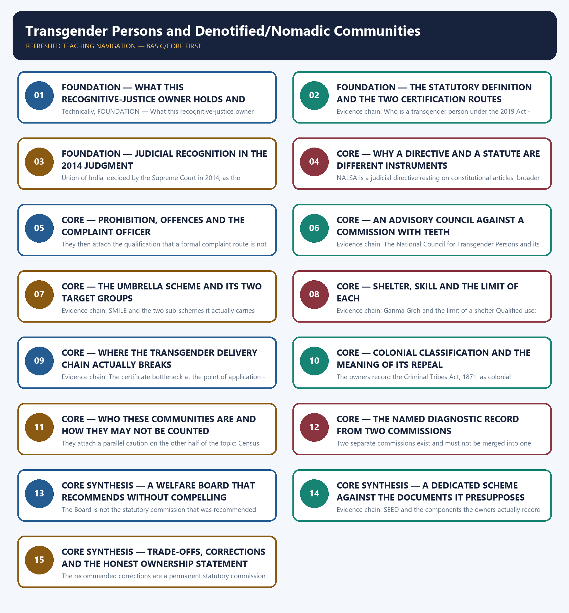

# Transgender Persons and Denotified/Nomadic Communities — Learner-v2 Complete Learning Session

> **Authoring-only generation:** 2026-09-02. No PDF was rendered and no tracker or index was mutated.

### SOURCE, PROGRESSION AND CURRENT-LINKAGE AUDIT

- **Generation date:** 2026-09-02.
- **Repository-first evidence:** the Basic owner is taught first and preserved in full; the Advanced owner is retained only in the optional final teaching block.
- **OCR evidence:** Repository Markdown was primary. The OCR-searchable official General Studies question papers held under books\mains and books\more_previous_papers were read only to confirm the printed wording of routed Mains demands. No official answer key, marking scheme, page precision or unsupported quotation was imported from them.
- **Qdrant:** not used; repository Markdown and available OCR context were sufficient.
- **PYQ integrity:** This owner's previous-year record is a transparent zero, and it is stated precisely rather than softened. The audited 2018-2023 Mains routing ledger and the audited 2024-2025 Mains routing ledger route no General Studies question to this owner, and the audited 2018-2023, 2024-2025 and 2026 Prelims routing ledgers route no objective question to it. Both the Basic and the Advanced owner state independently that no direct General Studies Paper II Mains question in the audited 2024-2025 papers names transgender persons or denotified, nomadic and semi-nomadic communities, and both describe the questions they carry as probable or anticipated framing; those anticipated questions are therefore not reproduced anywhere in this package as previous-year questions, and no year, paper, question number, directive, mark value or word limit is asserted for them. The 2021 General Studies Paper I demand on the gig economy and the empowerment of women, the 2024 General Studies Paper I demand on migration to large cities and the General Studies Paper IV case studies involving migrant workers are routed by the audited ledgers to other owners, so none of them is claimed here either. In place of a solved demand card, the package supplies six original Mains questions with model solutions and eighty original objective questions on a strict A → B → C → D rotation, each model solution opening with its analytical claim so that the evidence which follows does argumentative rather than decorative work. The locally held OCR-searchable official General Studies papers were read only to confirm that no routed demand for this owner exists in them; no question was invented from them, no marking scheme or page precision was imported and no official answer key is claimed for any question anywhere in this package.
- **Live-link boundary:** No live official page was verified for this topic on 2026-09-02. Three official checks were attempted on that date against departmental scheme identifiers on the Department of Social Justice and Empowerment site and a transgender-portal address; the scheme identifiers returned not-found pages and the portal address failed at the transport level, so nothing was read or used from any of them, and no secondary summary, coaching site or news report has been treated as an official source. The package therefore relies entirely on the dated official anchors already carried by the repository owners, each cited with its issuing instrument or status date: the Transgender Persons (Protection of Rights) Act, 2019 with Rules notified in 2020, carrying the inclusive statutory definition, the District Magistrate certificate on self-perceived transgender identity, the separate Section 7 revised certificate after medical intervention, the prohibition of discrimination in education, employment, healthcare, access to goods, facilities and public services and residence with family, the offences created for sexual abuse, denial of access to a public place and eviction, the establishment complaint officer and the National Council for Transgender Persons chaired by the Union Minister for Social Justice and Empowerment as an advisory body without quasi-judicial powers; NALSA v. Union of India decided by the Supreme Court in 2014 recognising the right to a self-identified gender under Articles 14, 15 and 21 and directing that transgender persons be treated as socially and educationally backward with backward-class benefits considered, together with the owners' record that the 2019 Act did not fully adopt that direction and that no uniform national horizontal-reservation rule may be asserted; the SMILE umbrella of the Ministry of Social Justice and Empowerment with its transgender-welfare sub-scheme covering Garima Greh shelters, skill development and health and counselling support and its distinct begging-rehabilitation sub-scheme; the Criminal Tribes Act, 1871 with registration, surveillance and restriction of movement, repealed in 1952 without rehabilitation and without removal of social stigma; the Renke Commission of 2008 and the Idate Commission of 2015, the latter chaired by Bhiku Ramji Idate, recommending a permanent statutory commission, a comprehensive central list and targeted welfare schemes; the Development and Welfare Board for De-notified, Nomadic and Semi-Nomadic Communities constituted on 21 February 2019 as a welfare Board that undertakes surveys, coordinates implementation and advises on policy while being unable to compel State action; and the Scheme for Economic Empowerment of Denotified, Nomadic and Semi-Nomadic Communities launched on 16 February 2022 with free coaching, health-insurance facilitation, community livelihood initiatives and housing or land support, recorded as nascent in coverage and as no substitute for documents or State-list recognition. The single quantitative anchor used anywhere in this package is the Census 2011 figure of 4,87,803 persons in the residual other sex category, which is used only as the owners record it, as an incomplete and not identity-perfect proxy rather than as a transgender population. No population estimate for denotified, nomadic or semi-nomadic communities is asserted, no count of listed communities is asserted, no certificate, shelter, beneficiary, coaching, insurance, housing, sanction, budget or expenditure figure is asserted, no classification of any named community as denotified, nomadic or semi-nomadic is asserted, no survey count is asserted, no legal or constitutional provision is invented or upgraded in status, no advisory body is described as a statutory commission, no recommended reform is described as enacted, no judicial holding is extended beyond what the owners record, and no previous-year question, official answer key, option or date is asserted or inferred for this owner.
- **Fact/inference discipline:** no current-affairs item, PYQ wording, figure or quotation is invented.

## BASIC LEARNING SESSION

### DEEP-REVIEW LEARNING CONTRACT

| Control | Binding rule for this package |
|---|---|
| Syllabus boundary | Complete Social Justice Basic/Core is answer-complete before optional Advanced depth. |
| Legal-status boundary | Constitutional value/right, statute, rule, judgment, executive policy, scheme, eligibility rule, implementation and outcome remain distinct. |
| Rights-holder map | Rights-holder → entitlement/need → competent institution/duty-bearer → accountability forum → grievance/appeal/remedy. |
| Delivery chain | Identification → eligibility → documentation → enrolment → finance → frontline access → service/benefit → portability → outcome → audit and correction. |
| Inclusion method | Intersectional caste, tribe, gender, age, disability, religion, occupation, migration and regional variation is retained without homogenising groups. |
| Evidence method | Claim → named India-centric law/institution/scheme/case/dataset → analysis → source, reference period, release date, denominator, status and causal qualification. |
| Dignity and safeguards | Accessibility, privacy, participation, social audit, portability, offline access, due process and protection from stigma or coercion are tested. |
| Practice contract | Every model has demand decoding, detailed examiner-grade answer, executable timed/compression plan, marks rationale and answer-specific improvement. |
| Approval | This immutable successor remains `approved: false` pending explicit approval. |

**Canonical Basic/Core owner:** `upsc-ai-kit\knowledge\Social-Justice\basic\13_Transgender-Persons-and-Denotified-Nomadic-Marginalised-Communities.md`  
**Substantive canonical provenance owner:** `upsc-ai-kit\knowledge\Social-Justice\13_Transgender-Persons-and-Denotified-Nomadic-Marginalised-Communities_Learner-V2-Complete-Topic-Package.md`  
**Optional Advanced owner:** `upsc-ai-kit\knowledge\Social-Justice\advanced\13_Transgender-Persons-and-Denotified-Nomadic-Marginalised-Communities.md`  
**Official syllabus mapping:** `upsc-ai-kit\knowledge\Social-Justice\OFFICIAL-UPSC-SYLLABUS-MAPPING.md`

### EVIDENCE, PYQ AND CURRENT-STATUS CONTROL

- **Prohibition/outcome discipline:** a legal prohibition, reported case, registration, conviction, rehabilitation measure and lived eradication are different claims.
- **Eligibility discipline:** universal, categorical, means-tested, self-declared, notified-list and residence-linked routes require exact scope; coverage never proves adequacy or access.
- **Reservation discipline:** constitutional basis, beneficiary category, competent list, ceiling, creamy-layer rule, EWS route, horizontal/vertical operation and judicial status are qualified separately.
- **Fiscal discipline:** allocation, release, expenditure, unit cost, beneficiary transfer and outcome are not interchangeable.
- **Data discipline:** retain numerator, denominator, unit, geography, reference period, release date, provisional/final status and survey-versus-administrative character.
- **Causal discipline:** headline change, before-after sequence or cross-state correlation does not establish scheme impact without mechanism and counterfactual limits.
- **PYQ discipline:** exact wording is preserved only when verified; routed or reconstructed demands remain labelled and no model is presented as an official UPSC answer.
- **Current-status note, rechecked 2026-09-03:** volatile law, scheme, judgment, list, budget and dataset claims retain issuing authority, date and operative/interim/final status.

**Generation-local live/current sources:**
- No volatile live claim is necessary for the static Social Justice core.




*Distinct embedded teaching-navigation image. The separate continuous Cārvāka-style flowchart package remains an independent at-a-glance artifact.*

### SESSION 1 — FOUNDATION — WHAT THIS RECOGNITIVE-JUSTICE OWNER HOLDS AND WHAT IT DOES NOT CLAIM

#### DEFINITION / WHAT THIS IS CALLED

**Plain-language definition:** Evidence chain: What this owner holds and how its previous-year record is stated Qualified use: Open by naming which half of the owner the question engages before any provision is cited.

**Technical definition:** Technically, FOUNDATION — What this recognitive-justice owner holds and what it does not claim is analysed by relating FOUNDATION to What this recognitive-justice owner holds, then testing the relationship through what it does not claim and Evidence chain.

#### ANSWER-GRABBING OPENING — WRITE/ADAPT IN THE EXAM

> Prelims: Retain the exact statute, section, article, ministry, official category, survey round or dated edition attached to What this recognitive-justice owner holds and what it does not claim, and never upgrade a policy document into a statute or a targeted scheme into a universal entitlement.

#### MUST-WRITE KEYWORDS

- **FOUNDATION**
- **What this recognitive-justice owner holds**
- **what it does not claim**
- **Evidence chain**
- **Qualified use**
- **This**

**How to use them:** Frame the answer through FOUNDATION; define What this recognitive-justice owner holds, connect what it does not claim with Evidence chain to explain the mechanism, and use Qualified use for the decisive comparison or qualification.

#### VISUAL FIRST

```text
WHAT THIS RECOGNITIVE-JUSTICE OWNER HOLDS AND WHAT IT DOES NOT CLAIM
01. What this owner holds and how its previous-year record is stated
BOUNDARY -> The two populations share a failure mode but must not be homogenised into one community.
```

*This topic-specific rail fixes the evidence sequence and its exam boundary before analysis.*

#### CORE EXPLANATION

This owner holds two distinct populations that the repository joins by one analytical thread rather than by one identity: transgender persons, whose claim is recognition of a self-perceived gender, and Denotified, Nomadic and Semi-Nomadic communities, whose claim is release from a colonial criminal label and entry into the documentation on which welfare depends; the owners state the shared structure as recognise identity, then prohibit discrimination, then deliver welfare, and they warn against homogenising the two groups because a transgender person can be socially visible while legally marginalised whereas a nomadic family can be administratively invisible because classifications, documents and State lists are fragmented. The audited routing ledgers route no General Studies Mains demand and no objective demand to this owner, so the package solves none and says so plainly instead of inventing one.

#### NAMED EVIDENCE AND MECHANISM

- This owner holds two distinct populations that the repository joins by one analytical thread rather than by one identity: transgender persons, whose claim is recognition of a self-perceived gender, and Denotified, Nomadic and Semi-Nomadic communities, whose claim is release from a colonial criminal label and entry into the documentation on which welfare depends; the owners state the shared structure as recognise identity, then prohibit discrimination, then deliver welfare, and they warn against homogenising the two groups because a transgender person can be socially visible while legally marginalised whereas a nomadic family can be administratively invisible because classifications, documents and State lists are fragmented. The audited routing ledgers route no General Studies Mains demand and no objective demand to this owner, so the package solves none and says so plainly instead of inventing one.

#### EXAMINER CAUTION

- The two populations share a failure mode but must not be homogenised into one community.

#### EXAM LINK

- **Prelims:** Retain the exact statute, section, article, ministry, official category, survey round or dated edition attached to What this recognitive-justice owner holds and what it does not claim, and never upgrade a policy document into a statute or a targeted scheme into a universal entitlement.
- **Mains:** Open by naming which half of the owner the question engages before any provision is cited.

#### MINI RECAP

- **Evidence chain:** What this owner holds and how its previous-year record is stated
- **Qualified use:** Open by naming which half of the owner the question engages before any provision is cited.

#### CLOSING RECALL FLOW — FOUNDATION — WHAT THIS RECOGNITIVE-JUSTICE OWNER HOLDS AND WHAT IT DOES NOT CLAIM

```text
START / CONCEPT: FOUNDATION — What this recognitive-justice owner holds and what it does not claim
        |
        v
EXACT TERMS: FOUNDATION · What this recognitive-justice owner holds · what it does not claim · Evidence chain · Qualified use · This
        |
        v
MECHANISM / ARGUMENT: Evidence chain: What this owner holds and how its previous-year record is stated Qualified use: Open by naming which half of the owner the question engages before any provision is cited.
        |
        v
CONSEQUENCE / CONTRAST: This owner holds two distinct populations that the repository joins by one analytical thread rather than by one identity: transgender persons, whose claim is recognition of a self-perceived gender, and Denotified, Nomadic and Semi-Nomadic communities, whose claim is release from a colonial criminal label and entry into the documentation on which welfare depends; the owners state the shared structure as recognise identity, then prohibit discrimination, then deliver welfare, and they warn against homogenising the two groups because a transgender person can be socially visible while legally marginalised whereas a nomadic family can be administratively invisible because classifications, documents and State lists are fragmented.
        |
        v
UPSC TRAP / ANSWER-USE: The two populations share a failure mode but must not be homogenised into one community.
        |
        v
ANSWER-GRABBING FORMULATION: Prelims: Retain the exact statute, section, article, ministry, official category, survey round or dated edition attached to What this recognitive-justice owner holds and what it does not claim, and never upgrade a policy document into a statute or a targeted scheme into a universal entitlement.
```
### SESSION 2 — FOUNDATION — THE STATUTORY DEFINITION AND THE TWO CERTIFICATION ROUTES

#### DEFINITION / WHAT THIS IS CALLED

**Plain-language definition:** Section 7 separately permits a revised male or female certificate after medical intervention, which is an additional route and not a precondition for basic recognition.

**Technical definition:** Evidence chain: Who is a transgender person under the 2019 Act - The certificate of identity and its two distinct routes Qualified use: Anchor a transgender answer in the exact definition and the correct certificate route before arguing about adequacy.

#### ANSWER-GRABBING OPENING — WRITE/ADAPT IN THE EXAM

> Section 7 separately permits a revised male or female certificate after medical intervention, which is an additional route and not a precondition for basic recognition.

#### MUST-WRITE KEYWORDS

- **FOUNDATION**
- **The statutory definition**
- **the two certification routes**
- **Evidence chain**
- **Qualified use**
- **The Transgender Persons**

**How to use them:** Frame the answer through FOUNDATION; define The statutory definition, connect the two certification routes with Evidence chain to explain the mechanism, and use Qualified use for the decisive comparison or qualification.

#### VISUAL FIRST

```text
THE STATUTORY DEFINITION AND THE TWO CERTIFICATION ROUTES
01. Who is a transgender person under the 2019 Act
    |
    v
02. The certificate of identity and its two distinct routes
BOUNDARY -> The basic certificate rests on self-perceived identity, while Section 7 is a separate post-intervention route.
```

*This topic-specific rail fixes the evidence sequence and its exam boundary before analysis.*

#### CORE EXPLANATION

The Transgender Persons (Protection of Rights) Act, 2019, with Rules notified in 2020, defines a transgender person as a person whose gender does not match the gender assigned at birth, and the owners record that the definition expressly includes trans-men, trans-women, persons with intersex variations, genderqueer persons and persons with socio-cultural identities such as kinnar, hijra, aravani and jogta; the examinable point is that the statute uses an inclusive enumeration rather than a single medicalised test, so an answer that reduces the category to one community or to a surgical status has narrowed the definition Parliament actually enacted. The owners keep two certification routes apart. A District Magistrate issues the basic certificate recognising a person's self-perceived transgender identity, and no medical or surgical requirement applies to it. Section 7 separately permits a revised male or female certificate after medical intervention, which is an additional route and not a precondition for basic recognition. The distinction is the single most tested detail in this half of the topic, because an answer that says the Act requires surgery for recognition inverts the statutory scheme, and an answer that ignores Section 7 loses the reason critics describe the design as certificate-based rather than self-declaratory.

#### NAMED EVIDENCE AND MECHANISM

- The Transgender Persons (Protection of Rights) Act, 2019, with Rules notified in 2020, defines a transgender person as a person whose gender does not match the gender assigned at birth, and the owners record that the definition expressly includes trans-men, trans-women, persons with intersex variations, genderqueer persons and persons with socio-cultural identities such as kinnar, hijra, aravani and jogta; the examinable point is that the statute uses an inclusive enumeration rather than a single medicalised test, so an answer that reduces the category to one community or to a surgical status has narrowed the definition Parliament actually enacted.
- The owners keep two certification routes apart. A District Magistrate issues the basic certificate recognising a person's self-perceived transgender identity, and no medical or surgical requirement applies to it. Section 7 separately permits a revised male or female certificate after medical intervention, which is an additional route and not a precondition for basic recognition. The distinction is the single most tested detail in this half of the topic, because an answer that says the Act requires surgery for recognition inverts the statutory scheme, and an answer that ignores Section 7 loses the reason critics describe the design as certificate-based rather than self-declaratory.

#### EXAMINER CAUTION

- The basic certificate rests on self-perceived identity, while Section 7 is a separate post-intervention route.

#### EXAM LINK

- **Prelims:** Retain the exact statute, section, article, ministry, official category, survey round or dated edition attached to The statutory definition and the two certification routes, and never upgrade a policy document into a statute or a targeted scheme into a universal entitlement.
- **Mains:** Anchor a transgender answer in the exact definition and the correct certificate route before arguing about adequacy.

#### MINI RECAP

- **Evidence chain:** Who is a transgender person under the 2019 Act -> The certificate of identity and its two distinct routes
- **Qualified use:** Anchor a transgender answer in the exact definition and the correct certificate route before arguing about adequacy.

#### CLOSING RECALL FLOW — FOUNDATION — THE STATUTORY DEFINITION AND THE TWO CERTIFICATION ROUTES

```text
START / CONCEPT: FOUNDATION — The statutory definition and the two certification routes
        |
        v
EXACT TERMS: FOUNDATION · The statutory definition · the two certification routes · Evidence chain · Qualified use · The Transgender Persons
        |
        v
MECHANISM / ARGUMENT: The distinction is the single most tested detail in this half of the topic, because an answer that says the Act requires surgery for recognition inverts the statutory scheme, and an answer that ignores Section 7 loses the reason critics describe the design as certificate-based rather than self-declaratory.
        |
        v
CONSEQUENCE / CONTRAST: The basic certificate rests on self-perceived identity, while Section 7 is a separate post-intervention route.
        |
        v
UPSC TRAP / ANSWER-USE: The Transgender Persons (Protection of Rights) Act, 2019, with Rules notified in 2020, defines a transgender person as a person whose gender does not match the gender assigned at birth, and the owners record that the definition expressly includes trans-men, trans-women, persons with intersex variations, genderqueer persons and persons with socio-cultural identities such as kinnar, hijra, aravani and jogta; the examinable point is that the statute uses an inclusive enumeration rather than a single medicalised test, so an answer that reduces the category to one community or to a surgical status has narrowed the definition Parliament actually enacted.
        |
        v
ANSWER-GRABBING FORMULATION: Section 7 separately permits a revised male or female certificate after medical intervention, which is an additional route and not a precondition for basic recognition.
```
### SESSION 3 — FOUNDATION — JUDICIAL RECOGNITION IN THE 2014 JUDGMENT

#### DEFINITION / WHAT THIS IS CALLED

**Plain-language definition:** Union of India and what the Court directed Qualified use: Cite a constitutional recognition for the principle it settled rather than for provisions it never contained.

**Technical definition:** Union of India, decided by the Supreme Court in 2014, as the judgment recognising transgender persons' right to a self-identified gender under Articles 14, 15 and 21, directing welfare measures and directing that the government treat transgender persons as socially and educationally backward and consider extending backward-class benefits; the owners also record, as an advanced point, that the 2019 Act did not fully adopt that direction, and they instruct that no uniform national horizontal-reservation rule be invented, because the status of such claims remains a State and litigation question rather than a settled statutory entitlement.

#### ANSWER-GRABBING OPENING — WRITE/ADAPT IN THE EXAM

> Union of India, decided by the Supreme Court in 2014, as the judgment recognising transgender persons' right to a self-identified gender under Articles 14, 15 and 21, directing welfare measures and directing that the government treat transgender persons as socially and educationally backward and consider extending backward-class benefits; the owners also record, as an advanced point, that the 2019 Act did not fully adopt that direction, and they instruct that no uniform national horizontal-reservation rule be invented, because the status of such claims remains a State and litigation question rather than a settled statutory entitlement.

#### MUST-WRITE KEYWORDS

- **FOUNDATION**
- **Judicial recognition in the 2014 judgment**
- **Evidence chain**
- **Qualified use**
- **Union**
- **India**

**How to use them:** Frame the answer through FOUNDATION; define Judicial recognition in the 2014 judgment, connect Evidence chain with Qualified use to explain the mechanism, and use Union for the decisive comparison or qualification.

#### VISUAL FIRST

```text
JUDICIAL RECOGNITION IN THE 2014 JUDGMENT
01. NALSA v. Union of India and what the Court directed
BOUNDARY -> The backward-class direction was a judicial instruction and not an enacted entitlement.
```

*This topic-specific rail fixes the evidence sequence and its exam boundary before analysis.*

#### CORE EXPLANATION

The owners record NALSA v. Union of India, decided by the Supreme Court in 2014, as the judgment recognising transgender persons' right to a self-identified gender under Articles 14, 15 and 21, directing welfare measures and directing that the government treat transgender persons as socially and educationally backward and consider extending backward-class benefits; the owners also record, as an advanced point, that the 2019 Act did not fully adopt that direction, and they instruct that no uniform national horizontal-reservation rule be invented, because the status of such claims remains a State and litigation question rather than a settled statutory entitlement.

#### NAMED EVIDENCE AND MECHANISM

- The owners record NALSA v. Union of India, decided by the Supreme Court in 2014, as the judgment recognising transgender persons' right to a self-identified gender under Articles 14, 15 and 21, directing welfare measures and directing that the government treat transgender persons as socially and educationally backward and consider extending backward-class benefits; the owners also record, as an advanced point, that the 2019 Act did not fully adopt that direction, and they instruct that no uniform national horizontal-reservation rule be invented, because the status of such claims remains a State and litigation question rather than a settled statutory entitlement.

#### EXAMINER CAUTION

- The backward-class direction was a judicial instruction and not an enacted entitlement.

#### EXAM LINK

- **Prelims:** Retain the exact statute, section, article, ministry, official category, survey round or dated edition attached to Judicial recognition in the 2014 judgment, and never upgrade a policy document into a statute or a targeted scheme into a universal entitlement.
- **Mains:** Cite a constitutional recognition for the principle it settled rather than for provisions it never contained.

#### MINI RECAP

- **Evidence chain:** NALSA v. Union of India and what the Court directed
- **Qualified use:** Cite a constitutional recognition for the principle it settled rather than for provisions it never contained.

#### CLOSING RECALL FLOW — FOUNDATION — JUDICIAL RECOGNITION IN THE 2014 JUDGMENT

```text
START / CONCEPT: FOUNDATION — Judicial recognition in the 2014 judgment
        |
        v
EXACT TERMS: FOUNDATION · Judicial recognition in the 2014 judgment · Evidence chain · Qualified use · Union · India
        |
        v
MECHANISM / ARGUMENT: Union of India and what the Court directed Qualified use: Cite a constitutional recognition for the principle it settled rather than for provisions it never contained.
        |
        v
CONSEQUENCE / CONTRAST: The backward-class direction was a judicial instruction and not an enacted entitlement.
        |
        v
UPSC TRAP / ANSWER-USE: Do not miss this limiting distinction: union of India, decided by the Supreme Court in 2014, as the judgment recognising...
        |
        v
ANSWER-GRABBING FORMULATION: Union of India, decided by the Supreme Court in 2014, as the judgment recognising transgender persons' right to a self-identified gender under Articles 14, 15 and 21, directing welfare measures and directing that the government treat transgender persons as socially and educationally backward and consider extending backward-class benefits; the owners also record, as an advanced point, that the 2019 Act did not fully adopt that direction, and they instruct that no uniform national horizontal-reservation rule be invented, because the status of such claims remains a State and litigation question rather than a settled statutory entitlement.
```
### SESSION 4 — CORE — WHY A DIRECTIVE AND A STATUTE ARE DIFFERENT INSTRUMENTS

#### DEFINITION / WHAT THIS IS CALLED

**Plain-language definition:** Prelims: Retain the exact statute, section, article, ministry, official category, survey round or dated edition attached to Why a directive and a statute are different instruments, and never upgrade a policy document into a statute or a targeted scheme into a universal entitlement.

**Technical definition:** NALSA is a judicial directive resting on constitutional articles, broader in principle and including the backward-class consideration; the 2019 Act is Parliament's statutory response, narrower and more procedural, supplying a certificate mechanism, specific prohibitions and named institutions.

#### ANSWER-GRABBING OPENING — WRITE/ADAPT IN THE EXAM

> Prelims: Retain the exact statute, section, article, ministry, official category, survey round or dated edition attached to Why a directive and a statute are different instruments, and never upgrade a policy document into a statute or a targeted scheme into a universal entitlement.

#### MUST-WRITE KEYWORDS

- **Why a directive**
- **a statute are different instruments**
- **Evidence chain**
- **Qualified use**
- **NALSA**
- **Act**

**How to use them:** Frame the answer through Why a directive; define a statute are different instruments, connect Evidence chain with Qualified use to explain the mechanism, and use NALSA for the decisive comparison or qualification.

#### VISUAL FIRST

```text
WHY A DIRECTIVE AND A STATUTE ARE DIFFERENT INSTRUMENTS
01. How a judgment differs from the statute that followed
BOUNDARY -> Legal authority, scope and enforceability differ, so the two cannot be quoted interchangeably.
```

*This topic-specific rail fixes the evidence sequence and its exam boundary before analysis.*

#### CORE EXPLANATION

The owners insist on separating legal authorities that answers routinely blur. NALSA is a judicial directive resting on constitutional articles, broader in principle and including the backward-class consideration; the 2019 Act is Parliament's statutory response, narrower and more procedural, supplying a certificate mechanism, specific prohibitions and named institutions. They differ in legal authority, in scope and in the way each is enforced, so an answer that treats a court direction and an enacted section as interchangeable has confused the source of the obligation it is asserting.

#### NAMED EVIDENCE AND MECHANISM

- The owners insist on separating legal authorities that answers routinely blur. NALSA is a judicial directive resting on constitutional articles, broader in principle and including the backward-class consideration; the 2019 Act is Parliament's statutory response, narrower and more procedural, supplying a certificate mechanism, specific prohibitions and named institutions. They differ in legal authority, in scope and in the way each is enforced, so an answer that treats a court direction and an enacted section as interchangeable has confused the source of the obligation it is asserting.

#### EXAMINER CAUTION

- Legal authority, scope and enforceability differ, so the two cannot be quoted interchangeably.

#### EXAM LINK

- **Prelims:** Retain the exact statute, section, article, ministry, official category, survey round or dated edition attached to Why a directive and a statute are different instruments, and never upgrade a policy document into a statute or a targeted scheme into a universal entitlement.
- **Mains:** Label the legal source of every obligation asserted in a rights answer.

#### MINI RECAP

- **Evidence chain:** How a judgment differs from the statute that followed
- **Qualified use:** Label the legal source of every obligation asserted in a rights answer.

#### CLOSING RECALL FLOW — CORE — WHY A DIRECTIVE AND A STATUTE ARE DIFFERENT INSTRUMENTS

```text
START / CONCEPT: CORE — Why a directive and a statute are different instruments
        |
        v
EXACT TERMS: Why a directive · a statute are different instruments · Evidence chain · Qualified use · NALSA · Act
        |
        v
MECHANISM / ARGUMENT: NALSA is a judicial directive resting on constitutional articles, broader in principle and including the backward-class consideration; the 2019 Act is Parliament's statutory response, narrower and more procedural, supplying a certificate mechanism, specific prohibitions and named institutions.
        |
        v
CONSEQUENCE / CONTRAST: Evidence chain: How a judgment differs from the statute that followed Qualified use: Label the legal source of every obligation asserted in a rights answer.
        |
        v
UPSC TRAP / ANSWER-USE: Do not miss this limiting distinction: they differ in legal authority, in scope and in the way each is enforced...
        |
        v
ANSWER-GRABBING FORMULATION: Prelims: Retain the exact statute, section, article, ministry, official category, survey round or dated edition attached to Why a directive and a statute are different instruments, and never upgrade a policy document into a statute or a targeted scheme into a universal entitlement.
```
### SESSION 5 — CORE — PROHIBITION, OFFENCES AND THE COMPLAINT OFFICER

#### DEFINITION / WHAT THIS IS CALLED

**Plain-language definition:** Mains: Present a prohibition together with the forum that is supposed to enforce it.

**Technical definition:** They then attach the qualification that a formal complaint route is not the same as accessible enforcement, because awareness, independence and effective remedy remain weak, which is why Section 3 is a starting point for an answer rather than its conclusion.

#### ANSWER-GRABBING OPENING — WRITE/ADAPT IN THE EXAM

> Evidence chain: The anti-discrimination provision and the machinery behind it Qualified use: Present a prohibition together with the forum that is supposed to enforce it.

#### MUST-WRITE KEYWORDS

- **Prohibition**
- **offences**
- **the complaint officer**
- **Evidence chain**
- **Qualified use**
- **Act**

**How to use them:** Frame the answer through Prohibition; define offences, connect the complaint officer with Evidence chain to explain the mechanism, and use Qualified use for the decisive comparison or qualification.

#### VISUAL FIRST

```text
PROHIBITION, OFFENCES AND THE COMPLAINT OFFICER
01. The anti-discrimination provision and the machinery behind it
BOUNDARY -> A formal complaint route is not the same thing as accessible enforcement.
```

*This topic-specific rail fixes the evidence sequence and its exam boundary before analysis.*

#### CORE EXPLANATION

The owners record that the 2019 Act prohibits discrimination against a transgender person in education, employment, healthcare, access to goods, facilities and public services, and the right to reside with family, and that it creates offences for specific harms including sexual abuse, denial of access to a public place and eviction; they record that an establishment must designate a complaint officer to deal with complaints. They then attach the qualification that a formal complaint route is not the same as accessible enforcement, because awareness, independence and effective remedy remain weak, which is why Section 3 is a starting point for an answer rather than its conclusion.

#### NAMED EVIDENCE AND MECHANISM

- The owners record that the 2019 Act prohibits discrimination against a transgender person in education, employment, healthcare, access to goods, facilities and public services, and the right to reside with family, and that it creates offences for specific harms including sexual abuse, denial of access to a public place and eviction; they record that an establishment must designate a complaint officer to deal with complaints. They then attach the qualification that a formal complaint route is not the same as accessible enforcement, because awareness, independence and effective remedy remain weak, which is why Section 3 is a starting point for an answer rather than its conclusion.

#### EXAMINER CAUTION

- A formal complaint route is not the same thing as accessible enforcement.

#### EXAM LINK

- **Prelims:** Retain the exact statute, section, article, ministry, official category, survey round or dated edition attached to Prohibition, offences and the complaint officer, and never upgrade a policy document into a statute or a targeted scheme into a universal entitlement.
- **Mains:** Present a prohibition together with the forum that is supposed to enforce it.

#### MINI RECAP

- **Evidence chain:** The anti-discrimination provision and the machinery behind it
- **Qualified use:** Present a prohibition together with the forum that is supposed to enforce it.

#### CLOSING RECALL FLOW — CORE — PROHIBITION, OFFENCES AND THE COMPLAINT OFFICER

```text
START / CONCEPT: CORE — Prohibition, offences and the complaint officer
        |
        v
EXACT TERMS: Prohibition · offences · the complaint officer · Evidence chain · Qualified use · Act
        |
        v
MECHANISM / ARGUMENT: The owners record that the 2019 Act prohibits discrimination against a transgender person in education, employment, healthcare, access to goods, facilities and public services, and the right to reside with family, and that it creates offences for specific harms including sexual abuse, denial of access to a public place and eviction; they record that an establishment must designate a complaint officer to deal with complaints.
        |
        v
CONSEQUENCE / CONTRAST: A formal complaint route is not the same thing as accessible enforcement.
        |
        v
UPSC TRAP / ANSWER-USE: They then attach the qualification that a formal complaint route is not the same as accessible enforcement, because awareness, independence and effective remedy remain weak, which is why Section 3 is a starting point for an answer rather than its conclusion.
        |
        v
ANSWER-GRABBING FORMULATION: Evidence chain: The anti-discrimination provision and the machinery behind it Qualified use: Present a prohibition together with the forum that is supposed to enforce it.
```
### SESSION 6 — CORE — AN ADVISORY COUNCIL AGAINST A COMMISSION WITH TEETH

#### DEFINITION / WHAT THIS IS CALLED

**Plain-language definition:** The examinable contrast is with a commission that can receive complaints, hold inquiries and issue binding directions, and the owners use that contrast to explain why declaration-stage recognition can coexist with delivery-stage failure.

**Technical definition:** Evidence chain: The National Council for Transgender Persons and its powers Qualified use: Distinguish an advisory body from a complaint-receiving commission before evaluating institutional strength.

#### ANSWER-GRABBING OPENING — WRITE/ADAPT IN THE EXAM

> Evidence chain: The National Council for Transgender Persons and its powers Qualified use: Distinguish an advisory body from a complaint-receiving commission before evaluating institutional strength.

#### MUST-WRITE KEYWORDS

- **An advisory council against a commission with teeth**
- **Evidence chain**
- **Qualified use**
- **National Council**
- **Transgender Persons**
- **Act**

**How to use them:** Frame the answer through An advisory council against a commission with teeth; define Evidence chain, connect Qualified use with National Council to explain the mechanism, and use Transgender Persons for the decisive comparison or qualification.

#### VISUAL FIRST

```text
AN ADVISORY COUNCIL AGAINST A COMMISSION WITH TEETH
01. The National Council for Transgender Persons and its powers
BOUNDARY -> The Council advises and lacks quasi-judicial or enforcement powers.
```

*This topic-specific rail fixes the evidence sequence and its exam boundary before analysis.*

#### CORE EXPLANATION

The owners record the National Council for Transgender Persons as the body created under the 2019 Act, chaired by the Union Minister for Social Justice and Empowerment and including transgender community representatives, State nominees and ministry officials; they record its function as advisory and record expressly that it lacks quasi-judicial or enforcement powers. The examinable contrast is with a commission that can receive complaints, hold inquiries and issue binding directions, and the owners use that contrast to explain why declaration-stage recognition can coexist with delivery-stage failure.

#### NAMED EVIDENCE AND MECHANISM

- The owners record the National Council for Transgender Persons as the body created under the 2019 Act, chaired by the Union Minister for Social Justice and Empowerment and including transgender community representatives, State nominees and ministry officials; they record its function as advisory and record expressly that it lacks quasi-judicial or enforcement powers. The examinable contrast is with a commission that can receive complaints, hold inquiries and issue binding directions, and the owners use that contrast to explain why declaration-stage recognition can coexist with delivery-stage failure.

#### EXAMINER CAUTION

- The Council advises and lacks quasi-judicial or enforcement powers.

#### EXAM LINK

- **Prelims:** Retain the exact statute, section, article, ministry, official category, survey round or dated edition attached to An advisory council against a commission with teeth, and never upgrade a policy document into a statute or a targeted scheme into a universal entitlement.
- **Mains:** Distinguish an advisory body from a complaint-receiving commission before evaluating institutional strength.

#### MINI RECAP

- **Evidence chain:** The National Council for Transgender Persons and its powers
- **Qualified use:** Distinguish an advisory body from a complaint-receiving commission before evaluating institutional strength.

#### CLOSING RECALL FLOW — CORE — AN ADVISORY COUNCIL AGAINST A COMMISSION WITH TEETH

```text
START / CONCEPT: CORE — An advisory council against a commission with teeth
        |
        v
EXACT TERMS: An advisory council against a commission with teeth · Evidence chain · Qualified use · National Council · Transgender Persons · Act
        |
        v
MECHANISM / ARGUMENT: The owners record the National Council for Transgender Persons as the body created under the 2019 Act, chaired by the Union Minister for Social Justice and Empowerment and including transgender community representatives, State nominees and ministry officials; they record its function as advisory and record expressly that it lacks quasi-judicial or enforcement powers.
        |
        v
CONSEQUENCE / CONTRAST: The examinable contrast is with a commission that can receive complaints, hold inquiries and issue binding directions, and the owners use that contrast to explain why declaration-stage recognition can coexist with delivery-stage failure.
        |
        v
UPSC TRAP / ANSWER-USE: Do not miss this limiting distinction: the National Council for Transgender Persons and its powers Qualified use.
        |
        v
ANSWER-GRABBING FORMULATION: Evidence chain: The National Council for Transgender Persons and its powers Qualified use: Distinguish an advisory body from a complaint-receiving commission before evaluating institutional strength.
```
### SESSION 7 — CORE — THE UMBRELLA SCHEME AND ITS TWO TARGET GROUPS

#### DEFINITION / WHAT THIS IS CALLED

**Plain-language definition:** The owners flag the reduction of SMILE to transgender welfare alone as a trap, because the umbrella structure and the two target groups are what an objective question is most likely to test.

**Technical definition:** Evidence chain: SMILE and the two sub-schemes it actually carries Qualified use: Map a welfare umbrella component by component before assessing its reach.

#### ANSWER-GRABBING OPENING — WRITE/ADAPT IN THE EXAM

> The owners flag the reduction of SMILE to transgender welfare alone as a trap, because the umbrella structure and the two target groups are what an objective question is most likely to test.

#### MUST-WRITE KEYWORDS

- **The umbrella scheme**
- **its two target groups**
- **Evidence chain**
- **Qualified use**
- **SMILE**
- **Qualified**

**How to use them:** Frame the answer through The umbrella scheme; define its two target groups, connect Evidence chain with Qualified use to explain the mechanism, and use SMILE for the decisive comparison or qualification.

#### VISUAL FIRST

```text
THE UMBRELLA SCHEME AND ITS TWO TARGET GROUPS
01. SMILE and the two sub-schemes it actually carries
BOUNDARY -> Reducing the umbrella to transgender welfare alone misstates the scheme the ministry administers.
```

*This topic-specific rail fixes the evidence sequence and its exam boundary before analysis.*

#### CORE EXPLANATION

The owners record SMILE, administered by the Ministry of Social Justice and Empowerment, as an umbrella with two distinct sub-schemes rather than a single transgender programme: a transgender-welfare sub-scheme covering Garima Greh shelters, skill development and health and counselling support, and a begging-rehabilitation sub-scheme covering a different target group under the same umbrella. The owners flag the reduction of SMILE to transgender welfare alone as a trap, because the umbrella structure and the two target groups are what an objective question is most likely to test.

#### NAMED EVIDENCE AND MECHANISM

- The owners record SMILE, administered by the Ministry of Social Justice and Empowerment, as an umbrella with two distinct sub-schemes rather than a single transgender programme: a transgender-welfare sub-scheme covering Garima Greh shelters, skill development and health and counselling support, and a begging-rehabilitation sub-scheme covering a different target group under the same umbrella. The owners flag the reduction of SMILE to transgender welfare alone as a trap, because the umbrella structure and the two target groups are what an objective question is most likely to test.

#### EXAMINER CAUTION

- Reducing the umbrella to transgender welfare alone misstates the scheme the ministry administers.

#### EXAM LINK

- **Prelims:** Retain the exact statute, section, article, ministry, official category, survey round or dated edition attached to The umbrella scheme and its two target groups, and never upgrade a policy document into a statute or a targeted scheme into a universal entitlement.
- **Mains:** Map a welfare umbrella component by component before assessing its reach.

#### MINI RECAP

- **Evidence chain:** SMILE and the two sub-schemes it actually carries
- **Qualified use:** Map a welfare umbrella component by component before assessing its reach.

#### CLOSING RECALL FLOW — CORE — THE UMBRELLA SCHEME AND ITS TWO TARGET GROUPS

```text
START / CONCEPT: CORE — The umbrella scheme and its two target groups
        |
        v
EXACT TERMS: The umbrella scheme · its two target groups · Evidence chain · Qualified use · SMILE · Qualified
        |
        v
MECHANISM / ARGUMENT: Evidence chain: SMILE and the two sub-schemes it actually carries Qualified use: Map a welfare umbrella component by component before assessing its reach.
        |
        v
CONSEQUENCE / CONTRAST: The resulting consequence is that the owners flag the reduction of SMILE to transgender welfare alone as a trap...
        |
        v
UPSC TRAP / ANSWER-USE: Do not miss this limiting distinction: the owners flag the reduction of SMILE to transgender welfare alone as a trap...
        |
        v
ANSWER-GRABBING FORMULATION: The owners flag the reduction of SMILE to transgender welfare alone as a trap, because the umbrella structure and the two target groups are what an objective question is most likely to test.
```
### SESSION 8 — CORE — SHELTER, SKILL AND THE LIMIT OF EACH

#### DEFINITION / WHAT THIS IS CALLED

**Plain-language definition:** The owners record Garima Greh as the shelter-home component providing accommodation, food, medical care, skill training and recreation, and they immediately state the limit: shelters address immediate housing and safety needs but do not substitute for long-term economic integration, and their number and geographic spread are limited so that transgender persons outside major urban centres may lack access.

**Technical definition:** Evidence chain: Garima Greh and the limit of a shelter Qualified use: Test a welfare output against the deprivation it was designed to remove.

#### ANSWER-GRABBING OPENING — WRITE/ADAPT IN THE EXAM

> The owners record Garima Greh as the shelter-home component providing accommodation, food, medical care, skill training and recreation, and they immediately state the limit: shelters address immediate housing and safety needs but do not substitute for long-term economic integration, and their number and geographic spread are limited so that transgender persons outside major urban centres may lack access.

#### MUST-WRITE KEYWORDS

- **Shelter**
- **skill**
- **the limit of each**
- **Evidence chain**
- **Qualified use**
- **Garima Greh**

**How to use them:** Frame the answer through Shelter; define skill, connect the limit of each with Evidence chain to explain the mechanism, and use Qualified use for the decisive comparison or qualification.

#### VISUAL FIRST

```text
SHELTER, SKILL AND THE LIMIT OF EACH
01. Garima Greh and the limit of a shelter
BOUNDARY -> A shelter count measures safety provision rather than economic integration.
```

*This topic-specific rail fixes the evidence sequence and its exam boundary before analysis.*

#### CORE EXPLANATION

The owners record Garima Greh as the shelter-home component providing accommodation, food, medical care, skill training and recreation, and they immediately state the limit: shelters address immediate housing and safety needs but do not substitute for long-term economic integration, and their number and geographic spread are limited so that transgender persons outside major urban centres may lack access. The livelihood pathway is the skill-development component, and the owners record that its linkage to formal employment remains weak because stigma persists in hiring, so a shelter count is not evidence of integration.

#### NAMED EVIDENCE AND MECHANISM

- The owners record Garima Greh as the shelter-home component providing accommodation, food, medical care, skill training and recreation, and they immediately state the limit: shelters address immediate housing and safety needs but do not substitute for long-term economic integration, and their number and geographic spread are limited so that transgender persons outside major urban centres may lack access. The livelihood pathway is the skill-development component, and the owners record that its linkage to formal employment remains weak because stigma persists in hiring, so a shelter count is not evidence of integration.

#### EXAMINER CAUTION

- A shelter count measures safety provision rather than economic integration.

#### EXAM LINK

- **Prelims:** Retain the exact statute, section, article, ministry, official category, survey round or dated edition attached to Shelter, skill and the limit of each, and never upgrade a policy document into a statute or a targeted scheme into a universal entitlement.
- **Mains:** Test a welfare output against the deprivation it was designed to remove.

#### MINI RECAP

- **Evidence chain:** Garima Greh and the limit of a shelter
- **Qualified use:** Test a welfare output against the deprivation it was designed to remove.

#### CLOSING RECALL FLOW — CORE — SHELTER, SKILL AND THE LIMIT OF EACH

```text
START / CONCEPT: CORE — Shelter, skill and the limit of each
        |
        v
EXACT TERMS: Shelter · skill · the limit of each · Evidence chain · Qualified use · Garima Greh
        |
        v
MECHANISM / ARGUMENT: The livelihood pathway is the skill-development component, and the owners record that its linkage to formal employment remains weak because stigma persists in hiring, so a shelter count is not evidence of integration.
        |
        v
CONSEQUENCE / CONTRAST: Evidence chain: Garima Greh and the limit of a shelter Qualified use: Test a welfare output against the deprivation it was designed to remove.
        |
        v
UPSC TRAP / ANSWER-USE: A shelter count measures safety provision rather than economic integration.
        |
        v
ANSWER-GRABBING FORMULATION: The owners record Garima Greh as the shelter-home component providing accommodation, food, medical care, skill training and recreation, and they immediately state the limit: shelters address immediate housing and safety needs but do not substitute for long-term economic integration, and their number and geographic spread are limited so that transgender persons outside major urban centres may lack access.
```
### SESSION 9 — CORE — WHERE THE TRANSGENDER DELIVERY CHAIN ACTUALLY BREAKS

#### DEFINITION / WHAT THIS IS CALLED

**Plain-language definition:** The owners set out the rest of the transgender failure chain in order: the complaint-officer route exists but awareness, independence and effective remedy are weak; Garima Greh coverage is limited in number and spread; and skill training exists without strong formal-employment linkage.

**Technical definition:** Evidence chain: The certificate bottleneck at the point of application - Where the enforcement gap actually sits Qualified use: Locate an implementation failure at a named administrative point rather than asserting weak implementation.

#### ANSWER-GRABBING OPENING — WRITE/ADAPT IN THE EXAM

> The owners set out the rest of the transgender failure chain in order: the complaint-officer route exists but awareness, independence and effective remedy are weak; Garima Greh coverage is limited in number and spread; and skill training exists without strong formal-employment linkage.

#### MUST-WRITE KEYWORDS

- **Where the transgender delivery chain actually breaks**
- **Evidence chain**
- **Qualified use**
- **District Magistrates**
- **They**
- **Garima Greh**

**How to use them:** Frame the answer through Where the transgender delivery chain actually breaks; define Evidence chain, connect Qualified use with District Magistrates to explain the mechanism, and use They for the decisive comparison or qualification.

#### VISUAL FIRST

```text
WHERE THE TRANSGENDER DELIVERY CHAIN ACTUALLY BREAKS
01. The certificate bottleneck at the point of application
    |
    v
02. Where the enforcement gap actually sits
BOUNDARY -> The failure sits at the discretionary counter and at the missing local forum, not in the definition.
```

*This topic-specific rail fixes the evidence sequence and its exam boundary before analysis.*

#### CORE EXPLANATION

The owners record the first implementation failure at the counter rather than in the text: District Magistrates may lack sensitisation, so the certificate process can produce delays, discretionary rejections or invasive questioning. They describe the consequence precisely, that a statute resting on self-perceived identity is delivered through an official who exercises administrative judgement, which is why critics argue the design bureaucratises identity even though it does not medicalise the basic certificate; the analytical move is to locate the failure at the discretionary gate rather than in the definition. The owners set out the rest of the transgender failure chain in order: the complaint-officer route exists but awareness, independence and effective remedy are weak; Garima Greh coverage is limited in number and spread; and skill training exists without strong formal-employment linkage. They add the illustration of a person who holds a District Magistrate certificate in a smaller town and still faces housing discrimination with no local enforcement agency to approach, which converts an abstract enforcement gap into a locatable administrative absence that an answer can name.

#### NAMED EVIDENCE AND MECHANISM

- The owners record the first implementation failure at the counter rather than in the text: District Magistrates may lack sensitisation, so the certificate process can produce delays, discretionary rejections or invasive questioning. They describe the consequence precisely, that a statute resting on self-perceived identity is delivered through an official who exercises administrative judgement, which is why critics argue the design bureaucratises identity even though it does not medicalise the basic certificate; the analytical move is to locate the failure at the discretionary gate rather than in the definition.
- The owners set out the rest of the transgender failure chain in order: the complaint-officer route exists but awareness, independence and effective remedy are weak; Garima Greh coverage is limited in number and spread; and skill training exists without strong formal-employment linkage. They add the illustration of a person who holds a District Magistrate certificate in a smaller town and still faces housing discrimination with no local enforcement agency to approach, which converts an abstract enforcement gap into a locatable administrative absence that an answer can name.

#### EXAMINER CAUTION

- The failure sits at the discretionary counter and at the missing local forum, not in the definition.

#### EXAM LINK

- **Prelims:** Retain the exact statute, section, article, ministry, official category, survey round or dated edition attached to Where the transgender delivery chain actually breaks, and never upgrade a policy document into a statute or a targeted scheme into a universal entitlement.
- **Mains:** Locate an implementation failure at a named administrative point rather than asserting weak implementation.

#### MINI RECAP

- **Evidence chain:** The certificate bottleneck at the point of application -> Where the enforcement gap actually sits
- **Qualified use:** Locate an implementation failure at a named administrative point rather than asserting weak implementation.

#### CLOSING RECALL FLOW — CORE — WHERE THE TRANSGENDER DELIVERY CHAIN ACTUALLY BREAKS

```text
START / CONCEPT: CORE — Where the transgender delivery chain actually breaks
        |
        v
EXACT TERMS: Where the transgender delivery chain actually breaks · Evidence chain · Qualified use · District Magistrates · They · Garima Greh
        |
        v
MECHANISM / ARGUMENT: Evidence chain: The certificate bottleneck at the point of application - Where the enforcement gap actually sits Qualified use: Locate an implementation failure at a named administrative point rather than asserting weak implementation.
        |
        v
CONSEQUENCE / CONTRAST: They describe the consequence precisely, that a statute resting on self-perceived identity is delivered through an official who exercises administrative judgement, which is why critics argue the design bureaucratises identity even though it does not medicalise the basic certificate; the analytical move is to locate the failure at the discretionary gate rather than in the definition.
        |
        v
UPSC TRAP / ANSWER-USE: The owners record the first implementation failure at the counter rather than in the text: District Magistrates may lack sensitisation, so the certificate process can produce delays, discretionary rejections or invasive questioning.
        |
        v
ANSWER-GRABBING FORMULATION: The owners set out the rest of the transgender failure chain in order: the complaint-officer route exists but awareness, independence and effective remedy are weak; Garima Greh coverage is limited in number and spread; and skill training exists without strong formal-employment linkage.
```
### SESSION 10 — CORE — COLONIAL CLASSIFICATION AND THE MEANING OF ITS REPEAL

#### DEFINITION / WHAT THIS IS CALLED

**Plain-language definition:** Repeal of a label is not exoneration and did not carry rehabilitation.

**Technical definition:** The owners record the Criminal Tribes Act, 1871, as colonial legislation that stigmatised entire communities as born criminals and subjected them to registration, surveillance and restriction of movement; they record that it was repealed in 1952.

#### ANSWER-GRABBING OPENING — WRITE/ADAPT IN THE EXAM

> Repeal of a label is not exoneration and did not carry rehabilitation.

#### MUST-WRITE KEYWORDS

- **Colonial classification**
- **the meaning of its repeal**
- **Evidence chain**
- **Qualified use**
- **Criminal Tribes Act**
- **The examinable content**

**How to use them:** Frame the answer through Colonial classification; define the meaning of its repeal, connect Evidence chain with Qualified use to explain the mechanism, and use Criminal Tribes Act for the decisive comparison or qualification.

#### VISUAL FIRST

```text
COLONIAL CLASSIFICATION AND THE MEANING OF ITS REPEAL
01. The Criminal Tribes Act of 1871 and what it did
    |
    v
02. Why denotified does not mean decriminalised
BOUNDARY -> Repeal of a label is not exoneration and did not carry rehabilitation.
```

*This topic-specific rail fixes the evidence sequence and its exam boundary before analysis.*

#### CORE EXPLANATION

The owners record the Criminal Tribes Act, 1871, as colonial legislation that stigmatised entire communities as born criminals and subjected them to registration, surveillance and restriction of movement; they record that it was repealed in 1952. The examinable content is the mechanism rather than the label: the Act attached criminality to birth and community membership and enforced it through a register and police supervision, which is why its repeal removed a statutory instrument without removing the social identification it had created. The owners draw a distinction that objective questions exploit. Denotification in 1952 repealed the criminal-tribe label and removed the statutory classification; it did not provide rehabilitation and did not remove social stigma. Decriminalisation in the sense of a wrongful-conviction remedy would have implied a finding and a reparative consequence, and the owners record that this did not occur. An answer that says these communities were denotified because they were declared innocent has replaced the repeal of a statute with an exoneration that never happened.

#### NAMED EVIDENCE AND MECHANISM

- The owners record the Criminal Tribes Act, 1871, as colonial legislation that stigmatised entire communities as born criminals and subjected them to registration, surveillance and restriction of movement; they record that it was repealed in 1952. The examinable content is the mechanism rather than the label: the Act attached criminality to birth and community membership and enforced it through a register and police supervision, which is why its repeal removed a statutory instrument without removing the social identification it had created.
- The owners draw a distinction that objective questions exploit. Denotification in 1952 repealed the criminal-tribe label and removed the statutory classification; it did not provide rehabilitation and did not remove social stigma. Decriminalisation in the sense of a wrongful-conviction remedy would have implied a finding and a reparative consequence, and the owners record that this did not occur. An answer that says these communities were denotified because they were declared innocent has replaced the repeal of a statute with an exoneration that never happened.

#### EXAMINER CAUTION

- Repeal of a label is not exoneration and did not carry rehabilitation.

#### EXAM LINK

- **Prelims:** Retain the exact statute, section, article, ministry, official category, survey round or dated edition attached to Colonial classification and the meaning of its repeal, and never upgrade a policy document into a statute or a targeted scheme into a universal entitlement.
- **Mains:** Trace a historical stigma to the instrument that created it before discussing present policy.

#### MINI RECAP

- **Evidence chain:** The Criminal Tribes Act of 1871 and what it did -> Why denotified does not mean decriminalised
- **Qualified use:** Trace a historical stigma to the instrument that created it before discussing present policy.

#### CLOSING RECALL FLOW — CORE — COLONIAL CLASSIFICATION AND THE MEANING OF ITS REPEAL

```text
START / CONCEPT: CORE — Colonial classification and the meaning of its repeal
        |
        v
EXACT TERMS: Colonial classification · the meaning of its repeal · Evidence chain · Qualified use · Criminal Tribes Act · The examinable content
        |
        v
MECHANISM / ARGUMENT: An answer that says these communities were denotified because they were declared innocent has replaced the repeal of a statute with an exoneration that never happened.
        |
        v
CONSEQUENCE / CONTRAST: Evidence chain: The Criminal Tribes Act of 1871 and what it did - Why denotified does not mean decriminalised Qualified use: Trace a historical stigma to the instrument that created it before discussing present policy.
        |
        v
UPSC TRAP / ANSWER-USE: Decriminalisation in the sense of a wrongful-conviction remedy would have implied a finding and a reparative consequence, and the owners record that this did not occur.
        |
        v
ANSWER-GRABBING FORMULATION: Repeal of a label is not exoneration and did not carry rehabilitation.
```
### SESSION 11 — CORE — WHO THESE COMMUNITIES ARE AND HOW THEY MAY NOT BE COUNTED

#### DEFINITION / WHAT THIS IS CALLED

**Plain-language definition:** Evidence chain: Who the DNT, NT and SNT communities are and the counting caution Qualified use: State a group definition together with the enumeration limit that governs any figure.

**Technical definition:** They attach a parallel caution on the other half of the topic: Census 2011 recorded 4,87,803 people in the residual other sex category, which is often used as a transgender-population anchor but is incomplete because some transgender persons may have been recorded as male or female and the category was not identity-perfect.

#### ANSWER-GRABBING OPENING — WRITE/ADAPT IN THE EXAM

> Prelims: Retain the exact statute, section, article, ministry, official category, survey round or dated edition attached to Who these communities are and how they may not be counted, and never upgrade a policy document into a statute or a targeted scheme into a universal entitlement.

#### MUST-WRITE KEYWORDS

- **Who these communities are**
- **how they may not be counted**
- **Evidence chain**
- **Qualified use**
- **Denotified Tribes**
- **Act**

**How to use them:** Frame the answer through Who these communities are; define how they may not be counted, connect Evidence chain with Qualified use to explain the mechanism, and use Denotified Tribes for the decisive comparison or qualification.

#### VISUAL FIRST

```text
WHO THESE COMMUNITIES ARE AND HOW THEY MAY NOT BE COUNTED
01. Who the DNT, NT and SNT communities are and the counting caution
BOUNDARY -> State lists vary and no unsourced all-India total may be used for either population.
```

*This topic-specific rail fixes the evidence sequence and its exam boundary before analysis.*

#### CORE EXPLANATION

The owners define Denotified Tribes as communities denotified after the repeal of the 1871 Act, Nomadic Tribes as communities without fixed habitation that follow seasonal movement, and Semi-Nomadic Tribes as those partially settled, and they instruct that classifications and State-level lists vary and that no unsourced all-India population or community total should be used. They attach a parallel caution on the other half of the topic: Census 2011 recorded 4,87,803 people in the residual other sex category, which is often used as a transgender-population anchor but is incomplete because some transgender persons may have been recorded as male or female and the category was not identity-perfect.

#### NAMED EVIDENCE AND MECHANISM

- The owners define Denotified Tribes as communities denotified after the repeal of the 1871 Act, Nomadic Tribes as communities without fixed habitation that follow seasonal movement, and Semi-Nomadic Tribes as those partially settled, and they instruct that classifications and State-level lists vary and that no unsourced all-India population or community total should be used. They attach a parallel caution on the other half of the topic: Census 2011 recorded 4,87,803 people in the residual other sex category, which is often used as a transgender-population anchor but is incomplete because some transgender persons may have been recorded as male or female and the category was not identity-perfect.

#### EXAMINER CAUTION

- State lists vary and no unsourced all-India total may be used for either population.

#### EXAM LINK

- **Prelims:** Retain the exact statute, section, article, ministry, official category, survey round or dated edition attached to Who these communities are and how they may not be counted, and never upgrade a policy document into a statute or a targeted scheme into a universal entitlement.
- **Mains:** State a group definition together with the enumeration limit that governs any figure.

#### MINI RECAP

- **Evidence chain:** Who the DNT, NT and SNT communities are and the counting caution
- **Qualified use:** State a group definition together with the enumeration limit that governs any figure.

#### CLOSING RECALL FLOW — CORE — WHO THESE COMMUNITIES ARE AND HOW THEY MAY NOT BE COUNTED

```text
START / CONCEPT: CORE — Who these communities are and how they may not be counted
        |
        v
EXACT TERMS: Who these communities are · how they may not be counted · Evidence chain · Qualified use · Denotified Tribes · Act
        |
        v
MECHANISM / ARGUMENT: They attach a parallel caution on the other half of the topic: Census 2011 recorded 4,87,803 people in the residual other sex category, which is often used as a transgender-population anchor but is incomplete because some transgender persons may have been recorded as male or female and the category was not identity-perfect.
        |
        v
CONSEQUENCE / CONTRAST: Evidence chain: Who the DNT, NT and SNT communities are and the counting caution Qualified use: State a group definition together with the enumeration limit that governs any figure.
        |
        v
UPSC TRAP / ANSWER-USE: Do not miss this limiting distinction: the owners define Denotified Tribes as communities denotified after the repeal of the 1871...
        |
        v
ANSWER-GRABBING FORMULATION: Prelims: Retain the exact statute, section, article, ministry, official category, survey round or dated edition attached to Who these communities are and how they may not be counted, and never upgrade a policy document into a statute or a targeted scheme into a universal entitlement.
```
### SESSION 12 — CORE — THE NAMED DIAGNOSTIC RECORD FROM TWO COMMISSIONS

#### DEFINITION / WHAT THIS IS CALLED

**Plain-language definition:** Evidence chain: Renke and Idate as the named diagnostic record Qualified use: Cite a commission by name, year and recommendation rather than as a generic committee.

**Technical definition:** Two separate commissions exist and must not be merged into one recommendation.

#### ANSWER-GRABBING OPENING — WRITE/ADAPT IN THE EXAM

> Evidence chain: Renke and Idate as the named diagnostic record Qualified use: Cite a commission by name, year and recommendation rather than as a generic committee.

#### MUST-WRITE KEYWORDS

- **The named diagnostic record from two commissions**
- **Evidence chain**
- **Qualified use**
- **Two**
- **Renke**
- **Idate**

**How to use them:** Frame the answer through The named diagnostic record from two commissions; define Evidence chain, connect Qualified use with Two to explain the mechanism, and use Renke for the decisive comparison or qualification.

#### VISUAL FIRST

```text
THE NAMED DIAGNOSTIC RECORD FROM TWO COMMISSIONS
01. Renke and Idate as the named diagnostic record
BOUNDARY -> Two separate commissions exist and must not be merged into one recommendation.
```

*This topic-specific rail fixes the evidence sequence and its exam boundary before analysis.*

#### CORE EXPLANATION

The owners record two commissions rather than one. The Renke Commission of 2008 and the Idate Commission of 2015 examined denotified, nomadic and semi-nomadic communities and documented historical stigma and welfare invisibility, while weak enumeration limits targeting. The owners record the Idate Commission by its full description as the National Commission for De-notified, Nomadic and Semi-Nomadic Tribes chaired by Bhiku Ramji Idate, and record its key recommendations as a permanent statutory commission, a comprehensive central list of these communities and targeted welfare schemes.

#### NAMED EVIDENCE AND MECHANISM

- The owners record two commissions rather than one. The Renke Commission of 2008 and the Idate Commission of 2015 examined denotified, nomadic and semi-nomadic communities and documented historical stigma and welfare invisibility, while weak enumeration limits targeting. The owners record the Idate Commission by its full description as the National Commission for De-notified, Nomadic and Semi-Nomadic Tribes chaired by Bhiku Ramji Idate, and record its key recommendations as a permanent statutory commission, a comprehensive central list of these communities and targeted welfare schemes.

#### EXAMINER CAUTION

- Two separate commissions exist and must not be merged into one recommendation.

#### EXAM LINK

- **Prelims:** Retain the exact statute, section, article, ministry, official category, survey round or dated edition attached to The named diagnostic record from two commissions, and never upgrade a policy document into a statute or a targeted scheme into a universal entitlement.
- **Mains:** Cite a commission by name, year and recommendation rather than as a generic committee.

#### MINI RECAP

- **Evidence chain:** Renke and Idate as the named diagnostic record
- **Qualified use:** Cite a commission by name, year and recommendation rather than as a generic committee.

#### CLOSING RECALL FLOW — CORE — THE NAMED DIAGNOSTIC RECORD FROM TWO COMMISSIONS

```text
START / CONCEPT: CORE — The named diagnostic record from two commissions
        |
        v
EXACT TERMS: The named diagnostic record from two commissions · Evidence chain · Qualified use · Two · Renke · Idate
        |
        v
MECHANISM / ARGUMENT: Two separate commissions exist and must not be merged into one recommendation.
        |
        v
CONSEQUENCE / CONTRAST: The resulting consequence is that renke and Idate as the named diagnostic record Qualified use.
        |
        v
UPSC TRAP / ANSWER-USE: Do not miss this limiting distinction: renke and Idate as the named diagnostic record Qualified use.
        |
        v
ANSWER-GRABBING FORMULATION: Evidence chain: Renke and Idate as the named diagnostic record Qualified use: Cite a commission by name, year and recommendation rather than as a generic committee.
```
### SESSION 13 — CORE SYNTHESIS — A WELFARE BOARD THAT RECOMMENDS WITHOUT COMPELLING

#### DEFINITION / WHAT THIS IS CALLED

**Plain-language definition:** They then state the institutional boundary that the topic turns on: it is not a statutory commission with quasi-judicial powers, it can recommend but cannot compel State action, and the permanent statutory commission recommended by the Idate Commission has not been enacted, so an answer that upgrades the Board into a commission has changed its legal character.

**Technical definition:** The Board is not the statutory commission that was recommended and never enacted.

#### ANSWER-GRABBING OPENING — WRITE/ADAPT IN THE EXAM

> They then state the institutional boundary that the topic turns on: it is not a statutory commission with quasi-judicial powers, it can recommend but cannot compel State action, and the permanent statutory commission recommended by the Idate Commission has not been enacted, so an answer that upgrades the Board into a commission has changed its legal character.

#### MUST-WRITE KEYWORDS

- **CORE SYNTHESIS**
- **A welfare board that recommends without compelling**
- **Evidence chain**
- **Qualified use**
- **They**
- **Idate Commission**

**How to use them:** Frame the answer through CORE SYNTHESIS; define A welfare board that recommends without compelling, connect Evidence chain with Qualified use to explain the mechanism, and use They for the decisive comparison or qualification.

#### VISUAL FIRST

```text
A WELFARE BOARD THAT RECOMMENDS WITHOUT COMPELLING
01. The Development and Welfare Board and what it cannot do
BOUNDARY -> The Board is not the statutory commission that was recommended and never enacted.
```

*This topic-specific rail fixes the evidence sequence and its exam boundary before analysis.*

#### CORE EXPLANATION

The owners record the Development and Welfare Board for De-notified, Nomadic and Semi-Nomadic Communities, constituted on 21 February 2019 under the Ministry of Social Justice and Empowerment, as a welfare Board that undertakes surveys, coordinates scheme implementation and advises on policy. They then state the institutional boundary that the topic turns on: it is not a statutory commission with quasi-judicial powers, it can recommend but cannot compel State action, and the permanent statutory commission recommended by the Idate Commission has not been enacted, so an answer that upgrades the Board into a commission has changed its legal character.

#### NAMED EVIDENCE AND MECHANISM

- The owners record the Development and Welfare Board for De-notified, Nomadic and Semi-Nomadic Communities, constituted on 21 February 2019 under the Ministry of Social Justice and Empowerment, as a welfare Board that undertakes surveys, coordinates scheme implementation and advises on policy. They then state the institutional boundary that the topic turns on: it is not a statutory commission with quasi-judicial powers, it can recommend but cannot compel State action, and the permanent statutory commission recommended by the Idate Commission has not been enacted, so an answer that upgrades the Board into a commission has changed its legal character.

#### EXAMINER CAUTION

- The Board is not the statutory commission that was recommended and never enacted.

#### EXAM LINK

- **Prelims:** Retain the exact statute, section, article, ministry, official category, survey round or dated edition attached to A welfare board that recommends without compelling, and never upgrade a policy document into a statute or a targeted scheme into a universal entitlement.
- **Mains:** Separate an institution's recorded character from the powers a reform proposal would give it.

#### MINI RECAP

- **Evidence chain:** The Development and Welfare Board and what it cannot do
- **Qualified use:** Separate an institution's recorded character from the powers a reform proposal would give it.

#### CLOSING RECALL FLOW — CORE SYNTHESIS — A WELFARE BOARD THAT RECOMMENDS WITHOUT COMPELLING

```text
START / CONCEPT: CORE SYNTHESIS — A welfare board that recommends without compelling
        |
        v
EXACT TERMS: CORE SYNTHESIS · A welfare board that recommends without compelling · Evidence chain · Qualified use · They · Idate Commission
        |
        v
MECHANISM / ARGUMENT: Evidence chain: The Development and Welfare Board and what it cannot do Qualified use: Separate an institution's recorded character from the powers a reform proposal would give it.
        |
        v
CONSEQUENCE / CONTRAST: The Board is not the statutory commission that was recommended and never enacted.
        |
        v
UPSC TRAP / ANSWER-USE: Do not miss this limiting distinction: separate an institution's recorded character from the powers a reform proposal would give it.
        |
        v
ANSWER-GRABBING FORMULATION: They then state the institutional boundary that the topic turns on: it is not a statutory commission with quasi-judicial powers, it can recommend but cannot compel State action, and the permanent statutory commission recommended by the Idate Commission has not been enacted, so an answer that upgrades the Board into a commission has changed its legal character.
```
### SESSION 14 — CORE SYNTHESIS — A DEDICATED SCHEME AGAINST THE DOCUMENTS IT PRESUPPOSES

#### DEFINITION / WHAT THIS IS CALLED

**Plain-language definition:** They immediately record its boundary, that it is not a comprehensive substitute for documents and State-list recognition and that its coverage remains nascent, so the scheme answers a distributive need while leaving the recognitive and documentary need open.

**Technical definition:** Evidence chain: SEED and the components the owners actually record - The documentation barrier that a dedicated scheme cannot remove Qualified use: Show why a distributive instrument fails when the recognitive instrument behind it is missing.

#### ANSWER-GRABBING OPENING — WRITE/ADAPT IN THE EXAM

> They immediately record its boundary, that it is not a comprehensive substitute for documents and State-list recognition and that its coverage remains nascent, so the scheme answers a distributive need while leaving the recognitive and documentary need open.

#### MUST-WRITE KEYWORDS

- **CORE SYNTHESIS**
- **A dedicated scheme against the documents it presupposes**
- **Evidence chain**
- **Qualified use**
- **They immediately record its boundary, that it**
- **They**

**How to use them:** Frame the answer through CORE SYNTHESIS; define A dedicated scheme against the documents it presupposes, connect Evidence chain with Qualified use to explain the mechanism, and use They immediately record its boundary, that it for the decisive comparison or qualification.

#### VISUAL FIRST

```text
A DEDICATED SCHEME AGAINST THE DOCUMENTS IT PRESUPPOSES
01. SEED and the components the owners actually record
    |
    v
02. The documentation barrier that a dedicated scheme cannot remove
BOUNDARY -> Targeted assistance cannot supply the list membership and address proof that eligibility requires.
```

*This topic-specific rail fixes the evidence sequence and its exam boundary before analysis.*

#### CORE EXPLANATION

The owners record the Scheme for Economic Empowerment of Denotified, Nomadic and Semi-Nomadic Communities, launched on 16 February 2022, as a dedicated central scheme with four recorded components: free coaching, health-insurance facilitation including a route through the national health-assurance scheme, community livelihood initiatives and housing or land support. They immediately record its boundary, that it is not a comprehensive substitute for documents and State-list recognition and that its coverage remains nascent, so the scheme answers a distributive need while leaving the recognitive and documentary need open. The owners set out the invisibility chain in order: no central statutory list of these communities exists, so communities appear on different State lists or on none, fragmenting eligibility; nomadic and semi-nomadic ways of life mean families lack a fixed address, preventing issue of a ration card, Aadhaar seeding and a caste certificate in many States; and without documentation families cannot access the health-assurance, food-security or income-support schemes for which they are otherwise among the neediest. The owners add the migration case in which a community listed in one State moves to another where it is not listed and loses eligibility, and the overlap case in which a partially settled community holding backward-class status in a State may gain that reservation while losing scheme-specific benefits.

#### NAMED EVIDENCE AND MECHANISM

- The owners record the Scheme for Economic Empowerment of Denotified, Nomadic and Semi-Nomadic Communities, launched on 16 February 2022, as a dedicated central scheme with four recorded components: free coaching, health-insurance facilitation including a route through the national health-assurance scheme, community livelihood initiatives and housing or land support. They immediately record its boundary, that it is not a comprehensive substitute for documents and State-list recognition and that its coverage remains nascent, so the scheme answers a distributive need while leaving the recognitive and documentary need open.
- The owners set out the invisibility chain in order: no central statutory list of these communities exists, so communities appear on different State lists or on none, fragmenting eligibility; nomadic and semi-nomadic ways of life mean families lack a fixed address, preventing issue of a ration card, Aadhaar seeding and a caste certificate in many States; and without documentation families cannot access the health-assurance, food-security or income-support schemes for which they are otherwise among the neediest. The owners add the migration case in which a community listed in one State moves to another where it is not listed and loses eligibility, and the overlap case in which a partially settled community holding backward-class status in a State may gain that reservation while losing scheme-specific benefits.

#### EXAMINER CAUTION

- Targeted assistance cannot supply the list membership and address proof that eligibility requires.

#### EXAM LINK

- **Prelims:** Retain the exact statute, section, article, ministry, official category, survey round or dated edition attached to A dedicated scheme against the documents it presupposes, and never upgrade a policy document into a statute or a targeted scheme into a universal entitlement.
- **Mains:** Show why a distributive instrument fails when the recognitive instrument behind it is missing.

#### MINI RECAP

- **Evidence chain:** SEED and the components the owners actually record -> The documentation barrier that a dedicated scheme cannot remove
- **Qualified use:** Show why a distributive instrument fails when the recognitive instrument behind it is missing.

#### CLOSING RECALL FLOW — CORE SYNTHESIS — A DEDICATED SCHEME AGAINST THE DOCUMENTS IT PRESUPPOSES

```text
START / CONCEPT: CORE SYNTHESIS — A dedicated scheme against the documents it presupposes
        |
        v
EXACT TERMS: CORE SYNTHESIS · A dedicated scheme against the documents it presupposes · Evidence chain · Qualified use · They immediately record its boundary, that it · They
        |
        v
MECHANISM / ARGUMENT: Evidence chain: SEED and the components the owners actually record - The documentation barrier that a dedicated scheme cannot remove Qualified use: Show why a distributive instrument fails when the recognitive instrument behind it is missing.
        |
        v
CONSEQUENCE / CONTRAST: The owners add the migration case in which a community listed in one State moves to another where it is not listed and loses eligibility, and the overlap case in which a partially settled community holding backward-class status in a State may gain that reservation while losing scheme-specific benefits.
        |
        v
UPSC TRAP / ANSWER-USE: The owners set out the invisibility chain in order: no central statutory list of these communities exists, so communities appear on different State lists or on none, fragmenting eligibility; nomadic and semi-nomadic ways of life mean families lack a fixed address, preventing issue of a ration card, Aadhaar seeding and a caste certificate in many States; and without documentation families cannot access the health-assurance, food-security or income-support schemes for which they are otherwise among the neediest.
        |
        v
ANSWER-GRABBING FORMULATION: They immediately record its boundary, that it is not a comprehensive substitute for documents and State-list recognition and that its coverage remains nascent, so the scheme answers a distributive need while leaving the recognitive and documentary need open.
```
### SESSION 15 — CORE SYNTHESIS — TRADE-OFFS, CORRECTIONS AND THE HONEST OWNERSHIP STATEMENT

#### DEFINITION / WHAT THIS IS CALLED

**Plain-language definition:** Evidence chain: The trade-offs the owners state against their own remedies - How the previous-year record is stated for this owner Qualified use: Close with a graded verdict, a named correction and an explicit statement of what the ledger does not support.

**Technical definition:** The recommended corrections are a permanent statutory commission on the model of the existing constitutional commissions, a central list on the model of the central backward-class list, documentation camps for nomadic families, sensitisation and a dedicated enforcement route.

#### ANSWER-GRABBING OPENING — WRITE/ADAPT IN THE EXAM

> Evidence chain: The trade-offs the owners state against their own remedies - How the previous-year record is stated for this owner Qualified use: Close with a graded verdict, a named correction and an explicit statement of what the ledger does not support.

#### MUST-WRITE KEYWORDS

- **CORE SYNTHESIS**
- **Trade-offs**
- **corrections**
- **the honest ownership statement**
- **Evidence chain**
- **Qualified use**

**How to use them:** Frame the answer through CORE SYNTHESIS; define Trade-offs, connect corrections with the honest ownership statement to explain the mechanism, and use Evidence chain for the decisive comparison or qualification.

#### VISUAL FIRST

```text
TRADE-OFFS, CORRECTIONS AND THE HONEST OWNERSHIP STATEMENT
01. The trade-offs the owners state against their own remedies
    |
    v
02. How the previous-year record is stated for this owner
BOUNDARY -> Every recommended correction carries a recorded cost, and no previous-year route is claimed here.
```

*This topic-specific rail fixes the evidence sequence and its exam boundary before analysis.*

#### CORE EXPLANATION

The owners refuse a one-sided reform list. Certificate-based recognition secures official documentation but introduces a bureaucratic gate that critics argue weakens the self-determination principle the 2014 judgment affirmed. A dedicated scheme for denotified communities delivers targeted support but risks building a separate welfare silo instead of mainstreaming these communities into larger existing programmes. Advisory bodies such as the Board and the National Council avoid quasi-judicial complexity but lack enforcement teeth. The recommended corrections are a permanent statutory commission on the model of the existing constitutional commissions, a central list on the model of the central backward-class list, documentation camps for nomadic families, sensitisation and a dedicated enforcement route. The audited 2018-2023 and 2024-2025 Mains routing ledgers route no General Studies question to this owner, the audited 2018-2023, 2024-2025 and 2026 Prelims routing ledgers route no objective question to it, and both the Basic and the Advanced owner state independently that no direct General Studies Paper II Mains question in the audited 2024-2025 papers names transgender persons or these communities. The package therefore records a transparent zero rather than claiming a route, treats the probable questions carried by the owners as anticipated framing rather than as previous-year questions, and supplies six original Mains answers and eighty original objective questions in their place; the outcome measure the owners prescribe is livelihood integration, educational attainment and freedom from discrimination rather than a certificate or enrolment count.

#### NAMED EVIDENCE AND MECHANISM

- The owners refuse a one-sided reform list. Certificate-based recognition secures official documentation but introduces a bureaucratic gate that critics argue weakens the self-determination principle the 2014 judgment affirmed. A dedicated scheme for denotified communities delivers targeted support but risks building a separate welfare silo instead of mainstreaming these communities into larger existing programmes. Advisory bodies such as the Board and the National Council avoid quasi-judicial complexity but lack enforcement teeth. The recommended corrections are a permanent statutory commission on the model of the existing constitutional commissions, a central list on the model of the central backward-class list, documentation camps for nomadic families, sensitisation and a dedicated enforcement route.
- The audited 2018-2023 and 2024-2025 Mains routing ledgers route no General Studies question to this owner, the audited 2018-2023, 2024-2025 and 2026 Prelims routing ledgers route no objective question to it, and both the Basic and the Advanced owner state independently that no direct General Studies Paper II Mains question in the audited 2024-2025 papers names transgender persons or these communities. The package therefore records a transparent zero rather than claiming a route, treats the probable questions carried by the owners as anticipated framing rather than as previous-year questions, and supplies six original Mains answers and eighty original objective questions in their place; the outcome measure the owners prescribe is livelihood integration, educational attainment and freedom from discrimination rather than a certificate or enrolment count.

#### EXAMINER CAUTION

- Every recommended correction carries a recorded cost, and no previous-year route is claimed here.

#### EXAM LINK

- **Prelims:** Retain the exact statute, section, article, ministry, official category, survey round or dated edition attached to Trade-offs, corrections and the honest ownership statement, and never upgrade a policy document into a statute or a targeted scheme into a universal entitlement.
- **Mains:** Close with a graded verdict, a named correction and an explicit statement of what the ledger does not support.

#### MINI RECAP

- **Evidence chain:** The trade-offs the owners state against their own remedies -> How the previous-year record is stated for this owner
- **Qualified use:** Close with a graded verdict, a named correction and an explicit statement of what the ledger does not support.
#### COMPLETE BASIC OWNER EVIDENCE BANK

> **Subject:** Social Justice | **Tier:** Must-Do (foundation) | **GS Paper:** GS-II;
> GS-IV (dignity, empathy, identity).
> **Core area:** Transgender recognition and welfare; Denotified, Nomadic and Semi-Nomadic
> Tribes (DNT/NT/SNT) historical stigma and rehabilitation.
> **Grounded in:** Transgender Persons (Protection of Rights) Act, 2019 and Rules, 2020;
> NALSA v. Union of India (Supreme Court, 2014); SMILE scheme (MoSJE); Criminal Tribes
> Act, 1871 (repealed 1952); Idate Commission (2015); SEED scheme (2022); DWBDNC (2019).
> ✅ = source-grounded | ⚠️ = analytical inference | 📰 = current anchor.
> *Companion: `advanced/13_Transgender-Persons-and-Denotified-Nomadic-Marginalised-Communities.md`.*

#### 1. Visual foundation

```text
RECOGNITIVE JUSTICE: IDENTITY DENIAL → STATUTORY RECOGNITION
(two distinct groups unified by the recognitive-justice thread)

GROUP A: TRANSGENDER PERSONS          GROUP B: DNT / NT / SNT
             |                                    |
             v                                    v
    NALSA Judgment (2014)              Criminal Tribes Act, 1871
    (SC recognised right to            (stigmatised entire communities
     self-identified gender)            as "born criminals"; repealed 1952)
             |                                    |
             v                                    v
    Transgender Persons Act, 2019      "DENOTIFIED" — stigma persists
    + Rules, 2020                       despite legal repeal
    (certificate via DM,                         |
     anti-discrimination,                        v
     residence/shelter rights)         Idate Commission (2015)
             |                         (recommended statutory body,
             v                          comprehensive DNT list)
    SMILE scheme (2 sub-schemes)                 |
    - transgender welfare                        v
      (Garima Greh shelters,           SEED scheme (2022)
       skill, health)                  (education, health insurance,
    - begging rehabilitation            livelihood, housing)
             |                                   |
             +-----------------------------------+
                            |
                            v
            RECOGNITIVE + DISTRIBUTIVE JUSTICE
            (identity affirmation + targeted welfare)
            Cross-link: Topic 01 (recognitive justice)
```

**Core proposition:** ✅ Both transgender persons and DNT/NT/SNT communities face
recognitive injustice — denial of identity and dignity — requiring statutory recognition
and targeted rehabilitation; the legal remedies (2019 Act, SMILE; SEED, DWBDNC) share a
common structure: recognise identity → prohibit discrimination → deliver welfare.

#### 2. Essential definitions

| Concept | Exam-ready meaning |
|---|---|
| ✅ **Transgender person (2019 Act)** | A person whose gender does not match the gender assigned at birth; includes trans-men, trans-women, persons with intersex variations, genderqueer persons and persons with socio-cultural identities such as kinnar, hijra, aravani, jogta. |
| ✅ **Certificate of identity (2019 Act)** | A District Magistrate issues the basic certificate recognising a person's self-perceived transgender identity without a surgery requirement. A revised male/female certificate may be sought after medical intervention under the Act; it is not a precondition for basic transgender recognition. |
| ✅ **NALSA v. Union of India (2014)** | Supreme Court judgment recognising transgender persons' right to self-identified gender under Articles 14, 15 and 21, directing welfare measures and consideration of OBC-status; the 2019 Act is the statutory implementation that followed. |
| ✅ **DNT / NT / SNT** | Denotified Tribes (communities denotified after repeal of the Criminal Tribes Act, 1871), Nomadic Tribes (without fixed habitation, following seasonal movement), and Semi-Nomadic Tribes (partially settled). Their classifications and State-level lists vary; do not use an unsourced all-India population/community total. |
| ✅ **Criminal Tribes Act, 1871** | Colonial legislation that stigmatised entire communities as "born criminals," subjecting them to registration, surveillance and movement restriction; repealed in 1952, but the stigma persists. |
| ✅ **Idate Commission (2015)** | National Commission for De-notified, Nomadic and Semi-Nomadic Tribes, chaired by Bhiku Ramji Idate; key recommendations included a permanent statutory commission, a comprehensive central DNT list, and targeted welfare schemes. |
| ✅ **DWBDNC (2019)** | Development and Welfare Board for De-notified, Nomadic and Semi-Nomadic Communities, established under Ministry of Social Justice and Empowerment; coordinates welfare, surveys and policy recommendations for DNT/NT/SNT groups. |

#### 3. How transgender and DNT welfare mechanisms work

1. **Transgender identity recognition (2019 Act):** A person applies to the District
   Magistrate for a certificate reflecting self-perceived transgender identity; no
   medical or surgical requirement applies to the basic certificate. A revised
   male/female certificate is available after medical intervention, not required for
   initial recognition.
2. **Anti-discrimination protection:** The 2019 Act prohibits discrimination in education,
   employment, healthcare, access to public services and residence with family; creates
   offences for specific harms (sexual abuse, denial of public access, eviction).
3. **SMILE scheme (MoSJE):** Two sub-schemes: (a) transgender welfare — Garima Greh
   shelters, skill development, health/counselling support; (b) begging rehabilitation —
   covering a distinct target group under the same umbrella.
4. **DNT recognition gap:** No central statutory list of DNT/NT/SNT communities exists;
   DWBDNC and Idate Commission recommendations remain partially implemented; communities
   often lack the documentation needed to access welfare schemes.
5. **SEED scheme (launched 16 February 2022):** Provides DNT/NT/SNT-targeted support
   through free coaching, health insurance/PM-JAY facilitation, community livelihood
   initiatives and housing/land support. It is a dedicated central scheme, not a
   comprehensive substitute for documents and State-list recognition.

#### 4. Institutions and tools

- ✅ **Transgender Persons (Protection of Rights) Act, 2019 and Rules, 2020:** Statutory
  recognition, anti-discrimination, welfare entitlements, National Council for
  Transgender Persons (advisory body chaired by Union Minister for Social Justice).
- ✅ **SMILE scheme (MoSJE):** Covers Garima Greh (shelter homes providing
  accommodation, food, medical care, skill training, recreation); transgender-welfare and
  begging-rehabilitation are distinct sub-components.
- ✅ **DWBDNC (MoSJE, constituted 21 February 2019):** A Board, not a statutory
  commission, for DNT/NT/SNT coordination, surveys, scheme convergence and policy advice.
- ✅ **SEED (launched 16 February 2022):** Scheme for Economic Empowerment of DNT
  Communities — free coaching, health-insurance facilitation, community livelihood and
  housing/land components.
- ⚠️ Cross-link `01_Social-Justice-Concept-Inclusion-and-Welfare-State-Framework.md`
  for the recognitive-justice concept underpinning both halves of this topic.

#### 5. Indian applications and examples

- ⚠️ A transgender person denied a job despite possessing required qualifications can
  invoke Section 3 of the 2019 Act, which prohibits discrimination in employment.
- ⚠️ A nomadic family lacking domicile documentation may be excluded from state-level
  welfare schemes (ration card, caste certificate) — illustrating the identification
  gap (Topic 01, Section 4 of Master-Framework) for DNT communities.
- ⚠️ Garima Greh shelters address immediate housing/safety needs but do not substitute
  for long-term economic integration; SMILE's skill-development component is the
  livelihood pathway.

- ✅ **Scale/data caution:** Census 2011 recorded 4,87,803 people in the residual
  "other" sex category, often used as a transgender-population anchor. It is incomplete
  because some transgender persons may have been recorded as male/female and the
  category was not identity-perfect.
- ✅ **Commission anchors:** the Renke Commission (2008) and Idate Commission examined
  denotified, nomadic and semi-nomadic communities; they documented historical stigma
  and welfare invisibility, while weak enumeration limits targeting.

#### 6. Must-Know Facts for Prelims

- ✅ The Transgender Persons (Protection of Rights) Act was enacted in 2019; Rules
  notified in 2020.
- ✅ NALSA v. Union of India (2014) recognised transgender persons' right to self-
  identified gender under Articles 14, 15 and 21.
- ✅ The Criminal Tribes Act, 1871, was repealed in 1952; affected communities are now
  termed "Denotified Tribes."
- ✅ DWBDNC (Development and Welfare Board for De-notified, Nomadic and Semi-Nomadic
  Communities) was established in 2019 under MoSJE.
- ✅ SEED (Scheme for Economic Empowerment of DNT Communities) was launched in 2022.

#### 7. UPSC traps

- ❌ The 2019 Act requires surgery for basic gender recognition. -> The basic District
  Magistrate certificate is based on self-perceived transgender identity; surgery is not
  required. A revised male/female certificate is a separate post-medical-intervention route.
- ❌ DNT communities were "denotified" because they were declared innocent. -> "Denotified"
  means the Criminal Tribes Act was repealed (1952), removing the statutory "criminal
  tribe" label; social stigma and documentation invisibility persist.
- ❌ SMILE scheme is exclusively for transgender persons. -> SMILE has two sub-schemes:
  transgender welfare AND begging rehabilitation (distinct target groups).
- ❌ A comprehensive central list of DNT communities exists. -> No such statutory central
  list exists; the DWBDNC and Idate Commission have recommended one but it remains unimplemented.

#### 8. 📰 Current anchor

- 📰 **Status check (21 July 2026):** SMILE and SEED are active MoSJE delivery routes,
  while DWBDNC remains an advisory Board rather than a statutory commission. Shelter and
  beneficiary totals are dynamic; cite the component and reporting date rather than a
  portal total alone.
- ⚠️ No GS-II Mains question in the audited 2024-2025 papers directly names transgender
  persons or DNT communities; treat the probable questions below as anticipated framing.

#### 9. PYQ application

- ⚠️ No direct GS-II Mains PYQ in 2024-2025 on this topic. The recognitive-justice
  framing (Topic 01) and the rights-vs-welfare distinction are transferable to any
  future question on marginalised-identity-based welfare.

#### 10. Mains angles

- ⚠️ Frame answers around recognitive justice first (identity/dignity denial), then
  distributive support (schemes), then enforcement/access gaps.
- ⚠️ For transgender questions, distinguish the NALSA judgment (constitutional
  recognition) from the 2019 Act (statutory implementation) — do not blur court
  directive with enacted law.
- ⚠️ For DNT questions, trace the historical stigma (1871 Act → repeal 1952 → persistent
  invisibility) before discussing SEED/DWBDNC.

> **Answer thesis:** Transgender and DNT/NT/SNT communities share a recognitive-injustice
> foundation — denial of identity, dignity and documentation — that statutory recognition
> (2019 Act, SEED, DWBDNC) begins to address, but lasting inclusion requires closing the
> identification-documentation gap and converting welfare access into capability uplift.

#### 11. Probable questions

- ⚠️ **Prelims:** Which Act provides for a certificate of identity for transgender
  persons, and which Ministry administers the SMILE scheme?
- ⚠️ **Mains (10 marks):** Examine the provisions of the Transgender Persons (Protection
  of Rights) Act, 2019, and assess its adequacy in addressing the welfare needs of
  transgender persons in India.
- ⚠️ **Mains (15 marks):** "Denotified and Nomadic Tribes remain invisible in India's
  welfare architecture despite the repeal of the Criminal Tribes Act in 1952." Critically
  analyse with reference to recent policy interventions.

#### 11A. Answer architecture (10/15/20-mark support)

- **Transgender rights:** *NALSA* recognised self-identified gender and dignity; the
  2019 Act/2020 Rules create statutory protection and certification. Do not invent a
  uniform national horizontal-reservation rule; retain State/court status.
- **DNT evidence:** Criminal Tribes Act stigma survived repeal; Renke and Idate
  Commissions provide named diagnosis/recommendations, while weak enumeration constrains
  targeting.
- **Mechanism:** document mismatch -> school/work exclusion -> weak housing/health ->
  violence -> further documentation difficulty.

**10 marks:** recognition plus 2-3 barriers. **15 marks:** identity, representation,
education, health, livelihood and policing. **20 marks:** compare transgender/DNT
exclusion using recognition, redistribution, representation and data limits.

> **Reasoned verdict:** Recognition needs enforceable anti-discrimination, documents,
> representation and material capability.

#### 12. Study links

- ✅ Advanced companion: `advanced/13_Transgender-Persons-and-Denotified-Nomadic-Marginalised-Communities.md`.
- ✅ `basic/01_Social-Justice-Concept-Inclusion-and-Welfare-State-Framework.md` —
  recognitive-justice concept underlying identity-based exclusion.
- ✅ `basic/09_OBC-EWS-and-Social-Mobility.md` — PM-YASASVI covers DNT students; mobility
  framing applicable.
- ✅ `Governance/basic/08_Transparency-Accountability-Grievance-Redress-and-Social-Audit.md` —
  grievance mechanisms for welfare access.

#### CLOSING RECALL FLOW — CORE SYNTHESIS — TRADE-OFFS, CORRECTIONS AND THE HONEST OWNERSHIP STATEMENT

```text
START / CONCEPT: CORE SYNTHESIS — Trade-offs, corrections and the honest ownership statement
        |
        v
EXACT TERMS: CORE SYNTHESIS · Trade-offs · corrections · the honest ownership statement · Evidence chain · Qualified use
        |
        v
MECHANISM / ARGUMENT: SEED scheme (launched 16 February 2022): Provides DNT/NT/SNT-targeted support through free coaching, health insurance/PM-JAY facilitation, community livelihood initiatives and housing/land support.
        |
        v
CONSEQUENCE / CONTRAST: Mains: Close with a graded verdict, a named correction and an explicit statement of what the ledger does not support.
        |
        v
UPSC TRAP / ANSWER-USE: A revised male/female certificate is available after medical intervention, not required for initial recognition.
        |
        v
ANSWER-GRABBING FORMULATION: Evidence chain: The trade-offs the owners state against their own remedies - How the previous-year record is stated for this owner Qualified use: Close with a graded verdict, a named correction and an explicit statement of what the ledger does not support.
```
### SOCIAL JUSTICE DEEP-REVIEW CORE CONTROL

- **Must remember:** Transgender persons, Denotified Tribes, Nomadic Tribes and Semi-Nomadic Tribes require distinct histories, legal categories and policy responses joined by dignity, identity, documentation, livelihood, housing, education, health, mobility and protection from discrimination.
- **Close distinction:** Transgender identity is not limited to medical transition, legal recognition is not social acceptance, DNT is not a constitutional reservation category by itself, nomadic is not homeless, and these communities must not be merged into one generic vulnerable group.
- **Authority / evidence / implementation limit:** Use NALSA, the Transgender Persons Act/rules, commissions or boards and DNT development measures with exact authority and status; trace self-identification/documentation, eligibility, discrimination, grievance, participation and outcomes with community-specific evidence.

## BASIC MCQS / REMEDIATION

### Q1. Which statement correctly identifies What this owner holds and how its previous-year record is stated?

A. This owner holds two distinct populations that the repository joins by one analytical thread rather than by one identity: transgender persons, whose claim is recognition of a self-perceived gender, and Denotified, Nomadic and Semi-Nomadic communities, whose claim is release from a colonial criminal label and entry into the documentation on which welfare depends; the owners state the shared structure as recognise identity, then prohibit discrimination, then deliver welfare, and they warn against homogenising the two groups because a transgender person can be socially visible while legally marginalised whereas a nomadic family can be administratively invisible because classifications, documents and State lists are fragmented. The audited routing ledgers route no General Studies Mains demand and no objective demand to this owner, so the package solves none and says so plainly instead of inventing one.
B. The owners record NALSA v. Union of India, decided by the Supreme Court in 2014, as the judgment recognising transgender persons' right to a self-identified gender under Articles 14, 15 and 21, directing welfare measures and directing that the government treat transgender persons as socially and educationally backward and consider extending backward-class benefits; the owners also record, as an advanced point, that the 2019 Act did not fully adopt that direction, and they instruct that no uniform national horizontal-reservation rule be invented, because the status of such claims remains a State and litigation question rather than a settled statutory entitlement.
C. The owners keep two certification routes apart. A District Magistrate issues the basic certificate recognising a person's self-perceived transgender identity, and no medical or surgical requirement applies to it. Section 7 separately permits a revised male or female certificate after medical intervention, which is an additional route and not a precondition for basic recognition. The distinction is the single most tested detail in this half of the topic, because an answer that says the Act requires surgery for recognition inverts the statutory scheme, and an answer that ignores Section 7 loses the reason critics describe the design as certificate-based rather than self-declaratory.
D. The Transgender Persons (Protection of Rights) Act, 2019, with Rules notified in 2020, defines a transgender person as a person whose gender does not match the gender assigned at birth, and the owners record that the definition expressly includes trans-men, trans-women, persons with intersex variations, genderqueer persons and persons with socio-cultural identities such as kinnar, hijra, aravani and jogta; the examinable point is that the statute uses an inclusive enumeration rather than a single medicalised test, so an answer that reduces the category to one community or to a surgical status has narrowed the definition Parliament actually enacted.

**Answer: A.**
**Explanation:** This owner holds two distinct populations that the repository joins by one analytical thread rather than by one identity: transgender persons, whose claim is recognition of a self-perceived gender, and Denotified, Nomadic and Semi-Nomadic communities, whose claim is release from a colonial criminal label and entry into the documentation on which welfare depends; the owners state the shared structure as recognise identity, then prohibit discrimination, then deliver welfare, and they warn against homogenising the two groups because a transgender person can be socially visible while legally marginalised whereas a nomadic family can be administratively invisible because classifications, documents and State lists are fragmented. The audited routing ledgers route no General Studies Mains demand and no objective demand to this owner, so the package solves none and says so plainly instead of inventing one. The remaining options belong to different chronology, actor or analytical categories.

### Q2. Which chronology card should be filed under What this owner holds and how its previous-year record is stated?

A. The owners insist on separating legal authorities that answers routinely blur. NALSA is a judicial directive resting on constitutional articles, broader in principle and including the backward-class consideration; the 2019 Act is Parliament's statutory response, narrower and more procedural, supplying a certificate mechanism, specific prohibitions and named institutions. They differ in legal authority, in scope and in the way each is enforced, so an answer that treats a court direction and an enacted section as interchangeable has confused the source of the obligation it is asserting.
B. This owner holds two distinct populations that the repository joins by one analytical thread rather than by one identity: transgender persons, whose claim is recognition of a self-perceived gender, and Denotified, Nomadic and Semi-Nomadic communities, whose claim is release from a colonial criminal label and entry into the documentation on which welfare depends; the owners state the shared structure as recognise identity, then prohibit discrimination, then deliver welfare, and they warn against homogenising the two groups because a transgender person can be socially visible while legally marginalised whereas a nomadic family can be administratively invisible because classifications, documents and State lists are fragmented. The audited routing ledgers route no General Studies Mains demand and no objective demand to this owner, so the package solves none and says so plainly instead of inventing one.
C. The owners record NALSA v. Union of India, decided by the Supreme Court in 2014, as the judgment recognising transgender persons' right to a self-identified gender under Articles 14, 15 and 21, directing welfare measures and directing that the government treat transgender persons as socially and educationally backward and consider extending backward-class benefits; the owners also record, as an advanced point, that the 2019 Act did not fully adopt that direction, and they instruct that no uniform national horizontal-reservation rule be invented, because the status of such claims remains a State and litigation question rather than a settled statutory entitlement.
D. The owners keep two certification routes apart. A District Magistrate issues the basic certificate recognising a person's self-perceived transgender identity, and no medical or surgical requirement applies to it. Section 7 separately permits a revised male or female certificate after medical intervention, which is an additional route and not a precondition for basic recognition. The distinction is the single most tested detail in this half of the topic, because an answer that says the Act requires surgery for recognition inverts the statutory scheme, and an answer that ignores Section 7 loses the reason critics describe the design as certificate-based rather than self-declaratory.

**Answer: B.**
**Explanation:** This owner holds two distinct populations that the repository joins by one analytical thread rather than by one identity: transgender persons, whose claim is recognition of a self-perceived gender, and Denotified, Nomadic and Semi-Nomadic communities, whose claim is release from a colonial criminal label and entry into the documentation on which welfare depends; the owners state the shared structure as recognise identity, then prohibit discrimination, then deliver welfare, and they warn against homogenising the two groups because a transgender person can be socially visible while legally marginalised whereas a nomadic family can be administratively invisible because classifications, documents and State lists are fragmented. The audited routing ledgers route no General Studies Mains demand and no objective demand to this owner, so the package solves none and says so plainly instead of inventing one. The remaining options belong to different chronology, actor or analytical categories.

### Q3. Which option preserves the source-bounded meaning of What this owner holds and how its previous-year record is stated?

A. The owners record that the 2019 Act prohibits discrimination against a transgender person in education, employment, healthcare, access to goods, facilities and public services, and the right to reside with family, and that it creates offences for specific harms including sexual abuse, denial of access to a public place and eviction; they record that an establishment must designate a complaint officer to deal with complaints. They then attach the qualification that a formal complaint route is not the same as accessible enforcement, because awareness, independence and effective remedy remain weak, which is why Section 3 is a starting point for an answer rather than its conclusion.
B. The owners record NALSA v. Union of India, decided by the Supreme Court in 2014, as the judgment recognising transgender persons' right to a self-identified gender under Articles 14, 15 and 21, directing welfare measures and directing that the government treat transgender persons as socially and educationally backward and consider extending backward-class benefits; the owners also record, as an advanced point, that the 2019 Act did not fully adopt that direction, and they instruct that no uniform national horizontal-reservation rule be invented, because the status of such claims remains a State and litigation question rather than a settled statutory entitlement.
C. This owner holds two distinct populations that the repository joins by one analytical thread rather than by one identity: transgender persons, whose claim is recognition of a self-perceived gender, and Denotified, Nomadic and Semi-Nomadic communities, whose claim is release from a colonial criminal label and entry into the documentation on which welfare depends; the owners state the shared structure as recognise identity, then prohibit discrimination, then deliver welfare, and they warn against homogenising the two groups because a transgender person can be socially visible while legally marginalised whereas a nomadic family can be administratively invisible because classifications, documents and State lists are fragmented. The audited routing ledgers route no General Studies Mains demand and no objective demand to this owner, so the package solves none and says so plainly instead of inventing one.
D. The owners insist on separating legal authorities that answers routinely blur. NALSA is a judicial directive resting on constitutional articles, broader in principle and including the backward-class consideration; the 2019 Act is Parliament's statutory response, narrower and more procedural, supplying a certificate mechanism, specific prohibitions and named institutions. They differ in legal authority, in scope and in the way each is enforced, so an answer that treats a court direction and an enacted section as interchangeable has confused the source of the obligation it is asserting.

**Answer: C.**
**Explanation:** This owner holds two distinct populations that the repository joins by one analytical thread rather than by one identity: transgender persons, whose claim is recognition of a self-perceived gender, and Denotified, Nomadic and Semi-Nomadic communities, whose claim is release from a colonial criminal label and entry into the documentation on which welfare depends; the owners state the shared structure as recognise identity, then prohibit discrimination, then deliver welfare, and they warn against homogenising the two groups because a transgender person can be socially visible while legally marginalised whereas a nomadic family can be administratively invisible because classifications, documents and State lists are fragmented. The audited routing ledgers route no General Studies Mains demand and no objective demand to this owner, so the package solves none and says so plainly instead of inventing one. The remaining options belong to different chronology, actor or analytical categories.

### Q4. Which statement avoids a close-option trap about What this owner holds and how its previous-year record is stated?

A. The owners insist on separating legal authorities that answers routinely blur. NALSA is a judicial directive resting on constitutional articles, broader in principle and including the backward-class consideration; the 2019 Act is Parliament's statutory response, narrower and more procedural, supplying a certificate mechanism, specific prohibitions and named institutions. They differ in legal authority, in scope and in the way each is enforced, so an answer that treats a court direction and an enacted section as interchangeable has confused the source of the obligation it is asserting.
B. The owners record that the 2019 Act prohibits discrimination against a transgender person in education, employment, healthcare, access to goods, facilities and public services, and the right to reside with family, and that it creates offences for specific harms including sexual abuse, denial of access to a public place and eviction; they record that an establishment must designate a complaint officer to deal with complaints. They then attach the qualification that a formal complaint route is not the same as accessible enforcement, because awareness, independence and effective remedy remain weak, which is why Section 3 is a starting point for an answer rather than its conclusion.
C. The owners record the National Council for Transgender Persons as the body created under the 2019 Act, chaired by the Union Minister for Social Justice and Empowerment and including transgender community representatives, State nominees and ministry officials; they record its function as advisory and record expressly that it lacks quasi-judicial or enforcement powers. The examinable contrast is with a commission that can receive complaints, hold inquiries and issue binding directions, and the owners use that contrast to explain why declaration-stage recognition can coexist with delivery-stage failure.
D. This owner holds two distinct populations that the repository joins by one analytical thread rather than by one identity: transgender persons, whose claim is recognition of a self-perceived gender, and Denotified, Nomadic and Semi-Nomadic communities, whose claim is release from a colonial criminal label and entry into the documentation on which welfare depends; the owners state the shared structure as recognise identity, then prohibit discrimination, then deliver welfare, and they warn against homogenising the two groups because a transgender person can be socially visible while legally marginalised whereas a nomadic family can be administratively invisible because classifications, documents and State lists are fragmented. The audited routing ledgers route no General Studies Mains demand and no objective demand to this owner, so the package solves none and says so plainly instead of inventing one.

**Answer: D.**
**Explanation:** This owner holds two distinct populations that the repository joins by one analytical thread rather than by one identity: transgender persons, whose claim is recognition of a self-perceived gender, and Denotified, Nomadic and Semi-Nomadic communities, whose claim is release from a colonial criminal label and entry into the documentation on which welfare depends; the owners state the shared structure as recognise identity, then prohibit discrimination, then deliver welfare, and they warn against homogenising the two groups because a transgender person can be socially visible while legally marginalised whereas a nomadic family can be administratively invisible because classifications, documents and State lists are fragmented. The audited routing ledgers route no General Studies Mains demand and no objective demand to this owner, so the package solves none and says so plainly instead of inventing one. The remaining options belong to different chronology, actor or analytical categories.

### Q5. Which statement correctly identifies Who is a transgender person under the 2019 Act?

A. The Transgender Persons (Protection of Rights) Act, 2019, with Rules notified in 2020, defines a transgender person as a person whose gender does not match the gender assigned at birth, and the owners record that the definition expressly includes trans-men, trans-women, persons with intersex variations, genderqueer persons and persons with socio-cultural identities such as kinnar, hijra, aravani and jogta; the examinable point is that the statute uses an inclusive enumeration rather than a single medicalised test, so an answer that reduces the category to one community or to a surgical status has narrowed the definition Parliament actually enacted.
B. The owners keep two certification routes apart. A District Magistrate issues the basic certificate recognising a person's self-perceived transgender identity, and no medical or surgical requirement applies to it. Section 7 separately permits a revised male or female certificate after medical intervention, which is an additional route and not a precondition for basic recognition. The distinction is the single most tested detail in this half of the topic, because an answer that says the Act requires surgery for recognition inverts the statutory scheme, and an answer that ignores Section 7 loses the reason critics describe the design as certificate-based rather than self-declaratory.
C. The owners record NALSA v. Union of India, decided by the Supreme Court in 2014, as the judgment recognising transgender persons' right to a self-identified gender under Articles 14, 15 and 21, directing welfare measures and directing that the government treat transgender persons as socially and educationally backward and consider extending backward-class benefits; the owners also record, as an advanced point, that the 2019 Act did not fully adopt that direction, and they instruct that no uniform national horizontal-reservation rule be invented, because the status of such claims remains a State and litigation question rather than a settled statutory entitlement.
D. The owners insist on separating legal authorities that answers routinely blur. NALSA is a judicial directive resting on constitutional articles, broader in principle and including the backward-class consideration; the 2019 Act is Parliament's statutory response, narrower and more procedural, supplying a certificate mechanism, specific prohibitions and named institutions. They differ in legal authority, in scope and in the way each is enforced, so an answer that treats a court direction and an enacted section as interchangeable has confused the source of the obligation it is asserting.

**Answer: A.**
**Explanation:** The Transgender Persons (Protection of Rights) Act, 2019, with Rules notified in 2020, defines a transgender person as a person whose gender does not match the gender assigned at birth, and the owners record that the definition expressly includes trans-men, trans-women, persons with intersex variations, genderqueer persons and persons with socio-cultural identities such as kinnar, hijra, aravani and jogta; the examinable point is that the statute uses an inclusive enumeration rather than a single medicalised test, so an answer that reduces the category to one community or to a surgical status has narrowed the definition Parliament actually enacted. The remaining options belong to different chronology, actor or analytical categories.

### Q6. Which chronology card should be filed under Who is a transgender person under the 2019 Act?

A. The owners insist on separating legal authorities that answers routinely blur. NALSA is a judicial directive resting on constitutional articles, broader in principle and including the backward-class consideration; the 2019 Act is Parliament's statutory response, narrower and more procedural, supplying a certificate mechanism, specific prohibitions and named institutions. They differ in legal authority, in scope and in the way each is enforced, so an answer that treats a court direction and an enacted section as interchangeable has confused the source of the obligation it is asserting.
B. The Transgender Persons (Protection of Rights) Act, 2019, with Rules notified in 2020, defines a transgender person as a person whose gender does not match the gender assigned at birth, and the owners record that the definition expressly includes trans-men, trans-women, persons with intersex variations, genderqueer persons and persons with socio-cultural identities such as kinnar, hijra, aravani and jogta; the examinable point is that the statute uses an inclusive enumeration rather than a single medicalised test, so an answer that reduces the category to one community or to a surgical status has narrowed the definition Parliament actually enacted.
C. The owners record NALSA v. Union of India, decided by the Supreme Court in 2014, as the judgment recognising transgender persons' right to a self-identified gender under Articles 14, 15 and 21, directing welfare measures and directing that the government treat transgender persons as socially and educationally backward and consider extending backward-class benefits; the owners also record, as an advanced point, that the 2019 Act did not fully adopt that direction, and they instruct that no uniform national horizontal-reservation rule be invented, because the status of such claims remains a State and litigation question rather than a settled statutory entitlement.
D. The owners record that the 2019 Act prohibits discrimination against a transgender person in education, employment, healthcare, access to goods, facilities and public services, and the right to reside with family, and that it creates offences for specific harms including sexual abuse, denial of access to a public place and eviction; they record that an establishment must designate a complaint officer to deal with complaints. They then attach the qualification that a formal complaint route is not the same as accessible enforcement, because awareness, independence and effective remedy remain weak, which is why Section 3 is a starting point for an answer rather than its conclusion.

**Answer: B.**
**Explanation:** The Transgender Persons (Protection of Rights) Act, 2019, with Rules notified in 2020, defines a transgender person as a person whose gender does not match the gender assigned at birth, and the owners record that the definition expressly includes trans-men, trans-women, persons with intersex variations, genderqueer persons and persons with socio-cultural identities such as kinnar, hijra, aravani and jogta; the examinable point is that the statute uses an inclusive enumeration rather than a single medicalised test, so an answer that reduces the category to one community or to a surgical status has narrowed the definition Parliament actually enacted. The remaining options belong to different chronology, actor or analytical categories.

### Q7. Which option preserves the source-bounded meaning of Who is a transgender person under the 2019 Act?

A. The owners record that the 2019 Act prohibits discrimination against a transgender person in education, employment, healthcare, access to goods, facilities and public services, and the right to reside with family, and that it creates offences for specific harms including sexual abuse, denial of access to a public place and eviction; they record that an establishment must designate a complaint officer to deal with complaints. They then attach the qualification that a formal complaint route is not the same as accessible enforcement, because awareness, independence and effective remedy remain weak, which is why Section 3 is a starting point for an answer rather than its conclusion.
B. The owners insist on separating legal authorities that answers routinely blur. NALSA is a judicial directive resting on constitutional articles, broader in principle and including the backward-class consideration; the 2019 Act is Parliament's statutory response, narrower and more procedural, supplying a certificate mechanism, specific prohibitions and named institutions. They differ in legal authority, in scope and in the way each is enforced, so an answer that treats a court direction and an enacted section as interchangeable has confused the source of the obligation it is asserting.
C. The Transgender Persons (Protection of Rights) Act, 2019, with Rules notified in 2020, defines a transgender person as a person whose gender does not match the gender assigned at birth, and the owners record that the definition expressly includes trans-men, trans-women, persons with intersex variations, genderqueer persons and persons with socio-cultural identities such as kinnar, hijra, aravani and jogta; the examinable point is that the statute uses an inclusive enumeration rather than a single medicalised test, so an answer that reduces the category to one community or to a surgical status has narrowed the definition Parliament actually enacted.
D. The owners record the National Council for Transgender Persons as the body created under the 2019 Act, chaired by the Union Minister for Social Justice and Empowerment and including transgender community representatives, State nominees and ministry officials; they record its function as advisory and record expressly that it lacks quasi-judicial or enforcement powers. The examinable contrast is with a commission that can receive complaints, hold inquiries and issue binding directions, and the owners use that contrast to explain why declaration-stage recognition can coexist with delivery-stage failure.

**Answer: C.**
**Explanation:** The Transgender Persons (Protection of Rights) Act, 2019, with Rules notified in 2020, defines a transgender person as a person whose gender does not match the gender assigned at birth, and the owners record that the definition expressly includes trans-men, trans-women, persons with intersex variations, genderqueer persons and persons with socio-cultural identities such as kinnar, hijra, aravani and jogta; the examinable point is that the statute uses an inclusive enumeration rather than a single medicalised test, so an answer that reduces the category to one community or to a surgical status has narrowed the definition Parliament actually enacted. The remaining options belong to different chronology, actor or analytical categories.

### Q8. Which statement avoids a close-option trap about Who is a transgender person under the 2019 Act?

A. The owners record SMILE, administered by the Ministry of Social Justice and Empowerment, as an umbrella with two distinct sub-schemes rather than a single transgender programme: a transgender-welfare sub-scheme covering Garima Greh shelters, skill development and health and counselling support, and a begging-rehabilitation sub-scheme covering a different target group under the same umbrella. The owners flag the reduction of SMILE to transgender welfare alone as a trap, because the umbrella structure and the two target groups are what an objective question is most likely to test.
B. The owners record that the 2019 Act prohibits discrimination against a transgender person in education, employment, healthcare, access to goods, facilities and public services, and the right to reside with family, and that it creates offences for specific harms including sexual abuse, denial of access to a public place and eviction; they record that an establishment must designate a complaint officer to deal with complaints. They then attach the qualification that a formal complaint route is not the same as accessible enforcement, because awareness, independence and effective remedy remain weak, which is why Section 3 is a starting point for an answer rather than its conclusion.
C. The owners record the National Council for Transgender Persons as the body created under the 2019 Act, chaired by the Union Minister for Social Justice and Empowerment and including transgender community representatives, State nominees and ministry officials; they record its function as advisory and record expressly that it lacks quasi-judicial or enforcement powers. The examinable contrast is with a commission that can receive complaints, hold inquiries and issue binding directions, and the owners use that contrast to explain why declaration-stage recognition can coexist with delivery-stage failure.
D. The Transgender Persons (Protection of Rights) Act, 2019, with Rules notified in 2020, defines a transgender person as a person whose gender does not match the gender assigned at birth, and the owners record that the definition expressly includes trans-men, trans-women, persons with intersex variations, genderqueer persons and persons with socio-cultural identities such as kinnar, hijra, aravani and jogta; the examinable point is that the statute uses an inclusive enumeration rather than a single medicalised test, so an answer that reduces the category to one community or to a surgical status has narrowed the definition Parliament actually enacted.

**Answer: D.**
**Explanation:** The Transgender Persons (Protection of Rights) Act, 2019, with Rules notified in 2020, defines a transgender person as a person whose gender does not match the gender assigned at birth, and the owners record that the definition expressly includes trans-men, trans-women, persons with intersex variations, genderqueer persons and persons with socio-cultural identities such as kinnar, hijra, aravani and jogta; the examinable point is that the statute uses an inclusive enumeration rather than a single medicalised test, so an answer that reduces the category to one community or to a surgical status has narrowed the definition Parliament actually enacted. The remaining options belong to different chronology, actor or analytical categories.

### Q9. Which statement correctly identifies The certificate of identity and its two distinct routes?

A. The owners keep two certification routes apart. A District Magistrate issues the basic certificate recognising a person's self-perceived transgender identity, and no medical or surgical requirement applies to it. Section 7 separately permits a revised male or female certificate after medical intervention, which is an additional route and not a precondition for basic recognition. The distinction is the single most tested detail in this half of the topic, because an answer that says the Act requires surgery for recognition inverts the statutory scheme, and an answer that ignores Section 7 loses the reason critics describe the design as certificate-based rather than self-declaratory.
B. The owners record NALSA v. Union of India, decided by the Supreme Court in 2014, as the judgment recognising transgender persons' right to a self-identified gender under Articles 14, 15 and 21, directing welfare measures and directing that the government treat transgender persons as socially and educationally backward and consider extending backward-class benefits; the owners also record, as an advanced point, that the 2019 Act did not fully adopt that direction, and they instruct that no uniform national horizontal-reservation rule be invented, because the status of such claims remains a State and litigation question rather than a settled statutory entitlement.
C. The owners record that the 2019 Act prohibits discrimination against a transgender person in education, employment, healthcare, access to goods, facilities and public services, and the right to reside with family, and that it creates offences for specific harms including sexual abuse, denial of access to a public place and eviction; they record that an establishment must designate a complaint officer to deal with complaints. They then attach the qualification that a formal complaint route is not the same as accessible enforcement, because awareness, independence and effective remedy remain weak, which is why Section 3 is a starting point for an answer rather than its conclusion.
D. The owners insist on separating legal authorities that answers routinely blur. NALSA is a judicial directive resting on constitutional articles, broader in principle and including the backward-class consideration; the 2019 Act is Parliament's statutory response, narrower and more procedural, supplying a certificate mechanism, specific prohibitions and named institutions. They differ in legal authority, in scope and in the way each is enforced, so an answer that treats a court direction and an enacted section as interchangeable has confused the source of the obligation it is asserting.

**Answer: A.**
**Explanation:** The owners keep two certification routes apart. A District Magistrate issues the basic certificate recognising a person's self-perceived transgender identity, and no medical or surgical requirement applies to it. Section 7 separately permits a revised male or female certificate after medical intervention, which is an additional route and not a precondition for basic recognition. The distinction is the single most tested detail in this half of the topic, because an answer that says the Act requires surgery for recognition inverts the statutory scheme, and an answer that ignores Section 7 loses the reason critics describe the design as certificate-based rather than self-declaratory. The remaining options belong to different chronology, actor or analytical categories.

### Q10. Which chronology card should be filed under The certificate of identity and its two distinct routes?

A. The owners record the National Council for Transgender Persons as the body created under the 2019 Act, chaired by the Union Minister for Social Justice and Empowerment and including transgender community representatives, State nominees and ministry officials; they record its function as advisory and record expressly that it lacks quasi-judicial or enforcement powers. The examinable contrast is with a commission that can receive complaints, hold inquiries and issue binding directions, and the owners use that contrast to explain why declaration-stage recognition can coexist with delivery-stage failure.
B. The owners keep two certification routes apart. A District Magistrate issues the basic certificate recognising a person's self-perceived transgender identity, and no medical or surgical requirement applies to it. Section 7 separately permits a revised male or female certificate after medical intervention, which is an additional route and not a precondition for basic recognition. The distinction is the single most tested detail in this half of the topic, because an answer that says the Act requires surgery for recognition inverts the statutory scheme, and an answer that ignores Section 7 loses the reason critics describe the design as certificate-based rather than self-declaratory.
C. The owners record that the 2019 Act prohibits discrimination against a transgender person in education, employment, healthcare, access to goods, facilities and public services, and the right to reside with family, and that it creates offences for specific harms including sexual abuse, denial of access to a public place and eviction; they record that an establishment must designate a complaint officer to deal with complaints. They then attach the qualification that a formal complaint route is not the same as accessible enforcement, because awareness, independence and effective remedy remain weak, which is why Section 3 is a starting point for an answer rather than its conclusion.
D. The owners insist on separating legal authorities that answers routinely blur. NALSA is a judicial directive resting on constitutional articles, broader in principle and including the backward-class consideration; the 2019 Act is Parliament's statutory response, narrower and more procedural, supplying a certificate mechanism, specific prohibitions and named institutions. They differ in legal authority, in scope and in the way each is enforced, so an answer that treats a court direction and an enacted section as interchangeable has confused the source of the obligation it is asserting.

**Answer: B.**
**Explanation:** The owners keep two certification routes apart. A District Magistrate issues the basic certificate recognising a person's self-perceived transgender identity, and no medical or surgical requirement applies to it. Section 7 separately permits a revised male or female certificate after medical intervention, which is an additional route and not a precondition for basic recognition. The distinction is the single most tested detail in this half of the topic, because an answer that says the Act requires surgery for recognition inverts the statutory scheme, and an answer that ignores Section 7 loses the reason critics describe the design as certificate-based rather than self-declaratory. The remaining options belong to different chronology, actor or analytical categories.

### Q11. Which option preserves the source-bounded meaning of The certificate of identity and its two distinct routes?

A. The owners record that the 2019 Act prohibits discrimination against a transgender person in education, employment, healthcare, access to goods, facilities and public services, and the right to reside with family, and that it creates offences for specific harms including sexual abuse, denial of access to a public place and eviction; they record that an establishment must designate a complaint officer to deal with complaints. They then attach the qualification that a formal complaint route is not the same as accessible enforcement, because awareness, independence and effective remedy remain weak, which is why Section 3 is a starting point for an answer rather than its conclusion.
B. The owners record the National Council for Transgender Persons as the body created under the 2019 Act, chaired by the Union Minister for Social Justice and Empowerment and including transgender community representatives, State nominees and ministry officials; they record its function as advisory and record expressly that it lacks quasi-judicial or enforcement powers. The examinable contrast is with a commission that can receive complaints, hold inquiries and issue binding directions, and the owners use that contrast to explain why declaration-stage recognition can coexist with delivery-stage failure.
C. The owners keep two certification routes apart. A District Magistrate issues the basic certificate recognising a person's self-perceived transgender identity, and no medical or surgical requirement applies to it. Section 7 separately permits a revised male or female certificate after medical intervention, which is an additional route and not a precondition for basic recognition. The distinction is the single most tested detail in this half of the topic, because an answer that says the Act requires surgery for recognition inverts the statutory scheme, and an answer that ignores Section 7 loses the reason critics describe the design as certificate-based rather than self-declaratory.
D. The owners record SMILE, administered by the Ministry of Social Justice and Empowerment, as an umbrella with two distinct sub-schemes rather than a single transgender programme: a transgender-welfare sub-scheme covering Garima Greh shelters, skill development and health and counselling support, and a begging-rehabilitation sub-scheme covering a different target group under the same umbrella. The owners flag the reduction of SMILE to transgender welfare alone as a trap, because the umbrella structure and the two target groups are what an objective question is most likely to test.

**Answer: C.**
**Explanation:** The owners keep two certification routes apart. A District Magistrate issues the basic certificate recognising a person's self-perceived transgender identity, and no medical or surgical requirement applies to it. Section 7 separately permits a revised male or female certificate after medical intervention, which is an additional route and not a precondition for basic recognition. The distinction is the single most tested detail in this half of the topic, because an answer that says the Act requires surgery for recognition inverts the statutory scheme, and an answer that ignores Section 7 loses the reason critics describe the design as certificate-based rather than self-declaratory. The remaining options belong to different chronology, actor or analytical categories.

### Q12. Which statement avoids a close-option trap about The certificate of identity and its two distinct routes?

A. The owners record the National Council for Transgender Persons as the body created under the 2019 Act, chaired by the Union Minister for Social Justice and Empowerment and including transgender community representatives, State nominees and ministry officials; they record its function as advisory and record expressly that it lacks quasi-judicial or enforcement powers. The examinable contrast is with a commission that can receive complaints, hold inquiries and issue binding directions, and the owners use that contrast to explain why declaration-stage recognition can coexist with delivery-stage failure.
B. The owners record Garima Greh as the shelter-home component providing accommodation, food, medical care, skill training and recreation, and they immediately state the limit: shelters address immediate housing and safety needs but do not substitute for long-term economic integration, and their number and geographic spread are limited so that transgender persons outside major urban centres may lack access. The livelihood pathway is the skill-development component, and the owners record that its linkage to formal employment remains weak because stigma persists in hiring, so a shelter count is not evidence of integration.
C. The owners record SMILE, administered by the Ministry of Social Justice and Empowerment, as an umbrella with two distinct sub-schemes rather than a single transgender programme: a transgender-welfare sub-scheme covering Garima Greh shelters, skill development and health and counselling support, and a begging-rehabilitation sub-scheme covering a different target group under the same umbrella. The owners flag the reduction of SMILE to transgender welfare alone as a trap, because the umbrella structure and the two target groups are what an objective question is most likely to test.
D. The owners keep two certification routes apart. A District Magistrate issues the basic certificate recognising a person's self-perceived transgender identity, and no medical or surgical requirement applies to it. Section 7 separately permits a revised male or female certificate after medical intervention, which is an additional route and not a precondition for basic recognition. The distinction is the single most tested detail in this half of the topic, because an answer that says the Act requires surgery for recognition inverts the statutory scheme, and an answer that ignores Section 7 loses the reason critics describe the design as certificate-based rather than self-declaratory.

**Answer: D.**
**Explanation:** The owners keep two certification routes apart. A District Magistrate issues the basic certificate recognising a person's self-perceived transgender identity, and no medical or surgical requirement applies to it. Section 7 separately permits a revised male or female certificate after medical intervention, which is an additional route and not a precondition for basic recognition. The distinction is the single most tested detail in this half of the topic, because an answer that says the Act requires surgery for recognition inverts the statutory scheme, and an answer that ignores Section 7 loses the reason critics describe the design as certificate-based rather than self-declaratory. The remaining options belong to different chronology, actor or analytical categories.

### Q13. Which statement correctly identifies NALSA v. Union of India and what the Court directed?

A. The owners record NALSA v. Union of India, decided by the Supreme Court in 2014, as the judgment recognising transgender persons' right to a self-identified gender under Articles 14, 15 and 21, directing welfare measures and directing that the government treat transgender persons as socially and educationally backward and consider extending backward-class benefits; the owners also record, as an advanced point, that the 2019 Act did not fully adopt that direction, and they instruct that no uniform national horizontal-reservation rule be invented, because the status of such claims remains a State and litigation question rather than a settled statutory entitlement.
B. The owners record the National Council for Transgender Persons as the body created under the 2019 Act, chaired by the Union Minister for Social Justice and Empowerment and including transgender community representatives, State nominees and ministry officials; they record its function as advisory and record expressly that it lacks quasi-judicial or enforcement powers. The examinable contrast is with a commission that can receive complaints, hold inquiries and issue binding directions, and the owners use that contrast to explain why declaration-stage recognition can coexist with delivery-stage failure.
C. The owners record that the 2019 Act prohibits discrimination against a transgender person in education, employment, healthcare, access to goods, facilities and public services, and the right to reside with family, and that it creates offences for specific harms including sexual abuse, denial of access to a public place and eviction; they record that an establishment must designate a complaint officer to deal with complaints. They then attach the qualification that a formal complaint route is not the same as accessible enforcement, because awareness, independence and effective remedy remain weak, which is why Section 3 is a starting point for an answer rather than its conclusion.
D. The owners insist on separating legal authorities that answers routinely blur. NALSA is a judicial directive resting on constitutional articles, broader in principle and including the backward-class consideration; the 2019 Act is Parliament's statutory response, narrower and more procedural, supplying a certificate mechanism, specific prohibitions and named institutions. They differ in legal authority, in scope and in the way each is enforced, so an answer that treats a court direction and an enacted section as interchangeable has confused the source of the obligation it is asserting.

**Answer: A.**
**Explanation:** The owners record NALSA v. Union of India, decided by the Supreme Court in 2014, as the judgment recognising transgender persons' right to a self-identified gender under Articles 14, 15 and 21, directing welfare measures and directing that the government treat transgender persons as socially and educationally backward and consider extending backward-class benefits; the owners also record, as an advanced point, that the 2019 Act did not fully adopt that direction, and they instruct that no uniform national horizontal-reservation rule be invented, because the status of such claims remains a State and litigation question rather than a settled statutory entitlement. The remaining options belong to different chronology, actor or analytical categories.

### Q14. Which chronology card should be filed under NALSA v. Union of India and what the Court directed?

A. The owners record the National Council for Transgender Persons as the body created under the 2019 Act, chaired by the Union Minister for Social Justice and Empowerment and including transgender community representatives, State nominees and ministry officials; they record its function as advisory and record expressly that it lacks quasi-judicial or enforcement powers. The examinable contrast is with a commission that can receive complaints, hold inquiries and issue binding directions, and the owners use that contrast to explain why declaration-stage recognition can coexist with delivery-stage failure.
B. The owners record NALSA v. Union of India, decided by the Supreme Court in 2014, as the judgment recognising transgender persons' right to a self-identified gender under Articles 14, 15 and 21, directing welfare measures and directing that the government treat transgender persons as socially and educationally backward and consider extending backward-class benefits; the owners also record, as an advanced point, that the 2019 Act did not fully adopt that direction, and they instruct that no uniform national horizontal-reservation rule be invented, because the status of such claims remains a State and litigation question rather than a settled statutory entitlement.
C. The owners record SMILE, administered by the Ministry of Social Justice and Empowerment, as an umbrella with two distinct sub-schemes rather than a single transgender programme: a transgender-welfare sub-scheme covering Garima Greh shelters, skill development and health and counselling support, and a begging-rehabilitation sub-scheme covering a different target group under the same umbrella. The owners flag the reduction of SMILE to transgender welfare alone as a trap, because the umbrella structure and the two target groups are what an objective question is most likely to test.
D. The owners record that the 2019 Act prohibits discrimination against a transgender person in education, employment, healthcare, access to goods, facilities and public services, and the right to reside with family, and that it creates offences for specific harms including sexual abuse, denial of access to a public place and eviction; they record that an establishment must designate a complaint officer to deal with complaints. They then attach the qualification that a formal complaint route is not the same as accessible enforcement, because awareness, independence and effective remedy remain weak, which is why Section 3 is a starting point for an answer rather than its conclusion.

**Answer: B.**
**Explanation:** The owners record NALSA v. Union of India, decided by the Supreme Court in 2014, as the judgment recognising transgender persons' right to a self-identified gender under Articles 14, 15 and 21, directing welfare measures and directing that the government treat transgender persons as socially and educationally backward and consider extending backward-class benefits; the owners also record, as an advanced point, that the 2019 Act did not fully adopt that direction, and they instruct that no uniform national horizontal-reservation rule be invented, because the status of such claims remains a State and litigation question rather than a settled statutory entitlement. The remaining options belong to different chronology, actor or analytical categories.

### Q15. Which option preserves the source-bounded meaning of NALSA v. Union of India and what the Court directed?

A. The owners record Garima Greh as the shelter-home component providing accommodation, food, medical care, skill training and recreation, and they immediately state the limit: shelters address immediate housing and safety needs but do not substitute for long-term economic integration, and their number and geographic spread are limited so that transgender persons outside major urban centres may lack access. The livelihood pathway is the skill-development component, and the owners record that its linkage to formal employment remains weak because stigma persists in hiring, so a shelter count is not evidence of integration.
B. The owners record SMILE, administered by the Ministry of Social Justice and Empowerment, as an umbrella with two distinct sub-schemes rather than a single transgender programme: a transgender-welfare sub-scheme covering Garima Greh shelters, skill development and health and counselling support, and a begging-rehabilitation sub-scheme covering a different target group under the same umbrella. The owners flag the reduction of SMILE to transgender welfare alone as a trap, because the umbrella structure and the two target groups are what an objective question is most likely to test.
C. The owners record NALSA v. Union of India, decided by the Supreme Court in 2014, as the judgment recognising transgender persons' right to a self-identified gender under Articles 14, 15 and 21, directing welfare measures and directing that the government treat transgender persons as socially and educationally backward and consider extending backward-class benefits; the owners also record, as an advanced point, that the 2019 Act did not fully adopt that direction, and they instruct that no uniform national horizontal-reservation rule be invented, because the status of such claims remains a State and litigation question rather than a settled statutory entitlement.
D. The owners record the National Council for Transgender Persons as the body created under the 2019 Act, chaired by the Union Minister for Social Justice and Empowerment and including transgender community representatives, State nominees and ministry officials; they record its function as advisory and record expressly that it lacks quasi-judicial or enforcement powers. The examinable contrast is with a commission that can receive complaints, hold inquiries and issue binding directions, and the owners use that contrast to explain why declaration-stage recognition can coexist with delivery-stage failure.

**Answer: C.**
**Explanation:** The owners record NALSA v. Union of India, decided by the Supreme Court in 2014, as the judgment recognising transgender persons' right to a self-identified gender under Articles 14, 15 and 21, directing welfare measures and directing that the government treat transgender persons as socially and educationally backward and consider extending backward-class benefits; the owners also record, as an advanced point, that the 2019 Act did not fully adopt that direction, and they instruct that no uniform national horizontal-reservation rule be invented, because the status of such claims remains a State and litigation question rather than a settled statutory entitlement. The remaining options belong to different chronology, actor or analytical categories.

### Q16. Which statement avoids a close-option trap about NALSA v. Union of India and what the Court directed?

A. The owners record SMILE, administered by the Ministry of Social Justice and Empowerment, as an umbrella with two distinct sub-schemes rather than a single transgender programme: a transgender-welfare sub-scheme covering Garima Greh shelters, skill development and health and counselling support, and a begging-rehabilitation sub-scheme covering a different target group under the same umbrella. The owners flag the reduction of SMILE to transgender welfare alone as a trap, because the umbrella structure and the two target groups are what an objective question is most likely to test.
B. The owners record Garima Greh as the shelter-home component providing accommodation, food, medical care, skill training and recreation, and they immediately state the limit: shelters address immediate housing and safety needs but do not substitute for long-term economic integration, and their number and geographic spread are limited so that transgender persons outside major urban centres may lack access. The livelihood pathway is the skill-development component, and the owners record that its linkage to formal employment remains weak because stigma persists in hiring, so a shelter count is not evidence of integration.
C. The owners record the first implementation failure at the counter rather than in the text: District Magistrates may lack sensitisation, so the certificate process can produce delays, discretionary rejections or invasive questioning. They describe the consequence precisely, that a statute resting on self-perceived identity is delivered through an official who exercises administrative judgement, which is why critics argue the design bureaucratises identity even though it does not medicalise the basic certificate; the analytical move is to locate the failure at the discretionary gate rather than in the definition.
D. The owners record NALSA v. Union of India, decided by the Supreme Court in 2014, as the judgment recognising transgender persons' right to a self-identified gender under Articles 14, 15 and 21, directing welfare measures and directing that the government treat transgender persons as socially and educationally backward and consider extending backward-class benefits; the owners also record, as an advanced point, that the 2019 Act did not fully adopt that direction, and they instruct that no uniform national horizontal-reservation rule be invented, because the status of such claims remains a State and litigation question rather than a settled statutory entitlement.

**Answer: D.**
**Explanation:** The owners record NALSA v. Union of India, decided by the Supreme Court in 2014, as the judgment recognising transgender persons' right to a self-identified gender under Articles 14, 15 and 21, directing welfare measures and directing that the government treat transgender persons as socially and educationally backward and consider extending backward-class benefits; the owners also record, as an advanced point, that the 2019 Act did not fully adopt that direction, and they instruct that no uniform national horizontal-reservation rule be invented, because the status of such claims remains a State and litigation question rather than a settled statutory entitlement. The remaining options belong to different chronology, actor or analytical categories.

### Q17. Which statement correctly identifies How a judgment differs from the statute that followed?

A. The owners insist on separating legal authorities that answers routinely blur. NALSA is a judicial directive resting on constitutional articles, broader in principle and including the backward-class consideration; the 2019 Act is Parliament's statutory response, narrower and more procedural, supplying a certificate mechanism, specific prohibitions and named institutions. They differ in legal authority, in scope and in the way each is enforced, so an answer that treats a court direction and an enacted section as interchangeable has confused the source of the obligation it is asserting.
B. The owners record that the 2019 Act prohibits discrimination against a transgender person in education, employment, healthcare, access to goods, facilities and public services, and the right to reside with family, and that it creates offences for specific harms including sexual abuse, denial of access to a public place and eviction; they record that an establishment must designate a complaint officer to deal with complaints. They then attach the qualification that a formal complaint route is not the same as accessible enforcement, because awareness, independence and effective remedy remain weak, which is why Section 3 is a starting point for an answer rather than its conclusion.
C. The owners record the National Council for Transgender Persons as the body created under the 2019 Act, chaired by the Union Minister for Social Justice and Empowerment and including transgender community representatives, State nominees and ministry officials; they record its function as advisory and record expressly that it lacks quasi-judicial or enforcement powers. The examinable contrast is with a commission that can receive complaints, hold inquiries and issue binding directions, and the owners use that contrast to explain why declaration-stage recognition can coexist with delivery-stage failure.
D. The owners record SMILE, administered by the Ministry of Social Justice and Empowerment, as an umbrella with two distinct sub-schemes rather than a single transgender programme: a transgender-welfare sub-scheme covering Garima Greh shelters, skill development and health and counselling support, and a begging-rehabilitation sub-scheme covering a different target group under the same umbrella. The owners flag the reduction of SMILE to transgender welfare alone as a trap, because the umbrella structure and the two target groups are what an objective question is most likely to test.

**Answer: A.**
**Explanation:** The owners insist on separating legal authorities that answers routinely blur. NALSA is a judicial directive resting on constitutional articles, broader in principle and including the backward-class consideration; the 2019 Act is Parliament's statutory response, narrower and more procedural, supplying a certificate mechanism, specific prohibitions and named institutions. They differ in legal authority, in scope and in the way each is enforced, so an answer that treats a court direction and an enacted section as interchangeable has confused the source of the obligation it is asserting. The remaining options belong to different chronology, actor or analytical categories.

### Q18. Which chronology card should be filed under How a judgment differs from the statute that followed?

A. The owners record the National Council for Transgender Persons as the body created under the 2019 Act, chaired by the Union Minister for Social Justice and Empowerment and including transgender community representatives, State nominees and ministry officials; they record its function as advisory and record expressly that it lacks quasi-judicial or enforcement powers. The examinable contrast is with a commission that can receive complaints, hold inquiries and issue binding directions, and the owners use that contrast to explain why declaration-stage recognition can coexist with delivery-stage failure.
B. The owners insist on separating legal authorities that answers routinely blur. NALSA is a judicial directive resting on constitutional articles, broader in principle and including the backward-class consideration; the 2019 Act is Parliament's statutory response, narrower and more procedural, supplying a certificate mechanism, specific prohibitions and named institutions. They differ in legal authority, in scope and in the way each is enforced, so an answer that treats a court direction and an enacted section as interchangeable has confused the source of the obligation it is asserting.
C. The owners record SMILE, administered by the Ministry of Social Justice and Empowerment, as an umbrella with two distinct sub-schemes rather than a single transgender programme: a transgender-welfare sub-scheme covering Garima Greh shelters, skill development and health and counselling support, and a begging-rehabilitation sub-scheme covering a different target group under the same umbrella. The owners flag the reduction of SMILE to transgender welfare alone as a trap, because the umbrella structure and the two target groups are what an objective question is most likely to test.
D. The owners record Garima Greh as the shelter-home component providing accommodation, food, medical care, skill training and recreation, and they immediately state the limit: shelters address immediate housing and safety needs but do not substitute for long-term economic integration, and their number and geographic spread are limited so that transgender persons outside major urban centres may lack access. The livelihood pathway is the skill-development component, and the owners record that its linkage to formal employment remains weak because stigma persists in hiring, so a shelter count is not evidence of integration.

**Answer: B.**
**Explanation:** The owners insist on separating legal authorities that answers routinely blur. NALSA is a judicial directive resting on constitutional articles, broader in principle and including the backward-class consideration; the 2019 Act is Parliament's statutory response, narrower and more procedural, supplying a certificate mechanism, specific prohibitions and named institutions. They differ in legal authority, in scope and in the way each is enforced, so an answer that treats a court direction and an enacted section as interchangeable has confused the source of the obligation it is asserting. The remaining options belong to different chronology, actor or analytical categories.

### Q19. Which option preserves the source-bounded meaning of How a judgment differs from the statute that followed?

A. The owners record SMILE, administered by the Ministry of Social Justice and Empowerment, as an umbrella with two distinct sub-schemes rather than a single transgender programme: a transgender-welfare sub-scheme covering Garima Greh shelters, skill development and health and counselling support, and a begging-rehabilitation sub-scheme covering a different target group under the same umbrella. The owners flag the reduction of SMILE to transgender welfare alone as a trap, because the umbrella structure and the two target groups are what an objective question is most likely to test.
B. The owners record the first implementation failure at the counter rather than in the text: District Magistrates may lack sensitisation, so the certificate process can produce delays, discretionary rejections or invasive questioning. They describe the consequence precisely, that a statute resting on self-perceived identity is delivered through an official who exercises administrative judgement, which is why critics argue the design bureaucratises identity even though it does not medicalise the basic certificate; the analytical move is to locate the failure at the discretionary gate rather than in the definition.
C. The owners insist on separating legal authorities that answers routinely blur. NALSA is a judicial directive resting on constitutional articles, broader in principle and including the backward-class consideration; the 2019 Act is Parliament's statutory response, narrower and more procedural, supplying a certificate mechanism, specific prohibitions and named institutions. They differ in legal authority, in scope and in the way each is enforced, so an answer that treats a court direction and an enacted section as interchangeable has confused the source of the obligation it is asserting.
D. The owners record Garima Greh as the shelter-home component providing accommodation, food, medical care, skill training and recreation, and they immediately state the limit: shelters address immediate housing and safety needs but do not substitute for long-term economic integration, and their number and geographic spread are limited so that transgender persons outside major urban centres may lack access. The livelihood pathway is the skill-development component, and the owners record that its linkage to formal employment remains weak because stigma persists in hiring, so a shelter count is not evidence of integration.

**Answer: C.**
**Explanation:** The owners insist on separating legal authorities that answers routinely blur. NALSA is a judicial directive resting on constitutional articles, broader in principle and including the backward-class consideration; the 2019 Act is Parliament's statutory response, narrower and more procedural, supplying a certificate mechanism, specific prohibitions and named institutions. They differ in legal authority, in scope and in the way each is enforced, so an answer that treats a court direction and an enacted section as interchangeable has confused the source of the obligation it is asserting. The remaining options belong to different chronology, actor or analytical categories.

### Q20. Which statement avoids a close-option trap about How a judgment differs from the statute that followed?

A. The owners record the first implementation failure at the counter rather than in the text: District Magistrates may lack sensitisation, so the certificate process can produce delays, discretionary rejections or invasive questioning. They describe the consequence precisely, that a statute resting on self-perceived identity is delivered through an official who exercises administrative judgement, which is why critics argue the design bureaucratises identity even though it does not medicalise the basic certificate; the analytical move is to locate the failure at the discretionary gate rather than in the definition.
B. The owners set out the rest of the transgender failure chain in order: the complaint-officer route exists but awareness, independence and effective remedy are weak; Garima Greh coverage is limited in number and spread; and skill training exists without strong formal-employment linkage. They add the illustration of a person who holds a District Magistrate certificate in a smaller town and still faces housing discrimination with no local enforcement agency to approach, which converts an abstract enforcement gap into a locatable administrative absence that an answer can name.
C. The owners record Garima Greh as the shelter-home component providing accommodation, food, medical care, skill training and recreation, and they immediately state the limit: shelters address immediate housing and safety needs but do not substitute for long-term economic integration, and their number and geographic spread are limited so that transgender persons outside major urban centres may lack access. The livelihood pathway is the skill-development component, and the owners record that its linkage to formal employment remains weak because stigma persists in hiring, so a shelter count is not evidence of integration.
D. The owners insist on separating legal authorities that answers routinely blur. NALSA is a judicial directive resting on constitutional articles, broader in principle and including the backward-class consideration; the 2019 Act is Parliament's statutory response, narrower and more procedural, supplying a certificate mechanism, specific prohibitions and named institutions. They differ in legal authority, in scope and in the way each is enforced, so an answer that treats a court direction and an enacted section as interchangeable has confused the source of the obligation it is asserting.

**Answer: D.**
**Explanation:** The owners insist on separating legal authorities that answers routinely blur. NALSA is a judicial directive resting on constitutional articles, broader in principle and including the backward-class consideration; the 2019 Act is Parliament's statutory response, narrower and more procedural, supplying a certificate mechanism, specific prohibitions and named institutions. They differ in legal authority, in scope and in the way each is enforced, so an answer that treats a court direction and an enacted section as interchangeable has confused the source of the obligation it is asserting. The remaining options belong to different chronology, actor or analytical categories.

### Q21. Which statement correctly identifies The anti-discrimination provision and the machinery behind it?

A. The owners record that the 2019 Act prohibits discrimination against a transgender person in education, employment, healthcare, access to goods, facilities and public services, and the right to reside with family, and that it creates offences for specific harms including sexual abuse, denial of access to a public place and eviction; they record that an establishment must designate a complaint officer to deal with complaints. They then attach the qualification that a formal complaint route is not the same as accessible enforcement, because awareness, independence and effective remedy remain weak, which is why Section 3 is a starting point for an answer rather than its conclusion.
B. The owners record SMILE, administered by the Ministry of Social Justice and Empowerment, as an umbrella with two distinct sub-schemes rather than a single transgender programme: a transgender-welfare sub-scheme covering Garima Greh shelters, skill development and health and counselling support, and a begging-rehabilitation sub-scheme covering a different target group under the same umbrella. The owners flag the reduction of SMILE to transgender welfare alone as a trap, because the umbrella structure and the two target groups are what an objective question is most likely to test.
C. The owners record Garima Greh as the shelter-home component providing accommodation, food, medical care, skill training and recreation, and they immediately state the limit: shelters address immediate housing and safety needs but do not substitute for long-term economic integration, and their number and geographic spread are limited so that transgender persons outside major urban centres may lack access. The livelihood pathway is the skill-development component, and the owners record that its linkage to formal employment remains weak because stigma persists in hiring, so a shelter count is not evidence of integration.
D. The owners record the National Council for Transgender Persons as the body created under the 2019 Act, chaired by the Union Minister for Social Justice and Empowerment and including transgender community representatives, State nominees and ministry officials; they record its function as advisory and record expressly that it lacks quasi-judicial or enforcement powers. The examinable contrast is with a commission that can receive complaints, hold inquiries and issue binding directions, and the owners use that contrast to explain why declaration-stage recognition can coexist with delivery-stage failure.

**Answer: A.**
**Explanation:** The owners record that the 2019 Act prohibits discrimination against a transgender person in education, employment, healthcare, access to goods, facilities and public services, and the right to reside with family, and that it creates offences for specific harms including sexual abuse, denial of access to a public place and eviction; they record that an establishment must designate a complaint officer to deal with complaints. They then attach the qualification that a formal complaint route is not the same as accessible enforcement, because awareness, independence and effective remedy remain weak, which is why Section 3 is a starting point for an answer rather than its conclusion. The remaining options belong to different chronology, actor or analytical categories.

### Q22. Which chronology card should be filed under The anti-discrimination provision and the machinery behind it?

A. The owners record Garima Greh as the shelter-home component providing accommodation, food, medical care, skill training and recreation, and they immediately state the limit: shelters address immediate housing and safety needs but do not substitute for long-term economic integration, and their number and geographic spread are limited so that transgender persons outside major urban centres may lack access. The livelihood pathway is the skill-development component, and the owners record that its linkage to formal employment remains weak because stigma persists in hiring, so a shelter count is not evidence of integration.
B. The owners record that the 2019 Act prohibits discrimination against a transgender person in education, employment, healthcare, access to goods, facilities and public services, and the right to reside with family, and that it creates offences for specific harms including sexual abuse, denial of access to a public place and eviction; they record that an establishment must designate a complaint officer to deal with complaints. They then attach the qualification that a formal complaint route is not the same as accessible enforcement, because awareness, independence and effective remedy remain weak, which is why Section 3 is a starting point for an answer rather than its conclusion.
C. The owners record SMILE, administered by the Ministry of Social Justice and Empowerment, as an umbrella with two distinct sub-schemes rather than a single transgender programme: a transgender-welfare sub-scheme covering Garima Greh shelters, skill development and health and counselling support, and a begging-rehabilitation sub-scheme covering a different target group under the same umbrella. The owners flag the reduction of SMILE to transgender welfare alone as a trap, because the umbrella structure and the two target groups are what an objective question is most likely to test.
D. The owners record the first implementation failure at the counter rather than in the text: District Magistrates may lack sensitisation, so the certificate process can produce delays, discretionary rejections or invasive questioning. They describe the consequence precisely, that a statute resting on self-perceived identity is delivered through an official who exercises administrative judgement, which is why critics argue the design bureaucratises identity even though it does not medicalise the basic certificate; the analytical move is to locate the failure at the discretionary gate rather than in the definition.

**Answer: B.**
**Explanation:** The owners record that the 2019 Act prohibits discrimination against a transgender person in education, employment, healthcare, access to goods, facilities and public services, and the right to reside with family, and that it creates offences for specific harms including sexual abuse, denial of access to a public place and eviction; they record that an establishment must designate a complaint officer to deal with complaints. They then attach the qualification that a formal complaint route is not the same as accessible enforcement, because awareness, independence and effective remedy remain weak, which is why Section 3 is a starting point for an answer rather than its conclusion. The remaining options belong to different chronology, actor or analytical categories.

### Q23. Which option preserves the source-bounded meaning of The anti-discrimination provision and the machinery behind it?

A. The owners record the first implementation failure at the counter rather than in the text: District Magistrates may lack sensitisation, so the certificate process can produce delays, discretionary rejections or invasive questioning. They describe the consequence precisely, that a statute resting on self-perceived identity is delivered through an official who exercises administrative judgement, which is why critics argue the design bureaucratises identity even though it does not medicalise the basic certificate; the analytical move is to locate the failure at the discretionary gate rather than in the definition.
B. The owners record Garima Greh as the shelter-home component providing accommodation, food, medical care, skill training and recreation, and they immediately state the limit: shelters address immediate housing and safety needs but do not substitute for long-term economic integration, and their number and geographic spread are limited so that transgender persons outside major urban centres may lack access. The livelihood pathway is the skill-development component, and the owners record that its linkage to formal employment remains weak because stigma persists in hiring, so a shelter count is not evidence of integration.
C. The owners record that the 2019 Act prohibits discrimination against a transgender person in education, employment, healthcare, access to goods, facilities and public services, and the right to reside with family, and that it creates offences for specific harms including sexual abuse, denial of access to a public place and eviction; they record that an establishment must designate a complaint officer to deal with complaints. They then attach the qualification that a formal complaint route is not the same as accessible enforcement, because awareness, independence and effective remedy remain weak, which is why Section 3 is a starting point for an answer rather than its conclusion.
D. The owners set out the rest of the transgender failure chain in order: the complaint-officer route exists but awareness, independence and effective remedy are weak; Garima Greh coverage is limited in number and spread; and skill training exists without strong formal-employment linkage. They add the illustration of a person who holds a District Magistrate certificate in a smaller town and still faces housing discrimination with no local enforcement agency to approach, which converts an abstract enforcement gap into a locatable administrative absence that an answer can name.

**Answer: C.**
**Explanation:** The owners record that the 2019 Act prohibits discrimination against a transgender person in education, employment, healthcare, access to goods, facilities and public services, and the right to reside with family, and that it creates offences for specific harms including sexual abuse, denial of access to a public place and eviction; they record that an establishment must designate a complaint officer to deal with complaints. They then attach the qualification that a formal complaint route is not the same as accessible enforcement, because awareness, independence and effective remedy remain weak, which is why Section 3 is a starting point for an answer rather than its conclusion. The remaining options belong to different chronology, actor or analytical categories.

### Q24. Which statement avoids a close-option trap about The anti-discrimination provision and the machinery behind it?

A. The owners record the Criminal Tribes Act, 1871, as colonial legislation that stigmatised entire communities as born criminals and subjected them to registration, surveillance and restriction of movement; they record that it was repealed in 1952. The examinable content is the mechanism rather than the label: the Act attached criminality to birth and community membership and enforced it through a register and police supervision, which is why its repeal removed a statutory instrument without removing the social identification it had created.
B. The owners set out the rest of the transgender failure chain in order: the complaint-officer route exists but awareness, independence and effective remedy are weak; Garima Greh coverage is limited in number and spread; and skill training exists without strong formal-employment linkage. They add the illustration of a person who holds a District Magistrate certificate in a smaller town and still faces housing discrimination with no local enforcement agency to approach, which converts an abstract enforcement gap into a locatable administrative absence that an answer can name.
C. The owners record the first implementation failure at the counter rather than in the text: District Magistrates may lack sensitisation, so the certificate process can produce delays, discretionary rejections or invasive questioning. They describe the consequence precisely, that a statute resting on self-perceived identity is delivered through an official who exercises administrative judgement, which is why critics argue the design bureaucratises identity even though it does not medicalise the basic certificate; the analytical move is to locate the failure at the discretionary gate rather than in the definition.
D. The owners record that the 2019 Act prohibits discrimination against a transgender person in education, employment, healthcare, access to goods, facilities and public services, and the right to reside with family, and that it creates offences for specific harms including sexual abuse, denial of access to a public place and eviction; they record that an establishment must designate a complaint officer to deal with complaints. They then attach the qualification that a formal complaint route is not the same as accessible enforcement, because awareness, independence and effective remedy remain weak, which is why Section 3 is a starting point for an answer rather than its conclusion.

**Answer: D.**
**Explanation:** The owners record that the 2019 Act prohibits discrimination against a transgender person in education, employment, healthcare, access to goods, facilities and public services, and the right to reside with family, and that it creates offences for specific harms including sexual abuse, denial of access to a public place and eviction; they record that an establishment must designate a complaint officer to deal with complaints. They then attach the qualification that a formal complaint route is not the same as accessible enforcement, because awareness, independence and effective remedy remain weak, which is why Section 3 is a starting point for an answer rather than its conclusion. The remaining options belong to different chronology, actor or analytical categories.

### Q25. Which statement correctly identifies The National Council for Transgender Persons and its powers?

A. The owners record the National Council for Transgender Persons as the body created under the 2019 Act, chaired by the Union Minister for Social Justice and Empowerment and including transgender community representatives, State nominees and ministry officials; they record its function as advisory and record expressly that it lacks quasi-judicial or enforcement powers. The examinable contrast is with a commission that can receive complaints, hold inquiries and issue binding directions, and the owners use that contrast to explain why declaration-stage recognition can coexist with delivery-stage failure.
B. The owners record the first implementation failure at the counter rather than in the text: District Magistrates may lack sensitisation, so the certificate process can produce delays, discretionary rejections or invasive questioning. They describe the consequence precisely, that a statute resting on self-perceived identity is delivered through an official who exercises administrative judgement, which is why critics argue the design bureaucratises identity even though it does not medicalise the basic certificate; the analytical move is to locate the failure at the discretionary gate rather than in the definition.
C. The owners record SMILE, administered by the Ministry of Social Justice and Empowerment, as an umbrella with two distinct sub-schemes rather than a single transgender programme: a transgender-welfare sub-scheme covering Garima Greh shelters, skill development and health and counselling support, and a begging-rehabilitation sub-scheme covering a different target group under the same umbrella. The owners flag the reduction of SMILE to transgender welfare alone as a trap, because the umbrella structure and the two target groups are what an objective question is most likely to test.
D. The owners record Garima Greh as the shelter-home component providing accommodation, food, medical care, skill training and recreation, and they immediately state the limit: shelters address immediate housing and safety needs but do not substitute for long-term economic integration, and their number and geographic spread are limited so that transgender persons outside major urban centres may lack access. The livelihood pathway is the skill-development component, and the owners record that its linkage to formal employment remains weak because stigma persists in hiring, so a shelter count is not evidence of integration.

**Answer: A.**
**Explanation:** The owners record the National Council for Transgender Persons as the body created under the 2019 Act, chaired by the Union Minister for Social Justice and Empowerment and including transgender community representatives, State nominees and ministry officials; they record its function as advisory and record expressly that it lacks quasi-judicial or enforcement powers. The examinable contrast is with a commission that can receive complaints, hold inquiries and issue binding directions, and the owners use that contrast to explain why declaration-stage recognition can coexist with delivery-stage failure. The remaining options belong to different chronology, actor or analytical categories.

### Q26. Which chronology card should be filed under The National Council for Transgender Persons and its powers?

A. The owners record the first implementation failure at the counter rather than in the text: District Magistrates may lack sensitisation, so the certificate process can produce delays, discretionary rejections or invasive questioning. They describe the consequence precisely, that a statute resting on self-perceived identity is delivered through an official who exercises administrative judgement, which is why critics argue the design bureaucratises identity even though it does not medicalise the basic certificate; the analytical move is to locate the failure at the discretionary gate rather than in the definition.
B. The owners record the National Council for Transgender Persons as the body created under the 2019 Act, chaired by the Union Minister for Social Justice and Empowerment and including transgender community representatives, State nominees and ministry officials; they record its function as advisory and record expressly that it lacks quasi-judicial or enforcement powers. The examinable contrast is with a commission that can receive complaints, hold inquiries and issue binding directions, and the owners use that contrast to explain why declaration-stage recognition can coexist with delivery-stage failure.
C. The owners set out the rest of the transgender failure chain in order: the complaint-officer route exists but awareness, independence and effective remedy are weak; Garima Greh coverage is limited in number and spread; and skill training exists without strong formal-employment linkage. They add the illustration of a person who holds a District Magistrate certificate in a smaller town and still faces housing discrimination with no local enforcement agency to approach, which converts an abstract enforcement gap into a locatable administrative absence that an answer can name.
D. The owners record Garima Greh as the shelter-home component providing accommodation, food, medical care, skill training and recreation, and they immediately state the limit: shelters address immediate housing and safety needs but do not substitute for long-term economic integration, and their number and geographic spread are limited so that transgender persons outside major urban centres may lack access. The livelihood pathway is the skill-development component, and the owners record that its linkage to formal employment remains weak because stigma persists in hiring, so a shelter count is not evidence of integration.

**Answer: B.**
**Explanation:** The owners record the National Council for Transgender Persons as the body created under the 2019 Act, chaired by the Union Minister for Social Justice and Empowerment and including transgender community representatives, State nominees and ministry officials; they record its function as advisory and record expressly that it lacks quasi-judicial or enforcement powers. The examinable contrast is with a commission that can receive complaints, hold inquiries and issue binding directions, and the owners use that contrast to explain why declaration-stage recognition can coexist with delivery-stage failure. The remaining options belong to different chronology, actor or analytical categories.

### Q27. Which option preserves the source-bounded meaning of The National Council for Transgender Persons and its powers?

A. The owners record the Criminal Tribes Act, 1871, as colonial legislation that stigmatised entire communities as born criminals and subjected them to registration, surveillance and restriction of movement; they record that it was repealed in 1952. The examinable content is the mechanism rather than the label: the Act attached criminality to birth and community membership and enforced it through a register and police supervision, which is why its repeal removed a statutory instrument without removing the social identification it had created.
B. The owners record the first implementation failure at the counter rather than in the text: District Magistrates may lack sensitisation, so the certificate process can produce delays, discretionary rejections or invasive questioning. They describe the consequence precisely, that a statute resting on self-perceived identity is delivered through an official who exercises administrative judgement, which is why critics argue the design bureaucratises identity even though it does not medicalise the basic certificate; the analytical move is to locate the failure at the discretionary gate rather than in the definition.
C. The owners record the National Council for Transgender Persons as the body created under the 2019 Act, chaired by the Union Minister for Social Justice and Empowerment and including transgender community representatives, State nominees and ministry officials; they record its function as advisory and record expressly that it lacks quasi-judicial or enforcement powers. The examinable contrast is with a commission that can receive complaints, hold inquiries and issue binding directions, and the owners use that contrast to explain why declaration-stage recognition can coexist with delivery-stage failure.
D. The owners set out the rest of the transgender failure chain in order: the complaint-officer route exists but awareness, independence and effective remedy are weak; Garima Greh coverage is limited in number and spread; and skill training exists without strong formal-employment linkage. They add the illustration of a person who holds a District Magistrate certificate in a smaller town and still faces housing discrimination with no local enforcement agency to approach, which converts an abstract enforcement gap into a locatable administrative absence that an answer can name.

**Answer: C.**
**Explanation:** The owners record the National Council for Transgender Persons as the body created under the 2019 Act, chaired by the Union Minister for Social Justice and Empowerment and including transgender community representatives, State nominees and ministry officials; they record its function as advisory and record expressly that it lacks quasi-judicial or enforcement powers. The examinable contrast is with a commission that can receive complaints, hold inquiries and issue binding directions, and the owners use that contrast to explain why declaration-stage recognition can coexist with delivery-stage failure. The remaining options belong to different chronology, actor or analytical categories.

### Q28. Which statement avoids a close-option trap about The National Council for Transgender Persons and its powers?

A. The owners set out the rest of the transgender failure chain in order: the complaint-officer route exists but awareness, independence and effective remedy are weak; Garima Greh coverage is limited in number and spread; and skill training exists without strong formal-employment linkage. They add the illustration of a person who holds a District Magistrate certificate in a smaller town and still faces housing discrimination with no local enforcement agency to approach, which converts an abstract enforcement gap into a locatable administrative absence that an answer can name.
B. The owners draw a distinction that objective questions exploit. Denotification in 1952 repealed the criminal-tribe label and removed the statutory classification; it did not provide rehabilitation and did not remove social stigma. Decriminalisation in the sense of a wrongful-conviction remedy would have implied a finding and a reparative consequence, and the owners record that this did not occur. An answer that says these communities were denotified because they were declared innocent has replaced the repeal of a statute with an exoneration that never happened.
C. The owners record the Criminal Tribes Act, 1871, as colonial legislation that stigmatised entire communities as born criminals and subjected them to registration, surveillance and restriction of movement; they record that it was repealed in 1952. The examinable content is the mechanism rather than the label: the Act attached criminality to birth and community membership and enforced it through a register and police supervision, which is why its repeal removed a statutory instrument without removing the social identification it had created.
D. The owners record the National Council for Transgender Persons as the body created under the 2019 Act, chaired by the Union Minister for Social Justice and Empowerment and including transgender community representatives, State nominees and ministry officials; they record its function as advisory and record expressly that it lacks quasi-judicial or enforcement powers. The examinable contrast is with a commission that can receive complaints, hold inquiries and issue binding directions, and the owners use that contrast to explain why declaration-stage recognition can coexist with delivery-stage failure.

**Answer: D.**
**Explanation:** The owners record the National Council for Transgender Persons as the body created under the 2019 Act, chaired by the Union Minister for Social Justice and Empowerment and including transgender community representatives, State nominees and ministry officials; they record its function as advisory and record expressly that it lacks quasi-judicial or enforcement powers. The examinable contrast is with a commission that can receive complaints, hold inquiries and issue binding directions, and the owners use that contrast to explain why declaration-stage recognition can coexist with delivery-stage failure. The remaining options belong to different chronology, actor or analytical categories.

### Q29. Which statement correctly identifies SMILE and the two sub-schemes it actually carries?

A. The owners record SMILE, administered by the Ministry of Social Justice and Empowerment, as an umbrella with two distinct sub-schemes rather than a single transgender programme: a transgender-welfare sub-scheme covering Garima Greh shelters, skill development and health and counselling support, and a begging-rehabilitation sub-scheme covering a different target group under the same umbrella. The owners flag the reduction of SMILE to transgender welfare alone as a trap, because the umbrella structure and the two target groups are what an objective question is most likely to test.
B. The owners record Garima Greh as the shelter-home component providing accommodation, food, medical care, skill training and recreation, and they immediately state the limit: shelters address immediate housing and safety needs but do not substitute for long-term economic integration, and their number and geographic spread are limited so that transgender persons outside major urban centres may lack access. The livelihood pathway is the skill-development component, and the owners record that its linkage to formal employment remains weak because stigma persists in hiring, so a shelter count is not evidence of integration.
C. The owners set out the rest of the transgender failure chain in order: the complaint-officer route exists but awareness, independence and effective remedy are weak; Garima Greh coverage is limited in number and spread; and skill training exists without strong formal-employment linkage. They add the illustration of a person who holds a District Magistrate certificate in a smaller town and still faces housing discrimination with no local enforcement agency to approach, which converts an abstract enforcement gap into a locatable administrative absence that an answer can name.
D. The owners record the first implementation failure at the counter rather than in the text: District Magistrates may lack sensitisation, so the certificate process can produce delays, discretionary rejections or invasive questioning. They describe the consequence precisely, that a statute resting on self-perceived identity is delivered through an official who exercises administrative judgement, which is why critics argue the design bureaucratises identity even though it does not medicalise the basic certificate; the analytical move is to locate the failure at the discretionary gate rather than in the definition.

**Answer: A.**
**Explanation:** The owners record SMILE, administered by the Ministry of Social Justice and Empowerment, as an umbrella with two distinct sub-schemes rather than a single transgender programme: a transgender-welfare sub-scheme covering Garima Greh shelters, skill development and health and counselling support, and a begging-rehabilitation sub-scheme covering a different target group under the same umbrella. The owners flag the reduction of SMILE to transgender welfare alone as a trap, because the umbrella structure and the two target groups are what an objective question is most likely to test. The remaining options belong to different chronology, actor or analytical categories.

### Q30. Which chronology card should be filed under SMILE and the two sub-schemes it actually carries?

A. The owners record the first implementation failure at the counter rather than in the text: District Magistrates may lack sensitisation, so the certificate process can produce delays, discretionary rejections or invasive questioning. They describe the consequence precisely, that a statute resting on self-perceived identity is delivered through an official who exercises administrative judgement, which is why critics argue the design bureaucratises identity even though it does not medicalise the basic certificate; the analytical move is to locate the failure at the discretionary gate rather than in the definition.
B. The owners record SMILE, administered by the Ministry of Social Justice and Empowerment, as an umbrella with two distinct sub-schemes rather than a single transgender programme: a transgender-welfare sub-scheme covering Garima Greh shelters, skill development and health and counselling support, and a begging-rehabilitation sub-scheme covering a different target group under the same umbrella. The owners flag the reduction of SMILE to transgender welfare alone as a trap, because the umbrella structure and the two target groups are what an objective question is most likely to test.
C. The owners record the Criminal Tribes Act, 1871, as colonial legislation that stigmatised entire communities as born criminals and subjected them to registration, surveillance and restriction of movement; they record that it was repealed in 1952. The examinable content is the mechanism rather than the label: the Act attached criminality to birth and community membership and enforced it through a register and police supervision, which is why its repeal removed a statutory instrument without removing the social identification it had created.
D. The owners set out the rest of the transgender failure chain in order: the complaint-officer route exists but awareness, independence and effective remedy are weak; Garima Greh coverage is limited in number and spread; and skill training exists without strong formal-employment linkage. They add the illustration of a person who holds a District Magistrate certificate in a smaller town and still faces housing discrimination with no local enforcement agency to approach, which converts an abstract enforcement gap into a locatable administrative absence that an answer can name.

**Answer: B.**
**Explanation:** The owners record SMILE, administered by the Ministry of Social Justice and Empowerment, as an umbrella with two distinct sub-schemes rather than a single transgender programme: a transgender-welfare sub-scheme covering Garima Greh shelters, skill development and health and counselling support, and a begging-rehabilitation sub-scheme covering a different target group under the same umbrella. The owners flag the reduction of SMILE to transgender welfare alone as a trap, because the umbrella structure and the two target groups are what an objective question is most likely to test. The remaining options belong to different chronology, actor or analytical categories.

### Q31. Which option preserves the source-bounded meaning of SMILE and the two sub-schemes it actually carries?

A. The owners set out the rest of the transgender failure chain in order: the complaint-officer route exists but awareness, independence and effective remedy are weak; Garima Greh coverage is limited in number and spread; and skill training exists without strong formal-employment linkage. They add the illustration of a person who holds a District Magistrate certificate in a smaller town and still faces housing discrimination with no local enforcement agency to approach, which converts an abstract enforcement gap into a locatable administrative absence that an answer can name.
B. The owners draw a distinction that objective questions exploit. Denotification in 1952 repealed the criminal-tribe label and removed the statutory classification; it did not provide rehabilitation and did not remove social stigma. Decriminalisation in the sense of a wrongful-conviction remedy would have implied a finding and a reparative consequence, and the owners record that this did not occur. An answer that says these communities were denotified because they were declared innocent has replaced the repeal of a statute with an exoneration that never happened.
C. The owners record SMILE, administered by the Ministry of Social Justice and Empowerment, as an umbrella with two distinct sub-schemes rather than a single transgender programme: a transgender-welfare sub-scheme covering Garima Greh shelters, skill development and health and counselling support, and a begging-rehabilitation sub-scheme covering a different target group under the same umbrella. The owners flag the reduction of SMILE to transgender welfare alone as a trap, because the umbrella structure and the two target groups are what an objective question is most likely to test.
D. The owners record the Criminal Tribes Act, 1871, as colonial legislation that stigmatised entire communities as born criminals and subjected them to registration, surveillance and restriction of movement; they record that it was repealed in 1952. The examinable content is the mechanism rather than the label: the Act attached criminality to birth and community membership and enforced it through a register and police supervision, which is why its repeal removed a statutory instrument without removing the social identification it had created.

**Answer: C.**
**Explanation:** The owners record SMILE, administered by the Ministry of Social Justice and Empowerment, as an umbrella with two distinct sub-schemes rather than a single transgender programme: a transgender-welfare sub-scheme covering Garima Greh shelters, skill development and health and counselling support, and a begging-rehabilitation sub-scheme covering a different target group under the same umbrella. The owners flag the reduction of SMILE to transgender welfare alone as a trap, because the umbrella structure and the two target groups are what an objective question is most likely to test. The remaining options belong to different chronology, actor or analytical categories.

### Q32. Which statement avoids a close-option trap about SMILE and the two sub-schemes it actually carries?

A. The owners draw a distinction that objective questions exploit. Denotification in 1952 repealed the criminal-tribe label and removed the statutory classification; it did not provide rehabilitation and did not remove social stigma. Decriminalisation in the sense of a wrongful-conviction remedy would have implied a finding and a reparative consequence, and the owners record that this did not occur. An answer that says these communities were denotified because they were declared innocent has replaced the repeal of a statute with an exoneration that never happened.
B. The owners define Denotified Tribes as communities denotified after the repeal of the 1871 Act, Nomadic Tribes as communities without fixed habitation that follow seasonal movement, and Semi-Nomadic Tribes as those partially settled, and they instruct that classifications and State-level lists vary and that no unsourced all-India population or community total should be used. They attach a parallel caution on the other half of the topic: Census 2011 recorded 4,87,803 people in the residual other sex category, which is often used as a transgender-population anchor but is incomplete because some transgender persons may have been recorded as male or female and the category was not identity-perfect.
C. The owners record the Criminal Tribes Act, 1871, as colonial legislation that stigmatised entire communities as born criminals and subjected them to registration, surveillance and restriction of movement; they record that it was repealed in 1952. The examinable content is the mechanism rather than the label: the Act attached criminality to birth and community membership and enforced it through a register and police supervision, which is why its repeal removed a statutory instrument without removing the social identification it had created.
D. The owners record SMILE, administered by the Ministry of Social Justice and Empowerment, as an umbrella with two distinct sub-schemes rather than a single transgender programme: a transgender-welfare sub-scheme covering Garima Greh shelters, skill development and health and counselling support, and a begging-rehabilitation sub-scheme covering a different target group under the same umbrella. The owners flag the reduction of SMILE to transgender welfare alone as a trap, because the umbrella structure and the two target groups are what an objective question is most likely to test.

**Answer: D.**
**Explanation:** The owners record SMILE, administered by the Ministry of Social Justice and Empowerment, as an umbrella with two distinct sub-schemes rather than a single transgender programme: a transgender-welfare sub-scheme covering Garima Greh shelters, skill development and health and counselling support, and a begging-rehabilitation sub-scheme covering a different target group under the same umbrella. The owners flag the reduction of SMILE to transgender welfare alone as a trap, because the umbrella structure and the two target groups are what an objective question is most likely to test. The remaining options belong to different chronology, actor or analytical categories.

### Q33. Which statement correctly identifies Garima Greh and the limit of a shelter?

A. The owners record Garima Greh as the shelter-home component providing accommodation, food, medical care, skill training and recreation, and they immediately state the limit: shelters address immediate housing and safety needs but do not substitute for long-term economic integration, and their number and geographic spread are limited so that transgender persons outside major urban centres may lack access. The livelihood pathway is the skill-development component, and the owners record that its linkage to formal employment remains weak because stigma persists in hiring, so a shelter count is not evidence of integration.
B. The owners set out the rest of the transgender failure chain in order: the complaint-officer route exists but awareness, independence and effective remedy are weak; Garima Greh coverage is limited in number and spread; and skill training exists without strong formal-employment linkage. They add the illustration of a person who holds a District Magistrate certificate in a smaller town and still faces housing discrimination with no local enforcement agency to approach, which converts an abstract enforcement gap into a locatable administrative absence that an answer can name.
C. The owners record the first implementation failure at the counter rather than in the text: District Magistrates may lack sensitisation, so the certificate process can produce delays, discretionary rejections or invasive questioning. They describe the consequence precisely, that a statute resting on self-perceived identity is delivered through an official who exercises administrative judgement, which is why critics argue the design bureaucratises identity even though it does not medicalise the basic certificate; the analytical move is to locate the failure at the discretionary gate rather than in the definition.
D. The owners record the Criminal Tribes Act, 1871, as colonial legislation that stigmatised entire communities as born criminals and subjected them to registration, surveillance and restriction of movement; they record that it was repealed in 1952. The examinable content is the mechanism rather than the label: the Act attached criminality to birth and community membership and enforced it through a register and police supervision, which is why its repeal removed a statutory instrument without removing the social identification it had created.

**Answer: A.**
**Explanation:** The owners record Garima Greh as the shelter-home component providing accommodation, food, medical care, skill training and recreation, and they immediately state the limit: shelters address immediate housing and safety needs but do not substitute for long-term economic integration, and their number and geographic spread are limited so that transgender persons outside major urban centres may lack access. The livelihood pathway is the skill-development component, and the owners record that its linkage to formal employment remains weak because stigma persists in hiring, so a shelter count is not evidence of integration. The remaining options belong to different chronology, actor or analytical categories.

### Q34. Which chronology card should be filed under Garima Greh and the limit of a shelter?

A. The owners set out the rest of the transgender failure chain in order: the complaint-officer route exists but awareness, independence and effective remedy are weak; Garima Greh coverage is limited in number and spread; and skill training exists without strong formal-employment linkage. They add the illustration of a person who holds a District Magistrate certificate in a smaller town and still faces housing discrimination with no local enforcement agency to approach, which converts an abstract enforcement gap into a locatable administrative absence that an answer can name.
B. The owners record Garima Greh as the shelter-home component providing accommodation, food, medical care, skill training and recreation, and they immediately state the limit: shelters address immediate housing and safety needs but do not substitute for long-term economic integration, and their number and geographic spread are limited so that transgender persons outside major urban centres may lack access. The livelihood pathway is the skill-development component, and the owners record that its linkage to formal employment remains weak because stigma persists in hiring, so a shelter count is not evidence of integration.
C. The owners record the Criminal Tribes Act, 1871, as colonial legislation that stigmatised entire communities as born criminals and subjected them to registration, surveillance and restriction of movement; they record that it was repealed in 1952. The examinable content is the mechanism rather than the label: the Act attached criminality to birth and community membership and enforced it through a register and police supervision, which is why its repeal removed a statutory instrument without removing the social identification it had created.
D. The owners draw a distinction that objective questions exploit. Denotification in 1952 repealed the criminal-tribe label and removed the statutory classification; it did not provide rehabilitation and did not remove social stigma. Decriminalisation in the sense of a wrongful-conviction remedy would have implied a finding and a reparative consequence, and the owners record that this did not occur. An answer that says these communities were denotified because they were declared innocent has replaced the repeal of a statute with an exoneration that never happened.

**Answer: B.**
**Explanation:** The owners record Garima Greh as the shelter-home component providing accommodation, food, medical care, skill training and recreation, and they immediately state the limit: shelters address immediate housing and safety needs but do not substitute for long-term economic integration, and their number and geographic spread are limited so that transgender persons outside major urban centres may lack access. The livelihood pathway is the skill-development component, and the owners record that its linkage to formal employment remains weak because stigma persists in hiring, so a shelter count is not evidence of integration. The remaining options belong to different chronology, actor or analytical categories.

### Q35. Which option preserves the source-bounded meaning of Garima Greh and the limit of a shelter?

A. The owners draw a distinction that objective questions exploit. Denotification in 1952 repealed the criminal-tribe label and removed the statutory classification; it did not provide rehabilitation and did not remove social stigma. Decriminalisation in the sense of a wrongful-conviction remedy would have implied a finding and a reparative consequence, and the owners record that this did not occur. An answer that says these communities were denotified because they were declared innocent has replaced the repeal of a statute with an exoneration that never happened.
B. The owners record the Criminal Tribes Act, 1871, as colonial legislation that stigmatised entire communities as born criminals and subjected them to registration, surveillance and restriction of movement; they record that it was repealed in 1952. The examinable content is the mechanism rather than the label: the Act attached criminality to birth and community membership and enforced it through a register and police supervision, which is why its repeal removed a statutory instrument without removing the social identification it had created.
C. The owners record Garima Greh as the shelter-home component providing accommodation, food, medical care, skill training and recreation, and they immediately state the limit: shelters address immediate housing and safety needs but do not substitute for long-term economic integration, and their number and geographic spread are limited so that transgender persons outside major urban centres may lack access. The livelihood pathway is the skill-development component, and the owners record that its linkage to formal employment remains weak because stigma persists in hiring, so a shelter count is not evidence of integration.
D. The owners define Denotified Tribes as communities denotified after the repeal of the 1871 Act, Nomadic Tribes as communities without fixed habitation that follow seasonal movement, and Semi-Nomadic Tribes as those partially settled, and they instruct that classifications and State-level lists vary and that no unsourced all-India population or community total should be used. They attach a parallel caution on the other half of the topic: Census 2011 recorded 4,87,803 people in the residual other sex category, which is often used as a transgender-population anchor but is incomplete because some transgender persons may have been recorded as male or female and the category was not identity-perfect.

**Answer: C.**
**Explanation:** The owners record Garima Greh as the shelter-home component providing accommodation, food, medical care, skill training and recreation, and they immediately state the limit: shelters address immediate housing and safety needs but do not substitute for long-term economic integration, and their number and geographic spread are limited so that transgender persons outside major urban centres may lack access. The livelihood pathway is the skill-development component, and the owners record that its linkage to formal employment remains weak because stigma persists in hiring, so a shelter count is not evidence of integration. The remaining options belong to different chronology, actor or analytical categories.

### Q36. Which statement avoids a close-option trap about Garima Greh and the limit of a shelter?

A. The owners define Denotified Tribes as communities denotified after the repeal of the 1871 Act, Nomadic Tribes as communities without fixed habitation that follow seasonal movement, and Semi-Nomadic Tribes as those partially settled, and they instruct that classifications and State-level lists vary and that no unsourced all-India population or community total should be used. They attach a parallel caution on the other half of the topic: Census 2011 recorded 4,87,803 people in the residual other sex category, which is often used as a transgender-population anchor but is incomplete because some transgender persons may have been recorded as male or female and the category was not identity-perfect.
B. The owners draw a distinction that objective questions exploit. Denotification in 1952 repealed the criminal-tribe label and removed the statutory classification; it did not provide rehabilitation and did not remove social stigma. Decriminalisation in the sense of a wrongful-conviction remedy would have implied a finding and a reparative consequence, and the owners record that this did not occur. An answer that says these communities were denotified because they were declared innocent has replaced the repeal of a statute with an exoneration that never happened.
C. The owners record two commissions rather than one. The Renke Commission of 2008 and the Idate Commission of 2015 examined denotified, nomadic and semi-nomadic communities and documented historical stigma and welfare invisibility, while weak enumeration limits targeting. The owners record the Idate Commission by its full description as the National Commission for De-notified, Nomadic and Semi-Nomadic Tribes chaired by Bhiku Ramji Idate, and record its key recommendations as a permanent statutory commission, a comprehensive central list of these communities and targeted welfare schemes.
D. The owners record Garima Greh as the shelter-home component providing accommodation, food, medical care, skill training and recreation, and they immediately state the limit: shelters address immediate housing and safety needs but do not substitute for long-term economic integration, and their number and geographic spread are limited so that transgender persons outside major urban centres may lack access. The livelihood pathway is the skill-development component, and the owners record that its linkage to formal employment remains weak because stigma persists in hiring, so a shelter count is not evidence of integration.

**Answer: D.**
**Explanation:** The owners record Garima Greh as the shelter-home component providing accommodation, food, medical care, skill training and recreation, and they immediately state the limit: shelters address immediate housing and safety needs but do not substitute for long-term economic integration, and their number and geographic spread are limited so that transgender persons outside major urban centres may lack access. The livelihood pathway is the skill-development component, and the owners record that its linkage to formal employment remains weak because stigma persists in hiring, so a shelter count is not evidence of integration. The remaining options belong to different chronology, actor or analytical categories.

### Q37. Which statement correctly identifies The certificate bottleneck at the point of application?

A. The owners record the first implementation failure at the counter rather than in the text: District Magistrates may lack sensitisation, so the certificate process can produce delays, discretionary rejections or invasive questioning. They describe the consequence precisely, that a statute resting on self-perceived identity is delivered through an official who exercises administrative judgement, which is why critics argue the design bureaucratises identity even though it does not medicalise the basic certificate; the analytical move is to locate the failure at the discretionary gate rather than in the definition.
B. The owners draw a distinction that objective questions exploit. Denotification in 1952 repealed the criminal-tribe label and removed the statutory classification; it did not provide rehabilitation and did not remove social stigma. Decriminalisation in the sense of a wrongful-conviction remedy would have implied a finding and a reparative consequence, and the owners record that this did not occur. An answer that says these communities were denotified because they were declared innocent has replaced the repeal of a statute with an exoneration that never happened.
C. The owners set out the rest of the transgender failure chain in order: the complaint-officer route exists but awareness, independence and effective remedy are weak; Garima Greh coverage is limited in number and spread; and skill training exists without strong formal-employment linkage. They add the illustration of a person who holds a District Magistrate certificate in a smaller town and still faces housing discrimination with no local enforcement agency to approach, which converts an abstract enforcement gap into a locatable administrative absence that an answer can name.
D. The owners record the Criminal Tribes Act, 1871, as colonial legislation that stigmatised entire communities as born criminals and subjected them to registration, surveillance and restriction of movement; they record that it was repealed in 1952. The examinable content is the mechanism rather than the label: the Act attached criminality to birth and community membership and enforced it through a register and police supervision, which is why its repeal removed a statutory instrument without removing the social identification it had created.

**Answer: A.**
**Explanation:** The owners record the first implementation failure at the counter rather than in the text: District Magistrates may lack sensitisation, so the certificate process can produce delays, discretionary rejections or invasive questioning. They describe the consequence precisely, that a statute resting on self-perceived identity is delivered through an official who exercises administrative judgement, which is why critics argue the design bureaucratises identity even though it does not medicalise the basic certificate; the analytical move is to locate the failure at the discretionary gate rather than in the definition. The remaining options belong to different chronology, actor or analytical categories.

### Q38. Which chronology card should be filed under The certificate bottleneck at the point of application?

A. The owners draw a distinction that objective questions exploit. Denotification in 1952 repealed the criminal-tribe label and removed the statutory classification; it did not provide rehabilitation and did not remove social stigma. Decriminalisation in the sense of a wrongful-conviction remedy would have implied a finding and a reparative consequence, and the owners record that this did not occur. An answer that says these communities were denotified because they were declared innocent has replaced the repeal of a statute with an exoneration that never happened.
B. The owners record the first implementation failure at the counter rather than in the text: District Magistrates may lack sensitisation, so the certificate process can produce delays, discretionary rejections or invasive questioning. They describe the consequence precisely, that a statute resting on self-perceived identity is delivered through an official who exercises administrative judgement, which is why critics argue the design bureaucratises identity even though it does not medicalise the basic certificate; the analytical move is to locate the failure at the discretionary gate rather than in the definition.
C. The owners record the Criminal Tribes Act, 1871, as colonial legislation that stigmatised entire communities as born criminals and subjected them to registration, surveillance and restriction of movement; they record that it was repealed in 1952. The examinable content is the mechanism rather than the label: the Act attached criminality to birth and community membership and enforced it through a register and police supervision, which is why its repeal removed a statutory instrument without removing the social identification it had created.
D. The owners define Denotified Tribes as communities denotified after the repeal of the 1871 Act, Nomadic Tribes as communities without fixed habitation that follow seasonal movement, and Semi-Nomadic Tribes as those partially settled, and they instruct that classifications and State-level lists vary and that no unsourced all-India population or community total should be used. They attach a parallel caution on the other half of the topic: Census 2011 recorded 4,87,803 people in the residual other sex category, which is often used as a transgender-population anchor but is incomplete because some transgender persons may have been recorded as male or female and the category was not identity-perfect.

**Answer: B.**
**Explanation:** The owners record the first implementation failure at the counter rather than in the text: District Magistrates may lack sensitisation, so the certificate process can produce delays, discretionary rejections or invasive questioning. They describe the consequence precisely, that a statute resting on self-perceived identity is delivered through an official who exercises administrative judgement, which is why critics argue the design bureaucratises identity even though it does not medicalise the basic certificate; the analytical move is to locate the failure at the discretionary gate rather than in the definition. The remaining options belong to different chronology, actor or analytical categories.

### Q39. Which option preserves the source-bounded meaning of The certificate bottleneck at the point of application?

A. The owners record two commissions rather than one. The Renke Commission of 2008 and the Idate Commission of 2015 examined denotified, nomadic and semi-nomadic communities and documented historical stigma and welfare invisibility, while weak enumeration limits targeting. The owners record the Idate Commission by its full description as the National Commission for De-notified, Nomadic and Semi-Nomadic Tribes chaired by Bhiku Ramji Idate, and record its key recommendations as a permanent statutory commission, a comprehensive central list of these communities and targeted welfare schemes.
B. The owners draw a distinction that objective questions exploit. Denotification in 1952 repealed the criminal-tribe label and removed the statutory classification; it did not provide rehabilitation and did not remove social stigma. Decriminalisation in the sense of a wrongful-conviction remedy would have implied a finding and a reparative consequence, and the owners record that this did not occur. An answer that says these communities were denotified because they were declared innocent has replaced the repeal of a statute with an exoneration that never happened.
C. The owners record the first implementation failure at the counter rather than in the text: District Magistrates may lack sensitisation, so the certificate process can produce delays, discretionary rejections or invasive questioning. They describe the consequence precisely, that a statute resting on self-perceived identity is delivered through an official who exercises administrative judgement, which is why critics argue the design bureaucratises identity even though it does not medicalise the basic certificate; the analytical move is to locate the failure at the discretionary gate rather than in the definition.
D. The owners define Denotified Tribes as communities denotified after the repeal of the 1871 Act, Nomadic Tribes as communities without fixed habitation that follow seasonal movement, and Semi-Nomadic Tribes as those partially settled, and they instruct that classifications and State-level lists vary and that no unsourced all-India population or community total should be used. They attach a parallel caution on the other half of the topic: Census 2011 recorded 4,87,803 people in the residual other sex category, which is often used as a transgender-population anchor but is incomplete because some transgender persons may have been recorded as male or female and the category was not identity-perfect.

**Answer: C.**
**Explanation:** The owners record the first implementation failure at the counter rather than in the text: District Magistrates may lack sensitisation, so the certificate process can produce delays, discretionary rejections or invasive questioning. They describe the consequence precisely, that a statute resting on self-perceived identity is delivered through an official who exercises administrative judgement, which is why critics argue the design bureaucratises identity even though it does not medicalise the basic certificate; the analytical move is to locate the failure at the discretionary gate rather than in the definition. The remaining options belong to different chronology, actor or analytical categories.

### Q40. Which statement avoids a close-option trap about The certificate bottleneck at the point of application?

A. The owners define Denotified Tribes as communities denotified after the repeal of the 1871 Act, Nomadic Tribes as communities without fixed habitation that follow seasonal movement, and Semi-Nomadic Tribes as those partially settled, and they instruct that classifications and State-level lists vary and that no unsourced all-India population or community total should be used. They attach a parallel caution on the other half of the topic: Census 2011 recorded 4,87,803 people in the residual other sex category, which is often used as a transgender-population anchor but is incomplete because some transgender persons may have been recorded as male or female and the category was not identity-perfect.
B. The owners record the Development and Welfare Board for De-notified, Nomadic and Semi-Nomadic Communities, constituted on 21 February 2019 under the Ministry of Social Justice and Empowerment, as a welfare Board that undertakes surveys, coordinates scheme implementation and advises on policy. They then state the institutional boundary that the topic turns on: it is not a statutory commission with quasi-judicial powers, it can recommend but cannot compel State action, and the permanent statutory commission recommended by the Idate Commission has not been enacted, so an answer that upgrades the Board into a commission has changed its legal character.
C. The owners record two commissions rather than one. The Renke Commission of 2008 and the Idate Commission of 2015 examined denotified, nomadic and semi-nomadic communities and documented historical stigma and welfare invisibility, while weak enumeration limits targeting. The owners record the Idate Commission by its full description as the National Commission for De-notified, Nomadic and Semi-Nomadic Tribes chaired by Bhiku Ramji Idate, and record its key recommendations as a permanent statutory commission, a comprehensive central list of these communities and targeted welfare schemes.
D. The owners record the first implementation failure at the counter rather than in the text: District Magistrates may lack sensitisation, so the certificate process can produce delays, discretionary rejections or invasive questioning. They describe the consequence precisely, that a statute resting on self-perceived identity is delivered through an official who exercises administrative judgement, which is why critics argue the design bureaucratises identity even though it does not medicalise the basic certificate; the analytical move is to locate the failure at the discretionary gate rather than in the definition.

**Answer: D.**
**Explanation:** The owners record the first implementation failure at the counter rather than in the text: District Magistrates may lack sensitisation, so the certificate process can produce delays, discretionary rejections or invasive questioning. They describe the consequence precisely, that a statute resting on self-perceived identity is delivered through an official who exercises administrative judgement, which is why critics argue the design bureaucratises identity even though it does not medicalise the basic certificate; the analytical move is to locate the failure at the discretionary gate rather than in the definition. The remaining options belong to different chronology, actor or analytical categories.

### Q41. Which statement correctly identifies Where the enforcement gap actually sits?

A. The owners set out the rest of the transgender failure chain in order: the complaint-officer route exists but awareness, independence and effective remedy are weak; Garima Greh coverage is limited in number and spread; and skill training exists without strong formal-employment linkage. They add the illustration of a person who holds a District Magistrate certificate in a smaller town and still faces housing discrimination with no local enforcement agency to approach, which converts an abstract enforcement gap into a locatable administrative absence that an answer can name.
B. The owners draw a distinction that objective questions exploit. Denotification in 1952 repealed the criminal-tribe label and removed the statutory classification; it did not provide rehabilitation and did not remove social stigma. Decriminalisation in the sense of a wrongful-conviction remedy would have implied a finding and a reparative consequence, and the owners record that this did not occur. An answer that says these communities were denotified because they were declared innocent has replaced the repeal of a statute with an exoneration that never happened.
C. The owners record the Criminal Tribes Act, 1871, as colonial legislation that stigmatised entire communities as born criminals and subjected them to registration, surveillance and restriction of movement; they record that it was repealed in 1952. The examinable content is the mechanism rather than the label: the Act attached criminality to birth and community membership and enforced it through a register and police supervision, which is why its repeal removed a statutory instrument without removing the social identification it had created.
D. The owners define Denotified Tribes as communities denotified after the repeal of the 1871 Act, Nomadic Tribes as communities without fixed habitation that follow seasonal movement, and Semi-Nomadic Tribes as those partially settled, and they instruct that classifications and State-level lists vary and that no unsourced all-India population or community total should be used. They attach a parallel caution on the other half of the topic: Census 2011 recorded 4,87,803 people in the residual other sex category, which is often used as a transgender-population anchor but is incomplete because some transgender persons may have been recorded as male or female and the category was not identity-perfect.

**Answer: A.**
**Explanation:** The owners set out the rest of the transgender failure chain in order: the complaint-officer route exists but awareness, independence and effective remedy are weak; Garima Greh coverage is limited in number and spread; and skill training exists without strong formal-employment linkage. They add the illustration of a person who holds a District Magistrate certificate in a smaller town and still faces housing discrimination with no local enforcement agency to approach, which converts an abstract enforcement gap into a locatable administrative absence that an answer can name. The remaining options belong to different chronology, actor or analytical categories.

### Q42. Which chronology card should be filed under Where the enforcement gap actually sits?

A. The owners define Denotified Tribes as communities denotified after the repeal of the 1871 Act, Nomadic Tribes as communities without fixed habitation that follow seasonal movement, and Semi-Nomadic Tribes as those partially settled, and they instruct that classifications and State-level lists vary and that no unsourced all-India population or community total should be used. They attach a parallel caution on the other half of the topic: Census 2011 recorded 4,87,803 people in the residual other sex category, which is often used as a transgender-population anchor but is incomplete because some transgender persons may have been recorded as male or female and the category was not identity-perfect.
B. The owners set out the rest of the transgender failure chain in order: the complaint-officer route exists but awareness, independence and effective remedy are weak; Garima Greh coverage is limited in number and spread; and skill training exists without strong formal-employment linkage. They add the illustration of a person who holds a District Magistrate certificate in a smaller town and still faces housing discrimination with no local enforcement agency to approach, which converts an abstract enforcement gap into a locatable administrative absence that an answer can name.
C. The owners draw a distinction that objective questions exploit. Denotification in 1952 repealed the criminal-tribe label and removed the statutory classification; it did not provide rehabilitation and did not remove social stigma. Decriminalisation in the sense of a wrongful-conviction remedy would have implied a finding and a reparative consequence, and the owners record that this did not occur. An answer that says these communities were denotified because they were declared innocent has replaced the repeal of a statute with an exoneration that never happened.
D. The owners record two commissions rather than one. The Renke Commission of 2008 and the Idate Commission of 2015 examined denotified, nomadic and semi-nomadic communities and documented historical stigma and welfare invisibility, while weak enumeration limits targeting. The owners record the Idate Commission by its full description as the National Commission for De-notified, Nomadic and Semi-Nomadic Tribes chaired by Bhiku Ramji Idate, and record its key recommendations as a permanent statutory commission, a comprehensive central list of these communities and targeted welfare schemes.

**Answer: B.**
**Explanation:** The owners set out the rest of the transgender failure chain in order: the complaint-officer route exists but awareness, independence and effective remedy are weak; Garima Greh coverage is limited in number and spread; and skill training exists without strong formal-employment linkage. They add the illustration of a person who holds a District Magistrate certificate in a smaller town and still faces housing discrimination with no local enforcement agency to approach, which converts an abstract enforcement gap into a locatable administrative absence that an answer can name. The remaining options belong to different chronology, actor or analytical categories.

### Q43. Which option preserves the source-bounded meaning of Where the enforcement gap actually sits?

A. The owners record two commissions rather than one. The Renke Commission of 2008 and the Idate Commission of 2015 examined denotified, nomadic and semi-nomadic communities and documented historical stigma and welfare invisibility, while weak enumeration limits targeting. The owners record the Idate Commission by its full description as the National Commission for De-notified, Nomadic and Semi-Nomadic Tribes chaired by Bhiku Ramji Idate, and record its key recommendations as a permanent statutory commission, a comprehensive central list of these communities and targeted welfare schemes.
B. The owners record the Development and Welfare Board for De-notified, Nomadic and Semi-Nomadic Communities, constituted on 21 February 2019 under the Ministry of Social Justice and Empowerment, as a welfare Board that undertakes surveys, coordinates scheme implementation and advises on policy. They then state the institutional boundary that the topic turns on: it is not a statutory commission with quasi-judicial powers, it can recommend but cannot compel State action, and the permanent statutory commission recommended by the Idate Commission has not been enacted, so an answer that upgrades the Board into a commission has changed its legal character.
C. The owners set out the rest of the transgender failure chain in order: the complaint-officer route exists but awareness, independence and effective remedy are weak; Garima Greh coverage is limited in number and spread; and skill training exists without strong formal-employment linkage. They add the illustration of a person who holds a District Magistrate certificate in a smaller town and still faces housing discrimination with no local enforcement agency to approach, which converts an abstract enforcement gap into a locatable administrative absence that an answer can name.
D. The owners define Denotified Tribes as communities denotified after the repeal of the 1871 Act, Nomadic Tribes as communities without fixed habitation that follow seasonal movement, and Semi-Nomadic Tribes as those partially settled, and they instruct that classifications and State-level lists vary and that no unsourced all-India population or community total should be used. They attach a parallel caution on the other half of the topic: Census 2011 recorded 4,87,803 people in the residual other sex category, which is often used as a transgender-population anchor but is incomplete because some transgender persons may have been recorded as male or female and the category was not identity-perfect.

**Answer: C.**
**Explanation:** The owners set out the rest of the transgender failure chain in order: the complaint-officer route exists but awareness, independence and effective remedy are weak; Garima Greh coverage is limited in number and spread; and skill training exists without strong formal-employment linkage. They add the illustration of a person who holds a District Magistrate certificate in a smaller town and still faces housing discrimination with no local enforcement agency to approach, which converts an abstract enforcement gap into a locatable administrative absence that an answer can name. The remaining options belong to different chronology, actor or analytical categories.

### Q44. Which statement avoids a close-option trap about Where the enforcement gap actually sits?

A. The owners record the Development and Welfare Board for De-notified, Nomadic and Semi-Nomadic Communities, constituted on 21 February 2019 under the Ministry of Social Justice and Empowerment, as a welfare Board that undertakes surveys, coordinates scheme implementation and advises on policy. They then state the institutional boundary that the topic turns on: it is not a statutory commission with quasi-judicial powers, it can recommend but cannot compel State action, and the permanent statutory commission recommended by the Idate Commission has not been enacted, so an answer that upgrades the Board into a commission has changed its legal character.
B. The owners record two commissions rather than one. The Renke Commission of 2008 and the Idate Commission of 2015 examined denotified, nomadic and semi-nomadic communities and documented historical stigma and welfare invisibility, while weak enumeration limits targeting. The owners record the Idate Commission by its full description as the National Commission for De-notified, Nomadic and Semi-Nomadic Tribes chaired by Bhiku Ramji Idate, and record its key recommendations as a permanent statutory commission, a comprehensive central list of these communities and targeted welfare schemes.
C. The owners record the Scheme for Economic Empowerment of Denotified, Nomadic and Semi-Nomadic Communities, launched on 16 February 2022, as a dedicated central scheme with four recorded components: free coaching, health-insurance facilitation including a route through the national health-assurance scheme, community livelihood initiatives and housing or land support. They immediately record its boundary, that it is not a comprehensive substitute for documents and State-list recognition and that its coverage remains nascent, so the scheme answers a distributive need while leaving the recognitive and documentary need open.
D. The owners set out the rest of the transgender failure chain in order: the complaint-officer route exists but awareness, independence and effective remedy are weak; Garima Greh coverage is limited in number and spread; and skill training exists without strong formal-employment linkage. They add the illustration of a person who holds a District Magistrate certificate in a smaller town and still faces housing discrimination with no local enforcement agency to approach, which converts an abstract enforcement gap into a locatable administrative absence that an answer can name.

**Answer: D.**
**Explanation:** The owners set out the rest of the transgender failure chain in order: the complaint-officer route exists but awareness, independence and effective remedy are weak; Garima Greh coverage is limited in number and spread; and skill training exists without strong formal-employment linkage. They add the illustration of a person who holds a District Magistrate certificate in a smaller town and still faces housing discrimination with no local enforcement agency to approach, which converts an abstract enforcement gap into a locatable administrative absence that an answer can name. The remaining options belong to different chronology, actor or analytical categories.

### Q45. Which statement correctly identifies The Criminal Tribes Act of 1871 and what it did?

A. The owners record the Criminal Tribes Act, 1871, as colonial legislation that stigmatised entire communities as born criminals and subjected them to registration, surveillance and restriction of movement; they record that it was repealed in 1952. The examinable content is the mechanism rather than the label: the Act attached criminality to birth and community membership and enforced it through a register and police supervision, which is why its repeal removed a statutory instrument without removing the social identification it had created.
B. The owners draw a distinction that objective questions exploit. Denotification in 1952 repealed the criminal-tribe label and removed the statutory classification; it did not provide rehabilitation and did not remove social stigma. Decriminalisation in the sense of a wrongful-conviction remedy would have implied a finding and a reparative consequence, and the owners record that this did not occur. An answer that says these communities were denotified because they were declared innocent has replaced the repeal of a statute with an exoneration that never happened.
C. The owners record two commissions rather than one. The Renke Commission of 2008 and the Idate Commission of 2015 examined denotified, nomadic and semi-nomadic communities and documented historical stigma and welfare invisibility, while weak enumeration limits targeting. The owners record the Idate Commission by its full description as the National Commission for De-notified, Nomadic and Semi-Nomadic Tribes chaired by Bhiku Ramji Idate, and record its key recommendations as a permanent statutory commission, a comprehensive central list of these communities and targeted welfare schemes.
D. The owners define Denotified Tribes as communities denotified after the repeal of the 1871 Act, Nomadic Tribes as communities without fixed habitation that follow seasonal movement, and Semi-Nomadic Tribes as those partially settled, and they instruct that classifications and State-level lists vary and that no unsourced all-India population or community total should be used. They attach a parallel caution on the other half of the topic: Census 2011 recorded 4,87,803 people in the residual other sex category, which is often used as a transgender-population anchor but is incomplete because some transgender persons may have been recorded as male or female and the category was not identity-perfect.

**Answer: A.**
**Explanation:** The owners record the Criminal Tribes Act, 1871, as colonial legislation that stigmatised entire communities as born criminals and subjected them to registration, surveillance and restriction of movement; they record that it was repealed in 1952. The examinable content is the mechanism rather than the label: the Act attached criminality to birth and community membership and enforced it through a register and police supervision, which is why its repeal removed a statutory instrument without removing the social identification it had created. The remaining options belong to different chronology, actor or analytical categories.

### Q46. Which chronology card should be filed under The Criminal Tribes Act of 1871 and what it did?

A. The owners record two commissions rather than one. The Renke Commission of 2008 and the Idate Commission of 2015 examined denotified, nomadic and semi-nomadic communities and documented historical stigma and welfare invisibility, while weak enumeration limits targeting. The owners record the Idate Commission by its full description as the National Commission for De-notified, Nomadic and Semi-Nomadic Tribes chaired by Bhiku Ramji Idate, and record its key recommendations as a permanent statutory commission, a comprehensive central list of these communities and targeted welfare schemes.
B. The owners record the Criminal Tribes Act, 1871, as colonial legislation that stigmatised entire communities as born criminals and subjected them to registration, surveillance and restriction of movement; they record that it was repealed in 1952. The examinable content is the mechanism rather than the label: the Act attached criminality to birth and community membership and enforced it through a register and police supervision, which is why its repeal removed a statutory instrument without removing the social identification it had created.
C. The owners define Denotified Tribes as communities denotified after the repeal of the 1871 Act, Nomadic Tribes as communities without fixed habitation that follow seasonal movement, and Semi-Nomadic Tribes as those partially settled, and they instruct that classifications and State-level lists vary and that no unsourced all-India population or community total should be used. They attach a parallel caution on the other half of the topic: Census 2011 recorded 4,87,803 people in the residual other sex category, which is often used as a transgender-population anchor but is incomplete because some transgender persons may have been recorded as male or female and the category was not identity-perfect.
D. The owners record the Development and Welfare Board for De-notified, Nomadic and Semi-Nomadic Communities, constituted on 21 February 2019 under the Ministry of Social Justice and Empowerment, as a welfare Board that undertakes surveys, coordinates scheme implementation and advises on policy. They then state the institutional boundary that the topic turns on: it is not a statutory commission with quasi-judicial powers, it can recommend but cannot compel State action, and the permanent statutory commission recommended by the Idate Commission has not been enacted, so an answer that upgrades the Board into a commission has changed its legal character.

**Answer: B.**
**Explanation:** The owners record the Criminal Tribes Act, 1871, as colonial legislation that stigmatised entire communities as born criminals and subjected them to registration, surveillance and restriction of movement; they record that it was repealed in 1952. The examinable content is the mechanism rather than the label: the Act attached criminality to birth and community membership and enforced it through a register and police supervision, which is why its repeal removed a statutory instrument without removing the social identification it had created. The remaining options belong to different chronology, actor or analytical categories.

### Q47. Which option preserves the source-bounded meaning of The Criminal Tribes Act of 1871 and what it did?

A. The owners record the Scheme for Economic Empowerment of Denotified, Nomadic and Semi-Nomadic Communities, launched on 16 February 2022, as a dedicated central scheme with four recorded components: free coaching, health-insurance facilitation including a route through the national health-assurance scheme, community livelihood initiatives and housing or land support. They immediately record its boundary, that it is not a comprehensive substitute for documents and State-list recognition and that its coverage remains nascent, so the scheme answers a distributive need while leaving the recognitive and documentary need open.
B. The owners record two commissions rather than one. The Renke Commission of 2008 and the Idate Commission of 2015 examined denotified, nomadic and semi-nomadic communities and documented historical stigma and welfare invisibility, while weak enumeration limits targeting. The owners record the Idate Commission by its full description as the National Commission for De-notified, Nomadic and Semi-Nomadic Tribes chaired by Bhiku Ramji Idate, and record its key recommendations as a permanent statutory commission, a comprehensive central list of these communities and targeted welfare schemes.
C. The owners record the Criminal Tribes Act, 1871, as colonial legislation that stigmatised entire communities as born criminals and subjected them to registration, surveillance and restriction of movement; they record that it was repealed in 1952. The examinable content is the mechanism rather than the label: the Act attached criminality to birth and community membership and enforced it through a register and police supervision, which is why its repeal removed a statutory instrument without removing the social identification it had created.
D. The owners record the Development and Welfare Board for De-notified, Nomadic and Semi-Nomadic Communities, constituted on 21 February 2019 under the Ministry of Social Justice and Empowerment, as a welfare Board that undertakes surveys, coordinates scheme implementation and advises on policy. They then state the institutional boundary that the topic turns on: it is not a statutory commission with quasi-judicial powers, it can recommend but cannot compel State action, and the permanent statutory commission recommended by the Idate Commission has not been enacted, so an answer that upgrades the Board into a commission has changed its legal character.

**Answer: C.**
**Explanation:** The owners record the Criminal Tribes Act, 1871, as colonial legislation that stigmatised entire communities as born criminals and subjected them to registration, surveillance and restriction of movement; they record that it was repealed in 1952. The examinable content is the mechanism rather than the label: the Act attached criminality to birth and community membership and enforced it through a register and police supervision, which is why its repeal removed a statutory instrument without removing the social identification it had created. The remaining options belong to different chronology, actor or analytical categories.

### Q48. Which statement avoids a close-option trap about The Criminal Tribes Act of 1871 and what it did?

A. The owners record the Scheme for Economic Empowerment of Denotified, Nomadic and Semi-Nomadic Communities, launched on 16 February 2022, as a dedicated central scheme with four recorded components: free coaching, health-insurance facilitation including a route through the national health-assurance scheme, community livelihood initiatives and housing or land support. They immediately record its boundary, that it is not a comprehensive substitute for documents and State-list recognition and that its coverage remains nascent, so the scheme answers a distributive need while leaving the recognitive and documentary need open.
B. The owners set out the invisibility chain in order: no central statutory list of these communities exists, so communities appear on different State lists or on none, fragmenting eligibility; nomadic and semi-nomadic ways of life mean families lack a fixed address, preventing issue of a ration card, Aadhaar seeding and a caste certificate in many States; and without documentation families cannot access the health-assurance, food-security or income-support schemes for which they are otherwise among the neediest. The owners add the migration case in which a community listed in one State moves to another where it is not listed and loses eligibility, and the overlap case in which a partially settled community holding backward-class status in a State may gain that reservation while losing scheme-specific benefits.
C. The owners record the Development and Welfare Board for De-notified, Nomadic and Semi-Nomadic Communities, constituted on 21 February 2019 under the Ministry of Social Justice and Empowerment, as a welfare Board that undertakes surveys, coordinates scheme implementation and advises on policy. They then state the institutional boundary that the topic turns on: it is not a statutory commission with quasi-judicial powers, it can recommend but cannot compel State action, and the permanent statutory commission recommended by the Idate Commission has not been enacted, so an answer that upgrades the Board into a commission has changed its legal character.
D. The owners record the Criminal Tribes Act, 1871, as colonial legislation that stigmatised entire communities as born criminals and subjected them to registration, surveillance and restriction of movement; they record that it was repealed in 1952. The examinable content is the mechanism rather than the label: the Act attached criminality to birth and community membership and enforced it through a register and police supervision, which is why its repeal removed a statutory instrument without removing the social identification it had created.

**Answer: D.**
**Explanation:** The owners record the Criminal Tribes Act, 1871, as colonial legislation that stigmatised entire communities as born criminals and subjected them to registration, surveillance and restriction of movement; they record that it was repealed in 1952. The examinable content is the mechanism rather than the label: the Act attached criminality to birth and community membership and enforced it through a register and police supervision, which is why its repeal removed a statutory instrument without removing the social identification it had created. The remaining options belong to different chronology, actor or analytical categories.

### Q49. Which statement correctly identifies Why denotified does not mean decriminalised?

A. The owners draw a distinction that objective questions exploit. Denotification in 1952 repealed the criminal-tribe label and removed the statutory classification; it did not provide rehabilitation and did not remove social stigma. Decriminalisation in the sense of a wrongful-conviction remedy would have implied a finding and a reparative consequence, and the owners record that this did not occur. An answer that says these communities were denotified because they were declared innocent has replaced the repeal of a statute with an exoneration that never happened.
B. The owners record the Development and Welfare Board for De-notified, Nomadic and Semi-Nomadic Communities, constituted on 21 February 2019 under the Ministry of Social Justice and Empowerment, as a welfare Board that undertakes surveys, coordinates scheme implementation and advises on policy. They then state the institutional boundary that the topic turns on: it is not a statutory commission with quasi-judicial powers, it can recommend but cannot compel State action, and the permanent statutory commission recommended by the Idate Commission has not been enacted, so an answer that upgrades the Board into a commission has changed its legal character.
C. The owners define Denotified Tribes as communities denotified after the repeal of the 1871 Act, Nomadic Tribes as communities without fixed habitation that follow seasonal movement, and Semi-Nomadic Tribes as those partially settled, and they instruct that classifications and State-level lists vary and that no unsourced all-India population or community total should be used. They attach a parallel caution on the other half of the topic: Census 2011 recorded 4,87,803 people in the residual other sex category, which is often used as a transgender-population anchor but is incomplete because some transgender persons may have been recorded as male or female and the category was not identity-perfect.
D. The owners record two commissions rather than one. The Renke Commission of 2008 and the Idate Commission of 2015 examined denotified, nomadic and semi-nomadic communities and documented historical stigma and welfare invisibility, while weak enumeration limits targeting. The owners record the Idate Commission by its full description as the National Commission for De-notified, Nomadic and Semi-Nomadic Tribes chaired by Bhiku Ramji Idate, and record its key recommendations as a permanent statutory commission, a comprehensive central list of these communities and targeted welfare schemes.

**Answer: A.**
**Explanation:** The owners draw a distinction that objective questions exploit. Denotification in 1952 repealed the criminal-tribe label and removed the statutory classification; it did not provide rehabilitation and did not remove social stigma. Decriminalisation in the sense of a wrongful-conviction remedy would have implied a finding and a reparative consequence, and the owners record that this did not occur. An answer that says these communities were denotified because they were declared innocent has replaced the repeal of a statute with an exoneration that never happened. The remaining options belong to different chronology, actor or analytical categories.

### Q50. Which chronology card should be filed under Why denotified does not mean decriminalised?

A. The owners record the Development and Welfare Board for De-notified, Nomadic and Semi-Nomadic Communities, constituted on 21 February 2019 under the Ministry of Social Justice and Empowerment, as a welfare Board that undertakes surveys, coordinates scheme implementation and advises on policy. They then state the institutional boundary that the topic turns on: it is not a statutory commission with quasi-judicial powers, it can recommend but cannot compel State action, and the permanent statutory commission recommended by the Idate Commission has not been enacted, so an answer that upgrades the Board into a commission has changed its legal character.
B. The owners draw a distinction that objective questions exploit. Denotification in 1952 repealed the criminal-tribe label and removed the statutory classification; it did not provide rehabilitation and did not remove social stigma. Decriminalisation in the sense of a wrongful-conviction remedy would have implied a finding and a reparative consequence, and the owners record that this did not occur. An answer that says these communities were denotified because they were declared innocent has replaced the repeal of a statute with an exoneration that never happened.
C. The owners record the Scheme for Economic Empowerment of Denotified, Nomadic and Semi-Nomadic Communities, launched on 16 February 2022, as a dedicated central scheme with four recorded components: free coaching, health-insurance facilitation including a route through the national health-assurance scheme, community livelihood initiatives and housing or land support. They immediately record its boundary, that it is not a comprehensive substitute for documents and State-list recognition and that its coverage remains nascent, so the scheme answers a distributive need while leaving the recognitive and documentary need open.
D. The owners record two commissions rather than one. The Renke Commission of 2008 and the Idate Commission of 2015 examined denotified, nomadic and semi-nomadic communities and documented historical stigma and welfare invisibility, while weak enumeration limits targeting. The owners record the Idate Commission by its full description as the National Commission for De-notified, Nomadic and Semi-Nomadic Tribes chaired by Bhiku Ramji Idate, and record its key recommendations as a permanent statutory commission, a comprehensive central list of these communities and targeted welfare schemes.

**Answer: B.**
**Explanation:** The owners draw a distinction that objective questions exploit. Denotification in 1952 repealed the criminal-tribe label and removed the statutory classification; it did not provide rehabilitation and did not remove social stigma. Decriminalisation in the sense of a wrongful-conviction remedy would have implied a finding and a reparative consequence, and the owners record that this did not occur. An answer that says these communities were denotified because they were declared innocent has replaced the repeal of a statute with an exoneration that never happened. The remaining options belong to different chronology, actor or analytical categories.

### Q51. Which option preserves the source-bounded meaning of Why denotified does not mean decriminalised?

A. The owners set out the invisibility chain in order: no central statutory list of these communities exists, so communities appear on different State lists or on none, fragmenting eligibility; nomadic and semi-nomadic ways of life mean families lack a fixed address, preventing issue of a ration card, Aadhaar seeding and a caste certificate in many States; and without documentation families cannot access the health-assurance, food-security or income-support schemes for which they are otherwise among the neediest. The owners add the migration case in which a community listed in one State moves to another where it is not listed and loses eligibility, and the overlap case in which a partially settled community holding backward-class status in a State may gain that reservation while losing scheme-specific benefits.
B. The owners record the Development and Welfare Board for De-notified, Nomadic and Semi-Nomadic Communities, constituted on 21 February 2019 under the Ministry of Social Justice and Empowerment, as a welfare Board that undertakes surveys, coordinates scheme implementation and advises on policy. They then state the institutional boundary that the topic turns on: it is not a statutory commission with quasi-judicial powers, it can recommend but cannot compel State action, and the permanent statutory commission recommended by the Idate Commission has not been enacted, so an answer that upgrades the Board into a commission has changed its legal character.
C. The owners draw a distinction that objective questions exploit. Denotification in 1952 repealed the criminal-tribe label and removed the statutory classification; it did not provide rehabilitation and did not remove social stigma. Decriminalisation in the sense of a wrongful-conviction remedy would have implied a finding and a reparative consequence, and the owners record that this did not occur. An answer that says these communities were denotified because they were declared innocent has replaced the repeal of a statute with an exoneration that never happened.
D. The owners record the Scheme for Economic Empowerment of Denotified, Nomadic and Semi-Nomadic Communities, launched on 16 February 2022, as a dedicated central scheme with four recorded components: free coaching, health-insurance facilitation including a route through the national health-assurance scheme, community livelihood initiatives and housing or land support. They immediately record its boundary, that it is not a comprehensive substitute for documents and State-list recognition and that its coverage remains nascent, so the scheme answers a distributive need while leaving the recognitive and documentary need open.

**Answer: C.**
**Explanation:** The owners draw a distinction that objective questions exploit. Denotification in 1952 repealed the criminal-tribe label and removed the statutory classification; it did not provide rehabilitation and did not remove social stigma. Decriminalisation in the sense of a wrongful-conviction remedy would have implied a finding and a reparative consequence, and the owners record that this did not occur. An answer that says these communities were denotified because they were declared innocent has replaced the repeal of a statute with an exoneration that never happened. The remaining options belong to different chronology, actor or analytical categories.

### Q52. Which statement avoids a close-option trap about Why denotified does not mean decriminalised?

A. The owners refuse a one-sided reform list. Certificate-based recognition secures official documentation but introduces a bureaucratic gate that critics argue weakens the self-determination principle the 2014 judgment affirmed. A dedicated scheme for denotified communities delivers targeted support but risks building a separate welfare silo instead of mainstreaming these communities into larger existing programmes. Advisory bodies such as the Board and the National Council avoid quasi-judicial complexity but lack enforcement teeth. The recommended corrections are a permanent statutory commission on the model of the existing constitutional commissions, a central list on the model of the central backward-class list, documentation camps for nomadic families, sensitisation and a dedicated enforcement route.
B. The owners set out the invisibility chain in order: no central statutory list of these communities exists, so communities appear on different State lists or on none, fragmenting eligibility; nomadic and semi-nomadic ways of life mean families lack a fixed address, preventing issue of a ration card, Aadhaar seeding and a caste certificate in many States; and without documentation families cannot access the health-assurance, food-security or income-support schemes for which they are otherwise among the neediest. The owners add the migration case in which a community listed in one State moves to another where it is not listed and loses eligibility, and the overlap case in which a partially settled community holding backward-class status in a State may gain that reservation while losing scheme-specific benefits.
C. The owners record the Scheme for Economic Empowerment of Denotified, Nomadic and Semi-Nomadic Communities, launched on 16 February 2022, as a dedicated central scheme with four recorded components: free coaching, health-insurance facilitation including a route through the national health-assurance scheme, community livelihood initiatives and housing or land support. They immediately record its boundary, that it is not a comprehensive substitute for documents and State-list recognition and that its coverage remains nascent, so the scheme answers a distributive need while leaving the recognitive and documentary need open.
D. The owners draw a distinction that objective questions exploit. Denotification in 1952 repealed the criminal-tribe label and removed the statutory classification; it did not provide rehabilitation and did not remove social stigma. Decriminalisation in the sense of a wrongful-conviction remedy would have implied a finding and a reparative consequence, and the owners record that this did not occur. An answer that says these communities were denotified because they were declared innocent has replaced the repeal of a statute with an exoneration that never happened.

**Answer: D.**
**Explanation:** The owners draw a distinction that objective questions exploit. Denotification in 1952 repealed the criminal-tribe label and removed the statutory classification; it did not provide rehabilitation and did not remove social stigma. Decriminalisation in the sense of a wrongful-conviction remedy would have implied a finding and a reparative consequence, and the owners record that this did not occur. An answer that says these communities were denotified because they were declared innocent has replaced the repeal of a statute with an exoneration that never happened. The remaining options belong to different chronology, actor or analytical categories.

### Q53. Which statement correctly identifies Who the DNT, NT and SNT communities are and the counting caution?

A. The owners define Denotified Tribes as communities denotified after the repeal of the 1871 Act, Nomadic Tribes as communities without fixed habitation that follow seasonal movement, and Semi-Nomadic Tribes as those partially settled, and they instruct that classifications and State-level lists vary and that no unsourced all-India population or community total should be used. They attach a parallel caution on the other half of the topic: Census 2011 recorded 4,87,803 people in the residual other sex category, which is often used as a transgender-population anchor but is incomplete because some transgender persons may have been recorded as male or female and the category was not identity-perfect.
B. The owners record the Scheme for Economic Empowerment of Denotified, Nomadic and Semi-Nomadic Communities, launched on 16 February 2022, as a dedicated central scheme with four recorded components: free coaching, health-insurance facilitation including a route through the national health-assurance scheme, community livelihood initiatives and housing or land support. They immediately record its boundary, that it is not a comprehensive substitute for documents and State-list recognition and that its coverage remains nascent, so the scheme answers a distributive need while leaving the recognitive and documentary need open.
C. The owners record the Development and Welfare Board for De-notified, Nomadic and Semi-Nomadic Communities, constituted on 21 February 2019 under the Ministry of Social Justice and Empowerment, as a welfare Board that undertakes surveys, coordinates scheme implementation and advises on policy. They then state the institutional boundary that the topic turns on: it is not a statutory commission with quasi-judicial powers, it can recommend but cannot compel State action, and the permanent statutory commission recommended by the Idate Commission has not been enacted, so an answer that upgrades the Board into a commission has changed its legal character.
D. The owners record two commissions rather than one. The Renke Commission of 2008 and the Idate Commission of 2015 examined denotified, nomadic and semi-nomadic communities and documented historical stigma and welfare invisibility, while weak enumeration limits targeting. The owners record the Idate Commission by its full description as the National Commission for De-notified, Nomadic and Semi-Nomadic Tribes chaired by Bhiku Ramji Idate, and record its key recommendations as a permanent statutory commission, a comprehensive central list of these communities and targeted welfare schemes.

**Answer: A.**
**Explanation:** The owners define Denotified Tribes as communities denotified after the repeal of the 1871 Act, Nomadic Tribes as communities without fixed habitation that follow seasonal movement, and Semi-Nomadic Tribes as those partially settled, and they instruct that classifications and State-level lists vary and that no unsourced all-India population or community total should be used. They attach a parallel caution on the other half of the topic: Census 2011 recorded 4,87,803 people in the residual other sex category, which is often used as a transgender-population anchor but is incomplete because some transgender persons may have been recorded as male or female and the category was not identity-perfect. The remaining options belong to different chronology, actor or analytical categories.

### Q54. Which chronology card should be filed under Who the DNT, NT and SNT communities are and the counting caution?

A. The owners record the Development and Welfare Board for De-notified, Nomadic and Semi-Nomadic Communities, constituted on 21 February 2019 under the Ministry of Social Justice and Empowerment, as a welfare Board that undertakes surveys, coordinates scheme implementation and advises on policy. They then state the institutional boundary that the topic turns on: it is not a statutory commission with quasi-judicial powers, it can recommend but cannot compel State action, and the permanent statutory commission recommended by the Idate Commission has not been enacted, so an answer that upgrades the Board into a commission has changed its legal character.
B. The owners define Denotified Tribes as communities denotified after the repeal of the 1871 Act, Nomadic Tribes as communities without fixed habitation that follow seasonal movement, and Semi-Nomadic Tribes as those partially settled, and they instruct that classifications and State-level lists vary and that no unsourced all-India population or community total should be used. They attach a parallel caution on the other half of the topic: Census 2011 recorded 4,87,803 people in the residual other sex category, which is often used as a transgender-population anchor but is incomplete because some transgender persons may have been recorded as male or female and the category was not identity-perfect.
C. The owners record the Scheme for Economic Empowerment of Denotified, Nomadic and Semi-Nomadic Communities, launched on 16 February 2022, as a dedicated central scheme with four recorded components: free coaching, health-insurance facilitation including a route through the national health-assurance scheme, community livelihood initiatives and housing or land support. They immediately record its boundary, that it is not a comprehensive substitute for documents and State-list recognition and that its coverage remains nascent, so the scheme answers a distributive need while leaving the recognitive and documentary need open.
D. The owners set out the invisibility chain in order: no central statutory list of these communities exists, so communities appear on different State lists or on none, fragmenting eligibility; nomadic and semi-nomadic ways of life mean families lack a fixed address, preventing issue of a ration card, Aadhaar seeding and a caste certificate in many States; and without documentation families cannot access the health-assurance, food-security or income-support schemes for which they are otherwise among the neediest. The owners add the migration case in which a community listed in one State moves to another where it is not listed and loses eligibility, and the overlap case in which a partially settled community holding backward-class status in a State may gain that reservation while losing scheme-specific benefits.

**Answer: B.**
**Explanation:** The owners define Denotified Tribes as communities denotified after the repeal of the 1871 Act, Nomadic Tribes as communities without fixed habitation that follow seasonal movement, and Semi-Nomadic Tribes as those partially settled, and they instruct that classifications and State-level lists vary and that no unsourced all-India population or community total should be used. They attach a parallel caution on the other half of the topic: Census 2011 recorded 4,87,803 people in the residual other sex category, which is often used as a transgender-population anchor but is incomplete because some transgender persons may have been recorded as male or female and the category was not identity-perfect. The remaining options belong to different chronology, actor or analytical categories.

### Q55. Which option preserves the source-bounded meaning of Who the DNT, NT and SNT communities are and the counting caution?

A. The owners record the Scheme for Economic Empowerment of Denotified, Nomadic and Semi-Nomadic Communities, launched on 16 February 2022, as a dedicated central scheme with four recorded components: free coaching, health-insurance facilitation including a route through the national health-assurance scheme, community livelihood initiatives and housing or land support. They immediately record its boundary, that it is not a comprehensive substitute for documents and State-list recognition and that its coverage remains nascent, so the scheme answers a distributive need while leaving the recognitive and documentary need open.
B. The owners refuse a one-sided reform list. Certificate-based recognition secures official documentation but introduces a bureaucratic gate that critics argue weakens the self-determination principle the 2014 judgment affirmed. A dedicated scheme for denotified communities delivers targeted support but risks building a separate welfare silo instead of mainstreaming these communities into larger existing programmes. Advisory bodies such as the Board and the National Council avoid quasi-judicial complexity but lack enforcement teeth. The recommended corrections are a permanent statutory commission on the model of the existing constitutional commissions, a central list on the model of the central backward-class list, documentation camps for nomadic families, sensitisation and a dedicated enforcement route.
C. The owners define Denotified Tribes as communities denotified after the repeal of the 1871 Act, Nomadic Tribes as communities without fixed habitation that follow seasonal movement, and Semi-Nomadic Tribes as those partially settled, and they instruct that classifications and State-level lists vary and that no unsourced all-India population or community total should be used. They attach a parallel caution on the other half of the topic: Census 2011 recorded 4,87,803 people in the residual other sex category, which is often used as a transgender-population anchor but is incomplete because some transgender persons may have been recorded as male or female and the category was not identity-perfect.
D. The owners set out the invisibility chain in order: no central statutory list of these communities exists, so communities appear on different State lists or on none, fragmenting eligibility; nomadic and semi-nomadic ways of life mean families lack a fixed address, preventing issue of a ration card, Aadhaar seeding and a caste certificate in many States; and without documentation families cannot access the health-assurance, food-security or income-support schemes for which they are otherwise among the neediest. The owners add the migration case in which a community listed in one State moves to another where it is not listed and loses eligibility, and the overlap case in which a partially settled community holding backward-class status in a State may gain that reservation while losing scheme-specific benefits.

**Answer: C.**
**Explanation:** The owners define Denotified Tribes as communities denotified after the repeal of the 1871 Act, Nomadic Tribes as communities without fixed habitation that follow seasonal movement, and Semi-Nomadic Tribes as those partially settled, and they instruct that classifications and State-level lists vary and that no unsourced all-India population or community total should be used. They attach a parallel caution on the other half of the topic: Census 2011 recorded 4,87,803 people in the residual other sex category, which is often used as a transgender-population anchor but is incomplete because some transgender persons may have been recorded as male or female and the category was not identity-perfect. The remaining options belong to different chronology, actor or analytical categories.

### Q56. Which statement avoids a close-option trap about Who the DNT, NT and SNT communities are and the counting caution?

A. The audited 2018-2023 and 2024-2025 Mains routing ledgers route no General Studies question to this owner, the audited 2018-2023, 2024-2025 and 2026 Prelims routing ledgers route no objective question to it, and both the Basic and the Advanced owner state independently that no direct General Studies Paper II Mains question in the audited 2024-2025 papers names transgender persons or these communities. The package therefore records a transparent zero rather than claiming a route, treats the probable questions carried by the owners as anticipated framing rather than as previous-year questions, and supplies six original Mains answers and eighty original objective questions in their place; the outcome measure the owners prescribe is livelihood integration, educational attainment and freedom from discrimination rather than a certificate or enrolment count.
B. The owners refuse a one-sided reform list. Certificate-based recognition secures official documentation but introduces a bureaucratic gate that critics argue weakens the self-determination principle the 2014 judgment affirmed. A dedicated scheme for denotified communities delivers targeted support but risks building a separate welfare silo instead of mainstreaming these communities into larger existing programmes. Advisory bodies such as the Board and the National Council avoid quasi-judicial complexity but lack enforcement teeth. The recommended corrections are a permanent statutory commission on the model of the existing constitutional commissions, a central list on the model of the central backward-class list, documentation camps for nomadic families, sensitisation and a dedicated enforcement route.
C. The owners set out the invisibility chain in order: no central statutory list of these communities exists, so communities appear on different State lists or on none, fragmenting eligibility; nomadic and semi-nomadic ways of life mean families lack a fixed address, preventing issue of a ration card, Aadhaar seeding and a caste certificate in many States; and without documentation families cannot access the health-assurance, food-security or income-support schemes for which they are otherwise among the neediest. The owners add the migration case in which a community listed in one State moves to another where it is not listed and loses eligibility, and the overlap case in which a partially settled community holding backward-class status in a State may gain that reservation while losing scheme-specific benefits.
D. The owners define Denotified Tribes as communities denotified after the repeal of the 1871 Act, Nomadic Tribes as communities without fixed habitation that follow seasonal movement, and Semi-Nomadic Tribes as those partially settled, and they instruct that classifications and State-level lists vary and that no unsourced all-India population or community total should be used. They attach a parallel caution on the other half of the topic: Census 2011 recorded 4,87,803 people in the residual other sex category, which is often used as a transgender-population anchor but is incomplete because some transgender persons may have been recorded as male or female and the category was not identity-perfect.

**Answer: D.**
**Explanation:** The owners define Denotified Tribes as communities denotified after the repeal of the 1871 Act, Nomadic Tribes as communities without fixed habitation that follow seasonal movement, and Semi-Nomadic Tribes as those partially settled, and they instruct that classifications and State-level lists vary and that no unsourced all-India population or community total should be used. They attach a parallel caution on the other half of the topic: Census 2011 recorded 4,87,803 people in the residual other sex category, which is often used as a transgender-population anchor but is incomplete because some transgender persons may have been recorded as male or female and the category was not identity-perfect. The remaining options belong to different chronology, actor or analytical categories.

### Q57. Which statement correctly identifies Renke and Idate as the named diagnostic record?

A. The owners record two commissions rather than one. The Renke Commission of 2008 and the Idate Commission of 2015 examined denotified, nomadic and semi-nomadic communities and documented historical stigma and welfare invisibility, while weak enumeration limits targeting. The owners record the Idate Commission by its full description as the National Commission for De-notified, Nomadic and Semi-Nomadic Tribes chaired by Bhiku Ramji Idate, and record its key recommendations as a permanent statutory commission, a comprehensive central list of these communities and targeted welfare schemes.
B. The owners set out the invisibility chain in order: no central statutory list of these communities exists, so communities appear on different State lists or on none, fragmenting eligibility; nomadic and semi-nomadic ways of life mean families lack a fixed address, preventing issue of a ration card, Aadhaar seeding and a caste certificate in many States; and without documentation families cannot access the health-assurance, food-security or income-support schemes for which they are otherwise among the neediest. The owners add the migration case in which a community listed in one State moves to another where it is not listed and loses eligibility, and the overlap case in which a partially settled community holding backward-class status in a State may gain that reservation while losing scheme-specific benefits.
C. The owners record the Development and Welfare Board for De-notified, Nomadic and Semi-Nomadic Communities, constituted on 21 February 2019 under the Ministry of Social Justice and Empowerment, as a welfare Board that undertakes surveys, coordinates scheme implementation and advises on policy. They then state the institutional boundary that the topic turns on: it is not a statutory commission with quasi-judicial powers, it can recommend but cannot compel State action, and the permanent statutory commission recommended by the Idate Commission has not been enacted, so an answer that upgrades the Board into a commission has changed its legal character.
D. The owners record the Scheme for Economic Empowerment of Denotified, Nomadic and Semi-Nomadic Communities, launched on 16 February 2022, as a dedicated central scheme with four recorded components: free coaching, health-insurance facilitation including a route through the national health-assurance scheme, community livelihood initiatives and housing or land support. They immediately record its boundary, that it is not a comprehensive substitute for documents and State-list recognition and that its coverage remains nascent, so the scheme answers a distributive need while leaving the recognitive and documentary need open.

**Answer: A.**
**Explanation:** The owners record two commissions rather than one. The Renke Commission of 2008 and the Idate Commission of 2015 examined denotified, nomadic and semi-nomadic communities and documented historical stigma and welfare invisibility, while weak enumeration limits targeting. The owners record the Idate Commission by its full description as the National Commission for De-notified, Nomadic and Semi-Nomadic Tribes chaired by Bhiku Ramji Idate, and record its key recommendations as a permanent statutory commission, a comprehensive central list of these communities and targeted welfare schemes. The remaining options belong to different chronology, actor or analytical categories.

### Q58. Which chronology card should be filed under Renke and Idate as the named diagnostic record?

A. The owners refuse a one-sided reform list. Certificate-based recognition secures official documentation but introduces a bureaucratic gate that critics argue weakens the self-determination principle the 2014 judgment affirmed. A dedicated scheme for denotified communities delivers targeted support but risks building a separate welfare silo instead of mainstreaming these communities into larger existing programmes. Advisory bodies such as the Board and the National Council avoid quasi-judicial complexity but lack enforcement teeth. The recommended corrections are a permanent statutory commission on the model of the existing constitutional commissions, a central list on the model of the central backward-class list, documentation camps for nomadic families, sensitisation and a dedicated enforcement route.
B. The owners record two commissions rather than one. The Renke Commission of 2008 and the Idate Commission of 2015 examined denotified, nomadic and semi-nomadic communities and documented historical stigma and welfare invisibility, while weak enumeration limits targeting. The owners record the Idate Commission by its full description as the National Commission for De-notified, Nomadic and Semi-Nomadic Tribes chaired by Bhiku Ramji Idate, and record its key recommendations as a permanent statutory commission, a comprehensive central list of these communities and targeted welfare schemes.
C. The owners record the Scheme for Economic Empowerment of Denotified, Nomadic and Semi-Nomadic Communities, launched on 16 February 2022, as a dedicated central scheme with four recorded components: free coaching, health-insurance facilitation including a route through the national health-assurance scheme, community livelihood initiatives and housing or land support. They immediately record its boundary, that it is not a comprehensive substitute for documents and State-list recognition and that its coverage remains nascent, so the scheme answers a distributive need while leaving the recognitive and documentary need open.
D. The owners set out the invisibility chain in order: no central statutory list of these communities exists, so communities appear on different State lists or on none, fragmenting eligibility; nomadic and semi-nomadic ways of life mean families lack a fixed address, preventing issue of a ration card, Aadhaar seeding and a caste certificate in many States; and without documentation families cannot access the health-assurance, food-security or income-support schemes for which they are otherwise among the neediest. The owners add the migration case in which a community listed in one State moves to another where it is not listed and loses eligibility, and the overlap case in which a partially settled community holding backward-class status in a State may gain that reservation while losing scheme-specific benefits.

**Answer: B.**
**Explanation:** The owners record two commissions rather than one. The Renke Commission of 2008 and the Idate Commission of 2015 examined denotified, nomadic and semi-nomadic communities and documented historical stigma and welfare invisibility, while weak enumeration limits targeting. The owners record the Idate Commission by its full description as the National Commission for De-notified, Nomadic and Semi-Nomadic Tribes chaired by Bhiku Ramji Idate, and record its key recommendations as a permanent statutory commission, a comprehensive central list of these communities and targeted welfare schemes. The remaining options belong to different chronology, actor or analytical categories.

### Q59. Which option preserves the source-bounded meaning of Renke and Idate as the named diagnostic record?

A. The owners set out the invisibility chain in order: no central statutory list of these communities exists, so communities appear on different State lists or on none, fragmenting eligibility; nomadic and semi-nomadic ways of life mean families lack a fixed address, preventing issue of a ration card, Aadhaar seeding and a caste certificate in many States; and without documentation families cannot access the health-assurance, food-security or income-support schemes for which they are otherwise among the neediest. The owners add the migration case in which a community listed in one State moves to another where it is not listed and loses eligibility, and the overlap case in which a partially settled community holding backward-class status in a State may gain that reservation while losing scheme-specific benefits.
B. The owners refuse a one-sided reform list. Certificate-based recognition secures official documentation but introduces a bureaucratic gate that critics argue weakens the self-determination principle the 2014 judgment affirmed. A dedicated scheme for denotified communities delivers targeted support but risks building a separate welfare silo instead of mainstreaming these communities into larger existing programmes. Advisory bodies such as the Board and the National Council avoid quasi-judicial complexity but lack enforcement teeth. The recommended corrections are a permanent statutory commission on the model of the existing constitutional commissions, a central list on the model of the central backward-class list, documentation camps for nomadic families, sensitisation and a dedicated enforcement route.
C. The owners record two commissions rather than one. The Renke Commission of 2008 and the Idate Commission of 2015 examined denotified, nomadic and semi-nomadic communities and documented historical stigma and welfare invisibility, while weak enumeration limits targeting. The owners record the Idate Commission by its full description as the National Commission for De-notified, Nomadic and Semi-Nomadic Tribes chaired by Bhiku Ramji Idate, and record its key recommendations as a permanent statutory commission, a comprehensive central list of these communities and targeted welfare schemes.
D. The audited 2018-2023 and 2024-2025 Mains routing ledgers route no General Studies question to this owner, the audited 2018-2023, 2024-2025 and 2026 Prelims routing ledgers route no objective question to it, and both the Basic and the Advanced owner state independently that no direct General Studies Paper II Mains question in the audited 2024-2025 papers names transgender persons or these communities. The package therefore records a transparent zero rather than claiming a route, treats the probable questions carried by the owners as anticipated framing rather than as previous-year questions, and supplies six original Mains answers and eighty original objective questions in their place; the outcome measure the owners prescribe is livelihood integration, educational attainment and freedom from discrimination rather than a certificate or enrolment count.

**Answer: C.**
**Explanation:** The owners record two commissions rather than one. The Renke Commission of 2008 and the Idate Commission of 2015 examined denotified, nomadic and semi-nomadic communities and documented historical stigma and welfare invisibility, while weak enumeration limits targeting. The owners record the Idate Commission by its full description as the National Commission for De-notified, Nomadic and Semi-Nomadic Tribes chaired by Bhiku Ramji Idate, and record its key recommendations as a permanent statutory commission, a comprehensive central list of these communities and targeted welfare schemes. The remaining options belong to different chronology, actor or analytical categories.

### Q60. Which statement avoids a close-option trap about Renke and Idate as the named diagnostic record?

A. The audited 2018-2023 and 2024-2025 Mains routing ledgers route no General Studies question to this owner, the audited 2018-2023, 2024-2025 and 2026 Prelims routing ledgers route no objective question to it, and both the Basic and the Advanced owner state independently that no direct General Studies Paper II Mains question in the audited 2024-2025 papers names transgender persons or these communities. The package therefore records a transparent zero rather than claiming a route, treats the probable questions carried by the owners as anticipated framing rather than as previous-year questions, and supplies six original Mains answers and eighty original objective questions in their place; the outcome measure the owners prescribe is livelihood integration, educational attainment and freedom from discrimination rather than a certificate or enrolment count.
B. The owners refuse a one-sided reform list. Certificate-based recognition secures official documentation but introduces a bureaucratic gate that critics argue weakens the self-determination principle the 2014 judgment affirmed. A dedicated scheme for denotified communities delivers targeted support but risks building a separate welfare silo instead of mainstreaming these communities into larger existing programmes. Advisory bodies such as the Board and the National Council avoid quasi-judicial complexity but lack enforcement teeth. The recommended corrections are a permanent statutory commission on the model of the existing constitutional commissions, a central list on the model of the central backward-class list, documentation camps for nomadic families, sensitisation and a dedicated enforcement route.
C. This owner holds two distinct populations that the repository joins by one analytical thread rather than by one identity: transgender persons, whose claim is recognition of a self-perceived gender, and Denotified, Nomadic and Semi-Nomadic communities, whose claim is release from a colonial criminal label and entry into the documentation on which welfare depends; the owners state the shared structure as recognise identity, then prohibit discrimination, then deliver welfare, and they warn against homogenising the two groups because a transgender person can be socially visible while legally marginalised whereas a nomadic family can be administratively invisible because classifications, documents and State lists are fragmented. The audited routing ledgers route no General Studies Mains demand and no objective demand to this owner, so the package solves none and says so plainly instead of inventing one.
D. The owners record two commissions rather than one. The Renke Commission of 2008 and the Idate Commission of 2015 examined denotified, nomadic and semi-nomadic communities and documented historical stigma and welfare invisibility, while weak enumeration limits targeting. The owners record the Idate Commission by its full description as the National Commission for De-notified, Nomadic and Semi-Nomadic Tribes chaired by Bhiku Ramji Idate, and record its key recommendations as a permanent statutory commission, a comprehensive central list of these communities and targeted welfare schemes.

**Answer: D.**
**Explanation:** The owners record two commissions rather than one. The Renke Commission of 2008 and the Idate Commission of 2015 examined denotified, nomadic and semi-nomadic communities and documented historical stigma and welfare invisibility, while weak enumeration limits targeting. The owners record the Idate Commission by its full description as the National Commission for De-notified, Nomadic and Semi-Nomadic Tribes chaired by Bhiku Ramji Idate, and record its key recommendations as a permanent statutory commission, a comprehensive central list of these communities and targeted welfare schemes. The remaining options belong to different chronology, actor or analytical categories.

### Q61. Which statement correctly identifies The Development and Welfare Board and what it cannot do?

A. The owners record the Development and Welfare Board for De-notified, Nomadic and Semi-Nomadic Communities, constituted on 21 February 2019 under the Ministry of Social Justice and Empowerment, as a welfare Board that undertakes surveys, coordinates scheme implementation and advises on policy. They then state the institutional boundary that the topic turns on: it is not a statutory commission with quasi-judicial powers, it can recommend but cannot compel State action, and the permanent statutory commission recommended by the Idate Commission has not been enacted, so an answer that upgrades the Board into a commission has changed its legal character.
B. The owners record the Scheme for Economic Empowerment of Denotified, Nomadic and Semi-Nomadic Communities, launched on 16 February 2022, as a dedicated central scheme with four recorded components: free coaching, health-insurance facilitation including a route through the national health-assurance scheme, community livelihood initiatives and housing or land support. They immediately record its boundary, that it is not a comprehensive substitute for documents and State-list recognition and that its coverage remains nascent, so the scheme answers a distributive need while leaving the recognitive and documentary need open.
C. The owners set out the invisibility chain in order: no central statutory list of these communities exists, so communities appear on different State lists or on none, fragmenting eligibility; nomadic and semi-nomadic ways of life mean families lack a fixed address, preventing issue of a ration card, Aadhaar seeding and a caste certificate in many States; and without documentation families cannot access the health-assurance, food-security or income-support schemes for which they are otherwise among the neediest. The owners add the migration case in which a community listed in one State moves to another where it is not listed and loses eligibility, and the overlap case in which a partially settled community holding backward-class status in a State may gain that reservation while losing scheme-specific benefits.
D. The owners refuse a one-sided reform list. Certificate-based recognition secures official documentation but introduces a bureaucratic gate that critics argue weakens the self-determination principle the 2014 judgment affirmed. A dedicated scheme for denotified communities delivers targeted support but risks building a separate welfare silo instead of mainstreaming these communities into larger existing programmes. Advisory bodies such as the Board and the National Council avoid quasi-judicial complexity but lack enforcement teeth. The recommended corrections are a permanent statutory commission on the model of the existing constitutional commissions, a central list on the model of the central backward-class list, documentation camps for nomadic families, sensitisation and a dedicated enforcement route.

**Answer: A.**
**Explanation:** The owners record the Development and Welfare Board for De-notified, Nomadic and Semi-Nomadic Communities, constituted on 21 February 2019 under the Ministry of Social Justice and Empowerment, as a welfare Board that undertakes surveys, coordinates scheme implementation and advises on policy. They then state the institutional boundary that the topic turns on: it is not a statutory commission with quasi-judicial powers, it can recommend but cannot compel State action, and the permanent statutory commission recommended by the Idate Commission has not been enacted, so an answer that upgrades the Board into a commission has changed its legal character. The remaining options belong to different chronology, actor or analytical categories.

### Q62. Which chronology card should be filed under The Development and Welfare Board and what it cannot do?

A. The owners refuse a one-sided reform list. Certificate-based recognition secures official documentation but introduces a bureaucratic gate that critics argue weakens the self-determination principle the 2014 judgment affirmed. A dedicated scheme for denotified communities delivers targeted support but risks building a separate welfare silo instead of mainstreaming these communities into larger existing programmes. Advisory bodies such as the Board and the National Council avoid quasi-judicial complexity but lack enforcement teeth. The recommended corrections are a permanent statutory commission on the model of the existing constitutional commissions, a central list on the model of the central backward-class list, documentation camps for nomadic families, sensitisation and a dedicated enforcement route.
B. The owners record the Development and Welfare Board for De-notified, Nomadic and Semi-Nomadic Communities, constituted on 21 February 2019 under the Ministry of Social Justice and Empowerment, as a welfare Board that undertakes surveys, coordinates scheme implementation and advises on policy. They then state the institutional boundary that the topic turns on: it is not a statutory commission with quasi-judicial powers, it can recommend but cannot compel State action, and the permanent statutory commission recommended by the Idate Commission has not been enacted, so an answer that upgrades the Board into a commission has changed its legal character.
C. The audited 2018-2023 and 2024-2025 Mains routing ledgers route no General Studies question to this owner, the audited 2018-2023, 2024-2025 and 2026 Prelims routing ledgers route no objective question to it, and both the Basic and the Advanced owner state independently that no direct General Studies Paper II Mains question in the audited 2024-2025 papers names transgender persons or these communities. The package therefore records a transparent zero rather than claiming a route, treats the probable questions carried by the owners as anticipated framing rather than as previous-year questions, and supplies six original Mains answers and eighty original objective questions in their place; the outcome measure the owners prescribe is livelihood integration, educational attainment and freedom from discrimination rather than a certificate or enrolment count.
D. The owners set out the invisibility chain in order: no central statutory list of these communities exists, so communities appear on different State lists or on none, fragmenting eligibility; nomadic and semi-nomadic ways of life mean families lack a fixed address, preventing issue of a ration card, Aadhaar seeding and a caste certificate in many States; and without documentation families cannot access the health-assurance, food-security or income-support schemes for which they are otherwise among the neediest. The owners add the migration case in which a community listed in one State moves to another where it is not listed and loses eligibility, and the overlap case in which a partially settled community holding backward-class status in a State may gain that reservation while losing scheme-specific benefits.

**Answer: B.**
**Explanation:** The owners record the Development and Welfare Board for De-notified, Nomadic and Semi-Nomadic Communities, constituted on 21 February 2019 under the Ministry of Social Justice and Empowerment, as a welfare Board that undertakes surveys, coordinates scheme implementation and advises on policy. They then state the institutional boundary that the topic turns on: it is not a statutory commission with quasi-judicial powers, it can recommend but cannot compel State action, and the permanent statutory commission recommended by the Idate Commission has not been enacted, so an answer that upgrades the Board into a commission has changed its legal character. The remaining options belong to different chronology, actor or analytical categories.

### Q63. Which option preserves the source-bounded meaning of The Development and Welfare Board and what it cannot do?

A. The audited 2018-2023 and 2024-2025 Mains routing ledgers route no General Studies question to this owner, the audited 2018-2023, 2024-2025 and 2026 Prelims routing ledgers route no objective question to it, and both the Basic and the Advanced owner state independently that no direct General Studies Paper II Mains question in the audited 2024-2025 papers names transgender persons or these communities. The package therefore records a transparent zero rather than claiming a route, treats the probable questions carried by the owners as anticipated framing rather than as previous-year questions, and supplies six original Mains answers and eighty original objective questions in their place; the outcome measure the owners prescribe is livelihood integration, educational attainment and freedom from discrimination rather than a certificate or enrolment count.
B. The owners refuse a one-sided reform list. Certificate-based recognition secures official documentation but introduces a bureaucratic gate that critics argue weakens the self-determination principle the 2014 judgment affirmed. A dedicated scheme for denotified communities delivers targeted support but risks building a separate welfare silo instead of mainstreaming these communities into larger existing programmes. Advisory bodies such as the Board and the National Council avoid quasi-judicial complexity but lack enforcement teeth. The recommended corrections are a permanent statutory commission on the model of the existing constitutional commissions, a central list on the model of the central backward-class list, documentation camps for nomadic families, sensitisation and a dedicated enforcement route.
C. The owners record the Development and Welfare Board for De-notified, Nomadic and Semi-Nomadic Communities, constituted on 21 February 2019 under the Ministry of Social Justice and Empowerment, as a welfare Board that undertakes surveys, coordinates scheme implementation and advises on policy. They then state the institutional boundary that the topic turns on: it is not a statutory commission with quasi-judicial powers, it can recommend but cannot compel State action, and the permanent statutory commission recommended by the Idate Commission has not been enacted, so an answer that upgrades the Board into a commission has changed its legal character.
D. This owner holds two distinct populations that the repository joins by one analytical thread rather than by one identity: transgender persons, whose claim is recognition of a self-perceived gender, and Denotified, Nomadic and Semi-Nomadic communities, whose claim is release from a colonial criminal label and entry into the documentation on which welfare depends; the owners state the shared structure as recognise identity, then prohibit discrimination, then deliver welfare, and they warn against homogenising the two groups because a transgender person can be socially visible while legally marginalised whereas a nomadic family can be administratively invisible because classifications, documents and State lists are fragmented. The audited routing ledgers route no General Studies Mains demand and no objective demand to this owner, so the package solves none and says so plainly instead of inventing one.

**Answer: C.**
**Explanation:** The owners record the Development and Welfare Board for De-notified, Nomadic and Semi-Nomadic Communities, constituted on 21 February 2019 under the Ministry of Social Justice and Empowerment, as a welfare Board that undertakes surveys, coordinates scheme implementation and advises on policy. They then state the institutional boundary that the topic turns on: it is not a statutory commission with quasi-judicial powers, it can recommend but cannot compel State action, and the permanent statutory commission recommended by the Idate Commission has not been enacted, so an answer that upgrades the Board into a commission has changed its legal character. The remaining options belong to different chronology, actor or analytical categories.

### Q64. Which statement avoids a close-option trap about The Development and Welfare Board and what it cannot do?

A. This owner holds two distinct populations that the repository joins by one analytical thread rather than by one identity: transgender persons, whose claim is recognition of a self-perceived gender, and Denotified, Nomadic and Semi-Nomadic communities, whose claim is release from a colonial criminal label and entry into the documentation on which welfare depends; the owners state the shared structure as recognise identity, then prohibit discrimination, then deliver welfare, and they warn against homogenising the two groups because a transgender person can be socially visible while legally marginalised whereas a nomadic family can be administratively invisible because classifications, documents and State lists are fragmented. The audited routing ledgers route no General Studies Mains demand and no objective demand to this owner, so the package solves none and says so plainly instead of inventing one.
B. The audited 2018-2023 and 2024-2025 Mains routing ledgers route no General Studies question to this owner, the audited 2018-2023, 2024-2025 and 2026 Prelims routing ledgers route no objective question to it, and both the Basic and the Advanced owner state independently that no direct General Studies Paper II Mains question in the audited 2024-2025 papers names transgender persons or these communities. The package therefore records a transparent zero rather than claiming a route, treats the probable questions carried by the owners as anticipated framing rather than as previous-year questions, and supplies six original Mains answers and eighty original objective questions in their place; the outcome measure the owners prescribe is livelihood integration, educational attainment and freedom from discrimination rather than a certificate or enrolment count.
C. The Transgender Persons (Protection of Rights) Act, 2019, with Rules notified in 2020, defines a transgender person as a person whose gender does not match the gender assigned at birth, and the owners record that the definition expressly includes trans-men, trans-women, persons with intersex variations, genderqueer persons and persons with socio-cultural identities such as kinnar, hijra, aravani and jogta; the examinable point is that the statute uses an inclusive enumeration rather than a single medicalised test, so an answer that reduces the category to one community or to a surgical status has narrowed the definition Parliament actually enacted.
D. The owners record the Development and Welfare Board for De-notified, Nomadic and Semi-Nomadic Communities, constituted on 21 February 2019 under the Ministry of Social Justice and Empowerment, as a welfare Board that undertakes surveys, coordinates scheme implementation and advises on policy. They then state the institutional boundary that the topic turns on: it is not a statutory commission with quasi-judicial powers, it can recommend but cannot compel State action, and the permanent statutory commission recommended by the Idate Commission has not been enacted, so an answer that upgrades the Board into a commission has changed its legal character.

**Answer: D.**
**Explanation:** The owners record the Development and Welfare Board for De-notified, Nomadic and Semi-Nomadic Communities, constituted on 21 February 2019 under the Ministry of Social Justice and Empowerment, as a welfare Board that undertakes surveys, coordinates scheme implementation and advises on policy. They then state the institutional boundary that the topic turns on: it is not a statutory commission with quasi-judicial powers, it can recommend but cannot compel State action, and the permanent statutory commission recommended by the Idate Commission has not been enacted, so an answer that upgrades the Board into a commission has changed its legal character. The remaining options belong to different chronology, actor or analytical categories.

### Q65. Which statement correctly identifies SEED and the components the owners actually record?

A. The owners record the Scheme for Economic Empowerment of Denotified, Nomadic and Semi-Nomadic Communities, launched on 16 February 2022, as a dedicated central scheme with four recorded components: free coaching, health-insurance facilitation including a route through the national health-assurance scheme, community livelihood initiatives and housing or land support. They immediately record its boundary, that it is not a comprehensive substitute for documents and State-list recognition and that its coverage remains nascent, so the scheme answers a distributive need while leaving the recognitive and documentary need open.
B. The audited 2018-2023 and 2024-2025 Mains routing ledgers route no General Studies question to this owner, the audited 2018-2023, 2024-2025 and 2026 Prelims routing ledgers route no objective question to it, and both the Basic and the Advanced owner state independently that no direct General Studies Paper II Mains question in the audited 2024-2025 papers names transgender persons or these communities. The package therefore records a transparent zero rather than claiming a route, treats the probable questions carried by the owners as anticipated framing rather than as previous-year questions, and supplies six original Mains answers and eighty original objective questions in their place; the outcome measure the owners prescribe is livelihood integration, educational attainment and freedom from discrimination rather than a certificate or enrolment count.
C. The owners set out the invisibility chain in order: no central statutory list of these communities exists, so communities appear on different State lists or on none, fragmenting eligibility; nomadic and semi-nomadic ways of life mean families lack a fixed address, preventing issue of a ration card, Aadhaar seeding and a caste certificate in many States; and without documentation families cannot access the health-assurance, food-security or income-support schemes for which they are otherwise among the neediest. The owners add the migration case in which a community listed in one State moves to another where it is not listed and loses eligibility, and the overlap case in which a partially settled community holding backward-class status in a State may gain that reservation while losing scheme-specific benefits.
D. The owners refuse a one-sided reform list. Certificate-based recognition secures official documentation but introduces a bureaucratic gate that critics argue weakens the self-determination principle the 2014 judgment affirmed. A dedicated scheme for denotified communities delivers targeted support but risks building a separate welfare silo instead of mainstreaming these communities into larger existing programmes. Advisory bodies such as the Board and the National Council avoid quasi-judicial complexity but lack enforcement teeth. The recommended corrections are a permanent statutory commission on the model of the existing constitutional commissions, a central list on the model of the central backward-class list, documentation camps for nomadic families, sensitisation and a dedicated enforcement route.

**Answer: A.**
**Explanation:** The owners record the Scheme for Economic Empowerment of Denotified, Nomadic and Semi-Nomadic Communities, launched on 16 February 2022, as a dedicated central scheme with four recorded components: free coaching, health-insurance facilitation including a route through the national health-assurance scheme, community livelihood initiatives and housing or land support. They immediately record its boundary, that it is not a comprehensive substitute for documents and State-list recognition and that its coverage remains nascent, so the scheme answers a distributive need while leaving the recognitive and documentary need open. The remaining options belong to different chronology, actor or analytical categories.

### Q66. Which chronology card should be filed under SEED and the components the owners actually record?

A. The owners refuse a one-sided reform list. Certificate-based recognition secures official documentation but introduces a bureaucratic gate that critics argue weakens the self-determination principle the 2014 judgment affirmed. A dedicated scheme for denotified communities delivers targeted support but risks building a separate welfare silo instead of mainstreaming these communities into larger existing programmes. Advisory bodies such as the Board and the National Council avoid quasi-judicial complexity but lack enforcement teeth. The recommended corrections are a permanent statutory commission on the model of the existing constitutional commissions, a central list on the model of the central backward-class list, documentation camps for nomadic families, sensitisation and a dedicated enforcement route.
B. The owners record the Scheme for Economic Empowerment of Denotified, Nomadic and Semi-Nomadic Communities, launched on 16 February 2022, as a dedicated central scheme with four recorded components: free coaching, health-insurance facilitation including a route through the national health-assurance scheme, community livelihood initiatives and housing or land support. They immediately record its boundary, that it is not a comprehensive substitute for documents and State-list recognition and that its coverage remains nascent, so the scheme answers a distributive need while leaving the recognitive and documentary need open.
C. This owner holds two distinct populations that the repository joins by one analytical thread rather than by one identity: transgender persons, whose claim is recognition of a self-perceived gender, and Denotified, Nomadic and Semi-Nomadic communities, whose claim is release from a colonial criminal label and entry into the documentation on which welfare depends; the owners state the shared structure as recognise identity, then prohibit discrimination, then deliver welfare, and they warn against homogenising the two groups because a transgender person can be socially visible while legally marginalised whereas a nomadic family can be administratively invisible because classifications, documents and State lists are fragmented. The audited routing ledgers route no General Studies Mains demand and no objective demand to this owner, so the package solves none and says so plainly instead of inventing one.
D. The audited 2018-2023 and 2024-2025 Mains routing ledgers route no General Studies question to this owner, the audited 2018-2023, 2024-2025 and 2026 Prelims routing ledgers route no objective question to it, and both the Basic and the Advanced owner state independently that no direct General Studies Paper II Mains question in the audited 2024-2025 papers names transgender persons or these communities. The package therefore records a transparent zero rather than claiming a route, treats the probable questions carried by the owners as anticipated framing rather than as previous-year questions, and supplies six original Mains answers and eighty original objective questions in their place; the outcome measure the owners prescribe is livelihood integration, educational attainment and freedom from discrimination rather than a certificate or enrolment count.

**Answer: B.**
**Explanation:** The owners record the Scheme for Economic Empowerment of Denotified, Nomadic and Semi-Nomadic Communities, launched on 16 February 2022, as a dedicated central scheme with four recorded components: free coaching, health-insurance facilitation including a route through the national health-assurance scheme, community livelihood initiatives and housing or land support. They immediately record its boundary, that it is not a comprehensive substitute for documents and State-list recognition and that its coverage remains nascent, so the scheme answers a distributive need while leaving the recognitive and documentary need open. The remaining options belong to different chronology, actor or analytical categories.

### Q67. Which option preserves the source-bounded meaning of SEED and the components the owners actually record?

A. This owner holds two distinct populations that the repository joins by one analytical thread rather than by one identity: transgender persons, whose claim is recognition of a self-perceived gender, and Denotified, Nomadic and Semi-Nomadic communities, whose claim is release from a colonial criminal label and entry into the documentation on which welfare depends; the owners state the shared structure as recognise identity, then prohibit discrimination, then deliver welfare, and they warn against homogenising the two groups because a transgender person can be socially visible while legally marginalised whereas a nomadic family can be administratively invisible because classifications, documents and State lists are fragmented. The audited routing ledgers route no General Studies Mains demand and no objective demand to this owner, so the package solves none and says so plainly instead of inventing one.
B. The Transgender Persons (Protection of Rights) Act, 2019, with Rules notified in 2020, defines a transgender person as a person whose gender does not match the gender assigned at birth, and the owners record that the definition expressly includes trans-men, trans-women, persons with intersex variations, genderqueer persons and persons with socio-cultural identities such as kinnar, hijra, aravani and jogta; the examinable point is that the statute uses an inclusive enumeration rather than a single medicalised test, so an answer that reduces the category to one community or to a surgical status has narrowed the definition Parliament actually enacted.
C. The owners record the Scheme for Economic Empowerment of Denotified, Nomadic and Semi-Nomadic Communities, launched on 16 February 2022, as a dedicated central scheme with four recorded components: free coaching, health-insurance facilitation including a route through the national health-assurance scheme, community livelihood initiatives and housing or land support. They immediately record its boundary, that it is not a comprehensive substitute for documents and State-list recognition and that its coverage remains nascent, so the scheme answers a distributive need while leaving the recognitive and documentary need open.
D. The audited 2018-2023 and 2024-2025 Mains routing ledgers route no General Studies question to this owner, the audited 2018-2023, 2024-2025 and 2026 Prelims routing ledgers route no objective question to it, and both the Basic and the Advanced owner state independently that no direct General Studies Paper II Mains question in the audited 2024-2025 papers names transgender persons or these communities. The package therefore records a transparent zero rather than claiming a route, treats the probable questions carried by the owners as anticipated framing rather than as previous-year questions, and supplies six original Mains answers and eighty original objective questions in their place; the outcome measure the owners prescribe is livelihood integration, educational attainment and freedom from discrimination rather than a certificate or enrolment count.

**Answer: C.**
**Explanation:** The owners record the Scheme for Economic Empowerment of Denotified, Nomadic and Semi-Nomadic Communities, launched on 16 February 2022, as a dedicated central scheme with four recorded components: free coaching, health-insurance facilitation including a route through the national health-assurance scheme, community livelihood initiatives and housing or land support. They immediately record its boundary, that it is not a comprehensive substitute for documents and State-list recognition and that its coverage remains nascent, so the scheme answers a distributive need while leaving the recognitive and documentary need open. The remaining options belong to different chronology, actor or analytical categories.

### Q68. Which statement avoids a close-option trap about SEED and the components the owners actually record?

A. The Transgender Persons (Protection of Rights) Act, 2019, with Rules notified in 2020, defines a transgender person as a person whose gender does not match the gender assigned at birth, and the owners record that the definition expressly includes trans-men, trans-women, persons with intersex variations, genderqueer persons and persons with socio-cultural identities such as kinnar, hijra, aravani and jogta; the examinable point is that the statute uses an inclusive enumeration rather than a single medicalised test, so an answer that reduces the category to one community or to a surgical status has narrowed the definition Parliament actually enacted.
B. This owner holds two distinct populations that the repository joins by one analytical thread rather than by one identity: transgender persons, whose claim is recognition of a self-perceived gender, and Denotified, Nomadic and Semi-Nomadic communities, whose claim is release from a colonial criminal label and entry into the documentation on which welfare depends; the owners state the shared structure as recognise identity, then prohibit discrimination, then deliver welfare, and they warn against homogenising the two groups because a transgender person can be socially visible while legally marginalised whereas a nomadic family can be administratively invisible because classifications, documents and State lists are fragmented. The audited routing ledgers route no General Studies Mains demand and no objective demand to this owner, so the package solves none and says so plainly instead of inventing one.
C. The owners keep two certification routes apart. A District Magistrate issues the basic certificate recognising a person's self-perceived transgender identity, and no medical or surgical requirement applies to it. Section 7 separately permits a revised male or female certificate after medical intervention, which is an additional route and not a precondition for basic recognition. The distinction is the single most tested detail in this half of the topic, because an answer that says the Act requires surgery for recognition inverts the statutory scheme, and an answer that ignores Section 7 loses the reason critics describe the design as certificate-based rather than self-declaratory.
D. The owners record the Scheme for Economic Empowerment of Denotified, Nomadic and Semi-Nomadic Communities, launched on 16 February 2022, as a dedicated central scheme with four recorded components: free coaching, health-insurance facilitation including a route through the national health-assurance scheme, community livelihood initiatives and housing or land support. They immediately record its boundary, that it is not a comprehensive substitute for documents and State-list recognition and that its coverage remains nascent, so the scheme answers a distributive need while leaving the recognitive and documentary need open.

**Answer: D.**
**Explanation:** The owners record the Scheme for Economic Empowerment of Denotified, Nomadic and Semi-Nomadic Communities, launched on 16 February 2022, as a dedicated central scheme with four recorded components: free coaching, health-insurance facilitation including a route through the national health-assurance scheme, community livelihood initiatives and housing or land support. They immediately record its boundary, that it is not a comprehensive substitute for documents and State-list recognition and that its coverage remains nascent, so the scheme answers a distributive need while leaving the recognitive and documentary need open. The remaining options belong to different chronology, actor or analytical categories.

### Q69. Which statement correctly identifies The documentation barrier that a dedicated scheme cannot remove?

A. The owners set out the invisibility chain in order: no central statutory list of these communities exists, so communities appear on different State lists or on none, fragmenting eligibility; nomadic and semi-nomadic ways of life mean families lack a fixed address, preventing issue of a ration card, Aadhaar seeding and a caste certificate in many States; and without documentation families cannot access the health-assurance, food-security or income-support schemes for which they are otherwise among the neediest. The owners add the migration case in which a community listed in one State moves to another where it is not listed and loses eligibility, and the overlap case in which a partially settled community holding backward-class status in a State may gain that reservation while losing scheme-specific benefits.
B. This owner holds two distinct populations that the repository joins by one analytical thread rather than by one identity: transgender persons, whose claim is recognition of a self-perceived gender, and Denotified, Nomadic and Semi-Nomadic communities, whose claim is release from a colonial criminal label and entry into the documentation on which welfare depends; the owners state the shared structure as recognise identity, then prohibit discrimination, then deliver welfare, and they warn against homogenising the two groups because a transgender person can be socially visible while legally marginalised whereas a nomadic family can be administratively invisible because classifications, documents and State lists are fragmented. The audited routing ledgers route no General Studies Mains demand and no objective demand to this owner, so the package solves none and says so plainly instead of inventing one.
C. The audited 2018-2023 and 2024-2025 Mains routing ledgers route no General Studies question to this owner, the audited 2018-2023, 2024-2025 and 2026 Prelims routing ledgers route no objective question to it, and both the Basic and the Advanced owner state independently that no direct General Studies Paper II Mains question in the audited 2024-2025 papers names transgender persons or these communities. The package therefore records a transparent zero rather than claiming a route, treats the probable questions carried by the owners as anticipated framing rather than as previous-year questions, and supplies six original Mains answers and eighty original objective questions in their place; the outcome measure the owners prescribe is livelihood integration, educational attainment and freedom from discrimination rather than a certificate or enrolment count.
D. The owners refuse a one-sided reform list. Certificate-based recognition secures official documentation but introduces a bureaucratic gate that critics argue weakens the self-determination principle the 2014 judgment affirmed. A dedicated scheme for denotified communities delivers targeted support but risks building a separate welfare silo instead of mainstreaming these communities into larger existing programmes. Advisory bodies such as the Board and the National Council avoid quasi-judicial complexity but lack enforcement teeth. The recommended corrections are a permanent statutory commission on the model of the existing constitutional commissions, a central list on the model of the central backward-class list, documentation camps for nomadic families, sensitisation and a dedicated enforcement route.

**Answer: A.**
**Explanation:** The owners set out the invisibility chain in order: no central statutory list of these communities exists, so communities appear on different State lists or on none, fragmenting eligibility; nomadic and semi-nomadic ways of life mean families lack a fixed address, preventing issue of a ration card, Aadhaar seeding and a caste certificate in many States; and without documentation families cannot access the health-assurance, food-security or income-support schemes for which they are otherwise among the neediest. The owners add the migration case in which a community listed in one State moves to another where it is not listed and loses eligibility, and the overlap case in which a partially settled community holding backward-class status in a State may gain that reservation while losing scheme-specific benefits. The remaining options belong to different chronology, actor or analytical categories.

### Q70. Which chronology card should be filed under The documentation barrier that a dedicated scheme cannot remove?

A. The Transgender Persons (Protection of Rights) Act, 2019, with Rules notified in 2020, defines a transgender person as a person whose gender does not match the gender assigned at birth, and the owners record that the definition expressly includes trans-men, trans-women, persons with intersex variations, genderqueer persons and persons with socio-cultural identities such as kinnar, hijra, aravani and jogta; the examinable point is that the statute uses an inclusive enumeration rather than a single medicalised test, so an answer that reduces the category to one community or to a surgical status has narrowed the definition Parliament actually enacted.
B. The owners set out the invisibility chain in order: no central statutory list of these communities exists, so communities appear on different State lists or on none, fragmenting eligibility; nomadic and semi-nomadic ways of life mean families lack a fixed address, preventing issue of a ration card, Aadhaar seeding and a caste certificate in many States; and without documentation families cannot access the health-assurance, food-security or income-support schemes for which they are otherwise among the neediest. The owners add the migration case in which a community listed in one State moves to another where it is not listed and loses eligibility, and the overlap case in which a partially settled community holding backward-class status in a State may gain that reservation while losing scheme-specific benefits.
C. The audited 2018-2023 and 2024-2025 Mains routing ledgers route no General Studies question to this owner, the audited 2018-2023, 2024-2025 and 2026 Prelims routing ledgers route no objective question to it, and both the Basic and the Advanced owner state independently that no direct General Studies Paper II Mains question in the audited 2024-2025 papers names transgender persons or these communities. The package therefore records a transparent zero rather than claiming a route, treats the probable questions carried by the owners as anticipated framing rather than as previous-year questions, and supplies six original Mains answers and eighty original objective questions in their place; the outcome measure the owners prescribe is livelihood integration, educational attainment and freedom from discrimination rather than a certificate or enrolment count.
D. This owner holds two distinct populations that the repository joins by one analytical thread rather than by one identity: transgender persons, whose claim is recognition of a self-perceived gender, and Denotified, Nomadic and Semi-Nomadic communities, whose claim is release from a colonial criminal label and entry into the documentation on which welfare depends; the owners state the shared structure as recognise identity, then prohibit discrimination, then deliver welfare, and they warn against homogenising the two groups because a transgender person can be socially visible while legally marginalised whereas a nomadic family can be administratively invisible because classifications, documents and State lists are fragmented. The audited routing ledgers route no General Studies Mains demand and no objective demand to this owner, so the package solves none and says so plainly instead of inventing one.

**Answer: B.**
**Explanation:** The owners set out the invisibility chain in order: no central statutory list of these communities exists, so communities appear on different State lists or on none, fragmenting eligibility; nomadic and semi-nomadic ways of life mean families lack a fixed address, preventing issue of a ration card, Aadhaar seeding and a caste certificate in many States; and without documentation families cannot access the health-assurance, food-security or income-support schemes for which they are otherwise among the neediest. The owners add the migration case in which a community listed in one State moves to another where it is not listed and loses eligibility, and the overlap case in which a partially settled community holding backward-class status in a State may gain that reservation while losing scheme-specific benefits. The remaining options belong to different chronology, actor or analytical categories.

### Q71. Which option preserves the source-bounded meaning of The documentation barrier that a dedicated scheme cannot remove?

A. This owner holds two distinct populations that the repository joins by one analytical thread rather than by one identity: transgender persons, whose claim is recognition of a self-perceived gender, and Denotified, Nomadic and Semi-Nomadic communities, whose claim is release from a colonial criminal label and entry into the documentation on which welfare depends; the owners state the shared structure as recognise identity, then prohibit discrimination, then deliver welfare, and they warn against homogenising the two groups because a transgender person can be socially visible while legally marginalised whereas a nomadic family can be administratively invisible because classifications, documents and State lists are fragmented. The audited routing ledgers route no General Studies Mains demand and no objective demand to this owner, so the package solves none and says so plainly instead of inventing one.
B. The Transgender Persons (Protection of Rights) Act, 2019, with Rules notified in 2020, defines a transgender person as a person whose gender does not match the gender assigned at birth, and the owners record that the definition expressly includes trans-men, trans-women, persons with intersex variations, genderqueer persons and persons with socio-cultural identities such as kinnar, hijra, aravani and jogta; the examinable point is that the statute uses an inclusive enumeration rather than a single medicalised test, so an answer that reduces the category to one community or to a surgical status has narrowed the definition Parliament actually enacted.
C. The owners set out the invisibility chain in order: no central statutory list of these communities exists, so communities appear on different State lists or on none, fragmenting eligibility; nomadic and semi-nomadic ways of life mean families lack a fixed address, preventing issue of a ration card, Aadhaar seeding and a caste certificate in many States; and without documentation families cannot access the health-assurance, food-security or income-support schemes for which they are otherwise among the neediest. The owners add the migration case in which a community listed in one State moves to another where it is not listed and loses eligibility, and the overlap case in which a partially settled community holding backward-class status in a State may gain that reservation while losing scheme-specific benefits.
D. The owners keep two certification routes apart. A District Magistrate issues the basic certificate recognising a person's self-perceived transgender identity, and no medical or surgical requirement applies to it. Section 7 separately permits a revised male or female certificate after medical intervention, which is an additional route and not a precondition for basic recognition. The distinction is the single most tested detail in this half of the topic, because an answer that says the Act requires surgery for recognition inverts the statutory scheme, and an answer that ignores Section 7 loses the reason critics describe the design as certificate-based rather than self-declaratory.

**Answer: C.**
**Explanation:** The owners set out the invisibility chain in order: no central statutory list of these communities exists, so communities appear on different State lists or on none, fragmenting eligibility; nomadic and semi-nomadic ways of life mean families lack a fixed address, preventing issue of a ration card, Aadhaar seeding and a caste certificate in many States; and without documentation families cannot access the health-assurance, food-security or income-support schemes for which they are otherwise among the neediest. The owners add the migration case in which a community listed in one State moves to another where it is not listed and loses eligibility, and the overlap case in which a partially settled community holding backward-class status in a State may gain that reservation while losing scheme-specific benefits. The remaining options belong to different chronology, actor or analytical categories.

### Q72. Which statement avoids a close-option trap about The documentation barrier that a dedicated scheme cannot remove?

A. The owners record NALSA v. Union of India, decided by the Supreme Court in 2014, as the judgment recognising transgender persons' right to a self-identified gender under Articles 14, 15 and 21, directing welfare measures and directing that the government treat transgender persons as socially and educationally backward and consider extending backward-class benefits; the owners also record, as an advanced point, that the 2019 Act did not fully adopt that direction, and they instruct that no uniform national horizontal-reservation rule be invented, because the status of such claims remains a State and litigation question rather than a settled statutory entitlement.
B. The owners keep two certification routes apart. A District Magistrate issues the basic certificate recognising a person's self-perceived transgender identity, and no medical or surgical requirement applies to it. Section 7 separately permits a revised male or female certificate after medical intervention, which is an additional route and not a precondition for basic recognition. The distinction is the single most tested detail in this half of the topic, because an answer that says the Act requires surgery for recognition inverts the statutory scheme, and an answer that ignores Section 7 loses the reason critics describe the design as certificate-based rather than self-declaratory.
C. The Transgender Persons (Protection of Rights) Act, 2019, with Rules notified in 2020, defines a transgender person as a person whose gender does not match the gender assigned at birth, and the owners record that the definition expressly includes trans-men, trans-women, persons with intersex variations, genderqueer persons and persons with socio-cultural identities such as kinnar, hijra, aravani and jogta; the examinable point is that the statute uses an inclusive enumeration rather than a single medicalised test, so an answer that reduces the category to one community or to a surgical status has narrowed the definition Parliament actually enacted.
D. The owners set out the invisibility chain in order: no central statutory list of these communities exists, so communities appear on different State lists or on none, fragmenting eligibility; nomadic and semi-nomadic ways of life mean families lack a fixed address, preventing issue of a ration card, Aadhaar seeding and a caste certificate in many States; and without documentation families cannot access the health-assurance, food-security or income-support schemes for which they are otherwise among the neediest. The owners add the migration case in which a community listed in one State moves to another where it is not listed and loses eligibility, and the overlap case in which a partially settled community holding backward-class status in a State may gain that reservation while losing scheme-specific benefits.

**Answer: D.**
**Explanation:** The owners set out the invisibility chain in order: no central statutory list of these communities exists, so communities appear on different State lists or on none, fragmenting eligibility; nomadic and semi-nomadic ways of life mean families lack a fixed address, preventing issue of a ration card, Aadhaar seeding and a caste certificate in many States; and without documentation families cannot access the health-assurance, food-security or income-support schemes for which they are otherwise among the neediest. The owners add the migration case in which a community listed in one State moves to another where it is not listed and loses eligibility, and the overlap case in which a partially settled community holding backward-class status in a State may gain that reservation while losing scheme-specific benefits. The remaining options belong to different chronology, actor or analytical categories.

### Q73. Which statement correctly identifies The trade-offs the owners state against their own remedies?

A. The owners refuse a one-sided reform list. Certificate-based recognition secures official documentation but introduces a bureaucratic gate that critics argue weakens the self-determination principle the 2014 judgment affirmed. A dedicated scheme for denotified communities delivers targeted support but risks building a separate welfare silo instead of mainstreaming these communities into larger existing programmes. Advisory bodies such as the Board and the National Council avoid quasi-judicial complexity but lack enforcement teeth. The recommended corrections are a permanent statutory commission on the model of the existing constitutional commissions, a central list on the model of the central backward-class list, documentation camps for nomadic families, sensitisation and a dedicated enforcement route.
B. The audited 2018-2023 and 2024-2025 Mains routing ledgers route no General Studies question to this owner, the audited 2018-2023, 2024-2025 and 2026 Prelims routing ledgers route no objective question to it, and both the Basic and the Advanced owner state independently that no direct General Studies Paper II Mains question in the audited 2024-2025 papers names transgender persons or these communities. The package therefore records a transparent zero rather than claiming a route, treats the probable questions carried by the owners as anticipated framing rather than as previous-year questions, and supplies six original Mains answers and eighty original objective questions in their place; the outcome measure the owners prescribe is livelihood integration, educational attainment and freedom from discrimination rather than a certificate or enrolment count.
C. The Transgender Persons (Protection of Rights) Act, 2019, with Rules notified in 2020, defines a transgender person as a person whose gender does not match the gender assigned at birth, and the owners record that the definition expressly includes trans-men, trans-women, persons with intersex variations, genderqueer persons and persons with socio-cultural identities such as kinnar, hijra, aravani and jogta; the examinable point is that the statute uses an inclusive enumeration rather than a single medicalised test, so an answer that reduces the category to one community or to a surgical status has narrowed the definition Parliament actually enacted.
D. This owner holds two distinct populations that the repository joins by one analytical thread rather than by one identity: transgender persons, whose claim is recognition of a self-perceived gender, and Denotified, Nomadic and Semi-Nomadic communities, whose claim is release from a colonial criminal label and entry into the documentation on which welfare depends; the owners state the shared structure as recognise identity, then prohibit discrimination, then deliver welfare, and they warn against homogenising the two groups because a transgender person can be socially visible while legally marginalised whereas a nomadic family can be administratively invisible because classifications, documents and State lists are fragmented. The audited routing ledgers route no General Studies Mains demand and no objective demand to this owner, so the package solves none and says so plainly instead of inventing one.

**Answer: A.**
**Explanation:** The owners refuse a one-sided reform list. Certificate-based recognition secures official documentation but introduces a bureaucratic gate that critics argue weakens the self-determination principle the 2014 judgment affirmed. A dedicated scheme for denotified communities delivers targeted support but risks building a separate welfare silo instead of mainstreaming these communities into larger existing programmes. Advisory bodies such as the Board and the National Council avoid quasi-judicial complexity but lack enforcement teeth. The recommended corrections are a permanent statutory commission on the model of the existing constitutional commissions, a central list on the model of the central backward-class list, documentation camps for nomadic families, sensitisation and a dedicated enforcement route. The remaining options belong to different chronology, actor or analytical categories.

### Q74. Which chronology card should be filed under The trade-offs the owners state against their own remedies?

A. This owner holds two distinct populations that the repository joins by one analytical thread rather than by one identity: transgender persons, whose claim is recognition of a self-perceived gender, and Denotified, Nomadic and Semi-Nomadic communities, whose claim is release from a colonial criminal label and entry into the documentation on which welfare depends; the owners state the shared structure as recognise identity, then prohibit discrimination, then deliver welfare, and they warn against homogenising the two groups because a transgender person can be socially visible while legally marginalised whereas a nomadic family can be administratively invisible because classifications, documents and State lists are fragmented. The audited routing ledgers route no General Studies Mains demand and no objective demand to this owner, so the package solves none and says so plainly instead of inventing one.
B. The owners refuse a one-sided reform list. Certificate-based recognition secures official documentation but introduces a bureaucratic gate that critics argue weakens the self-determination principle the 2014 judgment affirmed. A dedicated scheme for denotified communities delivers targeted support but risks building a separate welfare silo instead of mainstreaming these communities into larger existing programmes. Advisory bodies such as the Board and the National Council avoid quasi-judicial complexity but lack enforcement teeth. The recommended corrections are a permanent statutory commission on the model of the existing constitutional commissions, a central list on the model of the central backward-class list, documentation camps for nomadic families, sensitisation and a dedicated enforcement route.
C. The owners keep two certification routes apart. A District Magistrate issues the basic certificate recognising a person's self-perceived transgender identity, and no medical or surgical requirement applies to it. Section 7 separately permits a revised male or female certificate after medical intervention, which is an additional route and not a precondition for basic recognition. The distinction is the single most tested detail in this half of the topic, because an answer that says the Act requires surgery for recognition inverts the statutory scheme, and an answer that ignores Section 7 loses the reason critics describe the design as certificate-based rather than self-declaratory.
D. The Transgender Persons (Protection of Rights) Act, 2019, with Rules notified in 2020, defines a transgender person as a person whose gender does not match the gender assigned at birth, and the owners record that the definition expressly includes trans-men, trans-women, persons with intersex variations, genderqueer persons and persons with socio-cultural identities such as kinnar, hijra, aravani and jogta; the examinable point is that the statute uses an inclusive enumeration rather than a single medicalised test, so an answer that reduces the category to one community or to a surgical status has narrowed the definition Parliament actually enacted.

**Answer: B.**
**Explanation:** The owners refuse a one-sided reform list. Certificate-based recognition secures official documentation but introduces a bureaucratic gate that critics argue weakens the self-determination principle the 2014 judgment affirmed. A dedicated scheme for denotified communities delivers targeted support but risks building a separate welfare silo instead of mainstreaming these communities into larger existing programmes. Advisory bodies such as the Board and the National Council avoid quasi-judicial complexity but lack enforcement teeth. The recommended corrections are a permanent statutory commission on the model of the existing constitutional commissions, a central list on the model of the central backward-class list, documentation camps for nomadic families, sensitisation and a dedicated enforcement route. The remaining options belong to different chronology, actor or analytical categories.

### Q75. Which option preserves the source-bounded meaning of The trade-offs the owners state against their own remedies?

A. The owners keep two certification routes apart. A District Magistrate issues the basic certificate recognising a person's self-perceived transgender identity, and no medical or surgical requirement applies to it. Section 7 separately permits a revised male or female certificate after medical intervention, which is an additional route and not a precondition for basic recognition. The distinction is the single most tested detail in this half of the topic, because an answer that says the Act requires surgery for recognition inverts the statutory scheme, and an answer that ignores Section 7 loses the reason critics describe the design as certificate-based rather than self-declaratory.
B. The Transgender Persons (Protection of Rights) Act, 2019, with Rules notified in 2020, defines a transgender person as a person whose gender does not match the gender assigned at birth, and the owners record that the definition expressly includes trans-men, trans-women, persons with intersex variations, genderqueer persons and persons with socio-cultural identities such as kinnar, hijra, aravani and jogta; the examinable point is that the statute uses an inclusive enumeration rather than a single medicalised test, so an answer that reduces the category to one community or to a surgical status has narrowed the definition Parliament actually enacted.
C. The owners refuse a one-sided reform list. Certificate-based recognition secures official documentation but introduces a bureaucratic gate that critics argue weakens the self-determination principle the 2014 judgment affirmed. A dedicated scheme for denotified communities delivers targeted support but risks building a separate welfare silo instead of mainstreaming these communities into larger existing programmes. Advisory bodies such as the Board and the National Council avoid quasi-judicial complexity but lack enforcement teeth. The recommended corrections are a permanent statutory commission on the model of the existing constitutional commissions, a central list on the model of the central backward-class list, documentation camps for nomadic families, sensitisation and a dedicated enforcement route.
D. The owners record NALSA v. Union of India, decided by the Supreme Court in 2014, as the judgment recognising transgender persons' right to a self-identified gender under Articles 14, 15 and 21, directing welfare measures and directing that the government treat transgender persons as socially and educationally backward and consider extending backward-class benefits; the owners also record, as an advanced point, that the 2019 Act did not fully adopt that direction, and they instruct that no uniform national horizontal-reservation rule be invented, because the status of such claims remains a State and litigation question rather than a settled statutory entitlement.

**Answer: C.**
**Explanation:** The owners refuse a one-sided reform list. Certificate-based recognition secures official documentation but introduces a bureaucratic gate that critics argue weakens the self-determination principle the 2014 judgment affirmed. A dedicated scheme for denotified communities delivers targeted support but risks building a separate welfare silo instead of mainstreaming these communities into larger existing programmes. Advisory bodies such as the Board and the National Council avoid quasi-judicial complexity but lack enforcement teeth. The recommended corrections are a permanent statutory commission on the model of the existing constitutional commissions, a central list on the model of the central backward-class list, documentation camps for nomadic families, sensitisation and a dedicated enforcement route. The remaining options belong to different chronology, actor or analytical categories.

### Q76. Which statement avoids a close-option trap about The trade-offs the owners state against their own remedies?

A. The owners keep two certification routes apart. A District Magistrate issues the basic certificate recognising a person's self-perceived transgender identity, and no medical or surgical requirement applies to it. Section 7 separately permits a revised male or female certificate after medical intervention, which is an additional route and not a precondition for basic recognition. The distinction is the single most tested detail in this half of the topic, because an answer that says the Act requires surgery for recognition inverts the statutory scheme, and an answer that ignores Section 7 loses the reason critics describe the design as certificate-based rather than self-declaratory.
B. The owners record NALSA v. Union of India, decided by the Supreme Court in 2014, as the judgment recognising transgender persons' right to a self-identified gender under Articles 14, 15 and 21, directing welfare measures and directing that the government treat transgender persons as socially and educationally backward and consider extending backward-class benefits; the owners also record, as an advanced point, that the 2019 Act did not fully adopt that direction, and they instruct that no uniform national horizontal-reservation rule be invented, because the status of such claims remains a State and litigation question rather than a settled statutory entitlement.
C. The owners insist on separating legal authorities that answers routinely blur. NALSA is a judicial directive resting on constitutional articles, broader in principle and including the backward-class consideration; the 2019 Act is Parliament's statutory response, narrower and more procedural, supplying a certificate mechanism, specific prohibitions and named institutions. They differ in legal authority, in scope and in the way each is enforced, so an answer that treats a court direction and an enacted section as interchangeable has confused the source of the obligation it is asserting.
D. The owners refuse a one-sided reform list. Certificate-based recognition secures official documentation but introduces a bureaucratic gate that critics argue weakens the self-determination principle the 2014 judgment affirmed. A dedicated scheme for denotified communities delivers targeted support but risks building a separate welfare silo instead of mainstreaming these communities into larger existing programmes. Advisory bodies such as the Board and the National Council avoid quasi-judicial complexity but lack enforcement teeth. The recommended corrections are a permanent statutory commission on the model of the existing constitutional commissions, a central list on the model of the central backward-class list, documentation camps for nomadic families, sensitisation and a dedicated enforcement route.

**Answer: D.**
**Explanation:** The owners refuse a one-sided reform list. Certificate-based recognition secures official documentation but introduces a bureaucratic gate that critics argue weakens the self-determination principle the 2014 judgment affirmed. A dedicated scheme for denotified communities delivers targeted support but risks building a separate welfare silo instead of mainstreaming these communities into larger existing programmes. Advisory bodies such as the Board and the National Council avoid quasi-judicial complexity but lack enforcement teeth. The recommended corrections are a permanent statutory commission on the model of the existing constitutional commissions, a central list on the model of the central backward-class list, documentation camps for nomadic families, sensitisation and a dedicated enforcement route. The remaining options belong to different chronology, actor or analytical categories.

### Q77. Which statement correctly identifies How the previous-year record is stated for this owner?

A. The audited 2018-2023 and 2024-2025 Mains routing ledgers route no General Studies question to this owner, the audited 2018-2023, 2024-2025 and 2026 Prelims routing ledgers route no objective question to it, and both the Basic and the Advanced owner state independently that no direct General Studies Paper II Mains question in the audited 2024-2025 papers names transgender persons or these communities. The package therefore records a transparent zero rather than claiming a route, treats the probable questions carried by the owners as anticipated framing rather than as previous-year questions, and supplies six original Mains answers and eighty original objective questions in their place; the outcome measure the owners prescribe is livelihood integration, educational attainment and freedom from discrimination rather than a certificate or enrolment count.
B. This owner holds two distinct populations that the repository joins by one analytical thread rather than by one identity: transgender persons, whose claim is recognition of a self-perceived gender, and Denotified, Nomadic and Semi-Nomadic communities, whose claim is release from a colonial criminal label and entry into the documentation on which welfare depends; the owners state the shared structure as recognise identity, then prohibit discrimination, then deliver welfare, and they warn against homogenising the two groups because a transgender person can be socially visible while legally marginalised whereas a nomadic family can be administratively invisible because classifications, documents and State lists are fragmented. The audited routing ledgers route no General Studies Mains demand and no objective demand to this owner, so the package solves none and says so plainly instead of inventing one.
C. The owners keep two certification routes apart. A District Magistrate issues the basic certificate recognising a person's self-perceived transgender identity, and no medical or surgical requirement applies to it. Section 7 separately permits a revised male or female certificate after medical intervention, which is an additional route and not a precondition for basic recognition. The distinction is the single most tested detail in this half of the topic, because an answer that says the Act requires surgery for recognition inverts the statutory scheme, and an answer that ignores Section 7 loses the reason critics describe the design as certificate-based rather than self-declaratory.
D. The Transgender Persons (Protection of Rights) Act, 2019, with Rules notified in 2020, defines a transgender person as a person whose gender does not match the gender assigned at birth, and the owners record that the definition expressly includes trans-men, trans-women, persons with intersex variations, genderqueer persons and persons with socio-cultural identities such as kinnar, hijra, aravani and jogta; the examinable point is that the statute uses an inclusive enumeration rather than a single medicalised test, so an answer that reduces the category to one community or to a surgical status has narrowed the definition Parliament actually enacted.

**Answer: A.**
**Explanation:** The audited 2018-2023 and 2024-2025 Mains routing ledgers route no General Studies question to this owner, the audited 2018-2023, 2024-2025 and 2026 Prelims routing ledgers route no objective question to it, and both the Basic and the Advanced owner state independently that no direct General Studies Paper II Mains question in the audited 2024-2025 papers names transgender persons or these communities. The package therefore records a transparent zero rather than claiming a route, treats the probable questions carried by the owners as anticipated framing rather than as previous-year questions, and supplies six original Mains answers and eighty original objective questions in their place; the outcome measure the owners prescribe is livelihood integration, educational attainment and freedom from discrimination rather than a certificate or enrolment count. The remaining options belong to different chronology, actor or analytical categories.

### Q78. Which chronology card should be filed under How the previous-year record is stated for this owner?

A. The owners record NALSA v. Union of India, decided by the Supreme Court in 2014, as the judgment recognising transgender persons' right to a self-identified gender under Articles 14, 15 and 21, directing welfare measures and directing that the government treat transgender persons as socially and educationally backward and consider extending backward-class benefits; the owners also record, as an advanced point, that the 2019 Act did not fully adopt that direction, and they instruct that no uniform national horizontal-reservation rule be invented, because the status of such claims remains a State and litigation question rather than a settled statutory entitlement.
B. The audited 2018-2023 and 2024-2025 Mains routing ledgers route no General Studies question to this owner, the audited 2018-2023, 2024-2025 and 2026 Prelims routing ledgers route no objective question to it, and both the Basic and the Advanced owner state independently that no direct General Studies Paper II Mains question in the audited 2024-2025 papers names transgender persons or these communities. The package therefore records a transparent zero rather than claiming a route, treats the probable questions carried by the owners as anticipated framing rather than as previous-year questions, and supplies six original Mains answers and eighty original objective questions in their place; the outcome measure the owners prescribe is livelihood integration, educational attainment and freedom from discrimination rather than a certificate or enrolment count.
C. The owners keep two certification routes apart. A District Magistrate issues the basic certificate recognising a person's self-perceived transgender identity, and no medical or surgical requirement applies to it. Section 7 separately permits a revised male or female certificate after medical intervention, which is an additional route and not a precondition for basic recognition. The distinction is the single most tested detail in this half of the topic, because an answer that says the Act requires surgery for recognition inverts the statutory scheme, and an answer that ignores Section 7 loses the reason critics describe the design as certificate-based rather than self-declaratory.
D. The Transgender Persons (Protection of Rights) Act, 2019, with Rules notified in 2020, defines a transgender person as a person whose gender does not match the gender assigned at birth, and the owners record that the definition expressly includes trans-men, trans-women, persons with intersex variations, genderqueer persons and persons with socio-cultural identities such as kinnar, hijra, aravani and jogta; the examinable point is that the statute uses an inclusive enumeration rather than a single medicalised test, so an answer that reduces the category to one community or to a surgical status has narrowed the definition Parliament actually enacted.

**Answer: B.**
**Explanation:** The audited 2018-2023 and 2024-2025 Mains routing ledgers route no General Studies question to this owner, the audited 2018-2023, 2024-2025 and 2026 Prelims routing ledgers route no objective question to it, and both the Basic and the Advanced owner state independently that no direct General Studies Paper II Mains question in the audited 2024-2025 papers names transgender persons or these communities. The package therefore records a transparent zero rather than claiming a route, treats the probable questions carried by the owners as anticipated framing rather than as previous-year questions, and supplies six original Mains answers and eighty original objective questions in their place; the outcome measure the owners prescribe is livelihood integration, educational attainment and freedom from discrimination rather than a certificate or enrolment count. The remaining options belong to different chronology, actor or analytical categories.

### Q79. Which option preserves the source-bounded meaning of How the previous-year record is stated for this owner?

A. The owners keep two certification routes apart. A District Magistrate issues the basic certificate recognising a person's self-perceived transgender identity, and no medical or surgical requirement applies to it. Section 7 separately permits a revised male or female certificate after medical intervention, which is an additional route and not a precondition for basic recognition. The distinction is the single most tested detail in this half of the topic, because an answer that says the Act requires surgery for recognition inverts the statutory scheme, and an answer that ignores Section 7 loses the reason critics describe the design as certificate-based rather than self-declaratory.
B. The owners record NALSA v. Union of India, decided by the Supreme Court in 2014, as the judgment recognising transgender persons' right to a self-identified gender under Articles 14, 15 and 21, directing welfare measures and directing that the government treat transgender persons as socially and educationally backward and consider extending backward-class benefits; the owners also record, as an advanced point, that the 2019 Act did not fully adopt that direction, and they instruct that no uniform national horizontal-reservation rule be invented, because the status of such claims remains a State and litigation question rather than a settled statutory entitlement.
C. The audited 2018-2023 and 2024-2025 Mains routing ledgers route no General Studies question to this owner, the audited 2018-2023, 2024-2025 and 2026 Prelims routing ledgers route no objective question to it, and both the Basic and the Advanced owner state independently that no direct General Studies Paper II Mains question in the audited 2024-2025 papers names transgender persons or these communities. The package therefore records a transparent zero rather than claiming a route, treats the probable questions carried by the owners as anticipated framing rather than as previous-year questions, and supplies six original Mains answers and eighty original objective questions in their place; the outcome measure the owners prescribe is livelihood integration, educational attainment and freedom from discrimination rather than a certificate or enrolment count.
D. The owners insist on separating legal authorities that answers routinely blur. NALSA is a judicial directive resting on constitutional articles, broader in principle and including the backward-class consideration; the 2019 Act is Parliament's statutory response, narrower and more procedural, supplying a certificate mechanism, specific prohibitions and named institutions. They differ in legal authority, in scope and in the way each is enforced, so an answer that treats a court direction and an enacted section as interchangeable has confused the source of the obligation it is asserting.

**Answer: C.**
**Explanation:** The audited 2018-2023 and 2024-2025 Mains routing ledgers route no General Studies question to this owner, the audited 2018-2023, 2024-2025 and 2026 Prelims routing ledgers route no objective question to it, and both the Basic and the Advanced owner state independently that no direct General Studies Paper II Mains question in the audited 2024-2025 papers names transgender persons or these communities. The package therefore records a transparent zero rather than claiming a route, treats the probable questions carried by the owners as anticipated framing rather than as previous-year questions, and supplies six original Mains answers and eighty original objective questions in their place; the outcome measure the owners prescribe is livelihood integration, educational attainment and freedom from discrimination rather than a certificate or enrolment count. The remaining options belong to different chronology, actor or analytical categories.

### Q80. Which statement avoids a close-option trap about How the previous-year record is stated for this owner?

A. The owners record NALSA v. Union of India, decided by the Supreme Court in 2014, as the judgment recognising transgender persons' right to a self-identified gender under Articles 14, 15 and 21, directing welfare measures and directing that the government treat transgender persons as socially and educationally backward and consider extending backward-class benefits; the owners also record, as an advanced point, that the 2019 Act did not fully adopt that direction, and they instruct that no uniform national horizontal-reservation rule be invented, because the status of such claims remains a State and litigation question rather than a settled statutory entitlement.
B. The owners record that the 2019 Act prohibits discrimination against a transgender person in education, employment, healthcare, access to goods, facilities and public services, and the right to reside with family, and that it creates offences for specific harms including sexual abuse, denial of access to a public place and eviction; they record that an establishment must designate a complaint officer to deal with complaints. They then attach the qualification that a formal complaint route is not the same as accessible enforcement, because awareness, independence and effective remedy remain weak, which is why Section 3 is a starting point for an answer rather than its conclusion.
C. The owners insist on separating legal authorities that answers routinely blur. NALSA is a judicial directive resting on constitutional articles, broader in principle and including the backward-class consideration; the 2019 Act is Parliament's statutory response, narrower and more procedural, supplying a certificate mechanism, specific prohibitions and named institutions. They differ in legal authority, in scope and in the way each is enforced, so an answer that treats a court direction and an enacted section as interchangeable has confused the source of the obligation it is asserting.
D. The audited 2018-2023 and 2024-2025 Mains routing ledgers route no General Studies question to this owner, the audited 2018-2023, 2024-2025 and 2026 Prelims routing ledgers route no objective question to it, and both the Basic and the Advanced owner state independently that no direct General Studies Paper II Mains question in the audited 2024-2025 papers names transgender persons or these communities. The package therefore records a transparent zero rather than claiming a route, treats the probable questions carried by the owners as anticipated framing rather than as previous-year questions, and supplies six original Mains answers and eighty original objective questions in their place; the outcome measure the owners prescribe is livelihood integration, educational attainment and freedom from discrimination rather than a certificate or enrolment count.

**Answer: D.**
**Explanation:** The audited 2018-2023 and 2024-2025 Mains routing ledgers route no General Studies question to this owner, the audited 2018-2023, 2024-2025 and 2026 Prelims routing ledgers route no objective question to it, and both the Basic and the Advanced owner state independently that no direct General Studies Paper II Mains question in the audited 2024-2025 papers names transgender persons or these communities. The package therefore records a transparent zero rather than claiming a route, treats the probable questions carried by the owners as anticipated framing rather than as previous-year questions, and supplies six original Mains answers and eighty original objective questions in their place; the outcome measure the owners prescribe is livelihood integration, educational attainment and freedom from discrimination rather than a certificate or enrolment count. The remaining options belong to different chronology, actor or analytical categories.

## PYQS AND ANSWER PRACTICE

### TRANSPARENT ZERO-DIRECT-PYQ AUDIT

This owner's previous-year record is a transparent zero, and it is stated precisely rather than softened. The audited 2018-2023 Mains routing ledger and the audited 2024-2025 Mains routing ledger route no General Studies question to this owner, and the audited 2018-2023, 2024-2025 and 2026 Prelims routing ledgers route no objective question to it. Both the Basic and the Advanced owner state independently that no direct General Studies Paper II Mains question in the audited 2024-2025 papers names transgender persons or denotified, nomadic and semi-nomadic communities, and both describe the questions they carry as probable or anticipated framing; those anticipated questions are therefore not reproduced anywhere in this package as previous-year questions, and no year, paper, question number, directive, mark value or word limit is asserted for them. The 2021 General Studies Paper I demand on the gig economy and the empowerment of women, the 2024 General Studies Paper I demand on migration to large cities and the General Studies Paper IV case studies involving migrant workers are routed by the audited ledgers to other owners, so none of them is claimed here either. In place of a solved demand card, the package supplies six original Mains questions with model solutions and eighty original objective questions on a strict A → B → C → D rotation, each model solution opening with its analytical claim so that the evidence which follows does argumentative rather than decorative work. The locally held OCR-searchable official General Studies papers were read only to confirm that no routed demand for this owner exists in them; no question was invented from them, no marking scheme or page precision was imported and no official answer key is claimed for any question anywhere in this package.

**Demand decoding:** The directive **answer** requires a direct position on “TRANSPARENT ZERO-DIRECT-PYQ AUDIT”, every clause, constitutional/statutory/policy distinction, rights-holder and institution map, eligibility/exclusion and delivery chain, intersectional and regional variation, named Indian evidence, accountability and qualified conclusion.

**Detailed examiner-grade model answer:**

**Introduction and thesis:** The answer must resolve the Social Justice demand in “TRANSPARENT ZERO-DIRECT-PYQ AUDIT”.

**Analytical body:**

1. **Claim and named evidence:** Define the vulnerable group, deprivation, right or policy concept and distinguish the nearest legal and measured category. **Analysis:** Connect right or deprivation → institutional duty and eligibility rule → frontline implementation → differentiated access and outcome → grievance, audit or course correction. **Qualification:** State internal group and regional variation, legal/operative status, denominator, fiscal or causal limit, accessibility, dignity, privacy, portability or residual exclusion.
2. **Claim and named evidence:** Identify the constitutional, statutory, judicial or executive basis and the competent Union, state or local institution. **Analysis:** Connect right or deprivation → institutional duty and eligibility rule → frontline implementation → differentiated access and outcome → grievance, audit or course correction. **Qualification:** State internal group and regional variation, legal/operative status, denominator, fiscal or causal limit, accessibility, dignity, privacy, portability or residual exclusion.
3. **Claim and named evidence:** Map rights-holder, household/community context, duty-bearer, frontline worker, provider and accountability forum. **Analysis:** Connect right or deprivation → institutional duty and eligibility rule → frontline implementation → differentiated access and outcome → grievance, audit or course correction. **Qualification:** State internal group and regional variation, legal/operative status, denominator, fiscal or causal limit, accessibility, dignity, privacy, portability or residual exclusion.
4. **Claim and named evidence:** Trace identification, eligibility, documentation, finance, access, portability, grievance, appeal and correction. **Analysis:** Connect right or deprivation → institutional duty and eligibility rule → frontline implementation → differentiated access and outcome → grievance, audit or course correction. **Qualification:** State internal group and regional variation, legal/operative status, denominator, fiscal or causal limit, accessibility, dignity, privacy, portability or residual exclusion.
5. **Claim and named evidence:** Use a named Indian law, judgment, scheme, institution or official dataset with source, date, denominator and status. **Analysis:** Connect right or deprivation → institutional duty and eligibility rule → frontline implementation → differentiated access and outcome → grievance, audit or course correction. **Qualification:** State internal group and regional variation, legal/operative status, denominator, fiscal or causal limit, accessibility, dignity, privacy, portability or residual exclusion.
6. **Claim and named evidence:** Test intersectionality, regional variation, stigma, accessibility, privacy, fiscal adequacy, exclusion and causal limits. **Analysis:** Connect right or deprivation → institutional duty and eligibility rule → frontline implementation → differentiated access and outcome → grievance, audit or course correction. **Qualification:** State internal group and regional variation, legal/operative status, denominator, fiscal or causal limit, accessibility, dignity, privacy, portability or residual exclusion.

**Counter-position / limit:** A constitutional promise, prohibition, reservation provision, scheme catalogue, allocation, registration count or headline statistic cannot alone establish accessible implementation, adequate benefit, dignity, remedy or attributable outcome; test eligibility, institutions, frontline capacity, intersectionality, regional variation, grievance and evidence status.

**Qualified conclusion:** The answer must resolve the Social Justice demand in “TRANSPARENT ZERO-DIRECT-PYQ AUDIT”.

**Executable exam-length answer / compression plan:** For 15 marks, spend one-sixth of the time decoding the directive and drawing right/need → institution → eligibility → delivery → outcome → remedy; state a thesis; write four to seven claim → named evidence → analysis → qualification points; reserve the final minute for dignity, accessibility, portability, grievance, denominator, fiscal and causal limits.

**Why this earns marks:** The answer obeys the directive, explains mechanisms rather than listing schemes, uses named India-centric evidence and preserves legal, institutional, group, eligibility, implementation, fiscal, data and outcome distinctions.

**How to improve this answer:** For “TRANSPARENT ZERO-DIRECT-PYQ AUDIT”, replace the weakest scheme-catalogue point with one named rights-holder, duty-bearer, eligibility bottleneck, safeguard, grievance route, process/outcome indicator and source-status qualification.

### OWNER PYQ LEDGER EXTRACTS

#### 9. PYQ application

- ⚠️ No direct GS-II Mains PYQ in 2024-2025 on this topic. The recognitive-justice
  framing (Topic 01) and the rights-vs-welfare distinction are transferable to any
  future question on marginalised-identity-based welfare.

#### 10. PYQ-based analytical application

- ⚠️ No direct PYQ; apply the recognitive-justice framework (Topic 01) to any future
  question: (1) identify the identity/dignity denial, (2) trace the statutory/policy
  response, (3) diagnose the implementation gap, (4) recommend enforcement or
  documentation correction.

### ORIGINAL MAINS 1 — 10 MARKS

**Question:** Examine the recognition and anti-discrimination provisions of the Transgender Persons (Protection of Rights) Act, 2019, and assess how far they convert recognition into access. Answer in about 150 words.

**Model thesis:** Claim: the 2019 Act converts a constitutional recognition into an administrable one, and its adequacy therefore turns on the gate it created rather than on the definition it adopted, because the definition is inclusive while the certificate is discretionary and the prohibition is enforced through a route that is formal rather than accessible. Named evidence: the inclusive statutory definition, the District Magistrate certificate on self-perceived identity, the separate Section 7 route after medical intervention, the prohibition of discrimination in education, employment, healthcare, public services and residence with family, the offences created for sexual abuse, denial of public access and eviction, the establishment complaint officer, and the advisory National Council chaired by the Union Minister. Analysis: recognition is delivered by an official exercising administrative judgement, so sensitisation deficits translate directly into delay, discretionary rejection and invasive questioning, and a prohibition without an independent local enforcement agency leaves the person who holds the certificate with a right and no forum. Qualification: the Act should be graded as a substantial advance on recognition and a weak advance on remedy, and the answer must not assert a national horizontal-reservation entitlement, which the owners record as unsettled.

**Claim → named evidence → analysis → qualification:**

- The Transgender Persons (Protection of Rights) Act, 2019, with Rules notified in 2020, defines a transgender person as a person whose gender does not match the gender assigned at birth, and the owners record that the definition expressly includes trans-men, trans-women, persons with intersex variations, genderqueer persons and persons with socio-cultural identities such as kinnar, hijra, aravani and jogta; the examinable point is that the statute uses an inclusive enumeration rather than a single medicalised test, so an answer that reduces the category to one community or to a surgical status has narrowed the definition Parliament actually enacted.
- The owners keep two certification routes apart. A District Magistrate issues the basic certificate recognising a person's self-perceived transgender identity, and no medical or surgical requirement applies to it. Section 7 separately permits a revised male or female certificate after medical intervention, which is an additional route and not a precondition for basic recognition. The distinction is the single most tested detail in this half of the topic, because an answer that says the Act requires surgery for recognition inverts the statutory scheme, and an answer that ignores Section 7 loses the reason critics describe the design as certificate-based rather than self-declaratory.
- The owners record that the 2019 Act prohibits discrimination against a transgender person in education, employment, healthcare, access to goods, facilities and public services, and the right to reside with family, and that it creates offences for specific harms including sexual abuse, denial of access to a public place and eviction; they record that an establishment must designate a complaint officer to deal with complaints. They then attach the qualification that a formal complaint route is not the same as accessible enforcement, because awareness, independence and effective remedy remain weak, which is why Section 3 is a starting point for an answer rather than its conclusion.
- The owners record the National Council for Transgender Persons as the body created under the 2019 Act, chaired by the Union Minister for Social Justice and Empowerment and including transgender community representatives, State nominees and ministry officials; they record its function as advisory and record expressly that it lacks quasi-judicial or enforcement powers. The examinable contrast is with a commission that can receive complaints, hold inquiries and issue binding directions, and the owners use that contrast to explain why declaration-stage recognition can coexist with delivery-stage failure.
- The owners record the first implementation failure at the counter rather than in the text: District Magistrates may lack sensitisation, so the certificate process can produce delays, discretionary rejections or invasive questioning. They describe the consequence precisely, that a statute resting on self-perceived identity is delivered through an official who exercises administrative judgement, which is why critics argue the design bureaucratises identity even though it does not medicalise the basic certificate; the analytical move is to locate the failure at the discretionary gate rather than in the definition.
- The owners set out the rest of the transgender failure chain in order: the complaint-officer route exists but awareness, independence and effective remedy are weak; Garima Greh coverage is limited in number and spread; and skill training exists without strong formal-employment linkage. They add the illustration of a person who holds a District Magistrate certificate in a smaller town and still faces housing discrimination with no local enforcement agency to approach, which converts an abstract enforcement gap into a locatable administrative absence that an answer can name.

**Qualified conclusion:** Claim: the 2019 Act converts a constitutional recognition into an administrable one, and its adequacy therefore turns on the gate it created rather than on the definition it adopted, because the definition is inclusive while the certificate is discretionary and the prohibition is enforced through a route that is formal rather than accessible. Named evidence: the inclusive statutory definition, the District Magistrate certificate on self-perceived identity, the separate Section 7 route after medical intervention, the prohibition of discrimination in education, employment, healthcare, public services and residence with family, the offences created for sexual abuse, denial of public access and eviction, the establishment complaint officer, and the advisory National Council chaired by the Union Minister. Analysis: recognition is delivered by an official exercising administrative judgement, so sensitisation deficits translate directly into delay, discretionary rejection and invasive questioning, and a prohibition without an independent local enforcement agency leaves the person who holds the certificate with a right and no forum. Qualification: the Act should be graded as a substantial advance on recognition and a weak advance on remedy, and the answer must not assert a national horizontal-reservation entitlement, which the owners record as unsettled.

**Demand decoding:** The directive **examine** requires a direct position on “Examine the recognition and anti-discrimination provisions of the Transgender Persons…”, every clause, constitutional/statutory/policy distinction, rights-holder and institution map, eligibility/exclusion and delivery chain, intersectional and regional variation, named Indian evidence, accountability and qualified conclusion.

**Detailed examiner-grade model answer:**

**Introduction and thesis:** Claim: the 2019 Act converts a constitutional recognition into an administrable one, and its adequacy therefore turns on the gate it created rather than on the definition it adopted, because the definition is inclusive while the certificate is discretionary and the prohibition is enforced through a route that is formal rather than accessible. Named evidence: the inclusive statutory definition, the District Magistrate certificate on self-perceived identity, the separate Section 7 route after medical intervention, the prohibition of discrimination in education, employment, healthcare, public services and residence with family, the offences created for sexual abuse, denial of public access and eviction, the establishment complaint officer, and the advisory National Council chaired by the Union Minister. Analysis: recognition is delivered by an official exercising administrative judgement, so sensitisation deficits translate directly into delay, discretionary rejection and invasive questioning, and a prohibition without an independent local enforcement agency leaves the person who holds the certificate with a right and no forum. Qualification: the Act should be graded as a substantial advance on recognition and a weak advance on remedy, and the answer must not assert a national horizontal-reservation entitlement, which the owners record as unsettled.

**Analytical body:**

1. **Claim and named evidence:** The Transgender Persons (Protection of Rights) Act, 2019, with Rules notified in 2020, defines a transgender person as a person whose gender does not match the gender assigned at birth, and the owners record that the definition expressly includes trans-men, trans-women, persons with intersex variations, genderqueer persons and persons with socio-cultural identities such as kinnar, hijra, aravani and jogta; the examinable point is that the statute uses an inclusive enumeration rather than a single medicalised test, so an answer that reduces the category to one community or to a surgical status has narrowed the definition Parliament actually enacted. **Analysis:** Connect right or deprivation → institutional duty and eligibility rule → frontline implementation → differentiated access and outcome → grievance, audit or course correction. **Qualification:** State internal group and regional variation, legal/operative status, denominator, fiscal or causal limit, accessibility, dignity, privacy, portability or residual exclusion.
2. **Claim and named evidence:** The owners keep two certification routes apart. A District Magistrate issues the basic certificate recognising a person's self-perceived transgender identity, and no medical or surgical requirement applies to it. Section 7 separately permits a revised male or female certificate after medical intervention, which is an additional route and not a precondition for basic recognition. The distinction is the single most tested detail in this half of the topic, because an answer that says the Act requires surgery for recognition inverts the statutory scheme, and an answer that ignores Section 7 loses the reason critics describe the design as certificate-based rather than self-declaratory. **Analysis:** Connect right or deprivation → institutional duty and eligibility rule → frontline implementation → differentiated access and outcome → grievance, audit or course correction. **Qualification:** State internal group and regional variation, legal/operative status, denominator, fiscal or causal limit, accessibility, dignity, privacy, portability or residual exclusion.
3. **Claim and named evidence:** The owners record that the 2019 Act prohibits discrimination against a transgender person in education, employment, healthcare, access to goods, facilities and public services, and the right to reside with family, and that it creates offences for specific harms including sexual abuse, denial of access to a public place and eviction; they record that an establishment must designate a complaint officer to deal with complaints. They then attach the qualification that a formal complaint route is not the same as accessible enforcement, because awareness, independence and effective remedy remain weak, which is why Section 3 is a starting point for an answer rather than its conclusion. **Analysis:** Connect right or deprivation → institutional duty and eligibility rule → frontline implementation → differentiated access and outcome → grievance, audit or course correction. **Qualification:** State internal group and regional variation, legal/operative status, denominator, fiscal or causal limit, accessibility, dignity, privacy, portability or residual exclusion.
4. **Claim and named evidence:** The owners record the National Council for Transgender Persons as the body created under the 2019 Act, chaired by the Union Minister for Social Justice and Empowerment and including transgender community representatives, State nominees and ministry officials; they record its function as advisory and record expressly that it lacks quasi-judicial or enforcement powers. The examinable contrast is with a commission that can receive complaints, hold inquiries and issue binding directions, and the owners use that contrast to explain why declaration-stage recognition can coexist with delivery-stage failure. **Analysis:** Connect right or deprivation → institutional duty and eligibility rule → frontline implementation → differentiated access and outcome → grievance, audit or course correction. **Qualification:** State internal group and regional variation, legal/operative status, denominator, fiscal or causal limit, accessibility, dignity, privacy, portability or residual exclusion.
5. **Claim and named evidence:** The owners record the first implementation failure at the counter rather than in the text: District Magistrates may lack sensitisation, so the certificate process can produce delays, discretionary rejections or invasive questioning. They describe the consequence precisely, that a statute resting on self-perceived identity is delivered through an official who exercises administrative judgement, which is why critics argue the design bureaucratises identity even though it does not medicalise the basic certificate; the analytical move is to locate the failure at the discretionary gate rather than in the definition. **Analysis:** Connect right or deprivation → institutional duty and eligibility rule → frontline implementation → differentiated access and outcome → grievance, audit or course correction. **Qualification:** State internal group and regional variation, legal/operative status, denominator, fiscal or causal limit, accessibility, dignity, privacy, portability or residual exclusion.
6. **Claim and named evidence:** The owners set out the rest of the transgender failure chain in order: the complaint-officer route exists but awareness, independence and effective remedy are weak; Garima Greh coverage is limited in number and spread; and skill training exists without strong formal-employment linkage. They add the illustration of a person who holds a District Magistrate certificate in a smaller town and still faces housing discrimination with no local enforcement agency to approach, which converts an abstract enforcement gap into a locatable administrative absence that an answer can name. **Analysis:** Connect right or deprivation → institutional duty and eligibility rule → frontline implementation → differentiated access and outcome → grievance, audit or course correction. **Qualification:** State internal group and regional variation, legal/operative status, denominator, fiscal or causal limit, accessibility, dignity, privacy, portability or residual exclusion.

**Counter-position / limit:** A constitutional promise, prohibition, reservation provision, scheme catalogue, allocation, registration count or headline statistic cannot alone establish accessible implementation, adequate benefit, dignity, remedy or attributable outcome; test eligibility, institutions, frontline capacity, intersectionality, regional variation, grievance and evidence status.

**Qualified conclusion:** Claim: the 2019 Act converts a constitutional recognition into an administrable one, and its adequacy therefore turns on the gate it created rather than on the definition it adopted, because the definition is inclusive while the certificate is discretionary and the prohibition is enforced through a route that is formal rather than accessible. Named evidence: the inclusive statutory definition, the District Magistrate certificate on self-perceived identity, the separate Section 7 route after medical intervention, the prohibition of discrimination in education, employment, healthcare, public services and residence with family, the offences created for sexual abuse, denial of public access and eviction, the establishment complaint officer, and the advisory National Council chaired by the Union Minister. Analysis: recognition is delivered by an official exercising administrative judgement, so sensitisation deficits translate directly into delay, discretionary rejection and invasive questioning, and a prohibition without an independent local enforcement agency leaves the person who holds the certificate with a right and no forum. Qualification: the Act should be graded as a substantial advance on recognition and a weak advance on remedy, and the answer must not assert a national horizontal-reservation entitlement, which the owners record as unsettled.

**Executable exam-length answer / compression plan:** For 10 marks, spend one-sixth of the time decoding the directive and drawing right/need → institution → eligibility → delivery → outcome → remedy; state a thesis; write four to seven claim → named evidence → analysis → qualification points; reserve the final minute for dignity, accessibility, portability, grievance, denominator, fiscal and causal limits.

**Why this earns marks:** The answer obeys the directive, explains mechanisms rather than listing schemes, uses named India-centric evidence and preserves legal, institutional, group, eligibility, implementation, fiscal, data and outcome distinctions.

**How to improve this answer:** For “Examine the recognition and anti-discrimination provisions of the Transgender Persons…”, replace the weakest scheme-catalogue point with one named rights-holder, duty-bearer, eligibility bottleneck, safeguard, grievance route, process/outcome indicator and source-status qualification.

### ORIGINAL MAINS 2 — 10 MARKS

**Question:** Distinguish the constitutional recognition in NALSA v. Union of India from the statutory scheme of the 2019 Act, and explain why the distinction matters in an answer. Answer in about 150 words.

**Model thesis:** Claim: the two instruments differ in authority, scope and enforceability, and collapsing them produces a status error that no amount of later argument repairs. Named evidence: the 2014 judgment recognising the right to a self-identified gender under Articles 14, 15 and 21, directing welfare measures and directing that transgender persons be treated as socially and educationally backward with backward-class benefits considered; the 2019 Act with Rules of 2020 supplying the certificate mechanism, the prohibitions and the advisory Council; and the owners' record that the Act did not fully adopt the backward-class direction. Analysis: a judicial directive rests on constitutional articles and binds through the Court's authority, while a statute supplies procedure, institutions and offences, so the gap between them is exactly where the backward-class question and the self-declaration question now sit. Qualification: the answer should present the Act as an implementation that is narrower than the judgment rather than as its codification, and should not convert an unadopted direction into a current entitlement.

**Claim → named evidence → analysis → qualification:**

- The owners record NALSA v. Union of India, decided by the Supreme Court in 2014, as the judgment recognising transgender persons' right to a self-identified gender under Articles 14, 15 and 21, directing welfare measures and directing that the government treat transgender persons as socially and educationally backward and consider extending backward-class benefits; the owners also record, as an advanced point, that the 2019 Act did not fully adopt that direction, and they instruct that no uniform national horizontal-reservation rule be invented, because the status of such claims remains a State and litigation question rather than a settled statutory entitlement.
- The owners insist on separating legal authorities that answers routinely blur. NALSA is a judicial directive resting on constitutional articles, broader in principle and including the backward-class consideration; the 2019 Act is Parliament's statutory response, narrower and more procedural, supplying a certificate mechanism, specific prohibitions and named institutions. They differ in legal authority, in scope and in the way each is enforced, so an answer that treats a court direction and an enacted section as interchangeable has confused the source of the obligation it is asserting.
- The Transgender Persons (Protection of Rights) Act, 2019, with Rules notified in 2020, defines a transgender person as a person whose gender does not match the gender assigned at birth, and the owners record that the definition expressly includes trans-men, trans-women, persons with intersex variations, genderqueer persons and persons with socio-cultural identities such as kinnar, hijra, aravani and jogta; the examinable point is that the statute uses an inclusive enumeration rather than a single medicalised test, so an answer that reduces the category to one community or to a surgical status has narrowed the definition Parliament actually enacted.
- The owners keep two certification routes apart. A District Magistrate issues the basic certificate recognising a person's self-perceived transgender identity, and no medical or surgical requirement applies to it. Section 7 separately permits a revised male or female certificate after medical intervention, which is an additional route and not a precondition for basic recognition. The distinction is the single most tested detail in this half of the topic, because an answer that says the Act requires surgery for recognition inverts the statutory scheme, and an answer that ignores Section 7 loses the reason critics describe the design as certificate-based rather than self-declaratory.

**Qualified conclusion:** Claim: the two instruments differ in authority, scope and enforceability, and collapsing them produces a status error that no amount of later argument repairs. Named evidence: the 2014 judgment recognising the right to a self-identified gender under Articles 14, 15 and 21, directing welfare measures and directing that transgender persons be treated as socially and educationally backward with backward-class benefits considered; the 2019 Act with Rules of 2020 supplying the certificate mechanism, the prohibitions and the advisory Council; and the owners' record that the Act did not fully adopt the backward-class direction. Analysis: a judicial directive rests on constitutional articles and binds through the Court's authority, while a statute supplies procedure, institutions and offences, so the gap between them is exactly where the backward-class question and the self-declaration question now sit. Qualification: the answer should present the Act as an implementation that is narrower than the judgment rather than as its codification, and should not convert an unadopted direction into a current entitlement.

**Demand decoding:** The directive **explain** requires a direct position on “Distinguish the constitutional recognition in NALSA v. Union of India from the statutory…”, every clause, constitutional/statutory/policy distinction, rights-holder and institution map, eligibility/exclusion and delivery chain, intersectional and regional variation, named Indian evidence, accountability and qualified conclusion.

**Detailed examiner-grade model answer:**

**Introduction and thesis:** Claim: the two instruments differ in authority, scope and enforceability, and collapsing them produces a status error that no amount of later argument repairs. Named evidence: the 2014 judgment recognising the right to a self-identified gender under Articles 14, 15 and 21, directing welfare measures and directing that transgender persons be treated as socially and educationally backward with backward-class benefits considered; the 2019 Act with Rules of 2020 supplying the certificate mechanism, the prohibitions and the advisory Council; and the owners' record that the Act did not fully adopt the backward-class direction. Analysis: a judicial directive rests on constitutional articles and binds through the Court's authority, while a statute supplies procedure, institutions and offences, so the gap between them is exactly where the backward-class question and the self-declaration question now sit. Qualification: the answer should present the Act as an implementation that is narrower than the judgment rather than as its codification, and should not convert an unadopted direction into a current entitlement.

**Analytical body:**

1. **Claim and named evidence:** The owners record NALSA v. Union of India, decided by the Supreme Court in 2014, as the judgment recognising transgender persons' right to a self-identified gender under Articles 14, 15 and 21, directing welfare measures and directing that the government treat transgender persons as socially and educationally backward and consider extending backward-class benefits; the owners also record, as an advanced point, that the 2019 Act did not fully adopt that direction, and they instruct that no uniform national horizontal-reservation rule be invented, because the status of such claims remains a State and litigation question rather than a settled statutory entitlement. **Analysis:** Connect right or deprivation → institutional duty and eligibility rule → frontline implementation → differentiated access and outcome → grievance, audit or course correction. **Qualification:** State internal group and regional variation, legal/operative status, denominator, fiscal or causal limit, accessibility, dignity, privacy, portability or residual exclusion.
2. **Claim and named evidence:** The owners insist on separating legal authorities that answers routinely blur. NALSA is a judicial directive resting on constitutional articles, broader in principle and including the backward-class consideration; the 2019 Act is Parliament's statutory response, narrower and more procedural, supplying a certificate mechanism, specific prohibitions and named institutions. They differ in legal authority, in scope and in the way each is enforced, so an answer that treats a court direction and an enacted section as interchangeable has confused the source of the obligation it is asserting. **Analysis:** Connect right or deprivation → institutional duty and eligibility rule → frontline implementation → differentiated access and outcome → grievance, audit or course correction. **Qualification:** State internal group and regional variation, legal/operative status, denominator, fiscal or causal limit, accessibility, dignity, privacy, portability or residual exclusion.
3. **Claim and named evidence:** The Transgender Persons (Protection of Rights) Act, 2019, with Rules notified in 2020, defines a transgender person as a person whose gender does not match the gender assigned at birth, and the owners record that the definition expressly includes trans-men, trans-women, persons with intersex variations, genderqueer persons and persons with socio-cultural identities such as kinnar, hijra, aravani and jogta; the examinable point is that the statute uses an inclusive enumeration rather than a single medicalised test, so an answer that reduces the category to one community or to a surgical status has narrowed the definition Parliament actually enacted. **Analysis:** Connect right or deprivation → institutional duty and eligibility rule → frontline implementation → differentiated access and outcome → grievance, audit or course correction. **Qualification:** State internal group and regional variation, legal/operative status, denominator, fiscal or causal limit, accessibility, dignity, privacy, portability or residual exclusion.
4. **Claim and named evidence:** The owners keep two certification routes apart. A District Magistrate issues the basic certificate recognising a person's self-perceived transgender identity, and no medical or surgical requirement applies to it. Section 7 separately permits a revised male or female certificate after medical intervention, which is an additional route and not a precondition for basic recognition. The distinction is the single most tested detail in this half of the topic, because an answer that says the Act requires surgery for recognition inverts the statutory scheme, and an answer that ignores Section 7 loses the reason critics describe the design as certificate-based rather than self-declaratory. **Analysis:** Connect right or deprivation → institutional duty and eligibility rule → frontline implementation → differentiated access and outcome → grievance, audit or course correction. **Qualification:** State internal group and regional variation, legal/operative status, denominator, fiscal or causal limit, accessibility, dignity, privacy, portability or residual exclusion.

**Counter-position / limit:** A constitutional promise, prohibition, reservation provision, scheme catalogue, allocation, registration count or headline statistic cannot alone establish accessible implementation, adequate benefit, dignity, remedy or attributable outcome; test eligibility, institutions, frontline capacity, intersectionality, regional variation, grievance and evidence status.

**Qualified conclusion:** Claim: the two instruments differ in authority, scope and enforceability, and collapsing them produces a status error that no amount of later argument repairs. Named evidence: the 2014 judgment recognising the right to a self-identified gender under Articles 14, 15 and 21, directing welfare measures and directing that transgender persons be treated as socially and educationally backward with backward-class benefits considered; the 2019 Act with Rules of 2020 supplying the certificate mechanism, the prohibitions and the advisory Council; and the owners' record that the Act did not fully adopt the backward-class direction. Analysis: a judicial directive rests on constitutional articles and binds through the Court's authority, while a statute supplies procedure, institutions and offences, so the gap between them is exactly where the backward-class question and the self-declaration question now sit. Qualification: the answer should present the Act as an implementation that is narrower than the judgment rather than as its codification, and should not convert an unadopted direction into a current entitlement.

**Executable exam-length answer / compression plan:** For 10 marks, spend one-sixth of the time decoding the directive and drawing right/need → institution → eligibility → delivery → outcome → remedy; state a thesis; write four to seven claim → named evidence → analysis → qualification points; reserve the final minute for dignity, accessibility, portability, grievance, denominator, fiscal and causal limits.

**Why this earns marks:** The answer obeys the directive, explains mechanisms rather than listing schemes, uses named India-centric evidence and preserves legal, institutional, group, eligibility, implementation, fiscal, data and outcome distinctions.

**How to improve this answer:** For “Distinguish the constitutional recognition in NALSA v. Union of India from the statutory…”, replace the weakest scheme-catalogue point with one named rights-holder, duty-bearer, eligibility bottleneck, safeguard, grievance route, process/outcome indicator and source-status qualification.

### ORIGINAL MAINS 3 — 15 MARKS

**Question:** Critically examine the claim that recognitive justice for transgender persons in India has stopped at declaration without building delivery infrastructure. Answer in about 250 words.

**Model thesis:** Claim: the claim is largely sustained but must be stated as an institutional finding rather than as a dismissal of the statute, because the declaration stage is genuinely complete while the delivery stage lacks the agencies that would make the declaration operative. Named evidence: the inclusive definition and the certificate route; the prohibition across education, employment, healthcare, public services and residence; the establishment complaint officer; the advisory National Council without quasi-judicial or enforcement powers; SMILE with its transgender-welfare and begging-rehabilitation sub-schemes; Garima Greh shelters limited in number and spread; and the skill component whose linkage to formal employment remains weak because stigma persists in hiring. Analysis: each delivery failure has a distinct address, the certificate counter for recognition, the absent local forum for discrimination, the shelter map for safety and the hiring market for livelihood, and a policy answer that treats them as one generalised implementation weakness cannot prescribe a correction. Qualification: the claim should be graded as accurate on remedy and shelter and only partly accurate on recognition, because the certificate route does exist and does function for many applicants.

**Claim → named evidence → analysis → qualification:**

- The owners keep two certification routes apart. A District Magistrate issues the basic certificate recognising a person's self-perceived transgender identity, and no medical or surgical requirement applies to it. Section 7 separately permits a revised male or female certificate after medical intervention, which is an additional route and not a precondition for basic recognition. The distinction is the single most tested detail in this half of the topic, because an answer that says the Act requires surgery for recognition inverts the statutory scheme, and an answer that ignores Section 7 loses the reason critics describe the design as certificate-based rather than self-declaratory.
- The owners record that the 2019 Act prohibits discrimination against a transgender person in education, employment, healthcare, access to goods, facilities and public services, and the right to reside with family, and that it creates offences for specific harms including sexual abuse, denial of access to a public place and eviction; they record that an establishment must designate a complaint officer to deal with complaints. They then attach the qualification that a formal complaint route is not the same as accessible enforcement, because awareness, independence and effective remedy remain weak, which is why Section 3 is a starting point for an answer rather than its conclusion.
- The owners record the National Council for Transgender Persons as the body created under the 2019 Act, chaired by the Union Minister for Social Justice and Empowerment and including transgender community representatives, State nominees and ministry officials; they record its function as advisory and record expressly that it lacks quasi-judicial or enforcement powers. The examinable contrast is with a commission that can receive complaints, hold inquiries and issue binding directions, and the owners use that contrast to explain why declaration-stage recognition can coexist with delivery-stage failure.
- The owners record SMILE, administered by the Ministry of Social Justice and Empowerment, as an umbrella with two distinct sub-schemes rather than a single transgender programme: a transgender-welfare sub-scheme covering Garima Greh shelters, skill development and health and counselling support, and a begging-rehabilitation sub-scheme covering a different target group under the same umbrella. The owners flag the reduction of SMILE to transgender welfare alone as a trap, because the umbrella structure and the two target groups are what an objective question is most likely to test.
- The owners record Garima Greh as the shelter-home component providing accommodation, food, medical care, skill training and recreation, and they immediately state the limit: shelters address immediate housing and safety needs but do not substitute for long-term economic integration, and their number and geographic spread are limited so that transgender persons outside major urban centres may lack access. The livelihood pathway is the skill-development component, and the owners record that its linkage to formal employment remains weak because stigma persists in hiring, so a shelter count is not evidence of integration.
- The owners record the first implementation failure at the counter rather than in the text: District Magistrates may lack sensitisation, so the certificate process can produce delays, discretionary rejections or invasive questioning. They describe the consequence precisely, that a statute resting on self-perceived identity is delivered through an official who exercises administrative judgement, which is why critics argue the design bureaucratises identity even though it does not medicalise the basic certificate; the analytical move is to locate the failure at the discretionary gate rather than in the definition.
- The owners set out the rest of the transgender failure chain in order: the complaint-officer route exists but awareness, independence and effective remedy are weak; Garima Greh coverage is limited in number and spread; and skill training exists without strong formal-employment linkage. They add the illustration of a person who holds a District Magistrate certificate in a smaller town and still faces housing discrimination with no local enforcement agency to approach, which converts an abstract enforcement gap into a locatable administrative absence that an answer can name.

**Qualified conclusion:** Claim: the claim is largely sustained but must be stated as an institutional finding rather than as a dismissal of the statute, because the declaration stage is genuinely complete while the delivery stage lacks the agencies that would make the declaration operative. Named evidence: the inclusive definition and the certificate route; the prohibition across education, employment, healthcare, public services and residence; the establishment complaint officer; the advisory National Council without quasi-judicial or enforcement powers; SMILE with its transgender-welfare and begging-rehabilitation sub-schemes; Garima Greh shelters limited in number and spread; and the skill component whose linkage to formal employment remains weak because stigma persists in hiring. Analysis: each delivery failure has a distinct address, the certificate counter for recognition, the absent local forum for discrimination, the shelter map for safety and the hiring market for livelihood, and a policy answer that treats them as one generalised implementation weakness cannot prescribe a correction. Qualification: the claim should be graded as accurate on remedy and shelter and only partly accurate on recognition, because the certificate route does exist and does function for many applicants.

**Demand decoding:** The directive **critically examine** requires a direct position on “Critically examine the claim that recognitive justice for transgender persons in India has…”, every clause, constitutional/statutory/policy distinction, rights-holder and institution map, eligibility/exclusion and delivery chain, intersectional and regional variation, named Indian evidence, accountability and qualified conclusion.

**Detailed examiner-grade model answer:**

**Introduction and thesis:** Claim: the claim is largely sustained but must be stated as an institutional finding rather than as a dismissal of the statute, because the declaration stage is genuinely complete while the delivery stage lacks the agencies that would make the declaration operative. Named evidence: the inclusive definition and the certificate route; the prohibition across education, employment, healthcare, public services and residence; the establishment complaint officer; the advisory National Council without quasi-judicial or enforcement powers; SMILE with its transgender-welfare and begging-rehabilitation sub-schemes; Garima Greh shelters limited in number and spread; and the skill component whose linkage to formal employment remains weak because stigma persists in hiring. Analysis: each delivery failure has a distinct address, the certificate counter for recognition, the absent local forum for discrimination, the shelter map for safety and the hiring market for livelihood, and a policy answer that treats them as one generalised implementation weakness cannot prescribe a correction. Qualification: the claim should be graded as accurate on remedy and shelter and only partly accurate on recognition, because the certificate route does exist and does function for many applicants.

**Analytical body:**

1. **Claim and named evidence:** The owners keep two certification routes apart. A District Magistrate issues the basic certificate recognising a person's self-perceived transgender identity, and no medical or surgical requirement applies to it. Section 7 separately permits a revised male or female certificate after medical intervention, which is an additional route and not a precondition for basic recognition. The distinction is the single most tested detail in this half of the topic, because an answer that says the Act requires surgery for recognition inverts the statutory scheme, and an answer that ignores Section 7 loses the reason critics describe the design as certificate-based rather than self-declaratory. **Analysis:** Connect right or deprivation → institutional duty and eligibility rule → frontline implementation → differentiated access and outcome → grievance, audit or course correction. **Qualification:** State internal group and regional variation, legal/operative status, denominator, fiscal or causal limit, accessibility, dignity, privacy, portability or residual exclusion.
2. **Claim and named evidence:** The owners record that the 2019 Act prohibits discrimination against a transgender person in education, employment, healthcare, access to goods, facilities and public services, and the right to reside with family, and that it creates offences for specific harms including sexual abuse, denial of access to a public place and eviction; they record that an establishment must designate a complaint officer to deal with complaints. They then attach the qualification that a formal complaint route is not the same as accessible enforcement, because awareness, independence and effective remedy remain weak, which is why Section 3 is a starting point for an answer rather than its conclusion. **Analysis:** Connect right or deprivation → institutional duty and eligibility rule → frontline implementation → differentiated access and outcome → grievance, audit or course correction. **Qualification:** State internal group and regional variation, legal/operative status, denominator, fiscal or causal limit, accessibility, dignity, privacy, portability or residual exclusion.
3. **Claim and named evidence:** The owners record the National Council for Transgender Persons as the body created under the 2019 Act, chaired by the Union Minister for Social Justice and Empowerment and including transgender community representatives, State nominees and ministry officials; they record its function as advisory and record expressly that it lacks quasi-judicial or enforcement powers. The examinable contrast is with a commission that can receive complaints, hold inquiries and issue binding directions, and the owners use that contrast to explain why declaration-stage recognition can coexist with delivery-stage failure. **Analysis:** Connect right or deprivation → institutional duty and eligibility rule → frontline implementation → differentiated access and outcome → grievance, audit or course correction. **Qualification:** State internal group and regional variation, legal/operative status, denominator, fiscal or causal limit, accessibility, dignity, privacy, portability or residual exclusion.
4. **Claim and named evidence:** The owners record SMILE, administered by the Ministry of Social Justice and Empowerment, as an umbrella with two distinct sub-schemes rather than a single transgender programme: a transgender-welfare sub-scheme covering Garima Greh shelters, skill development and health and counselling support, and a begging-rehabilitation sub-scheme covering a different target group under the same umbrella. The owners flag the reduction of SMILE to transgender welfare alone as a trap, because the umbrella structure and the two target groups are what an objective question is most likely to test. **Analysis:** Connect right or deprivation → institutional duty and eligibility rule → frontline implementation → differentiated access and outcome → grievance, audit or course correction. **Qualification:** State internal group and regional variation, legal/operative status, denominator, fiscal or causal limit, accessibility, dignity, privacy, portability or residual exclusion.
5. **Claim and named evidence:** The owners record Garima Greh as the shelter-home component providing accommodation, food, medical care, skill training and recreation, and they immediately state the limit: shelters address immediate housing and safety needs but do not substitute for long-term economic integration, and their number and geographic spread are limited so that transgender persons outside major urban centres may lack access. The livelihood pathway is the skill-development component, and the owners record that its linkage to formal employment remains weak because stigma persists in hiring, so a shelter count is not evidence of integration. **Analysis:** Connect right or deprivation → institutional duty and eligibility rule → frontline implementation → differentiated access and outcome → grievance, audit or course correction. **Qualification:** State internal group and regional variation, legal/operative status, denominator, fiscal or causal limit, accessibility, dignity, privacy, portability or residual exclusion.
6. **Claim and named evidence:** The owners record the first implementation failure at the counter rather than in the text: District Magistrates may lack sensitisation, so the certificate process can produce delays, discretionary rejections or invasive questioning. They describe the consequence precisely, that a statute resting on self-perceived identity is delivered through an official who exercises administrative judgement, which is why critics argue the design bureaucratises identity even though it does not medicalise the basic certificate; the analytical move is to locate the failure at the discretionary gate rather than in the definition. **Analysis:** Connect right or deprivation → institutional duty and eligibility rule → frontline implementation → differentiated access and outcome → grievance, audit or course correction. **Qualification:** State internal group and regional variation, legal/operative status, denominator, fiscal or causal limit, accessibility, dignity, privacy, portability or residual exclusion.
7. **Claim and named evidence:** The owners set out the rest of the transgender failure chain in order: the complaint-officer route exists but awareness, independence and effective remedy are weak; Garima Greh coverage is limited in number and spread; and skill training exists without strong formal-employment linkage. They add the illustration of a person who holds a District Magistrate certificate in a smaller town and still faces housing discrimination with no local enforcement agency to approach, which converts an abstract enforcement gap into a locatable administrative absence that an answer can name. **Analysis:** Connect right or deprivation → institutional duty and eligibility rule → frontline implementation → differentiated access and outcome → grievance, audit or course correction. **Qualification:** State internal group and regional variation, legal/operative status, denominator, fiscal or causal limit, accessibility, dignity, privacy, portability or residual exclusion.

**Counter-position / limit:** A constitutional promise, prohibition, reservation provision, scheme catalogue, allocation, registration count or headline statistic cannot alone establish accessible implementation, adequate benefit, dignity, remedy or attributable outcome; test eligibility, institutions, frontline capacity, intersectionality, regional variation, grievance and evidence status.

**Qualified conclusion:** Claim: the claim is largely sustained but must be stated as an institutional finding rather than as a dismissal of the statute, because the declaration stage is genuinely complete while the delivery stage lacks the agencies that would make the declaration operative. Named evidence: the inclusive definition and the certificate route; the prohibition across education, employment, healthcare, public services and residence; the establishment complaint officer; the advisory National Council without quasi-judicial or enforcement powers; SMILE with its transgender-welfare and begging-rehabilitation sub-schemes; Garima Greh shelters limited in number and spread; and the skill component whose linkage to formal employment remains weak because stigma persists in hiring. Analysis: each delivery failure has a distinct address, the certificate counter for recognition, the absent local forum for discrimination, the shelter map for safety and the hiring market for livelihood, and a policy answer that treats them as one generalised implementation weakness cannot prescribe a correction. Qualification: the claim should be graded as accurate on remedy and shelter and only partly accurate on recognition, because the certificate route does exist and does function for many applicants.

**Executable exam-length answer / compression plan:** For 15 marks, spend one-sixth of the time decoding the directive and drawing right/need → institution → eligibility → delivery → outcome → remedy; state a thesis; write four to seven claim → named evidence → analysis → qualification points; reserve the final minute for dignity, accessibility, portability, grievance, denominator, fiscal and causal limits.

**Why this earns marks:** The answer obeys the directive, explains mechanisms rather than listing schemes, uses named India-centric evidence and preserves legal, institutional, group, eligibility, implementation, fiscal, data and outcome distinctions.

**How to improve this answer:** For “Critically examine the claim that recognitive justice for transgender persons in India has…”, replace the weakest scheme-catalogue point with one named rights-holder, duty-bearer, eligibility bottleneck, safeguard, grievance route, process/outcome indicator and source-status qualification.

### ORIGINAL MAINS 4 — 15 MARKS

**Question:** Analyse the historical roots of the invisibility of Denotified, Nomadic and Semi-Nomadic communities and evaluate the adequacy of recent policy responses. Answer in about 250 words.

**Model thesis:** Claim: the invisibility is not a data accident but the residue of a statutory classification whose repeal removed the label without replacing it with an enumeration, so a welfare architecture that runs on lists cannot see communities that no list holds. Named evidence: the Criminal Tribes Act of 1871 with registration, surveillance and movement restriction, repealed in 1952 without rehabilitation; the recorded distinction between denotification and decriminalisation; the Renke Commission of 2008 and the Idate Commission of 2015 documenting stigma and welfare invisibility and recommending a permanent statutory commission and a comprehensive central list; the Development and Welfare Board constituted on 21 February 2019 that can recommend but cannot compel; and SEED launched on 16 February 2022 with free coaching, health-insurance facilitation, community livelihood initiatives and housing or land support. Analysis: the responses are correctly aimed at deprivation and wrongly sequenced against identification, because a dedicated scheme presupposes the documents and list membership that the same communities lack, which is why a family that migrates across a State boundary can lose eligibility without any change in its circumstances. Qualification: the evaluation should credit the Board and the scheme as real distributive instruments while recording that the recognitive instrument recommended in 2015 has not been enacted, and should avoid asserting any national population figure for these communities.

**Claim → named evidence → analysis → qualification:**

- The owners record the Criminal Tribes Act, 1871, as colonial legislation that stigmatised entire communities as born criminals and subjected them to registration, surveillance and restriction of movement; they record that it was repealed in 1952. The examinable content is the mechanism rather than the label: the Act attached criminality to birth and community membership and enforced it through a register and police supervision, which is why its repeal removed a statutory instrument without removing the social identification it had created.
- The owners draw a distinction that objective questions exploit. Denotification in 1952 repealed the criminal-tribe label and removed the statutory classification; it did not provide rehabilitation and did not remove social stigma. Decriminalisation in the sense of a wrongful-conviction remedy would have implied a finding and a reparative consequence, and the owners record that this did not occur. An answer that says these communities were denotified because they were declared innocent has replaced the repeal of a statute with an exoneration that never happened.
- The owners define Denotified Tribes as communities denotified after the repeal of the 1871 Act, Nomadic Tribes as communities without fixed habitation that follow seasonal movement, and Semi-Nomadic Tribes as those partially settled, and they instruct that classifications and State-level lists vary and that no unsourced all-India population or community total should be used. They attach a parallel caution on the other half of the topic: Census 2011 recorded 4,87,803 people in the residual other sex category, which is often used as a transgender-population anchor but is incomplete because some transgender persons may have been recorded as male or female and the category was not identity-perfect.
- The owners record two commissions rather than one. The Renke Commission of 2008 and the Idate Commission of 2015 examined denotified, nomadic and semi-nomadic communities and documented historical stigma and welfare invisibility, while weak enumeration limits targeting. The owners record the Idate Commission by its full description as the National Commission for De-notified, Nomadic and Semi-Nomadic Tribes chaired by Bhiku Ramji Idate, and record its key recommendations as a permanent statutory commission, a comprehensive central list of these communities and targeted welfare schemes.
- The owners record the Development and Welfare Board for De-notified, Nomadic and Semi-Nomadic Communities, constituted on 21 February 2019 under the Ministry of Social Justice and Empowerment, as a welfare Board that undertakes surveys, coordinates scheme implementation and advises on policy. They then state the institutional boundary that the topic turns on: it is not a statutory commission with quasi-judicial powers, it can recommend but cannot compel State action, and the permanent statutory commission recommended by the Idate Commission has not been enacted, so an answer that upgrades the Board into a commission has changed its legal character.
- The owners record the Scheme for Economic Empowerment of Denotified, Nomadic and Semi-Nomadic Communities, launched on 16 February 2022, as a dedicated central scheme with four recorded components: free coaching, health-insurance facilitation including a route through the national health-assurance scheme, community livelihood initiatives and housing or land support. They immediately record its boundary, that it is not a comprehensive substitute for documents and State-list recognition and that its coverage remains nascent, so the scheme answers a distributive need while leaving the recognitive and documentary need open.
- The owners set out the invisibility chain in order: no central statutory list of these communities exists, so communities appear on different State lists or on none, fragmenting eligibility; nomadic and semi-nomadic ways of life mean families lack a fixed address, preventing issue of a ration card, Aadhaar seeding and a caste certificate in many States; and without documentation families cannot access the health-assurance, food-security or income-support schemes for which they are otherwise among the neediest. The owners add the migration case in which a community listed in one State moves to another where it is not listed and loses eligibility, and the overlap case in which a partially settled community holding backward-class status in a State may gain that reservation while losing scheme-specific benefits.

**Qualified conclusion:** Claim: the invisibility is not a data accident but the residue of a statutory classification whose repeal removed the label without replacing it with an enumeration, so a welfare architecture that runs on lists cannot see communities that no list holds. Named evidence: the Criminal Tribes Act of 1871 with registration, surveillance and movement restriction, repealed in 1952 without rehabilitation; the recorded distinction between denotification and decriminalisation; the Renke Commission of 2008 and the Idate Commission of 2015 documenting stigma and welfare invisibility and recommending a permanent statutory commission and a comprehensive central list; the Development and Welfare Board constituted on 21 February 2019 that can recommend but cannot compel; and SEED launched on 16 February 2022 with free coaching, health-insurance facilitation, community livelihood initiatives and housing or land support. Analysis: the responses are correctly aimed at deprivation and wrongly sequenced against identification, because a dedicated scheme presupposes the documents and list membership that the same communities lack, which is why a family that migrates across a State boundary can lose eligibility without any change in its circumstances. Qualification: the evaluation should credit the Board and the scheme as real distributive instruments while recording that the recognitive instrument recommended in 2015 has not been enacted, and should avoid asserting any national population figure for these communities.

**Demand decoding:** The directive **analyse** requires a direct position on “Analyse the historical roots of the invisibility of Denotified, Nomadic and Semi-Nomadic…”, every clause, constitutional/statutory/policy distinction, rights-holder and institution map, eligibility/exclusion and delivery chain, intersectional and regional variation, named Indian evidence, accountability and qualified conclusion.

**Detailed examiner-grade model answer:**

**Introduction and thesis:** Claim: the invisibility is not a data accident but the residue of a statutory classification whose repeal removed the label without replacing it with an enumeration, so a welfare architecture that runs on lists cannot see communities that no list holds. Named evidence: the Criminal Tribes Act of 1871 with registration, surveillance and movement restriction, repealed in 1952 without rehabilitation; the recorded distinction between denotification and decriminalisation; the Renke Commission of 2008 and the Idate Commission of 2015 documenting stigma and welfare invisibility and recommending a permanent statutory commission and a comprehensive central list; the Development and Welfare Board constituted on 21 February 2019 that can recommend but cannot compel; and SEED launched on 16 February 2022 with free coaching, health-insurance facilitation, community livelihood initiatives and housing or land support. Analysis: the responses are correctly aimed at deprivation and wrongly sequenced against identification, because a dedicated scheme presupposes the documents and list membership that the same communities lack, which is why a family that migrates across a State boundary can lose eligibility without any change in its circumstances. Qualification: the evaluation should credit the Board and the scheme as real distributive instruments while recording that the recognitive instrument recommended in 2015 has not been enacted, and should avoid asserting any national population figure for these communities.

**Analytical body:**

1. **Claim and named evidence:** The owners record the Criminal Tribes Act, 1871, as colonial legislation that stigmatised entire communities as born criminals and subjected them to registration, surveillance and restriction of movement; they record that it was repealed in 1952. The examinable content is the mechanism rather than the label: the Act attached criminality to birth and community membership and enforced it through a register and police supervision, which is why its repeal removed a statutory instrument without removing the social identification it had created. **Analysis:** Connect right or deprivation → institutional duty and eligibility rule → frontline implementation → differentiated access and outcome → grievance, audit or course correction. **Qualification:** State internal group and regional variation, legal/operative status, denominator, fiscal or causal limit, accessibility, dignity, privacy, portability or residual exclusion.
2. **Claim and named evidence:** The owners draw a distinction that objective questions exploit. Denotification in 1952 repealed the criminal-tribe label and removed the statutory classification; it did not provide rehabilitation and did not remove social stigma. Decriminalisation in the sense of a wrongful-conviction remedy would have implied a finding and a reparative consequence, and the owners record that this did not occur. An answer that says these communities were denotified because they were declared innocent has replaced the repeal of a statute with an exoneration that never happened. **Analysis:** Connect right or deprivation → institutional duty and eligibility rule → frontline implementation → differentiated access and outcome → grievance, audit or course correction. **Qualification:** State internal group and regional variation, legal/operative status, denominator, fiscal or causal limit, accessibility, dignity, privacy, portability or residual exclusion.
3. **Claim and named evidence:** The owners define Denotified Tribes as communities denotified after the repeal of the 1871 Act, Nomadic Tribes as communities without fixed habitation that follow seasonal movement, and Semi-Nomadic Tribes as those partially settled, and they instruct that classifications and State-level lists vary and that no unsourced all-India population or community total should be used. They attach a parallel caution on the other half of the topic: Census 2011 recorded 4,87,803 people in the residual other sex category, which is often used as a transgender-population anchor but is incomplete because some transgender persons may have been recorded as male or female and the category was not identity-perfect. **Analysis:** Connect right or deprivation → institutional duty and eligibility rule → frontline implementation → differentiated access and outcome → grievance, audit or course correction. **Qualification:** State internal group and regional variation, legal/operative status, denominator, fiscal or causal limit, accessibility, dignity, privacy, portability or residual exclusion.
4. **Claim and named evidence:** The owners record two commissions rather than one. The Renke Commission of 2008 and the Idate Commission of 2015 examined denotified, nomadic and semi-nomadic communities and documented historical stigma and welfare invisibility, while weak enumeration limits targeting. The owners record the Idate Commission by its full description as the National Commission for De-notified, Nomadic and Semi-Nomadic Tribes chaired by Bhiku Ramji Idate, and record its key recommendations as a permanent statutory commission, a comprehensive central list of these communities and targeted welfare schemes. **Analysis:** Connect right or deprivation → institutional duty and eligibility rule → frontline implementation → differentiated access and outcome → grievance, audit or course correction. **Qualification:** State internal group and regional variation, legal/operative status, denominator, fiscal or causal limit, accessibility, dignity, privacy, portability or residual exclusion.
5. **Claim and named evidence:** The owners record the Development and Welfare Board for De-notified, Nomadic and Semi-Nomadic Communities, constituted on 21 February 2019 under the Ministry of Social Justice and Empowerment, as a welfare Board that undertakes surveys, coordinates scheme implementation and advises on policy. They then state the institutional boundary that the topic turns on: it is not a statutory commission with quasi-judicial powers, it can recommend but cannot compel State action, and the permanent statutory commission recommended by the Idate Commission has not been enacted, so an answer that upgrades the Board into a commission has changed its legal character. **Analysis:** Connect right or deprivation → institutional duty and eligibility rule → frontline implementation → differentiated access and outcome → grievance, audit or course correction. **Qualification:** State internal group and regional variation, legal/operative status, denominator, fiscal or causal limit, accessibility, dignity, privacy, portability or residual exclusion.
6. **Claim and named evidence:** The owners record the Scheme for Economic Empowerment of Denotified, Nomadic and Semi-Nomadic Communities, launched on 16 February 2022, as a dedicated central scheme with four recorded components: free coaching, health-insurance facilitation including a route through the national health-assurance scheme, community livelihood initiatives and housing or land support. They immediately record its boundary, that it is not a comprehensive substitute for documents and State-list recognition and that its coverage remains nascent, so the scheme answers a distributive need while leaving the recognitive and documentary need open. **Analysis:** Connect right or deprivation → institutional duty and eligibility rule → frontline implementation → differentiated access and outcome → grievance, audit or course correction. **Qualification:** State internal group and regional variation, legal/operative status, denominator, fiscal or causal limit, accessibility, dignity, privacy, portability or residual exclusion.
7. **Claim and named evidence:** The owners set out the invisibility chain in order: no central statutory list of these communities exists, so communities appear on different State lists or on none, fragmenting eligibility; nomadic and semi-nomadic ways of life mean families lack a fixed address, preventing issue of a ration card, Aadhaar seeding and a caste certificate in many States; and without documentation families cannot access the health-assurance, food-security or income-support schemes for which they are otherwise among the neediest. The owners add the migration case in which a community listed in one State moves to another where it is not listed and loses eligibility, and the overlap case in which a partially settled community holding backward-class status in a State may gain that reservation while losing scheme-specific benefits. **Analysis:** Connect right or deprivation → institutional duty and eligibility rule → frontline implementation → differentiated access and outcome → grievance, audit or course correction. **Qualification:** State internal group and regional variation, legal/operative status, denominator, fiscal or causal limit, accessibility, dignity, privacy, portability or residual exclusion.

**Counter-position / limit:** A constitutional promise, prohibition, reservation provision, scheme catalogue, allocation, registration count or headline statistic cannot alone establish accessible implementation, adequate benefit, dignity, remedy or attributable outcome; test eligibility, institutions, frontline capacity, intersectionality, regional variation, grievance and evidence status.

**Qualified conclusion:** Claim: the invisibility is not a data accident but the residue of a statutory classification whose repeal removed the label without replacing it with an enumeration, so a welfare architecture that runs on lists cannot see communities that no list holds. Named evidence: the Criminal Tribes Act of 1871 with registration, surveillance and movement restriction, repealed in 1952 without rehabilitation; the recorded distinction between denotification and decriminalisation; the Renke Commission of 2008 and the Idate Commission of 2015 documenting stigma and welfare invisibility and recommending a permanent statutory commission and a comprehensive central list; the Development and Welfare Board constituted on 21 February 2019 that can recommend but cannot compel; and SEED launched on 16 February 2022 with free coaching, health-insurance facilitation, community livelihood initiatives and housing or land support. Analysis: the responses are correctly aimed at deprivation and wrongly sequenced against identification, because a dedicated scheme presupposes the documents and list membership that the same communities lack, which is why a family that migrates across a State boundary can lose eligibility without any change in its circumstances. Qualification: the evaluation should credit the Board and the scheme as real distributive instruments while recording that the recognitive instrument recommended in 2015 has not been enacted, and should avoid asserting any national population figure for these communities.

**Executable exam-length answer / compression plan:** For 15 marks, spend one-sixth of the time decoding the directive and drawing right/need → institution → eligibility → delivery → outcome → remedy; state a thesis; write four to seven claim → named evidence → analysis → qualification points; reserve the final minute for dignity, accessibility, portability, grievance, denominator, fiscal and causal limits.

**Why this earns marks:** The answer obeys the directive, explains mechanisms rather than listing schemes, uses named India-centric evidence and preserves legal, institutional, group, eligibility, implementation, fiscal, data and outcome distinctions.

**How to improve this answer:** For “Analyse the historical roots of the invisibility of Denotified, Nomadic and Semi-Nomadic…”, replace the weakest scheme-catalogue point with one named rights-holder, duty-bearer, eligibility bottleneck, safeguard, grievance route, process/outcome indicator and source-status qualification.

### ORIGINAL MAINS 5 — 20 MARKS

**Question:** Evaluate the proposition that transgender persons and Denotified, Nomadic and Semi-Nomadic communities share one failure mode of recognitive justice while requiring different remedies. Answer in about 300 words.

**Model thesis:** Claim: the proposition holds at the level of mechanism and fails at the level of prescription, because both groups are denied standing before the welfare state, but one is denied a forum after being recognised while the other is denied recognition before any forum becomes relevant. Named evidence: the inclusive statutory definition, the District Magistrate certificate and Section 7; the prohibition, the complaint officer and the advisory Council; SMILE, Garima Greh and the skill component; against the 1871 Act and its 1952 repeal, denotification distinguished from decriminalisation, the fragmented State lists and absent central list, the domicile barrier to a ration card, Aadhaar seeding and a caste certificate, the Board of 21 February 2019 and SEED of 16 February 2022. Analysis: for transgender persons the binding constraint is enforcement and stigma downstream of a working certificate, so the remedy is an accessible forum, sensitisation of the certifying authority and hiring-side intervention; for these communities the binding constraint is enumeration upstream of every scheme, so the remedy is a central list, documentation camps and a statutory commission, and applying either remedy to the other group would leave the actual constraint untouched. Qualification: the comparison must not homogenise the two populations, must record that a partially settled community holding backward-class status may gain a reservation while losing scheme-specific benefits, and must measure success by livelihood, education and freedom from discrimination rather than by certificates or enrolments.

**Claim → named evidence → analysis → qualification:**

- This owner holds two distinct populations that the repository joins by one analytical thread rather than by one identity: transgender persons, whose claim is recognition of a self-perceived gender, and Denotified, Nomadic and Semi-Nomadic communities, whose claim is release from a colonial criminal label and entry into the documentation on which welfare depends; the owners state the shared structure as recognise identity, then prohibit discrimination, then deliver welfare, and they warn against homogenising the two groups because a transgender person can be socially visible while legally marginalised whereas a nomadic family can be administratively invisible because classifications, documents and State lists are fragmented. The audited routing ledgers route no General Studies Mains demand and no objective demand to this owner, so the package solves none and says so plainly instead of inventing one.
- The owners keep two certification routes apart. A District Magistrate issues the basic certificate recognising a person's self-perceived transgender identity, and no medical or surgical requirement applies to it. Section 7 separately permits a revised male or female certificate after medical intervention, which is an additional route and not a precondition for basic recognition. The distinction is the single most tested detail in this half of the topic, because an answer that says the Act requires surgery for recognition inverts the statutory scheme, and an answer that ignores Section 7 loses the reason critics describe the design as certificate-based rather than self-declaratory.
- The owners record the National Council for Transgender Persons as the body created under the 2019 Act, chaired by the Union Minister for Social Justice and Empowerment and including transgender community representatives, State nominees and ministry officials; they record its function as advisory and record expressly that it lacks quasi-judicial or enforcement powers. The examinable contrast is with a commission that can receive complaints, hold inquiries and issue binding directions, and the owners use that contrast to explain why declaration-stage recognition can coexist with delivery-stage failure.
- The owners set out the rest of the transgender failure chain in order: the complaint-officer route exists but awareness, independence and effective remedy are weak; Garima Greh coverage is limited in number and spread; and skill training exists without strong formal-employment linkage. They add the illustration of a person who holds a District Magistrate certificate in a smaller town and still faces housing discrimination with no local enforcement agency to approach, which converts an abstract enforcement gap into a locatable administrative absence that an answer can name.
- The owners draw a distinction that objective questions exploit. Denotification in 1952 repealed the criminal-tribe label and removed the statutory classification; it did not provide rehabilitation and did not remove social stigma. Decriminalisation in the sense of a wrongful-conviction remedy would have implied a finding and a reparative consequence, and the owners record that this did not occur. An answer that says these communities were denotified because they were declared innocent has replaced the repeal of a statute with an exoneration that never happened.
- The owners record the Development and Welfare Board for De-notified, Nomadic and Semi-Nomadic Communities, constituted on 21 February 2019 under the Ministry of Social Justice and Empowerment, as a welfare Board that undertakes surveys, coordinates scheme implementation and advises on policy. They then state the institutional boundary that the topic turns on: it is not a statutory commission with quasi-judicial powers, it can recommend but cannot compel State action, and the permanent statutory commission recommended by the Idate Commission has not been enacted, so an answer that upgrades the Board into a commission has changed its legal character.
- The owners set out the invisibility chain in order: no central statutory list of these communities exists, so communities appear on different State lists or on none, fragmenting eligibility; nomadic and semi-nomadic ways of life mean families lack a fixed address, preventing issue of a ration card, Aadhaar seeding and a caste certificate in many States; and without documentation families cannot access the health-assurance, food-security or income-support schemes for which they are otherwise among the neediest. The owners add the migration case in which a community listed in one State moves to another where it is not listed and loses eligibility, and the overlap case in which a partially settled community holding backward-class status in a State may gain that reservation while losing scheme-specific benefits.
- The owners refuse a one-sided reform list. Certificate-based recognition secures official documentation but introduces a bureaucratic gate that critics argue weakens the self-determination principle the 2014 judgment affirmed. A dedicated scheme for denotified communities delivers targeted support but risks building a separate welfare silo instead of mainstreaming these communities into larger existing programmes. Advisory bodies such as the Board and the National Council avoid quasi-judicial complexity but lack enforcement teeth. The recommended corrections are a permanent statutory commission on the model of the existing constitutional commissions, a central list on the model of the central backward-class list, documentation camps for nomadic families, sensitisation and a dedicated enforcement route.

**Qualified conclusion:** Claim: the proposition holds at the level of mechanism and fails at the level of prescription, because both groups are denied standing before the welfare state, but one is denied a forum after being recognised while the other is denied recognition before any forum becomes relevant. Named evidence: the inclusive statutory definition, the District Magistrate certificate and Section 7; the prohibition, the complaint officer and the advisory Council; SMILE, Garima Greh and the skill component; against the 1871 Act and its 1952 repeal, denotification distinguished from decriminalisation, the fragmented State lists and absent central list, the domicile barrier to a ration card, Aadhaar seeding and a caste certificate, the Board of 21 February 2019 and SEED of 16 February 2022. Analysis: for transgender persons the binding constraint is enforcement and stigma downstream of a working certificate, so the remedy is an accessible forum, sensitisation of the certifying authority and hiring-side intervention; for these communities the binding constraint is enumeration upstream of every scheme, so the remedy is a central list, documentation camps and a statutory commission, and applying either remedy to the other group would leave the actual constraint untouched. Qualification: the comparison must not homogenise the two populations, must record that a partially settled community holding backward-class status may gain a reservation while losing scheme-specific benefits, and must measure success by livelihood, education and freedom from discrimination rather than by certificates or enrolments.

**Demand decoding:** The directive **evaluate** requires a direct position on “Evaluate the proposition that transgender persons and Denotified, Nomadic and Semi-Nomadic…”, every clause, constitutional/statutory/policy distinction, rights-holder and institution map, eligibility/exclusion and delivery chain, intersectional and regional variation, named Indian evidence, accountability and qualified conclusion.

**Detailed examiner-grade model answer:**

**Introduction and thesis:** Claim: the proposition holds at the level of mechanism and fails at the level of prescription, because both groups are denied standing before the welfare state, but one is denied a forum after being recognised while the other is denied recognition before any forum becomes relevant. Named evidence: the inclusive statutory definition, the District Magistrate certificate and Section 7; the prohibition, the complaint officer and the advisory Council; SMILE, Garima Greh and the skill component; against the 1871 Act and its 1952 repeal, denotification distinguished from decriminalisation, the fragmented State lists and absent central list, the domicile barrier to a ration card, Aadhaar seeding and a caste certificate, the Board of 21 February 2019 and SEED of 16 February 2022. Analysis: for transgender persons the binding constraint is enforcement and stigma downstream of a working certificate, so the remedy is an accessible forum, sensitisation of the certifying authority and hiring-side intervention; for these communities the binding constraint is enumeration upstream of every scheme, so the remedy is a central list, documentation camps and a statutory commission, and applying either remedy to the other group would leave the actual constraint untouched. Qualification: the comparison must not homogenise the two populations, must record that a partially settled community holding backward-class status may gain a reservation while losing scheme-specific benefits, and must measure success by livelihood, education and freedom from discrimination rather than by certificates or enrolments.

**Analytical body:**

1. **Claim and named evidence:** This owner holds two distinct populations that the repository joins by one analytical thread rather than by one identity: transgender persons, whose claim is recognition of a self-perceived gender, and Denotified, Nomadic and Semi-Nomadic communities, whose claim is release from a colonial criminal label and entry into the documentation on which welfare depends; the owners state the shared structure as recognise identity, then prohibit discrimination, then deliver welfare, and they warn against homogenising the two groups because a transgender person can be socially visible while legally marginalised whereas a nomadic family can be administratively invisible because classifications, documents and State lists are fragmented. The audited routing ledgers route no General Studies Mains demand and no objective demand to this owner, so the package solves none and says so plainly instead of inventing one. **Analysis:** Connect right or deprivation → institutional duty and eligibility rule → frontline implementation → differentiated access and outcome → grievance, audit or course correction. **Qualification:** State internal group and regional variation, legal/operative status, denominator, fiscal or causal limit, accessibility, dignity, privacy, portability or residual exclusion.
2. **Claim and named evidence:** The owners keep two certification routes apart. A District Magistrate issues the basic certificate recognising a person's self-perceived transgender identity, and no medical or surgical requirement applies to it. Section 7 separately permits a revised male or female certificate after medical intervention, which is an additional route and not a precondition for basic recognition. The distinction is the single most tested detail in this half of the topic, because an answer that says the Act requires surgery for recognition inverts the statutory scheme, and an answer that ignores Section 7 loses the reason critics describe the design as certificate-based rather than self-declaratory. **Analysis:** Connect right or deprivation → institutional duty and eligibility rule → frontline implementation → differentiated access and outcome → grievance, audit or course correction. **Qualification:** State internal group and regional variation, legal/operative status, denominator, fiscal or causal limit, accessibility, dignity, privacy, portability or residual exclusion.
3. **Claim and named evidence:** The owners record the National Council for Transgender Persons as the body created under the 2019 Act, chaired by the Union Minister for Social Justice and Empowerment and including transgender community representatives, State nominees and ministry officials; they record its function as advisory and record expressly that it lacks quasi-judicial or enforcement powers. The examinable contrast is with a commission that can receive complaints, hold inquiries and issue binding directions, and the owners use that contrast to explain why declaration-stage recognition can coexist with delivery-stage failure. **Analysis:** Connect right or deprivation → institutional duty and eligibility rule → frontline implementation → differentiated access and outcome → grievance, audit or course correction. **Qualification:** State internal group and regional variation, legal/operative status, denominator, fiscal or causal limit, accessibility, dignity, privacy, portability or residual exclusion.
4. **Claim and named evidence:** The owners set out the rest of the transgender failure chain in order: the complaint-officer route exists but awareness, independence and effective remedy are weak; Garima Greh coverage is limited in number and spread; and skill training exists without strong formal-employment linkage. They add the illustration of a person who holds a District Magistrate certificate in a smaller town and still faces housing discrimination with no local enforcement agency to approach, which converts an abstract enforcement gap into a locatable administrative absence that an answer can name. **Analysis:** Connect right or deprivation → institutional duty and eligibility rule → frontline implementation → differentiated access and outcome → grievance, audit or course correction. **Qualification:** State internal group and regional variation, legal/operative status, denominator, fiscal or causal limit, accessibility, dignity, privacy, portability or residual exclusion.
5. **Claim and named evidence:** The owners draw a distinction that objective questions exploit. Denotification in 1952 repealed the criminal-tribe label and removed the statutory classification; it did not provide rehabilitation and did not remove social stigma. Decriminalisation in the sense of a wrongful-conviction remedy would have implied a finding and a reparative consequence, and the owners record that this did not occur. An answer that says these communities were denotified because they were declared innocent has replaced the repeal of a statute with an exoneration that never happened. **Analysis:** Connect right or deprivation → institutional duty and eligibility rule → frontline implementation → differentiated access and outcome → grievance, audit or course correction. **Qualification:** State internal group and regional variation, legal/operative status, denominator, fiscal or causal limit, accessibility, dignity, privacy, portability or residual exclusion.
6. **Claim and named evidence:** The owners record the Development and Welfare Board for De-notified, Nomadic and Semi-Nomadic Communities, constituted on 21 February 2019 under the Ministry of Social Justice and Empowerment, as a welfare Board that undertakes surveys, coordinates scheme implementation and advises on policy. They then state the institutional boundary that the topic turns on: it is not a statutory commission with quasi-judicial powers, it can recommend but cannot compel State action, and the permanent statutory commission recommended by the Idate Commission has not been enacted, so an answer that upgrades the Board into a commission has changed its legal character. **Analysis:** Connect right or deprivation → institutional duty and eligibility rule → frontline implementation → differentiated access and outcome → grievance, audit or course correction. **Qualification:** State internal group and regional variation, legal/operative status, denominator, fiscal or causal limit, accessibility, dignity, privacy, portability or residual exclusion.
7. **Claim and named evidence:** The owners set out the invisibility chain in order: no central statutory list of these communities exists, so communities appear on different State lists or on none, fragmenting eligibility; nomadic and semi-nomadic ways of life mean families lack a fixed address, preventing issue of a ration card, Aadhaar seeding and a caste certificate in many States; and without documentation families cannot access the health-assurance, food-security or income-support schemes for which they are otherwise among the neediest. The owners add the migration case in which a community listed in one State moves to another where it is not listed and loses eligibility, and the overlap case in which a partially settled community holding backward-class status in a State may gain that reservation while losing scheme-specific benefits. **Analysis:** Connect right or deprivation → institutional duty and eligibility rule → frontline implementation → differentiated access and outcome → grievance, audit or course correction. **Qualification:** State internal group and regional variation, legal/operative status, denominator, fiscal or causal limit, accessibility, dignity, privacy, portability or residual exclusion.
8. **Claim and named evidence:** The owners refuse a one-sided reform list. Certificate-based recognition secures official documentation but introduces a bureaucratic gate that critics argue weakens the self-determination principle the 2014 judgment affirmed. A dedicated scheme for denotified communities delivers targeted support but risks building a separate welfare silo instead of mainstreaming these communities into larger existing programmes. Advisory bodies such as the Board and the National Council avoid quasi-judicial complexity but lack enforcement teeth. The recommended corrections are a permanent statutory commission on the model of the existing constitutional commissions, a central list on the model of the central backward-class list, documentation camps for nomadic families, sensitisation and a dedicated enforcement route. **Analysis:** Connect right or deprivation → institutional duty and eligibility rule → frontline implementation → differentiated access and outcome → grievance, audit or course correction. **Qualification:** State internal group and regional variation, legal/operative status, denominator, fiscal or causal limit, accessibility, dignity, privacy, portability or residual exclusion.

**Counter-position / limit:** A constitutional promise, prohibition, reservation provision, scheme catalogue, allocation, registration count or headline statistic cannot alone establish accessible implementation, adequate benefit, dignity, remedy or attributable outcome; test eligibility, institutions, frontline capacity, intersectionality, regional variation, grievance and evidence status.

**Qualified conclusion:** Claim: the proposition holds at the level of mechanism and fails at the level of prescription, because both groups are denied standing before the welfare state, but one is denied a forum after being recognised while the other is denied recognition before any forum becomes relevant. Named evidence: the inclusive statutory definition, the District Magistrate certificate and Section 7; the prohibition, the complaint officer and the advisory Council; SMILE, Garima Greh and the skill component; against the 1871 Act and its 1952 repeal, denotification distinguished from decriminalisation, the fragmented State lists and absent central list, the domicile barrier to a ration card, Aadhaar seeding and a caste certificate, the Board of 21 February 2019 and SEED of 16 February 2022. Analysis: for transgender persons the binding constraint is enforcement and stigma downstream of a working certificate, so the remedy is an accessible forum, sensitisation of the certifying authority and hiring-side intervention; for these communities the binding constraint is enumeration upstream of every scheme, so the remedy is a central list, documentation camps and a statutory commission, and applying either remedy to the other group would leave the actual constraint untouched. Qualification: the comparison must not homogenise the two populations, must record that a partially settled community holding backward-class status may gain a reservation while losing scheme-specific benefits, and must measure success by livelihood, education and freedom from discrimination rather than by certificates or enrolments.

**Executable exam-length answer / compression plan:** For 20 marks, spend one-sixth of the time decoding the directive and drawing right/need → institution → eligibility → delivery → outcome → remedy; state a thesis; write four to seven claim → named evidence → analysis → qualification points; reserve the final minute for dignity, accessibility, portability, grievance, denominator, fiscal and causal limits.

**Why this earns marks:** The answer obeys the directive, explains mechanisms rather than listing schemes, uses named India-centric evidence and preserves legal, institutional, group, eligibility, implementation, fiscal, data and outcome distinctions.

**How to improve this answer:** For “Evaluate the proposition that transgender persons and Denotified, Nomadic and Semi-Nomadic…”, replace the weakest scheme-catalogue point with one named rights-holder, duty-bearer, eligibility bottleneck, safeguard, grievance route, process/outcome indicator and source-status qualification.

### ORIGINAL MAINS 6 — 20 MARKS

**Question:** Assess what a state must build, beyond legal recognition, before an identity-based entitlement becomes a capability for the person who holds it. Answer in about 300 words.

**Model thesis:** Claim: legal recognition creates a claim, but a claim becomes a capability only when four separate pieces of administrative infrastructure exist, an identification route, a delivery route, a remedy route and an outcome measure, and Indian practice for these two populations supplies the first two more reliably than the last two. Named evidence: the certificate route and its discretionary gate; the prohibition and the establishment complaint officer alongside the absence of a local enforcement agency; SMILE, Garima Greh and skill training; SEED with coaching, health-insurance facilitation, livelihood and housing components; the Board that recommends without compelling; the absent central list and the domicile barrier; and the owners' instruction that success be measured by livelihood integration, educational attainment and freedom from discrimination rather than by a certificate or enrolment count. Analysis: identification failure excludes a person from every scheme at once, remedy failure converts a prohibition into an unenforced norm, and outcome-measurement failure allows an administration to report shelter and enrolment totals while stigma-driven exclusion continues in hiring and housing, so the sequencing of reform matters as much as its content. Qualification: the assessment should concede the trade-offs the owners state, that a certificate secures documentation while bureaucratising identity and that a dedicated scheme delivers targeting while risking a separate welfare silo, and should recommend a statutory commission and a central list as the first-order corrections rather than as an exhaustive programme.

**Claim → named evidence → analysis → qualification:**

- This owner holds two distinct populations that the repository joins by one analytical thread rather than by one identity: transgender persons, whose claim is recognition of a self-perceived gender, and Denotified, Nomadic and Semi-Nomadic communities, whose claim is release from a colonial criminal label and entry into the documentation on which welfare depends; the owners state the shared structure as recognise identity, then prohibit discrimination, then deliver welfare, and they warn against homogenising the two groups because a transgender person can be socially visible while legally marginalised whereas a nomadic family can be administratively invisible because classifications, documents and State lists are fragmented. The audited routing ledgers route no General Studies Mains demand and no objective demand to this owner, so the package solves none and says so plainly instead of inventing one.
- The owners record that the 2019 Act prohibits discrimination against a transgender person in education, employment, healthcare, access to goods, facilities and public services, and the right to reside with family, and that it creates offences for specific harms including sexual abuse, denial of access to a public place and eviction; they record that an establishment must designate a complaint officer to deal with complaints. They then attach the qualification that a formal complaint route is not the same as accessible enforcement, because awareness, independence and effective remedy remain weak, which is why Section 3 is a starting point for an answer rather than its conclusion.
- The owners record Garima Greh as the shelter-home component providing accommodation, food, medical care, skill training and recreation, and they immediately state the limit: shelters address immediate housing and safety needs but do not substitute for long-term economic integration, and their number and geographic spread are limited so that transgender persons outside major urban centres may lack access. The livelihood pathway is the skill-development component, and the owners record that its linkage to formal employment remains weak because stigma persists in hiring, so a shelter count is not evidence of integration.
- The owners record the Scheme for Economic Empowerment of Denotified, Nomadic and Semi-Nomadic Communities, launched on 16 February 2022, as a dedicated central scheme with four recorded components: free coaching, health-insurance facilitation including a route through the national health-assurance scheme, community livelihood initiatives and housing or land support. They immediately record its boundary, that it is not a comprehensive substitute for documents and State-list recognition and that its coverage remains nascent, so the scheme answers a distributive need while leaving the recognitive and documentary need open.
- The owners set out the invisibility chain in order: no central statutory list of these communities exists, so communities appear on different State lists or on none, fragmenting eligibility; nomadic and semi-nomadic ways of life mean families lack a fixed address, preventing issue of a ration card, Aadhaar seeding and a caste certificate in many States; and without documentation families cannot access the health-assurance, food-security or income-support schemes for which they are otherwise among the neediest. The owners add the migration case in which a community listed in one State moves to another where it is not listed and loses eligibility, and the overlap case in which a partially settled community holding backward-class status in a State may gain that reservation while losing scheme-specific benefits.
- The owners refuse a one-sided reform list. Certificate-based recognition secures official documentation but introduces a bureaucratic gate that critics argue weakens the self-determination principle the 2014 judgment affirmed. A dedicated scheme for denotified communities delivers targeted support but risks building a separate welfare silo instead of mainstreaming these communities into larger existing programmes. Advisory bodies such as the Board and the National Council avoid quasi-judicial complexity but lack enforcement teeth. The recommended corrections are a permanent statutory commission on the model of the existing constitutional commissions, a central list on the model of the central backward-class list, documentation camps for nomadic families, sensitisation and a dedicated enforcement route.
- The audited 2018-2023 and 2024-2025 Mains routing ledgers route no General Studies question to this owner, the audited 2018-2023, 2024-2025 and 2026 Prelims routing ledgers route no objective question to it, and both the Basic and the Advanced owner state independently that no direct General Studies Paper II Mains question in the audited 2024-2025 papers names transgender persons or these communities. The package therefore records a transparent zero rather than claiming a route, treats the probable questions carried by the owners as anticipated framing rather than as previous-year questions, and supplies six original Mains answers and eighty original objective questions in their place; the outcome measure the owners prescribe is livelihood integration, educational attainment and freedom from discrimination rather than a certificate or enrolment count.

**Qualified conclusion:** Claim: legal recognition creates a claim, but a claim becomes a capability only when four separate pieces of administrative infrastructure exist, an identification route, a delivery route, a remedy route and an outcome measure, and Indian practice for these two populations supplies the first two more reliably than the last two. Named evidence: the certificate route and its discretionary gate; the prohibition and the establishment complaint officer alongside the absence of a local enforcement agency; SMILE, Garima Greh and skill training; SEED with coaching, health-insurance facilitation, livelihood and housing components; the Board that recommends without compelling; the absent central list and the domicile barrier; and the owners' instruction that success be measured by livelihood integration, educational attainment and freedom from discrimination rather than by a certificate or enrolment count. Analysis: identification failure excludes a person from every scheme at once, remedy failure converts a prohibition into an unenforced norm, and outcome-measurement failure allows an administration to report shelter and enrolment totals while stigma-driven exclusion continues in hiring and housing, so the sequencing of reform matters as much as its content. Qualification: the assessment should concede the trade-offs the owners state, that a certificate secures documentation while bureaucratising identity and that a dedicated scheme delivers targeting while risking a separate welfare silo, and should recommend a statutory commission and a central list as the first-order corrections rather than as an exhaustive programme.

**Demand decoding:** The directive **assess** requires a direct position on “Assess what a state must build, beyond legal recognition, before an identity-based…”, every clause, constitutional/statutory/policy distinction, rights-holder and institution map, eligibility/exclusion and delivery chain, intersectional and regional variation, named Indian evidence, accountability and qualified conclusion.

**Detailed examiner-grade model answer:**

**Introduction and thesis:** Claim: legal recognition creates a claim, but a claim becomes a capability only when four separate pieces of administrative infrastructure exist, an identification route, a delivery route, a remedy route and an outcome measure, and Indian practice for these two populations supplies the first two more reliably than the last two. Named evidence: the certificate route and its discretionary gate; the prohibition and the establishment complaint officer alongside the absence of a local enforcement agency; SMILE, Garima Greh and skill training; SEED with coaching, health-insurance facilitation, livelihood and housing components; the Board that recommends without compelling; the absent central list and the domicile barrier; and the owners' instruction that success be measured by livelihood integration, educational attainment and freedom from discrimination rather than by a certificate or enrolment count. Analysis: identification failure excludes a person from every scheme at once, remedy failure converts a prohibition into an unenforced norm, and outcome-measurement failure allows an administration to report shelter and enrolment totals while stigma-driven exclusion continues in hiring and housing, so the sequencing of reform matters as much as its content. Qualification: the assessment should concede the trade-offs the owners state, that a certificate secures documentation while bureaucratising identity and that a dedicated scheme delivers targeting while risking a separate welfare silo, and should recommend a statutory commission and a central list as the first-order corrections rather than as an exhaustive programme.

**Analytical body:**

1. **Claim and named evidence:** This owner holds two distinct populations that the repository joins by one analytical thread rather than by one identity: transgender persons, whose claim is recognition of a self-perceived gender, and Denotified, Nomadic and Semi-Nomadic communities, whose claim is release from a colonial criminal label and entry into the documentation on which welfare depends; the owners state the shared structure as recognise identity, then prohibit discrimination, then deliver welfare, and they warn against homogenising the two groups because a transgender person can be socially visible while legally marginalised whereas a nomadic family can be administratively invisible because classifications, documents and State lists are fragmented. The audited routing ledgers route no General Studies Mains demand and no objective demand to this owner, so the package solves none and says so plainly instead of inventing one. **Analysis:** Connect right or deprivation → institutional duty and eligibility rule → frontline implementation → differentiated access and outcome → grievance, audit or course correction. **Qualification:** State internal group and regional variation, legal/operative status, denominator, fiscal or causal limit, accessibility, dignity, privacy, portability or residual exclusion.
2. **Claim and named evidence:** The owners record that the 2019 Act prohibits discrimination against a transgender person in education, employment, healthcare, access to goods, facilities and public services, and the right to reside with family, and that it creates offences for specific harms including sexual abuse, denial of access to a public place and eviction; they record that an establishment must designate a complaint officer to deal with complaints. They then attach the qualification that a formal complaint route is not the same as accessible enforcement, because awareness, independence and effective remedy remain weak, which is why Section 3 is a starting point for an answer rather than its conclusion. **Analysis:** Connect right or deprivation → institutional duty and eligibility rule → frontline implementation → differentiated access and outcome → grievance, audit or course correction. **Qualification:** State internal group and regional variation, legal/operative status, denominator, fiscal or causal limit, accessibility, dignity, privacy, portability or residual exclusion.
3. **Claim and named evidence:** The owners record Garima Greh as the shelter-home component providing accommodation, food, medical care, skill training and recreation, and they immediately state the limit: shelters address immediate housing and safety needs but do not substitute for long-term economic integration, and their number and geographic spread are limited so that transgender persons outside major urban centres may lack access. The livelihood pathway is the skill-development component, and the owners record that its linkage to formal employment remains weak because stigma persists in hiring, so a shelter count is not evidence of integration. **Analysis:** Connect right or deprivation → institutional duty and eligibility rule → frontline implementation → differentiated access and outcome → grievance, audit or course correction. **Qualification:** State internal group and regional variation, legal/operative status, denominator, fiscal or causal limit, accessibility, dignity, privacy, portability or residual exclusion.
4. **Claim and named evidence:** The owners record the Scheme for Economic Empowerment of Denotified, Nomadic and Semi-Nomadic Communities, launched on 16 February 2022, as a dedicated central scheme with four recorded components: free coaching, health-insurance facilitation including a route through the national health-assurance scheme, community livelihood initiatives and housing or land support. They immediately record its boundary, that it is not a comprehensive substitute for documents and State-list recognition and that its coverage remains nascent, so the scheme answers a distributive need while leaving the recognitive and documentary need open. **Analysis:** Connect right or deprivation → institutional duty and eligibility rule → frontline implementation → differentiated access and outcome → grievance, audit or course correction. **Qualification:** State internal group and regional variation, legal/operative status, denominator, fiscal or causal limit, accessibility, dignity, privacy, portability or residual exclusion.
5. **Claim and named evidence:** The owners set out the invisibility chain in order: no central statutory list of these communities exists, so communities appear on different State lists or on none, fragmenting eligibility; nomadic and semi-nomadic ways of life mean families lack a fixed address, preventing issue of a ration card, Aadhaar seeding and a caste certificate in many States; and without documentation families cannot access the health-assurance, food-security or income-support schemes for which they are otherwise among the neediest. The owners add the migration case in which a community listed in one State moves to another where it is not listed and loses eligibility, and the overlap case in which a partially settled community holding backward-class status in a State may gain that reservation while losing scheme-specific benefits. **Analysis:** Connect right or deprivation → institutional duty and eligibility rule → frontline implementation → differentiated access and outcome → grievance, audit or course correction. **Qualification:** State internal group and regional variation, legal/operative status, denominator, fiscal or causal limit, accessibility, dignity, privacy, portability or residual exclusion.
6. **Claim and named evidence:** The owners refuse a one-sided reform list. Certificate-based recognition secures official documentation but introduces a bureaucratic gate that critics argue weakens the self-determination principle the 2014 judgment affirmed. A dedicated scheme for denotified communities delivers targeted support but risks building a separate welfare silo instead of mainstreaming these communities into larger existing programmes. Advisory bodies such as the Board and the National Council avoid quasi-judicial complexity but lack enforcement teeth. The recommended corrections are a permanent statutory commission on the model of the existing constitutional commissions, a central list on the model of the central backward-class list, documentation camps for nomadic families, sensitisation and a dedicated enforcement route. **Analysis:** Connect right or deprivation → institutional duty and eligibility rule → frontline implementation → differentiated access and outcome → grievance, audit or course correction. **Qualification:** State internal group and regional variation, legal/operative status, denominator, fiscal or causal limit, accessibility, dignity, privacy, portability or residual exclusion.
7. **Claim and named evidence:** The audited 2018-2023 and 2024-2025 Mains routing ledgers route no General Studies question to this owner, the audited 2018-2023, 2024-2025 and 2026 Prelims routing ledgers route no objective question to it, and both the Basic and the Advanced owner state independently that no direct General Studies Paper II Mains question in the audited 2024-2025 papers names transgender persons or these communities. The package therefore records a transparent zero rather than claiming a route, treats the probable questions carried by the owners as anticipated framing rather than as previous-year questions, and supplies six original Mains answers and eighty original objective questions in their place; the outcome measure the owners prescribe is livelihood integration, educational attainment and freedom from discrimination rather than a certificate or enrolment count. **Analysis:** Connect right or deprivation → institutional duty and eligibility rule → frontline implementation → differentiated access and outcome → grievance, audit or course correction. **Qualification:** State internal group and regional variation, legal/operative status, denominator, fiscal or causal limit, accessibility, dignity, privacy, portability or residual exclusion.

**Counter-position / limit:** A constitutional promise, prohibition, reservation provision, scheme catalogue, allocation, registration count or headline statistic cannot alone establish accessible implementation, adequate benefit, dignity, remedy or attributable outcome; test eligibility, institutions, frontline capacity, intersectionality, regional variation, grievance and evidence status.

**Qualified conclusion:** Claim: legal recognition creates a claim, but a claim becomes a capability only when four separate pieces of administrative infrastructure exist, an identification route, a delivery route, a remedy route and an outcome measure, and Indian practice for these two populations supplies the first two more reliably than the last two. Named evidence: the certificate route and its discretionary gate; the prohibition and the establishment complaint officer alongside the absence of a local enforcement agency; SMILE, Garima Greh and skill training; SEED with coaching, health-insurance facilitation, livelihood and housing components; the Board that recommends without compelling; the absent central list and the domicile barrier; and the owners' instruction that success be measured by livelihood integration, educational attainment and freedom from discrimination rather than by a certificate or enrolment count. Analysis: identification failure excludes a person from every scheme at once, remedy failure converts a prohibition into an unenforced norm, and outcome-measurement failure allows an administration to report shelter and enrolment totals while stigma-driven exclusion continues in hiring and housing, so the sequencing of reform matters as much as its content. Qualification: the assessment should concede the trade-offs the owners state, that a certificate secures documentation while bureaucratising identity and that a dedicated scheme delivers targeting while risking a separate welfare silo, and should recommend a statutory commission and a central list as the first-order corrections rather than as an exhaustive programme.

**Executable exam-length answer / compression plan:** For 20 marks, spend one-sixth of the time decoding the directive and drawing right/need → institution → eligibility → delivery → outcome → remedy; state a thesis; write four to seven claim → named evidence → analysis → qualification points; reserve the final minute for dignity, accessibility, portability, grievance, denominator, fiscal and causal limits.

**Why this earns marks:** The answer obeys the directive, explains mechanisms rather than listing schemes, uses named India-centric evidence and preserves legal, institutional, group, eligibility, implementation, fiscal, data and outcome distinctions.

**How to improve this answer:** For “Assess what a state must build, beyond legal recognition, before an identity-based…”, replace the weakest scheme-catalogue point with one named rights-holder, duty-bearer, eligibility bottleneck, safeguard, grievance route, process/outcome indicator and source-status qualification.

## OPTIONAL ADVANCED DEPTH — NOT REQUIRED FOR A CORE ANSWER

> **Subject:** Social Justice | **Tier:** Advanced | **GS Paper:** GS-II;
> GS-IV (dignity, identity, public-service ethics).
> **Core area:** Transgender statutory implementation gaps; DNT/NT/SNT documentation
> invisibility; recognitive-justice failure modes.
> **Grounded in:** Transgender Persons (Protection of Rights) Act, 2019 and Rules, 2020;
> NALSA v. Union of India (2014); SMILE scheme; Idate Commission (2015); SEED (2022);
> DWBDNC (2019); Criminal Tribes Act, 1871 (historical).
> ✅ = source-grounded | ⚠️ = inference/analysis | 📰 = current anchor.
> *Companion: `basic/13_Transgender-Persons-and-Denotified-Nomadic-Marginalised-Communities.md`.*

#### 1. Architecture

```text
RECOGNITIVE JUSTICE: STRUCTURAL BARRIERS TO IDENTITY RECOGNITION

                 TRANSGENDER                           DNT / NT / SNT
                     |                                       |
         ┌──────────┴──────────┐                 ┌──────────┴──────────┐
         v                     v                 v                     v
    NALSA 2014            2019 Act          Colonial stigma       Documentation
    (constitutional)      (statutory)       (1871 Act legacy)      invisibility
         |                     |                 |                     |
         v                     v                 v                     v
    Rights-based          Certificate-       Absent central       Excluded from
    self-identification   based gate         DNT list             welfare lists
         |                     |                 |                     |
         └──────────┬──────────┘                 └──────────┬──────────┘
                    v                                       v
           IMPLEMENTATION GAPS                    IMPLEMENTATION GAPS
         - DM discretion, delays                - DWBDNC advisory only
         - limited Garima Greh reach            - SEED coverage nascent
         - anti-discrimination                  - state variations in
           enforcement weak                       recognition
                    |                                       |
                    +───────────────────────────────────────+
                                        |
                                        v
                    RECOGNITIVE + DISTRIBUTIVE GAP
                    Identity affirmed on paper but
                    documentation/welfare access remains partial
```

**Analytical claim:** ⚠️ Both groups illustrate the gap between legal/policy recognition
and substantive welfare access: transgender persons have a statutory Act but weak
enforcement machinery; DNT communities lack even a statutory central list, making them
invisible to welfare databases. The common failure mode is recognitive justice stopping
at declaration without delivery infrastructure.

#### 2. Concepts and distinctions

| Concept | Precise meaning |
|---|---|
| ✅ **NALSA judgment vs 2019 Act** | NALSA (2014) is a Supreme Court directive recognising constitutional rights; the 2019 Act is Parliament's statutory response — distinct in legal authority (judicial vs legislative), scope (constitutional principles vs detailed provisions) and enforceability. |
| ✅ **Self-perceived gender (2019 Act) vs medical certification (earlier drafts)** | The basic transgender certificate is issued by the District Magistrate on self-perceived identity, not a surgery requirement. Section 7 separately permits a revised male/female certificate after medical intervention; distinguish the two routes. |
| ⚠️ **Certificate-based recognition vs automatic recognition** | Under the 2019 Act, a person must apply to the DM for a certificate — a gate that critics argue medicalises/bureaucratises identity; automatic self-declaration (as in some international models) would remove this step. |
| ✅ **"Denotified" vs "decriminalised"** | Denotification (1952) repealed the Criminal Tribes Act label but did not provide rehabilitation or remove social stigma; decriminalisation would imply wrongful-conviction remedy, which did not occur. |
| ⚠️ **Advisory body vs statutory commission** | DWBDNC is an advisory welfare board under MoSJE, not a statutory commission with quasi-judicial powers; Idate Commission recommended a permanent statutory commission, which has not been enacted. |
| ⚠️ **Visible vs invisible minorities** | Transgender persons can be socially visible but legally marginalised; DNT/NT/SNT communities can be administratively invisible because classifications, documents and State lists are fragmented. Do not make an unsupported claim that they are simply absent from every Census or welfare list. |

#### 3. Detailed causal chains and failure modes

##### Transgender implementation failure chain
1. **DM-certificate bottleneck:** District Magistrates may lack sensitisation, causing
   delays, discretionary rejections or invasive questioning during the certificate
   application process.
2. **Anti-discrimination enforcement gap:** Section 3 prohibits discrimination and the
   Act requires an establishment complaint officer, but awareness, independence and
   effective remedy remain weak; a formal complaint route is not the same as accessible
   enforcement.
3. **Shelter coverage gap:** Garima Greh shelters are limited in number and geographic
   spread; transgender persons outside major urban centres may lack access.
4. **Livelihood integration gap:** SMILE's skill-training component exists but linkages
   to formal employment remain weak; social stigma persists in hiring.

##### DNT documentation-invisibility failure chain
1. **No statutory central list:** Unlike SC/ST/OBC lists, no central DNT list exists;
   communities appear on different state lists (or none), fragmenting eligibility.
2. **Domicile/residence barrier:** Nomadic/semi-nomadic lifestyles mean families lack
   fixed addresses, preventing ration-card, Aadhaar-seeding and caste-certificate
   issuance in many states.
3. **Welfare-scheme exclusion:** Without documentation, DNT families cannot access PM-JAY,
   NFSA, or PM-KISAN despite being among the poorest; SEED (2022) is a dedicated scheme
   but coverage remains nascent.
4. **Advisory-body limitation:** DWBDNC can recommend but cannot compel state action;
   Idate Commission's statutory-commission recommendation remains unimplemented.

#### 4. Institutional and reform architecture

- ✅ **National Council for Transgender Persons (2019 Act):** Advisory body chaired by
  Union Minister for Social Justice; includes transgender community representatives,
  state nominees and ministry officials; lacks quasi-judicial or enforcement powers.
- ✅ **DWBDNC (constituted 21 February 2019):** Welfare Board under MoSJE; undertakes
  surveys, coordinates SEED implementation and advises on policy — but is not a statutory
  commission.
- ⚠️ Recommended reform: convert DWBDNC into a permanent statutory commission (on the
  NCSC/NCST model) with powers to receive complaints, conduct inquiries and issue
  binding directions.
- ⚠️ Recommended reform: mandate a central DNT list (similar to the Central OBC List
  process) to enable uniform eligibility across welfare schemes.

#### 5. Indian applications and boundary cases

- ⚠️ A transgender person in a tier-3 town may possess a DM certificate but still face
  housing discrimination with no local enforcement agency to approach — illustrating the
  law-enforcement gap.
- ⚠️ A semi-nomadic family from a community listed as DNT in one state may migrate to
  another state where their community is not listed, losing eligibility for state
  welfare — illustrating the fragmented-list problem.
- ⚠️ Boundary case: a DNT community that has partially settled and obtained OBC status
  in a state may benefit from OBC reservation but lose DNT-specific SEED benefits —
  eligibility overlap creates administrative confusion.

#### 6. Limitations and trade-offs

- ⚠️ Certificate-based transgender recognition ensures official documentation but
  introduces a bureaucratic gate that some argue undermines the self-determination
  principle affirmed in NALSA.
- ⚠️ Dedicated DNT schemes (SEED) risk creating a separate welfare silo rather than
  mainstreaming DNT communities into existing SC/ST/OBC schemes with larger budgets.
- ⚠️ Advisory welfare boards (DWBDNC, National Council for Transgender Persons) avoid
  quasi-judicial complexity but lack enforcement teeth.

#### 7. Must-Know Facts for Advanced Prelims

- ✅ NALSA v. Union of India (2014) directed the government to treat transgender persons
  as socially and educationally backward and consider extending OBC-type benefits; the
  2019 Act did not fully adopt this direction.
- ✅ The Idate Commission (2015) recommended a permanent statutory commission for DNT
  communities; DWBDNC (2019) is an advisory board, not a statutory commission.
- ✅ The basic 2019 Act certificate route does not require surgery; Section 7's revised
  male/female certificate after medical intervention is a distinct route.
- ✅ SEED, launched 16 February 2022, has free coaching, health-insurance facilitation,
  community-livelihood and housing/land components.

#### 8. Advanced Prelims traps

- ❌ DWBDNC is a statutory commission with quasi-judicial powers. -> DWBDNC is an advisory
  welfare board under MoSJE, not a statutory commission; Idate Commission recommended a
  statutory body, which has not been established.
- ❌ NALSA judgment and the 2019 Act have identical provisions. -> NALSA was broader
  (constitutional recognition, OBC-consideration direction); the 2019 Act is narrower
  (certificate mechanism, specific anti-discrimination provisions).
- ❌ All DNT communities are listed in a central statutory list. -> No such central list
  exists; communities appear (or not) on varying state lists.

#### 9. 📰 Current-anchor note

- 📰 **Status check (21 July 2026):** SMILE and SEED are active delivery routes, and
  DWBDNC remains a non-statutory advisory Board. Shelter and beneficiary totals are
  dynamic; the analytical point is the gap between a legal/scheme route and accessible
  delivery, not an undated portal number.
- ⚠️ No direct GS-II Mains PYQ in 2024-2025 on transgender or DNT welfare; the probable
  questions below anticipate UPSC framing.

#### 10. PYQ-based analytical application

- ⚠️ No direct PYQ; apply the recognitive-justice framework (Topic 01) to any future
  question: (1) identify the identity/dignity denial, (2) trace the statutory/policy
  response, (3) diagnose the implementation gap, (4) recommend enforcement or
  documentation correction.

#### 11. Mains-ready framework

**Central thesis:** Recognitive justice for transgender and DNT/NT/SNT communities requires
not only legal recognition but enforcement machinery, documentation infrastructure and
livelihood pathways — without these, statutory provisions remain paper entitlements.

1. **Define the recognitive injustice:** identity denial (transgender: gender binary
   exclusion; DNT: colonial criminal-label stigma).
2. **Trace the legal/policy response:** NALSA → 2019 Act → SMILE; 1871 repeal → Idate →
   DWBDNC → SEED.
3. **Diagnose the implementation gap:** DM discretion, shelter scarcity, enforcement
   void (transgender); absent central list, domicile barrier, advisory-body limitation
   (DNT).
4. **Propose corrections:** dedicated enforcement wing, sensitisation training,
   statutory commission for DNT, central list, documentation camps for nomadic families.
5. **Anchor in capability outcome:** measure success by livelihood integration,
   educational attainment, freedom from discrimination — not merely certificate or
   scheme-enrolment count.

#### 12. Probable questions

- ⚠️ **Prelims:** Which body was recommended by the Idate Commission for DNT communities,
  and what is the current institutional arrangement (DWBDNC)?
- ⚠️ **Mains (10 marks):** Critically examine the implementation of the Transgender
  Persons (Protection of Rights) Act, 2019, with reference to the gap between statutory
  recognition and substantive welfare access.
- ⚠️ **Mains (15 marks):** "Denotified, Nomadic and Semi-Nomadic Tribes constitute one
  of India's most invisible marginalised populations." Discuss the historical roots of
  this invisibility and evaluate recent policy responses.

#### 13. Study links

- ✅ Foundation companion: `basic/13_Transgender-Persons-and-Denotified-Nomadic-Marginalised-Communities.md`.
- ✅ `basic/01_Social-Justice-Concept-Inclusion-and-Welfare-State-Framework.md` —
  recognitive-justice concept and welfare-gap typology.
- ✅ `advanced/09_OBC-EWS-and-Social-Mobility.md` — list-based identification and
  mobility-outcome framing applicable to DNT.
- ✅ `Governance/basic/08_Transparency-Accountability-Grievance-Redress-and-Social-Audit.md` —
  grievance and enforcement machinery gap.

## CONSOLIDATED REGISTER NOTES

### Transgender Persons and Denotified/Nomadic Communities: RAPID RIGHT, SCHEME AND MEASURED-OUTCOME MAP

1. **What this owner holds and how its previous-year record is stated:** This owner holds two distinct populations that the repository joins by one analytical thread rather than by one identity: transgender persons, whose claim is recognition of a self-perceived gender, and Denotified, Nomadic and Semi-Nomadic communities, whose claim is release from a colonial criminal label and entry into the documentation on which welfare depends; the owners state the shared structure as recognise identity, then prohibit discrimination, then deliver welfare, and they warn against homogenising the two groups because a transgender person can be socially visible while legally marginalised whereas a nomadic family can be administratively invisible because classifications, documents and State lists are fragmented. The audited routing ledgers route no General Studies Mains demand and no objective demand to this owner, so the package solves none and says so plainly instead of inventing one.
2. **Who is a transgender person under the 2019 Act:** The Transgender Persons (Protection of Rights) Act, 2019, with Rules notified in 2020, defines a transgender person as a person whose gender does not match the gender assigned at birth, and the owners record that the definition expressly includes trans-men, trans-women, persons with intersex variations, genderqueer persons and persons with socio-cultural identities such as kinnar, hijra, aravani and jogta; the examinable point is that the statute uses an inclusive enumeration rather than a single medicalised test, so an answer that reduces the category to one community or to a surgical status has narrowed the definition Parliament actually enacted.
3. **The certificate of identity and its two distinct routes:** The owners keep two certification routes apart. A District Magistrate issues the basic certificate recognising a person's self-perceived transgender identity, and no medical or surgical requirement applies to it. Section 7 separately permits a revised male or female certificate after medical intervention, which is an additional route and not a precondition for basic recognition. The distinction is the single most tested detail in this half of the topic, because an answer that says the Act requires surgery for recognition inverts the statutory scheme, and an answer that ignores Section 7 loses the reason critics describe the design as certificate-based rather than self-declaratory.
4. **NALSA v. Union of India and what the Court directed:** The owners record NALSA v. Union of India, decided by the Supreme Court in 2014, as the judgment recognising transgender persons' right to a self-identified gender under Articles 14, 15 and 21, directing welfare measures and directing that the government treat transgender persons as socially and educationally backward and consider extending backward-class benefits; the owners also record, as an advanced point, that the 2019 Act did not fully adopt that direction, and they instruct that no uniform national horizontal-reservation rule be invented, because the status of such claims remains a State and litigation question rather than a settled statutory entitlement.
5. **How a judgment differs from the statute that followed:** The owners insist on separating legal authorities that answers routinely blur. NALSA is a judicial directive resting on constitutional articles, broader in principle and including the backward-class consideration; the 2019 Act is Parliament's statutory response, narrower and more procedural, supplying a certificate mechanism, specific prohibitions and named institutions. They differ in legal authority, in scope and in the way each is enforced, so an answer that treats a court direction and an enacted section as interchangeable has confused the source of the obligation it is asserting.
6. **The anti-discrimination provision and the machinery behind it:** The owners record that the 2019 Act prohibits discrimination against a transgender person in education, employment, healthcare, access to goods, facilities and public services, and the right to reside with family, and that it creates offences for specific harms including sexual abuse, denial of access to a public place and eviction; they record that an establishment must designate a complaint officer to deal with complaints. They then attach the qualification that a formal complaint route is not the same as accessible enforcement, because awareness, independence and effective remedy remain weak, which is why Section 3 is a starting point for an answer rather than its conclusion.
7. **The National Council for Transgender Persons and its powers:** The owners record the National Council for Transgender Persons as the body created under the 2019 Act, chaired by the Union Minister for Social Justice and Empowerment and including transgender community representatives, State nominees and ministry officials; they record its function as advisory and record expressly that it lacks quasi-judicial or enforcement powers. The examinable contrast is with a commission that can receive complaints, hold inquiries and issue binding directions, and the owners use that contrast to explain why declaration-stage recognition can coexist with delivery-stage failure.
8. **SMILE and the two sub-schemes it actually carries:** The owners record SMILE, administered by the Ministry of Social Justice and Empowerment, as an umbrella with two distinct sub-schemes rather than a single transgender programme: a transgender-welfare sub-scheme covering Garima Greh shelters, skill development and health and counselling support, and a begging-rehabilitation sub-scheme covering a different target group under the same umbrella. The owners flag the reduction of SMILE to transgender welfare alone as a trap, because the umbrella structure and the two target groups are what an objective question is most likely to test.
9. **Garima Greh and the limit of a shelter:** The owners record Garima Greh as the shelter-home component providing accommodation, food, medical care, skill training and recreation, and they immediately state the limit: shelters address immediate housing and safety needs but do not substitute for long-term economic integration, and their number and geographic spread are limited so that transgender persons outside major urban centres may lack access. The livelihood pathway is the skill-development component, and the owners record that its linkage to formal employment remains weak because stigma persists in hiring, so a shelter count is not evidence of integration.
10. **The certificate bottleneck at the point of application:** The owners record the first implementation failure at the counter rather than in the text: District Magistrates may lack sensitisation, so the certificate process can produce delays, discretionary rejections or invasive questioning. They describe the consequence precisely, that a statute resting on self-perceived identity is delivered through an official who exercises administrative judgement, which is why critics argue the design bureaucratises identity even though it does not medicalise the basic certificate; the analytical move is to locate the failure at the discretionary gate rather than in the definition.
11. **Where the enforcement gap actually sits:** The owners set out the rest of the transgender failure chain in order: the complaint-officer route exists but awareness, independence and effective remedy are weak; Garima Greh coverage is limited in number and spread; and skill training exists without strong formal-employment linkage. They add the illustration of a person who holds a District Magistrate certificate in a smaller town and still faces housing discrimination with no local enforcement agency to approach, which converts an abstract enforcement gap into a locatable administrative absence that an answer can name.
12. **The Criminal Tribes Act of 1871 and what it did:** The owners record the Criminal Tribes Act, 1871, as colonial legislation that stigmatised entire communities as born criminals and subjected them to registration, surveillance and restriction of movement; they record that it was repealed in 1952. The examinable content is the mechanism rather than the label: the Act attached criminality to birth and community membership and enforced it through a register and police supervision, which is why its repeal removed a statutory instrument without removing the social identification it had created.
13. **Why denotified does not mean decriminalised:** The owners draw a distinction that objective questions exploit. Denotification in 1952 repealed the criminal-tribe label and removed the statutory classification; it did not provide rehabilitation and did not remove social stigma. Decriminalisation in the sense of a wrongful-conviction remedy would have implied a finding and a reparative consequence, and the owners record that this did not occur. An answer that says these communities were denotified because they were declared innocent has replaced the repeal of a statute with an exoneration that never happened.
14. **Who the DNT, NT and SNT communities are and the counting caution:** The owners define Denotified Tribes as communities denotified after the repeal of the 1871 Act, Nomadic Tribes as communities without fixed habitation that follow seasonal movement, and Semi-Nomadic Tribes as those partially settled, and they instruct that classifications and State-level lists vary and that no unsourced all-India population or community total should be used. They attach a parallel caution on the other half of the topic: Census 2011 recorded 4,87,803 people in the residual other sex category, which is often used as a transgender-population anchor but is incomplete because some transgender persons may have been recorded as male or female and the category was not identity-perfect.
15. **Renke and Idate as the named diagnostic record:** The owners record two commissions rather than one. The Renke Commission of 2008 and the Idate Commission of 2015 examined denotified, nomadic and semi-nomadic communities and documented historical stigma and welfare invisibility, while weak enumeration limits targeting. The owners record the Idate Commission by its full description as the National Commission for De-notified, Nomadic and Semi-Nomadic Tribes chaired by Bhiku Ramji Idate, and record its key recommendations as a permanent statutory commission, a comprehensive central list of these communities and targeted welfare schemes.
16. **The Development and Welfare Board and what it cannot do:** The owners record the Development and Welfare Board for De-notified, Nomadic and Semi-Nomadic Communities, constituted on 21 February 2019 under the Ministry of Social Justice and Empowerment, as a welfare Board that undertakes surveys, coordinates scheme implementation and advises on policy. They then state the institutional boundary that the topic turns on: it is not a statutory commission with quasi-judicial powers, it can recommend but cannot compel State action, and the permanent statutory commission recommended by the Idate Commission has not been enacted, so an answer that upgrades the Board into a commission has changed its legal character.
17. **SEED and the components the owners actually record:** The owners record the Scheme for Economic Empowerment of Denotified, Nomadic and Semi-Nomadic Communities, launched on 16 February 2022, as a dedicated central scheme with four recorded components: free coaching, health-insurance facilitation including a route through the national health-assurance scheme, community livelihood initiatives and housing or land support. They immediately record its boundary, that it is not a comprehensive substitute for documents and State-list recognition and that its coverage remains nascent, so the scheme answers a distributive need while leaving the recognitive and documentary need open.
18. **The documentation barrier that a dedicated scheme cannot remove:** The owners set out the invisibility chain in order: no central statutory list of these communities exists, so communities appear on different State lists or on none, fragmenting eligibility; nomadic and semi-nomadic ways of life mean families lack a fixed address, preventing issue of a ration card, Aadhaar seeding and a caste certificate in many States; and without documentation families cannot access the health-assurance, food-security or income-support schemes for which they are otherwise among the neediest. The owners add the migration case in which a community listed in one State moves to another where it is not listed and loses eligibility, and the overlap case in which a partially settled community holding backward-class status in a State may gain that reservation while losing scheme-specific benefits.
19. **The trade-offs the owners state against their own remedies:** The owners refuse a one-sided reform list. Certificate-based recognition secures official documentation but introduces a bureaucratic gate that critics argue weakens the self-determination principle the 2014 judgment affirmed. A dedicated scheme for denotified communities delivers targeted support but risks building a separate welfare silo instead of mainstreaming these communities into larger existing programmes. Advisory bodies such as the Board and the National Council avoid quasi-judicial complexity but lack enforcement teeth. The recommended corrections are a permanent statutory commission on the model of the existing constitutional commissions, a central list on the model of the central backward-class list, documentation camps for nomadic families, sensitisation and a dedicated enforcement route.
20. **How the previous-year record is stated for this owner:** The audited 2018-2023 and 2024-2025 Mains routing ledgers route no General Studies question to this owner, the audited 2018-2023, 2024-2025 and 2026 Prelims routing ledgers route no objective question to it, and both the Basic and the Advanced owner state independently that no direct General Studies Paper II Mains question in the audited 2024-2025 papers names transgender persons or these communities. The package therefore records a transparent zero rather than claiming a route, treats the probable questions carried by the owners as anticipated framing rather than as previous-year questions, and supplies six original Mains answers and eighty original objective questions in their place; the outcome measure the owners prescribe is livelihood integration, educational attainment and freedom from discrimination rather than a certificate or enrolment count.

### Transgender Persons and Denotified/Nomadic Communities: CLOSE-OPTION AND ENTITLEMENT TRAPS

- Do not say the 2019 Act requires surgery for basic recognition, because the District Magistrate certificate rests on self-perceived transgender identity.
- Do not omit Section 7, because the revised male or female certificate after medical intervention is a separate route and not the basic one.
- Do not reduce the statutory definition to one community, because it expressly includes trans-men, trans-women, persons with intersex variations, genderqueer persons and named socio-cultural identities.
- Do not treat NALSA and the 2019 Act as identical, because the judgment is broader in principle and includes the backward-class consideration that the Act did not fully adopt.
- Do not assert a uniform national horizontal-reservation rule for transgender persons, because the owners record that status as unsettled rather than enacted.
- Do not present the National Council for Transgender Persons as an enforcement body, because it is advisory and lacks quasi-judicial powers.
- Do not describe SMILE as exclusively a transgender scheme, because it carries a transgender-welfare sub-scheme and a begging-rehabilitation sub-scheme for a different target group.
- Do not treat a Garima Greh shelter count as livelihood integration, because shelter meets immediate housing and safety needs while the skill component carries the livelihood pathway.
- Do not say denotified means declared innocent, because denotification in 1952 repealed the criminal-tribe label without providing rehabilitation or a wrongful-conviction remedy.
- Do not date the repeal of the Criminal Tribes Act anywhere other than 1952, and do not date the Act itself anywhere other than 1871.
- Do not claim that a comprehensive central statutory list of denotified, nomadic and semi-nomadic communities exists, because the owners record that it does not and that the Idate Commission recommended one.
- Do not describe the Development and Welfare Board as a statutory commission, because it was constituted on 21 February 2019 as a welfare Board that can recommend but cannot compel State action.
- Do not merge the Renke Commission of 2008 with the Idate Commission of 2015, because the owners record two separate examinations of these communities.
- Do not date SEED anywhere other than its launch on 16 February 2022, and do not present it as a substitute for documents or State-list recognition.
- Do not present the residual other sex category of Census 2011, recorded as 4,87,803 persons, as an accurate transgender population, because the owners record the category as incomplete and not identity-perfect.
- Do not use an unsourced all-India population or community total for denotified, nomadic and semi-nomadic communities, because classifications and State lists vary.
- Do not homogenise the two halves of this owner, because a transgender person can be socially visible while legally marginalised whereas these communities can be administratively invisible.
- Do not present a dedicated scheme as costless, because the owners record the risk that it creates a separate welfare silo instead of mainstreaming access to larger programmes.
- Do not treat a complaint officer in an establishment as accessible enforcement, because the owners record awareness, independence and effective remedy as weak.
- Do not claim a routed previous-year question for this owner, because the audited Mains and Prelims ledgers route none to it and the probable questions in the owners are anticipated framing.

### Transgender Persons and Denotified/Nomadic Communities: ANSWER-WRITING SPINE

```text
NAME THE DEPRIVATION OR CLAIM -> IDENTIFY THE RIGHT-HOLDER AND THE DUTY-BEARER
-> SEPARATE THE CONSTITUTIONAL OR STATUTORY ENTITLEMENT FROM THE SCHEME THAT CARRIES IT
-> TRACE ADMINISTRATIVE DELIVERY: IDENTIFICATION, ENROLMENT, ACCESS, QUALITY
-> TEST THE MEASURED OUTCOME AGAINST THE INPUT, NAMING SURVEY, ROUND AND YEAR
-> SEPARATE INCLUSION ERROR FROM EXCLUSION ERROR AND COVERAGE FROM CAPABILITY
-> CLOSE WITH A GRADED VERDICT AND AN EXPLICIT INDICATOR OR STATUS CAVEAT
```

### Transgender Persons and Denotified/Nomadic Communities: DATED-INDICATOR AND STATUS BOUNDARY

No live official page was verified for this topic on 2026-09-02. Three official checks were attempted on that date against departmental scheme identifiers on the Department of Social Justice and Empowerment site and a transgender-portal address; the scheme identifiers returned not-found pages and the portal address failed at the transport level, so nothing was read or used from any of them, and no secondary summary, coaching site or news report has been treated as an official source. The package therefore relies entirely on the dated official anchors already carried by the repository owners, each cited with its issuing instrument or status date: the Transgender Persons (Protection of Rights) Act, 2019 with Rules notified in 2020, carrying the inclusive statutory definition, the District Magistrate certificate on self-perceived transgender identity, the separate Section 7 revised certificate after medical intervention, the prohibition of discrimination in education, employment, healthcare, access to goods, facilities and public services and residence with family, the offences created for sexual abuse, denial of access to a public place and eviction, the establishment complaint officer and the National Council for Transgender Persons chaired by the Union Minister for Social Justice and Empowerment as an advisory body without quasi-judicial powers; NALSA v. Union of India decided by the Supreme Court in 2014 recognising the right to a self-identified gender under Articles 14, 15 and 21 and directing that transgender persons be treated as socially and educationally backward with backward-class benefits considered, together with the owners' record that the 2019 Act did not fully adopt that direction and that no uniform national horizontal-reservation rule may be asserted; the SMILE umbrella of the Ministry of Social Justice and Empowerment with its transgender-welfare sub-scheme covering Garima Greh shelters, skill development and health and counselling support and its distinct begging-rehabilitation sub-scheme; the Criminal Tribes Act, 1871 with registration, surveillance and restriction of movement, repealed in 1952 without rehabilitation and without removal of social stigma; the Renke Commission of 2008 and the Idate Commission of 2015, the latter chaired by Bhiku Ramji Idate, recommending a permanent statutory commission, a comprehensive central list and targeted welfare schemes; the Development and Welfare Board for De-notified, Nomadic and Semi-Nomadic Communities constituted on 21 February 2019 as a welfare Board that undertakes surveys, coordinates implementation and advises on policy while being unable to compel State action; and the Scheme for Economic Empowerment of Denotified, Nomadic and Semi-Nomadic Communities launched on 16 February 2022 with free coaching, health-insurance facilitation, community livelihood initiatives and housing or land support, recorded as nascent in coverage and as no substitute for documents or State-list recognition. The single quantitative anchor used anywhere in this package is the Census 2011 figure of 4,87,803 persons in the residual other sex category, which is used only as the owners record it, as an incomplete and not identity-perfect proxy rather than as a transgender population. No population estimate for denotified, nomadic or semi-nomadic communities is asserted, no count of listed communities is asserted, no certificate, shelter, beneficiary, coaching, insurance, housing, sanction, budget or expenditure figure is asserted, no classification of any named community as denotified, nomadic or semi-nomadic is asserted, no survey count is asserted, no legal or constitutional provision is invented or upgraded in status, no advisory body is described as a statutory commission, no recommended reform is described as enacted, no judicial holding is extended beyond what the owners record, and no previous-year question, official answer key, option or date is asserted or inferred for this owner.

### COMPLETE TOPIC ASCII MASTER FLOW DIAGRAM

#### ASCII MASTER FLOW — PANEL 1/12: Two populations, one failure mode

```ascii-master
CLAIM A -> transgender persons seek recognition of a self-perceived gender
CLAIM B -> denotified, nomadic and semi-nomadic communities seek release from a colonial label
-> SHARED STRUCTURE: recognise identity -> prohibit discrimination -> deliver welfare
-> DIVERGENCE: visible but legally marginalised versus administratively invisible
TEST -> livelihood integration, educational attainment, freedom from discrimination
MUST REMEMBER: Transgender persons, Denotified Tribes, Nomadic Tribes and Semi-Nomadic...
```

#### ASCII MASTER FLOW — PANEL 2/12: Certification routes

```ascii-master
BASIC CERTIFICATE -> issued by the District Magistrate on self-perceived transgender identity
REQUIREMENT -> no medical or surgical condition attaches to this route
SECTION 7 -> revised male or female certificate after medical intervention
RELATION -> the second route is additional; it is not a precondition for the first
TRAP -> asserting that the Act requires surgery for basic recognition
```

#### ASCII MASTER FLOW — PANEL 3/12: Judgment against statute

```ascii-master
NALSA 2014 -> self-identified gender under Articles 14, 15 and 21; welfare directions
NALSA 2014 -> direction to treat as socially and educationally backward and consider benefits
ACT 2019 -> certificate mechanism, prohibitions, offences, advisory Council; Rules 2020
DIFFERENCE -> judicial versus legislative authority; principle versus procedure
RECORDED GAP -> the Act did not fully adopt the backward-class direction
```

#### ASCII MASTER FLOW — PANEL 4/12: Prohibition and its forum

```ascii-master
DOMAINS -> education, employment, healthcare, goods and public services, residence with family
OFFENCES -> sexual abuse, denial of access to a public place, eviction
MACHINERY -> establishment complaint officer designated to receive complaints
COUNCIL -> advisory, chaired by the Union Minister, without quasi-judicial powers
LIMIT -> a complaint route is not an accessible local enforcement agency
```

#### ASCII MASTER FLOW — PANEL 5/12: Umbrella scheme structure

```ascii-master
UMBRELLA -> SMILE, administered by the Ministry of Social Justice and Empowerment
SUB-SCHEME 1 -> transgender welfare: Garima Greh, skill development, health and counselling
SUB-SCHEME 2 -> begging rehabilitation, a distinct target group under the same umbrella
SHELTER CONTENT -> accommodation, food, medical care, skill training, recreation
BOUNDARY -> shelter answers safety; the skill component carries livelihood
```

#### ASCII MASTER FLOW — PANEL 6/12: Transgender delivery chain

```ascii-master
STEP 1 -> application to the District Magistrate for the basic certificate
STEP 2 -> sensitisation deficit produces delay, discretionary rejection or invasive questioning
STEP 3 -> discrimination occurs; the complaint officer route is formal but weakly accessible
STEP 4 -> shelter exists in limited number and spread; smaller towns are underserved
STEP 5 -> skill training exists; formal-employment linkage remains weak because stigma persists
```

#### ASCII MASTER FLOW — PANEL 7/12: Colonial classification ledger

```ascii-master
1871 -> Criminal Tribes Act stigmatises whole communities as born criminals
MECHANISM -> registration, surveillance and restriction of movement enforced by the state
1952 -> the Act is repealed and the statutory criminal-tribe label is removed
NOT DONE -> rehabilitation was not provided and social stigma was not removed
RULE -> denotified means the label was repealed, not that innocence was declared
```

#### ASCII MASTER FLOW — PANEL 8/12: Group definitions and counting limits

```ascii-master
DENOTIFIED -> communities denotified after repeal of the 1871 Act
NOMADIC -> communities without fixed habitation that follow seasonal movement
SEMI-NOMADIC -> communities that are partially settled
LIST RULE -> classifications and State lists vary; no unsourced all-India total may be used
CENSUS 2011 -> 4,87,803 in the residual other sex category; incomplete, not identity-perfect
```

#### ASCII MASTER FLOW — PANEL 9/12: Commission record

```ascii-master
RENKE 2008 -> examined denotified, nomadic and semi-nomadic communities
IDATE 2015 -> National Commission chaired by Bhiku Ramji Idate
FINDINGS -> historical stigma and welfare invisibility; weak enumeration limits targeting
RECOMMENDED -> a permanent statutory commission and a comprehensive central list
STATUS -> the recommended statutory commission has not been enacted
```

#### ASCII MASTER FLOW — PANEL 10/12: Board against commission

```ascii-master
CONSTITUTED -> 21 February 2019 under the Ministry of Social Justice and Empowerment
FUNCTIONS -> surveys, coordination of scheme implementation, policy advice
POWER -> may recommend; cannot compel State action
ABSENT -> quasi-judicial powers, inquiry and binding directions
REFORM PROPOSED -> a permanent statutory commission on the existing commission model
CLOSE DISTINCTION: Transgender identity is not limited to medical transition, legal...
```

#### ASCII MASTER FLOW — PANEL 11/12: Dedicated scheme card

```ascii-master
LAUNCHED -> 16 February 2022 as a dedicated central scheme
COMPONENT -> free coaching for competitive and educational entry
COMPONENT -> health-insurance facilitation including the national health-assurance route
COMPONENT -> community livelihood initiatives; and housing or land support
BOUNDARY -> not a substitute for documents or State-list recognition; coverage nascent
EVIDENCE LIMIT: AUTHORITY / IMPLEMENTATION: Use NALSA, the Transgender Persons Act/rules,...
```

#### ASCII MASTER FLOW — PANEL 12/12: Invisibility chain

```ascii-master
NO CENTRAL LIST -> eligibility fragments across differing State lists or none at all
NO FIXED ADDRESS -> ration card, Aadhaar seeding and caste certificate are blocked
NO DOCUMENTS -> health-assurance, food-security and income-support schemes stay out of reach
MIGRATION CASE -> a community listed in one State loses eligibility on crossing a border
OVERLAP CASE -> backward-class status gained may displace scheme-specific benefits
```
