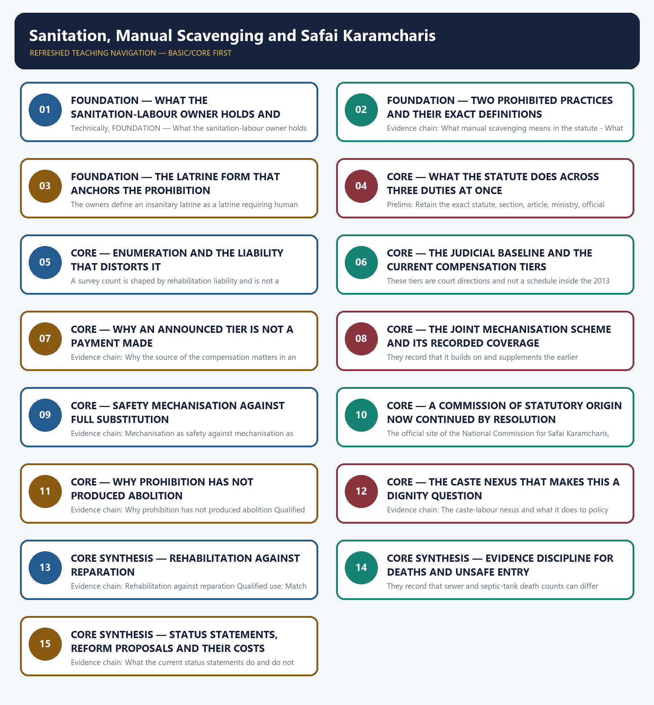

# Sanitation, Manual Scavenging and Safai Karamcharis — Learner-v2 Complete Learning Session

> **Authoring-only generation:** 2026-09-02. No PDF was rendered and no tracker or index was mutated.

### SOURCE, PROGRESSION AND CURRENT-LINKAGE AUDIT

- **Generation date:** 2026-09-02.
- **Repository-first evidence:** the Basic owner is taught first and preserved in full; the Advanced owner is retained only in the optional final teaching block.
- **OCR evidence:** Repository Markdown was primary. The OCR-searchable official General Studies question papers held under books\mains and books\more_previous_papers were read only to confirm the printed wording of routed Mains demands. No official answer key, marking scheme, page precision or unsupported quotation was imported from them.
- **Qdrant:** not used; repository Markdown and available OCR context were sufficient.
- **PYQ integrity:** This owner's previous-year record is a verified objective ownership rather than a Mains ownership, and it is stated precisely together with the boundary of what is claimed. The audited 2024-2025 Prelims routing ledger routes exactly one demand here, question 24 of the 2024 Prelims General Studies Paper I on the World Toilet Organization, and that ledger records expressly that although the official Set-A answer key is available locally the answer is not recorded there; the Basic owner's own generated integration block applies the same rule and states that it does not convert an unkeyed or answer-free objective question into a solved answer. This package therefore records no option, no key and no inferred answer letter for that question anywhere, and discharges the owner requirement by covering the named body and its likely statement-level distinctions as taught content inside the sanitation-and-dignity frame the owner already carries. No Mains demand is claimed: the audited 2018-2023 Mains routing ledger and the audited 2024-2025 Mains routing ledger route no General Studies question to this owner, both the Basic and the Advanced owner state independently that no General Studies Paper II question in the audited 2024-2025 papers directly names manual scavenging or safai karamcharis, and the questions the owners carry are described by them as probable or anticipated framing, so none of them is reproduced here as a previous-year question and no year, paper, question number, directive, mark value or word limit is asserted for them. Because no solved Mains demand card is available, the package supplies six original Mains questions with model solutions and eighty original objective questions on a strict A → B → C → D rotation, each model solution opening with its analytical claim so that the evidence which follows does argumentative rather than decorative work. The locally held OCR-searchable official General Studies papers were read only to confirm that no routed Mains demand for this owner appears in them; no question was invented from them, no marking scheme or page precision was imported and no official answer key is claimed for any question anywhere in this package.
- **Live-link boundary:** One live official page was verified for this topic on 2026-09-02. The official home page of the National Commission for Safai Karamcharis, read on that date, records that the Commission was constituted on 12 August 1994 as a statutory body by an Act of Parliament, namely the National Commission for Safai Karamcharis Act, 1993, for a period of three years, that is up to 31 March 1997; that as per sub-section (4) of Section 1 of the Act it was to cease to exist after 31 March 1997; and that the validity of the Act was extended up to March 2002 and then up to February 2004 by Amendment Acts passed in 1997 and 2001 respectively. Those statements are used only for what they say, as the Commission's own account of its constitution date, its built-in sunset and its two statutory extensions, and nothing about membership, budget, sitting frequency, complaint volume, inquiry outcome or beneficiary count is inferred from them. Two further official checks were attempted on the same date, namely a departmental scheme identifier on the Department of Social Justice and Empowerment site and a subordinate page of the Commission's own site, and both returned not-found pages, so nothing was read or used from them and no secondary summary, coaching site or news report has been treated as an official source. The package therefore relies on that verified page together with the dated official anchors already carried by the repository owners, each cited with its issuing instrument or status date: the Prohibition of Employment as Manual Scavengers and their Rehabilitation Act, 2013, with the definition of manual scavenging as manually cleaning, carrying, disposing of or otherwise handling human excreta from the statutory insanitary-latrine, open-drain, pit or railway-track settings before it fully decomposes, the separate definition of hazardous cleaning as manual cleaning of a sewer, septic tank or specified space without the prescribed protective gear, cleaning devices and safety precautions, the definition of an insanitary latrine as one requiring human intervention for removal of excreta, the prohibition on constructing such a latrine, the survey and identification duty of local authorities, the rehabilitation mandate and the criminal offences carrying imprisonment and fine with up to five years for a subsequent offence; Safai Karamchari Andolan v. Union of India of 2014 establishing the earlier compensation baseline of ten lakh rupees and reinforcing identification, rehabilitation and mechanisation; Dr Balram Singh v. Union of India of 20 October 2023 raising sewer-death compensation to thirty lakh rupees and prescribing at least twenty lakh rupees for permanent disability and ten lakh rupees for other injury alongside mechanisation and accountability directions, recorded expressly as judicial directions and not as a statutory schedule; the National Action for Mechanised Sanitation Ecosystem of 2022-23 implemented jointly by the Ministry of Social Justice and Empowerment and the Ministry of Housing and Urban Affairs and covering worker profiling, safety training and equipment, mechanised sanitation access, livelihood support and social-security convergence, recorded as supplementing the earlier self-employment rehabilitation scheme; the Cabinet or Ministry extension dated February 2025 continuing the Commission through 31 March 2028 as a non-statutory resolution-based body; and the constitutional contrast with the Scheduled Caste and Scheduled Tribe commissions under Articles 338 and 338A. No manual-scavenging count, sewer-death count, injury count, profiled-worker count, protective-equipment count, machine count, prosecution count, compensation-disbursal figure, rehabilitation-beneficiary count, sanitation-coverage percentage, latrine-conversion figure, budget or expenditure number is asserted anywhere in this package, and the owners' instruction that death counts differ by reporting source and must carry a named source and date is applied rather than replaced by a headline figure. No legal provision is invented or upgraded in status, no judicial direction is described as a statutory schedule, no resolution-based body is described as a permanent statutory or constitutional commission, no scheme is described as having replaced the prohibition statute, and no previous-year question, official answer key, option or answer letter is asserted or inferred, including for the single routed objective demand whose neutral rendering alone is recorded in the audited ledger.
- **Fact/inference discipline:** no current-affairs item, PYQ wording, figure or quotation is invented.

## BASIC LEARNING SESSION

### DEEP-REVIEW LEARNING CONTRACT

| Control | Binding rule for this package |
|---|---|
| Syllabus boundary | Complete Social Justice Basic/Core is answer-complete before optional Advanced depth. |
| Legal-status boundary | Constitutional value/right, statute, rule, judgment, executive policy, scheme, eligibility rule, implementation and outcome remain distinct. |
| Rights-holder map | Rights-holder → entitlement/need → competent institution/duty-bearer → accountability forum → grievance/appeal/remedy. |
| Delivery chain | Identification → eligibility → documentation → enrolment → finance → frontline access → service/benefit → portability → outcome → audit and correction. |
| Inclusion method | Intersectional caste, tribe, gender, age, disability, religion, occupation, migration and regional variation is retained without homogenising groups. |
| Evidence method | Claim → named India-centric law/institution/scheme/case/dataset → analysis → source, reference period, release date, denominator, status and causal qualification. |
| Dignity and safeguards | Accessibility, privacy, participation, social audit, portability, offline access, due process and protection from stigma or coercion are tested. |
| Practice contract | Every model has demand decoding, detailed examiner-grade answer, executable timed/compression plan, marks rationale and answer-specific improvement. |
| Approval | This immutable successor remains `approved: false` pending explicit approval. |

**Canonical Basic/Core owner:** `upsc-ai-kit\knowledge\Social-Justice\basic\14_Sanitation-Manual-Scavenging-and-Safai-Karamcharis.md`  
**Substantive canonical provenance owner:** `upsc-ai-kit\knowledge\Social-Justice\14_Sanitation-Manual-Scavenging-and-Safai-Karamcharis_Learner-V2-Complete-Topic-Package.md`  
**Optional Advanced owner:** `upsc-ai-kit\knowledge\Social-Justice\advanced\14_Sanitation-Manual-Scavenging-and-Safai-Karamcharis.md`  
**Official syllabus mapping:** `upsc-ai-kit\knowledge\Social-Justice\OFFICIAL-UPSC-SYLLABUS-MAPPING.md`

### EVIDENCE, PYQ AND CURRENT-STATUS CONTROL

- **Prohibition/outcome discipline:** a legal prohibition, reported case, registration, conviction, rehabilitation measure and lived eradication are different claims.
- **Eligibility discipline:** universal, categorical, means-tested, self-declared, notified-list and residence-linked routes require exact scope; coverage never proves adequacy or access.
- **Reservation discipline:** constitutional basis, beneficiary category, competent list, ceiling, creamy-layer rule, EWS route, horizontal/vertical operation and judicial status are qualified separately.
- **Fiscal discipline:** allocation, release, expenditure, unit cost, beneficiary transfer and outcome are not interchangeable.
- **Data discipline:** retain numerator, denominator, unit, geography, reference period, release date, provisional/final status and survey-versus-administrative character.
- **Causal discipline:** headline change, before-after sequence or cross-state correlation does not establish scheme impact without mechanism and counterfactual limits.
- **PYQ discipline:** exact wording is preserved only when verified; routed or reconstructed demands remain labelled and no model is presented as an official UPSC answer.
- **Current-status note, rechecked 2026-09-03:** volatile law, scheme, judgment, list, budget and dataset claims retain issuing authority, date and operative/interim/final status.

**Generation-local live/current sources:**
- `https://ncsk.nic.in/ (National Commission for Safai Karamcharis, official home page, read on 2 September 2026)`




*Distinct embedded teaching-navigation image. The separate continuous Cārvāka-style flowchart package remains an independent at-a-glance artifact.*

### SESSION 1 — FOUNDATION — WHAT THE SANITATION-LABOUR OWNER HOLDS AND HOW ITS DEMAND IS BOUNDED

#### DEFINITION / WHAT THIS IS CALLED

**Plain-language definition:** Evidence chain: What this owner holds and how its routed demand is bounded Qualified use: Open a sanitation answer by naming the lever the question engages before any provision is cited.

**Technical definition:** Technically, FOUNDATION — What the sanitation-labour owner holds and how its demand is bounded is analysed by relating FOUNDATION to What the sanitation-labour owner holds, then testing the relationship through how its demand is bounded and Evidence chain.

#### ANSWER-GRABBING OPENING — WRITE/ADAPT IN THE EXAM

> Evidence chain: What this owner holds and how its routed demand is bounded Qualified use: Open a sanitation answer by naming the lever the question engages before any provision is cited.

#### MUST-WRITE KEYWORDS

- **FOUNDATION**
- **What the sanitation-labour owner holds**
- **how its demand is bounded**
- **Evidence chain**
- **Qualified use**
- **This**

**How to use them:** Frame the answer through FOUNDATION; define What the sanitation-labour owner holds, connect how its demand is bounded with Evidence chain to explain the mechanism, and use Qualified use for the decisive comparison or qualification.

#### VISUAL FIRST

```text
WHAT THE SANITATION-LABOUR OWNER HOLDS AND HOW ITS DEMAND IS BOUNDED
01. What this owner holds and how its routed demand is bounded
BOUNDARY -> One objective demand is routed here, but no option, key or answer letter is recorded for it.
```

*This topic-specific rail fixes the evidence sequence and its exam boundary before analysis.*

#### CORE EXPLANATION

This owner holds the sanitation-labour argument as a four-lever framework rather than as a single prohibition: prohibition through the 2013 statute, mechanisation through the joint sanitation scheme, rehabilitation through livelihood support and compensation through judicial direction, monitored by a commission whose institutional character is itself examinable. The owners insist that the caste-labour nexus makes this a recognitive-justice issue and not merely an occupational-safety one, because the work is performed almost exclusively by specific Dalit sub-castes. The audited ledgers route exactly one objective demand here, the 2024 Prelims General Studies Paper I question numbered 24 on the World Toilet Organization, and the ledger records that although the official Set-A key is available locally the answer is not recorded, so this package records no option or answer letter for it and covers it as taught content instead.

#### NAMED EVIDENCE AND MECHANISM

- This owner holds the sanitation-labour argument as a four-lever framework rather than as a single prohibition: prohibition through the 2013 statute, mechanisation through the joint sanitation scheme, rehabilitation through livelihood support and compensation through judicial direction, monitored by a commission whose institutional character is itself examinable. The owners insist that the caste-labour nexus makes this a recognitive-justice issue and not merely an occupational-safety one, because the work is performed almost exclusively by specific Dalit sub-castes. The audited ledgers route exactly one objective demand here, the 2024 Prelims General Studies Paper I question numbered 24 on the World Toilet Organization, and the ledger records that although the official Set-A key is available locally the answer is not recorded, so this package records no option or answer letter for it and covers it as taught content instead.

#### EXAMINER CAUTION

- One objective demand is routed here, but no option, key or answer letter is recorded for it.

#### EXAM LINK

- **Prelims:** Retain the exact statute, section, article, ministry, official category, survey round or dated edition attached to What the sanitation-labour owner holds and how its demand is bounded, and never upgrade a policy document into a statute or a targeted scheme into a universal entitlement.
- **Mains:** Open a sanitation answer by naming the lever the question engages before any provision is cited.

#### MINI RECAP

- **Evidence chain:** What this owner holds and how its routed demand is bounded
- **Qualified use:** Open a sanitation answer by naming the lever the question engages before any provision is cited.

#### CLOSING RECALL FLOW — FOUNDATION — WHAT THE SANITATION-LABOUR OWNER HOLDS AND HOW ITS DEMAND IS BOUNDED

```text
START / CONCEPT: FOUNDATION — What the sanitation-labour owner holds and how its demand is bounded
        |
        v
EXACT TERMS: FOUNDATION · What the sanitation-labour owner holds · how its demand is bounded · Evidence chain · Qualified use · This
        |
        v
MECHANISM / ARGUMENT: This owner holds the sanitation-labour argument as a four-lever framework rather than as a single prohibition: prohibition through the 2013 statute, mechanisation through the joint sanitation scheme, rehabilitation through livelihood support and compensation through judicial direction, monitored by a commission whose institutional character is itself examinable.
        |
        v
CONSEQUENCE / CONTRAST: Prelims: Retain the exact statute, section, article, ministry, official category, survey round or dated edition attached to What the sanitation-labour owner holds and how its demand is bounded, and never upgrade a policy document into a statute or a targeted scheme into a universal entitlement.
        |
        v
UPSC TRAP / ANSWER-USE: One objective demand is routed here, but no option, key or answer letter is recorded for it.
        |
        v
ANSWER-GRABBING FORMULATION: Evidence chain: What this owner holds and how its routed demand is bounded Qualified use: Open a sanitation answer by naming the lever the question engages before any provision is cited.
```
### SESSION 2 — FOUNDATION — TWO PROHIBITED PRACTICES AND THEIR EXACT DEFINITIONS

#### DEFINITION / WHAT THIS IS CALLED

**Plain-language definition:** The definition is therefore about the act and its setting rather than about the gear worn while performing it, which is why a mechanisation answer that offers only protective equipment does not answer the prohibition.

**Technical definition:** Evidence chain: What manual scavenging means in the statute - What hazardous cleaning means and why it is separate Qualified use: Anchor a prohibition answer in the statutory definition of the practice rather than in the equipment worn.

#### ANSWER-GRABBING OPENING — WRITE/ADAPT IN THE EXAM

> Evidence chain: What manual scavenging means in the statute - What hazardous cleaning means and why it is separate Qualified use: Anchor a prohibition answer in the statutory definition of the practice rather than in the equipment worn.

#### MUST-WRITE KEYWORDS

- **FOUNDATION**
- **Two prohibited practices**
- **their exact definitions**
- **Evidence chain**
- **Qualified use**
- **Prohibition**

**How to use them:** Frame the answer through FOUNDATION; define Two prohibited practices, connect their exact definitions with Evidence chain to explain the mechanism, and use Qualified use for the decisive comparison or qualification.

#### VISUAL FIRST

```text
TWO PROHIBITED PRACTICES AND THEIR EXACT DEFINITIONS
01. What manual scavenging means in the statute
    |
    v
02. What hazardous cleaning means and why it is separate
BOUNDARY -> Protective equipment does not make manual scavenging lawful, and the two offences are defined separately.
```

*This topic-specific rail fixes the evidence sequence and its exam boundary before analysis.*

#### CORE EXPLANATION

The owners define manual scavenging under the Prohibition of Employment as Manual Scavengers and their Rehabilitation Act, 2013 as employment or engagement to manually clean, carry, dispose of or otherwise handle human excreta from the statutory insanitary-latrine, open-drain, pit or railway-track settings before it fully decomposes, and they attach the decisive qualification that protective equipment does not turn manual scavenging into a lawful practice. The definition is therefore about the act and its setting rather than about the gear worn while performing it, which is why a mechanisation answer that offers only protective equipment does not answer the prohibition. The owners define hazardous cleaning under the same Act as the manual cleaning of a sewer, a septic tank or a specified space without the prescribed protective gear, cleaning devices and safety precautions, and they record it as distinct from manual scavenging even though both are prohibited. The distinction is precise and testable: manual scavenging concerns the handling of human excreta from insanitary latrines and comparable settings, whereas hazardous cleaning concerns entry into a sewer or septic tank without the prescribed safeguards, so an answer that treats the two terms as synonyms has merged two separately defined offences.

#### NAMED EVIDENCE AND MECHANISM

- The owners define manual scavenging under the Prohibition of Employment as Manual Scavengers and their Rehabilitation Act, 2013 as employment or engagement to manually clean, carry, dispose of or otherwise handle human excreta from the statutory insanitary-latrine, open-drain, pit or railway-track settings before it fully decomposes, and they attach the decisive qualification that protective equipment does not turn manual scavenging into a lawful practice. The definition is therefore about the act and its setting rather than about the gear worn while performing it, which is why a mechanisation answer that offers only protective equipment does not answer the prohibition.
- The owners define hazardous cleaning under the same Act as the manual cleaning of a sewer, a septic tank or a specified space without the prescribed protective gear, cleaning devices and safety precautions, and they record it as distinct from manual scavenging even though both are prohibited. The distinction is precise and testable: manual scavenging concerns the handling of human excreta from insanitary latrines and comparable settings, whereas hazardous cleaning concerns entry into a sewer or septic tank without the prescribed safeguards, so an answer that treats the two terms as synonyms has merged two separately defined offences.

#### EXAMINER CAUTION

- Protective equipment does not make manual scavenging lawful, and the two offences are defined separately.

#### EXAM LINK

- **Prelims:** Retain the exact statute, section, article, ministry, official category, survey round or dated edition attached to Two prohibited practices and their exact definitions, and never upgrade a policy document into a statute or a targeted scheme into a universal entitlement.
- **Mains:** Anchor a prohibition answer in the statutory definition of the practice rather than in the equipment worn.

#### MINI RECAP

- **Evidence chain:** What manual scavenging means in the statute -> What hazardous cleaning means and why it is separate
- **Qualified use:** Anchor a prohibition answer in the statutory definition of the practice rather than in the equipment worn.

#### CLOSING RECALL FLOW — FOUNDATION — TWO PROHIBITED PRACTICES AND THEIR EXACT DEFINITIONS

```text
START / CONCEPT: FOUNDATION — Two prohibited practices and their exact definitions
        |
        v
EXACT TERMS: FOUNDATION · Two prohibited practices · their exact definitions · Evidence chain · Qualified use · Prohibition
        |
        v
MECHANISM / ARGUMENT: The owners define manual scavenging under the Prohibition of Employment as Manual Scavengers and their Rehabilitation Act, 2013 as employment or engagement to manually clean, carry, dispose of or otherwise handle human excreta from the statutory insanitary-latrine, open-drain, pit or railway-track settings before it fully decomposes, and they attach the decisive qualification that protective equipment does not turn manual scavenging into a lawful practice.
        |
        v
CONSEQUENCE / CONTRAST: The definition is therefore about the act and its setting rather than about the gear worn while performing it, which is why a mechanisation answer that offers only protective equipment does not answer the prohibition.
        |
        v
UPSC TRAP / ANSWER-USE: Protective equipment does not make manual scavenging lawful, and the two offences are defined separately.
        |
        v
ANSWER-GRABBING FORMULATION: Evidence chain: What manual scavenging means in the statute - What hazardous cleaning means and why it is separate Qualified use: Anchor a prohibition answer in the statutory definition of the practice rather than in the equipment worn.
```
### SESSION 3 — FOUNDATION — THE LATRINE FORM THAT ANCHORS THE PROHIBITION

#### DEFINITION / WHAT THIS IS CALLED

**Plain-language definition:** FOUNDATION — The latrine form that anchors the prohibition comprises FOUNDATION, The latrine form that anchors the prohibition and Evidence chain as its core connected dimensions.

**Technical definition:** The owners define an insanitary latrine as a latrine requiring human intervention for the removal of excreta, as distinct from a water-flush or septic-connected toilet, and they record that construction of such a latrine is prohibited under the 2013 Act.

#### ANSWER-GRABBING OPENING — WRITE/ADAPT IN THE EXAM

> This definition is the anchor for the whole prohibition, because it is the physical form of the toilet rather than the identity of the worker that brings a practice within the manual-scavenging definition, and a sanitation answer that speaks only of toilet coverage without the latrine type has not engaged the statutory category at all.

#### MUST-WRITE KEYWORDS

- **FOUNDATION**
- **The latrine form that anchors the prohibition**
- **Evidence chain**
- **Qualified use**
- **Act**
- **This definition**

**How to use them:** Frame the answer through FOUNDATION; define The latrine form that anchors the prohibition, connect Evidence chain with Qualified use to explain the mechanism, and use Act for the decisive comparison or qualification.

#### VISUAL FIRST

```text
THE LATRINE FORM THAT ANCHORS THE PROHIBITION
01. The insanitary latrine as the anchor category
BOUNDARY -> The physical form of the toilet, not the worker's identity, brings a practice within the definition.
```

*This topic-specific rail fixes the evidence sequence and its exam boundary before analysis.*

#### CORE EXPLANATION

The owners define an insanitary latrine as a latrine requiring human intervention for the removal of excreta, as distinct from a water-flush or septic-connected toilet, and they record that construction of such a latrine is prohibited under the 2013 Act. This definition is the anchor for the whole prohibition, because it is the physical form of the toilet rather than the identity of the worker that brings a practice within the manual-scavenging definition, and a sanitation answer that speaks only of toilet coverage without the latrine type has not engaged the statutory category at all.

#### NAMED EVIDENCE AND MECHANISM

- The owners define an insanitary latrine as a latrine requiring human intervention for the removal of excreta, as distinct from a water-flush or septic-connected toilet, and they record that construction of such a latrine is prohibited under the 2013 Act. This definition is the anchor for the whole prohibition, because it is the physical form of the toilet rather than the identity of the worker that brings a practice within the manual-scavenging definition, and a sanitation answer that speaks only of toilet coverage without the latrine type has not engaged the statutory category at all.

#### EXAMINER CAUTION

- The physical form of the toilet, not the worker's identity, brings a practice within the definition.

#### EXAM LINK

- **Prelims:** Retain the exact statute, section, article, ministry, official category, survey round or dated edition attached to The latrine form that anchors the prohibition, and never upgrade a policy document into a statute or a targeted scheme into a universal entitlement.
- **Mains:** State the category that a statute actually regulates before assessing coverage claims.

#### MINI RECAP

- **Evidence chain:** The insanitary latrine as the anchor category
- **Qualified use:** State the category that a statute actually regulates before assessing coverage claims.

#### CLOSING RECALL FLOW — FOUNDATION — THE LATRINE FORM THAT ANCHORS THE PROHIBITION

```text
START / CONCEPT: FOUNDATION — The latrine form that anchors the prohibition
        |
        v
EXACT TERMS: FOUNDATION · The latrine form that anchors the prohibition · Evidence chain · Qualified use · Act · This definition
        |
        v
MECHANISM / ARGUMENT: Evidence chain: The insanitary latrine as the anchor category Qualified use: State the category that a statute actually regulates before assessing coverage claims.
        |
        v
CONSEQUENCE / CONTRAST: The owners define an insanitary latrine as a latrine requiring human intervention for the removal of excreta, as distinct from a water-flush or septic-connected toilet, and they record that construction of such a latrine is prohibited under the 2013 Act.
        |
        v
UPSC TRAP / ANSWER-USE: Do not miss this limiting distinction: this definition is the anchor for the whole prohibition, because it is the physical...
        |
        v
ANSWER-GRABBING FORMULATION: This definition is the anchor for the whole prohibition, because it is the physical form of the toilet rather than the identity of the worker that brings a practice within the manual-scavenging definition, and a sanitation answer that speaks only of toilet coverage without the latrine type has not engaged the statutory category at all.
```
### SESSION 4 — CORE — WHAT THE STATUTE DOES ACROSS THREE DUTIES AT ONCE

#### DEFINITION / WHAT THIS IS CALLED

**Plain-language definition:** They record that employing a person for either prohibited practice is a criminal offence, that constructing an insanitary latrine is prohibited, and that local authorities must survey and identify manual scavengers, so the statute combines a criminal prohibition, an administrative duty of enumeration and a welfare duty of rehabilitation in one instrument.

**Technical definition:** Prelims: Retain the exact statute, section, article, ministry, official category, survey round or dated edition attached to What the statute does across three duties at once, and never upgrade a policy document into a statute or a targeted scheme into a universal entitlement.

#### ANSWER-GRABBING OPENING — WRITE/ADAPT IN THE EXAM

> Evidence chain: What the prohibition statute actually does Qualified use: Present a single instrument by every duty it imposes, not by its most quoted clause.

#### MUST-WRITE KEYWORDS

- **Evidence chain**
- **Qualified use**
- **They**
- **Retain**
- **Qualified**
- **Present**

**How to use them:** Frame the answer through Evidence chain; define Qualified use, connect They with Retain to explain the mechanism, and use Qualified for the decisive comparison or qualification.

#### VISUAL FIRST

```text
WHAT THE STATUTE DOES ACROSS THREE DUTIES AT ONCE
01. What the prohibition statute actually does
BOUNDARY -> The Act combines a criminal prohibition, an enumeration duty and a rehabilitation duty rather than one of them.
```

*This topic-specific rail fixes the evidence sequence and its exam boundary before analysis.*

#### CORE EXPLANATION

The owners record the 2013 Act as prohibiting manual scavenging and hazardous cleaning, mandating identification and rehabilitation of manual scavengers, and creating offences carrying imprisonment and fines, with the Advanced owner recording imprisonment of up to five years for a subsequent offence. They record that employing a person for either prohibited practice is a criminal offence, that constructing an insanitary latrine is prohibited, and that local authorities must survey and identify manual scavengers, so the statute combines a criminal prohibition, an administrative duty of enumeration and a welfare duty of rehabilitation in one instrument.

#### NAMED EVIDENCE AND MECHANISM

- The owners record the 2013 Act as prohibiting manual scavenging and hazardous cleaning, mandating identification and rehabilitation of manual scavengers, and creating offences carrying imprisonment and fines, with the Advanced owner recording imprisonment of up to five years for a subsequent offence. They record that employing a person for either prohibited practice is a criminal offence, that constructing an insanitary latrine is prohibited, and that local authorities must survey and identify manual scavengers, so the statute combines a criminal prohibition, an administrative duty of enumeration and a welfare duty of rehabilitation in one instrument.

#### EXAMINER CAUTION

- The Act combines a criminal prohibition, an enumeration duty and a rehabilitation duty rather than one of them.

#### EXAM LINK

- **Prelims:** Retain the exact statute, section, article, ministry, official category, survey round or dated edition attached to What the statute does across three duties at once, and never upgrade a policy document into a statute or a targeted scheme into a universal entitlement.
- **Mains:** Present a single instrument by every duty it imposes, not by its most quoted clause.

#### MINI RECAP

- **Evidence chain:** What the prohibition statute actually does
- **Qualified use:** Present a single instrument by every duty it imposes, not by its most quoted clause.

#### CLOSING RECALL FLOW — CORE — WHAT THE STATUTE DOES ACROSS THREE DUTIES AT ONCE

```text
START / CONCEPT: CORE — What the statute does across three duties at once
        |
        v
EXACT TERMS: Evidence chain · Qualified use · They · Retain · Qualified · Present
        |
        v
MECHANISM / ARGUMENT: Prelims: Retain the exact statute, section, article, ministry, official category, survey round or dated edition attached to What the statute does across three duties at once, and never upgrade a policy document into a statute or a targeted scheme into a universal entitlement.
        |
        v
CONSEQUENCE / CONTRAST: They record that employing a person for either prohibited practice is a criminal offence, that constructing an insanitary latrine is prohibited, and that local authorities must survey and identify manual scavengers, so the statute combines a criminal prohibition, an administrative duty of enumeration and a welfare duty of rehabilitation in one instrument.
        |
        v
UPSC TRAP / ANSWER-USE: Do not miss this limiting distinction: what the prohibition statute actually does Qualified use.
        |
        v
ANSWER-GRABBING FORMULATION: Evidence chain: What the prohibition statute actually does Qualified use: Present a single instrument by every duty it imposes, not by its most quoted clause.
```
### SESSION 5 — CORE — ENUMERATION AND THE LIABILITY THAT DISTORTS IT

#### DEFINITION / WHAT THIS IS CALLED

**Plain-language definition:** The examinable consequence is that a survey count is an administrative output shaped by liability rather than a measured prevalence.

**Technical definition:** A survey count is shaped by rehabilitation liability and is not a measured prevalence.

#### ANSWER-GRABBING OPENING — WRITE/ADAPT IN THE EXAM

> The examinable consequence is that a survey count is an administrative output shaped by liability rather than a measured prevalence.

#### MUST-WRITE KEYWORDS

- **Enumeration**
- **the liability that distorts it**
- **Evidence chain**
- **Qualified use**
- **They**
- **The examinable consequence**

**How to use them:** Frame the answer through Enumeration; define the liability that distorts it, connect Evidence chain with Qualified use to explain the mechanism, and use They for the decisive comparison or qualification.

#### VISUAL FIRST

```text
ENUMERATION AND THE LIABILITY THAT DISTORTS IT
01. Who is responsible for identification and how it can fail
BOUNDARY -> A survey count is shaped by rehabilitation liability and is not a measured prevalence.
```

*This topic-specific rail fixes the evidence sequence and its exam boundary before analysis.*

#### CORE EXPLANATION

The owners record that State governments, acting through District Magistrates and local authorities, conduct surveys to enumerate manual scavengers and sewer or septic-tank workers, and that the joint sanitation scheme extends this profiling to sanitation workers in urban areas. They then record the incentive problem in explicit terms: local authorities have an incentive to under-report manual scavengers because recognition creates rehabilitation liability, so the actual number may exceed the official survey. The examinable consequence is that a survey count is an administrative output shaped by liability rather than a measured prevalence.

#### NAMED EVIDENCE AND MECHANISM

- The owners record that State governments, acting through District Magistrates and local authorities, conduct surveys to enumerate manual scavengers and sewer or septic-tank workers, and that the joint sanitation scheme extends this profiling to sanitation workers in urban areas. They then record the incentive problem in explicit terms: local authorities have an incentive to under-report manual scavengers because recognition creates rehabilitation liability, so the actual number may exceed the official survey. The examinable consequence is that a survey count is an administrative output shaped by liability rather than a measured prevalence.

#### EXAMINER CAUTION

- A survey count is shaped by rehabilitation liability and is not a measured prevalence.

#### EXAM LINK

- **Prelims:** Retain the exact statute, section, article, ministry, official category, survey round or dated edition attached to Enumeration and the liability that distorts it, and never upgrade a policy document into a statute or a targeted scheme into a universal entitlement.
- **Mains:** Treat an administrative count as an output of the incentives that produced it.

#### MINI RECAP

- **Evidence chain:** Who is responsible for identification and how it can fail
- **Qualified use:** Treat an administrative count as an output of the incentives that produced it.

#### CLOSING RECALL FLOW — CORE — ENUMERATION AND THE LIABILITY THAT DISTORTS IT

```text
START / CONCEPT: CORE — Enumeration and the liability that distorts it
        |
        v
EXACT TERMS: Enumeration · the liability that distorts it · Evidence chain · Qualified use · They · The examinable consequence
        |
        v
MECHANISM / ARGUMENT: They then record the incentive problem in explicit terms: local authorities have an incentive to under-report manual scavengers because recognition creates rehabilitation liability, so the actual number may exceed the official survey.
        |
        v
CONSEQUENCE / CONTRAST: A survey count is shaped by rehabilitation liability and is not a measured prevalence.
        |
        v
UPSC TRAP / ANSWER-USE: Do not miss this limiting distinction: who is responsible for identification and how it can fail Qualified use.
        |
        v
ANSWER-GRABBING FORMULATION: The examinable consequence is that a survey count is an administrative output shaped by liability rather than a measured prevalence.
```
### SESSION 6 — CORE — THE JUDICIAL BASELINE AND THE CURRENT COMPENSATION TIERS

#### DEFINITION / WHAT THIS IS CALLED

**Plain-language definition:** The owners state expressly that these are judicial directions and not a statutory schedule under the 2013 Act.

**Technical definition:** These tiers are court directions and not a schedule inside the 2013 Act.

#### ANSWER-GRABBING OPENING — WRITE/ADAPT IN THE EXAM

> The owners state expressly that these are judicial directions and not a statutory schedule under the 2013 Act.

#### MUST-WRITE KEYWORDS

- **The judicial baseline**
- **the current compensation tiers**
- **Evidence chain**
- **Qualified use**
- **The owners state expressly that these**
- **Act**

**How to use them:** Frame the answer through The judicial baseline; define the current compensation tiers, connect Evidence chain with Qualified use to explain the mechanism, and use The owners state expressly that these for the decisive comparison or qualification.

#### VISUAL FIRST

```text
THE JUDICIAL BASELINE AND THE CURRENT COMPENSATION TIERS
01. The earlier judicial baseline and the current tiers
BOUNDARY -> These tiers are court directions and not a schedule inside the 2013 Act.
```

*This topic-specific rail fixes the evidence sequence and its exam boundary before analysis.*

#### CORE EXPLANATION

The owners record Safai Karamchari Andolan v. Union of India, decided by the Supreme Court in 2014, as establishing the earlier compensation baseline of ten lakh rupees and as reinforcing identification, rehabilitation and mechanisation. They then record Dr Balram Singh v. Union of India, decided on 20 October 2023, as raising sewer-death compensation to thirty lakh rupees and prescribing at least twenty lakh rupees for permanent disability and ten lakh rupees for other injury, alongside mechanisation and accountability directions. The owners state expressly that these are judicial directions and not a statutory schedule under the 2013 Act.

#### NAMED EVIDENCE AND MECHANISM

- The owners record Safai Karamchari Andolan v. Union of India, decided by the Supreme Court in 2014, as establishing the earlier compensation baseline of ten lakh rupees and as reinforcing identification, rehabilitation and mechanisation. They then record Dr Balram Singh v. Union of India, decided on 20 October 2023, as raising sewer-death compensation to thirty lakh rupees and prescribing at least twenty lakh rupees for permanent disability and ten lakh rupees for other injury, alongside mechanisation and accountability directions. The owners state expressly that these are judicial directions and not a statutory schedule under the 2013 Act.

#### EXAMINER CAUTION

- These tiers are court directions and not a schedule inside the 2013 Act.

#### EXAM LINK

- **Prelims:** Retain the exact statute, section, article, ministry, official category, survey round or dated edition attached to The judicial baseline and the current compensation tiers, and never upgrade a policy document into a statute or a targeted scheme into a universal entitlement.
- **Mains:** Attribute every figure in an answer to the instrument that actually created it.

#### MINI RECAP

- **Evidence chain:** The earlier judicial baseline and the current tiers
- **Qualified use:** Attribute every figure in an answer to the instrument that actually created it.

#### CLOSING RECALL FLOW — CORE — THE JUDICIAL BASELINE AND THE CURRENT COMPENSATION TIERS

```text
START / CONCEPT: CORE — The judicial baseline and the current compensation tiers
        |
        v
EXACT TERMS: The judicial baseline · the current compensation tiers · Evidence chain · Qualified use · The owners state expressly that these · Act
        |
        v
MECHANISM / ARGUMENT: Evidence chain: The earlier judicial baseline and the current tiers Qualified use: Attribute every figure in an answer to the instrument that actually created it.
        |
        v
CONSEQUENCE / CONTRAST: These tiers are court directions and not a schedule inside the 2013 Act.
        |
        v
UPSC TRAP / ANSWER-USE: Do not miss this limiting distinction: attribute every figure in an answer to the instrument that actually created it.
        |
        v
ANSWER-GRABBING FORMULATION: The owners state expressly that these are judicial directions and not a statutory schedule under the 2013 Act.
```
### SESSION 7 — CORE — WHY AN ANNOUNCED TIER IS NOT A PAYMENT MADE

#### DEFINITION / WHAT THIS IS CALLED

**Plain-language definition:** They add a second discipline on the same figures, that the compensation is often delayed or disputed and that families lack the documentation to claim, so the tier is an entitlement announced by a court rather than a payment demonstrated in practice, and an answer should separate the direction from its disbursal.

**Technical definition:** Evidence chain: Why the source of the compensation matters in an answer Qualified use: Separate an announced entitlement from evidence of its disbursal.

#### ANSWER-GRABBING OPENING — WRITE/ADAPT IN THE EXAM

> They add a second discipline on the same figures, that the compensation is often delayed or disputed and that families lack the documentation to claim, so the tier is an entitlement announced by a court rather than a payment demonstrated in practice, and an answer should separate the direction from its disbursal.

#### MUST-WRITE KEYWORDS

- **Evidence chain**
- **Qualified use**
- **Act**
- **Parliament**
- **Supreme Court**
- **They**

**How to use them:** Frame the answer through Evidence chain; define Qualified use, connect Act with Parliament to explain the mechanism, and use Supreme Court for the decisive comparison or qualification.

#### VISUAL FIRST

```text
WHY AN ANNOUNCED TIER IS NOT A PAYMENT MADE
01. Why the source of the compensation matters in an answer
BOUNDARY -> Delay, dispute and missing documentation stand between a direction and a family's receipt.
```

*This topic-specific rail fixes the evidence sequence and its exam boundary before analysis.*

#### CORE EXPLANATION

The owners treat the source of the compensation tiers as a trap in its own right, because an answer that places the thirty, twenty and ten lakh rupee tiers inside the 2013 Act has attributed to Parliament what the Supreme Court directed. They add a second discipline on the same figures, that the compensation is often delayed or disputed and that families lack the documentation to claim, so the tier is an entitlement announced by a court rather than a payment demonstrated in practice, and an answer should separate the direction from its disbursal.

#### NAMED EVIDENCE AND MECHANISM

- The owners treat the source of the compensation tiers as a trap in its own right, because an answer that places the thirty, twenty and ten lakh rupee tiers inside the 2013 Act has attributed to Parliament what the Supreme Court directed. They add a second discipline on the same figures, that the compensation is often delayed or disputed and that families lack the documentation to claim, so the tier is an entitlement announced by a court rather than a payment demonstrated in practice, and an answer should separate the direction from its disbursal.

#### EXAMINER CAUTION

- Delay, dispute and missing documentation stand between a direction and a family's receipt.

#### EXAM LINK

- **Prelims:** Retain the exact statute, section, article, ministry, official category, survey round or dated edition attached to Why an announced tier is not a payment made, and never upgrade a policy document into a statute or a targeted scheme into a universal entitlement.
- **Mains:** Separate an announced entitlement from evidence of its disbursal.

#### MINI RECAP

- **Evidence chain:** Why the source of the compensation matters in an answer
- **Qualified use:** Separate an announced entitlement from evidence of its disbursal.

#### CLOSING RECALL FLOW — CORE — WHY AN ANNOUNCED TIER IS NOT A PAYMENT MADE

```text
START / CONCEPT: CORE — Why an announced tier is not a payment made
        |
        v
EXACT TERMS: Evidence chain · Qualified use · Act · Parliament · Supreme Court · They
        |
        v
MECHANISM / ARGUMENT: The owners treat the source of the compensation tiers as a trap in its own right, because an answer that places the thirty, twenty and ten lakh rupee tiers inside the 2013 Act has attributed to Parliament what the Supreme Court directed.
        |
        v
CONSEQUENCE / CONTRAST: Evidence chain: Why the source of the compensation matters in an answer Qualified use: Separate an announced entitlement from evidence of its disbursal.
        |
        v
UPSC TRAP / ANSWER-USE: Do not miss this limiting distinction: they add a second discipline on the same figures, that the compensation is often...
        |
        v
ANSWER-GRABBING FORMULATION: They add a second discipline on the same figures, that the compensation is often delayed or disputed and that families lack the documentation to claim, so the tier is an entitlement announced by a court rather than a payment demonstrated in practice, and an answer should separate the direction from its disbursal.
```
### SESSION 8 — CORE — THE JOINT MECHANISATION SCHEME AND ITS RECORDED COVERAGE

#### DEFINITION / WHAT THIS IS CALLED

**Plain-language definition:** Evidence chain: The joint mechanisation scheme and what it covers Qualified use: Name the ministries, the year and the components before evaluating a scheme's reach.

**Technical definition:** They record that it builds on and supplements the earlier self-employment rehabilitation scheme by adding mechanisation, protective equipment, training and worker profiling, and they record that it complements rather than replaces the prohibition statute.

#### ANSWER-GRABBING OPENING — WRITE/ADAPT IN THE EXAM

> Evidence chain: The joint mechanisation scheme and what it covers Qualified use: Name the ministries, the year and the components before evaluating a scheme's reach.

#### MUST-WRITE KEYWORDS

- **The joint mechanisation scheme**
- **its recorded coverage**
- **Evidence chain**
- **Qualified use**
- **They**
- **2022-23**

**How to use them:** Frame the answer through The joint mechanisation scheme; define its recorded coverage, connect Evidence chain with Qualified use to explain the mechanism, and use They for the decisive comparison or qualification.

#### VISUAL FIRST

```text
THE JOINT MECHANISATION SCHEME AND ITS RECORDED COVERAGE
01. The joint mechanisation scheme and what it covers
BOUNDARY -> The scheme complements the prohibition statute and does not replace it.
```

*This topic-specific rail fixes the evidence sequence and its exam boundary before analysis.*

#### CORE EXPLANATION

The owners record the National Action for Mechanised Sanitation Ecosystem, launched in 2022-23 and implemented jointly by the Ministry of Social Justice and Empowerment and the Ministry of Housing and Urban Affairs, as covering profiling of sewer and septic-tank workers, safety training and equipment, access to mechanised sanitation, livelihood support and convergence with social-security schemes. They record that it builds on and supplements the earlier self-employment rehabilitation scheme by adding mechanisation, protective equipment, training and worker profiling, and they record that it complements rather than replaces the prohibition statute.

#### NAMED EVIDENCE AND MECHANISM

- The owners record the National Action for Mechanised Sanitation Ecosystem, launched in 2022-23 and implemented jointly by the Ministry of Social Justice and Empowerment and the Ministry of Housing and Urban Affairs, as covering profiling of sewer and septic-tank workers, safety training and equipment, access to mechanised sanitation, livelihood support and convergence with social-security schemes. They record that it builds on and supplements the earlier self-employment rehabilitation scheme by adding mechanisation, protective equipment, training and worker profiling, and they record that it complements rather than replaces the prohibition statute.

#### EXAMINER CAUTION

- The scheme complements the prohibition statute and does not replace it.

#### EXAM LINK

- **Prelims:** Retain the exact statute, section, article, ministry, official category, survey round or dated edition attached to The joint mechanisation scheme and its recorded coverage, and never upgrade a policy document into a statute or a targeted scheme into a universal entitlement.
- **Mains:** Name the ministries, the year and the components before evaluating a scheme's reach.

#### MINI RECAP

- **Evidence chain:** The joint mechanisation scheme and what it covers
- **Qualified use:** Name the ministries, the year and the components before evaluating a scheme's reach.

#### CLOSING RECALL FLOW — CORE — THE JOINT MECHANISATION SCHEME AND ITS RECORDED COVERAGE

```text
START / CONCEPT: CORE — The joint mechanisation scheme and its recorded coverage
        |
        v
EXACT TERMS: The joint mechanisation scheme · its recorded coverage · Evidence chain · Qualified use · They · 2022-23
        |
        v
MECHANISM / ARGUMENT: They record that it builds on and supplements the earlier self-employment rehabilitation scheme by adding mechanisation, protective equipment, training and worker profiling, and they record that it complements rather than replaces the prohibition statute.
        |
        v
CONSEQUENCE / CONTRAST: The scheme complements the prohibition statute and does not replace it.
        |
        v
UPSC TRAP / ANSWER-USE: Do not miss this limiting distinction: the joint mechanisation scheme and what it covers Qualified use.
        |
        v
ANSWER-GRABBING FORMULATION: Evidence chain: The joint mechanisation scheme and what it covers Qualified use: Name the ministries, the year and the components before evaluating a scheme's reach.
```
### SESSION 9 — CORE — SAFETY MECHANISATION AGAINST FULL SUBSTITUTION

#### DEFINITION / WHAT THIS IS CALLED

**Plain-language definition:** They record the practical consequences on both sides: urban local bodies procure mechanised sewer-cleaning equipment and workers receive training and equipment, while a capital subsidy is meant to let a worker-entrepreneur buy a suction machine, and they record that mechanisation which merely adds protective equipment while still requiring human entry does not eliminate the hazard.

**Technical definition:** Evidence chain: Mechanisation as safety against mechanisation as substitution - Why mechanisation uptake stalls Qualified use: Test a technological remedy against the exposure it was supposed to remove.

#### ANSWER-GRABBING OPENING — WRITE/ADAPT IN THE EXAM

> Evidence chain: Mechanisation as safety against mechanisation as substitution - Why mechanisation uptake stalls Qualified use: Test a technological remedy against the exposure it was supposed to remove.

#### MUST-WRITE KEYWORDS

- **Safety mechanisation against full substitution**
- **Evidence chain**
- **Qualified use**
- **Full**
- **They**
- **Equipment**

**How to use them:** Frame the answer through Safety mechanisation against full substitution; define Evidence chain, connect Qualified use with Full to explain the mechanism, and use They for the decisive comparison or qualification.

#### VISUAL FIRST

```text
SAFETY MECHANISATION AGAINST FULL SUBSTITUTION
01. Mechanisation as safety against mechanisation as substitution
    |
    v
02. Why mechanisation uptake stalls
BOUNDARY -> Equipment for workers who still enter does not eliminate the hazard, and procurement is not operation.
```

*This topic-specific rail fixes the evidence sequence and its exam boundary before analysis.*

#### CORE EXPLANATION

The owners draw the distinction that decides the quality of a mechanisation answer. Full substitution replaces human entry entirely through robotic sewer cleaning; safety-focused mechanisation supplies protective equipment and machines to workers who still enter, and the owners record that the current scheme emphasises the latter. They record the practical consequences on both sides: urban local bodies procure mechanised sewer-cleaning equipment and workers receive training and equipment, while a capital subsidy is meant to let a worker-entrepreneur buy a suction machine, and they record that mechanisation which merely adds protective equipment while still requiring human entry does not eliminate the hazard. The owners set out the uptake failure chain in three linked steps: urban local bodies lack the funds to procure mechanised equipment and subsidy disbursement is slow; sanitation workers lack the capital and credit access to become equipment-owning entrepreneurs so loan-subsidy uptake is low; and mechanised equipment requires maintenance and trained operators so machines fall into disuse without sustained support. They give the boundary case of a city that procures equipment and then stores it unused for want of trained operators, which converts a procurement statistic into a question about operation.

#### NAMED EVIDENCE AND MECHANISM

- The owners draw the distinction that decides the quality of a mechanisation answer. Full substitution replaces human entry entirely through robotic sewer cleaning; safety-focused mechanisation supplies protective equipment and machines to workers who still enter, and the owners record that the current scheme emphasises the latter. They record the practical consequences on both sides: urban local bodies procure mechanised sewer-cleaning equipment and workers receive training and equipment, while a capital subsidy is meant to let a worker-entrepreneur buy a suction machine, and they record that mechanisation which merely adds protective equipment while still requiring human entry does not eliminate the hazard.
- The owners set out the uptake failure chain in three linked steps: urban local bodies lack the funds to procure mechanised equipment and subsidy disbursement is slow; sanitation workers lack the capital and credit access to become equipment-owning entrepreneurs so loan-subsidy uptake is low; and mechanised equipment requires maintenance and trained operators so machines fall into disuse without sustained support. They give the boundary case of a city that procures equipment and then stores it unused for want of trained operators, which converts a procurement statistic into a question about operation.

#### EXAMINER CAUTION

- Equipment for workers who still enter does not eliminate the hazard, and procurement is not operation.

#### EXAM LINK

- **Prelims:** Retain the exact statute, section, article, ministry, official category, survey round or dated edition attached to Safety mechanisation against full substitution, and never upgrade a policy document into a statute or a targeted scheme into a universal entitlement.
- **Mains:** Test a technological remedy against the exposure it was supposed to remove.

#### MINI RECAP

- **Evidence chain:** Mechanisation as safety against mechanisation as substitution -> Why mechanisation uptake stalls
- **Qualified use:** Test a technological remedy against the exposure it was supposed to remove.

#### CLOSING RECALL FLOW — CORE — SAFETY MECHANISATION AGAINST FULL SUBSTITUTION

```text
START / CONCEPT: CORE — Safety mechanisation against full substitution
        |
        v
EXACT TERMS: Safety mechanisation against full substitution · Evidence chain · Qualified use · Full · They · Equipment
        |
        v
MECHANISM / ARGUMENT: Full substitution replaces human entry entirely through robotic sewer cleaning; safety-focused mechanisation supplies protective equipment and machines to workers who still enter, and the owners record that the current scheme emphasises the latter.
        |
        v
CONSEQUENCE / CONTRAST: They record the practical consequences on both sides: urban local bodies procure mechanised sewer-cleaning equipment and workers receive training and equipment, while a capital subsidy is meant to let a worker-entrepreneur buy a suction machine, and they record that mechanisation which merely adds protective equipment while still requiring human entry does not eliminate the hazard.
        |
        v
UPSC TRAP / ANSWER-USE: Equipment for workers who still enter does not eliminate the hazard, and procurement is not operation.
        |
        v
ANSWER-GRABBING FORMULATION: Evidence chain: Mechanisation as safety against mechanisation as substitution - Why mechanisation uptake stalls Qualified use: Test a technological remedy against the exposure it was supposed to remove.
```
### SESSION 10 — CORE — A COMMISSION OF STATUTORY ORIGIN NOW CONTINUED BY RESOLUTION

#### DEFINITION / WHAT THIS IS CALLED

**Plain-language definition:** The owners record the National Commission for Safai Karamcharis as a body of statutory origin under the National Commission for Safai Karamcharis Act, 1993 whose statutory tenure lapsed, so that it is now a non-statutory, resolution-based body continued by a Cabinet or Ministry extension dated February 2025 with a current tenure through 31 March 2028.

**Technical definition:** The official site of the National Commission for Safai Karamcharis, read on 2 September 2026, records that the Commission was constituted on 12 August 1994 as a statutory body by an Act of Parliament, namely the National Commission for Safai Karamcharis Act, 1993, for a period of three years, that is up to 31 March 1997; that as per sub-section (4) of Section 1 of that Act it was to cease to exist after 31 March 1997; and that the validity of the Act was extended up to March 2002 and then up to February 2004 by Amendment Acts passed in 1997 and 2001 respectively.

#### ANSWER-GRABBING OPENING — WRITE/ADAPT IN THE EXAM

> The owners record the National Commission for Safai Karamcharis as a body of statutory origin under the National Commission for Safai Karamcharis Act, 1993 whose statutory tenure lapsed, so that it is now a non-statutory, resolution-based body continued by a Cabinet or Ministry extension dated February 2025 with a current tenure through 31 March 2028.

#### MUST-WRITE KEYWORDS

- **Evidence chain**
- **Qualified use**
- **National Commission**
- **Safai Karamcharis**
- **Safai Karamcharis Act**
- **Cabinet**

**How to use them:** Frame the answer through Evidence chain; define Qualified use, connect National Commission with Safai Karamcharis to explain the mechanism, and use Safai Karamcharis Act for the decisive comparison or qualification.

#### VISUAL FIRST

```text
A COMMISSION OF STATUTORY ORIGIN NOW CONTINUED BY RESOLUTION
01. The commission and its recorded institutional character
    |
    v
02. The commission's own account of its origin and tenure history
BOUNDARY -> A live tenure through 2028 is not permanence, and the constitutional commissions are a different class.
```

*This topic-specific rail fixes the evidence sequence and its exam boundary before analysis.*

#### CORE EXPLANATION

The owners record the National Commission for Safai Karamcharis as a body of statutory origin under the National Commission for Safai Karamcharis Act, 1993 whose statutory tenure lapsed, so that it is now a non-statutory, resolution-based body continued by a Cabinet or Ministry extension dated February 2025 with a current tenure through 31 March 2028. They record its functions as monitoring welfare schemes, investigating complaints and recommending corrective action, and they record the constitutional contrast expressly: the commissions for Scheduled Castes and Scheduled Tribes are constitutional bodies under Articles 338 and 338A, whereas this commission has no constitutional backing and no standing statutory mandate. The official site of the National Commission for Safai Karamcharis, read on 2 September 2026, records that the Commission was constituted on 12 August 1994 as a statutory body by an Act of Parliament, namely the National Commission for Safai Karamcharis Act, 1993, for a period of three years, that is up to 31 March 1997; that as per sub-section (4) of Section 1 of that Act it was to cease to exist after 31 March 1997; and that the validity of the Act was extended up to March 2002 and then up to February 2004 by Amendment Acts passed in 1997 and 2001 respectively. That verified page therefore supplies the exact constitution date, the built-in sunset and the two statutory extensions, and the repository owners supply the later position that the statutory tenure lapsed and that the body now runs on an executive resolution.

#### NAMED EVIDENCE AND MECHANISM

- The owners record the National Commission for Safai Karamcharis as a body of statutory origin under the National Commission for Safai Karamcharis Act, 1993 whose statutory tenure lapsed, so that it is now a non-statutory, resolution-based body continued by a Cabinet or Ministry extension dated February 2025 with a current tenure through 31 March 2028. They record its functions as monitoring welfare schemes, investigating complaints and recommending corrective action, and they record the constitutional contrast expressly: the commissions for Scheduled Castes and Scheduled Tribes are constitutional bodies under Articles 338 and 338A, whereas this commission has no constitutional backing and no standing statutory mandate.
- The official site of the National Commission for Safai Karamcharis, read on 2 September 2026, records that the Commission was constituted on 12 August 1994 as a statutory body by an Act of Parliament, namely the National Commission for Safai Karamcharis Act, 1993, for a period of three years, that is up to 31 March 1997; that as per sub-section (4) of Section 1 of that Act it was to cease to exist after 31 March 1997; and that the validity of the Act was extended up to March 2002 and then up to February 2004 by Amendment Acts passed in 1997 and 2001 respectively. That verified page therefore supplies the exact constitution date, the built-in sunset and the two statutory extensions, and the repository owners supply the later position that the statutory tenure lapsed and that the body now runs on an executive resolution.

#### EXAMINER CAUTION

- A live tenure through 2028 is not permanence, and the constitutional commissions are a different class.

#### EXAM LINK

- **Prelims:** Retain the exact statute, section, article, ministry, official category, survey round or dated edition attached to A commission of statutory origin now continued by resolution, and never upgrade a policy document into a statute or a targeted scheme into a universal entitlement.
- **Mains:** State an institution's current tenure and its legal character in the same sentence.

#### MINI RECAP

- **Evidence chain:** The commission and its recorded institutional character -> The commission's own account of its origin and tenure history
- **Qualified use:** State an institution's current tenure and its legal character in the same sentence.

#### CLOSING RECALL FLOW — CORE — A COMMISSION OF STATUTORY ORIGIN NOW CONTINUED BY RESOLUTION

```text
START / CONCEPT: CORE — A commission of statutory origin now continued by resolution
        |
        v
EXACT TERMS: Evidence chain · Qualified use · National Commission · Safai Karamcharis · Safai Karamcharis Act · Cabinet
        |
        v
MECHANISM / ARGUMENT: The official site of the National Commission for Safai Karamcharis, read on 2 September 2026, records that the Commission was constituted on 12 August 1994 as a statutory body by an Act of Parliament, namely the National Commission for Safai Karamcharis Act, 1993, for a period of three years, that is up to 31 March 1997; that as per sub-section (4) of Section 1 of that Act it was to cease to exist after 31 March 1997; and that the validity of the Act was extended up to March 2002 and then up to February 2004 by Amendment Acts passed in 1997 and 2001 respectively.
        |
        v
CONSEQUENCE / CONTRAST: They record its functions as monitoring welfare schemes, investigating complaints and recommending corrective action, and they record the constitutional contrast expressly: the commissions for Scheduled Castes and Scheduled Tribes are constitutional bodies under Articles 338 and 338A, whereas this commission has no constitutional backing and no standing statutory mandate.
        |
        v
UPSC TRAP / ANSWER-USE: Do not miss this limiting distinction: that verified page therefore supplies the exact constitution date, the built-in sunset and the...
        |
        v
ANSWER-GRABBING FORMULATION: The owners record the National Commission for Safai Karamcharis as a body of statutory origin under the National Commission for Safai Karamcharis Act, 1993 whose statutory tenure lapsed, so that it is now a non-statutory, resolution-based body continued by a Cabinet or Ministry extension dated February 2025 with a current tenure through 31 March 2028.
```
### SESSION 11 — CORE — WHY PROHIBITION HAS NOT PRODUCED ABOLITION

#### DEFINITION / WHAT THIS IS CALLED

**Plain-language definition:** The owners separate prohibition from abolition and then explain the gap through four named mechanisms: local bodies and contractors can diffuse employer responsibility, surveys may under-count workers where recognition creates rehabilitation liability, prosecution is rare so deterrence is weak despite criminal provisions, and one-time rehabilitation without stable alternative work can push a worker back into sanitation.

**Technical definition:** Evidence chain: Why prohibition has not produced abolition Qualified use: Explain a persistent illegal practice through the specific mechanisms that sustain it.

#### ANSWER-GRABBING OPENING — WRITE/ADAPT IN THE EXAM

> Evidence chain: Why prohibition has not produced abolition Qualified use: Explain a persistent illegal practice through the specific mechanisms that sustain it.

#### MUST-WRITE KEYWORDS

- **Evidence chain**
- **Qualified use**
- **They**
- **Act**
- **Retain**
- **Why**

**How to use them:** Frame the answer through Evidence chain; define Qualified use, connect They with Act to explain the mechanism, and use Retain for the decisive comparison or qualification.

#### VISUAL FIRST

```text
WHY PROHIBITION HAS NOT PRODUCED ABOLITION
01. Why prohibition has not produced abolition
BOUNDARY -> Responsibility diffusion, rare prosecution and unstable alternatives keep the practice alive despite the ban.
```

*This topic-specific rail fixes the evidence sequence and its exam boundary before analysis.*

#### CORE EXPLANATION

The owners separate prohibition from abolition and then explain the gap through four named mechanisms: local bodies and contractors can diffuse employer responsibility, surveys may under-count workers where recognition creates rehabilitation liability, prosecution is rare so deterrence is weak despite criminal provisions, and one-time rehabilitation without stable alternative work can push a worker back into sanitation. They record that first information reports under the 2013 Act are rare and that most cases are treated as accidents rather than as prohibited employment, and they give the boundary case of a municipal corporation that contracts sewer cleaning to a private firm and then argues that it is not the employer.

#### NAMED EVIDENCE AND MECHANISM

- The owners separate prohibition from abolition and then explain the gap through four named mechanisms: local bodies and contractors can diffuse employer responsibility, surveys may under-count workers where recognition creates rehabilitation liability, prosecution is rare so deterrence is weak despite criminal provisions, and one-time rehabilitation without stable alternative work can push a worker back into sanitation. They record that first information reports under the 2013 Act are rare and that most cases are treated as accidents rather than as prohibited employment, and they give the boundary case of a municipal corporation that contracts sewer cleaning to a private firm and then argues that it is not the employer.

#### EXAMINER CAUTION

- Responsibility diffusion, rare prosecution and unstable alternatives keep the practice alive despite the ban.

#### EXAM LINK

- **Prelims:** Retain the exact statute, section, article, ministry, official category, survey round or dated edition attached to Why prohibition has not produced abolition, and never upgrade a policy document into a statute or a targeted scheme into a universal entitlement.
- **Mains:** Explain a persistent illegal practice through the specific mechanisms that sustain it.

#### MINI RECAP

- **Evidence chain:** Why prohibition has not produced abolition
- **Qualified use:** Explain a persistent illegal practice through the specific mechanisms that sustain it.

#### CLOSING RECALL FLOW — CORE — WHY PROHIBITION HAS NOT PRODUCED ABOLITION

```text
START / CONCEPT: CORE — Why prohibition has not produced abolition
        |
        v
EXACT TERMS: Evidence chain · Qualified use · They · Act · Retain · Why
        |
        v
MECHANISM / ARGUMENT: The owners separate prohibition from abolition and then explain the gap through four named mechanisms: local bodies and contractors can diffuse employer responsibility, surveys may under-count workers where recognition creates rehabilitation liability, prosecution is rare so deterrence is weak despite criminal provisions, and one-time rehabilitation without stable alternative work can push a worker back into sanitation.
        |
        v
CONSEQUENCE / CONTRAST: Prelims: Retain the exact statute, section, article, ministry, official category, survey round or dated edition attached to Why prohibition has not produced abolition, and never upgrade a policy document into a statute or a targeted scheme into a universal entitlement.
        |
        v
UPSC TRAP / ANSWER-USE: They record that first information reports under the 2013 Act are rare and that most cases are treated as accidents rather than as prohibited employment, and they give the boundary case of a municipal corporation that contracts sewer cleaning to a private firm and then argues that it is not the employer.
        |
        v
ANSWER-GRABBING FORMULATION: Evidence chain: Why prohibition has not produced abolition Qualified use: Explain a persistent illegal practice through the specific mechanisms that sustain it.
```
### SESSION 12 — CORE — THE CASTE NEXUS THAT MAKES THIS A DIGNITY QUESTION

#### DEFINITION / WHAT THIS IS CALLED

**Plain-language definition:** The owners record that manual scavenging in India is performed almost exclusively by specific Dalit sub-castes, which makes the topic simultaneously an occupational-health question and a caste-based recognitive-justice question, and they record the persistence chain: an intergenerational occupation lock in which specific sub-castes have performed sanitation work for generations, rehabilitation inadequacy in which one-time cash and short-term training do not overcome social barriers to alternative employment, and demand-side caste preference in which employers including municipalities may prefer hiring from traditional scavenger castes.

**Technical definition:** Evidence chain: The caste-labour nexus and what it does to policy Qualified use: Ground a sanitation-labour answer in the constitutional dignity articles the owners name.

#### ANSWER-GRABBING OPENING — WRITE/ADAPT IN THE EXAM

> The owners record that manual scavenging in India is performed almost exclusively by specific Dalit sub-castes, which makes the topic simultaneously an occupational-health question and a caste-based recognitive-justice question, and they record the persistence chain: an intergenerational occupation lock in which specific sub-castes have performed sanitation work for generations, rehabilitation inadequacy in which one-time cash and short-term training do not overcome social barriers to alternative employment, and demand-side caste preference in which employers including municipalities may prefer hiring from traditional scavenger castes.

#### MUST-WRITE KEYWORDS

- **Evidence chain**
- **Qualified use**
- **The owners record that manual scavenging in India**
- **India**
- **Dalit**
- **Qualified**

**How to use them:** Frame the answer through Evidence chain; define Qualified use, connect The owners record that manual scavenging in India with India to explain the mechanism, and use Dalit for the decisive comparison or qualification.

#### VISUAL FIRST

```text
THE CASTE NEXUS THAT MAKES THIS A DIGNITY QUESTION
01. The caste-labour nexus and what it does to policy
BOUNDARY -> A remedy aimed only at safety answers the least fundamental part of the problem.
```

*This topic-specific rail fixes the evidence sequence and its exam boundary before analysis.*

#### CORE EXPLANATION

The owners record that manual scavenging in India is performed almost exclusively by specific Dalit sub-castes, which makes the topic simultaneously an occupational-health question and a caste-based recognitive-justice question, and they record the persistence chain: an intergenerational occupation lock in which specific sub-castes have performed sanitation work for generations, rehabilitation inadequacy in which one-time cash and short-term training do not overcome social barriers to alternative employment, and demand-side caste preference in which employers including municipalities may prefer hiring from traditional scavenger castes. They record the constitutional grounding for the answer as Articles 17, 21 and 23, covering untouchability, dignity and forced labour, and they record the protective legislation for caste atrocities as available where caste-based harassment accompanies the employment.

#### NAMED EVIDENCE AND MECHANISM

- The owners record that manual scavenging in India is performed almost exclusively by specific Dalit sub-castes, which makes the topic simultaneously an occupational-health question and a caste-based recognitive-justice question, and they record the persistence chain: an intergenerational occupation lock in which specific sub-castes have performed sanitation work for generations, rehabilitation inadequacy in which one-time cash and short-term training do not overcome social barriers to alternative employment, and demand-side caste preference in which employers including municipalities may prefer hiring from traditional scavenger castes. They record the constitutional grounding for the answer as Articles 17, 21 and 23, covering untouchability, dignity and forced labour, and they record the protective legislation for caste atrocities as available where caste-based harassment accompanies the employment.

#### EXAMINER CAUTION

- A remedy aimed only at safety answers the least fundamental part of the problem.

#### EXAM LINK

- **Prelims:** Retain the exact statute, section, article, ministry, official category, survey round or dated edition attached to The caste nexus that makes this a dignity question, and never upgrade a policy document into a statute or a targeted scheme into a universal entitlement.
- **Mains:** Ground a sanitation-labour answer in the constitutional dignity articles the owners name.

#### MINI RECAP

- **Evidence chain:** The caste-labour nexus and what it does to policy
- **Qualified use:** Ground a sanitation-labour answer in the constitutional dignity articles the owners name.

#### CLOSING RECALL FLOW — CORE — THE CASTE NEXUS THAT MAKES THIS A DIGNITY QUESTION

```text
START / CONCEPT: CORE — The caste nexus that makes this a dignity question
        |
        v
EXACT TERMS: Evidence chain · Qualified use · The owners record that manual scavenging in India · India · Dalit · Qualified
        |
        v
MECHANISM / ARGUMENT: Evidence chain: The caste-labour nexus and what it does to policy Qualified use: Ground a sanitation-labour answer in the constitutional dignity articles the owners name.
        |
        v
CONSEQUENCE / CONTRAST: The resulting consequence is that the owners record that manual scavenging in India is performed almost exclusively by specific...
        |
        v
UPSC TRAP / ANSWER-USE: Do not miss this limiting distinction: the owners record that manual scavenging in India is performed almost exclusively by specific...
        |
        v
ANSWER-GRABBING FORMULATION: The owners record that manual scavenging in India is performed almost exclusively by specific Dalit sub-castes, which makes the topic simultaneously an occupational-health question and a caste-based recognitive-justice question, and they record the persistence chain: an intergenerational occupation lock in which specific sub-castes have performed sanitation work for generations, rehabilitation inadequacy in which one-time cash and short-term training do not overcome social barriers to alternative employment, and demand-side caste preference in which employers including municipalities may prefer hiring from traditional scavenger castes.
```
### SESSION 13 — CORE SYNTHESIS — REHABILITATION AGAINST REPARATION

#### DEFINITION / WHAT THIS IS CALLED

**Plain-language definition:** The owners distinguish rehabilitation, which is forward-looking livelihood support, from reparation, which would address the historical injustice of intergenerational caste-based labour, and they record that Indian policy focuses on rehabilitation and not on reparation.

**Technical definition:** Evidence chain: Rehabilitation against reparation Qualified use: Match the remedy claimed to the injustice actually being addressed.

#### ANSWER-GRABBING OPENING — WRITE/ADAPT IN THE EXAM

> The owners distinguish rehabilitation, which is forward-looking livelihood support, from reparation, which would address the historical injustice of intergenerational caste-based labour, and they record that Indian policy focuses on rehabilitation and not on reparation.

#### MUST-WRITE KEYWORDS

- **CORE SYNTHESIS**
- **Rehabilitation against reparation**
- **Evidence chain**
- **Qualified use**
- **The owners distinguish rehabilitation, which**
- **Indian**

**How to use them:** Frame the answer through CORE SYNTHESIS; define Rehabilitation against reparation, connect Evidence chain with Qualified use to explain the mechanism, and use The owners distinguish rehabilitation, which for the decisive comparison or qualification.

#### VISUAL FIRST

```text
REHABILITATION AGAINST REPARATION
01. Rehabilitation against reparation
BOUNDARY -> Forward-looking livelihood support is not a remedy for historical injustice and is not offered as one.
```

*This topic-specific rail fixes the evidence sequence and its exam boundary before analysis.*

#### CORE EXPLANATION

The owners distinguish rehabilitation, which is forward-looking livelihood support, from reparation, which would address the historical injustice of intergenerational caste-based labour, and they record that Indian policy focuses on rehabilitation and not on reparation. They record the mechanics on the rehabilitation side, that identified manual scavengers and eligible sanitation workers can receive notified rehabilitation, skill, livelihood and scheme-convergence support, and they attach the boundary that separate identification, eligibility and sanction steps mean a portal listing is not proof that a household has received a livelihood alternative.

#### NAMED EVIDENCE AND MECHANISM

- The owners distinguish rehabilitation, which is forward-looking livelihood support, from reparation, which would address the historical injustice of intergenerational caste-based labour, and they record that Indian policy focuses on rehabilitation and not on reparation. They record the mechanics on the rehabilitation side, that identified manual scavengers and eligible sanitation workers can receive notified rehabilitation, skill, livelihood and scheme-convergence support, and they attach the boundary that separate identification, eligibility and sanction steps mean a portal listing is not proof that a household has received a livelihood alternative.

#### EXAMINER CAUTION

- Forward-looking livelihood support is not a remedy for historical injustice and is not offered as one.

#### EXAM LINK

- **Prelims:** Retain the exact statute, section, article, ministry, official category, survey round or dated edition attached to Rehabilitation against reparation, and never upgrade a policy document into a statute or a targeted scheme into a universal entitlement.
- **Mains:** Match the remedy claimed to the injustice actually being addressed.

#### MINI RECAP

- **Evidence chain:** Rehabilitation against reparation
- **Qualified use:** Match the remedy claimed to the injustice actually being addressed.

#### CLOSING RECALL FLOW — CORE SYNTHESIS — REHABILITATION AGAINST REPARATION

```text
START / CONCEPT: CORE SYNTHESIS — Rehabilitation against reparation
        |
        v
EXACT TERMS: CORE SYNTHESIS · Rehabilitation against reparation · Evidence chain · Qualified use · The owners distinguish rehabilitation, which · Indian
        |
        v
MECHANISM / ARGUMENT: Evidence chain: Rehabilitation against reparation Qualified use: Match the remedy claimed to the injustice actually being addressed.
        |
        v
CONSEQUENCE / CONTRAST: They record the mechanics on the rehabilitation side, that identified manual scavengers and eligible sanitation workers can receive notified rehabilitation, skill, livelihood and scheme-convergence support, and they attach the boundary that separate identification, eligibility and sanction steps mean a portal listing is not proof that a household has received a livelihood alternative.
        |
        v
UPSC TRAP / ANSWER-USE: Forward-looking livelihood support is not a remedy for historical injustice and is not offered as one.
        |
        v
ANSWER-GRABBING FORMULATION: The owners distinguish rehabilitation, which is forward-looking livelihood support, from reparation, which would address the historical injustice of intergenerational caste-based labour, and they record that Indian policy focuses on rehabilitation and not on reparation.
```
### SESSION 14 — CORE SYNTHESIS — EVIDENCE DISCIPLINE FOR DEATHS AND UNSAFE ENTRY

#### DEFINITION / WHAT THIS IS CALLED

**Plain-language definition:** Evidence chain: How the death and incident evidence must be handled - The 2024 objective demand and how it is covered Qualified use: Argue from persistence with a sourced and dated figure rather than from a headline number.

**Technical definition:** They record that sewer and septic-tank death counts can differ between the commission, State reporting and civil-society reporting, and they instruct that any figure be used with a named source and date and that recorded deaths be distinguished from the incidence of all unsafe cleaning.

#### ANSWER-GRABBING OPENING — WRITE/ADAPT IN THE EXAM

> Evidence chain: How the death and incident evidence must be handled - The 2024 objective demand and how it is covered Qualified use: Argue from persistence with a sourced and dated figure rather than from a headline number.

#### MUST-WRITE KEYWORDS

- **CORE SYNTHESIS**
- **Evidence discipline for deaths**
- **unsafe entry**
- **Evidence chain**
- **Qualified use**
- **2024-2025**

**How to use them:** Frame the answer through CORE SYNTHESIS; define Evidence discipline for deaths, connect unsafe entry with Evidence chain to explain the mechanism, and use Qualified use for the decisive comparison or qualification.

#### VISUAL FIRST

```text
EVIDENCE DISCIPLINE FOR DEATHS AND UNSAFE ENTRY
01. How the death and incident evidence must be handled
    |
    v
02. The 2024 objective demand and how it is covered
BOUNDARY -> Counts differ by reporting source, and no option or key is recorded for the routed objective demand.
```

*This topic-specific rail fixes the evidence sequence and its exam boundary before analysis.*

#### CORE EXPLANATION

The owners impose an evidence discipline on the most emotive numbers in the topic. They record that sewer and septic-tank death counts can differ between the commission, State reporting and civil-society reporting, and they instruct that any figure be used with a named source and date and that recorded deaths be distinguished from the incidence of all unsafe cleaning. They record that deaths during septic-tank cleaning continue to occur despite the 2013 prohibition, and they treat that persistence, rather than any particular count, as the analytical enforcement failure the answer should argue. The audited 2024-2025 Prelims routing ledger routes exactly one objective demand to this owner, question 24 of the 2024 Prelims General Studies Paper I on the World Toilet Organization, and it records that although the official Set-A key is available locally the answer is not recorded there. Both the Basic owner's generated integration block and the ledger apply the same rule, that an unkeyed or answer-free objective question is not converted into a solved answer. This package therefore records no option, no key and no inferred answer letter for that question, and satisfies the owner requirement by covering the named body as taught content within the sanitation-and-dignity frame that the owner already carries.

#### NAMED EVIDENCE AND MECHANISM

- The owners impose an evidence discipline on the most emotive numbers in the topic. They record that sewer and septic-tank death counts can differ between the commission, State reporting and civil-society reporting, and they instruct that any figure be used with a named source and date and that recorded deaths be distinguished from the incidence of all unsafe cleaning. They record that deaths during septic-tank cleaning continue to occur despite the 2013 prohibition, and they treat that persistence, rather than any particular count, as the analytical enforcement failure the answer should argue.
- The audited 2024-2025 Prelims routing ledger routes exactly one objective demand to this owner, question 24 of the 2024 Prelims General Studies Paper I on the World Toilet Organization, and it records that although the official Set-A key is available locally the answer is not recorded there. Both the Basic owner's generated integration block and the ledger apply the same rule, that an unkeyed or answer-free objective question is not converted into a solved answer. This package therefore records no option, no key and no inferred answer letter for that question, and satisfies the owner requirement by covering the named body as taught content within the sanitation-and-dignity frame that the owner already carries.

#### EXAMINER CAUTION

- Counts differ by reporting source, and no option or key is recorded for the routed objective demand.

#### EXAM LINK

- **Prelims:** Retain the exact statute, section, article, ministry, official category, survey round or dated edition attached to Evidence discipline for deaths and unsafe entry, and never upgrade a policy document into a statute or a targeted scheme into a universal entitlement.
- **Mains:** Argue from persistence with a sourced and dated figure rather than from a headline number.

#### MINI RECAP

- **Evidence chain:** How the death and incident evidence must be handled -> The 2024 objective demand and how it is covered
- **Qualified use:** Argue from persistence with a sourced and dated figure rather than from a headline number.

#### CLOSING RECALL FLOW — CORE SYNTHESIS — EVIDENCE DISCIPLINE FOR DEATHS AND UNSAFE ENTRY

```text
START / CONCEPT: CORE SYNTHESIS — Evidence discipline for deaths and unsafe entry
        |
        v
EXACT TERMS: CORE SYNTHESIS · Evidence discipline for deaths · unsafe entry · Evidence chain · Qualified use · 2024-2025
        |
        v
MECHANISM / ARGUMENT: Counts differ by reporting source, and no option or key is recorded for the routed objective demand.
        |
        v
CONSEQUENCE / CONTRAST: Both the Basic owner's generated integration block and the ledger apply the same rule, that an unkeyed or answer-free objective question is not converted into a solved answer.
        |
        v
UPSC TRAP / ANSWER-USE: The audited 2024-2025 Prelims routing ledger routes exactly one objective demand to this owner, question 24 of the 2024 Prelims General Studies Paper I on the World Toilet Organization, and it records that although the official Set-A key is available locally the answer is not recorded there.
        |
        v
ANSWER-GRABBING FORMULATION: Evidence chain: How the death and incident evidence must be handled - The 2024 objective demand and how it is covered Qualified use: Argue from persistence with a sourced and dated figure rather than from a headline number.
```
### SESSION 15 — CORE SYNTHESIS — STATUS STATEMENTS, REFORM PROPOSALS AND THEIR COSTS

#### DEFINITION / WHAT THIS IS CALLED

**Plain-language definition:** Status: 2024-2025 question-level PYQ demand is integrated into this owner.

**Technical definition:** Evidence chain: What the current status statements do and do not establish - The reform architecture the owners recommend and its cost Qualified use: Close with a graded verdict, a named institutional correction and its stated trade-off.

#### ANSWER-GRABBING OPENING — WRITE/ADAPT IN THE EXAM

> Evidence chain: What the current status statements do and do not establish - The reform architecture the owners recommend and its cost Qualified use: Close with a graded verdict, a named institutional correction and its stated trade-off.

#### MUST-WRITE KEYWORDS

- **CORE SYNTHESIS**
- **Status statements**
- **reform proposals**
- **their costs**
- **Evidence chain**
- **Qualified use**

**How to use them:** Frame the answer through CORE SYNTHESIS; define Status statements, connect reform proposals with their costs to explain the mechanism, and use Evidence chain for the decisive comparison or qualification.

#### VISUAL FIRST

```text
STATUS STATEMENTS, REFORM PROPOSALS AND THEIR COSTS
01. What the current status statements do and do not establish
    |
    v
02. The reform architecture the owners recommend and its cost
BOUNDARY -> Each recommended correction carries a recorded sequencing or capital cost that the answer must concede.
```

*This topic-specific rail fixes the evidence sequence and its exam boundary before analysis.*

#### CORE EXPLANATION

The owners record two dated status statements and bound both. The joint scheme's implementation continues for safety, mechanisation, profiling and livelihood convergence, and the owners instruct that a profiled-worker or protective-equipment total is a dashboard output that must be cited with its component and report date and must be distinguished from proof that no unsafe entry occurs. The commission's extension of February 2025 continues a non-statutory body through 31 March 2028, and the owners instruct that both its current tenure and its resolution-based rather than permanent statutory character be stated together, so that a live tenure is not mistaken for institutional permanence. The owners record two named institutional corrections, re-enactment of the commission as a permanent statutory commission with quasi-judicial powers, annual reporting to Parliament and power to issue binding directions to State governments, and a statutory presumption requiring a municipal first information report for every sewer death so that the current accident framing is reversed. They immediately record the trade-offs that must qualify any verdict here: strict enforcement of the prohibition may leave sanitation workers without income before alternative livelihoods exist so sequencing matters, full robotic substitution is capital-intensive and technologically nascent, and statutory permanence for the commission would strengthen independence but requires legislative action rather than executive resolution.

#### NAMED EVIDENCE AND MECHANISM

- The owners record two dated status statements and bound both. The joint scheme's implementation continues for safety, mechanisation, profiling and livelihood convergence, and the owners instruct that a profiled-worker or protective-equipment total is a dashboard output that must be cited with its component and report date and must be distinguished from proof that no unsafe entry occurs. The commission's extension of February 2025 continues a non-statutory body through 31 March 2028, and the owners instruct that both its current tenure and its resolution-based rather than permanent statutory character be stated together, so that a live tenure is not mistaken for institutional permanence.
- The owners record two named institutional corrections, re-enactment of the commission as a permanent statutory commission with quasi-judicial powers, annual reporting to Parliament and power to issue binding directions to State governments, and a statutory presumption requiring a municipal first information report for every sewer death so that the current accident framing is reversed. They immediately record the trade-offs that must qualify any verdict here: strict enforcement of the prohibition may leave sanitation workers without income before alternative livelihoods exist so sequencing matters, full robotic substitution is capital-intensive and technologically nascent, and statutory permanence for the commission would strengthen independence but requires legislative action rather than executive resolution.

#### EXAMINER CAUTION

- Each recommended correction carries a recorded sequencing or capital cost that the answer must concede.

#### EXAM LINK

- **Prelims:** Retain the exact statute, section, article, ministry, official category, survey round or dated edition attached to Status statements, reform proposals and their costs, and never upgrade a policy document into a statute or a targeted scheme into a universal entitlement.
- **Mains:** Close with a graded verdict, a named institutional correction and its stated trade-off.

#### MINI RECAP

- **Evidence chain:** What the current status statements do and do not establish -> The reform architecture the owners recommend and its cost
- **Qualified use:** Close with a graded verdict, a named institutional correction and its stated trade-off.
#### COMPLETE BASIC OWNER EVIDENCE BANK

> **Subject:** Social Justice | **Tier:** Must-Do (foundation) | **GS Paper:** GS-II.
> **Core area:** Prohibition of manual scavenging, hazardous cleaning, mechanisation,
> rehabilitation, Safai Karamchari welfare.
> **Grounded in:** Prohibition of Employment as Manual Scavengers and their Rehabilitation
> Act, 2013 (PEMSR Act); Safai Karamchari Andolan v. Union of India (Supreme Court, 2014);
> NAMASTE scheme (MoSJE + MoHUA, 2022-23); National Commission for Safai Karamcharis
> (NCSK, statutory origin 1993, resolution-extended through 31 March 2028).
> ✅ = source-grounded | ⚠️ = analytical inference | 📰 = current anchor.
> *Companion: `advanced/14_Sanitation-Manual-Scavenging-and-Safai-Karamcharis.md`.*

#### 1. Visual foundation

```text
SANITATION LABOUR: FOUR-LEVER FRAMEWORK
(Prohibition + Mechanisation + Rehabilitation + Compensation)

┌─────────────────────────────────────────────────────────────────────┐
│ PROHIBITION               MECHANISATION                             │
│ PEMSR Act, 2013           NAMASTE scheme (2022-23)                  │
│ - manual scavenging       - PPE, training                          │
│   (insanitary latrines)   - mechanised equipment                   │
│ - hazardous cleaning      - capital subsidy for                    │
│   (sewers/septic tanks)     sanitation-worker enterprise           │
│         |                           |                               │
│         v                           v                               │
│ +-------+---------------------------+-------+                       │
│ |                                           |                       │
│ v                                           v                       │
│ REHABILITATION                   COMPENSATION                       │
│ SRMS / NAMASTE livelihood        ₹30 lakh per death                │
│ - one-time cash                  (Dr Balram Singh v. UoI, 2023)   │
│ - skill training                 injury tiers: ₹20L / ₹10L        │
│ - loan subsidy                           |                         │
│         |                                |                          │
│         +----------------+---------------+                          │
│                          |                                          │
│                          v                                          │
│              NCSK (monitoring + grievance)                          │
│              statutory origin 1993, current                         │
│              resolution tenure through 31 Mar 2028                  │
└─────────────────────────────────────────────────────────────────────┘

CASTE-LABOUR LINK: Manual scavenging in India is performed almost
exclusively by specific Dalit sub-castes → simultaneously a sanitation/
occupational-health issue AND a caste-based recognitive-justice issue
(cross-link Topic 07 for PoA Act context).
```

**Core proposition:** ✅ Ending manual scavenging requires four complementary levers:
prohibition (PEMSR Act), mechanisation (NAMASTE), rehabilitation (livelihood support)
and compensation (death/injury payments) — with the underlying caste-labour nexus
making this a recognitive-justice issue, not merely an occupational-safety one.

#### 2. Essential definitions

| Concept | Exam-ready meaning |
|---|---|
| ✅ **Manual scavenging (PEMSR Act)** | Employment or engagement to manually clean, carry, dispose of or otherwise handle human excreta from the statutory insanitary-latrine/open-drain/pit/railway-track settings before it fully decomposes. Protective equipment does not turn manual scavenging into a lawful practice. |
| ✅ **Hazardous cleaning (PEMSR Act)** | Manual cleaning of sewers, septic tanks or specified spaces without the prescribed protective gear, cleaning devices and safety precautions. This is distinct from manual scavenging, though both are prohibited. |
| ✅ **Insanitary latrine** | A latrine requiring human intervention for removal of excreta (as distinct from a water-flush or septic-connected toilet) — construction prohibited under the 2013 Act. |
| ✅ **PEMSR Act, 2013** | The Prohibition of Employment as Manual Scavengers and their Rehabilitation Act, 2013, which prohibits manual scavenging and hazardous cleaning, mandates identification and rehabilitation of manual scavengers, and creates offences with imprisonment and fines. |
| ✅ **Safai Karamchari Andolan v. UoI (2014)** | Established the earlier ₹10 lakh compensation baseline and reinforced identification, rehabilitation and mechanisation. |
| ✅ **Dr Balram Singh v. Union of India (20 October 2023)** | Raised sewer-death compensation to ₹30 lakh and prescribed at least ₹20 lakh for permanent disability and ₹10 lakh for other injury, alongside mechanisation and accountability directions. These are judicial directions, not a PEMSR statutory schedule. |
| ✅ **NAMASTE (2022-23)** | National Action for Mechanised Sanitation Ecosystem — joint MoSJE–MoHUA implementation for profiling sewer/septic-tank workers, safety training/equipment, mechanised-sanitation access, livelihood support and convergence with social-security schemes. |
| ✅ **NCSK** | National Commission for Safai Karamcharis — the 1993 Act had a sunset. It is now a non-statutory, resolution-based body; Cabinet/Ministry extension dated February 2025 gives it a current tenure through 31 March 2028. It is not a permanent statutory commission. |

#### 3. How the prohibition-rehabilitation mechanism works

1. **Prohibition (PEMSR Act, 2013):** Employing a person for manual scavenging or
   hazardous cleaning is a criminal offence; constructing an insanitary latrine is
   prohibited; local authorities must survey and identify manual scavengers.
2. **Identification and survey:** State governments, through District Magistrates and
   local authorities, conduct surveys to enumerate manual scavengers and sewer/septic-
   tank workers; NAMASTE extends this profiling to sanitation workers in urban areas.
3. **Rehabilitation (SRMS / NAMASTE):** Identified manual scavengers/eligible sanitation
   workers can receive notified rehabilitation, skill, livelihood and scheme-convergence
   support. Separate identification, eligibility and sanction steps mean a portal listing
   is not proof that a household has received a livelihood alternative.
4. **Mechanisation (NAMASTE):** Urban local bodies procure mechanised sewer-cleaning
   equipment; sanitation workers receive training and PPE; capital subsidy enables
   worker-entrepreneur purchase of suction machines.
5. **Compensation (court direction):** use the Balram Singh tiers--₹30 lakh for death,
   at least ₹20 lakh for permanent disability and ₹10 lakh for other injury--while
   separating the judicial source from the Act and checking disbursal.

#### 4. Institutions and tools

- ✅ **PEMSR Act, 2013:** Central legislation; state governments responsible for
  implementation; District Magistrates coordinate survey and rehabilitation.
- ✅ **NAMASTE scheme (MoSJE + MoHUA, 2022-23):** Builds on and supplements the earlier
  Self-Employment Scheme for Rehabilitation of Manual Scavengers (SRMS); adds
  mechanisation, PPE, training and worker-profiling components.
- ✅ **NCSK:** Monitors welfare schemes, investigates complaints and recommends corrective
  action. Its original statutory tenure lapsed; the current executive-resolution tenure
  runs through 31 March 2028, so it remains non-statutory and time-bound.
- ⚠️ Cross-link `basic/07_Scheduled-Castes-Rights-Atrocities-and-Welfare.md` — the
  caste-labour nexus means PoA Act protections may apply where caste-based harassment
  accompanies manual-scavenging employment.

#### 5. Indian applications and examples

- ⚠️ A sewer worker entering a manhole without prescribed safety protection illustrates
  hazardous cleaning. Employer/contractor/local-authority liability is fact-specific and
  should be traced rather than assumed away through outsourcing.
- ⚠️ A family identified as manual scavengers but lacking documentation may miss
  rehabilitation benefits — the identification gap (Master-Framework Section 4).
- ⚠️ Deaths during septic-tank cleaning continue to occur despite the 2013 prohibition,
  indicating an enforcement gap between law and ground-level practice.

##### Why prohibition has not produced abolition

- ⚠️ Local bodies and contractors can diffuse employer responsibility.
- ⚠️ Surveys may under-count workers where recognition creates rehabilitation liability.
- ⚠️ Rare prosecution weakens deterrence despite criminal provisions.
- ⚠️ One-time rehabilitation without stable alternative work can push workers back into
  sanitation. Prohibition therefore needs procurement accountability, mechanisation and
  durable livelihood transition.

#### 6. Must-Know Facts for Prelims

- ✅ The PEMSR Act was enacted in 2013; it prohibits both manual scavenging (insanitary
  latrines) and hazardous cleaning (sewers/septic tanks).
- ✅ Safai Karamchari Andolan supplied the earlier baseline; Dr Balram Singh (2023)
  prescribed the current ₹30 lakh death and ₹20/₹10 lakh injury tiers.
- ✅ NAMASTE scheme was launched in 2022-23 jointly by MoSJE and MoHUA.
- ✅ NCSK was originally established under the NCSK Act, 1993; its current
  resolution-based tenure runs through 31 March 2028.

#### 7. UPSC traps

- ❌ Manual scavenging and hazardous cleaning are the same thing. -> Manual scavenging
  refers to removal of human excreta from insanitary latrines; hazardous cleaning refers
  to sewer/septic-tank cleaning — both prohibited, but defined distinctly in the 2013 Act.
- ❌ NCSK is a permanent statutory body under the 1993 Act. -> The Act's tenure lapsed;
  its current executive-resolution tenure is through 31 March 2028, not a standing Act.
- ❌ Compensation tiers are in the PEMSR Act. -> The current ₹30/₹20/₹10 lakh tiers
  are Supreme Court directions in Dr Balram Singh, not a statutory schedule.
- ❌ NAMASTE replaces the PEMSR Act. -> NAMASTE is a scheme for mechanisation and
  rehabilitation; the PEMSR Act remains the prohibition/penalty statute.

#### 8. 📰 Current anchor

- 📰 **NAMASTE status (21 July 2026):** Joint MoSJE–MoHUA implementation continues for
  safety, mechanisation, profiling and livelihood convergence. Profiled-worker or PPE
  totals are dashboard outputs; cite the component and report date, and distinguish them
  from proof that no unsafe entry occurs.
- 📰 **NCSK status (21 July 2026):** Cabinet/Ministry extension in February 2025 continues
  the non-statutory Commission through 31 March 2028. State both its current tenure and
  its resolution-based, rather than permanent statutory, character.
- ⚠️ No GS-II Mains question in the audited 2024-2025 papers directly names manual
  scavenging or safai karamcharis; treat the probable questions below as anticipated framing.

#### 9. PYQ application

- ⚠️ No direct GS-II Mains PYQ in 2024-2025. The four-lever framework (prohibition,
  mechanisation, rehabilitation, compensation) and the caste-labour nexus are
  transferable to any future question.

#### 10. Mains angles

- ⚠️ Always connect manual scavenging to recognitive justice — the caste-based nature
  of this occupation makes it a dignity/identity issue, not merely an occupational-safety
  matter.
- ⚠️ Distinguish the PEMSR Act, Balram Singh compensation directions and NAMASTE/SRMS;
  Articles 17, 21 and 23 supply the caste, dignity and forced-labour grounding.
- ⚠️ Diagnose the enforcement gap: deaths persist despite prohibition, indicating
  inadequate inspection, contractor accountability and local-authority compliance.

> **Answer thesis:** Eradicating manual scavenging requires the simultaneous operation of
> four levers — prohibition, mechanisation, rehabilitation and compensation — with
> enforcement teeth and recognition that the caste-labour nexus makes this a
> recognitive-justice challenge, not merely a sanitation-infrastructure problem.

#### 11. Probable questions

- ⚠️ **Prelims:** Which Act prohibits hazardous cleaning of sewers and septic tanks, and
  which court case prescribed the current ₹30 lakh sewer-death compensation?
- ⚠️ **Mains (10 marks):** Examine the provisions of the Prohibition of Employment as
  Manual Scavengers and their Rehabilitation Act, 2013, and assess the progress of its
  implementation.
- ⚠️ **Mains (15 marks):** "Manual scavenging persists in India despite legal prohibition,
  revealing a gap between law and enforcement." Discuss with reference to the caste-
  labour nexus and recent policy interventions.

#### 11A. Answer architecture (10/15/20-mark support)

**10 marks:** distinguish manual scavenging/hazardous cleaning; use PEMSR, NAMASTE and
current compensation. **15 marks:** add caste occupation, contractors/ULBs, Articles
17/21/23 and enforcement with 4-6 units. **20 marks:** infrastructure, procurement,
labour formalisation, technology, rehabilitation, prosecution, data and stigma; qualify
mechanisation that merely shifts unsafe entry.

> **Reasoned verdict:** Every unsafe entry is an accountability failure; the goal is
> technological elimination and caste-breaking livelihoods, not compensation after death.

#### 12. Study links

- ✅ Advanced companion: `advanced/14_Sanitation-Manual-Scavenging-and-Safai-Karamcharis.md`.
- ✅ `basic/07_Scheduled-Castes-Rights-Atrocities-and-Welfare.md` — caste-discrimination
  and PoA Act; caste-labour nexus.
- ✅ `basic/01_Social-Justice-Concept-Inclusion-and-Welfare-State-Framework.md` —
  recognitive-justice concept.
- ✅ `Governance/basic/08_Transparency-Accountability-Grievance-Redress-and-Social-Audit.md` —
  grievance redress for welfare-access failures.

<!-- BEGIN GENERATED PYQ INTEGRATION: 2024-2025 -->

#### Recent PYQ Integration (2024-2025)

> **Status:** 2024-2025 question-level PYQ demand is integrated into this owner.
> **Provenance:** Audited local official-paper routing ledgers: `_PYQ-ROUTING-PRELIMS-2024-2025.md`.
> **Answer-key rule:** The official 2024-2025 Prelims Set-A keys are present in the repository and CSAT Set-A keys are supplied; even so, no option or answer is recorded or inferred in this integration.

- **Years represented:** 2024
- **Paper(s):** Prelims GS-I
- **Routed question demands:** 1

| Year | Paper | Q | PYQ demand (neutral rendering) | Directive / format | Source status | Owner requirement |
|---:|---|---|---|---|---|---|
| 2024 | Prelims GS-I | 24 | World Toilet Organization | Objective question; official Set-A key available locally, answer not inferred | Key available locally (official Set-A answer key present); answer not recorded here | Cover the named fact/concept and its likely statement-level distinctions. |

##### What this owner must now support

- World Toilet Organization

> This block integrates the 2024-2025 examinable demand and paper metadata. It is kept separate from the 2018-2023 block and does not convert an unkeyed/answer-free objective question into a solved answer.
<!-- END GENERATED PYQ INTEGRATION: 2024-2025 -->

#### CLOSING RECALL FLOW — CORE SYNTHESIS — STATUS STATEMENTS, REFORM PROPOSALS AND THEIR COSTS

```text
START / CONCEPT: CORE SYNTHESIS — Status statements, reform proposals and their costs
        |
        v
EXACT TERMS: CORE SYNTHESIS · Status statements · reform proposals · their costs · Evidence chain · Qualified use
        |
        v
MECHANISM / ARGUMENT: Profiled-worker or PPE totals are dashboard outputs; cite the component and report date, and distinguish them from proof that no unsafe entry occurs. 📰 NCSK status (21 July 2026): Cabinet/Ministry extension in February 2025 continues the non-statutory Commission through 31 March 2028.
        |
        v
CONSEQUENCE / CONTRAST: Core proposition: ✅ Ending manual scavenging requires four complementary levers prohibition (PEMSR Act), mechanisation (NAMASTE), rehabilitation (livelihood support) and compensation (death/injury payments) — with the underlying caste-labour nexus making this a recognitive-justice issue, not merely an occupational-safety one.
        |
        v
UPSC TRAP / ANSWER-USE: Separate identification, eligibility and sanction steps mean a portal listing is not proof that a household has received a livelihood alternative.
        |
        v
ANSWER-GRABBING FORMULATION: Evidence chain: What the current status statements do and do not establish - The reform architecture the owners recommend and its cost Qualified use: Close with a graded verdict, a named institutional correction and its stated trade-off.
```
### SOCIAL JUSTICE DEEP-REVIEW CORE CONTROL

- **Must remember:** Sanitation justice joins safe infrastructure, water, behaviour, municipal capacity, occupational safety, caste and gender dignity, mechanisation, rehabilitation and accountability across the full containment-to-treatment chain.
- **Close distinction:** Open-defecation-free status is not safely managed sanitation, toilet construction is not sustained use, manual scavenging is legally defined and not identical to every sanitation job, prohibition is not eradication, and a reported count depends on identification method and date.
- **Authority / evidence / implementation limit:** Use the 2013 prohibition/rehabilitation law, Supreme Court directions, NCSK, NAMASTE/SRMS status and municipal duties precisely; trace identification, liberation, mechanisation, PPE, compensation, rehabilitation, grievance, prosecution and outcome without hiding Safai Karamchari agency.

## BASIC MCQS / REMEDIATION

### Q1. Which statement correctly identifies What this owner holds and how its routed demand is bounded?

A. This owner holds the sanitation-labour argument as a four-lever framework rather than as a single prohibition: prohibition through the 2013 statute, mechanisation through the joint sanitation scheme, rehabilitation through livelihood support and compensation through judicial direction, monitored by a commission whose institutional character is itself examinable. The owners insist that the caste-labour nexus makes this a recognitive-justice issue and not merely an occupational-safety one, because the work is performed almost exclusively by specific Dalit sub-castes. The audited ledgers route exactly one objective demand here, the 2024 Prelims General Studies Paper I question numbered 24 on the World Toilet Organization, and the ledger records that although the official Set-A key is available locally the answer is not recorded, so this package records no option or answer letter for it and covers it as taught content instead.
B. The owners define hazardous cleaning under the same Act as the manual cleaning of a sewer, a septic tank or a specified space without the prescribed protective gear, cleaning devices and safety precautions, and they record it as distinct from manual scavenging even though both are prohibited. The distinction is precise and testable: manual scavenging concerns the handling of human excreta from insanitary latrines and comparable settings, whereas hazardous cleaning concerns entry into a sewer or septic tank without the prescribed safeguards, so an answer that treats the two terms as synonyms has merged two separately defined offences.
C. The owners define an insanitary latrine as a latrine requiring human intervention for the removal of excreta, as distinct from a water-flush or septic-connected toilet, and they record that construction of such a latrine is prohibited under the 2013 Act. This definition is the anchor for the whole prohibition, because it is the physical form of the toilet rather than the identity of the worker that brings a practice within the manual-scavenging definition, and a sanitation answer that speaks only of toilet coverage without the latrine type has not engaged the statutory category at all.
D. The owners define manual scavenging under the Prohibition of Employment as Manual Scavengers and their Rehabilitation Act, 2013 as employment or engagement to manually clean, carry, dispose of or otherwise handle human excreta from the statutory insanitary-latrine, open-drain, pit or railway-track settings before it fully decomposes, and they attach the decisive qualification that protective equipment does not turn manual scavenging into a lawful practice. The definition is therefore about the act and its setting rather than about the gear worn while performing it, which is why a mechanisation answer that offers only protective equipment does not answer the prohibition.

**Answer: A.**
**Explanation:** This owner holds the sanitation-labour argument as a four-lever framework rather than as a single prohibition: prohibition through the 2013 statute, mechanisation through the joint sanitation scheme, rehabilitation through livelihood support and compensation through judicial direction, monitored by a commission whose institutional character is itself examinable. The owners insist that the caste-labour nexus makes this a recognitive-justice issue and not merely an occupational-safety one, because the work is performed almost exclusively by specific Dalit sub-castes. The audited ledgers route exactly one objective demand here, the 2024 Prelims General Studies Paper I question numbered 24 on the World Toilet Organization, and the ledger records that although the official Set-A key is available locally the answer is not recorded, so this package records no option or answer letter for it and covers it as taught content instead. The remaining options belong to different chronology, actor or analytical categories.

### Q2. Which chronology card should be filed under What this owner holds and how its routed demand is bounded?

A. The owners record the 2013 Act as prohibiting manual scavenging and hazardous cleaning, mandating identification and rehabilitation of manual scavengers, and creating offences carrying imprisonment and fines, with the Advanced owner recording imprisonment of up to five years for a subsequent offence. They record that employing a person for either prohibited practice is a criminal offence, that constructing an insanitary latrine is prohibited, and that local authorities must survey and identify manual scavengers, so the statute combines a criminal prohibition, an administrative duty of enumeration and a welfare duty of rehabilitation in one instrument.
B. This owner holds the sanitation-labour argument as a four-lever framework rather than as a single prohibition: prohibition through the 2013 statute, mechanisation through the joint sanitation scheme, rehabilitation through livelihood support and compensation through judicial direction, monitored by a commission whose institutional character is itself examinable. The owners insist that the caste-labour nexus makes this a recognitive-justice issue and not merely an occupational-safety one, because the work is performed almost exclusively by specific Dalit sub-castes. The audited ledgers route exactly one objective demand here, the 2024 Prelims General Studies Paper I question numbered 24 on the World Toilet Organization, and the ledger records that although the official Set-A key is available locally the answer is not recorded, so this package records no option or answer letter for it and covers it as taught content instead.
C. The owners define an insanitary latrine as a latrine requiring human intervention for the removal of excreta, as distinct from a water-flush or septic-connected toilet, and they record that construction of such a latrine is prohibited under the 2013 Act. This definition is the anchor for the whole prohibition, because it is the physical form of the toilet rather than the identity of the worker that brings a practice within the manual-scavenging definition, and a sanitation answer that speaks only of toilet coverage without the latrine type has not engaged the statutory category at all.
D. The owners define hazardous cleaning under the same Act as the manual cleaning of a sewer, a septic tank or a specified space without the prescribed protective gear, cleaning devices and safety precautions, and they record it as distinct from manual scavenging even though both are prohibited. The distinction is precise and testable: manual scavenging concerns the handling of human excreta from insanitary latrines and comparable settings, whereas hazardous cleaning concerns entry into a sewer or septic tank without the prescribed safeguards, so an answer that treats the two terms as synonyms has merged two separately defined offences.

**Answer: B.**
**Explanation:** This owner holds the sanitation-labour argument as a four-lever framework rather than as a single prohibition: prohibition through the 2013 statute, mechanisation through the joint sanitation scheme, rehabilitation through livelihood support and compensation through judicial direction, monitored by a commission whose institutional character is itself examinable. The owners insist that the caste-labour nexus makes this a recognitive-justice issue and not merely an occupational-safety one, because the work is performed almost exclusively by specific Dalit sub-castes. The audited ledgers route exactly one objective demand here, the 2024 Prelims General Studies Paper I question numbered 24 on the World Toilet Organization, and the ledger records that although the official Set-A key is available locally the answer is not recorded, so this package records no option or answer letter for it and covers it as taught content instead. The remaining options belong to different chronology, actor or analytical categories.

### Q3. Which option preserves the source-bounded meaning of What this owner holds and how its routed demand is bounded?

A. The owners record the 2013 Act as prohibiting manual scavenging and hazardous cleaning, mandating identification and rehabilitation of manual scavengers, and creating offences carrying imprisonment and fines, with the Advanced owner recording imprisonment of up to five years for a subsequent offence. They record that employing a person for either prohibited practice is a criminal offence, that constructing an insanitary latrine is prohibited, and that local authorities must survey and identify manual scavengers, so the statute combines a criminal prohibition, an administrative duty of enumeration and a welfare duty of rehabilitation in one instrument.
B. The owners define an insanitary latrine as a latrine requiring human intervention for the removal of excreta, as distinct from a water-flush or septic-connected toilet, and they record that construction of such a latrine is prohibited under the 2013 Act. This definition is the anchor for the whole prohibition, because it is the physical form of the toilet rather than the identity of the worker that brings a practice within the manual-scavenging definition, and a sanitation answer that speaks only of toilet coverage without the latrine type has not engaged the statutory category at all.
C. This owner holds the sanitation-labour argument as a four-lever framework rather than as a single prohibition: prohibition through the 2013 statute, mechanisation through the joint sanitation scheme, rehabilitation through livelihood support and compensation through judicial direction, monitored by a commission whose institutional character is itself examinable. The owners insist that the caste-labour nexus makes this a recognitive-justice issue and not merely an occupational-safety one, because the work is performed almost exclusively by specific Dalit sub-castes. The audited ledgers route exactly one objective demand here, the 2024 Prelims General Studies Paper I question numbered 24 on the World Toilet Organization, and the ledger records that although the official Set-A key is available locally the answer is not recorded, so this package records no option or answer letter for it and covers it as taught content instead.
D. The owners record that State governments, acting through District Magistrates and local authorities, conduct surveys to enumerate manual scavengers and sewer or septic-tank workers, and that the joint sanitation scheme extends this profiling to sanitation workers in urban areas. They then record the incentive problem in explicit terms: local authorities have an incentive to under-report manual scavengers because recognition creates rehabilitation liability, so the actual number may exceed the official survey. The examinable consequence is that a survey count is an administrative output shaped by liability rather than a measured prevalence.

**Answer: C.**
**Explanation:** This owner holds the sanitation-labour argument as a four-lever framework rather than as a single prohibition: prohibition through the 2013 statute, mechanisation through the joint sanitation scheme, rehabilitation through livelihood support and compensation through judicial direction, monitored by a commission whose institutional character is itself examinable. The owners insist that the caste-labour nexus makes this a recognitive-justice issue and not merely an occupational-safety one, because the work is performed almost exclusively by specific Dalit sub-castes. The audited ledgers route exactly one objective demand here, the 2024 Prelims General Studies Paper I question numbered 24 on the World Toilet Organization, and the ledger records that although the official Set-A key is available locally the answer is not recorded, so this package records no option or answer letter for it and covers it as taught content instead. The remaining options belong to different chronology, actor or analytical categories.

### Q4. Which statement avoids a close-option trap about What this owner holds and how its routed demand is bounded?

A. The owners record the 2013 Act as prohibiting manual scavenging and hazardous cleaning, mandating identification and rehabilitation of manual scavengers, and creating offences carrying imprisonment and fines, with the Advanced owner recording imprisonment of up to five years for a subsequent offence. They record that employing a person for either prohibited practice is a criminal offence, that constructing an insanitary latrine is prohibited, and that local authorities must survey and identify manual scavengers, so the statute combines a criminal prohibition, an administrative duty of enumeration and a welfare duty of rehabilitation in one instrument.
B. The owners record that State governments, acting through District Magistrates and local authorities, conduct surveys to enumerate manual scavengers and sewer or septic-tank workers, and that the joint sanitation scheme extends this profiling to sanitation workers in urban areas. They then record the incentive problem in explicit terms: local authorities have an incentive to under-report manual scavengers because recognition creates rehabilitation liability, so the actual number may exceed the official survey. The examinable consequence is that a survey count is an administrative output shaped by liability rather than a measured prevalence.
C. The owners record Safai Karamchari Andolan v. Union of India, decided by the Supreme Court in 2014, as establishing the earlier compensation baseline of ten lakh rupees and as reinforcing identification, rehabilitation and mechanisation. They then record Dr Balram Singh v. Union of India, decided on 20 October 2023, as raising sewer-death compensation to thirty lakh rupees and prescribing at least twenty lakh rupees for permanent disability and ten lakh rupees for other injury, alongside mechanisation and accountability directions. The owners state expressly that these are judicial directions and not a statutory schedule under the 2013 Act.
D. This owner holds the sanitation-labour argument as a four-lever framework rather than as a single prohibition: prohibition through the 2013 statute, mechanisation through the joint sanitation scheme, rehabilitation through livelihood support and compensation through judicial direction, monitored by a commission whose institutional character is itself examinable. The owners insist that the caste-labour nexus makes this a recognitive-justice issue and not merely an occupational-safety one, because the work is performed almost exclusively by specific Dalit sub-castes. The audited ledgers route exactly one objective demand here, the 2024 Prelims General Studies Paper I question numbered 24 on the World Toilet Organization, and the ledger records that although the official Set-A key is available locally the answer is not recorded, so this package records no option or answer letter for it and covers it as taught content instead.

**Answer: D.**
**Explanation:** This owner holds the sanitation-labour argument as a four-lever framework rather than as a single prohibition: prohibition through the 2013 statute, mechanisation through the joint sanitation scheme, rehabilitation through livelihood support and compensation through judicial direction, monitored by a commission whose institutional character is itself examinable. The owners insist that the caste-labour nexus makes this a recognitive-justice issue and not merely an occupational-safety one, because the work is performed almost exclusively by specific Dalit sub-castes. The audited ledgers route exactly one objective demand here, the 2024 Prelims General Studies Paper I question numbered 24 on the World Toilet Organization, and the ledger records that although the official Set-A key is available locally the answer is not recorded, so this package records no option or answer letter for it and covers it as taught content instead. The remaining options belong to different chronology, actor or analytical categories.

### Q5. Which statement correctly identifies What manual scavenging means in the statute?

A. The owners define manual scavenging under the Prohibition of Employment as Manual Scavengers and their Rehabilitation Act, 2013 as employment or engagement to manually clean, carry, dispose of or otherwise handle human excreta from the statutory insanitary-latrine, open-drain, pit or railway-track settings before it fully decomposes, and they attach the decisive qualification that protective equipment does not turn manual scavenging into a lawful practice. The definition is therefore about the act and its setting rather than about the gear worn while performing it, which is why a mechanisation answer that offers only protective equipment does not answer the prohibition.
B. The owners define hazardous cleaning under the same Act as the manual cleaning of a sewer, a septic tank or a specified space without the prescribed protective gear, cleaning devices and safety precautions, and they record it as distinct from manual scavenging even though both are prohibited. The distinction is precise and testable: manual scavenging concerns the handling of human excreta from insanitary latrines and comparable settings, whereas hazardous cleaning concerns entry into a sewer or septic tank without the prescribed safeguards, so an answer that treats the two terms as synonyms has merged two separately defined offences.
C. The owners record the 2013 Act as prohibiting manual scavenging and hazardous cleaning, mandating identification and rehabilitation of manual scavengers, and creating offences carrying imprisonment and fines, with the Advanced owner recording imprisonment of up to five years for a subsequent offence. They record that employing a person for either prohibited practice is a criminal offence, that constructing an insanitary latrine is prohibited, and that local authorities must survey and identify manual scavengers, so the statute combines a criminal prohibition, an administrative duty of enumeration and a welfare duty of rehabilitation in one instrument.
D. The owners define an insanitary latrine as a latrine requiring human intervention for the removal of excreta, as distinct from a water-flush or septic-connected toilet, and they record that construction of such a latrine is prohibited under the 2013 Act. This definition is the anchor for the whole prohibition, because it is the physical form of the toilet rather than the identity of the worker that brings a practice within the manual-scavenging definition, and a sanitation answer that speaks only of toilet coverage without the latrine type has not engaged the statutory category at all.

**Answer: A.**
**Explanation:** The owners define manual scavenging under the Prohibition of Employment as Manual Scavengers and their Rehabilitation Act, 2013 as employment or engagement to manually clean, carry, dispose of or otherwise handle human excreta from the statutory insanitary-latrine, open-drain, pit or railway-track settings before it fully decomposes, and they attach the decisive qualification that protective equipment does not turn manual scavenging into a lawful practice. The definition is therefore about the act and its setting rather than about the gear worn while performing it, which is why a mechanisation answer that offers only protective equipment does not answer the prohibition. The remaining options belong to different chronology, actor or analytical categories.

### Q6. Which chronology card should be filed under What manual scavenging means in the statute?

A. The owners define an insanitary latrine as a latrine requiring human intervention for the removal of excreta, as distinct from a water-flush or septic-connected toilet, and they record that construction of such a latrine is prohibited under the 2013 Act. This definition is the anchor for the whole prohibition, because it is the physical form of the toilet rather than the identity of the worker that brings a practice within the manual-scavenging definition, and a sanitation answer that speaks only of toilet coverage without the latrine type has not engaged the statutory category at all.
B. The owners define manual scavenging under the Prohibition of Employment as Manual Scavengers and their Rehabilitation Act, 2013 as employment or engagement to manually clean, carry, dispose of or otherwise handle human excreta from the statutory insanitary-latrine, open-drain, pit or railway-track settings before it fully decomposes, and they attach the decisive qualification that protective equipment does not turn manual scavenging into a lawful practice. The definition is therefore about the act and its setting rather than about the gear worn while performing it, which is why a mechanisation answer that offers only protective equipment does not answer the prohibition.
C. The owners record the 2013 Act as prohibiting manual scavenging and hazardous cleaning, mandating identification and rehabilitation of manual scavengers, and creating offences carrying imprisonment and fines, with the Advanced owner recording imprisonment of up to five years for a subsequent offence. They record that employing a person for either prohibited practice is a criminal offence, that constructing an insanitary latrine is prohibited, and that local authorities must survey and identify manual scavengers, so the statute combines a criminal prohibition, an administrative duty of enumeration and a welfare duty of rehabilitation in one instrument.
D. The owners record that State governments, acting through District Magistrates and local authorities, conduct surveys to enumerate manual scavengers and sewer or septic-tank workers, and that the joint sanitation scheme extends this profiling to sanitation workers in urban areas. They then record the incentive problem in explicit terms: local authorities have an incentive to under-report manual scavengers because recognition creates rehabilitation liability, so the actual number may exceed the official survey. The examinable consequence is that a survey count is an administrative output shaped by liability rather than a measured prevalence.

**Answer: B.**
**Explanation:** The owners define manual scavenging under the Prohibition of Employment as Manual Scavengers and their Rehabilitation Act, 2013 as employment or engagement to manually clean, carry, dispose of or otherwise handle human excreta from the statutory insanitary-latrine, open-drain, pit or railway-track settings before it fully decomposes, and they attach the decisive qualification that protective equipment does not turn manual scavenging into a lawful practice. The definition is therefore about the act and its setting rather than about the gear worn while performing it, which is why a mechanisation answer that offers only protective equipment does not answer the prohibition. The remaining options belong to different chronology, actor or analytical categories.

### Q7. Which option preserves the source-bounded meaning of What manual scavenging means in the statute?

A. The owners record the 2013 Act as prohibiting manual scavenging and hazardous cleaning, mandating identification and rehabilitation of manual scavengers, and creating offences carrying imprisonment and fines, with the Advanced owner recording imprisonment of up to five years for a subsequent offence. They record that employing a person for either prohibited practice is a criminal offence, that constructing an insanitary latrine is prohibited, and that local authorities must survey and identify manual scavengers, so the statute combines a criminal prohibition, an administrative duty of enumeration and a welfare duty of rehabilitation in one instrument.
B. The owners record Safai Karamchari Andolan v. Union of India, decided by the Supreme Court in 2014, as establishing the earlier compensation baseline of ten lakh rupees and as reinforcing identification, rehabilitation and mechanisation. They then record Dr Balram Singh v. Union of India, decided on 20 October 2023, as raising sewer-death compensation to thirty lakh rupees and prescribing at least twenty lakh rupees for permanent disability and ten lakh rupees for other injury, alongside mechanisation and accountability directions. The owners state expressly that these are judicial directions and not a statutory schedule under the 2013 Act.
C. The owners define manual scavenging under the Prohibition of Employment as Manual Scavengers and their Rehabilitation Act, 2013 as employment or engagement to manually clean, carry, dispose of or otherwise handle human excreta from the statutory insanitary-latrine, open-drain, pit or railway-track settings before it fully decomposes, and they attach the decisive qualification that protective equipment does not turn manual scavenging into a lawful practice. The definition is therefore about the act and its setting rather than about the gear worn while performing it, which is why a mechanisation answer that offers only protective equipment does not answer the prohibition.
D. The owners record that State governments, acting through District Magistrates and local authorities, conduct surveys to enumerate manual scavengers and sewer or septic-tank workers, and that the joint sanitation scheme extends this profiling to sanitation workers in urban areas. They then record the incentive problem in explicit terms: local authorities have an incentive to under-report manual scavengers because recognition creates rehabilitation liability, so the actual number may exceed the official survey. The examinable consequence is that a survey count is an administrative output shaped by liability rather than a measured prevalence.

**Answer: C.**
**Explanation:** The owners define manual scavenging under the Prohibition of Employment as Manual Scavengers and their Rehabilitation Act, 2013 as employment or engagement to manually clean, carry, dispose of or otherwise handle human excreta from the statutory insanitary-latrine, open-drain, pit or railway-track settings before it fully decomposes, and they attach the decisive qualification that protective equipment does not turn manual scavenging into a lawful practice. The definition is therefore about the act and its setting rather than about the gear worn while performing it, which is why a mechanisation answer that offers only protective equipment does not answer the prohibition. The remaining options belong to different chronology, actor or analytical categories.

### Q8. Which statement avoids a close-option trap about What manual scavenging means in the statute?

A. The owners record Safai Karamchari Andolan v. Union of India, decided by the Supreme Court in 2014, as establishing the earlier compensation baseline of ten lakh rupees and as reinforcing identification, rehabilitation and mechanisation. They then record Dr Balram Singh v. Union of India, decided on 20 October 2023, as raising sewer-death compensation to thirty lakh rupees and prescribing at least twenty lakh rupees for permanent disability and ten lakh rupees for other injury, alongside mechanisation and accountability directions. The owners state expressly that these are judicial directions and not a statutory schedule under the 2013 Act.
B. The owners treat the source of the compensation tiers as a trap in its own right, because an answer that places the thirty, twenty and ten lakh rupee tiers inside the 2013 Act has attributed to Parliament what the Supreme Court directed. They add a second discipline on the same figures, that the compensation is often delayed or disputed and that families lack the documentation to claim, so the tier is an entitlement announced by a court rather than a payment demonstrated in practice, and an answer should separate the direction from its disbursal.
C. The owners record that State governments, acting through District Magistrates and local authorities, conduct surveys to enumerate manual scavengers and sewer or septic-tank workers, and that the joint sanitation scheme extends this profiling to sanitation workers in urban areas. They then record the incentive problem in explicit terms: local authorities have an incentive to under-report manual scavengers because recognition creates rehabilitation liability, so the actual number may exceed the official survey. The examinable consequence is that a survey count is an administrative output shaped by liability rather than a measured prevalence.
D. The owners define manual scavenging under the Prohibition of Employment as Manual Scavengers and their Rehabilitation Act, 2013 as employment or engagement to manually clean, carry, dispose of or otherwise handle human excreta from the statutory insanitary-latrine, open-drain, pit or railway-track settings before it fully decomposes, and they attach the decisive qualification that protective equipment does not turn manual scavenging into a lawful practice. The definition is therefore about the act and its setting rather than about the gear worn while performing it, which is why a mechanisation answer that offers only protective equipment does not answer the prohibition.

**Answer: D.**
**Explanation:** The owners define manual scavenging under the Prohibition of Employment as Manual Scavengers and their Rehabilitation Act, 2013 as employment or engagement to manually clean, carry, dispose of or otherwise handle human excreta from the statutory insanitary-latrine, open-drain, pit or railway-track settings before it fully decomposes, and they attach the decisive qualification that protective equipment does not turn manual scavenging into a lawful practice. The definition is therefore about the act and its setting rather than about the gear worn while performing it, which is why a mechanisation answer that offers only protective equipment does not answer the prohibition. The remaining options belong to different chronology, actor or analytical categories.

### Q9. Which statement correctly identifies What hazardous cleaning means and why it is separate?

A. The owners define hazardous cleaning under the same Act as the manual cleaning of a sewer, a septic tank or a specified space without the prescribed protective gear, cleaning devices and safety precautions, and they record it as distinct from manual scavenging even though both are prohibited. The distinction is precise and testable: manual scavenging concerns the handling of human excreta from insanitary latrines and comparable settings, whereas hazardous cleaning concerns entry into a sewer or septic tank without the prescribed safeguards, so an answer that treats the two terms as synonyms has merged two separately defined offences.
B. The owners define an insanitary latrine as a latrine requiring human intervention for the removal of excreta, as distinct from a water-flush or septic-connected toilet, and they record that construction of such a latrine is prohibited under the 2013 Act. This definition is the anchor for the whole prohibition, because it is the physical form of the toilet rather than the identity of the worker that brings a practice within the manual-scavenging definition, and a sanitation answer that speaks only of toilet coverage without the latrine type has not engaged the statutory category at all.
C. The owners record that State governments, acting through District Magistrates and local authorities, conduct surveys to enumerate manual scavengers and sewer or septic-tank workers, and that the joint sanitation scheme extends this profiling to sanitation workers in urban areas. They then record the incentive problem in explicit terms: local authorities have an incentive to under-report manual scavengers because recognition creates rehabilitation liability, so the actual number may exceed the official survey. The examinable consequence is that a survey count is an administrative output shaped by liability rather than a measured prevalence.
D. The owners record the 2013 Act as prohibiting manual scavenging and hazardous cleaning, mandating identification and rehabilitation of manual scavengers, and creating offences carrying imprisonment and fines, with the Advanced owner recording imprisonment of up to five years for a subsequent offence. They record that employing a person for either prohibited practice is a criminal offence, that constructing an insanitary latrine is prohibited, and that local authorities must survey and identify manual scavengers, so the statute combines a criminal prohibition, an administrative duty of enumeration and a welfare duty of rehabilitation in one instrument.

**Answer: A.**
**Explanation:** The owners define hazardous cleaning under the same Act as the manual cleaning of a sewer, a septic tank or a specified space without the prescribed protective gear, cleaning devices and safety precautions, and they record it as distinct from manual scavenging even though both are prohibited. The distinction is precise and testable: manual scavenging concerns the handling of human excreta from insanitary latrines and comparable settings, whereas hazardous cleaning concerns entry into a sewer or septic tank without the prescribed safeguards, so an answer that treats the two terms as synonyms has merged two separately defined offences. The remaining options belong to different chronology, actor or analytical categories.

### Q10. Which chronology card should be filed under What hazardous cleaning means and why it is separate?

A. The owners record Safai Karamchari Andolan v. Union of India, decided by the Supreme Court in 2014, as establishing the earlier compensation baseline of ten lakh rupees and as reinforcing identification, rehabilitation and mechanisation. They then record Dr Balram Singh v. Union of India, decided on 20 October 2023, as raising sewer-death compensation to thirty lakh rupees and prescribing at least twenty lakh rupees for permanent disability and ten lakh rupees for other injury, alongside mechanisation and accountability directions. The owners state expressly that these are judicial directions and not a statutory schedule under the 2013 Act.
B. The owners define hazardous cleaning under the same Act as the manual cleaning of a sewer, a septic tank or a specified space without the prescribed protective gear, cleaning devices and safety precautions, and they record it as distinct from manual scavenging even though both are prohibited. The distinction is precise and testable: manual scavenging concerns the handling of human excreta from insanitary latrines and comparable settings, whereas hazardous cleaning concerns entry into a sewer or septic tank without the prescribed safeguards, so an answer that treats the two terms as synonyms has merged two separately defined offences.
C. The owners record that State governments, acting through District Magistrates and local authorities, conduct surveys to enumerate manual scavengers and sewer or septic-tank workers, and that the joint sanitation scheme extends this profiling to sanitation workers in urban areas. They then record the incentive problem in explicit terms: local authorities have an incentive to under-report manual scavengers because recognition creates rehabilitation liability, so the actual number may exceed the official survey. The examinable consequence is that a survey count is an administrative output shaped by liability rather than a measured prevalence.
D. The owners record the 2013 Act as prohibiting manual scavenging and hazardous cleaning, mandating identification and rehabilitation of manual scavengers, and creating offences carrying imprisonment and fines, with the Advanced owner recording imprisonment of up to five years for a subsequent offence. They record that employing a person for either prohibited practice is a criminal offence, that constructing an insanitary latrine is prohibited, and that local authorities must survey and identify manual scavengers, so the statute combines a criminal prohibition, an administrative duty of enumeration and a welfare duty of rehabilitation in one instrument.

**Answer: B.**
**Explanation:** The owners define hazardous cleaning under the same Act as the manual cleaning of a sewer, a septic tank or a specified space without the prescribed protective gear, cleaning devices and safety precautions, and they record it as distinct from manual scavenging even though both are prohibited. The distinction is precise and testable: manual scavenging concerns the handling of human excreta from insanitary latrines and comparable settings, whereas hazardous cleaning concerns entry into a sewer or septic tank without the prescribed safeguards, so an answer that treats the two terms as synonyms has merged two separately defined offences. The remaining options belong to different chronology, actor or analytical categories.

### Q11. Which option preserves the source-bounded meaning of What hazardous cleaning means and why it is separate?

A. The owners record Safai Karamchari Andolan v. Union of India, decided by the Supreme Court in 2014, as establishing the earlier compensation baseline of ten lakh rupees and as reinforcing identification, rehabilitation and mechanisation. They then record Dr Balram Singh v. Union of India, decided on 20 October 2023, as raising sewer-death compensation to thirty lakh rupees and prescribing at least twenty lakh rupees for permanent disability and ten lakh rupees for other injury, alongside mechanisation and accountability directions. The owners state expressly that these are judicial directions and not a statutory schedule under the 2013 Act.
B. The owners treat the source of the compensation tiers as a trap in its own right, because an answer that places the thirty, twenty and ten lakh rupee tiers inside the 2013 Act has attributed to Parliament what the Supreme Court directed. They add a second discipline on the same figures, that the compensation is often delayed or disputed and that families lack the documentation to claim, so the tier is an entitlement announced by a court rather than a payment demonstrated in practice, and an answer should separate the direction from its disbursal.
C. The owners define hazardous cleaning under the same Act as the manual cleaning of a sewer, a septic tank or a specified space without the prescribed protective gear, cleaning devices and safety precautions, and they record it as distinct from manual scavenging even though both are prohibited. The distinction is precise and testable: manual scavenging concerns the handling of human excreta from insanitary latrines and comparable settings, whereas hazardous cleaning concerns entry into a sewer or septic tank without the prescribed safeguards, so an answer that treats the two terms as synonyms has merged two separately defined offences.
D. The owners record that State governments, acting through District Magistrates and local authorities, conduct surveys to enumerate manual scavengers and sewer or septic-tank workers, and that the joint sanitation scheme extends this profiling to sanitation workers in urban areas. They then record the incentive problem in explicit terms: local authorities have an incentive to under-report manual scavengers because recognition creates rehabilitation liability, so the actual number may exceed the official survey. The examinable consequence is that a survey count is an administrative output shaped by liability rather than a measured prevalence.

**Answer: C.**
**Explanation:** The owners define hazardous cleaning under the same Act as the manual cleaning of a sewer, a septic tank or a specified space without the prescribed protective gear, cleaning devices and safety precautions, and they record it as distinct from manual scavenging even though both are prohibited. The distinction is precise and testable: manual scavenging concerns the handling of human excreta from insanitary latrines and comparable settings, whereas hazardous cleaning concerns entry into a sewer or septic tank without the prescribed safeguards, so an answer that treats the two terms as synonyms has merged two separately defined offences. The remaining options belong to different chronology, actor or analytical categories.

### Q12. Which statement avoids a close-option trap about What hazardous cleaning means and why it is separate?

A. The owners treat the source of the compensation tiers as a trap in its own right, because an answer that places the thirty, twenty and ten lakh rupee tiers inside the 2013 Act has attributed to Parliament what the Supreme Court directed. They add a second discipline on the same figures, that the compensation is often delayed or disputed and that families lack the documentation to claim, so the tier is an entitlement announced by a court rather than a payment demonstrated in practice, and an answer should separate the direction from its disbursal.
B. The owners record Safai Karamchari Andolan v. Union of India, decided by the Supreme Court in 2014, as establishing the earlier compensation baseline of ten lakh rupees and as reinforcing identification, rehabilitation and mechanisation. They then record Dr Balram Singh v. Union of India, decided on 20 October 2023, as raising sewer-death compensation to thirty lakh rupees and prescribing at least twenty lakh rupees for permanent disability and ten lakh rupees for other injury, alongside mechanisation and accountability directions. The owners state expressly that these are judicial directions and not a statutory schedule under the 2013 Act.
C. The owners record the National Action for Mechanised Sanitation Ecosystem, launched in 2022-23 and implemented jointly by the Ministry of Social Justice and Empowerment and the Ministry of Housing and Urban Affairs, as covering profiling of sewer and septic-tank workers, safety training and equipment, access to mechanised sanitation, livelihood support and convergence with social-security schemes. They record that it builds on and supplements the earlier self-employment rehabilitation scheme by adding mechanisation, protective equipment, training and worker profiling, and they record that it complements rather than replaces the prohibition statute.
D. The owners define hazardous cleaning under the same Act as the manual cleaning of a sewer, a septic tank or a specified space without the prescribed protective gear, cleaning devices and safety precautions, and they record it as distinct from manual scavenging even though both are prohibited. The distinction is precise and testable: manual scavenging concerns the handling of human excreta from insanitary latrines and comparable settings, whereas hazardous cleaning concerns entry into a sewer or septic tank without the prescribed safeguards, so an answer that treats the two terms as synonyms has merged two separately defined offences.

**Answer: D.**
**Explanation:** The owners define hazardous cleaning under the same Act as the manual cleaning of a sewer, a septic tank or a specified space without the prescribed protective gear, cleaning devices and safety precautions, and they record it as distinct from manual scavenging even though both are prohibited. The distinction is precise and testable: manual scavenging concerns the handling of human excreta from insanitary latrines and comparable settings, whereas hazardous cleaning concerns entry into a sewer or septic tank without the prescribed safeguards, so an answer that treats the two terms as synonyms has merged two separately defined offences. The remaining options belong to different chronology, actor or analytical categories.

### Q13. Which statement correctly identifies The insanitary latrine as the anchor category?

A. The owners define an insanitary latrine as a latrine requiring human intervention for the removal of excreta, as distinct from a water-flush or septic-connected toilet, and they record that construction of such a latrine is prohibited under the 2013 Act. This definition is the anchor for the whole prohibition, because it is the physical form of the toilet rather than the identity of the worker that brings a practice within the manual-scavenging definition, and a sanitation answer that speaks only of toilet coverage without the latrine type has not engaged the statutory category at all.
B. The owners record that State governments, acting through District Magistrates and local authorities, conduct surveys to enumerate manual scavengers and sewer or septic-tank workers, and that the joint sanitation scheme extends this profiling to sanitation workers in urban areas. They then record the incentive problem in explicit terms: local authorities have an incentive to under-report manual scavengers because recognition creates rehabilitation liability, so the actual number may exceed the official survey. The examinable consequence is that a survey count is an administrative output shaped by liability rather than a measured prevalence.
C. The owners record Safai Karamchari Andolan v. Union of India, decided by the Supreme Court in 2014, as establishing the earlier compensation baseline of ten lakh rupees and as reinforcing identification, rehabilitation and mechanisation. They then record Dr Balram Singh v. Union of India, decided on 20 October 2023, as raising sewer-death compensation to thirty lakh rupees and prescribing at least twenty lakh rupees for permanent disability and ten lakh rupees for other injury, alongside mechanisation and accountability directions. The owners state expressly that these are judicial directions and not a statutory schedule under the 2013 Act.
D. The owners record the 2013 Act as prohibiting manual scavenging and hazardous cleaning, mandating identification and rehabilitation of manual scavengers, and creating offences carrying imprisonment and fines, with the Advanced owner recording imprisonment of up to five years for a subsequent offence. They record that employing a person for either prohibited practice is a criminal offence, that constructing an insanitary latrine is prohibited, and that local authorities must survey and identify manual scavengers, so the statute combines a criminal prohibition, an administrative duty of enumeration and a welfare duty of rehabilitation in one instrument.

**Answer: A.**
**Explanation:** The owners define an insanitary latrine as a latrine requiring human intervention for the removal of excreta, as distinct from a water-flush or septic-connected toilet, and they record that construction of such a latrine is prohibited under the 2013 Act. This definition is the anchor for the whole prohibition, because it is the physical form of the toilet rather than the identity of the worker that brings a practice within the manual-scavenging definition, and a sanitation answer that speaks only of toilet coverage without the latrine type has not engaged the statutory category at all. The remaining options belong to different chronology, actor or analytical categories.

### Q14. Which chronology card should be filed under The insanitary latrine as the anchor category?

A. The owners treat the source of the compensation tiers as a trap in its own right, because an answer that places the thirty, twenty and ten lakh rupee tiers inside the 2013 Act has attributed to Parliament what the Supreme Court directed. They add a second discipline on the same figures, that the compensation is often delayed or disputed and that families lack the documentation to claim, so the tier is an entitlement announced by a court rather than a payment demonstrated in practice, and an answer should separate the direction from its disbursal.
B. The owners define an insanitary latrine as a latrine requiring human intervention for the removal of excreta, as distinct from a water-flush or septic-connected toilet, and they record that construction of such a latrine is prohibited under the 2013 Act. This definition is the anchor for the whole prohibition, because it is the physical form of the toilet rather than the identity of the worker that brings a practice within the manual-scavenging definition, and a sanitation answer that speaks only of toilet coverage without the latrine type has not engaged the statutory category at all.
C. The owners record Safai Karamchari Andolan v. Union of India, decided by the Supreme Court in 2014, as establishing the earlier compensation baseline of ten lakh rupees and as reinforcing identification, rehabilitation and mechanisation. They then record Dr Balram Singh v. Union of India, decided on 20 October 2023, as raising sewer-death compensation to thirty lakh rupees and prescribing at least twenty lakh rupees for permanent disability and ten lakh rupees for other injury, alongside mechanisation and accountability directions. The owners state expressly that these are judicial directions and not a statutory schedule under the 2013 Act.
D. The owners record that State governments, acting through District Magistrates and local authorities, conduct surveys to enumerate manual scavengers and sewer or septic-tank workers, and that the joint sanitation scheme extends this profiling to sanitation workers in urban areas. They then record the incentive problem in explicit terms: local authorities have an incentive to under-report manual scavengers because recognition creates rehabilitation liability, so the actual number may exceed the official survey. The examinable consequence is that a survey count is an administrative output shaped by liability rather than a measured prevalence.

**Answer: B.**
**Explanation:** The owners define an insanitary latrine as a latrine requiring human intervention for the removal of excreta, as distinct from a water-flush or septic-connected toilet, and they record that construction of such a latrine is prohibited under the 2013 Act. This definition is the anchor for the whole prohibition, because it is the physical form of the toilet rather than the identity of the worker that brings a practice within the manual-scavenging definition, and a sanitation answer that speaks only of toilet coverage without the latrine type has not engaged the statutory category at all. The remaining options belong to different chronology, actor or analytical categories.

### Q15. Which option preserves the source-bounded meaning of The insanitary latrine as the anchor category?

A. The owners treat the source of the compensation tiers as a trap in its own right, because an answer that places the thirty, twenty and ten lakh rupee tiers inside the 2013 Act has attributed to Parliament what the Supreme Court directed. They add a second discipline on the same figures, that the compensation is often delayed or disputed and that families lack the documentation to claim, so the tier is an entitlement announced by a court rather than a payment demonstrated in practice, and an answer should separate the direction from its disbursal.
B. The owners record the National Action for Mechanised Sanitation Ecosystem, launched in 2022-23 and implemented jointly by the Ministry of Social Justice and Empowerment and the Ministry of Housing and Urban Affairs, as covering profiling of sewer and septic-tank workers, safety training and equipment, access to mechanised sanitation, livelihood support and convergence with social-security schemes. They record that it builds on and supplements the earlier self-employment rehabilitation scheme by adding mechanisation, protective equipment, training and worker profiling, and they record that it complements rather than replaces the prohibition statute.
C. The owners define an insanitary latrine as a latrine requiring human intervention for the removal of excreta, as distinct from a water-flush or septic-connected toilet, and they record that construction of such a latrine is prohibited under the 2013 Act. This definition is the anchor for the whole prohibition, because it is the physical form of the toilet rather than the identity of the worker that brings a practice within the manual-scavenging definition, and a sanitation answer that speaks only of toilet coverage without the latrine type has not engaged the statutory category at all.
D. The owners record Safai Karamchari Andolan v. Union of India, decided by the Supreme Court in 2014, as establishing the earlier compensation baseline of ten lakh rupees and as reinforcing identification, rehabilitation and mechanisation. They then record Dr Balram Singh v. Union of India, decided on 20 October 2023, as raising sewer-death compensation to thirty lakh rupees and prescribing at least twenty lakh rupees for permanent disability and ten lakh rupees for other injury, alongside mechanisation and accountability directions. The owners state expressly that these are judicial directions and not a statutory schedule under the 2013 Act.

**Answer: C.**
**Explanation:** The owners define an insanitary latrine as a latrine requiring human intervention for the removal of excreta, as distinct from a water-flush or septic-connected toilet, and they record that construction of such a latrine is prohibited under the 2013 Act. This definition is the anchor for the whole prohibition, because it is the physical form of the toilet rather than the identity of the worker that brings a practice within the manual-scavenging definition, and a sanitation answer that speaks only of toilet coverage without the latrine type has not engaged the statutory category at all. The remaining options belong to different chronology, actor or analytical categories.

### Q16. Which statement avoids a close-option trap about The insanitary latrine as the anchor category?

A. The owners draw the distinction that decides the quality of a mechanisation answer. Full substitution replaces human entry entirely through robotic sewer cleaning; safety-focused mechanisation supplies protective equipment and machines to workers who still enter, and the owners record that the current scheme emphasises the latter. They record the practical consequences on both sides: urban local bodies procure mechanised sewer-cleaning equipment and workers receive training and equipment, while a capital subsidy is meant to let a worker-entrepreneur buy a suction machine, and they record that mechanisation which merely adds protective equipment while still requiring human entry does not eliminate the hazard.
B. The owners record the National Action for Mechanised Sanitation Ecosystem, launched in 2022-23 and implemented jointly by the Ministry of Social Justice and Empowerment and the Ministry of Housing and Urban Affairs, as covering profiling of sewer and septic-tank workers, safety training and equipment, access to mechanised sanitation, livelihood support and convergence with social-security schemes. They record that it builds on and supplements the earlier self-employment rehabilitation scheme by adding mechanisation, protective equipment, training and worker profiling, and they record that it complements rather than replaces the prohibition statute.
C. The owners treat the source of the compensation tiers as a trap in its own right, because an answer that places the thirty, twenty and ten lakh rupee tiers inside the 2013 Act has attributed to Parliament what the Supreme Court directed. They add a second discipline on the same figures, that the compensation is often delayed or disputed and that families lack the documentation to claim, so the tier is an entitlement announced by a court rather than a payment demonstrated in practice, and an answer should separate the direction from its disbursal.
D. The owners define an insanitary latrine as a latrine requiring human intervention for the removal of excreta, as distinct from a water-flush or septic-connected toilet, and they record that construction of such a latrine is prohibited under the 2013 Act. This definition is the anchor for the whole prohibition, because it is the physical form of the toilet rather than the identity of the worker that brings a practice within the manual-scavenging definition, and a sanitation answer that speaks only of toilet coverage without the latrine type has not engaged the statutory category at all.

**Answer: D.**
**Explanation:** The owners define an insanitary latrine as a latrine requiring human intervention for the removal of excreta, as distinct from a water-flush or septic-connected toilet, and they record that construction of such a latrine is prohibited under the 2013 Act. This definition is the anchor for the whole prohibition, because it is the physical form of the toilet rather than the identity of the worker that brings a practice within the manual-scavenging definition, and a sanitation answer that speaks only of toilet coverage without the latrine type has not engaged the statutory category at all. The remaining options belong to different chronology, actor or analytical categories.

### Q17. Which statement correctly identifies What the prohibition statute actually does?

A. The owners record the 2013 Act as prohibiting manual scavenging and hazardous cleaning, mandating identification and rehabilitation of manual scavengers, and creating offences carrying imprisonment and fines, with the Advanced owner recording imprisonment of up to five years for a subsequent offence. They record that employing a person for either prohibited practice is a criminal offence, that constructing an insanitary latrine is prohibited, and that local authorities must survey and identify manual scavengers, so the statute combines a criminal prohibition, an administrative duty of enumeration and a welfare duty of rehabilitation in one instrument.
B. The owners treat the source of the compensation tiers as a trap in its own right, because an answer that places the thirty, twenty and ten lakh rupee tiers inside the 2013 Act has attributed to Parliament what the Supreme Court directed. They add a second discipline on the same figures, that the compensation is often delayed or disputed and that families lack the documentation to claim, so the tier is an entitlement announced by a court rather than a payment demonstrated in practice, and an answer should separate the direction from its disbursal.
C. The owners record Safai Karamchari Andolan v. Union of India, decided by the Supreme Court in 2014, as establishing the earlier compensation baseline of ten lakh rupees and as reinforcing identification, rehabilitation and mechanisation. They then record Dr Balram Singh v. Union of India, decided on 20 October 2023, as raising sewer-death compensation to thirty lakh rupees and prescribing at least twenty lakh rupees for permanent disability and ten lakh rupees for other injury, alongside mechanisation and accountability directions. The owners state expressly that these are judicial directions and not a statutory schedule under the 2013 Act.
D. The owners record that State governments, acting through District Magistrates and local authorities, conduct surveys to enumerate manual scavengers and sewer or septic-tank workers, and that the joint sanitation scheme extends this profiling to sanitation workers in urban areas. They then record the incentive problem in explicit terms: local authorities have an incentive to under-report manual scavengers because recognition creates rehabilitation liability, so the actual number may exceed the official survey. The examinable consequence is that a survey count is an administrative output shaped by liability rather than a measured prevalence.

**Answer: A.**
**Explanation:** The owners record the 2013 Act as prohibiting manual scavenging and hazardous cleaning, mandating identification and rehabilitation of manual scavengers, and creating offences carrying imprisonment and fines, with the Advanced owner recording imprisonment of up to five years for a subsequent offence. They record that employing a person for either prohibited practice is a criminal offence, that constructing an insanitary latrine is prohibited, and that local authorities must survey and identify manual scavengers, so the statute combines a criminal prohibition, an administrative duty of enumeration and a welfare duty of rehabilitation in one instrument. The remaining options belong to different chronology, actor or analytical categories.

### Q18. Which chronology card should be filed under What the prohibition statute actually does?

A. The owners record the National Action for Mechanised Sanitation Ecosystem, launched in 2022-23 and implemented jointly by the Ministry of Social Justice and Empowerment and the Ministry of Housing and Urban Affairs, as covering profiling of sewer and septic-tank workers, safety training and equipment, access to mechanised sanitation, livelihood support and convergence with social-security schemes. They record that it builds on and supplements the earlier self-employment rehabilitation scheme by adding mechanisation, protective equipment, training and worker profiling, and they record that it complements rather than replaces the prohibition statute.
B. The owners record the 2013 Act as prohibiting manual scavenging and hazardous cleaning, mandating identification and rehabilitation of manual scavengers, and creating offences carrying imprisonment and fines, with the Advanced owner recording imprisonment of up to five years for a subsequent offence. They record that employing a person for either prohibited practice is a criminal offence, that constructing an insanitary latrine is prohibited, and that local authorities must survey and identify manual scavengers, so the statute combines a criminal prohibition, an administrative duty of enumeration and a welfare duty of rehabilitation in one instrument.
C. The owners treat the source of the compensation tiers as a trap in its own right, because an answer that places the thirty, twenty and ten lakh rupee tiers inside the 2013 Act has attributed to Parliament what the Supreme Court directed. They add a second discipline on the same figures, that the compensation is often delayed or disputed and that families lack the documentation to claim, so the tier is an entitlement announced by a court rather than a payment demonstrated in practice, and an answer should separate the direction from its disbursal.
D. The owners record Safai Karamchari Andolan v. Union of India, decided by the Supreme Court in 2014, as establishing the earlier compensation baseline of ten lakh rupees and as reinforcing identification, rehabilitation and mechanisation. They then record Dr Balram Singh v. Union of India, decided on 20 October 2023, as raising sewer-death compensation to thirty lakh rupees and prescribing at least twenty lakh rupees for permanent disability and ten lakh rupees for other injury, alongside mechanisation and accountability directions. The owners state expressly that these are judicial directions and not a statutory schedule under the 2013 Act.

**Answer: B.**
**Explanation:** The owners record the 2013 Act as prohibiting manual scavenging and hazardous cleaning, mandating identification and rehabilitation of manual scavengers, and creating offences carrying imprisonment and fines, with the Advanced owner recording imprisonment of up to five years for a subsequent offence. They record that employing a person for either prohibited practice is a criminal offence, that constructing an insanitary latrine is prohibited, and that local authorities must survey and identify manual scavengers, so the statute combines a criminal prohibition, an administrative duty of enumeration and a welfare duty of rehabilitation in one instrument. The remaining options belong to different chronology, actor or analytical categories.

### Q19. Which option preserves the source-bounded meaning of What the prohibition statute actually does?

A. The owners draw the distinction that decides the quality of a mechanisation answer. Full substitution replaces human entry entirely through robotic sewer cleaning; safety-focused mechanisation supplies protective equipment and machines to workers who still enter, and the owners record that the current scheme emphasises the latter. They record the practical consequences on both sides: urban local bodies procure mechanised sewer-cleaning equipment and workers receive training and equipment, while a capital subsidy is meant to let a worker-entrepreneur buy a suction machine, and they record that mechanisation which merely adds protective equipment while still requiring human entry does not eliminate the hazard.
B. The owners record the National Action for Mechanised Sanitation Ecosystem, launched in 2022-23 and implemented jointly by the Ministry of Social Justice and Empowerment and the Ministry of Housing and Urban Affairs, as covering profiling of sewer and septic-tank workers, safety training and equipment, access to mechanised sanitation, livelihood support and convergence with social-security schemes. They record that it builds on and supplements the earlier self-employment rehabilitation scheme by adding mechanisation, protective equipment, training and worker profiling, and they record that it complements rather than replaces the prohibition statute.
C. The owners record the 2013 Act as prohibiting manual scavenging and hazardous cleaning, mandating identification and rehabilitation of manual scavengers, and creating offences carrying imprisonment and fines, with the Advanced owner recording imprisonment of up to five years for a subsequent offence. They record that employing a person for either prohibited practice is a criminal offence, that constructing an insanitary latrine is prohibited, and that local authorities must survey and identify manual scavengers, so the statute combines a criminal prohibition, an administrative duty of enumeration and a welfare duty of rehabilitation in one instrument.
D. The owners treat the source of the compensation tiers as a trap in its own right, because an answer that places the thirty, twenty and ten lakh rupee tiers inside the 2013 Act has attributed to Parliament what the Supreme Court directed. They add a second discipline on the same figures, that the compensation is often delayed or disputed and that families lack the documentation to claim, so the tier is an entitlement announced by a court rather than a payment demonstrated in practice, and an answer should separate the direction from its disbursal.

**Answer: C.**
**Explanation:** The owners record the 2013 Act as prohibiting manual scavenging and hazardous cleaning, mandating identification and rehabilitation of manual scavengers, and creating offences carrying imprisonment and fines, with the Advanced owner recording imprisonment of up to five years for a subsequent offence. They record that employing a person for either prohibited practice is a criminal offence, that constructing an insanitary latrine is prohibited, and that local authorities must survey and identify manual scavengers, so the statute combines a criminal prohibition, an administrative duty of enumeration and a welfare duty of rehabilitation in one instrument. The remaining options belong to different chronology, actor or analytical categories.

### Q20. Which statement avoids a close-option trap about What the prohibition statute actually does?

A. The owners draw the distinction that decides the quality of a mechanisation answer. Full substitution replaces human entry entirely through robotic sewer cleaning; safety-focused mechanisation supplies protective equipment and machines to workers who still enter, and the owners record that the current scheme emphasises the latter. They record the practical consequences on both sides: urban local bodies procure mechanised sewer-cleaning equipment and workers receive training and equipment, while a capital subsidy is meant to let a worker-entrepreneur buy a suction machine, and they record that mechanisation which merely adds protective equipment while still requiring human entry does not eliminate the hazard.
B. The owners set out the uptake failure chain in three linked steps: urban local bodies lack the funds to procure mechanised equipment and subsidy disbursement is slow; sanitation workers lack the capital and credit access to become equipment-owning entrepreneurs so loan-subsidy uptake is low; and mechanised equipment requires maintenance and trained operators so machines fall into disuse without sustained support. They give the boundary case of a city that procures equipment and then stores it unused for want of trained operators, which converts a procurement statistic into a question about operation.
C. The owners record the National Action for Mechanised Sanitation Ecosystem, launched in 2022-23 and implemented jointly by the Ministry of Social Justice and Empowerment and the Ministry of Housing and Urban Affairs, as covering profiling of sewer and septic-tank workers, safety training and equipment, access to mechanised sanitation, livelihood support and convergence with social-security schemes. They record that it builds on and supplements the earlier self-employment rehabilitation scheme by adding mechanisation, protective equipment, training and worker profiling, and they record that it complements rather than replaces the prohibition statute.
D. The owners record the 2013 Act as prohibiting manual scavenging and hazardous cleaning, mandating identification and rehabilitation of manual scavengers, and creating offences carrying imprisonment and fines, with the Advanced owner recording imprisonment of up to five years for a subsequent offence. They record that employing a person for either prohibited practice is a criminal offence, that constructing an insanitary latrine is prohibited, and that local authorities must survey and identify manual scavengers, so the statute combines a criminal prohibition, an administrative duty of enumeration and a welfare duty of rehabilitation in one instrument.

**Answer: D.**
**Explanation:** The owners record the 2013 Act as prohibiting manual scavenging and hazardous cleaning, mandating identification and rehabilitation of manual scavengers, and creating offences carrying imprisonment and fines, with the Advanced owner recording imprisonment of up to five years for a subsequent offence. They record that employing a person for either prohibited practice is a criminal offence, that constructing an insanitary latrine is prohibited, and that local authorities must survey and identify manual scavengers, so the statute combines a criminal prohibition, an administrative duty of enumeration and a welfare duty of rehabilitation in one instrument. The remaining options belong to different chronology, actor or analytical categories.

### Q21. Which statement correctly identifies Who is responsible for identification and how it can fail?

A. The owners record that State governments, acting through District Magistrates and local authorities, conduct surveys to enumerate manual scavengers and sewer or septic-tank workers, and that the joint sanitation scheme extends this profiling to sanitation workers in urban areas. They then record the incentive problem in explicit terms: local authorities have an incentive to under-report manual scavengers because recognition creates rehabilitation liability, so the actual number may exceed the official survey. The examinable consequence is that a survey count is an administrative output shaped by liability rather than a measured prevalence.
B. The owners treat the source of the compensation tiers as a trap in its own right, because an answer that places the thirty, twenty and ten lakh rupee tiers inside the 2013 Act has attributed to Parliament what the Supreme Court directed. They add a second discipline on the same figures, that the compensation is often delayed or disputed and that families lack the documentation to claim, so the tier is an entitlement announced by a court rather than a payment demonstrated in practice, and an answer should separate the direction from its disbursal.
C. The owners record Safai Karamchari Andolan v. Union of India, decided by the Supreme Court in 2014, as establishing the earlier compensation baseline of ten lakh rupees and as reinforcing identification, rehabilitation and mechanisation. They then record Dr Balram Singh v. Union of India, decided on 20 October 2023, as raising sewer-death compensation to thirty lakh rupees and prescribing at least twenty lakh rupees for permanent disability and ten lakh rupees for other injury, alongside mechanisation and accountability directions. The owners state expressly that these are judicial directions and not a statutory schedule under the 2013 Act.
D. The owners record the National Action for Mechanised Sanitation Ecosystem, launched in 2022-23 and implemented jointly by the Ministry of Social Justice and Empowerment and the Ministry of Housing and Urban Affairs, as covering profiling of sewer and septic-tank workers, safety training and equipment, access to mechanised sanitation, livelihood support and convergence with social-security schemes. They record that it builds on and supplements the earlier self-employment rehabilitation scheme by adding mechanisation, protective equipment, training and worker profiling, and they record that it complements rather than replaces the prohibition statute.

**Answer: A.**
**Explanation:** The owners record that State governments, acting through District Magistrates and local authorities, conduct surveys to enumerate manual scavengers and sewer or septic-tank workers, and that the joint sanitation scheme extends this profiling to sanitation workers in urban areas. They then record the incentive problem in explicit terms: local authorities have an incentive to under-report manual scavengers because recognition creates rehabilitation liability, so the actual number may exceed the official survey. The examinable consequence is that a survey count is an administrative output shaped by liability rather than a measured prevalence. The remaining options belong to different chronology, actor or analytical categories.

### Q22. Which chronology card should be filed under Who is responsible for identification and how it can fail?

A. The owners draw the distinction that decides the quality of a mechanisation answer. Full substitution replaces human entry entirely through robotic sewer cleaning; safety-focused mechanisation supplies protective equipment and machines to workers who still enter, and the owners record that the current scheme emphasises the latter. They record the practical consequences on both sides: urban local bodies procure mechanised sewer-cleaning equipment and workers receive training and equipment, while a capital subsidy is meant to let a worker-entrepreneur buy a suction machine, and they record that mechanisation which merely adds protective equipment while still requiring human entry does not eliminate the hazard.
B. The owners record that State governments, acting through District Magistrates and local authorities, conduct surveys to enumerate manual scavengers and sewer or septic-tank workers, and that the joint sanitation scheme extends this profiling to sanitation workers in urban areas. They then record the incentive problem in explicit terms: local authorities have an incentive to under-report manual scavengers because recognition creates rehabilitation liability, so the actual number may exceed the official survey. The examinable consequence is that a survey count is an administrative output shaped by liability rather than a measured prevalence.
C. The owners treat the source of the compensation tiers as a trap in its own right, because an answer that places the thirty, twenty and ten lakh rupee tiers inside the 2013 Act has attributed to Parliament what the Supreme Court directed. They add a second discipline on the same figures, that the compensation is often delayed or disputed and that families lack the documentation to claim, so the tier is an entitlement announced by a court rather than a payment demonstrated in practice, and an answer should separate the direction from its disbursal.
D. The owners record the National Action for Mechanised Sanitation Ecosystem, launched in 2022-23 and implemented jointly by the Ministry of Social Justice and Empowerment and the Ministry of Housing and Urban Affairs, as covering profiling of sewer and septic-tank workers, safety training and equipment, access to mechanised sanitation, livelihood support and convergence with social-security schemes. They record that it builds on and supplements the earlier self-employment rehabilitation scheme by adding mechanisation, protective equipment, training and worker profiling, and they record that it complements rather than replaces the prohibition statute.

**Answer: B.**
**Explanation:** The owners record that State governments, acting through District Magistrates and local authorities, conduct surveys to enumerate manual scavengers and sewer or septic-tank workers, and that the joint sanitation scheme extends this profiling to sanitation workers in urban areas. They then record the incentive problem in explicit terms: local authorities have an incentive to under-report manual scavengers because recognition creates rehabilitation liability, so the actual number may exceed the official survey. The examinable consequence is that a survey count is an administrative output shaped by liability rather than a measured prevalence. The remaining options belong to different chronology, actor or analytical categories.

### Q23. Which option preserves the source-bounded meaning of Who is responsible for identification and how it can fail?

A. The owners draw the distinction that decides the quality of a mechanisation answer. Full substitution replaces human entry entirely through robotic sewer cleaning; safety-focused mechanisation supplies protective equipment and machines to workers who still enter, and the owners record that the current scheme emphasises the latter. They record the practical consequences on both sides: urban local bodies procure mechanised sewer-cleaning equipment and workers receive training and equipment, while a capital subsidy is meant to let a worker-entrepreneur buy a suction machine, and they record that mechanisation which merely adds protective equipment while still requiring human entry does not eliminate the hazard.
B. The owners set out the uptake failure chain in three linked steps: urban local bodies lack the funds to procure mechanised equipment and subsidy disbursement is slow; sanitation workers lack the capital and credit access to become equipment-owning entrepreneurs so loan-subsidy uptake is low; and mechanised equipment requires maintenance and trained operators so machines fall into disuse without sustained support. They give the boundary case of a city that procures equipment and then stores it unused for want of trained operators, which converts a procurement statistic into a question about operation.
C. The owners record that State governments, acting through District Magistrates and local authorities, conduct surveys to enumerate manual scavengers and sewer or septic-tank workers, and that the joint sanitation scheme extends this profiling to sanitation workers in urban areas. They then record the incentive problem in explicit terms: local authorities have an incentive to under-report manual scavengers because recognition creates rehabilitation liability, so the actual number may exceed the official survey. The examinable consequence is that a survey count is an administrative output shaped by liability rather than a measured prevalence.
D. The owners record the National Action for Mechanised Sanitation Ecosystem, launched in 2022-23 and implemented jointly by the Ministry of Social Justice and Empowerment and the Ministry of Housing and Urban Affairs, as covering profiling of sewer and septic-tank workers, safety training and equipment, access to mechanised sanitation, livelihood support and convergence with social-security schemes. They record that it builds on and supplements the earlier self-employment rehabilitation scheme by adding mechanisation, protective equipment, training and worker profiling, and they record that it complements rather than replaces the prohibition statute.

**Answer: C.**
**Explanation:** The owners record that State governments, acting through District Magistrates and local authorities, conduct surveys to enumerate manual scavengers and sewer or septic-tank workers, and that the joint sanitation scheme extends this profiling to sanitation workers in urban areas. They then record the incentive problem in explicit terms: local authorities have an incentive to under-report manual scavengers because recognition creates rehabilitation liability, so the actual number may exceed the official survey. The examinable consequence is that a survey count is an administrative output shaped by liability rather than a measured prevalence. The remaining options belong to different chronology, actor or analytical categories.

### Q24. Which statement avoids a close-option trap about Who is responsible for identification and how it can fail?

A. The owners draw the distinction that decides the quality of a mechanisation answer. Full substitution replaces human entry entirely through robotic sewer cleaning; safety-focused mechanisation supplies protective equipment and machines to workers who still enter, and the owners record that the current scheme emphasises the latter. They record the practical consequences on both sides: urban local bodies procure mechanised sewer-cleaning equipment and workers receive training and equipment, while a capital subsidy is meant to let a worker-entrepreneur buy a suction machine, and they record that mechanisation which merely adds protective equipment while still requiring human entry does not eliminate the hazard.
B. The owners record the National Commission for Safai Karamcharis as a body of statutory origin under the National Commission for Safai Karamcharis Act, 1993 whose statutory tenure lapsed, so that it is now a non-statutory, resolution-based body continued by a Cabinet or Ministry extension dated February 2025 with a current tenure through 31 March 2028. They record its functions as monitoring welfare schemes, investigating complaints and recommending corrective action, and they record the constitutional contrast expressly: the commissions for Scheduled Castes and Scheduled Tribes are constitutional bodies under Articles 338 and 338A, whereas this commission has no constitutional backing and no standing statutory mandate.
C. The owners set out the uptake failure chain in three linked steps: urban local bodies lack the funds to procure mechanised equipment and subsidy disbursement is slow; sanitation workers lack the capital and credit access to become equipment-owning entrepreneurs so loan-subsidy uptake is low; and mechanised equipment requires maintenance and trained operators so machines fall into disuse without sustained support. They give the boundary case of a city that procures equipment and then stores it unused for want of trained operators, which converts a procurement statistic into a question about operation.
D. The owners record that State governments, acting through District Magistrates and local authorities, conduct surveys to enumerate manual scavengers and sewer or septic-tank workers, and that the joint sanitation scheme extends this profiling to sanitation workers in urban areas. They then record the incentive problem in explicit terms: local authorities have an incentive to under-report manual scavengers because recognition creates rehabilitation liability, so the actual number may exceed the official survey. The examinable consequence is that a survey count is an administrative output shaped by liability rather than a measured prevalence.

**Answer: D.**
**Explanation:** The owners record that State governments, acting through District Magistrates and local authorities, conduct surveys to enumerate manual scavengers and sewer or septic-tank workers, and that the joint sanitation scheme extends this profiling to sanitation workers in urban areas. They then record the incentive problem in explicit terms: local authorities have an incentive to under-report manual scavengers because recognition creates rehabilitation liability, so the actual number may exceed the official survey. The examinable consequence is that a survey count is an administrative output shaped by liability rather than a measured prevalence. The remaining options belong to different chronology, actor or analytical categories.

### Q25. Which statement correctly identifies The earlier judicial baseline and the current tiers?

A. The owners record Safai Karamchari Andolan v. Union of India, decided by the Supreme Court in 2014, as establishing the earlier compensation baseline of ten lakh rupees and as reinforcing identification, rehabilitation and mechanisation. They then record Dr Balram Singh v. Union of India, decided on 20 October 2023, as raising sewer-death compensation to thirty lakh rupees and prescribing at least twenty lakh rupees for permanent disability and ten lakh rupees for other injury, alongside mechanisation and accountability directions. The owners state expressly that these are judicial directions and not a statutory schedule under the 2013 Act.
B. The owners treat the source of the compensation tiers as a trap in its own right, because an answer that places the thirty, twenty and ten lakh rupee tiers inside the 2013 Act has attributed to Parliament what the Supreme Court directed. They add a second discipline on the same figures, that the compensation is often delayed or disputed and that families lack the documentation to claim, so the tier is an entitlement announced by a court rather than a payment demonstrated in practice, and an answer should separate the direction from its disbursal.
C. The owners record the National Action for Mechanised Sanitation Ecosystem, launched in 2022-23 and implemented jointly by the Ministry of Social Justice and Empowerment and the Ministry of Housing and Urban Affairs, as covering profiling of sewer and septic-tank workers, safety training and equipment, access to mechanised sanitation, livelihood support and convergence with social-security schemes. They record that it builds on and supplements the earlier self-employment rehabilitation scheme by adding mechanisation, protective equipment, training and worker profiling, and they record that it complements rather than replaces the prohibition statute.
D. The owners draw the distinction that decides the quality of a mechanisation answer. Full substitution replaces human entry entirely through robotic sewer cleaning; safety-focused mechanisation supplies protective equipment and machines to workers who still enter, and the owners record that the current scheme emphasises the latter. They record the practical consequences on both sides: urban local bodies procure mechanised sewer-cleaning equipment and workers receive training and equipment, while a capital subsidy is meant to let a worker-entrepreneur buy a suction machine, and they record that mechanisation which merely adds protective equipment while still requiring human entry does not eliminate the hazard.

**Answer: A.**
**Explanation:** The owners record Safai Karamchari Andolan v. Union of India, decided by the Supreme Court in 2014, as establishing the earlier compensation baseline of ten lakh rupees and as reinforcing identification, rehabilitation and mechanisation. They then record Dr Balram Singh v. Union of India, decided on 20 October 2023, as raising sewer-death compensation to thirty lakh rupees and prescribing at least twenty lakh rupees for permanent disability and ten lakh rupees for other injury, alongside mechanisation and accountability directions. The owners state expressly that these are judicial directions and not a statutory schedule under the 2013 Act. The remaining options belong to different chronology, actor or analytical categories.

### Q26. Which chronology card should be filed under The earlier judicial baseline and the current tiers?

A. The owners record the National Action for Mechanised Sanitation Ecosystem, launched in 2022-23 and implemented jointly by the Ministry of Social Justice and Empowerment and the Ministry of Housing and Urban Affairs, as covering profiling of sewer and septic-tank workers, safety training and equipment, access to mechanised sanitation, livelihood support and convergence with social-security schemes. They record that it builds on and supplements the earlier self-employment rehabilitation scheme by adding mechanisation, protective equipment, training and worker profiling, and they record that it complements rather than replaces the prohibition statute.
B. The owners record Safai Karamchari Andolan v. Union of India, decided by the Supreme Court in 2014, as establishing the earlier compensation baseline of ten lakh rupees and as reinforcing identification, rehabilitation and mechanisation. They then record Dr Balram Singh v. Union of India, decided on 20 October 2023, as raising sewer-death compensation to thirty lakh rupees and prescribing at least twenty lakh rupees for permanent disability and ten lakh rupees for other injury, alongside mechanisation and accountability directions. The owners state expressly that these are judicial directions and not a statutory schedule under the 2013 Act.
C. The owners draw the distinction that decides the quality of a mechanisation answer. Full substitution replaces human entry entirely through robotic sewer cleaning; safety-focused mechanisation supplies protective equipment and machines to workers who still enter, and the owners record that the current scheme emphasises the latter. They record the practical consequences on both sides: urban local bodies procure mechanised sewer-cleaning equipment and workers receive training and equipment, while a capital subsidy is meant to let a worker-entrepreneur buy a suction machine, and they record that mechanisation which merely adds protective equipment while still requiring human entry does not eliminate the hazard.
D. The owners set out the uptake failure chain in three linked steps: urban local bodies lack the funds to procure mechanised equipment and subsidy disbursement is slow; sanitation workers lack the capital and credit access to become equipment-owning entrepreneurs so loan-subsidy uptake is low; and mechanised equipment requires maintenance and trained operators so machines fall into disuse without sustained support. They give the boundary case of a city that procures equipment and then stores it unused for want of trained operators, which converts a procurement statistic into a question about operation.

**Answer: B.**
**Explanation:** The owners record Safai Karamchari Andolan v. Union of India, decided by the Supreme Court in 2014, as establishing the earlier compensation baseline of ten lakh rupees and as reinforcing identification, rehabilitation and mechanisation. They then record Dr Balram Singh v. Union of India, decided on 20 October 2023, as raising sewer-death compensation to thirty lakh rupees and prescribing at least twenty lakh rupees for permanent disability and ten lakh rupees for other injury, alongside mechanisation and accountability directions. The owners state expressly that these are judicial directions and not a statutory schedule under the 2013 Act. The remaining options belong to different chronology, actor or analytical categories.

### Q27. Which option preserves the source-bounded meaning of The earlier judicial baseline and the current tiers?

A. The owners draw the distinction that decides the quality of a mechanisation answer. Full substitution replaces human entry entirely through robotic sewer cleaning; safety-focused mechanisation supplies protective equipment and machines to workers who still enter, and the owners record that the current scheme emphasises the latter. They record the practical consequences on both sides: urban local bodies procure mechanised sewer-cleaning equipment and workers receive training and equipment, while a capital subsidy is meant to let a worker-entrepreneur buy a suction machine, and they record that mechanisation which merely adds protective equipment while still requiring human entry does not eliminate the hazard.
B. The owners record the National Commission for Safai Karamcharis as a body of statutory origin under the National Commission for Safai Karamcharis Act, 1993 whose statutory tenure lapsed, so that it is now a non-statutory, resolution-based body continued by a Cabinet or Ministry extension dated February 2025 with a current tenure through 31 March 2028. They record its functions as monitoring welfare schemes, investigating complaints and recommending corrective action, and they record the constitutional contrast expressly: the commissions for Scheduled Castes and Scheduled Tribes are constitutional bodies under Articles 338 and 338A, whereas this commission has no constitutional backing and no standing statutory mandate.
C. The owners record Safai Karamchari Andolan v. Union of India, decided by the Supreme Court in 2014, as establishing the earlier compensation baseline of ten lakh rupees and as reinforcing identification, rehabilitation and mechanisation. They then record Dr Balram Singh v. Union of India, decided on 20 October 2023, as raising sewer-death compensation to thirty lakh rupees and prescribing at least twenty lakh rupees for permanent disability and ten lakh rupees for other injury, alongside mechanisation and accountability directions. The owners state expressly that these are judicial directions and not a statutory schedule under the 2013 Act.
D. The owners set out the uptake failure chain in three linked steps: urban local bodies lack the funds to procure mechanised equipment and subsidy disbursement is slow; sanitation workers lack the capital and credit access to become equipment-owning entrepreneurs so loan-subsidy uptake is low; and mechanised equipment requires maintenance and trained operators so machines fall into disuse without sustained support. They give the boundary case of a city that procures equipment and then stores it unused for want of trained operators, which converts a procurement statistic into a question about operation.

**Answer: C.**
**Explanation:** The owners record Safai Karamchari Andolan v. Union of India, decided by the Supreme Court in 2014, as establishing the earlier compensation baseline of ten lakh rupees and as reinforcing identification, rehabilitation and mechanisation. They then record Dr Balram Singh v. Union of India, decided on 20 October 2023, as raising sewer-death compensation to thirty lakh rupees and prescribing at least twenty lakh rupees for permanent disability and ten lakh rupees for other injury, alongside mechanisation and accountability directions. The owners state expressly that these are judicial directions and not a statutory schedule under the 2013 Act. The remaining options belong to different chronology, actor or analytical categories.

### Q28. Which statement avoids a close-option trap about The earlier judicial baseline and the current tiers?

A. The owners set out the uptake failure chain in three linked steps: urban local bodies lack the funds to procure mechanised equipment and subsidy disbursement is slow; sanitation workers lack the capital and credit access to become equipment-owning entrepreneurs so loan-subsidy uptake is low; and mechanised equipment requires maintenance and trained operators so machines fall into disuse without sustained support. They give the boundary case of a city that procures equipment and then stores it unused for want of trained operators, which converts a procurement statistic into a question about operation.
B. The owners record the National Commission for Safai Karamcharis as a body of statutory origin under the National Commission for Safai Karamcharis Act, 1993 whose statutory tenure lapsed, so that it is now a non-statutory, resolution-based body continued by a Cabinet or Ministry extension dated February 2025 with a current tenure through 31 March 2028. They record its functions as monitoring welfare schemes, investigating complaints and recommending corrective action, and they record the constitutional contrast expressly: the commissions for Scheduled Castes and Scheduled Tribes are constitutional bodies under Articles 338 and 338A, whereas this commission has no constitutional backing and no standing statutory mandate.
C. The official site of the National Commission for Safai Karamcharis, read on 2 September 2026, records that the Commission was constituted on 12 August 1994 as a statutory body by an Act of Parliament, namely the National Commission for Safai Karamcharis Act, 1993, for a period of three years, that is up to 31 March 1997; that as per sub-section (4) of Section 1 of that Act it was to cease to exist after 31 March 1997; and that the validity of the Act was extended up to March 2002 and then up to February 2004 by Amendment Acts passed in 1997 and 2001 respectively. That verified page therefore supplies the exact constitution date, the built-in sunset and the two statutory extensions, and the repository owners supply the later position that the statutory tenure lapsed and that the body now runs on an executive resolution.
D. The owners record Safai Karamchari Andolan v. Union of India, decided by the Supreme Court in 2014, as establishing the earlier compensation baseline of ten lakh rupees and as reinforcing identification, rehabilitation and mechanisation. They then record Dr Balram Singh v. Union of India, decided on 20 October 2023, as raising sewer-death compensation to thirty lakh rupees and prescribing at least twenty lakh rupees for permanent disability and ten lakh rupees for other injury, alongside mechanisation and accountability directions. The owners state expressly that these are judicial directions and not a statutory schedule under the 2013 Act.

**Answer: D.**
**Explanation:** The owners record Safai Karamchari Andolan v. Union of India, decided by the Supreme Court in 2014, as establishing the earlier compensation baseline of ten lakh rupees and as reinforcing identification, rehabilitation and mechanisation. They then record Dr Balram Singh v. Union of India, decided on 20 October 2023, as raising sewer-death compensation to thirty lakh rupees and prescribing at least twenty lakh rupees for permanent disability and ten lakh rupees for other injury, alongside mechanisation and accountability directions. The owners state expressly that these are judicial directions and not a statutory schedule under the 2013 Act. The remaining options belong to different chronology, actor or analytical categories.

### Q29. Which statement correctly identifies Why the source of the compensation matters in an answer?

A. The owners treat the source of the compensation tiers as a trap in its own right, because an answer that places the thirty, twenty and ten lakh rupee tiers inside the 2013 Act has attributed to Parliament what the Supreme Court directed. They add a second discipline on the same figures, that the compensation is often delayed or disputed and that families lack the documentation to claim, so the tier is an entitlement announced by a court rather than a payment demonstrated in practice, and an answer should separate the direction from its disbursal.
B. The owners record the National Action for Mechanised Sanitation Ecosystem, launched in 2022-23 and implemented jointly by the Ministry of Social Justice and Empowerment and the Ministry of Housing and Urban Affairs, as covering profiling of sewer and septic-tank workers, safety training and equipment, access to mechanised sanitation, livelihood support and convergence with social-security schemes. They record that it builds on and supplements the earlier self-employment rehabilitation scheme by adding mechanisation, protective equipment, training and worker profiling, and they record that it complements rather than replaces the prohibition statute.
C. The owners set out the uptake failure chain in three linked steps: urban local bodies lack the funds to procure mechanised equipment and subsidy disbursement is slow; sanitation workers lack the capital and credit access to become equipment-owning entrepreneurs so loan-subsidy uptake is low; and mechanised equipment requires maintenance and trained operators so machines fall into disuse without sustained support. They give the boundary case of a city that procures equipment and then stores it unused for want of trained operators, which converts a procurement statistic into a question about operation.
D. The owners draw the distinction that decides the quality of a mechanisation answer. Full substitution replaces human entry entirely through robotic sewer cleaning; safety-focused mechanisation supplies protective equipment and machines to workers who still enter, and the owners record that the current scheme emphasises the latter. They record the practical consequences on both sides: urban local bodies procure mechanised sewer-cleaning equipment and workers receive training and equipment, while a capital subsidy is meant to let a worker-entrepreneur buy a suction machine, and they record that mechanisation which merely adds protective equipment while still requiring human entry does not eliminate the hazard.

**Answer: A.**
**Explanation:** The owners treat the source of the compensation tiers as a trap in its own right, because an answer that places the thirty, twenty and ten lakh rupee tiers inside the 2013 Act has attributed to Parliament what the Supreme Court directed. They add a second discipline on the same figures, that the compensation is often delayed or disputed and that families lack the documentation to claim, so the tier is an entitlement announced by a court rather than a payment demonstrated in practice, and an answer should separate the direction from its disbursal. The remaining options belong to different chronology, actor or analytical categories.

### Q30. Which chronology card should be filed under Why the source of the compensation matters in an answer?

A. The owners draw the distinction that decides the quality of a mechanisation answer. Full substitution replaces human entry entirely through robotic sewer cleaning; safety-focused mechanisation supplies protective equipment and machines to workers who still enter, and the owners record that the current scheme emphasises the latter. They record the practical consequences on both sides: urban local bodies procure mechanised sewer-cleaning equipment and workers receive training and equipment, while a capital subsidy is meant to let a worker-entrepreneur buy a suction machine, and they record that mechanisation which merely adds protective equipment while still requiring human entry does not eliminate the hazard.
B. The owners treat the source of the compensation tiers as a trap in its own right, because an answer that places the thirty, twenty and ten lakh rupee tiers inside the 2013 Act has attributed to Parliament what the Supreme Court directed. They add a second discipline on the same figures, that the compensation is often delayed or disputed and that families lack the documentation to claim, so the tier is an entitlement announced by a court rather than a payment demonstrated in practice, and an answer should separate the direction from its disbursal.
C. The owners set out the uptake failure chain in three linked steps: urban local bodies lack the funds to procure mechanised equipment and subsidy disbursement is slow; sanitation workers lack the capital and credit access to become equipment-owning entrepreneurs so loan-subsidy uptake is low; and mechanised equipment requires maintenance and trained operators so machines fall into disuse without sustained support. They give the boundary case of a city that procures equipment and then stores it unused for want of trained operators, which converts a procurement statistic into a question about operation.
D. The owners record the National Commission for Safai Karamcharis as a body of statutory origin under the National Commission for Safai Karamcharis Act, 1993 whose statutory tenure lapsed, so that it is now a non-statutory, resolution-based body continued by a Cabinet or Ministry extension dated February 2025 with a current tenure through 31 March 2028. They record its functions as monitoring welfare schemes, investigating complaints and recommending corrective action, and they record the constitutional contrast expressly: the commissions for Scheduled Castes and Scheduled Tribes are constitutional bodies under Articles 338 and 338A, whereas this commission has no constitutional backing and no standing statutory mandate.

**Answer: B.**
**Explanation:** The owners treat the source of the compensation tiers as a trap in its own right, because an answer that places the thirty, twenty and ten lakh rupee tiers inside the 2013 Act has attributed to Parliament what the Supreme Court directed. They add a second discipline on the same figures, that the compensation is often delayed or disputed and that families lack the documentation to claim, so the tier is an entitlement announced by a court rather than a payment demonstrated in practice, and an answer should separate the direction from its disbursal. The remaining options belong to different chronology, actor or analytical categories.

### Q31. Which option preserves the source-bounded meaning of Why the source of the compensation matters in an answer?

A. The owners set out the uptake failure chain in three linked steps: urban local bodies lack the funds to procure mechanised equipment and subsidy disbursement is slow; sanitation workers lack the capital and credit access to become equipment-owning entrepreneurs so loan-subsidy uptake is low; and mechanised equipment requires maintenance and trained operators so machines fall into disuse without sustained support. They give the boundary case of a city that procures equipment and then stores it unused for want of trained operators, which converts a procurement statistic into a question about operation.
B. The official site of the National Commission for Safai Karamcharis, read on 2 September 2026, records that the Commission was constituted on 12 August 1994 as a statutory body by an Act of Parliament, namely the National Commission for Safai Karamcharis Act, 1993, for a period of three years, that is up to 31 March 1997; that as per sub-section (4) of Section 1 of that Act it was to cease to exist after 31 March 1997; and that the validity of the Act was extended up to March 2002 and then up to February 2004 by Amendment Acts passed in 1997 and 2001 respectively. That verified page therefore supplies the exact constitution date, the built-in sunset and the two statutory extensions, and the repository owners supply the later position that the statutory tenure lapsed and that the body now runs on an executive resolution.
C. The owners treat the source of the compensation tiers as a trap in its own right, because an answer that places the thirty, twenty and ten lakh rupee tiers inside the 2013 Act has attributed to Parliament what the Supreme Court directed. They add a second discipline on the same figures, that the compensation is often delayed or disputed and that families lack the documentation to claim, so the tier is an entitlement announced by a court rather than a payment demonstrated in practice, and an answer should separate the direction from its disbursal.
D. The owners record the National Commission for Safai Karamcharis as a body of statutory origin under the National Commission for Safai Karamcharis Act, 1993 whose statutory tenure lapsed, so that it is now a non-statutory, resolution-based body continued by a Cabinet or Ministry extension dated February 2025 with a current tenure through 31 March 2028. They record its functions as monitoring welfare schemes, investigating complaints and recommending corrective action, and they record the constitutional contrast expressly: the commissions for Scheduled Castes and Scheduled Tribes are constitutional bodies under Articles 338 and 338A, whereas this commission has no constitutional backing and no standing statutory mandate.

**Answer: C.**
**Explanation:** The owners treat the source of the compensation tiers as a trap in its own right, because an answer that places the thirty, twenty and ten lakh rupee tiers inside the 2013 Act has attributed to Parliament what the Supreme Court directed. They add a second discipline on the same figures, that the compensation is often delayed or disputed and that families lack the documentation to claim, so the tier is an entitlement announced by a court rather than a payment demonstrated in practice, and an answer should separate the direction from its disbursal. The remaining options belong to different chronology, actor or analytical categories.

### Q32. Which statement avoids a close-option trap about Why the source of the compensation matters in an answer?

A. The owners record the National Commission for Safai Karamcharis as a body of statutory origin under the National Commission for Safai Karamcharis Act, 1993 whose statutory tenure lapsed, so that it is now a non-statutory, resolution-based body continued by a Cabinet or Ministry extension dated February 2025 with a current tenure through 31 March 2028. They record its functions as monitoring welfare schemes, investigating complaints and recommending corrective action, and they record the constitutional contrast expressly: the commissions for Scheduled Castes and Scheduled Tribes are constitutional bodies under Articles 338 and 338A, whereas this commission has no constitutional backing and no standing statutory mandate.
B. The official site of the National Commission for Safai Karamcharis, read on 2 September 2026, records that the Commission was constituted on 12 August 1994 as a statutory body by an Act of Parliament, namely the National Commission for Safai Karamcharis Act, 1993, for a period of three years, that is up to 31 March 1997; that as per sub-section (4) of Section 1 of that Act it was to cease to exist after 31 March 1997; and that the validity of the Act was extended up to March 2002 and then up to February 2004 by Amendment Acts passed in 1997 and 2001 respectively. That verified page therefore supplies the exact constitution date, the built-in sunset and the two statutory extensions, and the repository owners supply the later position that the statutory tenure lapsed and that the body now runs on an executive resolution.
C. The owners separate prohibition from abolition and then explain the gap through four named mechanisms: local bodies and contractors can diffuse employer responsibility, surveys may under-count workers where recognition creates rehabilitation liability, prosecution is rare so deterrence is weak despite criminal provisions, and one-time rehabilitation without stable alternative work can push a worker back into sanitation. They record that first information reports under the 2013 Act are rare and that most cases are treated as accidents rather than as prohibited employment, and they give the boundary case of a municipal corporation that contracts sewer cleaning to a private firm and then argues that it is not the employer.
D. The owners treat the source of the compensation tiers as a trap in its own right, because an answer that places the thirty, twenty and ten lakh rupee tiers inside the 2013 Act has attributed to Parliament what the Supreme Court directed. They add a second discipline on the same figures, that the compensation is often delayed or disputed and that families lack the documentation to claim, so the tier is an entitlement announced by a court rather than a payment demonstrated in practice, and an answer should separate the direction from its disbursal.

**Answer: D.**
**Explanation:** The owners treat the source of the compensation tiers as a trap in its own right, because an answer that places the thirty, twenty and ten lakh rupee tiers inside the 2013 Act has attributed to Parliament what the Supreme Court directed. They add a second discipline on the same figures, that the compensation is often delayed or disputed and that families lack the documentation to claim, so the tier is an entitlement announced by a court rather than a payment demonstrated in practice, and an answer should separate the direction from its disbursal. The remaining options belong to different chronology, actor or analytical categories.

### Q33. Which statement correctly identifies The joint mechanisation scheme and what it covers?

A. The owners record the National Action for Mechanised Sanitation Ecosystem, launched in 2022-23 and implemented jointly by the Ministry of Social Justice and Empowerment and the Ministry of Housing and Urban Affairs, as covering profiling of sewer and septic-tank workers, safety training and equipment, access to mechanised sanitation, livelihood support and convergence with social-security schemes. They record that it builds on and supplements the earlier self-employment rehabilitation scheme by adding mechanisation, protective equipment, training and worker profiling, and they record that it complements rather than replaces the prohibition statute.
B. The owners set out the uptake failure chain in three linked steps: urban local bodies lack the funds to procure mechanised equipment and subsidy disbursement is slow; sanitation workers lack the capital and credit access to become equipment-owning entrepreneurs so loan-subsidy uptake is low; and mechanised equipment requires maintenance and trained operators so machines fall into disuse without sustained support. They give the boundary case of a city that procures equipment and then stores it unused for want of trained operators, which converts a procurement statistic into a question about operation.
C. The owners draw the distinction that decides the quality of a mechanisation answer. Full substitution replaces human entry entirely through robotic sewer cleaning; safety-focused mechanisation supplies protective equipment and machines to workers who still enter, and the owners record that the current scheme emphasises the latter. They record the practical consequences on both sides: urban local bodies procure mechanised sewer-cleaning equipment and workers receive training and equipment, while a capital subsidy is meant to let a worker-entrepreneur buy a suction machine, and they record that mechanisation which merely adds protective equipment while still requiring human entry does not eliminate the hazard.
D. The owners record the National Commission for Safai Karamcharis as a body of statutory origin under the National Commission for Safai Karamcharis Act, 1993 whose statutory tenure lapsed, so that it is now a non-statutory, resolution-based body continued by a Cabinet or Ministry extension dated February 2025 with a current tenure through 31 March 2028. They record its functions as monitoring welfare schemes, investigating complaints and recommending corrective action, and they record the constitutional contrast expressly: the commissions for Scheduled Castes and Scheduled Tribes are constitutional bodies under Articles 338 and 338A, whereas this commission has no constitutional backing and no standing statutory mandate.

**Answer: A.**
**Explanation:** The owners record the National Action for Mechanised Sanitation Ecosystem, launched in 2022-23 and implemented jointly by the Ministry of Social Justice and Empowerment and the Ministry of Housing and Urban Affairs, as covering profiling of sewer and septic-tank workers, safety training and equipment, access to mechanised sanitation, livelihood support and convergence with social-security schemes. They record that it builds on and supplements the earlier self-employment rehabilitation scheme by adding mechanisation, protective equipment, training and worker profiling, and they record that it complements rather than replaces the prohibition statute. The remaining options belong to different chronology, actor or analytical categories.

### Q34. Which chronology card should be filed under The joint mechanisation scheme and what it covers?

A. The owners set out the uptake failure chain in three linked steps: urban local bodies lack the funds to procure mechanised equipment and subsidy disbursement is slow; sanitation workers lack the capital and credit access to become equipment-owning entrepreneurs so loan-subsidy uptake is low; and mechanised equipment requires maintenance and trained operators so machines fall into disuse without sustained support. They give the boundary case of a city that procures equipment and then stores it unused for want of trained operators, which converts a procurement statistic into a question about operation.
B. The owners record the National Action for Mechanised Sanitation Ecosystem, launched in 2022-23 and implemented jointly by the Ministry of Social Justice and Empowerment and the Ministry of Housing and Urban Affairs, as covering profiling of sewer and septic-tank workers, safety training and equipment, access to mechanised sanitation, livelihood support and convergence with social-security schemes. They record that it builds on and supplements the earlier self-employment rehabilitation scheme by adding mechanisation, protective equipment, training and worker profiling, and they record that it complements rather than replaces the prohibition statute.
C. The owners record the National Commission for Safai Karamcharis as a body of statutory origin under the National Commission for Safai Karamcharis Act, 1993 whose statutory tenure lapsed, so that it is now a non-statutory, resolution-based body continued by a Cabinet or Ministry extension dated February 2025 with a current tenure through 31 March 2028. They record its functions as monitoring welfare schemes, investigating complaints and recommending corrective action, and they record the constitutional contrast expressly: the commissions for Scheduled Castes and Scheduled Tribes are constitutional bodies under Articles 338 and 338A, whereas this commission has no constitutional backing and no standing statutory mandate.
D. The official site of the National Commission for Safai Karamcharis, read on 2 September 2026, records that the Commission was constituted on 12 August 1994 as a statutory body by an Act of Parliament, namely the National Commission for Safai Karamcharis Act, 1993, for a period of three years, that is up to 31 March 1997; that as per sub-section (4) of Section 1 of that Act it was to cease to exist after 31 March 1997; and that the validity of the Act was extended up to March 2002 and then up to February 2004 by Amendment Acts passed in 1997 and 2001 respectively. That verified page therefore supplies the exact constitution date, the built-in sunset and the two statutory extensions, and the repository owners supply the later position that the statutory tenure lapsed and that the body now runs on an executive resolution.

**Answer: B.**
**Explanation:** The owners record the National Action for Mechanised Sanitation Ecosystem, launched in 2022-23 and implemented jointly by the Ministry of Social Justice and Empowerment and the Ministry of Housing and Urban Affairs, as covering profiling of sewer and septic-tank workers, safety training and equipment, access to mechanised sanitation, livelihood support and convergence with social-security schemes. They record that it builds on and supplements the earlier self-employment rehabilitation scheme by adding mechanisation, protective equipment, training and worker profiling, and they record that it complements rather than replaces the prohibition statute. The remaining options belong to different chronology, actor or analytical categories.

### Q35. Which option preserves the source-bounded meaning of The joint mechanisation scheme and what it covers?

A. The official site of the National Commission for Safai Karamcharis, read on 2 September 2026, records that the Commission was constituted on 12 August 1994 as a statutory body by an Act of Parliament, namely the National Commission for Safai Karamcharis Act, 1993, for a period of three years, that is up to 31 March 1997; that as per sub-section (4) of Section 1 of that Act it was to cease to exist after 31 March 1997; and that the validity of the Act was extended up to March 2002 and then up to February 2004 by Amendment Acts passed in 1997 and 2001 respectively. That verified page therefore supplies the exact constitution date, the built-in sunset and the two statutory extensions, and the repository owners supply the later position that the statutory tenure lapsed and that the body now runs on an executive resolution.
B. The owners record the National Commission for Safai Karamcharis as a body of statutory origin under the National Commission for Safai Karamcharis Act, 1993 whose statutory tenure lapsed, so that it is now a non-statutory, resolution-based body continued by a Cabinet or Ministry extension dated February 2025 with a current tenure through 31 March 2028. They record its functions as monitoring welfare schemes, investigating complaints and recommending corrective action, and they record the constitutional contrast expressly: the commissions for Scheduled Castes and Scheduled Tribes are constitutional bodies under Articles 338 and 338A, whereas this commission has no constitutional backing and no standing statutory mandate.
C. The owners record the National Action for Mechanised Sanitation Ecosystem, launched in 2022-23 and implemented jointly by the Ministry of Social Justice and Empowerment and the Ministry of Housing and Urban Affairs, as covering profiling of sewer and septic-tank workers, safety training and equipment, access to mechanised sanitation, livelihood support and convergence with social-security schemes. They record that it builds on and supplements the earlier self-employment rehabilitation scheme by adding mechanisation, protective equipment, training and worker profiling, and they record that it complements rather than replaces the prohibition statute.
D. The owners separate prohibition from abolition and then explain the gap through four named mechanisms: local bodies and contractors can diffuse employer responsibility, surveys may under-count workers where recognition creates rehabilitation liability, prosecution is rare so deterrence is weak despite criminal provisions, and one-time rehabilitation without stable alternative work can push a worker back into sanitation. They record that first information reports under the 2013 Act are rare and that most cases are treated as accidents rather than as prohibited employment, and they give the boundary case of a municipal corporation that contracts sewer cleaning to a private firm and then argues that it is not the employer.

**Answer: C.**
**Explanation:** The owners record the National Action for Mechanised Sanitation Ecosystem, launched in 2022-23 and implemented jointly by the Ministry of Social Justice and Empowerment and the Ministry of Housing and Urban Affairs, as covering profiling of sewer and septic-tank workers, safety training and equipment, access to mechanised sanitation, livelihood support and convergence with social-security schemes. They record that it builds on and supplements the earlier self-employment rehabilitation scheme by adding mechanisation, protective equipment, training and worker profiling, and they record that it complements rather than replaces the prohibition statute. The remaining options belong to different chronology, actor or analytical categories.

### Q36. Which statement avoids a close-option trap about The joint mechanisation scheme and what it covers?

A. The owners record that manual scavenging in India is performed almost exclusively by specific Dalit sub-castes, which makes the topic simultaneously an occupational-health question and a caste-based recognitive-justice question, and they record the persistence chain: an intergenerational occupation lock in which specific sub-castes have performed sanitation work for generations, rehabilitation inadequacy in which one-time cash and short-term training do not overcome social barriers to alternative employment, and demand-side caste preference in which employers including municipalities may prefer hiring from traditional scavenger castes. They record the constitutional grounding for the answer as Articles 17, 21 and 23, covering untouchability, dignity and forced labour, and they record the protective legislation for caste atrocities as available where caste-based harassment accompanies the employment.
B. The official site of the National Commission for Safai Karamcharis, read on 2 September 2026, records that the Commission was constituted on 12 August 1994 as a statutory body by an Act of Parliament, namely the National Commission for Safai Karamcharis Act, 1993, for a period of three years, that is up to 31 March 1997; that as per sub-section (4) of Section 1 of that Act it was to cease to exist after 31 March 1997; and that the validity of the Act was extended up to March 2002 and then up to February 2004 by Amendment Acts passed in 1997 and 2001 respectively. That verified page therefore supplies the exact constitution date, the built-in sunset and the two statutory extensions, and the repository owners supply the later position that the statutory tenure lapsed and that the body now runs on an executive resolution.
C. The owners separate prohibition from abolition and then explain the gap through four named mechanisms: local bodies and contractors can diffuse employer responsibility, surveys may under-count workers where recognition creates rehabilitation liability, prosecution is rare so deterrence is weak despite criminal provisions, and one-time rehabilitation without stable alternative work can push a worker back into sanitation. They record that first information reports under the 2013 Act are rare and that most cases are treated as accidents rather than as prohibited employment, and they give the boundary case of a municipal corporation that contracts sewer cleaning to a private firm and then argues that it is not the employer.
D. The owners record the National Action for Mechanised Sanitation Ecosystem, launched in 2022-23 and implemented jointly by the Ministry of Social Justice and Empowerment and the Ministry of Housing and Urban Affairs, as covering profiling of sewer and septic-tank workers, safety training and equipment, access to mechanised sanitation, livelihood support and convergence with social-security schemes. They record that it builds on and supplements the earlier self-employment rehabilitation scheme by adding mechanisation, protective equipment, training and worker profiling, and they record that it complements rather than replaces the prohibition statute.

**Answer: D.**
**Explanation:** The owners record the National Action for Mechanised Sanitation Ecosystem, launched in 2022-23 and implemented jointly by the Ministry of Social Justice and Empowerment and the Ministry of Housing and Urban Affairs, as covering profiling of sewer and septic-tank workers, safety training and equipment, access to mechanised sanitation, livelihood support and convergence with social-security schemes. They record that it builds on and supplements the earlier self-employment rehabilitation scheme by adding mechanisation, protective equipment, training and worker profiling, and they record that it complements rather than replaces the prohibition statute. The remaining options belong to different chronology, actor or analytical categories.

### Q37. Which statement correctly identifies Mechanisation as safety against mechanisation as substitution?

A. The owners draw the distinction that decides the quality of a mechanisation answer. Full substitution replaces human entry entirely through robotic sewer cleaning; safety-focused mechanisation supplies protective equipment and machines to workers who still enter, and the owners record that the current scheme emphasises the latter. They record the practical consequences on both sides: urban local bodies procure mechanised sewer-cleaning equipment and workers receive training and equipment, while a capital subsidy is meant to let a worker-entrepreneur buy a suction machine, and they record that mechanisation which merely adds protective equipment while still requiring human entry does not eliminate the hazard.
B. The official site of the National Commission for Safai Karamcharis, read on 2 September 2026, records that the Commission was constituted on 12 August 1994 as a statutory body by an Act of Parliament, namely the National Commission for Safai Karamcharis Act, 1993, for a period of three years, that is up to 31 March 1997; that as per sub-section (4) of Section 1 of that Act it was to cease to exist after 31 March 1997; and that the validity of the Act was extended up to March 2002 and then up to February 2004 by Amendment Acts passed in 1997 and 2001 respectively. That verified page therefore supplies the exact constitution date, the built-in sunset and the two statutory extensions, and the repository owners supply the later position that the statutory tenure lapsed and that the body now runs on an executive resolution.
C. The owners record the National Commission for Safai Karamcharis as a body of statutory origin under the National Commission for Safai Karamcharis Act, 1993 whose statutory tenure lapsed, so that it is now a non-statutory, resolution-based body continued by a Cabinet or Ministry extension dated February 2025 with a current tenure through 31 March 2028. They record its functions as monitoring welfare schemes, investigating complaints and recommending corrective action, and they record the constitutional contrast expressly: the commissions for Scheduled Castes and Scheduled Tribes are constitutional bodies under Articles 338 and 338A, whereas this commission has no constitutional backing and no standing statutory mandate.
D. The owners set out the uptake failure chain in three linked steps: urban local bodies lack the funds to procure mechanised equipment and subsidy disbursement is slow; sanitation workers lack the capital and credit access to become equipment-owning entrepreneurs so loan-subsidy uptake is low; and mechanised equipment requires maintenance and trained operators so machines fall into disuse without sustained support. They give the boundary case of a city that procures equipment and then stores it unused for want of trained operators, which converts a procurement statistic into a question about operation.

**Answer: A.**
**Explanation:** The owners draw the distinction that decides the quality of a mechanisation answer. Full substitution replaces human entry entirely through robotic sewer cleaning; safety-focused mechanisation supplies protective equipment and machines to workers who still enter, and the owners record that the current scheme emphasises the latter. They record the practical consequences on both sides: urban local bodies procure mechanised sewer-cleaning equipment and workers receive training and equipment, while a capital subsidy is meant to let a worker-entrepreneur buy a suction machine, and they record that mechanisation which merely adds protective equipment while still requiring human entry does not eliminate the hazard. The remaining options belong to different chronology, actor or analytical categories.

### Q38. Which chronology card should be filed under Mechanisation as safety against mechanisation as substitution?

A. The official site of the National Commission for Safai Karamcharis, read on 2 September 2026, records that the Commission was constituted on 12 August 1994 as a statutory body by an Act of Parliament, namely the National Commission for Safai Karamcharis Act, 1993, for a period of three years, that is up to 31 March 1997; that as per sub-section (4) of Section 1 of that Act it was to cease to exist after 31 March 1997; and that the validity of the Act was extended up to March 2002 and then up to February 2004 by Amendment Acts passed in 1997 and 2001 respectively. That verified page therefore supplies the exact constitution date, the built-in sunset and the two statutory extensions, and the repository owners supply the later position that the statutory tenure lapsed and that the body now runs on an executive resolution.
B. The owners draw the distinction that decides the quality of a mechanisation answer. Full substitution replaces human entry entirely through robotic sewer cleaning; safety-focused mechanisation supplies protective equipment and machines to workers who still enter, and the owners record that the current scheme emphasises the latter. They record the practical consequences on both sides: urban local bodies procure mechanised sewer-cleaning equipment and workers receive training and equipment, while a capital subsidy is meant to let a worker-entrepreneur buy a suction machine, and they record that mechanisation which merely adds protective equipment while still requiring human entry does not eliminate the hazard.
C. The owners record the National Commission for Safai Karamcharis as a body of statutory origin under the National Commission for Safai Karamcharis Act, 1993 whose statutory tenure lapsed, so that it is now a non-statutory, resolution-based body continued by a Cabinet or Ministry extension dated February 2025 with a current tenure through 31 March 2028. They record its functions as monitoring welfare schemes, investigating complaints and recommending corrective action, and they record the constitutional contrast expressly: the commissions for Scheduled Castes and Scheduled Tribes are constitutional bodies under Articles 338 and 338A, whereas this commission has no constitutional backing and no standing statutory mandate.
D. The owners separate prohibition from abolition and then explain the gap through four named mechanisms: local bodies and contractors can diffuse employer responsibility, surveys may under-count workers where recognition creates rehabilitation liability, prosecution is rare so deterrence is weak despite criminal provisions, and one-time rehabilitation without stable alternative work can push a worker back into sanitation. They record that first information reports under the 2013 Act are rare and that most cases are treated as accidents rather than as prohibited employment, and they give the boundary case of a municipal corporation that contracts sewer cleaning to a private firm and then argues that it is not the employer.

**Answer: B.**
**Explanation:** The owners draw the distinction that decides the quality of a mechanisation answer. Full substitution replaces human entry entirely through robotic sewer cleaning; safety-focused mechanisation supplies protective equipment and machines to workers who still enter, and the owners record that the current scheme emphasises the latter. They record the practical consequences on both sides: urban local bodies procure mechanised sewer-cleaning equipment and workers receive training and equipment, while a capital subsidy is meant to let a worker-entrepreneur buy a suction machine, and they record that mechanisation which merely adds protective equipment while still requiring human entry does not eliminate the hazard. The remaining options belong to different chronology, actor or analytical categories.

### Q39. Which option preserves the source-bounded meaning of Mechanisation as safety against mechanisation as substitution?

A. The owners record that manual scavenging in India is performed almost exclusively by specific Dalit sub-castes, which makes the topic simultaneously an occupational-health question and a caste-based recognitive-justice question, and they record the persistence chain: an intergenerational occupation lock in which specific sub-castes have performed sanitation work for generations, rehabilitation inadequacy in which one-time cash and short-term training do not overcome social barriers to alternative employment, and demand-side caste preference in which employers including municipalities may prefer hiring from traditional scavenger castes. They record the constitutional grounding for the answer as Articles 17, 21 and 23, covering untouchability, dignity and forced labour, and they record the protective legislation for caste atrocities as available where caste-based harassment accompanies the employment.
B. The owners separate prohibition from abolition and then explain the gap through four named mechanisms: local bodies and contractors can diffuse employer responsibility, surveys may under-count workers where recognition creates rehabilitation liability, prosecution is rare so deterrence is weak despite criminal provisions, and one-time rehabilitation without stable alternative work can push a worker back into sanitation. They record that first information reports under the 2013 Act are rare and that most cases are treated as accidents rather than as prohibited employment, and they give the boundary case of a municipal corporation that contracts sewer cleaning to a private firm and then argues that it is not the employer.
C. The owners draw the distinction that decides the quality of a mechanisation answer. Full substitution replaces human entry entirely through robotic sewer cleaning; safety-focused mechanisation supplies protective equipment and machines to workers who still enter, and the owners record that the current scheme emphasises the latter. They record the practical consequences on both sides: urban local bodies procure mechanised sewer-cleaning equipment and workers receive training and equipment, while a capital subsidy is meant to let a worker-entrepreneur buy a suction machine, and they record that mechanisation which merely adds protective equipment while still requiring human entry does not eliminate the hazard.
D. The official site of the National Commission for Safai Karamcharis, read on 2 September 2026, records that the Commission was constituted on 12 August 1994 as a statutory body by an Act of Parliament, namely the National Commission for Safai Karamcharis Act, 1993, for a period of three years, that is up to 31 March 1997; that as per sub-section (4) of Section 1 of that Act it was to cease to exist after 31 March 1997; and that the validity of the Act was extended up to March 2002 and then up to February 2004 by Amendment Acts passed in 1997 and 2001 respectively. That verified page therefore supplies the exact constitution date, the built-in sunset and the two statutory extensions, and the repository owners supply the later position that the statutory tenure lapsed and that the body now runs on an executive resolution.

**Answer: C.**
**Explanation:** The owners draw the distinction that decides the quality of a mechanisation answer. Full substitution replaces human entry entirely through robotic sewer cleaning; safety-focused mechanisation supplies protective equipment and machines to workers who still enter, and the owners record that the current scheme emphasises the latter. They record the practical consequences on both sides: urban local bodies procure mechanised sewer-cleaning equipment and workers receive training and equipment, while a capital subsidy is meant to let a worker-entrepreneur buy a suction machine, and they record that mechanisation which merely adds protective equipment while still requiring human entry does not eliminate the hazard. The remaining options belong to different chronology, actor or analytical categories.

### Q40. Which statement avoids a close-option trap about Mechanisation as safety against mechanisation as substitution?

A. The owners separate prohibition from abolition and then explain the gap through four named mechanisms: local bodies and contractors can diffuse employer responsibility, surveys may under-count workers where recognition creates rehabilitation liability, prosecution is rare so deterrence is weak despite criminal provisions, and one-time rehabilitation without stable alternative work can push a worker back into sanitation. They record that first information reports under the 2013 Act are rare and that most cases are treated as accidents rather than as prohibited employment, and they give the boundary case of a municipal corporation that contracts sewer cleaning to a private firm and then argues that it is not the employer.
B. The owners record that manual scavenging in India is performed almost exclusively by specific Dalit sub-castes, which makes the topic simultaneously an occupational-health question and a caste-based recognitive-justice question, and they record the persistence chain: an intergenerational occupation lock in which specific sub-castes have performed sanitation work for generations, rehabilitation inadequacy in which one-time cash and short-term training do not overcome social barriers to alternative employment, and demand-side caste preference in which employers including municipalities may prefer hiring from traditional scavenger castes. They record the constitutional grounding for the answer as Articles 17, 21 and 23, covering untouchability, dignity and forced labour, and they record the protective legislation for caste atrocities as available where caste-based harassment accompanies the employment.
C. The owners distinguish rehabilitation, which is forward-looking livelihood support, from reparation, which would address the historical injustice of intergenerational caste-based labour, and they record that Indian policy focuses on rehabilitation and not on reparation. They record the mechanics on the rehabilitation side, that identified manual scavengers and eligible sanitation workers can receive notified rehabilitation, skill, livelihood and scheme-convergence support, and they attach the boundary that separate identification, eligibility and sanction steps mean a portal listing is not proof that a household has received a livelihood alternative.
D. The owners draw the distinction that decides the quality of a mechanisation answer. Full substitution replaces human entry entirely through robotic sewer cleaning; safety-focused mechanisation supplies protective equipment and machines to workers who still enter, and the owners record that the current scheme emphasises the latter. They record the practical consequences on both sides: urban local bodies procure mechanised sewer-cleaning equipment and workers receive training and equipment, while a capital subsidy is meant to let a worker-entrepreneur buy a suction machine, and they record that mechanisation which merely adds protective equipment while still requiring human entry does not eliminate the hazard.

**Answer: D.**
**Explanation:** The owners draw the distinction that decides the quality of a mechanisation answer. Full substitution replaces human entry entirely through robotic sewer cleaning; safety-focused mechanisation supplies protective equipment and machines to workers who still enter, and the owners record that the current scheme emphasises the latter. They record the practical consequences on both sides: urban local bodies procure mechanised sewer-cleaning equipment and workers receive training and equipment, while a capital subsidy is meant to let a worker-entrepreneur buy a suction machine, and they record that mechanisation which merely adds protective equipment while still requiring human entry does not eliminate the hazard. The remaining options belong to different chronology, actor or analytical categories.

### Q41. Which statement correctly identifies Why mechanisation uptake stalls?

A. The owners set out the uptake failure chain in three linked steps: urban local bodies lack the funds to procure mechanised equipment and subsidy disbursement is slow; sanitation workers lack the capital and credit access to become equipment-owning entrepreneurs so loan-subsidy uptake is low; and mechanised equipment requires maintenance and trained operators so machines fall into disuse without sustained support. They give the boundary case of a city that procures equipment and then stores it unused for want of trained operators, which converts a procurement statistic into a question about operation.
B. The official site of the National Commission for Safai Karamcharis, read on 2 September 2026, records that the Commission was constituted on 12 August 1994 as a statutory body by an Act of Parliament, namely the National Commission for Safai Karamcharis Act, 1993, for a period of three years, that is up to 31 March 1997; that as per sub-section (4) of Section 1 of that Act it was to cease to exist after 31 March 1997; and that the validity of the Act was extended up to March 2002 and then up to February 2004 by Amendment Acts passed in 1997 and 2001 respectively. That verified page therefore supplies the exact constitution date, the built-in sunset and the two statutory extensions, and the repository owners supply the later position that the statutory tenure lapsed and that the body now runs on an executive resolution.
C. The owners record the National Commission for Safai Karamcharis as a body of statutory origin under the National Commission for Safai Karamcharis Act, 1993 whose statutory tenure lapsed, so that it is now a non-statutory, resolution-based body continued by a Cabinet or Ministry extension dated February 2025 with a current tenure through 31 March 2028. They record its functions as monitoring welfare schemes, investigating complaints and recommending corrective action, and they record the constitutional contrast expressly: the commissions for Scheduled Castes and Scheduled Tribes are constitutional bodies under Articles 338 and 338A, whereas this commission has no constitutional backing and no standing statutory mandate.
D. The owners separate prohibition from abolition and then explain the gap through four named mechanisms: local bodies and contractors can diffuse employer responsibility, surveys may under-count workers where recognition creates rehabilitation liability, prosecution is rare so deterrence is weak despite criminal provisions, and one-time rehabilitation without stable alternative work can push a worker back into sanitation. They record that first information reports under the 2013 Act are rare and that most cases are treated as accidents rather than as prohibited employment, and they give the boundary case of a municipal corporation that contracts sewer cleaning to a private firm and then argues that it is not the employer.

**Answer: A.**
**Explanation:** The owners set out the uptake failure chain in three linked steps: urban local bodies lack the funds to procure mechanised equipment and subsidy disbursement is slow; sanitation workers lack the capital and credit access to become equipment-owning entrepreneurs so loan-subsidy uptake is low; and mechanised equipment requires maintenance and trained operators so machines fall into disuse without sustained support. They give the boundary case of a city that procures equipment and then stores it unused for want of trained operators, which converts a procurement statistic into a question about operation. The remaining options belong to different chronology, actor or analytical categories.

### Q42. Which chronology card should be filed under Why mechanisation uptake stalls?

A. The owners record that manual scavenging in India is performed almost exclusively by specific Dalit sub-castes, which makes the topic simultaneously an occupational-health question and a caste-based recognitive-justice question, and they record the persistence chain: an intergenerational occupation lock in which specific sub-castes have performed sanitation work for generations, rehabilitation inadequacy in which one-time cash and short-term training do not overcome social barriers to alternative employment, and demand-side caste preference in which employers including municipalities may prefer hiring from traditional scavenger castes. They record the constitutional grounding for the answer as Articles 17, 21 and 23, covering untouchability, dignity and forced labour, and they record the protective legislation for caste atrocities as available where caste-based harassment accompanies the employment.
B. The owners set out the uptake failure chain in three linked steps: urban local bodies lack the funds to procure mechanised equipment and subsidy disbursement is slow; sanitation workers lack the capital and credit access to become equipment-owning entrepreneurs so loan-subsidy uptake is low; and mechanised equipment requires maintenance and trained operators so machines fall into disuse without sustained support. They give the boundary case of a city that procures equipment and then stores it unused for want of trained operators, which converts a procurement statistic into a question about operation.
C. The official site of the National Commission for Safai Karamcharis, read on 2 September 2026, records that the Commission was constituted on 12 August 1994 as a statutory body by an Act of Parliament, namely the National Commission for Safai Karamcharis Act, 1993, for a period of three years, that is up to 31 March 1997; that as per sub-section (4) of Section 1 of that Act it was to cease to exist after 31 March 1997; and that the validity of the Act was extended up to March 2002 and then up to February 2004 by Amendment Acts passed in 1997 and 2001 respectively. That verified page therefore supplies the exact constitution date, the built-in sunset and the two statutory extensions, and the repository owners supply the later position that the statutory tenure lapsed and that the body now runs on an executive resolution.
D. The owners separate prohibition from abolition and then explain the gap through four named mechanisms: local bodies and contractors can diffuse employer responsibility, surveys may under-count workers where recognition creates rehabilitation liability, prosecution is rare so deterrence is weak despite criminal provisions, and one-time rehabilitation without stable alternative work can push a worker back into sanitation. They record that first information reports under the 2013 Act are rare and that most cases are treated as accidents rather than as prohibited employment, and they give the boundary case of a municipal corporation that contracts sewer cleaning to a private firm and then argues that it is not the employer.

**Answer: B.**
**Explanation:** The owners set out the uptake failure chain in three linked steps: urban local bodies lack the funds to procure mechanised equipment and subsidy disbursement is slow; sanitation workers lack the capital and credit access to become equipment-owning entrepreneurs so loan-subsidy uptake is low; and mechanised equipment requires maintenance and trained operators so machines fall into disuse without sustained support. They give the boundary case of a city that procures equipment and then stores it unused for want of trained operators, which converts a procurement statistic into a question about operation. The remaining options belong to different chronology, actor or analytical categories.

### Q43. Which option preserves the source-bounded meaning of Why mechanisation uptake stalls?

A. The owners separate prohibition from abolition and then explain the gap through four named mechanisms: local bodies and contractors can diffuse employer responsibility, surveys may under-count workers where recognition creates rehabilitation liability, prosecution is rare so deterrence is weak despite criminal provisions, and one-time rehabilitation without stable alternative work can push a worker back into sanitation. They record that first information reports under the 2013 Act are rare and that most cases are treated as accidents rather than as prohibited employment, and they give the boundary case of a municipal corporation that contracts sewer cleaning to a private firm and then argues that it is not the employer.
B. The owners record that manual scavenging in India is performed almost exclusively by specific Dalit sub-castes, which makes the topic simultaneously an occupational-health question and a caste-based recognitive-justice question, and they record the persistence chain: an intergenerational occupation lock in which specific sub-castes have performed sanitation work for generations, rehabilitation inadequacy in which one-time cash and short-term training do not overcome social barriers to alternative employment, and demand-side caste preference in which employers including municipalities may prefer hiring from traditional scavenger castes. They record the constitutional grounding for the answer as Articles 17, 21 and 23, covering untouchability, dignity and forced labour, and they record the protective legislation for caste atrocities as available where caste-based harassment accompanies the employment.
C. The owners set out the uptake failure chain in three linked steps: urban local bodies lack the funds to procure mechanised equipment and subsidy disbursement is slow; sanitation workers lack the capital and credit access to become equipment-owning entrepreneurs so loan-subsidy uptake is low; and mechanised equipment requires maintenance and trained operators so machines fall into disuse without sustained support. They give the boundary case of a city that procures equipment and then stores it unused for want of trained operators, which converts a procurement statistic into a question about operation.
D. The owners distinguish rehabilitation, which is forward-looking livelihood support, from reparation, which would address the historical injustice of intergenerational caste-based labour, and they record that Indian policy focuses on rehabilitation and not on reparation. They record the mechanics on the rehabilitation side, that identified manual scavengers and eligible sanitation workers can receive notified rehabilitation, skill, livelihood and scheme-convergence support, and they attach the boundary that separate identification, eligibility and sanction steps mean a portal listing is not proof that a household has received a livelihood alternative.

**Answer: C.**
**Explanation:** The owners set out the uptake failure chain in three linked steps: urban local bodies lack the funds to procure mechanised equipment and subsidy disbursement is slow; sanitation workers lack the capital and credit access to become equipment-owning entrepreneurs so loan-subsidy uptake is low; and mechanised equipment requires maintenance and trained operators so machines fall into disuse without sustained support. They give the boundary case of a city that procures equipment and then stores it unused for want of trained operators, which converts a procurement statistic into a question about operation. The remaining options belong to different chronology, actor or analytical categories.

### Q44. Which statement avoids a close-option trap about Why mechanisation uptake stalls?

A. The owners impose an evidence discipline on the most emotive numbers in the topic. They record that sewer and septic-tank death counts can differ between the commission, State reporting and civil-society reporting, and they instruct that any figure be used with a named source and date and that recorded deaths be distinguished from the incidence of all unsafe cleaning. They record that deaths during septic-tank cleaning continue to occur despite the 2013 prohibition, and they treat that persistence, rather than any particular count, as the analytical enforcement failure the answer should argue.
B. The owners distinguish rehabilitation, which is forward-looking livelihood support, from reparation, which would address the historical injustice of intergenerational caste-based labour, and they record that Indian policy focuses on rehabilitation and not on reparation. They record the mechanics on the rehabilitation side, that identified manual scavengers and eligible sanitation workers can receive notified rehabilitation, skill, livelihood and scheme-convergence support, and they attach the boundary that separate identification, eligibility and sanction steps mean a portal listing is not proof that a household has received a livelihood alternative.
C. The owners record that manual scavenging in India is performed almost exclusively by specific Dalit sub-castes, which makes the topic simultaneously an occupational-health question and a caste-based recognitive-justice question, and they record the persistence chain: an intergenerational occupation lock in which specific sub-castes have performed sanitation work for generations, rehabilitation inadequacy in which one-time cash and short-term training do not overcome social barriers to alternative employment, and demand-side caste preference in which employers including municipalities may prefer hiring from traditional scavenger castes. They record the constitutional grounding for the answer as Articles 17, 21 and 23, covering untouchability, dignity and forced labour, and they record the protective legislation for caste atrocities as available where caste-based harassment accompanies the employment.
D. The owners set out the uptake failure chain in three linked steps: urban local bodies lack the funds to procure mechanised equipment and subsidy disbursement is slow; sanitation workers lack the capital and credit access to become equipment-owning entrepreneurs so loan-subsidy uptake is low; and mechanised equipment requires maintenance and trained operators so machines fall into disuse without sustained support. They give the boundary case of a city that procures equipment and then stores it unused for want of trained operators, which converts a procurement statistic into a question about operation.

**Answer: D.**
**Explanation:** The owners set out the uptake failure chain in three linked steps: urban local bodies lack the funds to procure mechanised equipment and subsidy disbursement is slow; sanitation workers lack the capital and credit access to become equipment-owning entrepreneurs so loan-subsidy uptake is low; and mechanised equipment requires maintenance and trained operators so machines fall into disuse without sustained support. They give the boundary case of a city that procures equipment and then stores it unused for want of trained operators, which converts a procurement statistic into a question about operation. The remaining options belong to different chronology, actor or analytical categories.

### Q45. Which statement correctly identifies The commission and its recorded institutional character?

A. The owners record the National Commission for Safai Karamcharis as a body of statutory origin under the National Commission for Safai Karamcharis Act, 1993 whose statutory tenure lapsed, so that it is now a non-statutory, resolution-based body continued by a Cabinet or Ministry extension dated February 2025 with a current tenure through 31 March 2028. They record its functions as monitoring welfare schemes, investigating complaints and recommending corrective action, and they record the constitutional contrast expressly: the commissions for Scheduled Castes and Scheduled Tribes are constitutional bodies under Articles 338 and 338A, whereas this commission has no constitutional backing and no standing statutory mandate.
B. The official site of the National Commission for Safai Karamcharis, read on 2 September 2026, records that the Commission was constituted on 12 August 1994 as a statutory body by an Act of Parliament, namely the National Commission for Safai Karamcharis Act, 1993, for a period of three years, that is up to 31 March 1997; that as per sub-section (4) of Section 1 of that Act it was to cease to exist after 31 March 1997; and that the validity of the Act was extended up to March 2002 and then up to February 2004 by Amendment Acts passed in 1997 and 2001 respectively. That verified page therefore supplies the exact constitution date, the built-in sunset and the two statutory extensions, and the repository owners supply the later position that the statutory tenure lapsed and that the body now runs on an executive resolution.
C. The owners separate prohibition from abolition and then explain the gap through four named mechanisms: local bodies and contractors can diffuse employer responsibility, surveys may under-count workers where recognition creates rehabilitation liability, prosecution is rare so deterrence is weak despite criminal provisions, and one-time rehabilitation without stable alternative work can push a worker back into sanitation. They record that first information reports under the 2013 Act are rare and that most cases are treated as accidents rather than as prohibited employment, and they give the boundary case of a municipal corporation that contracts sewer cleaning to a private firm and then argues that it is not the employer.
D. The owners record that manual scavenging in India is performed almost exclusively by specific Dalit sub-castes, which makes the topic simultaneously an occupational-health question and a caste-based recognitive-justice question, and they record the persistence chain: an intergenerational occupation lock in which specific sub-castes have performed sanitation work for generations, rehabilitation inadequacy in which one-time cash and short-term training do not overcome social barriers to alternative employment, and demand-side caste preference in which employers including municipalities may prefer hiring from traditional scavenger castes. They record the constitutional grounding for the answer as Articles 17, 21 and 23, covering untouchability, dignity and forced labour, and they record the protective legislation for caste atrocities as available where caste-based harassment accompanies the employment.

**Answer: A.**
**Explanation:** The owners record the National Commission for Safai Karamcharis as a body of statutory origin under the National Commission for Safai Karamcharis Act, 1993 whose statutory tenure lapsed, so that it is now a non-statutory, resolution-based body continued by a Cabinet or Ministry extension dated February 2025 with a current tenure through 31 March 2028. They record its functions as monitoring welfare schemes, investigating complaints and recommending corrective action, and they record the constitutional contrast expressly: the commissions for Scheduled Castes and Scheduled Tribes are constitutional bodies under Articles 338 and 338A, whereas this commission has no constitutional backing and no standing statutory mandate. The remaining options belong to different chronology, actor or analytical categories.

### Q46. Which chronology card should be filed under The commission and its recorded institutional character?

A. The owners separate prohibition from abolition and then explain the gap through four named mechanisms: local bodies and contractors can diffuse employer responsibility, surveys may under-count workers where recognition creates rehabilitation liability, prosecution is rare so deterrence is weak despite criminal provisions, and one-time rehabilitation without stable alternative work can push a worker back into sanitation. They record that first information reports under the 2013 Act are rare and that most cases are treated as accidents rather than as prohibited employment, and they give the boundary case of a municipal corporation that contracts sewer cleaning to a private firm and then argues that it is not the employer.
B. The owners record the National Commission for Safai Karamcharis as a body of statutory origin under the National Commission for Safai Karamcharis Act, 1993 whose statutory tenure lapsed, so that it is now a non-statutory, resolution-based body continued by a Cabinet or Ministry extension dated February 2025 with a current tenure through 31 March 2028. They record its functions as monitoring welfare schemes, investigating complaints and recommending corrective action, and they record the constitutional contrast expressly: the commissions for Scheduled Castes and Scheduled Tribes are constitutional bodies under Articles 338 and 338A, whereas this commission has no constitutional backing and no standing statutory mandate.
C. The owners distinguish rehabilitation, which is forward-looking livelihood support, from reparation, which would address the historical injustice of intergenerational caste-based labour, and they record that Indian policy focuses on rehabilitation and not on reparation. They record the mechanics on the rehabilitation side, that identified manual scavengers and eligible sanitation workers can receive notified rehabilitation, skill, livelihood and scheme-convergence support, and they attach the boundary that separate identification, eligibility and sanction steps mean a portal listing is not proof that a household has received a livelihood alternative.
D. The owners record that manual scavenging in India is performed almost exclusively by specific Dalit sub-castes, which makes the topic simultaneously an occupational-health question and a caste-based recognitive-justice question, and they record the persistence chain: an intergenerational occupation lock in which specific sub-castes have performed sanitation work for generations, rehabilitation inadequacy in which one-time cash and short-term training do not overcome social barriers to alternative employment, and demand-side caste preference in which employers including municipalities may prefer hiring from traditional scavenger castes. They record the constitutional grounding for the answer as Articles 17, 21 and 23, covering untouchability, dignity and forced labour, and they record the protective legislation for caste atrocities as available where caste-based harassment accompanies the employment.

**Answer: B.**
**Explanation:** The owners record the National Commission for Safai Karamcharis as a body of statutory origin under the National Commission for Safai Karamcharis Act, 1993 whose statutory tenure lapsed, so that it is now a non-statutory, resolution-based body continued by a Cabinet or Ministry extension dated February 2025 with a current tenure through 31 March 2028. They record its functions as monitoring welfare schemes, investigating complaints and recommending corrective action, and they record the constitutional contrast expressly: the commissions for Scheduled Castes and Scheduled Tribes are constitutional bodies under Articles 338 and 338A, whereas this commission has no constitutional backing and no standing statutory mandate. The remaining options belong to different chronology, actor or analytical categories.

### Q47. Which option preserves the source-bounded meaning of The commission and its recorded institutional character?

A. The owners distinguish rehabilitation, which is forward-looking livelihood support, from reparation, which would address the historical injustice of intergenerational caste-based labour, and they record that Indian policy focuses on rehabilitation and not on reparation. They record the mechanics on the rehabilitation side, that identified manual scavengers and eligible sanitation workers can receive notified rehabilitation, skill, livelihood and scheme-convergence support, and they attach the boundary that separate identification, eligibility and sanction steps mean a portal listing is not proof that a household has received a livelihood alternative.
B. The owners record that manual scavenging in India is performed almost exclusively by specific Dalit sub-castes, which makes the topic simultaneously an occupational-health question and a caste-based recognitive-justice question, and they record the persistence chain: an intergenerational occupation lock in which specific sub-castes have performed sanitation work for generations, rehabilitation inadequacy in which one-time cash and short-term training do not overcome social barriers to alternative employment, and demand-side caste preference in which employers including municipalities may prefer hiring from traditional scavenger castes. They record the constitutional grounding for the answer as Articles 17, 21 and 23, covering untouchability, dignity and forced labour, and they record the protective legislation for caste atrocities as available where caste-based harassment accompanies the employment.
C. The owners record the National Commission for Safai Karamcharis as a body of statutory origin under the National Commission for Safai Karamcharis Act, 1993 whose statutory tenure lapsed, so that it is now a non-statutory, resolution-based body continued by a Cabinet or Ministry extension dated February 2025 with a current tenure through 31 March 2028. They record its functions as monitoring welfare schemes, investigating complaints and recommending corrective action, and they record the constitutional contrast expressly: the commissions for Scheduled Castes and Scheduled Tribes are constitutional bodies under Articles 338 and 338A, whereas this commission has no constitutional backing and no standing statutory mandate.
D. The owners impose an evidence discipline on the most emotive numbers in the topic. They record that sewer and septic-tank death counts can differ between the commission, State reporting and civil-society reporting, and they instruct that any figure be used with a named source and date and that recorded deaths be distinguished from the incidence of all unsafe cleaning. They record that deaths during septic-tank cleaning continue to occur despite the 2013 prohibition, and they treat that persistence, rather than any particular count, as the analytical enforcement failure the answer should argue.

**Answer: C.**
**Explanation:** The owners record the National Commission for Safai Karamcharis as a body of statutory origin under the National Commission for Safai Karamcharis Act, 1993 whose statutory tenure lapsed, so that it is now a non-statutory, resolution-based body continued by a Cabinet or Ministry extension dated February 2025 with a current tenure through 31 March 2028. They record its functions as monitoring welfare schemes, investigating complaints and recommending corrective action, and they record the constitutional contrast expressly: the commissions for Scheduled Castes and Scheduled Tribes are constitutional bodies under Articles 338 and 338A, whereas this commission has no constitutional backing and no standing statutory mandate. The remaining options belong to different chronology, actor or analytical categories.

### Q48. Which statement avoids a close-option trap about The commission and its recorded institutional character?

A. The owners impose an evidence discipline on the most emotive numbers in the topic. They record that sewer and septic-tank death counts can differ between the commission, State reporting and civil-society reporting, and they instruct that any figure be used with a named source and date and that recorded deaths be distinguished from the incidence of all unsafe cleaning. They record that deaths during septic-tank cleaning continue to occur despite the 2013 prohibition, and they treat that persistence, rather than any particular count, as the analytical enforcement failure the answer should argue.
B. The owners distinguish rehabilitation, which is forward-looking livelihood support, from reparation, which would address the historical injustice of intergenerational caste-based labour, and they record that Indian policy focuses on rehabilitation and not on reparation. They record the mechanics on the rehabilitation side, that identified manual scavengers and eligible sanitation workers can receive notified rehabilitation, skill, livelihood and scheme-convergence support, and they attach the boundary that separate identification, eligibility and sanction steps mean a portal listing is not proof that a household has received a livelihood alternative.
C. The audited 2024-2025 Prelims routing ledger routes exactly one objective demand to this owner, question 24 of the 2024 Prelims General Studies Paper I on the World Toilet Organization, and it records that although the official Set-A key is available locally the answer is not recorded there. Both the Basic owner's generated integration block and the ledger apply the same rule, that an unkeyed or answer-free objective question is not converted into a solved answer. This package therefore records no option, no key and no inferred answer letter for that question, and satisfies the owner requirement by covering the named body as taught content within the sanitation-and-dignity frame that the owner already carries.
D. The owners record the National Commission for Safai Karamcharis as a body of statutory origin under the National Commission for Safai Karamcharis Act, 1993 whose statutory tenure lapsed, so that it is now a non-statutory, resolution-based body continued by a Cabinet or Ministry extension dated February 2025 with a current tenure through 31 March 2028. They record its functions as monitoring welfare schemes, investigating complaints and recommending corrective action, and they record the constitutional contrast expressly: the commissions for Scheduled Castes and Scheduled Tribes are constitutional bodies under Articles 338 and 338A, whereas this commission has no constitutional backing and no standing statutory mandate.

**Answer: D.**
**Explanation:** The owners record the National Commission for Safai Karamcharis as a body of statutory origin under the National Commission for Safai Karamcharis Act, 1993 whose statutory tenure lapsed, so that it is now a non-statutory, resolution-based body continued by a Cabinet or Ministry extension dated February 2025 with a current tenure through 31 March 2028. They record its functions as monitoring welfare schemes, investigating complaints and recommending corrective action, and they record the constitutional contrast expressly: the commissions for Scheduled Castes and Scheduled Tribes are constitutional bodies under Articles 338 and 338A, whereas this commission has no constitutional backing and no standing statutory mandate. The remaining options belong to different chronology, actor or analytical categories.

### Q49. Which statement correctly identifies The commission's own account of its origin and tenure history?

A. The official site of the National Commission for Safai Karamcharis, read on 2 September 2026, records that the Commission was constituted on 12 August 1994 as a statutory body by an Act of Parliament, namely the National Commission for Safai Karamcharis Act, 1993, for a period of three years, that is up to 31 March 1997; that as per sub-section (4) of Section 1 of that Act it was to cease to exist after 31 March 1997; and that the validity of the Act was extended up to March 2002 and then up to February 2004 by Amendment Acts passed in 1997 and 2001 respectively. That verified page therefore supplies the exact constitution date, the built-in sunset and the two statutory extensions, and the repository owners supply the later position that the statutory tenure lapsed and that the body now runs on an executive resolution.
B. The owners distinguish rehabilitation, which is forward-looking livelihood support, from reparation, which would address the historical injustice of intergenerational caste-based labour, and they record that Indian policy focuses on rehabilitation and not on reparation. They record the mechanics on the rehabilitation side, that identified manual scavengers and eligible sanitation workers can receive notified rehabilitation, skill, livelihood and scheme-convergence support, and they attach the boundary that separate identification, eligibility and sanction steps mean a portal listing is not proof that a household has received a livelihood alternative.
C. The owners separate prohibition from abolition and then explain the gap through four named mechanisms: local bodies and contractors can diffuse employer responsibility, surveys may under-count workers where recognition creates rehabilitation liability, prosecution is rare so deterrence is weak despite criminal provisions, and one-time rehabilitation without stable alternative work can push a worker back into sanitation. They record that first information reports under the 2013 Act are rare and that most cases are treated as accidents rather than as prohibited employment, and they give the boundary case of a municipal corporation that contracts sewer cleaning to a private firm and then argues that it is not the employer.
D. The owners record that manual scavenging in India is performed almost exclusively by specific Dalit sub-castes, which makes the topic simultaneously an occupational-health question and a caste-based recognitive-justice question, and they record the persistence chain: an intergenerational occupation lock in which specific sub-castes have performed sanitation work for generations, rehabilitation inadequacy in which one-time cash and short-term training do not overcome social barriers to alternative employment, and demand-side caste preference in which employers including municipalities may prefer hiring from traditional scavenger castes. They record the constitutional grounding for the answer as Articles 17, 21 and 23, covering untouchability, dignity and forced labour, and they record the protective legislation for caste atrocities as available where caste-based harassment accompanies the employment.

**Answer: A.**
**Explanation:** The official site of the National Commission for Safai Karamcharis, read on 2 September 2026, records that the Commission was constituted on 12 August 1994 as a statutory body by an Act of Parliament, namely the National Commission for Safai Karamcharis Act, 1993, for a period of three years, that is up to 31 March 1997; that as per sub-section (4) of Section 1 of that Act it was to cease to exist after 31 March 1997; and that the validity of the Act was extended up to March 2002 and then up to February 2004 by Amendment Acts passed in 1997 and 2001 respectively. That verified page therefore supplies the exact constitution date, the built-in sunset and the two statutory extensions, and the repository owners supply the later position that the statutory tenure lapsed and that the body now runs on an executive resolution. The remaining options belong to different chronology, actor or analytical categories.

### Q50. Which chronology card should be filed under The commission's own account of its origin and tenure history?

A. The owners record that manual scavenging in India is performed almost exclusively by specific Dalit sub-castes, which makes the topic simultaneously an occupational-health question and a caste-based recognitive-justice question, and they record the persistence chain: an intergenerational occupation lock in which specific sub-castes have performed sanitation work for generations, rehabilitation inadequacy in which one-time cash and short-term training do not overcome social barriers to alternative employment, and demand-side caste preference in which employers including municipalities may prefer hiring from traditional scavenger castes. They record the constitutional grounding for the answer as Articles 17, 21 and 23, covering untouchability, dignity and forced labour, and they record the protective legislation for caste atrocities as available where caste-based harassment accompanies the employment.
B. The official site of the National Commission for Safai Karamcharis, read on 2 September 2026, records that the Commission was constituted on 12 August 1994 as a statutory body by an Act of Parliament, namely the National Commission for Safai Karamcharis Act, 1993, for a period of three years, that is up to 31 March 1997; that as per sub-section (4) of Section 1 of that Act it was to cease to exist after 31 March 1997; and that the validity of the Act was extended up to March 2002 and then up to February 2004 by Amendment Acts passed in 1997 and 2001 respectively. That verified page therefore supplies the exact constitution date, the built-in sunset and the two statutory extensions, and the repository owners supply the later position that the statutory tenure lapsed and that the body now runs on an executive resolution.
C. The owners distinguish rehabilitation, which is forward-looking livelihood support, from reparation, which would address the historical injustice of intergenerational caste-based labour, and they record that Indian policy focuses on rehabilitation and not on reparation. They record the mechanics on the rehabilitation side, that identified manual scavengers and eligible sanitation workers can receive notified rehabilitation, skill, livelihood and scheme-convergence support, and they attach the boundary that separate identification, eligibility and sanction steps mean a portal listing is not proof that a household has received a livelihood alternative.
D. The owners impose an evidence discipline on the most emotive numbers in the topic. They record that sewer and septic-tank death counts can differ between the commission, State reporting and civil-society reporting, and they instruct that any figure be used with a named source and date and that recorded deaths be distinguished from the incidence of all unsafe cleaning. They record that deaths during septic-tank cleaning continue to occur despite the 2013 prohibition, and they treat that persistence, rather than any particular count, as the analytical enforcement failure the answer should argue.

**Answer: B.**
**Explanation:** The official site of the National Commission for Safai Karamcharis, read on 2 September 2026, records that the Commission was constituted on 12 August 1994 as a statutory body by an Act of Parliament, namely the National Commission for Safai Karamcharis Act, 1993, for a period of three years, that is up to 31 March 1997; that as per sub-section (4) of Section 1 of that Act it was to cease to exist after 31 March 1997; and that the validity of the Act was extended up to March 2002 and then up to February 2004 by Amendment Acts passed in 1997 and 2001 respectively. That verified page therefore supplies the exact constitution date, the built-in sunset and the two statutory extensions, and the repository owners supply the later position that the statutory tenure lapsed and that the body now runs on an executive resolution. The remaining options belong to different chronology, actor or analytical categories.

### Q51. Which option preserves the source-bounded meaning of The commission's own account of its origin and tenure history?

A. The owners impose an evidence discipline on the most emotive numbers in the topic. They record that sewer and septic-tank death counts can differ between the commission, State reporting and civil-society reporting, and they instruct that any figure be used with a named source and date and that recorded deaths be distinguished from the incidence of all unsafe cleaning. They record that deaths during septic-tank cleaning continue to occur despite the 2013 prohibition, and they treat that persistence, rather than any particular count, as the analytical enforcement failure the answer should argue.
B. The owners distinguish rehabilitation, which is forward-looking livelihood support, from reparation, which would address the historical injustice of intergenerational caste-based labour, and they record that Indian policy focuses on rehabilitation and not on reparation. They record the mechanics on the rehabilitation side, that identified manual scavengers and eligible sanitation workers can receive notified rehabilitation, skill, livelihood and scheme-convergence support, and they attach the boundary that separate identification, eligibility and sanction steps mean a portal listing is not proof that a household has received a livelihood alternative.
C. The official site of the National Commission for Safai Karamcharis, read on 2 September 2026, records that the Commission was constituted on 12 August 1994 as a statutory body by an Act of Parliament, namely the National Commission for Safai Karamcharis Act, 1993, for a period of three years, that is up to 31 March 1997; that as per sub-section (4) of Section 1 of that Act it was to cease to exist after 31 March 1997; and that the validity of the Act was extended up to March 2002 and then up to February 2004 by Amendment Acts passed in 1997 and 2001 respectively. That verified page therefore supplies the exact constitution date, the built-in sunset and the two statutory extensions, and the repository owners supply the later position that the statutory tenure lapsed and that the body now runs on an executive resolution.
D. The audited 2024-2025 Prelims routing ledger routes exactly one objective demand to this owner, question 24 of the 2024 Prelims General Studies Paper I on the World Toilet Organization, and it records that although the official Set-A key is available locally the answer is not recorded there. Both the Basic owner's generated integration block and the ledger apply the same rule, that an unkeyed or answer-free objective question is not converted into a solved answer. This package therefore records no option, no key and no inferred answer letter for that question, and satisfies the owner requirement by covering the named body as taught content within the sanitation-and-dignity frame that the owner already carries.

**Answer: C.**
**Explanation:** The official site of the National Commission for Safai Karamcharis, read on 2 September 2026, records that the Commission was constituted on 12 August 1994 as a statutory body by an Act of Parliament, namely the National Commission for Safai Karamcharis Act, 1993, for a period of three years, that is up to 31 March 1997; that as per sub-section (4) of Section 1 of that Act it was to cease to exist after 31 March 1997; and that the validity of the Act was extended up to March 2002 and then up to February 2004 by Amendment Acts passed in 1997 and 2001 respectively. That verified page therefore supplies the exact constitution date, the built-in sunset and the two statutory extensions, and the repository owners supply the later position that the statutory tenure lapsed and that the body now runs on an executive resolution. The remaining options belong to different chronology, actor or analytical categories.

### Q52. Which statement avoids a close-option trap about The commission's own account of its origin and tenure history?

A. The audited 2024-2025 Prelims routing ledger routes exactly one objective demand to this owner, question 24 of the 2024 Prelims General Studies Paper I on the World Toilet Organization, and it records that although the official Set-A key is available locally the answer is not recorded there. Both the Basic owner's generated integration block and the ledger apply the same rule, that an unkeyed or answer-free objective question is not converted into a solved answer. This package therefore records no option, no key and no inferred answer letter for that question, and satisfies the owner requirement by covering the named body as taught content within the sanitation-and-dignity frame that the owner already carries.
B. The owners impose an evidence discipline on the most emotive numbers in the topic. They record that sewer and septic-tank death counts can differ between the commission, State reporting and civil-society reporting, and they instruct that any figure be used with a named source and date and that recorded deaths be distinguished from the incidence of all unsafe cleaning. They record that deaths during septic-tank cleaning continue to occur despite the 2013 prohibition, and they treat that persistence, rather than any particular count, as the analytical enforcement failure the answer should argue.
C. The owners record two dated status statements and bound both. The joint scheme's implementation continues for safety, mechanisation, profiling and livelihood convergence, and the owners instruct that a profiled-worker or protective-equipment total is a dashboard output that must be cited with its component and report date and must be distinguished from proof that no unsafe entry occurs. The commission's extension of February 2025 continues a non-statutory body through 31 March 2028, and the owners instruct that both its current tenure and its resolution-based rather than permanent statutory character be stated together, so that a live tenure is not mistaken for institutional permanence.
D. The official site of the National Commission for Safai Karamcharis, read on 2 September 2026, records that the Commission was constituted on 12 August 1994 as a statutory body by an Act of Parliament, namely the National Commission for Safai Karamcharis Act, 1993, for a period of three years, that is up to 31 March 1997; that as per sub-section (4) of Section 1 of that Act it was to cease to exist after 31 March 1997; and that the validity of the Act was extended up to March 2002 and then up to February 2004 by Amendment Acts passed in 1997 and 2001 respectively. That verified page therefore supplies the exact constitution date, the built-in sunset and the two statutory extensions, and the repository owners supply the later position that the statutory tenure lapsed and that the body now runs on an executive resolution.

**Answer: D.**
**Explanation:** The official site of the National Commission for Safai Karamcharis, read on 2 September 2026, records that the Commission was constituted on 12 August 1994 as a statutory body by an Act of Parliament, namely the National Commission for Safai Karamcharis Act, 1993, for a period of three years, that is up to 31 March 1997; that as per sub-section (4) of Section 1 of that Act it was to cease to exist after 31 March 1997; and that the validity of the Act was extended up to March 2002 and then up to February 2004 by Amendment Acts passed in 1997 and 2001 respectively. That verified page therefore supplies the exact constitution date, the built-in sunset and the two statutory extensions, and the repository owners supply the later position that the statutory tenure lapsed and that the body now runs on an executive resolution. The remaining options belong to different chronology, actor or analytical categories.

### Q53. Which statement correctly identifies Why prohibition has not produced abolition?

A. The owners separate prohibition from abolition and then explain the gap through four named mechanisms: local bodies and contractors can diffuse employer responsibility, surveys may under-count workers where recognition creates rehabilitation liability, prosecution is rare so deterrence is weak despite criminal provisions, and one-time rehabilitation without stable alternative work can push a worker back into sanitation. They record that first information reports under the 2013 Act are rare and that most cases are treated as accidents rather than as prohibited employment, and they give the boundary case of a municipal corporation that contracts sewer cleaning to a private firm and then argues that it is not the employer.
B. The owners record that manual scavenging in India is performed almost exclusively by specific Dalit sub-castes, which makes the topic simultaneously an occupational-health question and a caste-based recognitive-justice question, and they record the persistence chain: an intergenerational occupation lock in which specific sub-castes have performed sanitation work for generations, rehabilitation inadequacy in which one-time cash and short-term training do not overcome social barriers to alternative employment, and demand-side caste preference in which employers including municipalities may prefer hiring from traditional scavenger castes. They record the constitutional grounding for the answer as Articles 17, 21 and 23, covering untouchability, dignity and forced labour, and they record the protective legislation for caste atrocities as available where caste-based harassment accompanies the employment.
C. The owners distinguish rehabilitation, which is forward-looking livelihood support, from reparation, which would address the historical injustice of intergenerational caste-based labour, and they record that Indian policy focuses on rehabilitation and not on reparation. They record the mechanics on the rehabilitation side, that identified manual scavengers and eligible sanitation workers can receive notified rehabilitation, skill, livelihood and scheme-convergence support, and they attach the boundary that separate identification, eligibility and sanction steps mean a portal listing is not proof that a household has received a livelihood alternative.
D. The owners impose an evidence discipline on the most emotive numbers in the topic. They record that sewer and septic-tank death counts can differ between the commission, State reporting and civil-society reporting, and they instruct that any figure be used with a named source and date and that recorded deaths be distinguished from the incidence of all unsafe cleaning. They record that deaths during septic-tank cleaning continue to occur despite the 2013 prohibition, and they treat that persistence, rather than any particular count, as the analytical enforcement failure the answer should argue.

**Answer: A.**
**Explanation:** The owners separate prohibition from abolition and then explain the gap through four named mechanisms: local bodies and contractors can diffuse employer responsibility, surveys may under-count workers where recognition creates rehabilitation liability, prosecution is rare so deterrence is weak despite criminal provisions, and one-time rehabilitation without stable alternative work can push a worker back into sanitation. They record that first information reports under the 2013 Act are rare and that most cases are treated as accidents rather than as prohibited employment, and they give the boundary case of a municipal corporation that contracts sewer cleaning to a private firm and then argues that it is not the employer. The remaining options belong to different chronology, actor or analytical categories.

### Q54. Which chronology card should be filed under Why prohibition has not produced abolition?

A. The audited 2024-2025 Prelims routing ledger routes exactly one objective demand to this owner, question 24 of the 2024 Prelims General Studies Paper I on the World Toilet Organization, and it records that although the official Set-A key is available locally the answer is not recorded there. Both the Basic owner's generated integration block and the ledger apply the same rule, that an unkeyed or answer-free objective question is not converted into a solved answer. This package therefore records no option, no key and no inferred answer letter for that question, and satisfies the owner requirement by covering the named body as taught content within the sanitation-and-dignity frame that the owner already carries.
B. The owners separate prohibition from abolition and then explain the gap through four named mechanisms: local bodies and contractors can diffuse employer responsibility, surveys may under-count workers where recognition creates rehabilitation liability, prosecution is rare so deterrence is weak despite criminal provisions, and one-time rehabilitation without stable alternative work can push a worker back into sanitation. They record that first information reports under the 2013 Act are rare and that most cases are treated as accidents rather than as prohibited employment, and they give the boundary case of a municipal corporation that contracts sewer cleaning to a private firm and then argues that it is not the employer.
C. The owners impose an evidence discipline on the most emotive numbers in the topic. They record that sewer and septic-tank death counts can differ between the commission, State reporting and civil-society reporting, and they instruct that any figure be used with a named source and date and that recorded deaths be distinguished from the incidence of all unsafe cleaning. They record that deaths during septic-tank cleaning continue to occur despite the 2013 prohibition, and they treat that persistence, rather than any particular count, as the analytical enforcement failure the answer should argue.
D. The owners distinguish rehabilitation, which is forward-looking livelihood support, from reparation, which would address the historical injustice of intergenerational caste-based labour, and they record that Indian policy focuses on rehabilitation and not on reparation. They record the mechanics on the rehabilitation side, that identified manual scavengers and eligible sanitation workers can receive notified rehabilitation, skill, livelihood and scheme-convergence support, and they attach the boundary that separate identification, eligibility and sanction steps mean a portal listing is not proof that a household has received a livelihood alternative.

**Answer: B.**
**Explanation:** The owners separate prohibition from abolition and then explain the gap through four named mechanisms: local bodies and contractors can diffuse employer responsibility, surveys may under-count workers where recognition creates rehabilitation liability, prosecution is rare so deterrence is weak despite criminal provisions, and one-time rehabilitation without stable alternative work can push a worker back into sanitation. They record that first information reports under the 2013 Act are rare and that most cases are treated as accidents rather than as prohibited employment, and they give the boundary case of a municipal corporation that contracts sewer cleaning to a private firm and then argues that it is not the employer. The remaining options belong to different chronology, actor or analytical categories.

### Q55. Which option preserves the source-bounded meaning of Why prohibition has not produced abolition?

A. The owners record two dated status statements and bound both. The joint scheme's implementation continues for safety, mechanisation, profiling and livelihood convergence, and the owners instruct that a profiled-worker or protective-equipment total is a dashboard output that must be cited with its component and report date and must be distinguished from proof that no unsafe entry occurs. The commission's extension of February 2025 continues a non-statutory body through 31 March 2028, and the owners instruct that both its current tenure and its resolution-based rather than permanent statutory character be stated together, so that a live tenure is not mistaken for institutional permanence.
B. The audited 2024-2025 Prelims routing ledger routes exactly one objective demand to this owner, question 24 of the 2024 Prelims General Studies Paper I on the World Toilet Organization, and it records that although the official Set-A key is available locally the answer is not recorded there. Both the Basic owner's generated integration block and the ledger apply the same rule, that an unkeyed or answer-free objective question is not converted into a solved answer. This package therefore records no option, no key and no inferred answer letter for that question, and satisfies the owner requirement by covering the named body as taught content within the sanitation-and-dignity frame that the owner already carries.
C. The owners separate prohibition from abolition and then explain the gap through four named mechanisms: local bodies and contractors can diffuse employer responsibility, surveys may under-count workers where recognition creates rehabilitation liability, prosecution is rare so deterrence is weak despite criminal provisions, and one-time rehabilitation without stable alternative work can push a worker back into sanitation. They record that first information reports under the 2013 Act are rare and that most cases are treated as accidents rather than as prohibited employment, and they give the boundary case of a municipal corporation that contracts sewer cleaning to a private firm and then argues that it is not the employer.
D. The owners impose an evidence discipline on the most emotive numbers in the topic. They record that sewer and septic-tank death counts can differ between the commission, State reporting and civil-society reporting, and they instruct that any figure be used with a named source and date and that recorded deaths be distinguished from the incidence of all unsafe cleaning. They record that deaths during septic-tank cleaning continue to occur despite the 2013 prohibition, and they treat that persistence, rather than any particular count, as the analytical enforcement failure the answer should argue.

**Answer: C.**
**Explanation:** The owners separate prohibition from abolition and then explain the gap through four named mechanisms: local bodies and contractors can diffuse employer responsibility, surveys may under-count workers where recognition creates rehabilitation liability, prosecution is rare so deterrence is weak despite criminal provisions, and one-time rehabilitation without stable alternative work can push a worker back into sanitation. They record that first information reports under the 2013 Act are rare and that most cases are treated as accidents rather than as prohibited employment, and they give the boundary case of a municipal corporation that contracts sewer cleaning to a private firm and then argues that it is not the employer. The remaining options belong to different chronology, actor or analytical categories.

### Q56. Which statement avoids a close-option trap about Why prohibition has not produced abolition?

A. The owners record two dated status statements and bound both. The joint scheme's implementation continues for safety, mechanisation, profiling and livelihood convergence, and the owners instruct that a profiled-worker or protective-equipment total is a dashboard output that must be cited with its component and report date and must be distinguished from proof that no unsafe entry occurs. The commission's extension of February 2025 continues a non-statutory body through 31 March 2028, and the owners instruct that both its current tenure and its resolution-based rather than permanent statutory character be stated together, so that a live tenure is not mistaken for institutional permanence.
B. The owners record two named institutional corrections, re-enactment of the commission as a permanent statutory commission with quasi-judicial powers, annual reporting to Parliament and power to issue binding directions to State governments, and a statutory presumption requiring a municipal first information report for every sewer death so that the current accident framing is reversed. They immediately record the trade-offs that must qualify any verdict here: strict enforcement of the prohibition may leave sanitation workers without income before alternative livelihoods exist so sequencing matters, full robotic substitution is capital-intensive and technologically nascent, and statutory permanence for the commission would strengthen independence but requires legislative action rather than executive resolution.
C. The audited 2024-2025 Prelims routing ledger routes exactly one objective demand to this owner, question 24 of the 2024 Prelims General Studies Paper I on the World Toilet Organization, and it records that although the official Set-A key is available locally the answer is not recorded there. Both the Basic owner's generated integration block and the ledger apply the same rule, that an unkeyed or answer-free objective question is not converted into a solved answer. This package therefore records no option, no key and no inferred answer letter for that question, and satisfies the owner requirement by covering the named body as taught content within the sanitation-and-dignity frame that the owner already carries.
D. The owners separate prohibition from abolition and then explain the gap through four named mechanisms: local bodies and contractors can diffuse employer responsibility, surveys may under-count workers where recognition creates rehabilitation liability, prosecution is rare so deterrence is weak despite criminal provisions, and one-time rehabilitation without stable alternative work can push a worker back into sanitation. They record that first information reports under the 2013 Act are rare and that most cases are treated as accidents rather than as prohibited employment, and they give the boundary case of a municipal corporation that contracts sewer cleaning to a private firm and then argues that it is not the employer.

**Answer: D.**
**Explanation:** The owners separate prohibition from abolition and then explain the gap through four named mechanisms: local bodies and contractors can diffuse employer responsibility, surveys may under-count workers where recognition creates rehabilitation liability, prosecution is rare so deterrence is weak despite criminal provisions, and one-time rehabilitation without stable alternative work can push a worker back into sanitation. They record that first information reports under the 2013 Act are rare and that most cases are treated as accidents rather than as prohibited employment, and they give the boundary case of a municipal corporation that contracts sewer cleaning to a private firm and then argues that it is not the employer. The remaining options belong to different chronology, actor or analytical categories.

### Q57. Which statement correctly identifies The caste-labour nexus and what it does to policy?

A. The owners record that manual scavenging in India is performed almost exclusively by specific Dalit sub-castes, which makes the topic simultaneously an occupational-health question and a caste-based recognitive-justice question, and they record the persistence chain: an intergenerational occupation lock in which specific sub-castes have performed sanitation work for generations, rehabilitation inadequacy in which one-time cash and short-term training do not overcome social barriers to alternative employment, and demand-side caste preference in which employers including municipalities may prefer hiring from traditional scavenger castes. They record the constitutional grounding for the answer as Articles 17, 21 and 23, covering untouchability, dignity and forced labour, and they record the protective legislation for caste atrocities as available where caste-based harassment accompanies the employment.
B. The audited 2024-2025 Prelims routing ledger routes exactly one objective demand to this owner, question 24 of the 2024 Prelims General Studies Paper I on the World Toilet Organization, and it records that although the official Set-A key is available locally the answer is not recorded there. Both the Basic owner's generated integration block and the ledger apply the same rule, that an unkeyed or answer-free objective question is not converted into a solved answer. This package therefore records no option, no key and no inferred answer letter for that question, and satisfies the owner requirement by covering the named body as taught content within the sanitation-and-dignity frame that the owner already carries.
C. The owners distinguish rehabilitation, which is forward-looking livelihood support, from reparation, which would address the historical injustice of intergenerational caste-based labour, and they record that Indian policy focuses on rehabilitation and not on reparation. They record the mechanics on the rehabilitation side, that identified manual scavengers and eligible sanitation workers can receive notified rehabilitation, skill, livelihood and scheme-convergence support, and they attach the boundary that separate identification, eligibility and sanction steps mean a portal listing is not proof that a household has received a livelihood alternative.
D. The owners impose an evidence discipline on the most emotive numbers in the topic. They record that sewer and septic-tank death counts can differ between the commission, State reporting and civil-society reporting, and they instruct that any figure be used with a named source and date and that recorded deaths be distinguished from the incidence of all unsafe cleaning. They record that deaths during septic-tank cleaning continue to occur despite the 2013 prohibition, and they treat that persistence, rather than any particular count, as the analytical enforcement failure the answer should argue.

**Answer: A.**
**Explanation:** The owners record that manual scavenging in India is performed almost exclusively by specific Dalit sub-castes, which makes the topic simultaneously an occupational-health question and a caste-based recognitive-justice question, and they record the persistence chain: an intergenerational occupation lock in which specific sub-castes have performed sanitation work for generations, rehabilitation inadequacy in which one-time cash and short-term training do not overcome social barriers to alternative employment, and demand-side caste preference in which employers including municipalities may prefer hiring from traditional scavenger castes. They record the constitutional grounding for the answer as Articles 17, 21 and 23, covering untouchability, dignity and forced labour, and they record the protective legislation for caste atrocities as available where caste-based harassment accompanies the employment. The remaining options belong to different chronology, actor or analytical categories.

### Q58. Which chronology card should be filed under The caste-labour nexus and what it does to policy?

A. The owners impose an evidence discipline on the most emotive numbers in the topic. They record that sewer and septic-tank death counts can differ between the commission, State reporting and civil-society reporting, and they instruct that any figure be used with a named source and date and that recorded deaths be distinguished from the incidence of all unsafe cleaning. They record that deaths during septic-tank cleaning continue to occur despite the 2013 prohibition, and they treat that persistence, rather than any particular count, as the analytical enforcement failure the answer should argue.
B. The owners record that manual scavenging in India is performed almost exclusively by specific Dalit sub-castes, which makes the topic simultaneously an occupational-health question and a caste-based recognitive-justice question, and they record the persistence chain: an intergenerational occupation lock in which specific sub-castes have performed sanitation work for generations, rehabilitation inadequacy in which one-time cash and short-term training do not overcome social barriers to alternative employment, and demand-side caste preference in which employers including municipalities may prefer hiring from traditional scavenger castes. They record the constitutional grounding for the answer as Articles 17, 21 and 23, covering untouchability, dignity and forced labour, and they record the protective legislation for caste atrocities as available where caste-based harassment accompanies the employment.
C. The owners record two dated status statements and bound both. The joint scheme's implementation continues for safety, mechanisation, profiling and livelihood convergence, and the owners instruct that a profiled-worker or protective-equipment total is a dashboard output that must be cited with its component and report date and must be distinguished from proof that no unsafe entry occurs. The commission's extension of February 2025 continues a non-statutory body through 31 March 2028, and the owners instruct that both its current tenure and its resolution-based rather than permanent statutory character be stated together, so that a live tenure is not mistaken for institutional permanence.
D. The audited 2024-2025 Prelims routing ledger routes exactly one objective demand to this owner, question 24 of the 2024 Prelims General Studies Paper I on the World Toilet Organization, and it records that although the official Set-A key is available locally the answer is not recorded there. Both the Basic owner's generated integration block and the ledger apply the same rule, that an unkeyed or answer-free objective question is not converted into a solved answer. This package therefore records no option, no key and no inferred answer letter for that question, and satisfies the owner requirement by covering the named body as taught content within the sanitation-and-dignity frame that the owner already carries.

**Answer: B.**
**Explanation:** The owners record that manual scavenging in India is performed almost exclusively by specific Dalit sub-castes, which makes the topic simultaneously an occupational-health question and a caste-based recognitive-justice question, and they record the persistence chain: an intergenerational occupation lock in which specific sub-castes have performed sanitation work for generations, rehabilitation inadequacy in which one-time cash and short-term training do not overcome social barriers to alternative employment, and demand-side caste preference in which employers including municipalities may prefer hiring from traditional scavenger castes. They record the constitutional grounding for the answer as Articles 17, 21 and 23, covering untouchability, dignity and forced labour, and they record the protective legislation for caste atrocities as available where caste-based harassment accompanies the employment. The remaining options belong to different chronology, actor or analytical categories.

### Q59. Which option preserves the source-bounded meaning of The caste-labour nexus and what it does to policy?

A. The audited 2024-2025 Prelims routing ledger routes exactly one objective demand to this owner, question 24 of the 2024 Prelims General Studies Paper I on the World Toilet Organization, and it records that although the official Set-A key is available locally the answer is not recorded there. Both the Basic owner's generated integration block and the ledger apply the same rule, that an unkeyed or answer-free objective question is not converted into a solved answer. This package therefore records no option, no key and no inferred answer letter for that question, and satisfies the owner requirement by covering the named body as taught content within the sanitation-and-dignity frame that the owner already carries.
B. The owners record two dated status statements and bound both. The joint scheme's implementation continues for safety, mechanisation, profiling and livelihood convergence, and the owners instruct that a profiled-worker or protective-equipment total is a dashboard output that must be cited with its component and report date and must be distinguished from proof that no unsafe entry occurs. The commission's extension of February 2025 continues a non-statutory body through 31 March 2028, and the owners instruct that both its current tenure and its resolution-based rather than permanent statutory character be stated together, so that a live tenure is not mistaken for institutional permanence.
C. The owners record that manual scavenging in India is performed almost exclusively by specific Dalit sub-castes, which makes the topic simultaneously an occupational-health question and a caste-based recognitive-justice question, and they record the persistence chain: an intergenerational occupation lock in which specific sub-castes have performed sanitation work for generations, rehabilitation inadequacy in which one-time cash and short-term training do not overcome social barriers to alternative employment, and demand-side caste preference in which employers including municipalities may prefer hiring from traditional scavenger castes. They record the constitutional grounding for the answer as Articles 17, 21 and 23, covering untouchability, dignity and forced labour, and they record the protective legislation for caste atrocities as available where caste-based harassment accompanies the employment.
D. The owners record two named institutional corrections, re-enactment of the commission as a permanent statutory commission with quasi-judicial powers, annual reporting to Parliament and power to issue binding directions to State governments, and a statutory presumption requiring a municipal first information report for every sewer death so that the current accident framing is reversed. They immediately record the trade-offs that must qualify any verdict here: strict enforcement of the prohibition may leave sanitation workers without income before alternative livelihoods exist so sequencing matters, full robotic substitution is capital-intensive and technologically nascent, and statutory permanence for the commission would strengthen independence but requires legislative action rather than executive resolution.

**Answer: C.**
**Explanation:** The owners record that manual scavenging in India is performed almost exclusively by specific Dalit sub-castes, which makes the topic simultaneously an occupational-health question and a caste-based recognitive-justice question, and they record the persistence chain: an intergenerational occupation lock in which specific sub-castes have performed sanitation work for generations, rehabilitation inadequacy in which one-time cash and short-term training do not overcome social barriers to alternative employment, and demand-side caste preference in which employers including municipalities may prefer hiring from traditional scavenger castes. They record the constitutional grounding for the answer as Articles 17, 21 and 23, covering untouchability, dignity and forced labour, and they record the protective legislation for caste atrocities as available where caste-based harassment accompanies the employment. The remaining options belong to different chronology, actor or analytical categories.

### Q60. Which statement avoids a close-option trap about The caste-labour nexus and what it does to policy?

A. This owner holds the sanitation-labour argument as a four-lever framework rather than as a single prohibition: prohibition through the 2013 statute, mechanisation through the joint sanitation scheme, rehabilitation through livelihood support and compensation through judicial direction, monitored by a commission whose institutional character is itself examinable. The owners insist that the caste-labour nexus makes this a recognitive-justice issue and not merely an occupational-safety one, because the work is performed almost exclusively by specific Dalit sub-castes. The audited ledgers route exactly one objective demand here, the 2024 Prelims General Studies Paper I question numbered 24 on the World Toilet Organization, and the ledger records that although the official Set-A key is available locally the answer is not recorded, so this package records no option or answer letter for it and covers it as taught content instead.
B. The owners record two dated status statements and bound both. The joint scheme's implementation continues for safety, mechanisation, profiling and livelihood convergence, and the owners instruct that a profiled-worker or protective-equipment total is a dashboard output that must be cited with its component and report date and must be distinguished from proof that no unsafe entry occurs. The commission's extension of February 2025 continues a non-statutory body through 31 March 2028, and the owners instruct that both its current tenure and its resolution-based rather than permanent statutory character be stated together, so that a live tenure is not mistaken for institutional permanence.
C. The owners record two named institutional corrections, re-enactment of the commission as a permanent statutory commission with quasi-judicial powers, annual reporting to Parliament and power to issue binding directions to State governments, and a statutory presumption requiring a municipal first information report for every sewer death so that the current accident framing is reversed. They immediately record the trade-offs that must qualify any verdict here: strict enforcement of the prohibition may leave sanitation workers without income before alternative livelihoods exist so sequencing matters, full robotic substitution is capital-intensive and technologically nascent, and statutory permanence for the commission would strengthen independence but requires legislative action rather than executive resolution.
D. The owners record that manual scavenging in India is performed almost exclusively by specific Dalit sub-castes, which makes the topic simultaneously an occupational-health question and a caste-based recognitive-justice question, and they record the persistence chain: an intergenerational occupation lock in which specific sub-castes have performed sanitation work for generations, rehabilitation inadequacy in which one-time cash and short-term training do not overcome social barriers to alternative employment, and demand-side caste preference in which employers including municipalities may prefer hiring from traditional scavenger castes. They record the constitutional grounding for the answer as Articles 17, 21 and 23, covering untouchability, dignity and forced labour, and they record the protective legislation for caste atrocities as available where caste-based harassment accompanies the employment.

**Answer: D.**
**Explanation:** The owners record that manual scavenging in India is performed almost exclusively by specific Dalit sub-castes, which makes the topic simultaneously an occupational-health question and a caste-based recognitive-justice question, and they record the persistence chain: an intergenerational occupation lock in which specific sub-castes have performed sanitation work for generations, rehabilitation inadequacy in which one-time cash and short-term training do not overcome social barriers to alternative employment, and demand-side caste preference in which employers including municipalities may prefer hiring from traditional scavenger castes. They record the constitutional grounding for the answer as Articles 17, 21 and 23, covering untouchability, dignity and forced labour, and they record the protective legislation for caste atrocities as available where caste-based harassment accompanies the employment. The remaining options belong to different chronology, actor or analytical categories.

### Q61. Which statement correctly identifies Rehabilitation against reparation?

A. The owners distinguish rehabilitation, which is forward-looking livelihood support, from reparation, which would address the historical injustice of intergenerational caste-based labour, and they record that Indian policy focuses on rehabilitation and not on reparation. They record the mechanics on the rehabilitation side, that identified manual scavengers and eligible sanitation workers can receive notified rehabilitation, skill, livelihood and scheme-convergence support, and they attach the boundary that separate identification, eligibility and sanction steps mean a portal listing is not proof that a household has received a livelihood alternative.
B. The owners impose an evidence discipline on the most emotive numbers in the topic. They record that sewer and septic-tank death counts can differ between the commission, State reporting and civil-society reporting, and they instruct that any figure be used with a named source and date and that recorded deaths be distinguished from the incidence of all unsafe cleaning. They record that deaths during septic-tank cleaning continue to occur despite the 2013 prohibition, and they treat that persistence, rather than any particular count, as the analytical enforcement failure the answer should argue.
C. The audited 2024-2025 Prelims routing ledger routes exactly one objective demand to this owner, question 24 of the 2024 Prelims General Studies Paper I on the World Toilet Organization, and it records that although the official Set-A key is available locally the answer is not recorded there. Both the Basic owner's generated integration block and the ledger apply the same rule, that an unkeyed or answer-free objective question is not converted into a solved answer. This package therefore records no option, no key and no inferred answer letter for that question, and satisfies the owner requirement by covering the named body as taught content within the sanitation-and-dignity frame that the owner already carries.
D. The owners record two dated status statements and bound both. The joint scheme's implementation continues for safety, mechanisation, profiling and livelihood convergence, and the owners instruct that a profiled-worker or protective-equipment total is a dashboard output that must be cited with its component and report date and must be distinguished from proof that no unsafe entry occurs. The commission's extension of February 2025 continues a non-statutory body through 31 March 2028, and the owners instruct that both its current tenure and its resolution-based rather than permanent statutory character be stated together, so that a live tenure is not mistaken for institutional permanence.

**Answer: A.**
**Explanation:** The owners distinguish rehabilitation, which is forward-looking livelihood support, from reparation, which would address the historical injustice of intergenerational caste-based labour, and they record that Indian policy focuses on rehabilitation and not on reparation. They record the mechanics on the rehabilitation side, that identified manual scavengers and eligible sanitation workers can receive notified rehabilitation, skill, livelihood and scheme-convergence support, and they attach the boundary that separate identification, eligibility and sanction steps mean a portal listing is not proof that a household has received a livelihood alternative. The remaining options belong to different chronology, actor or analytical categories.

### Q62. Which chronology card should be filed under Rehabilitation against reparation?

A. The owners record two dated status statements and bound both. The joint scheme's implementation continues for safety, mechanisation, profiling and livelihood convergence, and the owners instruct that a profiled-worker or protective-equipment total is a dashboard output that must be cited with its component and report date and must be distinguished from proof that no unsafe entry occurs. The commission's extension of February 2025 continues a non-statutory body through 31 March 2028, and the owners instruct that both its current tenure and its resolution-based rather than permanent statutory character be stated together, so that a live tenure is not mistaken for institutional permanence.
B. The owners distinguish rehabilitation, which is forward-looking livelihood support, from reparation, which would address the historical injustice of intergenerational caste-based labour, and they record that Indian policy focuses on rehabilitation and not on reparation. They record the mechanics on the rehabilitation side, that identified manual scavengers and eligible sanitation workers can receive notified rehabilitation, skill, livelihood and scheme-convergence support, and they attach the boundary that separate identification, eligibility and sanction steps mean a portal listing is not proof that a household has received a livelihood alternative.
C. The audited 2024-2025 Prelims routing ledger routes exactly one objective demand to this owner, question 24 of the 2024 Prelims General Studies Paper I on the World Toilet Organization, and it records that although the official Set-A key is available locally the answer is not recorded there. Both the Basic owner's generated integration block and the ledger apply the same rule, that an unkeyed or answer-free objective question is not converted into a solved answer. This package therefore records no option, no key and no inferred answer letter for that question, and satisfies the owner requirement by covering the named body as taught content within the sanitation-and-dignity frame that the owner already carries.
D. The owners record two named institutional corrections, re-enactment of the commission as a permanent statutory commission with quasi-judicial powers, annual reporting to Parliament and power to issue binding directions to State governments, and a statutory presumption requiring a municipal first information report for every sewer death so that the current accident framing is reversed. They immediately record the trade-offs that must qualify any verdict here: strict enforcement of the prohibition may leave sanitation workers without income before alternative livelihoods exist so sequencing matters, full robotic substitution is capital-intensive and technologically nascent, and statutory permanence for the commission would strengthen independence but requires legislative action rather than executive resolution.

**Answer: B.**
**Explanation:** The owners distinguish rehabilitation, which is forward-looking livelihood support, from reparation, which would address the historical injustice of intergenerational caste-based labour, and they record that Indian policy focuses on rehabilitation and not on reparation. They record the mechanics on the rehabilitation side, that identified manual scavengers and eligible sanitation workers can receive notified rehabilitation, skill, livelihood and scheme-convergence support, and they attach the boundary that separate identification, eligibility and sanction steps mean a portal listing is not proof that a household has received a livelihood alternative. The remaining options belong to different chronology, actor or analytical categories.

### Q63. Which option preserves the source-bounded meaning of Rehabilitation against reparation?

A. This owner holds the sanitation-labour argument as a four-lever framework rather than as a single prohibition: prohibition through the 2013 statute, mechanisation through the joint sanitation scheme, rehabilitation through livelihood support and compensation through judicial direction, monitored by a commission whose institutional character is itself examinable. The owners insist that the caste-labour nexus makes this a recognitive-justice issue and not merely an occupational-safety one, because the work is performed almost exclusively by specific Dalit sub-castes. The audited ledgers route exactly one objective demand here, the 2024 Prelims General Studies Paper I question numbered 24 on the World Toilet Organization, and the ledger records that although the official Set-A key is available locally the answer is not recorded, so this package records no option or answer letter for it and covers it as taught content instead.
B. The owners record two dated status statements and bound both. The joint scheme's implementation continues for safety, mechanisation, profiling and livelihood convergence, and the owners instruct that a profiled-worker or protective-equipment total is a dashboard output that must be cited with its component and report date and must be distinguished from proof that no unsafe entry occurs. The commission's extension of February 2025 continues a non-statutory body through 31 March 2028, and the owners instruct that both its current tenure and its resolution-based rather than permanent statutory character be stated together, so that a live tenure is not mistaken for institutional permanence.
C. The owners distinguish rehabilitation, which is forward-looking livelihood support, from reparation, which would address the historical injustice of intergenerational caste-based labour, and they record that Indian policy focuses on rehabilitation and not on reparation. They record the mechanics on the rehabilitation side, that identified manual scavengers and eligible sanitation workers can receive notified rehabilitation, skill, livelihood and scheme-convergence support, and they attach the boundary that separate identification, eligibility and sanction steps mean a portal listing is not proof that a household has received a livelihood alternative.
D. The owners record two named institutional corrections, re-enactment of the commission as a permanent statutory commission with quasi-judicial powers, annual reporting to Parliament and power to issue binding directions to State governments, and a statutory presumption requiring a municipal first information report for every sewer death so that the current accident framing is reversed. They immediately record the trade-offs that must qualify any verdict here: strict enforcement of the prohibition may leave sanitation workers without income before alternative livelihoods exist so sequencing matters, full robotic substitution is capital-intensive and technologically nascent, and statutory permanence for the commission would strengthen independence but requires legislative action rather than executive resolution.

**Answer: C.**
**Explanation:** The owners distinguish rehabilitation, which is forward-looking livelihood support, from reparation, which would address the historical injustice of intergenerational caste-based labour, and they record that Indian policy focuses on rehabilitation and not on reparation. They record the mechanics on the rehabilitation side, that identified manual scavengers and eligible sanitation workers can receive notified rehabilitation, skill, livelihood and scheme-convergence support, and they attach the boundary that separate identification, eligibility and sanction steps mean a portal listing is not proof that a household has received a livelihood alternative. The remaining options belong to different chronology, actor or analytical categories.

### Q64. Which statement avoids a close-option trap about Rehabilitation against reparation?

A. This owner holds the sanitation-labour argument as a four-lever framework rather than as a single prohibition: prohibition through the 2013 statute, mechanisation through the joint sanitation scheme, rehabilitation through livelihood support and compensation through judicial direction, monitored by a commission whose institutional character is itself examinable. The owners insist that the caste-labour nexus makes this a recognitive-justice issue and not merely an occupational-safety one, because the work is performed almost exclusively by specific Dalit sub-castes. The audited ledgers route exactly one objective demand here, the 2024 Prelims General Studies Paper I question numbered 24 on the World Toilet Organization, and the ledger records that although the official Set-A key is available locally the answer is not recorded, so this package records no option or answer letter for it and covers it as taught content instead.
B. The owners record two named institutional corrections, re-enactment of the commission as a permanent statutory commission with quasi-judicial powers, annual reporting to Parliament and power to issue binding directions to State governments, and a statutory presumption requiring a municipal first information report for every sewer death so that the current accident framing is reversed. They immediately record the trade-offs that must qualify any verdict here: strict enforcement of the prohibition may leave sanitation workers without income before alternative livelihoods exist so sequencing matters, full robotic substitution is capital-intensive and technologically nascent, and statutory permanence for the commission would strengthen independence but requires legislative action rather than executive resolution.
C. The owners define manual scavenging under the Prohibition of Employment as Manual Scavengers and their Rehabilitation Act, 2013 as employment or engagement to manually clean, carry, dispose of or otherwise handle human excreta from the statutory insanitary-latrine, open-drain, pit or railway-track settings before it fully decomposes, and they attach the decisive qualification that protective equipment does not turn manual scavenging into a lawful practice. The definition is therefore about the act and its setting rather than about the gear worn while performing it, which is why a mechanisation answer that offers only protective equipment does not answer the prohibition.
D. The owners distinguish rehabilitation, which is forward-looking livelihood support, from reparation, which would address the historical injustice of intergenerational caste-based labour, and they record that Indian policy focuses on rehabilitation and not on reparation. They record the mechanics on the rehabilitation side, that identified manual scavengers and eligible sanitation workers can receive notified rehabilitation, skill, livelihood and scheme-convergence support, and they attach the boundary that separate identification, eligibility and sanction steps mean a portal listing is not proof that a household has received a livelihood alternative.

**Answer: D.**
**Explanation:** The owners distinguish rehabilitation, which is forward-looking livelihood support, from reparation, which would address the historical injustice of intergenerational caste-based labour, and they record that Indian policy focuses on rehabilitation and not on reparation. They record the mechanics on the rehabilitation side, that identified manual scavengers and eligible sanitation workers can receive notified rehabilitation, skill, livelihood and scheme-convergence support, and they attach the boundary that separate identification, eligibility and sanction steps mean a portal listing is not proof that a household has received a livelihood alternative. The remaining options belong to different chronology, actor or analytical categories.

### Q65. Which statement correctly identifies How the death and incident evidence must be handled?

A. The owners impose an evidence discipline on the most emotive numbers in the topic. They record that sewer and septic-tank death counts can differ between the commission, State reporting and civil-society reporting, and they instruct that any figure be used with a named source and date and that recorded deaths be distinguished from the incidence of all unsafe cleaning. They record that deaths during septic-tank cleaning continue to occur despite the 2013 prohibition, and they treat that persistence, rather than any particular count, as the analytical enforcement failure the answer should argue.
B. The owners record two named institutional corrections, re-enactment of the commission as a permanent statutory commission with quasi-judicial powers, annual reporting to Parliament and power to issue binding directions to State governments, and a statutory presumption requiring a municipal first information report for every sewer death so that the current accident framing is reversed. They immediately record the trade-offs that must qualify any verdict here: strict enforcement of the prohibition may leave sanitation workers without income before alternative livelihoods exist so sequencing matters, full robotic substitution is capital-intensive and technologically nascent, and statutory permanence for the commission would strengthen independence but requires legislative action rather than executive resolution.
C. The audited 2024-2025 Prelims routing ledger routes exactly one objective demand to this owner, question 24 of the 2024 Prelims General Studies Paper I on the World Toilet Organization, and it records that although the official Set-A key is available locally the answer is not recorded there. Both the Basic owner's generated integration block and the ledger apply the same rule, that an unkeyed or answer-free objective question is not converted into a solved answer. This package therefore records no option, no key and no inferred answer letter for that question, and satisfies the owner requirement by covering the named body as taught content within the sanitation-and-dignity frame that the owner already carries.
D. The owners record two dated status statements and bound both. The joint scheme's implementation continues for safety, mechanisation, profiling and livelihood convergence, and the owners instruct that a profiled-worker or protective-equipment total is a dashboard output that must be cited with its component and report date and must be distinguished from proof that no unsafe entry occurs. The commission's extension of February 2025 continues a non-statutory body through 31 March 2028, and the owners instruct that both its current tenure and its resolution-based rather than permanent statutory character be stated together, so that a live tenure is not mistaken for institutional permanence.

**Answer: A.**
**Explanation:** The owners impose an evidence discipline on the most emotive numbers in the topic. They record that sewer and septic-tank death counts can differ between the commission, State reporting and civil-society reporting, and they instruct that any figure be used with a named source and date and that recorded deaths be distinguished from the incidence of all unsafe cleaning. They record that deaths during septic-tank cleaning continue to occur despite the 2013 prohibition, and they treat that persistence, rather than any particular count, as the analytical enforcement failure the answer should argue. The remaining options belong to different chronology, actor or analytical categories.

### Q66. Which chronology card should be filed under How the death and incident evidence must be handled?

A. The owners record two dated status statements and bound both. The joint scheme's implementation continues for safety, mechanisation, profiling and livelihood convergence, and the owners instruct that a profiled-worker or protective-equipment total is a dashboard output that must be cited with its component and report date and must be distinguished from proof that no unsafe entry occurs. The commission's extension of February 2025 continues a non-statutory body through 31 March 2028, and the owners instruct that both its current tenure and its resolution-based rather than permanent statutory character be stated together, so that a live tenure is not mistaken for institutional permanence.
B. The owners impose an evidence discipline on the most emotive numbers in the topic. They record that sewer and septic-tank death counts can differ between the commission, State reporting and civil-society reporting, and they instruct that any figure be used with a named source and date and that recorded deaths be distinguished from the incidence of all unsafe cleaning. They record that deaths during septic-tank cleaning continue to occur despite the 2013 prohibition, and they treat that persistence, rather than any particular count, as the analytical enforcement failure the answer should argue.
C. The owners record two named institutional corrections, re-enactment of the commission as a permanent statutory commission with quasi-judicial powers, annual reporting to Parliament and power to issue binding directions to State governments, and a statutory presumption requiring a municipal first information report for every sewer death so that the current accident framing is reversed. They immediately record the trade-offs that must qualify any verdict here: strict enforcement of the prohibition may leave sanitation workers without income before alternative livelihoods exist so sequencing matters, full robotic substitution is capital-intensive and technologically nascent, and statutory permanence for the commission would strengthen independence but requires legislative action rather than executive resolution.
D. This owner holds the sanitation-labour argument as a four-lever framework rather than as a single prohibition: prohibition through the 2013 statute, mechanisation through the joint sanitation scheme, rehabilitation through livelihood support and compensation through judicial direction, monitored by a commission whose institutional character is itself examinable. The owners insist that the caste-labour nexus makes this a recognitive-justice issue and not merely an occupational-safety one, because the work is performed almost exclusively by specific Dalit sub-castes. The audited ledgers route exactly one objective demand here, the 2024 Prelims General Studies Paper I question numbered 24 on the World Toilet Organization, and the ledger records that although the official Set-A key is available locally the answer is not recorded, so this package records no option or answer letter for it and covers it as taught content instead.

**Answer: B.**
**Explanation:** The owners impose an evidence discipline on the most emotive numbers in the topic. They record that sewer and septic-tank death counts can differ between the commission, State reporting and civil-society reporting, and they instruct that any figure be used with a named source and date and that recorded deaths be distinguished from the incidence of all unsafe cleaning. They record that deaths during septic-tank cleaning continue to occur despite the 2013 prohibition, and they treat that persistence, rather than any particular count, as the analytical enforcement failure the answer should argue. The remaining options belong to different chronology, actor or analytical categories.

### Q67. Which option preserves the source-bounded meaning of How the death and incident evidence must be handled?

A. The owners define manual scavenging under the Prohibition of Employment as Manual Scavengers and their Rehabilitation Act, 2013 as employment or engagement to manually clean, carry, dispose of or otherwise handle human excreta from the statutory insanitary-latrine, open-drain, pit or railway-track settings before it fully decomposes, and they attach the decisive qualification that protective equipment does not turn manual scavenging into a lawful practice. The definition is therefore about the act and its setting rather than about the gear worn while performing it, which is why a mechanisation answer that offers only protective equipment does not answer the prohibition.
B. This owner holds the sanitation-labour argument as a four-lever framework rather than as a single prohibition: prohibition through the 2013 statute, mechanisation through the joint sanitation scheme, rehabilitation through livelihood support and compensation through judicial direction, monitored by a commission whose institutional character is itself examinable. The owners insist that the caste-labour nexus makes this a recognitive-justice issue and not merely an occupational-safety one, because the work is performed almost exclusively by specific Dalit sub-castes. The audited ledgers route exactly one objective demand here, the 2024 Prelims General Studies Paper I question numbered 24 on the World Toilet Organization, and the ledger records that although the official Set-A key is available locally the answer is not recorded, so this package records no option or answer letter for it and covers it as taught content instead.
C. The owners impose an evidence discipline on the most emotive numbers in the topic. They record that sewer and septic-tank death counts can differ between the commission, State reporting and civil-society reporting, and they instruct that any figure be used with a named source and date and that recorded deaths be distinguished from the incidence of all unsafe cleaning. They record that deaths during septic-tank cleaning continue to occur despite the 2013 prohibition, and they treat that persistence, rather than any particular count, as the analytical enforcement failure the answer should argue.
D. The owners record two named institutional corrections, re-enactment of the commission as a permanent statutory commission with quasi-judicial powers, annual reporting to Parliament and power to issue binding directions to State governments, and a statutory presumption requiring a municipal first information report for every sewer death so that the current accident framing is reversed. They immediately record the trade-offs that must qualify any verdict here: strict enforcement of the prohibition may leave sanitation workers without income before alternative livelihoods exist so sequencing matters, full robotic substitution is capital-intensive and technologically nascent, and statutory permanence for the commission would strengthen independence but requires legislative action rather than executive resolution.

**Answer: C.**
**Explanation:** The owners impose an evidence discipline on the most emotive numbers in the topic. They record that sewer and septic-tank death counts can differ between the commission, State reporting and civil-society reporting, and they instruct that any figure be used with a named source and date and that recorded deaths be distinguished from the incidence of all unsafe cleaning. They record that deaths during septic-tank cleaning continue to occur despite the 2013 prohibition, and they treat that persistence, rather than any particular count, as the analytical enforcement failure the answer should argue. The remaining options belong to different chronology, actor or analytical categories.

### Q68. Which statement avoids a close-option trap about How the death and incident evidence must be handled?

A. This owner holds the sanitation-labour argument as a four-lever framework rather than as a single prohibition: prohibition through the 2013 statute, mechanisation through the joint sanitation scheme, rehabilitation through livelihood support and compensation through judicial direction, monitored by a commission whose institutional character is itself examinable. The owners insist that the caste-labour nexus makes this a recognitive-justice issue and not merely an occupational-safety one, because the work is performed almost exclusively by specific Dalit sub-castes. The audited ledgers route exactly one objective demand here, the 2024 Prelims General Studies Paper I question numbered 24 on the World Toilet Organization, and the ledger records that although the official Set-A key is available locally the answer is not recorded, so this package records no option or answer letter for it and covers it as taught content instead.
B. The owners define manual scavenging under the Prohibition of Employment as Manual Scavengers and their Rehabilitation Act, 2013 as employment or engagement to manually clean, carry, dispose of or otherwise handle human excreta from the statutory insanitary-latrine, open-drain, pit or railway-track settings before it fully decomposes, and they attach the decisive qualification that protective equipment does not turn manual scavenging into a lawful practice. The definition is therefore about the act and its setting rather than about the gear worn while performing it, which is why a mechanisation answer that offers only protective equipment does not answer the prohibition.
C. The owners define hazardous cleaning under the same Act as the manual cleaning of a sewer, a septic tank or a specified space without the prescribed protective gear, cleaning devices and safety precautions, and they record it as distinct from manual scavenging even though both are prohibited. The distinction is precise and testable: manual scavenging concerns the handling of human excreta from insanitary latrines and comparable settings, whereas hazardous cleaning concerns entry into a sewer or septic tank without the prescribed safeguards, so an answer that treats the two terms as synonyms has merged two separately defined offences.
D. The owners impose an evidence discipline on the most emotive numbers in the topic. They record that sewer and septic-tank death counts can differ between the commission, State reporting and civil-society reporting, and they instruct that any figure be used with a named source and date and that recorded deaths be distinguished from the incidence of all unsafe cleaning. They record that deaths during septic-tank cleaning continue to occur despite the 2013 prohibition, and they treat that persistence, rather than any particular count, as the analytical enforcement failure the answer should argue.

**Answer: D.**
**Explanation:** The owners impose an evidence discipline on the most emotive numbers in the topic. They record that sewer and septic-tank death counts can differ between the commission, State reporting and civil-society reporting, and they instruct that any figure be used with a named source and date and that recorded deaths be distinguished from the incidence of all unsafe cleaning. They record that deaths during septic-tank cleaning continue to occur despite the 2013 prohibition, and they treat that persistence, rather than any particular count, as the analytical enforcement failure the answer should argue. The remaining options belong to different chronology, actor or analytical categories.

### Q69. Which statement correctly identifies The 2024 objective demand and how it is covered?

A. The audited 2024-2025 Prelims routing ledger routes exactly one objective demand to this owner, question 24 of the 2024 Prelims General Studies Paper I on the World Toilet Organization, and it records that although the official Set-A key is available locally the answer is not recorded there. Both the Basic owner's generated integration block and the ledger apply the same rule, that an unkeyed or answer-free objective question is not converted into a solved answer. This package therefore records no option, no key and no inferred answer letter for that question, and satisfies the owner requirement by covering the named body as taught content within the sanitation-and-dignity frame that the owner already carries.
B. The owners record two named institutional corrections, re-enactment of the commission as a permanent statutory commission with quasi-judicial powers, annual reporting to Parliament and power to issue binding directions to State governments, and a statutory presumption requiring a municipal first information report for every sewer death so that the current accident framing is reversed. They immediately record the trade-offs that must qualify any verdict here: strict enforcement of the prohibition may leave sanitation workers without income before alternative livelihoods exist so sequencing matters, full robotic substitution is capital-intensive and technologically nascent, and statutory permanence for the commission would strengthen independence but requires legislative action rather than executive resolution.
C. This owner holds the sanitation-labour argument as a four-lever framework rather than as a single prohibition: prohibition through the 2013 statute, mechanisation through the joint sanitation scheme, rehabilitation through livelihood support and compensation through judicial direction, monitored by a commission whose institutional character is itself examinable. The owners insist that the caste-labour nexus makes this a recognitive-justice issue and not merely an occupational-safety one, because the work is performed almost exclusively by specific Dalit sub-castes. The audited ledgers route exactly one objective demand here, the 2024 Prelims General Studies Paper I question numbered 24 on the World Toilet Organization, and the ledger records that although the official Set-A key is available locally the answer is not recorded, so this package records no option or answer letter for it and covers it as taught content instead.
D. The owners record two dated status statements and bound both. The joint scheme's implementation continues for safety, mechanisation, profiling and livelihood convergence, and the owners instruct that a profiled-worker or protective-equipment total is a dashboard output that must be cited with its component and report date and must be distinguished from proof that no unsafe entry occurs. The commission's extension of February 2025 continues a non-statutory body through 31 March 2028, and the owners instruct that both its current tenure and its resolution-based rather than permanent statutory character be stated together, so that a live tenure is not mistaken for institutional permanence.

**Answer: A.**
**Explanation:** The audited 2024-2025 Prelims routing ledger routes exactly one objective demand to this owner, question 24 of the 2024 Prelims General Studies Paper I on the World Toilet Organization, and it records that although the official Set-A key is available locally the answer is not recorded there. Both the Basic owner's generated integration block and the ledger apply the same rule, that an unkeyed or answer-free objective question is not converted into a solved answer. This package therefore records no option, no key and no inferred answer letter for that question, and satisfies the owner requirement by covering the named body as taught content within the sanitation-and-dignity frame that the owner already carries. The remaining options belong to different chronology, actor or analytical categories.

### Q70. Which chronology card should be filed under The 2024 objective demand and how it is covered?

A. The owners define manual scavenging under the Prohibition of Employment as Manual Scavengers and their Rehabilitation Act, 2013 as employment or engagement to manually clean, carry, dispose of or otherwise handle human excreta from the statutory insanitary-latrine, open-drain, pit or railway-track settings before it fully decomposes, and they attach the decisive qualification that protective equipment does not turn manual scavenging into a lawful practice. The definition is therefore about the act and its setting rather than about the gear worn while performing it, which is why a mechanisation answer that offers only protective equipment does not answer the prohibition.
B. The audited 2024-2025 Prelims routing ledger routes exactly one objective demand to this owner, question 24 of the 2024 Prelims General Studies Paper I on the World Toilet Organization, and it records that although the official Set-A key is available locally the answer is not recorded there. Both the Basic owner's generated integration block and the ledger apply the same rule, that an unkeyed or answer-free objective question is not converted into a solved answer. This package therefore records no option, no key and no inferred answer letter for that question, and satisfies the owner requirement by covering the named body as taught content within the sanitation-and-dignity frame that the owner already carries.
C. This owner holds the sanitation-labour argument as a four-lever framework rather than as a single prohibition: prohibition through the 2013 statute, mechanisation through the joint sanitation scheme, rehabilitation through livelihood support and compensation through judicial direction, monitored by a commission whose institutional character is itself examinable. The owners insist that the caste-labour nexus makes this a recognitive-justice issue and not merely an occupational-safety one, because the work is performed almost exclusively by specific Dalit sub-castes. The audited ledgers route exactly one objective demand here, the 2024 Prelims General Studies Paper I question numbered 24 on the World Toilet Organization, and the ledger records that although the official Set-A key is available locally the answer is not recorded, so this package records no option or answer letter for it and covers it as taught content instead.
D. The owners record two named institutional corrections, re-enactment of the commission as a permanent statutory commission with quasi-judicial powers, annual reporting to Parliament and power to issue binding directions to State governments, and a statutory presumption requiring a municipal first information report for every sewer death so that the current accident framing is reversed. They immediately record the trade-offs that must qualify any verdict here: strict enforcement of the prohibition may leave sanitation workers without income before alternative livelihoods exist so sequencing matters, full robotic substitution is capital-intensive and technologically nascent, and statutory permanence for the commission would strengthen independence but requires legislative action rather than executive resolution.

**Answer: B.**
**Explanation:** The audited 2024-2025 Prelims routing ledger routes exactly one objective demand to this owner, question 24 of the 2024 Prelims General Studies Paper I on the World Toilet Organization, and it records that although the official Set-A key is available locally the answer is not recorded there. Both the Basic owner's generated integration block and the ledger apply the same rule, that an unkeyed or answer-free objective question is not converted into a solved answer. This package therefore records no option, no key and no inferred answer letter for that question, and satisfies the owner requirement by covering the named body as taught content within the sanitation-and-dignity frame that the owner already carries. The remaining options belong to different chronology, actor or analytical categories.

### Q71. Which option preserves the source-bounded meaning of The 2024 objective demand and how it is covered?

A. The owners define manual scavenging under the Prohibition of Employment as Manual Scavengers and their Rehabilitation Act, 2013 as employment or engagement to manually clean, carry, dispose of or otherwise handle human excreta from the statutory insanitary-latrine, open-drain, pit or railway-track settings before it fully decomposes, and they attach the decisive qualification that protective equipment does not turn manual scavenging into a lawful practice. The definition is therefore about the act and its setting rather than about the gear worn while performing it, which is why a mechanisation answer that offers only protective equipment does not answer the prohibition.
B. The owners define hazardous cleaning under the same Act as the manual cleaning of a sewer, a septic tank or a specified space without the prescribed protective gear, cleaning devices and safety precautions, and they record it as distinct from manual scavenging even though both are prohibited. The distinction is precise and testable: manual scavenging concerns the handling of human excreta from insanitary latrines and comparable settings, whereas hazardous cleaning concerns entry into a sewer or septic tank without the prescribed safeguards, so an answer that treats the two terms as synonyms has merged two separately defined offences.
C. The audited 2024-2025 Prelims routing ledger routes exactly one objective demand to this owner, question 24 of the 2024 Prelims General Studies Paper I on the World Toilet Organization, and it records that although the official Set-A key is available locally the answer is not recorded there. Both the Basic owner's generated integration block and the ledger apply the same rule, that an unkeyed or answer-free objective question is not converted into a solved answer. This package therefore records no option, no key and no inferred answer letter for that question, and satisfies the owner requirement by covering the named body as taught content within the sanitation-and-dignity frame that the owner already carries.
D. This owner holds the sanitation-labour argument as a four-lever framework rather than as a single prohibition: prohibition through the 2013 statute, mechanisation through the joint sanitation scheme, rehabilitation through livelihood support and compensation through judicial direction, monitored by a commission whose institutional character is itself examinable. The owners insist that the caste-labour nexus makes this a recognitive-justice issue and not merely an occupational-safety one, because the work is performed almost exclusively by specific Dalit sub-castes. The audited ledgers route exactly one objective demand here, the 2024 Prelims General Studies Paper I question numbered 24 on the World Toilet Organization, and the ledger records that although the official Set-A key is available locally the answer is not recorded, so this package records no option or answer letter for it and covers it as taught content instead.

**Answer: C.**
**Explanation:** The audited 2024-2025 Prelims routing ledger routes exactly one objective demand to this owner, question 24 of the 2024 Prelims General Studies Paper I on the World Toilet Organization, and it records that although the official Set-A key is available locally the answer is not recorded there. Both the Basic owner's generated integration block and the ledger apply the same rule, that an unkeyed or answer-free objective question is not converted into a solved answer. This package therefore records no option, no key and no inferred answer letter for that question, and satisfies the owner requirement by covering the named body as taught content within the sanitation-and-dignity frame that the owner already carries. The remaining options belong to different chronology, actor or analytical categories.

### Q72. Which statement avoids a close-option trap about The 2024 objective demand and how it is covered?

A. The owners define an insanitary latrine as a latrine requiring human intervention for the removal of excreta, as distinct from a water-flush or septic-connected toilet, and they record that construction of such a latrine is prohibited under the 2013 Act. This definition is the anchor for the whole prohibition, because it is the physical form of the toilet rather than the identity of the worker that brings a practice within the manual-scavenging definition, and a sanitation answer that speaks only of toilet coverage without the latrine type has not engaged the statutory category at all.
B. The owners define manual scavenging under the Prohibition of Employment as Manual Scavengers and their Rehabilitation Act, 2013 as employment or engagement to manually clean, carry, dispose of or otherwise handle human excreta from the statutory insanitary-latrine, open-drain, pit or railway-track settings before it fully decomposes, and they attach the decisive qualification that protective equipment does not turn manual scavenging into a lawful practice. The definition is therefore about the act and its setting rather than about the gear worn while performing it, which is why a mechanisation answer that offers only protective equipment does not answer the prohibition.
C. The owners define hazardous cleaning under the same Act as the manual cleaning of a sewer, a septic tank or a specified space without the prescribed protective gear, cleaning devices and safety precautions, and they record it as distinct from manual scavenging even though both are prohibited. The distinction is precise and testable: manual scavenging concerns the handling of human excreta from insanitary latrines and comparable settings, whereas hazardous cleaning concerns entry into a sewer or septic tank without the prescribed safeguards, so an answer that treats the two terms as synonyms has merged two separately defined offences.
D. The audited 2024-2025 Prelims routing ledger routes exactly one objective demand to this owner, question 24 of the 2024 Prelims General Studies Paper I on the World Toilet Organization, and it records that although the official Set-A key is available locally the answer is not recorded there. Both the Basic owner's generated integration block and the ledger apply the same rule, that an unkeyed or answer-free objective question is not converted into a solved answer. This package therefore records no option, no key and no inferred answer letter for that question, and satisfies the owner requirement by covering the named body as taught content within the sanitation-and-dignity frame that the owner already carries.

**Answer: D.**
**Explanation:** The audited 2024-2025 Prelims routing ledger routes exactly one objective demand to this owner, question 24 of the 2024 Prelims General Studies Paper I on the World Toilet Organization, and it records that although the official Set-A key is available locally the answer is not recorded there. Both the Basic owner's generated integration block and the ledger apply the same rule, that an unkeyed or answer-free objective question is not converted into a solved answer. This package therefore records no option, no key and no inferred answer letter for that question, and satisfies the owner requirement by covering the named body as taught content within the sanitation-and-dignity frame that the owner already carries. The remaining options belong to different chronology, actor or analytical categories.

### Q73. Which statement correctly identifies What the current status statements do and do not establish?

A. The owners record two dated status statements and bound both. The joint scheme's implementation continues for safety, mechanisation, profiling and livelihood convergence, and the owners instruct that a profiled-worker or protective-equipment total is a dashboard output that must be cited with its component and report date and must be distinguished from proof that no unsafe entry occurs. The commission's extension of February 2025 continues a non-statutory body through 31 March 2028, and the owners instruct that both its current tenure and its resolution-based rather than permanent statutory character be stated together, so that a live tenure is not mistaken for institutional permanence.
B. The owners define manual scavenging under the Prohibition of Employment as Manual Scavengers and their Rehabilitation Act, 2013 as employment or engagement to manually clean, carry, dispose of or otherwise handle human excreta from the statutory insanitary-latrine, open-drain, pit or railway-track settings before it fully decomposes, and they attach the decisive qualification that protective equipment does not turn manual scavenging into a lawful practice. The definition is therefore about the act and its setting rather than about the gear worn while performing it, which is why a mechanisation answer that offers only protective equipment does not answer the prohibition.
C. The owners record two named institutional corrections, re-enactment of the commission as a permanent statutory commission with quasi-judicial powers, annual reporting to Parliament and power to issue binding directions to State governments, and a statutory presumption requiring a municipal first information report for every sewer death so that the current accident framing is reversed. They immediately record the trade-offs that must qualify any verdict here: strict enforcement of the prohibition may leave sanitation workers without income before alternative livelihoods exist so sequencing matters, full robotic substitution is capital-intensive and technologically nascent, and statutory permanence for the commission would strengthen independence but requires legislative action rather than executive resolution.
D. This owner holds the sanitation-labour argument as a four-lever framework rather than as a single prohibition: prohibition through the 2013 statute, mechanisation through the joint sanitation scheme, rehabilitation through livelihood support and compensation through judicial direction, monitored by a commission whose institutional character is itself examinable. The owners insist that the caste-labour nexus makes this a recognitive-justice issue and not merely an occupational-safety one, because the work is performed almost exclusively by specific Dalit sub-castes. The audited ledgers route exactly one objective demand here, the 2024 Prelims General Studies Paper I question numbered 24 on the World Toilet Organization, and the ledger records that although the official Set-A key is available locally the answer is not recorded, so this package records no option or answer letter for it and covers it as taught content instead.

**Answer: A.**
**Explanation:** The owners record two dated status statements and bound both. The joint scheme's implementation continues for safety, mechanisation, profiling and livelihood convergence, and the owners instruct that a profiled-worker or protective-equipment total is a dashboard output that must be cited with its component and report date and must be distinguished from proof that no unsafe entry occurs. The commission's extension of February 2025 continues a non-statutory body through 31 March 2028, and the owners instruct that both its current tenure and its resolution-based rather than permanent statutory character be stated together, so that a live tenure is not mistaken for institutional permanence. The remaining options belong to different chronology, actor or analytical categories.

### Q74. Which chronology card should be filed under What the current status statements do and do not establish?

A. This owner holds the sanitation-labour argument as a four-lever framework rather than as a single prohibition: prohibition through the 2013 statute, mechanisation through the joint sanitation scheme, rehabilitation through livelihood support and compensation through judicial direction, monitored by a commission whose institutional character is itself examinable. The owners insist that the caste-labour nexus makes this a recognitive-justice issue and not merely an occupational-safety one, because the work is performed almost exclusively by specific Dalit sub-castes. The audited ledgers route exactly one objective demand here, the 2024 Prelims General Studies Paper I question numbered 24 on the World Toilet Organization, and the ledger records that although the official Set-A key is available locally the answer is not recorded, so this package records no option or answer letter for it and covers it as taught content instead.
B. The owners record two dated status statements and bound both. The joint scheme's implementation continues for safety, mechanisation, profiling and livelihood convergence, and the owners instruct that a profiled-worker or protective-equipment total is a dashboard output that must be cited with its component and report date and must be distinguished from proof that no unsafe entry occurs. The commission's extension of February 2025 continues a non-statutory body through 31 March 2028, and the owners instruct that both its current tenure and its resolution-based rather than permanent statutory character be stated together, so that a live tenure is not mistaken for institutional permanence.
C. The owners define hazardous cleaning under the same Act as the manual cleaning of a sewer, a septic tank or a specified space without the prescribed protective gear, cleaning devices and safety precautions, and they record it as distinct from manual scavenging even though both are prohibited. The distinction is precise and testable: manual scavenging concerns the handling of human excreta from insanitary latrines and comparable settings, whereas hazardous cleaning concerns entry into a sewer or septic tank without the prescribed safeguards, so an answer that treats the two terms as synonyms has merged two separately defined offences.
D. The owners define manual scavenging under the Prohibition of Employment as Manual Scavengers and their Rehabilitation Act, 2013 as employment or engagement to manually clean, carry, dispose of or otherwise handle human excreta from the statutory insanitary-latrine, open-drain, pit or railway-track settings before it fully decomposes, and they attach the decisive qualification that protective equipment does not turn manual scavenging into a lawful practice. The definition is therefore about the act and its setting rather than about the gear worn while performing it, which is why a mechanisation answer that offers only protective equipment does not answer the prohibition.

**Answer: B.**
**Explanation:** The owners record two dated status statements and bound both. The joint scheme's implementation continues for safety, mechanisation, profiling and livelihood convergence, and the owners instruct that a profiled-worker or protective-equipment total is a dashboard output that must be cited with its component and report date and must be distinguished from proof that no unsafe entry occurs. The commission's extension of February 2025 continues a non-statutory body through 31 March 2028, and the owners instruct that both its current tenure and its resolution-based rather than permanent statutory character be stated together, so that a live tenure is not mistaken for institutional permanence. The remaining options belong to different chronology, actor or analytical categories.

### Q75. Which option preserves the source-bounded meaning of What the current status statements do and do not establish?

A. The owners define an insanitary latrine as a latrine requiring human intervention for the removal of excreta, as distinct from a water-flush or septic-connected toilet, and they record that construction of such a latrine is prohibited under the 2013 Act. This definition is the anchor for the whole prohibition, because it is the physical form of the toilet rather than the identity of the worker that brings a practice within the manual-scavenging definition, and a sanitation answer that speaks only of toilet coverage without the latrine type has not engaged the statutory category at all.
B. The owners define hazardous cleaning under the same Act as the manual cleaning of a sewer, a septic tank or a specified space without the prescribed protective gear, cleaning devices and safety precautions, and they record it as distinct from manual scavenging even though both are prohibited. The distinction is precise and testable: manual scavenging concerns the handling of human excreta from insanitary latrines and comparable settings, whereas hazardous cleaning concerns entry into a sewer or septic tank without the prescribed safeguards, so an answer that treats the two terms as synonyms has merged two separately defined offences.
C. The owners record two dated status statements and bound both. The joint scheme's implementation continues for safety, mechanisation, profiling and livelihood convergence, and the owners instruct that a profiled-worker or protective-equipment total is a dashboard output that must be cited with its component and report date and must be distinguished from proof that no unsafe entry occurs. The commission's extension of February 2025 continues a non-statutory body through 31 March 2028, and the owners instruct that both its current tenure and its resolution-based rather than permanent statutory character be stated together, so that a live tenure is not mistaken for institutional permanence.
D. The owners define manual scavenging under the Prohibition of Employment as Manual Scavengers and their Rehabilitation Act, 2013 as employment or engagement to manually clean, carry, dispose of or otherwise handle human excreta from the statutory insanitary-latrine, open-drain, pit or railway-track settings before it fully decomposes, and they attach the decisive qualification that protective equipment does not turn manual scavenging into a lawful practice. The definition is therefore about the act and its setting rather than about the gear worn while performing it, which is why a mechanisation answer that offers only protective equipment does not answer the prohibition.

**Answer: C.**
**Explanation:** The owners record two dated status statements and bound both. The joint scheme's implementation continues for safety, mechanisation, profiling and livelihood convergence, and the owners instruct that a profiled-worker or protective-equipment total is a dashboard output that must be cited with its component and report date and must be distinguished from proof that no unsafe entry occurs. The commission's extension of February 2025 continues a non-statutory body through 31 March 2028, and the owners instruct that both its current tenure and its resolution-based rather than permanent statutory character be stated together, so that a live tenure is not mistaken for institutional permanence. The remaining options belong to different chronology, actor or analytical categories.

### Q76. Which statement avoids a close-option trap about What the current status statements do and do not establish?

A. The owners define hazardous cleaning under the same Act as the manual cleaning of a sewer, a septic tank or a specified space without the prescribed protective gear, cleaning devices and safety precautions, and they record it as distinct from manual scavenging even though both are prohibited. The distinction is precise and testable: manual scavenging concerns the handling of human excreta from insanitary latrines and comparable settings, whereas hazardous cleaning concerns entry into a sewer or septic tank without the prescribed safeguards, so an answer that treats the two terms as synonyms has merged two separately defined offences.
B. The owners define an insanitary latrine as a latrine requiring human intervention for the removal of excreta, as distinct from a water-flush or septic-connected toilet, and they record that construction of such a latrine is prohibited under the 2013 Act. This definition is the anchor for the whole prohibition, because it is the physical form of the toilet rather than the identity of the worker that brings a practice within the manual-scavenging definition, and a sanitation answer that speaks only of toilet coverage without the latrine type has not engaged the statutory category at all.
C. The owners record the 2013 Act as prohibiting manual scavenging and hazardous cleaning, mandating identification and rehabilitation of manual scavengers, and creating offences carrying imprisonment and fines, with the Advanced owner recording imprisonment of up to five years for a subsequent offence. They record that employing a person for either prohibited practice is a criminal offence, that constructing an insanitary latrine is prohibited, and that local authorities must survey and identify manual scavengers, so the statute combines a criminal prohibition, an administrative duty of enumeration and a welfare duty of rehabilitation in one instrument.
D. The owners record two dated status statements and bound both. The joint scheme's implementation continues for safety, mechanisation, profiling and livelihood convergence, and the owners instruct that a profiled-worker or protective-equipment total is a dashboard output that must be cited with its component and report date and must be distinguished from proof that no unsafe entry occurs. The commission's extension of February 2025 continues a non-statutory body through 31 March 2028, and the owners instruct that both its current tenure and its resolution-based rather than permanent statutory character be stated together, so that a live tenure is not mistaken for institutional permanence.

**Answer: D.**
**Explanation:** The owners record two dated status statements and bound both. The joint scheme's implementation continues for safety, mechanisation, profiling and livelihood convergence, and the owners instruct that a profiled-worker or protective-equipment total is a dashboard output that must be cited with its component and report date and must be distinguished from proof that no unsafe entry occurs. The commission's extension of February 2025 continues a non-statutory body through 31 March 2028, and the owners instruct that both its current tenure and its resolution-based rather than permanent statutory character be stated together, so that a live tenure is not mistaken for institutional permanence. The remaining options belong to different chronology, actor or analytical categories.

### Q77. Which statement correctly identifies The reform architecture the owners recommend and its cost?

A. The owners record two named institutional corrections, re-enactment of the commission as a permanent statutory commission with quasi-judicial powers, annual reporting to Parliament and power to issue binding directions to State governments, and a statutory presumption requiring a municipal first information report for every sewer death so that the current accident framing is reversed. They immediately record the trade-offs that must qualify any verdict here: strict enforcement of the prohibition may leave sanitation workers without income before alternative livelihoods exist so sequencing matters, full robotic substitution is capital-intensive and technologically nascent, and statutory permanence for the commission would strengthen independence but requires legislative action rather than executive resolution.
B. The owners define hazardous cleaning under the same Act as the manual cleaning of a sewer, a septic tank or a specified space without the prescribed protective gear, cleaning devices and safety precautions, and they record it as distinct from manual scavenging even though both are prohibited. The distinction is precise and testable: manual scavenging concerns the handling of human excreta from insanitary latrines and comparable settings, whereas hazardous cleaning concerns entry into a sewer or septic tank without the prescribed safeguards, so an answer that treats the two terms as synonyms has merged two separately defined offences.
C. The owners define manual scavenging under the Prohibition of Employment as Manual Scavengers and their Rehabilitation Act, 2013 as employment or engagement to manually clean, carry, dispose of or otherwise handle human excreta from the statutory insanitary-latrine, open-drain, pit or railway-track settings before it fully decomposes, and they attach the decisive qualification that protective equipment does not turn manual scavenging into a lawful practice. The definition is therefore about the act and its setting rather than about the gear worn while performing it, which is why a mechanisation answer that offers only protective equipment does not answer the prohibition.
D. This owner holds the sanitation-labour argument as a four-lever framework rather than as a single prohibition: prohibition through the 2013 statute, mechanisation through the joint sanitation scheme, rehabilitation through livelihood support and compensation through judicial direction, monitored by a commission whose institutional character is itself examinable. The owners insist that the caste-labour nexus makes this a recognitive-justice issue and not merely an occupational-safety one, because the work is performed almost exclusively by specific Dalit sub-castes. The audited ledgers route exactly one objective demand here, the 2024 Prelims General Studies Paper I question numbered 24 on the World Toilet Organization, and the ledger records that although the official Set-A key is available locally the answer is not recorded, so this package records no option or answer letter for it and covers it as taught content instead.

**Answer: A.**
**Explanation:** The owners record two named institutional corrections, re-enactment of the commission as a permanent statutory commission with quasi-judicial powers, annual reporting to Parliament and power to issue binding directions to State governments, and a statutory presumption requiring a municipal first information report for every sewer death so that the current accident framing is reversed. They immediately record the trade-offs that must qualify any verdict here: strict enforcement of the prohibition may leave sanitation workers without income before alternative livelihoods exist so sequencing matters, full robotic substitution is capital-intensive and technologically nascent, and statutory permanence for the commission would strengthen independence but requires legislative action rather than executive resolution. The remaining options belong to different chronology, actor or analytical categories.

### Q78. Which chronology card should be filed under The reform architecture the owners recommend and its cost?

A. The owners define hazardous cleaning under the same Act as the manual cleaning of a sewer, a septic tank or a specified space without the prescribed protective gear, cleaning devices and safety precautions, and they record it as distinct from manual scavenging even though both are prohibited. The distinction is precise and testable: manual scavenging concerns the handling of human excreta from insanitary latrines and comparable settings, whereas hazardous cleaning concerns entry into a sewer or septic tank without the prescribed safeguards, so an answer that treats the two terms as synonyms has merged two separately defined offences.
B. The owners record two named institutional corrections, re-enactment of the commission as a permanent statutory commission with quasi-judicial powers, annual reporting to Parliament and power to issue binding directions to State governments, and a statutory presumption requiring a municipal first information report for every sewer death so that the current accident framing is reversed. They immediately record the trade-offs that must qualify any verdict here: strict enforcement of the prohibition may leave sanitation workers without income before alternative livelihoods exist so sequencing matters, full robotic substitution is capital-intensive and technologically nascent, and statutory permanence for the commission would strengthen independence but requires legislative action rather than executive resolution.
C. The owners define manual scavenging under the Prohibition of Employment as Manual Scavengers and their Rehabilitation Act, 2013 as employment or engagement to manually clean, carry, dispose of or otherwise handle human excreta from the statutory insanitary-latrine, open-drain, pit or railway-track settings before it fully decomposes, and they attach the decisive qualification that protective equipment does not turn manual scavenging into a lawful practice. The definition is therefore about the act and its setting rather than about the gear worn while performing it, which is why a mechanisation answer that offers only protective equipment does not answer the prohibition.
D. The owners define an insanitary latrine as a latrine requiring human intervention for the removal of excreta, as distinct from a water-flush or septic-connected toilet, and they record that construction of such a latrine is prohibited under the 2013 Act. This definition is the anchor for the whole prohibition, because it is the physical form of the toilet rather than the identity of the worker that brings a practice within the manual-scavenging definition, and a sanitation answer that speaks only of toilet coverage without the latrine type has not engaged the statutory category at all.

**Answer: B.**
**Explanation:** The owners record two named institutional corrections, re-enactment of the commission as a permanent statutory commission with quasi-judicial powers, annual reporting to Parliament and power to issue binding directions to State governments, and a statutory presumption requiring a municipal first information report for every sewer death so that the current accident framing is reversed. They immediately record the trade-offs that must qualify any verdict here: strict enforcement of the prohibition may leave sanitation workers without income before alternative livelihoods exist so sequencing matters, full robotic substitution is capital-intensive and technologically nascent, and statutory permanence for the commission would strengthen independence but requires legislative action rather than executive resolution. The remaining options belong to different chronology, actor or analytical categories.

### Q79. Which option preserves the source-bounded meaning of The reform architecture the owners recommend and its cost?

A. The owners record the 2013 Act as prohibiting manual scavenging and hazardous cleaning, mandating identification and rehabilitation of manual scavengers, and creating offences carrying imprisonment and fines, with the Advanced owner recording imprisonment of up to five years for a subsequent offence. They record that employing a person for either prohibited practice is a criminal offence, that constructing an insanitary latrine is prohibited, and that local authorities must survey and identify manual scavengers, so the statute combines a criminal prohibition, an administrative duty of enumeration and a welfare duty of rehabilitation in one instrument.
B. The owners define an insanitary latrine as a latrine requiring human intervention for the removal of excreta, as distinct from a water-flush or septic-connected toilet, and they record that construction of such a latrine is prohibited under the 2013 Act. This definition is the anchor for the whole prohibition, because it is the physical form of the toilet rather than the identity of the worker that brings a practice within the manual-scavenging definition, and a sanitation answer that speaks only of toilet coverage without the latrine type has not engaged the statutory category at all.
C. The owners record two named institutional corrections, re-enactment of the commission as a permanent statutory commission with quasi-judicial powers, annual reporting to Parliament and power to issue binding directions to State governments, and a statutory presumption requiring a municipal first information report for every sewer death so that the current accident framing is reversed. They immediately record the trade-offs that must qualify any verdict here: strict enforcement of the prohibition may leave sanitation workers without income before alternative livelihoods exist so sequencing matters, full robotic substitution is capital-intensive and technologically nascent, and statutory permanence for the commission would strengthen independence but requires legislative action rather than executive resolution.
D. The owners define hazardous cleaning under the same Act as the manual cleaning of a sewer, a septic tank or a specified space without the prescribed protective gear, cleaning devices and safety precautions, and they record it as distinct from manual scavenging even though both are prohibited. The distinction is precise and testable: manual scavenging concerns the handling of human excreta from insanitary latrines and comparable settings, whereas hazardous cleaning concerns entry into a sewer or septic tank without the prescribed safeguards, so an answer that treats the two terms as synonyms has merged two separately defined offences.

**Answer: C.**
**Explanation:** The owners record two named institutional corrections, re-enactment of the commission as a permanent statutory commission with quasi-judicial powers, annual reporting to Parliament and power to issue binding directions to State governments, and a statutory presumption requiring a municipal first information report for every sewer death so that the current accident framing is reversed. They immediately record the trade-offs that must qualify any verdict here: strict enforcement of the prohibition may leave sanitation workers without income before alternative livelihoods exist so sequencing matters, full robotic substitution is capital-intensive and technologically nascent, and statutory permanence for the commission would strengthen independence but requires legislative action rather than executive resolution. The remaining options belong to different chronology, actor or analytical categories.

### Q80. Which statement avoids a close-option trap about The reform architecture the owners recommend and its cost?

A. The owners define an insanitary latrine as a latrine requiring human intervention for the removal of excreta, as distinct from a water-flush or septic-connected toilet, and they record that construction of such a latrine is prohibited under the 2013 Act. This definition is the anchor for the whole prohibition, because it is the physical form of the toilet rather than the identity of the worker that brings a practice within the manual-scavenging definition, and a sanitation answer that speaks only of toilet coverage without the latrine type has not engaged the statutory category at all.
B. The owners record the 2013 Act as prohibiting manual scavenging and hazardous cleaning, mandating identification and rehabilitation of manual scavengers, and creating offences carrying imprisonment and fines, with the Advanced owner recording imprisonment of up to five years for a subsequent offence. They record that employing a person for either prohibited practice is a criminal offence, that constructing an insanitary latrine is prohibited, and that local authorities must survey and identify manual scavengers, so the statute combines a criminal prohibition, an administrative duty of enumeration and a welfare duty of rehabilitation in one instrument.
C. The owners record that State governments, acting through District Magistrates and local authorities, conduct surveys to enumerate manual scavengers and sewer or septic-tank workers, and that the joint sanitation scheme extends this profiling to sanitation workers in urban areas. They then record the incentive problem in explicit terms: local authorities have an incentive to under-report manual scavengers because recognition creates rehabilitation liability, so the actual number may exceed the official survey. The examinable consequence is that a survey count is an administrative output shaped by liability rather than a measured prevalence.
D. The owners record two named institutional corrections, re-enactment of the commission as a permanent statutory commission with quasi-judicial powers, annual reporting to Parliament and power to issue binding directions to State governments, and a statutory presumption requiring a municipal first information report for every sewer death so that the current accident framing is reversed. They immediately record the trade-offs that must qualify any verdict here: strict enforcement of the prohibition may leave sanitation workers without income before alternative livelihoods exist so sequencing matters, full robotic substitution is capital-intensive and technologically nascent, and statutory permanence for the commission would strengthen independence but requires legislative action rather than executive resolution.

**Answer: D.**
**Explanation:** The owners record two named institutional corrections, re-enactment of the commission as a permanent statutory commission with quasi-judicial powers, annual reporting to Parliament and power to issue binding directions to State governments, and a statutory presumption requiring a municipal first information report for every sewer death so that the current accident framing is reversed. They immediately record the trade-offs that must qualify any verdict here: strict enforcement of the prohibition may leave sanitation workers without income before alternative livelihoods exist so sequencing matters, full robotic substitution is capital-intensive and technologically nascent, and statutory permanence for the commission would strengthen independence but requires legislative action rather than executive resolution. The remaining options belong to different chronology, actor or analytical categories.

## PYQS AND ANSWER PRACTICE

### VERIFIED OBJECTIVE-DEMAND OWNERSHIP AUDIT

This owner's previous-year record is a verified objective ownership rather than a Mains ownership, and it is stated precisely together with the boundary of what is claimed. The audited 2024-2025 Prelims routing ledger routes exactly one demand here, question 24 of the 2024 Prelims General Studies Paper I on the World Toilet Organization, and that ledger records expressly that although the official Set-A answer key is available locally the answer is not recorded there; the Basic owner's own generated integration block applies the same rule and states that it does not convert an unkeyed or answer-free objective question into a solved answer. This package therefore records no option, no key and no inferred answer letter for that question anywhere, and discharges the owner requirement by covering the named body and its likely statement-level distinctions as taught content inside the sanitation-and-dignity frame the owner already carries. No Mains demand is claimed: the audited 2018-2023 Mains routing ledger and the audited 2024-2025 Mains routing ledger route no General Studies question to this owner, both the Basic and the Advanced owner state independently that no General Studies Paper II question in the audited 2024-2025 papers directly names manual scavenging or safai karamcharis, and the questions the owners carry are described by them as probable or anticipated framing, so none of them is reproduced here as a previous-year question and no year, paper, question number, directive, mark value or word limit is asserted for them. Because no solved Mains demand card is available, the package supplies six original Mains questions with model solutions and eighty original objective questions on a strict A → B → C → D rotation, each model solution opening with its analytical claim so that the evidence which follows does argumentative rather than decorative work. The locally held OCR-searchable official General Studies papers were read only to confirm that no routed Mains demand for this owner appears in them; no question was invented from them, no marking scheme or page precision was imported and no official answer key is claimed for any question anywhere in this package.

### OWNER PYQ LEDGER EXTRACTS

#### 9. PYQ application

- ⚠️ No direct GS-II Mains PYQ in 2024-2025. The four-lever framework (prohibition,
  mechanisation, rehabilitation, compensation) and the caste-labour nexus are
  transferable to any future question.

#### Recent PYQ Integration (2024-2025)

> **Status:** 2024-2025 question-level PYQ demand is integrated into this owner.
> **Provenance:** Audited local official-paper routing ledgers: `_PYQ-ROUTING-PRELIMS-2024-2025.md`.
> **Answer-key rule:** The official 2024-2025 Prelims Set-A keys are present in the repository and CSAT Set-A keys are supplied; even so, no option or answer is recorded or inferred in this integration.

- **Years represented:** 2024
- **Paper(s):** Prelims GS-I
- **Routed question demands:** 1

| Year | Paper | Q | PYQ demand (neutral rendering) | Directive / format | Source status | Owner requirement |
|---:|---|---|---|---|---|---|
| 2024 | Prelims GS-I | 24 | World Toilet Organization | Objective question; official Set-A key available locally, answer not inferred | Key available locally (official Set-A answer key present); answer not recorded here | Cover the named fact/concept and its likely statement-level distinctions. |

##### What this owner must now support

- World Toilet Organization

> This block integrates the 2024-2025 examinable demand and paper metadata. It is kept separate from the 2018-2023 block and does not convert an unkeyed/answer-free objective question into a solved answer.
<!-- END GENERATED PYQ INTEGRATION: 2024-2025 -->

#### 10. PYQ-based analytical application

- ⚠️ No direct GS-II Mains PYQ in 2024-2025. Apply the four-lever framework (prohibition,
  mechanisation, rehabilitation, compensation) and the caste-labour nexus to any future
  question; diagnose the specific enforcement gap rather than offering a generic "more
  funds needed" answer.

### ORIGINAL MAINS 1 — 10 MARKS

**Question:** Distinguish manual scavenging from hazardous cleaning under the Prohibition of Employment as Manual Scavengers and their Rehabilitation Act, 2013, and examine the challenges in enforcing both prohibitions. Answer in about 150 words.

**Model thesis:** Claim: the two prohibitions fail for different reasons, so an answer that merges the definitions cannot diagnose either enforcement failure. Named evidence: manual scavenging defined as manually handling human excreta from insanitary latrines and comparable settings before it fully decomposes, with protective equipment expressly incapable of making it lawful; hazardous cleaning defined as manual cleaning of a sewer, septic tank or specified space without the prescribed gear, devices and precautions; the insanitary latrine defined by the need for human intervention; the criminal offences with imprisonment of up to five years for a subsequent offence; the survey duty of local authorities; and the recorded rarity of first information reports with most cases treated as accidents. Analysis: the manual-scavenging prohibition fails at enumeration because recognition creates rehabilitation liability, while the hazardous-cleaning prohibition fails at attribution because a municipal body can contract the work to a private firm and dispute employer status, so one needs an independent survey and the other needs a presumption of employer liability. Qualification: the answer should record that both prohibitions are in force and that the failure is of enforcement rather than of legal vacuum.

**Claim → named evidence → analysis → qualification:**

- The owners define manual scavenging under the Prohibition of Employment as Manual Scavengers and their Rehabilitation Act, 2013 as employment or engagement to manually clean, carry, dispose of or otherwise handle human excreta from the statutory insanitary-latrine, open-drain, pit or railway-track settings before it fully decomposes, and they attach the decisive qualification that protective equipment does not turn manual scavenging into a lawful practice. The definition is therefore about the act and its setting rather than about the gear worn while performing it, which is why a mechanisation answer that offers only protective equipment does not answer the prohibition.
- The owners define hazardous cleaning under the same Act as the manual cleaning of a sewer, a septic tank or a specified space without the prescribed protective gear, cleaning devices and safety precautions, and they record it as distinct from manual scavenging even though both are prohibited. The distinction is precise and testable: manual scavenging concerns the handling of human excreta from insanitary latrines and comparable settings, whereas hazardous cleaning concerns entry into a sewer or septic tank without the prescribed safeguards, so an answer that treats the two terms as synonyms has merged two separately defined offences.
- The owners define an insanitary latrine as a latrine requiring human intervention for the removal of excreta, as distinct from a water-flush or septic-connected toilet, and they record that construction of such a latrine is prohibited under the 2013 Act. This definition is the anchor for the whole prohibition, because it is the physical form of the toilet rather than the identity of the worker that brings a practice within the manual-scavenging definition, and a sanitation answer that speaks only of toilet coverage without the latrine type has not engaged the statutory category at all.
- The owners record the 2013 Act as prohibiting manual scavenging and hazardous cleaning, mandating identification and rehabilitation of manual scavengers, and creating offences carrying imprisonment and fines, with the Advanced owner recording imprisonment of up to five years for a subsequent offence. They record that employing a person for either prohibited practice is a criminal offence, that constructing an insanitary latrine is prohibited, and that local authorities must survey and identify manual scavengers, so the statute combines a criminal prohibition, an administrative duty of enumeration and a welfare duty of rehabilitation in one instrument.
- The owners record that State governments, acting through District Magistrates and local authorities, conduct surveys to enumerate manual scavengers and sewer or septic-tank workers, and that the joint sanitation scheme extends this profiling to sanitation workers in urban areas. They then record the incentive problem in explicit terms: local authorities have an incentive to under-report manual scavengers because recognition creates rehabilitation liability, so the actual number may exceed the official survey. The examinable consequence is that a survey count is an administrative output shaped by liability rather than a measured prevalence.
- The owners separate prohibition from abolition and then explain the gap through four named mechanisms: local bodies and contractors can diffuse employer responsibility, surveys may under-count workers where recognition creates rehabilitation liability, prosecution is rare so deterrence is weak despite criminal provisions, and one-time rehabilitation without stable alternative work can push a worker back into sanitation. They record that first information reports under the 2013 Act are rare and that most cases are treated as accidents rather than as prohibited employment, and they give the boundary case of a municipal corporation that contracts sewer cleaning to a private firm and then argues that it is not the employer.

**Qualified conclusion:** Claim: the two prohibitions fail for different reasons, so an answer that merges the definitions cannot diagnose either enforcement failure. Named evidence: manual scavenging defined as manually handling human excreta from insanitary latrines and comparable settings before it fully decomposes, with protective equipment expressly incapable of making it lawful; hazardous cleaning defined as manual cleaning of a sewer, septic tank or specified space without the prescribed gear, devices and precautions; the insanitary latrine defined by the need for human intervention; the criminal offences with imprisonment of up to five years for a subsequent offence; the survey duty of local authorities; and the recorded rarity of first information reports with most cases treated as accidents. Analysis: the manual-scavenging prohibition fails at enumeration because recognition creates rehabilitation liability, while the hazardous-cleaning prohibition fails at attribution because a municipal body can contract the work to a private firm and dispute employer status, so one needs an independent survey and the other needs a presumption of employer liability. Qualification: the answer should record that both prohibitions are in force and that the failure is of enforcement rather than of legal vacuum.

**Demand decoding:** The directive **answer** requires a direct position on “Distinguish manual scavenging from hazardous cleaning under the Prohibition of Employment as…”, every clause, constitutional/statutory/policy distinction, rights-holder and institution map, eligibility/exclusion and delivery chain, intersectional and regional variation, named Indian evidence, accountability and qualified conclusion.

**Detailed examiner-grade model answer:**

**Introduction and thesis:** Claim: the two prohibitions fail for different reasons, so an answer that merges the definitions cannot diagnose either enforcement failure. Named evidence: manual scavenging defined as manually handling human excreta from insanitary latrines and comparable settings before it fully decomposes, with protective equipment expressly incapable of making it lawful; hazardous cleaning defined as manual cleaning of a sewer, septic tank or specified space without the prescribed gear, devices and precautions; the insanitary latrine defined by the need for human intervention; the criminal offences with imprisonment of up to five years for a subsequent offence; the survey duty of local authorities; and the recorded rarity of first information reports with most cases treated as accidents. Analysis: the manual-scavenging prohibition fails at enumeration because recognition creates rehabilitation liability, while the hazardous-cleaning prohibition fails at attribution because a municipal body can contract the work to a private firm and dispute employer status, so one needs an independent survey and the other needs a presumption of employer liability. Qualification: the answer should record that both prohibitions are in force and that the failure is of enforcement rather than of legal vacuum.

**Analytical body:**

1. **Claim and named evidence:** The owners define manual scavenging under the Prohibition of Employment as Manual Scavengers and their Rehabilitation Act, 2013 as employment or engagement to manually clean, carry, dispose of or otherwise handle human excreta from the statutory insanitary-latrine, open-drain, pit or railway-track settings before it fully decomposes, and they attach the decisive qualification that protective equipment does not turn manual scavenging into a lawful practice. The definition is therefore about the act and its setting rather than about the gear worn while performing it, which is why a mechanisation answer that offers only protective equipment does not answer the prohibition. **Analysis:** Connect right or deprivation → institutional duty and eligibility rule → frontline implementation → differentiated access and outcome → grievance, audit or course correction. **Qualification:** State internal group and regional variation, legal/operative status, denominator, fiscal or causal limit, accessibility, dignity, privacy, portability or residual exclusion.
2. **Claim and named evidence:** The owners define hazardous cleaning under the same Act as the manual cleaning of a sewer, a septic tank or a specified space without the prescribed protective gear, cleaning devices and safety precautions, and they record it as distinct from manual scavenging even though both are prohibited. The distinction is precise and testable: manual scavenging concerns the handling of human excreta from insanitary latrines and comparable settings, whereas hazardous cleaning concerns entry into a sewer or septic tank without the prescribed safeguards, so an answer that treats the two terms as synonyms has merged two separately defined offences. **Analysis:** Connect right or deprivation → institutional duty and eligibility rule → frontline implementation → differentiated access and outcome → grievance, audit or course correction. **Qualification:** State internal group and regional variation, legal/operative status, denominator, fiscal or causal limit, accessibility, dignity, privacy, portability or residual exclusion.
3. **Claim and named evidence:** The owners define an insanitary latrine as a latrine requiring human intervention for the removal of excreta, as distinct from a water-flush or septic-connected toilet, and they record that construction of such a latrine is prohibited under the 2013 Act. This definition is the anchor for the whole prohibition, because it is the physical form of the toilet rather than the identity of the worker that brings a practice within the manual-scavenging definition, and a sanitation answer that speaks only of toilet coverage without the latrine type has not engaged the statutory category at all. **Analysis:** Connect right or deprivation → institutional duty and eligibility rule → frontline implementation → differentiated access and outcome → grievance, audit or course correction. **Qualification:** State internal group and regional variation, legal/operative status, denominator, fiscal or causal limit, accessibility, dignity, privacy, portability or residual exclusion.
4. **Claim and named evidence:** The owners record the 2013 Act as prohibiting manual scavenging and hazardous cleaning, mandating identification and rehabilitation of manual scavengers, and creating offences carrying imprisonment and fines, with the Advanced owner recording imprisonment of up to five years for a subsequent offence. They record that employing a person for either prohibited practice is a criminal offence, that constructing an insanitary latrine is prohibited, and that local authorities must survey and identify manual scavengers, so the statute combines a criminal prohibition, an administrative duty of enumeration and a welfare duty of rehabilitation in one instrument. **Analysis:** Connect right or deprivation → institutional duty and eligibility rule → frontline implementation → differentiated access and outcome → grievance, audit or course correction. **Qualification:** State internal group and regional variation, legal/operative status, denominator, fiscal or causal limit, accessibility, dignity, privacy, portability or residual exclusion.
5. **Claim and named evidence:** The owners record that State governments, acting through District Magistrates and local authorities, conduct surveys to enumerate manual scavengers and sewer or septic-tank workers, and that the joint sanitation scheme extends this profiling to sanitation workers in urban areas. They then record the incentive problem in explicit terms: local authorities have an incentive to under-report manual scavengers because recognition creates rehabilitation liability, so the actual number may exceed the official survey. The examinable consequence is that a survey count is an administrative output shaped by liability rather than a measured prevalence. **Analysis:** Connect right or deprivation → institutional duty and eligibility rule → frontline implementation → differentiated access and outcome → grievance, audit or course correction. **Qualification:** State internal group and regional variation, legal/operative status, denominator, fiscal or causal limit, accessibility, dignity, privacy, portability or residual exclusion.
6. **Claim and named evidence:** The owners separate prohibition from abolition and then explain the gap through four named mechanisms: local bodies and contractors can diffuse employer responsibility, surveys may under-count workers where recognition creates rehabilitation liability, prosecution is rare so deterrence is weak despite criminal provisions, and one-time rehabilitation without stable alternative work can push a worker back into sanitation. They record that first information reports under the 2013 Act are rare and that most cases are treated as accidents rather than as prohibited employment, and they give the boundary case of a municipal corporation that contracts sewer cleaning to a private firm and then argues that it is not the employer. **Analysis:** Connect right or deprivation → institutional duty and eligibility rule → frontline implementation → differentiated access and outcome → grievance, audit or course correction. **Qualification:** State internal group and regional variation, legal/operative status, denominator, fiscal or causal limit, accessibility, dignity, privacy, portability or residual exclusion.

**Counter-position / limit:** A constitutional promise, prohibition, reservation provision, scheme catalogue, allocation, registration count or headline statistic cannot alone establish accessible implementation, adequate benefit, dignity, remedy or attributable outcome; test eligibility, institutions, frontline capacity, intersectionality, regional variation, grievance and evidence status.

**Qualified conclusion:** Claim: the two prohibitions fail for different reasons, so an answer that merges the definitions cannot diagnose either enforcement failure. Named evidence: manual scavenging defined as manually handling human excreta from insanitary latrines and comparable settings before it fully decomposes, with protective equipment expressly incapable of making it lawful; hazardous cleaning defined as manual cleaning of a sewer, septic tank or specified space without the prescribed gear, devices and precautions; the insanitary latrine defined by the need for human intervention; the criminal offences with imprisonment of up to five years for a subsequent offence; the survey duty of local authorities; and the recorded rarity of first information reports with most cases treated as accidents. Analysis: the manual-scavenging prohibition fails at enumeration because recognition creates rehabilitation liability, while the hazardous-cleaning prohibition fails at attribution because a municipal body can contract the work to a private firm and dispute employer status, so one needs an independent survey and the other needs a presumption of employer liability. Qualification: the answer should record that both prohibitions are in force and that the failure is of enforcement rather than of legal vacuum.

**Executable exam-length answer / compression plan:** For 10 marks, spend one-sixth of the time decoding the directive and drawing right/need → institution → eligibility → delivery → outcome → remedy; state a thesis; write four to seven claim → named evidence → analysis → qualification points; reserve the final minute for dignity, accessibility, portability, grievance, denominator, fiscal and causal limits.

**Why this earns marks:** The answer obeys the directive, explains mechanisms rather than listing schemes, uses named India-centric evidence and preserves legal, institutional, group, eligibility, implementation, fiscal, data and outcome distinctions.

**How to improve this answer:** For “Distinguish manual scavenging from hazardous cleaning under the Prohibition of Employment as…”, replace the weakest scheme-catalogue point with one named rights-holder, duty-bearer, eligibility bottleneck, safeguard, grievance route, process/outcome indicator and source-status qualification.

### ORIGINAL MAINS 2 — 10 MARKS

**Question:** Explain why the source and the status of the compensation tiers for sewer deaths must be stated precisely in a sanitation answer. Answer in about 150 words.

**Model thesis:** Claim: the compensation figures are judicial directions rather than a statutory schedule, and stating them wrongly converts a court's remedial order into a legislative entitlement that Parliament never enacted. Named evidence: Safai Karamchari Andolan v. Union of India of 2014 establishing the earlier baseline of ten lakh rupees and reinforcing identification, rehabilitation and mechanisation; Dr Balram Singh v. Union of India of 20 October 2023 raising sewer-death compensation to thirty lakh rupees and prescribing at least twenty lakh rupees for permanent disability and ten lakh rupees for other injury with mechanisation and accountability directions; and the owners' record that the 2013 Act contains no such schedule and that compensation is often delayed or disputed while families lack documentation to claim. Analysis: the distinction changes both the argument and the remedy, because a statutory schedule would be enforced through the Act's own machinery whereas a judicial direction depends on continuing supervision and on State compliance, which is precisely where the delay arises. Qualification: the answer should treat the tier as an announced entitlement whose disbursal must be separately evidenced rather than as a settled measure of relief delivered.

**Claim → named evidence → analysis → qualification:**

- The owners record Safai Karamchari Andolan v. Union of India, decided by the Supreme Court in 2014, as establishing the earlier compensation baseline of ten lakh rupees and as reinforcing identification, rehabilitation and mechanisation. They then record Dr Balram Singh v. Union of India, decided on 20 October 2023, as raising sewer-death compensation to thirty lakh rupees and prescribing at least twenty lakh rupees for permanent disability and ten lakh rupees for other injury, alongside mechanisation and accountability directions. The owners state expressly that these are judicial directions and not a statutory schedule under the 2013 Act.
- The owners treat the source of the compensation tiers as a trap in its own right, because an answer that places the thirty, twenty and ten lakh rupee tiers inside the 2013 Act has attributed to Parliament what the Supreme Court directed. They add a second discipline on the same figures, that the compensation is often delayed or disputed and that families lack the documentation to claim, so the tier is an entitlement announced by a court rather than a payment demonstrated in practice, and an answer should separate the direction from its disbursal.
- The owners impose an evidence discipline on the most emotive numbers in the topic. They record that sewer and septic-tank death counts can differ between the commission, State reporting and civil-society reporting, and they instruct that any figure be used with a named source and date and that recorded deaths be distinguished from the incidence of all unsafe cleaning. They record that deaths during septic-tank cleaning continue to occur despite the 2013 prohibition, and they treat that persistence, rather than any particular count, as the analytical enforcement failure the answer should argue.

**Qualified conclusion:** Claim: the compensation figures are judicial directions rather than a statutory schedule, and stating them wrongly converts a court's remedial order into a legislative entitlement that Parliament never enacted. Named evidence: Safai Karamchari Andolan v. Union of India of 2014 establishing the earlier baseline of ten lakh rupees and reinforcing identification, rehabilitation and mechanisation; Dr Balram Singh v. Union of India of 20 October 2023 raising sewer-death compensation to thirty lakh rupees and prescribing at least twenty lakh rupees for permanent disability and ten lakh rupees for other injury with mechanisation and accountability directions; and the owners' record that the 2013 Act contains no such schedule and that compensation is often delayed or disputed while families lack documentation to claim. Analysis: the distinction changes both the argument and the remedy, because a statutory schedule would be enforced through the Act's own machinery whereas a judicial direction depends on continuing supervision and on State compliance, which is precisely where the delay arises. Qualification: the answer should treat the tier as an announced entitlement whose disbursal must be separately evidenced rather than as a settled measure of relief delivered.

**Demand decoding:** The directive **explain** requires a direct position on “Explain why the source and the status of the compensation tiers for sewer deaths must be…”, every clause, constitutional/statutory/policy distinction, rights-holder and institution map, eligibility/exclusion and delivery chain, intersectional and regional variation, named Indian evidence, accountability and qualified conclusion.

**Detailed examiner-grade model answer:**

**Introduction and thesis:** Claim: the compensation figures are judicial directions rather than a statutory schedule, and stating them wrongly converts a court's remedial order into a legislative entitlement that Parliament never enacted. Named evidence: Safai Karamchari Andolan v. Union of India of 2014 establishing the earlier baseline of ten lakh rupees and reinforcing identification, rehabilitation and mechanisation; Dr Balram Singh v. Union of India of 20 October 2023 raising sewer-death compensation to thirty lakh rupees and prescribing at least twenty lakh rupees for permanent disability and ten lakh rupees for other injury with mechanisation and accountability directions; and the owners' record that the 2013 Act contains no such schedule and that compensation is often delayed or disputed while families lack documentation to claim. Analysis: the distinction changes both the argument and the remedy, because a statutory schedule would be enforced through the Act's own machinery whereas a judicial direction depends on continuing supervision and on State compliance, which is precisely where the delay arises. Qualification: the answer should treat the tier as an announced entitlement whose disbursal must be separately evidenced rather than as a settled measure of relief delivered.

**Analytical body:**

1. **Claim and named evidence:** The owners record Safai Karamchari Andolan v. Union of India, decided by the Supreme Court in 2014, as establishing the earlier compensation baseline of ten lakh rupees and as reinforcing identification, rehabilitation and mechanisation. They then record Dr Balram Singh v. Union of India, decided on 20 October 2023, as raising sewer-death compensation to thirty lakh rupees and prescribing at least twenty lakh rupees for permanent disability and ten lakh rupees for other injury, alongside mechanisation and accountability directions. The owners state expressly that these are judicial directions and not a statutory schedule under the 2013 Act. **Analysis:** Connect right or deprivation → institutional duty and eligibility rule → frontline implementation → differentiated access and outcome → grievance, audit or course correction. **Qualification:** State internal group and regional variation, legal/operative status, denominator, fiscal or causal limit, accessibility, dignity, privacy, portability or residual exclusion.
2. **Claim and named evidence:** The owners treat the source of the compensation tiers as a trap in its own right, because an answer that places the thirty, twenty and ten lakh rupee tiers inside the 2013 Act has attributed to Parliament what the Supreme Court directed. They add a second discipline on the same figures, that the compensation is often delayed or disputed and that families lack the documentation to claim, so the tier is an entitlement announced by a court rather than a payment demonstrated in practice, and an answer should separate the direction from its disbursal. **Analysis:** Connect right or deprivation → institutional duty and eligibility rule → frontline implementation → differentiated access and outcome → grievance, audit or course correction. **Qualification:** State internal group and regional variation, legal/operative status, denominator, fiscal or causal limit, accessibility, dignity, privacy, portability or residual exclusion.
3. **Claim and named evidence:** The owners impose an evidence discipline on the most emotive numbers in the topic. They record that sewer and septic-tank death counts can differ between the commission, State reporting and civil-society reporting, and they instruct that any figure be used with a named source and date and that recorded deaths be distinguished from the incidence of all unsafe cleaning. They record that deaths during septic-tank cleaning continue to occur despite the 2013 prohibition, and they treat that persistence, rather than any particular count, as the analytical enforcement failure the answer should argue. **Analysis:** Connect right or deprivation → institutional duty and eligibility rule → frontline implementation → differentiated access and outcome → grievance, audit or course correction. **Qualification:** State internal group and regional variation, legal/operative status, denominator, fiscal or causal limit, accessibility, dignity, privacy, portability or residual exclusion.

**Counter-position / limit:** A constitutional promise, prohibition, reservation provision, scheme catalogue, allocation, registration count or headline statistic cannot alone establish accessible implementation, adequate benefit, dignity, remedy or attributable outcome; test eligibility, institutions, frontline capacity, intersectionality, regional variation, grievance and evidence status.

**Qualified conclusion:** Claim: the compensation figures are judicial directions rather than a statutory schedule, and stating them wrongly converts a court's remedial order into a legislative entitlement that Parliament never enacted. Named evidence: Safai Karamchari Andolan v. Union of India of 2014 establishing the earlier baseline of ten lakh rupees and reinforcing identification, rehabilitation and mechanisation; Dr Balram Singh v. Union of India of 20 October 2023 raising sewer-death compensation to thirty lakh rupees and prescribing at least twenty lakh rupees for permanent disability and ten lakh rupees for other injury with mechanisation and accountability directions; and the owners' record that the 2013 Act contains no such schedule and that compensation is often delayed or disputed while families lack documentation to claim. Analysis: the distinction changes both the argument and the remedy, because a statutory schedule would be enforced through the Act's own machinery whereas a judicial direction depends on continuing supervision and on State compliance, which is precisely where the delay arises. Qualification: the answer should treat the tier as an announced entitlement whose disbursal must be separately evidenced rather than as a settled measure of relief delivered.

**Executable exam-length answer / compression plan:** For 10 marks, spend one-sixth of the time decoding the directive and drawing right/need → institution → eligibility → delivery → outcome → remedy; state a thesis; write four to seven claim → named evidence → analysis → qualification points; reserve the final minute for dignity, accessibility, portability, grievance, denominator, fiscal and causal limits.

**Why this earns marks:** The answer obeys the directive, explains mechanisms rather than listing schemes, uses named India-centric evidence and preserves legal, institutional, group, eligibility, implementation, fiscal, data and outcome distinctions.

**How to improve this answer:** For “Explain why the source and the status of the compensation tiers for sewer deaths must be…”, replace the weakest scheme-catalogue point with one named rights-holder, duty-bearer, eligibility bottleneck, safeguard, grievance route, process/outcome indicator and source-status qualification.

### ORIGINAL MAINS 3 — 15 MARKS

**Question:** Critically examine the claim that manual scavenging persists in India because of an enforcement and caste-stigma failure rather than a legal vacuum. Answer in about 250 words.

**Model thesis:** Claim: the claim is sustained, because every element that a prohibition needs exists in law while the elements that make a prohibition operative are missing in administration and in the labour market. Named evidence: the 2013 Act with its criminal offences, survey duty and rehabilitation mandate; the four-lever framework of prohibition, mechanisation, rehabilitation and compensation; survey under-count driven by rehabilitation liability; contractor accountability diffusion in outsourced sewer cleaning; the rarity of prosecutions and the accident framing of deaths; delayed and disputed compensation; the intergenerational occupation lock among specific Dalit sub-castes; demand-side caste preference including by municipalities; and rehabilitation inadequacy in which one-time cash and short-term training do not overcome social barriers. Analysis: the enforcement failure and the caste failure reinforce each other, because under-counting reduces the recorded population that rehabilitation must serve, while caste preference in hiring reduces the alternative employment that would make rehabilitation stick, so each failure supplies the other's excuse. Qualification: the examination should record the sequencing trade-off the owners state, that strict enforcement without alternative livelihoods can leave workers without income, and should therefore argue for simultaneous rather than sequential action on the four levers.

**Claim → named evidence → analysis → qualification:**

- The owners record the 2013 Act as prohibiting manual scavenging and hazardous cleaning, mandating identification and rehabilitation of manual scavengers, and creating offences carrying imprisonment and fines, with the Advanced owner recording imprisonment of up to five years for a subsequent offence. They record that employing a person for either prohibited practice is a criminal offence, that constructing an insanitary latrine is prohibited, and that local authorities must survey and identify manual scavengers, so the statute combines a criminal prohibition, an administrative duty of enumeration and a welfare duty of rehabilitation in one instrument.
- The owners record that State governments, acting through District Magistrates and local authorities, conduct surveys to enumerate manual scavengers and sewer or septic-tank workers, and that the joint sanitation scheme extends this profiling to sanitation workers in urban areas. They then record the incentive problem in explicit terms: local authorities have an incentive to under-report manual scavengers because recognition creates rehabilitation liability, so the actual number may exceed the official survey. The examinable consequence is that a survey count is an administrative output shaped by liability rather than a measured prevalence.
- The owners separate prohibition from abolition and then explain the gap through four named mechanisms: local bodies and contractors can diffuse employer responsibility, surveys may under-count workers where recognition creates rehabilitation liability, prosecution is rare so deterrence is weak despite criminal provisions, and one-time rehabilitation without stable alternative work can push a worker back into sanitation. They record that first information reports under the 2013 Act are rare and that most cases are treated as accidents rather than as prohibited employment, and they give the boundary case of a municipal corporation that contracts sewer cleaning to a private firm and then argues that it is not the employer.
- The owners record that manual scavenging in India is performed almost exclusively by specific Dalit sub-castes, which makes the topic simultaneously an occupational-health question and a caste-based recognitive-justice question, and they record the persistence chain: an intergenerational occupation lock in which specific sub-castes have performed sanitation work for generations, rehabilitation inadequacy in which one-time cash and short-term training do not overcome social barriers to alternative employment, and demand-side caste preference in which employers including municipalities may prefer hiring from traditional scavenger castes. They record the constitutional grounding for the answer as Articles 17, 21 and 23, covering untouchability, dignity and forced labour, and they record the protective legislation for caste atrocities as available where caste-based harassment accompanies the employment.
- The owners distinguish rehabilitation, which is forward-looking livelihood support, from reparation, which would address the historical injustice of intergenerational caste-based labour, and they record that Indian policy focuses on rehabilitation and not on reparation. They record the mechanics on the rehabilitation side, that identified manual scavengers and eligible sanitation workers can receive notified rehabilitation, skill, livelihood and scheme-convergence support, and they attach the boundary that separate identification, eligibility and sanction steps mean a portal listing is not proof that a household has received a livelihood alternative.
- The owners impose an evidence discipline on the most emotive numbers in the topic. They record that sewer and septic-tank death counts can differ between the commission, State reporting and civil-society reporting, and they instruct that any figure be used with a named source and date and that recorded deaths be distinguished from the incidence of all unsafe cleaning. They record that deaths during septic-tank cleaning continue to occur despite the 2013 prohibition, and they treat that persistence, rather than any particular count, as the analytical enforcement failure the answer should argue.

**Qualified conclusion:** Claim: the claim is sustained, because every element that a prohibition needs exists in law while the elements that make a prohibition operative are missing in administration and in the labour market. Named evidence: the 2013 Act with its criminal offences, survey duty and rehabilitation mandate; the four-lever framework of prohibition, mechanisation, rehabilitation and compensation; survey under-count driven by rehabilitation liability; contractor accountability diffusion in outsourced sewer cleaning; the rarity of prosecutions and the accident framing of deaths; delayed and disputed compensation; the intergenerational occupation lock among specific Dalit sub-castes; demand-side caste preference including by municipalities; and rehabilitation inadequacy in which one-time cash and short-term training do not overcome social barriers. Analysis: the enforcement failure and the caste failure reinforce each other, because under-counting reduces the recorded population that rehabilitation must serve, while caste preference in hiring reduces the alternative employment that would make rehabilitation stick, so each failure supplies the other's excuse. Qualification: the examination should record the sequencing trade-off the owners state, that strict enforcement without alternative livelihoods can leave workers without income, and should therefore argue for simultaneous rather than sequential action on the four levers.

**Demand decoding:** The directive **critically examine** requires a direct position on “Critically examine the claim that manual scavenging persists in India because of an…”, every clause, constitutional/statutory/policy distinction, rights-holder and institution map, eligibility/exclusion and delivery chain, intersectional and regional variation, named Indian evidence, accountability and qualified conclusion.

**Detailed examiner-grade model answer:**

**Introduction and thesis:** Claim: the claim is sustained, because every element that a prohibition needs exists in law while the elements that make a prohibition operative are missing in administration and in the labour market. Named evidence: the 2013 Act with its criminal offences, survey duty and rehabilitation mandate; the four-lever framework of prohibition, mechanisation, rehabilitation and compensation; survey under-count driven by rehabilitation liability; contractor accountability diffusion in outsourced sewer cleaning; the rarity of prosecutions and the accident framing of deaths; delayed and disputed compensation; the intergenerational occupation lock among specific Dalit sub-castes; demand-side caste preference including by municipalities; and rehabilitation inadequacy in which one-time cash and short-term training do not overcome social barriers. Analysis: the enforcement failure and the caste failure reinforce each other, because under-counting reduces the recorded population that rehabilitation must serve, while caste preference in hiring reduces the alternative employment that would make rehabilitation stick, so each failure supplies the other's excuse. Qualification: the examination should record the sequencing trade-off the owners state, that strict enforcement without alternative livelihoods can leave workers without income, and should therefore argue for simultaneous rather than sequential action on the four levers.

**Analytical body:**

1. **Claim and named evidence:** The owners record the 2013 Act as prohibiting manual scavenging and hazardous cleaning, mandating identification and rehabilitation of manual scavengers, and creating offences carrying imprisonment and fines, with the Advanced owner recording imprisonment of up to five years for a subsequent offence. They record that employing a person for either prohibited practice is a criminal offence, that constructing an insanitary latrine is prohibited, and that local authorities must survey and identify manual scavengers, so the statute combines a criminal prohibition, an administrative duty of enumeration and a welfare duty of rehabilitation in one instrument. **Analysis:** Connect right or deprivation → institutional duty and eligibility rule → frontline implementation → differentiated access and outcome → grievance, audit or course correction. **Qualification:** State internal group and regional variation, legal/operative status, denominator, fiscal or causal limit, accessibility, dignity, privacy, portability or residual exclusion.
2. **Claim and named evidence:** The owners record that State governments, acting through District Magistrates and local authorities, conduct surveys to enumerate manual scavengers and sewer or septic-tank workers, and that the joint sanitation scheme extends this profiling to sanitation workers in urban areas. They then record the incentive problem in explicit terms: local authorities have an incentive to under-report manual scavengers because recognition creates rehabilitation liability, so the actual number may exceed the official survey. The examinable consequence is that a survey count is an administrative output shaped by liability rather than a measured prevalence. **Analysis:** Connect right or deprivation → institutional duty and eligibility rule → frontline implementation → differentiated access and outcome → grievance, audit or course correction. **Qualification:** State internal group and regional variation, legal/operative status, denominator, fiscal or causal limit, accessibility, dignity, privacy, portability or residual exclusion.
3. **Claim and named evidence:** The owners separate prohibition from abolition and then explain the gap through four named mechanisms: local bodies and contractors can diffuse employer responsibility, surveys may under-count workers where recognition creates rehabilitation liability, prosecution is rare so deterrence is weak despite criminal provisions, and one-time rehabilitation without stable alternative work can push a worker back into sanitation. They record that first information reports under the 2013 Act are rare and that most cases are treated as accidents rather than as prohibited employment, and they give the boundary case of a municipal corporation that contracts sewer cleaning to a private firm and then argues that it is not the employer. **Analysis:** Connect right or deprivation → institutional duty and eligibility rule → frontline implementation → differentiated access and outcome → grievance, audit or course correction. **Qualification:** State internal group and regional variation, legal/operative status, denominator, fiscal or causal limit, accessibility, dignity, privacy, portability or residual exclusion.
4. **Claim and named evidence:** The owners record that manual scavenging in India is performed almost exclusively by specific Dalit sub-castes, which makes the topic simultaneously an occupational-health question and a caste-based recognitive-justice question, and they record the persistence chain: an intergenerational occupation lock in which specific sub-castes have performed sanitation work for generations, rehabilitation inadequacy in which one-time cash and short-term training do not overcome social barriers to alternative employment, and demand-side caste preference in which employers including municipalities may prefer hiring from traditional scavenger castes. They record the constitutional grounding for the answer as Articles 17, 21 and 23, covering untouchability, dignity and forced labour, and they record the protective legislation for caste atrocities as available where caste-based harassment accompanies the employment. **Analysis:** Connect right or deprivation → institutional duty and eligibility rule → frontline implementation → differentiated access and outcome → grievance, audit or course correction. **Qualification:** State internal group and regional variation, legal/operative status, denominator, fiscal or causal limit, accessibility, dignity, privacy, portability or residual exclusion.
5. **Claim and named evidence:** The owners distinguish rehabilitation, which is forward-looking livelihood support, from reparation, which would address the historical injustice of intergenerational caste-based labour, and they record that Indian policy focuses on rehabilitation and not on reparation. They record the mechanics on the rehabilitation side, that identified manual scavengers and eligible sanitation workers can receive notified rehabilitation, skill, livelihood and scheme-convergence support, and they attach the boundary that separate identification, eligibility and sanction steps mean a portal listing is not proof that a household has received a livelihood alternative. **Analysis:** Connect right or deprivation → institutional duty and eligibility rule → frontline implementation → differentiated access and outcome → grievance, audit or course correction. **Qualification:** State internal group and regional variation, legal/operative status, denominator, fiscal or causal limit, accessibility, dignity, privacy, portability or residual exclusion.
6. **Claim and named evidence:** The owners impose an evidence discipline on the most emotive numbers in the topic. They record that sewer and septic-tank death counts can differ between the commission, State reporting and civil-society reporting, and they instruct that any figure be used with a named source and date and that recorded deaths be distinguished from the incidence of all unsafe cleaning. They record that deaths during septic-tank cleaning continue to occur despite the 2013 prohibition, and they treat that persistence, rather than any particular count, as the analytical enforcement failure the answer should argue. **Analysis:** Connect right or deprivation → institutional duty and eligibility rule → frontline implementation → differentiated access and outcome → grievance, audit or course correction. **Qualification:** State internal group and regional variation, legal/operative status, denominator, fiscal or causal limit, accessibility, dignity, privacy, portability or residual exclusion.

**Counter-position / limit:** A constitutional promise, prohibition, reservation provision, scheme catalogue, allocation, registration count or headline statistic cannot alone establish accessible implementation, adequate benefit, dignity, remedy or attributable outcome; test eligibility, institutions, frontline capacity, intersectionality, regional variation, grievance and evidence status.

**Qualified conclusion:** Claim: the claim is sustained, because every element that a prohibition needs exists in law while the elements that make a prohibition operative are missing in administration and in the labour market. Named evidence: the 2013 Act with its criminal offences, survey duty and rehabilitation mandate; the four-lever framework of prohibition, mechanisation, rehabilitation and compensation; survey under-count driven by rehabilitation liability; contractor accountability diffusion in outsourced sewer cleaning; the rarity of prosecutions and the accident framing of deaths; delayed and disputed compensation; the intergenerational occupation lock among specific Dalit sub-castes; demand-side caste preference including by municipalities; and rehabilitation inadequacy in which one-time cash and short-term training do not overcome social barriers. Analysis: the enforcement failure and the caste failure reinforce each other, because under-counting reduces the recorded population that rehabilitation must serve, while caste preference in hiring reduces the alternative employment that would make rehabilitation stick, so each failure supplies the other's excuse. Qualification: the examination should record the sequencing trade-off the owners state, that strict enforcement without alternative livelihoods can leave workers without income, and should therefore argue for simultaneous rather than sequential action on the four levers.

**Executable exam-length answer / compression plan:** For 15 marks, spend one-sixth of the time decoding the directive and drawing right/need → institution → eligibility → delivery → outcome → remedy; state a thesis; write four to seven claim → named evidence → analysis → qualification points; reserve the final minute for dignity, accessibility, portability, grievance, denominator, fiscal and causal limits.

**Why this earns marks:** The answer obeys the directive, explains mechanisms rather than listing schemes, uses named India-centric evidence and preserves legal, institutional, group, eligibility, implementation, fiscal, data and outcome distinctions.

**How to improve this answer:** For “Critically examine the claim that manual scavenging persists in India because of an…”, replace the weakest scheme-catalogue point with one named rights-holder, duty-bearer, eligibility bottleneck, safeguard, grievance route, process/outcome indicator and source-status qualification.

### ORIGINAL MAINS 4 — 15 MARKS

**Question:** Assess whether mechanisation as currently pursued can end hazardous cleaning, and identify what more would be required. Answer in about 250 words.

**Model thesis:** Claim: mechanisation as currently pursued improves the safety of entry rather than removing the need for it, so it can reduce harm without ending the prohibited practice. Named evidence: the joint scheme of 2022-23 covering worker profiling, safety training and equipment, access to mechanised sanitation, livelihood support and convergence; the recorded distinction between full robotic substitution and safety-focused mechanisation with the record that the scheme emphasises the latter; urban local body procurement of sewer-cleaning equipment and the capital subsidy for a worker-entrepreneur to buy a suction machine; and the three-step uptake failure of capital constraint and slow disbursement, low credit access for worker-entrepreneurs and equipment falling into disuse without maintenance and trained operators. Analysis: the binding constraint moves down the chain, from purchase to operation to maintenance, so a procurement target can be met while unsafe entry continues, and the boundary case of stored unused equipment shows that the measurable output and the intended outcome can diverge completely. Qualification: the assessment should record that full robotic substitution is capital-intensive and technologically nascent, so the realistic recommendation is operator training, maintenance financing and enforceable municipal procurement accountability rather than an announcement of substitution.

**Claim → named evidence → analysis → qualification:**

- The owners record the National Action for Mechanised Sanitation Ecosystem, launched in 2022-23 and implemented jointly by the Ministry of Social Justice and Empowerment and the Ministry of Housing and Urban Affairs, as covering profiling of sewer and septic-tank workers, safety training and equipment, access to mechanised sanitation, livelihood support and convergence with social-security schemes. They record that it builds on and supplements the earlier self-employment rehabilitation scheme by adding mechanisation, protective equipment, training and worker profiling, and they record that it complements rather than replaces the prohibition statute.
- The owners draw the distinction that decides the quality of a mechanisation answer. Full substitution replaces human entry entirely through robotic sewer cleaning; safety-focused mechanisation supplies protective equipment and machines to workers who still enter, and the owners record that the current scheme emphasises the latter. They record the practical consequences on both sides: urban local bodies procure mechanised sewer-cleaning equipment and workers receive training and equipment, while a capital subsidy is meant to let a worker-entrepreneur buy a suction machine, and they record that mechanisation which merely adds protective equipment while still requiring human entry does not eliminate the hazard.
- The owners set out the uptake failure chain in three linked steps: urban local bodies lack the funds to procure mechanised equipment and subsidy disbursement is slow; sanitation workers lack the capital and credit access to become equipment-owning entrepreneurs so loan-subsidy uptake is low; and mechanised equipment requires maintenance and trained operators so machines fall into disuse without sustained support. They give the boundary case of a city that procures equipment and then stores it unused for want of trained operators, which converts a procurement statistic into a question about operation.
- The owners record two dated status statements and bound both. The joint scheme's implementation continues for safety, mechanisation, profiling and livelihood convergence, and the owners instruct that a profiled-worker or protective-equipment total is a dashboard output that must be cited with its component and report date and must be distinguished from proof that no unsafe entry occurs. The commission's extension of February 2025 continues a non-statutory body through 31 March 2028, and the owners instruct that both its current tenure and its resolution-based rather than permanent statutory character be stated together, so that a live tenure is not mistaken for institutional permanence.
- The owners record two named institutional corrections, re-enactment of the commission as a permanent statutory commission with quasi-judicial powers, annual reporting to Parliament and power to issue binding directions to State governments, and a statutory presumption requiring a municipal first information report for every sewer death so that the current accident framing is reversed. They immediately record the trade-offs that must qualify any verdict here: strict enforcement of the prohibition may leave sanitation workers without income before alternative livelihoods exist so sequencing matters, full robotic substitution is capital-intensive and technologically nascent, and statutory permanence for the commission would strengthen independence but requires legislative action rather than executive resolution.

**Qualified conclusion:** Claim: mechanisation as currently pursued improves the safety of entry rather than removing the need for it, so it can reduce harm without ending the prohibited practice. Named evidence: the joint scheme of 2022-23 covering worker profiling, safety training and equipment, access to mechanised sanitation, livelihood support and convergence; the recorded distinction between full robotic substitution and safety-focused mechanisation with the record that the scheme emphasises the latter; urban local body procurement of sewer-cleaning equipment and the capital subsidy for a worker-entrepreneur to buy a suction machine; and the three-step uptake failure of capital constraint and slow disbursement, low credit access for worker-entrepreneurs and equipment falling into disuse without maintenance and trained operators. Analysis: the binding constraint moves down the chain, from purchase to operation to maintenance, so a procurement target can be met while unsafe entry continues, and the boundary case of stored unused equipment shows that the measurable output and the intended outcome can diverge completely. Qualification: the assessment should record that full robotic substitution is capital-intensive and technologically nascent, so the realistic recommendation is operator training, maintenance financing and enforceable municipal procurement accountability rather than an announcement of substitution.

**Demand decoding:** The directive **assess** requires a direct position on “Assess whether mechanisation as currently pursued can end hazardous cleaning, and identify…”, every clause, constitutional/statutory/policy distinction, rights-holder and institution map, eligibility/exclusion and delivery chain, intersectional and regional variation, named Indian evidence, accountability and qualified conclusion.

**Detailed examiner-grade model answer:**

**Introduction and thesis:** Claim: mechanisation as currently pursued improves the safety of entry rather than removing the need for it, so it can reduce harm without ending the prohibited practice. Named evidence: the joint scheme of 2022-23 covering worker profiling, safety training and equipment, access to mechanised sanitation, livelihood support and convergence; the recorded distinction between full robotic substitution and safety-focused mechanisation with the record that the scheme emphasises the latter; urban local body procurement of sewer-cleaning equipment and the capital subsidy for a worker-entrepreneur to buy a suction machine; and the three-step uptake failure of capital constraint and slow disbursement, low credit access for worker-entrepreneurs and equipment falling into disuse without maintenance and trained operators. Analysis: the binding constraint moves down the chain, from purchase to operation to maintenance, so a procurement target can be met while unsafe entry continues, and the boundary case of stored unused equipment shows that the measurable output and the intended outcome can diverge completely. Qualification: the assessment should record that full robotic substitution is capital-intensive and technologically nascent, so the realistic recommendation is operator training, maintenance financing and enforceable municipal procurement accountability rather than an announcement of substitution.

**Analytical body:**

1. **Claim and named evidence:** The owners record the National Action for Mechanised Sanitation Ecosystem, launched in 2022-23 and implemented jointly by the Ministry of Social Justice and Empowerment and the Ministry of Housing and Urban Affairs, as covering profiling of sewer and septic-tank workers, safety training and equipment, access to mechanised sanitation, livelihood support and convergence with social-security schemes. They record that it builds on and supplements the earlier self-employment rehabilitation scheme by adding mechanisation, protective equipment, training and worker profiling, and they record that it complements rather than replaces the prohibition statute. **Analysis:** Connect right or deprivation → institutional duty and eligibility rule → frontline implementation → differentiated access and outcome → grievance, audit or course correction. **Qualification:** State internal group and regional variation, legal/operative status, denominator, fiscal or causal limit, accessibility, dignity, privacy, portability or residual exclusion.
2. **Claim and named evidence:** The owners draw the distinction that decides the quality of a mechanisation answer. Full substitution replaces human entry entirely through robotic sewer cleaning; safety-focused mechanisation supplies protective equipment and machines to workers who still enter, and the owners record that the current scheme emphasises the latter. They record the practical consequences on both sides: urban local bodies procure mechanised sewer-cleaning equipment and workers receive training and equipment, while a capital subsidy is meant to let a worker-entrepreneur buy a suction machine, and they record that mechanisation which merely adds protective equipment while still requiring human entry does not eliminate the hazard. **Analysis:** Connect right or deprivation → institutional duty and eligibility rule → frontline implementation → differentiated access and outcome → grievance, audit or course correction. **Qualification:** State internal group and regional variation, legal/operative status, denominator, fiscal or causal limit, accessibility, dignity, privacy, portability or residual exclusion.
3. **Claim and named evidence:** The owners set out the uptake failure chain in three linked steps: urban local bodies lack the funds to procure mechanised equipment and subsidy disbursement is slow; sanitation workers lack the capital and credit access to become equipment-owning entrepreneurs so loan-subsidy uptake is low; and mechanised equipment requires maintenance and trained operators so machines fall into disuse without sustained support. They give the boundary case of a city that procures equipment and then stores it unused for want of trained operators, which converts a procurement statistic into a question about operation. **Analysis:** Connect right or deprivation → institutional duty and eligibility rule → frontline implementation → differentiated access and outcome → grievance, audit or course correction. **Qualification:** State internal group and regional variation, legal/operative status, denominator, fiscal or causal limit, accessibility, dignity, privacy, portability or residual exclusion.
4. **Claim and named evidence:** The owners record two dated status statements and bound both. The joint scheme's implementation continues for safety, mechanisation, profiling and livelihood convergence, and the owners instruct that a profiled-worker or protective-equipment total is a dashboard output that must be cited with its component and report date and must be distinguished from proof that no unsafe entry occurs. The commission's extension of February 2025 continues a non-statutory body through 31 March 2028, and the owners instruct that both its current tenure and its resolution-based rather than permanent statutory character be stated together, so that a live tenure is not mistaken for institutional permanence. **Analysis:** Connect right or deprivation → institutional duty and eligibility rule → frontline implementation → differentiated access and outcome → grievance, audit or course correction. **Qualification:** State internal group and regional variation, legal/operative status, denominator, fiscal or causal limit, accessibility, dignity, privacy, portability or residual exclusion.
5. **Claim and named evidence:** The owners record two named institutional corrections, re-enactment of the commission as a permanent statutory commission with quasi-judicial powers, annual reporting to Parliament and power to issue binding directions to State governments, and a statutory presumption requiring a municipal first information report for every sewer death so that the current accident framing is reversed. They immediately record the trade-offs that must qualify any verdict here: strict enforcement of the prohibition may leave sanitation workers without income before alternative livelihoods exist so sequencing matters, full robotic substitution is capital-intensive and technologically nascent, and statutory permanence for the commission would strengthen independence but requires legislative action rather than executive resolution. **Analysis:** Connect right or deprivation → institutional duty and eligibility rule → frontline implementation → differentiated access and outcome → grievance, audit or course correction. **Qualification:** State internal group and regional variation, legal/operative status, denominator, fiscal or causal limit, accessibility, dignity, privacy, portability or residual exclusion.

**Counter-position / limit:** A constitutional promise, prohibition, reservation provision, scheme catalogue, allocation, registration count or headline statistic cannot alone establish accessible implementation, adequate benefit, dignity, remedy or attributable outcome; test eligibility, institutions, frontline capacity, intersectionality, regional variation, grievance and evidence status.

**Qualified conclusion:** Claim: mechanisation as currently pursued improves the safety of entry rather than removing the need for it, so it can reduce harm without ending the prohibited practice. Named evidence: the joint scheme of 2022-23 covering worker profiling, safety training and equipment, access to mechanised sanitation, livelihood support and convergence; the recorded distinction between full robotic substitution and safety-focused mechanisation with the record that the scheme emphasises the latter; urban local body procurement of sewer-cleaning equipment and the capital subsidy for a worker-entrepreneur to buy a suction machine; and the three-step uptake failure of capital constraint and slow disbursement, low credit access for worker-entrepreneurs and equipment falling into disuse without maintenance and trained operators. Analysis: the binding constraint moves down the chain, from purchase to operation to maintenance, so a procurement target can be met while unsafe entry continues, and the boundary case of stored unused equipment shows that the measurable output and the intended outcome can diverge completely. Qualification: the assessment should record that full robotic substitution is capital-intensive and technologically nascent, so the realistic recommendation is operator training, maintenance financing and enforceable municipal procurement accountability rather than an announcement of substitution.

**Executable exam-length answer / compression plan:** For 15 marks, spend one-sixth of the time decoding the directive and drawing right/need → institution → eligibility → delivery → outcome → remedy; state a thesis; write four to seven claim → named evidence → analysis → qualification points; reserve the final minute for dignity, accessibility, portability, grievance, denominator, fiscal and causal limits.

**Why this earns marks:** The answer obeys the directive, explains mechanisms rather than listing schemes, uses named India-centric evidence and preserves legal, institutional, group, eligibility, implementation, fiscal, data and outcome distinctions.

**How to improve this answer:** For “Assess whether mechanisation as currently pursued can end hazardous cleaning, and identify…”, replace the weakest scheme-catalogue point with one named rights-holder, duty-bearer, eligibility bottleneck, safeguard, grievance route, process/outcome indicator and source-status qualification.

### ORIGINAL MAINS 5 — 20 MARKS

**Question:** Analyse the sanitation-labour question as a four-lever problem and evaluate the institutional architecture that is supposed to hold the levers together. Answer in about 300 words.

**Model thesis:** Claim: prohibition, mechanisation, rehabilitation and compensation are complementary rather than alternative levers, and the institution meant to integrate them is the weakest element of the architecture, which explains why progress on any one lever does not accumulate. Named evidence: the 2013 Act as the prohibition and penalty instrument with survey and rehabilitation duties; the joint scheme of 2022-23 as the mechanisation and livelihood instrument; the judicial tiers of 20 October 2023 as the compensation instrument; the commission of statutory origin under the 1993 Act, constituted on 12 August 1994 for three years up to 31 March 1997 with a sunset in sub-section (4) of Section 1 and statutory extensions to March 2002 and February 2004, now continued by an executive resolution of February 2025 through 31 March 2028; and the constitutional contrast with the commissions under Articles 338 and 338A. Analysis: a monitoring body whose existence depends on periodic executive renewal cannot credibly compel State compliance, so under-counting, contractor diffusion, slow mechanisation and delayed compensation each remain locally rational, and the four levers operate as four separate programmes rather than as one enforcement system. Qualification: the evaluation should record the recommended corrections, a permanent statutory commission with quasi-judicial powers and parliamentary reporting and a statutory presumption of a municipal first information report for every sewer death, while conceding that both require legislative action and that neither by itself supplies alternative livelihoods.

**Claim → named evidence → analysis → qualification:**

- This owner holds the sanitation-labour argument as a four-lever framework rather than as a single prohibition: prohibition through the 2013 statute, mechanisation through the joint sanitation scheme, rehabilitation through livelihood support and compensation through judicial direction, monitored by a commission whose institutional character is itself examinable. The owners insist that the caste-labour nexus makes this a recognitive-justice issue and not merely an occupational-safety one, because the work is performed almost exclusively by specific Dalit sub-castes. The audited ledgers route exactly one objective demand here, the 2024 Prelims General Studies Paper I question numbered 24 on the World Toilet Organization, and the ledger records that although the official Set-A key is available locally the answer is not recorded, so this package records no option or answer letter for it and covers it as taught content instead.
- The owners record the 2013 Act as prohibiting manual scavenging and hazardous cleaning, mandating identification and rehabilitation of manual scavengers, and creating offences carrying imprisonment and fines, with the Advanced owner recording imprisonment of up to five years for a subsequent offence. They record that employing a person for either prohibited practice is a criminal offence, that constructing an insanitary latrine is prohibited, and that local authorities must survey and identify manual scavengers, so the statute combines a criminal prohibition, an administrative duty of enumeration and a welfare duty of rehabilitation in one instrument.
- The owners record Safai Karamchari Andolan v. Union of India, decided by the Supreme Court in 2014, as establishing the earlier compensation baseline of ten lakh rupees and as reinforcing identification, rehabilitation and mechanisation. They then record Dr Balram Singh v. Union of India, decided on 20 October 2023, as raising sewer-death compensation to thirty lakh rupees and prescribing at least twenty lakh rupees for permanent disability and ten lakh rupees for other injury, alongside mechanisation and accountability directions. The owners state expressly that these are judicial directions and not a statutory schedule under the 2013 Act.
- The owners record the National Action for Mechanised Sanitation Ecosystem, launched in 2022-23 and implemented jointly by the Ministry of Social Justice and Empowerment and the Ministry of Housing and Urban Affairs, as covering profiling of sewer and septic-tank workers, safety training and equipment, access to mechanised sanitation, livelihood support and convergence with social-security schemes. They record that it builds on and supplements the earlier self-employment rehabilitation scheme by adding mechanisation, protective equipment, training and worker profiling, and they record that it complements rather than replaces the prohibition statute.
- The owners record the National Commission for Safai Karamcharis as a body of statutory origin under the National Commission for Safai Karamcharis Act, 1993 whose statutory tenure lapsed, so that it is now a non-statutory, resolution-based body continued by a Cabinet or Ministry extension dated February 2025 with a current tenure through 31 March 2028. They record its functions as monitoring welfare schemes, investigating complaints and recommending corrective action, and they record the constitutional contrast expressly: the commissions for Scheduled Castes and Scheduled Tribes are constitutional bodies under Articles 338 and 338A, whereas this commission has no constitutional backing and no standing statutory mandate.
- The official site of the National Commission for Safai Karamcharis, read on 2 September 2026, records that the Commission was constituted on 12 August 1994 as a statutory body by an Act of Parliament, namely the National Commission for Safai Karamcharis Act, 1993, for a period of three years, that is up to 31 March 1997; that as per sub-section (4) of Section 1 of that Act it was to cease to exist after 31 March 1997; and that the validity of the Act was extended up to March 2002 and then up to February 2004 by Amendment Acts passed in 1997 and 2001 respectively. That verified page therefore supplies the exact constitution date, the built-in sunset and the two statutory extensions, and the repository owners supply the later position that the statutory tenure lapsed and that the body now runs on an executive resolution.
- The owners record two named institutional corrections, re-enactment of the commission as a permanent statutory commission with quasi-judicial powers, annual reporting to Parliament and power to issue binding directions to State governments, and a statutory presumption requiring a municipal first information report for every sewer death so that the current accident framing is reversed. They immediately record the trade-offs that must qualify any verdict here: strict enforcement of the prohibition may leave sanitation workers without income before alternative livelihoods exist so sequencing matters, full robotic substitution is capital-intensive and technologically nascent, and statutory permanence for the commission would strengthen independence but requires legislative action rather than executive resolution.

**Qualified conclusion:** Claim: prohibition, mechanisation, rehabilitation and compensation are complementary rather than alternative levers, and the institution meant to integrate them is the weakest element of the architecture, which explains why progress on any one lever does not accumulate. Named evidence: the 2013 Act as the prohibition and penalty instrument with survey and rehabilitation duties; the joint scheme of 2022-23 as the mechanisation and livelihood instrument; the judicial tiers of 20 October 2023 as the compensation instrument; the commission of statutory origin under the 1993 Act, constituted on 12 August 1994 for three years up to 31 March 1997 with a sunset in sub-section (4) of Section 1 and statutory extensions to March 2002 and February 2004, now continued by an executive resolution of February 2025 through 31 March 2028; and the constitutional contrast with the commissions under Articles 338 and 338A. Analysis: a monitoring body whose existence depends on periodic executive renewal cannot credibly compel State compliance, so under-counting, contractor diffusion, slow mechanisation and delayed compensation each remain locally rational, and the four levers operate as four separate programmes rather than as one enforcement system. Qualification: the evaluation should record the recommended corrections, a permanent statutory commission with quasi-judicial powers and parliamentary reporting and a statutory presumption of a municipal first information report for every sewer death, while conceding that both require legislative action and that neither by itself supplies alternative livelihoods.

**Demand decoding:** The directive **analyse** requires a direct position on “Analyse the sanitation-labour question as a four-lever problem and evaluate the institutional…”, every clause, constitutional/statutory/policy distinction, rights-holder and institution map, eligibility/exclusion and delivery chain, intersectional and regional variation, named Indian evidence, accountability and qualified conclusion.

**Detailed examiner-grade model answer:**

**Introduction and thesis:** Claim: prohibition, mechanisation, rehabilitation and compensation are complementary rather than alternative levers, and the institution meant to integrate them is the weakest element of the architecture, which explains why progress on any one lever does not accumulate. Named evidence: the 2013 Act as the prohibition and penalty instrument with survey and rehabilitation duties; the joint scheme of 2022-23 as the mechanisation and livelihood instrument; the judicial tiers of 20 October 2023 as the compensation instrument; the commission of statutory origin under the 1993 Act, constituted on 12 August 1994 for three years up to 31 March 1997 with a sunset in sub-section (4) of Section 1 and statutory extensions to March 2002 and February 2004, now continued by an executive resolution of February 2025 through 31 March 2028; and the constitutional contrast with the commissions under Articles 338 and 338A. Analysis: a monitoring body whose existence depends on periodic executive renewal cannot credibly compel State compliance, so under-counting, contractor diffusion, slow mechanisation and delayed compensation each remain locally rational, and the four levers operate as four separate programmes rather than as one enforcement system. Qualification: the evaluation should record the recommended corrections, a permanent statutory commission with quasi-judicial powers and parliamentary reporting and a statutory presumption of a municipal first information report for every sewer death, while conceding that both require legislative action and that neither by itself supplies alternative livelihoods.

**Analytical body:**

1. **Claim and named evidence:** This owner holds the sanitation-labour argument as a four-lever framework rather than as a single prohibition: prohibition through the 2013 statute, mechanisation through the joint sanitation scheme, rehabilitation through livelihood support and compensation through judicial direction, monitored by a commission whose institutional character is itself examinable. The owners insist that the caste-labour nexus makes this a recognitive-justice issue and not merely an occupational-safety one, because the work is performed almost exclusively by specific Dalit sub-castes. The audited ledgers route exactly one objective demand here, the 2024 Prelims General Studies Paper I question numbered 24 on the World Toilet Organization, and the ledger records that although the official Set-A key is available locally the answer is not recorded, so this package records no option or answer letter for it and covers it as taught content instead. **Analysis:** Connect right or deprivation → institutional duty and eligibility rule → frontline implementation → differentiated access and outcome → grievance, audit or course correction. **Qualification:** State internal group and regional variation, legal/operative status, denominator, fiscal or causal limit, accessibility, dignity, privacy, portability or residual exclusion.
2. **Claim and named evidence:** The owners record the 2013 Act as prohibiting manual scavenging and hazardous cleaning, mandating identification and rehabilitation of manual scavengers, and creating offences carrying imprisonment and fines, with the Advanced owner recording imprisonment of up to five years for a subsequent offence. They record that employing a person for either prohibited practice is a criminal offence, that constructing an insanitary latrine is prohibited, and that local authorities must survey and identify manual scavengers, so the statute combines a criminal prohibition, an administrative duty of enumeration and a welfare duty of rehabilitation in one instrument. **Analysis:** Connect right or deprivation → institutional duty and eligibility rule → frontline implementation → differentiated access and outcome → grievance, audit or course correction. **Qualification:** State internal group and regional variation, legal/operative status, denominator, fiscal or causal limit, accessibility, dignity, privacy, portability or residual exclusion.
3. **Claim and named evidence:** The owners record Safai Karamchari Andolan v. Union of India, decided by the Supreme Court in 2014, as establishing the earlier compensation baseline of ten lakh rupees and as reinforcing identification, rehabilitation and mechanisation. They then record Dr Balram Singh v. Union of India, decided on 20 October 2023, as raising sewer-death compensation to thirty lakh rupees and prescribing at least twenty lakh rupees for permanent disability and ten lakh rupees for other injury, alongside mechanisation and accountability directions. The owners state expressly that these are judicial directions and not a statutory schedule under the 2013 Act. **Analysis:** Connect right or deprivation → institutional duty and eligibility rule → frontline implementation → differentiated access and outcome → grievance, audit or course correction. **Qualification:** State internal group and regional variation, legal/operative status, denominator, fiscal or causal limit, accessibility, dignity, privacy, portability or residual exclusion.
4. **Claim and named evidence:** The owners record the National Action for Mechanised Sanitation Ecosystem, launched in 2022-23 and implemented jointly by the Ministry of Social Justice and Empowerment and the Ministry of Housing and Urban Affairs, as covering profiling of sewer and septic-tank workers, safety training and equipment, access to mechanised sanitation, livelihood support and convergence with social-security schemes. They record that it builds on and supplements the earlier self-employment rehabilitation scheme by adding mechanisation, protective equipment, training and worker profiling, and they record that it complements rather than replaces the prohibition statute. **Analysis:** Connect right or deprivation → institutional duty and eligibility rule → frontline implementation → differentiated access and outcome → grievance, audit or course correction. **Qualification:** State internal group and regional variation, legal/operative status, denominator, fiscal or causal limit, accessibility, dignity, privacy, portability or residual exclusion.
5. **Claim and named evidence:** The owners record the National Commission for Safai Karamcharis as a body of statutory origin under the National Commission for Safai Karamcharis Act, 1993 whose statutory tenure lapsed, so that it is now a non-statutory, resolution-based body continued by a Cabinet or Ministry extension dated February 2025 with a current tenure through 31 March 2028. They record its functions as monitoring welfare schemes, investigating complaints and recommending corrective action, and they record the constitutional contrast expressly: the commissions for Scheduled Castes and Scheduled Tribes are constitutional bodies under Articles 338 and 338A, whereas this commission has no constitutional backing and no standing statutory mandate. **Analysis:** Connect right or deprivation → institutional duty and eligibility rule → frontline implementation → differentiated access and outcome → grievance, audit or course correction. **Qualification:** State internal group and regional variation, legal/operative status, denominator, fiscal or causal limit, accessibility, dignity, privacy, portability or residual exclusion.
6. **Claim and named evidence:** The official site of the National Commission for Safai Karamcharis, read on 2 September 2026, records that the Commission was constituted on 12 August 1994 as a statutory body by an Act of Parliament, namely the National Commission for Safai Karamcharis Act, 1993, for a period of three years, that is up to 31 March 1997; that as per sub-section (4) of Section 1 of that Act it was to cease to exist after 31 March 1997; and that the validity of the Act was extended up to March 2002 and then up to February 2004 by Amendment Acts passed in 1997 and 2001 respectively. That verified page therefore supplies the exact constitution date, the built-in sunset and the two statutory extensions, and the repository owners supply the later position that the statutory tenure lapsed and that the body now runs on an executive resolution. **Analysis:** Connect right or deprivation → institutional duty and eligibility rule → frontline implementation → differentiated access and outcome → grievance, audit or course correction. **Qualification:** State internal group and regional variation, legal/operative status, denominator, fiscal or causal limit, accessibility, dignity, privacy, portability or residual exclusion.
7. **Claim and named evidence:** The owners record two named institutional corrections, re-enactment of the commission as a permanent statutory commission with quasi-judicial powers, annual reporting to Parliament and power to issue binding directions to State governments, and a statutory presumption requiring a municipal first information report for every sewer death so that the current accident framing is reversed. They immediately record the trade-offs that must qualify any verdict here: strict enforcement of the prohibition may leave sanitation workers without income before alternative livelihoods exist so sequencing matters, full robotic substitution is capital-intensive and technologically nascent, and statutory permanence for the commission would strengthen independence but requires legislative action rather than executive resolution. **Analysis:** Connect right or deprivation → institutional duty and eligibility rule → frontline implementation → differentiated access and outcome → grievance, audit or course correction. **Qualification:** State internal group and regional variation, legal/operative status, denominator, fiscal or causal limit, accessibility, dignity, privacy, portability or residual exclusion.

**Counter-position / limit:** A constitutional promise, prohibition, reservation provision, scheme catalogue, allocation, registration count or headline statistic cannot alone establish accessible implementation, adequate benefit, dignity, remedy or attributable outcome; test eligibility, institutions, frontline capacity, intersectionality, regional variation, grievance and evidence status.

**Qualified conclusion:** Claim: prohibition, mechanisation, rehabilitation and compensation are complementary rather than alternative levers, and the institution meant to integrate them is the weakest element of the architecture, which explains why progress on any one lever does not accumulate. Named evidence: the 2013 Act as the prohibition and penalty instrument with survey and rehabilitation duties; the joint scheme of 2022-23 as the mechanisation and livelihood instrument; the judicial tiers of 20 October 2023 as the compensation instrument; the commission of statutory origin under the 1993 Act, constituted on 12 August 1994 for three years up to 31 March 1997 with a sunset in sub-section (4) of Section 1 and statutory extensions to March 2002 and February 2004, now continued by an executive resolution of February 2025 through 31 March 2028; and the constitutional contrast with the commissions under Articles 338 and 338A. Analysis: a monitoring body whose existence depends on periodic executive renewal cannot credibly compel State compliance, so under-counting, contractor diffusion, slow mechanisation and delayed compensation each remain locally rational, and the four levers operate as four separate programmes rather than as one enforcement system. Qualification: the evaluation should record the recommended corrections, a permanent statutory commission with quasi-judicial powers and parliamentary reporting and a statutory presumption of a municipal first information report for every sewer death, while conceding that both require legislative action and that neither by itself supplies alternative livelihoods.

**Executable exam-length answer / compression plan:** For 20 marks, spend one-sixth of the time decoding the directive and drawing right/need → institution → eligibility → delivery → outcome → remedy; state a thesis; write four to seven claim → named evidence → analysis → qualification points; reserve the final minute for dignity, accessibility, portability, grievance, denominator, fiscal and causal limits.

**Why this earns marks:** The answer obeys the directive, explains mechanisms rather than listing schemes, uses named India-centric evidence and preserves legal, institutional, group, eligibility, implementation, fiscal, data and outcome distinctions.

**How to improve this answer:** For “Analyse the sanitation-labour question as a four-lever problem and evaluate the institutional…”, replace the weakest scheme-catalogue point with one named rights-holder, duty-bearer, eligibility bottleneck, safeguard, grievance route, process/outcome indicator and source-status qualification.

### ORIGINAL MAINS 6 — 20 MARKS

**Question:** Evaluate the proposition that ending manual scavenging is a question of dignity rather than of sanitation infrastructure, and state what evidence would settle the question. Answer in about 300 words.

**Model thesis:** Claim: the proposition is right about the diagnosis and incomplete about the remedy, because the occupation is sustained by caste rather than by the absence of toilets, yet the practice cannot end without the physical and administrative infrastructure that removes the need for human handling. Named evidence: the record that the work is performed almost exclusively by specific Dalit sub-castes; the constitutional grounding in Articles 17, 21 and 23 covering untouchability, dignity and forced labour; the availability of caste-atrocity protection where caste-based harassment accompanies the employment; the insanitary-latrine definition that ties the practice to a physical toilet form; the distinction between rehabilitation and reparation with Indian policy recorded as rehabilitative; the demand-side caste preference including by municipalities; and the evidence discipline that death counts differ across the commission, State and civil-society reporting and must carry a named source and date. Analysis: dignity explains why the occupation is inherited and why rehabilitation fails, while infrastructure explains why the occupation is still demanded, so the settling evidence is not a death count but a joint measurement of latrine conversion, mechanised operation, prosecution rates and the destination of rehabilitated workers over time. Qualification: the evaluation should record that persistence rather than any single count is the analytical enforcement failure, and should not assert a prevalence figure that the owners expressly decline to fix.

**Claim → named evidence → analysis → qualification:**

- The owners define an insanitary latrine as a latrine requiring human intervention for the removal of excreta, as distinct from a water-flush or septic-connected toilet, and they record that construction of such a latrine is prohibited under the 2013 Act. This definition is the anchor for the whole prohibition, because it is the physical form of the toilet rather than the identity of the worker that brings a practice within the manual-scavenging definition, and a sanitation answer that speaks only of toilet coverage without the latrine type has not engaged the statutory category at all.
- The owners record that manual scavenging in India is performed almost exclusively by specific Dalit sub-castes, which makes the topic simultaneously an occupational-health question and a caste-based recognitive-justice question, and they record the persistence chain: an intergenerational occupation lock in which specific sub-castes have performed sanitation work for generations, rehabilitation inadequacy in which one-time cash and short-term training do not overcome social barriers to alternative employment, and demand-side caste preference in which employers including municipalities may prefer hiring from traditional scavenger castes. They record the constitutional grounding for the answer as Articles 17, 21 and 23, covering untouchability, dignity and forced labour, and they record the protective legislation for caste atrocities as available where caste-based harassment accompanies the employment.
- The owners distinguish rehabilitation, which is forward-looking livelihood support, from reparation, which would address the historical injustice of intergenerational caste-based labour, and they record that Indian policy focuses on rehabilitation and not on reparation. They record the mechanics on the rehabilitation side, that identified manual scavengers and eligible sanitation workers can receive notified rehabilitation, skill, livelihood and scheme-convergence support, and they attach the boundary that separate identification, eligibility and sanction steps mean a portal listing is not proof that a household has received a livelihood alternative.
- The owners impose an evidence discipline on the most emotive numbers in the topic. They record that sewer and septic-tank death counts can differ between the commission, State reporting and civil-society reporting, and they instruct that any figure be used with a named source and date and that recorded deaths be distinguished from the incidence of all unsafe cleaning. They record that deaths during septic-tank cleaning continue to occur despite the 2013 prohibition, and they treat that persistence, rather than any particular count, as the analytical enforcement failure the answer should argue.
- The audited 2024-2025 Prelims routing ledger routes exactly one objective demand to this owner, question 24 of the 2024 Prelims General Studies Paper I on the World Toilet Organization, and it records that although the official Set-A key is available locally the answer is not recorded there. Both the Basic owner's generated integration block and the ledger apply the same rule, that an unkeyed or answer-free objective question is not converted into a solved answer. This package therefore records no option, no key and no inferred answer letter for that question, and satisfies the owner requirement by covering the named body as taught content within the sanitation-and-dignity frame that the owner already carries.
- The owners record two named institutional corrections, re-enactment of the commission as a permanent statutory commission with quasi-judicial powers, annual reporting to Parliament and power to issue binding directions to State governments, and a statutory presumption requiring a municipal first information report for every sewer death so that the current accident framing is reversed. They immediately record the trade-offs that must qualify any verdict here: strict enforcement of the prohibition may leave sanitation workers without income before alternative livelihoods exist so sequencing matters, full robotic substitution is capital-intensive and technologically nascent, and statutory permanence for the commission would strengthen independence but requires legislative action rather than executive resolution.

**Qualified conclusion:** Claim: the proposition is right about the diagnosis and incomplete about the remedy, because the occupation is sustained by caste rather than by the absence of toilets, yet the practice cannot end without the physical and administrative infrastructure that removes the need for human handling. Named evidence: the record that the work is performed almost exclusively by specific Dalit sub-castes; the constitutional grounding in Articles 17, 21 and 23 covering untouchability, dignity and forced labour; the availability of caste-atrocity protection where caste-based harassment accompanies the employment; the insanitary-latrine definition that ties the practice to a physical toilet form; the distinction between rehabilitation and reparation with Indian policy recorded as rehabilitative; the demand-side caste preference including by municipalities; and the evidence discipline that death counts differ across the commission, State and civil-society reporting and must carry a named source and date. Analysis: dignity explains why the occupation is inherited and why rehabilitation fails, while infrastructure explains why the occupation is still demanded, so the settling evidence is not a death count but a joint measurement of latrine conversion, mechanised operation, prosecution rates and the destination of rehabilitated workers over time. Qualification: the evaluation should record that persistence rather than any single count is the analytical enforcement failure, and should not assert a prevalence figure that the owners expressly decline to fix.

**Demand decoding:** The directive **evaluate** requires a direct position on “Evaluate the proposition that ending manual scavenging is a question of dignity rather than…”, every clause, constitutional/statutory/policy distinction, rights-holder and institution map, eligibility/exclusion and delivery chain, intersectional and regional variation, named Indian evidence, accountability and qualified conclusion.

**Detailed examiner-grade model answer:**

**Introduction and thesis:** Claim: the proposition is right about the diagnosis and incomplete about the remedy, because the occupation is sustained by caste rather than by the absence of toilets, yet the practice cannot end without the physical and administrative infrastructure that removes the need for human handling. Named evidence: the record that the work is performed almost exclusively by specific Dalit sub-castes; the constitutional grounding in Articles 17, 21 and 23 covering untouchability, dignity and forced labour; the availability of caste-atrocity protection where caste-based harassment accompanies the employment; the insanitary-latrine definition that ties the practice to a physical toilet form; the distinction between rehabilitation and reparation with Indian policy recorded as rehabilitative; the demand-side caste preference including by municipalities; and the evidence discipline that death counts differ across the commission, State and civil-society reporting and must carry a named source and date. Analysis: dignity explains why the occupation is inherited and why rehabilitation fails, while infrastructure explains why the occupation is still demanded, so the settling evidence is not a death count but a joint measurement of latrine conversion, mechanised operation, prosecution rates and the destination of rehabilitated workers over time. Qualification: the evaluation should record that persistence rather than any single count is the analytical enforcement failure, and should not assert a prevalence figure that the owners expressly decline to fix.

**Analytical body:**

1. **Claim and named evidence:** The owners define an insanitary latrine as a latrine requiring human intervention for the removal of excreta, as distinct from a water-flush or septic-connected toilet, and they record that construction of such a latrine is prohibited under the 2013 Act. This definition is the anchor for the whole prohibition, because it is the physical form of the toilet rather than the identity of the worker that brings a practice within the manual-scavenging definition, and a sanitation answer that speaks only of toilet coverage without the latrine type has not engaged the statutory category at all. **Analysis:** Connect right or deprivation → institutional duty and eligibility rule → frontline implementation → differentiated access and outcome → grievance, audit or course correction. **Qualification:** State internal group and regional variation, legal/operative status, denominator, fiscal or causal limit, accessibility, dignity, privacy, portability or residual exclusion.
2. **Claim and named evidence:** The owners record that manual scavenging in India is performed almost exclusively by specific Dalit sub-castes, which makes the topic simultaneously an occupational-health question and a caste-based recognitive-justice question, and they record the persistence chain: an intergenerational occupation lock in which specific sub-castes have performed sanitation work for generations, rehabilitation inadequacy in which one-time cash and short-term training do not overcome social barriers to alternative employment, and demand-side caste preference in which employers including municipalities may prefer hiring from traditional scavenger castes. They record the constitutional grounding for the answer as Articles 17, 21 and 23, covering untouchability, dignity and forced labour, and they record the protective legislation for caste atrocities as available where caste-based harassment accompanies the employment. **Analysis:** Connect right or deprivation → institutional duty and eligibility rule → frontline implementation → differentiated access and outcome → grievance, audit or course correction. **Qualification:** State internal group and regional variation, legal/operative status, denominator, fiscal or causal limit, accessibility, dignity, privacy, portability or residual exclusion.
3. **Claim and named evidence:** The owners distinguish rehabilitation, which is forward-looking livelihood support, from reparation, which would address the historical injustice of intergenerational caste-based labour, and they record that Indian policy focuses on rehabilitation and not on reparation. They record the mechanics on the rehabilitation side, that identified manual scavengers and eligible sanitation workers can receive notified rehabilitation, skill, livelihood and scheme-convergence support, and they attach the boundary that separate identification, eligibility and sanction steps mean a portal listing is not proof that a household has received a livelihood alternative. **Analysis:** Connect right or deprivation → institutional duty and eligibility rule → frontline implementation → differentiated access and outcome → grievance, audit or course correction. **Qualification:** State internal group and regional variation, legal/operative status, denominator, fiscal or causal limit, accessibility, dignity, privacy, portability or residual exclusion.
4. **Claim and named evidence:** The owners impose an evidence discipline on the most emotive numbers in the topic. They record that sewer and septic-tank death counts can differ between the commission, State reporting and civil-society reporting, and they instruct that any figure be used with a named source and date and that recorded deaths be distinguished from the incidence of all unsafe cleaning. They record that deaths during septic-tank cleaning continue to occur despite the 2013 prohibition, and they treat that persistence, rather than any particular count, as the analytical enforcement failure the answer should argue. **Analysis:** Connect right or deprivation → institutional duty and eligibility rule → frontline implementation → differentiated access and outcome → grievance, audit or course correction. **Qualification:** State internal group and regional variation, legal/operative status, denominator, fiscal or causal limit, accessibility, dignity, privacy, portability or residual exclusion.
5. **Claim and named evidence:** The audited 2024-2025 Prelims routing ledger routes exactly one objective demand to this owner, question 24 of the 2024 Prelims General Studies Paper I on the World Toilet Organization, and it records that although the official Set-A key is available locally the answer is not recorded there. Both the Basic owner's generated integration block and the ledger apply the same rule, that an unkeyed or answer-free objective question is not converted into a solved answer. This package therefore records no option, no key and no inferred answer letter for that question, and satisfies the owner requirement by covering the named body as taught content within the sanitation-and-dignity frame that the owner already carries. **Analysis:** Connect right or deprivation → institutional duty and eligibility rule → frontline implementation → differentiated access and outcome → grievance, audit or course correction. **Qualification:** State internal group and regional variation, legal/operative status, denominator, fiscal or causal limit, accessibility, dignity, privacy, portability or residual exclusion.
6. **Claim and named evidence:** The owners record two named institutional corrections, re-enactment of the commission as a permanent statutory commission with quasi-judicial powers, annual reporting to Parliament and power to issue binding directions to State governments, and a statutory presumption requiring a municipal first information report for every sewer death so that the current accident framing is reversed. They immediately record the trade-offs that must qualify any verdict here: strict enforcement of the prohibition may leave sanitation workers without income before alternative livelihoods exist so sequencing matters, full robotic substitution is capital-intensive and technologically nascent, and statutory permanence for the commission would strengthen independence but requires legislative action rather than executive resolution. **Analysis:** Connect right or deprivation → institutional duty and eligibility rule → frontline implementation → differentiated access and outcome → grievance, audit or course correction. **Qualification:** State internal group and regional variation, legal/operative status, denominator, fiscal or causal limit, accessibility, dignity, privacy, portability or residual exclusion.

**Counter-position / limit:** A constitutional promise, prohibition, reservation provision, scheme catalogue, allocation, registration count or headline statistic cannot alone establish accessible implementation, adequate benefit, dignity, remedy or attributable outcome; test eligibility, institutions, frontline capacity, intersectionality, regional variation, grievance and evidence status.

**Qualified conclusion:** Claim: the proposition is right about the diagnosis and incomplete about the remedy, because the occupation is sustained by caste rather than by the absence of toilets, yet the practice cannot end without the physical and administrative infrastructure that removes the need for human handling. Named evidence: the record that the work is performed almost exclusively by specific Dalit sub-castes; the constitutional grounding in Articles 17, 21 and 23 covering untouchability, dignity and forced labour; the availability of caste-atrocity protection where caste-based harassment accompanies the employment; the insanitary-latrine definition that ties the practice to a physical toilet form; the distinction between rehabilitation and reparation with Indian policy recorded as rehabilitative; the demand-side caste preference including by municipalities; and the evidence discipline that death counts differ across the commission, State and civil-society reporting and must carry a named source and date. Analysis: dignity explains why the occupation is inherited and why rehabilitation fails, while infrastructure explains why the occupation is still demanded, so the settling evidence is not a death count but a joint measurement of latrine conversion, mechanised operation, prosecution rates and the destination of rehabilitated workers over time. Qualification: the evaluation should record that persistence rather than any single count is the analytical enforcement failure, and should not assert a prevalence figure that the owners expressly decline to fix.

**Executable exam-length answer / compression plan:** For 20 marks, spend one-sixth of the time decoding the directive and drawing right/need → institution → eligibility → delivery → outcome → remedy; state a thesis; write four to seven claim → named evidence → analysis → qualification points; reserve the final minute for dignity, accessibility, portability, grievance, denominator, fiscal and causal limits.

**Why this earns marks:** The answer obeys the directive, explains mechanisms rather than listing schemes, uses named India-centric evidence and preserves legal, institutional, group, eligibility, implementation, fiscal, data and outcome distinctions.

**How to improve this answer:** For “Evaluate the proposition that ending manual scavenging is a question of dignity rather than…”, replace the weakest scheme-catalogue point with one named rights-holder, duty-bearer, eligibility bottleneck, safeguard, grievance route, process/outcome indicator and source-status qualification.

## OPTIONAL ADVANCED DEPTH — NOT REQUIRED FOR A CORE ANSWER

> **Subject:** Social Justice | **Tier:** Advanced | **GS Paper:** GS-II.
> **Core area:** Manual scavenging enforcement failures, mechanisation gaps, caste-labour
> nexus, institutional limitations.
> **Grounded in:** PEMSR Act, 2013; Safai Karamchari Andolan v. UoI (2014); NAMASTE
> (2022-23); NCSK (statutory origin 1993, resolution-extended through 31 March 2028);
> audited death/compensation
> data patterns.
> ✅ = source-grounded | ⚠️ = inference/analysis | 📰 = current anchor.
> *Companion: `basic/14_Sanitation-Manual-Scavenging-and-Safai-Karamcharis.md`.*

#### 1. Architecture

```text
ENFORCEMENT GAP: LAW → IMPLEMENTATION → OUTCOME

LEGAL LAYER                    ENFORCEMENT LAYER               OUTCOME LAYER
PEMSR Act 2013                 District Magistrate,            Deaths continue,
(prohibition +                 Local Authority,                rehabilitation
rehabilitation mandate)        State vigilance                 incomplete
        |                              |                            |
        v                              v                            v
Court direction                Inspection capacity             SURVEY COUNT
₹30L death / ₹20L-₹10L injury  weak; contractor                vs actual
(Balram Singh 2023)            accountability gap              scavenger
        |                              |                        population
        |                              |                            |
        v                              v                            v
SCHEME LAYER                   MECHANISATION GAP               CASTE-LABOUR
NAMASTE 2022-23                ULB procurement slow;           PERSISTENCE
(PPE, training,                worker-entrepreneur             Social stigma,
equipment subsidy)             capital access limited          intergenerational
        |                              |                        occupation lock
        +------------------+-----------+                            |
                           |                                        |
                           v                                        v
                    NCSK (monitoring)                   RECOGNITIVE + DISTRIBUTIVE
                    statutory-origin, now               JUSTICE FAILURE
                    resolution-continued                (dignity denied, livelihood
                    (limited enforcement teeth)          alternatives inadequate)
```

**Analytical claim:** ⚠️ The persistence of manual scavenging and sewer deaths despite
legal prohibition reflects a three-layer enforcement failure: (1) weak inspection and
contractor accountability; (2) slow mechanisation uptake by urban local bodies; (3) the
caste-labour nexus that traps specific Dalit sub-castes in sanitation work across
generations — all compounded by NCSK's limited institutional teeth as a resolution-
continued body.

#### 2. Concepts and distinctions

| Concept | Precise meaning |
|---|---|
| ✅ **Prohibition vs abolition** | The 2013 Act prohibits (criminalises) employment; abolition would require elimination of the occupation itself — prohibition alone does not ensure abolition if enforcement is weak and alternative livelihoods absent. |
| ✅ **Insanitary latrine vs septic tank** | An insanitary latrine falls within the manual-scavenging definition; a septic tank becomes a hazardous-cleaning site when manually cleaned without the statutory safety equipment/devices/precautions. PPE does not legalise manual scavenging itself. |
| ⚠️ **Statutory body vs resolution-based body** | A statutory body derives its mandate and tenure from an Act of Parliament; NCSK's statutory tenure under the 1993 Act lapsed. Its current executive-resolution term, extended in February 2025, runs through 31 March 2028 — operational, but not permanent statutory status. |
| ⚠️ **Mechanisation as substitution vs mechanisation as safety** | Full substitution replaces human entry entirely (robotic sewer cleaners); safety-focused mechanisation provides PPE and equipment to humans who still enter — NAMASTE currently emphasises the latter. |
| ⚠️ **Rehabilitation vs reparation** | Rehabilitation provides forward-looking livelihood support; reparation would address historical injustice (intergenerational caste-based labour) — Indian policy focuses on rehabilitation, not reparation. |

#### 3. Detailed causal chains and failure modes

##### Enforcement failure chain
1. **Survey under-count:** Local authorities have incentive to under-report manual
   scavengers (to avoid rehabilitation liability); actual numbers may exceed official
   surveys.
2. **Contractor accountability gap:** Municipal bodies often outsource sewer cleaning to
   private contractors who employ informal workers without PPE; when deaths occur,
   liability is diffused.
3. **Prosecution rarity:** Despite criminal provisions, FIRs under the 2013 Act are
   rare; most cases are treated as "accidents" rather than prohibited employment.
4. **Compensation delay:** The current court-directed compensation is often delayed
   or disputed; families lack documentation to claim.

##### Caste-labour persistence chain
1. **Intergenerational occupation lock:** Specific Dalit sub-castes have performed
   sanitation work for generations; social stigma and limited alternative skills
   perpetuate the cycle.
2. **Rehabilitation inadequacy:** One-time cash and short-term training do not overcome
   social barriers to alternative employment; beneficiaries often return to sanitation work.
3. **Demand-side caste preference:** Employers (including municipalities) may prefer
   hiring from traditional scavenger castes, reinforcing occupational segregation.

##### Mechanisation uptake failure chain
1. **ULB capital constraint:** Urban local bodies lack funds to procure mechanised
   equipment; NAMASTE subsidies exist but disbursement is slow.
2. **Worker-entrepreneur model gap:** Sanitation workers lack capital and credit access
   to become equipment-owning entrepreneurs; loan subsidies exist but uptake is low.
3. **Maintenance and training gap:** Mechanised equipment requires maintenance and
   operator training; without sustained support, machines fall into disuse.

#### 4. Institutional and reform architecture

- ✅ **PEMSR Act, 2013:** Central prohibition statute; state governments implement;
  offences carry imprisonment (up to 5 years for subsequent offences) and fines.
- ✅ **NAMASTE (2022-23):** Joint MoSJE–MoHUA sanitation-safety initiative covering
  worker profiling, safety training/equipment, mechanised sanitation access, livelihood
  support and convergence. It complements, rather than replaces, PEMSR prohibition.
- ✅ **NCSK:** It currently monitors safai karamchari welfare, investigates complaints and
  recommends policy under a resolution term through 31 March 2028. Its 1993 Act tenure
  lapsed; it is not a standing statutory or constitutional commission.
- ⚠️ Recommended reform: re-enact NCSK as a permanent statutory commission with
  quasi-judicial powers, annual reporting to Parliament and power to issue binding
  directions to state governments.
- ⚠️ Recommended reform: mandate municipal FIRs for every sewer death as a statutory
  presumption of prohibited employment, reversing the current "accident" framing.

#### 5. Indian applications and boundary cases

- ⚠️ A municipal corporation that contracts sewer cleaning to a private firm which
  employs manual workers without PPE may argue it is not the "employer" under the 2013
  Act — a boundary case that illustrates contractor-accountability gaps.
- ⚠️ A sanitation worker who has received rehabilitation cash but returns to sewer
  cleaning illustrates the rehabilitation-vs-livelihood-integration gap.
- ⚠️ A city that procures mechanised equipment but stores it unused due to lack of
  trained operators illustrates the maintenance-and-training gap.

#### 6. Limitations and trade-offs

- ⚠️ Strict enforcement of the prohibition may leave sanitation workers without income
  before alternative livelihoods are in place — sequencing matters.
- ⚠️ Mechanisation that merely adds PPE but still requires human entry into sewers does
  not eliminate hazard; full robotic substitution is capital-intensive and technologically
  nascent.
- ⚠️ NCSK's resolution-continued status means its mandate depends on government will;
  statutory permanence would strengthen institutional independence but requires
  legislative action.

#### 7. Must-Know Facts for Advanced Prelims

- ✅ PEMSR Act, 2013, criminalises both manual scavenging (insanitary latrines) and
  hazardous cleaning (sewers/septic tanks) as distinct but related offences.
- ✅ Dr Balram Singh (2023) prescribes ₹30 lakh for death, at least ₹20 lakh for
  permanent disability and ₹10 lakh for other injury; these are judicial directions.
- ✅ NCSK was established under the NCSK Act, 1993, but that Act's tenure lapsed; its
  current executive-resolution term is through 31 March 2028, not a standing mandate.
- ✅ NAMASTE (2022-23) is jointly administered by MoSJE and MoHUA.

#### 8. Advanced Prelims traps

- ❌ NCSK has the same constitutional status as NCSC/NCST. -> NCSC/NCST are constitutional
  bodies (Articles 338, 338A); NCSK is a statutory-origin body now resolution-continued,
  with no constitutional backing.
- ❌ The 2013 Act schedules sewer-death compensation. -> Current compensation tiers
  come from Dr Balram Singh (2023), not the statute.
- ❌ Mechanisation under NAMASTE fully eliminates human entry into sewers. -> NAMASTE
  emphasises PPE and safety equipment for workers who still enter; full robotic
  substitution is not yet achieved.

#### 9. 📰 Current-anchor note

- 📰 **Evidence discipline:** Sewer/septic-tank death counts can differ by NCSK, State and
  civil-society reporting. Use a named source/date and distinguish recorded deaths from
  all unsafe-cleaning incidence; persistence despite prohibition is the analytical
  enforcement failure.

#### 10. PYQ-based analytical application

- ⚠️ No direct GS-II Mains PYQ in 2024-2025. Apply the four-lever framework (prohibition,
  mechanisation, rehabilitation, compensation) and the caste-labour nexus to any future
  question; diagnose the specific enforcement gap rather than offering a generic "more
  funds needed" answer.

#### 11. Mains-ready framework

**Central thesis:** Manual scavenging persists because legal prohibition is not
self-enforcing — it requires inspection capacity, contractor accountability, mechanisation
uptake and caste-stigma disruption, none of which the current architecture adequately
delivers; NCSK's resolution-continued status symbolises the institutional under-investment.

1. **Define the prohibited practices:** manual scavenging (insanitary latrines) vs
   hazardous cleaning (sewers/septic tanks).
2. **Trace the legal/policy architecture:** PEMSR Act 2013 → court direction 2014 →
   SRMS → NAMASTE 2022-23.
3. **Diagnose the enforcement gap:** survey under-count, contractor liability diffusion,
   prosecution rarity, compensation delay.
4. **Diagnose the caste-labour nexus:** intergenerational occupation lock, demand-side
   caste preference, rehabilitation inadequacy.
5. **Recommend corrections:** statutory NCSK with quasi-judicial powers, mandatory FIR
   for every death, ULB mechanisation targets with accountability, long-term livelihood
   integration (not one-time cash).

#### 12. Probable questions

- ⚠️ **Prelims:** What is the current institutional status of the National Commission
  for Safai Karamcharis (statutory-origin, resolution-continued)?
- ⚠️ **Mains (10 marks):** Distinguish manual scavenging from hazardous cleaning under
  the PEMSR Act, 2013, and examine the enforcement challenges in eliminating both.
- ⚠️ **Mains (15 marks):** "The persistence of manual scavenging in India reflects not
  a legal vacuum but an enforcement and caste-stigma failure." Critically analyse with
  reference to the PEMSR Act and NAMASTE scheme.

#### 13. Study links

- ✅ Foundation companion: `basic/14_Sanitation-Manual-Scavenging-and-Safai-Karamcharis.md`.
- ✅ `advanced/07_Scheduled-Castes-Rights-Atrocities-and-Welfare.md` — caste-labour nexus
  and PoA Act enforcement.
- ✅ `advanced/01_Social-Justice-Concept-Inclusion-and-Welfare-State-Framework.md` —
  recognitive-justice failure mode.
- ✅ `Governance/basic/08_Transparency-Accountability-Grievance-Redress-and-Social-Audit.md` —
  grievance and enforcement machinery.

## CONSOLIDATED REGISTER NOTES

### Sanitation, Manual Scavenging and Safai Karamcharis: RAPID RIGHT, SCHEME AND MEASURED-OUTCOME MAP

1. **What this owner holds and how its routed demand is bounded:** This owner holds the sanitation-labour argument as a four-lever framework rather than as a single prohibition: prohibition through the 2013 statute, mechanisation through the joint sanitation scheme, rehabilitation through livelihood support and compensation through judicial direction, monitored by a commission whose institutional character is itself examinable. The owners insist that the caste-labour nexus makes this a recognitive-justice issue and not merely an occupational-safety one, because the work is performed almost exclusively by specific Dalit sub-castes. The audited ledgers route exactly one objective demand here, the 2024 Prelims General Studies Paper I question numbered 24 on the World Toilet Organization, and the ledger records that although the official Set-A key is available locally the answer is not recorded, so this package records no option or answer letter for it and covers it as taught content instead.
2. **What manual scavenging means in the statute:** The owners define manual scavenging under the Prohibition of Employment as Manual Scavengers and their Rehabilitation Act, 2013 as employment or engagement to manually clean, carry, dispose of or otherwise handle human excreta from the statutory insanitary-latrine, open-drain, pit or railway-track settings before it fully decomposes, and they attach the decisive qualification that protective equipment does not turn manual scavenging into a lawful practice. The definition is therefore about the act and its setting rather than about the gear worn while performing it, which is why a mechanisation answer that offers only protective equipment does not answer the prohibition.
3. **What hazardous cleaning means and why it is separate:** The owners define hazardous cleaning under the same Act as the manual cleaning of a sewer, a septic tank or a specified space without the prescribed protective gear, cleaning devices and safety precautions, and they record it as distinct from manual scavenging even though both are prohibited. The distinction is precise and testable: manual scavenging concerns the handling of human excreta from insanitary latrines and comparable settings, whereas hazardous cleaning concerns entry into a sewer or septic tank without the prescribed safeguards, so an answer that treats the two terms as synonyms has merged two separately defined offences.
4. **The insanitary latrine as the anchor category:** The owners define an insanitary latrine as a latrine requiring human intervention for the removal of excreta, as distinct from a water-flush or septic-connected toilet, and they record that construction of such a latrine is prohibited under the 2013 Act. This definition is the anchor for the whole prohibition, because it is the physical form of the toilet rather than the identity of the worker that brings a practice within the manual-scavenging definition, and a sanitation answer that speaks only of toilet coverage without the latrine type has not engaged the statutory category at all.
5. **What the prohibition statute actually does:** The owners record the 2013 Act as prohibiting manual scavenging and hazardous cleaning, mandating identification and rehabilitation of manual scavengers, and creating offences carrying imprisonment and fines, with the Advanced owner recording imprisonment of up to five years for a subsequent offence. They record that employing a person for either prohibited practice is a criminal offence, that constructing an insanitary latrine is prohibited, and that local authorities must survey and identify manual scavengers, so the statute combines a criminal prohibition, an administrative duty of enumeration and a welfare duty of rehabilitation in one instrument.
6. **Who is responsible for identification and how it can fail:** The owners record that State governments, acting through District Magistrates and local authorities, conduct surveys to enumerate manual scavengers and sewer or septic-tank workers, and that the joint sanitation scheme extends this profiling to sanitation workers in urban areas. They then record the incentive problem in explicit terms: local authorities have an incentive to under-report manual scavengers because recognition creates rehabilitation liability, so the actual number may exceed the official survey. The examinable consequence is that a survey count is an administrative output shaped by liability rather than a measured prevalence.
7. **The earlier judicial baseline and the current tiers:** The owners record Safai Karamchari Andolan v. Union of India, decided by the Supreme Court in 2014, as establishing the earlier compensation baseline of ten lakh rupees and as reinforcing identification, rehabilitation and mechanisation. They then record Dr Balram Singh v. Union of India, decided on 20 October 2023, as raising sewer-death compensation to thirty lakh rupees and prescribing at least twenty lakh rupees for permanent disability and ten lakh rupees for other injury, alongside mechanisation and accountability directions. The owners state expressly that these are judicial directions and not a statutory schedule under the 2013 Act.
8. **Why the source of the compensation matters in an answer:** The owners treat the source of the compensation tiers as a trap in its own right, because an answer that places the thirty, twenty and ten lakh rupee tiers inside the 2013 Act has attributed to Parliament what the Supreme Court directed. They add a second discipline on the same figures, that the compensation is often delayed or disputed and that families lack the documentation to claim, so the tier is an entitlement announced by a court rather than a payment demonstrated in practice, and an answer should separate the direction from its disbursal.
9. **The joint mechanisation scheme and what it covers:** The owners record the National Action for Mechanised Sanitation Ecosystem, launched in 2022-23 and implemented jointly by the Ministry of Social Justice and Empowerment and the Ministry of Housing and Urban Affairs, as covering profiling of sewer and septic-tank workers, safety training and equipment, access to mechanised sanitation, livelihood support and convergence with social-security schemes. They record that it builds on and supplements the earlier self-employment rehabilitation scheme by adding mechanisation, protective equipment, training and worker profiling, and they record that it complements rather than replaces the prohibition statute.
10. **Mechanisation as safety against mechanisation as substitution:** The owners draw the distinction that decides the quality of a mechanisation answer. Full substitution replaces human entry entirely through robotic sewer cleaning; safety-focused mechanisation supplies protective equipment and machines to workers who still enter, and the owners record that the current scheme emphasises the latter. They record the practical consequences on both sides: urban local bodies procure mechanised sewer-cleaning equipment and workers receive training and equipment, while a capital subsidy is meant to let a worker-entrepreneur buy a suction machine, and they record that mechanisation which merely adds protective equipment while still requiring human entry does not eliminate the hazard.
11. **Why mechanisation uptake stalls:** The owners set out the uptake failure chain in three linked steps: urban local bodies lack the funds to procure mechanised equipment and subsidy disbursement is slow; sanitation workers lack the capital and credit access to become equipment-owning entrepreneurs so loan-subsidy uptake is low; and mechanised equipment requires maintenance and trained operators so machines fall into disuse without sustained support. They give the boundary case of a city that procures equipment and then stores it unused for want of trained operators, which converts a procurement statistic into a question about operation.
12. **The commission and its recorded institutional character:** The owners record the National Commission for Safai Karamcharis as a body of statutory origin under the National Commission for Safai Karamcharis Act, 1993 whose statutory tenure lapsed, so that it is now a non-statutory, resolution-based body continued by a Cabinet or Ministry extension dated February 2025 with a current tenure through 31 March 2028. They record its functions as monitoring welfare schemes, investigating complaints and recommending corrective action, and they record the constitutional contrast expressly: the commissions for Scheduled Castes and Scheduled Tribes are constitutional bodies under Articles 338 and 338A, whereas this commission has no constitutional backing and no standing statutory mandate.
13. **The commission's own account of its origin and tenure history:** The official site of the National Commission for Safai Karamcharis, read on 2 September 2026, records that the Commission was constituted on 12 August 1994 as a statutory body by an Act of Parliament, namely the National Commission for Safai Karamcharis Act, 1993, for a period of three years, that is up to 31 March 1997; that as per sub-section (4) of Section 1 of that Act it was to cease to exist after 31 March 1997; and that the validity of the Act was extended up to March 2002 and then up to February 2004 by Amendment Acts passed in 1997 and 2001 respectively. That verified page therefore supplies the exact constitution date, the built-in sunset and the two statutory extensions, and the repository owners supply the later position that the statutory tenure lapsed and that the body now runs on an executive resolution.
14. **Why prohibition has not produced abolition:** The owners separate prohibition from abolition and then explain the gap through four named mechanisms: local bodies and contractors can diffuse employer responsibility, surveys may under-count workers where recognition creates rehabilitation liability, prosecution is rare so deterrence is weak despite criminal provisions, and one-time rehabilitation without stable alternative work can push a worker back into sanitation. They record that first information reports under the 2013 Act are rare and that most cases are treated as accidents rather than as prohibited employment, and they give the boundary case of a municipal corporation that contracts sewer cleaning to a private firm and then argues that it is not the employer.
15. **The caste-labour nexus and what it does to policy:** The owners record that manual scavenging in India is performed almost exclusively by specific Dalit sub-castes, which makes the topic simultaneously an occupational-health question and a caste-based recognitive-justice question, and they record the persistence chain: an intergenerational occupation lock in which specific sub-castes have performed sanitation work for generations, rehabilitation inadequacy in which one-time cash and short-term training do not overcome social barriers to alternative employment, and demand-side caste preference in which employers including municipalities may prefer hiring from traditional scavenger castes. They record the constitutional grounding for the answer as Articles 17, 21 and 23, covering untouchability, dignity and forced labour, and they record the protective legislation for caste atrocities as available where caste-based harassment accompanies the employment.
16. **Rehabilitation against reparation:** The owners distinguish rehabilitation, which is forward-looking livelihood support, from reparation, which would address the historical injustice of intergenerational caste-based labour, and they record that Indian policy focuses on rehabilitation and not on reparation. They record the mechanics on the rehabilitation side, that identified manual scavengers and eligible sanitation workers can receive notified rehabilitation, skill, livelihood and scheme-convergence support, and they attach the boundary that separate identification, eligibility and sanction steps mean a portal listing is not proof that a household has received a livelihood alternative.
17. **How the death and incident evidence must be handled:** The owners impose an evidence discipline on the most emotive numbers in the topic. They record that sewer and septic-tank death counts can differ between the commission, State reporting and civil-society reporting, and they instruct that any figure be used with a named source and date and that recorded deaths be distinguished from the incidence of all unsafe cleaning. They record that deaths during septic-tank cleaning continue to occur despite the 2013 prohibition, and they treat that persistence, rather than any particular count, as the analytical enforcement failure the answer should argue.
18. **The 2024 objective demand and how it is covered:** The audited 2024-2025 Prelims routing ledger routes exactly one objective demand to this owner, question 24 of the 2024 Prelims General Studies Paper I on the World Toilet Organization, and it records that although the official Set-A key is available locally the answer is not recorded there. Both the Basic owner's generated integration block and the ledger apply the same rule, that an unkeyed or answer-free objective question is not converted into a solved answer. This package therefore records no option, no key and no inferred answer letter for that question, and satisfies the owner requirement by covering the named body as taught content within the sanitation-and-dignity frame that the owner already carries.
19. **What the current status statements do and do not establish:** The owners record two dated status statements and bound both. The joint scheme's implementation continues for safety, mechanisation, profiling and livelihood convergence, and the owners instruct that a profiled-worker or protective-equipment total is a dashboard output that must be cited with its component and report date and must be distinguished from proof that no unsafe entry occurs. The commission's extension of February 2025 continues a non-statutory body through 31 March 2028, and the owners instruct that both its current tenure and its resolution-based rather than permanent statutory character be stated together, so that a live tenure is not mistaken for institutional permanence.
20. **The reform architecture the owners recommend and its cost:** The owners record two named institutional corrections, re-enactment of the commission as a permanent statutory commission with quasi-judicial powers, annual reporting to Parliament and power to issue binding directions to State governments, and a statutory presumption requiring a municipal first information report for every sewer death so that the current accident framing is reversed. They immediately record the trade-offs that must qualify any verdict here: strict enforcement of the prohibition may leave sanitation workers without income before alternative livelihoods exist so sequencing matters, full robotic substitution is capital-intensive and technologically nascent, and statutory permanence for the commission would strengthen independence but requires legislative action rather than executive resolution.

### Sanitation, Manual Scavenging and Safai Karamcharis: CLOSE-OPTION AND ENTITLEMENT TRAPS

- Do not treat manual scavenging and hazardous cleaning as the same offence, because the 2013 Act defines them separately even though it prohibits both.
- Do not say that protective equipment makes manual scavenging lawful, because the owners record expressly that it does not.
- Do not describe an insanitary latrine loosely, because it is a latrine requiring human intervention for removal of excreta and its construction is prohibited.
- Do not place the current compensation tiers inside the 2013 Act, because thirty lakh rupees for death and at least twenty lakh and ten lakh rupees for injury are directions in Dr Balram Singh.
- Do not date the current compensation direction anywhere other than 20 October 2023, and do not attribute the earlier ten lakh rupee baseline to any case other than Safai Karamchari Andolan.
- Do not present a court-directed compensation tier as money received, because the owners record delay, dispute and missing documentation in claiming it.
- Do not describe the National Commission for Safai Karamcharis as a permanent statutory commission, because its 1993 Act tenure lapsed and it now runs on an executive resolution through 31 March 2028.
- Do not give the Commission the constitutional status of the Scheduled Caste and Scheduled Tribe commissions, because those rest on Articles 338 and 338A while this one has no constitutional backing.
- Do not confuse the Commission's constitution on 12 August 1994 with the year of the Act, which is 1993, or with the built-in sunset of 31 March 1997.
- Do not say the joint sanitation scheme replaced the prohibition statute, because it is a scheme for mechanisation and rehabilitation while the Act remains the prohibition and penalty instrument.
- Do not date the joint sanitation scheme outside 2022-23, and do not attribute it to a single ministry, because it is jointly implemented by two ministries.
- Do not claim that mechanisation under the current scheme has eliminated human entry into sewers, because the scheme emphasises protective equipment and safety for workers who still enter.
- Do not treat a procurement figure as operational mechanisation, because the owners record equipment stored unused for want of trained operators and maintenance.
- Do not read an official survey count as the number of manual scavengers, because local authorities have an incentive to under-report where recognition creates rehabilitation liability.
- Do not treat a portal listing of a rehabilitated household as proof that a livelihood alternative was received, because identification, eligibility and sanction are separate steps.
- Do not describe the persistence of the occupation as an occupational-safety problem alone, because the owners record it as performed almost exclusively by specific Dalit sub-castes.
- Do not present rehabilitation as reparation, because Indian policy is recorded as forward-looking livelihood support rather than a remedy for historical injustice.
- Do not quote a sewer-death count without its source and date, and do not equate recorded deaths with the incidence of all unsafe cleaning.
- Do not record an option, key or answer letter for the routed 2024 objective demand on the World Toilet Organization, because the audited ledger expressly does not record one.
- Do not present strict enforcement as costless, because the owners record that prohibition without alternative livelihoods in place can leave workers without income.

### Sanitation, Manual Scavenging and Safai Karamcharis: ANSWER-WRITING SPINE

```text
NAME THE DEPRIVATION OR CLAIM -> IDENTIFY THE RIGHT-HOLDER AND THE DUTY-BEARER
-> SEPARATE THE CONSTITUTIONAL OR STATUTORY ENTITLEMENT FROM THE SCHEME THAT CARRIES IT
-> TRACE ADMINISTRATIVE DELIVERY: IDENTIFICATION, ENROLMENT, ACCESS, QUALITY
-> TEST THE MEASURED OUTCOME AGAINST THE INPUT, NAMING SURVEY, ROUND AND YEAR
-> SEPARATE INCLUSION ERROR FROM EXCLUSION ERROR AND COVERAGE FROM CAPABILITY
-> CLOSE WITH A GRADED VERDICT AND AN EXPLICIT INDICATOR OR STATUS CAVEAT
```

### Sanitation, Manual Scavenging and Safai Karamcharis: DATED-INDICATOR AND STATUS BOUNDARY

One live official page was verified for this topic on 2026-09-02. The official home page of the National Commission for Safai Karamcharis, read on that date, records that the Commission was constituted on 12 August 1994 as a statutory body by an Act of Parliament, namely the National Commission for Safai Karamcharis Act, 1993, for a period of three years, that is up to 31 March 1997; that as per sub-section (4) of Section 1 of the Act it was to cease to exist after 31 March 1997; and that the validity of the Act was extended up to March 2002 and then up to February 2004 by Amendment Acts passed in 1997 and 2001 respectively. Those statements are used only for what they say, as the Commission's own account of its constitution date, its built-in sunset and its two statutory extensions, and nothing about membership, budget, sitting frequency, complaint volume, inquiry outcome or beneficiary count is inferred from them. Two further official checks were attempted on the same date, namely a departmental scheme identifier on the Department of Social Justice and Empowerment site and a subordinate page of the Commission's own site, and both returned not-found pages, so nothing was read or used from them and no secondary summary, coaching site or news report has been treated as an official source. The package therefore relies on that verified page together with the dated official anchors already carried by the repository owners, each cited with its issuing instrument or status date: the Prohibition of Employment as Manual Scavengers and their Rehabilitation Act, 2013, with the definition of manual scavenging as manually cleaning, carrying, disposing of or otherwise handling human excreta from the statutory insanitary-latrine, open-drain, pit or railway-track settings before it fully decomposes, the separate definition of hazardous cleaning as manual cleaning of a sewer, septic tank or specified space without the prescribed protective gear, cleaning devices and safety precautions, the definition of an insanitary latrine as one requiring human intervention for removal of excreta, the prohibition on constructing such a latrine, the survey and identification duty of local authorities, the rehabilitation mandate and the criminal offences carrying imprisonment and fine with up to five years for a subsequent offence; Safai Karamchari Andolan v. Union of India of 2014 establishing the earlier compensation baseline of ten lakh rupees and reinforcing identification, rehabilitation and mechanisation; Dr Balram Singh v. Union of India of 20 October 2023 raising sewer-death compensation to thirty lakh rupees and prescribing at least twenty lakh rupees for permanent disability and ten lakh rupees for other injury alongside mechanisation and accountability directions, recorded expressly as judicial directions and not as a statutory schedule; the National Action for Mechanised Sanitation Ecosystem of 2022-23 implemented jointly by the Ministry of Social Justice and Empowerment and the Ministry of Housing and Urban Affairs and covering worker profiling, safety training and equipment, mechanised sanitation access, livelihood support and social-security convergence, recorded as supplementing the earlier self-employment rehabilitation scheme; the Cabinet or Ministry extension dated February 2025 continuing the Commission through 31 March 2028 as a non-statutory resolution-based body; and the constitutional contrast with the Scheduled Caste and Scheduled Tribe commissions under Articles 338 and 338A. No manual-scavenging count, sewer-death count, injury count, profiled-worker count, protective-equipment count, machine count, prosecution count, compensation-disbursal figure, rehabilitation-beneficiary count, sanitation-coverage percentage, latrine-conversion figure, budget or expenditure number is asserted anywhere in this package, and the owners' instruction that death counts differ by reporting source and must carry a named source and date is applied rather than replaced by a headline figure. No legal provision is invented or upgraded in status, no judicial direction is described as a statutory schedule, no resolution-based body is described as a permanent statutory or constitutional commission, no scheme is described as having replaced the prohibition statute, and no previous-year question, official answer key, option or answer letter is asserted or inferred, including for the single routed objective demand whose neutral rendering alone is recorded in the audited ledger.

### COMPLETE TOPIC ASCII MASTER FLOW DIAGRAM

#### ASCII MASTER FLOW — PANEL 1/12: Four levers of sanitation labour

```ascii-master
PROBLEM -> prohibited handling of human excreta and unsafe entry into sewers and septic tanks
-> LEVER 1 PROHIBITION: the 2013 Act, offences, survey duty, rehabilitation mandate
-> LEVER 2 MECHANISATION: the joint 2022-23 scheme, equipment, training, capital subsidy
-> LEVER 3 REHABILITATION: notified livelihood, skill and convergence support
-> LEVER 4 COMPENSATION: judicial tiers of 20 October 2023, monitored by the Commission
MUST REMEMBER: Sanitation justice joins safe infrastructure, water, behaviour, municipal...
```

#### ASCII MASTER FLOW — PANEL 2/12: Two prohibited practices

```ascii-master
MANUAL SCAVENGING -> handling human excreta from insanitary latrines and comparable settings
TIMING -> before the excreta fully decomposes; the setting is part of the definition
HAZARDOUS CLEANING -> manual cleaning of a sewer, septic tank or specified space
CONDITION -> without the prescribed protective gear, cleaning devices and safety precautions
RULE -> both are prohibited; protective equipment does not make scavenging lawful
```

#### ASCII MASTER FLOW — PANEL 3/12: Statutory duties in one Act

```ascii-master
CRIMINAL -> employing a person for either prohibited practice is an offence
PENALTY -> imprisonment and fine; up to five years for a subsequent offence
BUILT FORM -> construction of an insanitary latrine is prohibited
ADMINISTRATIVE -> local authorities must survey and identify manual scavengers
WELFARE -> identification is followed by a duty of rehabilitation
```

#### ASCII MASTER FLOW — PANEL 4/12: Compensation ledger

```ascii-master
2014 -> Safai Karamchari Andolan sets the earlier baseline of ten lakh rupees
SAME CASE -> reinforces identification, rehabilitation and mechanisation directions
20 OCTOBER 2023 -> Dr Balram Singh raises sewer-death compensation to thirty lakh rupees
INJURY TIERS -> at least twenty lakh for permanent disability; ten lakh for other injury
SOURCE RULE -> these are judicial directions, not a schedule inside the 2013 Act
```

#### ASCII MASTER FLOW — PANEL 5/12: Joint scheme card

```ascii-master
LAUNCHED -> 2022-23 as the mechanised sanitation ecosystem action
MINISTRIES -> Social Justice and Empowerment together with Housing and Urban Affairs
COVERS -> profiling of sewer and septic-tank workers; safety training and equipment
COVERS -> mechanised sanitation access, livelihood support, social-security convergence
RELATION -> supplements the earlier self-employment scheme; complements the 2013 Act
```

#### ASCII MASTER FLOW — PANEL 6/12: Mechanisation ladder

```ascii-master
STEP 1 -> subsidy is announced for equipment and for worker-entrepreneur purchase
STEP 2 -> urban local bodies lack funds; disbursement is slow
STEP 3 -> workers lack capital and credit access, so loan-subsidy uptake stays low
STEP 4 -> machines need maintenance and trained operators or they fall into disuse
LIMIT -> safety mechanisation still requires entry; full robotic substitution is nascent
```

#### ASCII MASTER FLOW — PANEL 7/12: Commission tenure record

```ascii-master
1993 -> the National Commission for Safai Karamcharis Act is enacted
12 AUGUST 1994 -> the Commission is constituted as a statutory body for three years
SUNSET -> sub-section (4) of Section 1 fixed cessation after 31 March 1997
EXTENSIONS -> validity extended to March 2002 and then to February 2004 by 1997 and 2001 Acts
NOW -> statutory tenure lapsed; an executive resolution of February 2025 runs to 31 March 2028
```

#### ASCII MASTER FLOW — PANEL 8/12: Institutional class

```ascii-master
CONSTITUTIONAL -> Scheduled Caste and Scheduled Tribe commissions under Articles 338 and 338A
THIS BODY -> statutory origin, now resolution-continued, with no constitutional backing
FUNCTIONS -> monitors welfare schemes, investigates complaints, recommends correction
MISSING -> standing mandate, binding directions, guaranteed institutional independence
PROPOSED -> permanent statutory commission with quasi-judicial powers and parliamentary reporting
```

#### ASCII MASTER FLOW — PANEL 9/12: Enforcement failure chain

```ascii-master
UNDER-COUNT -> recognition creates rehabilitation liability, so surveys under-report
DIFFUSION -> outsourced sewer cleaning lets a municipal body dispute employer status
RARE PROSECUTION -> first information reports are rare; deaths are framed as accidents
DELAYED RELIEF -> compensation is disputed and families lack documentation to claim
RETURN -> one-time rehabilitation without stable work pushes workers back into sanitation
```

#### ASCII MASTER FLOW — PANEL 10/12: Caste-labour persistence

```ascii-master
OCCUPATION LOCK -> specific Dalit sub-castes have performed the work across generations
-> REHABILITATION INADEQUACY: one-time cash and short training do not clear social barriers
-> DEMAND-SIDE PREFERENCE: employers including municipalities hire from traditional castes
-> SEGREGATION REINFORCED: the occupation is inherited rather than chosen
CONSTITUTIONAL ANCHOR -> Articles 17, 21 and 23 on untouchability, dignity and forced labour
CLOSE DISTINCTION: Open-defecation-free status is not safely managed sanitation, toilet...
```

#### ASCII MASTER FLOW — PANEL 11/12: Evidence discipline card

```ascii-master
SOURCES DIFFER -> Commission, State and civil-society death counts do not agree
RULE -> cite any figure with its named source and its date
DISTINGUISH -> recorded deaths against the incidence of all unsafe cleaning
DASHBOARD -> profiled-worker and equipment totals are outputs, not proof of no unsafe entry
ARGUE -> persistence despite prohibition, rather than a single headline count
EVIDENCE LIMIT: AUTHORITY / IMPLEMENTATION: Use the 2013 prohibition/rehabilitation law,...
```

#### ASCII MASTER FLOW — PANEL 12/12: Routed objective demand

```ascii-master
YEAR AND PAPER -> 2024 Prelims General Studies Paper I, question numbered 24
DEMAND -> the World Toilet Organization, rendered neutrally in the audited ledger
KEY STATUS -> official Set-A key available locally; the answer is not recorded there
PACKAGE RULE -> no option, key or inferred answer letter is stated anywhere here
COVERAGE -> the named body is covered as taught content within the sanitation-dignity frame
```
