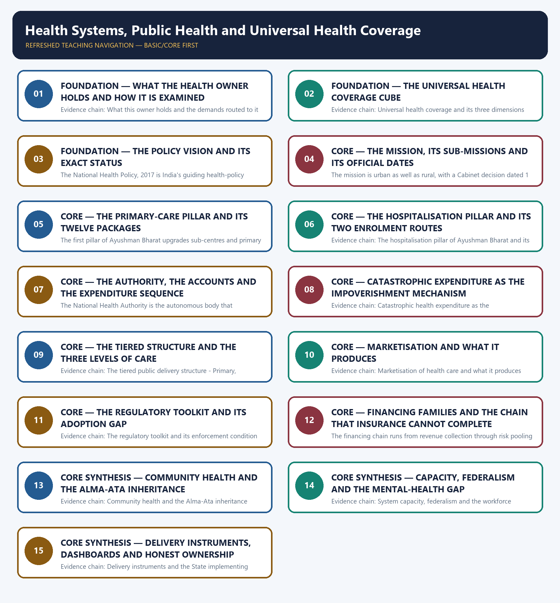

# Health Systems, Public Health and Universal Health Coverage — Learner-v2 Complete Learning Session

> **Authoring-only generation:** 2026-09-02. No PDF was rendered and no tracker or index was mutated.

### SOURCE, PROGRESSION AND CURRENT-LINKAGE AUDIT

- **Generation date:** 2026-09-02.
- **Repository-first evidence:** the Basic owner is taught first and preserved in full; the Advanced owner is retained only in the optional final teaching block.
- **OCR evidence:** Repository Markdown was primary. The OCR-searchable official General Studies question papers held under books\mains and books\more_previous_papers were read only to confirm the printed wording of routed Mains demands. No official answer key, marking scheme, page precision or unsupported quotation was imported from them.
- **Qdrant:** not used; repository Markdown and available OCR context were sufficient.
- **PYQ integrity:** Four General Studies Mains demands and three objective demands are routed to this topic in the audited routing ledgers, and each Mains demand is reproduced below as a demand card with its printed year, paper, question number, directive, marks and word limit exactly as the ledgers record them: 2018 General Studies Paper II Question 7, 2020 General Studies Paper II Question 6, 2021 General Studies Paper II Question 6 and 2024 General Studies Paper II Question 17. The 2020 demand is recorded in the ledger as cross-cutting Core ownership shared with the senior-citizens topic, and that shared ownership is stated openly here rather than being claimed exclusively. Three objective demands are also routed, namely 2023 Prelims General Studies Paper I Question 51 on the maternal and neonatal mortality and institutional-delivery scheme, 2023 Prelims General Studies Paper I Question 75 on the curative, preventive and decentralised character of the Indian public health system, and 2024 Prelims General Studies Paper I Question 99 on the maternal-health abhiyan; the ledger records the official 2018-2023 Prelims keys as not held locally, and for the 2024 question it records that the official Set-A key is available locally while expressly stating that no answer is recorded or inferred, so this package records no option, key or inferred answer for any of the three and converts none of them into a solved question. The locally held OCR-searchable official General Studies papers were read only to confirm the printed wording of the routed Mains demands; no question was invented from them and no marking scheme or page precision was imported. Every model solution below is original work written to the repository's examiner-grade standard using the claim, named evidence, analysis and qualification pattern.
- **Live-link boundary:** One live official source was verified for this topic on 2026-09-02. The National Health Mission's own page was read successfully on that date and states that the National Rural Health Mission was launched by the Prime Minister on 12 April 2005 to provide accessible, affordable and quality health care to the rural population and especially to vulnerable groups, that the Union Cabinet by its decision dated 1 May 2013 approved the launch of the National Urban Health Mission as a sub-mission of an over-arching National Health Mission with the National Rural Health Mission being the other sub-mission, that under the rural mission the Empowered Action Group States as well as the North Eastern States, Jammu and Kashmir and Himachal Pradesh have been given special focus, and that the thrust of the mission is on establishing a fully functional, community-owned, decentralised health delivery system with inter-sectoral convergence at all levels to ensure simultaneous action on determinants of health such as water, sanitation, education, nutrition and social and gender equality, with institutional integration expected to provide a focus on outcomes measured against the Indian Public Health Standards for all health facilities. Only those statements of launch date, Cabinet decision, structure, focus States, thrust and benchmarking are used from that page. The achievement figures displayed on the same page are deliberately not imported, because they are programme-performance claims rather than the structural facts this package needs, and this package asserts no health achievement statistic of any kind. Two further official checks were attempted on the same date and did not yield usable content, namely the national health authority landing page, which returned no readable text, and a scheme portal that failed at the transport level, so nothing was read or used from either and no secondary summary has been treated as an official source. The remaining dated elements used are those already carried by the repository owners with their status checks, namely the National Health Policy, 2017 and its target of raising public health expenditure to two and a half per cent of gross domestic product, the two pillars of the flagship health programme with twelve comprehensive primary health care packages and hospitalisation cover of up to five lakh rupees per family per year, the eligibility-based core route identified through census deprivation criteria alongside the distinct enrolment route for all citizens aged seventy and above, the national health accounts out-of-pocket expenditure sequence of 47.1 per cent for 2019-20, 44.4 per cent for 2020-21 and 39.4 per cent for 2021-22, the Clinical Establishments Act, 2010 with its State-adoption condition, and the Mental Healthcare Act, 2017 with the national tele-mental-health service. Every one of those values is accounting-year-specific or programme-design-specific and is cited with that status. No cumulative card count, claim count, empanelment count or facility count is asserted, no State rank or score is asserted, no health outcome, mortality, morbidity or coverage indicator is asserted, no budget or expenditure number beyond the dated national health accounts sequence is asserted, no scheme eligibility rule beyond the two recorded enrolment routes is asserted, and no previous-year question, official answer key or option is asserted or inferred.
- **Fact/inference discipline:** no current-affairs item, PYQ wording, figure or quotation is invented.

## BASIC LEARNING SESSION



*Distinct embedded teaching-navigation image. The separate continuous Cārvāka-style flowchart package remains an independent at-a-glance artifact.*

### SESSION 1 — FOUNDATION — WHAT THE HEALTH OWNER HOLDS AND HOW IT IS EXAMINED

#### DEFINITION / WHAT THIS IS CALLED

**Plain-language definition:** FOUNDATION — What the health owner holds and how it is examined comprises FOUNDATION, What the health owner holds and how it is examined as its core connected dimensions.

**Technical definition:** Evidence chain: What this owner holds and the demands routed to it Qualified use: Open a health demand by naming the coverage dimension that the question actually tests.

#### ANSWER-GRABBING OPENING — WRITE/ADAPT IN THE EXAM

> Prelims: Retain the exact statute, section, article, ministry, official category, survey round or dated edition attached to What the health owner holds and how it is examined, and never upgrade a policy document into a statute or a targeted scheme into a universal entitlement.

#### MUST-WRITE KEYWORDS

- **FOUNDATION**
- **What the health owner holds**
- **how it is examined**
- **Evidence chain**
- **Qualified use**
- **This**

**How to use them:** Frame the answer through FOUNDATION; define What the health owner holds, connect how it is examined with Evidence chain to explain the mechanism, and use Qualified use for the decisive comparison or qualification.

#### VISUAL FIRST

```text
WHAT THE HEALTH OWNER HOLDS AND HOW IT IS EXAMINED
01. What this owner holds and the demands routed to it
BOUNDARY -> Health-financing macroeconomics belongs to Economy and elderly care is jointly owned.
```

*This topic-specific rail fixes the evidence sequence and its exam boundary before analysis.*

#### CORE EXPLANATION

This topic owns the health half of the capability argument, namely the universal-health-coverage standard, the policy vision, the mission that funds public delivery, the two pillars of the flagship health programme, the tiered public infrastructure and the financial-protection measure by which the whole system is judged, and its distinctive feature is the densest direct-question record in the folder: four General Studies Mains demands from 2018, 2020, 2021 and 2024 and three objective demands from 2023 and 2024 are routed to it in the audited ledgers; the macro economics of health financing belongs to the Economy owner, the elderly-care share of the 2020 demand is jointly owned with the senior-citizens topic, and this topic argues coverage, provision and protection.

#### NAMED EVIDENCE AND MECHANISM

- This topic owns the health half of the capability argument, namely the universal-health-coverage standard, the policy vision, the mission that funds public delivery, the two pillars of the flagship health programme, the tiered public infrastructure and the financial-protection measure by which the whole system is judged, and its distinctive feature is the densest direct-question record in the folder: four General Studies Mains demands from 2018, 2020, 2021 and 2024 and three objective demands from 2023 and 2024 are routed to it in the audited ledgers; the macro economics of health financing belongs to the Economy owner, the elderly-care share of the 2020 demand is jointly owned with the senior-citizens topic, and this topic argues coverage, provision and protection.

#### EXAMINER CAUTION

- Health-financing macroeconomics belongs to Economy and elderly care is jointly owned.

#### EXAM LINK

- **Prelims:** Retain the exact statute, section, article, ministry, official category, survey round or dated edition attached to What the health owner holds and how it is examined, and never upgrade a policy document into a statute or a targeted scheme into a universal entitlement.
- **Mains:** Open a health demand by naming the coverage dimension that the question actually tests.

#### MINI RECAP

- **Evidence chain:** What this owner holds and the demands routed to it
- **Qualified use:** Open a health demand by naming the coverage dimension that the question actually tests.

#### CLOSING RECALL FLOW — FOUNDATION — WHAT THE HEALTH OWNER HOLDS AND HOW IT IS EXAMINED

```text
START / CONCEPT: FOUNDATION — What the health owner holds and how it is examined
        |
        v
EXACT TERMS: FOUNDATION · What the health owner holds · how it is examined · Evidence chain · Qualified use · This
        |
        v
MECHANISM / ARGUMENT: Evidence chain: What this owner holds and the demands routed to it Qualified use: Open a health demand by naming the coverage dimension that the question actually tests.
        |
        v
CONSEQUENCE / CONTRAST: This topic owns the health half of the capability argument, namely the universal-health-coverage standard, the policy vision, the mission that funds public delivery, the two pillars of the flagship health programme, the tiered public infrastructure and the financial-protection measure by which the whole system is judged, and its distinctive feature is the densest direct-question record in the folder: four General Studies Mains demands from 2018, 2020, 2021 and 2024 and three objective demands from 2023 and 2024 are routed to it in the audited ledgers; the macro economics of health financing belongs to the Economy owner, the elderly-care share of the 2020 demand is jointly owned with the senior-citizens topic, and this topic argues coverage, provision and protection.
        |
        v
UPSC TRAP / ANSWER-USE: Do not miss this limiting distinction: health-financing macroeconomics belongs to Economy and elderly care is jointly owned.
        |
        v
ANSWER-GRABBING FORMULATION: Prelims: Retain the exact statute, section, article, ministry, official category, survey round or dated edition attached to What the health owner holds and how it is examined, and never upgrade a policy document into a statute or a targeted scheme into a universal entitlement.
```
### SESSION 2 — FOUNDATION — THE UNIVERSAL HEALTH COVERAGE CUBE

#### DEFINITION / WHAT THIS IS CALLED

**Plain-language definition:** Universal health coverage means ensuring that all people have access to the promotive, preventive, curative and rehabilitative health services they need, of sufficient quality, without suffering financial hardship, and it is analysed on three dimensions that the World Health Organization presents as a cube: population, which is the breadth of who is covered, services, which is the depth of what is covered, and financial protection, which is the height of how little the user pays at the point of service; the analytical value of the cube is that a system can expand on one dimension while contracting on another, so an answer that reports only beneficiary numbers has measured one edge of a three-dimensional claim.

**Technical definition:** Evidence chain: Universal health coverage and its three dimensions Qualified use: Structure any health-system answer on three separable dimensions instead of a scheme list.

#### ANSWER-GRABBING OPENING — WRITE/ADAPT IN THE EXAM

> Universal health coverage means ensuring that all people have access to the promotive, preventive, curative and rehabilitative health services they need, of sufficient quality, without suffering financial hardship, and it is analysed on three dimensions that the World Health Organization presents as a cube: population, which is the breadth of who is covered, services, which is the depth of what is covered, and financial protection, which is the height of how little the user pays at the point of service; the analytical value of the cube is that a system can expand on one dimension while contracting on another, so an answer that reports only beneficiary numbers has measured one edge of a three-dimensional claim.

#### MUST-WRITE KEYWORDS

- **FOUNDATION**
- **The universal health coverage cube**
- **Evidence chain**
- **Qualified use**
- **Universal health coverage**
- **Universal**

**How to use them:** Frame the answer through FOUNDATION; define The universal health coverage cube, connect Evidence chain with Qualified use to explain the mechanism, and use Universal health coverage for the decisive comparison or qualification.

#### VISUAL FIRST

```text
THE UNIVERSAL HEALTH COVERAGE CUBE
01. Universal health coverage and its three dimensions
BOUNDARY -> A system can expand one dimension while contracting another.
```

*This topic-specific rail fixes the evidence sequence and its exam boundary before analysis.*

#### CORE EXPLANATION

Universal health coverage means ensuring that all people have access to the promotive, preventive, curative and rehabilitative health services they need, of sufficient quality, without suffering financial hardship, and it is analysed on three dimensions that the World Health Organization presents as a cube: population, which is the breadth of who is covered, services, which is the depth of what is covered, and financial protection, which is the height of how little the user pays at the point of service; the analytical value of the cube is that a system can expand on one dimension while contracting on another, so an answer that reports only beneficiary numbers has measured one edge of a three-dimensional claim.

#### NAMED EVIDENCE AND MECHANISM

- Universal health coverage means ensuring that all people have access to the promotive, preventive, curative and rehabilitative health services they need, of sufficient quality, without suffering financial hardship, and it is analysed on three dimensions that the World Health Organization presents as a cube: population, which is the breadth of who is covered, services, which is the depth of what is covered, and financial protection, which is the height of how little the user pays at the point of service; the analytical value of the cube is that a system can expand on one dimension while contracting on another, so an answer that reports only beneficiary numbers has measured one edge of a three-dimensional claim.

#### EXAMINER CAUTION

- A system can expand one dimension while contracting another.

#### EXAM LINK

- **Prelims:** Retain the exact statute, section, article, ministry, official category, survey round or dated edition attached to The universal health coverage cube, and never upgrade a policy document into a statute or a targeted scheme into a universal entitlement.
- **Mains:** Structure any health-system answer on three separable dimensions instead of a scheme list.

#### MINI RECAP

- **Evidence chain:** Universal health coverage and its three dimensions
- **Qualified use:** Structure any health-system answer on three separable dimensions instead of a scheme list.

#### CLOSING RECALL FLOW — FOUNDATION — THE UNIVERSAL HEALTH COVERAGE CUBE

```text
START / CONCEPT: FOUNDATION — The universal health coverage cube
        |
        v
EXACT TERMS: FOUNDATION · The universal health coverage cube · Evidence chain · Qualified use · Universal health coverage · Universal
        |
        v
MECHANISM / ARGUMENT: Evidence chain: Universal health coverage and its three dimensions Qualified use: Structure any health-system answer on three separable dimensions instead of a scheme list.
        |
        v
CONSEQUENCE / CONTRAST: A system can expand one dimension while contracting another.
        |
        v
UPSC TRAP / ANSWER-USE: Do not miss this limiting distinction: universal health coverage means ensuring that all people have access to the promotive, preventive...
        |
        v
ANSWER-GRABBING FORMULATION: Universal health coverage means ensuring that all people have access to the promotive, preventive, curative and rehabilitative health services they need, of sufficient quality, without suffering financial hardship, and it is analysed on three dimensions that the World Health Organization presents as a cube: population, which is the breadth of who is covered, services, which is the depth of what is covered, and financial protection, which is the height of how little the user pays at the point of service; the analytical value of the cube is that a system can expand on one dimension while contracting on another, so an answer that reports only beneficiary numbers has measured one edge of a three-dimensional claim.
```
### SESSION 3 — FOUNDATION — THE POLICY VISION AND ITS EXACT STATUS

#### DEFINITION / WHAT THIS IS CALLED

**Plain-language definition:** Evidence chain: The National Health Policy of 2017 and what it is not Qualified use: Cite the national target without upgrading a policy commitment into a legal right.

**Technical definition:** The National Health Policy, 2017 is India's guiding health-policy document, and the owners record its goals as raising public health expenditure to two and a half per cent of gross domestic product, strengthening primary care, achieving universal health coverage and reducing out-of-pocket expenditure; the examinable discipline is that it is a policy document and not an enacted statute, so its targets are commitments rather than justiciable entitlements, and describing them as legally binding is a status error of exactly the kind this folder is built to prevent.

#### ANSWER-GRABBING OPENING — WRITE/ADAPT IN THE EXAM

> Evidence chain: The National Health Policy of 2017 and what it is not Qualified use: Cite the national target without upgrading a policy commitment into a legal right.

#### MUST-WRITE KEYWORDS

- **FOUNDATION**
- **The policy vision**
- **its exact status**
- **Evidence chain**
- **Qualified use**
- **The National Health Policy, 2017**

**How to use them:** Frame the answer through FOUNDATION; define The policy vision, connect its exact status with Evidence chain to explain the mechanism, and use Qualified use for the decisive comparison or qualification.

#### VISUAL FIRST

```text
THE POLICY VISION AND ITS EXACT STATUS
01. The National Health Policy of 2017 and what it is not
BOUNDARY -> The policy is a document, not a statute, so its targets are commitments rather than entitlements.
```

*This topic-specific rail fixes the evidence sequence and its exam boundary before analysis.*

#### CORE EXPLANATION

The National Health Policy, 2017 is India's guiding health-policy document, and the owners record its goals as raising public health expenditure to two and a half per cent of gross domestic product, strengthening primary care, achieving universal health coverage and reducing out-of-pocket expenditure; the examinable discipline is that it is a policy document and not an enacted statute, so its targets are commitments rather than justiciable entitlements, and describing them as legally binding is a status error of exactly the kind this folder is built to prevent.

#### NAMED EVIDENCE AND MECHANISM

- The National Health Policy, 2017 is India's guiding health-policy document, and the owners record its goals as raising public health expenditure to two and a half per cent of gross domestic product, strengthening primary care, achieving universal health coverage and reducing out-of-pocket expenditure; the examinable discipline is that it is a policy document and not an enacted statute, so its targets are commitments rather than justiciable entitlements, and describing them as legally binding is a status error of exactly the kind this folder is built to prevent.

#### EXAMINER CAUTION

- The policy is a document, not a statute, so its targets are commitments rather than entitlements.

#### EXAM LINK

- **Prelims:** Retain the exact statute, section, article, ministry, official category, survey round or dated edition attached to The policy vision and its exact status, and never upgrade a policy document into a statute or a targeted scheme into a universal entitlement.
- **Mains:** Cite the national target without upgrading a policy commitment into a legal right.

#### MINI RECAP

- **Evidence chain:** The National Health Policy of 2017 and what it is not
- **Qualified use:** Cite the national target without upgrading a policy commitment into a legal right.

#### CLOSING RECALL FLOW — FOUNDATION — THE POLICY VISION AND ITS EXACT STATUS

```text
START / CONCEPT: FOUNDATION — The policy vision and its exact status
        |
        v
EXACT TERMS: FOUNDATION · The policy vision · its exact status · Evidence chain · Qualified use · The National Health Policy, 2017
        |
        v
MECHANISM / ARGUMENT: The National Health Policy, 2017 is India's guiding health-policy document, and the owners record its goals as raising public health expenditure to two and a half per cent of gross domestic product, strengthening primary care, achieving universal health coverage and reducing out-of-pocket expenditure; the examinable discipline is that it is a policy document and not an enacted statute, so its targets are commitments rather than justiciable entitlements, and describing them as legally binding is a status error of exactly the kind this folder is built to prevent.
        |
        v
CONSEQUENCE / CONTRAST: The policy is a document, not a statute, so its targets are commitments rather than entitlements.
        |
        v
UPSC TRAP / ANSWER-USE: Do not miss this limiting distinction: the National Health Policy of 2017 and what it is not Qualified use.
        |
        v
ANSWER-GRABBING FORMULATION: Evidence chain: The National Health Policy of 2017 and what it is not Qualified use: Cite the national target without upgrading a policy commitment into a legal right.
```
### SESSION 4 — CORE — THE MISSION, ITS SUB-MISSIONS AND ITS OFFICIAL DATES

#### DEFINITION / WHAT THIS IS CALLED

**Plain-language definition:** The National Health Mission's own official page, read on 2 September 2026, records that the National Rural Health Mission was launched by the Prime Minister on 12 April 2005 to provide accessible, affordable and quality health care to the rural population and especially to vulnerable groups, and that the Union Cabinet, by its decision dated 1 May 2013, approved the launch of the National Urban Health Mission as a sub-mission of an over-arching National Health Mission with the National Rural Health Mission being the other sub-mission; the same page records special focus on the Empowered Action Group States, the North Eastern States, Jammu and Kashmir and Himachal Pradesh, a thrust on a fully functional, community-owned, decentralised health delivery system with inter-sectoral convergence acting on determinants such as water, sanitation, education, nutrition and social and gender equality, and measurement of facilities against the Indian Public Health Standards, so the mission is urban as well as rural and treating it as rural-only is a factual error.

**Technical definition:** The mission is urban as well as rural, with a Cabinet decision dated 1 May 2013 for the urban arm.

#### ANSWER-GRABBING OPENING — WRITE/ADAPT IN THE EXAM

> The National Health Mission's own official page, read on 2 September 2026, records that the National Rural Health Mission was launched by the Prime Minister on 12 April 2005 to provide accessible, affordable and quality health care to the rural population and especially to vulnerable groups, and that the Union Cabinet, by its decision dated 1 May 2013, approved the launch of the National Urban Health Mission as a sub-mission of an over-arching National Health Mission with the National Rural Health Mission being the other sub-mission; the same page records special focus on the Empowered Action Group States, the North Eastern States, Jammu and Kashmir and Himachal Pradesh, a thrust on a fully functional, community-owned, decentralised health delivery system with inter-sectoral convergence acting on determinants such as water, sanitation, education, nutrition and social and gender equality, and measurement of facilities against the Indian Public Health Standards, so the mission is urban as well as rural and treating it as rural-only is a factual error.

#### MUST-WRITE KEYWORDS

- **The mission**
- **its sub-missions**
- **its official dates**
- **Evidence chain**
- **Qualified use**
- **The National Health Mission's**

**How to use them:** Frame the answer through The mission; define its sub-missions, connect its official dates with Evidence chain to explain the mechanism, and use Qualified use for the decisive comparison or qualification.

#### VISUAL FIRST

```text
THE MISSION, ITS SUB-MISSIONS AND ITS OFFICIAL DATES
01. The National Health Mission and its two sub-missions
BOUNDARY -> The mission is urban as well as rural, with a Cabinet decision dated 1 May 2013 for the urban arm.
```

*This topic-specific rail fixes the evidence sequence and its exam boundary before analysis.*

#### CORE EXPLANATION

The National Health Mission's own official page, read on 2 September 2026, records that the National Rural Health Mission was launched by the Prime Minister on 12 April 2005 to provide accessible, affordable and quality health care to the rural population and especially to vulnerable groups, and that the Union Cabinet, by its decision dated 1 May 2013, approved the launch of the National Urban Health Mission as a sub-mission of an over-arching National Health Mission with the National Rural Health Mission being the other sub-mission; the same page records special focus on the Empowered Action Group States, the North Eastern States, Jammu and Kashmir and Himachal Pradesh, a thrust on a fully functional, community-owned, decentralised health delivery system with inter-sectoral convergence acting on determinants such as water, sanitation, education, nutrition and social and gender equality, and measurement of facilities against the Indian Public Health Standards, so the mission is urban as well as rural and treating it as rural-only is a factual error.

#### NAMED EVIDENCE AND MECHANISM

- The National Health Mission's own official page, read on 2 September 2026, records that the National Rural Health Mission was launched by the Prime Minister on 12 April 2005 to provide accessible, affordable and quality health care to the rural population and especially to vulnerable groups, and that the Union Cabinet, by its decision dated 1 May 2013, approved the launch of the National Urban Health Mission as a sub-mission of an over-arching National Health Mission with the National Rural Health Mission being the other sub-mission; the same page records special focus on the Empowered Action Group States, the North Eastern States, Jammu and Kashmir and Himachal Pradesh, a thrust on a fully functional, community-owned, decentralised health delivery system with inter-sectoral convergence acting on determinants such as water, sanitation, education, nutrition and social and gender equality, and measurement of facilities against the Indian Public Health Standards, so the mission is urban as well as rural and treating it as rural-only is a factual error.

#### EXAMINER CAUTION

- The mission is urban as well as rural, with a Cabinet decision dated 1 May 2013 for the urban arm.

#### EXAM LINK

- **Prelims:** Retain the exact statute, section, article, ministry, official category, survey round or dated edition attached to The mission, its sub-missions and its official dates, and never upgrade a policy document into a statute or a targeted scheme into a universal entitlement.
- **Mains:** Anchor public provision in a dated, correctly described national mission.

#### MINI RECAP

- **Evidence chain:** The National Health Mission and its two sub-missions
- **Qualified use:** Anchor public provision in a dated, correctly described national mission.

#### CLOSING RECALL FLOW — CORE — THE MISSION, ITS SUB-MISSIONS AND ITS OFFICIAL DATES

```text
START / CONCEPT: CORE — The mission, its sub-missions and its official dates
        |
        v
EXACT TERMS: The mission · its sub-missions · its official dates · Evidence chain · Qualified use · The National Health Mission's
        |
        v
MECHANISM / ARGUMENT: Evidence chain: The National Health Mission and its two sub-missions Qualified use: Anchor public provision in a dated, correctly described national mission.
        |
        v
CONSEQUENCE / CONTRAST: The mission is urban as well as rural, with a Cabinet decision dated 1 May 2013 for the urban arm.
        |
        v
UPSC TRAP / ANSWER-USE: Do not miss this limiting distinction: the National Health Mission's own official page, read on 2 September 2026, records that...
        |
        v
ANSWER-GRABBING FORMULATION: The National Health Mission's own official page, read on 2 September 2026, records that the National Rural Health Mission was launched by the Prime Minister on 12 April 2005 to provide accessible, affordable and quality health care to the rural population and especially to vulnerable groups, and that the Union Cabinet, by its decision dated 1 May 2013, approved the launch of the National Urban Health Mission as a sub-mission of an over-arching National Health Mission with the National Rural Health Mission being the other sub-mission; the same page records special focus on the Empowered Action Group States, the North Eastern States, Jammu and Kashmir and Himachal Pradesh, a thrust on a fully functional, community-owned, decentralised health delivery system with inter-sectoral convergence acting on determinants such as water, sanitation, education, nutrition and social and gender equality, and measurement of facilities against the Indian Public Health Standards, so the mission is urban as well as rural and treating it as rural-only is a factual error.
```
### SESSION 5 — CORE — THE PRIMARY-CARE PILLAR AND ITS TWELVE PACKAGES

#### DEFINITION / WHAT THIS IS CALLED

**Plain-language definition:** Evidence chain: The primary-care pillar of Ayushman Bharat Qualified use: Show the first-contact layer that a grassroots-reach demand is actually asking about.

**Technical definition:** The first pillar of Ayushman Bharat upgrades sub-centres and primary health centres into Health and Wellness Centres, now carried as Ayushman Arogya Mandirs, which deliver comprehensive primary health care through twelve service packages that extend beyond reproductive and child health to non-communicable diseases, mental health, ear, nose and throat care, ophthalmology, oral health, geriatric and palliative care and emergency care, staffed by a community health officer or mid-level health provider; the design intent is to shift care-seeking from hospitals to a local first-contact layer, which is why describing this pillar as reproductive and child health alone understates it.

#### ANSWER-GRABBING OPENING — WRITE/ADAPT IN THE EXAM

> Evidence chain: The primary-care pillar of Ayushman Bharat Qualified use: Show the first-contact layer that a grassroots-reach demand is actually asking about.

#### MUST-WRITE KEYWORDS

- **The primary-care pillar**
- **its twelve packages**
- **Evidence chain**
- **Qualified use**
- **Ayushman Bharat**
- **Health**

**How to use them:** Frame the answer through The primary-care pillar; define its twelve packages, connect Evidence chain with Qualified use to explain the mechanism, and use Ayushman Bharat for the decisive comparison or qualification.

#### VISUAL FIRST

```text
THE PRIMARY-CARE PILLAR AND ITS TWELVE PACKAGES
01. The primary-care pillar of Ayushman Bharat
BOUNDARY -> Describing this pillar as reproductive and child health alone understates it.
```

*This topic-specific rail fixes the evidence sequence and its exam boundary before analysis.*

#### CORE EXPLANATION

The first pillar of Ayushman Bharat upgrades sub-centres and primary health centres into Health and Wellness Centres, now carried as Ayushman Arogya Mandirs, which deliver comprehensive primary health care through twelve service packages that extend beyond reproductive and child health to non-communicable diseases, mental health, ear, nose and throat care, ophthalmology, oral health, geriatric and palliative care and emergency care, staffed by a community health officer or mid-level health provider; the design intent is to shift care-seeking from hospitals to a local first-contact layer, which is why describing this pillar as reproductive and child health alone understates it.

#### NAMED EVIDENCE AND MECHANISM

- The first pillar of Ayushman Bharat upgrades sub-centres and primary health centres into Health and Wellness Centres, now carried as Ayushman Arogya Mandirs, which deliver comprehensive primary health care through twelve service packages that extend beyond reproductive and child health to non-communicable diseases, mental health, ear, nose and throat care, ophthalmology, oral health, geriatric and palliative care and emergency care, staffed by a community health officer or mid-level health provider; the design intent is to shift care-seeking from hospitals to a local first-contact layer, which is why describing this pillar as reproductive and child health alone understates it.

#### EXAMINER CAUTION

- Describing this pillar as reproductive and child health alone understates it.

#### EXAM LINK

- **Prelims:** Retain the exact statute, section, article, ministry, official category, survey round or dated edition attached to The primary-care pillar and its twelve packages, and never upgrade a policy document into a statute or a targeted scheme into a universal entitlement.
- **Mains:** Show the first-contact layer that a grassroots-reach demand is actually asking about.

#### MINI RECAP

- **Evidence chain:** The primary-care pillar of Ayushman Bharat
- **Qualified use:** Show the first-contact layer that a grassroots-reach demand is actually asking about.

#### CLOSING RECALL FLOW — CORE — THE PRIMARY-CARE PILLAR AND ITS TWELVE PACKAGES

```text
START / CONCEPT: CORE — The primary-care pillar and its twelve packages
        |
        v
EXACT TERMS: The primary-care pillar · its twelve packages · Evidence chain · Qualified use · Ayushman Bharat · Health
        |
        v
MECHANISM / ARGUMENT: The first pillar of Ayushman Bharat upgrades sub-centres and primary health centres into Health and Wellness Centres, now carried as Ayushman Arogya Mandirs, which deliver comprehensive primary health care through twelve service packages that extend beyond reproductive and child health to non-communicable diseases, mental health, ear, nose and throat care, ophthalmology, oral health, geriatric and palliative care and emergency care, staffed by a community health officer or mid-level health provider; the design intent is to shift care-seeking from hospitals to a local first-contact layer, which is why describing this pillar as reproductive and child health alone understates it.
        |
        v
CONSEQUENCE / CONTRAST: Mains: Show the first-contact layer that a grassroots-reach demand is actually asking about.
        |
        v
UPSC TRAP / ANSWER-USE: Do not miss this limiting distinction: the primary-care pillar of Ayushman Bharat Qualified use.
        |
        v
ANSWER-GRABBING FORMULATION: Evidence chain: The primary-care pillar of Ayushman Bharat Qualified use: Show the first-contact layer that a grassroots-reach demand is actually asking about.
```
### SESSION 6 — CORE — THE HOSPITALISATION PILLAR AND ITS TWO ENROLMENT ROUTES

#### DEFINITION / WHAT THIS IS CALLED

**Plain-language definition:** The second pillar, Pradhan Mantri Jan Arogya Yojana, provides cashless secondary and tertiary hospitalisation cover of up to five lakh rupees per family per year at empanelled public and private hospitals for its core eligible households, which are identified through the deprivation criteria of the socio-economic and caste census, and the owners separately record a distinct expansion under which all citizens aged seventy years and above can enrol regardless of income or that census status; the discipline required is exact, because the core scheme is eligibility-based while the age-based expansion is universal only for the seventy-plus group, so an age-specific expansion must never be written up as universal coverage for every age.

**Technical definition:** Evidence chain: The hospitalisation pillar of Ayushman Bharat and its two enrolment routes Qualified use: State an entitlement precisely instead of converting an expansion into universality.

#### ANSWER-GRABBING OPENING — WRITE/ADAPT IN THE EXAM

> Evidence chain: The hospitalisation pillar of Ayushman Bharat and its two enrolment routes Qualified use: State an entitlement precisely instead of converting an expansion into universality.

#### MUST-WRITE KEYWORDS

- **The hospitalisation pillar**
- **its two enrolment routes**
- **Evidence chain**
- **Qualified use**
- **Pradhan Mantri Jan Arogya Yojana**
- **The core route**

**How to use them:** Frame the answer through The hospitalisation pillar; define its two enrolment routes, connect Evidence chain with Qualified use to explain the mechanism, and use Pradhan Mantri Jan Arogya Yojana for the decisive comparison or qualification.

#### VISUAL FIRST

```text
THE HOSPITALISATION PILLAR AND ITS TWO ENROLMENT ROUTES
01. The hospitalisation pillar of Ayushman Bharat and its two enrolment routes
BOUNDARY -> The core route is eligibility-based; only the seventy-plus expansion is age-universal.
```

*This topic-specific rail fixes the evidence sequence and its exam boundary before analysis.*

#### CORE EXPLANATION

The second pillar, Pradhan Mantri Jan Arogya Yojana, provides cashless secondary and tertiary hospitalisation cover of up to five lakh rupees per family per year at empanelled public and private hospitals for its core eligible households, which are identified through the deprivation criteria of the socio-economic and caste census, and the owners separately record a distinct expansion under which all citizens aged seventy years and above can enrol regardless of income or that census status; the discipline required is exact, because the core scheme is eligibility-based while the age-based expansion is universal only for the seventy-plus group, so an age-specific expansion must never be written up as universal coverage for every age.

#### NAMED EVIDENCE AND MECHANISM

- The second pillar, Pradhan Mantri Jan Arogya Yojana, provides cashless secondary and tertiary hospitalisation cover of up to five lakh rupees per family per year at empanelled public and private hospitals for its core eligible households, which are identified through the deprivation criteria of the socio-economic and caste census, and the owners separately record a distinct expansion under which all citizens aged seventy years and above can enrol regardless of income or that census status; the discipline required is exact, because the core scheme is eligibility-based while the age-based expansion is universal only for the seventy-plus group, so an age-specific expansion must never be written up as universal coverage for every age.

#### EXAMINER CAUTION

- The core route is eligibility-based; only the seventy-plus expansion is age-universal.

#### EXAM LINK

- **Prelims:** Retain the exact statute, section, article, ministry, official category, survey round or dated edition attached to The hospitalisation pillar and its two enrolment routes, and never upgrade a policy document into a statute or a targeted scheme into a universal entitlement.
- **Mains:** State an entitlement precisely instead of converting an expansion into universality.

#### MINI RECAP

- **Evidence chain:** The hospitalisation pillar of Ayushman Bharat and its two enrolment routes
- **Qualified use:** State an entitlement precisely instead of converting an expansion into universality.

#### CLOSING RECALL FLOW — CORE — THE HOSPITALISATION PILLAR AND ITS TWO ENROLMENT ROUTES

```text
START / CONCEPT: CORE — The hospitalisation pillar and its two enrolment routes
        |
        v
EXACT TERMS: The hospitalisation pillar · its two enrolment routes · Evidence chain · Qualified use · Pradhan Mantri Jan Arogya Yojana · The core route
        |
        v
MECHANISM / ARGUMENT: The second pillar, Pradhan Mantri Jan Arogya Yojana, provides cashless secondary and tertiary hospitalisation cover of up to five lakh rupees per family per year at empanelled public and private hospitals for its core eligible households, which are identified through the deprivation criteria of the socio-economic and caste census, and the owners separately record a distinct expansion under which all citizens aged seventy years and above can enrol regardless of income or that census status; the discipline required is exact, because the core scheme is eligibility-based while the age-based expansion is universal only for the seventy-plus group, so an age-specific expansion must never be written up as universal coverage for every age.
        |
        v
CONSEQUENCE / CONTRAST: The core route is eligibility-based; only the seventy-plus expansion is age-universal.
        |
        v
UPSC TRAP / ANSWER-USE: Do not miss this limiting distinction: the hospitalisation pillar of Ayushman Bharat and its two enrolment routes Qualified use.
        |
        v
ANSWER-GRABBING FORMULATION: Evidence chain: The hospitalisation pillar of Ayushman Bharat and its two enrolment routes Qualified use: State an entitlement precisely instead of converting an expansion into universality.
```
### SESSION 7 — CORE — THE AUTHORITY, THE ACCOUNTS AND THE EXPENDITURE SEQUENCE

#### DEFINITION / WHAT THIS IS CALLED

**Plain-language definition:** Out-of-pocket expenditure is health spending paid directly by households at the point of service, and the owners record the National Health Accounts sequence as 47.1 per cent of total health expenditure in 2019-20, 44.4 per cent in 2020-21 and 39.4 per cent in 2021-22, with the latest cited official estimate being 39.4 per cent for the accounting year 2021-22; two disciplines follow, first that the publication date must never be confused with the accounting year, and second that a falling national share is a dated aggregate rather than evidence that every household faces a lighter burden, and high out-of-pocket expenditure indicates inadequate public provision rather than high utilisation.

**Technical definition:** The National Health Authority is the autonomous body that implements the hospitalisation pillar, maintaining the beneficiary database, empanelling hospitals and processing claims, while the National Health Accounts estimates are the official source for the breakdown of health expenditure between public, private and out-of-pocket spending and are prepared through the national health accounts system; the owners record expressly that these two must not be confused, because one is an implementing agency and the other is an accounting estimate, and citing an expenditure share to the implementing agency is a sourcing error.

#### ANSWER-GRABBING OPENING — WRITE/ADAPT IN THE EXAM

> Evidence chain: The health authority and the health accounts must not be conflated - Out-of-pocket expenditure and its dated official sequence Qualified use: Attribute a financial-protection figure to the right body with its accounting year.

#### MUST-WRITE KEYWORDS

- **The authority**
- **the accounts**
- **the expenditure sequence**
- **Evidence chain**
- **Qualified use**
- **2019-20**

**How to use them:** Frame the answer through The authority; define the accounts, connect the expenditure sequence with Evidence chain to explain the mechanism, and use Qualified use for the decisive comparison or qualification.

#### VISUAL FIRST

```text
THE AUTHORITY, THE ACCOUNTS AND THE EXPENDITURE SEQUENCE
01. The health authority and the health accounts must not be conflated
    |
    v
02. Out-of-pocket expenditure and its dated official sequence
BOUNDARY -> The implementing authority and the expenditure estimates are different sources.
```

*This topic-specific rail fixes the evidence sequence and its exam boundary before analysis.*

#### CORE EXPLANATION

The National Health Authority is the autonomous body that implements the hospitalisation pillar, maintaining the beneficiary database, empanelling hospitals and processing claims, while the National Health Accounts estimates are the official source for the breakdown of health expenditure between public, private and out-of-pocket spending and are prepared through the national health accounts system; the owners record expressly that these two must not be confused, because one is an implementing agency and the other is an accounting estimate, and citing an expenditure share to the implementing agency is a sourcing error. Out-of-pocket expenditure is health spending paid directly by households at the point of service, and the owners record the National Health Accounts sequence as 47.1 per cent of total health expenditure in 2019-20, 44.4 per cent in 2020-21 and 39.4 per cent in 2021-22, with the latest cited official estimate being 39.4 per cent for the accounting year 2021-22; two disciplines follow, first that the publication date must never be confused with the accounting year, and second that a falling national share is a dated aggregate rather than evidence that every household faces a lighter burden, and high out-of-pocket expenditure indicates inadequate public provision rather than high utilisation.

#### NAMED EVIDENCE AND MECHANISM

- The National Health Authority is the autonomous body that implements the hospitalisation pillar, maintaining the beneficiary database, empanelling hospitals and processing claims, while the National Health Accounts estimates are the official source for the breakdown of health expenditure between public, private and out-of-pocket spending and are prepared through the national health accounts system; the owners record expressly that these two must not be confused, because one is an implementing agency and the other is an accounting estimate, and citing an expenditure share to the implementing agency is a sourcing error.
- Out-of-pocket expenditure is health spending paid directly by households at the point of service, and the owners record the National Health Accounts sequence as 47.1 per cent of total health expenditure in 2019-20, 44.4 per cent in 2020-21 and 39.4 per cent in 2021-22, with the latest cited official estimate being 39.4 per cent for the accounting year 2021-22; two disciplines follow, first that the publication date must never be confused with the accounting year, and second that a falling national share is a dated aggregate rather than evidence that every household faces a lighter burden, and high out-of-pocket expenditure indicates inadequate public provision rather than high utilisation.

#### EXAMINER CAUTION

- The implementing authority and the expenditure estimates are different sources.

#### EXAM LINK

- **Prelims:** Retain the exact statute, section, article, ministry, official category, survey round or dated edition attached to The authority, the accounts and the expenditure sequence, and never upgrade a policy document into a statute or a targeted scheme into a universal entitlement.
- **Mains:** Attribute a financial-protection figure to the right body with its accounting year.

#### MINI RECAP

- **Evidence chain:** The health authority and the health accounts must not be conflated -> Out-of-pocket expenditure and its dated official sequence
- **Qualified use:** Attribute a financial-protection figure to the right body with its accounting year.

#### CLOSING RECALL FLOW — CORE — THE AUTHORITY, THE ACCOUNTS AND THE EXPENDITURE SEQUENCE

```text
START / CONCEPT: CORE — The authority, the accounts and the expenditure sequence
        |
        v
EXACT TERMS: The authority · the accounts · the expenditure sequence · Evidence chain · Qualified use · 2019-20
        |
        v
MECHANISM / ARGUMENT: Out-of-pocket expenditure is health spending paid directly by households at the point of service, and the owners record the National Health Accounts sequence as 47.1 per cent of total health expenditure in 2019-20, 44.4 per cent in 2020-21 and 39.4 per cent in 2021-22, with the latest cited official estimate being 39.4 per cent for the accounting year 2021-22; two disciplines follow, first that the publication date must never be confused with the accounting year, and second that a falling national share is a dated aggregate rather than evidence that every household faces a lighter burden, and high out-of-pocket expenditure indicates inadequate public provision rather than high utilisation.
        |
        v
CONSEQUENCE / CONTRAST: The National Health Authority is the autonomous body that implements the hospitalisation pillar, maintaining the beneficiary database, empanelling hospitals and processing claims, while the National Health Accounts estimates are the official source for the breakdown of health expenditure between public, private and out-of-pocket spending and are prepared through the national health accounts system; the owners record expressly that these two must not be confused, because one is an implementing agency and the other is an accounting estimate, and citing an expenditure share to the implementing agency is a sourcing error.
        |
        v
UPSC TRAP / ANSWER-USE: Do not miss this limiting distinction: the implementing authority and the expenditure estimates are different sources.
        |
        v
ANSWER-GRABBING FORMULATION: Evidence chain: The health authority and the health accounts must not be conflated - Out-of-pocket expenditure and its dated official sequence Qualified use: Attribute a financial-protection figure to the right body with its accounting year.
```
### SESSION 8 — CORE — CATASTROPHIC EXPENDITURE AS THE IMPOVERISHMENT MECHANISM

#### DEFINITION / WHAT THIS IS CALLED

**Plain-language definition:** Catastrophic health expenditure is health spending that exceeds a threshold share of household income or consumption, commonly stated in the range of ten to twenty-five per cent, and it pushes households into poverty or debt, with high out-of-pocket expenditure as its primary driver; this is the mechanism that makes health a social-justice question rather than only a service-delivery question, because a single hospitalisation can undo years of asset accumulation, and it is the bridge that connects this topic to the poverty and nutrition owner.

**Technical definition:** Evidence chain: Catastrophic health expenditure as the impoverishment mechanism Qualified use: Connect health financing to poverty rather than treating it as service delivery alone.

#### ANSWER-GRABBING OPENING — WRITE/ADAPT IN THE EXAM

> Evidence chain: Catastrophic health expenditure as the impoverishment mechanism Qualified use: Connect health financing to poverty rather than treating it as service delivery alone.

#### MUST-WRITE KEYWORDS

- **Catastrophic expenditure as the impoverishment mechanism**
- **Evidence chain**
- **Qualified use**
- **Catastrophic health expenditure**
- **Catastrophic**
- **Qualified**

**How to use them:** Frame the answer through Catastrophic expenditure as the impoverishment mechanism; define Evidence chain, connect Qualified use with Catastrophic health expenditure to explain the mechanism, and use Catastrophic for the decisive comparison or qualification.

#### VISUAL FIRST

```text
CATASTROPHIC EXPENDITURE AS THE IMPOVERISHMENT MECHANISM
01. Catastrophic health expenditure as the impoverishment mechanism
BOUNDARY -> A single hospitalisation can undo years of asset accumulation.
```

*This topic-specific rail fixes the evidence sequence and its exam boundary before analysis.*

#### CORE EXPLANATION

Catastrophic health expenditure is health spending that exceeds a threshold share of household income or consumption, commonly stated in the range of ten to twenty-five per cent, and it pushes households into poverty or debt, with high out-of-pocket expenditure as its primary driver; this is the mechanism that makes health a social-justice question rather than only a service-delivery question, because a single hospitalisation can undo years of asset accumulation, and it is the bridge that connects this topic to the poverty and nutrition owner.

#### NAMED EVIDENCE AND MECHANISM

- Catastrophic health expenditure is health spending that exceeds a threshold share of household income or consumption, commonly stated in the range of ten to twenty-five per cent, and it pushes households into poverty or debt, with high out-of-pocket expenditure as its primary driver; this is the mechanism that makes health a social-justice question rather than only a service-delivery question, because a single hospitalisation can undo years of asset accumulation, and it is the bridge that connects this topic to the poverty and nutrition owner.

#### EXAMINER CAUTION

- A single hospitalisation can undo years of asset accumulation.

#### EXAM LINK

- **Prelims:** Retain the exact statute, section, article, ministry, official category, survey round or dated edition attached to Catastrophic expenditure as the impoverishment mechanism, and never upgrade a policy document into a statute or a targeted scheme into a universal entitlement.
- **Mains:** Connect health financing to poverty rather than treating it as service delivery alone.

#### MINI RECAP

- **Evidence chain:** Catastrophic health expenditure as the impoverishment mechanism
- **Qualified use:** Connect health financing to poverty rather than treating it as service delivery alone.

#### CLOSING RECALL FLOW — CORE — CATASTROPHIC EXPENDITURE AS THE IMPOVERISHMENT MECHANISM

```text
START / CONCEPT: CORE — Catastrophic expenditure as the impoverishment mechanism
        |
        v
EXACT TERMS: Catastrophic expenditure as the impoverishment mechanism · Evidence chain · Qualified use · Catastrophic health expenditure · Catastrophic · Qualified
        |
        v
MECHANISM / ARGUMENT: Catastrophic health expenditure is health spending that exceeds a threshold share of household income or consumption, commonly stated in the range of ten to twenty-five per cent, and it pushes households into poverty or debt, with high out-of-pocket expenditure as its primary driver; this is the mechanism that makes health a social-justice question rather than only a service-delivery question, because a single hospitalisation can undo years of asset accumulation, and it is the bridge that connects this topic to the poverty and nutrition owner.
        |
        v
CONSEQUENCE / CONTRAST: A single hospitalisation can undo years of asset accumulation.
        |
        v
UPSC TRAP / ANSWER-USE: Do not miss this limiting distinction: catastrophic health expenditure as the impoverishment mechanism Qualified use.
        |
        v
ANSWER-GRABBING FORMULATION: Evidence chain: Catastrophic health expenditure as the impoverishment mechanism Qualified use: Connect health financing to poverty rather than treating it as service delivery alone.
```
### SESSION 9 — CORE — THE TIERED STRUCTURE AND THE THREE LEVELS OF CARE

#### DEFINITION / WHAT THIS IS CALLED

**Plain-language definition:** The public health system is tiered from the sub-centre through the primary health centre and the community health centre to the sub-district and district hospital, and this hierarchy is the referral spine on which the first pillar's upgrade and the second pillar's empanelment both sit; naming the tier at which a failure occurs is what converts a general complaint about public hospitals into a diagnosis, because a vacancy at the sub-centre, a diagnostic gap at the primary health centre and a specialist shortage at the community health centre call for three different corrections.

**Technical definition:** Evidence chain: The tiered public delivery structure - Primary, secondary and tertiary care Qualified use: Locate a delivery failure at a named tier of the referral spine.

#### ANSWER-GRABBING OPENING — WRITE/ADAPT IN THE EXAM

> The public health system is tiered from the sub-centre through the primary health centre and the community health centre to the sub-district and district hospital, and this hierarchy is the referral spine on which the first pillar's upgrade and the second pillar's empanelment both sit; naming the tier at which a failure occurs is what converts a general complaint about public hospitals into a diagnosis, because a vacancy at the sub-centre, a diagnostic gap at the primary health centre and a specialist shortage at the community health centre call for three different corrections.

#### MUST-WRITE KEYWORDS

- **The tiered structure**
- **the three levels of care**
- **Evidence chain**
- **Qualified use**
- **The public health system**
- **Primary care**

**How to use them:** Frame the answer through The tiered structure; define the three levels of care, connect Evidence chain with Qualified use to explain the mechanism, and use The public health system for the decisive comparison or qualification.

#### VISUAL FIRST

```text
THE TIERED STRUCTURE AND THE THREE LEVELS OF CARE
01. The tiered public delivery structure
    |
    v
02. Primary, secondary and tertiary care
BOUNDARY -> Naming the failing tier is what converts a complaint into a diagnosis.
```

*This topic-specific rail fixes the evidence sequence and its exam boundary before analysis.*

#### CORE EXPLANATION

The public health system is tiered from the sub-centre through the primary health centre and the community health centre to the sub-district and district hospital, and this hierarchy is the referral spine on which the first pillar's upgrade and the second pillar's empanelment both sit; naming the tier at which a failure occurs is what converts a general complaint about public hospitals into a diagnosis, because a vacancy at the sub-centre, a diagnostic gap at the primary health centre and a specialist shortage at the community health centre call for three different corrections. Primary care is first-contact preventive, promotive and basic curative care delivered at the wellness centre and the primary health centre, secondary care is specialist outpatient and inpatient care at the community health centre and the district hospital, and tertiary care is super-specialty and advanced procedural care at medical colleges and referral centres; the flagship programme is deliberately split along this line, with the first pillar addressing primary care and the second addressing secondary and tertiary care, so confusing the pillars is simultaneously a factual error and a conceptual one.

#### NAMED EVIDENCE AND MECHANISM

- The public health system is tiered from the sub-centre through the primary health centre and the community health centre to the sub-district and district hospital, and this hierarchy is the referral spine on which the first pillar's upgrade and the second pillar's empanelment both sit; naming the tier at which a failure occurs is what converts a general complaint about public hospitals into a diagnosis, because a vacancy at the sub-centre, a diagnostic gap at the primary health centre and a specialist shortage at the community health centre call for three different corrections.
- Primary care is first-contact preventive, promotive and basic curative care delivered at the wellness centre and the primary health centre, secondary care is specialist outpatient and inpatient care at the community health centre and the district hospital, and tertiary care is super-specialty and advanced procedural care at medical colleges and referral centres; the flagship programme is deliberately split along this line, with the first pillar addressing primary care and the second addressing secondary and tertiary care, so confusing the pillars is simultaneously a factual error and a conceptual one.

#### EXAMINER CAUTION

- Naming the failing tier is what converts a complaint into a diagnosis.

#### EXAM LINK

- **Prelims:** Retain the exact statute, section, article, ministry, official category, survey round or dated edition attached to The tiered structure and the three levels of care, and never upgrade a policy document into a statute or a targeted scheme into a universal entitlement.
- **Mains:** Locate a delivery failure at a named tier of the referral spine.

#### MINI RECAP

- **Evidence chain:** The tiered public delivery structure -> Primary, secondary and tertiary care
- **Qualified use:** Locate a delivery failure at a named tier of the referral spine.

#### CLOSING RECALL FLOW — CORE — THE TIERED STRUCTURE AND THE THREE LEVELS OF CARE

```text
START / CONCEPT: CORE — The tiered structure and the three levels of care
        |
        v
EXACT TERMS: The tiered structure · the three levels of care · Evidence chain · Qualified use · The public health system · Primary care
        |
        v
MECHANISM / ARGUMENT: Evidence chain: The tiered public delivery structure - Primary, secondary and tertiary care Qualified use: Locate a delivery failure at a named tier of the referral spine.
        |
        v
CONSEQUENCE / CONTRAST: Primary care is first-contact preventive, promotive and basic curative care delivered at the wellness centre and the primary health centre, secondary care is specialist outpatient and inpatient care at the community health centre and the district hospital, and tertiary care is super-specialty and advanced procedural care at medical colleges and referral centres; the flagship programme is deliberately split along this line, with the first pillar addressing primary care and the second addressing secondary and tertiary care, so confusing the pillars is simultaneously a factual error and a conceptual one.
        |
        v
UPSC TRAP / ANSWER-USE: Do not miss this limiting distinction: naming the failing tier is what converts a complaint into a diagnosis.
        |
        v
ANSWER-GRABBING FORMULATION: The public health system is tiered from the sub-centre through the primary health centre and the community health centre to the sub-district and district hospital, and this hierarchy is the referral spine on which the first pillar's upgrade and the second pillar's empanelment both sit; naming the tier at which a failure occurs is what converts a general complaint about public hospitals into a diagnosis, because a vacancy at the sub-centre, a diagnostic gap at the primary health centre and a specialist shortage at the community health centre call for three different corrections.
```
### SESSION 10 — CORE — MARKETISATION AND WHAT IT PRODUCES

#### DEFINITION / WHAT THIS IS CALLED

**Plain-language definition:** Marketisation refers to the dominance of private providers in curative care, often unregulated or under-regulated, and the owners record its consequences as high costs, unnecessary procedures, catastrophic spending and inequitable access; this is the exact concern raised by the 2024 demand, so an answer to it must define the phenomenon and its harms before proposing measures, and must avoid the two symmetrical errors of denying the private sector's real capacity contribution and of treating regulation as automatic once a statute exists.

**Technical definition:** Evidence chain: Marketisation of health care and what it produces Qualified use: Define the phenomenon the 2024 demand names before proposing any measure.

#### ANSWER-GRABBING OPENING — WRITE/ADAPT IN THE EXAM

> Evidence chain: Marketisation of health care and what it produces Qualified use: Define the phenomenon the 2024 demand names before proposing any measure.

#### MUST-WRITE KEYWORDS

- **Marketisation**
- **what it produces**
- **Evidence chain**
- **Qualified use**
- **Neither**
- **Retain**

**How to use them:** Frame the answer through Marketisation; define what it produces, connect Evidence chain with Qualified use to explain the mechanism, and use Neither for the decisive comparison or qualification.

#### VISUAL FIRST

```text
MARKETISATION AND WHAT IT PRODUCES
01. Marketisation of health care and what it produces
BOUNDARY -> Neither deny private capacity nor assume regulation follows automatically from a statute.
```

*This topic-specific rail fixes the evidence sequence and its exam boundary before analysis.*

#### CORE EXPLANATION

Marketisation refers to the dominance of private providers in curative care, often unregulated or under-regulated, and the owners record its consequences as high costs, unnecessary procedures, catastrophic spending and inequitable access; this is the exact concern raised by the 2024 demand, so an answer to it must define the phenomenon and its harms before proposing measures, and must avoid the two symmetrical errors of denying the private sector's real capacity contribution and of treating regulation as automatic once a statute exists.

#### NAMED EVIDENCE AND MECHANISM

- Marketisation refers to the dominance of private providers in curative care, often unregulated or under-regulated, and the owners record its consequences as high costs, unnecessary procedures, catastrophic spending and inequitable access; this is the exact concern raised by the 2024 demand, so an answer to it must define the phenomenon and its harms before proposing measures, and must avoid the two symmetrical errors of denying the private sector's real capacity contribution and of treating regulation as automatic once a statute exists.

#### EXAMINER CAUTION

- Neither deny private capacity nor assume regulation follows automatically from a statute.

#### EXAM LINK

- **Prelims:** Retain the exact statute, section, article, ministry, official category, survey round or dated edition attached to Marketisation and what it produces, and never upgrade a policy document into a statute or a targeted scheme into a universal entitlement.
- **Mains:** Define the phenomenon the 2024 demand names before proposing any measure.

#### MINI RECAP

- **Evidence chain:** Marketisation of health care and what it produces
- **Qualified use:** Define the phenomenon the 2024 demand names before proposing any measure.

#### CLOSING RECALL FLOW — CORE — MARKETISATION AND WHAT IT PRODUCES

```text
START / CONCEPT: CORE — Marketisation and what it produces
        |
        v
EXACT TERMS: Marketisation · what it produces · Evidence chain · Qualified use · Neither · Retain
        |
        v
MECHANISM / ARGUMENT: Prelims: Retain the exact statute, section, article, ministry, official category, survey round or dated edition attached to Marketisation and what it produces, and never upgrade a policy document into a statute or a targeted scheme into a universal entitlement.
        |
        v
CONSEQUENCE / CONTRAST: Marketisation refers to the dominance of private providers in curative care, often unregulated or under-regulated, and the owners record its consequences as high costs, unnecessary procedures, catastrophic spending and inequitable access; this is the exact concern raised by the 2024 demand, so an answer to it must define the phenomenon and its harms before proposing measures, and must avoid the two symmetrical errors of denying the private sector's real capacity contribution and of treating regulation as automatic once a statute exists.
        |
        v
UPSC TRAP / ANSWER-USE: Do not miss this limiting distinction: neither deny private capacity nor assume regulation follows automatically from a statute.
        |
        v
ANSWER-GRABBING FORMULATION: Evidence chain: Marketisation of health care and what it produces Qualified use: Define the phenomenon the 2024 demand names before proposing any measure.
```
### SESSION 11 — CORE — THE REGULATORY TOOLKIT AND ITS ADOPTION GAP

#### DEFINITION / WHAT THIS IS CALLED

**Plain-language definition:** The regulatory instruments recorded by the owners are the Clinical Establishments Act, 2010, a Central Act providing for the registration and regulation of clinical establishments which States must adopt or replace with equivalent legislation, price capping of the kind exercised by the national pharmaceutical pricing authority over devices, and standard treatment guidelines that promote rational care and cost control; each carries a stated enforcement condition, because State adoption of the Central Act varies and some States have not adopted or notified equivalent rules, and adoption of treatment guidelines varies across public and empanelled private providers, so a recommendation to regulate must name the adoption gap it is closing.

**Technical definition:** Evidence chain: The regulatory toolkit and its enforcement condition Qualified use: Recommend regulation with the adoption condition that makes it real.

#### ANSWER-GRABBING OPENING — WRITE/ADAPT IN THE EXAM

> The regulatory instruments recorded by the owners are the Clinical Establishments Act, 2010, a Central Act providing for the registration and regulation of clinical establishments which States must adopt or replace with equivalent legislation, price capping of the kind exercised by the national pharmaceutical pricing authority over devices, and standard treatment guidelines that promote rational care and cost control; each carries a stated enforcement condition, because State adoption of the Central Act varies and some States have not adopted or notified equivalent rules, and adoption of treatment guidelines varies across public and empanelled private providers, so a recommendation to regulate must name the adoption gap it is closing.

#### MUST-WRITE KEYWORDS

- **The regulatory toolkit**
- **its adoption gap**
- **Evidence chain**
- **Qualified use**
- **The regulatory instruments recorded by the owners**
- **Clinical Establishments Act**

**How to use them:** Frame the answer through The regulatory toolkit; define its adoption gap, connect Evidence chain with Qualified use to explain the mechanism, and use The regulatory instruments recorded by the owners for the decisive comparison or qualification.

#### VISUAL FIRST

```text
THE REGULATORY TOOLKIT AND ITS ADOPTION GAP
01. The regulatory toolkit and its enforcement condition
BOUNDARY -> State adoption of the central regulatory Act and of treatment guidelines varies.
```

*This topic-specific rail fixes the evidence sequence and its exam boundary before analysis.*

#### CORE EXPLANATION

The regulatory instruments recorded by the owners are the Clinical Establishments Act, 2010, a Central Act providing for the registration and regulation of clinical establishments which States must adopt or replace with equivalent legislation, price capping of the kind exercised by the national pharmaceutical pricing authority over devices, and standard treatment guidelines that promote rational care and cost control; each carries a stated enforcement condition, because State adoption of the Central Act varies and some States have not adopted or notified equivalent rules, and adoption of treatment guidelines varies across public and empanelled private providers, so a recommendation to regulate must name the adoption gap it is closing.

#### NAMED EVIDENCE AND MECHANISM

- The regulatory instruments recorded by the owners are the Clinical Establishments Act, 2010, a Central Act providing for the registration and regulation of clinical establishments which States must adopt or replace with equivalent legislation, price capping of the kind exercised by the national pharmaceutical pricing authority over devices, and standard treatment guidelines that promote rational care and cost control; each carries a stated enforcement condition, because State adoption of the Central Act varies and some States have not adopted or notified equivalent rules, and adoption of treatment guidelines varies across public and empanelled private providers, so a recommendation to regulate must name the adoption gap it is closing.

#### EXAMINER CAUTION

- State adoption of the central regulatory Act and of treatment guidelines varies.

#### EXAM LINK

- **Prelims:** Retain the exact statute, section, article, ministry, official category, survey round or dated edition attached to The regulatory toolkit and its adoption gap, and never upgrade a policy document into a statute or a targeted scheme into a universal entitlement.
- **Mains:** Recommend regulation with the adoption condition that makes it real.

#### MINI RECAP

- **Evidence chain:** The regulatory toolkit and its enforcement condition
- **Qualified use:** Recommend regulation with the adoption condition that makes it real.

#### CLOSING RECALL FLOW — CORE — THE REGULATORY TOOLKIT AND ITS ADOPTION GAP

```text
START / CONCEPT: CORE — The regulatory toolkit and its adoption gap
        |
        v
EXACT TERMS: The regulatory toolkit · its adoption gap · Evidence chain · Qualified use · The regulatory instruments recorded by the owners · Clinical Establishments Act
        |
        v
MECHANISM / ARGUMENT: Evidence chain: The regulatory toolkit and its enforcement condition Qualified use: Recommend regulation with the adoption condition that makes it real.
        |
        v
CONSEQUENCE / CONTRAST: The resulting consequence is that the regulatory instruments recorded by the owners are the Clinical Establishments Act, 2010, a...
        |
        v
UPSC TRAP / ANSWER-USE: Do not miss this limiting distinction: the regulatory instruments recorded by the owners are the Clinical Establishments Act, 2010, a...
        |
        v
ANSWER-GRABBING FORMULATION: The regulatory instruments recorded by the owners are the Clinical Establishments Act, 2010, a Central Act providing for the registration and regulation of clinical establishments which States must adopt or replace with equivalent legislation, price capping of the kind exercised by the national pharmaceutical pricing authority over devices, and standard treatment guidelines that promote rational care and cost control; each carries a stated enforcement condition, because State adoption of the Central Act varies and some States have not adopted or notified equivalent rules, and adoption of treatment guidelines varies across public and empanelled private providers, so a recommendation to regulate must name the adoption gap it is closing.
```
### SESSION 12 — CORE — FINANCING FAMILIES AND THE CHAIN THAT INSURANCE CANNOT COMPLETE

#### DEFINITION / WHAT THIS IS CALLED

**Plain-language definition:** CORE — Financing families and the chain that insurance cannot complete comprises Financing families, the chain that insurance cannot complete and Evidence chain as its core connected dimensions.

**Technical definition:** The financing chain runs from revenue collection through risk pooling and strategic purchasing to service provision, and the owners record the decisive consequence that insurance without public primary care leaves prevention, medicines and outpatient out-of-pocket expenditure unresolved; this is the analytical core of any question about financial protection, because hospitalisation cover addresses the catastrophic tail while the recurring outpatient and medicine burden, which is where most household health spending actually occurs, is addressed only by funded primary provision.

#### ANSWER-GRABBING OPENING — WRITE/ADAPT IN THE EXAM

> Social health insurance pools contribution-linked cover, of which the employees' state insurance system is the Indian example, whereas tax-funded programmes draw on general revenue, which is how both the health mission and the hospitalisation pillar are financed, and the owners record that India uses a mixed and fragmented architecture rather than one comprehensive national pool; the standing objective-question trap is to describe the hospitalisation pillar as contribution-based social health insurance, which reverses the two financing families.

#### MUST-WRITE KEYWORDS

- **Financing families**
- **the chain that insurance cannot complete**
- **Evidence chain**
- **Qualified use**
- **Social**
- **Indian**

**How to use them:** Frame the answer through Financing families; define the chain that insurance cannot complete, connect Evidence chain with Qualified use to explain the mechanism, and use Social for the decisive comparison or qualification.

#### VISUAL FIRST

```text
FINANCING FAMILIES AND THE CHAIN THAT INSURANCE CANNOT COMPLETE
01. Social health insurance against tax-funded provision
    |
    v
02. The health financing chain and what insurance cannot buy
BOUNDARY -> Insurance without funded primary care leaves prevention, medicines and outpatient costs unresolved.
```

*This topic-specific rail fixes the evidence sequence and its exam boundary before analysis.*

#### CORE EXPLANATION

Social health insurance pools contribution-linked cover, of which the employees' state insurance system is the Indian example, whereas tax-funded programmes draw on general revenue, which is how both the health mission and the hospitalisation pillar are financed, and the owners record that India uses a mixed and fragmented architecture rather than one comprehensive national pool; the standing objective-question trap is to describe the hospitalisation pillar as contribution-based social health insurance, which reverses the two financing families. The financing chain runs from revenue collection through risk pooling and strategic purchasing to service provision, and the owners record the decisive consequence that insurance without public primary care leaves prevention, medicines and outpatient out-of-pocket expenditure unresolved; this is the analytical core of any question about financial protection, because hospitalisation cover addresses the catastrophic tail while the recurring outpatient and medicine burden, which is where most household health spending actually occurs, is addressed only by funded primary provision.

#### NAMED EVIDENCE AND MECHANISM

- Social health insurance pools contribution-linked cover, of which the employees' state insurance system is the Indian example, whereas tax-funded programmes draw on general revenue, which is how both the health mission and the hospitalisation pillar are financed, and the owners record that India uses a mixed and fragmented architecture rather than one comprehensive national pool; the standing objective-question trap is to describe the hospitalisation pillar as contribution-based social health insurance, which reverses the two financing families.
- The financing chain runs from revenue collection through risk pooling and strategic purchasing to service provision, and the owners record the decisive consequence that insurance without public primary care leaves prevention, medicines and outpatient out-of-pocket expenditure unresolved; this is the analytical core of any question about financial protection, because hospitalisation cover addresses the catastrophic tail while the recurring outpatient and medicine burden, which is where most household health spending actually occurs, is addressed only by funded primary provision.

#### EXAMINER CAUTION

- Insurance without funded primary care leaves prevention, medicines and outpatient costs unresolved.

#### EXAM LINK

- **Prelims:** Retain the exact statute, section, article, ministry, official category, survey round or dated edition attached to Financing families and the chain that insurance cannot complete, and never upgrade a policy document into a statute or a targeted scheme into a universal entitlement.
- **Mains:** Answer a financial-protection demand at the level of the financing chain.

#### MINI RECAP

- **Evidence chain:** Social health insurance against tax-funded provision -> The health financing chain and what insurance cannot buy
- **Qualified use:** Answer a financial-protection demand at the level of the financing chain.

#### CLOSING RECALL FLOW — CORE — FINANCING FAMILIES AND THE CHAIN THAT INSURANCE CANNOT COMPLETE

```text
START / CONCEPT: CORE — Financing families and the chain that insurance cannot complete
        |
        v
EXACT TERMS: Financing families · the chain that insurance cannot complete · Evidence chain · Qualified use · Social · Indian
        |
        v
MECHANISM / ARGUMENT: The financing chain runs from revenue collection through risk pooling and strategic purchasing to service provision, and the owners record the decisive consequence that insurance without public primary care leaves prevention, medicines and outpatient out-of-pocket expenditure unresolved; this is the analytical core of any question about financial protection, because hospitalisation cover addresses the catastrophic tail while the recurring outpatient and medicine burden, which is where most household health spending actually occurs, is addressed only by funded primary provision.
        |
        v
CONSEQUENCE / CONTRAST: Evidence chain: Social health insurance against tax-funded provision - The health financing chain and what insurance cannot buy Qualified use: Answer a financial-protection demand at the level of the financing chain.
        |
        v
UPSC TRAP / ANSWER-USE: Do not miss this limiting distinction: social health insurance pools contribution-linked cover, of which the employees' state insurance system is...
        |
        v
ANSWER-GRABBING FORMULATION: Social health insurance pools contribution-linked cover, of which the employees' state insurance system is the Indian example, whereas tax-funded programmes draw on general revenue, which is how both the health mission and the hospitalisation pillar are financed, and the owners record that India uses a mixed and fragmented architecture rather than one comprehensive national pool; the standing objective-question trap is to describe the hospitalisation pillar as contribution-based social health insurance, which reverses the two financing families.
```
### SESSION 13 — CORE SYNTHESIS — COMMUNITY HEALTH AND THE ALMA-ATA INHERITANCE

#### DEFINITION / WHAT THIS IS CALLED

**Plain-language definition:** The owners route community health through the Alma-Ata commitments of equity, participation, inter-sectoral action and appropriate technology, and map them onto accredited social health activists, auxiliary nurse midwives, village health, sanitation and nutrition committees and the upgraded wellness centres; this mapping is what allows a community-health demand to be answered with named Indian institutions rather than with an abstract restatement of health for all, and it also explains why inter-sectoral determinants such as water, sanitation and nutrition sit inside a health answer rather than outside it.

**Technical definition:** Evidence chain: Community health and the Alma-Ata inheritance Qualified use: Answer a community-health demand with named Indian institutions.

#### ANSWER-GRABBING OPENING — WRITE/ADAPT IN THE EXAM

> Evidence chain: Community health and the Alma-Ata inheritance Qualified use: Answer a community-health demand with named Indian institutions.

#### MUST-WRITE KEYWORDS

- **CORE SYNTHESIS**
- **Community health**
- **the Alma-Ata inheritance**
- **Evidence chain**
- **Qualified use**
- **Alma-Ata**

**How to use them:** Frame the answer through CORE SYNTHESIS; define Community health, connect the Alma-Ata inheritance with Evidence chain to explain the mechanism, and use Qualified use for the decisive comparison or qualification.

#### VISUAL FIRST

```text
COMMUNITY HEALTH AND THE ALMA-ATA INHERITANCE
01. Community health and the Alma-Ata inheritance
BOUNDARY -> Inter-sectoral determinants belong inside a health answer, not outside it.
```

*This topic-specific rail fixes the evidence sequence and its exam boundary before analysis.*

#### CORE EXPLANATION

The owners route community health through the Alma-Ata commitments of equity, participation, inter-sectoral action and appropriate technology, and map them onto accredited social health activists, auxiliary nurse midwives, village health, sanitation and nutrition committees and the upgraded wellness centres; this mapping is what allows a community-health demand to be answered with named Indian institutions rather than with an abstract restatement of health for all, and it also explains why inter-sectoral determinants such as water, sanitation and nutrition sit inside a health answer rather than outside it.

#### NAMED EVIDENCE AND MECHANISM

- The owners route community health through the Alma-Ata commitments of equity, participation, inter-sectoral action and appropriate technology, and map them onto accredited social health activists, auxiliary nurse midwives, village health, sanitation and nutrition committees and the upgraded wellness centres; this mapping is what allows a community-health demand to be answered with named Indian institutions rather than with an abstract restatement of health for all, and it also explains why inter-sectoral determinants such as water, sanitation and nutrition sit inside a health answer rather than outside it.

#### EXAMINER CAUTION

- Inter-sectoral determinants belong inside a health answer, not outside it.

#### EXAM LINK

- **Prelims:** Retain the exact statute, section, article, ministry, official category, survey round or dated edition attached to Community health and the Alma-Ata inheritance, and never upgrade a policy document into a statute or a targeted scheme into a universal entitlement.
- **Mains:** Answer a community-health demand with named Indian institutions.

#### MINI RECAP

- **Evidence chain:** Community health and the Alma-Ata inheritance
- **Qualified use:** Answer a community-health demand with named Indian institutions.

#### CLOSING RECALL FLOW — CORE SYNTHESIS — COMMUNITY HEALTH AND THE ALMA-ATA INHERITANCE

```text
START / CONCEPT: CORE SYNTHESIS — Community health and the Alma-Ata inheritance
        |
        v
EXACT TERMS: CORE SYNTHESIS · Community health · the Alma-Ata inheritance · Evidence chain · Qualified use · Alma-Ata
        |
        v
MECHANISM / ARGUMENT: The owners route community health through the Alma-Ata commitments of equity, participation, inter-sectoral action and appropriate technology, and map them onto accredited social health activists, auxiliary nurse midwives, village health, sanitation and nutrition committees and the upgraded wellness centres; this mapping is what allows a community-health demand to be answered with named Indian institutions rather than with an abstract restatement of health for all, and it also explains why inter-sectoral determinants such as water, sanitation and nutrition sit inside a health answer rather than outside it.
        |
        v
CONSEQUENCE / CONTRAST: The resulting consequence is that community health and the Alma-Ata inheritance Qualified use.
        |
        v
UPSC TRAP / ANSWER-USE: Do not miss this limiting distinction: community health and the Alma-Ata inheritance Qualified use.
        |
        v
ANSWER-GRABBING FORMULATION: Evidence chain: Community health and the Alma-Ata inheritance Qualified use: Answer a community-health demand with named Indian institutions.
```
### SESSION 14 — CORE SYNTHESIS — CAPACITY, FEDERALISM AND THE MENTAL-HEALTH GAP

#### DEFINITION / WHAT THIS IS CALLED

**Plain-language definition:** The owners record that the health mission, free drugs and diagnostics initiatives and the health-infrastructure mission strengthen systems while uneven State capacity and workforce vacancies limit outcomes, and that Union financing and standards depend on State delivery capacity because health is delivered by the States; the answer consequence is that a national financing announcement is a necessary but not sufficient condition, and that a graded verdict on any national health programme must be conditioned on the delivery capacity of the State in question.

**Technical definition:** Evidence chain: System capacity, federalism and the workforce constraint - Mental health as a rights framework with a capacity gap Qualified use: Condition a verdict on State delivery capacity rather than on national announcements.

#### ANSWER-GRABBING OPENING — WRITE/ADAPT IN THE EXAM

> Evidence chain: System capacity, federalism and the workforce constraint - Mental health as a rights framework with a capacity gap Qualified use: Condition a verdict on State delivery capacity rather than on national announcements.

#### MUST-WRITE KEYWORDS

- **CORE SYNTHESIS**
- **Capacity**
- **federalism**
- **the mental-health gap**
- **Evidence chain**
- **Qualified use**

**How to use them:** Frame the answer through CORE SYNTHESIS; define Capacity, connect federalism with the mental-health gap to explain the mechanism, and use Evidence chain for the decisive comparison or qualification.

#### VISUAL FIRST

```text
CAPACITY, FEDERALISM AND THE MENTAL-HEALTH GAP
01. System capacity, federalism and the workforce constraint
    |
    v
02. Mental health as a rights framework with a capacity gap
BOUNDARY -> A statutory right and a tele-service still leave a district workforce gap.
```

*This topic-specific rail fixes the evidence sequence and its exam boundary before analysis.*

#### CORE EXPLANATION

The owners record that the health mission, free drugs and diagnostics initiatives and the health-infrastructure mission strengthen systems while uneven State capacity and workforce vacancies limit outcomes, and that Union financing and standards depend on State delivery capacity because health is delivered by the States; the answer consequence is that a national financing announcement is a necessary but not sufficient condition, and that a graded verdict on any national health programme must be conditioned on the delivery capacity of the State in question. The Mental Healthcare Act, 2017 supplies a rights framework and the national tele-mental-health service expands access, but the owners record expressly that neither replaces district-level professionals and continuity of care; this is the folder's standard illustration that a statutory right and a technology channel together still leave a human-resource gap, and it is directly usable in any answer that asks whether a legal entitlement has been converted into a service.

#### NAMED EVIDENCE AND MECHANISM

- The owners record that the health mission, free drugs and diagnostics initiatives and the health-infrastructure mission strengthen systems while uneven State capacity and workforce vacancies limit outcomes, and that Union financing and standards depend on State delivery capacity because health is delivered by the States; the answer consequence is that a national financing announcement is a necessary but not sufficient condition, and that a graded verdict on any national health programme must be conditioned on the delivery capacity of the State in question.
- The Mental Healthcare Act, 2017 supplies a rights framework and the national tele-mental-health service expands access, but the owners record expressly that neither replaces district-level professionals and continuity of care; this is the folder's standard illustration that a statutory right and a technology channel together still leave a human-resource gap, and it is directly usable in any answer that asks whether a legal entitlement has been converted into a service.

#### EXAMINER CAUTION

- A statutory right and a tele-service still leave a district workforce gap.

#### EXAM LINK

- **Prelims:** Retain the exact statute, section, article, ministry, official category, survey round or dated edition attached to Capacity, federalism and the mental-health gap, and never upgrade a policy document into a statute or a targeted scheme into a universal entitlement.
- **Mains:** Condition a verdict on State delivery capacity rather than on national announcements.

#### MINI RECAP

- **Evidence chain:** System capacity, federalism and the workforce constraint -> Mental health as a rights framework with a capacity gap
- **Qualified use:** Condition a verdict on State delivery capacity rather than on national announcements.

#### CLOSING RECALL FLOW — CORE SYNTHESIS — CAPACITY, FEDERALISM AND THE MENTAL-HEALTH GAP

```text
START / CONCEPT: CORE SYNTHESIS — Capacity, federalism and the mental-health gap
        |
        v
EXACT TERMS: CORE SYNTHESIS · Capacity · federalism · the mental-health gap · Evidence chain · Qualified use
        |
        v
MECHANISM / ARGUMENT: The owners record that the health mission, free drugs and diagnostics initiatives and the health-infrastructure mission strengthen systems while uneven State capacity and workforce vacancies limit outcomes, and that Union financing and standards depend on State delivery capacity because health is delivered by the States; the answer consequence is that a national financing announcement is a necessary but not sufficient condition, and that a graded verdict on any national health programme must be conditioned on the delivery capacity of the State in question.
        |
        v
CONSEQUENCE / CONTRAST: The Mental Healthcare Act, 2017 supplies a rights framework and the national tele-mental-health service expands access, but the owners record expressly that neither replaces district-level professionals and continuity of care; this is the folder's standard illustration that a statutory right and a technology channel together still leave a human-resource gap, and it is directly usable in any answer that asks whether a legal entitlement has been converted into a service.
        |
        v
UPSC TRAP / ANSWER-USE: Do not miss this limiting distinction: system capacity, federalism and the workforce constraint - Mental health as a rights framework...
        |
        v
ANSWER-GRABBING FORMULATION: Evidence chain: System capacity, federalism and the workforce constraint - Mental health as a rights framework with a capacity gap Qualified use: Condition a verdict on State delivery capacity rather than on national announcements.
```
### SESSION 15 — CORE SYNTHESIS — DELIVERY INSTRUMENTS, DASHBOARDS AND HONEST OWNERSHIP

#### DEFINITION / WHAT THIS IS CALLED

**Plain-language definition:** Cumulative cards and claims are dashboard outputs, not a measure of service quality or financial protection by themselves.

**Technical definition:** Evidence chain: Delivery instruments and the State implementing layer - The dashboard-output boundary and honest question ownership Qualified use: Close with the two-layer delivery arrangement and an explicit dashboard boundary.

#### ANSWER-GRABBING OPENING — WRITE/ADAPT IN THE EXAM

> Evidence chain: Delivery instruments and the State implementing layer - The dashboard-output boundary and honest question ownership Qualified use: Close with the two-layer delivery arrangement and an explicit dashboard boundary.

#### MUST-WRITE KEYWORDS

- **CORE SYNTHESIS**
- **Delivery instruments**
- **dashboards**
- **honest ownership**
- **Evidence chain**
- **Qualified use**

**How to use them:** Frame the answer through CORE SYNTHESIS; define Delivery instruments, connect dashboards with honest ownership to explain the mechanism, and use Evidence chain for the decisive comparison or qualification.

#### VISUAL FIRST

```text
DELIVERY INSTRUMENTS, DASHBOARDS AND HONEST OWNERSHIP
01. Delivery instruments and the State implementing layer
    |
    v
02. The dashboard-output boundary and honest question ownership
BOUNDARY -> Cumulative counts are outputs and prove nothing about quality or protection.
```

*This topic-specific rail fixes the evidence sequence and its exam boundary before analysis.*

#### CORE EXPLANATION

The health mission is a centrally sponsored scheme with Centre-State cost sharing that supports accredited social health activists and auxiliary nurse midwives, free drugs and diagnostics, mobile medical units and maternal-health support of the kind delivered through the maternity protection scheme, while State health agencies implement the hospitalisation pillar at State level and may add State-funded top-up schemes; naming this two-layer arrangement is what allows an answer to explain why identical national schemes produce unequal outcomes across States. The owners record that cumulative card counts and cumulative claim counts are dashboard outputs and are not by themselves a measure of service quality or of financial protection, so this package asserts no card total, claim total, empanelment count, wellness-centre count, expenditure share beyond the dated national health accounts sequence, or state-level rank. On ownership, four General Studies Mains demands are routed to this topic in the audited ledgers, from 2018, 2020, 2021 and 2024, with the 2020 geriatric and maternal-care demand recorded as cross-cutting ownership shared with the senior-citizens topic, and three objective demands are routed, namely the 2023 maternal-health scheme question and the 2023 public-health-system question whose official keys the ledgers record as unavailable locally, and the 2024 maternal-health scheme question for which the ledger records that the official Set-A key is available locally but expressly states that no answer is recorded or inferred; this package therefore records no option for any of the three.

#### NAMED EVIDENCE AND MECHANISM

- The health mission is a centrally sponsored scheme with Centre-State cost sharing that supports accredited social health activists and auxiliary nurse midwives, free drugs and diagnostics, mobile medical units and maternal-health support of the kind delivered through the maternity protection scheme, while State health agencies implement the hospitalisation pillar at State level and may add State-funded top-up schemes; naming this two-layer arrangement is what allows an answer to explain why identical national schemes produce unequal outcomes across States.
- The owners record that cumulative card counts and cumulative claim counts are dashboard outputs and are not by themselves a measure of service quality or of financial protection, so this package asserts no card total, claim total, empanelment count, wellness-centre count, expenditure share beyond the dated national health accounts sequence, or state-level rank. On ownership, four General Studies Mains demands are routed to this topic in the audited ledgers, from 2018, 2020, 2021 and 2024, with the 2020 geriatric and maternal-care demand recorded as cross-cutting ownership shared with the senior-citizens topic, and three objective demands are routed, namely the 2023 maternal-health scheme question and the 2023 public-health-system question whose official keys the ledgers record as unavailable locally, and the 2024 maternal-health scheme question for which the ledger records that the official Set-A key is available locally but expressly states that no answer is recorded or inferred; this package therefore records no option for any of the three.

#### EXAMINER CAUTION

- Cumulative counts are outputs and prove nothing about quality or protection.

#### EXAM LINK

- **Prelims:** Retain the exact statute, section, article, ministry, official category, survey round or dated edition attached to Delivery instruments, dashboards and honest ownership, and never upgrade a policy document into a statute or a targeted scheme into a universal entitlement.
- **Mains:** Close with the two-layer delivery arrangement and an explicit dashboard boundary.

#### MINI RECAP

- **Evidence chain:** Delivery instruments and the State implementing layer -> The dashboard-output boundary and honest question ownership
- **Qualified use:** Close with the two-layer delivery arrangement and an explicit dashboard boundary.
#### COMPLETE BASIC OWNER EVIDENCE BANK

> **Subject:** Social Justice | **Tier:** Must-Do (foundation) | **GS Paper:** GS-II;
> GS-III (health-sector economics).
> **Core area:** NHP 2017; UHC concept; NHM; Ayushman Bharat (HWCs/AAM + PM-JAY);
> public-health infrastructure; OOPE and marketisation.
> **Grounded in:** National Health Policy, 2017; Ayushman Bharat guidelines (MoHFW);
> National Health Mission; National Health Accounts; 2024 GS-II PYQ Q17.
> ✅ = source-grounded | ⚠️ = analytical inference | 📰 = current anchor.
> *Companion: `advanced/03_Health-Systems-Public-Health-and-Universal-Health-Coverage.md`.*

#### 1. Visual foundation

```text
                 UNIVERSAL HEALTH COVERAGE (UHC) CUBE
                 (WHO framework: 3 dimensions)
        ┌────────────────────────────────────────────────┐
        │                                                │
        │   POPULATION ─────> who is covered?            │
        │   (breadth)          (all citizens vs          │
        │                       targeted beneficiaries)  │
        │                                                │
        │   SERVICES ──────> what is covered?            │
        │   (depth)            (promotive, preventive,   │
        │                       curative, rehabilitative)│
        │                                                │
        │   FINANCIAL ─────> at what cost to user?       │
        │   PROTECTION         (OOPE minimised,          │
        │   (height)            catastrophic spend       │
        │                       eliminated)              │
        └────────────────────────────────────────────────┘

        INDIA'S UHC ARCHITECTURE
        ┌────────────────────────────────────────────────┐
        │                                                │
        │   NHP 2017 ──────> policy vision (raise public │
        │                    health expenditure,         │
        │                    primary-care-led model)     │
        │         |                                      │
        │         v                                      │
        │   AYUSHMAN BHARAT (two pillars)                │
        │   ┌──────────────────┬─────────────────────┐   │
        │   │ HWC / AAM        │ PM-JAY              │   │
        │   │ (comprehensive   │ (hospitalisation    │   │
        │   │  primary care)   │  insurance for      │   │
        │   │                  │  secondary/tertiary │   │
        │   │                  │  care)              │   │
        │   └──────────────────┴─────────────────────┘   │
        │         |                    |                 │
        │         v                    v                 │
        │   PUBLIC HEALTH SYSTEM                         │
        │   (sub-centres, PHCs, CHCs, district hospitals)│
        │         |                                      │
        │         v                                      │
        │   NHM (NRHM + NUHM) = umbrella delivery vehicle│
        └────────────────────────────────────────────────┘
```

**Core proposition:** ✅ UHC requires coverage of population, services and
financial protection; India pursues this through Ayushman Bharat's two pillars —
HWC/AAM for comprehensive primary care and PM-JAY for hospitalisation insurance —
layered on the NHM-supported public-health system; the 2024 PYQ Q17 tests the
state's role in containing marketisation and expanding grassroots reach.

#### 2. Essential definitions

| Concept | Exam-ready meaning |
|---|---|
| ✅ **Universal Health Coverage (UHC)** | Ensuring all people have access to needed promotive, preventive, curative and rehabilitative health services of sufficient quality, without suffering financial hardship — the WHO's three-dimension "cube" (population, services, financial protection). |
| ✅ **National Health Policy (NHP), 2017** | India's guiding policy document; goals include raising public health expenditure to 2.5% of GDP, strengthening primary care, achieving UHC and reducing OOPE. |
| ✅ **National Health Mission (NHM)** | Umbrella programme covering NRHM (rural) and NUHM (urban); supports public-health infrastructure, human resources, free drugs/diagnostics and flexible financing for states. |
| ✅ **Ayushman Bharat - Health and Wellness Centres (HWC) / Ayushman Arogya Mandirs (AAM)** | Upgraded sub-centres and PHCs delivering comprehensive primary health care (CPHC): 12 service packages beyond reproductive-child health, including NCDs, mental health, ENT, ophthalmology, oral health and geriatric care. |
| ✅ **Ayushman Bharat - PM-JAY** | Pradhan Mantri Jan Arogya Yojana: provides cashless secondary/tertiary hospitalisation cover up to ₹5 lakh per family per year for its core eligible households. A distinct 2024 expansion enables all citizens aged 70+ to enrol regardless of income; do not describe the core scheme as universal for every age group. |
| ✅ **Out-of-Pocket Expenditure (OOPE)** | Health spending paid directly by households at the point of service; high OOPE can cause catastrophic expenditure. National Health Accounts reported 47.1% in 2019-20, 44.4% in 2020-21 and 39.4% in 2021-22. |
| ⚠️ **Marketisation of healthcare** | Dominance of private providers in curative care, often unregulated or under-regulated; leads to high costs, unnecessary procedures and catastrophic spending — the exact concern raised in 2024 PYQ Q17. |
| ✅ **Public-health-system tiering** | Sub-centre (SC) -> Primary Health Centre (PHC) -> Community Health Centre (CHC) -> Sub-District/District Hospital — the hierarchical public-delivery infrastructure. |

#### 3. How the health-system mechanism works

1. **Policy vision (NHP 2017):** Commits to raising public health expenditure,
   strengthening primary care and achieving UHC; sets aspirational targets.
2. **NHM as umbrella vehicle:** Provides flexible funds, human-resource support
   (ASHA, ANM), free drugs/diagnostics and infrastructure grants to states for
   public-health-system strengthening.
3. **Ayushman Bharat - HWC/AAM (primary care):** Upgrades sub-centres and PHCs
   to deliver 12 CPHC service packages; aims to shift care-seeking from
   hospitals to local wellness centres — the "first contact" layer.
4. **Ayushman Bharat - PM-JAY (hospitalisation insurance):** Provides cashless
   cover for empanelled hospitals (public and private) for secondary/tertiary
   procedures; reduces OOPE for covered beneficiaries.
5. **Outcome:** Population coverage (PM-JAY beneficiary base), service coverage
   (CPHC packages at HWC), financial protection (OOPE reduction).

#### 4. Institutions and tools

- ✅ **Ministry of Health and Family Welfare (MoHFW):** Nodal ministry for NHP,
  NHM, Ayushman Bharat (both pillars).
- ✅ **National Health Authority (NHA):** Autonomous body implementing PM-JAY;
  maintains beneficiary database, empanels hospitals, processes claims.
- ✅ **NHM (NRHM + NUHM):** Centrally-sponsored scheme with Centre-state cost-
  sharing; supports ASHAs, ANMs, free drugs, mobile medical units, Janani
  Suraksha Yojana, etc.
- ✅ **State Health Agencies (SHAs):** Implement PM-JAY at state level; can add
  state-funded top-up schemes.
- ⚠️ **National Health Accounts Estimates:** Official source for health-expenditure
  breakdown (public, private and OOPE), prepared through the National Health Accounts
  system. Do not confuse these estimates with the National Health Authority, which
  implements PM-JAY.

#### 5. Indian applications and examples

- ✅ **2024 GS-II PYQ Q17 (15 marks, 250 words):** "In a crucial domain like the
  public healthcare system the Indian State should play a vital role to contain
  the adverse impact of marketisation of the system. Suggest some measures
  through which the State can enhance the reach of public healthcare at the
  grassroots level." — the expected answer links HWC/AAM expansion, NHM's rural/
  urban public provision, PM-JAY's financial protection and regulatory tools
  (clinical establishment standards, price capping).
- ✅ **PM-JAY 70+ expansion:** All citizens aged 70 years and above can enrol regardless
  of income or SECC status. This is an operational age-based expansion, not merely a
  policy announcement; its separate-card and interaction with other government cover
  should be checked against the current NHA guidance in a live answer.
- ✅ **OOPE sequence:** National Health Accounts put household OOPE at 47.1% of total
  health expenditure in 2019-20, 44.4% in 2020-21 and 39.4% in 2021-22. These are
  dated aggregates, not evidence that every household faces the same burden.

#### 6. Must-Know Facts for Prelims

- ✅ NHP 2017 targets raising public health expenditure to 2.5% of GDP.
- ✅ Ayushman Bharat has two pillars: HWC/AAM (comprehensive primary care) and
  PM-JAY (hospitalisation insurance up to ₹5 lakh/family/year).
- ✅ PM-JAY beneficiaries are identified via SECC deprivation criteria.
- ✅ NHM covers both NRHM (rural) and NUHM (urban).
- ✅ Public-health tiering: sub-centre -> PHC -> CHC -> district hospital.

#### 7. UPSC traps

- ❌ PM-JAY covers all citizens universally. -> Its core coverage is eligibility-based,
  although the distinct 2024 expansion allows every citizen aged 70+ to enrol regardless
  of income. Do not turn an age-specific expansion into universal coverage for all ages.
- ❌ HWC/AAM and PM-JAY are the same programme. -> HWC/AAM is comprehensive
  primary care (preventive + promotive + basic curative); PM-JAY is
  hospitalisation insurance (secondary/tertiary cashless cover) — two distinct
  pillars of Ayushman Bharat.
- ❌ NHM is only for rural areas. -> NHM covers both NRHM (rural) and NUHM
  (urban).
- ❌ High OOPE means high health-system utilisation. -> High OOPE indicates
  inadequate public provision and financial protection; it is a negative
  indicator for UHC.

#### 8. 📰 Current anchor

- 📰 **OOPE (National Health Accounts Estimates):** the latest cited official estimate
  is 39.4% for 2021-22, following 44.4% in 2020-21 and 47.1% in 2019-20. Do not
  confuse publication date with accounting year.
- 📰 **PM-JAY status (21 July 2026):** use the core eligibility route and the separate
  all-70+ enrolment route accurately. Cumulative cards and claims are dashboard outputs,
  not a measure of service quality or financial protection by themselves.

#### 9. PYQ application

- ✅ **2024 Q17 (15 marks):** Structure the answer as:
  1. Define marketisation and its adverse impacts (high costs, unnecessary
     procedures, catastrophic OOPE, inequitable access).
  2. State the constitutional and policy basis for state intervention (DPSP
     Art 47, NHP 2017).
  3. List measures to enhance grassroots reach:
     - Expand HWC/AAM network for comprehensive primary care.
     - Strengthen NHM support (free drugs, diagnostics, ASHA/ANM workforce).
     - PM-JAY financial protection to shift catastrophic burden away from
       households.
     - Regulatory tools: Clinical Establishments Act enforcement, price
       capping (e.g., NPPA for devices), standard treatment guidelines.
     - Public-private partnerships with accountability safeguards.
  4. Conclude with the UHC imperative: state must remain the primary guarantor
     of health security, not a residual provider.

#### 10. Mains angles

- ⚠️ Use the UHC cube (population, services, financial protection) to structure
  any health-system question.
- ⚠️ Distinguish HWC/AAM (primary care, preventive/promotive) from PM-JAY
  (secondary/tertiary, curative, insurance-based) — a frequent exam distinction.
- ⚠️ Frame OOPE reduction as both a health and a social-justice goal —
  catastrophic health expenditure pushes households into poverty.
- ⚠️ Acknowledge the private sector's role while emphasising regulation and
  public-provision strengthening as the state's responsibility.

> **Answer thesis:** The state must contain the adverse impact of healthcare
> marketisation by expanding comprehensive primary care (HWC/AAM), strengthening
> the NHM-supported public-health infrastructure, providing financial protection
> (PM-JAY) and enforcing regulatory standards — a purely market-driven health
> system exacerbates inequality and impoverishment, undermining the capability
> gains that health should deliver.

#### 11. Probable questions

- ✅ **Mains (15 marks, 2024 Q17):** In a crucial domain like the public
  healthcare system the Indian State should play a vital role to contain the
  adverse impact of marketisation of the system. Suggest some measures through
  which the State can enhance the reach of public healthcare at the grassroots
  level.
- ⚠️ **Prelims:** Which of the following is the correct pairing — (a) HWC/AAM:
  hospitalisation insurance, (b) PM-JAY: comprehensive primary care, (c) NHM:
  umbrella for NRHM and NUHM, (d) NHA: policy document?
- ⚠️ **Mains (10 marks):** Distinguish the two pillars of Ayushman Bharat. How
  do they together contribute to Universal Health Coverage?

#### 11A. Answer architecture (10/15/20-mark support)

##### Direct Mains demands owned by Core

- **2018 GS-II:** community health and Health for All.
- **2020 GS-II:** geriatric and maternal care.
- **2021 GS-II:** primary health as a condition for sustainable development. These
  routes supersede the older `advanced/03` pointers.

- **Community health:** Alma-Ata's equity, participation, inter-sectoral action and
  appropriate technology map to ASHAs, ANMs, VHSNCs and Ayushman Arogya Mandirs.
- **Financing chain:** revenue collection -> risk pooling -> strategic purchasing ->
  service provision. Insurance without public primary care leaves prevention,
  medicines and outpatient OOPE unresolved.
- **System capacity:** NHM, free drugs/diagnostics and PM-ABHIM strengthen systems;
  uneven State capacity and workforce vacancies limit outcomes.
- **Mental health:** the Mental Healthcare Act, 2017 supplies a rights framework and
  Tele-MANAS expands access, but neither replaces district professionals and continuity.
- **Federalism:** Union financing and standards depend on State delivery capacity.

**10 marks:** mechanism plus three institutions. **15 marks:** UHC cube, financing and
4-6 evidence units. **20 marks:** integrate primary/hospital/public/mental health,
maternal-geriatric care, federalism and financial protection.

> **Reasoned verdict:** Sustainable UHC is built from community-linked primary care
> upward, not from hospital claims downward.

#### 12. Study links

- ✅ Advanced companion: `advanced/03_Health-Systems-Public-Health-and-Universal-Health-Coverage.md`.
- ✅ `01_Social-Justice-Concept-Inclusion-and-Welfare-State-Framework.md` — the
  capability approach: health inputs must convert into bodily health and life
  capability.
- ✅ `Governance/basic/13_Public-Finance-and-Service-Delivery-Tools.md` — DBT/JAM
  for financial transfers; governance of public-finance flows.
- ✅ `Economy/basic/23_Poverty-Inequality-Social-Sector-and-Inclusive-Growth.md` —
  macro social-sector expenditure framing.
<!-- BEGIN GENERATED PYQ INTEGRATION: 2024-2025 -->

#### Recent PYQ Integration (2024-2025)

> **Status:** 2024-2025 question-level PYQ demand is integrated into this owner.
> **Provenance:** Audited local official-paper routing ledgers: `_PYQ-ROUTING-MAINS-GS1-GS2-ESSAY-2024-2025.md`, `_PYQ-ROUTING-PRELIMS-2024-2025.md`.
> **Answer-key rule:** The official 2024-2025 Prelims Set-A keys are present in the repository and CSAT Set-A keys are supplied; even so, no option or answer is recorded or inferred in this integration.

- **Years represented:** 2024
- **Paper(s):** GS-II, Prelims GS-I
- **Routed question demands:** 2

| Year | Paper | Q | PYQ demand (neutral rendering) | Directive / format | Source status | Owner requirement |
|---:|---|---|---|---|---|---|
| 2024 | GS-II | 17 | State's role against marketisation of public healthcare | Suggest · 15 marks · 250 words | Routed to owning topic | Prepare context, core dimensions, evidence/examples, counterpoint and a concise conclusion. |
| 2024 | Prelims GS-I | 99 | Pradhan Mantri Surakshit Matritva Abhiyan (maternal health) | Objective question; official Set-A key available locally, answer not inferred | Key available locally (official Set-A answer key present); answer not recorded here | Cover the named fact/concept and its likely statement-level distinctions. |

##### What this owner must now support

- State's role against marketisation of public healthcare
- Pradhan Mantri Surakshit Matritva Abhiyan (maternal health)

> This block integrates the 2024-2025 examinable demand and paper metadata. It is kept separate from the 2018-2023 block and does not convert an unkeyed/answer-free objective question into a solved answer.
<!-- END GENERATED PYQ INTEGRATION: 2024-2025 -->

<!-- BEGIN GENERATED PYQ INTEGRATION: 2018-2023 -->

#### Historical PYQ Integration (2018-2023)

> **Status:** Question-level PYQ demand is integrated into this owner.
> **Provenance:** Audited local official-paper routing ledgers: `_PYQ-ROUTING-MAINS-GS1-GS2-ESSAY-2018-2023.md`, `_PYQ-ROUTING-PRELIMS-2018-2023.md`.
> **Answer-key rule:** The official 2018-2023 Prelims/CSAT keys are not held locally; no option or answer has been inferred.

- **Years represented:** 2018, 2020, 2021, 2023
- **Paper(s):** GS-II, Prelims GS-I
- **Routed question demands:** 5

| Year | Paper | Q | PYQ demand (neutral rendering) | Directive / format | Source status | Owner requirement |
|---:|---|---:|---|---|---|---|
| 2018 | GS-II | 7 | Community-level healthcare intervention and Health for All | Explain · 10 marks · 150 words | Core route supersedes older Advanced ownership | Prepare context, core dimensions, evidence/examples, counterpoint and a concise conclusion. |
| 2020 | GS-II | 6 | Health policies for geriatric and maternal care | Discuss · 10 marks · 150 words | Cross-cutting Core ownership | Prepare context, core dimensions, evidence/examples, counterpoint and a concise conclusion. |
| 2021 | GS-II | 6 | Primary health structure as a precondition for sustainable development | Analyze · 10 marks · 150 words | Core route supersedes older Advanced ownership | Prepare context, core dimensions, evidence/examples, counterpoint and a concise conclusion. |
| 2023 | Prelims GS-I | 51 | Janani Suraksha Yojana maternal neonatal mortality institutional delivery | Objective question; official key unavailable locally | Routed; key unavailable locally | Cover the named fact/concept and its likely statement-level distinctions. |
| 2023 | Prelims GS-I | 75 | India public health system curative preventive decentralized approach | Objective question; official key unavailable locally | Routed; key unavailable locally | Cover the named fact/concept and its likely statement-level distinctions. |

##### What this owner must now support

- Community-level healthcare intervention and Health for All
- Health policies for geriatric and maternal care
- Primary health structure as a precondition for sustainable development
- Janani Suraksha Yojana maternal neonatal mortality institutional delivery
- India public health system curative preventive decentralized approach

> The table integrates the examinable demand and paper metadata. It does not turn an unkeyed objective question into a solved answer, and it does not claim that lexical presence alone proves full conceptual sufficiency.
<!-- END GENERATED PYQ INTEGRATION: 2018-2023 -->

#### CLOSING RECALL FLOW — CORE SYNTHESIS — DELIVERY INSTRUMENTS, DASHBOARDS AND HONEST OWNERSHIP

```text
START / CONCEPT: CORE SYNTHESIS — Delivery instruments, dashboards and honest ownership
        |
        v
EXACT TERMS: CORE SYNTHESIS · Delivery instruments · dashboards · honest ownership · Evidence chain · Qualified use
        |
        v
MECHANISM / ARGUMENT: Cumulative cards and claims are dashboard outputs, not a measure of service quality or financial protection by themselves.
        |
        v
CONSEQUENCE / CONTRAST: The owners record that cumulative card counts and cumulative claim counts are dashboard outputs and are not by themselves a measure of service quality or of financial protection, so this package asserts no card total, claim total, empanelment count, wellness-centre count, expenditure share beyond the dated national health accounts sequence, or state-level rank.
        |
        v
UPSC TRAP / ANSWER-USE: On ownership, four General Studies Mains demands are routed to this topic in the audited ledgers, from 2018, 2020, 2021 and 2024, with the 2020 geriatric and maternal-care demand recorded as cross-cutting ownership shared with the senior-citizens topic, and three objective demands are routed, namely the 2023 maternal-health scheme question and the 2023 public-health-system question whose official keys the ledgers record as unavailable locally, and the 2024 maternal-health scheme question for which the ledger records that the official Set-A key is available locally but expressly states that no answer is recorded or inferred; this package therefore records no option for any of the three.
        |
        v
ANSWER-GRABBING FORMULATION: Evidence chain: Delivery instruments and the State implementing layer - The dashboard-output boundary and honest question ownership Qualified use: Close with the two-layer delivery arrangement and an explicit dashboard boundary.
```
## BASIC MCQS / REMEDIATION

### Q1. Which statement correctly identifies What this owner holds and the demands routed to it?

A. This topic owns the health half of the capability argument, namely the universal-health-coverage standard, the policy vision, the mission that funds public delivery, the two pillars of the flagship health programme, the tiered public infrastructure and the financial-protection measure by which the whole system is judged, and its distinctive feature is the densest direct-question record in the folder: four General Studies Mains demands from 2018, 2020, 2021 and 2024 and three objective demands from 2023 and 2024 are routed to it in the audited ledgers; the macro economics of health financing belongs to the Economy owner, the elderly-care share of the 2020 demand is jointly owned with the senior-citizens topic, and this topic argues coverage, provision and protection.
B. The National Health Policy, 2017 is India's guiding health-policy document, and the owners record its goals as raising public health expenditure to two and a half per cent of gross domestic product, strengthening primary care, achieving universal health coverage and reducing out-of-pocket expenditure; the examinable discipline is that it is a policy document and not an enacted statute, so its targets are commitments rather than justiciable entitlements, and describing them as legally binding is a status error of exactly the kind this folder is built to prevent.
C. Universal health coverage means ensuring that all people have access to the promotive, preventive, curative and rehabilitative health services they need, of sufficient quality, without suffering financial hardship, and it is analysed on three dimensions that the World Health Organization presents as a cube: population, which is the breadth of who is covered, services, which is the depth of what is covered, and financial protection, which is the height of how little the user pays at the point of service; the analytical value of the cube is that a system can expand on one dimension while contracting on another, so an answer that reports only beneficiary numbers has measured one edge of a three-dimensional claim.
D. The National Health Mission's own official page, read on 2 September 2026, records that the National Rural Health Mission was launched by the Prime Minister on 12 April 2005 to provide accessible, affordable and quality health care to the rural population and especially to vulnerable groups, and that the Union Cabinet, by its decision dated 1 May 2013, approved the launch of the National Urban Health Mission as a sub-mission of an over-arching National Health Mission with the National Rural Health Mission being the other sub-mission; the same page records special focus on the Empowered Action Group States, the North Eastern States, Jammu and Kashmir and Himachal Pradesh, a thrust on a fully functional, community-owned, decentralised health delivery system with inter-sectoral convergence acting on determinants such as water, sanitation, education, nutrition and social and gender equality, and measurement of facilities against the Indian Public Health Standards, so the mission is urban as well as rural and treating it as rural-only is a factual error.

**Answer: A.**
**Explanation:** This topic owns the health half of the capability argument, namely the universal-health-coverage standard, the policy vision, the mission that funds public delivery, the two pillars of the flagship health programme, the tiered public infrastructure and the financial-protection measure by which the whole system is judged, and its distinctive feature is the densest direct-question record in the folder: four General Studies Mains demands from 2018, 2020, 2021 and 2024 and three objective demands from 2023 and 2024 are routed to it in the audited ledgers; the macro economics of health financing belongs to the Economy owner, the elderly-care share of the 2020 demand is jointly owned with the senior-citizens topic, and this topic argues coverage, provision and protection. The remaining options belong to different chronology, actor or analytical categories.

### Q2. Which chronology card should be filed under What this owner holds and the demands routed to it?

A. The National Health Policy, 2017 is India's guiding health-policy document, and the owners record its goals as raising public health expenditure to two and a half per cent of gross domestic product, strengthening primary care, achieving universal health coverage and reducing out-of-pocket expenditure; the examinable discipline is that it is a policy document and not an enacted statute, so its targets are commitments rather than justiciable entitlements, and describing them as legally binding is a status error of exactly the kind this folder is built to prevent.
B. This topic owns the health half of the capability argument, namely the universal-health-coverage standard, the policy vision, the mission that funds public delivery, the two pillars of the flagship health programme, the tiered public infrastructure and the financial-protection measure by which the whole system is judged, and its distinctive feature is the densest direct-question record in the folder: four General Studies Mains demands from 2018, 2020, 2021 and 2024 and three objective demands from 2023 and 2024 are routed to it in the audited ledgers; the macro economics of health financing belongs to the Economy owner, the elderly-care share of the 2020 demand is jointly owned with the senior-citizens topic, and this topic argues coverage, provision and protection.
C. The first pillar of Ayushman Bharat upgrades sub-centres and primary health centres into Health and Wellness Centres, now carried as Ayushman Arogya Mandirs, which deliver comprehensive primary health care through twelve service packages that extend beyond reproductive and child health to non-communicable diseases, mental health, ear, nose and throat care, ophthalmology, oral health, geriatric and palliative care and emergency care, staffed by a community health officer or mid-level health provider; the design intent is to shift care-seeking from hospitals to a local first-contact layer, which is why describing this pillar as reproductive and child health alone understates it.
D. The National Health Mission's own official page, read on 2 September 2026, records that the National Rural Health Mission was launched by the Prime Minister on 12 April 2005 to provide accessible, affordable and quality health care to the rural population and especially to vulnerable groups, and that the Union Cabinet, by its decision dated 1 May 2013, approved the launch of the National Urban Health Mission as a sub-mission of an over-arching National Health Mission with the National Rural Health Mission being the other sub-mission; the same page records special focus on the Empowered Action Group States, the North Eastern States, Jammu and Kashmir and Himachal Pradesh, a thrust on a fully functional, community-owned, decentralised health delivery system with inter-sectoral convergence acting on determinants such as water, sanitation, education, nutrition and social and gender equality, and measurement of facilities against the Indian Public Health Standards, so the mission is urban as well as rural and treating it as rural-only is a factual error.

**Answer: B.**
**Explanation:** This topic owns the health half of the capability argument, namely the universal-health-coverage standard, the policy vision, the mission that funds public delivery, the two pillars of the flagship health programme, the tiered public infrastructure and the financial-protection measure by which the whole system is judged, and its distinctive feature is the densest direct-question record in the folder: four General Studies Mains demands from 2018, 2020, 2021 and 2024 and three objective demands from 2023 and 2024 are routed to it in the audited ledgers; the macro economics of health financing belongs to the Economy owner, the elderly-care share of the 2020 demand is jointly owned with the senior-citizens topic, and this topic argues coverage, provision and protection. The remaining options belong to different chronology, actor or analytical categories.

### Q3. Which option preserves the source-bounded meaning of What this owner holds and the demands routed to it?

A. The second pillar, Pradhan Mantri Jan Arogya Yojana, provides cashless secondary and tertiary hospitalisation cover of up to five lakh rupees per family per year at empanelled public and private hospitals for its core eligible households, which are identified through the deprivation criteria of the socio-economic and caste census, and the owners separately record a distinct expansion under which all citizens aged seventy years and above can enrol regardless of income or that census status; the discipline required is exact, because the core scheme is eligibility-based while the age-based expansion is universal only for the seventy-plus group, so an age-specific expansion must never be written up as universal coverage for every age.
B. The National Health Mission's own official page, read on 2 September 2026, records that the National Rural Health Mission was launched by the Prime Minister on 12 April 2005 to provide accessible, affordable and quality health care to the rural population and especially to vulnerable groups, and that the Union Cabinet, by its decision dated 1 May 2013, approved the launch of the National Urban Health Mission as a sub-mission of an over-arching National Health Mission with the National Rural Health Mission being the other sub-mission; the same page records special focus on the Empowered Action Group States, the North Eastern States, Jammu and Kashmir and Himachal Pradesh, a thrust on a fully functional, community-owned, decentralised health delivery system with inter-sectoral convergence acting on determinants such as water, sanitation, education, nutrition and social and gender equality, and measurement of facilities against the Indian Public Health Standards, so the mission is urban as well as rural and treating it as rural-only is a factual error.
C. This topic owns the health half of the capability argument, namely the universal-health-coverage standard, the policy vision, the mission that funds public delivery, the two pillars of the flagship health programme, the tiered public infrastructure and the financial-protection measure by which the whole system is judged, and its distinctive feature is the densest direct-question record in the folder: four General Studies Mains demands from 2018, 2020, 2021 and 2024 and three objective demands from 2023 and 2024 are routed to it in the audited ledgers; the macro economics of health financing belongs to the Economy owner, the elderly-care share of the 2020 demand is jointly owned with the senior-citizens topic, and this topic argues coverage, provision and protection.
D. The first pillar of Ayushman Bharat upgrades sub-centres and primary health centres into Health and Wellness Centres, now carried as Ayushman Arogya Mandirs, which deliver comprehensive primary health care through twelve service packages that extend beyond reproductive and child health to non-communicable diseases, mental health, ear, nose and throat care, ophthalmology, oral health, geriatric and palliative care and emergency care, staffed by a community health officer or mid-level health provider; the design intent is to shift care-seeking from hospitals to a local first-contact layer, which is why describing this pillar as reproductive and child health alone understates it.

**Answer: C.**
**Explanation:** This topic owns the health half of the capability argument, namely the universal-health-coverage standard, the policy vision, the mission that funds public delivery, the two pillars of the flagship health programme, the tiered public infrastructure and the financial-protection measure by which the whole system is judged, and its distinctive feature is the densest direct-question record in the folder: four General Studies Mains demands from 2018, 2020, 2021 and 2024 and three objective demands from 2023 and 2024 are routed to it in the audited ledgers; the macro economics of health financing belongs to the Economy owner, the elderly-care share of the 2020 demand is jointly owned with the senior-citizens topic, and this topic argues coverage, provision and protection. The remaining options belong to different chronology, actor or analytical categories.

### Q4. Which statement avoids a close-option trap about What this owner holds and the demands routed to it?

A. The National Health Authority is the autonomous body that implements the hospitalisation pillar, maintaining the beneficiary database, empanelling hospitals and processing claims, while the National Health Accounts estimates are the official source for the breakdown of health expenditure between public, private and out-of-pocket spending and are prepared through the national health accounts system; the owners record expressly that these two must not be confused, because one is an implementing agency and the other is an accounting estimate, and citing an expenditure share to the implementing agency is a sourcing error.
B. The first pillar of Ayushman Bharat upgrades sub-centres and primary health centres into Health and Wellness Centres, now carried as Ayushman Arogya Mandirs, which deliver comprehensive primary health care through twelve service packages that extend beyond reproductive and child health to non-communicable diseases, mental health, ear, nose and throat care, ophthalmology, oral health, geriatric and palliative care and emergency care, staffed by a community health officer or mid-level health provider; the design intent is to shift care-seeking from hospitals to a local first-contact layer, which is why describing this pillar as reproductive and child health alone understates it.
C. The second pillar, Pradhan Mantri Jan Arogya Yojana, provides cashless secondary and tertiary hospitalisation cover of up to five lakh rupees per family per year at empanelled public and private hospitals for its core eligible households, which are identified through the deprivation criteria of the socio-economic and caste census, and the owners separately record a distinct expansion under which all citizens aged seventy years and above can enrol regardless of income or that census status; the discipline required is exact, because the core scheme is eligibility-based while the age-based expansion is universal only for the seventy-plus group, so an age-specific expansion must never be written up as universal coverage for every age.
D. This topic owns the health half of the capability argument, namely the universal-health-coverage standard, the policy vision, the mission that funds public delivery, the two pillars of the flagship health programme, the tiered public infrastructure and the financial-protection measure by which the whole system is judged, and its distinctive feature is the densest direct-question record in the folder: four General Studies Mains demands from 2018, 2020, 2021 and 2024 and three objective demands from 2023 and 2024 are routed to it in the audited ledgers; the macro economics of health financing belongs to the Economy owner, the elderly-care share of the 2020 demand is jointly owned with the senior-citizens topic, and this topic argues coverage, provision and protection.

**Answer: D.**
**Explanation:** This topic owns the health half of the capability argument, namely the universal-health-coverage standard, the policy vision, the mission that funds public delivery, the two pillars of the flagship health programme, the tiered public infrastructure and the financial-protection measure by which the whole system is judged, and its distinctive feature is the densest direct-question record in the folder: four General Studies Mains demands from 2018, 2020, 2021 and 2024 and three objective demands from 2023 and 2024 are routed to it in the audited ledgers; the macro economics of health financing belongs to the Economy owner, the elderly-care share of the 2020 demand is jointly owned with the senior-citizens topic, and this topic argues coverage, provision and protection. The remaining options belong to different chronology, actor or analytical categories.

### Q5. Which statement correctly identifies Universal health coverage and its three dimensions?

A. Universal health coverage means ensuring that all people have access to the promotive, preventive, curative and rehabilitative health services they need, of sufficient quality, without suffering financial hardship, and it is analysed on three dimensions that the World Health Organization presents as a cube: population, which is the breadth of who is covered, services, which is the depth of what is covered, and financial protection, which is the height of how little the user pays at the point of service; the analytical value of the cube is that a system can expand on one dimension while contracting on another, so an answer that reports only beneficiary numbers has measured one edge of a three-dimensional claim.
B. The first pillar of Ayushman Bharat upgrades sub-centres and primary health centres into Health and Wellness Centres, now carried as Ayushman Arogya Mandirs, which deliver comprehensive primary health care through twelve service packages that extend beyond reproductive and child health to non-communicable diseases, mental health, ear, nose and throat care, ophthalmology, oral health, geriatric and palliative care and emergency care, staffed by a community health officer or mid-level health provider; the design intent is to shift care-seeking from hospitals to a local first-contact layer, which is why describing this pillar as reproductive and child health alone understates it.
C. The National Health Mission's own official page, read on 2 September 2026, records that the National Rural Health Mission was launched by the Prime Minister on 12 April 2005 to provide accessible, affordable and quality health care to the rural population and especially to vulnerable groups, and that the Union Cabinet, by its decision dated 1 May 2013, approved the launch of the National Urban Health Mission as a sub-mission of an over-arching National Health Mission with the National Rural Health Mission being the other sub-mission; the same page records special focus on the Empowered Action Group States, the North Eastern States, Jammu and Kashmir and Himachal Pradesh, a thrust on a fully functional, community-owned, decentralised health delivery system with inter-sectoral convergence acting on determinants such as water, sanitation, education, nutrition and social and gender equality, and measurement of facilities against the Indian Public Health Standards, so the mission is urban as well as rural and treating it as rural-only is a factual error.
D. The National Health Policy, 2017 is India's guiding health-policy document, and the owners record its goals as raising public health expenditure to two and a half per cent of gross domestic product, strengthening primary care, achieving universal health coverage and reducing out-of-pocket expenditure; the examinable discipline is that it is a policy document and not an enacted statute, so its targets are commitments rather than justiciable entitlements, and describing them as legally binding is a status error of exactly the kind this folder is built to prevent.

**Answer: A.**
**Explanation:** Universal health coverage means ensuring that all people have access to the promotive, preventive, curative and rehabilitative health services they need, of sufficient quality, without suffering financial hardship, and it is analysed on three dimensions that the World Health Organization presents as a cube: population, which is the breadth of who is covered, services, which is the depth of what is covered, and financial protection, which is the height of how little the user pays at the point of service; the analytical value of the cube is that a system can expand on one dimension while contracting on another, so an answer that reports only beneficiary numbers has measured one edge of a three-dimensional claim. The remaining options belong to different chronology, actor or analytical categories.

### Q6. Which chronology card should be filed under Universal health coverage and its three dimensions?

A. The National Health Mission's own official page, read on 2 September 2026, records that the National Rural Health Mission was launched by the Prime Minister on 12 April 2005 to provide accessible, affordable and quality health care to the rural population and especially to vulnerable groups, and that the Union Cabinet, by its decision dated 1 May 2013, approved the launch of the National Urban Health Mission as a sub-mission of an over-arching National Health Mission with the National Rural Health Mission being the other sub-mission; the same page records special focus on the Empowered Action Group States, the North Eastern States, Jammu and Kashmir and Himachal Pradesh, a thrust on a fully functional, community-owned, decentralised health delivery system with inter-sectoral convergence acting on determinants such as water, sanitation, education, nutrition and social and gender equality, and measurement of facilities against the Indian Public Health Standards, so the mission is urban as well as rural and treating it as rural-only is a factual error.
B. Universal health coverage means ensuring that all people have access to the promotive, preventive, curative and rehabilitative health services they need, of sufficient quality, without suffering financial hardship, and it is analysed on three dimensions that the World Health Organization presents as a cube: population, which is the breadth of who is covered, services, which is the depth of what is covered, and financial protection, which is the height of how little the user pays at the point of service; the analytical value of the cube is that a system can expand on one dimension while contracting on another, so an answer that reports only beneficiary numbers has measured one edge of a three-dimensional claim.
C. The second pillar, Pradhan Mantri Jan Arogya Yojana, provides cashless secondary and tertiary hospitalisation cover of up to five lakh rupees per family per year at empanelled public and private hospitals for its core eligible households, which are identified through the deprivation criteria of the socio-economic and caste census, and the owners separately record a distinct expansion under which all citizens aged seventy years and above can enrol regardless of income or that census status; the discipline required is exact, because the core scheme is eligibility-based while the age-based expansion is universal only for the seventy-plus group, so an age-specific expansion must never be written up as universal coverage for every age.
D. The first pillar of Ayushman Bharat upgrades sub-centres and primary health centres into Health and Wellness Centres, now carried as Ayushman Arogya Mandirs, which deliver comprehensive primary health care through twelve service packages that extend beyond reproductive and child health to non-communicable diseases, mental health, ear, nose and throat care, ophthalmology, oral health, geriatric and palliative care and emergency care, staffed by a community health officer or mid-level health provider; the design intent is to shift care-seeking from hospitals to a local first-contact layer, which is why describing this pillar as reproductive and child health alone understates it.

**Answer: B.**
**Explanation:** Universal health coverage means ensuring that all people have access to the promotive, preventive, curative and rehabilitative health services they need, of sufficient quality, without suffering financial hardship, and it is analysed on three dimensions that the World Health Organization presents as a cube: population, which is the breadth of who is covered, services, which is the depth of what is covered, and financial protection, which is the height of how little the user pays at the point of service; the analytical value of the cube is that a system can expand on one dimension while contracting on another, so an answer that reports only beneficiary numbers has measured one edge of a three-dimensional claim. The remaining options belong to different chronology, actor or analytical categories.

### Q7. Which option preserves the source-bounded meaning of Universal health coverage and its three dimensions?

A. The second pillar, Pradhan Mantri Jan Arogya Yojana, provides cashless secondary and tertiary hospitalisation cover of up to five lakh rupees per family per year at empanelled public and private hospitals for its core eligible households, which are identified through the deprivation criteria of the socio-economic and caste census, and the owners separately record a distinct expansion under which all citizens aged seventy years and above can enrol regardless of income or that census status; the discipline required is exact, because the core scheme is eligibility-based while the age-based expansion is universal only for the seventy-plus group, so an age-specific expansion must never be written up as universal coverage for every age.
B. The National Health Authority is the autonomous body that implements the hospitalisation pillar, maintaining the beneficiary database, empanelling hospitals and processing claims, while the National Health Accounts estimates are the official source for the breakdown of health expenditure between public, private and out-of-pocket spending and are prepared through the national health accounts system; the owners record expressly that these two must not be confused, because one is an implementing agency and the other is an accounting estimate, and citing an expenditure share to the implementing agency is a sourcing error.
C. Universal health coverage means ensuring that all people have access to the promotive, preventive, curative and rehabilitative health services they need, of sufficient quality, without suffering financial hardship, and it is analysed on three dimensions that the World Health Organization presents as a cube: population, which is the breadth of who is covered, services, which is the depth of what is covered, and financial protection, which is the height of how little the user pays at the point of service; the analytical value of the cube is that a system can expand on one dimension while contracting on another, so an answer that reports only beneficiary numbers has measured one edge of a three-dimensional claim.
D. The first pillar of Ayushman Bharat upgrades sub-centres and primary health centres into Health and Wellness Centres, now carried as Ayushman Arogya Mandirs, which deliver comprehensive primary health care through twelve service packages that extend beyond reproductive and child health to non-communicable diseases, mental health, ear, nose and throat care, ophthalmology, oral health, geriatric and palliative care and emergency care, staffed by a community health officer or mid-level health provider; the design intent is to shift care-seeking from hospitals to a local first-contact layer, which is why describing this pillar as reproductive and child health alone understates it.

**Answer: C.**
**Explanation:** Universal health coverage means ensuring that all people have access to the promotive, preventive, curative and rehabilitative health services they need, of sufficient quality, without suffering financial hardship, and it is analysed on three dimensions that the World Health Organization presents as a cube: population, which is the breadth of who is covered, services, which is the depth of what is covered, and financial protection, which is the height of how little the user pays at the point of service; the analytical value of the cube is that a system can expand on one dimension while contracting on another, so an answer that reports only beneficiary numbers has measured one edge of a three-dimensional claim. The remaining options belong to different chronology, actor or analytical categories.

### Q8. Which statement avoids a close-option trap about Universal health coverage and its three dimensions?

A. The second pillar, Pradhan Mantri Jan Arogya Yojana, provides cashless secondary and tertiary hospitalisation cover of up to five lakh rupees per family per year at empanelled public and private hospitals for its core eligible households, which are identified through the deprivation criteria of the socio-economic and caste census, and the owners separately record a distinct expansion under which all citizens aged seventy years and above can enrol regardless of income or that census status; the discipline required is exact, because the core scheme is eligibility-based while the age-based expansion is universal only for the seventy-plus group, so an age-specific expansion must never be written up as universal coverage for every age.
B. Out-of-pocket expenditure is health spending paid directly by households at the point of service, and the owners record the National Health Accounts sequence as 47.1 per cent of total health expenditure in 2019-20, 44.4 per cent in 2020-21 and 39.4 per cent in 2021-22, with the latest cited official estimate being 39.4 per cent for the accounting year 2021-22; two disciplines follow, first that the publication date must never be confused with the accounting year, and second that a falling national share is a dated aggregate rather than evidence that every household faces a lighter burden, and high out-of-pocket expenditure indicates inadequate public provision rather than high utilisation.
C. The National Health Authority is the autonomous body that implements the hospitalisation pillar, maintaining the beneficiary database, empanelling hospitals and processing claims, while the National Health Accounts estimates are the official source for the breakdown of health expenditure between public, private and out-of-pocket spending and are prepared through the national health accounts system; the owners record expressly that these two must not be confused, because one is an implementing agency and the other is an accounting estimate, and citing an expenditure share to the implementing agency is a sourcing error.
D. Universal health coverage means ensuring that all people have access to the promotive, preventive, curative and rehabilitative health services they need, of sufficient quality, without suffering financial hardship, and it is analysed on three dimensions that the World Health Organization presents as a cube: population, which is the breadth of who is covered, services, which is the depth of what is covered, and financial protection, which is the height of how little the user pays at the point of service; the analytical value of the cube is that a system can expand on one dimension while contracting on another, so an answer that reports only beneficiary numbers has measured one edge of a three-dimensional claim.

**Answer: D.**
**Explanation:** Universal health coverage means ensuring that all people have access to the promotive, preventive, curative and rehabilitative health services they need, of sufficient quality, without suffering financial hardship, and it is analysed on three dimensions that the World Health Organization presents as a cube: population, which is the breadth of who is covered, services, which is the depth of what is covered, and financial protection, which is the height of how little the user pays at the point of service; the analytical value of the cube is that a system can expand on one dimension while contracting on another, so an answer that reports only beneficiary numbers has measured one edge of a three-dimensional claim. The remaining options belong to different chronology, actor or analytical categories.

### Q9. Which statement correctly identifies The National Health Policy of 2017 and what it is not?

A. The National Health Policy, 2017 is India's guiding health-policy document, and the owners record its goals as raising public health expenditure to two and a half per cent of gross domestic product, strengthening primary care, achieving universal health coverage and reducing out-of-pocket expenditure; the examinable discipline is that it is a policy document and not an enacted statute, so its targets are commitments rather than justiciable entitlements, and describing them as legally binding is a status error of exactly the kind this folder is built to prevent.
B. The National Health Mission's own official page, read on 2 September 2026, records that the National Rural Health Mission was launched by the Prime Minister on 12 April 2005 to provide accessible, affordable and quality health care to the rural population and especially to vulnerable groups, and that the Union Cabinet, by its decision dated 1 May 2013, approved the launch of the National Urban Health Mission as a sub-mission of an over-arching National Health Mission with the National Rural Health Mission being the other sub-mission; the same page records special focus on the Empowered Action Group States, the North Eastern States, Jammu and Kashmir and Himachal Pradesh, a thrust on a fully functional, community-owned, decentralised health delivery system with inter-sectoral convergence acting on determinants such as water, sanitation, education, nutrition and social and gender equality, and measurement of facilities against the Indian Public Health Standards, so the mission is urban as well as rural and treating it as rural-only is a factual error.
C. The first pillar of Ayushman Bharat upgrades sub-centres and primary health centres into Health and Wellness Centres, now carried as Ayushman Arogya Mandirs, which deliver comprehensive primary health care through twelve service packages that extend beyond reproductive and child health to non-communicable diseases, mental health, ear, nose and throat care, ophthalmology, oral health, geriatric and palliative care and emergency care, staffed by a community health officer or mid-level health provider; the design intent is to shift care-seeking from hospitals to a local first-contact layer, which is why describing this pillar as reproductive and child health alone understates it.
D. The second pillar, Pradhan Mantri Jan Arogya Yojana, provides cashless secondary and tertiary hospitalisation cover of up to five lakh rupees per family per year at empanelled public and private hospitals for its core eligible households, which are identified through the deprivation criteria of the socio-economic and caste census, and the owners separately record a distinct expansion under which all citizens aged seventy years and above can enrol regardless of income or that census status; the discipline required is exact, because the core scheme is eligibility-based while the age-based expansion is universal only for the seventy-plus group, so an age-specific expansion must never be written up as universal coverage for every age.

**Answer: A.**
**Explanation:** The National Health Policy, 2017 is India's guiding health-policy document, and the owners record its goals as raising public health expenditure to two and a half per cent of gross domestic product, strengthening primary care, achieving universal health coverage and reducing out-of-pocket expenditure; the examinable discipline is that it is a policy document and not an enacted statute, so its targets are commitments rather than justiciable entitlements, and describing them as legally binding is a status error of exactly the kind this folder is built to prevent. The remaining options belong to different chronology, actor or analytical categories.

### Q10. Which chronology card should be filed under The National Health Policy of 2017 and what it is not?

A. The first pillar of Ayushman Bharat upgrades sub-centres and primary health centres into Health and Wellness Centres, now carried as Ayushman Arogya Mandirs, which deliver comprehensive primary health care through twelve service packages that extend beyond reproductive and child health to non-communicable diseases, mental health, ear, nose and throat care, ophthalmology, oral health, geriatric and palliative care and emergency care, staffed by a community health officer or mid-level health provider; the design intent is to shift care-seeking from hospitals to a local first-contact layer, which is why describing this pillar as reproductive and child health alone understates it.
B. The National Health Policy, 2017 is India's guiding health-policy document, and the owners record its goals as raising public health expenditure to two and a half per cent of gross domestic product, strengthening primary care, achieving universal health coverage and reducing out-of-pocket expenditure; the examinable discipline is that it is a policy document and not an enacted statute, so its targets are commitments rather than justiciable entitlements, and describing them as legally binding is a status error of exactly the kind this folder is built to prevent.
C. The second pillar, Pradhan Mantri Jan Arogya Yojana, provides cashless secondary and tertiary hospitalisation cover of up to five lakh rupees per family per year at empanelled public and private hospitals for its core eligible households, which are identified through the deprivation criteria of the socio-economic and caste census, and the owners separately record a distinct expansion under which all citizens aged seventy years and above can enrol regardless of income or that census status; the discipline required is exact, because the core scheme is eligibility-based while the age-based expansion is universal only for the seventy-plus group, so an age-specific expansion must never be written up as universal coverage for every age.
D. The National Health Authority is the autonomous body that implements the hospitalisation pillar, maintaining the beneficiary database, empanelling hospitals and processing claims, while the National Health Accounts estimates are the official source for the breakdown of health expenditure between public, private and out-of-pocket spending and are prepared through the national health accounts system; the owners record expressly that these two must not be confused, because one is an implementing agency and the other is an accounting estimate, and citing an expenditure share to the implementing agency is a sourcing error.

**Answer: B.**
**Explanation:** The National Health Policy, 2017 is India's guiding health-policy document, and the owners record its goals as raising public health expenditure to two and a half per cent of gross domestic product, strengthening primary care, achieving universal health coverage and reducing out-of-pocket expenditure; the examinable discipline is that it is a policy document and not an enacted statute, so its targets are commitments rather than justiciable entitlements, and describing them as legally binding is a status error of exactly the kind this folder is built to prevent. The remaining options belong to different chronology, actor or analytical categories.

### Q11. Which option preserves the source-bounded meaning of The National Health Policy of 2017 and what it is not?

A. The second pillar, Pradhan Mantri Jan Arogya Yojana, provides cashless secondary and tertiary hospitalisation cover of up to five lakh rupees per family per year at empanelled public and private hospitals for its core eligible households, which are identified through the deprivation criteria of the socio-economic and caste census, and the owners separately record a distinct expansion under which all citizens aged seventy years and above can enrol regardless of income or that census status; the discipline required is exact, because the core scheme is eligibility-based while the age-based expansion is universal only for the seventy-plus group, so an age-specific expansion must never be written up as universal coverage for every age.
B. The National Health Authority is the autonomous body that implements the hospitalisation pillar, maintaining the beneficiary database, empanelling hospitals and processing claims, while the National Health Accounts estimates are the official source for the breakdown of health expenditure between public, private and out-of-pocket spending and are prepared through the national health accounts system; the owners record expressly that these two must not be confused, because one is an implementing agency and the other is an accounting estimate, and citing an expenditure share to the implementing agency is a sourcing error.
C. The National Health Policy, 2017 is India's guiding health-policy document, and the owners record its goals as raising public health expenditure to two and a half per cent of gross domestic product, strengthening primary care, achieving universal health coverage and reducing out-of-pocket expenditure; the examinable discipline is that it is a policy document and not an enacted statute, so its targets are commitments rather than justiciable entitlements, and describing them as legally binding is a status error of exactly the kind this folder is built to prevent.
D. Out-of-pocket expenditure is health spending paid directly by households at the point of service, and the owners record the National Health Accounts sequence as 47.1 per cent of total health expenditure in 2019-20, 44.4 per cent in 2020-21 and 39.4 per cent in 2021-22, with the latest cited official estimate being 39.4 per cent for the accounting year 2021-22; two disciplines follow, first that the publication date must never be confused with the accounting year, and second that a falling national share is a dated aggregate rather than evidence that every household faces a lighter burden, and high out-of-pocket expenditure indicates inadequate public provision rather than high utilisation.

**Answer: C.**
**Explanation:** The National Health Policy, 2017 is India's guiding health-policy document, and the owners record its goals as raising public health expenditure to two and a half per cent of gross domestic product, strengthening primary care, achieving universal health coverage and reducing out-of-pocket expenditure; the examinable discipline is that it is a policy document and not an enacted statute, so its targets are commitments rather than justiciable entitlements, and describing them as legally binding is a status error of exactly the kind this folder is built to prevent. The remaining options belong to different chronology, actor or analytical categories.

### Q12. Which statement avoids a close-option trap about The National Health Policy of 2017 and what it is not?

A. Catastrophic health expenditure is health spending that exceeds a threshold share of household income or consumption, commonly stated in the range of ten to twenty-five per cent, and it pushes households into poverty or debt, with high out-of-pocket expenditure as its primary driver; this is the mechanism that makes health a social-justice question rather than only a service-delivery question, because a single hospitalisation can undo years of asset accumulation, and it is the bridge that connects this topic to the poverty and nutrition owner.
B. The National Health Authority is the autonomous body that implements the hospitalisation pillar, maintaining the beneficiary database, empanelling hospitals and processing claims, while the National Health Accounts estimates are the official source for the breakdown of health expenditure between public, private and out-of-pocket spending and are prepared through the national health accounts system; the owners record expressly that these two must not be confused, because one is an implementing agency and the other is an accounting estimate, and citing an expenditure share to the implementing agency is a sourcing error.
C. Out-of-pocket expenditure is health spending paid directly by households at the point of service, and the owners record the National Health Accounts sequence as 47.1 per cent of total health expenditure in 2019-20, 44.4 per cent in 2020-21 and 39.4 per cent in 2021-22, with the latest cited official estimate being 39.4 per cent for the accounting year 2021-22; two disciplines follow, first that the publication date must never be confused with the accounting year, and second that a falling national share is a dated aggregate rather than evidence that every household faces a lighter burden, and high out-of-pocket expenditure indicates inadequate public provision rather than high utilisation.
D. The National Health Policy, 2017 is India's guiding health-policy document, and the owners record its goals as raising public health expenditure to two and a half per cent of gross domestic product, strengthening primary care, achieving universal health coverage and reducing out-of-pocket expenditure; the examinable discipline is that it is a policy document and not an enacted statute, so its targets are commitments rather than justiciable entitlements, and describing them as legally binding is a status error of exactly the kind this folder is built to prevent.

**Answer: D.**
**Explanation:** The National Health Policy, 2017 is India's guiding health-policy document, and the owners record its goals as raising public health expenditure to two and a half per cent of gross domestic product, strengthening primary care, achieving universal health coverage and reducing out-of-pocket expenditure; the examinable discipline is that it is a policy document and not an enacted statute, so its targets are commitments rather than justiciable entitlements, and describing them as legally binding is a status error of exactly the kind this folder is built to prevent. The remaining options belong to different chronology, actor or analytical categories.

### Q13. Which statement correctly identifies The National Health Mission and its two sub-missions?

A. The National Health Mission's own official page, read on 2 September 2026, records that the National Rural Health Mission was launched by the Prime Minister on 12 April 2005 to provide accessible, affordable and quality health care to the rural population and especially to vulnerable groups, and that the Union Cabinet, by its decision dated 1 May 2013, approved the launch of the National Urban Health Mission as a sub-mission of an over-arching National Health Mission with the National Rural Health Mission being the other sub-mission; the same page records special focus on the Empowered Action Group States, the North Eastern States, Jammu and Kashmir and Himachal Pradesh, a thrust on a fully functional, community-owned, decentralised health delivery system with inter-sectoral convergence acting on determinants such as water, sanitation, education, nutrition and social and gender equality, and measurement of facilities against the Indian Public Health Standards, so the mission is urban as well as rural and treating it as rural-only is a factual error.
B. The second pillar, Pradhan Mantri Jan Arogya Yojana, provides cashless secondary and tertiary hospitalisation cover of up to five lakh rupees per family per year at empanelled public and private hospitals for its core eligible households, which are identified through the deprivation criteria of the socio-economic and caste census, and the owners separately record a distinct expansion under which all citizens aged seventy years and above can enrol regardless of income or that census status; the discipline required is exact, because the core scheme is eligibility-based while the age-based expansion is universal only for the seventy-plus group, so an age-specific expansion must never be written up as universal coverage for every age.
C. The first pillar of Ayushman Bharat upgrades sub-centres and primary health centres into Health and Wellness Centres, now carried as Ayushman Arogya Mandirs, which deliver comprehensive primary health care through twelve service packages that extend beyond reproductive and child health to non-communicable diseases, mental health, ear, nose and throat care, ophthalmology, oral health, geriatric and palliative care and emergency care, staffed by a community health officer or mid-level health provider; the design intent is to shift care-seeking from hospitals to a local first-contact layer, which is why describing this pillar as reproductive and child health alone understates it.
D. The National Health Authority is the autonomous body that implements the hospitalisation pillar, maintaining the beneficiary database, empanelling hospitals and processing claims, while the National Health Accounts estimates are the official source for the breakdown of health expenditure between public, private and out-of-pocket spending and are prepared through the national health accounts system; the owners record expressly that these two must not be confused, because one is an implementing agency and the other is an accounting estimate, and citing an expenditure share to the implementing agency is a sourcing error.

**Answer: A.**
**Explanation:** The National Health Mission's own official page, read on 2 September 2026, records that the National Rural Health Mission was launched by the Prime Minister on 12 April 2005 to provide accessible, affordable and quality health care to the rural population and especially to vulnerable groups, and that the Union Cabinet, by its decision dated 1 May 2013, approved the launch of the National Urban Health Mission as a sub-mission of an over-arching National Health Mission with the National Rural Health Mission being the other sub-mission; the same page records special focus on the Empowered Action Group States, the North Eastern States, Jammu and Kashmir and Himachal Pradesh, a thrust on a fully functional, community-owned, decentralised health delivery system with inter-sectoral convergence acting on determinants such as water, sanitation, education, nutrition and social and gender equality, and measurement of facilities against the Indian Public Health Standards, so the mission is urban as well as rural and treating it as rural-only is a factual error. The remaining options belong to different chronology, actor or analytical categories.

### Q14. Which chronology card should be filed under The National Health Mission and its two sub-missions?

A. The National Health Authority is the autonomous body that implements the hospitalisation pillar, maintaining the beneficiary database, empanelling hospitals and processing claims, while the National Health Accounts estimates are the official source for the breakdown of health expenditure between public, private and out-of-pocket spending and are prepared through the national health accounts system; the owners record expressly that these two must not be confused, because one is an implementing agency and the other is an accounting estimate, and citing an expenditure share to the implementing agency is a sourcing error.
B. The National Health Mission's own official page, read on 2 September 2026, records that the National Rural Health Mission was launched by the Prime Minister on 12 April 2005 to provide accessible, affordable and quality health care to the rural population and especially to vulnerable groups, and that the Union Cabinet, by its decision dated 1 May 2013, approved the launch of the National Urban Health Mission as a sub-mission of an over-arching National Health Mission with the National Rural Health Mission being the other sub-mission; the same page records special focus on the Empowered Action Group States, the North Eastern States, Jammu and Kashmir and Himachal Pradesh, a thrust on a fully functional, community-owned, decentralised health delivery system with inter-sectoral convergence acting on determinants such as water, sanitation, education, nutrition and social and gender equality, and measurement of facilities against the Indian Public Health Standards, so the mission is urban as well as rural and treating it as rural-only is a factual error.
C. The second pillar, Pradhan Mantri Jan Arogya Yojana, provides cashless secondary and tertiary hospitalisation cover of up to five lakh rupees per family per year at empanelled public and private hospitals for its core eligible households, which are identified through the deprivation criteria of the socio-economic and caste census, and the owners separately record a distinct expansion under which all citizens aged seventy years and above can enrol regardless of income or that census status; the discipline required is exact, because the core scheme is eligibility-based while the age-based expansion is universal only for the seventy-plus group, so an age-specific expansion must never be written up as universal coverage for every age.
D. Out-of-pocket expenditure is health spending paid directly by households at the point of service, and the owners record the National Health Accounts sequence as 47.1 per cent of total health expenditure in 2019-20, 44.4 per cent in 2020-21 and 39.4 per cent in 2021-22, with the latest cited official estimate being 39.4 per cent for the accounting year 2021-22; two disciplines follow, first that the publication date must never be confused with the accounting year, and second that a falling national share is a dated aggregate rather than evidence that every household faces a lighter burden, and high out-of-pocket expenditure indicates inadequate public provision rather than high utilisation.

**Answer: B.**
**Explanation:** The National Health Mission's own official page, read on 2 September 2026, records that the National Rural Health Mission was launched by the Prime Minister on 12 April 2005 to provide accessible, affordable and quality health care to the rural population and especially to vulnerable groups, and that the Union Cabinet, by its decision dated 1 May 2013, approved the launch of the National Urban Health Mission as a sub-mission of an over-arching National Health Mission with the National Rural Health Mission being the other sub-mission; the same page records special focus on the Empowered Action Group States, the North Eastern States, Jammu and Kashmir and Himachal Pradesh, a thrust on a fully functional, community-owned, decentralised health delivery system with inter-sectoral convergence acting on determinants such as water, sanitation, education, nutrition and social and gender equality, and measurement of facilities against the Indian Public Health Standards, so the mission is urban as well as rural and treating it as rural-only is a factual error. The remaining options belong to different chronology, actor or analytical categories.

### Q15. Which option preserves the source-bounded meaning of The National Health Mission and its two sub-missions?

A. Catastrophic health expenditure is health spending that exceeds a threshold share of household income or consumption, commonly stated in the range of ten to twenty-five per cent, and it pushes households into poverty or debt, with high out-of-pocket expenditure as its primary driver; this is the mechanism that makes health a social-justice question rather than only a service-delivery question, because a single hospitalisation can undo years of asset accumulation, and it is the bridge that connects this topic to the poverty and nutrition owner.
B. Out-of-pocket expenditure is health spending paid directly by households at the point of service, and the owners record the National Health Accounts sequence as 47.1 per cent of total health expenditure in 2019-20, 44.4 per cent in 2020-21 and 39.4 per cent in 2021-22, with the latest cited official estimate being 39.4 per cent for the accounting year 2021-22; two disciplines follow, first that the publication date must never be confused with the accounting year, and second that a falling national share is a dated aggregate rather than evidence that every household faces a lighter burden, and high out-of-pocket expenditure indicates inadequate public provision rather than high utilisation.
C. The National Health Mission's own official page, read on 2 September 2026, records that the National Rural Health Mission was launched by the Prime Minister on 12 April 2005 to provide accessible, affordable and quality health care to the rural population and especially to vulnerable groups, and that the Union Cabinet, by its decision dated 1 May 2013, approved the launch of the National Urban Health Mission as a sub-mission of an over-arching National Health Mission with the National Rural Health Mission being the other sub-mission; the same page records special focus on the Empowered Action Group States, the North Eastern States, Jammu and Kashmir and Himachal Pradesh, a thrust on a fully functional, community-owned, decentralised health delivery system with inter-sectoral convergence acting on determinants such as water, sanitation, education, nutrition and social and gender equality, and measurement of facilities against the Indian Public Health Standards, so the mission is urban as well as rural and treating it as rural-only is a factual error.
D. The National Health Authority is the autonomous body that implements the hospitalisation pillar, maintaining the beneficiary database, empanelling hospitals and processing claims, while the National Health Accounts estimates are the official source for the breakdown of health expenditure between public, private and out-of-pocket spending and are prepared through the national health accounts system; the owners record expressly that these two must not be confused, because one is an implementing agency and the other is an accounting estimate, and citing an expenditure share to the implementing agency is a sourcing error.

**Answer: C.**
**Explanation:** The National Health Mission's own official page, read on 2 September 2026, records that the National Rural Health Mission was launched by the Prime Minister on 12 April 2005 to provide accessible, affordable and quality health care to the rural population and especially to vulnerable groups, and that the Union Cabinet, by its decision dated 1 May 2013, approved the launch of the National Urban Health Mission as a sub-mission of an over-arching National Health Mission with the National Rural Health Mission being the other sub-mission; the same page records special focus on the Empowered Action Group States, the North Eastern States, Jammu and Kashmir and Himachal Pradesh, a thrust on a fully functional, community-owned, decentralised health delivery system with inter-sectoral convergence acting on determinants such as water, sanitation, education, nutrition and social and gender equality, and measurement of facilities against the Indian Public Health Standards, so the mission is urban as well as rural and treating it as rural-only is a factual error. The remaining options belong to different chronology, actor or analytical categories.

### Q16. Which statement avoids a close-option trap about The National Health Mission and its two sub-missions?

A. Catastrophic health expenditure is health spending that exceeds a threshold share of household income or consumption, commonly stated in the range of ten to twenty-five per cent, and it pushes households into poverty or debt, with high out-of-pocket expenditure as its primary driver; this is the mechanism that makes health a social-justice question rather than only a service-delivery question, because a single hospitalisation can undo years of asset accumulation, and it is the bridge that connects this topic to the poverty and nutrition owner.
B. The public health system is tiered from the sub-centre through the primary health centre and the community health centre to the sub-district and district hospital, and this hierarchy is the referral spine on which the first pillar's upgrade and the second pillar's empanelment both sit; naming the tier at which a failure occurs is what converts a general complaint about public hospitals into a diagnosis, because a vacancy at the sub-centre, a diagnostic gap at the primary health centre and a specialist shortage at the community health centre call for three different corrections.
C. Out-of-pocket expenditure is health spending paid directly by households at the point of service, and the owners record the National Health Accounts sequence as 47.1 per cent of total health expenditure in 2019-20, 44.4 per cent in 2020-21 and 39.4 per cent in 2021-22, with the latest cited official estimate being 39.4 per cent for the accounting year 2021-22; two disciplines follow, first that the publication date must never be confused with the accounting year, and second that a falling national share is a dated aggregate rather than evidence that every household faces a lighter burden, and high out-of-pocket expenditure indicates inadequate public provision rather than high utilisation.
D. The National Health Mission's own official page, read on 2 September 2026, records that the National Rural Health Mission was launched by the Prime Minister on 12 April 2005 to provide accessible, affordable and quality health care to the rural population and especially to vulnerable groups, and that the Union Cabinet, by its decision dated 1 May 2013, approved the launch of the National Urban Health Mission as a sub-mission of an over-arching National Health Mission with the National Rural Health Mission being the other sub-mission; the same page records special focus on the Empowered Action Group States, the North Eastern States, Jammu and Kashmir and Himachal Pradesh, a thrust on a fully functional, community-owned, decentralised health delivery system with inter-sectoral convergence acting on determinants such as water, sanitation, education, nutrition and social and gender equality, and measurement of facilities against the Indian Public Health Standards, so the mission is urban as well as rural and treating it as rural-only is a factual error.

**Answer: D.**
**Explanation:** The National Health Mission's own official page, read on 2 September 2026, records that the National Rural Health Mission was launched by the Prime Minister on 12 April 2005 to provide accessible, affordable and quality health care to the rural population and especially to vulnerable groups, and that the Union Cabinet, by its decision dated 1 May 2013, approved the launch of the National Urban Health Mission as a sub-mission of an over-arching National Health Mission with the National Rural Health Mission being the other sub-mission; the same page records special focus on the Empowered Action Group States, the North Eastern States, Jammu and Kashmir and Himachal Pradesh, a thrust on a fully functional, community-owned, decentralised health delivery system with inter-sectoral convergence acting on determinants such as water, sanitation, education, nutrition and social and gender equality, and measurement of facilities against the Indian Public Health Standards, so the mission is urban as well as rural and treating it as rural-only is a factual error. The remaining options belong to different chronology, actor or analytical categories.

### Q17. Which statement correctly identifies The primary-care pillar of Ayushman Bharat?

A. The first pillar of Ayushman Bharat upgrades sub-centres and primary health centres into Health and Wellness Centres, now carried as Ayushman Arogya Mandirs, which deliver comprehensive primary health care through twelve service packages that extend beyond reproductive and child health to non-communicable diseases, mental health, ear, nose and throat care, ophthalmology, oral health, geriatric and palliative care and emergency care, staffed by a community health officer or mid-level health provider; the design intent is to shift care-seeking from hospitals to a local first-contact layer, which is why describing this pillar as reproductive and child health alone understates it.
B. The National Health Authority is the autonomous body that implements the hospitalisation pillar, maintaining the beneficiary database, empanelling hospitals and processing claims, while the National Health Accounts estimates are the official source for the breakdown of health expenditure between public, private and out-of-pocket spending and are prepared through the national health accounts system; the owners record expressly that these two must not be confused, because one is an implementing agency and the other is an accounting estimate, and citing an expenditure share to the implementing agency is a sourcing error.
C. The second pillar, Pradhan Mantri Jan Arogya Yojana, provides cashless secondary and tertiary hospitalisation cover of up to five lakh rupees per family per year at empanelled public and private hospitals for its core eligible households, which are identified through the deprivation criteria of the socio-economic and caste census, and the owners separately record a distinct expansion under which all citizens aged seventy years and above can enrol regardless of income or that census status; the discipline required is exact, because the core scheme is eligibility-based while the age-based expansion is universal only for the seventy-plus group, so an age-specific expansion must never be written up as universal coverage for every age.
D. Out-of-pocket expenditure is health spending paid directly by households at the point of service, and the owners record the National Health Accounts sequence as 47.1 per cent of total health expenditure in 2019-20, 44.4 per cent in 2020-21 and 39.4 per cent in 2021-22, with the latest cited official estimate being 39.4 per cent for the accounting year 2021-22; two disciplines follow, first that the publication date must never be confused with the accounting year, and second that a falling national share is a dated aggregate rather than evidence that every household faces a lighter burden, and high out-of-pocket expenditure indicates inadequate public provision rather than high utilisation.

**Answer: A.**
**Explanation:** The first pillar of Ayushman Bharat upgrades sub-centres and primary health centres into Health and Wellness Centres, now carried as Ayushman Arogya Mandirs, which deliver comprehensive primary health care through twelve service packages that extend beyond reproductive and child health to non-communicable diseases, mental health, ear, nose and throat care, ophthalmology, oral health, geriatric and palliative care and emergency care, staffed by a community health officer or mid-level health provider; the design intent is to shift care-seeking from hospitals to a local first-contact layer, which is why describing this pillar as reproductive and child health alone understates it. The remaining options belong to different chronology, actor or analytical categories.

### Q18. Which chronology card should be filed under The primary-care pillar of Ayushman Bharat?

A. The National Health Authority is the autonomous body that implements the hospitalisation pillar, maintaining the beneficiary database, empanelling hospitals and processing claims, while the National Health Accounts estimates are the official source for the breakdown of health expenditure between public, private and out-of-pocket spending and are prepared through the national health accounts system; the owners record expressly that these two must not be confused, because one is an implementing agency and the other is an accounting estimate, and citing an expenditure share to the implementing agency is a sourcing error.
B. The first pillar of Ayushman Bharat upgrades sub-centres and primary health centres into Health and Wellness Centres, now carried as Ayushman Arogya Mandirs, which deliver comprehensive primary health care through twelve service packages that extend beyond reproductive and child health to non-communicable diseases, mental health, ear, nose and throat care, ophthalmology, oral health, geriatric and palliative care and emergency care, staffed by a community health officer or mid-level health provider; the design intent is to shift care-seeking from hospitals to a local first-contact layer, which is why describing this pillar as reproductive and child health alone understates it.
C. Catastrophic health expenditure is health spending that exceeds a threshold share of household income or consumption, commonly stated in the range of ten to twenty-five per cent, and it pushes households into poverty or debt, with high out-of-pocket expenditure as its primary driver; this is the mechanism that makes health a social-justice question rather than only a service-delivery question, because a single hospitalisation can undo years of asset accumulation, and it is the bridge that connects this topic to the poverty and nutrition owner.
D. Out-of-pocket expenditure is health spending paid directly by households at the point of service, and the owners record the National Health Accounts sequence as 47.1 per cent of total health expenditure in 2019-20, 44.4 per cent in 2020-21 and 39.4 per cent in 2021-22, with the latest cited official estimate being 39.4 per cent for the accounting year 2021-22; two disciplines follow, first that the publication date must never be confused with the accounting year, and second that a falling national share is a dated aggregate rather than evidence that every household faces a lighter burden, and high out-of-pocket expenditure indicates inadequate public provision rather than high utilisation.

**Answer: B.**
**Explanation:** The first pillar of Ayushman Bharat upgrades sub-centres and primary health centres into Health and Wellness Centres, now carried as Ayushman Arogya Mandirs, which deliver comprehensive primary health care through twelve service packages that extend beyond reproductive and child health to non-communicable diseases, mental health, ear, nose and throat care, ophthalmology, oral health, geriatric and palliative care and emergency care, staffed by a community health officer or mid-level health provider; the design intent is to shift care-seeking from hospitals to a local first-contact layer, which is why describing this pillar as reproductive and child health alone understates it. The remaining options belong to different chronology, actor or analytical categories.

### Q19. Which option preserves the source-bounded meaning of The primary-care pillar of Ayushman Bharat?

A. The public health system is tiered from the sub-centre through the primary health centre and the community health centre to the sub-district and district hospital, and this hierarchy is the referral spine on which the first pillar's upgrade and the second pillar's empanelment both sit; naming the tier at which a failure occurs is what converts a general complaint about public hospitals into a diagnosis, because a vacancy at the sub-centre, a diagnostic gap at the primary health centre and a specialist shortage at the community health centre call for three different corrections.
B. Out-of-pocket expenditure is health spending paid directly by households at the point of service, and the owners record the National Health Accounts sequence as 47.1 per cent of total health expenditure in 2019-20, 44.4 per cent in 2020-21 and 39.4 per cent in 2021-22, with the latest cited official estimate being 39.4 per cent for the accounting year 2021-22; two disciplines follow, first that the publication date must never be confused with the accounting year, and second that a falling national share is a dated aggregate rather than evidence that every household faces a lighter burden, and high out-of-pocket expenditure indicates inadequate public provision rather than high utilisation.
C. The first pillar of Ayushman Bharat upgrades sub-centres and primary health centres into Health and Wellness Centres, now carried as Ayushman Arogya Mandirs, which deliver comprehensive primary health care through twelve service packages that extend beyond reproductive and child health to non-communicable diseases, mental health, ear, nose and throat care, ophthalmology, oral health, geriatric and palliative care and emergency care, staffed by a community health officer or mid-level health provider; the design intent is to shift care-seeking from hospitals to a local first-contact layer, which is why describing this pillar as reproductive and child health alone understates it.
D. Catastrophic health expenditure is health spending that exceeds a threshold share of household income or consumption, commonly stated in the range of ten to twenty-five per cent, and it pushes households into poverty or debt, with high out-of-pocket expenditure as its primary driver; this is the mechanism that makes health a social-justice question rather than only a service-delivery question, because a single hospitalisation can undo years of asset accumulation, and it is the bridge that connects this topic to the poverty and nutrition owner.

**Answer: C.**
**Explanation:** The first pillar of Ayushman Bharat upgrades sub-centres and primary health centres into Health and Wellness Centres, now carried as Ayushman Arogya Mandirs, which deliver comprehensive primary health care through twelve service packages that extend beyond reproductive and child health to non-communicable diseases, mental health, ear, nose and throat care, ophthalmology, oral health, geriatric and palliative care and emergency care, staffed by a community health officer or mid-level health provider; the design intent is to shift care-seeking from hospitals to a local first-contact layer, which is why describing this pillar as reproductive and child health alone understates it. The remaining options belong to different chronology, actor or analytical categories.

### Q20. Which statement avoids a close-option trap about The primary-care pillar of Ayushman Bharat?

A. Primary care is first-contact preventive, promotive and basic curative care delivered at the wellness centre and the primary health centre, secondary care is specialist outpatient and inpatient care at the community health centre and the district hospital, and tertiary care is super-specialty and advanced procedural care at medical colleges and referral centres; the flagship programme is deliberately split along this line, with the first pillar addressing primary care and the second addressing secondary and tertiary care, so confusing the pillars is simultaneously a factual error and a conceptual one.
B. The public health system is tiered from the sub-centre through the primary health centre and the community health centre to the sub-district and district hospital, and this hierarchy is the referral spine on which the first pillar's upgrade and the second pillar's empanelment both sit; naming the tier at which a failure occurs is what converts a general complaint about public hospitals into a diagnosis, because a vacancy at the sub-centre, a diagnostic gap at the primary health centre and a specialist shortage at the community health centre call for three different corrections.
C. Catastrophic health expenditure is health spending that exceeds a threshold share of household income or consumption, commonly stated in the range of ten to twenty-five per cent, and it pushes households into poverty or debt, with high out-of-pocket expenditure as its primary driver; this is the mechanism that makes health a social-justice question rather than only a service-delivery question, because a single hospitalisation can undo years of asset accumulation, and it is the bridge that connects this topic to the poverty and nutrition owner.
D. The first pillar of Ayushman Bharat upgrades sub-centres and primary health centres into Health and Wellness Centres, now carried as Ayushman Arogya Mandirs, which deliver comprehensive primary health care through twelve service packages that extend beyond reproductive and child health to non-communicable diseases, mental health, ear, nose and throat care, ophthalmology, oral health, geriatric and palliative care and emergency care, staffed by a community health officer or mid-level health provider; the design intent is to shift care-seeking from hospitals to a local first-contact layer, which is why describing this pillar as reproductive and child health alone understates it.

**Answer: D.**
**Explanation:** The first pillar of Ayushman Bharat upgrades sub-centres and primary health centres into Health and Wellness Centres, now carried as Ayushman Arogya Mandirs, which deliver comprehensive primary health care through twelve service packages that extend beyond reproductive and child health to non-communicable diseases, mental health, ear, nose and throat care, ophthalmology, oral health, geriatric and palliative care and emergency care, staffed by a community health officer or mid-level health provider; the design intent is to shift care-seeking from hospitals to a local first-contact layer, which is why describing this pillar as reproductive and child health alone understates it. The remaining options belong to different chronology, actor or analytical categories.

### Q21. Which statement correctly identifies The hospitalisation pillar of Ayushman Bharat and its two enrolment routes?

A. The second pillar, Pradhan Mantri Jan Arogya Yojana, provides cashless secondary and tertiary hospitalisation cover of up to five lakh rupees per family per year at empanelled public and private hospitals for its core eligible households, which are identified through the deprivation criteria of the socio-economic and caste census, and the owners separately record a distinct expansion under which all citizens aged seventy years and above can enrol regardless of income or that census status; the discipline required is exact, because the core scheme is eligibility-based while the age-based expansion is universal only for the seventy-plus group, so an age-specific expansion must never be written up as universal coverage for every age.
B. The National Health Authority is the autonomous body that implements the hospitalisation pillar, maintaining the beneficiary database, empanelling hospitals and processing claims, while the National Health Accounts estimates are the official source for the breakdown of health expenditure between public, private and out-of-pocket spending and are prepared through the national health accounts system; the owners record expressly that these two must not be confused, because one is an implementing agency and the other is an accounting estimate, and citing an expenditure share to the implementing agency is a sourcing error.
C. Catastrophic health expenditure is health spending that exceeds a threshold share of household income or consumption, commonly stated in the range of ten to twenty-five per cent, and it pushes households into poverty or debt, with high out-of-pocket expenditure as its primary driver; this is the mechanism that makes health a social-justice question rather than only a service-delivery question, because a single hospitalisation can undo years of asset accumulation, and it is the bridge that connects this topic to the poverty and nutrition owner.
D. Out-of-pocket expenditure is health spending paid directly by households at the point of service, and the owners record the National Health Accounts sequence as 47.1 per cent of total health expenditure in 2019-20, 44.4 per cent in 2020-21 and 39.4 per cent in 2021-22, with the latest cited official estimate being 39.4 per cent for the accounting year 2021-22; two disciplines follow, first that the publication date must never be confused with the accounting year, and second that a falling national share is a dated aggregate rather than evidence that every household faces a lighter burden, and high out-of-pocket expenditure indicates inadequate public provision rather than high utilisation.

**Answer: A.**
**Explanation:** The second pillar, Pradhan Mantri Jan Arogya Yojana, provides cashless secondary and tertiary hospitalisation cover of up to five lakh rupees per family per year at empanelled public and private hospitals for its core eligible households, which are identified through the deprivation criteria of the socio-economic and caste census, and the owners separately record a distinct expansion under which all citizens aged seventy years and above can enrol regardless of income or that census status; the discipline required is exact, because the core scheme is eligibility-based while the age-based expansion is universal only for the seventy-plus group, so an age-specific expansion must never be written up as universal coverage for every age. The remaining options belong to different chronology, actor or analytical categories.

### Q22. Which chronology card should be filed under The hospitalisation pillar of Ayushman Bharat and its two enrolment routes?

A. The public health system is tiered from the sub-centre through the primary health centre and the community health centre to the sub-district and district hospital, and this hierarchy is the referral spine on which the first pillar's upgrade and the second pillar's empanelment both sit; naming the tier at which a failure occurs is what converts a general complaint about public hospitals into a diagnosis, because a vacancy at the sub-centre, a diagnostic gap at the primary health centre and a specialist shortage at the community health centre call for three different corrections.
B. The second pillar, Pradhan Mantri Jan Arogya Yojana, provides cashless secondary and tertiary hospitalisation cover of up to five lakh rupees per family per year at empanelled public and private hospitals for its core eligible households, which are identified through the deprivation criteria of the socio-economic and caste census, and the owners separately record a distinct expansion under which all citizens aged seventy years and above can enrol regardless of income or that census status; the discipline required is exact, because the core scheme is eligibility-based while the age-based expansion is universal only for the seventy-plus group, so an age-specific expansion must never be written up as universal coverage for every age.
C. Out-of-pocket expenditure is health spending paid directly by households at the point of service, and the owners record the National Health Accounts sequence as 47.1 per cent of total health expenditure in 2019-20, 44.4 per cent in 2020-21 and 39.4 per cent in 2021-22, with the latest cited official estimate being 39.4 per cent for the accounting year 2021-22; two disciplines follow, first that the publication date must never be confused with the accounting year, and second that a falling national share is a dated aggregate rather than evidence that every household faces a lighter burden, and high out-of-pocket expenditure indicates inadequate public provision rather than high utilisation.
D. Catastrophic health expenditure is health spending that exceeds a threshold share of household income or consumption, commonly stated in the range of ten to twenty-five per cent, and it pushes households into poverty or debt, with high out-of-pocket expenditure as its primary driver; this is the mechanism that makes health a social-justice question rather than only a service-delivery question, because a single hospitalisation can undo years of asset accumulation, and it is the bridge that connects this topic to the poverty and nutrition owner.

**Answer: B.**
**Explanation:** The second pillar, Pradhan Mantri Jan Arogya Yojana, provides cashless secondary and tertiary hospitalisation cover of up to five lakh rupees per family per year at empanelled public and private hospitals for its core eligible households, which are identified through the deprivation criteria of the socio-economic and caste census, and the owners separately record a distinct expansion under which all citizens aged seventy years and above can enrol regardless of income or that census status; the discipline required is exact, because the core scheme is eligibility-based while the age-based expansion is universal only for the seventy-plus group, so an age-specific expansion must never be written up as universal coverage for every age. The remaining options belong to different chronology, actor or analytical categories.

### Q23. Which option preserves the source-bounded meaning of The hospitalisation pillar of Ayushman Bharat and its two enrolment routes?

A. Primary care is first-contact preventive, promotive and basic curative care delivered at the wellness centre and the primary health centre, secondary care is specialist outpatient and inpatient care at the community health centre and the district hospital, and tertiary care is super-specialty and advanced procedural care at medical colleges and referral centres; the flagship programme is deliberately split along this line, with the first pillar addressing primary care and the second addressing secondary and tertiary care, so confusing the pillars is simultaneously a factual error and a conceptual one.
B. The public health system is tiered from the sub-centre through the primary health centre and the community health centre to the sub-district and district hospital, and this hierarchy is the referral spine on which the first pillar's upgrade and the second pillar's empanelment both sit; naming the tier at which a failure occurs is what converts a general complaint about public hospitals into a diagnosis, because a vacancy at the sub-centre, a diagnostic gap at the primary health centre and a specialist shortage at the community health centre call for three different corrections.
C. The second pillar, Pradhan Mantri Jan Arogya Yojana, provides cashless secondary and tertiary hospitalisation cover of up to five lakh rupees per family per year at empanelled public and private hospitals for its core eligible households, which are identified through the deprivation criteria of the socio-economic and caste census, and the owners separately record a distinct expansion under which all citizens aged seventy years and above can enrol regardless of income or that census status; the discipline required is exact, because the core scheme is eligibility-based while the age-based expansion is universal only for the seventy-plus group, so an age-specific expansion must never be written up as universal coverage for every age.
D. Catastrophic health expenditure is health spending that exceeds a threshold share of household income or consumption, commonly stated in the range of ten to twenty-five per cent, and it pushes households into poverty or debt, with high out-of-pocket expenditure as its primary driver; this is the mechanism that makes health a social-justice question rather than only a service-delivery question, because a single hospitalisation can undo years of asset accumulation, and it is the bridge that connects this topic to the poverty and nutrition owner.

**Answer: C.**
**Explanation:** The second pillar, Pradhan Mantri Jan Arogya Yojana, provides cashless secondary and tertiary hospitalisation cover of up to five lakh rupees per family per year at empanelled public and private hospitals for its core eligible households, which are identified through the deprivation criteria of the socio-economic and caste census, and the owners separately record a distinct expansion under which all citizens aged seventy years and above can enrol regardless of income or that census status; the discipline required is exact, because the core scheme is eligibility-based while the age-based expansion is universal only for the seventy-plus group, so an age-specific expansion must never be written up as universal coverage for every age. The remaining options belong to different chronology, actor or analytical categories.

### Q24. Which statement avoids a close-option trap about The hospitalisation pillar of Ayushman Bharat and its two enrolment routes?

A. Marketisation refers to the dominance of private providers in curative care, often unregulated or under-regulated, and the owners record its consequences as high costs, unnecessary procedures, catastrophic spending and inequitable access; this is the exact concern raised by the 2024 demand, so an answer to it must define the phenomenon and its harms before proposing measures, and must avoid the two symmetrical errors of denying the private sector's real capacity contribution and of treating regulation as automatic once a statute exists.
B. The public health system is tiered from the sub-centre through the primary health centre and the community health centre to the sub-district and district hospital, and this hierarchy is the referral spine on which the first pillar's upgrade and the second pillar's empanelment both sit; naming the tier at which a failure occurs is what converts a general complaint about public hospitals into a diagnosis, because a vacancy at the sub-centre, a diagnostic gap at the primary health centre and a specialist shortage at the community health centre call for three different corrections.
C. Primary care is first-contact preventive, promotive and basic curative care delivered at the wellness centre and the primary health centre, secondary care is specialist outpatient and inpatient care at the community health centre and the district hospital, and tertiary care is super-specialty and advanced procedural care at medical colleges and referral centres; the flagship programme is deliberately split along this line, with the first pillar addressing primary care and the second addressing secondary and tertiary care, so confusing the pillars is simultaneously a factual error and a conceptual one.
D. The second pillar, Pradhan Mantri Jan Arogya Yojana, provides cashless secondary and tertiary hospitalisation cover of up to five lakh rupees per family per year at empanelled public and private hospitals for its core eligible households, which are identified through the deprivation criteria of the socio-economic and caste census, and the owners separately record a distinct expansion under which all citizens aged seventy years and above can enrol regardless of income or that census status; the discipline required is exact, because the core scheme is eligibility-based while the age-based expansion is universal only for the seventy-plus group, so an age-specific expansion must never be written up as universal coverage for every age.

**Answer: D.**
**Explanation:** The second pillar, Pradhan Mantri Jan Arogya Yojana, provides cashless secondary and tertiary hospitalisation cover of up to five lakh rupees per family per year at empanelled public and private hospitals for its core eligible households, which are identified through the deprivation criteria of the socio-economic and caste census, and the owners separately record a distinct expansion under which all citizens aged seventy years and above can enrol regardless of income or that census status; the discipline required is exact, because the core scheme is eligibility-based while the age-based expansion is universal only for the seventy-plus group, so an age-specific expansion must never be written up as universal coverage for every age. The remaining options belong to different chronology, actor or analytical categories.

### Q25. Which statement correctly identifies The health authority and the health accounts must not be conflated?

A. The National Health Authority is the autonomous body that implements the hospitalisation pillar, maintaining the beneficiary database, empanelling hospitals and processing claims, while the National Health Accounts estimates are the official source for the breakdown of health expenditure between public, private and out-of-pocket spending and are prepared through the national health accounts system; the owners record expressly that these two must not be confused, because one is an implementing agency and the other is an accounting estimate, and citing an expenditure share to the implementing agency is a sourcing error.
B. Catastrophic health expenditure is health spending that exceeds a threshold share of household income or consumption, commonly stated in the range of ten to twenty-five per cent, and it pushes households into poverty or debt, with high out-of-pocket expenditure as its primary driver; this is the mechanism that makes health a social-justice question rather than only a service-delivery question, because a single hospitalisation can undo years of asset accumulation, and it is the bridge that connects this topic to the poverty and nutrition owner.
C. Out-of-pocket expenditure is health spending paid directly by households at the point of service, and the owners record the National Health Accounts sequence as 47.1 per cent of total health expenditure in 2019-20, 44.4 per cent in 2020-21 and 39.4 per cent in 2021-22, with the latest cited official estimate being 39.4 per cent for the accounting year 2021-22; two disciplines follow, first that the publication date must never be confused with the accounting year, and second that a falling national share is a dated aggregate rather than evidence that every household faces a lighter burden, and high out-of-pocket expenditure indicates inadequate public provision rather than high utilisation.
D. The public health system is tiered from the sub-centre through the primary health centre and the community health centre to the sub-district and district hospital, and this hierarchy is the referral spine on which the first pillar's upgrade and the second pillar's empanelment both sit; naming the tier at which a failure occurs is what converts a general complaint about public hospitals into a diagnosis, because a vacancy at the sub-centre, a diagnostic gap at the primary health centre and a specialist shortage at the community health centre call for three different corrections.

**Answer: A.**
**Explanation:** The National Health Authority is the autonomous body that implements the hospitalisation pillar, maintaining the beneficiary database, empanelling hospitals and processing claims, while the National Health Accounts estimates are the official source for the breakdown of health expenditure between public, private and out-of-pocket spending and are prepared through the national health accounts system; the owners record expressly that these two must not be confused, because one is an implementing agency and the other is an accounting estimate, and citing an expenditure share to the implementing agency is a sourcing error. The remaining options belong to different chronology, actor or analytical categories.

### Q26. Which chronology card should be filed under The health authority and the health accounts must not be conflated?

A. Catastrophic health expenditure is health spending that exceeds a threshold share of household income or consumption, commonly stated in the range of ten to twenty-five per cent, and it pushes households into poverty or debt, with high out-of-pocket expenditure as its primary driver; this is the mechanism that makes health a social-justice question rather than only a service-delivery question, because a single hospitalisation can undo years of asset accumulation, and it is the bridge that connects this topic to the poverty and nutrition owner.
B. The National Health Authority is the autonomous body that implements the hospitalisation pillar, maintaining the beneficiary database, empanelling hospitals and processing claims, while the National Health Accounts estimates are the official source for the breakdown of health expenditure between public, private and out-of-pocket spending and are prepared through the national health accounts system; the owners record expressly that these two must not be confused, because one is an implementing agency and the other is an accounting estimate, and citing an expenditure share to the implementing agency is a sourcing error.
C. The public health system is tiered from the sub-centre through the primary health centre and the community health centre to the sub-district and district hospital, and this hierarchy is the referral spine on which the first pillar's upgrade and the second pillar's empanelment both sit; naming the tier at which a failure occurs is what converts a general complaint about public hospitals into a diagnosis, because a vacancy at the sub-centre, a diagnostic gap at the primary health centre and a specialist shortage at the community health centre call for three different corrections.
D. Primary care is first-contact preventive, promotive and basic curative care delivered at the wellness centre and the primary health centre, secondary care is specialist outpatient and inpatient care at the community health centre and the district hospital, and tertiary care is super-specialty and advanced procedural care at medical colleges and referral centres; the flagship programme is deliberately split along this line, with the first pillar addressing primary care and the second addressing secondary and tertiary care, so confusing the pillars is simultaneously a factual error and a conceptual one.

**Answer: B.**
**Explanation:** The National Health Authority is the autonomous body that implements the hospitalisation pillar, maintaining the beneficiary database, empanelling hospitals and processing claims, while the National Health Accounts estimates are the official source for the breakdown of health expenditure between public, private and out-of-pocket spending and are prepared through the national health accounts system; the owners record expressly that these two must not be confused, because one is an implementing agency and the other is an accounting estimate, and citing an expenditure share to the implementing agency is a sourcing error. The remaining options belong to different chronology, actor or analytical categories.

### Q27. Which option preserves the source-bounded meaning of The health authority and the health accounts must not be conflated?

A. Marketisation refers to the dominance of private providers in curative care, often unregulated or under-regulated, and the owners record its consequences as high costs, unnecessary procedures, catastrophic spending and inequitable access; this is the exact concern raised by the 2024 demand, so an answer to it must define the phenomenon and its harms before proposing measures, and must avoid the two symmetrical errors of denying the private sector's real capacity contribution and of treating regulation as automatic once a statute exists.
B. The public health system is tiered from the sub-centre through the primary health centre and the community health centre to the sub-district and district hospital, and this hierarchy is the referral spine on which the first pillar's upgrade and the second pillar's empanelment both sit; naming the tier at which a failure occurs is what converts a general complaint about public hospitals into a diagnosis, because a vacancy at the sub-centre, a diagnostic gap at the primary health centre and a specialist shortage at the community health centre call for three different corrections.
C. The National Health Authority is the autonomous body that implements the hospitalisation pillar, maintaining the beneficiary database, empanelling hospitals and processing claims, while the National Health Accounts estimates are the official source for the breakdown of health expenditure between public, private and out-of-pocket spending and are prepared through the national health accounts system; the owners record expressly that these two must not be confused, because one is an implementing agency and the other is an accounting estimate, and citing an expenditure share to the implementing agency is a sourcing error.
D. Primary care is first-contact preventive, promotive and basic curative care delivered at the wellness centre and the primary health centre, secondary care is specialist outpatient and inpatient care at the community health centre and the district hospital, and tertiary care is super-specialty and advanced procedural care at medical colleges and referral centres; the flagship programme is deliberately split along this line, with the first pillar addressing primary care and the second addressing secondary and tertiary care, so confusing the pillars is simultaneously a factual error and a conceptual one.

**Answer: C.**
**Explanation:** The National Health Authority is the autonomous body that implements the hospitalisation pillar, maintaining the beneficiary database, empanelling hospitals and processing claims, while the National Health Accounts estimates are the official source for the breakdown of health expenditure between public, private and out-of-pocket spending and are prepared through the national health accounts system; the owners record expressly that these two must not be confused, because one is an implementing agency and the other is an accounting estimate, and citing an expenditure share to the implementing agency is a sourcing error. The remaining options belong to different chronology, actor or analytical categories.

### Q28. Which statement avoids a close-option trap about The health authority and the health accounts must not be conflated?

A. Marketisation refers to the dominance of private providers in curative care, often unregulated or under-regulated, and the owners record its consequences as high costs, unnecessary procedures, catastrophic spending and inequitable access; this is the exact concern raised by the 2024 demand, so an answer to it must define the phenomenon and its harms before proposing measures, and must avoid the two symmetrical errors of denying the private sector's real capacity contribution and of treating regulation as automatic once a statute exists.
B. The regulatory instruments recorded by the owners are the Clinical Establishments Act, 2010, a Central Act providing for the registration and regulation of clinical establishments which States must adopt or replace with equivalent legislation, price capping of the kind exercised by the national pharmaceutical pricing authority over devices, and standard treatment guidelines that promote rational care and cost control; each carries a stated enforcement condition, because State adoption of the Central Act varies and some States have not adopted or notified equivalent rules, and adoption of treatment guidelines varies across public and empanelled private providers, so a recommendation to regulate must name the adoption gap it is closing.
C. Primary care is first-contact preventive, promotive and basic curative care delivered at the wellness centre and the primary health centre, secondary care is specialist outpatient and inpatient care at the community health centre and the district hospital, and tertiary care is super-specialty and advanced procedural care at medical colleges and referral centres; the flagship programme is deliberately split along this line, with the first pillar addressing primary care and the second addressing secondary and tertiary care, so confusing the pillars is simultaneously a factual error and a conceptual one.
D. The National Health Authority is the autonomous body that implements the hospitalisation pillar, maintaining the beneficiary database, empanelling hospitals and processing claims, while the National Health Accounts estimates are the official source for the breakdown of health expenditure between public, private and out-of-pocket spending and are prepared through the national health accounts system; the owners record expressly that these two must not be confused, because one is an implementing agency and the other is an accounting estimate, and citing an expenditure share to the implementing agency is a sourcing error.

**Answer: D.**
**Explanation:** The National Health Authority is the autonomous body that implements the hospitalisation pillar, maintaining the beneficiary database, empanelling hospitals and processing claims, while the National Health Accounts estimates are the official source for the breakdown of health expenditure between public, private and out-of-pocket spending and are prepared through the national health accounts system; the owners record expressly that these two must not be confused, because one is an implementing agency and the other is an accounting estimate, and citing an expenditure share to the implementing agency is a sourcing error. The remaining options belong to different chronology, actor or analytical categories.

### Q29. Which statement correctly identifies Out-of-pocket expenditure and its dated official sequence?

A. Out-of-pocket expenditure is health spending paid directly by households at the point of service, and the owners record the National Health Accounts sequence as 47.1 per cent of total health expenditure in 2019-20, 44.4 per cent in 2020-21 and 39.4 per cent in 2021-22, with the latest cited official estimate being 39.4 per cent for the accounting year 2021-22; two disciplines follow, first that the publication date must never be confused with the accounting year, and second that a falling national share is a dated aggregate rather than evidence that every household faces a lighter burden, and high out-of-pocket expenditure indicates inadequate public provision rather than high utilisation.
B. The public health system is tiered from the sub-centre through the primary health centre and the community health centre to the sub-district and district hospital, and this hierarchy is the referral spine on which the first pillar's upgrade and the second pillar's empanelment both sit; naming the tier at which a failure occurs is what converts a general complaint about public hospitals into a diagnosis, because a vacancy at the sub-centre, a diagnostic gap at the primary health centre and a specialist shortage at the community health centre call for three different corrections.
C. Primary care is first-contact preventive, promotive and basic curative care delivered at the wellness centre and the primary health centre, secondary care is specialist outpatient and inpatient care at the community health centre and the district hospital, and tertiary care is super-specialty and advanced procedural care at medical colleges and referral centres; the flagship programme is deliberately split along this line, with the first pillar addressing primary care and the second addressing secondary and tertiary care, so confusing the pillars is simultaneously a factual error and a conceptual one.
D. Catastrophic health expenditure is health spending that exceeds a threshold share of household income or consumption, commonly stated in the range of ten to twenty-five per cent, and it pushes households into poverty or debt, with high out-of-pocket expenditure as its primary driver; this is the mechanism that makes health a social-justice question rather than only a service-delivery question, because a single hospitalisation can undo years of asset accumulation, and it is the bridge that connects this topic to the poverty and nutrition owner.

**Answer: A.**
**Explanation:** Out-of-pocket expenditure is health spending paid directly by households at the point of service, and the owners record the National Health Accounts sequence as 47.1 per cent of total health expenditure in 2019-20, 44.4 per cent in 2020-21 and 39.4 per cent in 2021-22, with the latest cited official estimate being 39.4 per cent for the accounting year 2021-22; two disciplines follow, first that the publication date must never be confused with the accounting year, and second that a falling national share is a dated aggregate rather than evidence that every household faces a lighter burden, and high out-of-pocket expenditure indicates inadequate public provision rather than high utilisation. The remaining options belong to different chronology, actor or analytical categories.

### Q30. Which chronology card should be filed under Out-of-pocket expenditure and its dated official sequence?

A. Primary care is first-contact preventive, promotive and basic curative care delivered at the wellness centre and the primary health centre, secondary care is specialist outpatient and inpatient care at the community health centre and the district hospital, and tertiary care is super-specialty and advanced procedural care at medical colleges and referral centres; the flagship programme is deliberately split along this line, with the first pillar addressing primary care and the second addressing secondary and tertiary care, so confusing the pillars is simultaneously a factual error and a conceptual one.
B. Out-of-pocket expenditure is health spending paid directly by households at the point of service, and the owners record the National Health Accounts sequence as 47.1 per cent of total health expenditure in 2019-20, 44.4 per cent in 2020-21 and 39.4 per cent in 2021-22, with the latest cited official estimate being 39.4 per cent for the accounting year 2021-22; two disciplines follow, first that the publication date must never be confused with the accounting year, and second that a falling national share is a dated aggregate rather than evidence that every household faces a lighter burden, and high out-of-pocket expenditure indicates inadequate public provision rather than high utilisation.
C. Marketisation refers to the dominance of private providers in curative care, often unregulated or under-regulated, and the owners record its consequences as high costs, unnecessary procedures, catastrophic spending and inequitable access; this is the exact concern raised by the 2024 demand, so an answer to it must define the phenomenon and its harms before proposing measures, and must avoid the two symmetrical errors of denying the private sector's real capacity contribution and of treating regulation as automatic once a statute exists.
D. The public health system is tiered from the sub-centre through the primary health centre and the community health centre to the sub-district and district hospital, and this hierarchy is the referral spine on which the first pillar's upgrade and the second pillar's empanelment both sit; naming the tier at which a failure occurs is what converts a general complaint about public hospitals into a diagnosis, because a vacancy at the sub-centre, a diagnostic gap at the primary health centre and a specialist shortage at the community health centre call for three different corrections.

**Answer: B.**
**Explanation:** Out-of-pocket expenditure is health spending paid directly by households at the point of service, and the owners record the National Health Accounts sequence as 47.1 per cent of total health expenditure in 2019-20, 44.4 per cent in 2020-21 and 39.4 per cent in 2021-22, with the latest cited official estimate being 39.4 per cent for the accounting year 2021-22; two disciplines follow, first that the publication date must never be confused with the accounting year, and second that a falling national share is a dated aggregate rather than evidence that every household faces a lighter burden, and high out-of-pocket expenditure indicates inadequate public provision rather than high utilisation. The remaining options belong to different chronology, actor or analytical categories.

### Q31. Which option preserves the source-bounded meaning of Out-of-pocket expenditure and its dated official sequence?

A. Primary care is first-contact preventive, promotive and basic curative care delivered at the wellness centre and the primary health centre, secondary care is specialist outpatient and inpatient care at the community health centre and the district hospital, and tertiary care is super-specialty and advanced procedural care at medical colleges and referral centres; the flagship programme is deliberately split along this line, with the first pillar addressing primary care and the second addressing secondary and tertiary care, so confusing the pillars is simultaneously a factual error and a conceptual one.
B. Marketisation refers to the dominance of private providers in curative care, often unregulated or under-regulated, and the owners record its consequences as high costs, unnecessary procedures, catastrophic spending and inequitable access; this is the exact concern raised by the 2024 demand, so an answer to it must define the phenomenon and its harms before proposing measures, and must avoid the two symmetrical errors of denying the private sector's real capacity contribution and of treating regulation as automatic once a statute exists.
C. Out-of-pocket expenditure is health spending paid directly by households at the point of service, and the owners record the National Health Accounts sequence as 47.1 per cent of total health expenditure in 2019-20, 44.4 per cent in 2020-21 and 39.4 per cent in 2021-22, with the latest cited official estimate being 39.4 per cent for the accounting year 2021-22; two disciplines follow, first that the publication date must never be confused with the accounting year, and second that a falling national share is a dated aggregate rather than evidence that every household faces a lighter burden, and high out-of-pocket expenditure indicates inadequate public provision rather than high utilisation.
D. The regulatory instruments recorded by the owners are the Clinical Establishments Act, 2010, a Central Act providing for the registration and regulation of clinical establishments which States must adopt or replace with equivalent legislation, price capping of the kind exercised by the national pharmaceutical pricing authority over devices, and standard treatment guidelines that promote rational care and cost control; each carries a stated enforcement condition, because State adoption of the Central Act varies and some States have not adopted or notified equivalent rules, and adoption of treatment guidelines varies across public and empanelled private providers, so a recommendation to regulate must name the adoption gap it is closing.

**Answer: C.**
**Explanation:** Out-of-pocket expenditure is health spending paid directly by households at the point of service, and the owners record the National Health Accounts sequence as 47.1 per cent of total health expenditure in 2019-20, 44.4 per cent in 2020-21 and 39.4 per cent in 2021-22, with the latest cited official estimate being 39.4 per cent for the accounting year 2021-22; two disciplines follow, first that the publication date must never be confused with the accounting year, and second that a falling national share is a dated aggregate rather than evidence that every household faces a lighter burden, and high out-of-pocket expenditure indicates inadequate public provision rather than high utilisation. The remaining options belong to different chronology, actor or analytical categories.

### Q32. Which statement avoids a close-option trap about Out-of-pocket expenditure and its dated official sequence?

A. Social health insurance pools contribution-linked cover, of which the employees' state insurance system is the Indian example, whereas tax-funded programmes draw on general revenue, which is how both the health mission and the hospitalisation pillar are financed, and the owners record that India uses a mixed and fragmented architecture rather than one comprehensive national pool; the standing objective-question trap is to describe the hospitalisation pillar as contribution-based social health insurance, which reverses the two financing families.
B. The regulatory instruments recorded by the owners are the Clinical Establishments Act, 2010, a Central Act providing for the registration and regulation of clinical establishments which States must adopt or replace with equivalent legislation, price capping of the kind exercised by the national pharmaceutical pricing authority over devices, and standard treatment guidelines that promote rational care and cost control; each carries a stated enforcement condition, because State adoption of the Central Act varies and some States have not adopted or notified equivalent rules, and adoption of treatment guidelines varies across public and empanelled private providers, so a recommendation to regulate must name the adoption gap it is closing.
C. Marketisation refers to the dominance of private providers in curative care, often unregulated or under-regulated, and the owners record its consequences as high costs, unnecessary procedures, catastrophic spending and inequitable access; this is the exact concern raised by the 2024 demand, so an answer to it must define the phenomenon and its harms before proposing measures, and must avoid the two symmetrical errors of denying the private sector's real capacity contribution and of treating regulation as automatic once a statute exists.
D. Out-of-pocket expenditure is health spending paid directly by households at the point of service, and the owners record the National Health Accounts sequence as 47.1 per cent of total health expenditure in 2019-20, 44.4 per cent in 2020-21 and 39.4 per cent in 2021-22, with the latest cited official estimate being 39.4 per cent for the accounting year 2021-22; two disciplines follow, first that the publication date must never be confused with the accounting year, and second that a falling national share is a dated aggregate rather than evidence that every household faces a lighter burden, and high out-of-pocket expenditure indicates inadequate public provision rather than high utilisation.

**Answer: D.**
**Explanation:** Out-of-pocket expenditure is health spending paid directly by households at the point of service, and the owners record the National Health Accounts sequence as 47.1 per cent of total health expenditure in 2019-20, 44.4 per cent in 2020-21 and 39.4 per cent in 2021-22, with the latest cited official estimate being 39.4 per cent for the accounting year 2021-22; two disciplines follow, first that the publication date must never be confused with the accounting year, and second that a falling national share is a dated aggregate rather than evidence that every household faces a lighter burden, and high out-of-pocket expenditure indicates inadequate public provision rather than high utilisation. The remaining options belong to different chronology, actor or analytical categories.

### Q33. Which statement correctly identifies Catastrophic health expenditure as the impoverishment mechanism?

A. Catastrophic health expenditure is health spending that exceeds a threshold share of household income or consumption, commonly stated in the range of ten to twenty-five per cent, and it pushes households into poverty or debt, with high out-of-pocket expenditure as its primary driver; this is the mechanism that makes health a social-justice question rather than only a service-delivery question, because a single hospitalisation can undo years of asset accumulation, and it is the bridge that connects this topic to the poverty and nutrition owner.
B. The public health system is tiered from the sub-centre through the primary health centre and the community health centre to the sub-district and district hospital, and this hierarchy is the referral spine on which the first pillar's upgrade and the second pillar's empanelment both sit; naming the tier at which a failure occurs is what converts a general complaint about public hospitals into a diagnosis, because a vacancy at the sub-centre, a diagnostic gap at the primary health centre and a specialist shortage at the community health centre call for three different corrections.
C. Primary care is first-contact preventive, promotive and basic curative care delivered at the wellness centre and the primary health centre, secondary care is specialist outpatient and inpatient care at the community health centre and the district hospital, and tertiary care is super-specialty and advanced procedural care at medical colleges and referral centres; the flagship programme is deliberately split along this line, with the first pillar addressing primary care and the second addressing secondary and tertiary care, so confusing the pillars is simultaneously a factual error and a conceptual one.
D. Marketisation refers to the dominance of private providers in curative care, often unregulated or under-regulated, and the owners record its consequences as high costs, unnecessary procedures, catastrophic spending and inequitable access; this is the exact concern raised by the 2024 demand, so an answer to it must define the phenomenon and its harms before proposing measures, and must avoid the two symmetrical errors of denying the private sector's real capacity contribution and of treating regulation as automatic once a statute exists.

**Answer: A.**
**Explanation:** Catastrophic health expenditure is health spending that exceeds a threshold share of household income or consumption, commonly stated in the range of ten to twenty-five per cent, and it pushes households into poverty or debt, with high out-of-pocket expenditure as its primary driver; this is the mechanism that makes health a social-justice question rather than only a service-delivery question, because a single hospitalisation can undo years of asset accumulation, and it is the bridge that connects this topic to the poverty and nutrition owner. The remaining options belong to different chronology, actor or analytical categories.

### Q34. Which chronology card should be filed under Catastrophic health expenditure as the impoverishment mechanism?

A. Marketisation refers to the dominance of private providers in curative care, often unregulated or under-regulated, and the owners record its consequences as high costs, unnecessary procedures, catastrophic spending and inequitable access; this is the exact concern raised by the 2024 demand, so an answer to it must define the phenomenon and its harms before proposing measures, and must avoid the two symmetrical errors of denying the private sector's real capacity contribution and of treating regulation as automatic once a statute exists.
B. Catastrophic health expenditure is health spending that exceeds a threshold share of household income or consumption, commonly stated in the range of ten to twenty-five per cent, and it pushes households into poverty or debt, with high out-of-pocket expenditure as its primary driver; this is the mechanism that makes health a social-justice question rather than only a service-delivery question, because a single hospitalisation can undo years of asset accumulation, and it is the bridge that connects this topic to the poverty and nutrition owner.
C. The regulatory instruments recorded by the owners are the Clinical Establishments Act, 2010, a Central Act providing for the registration and regulation of clinical establishments which States must adopt or replace with equivalent legislation, price capping of the kind exercised by the national pharmaceutical pricing authority over devices, and standard treatment guidelines that promote rational care and cost control; each carries a stated enforcement condition, because State adoption of the Central Act varies and some States have not adopted or notified equivalent rules, and adoption of treatment guidelines varies across public and empanelled private providers, so a recommendation to regulate must name the adoption gap it is closing.
D. Primary care is first-contact preventive, promotive and basic curative care delivered at the wellness centre and the primary health centre, secondary care is specialist outpatient and inpatient care at the community health centre and the district hospital, and tertiary care is super-specialty and advanced procedural care at medical colleges and referral centres; the flagship programme is deliberately split along this line, with the first pillar addressing primary care and the second addressing secondary and tertiary care, so confusing the pillars is simultaneously a factual error and a conceptual one.

**Answer: B.**
**Explanation:** Catastrophic health expenditure is health spending that exceeds a threshold share of household income or consumption, commonly stated in the range of ten to twenty-five per cent, and it pushes households into poverty or debt, with high out-of-pocket expenditure as its primary driver; this is the mechanism that makes health a social-justice question rather than only a service-delivery question, because a single hospitalisation can undo years of asset accumulation, and it is the bridge that connects this topic to the poverty and nutrition owner. The remaining options belong to different chronology, actor or analytical categories.

### Q35. Which option preserves the source-bounded meaning of Catastrophic health expenditure as the impoverishment mechanism?

A. Marketisation refers to the dominance of private providers in curative care, often unregulated or under-regulated, and the owners record its consequences as high costs, unnecessary procedures, catastrophic spending and inequitable access; this is the exact concern raised by the 2024 demand, so an answer to it must define the phenomenon and its harms before proposing measures, and must avoid the two symmetrical errors of denying the private sector's real capacity contribution and of treating regulation as automatic once a statute exists.
B. The regulatory instruments recorded by the owners are the Clinical Establishments Act, 2010, a Central Act providing for the registration and regulation of clinical establishments which States must adopt or replace with equivalent legislation, price capping of the kind exercised by the national pharmaceutical pricing authority over devices, and standard treatment guidelines that promote rational care and cost control; each carries a stated enforcement condition, because State adoption of the Central Act varies and some States have not adopted or notified equivalent rules, and adoption of treatment guidelines varies across public and empanelled private providers, so a recommendation to regulate must name the adoption gap it is closing.
C. Catastrophic health expenditure is health spending that exceeds a threshold share of household income or consumption, commonly stated in the range of ten to twenty-five per cent, and it pushes households into poverty or debt, with high out-of-pocket expenditure as its primary driver; this is the mechanism that makes health a social-justice question rather than only a service-delivery question, because a single hospitalisation can undo years of asset accumulation, and it is the bridge that connects this topic to the poverty and nutrition owner.
D. Social health insurance pools contribution-linked cover, of which the employees' state insurance system is the Indian example, whereas tax-funded programmes draw on general revenue, which is how both the health mission and the hospitalisation pillar are financed, and the owners record that India uses a mixed and fragmented architecture rather than one comprehensive national pool; the standing objective-question trap is to describe the hospitalisation pillar as contribution-based social health insurance, which reverses the two financing families.

**Answer: C.**
**Explanation:** Catastrophic health expenditure is health spending that exceeds a threshold share of household income or consumption, commonly stated in the range of ten to twenty-five per cent, and it pushes households into poverty or debt, with high out-of-pocket expenditure as its primary driver; this is the mechanism that makes health a social-justice question rather than only a service-delivery question, because a single hospitalisation can undo years of asset accumulation, and it is the bridge that connects this topic to the poverty and nutrition owner. The remaining options belong to different chronology, actor or analytical categories.

### Q36. Which statement avoids a close-option trap about Catastrophic health expenditure as the impoverishment mechanism?

A. Social health insurance pools contribution-linked cover, of which the employees' state insurance system is the Indian example, whereas tax-funded programmes draw on general revenue, which is how both the health mission and the hospitalisation pillar are financed, and the owners record that India uses a mixed and fragmented architecture rather than one comprehensive national pool; the standing objective-question trap is to describe the hospitalisation pillar as contribution-based social health insurance, which reverses the two financing families.
B. The financing chain runs from revenue collection through risk pooling and strategic purchasing to service provision, and the owners record the decisive consequence that insurance without public primary care leaves prevention, medicines and outpatient out-of-pocket expenditure unresolved; this is the analytical core of any question about financial protection, because hospitalisation cover addresses the catastrophic tail while the recurring outpatient and medicine burden, which is where most household health spending actually occurs, is addressed only by funded primary provision.
C. The regulatory instruments recorded by the owners are the Clinical Establishments Act, 2010, a Central Act providing for the registration and regulation of clinical establishments which States must adopt or replace with equivalent legislation, price capping of the kind exercised by the national pharmaceutical pricing authority over devices, and standard treatment guidelines that promote rational care and cost control; each carries a stated enforcement condition, because State adoption of the Central Act varies and some States have not adopted or notified equivalent rules, and adoption of treatment guidelines varies across public and empanelled private providers, so a recommendation to regulate must name the adoption gap it is closing.
D. Catastrophic health expenditure is health spending that exceeds a threshold share of household income or consumption, commonly stated in the range of ten to twenty-five per cent, and it pushes households into poverty or debt, with high out-of-pocket expenditure as its primary driver; this is the mechanism that makes health a social-justice question rather than only a service-delivery question, because a single hospitalisation can undo years of asset accumulation, and it is the bridge that connects this topic to the poverty and nutrition owner.

**Answer: D.**
**Explanation:** Catastrophic health expenditure is health spending that exceeds a threshold share of household income or consumption, commonly stated in the range of ten to twenty-five per cent, and it pushes households into poverty or debt, with high out-of-pocket expenditure as its primary driver; this is the mechanism that makes health a social-justice question rather than only a service-delivery question, because a single hospitalisation can undo years of asset accumulation, and it is the bridge that connects this topic to the poverty and nutrition owner. The remaining options belong to different chronology, actor or analytical categories.

### Q37. Which statement correctly identifies The tiered public delivery structure?

A. The public health system is tiered from the sub-centre through the primary health centre and the community health centre to the sub-district and district hospital, and this hierarchy is the referral spine on which the first pillar's upgrade and the second pillar's empanelment both sit; naming the tier at which a failure occurs is what converts a general complaint about public hospitals into a diagnosis, because a vacancy at the sub-centre, a diagnostic gap at the primary health centre and a specialist shortage at the community health centre call for three different corrections.
B. Primary care is first-contact preventive, promotive and basic curative care delivered at the wellness centre and the primary health centre, secondary care is specialist outpatient and inpatient care at the community health centre and the district hospital, and tertiary care is super-specialty and advanced procedural care at medical colleges and referral centres; the flagship programme is deliberately split along this line, with the first pillar addressing primary care and the second addressing secondary and tertiary care, so confusing the pillars is simultaneously a factual error and a conceptual one.
C. The regulatory instruments recorded by the owners are the Clinical Establishments Act, 2010, a Central Act providing for the registration and regulation of clinical establishments which States must adopt or replace with equivalent legislation, price capping of the kind exercised by the national pharmaceutical pricing authority over devices, and standard treatment guidelines that promote rational care and cost control; each carries a stated enforcement condition, because State adoption of the Central Act varies and some States have not adopted or notified equivalent rules, and adoption of treatment guidelines varies across public and empanelled private providers, so a recommendation to regulate must name the adoption gap it is closing.
D. Marketisation refers to the dominance of private providers in curative care, often unregulated or under-regulated, and the owners record its consequences as high costs, unnecessary procedures, catastrophic spending and inequitable access; this is the exact concern raised by the 2024 demand, so an answer to it must define the phenomenon and its harms before proposing measures, and must avoid the two symmetrical errors of denying the private sector's real capacity contribution and of treating regulation as automatic once a statute exists.

**Answer: A.**
**Explanation:** The public health system is tiered from the sub-centre through the primary health centre and the community health centre to the sub-district and district hospital, and this hierarchy is the referral spine on which the first pillar's upgrade and the second pillar's empanelment both sit; naming the tier at which a failure occurs is what converts a general complaint about public hospitals into a diagnosis, because a vacancy at the sub-centre, a diagnostic gap at the primary health centre and a specialist shortage at the community health centre call for three different corrections. The remaining options belong to different chronology, actor or analytical categories.

### Q38. Which chronology card should be filed under The tiered public delivery structure?

A. Social health insurance pools contribution-linked cover, of which the employees' state insurance system is the Indian example, whereas tax-funded programmes draw on general revenue, which is how both the health mission and the hospitalisation pillar are financed, and the owners record that India uses a mixed and fragmented architecture rather than one comprehensive national pool; the standing objective-question trap is to describe the hospitalisation pillar as contribution-based social health insurance, which reverses the two financing families.
B. The public health system is tiered from the sub-centre through the primary health centre and the community health centre to the sub-district and district hospital, and this hierarchy is the referral spine on which the first pillar's upgrade and the second pillar's empanelment both sit; naming the tier at which a failure occurs is what converts a general complaint about public hospitals into a diagnosis, because a vacancy at the sub-centre, a diagnostic gap at the primary health centre and a specialist shortage at the community health centre call for three different corrections.
C. The regulatory instruments recorded by the owners are the Clinical Establishments Act, 2010, a Central Act providing for the registration and regulation of clinical establishments which States must adopt or replace with equivalent legislation, price capping of the kind exercised by the national pharmaceutical pricing authority over devices, and standard treatment guidelines that promote rational care and cost control; each carries a stated enforcement condition, because State adoption of the Central Act varies and some States have not adopted or notified equivalent rules, and adoption of treatment guidelines varies across public and empanelled private providers, so a recommendation to regulate must name the adoption gap it is closing.
D. Marketisation refers to the dominance of private providers in curative care, often unregulated or under-regulated, and the owners record its consequences as high costs, unnecessary procedures, catastrophic spending and inequitable access; this is the exact concern raised by the 2024 demand, so an answer to it must define the phenomenon and its harms before proposing measures, and must avoid the two symmetrical errors of denying the private sector's real capacity contribution and of treating regulation as automatic once a statute exists.

**Answer: B.**
**Explanation:** The public health system is tiered from the sub-centre through the primary health centre and the community health centre to the sub-district and district hospital, and this hierarchy is the referral spine on which the first pillar's upgrade and the second pillar's empanelment both sit; naming the tier at which a failure occurs is what converts a general complaint about public hospitals into a diagnosis, because a vacancy at the sub-centre, a diagnostic gap at the primary health centre and a specialist shortage at the community health centre call for three different corrections. The remaining options belong to different chronology, actor or analytical categories.

### Q39. Which option preserves the source-bounded meaning of The tiered public delivery structure?

A. Social health insurance pools contribution-linked cover, of which the employees' state insurance system is the Indian example, whereas tax-funded programmes draw on general revenue, which is how both the health mission and the hospitalisation pillar are financed, and the owners record that India uses a mixed and fragmented architecture rather than one comprehensive national pool; the standing objective-question trap is to describe the hospitalisation pillar as contribution-based social health insurance, which reverses the two financing families.
B. The financing chain runs from revenue collection through risk pooling and strategic purchasing to service provision, and the owners record the decisive consequence that insurance without public primary care leaves prevention, medicines and outpatient out-of-pocket expenditure unresolved; this is the analytical core of any question about financial protection, because hospitalisation cover addresses the catastrophic tail while the recurring outpatient and medicine burden, which is where most household health spending actually occurs, is addressed only by funded primary provision.
C. The public health system is tiered from the sub-centre through the primary health centre and the community health centre to the sub-district and district hospital, and this hierarchy is the referral spine on which the first pillar's upgrade and the second pillar's empanelment both sit; naming the tier at which a failure occurs is what converts a general complaint about public hospitals into a diagnosis, because a vacancy at the sub-centre, a diagnostic gap at the primary health centre and a specialist shortage at the community health centre call for three different corrections.
D. The regulatory instruments recorded by the owners are the Clinical Establishments Act, 2010, a Central Act providing for the registration and regulation of clinical establishments which States must adopt or replace with equivalent legislation, price capping of the kind exercised by the national pharmaceutical pricing authority over devices, and standard treatment guidelines that promote rational care and cost control; each carries a stated enforcement condition, because State adoption of the Central Act varies and some States have not adopted or notified equivalent rules, and adoption of treatment guidelines varies across public and empanelled private providers, so a recommendation to regulate must name the adoption gap it is closing.

**Answer: C.**
**Explanation:** The public health system is tiered from the sub-centre through the primary health centre and the community health centre to the sub-district and district hospital, and this hierarchy is the referral spine on which the first pillar's upgrade and the second pillar's empanelment both sit; naming the tier at which a failure occurs is what converts a general complaint about public hospitals into a diagnosis, because a vacancy at the sub-centre, a diagnostic gap at the primary health centre and a specialist shortage at the community health centre call for three different corrections. The remaining options belong to different chronology, actor or analytical categories.

### Q40. Which statement avoids a close-option trap about The tiered public delivery structure?

A. The owners route community health through the Alma-Ata commitments of equity, participation, inter-sectoral action and appropriate technology, and map them onto accredited social health activists, auxiliary nurse midwives, village health, sanitation and nutrition committees and the upgraded wellness centres; this mapping is what allows a community-health demand to be answered with named Indian institutions rather than with an abstract restatement of health for all, and it also explains why inter-sectoral determinants such as water, sanitation and nutrition sit inside a health answer rather than outside it.
B. Social health insurance pools contribution-linked cover, of which the employees' state insurance system is the Indian example, whereas tax-funded programmes draw on general revenue, which is how both the health mission and the hospitalisation pillar are financed, and the owners record that India uses a mixed and fragmented architecture rather than one comprehensive national pool; the standing objective-question trap is to describe the hospitalisation pillar as contribution-based social health insurance, which reverses the two financing families.
C. The financing chain runs from revenue collection through risk pooling and strategic purchasing to service provision, and the owners record the decisive consequence that insurance without public primary care leaves prevention, medicines and outpatient out-of-pocket expenditure unresolved; this is the analytical core of any question about financial protection, because hospitalisation cover addresses the catastrophic tail while the recurring outpatient and medicine burden, which is where most household health spending actually occurs, is addressed only by funded primary provision.
D. The public health system is tiered from the sub-centre through the primary health centre and the community health centre to the sub-district and district hospital, and this hierarchy is the referral spine on which the first pillar's upgrade and the second pillar's empanelment both sit; naming the tier at which a failure occurs is what converts a general complaint about public hospitals into a diagnosis, because a vacancy at the sub-centre, a diagnostic gap at the primary health centre and a specialist shortage at the community health centre call for three different corrections.

**Answer: D.**
**Explanation:** The public health system is tiered from the sub-centre through the primary health centre and the community health centre to the sub-district and district hospital, and this hierarchy is the referral spine on which the first pillar's upgrade and the second pillar's empanelment both sit; naming the tier at which a failure occurs is what converts a general complaint about public hospitals into a diagnosis, because a vacancy at the sub-centre, a diagnostic gap at the primary health centre and a specialist shortage at the community health centre call for three different corrections. The remaining options belong to different chronology, actor or analytical categories.

### Q41. Which statement correctly identifies Primary, secondary and tertiary care?

A. Primary care is first-contact preventive, promotive and basic curative care delivered at the wellness centre and the primary health centre, secondary care is specialist outpatient and inpatient care at the community health centre and the district hospital, and tertiary care is super-specialty and advanced procedural care at medical colleges and referral centres; the flagship programme is deliberately split along this line, with the first pillar addressing primary care and the second addressing secondary and tertiary care, so confusing the pillars is simultaneously a factual error and a conceptual one.
B. Social health insurance pools contribution-linked cover, of which the employees' state insurance system is the Indian example, whereas tax-funded programmes draw on general revenue, which is how both the health mission and the hospitalisation pillar are financed, and the owners record that India uses a mixed and fragmented architecture rather than one comprehensive national pool; the standing objective-question trap is to describe the hospitalisation pillar as contribution-based social health insurance, which reverses the two financing families.
C. Marketisation refers to the dominance of private providers in curative care, often unregulated or under-regulated, and the owners record its consequences as high costs, unnecessary procedures, catastrophic spending and inequitable access; this is the exact concern raised by the 2024 demand, so an answer to it must define the phenomenon and its harms before proposing measures, and must avoid the two symmetrical errors of denying the private sector's real capacity contribution and of treating regulation as automatic once a statute exists.
D. The regulatory instruments recorded by the owners are the Clinical Establishments Act, 2010, a Central Act providing for the registration and regulation of clinical establishments which States must adopt or replace with equivalent legislation, price capping of the kind exercised by the national pharmaceutical pricing authority over devices, and standard treatment guidelines that promote rational care and cost control; each carries a stated enforcement condition, because State adoption of the Central Act varies and some States have not adopted or notified equivalent rules, and adoption of treatment guidelines varies across public and empanelled private providers, so a recommendation to regulate must name the adoption gap it is closing.

**Answer: A.**
**Explanation:** Primary care is first-contact preventive, promotive and basic curative care delivered at the wellness centre and the primary health centre, secondary care is specialist outpatient and inpatient care at the community health centre and the district hospital, and tertiary care is super-specialty and advanced procedural care at medical colleges and referral centres; the flagship programme is deliberately split along this line, with the first pillar addressing primary care and the second addressing secondary and tertiary care, so confusing the pillars is simultaneously a factual error and a conceptual one. The remaining options belong to different chronology, actor or analytical categories.

### Q42. Which chronology card should be filed under Primary, secondary and tertiary care?

A. Social health insurance pools contribution-linked cover, of which the employees' state insurance system is the Indian example, whereas tax-funded programmes draw on general revenue, which is how both the health mission and the hospitalisation pillar are financed, and the owners record that India uses a mixed and fragmented architecture rather than one comprehensive national pool; the standing objective-question trap is to describe the hospitalisation pillar as contribution-based social health insurance, which reverses the two financing families.
B. Primary care is first-contact preventive, promotive and basic curative care delivered at the wellness centre and the primary health centre, secondary care is specialist outpatient and inpatient care at the community health centre and the district hospital, and tertiary care is super-specialty and advanced procedural care at medical colleges and referral centres; the flagship programme is deliberately split along this line, with the first pillar addressing primary care and the second addressing secondary and tertiary care, so confusing the pillars is simultaneously a factual error and a conceptual one.
C. The regulatory instruments recorded by the owners are the Clinical Establishments Act, 2010, a Central Act providing for the registration and regulation of clinical establishments which States must adopt or replace with equivalent legislation, price capping of the kind exercised by the national pharmaceutical pricing authority over devices, and standard treatment guidelines that promote rational care and cost control; each carries a stated enforcement condition, because State adoption of the Central Act varies and some States have not adopted or notified equivalent rules, and adoption of treatment guidelines varies across public and empanelled private providers, so a recommendation to regulate must name the adoption gap it is closing.
D. The financing chain runs from revenue collection through risk pooling and strategic purchasing to service provision, and the owners record the decisive consequence that insurance without public primary care leaves prevention, medicines and outpatient out-of-pocket expenditure unresolved; this is the analytical core of any question about financial protection, because hospitalisation cover addresses the catastrophic tail while the recurring outpatient and medicine burden, which is where most household health spending actually occurs, is addressed only by funded primary provision.

**Answer: B.**
**Explanation:** Primary care is first-contact preventive, promotive and basic curative care delivered at the wellness centre and the primary health centre, secondary care is specialist outpatient and inpatient care at the community health centre and the district hospital, and tertiary care is super-specialty and advanced procedural care at medical colleges and referral centres; the flagship programme is deliberately split along this line, with the first pillar addressing primary care and the second addressing secondary and tertiary care, so confusing the pillars is simultaneously a factual error and a conceptual one. The remaining options belong to different chronology, actor or analytical categories.

### Q43. Which option preserves the source-bounded meaning of Primary, secondary and tertiary care?

A. The owners route community health through the Alma-Ata commitments of equity, participation, inter-sectoral action and appropriate technology, and map them onto accredited social health activists, auxiliary nurse midwives, village health, sanitation and nutrition committees and the upgraded wellness centres; this mapping is what allows a community-health demand to be answered with named Indian institutions rather than with an abstract restatement of health for all, and it also explains why inter-sectoral determinants such as water, sanitation and nutrition sit inside a health answer rather than outside it.
B. The financing chain runs from revenue collection through risk pooling and strategic purchasing to service provision, and the owners record the decisive consequence that insurance without public primary care leaves prevention, medicines and outpatient out-of-pocket expenditure unresolved; this is the analytical core of any question about financial protection, because hospitalisation cover addresses the catastrophic tail while the recurring outpatient and medicine burden, which is where most household health spending actually occurs, is addressed only by funded primary provision.
C. Primary care is first-contact preventive, promotive and basic curative care delivered at the wellness centre and the primary health centre, secondary care is specialist outpatient and inpatient care at the community health centre and the district hospital, and tertiary care is super-specialty and advanced procedural care at medical colleges and referral centres; the flagship programme is deliberately split along this line, with the first pillar addressing primary care and the second addressing secondary and tertiary care, so confusing the pillars is simultaneously a factual error and a conceptual one.
D. Social health insurance pools contribution-linked cover, of which the employees' state insurance system is the Indian example, whereas tax-funded programmes draw on general revenue, which is how both the health mission and the hospitalisation pillar are financed, and the owners record that India uses a mixed and fragmented architecture rather than one comprehensive national pool; the standing objective-question trap is to describe the hospitalisation pillar as contribution-based social health insurance, which reverses the two financing families.

**Answer: C.**
**Explanation:** Primary care is first-contact preventive, promotive and basic curative care delivered at the wellness centre and the primary health centre, secondary care is specialist outpatient and inpatient care at the community health centre and the district hospital, and tertiary care is super-specialty and advanced procedural care at medical colleges and referral centres; the flagship programme is deliberately split along this line, with the first pillar addressing primary care and the second addressing secondary and tertiary care, so confusing the pillars is simultaneously a factual error and a conceptual one. The remaining options belong to different chronology, actor or analytical categories.

### Q44. Which statement avoids a close-option trap about Primary, secondary and tertiary care?

A. The owners record that the health mission, free drugs and diagnostics initiatives and the health-infrastructure mission strengthen systems while uneven State capacity and workforce vacancies limit outcomes, and that Union financing and standards depend on State delivery capacity because health is delivered by the States; the answer consequence is that a national financing announcement is a necessary but not sufficient condition, and that a graded verdict on any national health programme must be conditioned on the delivery capacity of the State in question.
B. The owners route community health through the Alma-Ata commitments of equity, participation, inter-sectoral action and appropriate technology, and map them onto accredited social health activists, auxiliary nurse midwives, village health, sanitation and nutrition committees and the upgraded wellness centres; this mapping is what allows a community-health demand to be answered with named Indian institutions rather than with an abstract restatement of health for all, and it also explains why inter-sectoral determinants such as water, sanitation and nutrition sit inside a health answer rather than outside it.
C. The financing chain runs from revenue collection through risk pooling and strategic purchasing to service provision, and the owners record the decisive consequence that insurance without public primary care leaves prevention, medicines and outpatient out-of-pocket expenditure unresolved; this is the analytical core of any question about financial protection, because hospitalisation cover addresses the catastrophic tail while the recurring outpatient and medicine burden, which is where most household health spending actually occurs, is addressed only by funded primary provision.
D. Primary care is first-contact preventive, promotive and basic curative care delivered at the wellness centre and the primary health centre, secondary care is specialist outpatient and inpatient care at the community health centre and the district hospital, and tertiary care is super-specialty and advanced procedural care at medical colleges and referral centres; the flagship programme is deliberately split along this line, with the first pillar addressing primary care and the second addressing secondary and tertiary care, so confusing the pillars is simultaneously a factual error and a conceptual one.

**Answer: D.**
**Explanation:** Primary care is first-contact preventive, promotive and basic curative care delivered at the wellness centre and the primary health centre, secondary care is specialist outpatient and inpatient care at the community health centre and the district hospital, and tertiary care is super-specialty and advanced procedural care at medical colleges and referral centres; the flagship programme is deliberately split along this line, with the first pillar addressing primary care and the second addressing secondary and tertiary care, so confusing the pillars is simultaneously a factual error and a conceptual one. The remaining options belong to different chronology, actor or analytical categories.

### Q45. Which statement correctly identifies Marketisation of health care and what it produces?

A. Marketisation refers to the dominance of private providers in curative care, often unregulated or under-regulated, and the owners record its consequences as high costs, unnecessary procedures, catastrophic spending and inequitable access; this is the exact concern raised by the 2024 demand, so an answer to it must define the phenomenon and its harms before proposing measures, and must avoid the two symmetrical errors of denying the private sector's real capacity contribution and of treating regulation as automatic once a statute exists.
B. The regulatory instruments recorded by the owners are the Clinical Establishments Act, 2010, a Central Act providing for the registration and regulation of clinical establishments which States must adopt or replace with equivalent legislation, price capping of the kind exercised by the national pharmaceutical pricing authority over devices, and standard treatment guidelines that promote rational care and cost control; each carries a stated enforcement condition, because State adoption of the Central Act varies and some States have not adopted or notified equivalent rules, and adoption of treatment guidelines varies across public and empanelled private providers, so a recommendation to regulate must name the adoption gap it is closing.
C. The financing chain runs from revenue collection through risk pooling and strategic purchasing to service provision, and the owners record the decisive consequence that insurance without public primary care leaves prevention, medicines and outpatient out-of-pocket expenditure unresolved; this is the analytical core of any question about financial protection, because hospitalisation cover addresses the catastrophic tail while the recurring outpatient and medicine burden, which is where most household health spending actually occurs, is addressed only by funded primary provision.
D. Social health insurance pools contribution-linked cover, of which the employees' state insurance system is the Indian example, whereas tax-funded programmes draw on general revenue, which is how both the health mission and the hospitalisation pillar are financed, and the owners record that India uses a mixed and fragmented architecture rather than one comprehensive national pool; the standing objective-question trap is to describe the hospitalisation pillar as contribution-based social health insurance, which reverses the two financing families.

**Answer: A.**
**Explanation:** Marketisation refers to the dominance of private providers in curative care, often unregulated or under-regulated, and the owners record its consequences as high costs, unnecessary procedures, catastrophic spending and inequitable access; this is the exact concern raised by the 2024 demand, so an answer to it must define the phenomenon and its harms before proposing measures, and must avoid the two symmetrical errors of denying the private sector's real capacity contribution and of treating regulation as automatic once a statute exists. The remaining options belong to different chronology, actor or analytical categories.

### Q46. Which chronology card should be filed under Marketisation of health care and what it produces?

A. The financing chain runs from revenue collection through risk pooling and strategic purchasing to service provision, and the owners record the decisive consequence that insurance without public primary care leaves prevention, medicines and outpatient out-of-pocket expenditure unresolved; this is the analytical core of any question about financial protection, because hospitalisation cover addresses the catastrophic tail while the recurring outpatient and medicine burden, which is where most household health spending actually occurs, is addressed only by funded primary provision.
B. Marketisation refers to the dominance of private providers in curative care, often unregulated or under-regulated, and the owners record its consequences as high costs, unnecessary procedures, catastrophic spending and inequitable access; this is the exact concern raised by the 2024 demand, so an answer to it must define the phenomenon and its harms before proposing measures, and must avoid the two symmetrical errors of denying the private sector's real capacity contribution and of treating regulation as automatic once a statute exists.
C. Social health insurance pools contribution-linked cover, of which the employees' state insurance system is the Indian example, whereas tax-funded programmes draw on general revenue, which is how both the health mission and the hospitalisation pillar are financed, and the owners record that India uses a mixed and fragmented architecture rather than one comprehensive national pool; the standing objective-question trap is to describe the hospitalisation pillar as contribution-based social health insurance, which reverses the two financing families.
D. The owners route community health through the Alma-Ata commitments of equity, participation, inter-sectoral action and appropriate technology, and map them onto accredited social health activists, auxiliary nurse midwives, village health, sanitation and nutrition committees and the upgraded wellness centres; this mapping is what allows a community-health demand to be answered with named Indian institutions rather than with an abstract restatement of health for all, and it also explains why inter-sectoral determinants such as water, sanitation and nutrition sit inside a health answer rather than outside it.

**Answer: B.**
**Explanation:** Marketisation refers to the dominance of private providers in curative care, often unregulated or under-regulated, and the owners record its consequences as high costs, unnecessary procedures, catastrophic spending and inequitable access; this is the exact concern raised by the 2024 demand, so an answer to it must define the phenomenon and its harms before proposing measures, and must avoid the two symmetrical errors of denying the private sector's real capacity contribution and of treating regulation as automatic once a statute exists. The remaining options belong to different chronology, actor or analytical categories.

### Q47. Which option preserves the source-bounded meaning of Marketisation of health care and what it produces?

A. The owners route community health through the Alma-Ata commitments of equity, participation, inter-sectoral action and appropriate technology, and map them onto accredited social health activists, auxiliary nurse midwives, village health, sanitation and nutrition committees and the upgraded wellness centres; this mapping is what allows a community-health demand to be answered with named Indian institutions rather than with an abstract restatement of health for all, and it also explains why inter-sectoral determinants such as water, sanitation and nutrition sit inside a health answer rather than outside it.
B. The owners record that the health mission, free drugs and diagnostics initiatives and the health-infrastructure mission strengthen systems while uneven State capacity and workforce vacancies limit outcomes, and that Union financing and standards depend on State delivery capacity because health is delivered by the States; the answer consequence is that a national financing announcement is a necessary but not sufficient condition, and that a graded verdict on any national health programme must be conditioned on the delivery capacity of the State in question.
C. Marketisation refers to the dominance of private providers in curative care, often unregulated or under-regulated, and the owners record its consequences as high costs, unnecessary procedures, catastrophic spending and inequitable access; this is the exact concern raised by the 2024 demand, so an answer to it must define the phenomenon and its harms before proposing measures, and must avoid the two symmetrical errors of denying the private sector's real capacity contribution and of treating regulation as automatic once a statute exists.
D. The financing chain runs from revenue collection through risk pooling and strategic purchasing to service provision, and the owners record the decisive consequence that insurance without public primary care leaves prevention, medicines and outpatient out-of-pocket expenditure unresolved; this is the analytical core of any question about financial protection, because hospitalisation cover addresses the catastrophic tail while the recurring outpatient and medicine burden, which is where most household health spending actually occurs, is addressed only by funded primary provision.

**Answer: C.**
**Explanation:** Marketisation refers to the dominance of private providers in curative care, often unregulated or under-regulated, and the owners record its consequences as high costs, unnecessary procedures, catastrophic spending and inequitable access; this is the exact concern raised by the 2024 demand, so an answer to it must define the phenomenon and its harms before proposing measures, and must avoid the two symmetrical errors of denying the private sector's real capacity contribution and of treating regulation as automatic once a statute exists. The remaining options belong to different chronology, actor or analytical categories.

### Q48. Which statement avoids a close-option trap about Marketisation of health care and what it produces?

A. The owners record that the health mission, free drugs and diagnostics initiatives and the health-infrastructure mission strengthen systems while uneven State capacity and workforce vacancies limit outcomes, and that Union financing and standards depend on State delivery capacity because health is delivered by the States; the answer consequence is that a national financing announcement is a necessary but not sufficient condition, and that a graded verdict on any national health programme must be conditioned on the delivery capacity of the State in question.
B. The owners route community health through the Alma-Ata commitments of equity, participation, inter-sectoral action and appropriate technology, and map them onto accredited social health activists, auxiliary nurse midwives, village health, sanitation and nutrition committees and the upgraded wellness centres; this mapping is what allows a community-health demand to be answered with named Indian institutions rather than with an abstract restatement of health for all, and it also explains why inter-sectoral determinants such as water, sanitation and nutrition sit inside a health answer rather than outside it.
C. The Mental Healthcare Act, 2017 supplies a rights framework and the national tele-mental-health service expands access, but the owners record expressly that neither replaces district-level professionals and continuity of care; this is the folder's standard illustration that a statutory right and a technology channel together still leave a human-resource gap, and it is directly usable in any answer that asks whether a legal entitlement has been converted into a service.
D. Marketisation refers to the dominance of private providers in curative care, often unregulated or under-regulated, and the owners record its consequences as high costs, unnecessary procedures, catastrophic spending and inequitable access; this is the exact concern raised by the 2024 demand, so an answer to it must define the phenomenon and its harms before proposing measures, and must avoid the two symmetrical errors of denying the private sector's real capacity contribution and of treating regulation as automatic once a statute exists.

**Answer: D.**
**Explanation:** Marketisation refers to the dominance of private providers in curative care, often unregulated or under-regulated, and the owners record its consequences as high costs, unnecessary procedures, catastrophic spending and inequitable access; this is the exact concern raised by the 2024 demand, so an answer to it must define the phenomenon and its harms before proposing measures, and must avoid the two symmetrical errors of denying the private sector's real capacity contribution and of treating regulation as automatic once a statute exists. The remaining options belong to different chronology, actor or analytical categories.

### Q49. Which statement correctly identifies The regulatory toolkit and its enforcement condition?

A. The regulatory instruments recorded by the owners are the Clinical Establishments Act, 2010, a Central Act providing for the registration and regulation of clinical establishments which States must adopt or replace with equivalent legislation, price capping of the kind exercised by the national pharmaceutical pricing authority over devices, and standard treatment guidelines that promote rational care and cost control; each carries a stated enforcement condition, because State adoption of the Central Act varies and some States have not adopted or notified equivalent rules, and adoption of treatment guidelines varies across public and empanelled private providers, so a recommendation to regulate must name the adoption gap it is closing.
B. The owners route community health through the Alma-Ata commitments of equity, participation, inter-sectoral action and appropriate technology, and map them onto accredited social health activists, auxiliary nurse midwives, village health, sanitation and nutrition committees and the upgraded wellness centres; this mapping is what allows a community-health demand to be answered with named Indian institutions rather than with an abstract restatement of health for all, and it also explains why inter-sectoral determinants such as water, sanitation and nutrition sit inside a health answer rather than outside it.
C. The financing chain runs from revenue collection through risk pooling and strategic purchasing to service provision, and the owners record the decisive consequence that insurance without public primary care leaves prevention, medicines and outpatient out-of-pocket expenditure unresolved; this is the analytical core of any question about financial protection, because hospitalisation cover addresses the catastrophic tail while the recurring outpatient and medicine burden, which is where most household health spending actually occurs, is addressed only by funded primary provision.
D. Social health insurance pools contribution-linked cover, of which the employees' state insurance system is the Indian example, whereas tax-funded programmes draw on general revenue, which is how both the health mission and the hospitalisation pillar are financed, and the owners record that India uses a mixed and fragmented architecture rather than one comprehensive national pool; the standing objective-question trap is to describe the hospitalisation pillar as contribution-based social health insurance, which reverses the two financing families.

**Answer: A.**
**Explanation:** The regulatory instruments recorded by the owners are the Clinical Establishments Act, 2010, a Central Act providing for the registration and regulation of clinical establishments which States must adopt or replace with equivalent legislation, price capping of the kind exercised by the national pharmaceutical pricing authority over devices, and standard treatment guidelines that promote rational care and cost control; each carries a stated enforcement condition, because State adoption of the Central Act varies and some States have not adopted or notified equivalent rules, and adoption of treatment guidelines varies across public and empanelled private providers, so a recommendation to regulate must name the adoption gap it is closing. The remaining options belong to different chronology, actor or analytical categories.

### Q50. Which chronology card should be filed under The regulatory toolkit and its enforcement condition?

A. The financing chain runs from revenue collection through risk pooling and strategic purchasing to service provision, and the owners record the decisive consequence that insurance without public primary care leaves prevention, medicines and outpatient out-of-pocket expenditure unresolved; this is the analytical core of any question about financial protection, because hospitalisation cover addresses the catastrophic tail while the recurring outpatient and medicine burden, which is where most household health spending actually occurs, is addressed only by funded primary provision.
B. The regulatory instruments recorded by the owners are the Clinical Establishments Act, 2010, a Central Act providing for the registration and regulation of clinical establishments which States must adopt or replace with equivalent legislation, price capping of the kind exercised by the national pharmaceutical pricing authority over devices, and standard treatment guidelines that promote rational care and cost control; each carries a stated enforcement condition, because State adoption of the Central Act varies and some States have not adopted or notified equivalent rules, and adoption of treatment guidelines varies across public and empanelled private providers, so a recommendation to regulate must name the adoption gap it is closing.
C. The owners record that the health mission, free drugs and diagnostics initiatives and the health-infrastructure mission strengthen systems while uneven State capacity and workforce vacancies limit outcomes, and that Union financing and standards depend on State delivery capacity because health is delivered by the States; the answer consequence is that a national financing announcement is a necessary but not sufficient condition, and that a graded verdict on any national health programme must be conditioned on the delivery capacity of the State in question.
D. The owners route community health through the Alma-Ata commitments of equity, participation, inter-sectoral action and appropriate technology, and map them onto accredited social health activists, auxiliary nurse midwives, village health, sanitation and nutrition committees and the upgraded wellness centres; this mapping is what allows a community-health demand to be answered with named Indian institutions rather than with an abstract restatement of health for all, and it also explains why inter-sectoral determinants such as water, sanitation and nutrition sit inside a health answer rather than outside it.

**Answer: B.**
**Explanation:** The regulatory instruments recorded by the owners are the Clinical Establishments Act, 2010, a Central Act providing for the registration and regulation of clinical establishments which States must adopt or replace with equivalent legislation, price capping of the kind exercised by the national pharmaceutical pricing authority over devices, and standard treatment guidelines that promote rational care and cost control; each carries a stated enforcement condition, because State adoption of the Central Act varies and some States have not adopted or notified equivalent rules, and adoption of treatment guidelines varies across public and empanelled private providers, so a recommendation to regulate must name the adoption gap it is closing. The remaining options belong to different chronology, actor or analytical categories.

### Q51. Which option preserves the source-bounded meaning of The regulatory toolkit and its enforcement condition?

A. The owners record that the health mission, free drugs and diagnostics initiatives and the health-infrastructure mission strengthen systems while uneven State capacity and workforce vacancies limit outcomes, and that Union financing and standards depend on State delivery capacity because health is delivered by the States; the answer consequence is that a national financing announcement is a necessary but not sufficient condition, and that a graded verdict on any national health programme must be conditioned on the delivery capacity of the State in question.
B. The owners route community health through the Alma-Ata commitments of equity, participation, inter-sectoral action and appropriate technology, and map them onto accredited social health activists, auxiliary nurse midwives, village health, sanitation and nutrition committees and the upgraded wellness centres; this mapping is what allows a community-health demand to be answered with named Indian institutions rather than with an abstract restatement of health for all, and it also explains why inter-sectoral determinants such as water, sanitation and nutrition sit inside a health answer rather than outside it.
C. The regulatory instruments recorded by the owners are the Clinical Establishments Act, 2010, a Central Act providing for the registration and regulation of clinical establishments which States must adopt or replace with equivalent legislation, price capping of the kind exercised by the national pharmaceutical pricing authority over devices, and standard treatment guidelines that promote rational care and cost control; each carries a stated enforcement condition, because State adoption of the Central Act varies and some States have not adopted or notified equivalent rules, and adoption of treatment guidelines varies across public and empanelled private providers, so a recommendation to regulate must name the adoption gap it is closing.
D. The Mental Healthcare Act, 2017 supplies a rights framework and the national tele-mental-health service expands access, but the owners record expressly that neither replaces district-level professionals and continuity of care; this is the folder's standard illustration that a statutory right and a technology channel together still leave a human-resource gap, and it is directly usable in any answer that asks whether a legal entitlement has been converted into a service.

**Answer: C.**
**Explanation:** The regulatory instruments recorded by the owners are the Clinical Establishments Act, 2010, a Central Act providing for the registration and regulation of clinical establishments which States must adopt or replace with equivalent legislation, price capping of the kind exercised by the national pharmaceutical pricing authority over devices, and standard treatment guidelines that promote rational care and cost control; each carries a stated enforcement condition, because State adoption of the Central Act varies and some States have not adopted or notified equivalent rules, and adoption of treatment guidelines varies across public and empanelled private providers, so a recommendation to regulate must name the adoption gap it is closing. The remaining options belong to different chronology, actor or analytical categories.

### Q52. Which statement avoids a close-option trap about The regulatory toolkit and its enforcement condition?

A. The health mission is a centrally sponsored scheme with Centre-State cost sharing that supports accredited social health activists and auxiliary nurse midwives, free drugs and diagnostics, mobile medical units and maternal-health support of the kind delivered through the maternity protection scheme, while State health agencies implement the hospitalisation pillar at State level and may add State-funded top-up schemes; naming this two-layer arrangement is what allows an answer to explain why identical national schemes produce unequal outcomes across States.
B. The owners record that the health mission, free drugs and diagnostics initiatives and the health-infrastructure mission strengthen systems while uneven State capacity and workforce vacancies limit outcomes, and that Union financing and standards depend on State delivery capacity because health is delivered by the States; the answer consequence is that a national financing announcement is a necessary but not sufficient condition, and that a graded verdict on any national health programme must be conditioned on the delivery capacity of the State in question.
C. The Mental Healthcare Act, 2017 supplies a rights framework and the national tele-mental-health service expands access, but the owners record expressly that neither replaces district-level professionals and continuity of care; this is the folder's standard illustration that a statutory right and a technology channel together still leave a human-resource gap, and it is directly usable in any answer that asks whether a legal entitlement has been converted into a service.
D. The regulatory instruments recorded by the owners are the Clinical Establishments Act, 2010, a Central Act providing for the registration and regulation of clinical establishments which States must adopt or replace with equivalent legislation, price capping of the kind exercised by the national pharmaceutical pricing authority over devices, and standard treatment guidelines that promote rational care and cost control; each carries a stated enforcement condition, because State adoption of the Central Act varies and some States have not adopted or notified equivalent rules, and adoption of treatment guidelines varies across public and empanelled private providers, so a recommendation to regulate must name the adoption gap it is closing.

**Answer: D.**
**Explanation:** The regulatory instruments recorded by the owners are the Clinical Establishments Act, 2010, a Central Act providing for the registration and regulation of clinical establishments which States must adopt or replace with equivalent legislation, price capping of the kind exercised by the national pharmaceutical pricing authority over devices, and standard treatment guidelines that promote rational care and cost control; each carries a stated enforcement condition, because State adoption of the Central Act varies and some States have not adopted or notified equivalent rules, and adoption of treatment guidelines varies across public and empanelled private providers, so a recommendation to regulate must name the adoption gap it is closing. The remaining options belong to different chronology, actor or analytical categories.

### Q53. Which statement correctly identifies Social health insurance against tax-funded provision?

A. Social health insurance pools contribution-linked cover, of which the employees' state insurance system is the Indian example, whereas tax-funded programmes draw on general revenue, which is how both the health mission and the hospitalisation pillar are financed, and the owners record that India uses a mixed and fragmented architecture rather than one comprehensive national pool; the standing objective-question trap is to describe the hospitalisation pillar as contribution-based social health insurance, which reverses the two financing families.
B. The owners route community health through the Alma-Ata commitments of equity, participation, inter-sectoral action and appropriate technology, and map them onto accredited social health activists, auxiliary nurse midwives, village health, sanitation and nutrition committees and the upgraded wellness centres; this mapping is what allows a community-health demand to be answered with named Indian institutions rather than with an abstract restatement of health for all, and it also explains why inter-sectoral determinants such as water, sanitation and nutrition sit inside a health answer rather than outside it.
C. The financing chain runs from revenue collection through risk pooling and strategic purchasing to service provision, and the owners record the decisive consequence that insurance without public primary care leaves prevention, medicines and outpatient out-of-pocket expenditure unresolved; this is the analytical core of any question about financial protection, because hospitalisation cover addresses the catastrophic tail while the recurring outpatient and medicine burden, which is where most household health spending actually occurs, is addressed only by funded primary provision.
D. The owners record that the health mission, free drugs and diagnostics initiatives and the health-infrastructure mission strengthen systems while uneven State capacity and workforce vacancies limit outcomes, and that Union financing and standards depend on State delivery capacity because health is delivered by the States; the answer consequence is that a national financing announcement is a necessary but not sufficient condition, and that a graded verdict on any national health programme must be conditioned on the delivery capacity of the State in question.

**Answer: A.**
**Explanation:** Social health insurance pools contribution-linked cover, of which the employees' state insurance system is the Indian example, whereas tax-funded programmes draw on general revenue, which is how both the health mission and the hospitalisation pillar are financed, and the owners record that India uses a mixed and fragmented architecture rather than one comprehensive national pool; the standing objective-question trap is to describe the hospitalisation pillar as contribution-based social health insurance, which reverses the two financing families. The remaining options belong to different chronology, actor or analytical categories.

### Q54. Which chronology card should be filed under Social health insurance against tax-funded provision?

A. The Mental Healthcare Act, 2017 supplies a rights framework and the national tele-mental-health service expands access, but the owners record expressly that neither replaces district-level professionals and continuity of care; this is the folder's standard illustration that a statutory right and a technology channel together still leave a human-resource gap, and it is directly usable in any answer that asks whether a legal entitlement has been converted into a service.
B. Social health insurance pools contribution-linked cover, of which the employees' state insurance system is the Indian example, whereas tax-funded programmes draw on general revenue, which is how both the health mission and the hospitalisation pillar are financed, and the owners record that India uses a mixed and fragmented architecture rather than one comprehensive national pool; the standing objective-question trap is to describe the hospitalisation pillar as contribution-based social health insurance, which reverses the two financing families.
C. The owners record that the health mission, free drugs and diagnostics initiatives and the health-infrastructure mission strengthen systems while uneven State capacity and workforce vacancies limit outcomes, and that Union financing and standards depend on State delivery capacity because health is delivered by the States; the answer consequence is that a national financing announcement is a necessary but not sufficient condition, and that a graded verdict on any national health programme must be conditioned on the delivery capacity of the State in question.
D. The owners route community health through the Alma-Ata commitments of equity, participation, inter-sectoral action and appropriate technology, and map them onto accredited social health activists, auxiliary nurse midwives, village health, sanitation and nutrition committees and the upgraded wellness centres; this mapping is what allows a community-health demand to be answered with named Indian institutions rather than with an abstract restatement of health for all, and it also explains why inter-sectoral determinants such as water, sanitation and nutrition sit inside a health answer rather than outside it.

**Answer: B.**
**Explanation:** Social health insurance pools contribution-linked cover, of which the employees' state insurance system is the Indian example, whereas tax-funded programmes draw on general revenue, which is how both the health mission and the hospitalisation pillar are financed, and the owners record that India uses a mixed and fragmented architecture rather than one comprehensive national pool; the standing objective-question trap is to describe the hospitalisation pillar as contribution-based social health insurance, which reverses the two financing families. The remaining options belong to different chronology, actor or analytical categories.

### Q55. Which option preserves the source-bounded meaning of Social health insurance against tax-funded provision?

A. The Mental Healthcare Act, 2017 supplies a rights framework and the national tele-mental-health service expands access, but the owners record expressly that neither replaces district-level professionals and continuity of care; this is the folder's standard illustration that a statutory right and a technology channel together still leave a human-resource gap, and it is directly usable in any answer that asks whether a legal entitlement has been converted into a service.
B. The owners record that the health mission, free drugs and diagnostics initiatives and the health-infrastructure mission strengthen systems while uneven State capacity and workforce vacancies limit outcomes, and that Union financing and standards depend on State delivery capacity because health is delivered by the States; the answer consequence is that a national financing announcement is a necessary but not sufficient condition, and that a graded verdict on any national health programme must be conditioned on the delivery capacity of the State in question.
C. Social health insurance pools contribution-linked cover, of which the employees' state insurance system is the Indian example, whereas tax-funded programmes draw on general revenue, which is how both the health mission and the hospitalisation pillar are financed, and the owners record that India uses a mixed and fragmented architecture rather than one comprehensive national pool; the standing objective-question trap is to describe the hospitalisation pillar as contribution-based social health insurance, which reverses the two financing families.
D. The health mission is a centrally sponsored scheme with Centre-State cost sharing that supports accredited social health activists and auxiliary nurse midwives, free drugs and diagnostics, mobile medical units and maternal-health support of the kind delivered through the maternity protection scheme, while State health agencies implement the hospitalisation pillar at State level and may add State-funded top-up schemes; naming this two-layer arrangement is what allows an answer to explain why identical national schemes produce unequal outcomes across States.

**Answer: C.**
**Explanation:** Social health insurance pools contribution-linked cover, of which the employees' state insurance system is the Indian example, whereas tax-funded programmes draw on general revenue, which is how both the health mission and the hospitalisation pillar are financed, and the owners record that India uses a mixed and fragmented architecture rather than one comprehensive national pool; the standing objective-question trap is to describe the hospitalisation pillar as contribution-based social health insurance, which reverses the two financing families. The remaining options belong to different chronology, actor or analytical categories.

### Q56. Which statement avoids a close-option trap about Social health insurance against tax-funded provision?

A. The health mission is a centrally sponsored scheme with Centre-State cost sharing that supports accredited social health activists and auxiliary nurse midwives, free drugs and diagnostics, mobile medical units and maternal-health support of the kind delivered through the maternity protection scheme, while State health agencies implement the hospitalisation pillar at State level and may add State-funded top-up schemes; naming this two-layer arrangement is what allows an answer to explain why identical national schemes produce unequal outcomes across States.
B. The owners record that cumulative card counts and cumulative claim counts are dashboard outputs and are not by themselves a measure of service quality or of financial protection, so this package asserts no card total, claim total, empanelment count, wellness-centre count, expenditure share beyond the dated national health accounts sequence, or state-level rank. On ownership, four General Studies Mains demands are routed to this topic in the audited ledgers, from 2018, 2020, 2021 and 2024, with the 2020 geriatric and maternal-care demand recorded as cross-cutting ownership shared with the senior-citizens topic, and three objective demands are routed, namely the 2023 maternal-health scheme question and the 2023 public-health-system question whose official keys the ledgers record as unavailable locally, and the 2024 maternal-health scheme question for which the ledger records that the official Set-A key is available locally but expressly states that no answer is recorded or inferred; this package therefore records no option for any of the three.
C. The Mental Healthcare Act, 2017 supplies a rights framework and the national tele-mental-health service expands access, but the owners record expressly that neither replaces district-level professionals and continuity of care; this is the folder's standard illustration that a statutory right and a technology channel together still leave a human-resource gap, and it is directly usable in any answer that asks whether a legal entitlement has been converted into a service.
D. Social health insurance pools contribution-linked cover, of which the employees' state insurance system is the Indian example, whereas tax-funded programmes draw on general revenue, which is how both the health mission and the hospitalisation pillar are financed, and the owners record that India uses a mixed and fragmented architecture rather than one comprehensive national pool; the standing objective-question trap is to describe the hospitalisation pillar as contribution-based social health insurance, which reverses the two financing families.

**Answer: D.**
**Explanation:** Social health insurance pools contribution-linked cover, of which the employees' state insurance system is the Indian example, whereas tax-funded programmes draw on general revenue, which is how both the health mission and the hospitalisation pillar are financed, and the owners record that India uses a mixed and fragmented architecture rather than one comprehensive national pool; the standing objective-question trap is to describe the hospitalisation pillar as contribution-based social health insurance, which reverses the two financing families. The remaining options belong to different chronology, actor or analytical categories.

### Q57. Which statement correctly identifies The health financing chain and what insurance cannot buy?

A. The financing chain runs from revenue collection through risk pooling and strategic purchasing to service provision, and the owners record the decisive consequence that insurance without public primary care leaves prevention, medicines and outpatient out-of-pocket expenditure unresolved; this is the analytical core of any question about financial protection, because hospitalisation cover addresses the catastrophic tail while the recurring outpatient and medicine burden, which is where most household health spending actually occurs, is addressed only by funded primary provision.
B. The owners record that the health mission, free drugs and diagnostics initiatives and the health-infrastructure mission strengthen systems while uneven State capacity and workforce vacancies limit outcomes, and that Union financing and standards depend on State delivery capacity because health is delivered by the States; the answer consequence is that a national financing announcement is a necessary but not sufficient condition, and that a graded verdict on any national health programme must be conditioned on the delivery capacity of the State in question.
C. The owners route community health through the Alma-Ata commitments of equity, participation, inter-sectoral action and appropriate technology, and map them onto accredited social health activists, auxiliary nurse midwives, village health, sanitation and nutrition committees and the upgraded wellness centres; this mapping is what allows a community-health demand to be answered with named Indian institutions rather than with an abstract restatement of health for all, and it also explains why inter-sectoral determinants such as water, sanitation and nutrition sit inside a health answer rather than outside it.
D. The Mental Healthcare Act, 2017 supplies a rights framework and the national tele-mental-health service expands access, but the owners record expressly that neither replaces district-level professionals and continuity of care; this is the folder's standard illustration that a statutory right and a technology channel together still leave a human-resource gap, and it is directly usable in any answer that asks whether a legal entitlement has been converted into a service.

**Answer: A.**
**Explanation:** The financing chain runs from revenue collection through risk pooling and strategic purchasing to service provision, and the owners record the decisive consequence that insurance without public primary care leaves prevention, medicines and outpatient out-of-pocket expenditure unresolved; this is the analytical core of any question about financial protection, because hospitalisation cover addresses the catastrophic tail while the recurring outpatient and medicine burden, which is where most household health spending actually occurs, is addressed only by funded primary provision. The remaining options belong to different chronology, actor or analytical categories.

### Q58. Which chronology card should be filed under The health financing chain and what insurance cannot buy?

A. The Mental Healthcare Act, 2017 supplies a rights framework and the national tele-mental-health service expands access, but the owners record expressly that neither replaces district-level professionals and continuity of care; this is the folder's standard illustration that a statutory right and a technology channel together still leave a human-resource gap, and it is directly usable in any answer that asks whether a legal entitlement has been converted into a service.
B. The financing chain runs from revenue collection through risk pooling and strategic purchasing to service provision, and the owners record the decisive consequence that insurance without public primary care leaves prevention, medicines and outpatient out-of-pocket expenditure unresolved; this is the analytical core of any question about financial protection, because hospitalisation cover addresses the catastrophic tail while the recurring outpatient and medicine burden, which is where most household health spending actually occurs, is addressed only by funded primary provision.
C. The health mission is a centrally sponsored scheme with Centre-State cost sharing that supports accredited social health activists and auxiliary nurse midwives, free drugs and diagnostics, mobile medical units and maternal-health support of the kind delivered through the maternity protection scheme, while State health agencies implement the hospitalisation pillar at State level and may add State-funded top-up schemes; naming this two-layer arrangement is what allows an answer to explain why identical national schemes produce unequal outcomes across States.
D. The owners record that the health mission, free drugs and diagnostics initiatives and the health-infrastructure mission strengthen systems while uneven State capacity and workforce vacancies limit outcomes, and that Union financing and standards depend on State delivery capacity because health is delivered by the States; the answer consequence is that a national financing announcement is a necessary but not sufficient condition, and that a graded verdict on any national health programme must be conditioned on the delivery capacity of the State in question.

**Answer: B.**
**Explanation:** The financing chain runs from revenue collection through risk pooling and strategic purchasing to service provision, and the owners record the decisive consequence that insurance without public primary care leaves prevention, medicines and outpatient out-of-pocket expenditure unresolved; this is the analytical core of any question about financial protection, because hospitalisation cover addresses the catastrophic tail while the recurring outpatient and medicine burden, which is where most household health spending actually occurs, is addressed only by funded primary provision. The remaining options belong to different chronology, actor or analytical categories.

### Q59. Which option preserves the source-bounded meaning of The health financing chain and what insurance cannot buy?

A. The owners record that cumulative card counts and cumulative claim counts are dashboard outputs and are not by themselves a measure of service quality or of financial protection, so this package asserts no card total, claim total, empanelment count, wellness-centre count, expenditure share beyond the dated national health accounts sequence, or state-level rank. On ownership, four General Studies Mains demands are routed to this topic in the audited ledgers, from 2018, 2020, 2021 and 2024, with the 2020 geriatric and maternal-care demand recorded as cross-cutting ownership shared with the senior-citizens topic, and three objective demands are routed, namely the 2023 maternal-health scheme question and the 2023 public-health-system question whose official keys the ledgers record as unavailable locally, and the 2024 maternal-health scheme question for which the ledger records that the official Set-A key is available locally but expressly states that no answer is recorded or inferred; this package therefore records no option for any of the three.
B. The health mission is a centrally sponsored scheme with Centre-State cost sharing that supports accredited social health activists and auxiliary nurse midwives, free drugs and diagnostics, mobile medical units and maternal-health support of the kind delivered through the maternity protection scheme, while State health agencies implement the hospitalisation pillar at State level and may add State-funded top-up schemes; naming this two-layer arrangement is what allows an answer to explain why identical national schemes produce unequal outcomes across States.
C. The financing chain runs from revenue collection through risk pooling and strategic purchasing to service provision, and the owners record the decisive consequence that insurance without public primary care leaves prevention, medicines and outpatient out-of-pocket expenditure unresolved; this is the analytical core of any question about financial protection, because hospitalisation cover addresses the catastrophic tail while the recurring outpatient and medicine burden, which is where most household health spending actually occurs, is addressed only by funded primary provision.
D. The Mental Healthcare Act, 2017 supplies a rights framework and the national tele-mental-health service expands access, but the owners record expressly that neither replaces district-level professionals and continuity of care; this is the folder's standard illustration that a statutory right and a technology channel together still leave a human-resource gap, and it is directly usable in any answer that asks whether a legal entitlement has been converted into a service.

**Answer: C.**
**Explanation:** The financing chain runs from revenue collection through risk pooling and strategic purchasing to service provision, and the owners record the decisive consequence that insurance without public primary care leaves prevention, medicines and outpatient out-of-pocket expenditure unresolved; this is the analytical core of any question about financial protection, because hospitalisation cover addresses the catastrophic tail while the recurring outpatient and medicine burden, which is where most household health spending actually occurs, is addressed only by funded primary provision. The remaining options belong to different chronology, actor or analytical categories.

### Q60. Which statement avoids a close-option trap about The health financing chain and what insurance cannot buy?

A. The health mission is a centrally sponsored scheme with Centre-State cost sharing that supports accredited social health activists and auxiliary nurse midwives, free drugs and diagnostics, mobile medical units and maternal-health support of the kind delivered through the maternity protection scheme, while State health agencies implement the hospitalisation pillar at State level and may add State-funded top-up schemes; naming this two-layer arrangement is what allows an answer to explain why identical national schemes produce unequal outcomes across States.
B. This topic owns the health half of the capability argument, namely the universal-health-coverage standard, the policy vision, the mission that funds public delivery, the two pillars of the flagship health programme, the tiered public infrastructure and the financial-protection measure by which the whole system is judged, and its distinctive feature is the densest direct-question record in the folder: four General Studies Mains demands from 2018, 2020, 2021 and 2024 and three objective demands from 2023 and 2024 are routed to it in the audited ledgers; the macro economics of health financing belongs to the Economy owner, the elderly-care share of the 2020 demand is jointly owned with the senior-citizens topic, and this topic argues coverage, provision and protection.
C. The owners record that cumulative card counts and cumulative claim counts are dashboard outputs and are not by themselves a measure of service quality or of financial protection, so this package asserts no card total, claim total, empanelment count, wellness-centre count, expenditure share beyond the dated national health accounts sequence, or state-level rank. On ownership, four General Studies Mains demands are routed to this topic in the audited ledgers, from 2018, 2020, 2021 and 2024, with the 2020 geriatric and maternal-care demand recorded as cross-cutting ownership shared with the senior-citizens topic, and three objective demands are routed, namely the 2023 maternal-health scheme question and the 2023 public-health-system question whose official keys the ledgers record as unavailable locally, and the 2024 maternal-health scheme question for which the ledger records that the official Set-A key is available locally but expressly states that no answer is recorded or inferred; this package therefore records no option for any of the three.
D. The financing chain runs from revenue collection through risk pooling and strategic purchasing to service provision, and the owners record the decisive consequence that insurance without public primary care leaves prevention, medicines and outpatient out-of-pocket expenditure unresolved; this is the analytical core of any question about financial protection, because hospitalisation cover addresses the catastrophic tail while the recurring outpatient and medicine burden, which is where most household health spending actually occurs, is addressed only by funded primary provision.

**Answer: D.**
**Explanation:** The financing chain runs from revenue collection through risk pooling and strategic purchasing to service provision, and the owners record the decisive consequence that insurance without public primary care leaves prevention, medicines and outpatient out-of-pocket expenditure unresolved; this is the analytical core of any question about financial protection, because hospitalisation cover addresses the catastrophic tail while the recurring outpatient and medicine burden, which is where most household health spending actually occurs, is addressed only by funded primary provision. The remaining options belong to different chronology, actor or analytical categories.

### Q61. Which statement correctly identifies Community health and the Alma-Ata inheritance?

A. The owners route community health through the Alma-Ata commitments of equity, participation, inter-sectoral action and appropriate technology, and map them onto accredited social health activists, auxiliary nurse midwives, village health, sanitation and nutrition committees and the upgraded wellness centres; this mapping is what allows a community-health demand to be answered with named Indian institutions rather than with an abstract restatement of health for all, and it also explains why inter-sectoral determinants such as water, sanitation and nutrition sit inside a health answer rather than outside it.
B. The Mental Healthcare Act, 2017 supplies a rights framework and the national tele-mental-health service expands access, but the owners record expressly that neither replaces district-level professionals and continuity of care; this is the folder's standard illustration that a statutory right and a technology channel together still leave a human-resource gap, and it is directly usable in any answer that asks whether a legal entitlement has been converted into a service.
C. The health mission is a centrally sponsored scheme with Centre-State cost sharing that supports accredited social health activists and auxiliary nurse midwives, free drugs and diagnostics, mobile medical units and maternal-health support of the kind delivered through the maternity protection scheme, while State health agencies implement the hospitalisation pillar at State level and may add State-funded top-up schemes; naming this two-layer arrangement is what allows an answer to explain why identical national schemes produce unequal outcomes across States.
D. The owners record that the health mission, free drugs and diagnostics initiatives and the health-infrastructure mission strengthen systems while uneven State capacity and workforce vacancies limit outcomes, and that Union financing and standards depend on State delivery capacity because health is delivered by the States; the answer consequence is that a national financing announcement is a necessary but not sufficient condition, and that a graded verdict on any national health programme must be conditioned on the delivery capacity of the State in question.

**Answer: A.**
**Explanation:** The owners route community health through the Alma-Ata commitments of equity, participation, inter-sectoral action and appropriate technology, and map them onto accredited social health activists, auxiliary nurse midwives, village health, sanitation and nutrition committees and the upgraded wellness centres; this mapping is what allows a community-health demand to be answered with named Indian institutions rather than with an abstract restatement of health for all, and it also explains why inter-sectoral determinants such as water, sanitation and nutrition sit inside a health answer rather than outside it. The remaining options belong to different chronology, actor or analytical categories.

### Q62. Which chronology card should be filed under Community health and the Alma-Ata inheritance?

A. The Mental Healthcare Act, 2017 supplies a rights framework and the national tele-mental-health service expands access, but the owners record expressly that neither replaces district-level professionals and continuity of care; this is the folder's standard illustration that a statutory right and a technology channel together still leave a human-resource gap, and it is directly usable in any answer that asks whether a legal entitlement has been converted into a service.
B. The owners route community health through the Alma-Ata commitments of equity, participation, inter-sectoral action and appropriate technology, and map them onto accredited social health activists, auxiliary nurse midwives, village health, sanitation and nutrition committees and the upgraded wellness centres; this mapping is what allows a community-health demand to be answered with named Indian institutions rather than with an abstract restatement of health for all, and it also explains why inter-sectoral determinants such as water, sanitation and nutrition sit inside a health answer rather than outside it.
C. The health mission is a centrally sponsored scheme with Centre-State cost sharing that supports accredited social health activists and auxiliary nurse midwives, free drugs and diagnostics, mobile medical units and maternal-health support of the kind delivered through the maternity protection scheme, while State health agencies implement the hospitalisation pillar at State level and may add State-funded top-up schemes; naming this two-layer arrangement is what allows an answer to explain why identical national schemes produce unequal outcomes across States.
D. The owners record that cumulative card counts and cumulative claim counts are dashboard outputs and are not by themselves a measure of service quality or of financial protection, so this package asserts no card total, claim total, empanelment count, wellness-centre count, expenditure share beyond the dated national health accounts sequence, or state-level rank. On ownership, four General Studies Mains demands are routed to this topic in the audited ledgers, from 2018, 2020, 2021 and 2024, with the 2020 geriatric and maternal-care demand recorded as cross-cutting ownership shared with the senior-citizens topic, and three objective demands are routed, namely the 2023 maternal-health scheme question and the 2023 public-health-system question whose official keys the ledgers record as unavailable locally, and the 2024 maternal-health scheme question for which the ledger records that the official Set-A key is available locally but expressly states that no answer is recorded or inferred; this package therefore records no option for any of the three.

**Answer: B.**
**Explanation:** The owners route community health through the Alma-Ata commitments of equity, participation, inter-sectoral action and appropriate technology, and map them onto accredited social health activists, auxiliary nurse midwives, village health, sanitation and nutrition committees and the upgraded wellness centres; this mapping is what allows a community-health demand to be answered with named Indian institutions rather than with an abstract restatement of health for all, and it also explains why inter-sectoral determinants such as water, sanitation and nutrition sit inside a health answer rather than outside it. The remaining options belong to different chronology, actor or analytical categories.

### Q63. Which option preserves the source-bounded meaning of Community health and the Alma-Ata inheritance?

A. This topic owns the health half of the capability argument, namely the universal-health-coverage standard, the policy vision, the mission that funds public delivery, the two pillars of the flagship health programme, the tiered public infrastructure and the financial-protection measure by which the whole system is judged, and its distinctive feature is the densest direct-question record in the folder: four General Studies Mains demands from 2018, 2020, 2021 and 2024 and three objective demands from 2023 and 2024 are routed to it in the audited ledgers; the macro economics of health financing belongs to the Economy owner, the elderly-care share of the 2020 demand is jointly owned with the senior-citizens topic, and this topic argues coverage, provision and protection.
B. The health mission is a centrally sponsored scheme with Centre-State cost sharing that supports accredited social health activists and auxiliary nurse midwives, free drugs and diagnostics, mobile medical units and maternal-health support of the kind delivered through the maternity protection scheme, while State health agencies implement the hospitalisation pillar at State level and may add State-funded top-up schemes; naming this two-layer arrangement is what allows an answer to explain why identical national schemes produce unequal outcomes across States.
C. The owners route community health through the Alma-Ata commitments of equity, participation, inter-sectoral action and appropriate technology, and map them onto accredited social health activists, auxiliary nurse midwives, village health, sanitation and nutrition committees and the upgraded wellness centres; this mapping is what allows a community-health demand to be answered with named Indian institutions rather than with an abstract restatement of health for all, and it also explains why inter-sectoral determinants such as water, sanitation and nutrition sit inside a health answer rather than outside it.
D. The owners record that cumulative card counts and cumulative claim counts are dashboard outputs and are not by themselves a measure of service quality or of financial protection, so this package asserts no card total, claim total, empanelment count, wellness-centre count, expenditure share beyond the dated national health accounts sequence, or state-level rank. On ownership, four General Studies Mains demands are routed to this topic in the audited ledgers, from 2018, 2020, 2021 and 2024, with the 2020 geriatric and maternal-care demand recorded as cross-cutting ownership shared with the senior-citizens topic, and three objective demands are routed, namely the 2023 maternal-health scheme question and the 2023 public-health-system question whose official keys the ledgers record as unavailable locally, and the 2024 maternal-health scheme question for which the ledger records that the official Set-A key is available locally but expressly states that no answer is recorded or inferred; this package therefore records no option for any of the three.

**Answer: C.**
**Explanation:** The owners route community health through the Alma-Ata commitments of equity, participation, inter-sectoral action and appropriate technology, and map them onto accredited social health activists, auxiliary nurse midwives, village health, sanitation and nutrition committees and the upgraded wellness centres; this mapping is what allows a community-health demand to be answered with named Indian institutions rather than with an abstract restatement of health for all, and it also explains why inter-sectoral determinants such as water, sanitation and nutrition sit inside a health answer rather than outside it. The remaining options belong to different chronology, actor or analytical categories.

### Q64. Which statement avoids a close-option trap about Community health and the Alma-Ata inheritance?

A. This topic owns the health half of the capability argument, namely the universal-health-coverage standard, the policy vision, the mission that funds public delivery, the two pillars of the flagship health programme, the tiered public infrastructure and the financial-protection measure by which the whole system is judged, and its distinctive feature is the densest direct-question record in the folder: four General Studies Mains demands from 2018, 2020, 2021 and 2024 and three objective demands from 2023 and 2024 are routed to it in the audited ledgers; the macro economics of health financing belongs to the Economy owner, the elderly-care share of the 2020 demand is jointly owned with the senior-citizens topic, and this topic argues coverage, provision and protection.
B. Universal health coverage means ensuring that all people have access to the promotive, preventive, curative and rehabilitative health services they need, of sufficient quality, without suffering financial hardship, and it is analysed on three dimensions that the World Health Organization presents as a cube: population, which is the breadth of who is covered, services, which is the depth of what is covered, and financial protection, which is the height of how little the user pays at the point of service; the analytical value of the cube is that a system can expand on one dimension while contracting on another, so an answer that reports only beneficiary numbers has measured one edge of a three-dimensional claim.
C. The owners record that cumulative card counts and cumulative claim counts are dashboard outputs and are not by themselves a measure of service quality or of financial protection, so this package asserts no card total, claim total, empanelment count, wellness-centre count, expenditure share beyond the dated national health accounts sequence, or state-level rank. On ownership, four General Studies Mains demands are routed to this topic in the audited ledgers, from 2018, 2020, 2021 and 2024, with the 2020 geriatric and maternal-care demand recorded as cross-cutting ownership shared with the senior-citizens topic, and three objective demands are routed, namely the 2023 maternal-health scheme question and the 2023 public-health-system question whose official keys the ledgers record as unavailable locally, and the 2024 maternal-health scheme question for which the ledger records that the official Set-A key is available locally but expressly states that no answer is recorded or inferred; this package therefore records no option for any of the three.
D. The owners route community health through the Alma-Ata commitments of equity, participation, inter-sectoral action and appropriate technology, and map them onto accredited social health activists, auxiliary nurse midwives, village health, sanitation and nutrition committees and the upgraded wellness centres; this mapping is what allows a community-health demand to be answered with named Indian institutions rather than with an abstract restatement of health for all, and it also explains why inter-sectoral determinants such as water, sanitation and nutrition sit inside a health answer rather than outside it.

**Answer: D.**
**Explanation:** The owners route community health through the Alma-Ata commitments of equity, participation, inter-sectoral action and appropriate technology, and map them onto accredited social health activists, auxiliary nurse midwives, village health, sanitation and nutrition committees and the upgraded wellness centres; this mapping is what allows a community-health demand to be answered with named Indian institutions rather than with an abstract restatement of health for all, and it also explains why inter-sectoral determinants such as water, sanitation and nutrition sit inside a health answer rather than outside it. The remaining options belong to different chronology, actor or analytical categories.

### Q65. Which statement correctly identifies System capacity, federalism and the workforce constraint?

A. The owners record that the health mission, free drugs and diagnostics initiatives and the health-infrastructure mission strengthen systems while uneven State capacity and workforce vacancies limit outcomes, and that Union financing and standards depend on State delivery capacity because health is delivered by the States; the answer consequence is that a national financing announcement is a necessary but not sufficient condition, and that a graded verdict on any national health programme must be conditioned on the delivery capacity of the State in question.
B. The Mental Healthcare Act, 2017 supplies a rights framework and the national tele-mental-health service expands access, but the owners record expressly that neither replaces district-level professionals and continuity of care; this is the folder's standard illustration that a statutory right and a technology channel together still leave a human-resource gap, and it is directly usable in any answer that asks whether a legal entitlement has been converted into a service.
C. The health mission is a centrally sponsored scheme with Centre-State cost sharing that supports accredited social health activists and auxiliary nurse midwives, free drugs and diagnostics, mobile medical units and maternal-health support of the kind delivered through the maternity protection scheme, while State health agencies implement the hospitalisation pillar at State level and may add State-funded top-up schemes; naming this two-layer arrangement is what allows an answer to explain why identical national schemes produce unequal outcomes across States.
D. The owners record that cumulative card counts and cumulative claim counts are dashboard outputs and are not by themselves a measure of service quality or of financial protection, so this package asserts no card total, claim total, empanelment count, wellness-centre count, expenditure share beyond the dated national health accounts sequence, or state-level rank. On ownership, four General Studies Mains demands are routed to this topic in the audited ledgers, from 2018, 2020, 2021 and 2024, with the 2020 geriatric and maternal-care demand recorded as cross-cutting ownership shared with the senior-citizens topic, and three objective demands are routed, namely the 2023 maternal-health scheme question and the 2023 public-health-system question whose official keys the ledgers record as unavailable locally, and the 2024 maternal-health scheme question for which the ledger records that the official Set-A key is available locally but expressly states that no answer is recorded or inferred; this package therefore records no option for any of the three.

**Answer: A.**
**Explanation:** The owners record that the health mission, free drugs and diagnostics initiatives and the health-infrastructure mission strengthen systems while uneven State capacity and workforce vacancies limit outcomes, and that Union financing and standards depend on State delivery capacity because health is delivered by the States; the answer consequence is that a national financing announcement is a necessary but not sufficient condition, and that a graded verdict on any national health programme must be conditioned on the delivery capacity of the State in question. The remaining options belong to different chronology, actor or analytical categories.

### Q66. Which chronology card should be filed under System capacity, federalism and the workforce constraint?

A. This topic owns the health half of the capability argument, namely the universal-health-coverage standard, the policy vision, the mission that funds public delivery, the two pillars of the flagship health programme, the tiered public infrastructure and the financial-protection measure by which the whole system is judged, and its distinctive feature is the densest direct-question record in the folder: four General Studies Mains demands from 2018, 2020, 2021 and 2024 and three objective demands from 2023 and 2024 are routed to it in the audited ledgers; the macro economics of health financing belongs to the Economy owner, the elderly-care share of the 2020 demand is jointly owned with the senior-citizens topic, and this topic argues coverage, provision and protection.
B. The owners record that the health mission, free drugs and diagnostics initiatives and the health-infrastructure mission strengthen systems while uneven State capacity and workforce vacancies limit outcomes, and that Union financing and standards depend on State delivery capacity because health is delivered by the States; the answer consequence is that a national financing announcement is a necessary but not sufficient condition, and that a graded verdict on any national health programme must be conditioned on the delivery capacity of the State in question.
C. The owners record that cumulative card counts and cumulative claim counts are dashboard outputs and are not by themselves a measure of service quality or of financial protection, so this package asserts no card total, claim total, empanelment count, wellness-centre count, expenditure share beyond the dated national health accounts sequence, or state-level rank. On ownership, four General Studies Mains demands are routed to this topic in the audited ledgers, from 2018, 2020, 2021 and 2024, with the 2020 geriatric and maternal-care demand recorded as cross-cutting ownership shared with the senior-citizens topic, and three objective demands are routed, namely the 2023 maternal-health scheme question and the 2023 public-health-system question whose official keys the ledgers record as unavailable locally, and the 2024 maternal-health scheme question for which the ledger records that the official Set-A key is available locally but expressly states that no answer is recorded or inferred; this package therefore records no option for any of the three.
D. The health mission is a centrally sponsored scheme with Centre-State cost sharing that supports accredited social health activists and auxiliary nurse midwives, free drugs and diagnostics, mobile medical units and maternal-health support of the kind delivered through the maternity protection scheme, while State health agencies implement the hospitalisation pillar at State level and may add State-funded top-up schemes; naming this two-layer arrangement is what allows an answer to explain why identical national schemes produce unequal outcomes across States.

**Answer: B.**
**Explanation:** The owners record that the health mission, free drugs and diagnostics initiatives and the health-infrastructure mission strengthen systems while uneven State capacity and workforce vacancies limit outcomes, and that Union financing and standards depend on State delivery capacity because health is delivered by the States; the answer consequence is that a national financing announcement is a necessary but not sufficient condition, and that a graded verdict on any national health programme must be conditioned on the delivery capacity of the State in question. The remaining options belong to different chronology, actor or analytical categories.

### Q67. Which option preserves the source-bounded meaning of System capacity, federalism and the workforce constraint?

A. Universal health coverage means ensuring that all people have access to the promotive, preventive, curative and rehabilitative health services they need, of sufficient quality, without suffering financial hardship, and it is analysed on three dimensions that the World Health Organization presents as a cube: population, which is the breadth of who is covered, services, which is the depth of what is covered, and financial protection, which is the height of how little the user pays at the point of service; the analytical value of the cube is that a system can expand on one dimension while contracting on another, so an answer that reports only beneficiary numbers has measured one edge of a three-dimensional claim.
B. This topic owns the health half of the capability argument, namely the universal-health-coverage standard, the policy vision, the mission that funds public delivery, the two pillars of the flagship health programme, the tiered public infrastructure and the financial-protection measure by which the whole system is judged, and its distinctive feature is the densest direct-question record in the folder: four General Studies Mains demands from 2018, 2020, 2021 and 2024 and three objective demands from 2023 and 2024 are routed to it in the audited ledgers; the macro economics of health financing belongs to the Economy owner, the elderly-care share of the 2020 demand is jointly owned with the senior-citizens topic, and this topic argues coverage, provision and protection.
C. The owners record that the health mission, free drugs and diagnostics initiatives and the health-infrastructure mission strengthen systems while uneven State capacity and workforce vacancies limit outcomes, and that Union financing and standards depend on State delivery capacity because health is delivered by the States; the answer consequence is that a national financing announcement is a necessary but not sufficient condition, and that a graded verdict on any national health programme must be conditioned on the delivery capacity of the State in question.
D. The owners record that cumulative card counts and cumulative claim counts are dashboard outputs and are not by themselves a measure of service quality or of financial protection, so this package asserts no card total, claim total, empanelment count, wellness-centre count, expenditure share beyond the dated national health accounts sequence, or state-level rank. On ownership, four General Studies Mains demands are routed to this topic in the audited ledgers, from 2018, 2020, 2021 and 2024, with the 2020 geriatric and maternal-care demand recorded as cross-cutting ownership shared with the senior-citizens topic, and three objective demands are routed, namely the 2023 maternal-health scheme question and the 2023 public-health-system question whose official keys the ledgers record as unavailable locally, and the 2024 maternal-health scheme question for which the ledger records that the official Set-A key is available locally but expressly states that no answer is recorded or inferred; this package therefore records no option for any of the three.

**Answer: C.**
**Explanation:** The owners record that the health mission, free drugs and diagnostics initiatives and the health-infrastructure mission strengthen systems while uneven State capacity and workforce vacancies limit outcomes, and that Union financing and standards depend on State delivery capacity because health is delivered by the States; the answer consequence is that a national financing announcement is a necessary but not sufficient condition, and that a graded verdict on any national health programme must be conditioned on the delivery capacity of the State in question. The remaining options belong to different chronology, actor or analytical categories.

### Q68. Which statement avoids a close-option trap about System capacity, federalism and the workforce constraint?

A. Universal health coverage means ensuring that all people have access to the promotive, preventive, curative and rehabilitative health services they need, of sufficient quality, without suffering financial hardship, and it is analysed on three dimensions that the World Health Organization presents as a cube: population, which is the breadth of who is covered, services, which is the depth of what is covered, and financial protection, which is the height of how little the user pays at the point of service; the analytical value of the cube is that a system can expand on one dimension while contracting on another, so an answer that reports only beneficiary numbers has measured one edge of a three-dimensional claim.
B. This topic owns the health half of the capability argument, namely the universal-health-coverage standard, the policy vision, the mission that funds public delivery, the two pillars of the flagship health programme, the tiered public infrastructure and the financial-protection measure by which the whole system is judged, and its distinctive feature is the densest direct-question record in the folder: four General Studies Mains demands from 2018, 2020, 2021 and 2024 and three objective demands from 2023 and 2024 are routed to it in the audited ledgers; the macro economics of health financing belongs to the Economy owner, the elderly-care share of the 2020 demand is jointly owned with the senior-citizens topic, and this topic argues coverage, provision and protection.
C. The National Health Policy, 2017 is India's guiding health-policy document, and the owners record its goals as raising public health expenditure to two and a half per cent of gross domestic product, strengthening primary care, achieving universal health coverage and reducing out-of-pocket expenditure; the examinable discipline is that it is a policy document and not an enacted statute, so its targets are commitments rather than justiciable entitlements, and describing them as legally binding is a status error of exactly the kind this folder is built to prevent.
D. The owners record that the health mission, free drugs and diagnostics initiatives and the health-infrastructure mission strengthen systems while uneven State capacity and workforce vacancies limit outcomes, and that Union financing and standards depend on State delivery capacity because health is delivered by the States; the answer consequence is that a national financing announcement is a necessary but not sufficient condition, and that a graded verdict on any national health programme must be conditioned on the delivery capacity of the State in question.

**Answer: D.**
**Explanation:** The owners record that the health mission, free drugs and diagnostics initiatives and the health-infrastructure mission strengthen systems while uneven State capacity and workforce vacancies limit outcomes, and that Union financing and standards depend on State delivery capacity because health is delivered by the States; the answer consequence is that a national financing announcement is a necessary but not sufficient condition, and that a graded verdict on any national health programme must be conditioned on the delivery capacity of the State in question. The remaining options belong to different chronology, actor or analytical categories.

### Q69. Which statement correctly identifies Mental health as a rights framework with a capacity gap?

A. The Mental Healthcare Act, 2017 supplies a rights framework and the national tele-mental-health service expands access, but the owners record expressly that neither replaces district-level professionals and continuity of care; this is the folder's standard illustration that a statutory right and a technology channel together still leave a human-resource gap, and it is directly usable in any answer that asks whether a legal entitlement has been converted into a service.
B. The health mission is a centrally sponsored scheme with Centre-State cost sharing that supports accredited social health activists and auxiliary nurse midwives, free drugs and diagnostics, mobile medical units and maternal-health support of the kind delivered through the maternity protection scheme, while State health agencies implement the hospitalisation pillar at State level and may add State-funded top-up schemes; naming this two-layer arrangement is what allows an answer to explain why identical national schemes produce unequal outcomes across States.
C. The owners record that cumulative card counts and cumulative claim counts are dashboard outputs and are not by themselves a measure of service quality or of financial protection, so this package asserts no card total, claim total, empanelment count, wellness-centre count, expenditure share beyond the dated national health accounts sequence, or state-level rank. On ownership, four General Studies Mains demands are routed to this topic in the audited ledgers, from 2018, 2020, 2021 and 2024, with the 2020 geriatric and maternal-care demand recorded as cross-cutting ownership shared with the senior-citizens topic, and three objective demands are routed, namely the 2023 maternal-health scheme question and the 2023 public-health-system question whose official keys the ledgers record as unavailable locally, and the 2024 maternal-health scheme question for which the ledger records that the official Set-A key is available locally but expressly states that no answer is recorded or inferred; this package therefore records no option for any of the three.
D. This topic owns the health half of the capability argument, namely the universal-health-coverage standard, the policy vision, the mission that funds public delivery, the two pillars of the flagship health programme, the tiered public infrastructure and the financial-protection measure by which the whole system is judged, and its distinctive feature is the densest direct-question record in the folder: four General Studies Mains demands from 2018, 2020, 2021 and 2024 and three objective demands from 2023 and 2024 are routed to it in the audited ledgers; the macro economics of health financing belongs to the Economy owner, the elderly-care share of the 2020 demand is jointly owned with the senior-citizens topic, and this topic argues coverage, provision and protection.

**Answer: A.**
**Explanation:** The Mental Healthcare Act, 2017 supplies a rights framework and the national tele-mental-health service expands access, but the owners record expressly that neither replaces district-level professionals and continuity of care; this is the folder's standard illustration that a statutory right and a technology channel together still leave a human-resource gap, and it is directly usable in any answer that asks whether a legal entitlement has been converted into a service. The remaining options belong to different chronology, actor or analytical categories.

### Q70. Which chronology card should be filed under Mental health as a rights framework with a capacity gap?

A. The owners record that cumulative card counts and cumulative claim counts are dashboard outputs and are not by themselves a measure of service quality or of financial protection, so this package asserts no card total, claim total, empanelment count, wellness-centre count, expenditure share beyond the dated national health accounts sequence, or state-level rank. On ownership, four General Studies Mains demands are routed to this topic in the audited ledgers, from 2018, 2020, 2021 and 2024, with the 2020 geriatric and maternal-care demand recorded as cross-cutting ownership shared with the senior-citizens topic, and three objective demands are routed, namely the 2023 maternal-health scheme question and the 2023 public-health-system question whose official keys the ledgers record as unavailable locally, and the 2024 maternal-health scheme question for which the ledger records that the official Set-A key is available locally but expressly states that no answer is recorded or inferred; this package therefore records no option for any of the three.
B. The Mental Healthcare Act, 2017 supplies a rights framework and the national tele-mental-health service expands access, but the owners record expressly that neither replaces district-level professionals and continuity of care; this is the folder's standard illustration that a statutory right and a technology channel together still leave a human-resource gap, and it is directly usable in any answer that asks whether a legal entitlement has been converted into a service.
C. This topic owns the health half of the capability argument, namely the universal-health-coverage standard, the policy vision, the mission that funds public delivery, the two pillars of the flagship health programme, the tiered public infrastructure and the financial-protection measure by which the whole system is judged, and its distinctive feature is the densest direct-question record in the folder: four General Studies Mains demands from 2018, 2020, 2021 and 2024 and three objective demands from 2023 and 2024 are routed to it in the audited ledgers; the macro economics of health financing belongs to the Economy owner, the elderly-care share of the 2020 demand is jointly owned with the senior-citizens topic, and this topic argues coverage, provision and protection.
D. Universal health coverage means ensuring that all people have access to the promotive, preventive, curative and rehabilitative health services they need, of sufficient quality, without suffering financial hardship, and it is analysed on three dimensions that the World Health Organization presents as a cube: population, which is the breadth of who is covered, services, which is the depth of what is covered, and financial protection, which is the height of how little the user pays at the point of service; the analytical value of the cube is that a system can expand on one dimension while contracting on another, so an answer that reports only beneficiary numbers has measured one edge of a three-dimensional claim.

**Answer: B.**
**Explanation:** The Mental Healthcare Act, 2017 supplies a rights framework and the national tele-mental-health service expands access, but the owners record expressly that neither replaces district-level professionals and continuity of care; this is the folder's standard illustration that a statutory right and a technology channel together still leave a human-resource gap, and it is directly usable in any answer that asks whether a legal entitlement has been converted into a service. The remaining options belong to different chronology, actor or analytical categories.

### Q71. Which option preserves the source-bounded meaning of Mental health as a rights framework with a capacity gap?

A. The National Health Policy, 2017 is India's guiding health-policy document, and the owners record its goals as raising public health expenditure to two and a half per cent of gross domestic product, strengthening primary care, achieving universal health coverage and reducing out-of-pocket expenditure; the examinable discipline is that it is a policy document and not an enacted statute, so its targets are commitments rather than justiciable entitlements, and describing them as legally binding is a status error of exactly the kind this folder is built to prevent.
B. Universal health coverage means ensuring that all people have access to the promotive, preventive, curative and rehabilitative health services they need, of sufficient quality, without suffering financial hardship, and it is analysed on three dimensions that the World Health Organization presents as a cube: population, which is the breadth of who is covered, services, which is the depth of what is covered, and financial protection, which is the height of how little the user pays at the point of service; the analytical value of the cube is that a system can expand on one dimension while contracting on another, so an answer that reports only beneficiary numbers has measured one edge of a three-dimensional claim.
C. The Mental Healthcare Act, 2017 supplies a rights framework and the national tele-mental-health service expands access, but the owners record expressly that neither replaces district-level professionals and continuity of care; this is the folder's standard illustration that a statutory right and a technology channel together still leave a human-resource gap, and it is directly usable in any answer that asks whether a legal entitlement has been converted into a service.
D. This topic owns the health half of the capability argument, namely the universal-health-coverage standard, the policy vision, the mission that funds public delivery, the two pillars of the flagship health programme, the tiered public infrastructure and the financial-protection measure by which the whole system is judged, and its distinctive feature is the densest direct-question record in the folder: four General Studies Mains demands from 2018, 2020, 2021 and 2024 and three objective demands from 2023 and 2024 are routed to it in the audited ledgers; the macro economics of health financing belongs to the Economy owner, the elderly-care share of the 2020 demand is jointly owned with the senior-citizens topic, and this topic argues coverage, provision and protection.

**Answer: C.**
**Explanation:** The Mental Healthcare Act, 2017 supplies a rights framework and the national tele-mental-health service expands access, but the owners record expressly that neither replaces district-level professionals and continuity of care; this is the folder's standard illustration that a statutory right and a technology channel together still leave a human-resource gap, and it is directly usable in any answer that asks whether a legal entitlement has been converted into a service. The remaining options belong to different chronology, actor or analytical categories.

### Q72. Which statement avoids a close-option trap about Mental health as a rights framework with a capacity gap?

A. The National Health Policy, 2017 is India's guiding health-policy document, and the owners record its goals as raising public health expenditure to two and a half per cent of gross domestic product, strengthening primary care, achieving universal health coverage and reducing out-of-pocket expenditure; the examinable discipline is that it is a policy document and not an enacted statute, so its targets are commitments rather than justiciable entitlements, and describing them as legally binding is a status error of exactly the kind this folder is built to prevent.
B. The National Health Mission's own official page, read on 2 September 2026, records that the National Rural Health Mission was launched by the Prime Minister on 12 April 2005 to provide accessible, affordable and quality health care to the rural population and especially to vulnerable groups, and that the Union Cabinet, by its decision dated 1 May 2013, approved the launch of the National Urban Health Mission as a sub-mission of an over-arching National Health Mission with the National Rural Health Mission being the other sub-mission; the same page records special focus on the Empowered Action Group States, the North Eastern States, Jammu and Kashmir and Himachal Pradesh, a thrust on a fully functional, community-owned, decentralised health delivery system with inter-sectoral convergence acting on determinants such as water, sanitation, education, nutrition and social and gender equality, and measurement of facilities against the Indian Public Health Standards, so the mission is urban as well as rural and treating it as rural-only is a factual error.
C. Universal health coverage means ensuring that all people have access to the promotive, preventive, curative and rehabilitative health services they need, of sufficient quality, without suffering financial hardship, and it is analysed on three dimensions that the World Health Organization presents as a cube: population, which is the breadth of who is covered, services, which is the depth of what is covered, and financial protection, which is the height of how little the user pays at the point of service; the analytical value of the cube is that a system can expand on one dimension while contracting on another, so an answer that reports only beneficiary numbers has measured one edge of a three-dimensional claim.
D. The Mental Healthcare Act, 2017 supplies a rights framework and the national tele-mental-health service expands access, but the owners record expressly that neither replaces district-level professionals and continuity of care; this is the folder's standard illustration that a statutory right and a technology channel together still leave a human-resource gap, and it is directly usable in any answer that asks whether a legal entitlement has been converted into a service.

**Answer: D.**
**Explanation:** The Mental Healthcare Act, 2017 supplies a rights framework and the national tele-mental-health service expands access, but the owners record expressly that neither replaces district-level professionals and continuity of care; this is the folder's standard illustration that a statutory right and a technology channel together still leave a human-resource gap, and it is directly usable in any answer that asks whether a legal entitlement has been converted into a service. The remaining options belong to different chronology, actor or analytical categories.

### Q73. Which statement correctly identifies Delivery instruments and the State implementing layer?

A. The health mission is a centrally sponsored scheme with Centre-State cost sharing that supports accredited social health activists and auxiliary nurse midwives, free drugs and diagnostics, mobile medical units and maternal-health support of the kind delivered through the maternity protection scheme, while State health agencies implement the hospitalisation pillar at State level and may add State-funded top-up schemes; naming this two-layer arrangement is what allows an answer to explain why identical national schemes produce unequal outcomes across States.
B. The owners record that cumulative card counts and cumulative claim counts are dashboard outputs and are not by themselves a measure of service quality or of financial protection, so this package asserts no card total, claim total, empanelment count, wellness-centre count, expenditure share beyond the dated national health accounts sequence, or state-level rank. On ownership, four General Studies Mains demands are routed to this topic in the audited ledgers, from 2018, 2020, 2021 and 2024, with the 2020 geriatric and maternal-care demand recorded as cross-cutting ownership shared with the senior-citizens topic, and three objective demands are routed, namely the 2023 maternal-health scheme question and the 2023 public-health-system question whose official keys the ledgers record as unavailable locally, and the 2024 maternal-health scheme question for which the ledger records that the official Set-A key is available locally but expressly states that no answer is recorded or inferred; this package therefore records no option for any of the three.
C. Universal health coverage means ensuring that all people have access to the promotive, preventive, curative and rehabilitative health services they need, of sufficient quality, without suffering financial hardship, and it is analysed on three dimensions that the World Health Organization presents as a cube: population, which is the breadth of who is covered, services, which is the depth of what is covered, and financial protection, which is the height of how little the user pays at the point of service; the analytical value of the cube is that a system can expand on one dimension while contracting on another, so an answer that reports only beneficiary numbers has measured one edge of a three-dimensional claim.
D. This topic owns the health half of the capability argument, namely the universal-health-coverage standard, the policy vision, the mission that funds public delivery, the two pillars of the flagship health programme, the tiered public infrastructure and the financial-protection measure by which the whole system is judged, and its distinctive feature is the densest direct-question record in the folder: four General Studies Mains demands from 2018, 2020, 2021 and 2024 and three objective demands from 2023 and 2024 are routed to it in the audited ledgers; the macro economics of health financing belongs to the Economy owner, the elderly-care share of the 2020 demand is jointly owned with the senior-citizens topic, and this topic argues coverage, provision and protection.

**Answer: A.**
**Explanation:** The health mission is a centrally sponsored scheme with Centre-State cost sharing that supports accredited social health activists and auxiliary nurse midwives, free drugs and diagnostics, mobile medical units and maternal-health support of the kind delivered through the maternity protection scheme, while State health agencies implement the hospitalisation pillar at State level and may add State-funded top-up schemes; naming this two-layer arrangement is what allows an answer to explain why identical national schemes produce unequal outcomes across States. The remaining options belong to different chronology, actor or analytical categories.

### Q74. Which chronology card should be filed under Delivery instruments and the State implementing layer?

A. Universal health coverage means ensuring that all people have access to the promotive, preventive, curative and rehabilitative health services they need, of sufficient quality, without suffering financial hardship, and it is analysed on three dimensions that the World Health Organization presents as a cube: population, which is the breadth of who is covered, services, which is the depth of what is covered, and financial protection, which is the height of how little the user pays at the point of service; the analytical value of the cube is that a system can expand on one dimension while contracting on another, so an answer that reports only beneficiary numbers has measured one edge of a three-dimensional claim.
B. The health mission is a centrally sponsored scheme with Centre-State cost sharing that supports accredited social health activists and auxiliary nurse midwives, free drugs and diagnostics, mobile medical units and maternal-health support of the kind delivered through the maternity protection scheme, while State health agencies implement the hospitalisation pillar at State level and may add State-funded top-up schemes; naming this two-layer arrangement is what allows an answer to explain why identical national schemes produce unequal outcomes across States.
C. The National Health Policy, 2017 is India's guiding health-policy document, and the owners record its goals as raising public health expenditure to two and a half per cent of gross domestic product, strengthening primary care, achieving universal health coverage and reducing out-of-pocket expenditure; the examinable discipline is that it is a policy document and not an enacted statute, so its targets are commitments rather than justiciable entitlements, and describing them as legally binding is a status error of exactly the kind this folder is built to prevent.
D. This topic owns the health half of the capability argument, namely the universal-health-coverage standard, the policy vision, the mission that funds public delivery, the two pillars of the flagship health programme, the tiered public infrastructure and the financial-protection measure by which the whole system is judged, and its distinctive feature is the densest direct-question record in the folder: four General Studies Mains demands from 2018, 2020, 2021 and 2024 and three objective demands from 2023 and 2024 are routed to it in the audited ledgers; the macro economics of health financing belongs to the Economy owner, the elderly-care share of the 2020 demand is jointly owned with the senior-citizens topic, and this topic argues coverage, provision and protection.

**Answer: B.**
**Explanation:** The health mission is a centrally sponsored scheme with Centre-State cost sharing that supports accredited social health activists and auxiliary nurse midwives, free drugs and diagnostics, mobile medical units and maternal-health support of the kind delivered through the maternity protection scheme, while State health agencies implement the hospitalisation pillar at State level and may add State-funded top-up schemes; naming this two-layer arrangement is what allows an answer to explain why identical national schemes produce unequal outcomes across States. The remaining options belong to different chronology, actor or analytical categories.

### Q75. Which option preserves the source-bounded meaning of Delivery instruments and the State implementing layer?

A. The National Health Mission's own official page, read on 2 September 2026, records that the National Rural Health Mission was launched by the Prime Minister on 12 April 2005 to provide accessible, affordable and quality health care to the rural population and especially to vulnerable groups, and that the Union Cabinet, by its decision dated 1 May 2013, approved the launch of the National Urban Health Mission as a sub-mission of an over-arching National Health Mission with the National Rural Health Mission being the other sub-mission; the same page records special focus on the Empowered Action Group States, the North Eastern States, Jammu and Kashmir and Himachal Pradesh, a thrust on a fully functional, community-owned, decentralised health delivery system with inter-sectoral convergence acting on determinants such as water, sanitation, education, nutrition and social and gender equality, and measurement of facilities against the Indian Public Health Standards, so the mission is urban as well as rural and treating it as rural-only is a factual error.
B. The National Health Policy, 2017 is India's guiding health-policy document, and the owners record its goals as raising public health expenditure to two and a half per cent of gross domestic product, strengthening primary care, achieving universal health coverage and reducing out-of-pocket expenditure; the examinable discipline is that it is a policy document and not an enacted statute, so its targets are commitments rather than justiciable entitlements, and describing them as legally binding is a status error of exactly the kind this folder is built to prevent.
C. The health mission is a centrally sponsored scheme with Centre-State cost sharing that supports accredited social health activists and auxiliary nurse midwives, free drugs and diagnostics, mobile medical units and maternal-health support of the kind delivered through the maternity protection scheme, while State health agencies implement the hospitalisation pillar at State level and may add State-funded top-up schemes; naming this two-layer arrangement is what allows an answer to explain why identical national schemes produce unequal outcomes across States.
D. Universal health coverage means ensuring that all people have access to the promotive, preventive, curative and rehabilitative health services they need, of sufficient quality, without suffering financial hardship, and it is analysed on three dimensions that the World Health Organization presents as a cube: population, which is the breadth of who is covered, services, which is the depth of what is covered, and financial protection, which is the height of how little the user pays at the point of service; the analytical value of the cube is that a system can expand on one dimension while contracting on another, so an answer that reports only beneficiary numbers has measured one edge of a three-dimensional claim.

**Answer: C.**
**Explanation:** The health mission is a centrally sponsored scheme with Centre-State cost sharing that supports accredited social health activists and auxiliary nurse midwives, free drugs and diagnostics, mobile medical units and maternal-health support of the kind delivered through the maternity protection scheme, while State health agencies implement the hospitalisation pillar at State level and may add State-funded top-up schemes; naming this two-layer arrangement is what allows an answer to explain why identical national schemes produce unequal outcomes across States. The remaining options belong to different chronology, actor or analytical categories.

### Q76. Which statement avoids a close-option trap about Delivery instruments and the State implementing layer?

A. The National Health Policy, 2017 is India's guiding health-policy document, and the owners record its goals as raising public health expenditure to two and a half per cent of gross domestic product, strengthening primary care, achieving universal health coverage and reducing out-of-pocket expenditure; the examinable discipline is that it is a policy document and not an enacted statute, so its targets are commitments rather than justiciable entitlements, and describing them as legally binding is a status error of exactly the kind this folder is built to prevent.
B. The first pillar of Ayushman Bharat upgrades sub-centres and primary health centres into Health and Wellness Centres, now carried as Ayushman Arogya Mandirs, which deliver comprehensive primary health care through twelve service packages that extend beyond reproductive and child health to non-communicable diseases, mental health, ear, nose and throat care, ophthalmology, oral health, geriatric and palliative care and emergency care, staffed by a community health officer or mid-level health provider; the design intent is to shift care-seeking from hospitals to a local first-contact layer, which is why describing this pillar as reproductive and child health alone understates it.
C. The National Health Mission's own official page, read on 2 September 2026, records that the National Rural Health Mission was launched by the Prime Minister on 12 April 2005 to provide accessible, affordable and quality health care to the rural population and especially to vulnerable groups, and that the Union Cabinet, by its decision dated 1 May 2013, approved the launch of the National Urban Health Mission as a sub-mission of an over-arching National Health Mission with the National Rural Health Mission being the other sub-mission; the same page records special focus on the Empowered Action Group States, the North Eastern States, Jammu and Kashmir and Himachal Pradesh, a thrust on a fully functional, community-owned, decentralised health delivery system with inter-sectoral convergence acting on determinants such as water, sanitation, education, nutrition and social and gender equality, and measurement of facilities against the Indian Public Health Standards, so the mission is urban as well as rural and treating it as rural-only is a factual error.
D. The health mission is a centrally sponsored scheme with Centre-State cost sharing that supports accredited social health activists and auxiliary nurse midwives, free drugs and diagnostics, mobile medical units and maternal-health support of the kind delivered through the maternity protection scheme, while State health agencies implement the hospitalisation pillar at State level and may add State-funded top-up schemes; naming this two-layer arrangement is what allows an answer to explain why identical national schemes produce unequal outcomes across States.

**Answer: D.**
**Explanation:** The health mission is a centrally sponsored scheme with Centre-State cost sharing that supports accredited social health activists and auxiliary nurse midwives, free drugs and diagnostics, mobile medical units and maternal-health support of the kind delivered through the maternity protection scheme, while State health agencies implement the hospitalisation pillar at State level and may add State-funded top-up schemes; naming this two-layer arrangement is what allows an answer to explain why identical national schemes produce unequal outcomes across States. The remaining options belong to different chronology, actor or analytical categories.

### Q77. Which statement correctly identifies The dashboard-output boundary and honest question ownership?

A. The owners record that cumulative card counts and cumulative claim counts are dashboard outputs and are not by themselves a measure of service quality or of financial protection, so this package asserts no card total, claim total, empanelment count, wellness-centre count, expenditure share beyond the dated national health accounts sequence, or state-level rank. On ownership, four General Studies Mains demands are routed to this topic in the audited ledgers, from 2018, 2020, 2021 and 2024, with the 2020 geriatric and maternal-care demand recorded as cross-cutting ownership shared with the senior-citizens topic, and three objective demands are routed, namely the 2023 maternal-health scheme question and the 2023 public-health-system question whose official keys the ledgers record as unavailable locally, and the 2024 maternal-health scheme question for which the ledger records that the official Set-A key is available locally but expressly states that no answer is recorded or inferred; this package therefore records no option for any of the three.
B. The National Health Policy, 2017 is India's guiding health-policy document, and the owners record its goals as raising public health expenditure to two and a half per cent of gross domestic product, strengthening primary care, achieving universal health coverage and reducing out-of-pocket expenditure; the examinable discipline is that it is a policy document and not an enacted statute, so its targets are commitments rather than justiciable entitlements, and describing them as legally binding is a status error of exactly the kind this folder is built to prevent.
C. This topic owns the health half of the capability argument, namely the universal-health-coverage standard, the policy vision, the mission that funds public delivery, the two pillars of the flagship health programme, the tiered public infrastructure and the financial-protection measure by which the whole system is judged, and its distinctive feature is the densest direct-question record in the folder: four General Studies Mains demands from 2018, 2020, 2021 and 2024 and three objective demands from 2023 and 2024 are routed to it in the audited ledgers; the macro economics of health financing belongs to the Economy owner, the elderly-care share of the 2020 demand is jointly owned with the senior-citizens topic, and this topic argues coverage, provision and protection.
D. Universal health coverage means ensuring that all people have access to the promotive, preventive, curative and rehabilitative health services they need, of sufficient quality, without suffering financial hardship, and it is analysed on three dimensions that the World Health Organization presents as a cube: population, which is the breadth of who is covered, services, which is the depth of what is covered, and financial protection, which is the height of how little the user pays at the point of service; the analytical value of the cube is that a system can expand on one dimension while contracting on another, so an answer that reports only beneficiary numbers has measured one edge of a three-dimensional claim.

**Answer: A.**
**Explanation:** The owners record that cumulative card counts and cumulative claim counts are dashboard outputs and are not by themselves a measure of service quality or of financial protection, so this package asserts no card total, claim total, empanelment count, wellness-centre count, expenditure share beyond the dated national health accounts sequence, or state-level rank. On ownership, four General Studies Mains demands are routed to this topic in the audited ledgers, from 2018, 2020, 2021 and 2024, with the 2020 geriatric and maternal-care demand recorded as cross-cutting ownership shared with the senior-citizens topic, and three objective demands are routed, namely the 2023 maternal-health scheme question and the 2023 public-health-system question whose official keys the ledgers record as unavailable locally, and the 2024 maternal-health scheme question for which the ledger records that the official Set-A key is available locally but expressly states that no answer is recorded or inferred; this package therefore records no option for any of the three. The remaining options belong to different chronology, actor or analytical categories.

### Q78. Which chronology card should be filed under The dashboard-output boundary and honest question ownership?

A. The National Health Policy, 2017 is India's guiding health-policy document, and the owners record its goals as raising public health expenditure to two and a half per cent of gross domestic product, strengthening primary care, achieving universal health coverage and reducing out-of-pocket expenditure; the examinable discipline is that it is a policy document and not an enacted statute, so its targets are commitments rather than justiciable entitlements, and describing them as legally binding is a status error of exactly the kind this folder is built to prevent.
B. The owners record that cumulative card counts and cumulative claim counts are dashboard outputs and are not by themselves a measure of service quality or of financial protection, so this package asserts no card total, claim total, empanelment count, wellness-centre count, expenditure share beyond the dated national health accounts sequence, or state-level rank. On ownership, four General Studies Mains demands are routed to this topic in the audited ledgers, from 2018, 2020, 2021 and 2024, with the 2020 geriatric and maternal-care demand recorded as cross-cutting ownership shared with the senior-citizens topic, and three objective demands are routed, namely the 2023 maternal-health scheme question and the 2023 public-health-system question whose official keys the ledgers record as unavailable locally, and the 2024 maternal-health scheme question for which the ledger records that the official Set-A key is available locally but expressly states that no answer is recorded or inferred; this package therefore records no option for any of the three.
C. The National Health Mission's own official page, read on 2 September 2026, records that the National Rural Health Mission was launched by the Prime Minister on 12 April 2005 to provide accessible, affordable and quality health care to the rural population and especially to vulnerable groups, and that the Union Cabinet, by its decision dated 1 May 2013, approved the launch of the National Urban Health Mission as a sub-mission of an over-arching National Health Mission with the National Rural Health Mission being the other sub-mission; the same page records special focus on the Empowered Action Group States, the North Eastern States, Jammu and Kashmir and Himachal Pradesh, a thrust on a fully functional, community-owned, decentralised health delivery system with inter-sectoral convergence acting on determinants such as water, sanitation, education, nutrition and social and gender equality, and measurement of facilities against the Indian Public Health Standards, so the mission is urban as well as rural and treating it as rural-only is a factual error.
D. Universal health coverage means ensuring that all people have access to the promotive, preventive, curative and rehabilitative health services they need, of sufficient quality, without suffering financial hardship, and it is analysed on three dimensions that the World Health Organization presents as a cube: population, which is the breadth of who is covered, services, which is the depth of what is covered, and financial protection, which is the height of how little the user pays at the point of service; the analytical value of the cube is that a system can expand on one dimension while contracting on another, so an answer that reports only beneficiary numbers has measured one edge of a three-dimensional claim.

**Answer: B.**
**Explanation:** The owners record that cumulative card counts and cumulative claim counts are dashboard outputs and are not by themselves a measure of service quality or of financial protection, so this package asserts no card total, claim total, empanelment count, wellness-centre count, expenditure share beyond the dated national health accounts sequence, or state-level rank. On ownership, four General Studies Mains demands are routed to this topic in the audited ledgers, from 2018, 2020, 2021 and 2024, with the 2020 geriatric and maternal-care demand recorded as cross-cutting ownership shared with the senior-citizens topic, and three objective demands are routed, namely the 2023 maternal-health scheme question and the 2023 public-health-system question whose official keys the ledgers record as unavailable locally, and the 2024 maternal-health scheme question for which the ledger records that the official Set-A key is available locally but expressly states that no answer is recorded or inferred; this package therefore records no option for any of the three. The remaining options belong to different chronology, actor or analytical categories.

### Q79. Which option preserves the source-bounded meaning of The dashboard-output boundary and honest question ownership?

A. The first pillar of Ayushman Bharat upgrades sub-centres and primary health centres into Health and Wellness Centres, now carried as Ayushman Arogya Mandirs, which deliver comprehensive primary health care through twelve service packages that extend beyond reproductive and child health to non-communicable diseases, mental health, ear, nose and throat care, ophthalmology, oral health, geriatric and palliative care and emergency care, staffed by a community health officer or mid-level health provider; the design intent is to shift care-seeking from hospitals to a local first-contact layer, which is why describing this pillar as reproductive and child health alone understates it.
B. The National Health Policy, 2017 is India's guiding health-policy document, and the owners record its goals as raising public health expenditure to two and a half per cent of gross domestic product, strengthening primary care, achieving universal health coverage and reducing out-of-pocket expenditure; the examinable discipline is that it is a policy document and not an enacted statute, so its targets are commitments rather than justiciable entitlements, and describing them as legally binding is a status error of exactly the kind this folder is built to prevent.
C. The owners record that cumulative card counts and cumulative claim counts are dashboard outputs and are not by themselves a measure of service quality or of financial protection, so this package asserts no card total, claim total, empanelment count, wellness-centre count, expenditure share beyond the dated national health accounts sequence, or state-level rank. On ownership, four General Studies Mains demands are routed to this topic in the audited ledgers, from 2018, 2020, 2021 and 2024, with the 2020 geriatric and maternal-care demand recorded as cross-cutting ownership shared with the senior-citizens topic, and three objective demands are routed, namely the 2023 maternal-health scheme question and the 2023 public-health-system question whose official keys the ledgers record as unavailable locally, and the 2024 maternal-health scheme question for which the ledger records that the official Set-A key is available locally but expressly states that no answer is recorded or inferred; this package therefore records no option for any of the three.
D. The National Health Mission's own official page, read on 2 September 2026, records that the National Rural Health Mission was launched by the Prime Minister on 12 April 2005 to provide accessible, affordable and quality health care to the rural population and especially to vulnerable groups, and that the Union Cabinet, by its decision dated 1 May 2013, approved the launch of the National Urban Health Mission as a sub-mission of an over-arching National Health Mission with the National Rural Health Mission being the other sub-mission; the same page records special focus on the Empowered Action Group States, the North Eastern States, Jammu and Kashmir and Himachal Pradesh, a thrust on a fully functional, community-owned, decentralised health delivery system with inter-sectoral convergence acting on determinants such as water, sanitation, education, nutrition and social and gender equality, and measurement of facilities against the Indian Public Health Standards, so the mission is urban as well as rural and treating it as rural-only is a factual error.

**Answer: C.**
**Explanation:** The owners record that cumulative card counts and cumulative claim counts are dashboard outputs and are not by themselves a measure of service quality or of financial protection, so this package asserts no card total, claim total, empanelment count, wellness-centre count, expenditure share beyond the dated national health accounts sequence, or state-level rank. On ownership, four General Studies Mains demands are routed to this topic in the audited ledgers, from 2018, 2020, 2021 and 2024, with the 2020 geriatric and maternal-care demand recorded as cross-cutting ownership shared with the senior-citizens topic, and three objective demands are routed, namely the 2023 maternal-health scheme question and the 2023 public-health-system question whose official keys the ledgers record as unavailable locally, and the 2024 maternal-health scheme question for which the ledger records that the official Set-A key is available locally but expressly states that no answer is recorded or inferred; this package therefore records no option for any of the three. The remaining options belong to different chronology, actor or analytical categories.

### Q80. Which statement avoids a close-option trap about The dashboard-output boundary and honest question ownership?

A. The second pillar, Pradhan Mantri Jan Arogya Yojana, provides cashless secondary and tertiary hospitalisation cover of up to five lakh rupees per family per year at empanelled public and private hospitals for its core eligible households, which are identified through the deprivation criteria of the socio-economic and caste census, and the owners separately record a distinct expansion under which all citizens aged seventy years and above can enrol regardless of income or that census status; the discipline required is exact, because the core scheme is eligibility-based while the age-based expansion is universal only for the seventy-plus group, so an age-specific expansion must never be written up as universal coverage for every age.
B. The first pillar of Ayushman Bharat upgrades sub-centres and primary health centres into Health and Wellness Centres, now carried as Ayushman Arogya Mandirs, which deliver comprehensive primary health care through twelve service packages that extend beyond reproductive and child health to non-communicable diseases, mental health, ear, nose and throat care, ophthalmology, oral health, geriatric and palliative care and emergency care, staffed by a community health officer or mid-level health provider; the design intent is to shift care-seeking from hospitals to a local first-contact layer, which is why describing this pillar as reproductive and child health alone understates it.
C. The National Health Mission's own official page, read on 2 September 2026, records that the National Rural Health Mission was launched by the Prime Minister on 12 April 2005 to provide accessible, affordable and quality health care to the rural population and especially to vulnerable groups, and that the Union Cabinet, by its decision dated 1 May 2013, approved the launch of the National Urban Health Mission as a sub-mission of an over-arching National Health Mission with the National Rural Health Mission being the other sub-mission; the same page records special focus on the Empowered Action Group States, the North Eastern States, Jammu and Kashmir and Himachal Pradesh, a thrust on a fully functional, community-owned, decentralised health delivery system with inter-sectoral convergence acting on determinants such as water, sanitation, education, nutrition and social and gender equality, and measurement of facilities against the Indian Public Health Standards, so the mission is urban as well as rural and treating it as rural-only is a factual error.
D. The owners record that cumulative card counts and cumulative claim counts are dashboard outputs and are not by themselves a measure of service quality or of financial protection, so this package asserts no card total, claim total, empanelment count, wellness-centre count, expenditure share beyond the dated national health accounts sequence, or state-level rank. On ownership, four General Studies Mains demands are routed to this topic in the audited ledgers, from 2018, 2020, 2021 and 2024, with the 2020 geriatric and maternal-care demand recorded as cross-cutting ownership shared with the senior-citizens topic, and three objective demands are routed, namely the 2023 maternal-health scheme question and the 2023 public-health-system question whose official keys the ledgers record as unavailable locally, and the 2024 maternal-health scheme question for which the ledger records that the official Set-A key is available locally but expressly states that no answer is recorded or inferred; this package therefore records no option for any of the three.

**Answer: D.**
**Explanation:** The owners record that cumulative card counts and cumulative claim counts are dashboard outputs and are not by themselves a measure of service quality or of financial protection, so this package asserts no card total, claim total, empanelment count, wellness-centre count, expenditure share beyond the dated national health accounts sequence, or state-level rank. On ownership, four General Studies Mains demands are routed to this topic in the audited ledgers, from 2018, 2020, 2021 and 2024, with the 2020 geriatric and maternal-care demand recorded as cross-cutting ownership shared with the senior-citizens topic, and three objective demands are routed, namely the 2023 maternal-health scheme question and the 2023 public-health-system question whose official keys the ledgers record as unavailable locally, and the 2024 maternal-health scheme question for which the ledger records that the official Set-A key is available locally but expressly states that no answer is recorded or inferred; this package therefore records no option for any of the three. The remaining options belong to different chronology, actor or analytical categories.

## PYQS AND ANSWER PRACTICE

### VERIFIED PYQ OWNERSHIP AUDIT

Four General Studies Mains demands and three objective demands are routed to this topic in the audited routing ledgers, and each Mains demand is reproduced below as a demand card with its printed year, paper, question number, directive, marks and word limit exactly as the ledgers record them: 2018 General Studies Paper II Question 7, 2020 General Studies Paper II Question 6, 2021 General Studies Paper II Question 6 and 2024 General Studies Paper II Question 17. The 2020 demand is recorded in the ledger as cross-cutting Core ownership shared with the senior-citizens topic, and that shared ownership is stated openly here rather than being claimed exclusively. Three objective demands are also routed, namely 2023 Prelims General Studies Paper I Question 51 on the maternal and neonatal mortality and institutional-delivery scheme, 2023 Prelims General Studies Paper I Question 75 on the curative, preventive and decentralised character of the Indian public health system, and 2024 Prelims General Studies Paper I Question 99 on the maternal-health abhiyan; the ledger records the official 2018-2023 Prelims keys as not held locally, and for the 2024 question it records that the official Set-A key is available locally while expressly stating that no answer is recorded or inferred, so this package records no option, key or inferred answer for any of the three and converts none of them into a solved question. The locally held OCR-searchable official General Studies papers were read only to confirm the printed wording of the routed Mains demands; no question was invented from them and no marking scheme or page precision was imported. Every model solution below is original work written to the repository's examiner-grade standard using the claim, named evidence, analysis and qualification pattern.

### OWNER PYQ LEDGER EXTRACTS

#### 9. PYQ application

- ✅ **2024 Q17 (15 marks):** Structure the answer as:
  1. Define marketisation and its adverse impacts (high costs, unnecessary
     procedures, catastrophic OOPE, inequitable access).
  2. State the constitutional and policy basis for state intervention (DPSP
     Art 47, NHP 2017).
  3. List measures to enhance grassroots reach:
     - Expand HWC/AAM network for comprehensive primary care.
     - Strengthen NHM support (free drugs, diagnostics, ASHA/ANM workforce).
     - PM-JAY financial protection to shift catastrophic burden away from
       households.
     - Regulatory tools: Clinical Establishments Act enforcement, price
       capping (e.g., NPPA for devices), standard treatment guidelines.
     - Public-private partnerships with accountability safeguards.
  4. Conclude with the UHC imperative: state must remain the primary guarantor
     of health security, not a residual provider.

#### Recent PYQ Integration (2024-2025)

> **Status:** 2024-2025 question-level PYQ demand is integrated into this owner.
> **Provenance:** Audited local official-paper routing ledgers: `_PYQ-ROUTING-MAINS-GS1-GS2-ESSAY-2024-2025.md`, `_PYQ-ROUTING-PRELIMS-2024-2025.md`.
> **Answer-key rule:** The official 2024-2025 Prelims Set-A keys are present in the repository and CSAT Set-A keys are supplied; even so, no option or answer is recorded or inferred in this integration.

- **Years represented:** 2024
- **Paper(s):** GS-II, Prelims GS-I
- **Routed question demands:** 2

| Year | Paper | Q | PYQ demand (neutral rendering) | Directive / format | Source status | Owner requirement |
|---:|---|---|---|---|---|---|
| 2024 | GS-II | 17 | State's role against marketisation of public healthcare | Suggest · 15 marks · 250 words | Routed to owning topic | Prepare context, core dimensions, evidence/examples, counterpoint and a concise conclusion. |
| 2024 | Prelims GS-I | 99 | Pradhan Mantri Surakshit Matritva Abhiyan (maternal health) | Objective question; official Set-A key available locally, answer not inferred | Key available locally (official Set-A answer key present); answer not recorded here | Cover the named fact/concept and its likely statement-level distinctions. |

##### What this owner must now support

- State's role against marketisation of public healthcare
- Pradhan Mantri Surakshit Matritva Abhiyan (maternal health)

> This block integrates the 2024-2025 examinable demand and paper metadata. It is kept separate from the 2018-2023 block and does not convert an unkeyed/answer-free objective question into a solved answer.
<!-- END GENERATED PYQ INTEGRATION: 2024-2025 -->

<!-- BEGIN GENERATED PYQ INTEGRATION: 2018-2023 -->

#### Historical PYQ Integration (2018-2023)

> **Status:** Question-level PYQ demand is integrated into this owner.
> **Provenance:** Audited local official-paper routing ledgers: `_PYQ-ROUTING-MAINS-GS1-GS2-ESSAY-2018-2023.md`, `_PYQ-ROUTING-PRELIMS-2018-2023.md`.
> **Answer-key rule:** The official 2018-2023 Prelims/CSAT keys are not held locally; no option or answer has been inferred.

- **Years represented:** 2018, 2020, 2021, 2023
- **Paper(s):** GS-II, Prelims GS-I
- **Routed question demands:** 5

| Year | Paper | Q | PYQ demand (neutral rendering) | Directive / format | Source status | Owner requirement |
|---:|---|---:|---|---|---|---|
| 2018 | GS-II | 7 | Community-level healthcare intervention and Health for All | Explain · 10 marks · 150 words | Core route supersedes older Advanced ownership | Prepare context, core dimensions, evidence/examples, counterpoint and a concise conclusion. |
| 2020 | GS-II | 6 | Health policies for geriatric and maternal care | Discuss · 10 marks · 150 words | Cross-cutting Core ownership | Prepare context, core dimensions, evidence/examples, counterpoint and a concise conclusion. |
| 2021 | GS-II | 6 | Primary health structure as a precondition for sustainable development | Analyze · 10 marks · 150 words | Core route supersedes older Advanced ownership | Prepare context, core dimensions, evidence/examples, counterpoint and a concise conclusion. |
| 2023 | Prelims GS-I | 51 | Janani Suraksha Yojana maternal neonatal mortality institutional delivery | Objective question; official key unavailable locally | Routed; key unavailable locally | Cover the named fact/concept and its likely statement-level distinctions. |
| 2023 | Prelims GS-I | 75 | India public health system curative preventive decentralized approach | Objective question; official key unavailable locally | Routed; key unavailable locally | Cover the named fact/concept and its likely statement-level distinctions. |

##### What this owner must now support

- Community-level healthcare intervention and Health for All
- Health policies for geriatric and maternal care
- Primary health structure as a precondition for sustainable development
- Janani Suraksha Yojana maternal neonatal mortality institutional delivery
- India public health system curative preventive decentralized approach

> The table integrates the examinable demand and paper metadata. It does not turn an unkeyed objective question into a solved answer, and it does not claim that lexical presence alone proves full conceptual sufficiency.
<!-- END GENERATED PYQ INTEGRATION: 2018-2023 -->

#### 3. Detailed causal chain: marketisation and state response (2024 PYQ Q17)

1. **Public-provision constraint:** NHP 2017 sets a policy aspiration of raising public
   health expenditure to 2.5% of GDP; an aspiration is not proof that the target has
   been reached or that state-level primary care is adequately staffed.
2. **Mixed provider landscape:** Where public primary care is unavailable or perceived
   as low quality, households turn to private providers. The relevant Mains issue is
   quality, price and regulation, not a single undated private-sector share.
3. **High OOPE:** National Health Accounts reported household OOPE at 47.1% in 2019-20,
   44.4% in 2020-21 and 39.4% in 2021-22. The decline is progress, while the remaining
   share still signals incomplete financial protection.
4. **Catastrophic and impoverishing spending:** The risk is concentrated among households
   needing medicines, diagnostics or repeated care; cite the survey/study and threshold
   before asserting a poverty-impact percentage.
5. **State's corrective measures (Q17 answer structure):**
   - Expand HWC/AAM for comprehensive primary care — reduces need for
     hospital-level care-seeking.
   - Strengthen NHM (free drugs, diagnostics, workforce) — improves public-
     facility attractiveness.
   - PM-JAY for secondary/tertiary cover — shifts hospitalisation cost from
     households to public pool.
   - Regulatory enforcement: Clinical Establishments Act, price caps (NPPA for
     devices/stents), STGs, quality accreditation.
   - Public-private partnerships with accountability: empanel private providers
     under PM-JAY with rate caps and audit.

#### 10. PYQ-based analytical application

- ✅ **2024 Q17 (15 marks):** A strong answer should:
  1. Define marketisation and its adverse impacts (OOPE, catastrophic
     expenditure, inequitable access, supplier-induced demand).
  2. Cite the constitutional and policy mandate (Art 47, NHP 2017).
  3. Present a multi-pronged state response:
     - Supply-side: HWC/AAM expansion, NHM strengthening, HR augmentation.
     - Demand-side: PM-JAY financial protection.
     - Regulation: Clinical Establishments Act, price caps, STGs, quality
       accreditation.
     - Data and accountability: NHA monitoring, social audit, grievance
       redress.
  4. Conclude with the UHC imperative: state as guarantor, not residual
     provider.

#### Historical PYQ Integration (2018-2023)

> **Status:** Question-level PYQ demand is integrated into this owner.
> **Provenance:** Audited local official-paper routing ledgers: `_PYQ-ROUTING-MAINS-GS1-GS2-ESSAY-2018-2023.md`.

- **Years represented:** 2018, 2020, 2021
- **Paper(s):** GS-II
- **Routed question demands:** 3

| Year | Paper | Q | PYQ demand (neutral rendering) | Directive / format | Source status | Owner requirement |
|---:|---|---:|---|---|---|---|
| 2018 | GS-II | 7 | Community-level healthcare intervention and Health for All | Explain · 10 marks · 150 words | Routed to owning topic | Prepare context, core dimensions, evidence/examples, counterpoint and a concise conclusion. |
| 2020 | GS-II | 6 | Health policies for geriatric and maternal care | Discuss · 10 marks · 150 words | Cross-cutting; the question names two distinct care domains | Prepare context, core dimensions, evidence/examples, counterpoint and a concise conclusion. |
| 2021 | GS-II | 6 | Primary health structure as a precondition for sustainable development | Analyze · 10 marks · 150 words | Routed to owning topic | Prepare context, core dimensions, evidence/examples, counterpoint and a concise conclusion. |

##### What this owner must now support

- Community-level healthcare intervention and Health for All
- Health policies for geriatric and maternal care
- Primary health structure as a precondition for sustainable development

> The table integrates the examinable demand and paper metadata. It does not turn an unkeyed objective question into a solved answer, and it does not claim that lexical presence alone proves full conceptual sufficiency.
<!-- END GENERATED PYQ INTEGRATION: 2018-2023 -->

### PYQ DEMAND CARD 1 — 2018 General Studies Paper II Question 7

**Demand:** Community-level healthcare intervention and Health for All. Explain, 10 marks, 150 words, exactly as recorded in the audited 2018-2023 Mains routing ledger.

**Status:** Routed to this owner in the audited 2018-2023 Mains routing ledger, where the Core route is recorded as superseding the older Advanced ownership. No official answer key exists for a Mains demand and none is claimed.

**Model solution:** Claim: health for all is achieved at the community level or not at all, because the determinants that decide health outcomes are produced outside the hospital. Named evidence and example: the Alma-Ata commitments of equity, participation, inter-sectoral action and appropriate technology; their Indian mapping onto accredited social health activists, auxiliary nurse midwives, village health, sanitation and nutrition committees and the upgraded wellness centres; the twelve comprehensive primary health care service packages delivered by a community health officer or mid-level health provider; and the national health mission's own recorded thrust, read on its official page on 2 September 2026, on a fully functional, community-owned, decentralised delivery system with inter-sectoral convergence on water, sanitation, education, nutrition and social and gender equality. Analysis: community-level intervention works because it converts an episodic curative contact into continuity, detects non-communicable disease and undernutrition before they become hospitalisations, and gives the village a participatory claim on the facility, which is why the same national financing produces different outcomes where the frontline layer is staffed and supervised. Qualification: the community layer is not a substitute for referral capacity, and no cumulative wellness-centre or worker count is asserted here because such counts are dashboard outputs rather than evidence of service quality. Why this earns marks: it explains a mechanism, names Indian institutions against a stated international standard and ends with a bounded claim.

### PYQ DEMAND CARD 2 — 2020 General Studies Paper II Question 6

**Demand:** Health policies for geriatric and maternal care. Discuss, 10 marks, 150 words, exactly as recorded in the audited 2018-2023 Mains routing ledger, where ownership is recorded as cross-cutting between this topic and the senior-citizens topic.

**Status:** Routed to this owner in the audited 2018-2023 Mains routing ledger as cross-cutting Core ownership shared with the senior-citizens topic, and that shared ownership is stated rather than claimed exclusively. No official answer key exists for a Mains demand and none is claimed.

**Model solution:** Claim: geriatric and maternal care are the two life-cycle ends at which India's mixed health architecture is most exposed, because both need continuity rather than a single episode of treatment. Named evidence and example: the twelve comprehensive primary health care packages, which expressly include geriatric and palliative care alongside maternal services; the health mission's support for frontline workers, free drugs and diagnostics, mobile medical units and maternal-health protection; the hospitalisation pillar's age-based route allowing every citizen aged seventy and above to enrol regardless of income, distinct from its core eligibility-based route; and the tiered referral spine from the sub-centre to the district hospital. Analysis: maternal care is protected by a dense frontline and referral chain, so its failures are chiefly tier and transport failures, whereas geriatric care depends on chronic-disease management, medicines and palliative support that sit largely outside hospitalisation cover, which is why the outpatient and medicine burden is the binding constraint at the older end. Qualification: the age-based enrolment route must not be described as universal cover for every age, and no claim, card or facility count is cited as evidence of quality. Why this earns marks: it discusses two policy fields through one structural lens and separates two enrolment routes precisely.

### PYQ DEMAND CARD 3 — 2021 General Studies Paper II Question 6

**Demand:** Primary health structure as a precondition for sustainable development. Analyze, 10 marks, 150 words, exactly as recorded in the audited 2018-2023 Mains routing ledger.

**Status:** Routed to this owner in the audited 2018-2023 Mains routing ledger, where the Core route is recorded as superseding the older Advanced ownership. No official answer key exists for a Mains demand and none is claimed.

**Model solution:** Claim: a funded primary structure is the precondition because it is the only layer that produces prevention, early detection and continuity, which are the inputs sustainable development actually consumes. Named evidence and example: the universal health coverage cube with its population, service and financial-protection dimensions; the policy commitment to raise public health expenditure to two and a half per cent of gross domestic product and to build a primary-care-led model; the financing chain from revenue collection through risk pooling and strategic purchasing to service provision; and the national health accounts sequence recording out-of-pocket expenditure at 47.1 per cent of total health expenditure in 2019-20, 44.4 per cent in 2020-21 and 39.4 per cent in 2021-22. Analysis: hospital-led systems purchase treatment after the fact and leave the recurring outpatient and medicine burden with the household, so financial protection improves only as the primary layer absorbs first contact, and the same layer carries the inter-sectoral determinants of water, sanitation and nutrition on which every other development goal rests. Qualification: the expenditure sequence is a dated national aggregate that says nothing about a particular household, and the policy target is a commitment rather than a justiciable entitlement. Why this earns marks: it analyses a precondition through a financing mechanism with dated evidence and an explicit status caveat.

### PYQ DEMAND CARD 4 — 2024 General Studies Paper II Question 17

**Demand:** In a crucial domain like the public healthcare system the Indian State should play a vital role to contain the adverse impact of marketisation of the system. Suggest some measures through which the State can enhance the reach of public healthcare at the grassroots level, 15 marks, 250 words, exactly as recorded in the audited 2024-2025 Mains routing ledger and reproduced in the Basic owner.

**Status:** Routed to this owner in the audited 2024-2025 Mains routing ledger. No official answer key exists for a Mains demand and none is claimed.

**Model solution:** Claim: marketisation is contained by provision and regulation together, and grassroots reach is a provision problem before it is a regulation problem. Named evidence and example: the recorded harms of marketisation, namely high costs, unnecessary procedures, catastrophic spending and inequitable access; the constitutional and policy basis for State intervention in the Directive Principle on public health and in the National Health Policy, 2017; the upgraded wellness centres delivering twelve comprehensive primary health care packages through a community health officer or mid-level health provider; the health mission's support for frontline workers, free drugs and diagnostics and mobile medical units, with its urban arm created by the Union Cabinet decision dated 1 May 2013; the hospitalisation pillar's cover of up to five lakh rupees per family per year; and the regulatory instruments of the Clinical Establishments Act, 2010, device price capping by the pharmaceutical pricing authority and standard treatment guidelines. Analysis: expanding the first-contact layer moves care-seeking away from the unregulated curative market, free drugs and diagnostics remove the two costs that push households into private provision, and financial protection shifts the catastrophic tail off the household, while regulation works only where the State has adopted the central Act or notified equivalent rules, so each measure must be paired with the adoption or staffing gap it closes. Qualification: the private sector's capacity contribution should not be denied, insurance cannot answer outpatient and medicine costs, and no cumulative card, claim or facility count is offered as proof of quality. Why this earns marks: it suggests measures that are institutionally specific, each attached to a named gap, and closes with a graded verdict rather than a wish list.

### ORIGINAL MAINS 1 — 10 MARKS

**Question:** Distinguish the two pillars of Ayushman Bharat and explain how they jointly serve universal health coverage. Answer in about 150 words.

**Model thesis:** The two pillars address different rungs of the care hierarchy and different edges of the coverage cube, so the answer must define each precisely, connect them through the referral spine and close by naming the dimension that remains weakest.

**Claim → named evidence → analysis → qualification:**

- The first pillar of Ayushman Bharat upgrades sub-centres and primary health centres into Health and Wellness Centres, now carried as Ayushman Arogya Mandirs, which deliver comprehensive primary health care through twelve service packages that extend beyond reproductive and child health to non-communicable diseases, mental health, ear, nose and throat care, ophthalmology, oral health, geriatric and palliative care and emergency care, staffed by a community health officer or mid-level health provider; the design intent is to shift care-seeking from hospitals to a local first-contact layer, which is why describing this pillar as reproductive and child health alone understates it.
- The second pillar, Pradhan Mantri Jan Arogya Yojana, provides cashless secondary and tertiary hospitalisation cover of up to five lakh rupees per family per year at empanelled public and private hospitals for its core eligible households, which are identified through the deprivation criteria of the socio-economic and caste census, and the owners separately record a distinct expansion under which all citizens aged seventy years and above can enrol regardless of income or that census status; the discipline required is exact, because the core scheme is eligibility-based while the age-based expansion is universal only for the seventy-plus group, so an age-specific expansion must never be written up as universal coverage for every age.
- Universal health coverage means ensuring that all people have access to the promotive, preventive, curative and rehabilitative health services they need, of sufficient quality, without suffering financial hardship, and it is analysed on three dimensions that the World Health Organization presents as a cube: population, which is the breadth of who is covered, services, which is the depth of what is covered, and financial protection, which is the height of how little the user pays at the point of service; the analytical value of the cube is that a system can expand on one dimension while contracting on another, so an answer that reports only beneficiary numbers has measured one edge of a three-dimensional claim.
- The financing chain runs from revenue collection through risk pooling and strategic purchasing to service provision, and the owners record the decisive consequence that insurance without public primary care leaves prevention, medicines and outpatient out-of-pocket expenditure unresolved; this is the analytical core of any question about financial protection, because hospitalisation cover addresses the catastrophic tail while the recurring outpatient and medicine burden, which is where most household health spending actually occurs, is addressed only by funded primary provision.

**Qualified conclusion:** The two pillars address different rungs of the care hierarchy and different edges of the coverage cube, so the answer must define each precisely, connect them through the referral spine and close by naming the dimension that remains weakest.

### ORIGINAL MAINS 2 — 10 MARKS

**Question:** Analyse why a functioning primary health structure is a precondition for sustainable development. Answer in about 150 words.

**Model thesis:** Primary care is where prevention, early detection and continuity are produced, so the answer must show that hospital-led systems buy treatment without buying health, and must anchor the claim in named Indian primary-care institutions.

**Claim → named evidence → analysis → qualification:**

- The owners route community health through the Alma-Ata commitments of equity, participation, inter-sectoral action and appropriate technology, and map them onto accredited social health activists, auxiliary nurse midwives, village health, sanitation and nutrition committees and the upgraded wellness centres; this mapping is what allows a community-health demand to be answered with named Indian institutions rather than with an abstract restatement of health for all, and it also explains why inter-sectoral determinants such as water, sanitation and nutrition sit inside a health answer rather than outside it.
- The first pillar of Ayushman Bharat upgrades sub-centres and primary health centres into Health and Wellness Centres, now carried as Ayushman Arogya Mandirs, which deliver comprehensive primary health care through twelve service packages that extend beyond reproductive and child health to non-communicable diseases, mental health, ear, nose and throat care, ophthalmology, oral health, geriatric and palliative care and emergency care, staffed by a community health officer or mid-level health provider; the design intent is to shift care-seeking from hospitals to a local first-contact layer, which is why describing this pillar as reproductive and child health alone understates it.
- The public health system is tiered from the sub-centre through the primary health centre and the community health centre to the sub-district and district hospital, and this hierarchy is the referral spine on which the first pillar's upgrade and the second pillar's empanelment both sit; naming the tier at which a failure occurs is what converts a general complaint about public hospitals into a diagnosis, because a vacancy at the sub-centre, a diagnostic gap at the primary health centre and a specialist shortage at the community health centre call for three different corrections.
- The owners record that the health mission, free drugs and diagnostics initiatives and the health-infrastructure mission strengthen systems while uneven State capacity and workforce vacancies limit outcomes, and that Union financing and standards depend on State delivery capacity because health is delivered by the States; the answer consequence is that a national financing announcement is a necessary but not sufficient condition, and that a graded verdict on any national health programme must be conditioned on the delivery capacity of the State in question.

**Qualified conclusion:** Primary care is where prevention, early detection and continuity are produced, so the answer must show that hospital-led systems buy treatment without buying health, and must anchor the claim in named Indian primary-care institutions.

### ORIGINAL MAINS 3 — 15 MARKS

**Question:** Suggest measures through which the State can contain the adverse impact of marketisation and extend public healthcare to the grassroots level. Answer in about 250 words.

**Model thesis:** Containment requires provision and regulation together, so the answer must define marketisation and its harms, propose expansion of comprehensive primary care and mission-funded public provision, and pair each regulatory instrument with the adoption gap it must close.

**Claim → named evidence → analysis → qualification:**

- Marketisation refers to the dominance of private providers in curative care, often unregulated or under-regulated, and the owners record its consequences as high costs, unnecessary procedures, catastrophic spending and inequitable access; this is the exact concern raised by the 2024 demand, so an answer to it must define the phenomenon and its harms before proposing measures, and must avoid the two symmetrical errors of denying the private sector's real capacity contribution and of treating regulation as automatic once a statute exists.
- The regulatory instruments recorded by the owners are the Clinical Establishments Act, 2010, a Central Act providing for the registration and regulation of clinical establishments which States must adopt or replace with equivalent legislation, price capping of the kind exercised by the national pharmaceutical pricing authority over devices, and standard treatment guidelines that promote rational care and cost control; each carries a stated enforcement condition, because State adoption of the Central Act varies and some States have not adopted or notified equivalent rules, and adoption of treatment guidelines varies across public and empanelled private providers, so a recommendation to regulate must name the adoption gap it is closing.
- The National Health Mission's own official page, read on 2 September 2026, records that the National Rural Health Mission was launched by the Prime Minister on 12 April 2005 to provide accessible, affordable and quality health care to the rural population and especially to vulnerable groups, and that the Union Cabinet, by its decision dated 1 May 2013, approved the launch of the National Urban Health Mission as a sub-mission of an over-arching National Health Mission with the National Rural Health Mission being the other sub-mission; the same page records special focus on the Empowered Action Group States, the North Eastern States, Jammu and Kashmir and Himachal Pradesh, a thrust on a fully functional, community-owned, decentralised health delivery system with inter-sectoral convergence acting on determinants such as water, sanitation, education, nutrition and social and gender equality, and measurement of facilities against the Indian Public Health Standards, so the mission is urban as well as rural and treating it as rural-only is a factual error.
- The first pillar of Ayushman Bharat upgrades sub-centres and primary health centres into Health and Wellness Centres, now carried as Ayushman Arogya Mandirs, which deliver comprehensive primary health care through twelve service packages that extend beyond reproductive and child health to non-communicable diseases, mental health, ear, nose and throat care, ophthalmology, oral health, geriatric and palliative care and emergency care, staffed by a community health officer or mid-level health provider; the design intent is to shift care-seeking from hospitals to a local first-contact layer, which is why describing this pillar as reproductive and child health alone understates it.

**Qualified conclusion:** Containment requires provision and regulation together, so the answer must define marketisation and its harms, propose expansion of comprehensive primary care and mission-funded public provision, and pair each regulatory instrument with the adoption gap it must close.

### ORIGINAL MAINS 4 — 15 MARKS

**Question:** Examine the claim that insurance-led financing alone can deliver financial protection in health. Answer in about 250 words.

**Model thesis:** Insurance covers the catastrophic tail while most household spending is recurring and outpatient, so the examination must run the financing chain, use the dated expenditure sequence and end with a conditional rather than a categorical verdict.

**Claim → named evidence → analysis → qualification:**

- The financing chain runs from revenue collection through risk pooling and strategic purchasing to service provision, and the owners record the decisive consequence that insurance without public primary care leaves prevention, medicines and outpatient out-of-pocket expenditure unresolved; this is the analytical core of any question about financial protection, because hospitalisation cover addresses the catastrophic tail while the recurring outpatient and medicine burden, which is where most household health spending actually occurs, is addressed only by funded primary provision.
- Out-of-pocket expenditure is health spending paid directly by households at the point of service, and the owners record the National Health Accounts sequence as 47.1 per cent of total health expenditure in 2019-20, 44.4 per cent in 2020-21 and 39.4 per cent in 2021-22, with the latest cited official estimate being 39.4 per cent for the accounting year 2021-22; two disciplines follow, first that the publication date must never be confused with the accounting year, and second that a falling national share is a dated aggregate rather than evidence that every household faces a lighter burden, and high out-of-pocket expenditure indicates inadequate public provision rather than high utilisation.
- Catastrophic health expenditure is health spending that exceeds a threshold share of household income or consumption, commonly stated in the range of ten to twenty-five per cent, and it pushes households into poverty or debt, with high out-of-pocket expenditure as its primary driver; this is the mechanism that makes health a social-justice question rather than only a service-delivery question, because a single hospitalisation can undo years of asset accumulation, and it is the bridge that connects this topic to the poverty and nutrition owner.
- Social health insurance pools contribution-linked cover, of which the employees' state insurance system is the Indian example, whereas tax-funded programmes draw on general revenue, which is how both the health mission and the hospitalisation pillar are financed, and the owners record that India uses a mixed and fragmented architecture rather than one comprehensive national pool; the standing objective-question trap is to describe the hospitalisation pillar as contribution-based social health insurance, which reverses the two financing families.

**Qualified conclusion:** Insurance covers the catastrophic tail while most household spending is recurring and outpatient, so the examination must run the financing chain, use the dated expenditure sequence and end with a conditional rather than a categorical verdict.

### ORIGINAL MAINS 5 — 20 MARKS

**Question:** Assess India's progress towards universal health coverage across the population, service and financial-protection dimensions. Answer in about 300 words.

**Model thesis:** Progress is uneven across the three dimensions, so the assessment must test each edge separately with dated evidence, state which edge the available evidence cannot settle and close with a graded verdict carrying an explicit data caveat.

**Claim → named evidence → analysis → qualification:**

- Universal health coverage means ensuring that all people have access to the promotive, preventive, curative and rehabilitative health services they need, of sufficient quality, without suffering financial hardship, and it is analysed on three dimensions that the World Health Organization presents as a cube: population, which is the breadth of who is covered, services, which is the depth of what is covered, and financial protection, which is the height of how little the user pays at the point of service; the analytical value of the cube is that a system can expand on one dimension while contracting on another, so an answer that reports only beneficiary numbers has measured one edge of a three-dimensional claim.
- The second pillar, Pradhan Mantri Jan Arogya Yojana, provides cashless secondary and tertiary hospitalisation cover of up to five lakh rupees per family per year at empanelled public and private hospitals for its core eligible households, which are identified through the deprivation criteria of the socio-economic and caste census, and the owners separately record a distinct expansion under which all citizens aged seventy years and above can enrol regardless of income or that census status; the discipline required is exact, because the core scheme is eligibility-based while the age-based expansion is universal only for the seventy-plus group, so an age-specific expansion must never be written up as universal coverage for every age.
- Out-of-pocket expenditure is health spending paid directly by households at the point of service, and the owners record the National Health Accounts sequence as 47.1 per cent of total health expenditure in 2019-20, 44.4 per cent in 2020-21 and 39.4 per cent in 2021-22, with the latest cited official estimate being 39.4 per cent for the accounting year 2021-22; two disciplines follow, first that the publication date must never be confused with the accounting year, and second that a falling national share is a dated aggregate rather than evidence that every household faces a lighter burden, and high out-of-pocket expenditure indicates inadequate public provision rather than high utilisation.
- The owners record that cumulative card counts and cumulative claim counts are dashboard outputs and are not by themselves a measure of service quality or of financial protection, so this package asserts no card total, claim total, empanelment count, wellness-centre count, expenditure share beyond the dated national health accounts sequence, or state-level rank. On ownership, four General Studies Mains demands are routed to this topic in the audited ledgers, from 2018, 2020, 2021 and 2024, with the 2020 geriatric and maternal-care demand recorded as cross-cutting ownership shared with the senior-citizens topic, and three objective demands are routed, namely the 2023 maternal-health scheme question and the 2023 public-health-system question whose official keys the ledgers record as unavailable locally, and the 2024 maternal-health scheme question for which the ledger records that the official Set-A key is available locally but expressly states that no answer is recorded or inferred; this package therefore records no option for any of the three.

**Qualified conclusion:** Progress is uneven across the three dimensions, so the assessment must test each edge separately with dated evidence, state which edge the available evidence cannot settle and close with a graded verdict carrying an explicit data caveat.

### ORIGINAL MAINS 6 — 20 MARKS

**Question:** Assess the federal and capacity conditions under which national health financing produces measured health outcomes. Answer in about 300 words.

**Model thesis:** National money becomes health only through State delivery capacity, so the assessment must connect financing, standards, workforce and inter-sectoral determinants, and must end by naming the condition on which the verdict would reverse.

**Claim → named evidence → analysis → qualification:**

- The owners record that the health mission, free drugs and diagnostics initiatives and the health-infrastructure mission strengthen systems while uneven State capacity and workforce vacancies limit outcomes, and that Union financing and standards depend on State delivery capacity because health is delivered by the States; the answer consequence is that a national financing announcement is a necessary but not sufficient condition, and that a graded verdict on any national health programme must be conditioned on the delivery capacity of the State in question.
- The National Health Mission's own official page, read on 2 September 2026, records that the National Rural Health Mission was launched by the Prime Minister on 12 April 2005 to provide accessible, affordable and quality health care to the rural population and especially to vulnerable groups, and that the Union Cabinet, by its decision dated 1 May 2013, approved the launch of the National Urban Health Mission as a sub-mission of an over-arching National Health Mission with the National Rural Health Mission being the other sub-mission; the same page records special focus on the Empowered Action Group States, the North Eastern States, Jammu and Kashmir and Himachal Pradesh, a thrust on a fully functional, community-owned, decentralised health delivery system with inter-sectoral convergence acting on determinants such as water, sanitation, education, nutrition and social and gender equality, and measurement of facilities against the Indian Public Health Standards, so the mission is urban as well as rural and treating it as rural-only is a factual error.
- The health mission is a centrally sponsored scheme with Centre-State cost sharing that supports accredited social health activists and auxiliary nurse midwives, free drugs and diagnostics, mobile medical units and maternal-health support of the kind delivered through the maternity protection scheme, while State health agencies implement the hospitalisation pillar at State level and may add State-funded top-up schemes; naming this two-layer arrangement is what allows an answer to explain why identical national schemes produce unequal outcomes across States.
- The Mental Healthcare Act, 2017 supplies a rights framework and the national tele-mental-health service expands access, but the owners record expressly that neither replaces district-level professionals and continuity of care; this is the folder's standard illustration that a statutory right and a technology channel together still leave a human-resource gap, and it is directly usable in any answer that asks whether a legal entitlement has been converted into a service.

**Qualified conclusion:** National money becomes health only through State delivery capacity, so the assessment must connect financing, standards, workforce and inter-sectoral determinants, and must end by naming the condition on which the verdict would reverse.

## OPTIONAL ADVANCED DEPTH — NOT REQUIRED FOR A CORE ANSWER

> **Subject:** Social Justice | **Tier:** Advanced | **GS Paper:** GS-II;
> GS-III (health-sector economics).
> **Core area:** NHP 2017 implementation gaps; UHC financing; NHM architecture;
> Ayushman Bharat design trade-offs; OOPE drivers; regulatory tools for
> marketisation.
> **Grounded in:** NHP 2017; Ayushman Bharat guidelines; NHM framework; NHA data;
> 2024 GS-II PYQ Q17.
> ✅ = source-grounded | ⚠️ = inference/analysis | 📰 = current anchor.
> *Companion: `basic/03_Health-Systems-Public-Health-and-Universal-Health-Coverage.md`.*

#### 1. Architecture

```text
UHC FINANCING TRIANGLE
(revenue collection -> pooling -> purchasing)

  REVENUE               POOLING              PURCHASING
  (tax, SHI, OOPE)      (risk-sharing)       (provider payment)
        |                    |                     |
        v                    v                     v
  India: tax + OOPE      India: fragmented     India: mixed
  financing              (PM-JAY, ESIS,        (fee-for-service,
  (no comprehensive      state schemes,        capitation, DRG
   SHI)                  CGHS — no single      in PM-JAY)
                         pool)
        |                    |                     |
        +--------+-----------+----------+----------+
                 |
                 v
        STATE'S ROLE IN CONTAINING MARKETISATION (2024 Q17)
        ┌───────────────────────────────────────────────────┐
        │ 1. Expand public-provision capacity (HWC/AAM,     │
        │    NHM infrastructure, free drugs/diagnostics)    │
        │ 2. Financial protection via insurance (PM-JAY)    │
        │ 3. Regulation (Clinical Establishments Act,       │
        │    price caps, STGs, quality standards)           │
        │ 4. Human-resource strengthening (ASHA, ANM,       │
        │    doctors, specialists)                          │
        │ 5. Data and accountability (NHA reports, social   │
        │    audit, grievance redress)                      │
        └───────────────────────────────────────────────────┘
```

**Analytical claim:** ⚠️ India's high OOPE and fragmented pooling reflect a
health-financing architecture that has historically under-funded public provision
and relied on household spending; the 2024 Q17 asks how the state can reverse this
by expanding grassroots public capacity (HWC/AAM), providing insurance cover
(PM-JAY), regulating the private sector and strengthening the health workforce.

#### 2. Concepts and distinctions

| Concept | Precise meaning |
|---|---|
| ✅ **Primary vs secondary vs tertiary care** | Primary: first-contact, preventive/promotive/basic curative (HWC, PHC); secondary: specialist outpatient and inpatient (CHC, district hospital); tertiary: super-specialty, advanced procedures (medical colleges, referral centres) — Ayushman Bharat addresses primary via HWC/AAM and secondary/tertiary via PM-JAY. |
| ✅ **Comprehensive Primary Health Care (CPHC)** | Expanded primary-care package (12 services) delivered at HWC/AAM: beyond reproductive-child health to include NCDs, mental health, ENT, ophthalmology, oral health, geriatric/palliative care, emergency care. |
| ✅ **Social Health Insurance (SHI) vs tax-funded** | SHI pools contribution-linked cover (for example, ESIC); tax-funded programmes use general revenue (NHM and PM-JAY). India uses a mixed, fragmented architecture rather than one comprehensive national pool. |
| ⚠️ **Catastrophic health expenditure** | Health spending exceeding a threshold share of household income/consumption (commonly 10-25%), pushing households into poverty or debt — high OOPE is the primary driver. |
| ⚠️ **Clinical Establishments Act, 2010** | Central Act providing for registration and regulation of clinical establishments (hospitals, clinics); states must adopt or enact equivalent legislation — a regulatory tool for quality and price transparency. |
| ⚠️ **Standard Treatment Guidelines (STGs)** | Evidence-based protocols for diagnosis and treatment; promote rational care and cost control; adoption varies across public and empanelled private providers. |

#### 3. Detailed causal chain: marketisation and state response (2024 PYQ Q17)

1. **Public-provision constraint:** NHP 2017 sets a policy aspiration of raising public
   health expenditure to 2.5% of GDP; an aspiration is not proof that the target has
   been reached or that state-level primary care is adequately staffed.
2. **Mixed provider landscape:** Where public primary care is unavailable or perceived
   as low quality, households turn to private providers. The relevant Mains issue is
   quality, price and regulation, not a single undated private-sector share.
3. **High OOPE:** National Health Accounts reported household OOPE at 47.1% in 2019-20,
   44.4% in 2020-21 and 39.4% in 2021-22. The decline is progress, while the remaining
   share still signals incomplete financial protection.
4. **Catastrophic and impoverishing spending:** The risk is concentrated among households
   needing medicines, diagnostics or repeated care; cite the survey/study and threshold
   before asserting a poverty-impact percentage.
5. **State's corrective measures (Q17 answer structure):**
   - Expand HWC/AAM for comprehensive primary care — reduces need for
     hospital-level care-seeking.
   - Strengthen NHM (free drugs, diagnostics, workforce) — improves public-
     facility attractiveness.
   - PM-JAY for secondary/tertiary cover — shifts hospitalisation cost from
     households to public pool.
   - Regulatory enforcement: Clinical Establishments Act, price caps (NPPA for
     devices/stents), STGs, quality accreditation.
   - Public-private partnerships with accountability: empanel private providers
     under PM-JAY with rate caps and audit.

#### 4. Institutional and reform architecture

- ✅ **NHP 2017:** Policy, not statute; sets vision for UHC, primary-care-led
  model, health assurance, human resources, regulation — implementation depends
  on state action and budget allocation.
- ✅ **NHM (NRHM + NUHM):** Centrally-sponsored scheme; provides flexi-pool funds,
  ASHA/ANM honoraria, free-drugs-and-diagnostics initiative, Janani Suraksha
  Yojana, Rashtriya Bal Swasthya Karyakram (RBSK), etc.
- ✅ **Ayushman Bharat - HWC/AAM:** Target: 1.5 lakh HWCs (upgraded SCs/PHCs);
  delivers 12 CPHC packages; staffed by Mid-Level Health Provider (MLHP) or
  Community Health Officer (CHO).
- ✅ **Ayushman Bharat - PM-JAY:** Its core route uses notified eligibility criteria
  including SECC-derived deprivation/occupational categories; it empanels public and
  private hospitals and is implemented by the National Health Authority. All citizens
  aged 70+ have a separate, income-independent enrolment route; states may add cover.
- ⚠️ **Clinical Establishments Act adoption:** Some states have adopted or enacted
  equivalent legislation; others have not — a federal regulatory gap.

#### 5. Indian applications and boundary cases

- ✅ **2024 Q17:** The question directly tests the state's role against
  marketisation; a strong answer integrates supply-side expansion (HWC, NHM),
  demand-side protection (PM-JAY) and regulation.
- ✅ **PM-JAY 70+ expansion:** The all-citizen 70+ route is operational, regardless of
  SECC status. Keep it analytically distinct from the core eligibility-based PM-JAY
  route and from portal enrolment counts.
- ⚠️ **Boundary case — private-sector empanelment under PM-JAY:** Empanelled
  private hospitals provide cashless care but may select patients (cream-
  skimming) or inflate claims (fraud) — regulatory audit and IT-based fraud
  detection are corrective tools.
- ⚠️ **Kerala model:** Strong public-health infrastructure + high literacy +
  decentralised governance yields low OOPE and good health outcomes — an
  illustrative case of supply-side strengthening.

#### 6. Limitations and trade-offs

- ⚠️ **Insurance-led vs public-provision-led UHC:** PM-JAY relies on empanelled
  private providers, which may not expand supply in under-served areas; public-
  provision strengthening (HWC, NHM) is necessary to reach remote/marginalised
  populations.
- ⚠️ **Moral hazard and supplier-induced demand:** Insurance cover may increase
  unnecessary procedures if regulation and STGs are weak.
- ⚠️ **HR bottleneck:** Shortage of doctors, specialists, CHOs/MLHPs limits
  service delivery capacity at HWCs and CHCs.
- ⚠️ **Regulatory federalism:** Clinical Establishments Act is adopted unevenly
  across states; quality and price regulation remain patchy.

#### 7. Must-Know Facts for Advanced Prelims

- ✅ NHP 2017 is a policy document, not an enacted statute.
- ✅ PM-JAY covers secondary/tertiary hospitalisation up to ₹5 lakh/family/year;
  beneficiaries identified via SECC deprivation criteria.
- ✅ HWC/AAM delivers 12 CPHC service packages, staffed by CHO/MLHP.
- ✅ Clinical Establishments Act, 2010 is a Central Act requiring state adoption
  or equivalent legislation for enforcement.
- ✅ NHM supports ASHA, ANM, free drugs/diagnostics, and flexible financing for
  states.

#### 8. Advanced Prelims traps

- ❌ PM-JAY is a social-health-insurance scheme with employee contributions. ->
  PM-JAY is tax-funded; ESIS is the contribution-based SHI scheme.
- ❌ HWC/AAM only provides reproductive and child health services. -> HWC/AAM
  delivers 12 CPHC packages including NCDs, mental health, geriatric care, etc.
- ❌ Clinical Establishments Act is uniformly enforced across India. -> State
  adoption varies; some states have not adopted or notified equivalent rules.

#### 9. 📰 Current-anchor note

- 📰 **OOPE share:** National Health Accounts reported 39.4% in 2021-22, after 44.4%
  in 2020-21 and 47.1% in 2019-20. Retain each accounting year.
- 📰 **PM-JAY beneficiary count:** The National Health Authority portal publishes
  cumulative claims and beneficiary counts; no fixed figure is asserted here
  because this count rises continuously as the portal updates.
- 📰 **HWC/AAM operationalisation count:** Target is 1.5 lakh; actual
  operationalised HWCs should be cited from the latest Ayushman Bharat dashboard
  with the access date.

#### 10. PYQ-based analytical application

- ✅ **2024 Q17 (15 marks):** A strong answer should:
  1. Define marketisation and its adverse impacts (OOPE, catastrophic
     expenditure, inequitable access, supplier-induced demand).
  2. Cite the constitutional and policy mandate (Art 47, NHP 2017).
  3. Present a multi-pronged state response:
     - Supply-side: HWC/AAM expansion, NHM strengthening, HR augmentation.
     - Demand-side: PM-JAY financial protection.
     - Regulation: Clinical Establishments Act, price caps, STGs, quality
       accreditation.
     - Data and accountability: NHA monitoring, social audit, grievance
       redress.
  4. Conclude with the UHC imperative: state as guarantor, not residual
     provider.

#### 11. Mains-ready framework

**Central thesis:** The Indian state must play a vital role in containing the
adverse impact of healthcare marketisation by expanding comprehensive primary
care (HWC/AAM), strengthening NHM-supported public-health infrastructure,
providing financial protection (PM-JAY), and enforcing regulatory standards; a
purely market-driven health system deepens inequality and impoverishes
households, undermining the health capability that a welfare state must secure.

1. Define the problem: high OOPE, catastrophic expenditure, private-sector
   dominance, regulatory gaps.
2. Cite the policy mandate: Art 47 DPSP, NHP 2017 vision.
3. Present corrective measures:
   - Expand HWC/AAM for CPHC.
   - Strengthen NHM (free drugs, diagnostics, HR).
   - PM-JAY for hospitalisation financial protection.
   - Regulatory enforcement (Clinical Establishments Act, price caps, STGs).
   - Public-private partnership with accountability.
4. Acknowledge trade-offs: insurance-led vs provision-led, HR bottleneck,
   regulatory federalism.
5. Recommend a measurable safeguard: track public primary-care readiness, medicine/
   diagnostics availability and a stated, dated OOPE indicator rather than inventing an
   unsupported target.

#### 12. Probable questions

- ✅ **Mains (15 marks, 2024 Q17):** In a crucial domain like the public
  healthcare system the Indian State should play a vital role to contain the
  adverse impact of marketisation of the system. Suggest some measures through
  which the State can enhance the reach of public healthcare at the grassroots
  level.
- ⚠️ **Prelims:** Which of the following is NOT a component of NHM — NRHM, NUHM,
  PM-JAY, Janani Suraksha Yojana?
- ⚠️ **Mains (10 marks):** Explain the concept of Universal Health Coverage. How
  does India's Ayushman Bharat programme contribute to achieving UHC?
- ⚠️ **Mains (15 marks):** "High Out-of-Pocket Expenditure is both a symptom
  and a cause of health-system failure in India." Discuss.

#### 13. Study links

- ✅ Foundation companion: `basic/03_Health-Systems-Public-Health-and-Universal-Health-Coverage.md`.
- ✅ `01_Social-Justice-Concept-Inclusion-and-Welfare-State-Framework.md` — the
  capability approach: health inputs must convert into bodily health and life
  capability.
- ✅ `Governance/basic/08_Transparency-Accountability-Grievance-Redress-and-Social-Audit.md` —
  social-audit and grievance-redress mechanisms applicable to health schemes.
- ✅ `02_Poverty-Hunger-Food-and-Nutrition-Security.md` — nutrition-health
  linkage: undernutrition weakens immunity and increases morbidity.

<!-- BEGIN GENERATED PYQ INTEGRATION: 2018-2023 -->

#### Historical PYQ Integration (2018-2023)

> **Status:** Question-level PYQ demand is integrated into this owner.
> **Provenance:** Audited local official-paper routing ledgers: `_PYQ-ROUTING-MAINS-GS1-GS2-ESSAY-2018-2023.md`.

- **Years represented:** 2018, 2020, 2021
- **Paper(s):** GS-II
- **Routed question demands:** 3

| Year | Paper | Q | PYQ demand (neutral rendering) | Directive / format | Source status | Owner requirement |
|---:|---|---:|---|---|---|---|
| 2018 | GS-II | 7 | Community-level healthcare intervention and Health for All | Explain · 10 marks · 150 words | Routed to owning topic | Prepare context, core dimensions, evidence/examples, counterpoint and a concise conclusion. |
| 2020 | GS-II | 6 | Health policies for geriatric and maternal care | Discuss · 10 marks · 150 words | Cross-cutting; the question names two distinct care domains | Prepare context, core dimensions, evidence/examples, counterpoint and a concise conclusion. |
| 2021 | GS-II | 6 | Primary health structure as a precondition for sustainable development | Analyze · 10 marks · 150 words | Routed to owning topic | Prepare context, core dimensions, evidence/examples, counterpoint and a concise conclusion. |

##### What this owner must now support

- Community-level healthcare intervention and Health for All
- Health policies for geriatric and maternal care
- Primary health structure as a precondition for sustainable development

> The table integrates the examinable demand and paper metadata. It does not turn an unkeyed objective question into a solved answer, and it does not claim that lexical presence alone proves full conceptual sufficiency.
<!-- END GENERATED PYQ INTEGRATION: 2018-2023 -->

## CONSOLIDATED REGISTER NOTES

### Health Systems, Public Health and Universal Health Coverage: RAPID RIGHT, SCHEME AND MEASURED-OUTCOME MAP

1. **What this owner holds and the demands routed to it:** This topic owns the health half of the capability argument, namely the universal-health-coverage standard, the policy vision, the mission that funds public delivery, the two pillars of the flagship health programme, the tiered public infrastructure and the financial-protection measure by which the whole system is judged, and its distinctive feature is the densest direct-question record in the folder: four General Studies Mains demands from 2018, 2020, 2021 and 2024 and three objective demands from 2023 and 2024 are routed to it in the audited ledgers; the macro economics of health financing belongs to the Economy owner, the elderly-care share of the 2020 demand is jointly owned with the senior-citizens topic, and this topic argues coverage, provision and protection.
2. **Universal health coverage and its three dimensions:** Universal health coverage means ensuring that all people have access to the promotive, preventive, curative and rehabilitative health services they need, of sufficient quality, without suffering financial hardship, and it is analysed on three dimensions that the World Health Organization presents as a cube: population, which is the breadth of who is covered, services, which is the depth of what is covered, and financial protection, which is the height of how little the user pays at the point of service; the analytical value of the cube is that a system can expand on one dimension while contracting on another, so an answer that reports only beneficiary numbers has measured one edge of a three-dimensional claim.
3. **The National Health Policy of 2017 and what it is not:** The National Health Policy, 2017 is India's guiding health-policy document, and the owners record its goals as raising public health expenditure to two and a half per cent of gross domestic product, strengthening primary care, achieving universal health coverage and reducing out-of-pocket expenditure; the examinable discipline is that it is a policy document and not an enacted statute, so its targets are commitments rather than justiciable entitlements, and describing them as legally binding is a status error of exactly the kind this folder is built to prevent.
4. **The National Health Mission and its two sub-missions:** The National Health Mission's own official page, read on 2 September 2026, records that the National Rural Health Mission was launched by the Prime Minister on 12 April 2005 to provide accessible, affordable and quality health care to the rural population and especially to vulnerable groups, and that the Union Cabinet, by its decision dated 1 May 2013, approved the launch of the National Urban Health Mission as a sub-mission of an over-arching National Health Mission with the National Rural Health Mission being the other sub-mission; the same page records special focus on the Empowered Action Group States, the North Eastern States, Jammu and Kashmir and Himachal Pradesh, a thrust on a fully functional, community-owned, decentralised health delivery system with inter-sectoral convergence acting on determinants such as water, sanitation, education, nutrition and social and gender equality, and measurement of facilities against the Indian Public Health Standards, so the mission is urban as well as rural and treating it as rural-only is a factual error.
5. **The primary-care pillar of Ayushman Bharat:** The first pillar of Ayushman Bharat upgrades sub-centres and primary health centres into Health and Wellness Centres, now carried as Ayushman Arogya Mandirs, which deliver comprehensive primary health care through twelve service packages that extend beyond reproductive and child health to non-communicable diseases, mental health, ear, nose and throat care, ophthalmology, oral health, geriatric and palliative care and emergency care, staffed by a community health officer or mid-level health provider; the design intent is to shift care-seeking from hospitals to a local first-contact layer, which is why describing this pillar as reproductive and child health alone understates it.
6. **The hospitalisation pillar of Ayushman Bharat and its two enrolment routes:** The second pillar, Pradhan Mantri Jan Arogya Yojana, provides cashless secondary and tertiary hospitalisation cover of up to five lakh rupees per family per year at empanelled public and private hospitals for its core eligible households, which are identified through the deprivation criteria of the socio-economic and caste census, and the owners separately record a distinct expansion under which all citizens aged seventy years and above can enrol regardless of income or that census status; the discipline required is exact, because the core scheme is eligibility-based while the age-based expansion is universal only for the seventy-plus group, so an age-specific expansion must never be written up as universal coverage for every age.
7. **The health authority and the health accounts must not be conflated:** The National Health Authority is the autonomous body that implements the hospitalisation pillar, maintaining the beneficiary database, empanelling hospitals and processing claims, while the National Health Accounts estimates are the official source for the breakdown of health expenditure between public, private and out-of-pocket spending and are prepared through the national health accounts system; the owners record expressly that these two must not be confused, because one is an implementing agency and the other is an accounting estimate, and citing an expenditure share to the implementing agency is a sourcing error.
8. **Out-of-pocket expenditure and its dated official sequence:** Out-of-pocket expenditure is health spending paid directly by households at the point of service, and the owners record the National Health Accounts sequence as 47.1 per cent of total health expenditure in 2019-20, 44.4 per cent in 2020-21 and 39.4 per cent in 2021-22, with the latest cited official estimate being 39.4 per cent for the accounting year 2021-22; two disciplines follow, first that the publication date must never be confused with the accounting year, and second that a falling national share is a dated aggregate rather than evidence that every household faces a lighter burden, and high out-of-pocket expenditure indicates inadequate public provision rather than high utilisation.
9. **Catastrophic health expenditure as the impoverishment mechanism:** Catastrophic health expenditure is health spending that exceeds a threshold share of household income or consumption, commonly stated in the range of ten to twenty-five per cent, and it pushes households into poverty or debt, with high out-of-pocket expenditure as its primary driver; this is the mechanism that makes health a social-justice question rather than only a service-delivery question, because a single hospitalisation can undo years of asset accumulation, and it is the bridge that connects this topic to the poverty and nutrition owner.
10. **The tiered public delivery structure:** The public health system is tiered from the sub-centre through the primary health centre and the community health centre to the sub-district and district hospital, and this hierarchy is the referral spine on which the first pillar's upgrade and the second pillar's empanelment both sit; naming the tier at which a failure occurs is what converts a general complaint about public hospitals into a diagnosis, because a vacancy at the sub-centre, a diagnostic gap at the primary health centre and a specialist shortage at the community health centre call for three different corrections.
11. **Primary, secondary and tertiary care:** Primary care is first-contact preventive, promotive and basic curative care delivered at the wellness centre and the primary health centre, secondary care is specialist outpatient and inpatient care at the community health centre and the district hospital, and tertiary care is super-specialty and advanced procedural care at medical colleges and referral centres; the flagship programme is deliberately split along this line, with the first pillar addressing primary care and the second addressing secondary and tertiary care, so confusing the pillars is simultaneously a factual error and a conceptual one.
12. **Marketisation of health care and what it produces:** Marketisation refers to the dominance of private providers in curative care, often unregulated or under-regulated, and the owners record its consequences as high costs, unnecessary procedures, catastrophic spending and inequitable access; this is the exact concern raised by the 2024 demand, so an answer to it must define the phenomenon and its harms before proposing measures, and must avoid the two symmetrical errors of denying the private sector's real capacity contribution and of treating regulation as automatic once a statute exists.
13. **The regulatory toolkit and its enforcement condition:** The regulatory instruments recorded by the owners are the Clinical Establishments Act, 2010, a Central Act providing for the registration and regulation of clinical establishments which States must adopt or replace with equivalent legislation, price capping of the kind exercised by the national pharmaceutical pricing authority over devices, and standard treatment guidelines that promote rational care and cost control; each carries a stated enforcement condition, because State adoption of the Central Act varies and some States have not adopted or notified equivalent rules, and adoption of treatment guidelines varies across public and empanelled private providers, so a recommendation to regulate must name the adoption gap it is closing.
14. **Social health insurance against tax-funded provision:** Social health insurance pools contribution-linked cover, of which the employees' state insurance system is the Indian example, whereas tax-funded programmes draw on general revenue, which is how both the health mission and the hospitalisation pillar are financed, and the owners record that India uses a mixed and fragmented architecture rather than one comprehensive national pool; the standing objective-question trap is to describe the hospitalisation pillar as contribution-based social health insurance, which reverses the two financing families.
15. **The health financing chain and what insurance cannot buy:** The financing chain runs from revenue collection through risk pooling and strategic purchasing to service provision, and the owners record the decisive consequence that insurance without public primary care leaves prevention, medicines and outpatient out-of-pocket expenditure unresolved; this is the analytical core of any question about financial protection, because hospitalisation cover addresses the catastrophic tail while the recurring outpatient and medicine burden, which is where most household health spending actually occurs, is addressed only by funded primary provision.
16. **Community health and the Alma-Ata inheritance:** The owners route community health through the Alma-Ata commitments of equity, participation, inter-sectoral action and appropriate technology, and map them onto accredited social health activists, auxiliary nurse midwives, village health, sanitation and nutrition committees and the upgraded wellness centres; this mapping is what allows a community-health demand to be answered with named Indian institutions rather than with an abstract restatement of health for all, and it also explains why inter-sectoral determinants such as water, sanitation and nutrition sit inside a health answer rather than outside it.
17. **System capacity, federalism and the workforce constraint:** The owners record that the health mission, free drugs and diagnostics initiatives and the health-infrastructure mission strengthen systems while uneven State capacity and workforce vacancies limit outcomes, and that Union financing and standards depend on State delivery capacity because health is delivered by the States; the answer consequence is that a national financing announcement is a necessary but not sufficient condition, and that a graded verdict on any national health programme must be conditioned on the delivery capacity of the State in question.
18. **Mental health as a rights framework with a capacity gap:** The Mental Healthcare Act, 2017 supplies a rights framework and the national tele-mental-health service expands access, but the owners record expressly that neither replaces district-level professionals and continuity of care; this is the folder's standard illustration that a statutory right and a technology channel together still leave a human-resource gap, and it is directly usable in any answer that asks whether a legal entitlement has been converted into a service.
19. **Delivery instruments and the State implementing layer:** The health mission is a centrally sponsored scheme with Centre-State cost sharing that supports accredited social health activists and auxiliary nurse midwives, free drugs and diagnostics, mobile medical units and maternal-health support of the kind delivered through the maternity protection scheme, while State health agencies implement the hospitalisation pillar at State level and may add State-funded top-up schemes; naming this two-layer arrangement is what allows an answer to explain why identical national schemes produce unequal outcomes across States.
20. **The dashboard-output boundary and honest question ownership:** The owners record that cumulative card counts and cumulative claim counts are dashboard outputs and are not by themselves a measure of service quality or of financial protection, so this package asserts no card total, claim total, empanelment count, wellness-centre count, expenditure share beyond the dated national health accounts sequence, or state-level rank. On ownership, four General Studies Mains demands are routed to this topic in the audited ledgers, from 2018, 2020, 2021 and 2024, with the 2020 geriatric and maternal-care demand recorded as cross-cutting ownership shared with the senior-citizens topic, and three objective demands are routed, namely the 2023 maternal-health scheme question and the 2023 public-health-system question whose official keys the ledgers record as unavailable locally, and the 2024 maternal-health scheme question for which the ledger records that the official Set-A key is available locally but expressly states that no answer is recorded or inferred; this package therefore records no option for any of the three.

### Health Systems, Public Health and Universal Health Coverage: CLOSE-OPTION AND ENTITLEMENT TRAPS

- Do not describe the National Health Policy, 2017 as an enacted statute, because it is a policy document whose targets are commitments rather than justiciable entitlements.
- Do not treat the national health mission as rural-only, because the urban sub-mission was approved by the Union Cabinet decision dated 1 May 2013 under an over-arching mission.
- Do not describe the primary-care pillar as reproductive and child health alone, because it delivers twelve comprehensive primary health care service packages.
- Do not describe the hospitalisation pillar as universal for every age, because its core coverage is eligibility-based and only the seventy-plus expansion is age-universal.
- Do not swap the two pillars, because one is comprehensive primary care and the other is secondary and tertiary hospitalisation cover.
- Do not present the hospitalisation pillar as contribution-based social health insurance, because it is tax-funded while the employees' state insurance system is the contributory example.
- Do not confuse the implementing health authority with the national health accounts estimates, because one empanels and pays while the other measures expenditure.
- Do not confuse a publication date with an accounting year when citing the out-of-pocket expenditure share.
- Do not read high out-of-pocket expenditure as high utilisation, because it indicates inadequate public provision and weak financial protection.
- Do not treat a falling national expenditure share as evidence about any particular household, because it is a dated aggregate.
- Do not assume the Clinical Establishments Act, 2010 is uniformly enforced, because State adoption or equivalent notification varies.
- Do not offer hospitalisation insurance as an answer to outpatient and medicine costs, because insurance without funded primary care leaves prevention, medicines and outpatient spending unresolved.
- Do not treat a statutory mental-health right and a tele-service as a substitute for district professionals and continuity of care.
- Do not cite a cumulative card, claim, empanelment or facility count as evidence of service quality or financial protection.
- Do not attribute a delivery failure to national financing alone, because delivery capacity and workforce vacancies sit with the States.
- Do not record or infer an option for any routed objective demand, including the one whose official Set-A key the ledger reports as available locally.

### Health Systems, Public Health and Universal Health Coverage: ANSWER-WRITING SPINE

```text
NAME THE DEPRIVATION OR CLAIM -> IDENTIFY THE RIGHT-HOLDER AND THE DUTY-BEARER
-> SEPARATE THE CONSTITUTIONAL OR STATUTORY ENTITLEMENT FROM THE SCHEME THAT CARRIES IT
-> TRACE ADMINISTRATIVE DELIVERY: IDENTIFICATION, ENROLMENT, ACCESS, QUALITY
-> TEST THE MEASURED OUTCOME AGAINST THE INPUT, NAMING SURVEY, ROUND AND YEAR
-> SEPARATE INCLUSION ERROR FROM EXCLUSION ERROR AND COVERAGE FROM CAPABILITY
-> CLOSE WITH A GRADED VERDICT AND AN EXPLICIT INDICATOR OR STATUS CAVEAT
```

### Health Systems, Public Health and Universal Health Coverage: DATED-INDICATOR AND STATUS BOUNDARY

One live official source was verified for this topic on 2026-09-02. The National Health Mission's own page was read successfully on that date and states that the National Rural Health Mission was launched by the Prime Minister on 12 April 2005 to provide accessible, affordable and quality health care to the rural population and especially to vulnerable groups, that the Union Cabinet by its decision dated 1 May 2013 approved the launch of the National Urban Health Mission as a sub-mission of an over-arching National Health Mission with the National Rural Health Mission being the other sub-mission, that under the rural mission the Empowered Action Group States as well as the North Eastern States, Jammu and Kashmir and Himachal Pradesh have been given special focus, and that the thrust of the mission is on establishing a fully functional, community-owned, decentralised health delivery system with inter-sectoral convergence at all levels to ensure simultaneous action on determinants of health such as water, sanitation, education, nutrition and social and gender equality, with institutional integration expected to provide a focus on outcomes measured against the Indian Public Health Standards for all health facilities. Only those statements of launch date, Cabinet decision, structure, focus States, thrust and benchmarking are used from that page. The achievement figures displayed on the same page are deliberately not imported, because they are programme-performance claims rather than the structural facts this package needs, and this package asserts no health achievement statistic of any kind. Two further official checks were attempted on the same date and did not yield usable content, namely the national health authority landing page, which returned no readable text, and a scheme portal that failed at the transport level, so nothing was read or used from either and no secondary summary has been treated as an official source. The remaining dated elements used are those already carried by the repository owners with their status checks, namely the National Health Policy, 2017 and its target of raising public health expenditure to two and a half per cent of gross domestic product, the two pillars of the flagship health programme with twelve comprehensive primary health care packages and hospitalisation cover of up to five lakh rupees per family per year, the eligibility-based core route identified through census deprivation criteria alongside the distinct enrolment route for all citizens aged seventy and above, the national health accounts out-of-pocket expenditure sequence of 47.1 per cent for 2019-20, 44.4 per cent for 2020-21 and 39.4 per cent for 2021-22, the Clinical Establishments Act, 2010 with its State-adoption condition, and the Mental Healthcare Act, 2017 with the national tele-mental-health service. Every one of those values is accounting-year-specific or programme-design-specific and is cited with that status. No cumulative card count, claim count, empanelment count or facility count is asserted, no State rank or score is asserted, no health outcome, mortality, morbidity or coverage indicator is asserted, no budget or expenditure number beyond the dated national health accounts sequence is asserted, no scheme eligibility rule beyond the two recorded enrolment routes is asserted, and no previous-year question, official answer key or option is asserted or inferred.

### COMPLETE TOPIC ASCII MASTER FLOW DIAGRAM

**High-yield use:** Follow the panels as one topic-specific conceptual atlas: root question, classifications, processes or arguments, comparisons, objections and a final answer-writing spine. This text-native master is separate from both graphical flowchart artifacts.

#### ASCII MASTER FLOW — PANEL 1/12: Coverage cube

```ascii-master
POPULATION -> breadth: who is covered, all citizens or identified beneficiaries
SERVICES -> depth: promotive, preventive, curative and rehabilitative care
FINANCIAL PROTECTION -> height: how little the household pays at the point of care
RULE -> a system can widen one edge while narrowing another; test all three
```

#### ASCII MASTER FLOW — PANEL 2/12: Policy and mission card

```ascii-master
POLICY 2017 -> raise public health expenditure to 2.5 per cent of gross domestic product
ITS STATUS -> a policy document, not an enacted statute; commitments, not entitlements
RURAL MISSION -> launched 12 April 2005 for the rural population and vulnerable groups
URBAN MISSION -> Union Cabinet decision dated 1 May 2013 created it as a sub-mission
SPECIAL FOCUS -> Empowered Action Group States, North East, Jammu and Kashmir, Himachal
BENCHMARK -> facilities measured against the Indian Public Health Standards
```

#### ASCII MASTER FLOW — PANEL 3/12: Two pillars kept apart

```ascii-master
PILLAR ONE -> wellness centres and health mandirs; comprehensive primary health care
ITS PACKAGE -> twelve services including non-communicable disease and mental health
ITS STAFF -> community health officer or mid-level health provider
PILLAR TWO -> cashless secondary and tertiary hospitalisation cover
ITS QUANTUM -> up to five lakh rupees per family per year at empanelled hospitals
```

#### ASCII MASTER FLOW — PANEL 4/12: Two enrolment routes

```ascii-master
CORE ROUTE -> eligibility-based, identified through census deprivation criteria
AGE ROUTE -> every citizen aged seventy and above may enrol regardless of income
PRECISION -> the age route is universal only for that age group
ERROR TO AVOID -> writing an age-specific expansion up as universal cover for all ages
```

#### ASCII MASTER FLOW — PANEL 5/12: Source discipline card

```ascii-master
HEALTH AUTHORITY -> implements the hospitalisation pillar; empanels and pays claims
HEALTH ACCOUNTS -> official estimates of public, private and out-of-pocket spending
SEQUENCE -> 47.1 per cent in 2019-20; 44.4 per cent in 2020-21; 39.4 per cent in 2021-22
RULE -> never confuse the publication date with the accounting year
MEANING -> a high share signals weak public provision, not high utilisation
```

#### ASCII MASTER FLOW — PANEL 6/12: Impoverishment mechanism

```ascii-master
ILLNESS -> care is sought from a provider outside the funded public layer
-> OUT-OF-POCKET PAYMENT at the point of service
-> CATASTROPHIC SPENDING: above a threshold share of household income or consumption
-> ASSET SALE OR DEBT: years of accumulation are undone by one hospitalisation
LINK -> this is where the health owner meets the poverty owner
```

#### ASCII MASTER FLOW — PANEL 7/12: Referral spine

```ascii-master
SUB-CENTRE -> first contact; outreach and community-level services
PRIMARY HEALTH CENTRE -> preventive, promotive and basic curative care
COMMUNITY HEALTH CENTRE -> specialist outpatient and inpatient care
DISTRICT HOSPITAL -> secondary care and the gateway to tertiary referral
USE -> name the failing tier; a vacancy, a diagnostic gap and a specialist shortage differ
```

#### ASCII MASTER FLOW — PANEL 8/12: Marketisation and its harms

```ascii-master
PRIVATE DOMINANCE IN CURATIVE CARE -> often unregulated or under-regulated
-> HIGH COSTS and unnecessary procedures
-> CATASTROPHIC SPENDING and inequitable access
BALANCE -> do not deny private capacity, and do not assume regulation is automatic
```

#### ASCII MASTER FLOW — PANEL 9/12: Regulatory toolkit

```ascii-master
CLINICAL ESTABLISHMENTS ACT, 2010 -> registration and regulation of establishments
ITS CONDITION -> States must adopt it or notify equivalent legislation; adoption varies
PRICE CAPPING -> exercised over devices by the pharmaceutical pricing authority
TREATMENT GUIDELINES -> promote rational care and cost control; uptake varies
RULE -> name the adoption gap a regulatory recommendation is meant to close
```

#### ASCII MASTER FLOW — PANEL 10/12: Financing families and chain

```ascii-master
SOCIAL HEALTH INSURANCE -> contribution-linked pooling, as in the employees system
TAX-FUNDED -> general revenue, as in the health mission and the hospitalisation pillar
CHAIN -> revenue collection to risk pooling to strategic purchasing to provision
GAP -> insurance leaves prevention, medicines and outpatient spending unresolved
TRAP -> calling the tax-funded pillar a contributory insurance scheme
```

#### ASCII MASTER FLOW — PANEL 11/12: Community health mapping

```ascii-master
EQUITY -> reach the underserved first rather than the easiest to reach
PARTICIPATION -> village health, sanitation and nutrition committees
INTER-SECTORAL ACTION -> water, sanitation, nutrition and gender equality
APPROPRIATE TECHNOLOGY -> frontline health activists and auxiliary nurse midwives
INSTITUTION -> the upgraded wellness centre as the named Indian delivery point
```

#### ASCII MASTER FLOW — PANEL 12/12: Capacity limits and answer spine

```ascii-master
CONDITION -> Union financing and standards depend on State delivery capacity
GAP -> workforce vacancies and uneven capacity limit identical national schemes
MENTAL HEALTH -> a statutory right and a tele-service still need district professionals
OPEN -> name the coverage dimension tested; BUILD -> provision plus regulation
CLOSE -> graded verdict with a dashboard-count caveat and a reversal condition
```
