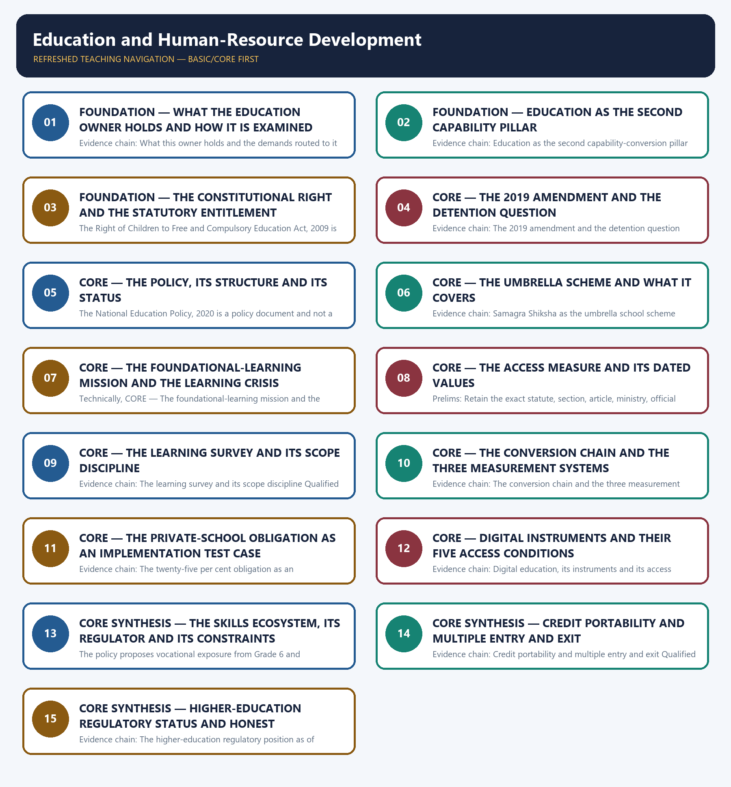

# Education and Human-Resource Development — Learner-v2 Complete Learning Session

> **Authoring-only generation:** 2026-09-02. No PDF was rendered and no tracker or index was mutated.

### SOURCE, PROGRESSION AND CURRENT-LINKAGE AUDIT

- **Generation date:** 2026-09-02.
- **Repository-first evidence:** the Basic owner is taught first and preserved in full; the Advanced owner is retained only in the optional final teaching block.
- **OCR evidence:** Repository Markdown was primary. The OCR-searchable official General Studies question papers held under books\mains and books\more_previous_papers were read only to confirm the printed wording of routed Mains demands. No official answer key, marking scheme, page precision or unsupported quotation was imported from them.
- **Qdrant:** not used; repository Markdown and available OCR context were sufficient.
- **PYQ integrity:** Six General Studies Mains demands and one objective demand are routed to this topic in the audited routing ledgers, and each Mains demand is reproduced below as a demand card with its printed year, paper, question number, directive, marks and word limit exactly as the ledgers record them: 2020 General Studies Paper I Question 20, 2020 General Studies Paper II Question 18, 2021 General Studies Paper II Question 7, 2022 General Studies Paper II Question 18, 2023 General Studies Paper II Question 6 and 2023 General Studies Paper II Question 18. The ledger records the 2023 skill-education and employment demand as one whose two subject routes terminate in answer-complete Core, shared with the Economy owner, and that shared ownership is stated openly rather than claimed exclusively. One objective demand is also routed, namely 2018 Prelims General Studies Paper I Question 21 on teacher-qualification eligibility provisions under the entitlement statute, and the ledger records the official 2018-2023 Prelims keys as not held locally, so no option, key or inferred answer is recorded for it and it is not converted into a solved question. The Basic owner separately discusses the 2024 public-examination-integrity Act, but the audited 2024-2025 Mains routing ledger routes that question to the Governance owner, so no demand card is manufactured for it here and no ownership is claimed over it. The locally held OCR-searchable official General Studies papers were read only to confirm the printed wording of the routed Mains demands; no question was invented from them and no marking scheme or page precision was imported. Every model solution below is original work written to the repository's examiner-grade standard using the claim, named evidence, analysis and qualification pattern.
- **Live-link boundary:** No live official page was verified for this topic on 2026-09-02. Three official checks were attempted on that date and all three were refused with an access error, namely the education ministry's foundational-learning mission page, the department of school education page for the same mission and the national portal's education-policy spotlight page, so nothing was read or used from any of them and no secondary summary, coaching site or news report has been treated as an official source. The package therefore uses only the dated official anchors already carried by the repository owners with their status checks, and each is cited with its issuing instrument, edition or survey round: Article 21-A inserted by the Eighty-sixth Amendment of 2002 with the fundamental right bounded to ages six to fourteen; the Right of Children to Free and Compulsory Education Act, 2009 with its twenty-five per cent entry-level obligation in private unaided non-minority schools subject to the Act and judicial interpretation; the 2019 amendment restoring State discretion for regular examinations in Classes V and VIII with detention permitted only after instruction and a re-examination; the National Education Policy, 2020 as a policy document with its five plus three plus three plus four structure across ages three to eight, eight to eleven, eleven to fourteen and fourteen to eighteen; the umbrella school scheme merging elementary, secondary and teacher education; the foundational-learning mission launched in 2021 with its end-of-Grade-3 target and recorded national target year of 2026-27; the all-India higher-education survey for 2021-22 reporting a gross enrolment ratio of 28.4 for ages eighteen to twenty-three, up from 27.3 in 2020-21, with a female ratio of 28.5; the 2024 round of the non-government rural household learning survey recording 23.4 per cent of government-school Standard III children able to read a Standard II text, recorded by the owners as the latest national foundational-learning round of that survey as of July 2026; and the recorded regulatory status that the proposed single higher-education regulator remains unenacted as of mid-2026 while the existing university, technical-education and teacher-education regulators continue to function, with the relevant Bill recorded as Cabinet-approved in December 2025 and introduced in Parliament. Every one of those values is round-specific, survey-year-specific or status-specific and is cited with that status, and the package states expressly that the higher-education ratio must carry its survey year and that the household learning value must carry its round, rural scope, school type and competency and must not be generalised to urban India. No enrolment, dropout, teacher-vacancy, training, certification, apprenticeship or placement count is asserted, no budget or expenditure share is asserted, no Periodic Labour Force Survey, National Sample Survey, NITI Aayog or Sustainable Development Goal index figure is asserted, no scheme eligibility rule beyond the recorded statutory provisions is asserted, and no previous-year question, official answer key or option is asserted or inferred.
- **Fact/inference discipline:** no current-affairs item, PYQ wording, figure or quotation is invented.

## BASIC LEARNING SESSION



*Distinct embedded teaching-navigation image. The separate continuous Cārvāka-style flowchart package remains an independent at-a-glance artifact.*

### SESSION 1 — FOUNDATION — WHAT THE EDUCATION OWNER HOLDS AND HOW IT IS EXAMINED

#### DEFINITION / WHAT THIS IS CALLED

**Plain-language definition:** FOUNDATION — What the education owner holds and how it is examined comprises FOUNDATION, What the education owner holds and how it is examined as its core connected dimensions.

**Technical definition:** Evidence chain: What this owner holds and the demands routed to it Qualified use: Open an education demand by naming the link of the conversion chain that the question tests.

#### ANSWER-GRABBING OPENING — WRITE/ADAPT IN THE EXAM

> Prelims: Retain the exact statute, section, article, ministry, official category, survey round or dated edition attached to What the education owner holds and how it is examined, and never upgrade a policy document into a statute or a targeted scheme into a universal entitlement.

#### MUST-WRITE KEYWORDS

- **FOUNDATION**
- **What the education owner holds**
- **how it is examined**
- **Evidence chain**
- **Qualified use**
- **This**

**How to use them:** Frame the answer through FOUNDATION; define What the education owner holds, connect how it is examined with Evidence chain to explain the mechanism, and use Qualified use for the decisive comparison or qualification.

#### VISUAL FIRST

```text
WHAT THE EDUCATION OWNER HOLDS AND HOW IT IS EXAMINED
01. What this owner holds and the demands routed to it
BOUNDARY -> Labour-market macroeconomics belongs to Economy and the 2024 examination-integrity demand to Governance.
```

*This topic-specific rail fixes the evidence sequence and its exam boundary before analysis.*

#### CORE EXPLANATION

This topic owns the education and skills half of human-resource development, namely the constitutional and statutory entitlement to elementary education, the policy restructuring that surrounds it, the umbrella scheme that funds school education, the foundational-learning mission that answers the learning crisis, the higher-education access measure and the skills ecosystem that converts schooling into employability, and its distinctive feature is that six General Studies Mains demands from 2020, 2021, 2022 and 2023 and one objective demand from 2018 are routed to it in the audited ledgers, which is the heaviest Mains load in the folder; the macro labour-market and demographic-dividend framing belongs to the Economy owner, and the audited ledger routes the 2024 public-examination-integrity demand to the Governance owner even though this owner discusses that Act, so no demand card is manufactured for it here.

#### NAMED EVIDENCE AND MECHANISM

- This topic owns the education and skills half of human-resource development, namely the constitutional and statutory entitlement to elementary education, the policy restructuring that surrounds it, the umbrella scheme that funds school education, the foundational-learning mission that answers the learning crisis, the higher-education access measure and the skills ecosystem that converts schooling into employability, and its distinctive feature is that six General Studies Mains demands from 2020, 2021, 2022 and 2023 and one objective demand from 2018 are routed to it in the audited ledgers, which is the heaviest Mains load in the folder; the macro labour-market and demographic-dividend framing belongs to the Economy owner, and the audited ledger routes the 2024 public-examination-integrity demand to the Governance owner even though this owner discusses that Act, so no demand card is manufactured for it here.

#### EXAMINER CAUTION

- Labour-market macroeconomics belongs to Economy and the 2024 examination-integrity demand to Governance.

#### EXAM LINK

- **Prelims:** Retain the exact statute, section, article, ministry, official category, survey round or dated edition attached to What the education owner holds and how it is examined, and never upgrade a policy document into a statute or a targeted scheme into a universal entitlement.
- **Mains:** Open an education demand by naming the link of the conversion chain that the question tests.

#### MINI RECAP

- **Evidence chain:** What this owner holds and the demands routed to it
- **Qualified use:** Open an education demand by naming the link of the conversion chain that the question tests.

#### CLOSING RECALL FLOW — FOUNDATION — WHAT THE EDUCATION OWNER HOLDS AND HOW IT IS EXAMINED

```text
START / CONCEPT: FOUNDATION — What the education owner holds and how it is examined
        |
        v
EXACT TERMS: FOUNDATION · What the education owner holds · how it is examined · Evidence chain · Qualified use · This
        |
        v
MECHANISM / ARGUMENT: Evidence chain: What this owner holds and the demands routed to it Qualified use: Open an education demand by naming the link of the conversion chain that the question tests.
        |
        v
CONSEQUENCE / CONTRAST: This topic owns the education and skills half of human-resource development, namely the constitutional and statutory entitlement to elementary education, the policy restructuring that surrounds it, the umbrella scheme that funds school education, the foundational-learning mission that answers the learning crisis, the higher-education access measure and the skills ecosystem that converts schooling into employability, and its distinctive feature is that six General Studies Mains demands from 2020, 2021, 2022 and 2023 and one objective demand from 2018 are routed to it in the audited ledgers, which is the heaviest Mains load in the folder; the macro labour-market and demographic-dividend framing belongs to the Economy owner, and the audited ledger routes the 2024 public-examination-integrity demand to the Governance owner even though this owner discusses that Act, so no demand card is manufactured for it here.
        |
        v
UPSC TRAP / ANSWER-USE: Do not miss this limiting distinction: what this owner holds and the demands routed to it Qualified use.
        |
        v
ANSWER-GRABBING FORMULATION: Prelims: Retain the exact statute, section, article, ministry, official category, survey round or dated edition attached to What the education owner holds and how it is examined, and never upgrade a policy document into a statute or a targeted scheme into a universal entitlement.
```
### SESSION 2 — FOUNDATION — EDUCATION AS THE SECOND CAPABILITY PILLAR

#### DEFINITION / WHAT THIS IS CALLED

**Plain-language definition:** Education is the second capability-conversion pillar after health, and the owner's conversion frame runs from input, meaning access and resources, through process, meaning curriculum, pedagogy, teachers and infrastructure, to outcome, meaning foundational literacy and numeracy, higher-order skills and employability; the analytical consequence is that entitlement, quality and skills must all hold for schooling to become capability, so an answer that reports enrolment has reported an input and has not yet reached the question.

**Technical definition:** Evidence chain: Education as the second capability-conversion pillar Qualified use: Convert an education answer from access description into capability analysis.

#### ANSWER-GRABBING OPENING — WRITE/ADAPT IN THE EXAM

> Education is the second capability-conversion pillar after health, and the owner's conversion frame runs from input, meaning access and resources, through process, meaning curriculum, pedagogy, teachers and infrastructure, to outcome, meaning foundational literacy and numeracy, higher-order skills and employability; the analytical consequence is that entitlement, quality and skills must all hold for schooling to become capability, so an answer that reports enrolment has reported an input and has not yet reached the question.

#### MUST-WRITE KEYWORDS

- **FOUNDATION**
- **Education as the second capability pillar**
- **Evidence chain**
- **Qualified use**
- **Education**
- **Reporting**

**How to use them:** Frame the answer through FOUNDATION; define Education as the second capability pillar, connect Evidence chain with Qualified use to explain the mechanism, and use Education for the decisive comparison or qualification.

#### VISUAL FIRST

```text
EDUCATION AS THE SECOND CAPABILITY PILLAR
01. Education as the second capability-conversion pillar
BOUNDARY -> Reporting enrolment reports an input and has not yet reached the question.
```

*This topic-specific rail fixes the evidence sequence and its exam boundary before analysis.*

#### CORE EXPLANATION

Education is the second capability-conversion pillar after health, and the owner's conversion frame runs from input, meaning access and resources, through process, meaning curriculum, pedagogy, teachers and infrastructure, to outcome, meaning foundational literacy and numeracy, higher-order skills and employability; the analytical consequence is that entitlement, quality and skills must all hold for schooling to become capability, so an answer that reports enrolment has reported an input and has not yet reached the question.

#### NAMED EVIDENCE AND MECHANISM

- Education is the second capability-conversion pillar after health, and the owner's conversion frame runs from input, meaning access and resources, through process, meaning curriculum, pedagogy, teachers and infrastructure, to outcome, meaning foundational literacy and numeracy, higher-order skills and employability; the analytical consequence is that entitlement, quality and skills must all hold for schooling to become capability, so an answer that reports enrolment has reported an input and has not yet reached the question.

#### EXAMINER CAUTION

- Reporting enrolment reports an input and has not yet reached the question.

#### EXAM LINK

- **Prelims:** Retain the exact statute, section, article, ministry, official category, survey round or dated edition attached to Education as the second capability pillar, and never upgrade a policy document into a statute or a targeted scheme into a universal entitlement.
- **Mains:** Convert an education answer from access description into capability analysis.

#### MINI RECAP

- **Evidence chain:** Education as the second capability-conversion pillar
- **Qualified use:** Convert an education answer from access description into capability analysis.

#### CLOSING RECALL FLOW — FOUNDATION — EDUCATION AS THE SECOND CAPABILITY PILLAR

```text
START / CONCEPT: FOUNDATION — Education as the second capability pillar
        |
        v
EXACT TERMS: FOUNDATION · Education as the second capability pillar · Evidence chain · Qualified use · Education · Reporting
        |
        v
MECHANISM / ARGUMENT: Evidence chain: Education as the second capability-conversion pillar Qualified use: Convert an education answer from access description into capability analysis.
        |
        v
CONSEQUENCE / CONTRAST: Reporting enrolment reports an input and has not yet reached the question.
        |
        v
UPSC TRAP / ANSWER-USE: Do not miss this limiting distinction: education is the second capability-conversion pillar after health.
        |
        v
ANSWER-GRABBING FORMULATION: Education is the second capability-conversion pillar after health, and the owner's conversion frame runs from input, meaning access and resources, through process, meaning curriculum, pedagogy, teachers and infrastructure, to outcome, meaning foundational literacy and numeracy, higher-order skills and employability; the analytical consequence is that entitlement, quality and skills must all hold for schooling to become capability, so an answer that reports enrolment has reported an input and has not yet reached the question.
```
### SESSION 3 — FOUNDATION — THE CONSTITUTIONAL RIGHT AND THE STATUTORY ENTITLEMENT

#### DEFINITION / WHAT THIS IS CALLED

**Plain-language definition:** Article 21-A is the constitutional basis of the education entitlement and was inserted by the Eighty-sixth Amendment of 2002, making free and compulsory education a fundamental right for children aged six to fourteen, and the doctrinal detail of that article belongs to the Polity owner while this topic applies the entitlement lens; the point that earns marks is that the fundamental right is age-bounded, so every claim about early childhood or secondary education must be located in policy rather than in the fundamental right.

**Technical definition:** The Right of Children to Free and Compulsory Education Act, 2009 is the statutory framework for free and compulsory elementary education for ages six to fourteen, providing free schooling through the public system and a twenty-five per cent entry-level obligation for children from weaker and disadvantaged groups in private unaided non-minority schools, subject to the Act and to judicial interpretation; the owners record the implementation challenges of that obligation as delayed reimbursement to schools, documentation barriers for beneficiaries and uneven enforcement across States, which is the concrete evidence any answer about awareness or access should use.

#### ANSWER-GRABBING OPENING — WRITE/ADAPT IN THE EXAM

> Article 21-A is the constitutional basis of the education entitlement and was inserted by the Eighty-sixth Amendment of 2002, making free and compulsory education a fundamental right for children aged six to fourteen, and the doctrinal detail of that article belongs to the Polity owner while this topic applies the entitlement lens; the point that earns marks is that the fundamental right is age-bounded, so every claim about early childhood or secondary education must be located in policy rather than in the fundamental right.

#### MUST-WRITE KEYWORDS

- **FOUNDATION**
- **The constitutional right**
- **the statutory entitlement**
- **Evidence chain**
- **Qualified use**
- **Article 21**

**How to use them:** Frame the answer through FOUNDATION; define The constitutional right, connect the statutory entitlement with Evidence chain to explain the mechanism, and use Qualified use for the decisive comparison or qualification.

#### VISUAL FIRST

```text
THE CONSTITUTIONAL RIGHT AND THE STATUTORY ENTITLEMENT
01. Article 21-A and the Eighty-sixth Amendment
    |
    v
02. The Right to Education Act, 2009 and its private-school obligation
BOUNDARY -> The fundamental right is age-bounded to six to fourteen.
```

*This topic-specific rail fixes the evidence sequence and its exam boundary before analysis.*

#### CORE EXPLANATION

Article 21-A is the constitutional basis of the education entitlement and was inserted by the Eighty-sixth Amendment of 2002, making free and compulsory education a fundamental right for children aged six to fourteen, and the doctrinal detail of that article belongs to the Polity owner while this topic applies the entitlement lens; the point that earns marks is that the fundamental right is age-bounded, so every claim about early childhood or secondary education must be located in policy rather than in the fundamental right. The Right of Children to Free and Compulsory Education Act, 2009 is the statutory framework for free and compulsory elementary education for ages six to fourteen, providing free schooling through the public system and a twenty-five per cent entry-level obligation for children from weaker and disadvantaged groups in private unaided non-minority schools, subject to the Act and to judicial interpretation; the owners record the implementation challenges of that obligation as delayed reimbursement to schools, documentation barriers for beneficiaries and uneven enforcement across States, which is the concrete evidence any answer about awareness or access should use.

#### NAMED EVIDENCE AND MECHANISM

- Article 21-A is the constitutional basis of the education entitlement and was inserted by the Eighty-sixth Amendment of 2002, making free and compulsory education a fundamental right for children aged six to fourteen, and the doctrinal detail of that article belongs to the Polity owner while this topic applies the entitlement lens; the point that earns marks is that the fundamental right is age-bounded, so every claim about early childhood or secondary education must be located in policy rather than in the fundamental right.
- The Right of Children to Free and Compulsory Education Act, 2009 is the statutory framework for free and compulsory elementary education for ages six to fourteen, providing free schooling through the public system and a twenty-five per cent entry-level obligation for children from weaker and disadvantaged groups in private unaided non-minority schools, subject to the Act and to judicial interpretation; the owners record the implementation challenges of that obligation as delayed reimbursement to schools, documentation barriers for beneficiaries and uneven enforcement across States, which is the concrete evidence any answer about awareness or access should use.

#### EXAMINER CAUTION

- The fundamental right is age-bounded to six to fourteen.

#### EXAM LINK

- **Prelims:** Retain the exact statute, section, article, ministry, official category, survey round or dated edition attached to The constitutional right and the statutory entitlement, and never upgrade a policy document into a statute or a targeted scheme into a universal entitlement.
- **Mains:** Anchor the entitlement precisely before discussing any policy extension.

#### MINI RECAP

- **Evidence chain:** Article 21-A and the Eighty-sixth Amendment -> The Right to Education Act, 2009 and its private-school obligation
- **Qualified use:** Anchor the entitlement precisely before discussing any policy extension.

#### CLOSING RECALL FLOW — FOUNDATION — THE CONSTITUTIONAL RIGHT AND THE STATUTORY ENTITLEMENT

```text
START / CONCEPT: FOUNDATION — The constitutional right and the statutory entitlement
        |
        v
EXACT TERMS: FOUNDATION · The constitutional right · the statutory entitlement · Evidence chain · Qualified use · Article 21
        |
        v
MECHANISM / ARGUMENT: The Right of Children to Free and Compulsory Education Act, 2009 is the statutory framework for free and compulsory elementary education for ages six to fourteen, providing free schooling through the public system and a twenty-five per cent entry-level obligation for children from weaker and disadvantaged groups in private unaided non-minority schools, subject to the Act and to judicial interpretation; the owners record the implementation challenges of that obligation as delayed reimbursement to schools, documentation barriers for beneficiaries and uneven enforcement across States, which is the concrete evidence any answer about awareness or access should use.
        |
        v
CONSEQUENCE / CONTRAST: Evidence chain: Article 21-A and the Eighty-sixth Amendment - The Right to Education Act, 2009 and its private-school obligation Qualified use: Anchor the entitlement precisely before discussing any policy extension.
        |
        v
UPSC TRAP / ANSWER-USE: Do not miss this limiting distinction: the fundamental right is age-bounded to six to fourteen.
        |
        v
ANSWER-GRABBING FORMULATION: Article 21-A is the constitutional basis of the education entitlement and was inserted by the Eighty-sixth Amendment of 2002, making free and compulsory education a fundamental right for children aged six to fourteen, and the doctrinal detail of that article belongs to the Polity owner while this topic applies the entitlement lens; the point that earns marks is that the fundamental right is age-bounded, so every claim about early childhood or secondary education must be located in policy rather than in the fundamental right.
```
### SESSION 4 — CORE — THE 2019 AMENDMENT AND THE DETENTION QUESTION

#### DEFINITION / WHAT THIS IS CALLED

**Plain-language definition:** The Act originally prohibited detention and expulsion until Grade 8, and the owners record that the 2019 amendment restored State discretion for regular examinations in Classes V and VIII and permitted detention after instruction and a re-examination, so the position is not a simple return to detention but a conditional discretion exercisable by a State; the debate is genuinely two-sided, with motivation and accountability on one side and the risk of exclusion and dropout on the other, and stating the amendment's exact mechanism is what allows an answer to take a position without misstating the law.

**Technical definition:** Evidence chain: The 2019 amendment and the detention question Qualified use: Take a position on a contested reform without misstating the law.

#### ANSWER-GRABBING OPENING — WRITE/ADAPT IN THE EXAM

> The Act originally prohibited detention and expulsion until Grade 8, and the owners record that the 2019 amendment restored State discretion for regular examinations in Classes V and VIII and permitted detention after instruction and a re-examination, so the position is not a simple return to detention but a conditional discretion exercisable by a State; the debate is genuinely two-sided, with motivation and accountability on one side and the risk of exclusion and dropout on the other, and stating the amendment's exact mechanism is what allows an answer to take a position without misstating the law.

#### MUST-WRITE KEYWORDS

- **The 2019 amendment**
- **the detention question**
- **Evidence chain**
- **Qualified use**
- **The Act**
- **Grade**

**How to use them:** Frame the answer through The 2019 amendment; define the detention question, connect Evidence chain with Qualified use to explain the mechanism, and use The Act for the decisive comparison or qualification.

#### VISUAL FIRST

```text
THE 2019 AMENDMENT AND THE DETENTION QUESTION
01. The 2019 amendment and the detention question
BOUNDARY -> The amendment restored conditional State discretion, not automatic detention.
```

*This topic-specific rail fixes the evidence sequence and its exam boundary before analysis.*

#### CORE EXPLANATION

The Act originally prohibited detention and expulsion until Grade 8, and the owners record that the 2019 amendment restored State discretion for regular examinations in Classes V and VIII and permitted detention after instruction and a re-examination, so the position is not a simple return to detention but a conditional discretion exercisable by a State; the debate is genuinely two-sided, with motivation and accountability on one side and the risk of exclusion and dropout on the other, and stating the amendment's exact mechanism is what allows an answer to take a position without misstating the law.

#### NAMED EVIDENCE AND MECHANISM

- The Act originally prohibited detention and expulsion until Grade 8, and the owners record that the 2019 amendment restored State discretion for regular examinations in Classes V and VIII and permitted detention after instruction and a re-examination, so the position is not a simple return to detention but a conditional discretion exercisable by a State; the debate is genuinely two-sided, with motivation and accountability on one side and the risk of exclusion and dropout on the other, and stating the amendment's exact mechanism is what allows an answer to take a position without misstating the law.

#### EXAMINER CAUTION

- The amendment restored conditional State discretion, not automatic detention.

#### EXAM LINK

- **Prelims:** Retain the exact statute, section, article, ministry, official category, survey round or dated edition attached to The 2019 amendment and the detention question, and never upgrade a policy document into a statute or a targeted scheme into a universal entitlement.
- **Mains:** Take a position on a contested reform without misstating the law.

#### MINI RECAP

- **Evidence chain:** The 2019 amendment and the detention question
- **Qualified use:** Take a position on a contested reform without misstating the law.

#### CLOSING RECALL FLOW — CORE — THE 2019 AMENDMENT AND THE DETENTION QUESTION

```text
START / CONCEPT: CORE — The 2019 amendment and the detention question
        |
        v
EXACT TERMS: The 2019 amendment · the detention question · Evidence chain · Qualified use · The Act · Grade
        |
        v
MECHANISM / ARGUMENT: Evidence chain: The 2019 amendment and the detention question Qualified use: Take a position on a contested reform without misstating the law.
        |
        v
CONSEQUENCE / CONTRAST: The resulting consequence is that the Act originally prohibited detention and expulsion until Grade 8.
        |
        v
UPSC TRAP / ANSWER-USE: Do not miss this limiting distinction: the Act originally prohibited detention and expulsion until Grade 8.
        |
        v
ANSWER-GRABBING FORMULATION: The Act originally prohibited detention and expulsion until Grade 8, and the owners record that the 2019 amendment restored State discretion for regular examinations in Classes V and VIII and permitted detention after instruction and a re-examination, so the position is not a simple return to detention but a conditional discretion exercisable by a State; the debate is genuinely two-sided, with motivation and accountability on one side and the risk of exclusion and dropout on the other, and stating the amendment's exact mechanism is what allows an answer to take a position without misstating the law.
```
### SESSION 5 — CORE — THE POLICY, ITS STRUCTURE AND ITS STATUS

#### DEFINITION / WHAT THIS IS CALLED

**Plain-language definition:** Evidence chain: The National Education Policy, 2020 and its status Qualified use: Separate what is statutory from what is policy in every education answer.

**Technical definition:** The National Education Policy, 2020 is a policy document and not a statute, and it restructures school education into a five plus three plus three plus four design covering the foundational stage for ages three to eight, the preparatory stage for ages eight to eleven, the middle stage for ages eleven to fourteen and the secondary stage for ages fourteen to eighteen, while emphasising foundational literacy and numeracy, mother-tongue instruction, multidisciplinary higher education, multiple entry and exit and vocational integration; because it is policy rather than statute, its extension of focus to early childhood care and education creates no statutory entitlement, and saying otherwise is a status error.

#### ANSWER-GRABBING OPENING — WRITE/ADAPT IN THE EXAM

> Evidence chain: The National Education Policy, 2020 and its status Qualified use: Separate what is statutory from what is policy in every education answer.

#### MUST-WRITE KEYWORDS

- **The policy**
- **its structure**
- **its status**
- **Evidence chain**
- **Qualified use**
- **The National Education Policy, 2020**

**How to use them:** Frame the answer through The policy; define its structure, connect its status with Evidence chain to explain the mechanism, and use Qualified use for the decisive comparison or qualification.

#### VISUAL FIRST

```text
THE POLICY, ITS STRUCTURE AND ITS STATUS
01. The National Education Policy, 2020 and its status
BOUNDARY -> It is a policy document, so its early childhood focus creates no statutory entitlement.
```

*This topic-specific rail fixes the evidence sequence and its exam boundary before analysis.*

#### CORE EXPLANATION

The National Education Policy, 2020 is a policy document and not a statute, and it restructures school education into a five plus three plus three plus four design covering the foundational stage for ages three to eight, the preparatory stage for ages eight to eleven, the middle stage for ages eleven to fourteen and the secondary stage for ages fourteen to eighteen, while emphasising foundational literacy and numeracy, mother-tongue instruction, multidisciplinary higher education, multiple entry and exit and vocational integration; because it is policy rather than statute, its extension of focus to early childhood care and education creates no statutory entitlement, and saying otherwise is a status error.

#### NAMED EVIDENCE AND MECHANISM

- The National Education Policy, 2020 is a policy document and not a statute, and it restructures school education into a five plus three plus three plus four design covering the foundational stage for ages three to eight, the preparatory stage for ages eight to eleven, the middle stage for ages eleven to fourteen and the secondary stage for ages fourteen to eighteen, while emphasising foundational literacy and numeracy, mother-tongue instruction, multidisciplinary higher education, multiple entry and exit and vocational integration; because it is policy rather than statute, its extension of focus to early childhood care and education creates no statutory entitlement, and saying otherwise is a status error.

#### EXAMINER CAUTION

- It is a policy document, so its early childhood focus creates no statutory entitlement.

#### EXAM LINK

- **Prelims:** Retain the exact statute, section, article, ministry, official category, survey round or dated edition attached to The policy, its structure and its status, and never upgrade a policy document into a statute or a targeted scheme into a universal entitlement.
- **Mains:** Separate what is statutory from what is policy in every education answer.

#### MINI RECAP

- **Evidence chain:** The National Education Policy, 2020 and its status
- **Qualified use:** Separate what is statutory from what is policy in every education answer.

#### CLOSING RECALL FLOW — CORE — THE POLICY, ITS STRUCTURE AND ITS STATUS

```text
START / CONCEPT: CORE — The policy, its structure and its status
        |
        v
EXACT TERMS: The policy · its structure · its status · Evidence chain · Qualified use · The National Education Policy, 2020
        |
        v
MECHANISM / ARGUMENT: The National Education Policy, 2020 is a policy document and not a statute, and it restructures school education into a five plus three plus three plus four design covering the foundational stage for ages three to eight, the preparatory stage for ages eight to eleven, the middle stage for ages eleven to fourteen and the secondary stage for ages fourteen to eighteen, while emphasising foundational literacy and numeracy, mother-tongue instruction, multidisciplinary higher education, multiple entry and exit and vocational integration; because it is policy rather than statute, its extension of focus to early childhood care and education creates no statutory entitlement, and saying otherwise is a status error.
        |
        v
CONSEQUENCE / CONTRAST: It is a policy document, so its early childhood focus creates no statutory entitlement.
        |
        v
UPSC TRAP / ANSWER-USE: Do not miss this limiting distinction: separate what is statutory from what is policy in every education answer.
        |
        v
ANSWER-GRABBING FORMULATION: Evidence chain: The National Education Policy, 2020 and its status Qualified use: Separate what is statutory from what is policy in every education answer.
```
### SESSION 6 — CORE — THE UMBRELLA SCHEME AND WHAT IT COVERS

#### DEFINITION / WHAT THIS IS CALLED

**Plain-language definition:** Samagra Shiksha is the integrated centrally sponsored scheme of the education ministry that merges the earlier elementary and secondary programmes together with teacher education into a single umbrella, with Centre-State cost sharing covering infrastructure, the State quota of teacher salaries, training, information and communication technology, girls' hostels and inclusive education; two errors follow from misreading it, namely treating it as elementary-only when it covers elementary, secondary and teacher education, and treating it as a replacement for the Act when it is the scheme that implements the Act and the policy.

**Technical definition:** Evidence chain: Samagra Shiksha as the umbrella school scheme Qualified use: Attribute funding and training correctly instead of naming a scheme loosely.

#### ANSWER-GRABBING OPENING — WRITE/ADAPT IN THE EXAM

> Samagra Shiksha is the integrated centrally sponsored scheme of the education ministry that merges the earlier elementary and secondary programmes together with teacher education into a single umbrella, with Centre-State cost sharing covering infrastructure, the State quota of teacher salaries, training, information and communication technology, girls' hostels and inclusive education; two errors follow from misreading it, namely treating it as elementary-only when it covers elementary, secondary and teacher education, and treating it as a replacement for the Act when it is the scheme that implements the Act and the policy.

#### MUST-WRITE KEYWORDS

- **The umbrella scheme**
- **what it covers**
- **Evidence chain**
- **Qualified use**
- **Samagra Shiksha**
- **Centre-State**

**How to use them:** Frame the answer through The umbrella scheme; define what it covers, connect Evidence chain with Qualified use to explain the mechanism, and use Samagra Shiksha for the decisive comparison or qualification.

#### VISUAL FIRST

```text
THE UMBRELLA SCHEME AND WHAT IT COVERS
01. Samagra Shiksha as the umbrella school scheme
BOUNDARY -> It covers elementary, secondary and teacher education and does not replace the statute.
```

*This topic-specific rail fixes the evidence sequence and its exam boundary before analysis.*

#### CORE EXPLANATION

Samagra Shiksha is the integrated centrally sponsored scheme of the education ministry that merges the earlier elementary and secondary programmes together with teacher education into a single umbrella, with Centre-State cost sharing covering infrastructure, the State quota of teacher salaries, training, information and communication technology, girls' hostels and inclusive education; two errors follow from misreading it, namely treating it as elementary-only when it covers elementary, secondary and teacher education, and treating it as a replacement for the Act when it is the scheme that implements the Act and the policy.

#### NAMED EVIDENCE AND MECHANISM

- Samagra Shiksha is the integrated centrally sponsored scheme of the education ministry that merges the earlier elementary and secondary programmes together with teacher education into a single umbrella, with Centre-State cost sharing covering infrastructure, the State quota of teacher salaries, training, information and communication technology, girls' hostels and inclusive education; two errors follow from misreading it, namely treating it as elementary-only when it covers elementary, secondary and teacher education, and treating it as a replacement for the Act when it is the scheme that implements the Act and the policy.

#### EXAMINER CAUTION

- It covers elementary, secondary and teacher education and does not replace the statute.

#### EXAM LINK

- **Prelims:** Retain the exact statute, section, article, ministry, official category, survey round or dated edition attached to The umbrella scheme and what it covers, and never upgrade a policy document into a statute or a targeted scheme into a universal entitlement.
- **Mains:** Attribute funding and training correctly instead of naming a scheme loosely.

#### MINI RECAP

- **Evidence chain:** Samagra Shiksha as the umbrella school scheme
- **Qualified use:** Attribute funding and training correctly instead of naming a scheme loosely.

#### CLOSING RECALL FLOW — CORE — THE UMBRELLA SCHEME AND WHAT IT COVERS

```text
START / CONCEPT: CORE — The umbrella scheme and what it covers
        |
        v
EXACT TERMS: The umbrella scheme · what it covers · Evidence chain · Qualified use · Samagra Shiksha · Centre-State
        |
        v
MECHANISM / ARGUMENT: Evidence chain: Samagra Shiksha as the umbrella school scheme Qualified use: Attribute funding and training correctly instead of naming a scheme loosely.
        |
        v
CONSEQUENCE / CONTRAST: It covers elementary, secondary and teacher education and does not replace the statute.
        |
        v
UPSC TRAP / ANSWER-USE: Do not miss this limiting distinction: it covers elementary, secondary and teacher education and does not replace the statute.
        |
        v
ANSWER-GRABBING FORMULATION: Samagra Shiksha is the integrated centrally sponsored scheme of the education ministry that merges the earlier elementary and secondary programmes together with teacher education into a single umbrella, with Centre-State cost sharing covering infrastructure, the State quota of teacher salaries, training, information and communication technology, girls' hostels and inclusive education; two errors follow from misreading it, namely treating it as elementary-only when it covers elementary, secondary and teacher education, and treating it as a replacement for the Act when it is the scheme that implements the Act and the policy.
```
### SESSION 7 — CORE — THE FOUNDATIONAL-LEARNING MISSION AND THE LEARNING CRISIS

#### DEFINITION / WHAT THIS IS CALLED

**Plain-language definition:** The National Initiative for Proficiency in Reading with Understanding and Numeracy is the mission launched under the policy in 2021 that targets foundational literacy and numeracy by the end of Grade 3, with a national target year of 2026-27, and it sets learning-outcome goals and competencies for which States prepare implementation plans with annual targets; it is a mission and not a scholarship, and its importance in an answer is that it is the first national instrument to make a learning outcome, rather than an enrolment count, the stated object of school policy.

**Technical definition:** Technically, CORE — The foundational-learning mission and the learning crisis is analysed by relating The foundational-learning mission to the learning crisis, then testing the relationship through Evidence chain and Qualified use.

#### ANSWER-GRABBING OPENING — WRITE/ADAPT IN THE EXAM

> Evidence chain: NIPUN Bharat and the foundational-learning target - Foundational literacy and numeracy and learning poverty Qualified use: Show the first national instrument that makes learning rather than enrolment the object.

#### MUST-WRITE KEYWORDS

- **The foundational-learning mission**
- **the learning crisis**
- **Evidence chain**
- **Qualified use**
- **The National Initiative**
- **2026-27**

**How to use them:** Frame the answer through The foundational-learning mission; define the learning crisis, connect Evidence chain with Qualified use to explain the mechanism, and use The National Initiative for the decisive comparison or qualification.

#### VISUAL FIRST

```text
THE FOUNDATIONAL-LEARNING MISSION AND THE LEARNING CRISIS
01. NIPUN Bharat and the foundational-learning target
    |
    v
02. Foundational literacy and numeracy and learning poverty
BOUNDARY -> It is a mission with outcome targets, not a scholarship.
```

*This topic-specific rail fixes the evidence sequence and its exam boundary before analysis.*

#### CORE EXPLANATION

The National Initiative for Proficiency in Reading with Understanding and Numeracy is the mission launched under the policy in 2021 that targets foundational literacy and numeracy by the end of Grade 3, with a national target year of 2026-27, and it sets learning-outcome goals and competencies for which States prepare implementation plans with annual targets; it is a mission and not a scholarship, and its importance in an answer is that it is the first national instrument to make a learning outcome, rather than an enrolment count, the stated object of school policy. Foundational literacy and numeracy denotes the basic reading, writing and arithmetic competencies expected by Grade 3, and the owners record that survey evidence has documented large gaps in these competencies, which is why the policy and the mission treat foundational learning as the learning crisis rather than as one objective among many; the related global concept recorded in the Advanced owner is learning poverty, the share of ten-year-olds unable to read and understand a simple text, which adds an international benchmark to the same idea.

#### NAMED EVIDENCE AND MECHANISM

- The National Initiative for Proficiency in Reading with Understanding and Numeracy is the mission launched under the policy in 2021 that targets foundational literacy and numeracy by the end of Grade 3, with a national target year of 2026-27, and it sets learning-outcome goals and competencies for which States prepare implementation plans with annual targets; it is a mission and not a scholarship, and its importance in an answer is that it is the first national instrument to make a learning outcome, rather than an enrolment count, the stated object of school policy.
- Foundational literacy and numeracy denotes the basic reading, writing and arithmetic competencies expected by Grade 3, and the owners record that survey evidence has documented large gaps in these competencies, which is why the policy and the mission treat foundational learning as the learning crisis rather than as one objective among many; the related global concept recorded in the Advanced owner is learning poverty, the share of ten-year-olds unable to read and understand a simple text, which adds an international benchmark to the same idea.

#### EXAMINER CAUTION

- It is a mission with outcome targets, not a scholarship.

#### EXAM LINK

- **Prelims:** Retain the exact statute, section, article, ministry, official category, survey round or dated edition attached to The foundational-learning mission and the learning crisis, and never upgrade a policy document into a statute or a targeted scheme into a universal entitlement.
- **Mains:** Show the first national instrument that makes learning rather than enrolment the object.

#### MINI RECAP

- **Evidence chain:** NIPUN Bharat and the foundational-learning target -> Foundational literacy and numeracy and learning poverty
- **Qualified use:** Show the first national instrument that makes learning rather than enrolment the object.

#### CLOSING RECALL FLOW — CORE — THE FOUNDATIONAL-LEARNING MISSION AND THE LEARNING CRISIS

```text
START / CONCEPT: CORE — The foundational-learning mission and the learning crisis
        |
        v
EXACT TERMS: The foundational-learning mission · the learning crisis · Evidence chain · Qualified use · The National Initiative · 2026-27
        |
        v
MECHANISM / ARGUMENT: Foundational literacy and numeracy denotes the basic reading, writing and arithmetic competencies expected by Grade 3, and the owners record that survey evidence has documented large gaps in these competencies, which is why the policy and the mission treat foundational learning as the learning crisis rather than as one objective among many; the related global concept recorded in the Advanced owner is learning poverty, the share of ten-year-olds unable to read and understand a simple text, which adds an international benchmark to the same idea.
        |
        v
CONSEQUENCE / CONTRAST: The National Initiative for Proficiency in Reading with Understanding and Numeracy is the mission launched under the policy in 2021 that targets foundational literacy and numeracy by the end of Grade 3, with a national target year of 2026-27, and it sets learning-outcome goals and competencies for which States prepare implementation plans with annual targets; it is a mission and not a scholarship, and its importance in an answer is that it is the first national instrument to make a learning outcome, rather than an enrolment count, the stated object of school policy.
        |
        v
UPSC TRAP / ANSWER-USE: It is a mission with outcome targets, not a scholarship.
        |
        v
ANSWER-GRABBING FORMULATION: Evidence chain: NIPUN Bharat and the foundational-learning target - Foundational literacy and numeracy and learning poverty Qualified use: Show the first national instrument that makes learning rather than enrolment the object.
```
### SESSION 8 — CORE — THE ACCESS MEASURE AND ITS DATED VALUES

#### DEFINITION / WHAT THIS IS CALLED

**Plain-language definition:** The gross enrolment ratio is total enrolment at a level of education, regardless of age, as a percentage of the official school-age population for that level, so it measures access and not completion or quality and can exceed one hundred where over-age enrolment is common, and the owners record the all-India survey on higher education for 2021-22 reporting an all-India ratio of 28.4 for the eighteen to twenty-three age group, up from 27.3 in 2020-21, with a female ratio of 28.5; the recorded discipline is to retain the survey year because later rounds update the figure, and the owners state expressly that the durable fact is the rising but unequal trend across region, gender and social group rather than any one year's percentage.

**Technical definition:** Prelims: Retain the exact statute, section, article, ministry, official category, survey round or dated edition attached to The access measure and its dated values, and never upgrade a policy document into a statute or a targeted scheme into a universal entitlement.

#### ANSWER-GRABBING OPENING — WRITE/ADAPT IN THE EXAM

> The gross enrolment ratio is total enrolment at a level of education, regardless of age, as a percentage of the official school-age population for that level, so it measures access and not completion or quality and can exceed one hundred where over-age enrolment is common, and the owners record the all-India survey on higher education for 2021-22 reporting an all-India ratio of 28.4 for the eighteen to twenty-three age group, up from 27.3 in 2020-21, with a female ratio of 28.5; the recorded discipline is to retain the survey year because later rounds update the figure, and the owners state expressly that the durable fact is the rising but unequal trend across region, gender and social group rather than any one year's percentage.

#### MUST-WRITE KEYWORDS

- **The access measure**
- **its dated values**
- **Evidence chain**
- **Qualified use**
- **2021-22**
- **2020-21**

**How to use them:** Frame the answer through The access measure; define its dated values, connect Evidence chain with Qualified use to explain the mechanism, and use 2021-22 for the decisive comparison or qualification.

#### VISUAL FIRST

```text
THE ACCESS MEASURE AND ITS DATED VALUES
01. Gross enrolment ratio and its dated higher-education values
BOUNDARY -> The ratio measures access and must carry its survey year.
```

*This topic-specific rail fixes the evidence sequence and its exam boundary before analysis.*

#### CORE EXPLANATION

The gross enrolment ratio is total enrolment at a level of education, regardless of age, as a percentage of the official school-age population for that level, so it measures access and not completion or quality and can exceed one hundred where over-age enrolment is common, and the owners record the all-India survey on higher education for 2021-22 reporting an all-India ratio of 28.4 for the eighteen to twenty-three age group, up from 27.3 in 2020-21, with a female ratio of 28.5; the recorded discipline is to retain the survey year because later rounds update the figure, and the owners state expressly that the durable fact is the rising but unequal trend across region, gender and social group rather than any one year's percentage.

#### NAMED EVIDENCE AND MECHANISM

- The gross enrolment ratio is total enrolment at a level of education, regardless of age, as a percentage of the official school-age population for that level, so it measures access and not completion or quality and can exceed one hundred where over-age enrolment is common, and the owners record the all-India survey on higher education for 2021-22 reporting an all-India ratio of 28.4 for the eighteen to twenty-three age group, up from 27.3 in 2020-21, with a female ratio of 28.5; the recorded discipline is to retain the survey year because later rounds update the figure, and the owners state expressly that the durable fact is the rising but unequal trend across region, gender and social group rather than any one year's percentage.

#### EXAMINER CAUTION

- The ratio measures access and must carry its survey year.

#### EXAM LINK

- **Prelims:** Retain the exact statute, section, article, ministry, official category, survey round or dated edition attached to The access measure and its dated values, and never upgrade a policy document into a statute or a targeted scheme into a universal entitlement.
- **Mains:** Cite higher-education access with the discipline that keeps it from going stale.

#### MINI RECAP

- **Evidence chain:** Gross enrolment ratio and its dated higher-education values
- **Qualified use:** Cite higher-education access with the discipline that keeps it from going stale.

#### CLOSING RECALL FLOW — CORE — THE ACCESS MEASURE AND ITS DATED VALUES

```text
START / CONCEPT: CORE — The access measure and its dated values
        |
        v
EXACT TERMS: The access measure · its dated values · Evidence chain · Qualified use · 2021-22 · 2020-21
        |
        v
MECHANISM / ARGUMENT: Prelims: Retain the exact statute, section, article, ministry, official category, survey round or dated edition attached to The access measure and its dated values, and never upgrade a policy document into a statute or a targeted scheme into a universal entitlement.
        |
        v
CONSEQUENCE / CONTRAST: Evidence chain: Gross enrolment ratio and its dated higher-education values Qualified use: Cite higher-education access with the discipline that keeps it from going stale.
        |
        v
UPSC TRAP / ANSWER-USE: Do not miss this limiting distinction: the ratio measures access and must carry its survey year.
        |
        v
ANSWER-GRABBING FORMULATION: The gross enrolment ratio is total enrolment at a level of education, regardless of age, as a percentage of the official school-age population for that level, so it measures access and not completion or quality and can exceed one hundred where over-age enrolment is common, and the owners record the all-India survey on higher education for 2021-22 reporting an all-India ratio of 28.4 for the eighteen to twenty-three age group, up from 27.3 in 2020-21, with a female ratio of 28.5; the recorded discipline is to retain the survey year because later rounds update the figure, and the owners state expressly that the durable fact is the rising but unequal trend across region, gender and social group rather than any one year's percentage.
```
### SESSION 9 — CORE — THE LEARNING SURVEY AND ITS SCOPE DISCIPLINE

#### DEFINITION / WHAT THIS IS CALLED

**Plain-language definition:** The owners record the 2024 round of the annual status of education report, a non-government rural household survey, as finding recovery from the 2022 learning shock alongside a continuing foundational deficit, with 23.4 per cent of government-school Standard III children able to read a Standard II text, and record it as the latest national foundational-learning round of that survey as of July 2026; the discipline attached is unusually strict and is itself examinable, namely that the round, the rural scope, the school type and the competency must all be cited together, that it is not an administrative dataset and that it must not be silently generalised to urban India.

**Technical definition:** Evidence chain: The learning survey and its scope discipline Qualified use: Use the strongest learning evidence without over-generalising it.

#### ANSWER-GRABBING OPENING — WRITE/ADAPT IN THE EXAM

> The owners record the 2024 round of the annual status of education report, a non-government rural household survey, as finding recovery from the 2022 learning shock alongside a continuing foundational deficit, with 23.4 per cent of government-school Standard III children able to read a Standard II text, and record it as the latest national foundational-learning round of that survey as of July 2026; the discipline attached is unusually strict and is itself examinable, namely that the round, the rural scope, the school type and the competency must all be cited together, that it is not an administrative dataset and that it must not be silently generalised to urban India.

#### MUST-WRITE KEYWORDS

- **The learning survey**
- **its scope discipline**
- **Evidence chain**
- **Qualified use**
- **Standard III**
- **Standard II**

**How to use them:** Frame the answer through The learning survey; define its scope discipline, connect Evidence chain with Qualified use to explain the mechanism, and use Standard III for the decisive comparison or qualification.

#### VISUAL FIRST

```text
THE LEARNING SURVEY AND ITS SCOPE DISCIPLINE
01. The learning survey and its scope discipline
BOUNDARY -> The round, rural scope, school type and competency must be cited together.
```

*This topic-specific rail fixes the evidence sequence and its exam boundary before analysis.*

#### CORE EXPLANATION

The owners record the 2024 round of the annual status of education report, a non-government rural household survey, as finding recovery from the 2022 learning shock alongside a continuing foundational deficit, with 23.4 per cent of government-school Standard III children able to read a Standard II text, and record it as the latest national foundational-learning round of that survey as of July 2026; the discipline attached is unusually strict and is itself examinable, namely that the round, the rural scope, the school type and the competency must all be cited together, that it is not an administrative dataset and that it must not be silently generalised to urban India.

#### NAMED EVIDENCE AND MECHANISM

- The owners record the 2024 round of the annual status of education report, a non-government rural household survey, as finding recovery from the 2022 learning shock alongside a continuing foundational deficit, with 23.4 per cent of government-school Standard III children able to read a Standard II text, and record it as the latest national foundational-learning round of that survey as of July 2026; the discipline attached is unusually strict and is itself examinable, namely that the round, the rural scope, the school type and the competency must all be cited together, that it is not an administrative dataset and that it must not be silently generalised to urban India.

#### EXAMINER CAUTION

- The round, rural scope, school type and competency must be cited together.

#### EXAM LINK

- **Prelims:** Retain the exact statute, section, article, ministry, official category, survey round or dated edition attached to The learning survey and its scope discipline, and never upgrade a policy document into a statute or a targeted scheme into a universal entitlement.
- **Mains:** Use the strongest learning evidence without over-generalising it.

#### MINI RECAP

- **Evidence chain:** The learning survey and its scope discipline
- **Qualified use:** Use the strongest learning evidence without over-generalising it.

#### CLOSING RECALL FLOW — CORE — THE LEARNING SURVEY AND ITS SCOPE DISCIPLINE

```text
START / CONCEPT: CORE — The learning survey and its scope discipline
        |
        v
EXACT TERMS: The learning survey · its scope discipline · Evidence chain · Qualified use · Standard III · Standard II
        |
        v
MECHANISM / ARGUMENT: Evidence chain: The learning survey and its scope discipline Qualified use: Use the strongest learning evidence without over-generalising it.
        |
        v
CONSEQUENCE / CONTRAST: The round, rural scope, school type and competency must be cited together.
        |
        v
UPSC TRAP / ANSWER-USE: Do not miss this limiting distinction: use the strongest learning evidence without over-generalising it.
        |
        v
ANSWER-GRABBING FORMULATION: The owners record the 2024 round of the annual status of education report, a non-government rural household survey, as finding recovery from the 2022 learning shock alongside a continuing foundational deficit, with 23.4 per cent of government-school Standard III children able to read a Standard II text, and record it as the latest national foundational-learning round of that survey as of July 2026; the discipline attached is unusually strict and is itself examinable, namely that the round, the rural scope, the school type and the competency must all be cited together, that it is not an administrative dataset and that it must not be silently generalised to urban India.
```
### SESSION 10 — CORE — THE CONVERSION CHAIN AND THE THREE MEASUREMENT SYSTEMS

#### DEFINITION / WHAT THIS IS CALLED

**Plain-language definition:** The owner's conversion chain runs from enrolment to attendance, transition, completion, competency, higher education or skill and finally employment, and it records that the administrative school data system, the household learning survey and the higher-education survey measure different links in that chain; this is the structural device for any human-resource-development answer, because it forces the writer to say which link is failing and to cite the instrument that can actually observe that link, instead of asserting a general education crisis.

**Technical definition:** Evidence chain: The conversion chain and the three measurement systems Qualified use: Replace a general education-crisis claim with a located diagnosis.

#### ANSWER-GRABBING OPENING — WRITE/ADAPT IN THE EXAM

> Evidence chain: The conversion chain and the three measurement systems Qualified use: Replace a general education-crisis claim with a located diagnosis.

#### MUST-WRITE KEYWORDS

- **The conversion chain**
- **the three measurement systems**
- **Evidence chain**
- **Qualified use**
- **Different**
- **Qualified**

**How to use them:** Frame the answer through The conversion chain; define the three measurement systems, connect Evidence chain with Qualified use to explain the mechanism, and use Different for the decisive comparison or qualification.

#### VISUAL FIRST

```text
THE CONVERSION CHAIN AND THE THREE MEASUREMENT SYSTEMS
01. The conversion chain and the three measurement systems
BOUNDARY -> Different instruments observe different links, so name the link before naming the fix.
```

*This topic-specific rail fixes the evidence sequence and its exam boundary before analysis.*

#### CORE EXPLANATION

The owner's conversion chain runs from enrolment to attendance, transition, completion, competency, higher education or skill and finally employment, and it records that the administrative school data system, the household learning survey and the higher-education survey measure different links in that chain; this is the structural device for any human-resource-development answer, because it forces the writer to say which link is failing and to cite the instrument that can actually observe that link, instead of asserting a general education crisis.

#### NAMED EVIDENCE AND MECHANISM

- The owner's conversion chain runs from enrolment to attendance, transition, completion, competency, higher education or skill and finally employment, and it records that the administrative school data system, the household learning survey and the higher-education survey measure different links in that chain; this is the structural device for any human-resource-development answer, because it forces the writer to say which link is failing and to cite the instrument that can actually observe that link, instead of asserting a general education crisis.

#### EXAMINER CAUTION

- Different instruments observe different links, so name the link before naming the fix.

#### EXAM LINK

- **Prelims:** Retain the exact statute, section, article, ministry, official category, survey round or dated edition attached to The conversion chain and the three measurement systems, and never upgrade a policy document into a statute or a targeted scheme into a universal entitlement.
- **Mains:** Replace a general education-crisis claim with a located diagnosis.

#### MINI RECAP

- **Evidence chain:** The conversion chain and the three measurement systems
- **Qualified use:** Replace a general education-crisis claim with a located diagnosis.

#### CLOSING RECALL FLOW — CORE — THE CONVERSION CHAIN AND THE THREE MEASUREMENT SYSTEMS

```text
START / CONCEPT: CORE — The conversion chain and the three measurement systems
        |
        v
EXACT TERMS: The conversion chain · the three measurement systems · Evidence chain · Qualified use · Different · Qualified
        |
        v
MECHANISM / ARGUMENT: The owner's conversion chain runs from enrolment to attendance, transition, completion, competency, higher education or skill and finally employment, and it records that the administrative school data system, the household learning survey and the higher-education survey measure different links in that chain; this is the structural device for any human-resource-development answer, because it forces the writer to say which link is failing and to cite the instrument that can actually observe that link, instead of asserting a general education crisis.
        |
        v
CONSEQUENCE / CONTRAST: Different instruments observe different links, so name the link before naming the fix.
        |
        v
UPSC TRAP / ANSWER-USE: Do not miss this limiting distinction: the conversion chain and the three measurement systems Qualified use.
        |
        v
ANSWER-GRABBING FORMULATION: Evidence chain: The conversion chain and the three measurement systems Qualified use: Replace a general education-crisis claim with a located diagnosis.
```
### SESSION 11 — CORE — THE PRIVATE-SCHOOL OBLIGATION AS AN IMPLEMENTATION TEST CASE

#### DEFINITION / WHAT THIS IS CALLED

**Plain-language definition:** The twenty-five per cent entry-level obligation in private unaided non-minority schools is the folder's standard test case for the gap between an enforceable entitlement and realised access, because the owners record its difficulties as delayed reimbursement to schools, documentation barriers for beneficiaries and uneven enforcement across States; it is therefore the natural evidence for the 2022 demand on awareness about schooling, since a right that families do not know about, cannot document and cannot enforce produces exactly the pattern the demand describes.

**Technical definition:** Evidence chain: The twenty-five per cent obligation as an implementation test case Qualified use: Answer an awareness-and-access demand with concrete implementation evidence.

#### ANSWER-GRABBING OPENING — WRITE/ADAPT IN THE EXAM

> The twenty-five per cent entry-level obligation in private unaided non-minority schools is the folder's standard test case for the gap between an enforceable entitlement and realised access, because the owners record its difficulties as delayed reimbursement to schools, documentation barriers for beneficiaries and uneven enforcement across States; it is therefore the natural evidence for the 2022 demand on awareness about schooling, since a right that families do not know about, cannot document and cannot enforce produces exactly the pattern the demand describes.

#### MUST-WRITE KEYWORDS

- **The private-school obligation as an implementation test case**
- **Evidence chain**
- **Qualified use**
- **States**
- **Reimbursement delay, documentation and uneven enforcement**
- **Reimbursement**

**How to use them:** Frame the answer through The private-school obligation as an implementation test case; define Evidence chain, connect Qualified use with States to explain the mechanism, and use Reimbursement delay, documentation and uneven enforcement for the decisive comparison or qualification.

#### VISUAL FIRST

```text
THE PRIVATE-SCHOOL OBLIGATION AS AN IMPLEMENTATION TEST CASE
01. The twenty-five per cent obligation as an implementation test case
BOUNDARY -> Reimbursement delay, documentation and uneven enforcement are the recorded difficulties.
```

*This topic-specific rail fixes the evidence sequence and its exam boundary before analysis.*

#### CORE EXPLANATION

The twenty-five per cent entry-level obligation in private unaided non-minority schools is the folder's standard test case for the gap between an enforceable entitlement and realised access, because the owners record its difficulties as delayed reimbursement to schools, documentation barriers for beneficiaries and uneven enforcement across States; it is therefore the natural evidence for the 2022 demand on awareness about schooling, since a right that families do not know about, cannot document and cannot enforce produces exactly the pattern the demand describes.

#### NAMED EVIDENCE AND MECHANISM

- The twenty-five per cent entry-level obligation in private unaided non-minority schools is the folder's standard test case for the gap between an enforceable entitlement and realised access, because the owners record its difficulties as delayed reimbursement to schools, documentation barriers for beneficiaries and uneven enforcement across States; it is therefore the natural evidence for the 2022 demand on awareness about schooling, since a right that families do not know about, cannot document and cannot enforce produces exactly the pattern the demand describes.

#### EXAMINER CAUTION

- Reimbursement delay, documentation and uneven enforcement are the recorded difficulties.

#### EXAM LINK

- **Prelims:** Retain the exact statute, section, article, ministry, official category, survey round or dated edition attached to The private-school obligation as an implementation test case, and never upgrade a policy document into a statute or a targeted scheme into a universal entitlement.
- **Mains:** Answer an awareness-and-access demand with concrete implementation evidence.

#### MINI RECAP

- **Evidence chain:** The twenty-five per cent obligation as an implementation test case
- **Qualified use:** Answer an awareness-and-access demand with concrete implementation evidence.

#### CLOSING RECALL FLOW — CORE — THE PRIVATE-SCHOOL OBLIGATION AS AN IMPLEMENTATION TEST CASE

```text
START / CONCEPT: CORE — The private-school obligation as an implementation test case
        |
        v
EXACT TERMS: The private-school obligation as an implementation test case · Evidence chain · Qualified use · States · Reimbursement delay, documentation and uneven enforcement · Reimbursement
        |
        v
MECHANISM / ARGUMENT: Evidence chain: The twenty-five per cent obligation as an implementation test case Qualified use: Answer an awareness-and-access demand with concrete implementation evidence.
        |
        v
CONSEQUENCE / CONTRAST: Reimbursement delay, documentation and uneven enforcement are the recorded difficulties.
        |
        v
UPSC TRAP / ANSWER-USE: Do not miss this limiting distinction: the twenty-five per cent entry-level obligation in private unaided non-minority schools is the folder's...
        |
        v
ANSWER-GRABBING FORMULATION: The twenty-five per cent entry-level obligation in private unaided non-minority schools is the folder's standard test case for the gap between an enforceable entitlement and realised access, because the owners record its difficulties as delayed reimbursement to schools, documentation barriers for beneficiaries and uneven enforcement across States; it is therefore the natural evidence for the 2022 demand on awareness about schooling, since a right that families do not know about, cannot document and cannot enforce produces exactly the pattern the demand describes.
```
### SESSION 12 — CORE — DIGITAL INSTRUMENTS AND THEIR FIVE ACCESS CONDITIONS

#### DEFINITION / WHAT THIS IS CALLED

**Plain-language definition:** The owners record the national digital infrastructure for school content and teachers and the national online-course platform for higher education as the two named digital instruments, and they record the qualifications on digital access as devices, connectivity, language, disability and study space; the answer consequence is that digital education is neither a solution nor a distraction but a channel whose effect depends entirely on those five conditions, so a digital-education answer must argue conditional effect rather than declare transformation.

**Technical definition:** Evidence chain: Digital education, its instruments and its access qualifications - The policy against the fourth sustainable development goal Qualified use: Argue conditional effect instead of declaring digital transformation.

#### ANSWER-GRABBING OPENING — WRITE/ADAPT IN THE EXAM

> The owners record the national digital infrastructure for school content and teachers and the national online-course platform for higher education as the two named digital instruments, and they record the qualifications on digital access as devices, connectivity, language, disability and study space; the answer consequence is that digital education is neither a solution nor a distraction but a channel whose effect depends entirely on those five conditions, so a digital-education answer must argue conditional effect rather than declare transformation.

#### MUST-WRITE KEYWORDS

- **Digital instruments**
- **their five access conditions**
- **Evidence chain**
- **Qualified use**
- **Digital effect**
- **Digital**

**How to use them:** Frame the answer through Digital instruments; define their five access conditions, connect Evidence chain with Qualified use to explain the mechanism, and use Digital effect for the decisive comparison or qualification.

#### VISUAL FIRST

```text
DIGITAL INSTRUMENTS AND THEIR FIVE ACCESS CONDITIONS
01. Digital education, its instruments and its access qualifications
    |
    v
02. The policy against the fourth sustainable development goal
BOUNDARY -> Digital effect is conditional on devices, connectivity, language, disability and study space.
```

*This topic-specific rail fixes the evidence sequence and its exam boundary before analysis.*

#### CORE EXPLANATION

The owners record the national digital infrastructure for school content and teachers and the national online-course platform for higher education as the two named digital instruments, and they record the qualifications on digital access as devices, connectivity, language, disability and study space; the answer consequence is that digital education is neither a solution nor a distraction but a channel whose effect depends entirely on those five conditions, so a digital-education answer must argue conditional effect rather than declare transformation. The owners record the fourth sustainable development goal as inclusive and equitable quality education and lifelong learning for all, and record that the policy's early childhood, foundational-learning, multidisciplinary and vocational reforms are aligned with that goal but depend on finance and teachers; the critical-examination route is therefore to accept the alignment of stated objectives and to test delivery conditions, because the gap in this demand is not one of intention but one of financing, teacher supply and State capacity.

#### NAMED EVIDENCE AND MECHANISM

- The owners record the national digital infrastructure for school content and teachers and the national online-course platform for higher education as the two named digital instruments, and they record the qualifications on digital access as devices, connectivity, language, disability and study space; the answer consequence is that digital education is neither a solution nor a distraction but a channel whose effect depends entirely on those five conditions, so a digital-education answer must argue conditional effect rather than declare transformation.
- The owners record the fourth sustainable development goal as inclusive and equitable quality education and lifelong learning for all, and record that the policy's early childhood, foundational-learning, multidisciplinary and vocational reforms are aligned with that goal but depend on finance and teachers; the critical-examination route is therefore to accept the alignment of stated objectives and to test delivery conditions, because the gap in this demand is not one of intention but one of financing, teacher supply and State capacity.

#### EXAMINER CAUTION

- Digital effect is conditional on devices, connectivity, language, disability and study space.

#### EXAM LINK

- **Prelims:** Retain the exact statute, section, article, ministry, official category, survey round or dated edition attached to Digital instruments and their five access conditions, and never upgrade a policy document into a statute or a targeted scheme into a universal entitlement.
- **Mains:** Argue conditional effect instead of declaring digital transformation.

#### MINI RECAP

- **Evidence chain:** Digital education, its instruments and its access qualifications -> The policy against the fourth sustainable development goal
- **Qualified use:** Argue conditional effect instead of declaring digital transformation.

#### CLOSING RECALL FLOW — CORE — DIGITAL INSTRUMENTS AND THEIR FIVE ACCESS CONDITIONS

```text
START / CONCEPT: CORE — Digital instruments and their five access conditions
        |
        v
EXACT TERMS: Digital instruments · their five access conditions · Evidence chain · Qualified use · Digital effect · Digital
        |
        v
MECHANISM / ARGUMENT: Evidence chain: Digital education, its instruments and its access qualifications - The policy against the fourth sustainable development goal Qualified use: Argue conditional effect instead of declaring digital transformation.
        |
        v
CONSEQUENCE / CONTRAST: Digital effect is conditional on devices, connectivity, language, disability and study space.
        |
        v
UPSC TRAP / ANSWER-USE: The owners record the fourth sustainable development goal as inclusive and equitable quality education and lifelong learning for all, and record that the policy's early childhood, foundational-learning, multidisciplinary and vocational reforms are aligned with that goal but depend on finance and teachers; the critical-examination route is therefore to accept the alignment of stated objectives and to test delivery conditions, because the gap in this demand is not one of intention but one of financing, teacher supply and State capacity.
        |
        v
ANSWER-GRABBING FORMULATION: The owners record the national digital infrastructure for school content and teachers and the national online-course platform for higher education as the two named digital instruments, and they record the qualifications on digital access as devices, connectivity, language, disability and study space; the answer consequence is that digital education is neither a solution nor a distraction but a channel whose effect depends entirely on those five conditions, so a digital-education answer must argue conditional effect rather than declare transformation.
```
### SESSION 13 — CORE SYNTHESIS — THE SKILLS ECOSYSTEM, ITS REGULATOR AND ITS CONSTRAINTS

#### DEFINITION / WHAT THIS IS CALLED

**Plain-language definition:** The skills ecosystem recorded by the owners consists of the national skill mission for training, the National Council for Vocational Education and Training as the unified regulator of skill qualifications, awarding bodies and assessment agencies under the skill-development ministry, replacing earlier fragmented regulators, the National Apprenticeship Promotion Scheme which provides stipend support to employers hiring apprentices in order to bridge classroom training and workplace learning, and the national skills qualification framework, a competency-based hierarchy of ten levels enabling recognition, certification and mobility across formal and non-formal training.

**Technical definition:** The policy proposes vocational exposure from Grade 6 and mandatory internship or skill courses in higher education in order to bridge the academic and vocational divide, and the owners record the constraints on this integration as stigma attached to vocational streams, employer participation, career counselling and the quality of matching between trainee and job; naming these four constraints is what turns an earn-while-you-learn answer into an argument, because the design is not contested while the conditions for its success are.

#### ANSWER-GRABBING OPENING — WRITE/ADAPT IN THE EXAM

> Evidence chain: The skills ecosystem and its regulator - Vocational integration and the constraints on it Qualified use: Turn a skilling answer into an argument about conditions rather than design.

#### MUST-WRITE KEYWORDS

- **CORE SYNTHESIS**
- **The skills ecosystem**
- **its regulator**
- **its constraints**
- **Evidence chain**
- **Qualified use**

**How to use them:** Frame the answer through CORE SYNTHESIS; define The skills ecosystem, connect its regulator with its constraints to explain the mechanism, and use Evidence chain for the decisive comparison or qualification.

#### VISUAL FIRST

```text
THE SKILLS ECOSYSTEM, ITS REGULATOR AND ITS CONSTRAINTS
01. The skills ecosystem and its regulator
    |
    v
02. Vocational integration and the constraints on it
BOUNDARY -> Stigma, employer participation, counselling and matching are the binding constraints.
```

*This topic-specific rail fixes the evidence sequence and its exam boundary before analysis.*

#### CORE EXPLANATION

The skills ecosystem recorded by the owners consists of the national skill mission for training, the National Council for Vocational Education and Training as the unified regulator of skill qualifications, awarding bodies and assessment agencies under the skill-development ministry, replacing earlier fragmented regulators, the National Apprenticeship Promotion Scheme which provides stipend support to employers hiring apprentices in order to bridge classroom training and workplace learning, and the national skills qualification framework, a competency-based hierarchy of ten levels enabling recognition, certification and mobility across formal and non-formal training. The policy proposes vocational exposure from Grade 6 and mandatory internship or skill courses in higher education in order to bridge the academic and vocational divide, and the owners record the constraints on this integration as stigma attached to vocational streams, employer participation, career counselling and the quality of matching between trainee and job; naming these four constraints is what turns an earn-while-you-learn answer into an argument, because the design is not contested while the conditions for its success are.

#### NAMED EVIDENCE AND MECHANISM

- The skills ecosystem recorded by the owners consists of the national skill mission for training, the National Council for Vocational Education and Training as the unified regulator of skill qualifications, awarding bodies and assessment agencies under the skill-development ministry, replacing earlier fragmented regulators, the National Apprenticeship Promotion Scheme which provides stipend support to employers hiring apprentices in order to bridge classroom training and workplace learning, and the national skills qualification framework, a competency-based hierarchy of ten levels enabling recognition, certification and mobility across formal and non-formal training.
- The policy proposes vocational exposure from Grade 6 and mandatory internship or skill courses in higher education in order to bridge the academic and vocational divide, and the owners record the constraints on this integration as stigma attached to vocational streams, employer participation, career counselling and the quality of matching between trainee and job; naming these four constraints is what turns an earn-while-you-learn answer into an argument, because the design is not contested while the conditions for its success are.

#### EXAMINER CAUTION

- Stigma, employer participation, counselling and matching are the binding constraints.

#### EXAM LINK

- **Prelims:** Retain the exact statute, section, article, ministry, official category, survey round or dated edition attached to The skills ecosystem, its regulator and its constraints, and never upgrade a policy document into a statute or a targeted scheme into a universal entitlement.
- **Mains:** Turn a skilling answer into an argument about conditions rather than design.

#### MINI RECAP

- **Evidence chain:** The skills ecosystem and its regulator -> Vocational integration and the constraints on it
- **Qualified use:** Turn a skilling answer into an argument about conditions rather than design.

#### CLOSING RECALL FLOW — CORE SYNTHESIS — THE SKILLS ECOSYSTEM, ITS REGULATOR AND ITS CONSTRAINTS

```text
START / CONCEPT: CORE SYNTHESIS — The skills ecosystem, its regulator and its constraints
        |
        v
EXACT TERMS: CORE SYNTHESIS · The skills ecosystem · its regulator · its constraints · Evidence chain · Qualified use
        |
        v
MECHANISM / ARGUMENT: The skills ecosystem recorded by the owners consists of the national skill mission for training, the National Council for Vocational Education and Training as the unified regulator of skill qualifications, awarding bodies and assessment agencies under the skill-development ministry, replacing earlier fragmented regulators, the National Apprenticeship Promotion Scheme which provides stipend support to employers hiring apprentices in order to bridge classroom training and workplace learning, and the national skills qualification framework, a competency-based hierarchy of ten levels enabling recognition, certification and mobility across formal and non-formal training.
        |
        v
CONSEQUENCE / CONTRAST: The policy proposes vocational exposure from Grade 6 and mandatory internship or skill courses in higher education in order to bridge the academic and vocational divide, and the owners record the constraints on this integration as stigma attached to vocational streams, employer participation, career counselling and the quality of matching between trainee and job; naming these four constraints is what turns an earn-while-you-learn answer into an argument, because the design is not contested while the conditions for its success are.
        |
        v
UPSC TRAP / ANSWER-USE: Do not miss this limiting distinction: stigma, employer participation, counselling and matching are the binding constraints.
        |
        v
ANSWER-GRABBING FORMULATION: Evidence chain: The skills ecosystem and its regulator - Vocational integration and the constraints on it Qualified use: Turn a skilling answer into an argument about conditions rather than design.
```
### SESSION 14 — CORE SYNTHESIS — CREDIT PORTABILITY AND MULTIPLE ENTRY AND EXIT

#### DEFINITION / WHAT THIS IS CALLED

**Plain-language definition:** The academic bank of credits is the policy reform that enables students to accumulate credits from multiple institutions and redeem them for a degree, and it is the instrument that makes multiple entry and exit and lifelong learning operationally possible rather than merely aspirational; its examinable value is that it converts a stated principle into an administrative mechanism, and its limitation is that portability depends on institutions actually recognising and depositing credit.

**Technical definition:** Evidence chain: Credit portability and multiple entry and exit Qualified use: Convert a stated policy principle into a named administrative mechanism.

#### ANSWER-GRABBING OPENING — WRITE/ADAPT IN THE EXAM

> The academic bank of credits is the policy reform that enables students to accumulate credits from multiple institutions and redeem them for a degree, and it is the instrument that makes multiple entry and exit and lifelong learning operationally possible rather than merely aspirational; its examinable value is that it converts a stated principle into an administrative mechanism, and its limitation is that portability depends on institutions actually recognising and depositing credit.

#### MUST-WRITE KEYWORDS

- **CORE SYNTHESIS**
- **Credit portability**
- **multiple entry**
- **exit**
- **Evidence chain**
- **Qualified use**

**How to use them:** Frame the answer through CORE SYNTHESIS; define Credit portability, connect multiple entry with exit to explain the mechanism, and use Evidence chain for the decisive comparison or qualification.

#### VISUAL FIRST

```text
CREDIT PORTABILITY AND MULTIPLE ENTRY AND EXIT
01. Credit portability and multiple entry and exit
BOUNDARY -> Portability depends on institutions actually recognising and depositing credit.
```

*This topic-specific rail fixes the evidence sequence and its exam boundary before analysis.*

#### CORE EXPLANATION

The academic bank of credits is the policy reform that enables students to accumulate credits from multiple institutions and redeem them for a degree, and it is the instrument that makes multiple entry and exit and lifelong learning operationally possible rather than merely aspirational; its examinable value is that it converts a stated principle into an administrative mechanism, and its limitation is that portability depends on institutions actually recognising and depositing credit.

#### NAMED EVIDENCE AND MECHANISM

- The academic bank of credits is the policy reform that enables students to accumulate credits from multiple institutions and redeem them for a degree, and it is the instrument that makes multiple entry and exit and lifelong learning operationally possible rather than merely aspirational; its examinable value is that it converts a stated principle into an administrative mechanism, and its limitation is that portability depends on institutions actually recognising and depositing credit.

#### EXAMINER CAUTION

- Portability depends on institutions actually recognising and depositing credit.

#### EXAM LINK

- **Prelims:** Retain the exact statute, section, article, ministry, official category, survey round or dated edition attached to Credit portability and multiple entry and exit, and never upgrade a policy document into a statute or a targeted scheme into a universal entitlement.
- **Mains:** Convert a stated policy principle into a named administrative mechanism.

#### MINI RECAP

- **Evidence chain:** Credit portability and multiple entry and exit
- **Qualified use:** Convert a stated policy principle into a named administrative mechanism.

#### CLOSING RECALL FLOW — CORE SYNTHESIS — CREDIT PORTABILITY AND MULTIPLE ENTRY AND EXIT

```text
START / CONCEPT: CORE SYNTHESIS — Credit portability and multiple entry and exit
        |
        v
EXACT TERMS: CORE SYNTHESIS · Credit portability · multiple entry · exit · Evidence chain · Qualified use
        |
        v
MECHANISM / ARGUMENT: Evidence chain: Credit portability and multiple entry and exit Qualified use: Convert a stated policy principle into a named administrative mechanism.
        |
        v
CONSEQUENCE / CONTRAST: Portability depends on institutions actually recognising and depositing credit.
        |
        v
UPSC TRAP / ANSWER-USE: Do not miss this limiting distinction: credit portability and multiple entry and exit Qualified use.
        |
        v
ANSWER-GRABBING FORMULATION: The academic bank of credits is the policy reform that enables students to accumulate credits from multiple institutions and redeem them for a degree, and it is the instrument that makes multiple entry and exit and lifelong learning operationally possible rather than merely aspirational; its examinable value is that it converts a stated principle into an administrative mechanism, and its limitation is that portability depends on institutions actually recognising and depositing credit.
```
### SESSION 15 — CORE SYNTHESIS — HIGHER-EDUCATION REGULATORY STATUS AND HONEST OWNERSHIP

#### DEFINITION / WHAT THIS IS CALLED

**Plain-language definition:** The owners record that a single higher-education regulator was proposed under the policy, that the relevant Bill was approved by the Cabinet in December 2025 and introduced in Parliament, and that as of mid-2026 it has not been enacted, so the existing regulators for universities, technical education and teacher education continue to function; this is a status fact rather than a design fact, and stating a proposed regulator as an existing one is exactly the policy-status error this package is built to prevent.

**Technical definition:** Evidence chain: The higher-education regulatory position as of mid-2026 - Ministry ownership, measurement boundary and honest question ownership Qualified use: Close with a status-accurate regulatory picture and an explicit data boundary.

#### ANSWER-GRABBING OPENING — WRITE/ADAPT IN THE EXAM

> Evidence chain: The higher-education regulatory position as of mid-2026 - Ministry ownership, measurement boundary and honest question ownership Qualified use: Close with a status-accurate regulatory picture and an explicit data boundary.

#### MUST-WRITE KEYWORDS

- **CORE SYNTHESIS**
- **Higher-education regulatory status**
- **honest ownership**
- **Evidence chain**
- **Qualified use**
- **Subject**

**How to use them:** Frame the answer through CORE SYNTHESIS; define Higher-education regulatory status, connect honest ownership with Evidence chain to explain the mechanism, and use Qualified use for the decisive comparison or qualification.

#### VISUAL FIRST

```text
HIGHER-EDUCATION REGULATORY STATUS AND HONEST OWNERSHIP
01. The higher-education regulatory position as of mid-2026
    |
    v
02. Ministry ownership, measurement boundary and honest question ownership
BOUNDARY -> The proposed single regulator is not enacted as of mid-2026 and no option is inferred for the routed objective demand.
```

*This topic-specific rail fixes the evidence sequence and its exam boundary before analysis.*

#### CORE EXPLANATION

The owners record that a single higher-education regulator was proposed under the policy, that the relevant Bill was approved by the Cabinet in December 2025 and introduced in Parliament, and that as of mid-2026 it has not been enacted, so the existing regulators for universities, technical education and teacher education continue to function; this is a status fact rather than a design fact, and stating a proposed regulator as an existing one is exactly the policy-status error this package is built to prevent. The education ministry is the nodal ministry for the entitlement statute, the policy, the umbrella scheme, the foundational-learning mission and higher education, while the skill-qualification regulator sits under the skill-development ministry, and the owners record expressly that no dynamic dashboard figure is asserted for this topic because education indicators are published periodically by the administrative school data system, the higher-education survey and the household learning survey, so the durable fact is the policy and scheme architecture rather than a continuously changing coverage count. On ownership, six General Studies Mains demands are routed to this topic in the audited ledgers, from 2020, 2021, 2022 and 2023, with the 2023 skill-education and employment demand recorded as terminating in answer-complete Core across two subject routes shared with the Economy owner, and one objective demand from 2018 on teacher-qualification eligibility under the entitlement statute is routed with its official key recorded as unavailable locally, so no option is recorded or inferred; the audited ledger routes the 2024 public-examination-integrity demand to the Governance owner, and that routing is stated here rather than being annexed.

#### NAMED EVIDENCE AND MECHANISM

- The owners record that a single higher-education regulator was proposed under the policy, that the relevant Bill was approved by the Cabinet in December 2025 and introduced in Parliament, and that as of mid-2026 it has not been enacted, so the existing regulators for universities, technical education and teacher education continue to function; this is a status fact rather than a design fact, and stating a proposed regulator as an existing one is exactly the policy-status error this package is built to prevent.
- The education ministry is the nodal ministry for the entitlement statute, the policy, the umbrella scheme, the foundational-learning mission and higher education, while the skill-qualification regulator sits under the skill-development ministry, and the owners record expressly that no dynamic dashboard figure is asserted for this topic because education indicators are published periodically by the administrative school data system, the higher-education survey and the household learning survey, so the durable fact is the policy and scheme architecture rather than a continuously changing coverage count. On ownership, six General Studies Mains demands are routed to this topic in the audited ledgers, from 2020, 2021, 2022 and 2023, with the 2023 skill-education and employment demand recorded as terminating in answer-complete Core across two subject routes shared with the Economy owner, and one objective demand from 2018 on teacher-qualification eligibility under the entitlement statute is routed with its official key recorded as unavailable locally, so no option is recorded or inferred; the audited ledger routes the 2024 public-examination-integrity demand to the Governance owner, and that routing is stated here rather than being annexed.

#### EXAMINER CAUTION

- The proposed single regulator is not enacted as of mid-2026 and no option is inferred for the routed objective demand.

#### EXAM LINK

- **Prelims:** Retain the exact statute, section, article, ministry, official category, survey round or dated edition attached to Higher-education regulatory status and honest ownership, and never upgrade a policy document into a statute or a targeted scheme into a universal entitlement.
- **Mains:** Close with a status-accurate regulatory picture and an explicit data boundary.

#### MINI RECAP

- **Evidence chain:** The higher-education regulatory position as of mid-2026 -> Ministry ownership, measurement boundary and honest question ownership
- **Qualified use:** Close with a status-accurate regulatory picture and an explicit data boundary.
#### COMPLETE BASIC OWNER EVIDENCE BANK

> **Subject:** Social Justice | **Tier:** Must-Do (foundation) | **GS Paper:** GS-II;
> GS-I (society/demography), GS-III (skills/employment).
> **Core area:** RTE Act 2009; NEP 2020; Samagra Shiksha; NIPUN Bharat; higher-
> education access; skills ecosystem.
> **Grounded in:** Right of Children to Free and Compulsory Education Act, 2009;
> National Education Policy 2020; Samagra Shiksha guidelines (MoE); NIPUN Bharat
> Mission; ASER reports; the Public Examinations (Prevention of Unfair Means) Act,
> 2024; audited 2024-2025 GS-II PYQs.
> ✅ = source-grounded | ⚠️ = analytical inference | 📰 = current anchor.
> *Companion: `advanced/04_Education-and-Human-Resource-Development.md`.*

#### 1. Visual foundation

```text
                EDUCATION AS CAPABILITY CONVERSION
                (second pillar after health — see topic 03)

  INPUT                  PROCESS                  OUTCOME
  (access, resources)    (teaching-learning)      (capability gain)
        |                      |                        |
        v                      v                        v
  ┌───────────────┐      ┌───────────────┐      ┌───────────────┐
  │ Entitlement:  │      │ Quality:      │      │ Capability:   │
  │ RTE 2009      │ ---> │ Curriculum,   │ ---> │ Foundational  │
  │ (free 6-14)   │      │ pedagogy,     │      │ literacy/     │
  │               │      │ teacher,      │      │ numeracy,     │
  │ NEP 2020      │      │ infrastructure│      │ higher-order  │
  │ (ECCE 3-6,    │      │               │      │ skills,       │
  │  5+3+3+4)     │      │ NIPUN Bharat  │      │ employability │
  └───────────────┘      │ (FLN focus)   │      └───────────────┘
        |                └───────────────┘              |
        |                      |                        |
        +--------> Samagra Shiksha (integrated <-------+
                   umbrella for school education)

                SKILLS ECOSYSTEM (capability -> livelihood)
  ┌───────────────────────────────────────────────────────────┐
  │ Skill India Mission | NCVET (regulator) | NAPS            │
  │ (skill training)     (qualification)     (apprenticeship) │
  └───────────────────────────────────────────────────────────┘
                           |
                           v
        HUMAN RESOURCE DEVELOPMENT = schooling + skills +
        health (topic 03) converting into productive capability
```

**Core proposition:** ✅ Education is the second capability-conversion pillar (after
health in topic 03); access via RTE 2009 and NEP 2020, quality via NIPUN Bharat's
foundational-literacy focus, and skills via the Skill India/NCVET/NAPS ecosystem
must together convert schooling inputs into learning outcomes and employability —
without all three, entitlement does not translate into capability.

#### 2. Essential definitions

| Concept | Exam-ready meaning |
|---|---|
| ✅ **RTE Act, 2009** | The Right of Children to Free and Compulsory Education Act, 2009: statutory framework for free and compulsory elementary education for ages 6–14. It provides free schooling through the public system and a 25% entry-level obligation for children from weaker/disadvantaged groups in private unaided non-minority schools, subject to the Act and judicial interpretation. |
| ✅ **Article 21-A** | The constitutional basis for RTE: inserted by the 86th Amendment, 2002, making free and compulsory education a fundamental right for children aged 6-14 — Polity owns doctrinal detail; Social Justice applies the entitlement lens. |
| ✅ **NEP 2020** | The National Education Policy 2020: a policy document (not statute) restructuring education into 5+3+3+4 (foundational, preparatory, middle, secondary); emphasises foundational literacy/numeracy, mother-tongue instruction, multidisciplinary higher education, multiple entry-exit and vocational integration. |
| ✅ **Samagra Shiksha** | The integrated centrally-sponsored scheme (MoE) merging SSA (elementary), RMSA (secondary) and teacher education; provides a single umbrella for school-education funding, teacher training and quality interventions. |
| ✅ **NIPUN Bharat** | National Initiative for Proficiency in Reading with Understanding and Numeracy: mission under NEP 2020 targeting foundational literacy and numeracy by the end of Grade 3 (national target year 2026-27); sets learning-outcome goals for all children. |
| ✅ **Gross Enrolment Ratio (GER)** | Total enrolment in a level of education (regardless of age) as a percentage of the official school-age population for that level — a measure of access, not completion or quality. |
| ✅ **NCVET** | National Council for Vocational Education and Training: regulator for skill-qualification frameworks, awarding bodies and assessment agencies — replaces earlier fragmented regulators. |
| ✅ **NAPS** | National Apprenticeship Promotion Scheme: provides stipend support to employers hiring apprentices; aims to bridge classroom training and workplace learning. |
| ⚠️ **Foundational literacy and numeracy (FLN)** | Basic reading, writing and arithmetic competencies expected by Grade 3; ASER surveys have documented large FLN gaps — NEP 2020 and NIPUN Bharat treat FLN as the "learning crisis" priority. |

#### 3. How the education mechanism works

1. **Constitutional and statutory entitlement:** Article 21-A + RTE 2009 guarantee
   free, compulsory education 6-14; 25% EWS reservation in private unaided schools
   expands access.
2. **Policy restructuring (NEP 2020):** 5+3+3+4 structure; extends focus to ECCE
   (3-6) and integrates vocational education; emphasises mother-tongue instruction
   and multidisciplinary learning.
3. **Umbrella scheme (Samagra Shiksha):** Provides funding, infrastructure, teacher
   training and quality interventions for elementary and secondary schooling.
4. **Quality focus (NIPUN Bharat):** Mission-mode effort to achieve FLN by Grade 3;
   sets state-wise targets and monitoring frameworks.
5. **Skills ecosystem:** Skill India Mission + NCVET (regulation) + NAPS
   (apprenticeship) + PM-KAUSHAL centres convert schooling into employable
   capability — cross-link to Economy for labour-market framing.

#### 4. Institutions and tools

- ✅ **Ministry of Education (MoE):** Nodal ministry for RTE, NEP, Samagra Shiksha,
  NIPUN Bharat, higher education (UGC, AICTE).
- ✅ **Samagra Shiksha:** Centrally-sponsored scheme with Centre-state cost-sharing;
  covers infrastructure, teacher salaries (state-quota), training, ICT, girls'
  hostels, inclusive education.
- ✅ **NIPUN Bharat:** Mission under MoE; sets FLN goals and competencies; states
  prepare implementation plans with annual targets.
- ✅ **NCVET (Ministry of Skill Development and Entrepreneurship):** Regulates
  skill qualifications, awarding bodies and assessment agencies.
- ⚠️ **ASER (Annual Status of Education Report):** Non-government survey assessing
  learning outcomes (reading, arithmetic) in rural India; documents FLN gaps.

#### 5. Indian applications and examples

- ✅ **2024 GS-II Q11 (15 marks):** asks the aims and objects of the Public
  Examinations (Prevention of Unfair Means) Act, 2024 and whether university/state
  education-board examinations fall within it. Route it through public trust, fair
  access and human-capital formation: the Act targets notified public examinations,
  so do not assume every university or state-board examination is automatically covered.
- 📰 **ASER 2024** (a non-government, rural household survey) found recovery from the
  2022 learning shock but a continuing FLN deficit: **23.4%** of government-school
  Standard III children could read a Standard II text. This is the latest national
  ASER foundational-learning round as of July 2026.
- ⚠️ 25% EWS reservation in private unaided schools under RTE 2009 has faced
  implementation challenges: delayed reimbursements to schools, documentation
  barriers for beneficiaries, and uneven enforcement across states.
- ⚠️ GER in higher education has risen (above 25% nationally by some estimates)
  but shows regional, gender and social-group disparities. No single current GER
  figure is asserted here because AISHE updates this figure annually; the durable
  fact is the rising-but-unequal trend, not one year's percentage.

#### 6. Must-Know Facts for Prelims

- ✅ RTE 2009 applies to children aged 6-14 (free, compulsory education).
- ✅ Article 21-A was inserted by the 86th Amendment, 2002.
- ✅ NEP 2020 introduces the 5+3+3+4 structure (foundational, preparatory, middle,
  secondary).
- ✅ NIPUN Bharat targets foundational literacy and numeracy by Grade 3.
- ✅ Samagra Shiksha integrates SSA, RMSA and teacher education.
- ✅ NCVET is the skill-qualification regulator under MSDE.

#### 7. UPSC traps

- ❌ NEP 2020 is an enacted statute. -> NEP 2020 is a policy document, not a
  statute; RTE 2009 is the statutory entitlement.
- ❌ RTE 2009 applies to all children aged 3-18. -> RTE 2009 covers ages 6-14;
  NEP 2020 extends focus to ECCE (3-6) and secondary (up to 18) as policy, not
  statutory right.
- ❌ NIPUN Bharat is a scholarship scheme. -> NIPUN Bharat is a mission for
  foundational literacy and numeracy, not a scholarship.
- ❌ Samagra Shiksha only covers elementary education. -> Samagra Shiksha covers
  elementary + secondary + teacher education under a single umbrella.

#### 8. 📰 Current anchor

- 📰 **ASER 2024:** This non-government rural household survey found that 23.4% of
  government-school children in Standard III could read a Standard II text. Cite the
  round, rural scope, school type and competency; ASER is not an administrative dataset
  and should not be silently generalised to urban India.
- 📰 **GER in higher education:** AISHE (All India Survey on Higher Education)
  2021-22 reported an all-India GER of 28.4 for ages 18-23, up from 27.3 in
  2020-21; female GER was 28.5. Retain the survey year because later rounds update it.
- 📰 No dynamic dashboard figure is asserted here because education indicators
  are published periodically (AISHE, UDISE+, ASER); the durable fact is the
  policy/scheme architecture, not a continuously changing coverage count.

#### 9. PYQ application

- ✅ **2024 GS-II Q11 (15 marks):** use the Public Examinations (Prevention of Unfair
  Means) Act, 2024 to distinguish a law's listed public-examination authorities from
  university/state-board examinations. Link fair examination systems to equal access and
  institutional trust; do not answer it as a generic school-education question.
- ⚠️ A strong education-related answer should:
  1. Cite the entitlement base (Art 21-A, RTE 2009).
  2. Distinguish access (enrolment, infrastructure) from quality (learning
     outcomes, FLN).
  3. Present NEP 2020 and NIPUN Bharat as the policy response to the learning
     crisis.
  4. Link to skills ecosystem (Skill India, NCVET, NAPS) for employability.
  5. Use ASER or AISHE data with the reporting year noted.

#### 10. Mains angles

- ⚠️ Frame education as the second capability-conversion pillar (after health):
  schooling inputs must convert into learning outcomes and employability.
- ⚠️ Distinguish access from quality: high enrolment does not guarantee FLN or
  employable skills.
- ⚠️ Emphasise NEP 2020's FLN focus (NIPUN Bharat) as the response to ASER-
  documented learning gaps.
- ⚠️ Link to the skills ecosystem for the education-employment transition —
  cross-reference Economy for demographic-dividend framing.

> **Answer thesis:** Education is a fundamental capability enabler: the RTE 2009
> statutory entitlement guarantees access, but learning outcomes depend on quality
> interventions (NIPUN Bharat, Samagra Shiksha) and the skills ecosystem (NCVET,
> NAPS) that converts schooling into employability — without closing the FLN gap
> and bridging the school-to-work transition, enrolment alone does not deliver
> human-capital capability.

#### 11. Probable questions

- ⚠️ **Prelims:** Which constitutional amendment inserted Article 21-A making
  elementary education a fundamental right?
- ⚠️ **Mains (10 marks):** Distinguish the Right to Education Act, 2009 from the
  National Education Policy, 2020. How do they together address access and
  quality in school education?
- ⚠️ **Mains (15 marks):** "High enrolment rates do not guarantee foundational
  literacy and numeracy." Discuss India's learning-outcome challenge and the
  policy measures to address it.
- ⚠️ **Mains (15 marks):** How does the skills ecosystem (Skill India, NCVET,
  NAPS) bridge the gap between school education and employability?

#### 11A. Answer architecture (10/15/20-mark support)

Core now owns the 2020 digital-education and NEP-SDG 4 demands; the 2021
earn-while-you-learn demand; the 2022 RTE-awareness demand; and the 2023 HRD and
skill-education-employment demands. These six routes supersede `advanced/04`.

- **Digital education:** DIKSHA supports school content/teachers and SWAYAM online
  courses; devices, connectivity, language, disability and study space qualify access.
- **SDG 4/NEP:** inclusive quality education and lifelong learning are the goal;
  ECCE, FLN, multidisciplinary and vocational reforms depend on finance and teachers.
- **RTE status:** the 2019 amendment restored State discretion for regular examinations
  in Classes V/VIII and possible detention after instruction and re-examination.
- **Conversion chain:** enrolment -> attendance -> transition -> completion ->
  competency -> higher education/skill -> employment. UDISE+, ASER and AISHE measure
  different links.
- **Vocational integration:** NAPS and school/college exposure connect learning to work,
  but stigma, employer participation, counselling and matching remain constraints.

**10 marks:** precise access/quality/skill problem plus 2-3 anchors. **15 marks:** full
conversion chain and 4-6 examples. **20 marks:** ECCE, school, higher education,
vocational learning, digital inclusion, finance, teachers and employment outcomes.

> **Reasoned verdict:** Education becomes HRD only when access converts into learning,
> progression, agency and productive work.

#### 12. Study links

- ✅ Advanced companion: `advanced/04_Education-and-Human-Resource-Development.md`.
- ✅ `01_Social-Justice-Concept-Inclusion-and-Welfare-State-Framework.md` — the
  capability approach: education inputs must convert into learning and agency
  capability.
- ✅ `03_Health-Systems-Public-Health-and-Universal-Health-Coverage.md` — health
  as the first capability pillar; education is the second.
- ✅ `Economy/basic/22_Employment-Labour-Codes-Skills-and-Demographic-Dividend.md` —
  labour-market and demographic-dividend framing (Economy owns macro employment).
- ✅ `Polity/basic/Directive-Principles.md` — Art 21-A and DPSP on education
  (Polity owns constitutional doctrine).

<!-- BEGIN GENERATED PYQ INTEGRATION: 2018-2023 -->

#### Historical PYQ Integration (2018-2023)

> **Status:** Question-level PYQ demand is integrated into this owner.
> **Provenance:** Audited local official-paper routing ledgers: `_PYQ-ROUTING-MAINS-GS1-GS2-ESSAY-2018-2023.md`, `_PYQ-ROUTING-PRELIMS-2018-2023.md`.
> **Answer-key rule:** The official 2018-2023 Prelims/CSAT keys are not held locally; no option or answer has been inferred.

- **Years represented:** 2018, 2020, 2021, 2022, 2023
- **Paper(s):** GS-I, GS-II, Prelims GS-I
- **Routed question demands:** 7

| Year | Paper | Q | PYQ demand (neutral rendering) | Directive / format | Source status | Owner requirement |
|---:|---|---:|---|---|---|---|
| 2018 | Prelims GS-I | 21 | Right to Education Act teacher qualification eligibility provisions | Objective question; official key unavailable locally | Routed; key unavailable locally | Cover the named fact/concept and its likely statement-level distinctions. |
| 2020 | GS-I | 20 | Digital initiatives and the functioning of the education system | Elaborate your answer · 15 marks · 250 words | Core route supersedes older Advanced ownership | Prepare context, core dimensions, evidence/examples, counterpoint and a concise conclusion. |
| 2020 | GS-II | 18 | National Education Policy 2020 and Sustainable Development Goal 4 | Critically examine · 15 marks · 250 words | Core route supersedes older Advanced ownership | Prepare context, core dimensions, evidence/examples, counterpoint and a concise conclusion. |
| 2021 | GS-II | 7 | Earn while you learn and meaningful vocational education and skilling | Comment · 10 marks · 150 words | Core route supersedes older Advanced ownership | Prepare context, core dimensions, evidence/examples, counterpoint and a concise conclusion. |
| 2022 | GS-II | 18 | Right to Education Act 2009 and awareness about schooling | Analyse · 15 marks · 250 words | Core route supersedes older Advanced ownership | Prepare context, core dimensions, evidence/examples, counterpoint and a concise conclusion. |
| 2023 | GS-II | 6 | Inadequate attention to Human Resource Development in India | Suggest measures · 10 marks · 150 words | Core route supersedes older Advanced ownership | Prepare context, core dimensions, evidence/examples, counterpoint and a concise conclusion. |
| 2023 | GS-II | 18 | Skill development programmes and links between skill education and employment | Analyse the linkages · 15 marks · 250 words | Both subject routes terminate in answer-complete Core | Prepare context, core dimensions, evidence/examples, counterpoint and a concise conclusion. |

##### What this owner must now support

- Right to Education Act teacher qualification eligibility provisions
- Digital initiatives and the functioning of the education system
- National Education Policy 2020 and Sustainable Development Goal 4
- Earn while you learn and meaningful vocational education and skilling
- Right to Education Act 2009 and awareness about schooling
- Inadequate attention to Human Resource Development in India
- Skill development programmes and links between skill education and employment

> The table integrates the examinable demand and paper metadata. It does not turn an unkeyed objective question into a solved answer, and it does not claim that lexical presence alone proves full conceptual sufficiency.
<!-- END GENERATED PYQ INTEGRATION: 2018-2023 -->

#### CLOSING RECALL FLOW — CORE SYNTHESIS — HIGHER-EDUCATION REGULATORY STATUS AND HONEST OWNERSHIP

```text
START / CONCEPT: CORE SYNTHESIS — Higher-education regulatory status and honest ownership
        |
        v
EXACT TERMS: CORE SYNTHESIS · Higher-education regulatory status · honest ownership · Evidence chain · Qualified use · Subject
        |
        v
MECHANISM / ARGUMENT: The owners record that a single higher-education regulator was proposed under the policy, that the relevant Bill was approved by the Cabinet in December 2025 and introduced in Parliament, and that as of mid-2026 it has not been enacted, so the existing regulators for universities, technical education and teacher education continue to function; this is a status fact rather than a design fact, and stating a proposed regulator as an existing one is exactly the policy-status error this package is built to prevent.
        |
        v
CONSEQUENCE / CONTRAST: The proposed single regulator is not enacted as of mid-2026 and no option is inferred for the routed objective demand.
        |
        v
UPSC TRAP / ANSWER-USE: No single current GER figure is asserted here because AISHE updates this figure annually; the durable fact is the rising-but-unequal trend, not one year's percentage.
        |
        v
ANSWER-GRABBING FORMULATION: Evidence chain: The higher-education regulatory position as of mid-2026 - Ministry ownership, measurement boundary and honest question ownership Qualified use: Close with a status-accurate regulatory picture and an explicit data boundary.
```
## BASIC MCQS / REMEDIATION

### Q1. Which statement correctly identifies What this owner holds and the demands routed to it?

A. This topic owns the education and skills half of human-resource development, namely the constitutional and statutory entitlement to elementary education, the policy restructuring that surrounds it, the umbrella scheme that funds school education, the foundational-learning mission that answers the learning crisis, the higher-education access measure and the skills ecosystem that converts schooling into employability, and its distinctive feature is that six General Studies Mains demands from 2020, 2021, 2022 and 2023 and one objective demand from 2018 are routed to it in the audited ledgers, which is the heaviest Mains load in the folder; the macro labour-market and demographic-dividend framing belongs to the Economy owner, and the audited ledger routes the 2024 public-examination-integrity demand to the Governance owner even though this owner discusses that Act, so no demand card is manufactured for it here.
B. Article 21-A is the constitutional basis of the education entitlement and was inserted by the Eighty-sixth Amendment of 2002, making free and compulsory education a fundamental right for children aged six to fourteen, and the doctrinal detail of that article belongs to the Polity owner while this topic applies the entitlement lens; the point that earns marks is that the fundamental right is age-bounded, so every claim about early childhood or secondary education must be located in policy rather than in the fundamental right.
C. Education is the second capability-conversion pillar after health, and the owner's conversion frame runs from input, meaning access and resources, through process, meaning curriculum, pedagogy, teachers and infrastructure, to outcome, meaning foundational literacy and numeracy, higher-order skills and employability; the analytical consequence is that entitlement, quality and skills must all hold for schooling to become capability, so an answer that reports enrolment has reported an input and has not yet reached the question.
D. The Right of Children to Free and Compulsory Education Act, 2009 is the statutory framework for free and compulsory elementary education for ages six to fourteen, providing free schooling through the public system and a twenty-five per cent entry-level obligation for children from weaker and disadvantaged groups in private unaided non-minority schools, subject to the Act and to judicial interpretation; the owners record the implementation challenges of that obligation as delayed reimbursement to schools, documentation barriers for beneficiaries and uneven enforcement across States, which is the concrete evidence any answer about awareness or access should use.

**Answer: A.**
**Explanation:** This topic owns the education and skills half of human-resource development, namely the constitutional and statutory entitlement to elementary education, the policy restructuring that surrounds it, the umbrella scheme that funds school education, the foundational-learning mission that answers the learning crisis, the higher-education access measure and the skills ecosystem that converts schooling into employability, and its distinctive feature is that six General Studies Mains demands from 2020, 2021, 2022 and 2023 and one objective demand from 2018 are routed to it in the audited ledgers, which is the heaviest Mains load in the folder; the macro labour-market and demographic-dividend framing belongs to the Economy owner, and the audited ledger routes the 2024 public-examination-integrity demand to the Governance owner even though this owner discusses that Act, so no demand card is manufactured for it here. The remaining options belong to different chronology, actor or analytical categories.

### Q2. Which chronology card should be filed under What this owner holds and the demands routed to it?

A. The Right of Children to Free and Compulsory Education Act, 2009 is the statutory framework for free and compulsory elementary education for ages six to fourteen, providing free schooling through the public system and a twenty-five per cent entry-level obligation for children from weaker and disadvantaged groups in private unaided non-minority schools, subject to the Act and to judicial interpretation; the owners record the implementation challenges of that obligation as delayed reimbursement to schools, documentation barriers for beneficiaries and uneven enforcement across States, which is the concrete evidence any answer about awareness or access should use.
B. This topic owns the education and skills half of human-resource development, namely the constitutional and statutory entitlement to elementary education, the policy restructuring that surrounds it, the umbrella scheme that funds school education, the foundational-learning mission that answers the learning crisis, the higher-education access measure and the skills ecosystem that converts schooling into employability, and its distinctive feature is that six General Studies Mains demands from 2020, 2021, 2022 and 2023 and one objective demand from 2018 are routed to it in the audited ledgers, which is the heaviest Mains load in the folder; the macro labour-market and demographic-dividend framing belongs to the Economy owner, and the audited ledger routes the 2024 public-examination-integrity demand to the Governance owner even though this owner discusses that Act, so no demand card is manufactured for it here.
C. Article 21-A is the constitutional basis of the education entitlement and was inserted by the Eighty-sixth Amendment of 2002, making free and compulsory education a fundamental right for children aged six to fourteen, and the doctrinal detail of that article belongs to the Polity owner while this topic applies the entitlement lens; the point that earns marks is that the fundamental right is age-bounded, so every claim about early childhood or secondary education must be located in policy rather than in the fundamental right.
D. The Act originally prohibited detention and expulsion until Grade 8, and the owners record that the 2019 amendment restored State discretion for regular examinations in Classes V and VIII and permitted detention after instruction and a re-examination, so the position is not a simple return to detention but a conditional discretion exercisable by a State; the debate is genuinely two-sided, with motivation and accountability on one side and the risk of exclusion and dropout on the other, and stating the amendment's exact mechanism is what allows an answer to take a position without misstating the law.

**Answer: B.**
**Explanation:** This topic owns the education and skills half of human-resource development, namely the constitutional and statutory entitlement to elementary education, the policy restructuring that surrounds it, the umbrella scheme that funds school education, the foundational-learning mission that answers the learning crisis, the higher-education access measure and the skills ecosystem that converts schooling into employability, and its distinctive feature is that six General Studies Mains demands from 2020, 2021, 2022 and 2023 and one objective demand from 2018 are routed to it in the audited ledgers, which is the heaviest Mains load in the folder; the macro labour-market and demographic-dividend framing belongs to the Economy owner, and the audited ledger routes the 2024 public-examination-integrity demand to the Governance owner even though this owner discusses that Act, so no demand card is manufactured for it here. The remaining options belong to different chronology, actor or analytical categories.

### Q3. Which option preserves the source-bounded meaning of What this owner holds and the demands routed to it?

A. The Right of Children to Free and Compulsory Education Act, 2009 is the statutory framework for free and compulsory elementary education for ages six to fourteen, providing free schooling through the public system and a twenty-five per cent entry-level obligation for children from weaker and disadvantaged groups in private unaided non-minority schools, subject to the Act and to judicial interpretation; the owners record the implementation challenges of that obligation as delayed reimbursement to schools, documentation barriers for beneficiaries and uneven enforcement across States, which is the concrete evidence any answer about awareness or access should use.
B. The Act originally prohibited detention and expulsion until Grade 8, and the owners record that the 2019 amendment restored State discretion for regular examinations in Classes V and VIII and permitted detention after instruction and a re-examination, so the position is not a simple return to detention but a conditional discretion exercisable by a State; the debate is genuinely two-sided, with motivation and accountability on one side and the risk of exclusion and dropout on the other, and stating the amendment's exact mechanism is what allows an answer to take a position without misstating the law.
C. This topic owns the education and skills half of human-resource development, namely the constitutional and statutory entitlement to elementary education, the policy restructuring that surrounds it, the umbrella scheme that funds school education, the foundational-learning mission that answers the learning crisis, the higher-education access measure and the skills ecosystem that converts schooling into employability, and its distinctive feature is that six General Studies Mains demands from 2020, 2021, 2022 and 2023 and one objective demand from 2018 are routed to it in the audited ledgers, which is the heaviest Mains load in the folder; the macro labour-market and demographic-dividend framing belongs to the Economy owner, and the audited ledger routes the 2024 public-examination-integrity demand to the Governance owner even though this owner discusses that Act, so no demand card is manufactured for it here.
D. The National Education Policy, 2020 is a policy document and not a statute, and it restructures school education into a five plus three plus three plus four design covering the foundational stage for ages three to eight, the preparatory stage for ages eight to eleven, the middle stage for ages eleven to fourteen and the secondary stage for ages fourteen to eighteen, while emphasising foundational literacy and numeracy, mother-tongue instruction, multidisciplinary higher education, multiple entry and exit and vocational integration; because it is policy rather than statute, its extension of focus to early childhood care and education creates no statutory entitlement, and saying otherwise is a status error.

**Answer: C.**
**Explanation:** This topic owns the education and skills half of human-resource development, namely the constitutional and statutory entitlement to elementary education, the policy restructuring that surrounds it, the umbrella scheme that funds school education, the foundational-learning mission that answers the learning crisis, the higher-education access measure and the skills ecosystem that converts schooling into employability, and its distinctive feature is that six General Studies Mains demands from 2020, 2021, 2022 and 2023 and one objective demand from 2018 are routed to it in the audited ledgers, which is the heaviest Mains load in the folder; the macro labour-market and demographic-dividend framing belongs to the Economy owner, and the audited ledger routes the 2024 public-examination-integrity demand to the Governance owner even though this owner discusses that Act, so no demand card is manufactured for it here. The remaining options belong to different chronology, actor or analytical categories.

### Q4. Which statement avoids a close-option trap about What this owner holds and the demands routed to it?

A. The Act originally prohibited detention and expulsion until Grade 8, and the owners record that the 2019 amendment restored State discretion for regular examinations in Classes V and VIII and permitted detention after instruction and a re-examination, so the position is not a simple return to detention but a conditional discretion exercisable by a State; the debate is genuinely two-sided, with motivation and accountability on one side and the risk of exclusion and dropout on the other, and stating the amendment's exact mechanism is what allows an answer to take a position without misstating the law.
B. Samagra Shiksha is the integrated centrally sponsored scheme of the education ministry that merges the earlier elementary and secondary programmes together with teacher education into a single umbrella, with Centre-State cost sharing covering infrastructure, the State quota of teacher salaries, training, information and communication technology, girls' hostels and inclusive education; two errors follow from misreading it, namely treating it as elementary-only when it covers elementary, secondary and teacher education, and treating it as a replacement for the Act when it is the scheme that implements the Act and the policy.
C. The National Education Policy, 2020 is a policy document and not a statute, and it restructures school education into a five plus three plus three plus four design covering the foundational stage for ages three to eight, the preparatory stage for ages eight to eleven, the middle stage for ages eleven to fourteen and the secondary stage for ages fourteen to eighteen, while emphasising foundational literacy and numeracy, mother-tongue instruction, multidisciplinary higher education, multiple entry and exit and vocational integration; because it is policy rather than statute, its extension of focus to early childhood care and education creates no statutory entitlement, and saying otherwise is a status error.
D. This topic owns the education and skills half of human-resource development, namely the constitutional and statutory entitlement to elementary education, the policy restructuring that surrounds it, the umbrella scheme that funds school education, the foundational-learning mission that answers the learning crisis, the higher-education access measure and the skills ecosystem that converts schooling into employability, and its distinctive feature is that six General Studies Mains demands from 2020, 2021, 2022 and 2023 and one objective demand from 2018 are routed to it in the audited ledgers, which is the heaviest Mains load in the folder; the macro labour-market and demographic-dividend framing belongs to the Economy owner, and the audited ledger routes the 2024 public-examination-integrity demand to the Governance owner even though this owner discusses that Act, so no demand card is manufactured for it here.

**Answer: D.**
**Explanation:** This topic owns the education and skills half of human-resource development, namely the constitutional and statutory entitlement to elementary education, the policy restructuring that surrounds it, the umbrella scheme that funds school education, the foundational-learning mission that answers the learning crisis, the higher-education access measure and the skills ecosystem that converts schooling into employability, and its distinctive feature is that six General Studies Mains demands from 2020, 2021, 2022 and 2023 and one objective demand from 2018 are routed to it in the audited ledgers, which is the heaviest Mains load in the folder; the macro labour-market and demographic-dividend framing belongs to the Economy owner, and the audited ledger routes the 2024 public-examination-integrity demand to the Governance owner even though this owner discusses that Act, so no demand card is manufactured for it here. The remaining options belong to different chronology, actor or analytical categories.

### Q5. Which statement correctly identifies Education as the second capability-conversion pillar?

A. Education is the second capability-conversion pillar after health, and the owner's conversion frame runs from input, meaning access and resources, through process, meaning curriculum, pedagogy, teachers and infrastructure, to outcome, meaning foundational literacy and numeracy, higher-order skills and employability; the analytical consequence is that entitlement, quality and skills must all hold for schooling to become capability, so an answer that reports enrolment has reported an input and has not yet reached the question.
B. Article 21-A is the constitutional basis of the education entitlement and was inserted by the Eighty-sixth Amendment of 2002, making free and compulsory education a fundamental right for children aged six to fourteen, and the doctrinal detail of that article belongs to the Polity owner while this topic applies the entitlement lens; the point that earns marks is that the fundamental right is age-bounded, so every claim about early childhood or secondary education must be located in policy rather than in the fundamental right.
C. The Right of Children to Free and Compulsory Education Act, 2009 is the statutory framework for free and compulsory elementary education for ages six to fourteen, providing free schooling through the public system and a twenty-five per cent entry-level obligation for children from weaker and disadvantaged groups in private unaided non-minority schools, subject to the Act and to judicial interpretation; the owners record the implementation challenges of that obligation as delayed reimbursement to schools, documentation barriers for beneficiaries and uneven enforcement across States, which is the concrete evidence any answer about awareness or access should use.
D. The Act originally prohibited detention and expulsion until Grade 8, and the owners record that the 2019 amendment restored State discretion for regular examinations in Classes V and VIII and permitted detention after instruction and a re-examination, so the position is not a simple return to detention but a conditional discretion exercisable by a State; the debate is genuinely two-sided, with motivation and accountability on one side and the risk of exclusion and dropout on the other, and stating the amendment's exact mechanism is what allows an answer to take a position without misstating the law.

**Answer: A.**
**Explanation:** Education is the second capability-conversion pillar after health, and the owner's conversion frame runs from input, meaning access and resources, through process, meaning curriculum, pedagogy, teachers and infrastructure, to outcome, meaning foundational literacy and numeracy, higher-order skills and employability; the analytical consequence is that entitlement, quality and skills must all hold for schooling to become capability, so an answer that reports enrolment has reported an input and has not yet reached the question. The remaining options belong to different chronology, actor or analytical categories.

### Q6. Which chronology card should be filed under Education as the second capability-conversion pillar?

A. The Right of Children to Free and Compulsory Education Act, 2009 is the statutory framework for free and compulsory elementary education for ages six to fourteen, providing free schooling through the public system and a twenty-five per cent entry-level obligation for children from weaker and disadvantaged groups in private unaided non-minority schools, subject to the Act and to judicial interpretation; the owners record the implementation challenges of that obligation as delayed reimbursement to schools, documentation barriers for beneficiaries and uneven enforcement across States, which is the concrete evidence any answer about awareness or access should use.
B. Education is the second capability-conversion pillar after health, and the owner's conversion frame runs from input, meaning access and resources, through process, meaning curriculum, pedagogy, teachers and infrastructure, to outcome, meaning foundational literacy and numeracy, higher-order skills and employability; the analytical consequence is that entitlement, quality and skills must all hold for schooling to become capability, so an answer that reports enrolment has reported an input and has not yet reached the question.
C. The National Education Policy, 2020 is a policy document and not a statute, and it restructures school education into a five plus three plus three plus four design covering the foundational stage for ages three to eight, the preparatory stage for ages eight to eleven, the middle stage for ages eleven to fourteen and the secondary stage for ages fourteen to eighteen, while emphasising foundational literacy and numeracy, mother-tongue instruction, multidisciplinary higher education, multiple entry and exit and vocational integration; because it is policy rather than statute, its extension of focus to early childhood care and education creates no statutory entitlement, and saying otherwise is a status error.
D. The Act originally prohibited detention and expulsion until Grade 8, and the owners record that the 2019 amendment restored State discretion for regular examinations in Classes V and VIII and permitted detention after instruction and a re-examination, so the position is not a simple return to detention but a conditional discretion exercisable by a State; the debate is genuinely two-sided, with motivation and accountability on one side and the risk of exclusion and dropout on the other, and stating the amendment's exact mechanism is what allows an answer to take a position without misstating the law.

**Answer: B.**
**Explanation:** Education is the second capability-conversion pillar after health, and the owner's conversion frame runs from input, meaning access and resources, through process, meaning curriculum, pedagogy, teachers and infrastructure, to outcome, meaning foundational literacy and numeracy, higher-order skills and employability; the analytical consequence is that entitlement, quality and skills must all hold for schooling to become capability, so an answer that reports enrolment has reported an input and has not yet reached the question. The remaining options belong to different chronology, actor or analytical categories.

### Q7. Which option preserves the source-bounded meaning of Education as the second capability-conversion pillar?

A. Samagra Shiksha is the integrated centrally sponsored scheme of the education ministry that merges the earlier elementary and secondary programmes together with teacher education into a single umbrella, with Centre-State cost sharing covering infrastructure, the State quota of teacher salaries, training, information and communication technology, girls' hostels and inclusive education; two errors follow from misreading it, namely treating it as elementary-only when it covers elementary, secondary and teacher education, and treating it as a replacement for the Act when it is the scheme that implements the Act and the policy.
B. The Act originally prohibited detention and expulsion until Grade 8, and the owners record that the 2019 amendment restored State discretion for regular examinations in Classes V and VIII and permitted detention after instruction and a re-examination, so the position is not a simple return to detention but a conditional discretion exercisable by a State; the debate is genuinely two-sided, with motivation and accountability on one side and the risk of exclusion and dropout on the other, and stating the amendment's exact mechanism is what allows an answer to take a position without misstating the law.
C. Education is the second capability-conversion pillar after health, and the owner's conversion frame runs from input, meaning access and resources, through process, meaning curriculum, pedagogy, teachers and infrastructure, to outcome, meaning foundational literacy and numeracy, higher-order skills and employability; the analytical consequence is that entitlement, quality and skills must all hold for schooling to become capability, so an answer that reports enrolment has reported an input and has not yet reached the question.
D. The National Education Policy, 2020 is a policy document and not a statute, and it restructures school education into a five plus three plus three plus four design covering the foundational stage for ages three to eight, the preparatory stage for ages eight to eleven, the middle stage for ages eleven to fourteen and the secondary stage for ages fourteen to eighteen, while emphasising foundational literacy and numeracy, mother-tongue instruction, multidisciplinary higher education, multiple entry and exit and vocational integration; because it is policy rather than statute, its extension of focus to early childhood care and education creates no statutory entitlement, and saying otherwise is a status error.

**Answer: C.**
**Explanation:** Education is the second capability-conversion pillar after health, and the owner's conversion frame runs from input, meaning access and resources, through process, meaning curriculum, pedagogy, teachers and infrastructure, to outcome, meaning foundational literacy and numeracy, higher-order skills and employability; the analytical consequence is that entitlement, quality and skills must all hold for schooling to become capability, so an answer that reports enrolment has reported an input and has not yet reached the question. The remaining options belong to different chronology, actor or analytical categories.

### Q8. Which statement avoids a close-option trap about Education as the second capability-conversion pillar?

A. The National Initiative for Proficiency in Reading with Understanding and Numeracy is the mission launched under the policy in 2021 that targets foundational literacy and numeracy by the end of Grade 3, with a national target year of 2026-27, and it sets learning-outcome goals and competencies for which States prepare implementation plans with annual targets; it is a mission and not a scholarship, and its importance in an answer is that it is the first national instrument to make a learning outcome, rather than an enrolment count, the stated object of school policy.
B. The National Education Policy, 2020 is a policy document and not a statute, and it restructures school education into a five plus three plus three plus four design covering the foundational stage for ages three to eight, the preparatory stage for ages eight to eleven, the middle stage for ages eleven to fourteen and the secondary stage for ages fourteen to eighteen, while emphasising foundational literacy and numeracy, mother-tongue instruction, multidisciplinary higher education, multiple entry and exit and vocational integration; because it is policy rather than statute, its extension of focus to early childhood care and education creates no statutory entitlement, and saying otherwise is a status error.
C. Samagra Shiksha is the integrated centrally sponsored scheme of the education ministry that merges the earlier elementary and secondary programmes together with teacher education into a single umbrella, with Centre-State cost sharing covering infrastructure, the State quota of teacher salaries, training, information and communication technology, girls' hostels and inclusive education; two errors follow from misreading it, namely treating it as elementary-only when it covers elementary, secondary and teacher education, and treating it as a replacement for the Act when it is the scheme that implements the Act and the policy.
D. Education is the second capability-conversion pillar after health, and the owner's conversion frame runs from input, meaning access and resources, through process, meaning curriculum, pedagogy, teachers and infrastructure, to outcome, meaning foundational literacy and numeracy, higher-order skills and employability; the analytical consequence is that entitlement, quality and skills must all hold for schooling to become capability, so an answer that reports enrolment has reported an input and has not yet reached the question.

**Answer: D.**
**Explanation:** Education is the second capability-conversion pillar after health, and the owner's conversion frame runs from input, meaning access and resources, through process, meaning curriculum, pedagogy, teachers and infrastructure, to outcome, meaning foundational literacy and numeracy, higher-order skills and employability; the analytical consequence is that entitlement, quality and skills must all hold for schooling to become capability, so an answer that reports enrolment has reported an input and has not yet reached the question. The remaining options belong to different chronology, actor or analytical categories.

### Q9. Which statement correctly identifies Article 21-A and the Eighty-sixth Amendment?

A. Article 21-A is the constitutional basis of the education entitlement and was inserted by the Eighty-sixth Amendment of 2002, making free and compulsory education a fundamental right for children aged six to fourteen, and the doctrinal detail of that article belongs to the Polity owner while this topic applies the entitlement lens; the point that earns marks is that the fundamental right is age-bounded, so every claim about early childhood or secondary education must be located in policy rather than in the fundamental right.
B. The Act originally prohibited detention and expulsion until Grade 8, and the owners record that the 2019 amendment restored State discretion for regular examinations in Classes V and VIII and permitted detention after instruction and a re-examination, so the position is not a simple return to detention but a conditional discretion exercisable by a State; the debate is genuinely two-sided, with motivation and accountability on one side and the risk of exclusion and dropout on the other, and stating the amendment's exact mechanism is what allows an answer to take a position without misstating the law.
C. The Right of Children to Free and Compulsory Education Act, 2009 is the statutory framework for free and compulsory elementary education for ages six to fourteen, providing free schooling through the public system and a twenty-five per cent entry-level obligation for children from weaker and disadvantaged groups in private unaided non-minority schools, subject to the Act and to judicial interpretation; the owners record the implementation challenges of that obligation as delayed reimbursement to schools, documentation barriers for beneficiaries and uneven enforcement across States, which is the concrete evidence any answer about awareness or access should use.
D. The National Education Policy, 2020 is a policy document and not a statute, and it restructures school education into a five plus three plus three plus four design covering the foundational stage for ages three to eight, the preparatory stage for ages eight to eleven, the middle stage for ages eleven to fourteen and the secondary stage for ages fourteen to eighteen, while emphasising foundational literacy and numeracy, mother-tongue instruction, multidisciplinary higher education, multiple entry and exit and vocational integration; because it is policy rather than statute, its extension of focus to early childhood care and education creates no statutory entitlement, and saying otherwise is a status error.

**Answer: A.**
**Explanation:** Article 21-A is the constitutional basis of the education entitlement and was inserted by the Eighty-sixth Amendment of 2002, making free and compulsory education a fundamental right for children aged six to fourteen, and the doctrinal detail of that article belongs to the Polity owner while this topic applies the entitlement lens; the point that earns marks is that the fundamental right is age-bounded, so every claim about early childhood or secondary education must be located in policy rather than in the fundamental right. The remaining options belong to different chronology, actor or analytical categories.

### Q10. Which chronology card should be filed under Article 21-A and the Eighty-sixth Amendment?

A. The Act originally prohibited detention and expulsion until Grade 8, and the owners record that the 2019 amendment restored State discretion for regular examinations in Classes V and VIII and permitted detention after instruction and a re-examination, so the position is not a simple return to detention but a conditional discretion exercisable by a State; the debate is genuinely two-sided, with motivation and accountability on one side and the risk of exclusion and dropout on the other, and stating the amendment's exact mechanism is what allows an answer to take a position without misstating the law.
B. Article 21-A is the constitutional basis of the education entitlement and was inserted by the Eighty-sixth Amendment of 2002, making free and compulsory education a fundamental right for children aged six to fourteen, and the doctrinal detail of that article belongs to the Polity owner while this topic applies the entitlement lens; the point that earns marks is that the fundamental right is age-bounded, so every claim about early childhood or secondary education must be located in policy rather than in the fundamental right.
C. The National Education Policy, 2020 is a policy document and not a statute, and it restructures school education into a five plus three plus three plus four design covering the foundational stage for ages three to eight, the preparatory stage for ages eight to eleven, the middle stage for ages eleven to fourteen and the secondary stage for ages fourteen to eighteen, while emphasising foundational literacy and numeracy, mother-tongue instruction, multidisciplinary higher education, multiple entry and exit and vocational integration; because it is policy rather than statute, its extension of focus to early childhood care and education creates no statutory entitlement, and saying otherwise is a status error.
D. Samagra Shiksha is the integrated centrally sponsored scheme of the education ministry that merges the earlier elementary and secondary programmes together with teacher education into a single umbrella, with Centre-State cost sharing covering infrastructure, the State quota of teacher salaries, training, information and communication technology, girls' hostels and inclusive education; two errors follow from misreading it, namely treating it as elementary-only when it covers elementary, secondary and teacher education, and treating it as a replacement for the Act when it is the scheme that implements the Act and the policy.

**Answer: B.**
**Explanation:** Article 21-A is the constitutional basis of the education entitlement and was inserted by the Eighty-sixth Amendment of 2002, making free and compulsory education a fundamental right for children aged six to fourteen, and the doctrinal detail of that article belongs to the Polity owner while this topic applies the entitlement lens; the point that earns marks is that the fundamental right is age-bounded, so every claim about early childhood or secondary education must be located in policy rather than in the fundamental right. The remaining options belong to different chronology, actor or analytical categories.

### Q11. Which option preserves the source-bounded meaning of Article 21-A and the Eighty-sixth Amendment?

A. The National Education Policy, 2020 is a policy document and not a statute, and it restructures school education into a five plus three plus three plus four design covering the foundational stage for ages three to eight, the preparatory stage for ages eight to eleven, the middle stage for ages eleven to fourteen and the secondary stage for ages fourteen to eighteen, while emphasising foundational literacy and numeracy, mother-tongue instruction, multidisciplinary higher education, multiple entry and exit and vocational integration; because it is policy rather than statute, its extension of focus to early childhood care and education creates no statutory entitlement, and saying otherwise is a status error.
B. Samagra Shiksha is the integrated centrally sponsored scheme of the education ministry that merges the earlier elementary and secondary programmes together with teacher education into a single umbrella, with Centre-State cost sharing covering infrastructure, the State quota of teacher salaries, training, information and communication technology, girls' hostels and inclusive education; two errors follow from misreading it, namely treating it as elementary-only when it covers elementary, secondary and teacher education, and treating it as a replacement for the Act when it is the scheme that implements the Act and the policy.
C. Article 21-A is the constitutional basis of the education entitlement and was inserted by the Eighty-sixth Amendment of 2002, making free and compulsory education a fundamental right for children aged six to fourteen, and the doctrinal detail of that article belongs to the Polity owner while this topic applies the entitlement lens; the point that earns marks is that the fundamental right is age-bounded, so every claim about early childhood or secondary education must be located in policy rather than in the fundamental right.
D. The National Initiative for Proficiency in Reading with Understanding and Numeracy is the mission launched under the policy in 2021 that targets foundational literacy and numeracy by the end of Grade 3, with a national target year of 2026-27, and it sets learning-outcome goals and competencies for which States prepare implementation plans with annual targets; it is a mission and not a scholarship, and its importance in an answer is that it is the first national instrument to make a learning outcome, rather than an enrolment count, the stated object of school policy.

**Answer: C.**
**Explanation:** Article 21-A is the constitutional basis of the education entitlement and was inserted by the Eighty-sixth Amendment of 2002, making free and compulsory education a fundamental right for children aged six to fourteen, and the doctrinal detail of that article belongs to the Polity owner while this topic applies the entitlement lens; the point that earns marks is that the fundamental right is age-bounded, so every claim about early childhood or secondary education must be located in policy rather than in the fundamental right. The remaining options belong to different chronology, actor or analytical categories.

### Q12. Which statement avoids a close-option trap about Article 21-A and the Eighty-sixth Amendment?

A. Foundational literacy and numeracy denotes the basic reading, writing and arithmetic competencies expected by Grade 3, and the owners record that survey evidence has documented large gaps in these competencies, which is why the policy and the mission treat foundational learning as the learning crisis rather than as one objective among many; the related global concept recorded in the Advanced owner is learning poverty, the share of ten-year-olds unable to read and understand a simple text, which adds an international benchmark to the same idea.
B. Samagra Shiksha is the integrated centrally sponsored scheme of the education ministry that merges the earlier elementary and secondary programmes together with teacher education into a single umbrella, with Centre-State cost sharing covering infrastructure, the State quota of teacher salaries, training, information and communication technology, girls' hostels and inclusive education; two errors follow from misreading it, namely treating it as elementary-only when it covers elementary, secondary and teacher education, and treating it as a replacement for the Act when it is the scheme that implements the Act and the policy.
C. The National Initiative for Proficiency in Reading with Understanding and Numeracy is the mission launched under the policy in 2021 that targets foundational literacy and numeracy by the end of Grade 3, with a national target year of 2026-27, and it sets learning-outcome goals and competencies for which States prepare implementation plans with annual targets; it is a mission and not a scholarship, and its importance in an answer is that it is the first national instrument to make a learning outcome, rather than an enrolment count, the stated object of school policy.
D. Article 21-A is the constitutional basis of the education entitlement and was inserted by the Eighty-sixth Amendment of 2002, making free and compulsory education a fundamental right for children aged six to fourteen, and the doctrinal detail of that article belongs to the Polity owner while this topic applies the entitlement lens; the point that earns marks is that the fundamental right is age-bounded, so every claim about early childhood or secondary education must be located in policy rather than in the fundamental right.

**Answer: D.**
**Explanation:** Article 21-A is the constitutional basis of the education entitlement and was inserted by the Eighty-sixth Amendment of 2002, making free and compulsory education a fundamental right for children aged six to fourteen, and the doctrinal detail of that article belongs to the Polity owner while this topic applies the entitlement lens; the point that earns marks is that the fundamental right is age-bounded, so every claim about early childhood or secondary education must be located in policy rather than in the fundamental right. The remaining options belong to different chronology, actor or analytical categories.

### Q13. Which statement correctly identifies The Right to Education Act, 2009 and its private-school obligation?

A. The Right of Children to Free and Compulsory Education Act, 2009 is the statutory framework for free and compulsory elementary education for ages six to fourteen, providing free schooling through the public system and a twenty-five per cent entry-level obligation for children from weaker and disadvantaged groups in private unaided non-minority schools, subject to the Act and to judicial interpretation; the owners record the implementation challenges of that obligation as delayed reimbursement to schools, documentation barriers for beneficiaries and uneven enforcement across States, which is the concrete evidence any answer about awareness or access should use.
B. The Act originally prohibited detention and expulsion until Grade 8, and the owners record that the 2019 amendment restored State discretion for regular examinations in Classes V and VIII and permitted detention after instruction and a re-examination, so the position is not a simple return to detention but a conditional discretion exercisable by a State; the debate is genuinely two-sided, with motivation and accountability on one side and the risk of exclusion and dropout on the other, and stating the amendment's exact mechanism is what allows an answer to take a position without misstating the law.
C. The National Education Policy, 2020 is a policy document and not a statute, and it restructures school education into a five plus three plus three plus four design covering the foundational stage for ages three to eight, the preparatory stage for ages eight to eleven, the middle stage for ages eleven to fourteen and the secondary stage for ages fourteen to eighteen, while emphasising foundational literacy and numeracy, mother-tongue instruction, multidisciplinary higher education, multiple entry and exit and vocational integration; because it is policy rather than statute, its extension of focus to early childhood care and education creates no statutory entitlement, and saying otherwise is a status error.
D. Samagra Shiksha is the integrated centrally sponsored scheme of the education ministry that merges the earlier elementary and secondary programmes together with teacher education into a single umbrella, with Centre-State cost sharing covering infrastructure, the State quota of teacher salaries, training, information and communication technology, girls' hostels and inclusive education; two errors follow from misreading it, namely treating it as elementary-only when it covers elementary, secondary and teacher education, and treating it as a replacement for the Act when it is the scheme that implements the Act and the policy.

**Answer: A.**
**Explanation:** The Right of Children to Free and Compulsory Education Act, 2009 is the statutory framework for free and compulsory elementary education for ages six to fourteen, providing free schooling through the public system and a twenty-five per cent entry-level obligation for children from weaker and disadvantaged groups in private unaided non-minority schools, subject to the Act and to judicial interpretation; the owners record the implementation challenges of that obligation as delayed reimbursement to schools, documentation barriers for beneficiaries and uneven enforcement across States, which is the concrete evidence any answer about awareness or access should use. The remaining options belong to different chronology, actor or analytical categories.

### Q14. Which chronology card should be filed under The Right to Education Act, 2009 and its private-school obligation?

A. The National Education Policy, 2020 is a policy document and not a statute, and it restructures school education into a five plus three plus three plus four design covering the foundational stage for ages three to eight, the preparatory stage for ages eight to eleven, the middle stage for ages eleven to fourteen and the secondary stage for ages fourteen to eighteen, while emphasising foundational literacy and numeracy, mother-tongue instruction, multidisciplinary higher education, multiple entry and exit and vocational integration; because it is policy rather than statute, its extension of focus to early childhood care and education creates no statutory entitlement, and saying otherwise is a status error.
B. The Right of Children to Free and Compulsory Education Act, 2009 is the statutory framework for free and compulsory elementary education for ages six to fourteen, providing free schooling through the public system and a twenty-five per cent entry-level obligation for children from weaker and disadvantaged groups in private unaided non-minority schools, subject to the Act and to judicial interpretation; the owners record the implementation challenges of that obligation as delayed reimbursement to schools, documentation barriers for beneficiaries and uneven enforcement across States, which is the concrete evidence any answer about awareness or access should use.
C. The National Initiative for Proficiency in Reading with Understanding and Numeracy is the mission launched under the policy in 2021 that targets foundational literacy and numeracy by the end of Grade 3, with a national target year of 2026-27, and it sets learning-outcome goals and competencies for which States prepare implementation plans with annual targets; it is a mission and not a scholarship, and its importance in an answer is that it is the first national instrument to make a learning outcome, rather than an enrolment count, the stated object of school policy.
D. Samagra Shiksha is the integrated centrally sponsored scheme of the education ministry that merges the earlier elementary and secondary programmes together with teacher education into a single umbrella, with Centre-State cost sharing covering infrastructure, the State quota of teacher salaries, training, information and communication technology, girls' hostels and inclusive education; two errors follow from misreading it, namely treating it as elementary-only when it covers elementary, secondary and teacher education, and treating it as a replacement for the Act when it is the scheme that implements the Act and the policy.

**Answer: B.**
**Explanation:** The Right of Children to Free and Compulsory Education Act, 2009 is the statutory framework for free and compulsory elementary education for ages six to fourteen, providing free schooling through the public system and a twenty-five per cent entry-level obligation for children from weaker and disadvantaged groups in private unaided non-minority schools, subject to the Act and to judicial interpretation; the owners record the implementation challenges of that obligation as delayed reimbursement to schools, documentation barriers for beneficiaries and uneven enforcement across States, which is the concrete evidence any answer about awareness or access should use. The remaining options belong to different chronology, actor or analytical categories.

### Q15. Which option preserves the source-bounded meaning of The Right to Education Act, 2009 and its private-school obligation?

A. The National Initiative for Proficiency in Reading with Understanding and Numeracy is the mission launched under the policy in 2021 that targets foundational literacy and numeracy by the end of Grade 3, with a national target year of 2026-27, and it sets learning-outcome goals and competencies for which States prepare implementation plans with annual targets; it is a mission and not a scholarship, and its importance in an answer is that it is the first national instrument to make a learning outcome, rather than an enrolment count, the stated object of school policy.
B. Samagra Shiksha is the integrated centrally sponsored scheme of the education ministry that merges the earlier elementary and secondary programmes together with teacher education into a single umbrella, with Centre-State cost sharing covering infrastructure, the State quota of teacher salaries, training, information and communication technology, girls' hostels and inclusive education; two errors follow from misreading it, namely treating it as elementary-only when it covers elementary, secondary and teacher education, and treating it as a replacement for the Act when it is the scheme that implements the Act and the policy.
C. The Right of Children to Free and Compulsory Education Act, 2009 is the statutory framework for free and compulsory elementary education for ages six to fourteen, providing free schooling through the public system and a twenty-five per cent entry-level obligation for children from weaker and disadvantaged groups in private unaided non-minority schools, subject to the Act and to judicial interpretation; the owners record the implementation challenges of that obligation as delayed reimbursement to schools, documentation barriers for beneficiaries and uneven enforcement across States, which is the concrete evidence any answer about awareness or access should use.
D. Foundational literacy and numeracy denotes the basic reading, writing and arithmetic competencies expected by Grade 3, and the owners record that survey evidence has documented large gaps in these competencies, which is why the policy and the mission treat foundational learning as the learning crisis rather than as one objective among many; the related global concept recorded in the Advanced owner is learning poverty, the share of ten-year-olds unable to read and understand a simple text, which adds an international benchmark to the same idea.

**Answer: C.**
**Explanation:** The Right of Children to Free and Compulsory Education Act, 2009 is the statutory framework for free and compulsory elementary education for ages six to fourteen, providing free schooling through the public system and a twenty-five per cent entry-level obligation for children from weaker and disadvantaged groups in private unaided non-minority schools, subject to the Act and to judicial interpretation; the owners record the implementation challenges of that obligation as delayed reimbursement to schools, documentation barriers for beneficiaries and uneven enforcement across States, which is the concrete evidence any answer about awareness or access should use. The remaining options belong to different chronology, actor or analytical categories.

### Q16. Which statement avoids a close-option trap about The Right to Education Act, 2009 and its private-school obligation?

A. The National Initiative for Proficiency in Reading with Understanding and Numeracy is the mission launched under the policy in 2021 that targets foundational literacy and numeracy by the end of Grade 3, with a national target year of 2026-27, and it sets learning-outcome goals and competencies for which States prepare implementation plans with annual targets; it is a mission and not a scholarship, and its importance in an answer is that it is the first national instrument to make a learning outcome, rather than an enrolment count, the stated object of school policy.
B. Foundational literacy and numeracy denotes the basic reading, writing and arithmetic competencies expected by Grade 3, and the owners record that survey evidence has documented large gaps in these competencies, which is why the policy and the mission treat foundational learning as the learning crisis rather than as one objective among many; the related global concept recorded in the Advanced owner is learning poverty, the share of ten-year-olds unable to read and understand a simple text, which adds an international benchmark to the same idea.
C. The gross enrolment ratio is total enrolment at a level of education, regardless of age, as a percentage of the official school-age population for that level, so it measures access and not completion or quality and can exceed one hundred where over-age enrolment is common, and the owners record the all-India survey on higher education for 2021-22 reporting an all-India ratio of 28.4 for the eighteen to twenty-three age group, up from 27.3 in 2020-21, with a female ratio of 28.5; the recorded discipline is to retain the survey year because later rounds update the figure, and the owners state expressly that the durable fact is the rising but unequal trend across region, gender and social group rather than any one year's percentage.
D. The Right of Children to Free and Compulsory Education Act, 2009 is the statutory framework for free and compulsory elementary education for ages six to fourteen, providing free schooling through the public system and a twenty-five per cent entry-level obligation for children from weaker and disadvantaged groups in private unaided non-minority schools, subject to the Act and to judicial interpretation; the owners record the implementation challenges of that obligation as delayed reimbursement to schools, documentation barriers for beneficiaries and uneven enforcement across States, which is the concrete evidence any answer about awareness or access should use.

**Answer: D.**
**Explanation:** The Right of Children to Free and Compulsory Education Act, 2009 is the statutory framework for free and compulsory elementary education for ages six to fourteen, providing free schooling through the public system and a twenty-five per cent entry-level obligation for children from weaker and disadvantaged groups in private unaided non-minority schools, subject to the Act and to judicial interpretation; the owners record the implementation challenges of that obligation as delayed reimbursement to schools, documentation barriers for beneficiaries and uneven enforcement across States, which is the concrete evidence any answer about awareness or access should use. The remaining options belong to different chronology, actor or analytical categories.

### Q17. Which statement correctly identifies The 2019 amendment and the detention question?

A. The Act originally prohibited detention and expulsion until Grade 8, and the owners record that the 2019 amendment restored State discretion for regular examinations in Classes V and VIII and permitted detention after instruction and a re-examination, so the position is not a simple return to detention but a conditional discretion exercisable by a State; the debate is genuinely two-sided, with motivation and accountability on one side and the risk of exclusion and dropout on the other, and stating the amendment's exact mechanism is what allows an answer to take a position without misstating the law.
B. Samagra Shiksha is the integrated centrally sponsored scheme of the education ministry that merges the earlier elementary and secondary programmes together with teacher education into a single umbrella, with Centre-State cost sharing covering infrastructure, the State quota of teacher salaries, training, information and communication technology, girls' hostels and inclusive education; two errors follow from misreading it, namely treating it as elementary-only when it covers elementary, secondary and teacher education, and treating it as a replacement for the Act when it is the scheme that implements the Act and the policy.
C. The National Education Policy, 2020 is a policy document and not a statute, and it restructures school education into a five plus three plus three plus four design covering the foundational stage for ages three to eight, the preparatory stage for ages eight to eleven, the middle stage for ages eleven to fourteen and the secondary stage for ages fourteen to eighteen, while emphasising foundational literacy and numeracy, mother-tongue instruction, multidisciplinary higher education, multiple entry and exit and vocational integration; because it is policy rather than statute, its extension of focus to early childhood care and education creates no statutory entitlement, and saying otherwise is a status error.
D. The National Initiative for Proficiency in Reading with Understanding and Numeracy is the mission launched under the policy in 2021 that targets foundational literacy and numeracy by the end of Grade 3, with a national target year of 2026-27, and it sets learning-outcome goals and competencies for which States prepare implementation plans with annual targets; it is a mission and not a scholarship, and its importance in an answer is that it is the first national instrument to make a learning outcome, rather than an enrolment count, the stated object of school policy.

**Answer: A.**
**Explanation:** The Act originally prohibited detention and expulsion until Grade 8, and the owners record that the 2019 amendment restored State discretion for regular examinations in Classes V and VIII and permitted detention after instruction and a re-examination, so the position is not a simple return to detention but a conditional discretion exercisable by a State; the debate is genuinely two-sided, with motivation and accountability on one side and the risk of exclusion and dropout on the other, and stating the amendment's exact mechanism is what allows an answer to take a position without misstating the law. The remaining options belong to different chronology, actor or analytical categories.

### Q18. Which chronology card should be filed under The 2019 amendment and the detention question?

A. The National Initiative for Proficiency in Reading with Understanding and Numeracy is the mission launched under the policy in 2021 that targets foundational literacy and numeracy by the end of Grade 3, with a national target year of 2026-27, and it sets learning-outcome goals and competencies for which States prepare implementation plans with annual targets; it is a mission and not a scholarship, and its importance in an answer is that it is the first national instrument to make a learning outcome, rather than an enrolment count, the stated object of school policy.
B. The Act originally prohibited detention and expulsion until Grade 8, and the owners record that the 2019 amendment restored State discretion for regular examinations in Classes V and VIII and permitted detention after instruction and a re-examination, so the position is not a simple return to detention but a conditional discretion exercisable by a State; the debate is genuinely two-sided, with motivation and accountability on one side and the risk of exclusion and dropout on the other, and stating the amendment's exact mechanism is what allows an answer to take a position without misstating the law.
C. Foundational literacy and numeracy denotes the basic reading, writing and arithmetic competencies expected by Grade 3, and the owners record that survey evidence has documented large gaps in these competencies, which is why the policy and the mission treat foundational learning as the learning crisis rather than as one objective among many; the related global concept recorded in the Advanced owner is learning poverty, the share of ten-year-olds unable to read and understand a simple text, which adds an international benchmark to the same idea.
D. Samagra Shiksha is the integrated centrally sponsored scheme of the education ministry that merges the earlier elementary and secondary programmes together with teacher education into a single umbrella, with Centre-State cost sharing covering infrastructure, the State quota of teacher salaries, training, information and communication technology, girls' hostels and inclusive education; two errors follow from misreading it, namely treating it as elementary-only when it covers elementary, secondary and teacher education, and treating it as a replacement for the Act when it is the scheme that implements the Act and the policy.

**Answer: B.**
**Explanation:** The Act originally prohibited detention and expulsion until Grade 8, and the owners record that the 2019 amendment restored State discretion for regular examinations in Classes V and VIII and permitted detention after instruction and a re-examination, so the position is not a simple return to detention but a conditional discretion exercisable by a State; the debate is genuinely two-sided, with motivation and accountability on one side and the risk of exclusion and dropout on the other, and stating the amendment's exact mechanism is what allows an answer to take a position without misstating the law. The remaining options belong to different chronology, actor or analytical categories.

### Q19. Which option preserves the source-bounded meaning of The 2019 amendment and the detention question?

A. Foundational literacy and numeracy denotes the basic reading, writing and arithmetic competencies expected by Grade 3, and the owners record that survey evidence has documented large gaps in these competencies, which is why the policy and the mission treat foundational learning as the learning crisis rather than as one objective among many; the related global concept recorded in the Advanced owner is learning poverty, the share of ten-year-olds unable to read and understand a simple text, which adds an international benchmark to the same idea.
B. The National Initiative for Proficiency in Reading with Understanding and Numeracy is the mission launched under the policy in 2021 that targets foundational literacy and numeracy by the end of Grade 3, with a national target year of 2026-27, and it sets learning-outcome goals and competencies for which States prepare implementation plans with annual targets; it is a mission and not a scholarship, and its importance in an answer is that it is the first national instrument to make a learning outcome, rather than an enrolment count, the stated object of school policy.
C. The Act originally prohibited detention and expulsion until Grade 8, and the owners record that the 2019 amendment restored State discretion for regular examinations in Classes V and VIII and permitted detention after instruction and a re-examination, so the position is not a simple return to detention but a conditional discretion exercisable by a State; the debate is genuinely two-sided, with motivation and accountability on one side and the risk of exclusion and dropout on the other, and stating the amendment's exact mechanism is what allows an answer to take a position without misstating the law.
D. The gross enrolment ratio is total enrolment at a level of education, regardless of age, as a percentage of the official school-age population for that level, so it measures access and not completion or quality and can exceed one hundred where over-age enrolment is common, and the owners record the all-India survey on higher education for 2021-22 reporting an all-India ratio of 28.4 for the eighteen to twenty-three age group, up from 27.3 in 2020-21, with a female ratio of 28.5; the recorded discipline is to retain the survey year because later rounds update the figure, and the owners state expressly that the durable fact is the rising but unequal trend across region, gender and social group rather than any one year's percentage.

**Answer: C.**
**Explanation:** The Act originally prohibited detention and expulsion until Grade 8, and the owners record that the 2019 amendment restored State discretion for regular examinations in Classes V and VIII and permitted detention after instruction and a re-examination, so the position is not a simple return to detention but a conditional discretion exercisable by a State; the debate is genuinely two-sided, with motivation and accountability on one side and the risk of exclusion and dropout on the other, and stating the amendment's exact mechanism is what allows an answer to take a position without misstating the law. The remaining options belong to different chronology, actor or analytical categories.

### Q20. Which statement avoids a close-option trap about The 2019 amendment and the detention question?

A. The gross enrolment ratio is total enrolment at a level of education, regardless of age, as a percentage of the official school-age population for that level, so it measures access and not completion or quality and can exceed one hundred where over-age enrolment is common, and the owners record the all-India survey on higher education for 2021-22 reporting an all-India ratio of 28.4 for the eighteen to twenty-three age group, up from 27.3 in 2020-21, with a female ratio of 28.5; the recorded discipline is to retain the survey year because later rounds update the figure, and the owners state expressly that the durable fact is the rising but unequal trend across region, gender and social group rather than any one year's percentage.
B. The owners record the 2024 round of the annual status of education report, a non-government rural household survey, as finding recovery from the 2022 learning shock alongside a continuing foundational deficit, with 23.4 per cent of government-school Standard III children able to read a Standard II text, and record it as the latest national foundational-learning round of that survey as of July 2026; the discipline attached is unusually strict and is itself examinable, namely that the round, the rural scope, the school type and the competency must all be cited together, that it is not an administrative dataset and that it must not be silently generalised to urban India.
C. Foundational literacy and numeracy denotes the basic reading, writing and arithmetic competencies expected by Grade 3, and the owners record that survey evidence has documented large gaps in these competencies, which is why the policy and the mission treat foundational learning as the learning crisis rather than as one objective among many; the related global concept recorded in the Advanced owner is learning poverty, the share of ten-year-olds unable to read and understand a simple text, which adds an international benchmark to the same idea.
D. The Act originally prohibited detention and expulsion until Grade 8, and the owners record that the 2019 amendment restored State discretion for regular examinations in Classes V and VIII and permitted detention after instruction and a re-examination, so the position is not a simple return to detention but a conditional discretion exercisable by a State; the debate is genuinely two-sided, with motivation and accountability on one side and the risk of exclusion and dropout on the other, and stating the amendment's exact mechanism is what allows an answer to take a position without misstating the law.

**Answer: D.**
**Explanation:** The Act originally prohibited detention and expulsion until Grade 8, and the owners record that the 2019 amendment restored State discretion for regular examinations in Classes V and VIII and permitted detention after instruction and a re-examination, so the position is not a simple return to detention but a conditional discretion exercisable by a State; the debate is genuinely two-sided, with motivation and accountability on one side and the risk of exclusion and dropout on the other, and stating the amendment's exact mechanism is what allows an answer to take a position without misstating the law. The remaining options belong to different chronology, actor or analytical categories.

### Q21. Which statement correctly identifies The National Education Policy, 2020 and its status?

A. The National Education Policy, 2020 is a policy document and not a statute, and it restructures school education into a five plus three plus three plus four design covering the foundational stage for ages three to eight, the preparatory stage for ages eight to eleven, the middle stage for ages eleven to fourteen and the secondary stage for ages fourteen to eighteen, while emphasising foundational literacy and numeracy, mother-tongue instruction, multidisciplinary higher education, multiple entry and exit and vocational integration; because it is policy rather than statute, its extension of focus to early childhood care and education creates no statutory entitlement, and saying otherwise is a status error.
B. Foundational literacy and numeracy denotes the basic reading, writing and arithmetic competencies expected by Grade 3, and the owners record that survey evidence has documented large gaps in these competencies, which is why the policy and the mission treat foundational learning as the learning crisis rather than as one objective among many; the related global concept recorded in the Advanced owner is learning poverty, the share of ten-year-olds unable to read and understand a simple text, which adds an international benchmark to the same idea.
C. The National Initiative for Proficiency in Reading with Understanding and Numeracy is the mission launched under the policy in 2021 that targets foundational literacy and numeracy by the end of Grade 3, with a national target year of 2026-27, and it sets learning-outcome goals and competencies for which States prepare implementation plans with annual targets; it is a mission and not a scholarship, and its importance in an answer is that it is the first national instrument to make a learning outcome, rather than an enrolment count, the stated object of school policy.
D. Samagra Shiksha is the integrated centrally sponsored scheme of the education ministry that merges the earlier elementary and secondary programmes together with teacher education into a single umbrella, with Centre-State cost sharing covering infrastructure, the State quota of teacher salaries, training, information and communication technology, girls' hostels and inclusive education; two errors follow from misreading it, namely treating it as elementary-only when it covers elementary, secondary and teacher education, and treating it as a replacement for the Act when it is the scheme that implements the Act and the policy.

**Answer: A.**
**Explanation:** The National Education Policy, 2020 is a policy document and not a statute, and it restructures school education into a five plus three plus three plus four design covering the foundational stage for ages three to eight, the preparatory stage for ages eight to eleven, the middle stage for ages eleven to fourteen and the secondary stage for ages fourteen to eighteen, while emphasising foundational literacy and numeracy, mother-tongue instruction, multidisciplinary higher education, multiple entry and exit and vocational integration; because it is policy rather than statute, its extension of focus to early childhood care and education creates no statutory entitlement, and saying otherwise is a status error. The remaining options belong to different chronology, actor or analytical categories.

### Q22. Which chronology card should be filed under The National Education Policy, 2020 and its status?

A. The gross enrolment ratio is total enrolment at a level of education, regardless of age, as a percentage of the official school-age population for that level, so it measures access and not completion or quality and can exceed one hundred where over-age enrolment is common, and the owners record the all-India survey on higher education for 2021-22 reporting an all-India ratio of 28.4 for the eighteen to twenty-three age group, up from 27.3 in 2020-21, with a female ratio of 28.5; the recorded discipline is to retain the survey year because later rounds update the figure, and the owners state expressly that the durable fact is the rising but unequal trend across region, gender and social group rather than any one year's percentage.
B. The National Education Policy, 2020 is a policy document and not a statute, and it restructures school education into a five plus three plus three plus four design covering the foundational stage for ages three to eight, the preparatory stage for ages eight to eleven, the middle stage for ages eleven to fourteen and the secondary stage for ages fourteen to eighteen, while emphasising foundational literacy and numeracy, mother-tongue instruction, multidisciplinary higher education, multiple entry and exit and vocational integration; because it is policy rather than statute, its extension of focus to early childhood care and education creates no statutory entitlement, and saying otherwise is a status error.
C. Foundational literacy and numeracy denotes the basic reading, writing and arithmetic competencies expected by Grade 3, and the owners record that survey evidence has documented large gaps in these competencies, which is why the policy and the mission treat foundational learning as the learning crisis rather than as one objective among many; the related global concept recorded in the Advanced owner is learning poverty, the share of ten-year-olds unable to read and understand a simple text, which adds an international benchmark to the same idea.
D. The National Initiative for Proficiency in Reading with Understanding and Numeracy is the mission launched under the policy in 2021 that targets foundational literacy and numeracy by the end of Grade 3, with a national target year of 2026-27, and it sets learning-outcome goals and competencies for which States prepare implementation plans with annual targets; it is a mission and not a scholarship, and its importance in an answer is that it is the first national instrument to make a learning outcome, rather than an enrolment count, the stated object of school policy.

**Answer: B.**
**Explanation:** The National Education Policy, 2020 is a policy document and not a statute, and it restructures school education into a five plus three plus three plus four design covering the foundational stage for ages three to eight, the preparatory stage for ages eight to eleven, the middle stage for ages eleven to fourteen and the secondary stage for ages fourteen to eighteen, while emphasising foundational literacy and numeracy, mother-tongue instruction, multidisciplinary higher education, multiple entry and exit and vocational integration; because it is policy rather than statute, its extension of focus to early childhood care and education creates no statutory entitlement, and saying otherwise is a status error. The remaining options belong to different chronology, actor or analytical categories.

### Q23. Which option preserves the source-bounded meaning of The National Education Policy, 2020 and its status?

A. The gross enrolment ratio is total enrolment at a level of education, regardless of age, as a percentage of the official school-age population for that level, so it measures access and not completion or quality and can exceed one hundred where over-age enrolment is common, and the owners record the all-India survey on higher education for 2021-22 reporting an all-India ratio of 28.4 for the eighteen to twenty-three age group, up from 27.3 in 2020-21, with a female ratio of 28.5; the recorded discipline is to retain the survey year because later rounds update the figure, and the owners state expressly that the durable fact is the rising but unequal trend across region, gender and social group rather than any one year's percentage.
B. Foundational literacy and numeracy denotes the basic reading, writing and arithmetic competencies expected by Grade 3, and the owners record that survey evidence has documented large gaps in these competencies, which is why the policy and the mission treat foundational learning as the learning crisis rather than as one objective among many; the related global concept recorded in the Advanced owner is learning poverty, the share of ten-year-olds unable to read and understand a simple text, which adds an international benchmark to the same idea.
C. The National Education Policy, 2020 is a policy document and not a statute, and it restructures school education into a five plus three plus three plus four design covering the foundational stage for ages three to eight, the preparatory stage for ages eight to eleven, the middle stage for ages eleven to fourteen and the secondary stage for ages fourteen to eighteen, while emphasising foundational literacy and numeracy, mother-tongue instruction, multidisciplinary higher education, multiple entry and exit and vocational integration; because it is policy rather than statute, its extension of focus to early childhood care and education creates no statutory entitlement, and saying otherwise is a status error.
D. The owners record the 2024 round of the annual status of education report, a non-government rural household survey, as finding recovery from the 2022 learning shock alongside a continuing foundational deficit, with 23.4 per cent of government-school Standard III children able to read a Standard II text, and record it as the latest national foundational-learning round of that survey as of July 2026; the discipline attached is unusually strict and is itself examinable, namely that the round, the rural scope, the school type and the competency must all be cited together, that it is not an administrative dataset and that it must not be silently generalised to urban India.

**Answer: C.**
**Explanation:** The National Education Policy, 2020 is a policy document and not a statute, and it restructures school education into a five plus three plus three plus four design covering the foundational stage for ages three to eight, the preparatory stage for ages eight to eleven, the middle stage for ages eleven to fourteen and the secondary stage for ages fourteen to eighteen, while emphasising foundational literacy and numeracy, mother-tongue instruction, multidisciplinary higher education, multiple entry and exit and vocational integration; because it is policy rather than statute, its extension of focus to early childhood care and education creates no statutory entitlement, and saying otherwise is a status error. The remaining options belong to different chronology, actor or analytical categories.

### Q24. Which statement avoids a close-option trap about The National Education Policy, 2020 and its status?

A. The gross enrolment ratio is total enrolment at a level of education, regardless of age, as a percentage of the official school-age population for that level, so it measures access and not completion or quality and can exceed one hundred where over-age enrolment is common, and the owners record the all-India survey on higher education for 2021-22 reporting an all-India ratio of 28.4 for the eighteen to twenty-three age group, up from 27.3 in 2020-21, with a female ratio of 28.5; the recorded discipline is to retain the survey year because later rounds update the figure, and the owners state expressly that the durable fact is the rising but unequal trend across region, gender and social group rather than any one year's percentage.
B. The owners record the 2024 round of the annual status of education report, a non-government rural household survey, as finding recovery from the 2022 learning shock alongside a continuing foundational deficit, with 23.4 per cent of government-school Standard III children able to read a Standard II text, and record it as the latest national foundational-learning round of that survey as of July 2026; the discipline attached is unusually strict and is itself examinable, namely that the round, the rural scope, the school type and the competency must all be cited together, that it is not an administrative dataset and that it must not be silently generalised to urban India.
C. The owner's conversion chain runs from enrolment to attendance, transition, completion, competency, higher education or skill and finally employment, and it records that the administrative school data system, the household learning survey and the higher-education survey measure different links in that chain; this is the structural device for any human-resource-development answer, because it forces the writer to say which link is failing and to cite the instrument that can actually observe that link, instead of asserting a general education crisis.
D. The National Education Policy, 2020 is a policy document and not a statute, and it restructures school education into a five plus three plus three plus four design covering the foundational stage for ages three to eight, the preparatory stage for ages eight to eleven, the middle stage for ages eleven to fourteen and the secondary stage for ages fourteen to eighteen, while emphasising foundational literacy and numeracy, mother-tongue instruction, multidisciplinary higher education, multiple entry and exit and vocational integration; because it is policy rather than statute, its extension of focus to early childhood care and education creates no statutory entitlement, and saying otherwise is a status error.

**Answer: D.**
**Explanation:** The National Education Policy, 2020 is a policy document and not a statute, and it restructures school education into a five plus three plus three plus four design covering the foundational stage for ages three to eight, the preparatory stage for ages eight to eleven, the middle stage for ages eleven to fourteen and the secondary stage for ages fourteen to eighteen, while emphasising foundational literacy and numeracy, mother-tongue instruction, multidisciplinary higher education, multiple entry and exit and vocational integration; because it is policy rather than statute, its extension of focus to early childhood care and education creates no statutory entitlement, and saying otherwise is a status error. The remaining options belong to different chronology, actor or analytical categories.

### Q25. Which statement correctly identifies Samagra Shiksha as the umbrella school scheme?

A. Samagra Shiksha is the integrated centrally sponsored scheme of the education ministry that merges the earlier elementary and secondary programmes together with teacher education into a single umbrella, with Centre-State cost sharing covering infrastructure, the State quota of teacher salaries, training, information and communication technology, girls' hostels and inclusive education; two errors follow from misreading it, namely treating it as elementary-only when it covers elementary, secondary and teacher education, and treating it as a replacement for the Act when it is the scheme that implements the Act and the policy.
B. Foundational literacy and numeracy denotes the basic reading, writing and arithmetic competencies expected by Grade 3, and the owners record that survey evidence has documented large gaps in these competencies, which is why the policy and the mission treat foundational learning as the learning crisis rather than as one objective among many; the related global concept recorded in the Advanced owner is learning poverty, the share of ten-year-olds unable to read and understand a simple text, which adds an international benchmark to the same idea.
C. The gross enrolment ratio is total enrolment at a level of education, regardless of age, as a percentage of the official school-age population for that level, so it measures access and not completion or quality and can exceed one hundred where over-age enrolment is common, and the owners record the all-India survey on higher education for 2021-22 reporting an all-India ratio of 28.4 for the eighteen to twenty-three age group, up from 27.3 in 2020-21, with a female ratio of 28.5; the recorded discipline is to retain the survey year because later rounds update the figure, and the owners state expressly that the durable fact is the rising but unequal trend across region, gender and social group rather than any one year's percentage.
D. The National Initiative for Proficiency in Reading with Understanding and Numeracy is the mission launched under the policy in 2021 that targets foundational literacy and numeracy by the end of Grade 3, with a national target year of 2026-27, and it sets learning-outcome goals and competencies for which States prepare implementation plans with annual targets; it is a mission and not a scholarship, and its importance in an answer is that it is the first national instrument to make a learning outcome, rather than an enrolment count, the stated object of school policy.

**Answer: A.**
**Explanation:** Samagra Shiksha is the integrated centrally sponsored scheme of the education ministry that merges the earlier elementary and secondary programmes together with teacher education into a single umbrella, with Centre-State cost sharing covering infrastructure, the State quota of teacher salaries, training, information and communication technology, girls' hostels and inclusive education; two errors follow from misreading it, namely treating it as elementary-only when it covers elementary, secondary and teacher education, and treating it as a replacement for the Act when it is the scheme that implements the Act and the policy. The remaining options belong to different chronology, actor or analytical categories.

### Q26. Which chronology card should be filed under Samagra Shiksha as the umbrella school scheme?

A. The gross enrolment ratio is total enrolment at a level of education, regardless of age, as a percentage of the official school-age population for that level, so it measures access and not completion or quality and can exceed one hundred where over-age enrolment is common, and the owners record the all-India survey on higher education for 2021-22 reporting an all-India ratio of 28.4 for the eighteen to twenty-three age group, up from 27.3 in 2020-21, with a female ratio of 28.5; the recorded discipline is to retain the survey year because later rounds update the figure, and the owners state expressly that the durable fact is the rising but unequal trend across region, gender and social group rather than any one year's percentage.
B. Samagra Shiksha is the integrated centrally sponsored scheme of the education ministry that merges the earlier elementary and secondary programmes together with teacher education into a single umbrella, with Centre-State cost sharing covering infrastructure, the State quota of teacher salaries, training, information and communication technology, girls' hostels and inclusive education; two errors follow from misreading it, namely treating it as elementary-only when it covers elementary, secondary and teacher education, and treating it as a replacement for the Act when it is the scheme that implements the Act and the policy.
C. Foundational literacy and numeracy denotes the basic reading, writing and arithmetic competencies expected by Grade 3, and the owners record that survey evidence has documented large gaps in these competencies, which is why the policy and the mission treat foundational learning as the learning crisis rather than as one objective among many; the related global concept recorded in the Advanced owner is learning poverty, the share of ten-year-olds unable to read and understand a simple text, which adds an international benchmark to the same idea.
D. The owners record the 2024 round of the annual status of education report, a non-government rural household survey, as finding recovery from the 2022 learning shock alongside a continuing foundational deficit, with 23.4 per cent of government-school Standard III children able to read a Standard II text, and record it as the latest national foundational-learning round of that survey as of July 2026; the discipline attached is unusually strict and is itself examinable, namely that the round, the rural scope, the school type and the competency must all be cited together, that it is not an administrative dataset and that it must not be silently generalised to urban India.

**Answer: B.**
**Explanation:** Samagra Shiksha is the integrated centrally sponsored scheme of the education ministry that merges the earlier elementary and secondary programmes together with teacher education into a single umbrella, with Centre-State cost sharing covering infrastructure, the State quota of teacher salaries, training, information and communication technology, girls' hostels and inclusive education; two errors follow from misreading it, namely treating it as elementary-only when it covers elementary, secondary and teacher education, and treating it as a replacement for the Act when it is the scheme that implements the Act and the policy. The remaining options belong to different chronology, actor or analytical categories.

### Q27. Which option preserves the source-bounded meaning of Samagra Shiksha as the umbrella school scheme?

A. The owner's conversion chain runs from enrolment to attendance, transition, completion, competency, higher education or skill and finally employment, and it records that the administrative school data system, the household learning survey and the higher-education survey measure different links in that chain; this is the structural device for any human-resource-development answer, because it forces the writer to say which link is failing and to cite the instrument that can actually observe that link, instead of asserting a general education crisis.
B. The gross enrolment ratio is total enrolment at a level of education, regardless of age, as a percentage of the official school-age population for that level, so it measures access and not completion or quality and can exceed one hundred where over-age enrolment is common, and the owners record the all-India survey on higher education for 2021-22 reporting an all-India ratio of 28.4 for the eighteen to twenty-three age group, up from 27.3 in 2020-21, with a female ratio of 28.5; the recorded discipline is to retain the survey year because later rounds update the figure, and the owners state expressly that the durable fact is the rising but unequal trend across region, gender and social group rather than any one year's percentage.
C. Samagra Shiksha is the integrated centrally sponsored scheme of the education ministry that merges the earlier elementary and secondary programmes together with teacher education into a single umbrella, with Centre-State cost sharing covering infrastructure, the State quota of teacher salaries, training, information and communication technology, girls' hostels and inclusive education; two errors follow from misreading it, namely treating it as elementary-only when it covers elementary, secondary and teacher education, and treating it as a replacement for the Act when it is the scheme that implements the Act and the policy.
D. The owners record the 2024 round of the annual status of education report, a non-government rural household survey, as finding recovery from the 2022 learning shock alongside a continuing foundational deficit, with 23.4 per cent of government-school Standard III children able to read a Standard II text, and record it as the latest national foundational-learning round of that survey as of July 2026; the discipline attached is unusually strict and is itself examinable, namely that the round, the rural scope, the school type and the competency must all be cited together, that it is not an administrative dataset and that it must not be silently generalised to urban India.

**Answer: C.**
**Explanation:** Samagra Shiksha is the integrated centrally sponsored scheme of the education ministry that merges the earlier elementary and secondary programmes together with teacher education into a single umbrella, with Centre-State cost sharing covering infrastructure, the State quota of teacher salaries, training, information and communication technology, girls' hostels and inclusive education; two errors follow from misreading it, namely treating it as elementary-only when it covers elementary, secondary and teacher education, and treating it as a replacement for the Act when it is the scheme that implements the Act and the policy. The remaining options belong to different chronology, actor or analytical categories.

### Q28. Which statement avoids a close-option trap about Samagra Shiksha as the umbrella school scheme?

A. The owners record the 2024 round of the annual status of education report, a non-government rural household survey, as finding recovery from the 2022 learning shock alongside a continuing foundational deficit, with 23.4 per cent of government-school Standard III children able to read a Standard II text, and record it as the latest national foundational-learning round of that survey as of July 2026; the discipline attached is unusually strict and is itself examinable, namely that the round, the rural scope, the school type and the competency must all be cited together, that it is not an administrative dataset and that it must not be silently generalised to urban India.
B. The twenty-five per cent entry-level obligation in private unaided non-minority schools is the folder's standard test case for the gap between an enforceable entitlement and realised access, because the owners record its difficulties as delayed reimbursement to schools, documentation barriers for beneficiaries and uneven enforcement across States; it is therefore the natural evidence for the 2022 demand on awareness about schooling, since a right that families do not know about, cannot document and cannot enforce produces exactly the pattern the demand describes.
C. The owner's conversion chain runs from enrolment to attendance, transition, completion, competency, higher education or skill and finally employment, and it records that the administrative school data system, the household learning survey and the higher-education survey measure different links in that chain; this is the structural device for any human-resource-development answer, because it forces the writer to say which link is failing and to cite the instrument that can actually observe that link, instead of asserting a general education crisis.
D. Samagra Shiksha is the integrated centrally sponsored scheme of the education ministry that merges the earlier elementary and secondary programmes together with teacher education into a single umbrella, with Centre-State cost sharing covering infrastructure, the State quota of teacher salaries, training, information and communication technology, girls' hostels and inclusive education; two errors follow from misreading it, namely treating it as elementary-only when it covers elementary, secondary and teacher education, and treating it as a replacement for the Act when it is the scheme that implements the Act and the policy.

**Answer: D.**
**Explanation:** Samagra Shiksha is the integrated centrally sponsored scheme of the education ministry that merges the earlier elementary and secondary programmes together with teacher education into a single umbrella, with Centre-State cost sharing covering infrastructure, the State quota of teacher salaries, training, information and communication technology, girls' hostels and inclusive education; two errors follow from misreading it, namely treating it as elementary-only when it covers elementary, secondary and teacher education, and treating it as a replacement for the Act when it is the scheme that implements the Act and the policy. The remaining options belong to different chronology, actor or analytical categories.

### Q29. Which statement correctly identifies NIPUN Bharat and the foundational-learning target?

A. The National Initiative for Proficiency in Reading with Understanding and Numeracy is the mission launched under the policy in 2021 that targets foundational literacy and numeracy by the end of Grade 3, with a national target year of 2026-27, and it sets learning-outcome goals and competencies for which States prepare implementation plans with annual targets; it is a mission and not a scholarship, and its importance in an answer is that it is the first national instrument to make a learning outcome, rather than an enrolment count, the stated object of school policy.
B. The gross enrolment ratio is total enrolment at a level of education, regardless of age, as a percentage of the official school-age population for that level, so it measures access and not completion or quality and can exceed one hundred where over-age enrolment is common, and the owners record the all-India survey on higher education for 2021-22 reporting an all-India ratio of 28.4 for the eighteen to twenty-three age group, up from 27.3 in 2020-21, with a female ratio of 28.5; the recorded discipline is to retain the survey year because later rounds update the figure, and the owners state expressly that the durable fact is the rising but unequal trend across region, gender and social group rather than any one year's percentage.
C. Foundational literacy and numeracy denotes the basic reading, writing and arithmetic competencies expected by Grade 3, and the owners record that survey evidence has documented large gaps in these competencies, which is why the policy and the mission treat foundational learning as the learning crisis rather than as one objective among many; the related global concept recorded in the Advanced owner is learning poverty, the share of ten-year-olds unable to read and understand a simple text, which adds an international benchmark to the same idea.
D. The owners record the 2024 round of the annual status of education report, a non-government rural household survey, as finding recovery from the 2022 learning shock alongside a continuing foundational deficit, with 23.4 per cent of government-school Standard III children able to read a Standard II text, and record it as the latest national foundational-learning round of that survey as of July 2026; the discipline attached is unusually strict and is itself examinable, namely that the round, the rural scope, the school type and the competency must all be cited together, that it is not an administrative dataset and that it must not be silently generalised to urban India.

**Answer: A.**
**Explanation:** The National Initiative for Proficiency in Reading with Understanding and Numeracy is the mission launched under the policy in 2021 that targets foundational literacy and numeracy by the end of Grade 3, with a national target year of 2026-27, and it sets learning-outcome goals and competencies for which States prepare implementation plans with annual targets; it is a mission and not a scholarship, and its importance in an answer is that it is the first national instrument to make a learning outcome, rather than an enrolment count, the stated object of school policy. The remaining options belong to different chronology, actor or analytical categories.

### Q30. Which chronology card should be filed under NIPUN Bharat and the foundational-learning target?

A. The owners record the 2024 round of the annual status of education report, a non-government rural household survey, as finding recovery from the 2022 learning shock alongside a continuing foundational deficit, with 23.4 per cent of government-school Standard III children able to read a Standard II text, and record it as the latest national foundational-learning round of that survey as of July 2026; the discipline attached is unusually strict and is itself examinable, namely that the round, the rural scope, the school type and the competency must all be cited together, that it is not an administrative dataset and that it must not be silently generalised to urban India.
B. The National Initiative for Proficiency in Reading with Understanding and Numeracy is the mission launched under the policy in 2021 that targets foundational literacy and numeracy by the end of Grade 3, with a national target year of 2026-27, and it sets learning-outcome goals and competencies for which States prepare implementation plans with annual targets; it is a mission and not a scholarship, and its importance in an answer is that it is the first national instrument to make a learning outcome, rather than an enrolment count, the stated object of school policy.
C. The gross enrolment ratio is total enrolment at a level of education, regardless of age, as a percentage of the official school-age population for that level, so it measures access and not completion or quality and can exceed one hundred where over-age enrolment is common, and the owners record the all-India survey on higher education for 2021-22 reporting an all-India ratio of 28.4 for the eighteen to twenty-three age group, up from 27.3 in 2020-21, with a female ratio of 28.5; the recorded discipline is to retain the survey year because later rounds update the figure, and the owners state expressly that the durable fact is the rising but unequal trend across region, gender and social group rather than any one year's percentage.
D. The owner's conversion chain runs from enrolment to attendance, transition, completion, competency, higher education or skill and finally employment, and it records that the administrative school data system, the household learning survey and the higher-education survey measure different links in that chain; this is the structural device for any human-resource-development answer, because it forces the writer to say which link is failing and to cite the instrument that can actually observe that link, instead of asserting a general education crisis.

**Answer: B.**
**Explanation:** The National Initiative for Proficiency in Reading with Understanding and Numeracy is the mission launched under the policy in 2021 that targets foundational literacy and numeracy by the end of Grade 3, with a national target year of 2026-27, and it sets learning-outcome goals and competencies for which States prepare implementation plans with annual targets; it is a mission and not a scholarship, and its importance in an answer is that it is the first national instrument to make a learning outcome, rather than an enrolment count, the stated object of school policy. The remaining options belong to different chronology, actor or analytical categories.

### Q31. Which option preserves the source-bounded meaning of NIPUN Bharat and the foundational-learning target?

A. The owners record the 2024 round of the annual status of education report, a non-government rural household survey, as finding recovery from the 2022 learning shock alongside a continuing foundational deficit, with 23.4 per cent of government-school Standard III children able to read a Standard II text, and record it as the latest national foundational-learning round of that survey as of July 2026; the discipline attached is unusually strict and is itself examinable, namely that the round, the rural scope, the school type and the competency must all be cited together, that it is not an administrative dataset and that it must not be silently generalised to urban India.
B. The owner's conversion chain runs from enrolment to attendance, transition, completion, competency, higher education or skill and finally employment, and it records that the administrative school data system, the household learning survey and the higher-education survey measure different links in that chain; this is the structural device for any human-resource-development answer, because it forces the writer to say which link is failing and to cite the instrument that can actually observe that link, instead of asserting a general education crisis.
C. The National Initiative for Proficiency in Reading with Understanding and Numeracy is the mission launched under the policy in 2021 that targets foundational literacy and numeracy by the end of Grade 3, with a national target year of 2026-27, and it sets learning-outcome goals and competencies for which States prepare implementation plans with annual targets; it is a mission and not a scholarship, and its importance in an answer is that it is the first national instrument to make a learning outcome, rather than an enrolment count, the stated object of school policy.
D. The twenty-five per cent entry-level obligation in private unaided non-minority schools is the folder's standard test case for the gap between an enforceable entitlement and realised access, because the owners record its difficulties as delayed reimbursement to schools, documentation barriers for beneficiaries and uneven enforcement across States; it is therefore the natural evidence for the 2022 demand on awareness about schooling, since a right that families do not know about, cannot document and cannot enforce produces exactly the pattern the demand describes.

**Answer: C.**
**Explanation:** The National Initiative for Proficiency in Reading with Understanding and Numeracy is the mission launched under the policy in 2021 that targets foundational literacy and numeracy by the end of Grade 3, with a national target year of 2026-27, and it sets learning-outcome goals and competencies for which States prepare implementation plans with annual targets; it is a mission and not a scholarship, and its importance in an answer is that it is the first national instrument to make a learning outcome, rather than an enrolment count, the stated object of school policy. The remaining options belong to different chronology, actor or analytical categories.

### Q32. Which statement avoids a close-option trap about NIPUN Bharat and the foundational-learning target?

A. The owner's conversion chain runs from enrolment to attendance, transition, completion, competency, higher education or skill and finally employment, and it records that the administrative school data system, the household learning survey and the higher-education survey measure different links in that chain; this is the structural device for any human-resource-development answer, because it forces the writer to say which link is failing and to cite the instrument that can actually observe that link, instead of asserting a general education crisis.
B. The twenty-five per cent entry-level obligation in private unaided non-minority schools is the folder's standard test case for the gap between an enforceable entitlement and realised access, because the owners record its difficulties as delayed reimbursement to schools, documentation barriers for beneficiaries and uneven enforcement across States; it is therefore the natural evidence for the 2022 demand on awareness about schooling, since a right that families do not know about, cannot document and cannot enforce produces exactly the pattern the demand describes.
C. The owners record the national digital infrastructure for school content and teachers and the national online-course platform for higher education as the two named digital instruments, and they record the qualifications on digital access as devices, connectivity, language, disability and study space; the answer consequence is that digital education is neither a solution nor a distraction but a channel whose effect depends entirely on those five conditions, so a digital-education answer must argue conditional effect rather than declare transformation.
D. The National Initiative for Proficiency in Reading with Understanding and Numeracy is the mission launched under the policy in 2021 that targets foundational literacy and numeracy by the end of Grade 3, with a national target year of 2026-27, and it sets learning-outcome goals and competencies for which States prepare implementation plans with annual targets; it is a mission and not a scholarship, and its importance in an answer is that it is the first national instrument to make a learning outcome, rather than an enrolment count, the stated object of school policy.

**Answer: D.**
**Explanation:** The National Initiative for Proficiency in Reading with Understanding and Numeracy is the mission launched under the policy in 2021 that targets foundational literacy and numeracy by the end of Grade 3, with a national target year of 2026-27, and it sets learning-outcome goals and competencies for which States prepare implementation plans with annual targets; it is a mission and not a scholarship, and its importance in an answer is that it is the first national instrument to make a learning outcome, rather than an enrolment count, the stated object of school policy. The remaining options belong to different chronology, actor or analytical categories.

### Q33. Which statement correctly identifies Foundational literacy and numeracy and learning poverty?

A. Foundational literacy and numeracy denotes the basic reading, writing and arithmetic competencies expected by Grade 3, and the owners record that survey evidence has documented large gaps in these competencies, which is why the policy and the mission treat foundational learning as the learning crisis rather than as one objective among many; the related global concept recorded in the Advanced owner is learning poverty, the share of ten-year-olds unable to read and understand a simple text, which adds an international benchmark to the same idea.
B. The owners record the 2024 round of the annual status of education report, a non-government rural household survey, as finding recovery from the 2022 learning shock alongside a continuing foundational deficit, with 23.4 per cent of government-school Standard III children able to read a Standard II text, and record it as the latest national foundational-learning round of that survey as of July 2026; the discipline attached is unusually strict and is itself examinable, namely that the round, the rural scope, the school type and the competency must all be cited together, that it is not an administrative dataset and that it must not be silently generalised to urban India.
C. The gross enrolment ratio is total enrolment at a level of education, regardless of age, as a percentage of the official school-age population for that level, so it measures access and not completion or quality and can exceed one hundred where over-age enrolment is common, and the owners record the all-India survey on higher education for 2021-22 reporting an all-India ratio of 28.4 for the eighteen to twenty-three age group, up from 27.3 in 2020-21, with a female ratio of 28.5; the recorded discipline is to retain the survey year because later rounds update the figure, and the owners state expressly that the durable fact is the rising but unequal trend across region, gender and social group rather than any one year's percentage.
D. The owner's conversion chain runs from enrolment to attendance, transition, completion, competency, higher education or skill and finally employment, and it records that the administrative school data system, the household learning survey and the higher-education survey measure different links in that chain; this is the structural device for any human-resource-development answer, because it forces the writer to say which link is failing and to cite the instrument that can actually observe that link, instead of asserting a general education crisis.

**Answer: A.**
**Explanation:** Foundational literacy and numeracy denotes the basic reading, writing and arithmetic competencies expected by Grade 3, and the owners record that survey evidence has documented large gaps in these competencies, which is why the policy and the mission treat foundational learning as the learning crisis rather than as one objective among many; the related global concept recorded in the Advanced owner is learning poverty, the share of ten-year-olds unable to read and understand a simple text, which adds an international benchmark to the same idea. The remaining options belong to different chronology, actor or analytical categories.

### Q34. Which chronology card should be filed under Foundational literacy and numeracy and learning poverty?

A. The twenty-five per cent entry-level obligation in private unaided non-minority schools is the folder's standard test case for the gap between an enforceable entitlement and realised access, because the owners record its difficulties as delayed reimbursement to schools, documentation barriers for beneficiaries and uneven enforcement across States; it is therefore the natural evidence for the 2022 demand on awareness about schooling, since a right that families do not know about, cannot document and cannot enforce produces exactly the pattern the demand describes.
B. Foundational literacy and numeracy denotes the basic reading, writing and arithmetic competencies expected by Grade 3, and the owners record that survey evidence has documented large gaps in these competencies, which is why the policy and the mission treat foundational learning as the learning crisis rather than as one objective among many; the related global concept recorded in the Advanced owner is learning poverty, the share of ten-year-olds unable to read and understand a simple text, which adds an international benchmark to the same idea.
C. The owners record the 2024 round of the annual status of education report, a non-government rural household survey, as finding recovery from the 2022 learning shock alongside a continuing foundational deficit, with 23.4 per cent of government-school Standard III children able to read a Standard II text, and record it as the latest national foundational-learning round of that survey as of July 2026; the discipline attached is unusually strict and is itself examinable, namely that the round, the rural scope, the school type and the competency must all be cited together, that it is not an administrative dataset and that it must not be silently generalised to urban India.
D. The owner's conversion chain runs from enrolment to attendance, transition, completion, competency, higher education or skill and finally employment, and it records that the administrative school data system, the household learning survey and the higher-education survey measure different links in that chain; this is the structural device for any human-resource-development answer, because it forces the writer to say which link is failing and to cite the instrument that can actually observe that link, instead of asserting a general education crisis.

**Answer: B.**
**Explanation:** Foundational literacy and numeracy denotes the basic reading, writing and arithmetic competencies expected by Grade 3, and the owners record that survey evidence has documented large gaps in these competencies, which is why the policy and the mission treat foundational learning as the learning crisis rather than as one objective among many; the related global concept recorded in the Advanced owner is learning poverty, the share of ten-year-olds unable to read and understand a simple text, which adds an international benchmark to the same idea. The remaining options belong to different chronology, actor or analytical categories.

### Q35. Which option preserves the source-bounded meaning of Foundational literacy and numeracy and learning poverty?

A. The twenty-five per cent entry-level obligation in private unaided non-minority schools is the folder's standard test case for the gap between an enforceable entitlement and realised access, because the owners record its difficulties as delayed reimbursement to schools, documentation barriers for beneficiaries and uneven enforcement across States; it is therefore the natural evidence for the 2022 demand on awareness about schooling, since a right that families do not know about, cannot document and cannot enforce produces exactly the pattern the demand describes.
B. The owner's conversion chain runs from enrolment to attendance, transition, completion, competency, higher education or skill and finally employment, and it records that the administrative school data system, the household learning survey and the higher-education survey measure different links in that chain; this is the structural device for any human-resource-development answer, because it forces the writer to say which link is failing and to cite the instrument that can actually observe that link, instead of asserting a general education crisis.
C. Foundational literacy and numeracy denotes the basic reading, writing and arithmetic competencies expected by Grade 3, and the owners record that survey evidence has documented large gaps in these competencies, which is why the policy and the mission treat foundational learning as the learning crisis rather than as one objective among many; the related global concept recorded in the Advanced owner is learning poverty, the share of ten-year-olds unable to read and understand a simple text, which adds an international benchmark to the same idea.
D. The owners record the national digital infrastructure for school content and teachers and the national online-course platform for higher education as the two named digital instruments, and they record the qualifications on digital access as devices, connectivity, language, disability and study space; the answer consequence is that digital education is neither a solution nor a distraction but a channel whose effect depends entirely on those five conditions, so a digital-education answer must argue conditional effect rather than declare transformation.

**Answer: C.**
**Explanation:** Foundational literacy and numeracy denotes the basic reading, writing and arithmetic competencies expected by Grade 3, and the owners record that survey evidence has documented large gaps in these competencies, which is why the policy and the mission treat foundational learning as the learning crisis rather than as one objective among many; the related global concept recorded in the Advanced owner is learning poverty, the share of ten-year-olds unable to read and understand a simple text, which adds an international benchmark to the same idea. The remaining options belong to different chronology, actor or analytical categories.

### Q36. Which statement avoids a close-option trap about Foundational literacy and numeracy and learning poverty?

A. The owners record the national digital infrastructure for school content and teachers and the national online-course platform for higher education as the two named digital instruments, and they record the qualifications on digital access as devices, connectivity, language, disability and study space; the answer consequence is that digital education is neither a solution nor a distraction but a channel whose effect depends entirely on those five conditions, so a digital-education answer must argue conditional effect rather than declare transformation.
B. The owners record the fourth sustainable development goal as inclusive and equitable quality education and lifelong learning for all, and record that the policy's early childhood, foundational-learning, multidisciplinary and vocational reforms are aligned with that goal but depend on finance and teachers; the critical-examination route is therefore to accept the alignment of stated objectives and to test delivery conditions, because the gap in this demand is not one of intention but one of financing, teacher supply and State capacity.
C. The twenty-five per cent entry-level obligation in private unaided non-minority schools is the folder's standard test case for the gap between an enforceable entitlement and realised access, because the owners record its difficulties as delayed reimbursement to schools, documentation barriers for beneficiaries and uneven enforcement across States; it is therefore the natural evidence for the 2022 demand on awareness about schooling, since a right that families do not know about, cannot document and cannot enforce produces exactly the pattern the demand describes.
D. Foundational literacy and numeracy denotes the basic reading, writing and arithmetic competencies expected by Grade 3, and the owners record that survey evidence has documented large gaps in these competencies, which is why the policy and the mission treat foundational learning as the learning crisis rather than as one objective among many; the related global concept recorded in the Advanced owner is learning poverty, the share of ten-year-olds unable to read and understand a simple text, which adds an international benchmark to the same idea.

**Answer: D.**
**Explanation:** Foundational literacy and numeracy denotes the basic reading, writing and arithmetic competencies expected by Grade 3, and the owners record that survey evidence has documented large gaps in these competencies, which is why the policy and the mission treat foundational learning as the learning crisis rather than as one objective among many; the related global concept recorded in the Advanced owner is learning poverty, the share of ten-year-olds unable to read and understand a simple text, which adds an international benchmark to the same idea. The remaining options belong to different chronology, actor or analytical categories.

### Q37. Which statement correctly identifies Gross enrolment ratio and its dated higher-education values?

A. The gross enrolment ratio is total enrolment at a level of education, regardless of age, as a percentage of the official school-age population for that level, so it measures access and not completion or quality and can exceed one hundred where over-age enrolment is common, and the owners record the all-India survey on higher education for 2021-22 reporting an all-India ratio of 28.4 for the eighteen to twenty-three age group, up from 27.3 in 2020-21, with a female ratio of 28.5; the recorded discipline is to retain the survey year because later rounds update the figure, and the owners state expressly that the durable fact is the rising but unequal trend across region, gender and social group rather than any one year's percentage.
B. The owner's conversion chain runs from enrolment to attendance, transition, completion, competency, higher education or skill and finally employment, and it records that the administrative school data system, the household learning survey and the higher-education survey measure different links in that chain; this is the structural device for any human-resource-development answer, because it forces the writer to say which link is failing and to cite the instrument that can actually observe that link, instead of asserting a general education crisis.
C. The owners record the 2024 round of the annual status of education report, a non-government rural household survey, as finding recovery from the 2022 learning shock alongside a continuing foundational deficit, with 23.4 per cent of government-school Standard III children able to read a Standard II text, and record it as the latest national foundational-learning round of that survey as of July 2026; the discipline attached is unusually strict and is itself examinable, namely that the round, the rural scope, the school type and the competency must all be cited together, that it is not an administrative dataset and that it must not be silently generalised to urban India.
D. The twenty-five per cent entry-level obligation in private unaided non-minority schools is the folder's standard test case for the gap between an enforceable entitlement and realised access, because the owners record its difficulties as delayed reimbursement to schools, documentation barriers for beneficiaries and uneven enforcement across States; it is therefore the natural evidence for the 2022 demand on awareness about schooling, since a right that families do not know about, cannot document and cannot enforce produces exactly the pattern the demand describes.

**Answer: A.**
**Explanation:** The gross enrolment ratio is total enrolment at a level of education, regardless of age, as a percentage of the official school-age population for that level, so it measures access and not completion or quality and can exceed one hundred where over-age enrolment is common, and the owners record the all-India survey on higher education for 2021-22 reporting an all-India ratio of 28.4 for the eighteen to twenty-three age group, up from 27.3 in 2020-21, with a female ratio of 28.5; the recorded discipline is to retain the survey year because later rounds update the figure, and the owners state expressly that the durable fact is the rising but unequal trend across region, gender and social group rather than any one year's percentage. The remaining options belong to different chronology, actor or analytical categories.

### Q38. Which chronology card should be filed under Gross enrolment ratio and its dated higher-education values?

A. The owner's conversion chain runs from enrolment to attendance, transition, completion, competency, higher education or skill and finally employment, and it records that the administrative school data system, the household learning survey and the higher-education survey measure different links in that chain; this is the structural device for any human-resource-development answer, because it forces the writer to say which link is failing and to cite the instrument that can actually observe that link, instead of asserting a general education crisis.
B. The gross enrolment ratio is total enrolment at a level of education, regardless of age, as a percentage of the official school-age population for that level, so it measures access and not completion or quality and can exceed one hundred where over-age enrolment is common, and the owners record the all-India survey on higher education for 2021-22 reporting an all-India ratio of 28.4 for the eighteen to twenty-three age group, up from 27.3 in 2020-21, with a female ratio of 28.5; the recorded discipline is to retain the survey year because later rounds update the figure, and the owners state expressly that the durable fact is the rising but unequal trend across region, gender and social group rather than any one year's percentage.
C. The twenty-five per cent entry-level obligation in private unaided non-minority schools is the folder's standard test case for the gap between an enforceable entitlement and realised access, because the owners record its difficulties as delayed reimbursement to schools, documentation barriers for beneficiaries and uneven enforcement across States; it is therefore the natural evidence for the 2022 demand on awareness about schooling, since a right that families do not know about, cannot document and cannot enforce produces exactly the pattern the demand describes.
D. The owners record the national digital infrastructure for school content and teachers and the national online-course platform for higher education as the two named digital instruments, and they record the qualifications on digital access as devices, connectivity, language, disability and study space; the answer consequence is that digital education is neither a solution nor a distraction but a channel whose effect depends entirely on those five conditions, so a digital-education answer must argue conditional effect rather than declare transformation.

**Answer: B.**
**Explanation:** The gross enrolment ratio is total enrolment at a level of education, regardless of age, as a percentage of the official school-age population for that level, so it measures access and not completion or quality and can exceed one hundred where over-age enrolment is common, and the owners record the all-India survey on higher education for 2021-22 reporting an all-India ratio of 28.4 for the eighteen to twenty-three age group, up from 27.3 in 2020-21, with a female ratio of 28.5; the recorded discipline is to retain the survey year because later rounds update the figure, and the owners state expressly that the durable fact is the rising but unequal trend across region, gender and social group rather than any one year's percentage. The remaining options belong to different chronology, actor or analytical categories.

### Q39. Which option preserves the source-bounded meaning of Gross enrolment ratio and its dated higher-education values?

A. The owners record the national digital infrastructure for school content and teachers and the national online-course platform for higher education as the two named digital instruments, and they record the qualifications on digital access as devices, connectivity, language, disability and study space; the answer consequence is that digital education is neither a solution nor a distraction but a channel whose effect depends entirely on those five conditions, so a digital-education answer must argue conditional effect rather than declare transformation.
B. The twenty-five per cent entry-level obligation in private unaided non-minority schools is the folder's standard test case for the gap between an enforceable entitlement and realised access, because the owners record its difficulties as delayed reimbursement to schools, documentation barriers for beneficiaries and uneven enforcement across States; it is therefore the natural evidence for the 2022 demand on awareness about schooling, since a right that families do not know about, cannot document and cannot enforce produces exactly the pattern the demand describes.
C. The gross enrolment ratio is total enrolment at a level of education, regardless of age, as a percentage of the official school-age population for that level, so it measures access and not completion or quality and can exceed one hundred where over-age enrolment is common, and the owners record the all-India survey on higher education for 2021-22 reporting an all-India ratio of 28.4 for the eighteen to twenty-three age group, up from 27.3 in 2020-21, with a female ratio of 28.5; the recorded discipline is to retain the survey year because later rounds update the figure, and the owners state expressly that the durable fact is the rising but unequal trend across region, gender and social group rather than any one year's percentage.
D. The owners record the fourth sustainable development goal as inclusive and equitable quality education and lifelong learning for all, and record that the policy's early childhood, foundational-learning, multidisciplinary and vocational reforms are aligned with that goal but depend on finance and teachers; the critical-examination route is therefore to accept the alignment of stated objectives and to test delivery conditions, because the gap in this demand is not one of intention but one of financing, teacher supply and State capacity.

**Answer: C.**
**Explanation:** The gross enrolment ratio is total enrolment at a level of education, regardless of age, as a percentage of the official school-age population for that level, so it measures access and not completion or quality and can exceed one hundred where over-age enrolment is common, and the owners record the all-India survey on higher education for 2021-22 reporting an all-India ratio of 28.4 for the eighteen to twenty-three age group, up from 27.3 in 2020-21, with a female ratio of 28.5; the recorded discipline is to retain the survey year because later rounds update the figure, and the owners state expressly that the durable fact is the rising but unequal trend across region, gender and social group rather than any one year's percentage. The remaining options belong to different chronology, actor or analytical categories.

### Q40. Which statement avoids a close-option trap about Gross enrolment ratio and its dated higher-education values?

A. The owners record the national digital infrastructure for school content and teachers and the national online-course platform for higher education as the two named digital instruments, and they record the qualifications on digital access as devices, connectivity, language, disability and study space; the answer consequence is that digital education is neither a solution nor a distraction but a channel whose effect depends entirely on those five conditions, so a digital-education answer must argue conditional effect rather than declare transformation.
B. The skills ecosystem recorded by the owners consists of the national skill mission for training, the National Council for Vocational Education and Training as the unified regulator of skill qualifications, awarding bodies and assessment agencies under the skill-development ministry, replacing earlier fragmented regulators, the National Apprenticeship Promotion Scheme which provides stipend support to employers hiring apprentices in order to bridge classroom training and workplace learning, and the national skills qualification framework, a competency-based hierarchy of ten levels enabling recognition, certification and mobility across formal and non-formal training.
C. The owners record the fourth sustainable development goal as inclusive and equitable quality education and lifelong learning for all, and record that the policy's early childhood, foundational-learning, multidisciplinary and vocational reforms are aligned with that goal but depend on finance and teachers; the critical-examination route is therefore to accept the alignment of stated objectives and to test delivery conditions, because the gap in this demand is not one of intention but one of financing, teacher supply and State capacity.
D. The gross enrolment ratio is total enrolment at a level of education, regardless of age, as a percentage of the official school-age population for that level, so it measures access and not completion or quality and can exceed one hundred where over-age enrolment is common, and the owners record the all-India survey on higher education for 2021-22 reporting an all-India ratio of 28.4 for the eighteen to twenty-three age group, up from 27.3 in 2020-21, with a female ratio of 28.5; the recorded discipline is to retain the survey year because later rounds update the figure, and the owners state expressly that the durable fact is the rising but unequal trend across region, gender and social group rather than any one year's percentage.

**Answer: D.**
**Explanation:** The gross enrolment ratio is total enrolment at a level of education, regardless of age, as a percentage of the official school-age population for that level, so it measures access and not completion or quality and can exceed one hundred where over-age enrolment is common, and the owners record the all-India survey on higher education for 2021-22 reporting an all-India ratio of 28.4 for the eighteen to twenty-three age group, up from 27.3 in 2020-21, with a female ratio of 28.5; the recorded discipline is to retain the survey year because later rounds update the figure, and the owners state expressly that the durable fact is the rising but unequal trend across region, gender and social group rather than any one year's percentage. The remaining options belong to different chronology, actor or analytical categories.

### Q41. Which statement correctly identifies The learning survey and its scope discipline?

A. The owners record the 2024 round of the annual status of education report, a non-government rural household survey, as finding recovery from the 2022 learning shock alongside a continuing foundational deficit, with 23.4 per cent of government-school Standard III children able to read a Standard II text, and record it as the latest national foundational-learning round of that survey as of July 2026; the discipline attached is unusually strict and is itself examinable, namely that the round, the rural scope, the school type and the competency must all be cited together, that it is not an administrative dataset and that it must not be silently generalised to urban India.
B. The owners record the national digital infrastructure for school content and teachers and the national online-course platform for higher education as the two named digital instruments, and they record the qualifications on digital access as devices, connectivity, language, disability and study space; the answer consequence is that digital education is neither a solution nor a distraction but a channel whose effect depends entirely on those five conditions, so a digital-education answer must argue conditional effect rather than declare transformation.
C. The owner's conversion chain runs from enrolment to attendance, transition, completion, competency, higher education or skill and finally employment, and it records that the administrative school data system, the household learning survey and the higher-education survey measure different links in that chain; this is the structural device for any human-resource-development answer, because it forces the writer to say which link is failing and to cite the instrument that can actually observe that link, instead of asserting a general education crisis.
D. The twenty-five per cent entry-level obligation in private unaided non-minority schools is the folder's standard test case for the gap between an enforceable entitlement and realised access, because the owners record its difficulties as delayed reimbursement to schools, documentation barriers for beneficiaries and uneven enforcement across States; it is therefore the natural evidence for the 2022 demand on awareness about schooling, since a right that families do not know about, cannot document and cannot enforce produces exactly the pattern the demand describes.

**Answer: A.**
**Explanation:** The owners record the 2024 round of the annual status of education report, a non-government rural household survey, as finding recovery from the 2022 learning shock alongside a continuing foundational deficit, with 23.4 per cent of government-school Standard III children able to read a Standard II text, and record it as the latest national foundational-learning round of that survey as of July 2026; the discipline attached is unusually strict and is itself examinable, namely that the round, the rural scope, the school type and the competency must all be cited together, that it is not an administrative dataset and that it must not be silently generalised to urban India. The remaining options belong to different chronology, actor or analytical categories.

### Q42. Which chronology card should be filed under The learning survey and its scope discipline?

A. The twenty-five per cent entry-level obligation in private unaided non-minority schools is the folder's standard test case for the gap between an enforceable entitlement and realised access, because the owners record its difficulties as delayed reimbursement to schools, documentation barriers for beneficiaries and uneven enforcement across States; it is therefore the natural evidence for the 2022 demand on awareness about schooling, since a right that families do not know about, cannot document and cannot enforce produces exactly the pattern the demand describes.
B. The owners record the 2024 round of the annual status of education report, a non-government rural household survey, as finding recovery from the 2022 learning shock alongside a continuing foundational deficit, with 23.4 per cent of government-school Standard III children able to read a Standard II text, and record it as the latest national foundational-learning round of that survey as of July 2026; the discipline attached is unusually strict and is itself examinable, namely that the round, the rural scope, the school type and the competency must all be cited together, that it is not an administrative dataset and that it must not be silently generalised to urban India.
C. The owners record the national digital infrastructure for school content and teachers and the national online-course platform for higher education as the two named digital instruments, and they record the qualifications on digital access as devices, connectivity, language, disability and study space; the answer consequence is that digital education is neither a solution nor a distraction but a channel whose effect depends entirely on those five conditions, so a digital-education answer must argue conditional effect rather than declare transformation.
D. The owners record the fourth sustainable development goal as inclusive and equitable quality education and lifelong learning for all, and record that the policy's early childhood, foundational-learning, multidisciplinary and vocational reforms are aligned with that goal but depend on finance and teachers; the critical-examination route is therefore to accept the alignment of stated objectives and to test delivery conditions, because the gap in this demand is not one of intention but one of financing, teacher supply and State capacity.

**Answer: B.**
**Explanation:** The owners record the 2024 round of the annual status of education report, a non-government rural household survey, as finding recovery from the 2022 learning shock alongside a continuing foundational deficit, with 23.4 per cent of government-school Standard III children able to read a Standard II text, and record it as the latest national foundational-learning round of that survey as of July 2026; the discipline attached is unusually strict and is itself examinable, namely that the round, the rural scope, the school type and the competency must all be cited together, that it is not an administrative dataset and that it must not be silently generalised to urban India. The remaining options belong to different chronology, actor or analytical categories.

### Q43. Which option preserves the source-bounded meaning of The learning survey and its scope discipline?

A. The owners record the national digital infrastructure for school content and teachers and the national online-course platform for higher education as the two named digital instruments, and they record the qualifications on digital access as devices, connectivity, language, disability and study space; the answer consequence is that digital education is neither a solution nor a distraction but a channel whose effect depends entirely on those five conditions, so a digital-education answer must argue conditional effect rather than declare transformation.
B. The owners record the fourth sustainable development goal as inclusive and equitable quality education and lifelong learning for all, and record that the policy's early childhood, foundational-learning, multidisciplinary and vocational reforms are aligned with that goal but depend on finance and teachers; the critical-examination route is therefore to accept the alignment of stated objectives and to test delivery conditions, because the gap in this demand is not one of intention but one of financing, teacher supply and State capacity.
C. The owners record the 2024 round of the annual status of education report, a non-government rural household survey, as finding recovery from the 2022 learning shock alongside a continuing foundational deficit, with 23.4 per cent of government-school Standard III children able to read a Standard II text, and record it as the latest national foundational-learning round of that survey as of July 2026; the discipline attached is unusually strict and is itself examinable, namely that the round, the rural scope, the school type and the competency must all be cited together, that it is not an administrative dataset and that it must not be silently generalised to urban India.
D. The skills ecosystem recorded by the owners consists of the national skill mission for training, the National Council for Vocational Education and Training as the unified regulator of skill qualifications, awarding bodies and assessment agencies under the skill-development ministry, replacing earlier fragmented regulators, the National Apprenticeship Promotion Scheme which provides stipend support to employers hiring apprentices in order to bridge classroom training and workplace learning, and the national skills qualification framework, a competency-based hierarchy of ten levels enabling recognition, certification and mobility across formal and non-formal training.

**Answer: C.**
**Explanation:** The owners record the 2024 round of the annual status of education report, a non-government rural household survey, as finding recovery from the 2022 learning shock alongside a continuing foundational deficit, with 23.4 per cent of government-school Standard III children able to read a Standard II text, and record it as the latest national foundational-learning round of that survey as of July 2026; the discipline attached is unusually strict and is itself examinable, namely that the round, the rural scope, the school type and the competency must all be cited together, that it is not an administrative dataset and that it must not be silently generalised to urban India. The remaining options belong to different chronology, actor or analytical categories.

### Q44. Which statement avoids a close-option trap about The learning survey and its scope discipline?

A. The policy proposes vocational exposure from Grade 6 and mandatory internship or skill courses in higher education in order to bridge the academic and vocational divide, and the owners record the constraints on this integration as stigma attached to vocational streams, employer participation, career counselling and the quality of matching between trainee and job; naming these four constraints is what turns an earn-while-you-learn answer into an argument, because the design is not contested while the conditions for its success are.
B. The owners record the fourth sustainable development goal as inclusive and equitable quality education and lifelong learning for all, and record that the policy's early childhood, foundational-learning, multidisciplinary and vocational reforms are aligned with that goal but depend on finance and teachers; the critical-examination route is therefore to accept the alignment of stated objectives and to test delivery conditions, because the gap in this demand is not one of intention but one of financing, teacher supply and State capacity.
C. The skills ecosystem recorded by the owners consists of the national skill mission for training, the National Council for Vocational Education and Training as the unified regulator of skill qualifications, awarding bodies and assessment agencies under the skill-development ministry, replacing earlier fragmented regulators, the National Apprenticeship Promotion Scheme which provides stipend support to employers hiring apprentices in order to bridge classroom training and workplace learning, and the national skills qualification framework, a competency-based hierarchy of ten levels enabling recognition, certification and mobility across formal and non-formal training.
D. The owners record the 2024 round of the annual status of education report, a non-government rural household survey, as finding recovery from the 2022 learning shock alongside a continuing foundational deficit, with 23.4 per cent of government-school Standard III children able to read a Standard II text, and record it as the latest national foundational-learning round of that survey as of July 2026; the discipline attached is unusually strict and is itself examinable, namely that the round, the rural scope, the school type and the competency must all be cited together, that it is not an administrative dataset and that it must not be silently generalised to urban India.

**Answer: D.**
**Explanation:** The owners record the 2024 round of the annual status of education report, a non-government rural household survey, as finding recovery from the 2022 learning shock alongside a continuing foundational deficit, with 23.4 per cent of government-school Standard III children able to read a Standard II text, and record it as the latest national foundational-learning round of that survey as of July 2026; the discipline attached is unusually strict and is itself examinable, namely that the round, the rural scope, the school type and the competency must all be cited together, that it is not an administrative dataset and that it must not be silently generalised to urban India. The remaining options belong to different chronology, actor or analytical categories.

### Q45. Which statement correctly identifies The conversion chain and the three measurement systems?

A. The owner's conversion chain runs from enrolment to attendance, transition, completion, competency, higher education or skill and finally employment, and it records that the administrative school data system, the household learning survey and the higher-education survey measure different links in that chain; this is the structural device for any human-resource-development answer, because it forces the writer to say which link is failing and to cite the instrument that can actually observe that link, instead of asserting a general education crisis.
B. The owners record the fourth sustainable development goal as inclusive and equitable quality education and lifelong learning for all, and record that the policy's early childhood, foundational-learning, multidisciplinary and vocational reforms are aligned with that goal but depend on finance and teachers; the critical-examination route is therefore to accept the alignment of stated objectives and to test delivery conditions, because the gap in this demand is not one of intention but one of financing, teacher supply and State capacity.
C. The twenty-five per cent entry-level obligation in private unaided non-minority schools is the folder's standard test case for the gap between an enforceable entitlement and realised access, because the owners record its difficulties as delayed reimbursement to schools, documentation barriers for beneficiaries and uneven enforcement across States; it is therefore the natural evidence for the 2022 demand on awareness about schooling, since a right that families do not know about, cannot document and cannot enforce produces exactly the pattern the demand describes.
D. The owners record the national digital infrastructure for school content and teachers and the national online-course platform for higher education as the two named digital instruments, and they record the qualifications on digital access as devices, connectivity, language, disability and study space; the answer consequence is that digital education is neither a solution nor a distraction but a channel whose effect depends entirely on those five conditions, so a digital-education answer must argue conditional effect rather than declare transformation.

**Answer: A.**
**Explanation:** The owner's conversion chain runs from enrolment to attendance, transition, completion, competency, higher education or skill and finally employment, and it records that the administrative school data system, the household learning survey and the higher-education survey measure different links in that chain; this is the structural device for any human-resource-development answer, because it forces the writer to say which link is failing and to cite the instrument that can actually observe that link, instead of asserting a general education crisis. The remaining options belong to different chronology, actor or analytical categories.

### Q46. Which chronology card should be filed under The conversion chain and the three measurement systems?

A. The skills ecosystem recorded by the owners consists of the national skill mission for training, the National Council for Vocational Education and Training as the unified regulator of skill qualifications, awarding bodies and assessment agencies under the skill-development ministry, replacing earlier fragmented regulators, the National Apprenticeship Promotion Scheme which provides stipend support to employers hiring apprentices in order to bridge classroom training and workplace learning, and the national skills qualification framework, a competency-based hierarchy of ten levels enabling recognition, certification and mobility across formal and non-formal training.
B. The owner's conversion chain runs from enrolment to attendance, transition, completion, competency, higher education or skill and finally employment, and it records that the administrative school data system, the household learning survey and the higher-education survey measure different links in that chain; this is the structural device for any human-resource-development answer, because it forces the writer to say which link is failing and to cite the instrument that can actually observe that link, instead of asserting a general education crisis.
C. The owners record the fourth sustainable development goal as inclusive and equitable quality education and lifelong learning for all, and record that the policy's early childhood, foundational-learning, multidisciplinary and vocational reforms are aligned with that goal but depend on finance and teachers; the critical-examination route is therefore to accept the alignment of stated objectives and to test delivery conditions, because the gap in this demand is not one of intention but one of financing, teacher supply and State capacity.
D. The owners record the national digital infrastructure for school content and teachers and the national online-course platform for higher education as the two named digital instruments, and they record the qualifications on digital access as devices, connectivity, language, disability and study space; the answer consequence is that digital education is neither a solution nor a distraction but a channel whose effect depends entirely on those five conditions, so a digital-education answer must argue conditional effect rather than declare transformation.

**Answer: B.**
**Explanation:** The owner's conversion chain runs from enrolment to attendance, transition, completion, competency, higher education or skill and finally employment, and it records that the administrative school data system, the household learning survey and the higher-education survey measure different links in that chain; this is the structural device for any human-resource-development answer, because it forces the writer to say which link is failing and to cite the instrument that can actually observe that link, instead of asserting a general education crisis. The remaining options belong to different chronology, actor or analytical categories.

### Q47. Which option preserves the source-bounded meaning of The conversion chain and the three measurement systems?

A. The policy proposes vocational exposure from Grade 6 and mandatory internship or skill courses in higher education in order to bridge the academic and vocational divide, and the owners record the constraints on this integration as stigma attached to vocational streams, employer participation, career counselling and the quality of matching between trainee and job; naming these four constraints is what turns an earn-while-you-learn answer into an argument, because the design is not contested while the conditions for its success are.
B. The skills ecosystem recorded by the owners consists of the national skill mission for training, the National Council for Vocational Education and Training as the unified regulator of skill qualifications, awarding bodies and assessment agencies under the skill-development ministry, replacing earlier fragmented regulators, the National Apprenticeship Promotion Scheme which provides stipend support to employers hiring apprentices in order to bridge classroom training and workplace learning, and the national skills qualification framework, a competency-based hierarchy of ten levels enabling recognition, certification and mobility across formal and non-formal training.
C. The owner's conversion chain runs from enrolment to attendance, transition, completion, competency, higher education or skill and finally employment, and it records that the administrative school data system, the household learning survey and the higher-education survey measure different links in that chain; this is the structural device for any human-resource-development answer, because it forces the writer to say which link is failing and to cite the instrument that can actually observe that link, instead of asserting a general education crisis.
D. The owners record the fourth sustainable development goal as inclusive and equitable quality education and lifelong learning for all, and record that the policy's early childhood, foundational-learning, multidisciplinary and vocational reforms are aligned with that goal but depend on finance and teachers; the critical-examination route is therefore to accept the alignment of stated objectives and to test delivery conditions, because the gap in this demand is not one of intention but one of financing, teacher supply and State capacity.

**Answer: C.**
**Explanation:** The owner's conversion chain runs from enrolment to attendance, transition, completion, competency, higher education or skill and finally employment, and it records that the administrative school data system, the household learning survey and the higher-education survey measure different links in that chain; this is the structural device for any human-resource-development answer, because it forces the writer to say which link is failing and to cite the instrument that can actually observe that link, instead of asserting a general education crisis. The remaining options belong to different chronology, actor or analytical categories.

### Q48. Which statement avoids a close-option trap about The conversion chain and the three measurement systems?

A. The policy proposes vocational exposure from Grade 6 and mandatory internship or skill courses in higher education in order to bridge the academic and vocational divide, and the owners record the constraints on this integration as stigma attached to vocational streams, employer participation, career counselling and the quality of matching between trainee and job; naming these four constraints is what turns an earn-while-you-learn answer into an argument, because the design is not contested while the conditions for its success are.
B. The academic bank of credits is the policy reform that enables students to accumulate credits from multiple institutions and redeem them for a degree, and it is the instrument that makes multiple entry and exit and lifelong learning operationally possible rather than merely aspirational; its examinable value is that it converts a stated principle into an administrative mechanism, and its limitation is that portability depends on institutions actually recognising and depositing credit.
C. The skills ecosystem recorded by the owners consists of the national skill mission for training, the National Council for Vocational Education and Training as the unified regulator of skill qualifications, awarding bodies and assessment agencies under the skill-development ministry, replacing earlier fragmented regulators, the National Apprenticeship Promotion Scheme which provides stipend support to employers hiring apprentices in order to bridge classroom training and workplace learning, and the national skills qualification framework, a competency-based hierarchy of ten levels enabling recognition, certification and mobility across formal and non-formal training.
D. The owner's conversion chain runs from enrolment to attendance, transition, completion, competency, higher education or skill and finally employment, and it records that the administrative school data system, the household learning survey and the higher-education survey measure different links in that chain; this is the structural device for any human-resource-development answer, because it forces the writer to say which link is failing and to cite the instrument that can actually observe that link, instead of asserting a general education crisis.

**Answer: D.**
**Explanation:** The owner's conversion chain runs from enrolment to attendance, transition, completion, competency, higher education or skill and finally employment, and it records that the administrative school data system, the household learning survey and the higher-education survey measure different links in that chain; this is the structural device for any human-resource-development answer, because it forces the writer to say which link is failing and to cite the instrument that can actually observe that link, instead of asserting a general education crisis. The remaining options belong to different chronology, actor or analytical categories.

### Q49. Which statement correctly identifies The twenty-five per cent obligation as an implementation test case?

A. The twenty-five per cent entry-level obligation in private unaided non-minority schools is the folder's standard test case for the gap between an enforceable entitlement and realised access, because the owners record its difficulties as delayed reimbursement to schools, documentation barriers for beneficiaries and uneven enforcement across States; it is therefore the natural evidence for the 2022 demand on awareness about schooling, since a right that families do not know about, cannot document and cannot enforce produces exactly the pattern the demand describes.
B. The owners record the fourth sustainable development goal as inclusive and equitable quality education and lifelong learning for all, and record that the policy's early childhood, foundational-learning, multidisciplinary and vocational reforms are aligned with that goal but depend on finance and teachers; the critical-examination route is therefore to accept the alignment of stated objectives and to test delivery conditions, because the gap in this demand is not one of intention but one of financing, teacher supply and State capacity.
C. The skills ecosystem recorded by the owners consists of the national skill mission for training, the National Council for Vocational Education and Training as the unified regulator of skill qualifications, awarding bodies and assessment agencies under the skill-development ministry, replacing earlier fragmented regulators, the National Apprenticeship Promotion Scheme which provides stipend support to employers hiring apprentices in order to bridge classroom training and workplace learning, and the national skills qualification framework, a competency-based hierarchy of ten levels enabling recognition, certification and mobility across formal and non-formal training.
D. The owners record the national digital infrastructure for school content and teachers and the national online-course platform for higher education as the two named digital instruments, and they record the qualifications on digital access as devices, connectivity, language, disability and study space; the answer consequence is that digital education is neither a solution nor a distraction but a channel whose effect depends entirely on those five conditions, so a digital-education answer must argue conditional effect rather than declare transformation.

**Answer: A.**
**Explanation:** The twenty-five per cent entry-level obligation in private unaided non-minority schools is the folder's standard test case for the gap between an enforceable entitlement and realised access, because the owners record its difficulties as delayed reimbursement to schools, documentation barriers for beneficiaries and uneven enforcement across States; it is therefore the natural evidence for the 2022 demand on awareness about schooling, since a right that families do not know about, cannot document and cannot enforce produces exactly the pattern the demand describes. The remaining options belong to different chronology, actor or analytical categories.

### Q50. Which chronology card should be filed under The twenty-five per cent obligation as an implementation test case?

A. The skills ecosystem recorded by the owners consists of the national skill mission for training, the National Council for Vocational Education and Training as the unified regulator of skill qualifications, awarding bodies and assessment agencies under the skill-development ministry, replacing earlier fragmented regulators, the National Apprenticeship Promotion Scheme which provides stipend support to employers hiring apprentices in order to bridge classroom training and workplace learning, and the national skills qualification framework, a competency-based hierarchy of ten levels enabling recognition, certification and mobility across formal and non-formal training.
B. The twenty-five per cent entry-level obligation in private unaided non-minority schools is the folder's standard test case for the gap between an enforceable entitlement and realised access, because the owners record its difficulties as delayed reimbursement to schools, documentation barriers for beneficiaries and uneven enforcement across States; it is therefore the natural evidence for the 2022 demand on awareness about schooling, since a right that families do not know about, cannot document and cannot enforce produces exactly the pattern the demand describes.
C. The owners record the fourth sustainable development goal as inclusive and equitable quality education and lifelong learning for all, and record that the policy's early childhood, foundational-learning, multidisciplinary and vocational reforms are aligned with that goal but depend on finance and teachers; the critical-examination route is therefore to accept the alignment of stated objectives and to test delivery conditions, because the gap in this demand is not one of intention but one of financing, teacher supply and State capacity.
D. The policy proposes vocational exposure from Grade 6 and mandatory internship or skill courses in higher education in order to bridge the academic and vocational divide, and the owners record the constraints on this integration as stigma attached to vocational streams, employer participation, career counselling and the quality of matching between trainee and job; naming these four constraints is what turns an earn-while-you-learn answer into an argument, because the design is not contested while the conditions for its success are.

**Answer: B.**
**Explanation:** The twenty-five per cent entry-level obligation in private unaided non-minority schools is the folder's standard test case for the gap between an enforceable entitlement and realised access, because the owners record its difficulties as delayed reimbursement to schools, documentation barriers for beneficiaries and uneven enforcement across States; it is therefore the natural evidence for the 2022 demand on awareness about schooling, since a right that families do not know about, cannot document and cannot enforce produces exactly the pattern the demand describes. The remaining options belong to different chronology, actor or analytical categories.

### Q51. Which option preserves the source-bounded meaning of The twenty-five per cent obligation as an implementation test case?

A. The skills ecosystem recorded by the owners consists of the national skill mission for training, the National Council for Vocational Education and Training as the unified regulator of skill qualifications, awarding bodies and assessment agencies under the skill-development ministry, replacing earlier fragmented regulators, the National Apprenticeship Promotion Scheme which provides stipend support to employers hiring apprentices in order to bridge classroom training and workplace learning, and the national skills qualification framework, a competency-based hierarchy of ten levels enabling recognition, certification and mobility across formal and non-formal training.
B. The policy proposes vocational exposure from Grade 6 and mandatory internship or skill courses in higher education in order to bridge the academic and vocational divide, and the owners record the constraints on this integration as stigma attached to vocational streams, employer participation, career counselling and the quality of matching between trainee and job; naming these four constraints is what turns an earn-while-you-learn answer into an argument, because the design is not contested while the conditions for its success are.
C. The twenty-five per cent entry-level obligation in private unaided non-minority schools is the folder's standard test case for the gap between an enforceable entitlement and realised access, because the owners record its difficulties as delayed reimbursement to schools, documentation barriers for beneficiaries and uneven enforcement across States; it is therefore the natural evidence for the 2022 demand on awareness about schooling, since a right that families do not know about, cannot document and cannot enforce produces exactly the pattern the demand describes.
D. The academic bank of credits is the policy reform that enables students to accumulate credits from multiple institutions and redeem them for a degree, and it is the instrument that makes multiple entry and exit and lifelong learning operationally possible rather than merely aspirational; its examinable value is that it converts a stated principle into an administrative mechanism, and its limitation is that portability depends on institutions actually recognising and depositing credit.

**Answer: C.**
**Explanation:** The twenty-five per cent entry-level obligation in private unaided non-minority schools is the folder's standard test case for the gap between an enforceable entitlement and realised access, because the owners record its difficulties as delayed reimbursement to schools, documentation barriers for beneficiaries and uneven enforcement across States; it is therefore the natural evidence for the 2022 demand on awareness about schooling, since a right that families do not know about, cannot document and cannot enforce produces exactly the pattern the demand describes. The remaining options belong to different chronology, actor or analytical categories.

### Q52. Which statement avoids a close-option trap about The twenty-five per cent obligation as an implementation test case?

A. The academic bank of credits is the policy reform that enables students to accumulate credits from multiple institutions and redeem them for a degree, and it is the instrument that makes multiple entry and exit and lifelong learning operationally possible rather than merely aspirational; its examinable value is that it converts a stated principle into an administrative mechanism, and its limitation is that portability depends on institutions actually recognising and depositing credit.
B. The owners record that a single higher-education regulator was proposed under the policy, that the relevant Bill was approved by the Cabinet in December 2025 and introduced in Parliament, and that as of mid-2026 it has not been enacted, so the existing regulators for universities, technical education and teacher education continue to function; this is a status fact rather than a design fact, and stating a proposed regulator as an existing one is exactly the policy-status error this package is built to prevent.
C. The policy proposes vocational exposure from Grade 6 and mandatory internship or skill courses in higher education in order to bridge the academic and vocational divide, and the owners record the constraints on this integration as stigma attached to vocational streams, employer participation, career counselling and the quality of matching between trainee and job; naming these four constraints is what turns an earn-while-you-learn answer into an argument, because the design is not contested while the conditions for its success are.
D. The twenty-five per cent entry-level obligation in private unaided non-minority schools is the folder's standard test case for the gap between an enforceable entitlement and realised access, because the owners record its difficulties as delayed reimbursement to schools, documentation barriers for beneficiaries and uneven enforcement across States; it is therefore the natural evidence for the 2022 demand on awareness about schooling, since a right that families do not know about, cannot document and cannot enforce produces exactly the pattern the demand describes.

**Answer: D.**
**Explanation:** The twenty-five per cent entry-level obligation in private unaided non-minority schools is the folder's standard test case for the gap between an enforceable entitlement and realised access, because the owners record its difficulties as delayed reimbursement to schools, documentation barriers for beneficiaries and uneven enforcement across States; it is therefore the natural evidence for the 2022 demand on awareness about schooling, since a right that families do not know about, cannot document and cannot enforce produces exactly the pattern the demand describes. The remaining options belong to different chronology, actor or analytical categories.

### Q53. Which statement correctly identifies Digital education, its instruments and its access qualifications?

A. The owners record the national digital infrastructure for school content and teachers and the national online-course platform for higher education as the two named digital instruments, and they record the qualifications on digital access as devices, connectivity, language, disability and study space; the answer consequence is that digital education is neither a solution nor a distraction but a channel whose effect depends entirely on those five conditions, so a digital-education answer must argue conditional effect rather than declare transformation.
B. The skills ecosystem recorded by the owners consists of the national skill mission for training, the National Council for Vocational Education and Training as the unified regulator of skill qualifications, awarding bodies and assessment agencies under the skill-development ministry, replacing earlier fragmented regulators, the National Apprenticeship Promotion Scheme which provides stipend support to employers hiring apprentices in order to bridge classroom training and workplace learning, and the national skills qualification framework, a competency-based hierarchy of ten levels enabling recognition, certification and mobility across formal and non-formal training.
C. The owners record the fourth sustainable development goal as inclusive and equitable quality education and lifelong learning for all, and record that the policy's early childhood, foundational-learning, multidisciplinary and vocational reforms are aligned with that goal but depend on finance and teachers; the critical-examination route is therefore to accept the alignment of stated objectives and to test delivery conditions, because the gap in this demand is not one of intention but one of financing, teacher supply and State capacity.
D. The policy proposes vocational exposure from Grade 6 and mandatory internship or skill courses in higher education in order to bridge the academic and vocational divide, and the owners record the constraints on this integration as stigma attached to vocational streams, employer participation, career counselling and the quality of matching between trainee and job; naming these four constraints is what turns an earn-while-you-learn answer into an argument, because the design is not contested while the conditions for its success are.

**Answer: A.**
**Explanation:** The owners record the national digital infrastructure for school content and teachers and the national online-course platform for higher education as the two named digital instruments, and they record the qualifications on digital access as devices, connectivity, language, disability and study space; the answer consequence is that digital education is neither a solution nor a distraction but a channel whose effect depends entirely on those five conditions, so a digital-education answer must argue conditional effect rather than declare transformation. The remaining options belong to different chronology, actor or analytical categories.

### Q54. Which chronology card should be filed under Digital education, its instruments and its access qualifications?

A. The academic bank of credits is the policy reform that enables students to accumulate credits from multiple institutions and redeem them for a degree, and it is the instrument that makes multiple entry and exit and lifelong learning operationally possible rather than merely aspirational; its examinable value is that it converts a stated principle into an administrative mechanism, and its limitation is that portability depends on institutions actually recognising and depositing credit.
B. The owners record the national digital infrastructure for school content and teachers and the national online-course platform for higher education as the two named digital instruments, and they record the qualifications on digital access as devices, connectivity, language, disability and study space; the answer consequence is that digital education is neither a solution nor a distraction but a channel whose effect depends entirely on those five conditions, so a digital-education answer must argue conditional effect rather than declare transformation.
C. The skills ecosystem recorded by the owners consists of the national skill mission for training, the National Council for Vocational Education and Training as the unified regulator of skill qualifications, awarding bodies and assessment agencies under the skill-development ministry, replacing earlier fragmented regulators, the National Apprenticeship Promotion Scheme which provides stipend support to employers hiring apprentices in order to bridge classroom training and workplace learning, and the national skills qualification framework, a competency-based hierarchy of ten levels enabling recognition, certification and mobility across formal and non-formal training.
D. The policy proposes vocational exposure from Grade 6 and mandatory internship or skill courses in higher education in order to bridge the academic and vocational divide, and the owners record the constraints on this integration as stigma attached to vocational streams, employer participation, career counselling and the quality of matching between trainee and job; naming these four constraints is what turns an earn-while-you-learn answer into an argument, because the design is not contested while the conditions for its success are.

**Answer: B.**
**Explanation:** The owners record the national digital infrastructure for school content and teachers and the national online-course platform for higher education as the two named digital instruments, and they record the qualifications on digital access as devices, connectivity, language, disability and study space; the answer consequence is that digital education is neither a solution nor a distraction but a channel whose effect depends entirely on those five conditions, so a digital-education answer must argue conditional effect rather than declare transformation. The remaining options belong to different chronology, actor or analytical categories.

### Q55. Which option preserves the source-bounded meaning of Digital education, its instruments and its access qualifications?

A. The owners record that a single higher-education regulator was proposed under the policy, that the relevant Bill was approved by the Cabinet in December 2025 and introduced in Parliament, and that as of mid-2026 it has not been enacted, so the existing regulators for universities, technical education and teacher education continue to function; this is a status fact rather than a design fact, and stating a proposed regulator as an existing one is exactly the policy-status error this package is built to prevent.
B. The policy proposes vocational exposure from Grade 6 and mandatory internship or skill courses in higher education in order to bridge the academic and vocational divide, and the owners record the constraints on this integration as stigma attached to vocational streams, employer participation, career counselling and the quality of matching between trainee and job; naming these four constraints is what turns an earn-while-you-learn answer into an argument, because the design is not contested while the conditions for its success are.
C. The owners record the national digital infrastructure for school content and teachers and the national online-course platform for higher education as the two named digital instruments, and they record the qualifications on digital access as devices, connectivity, language, disability and study space; the answer consequence is that digital education is neither a solution nor a distraction but a channel whose effect depends entirely on those five conditions, so a digital-education answer must argue conditional effect rather than declare transformation.
D. The academic bank of credits is the policy reform that enables students to accumulate credits from multiple institutions and redeem them for a degree, and it is the instrument that makes multiple entry and exit and lifelong learning operationally possible rather than merely aspirational; its examinable value is that it converts a stated principle into an administrative mechanism, and its limitation is that portability depends on institutions actually recognising and depositing credit.

**Answer: C.**
**Explanation:** The owners record the national digital infrastructure for school content and teachers and the national online-course platform for higher education as the two named digital instruments, and they record the qualifications on digital access as devices, connectivity, language, disability and study space; the answer consequence is that digital education is neither a solution nor a distraction but a channel whose effect depends entirely on those five conditions, so a digital-education answer must argue conditional effect rather than declare transformation. The remaining options belong to different chronology, actor or analytical categories.

### Q56. Which statement avoids a close-option trap about Digital education, its instruments and its access qualifications?

A. The academic bank of credits is the policy reform that enables students to accumulate credits from multiple institutions and redeem them for a degree, and it is the instrument that makes multiple entry and exit and lifelong learning operationally possible rather than merely aspirational; its examinable value is that it converts a stated principle into an administrative mechanism, and its limitation is that portability depends on institutions actually recognising and depositing credit.
B. The education ministry is the nodal ministry for the entitlement statute, the policy, the umbrella scheme, the foundational-learning mission and higher education, while the skill-qualification regulator sits under the skill-development ministry, and the owners record expressly that no dynamic dashboard figure is asserted for this topic because education indicators are published periodically by the administrative school data system, the higher-education survey and the household learning survey, so the durable fact is the policy and scheme architecture rather than a continuously changing coverage count. On ownership, six General Studies Mains demands are routed to this topic in the audited ledgers, from 2020, 2021, 2022 and 2023, with the 2023 skill-education and employment demand recorded as terminating in answer-complete Core across two subject routes shared with the Economy owner, and one objective demand from 2018 on teacher-qualification eligibility under the entitlement statute is routed with its official key recorded as unavailable locally, so no option is recorded or inferred; the audited ledger routes the 2024 public-examination-integrity demand to the Governance owner, and that routing is stated here rather than being annexed.
C. The owners record that a single higher-education regulator was proposed under the policy, that the relevant Bill was approved by the Cabinet in December 2025 and introduced in Parliament, and that as of mid-2026 it has not been enacted, so the existing regulators for universities, technical education and teacher education continue to function; this is a status fact rather than a design fact, and stating a proposed regulator as an existing one is exactly the policy-status error this package is built to prevent.
D. The owners record the national digital infrastructure for school content and teachers and the national online-course platform for higher education as the two named digital instruments, and they record the qualifications on digital access as devices, connectivity, language, disability and study space; the answer consequence is that digital education is neither a solution nor a distraction but a channel whose effect depends entirely on those five conditions, so a digital-education answer must argue conditional effect rather than declare transformation.

**Answer: D.**
**Explanation:** The owners record the national digital infrastructure for school content and teachers and the national online-course platform for higher education as the two named digital instruments, and they record the qualifications on digital access as devices, connectivity, language, disability and study space; the answer consequence is that digital education is neither a solution nor a distraction but a channel whose effect depends entirely on those five conditions, so a digital-education answer must argue conditional effect rather than declare transformation. The remaining options belong to different chronology, actor or analytical categories.

### Q57. Which statement correctly identifies The policy against the fourth sustainable development goal?

A. The owners record the fourth sustainable development goal as inclusive and equitable quality education and lifelong learning for all, and record that the policy's early childhood, foundational-learning, multidisciplinary and vocational reforms are aligned with that goal but depend on finance and teachers; the critical-examination route is therefore to accept the alignment of stated objectives and to test delivery conditions, because the gap in this demand is not one of intention but one of financing, teacher supply and State capacity.
B. The academic bank of credits is the policy reform that enables students to accumulate credits from multiple institutions and redeem them for a degree, and it is the instrument that makes multiple entry and exit and lifelong learning operationally possible rather than merely aspirational; its examinable value is that it converts a stated principle into an administrative mechanism, and its limitation is that portability depends on institutions actually recognising and depositing credit.
C. The policy proposes vocational exposure from Grade 6 and mandatory internship or skill courses in higher education in order to bridge the academic and vocational divide, and the owners record the constraints on this integration as stigma attached to vocational streams, employer participation, career counselling and the quality of matching between trainee and job; naming these four constraints is what turns an earn-while-you-learn answer into an argument, because the design is not contested while the conditions for its success are.
D. The skills ecosystem recorded by the owners consists of the national skill mission for training, the National Council for Vocational Education and Training as the unified regulator of skill qualifications, awarding bodies and assessment agencies under the skill-development ministry, replacing earlier fragmented regulators, the National Apprenticeship Promotion Scheme which provides stipend support to employers hiring apprentices in order to bridge classroom training and workplace learning, and the national skills qualification framework, a competency-based hierarchy of ten levels enabling recognition, certification and mobility across formal and non-formal training.

**Answer: A.**
**Explanation:** The owners record the fourth sustainable development goal as inclusive and equitable quality education and lifelong learning for all, and record that the policy's early childhood, foundational-learning, multidisciplinary and vocational reforms are aligned with that goal but depend on finance and teachers; the critical-examination route is therefore to accept the alignment of stated objectives and to test delivery conditions, because the gap in this demand is not one of intention but one of financing, teacher supply and State capacity. The remaining options belong to different chronology, actor or analytical categories.

### Q58. Which chronology card should be filed under The policy against the fourth sustainable development goal?

A. The owners record that a single higher-education regulator was proposed under the policy, that the relevant Bill was approved by the Cabinet in December 2025 and introduced in Parliament, and that as of mid-2026 it has not been enacted, so the existing regulators for universities, technical education and teacher education continue to function; this is a status fact rather than a design fact, and stating a proposed regulator as an existing one is exactly the policy-status error this package is built to prevent.
B. The owners record the fourth sustainable development goal as inclusive and equitable quality education and lifelong learning for all, and record that the policy's early childhood, foundational-learning, multidisciplinary and vocational reforms are aligned with that goal but depend on finance and teachers; the critical-examination route is therefore to accept the alignment of stated objectives and to test delivery conditions, because the gap in this demand is not one of intention but one of financing, teacher supply and State capacity.
C. The policy proposes vocational exposure from Grade 6 and mandatory internship or skill courses in higher education in order to bridge the academic and vocational divide, and the owners record the constraints on this integration as stigma attached to vocational streams, employer participation, career counselling and the quality of matching between trainee and job; naming these four constraints is what turns an earn-while-you-learn answer into an argument, because the design is not contested while the conditions for its success are.
D. The academic bank of credits is the policy reform that enables students to accumulate credits from multiple institutions and redeem them for a degree, and it is the instrument that makes multiple entry and exit and lifelong learning operationally possible rather than merely aspirational; its examinable value is that it converts a stated principle into an administrative mechanism, and its limitation is that portability depends on institutions actually recognising and depositing credit.

**Answer: B.**
**Explanation:** The owners record the fourth sustainable development goal as inclusive and equitable quality education and lifelong learning for all, and record that the policy's early childhood, foundational-learning, multidisciplinary and vocational reforms are aligned with that goal but depend on finance and teachers; the critical-examination route is therefore to accept the alignment of stated objectives and to test delivery conditions, because the gap in this demand is not one of intention but one of financing, teacher supply and State capacity. The remaining options belong to different chronology, actor or analytical categories.

### Q59. Which option preserves the source-bounded meaning of The policy against the fourth sustainable development goal?

A. The education ministry is the nodal ministry for the entitlement statute, the policy, the umbrella scheme, the foundational-learning mission and higher education, while the skill-qualification regulator sits under the skill-development ministry, and the owners record expressly that no dynamic dashboard figure is asserted for this topic because education indicators are published periodically by the administrative school data system, the higher-education survey and the household learning survey, so the durable fact is the policy and scheme architecture rather than a continuously changing coverage count. On ownership, six General Studies Mains demands are routed to this topic in the audited ledgers, from 2020, 2021, 2022 and 2023, with the 2023 skill-education and employment demand recorded as terminating in answer-complete Core across two subject routes shared with the Economy owner, and one objective demand from 2018 on teacher-qualification eligibility under the entitlement statute is routed with its official key recorded as unavailable locally, so no option is recorded or inferred; the audited ledger routes the 2024 public-examination-integrity demand to the Governance owner, and that routing is stated here rather than being annexed.
B. The owners record that a single higher-education regulator was proposed under the policy, that the relevant Bill was approved by the Cabinet in December 2025 and introduced in Parliament, and that as of mid-2026 it has not been enacted, so the existing regulators for universities, technical education and teacher education continue to function; this is a status fact rather than a design fact, and stating a proposed regulator as an existing one is exactly the policy-status error this package is built to prevent.
C. The owners record the fourth sustainable development goal as inclusive and equitable quality education and lifelong learning for all, and record that the policy's early childhood, foundational-learning, multidisciplinary and vocational reforms are aligned with that goal but depend on finance and teachers; the critical-examination route is therefore to accept the alignment of stated objectives and to test delivery conditions, because the gap in this demand is not one of intention but one of financing, teacher supply and State capacity.
D. The academic bank of credits is the policy reform that enables students to accumulate credits from multiple institutions and redeem them for a degree, and it is the instrument that makes multiple entry and exit and lifelong learning operationally possible rather than merely aspirational; its examinable value is that it converts a stated principle into an administrative mechanism, and its limitation is that portability depends on institutions actually recognising and depositing credit.

**Answer: C.**
**Explanation:** The owners record the fourth sustainable development goal as inclusive and equitable quality education and lifelong learning for all, and record that the policy's early childhood, foundational-learning, multidisciplinary and vocational reforms are aligned with that goal but depend on finance and teachers; the critical-examination route is therefore to accept the alignment of stated objectives and to test delivery conditions, because the gap in this demand is not one of intention but one of financing, teacher supply and State capacity. The remaining options belong to different chronology, actor or analytical categories.

### Q60. Which statement avoids a close-option trap about The policy against the fourth sustainable development goal?

A. This topic owns the education and skills half of human-resource development, namely the constitutional and statutory entitlement to elementary education, the policy restructuring that surrounds it, the umbrella scheme that funds school education, the foundational-learning mission that answers the learning crisis, the higher-education access measure and the skills ecosystem that converts schooling into employability, and its distinctive feature is that six General Studies Mains demands from 2020, 2021, 2022 and 2023 and one objective demand from 2018 are routed to it in the audited ledgers, which is the heaviest Mains load in the folder; the macro labour-market and demographic-dividend framing belongs to the Economy owner, and the audited ledger routes the 2024 public-examination-integrity demand to the Governance owner even though this owner discusses that Act, so no demand card is manufactured for it here.
B. The education ministry is the nodal ministry for the entitlement statute, the policy, the umbrella scheme, the foundational-learning mission and higher education, while the skill-qualification regulator sits under the skill-development ministry, and the owners record expressly that no dynamic dashboard figure is asserted for this topic because education indicators are published periodically by the administrative school data system, the higher-education survey and the household learning survey, so the durable fact is the policy and scheme architecture rather than a continuously changing coverage count. On ownership, six General Studies Mains demands are routed to this topic in the audited ledgers, from 2020, 2021, 2022 and 2023, with the 2023 skill-education and employment demand recorded as terminating in answer-complete Core across two subject routes shared with the Economy owner, and one objective demand from 2018 on teacher-qualification eligibility under the entitlement statute is routed with its official key recorded as unavailable locally, so no option is recorded or inferred; the audited ledger routes the 2024 public-examination-integrity demand to the Governance owner, and that routing is stated here rather than being annexed.
C. The owners record that a single higher-education regulator was proposed under the policy, that the relevant Bill was approved by the Cabinet in December 2025 and introduced in Parliament, and that as of mid-2026 it has not been enacted, so the existing regulators for universities, technical education and teacher education continue to function; this is a status fact rather than a design fact, and stating a proposed regulator as an existing one is exactly the policy-status error this package is built to prevent.
D. The owners record the fourth sustainable development goal as inclusive and equitable quality education and lifelong learning for all, and record that the policy's early childhood, foundational-learning, multidisciplinary and vocational reforms are aligned with that goal but depend on finance and teachers; the critical-examination route is therefore to accept the alignment of stated objectives and to test delivery conditions, because the gap in this demand is not one of intention but one of financing, teacher supply and State capacity.

**Answer: D.**
**Explanation:** The owners record the fourth sustainable development goal as inclusive and equitable quality education and lifelong learning for all, and record that the policy's early childhood, foundational-learning, multidisciplinary and vocational reforms are aligned with that goal but depend on finance and teachers; the critical-examination route is therefore to accept the alignment of stated objectives and to test delivery conditions, because the gap in this demand is not one of intention but one of financing, teacher supply and State capacity. The remaining options belong to different chronology, actor or analytical categories.

### Q61. Which statement correctly identifies The skills ecosystem and its regulator?

A. The skills ecosystem recorded by the owners consists of the national skill mission for training, the National Council for Vocational Education and Training as the unified regulator of skill qualifications, awarding bodies and assessment agencies under the skill-development ministry, replacing earlier fragmented regulators, the National Apprenticeship Promotion Scheme which provides stipend support to employers hiring apprentices in order to bridge classroom training and workplace learning, and the national skills qualification framework, a competency-based hierarchy of ten levels enabling recognition, certification and mobility across formal and non-formal training.
B. The academic bank of credits is the policy reform that enables students to accumulate credits from multiple institutions and redeem them for a degree, and it is the instrument that makes multiple entry and exit and lifelong learning operationally possible rather than merely aspirational; its examinable value is that it converts a stated principle into an administrative mechanism, and its limitation is that portability depends on institutions actually recognising and depositing credit.
C. The owners record that a single higher-education regulator was proposed under the policy, that the relevant Bill was approved by the Cabinet in December 2025 and introduced in Parliament, and that as of mid-2026 it has not been enacted, so the existing regulators for universities, technical education and teacher education continue to function; this is a status fact rather than a design fact, and stating a proposed regulator as an existing one is exactly the policy-status error this package is built to prevent.
D. The policy proposes vocational exposure from Grade 6 and mandatory internship or skill courses in higher education in order to bridge the academic and vocational divide, and the owners record the constraints on this integration as stigma attached to vocational streams, employer participation, career counselling and the quality of matching between trainee and job; naming these four constraints is what turns an earn-while-you-learn answer into an argument, because the design is not contested while the conditions for its success are.

**Answer: A.**
**Explanation:** The skills ecosystem recorded by the owners consists of the national skill mission for training, the National Council for Vocational Education and Training as the unified regulator of skill qualifications, awarding bodies and assessment agencies under the skill-development ministry, replacing earlier fragmented regulators, the National Apprenticeship Promotion Scheme which provides stipend support to employers hiring apprentices in order to bridge classroom training and workplace learning, and the national skills qualification framework, a competency-based hierarchy of ten levels enabling recognition, certification and mobility across formal and non-formal training. The remaining options belong to different chronology, actor or analytical categories.

### Q62. Which chronology card should be filed under The skills ecosystem and its regulator?

A. The education ministry is the nodal ministry for the entitlement statute, the policy, the umbrella scheme, the foundational-learning mission and higher education, while the skill-qualification regulator sits under the skill-development ministry, and the owners record expressly that no dynamic dashboard figure is asserted for this topic because education indicators are published periodically by the administrative school data system, the higher-education survey and the household learning survey, so the durable fact is the policy and scheme architecture rather than a continuously changing coverage count. On ownership, six General Studies Mains demands are routed to this topic in the audited ledgers, from 2020, 2021, 2022 and 2023, with the 2023 skill-education and employment demand recorded as terminating in answer-complete Core across two subject routes shared with the Economy owner, and one objective demand from 2018 on teacher-qualification eligibility under the entitlement statute is routed with its official key recorded as unavailable locally, so no option is recorded or inferred; the audited ledger routes the 2024 public-examination-integrity demand to the Governance owner, and that routing is stated here rather than being annexed.
B. The skills ecosystem recorded by the owners consists of the national skill mission for training, the National Council for Vocational Education and Training as the unified regulator of skill qualifications, awarding bodies and assessment agencies under the skill-development ministry, replacing earlier fragmented regulators, the National Apprenticeship Promotion Scheme which provides stipend support to employers hiring apprentices in order to bridge classroom training and workplace learning, and the national skills qualification framework, a competency-based hierarchy of ten levels enabling recognition, certification and mobility across formal and non-formal training.
C. The owners record that a single higher-education regulator was proposed under the policy, that the relevant Bill was approved by the Cabinet in December 2025 and introduced in Parliament, and that as of mid-2026 it has not been enacted, so the existing regulators for universities, technical education and teacher education continue to function; this is a status fact rather than a design fact, and stating a proposed regulator as an existing one is exactly the policy-status error this package is built to prevent.
D. The academic bank of credits is the policy reform that enables students to accumulate credits from multiple institutions and redeem them for a degree, and it is the instrument that makes multiple entry and exit and lifelong learning operationally possible rather than merely aspirational; its examinable value is that it converts a stated principle into an administrative mechanism, and its limitation is that portability depends on institutions actually recognising and depositing credit.

**Answer: B.**
**Explanation:** The skills ecosystem recorded by the owners consists of the national skill mission for training, the National Council for Vocational Education and Training as the unified regulator of skill qualifications, awarding bodies and assessment agencies under the skill-development ministry, replacing earlier fragmented regulators, the National Apprenticeship Promotion Scheme which provides stipend support to employers hiring apprentices in order to bridge classroom training and workplace learning, and the national skills qualification framework, a competency-based hierarchy of ten levels enabling recognition, certification and mobility across formal and non-formal training. The remaining options belong to different chronology, actor or analytical categories.

### Q63. Which option preserves the source-bounded meaning of The skills ecosystem and its regulator?

A. This topic owns the education and skills half of human-resource development, namely the constitutional and statutory entitlement to elementary education, the policy restructuring that surrounds it, the umbrella scheme that funds school education, the foundational-learning mission that answers the learning crisis, the higher-education access measure and the skills ecosystem that converts schooling into employability, and its distinctive feature is that six General Studies Mains demands from 2020, 2021, 2022 and 2023 and one objective demand from 2018 are routed to it in the audited ledgers, which is the heaviest Mains load in the folder; the macro labour-market and demographic-dividend framing belongs to the Economy owner, and the audited ledger routes the 2024 public-examination-integrity demand to the Governance owner even though this owner discusses that Act, so no demand card is manufactured for it here.
B. The owners record that a single higher-education regulator was proposed under the policy, that the relevant Bill was approved by the Cabinet in December 2025 and introduced in Parliament, and that as of mid-2026 it has not been enacted, so the existing regulators for universities, technical education and teacher education continue to function; this is a status fact rather than a design fact, and stating a proposed regulator as an existing one is exactly the policy-status error this package is built to prevent.
C. The skills ecosystem recorded by the owners consists of the national skill mission for training, the National Council for Vocational Education and Training as the unified regulator of skill qualifications, awarding bodies and assessment agencies under the skill-development ministry, replacing earlier fragmented regulators, the National Apprenticeship Promotion Scheme which provides stipend support to employers hiring apprentices in order to bridge classroom training and workplace learning, and the national skills qualification framework, a competency-based hierarchy of ten levels enabling recognition, certification and mobility across formal and non-formal training.
D. The education ministry is the nodal ministry for the entitlement statute, the policy, the umbrella scheme, the foundational-learning mission and higher education, while the skill-qualification regulator sits under the skill-development ministry, and the owners record expressly that no dynamic dashboard figure is asserted for this topic because education indicators are published periodically by the administrative school data system, the higher-education survey and the household learning survey, so the durable fact is the policy and scheme architecture rather than a continuously changing coverage count. On ownership, six General Studies Mains demands are routed to this topic in the audited ledgers, from 2020, 2021, 2022 and 2023, with the 2023 skill-education and employment demand recorded as terminating in answer-complete Core across two subject routes shared with the Economy owner, and one objective demand from 2018 on teacher-qualification eligibility under the entitlement statute is routed with its official key recorded as unavailable locally, so no option is recorded or inferred; the audited ledger routes the 2024 public-examination-integrity demand to the Governance owner, and that routing is stated here rather than being annexed.

**Answer: C.**
**Explanation:** The skills ecosystem recorded by the owners consists of the national skill mission for training, the National Council for Vocational Education and Training as the unified regulator of skill qualifications, awarding bodies and assessment agencies under the skill-development ministry, replacing earlier fragmented regulators, the National Apprenticeship Promotion Scheme which provides stipend support to employers hiring apprentices in order to bridge classroom training and workplace learning, and the national skills qualification framework, a competency-based hierarchy of ten levels enabling recognition, certification and mobility across formal and non-formal training. The remaining options belong to different chronology, actor or analytical categories.

### Q64. Which statement avoids a close-option trap about The skills ecosystem and its regulator?

A. The education ministry is the nodal ministry for the entitlement statute, the policy, the umbrella scheme, the foundational-learning mission and higher education, while the skill-qualification regulator sits under the skill-development ministry, and the owners record expressly that no dynamic dashboard figure is asserted for this topic because education indicators are published periodically by the administrative school data system, the higher-education survey and the household learning survey, so the durable fact is the policy and scheme architecture rather than a continuously changing coverage count. On ownership, six General Studies Mains demands are routed to this topic in the audited ledgers, from 2020, 2021, 2022 and 2023, with the 2023 skill-education and employment demand recorded as terminating in answer-complete Core across two subject routes shared with the Economy owner, and one objective demand from 2018 on teacher-qualification eligibility under the entitlement statute is routed with its official key recorded as unavailable locally, so no option is recorded or inferred; the audited ledger routes the 2024 public-examination-integrity demand to the Governance owner, and that routing is stated here rather than being annexed.
B. This topic owns the education and skills half of human-resource development, namely the constitutional and statutory entitlement to elementary education, the policy restructuring that surrounds it, the umbrella scheme that funds school education, the foundational-learning mission that answers the learning crisis, the higher-education access measure and the skills ecosystem that converts schooling into employability, and its distinctive feature is that six General Studies Mains demands from 2020, 2021, 2022 and 2023 and one objective demand from 2018 are routed to it in the audited ledgers, which is the heaviest Mains load in the folder; the macro labour-market and demographic-dividend framing belongs to the Economy owner, and the audited ledger routes the 2024 public-examination-integrity demand to the Governance owner even though this owner discusses that Act, so no demand card is manufactured for it here.
C. Education is the second capability-conversion pillar after health, and the owner's conversion frame runs from input, meaning access and resources, through process, meaning curriculum, pedagogy, teachers and infrastructure, to outcome, meaning foundational literacy and numeracy, higher-order skills and employability; the analytical consequence is that entitlement, quality and skills must all hold for schooling to become capability, so an answer that reports enrolment has reported an input and has not yet reached the question.
D. The skills ecosystem recorded by the owners consists of the national skill mission for training, the National Council for Vocational Education and Training as the unified regulator of skill qualifications, awarding bodies and assessment agencies under the skill-development ministry, replacing earlier fragmented regulators, the National Apprenticeship Promotion Scheme which provides stipend support to employers hiring apprentices in order to bridge classroom training and workplace learning, and the national skills qualification framework, a competency-based hierarchy of ten levels enabling recognition, certification and mobility across formal and non-formal training.

**Answer: D.**
**Explanation:** The skills ecosystem recorded by the owners consists of the national skill mission for training, the National Council for Vocational Education and Training as the unified regulator of skill qualifications, awarding bodies and assessment agencies under the skill-development ministry, replacing earlier fragmented regulators, the National Apprenticeship Promotion Scheme which provides stipend support to employers hiring apprentices in order to bridge classroom training and workplace learning, and the national skills qualification framework, a competency-based hierarchy of ten levels enabling recognition, certification and mobility across formal and non-formal training. The remaining options belong to different chronology, actor or analytical categories.

### Q65. Which statement correctly identifies Vocational integration and the constraints on it?

A. The policy proposes vocational exposure from Grade 6 and mandatory internship or skill courses in higher education in order to bridge the academic and vocational divide, and the owners record the constraints on this integration as stigma attached to vocational streams, employer participation, career counselling and the quality of matching between trainee and job; naming these four constraints is what turns an earn-while-you-learn answer into an argument, because the design is not contested while the conditions for its success are.
B. The owners record that a single higher-education regulator was proposed under the policy, that the relevant Bill was approved by the Cabinet in December 2025 and introduced in Parliament, and that as of mid-2026 it has not been enacted, so the existing regulators for universities, technical education and teacher education continue to function; this is a status fact rather than a design fact, and stating a proposed regulator as an existing one is exactly the policy-status error this package is built to prevent.
C. The academic bank of credits is the policy reform that enables students to accumulate credits from multiple institutions and redeem them for a degree, and it is the instrument that makes multiple entry and exit and lifelong learning operationally possible rather than merely aspirational; its examinable value is that it converts a stated principle into an administrative mechanism, and its limitation is that portability depends on institutions actually recognising and depositing credit.
D. The education ministry is the nodal ministry for the entitlement statute, the policy, the umbrella scheme, the foundational-learning mission and higher education, while the skill-qualification regulator sits under the skill-development ministry, and the owners record expressly that no dynamic dashboard figure is asserted for this topic because education indicators are published periodically by the administrative school data system, the higher-education survey and the household learning survey, so the durable fact is the policy and scheme architecture rather than a continuously changing coverage count. On ownership, six General Studies Mains demands are routed to this topic in the audited ledgers, from 2020, 2021, 2022 and 2023, with the 2023 skill-education and employment demand recorded as terminating in answer-complete Core across two subject routes shared with the Economy owner, and one objective demand from 2018 on teacher-qualification eligibility under the entitlement statute is routed with its official key recorded as unavailable locally, so no option is recorded or inferred; the audited ledger routes the 2024 public-examination-integrity demand to the Governance owner, and that routing is stated here rather than being annexed.

**Answer: A.**
**Explanation:** The policy proposes vocational exposure from Grade 6 and mandatory internship or skill courses in higher education in order to bridge the academic and vocational divide, and the owners record the constraints on this integration as stigma attached to vocational streams, employer participation, career counselling and the quality of matching between trainee and job; naming these four constraints is what turns an earn-while-you-learn answer into an argument, because the design is not contested while the conditions for its success are. The remaining options belong to different chronology, actor or analytical categories.

### Q66. Which chronology card should be filed under Vocational integration and the constraints on it?

A. The owners record that a single higher-education regulator was proposed under the policy, that the relevant Bill was approved by the Cabinet in December 2025 and introduced in Parliament, and that as of mid-2026 it has not been enacted, so the existing regulators for universities, technical education and teacher education continue to function; this is a status fact rather than a design fact, and stating a proposed regulator as an existing one is exactly the policy-status error this package is built to prevent.
B. The policy proposes vocational exposure from Grade 6 and mandatory internship or skill courses in higher education in order to bridge the academic and vocational divide, and the owners record the constraints on this integration as stigma attached to vocational streams, employer participation, career counselling and the quality of matching between trainee and job; naming these four constraints is what turns an earn-while-you-learn answer into an argument, because the design is not contested while the conditions for its success are.
C. This topic owns the education and skills half of human-resource development, namely the constitutional and statutory entitlement to elementary education, the policy restructuring that surrounds it, the umbrella scheme that funds school education, the foundational-learning mission that answers the learning crisis, the higher-education access measure and the skills ecosystem that converts schooling into employability, and its distinctive feature is that six General Studies Mains demands from 2020, 2021, 2022 and 2023 and one objective demand from 2018 are routed to it in the audited ledgers, which is the heaviest Mains load in the folder; the macro labour-market and demographic-dividend framing belongs to the Economy owner, and the audited ledger routes the 2024 public-examination-integrity demand to the Governance owner even though this owner discusses that Act, so no demand card is manufactured for it here.
D. The education ministry is the nodal ministry for the entitlement statute, the policy, the umbrella scheme, the foundational-learning mission and higher education, while the skill-qualification regulator sits under the skill-development ministry, and the owners record expressly that no dynamic dashboard figure is asserted for this topic because education indicators are published periodically by the administrative school data system, the higher-education survey and the household learning survey, so the durable fact is the policy and scheme architecture rather than a continuously changing coverage count. On ownership, six General Studies Mains demands are routed to this topic in the audited ledgers, from 2020, 2021, 2022 and 2023, with the 2023 skill-education and employment demand recorded as terminating in answer-complete Core across two subject routes shared with the Economy owner, and one objective demand from 2018 on teacher-qualification eligibility under the entitlement statute is routed with its official key recorded as unavailable locally, so no option is recorded or inferred; the audited ledger routes the 2024 public-examination-integrity demand to the Governance owner, and that routing is stated here rather than being annexed.

**Answer: B.**
**Explanation:** The policy proposes vocational exposure from Grade 6 and mandatory internship or skill courses in higher education in order to bridge the academic and vocational divide, and the owners record the constraints on this integration as stigma attached to vocational streams, employer participation, career counselling and the quality of matching between trainee and job; naming these four constraints is what turns an earn-while-you-learn answer into an argument, because the design is not contested while the conditions for its success are. The remaining options belong to different chronology, actor or analytical categories.

### Q67. Which option preserves the source-bounded meaning of Vocational integration and the constraints on it?

A. The education ministry is the nodal ministry for the entitlement statute, the policy, the umbrella scheme, the foundational-learning mission and higher education, while the skill-qualification regulator sits under the skill-development ministry, and the owners record expressly that no dynamic dashboard figure is asserted for this topic because education indicators are published periodically by the administrative school data system, the higher-education survey and the household learning survey, so the durable fact is the policy and scheme architecture rather than a continuously changing coverage count. On ownership, six General Studies Mains demands are routed to this topic in the audited ledgers, from 2020, 2021, 2022 and 2023, with the 2023 skill-education and employment demand recorded as terminating in answer-complete Core across two subject routes shared with the Economy owner, and one objective demand from 2018 on teacher-qualification eligibility under the entitlement statute is routed with its official key recorded as unavailable locally, so no option is recorded or inferred; the audited ledger routes the 2024 public-examination-integrity demand to the Governance owner, and that routing is stated here rather than being annexed.
B. Education is the second capability-conversion pillar after health, and the owner's conversion frame runs from input, meaning access and resources, through process, meaning curriculum, pedagogy, teachers and infrastructure, to outcome, meaning foundational literacy and numeracy, higher-order skills and employability; the analytical consequence is that entitlement, quality and skills must all hold for schooling to become capability, so an answer that reports enrolment has reported an input and has not yet reached the question.
C. The policy proposes vocational exposure from Grade 6 and mandatory internship or skill courses in higher education in order to bridge the academic and vocational divide, and the owners record the constraints on this integration as stigma attached to vocational streams, employer participation, career counselling and the quality of matching between trainee and job; naming these four constraints is what turns an earn-while-you-learn answer into an argument, because the design is not contested while the conditions for its success are.
D. This topic owns the education and skills half of human-resource development, namely the constitutional and statutory entitlement to elementary education, the policy restructuring that surrounds it, the umbrella scheme that funds school education, the foundational-learning mission that answers the learning crisis, the higher-education access measure and the skills ecosystem that converts schooling into employability, and its distinctive feature is that six General Studies Mains demands from 2020, 2021, 2022 and 2023 and one objective demand from 2018 are routed to it in the audited ledgers, which is the heaviest Mains load in the folder; the macro labour-market and demographic-dividend framing belongs to the Economy owner, and the audited ledger routes the 2024 public-examination-integrity demand to the Governance owner even though this owner discusses that Act, so no demand card is manufactured for it here.

**Answer: C.**
**Explanation:** The policy proposes vocational exposure from Grade 6 and mandatory internship or skill courses in higher education in order to bridge the academic and vocational divide, and the owners record the constraints on this integration as stigma attached to vocational streams, employer participation, career counselling and the quality of matching between trainee and job; naming these four constraints is what turns an earn-while-you-learn answer into an argument, because the design is not contested while the conditions for its success are. The remaining options belong to different chronology, actor or analytical categories.

### Q68. Which statement avoids a close-option trap about Vocational integration and the constraints on it?

A. This topic owns the education and skills half of human-resource development, namely the constitutional and statutory entitlement to elementary education, the policy restructuring that surrounds it, the umbrella scheme that funds school education, the foundational-learning mission that answers the learning crisis, the higher-education access measure and the skills ecosystem that converts schooling into employability, and its distinctive feature is that six General Studies Mains demands from 2020, 2021, 2022 and 2023 and one objective demand from 2018 are routed to it in the audited ledgers, which is the heaviest Mains load in the folder; the macro labour-market and demographic-dividend framing belongs to the Economy owner, and the audited ledger routes the 2024 public-examination-integrity demand to the Governance owner even though this owner discusses that Act, so no demand card is manufactured for it here.
B. Article 21-A is the constitutional basis of the education entitlement and was inserted by the Eighty-sixth Amendment of 2002, making free and compulsory education a fundamental right for children aged six to fourteen, and the doctrinal detail of that article belongs to the Polity owner while this topic applies the entitlement lens; the point that earns marks is that the fundamental right is age-bounded, so every claim about early childhood or secondary education must be located in policy rather than in the fundamental right.
C. Education is the second capability-conversion pillar after health, and the owner's conversion frame runs from input, meaning access and resources, through process, meaning curriculum, pedagogy, teachers and infrastructure, to outcome, meaning foundational literacy and numeracy, higher-order skills and employability; the analytical consequence is that entitlement, quality and skills must all hold for schooling to become capability, so an answer that reports enrolment has reported an input and has not yet reached the question.
D. The policy proposes vocational exposure from Grade 6 and mandatory internship or skill courses in higher education in order to bridge the academic and vocational divide, and the owners record the constraints on this integration as stigma attached to vocational streams, employer participation, career counselling and the quality of matching between trainee and job; naming these four constraints is what turns an earn-while-you-learn answer into an argument, because the design is not contested while the conditions for its success are.

**Answer: D.**
**Explanation:** The policy proposes vocational exposure from Grade 6 and mandatory internship or skill courses in higher education in order to bridge the academic and vocational divide, and the owners record the constraints on this integration as stigma attached to vocational streams, employer participation, career counselling and the quality of matching between trainee and job; naming these four constraints is what turns an earn-while-you-learn answer into an argument, because the design is not contested while the conditions for its success are. The remaining options belong to different chronology, actor or analytical categories.

### Q69. Which statement correctly identifies Credit portability and multiple entry and exit?

A. The academic bank of credits is the policy reform that enables students to accumulate credits from multiple institutions and redeem them for a degree, and it is the instrument that makes multiple entry and exit and lifelong learning operationally possible rather than merely aspirational; its examinable value is that it converts a stated principle into an administrative mechanism, and its limitation is that portability depends on institutions actually recognising and depositing credit.
B. The owners record that a single higher-education regulator was proposed under the policy, that the relevant Bill was approved by the Cabinet in December 2025 and introduced in Parliament, and that as of mid-2026 it has not been enacted, so the existing regulators for universities, technical education and teacher education continue to function; this is a status fact rather than a design fact, and stating a proposed regulator as an existing one is exactly the policy-status error this package is built to prevent.
C. This topic owns the education and skills half of human-resource development, namely the constitutional and statutory entitlement to elementary education, the policy restructuring that surrounds it, the umbrella scheme that funds school education, the foundational-learning mission that answers the learning crisis, the higher-education access measure and the skills ecosystem that converts schooling into employability, and its distinctive feature is that six General Studies Mains demands from 2020, 2021, 2022 and 2023 and one objective demand from 2018 are routed to it in the audited ledgers, which is the heaviest Mains load in the folder; the macro labour-market and demographic-dividend framing belongs to the Economy owner, and the audited ledger routes the 2024 public-examination-integrity demand to the Governance owner even though this owner discusses that Act, so no demand card is manufactured for it here.
D. The education ministry is the nodal ministry for the entitlement statute, the policy, the umbrella scheme, the foundational-learning mission and higher education, while the skill-qualification regulator sits under the skill-development ministry, and the owners record expressly that no dynamic dashboard figure is asserted for this topic because education indicators are published periodically by the administrative school data system, the higher-education survey and the household learning survey, so the durable fact is the policy and scheme architecture rather than a continuously changing coverage count. On ownership, six General Studies Mains demands are routed to this topic in the audited ledgers, from 2020, 2021, 2022 and 2023, with the 2023 skill-education and employment demand recorded as terminating in answer-complete Core across two subject routes shared with the Economy owner, and one objective demand from 2018 on teacher-qualification eligibility under the entitlement statute is routed with its official key recorded as unavailable locally, so no option is recorded or inferred; the audited ledger routes the 2024 public-examination-integrity demand to the Governance owner, and that routing is stated here rather than being annexed.

**Answer: A.**
**Explanation:** The academic bank of credits is the policy reform that enables students to accumulate credits from multiple institutions and redeem them for a degree, and it is the instrument that makes multiple entry and exit and lifelong learning operationally possible rather than merely aspirational; its examinable value is that it converts a stated principle into an administrative mechanism, and its limitation is that portability depends on institutions actually recognising and depositing credit. The remaining options belong to different chronology, actor or analytical categories.

### Q70. Which chronology card should be filed under Credit portability and multiple entry and exit?

A. The education ministry is the nodal ministry for the entitlement statute, the policy, the umbrella scheme, the foundational-learning mission and higher education, while the skill-qualification regulator sits under the skill-development ministry, and the owners record expressly that no dynamic dashboard figure is asserted for this topic because education indicators are published periodically by the administrative school data system, the higher-education survey and the household learning survey, so the durable fact is the policy and scheme architecture rather than a continuously changing coverage count. On ownership, six General Studies Mains demands are routed to this topic in the audited ledgers, from 2020, 2021, 2022 and 2023, with the 2023 skill-education and employment demand recorded as terminating in answer-complete Core across two subject routes shared with the Economy owner, and one objective demand from 2018 on teacher-qualification eligibility under the entitlement statute is routed with its official key recorded as unavailable locally, so no option is recorded or inferred; the audited ledger routes the 2024 public-examination-integrity demand to the Governance owner, and that routing is stated here rather than being annexed.
B. The academic bank of credits is the policy reform that enables students to accumulate credits from multiple institutions and redeem them for a degree, and it is the instrument that makes multiple entry and exit and lifelong learning operationally possible rather than merely aspirational; its examinable value is that it converts a stated principle into an administrative mechanism, and its limitation is that portability depends on institutions actually recognising and depositing credit.
C. This topic owns the education and skills half of human-resource development, namely the constitutional and statutory entitlement to elementary education, the policy restructuring that surrounds it, the umbrella scheme that funds school education, the foundational-learning mission that answers the learning crisis, the higher-education access measure and the skills ecosystem that converts schooling into employability, and its distinctive feature is that six General Studies Mains demands from 2020, 2021, 2022 and 2023 and one objective demand from 2018 are routed to it in the audited ledgers, which is the heaviest Mains load in the folder; the macro labour-market and demographic-dividend framing belongs to the Economy owner, and the audited ledger routes the 2024 public-examination-integrity demand to the Governance owner even though this owner discusses that Act, so no demand card is manufactured for it here.
D. Education is the second capability-conversion pillar after health, and the owner's conversion frame runs from input, meaning access and resources, through process, meaning curriculum, pedagogy, teachers and infrastructure, to outcome, meaning foundational literacy and numeracy, higher-order skills and employability; the analytical consequence is that entitlement, quality and skills must all hold for schooling to become capability, so an answer that reports enrolment has reported an input and has not yet reached the question.

**Answer: B.**
**Explanation:** The academic bank of credits is the policy reform that enables students to accumulate credits from multiple institutions and redeem them for a degree, and it is the instrument that makes multiple entry and exit and lifelong learning operationally possible rather than merely aspirational; its examinable value is that it converts a stated principle into an administrative mechanism, and its limitation is that portability depends on institutions actually recognising and depositing credit. The remaining options belong to different chronology, actor or analytical categories.

### Q71. Which option preserves the source-bounded meaning of Credit portability and multiple entry and exit?

A. This topic owns the education and skills half of human-resource development, namely the constitutional and statutory entitlement to elementary education, the policy restructuring that surrounds it, the umbrella scheme that funds school education, the foundational-learning mission that answers the learning crisis, the higher-education access measure and the skills ecosystem that converts schooling into employability, and its distinctive feature is that six General Studies Mains demands from 2020, 2021, 2022 and 2023 and one objective demand from 2018 are routed to it in the audited ledgers, which is the heaviest Mains load in the folder; the macro labour-market and demographic-dividend framing belongs to the Economy owner, and the audited ledger routes the 2024 public-examination-integrity demand to the Governance owner even though this owner discusses that Act, so no demand card is manufactured for it here.
B. Education is the second capability-conversion pillar after health, and the owner's conversion frame runs from input, meaning access and resources, through process, meaning curriculum, pedagogy, teachers and infrastructure, to outcome, meaning foundational literacy and numeracy, higher-order skills and employability; the analytical consequence is that entitlement, quality and skills must all hold for schooling to become capability, so an answer that reports enrolment has reported an input and has not yet reached the question.
C. The academic bank of credits is the policy reform that enables students to accumulate credits from multiple institutions and redeem them for a degree, and it is the instrument that makes multiple entry and exit and lifelong learning operationally possible rather than merely aspirational; its examinable value is that it converts a stated principle into an administrative mechanism, and its limitation is that portability depends on institutions actually recognising and depositing credit.
D. Article 21-A is the constitutional basis of the education entitlement and was inserted by the Eighty-sixth Amendment of 2002, making free and compulsory education a fundamental right for children aged six to fourteen, and the doctrinal detail of that article belongs to the Polity owner while this topic applies the entitlement lens; the point that earns marks is that the fundamental right is age-bounded, so every claim about early childhood or secondary education must be located in policy rather than in the fundamental right.

**Answer: C.**
**Explanation:** The academic bank of credits is the policy reform that enables students to accumulate credits from multiple institutions and redeem them for a degree, and it is the instrument that makes multiple entry and exit and lifelong learning operationally possible rather than merely aspirational; its examinable value is that it converts a stated principle into an administrative mechanism, and its limitation is that portability depends on institutions actually recognising and depositing credit. The remaining options belong to different chronology, actor or analytical categories.

### Q72. Which statement avoids a close-option trap about Credit portability and multiple entry and exit?

A. Education is the second capability-conversion pillar after health, and the owner's conversion frame runs from input, meaning access and resources, through process, meaning curriculum, pedagogy, teachers and infrastructure, to outcome, meaning foundational literacy and numeracy, higher-order skills and employability; the analytical consequence is that entitlement, quality and skills must all hold for schooling to become capability, so an answer that reports enrolment has reported an input and has not yet reached the question.
B. The Right of Children to Free and Compulsory Education Act, 2009 is the statutory framework for free and compulsory elementary education for ages six to fourteen, providing free schooling through the public system and a twenty-five per cent entry-level obligation for children from weaker and disadvantaged groups in private unaided non-minority schools, subject to the Act and to judicial interpretation; the owners record the implementation challenges of that obligation as delayed reimbursement to schools, documentation barriers for beneficiaries and uneven enforcement across States, which is the concrete evidence any answer about awareness or access should use.
C. Article 21-A is the constitutional basis of the education entitlement and was inserted by the Eighty-sixth Amendment of 2002, making free and compulsory education a fundamental right for children aged six to fourteen, and the doctrinal detail of that article belongs to the Polity owner while this topic applies the entitlement lens; the point that earns marks is that the fundamental right is age-bounded, so every claim about early childhood or secondary education must be located in policy rather than in the fundamental right.
D. The academic bank of credits is the policy reform that enables students to accumulate credits from multiple institutions and redeem them for a degree, and it is the instrument that makes multiple entry and exit and lifelong learning operationally possible rather than merely aspirational; its examinable value is that it converts a stated principle into an administrative mechanism, and its limitation is that portability depends on institutions actually recognising and depositing credit.

**Answer: D.**
**Explanation:** The academic bank of credits is the policy reform that enables students to accumulate credits from multiple institutions and redeem them for a degree, and it is the instrument that makes multiple entry and exit and lifelong learning operationally possible rather than merely aspirational; its examinable value is that it converts a stated principle into an administrative mechanism, and its limitation is that portability depends on institutions actually recognising and depositing credit. The remaining options belong to different chronology, actor or analytical categories.

### Q73. Which statement correctly identifies The higher-education regulatory position as of mid-2026?

A. The owners record that a single higher-education regulator was proposed under the policy, that the relevant Bill was approved by the Cabinet in December 2025 and introduced in Parliament, and that as of mid-2026 it has not been enacted, so the existing regulators for universities, technical education and teacher education continue to function; this is a status fact rather than a design fact, and stating a proposed regulator as an existing one is exactly the policy-status error this package is built to prevent.
B. Education is the second capability-conversion pillar after health, and the owner's conversion frame runs from input, meaning access and resources, through process, meaning curriculum, pedagogy, teachers and infrastructure, to outcome, meaning foundational literacy and numeracy, higher-order skills and employability; the analytical consequence is that entitlement, quality and skills must all hold for schooling to become capability, so an answer that reports enrolment has reported an input and has not yet reached the question.
C. This topic owns the education and skills half of human-resource development, namely the constitutional and statutory entitlement to elementary education, the policy restructuring that surrounds it, the umbrella scheme that funds school education, the foundational-learning mission that answers the learning crisis, the higher-education access measure and the skills ecosystem that converts schooling into employability, and its distinctive feature is that six General Studies Mains demands from 2020, 2021, 2022 and 2023 and one objective demand from 2018 are routed to it in the audited ledgers, which is the heaviest Mains load in the folder; the macro labour-market and demographic-dividend framing belongs to the Economy owner, and the audited ledger routes the 2024 public-examination-integrity demand to the Governance owner even though this owner discusses that Act, so no demand card is manufactured for it here.
D. The education ministry is the nodal ministry for the entitlement statute, the policy, the umbrella scheme, the foundational-learning mission and higher education, while the skill-qualification regulator sits under the skill-development ministry, and the owners record expressly that no dynamic dashboard figure is asserted for this topic because education indicators are published periodically by the administrative school data system, the higher-education survey and the household learning survey, so the durable fact is the policy and scheme architecture rather than a continuously changing coverage count. On ownership, six General Studies Mains demands are routed to this topic in the audited ledgers, from 2020, 2021, 2022 and 2023, with the 2023 skill-education and employment demand recorded as terminating in answer-complete Core across two subject routes shared with the Economy owner, and one objective demand from 2018 on teacher-qualification eligibility under the entitlement statute is routed with its official key recorded as unavailable locally, so no option is recorded or inferred; the audited ledger routes the 2024 public-examination-integrity demand to the Governance owner, and that routing is stated here rather than being annexed.

**Answer: A.**
**Explanation:** The owners record that a single higher-education regulator was proposed under the policy, that the relevant Bill was approved by the Cabinet in December 2025 and introduced in Parliament, and that as of mid-2026 it has not been enacted, so the existing regulators for universities, technical education and teacher education continue to function; this is a status fact rather than a design fact, and stating a proposed regulator as an existing one is exactly the policy-status error this package is built to prevent. The remaining options belong to different chronology, actor or analytical categories.

### Q74. Which chronology card should be filed under The higher-education regulatory position as of mid-2026?

A. Education is the second capability-conversion pillar after health, and the owner's conversion frame runs from input, meaning access and resources, through process, meaning curriculum, pedagogy, teachers and infrastructure, to outcome, meaning foundational literacy and numeracy, higher-order skills and employability; the analytical consequence is that entitlement, quality and skills must all hold for schooling to become capability, so an answer that reports enrolment has reported an input and has not yet reached the question.
B. The owners record that a single higher-education regulator was proposed under the policy, that the relevant Bill was approved by the Cabinet in December 2025 and introduced in Parliament, and that as of mid-2026 it has not been enacted, so the existing regulators for universities, technical education and teacher education continue to function; this is a status fact rather than a design fact, and stating a proposed regulator as an existing one is exactly the policy-status error this package is built to prevent.
C. This topic owns the education and skills half of human-resource development, namely the constitutional and statutory entitlement to elementary education, the policy restructuring that surrounds it, the umbrella scheme that funds school education, the foundational-learning mission that answers the learning crisis, the higher-education access measure and the skills ecosystem that converts schooling into employability, and its distinctive feature is that six General Studies Mains demands from 2020, 2021, 2022 and 2023 and one objective demand from 2018 are routed to it in the audited ledgers, which is the heaviest Mains load in the folder; the macro labour-market and demographic-dividend framing belongs to the Economy owner, and the audited ledger routes the 2024 public-examination-integrity demand to the Governance owner even though this owner discusses that Act, so no demand card is manufactured for it here.
D. Article 21-A is the constitutional basis of the education entitlement and was inserted by the Eighty-sixth Amendment of 2002, making free and compulsory education a fundamental right for children aged six to fourteen, and the doctrinal detail of that article belongs to the Polity owner while this topic applies the entitlement lens; the point that earns marks is that the fundamental right is age-bounded, so every claim about early childhood or secondary education must be located in policy rather than in the fundamental right.

**Answer: B.**
**Explanation:** The owners record that a single higher-education regulator was proposed under the policy, that the relevant Bill was approved by the Cabinet in December 2025 and introduced in Parliament, and that as of mid-2026 it has not been enacted, so the existing regulators for universities, technical education and teacher education continue to function; this is a status fact rather than a design fact, and stating a proposed regulator as an existing one is exactly the policy-status error this package is built to prevent. The remaining options belong to different chronology, actor or analytical categories.

### Q75. Which option preserves the source-bounded meaning of The higher-education regulatory position as of mid-2026?

A. Education is the second capability-conversion pillar after health, and the owner's conversion frame runs from input, meaning access and resources, through process, meaning curriculum, pedagogy, teachers and infrastructure, to outcome, meaning foundational literacy and numeracy, higher-order skills and employability; the analytical consequence is that entitlement, quality and skills must all hold for schooling to become capability, so an answer that reports enrolment has reported an input and has not yet reached the question.
B. The Right of Children to Free and Compulsory Education Act, 2009 is the statutory framework for free and compulsory elementary education for ages six to fourteen, providing free schooling through the public system and a twenty-five per cent entry-level obligation for children from weaker and disadvantaged groups in private unaided non-minority schools, subject to the Act and to judicial interpretation; the owners record the implementation challenges of that obligation as delayed reimbursement to schools, documentation barriers for beneficiaries and uneven enforcement across States, which is the concrete evidence any answer about awareness or access should use.
C. The owners record that a single higher-education regulator was proposed under the policy, that the relevant Bill was approved by the Cabinet in December 2025 and introduced in Parliament, and that as of mid-2026 it has not been enacted, so the existing regulators for universities, technical education and teacher education continue to function; this is a status fact rather than a design fact, and stating a proposed regulator as an existing one is exactly the policy-status error this package is built to prevent.
D. Article 21-A is the constitutional basis of the education entitlement and was inserted by the Eighty-sixth Amendment of 2002, making free and compulsory education a fundamental right for children aged six to fourteen, and the doctrinal detail of that article belongs to the Polity owner while this topic applies the entitlement lens; the point that earns marks is that the fundamental right is age-bounded, so every claim about early childhood or secondary education must be located in policy rather than in the fundamental right.

**Answer: C.**
**Explanation:** The owners record that a single higher-education regulator was proposed under the policy, that the relevant Bill was approved by the Cabinet in December 2025 and introduced in Parliament, and that as of mid-2026 it has not been enacted, so the existing regulators for universities, technical education and teacher education continue to function; this is a status fact rather than a design fact, and stating a proposed regulator as an existing one is exactly the policy-status error this package is built to prevent. The remaining options belong to different chronology, actor or analytical categories.

### Q76. Which statement avoids a close-option trap about The higher-education regulatory position as of mid-2026?

A. The Act originally prohibited detention and expulsion until Grade 8, and the owners record that the 2019 amendment restored State discretion for regular examinations in Classes V and VIII and permitted detention after instruction and a re-examination, so the position is not a simple return to detention but a conditional discretion exercisable by a State; the debate is genuinely two-sided, with motivation and accountability on one side and the risk of exclusion and dropout on the other, and stating the amendment's exact mechanism is what allows an answer to take a position without misstating the law.
B. The Right of Children to Free and Compulsory Education Act, 2009 is the statutory framework for free and compulsory elementary education for ages six to fourteen, providing free schooling through the public system and a twenty-five per cent entry-level obligation for children from weaker and disadvantaged groups in private unaided non-minority schools, subject to the Act and to judicial interpretation; the owners record the implementation challenges of that obligation as delayed reimbursement to schools, documentation barriers for beneficiaries and uneven enforcement across States, which is the concrete evidence any answer about awareness or access should use.
C. Article 21-A is the constitutional basis of the education entitlement and was inserted by the Eighty-sixth Amendment of 2002, making free and compulsory education a fundamental right for children aged six to fourteen, and the doctrinal detail of that article belongs to the Polity owner while this topic applies the entitlement lens; the point that earns marks is that the fundamental right is age-bounded, so every claim about early childhood or secondary education must be located in policy rather than in the fundamental right.
D. The owners record that a single higher-education regulator was proposed under the policy, that the relevant Bill was approved by the Cabinet in December 2025 and introduced in Parliament, and that as of mid-2026 it has not been enacted, so the existing regulators for universities, technical education and teacher education continue to function; this is a status fact rather than a design fact, and stating a proposed regulator as an existing one is exactly the policy-status error this package is built to prevent.

**Answer: D.**
**Explanation:** The owners record that a single higher-education regulator was proposed under the policy, that the relevant Bill was approved by the Cabinet in December 2025 and introduced in Parliament, and that as of mid-2026 it has not been enacted, so the existing regulators for universities, technical education and teacher education continue to function; this is a status fact rather than a design fact, and stating a proposed regulator as an existing one is exactly the policy-status error this package is built to prevent. The remaining options belong to different chronology, actor or analytical categories.

### Q77. Which statement correctly identifies Ministry ownership, measurement boundary and honest question ownership?

A. The education ministry is the nodal ministry for the entitlement statute, the policy, the umbrella scheme, the foundational-learning mission and higher education, while the skill-qualification regulator sits under the skill-development ministry, and the owners record expressly that no dynamic dashboard figure is asserted for this topic because education indicators are published periodically by the administrative school data system, the higher-education survey and the household learning survey, so the durable fact is the policy and scheme architecture rather than a continuously changing coverage count. On ownership, six General Studies Mains demands are routed to this topic in the audited ledgers, from 2020, 2021, 2022 and 2023, with the 2023 skill-education and employment demand recorded as terminating in answer-complete Core across two subject routes shared with the Economy owner, and one objective demand from 2018 on teacher-qualification eligibility under the entitlement statute is routed with its official key recorded as unavailable locally, so no option is recorded or inferred; the audited ledger routes the 2024 public-examination-integrity demand to the Governance owner, and that routing is stated here rather than being annexed.
B. Education is the second capability-conversion pillar after health, and the owner's conversion frame runs from input, meaning access and resources, through process, meaning curriculum, pedagogy, teachers and infrastructure, to outcome, meaning foundational literacy and numeracy, higher-order skills and employability; the analytical consequence is that entitlement, quality and skills must all hold for schooling to become capability, so an answer that reports enrolment has reported an input and has not yet reached the question.
C. Article 21-A is the constitutional basis of the education entitlement and was inserted by the Eighty-sixth Amendment of 2002, making free and compulsory education a fundamental right for children aged six to fourteen, and the doctrinal detail of that article belongs to the Polity owner while this topic applies the entitlement lens; the point that earns marks is that the fundamental right is age-bounded, so every claim about early childhood or secondary education must be located in policy rather than in the fundamental right.
D. This topic owns the education and skills half of human-resource development, namely the constitutional and statutory entitlement to elementary education, the policy restructuring that surrounds it, the umbrella scheme that funds school education, the foundational-learning mission that answers the learning crisis, the higher-education access measure and the skills ecosystem that converts schooling into employability, and its distinctive feature is that six General Studies Mains demands from 2020, 2021, 2022 and 2023 and one objective demand from 2018 are routed to it in the audited ledgers, which is the heaviest Mains load in the folder; the macro labour-market and demographic-dividend framing belongs to the Economy owner, and the audited ledger routes the 2024 public-examination-integrity demand to the Governance owner even though this owner discusses that Act, so no demand card is manufactured for it here.

**Answer: A.**
**Explanation:** The education ministry is the nodal ministry for the entitlement statute, the policy, the umbrella scheme, the foundational-learning mission and higher education, while the skill-qualification regulator sits under the skill-development ministry, and the owners record expressly that no dynamic dashboard figure is asserted for this topic because education indicators are published periodically by the administrative school data system, the higher-education survey and the household learning survey, so the durable fact is the policy and scheme architecture rather than a continuously changing coverage count. On ownership, six General Studies Mains demands are routed to this topic in the audited ledgers, from 2020, 2021, 2022 and 2023, with the 2023 skill-education and employment demand recorded as terminating in answer-complete Core across two subject routes shared with the Economy owner, and one objective demand from 2018 on teacher-qualification eligibility under the entitlement statute is routed with its official key recorded as unavailable locally, so no option is recorded or inferred; the audited ledger routes the 2024 public-examination-integrity demand to the Governance owner, and that routing is stated here rather than being annexed. The remaining options belong to different chronology, actor or analytical categories.

### Q78. Which chronology card should be filed under Ministry ownership, measurement boundary and honest question ownership?

A. The Right of Children to Free and Compulsory Education Act, 2009 is the statutory framework for free and compulsory elementary education for ages six to fourteen, providing free schooling through the public system and a twenty-five per cent entry-level obligation for children from weaker and disadvantaged groups in private unaided non-minority schools, subject to the Act and to judicial interpretation; the owners record the implementation challenges of that obligation as delayed reimbursement to schools, documentation barriers for beneficiaries and uneven enforcement across States, which is the concrete evidence any answer about awareness or access should use.
B. The education ministry is the nodal ministry for the entitlement statute, the policy, the umbrella scheme, the foundational-learning mission and higher education, while the skill-qualification regulator sits under the skill-development ministry, and the owners record expressly that no dynamic dashboard figure is asserted for this topic because education indicators are published periodically by the administrative school data system, the higher-education survey and the household learning survey, so the durable fact is the policy and scheme architecture rather than a continuously changing coverage count. On ownership, six General Studies Mains demands are routed to this topic in the audited ledgers, from 2020, 2021, 2022 and 2023, with the 2023 skill-education and employment demand recorded as terminating in answer-complete Core across two subject routes shared with the Economy owner, and one objective demand from 2018 on teacher-qualification eligibility under the entitlement statute is routed with its official key recorded as unavailable locally, so no option is recorded or inferred; the audited ledger routes the 2024 public-examination-integrity demand to the Governance owner, and that routing is stated here rather than being annexed.
C. Education is the second capability-conversion pillar after health, and the owner's conversion frame runs from input, meaning access and resources, through process, meaning curriculum, pedagogy, teachers and infrastructure, to outcome, meaning foundational literacy and numeracy, higher-order skills and employability; the analytical consequence is that entitlement, quality and skills must all hold for schooling to become capability, so an answer that reports enrolment has reported an input and has not yet reached the question.
D. Article 21-A is the constitutional basis of the education entitlement and was inserted by the Eighty-sixth Amendment of 2002, making free and compulsory education a fundamental right for children aged six to fourteen, and the doctrinal detail of that article belongs to the Polity owner while this topic applies the entitlement lens; the point that earns marks is that the fundamental right is age-bounded, so every claim about early childhood or secondary education must be located in policy rather than in the fundamental right.

**Answer: B.**
**Explanation:** The education ministry is the nodal ministry for the entitlement statute, the policy, the umbrella scheme, the foundational-learning mission and higher education, while the skill-qualification regulator sits under the skill-development ministry, and the owners record expressly that no dynamic dashboard figure is asserted for this topic because education indicators are published periodically by the administrative school data system, the higher-education survey and the household learning survey, so the durable fact is the policy and scheme architecture rather than a continuously changing coverage count. On ownership, six General Studies Mains demands are routed to this topic in the audited ledgers, from 2020, 2021, 2022 and 2023, with the 2023 skill-education and employment demand recorded as terminating in answer-complete Core across two subject routes shared with the Economy owner, and one objective demand from 2018 on teacher-qualification eligibility under the entitlement statute is routed with its official key recorded as unavailable locally, so no option is recorded or inferred; the audited ledger routes the 2024 public-examination-integrity demand to the Governance owner, and that routing is stated here rather than being annexed. The remaining options belong to different chronology, actor or analytical categories.

### Q79. Which option preserves the source-bounded meaning of Ministry ownership, measurement boundary and honest question ownership?

A. The Right of Children to Free and Compulsory Education Act, 2009 is the statutory framework for free and compulsory elementary education for ages six to fourteen, providing free schooling through the public system and a twenty-five per cent entry-level obligation for children from weaker and disadvantaged groups in private unaided non-minority schools, subject to the Act and to judicial interpretation; the owners record the implementation challenges of that obligation as delayed reimbursement to schools, documentation barriers for beneficiaries and uneven enforcement across States, which is the concrete evidence any answer about awareness or access should use.
B. Article 21-A is the constitutional basis of the education entitlement and was inserted by the Eighty-sixth Amendment of 2002, making free and compulsory education a fundamental right for children aged six to fourteen, and the doctrinal detail of that article belongs to the Polity owner while this topic applies the entitlement lens; the point that earns marks is that the fundamental right is age-bounded, so every claim about early childhood or secondary education must be located in policy rather than in the fundamental right.
C. The education ministry is the nodal ministry for the entitlement statute, the policy, the umbrella scheme, the foundational-learning mission and higher education, while the skill-qualification regulator sits under the skill-development ministry, and the owners record expressly that no dynamic dashboard figure is asserted for this topic because education indicators are published periodically by the administrative school data system, the higher-education survey and the household learning survey, so the durable fact is the policy and scheme architecture rather than a continuously changing coverage count. On ownership, six General Studies Mains demands are routed to this topic in the audited ledgers, from 2020, 2021, 2022 and 2023, with the 2023 skill-education and employment demand recorded as terminating in answer-complete Core across two subject routes shared with the Economy owner, and one objective demand from 2018 on teacher-qualification eligibility under the entitlement statute is routed with its official key recorded as unavailable locally, so no option is recorded or inferred; the audited ledger routes the 2024 public-examination-integrity demand to the Governance owner, and that routing is stated here rather than being annexed.
D. The Act originally prohibited detention and expulsion until Grade 8, and the owners record that the 2019 amendment restored State discretion for regular examinations in Classes V and VIII and permitted detention after instruction and a re-examination, so the position is not a simple return to detention but a conditional discretion exercisable by a State; the debate is genuinely two-sided, with motivation and accountability on one side and the risk of exclusion and dropout on the other, and stating the amendment's exact mechanism is what allows an answer to take a position without misstating the law.

**Answer: C.**
**Explanation:** The education ministry is the nodal ministry for the entitlement statute, the policy, the umbrella scheme, the foundational-learning mission and higher education, while the skill-qualification regulator sits under the skill-development ministry, and the owners record expressly that no dynamic dashboard figure is asserted for this topic because education indicators are published periodically by the administrative school data system, the higher-education survey and the household learning survey, so the durable fact is the policy and scheme architecture rather than a continuously changing coverage count. On ownership, six General Studies Mains demands are routed to this topic in the audited ledgers, from 2020, 2021, 2022 and 2023, with the 2023 skill-education and employment demand recorded as terminating in answer-complete Core across two subject routes shared with the Economy owner, and one objective demand from 2018 on teacher-qualification eligibility under the entitlement statute is routed with its official key recorded as unavailable locally, so no option is recorded or inferred; the audited ledger routes the 2024 public-examination-integrity demand to the Governance owner, and that routing is stated here rather than being annexed. The remaining options belong to different chronology, actor or analytical categories.

### Q80. Which statement avoids a close-option trap about Ministry ownership, measurement boundary and honest question ownership?

A. The National Education Policy, 2020 is a policy document and not a statute, and it restructures school education into a five plus three plus three plus four design covering the foundational stage for ages three to eight, the preparatory stage for ages eight to eleven, the middle stage for ages eleven to fourteen and the secondary stage for ages fourteen to eighteen, while emphasising foundational literacy and numeracy, mother-tongue instruction, multidisciplinary higher education, multiple entry and exit and vocational integration; because it is policy rather than statute, its extension of focus to early childhood care and education creates no statutory entitlement, and saying otherwise is a status error.
B. The Right of Children to Free and Compulsory Education Act, 2009 is the statutory framework for free and compulsory elementary education for ages six to fourteen, providing free schooling through the public system and a twenty-five per cent entry-level obligation for children from weaker and disadvantaged groups in private unaided non-minority schools, subject to the Act and to judicial interpretation; the owners record the implementation challenges of that obligation as delayed reimbursement to schools, documentation barriers for beneficiaries and uneven enforcement across States, which is the concrete evidence any answer about awareness or access should use.
C. The Act originally prohibited detention and expulsion until Grade 8, and the owners record that the 2019 amendment restored State discretion for regular examinations in Classes V and VIII and permitted detention after instruction and a re-examination, so the position is not a simple return to detention but a conditional discretion exercisable by a State; the debate is genuinely two-sided, with motivation and accountability on one side and the risk of exclusion and dropout on the other, and stating the amendment's exact mechanism is what allows an answer to take a position without misstating the law.
D. The education ministry is the nodal ministry for the entitlement statute, the policy, the umbrella scheme, the foundational-learning mission and higher education, while the skill-qualification regulator sits under the skill-development ministry, and the owners record expressly that no dynamic dashboard figure is asserted for this topic because education indicators are published periodically by the administrative school data system, the higher-education survey and the household learning survey, so the durable fact is the policy and scheme architecture rather than a continuously changing coverage count. On ownership, six General Studies Mains demands are routed to this topic in the audited ledgers, from 2020, 2021, 2022 and 2023, with the 2023 skill-education and employment demand recorded as terminating in answer-complete Core across two subject routes shared with the Economy owner, and one objective demand from 2018 on teacher-qualification eligibility under the entitlement statute is routed with its official key recorded as unavailable locally, so no option is recorded or inferred; the audited ledger routes the 2024 public-examination-integrity demand to the Governance owner, and that routing is stated here rather than being annexed.

**Answer: D.**
**Explanation:** The education ministry is the nodal ministry for the entitlement statute, the policy, the umbrella scheme, the foundational-learning mission and higher education, while the skill-qualification regulator sits under the skill-development ministry, and the owners record expressly that no dynamic dashboard figure is asserted for this topic because education indicators are published periodically by the administrative school data system, the higher-education survey and the household learning survey, so the durable fact is the policy and scheme architecture rather than a continuously changing coverage count. On ownership, six General Studies Mains demands are routed to this topic in the audited ledgers, from 2020, 2021, 2022 and 2023, with the 2023 skill-education and employment demand recorded as terminating in answer-complete Core across two subject routes shared with the Economy owner, and one objective demand from 2018 on teacher-qualification eligibility under the entitlement statute is routed with its official key recorded as unavailable locally, so no option is recorded or inferred; the audited ledger routes the 2024 public-examination-integrity demand to the Governance owner, and that routing is stated here rather than being annexed. The remaining options belong to different chronology, actor or analytical categories.

## PYQS AND ANSWER PRACTICE

### VERIFIED PYQ OWNERSHIP AUDIT

Six General Studies Mains demands and one objective demand are routed to this topic in the audited routing ledgers, and each Mains demand is reproduced below as a demand card with its printed year, paper, question number, directive, marks and word limit exactly as the ledgers record them: 2020 General Studies Paper I Question 20, 2020 General Studies Paper II Question 18, 2021 General Studies Paper II Question 7, 2022 General Studies Paper II Question 18, 2023 General Studies Paper II Question 6 and 2023 General Studies Paper II Question 18. The ledger records the 2023 skill-education and employment demand as one whose two subject routes terminate in answer-complete Core, shared with the Economy owner, and that shared ownership is stated openly rather than claimed exclusively. One objective demand is also routed, namely 2018 Prelims General Studies Paper I Question 21 on teacher-qualification eligibility provisions under the entitlement statute, and the ledger records the official 2018-2023 Prelims keys as not held locally, so no option, key or inferred answer is recorded for it and it is not converted into a solved question. The Basic owner separately discusses the 2024 public-examination-integrity Act, but the audited 2024-2025 Mains routing ledger routes that question to the Governance owner, so no demand card is manufactured for it here and no ownership is claimed over it. The locally held OCR-searchable official General Studies papers were read only to confirm the printed wording of the routed Mains demands; no question was invented from them and no marking scheme or page precision was imported. Every model solution below is original work written to the repository's examiner-grade standard using the claim, named evidence, analysis and qualification pattern.

### OWNER PYQ LEDGER EXTRACTS

#### 9. PYQ application

- ✅ **2024 GS-II Q11 (15 marks):** use the Public Examinations (Prevention of Unfair
  Means) Act, 2024 to distinguish a law's listed public-examination authorities from
  university/state-board examinations. Link fair examination systems to equal access and
  institutional trust; do not answer it as a generic school-education question.
- ⚠️ A strong education-related answer should:
  1. Cite the entitlement base (Art 21-A, RTE 2009).
  2. Distinguish access (enrolment, infrastructure) from quality (learning
     outcomes, FLN).
  3. Present NEP 2020 and NIPUN Bharat as the policy response to the learning
     crisis.
  4. Link to skills ecosystem (Skill India, NCVET, NAPS) for employability.
  5. Use ASER or AISHE data with the reporting year noted.

#### Historical PYQ Integration (2018-2023)

> **Status:** Question-level PYQ demand is integrated into this owner.
> **Provenance:** Audited local official-paper routing ledgers: `_PYQ-ROUTING-MAINS-GS1-GS2-ESSAY-2018-2023.md`, `_PYQ-ROUTING-PRELIMS-2018-2023.md`.
> **Answer-key rule:** The official 2018-2023 Prelims/CSAT keys are not held locally; no option or answer has been inferred.

- **Years represented:** 2018, 2020, 2021, 2022, 2023
- **Paper(s):** GS-I, GS-II, Prelims GS-I
- **Routed question demands:** 7

| Year | Paper | Q | PYQ demand (neutral rendering) | Directive / format | Source status | Owner requirement |
|---:|---|---:|---|---|---|---|
| 2018 | Prelims GS-I | 21 | Right to Education Act teacher qualification eligibility provisions | Objective question; official key unavailable locally | Routed; key unavailable locally | Cover the named fact/concept and its likely statement-level distinctions. |
| 2020 | GS-I | 20 | Digital initiatives and the functioning of the education system | Elaborate your answer · 15 marks · 250 words | Core route supersedes older Advanced ownership | Prepare context, core dimensions, evidence/examples, counterpoint and a concise conclusion. |
| 2020 | GS-II | 18 | National Education Policy 2020 and Sustainable Development Goal 4 | Critically examine · 15 marks · 250 words | Core route supersedes older Advanced ownership | Prepare context, core dimensions, evidence/examples, counterpoint and a concise conclusion. |
| 2021 | GS-II | 7 | Earn while you learn and meaningful vocational education and skilling | Comment · 10 marks · 150 words | Core route supersedes older Advanced ownership | Prepare context, core dimensions, evidence/examples, counterpoint and a concise conclusion. |
| 2022 | GS-II | 18 | Right to Education Act 2009 and awareness about schooling | Analyse · 15 marks · 250 words | Core route supersedes older Advanced ownership | Prepare context, core dimensions, evidence/examples, counterpoint and a concise conclusion. |
| 2023 | GS-II | 6 | Inadequate attention to Human Resource Development in India | Suggest measures · 10 marks · 150 words | Core route supersedes older Advanced ownership | Prepare context, core dimensions, evidence/examples, counterpoint and a concise conclusion. |
| 2023 | GS-II | 18 | Skill development programmes and links between skill education and employment | Analyse the linkages · 15 marks · 250 words | Both subject routes terminate in answer-complete Core | Prepare context, core dimensions, evidence/examples, counterpoint and a concise conclusion. |

##### What this owner must now support

- Right to Education Act teacher qualification eligibility provisions
- Digital initiatives and the functioning of the education system
- National Education Policy 2020 and Sustainable Development Goal 4
- Earn while you learn and meaningful vocational education and skilling
- Right to Education Act 2009 and awareness about schooling
- Inadequate attention to Human Resource Development in India
- Skill development programmes and links between skill education and employment

> The table integrates the examinable demand and paper metadata. It does not turn an unkeyed objective question into a solved answer, and it does not claim that lexical presence alone proves full conceptual sufficiency.
<!-- END GENERATED PYQ INTEGRATION: 2018-2023 -->

#### 10. PYQ-based analytical application

- ✅ **2024 GS-II Q11 (15 marks)** directly concerns the Public Examinations
  (Prevention of Unfair Means) Act, 2024. It asks both the Act's aims and whether
  university/state education-board examinations are covered. The answer must identify
  the Act's notified public-examination authorities before drawing the broader
  education-governance link; it must not assume universal coverage of all examinations.
- ⚠️ A strong education-related answer should:
  1. Distinguish access (enrolment, GER) from quality (learning outcomes, FLN).
  2. Cite ASER data with the survey year.
  3. Present NEP 2020 and NIPUN Bharat as the policy response.
  4. Acknowledge equity gaps (regional, gender, social-group GER disparities).
  5. Link to skills ecosystem (NCVET, NAPS) for the school-to-employment
     transition.
  6. Frame in capability terms: schooling must convert into learning and
     employability, not just enrolment.

#### Historical PYQ Integration (2018-2023)

> **Status:** Question-level PYQ demand is integrated into this owner.
> **Provenance:** Audited local official-paper routing ledgers: `_PYQ-ROUTING-MAINS-GS1-GS2-ESSAY-2018-2023.md`.

- **Years represented:** 2020, 2021, 2022, 2023
- **Paper(s):** GS-I, GS-II
- **Routed question demands:** 6

| Year | Paper | Q | PYQ demand (neutral rendering) | Directive / format | Source status | Owner requirement |
|---:|---|---:|---|---|---|---|
| 2020 | GS-I | 20 | Digital initiatives and the functioning of the education system | Elaborate your answer · 15 marks · 250 words | Routed to owning topic | Prepare context, core dimensions, evidence/examples, counterpoint and a concise conclusion. |
| 2020 | GS-II | 18 | National Education Policy 2020 and Sustainable Development Goal 4 | Critically examine · 15 marks · 250 words | Routed to owning topic | Prepare context, core dimensions, evidence/examples, counterpoint and a concise conclusion. |
| 2021 | GS-II | 7 | Earn while you learn and meaningful vocational education and skilling | Comment · 10 marks · 150 words | Routed to owning topic | Prepare context, core dimensions, evidence/examples, counterpoint and a concise conclusion. |
| 2022 | GS-II | 18 | Right to Education Act 2009 and awareness about schooling | Analyse · 15 marks · 250 words | Routed to owning topic | Prepare context, core dimensions, evidence/examples, counterpoint and a concise conclusion. |
| 2023 | GS-II | 6 | Inadequate attention to Human Resource Development in India | Suggest measures · 10 marks · 150 words | Routed to owning topic; word limit taken from the instruction block | Prepare context, core dimensions, evidence/examples, counterpoint and a concise conclusion. |
| 2023 | GS-II | 18 | Skill development programmes and links between skill education and employment | Analyse the linkages · 15 marks · 250 words | Cross-cutting; employment and education both named in the stem | Prepare context, core dimensions, evidence/examples, counterpoint and a concise conclusion. |

##### What this owner must now support

- Digital initiatives and the functioning of the education system
- National Education Policy 2020 and Sustainable Development Goal 4
- Earn while you learn and meaningful vocational education and skilling
- Right to Education Act 2009 and awareness about schooling
- Inadequate attention to Human Resource Development in India
- Skill development programmes and links between skill education and employment

> The table integrates the examinable demand and paper metadata. It does not turn an unkeyed objective question into a solved answer, and it does not claim that lexical presence alone proves full conceptual sufficiency.
<!-- END GENERATED PYQ INTEGRATION: 2018-2023 -->

### PYQ DEMAND CARD 1 — 2020 General Studies Paper I Question 20

**Demand:** Digital initiatives and the functioning of the education system, asked with the instruction to elaborate your answer, 15 marks, 250 words, exactly as recorded in the audited 2018-2023 Mains routing ledger.

**Status:** Routed to this owner in the audited 2018-2023 Mains routing ledger, where the Core route is recorded as superseding the older Advanced ownership. No official answer key exists for a Mains demand and none is claimed.

**Model solution:** Claim: digital initiatives have changed the reach and the administration of Indian education far more than they have changed its conversion of schooling into learning. Named evidence and example: the national digital infrastructure for school content and teacher support and the national online-course platform for higher education; the five recorded access qualifications of devices, connectivity, language, disability and study space; the conversion chain from enrolment through attendance, transition, completion and competency to employment; and the 2024 round of the annual status of education report, a non-government rural household survey, recording 23.4 per cent of government-school Standard III children able to read a Standard II text. Analysis: a digital channel multiplies the supply of content and the visibility of administrative data, which is why school-data systems and teacher training scaled quickly, but competency is produced by instruction time, teacher capacity and feedback, so where a household lacks a device, a connection, instruction in a familiar language, accessible material or a quiet place to study, the channel widens rather than narrows the gap. Qualification: the survey value must be carried with its round, rural scope, school type and competency and must not be generalised to urban India, and no coverage, download or enrolment count is asserted for either platform because such counts are periodic dashboard outputs. Why this earns marks: it elaborates a conditional effect with named instruments, named constraints and dated evidence carrying its own scope limit.

### PYQ DEMAND CARD 2 — 2020 General Studies Paper II Question 18

**Demand:** National Education Policy 2020 and Sustainable Development Goal 4. Critically examine, 15 marks, 250 words, exactly as recorded in the audited 2018-2023 Mains routing ledger.

**Status:** Routed to this owner in the audited 2018-2023 Mains routing ledger, where the Core route is recorded as superseding the older Advanced ownership. No official answer key exists for a Mains demand and none is claimed.

**Model solution:** Claim: the policy is well aligned with the goal at the level of objectives and is under-specified at the level of delivery conditions, so the critical question is finance and teachers rather than intent. Named evidence and example: the fourth goal's commitment to inclusive and equitable quality education and lifelong learning for all; the policy's five plus three plus three plus four restructuring covering ages three to eight, eight to eleven, eleven to fourteen and fourteen to eighteen; its extension of focus to early childhood care and education, which remains policy and not statutory entitlement because Article 21-A is bounded to ages six to fourteen; the foundational-learning mission launched in 2021 with its Grade 3 target and recorded national target year of 2026-27; and the recorded dependency of delivery on finance, teacher supply and State capacity. Analysis: alignment is genuine because the policy adopts a learning outcome rather than an enrolment count as its object, and the mission is the first national instrument to do so, but a goal that is inclusive and equitable requires the two things the policy cannot itself supply, namely funded teacher posts and State implementation capacity, which is why an aligned policy can coexist with a persistent foundational deficit. Qualification: the policy is not a statute and must not be described as creating enforceable claims, and no expenditure share or teacher-vacancy figure is asserted here. Why this earns marks: it examines critically by conceding alignment, locating the real contest in delivery and keeping statutory and policy status apart.

### PYQ DEMAND CARD 3 — 2021 General Studies Paper II Question 7

**Demand:** Earn while you learn and meaningful vocational education and skilling. Comment, 10 marks, 150 words, exactly as recorded in the audited 2018-2023 Mains routing ledger.

**Status:** Routed to this owner in the audited 2018-2023 Mains routing ledger, where the Core route is recorded as superseding the older Advanced ownership. No official answer key exists for a Mains demand and none is claimed.

**Model solution:** Claim: earning while learning is a sound design whose value depends on four conditions that India has only partly met. Named evidence and example: the apprenticeship promotion scheme providing stipend support to employers hiring apprentices in order to bridge classroom training and workplace learning; the vocational education and training council as the unified regulator of skill qualifications, awarding bodies and assessment agencies under the skills ministry; the ten-level national skills qualification framework enabling recognition and mobility across formal and non-formal training; the policy proposal of vocational exposure from Grade 6 and internship or skill courses in higher education; and the recorded constraints of stigma, employer participation, career counselling and quality of matching. Analysis: the model works where the workplace supplies real tasks and the framework converts them into portable certification, so employer participation and recognition are the joints on which the whole design turns, while stigma and weak counselling determine who enters the stream at all, which is why supply-side training targets alone do not produce meaningful skilling. Qualification: no enrolment, placement or apprenticeship figure is asserted because those are periodic dashboard outputs, and the schooling-to-work claim must be located on the conversion chain rather than assumed. Why this earns marks: it comments with a stated design logic and four named constraints instead of endorsing the slogan.

### PYQ DEMAND CARD 4 — 2022 General Studies Paper II Question 18

**Demand:** Right to Education Act 2009 and awareness about schooling. Analyse, 15 marks, 250 words, exactly as recorded in the audited 2018-2023 Mains routing ledger.

**Status:** Routed to this owner in the audited 2018-2023 Mains routing ledger, where the Core route is recorded as superseding the older Advanced ownership. No official answer key exists for a Mains demand and none is claimed.

**Model solution:** Claim: awareness is not a soft supplement to the statutory right but the condition on which its enforceable parts actually operate. Named evidence and example: Article 21-A inserted by the Eighty-sixth Amendment of 2002 and the Right to Education Act, 2009 covering ages six to fourteen; the twenty-five per cent entry-level obligation in private unaided non-minority schools, with its recorded difficulties of delayed reimbursement to schools, documentation barriers for beneficiaries and uneven enforcement across States; the 2019 amendment restoring State discretion for regular examinations in Classes V and VIII with detention only after instruction and re-examination; and the umbrella school scheme through which infrastructure, teacher training and inclusive-education support are funded. Analysis: the parts of the Act that operate automatically, such as free schooling in the public system, do not depend on a household knowing the law, whereas the parts that require a claim, such as the private-school entry obligation, a grievance about denial or an objection to detention, are activated only by a household that knows the entitlement, holds the documents and can approach the authority, so low awareness converts a justiciable clause into a dormant one and produces the uneven access pattern the demand describes. Qualification: awareness alone cannot cure reimbursement delay or enforcement weakness, and no admission, awareness or grievance figure is asserted here. Why this earns marks: it analyses by separating self-executing from claim-dependent provisions and evidencing the difference.

### PYQ DEMAND CARD 5 — 2023 General Studies Paper II Question 6

**Demand:** Inadequate attention to Human Resource Development in India, asked with the instruction to suggest measures, 10 marks, 150 words, exactly as recorded in the audited 2018-2023 Mains routing ledger.

**Status:** Routed to this owner in the audited 2018-2023 Mains routing ledger, where the Core route is recorded as superseding the older Advanced ownership. No official answer key exists for a Mains demand and none is claimed.

**Model solution:** Claim: attention has been adequate at the entitlement end and inadequate at the conversion end, so the measures must be attached to named links rather than to education in general. Named evidence and example: the conversion chain from enrolment through attendance, transition, completion and competency to higher education or skill and employment; the three measurement systems, namely the administrative school data system, the rural household learning survey and the higher-education survey, each of which observes a different link; the foundational-learning mission with its Grade 3 target and recorded national target year of 2026-27; the fourth goal's dependency on finance, teacher supply and State capacity; and the skills ecosystem of training, qualification regulation and apprenticeship. Analysis: the enrolment link is the best measured and the most nearly solved, competency is measured only by a rural sample survey and remains the weakest link, and the skill-to-employment joint is measured least well of all, so the measures that follow are a funded teacher and instructional-time guarantee at the foundational stage, competency reporting at the school level rather than only at the sample level, and employer-linked certification at the skilling end. Qualification: no expenditure, vacancy or placement figure is asserted, and each survey value used elsewhere is carried with its round and scope. Why this earns marks: it suggests measures that are link-specific and measurable rather than exhortations to invest more.

### PYQ DEMAND CARD 6 — 2023 General Studies Paper II Question 18

**Demand:** Skill development programmes and the linkages between skill education and employment, asked with the instruction to analyse the linkages, 15 marks, 250 words, exactly as recorded in the audited 2018-2023 Mains routing ledger, where both subject routes are recorded as terminating in answer-complete Core shared with the Economy owner.

**Status:** Routed to this owner in the audited 2018-2023 Mains routing ledger with shared subject routing recorded alongside the Economy owner, and that shared ownership is stated rather than claimed exclusively. No official answer key exists for a Mains demand and none is claimed.

**Model solution:** Claim: the linkage between skilling and employment is a chain with four breakable joints, and Indian policy has built the first two far more completely than the last two. Named evidence and example: the national skill mission for training delivery; the vocational education and training council as the unified regulator of skill qualifications, awarding bodies and assessment agencies under the skills ministry, replacing earlier fragmented regulators; the ten-level national skills qualification framework enabling recognition and mobility across formal and non-formal training; the apprenticeship promotion scheme providing stipend support to employers; the policy's vocational exposure from Grade 6 and higher-education internship requirement; and the recorded constraints of stigma, employer participation, counselling and matching. Analysis: joint one is training capacity and joint two is certification, both of which a regulator and a framework can deliver administratively, whereas joint three is employer recognition of that certificate and joint four is the matching of a certified trainee to an actual vacancy, and neither can be produced by regulation alone, which is why apprenticeship, employer participation in curriculum and counselling infrastructure are the decisive instruments; the demand is jointly owned with the Economy owner precisely because the fourth joint is a labour-demand question rather than an education question. Qualification: no training, certification or placement figure is asserted, and the analysis does not claim that certification causes employment where labour demand is absent. Why this earns marks: it analyses a linkage joint by joint, states what each instrument can and cannot do, and closes with an honest boundary between education and labour demand.

### ORIGINAL MAINS 1 — 10 MARKS

**Question:** Comment on the earn-while-you-learn approach and its contribution to meaningful vocational education and skilling. Answer in about 150 words.

**Model thesis:** The design is not contested while its conditions are, so the comment must name the apprenticeship and qualification instruments, then argue stigma, employer participation, counselling and matching as the binding constraints.

**Claim → named evidence → analysis → qualification:**

- The skills ecosystem recorded by the owners consists of the national skill mission for training, the National Council for Vocational Education and Training as the unified regulator of skill qualifications, awarding bodies and assessment agencies under the skill-development ministry, replacing earlier fragmented regulators, the National Apprenticeship Promotion Scheme which provides stipend support to employers hiring apprentices in order to bridge classroom training and workplace learning, and the national skills qualification framework, a competency-based hierarchy of ten levels enabling recognition, certification and mobility across formal and non-formal training.
- The policy proposes vocational exposure from Grade 6 and mandatory internship or skill courses in higher education in order to bridge the academic and vocational divide, and the owners record the constraints on this integration as stigma attached to vocational streams, employer participation, career counselling and the quality of matching between trainee and job; naming these four constraints is what turns an earn-while-you-learn answer into an argument, because the design is not contested while the conditions for its success are.
- The academic bank of credits is the policy reform that enables students to accumulate credits from multiple institutions and redeem them for a degree, and it is the instrument that makes multiple entry and exit and lifelong learning operationally possible rather than merely aspirational; its examinable value is that it converts a stated principle into an administrative mechanism, and its limitation is that portability depends on institutions actually recognising and depositing credit.
- The owner's conversion chain runs from enrolment to attendance, transition, completion, competency, higher education or skill and finally employment, and it records that the administrative school data system, the household learning survey and the higher-education survey measure different links in that chain; this is the structural device for any human-resource-development answer, because it forces the writer to say which link is failing and to cite the instrument that can actually observe that link, instead of asserting a general education crisis.

**Qualified conclusion:** The design is not contested while its conditions are, so the comment must name the apprenticeship and qualification instruments, then argue stigma, employer participation, counselling and matching as the binding constraints.

### ORIGINAL MAINS 2 — 10 MARKS

**Question:** Suggest measures to remedy the inadequate attention given to human-resource development in India. Answer in about 150 words.

**Model thesis:** Human-resource development fails at identifiable links rather than everywhere, so the answer must run the conversion chain, attach a measure to each failing link and end with a measurable safeguard rather than a general call for investment.

**Claim → named evidence → analysis → qualification:**

- Education is the second capability-conversion pillar after health, and the owner's conversion frame runs from input, meaning access and resources, through process, meaning curriculum, pedagogy, teachers and infrastructure, to outcome, meaning foundational literacy and numeracy, higher-order skills and employability; the analytical consequence is that entitlement, quality and skills must all hold for schooling to become capability, so an answer that reports enrolment has reported an input and has not yet reached the question.
- The owner's conversion chain runs from enrolment to attendance, transition, completion, competency, higher education or skill and finally employment, and it records that the administrative school data system, the household learning survey and the higher-education survey measure different links in that chain; this is the structural device for any human-resource-development answer, because it forces the writer to say which link is failing and to cite the instrument that can actually observe that link, instead of asserting a general education crisis.
- The owners record the fourth sustainable development goal as inclusive and equitable quality education and lifelong learning for all, and record that the policy's early childhood, foundational-learning, multidisciplinary and vocational reforms are aligned with that goal but depend on finance and teachers; the critical-examination route is therefore to accept the alignment of stated objectives and to test delivery conditions, because the gap in this demand is not one of intention but one of financing, teacher supply and State capacity.
- The education ministry is the nodal ministry for the entitlement statute, the policy, the umbrella scheme, the foundational-learning mission and higher education, while the skill-qualification regulator sits under the skill-development ministry, and the owners record expressly that no dynamic dashboard figure is asserted for this topic because education indicators are published periodically by the administrative school data system, the higher-education survey and the household learning survey, so the durable fact is the policy and scheme architecture rather than a continuously changing coverage count. On ownership, six General Studies Mains demands are routed to this topic in the audited ledgers, from 2020, 2021, 2022 and 2023, with the 2023 skill-education and employment demand recorded as terminating in answer-complete Core across two subject routes shared with the Economy owner, and one objective demand from 2018 on teacher-qualification eligibility under the entitlement statute is routed with its official key recorded as unavailable locally, so no option is recorded or inferred; the audited ledger routes the 2024 public-examination-integrity demand to the Governance owner, and that routing is stated here rather than being annexed.

**Qualified conclusion:** Human-resource development fails at identifiable links rather than everywhere, so the answer must run the conversion chain, attach a measure to each failing link and end with a measurable safeguard rather than a general call for investment.

### ORIGINAL MAINS 3 — 15 MARKS

**Question:** Elaborate on the effect of digital initiatives on the functioning of the education system. Answer in about 250 words.

**Model thesis:** Digital channels change reach without changing conversion by themselves, so the elaboration must name the two national instruments, argue effect conditional on five access constraints and test the claim against measured foundational learning.

**Claim → named evidence → analysis → qualification:**

- The owners record the national digital infrastructure for school content and teachers and the national online-course platform for higher education as the two named digital instruments, and they record the qualifications on digital access as devices, connectivity, language, disability and study space; the answer consequence is that digital education is neither a solution nor a distraction but a channel whose effect depends entirely on those five conditions, so a digital-education answer must argue conditional effect rather than declare transformation.
- The owners record the 2024 round of the annual status of education report, a non-government rural household survey, as finding recovery from the 2022 learning shock alongside a continuing foundational deficit, with 23.4 per cent of government-school Standard III children able to read a Standard II text, and record it as the latest national foundational-learning round of that survey as of July 2026; the discipline attached is unusually strict and is itself examinable, namely that the round, the rural scope, the school type and the competency must all be cited together, that it is not an administrative dataset and that it must not be silently generalised to urban India.
- The owner's conversion chain runs from enrolment to attendance, transition, completion, competency, higher education or skill and finally employment, and it records that the administrative school data system, the household learning survey and the higher-education survey measure different links in that chain; this is the structural device for any human-resource-development answer, because it forces the writer to say which link is failing and to cite the instrument that can actually observe that link, instead of asserting a general education crisis.
- The twenty-five per cent entry-level obligation in private unaided non-minority schools is the folder's standard test case for the gap between an enforceable entitlement and realised access, because the owners record its difficulties as delayed reimbursement to schools, documentation barriers for beneficiaries and uneven enforcement across States; it is therefore the natural evidence for the 2022 demand on awareness about schooling, since a right that families do not know about, cannot document and cannot enforce produces exactly the pattern the demand describes.

**Qualified conclusion:** Digital channels change reach without changing conversion by themselves, so the elaboration must name the two national instruments, argue effect conditional on five access constraints and test the claim against measured foundational learning.

### ORIGINAL MAINS 4 — 15 MARKS

**Question:** Critically examine the National Education Policy, 2020 against the fourth Sustainable Development Goal. Answer in about 250 words.

**Model thesis:** Alignment of objectives is not the contested question, so the critical examination must accept the stated alignment, test finance, teachers and State capacity, and separate what is statutory from what is policy.

**Claim → named evidence → analysis → qualification:**

- The National Education Policy, 2020 is a policy document and not a statute, and it restructures school education into a five plus three plus three plus four design covering the foundational stage for ages three to eight, the preparatory stage for ages eight to eleven, the middle stage for ages eleven to fourteen and the secondary stage for ages fourteen to eighteen, while emphasising foundational literacy and numeracy, mother-tongue instruction, multidisciplinary higher education, multiple entry and exit and vocational integration; because it is policy rather than statute, its extension of focus to early childhood care and education creates no statutory entitlement, and saying otherwise is a status error.
- The owners record the fourth sustainable development goal as inclusive and equitable quality education and lifelong learning for all, and record that the policy's early childhood, foundational-learning, multidisciplinary and vocational reforms are aligned with that goal but depend on finance and teachers; the critical-examination route is therefore to accept the alignment of stated objectives and to test delivery conditions, because the gap in this demand is not one of intention but one of financing, teacher supply and State capacity.
- The National Initiative for Proficiency in Reading with Understanding and Numeracy is the mission launched under the policy in 2021 that targets foundational literacy and numeracy by the end of Grade 3, with a national target year of 2026-27, and it sets learning-outcome goals and competencies for which States prepare implementation plans with annual targets; it is a mission and not a scholarship, and its importance in an answer is that it is the first national instrument to make a learning outcome, rather than an enrolment count, the stated object of school policy.
- The owners record that a single higher-education regulator was proposed under the policy, that the relevant Bill was approved by the Cabinet in December 2025 and introduced in Parliament, and that as of mid-2026 it has not been enacted, so the existing regulators for universities, technical education and teacher education continue to function; this is a status fact rather than a design fact, and stating a proposed regulator as an existing one is exactly the policy-status error this package is built to prevent.

**Qualified conclusion:** Alignment of objectives is not the contested question, so the critical examination must accept the stated alignment, test finance, teachers and State capacity, and separate what is statutory from what is policy.

### ORIGINAL MAINS 5 — 20 MARKS

**Question:** Analyse the linkages between skill-development programmes and employment outcomes. Answer in about 300 words.

**Model thesis:** The linkage is a chain with several breakable joints, so the analysis must run from training and certification through recognition and apprenticeship to matching and employment, and must state which joint the available evidence can and cannot observe.

**Claim → named evidence → analysis → qualification:**

- The skills ecosystem recorded by the owners consists of the national skill mission for training, the National Council for Vocational Education and Training as the unified regulator of skill qualifications, awarding bodies and assessment agencies under the skill-development ministry, replacing earlier fragmented regulators, the National Apprenticeship Promotion Scheme which provides stipend support to employers hiring apprentices in order to bridge classroom training and workplace learning, and the national skills qualification framework, a competency-based hierarchy of ten levels enabling recognition, certification and mobility across formal and non-formal training.
- The policy proposes vocational exposure from Grade 6 and mandatory internship or skill courses in higher education in order to bridge the academic and vocational divide, and the owners record the constraints on this integration as stigma attached to vocational streams, employer participation, career counselling and the quality of matching between trainee and job; naming these four constraints is what turns an earn-while-you-learn answer into an argument, because the design is not contested while the conditions for its success are.
- The owner's conversion chain runs from enrolment to attendance, transition, completion, competency, higher education or skill and finally employment, and it records that the administrative school data system, the household learning survey and the higher-education survey measure different links in that chain; this is the structural device for any human-resource-development answer, because it forces the writer to say which link is failing and to cite the instrument that can actually observe that link, instead of asserting a general education crisis.
- The gross enrolment ratio is total enrolment at a level of education, regardless of age, as a percentage of the official school-age population for that level, so it measures access and not completion or quality and can exceed one hundred where over-age enrolment is common, and the owners record the all-India survey on higher education for 2021-22 reporting an all-India ratio of 28.4 for the eighteen to twenty-three age group, up from 27.3 in 2020-21, with a female ratio of 28.5; the recorded discipline is to retain the survey year because later rounds update the figure, and the owners state expressly that the durable fact is the rising but unequal trend across region, gender and social group rather than any one year's percentage.

**Qualified conclusion:** The linkage is a chain with several breakable joints, so the analysis must run from training and certification through recognition and apprenticeship to matching and employment, and must state which joint the available evidence can and cannot observe.

### ORIGINAL MAINS 6 — 20 MARKS

**Question:** Assess whether the statutory right to elementary education has been converted into a right to learning. Answer in about 300 words.

**Model thesis:** Access has been converted far more completely than learning, so the assessment must separate entitlement, process and outcome, use the dated foundational-learning evidence with its scope discipline and close with a graded verdict.

**Claim → named evidence → analysis → qualification:**

- The Right of Children to Free and Compulsory Education Act, 2009 is the statutory framework for free and compulsory elementary education for ages six to fourteen, providing free schooling through the public system and a twenty-five per cent entry-level obligation for children from weaker and disadvantaged groups in private unaided non-minority schools, subject to the Act and to judicial interpretation; the owners record the implementation challenges of that obligation as delayed reimbursement to schools, documentation barriers for beneficiaries and uneven enforcement across States, which is the concrete evidence any answer about awareness or access should use.
- The Act originally prohibited detention and expulsion until Grade 8, and the owners record that the 2019 amendment restored State discretion for regular examinations in Classes V and VIII and permitted detention after instruction and a re-examination, so the position is not a simple return to detention but a conditional discretion exercisable by a State; the debate is genuinely two-sided, with motivation and accountability on one side and the risk of exclusion and dropout on the other, and stating the amendment's exact mechanism is what allows an answer to take a position without misstating the law.
- The National Initiative for Proficiency in Reading with Understanding and Numeracy is the mission launched under the policy in 2021 that targets foundational literacy and numeracy by the end of Grade 3, with a national target year of 2026-27, and it sets learning-outcome goals and competencies for which States prepare implementation plans with annual targets; it is a mission and not a scholarship, and its importance in an answer is that it is the first national instrument to make a learning outcome, rather than an enrolment count, the stated object of school policy.
- The owners record the 2024 round of the annual status of education report, a non-government rural household survey, as finding recovery from the 2022 learning shock alongside a continuing foundational deficit, with 23.4 per cent of government-school Standard III children able to read a Standard II text, and record it as the latest national foundational-learning round of that survey as of July 2026; the discipline attached is unusually strict and is itself examinable, namely that the round, the rural scope, the school type and the competency must all be cited together, that it is not an administrative dataset and that it must not be silently generalised to urban India.

**Qualified conclusion:** Access has been converted far more completely than learning, so the assessment must separate entitlement, process and outcome, use the dated foundational-learning evidence with its scope discipline and close with a graded verdict.

## OPTIONAL ADVANCED DEPTH — NOT REQUIRED FOR A CORE ANSWER

> **Subject:** Social Justice | **Tier:** Advanced | **GS Paper:** GS-II;
> GS-I (society/demography), GS-III (skills/employment).
> **Core area:** RTE implementation gaps; NEP 2020 structural reforms; FLN crisis;
> higher-education equity; skills-employment mismatch.
> **Grounded in:** RTE Act, 2009; NEP 2020; NIPUN Bharat; ASER; AISHE; Skill India/
> NCVET/NAPS frameworks; Public Examinations (Prevention of Unfair Means) Act, 2024;
> audited 2024-2025 GS-II PYQs.
> ✅ = source-grounded | ⚠️ = inference/analysis | 📰 = current anchor.
> *Companion: `basic/04_Education-and-Human-Resource-Development.md`.*

#### 1. Architecture

```text
EDUCATION-EMPLOYMENT CAPABILITY PIPELINE
(capability approach applied to HRD)

STAGE 1: EARLY CHILDHOOD        STAGE 2: SCHOOL EDUCATION
(ECCE 3-6, NEP 2020 focus)      (RTE 6-14 + NEP restructuring)
        |                               |
        v                               v
  Anganwadi / pre-primary        Foundational (5)
  school readiness               Preparatory (3)
        |                        Middle (3)
        |                        Secondary (4) = 5+3+3+4
        |                               |
        +---------------+---------------+
                        |
                        v
                STAGE 3: QUALITY FOCUS
                ┌───────────────────────────────────┐
                │ NIPUN Bharat (FLN by Grade 3)     │
                │ Samagra Shiksha (infrastructure,  │
                │ teacher training, ICT)            │
                └───────────────────────────────────┘
                        |
                        v
                STAGE 4: HIGHER EDUCATION
                ┌───────────────────────────────────┐
                │ Access: GER improvement           │
                │ Equity: regional/gender/social-   │
                │ group disparities persist         │
                │ Quality: NAAC/NIRF, NEP reforms   │
                │ (multidisciplinary, ABC)          │
                └───────────────────────────────────┘
                        |
                        v
                STAGE 5: SKILLS ECOSYSTEM
                ┌───────────────────────────────────┐
                │ Skill India | NCVET | NAPS        │
                │ PM-KAUSHAL, ITIs, polytechnics    │
                │ Skill-qualification framework     │
                └───────────────────────────────────┘
                        |
                        v
                OUTCOME: EMPLOYABLE HUMAN CAPITAL
                (school -> skill -> job transition)
```

**Analytical claim:** ⚠️ India's education challenge is not primarily access (GER
has risen) but quality (FLN gaps, ASER data) and equity (regional/gender/social-
group disparities in GER and learning outcomes); NEP 2020 and NIPUN Bharat address
quality through foundational-literacy focus, but the school-to-employment pipeline
requires an integrated skills ecosystem (NCVET, NAPS) to convert schooling into
productive capability.

✅ **Economic Survey 2025-26 linkage:** Its education chapter treats school quality and
access as a human-capital foundation. Use it to support the inference that enrolment,
school infrastructure and a policy announcement are inputs; FLN and transition outcomes
test whether those inputs become capability.

#### 2. Concepts and distinctions

| Concept | Precise meaning |
|---|---|
| ✅ **5+3+3+4 structure (NEP 2020)** | Foundational (ages 3-8, 5 years: ECCE + Grades 1-2), Preparatory (ages 8-11, 3 years: Grades 3-5), Middle (ages 11-14, 3 years: Grades 6-8), Secondary (ages 14-18, 4 years: Grades 9-12) — replaces the earlier 10+2 structure conceptually. |
| ✅ **No-detention policy (RTE 2009) and its amendment** | RTE 2009 originally prohibited detention/expulsion till Grade 8; 2019 amendment allowed states to reintroduce detention at Grades 5 and 8 — a contested reform with arguments about motivation vs exclusion risk. |
| ⚠️ **Learning poverty** | World Bank concept: share of 10-year-olds unable to read and understand a simple text — related to FLN but adds a global benchmark. |
| ✅ **Academic Bank of Credits (ABC)** | NEP 2020 reform enabling students to accumulate credits from multiple institutions and redeem them for a degree — supports multiple entry-exit and lifelong learning. |
| ⚠️ **Vocational integration (NEP 2020)** | NEP 2020 proposes introducing vocational exposure from Grade 6 and mandatory internship/skill courses in higher education — aims to bridge the academic-vocational divide. |
| ⚠️ **Skill-qualification framework** | A competency-based hierarchy of skill levels (1-10 in NSQF) enabling recognition, certification and mobility across formal and non-formal training — regulated by NCVET. |

#### 3. Detailed causal chain: the FLN crisis and policy response

1. **Access achieved but quality lagging:** GER in elementary education is near-
   universal (~100%), but ASER data show large FLN gaps (significant share of
   Grade 5 children cannot read Grade 2 text or do basic subtraction).
2. **Causes of FLN failure:** Teacher vacancies, multi-grade teaching, inadequate
   pedagogical focus on early grades, socio-economic deprivation (nutrition,
   parental education, first-generation learners).
3. **Compounding at higher levels:** Children without FLN cannot follow Grade 4+
   curriculum; cumulative learning loss widens; dropouts increase in secondary.
4. **Higher-education equity gap:** GER in higher education (~25-28%, AISHE) masks
   regional (Bihar vs Kerala), gender (female GER improving but still lower in
   some states) and social-group (SC/ST/OBC GER below average) disparities.
5. **School-to-employment mismatch:** Even graduates lack employable skills
   (cognitive, digital, technical); Skill India/NCVET/NAPS attempt to bridge the
   gap but scale and quality of training remain challenges.
6. **Policy response:** NEP 2020 + NIPUN Bharat prioritise FLN by Grade 3;
   multidisciplinary higher education and vocational integration address quality
   and employability; ABC and multiple entry-exit address access flexibility.

#### 4. Institutional and reform architecture

- ✅ **RTE 2009 (amended 2019):** Statutory entitlement 6-14; 25% EWS reservation
  in private unaided schools; pupil-teacher ratio norms; no-detention policy
  amended to allow state-level discretion.
- ✅ **NEP 2020:** Policy restructuring; 5+3+3+4; ECCE integration; FLN mission;
  mother-tongue instruction till Grade 5; multidisciplinary higher education;
  vocational integration; ABC; single regulator (HECI proposed; enabling Bill
  approved by Cabinet December 2025, under legislative consideration).
- ✅ **NIPUN Bharat (2021):** Mission-mode focus on FLN by Grade 3; sets grade-
  wise learning outcomes (Vidya Pravesh, NIPUN Bharat guidelines); states submit
  implementation plans.
- ✅ **Samagra Shiksha:** Integrated scheme; covers elementary + secondary +
  teacher education; funds infrastructure, training, ICT, inclusive education,
  girls' hostels.
- ✅ **NCVET:** Regulates skill qualifications, awarding bodies, assessment
  agencies; replaces NCVT and NSDA; aims to unify quality standards.
- ⚠️ **HECI (Higher Education Commission of India):** A single-regulator body
  proposed under NEP 2020 to replace UGC, AICTE and NCTE. The Union Cabinet
  approved the enabling bill — introduced as the Viksit Bharat Shiksha Adhishthan
  Bill, 2025 — in December 2025, and it was introduced in Parliament's Winter
  Session; as of mid-2026 it is under legislative consideration and UGC/AICTE/
  NCTE continue to function pending its enactment and phased implementation.

#### 5. Indian applications and boundary cases

- 📰 **ASER 2024 findings:** This non-government, rural household survey recorded
  recovery from 2022 but a continuing FLN deficit; **23.4%** of government-school
  Standard III children could read a Standard II text. Cite the round, school type,
  class and competency together.
- ⚠️ **25% EWS reservation implementation:** Uneven across states; challenges
  include delayed reimbursements, documentation barriers, private-school
  resistance, and quality of experience for EWS children — a boundary case
  testing the access-vs-inclusion distinction.
- ⚠️ **Boundary case — SC/ST GER in higher education:** GER for SC/ST groups is
  below the national average; post-matric scholarships and hostel schemes
  attempt to close the gap, but dropout and completion rates remain concerns.
- ⚠️ **Vocational education stigma:** Despite NEP 2020's integration push,
  vocational streams are often perceived as "second track" — attitudinal and
  labour-market signal barriers persist.

#### 6. Limitations and trade-offs

- ⚠️ **Access vs quality:** Near-universal elementary enrolment has not
  translated into FLN; quality interventions (teacher training, pedagogy,
  assessment) require sustained investment and capacity-building.
- ⚠️ **No-detention policy trade-off:** Retention may motivate effort but also
  increases dropout risk for disadvantaged children; states face a genuine
  policy dilemma.
- ⚠️ **Teacher vacancies and quality:** Large vacancies in government schools,
  especially in rural/remote areas; contract teachers with lower qualifications
  and job security affect pedagogical quality.
- ⚠️ **Skill-employment mismatch:** Skill India training outputs may not align
  with industry demand; placement rates and wage outcomes are contested metrics.

#### 7. Must-Know Facts for Advanced Prelims

- ✅ NEP 2020's 5+3+3+4 structure: Foundational (3-8), Preparatory (8-11), Middle
  (11-14), Secondary (14-18).
- ✅ NIPUN Bharat sets FLN targets by Grade 3; launched 2021.
- ✅ RTE 2009 was amended in 2019 to allow states to reintroduce detention at
  Grades 5 and 8.
- ✅ ABC (Academic Bank of Credits) enables credit accumulation and transfer
  across institutions.
- ✅ NCVET is the unified regulator for skill qualifications under MSDE.

#### 8. Advanced Prelims traps

- ❌ NEP 2020 makes ECCE a statutory right. -> NEP 2020 extends focus to ECCE as
  policy, not statutory entitlement; RTE 2009 covers ages 6-14.
- ❌ Samagra Shiksha replaced RTE 2009. -> Samagra Shiksha is a scheme
  implementing RTE and NEP; RTE 2009 remains the statutory basis.
- ❌ HECI has replaced UGC and AICTE. -> HECI is proposed under NEP 2020 as a
  single regulator (Viksit Bharat Shiksha Adhishthan Bill, 2025, Cabinet-approved
  December 2025 and introduced in Parliament); as of mid-2026 it has not been
  enacted, and UGC, AICTE and NCTE continue to function.

#### 9. 📰 Current-anchor note

- 📰 **ASER 2024:** The latest national foundational-learning round as of July 2026
  documents post-2022 recovery alongside large residual gaps. It is a non-government,
  rural household survey, so its learning measures should not be described as school
  administrative data or silently generalised to urban India.
- 📰 **AISHE:** GER in higher education is published annually by AISHE. No
  specific percentage is asserted here because each round updates the figure;
  AISHE is the durable official annual source for higher-education GER.
- 📰 **HECI status:** The Union Cabinet approved the Viksit Bharat Shiksha
  Adhishthan Bill, 2025 (the HECI-implementing legislation) in December 2025, and
  it was introduced in Parliament's Winter Session; as of mid-2026 it remains
  under legislative consideration and has not been enacted, so UGC, AICTE and
  NCTE remain the operative regulators.

#### 10. PYQ-based analytical application

- ✅ **2024 GS-II Q11 (15 marks)** directly concerns the Public Examinations
  (Prevention of Unfair Means) Act, 2024. It asks both the Act's aims and whether
  university/state education-board examinations are covered. The answer must identify
  the Act's notified public-examination authorities before drawing the broader
  education-governance link; it must not assume universal coverage of all examinations.
- ⚠️ A strong education-related answer should:
  1. Distinguish access (enrolment, GER) from quality (learning outcomes, FLN).
  2. Cite ASER data with the survey year.
  3. Present NEP 2020 and NIPUN Bharat as the policy response.
  4. Acknowledge equity gaps (regional, gender, social-group GER disparities).
  5. Link to skills ecosystem (NCVET, NAPS) for the school-to-employment
     transition.
  6. Frame in capability terms: schooling must convert into learning and
     employability, not just enrolment.

#### 11. Mains-ready framework

**Central thesis:** India's education challenge has shifted from access (near-
universal elementary enrolment) to quality (FLN gaps documented by ASER) and
equity (regional, gender and social-group disparities in higher-education GER and
learning outcomes); NEP 2020 and NIPUN Bharat address quality through
foundational-literacy focus, but the education-to-employment pipeline requires
an integrated skills ecosystem (NCVET, NAPS) and sustained investment in teachers,
pedagogy and infrastructure — enrolment alone does not deliver human-capital
capability.

1. Define the access-quality-equity triad.
2. Cite ASER FLN data with the survey year.
3. Present NEP 2020 structural reforms (5+3+3+4, ECCE, FLN, vocational
   integration, ABC).
4. Discuss NIPUN Bharat mission targets.
5. Acknowledge equity gaps (SC/ST GER, gender, regional).
6. Link to skills ecosystem for employability.
7. Recommend with measurable outcome: FLN achievement by Grade 3 target year,
   GER parity across social groups, placement/wage outcomes for skill trainees.

#### 12. Probable questions

- ⚠️ **Prelims:** Which of the following is NOT a feature of NEP 2020 — 5+3+3+4
  structure, Academic Bank of Credits, statutory right to ECCE, mother-tongue
  instruction till Grade 5?
- ⚠️ **Mains (10 marks):** What is NIPUN Bharat? How does it address the
  foundational literacy and numeracy crisis in Indian schools?
- ⚠️ **Mains (15 marks):** "Near-universal elementary enrolment masks a deep
  learning crisis in Indian education." Discuss with reference to ASER findings
  and NEP 2020 reforms.
- ⚠️ **Mains (15 marks):** How can India bridge the gap between school education
  and employability? Discuss the role of the skills ecosystem (Skill India,
  NCVET, NAPS).

#### 13. Study links

- ✅ Foundation companion: `basic/04_Education-and-Human-Resource-Development.md`.
- ✅ `01_Social-Justice-Concept-Inclusion-and-Welfare-State-Framework.md` — the
  capability approach: education inputs must convert into learning and agency.
- ✅ `03_Health-Systems-Public-Health-and-Universal-Health-Coverage.md` — health
  as the first capability pillar; education is the second.
- ✅ `Economy/basic/22_Employment-Labour-Codes-Skills-and-Demographic-Dividend.md` —
  labour-market and demographic-dividend framing.
- ✅ `02_Poverty-Hunger-Food-and-Nutrition-Security.md` — nutrition-education
  linkage: undernutrition impairs cognitive development and learning outcomes.

<!-- BEGIN GENERATED PYQ INTEGRATION: 2018-2023 -->

#### Historical PYQ Integration (2018-2023)

> **Status:** Question-level PYQ demand is integrated into this owner.
> **Provenance:** Audited local official-paper routing ledgers: `_PYQ-ROUTING-MAINS-GS1-GS2-ESSAY-2018-2023.md`.

- **Years represented:** 2020, 2021, 2022, 2023
- **Paper(s):** GS-I, GS-II
- **Routed question demands:** 6

| Year | Paper | Q | PYQ demand (neutral rendering) | Directive / format | Source status | Owner requirement |
|---:|---|---:|---|---|---|---|
| 2020 | GS-I | 20 | Digital initiatives and the functioning of the education system | Elaborate your answer · 15 marks · 250 words | Routed to owning topic | Prepare context, core dimensions, evidence/examples, counterpoint and a concise conclusion. |
| 2020 | GS-II | 18 | National Education Policy 2020 and Sustainable Development Goal 4 | Critically examine · 15 marks · 250 words | Routed to owning topic | Prepare context, core dimensions, evidence/examples, counterpoint and a concise conclusion. |
| 2021 | GS-II | 7 | Earn while you learn and meaningful vocational education and skilling | Comment · 10 marks · 150 words | Routed to owning topic | Prepare context, core dimensions, evidence/examples, counterpoint and a concise conclusion. |
| 2022 | GS-II | 18 | Right to Education Act 2009 and awareness about schooling | Analyse · 15 marks · 250 words | Routed to owning topic | Prepare context, core dimensions, evidence/examples, counterpoint and a concise conclusion. |
| 2023 | GS-II | 6 | Inadequate attention to Human Resource Development in India | Suggest measures · 10 marks · 150 words | Routed to owning topic; word limit taken from the instruction block | Prepare context, core dimensions, evidence/examples, counterpoint and a concise conclusion. |
| 2023 | GS-II | 18 | Skill development programmes and links between skill education and employment | Analyse the linkages · 15 marks · 250 words | Cross-cutting; employment and education both named in the stem | Prepare context, core dimensions, evidence/examples, counterpoint and a concise conclusion. |

##### What this owner must now support

- Digital initiatives and the functioning of the education system
- National Education Policy 2020 and Sustainable Development Goal 4
- Earn while you learn and meaningful vocational education and skilling
- Right to Education Act 2009 and awareness about schooling
- Inadequate attention to Human Resource Development in India
- Skill development programmes and links between skill education and employment

> The table integrates the examinable demand and paper metadata. It does not turn an unkeyed objective question into a solved answer, and it does not claim that lexical presence alone proves full conceptual sufficiency.
<!-- END GENERATED PYQ INTEGRATION: 2018-2023 -->

## CONSOLIDATED REGISTER NOTES

### Education and Human-Resource Development: RAPID RIGHT, SCHEME AND MEASURED-OUTCOME MAP

1. **What this owner holds and the demands routed to it:** This topic owns the education and skills half of human-resource development, namely the constitutional and statutory entitlement to elementary education, the policy restructuring that surrounds it, the umbrella scheme that funds school education, the foundational-learning mission that answers the learning crisis, the higher-education access measure and the skills ecosystem that converts schooling into employability, and its distinctive feature is that six General Studies Mains demands from 2020, 2021, 2022 and 2023 and one objective demand from 2018 are routed to it in the audited ledgers, which is the heaviest Mains load in the folder; the macro labour-market and demographic-dividend framing belongs to the Economy owner, and the audited ledger routes the 2024 public-examination-integrity demand to the Governance owner even though this owner discusses that Act, so no demand card is manufactured for it here.
2. **Education as the second capability-conversion pillar:** Education is the second capability-conversion pillar after health, and the owner's conversion frame runs from input, meaning access and resources, through process, meaning curriculum, pedagogy, teachers and infrastructure, to outcome, meaning foundational literacy and numeracy, higher-order skills and employability; the analytical consequence is that entitlement, quality and skills must all hold for schooling to become capability, so an answer that reports enrolment has reported an input and has not yet reached the question.
3. **Article 21-A and the Eighty-sixth Amendment:** Article 21-A is the constitutional basis of the education entitlement and was inserted by the Eighty-sixth Amendment of 2002, making free and compulsory education a fundamental right for children aged six to fourteen, and the doctrinal detail of that article belongs to the Polity owner while this topic applies the entitlement lens; the point that earns marks is that the fundamental right is age-bounded, so every claim about early childhood or secondary education must be located in policy rather than in the fundamental right.
4. **The Right to Education Act, 2009 and its private-school obligation:** The Right of Children to Free and Compulsory Education Act, 2009 is the statutory framework for free and compulsory elementary education for ages six to fourteen, providing free schooling through the public system and a twenty-five per cent entry-level obligation for children from weaker and disadvantaged groups in private unaided non-minority schools, subject to the Act and to judicial interpretation; the owners record the implementation challenges of that obligation as delayed reimbursement to schools, documentation barriers for beneficiaries and uneven enforcement across States, which is the concrete evidence any answer about awareness or access should use.
5. **The 2019 amendment and the detention question:** The Act originally prohibited detention and expulsion until Grade 8, and the owners record that the 2019 amendment restored State discretion for regular examinations in Classes V and VIII and permitted detention after instruction and a re-examination, so the position is not a simple return to detention but a conditional discretion exercisable by a State; the debate is genuinely two-sided, with motivation and accountability on one side and the risk of exclusion and dropout on the other, and stating the amendment's exact mechanism is what allows an answer to take a position without misstating the law.
6. **The National Education Policy, 2020 and its status:** The National Education Policy, 2020 is a policy document and not a statute, and it restructures school education into a five plus three plus three plus four design covering the foundational stage for ages three to eight, the preparatory stage for ages eight to eleven, the middle stage for ages eleven to fourteen and the secondary stage for ages fourteen to eighteen, while emphasising foundational literacy and numeracy, mother-tongue instruction, multidisciplinary higher education, multiple entry and exit and vocational integration; because it is policy rather than statute, its extension of focus to early childhood care and education creates no statutory entitlement, and saying otherwise is a status error.
7. **Samagra Shiksha as the umbrella school scheme:** Samagra Shiksha is the integrated centrally sponsored scheme of the education ministry that merges the earlier elementary and secondary programmes together with teacher education into a single umbrella, with Centre-State cost sharing covering infrastructure, the State quota of teacher salaries, training, information and communication technology, girls' hostels and inclusive education; two errors follow from misreading it, namely treating it as elementary-only when it covers elementary, secondary and teacher education, and treating it as a replacement for the Act when it is the scheme that implements the Act and the policy.
8. **NIPUN Bharat and the foundational-learning target:** The National Initiative for Proficiency in Reading with Understanding and Numeracy is the mission launched under the policy in 2021 that targets foundational literacy and numeracy by the end of Grade 3, with a national target year of 2026-27, and it sets learning-outcome goals and competencies for which States prepare implementation plans with annual targets; it is a mission and not a scholarship, and its importance in an answer is that it is the first national instrument to make a learning outcome, rather than an enrolment count, the stated object of school policy.
9. **Foundational literacy and numeracy and learning poverty:** Foundational literacy and numeracy denotes the basic reading, writing and arithmetic competencies expected by Grade 3, and the owners record that survey evidence has documented large gaps in these competencies, which is why the policy and the mission treat foundational learning as the learning crisis rather than as one objective among many; the related global concept recorded in the Advanced owner is learning poverty, the share of ten-year-olds unable to read and understand a simple text, which adds an international benchmark to the same idea.
10. **Gross enrolment ratio and its dated higher-education values:** The gross enrolment ratio is total enrolment at a level of education, regardless of age, as a percentage of the official school-age population for that level, so it measures access and not completion or quality and can exceed one hundred where over-age enrolment is common, and the owners record the all-India survey on higher education for 2021-22 reporting an all-India ratio of 28.4 for the eighteen to twenty-three age group, up from 27.3 in 2020-21, with a female ratio of 28.5; the recorded discipline is to retain the survey year because later rounds update the figure, and the owners state expressly that the durable fact is the rising but unequal trend across region, gender and social group rather than any one year's percentage.
11. **The learning survey and its scope discipline:** The owners record the 2024 round of the annual status of education report, a non-government rural household survey, as finding recovery from the 2022 learning shock alongside a continuing foundational deficit, with 23.4 per cent of government-school Standard III children able to read a Standard II text, and record it as the latest national foundational-learning round of that survey as of July 2026; the discipline attached is unusually strict and is itself examinable, namely that the round, the rural scope, the school type and the competency must all be cited together, that it is not an administrative dataset and that it must not be silently generalised to urban India.
12. **The conversion chain and the three measurement systems:** The owner's conversion chain runs from enrolment to attendance, transition, completion, competency, higher education or skill and finally employment, and it records that the administrative school data system, the household learning survey and the higher-education survey measure different links in that chain; this is the structural device for any human-resource-development answer, because it forces the writer to say which link is failing and to cite the instrument that can actually observe that link, instead of asserting a general education crisis.
13. **The twenty-five per cent obligation as an implementation test case:** The twenty-five per cent entry-level obligation in private unaided non-minority schools is the folder's standard test case for the gap between an enforceable entitlement and realised access, because the owners record its difficulties as delayed reimbursement to schools, documentation barriers for beneficiaries and uneven enforcement across States; it is therefore the natural evidence for the 2022 demand on awareness about schooling, since a right that families do not know about, cannot document and cannot enforce produces exactly the pattern the demand describes.
14. **Digital education, its instruments and its access qualifications:** The owners record the national digital infrastructure for school content and teachers and the national online-course platform for higher education as the two named digital instruments, and they record the qualifications on digital access as devices, connectivity, language, disability and study space; the answer consequence is that digital education is neither a solution nor a distraction but a channel whose effect depends entirely on those five conditions, so a digital-education answer must argue conditional effect rather than declare transformation.
15. **The policy against the fourth sustainable development goal:** The owners record the fourth sustainable development goal as inclusive and equitable quality education and lifelong learning for all, and record that the policy's early childhood, foundational-learning, multidisciplinary and vocational reforms are aligned with that goal but depend on finance and teachers; the critical-examination route is therefore to accept the alignment of stated objectives and to test delivery conditions, because the gap in this demand is not one of intention but one of financing, teacher supply and State capacity.
16. **The skills ecosystem and its regulator:** The skills ecosystem recorded by the owners consists of the national skill mission for training, the National Council for Vocational Education and Training as the unified regulator of skill qualifications, awarding bodies and assessment agencies under the skill-development ministry, replacing earlier fragmented regulators, the National Apprenticeship Promotion Scheme which provides stipend support to employers hiring apprentices in order to bridge classroom training and workplace learning, and the national skills qualification framework, a competency-based hierarchy of ten levels enabling recognition, certification and mobility across formal and non-formal training.
17. **Vocational integration and the constraints on it:** The policy proposes vocational exposure from Grade 6 and mandatory internship or skill courses in higher education in order to bridge the academic and vocational divide, and the owners record the constraints on this integration as stigma attached to vocational streams, employer participation, career counselling and the quality of matching between trainee and job; naming these four constraints is what turns an earn-while-you-learn answer into an argument, because the design is not contested while the conditions for its success are.
18. **Credit portability and multiple entry and exit:** The academic bank of credits is the policy reform that enables students to accumulate credits from multiple institutions and redeem them for a degree, and it is the instrument that makes multiple entry and exit and lifelong learning operationally possible rather than merely aspirational; its examinable value is that it converts a stated principle into an administrative mechanism, and its limitation is that portability depends on institutions actually recognising and depositing credit.
19. **The higher-education regulatory position as of mid-2026:** The owners record that a single higher-education regulator was proposed under the policy, that the relevant Bill was approved by the Cabinet in December 2025 and introduced in Parliament, and that as of mid-2026 it has not been enacted, so the existing regulators for universities, technical education and teacher education continue to function; this is a status fact rather than a design fact, and stating a proposed regulator as an existing one is exactly the policy-status error this package is built to prevent.
20. **Ministry ownership, measurement boundary and honest question ownership:** The education ministry is the nodal ministry for the entitlement statute, the policy, the umbrella scheme, the foundational-learning mission and higher education, while the skill-qualification regulator sits under the skill-development ministry, and the owners record expressly that no dynamic dashboard figure is asserted for this topic because education indicators are published periodically by the administrative school data system, the higher-education survey and the household learning survey, so the durable fact is the policy and scheme architecture rather than a continuously changing coverage count. On ownership, six General Studies Mains demands are routed to this topic in the audited ledgers, from 2020, 2021, 2022 and 2023, with the 2023 skill-education and employment demand recorded as terminating in answer-complete Core across two subject routes shared with the Economy owner, and one objective demand from 2018 on teacher-qualification eligibility under the entitlement statute is routed with its official key recorded as unavailable locally, so no option is recorded or inferred; the audited ledger routes the 2024 public-examination-integrity demand to the Governance owner, and that routing is stated here rather than being annexed.

### Education and Human-Resource Development: CLOSE-OPTION AND ENTITLEMENT TRAPS

- Do not describe the National Education Policy, 2020 as an enacted statute, because the statutory entitlement is the Right to Education Act, 2009 while the policy is a policy document.
- Do not extend the fundamental right under Article 21-A beyond ages six to fourteen, because early childhood and secondary coverage are policy rather than fundamental right.
- Do not describe the 2019 amendment as a simple return to detention, because it restored State discretion for regular examinations in Classes V and VIII with detention only after instruction and re-examination.
- Do not call the foundational-learning mission a scholarship scheme, because it is a mission setting learning-outcome goals and competencies.
- Do not treat the umbrella school scheme as elementary-only, because it covers elementary, secondary and teacher education.
- Do not say the umbrella scheme replaced the entitlement statute, because it is the scheme that implements the statute and the policy.
- Do not treat the gross enrolment ratio as a measure of completion or quality, because it measures access and can exceed the age cohort.
- Do not cite a higher-education enrolment ratio without its survey year, because later rounds update the figure.
- Do not generalise the rural household learning survey to urban India, and do not cite its value without the round, scope, school type and competency.
- Do not treat the household learning survey as an administrative dataset, because it is a non-government sample survey.
- Do not assert a general education crisis, because the marks lie in naming the failing link of the enrolment-to-employment chain and the instrument that observes it.
- Do not present digital education as transformative without the device, connectivity, language, disability and study-space qualifications.
- Do not state the proposed single higher-education regulator as already existing, because as of mid-2026 the Bill has not been enacted and the existing regulators continue to function.
- Do not attribute the skill-qualification regulator to the education ministry, because it sits under the skill-development ministry.
- Do not manufacture a demand card for the 2024 public-examination-integrity question, because the audited ledger routes it to the Governance owner.
- Do not record or infer an option for the routed objective demand on teacher-qualification eligibility, because the ledger records its official key as unavailable locally.

### Education and Human-Resource Development: ANSWER-WRITING SPINE

```text
NAME THE DEPRIVATION OR CLAIM -> IDENTIFY THE RIGHT-HOLDER AND THE DUTY-BEARER
-> SEPARATE THE CONSTITUTIONAL OR STATUTORY ENTITLEMENT FROM THE SCHEME THAT CARRIES IT
-> TRACE ADMINISTRATIVE DELIVERY: IDENTIFICATION, ENROLMENT, ACCESS, QUALITY
-> TEST THE MEASURED OUTCOME AGAINST THE INPUT, NAMING SURVEY, ROUND AND YEAR
-> SEPARATE INCLUSION ERROR FROM EXCLUSION ERROR AND COVERAGE FROM CAPABILITY
-> CLOSE WITH A GRADED VERDICT AND AN EXPLICIT INDICATOR OR STATUS CAVEAT
```

### Education and Human-Resource Development: DATED-INDICATOR AND STATUS BOUNDARY

No live official page was verified for this topic on 2026-09-02. Three official checks were attempted on that date and all three were refused with an access error, namely the education ministry's foundational-learning mission page, the department of school education page for the same mission and the national portal's education-policy spotlight page, so nothing was read or used from any of them and no secondary summary, coaching site or news report has been treated as an official source. The package therefore uses only the dated official anchors already carried by the repository owners with their status checks, and each is cited with its issuing instrument, edition or survey round: Article 21-A inserted by the Eighty-sixth Amendment of 2002 with the fundamental right bounded to ages six to fourteen; the Right of Children to Free and Compulsory Education Act, 2009 with its twenty-five per cent entry-level obligation in private unaided non-minority schools subject to the Act and judicial interpretation; the 2019 amendment restoring State discretion for regular examinations in Classes V and VIII with detention permitted only after instruction and a re-examination; the National Education Policy, 2020 as a policy document with its five plus three plus three plus four structure across ages three to eight, eight to eleven, eleven to fourteen and fourteen to eighteen; the umbrella school scheme merging elementary, secondary and teacher education; the foundational-learning mission launched in 2021 with its end-of-Grade-3 target and recorded national target year of 2026-27; the all-India higher-education survey for 2021-22 reporting a gross enrolment ratio of 28.4 for ages eighteen to twenty-three, up from 27.3 in 2020-21, with a female ratio of 28.5; the 2024 round of the non-government rural household learning survey recording 23.4 per cent of government-school Standard III children able to read a Standard II text, recorded by the owners as the latest national foundational-learning round of that survey as of July 2026; and the recorded regulatory status that the proposed single higher-education regulator remains unenacted as of mid-2026 while the existing university, technical-education and teacher-education regulators continue to function, with the relevant Bill recorded as Cabinet-approved in December 2025 and introduced in Parliament. Every one of those values is round-specific, survey-year-specific or status-specific and is cited with that status, and the package states expressly that the higher-education ratio must carry its survey year and that the household learning value must carry its round, rural scope, school type and competency and must not be generalised to urban India. No enrolment, dropout, teacher-vacancy, training, certification, apprenticeship or placement count is asserted, no budget or expenditure share is asserted, no Periodic Labour Force Survey, National Sample Survey, NITI Aayog or Sustainable Development Goal index figure is asserted, no scheme eligibility rule beyond the recorded statutory provisions is asserted, and no previous-year question, official answer key or option is asserted or inferred.

### COMPLETE TOPIC ASCII MASTER FLOW DIAGRAM

**High-yield use:** Follow the panels as one topic-specific conceptual atlas: root question, classifications, processes or arguments, comparisons, objections and a final answer-writing spine. This text-native master is separate from both graphical flowchart artifacts.

#### ASCII MASTER FLOW — PANEL 1/12: Conversion frame

```ascii-master
INPUT -> access and resources: statutory entitlement, schools, teachers, materials
-> PROCESS: curriculum, pedagogy, teacher capacity and infrastructure
-> OUTCOME: foundational literacy and numeracy, higher-order skill, employability
TEST -> enrolment is an input; the question begins at process and outcome
```

#### ASCII MASTER FLOW — PANEL 2/12: Entitlement anchor

```ascii-master
ARTICLE 21-A -> inserted by the Eighty-sixth Amendment of 2002
AGE BAND -> free and compulsory education as a fundamental right for ages six to fourteen
STATUTE -> the Right to Education Act, 2009 concretises the right
PRIVATE OBLIGATION -> 25 per cent entry-level places for weaker and disadvantaged groups
SCOPE -> private unaided non-minority schools, subject to the Act and judicial reading
```

#### ASCII MASTER FLOW — PANEL 3/12: Detention position

```ascii-master
ORIGINAL POSITION -> no detention or expulsion until Grade 8
AFTER 2019 -> State discretion restored for regular examinations in Classes V and VIII
CONDITION -> detention only after instruction and a re-examination
TWO-SIDED -> motivation and accountability against exclusion and dropout risk
```

#### ASCII MASTER FLOW — PANEL 4/12: Policy structure

```ascii-master
FOUNDATIONAL -> ages three to eight; early childhood care plus Grades 1 and 2
PREPARATORY -> ages eight to eleven; Grades 3 to 5
MIDDLE -> ages eleven to fourteen; Grades 6 to 8
SECONDARY -> ages fourteen to eighteen; Grades 9 to 12
STATUS -> a policy document; the early childhood focus creates no statutory right
```

#### ASCII MASTER FLOW — PANEL 5/12: Scheme and mission card

```ascii-master
UMBRELLA SCHEME -> merges elementary, secondary and teacher education under one head
IT FUNDS -> infrastructure, training, technology, girls hostels, inclusive education
FOUNDATIONAL MISSION -> launched 2021; literacy and numeracy by the end of Grade 3
TARGET YEAR -> the national target year recorded by the owners is 2026-27
RULE -> the scheme implements the statute and the policy; it replaces neither
```

#### ASCII MASTER FLOW — PANEL 6/12: Measurement discipline

```ascii-master
ENROLMENT RATIO -> access only; not completion and not quality
HIGHER EDUCATION 2021-22 -> all-India ratio 28.4 for ages eighteen to twenty-three
PRIOR YEAR -> 27.3 in 2020-21; female ratio recorded at 28.5
LEARNING SURVEY 2024 -> 23.4 per cent of government-school Standard III children
ITS COMPETENCY -> able to read a Standard II text; rural household survey, not admin data
```

#### ASCII MASTER FLOW — PANEL 7/12: Conversion chain and instruments

```ascii-master
ENROLMENT -> ATTENDANCE -> TRANSITION -> COMPLETION
-> COMPETENCY -> HIGHER EDUCATION OR SKILL -> EMPLOYMENT
ADMINISTRATIVE SCHOOL DATA -> observes enrolment, transition and completion
HOUSEHOLD LEARNING SURVEY -> observes competency in rural households
HIGHER EDUCATION SURVEY -> observes access at the tertiary level
RULE -> name the failing link and the instrument that can see it
```

#### ASCII MASTER FLOW — PANEL 8/12: Implementation test case

```ascii-master
OBLIGATION -> 25 per cent entry-level places in private unaided non-minority schools
-> DELAYED REIMBURSEMENT to schools weakens compliance incentives
-> DOCUMENTATION BARRIERS exclude the very households the clause names
-> UNEVEN ENFORCEMENT across States produces unequal realised access
USE -> the concrete evidence for a demand about awareness and schooling
```

#### ASCII MASTER FLOW — PANEL 9/12: Digital channel conditions

```ascii-master
SCHOOL PLATFORM -> national digital infrastructure for content and teachers
HIGHER EDUCATION PLATFORM -> national online-course platform
CONDITIONS -> devices, connectivity, language of instruction
FURTHER CONDITIONS -> disability accessibility and a place at home to study
RULE -> argue conditional effect, never declare transformation
```

#### ASCII MASTER FLOW — PANEL 10/12: Goal alignment test

```ascii-master
GOAL FOUR -> inclusive and equitable quality education and lifelong learning for all
POLICY ALIGNMENT -> early childhood, foundational learning, multidisciplinary reform
ALSO -> vocational integration and multiple entry and exit
DEPENDENCY -> delivery depends on finance, teacher supply and State capacity
ROUTE -> accept the stated alignment and test the delivery conditions
```

#### ASCII MASTER FLOW — PANEL 11/12: Skills ecosystem

```ascii-master
TRAINING -> the national skill mission delivers and funds skill training
REGULATION -> the vocational education and training council under the skills ministry
APPRENTICESHIP -> stipend support to employers hiring apprentices
FRAMEWORK -> a competency-based hierarchy of ten skill levels for recognition
CONSTRAINTS -> stigma, employer participation, counselling and quality of matching
```

#### ASCII MASTER FLOW — PANEL 12/12: Status card and answer spine

```ascii-master
CREDIT BANK -> accumulate credit across institutions and redeem it for a degree
REGULATORY STATUS -> the single higher-education regulator Bill is not enacted by mid-2026
CONSEQUENCE -> the existing university, technical and teacher-education regulators continue
OPEN -> name the failing link; BUILD -> entitlement, process and outcome separately
CLOSE -> graded verdict with the survey round, scope and year attached
```
