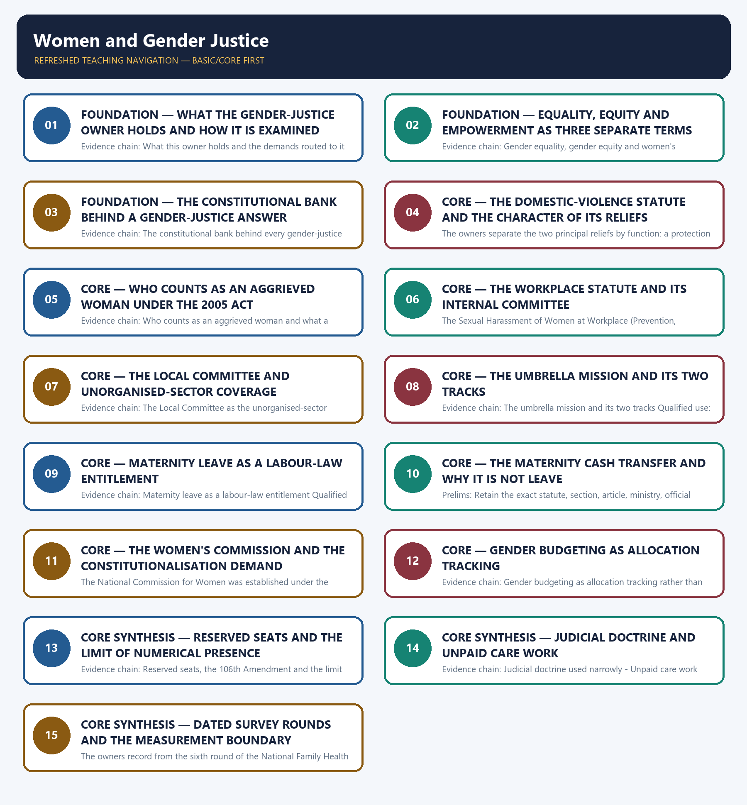

# Women and Gender Justice — Learner-v2 Complete Learning Session

> **Authoring-only generation:** 2026-09-02. No PDF was rendered and no tracker or index was mutated.

### SOURCE, PROGRESSION AND CURRENT-LINKAGE AUDIT

- **Generation date:** 2026-09-02.
- **Repository-first evidence:** the Basic owner is taught first and preserved in full; the Advanced owner is retained only in the optional final teaching block.
- **OCR evidence:** Repository Markdown was primary. The OCR-searchable official General Studies question papers held under books\mains and books\more_previous_papers were read only to confirm the printed wording of routed Mains demands. No official answer key, marking scheme, page precision or unsupported quotation was imported from them.
- **Qdrant:** not used; repository Markdown and available OCR context were sufficient.
- **PYQ integrity:** Seven General Studies Mains demands and one objective demand are routed to this topic in the audited routing ledgers, and each Mains demand is reproduced below as a demand card with its printed year, paper, question number, directive, marks and word limit exactly as the ledgers record them: 2019 General Studies Paper II Question 13, 2020 General Studies Paper II Question 15, 2021 General Studies Paper II Question 2, 2021 General Studies Paper II Question 17, 2023 General Studies Paper II Question 12, 2023 General Studies Paper II Question 14 and 2025 General Studies Paper II Question 6. The ledgers record three of these as cross-cutting routes whose primary subject label is Polity, namely the 2020 constitutionalisation demand, the 2021 higher-judiciary demand and the 2023 constitutional-perspectives demand, and that shared ownership is stated openly rather than claimed exclusively; the 2019 local-self-government demand retains a Panchayati Raj link and the 2023 civil-society demand retains a civil-society link with the Governance owner. One objective demand is also routed, namely 2019 Prelims General Studies Paper I Question 76 on the key provisions of the 2017 maternity-benefit amendment, and the ledger records the official 2018-2023 Prelims keys as not held locally, so no option, key or inferred answer is recorded for it and it is not converted into a solved question. The Basic owner separately discusses the 2024 General Studies Paper I question distinguishing gender equality, gender equity and women's empowerment, but the audited 2024-2025 Mains routing ledger routes that question to the Indian Society owner, so no demand card is manufactured for it here and no ownership is claimed over it. The locally held OCR-searchable official General Studies papers were read only to confirm the printed wording of the routed Mains demands; no question was invented from them and     no marking scheme or page precision was imported. Every model solution below is original work written to the repository's examiner-grade standard using the claim, named evidence, analysis and qualification pattern. Each model solution opens with its analytical claim so that the evidence which follows does argumentative rather than decorative work.
- **Live-link boundary:** One live official page was verified for this topic on 2026-09-02. The Ministry of Women and Child Development's official page, read on that date, records that the Ministry came into existence as a separate Ministry with effect from 30 January 2006, that it had been a Department under the Ministry of Human Resources Development since 1985, and that it was constituted with the prime intention of addressing gaps in State action for women and children and of promoting inter-ministerial and inter-sectoral convergence to create gender-equitable and child-centred legislation, policies and programmes. That statement is used only for what it says, namely the ministry's date of creation, its predecessor status and its convergence mandate, and nothing further has been inferred from it. Three further official checks were attempted on the same date, namely the ministry's scheme-listing page for the umbrella women's mission, the National Commission for Women's site and a tribal-affairs page, and each returned either a not-found error or navigational content only, so nothing was read or used from them and no secondary summary, coaching site or news report has been treated as an official source. The package therefore relies on the dated official anchors already carried by the repository owners, each cited with its issuing instrument, edition or survey round: the Protection of Women from Domestic Violence Act, 2005 with its protection order, residence order, monetary relief, Protection Officer and Section 31 offence for breach; the Sexual Harassment of Women at Workplace Act, 2013 with its Internal Committee at ten or more employees, its ninety-day inquiry and its district Local Committee constituted by the District Officer; Mission Shakti as an umbrella scheme restructured in 2021 with the Sambal and Samarthya sub-schemes; the Maternity Benefit Act, 1961 as amended in 2017 with twenty-six weeks of paid leave for the first two surviving children in covered establishments with ten or more employees; the second version of the maternity cash transfer with 5,000 rupees in two instalments for the first child and 6,000 rupees in one instalment for a second child if that child is a girl; the National Commission for Women Act, 1990 with recommendatory powers; the Gender Budget Statement with Part A at a hundred per cent women-specific allocation and Part B at thirty to ninety-nine per cent pro-women allocation; Articles 14, 15(1), 15(3), 16, 21, 39(a) to 39(d), 42 and 51A(e), Articles 243D and 243T, and the 106th Amendment sequenced by Article 334A; the narrow holdings in Vishaka, Shayara Bano and Joseph Shine; the fifth-round National Family Health Survey access values of 78.6 per cent and 54.0 per cent for women aged fifteen to forty-nine; the release of the sixth round for 2023-24 on 29 May 2026; and the sixth-round child-marriage prevalence of 20.1 per cent of women aged twenty to twenty-four, down from 23.3 per cent. No beneficiary, coverage, complaint, disposal, conviction, representation or expenditure count is asserted, no Periodic Labour Force Survey, National Crime Records Bureau, Census or Sustainable Development Goal figure is asserted, no scheme eligibility rule beyond the recorded statutory and guideline provisions is asserted, no legal or constitutional provision is invented or upgraded in status, and no previous-year question, official answer key or option is asserted or inferred.
- **Fact/inference discipline:** no current-affairs item, PYQ wording, figure or quotation is invented.

## BASIC LEARNING SESSION



*Distinct embedded teaching-navigation image. The separate continuous Cārvāka-style flowchart package remains an independent at-a-glance artifact.*

### SESSION 1 — FOUNDATION — WHAT THE GENDER-JUSTICE OWNER HOLDS AND HOW IT IS EXAMINED

#### DEFINITION / WHAT THIS IS CALLED

**Plain-language definition:** Prelims: Retain the exact statute, section, article, ministry, official category, survey round or dated edition attached to What the gender-justice owner holds and how it is examined, and never upgrade a policy document into a statute or a targeted scheme into a universal entitlement.

**Technical definition:** Evidence chain: What this owner holds and the demands routed to it Qualified use: Open a gender demand by naming which of protection, empowerment or accountability the question actually tests.

#### ANSWER-GRABBING OPENING — WRITE/ADAPT IN THE EXAM

> Prelims: Retain the exact statute, section, article, ministry, official category, survey round or dated edition attached to What the gender-justice owner holds and how it is examined, and never upgrade a policy document into a statute or a targeted scheme into a universal entitlement.

#### MUST-WRITE KEYWORDS

- **FOUNDATION**
- **What the gender-justice owner holds**
- **how it is examined**
- **Evidence chain**
- **Qualified use**
- **This**

**How to use them:** Frame the answer through FOUNDATION; define What the gender-justice owner holds, connect how it is examined with Evidence chain to explain the mechanism, and use Qualified use for the decisive comparison or qualification.

#### VISUAL FIRST

```text
WHAT THE GENDER-JUSTICE OWNER HOLDS AND HOW IT IS EXAMINED
01. What this owner holds and the demands routed to it
BOUNDARY -> Self-help-group social capital belongs to the Governance owner and the 2024 equality, equity and empowerment demand to the Indian Society owner.
```

*This topic-specific rail fixes the evidence sequence and its exam boundary before analysis.*

#### CORE EXPLANATION

This topic owns the gender half of the rights-and-capability argument, namely protection from domestic violence and from workplace sexual harassment, maternity support, economic empowerment, statutory oversight through the National Commission for Women and allocation tracking through the Gender Budget Statement, and its distinctive feature is the densest verified Mains record in the folder: the audited routing ledgers route seven General Studies Mains demands to it, from 2019, 2020, 2021, 2023 and 2025, together with one objective demand from 2019 whose official key the ledger records as not held locally; the self-help-group social-capital mechanism is owned by the Governance owner, women's workforce-participation macroeconomics by the Economy owner, and the 2024 General Studies Paper I demand on gender equality, gender equity and empowerment is routed by the audited ledger to the Indian Society owner, so this topic argues protection, empowerment and accountability without claiming those routes.

#### NAMED EVIDENCE AND MECHANISM

- This topic owns the gender half of the rights-and-capability argument, namely protection from domestic violence and from workplace sexual harassment, maternity support, economic empowerment, statutory oversight through the National Commission for Women and allocation tracking through the Gender Budget Statement, and its distinctive feature is the densest verified Mains record in the folder: the audited routing ledgers route seven General Studies Mains demands to it, from 2019, 2020, 2021, 2023 and 2025, together with one objective demand from 2019 whose official key the ledger records as not held locally; the self-help-group social-capital mechanism is owned by the Governance owner, women's workforce-participation macroeconomics by the Economy owner, and the 2024 General Studies Paper I demand on gender equality, gender equity and empowerment is routed by the audited ledger to the Indian Society owner, so this topic argues protection, empowerment and accountability without claiming those routes.

#### EXAMINER CAUTION

- Self-help-group social capital belongs to the Governance owner and the 2024 equality, equity and empowerment demand to the Indian Society owner.

#### EXAM LINK

- **Prelims:** Retain the exact statute, section, article, ministry, official category, survey round or dated edition attached to What the gender-justice owner holds and how it is examined, and never upgrade a policy document into a statute or a targeted scheme into a universal entitlement.
- **Mains:** Open a gender demand by naming which of protection, empowerment or accountability the question actually tests.

#### MINI RECAP

- **Evidence chain:** What this owner holds and the demands routed to it
- **Qualified use:** Open a gender demand by naming which of protection, empowerment or accountability the question actually tests.

#### CLOSING RECALL FLOW — FOUNDATION — WHAT THE GENDER-JUSTICE OWNER HOLDS AND HOW IT IS EXAMINED

```text
START / CONCEPT: FOUNDATION — What the gender-justice owner holds and how it is examined
        |
        v
EXACT TERMS: FOUNDATION · What the gender-justice owner holds · how it is examined · Evidence chain · Qualified use · This
        |
        v
MECHANISM / ARGUMENT: Evidence chain: What this owner holds and the demands routed to it Qualified use: Open a gender demand by naming which of protection, empowerment or accountability the question actually tests.
        |
        v
CONSEQUENCE / CONTRAST: This topic owns the gender half of the rights-and-capability argument, namely protection from domestic violence and from workplace sexual harassment, maternity support, economic empowerment, statutory oversight through the National Commission for Women and allocation tracking through the Gender Budget Statement, and its distinctive feature is the densest verified Mains record in the folder: the audited routing ledgers route seven General Studies Mains demands to it, from 2019, 2020, 2021, 2023 and 2025, together with one objective demand from 2019 whose official key the ledger records as not held locally; the self-help-group social-capital mechanism is owned by the Governance owner, women's workforce-participation macroeconomics by the Economy owner, and the 2024 General Studies Paper I demand on gender equality, gender equity and empowerment is routed by the audited ledger to the Indian Society owner, so this topic argues protection, empowerment and accountability without claiming those routes.
        |
        v
UPSC TRAP / ANSWER-USE: Do not miss this limiting distinction: retain the exact statute, section, article, ministry, official category, survey round or dated edition...
        |
        v
ANSWER-GRABBING FORMULATION: Prelims: Retain the exact statute, section, article, ministry, official category, survey round or dated edition attached to What the gender-justice owner holds and how it is examined, and never upgrade a policy document into a statute or a targeted scheme into a universal entitlement.
```
### SESSION 2 — FOUNDATION — EQUALITY, EQUITY AND EMPOWERMENT AS THREE SEPARATE TERMS

#### DEFINITION / WHAT THIS IS CALLED

**Plain-language definition:** The owners define gender equality as the same legal treatment, rights and opportunities regardless of gender, applied through outcome-neutral rules; gender equity as differentiated treatment that compensates for structural disadvantage so that fair outcomes become possible, which is a recognition that starting conditions are unequal; and women's empowerment as the expansion of women's agency, capability and voice, that is, the outcome that appears when protective and affirmative instruments actually combine; the examinable value of the trichotomy is architectural rather than lexical, because equality is the constitutional baseline, equity is the instrument layer of protective law and affirmative schemes, and empowerment is the measured outcome, so an answer that treats the three as synonyms has collapsed a causal chain into a definition.

**Technical definition:** Evidence chain: Gender equality, gender equity and women's empowerment as three distinct terms Qualified use: Convert a definitional distinction into the architecture of the whole answer.

#### ANSWER-GRABBING OPENING — WRITE/ADAPT IN THE EXAM

> Evidence chain: Gender equality, gender equity and women's empowerment as three distinct terms Qualified use: Convert a definitional distinction into the architecture of the whole answer.

#### MUST-WRITE KEYWORDS

- **FOUNDATION**
- **Equality**
- **equity**
- **empowerment as three separate terms**
- **Evidence chain**
- **Qualified use**

**How to use them:** Frame the answer through FOUNDATION; define Equality, connect equity with empowerment as three separate terms to explain the mechanism, and use Evidence chain for the decisive comparison or qualification.

#### VISUAL FIRST

```text
EQUALITY, EQUITY AND EMPOWERMENT AS THREE SEPARATE TERMS
01. Gender equality, gender equity and women's empowerment as three distinct terms
BOUNDARY -> The three terms are a causal chain and collapse into error when used as synonyms.
```

*This topic-specific rail fixes the evidence sequence and its exam boundary before analysis.*

#### CORE EXPLANATION

The owners define gender equality as the same legal treatment, rights and opportunities regardless of gender, applied through outcome-neutral rules; gender equity as differentiated treatment that compensates for structural disadvantage so that fair outcomes become possible, which is a recognition that starting conditions are unequal; and women's empowerment as the expansion of women's agency, capability and voice, that is, the outcome that appears when protective and affirmative instruments actually combine; the examinable value of the trichotomy is architectural rather than lexical, because equality is the constitutional baseline, equity is the instrument layer of protective law and affirmative schemes, and empowerment is the measured outcome, so an answer that treats the three as synonyms has collapsed a causal chain into a definition.

#### NAMED EVIDENCE AND MECHANISM

- The owners define gender equality as the same legal treatment, rights and opportunities regardless of gender, applied through outcome-neutral rules; gender equity as differentiated treatment that compensates for structural disadvantage so that fair outcomes become possible, which is a recognition that starting conditions are unequal; and women's empowerment as the expansion of women's agency, capability and voice, that is, the outcome that appears when protective and affirmative instruments actually combine; the examinable value of the trichotomy is architectural rather than lexical, because equality is the constitutional baseline, equity is the instrument layer of protective law and affirmative schemes, and empowerment is the measured outcome, so an answer that treats the three as synonyms has collapsed a causal chain into a definition.

#### EXAMINER CAUTION

- The three terms are a causal chain and collapse into error when used as synonyms.

#### EXAM LINK

- **Prelims:** Retain the exact statute, section, article, ministry, official category, survey round or dated edition attached to Equality, equity and empowerment as three separate terms, and never upgrade a policy document into a statute or a targeted scheme into a universal entitlement.
- **Mains:** Convert a definitional distinction into the architecture of the whole answer.

#### MINI RECAP

- **Evidence chain:** Gender equality, gender equity and women's empowerment as three distinct terms
- **Qualified use:** Convert a definitional distinction into the architecture of the whole answer.

#### CLOSING RECALL FLOW — FOUNDATION — EQUALITY, EQUITY AND EMPOWERMENT AS THREE SEPARATE TERMS

```text
START / CONCEPT: FOUNDATION — Equality, equity and empowerment as three separate terms
        |
        v
EXACT TERMS: FOUNDATION · Equality · equity · empowerment as three separate terms · Evidence chain · Qualified use
        |
        v
MECHANISM / ARGUMENT: The owners define gender equality as the same legal treatment, rights and opportunities regardless of gender, applied through outcome-neutral rules; gender equity as differentiated treatment that compensates for structural disadvantage so that fair outcomes become possible, which is a recognition that starting conditions are unequal; and women's empowerment as the expansion of women's agency, capability and voice, that is, the outcome that appears when protective and affirmative instruments actually combine; the examinable value of the trichotomy is architectural rather than lexical, because equality is the constitutional baseline, equity is the instrument layer of protective law and affirmative schemes, and empowerment is the measured outcome, so an answer that treats the three as synonyms has collapsed a causal chain into a definition.
        |
        v
CONSEQUENCE / CONTRAST: The three terms are a causal chain and collapse into error when used as synonyms.
        |
        v
UPSC TRAP / ANSWER-USE: Do not miss this limiting distinction: gender equality, gender equity and women's empowerment as three distinct terms Qualified use.
        |
        v
ANSWER-GRABBING FORMULATION: Evidence chain: Gender equality, gender equity and women's empowerment as three distinct terms Qualified use: Convert a definitional distinction into the architecture of the whole answer.
```
### SESSION 3 — FOUNDATION — THE CONSTITUTIONAL BANK BEHIND A GENDER-JUSTICE ANSWER

#### DEFINITION / WHAT THIS IS CALLED

**Plain-language definition:** The owners record the constitutional bank for this topic as Articles 14, 15(1), 15(3), 16, 21, 39(a) to 39(d), 42 and 51A(e), where Article 14 supplies equality before the law, Article 15(1) prohibits discrimination on the ground of sex, Article 15(3) expressly permits the State to make special provision for women and is therefore the enabling clause for differentiated instruments, Article 16 governs equality of opportunity in public employment, Article 21 carries life and personal liberty including protection from violence, the directive principles in Article 39 and Article 42 speak to livelihood, equal pay and just and humane conditions of work with maternity relief, and Article 51A(e) makes renouncing practices derogatory to the dignity of women a fundamental duty; the discipline is that Article 15(3) is an enabling power and not itself a scheme, so a constitutional citation is the start of an argument rather than a substitute for one.

**Technical definition:** Evidence chain: The constitutional bank behind every gender-justice answer Qualified use: Pair a provision with the instrument it enables instead of listing articles.

#### ANSWER-GRABBING OPENING — WRITE/ADAPT IN THE EXAM

> Evidence chain: The constitutional bank behind every gender-justice answer Qualified use: Pair a provision with the instrument it enables instead of listing articles.

#### MUST-WRITE KEYWORDS

- **FOUNDATION**
- **The constitutional bank behind a gender-justice answer**
- **Evidence chain**
- **Qualified use**
- **Article 15**
- **Article 14**

**How to use them:** Frame the answer through FOUNDATION; define The constitutional bank behind a gender-justice answer, connect Evidence chain with Qualified use to explain the mechanism, and use Article 15 for the decisive comparison or qualification.

#### VISUAL FIRST

```text
THE CONSTITUTIONAL BANK BEHIND A GENDER-JUSTICE ANSWER
01. The constitutional bank behind every gender-justice answer
BOUNDARY -> Article 15(3) is an enabling power and not itself an instrument.
```

*This topic-specific rail fixes the evidence sequence and its exam boundary before analysis.*

#### CORE EXPLANATION

The owners record the constitutional bank for this topic as Articles 14, 15(1), 15(3), 16, 21, 39(a) to 39(d), 42 and 51A(e), where Article 14 supplies equality before the law, Article 15(1) prohibits discrimination on the ground of sex, Article 15(3) expressly permits the State to make special provision for women and is therefore the enabling clause for differentiated instruments, Article 16 governs equality of opportunity in public employment, Article 21 carries life and personal liberty including protection from violence, the directive principles in Article 39 and Article 42 speak to livelihood, equal pay and just and humane conditions of work with maternity relief, and Article 51A(e) makes renouncing practices derogatory to the dignity of women a fundamental duty; the discipline is that Article 15(3) is an enabling power and not itself a scheme, so a constitutional citation is the start of an argument rather than a substitute for one.

#### NAMED EVIDENCE AND MECHANISM

- The owners record the constitutional bank for this topic as Articles 14, 15(1), 15(3), 16, 21, 39(a) to 39(d), 42 and 51A(e), where Article 14 supplies equality before the law, Article 15(1) prohibits discrimination on the ground of sex, Article 15(3) expressly permits the State to make special provision for women and is therefore the enabling clause for differentiated instruments, Article 16 governs equality of opportunity in public employment, Article 21 carries life and personal liberty including protection from violence, the directive principles in Article 39 and Article 42 speak to livelihood, equal pay and just and humane conditions of work with maternity relief, and Article 51A(e) makes renouncing practices derogatory to the dignity of women a fundamental duty; the discipline is that Article 15(3) is an enabling power and not itself a scheme, so a constitutional citation is the start of an argument rather than a substitute for one.

#### EXAMINER CAUTION

- Article 15(3) is an enabling power and not itself an instrument.

#### EXAM LINK

- **Prelims:** Retain the exact statute, section, article, ministry, official category, survey round or dated edition attached to The constitutional bank behind a gender-justice answer, and never upgrade a policy document into a statute or a targeted scheme into a universal entitlement.
- **Mains:** Pair a provision with the instrument it enables instead of listing articles.

#### MINI RECAP

- **Evidence chain:** The constitutional bank behind every gender-justice answer
- **Qualified use:** Pair a provision with the instrument it enables instead of listing articles.

#### CLOSING RECALL FLOW — FOUNDATION — THE CONSTITUTIONAL BANK BEHIND A GENDER-JUSTICE ANSWER

```text
START / CONCEPT: FOUNDATION — The constitutional bank behind a gender-justice answer
        |
        v
EXACT TERMS: FOUNDATION · The constitutional bank behind a gender-justice answer · Evidence chain · Qualified use · Article 15 · Article 14
        |
        v
MECHANISM / ARGUMENT: The owners record the constitutional bank for this topic as Articles 14, 15(1), 15(3), 16, 21, 39(a) to 39(d), 42 and 51A(e), where Article 14 supplies equality before the law, Article 15(1) prohibits discrimination on the ground of sex, Article 15(3) expressly permits the State to make special provision for women and is therefore the enabling clause for differentiated instruments, Article 16 governs equality of opportunity in public employment, Article 21 carries life and personal liberty including protection from violence, the directive principles in Article 39 and Article 42 speak to livelihood, equal pay and just and humane conditions of work with maternity relief, and Article 51A(e) makes renouncing practices derogatory to the dignity of women a fundamental duty; the discipline is that Article 15(3) is an enabling power and not itself a scheme, so a constitutional citation is the start of an argument rather than a substitute for one.
        |
        v
CONSEQUENCE / CONTRAST: Article 15(3) is an enabling power and not itself an instrument.
        |
        v
UPSC TRAP / ANSWER-USE: Do not miss this limiting distinction: the constitutional bank behind every gender-justice answer Qualified use.
        |
        v
ANSWER-GRABBING FORMULATION: Evidence chain: The constitutional bank behind every gender-justice answer Qualified use: Pair a provision with the instrument it enables instead of listing articles.
```
### SESSION 4 — CORE — THE DOMESTIC-VIOLENCE STATUTE AND THE CHARACTER OF ITS RELIEFS

#### DEFINITION / WHAT THIS IS CALLED

**Plain-language definition:** Evidence chain: The domestic-violence statute of 2005 and the character of its reliefs - Protection order and residence order are different reliefs Qualified use: State the legal character of a remedy before arguing about its effectiveness.

**Technical definition:** The owners separate the two principal reliefs by function: a protection order restrains the respondent from committing domestic violence, from contacting the aggrieved woman and from related acts, so its object is physical safety, whereas a residence order secures the aggrieved woman's right to reside in the shared household regardless of whether she holds any ownership interest in it, so its object is housing security; monetary relief is a third and distinct head; the boundary the owners record is that the shared-household residence right is contested where the property belongs to parents-in-law rather than to the husband, which is why a well-marked answer names the relief it means instead of writing about the Act in the abstract.

#### ANSWER-GRABBING OPENING — WRITE/ADAPT IN THE EXAM

> Evidence chain: The domestic-violence statute of 2005 and the character of its reliefs - Protection order and residence order are different reliefs Qualified use: State the legal character of a remedy before arguing about its effectiveness.

#### MUST-WRITE KEYWORDS

- **The domestic-violence statute**
- **the character of its reliefs**
- **Evidence chain**
- **Qualified use**
- **The Protection**
- **Women**

**How to use them:** Frame the answer through The domestic-violence statute; define the character of its reliefs, connect Evidence chain with Qualified use to explain the mechanism, and use The Protection for the decisive comparison or qualification.

#### VISUAL FIRST

```text
THE DOMESTIC-VIOLENCE STATUTE AND THE CHARACTER OF ITS RELIEFS
01. The domestic-violence statute of 2005 and the character of its reliefs
    |
    v
02. Protection order and residence order are different reliefs
BOUNDARY -> The reliefs are civil and protective while breach of a protection order is the offence under Section 31.
```

*This topic-specific rail fixes the evidence sequence and its exam boundary before analysis.*

#### CORE EXPLANATION

The Protection of Women from Domestic Violence Act, 2005 is recorded by the owners as primarily a civil and protective statute rather than a general penal code for domestic violence: an aggrieved woman may approach a Protection Officer or a Magistrate for a protection order, a residence order and monetary relief, and the implementing arm named in the Act is the Protection Officer; the criminal edge is precise and narrow, because breach of a protection order is an offence under Section 31, while cruelty may separately attract prosecution under the general penal law, so the accurate formulation is that the Act supplies civil remedies backed by a criminal consequence for breach, and describing it either as wholly civil or as a general criminal statute for domestic violence is the trap the owners flag. The owners separate the two principal reliefs by function: a protection order restrains the respondent from committing domestic violence, from contacting the aggrieved woman and from related acts, so its object is physical safety, whereas a residence order secures the aggrieved woman's right to reside in the shared household regardless of whether she holds any ownership interest in it, so its object is housing security; monetary relief is a third and distinct head; the boundary the owners record is that the shared-household residence right is contested where the property belongs to parents-in-law rather than to the husband, which is why a well-marked answer names the relief it means instead of writing about the Act in the abstract.

#### NAMED EVIDENCE AND MECHANISM

- The Protection of Women from Domestic Violence Act, 2005 is recorded by the owners as primarily a civil and protective statute rather than a general penal code for domestic violence: an aggrieved woman may approach a Protection Officer or a Magistrate for a protection order, a residence order and monetary relief, and the implementing arm named in the Act is the Protection Officer; the criminal edge is precise and narrow, because breach of a protection order is an offence under Section 31, while cruelty may separately attract prosecution under the general penal law, so the accurate formulation is that the Act supplies civil remedies backed by a criminal consequence for breach, and describing it either as wholly civil or as a general criminal statute for domestic violence is the trap the owners flag.
- The owners separate the two principal reliefs by function: a protection order restrains the respondent from committing domestic violence, from contacting the aggrieved woman and from related acts, so its object is physical safety, whereas a residence order secures the aggrieved woman's right to reside in the shared household regardless of whether she holds any ownership interest in it, so its object is housing security; monetary relief is a third and distinct head; the boundary the owners record is that the shared-household residence right is contested where the property belongs to parents-in-law rather than to the husband, which is why a well-marked answer names the relief it means instead of writing about the Act in the abstract.

#### EXAMINER CAUTION

- The reliefs are civil and protective while breach of a protection order is the offence under Section 31.

#### EXAM LINK

- **Prelims:** Retain the exact statute, section, article, ministry, official category, survey round or dated edition attached to The domestic-violence statute and the character of its reliefs, and never upgrade a policy document into a statute or a targeted scheme into a universal entitlement.
- **Mains:** State the legal character of a remedy before arguing about its effectiveness.

#### MINI RECAP

- **Evidence chain:** The domestic-violence statute of 2005 and the character of its reliefs -> Protection order and residence order are different reliefs
- **Qualified use:** State the legal character of a remedy before arguing about its effectiveness.

#### CLOSING RECALL FLOW — CORE — THE DOMESTIC-VIOLENCE STATUTE AND THE CHARACTER OF ITS RELIEFS

```text
START / CONCEPT: CORE — The domestic-violence statute and the character of its reliefs
        |
        v
EXACT TERMS: The domestic-violence statute · the character of its reliefs · Evidence chain · Qualified use · The Protection · Women
        |
        v
MECHANISM / ARGUMENT: The Protection of Women from Domestic Violence Act, 2005 is recorded by the owners as primarily a civil and protective statute rather than a general penal code for domestic violence: an aggrieved woman may approach a Protection Officer or a Magistrate for a protection order, a residence order and monetary relief, and the implementing arm named in the Act is the Protection Officer; the criminal edge is precise and narrow, because breach of a protection order is an offence under Section 31, while cruelty may separately attract prosecution under the general penal law, so the accurate formulation is that the Act supplies civil remedies backed by a criminal consequence for breach, and describing it either as wholly civil or as a general criminal statute for domestic violence is the trap the owners flag.
        |
        v
CONSEQUENCE / CONTRAST: The reliefs are civil and protective while breach of a protection order is the offence under Section 31.
        |
        v
UPSC TRAP / ANSWER-USE: The owners separate the two principal reliefs by function: a protection order restrains the respondent from committing domestic violence, from contacting the aggrieved woman and from related acts, so its object is physical safety, whereas a residence order secures the aggrieved woman's right to reside in the shared household regardless of whether she holds any ownership interest in it, so its object is housing security; monetary relief is a third and distinct head; the boundary the owners record is that the shared-household residence right is contested where the property belongs to parents-in-law rather than to the husband, which is why a well-marked answer names the relief it means instead of writing about the Act in the abstract.
        |
        v
ANSWER-GRABBING FORMULATION: Evidence chain: The domestic-violence statute of 2005 and the character of its reliefs - Protection order and residence order are different reliefs Qualified use: State the legal character of a remedy before arguing about its effectiveness.
```
### SESSION 5 — CORE — WHO COUNTS AS AN AGGRIEVED WOMAN UNDER THE 2005 ACT

#### DEFINITION / WHAT THIS IS CALLED

**Plain-language definition:** The owners record that the Act reaches an aggrieved woman who is a wife, a qualifying live-in partner, a sister, a mother or any woman in a domestic relationship, and that the statute expressly covers a relationship in the nature of marriage, so a woman in a live-in relationship is within scope subject to factual determination by the Magistrate; the significance is that the Act is drafted around the household relationship rather than around marital status alone, which is why the recurring trap that the Act protects only legally married women is false, and why an answer that argues access to justice must attach the scope of the relationship to the capacity of the Protection Officer who actually operates it.

**Technical definition:** Evidence chain: Who counts as an aggrieved woman and what a domestic relationship covers Qualified use: Attach the statutory scope of a relationship to the capacity that operates it.

#### ANSWER-GRABBING OPENING — WRITE/ADAPT IN THE EXAM

> The owners record that the Act reaches an aggrieved woman who is a wife, a qualifying live-in partner, a sister, a mother or any woman in a domestic relationship, and that the statute expressly covers a relationship in the nature of marriage, so a woman in a live-in relationship is within scope subject to factual determination by the Magistrate; the significance is that the Act is drafted around the household relationship rather than around marital status alone, which is why the recurring trap that the Act protects only legally married women is false, and why an answer that argues access to justice must attach the scope of the relationship to the capacity of the Protection Officer who actually operates it.

#### MUST-WRITE KEYWORDS

- **Evidence chain**
- **Qualified use**
- **Act**
- **Magistrate**
- **Protection Officer**
- **A relationship in the nature of marriage**

**How to use them:** Frame the answer through Evidence chain; define Qualified use, connect Act with Magistrate to explain the mechanism, and use Protection Officer for the decisive comparison or qualification.

#### VISUAL FIRST

```text
WHO COUNTS AS AN AGGRIEVED WOMAN UNDER THE 2005 ACT
01. Who counts as an aggrieved woman and what a domestic relationship covers
BOUNDARY -> A relationship in the nature of marriage is within scope subject to factual determination by the Magistrate.
```

*This topic-specific rail fixes the evidence sequence and its exam boundary before analysis.*

#### CORE EXPLANATION

The owners record that the Act reaches an aggrieved woman who is a wife, a qualifying live-in partner, a sister, a mother or any woman in a domestic relationship, and that the statute expressly covers a relationship in the nature of marriage, so a woman in a live-in relationship is within scope subject to factual determination by the Magistrate; the significance is that the Act is drafted around the household relationship rather than around marital status alone, which is why the recurring trap that the Act protects only legally married women is false, and why an answer that argues access to justice must attach the scope of the relationship to the capacity of the Protection Officer who actually operates it.

#### NAMED EVIDENCE AND MECHANISM

- The owners record that the Act reaches an aggrieved woman who is a wife, a qualifying live-in partner, a sister, a mother or any woman in a domestic relationship, and that the statute expressly covers a relationship in the nature of marriage, so a woman in a live-in relationship is within scope subject to factual determination by the Magistrate; the significance is that the Act is drafted around the household relationship rather than around marital status alone, which is why the recurring trap that the Act protects only legally married women is false, and why an answer that argues access to justice must attach the scope of the relationship to the capacity of the Protection Officer who actually operates it.

#### EXAMINER CAUTION

- A relationship in the nature of marriage is within scope subject to factual determination by the Magistrate.

#### EXAM LINK

- **Prelims:** Retain the exact statute, section, article, ministry, official category, survey round or dated edition attached to Who counts as an aggrieved woman under the 2005 Act, and never upgrade a policy document into a statute or a targeted scheme into a universal entitlement.
- **Mains:** Attach the statutory scope of a relationship to the capacity that operates it.

#### MINI RECAP

- **Evidence chain:** Who counts as an aggrieved woman and what a domestic relationship covers
- **Qualified use:** Attach the statutory scope of a relationship to the capacity that operates it.

#### CLOSING RECALL FLOW — CORE — WHO COUNTS AS AN AGGRIEVED WOMAN UNDER THE 2005 ACT

```text
START / CONCEPT: CORE — Who counts as an aggrieved woman under the 2005 Act
        |
        v
EXACT TERMS: Evidence chain · Qualified use · Act · Magistrate · Protection Officer · A relationship in the nature of marriage
        |
        v
MECHANISM / ARGUMENT: Evidence chain: Who counts as an aggrieved woman and what a domestic relationship covers Qualified use: Attach the statutory scope of a relationship to the capacity that operates it.
        |
        v
CONSEQUENCE / CONTRAST: A relationship in the nature of marriage is within scope subject to factual determination by the Magistrate.
        |
        v
UPSC TRAP / ANSWER-USE: Do not miss this limiting distinction: who counts as an aggrieved woman and what a domestic relationship covers Qualified use.
        |
        v
ANSWER-GRABBING FORMULATION: The owners record that the Act reaches an aggrieved woman who is a wife, a qualifying live-in partner, a sister, a mother or any woman in a domestic relationship, and that the statute expressly covers a relationship in the nature of marriage, so a woman in a live-in relationship is within scope subject to factual determination by the Magistrate; the significance is that the Act is drafted around the household relationship rather than around marital status alone, which is why the recurring trap that the Act protects only legally married women is false, and why an answer that argues access to justice must attach the scope of the relationship to the capacity of the Protection Officer who actually operates it.
```
### SESSION 6 — CORE — THE WORKPLACE STATUTE AND ITS INTERNAL COMMITTEE

#### DEFINITION / WHAT THIS IS CALLED

**Plain-language definition:** Evidence chain: The workplace statute of 2013 and the Internal Committee Qualified use: Separate the committee the statute designs from the committee that is actually constituted.

**Technical definition:** The Sexual Harassment of Women at Workplace (Prevention, Prohibition and Redressal) Act, 2013 defines sexual harassment as unwelcome physical, verbal or non-verbal conduct of a sexual nature, and requires an employer to constitute an Internal Committee wherever employee strength is ten or more; the owners record that a complaint is to be inquired into within ninety days, that non-compliance attracts penalties and that repeat default can lead to cancellation of licence or registration; they also record the recurring compliance failure that the required external member with experience of women's issues is often not appointed, which means the statutory design and the delivered committee are two different objects and must be argued separately.

#### ANSWER-GRABBING OPENING — WRITE/ADAPT IN THE EXAM

> Evidence chain: The workplace statute of 2013 and the Internal Committee Qualified use: Separate the committee the statute designs from the committee that is actually constituted.

#### MUST-WRITE KEYWORDS

- **The workplace statute**
- **its Internal Committee**
- **Evidence chain**
- **Qualified use**
- **The Sexual Harassment**
- **Women**

**How to use them:** Frame the answer through The workplace statute; define its Internal Committee, connect Evidence chain with Qualified use to explain the mechanism, and use The Sexual Harassment for the decisive comparison or qualification.

#### VISUAL FIRST

```text
THE WORKPLACE STATUTE AND ITS INTERNAL COMMITTEE
01. The workplace statute of 2013 and the Internal Committee
BOUNDARY -> The required external member with experience of women's issues is often not appointed.
```

*This topic-specific rail fixes the evidence sequence and its exam boundary before analysis.*

#### CORE EXPLANATION

The Sexual Harassment of Women at Workplace (Prevention, Prohibition and Redressal) Act, 2013 defines sexual harassment as unwelcome physical, verbal or non-verbal conduct of a sexual nature, and requires an employer to constitute an Internal Committee wherever employee strength is ten or more; the owners record that a complaint is to be inquired into within ninety days, that non-compliance attracts penalties and that repeat default can lead to cancellation of licence or registration; they also record the recurring compliance failure that the required external member with experience of women's issues is often not appointed, which means the statutory design and the delivered committee are two different objects and must be argued separately.

#### NAMED EVIDENCE AND MECHANISM

- The Sexual Harassment of Women at Workplace (Prevention, Prohibition and Redressal) Act, 2013 defines sexual harassment as unwelcome physical, verbal or non-verbal conduct of a sexual nature, and requires an employer to constitute an Internal Committee wherever employee strength is ten or more; the owners record that a complaint is to be inquired into within ninety days, that non-compliance attracts penalties and that repeat default can lead to cancellation of licence or registration; they also record the recurring compliance failure that the required external member with experience of women's issues is often not appointed, which means the statutory design and the delivered committee are two different objects and must be argued separately.

#### EXAMINER CAUTION

- The required external member with experience of women's issues is often not appointed.

#### EXAM LINK

- **Prelims:** Retain the exact statute, section, article, ministry, official category, survey round or dated edition attached to The workplace statute and its Internal Committee, and never upgrade a policy document into a statute or a targeted scheme into a universal entitlement.
- **Mains:** Separate the committee the statute designs from the committee that is actually constituted.

#### MINI RECAP

- **Evidence chain:** The workplace statute of 2013 and the Internal Committee
- **Qualified use:** Separate the committee the statute designs from the committee that is actually constituted.

#### CLOSING RECALL FLOW — CORE — THE WORKPLACE STATUTE AND ITS INTERNAL COMMITTEE

```text
START / CONCEPT: CORE — The workplace statute and its Internal Committee
        |
        v
EXACT TERMS: The workplace statute · its Internal Committee · Evidence chain · Qualified use · The Sexual Harassment · Women
        |
        v
MECHANISM / ARGUMENT: The Sexual Harassment of Women at Workplace (Prevention, Prohibition and Redressal) Act, 2013 defines sexual harassment as unwelcome physical, verbal or non-verbal conduct of a sexual nature, and requires an employer to constitute an Internal Committee wherever employee strength is ten or more; the owners record that a complaint is to be inquired into within ninety days, that non-compliance attracts penalties and that repeat default can lead to cancellation of licence or registration; they also record the recurring compliance failure that the required external member with experience of women's issues is often not appointed, which means the statutory design and the delivered committee are two different objects and must be argued separately.
        |
        v
CONSEQUENCE / CONTRAST: The required external member with experience of women's issues is often not appointed.
        |
        v
UPSC TRAP / ANSWER-USE: Do not miss this limiting distinction: separate the committee the statute designs from the committee that is actually constituted.
        |
        v
ANSWER-GRABBING FORMULATION: Evidence chain: The workplace statute of 2013 and the Internal Committee Qualified use: Separate the committee the statute designs from the committee that is actually constituted.
```
### SESSION 7 — CORE — THE LOCAL COMMITTEE AND UNORGANISED-SECTOR COVERAGE

#### DEFINITION / WHAT THIS IS CALLED

**Plain-language definition:** The Local Committee is constituted at district level by the District Officer to receive complaints from women working in establishments with fewer than ten employees and from women in the unorganised sector, and the owners record that a dwelling place or house is included within the meaning of workplace, which is the route by which a domestic worker may bring a complaint; the same owners record that Local Committee capacity varies across districts and that practical awareness remains weak, so the correct statement is that coverage was extended in law to the unorganised sector while delivery depends on a district body whose functioning is uneven, and the trap that the statute applies only to the organised sector is false.

**Technical definition:** Evidence chain: The Local Committee as the unorganised-sector extension Qualified use: Answer a coverage demand with the extension route and its delivery constraint together.

#### ANSWER-GRABBING OPENING — WRITE/ADAPT IN THE EXAM

> The Local Committee is constituted at district level by the District Officer to receive complaints from women working in establishments with fewer than ten employees and from women in the unorganised sector, and the owners record that a dwelling place or house is included within the meaning of workplace, which is the route by which a domestic worker may bring a complaint; the same owners record that Local Committee capacity varies across districts and that practical awareness remains weak, so the correct statement is that coverage was extended in law to the unorganised sector while delivery depends on a district body whose functioning is uneven, and the trap that the statute applies only to the organised sector is false.

#### MUST-WRITE KEYWORDS

- **The Local Committee**
- **unorganised-sector coverage**
- **Evidence chain**
- **Qualified use**
- **District Officer**
- **Local Committee**

**How to use them:** Frame the answer through The Local Committee; define unorganised-sector coverage, connect Evidence chain with Qualified use to explain the mechanism, and use District Officer for the decisive comparison or qualification.

#### VISUAL FIRST

```text
THE LOCAL COMMITTEE AND UNORGANISED-SECTOR COVERAGE
01. The Local Committee as the unorganised-sector extension
BOUNDARY -> A dwelling place is included within workplace, but district capacity is uneven.
```

*This topic-specific rail fixes the evidence sequence and its exam boundary before analysis.*

#### CORE EXPLANATION

The Local Committee is constituted at district level by the District Officer to receive complaints from women working in establishments with fewer than ten employees and from women in the unorganised sector, and the owners record that a dwelling place or house is included within the meaning of workplace, which is the route by which a domestic worker may bring a complaint; the same owners record that Local Committee capacity varies across districts and that practical awareness remains weak, so the correct statement is that coverage was extended in law to the unorganised sector while delivery depends on a district body whose functioning is uneven, and the trap that the statute applies only to the organised sector is false.

#### NAMED EVIDENCE AND MECHANISM

- The Local Committee is constituted at district level by the District Officer to receive complaints from women working in establishments with fewer than ten employees and from women in the unorganised sector, and the owners record that a dwelling place or house is included within the meaning of workplace, which is the route by which a domestic worker may bring a complaint; the same owners record that Local Committee capacity varies across districts and that practical awareness remains weak, so the correct statement is that coverage was extended in law to the unorganised sector while delivery depends on a district body whose functioning is uneven, and the trap that the statute applies only to the organised sector is false.

#### EXAMINER CAUTION

- A dwelling place is included within workplace, but district capacity is uneven.

#### EXAM LINK

- **Prelims:** Retain the exact statute, section, article, ministry, official category, survey round or dated edition attached to The Local Committee and unorganised-sector coverage, and never upgrade a policy document into a statute or a targeted scheme into a universal entitlement.
- **Mains:** Answer a coverage demand with the extension route and its delivery constraint together.

#### MINI RECAP

- **Evidence chain:** The Local Committee as the unorganised-sector extension
- **Qualified use:** Answer a coverage demand with the extension route and its delivery constraint together.

#### CLOSING RECALL FLOW — CORE — THE LOCAL COMMITTEE AND UNORGANISED-SECTOR COVERAGE

```text
START / CONCEPT: CORE — The Local Committee and unorganised-sector coverage
        |
        v
EXACT TERMS: The Local Committee · unorganised-sector coverage · Evidence chain · Qualified use · District Officer · Local Committee
        |
        v
MECHANISM / ARGUMENT: Evidence chain: The Local Committee as the unorganised-sector extension Qualified use: Answer a coverage demand with the extension route and its delivery constraint together.
        |
        v
CONSEQUENCE / CONTRAST: A dwelling place is included within workplace, but district capacity is uneven.
        |
        v
UPSC TRAP / ANSWER-USE: Do not miss this limiting distinction: the Local Committee is constituted at district level by the District Officer to receive...
        |
        v
ANSWER-GRABBING FORMULATION: The Local Committee is constituted at district level by the District Officer to receive complaints from women working in establishments with fewer than ten employees and from women in the unorganised sector, and the owners record that a dwelling place or house is included within the meaning of workplace, which is the route by which a domestic worker may bring a complaint; the same owners record that Local Committee capacity varies across districts and that practical awareness remains weak, so the correct statement is that coverage was extended in law to the unorganised sector while delivery depends on a district body whose functioning is uneven, and the trap that the statute applies only to the organised sector is false.
```
### SESSION 8 — CORE — THE UMBRELLA MISSION AND ITS TWO TRACKS

#### DEFINITION / WHAT THIS IS CALLED

**Plain-language definition:** CORE — The umbrella mission and its two tracks comprises The umbrella mission, its two tracks and Evidence chain as its core connected dimensions.

**Technical definition:** Evidence chain: The umbrella mission and its two tracks Qualified use: Attribute a service to the correct safety or empowerment track before using it as evidence.

#### ANSWER-GRABBING OPENING — WRITE/ADAPT IN THE EXAM

> Mission Shakti was restructured and launched as an umbrella scheme of the Ministry of Women and Child Development in 2021, subsuming erstwhile standalone schemes into two sub-schemes: Sambal, the safety and security track, which the owners illustrate with One Stop Centres, the Women Helpline, Beti Bachao Beti Padhao and Nari Adalat, and Samarthya, the empowerment track, which the owners connect to shelter and rehabilitation, maternity benefit, childcare, working-women accommodation and empowerment support; the durable examinable fact is the two-sub-scheme architecture rather than any dashboard count, and the owners instruct that current ministry guidelines be checked before a component is attached to a named sub-scheme.

#### MUST-WRITE KEYWORDS

- **The umbrella mission**
- **its two tracks**
- **Evidence chain**
- **Qualified use**
- **Mission Shakti**
- **Ministry**

**How to use them:** Frame the answer through The umbrella mission; define its two tracks, connect Evidence chain with Qualified use to explain the mechanism, and use Mission Shakti for the decisive comparison or qualification.

#### VISUAL FIRST

```text
THE UMBRELLA MISSION AND ITS TWO TRACKS
01. The umbrella mission and its two tracks
BOUNDARY -> The durable fact is the two-sub-scheme architecture and not any dashboard count.
```

*This topic-specific rail fixes the evidence sequence and its exam boundary before analysis.*

#### CORE EXPLANATION

Mission Shakti was restructured and launched as an umbrella scheme of the Ministry of Women and Child Development in 2021, subsuming erstwhile standalone schemes into two sub-schemes: Sambal, the safety and security track, which the owners illustrate with One Stop Centres, the Women Helpline, Beti Bachao Beti Padhao and Nari Adalat, and Samarthya, the empowerment track, which the owners connect to shelter and rehabilitation, maternity benefit, childcare, working-women accommodation and empowerment support; the durable examinable fact is the two-sub-scheme architecture rather than any dashboard count, and the owners instruct that current ministry guidelines be checked before a component is attached to a named sub-scheme.

#### NAMED EVIDENCE AND MECHANISM

- Mission Shakti was restructured and launched as an umbrella scheme of the Ministry of Women and Child Development in 2021, subsuming erstwhile standalone schemes into two sub-schemes: Sambal, the safety and security track, which the owners illustrate with One Stop Centres, the Women Helpline, Beti Bachao Beti Padhao and Nari Adalat, and Samarthya, the empowerment track, which the owners connect to shelter and rehabilitation, maternity benefit, childcare, working-women accommodation and empowerment support; the durable examinable fact is the two-sub-scheme architecture rather than any dashboard count, and the owners instruct that current ministry guidelines be checked before a component is attached to a named sub-scheme.

#### EXAMINER CAUTION

- The durable fact is the two-sub-scheme architecture and not any dashboard count.

#### EXAM LINK

- **Prelims:** Retain the exact statute, section, article, ministry, official category, survey round or dated edition attached to The umbrella mission and its two tracks, and never upgrade a policy document into a statute or a targeted scheme into a universal entitlement.
- **Mains:** Attribute a service to the correct safety or empowerment track before using it as evidence.

#### MINI RECAP

- **Evidence chain:** The umbrella mission and its two tracks
- **Qualified use:** Attribute a service to the correct safety or empowerment track before using it as evidence.

#### CLOSING RECALL FLOW — CORE — THE UMBRELLA MISSION AND ITS TWO TRACKS

```text
START / CONCEPT: CORE — The umbrella mission and its two tracks
        |
        v
EXACT TERMS: The umbrella mission · its two tracks · Evidence chain · Qualified use · Mission Shakti · Ministry
        |
        v
MECHANISM / ARGUMENT: Evidence chain: The umbrella mission and its two tracks Qualified use: Attribute a service to the correct safety or empowerment track before using it as evidence.
        |
        v
CONSEQUENCE / CONTRAST: The durable fact is the two-sub-scheme architecture and not any dashboard count.
        |
        v
UPSC TRAP / ANSWER-USE: Do not miss this limiting distinction: the umbrella mission and its two tracks Qualified use.
        |
        v
ANSWER-GRABBING FORMULATION: Mission Shakti was restructured and launched as an umbrella scheme of the Ministry of Women and Child Development in 2021, subsuming erstwhile standalone schemes into two sub-schemes: Sambal, the safety and security track, which the owners illustrate with One Stop Centres, the Women Helpline, Beti Bachao Beti Padhao and Nari Adalat, and Samarthya, the empowerment track, which the owners connect to shelter and rehabilitation, maternity benefit, childcare, working-women accommodation and empowerment support; the durable examinable fact is the two-sub-scheme architecture rather than any dashboard count, and the owners instruct that current ministry guidelines be checked before a component is attached to a named sub-scheme.
```
### SESSION 9 — CORE — MATERNITY LEAVE AS A LABOUR-LAW ENTITLEMENT

#### DEFINITION / WHAT THIS IS CALLED

**Plain-language definition:** The Maternity Benefit Act, 1961 as amended in 2017 is a labour-law entitlement enforced against the employer: the owners record twenty-six weeks of paid maternity leave for the first two surviving children in covered establishments with ten or more employees; the entitlement therefore runs with covered employment rather than with motherhood, which is precisely why it does not reach a woman in unorganised or own-account work, and why an answer about women's workforce participation must state that the strongest maternity instrument in Indian law is available only where the employment relationship itself is formal and covered.

**Technical definition:** Evidence chain: Maternity leave as a labour-law entitlement Qualified use: Explain why a strong statutory right can still miss most working women.

#### ANSWER-GRABBING OPENING — WRITE/ADAPT IN THE EXAM

> Evidence chain: Maternity leave as a labour-law entitlement Qualified use: Explain why a strong statutory right can still miss most working women.

#### MUST-WRITE KEYWORDS

- **Maternity leave as a labour-law entitlement**
- **Evidence chain**
- **Qualified use**
- **The Maternity Benefit Act**
- **Indian**
- **Maternity**

**How to use them:** Frame the answer through Maternity leave as a labour-law entitlement; define Evidence chain, connect Qualified use with The Maternity Benefit Act to explain the mechanism, and use Indian for the decisive comparison or qualification.

#### VISUAL FIRST

```text
MATERNITY LEAVE AS A LABOUR-LAW ENTITLEMENT
01. Maternity leave as a labour-law entitlement
BOUNDARY -> The twenty-six-week entitlement runs with covered employment rather than with motherhood.
```

*This topic-specific rail fixes the evidence sequence and its exam boundary before analysis.*

#### CORE EXPLANATION

The Maternity Benefit Act, 1961 as amended in 2017 is a labour-law entitlement enforced against the employer: the owners record twenty-six weeks of paid maternity leave for the first two surviving children in covered establishments with ten or more employees; the entitlement therefore runs with covered employment rather than with motherhood, which is precisely why it does not reach a woman in unorganised or own-account work, and why an answer about women's workforce participation must state that the strongest maternity instrument in Indian law is available only where the employment relationship itself is formal and covered.

#### NAMED EVIDENCE AND MECHANISM

- The Maternity Benefit Act, 1961 as amended in 2017 is a labour-law entitlement enforced against the employer: the owners record twenty-six weeks of paid maternity leave for the first two surviving children in covered establishments with ten or more employees; the entitlement therefore runs with covered employment rather than with motherhood, which is precisely why it does not reach a woman in unorganised or own-account work, and why an answer about women's workforce participation must state that the strongest maternity instrument in Indian law is available only where the employment relationship itself is formal and covered.

#### EXAMINER CAUTION

- The twenty-six-week entitlement runs with covered employment rather than with motherhood.

#### EXAM LINK

- **Prelims:** Retain the exact statute, section, article, ministry, official category, survey round or dated edition attached to Maternity leave as a labour-law entitlement, and never upgrade a policy document into a statute or a targeted scheme into a universal entitlement.
- **Mains:** Explain why a strong statutory right can still miss most working women.

#### MINI RECAP

- **Evidence chain:** Maternity leave as a labour-law entitlement
- **Qualified use:** Explain why a strong statutory right can still miss most working women.

#### CLOSING RECALL FLOW — CORE — MATERNITY LEAVE AS A LABOUR-LAW ENTITLEMENT

```text
START / CONCEPT: CORE — Maternity leave as a labour-law entitlement
        |
        v
EXACT TERMS: Maternity leave as a labour-law entitlement · Evidence chain · Qualified use · The Maternity Benefit Act · Indian · Maternity
        |
        v
MECHANISM / ARGUMENT: The Maternity Benefit Act, 1961 as amended in 2017 is a labour-law entitlement enforced against the employer: the owners record twenty-six weeks of paid maternity leave for the first two surviving children in covered establishments with ten or more employees; the entitlement therefore runs with covered employment rather than with motherhood, which is precisely why it does not reach a woman in unorganised or own-account work, and why an answer about women's workforce participation must state that the strongest maternity instrument in Indian law is available only where the employment relationship itself is formal and covered.
        |
        v
CONSEQUENCE / CONTRAST: The twenty-six-week entitlement runs with covered employment rather than with motherhood.
        |
        v
UPSC TRAP / ANSWER-USE: Do not miss this limiting distinction: explain why a strong statutory right can still miss most working women.
        |
        v
ANSWER-GRABBING FORMULATION: Evidence chain: Maternity leave as a labour-law entitlement Qualified use: Explain why a strong statutory right can still miss most working women.
```
### SESSION 10 — CORE — THE MATERNITY CASH TRANSFER AND WHY IT IS NOT LEAVE

#### DEFINITION / WHAT THIS IS CALLED

**Plain-language definition:** Evidence chain: The maternity cash transfer and why it is not leave Qualified use: Keep a statutory obligation and a budgetary transfer apart in every maternity answer.

**Technical definition:** Prelims: Retain the exact statute, section, article, ministry, official category, survey round or dated edition attached to The maternity cash transfer and why it is not leave, and never upgrade a policy document into a statute or a targeted scheme into a universal entitlement.

#### ANSWER-GRABBING OPENING — WRITE/ADAPT IN THE EXAM

> Evidence chain: The maternity cash transfer and why it is not leave Qualified use: Keep a statutory obligation and a budgetary transfer apart in every maternity answer.

#### MUST-WRITE KEYWORDS

- **The maternity cash transfer**
- **why it is not leave**
- **Evidence chain**
- **Qualified use**
- **Under**
- **Pradhan Mantri Matru Vandana Yojana**

**How to use them:** Frame the answer through The maternity cash transfer; define why it is not leave, connect Evidence chain with Qualified use to explain the mechanism, and use Under for the decisive comparison or qualification.

#### VISUAL FIRST

```text
THE MATERNITY CASH TRANSFER AND WHY IT IS NOT LEAVE
01. The maternity cash transfer and why it is not leave
BOUNDARY -> The transfer creates no leave entitlement binding on any employer.
```

*This topic-specific rail fixes the evidence sequence and its exam boundary before analysis.*

#### CORE EXPLANATION

Under the second version of the Pradhan Mantri Matru Vandana Yojana the owners record a conditional direct benefit transfer of 5,000 rupees in two instalments for the first child and 6,000 rupees in a single instalment for a second child if that child is a girl, subject to health, birth and immunisation conditions, with exclusions turning on regular government or public-sector employment or receipt of a similar benefit rather than on a simple organised and unorganised divide; the transfer compensates for lost wages around childbirth but creates no leave entitlement binding on any employer, so a statute and a budgetary transfer must never be merged into one instrument in an answer.

#### NAMED EVIDENCE AND MECHANISM

- Under the second version of the Pradhan Mantri Matru Vandana Yojana the owners record a conditional direct benefit transfer of 5,000 rupees in two instalments for the first child and 6,000 rupees in a single instalment for a second child if that child is a girl, subject to health, birth and immunisation conditions, with exclusions turning on regular government or public-sector employment or receipt of a similar benefit rather than on a simple organised and unorganised divide; the transfer compensates for lost wages around childbirth but creates no leave entitlement binding on any employer, so a statute and a budgetary transfer must never be merged into one instrument in an answer.

#### EXAMINER CAUTION

- The transfer creates no leave entitlement binding on any employer.

#### EXAM LINK

- **Prelims:** Retain the exact statute, section, article, ministry, official category, survey round or dated edition attached to The maternity cash transfer and why it is not leave, and never upgrade a policy document into a statute or a targeted scheme into a universal entitlement.
- **Mains:** Keep a statutory obligation and a budgetary transfer apart in every maternity answer.

#### MINI RECAP

- **Evidence chain:** The maternity cash transfer and why it is not leave
- **Qualified use:** Keep a statutory obligation and a budgetary transfer apart in every maternity answer.

#### CLOSING RECALL FLOW — CORE — THE MATERNITY CASH TRANSFER AND WHY IT IS NOT LEAVE

```text
START / CONCEPT: CORE — The maternity cash transfer and why it is not leave
        |
        v
EXACT TERMS: The maternity cash transfer · why it is not leave · Evidence chain · Qualified use · Under · Pradhan Mantri Matru Vandana Yojana
        |
        v
MECHANISM / ARGUMENT: Prelims: Retain the exact statute, section, article, ministry, official category, survey round or dated edition attached to The maternity cash transfer and why it is not leave, and never upgrade a policy document into a statute or a targeted scheme into a universal entitlement.
        |
        v
CONSEQUENCE / CONTRAST: Under the second version of the Pradhan Mantri Matru Vandana Yojana the owners record a conditional direct benefit transfer of 5,000 rupees in two instalments for the first child and 6,000 rupees in a single instalment for a second child if that child is a girl, subject to health, birth and immunisation conditions, with exclusions turning on regular government or public-sector employment or receipt of a similar benefit rather than on a simple organised and unorganised divide; the transfer compensates for lost wages around childbirth but creates no leave entitlement binding on any employer, so a statute and a budgetary transfer must never be merged into one instrument in an answer.
        |
        v
UPSC TRAP / ANSWER-USE: Do not miss this limiting distinction: the transfer creates no leave entitlement binding on any employer.
        |
        v
ANSWER-GRABBING FORMULATION: Evidence chain: The maternity cash transfer and why it is not leave Qualified use: Keep a statutory obligation and a budgetary transfer apart in every maternity answer.
```
### SESSION 11 — CORE — THE WOMEN'S COMMISSION AND THE CONSTITUTIONALISATION DEMAND

#### DEFINITION / WHAT THIS IS CALLED

**Plain-language definition:** The owners insist on a status distinction that a routed Mains demand tests directly: the National Commission for Women is a statutory body created by ordinary legislation and can therefore be altered by ordinary legislation, whereas the National Commission for Scheduled Castes under Article 338 and the National Commission for Scheduled Tribes under Article 338A are constitutional bodies whose mandate is entrenched in the Constitution; constitutionalisation of a commission accordingly means moving its existence, composition and duties out of the reach of an ordinary amending majority and, in the pattern of Articles 338 and 338A, giving it a constitutionally stated duty to investigate and monitor safeguards and to report, so the question of whether such a step would deliver greater gender justice is a question about entrenchment, capacity and follow-up rather than about renaming.

**Technical definition:** The National Commission for Women was established under the National Commission for Women Act, 1990 with a Chairperson and Members as notified, and the owners record its mandate as investigating complaints of deprivation of women's rights, taking suo motu cognisance of matters relating to women, reviewing existing legislation and recommending amendments, advising on policy and inspecting institutions such as jails and remand homes that affect women; the decisive limitation the owners state is that the Commission recommends rather than enforces, because it cannot make an order that binds like a court, so follow-up depends on executive or judicial action and any answer that treats a recommendation as an enforceable direction has overstated the institution.

#### ANSWER-GRABBING OPENING — WRITE/ADAPT IN THE EXAM

> Evidence chain: The women's commission, its statutory powers and its limits - Statutory body against constitutional body and the constitutionalisation demand Qualified use: Turn a body-design demand into an argument about entrenchment, capacity and follow-up.

#### MUST-WRITE KEYWORDS

- **The women's commission**
- **the constitutionalisation demand**
- **Evidence chain**
- **Qualified use**
- **Article 338**
- **Article 338A**

**How to use them:** Frame the answer through The women's commission; define the constitutionalisation demand, connect Evidence chain with Qualified use to explain the mechanism, and use Article 338 for the decisive comparison or qualification.

#### VISUAL FIRST

```text
THE WOMEN'S COMMISSION AND THE CONSTITUTIONALISATION DEMAND
01. The women's commission, its statutory powers and its limits
    |
    v
02. Statutory body against constitutional body and the constitutionalisation demand
BOUNDARY -> The Commission recommends and cannot make an order that binds like a court.
```

*This topic-specific rail fixes the evidence sequence and its exam boundary before analysis.*

#### CORE EXPLANATION

The National Commission for Women was established under the National Commission for Women Act, 1990 with a Chairperson and Members as notified, and the owners record its mandate as investigating complaints of deprivation of women's rights, taking suo motu cognisance of matters relating to women, reviewing existing legislation and recommending amendments, advising on policy and inspecting institutions such as jails and remand homes that affect women; the decisive limitation the owners state is that the Commission recommends rather than enforces, because it cannot make an order that binds like a court, so follow-up depends on executive or judicial action and any answer that treats a recommendation as an enforceable direction has overstated the institution. The owners insist on a status distinction that a routed Mains demand tests directly: the National Commission for Women is a statutory body created by ordinary legislation and can therefore be altered by ordinary legislation, whereas the National Commission for Scheduled Castes under Article 338 and the National Commission for Scheduled Tribes under Article 338A are constitutional bodies whose mandate is entrenched in the Constitution; constitutionalisation of a commission accordingly means moving its existence, composition and duties out of the reach of an ordinary amending majority and, in the pattern of Articles 338 and 338A, giving it a constitutionally stated duty to investigate and monitor safeguards and to report, so the question of whether such a step would deliver greater gender justice is a question about entrenchment, capacity and follow-up rather than about renaming.

#### NAMED EVIDENCE AND MECHANISM

- The National Commission for Women was established under the National Commission for Women Act, 1990 with a Chairperson and Members as notified, and the owners record its mandate as investigating complaints of deprivation of women's rights, taking suo motu cognisance of matters relating to women, reviewing existing legislation and recommending amendments, advising on policy and inspecting institutions such as jails and remand homes that affect women; the decisive limitation the owners state is that the Commission recommends rather than enforces, because it cannot make an order that binds like a court, so follow-up depends on executive or judicial action and any answer that treats a recommendation as an enforceable direction has overstated the institution.
- The owners insist on a status distinction that a routed Mains demand tests directly: the National Commission for Women is a statutory body created by ordinary legislation and can therefore be altered by ordinary legislation, whereas the National Commission for Scheduled Castes under Article 338 and the National Commission for Scheduled Tribes under Article 338A are constitutional bodies whose mandate is entrenched in the Constitution; constitutionalisation of a commission accordingly means moving its existence, composition and duties out of the reach of an ordinary amending majority and, in the pattern of Articles 338 and 338A, giving it a constitutionally stated duty to investigate and monitor safeguards and to report, so the question of whether such a step would deliver greater gender justice is a question about entrenchment, capacity and follow-up rather than about renaming.

#### EXAMINER CAUTION

- The Commission recommends and cannot make an order that binds like a court.

#### EXAM LINK

- **Prelims:** Retain the exact statute, section, article, ministry, official category, survey round or dated edition attached to The women's commission and the constitutionalisation demand, and never upgrade a policy document into a statute or a targeted scheme into a universal entitlement.
- **Mains:** Turn a body-design demand into an argument about entrenchment, capacity and follow-up.

#### MINI RECAP

- **Evidence chain:** The women's commission, its statutory powers and its limits -> Statutory body against constitutional body and the constitutionalisation demand
- **Qualified use:** Turn a body-design demand into an argument about entrenchment, capacity and follow-up.

#### CLOSING RECALL FLOW — CORE — THE WOMEN'S COMMISSION AND THE CONSTITUTIONALISATION DEMAND

```text
START / CONCEPT: CORE — The women's commission and the constitutionalisation demand
        |
        v
EXACT TERMS: The women's commission · the constitutionalisation demand · Evidence chain · Qualified use · Article 338 · Article 338A
        |
        v
MECHANISM / ARGUMENT: The owners insist on a status distinction that a routed Mains demand tests directly: the National Commission for Women is a statutory body created by ordinary legislation and can therefore be altered by ordinary legislation, whereas the National Commission for Scheduled Castes under Article 338 and the National Commission for Scheduled Tribes under Article 338A are constitutional bodies whose mandate is entrenched in the Constitution; constitutionalisation of a commission accordingly means moving its existence, composition and duties out of the reach of an ordinary amending majority and, in the pattern of Articles 338 and 338A, giving it a constitutionally stated duty to investigate and monitor safeguards and to report, so the question of whether such a step would deliver greater gender justice is a question about entrenchment, capacity and follow-up rather than about renaming.
        |
        v
CONSEQUENCE / CONTRAST: The National Commission for Women was established under the National Commission for Women Act, 1990 with a Chairperson and Members as notified, and the owners record its mandate as investigating complaints of deprivation of women's rights, taking suo motu cognisance of matters relating to women, reviewing existing legislation and recommending amendments, advising on policy and inspecting institutions such as jails and remand homes that affect women; the decisive limitation the owners state is that the Commission recommends rather than enforces, because it cannot make an order that binds like a court, so follow-up depends on executive or judicial action and any answer that treats a recommendation as an enforceable direction has overstated the institution.
        |
        v
UPSC TRAP / ANSWER-USE: Do not miss this limiting distinction: turn a body-design demand into an argument about entrenchment, capacity and follow-up.
        |
        v
ANSWER-GRABBING FORMULATION: Evidence chain: The women's commission, its statutory powers and its limits - Statutory body against constitutional body and the constitutionalisation demand Qualified use: Turn a body-design demand into an argument about entrenchment, capacity and follow-up.
```
### SESSION 12 — CORE — GENDER BUDGETING AS ALLOCATION TRACKING

#### DEFINITION / WHAT THIS IS CALLED

**Plain-language definition:** The Gender Budget Statement in the Union Budget is recorded by the owners as an accountability and transparency instrument with two parts, Part A listing schemes with a hundred per cent women-specific allocation and Part B listing schemes with a thirty to ninety-nine per cent pro-women allocation, and it is expressly not a separate budget; the examinable limitation is that the Statement tracks the input, so allocation reported in either part can rise while survey-measured outcomes do not, and the owners record an analytical reform proposal that a third part track outcome indicators rather than allocation alone, which is a recommendation and not an existing feature.

**Technical definition:** Evidence chain: Gender budgeting as allocation tracking rather than outcome measurement Qualified use: Refuse to treat an input classification as proof of impact.

#### ANSWER-GRABBING OPENING — WRITE/ADAPT IN THE EXAM

> Evidence chain: Gender budgeting as allocation tracking rather than outcome measurement Qualified use: Refuse to treat an input classification as proof of impact.

#### MUST-WRITE KEYWORDS

- **Gender budgeting as allocation tracking**
- **Evidence chain**
- **Qualified use**
- **The Gender Budget Statement in the Union Budget**
- **The Gender Budget Statement**
- **Union Budget**

**How to use them:** Frame the answer through Gender budgeting as allocation tracking; define Evidence chain, connect Qualified use with The Gender Budget Statement in the Union Budget to explain the mechanism, and use The Gender Budget Statement for the decisive comparison or qualification.

#### VISUAL FIRST

```text
GENDER BUDGETING AS ALLOCATION TRACKING
01. Gender budgeting as allocation tracking rather than outcome measurement
BOUNDARY -> Allocation reported in either part can rise while measured outcomes do not.
```

*This topic-specific rail fixes the evidence sequence and its exam boundary before analysis.*

#### CORE EXPLANATION

The Gender Budget Statement in the Union Budget is recorded by the owners as an accountability and transparency instrument with two parts, Part A listing schemes with a hundred per cent women-specific allocation and Part B listing schemes with a thirty to ninety-nine per cent pro-women allocation, and it is expressly not a separate budget; the examinable limitation is that the Statement tracks the input, so allocation reported in either part can rise while survey-measured outcomes do not, and the owners record an analytical reform proposal that a third part track outcome indicators rather than allocation alone, which is a recommendation and not an existing feature.

#### NAMED EVIDENCE AND MECHANISM

- The Gender Budget Statement in the Union Budget is recorded by the owners as an accountability and transparency instrument with two parts, Part A listing schemes with a hundred per cent women-specific allocation and Part B listing schemes with a thirty to ninety-nine per cent pro-women allocation, and it is expressly not a separate budget; the examinable limitation is that the Statement tracks the input, so allocation reported in either part can rise while survey-measured outcomes do not, and the owners record an analytical reform proposal that a third part track outcome indicators rather than allocation alone, which is a recommendation and not an existing feature.

#### EXAMINER CAUTION

- Allocation reported in either part can rise while measured outcomes do not.

#### EXAM LINK

- **Prelims:** Retain the exact statute, section, article, ministry, official category, survey round or dated edition attached to Gender budgeting as allocation tracking, and never upgrade a policy document into a statute or a targeted scheme into a universal entitlement.
- **Mains:** Refuse to treat an input classification as proof of impact.

#### MINI RECAP

- **Evidence chain:** Gender budgeting as allocation tracking rather than outcome measurement
- **Qualified use:** Refuse to treat an input classification as proof of impact.

#### CLOSING RECALL FLOW — CORE — GENDER BUDGETING AS ALLOCATION TRACKING

```text
START / CONCEPT: CORE — Gender budgeting as allocation tracking
        |
        v
EXACT TERMS: Gender budgeting as allocation tracking · Evidence chain · Qualified use · The Gender Budget Statement in the Union Budget · The Gender Budget Statement · Union Budget
        |
        v
MECHANISM / ARGUMENT: The Gender Budget Statement in the Union Budget is recorded by the owners as an accountability and transparency instrument with two parts, Part A listing schemes with a hundred per cent women-specific allocation and Part B listing schemes with a thirty to ninety-nine per cent pro-women allocation, and it is expressly not a separate budget; the examinable limitation is that the Statement tracks the input, so allocation reported in either part can rise while survey-measured outcomes do not, and the owners record an analytical reform proposal that a third part track outcome indicators rather than allocation alone, which is a recommendation and not an existing feature.
        |
        v
CONSEQUENCE / CONTRAST: Allocation reported in either part can rise while measured outcomes do not.
        |
        v
UPSC TRAP / ANSWER-USE: Do not miss this limiting distinction: refuse to treat an input classification as proof of impact.
        |
        v
ANSWER-GRABBING FORMULATION: Evidence chain: Gender budgeting as allocation tracking rather than outcome measurement Qualified use: Refuse to treat an input classification as proof of impact.
```
### SESSION 13 — CORE SYNTHESIS — RESERVED SEATS AND THE LIMIT OF NUMERICAL PRESENCE

#### DEFINITION / WHAT THIS IS CALLED

**Plain-language definition:** The owners record that Articles 243D and 243T reserve seats for women in panchayats and municipalities, that the advanced companion states this local reservation as a one-third share under the 73rd Amendment settlement, and that the 106th Amendment creates a one-third reservation in the Lok Sabha and the State Legislative Assemblies which becomes operational only after the census and delimitation sequence contemplated by Article 334A; the analytical limit the owners state is decisive for a routed demand, namely that numerical presence does not by itself defeat proxy control, party gatekeeping or caste and class differences among women, so a comment on limited impact on patriarchy must argue the gap between presence and power rather than deny the reservation.

**Technical definition:** Evidence chain: Reserved seats, the 106th Amendment and the limit of numerical presence Qualified use: Argue the gap between presence and power without denying the reservation.

#### ANSWER-GRABBING OPENING — WRITE/ADAPT IN THE EXAM

> Evidence chain: Reserved seats, the 106th Amendment and the limit of numerical presence Qualified use: Argue the gap between presence and power without denying the reservation.

#### MUST-WRITE KEYWORDS

- **CORE SYNTHESIS**
- **Reserved seats**
- **the limit of numerical presence**
- **Evidence chain**
- **Qualified use**
- **Article 334A**

**How to use them:** Frame the answer through CORE SYNTHESIS; define Reserved seats, connect the limit of numerical presence with Evidence chain to explain the mechanism, and use Qualified use for the decisive comparison or qualification.

#### VISUAL FIRST

```text
RESERVED SEATS AND THE LIMIT OF NUMERICAL PRESENCE
01. Reserved seats, the 106th Amendment and the limit of numerical presence
BOUNDARY -> The legislative reservation follows the census and delimitation sequence contemplated by Article 334A.
```

*This topic-specific rail fixes the evidence sequence and its exam boundary before analysis.*

#### CORE EXPLANATION

The owners record that Articles 243D and 243T reserve seats for women in panchayats and municipalities, that the advanced companion states this local reservation as a one-third share under the 73rd Amendment settlement, and that the 106th Amendment creates a one-third reservation in the Lok Sabha and the State Legislative Assemblies which becomes operational only after the census and delimitation sequence contemplated by Article 334A; the analytical limit the owners state is decisive for a routed demand, namely that numerical presence does not by itself defeat proxy control, party gatekeeping or caste and class differences among women, so a comment on limited impact on patriarchy must argue the gap between presence and power rather than deny the reservation.

#### NAMED EVIDENCE AND MECHANISM

- The owners record that Articles 243D and 243T reserve seats for women in panchayats and municipalities, that the advanced companion states this local reservation as a one-third share under the 73rd Amendment settlement, and that the 106th Amendment creates a one-third reservation in the Lok Sabha and the State Legislative Assemblies which becomes operational only after the census and delimitation sequence contemplated by Article 334A; the analytical limit the owners state is decisive for a routed demand, namely that numerical presence does not by itself defeat proxy control, party gatekeeping or caste and class differences among women, so a comment on limited impact on patriarchy must argue the gap between presence and power rather than deny the reservation.

#### EXAMINER CAUTION

- The legislative reservation follows the census and delimitation sequence contemplated by Article 334A.

#### EXAM LINK

- **Prelims:** Retain the exact statute, section, article, ministry, official category, survey round or dated edition attached to Reserved seats and the limit of numerical presence, and never upgrade a policy document into a statute or a targeted scheme into a universal entitlement.
- **Mains:** Argue the gap between presence and power without denying the reservation.

#### MINI RECAP

- **Evidence chain:** Reserved seats, the 106th Amendment and the limit of numerical presence
- **Qualified use:** Argue the gap between presence and power without denying the reservation.

#### CLOSING RECALL FLOW — CORE SYNTHESIS — RESERVED SEATS AND THE LIMIT OF NUMERICAL PRESENCE

```text
START / CONCEPT: CORE SYNTHESIS — Reserved seats and the limit of numerical presence
        |
        v
EXACT TERMS: CORE SYNTHESIS · Reserved seats · the limit of numerical presence · Evidence chain · Qualified use · Article 334A
        |
        v
MECHANISM / ARGUMENT: The owners record that Articles 243D and 243T reserve seats for women in panchayats and municipalities, that the advanced companion states this local reservation as a one-third share under the 73rd Amendment settlement, and that the 106th Amendment creates a one-third reservation in the Lok Sabha and the State Legislative Assemblies which becomes operational only after the census and delimitation sequence contemplated by Article 334A; the analytical limit the owners state is decisive for a routed demand, namely that numerical presence does not by itself defeat proxy control, party gatekeeping or caste and class differences among women, so a comment on limited impact on patriarchy must argue the gap between presence and power rather than deny the reservation.
        |
        v
CONSEQUENCE / CONTRAST: The legislative reservation follows the census and delimitation sequence contemplated by Article 334A.
        |
        v
UPSC TRAP / ANSWER-USE: Do not miss this limiting distinction: reserved seats, the 106th Amendment and the limit of numerical presence Qualified use.
        |
        v
ANSWER-GRABBING FORMULATION: Evidence chain: Reserved seats, the 106th Amendment and the limit of numerical presence Qualified use: Argue the gap between presence and power without denying the reservation.
```
### SESSION 14 — CORE SYNTHESIS — JUDICIAL DOCTRINE AND UNPAID CARE WORK

#### DEFINITION / WHAT THIS IS CALLED

**Plain-language definition:** The owners record Time Use Survey evidence as the instrument that makes cooking, cleaning and care burdens visible as work, and they classify childcare, water supply, transport and safe work as economic infrastructure rather than as welfare extras, because each of them converts unpaid time into available time; the argument that follows is that a woman's participation is constrained by time poverty and mobility as much as by any formal rule, which is why gender-sensitive programme design targets those constraints, and why an intervention answer that stops at education and empowerment schemes has not yet reached the recorded structural barrier.

**Technical definition:** Evidence chain: Judicial doctrine used narrowly - Unpaid care work and the infrastructure that would reduce it Qualified use: Support a constitutional-perspectives demand with precise holdings and a time-use argument.

#### ANSWER-GRABBING OPENING — WRITE/ADAPT IN THE EXAM

> Evidence chain: Judicial doctrine used narrowly - Unpaid care work and the infrastructure that would reduce it Qualified use: Support a constitutional-perspectives demand with precise holdings and a time-use argument.

#### MUST-WRITE KEYWORDS

- **CORE SYNTHESIS**
- **Judicial doctrine**
- **unpaid care work**
- **Evidence chain**
- **Qualified use**
- **Vishaka**

**How to use them:** Frame the answer through CORE SYNTHESIS; define Judicial doctrine, connect unpaid care work with Evidence chain to explain the mechanism, and use Qualified use for the decisive comparison or qualification.

#### VISUAL FIRST

```text
JUDICIAL DOCTRINE AND UNPAID CARE WORK
01. Judicial doctrine used narrowly
    |
    v
02. Unpaid care work and the infrastructure that would reduce it
BOUNDARY -> Each holding must be used narrowly and care infrastructure treated as economic infrastructure.
```

*This topic-specific rail fixes the evidence sequence and its exam boundary before analysis.*

#### CORE EXPLANATION

The owners supply a case bank with an express instruction to use each holding narrowly: Vishaka linked equality and dignity to workplace protection and is the doctrinal ancestor of the statutory Internal Committee route, Shayara Bano scrutinised a discriminatory personal-law practice and is authority about that practice rather than about personal law at large, and Joseph Shine rejected a paternalistic adultery offence and is authority about the constitutional treatment of a woman as an autonomous person rather than as marital property; the constitutional-perspectives demand routed to this topic is answered by pairing provisions with holdings at that level of precision instead of listing case names. The owners record Time Use Survey evidence as the instrument that makes cooking, cleaning and care burdens visible as work, and they classify childcare, water supply, transport and safe work as economic infrastructure rather than as welfare extras, because each of them converts unpaid time into available time; the argument that follows is that a woman's participation is constrained by time poverty and mobility as much as by any formal rule, which is why gender-sensitive programme design targets those constraints, and why an intervention answer that stops at education and empowerment schemes has not yet reached the recorded structural barrier.

#### NAMED EVIDENCE AND MECHANISM

- The owners supply a case bank with an express instruction to use each holding narrowly: Vishaka linked equality and dignity to workplace protection and is the doctrinal ancestor of the statutory Internal Committee route, Shayara Bano scrutinised a discriminatory personal-law practice and is authority about that practice rather than about personal law at large, and Joseph Shine rejected a paternalistic adultery offence and is authority about the constitutional treatment of a woman as an autonomous person rather than as marital property; the constitutional-perspectives demand routed to this topic is answered by pairing provisions with holdings at that level of precision instead of listing case names.
- The owners record Time Use Survey evidence as the instrument that makes cooking, cleaning and care burdens visible as work, and they classify childcare, water supply, transport and safe work as economic infrastructure rather than as welfare extras, because each of them converts unpaid time into available time; the argument that follows is that a woman's participation is constrained by time poverty and mobility as much as by any formal rule, which is why gender-sensitive programme design targets those constraints, and why an intervention answer that stops at education and empowerment schemes has not yet reached the recorded structural barrier.

#### EXAMINER CAUTION

- Each holding must be used narrowly and care infrastructure treated as economic infrastructure.

#### EXAM LINK

- **Prelims:** Retain the exact statute, section, article, ministry, official category, survey round or dated edition attached to Judicial doctrine and unpaid care work, and never upgrade a policy document into a statute or a targeted scheme into a universal entitlement.
- **Mains:** Support a constitutional-perspectives demand with precise holdings and a time-use argument.

#### MINI RECAP

- **Evidence chain:** Judicial doctrine used narrowly -> Unpaid care work and the infrastructure that would reduce it
- **Qualified use:** Support a constitutional-perspectives demand with precise holdings and a time-use argument.

#### CLOSING RECALL FLOW — CORE SYNTHESIS — JUDICIAL DOCTRINE AND UNPAID CARE WORK

```text
START / CONCEPT: CORE SYNTHESIS — Judicial doctrine and unpaid care work
        |
        v
EXACT TERMS: CORE SYNTHESIS · Judicial doctrine · unpaid care work · Evidence chain · Qualified use · Vishaka
        |
        v
MECHANISM / ARGUMENT: The owners record Time Use Survey evidence as the instrument that makes cooking, cleaning and care burdens visible as work, and they classify childcare, water supply, transport and safe work as economic infrastructure rather than as welfare extras, because each of them converts unpaid time into available time; the argument that follows is that a woman's participation is constrained by time poverty and mobility as much as by any formal rule, which is why gender-sensitive programme design targets those constraints, and why an intervention answer that stops at education and empowerment schemes has not yet reached the recorded structural barrier.
        |
        v
CONSEQUENCE / CONTRAST: Each holding must be used narrowly and care infrastructure treated as economic infrastructure.
        |
        v
UPSC TRAP / ANSWER-USE: Do not miss this limiting distinction: support a constitutional-perspectives demand with precise holdings and a time-use argument.
        |
        v
ANSWER-GRABBING FORMULATION: Evidence chain: Judicial doctrine used narrowly - Unpaid care work and the infrastructure that would reduce it Qualified use: Support a constitutional-perspectives demand with precise holdings and a time-use argument.
```
### SESSION 15 — CORE SYNTHESIS — DATED SURVEY ROUNDS AND THE MEASUREMENT BOUNDARY

#### DEFINITION / WHAT THIS IS CALLED

**Plain-language definition:** The owners carry a dated access baseline from the fifth round of the National Family Health Survey, namely that 78.6 per cent of women aged fifteen to forty-nine reported having a bank or savings account that they themselves used and 54.0 per cent reported owning or using a mobile phone, and they state expressly that these are access indicators rather than proof of equal control over assets, income or decision-making; they further record that the sixth round for 2023-24 was released on 29 May 2026 and that its indicators must be cited separately rather than mixed with the fifth round, which makes round discipline an examinable rule and not a stylistic preference.

**Technical definition:** The owners record from the sixth round of the National Family Health Survey for 2023-24 that 20.1 per cent of women aged twenty to twenty-four reported marriage before the age of eighteen, down from 23.3 per cent in the fifth round, and they attach the boundary that this is a prevalence indicator and is not proof that every such marriage was detected, reported or prosecuted; the analytical use is that a falling prevalence measured by survey is consistent with weak enforcement measured by case data, so a complete answer joins the survey trend to schooling, safety and household economic security rather than to punishment alone.

#### ANSWER-GRABBING OPENING — WRITE/ADAPT IN THE EXAM

> Evidence chain: The access baseline of the fifth survey round and the rule against mixing rounds - The child-marriage prevalence anchor and what a prevalence figure proves - The measurement boundary and the honest ownership statement Qualified use: Close a gender answer with a dated indicator and an explicit ownership and data boundary.

#### MUST-WRITE KEYWORDS

- **CORE SYNTHESIS**
- **Dated survey rounds**
- **the measurement boundary**
- **Evidence chain**
- **Qualified use**
- **Subject**

**How to use them:** Frame the answer through CORE SYNTHESIS; define Dated survey rounds, connect the measurement boundary with Evidence chain to explain the mechanism, and use Qualified use for the decisive comparison or qualification.

#### VISUAL FIRST

```text
DATED SURVEY ROUNDS AND THE MEASUREMENT BOUNDARY
01. The access baseline of the fifth survey round and the rule against mixing rounds
    |
    v
02. The child-marriage prevalence anchor and what a prevalence figure proves
    |
    v
03. The measurement boundary and the honest ownership statement
BOUNDARY -> Rounds must not be mixed and registration must not be read as prevalence.
```

*This topic-specific rail fixes the evidence sequence and its exam boundary before analysis.*

#### CORE EXPLANATION

The owners carry a dated access baseline from the fifth round of the National Family Health Survey, namely that 78.6 per cent of women aged fifteen to forty-nine reported having a bank or savings account that they themselves used and 54.0 per cent reported owning or using a mobile phone, and they state expressly that these are access indicators rather than proof of equal control over assets, income or decision-making; they further record that the sixth round for 2023-24 was released on 29 May 2026 and that its indicators must be cited separately rather than mixed with the fifth round, which makes round discipline an examinable rule and not a stylistic preference. The owners record from the sixth round of the National Family Health Survey for 2023-24 that 20.1 per cent of women aged twenty to twenty-four reported marriage before the age of eighteen, down from 23.3 per cent in the fifth round, and they attach the boundary that this is a prevalence indicator and is not proof that every such marriage was detected, reported or prosecuted; the analytical use is that a falling prevalence measured by survey is consistent with weak enforcement measured by case data, so a complete answer joins the survey trend to schooling, safety and household economic security rather than to punishment alone. Two boundaries close this topic. First, registered crime data record cases that entered the system and are therefore shaped by reporting behaviour and police practice, whereas survey prevalence estimates the underlying rate, so an answer must say which of the two it is using and must not read a change in registration as a change in violence; the same discipline separates the Gender Budget Statement's allocation from any survey-measured outcome. Second, ownership is stated openly rather than assumed: the audited ledgers route seven Mains demands and one objective demand here, the official key for that objective demand is recorded as not held locally so no option is inferred, and the 2024 General Studies Paper I demand on equality, equity and empowerment is routed by the ledger to the Indian Society owner and is therefore not converted into a demand card in this package.

#### NAMED EVIDENCE AND MECHANISM

- The owners carry a dated access baseline from the fifth round of the National Family Health Survey, namely that 78.6 per cent of women aged fifteen to forty-nine reported having a bank or savings account that they themselves used and 54.0 per cent reported owning or using a mobile phone, and they state expressly that these are access indicators rather than proof of equal control over assets, income or decision-making; they further record that the sixth round for 2023-24 was released on 29 May 2026 and that its indicators must be cited separately rather than mixed with the fifth round, which makes round discipline an examinable rule and not a stylistic preference.
- The owners record from the sixth round of the National Family Health Survey for 2023-24 that 20.1 per cent of women aged twenty to twenty-four reported marriage before the age of eighteen, down from 23.3 per cent in the fifth round, and they attach the boundary that this is a prevalence indicator and is not proof that every such marriage was detected, reported or prosecuted; the analytical use is that a falling prevalence measured by survey is consistent with weak enforcement measured by case data, so a complete answer joins the survey trend to schooling, safety and household economic security rather than to punishment alone.
- Two boundaries close this topic. First, registered crime data record cases that entered the system and are therefore shaped by reporting behaviour and police practice, whereas survey prevalence estimates the underlying rate, so an answer must say which of the two it is using and must not read a change in registration as a change in violence; the same discipline separates the Gender Budget Statement's allocation from any survey-measured outcome. Second, ownership is stated openly rather than assumed: the audited ledgers route seven Mains demands and one objective demand here, the official key for that objective demand is recorded as not held locally so no option is inferred, and the 2024 General Studies Paper I demand on equality, equity and empowerment is routed by the ledger to the Indian Society owner and is therefore not converted into a demand card in this package.

#### EXAMINER CAUTION

- Rounds must not be mixed and registration must not be read as prevalence.

#### EXAM LINK

- **Prelims:** Retain the exact statute, section, article, ministry, official category, survey round or dated edition attached to Dated survey rounds and the measurement boundary, and never upgrade a policy document into a statute or a targeted scheme into a universal entitlement.
- **Mains:** Close a gender answer with a dated indicator and an explicit ownership and data boundary.

#### MINI RECAP

- **Evidence chain:** The access baseline of the fifth survey round and the rule against mixing rounds -> The child-marriage prevalence anchor and what a prevalence figure proves -> The measurement boundary and the honest ownership statement
- **Qualified use:** Close a gender answer with a dated indicator and an explicit ownership and data boundary.
#### COMPLETE BASIC OWNER EVIDENCE BANK

> **Subject:** Social Justice | **Tier:** Must-Do (foundation) | **GS Paper:** GS-II;
> GS-I society link (gender-equality/equity/empowerment distinction, 2024 PYQ).
> **Core area:** Protection from violence, workplace safety, maternity support, economic
> empowerment, gender budgeting and the National Commission for Women.
> **Grounded in:** Protection of Women from Domestic Violence Act, 2005; Sexual
> Harassment of Women at Workplace Act, 2013; Mission Shakti (MWCD, 2021); Maternity
> Benefit Act, 1961 (amended 2017); PMMVY; National Commission for Women Act, 1990;
> Gender Budget Statement (Union Budget); audited 2024 GS-I and 2025 GS-II PYQs.
> ✅ = source-grounded | ⚠️ = analytical inference | 📰 = current anchor.
> *Companion: `advanced/05_Women-and-Gender-Justice.md`.*

#### 1. Visual foundation

```text
GENDER JUSTICE FRAMEWORK
          |
   -------+-------
   |             |
   v             v
PROTECTION    EMPOWERMENT
   |             |
   |      ---------------
   |      |      |      |
   v      v      v      v
 DV Act  POSH  Mission  Economic
 2005    Act   Shakti   access
         2013  (2021)   (SHGs, credit,
                |       maternity)
         ---------------
                |
                v
        NCW (1990 Act)
        oversight, complaints,
        review legislation
                |
                v
        GENDER BUDGETING
        Part A (100%) + Part B (30-99%)
        allocation tracking
```

**Core proposition:** ✅ Gender justice requires both protective law against violence and
harassment and affirmative instruments for economic empowerment; neither alone achieves
substantive equality, and the Gender Budget Statement provides an accountability mechanism
for tracking whether public expenditure reflects this dual commitment.

#### 2. Essential definitions

| Concept | Exam-ready meaning |
|---|---|
| ✅ **Gender equality** | Same legal treatment, rights and opportunities regardless of gender; outcome-neutral rules applied uniformly. |
| ✅ **Gender equity** | Differentiated treatment that compensates for structural disadvantage to achieve fair outcomes; recognises unequal starting conditions. |
| ✅ **Women's empowerment** | The expansion of women's agency, capability and voice — the outcome when protective and affirmative instruments combine effectively. |
| ✅ **Protection Officer (DV Act)** | A functionary notified under the Protection of Women from Domestic Violence Act, 2005, who assists aggrieved women in accessing protection orders, residence orders and other civil remedies. |
| ✅ **Internal Committee (POSH Act)** | A mandatory workplace body under the Sexual Harassment of Women at Workplace Act, 2013, constituted in every establishment with 10+ employees to receive and inquire into complaints of sexual harassment. |
| ✅ **Local Committee (POSH Act)** | A district-level body constituted by the District Officer to receive complaints from workplaces with fewer than 10 employees or from women in the unorganised sector. |
| ⚠️ **Bonding/bridging/linking social capital** | Networks of trust within a group (bonding), across groups (bridging) and between citizens and institutions (linking) — the SHG empowerment mechanism; detailed in `Governance/basic/04`. |

#### 3. How gender-justice instruments work (mechanism)

1. **DV Act, 2005 — primarily civil protection:** An aggrieved woman (wife, qualifying live-in partner, sister,
   mother or any woman in a domestic relationship) can approach a Protection Officer or
   Magistrate for protection orders (restraining violence), residence orders (right to
   reside in the shared household) and monetary relief. Breach of a protection order is
   criminal under Section 31; cruelty may separately attract IPC/BNS prosecution.
2. **POSH Act, 2013 — workplace safety:** Employers must constitute an Internal Committee
   (IC) where employee strength is 10 or more; complaints are inquired within 90 days;
   failure to comply attracts penalties and can lead to licence cancellation for repeat
   offenders. The Local Committee (LC) extends coverage to women in the unorganised sector.
3. **Mission Shakti (2021) — umbrella scheme:** *Sambal* is the safety/security track
   (for example, One Stop Centres, Women Helpline, Beti Bachao Beti Padhao and Nari
   Adalat), while *Samarthya* is the empowerment track. Together the current framework
   links shelter/rehabilitation, maternity benefit, childcare, working-women accommodation
   and empowerment support; use the current MWCD guidelines before attaching a component
   to a sub-scheme.
4. **Maternity support:** The Maternity Benefit Act, 1961 (amended 2017) mandates 26 weeks
   of paid leave for the first two surviving children in covered establishments with 10 or
   more employees. Under PMMVY 2.0, eligible women receive ₹5,000 in two instalments for
   the first child and ₹6,000 in one instalment for a second child if it is a girl,
   subject to health/birth/immunisation conditions. It is a conditional DBT, not a
   substitute for employer-funded leave.
5. **NCW (1990 Act) — statutory oversight:** The National Commission for Women receives
   complaints, investigates violations, reviews legislation and recommends policy reforms
   affecting women's rights.
6. **Gender budgeting — allocation tracking:** The Gender Budget Statement (Part A: schemes
   with 100% women-specific allocation; Part B: schemes with 30-99% pro-women allocation)
   in the Union Budget provides transparency on whether gender-responsive allocation is
   being made; it is an accountability tool, not a separate budget.

#### 4. Institutions and tools

- ✅ **Protection of Women from Domestic Violence Act, 2005:** civil remedy (protection
  order, residence order, monetary relief); Protection Officers as implementing arm.
- ✅ **Sexual Harassment of Women at Workplace (Prevention, Prohibition and Redressal) Act,
  2013:** defines sexual harassment (unwelcome physical/verbal/non-verbal conduct of a
  sexual nature); mandates Internal Committee (IC) in workplaces ≥10 employees; Local
  Committee (LC) at district level for unorganised-sector coverage.
- ✅ **Mission Shakti (MWCD, 2021):** umbrella with two sub-schemes — Sambal (safety) and
  Samarthya (empowerment); integrates multiple erstwhile standalone schemes.
- ✅ **Maternity Benefit Act, 1961 (amended 2017):** 26 weeks paid maternity leave;
  applicable to organised-sector establishments above specified employee threshold.
- ✅ **Pradhan Mantri Matru Vandana Yojana (PMMVY 2.0):** conditional maternity-benefit
  DBT for eligible pregnant/lactating women: ₹5,000 in two instalments for the first
  child and ₹6,000 in one instalment for a second child if it is a girl. It is targeted
  support, not universal paid maternity leave.
- ✅ **National Commission for Women (NCW) Act, 1990:** Chairperson + Members as notified;
  mandate includes investigating complaints, reviewing legislation and recommending
  safeguards; a statutory body, not a constitutional body.
- ✅ **Gender Budget Statement (Union Budget):** Part A lists 100% women-specific schemes;
  Part B lists 30-99% pro-women schemes; tracks allocation, not outcomes.

#### 5. Indian applications and examples

- ✅ **2024 GS-I PYQ (10 marks):** "Distinguish between gender equality, gender equity and
  women's empowerment. Why is it important to take gender concerns into account in
  programme design and implementation?" — the expected answer maps equality (same rules),
  equity (differentiated treatment to offset structural disadvantage) and empowerment
  (resulting expansion of agency), then argues that programme design must account for
  differential starting conditions (e.g., time poverty, mobility constraints) to convert
  formal equality into substantive capability.
- ✅ **2025 GS-II PYQ (Q6, 10 marks):** "Women's social capital complements in advancing
  empowerment and gender equity. Explain." — detailed treatment of SHG-based bonding/
  bridging/linking capital is in `Governance/basic/04`; for gender-justice purposes, this
  PYQ connects to the economic-empowerment component of Mission Shakti.
- ⚠️ A One Stop Centre providing integrated medical, legal and police support to a
  domestic-violence survivor demonstrates Mission Shakti's Sambal sub-scheme in action.

#### 6. Must-Know Facts for Prelims

- ✅ DV Act, 2005 primarily provides civil/protective reliefs; breach of a protection order
  is a criminal offence under Section 31.
- ✅ POSH Act, 2013 mandates Internal Committee in establishments with ≥10 employees;
  Local Committee covers smaller workplaces and unorganised-sector women.
- ✅ Maternity Benefit Act (amended 2017) mandates 26 weeks paid leave for the first two
  surviving children in covered establishments; PMMVY uses eligibility exclusions, not a
  simple organised/unorganised-sector divide.
- ✅ NCW was established under the National Commission for Women Act, 1990 — a statutory
  body, not a constitutional body.
- ✅ Gender Budget Statement has two parts: Part A (100% allocation) and Part B (30-99%
  allocation).

#### 7. UPSC traps

- ❌ The DV Act is either wholly civil or a general penal statute for domestic violence. ->
  Its main reliefs are civil/protective, but breach of a protection order is criminal under
  Section 31; cruelty may separately attract IPC/BNS prosecution.
- ❌ The POSH Act applies only to the organised sector. -> The Local Committee mechanism
  extends coverage to women in the unorganised sector and workplaces with <10 employees.
- ❌ Maternity Benefit Act and PMMVY are the same scheme. -> The Act creates an employer
  obligation in covered establishments; PMMVY is a welfare cash transfer whose exclusions
  turn on regular government/PSU employment or receipt of similar benefits.
- ❌ NCW is a constitutional body like NCSC/NCST. -> NCW is a statutory body under the NCW
  Act, 1990; NCSC (Art 338) and NCST (Art 338A) are constitutional bodies.

#### 8. 📰 Current anchor

- 📰 Mission Shakti was restructured and launched as an umbrella scheme in 2021, subsuming
  erstwhile standalone schemes into Sambal (safety) and Samarthya (empowerment)
  sub-schemes. No specific beneficiary count is asserted here because portal dashboards
  update continuously; the durable fact is the two-sub-scheme architecture.
- 📰 **NFHS-5 historical access baseline:** 78.6% of women aged 15–49 reported having a
  bank/savings account that they themselves used, while 54.0% reported owning/using a
  mobile phone. These are dated access indicators, not proof of equal control over
  assets, income or decision-making. NFHS-6 (2023-24) was released on 29 May 2026;
  cite its indicators separately rather than mixing them with NFHS-5.
- 📰 **NFHS-6 child-marriage anchor:** 20.1% of women aged 20-24 reported marriage
  before age 18, down from 23.3% in NFHS-5. This is a prevalence indicator, not proof
  that every marriage was detected or prosecuted.
- 📰 **PMMVY 2.0 status:** State the child order, child-sex condition and conditional
  instalment structure accurately; do not merge it with the Maternity Benefit Act's
  employer obligation.

#### 9. PYQ application

- ✅ **2024 GS-I (10 marks):** structure the answer as a three-term definitional
  distinction (equality/equity/empowerment), then pivot to programme-design implications:
  targeting women's time poverty, enabling mobility, providing childcare, designing gender-
  sensitive M&E indicators.
- ✅ **2025 GS-II Q6 (10 marks):** cross-link to `Governance/basic/04` for the social-
  capital theory; in the gender-justice context, connect SHG-based empowerment to Mission
  Shakti's Samarthya sub-scheme and the broader economic-access component of gender equity.

#### 10. Mains angles

- ⚠️ Use the equality/equity/empowerment trichotomy as the structuring device for any
  gender-justice question.
- ⚠️ Distinguish protective instruments (DV Act, POSH Act) from empowerment instruments
  (Mission Shakti-Samarthya, maternity support, SHGs) — both are necessary.
- ⚠️ Gender budgeting tracks allocation, not outcomes; link it to survey-based outcome
  measurement (NFHS gender indicators) for a complete answer.

> **Answer thesis:** Gender justice requires protective law against violence and
> harassment, affirmative support for economic participation and maternity, and
> transparent allocation tracking through gender budgeting; the 2024 GS-I PYQ's
> equality/equity/empowerment distinction maps directly onto this protection-empowerment-
> accountability triad, with SHG-based social capital (2025 GS-II PYQ Q6) as the
> grassroots bridge between legal rights and lived capability.

#### 11. Probable questions

- ⚠️ **Prelims:** Which Act mandates the constitution of an Internal Committee in
  workplaces to address sexual harassment of women?
- ✅ **Mains (10 marks, 2024 GS-I PYQ):** Distinguish between gender equality, gender
  equity and women's empowerment. Why is it important to take gender concerns into account
  in programme design and implementation?
- ✅ **Mains (10 marks, 2025 GS-II PYQ Q6):** Women's social capital complements in
  advancing empowerment and gender equity. Explain. *(detailed treatment in Governance/04)*
- ⚠️ **Mains (15 marks):** Critically examine the effectiveness of Mission Shakti in
  addressing both protection and empowerment dimensions of gender justice.

#### 11A. Answer architecture (10/15/20-mark support)

Core owns the 2019 local-reservation/patriarchy demand; 2021 judiciary representation
and beyond-scheme interventions; and 2023 constitutional gender justice and civil-society
representation demands. These five routes supersede `advanced/05`.

- **Constitutional bank:** Articles 14, 15(1), 15(3), 16, 21, 39(a)-(d), 42 and 51A(e).
- **Case bank:** *Vishaka* linked equality/dignity to workplace protection; *Shayara
  Bano* scrutinised discriminatory personal-law practice; *Joseph Shine* rejected a
  paternalistic adultery offence. Use holdings narrowly.
- **Representation:** Articles 243D/243T reserve local seats; the 106th Amendment
  creates one-third Lok Sabha/Assembly reservation, operational after the Article 334A
  census-delimitation sequence.
- **Unpaid care:** Time Use Survey evidence makes cooking, cleaning and care burdens
  visible; childcare, water, transport and safe work are economic infrastructure.
- **Limit:** numerical presence does not automatically defeat proxy control, party
  gatekeeping or caste/class differences.

**10 marks:** constitutional thesis plus 2-3 examples. **15 marks:** protection,
participation, economic agency, care and norms with 4-6 examples. **20 marks:** law,
representation, labour, violence, health, intersectionality and institutional reform.

> **Reasoned verdict:** Gender justice redistributes power, time, assets, safety and
> voice; formally equal rules alone cannot do so.

#### 12. Study links

- ✅ Advanced companion: `advanced/05_Women-and-Gender-Justice.md`.
- ✅ `Governance/basic/04_NGOs-SHGs-and-Civil-Society-Stakeholders.md` — SHG social-capital
  mechanism and detailed 2025 Q6 analysis (do not re-derive here).
- ✅ `Economy/basic/22_Employment-Labour-Codes-Skills-and-Demographic-Dividend.md` —
  women's workforce participation macro framing.
- ✅ `06_Children-and-Child-Protection.md` — overlapping MWCD mandate (Mission Vatsalya,
  NCPCR) and POCSO intersection for girl-child protection.
<!-- BEGIN GENERATED PYQ INTEGRATION: 2024-2025 -->

#### Recent PYQ Integration (2024-2025)

> **Status:** 2024-2025 question-level PYQ demand is integrated into this owner.
> **Provenance:** Audited local official-paper routing ledgers: `_PYQ-ROUTING-MAINS-GS1-GS2-ESSAY-2024-2025.md`.

- **Years represented:** 2025
- **Paper(s):** GS-II
- **Routed question demands:** 1

| Year | Paper | Q | PYQ demand (neutral rendering) | Directive / format | Source status | Owner requirement |
|---:|---|---|---|---|---|---|
| 2025 | GS-II | 6 | Women's social capital, empowerment and gender equity | Explain · 10 marks · 150 words | Routed to owning topic | Prepare context, core dimensions, evidence/examples, counterpoint and a concise conclusion. |

##### What this owner must now support

- Women's social capital, empowerment and gender equity

> This block integrates the 2024-2025 examinable demand and paper metadata. It is kept separate from the 2018-2023 block and does not convert an unkeyed/answer-free objective question into a solved answer.
<!-- END GENERATED PYQ INTEGRATION: 2024-2025 -->

<!-- BEGIN GENERATED PYQ INTEGRATION: 2018-2023 -->

#### Historical PYQ Integration (2018-2023)

> **Status:** Question-level PYQ demand is integrated into this owner.
> **Provenance:** Audited local official-paper routing ledgers: `_PYQ-ROUTING-MAINS-GS1-GS2-ESSAY-2018-2023.md`, `_PYQ-ROUTING-PRELIMS-2018-2023.md`.
> **Answer-key rule:** The official 2018-2023 Prelims/CSAT keys are not held locally; no option or answer has been inferred.

- **Years represented:** 2019, 2020, 2021, 2023
- **Paper(s):** GS-II, Prelims GS-I
- **Routed question demands:** 7

| Year | Paper | Q | PYQ demand (neutral rendering) | Directive / format | Source status | Owner requirement |
|---:|---|---:|---|---|---|---|
| 2019 | GS-II | 13 | Reservation of seats for women in local self-government and patriarchy | Comment · 15 marks · 250 words | Social Justice Core route; cross-cutting local-government link retained | Prepare context, core dimensions, evidence/examples, counterpoint and a concise conclusion. |
| 2019 | Prelims GS-I | 76 | Maternity Benefit Amendment Act 2017 key provisions | Objective question; official key unavailable locally | Routed; key unavailable locally | Cover the named fact/concept and its likely statement-level distinctions. |
| 2020 | GS-II | 15 | Constitutionalization of the National Commission for Women | Which steps and give reasons · 15 marks · 250 words | Cross-cutting; commission design, gender justice and consolidated body-design Core | Prepare context, core dimensions, evidence/examples, counterpoint and a concise conclusion. |
| 2021 | GS-II | 2 | Greater representation of women in the higher judiciary | Discuss the desirability · 10 marks · 150 words | Social Justice Core route; judicial appointments link retained | Prepare context, core dimensions, evidence/examples, counterpoint and a concise conclusion. |
| 2021 | GS-II | 17 | Patriarchal social attitudes and interventions beyond education and schemes | What interventions can help · 15 marks · 250 words | Core route supersedes older Advanced ownership | Prepare context, core dimensions, evidence/examples, counterpoint and a concise conclusion. |
| 2023 | GS-II | 12 | Constitutional perspectives of gender justice with provisions and case law | Explain · 15 marks · 250 words | Social Justice Core route; constitutional-doctrine link retained | Prepare context, core dimensions, evidence/examples, counterpoint and a concise conclusion. |
| 2023 | GS-II | 14 | Civil society groups and women's representation in state legislatures | Discuss the contribution · 15 marks · 250 words | Social Justice Core route; civil-society link retained | Prepare context, core dimensions, evidence/examples, counterpoint and a concise conclusion. |

##### What this owner must now support

- Reservation of seats for women in local self-government and patriarchy
- Maternity Benefit Amendment Act 2017 key provisions
- Constitutionalization of the National Commission for Women
- Greater representation of women in the higher judiciary
- Patriarchal social attitudes and interventions beyond education and schemes
- Constitutional perspectives of gender justice with provisions and case law
- Civil society groups and women's representation in state legislatures

> The table integrates the examinable demand and paper metadata. It does not turn an unkeyed objective question into a solved answer, and it does not claim that lexical presence alone proves full conceptual sufficiency.
<!-- END GENERATED PYQ INTEGRATION: 2018-2023 -->

#### CLOSING RECALL FLOW — CORE SYNTHESIS — DATED SURVEY ROUNDS AND THE MEASUREMENT BOUNDARY

```text
START / CONCEPT: CORE SYNTHESIS — Dated survey rounds and the measurement boundary
        |
        v
EXACT TERMS: CORE SYNTHESIS · Dated survey rounds · the measurement boundary · Evidence chain · Qualified use · Subject
        |
        v
MECHANISM / ARGUMENT: The owners record from the sixth round of the National Family Health Survey for 2023-24 that 20.1 per cent of women aged twenty to twenty-four reported marriage before the age of eighteen, down from 23.3 per cent in the fifth round, and they attach the boundary that this is a prevalence indicator and is not proof that every such marriage was detected, reported or prosecuted; the analytical use is that a falling prevalence measured by survey is consistent with weak enforcement measured by case data, so a complete answer joins the survey trend to schooling, safety and household economic security rather than to punishment alone.
        |
        v
CONSEQUENCE / CONTRAST: The owners carry a dated access baseline from the fifth round of the National Family Health Survey, namely that 78.6 per cent of women aged fifteen to forty-nine reported having a bank or savings account that they themselves used and 54.0 per cent reported owning or using a mobile phone, and they state expressly that these are access indicators rather than proof of equal control over assets, income or decision-making; they further record that the sixth round for 2023-24 was released on 29 May 2026 and that its indicators must be cited separately rather than mixed with the fifth round, which makes round discipline an examinable rule and not a stylistic preference.
        |
        v
UPSC TRAP / ANSWER-USE: Rounds must not be mixed and registration must not be read as prevalence.
        |
        v
ANSWER-GRABBING FORMULATION: Evidence chain: The access baseline of the fifth survey round and the rule against mixing rounds - The child-marriage prevalence anchor and what a prevalence figure proves - The measurement boundary and the honest ownership statement Qualified use: Close a gender answer with a dated indicator and an explicit ownership and data boundary.
```
## BASIC MCQS / REMEDIATION

### Q1. Which statement correctly identifies What this owner holds and the demands routed to it?

A. This topic owns the gender half of the rights-and-capability argument, namely protection from domestic violence and from workplace sexual harassment, maternity support, economic empowerment, statutory oversight through the National Commission for Women and allocation tracking through the Gender Budget Statement, and its distinctive feature is the densest verified Mains record in the folder: the audited routing ledgers route seven General Studies Mains demands to it, from 2019, 2020, 2021, 2023 and 2025, together with one objective demand from 2019 whose official key the ledger records as not held locally; the self-help-group social-capital mechanism is owned by the Governance owner, women's workforce-participation macroeconomics by the Economy owner, and the 2024 General Studies Paper I demand on gender equality, gender equity and empowerment is routed by the audited ledger to the Indian Society owner, so this topic argues protection, empowerment and accountability without claiming those routes.
B. The Protection of Women from Domestic Violence Act, 2005 is recorded by the owners as primarily a civil and protective statute rather than a general penal code for domestic violence: an aggrieved woman may approach a Protection Officer or a Magistrate for a protection order, a residence order and monetary relief, and the implementing arm named in the Act is the Protection Officer; the criminal edge is precise and narrow, because breach of a protection order is an offence under Section 31, while cruelty may separately attract prosecution under the general penal law, so the accurate formulation is that the Act supplies civil remedies backed by a criminal consequence for breach, and describing it either as wholly civil or as a general criminal statute for domestic violence is the trap the owners flag.
C. The owners record the constitutional bank for this topic as Articles 14, 15(1), 15(3), 16, 21, 39(a) to 39(d), 42 and 51A(e), where Article 14 supplies equality before the law, Article 15(1) prohibits discrimination on the ground of sex, Article 15(3) expressly permits the State to make special provision for women and is therefore the enabling clause for differentiated instruments, Article 16 governs equality of opportunity in public employment, Article 21 carries life and personal liberty including protection from violence, the directive principles in Article 39 and Article 42 speak to livelihood, equal pay and just and humane conditions of work with maternity relief, and Article 51A(e) makes renouncing practices derogatory to the dignity of women a fundamental duty; the discipline is that Article 15(3) is an enabling power and not itself a scheme, so a constitutional citation is the start of an argument rather than a substitute for one.
D. The owners define gender equality as the same legal treatment, rights and opportunities regardless of gender, applied through outcome-neutral rules; gender equity as differentiated treatment that compensates for structural disadvantage so that fair outcomes become possible, which is a recognition that starting conditions are unequal; and women's empowerment as the expansion of women's agency, capability and voice, that is, the outcome that appears when protective and affirmative instruments actually combine; the examinable value of the trichotomy is architectural rather than lexical, because equality is the constitutional baseline, equity is the instrument layer of protective law and affirmative schemes, and empowerment is the measured outcome, so an answer that treats the three as synonyms has collapsed a causal chain into a definition.

**Answer: A.**
**Explanation:** This topic owns the gender half of the rights-and-capability argument, namely protection from domestic violence and from workplace sexual harassment, maternity support, economic empowerment, statutory oversight through the National Commission for Women and allocation tracking through the Gender Budget Statement, and its distinctive feature is the densest verified Mains record in the folder: the audited routing ledgers route seven General Studies Mains demands to it, from 2019, 2020, 2021, 2023 and 2025, together with one objective demand from 2019 whose official key the ledger records as not held locally; the self-help-group social-capital mechanism is owned by the Governance owner, women's workforce-participation macroeconomics by the Economy owner, and the 2024 General Studies Paper I demand on gender equality, gender equity and empowerment is routed by the audited ledger to the Indian Society owner, so this topic argues protection, empowerment and accountability without claiming those routes. The remaining options belong to different chronology, actor or analytical categories.

### Q2. Which chronology card should be filed under What this owner holds and the demands routed to it?

A. The owners separate the two principal reliefs by function: a protection order restrains the respondent from committing domestic violence, from contacting the aggrieved woman and from related acts, so its object is physical safety, whereas a residence order secures the aggrieved woman's right to reside in the shared household regardless of whether she holds any ownership interest in it, so its object is housing security; monetary relief is a third and distinct head; the boundary the owners record is that the shared-household residence right is contested where the property belongs to parents-in-law rather than to the husband, which is why a well-marked answer names the relief it means instead of writing about the Act in the abstract.
B. This topic owns the gender half of the rights-and-capability argument, namely protection from domestic violence and from workplace sexual harassment, maternity support, economic empowerment, statutory oversight through the National Commission for Women and allocation tracking through the Gender Budget Statement, and its distinctive feature is the densest verified Mains record in the folder: the audited routing ledgers route seven General Studies Mains demands to it, from 2019, 2020, 2021, 2023 and 2025, together with one objective demand from 2019 whose official key the ledger records as not held locally; the self-help-group social-capital mechanism is owned by the Governance owner, women's workforce-participation macroeconomics by the Economy owner, and the 2024 General Studies Paper I demand on gender equality, gender equity and empowerment is routed by the audited ledger to the Indian Society owner, so this topic argues protection, empowerment and accountability without claiming those routes.
C. The owners record the constitutional bank for this topic as Articles 14, 15(1), 15(3), 16, 21, 39(a) to 39(d), 42 and 51A(e), where Article 14 supplies equality before the law, Article 15(1) prohibits discrimination on the ground of sex, Article 15(3) expressly permits the State to make special provision for women and is therefore the enabling clause for differentiated instruments, Article 16 governs equality of opportunity in public employment, Article 21 carries life and personal liberty including protection from violence, the directive principles in Article 39 and Article 42 speak to livelihood, equal pay and just and humane conditions of work with maternity relief, and Article 51A(e) makes renouncing practices derogatory to the dignity of women a fundamental duty; the discipline is that Article 15(3) is an enabling power and not itself a scheme, so a constitutional citation is the start of an argument rather than a substitute for one.
D. The Protection of Women from Domestic Violence Act, 2005 is recorded by the owners as primarily a civil and protective statute rather than a general penal code for domestic violence: an aggrieved woman may approach a Protection Officer or a Magistrate for a protection order, a residence order and monetary relief, and the implementing arm named in the Act is the Protection Officer; the criminal edge is precise and narrow, because breach of a protection order is an offence under Section 31, while cruelty may separately attract prosecution under the general penal law, so the accurate formulation is that the Act supplies civil remedies backed by a criminal consequence for breach, and describing it either as wholly civil or as a general criminal statute for domestic violence is the trap the owners flag.

**Answer: B.**
**Explanation:** This topic owns the gender half of the rights-and-capability argument, namely protection from domestic violence and from workplace sexual harassment, maternity support, economic empowerment, statutory oversight through the National Commission for Women and allocation tracking through the Gender Budget Statement, and its distinctive feature is the densest verified Mains record in the folder: the audited routing ledgers route seven General Studies Mains demands to it, from 2019, 2020, 2021, 2023 and 2025, together with one objective demand from 2019 whose official key the ledger records as not held locally; the self-help-group social-capital mechanism is owned by the Governance owner, women's workforce-participation macroeconomics by the Economy owner, and the 2024 General Studies Paper I demand on gender equality, gender equity and empowerment is routed by the audited ledger to the Indian Society owner, so this topic argues protection, empowerment and accountability without claiming those routes. The remaining options belong to different chronology, actor or analytical categories.

### Q3. Which option preserves the source-bounded meaning of What this owner holds and the demands routed to it?

A. The owners record that the Act reaches an aggrieved woman who is a wife, a qualifying live-in partner, a sister, a mother or any woman in a domestic relationship, and that the statute expressly covers a relationship in the nature of marriage, so a woman in a live-in relationship is within scope subject to factual determination by the Magistrate; the significance is that the Act is drafted around the household relationship rather than around marital status alone, which is why the recurring trap that the Act protects only legally married women is false, and why an answer that argues access to justice must attach the scope of the relationship to the capacity of the Protection Officer who actually operates it.
B. The owners separate the two principal reliefs by function: a protection order restrains the respondent from committing domestic violence, from contacting the aggrieved woman and from related acts, so its object is physical safety, whereas a residence order secures the aggrieved woman's right to reside in the shared household regardless of whether she holds any ownership interest in it, so its object is housing security; monetary relief is a third and distinct head; the boundary the owners record is that the shared-household residence right is contested where the property belongs to parents-in-law rather than to the husband, which is why a well-marked answer names the relief it means instead of writing about the Act in the abstract.
C. This topic owns the gender half of the rights-and-capability argument, namely protection from domestic violence and from workplace sexual harassment, maternity support, economic empowerment, statutory oversight through the National Commission for Women and allocation tracking through the Gender Budget Statement, and its distinctive feature is the densest verified Mains record in the folder: the audited routing ledgers route seven General Studies Mains demands to it, from 2019, 2020, 2021, 2023 and 2025, together with one objective demand from 2019 whose official key the ledger records as not held locally; the self-help-group social-capital mechanism is owned by the Governance owner, women's workforce-participation macroeconomics by the Economy owner, and the 2024 General Studies Paper I demand on gender equality, gender equity and empowerment is routed by the audited ledger to the Indian Society owner, so this topic argues protection, empowerment and accountability without claiming those routes.
D. The Protection of Women from Domestic Violence Act, 2005 is recorded by the owners as primarily a civil and protective statute rather than a general penal code for domestic violence: an aggrieved woman may approach a Protection Officer or a Magistrate for a protection order, a residence order and monetary relief, and the implementing arm named in the Act is the Protection Officer; the criminal edge is precise and narrow, because breach of a protection order is an offence under Section 31, while cruelty may separately attract prosecution under the general penal law, so the accurate formulation is that the Act supplies civil remedies backed by a criminal consequence for breach, and describing it either as wholly civil or as a general criminal statute for domestic violence is the trap the owners flag.

**Answer: C.**
**Explanation:** This topic owns the gender half of the rights-and-capability argument, namely protection from domestic violence and from workplace sexual harassment, maternity support, economic empowerment, statutory oversight through the National Commission for Women and allocation tracking through the Gender Budget Statement, and its distinctive feature is the densest verified Mains record in the folder: the audited routing ledgers route seven General Studies Mains demands to it, from 2019, 2020, 2021, 2023 and 2025, together with one objective demand from 2019 whose official key the ledger records as not held locally; the self-help-group social-capital mechanism is owned by the Governance owner, women's workforce-participation macroeconomics by the Economy owner, and the 2024 General Studies Paper I demand on gender equality, gender equity and empowerment is routed by the audited ledger to the Indian Society owner, so this topic argues protection, empowerment and accountability without claiming those routes. The remaining options belong to different chronology, actor or analytical categories.

### Q4. Which statement avoids a close-option trap about What this owner holds and the demands routed to it?

A. The Sexual Harassment of Women at Workplace (Prevention, Prohibition and Redressal) Act, 2013 defines sexual harassment as unwelcome physical, verbal or non-verbal conduct of a sexual nature, and requires an employer to constitute an Internal Committee wherever employee strength is ten or more; the owners record that a complaint is to be inquired into within ninety days, that non-compliance attracts penalties and that repeat default can lead to cancellation of licence or registration; they also record the recurring compliance failure that the required external member with experience of women's issues is often not appointed, which means the statutory design and the delivered committee are two different objects and must be argued separately.
B. The owners separate the two principal reliefs by function: a protection order restrains the respondent from committing domestic violence, from contacting the aggrieved woman and from related acts, so its object is physical safety, whereas a residence order secures the aggrieved woman's right to reside in the shared household regardless of whether she holds any ownership interest in it, so its object is housing security; monetary relief is a third and distinct head; the boundary the owners record is that the shared-household residence right is contested where the property belongs to parents-in-law rather than to the husband, which is why a well-marked answer names the relief it means instead of writing about the Act in the abstract.
C. The owners record that the Act reaches an aggrieved woman who is a wife, a qualifying live-in partner, a sister, a mother or any woman in a domestic relationship, and that the statute expressly covers a relationship in the nature of marriage, so a woman in a live-in relationship is within scope subject to factual determination by the Magistrate; the significance is that the Act is drafted around the household relationship rather than around marital status alone, which is why the recurring trap that the Act protects only legally married women is false, and why an answer that argues access to justice must attach the scope of the relationship to the capacity of the Protection Officer who actually operates it.
D. This topic owns the gender half of the rights-and-capability argument, namely protection from domestic violence and from workplace sexual harassment, maternity support, economic empowerment, statutory oversight through the National Commission for Women and allocation tracking through the Gender Budget Statement, and its distinctive feature is the densest verified Mains record in the folder: the audited routing ledgers route seven General Studies Mains demands to it, from 2019, 2020, 2021, 2023 and 2025, together with one objective demand from 2019 whose official key the ledger records as not held locally; the self-help-group social-capital mechanism is owned by the Governance owner, women's workforce-participation macroeconomics by the Economy owner, and the 2024 General Studies Paper I demand on gender equality, gender equity and empowerment is routed by the audited ledger to the Indian Society owner, so this topic argues protection, empowerment and accountability without claiming those routes.

**Answer: D.**
**Explanation:** This topic owns the gender half of the rights-and-capability argument, namely protection from domestic violence and from workplace sexual harassment, maternity support, economic empowerment, statutory oversight through the National Commission for Women and allocation tracking through the Gender Budget Statement, and its distinctive feature is the densest verified Mains record in the folder: the audited routing ledgers route seven General Studies Mains demands to it, from 2019, 2020, 2021, 2023 and 2025, together with one objective demand from 2019 whose official key the ledger records as not held locally; the self-help-group social-capital mechanism is owned by the Governance owner, women's workforce-participation macroeconomics by the Economy owner, and the 2024 General Studies Paper I demand on gender equality, gender equity and empowerment is routed by the audited ledger to the Indian Society owner, so this topic argues protection, empowerment and accountability without claiming those routes. The remaining options belong to different chronology, actor or analytical categories.

### Q5. Which statement correctly identifies Gender equality, gender equity and women's empowerment as three distinct terms?

A. The owners define gender equality as the same legal treatment, rights and opportunities regardless of gender, applied through outcome-neutral rules; gender equity as differentiated treatment that compensates for structural disadvantage so that fair outcomes become possible, which is a recognition that starting conditions are unequal; and women's empowerment as the expansion of women's agency, capability and voice, that is, the outcome that appears when protective and affirmative instruments actually combine; the examinable value of the trichotomy is architectural rather than lexical, because equality is the constitutional baseline, equity is the instrument layer of protective law and affirmative schemes, and empowerment is the measured outcome, so an answer that treats the three as synonyms has collapsed a causal chain into a definition.
B. The owners separate the two principal reliefs by function: a protection order restrains the respondent from committing domestic violence, from contacting the aggrieved woman and from related acts, so its object is physical safety, whereas a residence order secures the aggrieved woman's right to reside in the shared household regardless of whether she holds any ownership interest in it, so its object is housing security; monetary relief is a third and distinct head; the boundary the owners record is that the shared-household residence right is contested where the property belongs to parents-in-law rather than to the husband, which is why a well-marked answer names the relief it means instead of writing about the Act in the abstract.
C. The Protection of Women from Domestic Violence Act, 2005 is recorded by the owners as primarily a civil and protective statute rather than a general penal code for domestic violence: an aggrieved woman may approach a Protection Officer or a Magistrate for a protection order, a residence order and monetary relief, and the implementing arm named in the Act is the Protection Officer; the criminal edge is precise and narrow, because breach of a protection order is an offence under Section 31, while cruelty may separately attract prosecution under the general penal law, so the accurate formulation is that the Act supplies civil remedies backed by a criminal consequence for breach, and describing it either as wholly civil or as a general criminal statute for domestic violence is the trap the owners flag.
D. The owners record the constitutional bank for this topic as Articles 14, 15(1), 15(3), 16, 21, 39(a) to 39(d), 42 and 51A(e), where Article 14 supplies equality before the law, Article 15(1) prohibits discrimination on the ground of sex, Article 15(3) expressly permits the State to make special provision for women and is therefore the enabling clause for differentiated instruments, Article 16 governs equality of opportunity in public employment, Article 21 carries life and personal liberty including protection from violence, the directive principles in Article 39 and Article 42 speak to livelihood, equal pay and just and humane conditions of work with maternity relief, and Article 51A(e) makes renouncing practices derogatory to the dignity of women a fundamental duty; the discipline is that Article 15(3) is an enabling power and not itself a scheme, so a constitutional citation is the start of an argument rather than a substitute for one.

**Answer: A.**
**Explanation:** The owners define gender equality as the same legal treatment, rights and opportunities regardless of gender, applied through outcome-neutral rules; gender equity as differentiated treatment that compensates for structural disadvantage so that fair outcomes become possible, which is a recognition that starting conditions are unequal; and women's empowerment as the expansion of women's agency, capability and voice, that is, the outcome that appears when protective and affirmative instruments actually combine; the examinable value of the trichotomy is architectural rather than lexical, because equality is the constitutional baseline, equity is the instrument layer of protective law and affirmative schemes, and empowerment is the measured outcome, so an answer that treats the three as synonyms has collapsed a causal chain into a definition. The remaining options belong to different chronology, actor or analytical categories.

### Q6. Which chronology card should be filed under Gender equality, gender equity and women's empowerment as three distinct terms?

A. The owners record that the Act reaches an aggrieved woman who is a wife, a qualifying live-in partner, a sister, a mother or any woman in a domestic relationship, and that the statute expressly covers a relationship in the nature of marriage, so a woman in a live-in relationship is within scope subject to factual determination by the Magistrate; the significance is that the Act is drafted around the household relationship rather than around marital status alone, which is why the recurring trap that the Act protects only legally married women is false, and why an answer that argues access to justice must attach the scope of the relationship to the capacity of the Protection Officer who actually operates it.
B. The owners define gender equality as the same legal treatment, rights and opportunities regardless of gender, applied through outcome-neutral rules; gender equity as differentiated treatment that compensates for structural disadvantage so that fair outcomes become possible, which is a recognition that starting conditions are unequal; and women's empowerment as the expansion of women's agency, capability and voice, that is, the outcome that appears when protective and affirmative instruments actually combine; the examinable value of the trichotomy is architectural rather than lexical, because equality is the constitutional baseline, equity is the instrument layer of protective law and affirmative schemes, and empowerment is the measured outcome, so an answer that treats the three as synonyms has collapsed a causal chain into a definition.
C. The owners separate the two principal reliefs by function: a protection order restrains the respondent from committing domestic violence, from contacting the aggrieved woman and from related acts, so its object is physical safety, whereas a residence order secures the aggrieved woman's right to reside in the shared household regardless of whether she holds any ownership interest in it, so its object is housing security; monetary relief is a third and distinct head; the boundary the owners record is that the shared-household residence right is contested where the property belongs to parents-in-law rather than to the husband, which is why a well-marked answer names the relief it means instead of writing about the Act in the abstract.
D. The Protection of Women from Domestic Violence Act, 2005 is recorded by the owners as primarily a civil and protective statute rather than a general penal code for domestic violence: an aggrieved woman may approach a Protection Officer or a Magistrate for a protection order, a residence order and monetary relief, and the implementing arm named in the Act is the Protection Officer; the criminal edge is precise and narrow, because breach of a protection order is an offence under Section 31, while cruelty may separately attract prosecution under the general penal law, so the accurate formulation is that the Act supplies civil remedies backed by a criminal consequence for breach, and describing it either as wholly civil or as a general criminal statute for domestic violence is the trap the owners flag.

**Answer: B.**
**Explanation:** The owners define gender equality as the same legal treatment, rights and opportunities regardless of gender, applied through outcome-neutral rules; gender equity as differentiated treatment that compensates for structural disadvantage so that fair outcomes become possible, which is a recognition that starting conditions are unequal; and women's empowerment as the expansion of women's agency, capability and voice, that is, the outcome that appears when protective and affirmative instruments actually combine; the examinable value of the trichotomy is architectural rather than lexical, because equality is the constitutional baseline, equity is the instrument layer of protective law and affirmative schemes, and empowerment is the measured outcome, so an answer that treats the three as synonyms has collapsed a causal chain into a definition. The remaining options belong to different chronology, actor or analytical categories.

### Q7. Which option preserves the source-bounded meaning of Gender equality, gender equity and women's empowerment as three distinct terms?

A. The Sexual Harassment of Women at Workplace (Prevention, Prohibition and Redressal) Act, 2013 defines sexual harassment as unwelcome physical, verbal or non-verbal conduct of a sexual nature, and requires an employer to constitute an Internal Committee wherever employee strength is ten or more; the owners record that a complaint is to be inquired into within ninety days, that non-compliance attracts penalties and that repeat default can lead to cancellation of licence or registration; they also record the recurring compliance failure that the required external member with experience of women's issues is often not appointed, which means the statutory design and the delivered committee are two different objects and must be argued separately.
B. The owners separate the two principal reliefs by function: a protection order restrains the respondent from committing domestic violence, from contacting the aggrieved woman and from related acts, so its object is physical safety, whereas a residence order secures the aggrieved woman's right to reside in the shared household regardless of whether she holds any ownership interest in it, so its object is housing security; monetary relief is a third and distinct head; the boundary the owners record is that the shared-household residence right is contested where the property belongs to parents-in-law rather than to the husband, which is why a well-marked answer names the relief it means instead of writing about the Act in the abstract.
C. The owners define gender equality as the same legal treatment, rights and opportunities regardless of gender, applied through outcome-neutral rules; gender equity as differentiated treatment that compensates for structural disadvantage so that fair outcomes become possible, which is a recognition that starting conditions are unequal; and women's empowerment as the expansion of women's agency, capability and voice, that is, the outcome that appears when protective and affirmative instruments actually combine; the examinable value of the trichotomy is architectural rather than lexical, because equality is the constitutional baseline, equity is the instrument layer of protective law and affirmative schemes, and empowerment is the measured outcome, so an answer that treats the three as synonyms has collapsed a causal chain into a definition.
D. The owners record that the Act reaches an aggrieved woman who is a wife, a qualifying live-in partner, a sister, a mother or any woman in a domestic relationship, and that the statute expressly covers a relationship in the nature of marriage, so a woman in a live-in relationship is within scope subject to factual determination by the Magistrate; the significance is that the Act is drafted around the household relationship rather than around marital status alone, which is why the recurring trap that the Act protects only legally married women is false, and why an answer that argues access to justice must attach the scope of the relationship to the capacity of the Protection Officer who actually operates it.

**Answer: C.**
**Explanation:** The owners define gender equality as the same legal treatment, rights and opportunities regardless of gender, applied through outcome-neutral rules; gender equity as differentiated treatment that compensates for structural disadvantage so that fair outcomes become possible, which is a recognition that starting conditions are unequal; and women's empowerment as the expansion of women's agency, capability and voice, that is, the outcome that appears when protective and affirmative instruments actually combine; the examinable value of the trichotomy is architectural rather than lexical, because equality is the constitutional baseline, equity is the instrument layer of protective law and affirmative schemes, and empowerment is the measured outcome, so an answer that treats the three as synonyms has collapsed a causal chain into a definition. The remaining options belong to different chronology, actor or analytical categories.

### Q8. Which statement avoids a close-option trap about Gender equality, gender equity and women's empowerment as three distinct terms?

A. The Sexual Harassment of Women at Workplace (Prevention, Prohibition and Redressal) Act, 2013 defines sexual harassment as unwelcome physical, verbal or non-verbal conduct of a sexual nature, and requires an employer to constitute an Internal Committee wherever employee strength is ten or more; the owners record that a complaint is to be inquired into within ninety days, that non-compliance attracts penalties and that repeat default can lead to cancellation of licence or registration; they also record the recurring compliance failure that the required external member with experience of women's issues is often not appointed, which means the statutory design and the delivered committee are two different objects and must be argued separately.
B. The owners record that the Act reaches an aggrieved woman who is a wife, a qualifying live-in partner, a sister, a mother or any woman in a domestic relationship, and that the statute expressly covers a relationship in the nature of marriage, so a woman in a live-in relationship is within scope subject to factual determination by the Magistrate; the significance is that the Act is drafted around the household relationship rather than around marital status alone, which is why the recurring trap that the Act protects only legally married women is false, and why an answer that argues access to justice must attach the scope of the relationship to the capacity of the Protection Officer who actually operates it.
C. The Local Committee is constituted at district level by the District Officer to receive complaints from women working in establishments with fewer than ten employees and from women in the unorganised sector, and the owners record that a dwelling place or house is included within the meaning of workplace, which is the route by which a domestic worker may bring a complaint; the same owners record that Local Committee capacity varies across districts and that practical awareness remains weak, so the correct statement is that coverage was extended in law to the unorganised sector while delivery depends on a district body whose functioning is uneven, and the trap that the statute applies only to the organised sector is false.
D. The owners define gender equality as the same legal treatment, rights and opportunities regardless of gender, applied through outcome-neutral rules; gender equity as differentiated treatment that compensates for structural disadvantage so that fair outcomes become possible, which is a recognition that starting conditions are unequal; and women's empowerment as the expansion of women's agency, capability and voice, that is, the outcome that appears when protective and affirmative instruments actually combine; the examinable value of the trichotomy is architectural rather than lexical, because equality is the constitutional baseline, equity is the instrument layer of protective law and affirmative schemes, and empowerment is the measured outcome, so an answer that treats the three as synonyms has collapsed a causal chain into a definition.

**Answer: D.**
**Explanation:** The owners define gender equality as the same legal treatment, rights and opportunities regardless of gender, applied through outcome-neutral rules; gender equity as differentiated treatment that compensates for structural disadvantage so that fair outcomes become possible, which is a recognition that starting conditions are unequal; and women's empowerment as the expansion of women's agency, capability and voice, that is, the outcome that appears when protective and affirmative instruments actually combine; the examinable value of the trichotomy is architectural rather than lexical, because equality is the constitutional baseline, equity is the instrument layer of protective law and affirmative schemes, and empowerment is the measured outcome, so an answer that treats the three as synonyms has collapsed a causal chain into a definition. The remaining options belong to different chronology, actor or analytical categories.

### Q9. Which statement correctly identifies The constitutional bank behind every gender-justice answer?

A. The owners record the constitutional bank for this topic as Articles 14, 15(1), 15(3), 16, 21, 39(a) to 39(d), 42 and 51A(e), where Article 14 supplies equality before the law, Article 15(1) prohibits discrimination on the ground of sex, Article 15(3) expressly permits the State to make special provision for women and is therefore the enabling clause for differentiated instruments, Article 16 governs equality of opportunity in public employment, Article 21 carries life and personal liberty including protection from violence, the directive principles in Article 39 and Article 42 speak to livelihood, equal pay and just and humane conditions of work with maternity relief, and Article 51A(e) makes renouncing practices derogatory to the dignity of women a fundamental duty; the discipline is that Article 15(3) is an enabling power and not itself a scheme, so a constitutional citation is the start of an argument rather than a substitute for one.
B. The owners separate the two principal reliefs by function: a protection order restrains the respondent from committing domestic violence, from contacting the aggrieved woman and from related acts, so its object is physical safety, whereas a residence order secures the aggrieved woman's right to reside in the shared household regardless of whether she holds any ownership interest in it, so its object is housing security; monetary relief is a third and distinct head; the boundary the owners record is that the shared-household residence right is contested where the property belongs to parents-in-law rather than to the husband, which is why a well-marked answer names the relief it means instead of writing about the Act in the abstract.
C. The Protection of Women from Domestic Violence Act, 2005 is recorded by the owners as primarily a civil and protective statute rather than a general penal code for domestic violence: an aggrieved woman may approach a Protection Officer or a Magistrate for a protection order, a residence order and monetary relief, and the implementing arm named in the Act is the Protection Officer; the criminal edge is precise and narrow, because breach of a protection order is an offence under Section 31, while cruelty may separately attract prosecution under the general penal law, so the accurate formulation is that the Act supplies civil remedies backed by a criminal consequence for breach, and describing it either as wholly civil or as a general criminal statute for domestic violence is the trap the owners flag.
D. The owners record that the Act reaches an aggrieved woman who is a wife, a qualifying live-in partner, a sister, a mother or any woman in a domestic relationship, and that the statute expressly covers a relationship in the nature of marriage, so a woman in a live-in relationship is within scope subject to factual determination by the Magistrate; the significance is that the Act is drafted around the household relationship rather than around marital status alone, which is why the recurring trap that the Act protects only legally married women is false, and why an answer that argues access to justice must attach the scope of the relationship to the capacity of the Protection Officer who actually operates it.

**Answer: A.**
**Explanation:** The owners record the constitutional bank for this topic as Articles 14, 15(1), 15(3), 16, 21, 39(a) to 39(d), 42 and 51A(e), where Article 14 supplies equality before the law, Article 15(1) prohibits discrimination on the ground of sex, Article 15(3) expressly permits the State to make special provision for women and is therefore the enabling clause for differentiated instruments, Article 16 governs equality of opportunity in public employment, Article 21 carries life and personal liberty including protection from violence, the directive principles in Article 39 and Article 42 speak to livelihood, equal pay and just and humane conditions of work with maternity relief, and Article 51A(e) makes renouncing practices derogatory to the dignity of women a fundamental duty; the discipline is that Article 15(3) is an enabling power and not itself a scheme, so a constitutional citation is the start of an argument rather than a substitute for one. The remaining options belong to different chronology, actor or analytical categories.

### Q10. Which chronology card should be filed under The constitutional bank behind every gender-justice answer?

A. The owners separate the two principal reliefs by function: a protection order restrains the respondent from committing domestic violence, from contacting the aggrieved woman and from related acts, so its object is physical safety, whereas a residence order secures the aggrieved woman's right to reside in the shared household regardless of whether she holds any ownership interest in it, so its object is housing security; monetary relief is a third and distinct head; the boundary the owners record is that the shared-household residence right is contested where the property belongs to parents-in-law rather than to the husband, which is why a well-marked answer names the relief it means instead of writing about the Act in the abstract.
B. The owners record the constitutional bank for this topic as Articles 14, 15(1), 15(3), 16, 21, 39(a) to 39(d), 42 and 51A(e), where Article 14 supplies equality before the law, Article 15(1) prohibits discrimination on the ground of sex, Article 15(3) expressly permits the State to make special provision for women and is therefore the enabling clause for differentiated instruments, Article 16 governs equality of opportunity in public employment, Article 21 carries life and personal liberty including protection from violence, the directive principles in Article 39 and Article 42 speak to livelihood, equal pay and just and humane conditions of work with maternity relief, and Article 51A(e) makes renouncing practices derogatory to the dignity of women a fundamental duty; the discipline is that Article 15(3) is an enabling power and not itself a scheme, so a constitutional citation is the start of an argument rather than a substitute for one.
C. The Sexual Harassment of Women at Workplace (Prevention, Prohibition and Redressal) Act, 2013 defines sexual harassment as unwelcome physical, verbal or non-verbal conduct of a sexual nature, and requires an employer to constitute an Internal Committee wherever employee strength is ten or more; the owners record that a complaint is to be inquired into within ninety days, that non-compliance attracts penalties and that repeat default can lead to cancellation of licence or registration; they also record the recurring compliance failure that the required external member with experience of women's issues is often not appointed, which means the statutory design and the delivered committee are two different objects and must be argued separately.
D. The owners record that the Act reaches an aggrieved woman who is a wife, a qualifying live-in partner, a sister, a mother or any woman in a domestic relationship, and that the statute expressly covers a relationship in the nature of marriage, so a woman in a live-in relationship is within scope subject to factual determination by the Magistrate; the significance is that the Act is drafted around the household relationship rather than around marital status alone, which is why the recurring trap that the Act protects only legally married women is false, and why an answer that argues access to justice must attach the scope of the relationship to the capacity of the Protection Officer who actually operates it.

**Answer: B.**
**Explanation:** The owners record the constitutional bank for this topic as Articles 14, 15(1), 15(3), 16, 21, 39(a) to 39(c), 42 and 51A(e), where Article 14 supplies equality before the law, Article 15(1) prohibits discrimination on the ground of sex, Article 15(3) expressly permits the State to make special provision for women and is therefore the enabling clause for differentiated instruments, Article 16 governs equality of opportunity in public employment, Article 21 carries life and personal liberty including protection from violence, the directive principles in Article 39 and Article 42 speak to livelihood, equal pay and just and humane conditions of work with maternity relief, and Article 51A(e) makes renouncing practices derogatory to the dignity of women a fundamental duty; the discipline is that Article 15(3) is an enabling power and not itself a scheme, so a constitutional citation is the start of an argument rather than a substitute for one. The remaining options belong to different chronology, actor or analytical categories.

### Q11. Which option preserves the source-bounded meaning of The constitutional bank behind every gender-justice answer?

A. The owners record that the Act reaches an aggrieved woman who is a wife, a qualifying live-in partner, a sister, a mother or any woman in a domestic relationship, and that the statute expressly covers a relationship in the nature of marriage, so a woman in a live-in relationship is within scope subject to factual determination by the Magistrate; the significance is that the Act is drafted around the household relationship rather than around marital status alone, which is why the recurring trap that the Act protects only legally married women is false, and why an answer that argues access to justice must attach the scope of the relationship to the capacity of the Protection Officer who actually operates it.
B. The Sexual Harassment of Women at Workplace (Prevention, Prohibition and Redressal) Act, 2013 defines sexual harassment as unwelcome physical, verbal or non-verbal conduct of a sexual nature, and requires an employer to constitute an Internal Committee wherever employee strength is ten or more; the owners record that a complaint is to be inquired into within ninety days, that non-compliance attracts penalties and that repeat default can lead to cancellation of licence or registration; they also record the recurring compliance failure that the required external member with experience of women's issues is often not appointed, which means the statutory design and the delivered committee are two different objects and must be argued separately.
C. The owners record the constitutional bank for this topic as Articles 14, 15(1), 15(3), 16, 21, 39(a) to 39(d), 42 and 51A(e), where Article 14 supplies equality before the law, Article 15(1) prohibits discrimination on the ground of sex, Article 15(3) expressly permits the State to make special provision for women and is therefore the enabling clause for differentiated instruments, Article 16 governs equality of opportunity in public employment, Article 21 carries life and personal liberty including protection from violence, the directive principles in Article 39 and Article 42 speak to livelihood, equal pay and just and humane conditions of work with maternity relief, and Article 51A(e) makes renouncing practices derogatory to the dignity of women a fundamental duty; the discipline is that Article 15(3) is an enabling power and not itself a scheme, so a constitutional citation is the start of an argument rather than a substitute for one.
D. The Local Committee is constituted at district level by the District Officer to receive complaints from women working in establishments with fewer than ten employees and from women in the unorganised sector, and the owners record that a dwelling place or house is included within the meaning of workplace, which is the route by which a domestic worker may bring a complaint; the same owners record that Local Committee capacity varies across districts and that practical awareness remains weak, so the correct statement is that coverage was extended in law to the unorganised sector while delivery depends on a district body whose functioning is uneven, and the trap that the statute applies only to the organised sector is false.

**Answer: C.**
**Explanation:** The owners record the constitutional bank for this topic as Articles 14, 15(1), 15(3), 16, 21, 39(a) to 39(d), 42 and 51A(e), where Article 14 supplies equality before the law, Article 15(1) prohibits discrimination on the ground of sex, Article 15(3) expressly permits the State to make special provision for women and is therefore the enabling clause for differentiated instruments, Article 16 governs equality of opportunity in public employment, Article 21 carries life and personal liberty including protection from violence, the directive principles in Article 39 and Article 42 speak to livelihood, equal pay and just and humane conditions of work with maternity relief, and Article 51A(e) makes renouncing practices derogatory to the dignity of women a fundamental duty; the discipline is that Article 15(3) is an enabling power and not itself a scheme, so a constitutional citation is the start of an argument rather than a substitute for one. The remaining options belong to different chronology, actor or analytical categories.

### Q12. Which statement avoids a close-option trap about The constitutional bank behind every gender-justice answer?

A. The Local Committee is constituted at district level by the District Officer to receive complaints from women working in establishments with fewer than ten employees and from women in the unorganised sector, and the owners record that a dwelling place or house is included within the meaning of workplace, which is the route by which a domestic worker may bring a complaint; the same owners record that Local Committee capacity varies across districts and that practical awareness remains weak, so the correct statement is that coverage was extended in law to the unorganised sector while delivery depends on a district body whose functioning is uneven, and the trap that the statute applies only to the organised sector is false.
B. Mission Shakti was restructured and launched as an umbrella scheme of the Ministry of Women and Child Development in 2021, subsuming erstwhile standalone schemes into two sub-schemes: Sambal, the safety and security track, which the owners illustrate with One Stop Centres, the Women Helpline, Beti Bachao Beti Padhao and Nari Adalat, and Samarthya, the empowerment track, which the owners connect to shelter and rehabilitation, maternity benefit, childcare, working-women accommodation and empowerment support; the durable examinable fact is the two-sub-scheme architecture rather than any dashboard count, and the owners instruct that current ministry guidelines be checked before a component is attached to a named sub-scheme.
C. The Sexual Harassment of Women at Workplace (Prevention, Prohibition and Redressal) Act, 2013 defines sexual harassment as unwelcome physical, verbal or non-verbal conduct of a sexual nature, and requires an employer to constitute an Internal Committee wherever employee strength is ten or more; the owners record that a complaint is to be inquired into within ninety days, that non-compliance attracts penalties and that repeat default can lead to cancellation of licence or registration; they also record the recurring compliance failure that the required external member with experience of women's issues is often not appointed, which means the statutory design and the delivered committee are two different objects and must be argued separately.
D. The owners record the constitutional bank for this topic as Articles 14, 15(1), 15(3), 16, 21, 39(a) to 39(d), 42 and 51A(e), where Article 14 supplies equality before the law, Article 15(1) prohibits discrimination on the ground of sex, Article 15(3) expressly permits the State to make special provision for women and is therefore the enabling clause for differentiated instruments, Article 16 governs equality of opportunity in public employment, Article 21 carries life and personal liberty including protection from violence, the directive principles in Article 39 and Article 42 speak to livelihood, equal pay and just and humane conditions of work with maternity relief, and Article 51A(e) makes renouncing practices derogatory to the dignity of women a fundamental duty; the discipline is that Article 15(3) is an enabling power and not itself a scheme, so a constitutional citation is the start of an argument rather than a substitute for one.

**Answer: D.**
**Explanation:** The owners record the constitutional bank for this topic as Articles 14, 15(1), 15(3), 16, 21, 39(c) to 39(d), 42 and 51A(e), where Article 14 supplies equality before the law, Article 15(1) prohibits discrimination on the ground of sex, Article 15(3) expressly permits the State to make special provision for women and is therefore the enabling clause for differentiated instruments, Article 16 governs equality of opportunity in public employment, Article 21 carries life and personal liberty including protection from violence, the directive principles in Article 39 and Article 42 speak to livelihood, equal pay and just and humane conditions of work with maternity relief, and Article 51A(e) makes renouncing practices derogatory to the dignity of women a fundamental duty; the discipline is that Article 15(3) is an enabling power and not itself a scheme, so a constitutional citation is the start of an argument rather than a substitute for one. The remaining options belong to different chronology, actor or analytical categories.

### Q13. Which statement correctly identifies The domestic-violence statute of 2005 and the character of its reliefs?

A. The Protection of Women from Domestic Violence Act, 2005 is recorded by the owners as primarily a civil and protective statute rather than a general penal code for domestic violence: an aggrieved woman may approach a Protection Officer or a Magistrate for a protection order, a residence order and monetary relief, and the implementing arm named in the Act is the Protection Officer; the criminal edge is precise and narrow, because breach of a protection order is an offence under Section 31, while cruelty may separately attract prosecution under the general penal law, so the accurate formulation is that the Act supplies civil remedies backed by a criminal consequence for breach, and describing it either as wholly civil or as a general criminal statute for domestic violence is the trap the owners flag.
B. The owners separate the two principal reliefs by function: a protection order restrains the respondent from committing domestic violence, from contacting the aggrieved woman and from related acts, so its object is physical safety, whereas a residence order secures the aggrieved woman's right to reside in the shared household regardless of whether she holds any ownership interest in it, so its object is housing security; monetary relief is a third and distinct head; the boundary the owners record is that the shared-household residence right is contested where the property belongs to parents-in-law rather than to the husband, which is why a well-marked answer names the relief it means instead of writing about the Act in the abstract.
C. The owners record that the Act reaches an aggrieved woman who is a wife, a qualifying live-in partner, a sister, a mother or any woman in a domestic relationship, and that the statute expressly covers a relationship in the nature of marriage, so a woman in a live-in relationship is within scope subject to factual determination by the Magistrate; the significance is that the Act is drafted around the household relationship rather than around marital status alone, which is why the recurring trap that the Act protects only legally married women is false, and why an answer that argues access to justice must attach the scope of the relationship to the capacity of the Protection Officer who actually operates it.
D. The Sexual Harassment of Women at Workplace (Prevention, Prohibition and Redressal) Act, 2013 defines sexual harassment as unwelcome physical, verbal or non-verbal conduct of a sexual nature, and requires an employer to constitute an Internal Committee wherever employee strength is ten or more; the owners record that a complaint is to be inquired into within ninety days, that non-compliance attracts penalties and that repeat default can lead to cancellation of licence or registration; they also record the recurring compliance failure that the required external member with experience of women's issues is often not appointed, which means the statutory design and the delivered committee are two different objects and must be argued separately.

**Answer: A.**
**Explanation:** The Protection of Women from Domestic Violence Act, 2005 is recorded by the owners as primarily a civil and protective statute rather than a general penal code for domestic violence: an aggrieved woman may approach a Protection Officer or a Magistrate for a protection order, a residence order and monetary relief, and the implementing arm named in the Act is the Protection Officer; the criminal edge is precise and narrow, because breach of a protection order is an offence under Section 31, while cruelty may separately attract prosecution under the general penal law, so the accurate formulation is that the Act supplies civil remedies backed by a criminal consequence for breach, and describing it either as wholly civil or as a general criminal statute for domestic violence is the trap the owners flag. The remaining options belong to different chronology, actor or analytical categories.

### Q14. Which chronology card should be filed under The domestic-violence statute of 2005 and the character of its reliefs?

A. The owners record that the Act reaches an aggrieved woman who is a wife, a qualifying live-in partner, a sister, a mother or any woman in a domestic relationship, and that the statute expressly covers a relationship in the nature of marriage, so a woman in a live-in relationship is within scope subject to factual determination by the Magistrate; the significance is that the Act is drafted around the household relationship rather than around marital status alone, which is why the recurring trap that the Act protects only legally married women is false, and why an answer that argues access to justice must attach the scope of the relationship to the capacity of the Protection Officer who actually operates it.
B. The Protection of Women from Domestic Violence Act, 2005 is recorded by the owners as primarily a civil and protective statute rather than a general penal code for domestic violence: an aggrieved woman may approach a Protection Officer or a Magistrate for a protection order, a residence order and monetary relief, and the implementing arm named in the Act is the Protection Officer; the criminal edge is precise and narrow, because breach of a protection order is an offence under Section 31, while cruelty may separately attract prosecution under the general penal law, so the accurate formulation is that the Act supplies civil remedies backed by a criminal consequence for breach, and describing it either as wholly civil or as a general criminal statute for domestic violence is the trap the owners flag.
C. The Sexual Harassment of Women at Workplace (Prevention, Prohibition and Redressal) Act, 2013 defines sexual harassment as unwelcome physical, verbal or non-verbal conduct of a sexual nature, and requires an employer to constitute an Internal Committee wherever employee strength is ten or more; the owners record that a complaint is to be inquired into within ninety days, that non-compliance attracts penalties and that repeat default can lead to cancellation of licence or registration; they also record the recurring compliance failure that the required external member with experience of women's issues is often not appointed, which means the statutory design and the delivered committee are two different objects and must be argued separately.
D. The Local Committee is constituted at district level by the District Officer to receive complaints from women working in establishments with fewer than ten employees and from women in the unorganised sector, and the owners record that a dwelling place or house is included within the meaning of workplace, which is the route by which a domestic worker may bring a complaint; the same owners record that Local Committee capacity varies across districts and that practical awareness remains weak, so the correct statement is that coverage was extended in law to the unorganised sector while delivery depends on a district body whose functioning is uneven, and the trap that the statute applies only to the organised sector is false.

**Answer: B.**
**Explanation:** The Protection of Women from Domestic Violence Act, 2005 is recorded by the owners as primarily a civil and protective statute rather than a general penal code for domestic violence: an aggrieved woman may approach a Protection Officer or a Magistrate for a protection order, a residence order and monetary relief, and the implementing arm named in the Act is the Protection Officer; the criminal edge is precise and narrow, because breach of a protection order is an offence under Section 31, while cruelty may separately attract prosecution under the general penal law, so the accurate formulation is that the Act supplies civil remedies backed by a criminal consequence for breach, and describing it either as wholly civil or as a general criminal statute for domestic violence is the trap the owners flag. The remaining options belong to different chronology, actor or analytical categories.

### Q15. Which option preserves the source-bounded meaning of The domestic-violence statute of 2005 and the character of its reliefs?

A. The Local Committee is constituted at district level by the District Officer to receive complaints from women working in establishments with fewer than ten employees and from women in the unorganised sector, and the owners record that a dwelling place or house is included within the meaning of workplace, which is the route by which a domestic worker may bring a complaint; the same owners record that Local Committee capacity varies across districts and that practical awareness remains weak, so the correct statement is that coverage was extended in law to the unorganised sector while delivery depends on a district body whose functioning is uneven, and the trap that the statute applies only to the organised sector is false.
B. Mission Shakti was restructured and launched as an umbrella scheme of the Ministry of Women and Child Development in 2021, subsuming erstwhile standalone schemes into two sub-schemes: Sambal, the safety and security track, which the owners illustrate with One Stop Centres, the Women Helpline, Beti Bachao Beti Padhao and Nari Adalat, and Samarthya, the empowerment track, which the owners connect to shelter and rehabilitation, maternity benefit, childcare, working-women accommodation and empowerment support; the durable examinable fact is the two-sub-scheme architecture rather than any dashboard count, and the owners instruct that current ministry guidelines be checked before a component is attached to a named sub-scheme.
C. The Protection of Women from Domestic Violence Act, 2005 is recorded by the owners as primarily a civil and protective statute rather than a general penal code for domestic violence: an aggrieved woman may approach a Protection Officer or a Magistrate for a protection order, a residence order and monetary relief, and the implementing arm named in the Act is the Protection Officer; the criminal edge is precise and narrow, because breach of a protection order is an offence under Section 31, while cruelty may separately attract prosecution under the general penal law, so the accurate formulation is that the Act supplies civil remedies backed by a criminal consequence for breach, and describing it either as wholly civil or as a general criminal statute for domestic violence is the trap the owners flag.
D. The Sexual Harassment of Women at Workplace (Prevention, Prohibition and Redressal) Act, 2013 defines sexual harassment as unwelcome physical, verbal or non-verbal conduct of a sexual nature, and requires an employer to constitute an Internal Committee wherever employee strength is ten or more; the owners record that a complaint is to be inquired into within ninety days, that non-compliance attracts penalties and that repeat default can lead to cancellation of licence or registration; they also record the recurring compliance failure that the required external member with experience of women's issues is often not appointed, which means the statutory design and the delivered committee are two different objects and must be argued separately.

**Answer: C.**
**Explanation:** The Protection of Women from Domestic Violence Act, 2005 is recorded by the owners as primarily a civil and protective statute rather than a general penal code for domestic violence: an aggrieved woman may approach a Protection Officer or a Magistrate for a protection order, a residence order and monetary relief, and the implementing arm named in the Act is the Protection Officer; the criminal edge is precise and narrow, because breach of a protection order is an offence under Section 31, while cruelty may separately attract prosecution under the general penal law, so the accurate formulation is that the Act supplies civil remedies backed by a criminal consequence for breach, and describing it either as wholly civil or as a general criminal statute for domestic violence is the trap the owners flag. The remaining options belong to different chronology, actor or analytical categories.

### Q16. Which statement avoids a close-option trap about The domestic-violence statute of 2005 and the character of its reliefs?

A. The Maternity Benefit Act, 1961 as amended in 2017 is a labour-law entitlement enforced against the employer: the owners record twenty-six weeks of paid maternity leave for the first two surviving children in covered establishments with ten or more employees; the entitlement therefore runs with covered employment rather than with motherhood, which is precisely why it does not reach a woman in unorganised or own-account work, and why an answer about women's workforce participation must state that the strongest maternity instrument in Indian law is available only where the employment relationship itself is formal and covered.
B. Mission Shakti was restructured and launched as an umbrella scheme of the Ministry of Women and Child Development in 2021, subsuming erstwhile standalone schemes into two sub-schemes: Sambal, the safety and security track, which the owners illustrate with One Stop Centres, the Women Helpline, Beti Bachao Beti Padhao and Nari Adalat, and Samarthya, the empowerment track, which the owners connect to shelter and rehabilitation, maternity benefit, childcare, working-women accommodation and empowerment support; the durable examinable fact is the two-sub-scheme architecture rather than any dashboard count, and the owners instruct that current ministry guidelines be checked before a component is attached to a named sub-scheme.
C. The Local Committee is constituted at district level by the District Officer to receive complaints from women working in establishments with fewer than ten employees and from women in the unorganised sector, and the owners record that a dwelling place or house is included within the meaning of workplace, which is the route by which a domestic worker may bring a complaint; the same owners record that Local Committee capacity varies across districts and that practical awareness remains weak, so the correct statement is that coverage was extended in law to the unorganised sector while delivery depends on a district body whose functioning is uneven, and the trap that the statute applies only to the organised sector is false.
D. The Protection of Women from Domestic Violence Act, 2005 is recorded by the owners as primarily a civil and protective statute rather than a general penal code for domestic violence: an aggrieved woman may approach a Protection Officer or a Magistrate for a protection order, a residence order and monetary relief, and the implementing arm named in the Act is the Protection Officer; the criminal edge is precise and narrow, because breach of a protection order is an offence under Section 31, while cruelty may separately attract prosecution under the general penal law, so the accurate formulation is that the Act supplies civil remedies backed by a criminal consequence for breach, and describing it either as wholly civil or as a general criminal statute for domestic violence is the trap the owners flag.

**Answer: D.**
**Explanation:** The Protection of Women from Domestic Violence Act, 2005 is recorded by the owners as primarily a civil and protective statute rather than a general penal code for domestic violence: an aggrieved woman may approach a Protection Officer or a Magistrate for a protection order, a residence order and monetary relief, and the implementing arm named in the Act is the Protection Officer; the criminal edge is precise and narrow, because breach of a protection order is an offence under Section 31, while cruelty may separately attract prosecution under the general penal law, so the accurate formulation is that the Act supplies civil remedies backed by a criminal consequence for breach, and describing it either as wholly civil or as a general criminal statute for domestic violence is the trap the owners flag. The remaining options belong to different chronology, actor or analytical categories.

### Q17. Which statement correctly identifies Protection order and residence order are different reliefs?

A. The owners separate the two principal reliefs by function: a protection order restrains the respondent from committing domestic violence, from contacting the aggrieved woman and from related acts, so its object is physical safety, whereas a residence order secures the aggrieved woman's right to reside in the shared household regardless of whether she holds any ownership interest in it, so its object is housing security; monetary relief is a third and distinct head; the boundary the owners record is that the shared-household residence right is contested where the property belongs to parents-in-law rather than to the husband, which is why a well-marked answer names the relief it means instead of writing about the Act in the abstract.
B. The Sexual Harassment of Women at Workplace (Prevention, Prohibition and Redressal) Act, 2013 defines sexual harassment as unwelcome physical, verbal or non-verbal conduct of a sexual nature, and requires an employer to constitute an Internal Committee wherever employee strength is ten or more; the owners record that a complaint is to be inquired into within ninety days, that non-compliance attracts penalties and that repeat default can lead to cancellation of licence or registration; they also record the recurring compliance failure that the required external member with experience of women's issues is often not appointed, which means the statutory design and the delivered committee are two different objects and must be argued separately.
C. The Local Committee is constituted at district level by the District Officer to receive complaints from women working in establishments with fewer than ten employees and from women in the unorganised sector, and the owners record that a dwelling place or house is included within the meaning of workplace, which is the route by which a domestic worker may bring a complaint; the same owners record that Local Committee capacity varies across districts and that practical awareness remains weak, so the correct statement is that coverage was extended in law to the unorganised sector while delivery depends on a district body whose functioning is uneven, and the trap that the statute applies only to the organised sector is false.
D. The owners record that the Act reaches an aggrieved woman who is a wife, a qualifying live-in partner, a sister, a mother or any woman in a domestic relationship, and that the statute expressly covers a relationship in the nature of marriage, so a woman in a live-in relationship is within scope subject to factual determination by the Magistrate; the significance is that the Act is drafted around the household relationship rather than around marital status alone, which is why the recurring trap that the Act protects only legally married women is false, and why an answer that argues access to justice must attach the scope of the relationship to the capacity of the Protection Officer who actually operates it.

**Answer: A.**
**Explanation:** The owners separate the two principal reliefs by function: a protection order restrains the respondent from committing domestic violence, from contacting the aggrieved woman and from related acts, so its object is physical safety, whereas a residence order secures the aggrieved woman's right to reside in the shared household regardless of whether she holds any ownership interest in it, so its object is housing security; monetary relief is a third and distinct head; the boundary the owners record is that the shared-household residence right is contested where the property belongs to parents-in-law rather than to the husband, which is why a well-marked answer names the relief it means instead of writing about the Act in the abstract. The remaining options belong to different chronology, actor or analytical categories.

### Q18. Which chronology card should be filed under Protection order and residence order are different reliefs?

A. The Local Committee is constituted at district level by the District Officer to receive complaints from women working in establishments with fewer than ten employees and from women in the unorganised sector, and the owners record that a dwelling place or house is included within the meaning of workplace, which is the route by which a domestic worker may bring a complaint; the same owners record that Local Committee capacity varies across districts and that practical awareness remains weak, so the correct statement is that coverage was extended in law to the unorganised sector while delivery depends on a district body whose functioning is uneven, and the trap that the statute applies only to the organised sector is false.
B. The owners separate the two principal reliefs by function: a protection order restrains the respondent from committing domestic violence, from contacting the aggrieved woman and from related acts, so its object is physical safety, whereas a residence order secures the aggrieved woman's right to reside in the shared household regardless of whether she holds any ownership interest in it, so its object is housing security; monetary relief is a third and distinct head; the boundary the owners record is that the shared-household residence right is contested where the property belongs to parents-in-law rather than to the husband, which is why a well-marked answer names the relief it means instead of writing about the Act in the abstract.
C. Mission Shakti was restructured and launched as an umbrella scheme of the Ministry of Women and Child Development in 2021, subsuming erstwhile standalone schemes into two sub-schemes: Sambal, the safety and security track, which the owners illustrate with One Stop Centres, the Women Helpline, Beti Bachao Beti Padhao and Nari Adalat, and Samarthya, the empowerment track, which the owners connect to shelter and rehabilitation, maternity benefit, childcare, working-women accommodation and empowerment support; the durable examinable fact is the two-sub-scheme architecture rather than any dashboard count, and the owners instruct that current ministry guidelines be checked before a component is attached to a named sub-scheme.
D. The Sexual Harassment of Women at Workplace (Prevention, Prohibition and Redressal) Act, 2013 defines sexual harassment as unwelcome physical, verbal or non-verbal conduct of a sexual nature, and requires an employer to constitute an Internal Committee wherever employee strength is ten or more; the owners record that a complaint is to be inquired into within ninety days, that non-compliance attracts penalties and that repeat default can lead to cancellation of licence or registration; they also record the recurring compliance failure that the required external member with experience of women's issues is often not appointed, which means the statutory design and the delivered committee are two different objects and must be argued separately.

**Answer: B.**
**Explanation:** The owners separate the two principal reliefs by function: a protection order restrains the respondent from committing domestic violence, from contacting the aggrieved woman and from related acts, so its object is physical safety, whereas a residence order secures the aggrieved woman's right to reside in the shared household regardless of whether she holds any ownership interest in it, so its object is housing security; monetary relief is a third and distinct head; the boundary the owners record is that the shared-household residence right is contested where the property belongs to parents-in-law rather than to the husband, which is why a well-marked answer names the relief it means instead of writing about the Act in the abstract. The remaining options belong to different chronology, actor or analytical categories.

### Q19. Which option preserves the source-bounded meaning of Protection order and residence order are different reliefs?

A. The Maternity Benefit Act, 1961 as amended in 2017 is a labour-law entitlement enforced against the employer: the owners record twenty-six weeks of paid maternity leave for the first two surviving children in covered establishments with ten or more employees; the entitlement therefore runs with covered employment rather than with motherhood, which is precisely why it does not reach a woman in unorganised or own-account work, and why an answer about women's workforce participation must state that the strongest maternity instrument in Indian law is available only where the employment relationship itself is formal and covered.
B. The Local Committee is constituted at district level by the District Officer to receive complaints from women working in establishments with fewer than ten employees and from women in the unorganised sector, and the owners record that a dwelling place or house is included within the meaning of workplace, which is the route by which a domestic worker may bring a complaint; the same owners record that Local Committee capacity varies across districts and that practical awareness remains weak, so the correct statement is that coverage was extended in law to the unorganised sector while delivery depends on a district body whose functioning is uneven, and the trap that the statute applies only to the organised sector is false.
C. The owners separate the two principal reliefs by function: a protection order restrains the respondent from committing domestic violence, from contacting the aggrieved woman and from related acts, so its object is physical safety, whereas a residence order secures the aggrieved woman's right to reside in the shared household regardless of whether she holds any ownership interest in it, so its object is housing security; monetary relief is a third and distinct head; the boundary the owners record is that the shared-household residence right is contested where the property belongs to parents-in-law rather than to the husband, which is why a well-marked answer names the relief it means instead of writing about the Act in the abstract.
D. Mission Shakti was restructured and launched as an umbrella scheme of the Ministry of Women and Child Development in 2021, subsuming erstwhile standalone schemes into two sub-schemes: Sambal, the safety and security track, which the owners illustrate with One Stop Centres, the Women Helpline, Beti Bachao Beti Padhao and Nari Adalat, and Samarthya, the empowerment track, which the owners connect to shelter and rehabilitation, maternity benefit, childcare, working-women accommodation and empowerment support; the durable examinable fact is the two-sub-scheme architecture rather than any dashboard count, and the owners instruct that current ministry guidelines be checked before a component is attached to a named sub-scheme.

**Answer: C.**
**Explanation:** The owners separate the two principal reliefs by function: a protection order restrains the respondent from committing domestic violence, from contacting the aggrieved woman and from related acts, so its object is physical safety, whereas a residence order secures the aggrieved woman's right to reside in the shared household regardless of whether she holds any ownership interest in it, so its object is housing security; monetary relief is a third and distinct head; the boundary the owners record is that the shared-household residence right is contested where the property belongs to parents-in-law rather than to the husband, which is why a well-marked answer names the relief it means instead of writing about the Act in the abstract. The remaining options belong to different chronology, actor or analytical categories.

### Q20. Which statement avoids a close-option trap about Protection order and residence order are different reliefs?

A. The Maternity Benefit Act, 1961 as amended in 2017 is a labour-law entitlement enforced against the employer: the owners record twenty-six weeks of paid maternity leave for the first two surviving children in covered establishments with ten or more employees; the entitlement therefore runs with covered employment rather than with motherhood, which is precisely why it does not reach a woman in unorganised or own-account work, and why an answer about women's workforce participation must state that the strongest maternity instrument in Indian law is available only where the employment relationship itself is formal and covered.
B. Mission Shakti was restructured and launched as an umbrella scheme of the Ministry of Women and Child Development in 2021, subsuming erstwhile standalone schemes into two sub-schemes: Sambal, the safety and security track, which the owners illustrate with One Stop Centres, the Women Helpline, Beti Bachao Beti Padhao and Nari Adalat, and Samarthya, the empowerment track, which the owners connect to shelter and rehabilitation, maternity benefit, childcare, working-women accommodation and empowerment support; the durable examinable fact is the two-sub-scheme architecture rather than any dashboard count, and the owners instruct that current ministry guidelines be checked before a component is attached to a named sub-scheme.
C. Under the second version of the Pradhan Mantri Matru Vandana Yojana the owners record a conditional direct benefit transfer of 5,000 rupees in two instalments for the first child and 6,000 rupees in a single instalment for a second child if that child is a girl, subject to health, birth and immunisation conditions, with exclusions turning on regular government or public-sector employment or receipt of a similar benefit rather than on a simple organised and unorganised divide; the transfer compensates for lost wages around childbirth but creates no leave entitlement binding on any employer, so a statute and a budgetary transfer must never be merged into one instrument in an answer.
D. The owners separate the two principal reliefs by function: a protection order restrains the respondent from committing domestic violence, from contacting the aggrieved woman and from related acts, so its object is physical safety, whereas a residence order secures the aggrieved woman's right to reside in the shared household regardless of whether she holds any ownership interest in it, so its object is housing security; monetary relief is a third and distinct head; the boundary the owners record is that the shared-household residence right is contested where the property belongs to parents-in-law rather than to the husband, which is why a well-marked answer names the relief it means instead of writing about the Act in the abstract.

**Answer: D.**
**Explanation:** The owners separate the two principal reliefs by function: a protection order restrains the respondent from committing domestic violence, from contacting the aggrieved woman and from related acts, so its object is physical safety, whereas a residence order secures the aggrieved woman's right to reside in the shared household regardless of whether she holds any ownership interest in it, so its object is housing security; monetary relief is a third and distinct head; the boundary the owners record is that the shared-household residence right is contested where the property belongs to parents-in-law rather than to the husband, which is why a well-marked answer names the relief it means instead of writing about the Act in the abstract. The remaining options belong to different chronology, actor or analytical categories.

### Q21. Which statement correctly identifies Who counts as an aggrieved woman and what a domestic relationship covers?

A. The owners record that the Act reaches an aggrieved woman who is a wife, a qualifying live-in partner, a sister, a mother or any woman in a domestic relationship, and that the statute expressly covers a relationship in the nature of marriage, so a woman in a live-in relationship is within scope subject to factual determination by the Magistrate; the significance is that the Act is drafted around the household relationship rather than around marital status alone, which is why the recurring trap that the Act protects only legally married women is false, and why an answer that argues access to justice must attach the scope of the relationship to the capacity of the Protection Officer who actually operates it.
B. The Sexual Harassment of Women at Workplace (Prevention, Prohibition and Redressal) Act, 2013 defines sexual harassment as unwelcome physical, verbal or non-verbal conduct of a sexual nature, and requires an employer to constitute an Internal Committee wherever employee strength is ten or more; the owners record that a complaint is to be inquired into within ninety days, that non-compliance attracts penalties and that repeat default can lead to cancellation of licence or registration; they also record the recurring compliance failure that the required external member with experience of women's issues is often not appointed, which means the statutory design and the delivered committee are two different objects and must be argued separately.
C. Mission Shakti was restructured and launched as an umbrella scheme of the Ministry of Women and Child Development in 2021, subsuming erstwhile standalone schemes into two sub-schemes: Sambal, the safety and security track, which the owners illustrate with One Stop Centres, the Women Helpline, Beti Bachao Beti Padhao and Nari Adalat, and Samarthya, the empowerment track, which the owners connect to shelter and rehabilitation, maternity benefit, childcare, working-women accommodation and empowerment support; the durable examinable fact is the two-sub-scheme architecture rather than any dashboard count, and the owners instruct that current ministry guidelines be checked before a component is attached to a named sub-scheme.
D. The Local Committee is constituted at district level by the District Officer to receive complaints from women working in establishments with fewer than ten employees and from women in the unorganised sector, and the owners record that a dwelling place or house is included within the meaning of workplace, which is the route by which a domestic worker may bring a complaint; the same owners record that Local Committee capacity varies across districts and that practical awareness remains weak, so the correct statement is that coverage was extended in law to the unorganised sector while delivery depends on a district body whose functioning is uneven, and the trap that the statute applies only to the organised sector is false.

**Answer: A.**
**Explanation:** The owners record that the Act reaches an aggrieved woman who is a wife, a qualifying live-in partner, a sister, a mother or any woman in a domestic relationship, and that the statute expressly covers a relationship in the nature of marriage, so a woman in a live-in relationship is within scope subject to factual determination by the Magistrate; the significance is that the Act is drafted around the household relationship rather than around marital status alone, which is why the recurring trap that the Act protects only legally married women is false, and why an answer that argues access to justice must attach the scope of the relationship to the capacity of the Protection Officer who actually operates it. The remaining options belong to different chronology, actor or analytical categories.

### Q22. Which chronology card should be filed under Who counts as an aggrieved woman and what a domestic relationship covers?

A. The Local Committee is constituted at district level by the District Officer to receive complaints from women working in establishments with fewer than ten employees and from women in the unorganised sector, and the owners record that a dwelling place or house is included within the meaning of workplace, which is the route by which a domestic worker may bring a complaint; the same owners record that Local Committee capacity varies across districts and that practical awareness remains weak, so the correct statement is that coverage was extended in law to the unorganised sector while delivery depends on a district body whose functioning is uneven, and the trap that the statute applies only to the organised sector is false.
B. The owners record that the Act reaches an aggrieved woman who is a wife, a qualifying live-in partner, a sister, a mother or any woman in a domestic relationship, and that the statute expressly covers a relationship in the nature of marriage, so a woman in a live-in relationship is within scope subject to factual determination by the Magistrate; the significance is that the Act is drafted around the household relationship rather than around marital status alone, which is why the recurring trap that the Act protects only legally married women is false, and why an answer that argues access to justice must attach the scope of the relationship to the capacity of the Protection Officer who actually operates it.
C. The Maternity Benefit Act, 1961 as amended in 2017 is a labour-law entitlement enforced against the employer: the owners record twenty-six weeks of paid maternity leave for the first two surviving children in covered establishments with ten or more employees; the entitlement therefore runs with covered employment rather than with motherhood, which is precisely why it does not reach a woman in unorganised or own-account work, and why an answer about women's workforce participation must state that the strongest maternity instrument in Indian law is available only where the employment relationship itself is formal and covered.
D. Mission Shakti was restructured and launched as an umbrella scheme of the Ministry of Women and Child Development in 2021, subsuming erstwhile standalone schemes into two sub-schemes: Sambal, the safety and security track, which the owners illustrate with One Stop Centres, the Women Helpline, Beti Bachao Beti Padhao and Nari Adalat, and Samarthya, the empowerment track, which the owners connect to shelter and rehabilitation, maternity benefit, childcare, working-women accommodation and empowerment support; the durable examinable fact is the two-sub-scheme architecture rather than any dashboard count, and the owners instruct that current ministry guidelines be checked before a component is attached to a named sub-scheme.

**Answer: B.**
**Explanation:** The owners record that the Act reaches an aggrieved woman who is a wife, a qualifying live-in partner, a sister, a mother or any woman in a domestic relationship, and that the statute expressly covers a relationship in the nature of marriage, so a woman in a live-in relationship is within scope subject to factual determination by the Magistrate; the significance is that the Act is drafted around the household relationship rather than around marital status alone, which is why the recurring trap that the Act protects only legally married women is false, and why an answer that argues access to justice must attach the scope of the relationship to the capacity of the Protection Officer who actually operates it. The remaining options belong to different chronology, actor or analytical categories.

### Q23. Which option preserves the source-bounded meaning of Who counts as an aggrieved woman and what a domestic relationship covers?

A. Under the second version of the Pradhan Mantri Matru Vandana Yojana the owners record a conditional direct benefit transfer of 5,000 rupees in two instalments for the first child and 6,000 rupees in a single instalment for a second child if that child is a girl, subject to health, birth and immunisation conditions, with exclusions turning on regular government or public-sector employment or receipt of a similar benefit rather than on a simple organised and unorganised divide; the transfer compensates for lost wages around childbirth but creates no leave entitlement binding on any employer, so a statute and a budgetary transfer must never be merged into one instrument in an answer.
B. Mission Shakti was restructured and launched as an umbrella scheme of the Ministry of Women and Child Development in 2021, subsuming erstwhile standalone schemes into two sub-schemes: Sambal, the safety and security track, which the owners illustrate with One Stop Centres, the Women Helpline, Beti Bachao Beti Padhao and Nari Adalat, and Samarthya, the empowerment track, which the owners connect to shelter and rehabilitation, maternity benefit, childcare, working-women accommodation and empowerment support; the durable examinable fact is the two-sub-scheme architecture rather than any dashboard count, and the owners instruct that current ministry guidelines be checked before a component is attached to a named sub-scheme.
C. The owners record that the Act reaches an aggrieved woman who is a wife, a qualifying live-in partner, a sister, a mother or any woman in a domestic relationship, and that the statute expressly covers a relationship in the nature of marriage, so a woman in a live-in relationship is within scope subject to factual determination by the Magistrate; the significance is that the Act is drafted around the household relationship rather than around marital status alone, which is why the recurring trap that the Act protects only legally married women is false, and why an answer that argues access to justice must attach the scope of the relationship to the capacity of the Protection Officer who actually operates it.
D. The Maternity Benefit Act, 1961 as amended in 2017 is a labour-law entitlement enforced against the employer: the owners record twenty-six weeks of paid maternity leave for the first two surviving children in covered establishments with ten or more employees; the entitlement therefore runs with covered employment rather than with motherhood, which is precisely why it does not reach a woman in unorganised or own-account work, and why an answer about women's workforce participation must state that the strongest maternity instrument in Indian law is available only where the employment relationship itself is formal and covered.

**Answer: C.**
**Explanation:** The owners record that the Act reaches an aggrieved woman who is a wife, a qualifying live-in partner, a sister, a mother or any woman in a domestic relationship, and that the statute expressly covers a relationship in the nature of marriage, so a woman in a live-in relationship is within scope subject to factual determination by the Magistrate; the significance is that the Act is drafted around the household relationship rather than around marital status alone, which is why the recurring trap that the Act protects only legally married women is false, and why an answer that argues access to justice must attach the scope of the relationship to the capacity of the Protection Officer who actually operates it. The remaining options belong to different chronology, actor or analytical categories.

### Q24. Which statement avoids a close-option trap about Who counts as an aggrieved woman and what a domestic relationship covers?

A. The Maternity Benefit Act, 1961 as amended in 2017 is a labour-law entitlement enforced against the employer: the owners record twenty-six weeks of paid maternity leave for the first two surviving children in covered establishments with ten or more employees; the entitlement therefore runs with covered employment rather than with motherhood, which is precisely why it does not reach a woman in unorganised or own-account work, and why an answer about women's workforce participation must state that the strongest maternity instrument in Indian law is available only where the employment relationship itself is formal and covered.
B. The National Commission for Women was established under the National Commission for Women Act, 1990 with a Chairperson and Members as notified, and the owners record its mandate as investigating complaints of deprivation of women's rights, taking suo motu cognisance of matters relating to women, reviewing existing legislation and recommending amendments, advising on policy and inspecting institutions such as jails and remand homes that affect women; the decisive limitation the owners state is that the Commission recommends rather than enforces, because it cannot make an order that binds like a court, so follow-up depends on executive or judicial action and any answer that treats a recommendation as an enforceable direction has overstated the institution.
C. Under the second version of the Pradhan Mantri Matru Vandana Yojana the owners record a conditional direct benefit transfer of 5,000 rupees in two instalments for the first child and 6,000 rupees in a single instalment for a second child if that child is a girl, subject to health, birth and immunisation conditions, with exclusions turning on regular government or public-sector employment or receipt of a similar benefit rather than on a simple organised and unorganised divide; the transfer compensates for lost wages around childbirth but creates no leave entitlement binding on any employer, so a statute and a budgetary transfer must never be merged into one instrument in an answer.
D. The owners record that the Act reaches an aggrieved woman who is a wife, a qualifying live-in partner, a sister, a mother or any woman in a domestic relationship, and that the statute expressly covers a relationship in the nature of marriage, so a woman in a live-in relationship is within scope subject to factual determination by the Magistrate; the significance is that the Act is drafted around the household relationship rather than around marital status alone, which is why the recurring trap that the Act protects only legally married women is false, and why an answer that argues access to justice must attach the scope of the relationship to the capacity of the Protection Officer who actually operates it.

**Answer: D.**
**Explanation:** The owners record that the Act reaches an aggrieved woman who is a wife, a qualifying live-in partner, a sister, a mother or any woman in a domestic relationship, and that the statute expressly covers a relationship in the nature of marriage, so a woman in a live-in relationship is within scope subject to factual determination by the Magistrate; the significance is that the Act is drafted around the household relationship rather than around marital status alone, which is why the recurring trap that the Act protects only legally married women is false, and why an answer that argues access to justice must attach the scope of the relationship to the capacity of the Protection Officer who actually operates it. The remaining options belong to different chronology, actor or analytical categories.

### Q25. Which statement correctly identifies The workplace statute of 2013 and the Internal Committee?

A. The Sexual Harassment of Women at Workplace (Prevention, Prohibition and Redressal) Act, 2013 defines sexual harassment as unwelcome physical, verbal or non-verbal conduct of a sexual nature, and requires an employer to constitute an Internal Committee wherever employee strength is ten or more; the owners record that a complaint is to be inquired into within ninety days, that non-compliance attracts penalties and that repeat default can lead to cancellation of licence or registration; they also record the recurring compliance failure that the required external member with experience of women's issues is often not appointed, which means the statutory design and the delivered committee are two different objects and must be argued separately.
B. Mission Shakti was restructured and launched as an umbrella scheme of the Ministry of Women and Child Development in 2021, subsuming erstwhile standalone schemes into two sub-schemes: Sambal, the safety and security track, which the owners illustrate with One Stop Centres, the Women Helpline, Beti Bachao Beti Padhao and Nari Adalat, and Samarthya, the empowerment track, which the owners connect to shelter and rehabilitation, maternity benefit, childcare, working-women accommodation and empowerment support; the durable examinable fact is the two-sub-scheme architecture rather than any dashboard count, and the owners instruct that current ministry guidelines be checked before a component is attached to a named sub-scheme.
C. The Maternity Benefit Act, 1961 as amended in 2017 is a labour-law entitlement enforced against the employer: the owners record twenty-six weeks of paid maternity leave for the first two surviving children in covered establishments with ten or more employees; the entitlement therefore runs with covered employment rather than with motherhood, which is precisely why it does not reach a woman in unorganised or own-account work, and why an answer about women's workforce participation must state that the strongest maternity instrument in Indian law is available only where the employment relationship itself is formal and covered.
D. The Local Committee is constituted at district level by the District Officer to receive complaints from women working in establishments with fewer than ten employees and from women in the unorganised sector, and the owners record that a dwelling place or house is included within the meaning of workplace, which is the route by which a domestic worker may bring a complaint; the same owners record that Local Committee capacity varies across districts and that practical awareness remains weak, so the correct statement is that coverage was extended in law to the unorganised sector while delivery depends on a district body whose functioning is uneven, and the trap that the statute applies only to the organised sector is false.

**Answer: A.**
**Explanation:** The Sexual Harassment of Women at Workplace (Prevention, Prohibition and Redressal) Act, 2013 defines sexual harassment as unwelcome physical, verbal or non-verbal conduct of a sexual nature, and requires an employer to constitute an Internal Committee wherever employee strength is ten or more; the owners record that a complaint is to be inquired into within ninety days, that non-compliance attracts penalties and that repeat default can lead to cancellation of licence or registration; they also record the recurring compliance failure that the required external member with experience of women's issues is often not appointed, which means the statutory design and the delivered committee are two different objects and must be argued separately. The remaining options belong to different chronology, actor or analytical categories.

### Q26. Which chronology card should be filed under The workplace statute of 2013 and the Internal Committee?

A. The Maternity Benefit Act, 1961 as amended in 2017 is a labour-law entitlement enforced against the employer: the owners record twenty-six weeks of paid maternity leave for the first two surviving children in covered establishments with ten or more employees; the entitlement therefore runs with covered employment rather than with motherhood, which is precisely why it does not reach a woman in unorganised or own-account work, and why an answer about women's workforce participation must state that the strongest maternity instrument in Indian law is available only where the employment relationship itself is formal and covered.
B. The Sexual Harassment of Women at Workplace (Prevention, Prohibition and Redressal) Act, 2013 defines sexual harassment as unwelcome physical, verbal or non-verbal conduct of a sexual nature, and requires an employer to constitute an Internal Committee wherever employee strength is ten or more; the owners record that a complaint is to be inquired into within ninety days, that non-compliance attracts penalties and that repeat default can lead to cancellation of licence or registration; they also record the recurring compliance failure that the required external member with experience of women's issues is often not appointed, which means the statutory design and the delivered committee are two different objects and must be argued separately.
C. Under the second version of the Pradhan Mantri Matru Vandana Yojana the owners record a conditional direct benefit transfer of 5,000 rupees in two instalments for the first child and 6,000 rupees in a single instalment for a second child if that child is a girl, subject to health, birth and immunisation conditions, with exclusions turning on regular government or public-sector employment or receipt of a similar benefit rather than on a simple organised and unorganised divide; the transfer compensates for lost wages around childbirth but creates no leave entitlement binding on any employer, so a statute and a budgetary transfer must never be merged into one instrument in an answer.
D. Mission Shakti was restructured and launched as an umbrella scheme of the Ministry of Women and Child Development in 2021, subsuming erstwhile standalone schemes into two sub-schemes: Sambal, the safety and security track, which the owners illustrate with One Stop Centres, the Women Helpline, Beti Bachao Beti Padhao and Nari Adalat, and Samarthya, the empowerment track, which the owners connect to shelter and rehabilitation, maternity benefit, childcare, working-women accommodation and empowerment support; the durable examinable fact is the two-sub-scheme architecture rather than any dashboard count, and the owners instruct that current ministry guidelines be checked before a component is attached to a named sub-scheme.

**Answer: B.**
**Explanation:** The Sexual Harassment of Women at Workplace (Prevention, Prohibition and Redressal) Act, 2013 defines sexual harassment as unwelcome physical, verbal or non-verbal conduct of a sexual nature, and requires an employer to constitute an Internal Committee wherever employee strength is ten or more; the owners record that a complaint is to be inquired into within ninety days, that non-compliance attracts penalties and that repeat default can lead to cancellation of licence or registration; they also record the recurring compliance failure that the required external member with experience of women's issues is often not appointed, which means the statutory design and the delivered committee are two different objects and must be argued separately. The remaining options belong to different chronology, actor or analytical categories.

### Q27. Which option preserves the source-bounded meaning of The workplace statute of 2013 and the Internal Committee?

A. Under the second version of the Pradhan Mantri Matru Vandana Yojana the owners record a conditional direct benefit transfer of 5,000 rupees in two instalments for the first child and 6,000 rupees in a single instalment for a second child if that child is a girl, subject to health, birth and immunisation conditions, with exclusions turning on regular government or public-sector employment or receipt of a similar benefit rather than on a simple organised and unorganised divide; the transfer compensates for lost wages around childbirth but creates no leave entitlement binding on any employer, so a statute and a budgetary transfer must never be merged into one instrument in an answer.
B. The Maternity Benefit Act, 1961 as amended in 2017 is a labour-law entitlement enforced against the employer: the owners record twenty-six weeks of paid maternity leave for the first two surviving children in covered establishments with ten or more employees; the entitlement therefore runs with covered employment rather than with motherhood, which is precisely why it does not reach a woman in unorganised or own-account work, and why an answer about women's workforce participation must state that the strongest maternity instrument in Indian law is available only where the employment relationship itself is formal and covered.
C. The Sexual Harassment of Women at Workplace (Prevention, Prohibition and Redressal) Act, 2013 defines sexual harassment as unwelcome physical, verbal or non-verbal conduct of a sexual nature, and requires an employer to constitute an Internal Committee wherever employee strength is ten or more; the owners record that a complaint is to be inquired into within ninety days, that non-compliance attracts penalties and that repeat default can lead to cancellation of licence or registration; they also record the recurring compliance failure that the required external member with experience of women's issues is often not appointed, which means the statutory design and the delivered committee are two different objects and must be argued separately.
D. The National Commission for Women was established under the National Commission for Women Act, 1990 with a Chairperson and Members as notified, and the owners record its mandate as investigating complaints of deprivation of women's rights, taking suo motu cognisance of matters relating to women, reviewing existing legislation and recommending amendments, advising on policy and inspecting institutions such as jails and remand homes that affect women; the decisive limitation the owners state is that the Commission recommends rather than enforces, because it cannot make an order that binds like a court, so follow-up depends on executive or judicial action and any answer that treats a recommendation as an enforceable direction has overstated the institution.

**Answer: C.**
**Explanation:** The Sexual Harassment of Women at Workplace (Prevention, Prohibition and Redressal) Act, 2013 defines sexual harassment as unwelcome physical, verbal or non-verbal conduct of a sexual nature, and requires an employer to constitute an Internal Committee wherever employee strength is ten or more; the owners record that a complaint is to be inquired into within ninety days, that non-compliance attracts penalties and that repeat default can lead to cancellation of licence or registration; they also record the recurring compliance failure that the required external member with experience of women's issues is often not appointed, which means the statutory design and the delivered committee are two different objects and must be argued separately. The remaining options belong to different chronology, actor or analytical categories.

### Q28. Which statement avoids a close-option trap about The workplace statute of 2013 and the Internal Committee?

A. The National Commission for Women was established under the National Commission for Women Act, 1990 with a Chairperson and Members as notified, and the owners record its mandate as investigating complaints of deprivation of women's rights, taking suo motu cognisance of matters relating to women, reviewing existing legislation and recommending amendments, advising on policy and inspecting institutions such as jails and remand homes that affect women; the decisive limitation the owners state is that the Commission recommends rather than enforces, because it cannot make an order that binds like a court, so follow-up depends on executive or judicial action and any answer that treats a recommendation as an enforceable direction has overstated the institution.
B. Under the second version of the Pradhan Mantri Matru Vandana Yojana the owners record a conditional direct benefit transfer of 5,000 rupees in two instalments for the first child and 6,000 rupees in a single instalment for a second child if that child is a girl, subject to health, birth and immunisation conditions, with exclusions turning on regular government or public-sector employment or receipt of a similar benefit rather than on a simple organised and unorganised divide; the transfer compensates for lost wages around childbirth but creates no leave entitlement binding on any employer, so a statute and a budgetary transfer must never be merged into one instrument in an answer.
C. The owners insist on a status distinction that a routed Mains demand tests directly: the National Commission for Women is a statutory body created by ordinary legislation and can therefore be altered by ordinary legislation, whereas the National Commission for Scheduled Castes under Article 338 and the National Commission for Scheduled Tribes under Article 338A are constitutional bodies whose mandate is entrenched in the Constitution; constitutionalisation of a commission accordingly means moving its existence, composition and duties out of the reach of an ordinary amending majority and, in the pattern of Articles 338 and 338A, giving it a constitutionally stated duty to investigate and monitor safeguards and to report, so the question of whether such a step would deliver greater gender justice is a question about entrenchment, capacity and follow-up rather than about renaming.
D. The Sexual Harassment of Women at Workplace (Prevention, Prohibition and Redressal) Act, 2013 defines sexual harassment as unwelcome physical, verbal or non-verbal conduct of a sexual nature, and requires an employer to constitute an Internal Committee wherever employee strength is ten or more; the owners record that a complaint is to be inquired into within ninety days, that non-compliance attracts penalties and that repeat default can lead to cancellation of licence or registration; they also record the recurring compliance failure that the required external member with experience of women's issues is often not appointed, which means the statutory design and the delivered committee are two different objects and must be argued separately.

**Answer: D.**
**Explanation:** The Sexual Harassment of Women at Workplace (Prevention, Prohibition and Redressal) Act, 2013 defines sexual harassment as unwelcome physical, verbal or non-verbal conduct of a sexual nature, and requires an employer to constitute an Internal Committee wherever employee strength is ten or more; the owners record that a complaint is to be inquired into within ninety days, that non-compliance attracts penalties and that repeat default can lead to cancellation of licence or registration; they also record the recurring compliance failure that the required external member with experience of women's issues is often not appointed, which means the statutory design and the delivered committee are two different objects and must be argued separately. The remaining options belong to different chronology, actor or analytical categories.

### Q29. Which statement correctly identifies The Local Committee as the unorganised-sector extension?

A. The Local Committee is constituted at district level by the District Officer to receive complaints from women working in establishments with fewer than ten employees and from women in the unorganised sector, and the owners record that a dwelling place or house is included within the meaning of workplace, which is the route by which a domestic worker may bring a complaint; the same owners record that Local Committee capacity varies across districts and that practical awareness remains weak, so the correct statement is that coverage was extended in law to the unorganised sector while delivery depends on a district body whose functioning is uneven, and the trap that the statute applies only to the organised sector is false.
B. Under the second version of the Pradhan Mantri Matru Vandana Yojana the owners record a conditional direct benefit transfer of 5,000 rupees in two instalments for the first child and 6,000 rupees in a single instalment for a second child if that child is a girl, subject to health, birth and immunisation conditions, with exclusions turning on regular government or public-sector employment or receipt of a similar benefit rather than on a simple organised and unorganised divide; the transfer compensates for lost wages around childbirth but creates no leave entitlement binding on any employer, so a statute and a budgetary transfer must never be merged into one instrument in an answer.
C. The Maternity Benefit Act, 1961 as amended in 2017 is a labour-law entitlement enforced against the employer: the owners record twenty-six weeks of paid maternity leave for the first two surviving children in covered establishments with ten or more employees; the entitlement therefore runs with covered employment rather than with motherhood, which is precisely why it does not reach a woman in unorganised or own-account work, and why an answer about women's workforce participation must state that the strongest maternity instrument in Indian law is available only where the employment relationship itself is formal and covered.
D. Mission Shakti was restructured and launched as an umbrella scheme of the Ministry of Women and Child Development in 2021, subsuming erstwhile standalone schemes into two sub-schemes: Sambal, the safety and security track, which the owners illustrate with One Stop Centres, the Women Helpline, Beti Bachao Beti Padhao and Nari Adalat, and Samarthya, the empowerment track, which the owners connect to shelter and rehabilitation, maternity benefit, childcare, working-women accommodation and empowerment support; the durable examinable fact is the two-sub-scheme architecture rather than any dashboard count, and the owners instruct that current ministry guidelines be checked before a component is attached to a named sub-scheme.

**Answer: A.**
**Explanation:** The Local Committee is constituted at district level by the District Officer to receive complaints from women working in establishments with fewer than ten employees and from women in the unorganised sector, and the owners record that a dwelling place or house is included within the meaning of workplace, which is the route by which a domestic worker may bring a complaint; the same owners record that Local Committee capacity varies across districts and that practical awareness remains weak, so the correct statement is that coverage was extended in law to the unorganised sector while delivery depends on a district body whose functioning is uneven, and the trap that the statute applies only to the organised sector is false. The remaining options belong to different chronology, actor or analytical categories.

### Q30. Which chronology card should be filed under The Local Committee as the unorganised-sector extension?

A. The National Commission for Women was established under the National Commission for Women Act, 1990 with a Chairperson and Members as notified, and the owners record its mandate as investigating complaints of deprivation of women's rights, taking suo motu cognisance of matters relating to women, reviewing existing legislation and recommending amendments, advising on policy and inspecting institutions such as jails and remand homes that affect women; the decisive limitation the owners state is that the Commission recommends rather than enforces, because it cannot make an order that binds like a court, so follow-up depends on executive or judicial action and any answer that treats a recommendation as an enforceable direction has overstated the institution.
B. The Local Committee is constituted at district level by the District Officer to receive complaints from women working in establishments with fewer than ten employees and from women in the unorganised sector, and the owners record that a dwelling place or house is included within the meaning of workplace, which is the route by which a domestic worker may bring a complaint; the same owners record that Local Committee capacity varies across districts and that practical awareness remains weak, so the correct statement is that coverage was extended in law to the unorganised sector while delivery depends on a district body whose functioning is uneven, and the trap that the statute applies only to the organised sector is false.
C. The Maternity Benefit Act, 1961 as amended in 2017 is a labour-law entitlement enforced against the employer: the owners record twenty-six weeks of paid maternity leave for the first two surviving children in covered establishments with ten or more employees; the entitlement therefore runs with covered employment rather than with motherhood, which is precisely why it does not reach a woman in unorganised or own-account work, and why an answer about women's workforce participation must state that the strongest maternity instrument in Indian law is available only where the employment relationship itself is formal and covered.
D. Under the second version of the Pradhan Mantri Matru Vandana Yojana the owners record a conditional direct benefit transfer of 5,000 rupees in two instalments for the first child and 6,000 rupees in a single instalment for a second child if that child is a girl, subject to health, birth and immunisation conditions, with exclusions turning on regular government or public-sector employment or receipt of a similar benefit rather than on a simple organised and unorganised divide; the transfer compensates for lost wages around childbirth but creates no leave entitlement binding on any employer, so a statute and a budgetary transfer must never be merged into one instrument in an answer.

**Answer: B.**
**Explanation:** The Local Committee is constituted at district level by the District Officer to receive complaints from women working in establishments with fewer than ten employees and from women in the unorganised sector, and the owners record that a dwelling place or house is included within the meaning of workplace, which is the route by which a domestic worker may bring a complaint; the same owners record that Local Committee capacity varies across districts and that practical awareness remains weak, so the correct statement is that coverage was extended in law to the unorganised sector while delivery depends on a district body whose functioning is uneven, and the trap that the statute applies only to the organised sector is false. The remaining options belong to different chronology, actor or analytical categories.

### Q31. Which option preserves the source-bounded meaning of The Local Committee as the unorganised-sector extension?

A. Under the second version of the Pradhan Mantri Matru Vandana Yojana the owners record a conditional direct benefit transfer of 5,000 rupees in two instalments for the first child and 6,000 rupees in a single instalment for a second child if that child is a girl, subject to health, birth and immunisation conditions, with exclusions turning on regular government or public-sector employment or receipt of a similar benefit rather than on a simple organised and unorganised divide; the transfer compensates for lost wages around childbirth but creates no leave entitlement binding on any employer, so a statute and a budgetary transfer must never be merged into one instrument in an answer.
B. The owners insist on a status distinction that a routed Mains demand tests directly: the National Commission for Women is a statutory body created by ordinary legislation and can therefore be altered by ordinary legislation, whereas the National Commission for Scheduled Castes under Article 338 and the National Commission for Scheduled Tribes under Article 338A are constitutional bodies whose mandate is entrenched in the Constitution; constitutionalisation of a commission accordingly means moving its existence, composition and duties out of the reach of an ordinary amending majority and, in the pattern of Articles 338 and 338A, giving it a constitutionally stated duty to investigate and monitor safeguards and to report, so the question of whether such a step would deliver greater gender justice is a question about entrenchment, capacity and follow-up rather than about renaming.
C. The Local Committee is constituted at district level by the District Officer to receive complaints from women working in establishments with fewer than ten employees and from women in the unorganised sector, and the owners record that a dwelling place or house is included within the meaning of workplace, which is the route by which a domestic worker may bring a complaint; the same owners record that Local Committee capacity varies across districts and that practical awareness remains weak, so the correct statement is that coverage was extended in law to the unorganised sector while delivery depends on a district body whose functioning is uneven, and the trap that the statute applies only to the organised sector is false.
D. The National Commission for Women was established under the National Commission for Women Act, 1990 with a Chairperson and Members as notified, and the owners record its mandate as investigating complaints of deprivation of women's rights, taking suo motu cognisance of matters relating to women, reviewing existing legislation and recommending amendments, advising on policy and inspecting institutions such as jails and remand homes that affect women; the decisive limitation the owners state is that the Commission recommends rather than enforces, because it cannot make an order that binds like a court, so follow-up depends on executive or judicial action and any answer that treats a recommendation as an enforceable direction has overstated the institution.

**Answer: C.**
**Explanation:** The Local Committee is constituted at district level by the District Officer to receive complaints from women working in establishments with fewer than ten employees and from women in the unorganised sector, and the owners record that a dwelling place or house is included within the meaning of workplace, which is the route by which a domestic worker may bring a complaint; the same owners record that Local Committee capacity varies across districts and that practical awareness remains weak, so the correct statement is that coverage was extended in law to the unorganised sector while delivery depends on a district body whose functioning is uneven, and the trap that the statute applies only to the organised sector is false. The remaining options belong to different chronology, actor or analytical categories.

### Q32. Which statement avoids a close-option trap about The Local Committee as the unorganised-sector extension?

A. The Gender Budget Statement in the Union Budget is recorded by the owners as an accountability and transparency instrument with two parts, Part A listing schemes with a hundred per cent women-specific allocation and Part B listing schemes with a thirty to ninety-nine per cent pro-women allocation, and it is expressly not a separate budget; the examinable limitation is that the Statement tracks the input, so allocation reported in either part can rise while survey-measured outcomes do not, and the owners record an analytical reform proposal that a third part track outcome indicators rather than allocation alone, which is a recommendation and not an existing feature.
B. The owners insist on a status distinction that a routed Mains demand tests directly: the National Commission for Women is a statutory body created by ordinary legislation and can therefore be altered by ordinary legislation, whereas the National Commission for Scheduled Castes under Article 338 and the National Commission for Scheduled Tribes under Article 338A are constitutional bodies whose mandate is entrenched in the Constitution; constitutionalisation of a commission accordingly means moving its existence, composition and duties out of the reach of an ordinary amending majority and, in the pattern of Articles 338 and 338A, giving it a constitutionally stated duty to investigate and monitor safeguards and to report, so the question of whether such a step would deliver greater gender justice is a question about entrenchment, capacity and follow-up rather than about renaming.
C. The National Commission for Women was established under the National Commission for Women Act, 1990 with a Chairperson and Members as notified, and the owners record its mandate as investigating complaints of deprivation of women's rights, taking suo motu cognisance of matters relating to women, reviewing existing legislation and recommending amendments, advising on policy and inspecting institutions such as jails and remand homes that affect women; the decisive limitation the owners state is that the Commission recommends rather than enforces, because it cannot make an order that binds like a court, so follow-up depends on executive or judicial action and any answer that treats a recommendation as an enforceable direction has overstated the institution.
D. The Local Committee is constituted at district level by the District Officer to receive complaints from women working in establishments with fewer than ten employees and from women in the unorganised sector, and the owners record that a dwelling place or house is included within the meaning of workplace, which is the route by which a domestic worker may bring a complaint; the same owners record that Local Committee capacity varies across districts and that practical awareness remains weak, so the correct statement is that coverage was extended in law to the unorganised sector while delivery depends on a district body whose functioning is uneven, and the trap that the statute applies only to the organised sector is false.

**Answer: D.**
**Explanation:** The Local Committee is constituted at district level by the District Officer to receive complaints from women working in establishments with fewer than ten employees and from women in the unorganised sector, and the owners record that a dwelling place or house is included within the meaning of workplace, which is the route by which a domestic worker may bring a complaint; the same owners record that Local Committee capacity varies across districts and that practical awareness remains weak, so the correct statement is that coverage was extended in law to the unorganised sector while delivery depends on a district body whose functioning is uneven, and the trap that the statute applies only to the organised sector is false. The remaining options belong to different chronology, actor or analytical categories.

### Q33. Which statement correctly identifies The umbrella mission and its two tracks?

A. Mission Shakti was restructured and launched as an umbrella scheme of the Ministry of Women and Child Development in 2021, subsuming erstwhile standalone schemes into two sub-schemes: Sambal, the safety and security track, which the owners illustrate with One Stop Centres, the Women Helpline, Beti Bachao Beti Padhao and Nari Adalat, and Samarthya, the empowerment track, which the owners connect to shelter and rehabilitation, maternity benefit, childcare, working-women accommodation and empowerment support; the durable examinable fact is the two-sub-scheme architecture rather than any dashboard count, and the owners instruct that current ministry guidelines be checked before a component is attached to a named sub-scheme.
B. The National Commission for Women was established under the National Commission for Women Act, 1990 with a Chairperson and Members as notified, and the owners record its mandate as investigating complaints of deprivation of women's rights, taking suo motu cognisance of matters relating to women, reviewing existing legislation and recommending amendments, advising on policy and inspecting institutions such as jails and remand homes that affect women; the decisive limitation the owners state is that the Commission recommends rather than enforces, because it cannot make an order that binds like a court, so follow-up depends on executive or judicial action and any answer that treats a recommendation as an enforceable direction has overstated the institution.
C. Under the second version of the Pradhan Mantri Matru Vandana Yojana the owners record a conditional direct benefit transfer of 5,000 rupees in two instalments for the first child and 6,000 rupees in a single instalment for a second child if that child is a girl, subject to health, birth and immunisation conditions, with exclusions turning on regular government or public-sector employment or receipt of a similar benefit rather than on a simple organised and unorganised divide; the transfer compensates for lost wages around childbirth but creates no leave entitlement binding on any employer, so a statute and a budgetary transfer must never be merged into one instrument in an answer.
D. The Maternity Benefit Act, 1961 as amended in 2017 is a labour-law entitlement enforced against the employer: the owners record twenty-six weeks of paid maternity leave for the first two surviving children in covered establishments with ten or more employees; the entitlement therefore runs with covered employment rather than with motherhood, which is precisely why it does not reach a woman in unorganised or own-account work, and why an answer about women's workforce participation must state that the strongest maternity instrument in Indian law is available only where the employment relationship itself is formal and covered.

**Answer: A.**
**Explanation:** Mission Shakti was restructured and launched as an umbrella scheme of the Ministry of Women and Child Development in 2021, subsuming erstwhile standalone schemes into two sub-schemes: Sambal, the safety and security track, which the owners illustrate with One Stop Centres, the Women Helpline, Beti Bachao Beti Padhao and Nari Adalat, and Samarthya, the empowerment track, which the owners connect to shelter and rehabilitation, maternity benefit, childcare, working-women accommodation and empowerment support; the durable examinable fact is the two-sub-scheme architecture rather than any dashboard count, and the owners instruct that current ministry guidelines be checked before a component is attached to a named sub-scheme. The remaining options belong to different chronology, actor or analytical categories.

### Q34. Which chronology card should be filed under The umbrella mission and its two tracks?

A. The National Commission for Women was established under the National Commission for Women Act, 1990 with a Chairperson and Members as notified, and the owners record its mandate as investigating complaints of deprivation of women's rights, taking suo motu cognisance of matters relating to women, reviewing existing legislation and recommending amendments, advising on policy and inspecting institutions such as jails and remand homes that affect women; the decisive limitation the owners state is that the Commission recommends rather than enforces, because it cannot make an order that binds like a court, so follow-up depends on executive or judicial action and any answer that treats a recommendation as an enforceable direction has overstated the institution.
B. Mission Shakti was restructured and launched as an umbrella scheme of the Ministry of Women and Child Development in 2021, subsuming erstwhile standalone schemes into two sub-schemes: Sambal, the safety and security track, which the owners illustrate with One Stop Centres, the Women Helpline, Beti Bachao Beti Padhao and Nari Adalat, and Samarthya, the empowerment track, which the owners connect to shelter and rehabilitation, maternity benefit, childcare, working-women accommodation and empowerment support; the durable examinable fact is the two-sub-scheme architecture rather than any dashboard count, and the owners instruct that current ministry guidelines be checked before a component is attached to a named sub-scheme.
C. The owners insist on a status distinction that a routed Mains demand tests directly: the National Commission for Women is a statutory body created by ordinary legislation and can therefore be altered by ordinary legislation, whereas the National Commission for Scheduled Castes under Article 338 and the National Commission for Scheduled Tribes under Article 338A are constitutional bodies whose mandate is entrenched in the Constitution; constitutionalisation of a commission accordingly means moving its existence, composition and duties out of the reach of an ordinary amending majority and, in the pattern of Articles 338 and 338A, giving it a constitutionally stated duty to investigate and monitor safeguards and to report, so the question of whether such a step would deliver greater gender justice is a question about entrenchment, capacity and follow-up rather than about renaming.
D. Under the second version of the Pradhan Mantri Matru Vandana Yojana the owners record a conditional direct benefit transfer of 5,000 rupees in two instalments for the first child and 6,000 rupees in a single instalment for a second child if that child is a girl, subject to health, birth and immunisation conditions, with exclusions turning on regular government or public-sector employment or receipt of a similar benefit rather than on a simple organised and unorganised divide; the transfer compensates for lost wages around childbirth but creates no leave entitlement binding on any employer, so a statute and a budgetary transfer must never be merged into one instrument in an answer.

**Answer: B.**
**Explanation:** Mission Shakti was restructured and launched as an umbrella scheme of the Ministry of Women and Child Development in 2021, subsuming erstwhile standalone schemes into two sub-schemes: Sambal, the safety and security track, which the owners illustrate with One Stop Centres, the Women Helpline, Beti Bachao Beti Padhao and Nari Adalat, and Samarthya, the empowerment track, which the owners connect to shelter and rehabilitation, maternity benefit, childcare, working-women accommodation and empowerment support; the durable examinable fact is the two-sub-scheme architecture rather than any dashboard count, and the owners instruct that current ministry guidelines be checked before a component is attached to a named sub-scheme. The remaining options belong to different chronology, actor or analytical categories.

### Q35. Which option preserves the source-bounded meaning of The umbrella mission and its two tracks?

A. The Gender Budget Statement in the Union Budget is recorded by the owners as an accountability and transparency instrument with two parts, Part A listing schemes with a hundred per cent women-specific allocation and Part B listing schemes with a thirty to ninety-nine per cent pro-women allocation, and it is expressly not a separate budget; the examinable limitation is that the Statement tracks the input, so allocation reported in either part can rise while survey-measured outcomes do not, and the owners record an analytical reform proposal that a third part track outcome indicators rather than allocation alone, which is a recommendation and not an existing feature.
B. The owners insist on a status distinction that a routed Mains demand tests directly: the National Commission for Women is a statutory body created by ordinary legislation and can therefore be altered by ordinary legislation, whereas the National Commission for Scheduled Castes under Article 338 and the National Commission for Scheduled Tribes under Article 338A are constitutional bodies whose mandate is entrenched in the Constitution; constitutionalisation of a commission accordingly means moving its existence, composition and duties out of the reach of an ordinary amending majority and, in the pattern of Articles 338 and 338A, giving it a constitutionally stated duty to investigate and monitor safeguards and to report, so the question of whether such a step would deliver greater gender justice is a question about entrenchment, capacity and follow-up rather than about renaming.
C. Mission Shakti was restructured and launched as an umbrella scheme of the Ministry of Women and Child Development in 2021, subsuming erstwhile standalone schemes into two sub-schemes: Sambal, the safety and security track, which the owners illustrate with One Stop Centres, the Women Helpline, Beti Bachao Beti Padhao and Nari Adalat, and Samarthya, the empowerment track, which the owners connect to shelter and rehabilitation, maternity benefit, childcare, working-women accommodation and empowerment support; the durable examinable fact is the two-sub-scheme architecture rather than any dashboard count, and the owners instruct that current ministry guidelines be checked before a component is attached to a named sub-scheme.
D. The National Commission for Women was established under the National Commission for Women Act, 1990 with a Chairperson and Members as notified, and the owners record its mandate as investigating complaints of deprivation of women's rights, taking suo motu cognisance of matters relating to women, reviewing existing legislation and recommending amendments, advising on policy and inspecting institutions such as jails and remand homes that affect women; the decisive limitation the owners state is that the Commission recommends rather than enforces, because it cannot make an order that binds like a court, so follow-up depends on executive or judicial action and any answer that treats a recommendation as an enforceable direction has overstated the institution.

**Answer: C.**
**Explanation:** Mission Shakti was restructured and launched as an umbrella scheme of the Ministry of Women and Child Development in 2021, subsuming erstwhile standalone schemes into two sub-schemes: Sambal, the safety and security track, which the owners illustrate with One Stop Centres, the Women Helpline, Beti Bachao Beti Padhao and Nari Adalat, and Samarthya, the empowerment track, which the owners connect to shelter and rehabilitation, maternity benefit, childcare, working-women accommodation and empowerment support; the durable examinable fact is the two-sub-scheme architecture rather than any dashboard count, and the owners instruct that current ministry guidelines be checked before a component is attached to a named sub-scheme. The remaining options belong to different chronology, actor or analytical categories.

### Q36. Which statement avoids a close-option trap about The umbrella mission and its two tracks?

A. The owners record that Articles 243D and 243T reserve seats for women in panchayats and municipalities, that the advanced companion states this local reservation as a one-third share under the 73rd Amendment settlement, and that the 106th Amendment creates a one-third reservation in the Lok Sabha and the State Legislative Assemblies which becomes operational only after the census and delimitation sequence contemplated by Article 334A; the analytical limit the owners state is decisive for a routed demand, namely that numerical presence does not by itself defeat proxy control, party gatekeeping or caste and class differences among women, so a comment on limited impact on patriarchy must argue the gap between presence and power rather than deny the reservation.
B. The owners insist on a status distinction that a routed Mains demand tests directly: the National Commission for Women is a statutory body created by ordinary legislation and can therefore be altered by ordinary legislation, whereas the National Commission for Scheduled Castes under Article 338 and the National Commission for Scheduled Tribes under Article 338A are constitutional bodies whose mandate is entrenched in the Constitution; constitutionalisation of a commission accordingly means moving its existence, composition and duties out of the reach of an ordinary amending majority and, in the pattern of Articles 338 and 338A, giving it a constitutionally stated duty to investigate and monitor safeguards and to report, so the question of whether such a step would deliver greater gender justice is a question about entrenchment, capacity and follow-up rather than about renaming.
C. The Gender Budget Statement in the Union Budget is recorded by the owners as an accountability and transparency instrument with two parts, Part A listing schemes with a hundred per cent women-specific allocation and Part B listing schemes with a thirty to ninety-nine per cent pro-women allocation, and it is expressly not a separate budget; the examinable limitation is that the Statement tracks the input, so allocation reported in either part can rise while survey-measured outcomes do not, and the owners record an analytical reform proposal that a third part track outcome indicators rather than allocation alone, which is a recommendation and not an existing feature.
D. Mission Shakti was restructured and launched as an umbrella scheme of the Ministry of Women and Child Development in 2021, subsuming erstwhile standalone schemes into two sub-schemes: Sambal, the safety and security track, which the owners illustrate with One Stop Centres, the Women Helpline, Beti Bachao Beti Padhao and Nari Adalat, and Samarthya, the empowerment track, which the owners connect to shelter and rehabilitation, maternity benefit, childcare, working-women accommodation and empowerment support; the durable examinable fact is the two-sub-scheme architecture rather than any dashboard count, and the owners instruct that current ministry guidelines be checked before a component is attached to a named sub-scheme.

**Answer: D.**
**Explanation:** Mission Shakti was restructured and launched as an umbrella scheme of the Ministry of Women and Child Development in 2021, subsuming erstwhile standalone schemes into two sub-schemes: Sambal, the safety and security track, which the owners illustrate with One Stop Centres, the Women Helpline, Beti Bachao Beti Padhao and Nari Adalat, and Samarthya, the empowerment track, which the owners connect to shelter and rehabilitation, maternity benefit, childcare, working-women accommodation and empowerment support; the durable examinable fact is the two-sub-scheme architecture rather than any dashboard count, and the owners instruct that current ministry guidelines be checked before a component is attached to a named sub-scheme. The remaining options belong to different chronology, actor or analytical categories.

### Q37. Which statement correctly identifies Maternity leave as a labour-law entitlement?

A. The Maternity Benefit Act, 1961 as amended in 2017 is a labour-law entitlement enforced against the employer: the owners record twenty-six weeks of paid maternity leave for the first two surviving children in covered establishments with ten or more employees; the entitlement therefore runs with covered employment rather than with motherhood, which is precisely why it does not reach a woman in unorganised or own-account work, and why an answer about women's workforce participation must state that the strongest maternity instrument in Indian law is available only where the employment relationship itself is formal and covered.
B. The owners insist on a status distinction that a routed Mains demand tests directly: the National Commission for Women is a statutory body created by ordinary legislation and can therefore be altered by ordinary legislation, whereas the National Commission for Scheduled Castes under Article 338 and the National Commission for Scheduled Tribes under Article 338A are constitutional bodies whose mandate is entrenched in the Constitution; constitutionalisation of a commission accordingly means moving its existence, composition and duties out of the reach of an ordinary amending majority and, in the pattern of Articles 338 and 338A, giving it a constitutionally stated duty to investigate and monitor safeguards and to report, so the question of whether such a step would deliver greater gender justice is a question about entrenchment, capacity and follow-up rather than about renaming.
C. The National Commission for Women was established under the National Commission for Women Act, 1990 with a Chairperson and Members as notified, and the owners record its mandate as investigating complaints of deprivation of women's rights, taking suo motu cognisance of matters relating to women, reviewing existing legislation and recommending amendments, advising on policy and inspecting institutions such as jails and remand homes that affect women; the decisive limitation the owners state is that the Commission recommends rather than enforces, because it cannot make an order that binds like a court, so follow-up depends on executive or judicial action and any answer that treats a recommendation as an enforceable direction has overstated the institution.
D. Under the second version of the Pradhan Mantri Matru Vandana Yojana the owners record a conditional direct benefit transfer of 5,000 rupees in two instalments for the first child and 6,000 rupees in a single instalment for a second child if that child is a girl, subject to health, birth and immunisation conditions, with exclusions turning on regular government or public-sector employment or receipt of a similar benefit rather than on a simple organised and unorganised divide; the transfer compensates for lost wages around childbirth but creates no leave entitlement binding on any employer, so a statute and a budgetary transfer must never be merged into one instrument in an answer.

**Answer: A.**
**Explanation:** The Maternity Benefit Act, 1961 as amended in 2017 is a labour-law entitlement enforced against the employer: the owners record twenty-six weeks of paid maternity leave for the first two surviving children in covered establishments with ten or more employees; the entitlement therefore runs with covered employment rather than with motherhood, which is precisely why it does not reach a woman in unorganised or own-account work, and why an answer about women's workforce participation must state that the strongest maternity instrument in Indian law is available only where the employment relationship itself is formal and covered. The remaining options belong to different chronology, actor or analytical categories.

### Q38. Which chronology card should be filed under Maternity leave as a labour-law entitlement?

A. The Gender Budget Statement in the Union Budget is recorded by the owners as an accountability and transparency instrument with two parts, Part A listing schemes with a hundred per cent women-specific allocation and Part B listing schemes with a thirty to ninety-nine per cent pro-women allocation, and it is expressly not a separate budget; the examinable limitation is that the Statement tracks the input, so allocation reported in either part can rise while survey-measured outcomes do not, and the owners record an analytical reform proposal that a third part track outcome indicators rather than allocation alone, which is a recommendation and not an existing feature.
B. The Maternity Benefit Act, 1961 as amended in 2017 is a labour-law entitlement enforced against the employer: the owners record twenty-six weeks of paid maternity leave for the first two surviving children in covered establishments with ten or more employees; the entitlement therefore runs with covered employment rather than with motherhood, which is precisely why it does not reach a woman in unorganised or own-account work, and why an answer about women's workforce participation must state that the strongest maternity instrument in Indian law is available only where the employment relationship itself is formal and covered.
C. The National Commission for Women was established under the National Commission for Women Act, 1990 with a Chairperson and Members as notified, and the owners record its mandate as investigating complaints of deprivation of women's rights, taking suo motu cognisance of matters relating to women, reviewing existing legislation and recommending amendments, advising on policy and inspecting institutions such as jails and remand homes that affect women; the decisive limitation the owners state is that the Commission recommends rather than enforces, because it cannot make an order that binds like a court, so follow-up depends on executive or judicial action and any answer that treats a recommendation as an enforceable direction has overstated the institution.
D. The owners insist on a status distinction that a routed Mains demand tests directly: the National Commission for Women is a statutory body created by ordinary legislation and can therefore be altered by ordinary legislation, whereas the National Commission for Scheduled Castes under Article 338 and the National Commission for Scheduled Tribes under Article 338A are constitutional bodies whose mandate is entrenched in the Constitution; constitutionalisation of a commission accordingly means moving its existence, composition and duties out of the reach of an ordinary amending majority and, in the pattern of Articles 338 and 338A, giving it a constitutionally stated duty to investigate and monitor safeguards and to report, so the question of whether such a step would deliver greater gender justice is a question about entrenchment, capacity and follow-up rather than about renaming.

**Answer: B.**
**Explanation:** The Maternity Benefit Act, 1961 as amended in 2017 is a labour-law entitlement enforced against the employer: the owners record twenty-six weeks of paid maternity leave for the first two surviving children in covered establishments with ten or more employees; the entitlement therefore runs with covered employment rather than with motherhood, which is precisely why it does not reach a woman in unorganised or own-account work, and why an answer about women's workforce participation must state that the strongest maternity instrument in Indian law is available only where the employment relationship itself is formal and covered. The remaining options belong to different chronology, actor or analytical categories.

### Q39. Which option preserves the source-bounded meaning of Maternity leave as a labour-law entitlement?

A. The owners insist on a status distinction that a routed Mains demand tests directly: the National Commission for Women is a statutory body created by ordinary legislation and can therefore be altered by ordinary legislation, whereas the National Commission for Scheduled Castes under Article 338 and the National Commission for Scheduled Tribes under Article 338A are constitutional bodies whose mandate is entrenched in the Constitution; constitutionalisation of a commission accordingly means moving its existence, composition and duties out of the reach of an ordinary amending majority and, in the pattern of Articles 338 and 338A, giving it a constitutionally stated duty to investigate and monitor safeguards and to report, so the question of whether such a step would deliver greater gender justice is a question about entrenchment, capacity and follow-up rather than about renaming.
B. The owners record that Articles 243D and 243T reserve seats for women in panchayats and municipalities, that the advanced companion states this local reservation as a one-third share under the 73rd Amendment settlement, and that the 106th Amendment creates a one-third reservation in the Lok Sabha and the State Legislative Assemblies which becomes operational only after the census and delimitation sequence contemplated by Article 334A; the analytical limit the owners state is decisive for a routed demand, namely that numerical presence does not by itself defeat proxy control, party gatekeeping or caste and class differences among women, so a comment on limited impact on patriarchy must argue the gap between presence and power rather than deny the reservation.
C. The Maternity Benefit Act, 1961 as amended in 2017 is a labour-law entitlement enforced against the employer: the owners record twenty-six weeks of paid maternity leave for the first two surviving children in covered establishments with ten or more employees; the entitlement therefore runs with covered employment rather than with motherhood, which is precisely why it does not reach a woman in unorganised or own-account work, and why an answer about women's workforce participation must state that the strongest maternity instrument in Indian law is available only where the employment relationship itself is formal and covered.
D. The Gender Budget Statement in the Union Budget is recorded by the owners as an accountability and transparency instrument with two parts, Part A listing schemes with a hundred per cent women-specific allocation and Part B listing schemes with a thirty to ninety-nine per cent pro-women allocation, and it is expressly not a separate budget; the examinable limitation is that the Statement tracks the input, so allocation reported in either part can rise while survey-measured outcomes do not, and the owners record an analytical reform proposal that a third part track outcome indicators rather than allocation alone, which is a recommendation and not an existing feature.

**Answer: C.**
**Explanation:** The Maternity Benefit Act, 1961 as amended in 2017 is a labour-law entitlement enforced against the employer: the owners record twenty-six weeks of paid maternity leave for the first two surviving children in covered establishments with ten or more employees; the entitlement therefore runs with covered employment rather than with motherhood, which is precisely why it does not reach a woman in unorganised or own-account work, and why an answer about women's workforce participation must state that the strongest maternity instrument in Indian law is available only where the employment relationship itself is formal and covered. The remaining options belong to different chronology, actor or analytical categories.

### Q40. Which statement avoids a close-option trap about Maternity leave as a labour-law entitlement?

A. The owners supply a case bank with an express instruction to use each holding narrowly: Vishaka linked equality and dignity to workplace protection and is the doctrinal ancestor of the statutory Internal Committee route, Shayara Bano scrutinised a discriminatory personal-law practice and is authority about that practice rather than about personal law at large, and Joseph Shine rejected a paternalistic adultery offence and is authority about the constitutional treatment of a woman as an autonomous person rather than as marital property; the constitutional-perspectives demand routed to this topic is answered by pairing provisions with holdings at that level of precision instead of listing case names.
B. The Gender Budget Statement in the Union Budget is recorded by the owners as an accountability and transparency instrument with two parts, Part A listing schemes with a hundred per cent women-specific allocation and Part B listing schemes with a thirty to ninety-nine per cent pro-women allocation, and it is expressly not a separate budget; the examinable limitation is that the Statement tracks the input, so allocation reported in either part can rise while survey-measured outcomes do not, and the owners record an analytical reform proposal that a third part track outcome indicators rather than allocation alone, which is a recommendation and not an existing feature.
C. The owners record that Articles 243D and 243T reserve seats for women in panchayats and municipalities, that the advanced companion states this local reservation as a one-third share under the 73rd Amendment settlement, and that the 106th Amendment creates a one-third reservation in the Lok Sabha and the State Legislative Assemblies which becomes operational only after the census and delimitation sequence contemplated by Article 334A; the analytical limit the owners state is decisive for a routed demand, namely that numerical presence does not by itself defeat proxy control, party gatekeeping or caste and class differences among women, so a comment on limited impact on patriarchy must argue the gap between presence and power rather than deny the reservation.
D. The Maternity Benefit Act, 1961 as amended in 2017 is a labour-law entitlement enforced against the employer: the owners record twenty-six weeks of paid maternity leave for the first two surviving children in covered establishments with ten or more employees; the entitlement therefore runs with covered employment rather than with motherhood, which is precisely why it does not reach a woman in unorganised or own-account work, and why an answer about women's workforce participation must state that the strongest maternity instrument in Indian law is available only where the employment relationship itself is formal and covered.

**Answer: D.**
**Explanation:** The Maternity Benefit Act, 1961 as amended in 2017 is a labour-law entitlement enforced against the employer: the owners record twenty-six weeks of paid maternity leave for the first two surviving children in covered establishments with ten or more employees; the entitlement therefore runs with covered employment rather than with motherhood, which is precisely why it does not reach a woman in unorganised or own-account work, and why an answer about women's workforce participation must state that the strongest maternity instrument in Indian law is available only where the employment relationship itself is formal and covered. The remaining options belong to different chronology, actor or analytical categories.

### Q41. Which statement correctly identifies The maternity cash transfer and why it is not leave?

A. Under the second version of the Pradhan Mantri Matru Vandana Yojana the owners record a conditional direct benefit transfer of 5,000 rupees in two instalments for the first child and 6,000 rupees in a single instalment for a second child if that child is a girl, subject to health, birth and immunisation conditions, with exclusions turning on regular government or public-sector employment or receipt of a similar benefit rather than on a simple organised and unorganised divide; the transfer compensates for lost wages around childbirth but creates no leave entitlement binding on any employer, so a statute and a budgetary transfer must never be merged into one instrument in an answer.
B. The owners insist on a status distinction that a routed Mains demand tests directly: the National Commission for Women is a statutory body created by ordinary legislation and can therefore be altered by ordinary legislation, whereas the National Commission for Scheduled Castes under Article 338 and the National Commission for Scheduled Tribes under Article 338A are constitutional bodies whose mandate is entrenched in the Constitution; constitutionalisation of a commission accordingly means moving its existence, composition and duties out of the reach of an ordinary amending majority and, in the pattern of Articles 338 and 338A, giving it a constitutionally stated duty to investigate and monitor safeguards and to report, so the question of whether such a step would deliver greater gender justice is a question about entrenchment, capacity and follow-up rather than about renaming.
C. The National Commission for Women was established under the National Commission for Women Act, 1990 with a Chairperson and Members as notified, and the owners record its mandate as investigating complaints of deprivation of women's rights, taking suo motu cognisance of matters relating to women, reviewing existing legislation and recommending amendments, advising on policy and inspecting institutions such as jails and remand homes that affect women; the decisive limitation the owners state is that the Commission recommends rather than enforces, because it cannot make an order that binds like a court, so follow-up depends on executive or judicial action and any answer that treats a recommendation as an enforceable direction has overstated the institution.
D. The Gender Budget Statement in the Union Budget is recorded by the owners as an accountability and transparency instrument with two parts, Part A listing schemes with a hundred per cent women-specific allocation and Part B listing schemes with a thirty to ninety-nine per cent pro-women allocation, and it is expressly not a separate budget; the examinable limitation is that the Statement tracks the input, so allocation reported in either part can rise while survey-measured outcomes do not, and the owners record an analytical reform proposal that a third part track outcome indicators rather than allocation alone, which is a recommendation and not an existing feature.

**Answer: A.**
**Explanation:** Under the second version of the Pradhan Mantri Matru Vandana Yojana the owners record a conditional direct benefit transfer of 5,000 rupees in two instalments for the first child and 6,000 rupees in a single instalment for a second child if that child is a girl, subject to health, birth and immunisation conditions, with exclusions turning on regular government or public-sector employment or receipt of a similar benefit rather than on a simple organised and unorganised divide; the transfer compensates for lost wages around childbirth but creates no leave entitlement binding on any employer, so a statute and a budgetary transfer must never be merged into one instrument in an answer. The remaining options belong to different chronology, actor or analytical categories.

### Q42. Which chronology card should be filed under The maternity cash transfer and why it is not leave?

A. The Gender Budget Statement in the Union Budget is recorded by the owners as an accountability and transparency instrument with two parts, Part A listing schemes with a hundred per cent women-specific allocation and Part B listing schemes with a thirty to ninety-nine per cent pro-women allocation, and it is expressly not a separate budget; the examinable limitation is that the Statement tracks the input, so allocation reported in either part can rise while survey-measured outcomes do not, and the owners record an analytical reform proposal that a third part track outcome indicators rather than allocation alone, which is a recommendation and not an existing feature.
B. Under the second version of the Pradhan Mantri Matru Vandana Yojana the owners record a conditional direct benefit transfer of 5,000 rupees in two instalments for the first child and 6,000 rupees in a single instalment for a second child if that child is a girl, subject to health, birth and immunisation conditions, with exclusions turning on regular government or public-sector employment or receipt of a similar benefit rather than on a simple organised and unorganised divide; the transfer compensates for lost wages around childbirth but creates no leave entitlement binding on any employer, so a statute and a budgetary transfer must never be merged into one instrument in an answer.
C. The owners insist on a status distinction that a routed Mains demand tests directly: the National Commission for Women is a statutory body created by ordinary legislation and can therefore be altered by ordinary legislation, whereas the National Commission for Scheduled Castes under Article 338 and the National Commission for Scheduled Tribes under Article 338A are constitutional bodies whose mandate is entrenched in the Constitution; constitutionalisation of a commission accordingly means moving its existence, composition and duties out of the reach of an ordinary amending majority and, in the pattern of Articles 338 and 338A, giving it a constitutionally stated duty to investigate and monitor safeguards and to report, so the question of whether such a step would deliver greater gender justice is a question about entrenchment, capacity and follow-up rather than about renaming.
D. The owners record that Articles 243D and 243T reserve seats for women in panchayats and municipalities, that the advanced companion states this local reservation as a one-third share under the 73rd Amendment settlement, and that the 106th Amendment creates a one-third reservation in the Lok Sabha and the State Legislative Assemblies which becomes operational only after the census and delimitation sequence contemplated by Article 334A; the analytical limit the owners state is decisive for a routed demand, namely that numerical presence does not by itself defeat proxy control, party gatekeeping or caste and class differences among women, so a comment on limited impact on patriarchy must argue the gap between presence and power rather than deny the reservation.

**Answer: B.**
**Explanation:** Under the second version of the Pradhan Mantri Matru Vandana Yojana the owners record a conditional direct benefit transfer of 5,000 rupees in two instalments for the first child and 6,000 rupees in a single instalment for a second child if that child is a girl, subject to health, birth and immunisation conditions, with exclusions turning on regular government or public-sector employment or receipt of a similar benefit rather than on a simple organised and unorganised divide; the transfer compensates for lost wages around childbirth but creates no leave entitlement binding on any employer, so a statute and a budgetary transfer must never be merged into one instrument in an answer. The remaining options belong to different chronology, actor or analytical categories.

### Q43. Which option preserves the source-bounded meaning of The maternity cash transfer and why it is not leave?

A. The owners supply a case bank with an express instruction to use each holding narrowly: Vishaka linked equality and dignity to workplace protection and is the doctrinal ancestor of the statutory Internal Committee route, Shayara Bano scrutinised a discriminatory personal-law practice and is authority about that practice rather than about personal law at large, and Joseph Shine rejected a paternalistic adultery offence and is authority about the constitutional treatment of a woman as an autonomous person rather than as marital property; the constitutional-perspectives demand routed to this topic is answered by pairing provisions with holdings at that level of precision instead of listing case names.
B. The owners record that Articles 243D and 243T reserve seats for women in panchayats and municipalities, that the advanced companion states this local reservation as a one-third share under the 73rd Amendment settlement, and that the 106th Amendment creates a one-third reservation in the Lok Sabha and the State Legislative Assemblies which becomes operational only after the census and delimitation sequence contemplated by Article 334A; the analytical limit the owners state is decisive for a routed demand, namely that numerical presence does not by itself defeat proxy control, party gatekeeping or caste and class differences among women, so a comment on limited impact on patriarchy must argue the gap between presence and power rather than deny the reservation.
C. Under the second version of the Pradhan Mantri Matru Vandana Yojana the owners record a conditional direct benefit transfer of 5,000 rupees in two instalments for the first child and 6,000 rupees in a single instalment for a second child if that child is a girl, subject to health, birth and immunisation conditions, with exclusions turning on regular government or public-sector employment or receipt of a similar benefit rather than on a simple organised and unorganised divide; the transfer compensates for lost wages around childbirth but creates no leave entitlement binding on any employer, so a statute and a budgetary transfer must never be merged into one instrument in an answer.
D. The Gender Budget Statement in the Union Budget is recorded by the owners as an accountability and transparency instrument with two parts, Part A listing schemes with a hundred per cent women-specific allocation and Part B listing schemes with a thirty to ninety-nine per cent pro-women allocation, and it is expressly not a separate budget; the examinable limitation is that the Statement tracks the input, so allocation reported in either part can rise while survey-measured outcomes do not, and the owners record an analytical reform proposal that a third part track outcome indicators rather than allocation alone, which is a recommendation and not an existing feature.

**Answer: C.**
**Explanation:** Under the second version of the Pradhan Mantri Matru Vandana Yojana the owners record a conditional direct benefit transfer of 5,000 rupees in two instalments for the first child and 6,000 rupees in a single instalment for a second child if that child is a girl, subject to health, birth and immunisation conditions, with exclusions turning on regular government or public-sector employment or receipt of a similar benefit rather than on a simple organised and unorganised divide; the transfer compensates for lost wages around childbirth but creates no leave entitlement binding on any employer, so a statute and a budgetary transfer must never be merged into one instrument in an answer. The remaining options belong to different chronology, actor or analytical categories.

### Q44. Which statement avoids a close-option trap about The maternity cash transfer and why it is not leave?

A. The owners record Time Use Survey evidence as the instrument that makes cooking, cleaning and care burdens visible as work, and they classify childcare, water supply, transport and safe work as economic infrastructure rather than as welfare extras, because each of them converts unpaid time into available time; the argument that follows is that a woman's participation is constrained by time poverty and mobility as much as by any formal rule, which is why gender-sensitive programme design targets those constraints, and why an intervention answer that stops at education and empowerment schemes has not yet reached the recorded structural barrier.
B. The owners supply a case bank with an express instruction to use each holding narrowly: Vishaka linked equality and dignity to workplace protection and is the doctrinal ancestor of the statutory Internal Committee route, Shayara Bano scrutinised a discriminatory personal-law practice and is authority about that practice rather than about personal law at large, and Joseph Shine rejected a paternalistic adultery offence and is authority about the constitutional treatment of a woman as an autonomous person rather than as marital property; the constitutional-perspectives demand routed to this topic is answered by pairing provisions with holdings at that level of precision instead of listing case names.
C. The owners record that Articles 243D and 243T reserve seats for women in panchayats and municipalities, that the advanced companion states this local reservation as a one-third share under the 73rd Amendment settlement, and that the 106th Amendment creates a one-third reservation in the Lok Sabha and the State Legislative Assemblies which becomes operational only after the census and delimitation sequence contemplated by Article 334A; the analytical limit the owners state is decisive for a routed demand, namely that numerical presence does not by itself defeat proxy control, party gatekeeping or caste and class differences among women, so a comment on limited impact on patriarchy must argue the gap between presence and power rather than deny the reservation.
D. Under the second version of the Pradhan Mantri Matru Vandana Yojana the owners record a conditional direct benefit transfer of 5,000 rupees in two instalments for the first child and 6,000 rupees in a single instalment for a second child if that child is a girl, subject to health, birth and immunisation conditions, with exclusions turning on regular government or public-sector employment or receipt of a similar benefit rather than on a simple organised and unorganised divide; the transfer compensates for lost wages around childbirth but creates no leave entitlement binding on any employer, so a statute and a budgetary transfer must never be merged into one instrument in an answer.

**Answer: D.**
**Explanation:** Under the second version of the Pradhan Mantri Matru Vandana Yojana the owners record a conditional direct benefit transfer of 5,000 rupees in two instalments for the first child and 6,000 rupees in a single instalment for a second child if that child is a girl, subject to health, birth and immunisation conditions, with exclusions turning on regular government or public-sector employment or receipt of a similar benefit rather than on a simple organised and unorganised divide; the transfer compensates for lost wages around childbirth but creates no leave entitlement binding on any employer, so a statute and a budgetary transfer must never be merged into one instrument in an answer. The remaining options belong to different chronology, actor or analytical categories.

### Q45. Which statement correctly identifies The women's commission, its statutory powers and its limits?

A. The National Commission for Women was established under the National Commission for Women Act, 1990 with a Chairperson and Members as notified, and the owners record its mandate as investigating complaints of deprivation of women's rights, taking suo motu cognisance of matters relating to women, reviewing existing legislation and recommending amendments, advising on policy and inspecting institutions such as jails and remand homes that affect women; the decisive limitation the owners state is that the Commission recommends rather than enforces, because it cannot make an order that binds like a court, so follow-up depends on executive or judicial action and any answer that treats a recommendation as an enforceable direction has overstated the institution.
B. The owners record that Articles 243D and 243T reserve seats for women in panchayats and municipalities, that the advanced companion states this local reservation as a one-third share under the 73rd Amendment settlement, and that the 106th Amendment creates a one-third reservation in the Lok Sabha and the State Legislative Assemblies which becomes operational only after the census and delimitation sequence contemplated by Article 334A; the analytical limit the owners state is decisive for a routed demand, namely that numerical presence does not by itself defeat proxy control, party gatekeeping or caste and class differences among women, so a comment on limited impact on patriarchy must argue the gap between presence and power rather than deny the reservation.
C. The Gender Budget Statement in the Union Budget is recorded by the owners as an accountability and transparency instrument with two parts, Part A listing schemes with a hundred per cent women-specific allocation and Part B listing schemes with a thirty to ninety-nine per cent pro-women allocation, and it is expressly not a separate budget; the examinable limitation is that the Statement tracks the input, so allocation reported in either part can rise while survey-measured outcomes do not, and the owners record an analytical reform proposal that a third part track outcome indicators rather than allocation alone, which is a recommendation and not an existing feature.
D. The owners insist on a status distinction that a routed Mains demand tests directly: the National Commission for Women is a statutory body created by ordinary legislation and can therefore be altered by ordinary legislation, whereas the National Commission for Scheduled Castes under Article 338 and the National Commission for Scheduled Tribes under Article 338A are constitutional bodies whose mandate is entrenched in the Constitution; constitutionalisation of a commission accordingly means moving its existence, composition and duties out of the reach of an ordinary amending majority and, in the pattern of Articles 338 and 338A, giving it a constitutionally stated duty to investigate and monitor safeguards and to report, so the question of whether such a step would deliver greater gender justice is a question about entrenchment, capacity and follow-up rather than about renaming.

**Answer: A.**
**Explanation:** The National Commission for Women was established under the National Commission for Women Act, 1990 with a Chairperson and Members as notified, and the owners record its mandate as investigating complaints of deprivation of women's rights, taking suo motu cognisance of matters relating to women, reviewing existing legislation and recommending amendments, advising on policy and inspecting institutions such as jails and remand homes that affect women; the decisive limitation the owners state is that the Commission recommends rather than enforces, because it cannot make an order that binds like a court, so follow-up depends on executive or judicial action and any answer that treats a recommendation as an enforceable direction has overstated the institution. The remaining options belong to different chronology, actor or analytical categories.

### Q46. Which chronology card should be filed under The women's commission, its statutory powers and its limits?

A. The owners supply a case bank with an express instruction to use each holding narrowly: Vishaka linked equality and dignity to workplace protection and is the doctrinal ancestor of the statutory Internal Committee route, Shayara Bano scrutinised a discriminatory personal-law practice and is authority about that practice rather than about personal law at large, and Joseph Shine rejected a paternalistic adultery offence and is authority about the constitutional treatment of a woman as an autonomous person rather than as marital property; the constitutional-perspectives demand routed to this topic is answered by pairing provisions with holdings at that level of precision instead of listing case names.
B. The National Commission for Women was established under the National Commission for Women Act, 1990 with a Chairperson and Members as notified, and the owners record its mandate as investigating complaints of deprivation of women's rights, taking suo motu cognisance of matters relating to women, reviewing existing legislation and recommending amendments, advising on policy and inspecting institutions such as jails and remand homes that affect women; the decisive limitation the owners state is that the Commission recommends rather than enforces, because it cannot make an order that binds like a court, so follow-up depends on executive or judicial action and any answer that treats a recommendation as an enforceable direction has overstated the institution.
C. The owners record that Articles 243D and 243T reserve seats for women in panchayats and municipalities, that the advanced companion states this local reservation as a one-third share under the 73rd Amendment settlement, and that the 106th Amendment creates a one-third reservation in the Lok Sabha and the State Legislative Assemblies which becomes operational only after the census and delimitation sequence contemplated by Article 334A; the analytical limit the owners state is decisive for a routed demand, namely that numerical presence does not by itself defeat proxy control, party gatekeeping or caste and class differences among women, so a comment on limited impact on patriarchy must argue the gap between presence and power rather than deny the reservation.
D. The Gender Budget Statement in the Union Budget is recorded by the owners as an accountability and transparency instrument with two parts, Part A listing schemes with a hundred per cent women-specific allocation and Part B listing schemes with a thirty to ninety-nine per cent pro-women allocation, and it is expressly not a separate budget; the examinable limitation is that the Statement tracks the input, so allocation reported in either part can rise while survey-measured outcomes do not, and the owners record an analytical reform proposal that a third part track outcome indicators rather than allocation alone, which is a recommendation and not an existing feature.

**Answer: B.**
**Explanation:** The National Commission for Women was established under the National Commission for Women Act, 1990 with a Chairperson and Members as notified, and the owners record its mandate as investigating complaints of deprivation of women's rights, taking suo motu cognisance of matters relating to women, reviewing existing legislation and recommending amendments, advising on policy and inspecting institutions such as jails and remand homes that affect women; the decisive limitation the owners state is that the Commission recommends rather than enforces, because it cannot make an order that binds like a court, so follow-up depends on executive or judicial action and any answer that treats a recommendation as an enforceable direction has overstated the institution. The remaining options belong to different chronology, actor or analytical categories.

### Q47. Which option preserves the source-bounded meaning of The women's commission, its statutory powers and its limits?

A. The owners record Time Use Survey evidence as the instrument that makes cooking, cleaning and care burdens visible as work, and they classify childcare, water supply, transport and safe work as economic infrastructure rather than as welfare extras, because each of them converts unpaid time into available time; the argument that follows is that a woman's participation is constrained by time poverty and mobility as much as by any formal rule, which is why gender-sensitive programme design targets those constraints, and why an intervention answer that stops at education and empowerment schemes has not yet reached the recorded structural barrier.
B. The owners supply a case bank with an express instruction to use each holding narrowly: Vishaka linked equality and dignity to workplace protection and is the doctrinal ancestor of the statutory Internal Committee route, Shayara Bano scrutinised a discriminatory personal-law practice and is authority about that practice rather than about personal law at large, and Joseph Shine rejected a paternalistic adultery offence and is authority about the constitutional treatment of a woman as an autonomous person rather than as marital property; the constitutional-perspectives demand routed to this topic is answered by pairing provisions with holdings at that level of precision instead of listing case names.
C. The National Commission for Women was established under the National Commission for Women Act, 1990 with a Chairperson and Members as notified, and the owners record its mandate as investigating complaints of deprivation of women's rights, taking suo motu cognisance of matters relating to women, reviewing existing legislation and recommending amendments, advising on policy and inspecting institutions such as jails and remand homes that affect women; the decisive limitation the owners state is that the Commission recommends rather than enforces, because it cannot make an order that binds like a court, so follow-up depends on executive or judicial action and any answer that treats a recommendation as an enforceable direction has overstated the institution.
D. The owners record that Articles 243D and 243T reserve seats for women in panchayats and municipalities, that the advanced companion states this local reservation as a one-third share under the 73rd Amendment settlement, and that the 106th Amendment creates a one-third reservation in the Lok Sabha and the State Legislative Assemblies which becomes operational only after the census and delimitation sequence contemplated by Article 334A; the analytical limit the owners state is decisive for a routed demand, namely that numerical presence does not by itself defeat proxy control, party gatekeeping or caste and class differences among women, so a comment on limited impact on patriarchy must argue the gap between presence and power rather than deny the reservation.

**Answer: C.**
**Explanation:** The National Commission for Women was established under the National Commission for Women Act, 1990 with a Chairperson and Members as notified, and the owners record its mandate as investigating complaints of deprivation of women's rights, taking suo motu cognisance of matters relating to women, reviewing existing legislation and recommending amendments, advising on policy and inspecting institutions such as jails and remand homes that affect women; the decisive limitation the owners state is that the Commission recommends rather than enforces, because it cannot make an order that binds like a court, so follow-up depends on executive or judicial action and any answer that treats a recommendation as an enforceable direction has overstated the institution. The remaining options belong to different chronology, actor or analytical categories.

### Q48. Which statement avoids a close-option trap about The women's commission, its statutory powers and its limits?

A. The owners record Time Use Survey evidence as the instrument that makes cooking, cleaning and care burdens visible as work, and they classify childcare, water supply, transport and safe work as economic infrastructure rather than as welfare extras, because each of them converts unpaid time into available time; the argument that follows is that a woman's participation is constrained by time poverty and mobility as much as by any formal rule, which is why gender-sensitive programme design targets those constraints, and why an intervention answer that stops at education and empowerment schemes has not yet reached the recorded structural barrier.
B. The owners carry a dated access baseline from the fifth round of the National Family Health Survey, namely that 78.6 per cent of women aged fifteen to forty-nine reported having a bank or savings account that they themselves used and 54.0 per cent reported owning or using a mobile phone, and they state expressly that these are access indicators rather than proof of equal control over assets, income or decision-making; they further record that the sixth round for 2023-24 was released on 29 May 2026 and that its indicators must be cited separately rather than mixed with the fifth round, which makes round discipline an examinable rule and not a stylistic preference.
C. The owners supply a case bank with an express instruction to use each holding narrowly: Vishaka linked equality and dignity to workplace protection and is the doctrinal ancestor of the statutory Internal Committee route, Shayara Bano scrutinised a discriminatory personal-law practice and is authority about that practice rather than about personal law at large, and Joseph Shine rejected a paternalistic adultery offence and is authority about the constitutional treatment of a woman as an autonomous person rather than as marital property; the constitutional-perspectives demand routed to this topic is answered by pairing provisions with holdings at that level of precision instead of listing case names.
D. The National Commission for Women was established under the National Commission for Women Act, 1990 with a Chairperson and Members as notified, and the owners record its mandate as investigating complaints of deprivation of women's rights, taking suo motu cognisance of matters relating to women, reviewing existing legislation and recommending amendments, advising on policy and inspecting institutions such as jails and remand homes that affect women; the decisive limitation the owners state is that the Commission recommends rather than enforces, because it cannot make an order that binds like a court, so follow-up depends on executive or judicial action and any answer that treats a recommendation as an enforceable direction has overstated the institution.

**Answer: D.**
**Explanation:** The National Commission for Women was established under the National Commission for Women Act, 1990 with a Chairperson and Members as notified, and the owners record its mandate as investigating complaints of deprivation of women's rights, taking suo motu cognisance of matters relating to women, reviewing existing legislation and recommending amendments, advising on policy and inspecting institutions such as jails and remand homes that affect women; the decisive limitation the owners state is that the Commission recommends rather than enforces, because it cannot make an order that binds like a court, so follow-up depends on executive or judicial action and any answer that treats a recommendation as an enforceable direction has overstated the institution. The remaining options belong to different chronology, actor or analytical categories.

### Q49. Which statement correctly identifies Statutory body against constitutional body and the constitutionalisation demand?

A. The owners insist on a status distinction that a routed Mains demand tests directly: the National Commission for Women is a statutory body created by ordinary legislation and can therefore be altered by ordinary legislation, whereas the National Commission for Scheduled Castes under Article 338 and the National Commission for Scheduled Tribes under Article 338A are constitutional bodies whose mandate is entrenched in the Constitution; constitutionalisation of a commission accordingly means moving its existence, composition and duties out of the reach of an ordinary amending majority and, in the pattern of Articles 338 and 338A, giving it a constitutionally stated duty to investigate and monitor safeguards and to report, so the question of whether such a step would deliver greater gender justice is a question about entrenchment, capacity and follow-up rather than about renaming.
B. The Gender Budget Statement in the Union Budget is recorded by the owners as an accountability and transparency instrument with two parts, Part A listing schemes with a hundred per cent women-specific allocation and Part B listing schemes with a thirty to ninety-nine per cent pro-women allocation, and it is expressly not a separate budget; the examinable limitation is that the Statement tracks the input, so allocation reported in either part can rise while survey-measured outcomes do not, and the owners record an analytical reform proposal that a third part track outcome indicators rather than allocation alone, which is a recommendation and not an existing feature.
C. The owners supply a case bank with an express instruction to use each holding narrowly: Vishaka linked equality and dignity to workplace protection and is the doctrinal ancestor of the statutory Internal Committee route, Shayara Bano scrutinised a discriminatory personal-law practice and is authority about that practice rather than about personal law at large, and Joseph Shine rejected a paternalistic adultery offence and is authority about the constitutional treatment of a woman as an autonomous person rather than as marital property; the constitutional-perspectives demand routed to this topic is answered by pairing provisions with holdings at that level of precision instead of listing case names.
D. The owners record that Articles 243D and 243T reserve seats for women in panchayats and municipalities, that the advanced companion states this local reservation as a one-third share under the 73rd Amendment settlement, and that the 106th Amendment creates a one-third reservation in the Lok Sabha and the State Legislative Assemblies which becomes operational only after the census and delimitation sequence contemplated by Article 334A; the analytical limit the owners state is decisive for a routed demand, namely that numerical presence does not by itself defeat proxy control, party gatekeeping or caste and class differences among women, so a comment on limited impact on patriarchy must argue the gap between presence and power rather than deny the reservation.

**Answer: A.**
**Explanation:** The owners insist on a status distinction that a routed Mains demand tests directly: the National Commission for Women is a statutory body created by ordinary legislation and can therefore be altered by ordinary legislation, whereas the National Commission for Scheduled Castes under Article 338 and the National Commission for Scheduled Tribes under Article 338A are constitutional bodies whose mandate is entrenched in the Constitution; constitutionalisation of a commission accordingly means moving its existence, composition and duties out of the reach of an ordinary amending majority and, in the pattern of Articles 338 and 338A, giving it a constitutionally stated duty to investigate and monitor safeguards and to report, so the question of whether such a step would deliver greater gender justice is a question about entrenchment, capacity and follow-up rather than about renaming. The remaining options belong to different chronology, actor or analytical categories.

### Q50. Which chronology card should be filed under Statutory body against constitutional body and the constitutionalisation demand?

A. The owners record Time Use Survey evidence as the instrument that makes cooking, cleaning and care burdens visible as work, and they classify childcare, water supply, transport and safe work as economic infrastructure rather than as welfare extras, because each of them converts unpaid time into available time; the argument that follows is that a woman's participation is constrained by time poverty and mobility as much as by any formal rule, which is why gender-sensitive programme design targets those constraints, and why an intervention answer that stops at education and empowerment schemes has not yet reached the recorded structural barrier.
B. The owners insist on a status distinction that a routed Mains demand tests directly: the National Commission for Women is a statutory body created by ordinary legislation and can therefore be altered by ordinary legislation, whereas the National Commission for Scheduled Castes under Article 338 and the National Commission for Scheduled Tribes under Article 338A are constitutional bodies whose mandate is entrenched in the Constitution; constitutionalisation of a commission accordingly means moving its existence, composition and duties out of the reach of an ordinary amending majority and, in the pattern of Articles 338 and 338A, giving it a constitutionally stated duty to investigate and monitor safeguards and to report, so the question of whether such a step would deliver greater gender justice is a question about entrenchment, capacity and follow-up rather than about renaming.
C. The owners supply a case bank with an express instruction to use each holding narrowly: Vishaka linked equality and dignity to workplace protection and is the doctrinal ancestor of the statutory Internal Committee route, Shayara Bano scrutinised a discriminatory personal-law practice and is authority about that practice rather than about personal law at large, and Joseph Shine rejected a paternalistic adultery offence and is authority about the constitutional treatment of a woman as an autonomous person rather than as marital property; the constitutional-perspectives demand routed to this topic is answered by pairing provisions with holdings at that level of precision instead of listing case names.
D. The owners record that Articles 243D and 243T reserve seats for women in panchayats and municipalities, that the advanced companion states this local reservation as a one-third share under the 73rd Amendment settlement, and that the 106th Amendment creates a one-third reservation in the Lok Sabha and the State Legislative Assemblies which becomes operational only after the census and delimitation sequence contemplated by Article 334A; the analytical limit the owners state is decisive for a routed demand, namely that numerical presence does not by itself defeat proxy control, party gatekeeping or caste and class differences among women, so a comment on limited impact on patriarchy must argue the gap between presence and power rather than deny the reservation.

**Answer: B.**
**Explanation:** The owners insist on a status distinction that a routed Mains demand tests directly: the National Commission for Women is a statutory body created by ordinary legislation and can therefore be altered by ordinary legislation, whereas the National Commission for Scheduled Castes under Article 338 and the National Commission for Scheduled Tribes under Article 338A are constitutional bodies whose mandate is entrenched in the Constitution; constitutionalisation of a commission accordingly means moving its existence, composition and duties out of the reach of an ordinary amending majority and, in the pattern of Articles 338 and 338A, giving it a constitutionally stated duty to investigate and monitor safeguards and to report, so the question of whether such a step would deliver greater gender justice is a question about entrenchment, capacity and follow-up rather than about renaming. The remaining options belong to different chronology, actor or analytical categories.

### Q51. Which option preserves the source-bounded meaning of Statutory body against constitutional body and the constitutionalisation demand?

A. The owners record Time Use Survey evidence as the instrument that makes cooking, cleaning and care burdens visible as work, and they classify childcare, water supply, transport and safe work as economic infrastructure rather than as welfare extras, because each of them converts unpaid time into available time; the argument that follows is that a woman's participation is constrained by time poverty and mobility as much as by any formal rule, which is why gender-sensitive programme design targets those constraints, and why an intervention answer that stops at education and empowerment schemes has not yet reached the recorded structural barrier.
B. The owners carry a dated access baseline from the fifth round of the National Family Health Survey, namely that 78.6 per cent of women aged fifteen to forty-nine reported having a bank or savings account that they themselves used and 54.0 per cent reported owning or using a mobile phone, and they state expressly that these are access indicators rather than proof of equal control over assets, income or decision-making; they further record that the sixth round for 2023-24 was released on 29 May 2026 and that its indicators must be cited separately rather than mixed with the fifth round, which makes round discipline an examinable rule and not a stylistic preference.
C. The owners insist on a status distinction that a routed Mains demand tests directly: the National Commission for Women is a statutory body created by ordinary legislation and can therefore be altered by ordinary legislation, whereas the National Commission for Scheduled Castes under Article 338 and the National Commission for Scheduled Tribes under Article 338A are constitutional bodies whose mandate is entrenched in the Constitution; constitutionalisation of a commission accordingly means moving its existence, composition and duties out of the reach of an ordinary amending majority and, in the pattern of Articles 338 and 338A, giving it a constitutionally stated duty to investigate and monitor safeguards and to report, so the question of whether such a step would deliver greater gender justice is a question about entrenchment, capacity and follow-up rather than about renaming.
D. The owners supply a case bank with an express instruction to use each holding narrowly: Vishaka linked equality and dignity to workplace protection and is the doctrinal ancestor of the statutory Internal Committee route, Shayara Bano scrutinised a discriminatory personal-law practice and is authority about that practice rather than about personal law at large, and Joseph Shine rejected a paternalistic adultery offence and is authority about the constitutional treatment of a woman as an autonomous person rather than as marital property; the constitutional-perspectives demand routed to this topic is answered by pairing provisions with holdings at that level of precision instead of listing case names.

**Answer: C.**
**Explanation:** The owners insist on a status distinction that a routed Mains demand tests directly: the National Commission for Women is a statutory body created by ordinary legislation and can therefore be altered by ordinary legislation, whereas the National Commission for Scheduled Castes under Article 338 and the National Commission for Scheduled Tribes under Article 338A are constitutional bodies whose mandate is entrenched in the Constitution; constitutionalisation of a commission accordingly means moving its existence, composition and duties out of the reach of an ordinary amending majority and, in the pattern of Articles 338 and 338A, giving it a constitutionally stated duty to investigate and monitor safeguards and to report, so the question of whether such a step would deliver greater gender justice is a question about entrenchment, capacity and follow-up rather than about renaming. The remaining options belong to different chronology, actor or analytical categories.

### Q52. Which statement avoids a close-option trap about Statutory body against constitutional body and the constitutionalisation demand?

A. The owners record Time Use Survey evidence as the instrument that makes cooking, cleaning and care burdens visible as work, and they classify childcare, water supply, transport and safe work as economic infrastructure rather than as welfare extras, because each of them converts unpaid time into available time; the argument that follows is that a woman's participation is constrained by time poverty and mobility as much as by any formal rule, which is why gender-sensitive programme design targets those constraints, and why an intervention answer that stops at education and empowerment schemes has not yet reached the recorded structural barrier.
B. The owners record from the sixth round of the National Family Health Survey for 2023-24 that 20.1 per cent of women aged twenty to twenty-four reported marriage before the age of eighteen, down from 23.3 per cent in the fifth round, and they attach the boundary that this is a prevalence indicator and is not proof that every such marriage was detected, reported or prosecuted; the analytical use is that a falling prevalence measured by survey is consistent with weak enforcement measured by case data, so a complete answer joins the survey trend to schooling, safety and household economic security rather than to punishment alone.
C. The owners carry a dated access baseline from the fifth round of the National Family Health Survey, namely that 78.6 per cent of women aged fifteen to forty-nine reported having a bank or savings account that they themselves used and 54.0 per cent reported owning or using a mobile phone, and they state expressly that these are access indicators rather than proof of equal control over assets, income or decision-making; they further record that the sixth round for 2023-24 was released on 29 May 2026 and that its indicators must be cited separately rather than mixed with the fifth round, which makes round discipline an examinable rule and not a stylistic preference.
D. The owners insist on a status distinction that a routed Mains demand tests directly: the National Commission for Women is a statutory body created by ordinary legislation and can therefore be altered by ordinary legislation, whereas the National Commission for Scheduled Castes under Article 338 and the National Commission for Scheduled Tribes under Article 338A are constitutional bodies whose mandate is entrenched in the Constitution; constitutionalisation of a commission accordingly means moving its existence, composition and duties out of the reach of an ordinary amending majority and, in the pattern of Articles 338 and 338A, giving it a constitutionally stated duty to investigate and monitor safeguards and to report, so the question of whether such a step would deliver greater gender justice is a question about entrenchment, capacity and follow-up rather than about renaming.

**Answer: D.**
**Explanation:** The owners insist on a status distinction that a routed Mains demand tests directly: the National Commission for Women is a statutory body created by ordinary legislation and can therefore be altered by ordinary legislation, whereas the National Commission for Scheduled Castes under Article 338 and the National Commission for Scheduled Tribes under Article 338A are constitutional bodies whose mandate is entrenched in the Constitution; constitutionalisation of a commission accordingly means moving its existence, composition and duties out of the reach of an ordinary amending majority and, in the pattern of Articles 338 and 338A, giving it a constitutionally stated duty to investigate and monitor safeguards and to report, so the question of whether such a step would deliver greater gender justice is a question about entrenchment, capacity and follow-up rather than about renaming. The remaining options belong to different chronology, actor or analytical categories.

### Q53. Which statement correctly identifies Gender budgeting as allocation tracking rather than outcome measurement?

A. The Gender Budget Statement in the Union Budget is recorded by the owners as an accountability and transparency instrument with two parts, Part A listing schemes with a hundred per cent women-specific allocation and Part B listing schemes with a thirty to ninety-nine per cent pro-women allocation, and it is expressly not a separate budget; the examinable limitation is that the Statement tracks the input, so allocation reported in either part can rise while survey-measured outcomes do not, and the owners record an analytical reform proposal that a third part track outcome indicators rather than allocation alone, which is a recommendation and not an existing feature.
B. The owners supply a case bank with an express instruction to use each holding narrowly: Vishaka linked equality and dignity to workplace protection and is the doctrinal ancestor of the statutory Internal Committee route, Shayara Bano scrutinised a discriminatory personal-law practice and is authority about that practice rather than about personal law at large, and Joseph Shine rejected a paternalistic adultery offence and is authority about the constitutional treatment of a woman as an autonomous person rather than as marital property; the constitutional-perspectives demand routed to this topic is answered by pairing provisions with holdings at that level of precision instead of listing case names.
C. The owners record Time Use Survey evidence as the instrument that makes cooking, cleaning and care burdens visible as work, and they classify childcare, water supply, transport and safe work as economic infrastructure rather than as welfare extras, because each of them converts unpaid time into available time; the argument that follows is that a woman's participation is constrained by time poverty and mobility as much as by any formal rule, which is why gender-sensitive programme design targets those constraints, and why an intervention answer that stops at education and empowerment schemes has not yet reached the recorded structural barrier.
D. The owners record that Articles 243D and 243T reserve seats for women in panchayats and municipalities, that the advanced companion states this local reservation as a one-third share under the 73rd Amendment settlement, and that the 106th Amendment creates a one-third reservation in the Lok Sabha and the State Legislative Assemblies which becomes operational only after the census and delimitation sequence contemplated by Article 334A; the analytical limit the owners state is decisive for a routed demand, namely that numerical presence does not by itself defeat proxy control, party gatekeeping or caste and class differences among women, so a comment on limited impact on patriarchy must argue the gap between presence and power rather than deny the reservation.

**Answer: A.**
**Explanation:** The Gender Budget Statement in the Union Budget is recorded by the owners as an accountability and transparency instrument with two parts, Part A listing schemes with a hundred per cent women-specific allocation and Part B listing schemes with a thirty to ninety-nine per cent pro-women allocation, and it is expressly not a separate budget; the examinable limitation is that the Statement tracks the input, so allocation reported in either part can rise while survey-measured outcomes do not, and the owners record an analytical reform proposal that a third part track outcome indicators rather than allocation alone, which is a recommendation and not an existing feature. The remaining options belong to different chronology, actor or analytical categories.

### Q54. Which chronology card should be filed under Gender budgeting as allocation tracking rather than outcome measurement?

A. The owners supply a case bank with an express instruction to use each holding narrowly: Vishaka linked equality and dignity to workplace protection and is the doctrinal ancestor of the statutory Internal Committee route, Shayara Bano scrutinised a discriminatory personal-law practice and is authority about that practice rather than about personal law at large, and Joseph Shine rejected a paternalistic adultery offence and is authority about the constitutional treatment of a woman as an autonomous person rather than as marital property; the constitutional-perspectives demand routed to this topic is answered by pairing provisions with holdings at that level of precision instead of listing case names.
B. The Gender Budget Statement in the Union Budget is recorded by the owners as an accountability and transparency instrument with two parts, Part A listing schemes with a hundred per cent women-specific allocation and Part B listing schemes with a thirty to ninety-nine per cent pro-women allocation, and it is expressly not a separate budget; the examinable limitation is that the Statement tracks the input, so allocation reported in either part can rise while survey-measured outcomes do not, and the owners record an analytical reform proposal that a third part track outcome indicators rather than allocation alone, which is a recommendation and not an existing feature.
C. The owners carry a dated access baseline from the fifth round of the National Family Health Survey, namely that 78.6 per cent of women aged fifteen to forty-nine reported having a bank or savings account that they themselves used and 54.0 per cent reported owning or using a mobile phone, and they state expressly that these are access indicators rather than proof of equal control over assets, income or decision-making; they further record that the sixth round for 2023-24 was released on 29 May 2026 and that its indicators must be cited separately rather than mixed with the fifth round, which makes round discipline an examinable rule and not a stylistic preference.
D. The owners record Time Use Survey evidence as the instrument that makes cooking, cleaning and care burdens visible as work, and they classify childcare, water supply, transport and safe work as economic infrastructure rather than as welfare extras, because each of them converts unpaid time into available time; the argument that follows is that a woman's participation is constrained by time poverty and mobility as much as by any formal rule, which is why gender-sensitive programme design targets those constraints, and why an intervention answer that stops at education and empowerment schemes has not yet reached the recorded structural barrier.

**Answer: B.**
**Explanation:** The Gender Budget Statement in the Union Budget is recorded by the owners as an accountability and transparency instrument with two parts, Part A listing schemes with a hundred per cent women-specific allocation and Part B listing schemes with a thirty to ninety-nine per cent pro-women allocation, and it is expressly not a separate budget; the examinable limitation is that the Statement tracks the input, so allocation reported in either part can rise while survey-measured outcomes do not, and the owners record an analytical reform proposal that a third part track outcome indicators rather than allocation alone, which is a recommendation and not an existing feature. The remaining options belong to different chronology, actor or analytical categories.

### Q55. Which option preserves the source-bounded meaning of Gender budgeting as allocation tracking rather than outcome measurement?

A. The owners record from the sixth round of the National Family Health Survey for 2023-24 that 20.1 per cent of women aged twenty to twenty-four reported marriage before the age of eighteen, down from 23.3 per cent in the fifth round, and they attach the boundary that this is a prevalence indicator and is not proof that every such marriage was detected, reported or prosecuted; the analytical use is that a falling prevalence measured by survey is consistent with weak enforcement measured by case data, so a complete answer joins the survey trend to schooling, safety and household economic security rather than to punishment alone.
B. The owners record Time Use Survey evidence as the instrument that makes cooking, cleaning and care burdens visible as work, and they classify childcare, water supply, transport and safe work as economic infrastructure rather than as welfare extras, because each of them converts unpaid time into available time; the argument that follows is that a woman's participation is constrained by time poverty and mobility as much as by any formal rule, which is why gender-sensitive programme design targets those constraints, and why an intervention answer that stops at education and empowerment schemes has not yet reached the recorded structural barrier.
C. The Gender Budget Statement in the Union Budget is recorded by the owners as an accountability and transparency instrument with two parts, Part A listing schemes with a hundred per cent women-specific allocation and Part B listing schemes with a thirty to ninety-nine per cent pro-women allocation, and it is expressly not a separate budget; the examinable limitation is that the Statement tracks the input, so allocation reported in either part can rise while survey-measured outcomes do not, and the owners record an analytical reform proposal that a third part track outcome indicators rather than allocation alone, which is a recommendation and not an existing feature.
D. The owners carry a dated access baseline from the fifth round of the National Family Health Survey, namely that 78.6 per cent of women aged fifteen to forty-nine reported having a bank or savings account that they themselves used and 54.0 per cent reported owning or using a mobile phone, and they state expressly that these are access indicators rather than proof of equal control over assets, income or decision-making; they further record that the sixth round for 2023-24 was released on 29 May 2026 and that its indicators must be cited separately rather than mixed with the fifth round, which makes round discipline an examinable rule and not a stylistic preference.

**Answer: C.**
**Explanation:** The Gender Budget Statement in the Union Budget is recorded by the owners as an accountability and transparency instrument with two parts, Part A listing schemes with a hundred per cent women-specific allocation and Part B listing schemes with a thirty to ninety-nine per cent pro-women allocation, and it is expressly not a separate budget; the examinable limitation is that the Statement tracks the input, so allocation reported in either part can rise while survey-measured outcomes do not, and the owners record an analytical reform proposal that a third part track outcome indicators rather than allocation alone, which is a recommendation and not an existing feature. The remaining options belong to different chronology, actor or analytical categories.

### Q56. Which statement avoids a close-option trap about Gender budgeting as allocation tracking rather than outcome measurement?

A. The owners record from the sixth round of the National Family Health Survey for 2023-24 that 20.1 per cent of women aged twenty to twenty-four reported marriage before the age of eighteen, down from 23.3 per cent in the fifth round, and they attach the boundary that this is a prevalence indicator and is not proof that every such marriage was detected, reported or prosecuted; the analytical use is that a falling prevalence measured by survey is consistent with weak enforcement measured by case data, so a complete answer joins the survey trend to schooling, safety and household economic security rather than to punishment alone.
B. The owners carry a dated access baseline from the fifth round of the National Family Health Survey, namely that 78.6 per cent of women aged fifteen to forty-nine reported having a bank or savings account that they themselves used and 54.0 per cent reported owning or using a mobile phone, and they state expressly that these are access indicators rather than proof of equal control over assets, income or decision-making; they further record that the sixth round for 2023-24 was released on 29 May 2026 and that its indicators must be cited separately rather than mixed with the fifth round, which makes round discipline an examinable rule and not a stylistic preference.
C. Two boundaries close this topic. First, registered crime data record cases that entered the system and are therefore shaped by reporting behaviour and police practice, whereas survey prevalence estimates the underlying rate, so an answer must say which of the two it is using and must not read a change in registration as a change in violence; the same discipline separates the Gender Budget Statement's allocation from any survey-measured outcome. Second, ownership is stated openly rather than assumed: the audited ledgers route seven Mains demands and one objective demand here, the official key for that objective demand is recorded as not held locally so no option is inferred, and the 2024 General Studies Paper I demand on equality, equity and empowerment is routed by the ledger to the Indian Society owner and is therefore not converted into a demand card in this package.
D. The Gender Budget Statement in the Union Budget is recorded by the owners as an accountability and transparency instrument with two parts, Part A listing schemes with a hundred per cent women-specific allocation and Part B listing schemes with a thirty to ninety-nine per cent pro-women allocation, and it is expressly not a separate budget; the examinable limitation is that the Statement tracks the input, so allocation reported in either part can rise while survey-measured outcomes do not, and the owners record an analytical reform proposal that a third part track outcome indicators rather than allocation alone, which is a recommendation and not an existing feature.

**Answer: D.**
**Explanation:** The Gender Budget Statement in the Union Budget is recorded by the owners as an accountability and transparency instrument with two parts, Part A listing schemes with a hundred per cent women-specific allocation and Part B listing schemes with a thirty to ninety-nine per cent pro-women allocation, and it is expressly not a separate budget; the examinable limitation is that the Statement tracks the input, so allocation reported in either part can rise while survey-measured outcomes do not, and the owners record an analytical reform proposal that a third part track outcome indicators rather than allocation alone, which is a recommendation and not an existing feature. The remaining options belong to different chronology, actor or analytical categories.

### Q57. Which statement correctly identifies Reserved seats, the 106th Amendment and the limit of numerical presence?

A. The owners record that Articles 243D and 243T reserve seats for women in panchayats and municipalities, that the advanced companion states this local reservation as a one-third share under the 73rd Amendment settlement, and that the 106th Amendment creates a one-third reservation in the Lok Sabha and the State Legislative Assemblies which becomes operational only after the census and delimitation sequence contemplated by Article 334A; the analytical limit the owners state is decisive for a routed demand, namely that numerical presence does not by itself defeat proxy control, party gatekeeping or caste and class differences among women, so a comment on limited impact on patriarchy must argue the gap between presence and power rather than deny the reservation.
B. The owners supply a case bank with an express instruction to use each holding narrowly: Vishaka linked equality and dignity to workplace protection and is the doctrinal ancestor of the statutory Internal Committee route, Shayara Bano scrutinised a discriminatory personal-law practice and is authority about that practice rather than about personal law at large, and Joseph Shine rejected a paternalistic adultery offence and is authority about the constitutional treatment of a woman as an autonomous person rather than as marital property; the constitutional-perspectives demand routed to this topic is answered by pairing provisions with holdings at that level of precision instead of listing case names.
C. The owners carry a dated access baseline from the fifth round of the National Family Health Survey, namely that 78.6 per cent of women aged fifteen to forty-nine reported having a bank or savings account that they themselves used and 54.0 per cent reported owning or using a mobile phone, and they state expressly that these are access indicators rather than proof of equal control over assets, income or decision-making; they further record that the sixth round for 2023-24 was released on 29 May 2026 and that its indicators must be cited separately rather than mixed with the fifth round, which makes round discipline an examinable rule and not a stylistic preference.
D. The owners record Time Use Survey evidence as the instrument that makes cooking, cleaning and care burdens visible as work, and they classify childcare, water supply, transport and safe work as economic infrastructure rather than as welfare extras, because each of them converts unpaid time into available time; the argument that follows is that a woman's participation is constrained by time poverty and mobility as much as by any formal rule, which is why gender-sensitive programme design targets those constraints, and why an intervention answer that stops at education and empowerment schemes has not yet reached the recorded structural barrier.

**Answer: A.**
**Explanation:** The owners record that Articles 243D and 243T reserve seats for women in panchayats and municipalities, that the advanced companion states this local reservation as a one-third share under the 73rd Amendment settlement, and that the 106th Amendment creates a one-third reservation in the Lok Sabha and the State Legislative Assemblies which becomes operational only after the census and delimitation sequence contemplated by Article 334A; the analytical limit the owners state is decisive for a routed demand, namely that numerical presence does not by itself defeat proxy control, party gatekeeping or caste and class differences among women, so a comment on limited impact on patriarchy must argue the gap between presence and power rather than deny the reservation. The remaining options belong to different chronology, actor or analytical categories.

### Q58. Which chronology card should be filed under Reserved seats, the 106th Amendment and the limit of numerical presence?

A. The owners carry a dated access baseline from the fifth round of the National Family Health Survey, namely that 78.6 per cent of women aged fifteen to forty-nine reported having a bank or savings account that they themselves used and 54.0 per cent reported owning or using a mobile phone, and they state expressly that these are access indicators rather than proof of equal control over assets, income or decision-making; they further record that the sixth round for 2023-24 was released on 29 May 2026 and that its indicators must be cited separately rather than mixed with the fifth round, which makes round discipline an examinable rule and not a stylistic preference.
B. The owners record that Articles 243D and 243T reserve seats for women in panchayats and municipalities, that the advanced companion states this local reservation as a one-third share under the 73rd Amendment settlement, and that the 106th Amendment creates a one-third reservation in the Lok Sabha and the State Legislative Assemblies which becomes operational only after the census and delimitation sequence contemplated by Article 334A; the analytical limit the owners state is decisive for a routed demand, namely that numerical presence does not by itself defeat proxy control, party gatekeeping or caste and class differences among women, so a comment on limited impact on patriarchy must argue the gap between presence and power rather than deny the reservation.
C. The owners record from the sixth round of the National Family Health Survey for 2023-24 that 20.1 per cent of women aged twenty to twenty-four reported marriage before the age of eighteen, down from 23.3 per cent in the fifth round, and they attach the boundary that this is a prevalence indicator and is not proof that every such marriage was detected, reported or prosecuted; the analytical use is that a falling prevalence measured by survey is consistent with weak enforcement measured by case data, so a complete answer joins the survey trend to schooling, safety and household economic security rather than to punishment alone.
D. The owners record Time Use Survey evidence as the instrument that makes cooking, cleaning and care burdens visible as work, and they classify childcare, water supply, transport and safe work as economic infrastructure rather than as welfare extras, because each of them converts unpaid time into available time; the argument that follows is that a woman's participation is constrained by time poverty and mobility as much as by any formal rule, which is why gender-sensitive programme design targets those constraints, and why an intervention answer that stops at education and empowerment schemes has not yet reached the recorded structural barrier.

**Answer: B.**
**Explanation:** The owners record that Articles 243D and 243T reserve seats for women in panchayats and municipalities, that the advanced companion states this local reservation as a one-third share under the 73rd Amendment settlement, and that the 106th Amendment creates a one-third reservation in the Lok Sabha and the State Legislative Assemblies which becomes operational only after the census and delimitation sequence contemplated by Article 334A; the analytical limit the owners state is decisive for a routed demand, namely that numerical presence does not by itself defeat proxy control, party gatekeeping or caste and class differences among women, so a comment on limited impact on patriarchy must argue the gap between presence and power rather than deny the reservation. The remaining options belong to different chronology, actor or analytical categories.

### Q59. Which option preserves the source-bounded meaning of Reserved seats, the 106th Amendment and the limit of numerical presence?

A. The owners carry a dated access baseline from the fifth round of the National Family Health Survey, namely that 78.6 per cent of women aged fifteen to forty-nine reported having a bank or savings account that they themselves used and 54.0 per cent reported owning or using a mobile phone, and they state expressly that these are access indicators rather than proof of equal control over assets, income or decision-making; they further record that the sixth round for 2023-24 was released on 29 May 2026 and that its indicators must be cited separately rather than mixed with the fifth round, which makes round discipline an examinable rule and not a stylistic preference.
B. The owners record from the sixth round of the National Family Health Survey for 2023-24 that 20.1 per cent of women aged twenty to twenty-four reported marriage before the age of eighteen, down from 23.3 per cent in the fifth round, and they attach the boundary that this is a prevalence indicator and is not proof that every such marriage was detected, reported or prosecuted; the analytical use is that a falling prevalence measured by survey is consistent with weak enforcement measured by case data, so a complete answer joins the survey trend to schooling, safety and household economic security rather than to punishment alone.
C. The owners record that Articles 243D and 243T reserve seats for women in panchayats and municipalities, that the advanced companion states this local reservation as a one-third share under the 73rd Amendment settlement, and that the 106th Amendment creates a one-third reservation in the Lok Sabha and the State Legislative Assemblies which becomes operational only after the census and delimitation sequence contemplated by Article 334A; the analytical limit the owners state is decisive for a routed demand, namely that numerical presence does not by itself defeat proxy control, party gatekeeping or caste and class differences among women, so a comment on limited impact on patriarchy must argue the gap between presence and power rather than deny the reservation.
D. Two boundaries close this topic. First, registered crime data record cases that entered the system and are therefore shaped by reporting behaviour and police practice, whereas survey prevalence estimates the underlying rate, so an answer must say which of the two it is using and must not read a change in registration as a change in violence; the same discipline separates the Gender Budget Statement's allocation from any survey-measured outcome. Second, ownership is stated openly rather than assumed: the audited ledgers route seven Mains demands and one objective demand here, the official key for that objective demand is recorded as not held locally so no option is inferred, and the 2024 General Studies Paper I demand on equality, equity and empowerment is routed by the ledger to the Indian Society owner and is therefore not converted into a demand card in this package.

**Answer: C.**
**Explanation:** The owners record that Articles 243D and 243T reserve seats for women in panchayats and municipalities, that the advanced companion states this local reservation as a one-third share under the 73rd Amendment settlement, and that the 106th Amendment creates a one-third reservation in the Lok Sabha and the State Legislative Assemblies which becomes operational only after the census and delimitation sequence contemplated by Article 334A; the analytical limit the owners state is decisive for a routed demand, namely that numerical presence does not by itself defeat proxy control, party gatekeeping or caste and class differences among women, so a comment on limited impact on patriarchy must argue the gap between presence and power rather than deny the reservation. The remaining options belong to different chronology, actor or analytical categories.

### Q60. Which statement avoids a close-option trap about Reserved seats, the 106th Amendment and the limit of numerical presence?

A. The owners record from the sixth round of the National Family Health Survey for 2023-24 that 20.1 per cent of women aged twenty to twenty-four reported marriage before the age of eighteen, down from 23.3 per cent in the fifth round, and they attach the boundary that this is a prevalence indicator and is not proof that every such marriage was detected, reported or prosecuted; the analytical use is that a falling prevalence measured by survey is consistent with weak enforcement measured by case data, so a complete answer joins the survey trend to schooling, safety and household economic security rather than to punishment alone.
B. This topic owns the gender half of the rights-and-capability argument, namely protection from domestic violence and from workplace sexual harassment, maternity support, economic empowerment, statutory oversight through the National Commission for Women and allocation tracking through the Gender Budget Statement, and its distinctive feature is the densest verified Mains record in the folder: the audited routing ledgers route seven General Studies Mains demands to it, from 2019, 2020, 2021, 2023 and 2025, together with one objective demand from 2019 whose official key the ledger records as not held locally; the self-help-group social-capital mechanism is owned by the Governance owner, women's workforce-participation macroeconomics by the Economy owner, and the 2024 General Studies Paper I demand on gender equality, gender equity and empowerment is routed by the audited ledger to the Indian Society owner, so this topic argues protection, empowerment and accountability without claiming those routes.
C. Two boundaries close this topic. First, registered crime data record cases that entered the system and are therefore shaped by reporting behaviour and police practice, whereas survey prevalence estimates the underlying rate, so an answer must say which of the two it is using and must not read a change in registration as a change in violence; the same discipline separates the Gender Budget Statement's allocation from any survey-measured outcome. Second, ownership is stated openly rather than assumed: the audited ledgers route seven Mains demands and one objective demand here, the official key for that objective demand is recorded as not held locally so no option is inferred, and the 2024 General Studies Paper I demand on equality, equity and empowerment is routed by the ledger to the Indian Society owner and is therefore not converted into a demand card in this package.
D. The owners record that Articles 243D and 243T reserve seats for women in panchayats and municipalities, that the advanced companion states this local reservation as a one-third share under the 73rd Amendment settlement, and that the 106th Amendment creates a one-third reservation in the Lok Sabha and the State Legislative Assemblies which becomes operational only after the census and delimitation sequence contemplated by Article 334A; the analytical limit the owners state is decisive for a routed demand, namely that numerical presence does not by itself defeat proxy control, party gatekeeping or caste and class differences among women, so a comment on limited impact on patriarchy must argue the gap between presence and power rather than deny the reservation.

**Answer: D.**
**Explanation:** The owners record that Articles 243D and 243T reserve seats for women in panchayats and municipalities, that the advanced companion states this local reservation as a one-third share under the 73rd Amendment settlement, and that the 106th Amendment creates a one-third reservation in the Lok Sabha and the State Legislative Assemblies which becomes operational only after the census and delimitation sequence contemplated by Article 334A; the analytical limit the owners state is decisive for a routed demand, namely that numerical presence does not by itself defeat proxy control, party gatekeeping or caste and class differences among women, so a comment on limited impact on patriarchy must argue the gap between presence and power rather than deny the reservation. The remaining options belong to different chronology, actor or analytical categories.

### Q61. Which statement correctly identifies Judicial doctrine used narrowly?

A. The owners supply a case bank with an express instruction to use each holding narrowly: Vishaka linked equality and dignity to workplace protection and is the doctrinal ancestor of the statutory Internal Committee route, Shayara Bano scrutinised a discriminatory personal-law practice and is authority about that practice rather than about personal law at large, and Joseph Shine rejected a paternalistic adultery offence and is authority about the constitutional treatment of a woman as an autonomous person rather than as marital property; the constitutional-perspectives demand routed to this topic is answered by pairing provisions with holdings at that level of precision instead of listing case names.
B. The owners record Time Use Survey evidence as the instrument that makes cooking, cleaning and care burdens visible as work, and they classify childcare, water supply, transport and safe work as economic infrastructure rather than as welfare extras, because each of them converts unpaid time into available time; the argument that follows is that a woman's participation is constrained by time poverty and mobility as much as by any formal rule, which is why gender-sensitive programme design targets those constraints, and why an intervention answer that stops at education and empowerment schemes has not yet reached the recorded structural barrier.
C. The owners carry a dated access baseline from the fifth round of the National Family Health Survey, namely that 78.6 per cent of women aged fifteen to forty-nine reported having a bank or savings account that they themselves used and 54.0 per cent reported owning or using a mobile phone, and they state expressly that these are access indicators rather than proof of equal control over assets, income or decision-making; they further record that the sixth round for 2023-24 was released on 29 May 2026 and that its indicators must be cited separately rather than mixed with the fifth round, which makes round discipline an examinable rule and not a stylistic preference.
D. The owners record from the sixth round of the National Family Health Survey for 2023-24 that 20.1 per cent of women aged twenty to twenty-four reported marriage before the age of eighteen, down from 23.3 per cent in the fifth round, and they attach the boundary that this is a prevalence indicator and is not proof that every such marriage was detected, reported or prosecuted; the analytical use is that a falling prevalence measured by survey is consistent with weak enforcement measured by case data, so a complete answer joins the survey trend to schooling, safety and household economic security rather than to punishment alone.

**Answer: A.**
**Explanation:** The owners supply a case bank with an express instruction to use each holding narrowly: Vishaka linked equality and dignity to workplace protection and is the doctrinal ancestor of the statutory Internal Committee route, Shayara Bano scrutinised a discriminatory personal-law practice and is authority about that practice rather than about personal law at large, and Joseph Shine rejected a paternalistic adultery offence and is authority about the constitutional treatment of a woman as an autonomous person rather than as marital property; the constitutional-perspectives demand routed to this topic is answered by pairing provisions with holdings at that level of precision instead of listing case names. The remaining options belong to different chronology, actor or analytical categories.

### Q62. Which chronology card should be filed under Judicial doctrine used narrowly?

A. The owners carry a dated access baseline from the fifth round of the National Family Health Survey, namely that 78.6 per cent of women aged fifteen to forty-nine reported having a bank or savings account that they themselves used and 54.0 per cent reported owning or using a mobile phone, and they state expressly that these are access indicators rather than proof of equal control over assets, income or decision-making; they further record that the sixth round for 2023-24 was released on 29 May 2026 and that its indicators must be cited separately rather than mixed with the fifth round, which makes round discipline an examinable rule and not a stylistic preference.
B. The owners supply a case bank with an express instruction to use each holding narrowly: Vishaka linked equality and dignity to workplace protection and is the doctrinal ancestor of the statutory Internal Committee route, Shayara Bano scrutinised a discriminatory personal-law practice and is authority about that practice rather than about personal law at large, and Joseph Shine rejected a paternalistic adultery offence and is authority about the constitutional treatment of a woman as an autonomous person rather than as marital property; the constitutional-perspectives demand routed to this topic is answered by pairing provisions with holdings at that level of precision instead of listing case names.
C. Two boundaries close this topic. First, registered crime data record cases that entered the system and are therefore shaped by reporting behaviour and police practice, whereas survey prevalence estimates the underlying rate, so an answer must say which of the two it is using and must not read a change in registration as a change in violence; the same discipline separates the Gender Budget Statement's allocation from any survey-measured outcome. Second, ownership is stated openly rather than assumed: the audited ledgers route seven Mains demands and one objective demand here, the official key for that objective demand is recorded as not held locally so no option is inferred, and the 2024 General Studies Paper I demand on equality, equity and empowerment is routed by the ledger to the Indian Society owner and is therefore not converted into a demand card in this package.
D. The owners record from the sixth round of the National Family Health Survey for 2023-24 that 20.1 per cent of women aged twenty to twenty-four reported marriage before the age of eighteen, down from 23.3 per cent in the fifth round, and they attach the boundary that this is a prevalence indicator and is not proof that every such marriage was detected, reported or prosecuted; the analytical use is that a falling prevalence measured by survey is consistent with weak enforcement measured by case data, so a complete answer joins the survey trend to schooling, safety and household economic security rather than to punishment alone.

**Answer: B.**
**Explanation:** The owners supply a case bank with an express instruction to use each holding narrowly: Vishaka linked equality and dignity to workplace protection and is the doctrinal ancestor of the statutory Internal Committee route, Shayara Bano scrutinised a discriminatory personal-law practice and is authority about that practice rather than about personal law at large, and Joseph Shine rejected a paternalistic adultery offence and is authority about the constitutional treatment of a woman as an autonomous person rather than as marital property; the constitutional-perspectives demand routed to this topic is answered by pairing provisions with holdings at that level of precision instead of listing case names. The remaining options belong to different chronology, actor or analytical categories.

### Q63. Which option preserves the source-bounded meaning of Judicial doctrine used narrowly?

A. Two boundaries close this topic. First, registered crime data record cases that entered the system and are therefore shaped by reporting behaviour and police practice, whereas survey prevalence estimates the underlying rate, so an answer must say which of the two it is using and must not read a change in registration as a change in violence; the same discipline separates the Gender Budget Statement's allocation from any survey-measured outcome. Second, ownership is stated openly rather than assumed: the audited ledgers route seven Mains demands and one objective demand here, the official key for that objective demand is recorded as not held locally so no option is inferred, and the 2024 General Studies Paper I demand on equality, equity and empowerment is routed by the ledger to the Indian Society owner and is therefore not converted into a demand card in this package.
B. The owners record from the sixth round of the National Family Health Survey for 2023-24 that 20.1 per cent of women aged twenty to twenty-four reported marriage before the age of eighteen, down from 23.3 per cent in the fifth round, and they attach the boundary that this is a prevalence indicator and is not proof that every such marriage was detected, reported or prosecuted; the analytical use is that a falling prevalence measured by survey is consistent with weak enforcement measured by case data, so a complete answer joins the survey trend to schooling, safety and household economic security rather than to punishment alone.
C. The owners supply a case bank with an express instruction to use each holding narrowly: Vishaka linked equality and dignity to workplace protection and is the doctrinal ancestor of the statutory Internal Committee route, Shayara Bano scrutinised a discriminatory personal-law practice and is authority about that practice rather than about personal law at large, and Joseph Shine rejected a paternalistic adultery offence and is authority about the constitutional treatment of a woman as an autonomous person rather than as marital property; the constitutional-perspectives demand routed to this topic is answered by pairing provisions with holdings at that level of precision instead of listing case names.
D. This topic owns the gender half of the rights-and-capability argument, namely protection from domestic violence and from workplace sexual harassment, maternity support, economic empowerment, statutory oversight through the National Commission for Women and allocation tracking through the Gender Budget Statement, and its distinctive feature is the densest verified Mains record in the folder: the audited routing ledgers route seven General Studies Mains demands to it, from 2019, 2020, 2021, 2023 and 2025, together with one objective demand from 2019 whose official key the ledger records as not held locally; the self-help-group social-capital mechanism is owned by the Governance owner, women's workforce-participation macroeconomics by the Economy owner, and the 2024 General Studies Paper I demand on gender equality, gender equity and empowerment is routed by the audited ledger to the Indian Society owner, so this topic argues protection, empowerment and accountability without claiming those routes.

**Answer: C.**
**Explanation:** The owners supply a case bank with an express instruction to use each holding narrowly: Vishaka linked equality and dignity to workplace protection and is the doctrinal ancestor of the statutory Internal Committee route, Shayara Bano scrutinised a discriminatory personal-law practice and is authority about that practice rather than about personal law at large, and Joseph Shine rejected a paternalistic adultery offence and is authority about the constitutional treatment of a woman as an autonomous person rather than as marital property; the constitutional-perspectives demand routed to this topic is answered by pairing provisions with holdings at that level of precision instead of listing case names. The remaining options belong to different chronology, actor or analytical categories.

### Q64. Which statement avoids a close-option trap about Judicial doctrine used narrowly?

A. Two boundaries close this topic. First, registered crime data record cases that entered the system and are therefore shaped by reporting behaviour and police practice, whereas survey prevalence estimates the underlying rate, so an answer must say which of the two it is using and must not read a change in registration as a change in violence; the same discipline separates the Gender Budget Statement's allocation from any survey-measured outcome. Second, ownership is stated openly rather than assumed: the audited ledgers route seven Mains demands and one objective demand here, the official key for that objective demand is recorded as not held locally so no option is inferred, and the 2024 General Studies Paper I demand on equality, equity and empowerment is routed by the ledger to the Indian Society owner and is therefore not converted into a demand card in this package.
B. The owners define gender equality as the same legal treatment, rights and opportunities regardless of gender, applied through outcome-neutral rules; gender equity as differentiated treatment that compensates for structural disadvantage so that fair outcomes become possible, which is a recognition that starting conditions are unequal; and women's empowerment as the expansion of women's agency, capability and voice, that is, the outcome that appears when protective and affirmative instruments actually combine; the examinable value of the trichotomy is architectural rather than lexical, because equality is the constitutional baseline, equity is the instrument layer of protective law and affirmative schemes, and empowerment is the measured outcome, so an answer that treats the three as synonyms has collapsed a causal chain into a definition.
C. This topic owns the gender half of the rights-and-capability argument, namely protection from domestic violence and from workplace sexual harassment, maternity support, economic empowerment, statutory oversight through the National Commission for Women and allocation tracking through the Gender Budget Statement, and its distinctive feature is the densest verified Mains record in the folder: the audited routing ledgers route seven General Studies Mains demands to it, from 2019, 2020, 2021, 2023 and 2025, together with one objective demand from 2019 whose official key the ledger records as not held locally; the self-help-group social-capital mechanism is owned by the Governance owner, women's workforce-participation macroeconomics by the Economy owner, and the 2024 General Studies Paper I demand on gender equality, gender equity and empowerment is routed by the audited ledger to the Indian Society owner, so this topic argues protection, empowerment and accountability without claiming those routes.
D. The owners supply a case bank with an express instruction to use each holding narrowly: Vishaka linked equality and dignity to workplace protection and is the doctrinal ancestor of the statutory Internal Committee route, Shayara Bano scrutinised a discriminatory personal-law practice and is authority about that practice rather than about personal law at large, and Joseph Shine rejected a paternalistic adultery offence and is authority about the constitutional treatment of a woman as an autonomous person rather than as marital property; the constitutional-perspectives demand routed to this topic is answered by pairing provisions with holdings at that level of precision instead of listing case names.

**Answer: D.**
**Explanation:** The owners supply a case bank with an express instruction to use each holding narrowly: Vishaka linked equality and dignity to workplace protection and is the doctrinal ancestor of the statutory Internal Committee route, Shayara Bano scrutinised a discriminatory personal-law practice and is authority about that practice rather than about personal law at large, and Joseph Shine rejected a paternalistic adultery offence and is authority about the constitutional treatment of a woman as an autonomous person rather than as marital property; the constitutional-perspectives demand routed to this topic is answered by pairing provisions with holdings at that level of precision instead of listing case names. The remaining options belong to different chronology, actor or analytical categories.

### Q65. Which statement correctly identifies Unpaid care work and the infrastructure that would reduce it?

A. The owners record Time Use Survey evidence as the instrument that makes cooking, cleaning and care burdens visible as work, and they classify childcare, water supply, transport and safe work as economic infrastructure rather than as welfare extras, because each of them converts unpaid time into available time; the argument that follows is that a woman's participation is constrained by time poverty and mobility as much as by any formal rule, which is why gender-sensitive programme design targets those constraints, and why an intervention answer that stops at education and empowerment schemes has not yet reached the recorded structural barrier.
B. The owners carry a dated access baseline from the fifth round of the National Family Health Survey, namely that 78.6 per cent of women aged fifteen to forty-nine reported having a bank or savings account that they themselves used and 54.0 per cent reported owning or using a mobile phone, and they state expressly that these are access indicators rather than proof of equal control over assets, income or decision-making; they further record that the sixth round for 2023-24 was released on 29 May 2026 and that its indicators must be cited separately rather than mixed with the fifth round, which makes round discipline an examinable rule and not a stylistic preference.
C. Two boundaries close this topic. First, registered crime data record cases that entered the system and are therefore shaped by reporting behaviour and police practice, whereas survey prevalence estimates the underlying rate, so an answer must say which of the two it is using and must not read a change in registration as a change in violence; the same discipline separates the Gender Budget Statement's allocation from any survey-measured outcome. Second, ownership is stated openly rather than assumed: the audited ledgers route seven Mains demands and one objective demand here, the official key for that objective demand is recorded as not held locally so no option is inferred, and the 2024 General Studies Paper I demand on equality, equity and empowerment is routed by the ledger to the Indian Society owner and is therefore not converted into a demand card in this package.
D. The owners record from the sixth round of the National Family Health Survey for 2023-24 that 20.1 per cent of women aged twenty to twenty-four reported marriage before the age of eighteen, down from 23.3 per cent in the fifth round, and they attach the boundary that this is a prevalence indicator and is not proof that every such marriage was detected, reported or prosecuted; the analytical use is that a falling prevalence measured by survey is consistent with weak enforcement measured by case data, so a complete answer joins the survey trend to schooling, safety and household economic security rather than to punishment alone.

**Answer: A.**
**Explanation:** The owners record Time Use Survey evidence as the instrument that makes cooking, cleaning and care burdens visible as work, and they classify childcare, water supply, transport and safe work as economic infrastructure rather than as welfare extras, because each of them converts unpaid time into available time; the argument that follows is that a woman's participation is constrained by time poverty and mobility as much as by any formal rule, which is why gender-sensitive programme design targets those constraints, and why an intervention answer that stops at education and empowerment schemes has not yet reached the recorded structural barrier. The remaining options belong to different chronology, actor or analytical categories.

### Q66. Which chronology card should be filed under Unpaid care work and the infrastructure that would reduce it?

A. The owners record from the sixth round of the National Family Health Survey for 2023-24 that 20.1 per cent of women aged twenty to twenty-four reported marriage before the age of eighteen, down from 23.3 per cent in the fifth round, and they attach the boundary that this is a prevalence indicator and is not proof that every such marriage was detected, reported or prosecuted; the analytical use is that a falling prevalence measured by survey is consistent with weak enforcement measured by case data, so a complete answer joins the survey trend to schooling, safety and household economic security rather than to punishment alone.
B. The owners record Time Use Survey evidence as the instrument that makes cooking, cleaning and care burdens visible as work, and they classify childcare, water supply, transport and safe work as economic infrastructure rather than as welfare extras, because each of them converts unpaid time into available time; the argument that follows is that a woman's participation is constrained by time poverty and mobility as much as by any formal rule, which is why gender-sensitive programme design targets those constraints, and why an intervention answer that stops at education and empowerment schemes has not yet reached the recorded structural barrier.
C. Two boundaries close this topic. First, registered crime data record cases that entered the system and are therefore shaped by reporting behaviour and police practice, whereas survey prevalence estimates the underlying rate, so an answer must say which of the two it is using and must not read a change in registration as a change in violence; the same discipline separates the Gender Budget Statement's allocation from any survey-measured outcome. Second, ownership is stated openly rather than assumed: the audited ledgers route seven Mains demands and one objective demand here, the official key for that objective demand is recorded as not held locally so no option is inferred, and the 2024 General Studies Paper I demand on equality, equity and empowerment is routed by the ledger to the Indian Society owner and is therefore not converted into a demand card in this package.
D. This topic owns the gender half of the rights-and-capability argument, namely protection from domestic violence and from workplace sexual harassment, maternity support, economic empowerment, statutory oversight through the National Commission for Women and allocation tracking through the Gender Budget Statement, and its distinctive feature is the densest verified Mains record in the folder: the audited routing ledgers route seven General Studies Mains demands to it, from 2019, 2020, 2021, 2023 and 2025, together with one objective demand from 2019 whose official key the ledger records as not held locally; the self-help-group social-capital mechanism is owned by the Governance owner, women's workforce-participation macroeconomics by the Economy owner, and the 2024 General Studies Paper I demand on gender equality, gender equity and empowerment is routed by the audited ledger to the Indian Society owner, so this topic argues protection, empowerment and accountability without claiming those routes.

**Answer: B.**
**Explanation:** The owners record Time Use Survey evidence as the instrument that makes cooking, cleaning and care burdens visible as work, and they classify childcare, water supply, transport and safe work as economic infrastructure rather than as welfare extras, because each of them converts unpaid time into available time; the argument that follows is that a woman's participation is constrained by time poverty and mobility as much as by any formal rule, which is why gender-sensitive programme design targets those constraints, and why an intervention answer that stops at education and empowerment schemes has not yet reached the recorded structural barrier. The remaining options belong to different chronology, actor or analytical categories.

### Q67. Which option preserves the source-bounded meaning of Unpaid care work and the infrastructure that would reduce it?

A. Two boundaries close this topic. First, registered crime data record cases that entered the system and are therefore shaped by reporting behaviour and police practice, whereas survey prevalence estimates the underlying rate, so an answer must say which of the two it is using and must not read a change in registration as a change in violence; the same discipline separates the Gender Budget Statement's allocation from any survey-measured outcome. Second, ownership is stated openly rather than assumed: the audited ledgers route seven Mains demands and one objective demand here, the official key for that objective demand is recorded as not held locally so no option is inferred, and the 2024 General Studies Paper I demand on equality, equity and empowerment is routed by the ledger to the Indian Society owner and is therefore not converted into a demand card in this package.
B. The owners define gender equality as the same legal treatment, rights and opportunities regardless of gender, applied through outcome-neutral rules; gender equity as differentiated treatment that compensates for structural disadvantage so that fair outcomes become possible, which is a recognition that starting conditions are unequal; and women's empowerment as the expansion of women's agency, capability and voice, that is, the outcome that appears when protective and affirmative instruments actually combine; the examinable value of the trichotomy is architectural rather than lexical, because equality is the constitutional baseline, equity is the instrument layer of protective law and affirmative schemes, and empowerment is the measured outcome, so an answer that treats the three as synonyms has collapsed a causal chain into a definition.
C. The owners record Time Use Survey evidence as the instrument that makes cooking, cleaning and care burdens visible as work, and they classify childcare, water supply, transport and safe work as economic infrastructure rather than as welfare extras, because each of them converts unpaid time into available time; the argument that follows is that a woman's participation is constrained by time poverty and mobility as much as by any formal rule, which is why gender-sensitive programme design targets those constraints, and why an intervention answer that stops at education and empowerment schemes has not yet reached the recorded structural barrier.
D. This topic owns the gender half of the rights-and-capability argument, namely protection from domestic violence and from workplace sexual harassment, maternity support, economic empowerment, statutory oversight through the National Commission for Women and allocation tracking through the Gender Budget Statement, and its distinctive feature is the densest verified Mains record in the folder: the audited routing ledgers route seven General Studies Mains demands to it, from 2019, 2020, 2021, 2023 and 2025, together with one objective demand from 2019 whose official key the ledger records as not held locally; the self-help-group social-capital mechanism is owned by the Governance owner, women's workforce-participation macroeconomics by the Economy owner, and the 2024 General Studies Paper I demand on gender equality, gender equity and empowerment is routed by the audited ledger to the Indian Society owner, so this topic argues protection, empowerment and accountability without claiming those routes.

**Answer: C.**
**Explanation:** The owners record Time Use Survey evidence as the instrument that makes cooking, cleaning and care burdens visible as work, and they classify childcare, water supply, transport and safe work as economic infrastructure rather than as welfare extras, because each of them converts unpaid time into available time; the argument that follows is that a woman's participation is constrained by time poverty and mobility as much as by any formal rule, which is why gender-sensitive programme design targets those constraints, and why an intervention answer that stops at education and empowerment schemes has not yet reached the recorded structural barrier. The remaining options belong to different chronology, actor or analytical categories.

### Q68. Which statement avoids a close-option trap about Unpaid care work and the infrastructure that would reduce it?

A. This topic owns the gender half of the rights-and-capability argument, namely protection from domestic violence and from workplace sexual harassment, maternity support, economic empowerment, statutory oversight through the National Commission for Women and allocation tracking through the Gender Budget Statement, and its distinctive feature is the densest verified Mains record in the folder: the audited routing ledgers route seven General Studies Mains demands to it, from 2019, 2020, 2021, 2023 and 2025, together with one objective demand from 2019 whose official key the ledger records as not held locally; the self-help-group social-capital mechanism is owned by the Governance owner, women's workforce-participation macroeconomics by the Economy owner, and the 2024 General Studies Paper I demand on gender equality, gender equity and empowerment is routed by the audited ledger to the Indian Society owner, so this topic argues protection, empowerment and accountability without claiming those routes.
B. The owners define gender equality as the same legal treatment, rights and opportunities regardless of gender, applied through outcome-neutral rules; gender equity as differentiated treatment that compensates for structural disadvantage so that fair outcomes become possible, which is a recognition that starting conditions are unequal; and women's empowerment as the expansion of women's agency, capability and voice, that is, the outcome that appears when protective and affirmative instruments actually combine; the examinable value of the trichotomy is architectural rather than lexical, because equality is the constitutional baseline, equity is the instrument layer of protective law and affirmative schemes, and empowerment is the measured outcome, so an answer that treats the three as synonyms has collapsed a causal chain into a definition.
C. The owners record the constitutional bank for this topic as Articles 14, 15(1), 15(3), 16, 21, 39(a) to 39(d), 42 and 51A(e), where Article 14 supplies equality before the law, Article 15(1) prohibits discrimination on the ground of sex, Article 15(3) expressly permits the State to make special provision for women and is therefore the enabling clause for differentiated instruments, Article 16 governs equality of opportunity in public employment, Article 21 carries life and personal liberty including protection from violence, the directive principles in Article 39 and Article 42 speak to livelihood, equal pay and just and humane conditions of work with maternity relief, and Article 51A(e) makes renouncing practices derogatory to the dignity of women a fundamental duty; the discipline is that Article 15(3) is an enabling power and not itself a scheme, so a constitutional citation is the start of an argument rather than a substitute for one.
D. The owners record Time Use Survey evidence as the instrument that makes cooking, cleaning and care burdens visible as work, and they classify childcare, water supply, transport and safe work as economic infrastructure rather than as welfare extras, because each of them converts unpaid time into available time; the argument that follows is that a woman's participation is constrained by time poverty and mobility as much as by any formal rule, which is why gender-sensitive programme design targets those constraints, and why an intervention answer that stops at education and empowerment schemes has not yet reached the recorded structural barrier.

**Answer: D.**
**Explanation:** The owners record Time Use Survey evidence as the instrument that makes cooking, cleaning and care burdens visible as work, and they classify childcare, water supply, transport and safe work as economic infrastructure rather than as welfare extras, because each of them converts unpaid time into available time; the argument that follows is that a woman's participation is constrained by time poverty and mobility as much as by any formal rule, which is why gender-sensitive programme design targets those constraints, and why an intervention answer that stops at education and empowerment schemes has not yet reached the recorded structural barrier. The remaining options belong to different chronology, actor or analytical categories.

### Q69. Which statement correctly identifies The access baseline of the fifth survey round and the rule against mixing rounds?

A. The owners carry a dated access baseline from the fifth round of the National Family Health Survey, namely that 78.6 per cent of women aged fifteen to forty-nine reported having a bank or savings account that they themselves used and 54.0 per cent reported owning or using a mobile phone, and they state expressly that these are access indicators rather than proof of equal control over assets, income or decision-making; they further record that the sixth round for 2023-24 was released on 29 May 2026 and that its indicators must be cited separately rather than mixed with the fifth round, which makes round discipline an examinable rule and not a stylistic preference.
B. This topic owns the gender half of the rights-and-capability argument, namely protection from domestic violence and from workplace sexual harassment, maternity support, economic empowerment, statutory oversight through the National Commission for Women and allocation tracking through the Gender Budget Statement, and its distinctive feature is the densest verified Mains record in the folder: the audited routing ledgers route seven General Studies Mains demands to it, from 2019, 2020, 2021, 2023 and 2025, together with one objective demand from 2019 whose official key the ledger records as not held locally; the self-help-group social-capital mechanism is owned by the Governance owner, women's workforce-participation macroeconomics by the Economy owner, and the 2024 General Studies Paper I demand on gender equality, gender equity and empowerment is routed by the audited ledger to the Indian Society owner, so this topic argues protection, empowerment and accountability without claiming those routes.
C. The owners record from the sixth round of the National Family Health Survey for 2023-24 that 20.1 per cent of women aged twenty to twenty-four reported marriage before the age of eighteen, down from 23.3 per cent in the fifth round, and they attach the boundary that this is a prevalence indicator and is not proof that every such marriage was detected, reported or prosecuted; the analytical use is that a falling prevalence measured by survey is consistent with weak enforcement measured by case data, so a complete answer joins the survey trend to schooling, safety and household economic security rather than to punishment alone.
D. Two boundaries close this topic. First, registered crime data record cases that entered the system and are therefore shaped by reporting behaviour and police practice, whereas survey prevalence estimates the underlying rate, so an answer must say which of the two it is using and must not read a change in registration as a change in violence; the same discipline separates the Gender Budget Statement's allocation from any survey-measured outcome. Second, ownership is stated openly rather than assumed: the audited ledgers route seven Mains demands and one objective demand here, the official key for that objective demand is recorded as not held locally so no option is inferred, and the 2024 General Studies Paper I demand on equality, equity and empowerment is routed by the ledger to the Indian Society owner and is therefore not converted into a demand card in this package.

**Answer: A.**
**Explanation:** The owners carry a dated access baseline from the fifth round of the National Family Health Survey, namely that 78.6 per cent of women aged fifteen to forty-nine reported having a bank or savings account that they themselves used and 54.0 per cent reported owning or using a mobile phone, and they state expressly that these are access indicators rather than proof of equal control over assets, income or decision-making; they further record that the sixth round for 2023-24 was released on 29 May 2026 and that its indicators must be cited separately rather than mixed with the fifth round, which makes round discipline an examinable rule and not a stylistic preference. The remaining options belong to different chronology, actor or analytical categories.

### Q70. Which chronology card should be filed under The access baseline of the fifth survey round and the rule against mixing rounds?

A. Two boundaries close this topic. First, registered crime data record cases that entered the system and are therefore shaped by reporting behaviour and police practice, whereas survey prevalence estimates the underlying rate, so an answer must say which of the two it is using and must not read a change in registration as a change in violence; the same discipline separates the Gender Budget Statement's allocation from any survey-measured outcome. Second, ownership is stated openly rather than assumed: the audited ledgers route seven Mains demands and one objective demand here, the official key for that objective demand is recorded as not held locally so no option is inferred, and the 2024 General Studies Paper I demand on equality, equity and empowerment is routed by the ledger to the Indian Society owner and is therefore not converted into a demand card in this package.
B. The owners carry a dated access baseline from the fifth round of the National Family Health Survey, namely that 78.6 per cent of women aged fifteen to forty-nine reported having a bank or savings account that they themselves used and 54.0 per cent reported owning or using a mobile phone, and they state expressly that these are access indicators rather than proof of equal control over assets, income or decision-making; they further record that the sixth round for 2023-24 was released on 29 May 2026 and that its indicators must be cited separately rather than mixed with the fifth round, which makes round discipline an examinable rule and not a stylistic preference.
C. The owners define gender equality as the same legal treatment, rights and opportunities regardless of gender, applied through outcome-neutral rules; gender equity as differentiated treatment that compensates for structural disadvantage so that fair outcomes become possible, which is a recognition that starting conditions are unequal; and women's empowerment as the expansion of women's agency, capability and voice, that is, the outcome that appears when protective and affirmative instruments actually combine; the examinable value of the trichotomy is architectural rather than lexical, because equality is the constitutional baseline, equity is the instrument layer of protective law and affirmative schemes, and empowerment is the measured outcome, so an answer that treats the three as synonyms has collapsed a causal chain into a definition.
D. This topic owns the gender half of the rights-and-capability argument, namely protection from domestic violence and from workplace sexual harassment, maternity support, economic empowerment, statutory oversight through the National Commission for Women and allocation tracking through the Gender Budget Statement, and its distinctive feature is the densest verified Mains record in the folder: the audited routing ledgers route seven General Studies Mains demands to it, from 2019, 2020, 2021, 2023 and 2025, together with one objective demand from 2019 whose official key the ledger records as not held locally; the self-help-group social-capital mechanism is owned by the Governance owner, women's workforce-participation macroeconomics by the Economy owner, and the 2024 General Studies Paper I demand on gender equality, gender equity and empowerment is routed by the audited ledger to the Indian Society owner, so this topic argues protection, empowerment and accountability without claiming those routes.

**Answer: B.**
**Explanation:** The owners carry a dated access baseline from the fifth round of the National Family Health Survey, namely that 78.6 per cent of women aged fifteen to forty-nine reported having a bank or savings account that they themselves used and 54.0 per cent reported owning or using a mobile phone, and they state expressly that these are access indicators rather than proof of equal control over assets, income or decision-making; they further record that the sixth round for 2023-24 was released on 29 May 2026 and that its indicators must be cited separately rather than mixed with the fifth round, which makes round discipline an examinable rule and not a stylistic preference. The remaining options belong to different chronology, actor or analytical categories.

### Q71. Which option preserves the source-bounded meaning of The access baseline of the fifth survey round and the rule against mixing rounds?

A. This topic owns the gender half of the rights-and-capability argument, namely protection from domestic violence and from workplace sexual harassment, maternity support, economic empowerment, statutory oversight through the National Commission for Women and allocation tracking through the Gender Budget Statement, and its distinctive feature is the densest verified Mains record in the folder: the audited routing ledgers route seven General Studies Mains demands to it, from 2019, 2020, 2021, 2023 and 2025, together with one objective demand from 2019 whose official key the ledger records as not held locally; the self-help-group social-capital mechanism is owned by the Governance owner, women's workforce-participation macroeconomics by the Economy owner, and the 2024 General Studies Paper I demand on gender equality, gender equity and empowerment is routed by the audited ledger to the Indian Society owner, so this topic argues protection, empowerment and accountability without claiming those routes.
B. The owners define gender equality as the same legal treatment, rights and opportunities regardless of gender, applied through outcome-neutral rules; gender equity as differentiated treatment that compensates for structural disadvantage so that fair outcomes become possible, which is a recognition that starting conditions are unequal; and women's empowerment as the expansion of women's agency, capability and voice, that is, the outcome that appears when protective and affirmative instruments actually combine; the examinable value of the trichotomy is architectural rather than lexical, because equality is the constitutional baseline, equity is the instrument layer of protective law and affirmative schemes, and empowerment is the measured outcome, so an answer that treats the three as synonyms has collapsed a causal chain into a definition.
C. The owners carry a dated access baseline from the fifth round of the National Family Health Survey, namely that 78.6 per cent of women aged fifteen to forty-nine reported having a bank or savings account that they themselves used and 54.0 per cent reported owning or using a mobile phone, and they state expressly that these are access indicators rather than proof of equal control over assets, income or decision-making; they further record that the sixth round for 2023-24 was released on 29 May 2026 and that its indicators must be cited separately rather than mixed with the fifth round, which makes round discipline an examinable rule and not a stylistic preference.
D. The owners record the constitutional bank for this topic as Articles 14, 15(1), 15(3), 16, 21, 39(a) to 39(d), 42 and 51A(e), where Article 14 supplies equality before the law, Article 15(1) prohibits discrimination on the ground of sex, Article 15(3) expressly permits the State to make special provision for women and is therefore the enabling clause for differentiated instruments, Article 16 governs equality of opportunity in public employment, Article 21 carries life and personal liberty including protection from violence, the directive principles in Article 39 and Article 42 speak to livelihood, equal pay and just and humane conditions of work with maternity relief, and Article 51A(e) makes renouncing practices derogatory to the dignity of women a fundamental duty; the discipline is that Article 15(3) is an enabling power and not itself a scheme, so a constitutional citation is the start of an argument rather than a substitute for one.

**Answer: C.**
**Explanation:** The owners carry a dated access baseline from the fifth round of the National Family Health Survey, namely that 78.6 per cent of women aged fifteen to forty-nine reported having a bank or savings account that they themselves used and 54.0 per cent reported owning or using a mobile phone, and they state expressly that these are access indicators rather than proof of equal control over assets, income or decision-making; they further record that the sixth round for 2023-24 was released on 29 May 2026 and that its indicators must be cited separately rather than mixed with the fifth round, which makes round discipline an examinable rule and not a stylistic preference. The remaining options belong to different chronology, actor or analytical categories.

### Q72. Which statement avoids a close-option trap about The access baseline of the fifth survey round and the rule against mixing rounds?

A. The owners record the constitutional bank for this topic as Articles 14, 15(1), 15(3), 16, 21, 39(a) to 39(d), 42 and 51A(e), where Article 14 supplies equality before the law, Article 15(1) prohibits discrimination on the ground of sex, Article 15(3) expressly permits the State to make special provision for women and is therefore the enabling clause for differentiated instruments, Article 16 governs equality of opportunity in public employment, Article 21 carries life and personal liberty including protection from violence, the directive principles in Article 39 and Article 42 speak to livelihood, equal pay and just and humane conditions of work with maternity relief, and Article 51A(e) makes renouncing practices derogatory to the dignity of women a fundamental duty; the discipline is that Article 15(3) is an enabling power and not itself a scheme, so a constitutional citation is the start of an argument rather than a substitute for one.
B. The owners define gender equality as the same legal treatment, rights and opportunities regardless of gender, applied through outcome-neutral rules; gender equity as differentiated treatment that compensates for structural disadvantage so that fair outcomes become possible, which is a recognition that starting conditions are unequal; and women's empowerment as the expansion of women's agency, capability and voice, that is, the outcome that appears when protective and affirmative instruments actually combine; the examinable value of the trichotomy is architectural rather than lexical, because equality is the constitutional baseline, equity is the instrument layer of protective law and affirmative schemes, and empowerment is the measured outcome, so an answer that treats the three as synonyms has collapsed a causal chain into a definition.
C. The Protection of Women from Domestic Violence Act, 2005 is recorded by the owners as primarily a civil and protective statute rather than a general penal code for domestic violence: an aggrieved woman may approach a Protection Officer or a Magistrate for a protection order, a residence order and monetary relief, and the implementing arm named in the Act is the Protection Officer; the criminal edge is precise and narrow, because breach of a protection order is an offence under Section 31, while cruelty may separately attract prosecution under the general penal law, so the accurate formulation is that the Act supplies civil remedies backed by a criminal consequence for breach, and describing it either as wholly civil or as a general criminal statute for domestic violence is the trap the owners flag.
D. The owners carry a dated access baseline from the fifth round of the National Family Health Survey, namely that 78.6 per cent of women aged fifteen to forty-nine reported having a bank or savings account that they themselves used and 54.0 per cent reported owning or using a mobile phone, and they state expressly that these are access indicators rather than proof of equal control over assets, income or decision-making; they further record that the sixth round for 2023-24 was released on 29 May 2026 and that its indicators must be cited separately rather than mixed with the fifth round, which makes round discipline an examinable rule and not a stylistic preference.

**Answer: D.**
**Explanation:** The owners carry a dated access baseline from the fifth round of the National Family Health Survey, namely that 78.6 per cent of women aged fifteen to forty-nine reported having a bank or savings account that they themselves used and 54.0 per cent reported owning or using a mobile phone, and they state expressly that these are access indicators rather than proof of equal control over assets, income or decision-making; they further record that the sixth round for 2023-24 was released on 29 May 2026 and that its indicators must be cited separately rather than mixed with the fifth round, which makes round discipline an examinable rule and not a stylistic preference. The remaining options belong to different chronology, actor or analytical categories.

### Q73. Which statement correctly identifies The child-marriage prevalence anchor and what a prevalence figure proves?

A. The owners record from the sixth round of the National Family Health Survey for 2023-24 that 20.1 per cent of women aged twenty to twenty-four reported marriage before the age of eighteen, down from 23.3 per cent in the fifth round, and they attach the boundary that this is a prevalence indicator and is not proof that every such marriage was detected, reported or prosecuted; the analytical use is that a falling prevalence measured by survey is consistent with weak enforcement measured by case data, so a complete answer joins the survey trend to schooling, safety and household economic security rather than to punishment alone.
B. The owners define gender equality as the same legal treatment, rights and opportunities regardless of gender, applied through outcome-neutral rules; gender equity as differentiated treatment that compensates for structural disadvantage so that fair outcomes become possible, which is a recognition that starting conditions are unequal; and women's empowerment as the expansion of women's agency, capability and voice, that is, the outcome that appears when protective and affirmative instruments actually combine; the examinable value of the trichotomy is architectural rather than lexical, because equality is the constitutional baseline, equity is the instrument layer of protective law and affirmative schemes, and empowerment is the measured outcome, so an answer that treats the three as synonyms has collapsed a causal chain into a definition.
C. This topic owns the gender half of the rights-and-capability argument, namely protection from domestic violence and from workplace sexual harassment, maternity support, economic empowerment, statutory oversight through the National Commission for Women and allocation tracking through the Gender Budget Statement, and its distinctive feature is the densest verified Mains record in the folder: the audited routing ledgers route seven General Studies Mains demands to it, from 2019, 2020, 2021, 2023 and 2025, together with one objective demand from 2019 whose official key the ledger records as not held locally; the self-help-group social-capital mechanism is owned by the Governance owner, women's workforce-participation macroeconomics by the Economy owner, and the 2024 General Studies Paper I demand on gender equality, gender equity and empowerment is routed by the audited ledger to the Indian Society owner, so this topic argues protection, empowerment and accountability without claiming those routes.
D. Two boundaries close this topic. First, registered crime data record cases that entered the system and are therefore shaped by reporting behaviour and police practice, whereas survey prevalence estimates the underlying rate, so an answer must say which of the two it is using and must not read a change in registration as a change in violence; the same discipline separates the Gender Budget Statement's allocation from any survey-measured outcome. Second, ownership is stated openly rather than assumed: the audited ledgers route seven Mains demands and one objective demand here, the official key for that objective demand is recorded as not held locally so no option is inferred, and the 2024 General Studies Paper I demand on equality, equity and empowerment is routed by the ledger to the Indian Society owner and is therefore not converted into a demand card in this package.

**Answer: A.**
**Explanation:** The owners record from the sixth round of the National Family Health Survey for 2023-24 that 20.1 per cent of women aged twenty to twenty-four reported marriage before the age of eighteen, down from 23.3 per cent in the fifth round, and they attach the boundary that this is a prevalence indicator and is not proof that every such marriage was detected, reported or prosecuted; the analytical use is that a falling prevalence measured by survey is consistent with weak enforcement measured by case data, so a complete answer joins the survey trend to schooling, safety and household economic security rather than to punishment alone. The remaining options belong to different chronology, actor or analytical categories.

### Q74. Which chronology card should be filed under The child-marriage prevalence anchor and what a prevalence figure proves?

A. The owners record the constitutional bank for this topic as Articles 14, 15(1), 15(3), 16, 21, 39(a) to 39(d), 42 and 51A(e), where Article 14 supplies equality before the law, Article 15(1) prohibits discrimination on the ground of sex, Article 15(3) expressly permits the State to make special provision for women and is therefore the enabling clause for differentiated instruments, Article 16 governs equality of opportunity in public employment, Article 21 carries life and personal liberty including protection from violence, the directive principles in Article 39 and Article 42 speak to livelihood, equal pay and just and humane conditions of work with maternity relief, and Article 51A(e) makes renouncing practices derogatory to the dignity of women a fundamental duty; the discipline is that Article 15(3) is an enabling power and not itself a scheme, so a constitutional citation is the start of an argument rather than a substitute for one.
B. The owners record from the sixth round of the National Family Health Survey for 2023-24 that 20.1 per cent of women aged twenty to twenty-four reported marriage before the age of eighteen, down from 23.3 per cent in the fifth round, and they attach the boundary that this is a prevalence indicator and is not proof that every such marriage was detected, reported or prosecuted; the analytical use is that a falling prevalence measured by survey is consistent with weak enforcement measured by case data, so a complete answer joins the survey trend to schooling, safety and household economic security rather than to punishment alone.
C. The owners define gender equality as the same legal treatment, rights and opportunities regardless of gender, applied through outcome-neutral rules; gender equity as differentiated treatment that compensates for structural disadvantage so that fair outcomes become possible, which is a recognition that starting conditions are unequal; and women's empowerment as the expansion of women's agency, capability and voice, that is, the outcome that appears when protective and affirmative instruments actually combine; the examinable value of the trichotomy is architectural rather than lexical, because equality is the constitutional baseline, equity is the instrument layer of protective law and affirmative schemes, and empowerment is the measured outcome, so an answer that treats the three as synonyms has collapsed a causal chain into a definition.
D. This topic owns the gender half of the rights-and-capability argument, namely protection from domestic violence and from workplace sexual harassment, maternity support, economic empowerment, statutory oversight through the National Commission for Women and allocation tracking through the Gender Budget Statement, and its distinctive feature is the densest verified Mains record in the folder: the audited routing ledgers route seven General Studies Mains demands to it, from 2019, 2020, 2021, 2023 and 2025, together with one objective demand from 2019 whose official key the ledger records as not held locally; the self-help-group social-capital mechanism is owned by the Governance owner, women's workforce-participation macroeconomics by the Economy owner, and the 2024 General Studies Paper I demand on gender equality, gender equity and empowerment is routed by the audited ledger to the Indian Society owner, so this topic argues protection, empowerment and accountability without claiming those routes.

**Answer: B.**
**Explanation:** The owners record from the sixth round of the National Family Health Survey for 2023-24 that 20.1 per cent of women aged twenty to twenty-four reported marriage before the age of eighteen, down from 23.3 per cent in the fifth round, and they attach the boundary that this is a prevalence indicator and is not proof that every such marriage was detected, reported or prosecuted; the analytical use is that a falling prevalence measured by survey is consistent with weak enforcement measured by case data, so a complete answer joins the survey trend to schooling, safety and household economic security rather than to punishment alone. The remaining options belong to different chronology, actor or analytical categories.

### Q75. Which option preserves the source-bounded meaning of The child-marriage prevalence anchor and what a prevalence figure proves?

A. The Protection of Women from Domestic Violence Act, 2005 is recorded by the owners as primarily a civil and protective statute rather than a general penal code for domestic violence: an aggrieved woman may approach a Protection Officer or a Magistrate for a protection order, a residence order and monetary relief, and the implementing arm named in the Act is the Protection Officer; the criminal edge is precise and narrow, because breach of a protection order is an offence under Section 31, while cruelty may separately attract prosecution under the general penal law, so the accurate formulation is that the Act supplies civil remedies backed by a criminal consequence for breach, and describing it either as wholly civil or as a general criminal statute for domestic violence is the trap the owners flag.
B. The owners define gender equality as the same legal treatment, rights and opportunities regardless of gender, applied through outcome-neutral rules; gender equity as differentiated treatment that compensates for structural disadvantage so that fair outcomes become possible, which is a recognition that starting conditions are unequal; and women's empowerment as the expansion of women's agency, capability and voice, that is, the outcome that appears when protective and affirmative instruments actually combine; the examinable value of the trichotomy is architectural rather than lexical, because equality is the constitutional baseline, equity is the instrument layer of protective law and affirmative schemes, and empowerment is the measured outcome, so an answer that treats the three as synonyms has collapsed a causal chain into a definition.
C. The owners record from the sixth round of the National Family Health Survey for 2023-24 that 20.1 per cent of women aged twenty to twenty-four reported marriage before the age of eighteen, down from 23.3 per cent in the fifth round, and they attach the boundary that this is a prevalence indicator and is not proof that every such marriage was detected, reported or prosecuted; the analytical use is that a falling prevalence measured by survey is consistent with weak enforcement measured by case data, so a complete answer joins the survey trend to schooling, safety and household economic security rather than to punishment alone.
D. The owners record the constitutional bank for this topic as Articles 14, 15(1), 15(3), 16, 21, 39(a) to 39(d), 42 and 51A(e), where Article 14 supplies equality before the law, Article 15(1) prohibits discrimination on the ground of sex, Article 15(3) expressly permits the State to make special provision for women and is therefore the enabling clause for differentiated instruments, Article 16 governs equality of opportunity in public employment, Article 21 carries life and personal liberty including protection from violence, the directive principles in Article 39 and Article 42 speak to livelihood, equal pay and just and humane conditions of work with maternity relief, and Article 51A(e) makes renouncing practices derogatory to the dignity of women a fundamental duty; the discipline is that Article 15(3) is an enabling power and not itself a scheme, so a constitutional citation is the start of an argument rather than a substitute for one.

**Answer: C.**
**Explanation:** The owners record from the sixth round of the National Family Health Survey for 2023-24 that 20.1 per cent of women aged twenty to twenty-four reported marriage before the age of eighteen, down from 23.3 per cent in the fifth round, and they attach the boundary that this is a prevalence indicator and is not proof that every such marriage was detected, reported or prosecuted; the analytical use is that a falling prevalence measured by survey is consistent with weak enforcement measured by case data, so a complete answer joins the survey trend to schooling, safety and household economic security rather than to punishment alone. The remaining options belong to different chronology, actor or analytical categories.

### Q76. Which statement avoids a close-option trap about The child-marriage prevalence anchor and what a prevalence figure proves?

A. The Protection of Women from Domestic Violence Act, 2005 is recorded by the owners as primarily a civil and protective statute rather than a general penal code for domestic violence: an aggrieved woman may approach a Protection Officer or a Magistrate for a protection order, a residence order and monetary relief, and the implementing arm named in the Act is the Protection Officer; the criminal edge is precise and narrow, because breach of a protection order is an offence under Section 31, while cruelty may separately attract prosecution under the general penal law, so the accurate formulation is that the Act supplies civil remedies backed by a criminal consequence for breach, and describing it either as wholly civil or as a general criminal statute for domestic violence is the trap the owners flag.
B. The owners record the constitutional bank for this topic as Articles 14, 15(1), 15(3), 16, 21, 39(a) to 39(d), 42 and 51A(e), where Article 14 supplies equality before the law, Article 15(1) prohibits discrimination on the ground of sex, Article 15(3) expressly permits the State to make special provision for women and is therefore the enabling clause for differentiated instruments, Article 16 governs equality of opportunity in public employment, Article 21 carries life and personal liberty including protection from violence, the directive principles in Article 39 and Article 42 speak to livelihood, equal pay and just and humane conditions of work with maternity relief, and Article 51A(e) makes renouncing practices derogatory to the dignity of women a fundamental duty; the discipline is that Article 15(3) is an enabling power and not itself a scheme, so a constitutional citation is the start of an argument rather than a substitute for one.
C. The owners separate the two principal reliefs by function: a protection order restrains the respondent from committing domestic violence, from contacting the aggrieved woman and from related acts, so its object is physical safety, whereas a residence order secures the aggrieved woman's right to reside in the shared household regardless of whether she holds any ownership interest in it, so its object is housing security; monetary relief is a third and distinct head; the boundary the owners record is that the shared-household residence right is contested where the property belongs to parents-in-law rather than to the husband, which is why a well-marked answer names the relief it means instead of writing about the Act in the abstract.
D. The owners record from the sixth round of the National Family Health Survey for 2023-24 that 20.1 per cent of women aged twenty to twenty-four reported marriage before the age of eighteen, down from 23.3 per cent in the fifth round, and they attach the boundary that this is a prevalence indicator and is not proof that every such marriage was detected, reported or prosecuted; the analytical use is that a falling prevalence measured by survey is consistent with weak enforcement measured by case data, so a complete answer joins the survey trend to schooling, safety and household economic security rather than to punishment alone.

**Answer: D.**
**Explanation:** The owners record from the sixth round of the National Family Health Survey for 2023-24 that 20.1 per cent of women aged twenty to twenty-four reported marriage before the age of eighteen, down from 23.3 per cent in the fifth round, and they attach the boundary that this is a prevalence indicator and is not proof that every such marriage was detected, reported or prosecuted; the analytical use is that a falling prevalence measured by survey is consistent with weak enforcement measured by case data, so a complete answer joins the survey trend to schooling, safety and household economic security rather than to punishment alone. The remaining options belong to different chronology, actor or analytical categories.

### Q77. Which statement correctly identifies The measurement boundary and the honest ownership statement?

A. Two boundaries close this topic. First, registered crime data record cases that entered the system and are therefore shaped by reporting behaviour and police practice, whereas survey prevalence estimates the underlying rate, so an answer must say which of the two it is using and must not read a change in registration as a change in violence; the same discipline separates the Gender Budget Statement's allocation from any survey-measured outcome. Second, ownership is stated openly rather than assumed: the audited ledgers route seven Mains demands and one objective demand here, the official key for that objective demand is recorded as not held locally so no option is inferred, and the 2024 General Studies Paper I demand on equality, equity and empowerment is routed by the ledger to the Indian Society owner and is therefore not converted into a demand card in this package.
B. This topic owns the gender half of the rights-and-capability argument, namely protection from domestic violence and from workplace sexual harassment, maternity support, economic empowerment, statutory oversight through the National Commission for Women and allocation tracking through the Gender Budget Statement, and its distinctive feature is the densest verified Mains record in the folder: the audited routing ledgers route seven General Studies Mains demands to it, from 2019, 2020, 2021, 2023 and 2025, together with one objective demand from 2019 whose official key the ledger records as not held locally; the self-help-group social-capital mechanism is owned by the Governance owner, women's workforce-participation macroeconomics by the Economy owner, and the 2024 General Studies Paper I demand on gender equality, gender equity and empowerment is routed by the audited ledger to the Indian Society owner, so this topic argues protection, empowerment and accountability without claiming those routes.
C. The owners record the constitutional bank for this topic as Articles 14, 15(1), 15(3), 16, 21, 39(a) to 39(d), 42 and 51A(e), where Article 14 supplies equality before the law, Article 15(1) prohibits discrimination on the ground of sex, Article 15(3) expressly permits the State to make special provision for women and is therefore the enabling clause for differentiated instruments, Article 16 governs equality of opportunity in public employment, Article 21 carries life and personal liberty including protection from violence, the directive principles in Article 39 and Article 42 speak to livelihood, equal pay and just and humane conditions of work with maternity relief, and Article 51A(e) makes renouncing practices derogatory to the dignity of women a fundamental duty; the discipline is that Article 15(3) is an enabling power and not itself a scheme, so a constitutional citation is the start of an argument rather than a substitute for one.
D. The owners define gender equality as the same legal treatment, rights and opportunities regardless of gender, applied through outcome-neutral rules; gender equity as differentiated treatment that compensates for structural disadvantage so that fair outcomes become possible, which is a recognition that starting conditions are unequal; and women's empowerment as the expansion of women's agency, capability and voice, that is, the outcome that appears when protective and affirmative instruments actually combine; the examinable value of the trichotomy is architectural rather than lexical, because equality is the constitutional baseline, equity is the instrument layer of protective law and affirmative schemes, and empowerment is the measured outcome, so an answer that treats the three as synonyms has collapsed a causal chain into a definition.

**Answer: A.**
**Explanation:** Two boundaries close this topic. First, registered crime data record cases that entered the system and are therefore shaped by reporting behaviour and police practice, whereas survey prevalence estimates the underlying rate, so an answer must say which of the two it is using and must not read a change in registration as a change in violence; the same discipline separates the Gender Budget Statement's allocation from any survey-measured outcome. Second, ownership is stated openly rather than assumed: the audited ledgers route seven Mains demands and one objective demand here, the official key for that objective demand is recorded as not held locally so no option is inferred, and the 2024 General Studies Paper I demand on equality, equity and empowerment is routed by the ledger to the Indian Society owner and is therefore not converted into a demand card in this package. The remaining options belong to different chronology, actor or analytical categories.

### Q78. Which chronology card should be filed under The measurement boundary and the honest ownership statement?

A. The Protection of Women from Domestic Violence Act, 2005 is recorded by the owners as primarily a civil and protective statute rather than a general penal code for domestic violence: an aggrieved woman may approach a Protection Officer or a Magistrate for a protection order, a residence order and monetary relief, and the implementing arm named in the Act is the Protection Officer; the criminal edge is precise and narrow, because breach of a protection order is an offence under Section 31, while cruelty may separately attract prosecution under the general penal law, so the accurate formulation is that the Act supplies civil remedies backed by a criminal consequence for breach, and describing it either as wholly civil or as a general criminal statute for domestic violence is the trap the owners flag.
B. Two boundaries close this topic. First, registered crime data record cases that entered the system and are therefore shaped by reporting behaviour and police practice, whereas survey prevalence estimates the underlying rate, so an answer must say which of the two it is using and must not read a change in registration as a change in violence; the same discipline separates the Gender Budget Statement's allocation from any survey-measured outcome. Second, ownership is stated openly rather than assumed: the audited ledgers route seven Mains demands and one objective demand here, the official key for that objective demand is recorded as not held locally so no option is inferred, and the 2024 General Studies Paper I demand on equality, equity and empowerment is routed by the ledger to the Indian Society owner and is therefore not converted into a demand card in this package.
C. The owners record the constitutional bank for this topic as Articles 14, 15(1), 15(3), 16, 21, 39(a) to 39(d), 42 and 51A(e), where Article 14 supplies equality before the law, Article 15(1) prohibits discrimination on the ground of sex, Article 15(3) expressly permits the State to make special provision for women and is therefore the enabling clause for differentiated instruments, Article 16 governs equality of opportunity in public employment, Article 21 carries life and personal liberty including protection from violence, the directive principles in Article 39 and Article 42 speak to livelihood, equal pay and just and humane conditions of work with maternity relief, and Article 51A(e) makes renouncing practices derogatory to the dignity of women a fundamental duty; the discipline is that Article 15(3) is an enabling power and not itself a scheme, so a constitutional citation is the start of an argument rather than a substitute for one.
D. The owners define gender equality as the same legal treatment, rights and opportunities regardless of gender, applied through outcome-neutral rules; gender equity as differentiated treatment that compensates for structural disadvantage so that fair outcomes become possible, which is a recognition that starting conditions are unequal; and women's empowerment as the expansion of women's agency, capability and voice, that is, the outcome that appears when protective and affirmative instruments actually combine; the examinable value of the trichotomy is architectural rather than lexical, because equality is the constitutional baseline, equity is the instrument layer of protective law and affirmative schemes, and empowerment is the measured outcome, so an answer that treats the three as synonyms has collapsed a causal chain into a definition.

**Answer: B.**
**Explanation:** Two boundaries close this topic. First, registered crime data record cases that entered the system and are therefore shaped by reporting behaviour and police practice, whereas survey prevalence estimates the underlying rate, so an answer must say which of the two it is using and must not read a change in registration as a change in violence; the same discipline separates the Gender Budget Statement's allocation from any survey-measured outcome. Second, ownership is stated openly rather than assumed: the audited ledgers route seven Mains demands and one objective demand here, the official key for that objective demand is recorded as not held locally so no option is inferred, and the 2024 General Studies Paper I demand on equality, equity and empowerment is routed by the ledger to the Indian Society owner and is therefore not converted into a demand card in this package. The remaining options belong to different chronology, actor or analytical categories.

### Q79. Which option preserves the source-bounded meaning of The measurement boundary and the honest ownership statement?

A. The owners record the constitutional bank for this topic as Articles 14, 15(1), 15(3), 16, 21, 39(a) to 39(d), 42 and 51A(e), where Article 14 supplies equality before the law, Article 15(1) prohibits discrimination on the ground of sex, Article 15(3) expressly permits the State to make special provision for women and is therefore the enabling clause for differentiated instruments, Article 16 governs equality of opportunity in public employment, Article 21 carries life and personal liberty including protection from violence, the directive principles in Article 39 and Article 42 speak to livelihood, equal pay and just and humane conditions of work with maternity relief, and Article 51A(e) makes renouncing practices derogatory to the dignity of women a fundamental duty; the discipline is that Article 15(3) is an enabling power and not itself a scheme, so a constitutional citation is the start of an argument rather than a substitute for one.
B. The owners separate the two principal reliefs by function: a protection order restrains the respondent from committing domestic violence, from contacting the aggrieved woman and from related acts, so its object is physical safety, whereas a residence order secures the aggrieved woman's right to reside in the shared household regardless of whether she holds any ownership interest in it, so its object is housing security; monetary relief is a third and distinct head; the boundary the owners record is that the shared-household residence right is contested where the property belongs to parents-in-law rather than to the husband, which is why a well-marked answer names the relief it means instead of writing about the Act in the abstract.
C. Two boundaries close this topic. First, registered crime data record cases that entered the system and are therefore shaped by reporting behaviour and police practice, whereas survey prevalence estimates the underlying rate, so an answer must say which of the two it is using and must not read a change in registration as a change in violence; the same discipline separates the Gender Budget Statement's allocation from any survey-measured outcome. Second, ownership is stated openly rather than assumed: the audited ledgers route seven Mains demands and one objective demand here, the official key for that objective demand is recorded as not held locally so no option is inferred, and the 2024 General Studies Paper I demand on equality, equity and empowerment is routed by the ledger to the Indian Society owner and is therefore not converted into a demand card in this package.
D. The Protection of Women from Domestic Violence Act, 2005 is recorded by the owners as primarily a civil and protective statute rather than a general penal code for domestic violence: an aggrieved woman may approach a Protection Officer or a Magistrate for a protection order, a residence order and monetary relief, and the implementing arm named in the Act is the Protection Officer; the criminal edge is precise and narrow, because breach of a protection order is an offence under Section 31, while cruelty may separately attract prosecution under the general penal law, so the accurate formulation is that the Act supplies civil remedies backed by a criminal consequence for breach, and describing it either as wholly civil or as a general criminal statute for domestic violence is the trap the owners flag.

**Answer: C.**
**Explanation:** Two boundaries close this topic. First, registered crime data record cases that entered the system and are therefore shaped by reporting behaviour and police practice, whereas survey prevalence estimates the underlying rate, so an answer must say which of the two it is using and must not read a change in registration as a change in violence; the same discipline separates the Gender Budget Statement's allocation from any survey-measured outcome. Second, ownership is stated openly rather than assumed: the audited ledgers route seven Mains demands and one objective demand here, the official key for that objective demand is recorded as not held locally so no option is inferred, and the 2024 General Studies Paper I demand on equality, equity and empowerment is routed by the ledger to the Indian Society owner and is therefore not converted into a demand card in this package. The remaining options belong to different chronology, actor or analytical categories.

### Q80. Which statement avoids a close-option trap about The measurement boundary and the honest ownership statement?

A. The owners separate the two principal reliefs by function: a protection order restrains the respondent from committing domestic violence, from contacting the aggrieved woman and from related acts, so its object is physical safety, whereas a residence order secures the aggrieved woman's right to reside in the shared household regardless of whether she holds any ownership interest in it, so its object is housing security; monetary relief is a third and distinct head; the boundary the owners record is that the shared-household residence right is contested where the property belongs to parents-in-law rather than to the husband, which is why a well-marked answer names the relief it means instead of writing about the Act in the abstract.
B. The Protection of Women from Domestic Violence Act, 2005 is recorded by the owners as primarily a civil and protective statute rather than a general penal code for domestic violence: an aggrieved woman may approach a Protection Officer or a Magistrate for a protection order, a residence order and monetary relief, and the implementing arm named in the Act is the Protection Officer; the criminal edge is precise and narrow, because breach of a protection order is an offence under Section 31, while cruelty may separately attract prosecution under the general penal law, so the accurate formulation is that the Act supplies civil remedies backed by a criminal consequence for breach, and describing it either as wholly civil or as a general criminal statute for domestic violence is the trap the owners flag.
C. The owners record that the Act reaches an aggrieved woman who is a wife, a qualifying live-in partner, a sister, a mother or any woman in a domestic relationship, and that the statute expressly covers a relationship in the nature of marriage, so a woman in a live-in relationship is within scope subject to factual determination by the Magistrate; the significance is that the Act is drafted around the household relationship rather than around marital status alone, which is why the recurring trap that the Act protects only legally married women is false, and why an answer that argues access to justice must attach the scope of the relationship to the capacity of the Protection Officer who actually operates it.
D. Two boundaries close this topic. First, registered crime data record cases that entered the system and are therefore shaped by reporting behaviour and police practice, whereas survey prevalence estimates the underlying rate, so an answer must say which of the two it is using and must not read a change in registration as a change in violence; the same discipline separates the Gender Budget Statement's allocation from any survey-measured outcome. Second, ownership is stated openly rather than assumed: the audited ledgers route seven Mains demands and one objective demand here, the official key for that objective demand is recorded as not held locally so no option is inferred, and the 2024 General Studies Paper I demand on equality, equity and empowerment is routed by the ledger to the Indian Society owner and is therefore not converted into a demand card in this package.

**Answer: D.**
**Explanation:** Two boundaries close this topic. First, registered crime data record cases that entered the system and are therefore shaped by reporting behaviour and police practice, whereas survey prevalence estimates the underlying rate, so an answer must say which of the two it is using and must not read a change in registration as a change in violence; the same discipline separates the Gender Budget Statement's allocation from any survey-measured outcome. Second, ownership is stated openly rather than assumed: the audited ledgers route seven Mains demands and one objective demand here, the official key for that objective demand is recorded as not held locally so no option is inferred, and the 2024 General Studies Paper I demand on equality, equity and empowerment is routed by the ledger to the Indian Society owner and is therefore not converted into a demand card in this package. The remaining options belong to different chronology, actor or analytical categories.

## PYQS AND ANSWER PRACTICE

### VERIFIED PYQ OWNERSHIP AUDIT

Seven General Studies Mains demands and one objective demand are routed to this topic in the audited routing ledgers, and each Mains demand is reproduced below as a demand card with its printed year, paper, question number, directive, marks and word limit exactly as the ledgers record them: 2019 General Studies Paper II Question 13, 2020 General Studies Paper II Question 15, 2021 General Studies Paper II Question 2, 2021 General Studies Paper II Question 17, 2023 General Studies Paper II Question 12, 2023 General Studies Paper II Question 14 and 2025 General Studies Paper II Question 6. The ledgers record three of these as cross-cutting routes whose primary subject label is Polity, namely the 2020 constitutionalisation demand, the 2021 higher-judiciary demand and the 2023 constitutional-perspectives demand, and that shared ownership is stated openly rather than claimed exclusively; the 2019 local-self-government demand retains a Panchayati Raj link and the 2023 civil-society demand retains a civil-society link with the Governance owner. One objective demand is also routed, namely 2019 Prelims General Studies Paper I Question 76 on the key provisions of the 2017 maternity-benefit amendment, and the ledger records the official 2018-2023 Prelims keys as not held locally, so no option, key or inferred answer is recorded for it and it is not converted into a solved question. The Basic owner separately discusses the 2024 General Studies Paper I question distinguishing gender equality, gender equity and women's empowerment, but the audited 2024-2025 Mains routing ledger routes that question to the Indian Society owner, so no demand card is manufactured for it here and no ownership is claimed over it. The locally held OCR-searchable official General Studies papers were read only to confirm the printed wording of the routed Mains demands; no question was invented from them and     no marking scheme or page precision was imported. Every model solution below is original work written to the repository's examiner-grade standard using the claim, named evidence, analysis and qualification pattern. Each model solution opens with its analytical claim so that the evidence which follows does argumentative rather than decorative work.

### OWNER PYQ LEDGER EXTRACTS

#### 9. PYQ application

- ✅ **2024 GS-I (10 marks):** structure the answer as a three-term definitional
  distinction (equality/equity/empowerment), then pivot to programme-design implications:
  targeting women's time poverty, enabling mobility, providing childcare, designing gender-
  sensitive M&E indicators.
- ✅ **2025 GS-II Q6 (10 marks):** cross-link to `Governance/basic/04` for the social-
  capital theory; in the gender-justice context, connect SHG-based empowerment to Mission
  Shakti's Samarthya sub-scheme and the broader economic-access component of gender equity.

#### Recent PYQ Integration (2024-2025)

> **Status:** 2024-2025 question-level PYQ demand is integrated into this owner.
> **Provenance:** Audited local official-paper routing ledgers: `_PYQ-ROUTING-MAINS-GS1-GS2-ESSAY-2024-2025.md`.

- **Years represented:** 2025
- **Paper(s):** GS-II
- **Routed question demands:** 1

| Year | Paper | Q | PYQ demand (neutral rendering) | Directive / format | Source status | Owner requirement |
|---:|---|---|---|---|---|---|
| 2025 | GS-II | 6 | Women's social capital, empowerment and gender equity | Explain · 10 marks · 150 words | Routed to owning topic | Prepare context, core dimensions, evidence/examples, counterpoint and a concise conclusion. |

##### What this owner must now support

- Women's social capital, empowerment and gender equity

> This block integrates the 2024-2025 examinable demand and paper metadata. It is kept separate from the 2018-2023 block and does not convert an unkeyed/answer-free objective question into a solved answer.
<!-- END GENERATED PYQ INTEGRATION: 2024-2025 -->

<!-- BEGIN GENERATED PYQ INTEGRATION: 2018-2023 -->

#### Historical PYQ Integration (2018-2023)

> **Status:** Question-level PYQ demand is integrated into this owner.
> **Provenance:** Audited local official-paper routing ledgers: `_PYQ-ROUTING-MAINS-GS1-GS2-ESSAY-2018-2023.md`, `_PYQ-ROUTING-PRELIMS-2018-2023.md`.
> **Answer-key rule:** The official 2018-2023 Prelims/CSAT keys are not held locally; no option or answer has been inferred.

- **Years represented:** 2019, 2020, 2021, 2023
- **Paper(s):** GS-II, Prelims GS-I
- **Routed question demands:** 7

| Year | Paper | Q | PYQ demand (neutral rendering) | Directive / format | Source status | Owner requirement |
|---:|---|---:|---|---|---|---|
| 2019 | GS-II | 13 | Reservation of seats for women in local self-government and patriarchy | Comment · 15 marks · 250 words | Social Justice Core route; cross-cutting local-government link retained | Prepare context, core dimensions, evidence/examples, counterpoint and a concise conclusion. |
| 2019 | Prelims GS-I | 76 | Maternity Benefit Amendment Act 2017 key provisions | Objective question; official key unavailable locally | Routed; key unavailable locally | Cover the named fact/concept and its likely statement-level distinctions. |
| 2020 | GS-II | 15 | Constitutionalization of the National Commission for Women | Which steps and give reasons · 15 marks · 250 words | Cross-cutting; commission design, gender justice and consolidated body-design Core | Prepare context, core dimensions, evidence/examples, counterpoint and a concise conclusion. |
| 2021 | GS-II | 2 | Greater representation of women in the higher judiciary | Discuss the desirability · 10 marks · 150 words | Social Justice Core route; judicial appointments link retained | Prepare context, core dimensions, evidence/examples, counterpoint and a concise conclusion. |
| 2021 | GS-II | 17 | Patriarchal social attitudes and interventions beyond education and schemes | What interventions can help · 15 marks · 250 words | Core route supersedes older Advanced ownership | Prepare context, core dimensions, evidence/examples, counterpoint and a concise conclusion. |
| 2023 | GS-II | 12 | Constitutional perspectives of gender justice with provisions and case law | Explain · 15 marks · 250 words | Social Justice Core route; constitutional-doctrine link retained | Prepare context, core dimensions, evidence/examples, counterpoint and a concise conclusion. |
| 2023 | GS-II | 14 | Civil society groups and women's representation in state legislatures | Discuss the contribution · 15 marks · 250 words | Social Justice Core route; civil-society link retained | Prepare context, core dimensions, evidence/examples, counterpoint and a concise conclusion. |

##### What this owner must now support

- Reservation of seats for women in local self-government and patriarchy
- Maternity Benefit Amendment Act 2017 key provisions
- Constitutionalization of the National Commission for Women
- Greater representation of women in the higher judiciary
- Patriarchal social attitudes and interventions beyond education and schemes
- Constitutional perspectives of gender justice with provisions and case law
- Civil society groups and women's representation in state legislatures

> The table integrates the examinable demand and paper metadata. It does not turn an unkeyed objective question into a solved answer, and it does not claim that lexical presence alone proves full conceptual sufficiency.
<!-- END GENERATED PYQ INTEGRATION: 2018-2023 -->

#### 10. PYQ-based analytical application

- ✅ **2024 GS-I (10 marks):** the answer must define all three terms (equality/equity/
  empowerment), then argue that programme design requires: (a) gender-disaggregated data
  to identify structural barriers; (b) differentiated instruments (childcare, mobility
  support) to offset those barriers; (c) outcome M&E (not just coverage) to verify
  empowerment is achieved.
- ✅ **2025 GS-II Q6 (10 marks):** cross-link to `Governance/04`; in the gender-justice
  context, note that SHG-based social capital is one mechanism among several (protective
  law, maternity support, gender budgeting) — the PYQ tests the SHG-specific pathway, not
  the full protection-empowerment architecture.

#### Historical PYQ Integration (2018-2023)

> **Status:** Question-level PYQ demand is integrated into this owner.
> **Provenance:** Audited local official-paper routing ledgers: `_PYQ-ROUTING-MAINS-GS1-GS2-ESSAY-2018-2023.md`.

- **Years represented:** 2019, 2021, 2023
- **Paper(s):** GS-II
- **Routed question demands:** 5

| Year | Paper | Q | PYQ demand (neutral rendering) | Directive / format | Source status | Owner requirement |
|---:|---|---:|---|---|---|---|
| 2019 | GS-II | 13 | Reservation of seats for women in local self-government and patriarchy | Comment · 15 marks · 250 words | Cross-cutting; gender justice and local government both linked | Prepare context, core dimensions, evidence/examples, counterpoint and a concise conclusion. |
| 2021 | GS-II | 2 | Greater representation of women in the higher judiciary | Discuss the desirability · 10 marks · 150 words | Cross-cutting; judicial appointments and gender justice both linked | Prepare context, core dimensions, evidence/examples, counterpoint and a concise conclusion. |
| 2021 | GS-II | 17 | Patriarchal social attitudes and interventions beyond education and schemes | What interventions can help · 15 marks · 250 words | Routed to owning topic | Prepare context, core dimensions, evidence/examples, counterpoint and a concise conclusion. |
| 2023 | GS-II | 12 | Constitutional perspectives of gender justice with provisions and case law | Explain · 15 marks · 250 words | Cross-cutting; gender justice and constitutional guarantees both linked | Prepare context, core dimensions, evidence/examples, counterpoint and a concise conclusion. |
| 2023 | GS-II | 14 | Civil society groups and women's representation in state legislatures | Discuss the contribution · 15 marks · 250 words | Cross-cutting; gender representation and civil society both named in the stem | Prepare context, core dimensions, evidence/examples, counterpoint and a concise conclusion. |

##### What this owner must now support

- Reservation of seats for women in local self-government and patriarchy
- Greater representation of women in the higher judiciary
- Patriarchal social attitudes and interventions beyond education and schemes
- Constitutional perspectives of gender justice with provisions and case law
- Civil society groups and women's representation in state legislatures

> The table integrates the examinable demand and paper metadata. It does not turn an unkeyed objective question into a solved answer, and it does not claim that lexical presence alone proves full conceptual sufficiency.
<!-- END GENERATED PYQ INTEGRATION: 2018-2023 -->

### PYQ DEMAND CARD 1 — 2019 General Studies Paper II Question 13

**Demand:** The reservation of seats for women in the institutions of local self-government has had a limited impact on the patriarchal character of the Indian political process, asked with the instruction to comment, 15 marks, 250 words, exactly as recorded in the audited 2018-2023 Mains routing ledger and as printed in the locally held official paper.

**Status:** Routed to this owner in the audited 2018-2023 Mains routing ledger as the Social Justice Core route, with a cross-cutting local-government link retained to the Panchayati Raj owner. No official answer key exists for a Mains demand and none is claimed.

**Model solution:** Claim: the reservation changed who occupies a seat far more completely than it changed who exercises power, so the comment should be a qualified agreement rather than either denial or endorsement. Named evidence and example: Articles 243D and 243T reserving seats for women in panchayats and municipalities, recorded by the owners as a one-third share under the 73rd Amendment settlement; the 106th Amendment extending a one-third reservation to the Lok Sabha and the State Legislative Assemblies but operating only after the census and delimitation sequence contemplated by Article 334A; the owners' recorded limit that numerical presence does not by itself defeat proxy control, party gatekeeping or caste and class differences among women; and the Time Use Survey evidence that unpaid care time constrains the hours a representative can actually give to office. Analysis: reservation is a supply-side instrument that guarantees entry, whereas patriarchy operates on the demand side of politics through candidate selection, agenda control and household time, so a guaranteed seat can coexist with a relative signing the file, which is exactly the limited impact the statement describes; the honest counterpoint is that entry is a precondition for everything else and that a generation of women representatives changes what is thinkable even where it does not yet change who decides. Qualification: no participation, attendance or proxy-incidence figure is asserted, because the owners carry no such count, and the legislative reservation is described as sequenced rather than as operational. Why this earns marks: it comments by conceding the claim at the level of power while contesting it at the level of entry, and it grounds both halves in named provisions and a recorded structural constraint.

### PYQ DEMAND CARD 2 — 2020 General Studies Paper II Question 15

**Demand:** Which steps are required for constitutionalization of a Commission, and whether imparting constitutionality to the National Commission for Women would ensure greater gender justice and empowerment in India, asked with the instruction to give reasons, 15 marks, 250 words, exactly as recorded in the audited 2018-2023 Mains routing ledger and as printed in the locally held official paper.

**Status:** Routed as a cross-cutting demand in the audited 2018-2023 Mains routing ledger, whose primary subject label is Polity and whose routing names the commission-design owner alongside this gender-justice owner, so shared ownership is stated rather than claimed exclusively. No official answer key exists for a Mains demand and none is claimed.

**Model solution:** Claim: constitutionalisation would entrench the Commission and raise the cost of weakening it, but it would not by itself supply the enforcement power whose absence is the recorded limitation, so the reasoned answer is a conditional yes. Named evidence and example: the National Commission for Women Act, 1990 as the ordinary statute that creates the Commission with a Chairperson and Members as notified; its recorded powers to investigate complaints of deprivation of rights, take suo motu cognisance, review legislation, advise on policy and inspect jails and remand homes; the recorded limitation that it recommends and cannot make an order that binds like a court; and the comparator design of the National Commission for Scheduled Castes under Article 338 and the National Commission for Scheduled Tribes under Article 338A, which are constitutional bodies whose duties to investigate and monitor safeguards and to report are entrenched. Analysis: the steps required are a constitutional amendment inserting an article that states the Commission's existence, composition, appointment route and duties, together with a consequential duty on governments to consult it on major policy affecting women and to lay its reports, because that is the pattern the Scheduled Caste and Scheduled Tribe articles follow; entrenchment therefore protects the institution from an ordinary amending majority and gives its reports a constitutional audience, but a body that recommends will still depend on executive follow-up and on investigative capacity, so gender justice improves only if entrenchment is accompanied by staffing, coordination with State commissions and a duty to act on findings. Qualification: no budget, staffing, complaint or disposal figure is asserted, and the answer does not claim that the Scheduled Caste or Scheduled Tribe commissions possess enforcement powers that the record does not show. Why this earns marks: it answers both halves of a two-part demand, gives a concrete amendment design drawn from an existing constitutional model, and closes with a reasoned condition instead of an unqualified endorsement.

### PYQ DEMAND CARD 3 — 2021 General Studies Paper II Question 2

**Demand:** The desirability of greater representation to women in the higher judiciary to ensure diversity, equity and inclusiveness, asked with the instruction to discuss, 10 marks, 150 words, exactly as recorded in the audited 2018-2023 Mains routing ledger and as printed in the locally held official paper.

**Status:** Routed as a cross-cutting demand in the audited 2018-2023 Mains routing ledger, where the Social Justice Core route is recorded alongside a retained judicial-appointments link owned by the Polity owner. No official answer key exists for a Mains demand and none is claimed.

**Model solution:** Claim: greater representation of women in the higher judiciary is desirable on all three stated grounds, but the case must be made from adjudication and legitimacy rather than from symbolism alone. Named evidence and example: the constitutional bank of Articles 14, 15(1), 15(3) and 16, where Article 16 governs equality of opportunity in public employment and Article 15(3) permits special provision for women; the narrow holdings that shaped women's constitutional status, namely Vishaka linking equality and dignity to workplace protection, Shayara Bano scrutinising a discriminatory personal-law practice and Joseph Shine rejecting a paternalistic adultery offence; and the recorded structural constraints of time poverty, mobility and care burden which shape the pipeline from litigation practice to elevation. Analysis: diversity matters to adjudication because the questions before constitutional courts include workplace harassment, domestic violence, personal law and reproductive autonomy, where lived perspective affects which facts are treated as material; equity matters because the appointment pipeline is not neutral when entry into litigation practice is shaped by the same care and safety constraints the courts adjudicate; and inclusiveness matters because a court's legitimacy rests partly on whether those subject to it can recognise themselves within it. Qualification: no figure on the number or share of women judges is asserted, because the owners carry none, and representation is argued as a condition of legitimacy rather than as a guarantee of any particular outcome. Why this earns marks: it discusses each of the three named grounds separately, supports them with provisions and narrow holdings, and refuses to substitute an invented statistic for an argument.

### PYQ DEMAND CARD 4 — 2021 General Studies Paper II Question 17

**Demand:** Though women in post-Independent India have excelled in various fields, the social attitude towards women and the feminist movement has been patriarchal, asked with the instruction to state what interventions can help change this milieu apart from women's education and women's empowerment schemes, 15 marks, 250 words, exactly as recorded in the audited 2018-2023 Mains routing ledger and as printed in the locally held official paper.

**Status:** Routed to this owner in the audited 2018-2023 Mains routing ledger, where the Core route is recorded as superseding the older Advanced ownership. No official answer key exists for a Mains demand and none is claimed.

**Model solution:** Claim: the question expressly excludes education and empowerment schemes, so the marks lie in interventions that change time, safety, law and representation rather than awareness. Named evidence and example: the Time Use Survey evidence that makes cooking, cleaning and care visible as work, and the owners' classification of childcare, water supply, transport and safe work as economic infrastructure; the protective statutes that alter the price of coercion, namely the Protection of Women from Domestic Violence Act, 2005 with its protection and residence orders and the Section 31 offence for breach, and the Sexual Harassment of Women at Workplace Act, 2013 with its Internal Committee at ten or more employees and its district Local Committee for smaller and unorganised workplaces; the maternity split between the twenty-six-week employer obligation and the conditional transfer, which decides whether childbirth ends a career; and the representation instruments in Articles 243D and 243T and the sequenced 106th Amendment reservation. Analysis: patriarchy is reproduced by three material mechanisms rather than by opinion alone, namely the unpaid allocation of household time, the low cost of male coercion, and the exclusion of women from the rooms where selection and agenda-setting happen; so the interventions that follow are care and mobility infrastructure that returns time, enforcement capacity that raises the cost of coercion by staffing Protection Officers and constituting compliant committees, and representation that changes selection, each of which operates without depending on a change of attitude first. Qualification: attitudinal change is not dismissed but sequenced, and no figure on care time, case disposal or representation is asserted because the owners carry none. Why this earns marks: it obeys the exclusion in the stem, converts a cultural claim into three material mechanisms and attaches a named instrument to each.

### PYQ DEMAND CARD 5 — 2023 General Studies Paper II Question 12

**Demand:** The constitutional perspectives of gender justice explained with the help of relevant constitutional provisions and case laws, asked with the instruction to explain, 15 marks, 250 words, exactly as recorded in the audited 2018-2023 Mains routing ledger and as printed in the locally held official paper.

**Status:** Routed as a cross-cutting demand in the audited 2018-2023 Mains routing ledger, where the Social Justice Core route is recorded alongside a retained constitutional-doctrine link owned by the Fundamental Rights owner. No official answer key exists for a Mains demand and none is claimed.

**Model solution:** Claim: the constitutional perspective on gender justice is not a single guarantee but a movement from formal equality to enabled difference and then to dignity and autonomy, and the provisions and holdings map onto exactly that movement. Named evidence and example: Article 14 for equality before the law, Article 15(1) for the prohibition of discrimination on the ground of sex and Article 15(3) for the express power to make special provision for women; Article 16 for equality of opportunity in public employment; Article 21 for life and personal liberty including protection from violence; the directive principles in Article 39 clauses (a) to (d) and Article 42 on just and humane conditions of work with maternity relief; the fundamental duty in Article 51A(e) to renounce practices derogatory to the dignity of women; and the case bank used narrowly, namely Vishaka linking equality and dignity to workplace protection, Shayara Bano scrutinising a discriminatory personal-law practice and Joseph Shine rejecting a paternalistic adultery offence. Analysis: Articles 14, 15(1) and 16 establish that sex is not a permissible ground of differentiation, Article 15(3) then rescues differentiation that repairs disadvantage, which is why maternity relief and reserved seats are not exceptions to equality but instruments of it, and Article 21 read with the holdings converts the guarantee from non-discrimination into positive protection of safety, dignity and autonomy; the directive principles and the fundamental duty supply the non-justiciable frame that legislatures and citizens are asked to honour. Qualification: each holding is used narrowly for the proposition it decided, the directive principles are identified as non-justiciable, and no case is cited for a proposition wider than the owners record. Why this earns marks: it explains a perspective as a structure rather than as a list, and every step is carried by a named provision or a precisely bounded holding.

### PYQ DEMAND CARD 6 — 2023 General Studies Paper II Question 14

**Demand:** The contribution of civil society groups for women's effective and meaningful participation and representation in state legislatures in India, asked with the instruction to discuss, 15 marks, 250 words, exactly as recorded in the audited 2018-2023 Mains routing ledger and as printed in the locally held official paper.

**Status:** Routed to this owner in the audited 2018-2023 Mains routing ledger as the Social Justice Core route, with a retained civil-society link to the Governance owner, and that shared ownership is stated openly rather than claimed exclusively. No official answer key exists for a Mains demand and none is claimed.

**Model solution:** Claim: civil society groups contribute most where the State's instruments stop, namely at candidate supply, capability and the conversion of a seat into meaningful participation, and least where party control decides outcomes. Named evidence and example: the reservation instruments themselves, Articles 243D and 243T at the local level and the 106th Amendment reservation for the Lok Sabha and State Assemblies sequenced by Article 334A; the recorded limit that presence does not defeat proxy control, party gatekeeping or caste and class differences among women; the Governance owner's self-help-group social-capital mechanism, which the 2025 demand routed to this topic also engages and which builds the bonding, bridging and linking ties from which local women leaders emerge; the Time Use Survey evidence on care time as a constraint on political availability; and the service architecture of One Stop Centres and the Women Helpline under the safety track, which civil society organisations frequently help operate. Analysis: civil society acts at four points, by identifying and preparing candidates from federations and community organisations, by training elected women in procedure, budgets and committee work so that presence becomes participation, by supplying the legal and support services that make public life survivable for a woman facing retaliation, and by documenting proxy functioning so that the gap between the seat and the decision becomes visible; what it cannot do is control party nomination or the delimitation sequence, so its contribution is real but bounded. Qualification: no count of organisations, trained representatives or nominations is asserted, and the detailed social-capital theory is credited to the Governance owner rather than re-derived here. Why this earns marks: it discusses a contribution by locating it precisely in the chain from candidate to decision and by naming what civil society cannot deliver.

### PYQ DEMAND CARD 7 — 2025 General Studies Paper II Question 6

**Demand:** Women's social capital complements in advancing empowerment and gender equity, asked with the instruction to explain, 10 marks, 150 words, exactly as recorded in the audited 2024-2025 Mains routing ledger and as printed in the locally held official 2025 General Studies Paper II.

**Status:** Routed to this owner in the audited 2024-2025 Mains routing ledger as the owning topic. No official answer key exists for a Mains demand and none is claimed.

**Model solution:** Claim: social capital complements rather than substitutes, because it converts entitlements that already exist into access, and it fails where the entitlement itself is missing. Named evidence and example: the Governance owner's bonding, bridging and linking distinction, where bonding ties operate within a group, bridging ties across groups and linking ties between citizens and institutions, credited to that owner rather than re-derived here; the empowerment track of the umbrella mission, which carries childcare, shelter and working-women accommodation; the maternity split between the twenty-six-week employer obligation and the conditional transfer, whose second version pays 5,000 rupees in two instalments for a first child and 6,000 rupees in one instalment for a second child if that child is a girl; the fifth-round survey baseline that 78.6 per cent of women aged fifteen to forty-nine reported an account they themselves used and 54.0 per cent a mobile phone they themselves used; and the recorded caution that these are access indicators rather than proof of control. Analysis: bonding capital lowers the social cost of a woman leaving the household to attend a meeting, bridging capital carries information about a scheme across village and caste lines, and linking capital converts a form into a sanctioned claim before an official, which is why group membership raises take-up of transfers, credit and services that formally existed all along; it complements equity instruments because it cannot create a maternity entitlement, a protection order or a reserved seat, only the ability to reach them. Qualification: the survey values are cited with their round and must not be mixed with the sixth round released on 29 May 2026, and no membership, credit or take-up count is asserted. Why this earns marks: it explains the word complements literally, names the mechanism at three levels and states exactly where social capital stops.

### ORIGINAL MAINS 1 — 10 MARKS

**Question:** Distinguish the protective instruments of Indian gender-justice policy from its empowerment instruments, and explain why a complete answer needs both. Answer in about 150 words.

**Model thesis:** Protection and empowerment are separate causal chains that meet only in outcome, so the distinction must be drawn by naming the statute or scheme that carries each chain and then showing that neither alone converts a formal rule into capability.

**Claim → named evidence → analysis → qualification:**

- The Protection of Women from Domestic Violence Act, 2005 is recorded by the owners as primarily a civil and protective statute rather than a general penal code for domestic violence: an aggrieved woman may approach a Protection Officer or a Magistrate for a protection order, a residence order and monetary relief, and the implementing arm named in the Act is the Protection Officer; the criminal edge is precise and narrow, because breach of a protection order is an offence under Section 31, while cruelty may separately attract prosecution under the general penal law, so the accurate formulation is that the Act supplies civil remedies backed by a criminal consequence for breach, and describing it either as wholly civil or as a general criminal statute for domestic violence is the trap the owners flag.
- The Sexual Harassment of Women at Workplace (Prevention, Prohibition and Redressal) Act, 2013 defines sexual harassment as unwelcome physical, verbal or non-verbal conduct of a sexual nature, and requires an employer to constitute an Internal Committee wherever employee strength is ten or more; the owners record that a complaint is to be inquired into within ninety days, that non-compliance attracts penalties and that repeat default can lead to cancellation of licence or registration; they also record the recurring compliance failure that the required external member with experience of women's issues is often not appointed, which means the statutory design and the delivered committee are two different objects and must be argued separately.
- Mission Shakti was restructured and launched as an umbrella scheme of the Ministry of Women and Child Development in 2021, subsuming erstwhile standalone schemes into two sub-schemes: Sambal, the safety and security track, which the owners illustrate with One Stop Centres, the Women Helpline, Beti Bachao Beti Padhao and Nari Adalat, and Samarthya, the empowerment track, which the owners connect to shelter and rehabilitation, maternity benefit, childcare, working-women accommodation and empowerment support; the durable examinable fact is the two-sub-scheme architecture rather than any dashboard count, and the owners instruct that current ministry guidelines be checked before a component is attached to a named sub-scheme.
- The Maternity Benefit Act, 1961 as amended in 2017 is a labour-law entitlement enforced against the employer: the owners record twenty-six weeks of paid maternity leave for the first two surviving children in covered establishments with ten or more employees; the entitlement therefore runs with covered employment rather than with motherhood, which is precisely why it does not reach a woman in unorganised or own-account work, and why an answer about women's workforce participation must state that the strongest maternity instrument in Indian law is available only where the employment relationship itself is formal and covered.

**Qualified conclusion:** Protection and empowerment are separate causal chains that meet only in outcome, so the distinction must be drawn by naming the statute or scheme that carries each chain and then showing that neither alone converts a formal rule into capability.

### ORIGINAL MAINS 2 — 10 MARKS

**Question:** Examine why the Gender Budget Statement is an accountability instrument for allocation rather than evidence of women's empowerment. Answer in about 150 words.

**Model thesis:** The Statement is an input classification and not an outcome measure, so the examination must state what its two parts actually record, name the outcome instruments that would test empowerment and keep the reform proposal separate from the current design.

**Claim → named evidence → analysis → qualification:**

- The Gender Budget Statement in the Union Budget is recorded by the owners as an accountability and transparency instrument with two parts, Part A listing schemes with a hundred per cent women-specific allocation and Part B listing schemes with a thirty to ninety-nine per cent pro-women allocation, and it is expressly not a separate budget; the examinable limitation is that the Statement tracks the input, so allocation reported in either part can rise while survey-measured outcomes do not, and the owners record an analytical reform proposal that a third part track outcome indicators rather than allocation alone, which is a recommendation and not an existing feature.
- The owners carry a dated access baseline from the fifth round of the National Family Health Survey, namely that 78.6 per cent of women aged fifteen to forty-nine reported having a bank or savings account that they themselves used and 54.0 per cent reported owning or using a mobile phone, and they state expressly that these are access indicators rather than proof of equal control over assets, income or decision-making; they further record that the sixth round for 2023-24 was released on 29 May 2026 and that its indicators must be cited separately rather than mixed with the fifth round, which makes round discipline an examinable rule and not a stylistic preference.
- The owners define gender equality as the same legal treatment, rights and opportunities regardless of gender, applied through outcome-neutral rules; gender equity as differentiated treatment that compensates for structural disadvantage so that fair outcomes become possible, which is a recognition that starting conditions are unequal; and women's empowerment as the expansion of women's agency, capability and voice, that is, the outcome that appears when protective and affirmative instruments actually combine; the examinable value of the trichotomy is architectural rather than lexical, because equality is the constitutional baseline, equity is the instrument layer of protective law and affirmative schemes, and empowerment is the measured outcome, so an answer that treats the three as synonyms has collapsed a causal chain into a definition.
- Two boundaries close this topic. First, registered crime data record cases that entered the system and are therefore shaped by reporting behaviour and police practice, whereas survey prevalence estimates the underlying rate, so an answer must say which of the two it is using and must not read a change in registration as a change in violence; the same discipline separates the Gender Budget Statement's allocation from any survey-measured outcome. Second, ownership is stated openly rather than assumed: the audited ledgers route seven Mains demands and one objective demand here, the official key for that objective demand is recorded as not held locally so no option is inferred, and the 2024 General Studies Paper I demand on equality, equity and empowerment is routed by the ledger to the Indian Society owner and is therefore not converted into a demand card in this package.

**Qualified conclusion:** The Statement is an input classification and not an outcome measure, so the examination must state what its two parts actually record, name the outcome instruments that would test empowerment and keep the reform proposal separate from the current design.

### ORIGINAL MAINS 3 — 15 MARKS

**Question:** Critically examine the claim that the Protection of Women from Domestic Violence Act, 2005 secures effective access to justice for aggrieved women. Answer in about 250 words.

**Model thesis:** The Act is generous in scope and dependent in delivery, so the critical examination must accept the breadth of the domestic relationship and the reliefs, then test access against Protection Officer capacity, the contested shared-household right and the difference between registered cases and prevalence.

**Claim → named evidence → analysis → qualification:**

- The Protection of Women from Domestic Violence Act, 2005 is recorded by the owners as primarily a civil and protective statute rather than a general penal code for domestic violence: an aggrieved woman may approach a Protection Officer or a Magistrate for a protection order, a residence order and monetary relief, and the implementing arm named in the Act is the Protection Officer; the criminal edge is precise and narrow, because breach of a protection order is an offence under Section 31, while cruelty may separately attract prosecution under the general penal law, so the accurate formulation is that the Act supplies civil remedies backed by a criminal consequence for breach, and describing it either as wholly civil or as a general criminal statute for domestic violence is the trap the owners flag.
- The owners separate the two principal reliefs by function: a protection order restrains the respondent from committing domestic violence, from contacting the aggrieved woman and from related acts, so its object is physical safety, whereas a residence order secures the aggrieved woman's right to reside in the shared household regardless of whether she holds any ownership interest in it, so its object is housing security; monetary relief is a third and distinct head; the boundary the owners record is that the shared-household residence right is contested where the property belongs to parents-in-law rather than to the husband, which is why a well-marked answer names the relief it means instead of writing about the Act in the abstract.
- The owners record that the Act reaches an aggrieved woman who is a wife, a qualifying live-in partner, a sister, a mother or any woman in a domestic relationship, and that the statute expressly covers a relationship in the nature of marriage, so a woman in a live-in relationship is within scope subject to factual determination by the Magistrate; the significance is that the Act is drafted around the household relationship rather than around marital status alone, which is why the recurring trap that the Act protects only legally married women is false, and why an answer that argues access to justice must attach the scope of the relationship to the capacity of the Protection Officer who actually operates it.
- Two boundaries close this topic. First, registered crime data record cases that entered the system and are therefore shaped by reporting behaviour and police practice, whereas survey prevalence estimates the underlying rate, so an answer must say which of the two it is using and must not read a change in registration as a change in violence; the same discipline separates the Gender Budget Statement's allocation from any survey-measured outcome. Second, ownership is stated openly rather than assumed: the audited ledgers route seven Mains demands and one objective demand here, the official key for that objective demand is recorded as not held locally so no option is inferred, and the 2024 General Studies Paper I demand on equality, equity and empowerment is routed by the ledger to the Indian Society owner and is therefore not converted into a demand card in this package.

**Qualified conclusion:** The Act is generous in scope and dependent in delivery, so the critical examination must accept the breadth of the domestic relationship and the reliefs, then test access against Protection Officer capacity, the contested shared-household right and the difference between registered cases and prevalence.

### ORIGINAL MAINS 4 — 15 MARKS

**Question:** Assess whether the Sexual Harassment of Women at Workplace Act, 2013 has extended workplace safety beyond the organised sector. Answer in about 250 words.

**Model thesis:** Coverage was extended in law and only partly in delivery, so the assessment must set the Internal Committee threshold against the Local Committee route, use the inclusion of a dwelling place within workplace as the decisive test case and close on district capacity rather than on statutory intent.

**Claim → named evidence → analysis → qualification:**

- The Sexual Harassment of Women at Workplace (Prevention, Prohibition and Redressal) Act, 2013 defines sexual harassment as unwelcome physical, verbal or non-verbal conduct of a sexual nature, and requires an employer to constitute an Internal Committee wherever employee strength is ten or more; the owners record that a complaint is to be inquired into within ninety days, that non-compliance attracts penalties and that repeat default can lead to cancellation of licence or registration; they also record the recurring compliance failure that the required external member with experience of women's issues is often not appointed, which means the statutory design and the delivered committee are two different objects and must be argued separately.
- The Local Committee is constituted at district level by the District Officer to receive complaints from women working in establishments with fewer than ten employees and from women in the unorganised sector, and the owners record that a dwelling place or house is included within the meaning of workplace, which is the route by which a domestic worker may bring a complaint; the same owners record that Local Committee capacity varies across districts and that practical awareness remains weak, so the correct statement is that coverage was extended in law to the unorganised sector while delivery depends on a district body whose functioning is uneven, and the trap that the statute applies only to the organised sector is false.
- Mission Shakti was restructured and launched as an umbrella scheme of the Ministry of Women and Child Development in 2021, subsuming erstwhile standalone schemes into two sub-schemes: Sambal, the safety and security track, which the owners illustrate with One Stop Centres, the Women Helpline, Beti Bachao Beti Padhao and Nari Adalat, and Samarthya, the empowerment track, which the owners connect to shelter and rehabilitation, maternity benefit, childcare, working-women accommodation and empowerment support; the durable examinable fact is the two-sub-scheme architecture rather than any dashboard count, and the owners instruct that current ministry guidelines be checked before a component is attached to a named sub-scheme.
- The owners record Time Use Survey evidence as the instrument that makes cooking, cleaning and care burdens visible as work, and they classify childcare, water supply, transport and safe work as economic infrastructure rather than as welfare extras, because each of them converts unpaid time into available time; the argument that follows is that a woman's participation is constrained by time poverty and mobility as much as by any formal rule, which is why gender-sensitive programme design targets those constraints, and why an intervention answer that stops at education and empowerment schemes has not yet reached the recorded structural barrier.

**Qualified conclusion:** Coverage was extended in law and only partly in delivery, so the assessment must set the Internal Committee threshold against the Local Committee route, use the inclusion of a dwelling place within workplace as the decisive test case and close on district capacity rather than on statutory intent.

### ORIGINAL MAINS 5 — 20 MARKS

**Question:** Analyse how maternity support in India is divided between a labour-law entitlement and a targeted welfare transfer, and what that division means for women's workforce participation. Answer in about 300 words.

**Model thesis:** The division tracks the formality of employment rather than the fact of motherhood, so the analysis must separate the employer obligation from the conditional transfer, connect both to unpaid care time and close by naming the infrastructure that would actually release that time.

**Claim → named evidence → analysis → qualification:**

- The Maternity Benefit Act, 1961 as amended in 2017 is a labour-law entitlement enforced against the employer: the owners record twenty-six weeks of paid maternity leave for the first two surviving children in covered establishments with ten or more employees; the entitlement therefore runs with covered employment rather than with motherhood, which is precisely why it does not reach a woman in unorganised or own-account work, and why an answer about women's workforce participation must state that the strongest maternity instrument in Indian law is available only where the employment relationship itself is formal and covered.
- Under the second version of the Pradhan Mantri Matru Vandana Yojana the owners record a conditional direct benefit transfer of 5,000 rupees in two instalments for the first child and 6,000 rupees in a single instalment for a second child if that child is a girl, subject to health, birth and immunisation conditions, with exclusions turning on regular government or public-sector employment or receipt of a similar benefit rather than on a simple organised and unorganised divide; the transfer compensates for lost wages around childbirth but creates no leave entitlement binding on any employer, so a statute and a budgetary transfer must never be merged into one instrument in an answer.
- The owners record Time Use Survey evidence as the instrument that makes cooking, cleaning and care burdens visible as work, and they classify childcare, water supply, transport and safe work as economic infrastructure rather than as welfare extras, because each of them converts unpaid time into available time; the argument that follows is that a woman's participation is constrained by time poverty and mobility as much as by any formal rule, which is why gender-sensitive programme design targets those constraints, and why an intervention answer that stops at education and empowerment schemes has not yet reached the recorded structural barrier.
- The Gender Budget Statement in the Union Budget is recorded by the owners as an accountability and transparency instrument with two parts, Part A listing schemes with a hundred per cent women-specific allocation and Part B listing schemes with a thirty to ninety-nine per cent pro-women allocation, and it is expressly not a separate budget; the examinable limitation is that the Statement tracks the input, so allocation reported in either part can rise while survey-measured outcomes do not, and the owners record an analytical reform proposal that a third part track outcome indicators rather than allocation alone, which is a recommendation and not an existing feature.

**Qualified conclusion:** The division tracks the formality of employment rather than the fact of motherhood, so the analysis must separate the employer obligation from the conditional transfer, connect both to unpaid care time and close by naming the infrastructure that would actually release that time.

### ORIGINAL MAINS 6 — 20 MARKS

**Question:** Evaluate the claim that statutory oversight and reserved political presence together secure gender justice in India. Answer in about 300 words.

**Model thesis:** Oversight without enforcement and presence without power are the two recorded limits, so the evaluation must state the Commission's actual powers, the entrenchment question raised by constitutionalisation, the sequencing condition on the one-third legislative reservation and the narrow judicial holdings that carry the constitutional argument.

**Claim → named evidence → analysis → qualification:**

- The National Commission for Women was established under the National Commission for Women Act, 1990 with a Chairperson and Members as notified, and the owners record its mandate as investigating complaints of deprivation of women's rights, taking suo motu cognisance of matters relating to women, reviewing existing legislation and recommending amendments, advising on policy and inspecting institutions such as jails and remand homes that affect women; the decisive limitation the owners state is that the Commission recommends rather than enforces, because it cannot make an order that binds like a court, so follow-up depends on executive or judicial action and any answer that treats a recommendation as an enforceable direction has overstated the institution.
- The owners insist on a status distinction that a routed Mains demand tests directly: the National Commission for Women is a statutory body created by ordinary legislation and can therefore be altered by ordinary legislation, whereas the National Commission for Scheduled Castes under Article 338 and the National Commission for Scheduled Tribes under Article 338A are constitutional bodies whose mandate is entrenched in the Constitution; constitutionalisation of a commission accordingly means moving its existence, composition and duties out of the reach of an ordinary amending majority and, in the pattern of Articles 338 and 338A, giving it a constitutionally stated duty to investigate and monitor safeguards and to report, so the question of whether such a step would deliver greater gender justice is a question about entrenchment, capacity and follow-up rather than about renaming.
- The owners record that Articles 243D and 243T reserve seats for women in panchayats and municipalities, that the advanced companion states this local reservation as a one-third share under the 73rd Amendment settlement, and that the 106th Amendment creates a one-third reservation in the Lok Sabha and the State Legislative Assemblies which becomes operational only after the census and delimitation sequence contemplated by Article 334A; the analytical limit the owners state is decisive for a routed demand, namely that numerical presence does not by itself defeat proxy control, party gatekeeping or caste and class differences among women, so a comment on limited impact on patriarchy must argue the gap between presence and power rather than deny the reservation.
- The owners supply a case bank with an express instruction to use each holding narrowly: Vishaka linked equality and dignity to workplace protection and is the doctrinal ancestor of the statutory Internal Committee route, Shayara Bano scrutinised a discriminatory personal-law practice and is authority about that practice rather than about personal law at large, and Joseph Shine rejected a paternalistic adultery offence and is authority about the constitutional treatment of a woman as an autonomous person rather than as marital property; the constitutional-perspectives demand routed to this topic is answered by pairing provisions with holdings at that level of precision instead of listing case names.

**Qualified conclusion:** Oversight without enforcement and presence without power are the two recorded limits, so the evaluation must state the Commission's actual powers, the entrenchment question raised by constitutionalisation, the sequencing condition on the one-third legislative reservation and the narrow judicial holdings that carry the constitutional argument.

## OPTIONAL ADVANCED DEPTH — NOT REQUIRED FOR A CORE ANSWER

> **Subject:** Social Justice | **Tier:** Advanced | **GS Paper:** GS-II;
> GS-I society link (gender-equality/equity/empowerment, 2024 PYQ).
> **Core area:** Protection-empowerment integration, legal nuances, NCW's statutory
> powers, gender-budgeting limitations and outcome-allocation gap.
> **Grounded in:** DV Act, 2005; POSH Act, 2013; Mission Shakti; MB Act, 1961 (amended
> 2017); PMMVY; NCW Act, 1990; Gender Budget Statement; audited 2024 GS-I and 2025 GS-II
> PYQs; NFHS gender indicators.
> ✅ = source-grounded | ⚠️ = inference/analysis | 📰 = current anchor.
> *Companion: `basic/05_Women-and-Gender-Justice.md`.*

#### 1. Architecture

```text
FORMAL EQUALITY ──> same rules
        |
        v
STRUCTURAL DISADVANTAGE persists
(time poverty, mobility, care burden,
asset ownership, violence exposure)
        |
        v
GENDER EQUITY ──> differentiated instruments
        |
   -----+-----
   |         |
   v         v
PROTECTION   EMPOWERMENT
DV Act       MB Act / PMMVY
POSH Act     Mission Shakti-Samarthya
One Stop     SHGs (Governance/04)
Centres      Credit, skills, childcare
   |         |
   -----+-----
        |
        v
EMPOWERMENT OUTCOME
agency, voice, capability, mobility
        |
        v
NCW statutory oversight + Gender Budget
tracking allocation vs outcomes
```

**Analytical claim:** ⚠️ The 2024 GS-I PYQ's three-term distinction (equality/equity/
empowerment) is not merely definitional but maps onto the policy architecture: equality
is the constitutional baseline (Art 14-16), equity is the instrument layer (protective
law + affirmative schemes), and empowerment is the measured outcome (NFHS indicators,
workforce participation, political representation) — an answer that treats them as
synonyms or as unconnected terms will miss the causal linkage UPSC expects.

#### 2. Concepts and distinctions

| Concept | Precise meaning |
|---|---|
| ✅ **Protection order vs residence order (DV Act)** | A protection order restrains the respondent from committing domestic violence, contacting the aggrieved woman, etc.; a residence order secures the aggrieved woman's right to reside in the shared household regardless of her ownership interest — the two serve different functions (safety vs housing security). |
| ✅ **Internal Committee vs Local Committee (POSH)** | IC is employer-constituted within an establishment (≥10 employees); LC is district-level, constituted by the District Officer, to receive complaints from women in smaller workplaces or the unorganised sector — IC is the primary mechanism, LC is the safety-net extension. |
| ✅ **Maternity Benefit Act vs PMMVY** | MB Act (amended 2017) is a labour-law entitlement (26 weeks paid leave for the first two surviving children) in covered establishments with 10+ employees. PMMVY 2.0 is a targeted conditional DBT: ₹5,000 in two instalments for the first child and ₹6,000 in one instalment for a second child if it is a girl, subject to guidelines. One is an employer obligation; the other is a budgetary transfer. |
| ⚠️ **Gender Budget Statement — allocation vs outcome** | The Statement tracks budgetary allocation classified as women-specific (Part A) or pro-women (Part B); it does not measure whether that allocation translates into empowerment outcomes — a common Mains trap conflating input with impact. |
| ⚠️ **Statutory body vs constitutional body** | NCW is a statutory body under the NCW Act, 1990, with powers defined by Parliament; NCSC/NCST are constitutional bodies under Art 338/338A with constitutional mandates — NCW can be modified by ordinary legislation, NCSC/NCST cannot. |

#### 3. Detailed causal chain: from formal equality to empowerment outcome

##### Protection chain (violence/harassment reduction)
1. **Constitutional baseline:** Art 14 (equality), Art 15(3) (special provisions for
   women), Art 21 (life/liberty including protection from violence).
2. **Statutory instrument:** DV Act (civil remedy), POSH Act (workplace safety), IPC 498A/
   BNS (criminal prosecution for cruelty).
3. **Implementation layer:** Protection Officers (DV Act), Internal/Local Committees
   (POSH), One Stop Centres, Women Helpline 181 and the current Mission Shakti service
   architecture.
4. **Outcome indicator:** NFHS domestic-violence prevalence, NCRB crime-against-women
   registration rates — survey-based prevalence is more reliable than registration rates
   alone (under-reporting caveat).

##### Empowerment chain (capability expansion)
1. **Access to economic resources:** SHG membership → credit access → livelihood income →
   asset accumulation (detailed in Governance/04 via bonding/bridging/linking capital).
2. **Time and mobility:** childcare/crèche support and other Mission Shakti services,
   together with maternity leave (MB Act/PMMVY), can reduce time poverty and enable
   workforce participation. The PMMVY 2.0 first-child/second-girl-child DBT is not
   equivalent to employer-funded maternity leave.
3. **Voice and representation:** SHG federation leadership, Panchayat reservation (33%
   women, 73rd Amendment) convert economic participation into political agency.
4. **Outcome indicators:** female workforce participation rate (PLFS), women's asset
   ownership (NFHS), women's decision-making autonomy (NFHS).

#### 4. Institutional and reform architecture

- ✅ **NCW (1990 Act) powers:** (a) investigate complaints of deprivation of rights; (b)
  take suo motu cognisance of matters relating to women; (c) review existing legislation
  and recommend amendments; (d) advise on policy; (e) inspect institutions (jails, remand
  homes) affecting women. NCW cannot enforce orders like a court — it recommends; follow-up
  depends on executive/judicial action.
- ✅ **DV Act limitations:** its principal reliefs are civil/protective, but breach of a
  protection order is a criminal offence under Section 31; enforcement depends on Magistrate's
  orders and Protection Officer capacity; shared-household residence
  right is contested when the property belongs to in-laws rather than the husband.
- ✅ **POSH Act limitations:** IC composition requirement (external member with women's
  issues experience) is often unmet; Local Committee capacity varies across districts;
  domestic workers may use the district Local Committee route because a dwelling place/house
  is included within "workplace"; practical awareness and Local Committee capacity remain weak.
- ⚠️ **Gender Budget Statement reform:** some analysts recommend a third part tracking
  outcome indicators (e.g., NFHS-based improvement) rather than allocation alone; currently
  the Statement is an input-tracking tool only.

#### 5. Indian applications and boundary cases

- ⚠️ A woman in a live-in relationship seeking protection under the DV Act: the Act
  explicitly covers "relationship in the nature of marriage," extending protection beyond
  legal marriage — a boundary case that expands the Act's scope but requires factual
  determination by the Magistrate.
- ⚠️ A domestic worker facing harassment in the employer's home: the POSH Act's definition
  of "workplace" has been interpreted to include households, but enforcement via Local
  Committee is weak; this is a persistent implementation gap.
- ⚠️ An eligible woman receiving PMMVY but lacking an employer-backed maternity-leave entitlement:
  PMMVY compensates for lost wages during pregnancy but does not create a leave entitlement
  binding on the employer — the distinction between a labour-law right and a welfare
  transfer matters for answer precision.

#### 6. Limitations and trade-offs

- ⚠️ **Protective law vs enforcement capacity:** DV Act and POSH Act exist on paper, but
  Protection Officer vacancies, IC non-compliance and under-funded One Stop Centres limit
  effective access — a recurring "legal-enforcement gap" (see Master Framework).
- ⚠️ **Allocation vs outcome:** Gender Budget allocation can rise without corresponding
  improvement in NFHS-measured indicators if delivery systems are weak — a Mains answer
  must distinguish input from impact.
- ⚠️ **Universalism vs targeting:** Mission Shakti's Samarthya sub-scheme provides some
  universal services (crèche) and some targeted services (Ujjwala for trafficking
  survivors) — the design balances broad coverage with intensive support for the most
  vulnerable, but risks spreading resources thinly.

#### 7. Must-Know Facts for Advanced Prelims

- ✅ NCW is a statutory body under the NCW Act, 1990; it can investigate, recommend and
  advise but cannot enforce orders like a court.
- ✅ DV Act, 2005 covers "relationship in the nature of marriage" — live-in partners are
  within scope.
- ✅ POSH Act's Local Committee is constituted by the District Officer to cover
  unorganised-sector women and small workplaces (<10 employees).
- ✅ Maternity Benefit Act (amended 2017) mandates 26 weeks paid leave; applicable to
  establishments with ≥10 employees (or as specified).

#### 8. Advanced Prelims traps

- ❌ NCW has the power to enforce its recommendations. -> NCW can investigate and recommend
  but has no enforcement power; it relies on executive/judicial follow-up.
- ❌ The DV Act applies only to legally married women. -> The Act explicitly covers women
  in "relationship in the nature of marriage" (live-in partners) and other domestic
  relationships (sisters, mothers, etc.).
- ❌ POSH Act coverage is limited to organised-sector establishments. -> The Local
  Committee mechanism extends coverage to unorganised-sector women and smaller workplaces.

#### 9. 📰 Current-anchor note

- 📰 **Survey-status check:** NFHS-5 remains a dated access baseline: 78.6% of women aged 15–49 reporting
  a bank/savings account they themselves use and 54.0% reporting a mobile phone they
  themselves use. NFHS-6 (2023-24) was released on 29 May 2026; do not mix rounds.

#### 10. PYQ-based analytical application

- ✅ **2024 GS-I (10 marks):** the answer must define all three terms (equality/equity/
  empowerment), then argue that programme design requires: (a) gender-disaggregated data
  to identify structural barriers; (b) differentiated instruments (childcare, mobility
  support) to offset those barriers; (c) outcome M&E (not just coverage) to verify
  empowerment is achieved.
- ✅ **2025 GS-II Q6 (10 marks):** cross-link to `Governance/04`; in the gender-justice
  context, note that SHG-based social capital is one mechanism among several (protective
  law, maternity support, gender budgeting) — the PYQ tests the SHG-specific pathway, not
  the full protection-empowerment architecture.

#### 11. Mains-ready framework

**Central thesis:** Gender justice is not achieved by formal equality or protective law
alone; it requires differentiated instruments (equity) that address structural
disadvantage — time poverty, care burden, mobility constraints, violence exposure — and
must be measured by outcome indicators (empowerment), not just allocation. The 2024 GS-I
PYQ's three-term distinction is the analytical spine for any gender-justice answer.

1. **Define the three terms:** equality (same rules), equity (differentiated treatment),
   empowerment (capability expansion).
2. **Map structural barriers:** time poverty, care burden, mobility, violence, asset
   exclusion.
3. **Identify the instrument layer:** protective law (DV Act, POSH), affirmative schemes
   (Mission Shakti, MB Act, PMMVY), SHG-based economic access.
4. **Flag the implementation gap:** Protection Officer vacancies, IC non-compliance, weak
   Local Committee capacity.
5. **Distinguish allocation from outcome:** Gender Budget tracks input; NFHS tracks
   outcome.
6. **Recommend:** convergent delivery (One Stop Centres linking protection and
   empowerment), gender-disaggregated M&E, strengthening NCW's monitoring capacity.

#### 12. Probable questions

- ⚠️ **Prelims:** Which body is the primary complaint-receiving and legislation-review
  authority for women's rights under the National Commission for Women Act, 1990?
- ✅ **Mains (10 marks, 2024 GS-I PYQ):** Distinguish between gender equality, gender
  equity and women's empowerment. Why is it important to take gender concerns into account
  in programme design and implementation?
- ⚠️ **Mains (15 marks):** The Gender Budget Statement tracks allocation, not outcomes.
  Critically evaluate the effectiveness of gender budgeting as a tool for achieving
  women's empowerment.
- ⚠️ **Mains (15 marks):** Examine the limitations of the Protection of Women from
  Domestic Violence Act, 2005, in ensuring effective access to justice for aggrieved
  women.

#### 13. Study links

- ✅ Foundation companion: `basic/05_Women-and-Gender-Justice.md`.
- ✅ `Governance/basic/04_NGOs-SHGs-and-Civil-Society-Stakeholders.md` — SHG social-capital
  mechanism and 2025 Q6 detailed treatment.
- ✅ `Governance/advanced/04_NGOs-SHGs-and-Civil-Society-Stakeholders.md` — bonding/
  bridging/linking capital analytical depth.
- ✅ `06_Children-and-Child-Protection.md` — MWCD mandate overlap, POCSO for girl-child.

<!-- BEGIN GENERATED PYQ INTEGRATION: 2018-2023 -->

#### Historical PYQ Integration (2018-2023)

> **Status:** Question-level PYQ demand is integrated into this owner.
> **Provenance:** Audited local official-paper routing ledgers: `_PYQ-ROUTING-MAINS-GS1-GS2-ESSAY-2018-2023.md`.

- **Years represented:** 2019, 2021, 2023
- **Paper(s):** GS-II
- **Routed question demands:** 5

| Year | Paper | Q | PYQ demand (neutral rendering) | Directive / format | Source status | Owner requirement |
|---:|---|---:|---|---|---|---|
| 2019 | GS-II | 13 | Reservation of seats for women in local self-government and patriarchy | Comment · 15 marks · 250 words | Cross-cutting; gender justice and local government both linked | Prepare context, core dimensions, evidence/examples, counterpoint and a concise conclusion. |
| 2021 | GS-II | 2 | Greater representation of women in the higher judiciary | Discuss the desirability · 10 marks · 150 words | Cross-cutting; judicial appointments and gender justice both linked | Prepare context, core dimensions, evidence/examples, counterpoint and a concise conclusion. |
| 2021 | GS-II | 17 | Patriarchal social attitudes and interventions beyond education and schemes | What interventions can help · 15 marks · 250 words | Routed to owning topic | Prepare context, core dimensions, evidence/examples, counterpoint and a concise conclusion. |
| 2023 | GS-II | 12 | Constitutional perspectives of gender justice with provisions and case law | Explain · 15 marks · 250 words | Cross-cutting; gender justice and constitutional guarantees both linked | Prepare context, core dimensions, evidence/examples, counterpoint and a concise conclusion. |
| 2023 | GS-II | 14 | Civil society groups and women's representation in state legislatures | Discuss the contribution · 15 marks · 250 words | Cross-cutting; gender representation and civil society both named in the stem | Prepare context, core dimensions, evidence/examples, counterpoint and a concise conclusion. |

##### What this owner must now support

- Reservation of seats for women in local self-government and patriarchy
- Greater representation of women in the higher judiciary
- Patriarchal social attitudes and interventions beyond education and schemes
- Constitutional perspectives of gender justice with provisions and case law
- Civil society groups and women's representation in state legislatures

> The table integrates the examinable demand and paper metadata. It does not turn an unkeyed objective question into a solved answer, and it does not claim that lexical presence alone proves full conceptual sufficiency.
<!-- END GENERATED PYQ INTEGRATION: 2018-2023 -->

## CONSOLIDATED REGISTER NOTES

### Women and Gender Justice: RAPID RIGHT, SCHEME AND MEASURED-OUTCOME MAP

1. **What this owner holds and the demands routed to it:** This topic owns the gender half of the rights-and-capability argument, namely protection from domestic violence and from workplace sexual harassment, maternity support, economic empowerment, statutory oversight through the National Commission for Women and allocation tracking through the Gender Budget Statement, and its distinctive feature is the densest verified Mains record in the folder: the audited routing ledgers route seven General Studies Mains demands to it, from 2019, 2020, 2021, 2023 and 2025, together with one objective demand from 2019 whose official key the ledger records as not held locally; the self-help-group social-capital mechanism is owned by the Governance owner, women's workforce-participation macroeconomics by the Economy owner, and the 2024 General Studies Paper I demand on gender equality, gender equity and empowerment is routed by the audited ledger to the Indian Society owner, so this topic argues protection, empowerment and accountability without claiming those routes.
2. **Gender equality, gender equity and women's empowerment as three distinct terms:** The owners define gender equality as the same legal treatment, rights and opportunities regardless of gender, applied through outcome-neutral rules; gender equity as differentiated treatment that compensates for structural disadvantage so that fair outcomes become possible, which is a recognition that starting conditions are unequal; and women's empowerment as the expansion of women's agency, capability and voice, that is, the outcome that appears when protective and affirmative instruments actually combine; the examinable value of the trichotomy is architectural rather than lexical, because equality is the constitutional baseline, equity is the instrument layer of protective law and affirmative schemes, and empowerment is the measured outcome, so an answer that treats the three as synonyms has collapsed a causal chain into a definition.
3. **The constitutional bank behind every gender-justice answer:** The owners record the constitutional bank for this topic as Articles 14, 15(1), 15(3), 16, 21, 39(a) to 39(d), 42 and 51A(e), where Article 14 supplies equality before the law, Article 15(1) prohibits discrimination on the ground of sex, Article 15(3) expressly permits the State to make special provision for women and is therefore the enabling clause for differentiated instruments, Article 16 governs equality of opportunity in public employment, Article 21 carries life and personal liberty including protection from violence, the directive principles in Article 39 and Article 42 speak to livelihood, equal pay and just and humane conditions of work with maternity relief, and Article 51A(e) makes renouncing practices derogatory to the dignity of women a fundamental duty; the discipline is that Article 15(3) is an enabling power and not itself a scheme, so a constitutional citation is the start of an argument rather than a substitute for one.
4. **The domestic-violence statute of 2005 and the character of its reliefs:** The Protection of Women from Domestic Violence Act, 2005 is recorded by the owners as primarily a civil and protective statute rather than a general penal code for domestic violence: an aggrieved woman may approach a Protection Officer or a Magistrate for a protection order, a residence order and monetary relief, and the implementing arm named in the Act is the Protection Officer; the criminal edge is precise and narrow, because breach of a protection order is an offence under Section 31, while cruelty may separately attract prosecution under the general penal law, so the accurate formulation is that the Act supplies civil remedies backed by a criminal consequence for breach, and describing it either as wholly civil or as a general criminal statute for domestic violence is the trap the owners flag.
5. **Protection order and residence order are different reliefs:** The owners separate the two principal reliefs by function: a protection order restrains the respondent from committing domestic violence, from contacting the aggrieved woman and from related acts, so its object is physical safety, whereas a residence order secures the aggrieved woman's right to reside in the shared household regardless of whether she holds any ownership interest in it, so its object is housing security; monetary relief is a third and distinct head; the boundary the owners record is that the shared-household residence right is contested where the property belongs to parents-in-law rather than to the husband, which is why a well-marked answer names the relief it means instead of writing about the Act in the abstract.
6. **Who counts as an aggrieved woman and what a domestic relationship covers:** The owners record that the Act reaches an aggrieved woman who is a wife, a qualifying live-in partner, a sister, a mother or any woman in a domestic relationship, and that the statute expressly covers a relationship in the nature of marriage, so a woman in a live-in relationship is within scope subject to factual determination by the Magistrate; the significance is that the Act is drafted around the household relationship rather than around marital status alone, which is why the recurring trap that the Act protects only legally married women is false, and why an answer that argues access to justice must attach the scope of the relationship to the capacity of the Protection Officer who actually operates it.
7. **The workplace statute of 2013 and the Internal Committee:** The Sexual Harassment of Women at Workplace (Prevention, Prohibition and Redressal) Act, 2013 defines sexual harassment as unwelcome physical, verbal or non-verbal conduct of a sexual nature, and requires an employer to constitute an Internal Committee wherever employee strength is ten or more; the owners record that a complaint is to be inquired into within ninety days, that non-compliance attracts penalties and that repeat default can lead to cancellation of licence or registration; they also record the recurring compliance failure that the required external member with experience of women's issues is often not appointed, which means the statutory design and the delivered committee are two different objects and must be argued separately.
8. **The Local Committee as the unorganised-sector extension:** The Local Committee is constituted at district level by the District Officer to receive complaints from women working in establishments with fewer than ten employees and from women in the unorganised sector, and the owners record that a dwelling place or house is included within the meaning of workplace, which is the route by which a domestic worker may bring a complaint; the same owners record that Local Committee capacity varies across districts and that practical awareness remains weak, so the correct statement is that coverage was extended in law to the unorganised sector while delivery depends on a district body whose functioning is uneven, and the trap that the statute applies only to the organised sector is false.
9. **The umbrella mission and its two tracks:** Mission Shakti was restructured and launched as an umbrella scheme of the Ministry of Women and Child Development in 2021, subsuming erstwhile standalone schemes into two sub-schemes: Sambal, the safety and security track, which the owners illustrate with One Stop Centres, the Women Helpline, Beti Bachao Beti Padhao and Nari Adalat, and Samarthya, the empowerment track, which the owners connect to shelter and rehabilitation, maternity benefit, childcare, working-women accommodation and empowerment support; the durable examinable fact is the two-sub-scheme architecture rather than any dashboard count, and the owners instruct that current ministry guidelines be checked before a component is attached to a named sub-scheme.
10. **Maternity leave as a labour-law entitlement:** The Maternity Benefit Act, 1961 as amended in 2017 is a labour-law entitlement enforced against the employer: the owners record twenty-six weeks of paid maternity leave for the first two surviving children in covered establishments with ten or more employees; the entitlement therefore runs with covered employment rather than with motherhood, which is precisely why it does not reach a woman in unorganised or own-account work, and why an answer about women's workforce participation must state that the strongest maternity instrument in Indian law is available only where the employment relationship itself is formal and covered.
11. **The maternity cash transfer and why it is not leave:** Under the second version of the Pradhan Mantri Matru Vandana Yojana the owners record a conditional direct benefit transfer of 5,000 rupees in two instalments for the first child and 6,000 rupees in a single instalment for a second child if that child is a girl, subject to health, birth and immunisation conditions, with exclusions turning on regular government or public-sector employment or receipt of a similar benefit rather than on a simple organised and unorganised divide; the transfer compensates for lost wages around childbirth but creates no leave entitlement binding on any employer, so a statute and a budgetary transfer must never be merged into one instrument in an answer.
12. **The women's commission, its statutory powers and its limits:** The National Commission for Women was established under the National Commission for Women Act, 1990 with a Chairperson and Members as notified, and the owners record its mandate as investigating complaints of deprivation of women's rights, taking suo motu cognisance of matters relating to women, reviewing existing legislation and recommending amendments, advising on policy and inspecting institutions such as jails and remand homes that affect women; the decisive limitation the owners state is that the Commission recommends rather than enforces, because it cannot make an order that binds like a court, so follow-up depends on executive or judicial action and any answer that treats a recommendation as an enforceable direction has overstated the institution.
13. **Statutory body against constitutional body and the constitutionalisation demand:** The owners insist on a status distinction that a routed Mains demand tests directly: the National Commission for Women is a statutory body created by ordinary legislation and can therefore be altered by ordinary legislation, whereas the National Commission for Scheduled Castes under Article 338 and the National Commission for Scheduled Tribes under Article 338A are constitutional bodies whose mandate is entrenched in the Constitution; constitutionalisation of a commission accordingly means moving its existence, composition and duties out of the reach of an ordinary amending majority and, in the pattern of Articles 338 and 338A, giving it a constitutionally stated duty to investigate and monitor safeguards and to report, so the question of whether such a step would deliver greater gender justice is a question about entrenchment, capacity and follow-up rather than about renaming.
14. **Gender budgeting as allocation tracking rather than outcome measurement:** The Gender Budget Statement in the Union Budget is recorded by the owners as an accountability and transparency instrument with two parts, Part A listing schemes with a hundred per cent women-specific allocation and Part B listing schemes with a thirty to ninety-nine per cent pro-women allocation, and it is expressly not a separate budget; the examinable limitation is that the Statement tracks the input, so allocation reported in either part can rise while survey-measured outcomes do not, and the owners record an analytical reform proposal that a third part track outcome indicators rather than allocation alone, which is a recommendation and not an existing feature.
15. **Reserved seats, the 106th Amendment and the limit of numerical presence:** The owners record that Articles 243D and 243T reserve seats for women in panchayats and municipalities, that the advanced companion states this local reservation as a one-third share under the 73rd Amendment settlement, and that the 106th Amendment creates a one-third reservation in the Lok Sabha and the State Legislative Assemblies which becomes operational only after the census and delimitation sequence contemplated by Article 334A; the analytical limit the owners state is decisive for a routed demand, namely that numerical presence does not by itself defeat proxy control, party gatekeeping or caste and class differences among women, so a comment on limited impact on patriarchy must argue the gap between presence and power rather than deny the reservation.
16. **Judicial doctrine used narrowly:** The owners supply a case bank with an express instruction to use each holding narrowly: Vishaka linked equality and dignity to workplace protection and is the doctrinal ancestor of the statutory Internal Committee route, Shayara Bano scrutinised a discriminatory personal-law practice and is authority about that practice rather than about personal law at large, and Joseph Shine rejected a paternalistic adultery offence and is authority about the constitutional treatment of a woman as an autonomous person rather than as marital property; the constitutional-perspectives demand routed to this topic is answered by pairing provisions with holdings at that level of precision instead of listing case names.
17. **Unpaid care work and the infrastructure that would reduce it:** The owners record Time Use Survey evidence as the instrument that makes cooking, cleaning and care burdens visible as work, and they classify childcare, water supply, transport and safe work as economic infrastructure rather than as welfare extras, because each of them converts unpaid time into available time; the argument that follows is that a woman's participation is constrained by time poverty and mobility as much as by any formal rule, which is why gender-sensitive programme design targets those constraints, and why an intervention answer that stops at education and empowerment schemes has not yet reached the recorded structural barrier.
18. **The access baseline of the fifth survey round and the rule against mixing rounds:** The owners carry a dated access baseline from the fifth round of the National Family Health Survey, namely that 78.6 per cent of women aged fifteen to forty-nine reported having a bank or savings account that they themselves used and 54.0 per cent reported owning or using a mobile phone, and they state expressly that these are access indicators rather than proof of equal control over assets, income or decision-making; they further record that the sixth round for 2023-24 was released on 29 May 2026 and that its indicators must be cited separately rather than mixed with the fifth round, which makes round discipline an examinable rule and not a stylistic preference.
19. **The child-marriage prevalence anchor and what a prevalence figure proves:** The owners record from the sixth round of the National Family Health Survey for 2023-24 that 20.1 per cent of women aged twenty to twenty-four reported marriage before the age of eighteen, down from 23.3 per cent in the fifth round, and they attach the boundary that this is a prevalence indicator and is not proof that every such marriage was detected, reported or prosecuted; the analytical use is that a falling prevalence measured by survey is consistent with weak enforcement measured by case data, so a complete answer joins the survey trend to schooling, safety and household economic security rather than to punishment alone.
20. **The measurement boundary and the honest ownership statement:** Two boundaries close this topic. First, registered crime data record cases that entered the system and are therefore shaped by reporting behaviour and police practice, whereas survey prevalence estimates the underlying rate, so an answer must say which of the two it is using and must not read a change in registration as a change in violence; the same discipline separates the Gender Budget Statement's allocation from any survey-measured outcome. Second, ownership is stated openly rather than assumed: the audited ledgers route seven Mains demands and one objective demand here, the official key for that objective demand is recorded as not held locally so no option is inferred, and the 2024 General Studies Paper I demand on equality, equity and empowerment is routed by the ledger to the Indian Society owner and is therefore not converted into a demand card in this package.

### Women and Gender Justice: CLOSE-OPTION AND ENTITLEMENT TRAPS

- Do not describe the Protection of Women from Domestic Violence Act, 2005 as a general criminal statute for domestic violence, because its principal reliefs are civil and protective while breach of a protection order is the offence under Section 31.
- Do not describe the same Act as wholly civil either, because Section 31 attaches a criminal consequence to breach and cruelty may separately attract prosecution under the general penal law.
- Do not restrict the 2005 Act to legally married women, because the statute expressly covers a relationship in the nature of marriage and other domestic relationships such as a sister or a mother.
- Do not merge a protection order with a residence order, because the first restrains violence and contact while the second secures the right to reside in the shared household irrespective of ownership.
- Do not confine the Sexual Harassment of Women at Workplace Act, 2013 to the organised sector, because the district-level Local Committee constituted by the District Officer covers smaller workplaces and unorganised-sector women.
- Do not state that an Internal Committee exists wherever the Act applies, because the recorded compliance failure is that the external member with experience of women's issues is often not appointed.
- Do not merge the Maternity Benefit Act with the maternity cash transfer, because the Act is an employer obligation in covered establishments while the transfer is a conditional budgetary payment with its own exclusions.
- Do not state the maternity cash transfer as a universal entitlement, because the recorded design is 5,000 rupees in two instalments for the first child and 6,000 rupees in one instalment for a second child only if that child is a girl.
- Do not call the National Commission for Women a constitutional body, because it is statutory under the National Commission for Women Act, 1990 while the Scheduled Caste and Scheduled Tribe commissions are constitutional under Articles 338 and 338A.
- Do not claim that the National Commission for Women can enforce its recommendations, because it investigates, reviews and recommends and depends on executive or judicial follow-up.
- Do not read the Gender Budget Statement as evidence of empowerment, because Part A records fully women-specific allocation and Part B records thirty to ninety-nine per cent pro-women allocation, and both measure input rather than outcome.
- Do not present a third outcome-tracking part of the Gender Budget Statement as existing, because the owners record it as an analytical reform proposal.
- Do not describe the one-third reservation in the Lok Sabha and the State Assemblies as already operational, because the 106th Amendment reservation follows the census and delimitation sequence contemplated by Article 334A.
- Do not treat numerical presence in reserved seats as proof that patriarchy has been displaced, because proxy control, party gatekeeping and caste and class differences among women are the recorded limits.
- Do not mix rounds of the National Family Health Survey, because the 78.6 per cent account-use and 54.0 per cent mobile-phone values belong to the fifth round while the sixth round for 2023-24 was released on 29 May 2026.
- Do not read the 20.1 per cent child-marriage prevalence, down from 23.3 per cent, as proof of detection or prosecution, because it is a survey prevalence indicator.
- Do not read registered crime data as prevalence, because registration reflects reporting behaviour and police practice as well as the underlying rate.
- Do not manufacture a demand card for the 2024 General Studies Paper I question on gender equality, gender equity and empowerment, because the audited 2024-2025 Mains routing ledger routes it to the Indian Society owner.

### Women and Gender Justice: ANSWER-WRITING SPINE

```text
NAME THE DEPRIVATION OR CLAIM -> IDENTIFY THE RIGHT-HOLDER AND THE DUTY-BEARER
-> SEPARATE THE CONSTITUTIONAL OR STATUTORY ENTITLEMENT FROM THE SCHEME THAT CARRIES IT
-> TRACE ADMINISTRATIVE DELIVERY: IDENTIFICATION, ENROLMENT, ACCESS, QUALITY
-> TEST THE MEASURED OUTCOME AGAINST THE INPUT, NAMING SURVEY, ROUND AND YEAR
-> SEPARATE INCLUSION ERROR FROM EXCLUSION ERROR AND COVERAGE FROM CAPABILITY
-> CLOSE WITH A GRADED VERDICT AND AN EXPLICIT INDICATOR OR STATUS CAVEAT
```

### Women and Gender Justice: DATED-INDICATOR AND STATUS BOUNDARY

One live official page was verified for this topic on 2026-09-02. The Ministry of Women and Child Development's official page, read on that date, records that the Ministry came into existence as a separate Ministry with effect from 30 January 2006, that it had been a Department under the Ministry of Human Resources Development since 1985, and that it was constituted with the prime intention of addressing gaps in State action for women and children and of promoting inter-ministerial and inter-sectoral convergence to create gender-equitable and child-centred legislation, policies and programmes. That statement is used only for what it says, namely the ministry's date of creation, its predecessor status and its convergence mandate, and nothing further has been inferred from it. Three further official checks were attempted on the same date, namely the ministry's scheme-listing page for the umbrella women's mission, the National Commission for Women's site and a tribal-affairs page, and each returned either a not-found error or navigational content only, so nothing was read or used from them and no secondary summary, coaching site or news report has been treated as an official source. The package therefore relies on the dated official anchors already carried by the repository owners, each cited with its issuing instrument, edition or survey round: the Protection of Women from Domestic Violence Act, 2005 with its protection order, residence order, monetary relief, Protection Officer and Section 31 offence for breach; the Sexual Harassment of Women at Workplace Act, 2013 with its Internal Committee at ten or more employees, its ninety-day inquiry and its district Local Committee constituted by the District Officer; Mission Shakti as an umbrella scheme restructured in 2021 with the Sambal and Samarthya sub-schemes; the Maternity Benefit Act, 1961 as amended in 2017 with twenty-six weeks of paid leave for the first two surviving children in covered establishments with ten or more employees; the second version of the maternity cash transfer with 5,000 rupees in two instalments for the first child and 6,000 rupees in one instalment for a second child if that child is a girl; the National Commission for Women Act, 1990 with recommendatory powers; the Gender Budget Statement with Part A at a hundred per cent women-specific allocation and Part B at thirty to ninety-nine per cent pro-women allocation; Articles 14, 15(1), 15(3), 16, 21, 39(a) to 39(d), 42 and 51A(e), Articles 243D and 243T, and the 106th Amendment sequenced by Article 334A; the narrow holdings in Vishaka, Shayara Bano and Joseph Shine; the fifth-round National Family Health Survey access values of 78.6 per cent and 54.0 per cent for women aged fifteen to forty-nine; the release of the sixth round for 2023-24 on 29 May 2026; and the sixth-round child-marriage prevalence of 20.1 per cent of women aged twenty to twenty-four, down from 23.3 per cent. No beneficiary, coverage, complaint, disposal, conviction, representation or expenditure count is asserted, no Periodic Labour Force Survey, National Crime Records Bureau, Census or Sustainable Development Goal figure is asserted, no scheme eligibility rule beyond the recorded statutory and guideline provisions is asserted, no legal or constitutional provision is invented or upgraded in status, and no previous-year question, official answer key or option is asserted or inferred.

### COMPLETE TOPIC ASCII MASTER FLOW DIAGRAM

**High-yield use:** Follow the panels as one topic-specific conceptual atlas: root question, classifications, processes or arguments, comparisons, objections and a final answer-writing spine. This text-native master is separate from both graphical flowchart artifacts.

#### ASCII MASTER FLOW — PANEL 1/12: Three-term spine

```ascii-master
EQUALITY -> same rules, same rights, outcome-neutral treatment (Articles 14, 15(1), 16)
-> EQUITY: differentiated instruments enabled by Article 15(3) to offset unequal starts
-> EMPOWERMENT: measured expansion of agency, capability and voice
TEST -> naming a scheme proves equity was attempted, not that empowerment occurred
```

#### ASCII MASTER FLOW — PANEL 2/12: Protection instruments

```ascii-master
DOMESTIC VIOLENCE ACT 2005 -> protection order, residence order, monetary relief
IMPLEMENTING ARM -> Protection Officer; forum -> Magistrate
CRIMINAL EDGE -> breach of a protection order is the offence under Section 31
SCOPE -> wife, qualifying live-in partner, sister, mother, any domestic relationship
LIMIT -> shared-household right is contested where the property is the in-laws'
```

#### ASCII MASTER FLOW — PANEL 3/12: Two reliefs compared

```ascii-master
PROTECTION ORDER -> object is safety; restrains violence, contact and related acts
RESIDENCE ORDER -> object is housing security; right to reside in the shared household
OWNERSHIP -> residence right does not depend on the woman holding title
THIRD HEAD -> monetary relief is separate from both and must be named separately
```

#### ASCII MASTER FLOW — PANEL 4/12: Workplace safety ladder

```ascii-master
STATUTE -> Sexual Harassment of Women at Workplace Act, 2013
TEN OR MORE EMPLOYEES -> employer must constitute an Internal Committee
FEWER THAN TEN OR UNORGANISED -> district Local Committee under the District Officer
INQUIRY -> ninety days; default attracts penalty and repeat default licence action
GAP -> external member often unappointed; district capacity uneven
```

#### ASCII MASTER FLOW — PANEL 5/12: Umbrella mission map

```ascii-master
MISSION SHAKTI 2021 -> umbrella of the Ministry of Women and Child Development
SAMBAL (safety) -> One Stop Centres, Women Helpline, Beti Bachao Beti Padhao, Nari Adalat
SAMARTHYA (empowerment) -> shelter, maternity benefit, childcare, working-women hostels
RULE -> check current guidelines before attaching a component to a sub-scheme
```

#### ASCII MASTER FLOW — PANEL 6/12: Maternity split

```ascii-master
LABOUR-LAW LIMB -> Maternity Benefit Act, 1961 as amended 2017; employer obligation
ENTITLEMENT -> 26 weeks paid leave, first two surviving children, covered establishments
TRANSFER LIMB -> conditional payment of 5,000 rupees in two instalments, first child
SECOND CHILD -> 6,000 rupees in one instalment only if that child is a girl
BOUNDARY -> the transfer replaces wages, never the employer's leave duty
```

#### ASCII MASTER FLOW — PANEL 7/12: Oversight status card

```ascii-master
WOMEN'S COMMISSION -> statutory, National Commission for Women Act, 1990
POWERS -> investigate, take suo motu cognisance, review law, advise, inspect institutions
LIMIT -> recommends; cannot make an order that binds like a court
CONTRAST -> Scheduled Caste commission Article 338; Scheduled Tribe commission Article 338A
DEMAND -> constitutionalisation asks about entrenchment, not about renaming
```

#### ASCII MASTER FLOW — PANEL 8/12: Allocation against outcome

```ascii-master
GENDER BUDGET STATEMENT -> Part A, schemes with 100 per cent women-specific allocation
PART B -> schemes with 30 to 99 per cent pro-women allocation
WHAT IT IS -> transparency over allocation; it is not a separate budget
WHAT IT IS NOT -> an outcome measure; survey indicators test empowerment
PROPOSAL -> a third outcome-tracking part is a recommendation, not a current feature
```

#### ASCII MASTER FLOW — PANEL 9/12: Representation rail

```ascii-master
LOCAL BODIES -> Articles 243D and 243T reserve seats for women in panchayats, municipalities
RECORDED SHARE -> one-third at the local level under the 73rd Amendment settlement
106th AMENDMENT -> one-third reservation in the Lok Sabha and State Assemblies
CONDITION -> operational after the census and delimitation sequence under Article 334A
LIMIT -> presence does not by itself defeat proxy control or party gatekeeping
```

#### ASCII MASTER FLOW — PANEL 10/12: Case bank used narrowly

```ascii-master
VISHAKA -> linked equality and dignity to workplace protection before the 2013 statute
SHAYARA BANO -> scrutinised one discriminatory personal-law practice, not personal law at large
JOSEPH SHINE -> rejected a paternalistic adultery offence; autonomy, not marital property
RULE -> pair a provision with a holding; do not list case names as an argument
```

#### ASCII MASTER FLOW — PANEL 11/12: Time and infrastructure

```ascii-master
TIME USE SURVEY -> makes cooking, cleaning and care visible as work
-> UNPAID CARE TIME reduces the time available for paid work and mobility
-> CHILDCARE, WATER, TRANSPORT, SAFE WORK act as economic infrastructure
-> RELEASED TIME is the mechanism that converts a formal right into participation
TRAP -> stopping at education and empowerment schemes misses the structural barrier
```

#### ASCII MASTER FLOW — PANEL 12/12: Data boundary

```ascii-master
FIFTH ROUND -> 78.6 per cent account use; 54.0 per cent mobile-phone use, ages 15 to 49
SIXTH ROUND -> released 29 May 2026 for 2023-24; cite separately, never mixed
CHILD MARRIAGE -> 20.1 per cent of women aged 20 to 24 married before 18, from 23.3
REGISTRATION -> case data reflect reporting and police practice, not prevalence
OWNERSHIP -> 2024 equality-equity-empowerment demand is routed to Indian Society
```
