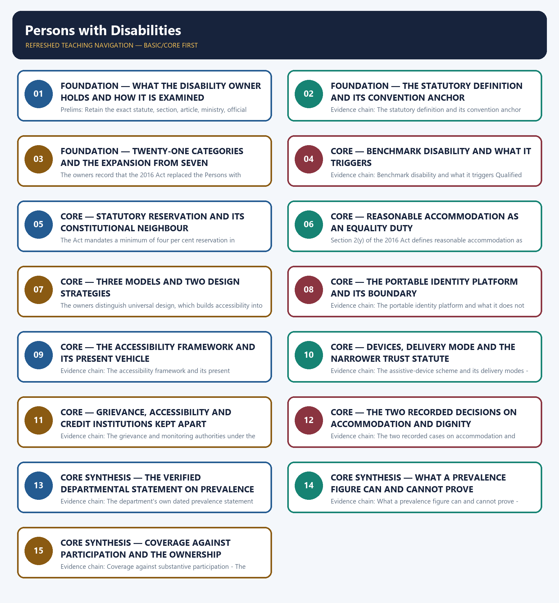

# Persons with Disabilities — Learner-v2 Complete Learning Session

> **Authoring-only generation:** 2026-09-02. No PDF was rendered and no tracker or index was mutated.

### SOURCE, PROGRESSION AND CURRENT-LINKAGE AUDIT

- **Generation date:** 2026-09-02.
- **Repository-first evidence:** the Basic owner is taught first and preserved in full; the Advanced owner is retained only in the optional final teaching block.
- **OCR evidence:** Repository Markdown was primary. The OCR-searchable official General Studies question papers held under books\mains and books\more_previous_papers were read only to confirm the printed wording of routed Mains demands. No official answer key, marking scheme, page precision or unsupported quotation was imported from them.
- **Qdrant:** not used; repository Markdown and available OCR context were sufficient.
- **PYQ integrity:** This owner's previous-year record is a verified one rather than a zero, and it is stated precisely. The audited 2018-2023 Mains routing ledger routes exactly one General Studies Mains demand here, the 2022 General Studies Paper II question numbered 7 on the Rights of Persons with Disabilities Act, 2016 and sensitisation, with the directive Comment, ten marks and one hundred and fifty words, and with the ledger note that this core route supersedes the older Advanced ownership; that demand is therefore solved in this package with a model answer written to the repository's examiner-grade standard using the claim, named evidence, analysis and qualification pattern. The audited 2026 Prelims routing ledger routes exactly one objective demand here, question 56 of the 2026 Prelims General Studies Paper I on disability rights law, the accessibility mission and the disability development corporation, and that ledger records expressly that the locally held 2026 Set-A key is provisional, so no option, key or inferred answer letter is recorded for it anywhere in this package and the demand is instead covered as taught content by naming the statute, the accessibility mission and its implementation vehicle, and the development-finance corporation as a distinct credit and livelihood route. The audited 2024-2025 Mains and Prelims routing ledgers route no further demand to this owner, and both the Basic and the Advanced owner state independently that no confirmed direct 2024 or 2025 General Studies Paper II Mains question on persons with disabilities exists in the audited local texts, which is consistent with that record. Alongside the solved demand card, the package adds six original Mains questions with model solutions and eighty original objective questions on a strict A → B → C → D rotation. Each model solution opens with its analytical claim so that the evidence which follows does argumentative rather than decorative work. The locally held OCR-searchable official General Studies papers were read only to confirm the printed wording of the routed Mains demand; no question was invented from them, no marking scheme or page precision was imported and no official answer key is claimed for any question anywhere in this package.
- **Live-link boundary:** One live official page was verified for this topic on 2026-09-02. The Department of Empowerment of Persons with Disabilities landing page, read on that date, records that the department in the Ministry of Social Justice and Empowerment aims to facilitate the empowerment of persons with disabilities; that as per Census 2011 the number of persons with disabilities in the country is 2.68 crore, which is 2.21 per cent of the total population of the country; and that as per the Rights of Persons with Disabilities Act, 2016 there are twenty-one types of disabilities, which include locomotor disability, visual impairment, hearing impairment, speech and language disability, intellectual disability, multiple disabilities, cerebral palsy and dwarfism among others. Those statements are used only for what they say, and no certification, registration, reservation-fill, accessibility-compliance, device-distribution, guardianship or expenditure figure is inferred from them. One further official check was attempted on the same date, namely a departmental page for the rights statute itself, which returned a not-found error, so nothing was read or used from it and no secondary summary, coaching site or news report has been treated as an official source. The package therefore relies on that verified page together with the dated official anchors already carried by the repository owners, each cited with its issuing instrument or status date: the Rights of Persons with Disabilities Act, 2016 with its definition of a person with disability as one whose long-term physical, mental, intellectual or sensory impairment, in interaction with barriers, hinders full and effective participation on an equal basis with others; the twenty-one specified categories in its Schedule, expandable by government notification, replacing the seven categories of the repealed Persons with Disabilities Act, 1995; benchmark disability at forty per cent or more certified by a medical authority; the minimum four per cent reservation in government establishments and posts and five per cent in higher-educational institutions for persons with benchmark disabilities, recorded as statutory and distinct from the constitutional mechanism of Article 16(4) and its fifty per cent ceiling jurisprudence; reasonable accommodation as defined in Section 2(y), with the disproportionate-or-undue-burden limit and with denial recorded as a form of discrimination; the United Nations Convention on the Rights of Persons with Disabilities ratified by India in 2007; the Unique Disability Identity platform as a centralised, nationally portable certification route whose registration counts are recorded as dynamic and are not asserted; the three-pillar accessibility framework covering the built environment, transport and information and communication technology, carried through the Scheme for Implementation of the Rights of Persons with Disabilities Act since March 2024, with harmonised universal-accessibility guidelines and with State and local enforcement and independent access audits still required; the assistive-device scheme delivered in camp mode and institutional mode; the National Trust for the Welfare of Persons with Autism, Cerebral Palsy, Mental Retardation and Multiple Disabilities Act, 1999 covering only those four conditions; the Chief Commissioner and State Commissioners for Persons with Disabilities as complaint and monitoring authorities, kept distinct from the accessibility mission and from the disability development-finance corporation as a credit and livelihood route; the recorded decisions in Vikash Kumar against the Union Public Service Commission and in Jeeja Ghosh; and the recorded status check of 21 July 2026 that identity-platform counts are dynamic and that accessibility claims must be cited with the departmental reporting date and implementation vehicle rather than with a legacy campaign label. No prevalence figure other than the departmental statement of 2.68 crore and 2.21 per cent from Census 2011 is asserted, that figure is carried with its recorded self-reporting and question-framing limitation, no National Family Health Survey, Periodic Labour Force Survey, NITI Aayog or Sustainable Development Goal value is asserted, no legal or constitutional provision is invented or upgraded in status, no judicial holding is extended beyond what the owners record, no accessibility-compliance count or timeline is asserted, and no previous-year option or official answer key is asserted or inferred, the routed 2026 objective demand being covered as taught content because the audited ledger records the locally held Set-A key as provisional.
- **Fact/inference discipline:** no current-affairs item, PYQ wording, figure or quotation is invented.

## BASIC LEARNING SESSION



*Distinct embedded teaching-navigation image. The separate continuous Cārvāka-style flowchart package remains an independent at-a-glance artifact.*

### SESSION 1 — FOUNDATION — WHAT THE DISABILITY OWNER HOLDS AND HOW IT IS EXAMINED

#### DEFINITION / WHAT THIS IS CALLED

**Plain-language definition:** FOUNDATION — What the disability owner holds and how it is examined comprises FOUNDATION, What the disability owner holds and how it is examined as its core connected dimensions.

**Technical definition:** Prelims: Retain the exact statute, section, article, ministry, official category, survey round or dated edition attached to What the disability owner holds and how it is examined, and never upgrade a policy document into a statute or a targeted scheme into a universal entitlement.

#### ANSWER-GRABBING OPENING — WRITE/ADAPT IN THE EXAM

> Prelims: Retain the exact statute, section, article, ministry, official category, survey round or dated edition attached to What the disability owner holds and how it is examined, and never upgrade a policy document into a statute or a targeted scheme into a universal entitlement.

#### MUST-WRITE KEYWORDS

- **FOUNDATION**
- **What the disability owner holds**
- **how it is examined**
- **Evidence chain**
- **Qualified use**
- **2018-2023**

**How to use them:** Frame the answer through FOUNDATION; define What the disability owner holds, connect how it is examined with Evidence chain to explain the mechanism, and use Qualified use for the decisive comparison or qualification.

#### VISUAL FIRST

```text
WHAT THE DISABILITY OWNER HOLDS AND HOW IT IS EXAMINED
01. What this owner holds and the exact demands routed to it
BOUNDARY -> One Mains demand and one objective demand are routed here, and the objective key held locally is provisional.
```

*This topic-specific rail fixes the evidence sequence and its exam boundary before analysis.*

#### CORE EXPLANATION

This owner holds the disability half of the rights-and-inclusion argument: the statutory definition and the twenty-one specified disabilities, benchmark certification and the portable identity platform, statutory reservation, the reasonable-accommodation duty, the accessibility framework and its present implementation vehicle, the assistive-device scheme, the narrower 1999 trust statute and the grievance authorities; its ownership record is mixed rather than empty, because the audited 2018-2023 Mains routing ledger routes the 2022 General Studies Paper II question on the Rights of Persons with Disabilities Act, 2016 and sensitisation to this owner with the note that the core route supersedes the older Advanced ownership, and the audited 2026 Prelims routing ledger routes one objective demand on disability rights law, the accessibility mission and the disability development corporation to this owner while recording that the 2026 Set-A key held locally is provisional, so no option or answer letter is recorded or inferred for it anywhere in this package.

#### NAMED EVIDENCE AND MECHANISM

- This owner holds the disability half of the rights-and-inclusion argument: the statutory definition and the twenty-one specified disabilities, benchmark certification and the portable identity platform, statutory reservation, the reasonable-accommodation duty, the accessibility framework and its present implementation vehicle, the assistive-device scheme, the narrower 1999 trust statute and the grievance authorities; its ownership record is mixed rather than empty, because the audited 2018-2023 Mains routing ledger routes the 2022 General Studies Paper II question on the Rights of Persons with Disabilities Act, 2016 and sensitisation to this owner with the note that the core route supersedes the older Advanced ownership, and the audited 2026 Prelims routing ledger routes one objective demand on disability rights law, the accessibility mission and the disability development corporation to this owner while recording that the 2026 Set-A key held locally is provisional, so no option or answer letter is recorded or inferred for it anywhere in this package.

#### EXAMINER CAUTION

- One Mains demand and one objective demand are routed here, and the objective key held locally is provisional.

#### EXAM LINK

- **Prelims:** Retain the exact statute, section, article, ministry, official category, survey round or dated edition attached to What the disability owner holds and how it is examined, and never upgrade a policy document into a statute or a targeted scheme into a universal entitlement.
- **Mains:** Open a disability answer by naming the duty, recognition, accommodation or accessibility, that the question actually tests.

#### MINI RECAP

- **Evidence chain:** What this owner holds and the exact demands routed to it
- **Qualified use:** Open a disability answer by naming the duty, recognition, accommodation or accessibility, that the question actually tests.

#### CLOSING RECALL FLOW — FOUNDATION — WHAT THE DISABILITY OWNER HOLDS AND HOW IT IS EXAMINED

```text
START / CONCEPT: FOUNDATION — What the disability owner holds and how it is examined
        |
        v
EXACT TERMS: FOUNDATION · What the disability owner holds · how it is examined · Evidence chain · Qualified use · 2018-2023
        |
        v
MECHANISM / ARGUMENT: Evidence chain: What this owner holds and the exact demands routed to it Qualified use: Open a disability answer by naming the duty, recognition, accommodation or accessibility, that the question actually tests.
        |
        v
CONSEQUENCE / CONTRAST: This owner holds the disability half of the rights-and-inclusion argument: the statutory definition and the twenty-one specified disabilities, benchmark certification and the portable identity platform, statutory reservation, the reasonable-accommodation duty, the accessibility framework and its present implementation vehicle, the assistive-device scheme, the narrower 1999 trust statute and the grievance authorities; its ownership record is mixed rather than empty, because the audited 2018-2023 Mains routing ledger routes the 2022 General Studies Paper II question on the Rights of Persons with Disabilities Act, 2016 and sensitisation to this owner with the note that the core route supersedes the older Advanced ownership, and the audited 2026 Prelims routing ledger routes one objective demand on disability rights law, the accessibility mission and the disability development corporation to this owner while recording that the 2026 Set-A key held locally is provisional, so no option or answer letter is recorded or inferred for it anywhere in this package.
        |
        v
UPSC TRAP / ANSWER-USE: Do not miss this limiting distinction: one Mains demand and one objective demand are routed here.
        |
        v
ANSWER-GRABBING FORMULATION: Prelims: Retain the exact statute, section, article, ministry, official category, survey round or dated edition attached to What the disability owner holds and how it is examined, and never upgrade a policy document into a statute or a targeted scheme into a universal entitlement.
```
### SESSION 2 — FOUNDATION — THE STATUTORY DEFINITION AND ITS CONVENTION ANCHOR

#### DEFINITION / WHAT THIS IS CALLED

**Plain-language definition:** The Rights of Persons with Disabilities Act, 2016 defines a person with disability as a person with long-term physical, mental, intellectual or sensory impairment which, in interaction with barriers, hinders full and effective participation in society on an equal basis with others, and the owners record that this definition is aligned with the United Nations Convention on the Rights of Persons with Disabilities, which India ratified in 2007 and to which the 2016 Act gives domestic effect; the decisive words are in interaction with barriers, because they place the disabling effect in the relationship between impairment and environment rather than in the impairment alone, and every later duty in the Act follows from that placement.

**Technical definition:** Evidence chain: The statutory definition and its convention anchor Qualified use: Anchor a disability answer in the statutory definition before any evaluation of delivery.

#### ANSWER-GRABBING OPENING — WRITE/ADAPT IN THE EXAM

> Evidence chain: The statutory definition and its convention anchor Qualified use: Anchor a disability answer in the statutory definition before any evaluation of delivery.

#### MUST-WRITE KEYWORDS

- **FOUNDATION**
- **The statutory definition**
- **its convention anchor**
- **Evidence chain**
- **Qualified use**
- **The Rights**

**How to use them:** Frame the answer through FOUNDATION; define The statutory definition, connect its convention anchor with Evidence chain to explain the mechanism, and use Qualified use for the decisive comparison or qualification.

#### VISUAL FIRST

```text
THE STATUTORY DEFINITION AND ITS CONVENTION ANCHOR
01. The statutory definition and its convention anchor
BOUNDARY -> The disabling effect sits in the interaction between impairment and barriers, not in impairment alone.
```

*This topic-specific rail fixes the evidence sequence and its exam boundary before analysis.*

#### CORE EXPLANATION

The Rights of Persons with Disabilities Act, 2016 defines a person with disability as a person with long-term physical, mental, intellectual or sensory impairment which, in interaction with barriers, hinders full and effective participation in society on an equal basis with others, and the owners record that this definition is aligned with the United Nations Convention on the Rights of Persons with Disabilities, which India ratified in 2007 and to which the 2016 Act gives domestic effect; the decisive words are in interaction with barriers, because they place the disabling effect in the relationship between impairment and environment rather than in the impairment alone, and every later duty in the Act follows from that placement.

#### NAMED EVIDENCE AND MECHANISM

- The Rights of Persons with Disabilities Act, 2016 defines a person with disability as a person with long-term physical, mental, intellectual or sensory impairment which, in interaction with barriers, hinders full and effective participation in society on an equal basis with others, and the owners record that this definition is aligned with the United Nations Convention on the Rights of Persons with Disabilities, which India ratified in 2007 and to which the 2016 Act gives domestic effect; the decisive words are in interaction with barriers, because they place the disabling effect in the relationship between impairment and environment rather than in the impairment alone, and every later duty in the Act follows from that placement.

#### EXAMINER CAUTION

- The disabling effect sits in the interaction between impairment and barriers, not in impairment alone.

#### EXAM LINK

- **Prelims:** Retain the exact statute, section, article, ministry, official category, survey round or dated edition attached to The statutory definition and its convention anchor, and never upgrade a policy document into a statute or a targeted scheme into a universal entitlement.
- **Mains:** Anchor a disability answer in the statutory definition before any evaluation of delivery.

#### MINI RECAP

- **Evidence chain:** The statutory definition and its convention anchor
- **Qualified use:** Anchor a disability answer in the statutory definition before any evaluation of delivery.

#### CLOSING RECALL FLOW — FOUNDATION — THE STATUTORY DEFINITION AND ITS CONVENTION ANCHOR

```text
START / CONCEPT: FOUNDATION — The statutory definition and its convention anchor
        |
        v
EXACT TERMS: FOUNDATION · The statutory definition · its convention anchor · Evidence chain · Qualified use · The Rights
        |
        v
MECHANISM / ARGUMENT: The Rights of Persons with Disabilities Act, 2016 defines a person with disability as a person with long-term physical, mental, intellectual or sensory impairment which, in interaction with barriers, hinders full and effective participation in society on an equal basis with others, and the owners record that this definition is aligned with the United Nations Convention on the Rights of Persons with Disabilities, which India ratified in 2007 and to which the 2016 Act gives domestic effect; the decisive words are in interaction with barriers, because they place the disabling effect in the relationship between impairment and environment rather than in the impairment alone, and every later duty in the Act follows from that placement.
        |
        v
CONSEQUENCE / CONTRAST: The resulting consequence is that the statutory definition and its convention anchor Qualified use.
        |
        v
UPSC TRAP / ANSWER-USE: Do not miss this limiting distinction: the statutory definition and its convention anchor Qualified use.
        |
        v
ANSWER-GRABBING FORMULATION: Evidence chain: The statutory definition and its convention anchor Qualified use: Anchor a disability answer in the statutory definition before any evaluation of delivery.
```
### SESSION 3 — FOUNDATION — TWENTY-ONE CATEGORIES AND THE EXPANSION FROM SEVEN

#### DEFINITION / WHAT THIS IS CALLED

**Plain-language definition:** Evidence chain: The twenty-one specified disabilities and the power to notify more - The move from seven categories to twenty-one Qualified use: State an exact statutory count where close options are built on the number and the expandability.

**Technical definition:** The owners record that the 2016 Act replaced the Persons with Disabilities Act, 1995, which recognised seven categories, and that the expansion to twenty-one categories is the single most tested numerical fact in the topic; the analytical value of the expansion is that it brought into the statutory frame conditions such as thalassaemia, haemophilia, sickle-cell disease, acid-attack injury and specific learning disabilities that a purely mobility-and-sensory conception of disability had excluded, so recognition itself became a substantive act of inclusion rather than a technical listing exercise.

#### ANSWER-GRABBING OPENING — WRITE/ADAPT IN THE EXAM

> Evidence chain: The twenty-one specified disabilities and the power to notify more - The move from seven categories to twenty-one Qualified use: State an exact statutory count where close options are built on the number and the expandability.

#### MUST-WRITE KEYWORDS

- **FOUNDATION**
- **Twenty-one categories**
- **the expansion from seven**
- **Evidence chain**
- **Qualified use**
- **The Schedule**

**How to use them:** Frame the answer through FOUNDATION; define Twenty-one categories, connect the expansion from seven with Evidence chain to explain the mechanism, and use Qualified use for the decisive comparison or qualification.

#### VISUAL FIRST

```text
TWENTY-ONE CATEGORIES AND THE EXPANSION FROM SEVEN
01. The twenty-one specified disabilities and the power to notify more
    |
    v
02. The move from seven categories to twenty-one
BOUNDARY -> The schedule is a statutory list that the government may extend, not a medical taxonomy.
```

*This topic-specific rail fixes the evidence sequence and its exam boundary before analysis.*

#### CORE EXPLANATION

The Schedule to the 2016 Act lists blindness, low vision, leprosy-cured persons, hearing impairment covering the deaf and the hard of hearing, locomotor disability, dwarfism, intellectual disability, mental illness, autism spectrum disorder, cerebral palsy, muscular dystrophy, chronic neurological conditions, specific learning disabilities, multiple sclerosis, speech and language disability, thalassaemia, haemophilia, sickle-cell disease, multiple disabilities including deafblindness, acid-attack victims and Parkinson's disease, and the government may notify additional categories; the examinable discipline is that the list is a statutory schedule and not a medical taxonomy, so a candidate must be able to name the exact count and the expandability rather than paraphrasing the list as physical and mental disability. The owners record that the 2016 Act replaced the Persons with Disabilities Act, 1995, which recognised seven categories, and that the expansion to twenty-one categories is the single most tested numerical fact in the topic; the analytical value of the expansion is that it brought into the statutory frame conditions such as thalassaemia, haemophilia, sickle-cell disease, acid-attack injury and specific learning disabilities that a purely mobility-and-sensory conception of disability had excluded, so recognition itself became a substantive act of inclusion rather than a technical listing exercise.

#### NAMED EVIDENCE AND MECHANISM

- The Schedule to the 2016 Act lists blindness, low vision, leprosy-cured persons, hearing impairment covering the deaf and the hard of hearing, locomotor disability, dwarfism, intellectual disability, mental illness, autism spectrum disorder, cerebral palsy, muscular dystrophy, chronic neurological conditions, specific learning disabilities, multiple sclerosis, speech and language disability, thalassaemia, haemophilia, sickle-cell disease, multiple disabilities including deafblindness, acid-attack victims and Parkinson's disease, and the government may notify additional categories; the examinable discipline is that the list is a statutory schedule and not a medical taxonomy, so a candidate must be able to name the exact count and the expandability rather than paraphrasing the list as physical and mental disability.
- The owners record that the 2016 Act replaced the Persons with Disabilities Act, 1995, which recognised seven categories, and that the expansion to twenty-one categories is the single most tested numerical fact in the topic; the analytical value of the expansion is that it brought into the statutory frame conditions such as thalassaemia, haemophilia, sickle-cell disease, acid-attack injury and specific learning disabilities that a purely mobility-and-sensory conception of disability had excluded, so recognition itself became a substantive act of inclusion rather than a technical listing exercise.

#### EXAMINER CAUTION

- The schedule is a statutory list that the government may extend, not a medical taxonomy.

#### EXAM LINK

- **Prelims:** Retain the exact statute, section, article, ministry, official category, survey round or dated edition attached to Twenty-one categories and the expansion from seven, and never upgrade a policy document into a statute or a targeted scheme into a universal entitlement.
- **Mains:** State an exact statutory count where close options are built on the number and the expandability.

#### MINI RECAP

- **Evidence chain:** The twenty-one specified disabilities and the power to notify more -> The move from seven categories to twenty-one
- **Qualified use:** State an exact statutory count where close options are built on the number and the expandability.

#### CLOSING RECALL FLOW — FOUNDATION — TWENTY-ONE CATEGORIES AND THE EXPANSION FROM SEVEN

```text
START / CONCEPT: FOUNDATION — Twenty-one categories and the expansion from seven
        |
        v
EXACT TERMS: FOUNDATION · Twenty-one categories · the expansion from seven · Evidence chain · Qualified use · The Schedule
        |
        v
MECHANISM / ARGUMENT: The owners record that the 2016 Act replaced the Persons with Disabilities Act, 1995, which recognised seven categories, and that the expansion to twenty-one categories is the single most tested numerical fact in the topic; the analytical value of the expansion is that it brought into the statutory frame conditions such as thalassaemia, haemophilia, sickle-cell disease, acid-attack injury and specific learning disabilities that a purely mobility-and-sensory conception of disability had excluded, so recognition itself became a substantive act of inclusion rather than a technical listing exercise.
        |
        v
CONSEQUENCE / CONTRAST: The Schedule to the 2016 Act lists blindness, low vision, leprosy-cured persons, hearing impairment covering the deaf and the hard of hearing, locomotor disability, dwarfism, intellectual disability, mental illness, autism spectrum disorder, cerebral palsy, muscular dystrophy, chronic neurological conditions, specific learning disabilities, multiple sclerosis, speech and language disability, thalassaemia, haemophilia, sickle-cell disease, multiple disabilities including deafblindness, acid-attack victims and Parkinson's disease, and the government may notify additional categories; the examinable discipline is that the list is a statutory schedule and not a medical taxonomy, so a candidate must be able to name the exact count and the expandability rather than paraphrasing the list as physical and mental disability.
        |
        v
UPSC TRAP / ANSWER-USE: The schedule is a statutory list that the government may extend, not a medical taxonomy.
        |
        v
ANSWER-GRABBING FORMULATION: Evidence chain: The twenty-one specified disabilities and the power to notify more - The move from seven categories to twenty-one Qualified use: State an exact statutory count where close options are built on the number and the expandability.
```
### SESSION 4 — CORE — BENCHMARK DISABILITY AND WHAT IT TRIGGERS

#### DEFINITION / WHAT THIS IS CALLED

**Plain-language definition:** The owners define benchmark disability as forty per cent or more of a specified disability certified by a medical authority, and they record that benchmark status is what triggers eligibility for reservation and various concessions rather than being the definition of disability itself; the distinction matters twice over, first because a person may be a person with disability under the Act without holding benchmark status, and second because the threshold is a recorded limitation of the design, since a person below the threshold may still face significant barriers while remaining outside the reservation entitlement.

**Technical definition:** Evidence chain: Benchmark disability and what it triggers Qualified use: Separate a definitional category from the threshold that creates an entitlement.

#### ANSWER-GRABBING OPENING — WRITE/ADAPT IN THE EXAM

> The owners define benchmark disability as forty per cent or more of a specified disability certified by a medical authority, and they record that benchmark status is what triggers eligibility for reservation and various concessions rather than being the definition of disability itself; the distinction matters twice over, first because a person may be a person with disability under the Act without holding benchmark status, and second because the threshold is a recorded limitation of the design, since a person below the threshold may still face significant barriers while remaining outside the reservation entitlement.

#### MUST-WRITE KEYWORDS

- **Benchmark disability**
- **what it triggers**
- **Evidence chain**
- **Qualified use**
- **Act**
- **Separate**

**How to use them:** Frame the answer through Benchmark disability; define what it triggers, connect Evidence chain with Qualified use to explain the mechanism, and use Act for the decisive comparison or qualification.

#### VISUAL FIRST

```text
BENCHMARK DISABILITY AND WHAT IT TRIGGERS
01. Benchmark disability and what it triggers
BOUNDARY -> A person may be a person with disability under the Act without holding benchmark status.
```

*This topic-specific rail fixes the evidence sequence and its exam boundary before analysis.*

#### CORE EXPLANATION

The owners define benchmark disability as forty per cent or more of a specified disability certified by a medical authority, and they record that benchmark status is what triggers eligibility for reservation and various concessions rather than being the definition of disability itself; the distinction matters twice over, first because a person may be a person with disability under the Act without holding benchmark status, and second because the threshold is a recorded limitation of the design, since a person below the threshold may still face significant barriers while remaining outside the reservation entitlement.

#### NAMED EVIDENCE AND MECHANISM

- The owners define benchmark disability as forty per cent or more of a specified disability certified by a medical authority, and they record that benchmark status is what triggers eligibility for reservation and various concessions rather than being the definition of disability itself; the distinction matters twice over, first because a person may be a person with disability under the Act without holding benchmark status, and second because the threshold is a recorded limitation of the design, since a person below the threshold may still face significant barriers while remaining outside the reservation entitlement.

#### EXAMINER CAUTION

- A person may be a person with disability under the Act without holding benchmark status.

#### EXAM LINK

- **Prelims:** Retain the exact statute, section, article, ministry, official category, survey round or dated edition attached to Benchmark disability and what it triggers, and never upgrade a policy document into a statute or a targeted scheme into a universal entitlement.
- **Mains:** Separate a definitional category from the threshold that creates an entitlement.

#### MINI RECAP

- **Evidence chain:** Benchmark disability and what it triggers
- **Qualified use:** Separate a definitional category from the threshold that creates an entitlement.

#### CLOSING RECALL FLOW — CORE — BENCHMARK DISABILITY AND WHAT IT TRIGGERS

```text
START / CONCEPT: CORE — Benchmark disability and what it triggers
        |
        v
EXACT TERMS: Benchmark disability · what it triggers · Evidence chain · Qualified use · Act · Separate
        |
        v
MECHANISM / ARGUMENT: Evidence chain: Benchmark disability and what it triggers Qualified use: Separate a definitional category from the threshold that creates an entitlement.
        |
        v
CONSEQUENCE / CONTRAST: Mains: Separate a definitional category from the threshold that creates an entitlement.
        |
        v
UPSC TRAP / ANSWER-USE: Do not miss this limiting distinction: the owners define benchmark disability as forty per cent or more of a specified...
        |
        v
ANSWER-GRABBING FORMULATION: The owners define benchmark disability as forty per cent or more of a specified disability certified by a medical authority, and they record that benchmark status is what triggers eligibility for reservation and various concessions rather than being the definition of disability itself; the distinction matters twice over, first because a person may be a person with disability under the Act without holding benchmark status, and second because the threshold is a recorded limitation of the design, since a person below the threshold may still face significant barriers while remaining outside the reservation entitlement.
```
### SESSION 5 — CORE — STATUTORY RESERVATION AND ITS CONSTITUTIONAL NEIGHBOUR

#### DEFINITION / WHAT THIS IS CALLED

**Plain-language definition:** Evidence chain: Statutory reservation and why it is not Article 16(4) reservation Qualified use: Attribute an entitlement to its correct legal source before comparing it with another.

**Technical definition:** The Act mandates a minimum of four per cent reservation in government establishments and posts and five per cent in higher-educational institutions for persons with benchmark disabilities across the statutory categories, and the owners insist that this is a statutory reservation created by ordinary legislation and not the constitutional mechanism of Article 16(4) that carries reservation for the Scheduled Castes, the Scheduled Tribes and the other backward classes; the recorded consequence is that it is not governed by the fifty per cent ceiling jurisprudence built around that constitutional mechanism, so a candidate who files disability reservation under the same heading as caste-based reservation will misread every close option about ceilings and about the source of the entitlement.

#### ANSWER-GRABBING OPENING — WRITE/ADAPT IN THE EXAM

> Evidence chain: Statutory reservation and why it is not Article 16(4) reservation Qualified use: Attribute an entitlement to its correct legal source before comparing it with another.

#### MUST-WRITE KEYWORDS

- **Statutory reservation**
- **its constitutional neighbour**
- **Evidence chain**
- **Qualified use**
- **Article 16**
- **The Act**

**How to use them:** Frame the answer through Statutory reservation; define its constitutional neighbour, connect Evidence chain with Qualified use to explain the mechanism, and use Article 16 for the decisive comparison or qualification.

#### VISUAL FIRST

```text
STATUTORY RESERVATION AND ITS CONSTITUTIONAL NEIGHBOUR
01. Statutory reservation and why it is not Article 16(4) reservation
BOUNDARY -> This reservation is created by ordinary legislation and is not governed by the ceiling jurisprudence of the constitutional mechanism.
```

*This topic-specific rail fixes the evidence sequence and its exam boundary before analysis.*

#### CORE EXPLANATION

The Act mandates a minimum of four per cent reservation in government establishments and posts and five per cent in higher-educational institutions for persons with benchmark disabilities across the statutory categories, and the owners insist that this is a statutory reservation created by ordinary legislation and not the constitutional mechanism of Article 16(4) that carries reservation for the Scheduled Castes, the Scheduled Tribes and the other backward classes; the recorded consequence is that it is not governed by the fifty per cent ceiling jurisprudence built around that constitutional mechanism, so a candidate who files disability reservation under the same heading as caste-based reservation will misread every close option about ceilings and about the source of the entitlement.

#### NAMED EVIDENCE AND MECHANISM

- The Act mandates a minimum of four per cent reservation in government establishments and posts and five per cent in higher-educational institutions for persons with benchmark disabilities across the statutory categories, and the owners insist that this is a statutory reservation created by ordinary legislation and not the constitutional mechanism of Article 16(4) that carries reservation for the Scheduled Castes, the Scheduled Tribes and the other backward classes; the recorded consequence is that it is not governed by the fifty per cent ceiling jurisprudence built around that constitutional mechanism, so a candidate who files disability reservation under the same heading as caste-based reservation will misread every close option about ceilings and about the source of the entitlement.

#### EXAMINER CAUTION

- This reservation is created by ordinary legislation and is not governed by the ceiling jurisprudence of the constitutional mechanism.

#### EXAM LINK

- **Prelims:** Retain the exact statute, section, article, ministry, official category, survey round or dated edition attached to Statutory reservation and its constitutional neighbour, and never upgrade a policy document into a statute or a targeted scheme into a universal entitlement.
- **Mains:** Attribute an entitlement to its correct legal source before comparing it with another.

#### MINI RECAP

- **Evidence chain:** Statutory reservation and why it is not Article 16(4) reservation
- **Qualified use:** Attribute an entitlement to its correct legal source before comparing it with another.

#### CLOSING RECALL FLOW — CORE — STATUTORY RESERVATION AND ITS CONSTITUTIONAL NEIGHBOUR

```text
START / CONCEPT: CORE — Statutory reservation and its constitutional neighbour
        |
        v
EXACT TERMS: Statutory reservation · its constitutional neighbour · Evidence chain · Qualified use · Article 16 · The Act
        |
        v
MECHANISM / ARGUMENT: The Act mandates a minimum of four per cent reservation in government establishments and posts and five per cent in higher-educational institutions for persons with benchmark disabilities across the statutory categories, and the owners insist that this is a statutory reservation created by ordinary legislation and not the constitutional mechanism of Article 16(4) that carries reservation for the Scheduled Castes, the Scheduled Tribes and the other backward classes; the recorded consequence is that it is not governed by the fifty per cent ceiling jurisprudence built around that constitutional mechanism, so a candidate who files disability reservation under the same heading as caste-based reservation will misread every close option about ceilings and about the source of the entitlement.
        |
        v
CONSEQUENCE / CONTRAST: This reservation is created by ordinary legislation and is not governed by the ceiling jurisprudence of the constitutional mechanism.
        |
        v
UPSC TRAP / ANSWER-USE: Do not miss this limiting distinction: statutory reservation and why it is not Article 16(4) reservation Qualified use.
        |
        v
ANSWER-GRABBING FORMULATION: Evidence chain: Statutory reservation and why it is not Article 16(4) reservation Qualified use: Attribute an entitlement to its correct legal source before comparing it with another.
```
### SESSION 6 — CORE — REASONABLE ACCOMMODATION AS AN EQUALITY DUTY

#### DEFINITION / WHAT THIS IS CALLED

**Plain-language definition:** Evidence chain: Reasonable accommodation and the fact that its denial is discrimination Qualified use: Argue accommodation as substantive equality with both limbs of the statutory definition stated.

**Technical definition:** Section 2(y) of the 2016 Act defines reasonable accommodation as necessary and appropriate modification and adjustment, not imposing a disproportionate or undue burden, to ensure that persons with disabilities enjoy rights on an equal basis with others, and the owners record that denial of reasonable accommodation is expressly recognised as a form of discrimination under the Act; the two limbs must be stated together, because the duty is not unlimited and the burden test is part of the definition, and the boundary case the owners give is an employer arguing that a particular adjustment is a disproportionate burden, which the Act requires to be balanced rather than automatically conceded or automatically refused.

#### ANSWER-GRABBING OPENING — WRITE/ADAPT IN THE EXAM

> Evidence chain: Reasonable accommodation and the fact that its denial is discrimination Qualified use: Argue accommodation as substantive equality with both limbs of the statutory definition stated.

#### MUST-WRITE KEYWORDS

- **Reasonable accommodation as an equality duty**
- **Evidence chain**
- **Qualified use**
- **Section**
- **Act**
- **The duty carries a burden limb, so it**

**How to use them:** Frame the answer through Reasonable accommodation as an equality duty; define Evidence chain, connect Qualified use with Section to explain the mechanism, and use Act for the decisive comparison or qualification.

#### VISUAL FIRST

```text
REASONABLE ACCOMMODATION AS AN EQUALITY DUTY
01. Reasonable accommodation and the fact that its denial is discrimination
BOUNDARY -> The duty carries a burden limb, so it is neither unlimited nor automatically refusable.
```

*This topic-specific rail fixes the evidence sequence and its exam boundary before analysis.*

#### CORE EXPLANATION

Section 2(y) of the 2016 Act defines reasonable accommodation as necessary and appropriate modification and adjustment, not imposing a disproportionate or undue burden, to ensure that persons with disabilities enjoy rights on an equal basis with others, and the owners record that denial of reasonable accommodation is expressly recognised as a form of discrimination under the Act; the two limbs must be stated together, because the duty is not unlimited and the burden test is part of the definition, and the boundary case the owners give is an employer arguing that a particular adjustment is a disproportionate burden, which the Act requires to be balanced rather than automatically conceded or automatically refused.

#### NAMED EVIDENCE AND MECHANISM

- Section 2(y) of the 2016 Act defines reasonable accommodation as necessary and appropriate modification and adjustment, not imposing a disproportionate or undue burden, to ensure that persons with disabilities enjoy rights on an equal basis with others, and the owners record that denial of reasonable accommodation is expressly recognised as a form of discrimination under the Act; the two limbs must be stated together, because the duty is not unlimited and the burden test is part of the definition, and the boundary case the owners give is an employer arguing that a particular adjustment is a disproportionate burden, which the Act requires to be balanced rather than automatically conceded or automatically refused.

#### EXAMINER CAUTION

- The duty carries a burden limb, so it is neither unlimited nor automatically refusable.

#### EXAM LINK

- **Prelims:** Retain the exact statute, section, article, ministry, official category, survey round or dated edition attached to Reasonable accommodation as an equality duty, and never upgrade a policy document into a statute or a targeted scheme into a universal entitlement.
- **Mains:** Argue accommodation as substantive equality with both limbs of the statutory definition stated.

#### MINI RECAP

- **Evidence chain:** Reasonable accommodation and the fact that its denial is discrimination
- **Qualified use:** Argue accommodation as substantive equality with both limbs of the statutory definition stated.

#### CLOSING RECALL FLOW — CORE — REASONABLE ACCOMMODATION AS AN EQUALITY DUTY

```text
START / CONCEPT: CORE — Reasonable accommodation as an equality duty
        |
        v
EXACT TERMS: Reasonable accommodation as an equality duty · Evidence chain · Qualified use · Section · Act · The duty carries a burden limb, so it
        |
        v
MECHANISM / ARGUMENT: Section 2(y) of the 2016 Act defines reasonable accommodation as necessary and appropriate modification and adjustment, not imposing a disproportionate or undue burden, to ensure that persons with disabilities enjoy rights on an equal basis with others, and the owners record that denial of reasonable accommodation is expressly recognised as a form of discrimination under the Act; the two limbs must be stated together, because the duty is not unlimited and the burden test is part of the definition, and the boundary case the owners give is an employer arguing that a particular adjustment is a disproportionate burden, which the Act requires to be balanced rather than automatically conceded or automatically refused.
        |
        v
CONSEQUENCE / CONTRAST: The duty carries a burden limb, so it is neither unlimited nor automatically refusable.
        |
        v
UPSC TRAP / ANSWER-USE: Do not miss this limiting distinction: section 2(y) of the 2016 Act defines reasonable accommodation as necessary and appropriate modification...
        |
        v
ANSWER-GRABBING FORMULATION: Evidence chain: Reasonable accommodation and the fact that its denial is discrimination Qualified use: Argue accommodation as substantive equality with both limbs of the statutory definition stated.
```
### SESSION 7 — CORE — THREE MODELS AND TWO DESIGN STRATEGIES

#### DEFINITION / WHAT THIS IS CALLED

**Plain-language definition:** The owners set out three conceptions in sequence: the medical model locates disability mainly in the impairment and directs attention to cure and rehabilitation; the social model locates the disabling disadvantage in inaccessible environments, institutions and attitudes and directs attention to removing barriers; and the rights model, carried by the convention and the 2016 Act, adds enforceable equality, autonomy, accessibility and reasonable-accommodation duties, so that impairment may remain while exclusion is no longer treated as inevitable; the answer-writing use is that a recommendation must say which model it is operating in, because a cure-oriented and a barrier-oriented proposal answer different questions.

**Technical definition:** The owners distinguish universal design, which builds accessibility into the original design so that the widest range of users can use a facility from inception, from retrofitting, which adds accessibility features to structures that were built without them, and they record that universal design is more effective and more cost-efficient while retrofitting is often the reality given legacy infrastructure; the qualification the owners attach is that universal design does not abolish the need for individual accommodation, because a specific barrier may survive even a well-designed environment, so the two instruments are complementary rather than alternatives.

#### ANSWER-GRABBING OPENING — WRITE/ADAPT IN THE EXAM

> The owners set out three conceptions in sequence: the medical model locates disability mainly in the impairment and directs attention to cure and rehabilitation; the social model locates the disabling disadvantage in inaccessible environments, institutions and attitudes and directs attention to removing barriers; and the rights model, carried by the convention and the 2016 Act, adds enforceable equality, autonomy, accessibility and reasonable-accommodation duties, so that impairment may remain while exclusion is no longer treated as inevitable; the answer-writing use is that a recommendation must say which model it is operating in, because a cure-oriented and a barrier-oriented proposal answer different questions.

#### MUST-WRITE KEYWORDS

- **Three models**
- **two design strategies**
- **Evidence chain**
- **Qualified use**
- **Act**
- **Universal**

**How to use them:** Frame the answer through Three models; define two design strategies, connect Evidence chain with Qualified use to explain the mechanism, and use Act for the decisive comparison or qualification.

#### VISUAL FIRST

```text
THREE MODELS AND TWO DESIGN STRATEGIES
01. The medical, social and rights models
    |
    v
02. Universal design against retrofitting
BOUNDARY -> Universal design does not remove the need for individual accommodation.
```

*This topic-specific rail fixes the evidence sequence and its exam boundary before analysis.*

#### CORE EXPLANATION

The owners set out three conceptions in sequence: the medical model locates disability mainly in the impairment and directs attention to cure and rehabilitation; the social model locates the disabling disadvantage in inaccessible environments, institutions and attitudes and directs attention to removing barriers; and the rights model, carried by the convention and the 2016 Act, adds enforceable equality, autonomy, accessibility and reasonable-accommodation duties, so that impairment may remain while exclusion is no longer treated as inevitable; the answer-writing use is that a recommendation must say which model it is operating in, because a cure-oriented and a barrier-oriented proposal answer different questions. The owners distinguish universal design, which builds accessibility into the original design so that the widest range of users can use a facility from inception, from retrofitting, which adds accessibility features to structures that were built without them, and they record that universal design is more effective and more cost-efficient while retrofitting is often the reality given legacy infrastructure; the qualification the owners attach is that universal design does not abolish the need for individual accommodation, because a specific barrier may survive even a well-designed environment, so the two instruments are complementary rather than alternatives.

#### NAMED EVIDENCE AND MECHANISM

- The owners set out three conceptions in sequence: the medical model locates disability mainly in the impairment and directs attention to cure and rehabilitation; the social model locates the disabling disadvantage in inaccessible environments, institutions and attitudes and directs attention to removing barriers; and the rights model, carried by the convention and the 2016 Act, adds enforceable equality, autonomy, accessibility and reasonable-accommodation duties, so that impairment may remain while exclusion is no longer treated as inevitable; the answer-writing use is that a recommendation must say which model it is operating in, because a cure-oriented and a barrier-oriented proposal answer different questions.
- The owners distinguish universal design, which builds accessibility into the original design so that the widest range of users can use a facility from inception, from retrofitting, which adds accessibility features to structures that were built without them, and they record that universal design is more effective and more cost-efficient while retrofitting is often the reality given legacy infrastructure; the qualification the owners attach is that universal design does not abolish the need for individual accommodation, because a specific barrier may survive even a well-designed environment, so the two instruments are complementary rather than alternatives.

#### EXAMINER CAUTION

- Universal design does not remove the need for individual accommodation.

#### EXAM LINK

- **Prelims:** Retain the exact statute, section, article, ministry, official category, survey round or dated edition attached to Three models and two design strategies, and never upgrade a policy document into a statute or a targeted scheme into a universal entitlement.
- **Mains:** Say which model a recommendation operates in before proposing it.

#### MINI RECAP

- **Evidence chain:** The medical, social and rights models -> Universal design against retrofitting
- **Qualified use:** Say which model a recommendation operates in before proposing it.

#### CLOSING RECALL FLOW — CORE — THREE MODELS AND TWO DESIGN STRATEGIES

```text
START / CONCEPT: CORE — Three models and two design strategies
        |
        v
EXACT TERMS: Three models · two design strategies · Evidence chain · Qualified use · Act · Universal
        |
        v
MECHANISM / ARGUMENT: Evidence chain: The medical, social and rights models - Universal design against retrofitting Qualified use: Say which model a recommendation operates in before proposing it.
        |
        v
CONSEQUENCE / CONTRAST: Universal design does not remove the need for individual accommodation.
        |
        v
UPSC TRAP / ANSWER-USE: The owners distinguish universal design, which builds accessibility into the original design so that the widest range of users can use a facility from inception, from retrofitting, which adds accessibility features to structures that were built without them, and they record that universal design is more effective and more cost-efficient while retrofitting is often the reality given legacy infrastructure; the qualification the owners attach is that universal design does not abolish the need for individual accommodation, because a specific barrier may survive even a well-designed environment, so the two instruments are complementary rather than alternatives.
        |
        v
ANSWER-GRABBING FORMULATION: The owners set out three conceptions in sequence: the medical model locates disability mainly in the impairment and directs attention to cure and rehabilitation; the social model locates the disabling disadvantage in inaccessible environments, institutions and attitudes and directs attention to removing barriers; and the rights model, carried by the convention and the 2016 Act, adds enforceable equality, autonomy, accessibility and reasonable-accommodation duties, so that impairment may remain while exclusion is no longer treated as inevitable; the answer-writing use is that a recommendation must say which model it is operating in, because a cure-oriented and a barrier-oriented proposal answer different questions.
```
### SESSION 8 — CORE — THE PORTABLE IDENTITY PLATFORM AND ITS BOUNDARY

#### DEFINITION / WHAT THIS IS CALLED

**Plain-language definition:** The owners record the Unique Disability Identity platform as a centralised, nationally portable disability-certificate and card system operated by the Department of Empowerment of Persons with Disabilities, which standardises the application, certificate and card processes and replaces fragmented State-level certification, and they attach the boundary that it reduces re-certification friction but does not by itself guarantee access to any benefit and that its registration counts are dynamic and are not asserted; the examinable point is therefore an administrative one, namely that identification reform lowers a transaction cost without creating an entitlement.

**Technical definition:** Evidence chain: The portable identity platform and what it does not do Qualified use: Present an administrative reform for the friction it removes rather than the access it does not create.

#### ANSWER-GRABBING OPENING — WRITE/ADAPT IN THE EXAM

> Evidence chain: The portable identity platform and what it does not do Qualified use: Present an administrative reform for the friction it removes rather than the access it does not create.

#### MUST-WRITE KEYWORDS

- **The portable identity platform**
- **its boundary**
- **Evidence chain**
- **Qualified use**
- **Unique Disability Identity**
- **Department**

**How to use them:** Frame the answer through The portable identity platform; define its boundary, connect Evidence chain with Qualified use to explain the mechanism, and use Unique Disability Identity for the decisive comparison or qualification.

#### VISUAL FIRST

```text
THE PORTABLE IDENTITY PLATFORM AND ITS BOUNDARY
01. The portable identity platform and what it does not do
BOUNDARY -> Identification reform lowers a transaction cost without creating an entitlement.
```

*This topic-specific rail fixes the evidence sequence and its exam boundary before analysis.*

#### CORE EXPLANATION

The owners record the Unique Disability Identity platform as a centralised, nationally portable disability-certificate and card system operated by the Department of Empowerment of Persons with Disabilities, which standardises the application, certificate and card processes and replaces fragmented State-level certification, and they attach the boundary that it reduces re-certification friction but does not by itself guarantee access to any benefit and that its registration counts are dynamic and are not asserted; the examinable point is therefore an administrative one, namely that identification reform lowers a transaction cost without creating an entitlement.

#### NAMED EVIDENCE AND MECHANISM

- The owners record the Unique Disability Identity platform as a centralised, nationally portable disability-certificate and card system operated by the Department of Empowerment of Persons with Disabilities, which standardises the application, certificate and card processes and replaces fragmented State-level certification, and they attach the boundary that it reduces re-certification friction but does not by itself guarantee access to any benefit and that its registration counts are dynamic and are not asserted; the examinable point is therefore an administrative one, namely that identification reform lowers a transaction cost without creating an entitlement.

#### EXAMINER CAUTION

- Identification reform lowers a transaction cost without creating an entitlement.

#### EXAM LINK

- **Prelims:** Retain the exact statute, section, article, ministry, official category, survey round or dated edition attached to The portable identity platform and its boundary, and never upgrade a policy document into a statute or a targeted scheme into a universal entitlement.
- **Mains:** Present an administrative reform for the friction it removes rather than the access it does not create.

#### MINI RECAP

- **Evidence chain:** The portable identity platform and what it does not do
- **Qualified use:** Present an administrative reform for the friction it removes rather than the access it does not create.

#### CLOSING RECALL FLOW — CORE — THE PORTABLE IDENTITY PLATFORM AND ITS BOUNDARY

```text
START / CONCEPT: CORE — The portable identity platform and its boundary
        |
        v
EXACT TERMS: The portable identity platform · its boundary · Evidence chain · Qualified use · Unique Disability Identity · Department
        |
        v
MECHANISM / ARGUMENT: The owners record the Unique Disability Identity platform as a centralised, nationally portable disability-certificate and card system operated by the Department of Empowerment of Persons with Disabilities, which standardises the application, certificate and card processes and replaces fragmented State-level certification, and they attach the boundary that it reduces re-certification friction but does not by itself guarantee access to any benefit and that its registration counts are dynamic and are not asserted; the examinable point is therefore an administrative one, namely that identification reform lowers a transaction cost without creating an entitlement.
        |
        v
CONSEQUENCE / CONTRAST: Mains: Present an administrative reform for the friction it removes rather than the access it does not create.
        |
        v
UPSC TRAP / ANSWER-USE: Do not miss this limiting distinction: the portable identity platform and what it does not do Qualified use.
        |
        v
ANSWER-GRABBING FORMULATION: Evidence chain: The portable identity platform and what it does not do Qualified use: Present an administrative reform for the friction it removes rather than the access it does not create.
```
### SESSION 9 — CORE — THE ACCESSIBILITY FRAMEWORK AND ITS PRESENT VEHICLE

#### DEFINITION / WHAT THIS IS CALLED

**Plain-language definition:** The owners record the accessibility framework as covering three pillars, namely the built environment, transport and information and communication technology, and they record the status carefully: since March 2024 accessibility work is carried through the Scheme for Implementation of the Rights of Persons with Disabilities Act, so the earlier campaign label must not be presented as proof of a separate current programme, and any compliance-dashboard figure must be cited with its reporting date and its implementation vehicle; the owners add that the harmonised guidelines and standards for universal accessibility specify the technical requirements while enforcement and independent access audits remain a State and local responsibility.

**Technical definition:** Evidence chain: The accessibility framework and its present implementation vehicle Qualified use: Cite an accessibility claim with its implementation vehicle and its reporting date.

#### ANSWER-GRABBING OPENING — WRITE/ADAPT IN THE EXAM

> The owners record the accessibility framework as covering three pillars, namely the built environment, transport and information and communication technology, and they record the status carefully: since March 2024 accessibility work is carried through the Scheme for Implementation of the Rights of Persons with Disabilities Act, so the earlier campaign label must not be presented as proof of a separate current programme, and any compliance-dashboard figure must be cited with its reporting date and its implementation vehicle; the owners add that the harmonised guidelines and standards for universal accessibility specify the technical requirements while enforcement and independent access audits remain a State and local responsibility.

#### MUST-WRITE KEYWORDS

- **The accessibility framework**
- **its present vehicle**
- **Evidence chain**
- **Qualified use**
- **Scheme**
- **Implementation**

**How to use them:** Frame the answer through The accessibility framework; define its present vehicle, connect Evidence chain with Qualified use to explain the mechanism, and use Scheme for the decisive comparison or qualification.

#### VISUAL FIRST

```text
THE ACCESSIBILITY FRAMEWORK AND ITS PRESENT VEHICLE
01. The accessibility framework and its present implementation vehicle
BOUNDARY -> The earlier campaign label is not proof of a separate current programme after March 2024.
```

*This topic-specific rail fixes the evidence sequence and its exam boundary before analysis.*

#### CORE EXPLANATION

The owners record the accessibility framework as covering three pillars, namely the built environment, transport and information and communication technology, and they record the status carefully: since March 2024 accessibility work is carried through the Scheme for Implementation of the Rights of Persons with Disabilities Act, so the earlier campaign label must not be presented as proof of a separate current programme, and any compliance-dashboard figure must be cited with its reporting date and its implementation vehicle; the owners add that the harmonised guidelines and standards for universal accessibility specify the technical requirements while enforcement and independent access audits remain a State and local responsibility.

#### NAMED EVIDENCE AND MECHANISM

- The owners record the accessibility framework as covering three pillars, namely the built environment, transport and information and communication technology, and they record the status carefully: since March 2024 accessibility work is carried through the Scheme for Implementation of the Rights of Persons with Disabilities Act, so the earlier campaign label must not be presented as proof of a separate current programme, and any compliance-dashboard figure must be cited with its reporting date and its implementation vehicle; the owners add that the harmonised guidelines and standards for universal accessibility specify the technical requirements while enforcement and independent access audits remain a State and local responsibility.

#### EXAMINER CAUTION

- The earlier campaign label is not proof of a separate current programme after March 2024.

#### EXAM LINK

- **Prelims:** Retain the exact statute, section, article, ministry, official category, survey round or dated edition attached to The accessibility framework and its present vehicle, and never upgrade a policy document into a statute or a targeted scheme into a universal entitlement.
- **Mains:** Cite an accessibility claim with its implementation vehicle and its reporting date.

#### MINI RECAP

- **Evidence chain:** The accessibility framework and its present implementation vehicle
- **Qualified use:** Cite an accessibility claim with its implementation vehicle and its reporting date.

#### CLOSING RECALL FLOW — CORE — THE ACCESSIBILITY FRAMEWORK AND ITS PRESENT VEHICLE

```text
START / CONCEPT: CORE — The accessibility framework and its present vehicle
        |
        v
EXACT TERMS: The accessibility framework · its present vehicle · Evidence chain · Qualified use · Scheme · Implementation
        |
        v
MECHANISM / ARGUMENT: Evidence chain: The accessibility framework and its present implementation vehicle Qualified use: Cite an accessibility claim with its implementation vehicle and its reporting date.
        |
        v
CONSEQUENCE / CONTRAST: The earlier campaign label is not proof of a separate current programme after March 2024.
        |
        v
UPSC TRAP / ANSWER-USE: Do not miss this limiting distinction: the owners record the accessibility framework as covering three pillars, namely the built environment...
        |
        v
ANSWER-GRABBING FORMULATION: The owners record the accessibility framework as covering three pillars, namely the built environment, transport and information and communication technology, and they record the status carefully: since March 2024 accessibility work is carried through the Scheme for Implementation of the Rights of Persons with Disabilities Act, so the earlier campaign label must not be presented as proof of a separate current programme, and any compliance-dashboard figure must be cited with its reporting date and its implementation vehicle; the owners add that the harmonised guidelines and standards for universal accessibility specify the technical requirements while enforcement and independent access audits remain a State and local responsibility.
```
### SESSION 10 — CORE — DEVICES, DELIVERY MODE AND THE NARROWER TRUST STATUTE

#### DEFINITION / WHAT THIS IS CALLED

**Plain-language definition:** The 1999 statute covers four conditions only and is not a care system for all twenty-one categories.

**Technical definition:** Evidence chain: The assistive-device scheme and its delivery modes - The 1999 trust statute and its four-condition scope Qualified use: Locate a reach failure in the delivery mode rather than in the size of the budget.

#### ANSWER-GRABBING OPENING — WRITE/ADAPT IN THE EXAM

> Evidence chain: The assistive-device scheme and its delivery modes - The 1999 trust statute and its four-condition scope Qualified use: Locate a reach failure in the delivery mode rather than in the size of the budget.

#### MUST-WRITE KEYWORDS

- **Devices**
- **delivery mode**
- **the narrower trust statute**
- **Evidence chain**
- **Qualified use**
- **The National Trust**

**How to use them:** Frame the answer through Devices; define delivery mode, connect the narrower trust statute with Evidence chain to explain the mechanism, and use Qualified use for the decisive comparison or qualification.

#### VISUAL FIRST

```text
DEVICES, DELIVERY MODE AND THE NARROWER TRUST STATUTE
01. The assistive-device scheme and its delivery modes
    |
    v
02. The 1999 trust statute and its four-condition scope
BOUNDARY -> The 1999 statute covers four conditions only and is not a care system for all twenty-one categories.
```

*This topic-specific rail fixes the evidence sequence and its exam boundary before analysis.*

#### CORE EXPLANATION

The owners record the scheme for assistance to disabled persons for the purchase and fitting of aids and appliances as the assistive-device route, providing wheelchairs, tricycles, hearing aids, artificial limbs and braille kits among others to enhance mobility, independence and participation, and they record that it is implemented in camp mode and in institutional mode by the department; the reason the delivery mode is examinable is that camp mode makes reach a function of camp scheduling and location, so a device scheme can be fully funded and still miss a dispersed rural population, which is a delivery argument rather than a funding argument. The National Trust for the Welfare of Persons with Autism, Cerebral Palsy, Mental Retardation and Multiple Disabilities Act, 1999 creates a statutory body whose functions include legal-guardianship support and support to registered organisations for care and rehabilitation, and the owners record the scope mismatch as an exam-trap-worthy nuance: the trust statute covers only those four conditions, using the statute's own term mental retardation, while the 2016 Act covers twenty-one specified categories, so the older institution must not be mistaken for a care and guardianship system covering every specified disability.

#### NAMED EVIDENCE AND MECHANISM

- The owners record the scheme for assistance to disabled persons for the purchase and fitting of aids and appliances as the assistive-device route, providing wheelchairs, tricycles, hearing aids, artificial limbs and braille kits among others to enhance mobility, independence and participation, and they record that it is implemented in camp mode and in institutional mode by the department; the reason the delivery mode is examinable is that camp mode makes reach a function of camp scheduling and location, so a device scheme can be fully funded and still miss a dispersed rural population, which is a delivery argument rather than a funding argument.
- The National Trust for the Welfare of Persons with Autism, Cerebral Palsy, Mental Retardation and Multiple Disabilities Act, 1999 creates a statutory body whose functions include legal-guardianship support and support to registered organisations for care and rehabilitation, and the owners record the scope mismatch as an exam-trap-worthy nuance: the trust statute covers only those four conditions, using the statute's own term mental retardation, while the 2016 Act covers twenty-one specified categories, so the older institution must not be mistaken for a care and guardianship system covering every specified disability.

#### EXAMINER CAUTION

- The 1999 statute covers four conditions only and is not a care system for all twenty-one categories.

#### EXAM LINK

- **Prelims:** Retain the exact statute, section, article, ministry, official category, survey round or dated edition attached to Devices, delivery mode and the narrower trust statute, and never upgrade a policy document into a statute or a targeted scheme into a universal entitlement.
- **Mains:** Locate a reach failure in the delivery mode rather than in the size of the budget.

#### MINI RECAP

- **Evidence chain:** The assistive-device scheme and its delivery modes -> The 1999 trust statute and its four-condition scope
- **Qualified use:** Locate a reach failure in the delivery mode rather than in the size of the budget.

#### CLOSING RECALL FLOW — CORE — DEVICES, DELIVERY MODE AND THE NARROWER TRUST STATUTE

```text
START / CONCEPT: CORE — Devices, delivery mode and the narrower trust statute
        |
        v
EXACT TERMS: Devices · delivery mode · the narrower trust statute · Evidence chain · Qualified use · The National Trust
        |
        v
MECHANISM / ARGUMENT: The owners record the scheme for assistance to disabled persons for the purchase and fitting of aids and appliances as the assistive-device route, providing wheelchairs, tricycles, hearing aids, artificial limbs and braille kits among others to enhance mobility, independence and participation, and they record that it is implemented in camp mode and in institutional mode by the department; the reason the delivery mode is examinable is that camp mode makes reach a function of camp scheduling and location, so a device scheme can be fully funded and still miss a dispersed rural population, which is a delivery argument rather than a funding argument.
        |
        v
CONSEQUENCE / CONTRAST: The National Trust for the Welfare of Persons with Autism, Cerebral Palsy, Mental Retardation and Multiple Disabilities Act, 1999 creates a statutory body whose functions include legal-guardianship support and support to registered organisations for care and rehabilitation, and the owners record the scope mismatch as an exam-trap-worthy nuance: the trust statute covers only those four conditions, using the statute's own term mental retardation, while the 2016 Act covers twenty-one specified categories, so the older institution must not be mistaken for a care and guardianship system covering every specified disability.
        |
        v
UPSC TRAP / ANSWER-USE: The 1999 statute covers four conditions only and is not a care system for all twenty-one categories.
        |
        v
ANSWER-GRABBING FORMULATION: Evidence chain: The assistive-device scheme and its delivery modes - The 1999 trust statute and its four-condition scope Qualified use: Locate a reach failure in the delivery mode rather than in the size of the budget.
```
### SESSION 11 — CORE — GRIEVANCE, ACCESSIBILITY AND CREDIT INSTITUTIONS KEPT APART

#### DEFINITION / WHAT THIS IS CALLED

**Plain-language definition:** The owners record the Chief Commissioner for Persons with Disabilities as the statutory authority under the 2016 Act to receive complaints, monitor safeguards and recommend remedial measures, with State Commissioners performing parallel functions at the State level, and they record separately that the disability development-finance corporation is a credit and livelihood route and is neither the regulator nor the accessibility mission; keeping these three institutions apart is the exact distinction on which the routed objective demand about disability rights law, the accessibility mission and the development corporation turns, so an answer must be able to name each institution's function without merging them.

**Technical definition:** Evidence chain: The grievance and monitoring authorities under the 2016 Act Qualified use: Name each institution's function without merging regulator, mission and lender.

#### ANSWER-GRABBING OPENING — WRITE/ADAPT IN THE EXAM

> The owners record the Chief Commissioner for Persons with Disabilities as the statutory authority under the 2016 Act to receive complaints, monitor safeguards and recommend remedial measures, with State Commissioners performing parallel functions at the State level, and they record separately that the disability development-finance corporation is a credit and livelihood route and is neither the regulator nor the accessibility mission; keeping these three institutions apart is the exact distinction on which the routed objective demand about disability rights law, the accessibility mission and the development corporation turns, so an answer must be able to name each institution's function without merging them.

#### MUST-WRITE KEYWORDS

- **Grievance**
- **accessibility**
- **credit institutions kept apart**
- **Evidence chain**
- **Qualified use**
- **Chief Commissioner**

**How to use them:** Frame the answer through Grievance; define accessibility, connect credit institutions kept apart with Evidence chain to explain the mechanism, and use Qualified use for the decisive comparison or qualification.

#### VISUAL FIRST

```text
GRIEVANCE, ACCESSIBILITY AND CREDIT INSTITUTIONS KEPT APART
01. The grievance and monitoring authorities under the 2016 Act
BOUNDARY -> The routed objective demand turns on exactly this three-way institutional distinction.
```

*This topic-specific rail fixes the evidence sequence and its exam boundary before analysis.*

#### CORE EXPLANATION

The owners record the Chief Commissioner for Persons with Disabilities as the statutory authority under the 2016 Act to receive complaints, monitor safeguards and recommend remedial measures, with State Commissioners performing parallel functions at the State level, and they record separately that the disability development-finance corporation is a credit and livelihood route and is neither the regulator nor the accessibility mission; keeping these three institutions apart is the exact distinction on which the routed objective demand about disability rights law, the accessibility mission and the development corporation turns, so an answer must be able to name each institution's function without merging them.

#### NAMED EVIDENCE AND MECHANISM

- The owners record the Chief Commissioner for Persons with Disabilities as the statutory authority under the 2016 Act to receive complaints, monitor safeguards and recommend remedial measures, with State Commissioners performing parallel functions at the State level, and they record separately that the disability development-finance corporation is a credit and livelihood route and is neither the regulator nor the accessibility mission; keeping these three institutions apart is the exact distinction on which the routed objective demand about disability rights law, the accessibility mission and the development corporation turns, so an answer must be able to name each institution's function without merging them.

#### EXAMINER CAUTION

- The routed objective demand turns on exactly this three-way institutional distinction.

#### EXAM LINK

- **Prelims:** Retain the exact statute, section, article, ministry, official category, survey round or dated edition attached to Grievance, accessibility and credit institutions kept apart, and never upgrade a policy document into a statute or a targeted scheme into a universal entitlement.
- **Mains:** Name each institution's function without merging regulator, mission and lender.

#### MINI RECAP

- **Evidence chain:** The grievance and monitoring authorities under the 2016 Act
- **Qualified use:** Name each institution's function without merging regulator, mission and lender.

#### CLOSING RECALL FLOW — CORE — GRIEVANCE, ACCESSIBILITY AND CREDIT INSTITUTIONS KEPT APART

```text
START / CONCEPT: CORE — Grievance, accessibility and credit institutions kept apart
        |
        v
EXACT TERMS: Grievance · accessibility · credit institutions kept apart · Evidence chain · Qualified use · Chief Commissioner
        |
        v
MECHANISM / ARGUMENT: Evidence chain: The grievance and monitoring authorities under the 2016 Act Qualified use: Name each institution's function without merging regulator, mission and lender.
        |
        v
CONSEQUENCE / CONTRAST: The resulting consequence is that the owners record the Chief Commissioner for Persons with Disabilities as the statutory authority...
        |
        v
UPSC TRAP / ANSWER-USE: Do not miss this limiting distinction: the owners record the Chief Commissioner for Persons with Disabilities as the statutory authority...
        |
        v
ANSWER-GRABBING FORMULATION: The owners record the Chief Commissioner for Persons with Disabilities as the statutory authority under the 2016 Act to receive complaints, monitor safeguards and recommend remedial measures, with State Commissioners performing parallel functions at the State level, and they record separately that the disability development-finance corporation is a credit and livelihood route and is neither the regulator nor the accessibility mission; keeping these three institutions apart is the exact distinction on which the routed objective demand about disability rights law, the accessibility mission and the development corporation turns, so an answer must be able to name each institution's function without merging them.
```
### SESSION 12 — CORE — THE TWO RECORDED DECISIONS ON ACCOMMODATION AND DIGNITY

#### DEFINITION / WHAT THIS IS CALLED

**Plain-language definition:** The owners record two decisions for use as named judicial evidence: the decision in Vikash Kumar against the Union Public Service Commission, which treated reasonable accommodation as a requirement of equality rather than an act of charity, and the decision in Jeeja Ghosh, which connected dignity and non-discrimination to the treatment of a person with disability in air travel; the answer-writing use is that these two cases convert a statutory duty into an enforceable equality claim, so a Mains answer that argues for accommodation should cite the equality framing rather than a welfare framing, and should not extend either holding beyond what the owners record.

**Technical definition:** Evidence chain: The two recorded cases on accommodation and dignity Qualified use: Convert a statutory duty into an enforceable equality claim using named judicial evidence.

#### ANSWER-GRABBING OPENING — WRITE/ADAPT IN THE EXAM

> The owners record two decisions for use as named judicial evidence: the decision in Vikash Kumar against the Union Public Service Commission, which treated reasonable accommodation as a requirement of equality rather than an act of charity, and the decision in Jeeja Ghosh, which connected dignity and non-discrimination to the treatment of a person with disability in air travel; the answer-writing use is that these two cases convert a statutory duty into an enforceable equality claim, so a Mains answer that argues for accommodation should cite the equality framing rather than a welfare framing, and should not extend either holding beyond what the owners record.

#### MUST-WRITE KEYWORDS

- **The two recorded decisions on accommodation**
- **dignity**
- **Evidence chain**
- **Qualified use**
- **Vikash Kumar**
- **Union Public Service Commission**

**How to use them:** Frame the answer through The two recorded decisions on accommodation; define dignity, connect Evidence chain with Qualified use to explain the mechanism, and use Vikash Kumar for the decisive comparison or qualification.

#### VISUAL FIRST

```text
THE TWO RECORDED DECISIONS ON ACCOMMODATION AND DIGNITY
01. The two recorded cases on accommodation and dignity
BOUNDARY -> Neither holding may be extended beyond what the owners record.
```

*This topic-specific rail fixes the evidence sequence and its exam boundary before analysis.*

#### CORE EXPLANATION

The owners record two decisions for use as named judicial evidence: the decision in Vikash Kumar against the Union Public Service Commission, which treated reasonable accommodation as a requirement of equality rather than an act of charity, and the decision in Jeeja Ghosh, which connected dignity and non-discrimination to the treatment of a person with disability in air travel; the answer-writing use is that these two cases convert a statutory duty into an enforceable equality claim, so a Mains answer that argues for accommodation should cite the equality framing rather than a welfare framing, and should not extend either holding beyond what the owners record.

#### NAMED EVIDENCE AND MECHANISM

- The owners record two decisions for use as named judicial evidence: the decision in Vikash Kumar against the Union Public Service Commission, which treated reasonable accommodation as a requirement of equality rather than an act of charity, and the decision in Jeeja Ghosh, which connected dignity and non-discrimination to the treatment of a person with disability in air travel; the answer-writing use is that these two cases convert a statutory duty into an enforceable equality claim, so a Mains answer that argues for accommodation should cite the equality framing rather than a welfare framing, and should not extend either holding beyond what the owners record.

#### EXAMINER CAUTION

- Neither holding may be extended beyond what the owners record.

#### EXAM LINK

- **Prelims:** Retain the exact statute, section, article, ministry, official category, survey round or dated edition attached to The two recorded decisions on accommodation and dignity, and never upgrade a policy document into a statute or a targeted scheme into a universal entitlement.
- **Mains:** Convert a statutory duty into an enforceable equality claim using named judicial evidence.

#### MINI RECAP

- **Evidence chain:** The two recorded cases on accommodation and dignity
- **Qualified use:** Convert a statutory duty into an enforceable equality claim using named judicial evidence.

#### CLOSING RECALL FLOW — CORE — THE TWO RECORDED DECISIONS ON ACCOMMODATION AND DIGNITY

```text
START / CONCEPT: CORE — The two recorded decisions on accommodation and dignity
        |
        v
EXACT TERMS: The two recorded decisions on accommodation · dignity · Evidence chain · Qualified use · Vikash Kumar · Union Public Service Commission
        |
        v
MECHANISM / ARGUMENT: Evidence chain: The two recorded cases on accommodation and dignity Qualified use: Convert a statutory duty into an enforceable equality claim using named judicial evidence.
        |
        v
CONSEQUENCE / CONTRAST: The resulting consequence is that the owners record two decisions for use as named judicial evidence.
        |
        v
UPSC TRAP / ANSWER-USE: Do not miss this limiting distinction: the owners record two decisions for use as named judicial evidence.
        |
        v
ANSWER-GRABBING FORMULATION: The owners record two decisions for use as named judicial evidence: the decision in Vikash Kumar against the Union Public Service Commission, which treated reasonable accommodation as a requirement of equality rather than an act of charity, and the decision in Jeeja Ghosh, which connected dignity and non-discrimination to the treatment of a person with disability in air travel; the answer-writing use is that these two cases convert a statutory duty into an enforceable equality claim, so a Mains answer that argues for accommodation should cite the equality framing rather than a welfare framing, and should not extend either holding beyond what the owners record.
```
### SESSION 13 — CORE SYNTHESIS — THE VERIFIED DEPARTMENTAL STATEMENT ON PREVALENCE AND CATEGORIES

#### DEFINITION / WHAT THIS IS CALLED

**Plain-language definition:** The Department of Empowerment of Persons with Disabilities landing page, read on 2 September 2026, records that the department in the Ministry of Social Justice and Empowerment aims to facilitate the empowerment of persons with disabilities; that as per Census 2011 the number of persons with disabilities in the country is 2.68 crore, which is 2.21 per cent of the total population of the country; and that as per the Rights of Persons with Disabilities Act, 2016 there are twenty-one types of disabilities which include locomotor disability, visual impairment, hearing impairment, speech and language disability, intellectual disability, multiple disabilities, cerebral palsy and dwarfism among others; nothing beyond those recorded statements is claimed, and no certification, registration, reservation-fill, accessibility-compliance or device-distribution count is asserted.

**Technical definition:** Evidence chain: The department's own dated prevalence statement Qualified use: Cite an official statement for exactly what it says and no further.

#### ANSWER-GRABBING OPENING — WRITE/ADAPT IN THE EXAM

> Evidence chain: The department's own dated prevalence statement Qualified use: Cite an official statement for exactly what it says and no further.

#### MUST-WRITE KEYWORDS

- **CORE SYNTHESIS**
- **The verified departmental statement on prevalence**
- **categories**
- **Evidence chain**
- **Qualified use**
- **The Department**

**How to use them:** Frame the answer through CORE SYNTHESIS; define The verified departmental statement on prevalence, connect categories with Evidence chain to explain the mechanism, and use Qualified use for the decisive comparison or qualification.

#### VISUAL FIRST

```text
THE VERIFIED DEPARTMENTAL STATEMENT ON PREVALENCE AND CATEGORIES
01. The department's own dated prevalence statement
BOUNDARY -> The verified page records the aim, the dated prevalence statement and the number of statutory types and nothing more.
```

*This topic-specific rail fixes the evidence sequence and its exam boundary before analysis.*

#### CORE EXPLANATION

The Department of Empowerment of Persons with Disabilities landing page, read on 2 September 2026, records that the department in the Ministry of Social Justice and Empowerment aims to facilitate the empowerment of persons with disabilities; that as per Census 2011 the number of persons with disabilities in the country is 2.68 crore, which is 2.21 per cent of the total population of the country; and that as per the Rights of Persons with Disabilities Act, 2016 there are twenty-one types of disabilities which include locomotor disability, visual impairment, hearing impairment, speech and language disability, intellectual disability, multiple disabilities, cerebral palsy and dwarfism among others; nothing beyond those recorded statements is claimed, and no certification, registration, reservation-fill, accessibility-compliance or device-distribution count is asserted.

#### NAMED EVIDENCE AND MECHANISM

- The Department of Empowerment of Persons with Disabilities landing page, read on 2 September 2026, records that the department in the Ministry of Social Justice and Empowerment aims to facilitate the empowerment of persons with disabilities; that as per Census 2011 the number of persons with disabilities in the country is 2.68 crore, which is 2.21 per cent of the total population of the country; and that as per the Rights of Persons with Disabilities Act, 2016 there are twenty-one types of disabilities which include locomotor disability, visual impairment, hearing impairment, speech and language disability, intellectual disability, multiple disabilities, cerebral palsy and dwarfism among others; nothing beyond those recorded statements is claimed, and no certification, registration, reservation-fill, accessibility-compliance or device-distribution count is asserted.

#### EXAMINER CAUTION

- The verified page records the aim, the dated prevalence statement and the number of statutory types and nothing more.

#### EXAM LINK

- **Prelims:** Retain the exact statute, section, article, ministry, official category, survey round or dated edition attached to The verified departmental statement on prevalence and categories, and never upgrade a policy document into a statute or a targeted scheme into a universal entitlement.
- **Mains:** Cite an official statement for exactly what it says and no further.

#### MINI RECAP

- **Evidence chain:** The department's own dated prevalence statement
- **Qualified use:** Cite an official statement for exactly what it says and no further.

#### CLOSING RECALL FLOW — CORE SYNTHESIS — THE VERIFIED DEPARTMENTAL STATEMENT ON PREVALENCE AND CATEGORIES

```text
START / CONCEPT: CORE SYNTHESIS — The verified departmental statement on prevalence and categories
        |
        v
EXACT TERMS: CORE SYNTHESIS · The verified departmental statement on prevalence · categories · Evidence chain · Qualified use · The Department
        |
        v
MECHANISM / ARGUMENT: The Department of Empowerment of Persons with Disabilities landing page, read on 2 September 2026, records that the department in the Ministry of Social Justice and Empowerment aims to facilitate the empowerment of persons with disabilities; that as per Census 2011 the number of persons with disabilities in the country is 2.68 crore, which is 2.21 per cent of the total population of the country; and that as per the Rights of Persons with Disabilities Act, 2016 there are twenty-one types of disabilities which include locomotor disability, visual impairment, hearing impairment, speech and language disability, intellectual disability, multiple disabilities, cerebral palsy and dwarfism among others; nothing beyond those recorded statements is claimed, and no certification, registration, reservation-fill, accessibility-compliance or device-distribution count is asserted.
        |
        v
CONSEQUENCE / CONTRAST: The resulting consequence is that the department's own dated prevalence statement Qualified use.
        |
        v
UPSC TRAP / ANSWER-USE: Do not miss this limiting distinction: the department's own dated prevalence statement Qualified use.
        |
        v
ANSWER-GRABBING FORMULATION: Evidence chain: The department's own dated prevalence statement Qualified use: Cite an official statement for exactly what it says and no further.
```
### SESSION 14 — CORE SYNTHESIS — WHAT A PREVALENCE FIGURE CAN AND CANNOT PROVE

#### DEFINITION / WHAT THIS IS CALLED

**Plain-language definition:** The owners record that the Census 2011 disability estimate rests on self-reporting and a narrow question framing and therefore likely undercounts actual prevalence, and they add that the identity-platform registration counts are dynamic and that a completed 2027 enumeration may later provide updated figures under revised methodologies; the discipline is that a prevalence share converts an absolute count into a rate and makes a representation or budget-share claim meaningful, while a share measured in 2011 by self-report cannot be used as a current denominator or as evidence about the adequacy of any entitlement, so the figure must always be cited with its source, its year and its recorded limitation.

**Technical definition:** Evidence chain: What a prevalence figure can and cannot prove - Where the entitlement-to-participation gap actually opens Qualified use: Use official data with its source, its year and its recorded limitation attached.

#### ANSWER-GRABBING OPENING — WRITE/ADAPT IN THE EXAM

> Evidence chain: What a prevalence figure can and cannot prove - Where the entitlement-to-participation gap actually opens Qualified use: Use official data with its source, its year and its recorded limitation attached.

#### MUST-WRITE KEYWORDS

- **CORE SYNTHESIS**
- **What a prevalence figure can**
- **cannot prove**
- **Evidence chain**
- **Qualified use**
- **Census**

**How to use them:** Frame the answer through CORE SYNTHESIS; define What a prevalence figure can, connect cannot prove with Evidence chain to explain the mechanism, and use Qualified use for the decisive comparison or qualification.

#### VISUAL FIRST

```text
WHAT A PREVALENCE FIGURE CAN AND CANNOT PROVE
01. What a prevalence figure can and cannot prove
    |
    v
02. Where the entitlement-to-participation gap actually opens
BOUNDARY -> A self-reported 2011 share is not a current denominator and not proof of entitlement adequacy.
```

*This topic-specific rail fixes the evidence sequence and its exam boundary before analysis.*

#### CORE EXPLANATION

The owners record that the Census 2011 disability estimate rests on self-reporting and a narrow question framing and therefore likely undercounts actual prevalence, and they add that the identity-platform registration counts are dynamic and that a completed 2027 enumeration may later provide updated figures under revised methodologies; the discipline is that a prevalence share converts an absolute count into a rate and makes a representation or budget-share claim meaningful, while a share measured in 2011 by self-report cannot be used as a current denominator or as evidence about the adequacy of any entitlement, so the figure must always be cited with its source, its year and its recorded limitation. The owners locate the gap at four named joints rather than asserting a general implementation failure: reservation seats that remain unfilled because suitable posts are not identified, legacy infrastructure whose retrofitting is expensive and slow with compliance timelines extended more than once, private-sector establishments where the accommodation duty applies but the enforcement mechanism is weaker than for government, and the benchmark threshold itself which excludes persons below forty per cent who nevertheless face significant barriers; naming the joint is what turns a complaint into a diagnosis, and each joint has a different remedy.

#### NAMED EVIDENCE AND MECHANISM

- The owners record that the Census 2011 disability estimate rests on self-reporting and a narrow question framing and therefore likely undercounts actual prevalence, and they add that the identity-platform registration counts are dynamic and that a completed 2027 enumeration may later provide updated figures under revised methodologies; the discipline is that a prevalence share converts an absolute count into a rate and makes a representation or budget-share claim meaningful, while a share measured in 2011 by self-report cannot be used as a current denominator or as evidence about the adequacy of any entitlement, so the figure must always be cited with its source, its year and its recorded limitation.
- The owners locate the gap at four named joints rather than asserting a general implementation failure: reservation seats that remain unfilled because suitable posts are not identified, legacy infrastructure whose retrofitting is expensive and slow with compliance timelines extended more than once, private-sector establishments where the accommodation duty applies but the enforcement mechanism is weaker than for government, and the benchmark threshold itself which excludes persons below forty per cent who nevertheless face significant barriers; naming the joint is what turns a complaint into a diagnosis, and each joint has a different remedy.

#### EXAMINER CAUTION

- A self-reported 2011 share is not a current denominator and not proof of entitlement adequacy.

#### EXAM LINK

- **Prelims:** Retain the exact statute, section, article, ministry, official category, survey round or dated edition attached to What a prevalence figure can and cannot prove, and never upgrade a policy document into a statute or a targeted scheme into a universal entitlement.
- **Mains:** Use official data with its source, its year and its recorded limitation attached.

#### MINI RECAP

- **Evidence chain:** What a prevalence figure can and cannot prove -> Where the entitlement-to-participation gap actually opens
- **Qualified use:** Use official data with its source, its year and its recorded limitation attached.

#### CLOSING RECALL FLOW — CORE SYNTHESIS — WHAT A PREVALENCE FIGURE CAN AND CANNOT PROVE

```text
START / CONCEPT: CORE SYNTHESIS — What a prevalence figure can and cannot prove
        |
        v
EXACT TERMS: CORE SYNTHESIS · What a prevalence figure can · cannot prove · Evidence chain · Qualified use · Census
        |
        v
MECHANISM / ARGUMENT: The owners record that the Census 2011 disability estimate rests on self-reporting and a narrow question framing and therefore likely undercounts actual prevalence, and they add that the identity-platform registration counts are dynamic and that a completed 2027 enumeration may later provide updated figures under revised methodologies; the discipline is that a prevalence share converts an absolute count into a rate and makes a representation or budget-share claim meaningful, while a share measured in 2011 by self-report cannot be used as a current denominator or as evidence about the adequacy of any entitlement, so the figure must always be cited with its source, its year and its recorded limitation.
        |
        v
CONSEQUENCE / CONTRAST: Prelims: Retain the exact statute, section, article, ministry, official category, survey round or dated edition attached to What a prevalence figure can and cannot prove, and never upgrade a policy document into a statute or a targeted scheme into a universal entitlement.
        |
        v
UPSC TRAP / ANSWER-USE: A self-reported 2011 share is not a current denominator and not proof of entitlement adequacy.
        |
        v
ANSWER-GRABBING FORMULATION: Evidence chain: What a prevalence figure can and cannot prove - Where the entitlement-to-participation gap actually opens Qualified use: Use official data with its source, its year and its recorded limitation attached.
```
### SESSION 15 — CORE SYNTHESIS — COVERAGE AGAINST PARTICIPATION AND THE OWNERSHIP STATEMENT

#### DEFINITION / WHAT THIS IS CALLED

**Plain-language definition:** The owners separate coverage, which counts how many persons hold certificates or receive scheme benefits, from substantive participation, which measures whether persons with disabilities actually access education, employment and public life on an equal basis, and they state that the second is the true test of a rights-based framework; the owners give a precise illustration of why the distinction is not verbal, namely that an accessible railway coach does not by itself secure mobility if the platform remains inaccessible, so an output can be complete while the journey it was meant to enable remains impossible.

**Technical definition:** Evidence chain: Coverage against substantive participation - The verified previous-year ownership stated precisely Qualified use: Close with a participation verdict and an explicit ownership and answer-key boundary.

#### ANSWER-GRABBING OPENING — WRITE/ADAPT IN THE EXAM

> Evidence chain: Coverage against substantive participation - The verified previous-year ownership stated precisely Qualified use: Close with a participation verdict and an explicit ownership and answer-key boundary.

#### MUST-WRITE KEYWORDS

- **CORE SYNTHESIS**
- **Coverage against participation**
- **the ownership statement**
- **Evidence chain**
- **Qualified use**
- **Subject**

**How to use them:** Frame the answer through CORE SYNTHESIS; define Coverage against participation, connect the ownership statement with Evidence chain to explain the mechanism, and use Qualified use for the decisive comparison or qualification.

#### VISUAL FIRST

```text
COVERAGE AGAINST PARTICIPATION AND THE OWNERSHIP STATEMENT
01. Coverage against substantive participation
    |
    v
02. The verified previous-year ownership stated precisely
BOUNDARY -> An output can be complete while the journey it was meant to enable remains impossible.
```

*This topic-specific rail fixes the evidence sequence and its exam boundary before analysis.*

#### CORE EXPLANATION

The owners separate coverage, which counts how many persons hold certificates or receive scheme benefits, from substantive participation, which measures whether persons with disabilities actually access education, employment and public life on an equal basis, and they state that the second is the true test of a rights-based framework; the owners give a precise illustration of why the distinction is not verbal, namely that an accessible railway coach does not by itself secure mobility if the platform remains inaccessible, so an output can be complete while the journey it was meant to enable remains impossible. The audited 2018-2023 Mains routing ledger routes exactly one General Studies Mains demand to this owner, the 2022 General Studies Paper II question on the Rights of Persons with Disabilities Act, 2016 and sensitisation, directive Comment, ten marks, one hundred and fifty words, with the ledger note that the core route supersedes older Advanced ownership, and the audited 2026 Prelims routing ledger routes exactly one objective demand to this owner on disability rights law, the accessibility mission and the disability development corporation, recording that the 2026 Set-A key held locally is provisional, so that objective demand is covered as taught content and no option, key or inferred answer is recorded for it; the Mains demand is solved here to the repository's examiner-grade standard, and six original Mains questions and eighty original objective questions are added on a strict A → B → C → D rotation.

#### NAMED EVIDENCE AND MECHANISM

- The owners separate coverage, which counts how many persons hold certificates or receive scheme benefits, from substantive participation, which measures whether persons with disabilities actually access education, employment and public life on an equal basis, and they state that the second is the true test of a rights-based framework; the owners give a precise illustration of why the distinction is not verbal, namely that an accessible railway coach does not by itself secure mobility if the platform remains inaccessible, so an output can be complete while the journey it was meant to enable remains impossible.
- The audited 2018-2023 Mains routing ledger routes exactly one General Studies Mains demand to this owner, the 2022 General Studies Paper II question on the Rights of Persons with Disabilities Act, 2016 and sensitisation, directive Comment, ten marks, one hundred and fifty words, with the ledger note that the core route supersedes older Advanced ownership, and the audited 2026 Prelims routing ledger routes exactly one objective demand to this owner on disability rights law, the accessibility mission and the disability development corporation, recording that the 2026 Set-A key held locally is provisional, so that objective demand is covered as taught content and no option, key or inferred answer is recorded for it; the Mains demand is solved here to the repository's examiner-grade standard, and six original Mains questions and eighty original objective questions are added on a strict A → B → C → D rotation.

#### EXAMINER CAUTION

- An output can be complete while the journey it was meant to enable remains impossible.

#### EXAM LINK

- **Prelims:** Retain the exact statute, section, article, ministry, official category, survey round or dated edition attached to Coverage against participation and the ownership statement, and never upgrade a policy document into a statute or a targeted scheme into a universal entitlement.
- **Mains:** Close with a participation verdict and an explicit ownership and answer-key boundary.

#### MINI RECAP

- **Evidence chain:** Coverage against substantive participation -> The verified previous-year ownership stated precisely
- **Qualified use:** Close with a participation verdict and an explicit ownership and answer-key boundary.
#### COMPLETE BASIC OWNER EVIDENCE BANK

> **Subject:** Social Justice | **Tier:** Must-Do (foundation) | **GS Paper:** GS-II;
> cross-cuts GS-I (society, inclusion) and GS-IV (empathy, dignity).
> **Core area:** Rights of Persons with Disabilities Act, 2016; 21 specified disability
> categories; reservation for PwDs; reasonable accommodation; UDID; Accessible India
> Campaign; ADIP; National Trust.
> **Grounded in:** Rights of Persons with Disabilities Act, 2016 (RPwD Act); Persons with
> Disabilities Act, 1995 (repealed); National Trust for Welfare of Persons with Autism,
> Cerebral Palsy, Mental Retardation and Multiple Disabilities Act, 1999; UDID portal;
> Accessible India Campaign (Sugamya Bharat Abhiyan); ADIP Scheme guidelines; Department
> of Empowerment of Persons with Disabilities (DEPwD).
> ✅ = source-grounded | ⚠️ = analytical inference | 📰 = current anchor.
> *Companion: `advanced/11_Persons-with-Disabilities.md`.*

#### 1. Visual foundation

```text
          DISABILITY RIGHTS AND WELFARE FRAMEWORK
                          |
      ------------------------------------------------
      |                   |                          |
  RECOGNITION        RESERVATION               ACCESSIBILITY
      |                   |                          |
  RPwD Act 2016       4% govt jobs              Sugamya Bharat
  (21 categories      5% higher ed              (built env,
   vs 7 under         (statutory,               transport,
   1995 Act)          not Art 16(4))            ICT pillars)
      |                   |                          |
  UDID               Reasonable                 ADIP Scheme
  (unique ID,        accommodation              (assistive
   portability)      (RPwD core                  devices)
      |               concept)                       |
      +----------- National Trust (1999) ----------+
                  (autism, CP, MR, multiple
                   disabilities ONLY — scope
                   narrower than RPwD 21)
                          |
                    OUTCOME TEST
                          |
              Education, employment, mobility,
              participation, dignity and inclusion
```

**Core proposition:** ✅ The Rights of Persons with Disabilities Act, 2016 expands the
definition of disability from 7 to 21 specified categories, mandates reservation and
reasonable accommodation, and shifts the paradigm from welfare to rights; effectiveness
depends on bridging the gap between statutory entitlements and substantive access to
education, employment, mobility and public life.

#### 2. Essential definitions

| Concept | Exam-ready meaning |
|---|---|
| ✅ **Person with disability (PwD)** | A person with long-term physical, mental, intellectual or sensory impairment which, in interaction with barriers, hinders full and effective participation in society on an equal basis with others (RPwD Act, 2016 definition, aligned with UNCRPD). |
| ✅ **21 specified disabilities (RPwD Act, 2016)** | The Schedule lists blindness; low vision; leprosy-cured persons; hearing impairment (deaf and hard of hearing); locomotor disability; dwarfism; intellectual disability; mental illness; autism spectrum disorder; cerebral palsy; muscular dystrophy; chronic neurological conditions; specific learning disabilities; multiple sclerosis; speech and language disability; thalassaemia; haemophilia; sickle-cell disease; multiple disabilities including deafblindness; acid-attack victims; and Parkinson's disease. The government may notify additional categories. |
| ✅ **Reasonable accommodation** | Necessary and appropriate modification and adjustment, not imposing a disproportionate or undue burden, to ensure persons with disabilities enjoy rights on an equal basis with others (RPwD Act, Section 2(y)). |
| ✅ **UDID (Unique Disability ID)** | A centralised, nationally portable disability-certificate/ID platform that standardises application, certificate and card processes. It reduces re-certification friction but does not by itself guarantee benefit access. |
| ✅ **Accessible India / SIPDA** | Sugamya Bharat's accessibility framework covers built environment, transport and ICT. Since March 2024, accessibility work is carried through the Scheme for Implementation of the RPwD Act (SIPDA); do not present the earlier campaign label as proof of a separate current programme. |
| ✅ **ADIP (Assistance to Disabled Persons for Purchase/Fitting of Aids and Appliances)** | A scheme providing assistive devices (wheelchairs, hearing aids, artificial limbs, etc.) to PwDs to enhance their mobility, independence and participation. |

##### Medical, social and rights models

- ⚠️ The **medical model** locates disability mainly in impairment and treatment.
- ⚠️ The **social model** locates disabling disadvantage in inaccessible environments,
  institutions and attitudes.
- ✅ The RPwD/UNCRPD **rights model** adds enforceable equality, autonomy, accessibility
  and reasonable-accommodation duties; impairment may remain, but exclusion is not
  treated as inevitable.

#### 3. How disability rights and welfare work (mechanism)

1. **Recognition and certification:** A medical authority certifies the type and extent
   (benchmark: 40%+) of disability; the UDID system issues a unique identification
   enabling portability of benefits across states.
2. **Reservation:** The RPwD Act mandates minimum 4% reservation in government
   establishments and 5% in higher-education institutions for persons with benchmark
   disabilities across the statutory categories — this is a statutory reservation, distinct from the
   constitutional Art 16(4) reservation for SC/ST/OBC.
3. **Reasonable accommodation:** Employers, educational institutions and service
   providers must make necessary modifications (accessible workplaces, assistive
   technology, flexible evaluation) without imposing disproportionate burden.
4. **Accessibility infrastructure:** Sugamya Bharat Abhiyan targets built environment
   (ramps, tactile paths, accessible toilets), transportation (accessible buses,
   railway coaches) and ICT (screen readers, accessible websites) accessibility.
5. **Assistive devices:** ADIP Scheme provides aids/appliances to enhance mobility and
   independence; National Trust supports specific conditions (see Section 4).

#### 4. Institutions and tools

- ✅ **Rights of Persons with Disabilities Act, 2016 (RPwD Act):** Replaced the Persons
  with Disabilities Act, 1995; expanded categories from 7 to 21; mandated reservation,
  reasonable accommodation and accessibility; aligned with UNCRPD. The government may
  notify additional disability categories.
- ✅ **UDID (Unique Disability ID):** Centralised certification/ID platform operated by
  DEPwD; enables a portable, standardised route but does not itself confer every
  benefit. Registration counts are dynamic and not asserted here.
- ✅ **Accessible India / SIPDA:** Sugamya Bharat's three-pillar accessibility framework
  (built environment, transport, ICT) is now carried through SIPDA after March 2024.
  Compliance-dashboard figures are dynamic and must be cited with a reporting date.
- ✅ **ADIP Scheme:** Provides assistive devices (wheelchairs, tricycles, hearing aids,
  artificial limbs, braille kits, etc.) to PwDs; implemented through camp mode and
  institutional mode by DEPwD.
- ✅ **National Trust (Act of 1999):** Statutory body under the National Trust for
  Welfare of Persons with Autism, Cerebral Palsy, Mental Retardation and Multiple
  Disabilities Act, 1999. Note: this Act covers ONLY four specific conditions (autism,
  cerebral palsy, mental retardation, multiple disabilities) — its scope is narrower
  than the 21 RPwD categories. Functions include legal guardianship support and
  registered-organisation support for care and rehabilitation.

#### 5. Indian applications and examples

- ⚠️ A PwD student requiring extra time in examinations as reasonable accommodation
  illustrates the substantive-equality principle — same exam, modified conditions to
  ensure equal opportunity.
- ⚠️ A government building retrofitted with ramps, accessible toilets and signage under
  Sugamya Bharat Abhiyan illustrates built-environment accessibility.
- ⚠️ A visually impaired candidate receiving screen-reader access during a competitive
  examination illustrates ICT accessibility as reasonable accommodation.

#### 6. Must-Know Facts for Prelims

- ✅ RPwD Act, 2016 specifies 21 disability categories (expanded from 7 under the 1995
  Act); the government may notify additional categories.
- ✅ Minimum 4% reservation in government establishments/posts and 5% in higher-
  education institutions for persons with benchmark disabilities — statutory, not Art
  16(4) constitutional reservation.
- ✅ UDID provides a centralised, portable disability certification replacing fragmented
  state-level certificates.
- ✅ Sugamya Bharat's three-pillar accessibility framework covers built environment,
  transportation and ICT; its current implementation vehicle is SIPDA.
- ✅ National Trust (1999 Act) covers only four conditions: autism, cerebral palsy,
  mental retardation and multiple disabilities — narrower than RPwD's 21 categories.

#### 7. UPSC traps

- ❌ The RPwD Act, 2016 specifies 7 disability categories. -> ✅ The 2016 Act specifies
  21 categories; the repealed 1995 Act had 7 categories.
- ❌ Reservation for PwDs is under Article 16(4) of the Constitution. -> ✅ PwD
  reservation is statutory under the RPwD Act, 2016 — it is NOT the same constitutional
  mechanism as SC/ST/OBC reservation under Art 16(4).
- ❌ The National Trust Act, 1999 covers all 21 disabilities under the RPwD Act. -> ✅
  The National Trust Act covers only FOUR specific conditions (autism, cerebral palsy,
  mental retardation, multiple disabilities); its scope is narrower than the 21 RPwD
  categories.
- ❌ Reasonable accommodation means physical accessibility only. -> ✅ Reasonable
  accommodation includes any necessary modification — physical, procedural, technological
  or attitudinal — to ensure equal participation; accessibility is one component.

#### 8. 📰 Current anchor

- 📰 **Status check (21 July 2026):** UDID counts are dynamic. Sugamya Bharat's
  accessibility framework continues through SIPDA after March 2024; cite the applicable
  DEPwD reporting date and implementation vehicle rather than a legacy campaign count.

#### 9. PYQ application

- ⚠️ There is no confirmed direct 2024 or 2025 GS-II Mains PYQ specifically on persons
  with disabilities in the audited local PYQ texts. However, questions on inclusive
  development, accessibility and welfare may intersect with this topic. A strong answer
  should cite the RPwD Act, 2016 (21 categories, reasonable accommodation), the
  distinction between statutory PwD reservation and constitutional SC/ST/OBC
  reservation, and the three pillars of Sugamya Bharat Abhiyan.

#### 10. Mains angles

- ⚠️ Frame the RPwD Act, 2016 as a paradigm shift from welfare to rights, aligned with
  UNCRPD — emphasise reasonable accommodation as the core substantive-equality concept.
- ⚠️ Distinguish statutory PwD reservation (4% govt, 5% higher ed) from constitutional
  reservation for SC/ST/OBC.
- ⚠️ Flag the scope mismatch: National Trust (1999) covers only 4 conditions, while
  RPwD (2016) covers 21 categories — an exam-trap-worthy nuance.
- ⚠️ Use UDID's portability as an example of administrative reform reducing
  documentation burden for vulnerable groups.

> **Answer thesis:** The Rights of Persons with Disabilities Act, 2016 marks a paradigm
> shift from charity-based welfare to rights-based inclusion, expanding recognised
> disabilities from 7 to 21, mandating statutory reservation and reasonable
> accommodation, and anchoring accessibility through Sugamya Bharat Abhiyan; its success
> depends on bridging the implementation gap between statutory entitlements and
> substantive participation in education, employment and public life, while recognising
> the scope mismatch between RPwD's 21 categories and the narrower coverage of older
> institutions like the National Trust.

#### 11. Probable questions

- ⚠️ **Prelims:** How many disability categories are specified under the Rights of
  Persons with Disabilities Act, 2016, and what is the minimum reservation for PwDs in
  government establishments?
- ⚠️ **Mains (10 marks):** Explain the concept of 'reasonable accommodation' under the
  RPwD Act, 2016 and its significance for inclusive education and employment.
- ⚠️ **Mains (15 marks):** "The Rights of Persons with Disabilities Act, 2016 marks a
  paradigm shift from welfare to rights." Critically examine this statement with
  reference to the Act's key provisions and implementation challenges.

#### 11A. Answer architecture (10/15/20-mark support)

The **2022 GS-II** RPwD Act/sensitisation demand is owned here, superseding
`advanced/11`.

- **Cases:** *Vikash Kumar v. UPSC* treated reasonable accommodation as equality, not
  charity; *Jeeja Ghosh* connected dignity/non-discrimination to air-travel treatment.
- **Universal design:** widest usability from inception; individual accommodation remains
  necessary where a specific barrier survives.
- **Institutions:** Chief Commissioner monitors/inquires under RPwD; the disability
  development-finance corporation is a credit/livelihood route, not the regulator or
  accessibility mission.

**10 marks:** accommodation, one case and two examples. **15 marks:** law, accessibility,
education, employment, attitudes and grievance institutions. **20 marks:** medical,
social and rights models, universal design, intersectionality and enforceability.

> **Reasoned verdict:** Inclusion requires institutions to remove preventable barriers
> and provide individual accommodation.

#### 12. Study links

- ✅ Advanced companion: `advanced/11_Persons-with-Disabilities.md`.
- ✅ `basic/04_Education-and-Human-Resource-Development.md` — inclusive education and
  reasonable accommodation in educational settings.
- ✅ `Governance/basic/06_Digital-Public-Infrastructure-and-Data-Governance.md` — the DPI/
  digital-identity architecture (relevant to UDID) and ICT-accessibility angle of e-governance.
- ✅ `basic/03_Health-Systems-Public-Health-and-Universal-Health-Coverage.md` — health-
  system accessibility for PwDs.

<!-- BEGIN GENERATED PYQ INTEGRATION: 2026 -->

#### 2026 PYQ Integration

> **Status:** 2026 question-level PYQ demand is integrated into this owner.
> **Provenance:** Audited local official-paper routing ledgers: `_PYQ-ROUTING-PRELIMS-2026.md`.
> **Answer-key rule:** The 2026 Prelims and CSAT Set-A keys held locally are **provisional**; no option or answer is recorded or inferred in this integration.

- **Year represented:** 2026
- **Paper(s):** Prelims GS-I
- **Routed question demands:** 1

| Year | Paper | Q | PYQ demand (neutral rendering) | Directive / format | Source status | Owner requirement |
|---:|---|---|---|---|---|---|
| 2026 | Prelims GS-I | 56 | Disability rights law, accessibility mission, and disability development corporation | Objective question; provisional 2026 Set-A key present locally, answer not inferred | Provisional 2026 Set-A key present locally (`Ans-2026-GS1-Provisional`); key is provisional - no answer letter recorded or inferred here | Cover the named fact/concept and its likely statement-level distinctions. |

##### What this owner must now support

- Disability rights law, accessibility mission, and disability development corporation

> This block integrates the 2026 examinable demand and paper metadata. It is kept separate from the 2018-2023 and 2024-2025 blocks and does not convert a provisionally-keyed, answer-free objective question into a solved answer.
<!-- END GENERATED PYQ INTEGRATION: 2026 -->

<!-- BEGIN GENERATED PYQ INTEGRATION: 2018-2023 -->

#### Historical PYQ Integration (2018-2023)

> **Status:** Question-level PYQ demand is integrated into this owner.
> **Provenance:** Audited local official-paper routing ledgers: `_PYQ-ROUTING-MAINS-GS1-GS2-ESSAY-2018-2023.md`.

- **Years represented:** 2022
- **Paper(s):** GS-II
- **Routed question demands:** 1

| Year | Paper | Q | PYQ demand (neutral rendering) | Directive / format | Source status | Owner requirement |
|---:|---|---:|---|---|---|---|
| 2022 | GS-II | 7 | Rights of Persons with Disabilities Act 2016 and sensitisation | Comment · 10 marks · 150 words | Core route supersedes older Advanced ownership | Prepare context, core dimensions, evidence/examples, counterpoint and a concise conclusion. |

##### What this owner must now support

- Rights of Persons with Disabilities Act 2016 and sensitisation

> The table integrates the examinable demand and paper metadata. It does not turn an unkeyed objective question into a solved answer, and it does not claim that lexical presence alone proves full conceptual sufficiency.
<!-- END GENERATED PYQ INTEGRATION: 2018-2023 -->

#### CLOSING RECALL FLOW — CORE SYNTHESIS — COVERAGE AGAINST PARTICIPATION AND THE OWNERSHIP STATEMENT

```text
START / CONCEPT: CORE SYNTHESIS — Coverage against participation and the ownership statement
        |
        v
EXACT TERMS: CORE SYNTHESIS · Coverage against participation · the ownership statement · Evidence chain · Qualified use · Subject
        |
        v
MECHANISM / ARGUMENT: The owners separate coverage, which counts how many persons hold certificates or receive scheme benefits, from substantive participation, which measures whether persons with disabilities actually access education, employment and public life on an equal basis, and they state that the second is the true test of a rights-based framework; the owners give a precise illustration of why the distinction is not verbal, namely that an accessible railway coach does not by itself secure mobility if the platform remains inaccessible, so an output can be complete while the journey it was meant to enable remains impossible.
        |
        v
CONSEQUENCE / CONTRAST: Answer thesis: The Rights of Persons with Disabilities Act, 2016 marks a paradigm shift from charity-based welfare to rights-based inclusion, expanding recognised disabilities from 7 to 21, mandating statutory reservation and reasonable accommodation, and anchoring accessibility through Sugamya Bharat Abhiyan; its success depends on bridging the implementation gap between statutory entitlements and substantive participation in education, employment and public life, while recognising the scope mismatch between RPwD's 21 categories and the narrower coverage of older institutions like the National Trust.
        |
        v
UPSC TRAP / ANSWER-USE: ❌ The RPwD Act, 2016 specifies 7 disability categories. - ✅ The 2016 Act specifies 21 categories; the repealed 1995 Act had 7 categories. ❌ Reservation for PwDs is under Article 16(4) of the Constitution. - ✅ PwD reservation is statutory under the RPwD Act, 2016 — it is NOT the same constitutional mechanism as SC/ST/OBC reservation under Art 16(4). ❌ The National Trust Act, 1999 covers all 21 disabilities under the RPwD Act. - ✅ The National Trust Act covers only FOUR specific conditions (autism, cerebral palsy, mental retardation, multiple disabilities); its scope is narrower than the 21 RPwD categories. ❌ Reasonable accommodation means physical accessibility only. - ✅ Reasonable accommodation includes any necessary modification — physical, procedural, technological or attitudinal — to ensure equal participation; accessibility is one component.
        |
        v
ANSWER-GRABBING FORMULATION: Evidence chain: Coverage against substantive participation - The verified previous-year ownership stated precisely Qualified use: Close with a participation verdict and an explicit ownership and answer-key boundary.
```
## BASIC MCQS / REMEDIATION

### Q1. Which statement correctly identifies What this owner holds and the exact demands routed to it?

A. This owner holds the disability half of the rights-and-inclusion argument: the statutory definition and the twenty-one specified disabilities, benchmark certification and the portable identity platform, statutory reservation, the reasonable-accommodation duty, the accessibility framework and its present implementation vehicle, the assistive-device scheme, the narrower 1999 trust statute and the grievance authorities; its ownership record is mixed rather than empty, because the audited 2018-2023 Mains routing ledger routes the 2022 General Studies Paper II question on the Rights of Persons with Disabilities Act, 2016 and sensitisation to this owner with the note that the core route supersedes the older Advanced ownership, and the audited 2026 Prelims routing ledger routes one objective demand on disability rights law, the accessibility mission and the disability development corporation to this owner while recording that the 2026 Set-A key held locally is provisional, so no option or answer letter is recorded or inferred for it anywhere in this package.
B. The Schedule to the 2016 Act lists blindness, low vision, leprosy-cured persons, hearing impairment covering the deaf and the hard of hearing, locomotor disability, dwarfism, intellectual disability, mental illness, autism spectrum disorder, cerebral palsy, muscular dystrophy, chronic neurological conditions, specific learning disabilities, multiple sclerosis, speech and language disability, thalassaemia, haemophilia, sickle-cell disease, multiple disabilities including deafblindness, acid-attack victims and Parkinson's disease, and the government may notify additional categories; the examinable discipline is that the list is a statutory schedule and not a medical taxonomy, so a candidate must be able to name the exact count and the expandability rather than paraphrasing the list as physical and mental disability.
C. The Rights of Persons with Disabilities Act, 2016 defines a person with disability as a person with long-term physical, mental, intellectual or sensory impairment which, in interaction with barriers, hinders full and effective participation in society on an equal basis with others, and the owners record that this definition is aligned with the United Nations Convention on the Rights of Persons with Disabilities, which India ratified in 2007 and to which the 2016 Act gives domestic effect; the decisive words are in interaction with barriers, because they place the disabling effect in the relationship between impairment and environment rather than in the impairment alone, and every later duty in the Act follows from that placement.
D. The owners record that the 2016 Act replaced the Persons with Disabilities Act, 1995, which recognised seven categories, and that the expansion to twenty-one categories is the single most tested numerical fact in the topic; the analytical value of the expansion is that it brought into the statutory frame conditions such as thalassaemia, haemophilia, sickle-cell disease, acid-attack injury and specific learning disabilities that a purely mobility-and-sensory conception of disability had excluded, so recognition itself became a substantive act of inclusion rather than a technical listing exercise.

**Answer: A.**
**Explanation:** This owner holds the disability half of the rights-and-inclusion argument: the statutory definition and the twenty-one specified disabilities, benchmark certification and the portable identity platform, statutory reservation, the reasonable-accommodation duty, the accessibility framework and its present implementation vehicle, the assistive-device scheme, the narrower 1999 trust statute and the grievance authorities; its ownership record is mixed rather than empty, because the audited 2018-2023 Mains routing ledger routes the 2022 General Studies Paper II question on the Rights of Persons with Disabilities Act, 2016 and sensitisation to this owner with the note that the core route supersedes the older Advanced ownership, and the audited 2026 Prelims routing ledger routes one objective demand on disability rights law, the accessibility mission and the disability development corporation to this owner while recording that the 2026 Set-A key held locally is provisional, so no option or answer letter is recorded or inferred for it anywhere in this package. The remaining options belong to different chronology, actor or analytical categories.

### Q2. Which chronology card should be filed under What this owner holds and the exact demands routed to it?

A. The Schedule to the 2016 Act lists blindness, low vision, leprosy-cured persons, hearing impairment covering the deaf and the hard of hearing, locomotor disability, dwarfism, intellectual disability, mental illness, autism spectrum disorder, cerebral palsy, muscular dystrophy, chronic neurological conditions, specific learning disabilities, multiple sclerosis, speech and language disability, thalassaemia, haemophilia, sickle-cell disease, multiple disabilities including deafblindness, acid-attack victims and Parkinson's disease, and the government may notify additional categories; the examinable discipline is that the list is a statutory schedule and not a medical taxonomy, so a candidate must be able to name the exact count and the expandability rather than paraphrasing the list as physical and mental disability.
B. This owner holds the disability half of the rights-and-inclusion argument: the statutory definition and the twenty-one specified disabilities, benchmark certification and the portable identity platform, statutory reservation, the reasonable-accommodation duty, the accessibility framework and its present implementation vehicle, the assistive-device scheme, the narrower 1999 trust statute and the grievance authorities; its ownership record is mixed rather than empty, because the audited 2018-2023 Mains routing ledger routes the 2022 General Studies Paper II question on the Rights of Persons with Disabilities Act, 2016 and sensitisation to this owner with the note that the core route supersedes the older Advanced ownership, and the audited 2026 Prelims routing ledger routes one objective demand on disability rights law, the accessibility mission and the disability development corporation to this owner while recording that the 2026 Set-A key held locally is provisional, so no option or answer letter is recorded or inferred for it anywhere in this package.
C. The owners record that the 2016 Act replaced the Persons with Disabilities Act, 1995, which recognised seven categories, and that the expansion to twenty-one categories is the single most tested numerical fact in the topic; the analytical value of the expansion is that it brought into the statutory frame conditions such as thalassaemia, haemophilia, sickle-cell disease, acid-attack injury and specific learning disabilities that a purely mobility-and-sensory conception of disability had excluded, so recognition itself became a substantive act of inclusion rather than a technical listing exercise.
D. The owners define benchmark disability as forty per cent or more of a specified disability certified by a medical authority, and they record that benchmark status is what triggers eligibility for reservation and various concessions rather than being the definition of disability itself; the distinction matters twice over, first because a person may be a person with disability under the Act without holding benchmark status, and second because the threshold is a recorded limitation of the design, since a person below the threshold may still face significant barriers while remaining outside the reservation entitlement.

**Answer: B.**
**Explanation:** This owner holds the disability half of the rights-and-inclusion argument: the statutory definition and the twenty-one specified disabilities, benchmark certification and the portable identity platform, statutory reservation, the reasonable-accommodation duty, the accessibility framework and its present implementation vehicle, the assistive-device scheme, the narrower 1999 trust statute and the grievance authorities; its ownership record is mixed rather than empty, because the audited 2018-2023 Mains routing ledger routes the 2022 General Studies Paper II question on the Rights of Persons with Disabilities Act, 2016 and sensitisation to this owner with the note that the core route supersedes the older Advanced ownership, and the audited 2026 Prelims routing ledger routes one objective demand on disability rights law, the accessibility mission and the disability development corporation to this owner while recording that the 2026 Set-A key held locally is provisional, so no option or answer letter is recorded or inferred for it anywhere in this package. The remaining options belong to different chronology, actor or analytical categories.

### Q3. Which option preserves the source-bounded meaning of What this owner holds and the exact demands routed to it?

A. The owners record that the 2016 Act replaced the Persons with Disabilities Act, 1995, which recognised seven categories, and that the expansion to twenty-one categories is the single most tested numerical fact in the topic; the analytical value of the expansion is that it brought into the statutory frame conditions such as thalassaemia, haemophilia, sickle-cell disease, acid-attack injury and specific learning disabilities that a purely mobility-and-sensory conception of disability had excluded, so recognition itself became a substantive act of inclusion rather than a technical listing exercise.
B. The owners define benchmark disability as forty per cent or more of a specified disability certified by a medical authority, and they record that benchmark status is what triggers eligibility for reservation and various concessions rather than being the definition of disability itself; the distinction matters twice over, first because a person may be a person with disability under the Act without holding benchmark status, and second because the threshold is a recorded limitation of the design, since a person below the threshold may still face significant barriers while remaining outside the reservation entitlement.
C. This owner holds the disability half of the rights-and-inclusion argument: the statutory definition and the twenty-one specified disabilities, benchmark certification and the portable identity platform, statutory reservation, the reasonable-accommodation duty, the accessibility framework and its present implementation vehicle, the assistive-device scheme, the narrower 1999 trust statute and the grievance authorities; its ownership record is mixed rather than empty, because the audited 2018-2023 Mains routing ledger routes the 2022 General Studies Paper II question on the Rights of Persons with Disabilities Act, 2016 and sensitisation to this owner with the note that the core route supersedes the older Advanced ownership, and the audited 2026 Prelims routing ledger routes one objective demand on disability rights law, the accessibility mission and the disability development corporation to this owner while recording that the 2026 Set-A key held locally is provisional, so no option or answer letter is recorded or inferred for it anywhere in this package.
D. The Act mandates a minimum of four per cent reservation in government establishments and posts and five per cent in higher-educational institutions for persons with benchmark disabilities across the statutory categories, and the owners insist that this is a statutory reservation created by ordinary legislation and not the constitutional mechanism of Article 16(4) that carries reservation for the Scheduled Castes, the Scheduled Tribes and the other backward classes; the recorded consequence is that it is not governed by the fifty per cent ceiling jurisprudence built around that constitutional mechanism, so a candidate who files disability reservation under the same heading as caste-based reservation will misread every close option about ceilings and about the source of the entitlement.

**Answer: C.**
**Explanation:** This owner holds the disability half of the rights-and-inclusion argument: the statutory definition and the twenty-one specified disabilities, benchmark certification and the portable identity platform, statutory reservation, the reasonable-accommodation duty, the accessibility framework and its present implementation vehicle, the assistive-device scheme, the narrower 1999 trust statute and the grievance authorities; its ownership record is mixed rather than empty, because the audited 2018-2023 Mains routing ledger routes the 2022 General Studies Paper II question on the Rights of Persons with Disabilities Act, 2016 and sensitisation to this owner with the note that the core route supersedes the older Advanced ownership, and the audited 2026 Prelims routing ledger routes one objective demand on disability rights law, the accessibility mission and the disability development corporation to this owner while recording that the 2026 Set-A key held locally is provisional, so no option or answer letter is recorded or inferred for it anywhere in this package. The remaining options belong to different chronology, actor or analytical categories.

### Q4. Which statement avoids a close-option trap about What this owner holds and the exact demands routed to it?

A. The Act mandates a minimum of four per cent reservation in government establishments and posts and five per cent in higher-educational institutions for persons with benchmark disabilities across the statutory categories, and the owners insist that this is a statutory reservation created by ordinary legislation and not the constitutional mechanism of Article 16(4) that carries reservation for the Scheduled Castes, the Scheduled Tribes and the other backward classes; the recorded consequence is that it is not governed by the fifty per cent ceiling jurisprudence built around that constitutional mechanism, so a candidate who files disability reservation under the same heading as caste-based reservation will misread every close option about ceilings and about the source of the entitlement.
B. Section 2(y) of the 2016 Act defines reasonable accommodation as necessary and appropriate modification and adjustment, not imposing a disproportionate or undue burden, to ensure that persons with disabilities enjoy rights on an equal basis with others, and the owners record that denial of reasonable accommodation is expressly recognised as a form of discrimination under the Act; the two limbs must be stated together, because the duty is not unlimited and the burden test is part of the definition, and the boundary case the owners give is an employer arguing that a particular adjustment is a disproportionate burden, which the Act requires to be balanced rather than automatically conceded or automatically refused.
C. The owners define benchmark disability as forty per cent or more of a specified disability certified by a medical authority, and they record that benchmark status is what triggers eligibility for reservation and various concessions rather than being the definition of disability itself; the distinction matters twice over, first because a person may be a person with disability under the Act without holding benchmark status, and second because the threshold is a recorded limitation of the design, since a person below the threshold may still face significant barriers while remaining outside the reservation entitlement.
D. This owner holds the disability half of the rights-and-inclusion argument: the statutory definition and the twenty-one specified disabilities, benchmark certification and the portable identity platform, statutory reservation, the reasonable-accommodation duty, the accessibility framework and its present implementation vehicle, the assistive-device scheme, the narrower 1999 trust statute and the grievance authorities; its ownership record is mixed rather than empty, because the audited 2018-2023 Mains routing ledger routes the 2022 General Studies Paper II question on the Rights of Persons with Disabilities Act, 2016 and sensitisation to this owner with the note that the core route supersedes the older Advanced ownership, and the audited 2026 Prelims routing ledger routes one objective demand on disability rights law, the accessibility mission and the disability development corporation to this owner while recording that the 2026 Set-A key held locally is provisional, so no option or answer letter is recorded or inferred for it anywhere in this package.

**Answer: D.**
**Explanation:** This owner holds the disability half of the rights-and-inclusion argument: the statutory definition and the twenty-one specified disabilities, benchmark certification and the portable identity platform, statutory reservation, the reasonable-accommodation duty, the accessibility framework and its present implementation vehicle, the assistive-device scheme, the narrower 1999 trust statute and the grievance authorities; its ownership record is mixed rather than empty, because the audited 2018-2023 Mains routing ledger routes the 2022 General Studies Paper II question on the Rights of Persons with Disabilities Act, 2016 and sensitisation to this owner with the note that the core route supersedes the older Advanced ownership, and the audited 2026 Prelims routing ledger routes one objective demand on disability rights law, the accessibility mission and the disability development corporation to this owner while recording that the 2026 Set-A key held locally is provisional, so no option or answer letter is recorded or inferred for it anywhere in this package. The remaining options belong to different chronology, actor or analytical categories.

### Q5. Which statement correctly identifies The statutory definition and its convention anchor?

A. The Rights of Persons with Disabilities Act, 2016 defines a person with disability as a person with long-term physical, mental, intellectual or sensory impairment which, in interaction with barriers, hinders full and effective participation in society on an equal basis with others, and the owners record that this definition is aligned with the United Nations Convention on the Rights of Persons with Disabilities, which India ratified in 2007 and to which the 2016 Act gives domestic effect; the decisive words are in interaction with barriers, because they place the disabling effect in the relationship between impairment and environment rather than in the impairment alone, and every later duty in the Act follows from that placement.
B. The owners record that the 2016 Act replaced the Persons with Disabilities Act, 1995, which recognised seven categories, and that the expansion to twenty-one categories is the single most tested numerical fact in the topic; the analytical value of the expansion is that it brought into the statutory frame conditions such as thalassaemia, haemophilia, sickle-cell disease, acid-attack injury and specific learning disabilities that a purely mobility-and-sensory conception of disability had excluded, so recognition itself became a substantive act of inclusion rather than a technical listing exercise.
C. The Schedule to the 2016 Act lists blindness, low vision, leprosy-cured persons, hearing impairment covering the deaf and the hard of hearing, locomotor disability, dwarfism, intellectual disability, mental illness, autism spectrum disorder, cerebral palsy, muscular dystrophy, chronic neurological conditions, specific learning disabilities, multiple sclerosis, speech and language disability, thalassaemia, haemophilia, sickle-cell disease, multiple disabilities including deafblindness, acid-attack victims and Parkinson's disease, and the government may notify additional categories; the examinable discipline is that the list is a statutory schedule and not a medical taxonomy, so a candidate must be able to name the exact count and the expandability rather than paraphrasing the list as physical and mental disability.
D. The owners define benchmark disability as forty per cent or more of a specified disability certified by a medical authority, and they record that benchmark status is what triggers eligibility for reservation and various concessions rather than being the definition of disability itself; the distinction matters twice over, first because a person may be a person with disability under the Act without holding benchmark status, and second because the threshold is a recorded limitation of the design, since a person below the threshold may still face significant barriers while remaining outside the reservation entitlement.

**Answer: A.**
**Explanation:** The Rights of Persons with Disabilities Act, 2016 defines a person with disability as a person with long-term physical, mental, intellectual or sensory impairment which, in interaction with barriers, hinders full and effective participation in society on an equal basis with others, and the owners record that this definition is aligned with the United Nations Convention on the Rights of Persons with Disabilities, which India ratified in 2007 and to which the 2016 Act gives domestic effect; the decisive words are in interaction with barriers, because they place the disabling effect in the relationship between impairment and environment rather than in the impairment alone, and every later duty in the Act follows from that placement. The remaining options belong to different chronology, actor or analytical categories.

### Q6. Which chronology card should be filed under The statutory definition and its convention anchor?

A. The Act mandates a minimum of four per cent reservation in government establishments and posts and five per cent in higher-educational institutions for persons with benchmark disabilities across the statutory categories, and the owners insist that this is a statutory reservation created by ordinary legislation and not the constitutional mechanism of Article 16(4) that carries reservation for the Scheduled Castes, the Scheduled Tribes and the other backward classes; the recorded consequence is that it is not governed by the fifty per cent ceiling jurisprudence built around that constitutional mechanism, so a candidate who files disability reservation under the same heading as caste-based reservation will misread every close option about ceilings and about the source of the entitlement.
B. The Rights of Persons with Disabilities Act, 2016 defines a person with disability as a person with long-term physical, mental, intellectual or sensory impairment which, in interaction with barriers, hinders full and effective participation in society on an equal basis with others, and the owners record that this definition is aligned with the United Nations Convention on the Rights of Persons with Disabilities, which India ratified in 2007 and to which the 2016 Act gives domestic effect; the decisive words are in interaction with barriers, because they place the disabling effect in the relationship between impairment and environment rather than in the impairment alone, and every later duty in the Act follows from that placement.
C. The owners define benchmark disability as forty per cent or more of a specified disability certified by a medical authority, and they record that benchmark status is what triggers eligibility for reservation and various concessions rather than being the definition of disability itself; the distinction matters twice over, first because a person may be a person with disability under the Act without holding benchmark status, and second because the threshold is a recorded limitation of the design, since a person below the threshold may still face significant barriers while remaining outside the reservation entitlement.
D. The owners record that the 2016 Act replaced the Persons with Disabilities Act, 1995, which recognised seven categories, and that the expansion to twenty-one categories is the single most tested numerical fact in the topic; the analytical value of the expansion is that it brought into the statutory frame conditions such as thalassaemia, haemophilia, sickle-cell disease, acid-attack injury and specific learning disabilities that a purely mobility-and-sensory conception of disability had excluded, so recognition itself became a substantive act of inclusion rather than a technical listing exercise.

**Answer: B.**
**Explanation:** The Rights of Persons with Disabilities Act, 2016 defines a person with disability as a person with long-term physical, mental, intellectual or sensory impairment which, in interaction with barriers, hinders full and effective participation in society on an equal basis with others, and the owners record that this definition is aligned with the United Nations Convention on the Rights of Persons with Disabilities, which India ratified in 2007 and to which the 2016 Act gives domestic effect; the decisive words are in interaction with barriers, because they place the disabling effect in the relationship between impairment and environment rather than in the impairment alone, and every later duty in the Act follows from that placement. The remaining options belong to different chronology, actor or analytical categories.

### Q7. Which option preserves the source-bounded meaning of The statutory definition and its convention anchor?

A. Section 2(y) of the 2016 Act defines reasonable accommodation as necessary and appropriate modification and adjustment, not imposing a disproportionate or undue burden, to ensure that persons with disabilities enjoy rights on an equal basis with others, and the owners record that denial of reasonable accommodation is expressly recognised as a form of discrimination under the Act; the two limbs must be stated together, because the duty is not unlimited and the burden test is part of the definition, and the boundary case the owners give is an employer arguing that a particular adjustment is a disproportionate burden, which the Act requires to be balanced rather than automatically conceded or automatically refused.
B. The Act mandates a minimum of four per cent reservation in government establishments and posts and five per cent in higher-educational institutions for persons with benchmark disabilities across the statutory categories, and the owners insist that this is a statutory reservation created by ordinary legislation and not the constitutional mechanism of Article 16(4) that carries reservation for the Scheduled Castes, the Scheduled Tribes and the other backward classes; the recorded consequence is that it is not governed by the fifty per cent ceiling jurisprudence built around that constitutional mechanism, so a candidate who files disability reservation under the same heading as caste-based reservation will misread every close option about ceilings and about the source of the entitlement.
C. The Rights of Persons with Disabilities Act, 2016 defines a person with disability as a person with long-term physical, mental, intellectual or sensory impairment which, in interaction with barriers, hinders full and effective participation in society on an equal basis with others, and the owners record that this definition is aligned with the United Nations Convention on the Rights of Persons with Disabilities, which India ratified in 2007 and to which the 2016 Act gives domestic effect; the decisive words are in interaction with barriers, because they place the disabling effect in the relationship between impairment and environment rather than in the impairment alone, and every later duty in the Act follows from that placement.
D. The owners define benchmark disability as forty per cent or more of a specified disability certified by a medical authority, and they record that benchmark status is what triggers eligibility for reservation and various concessions rather than being the definition of disability itself; the distinction matters twice over, first because a person may be a person with disability under the Act without holding benchmark status, and second because the threshold is a recorded limitation of the design, since a person below the threshold may still face significant barriers while remaining outside the reservation entitlement.

**Answer: C.**
**Explanation:** The Rights of Persons with Disabilities Act, 2016 defines a person with disability as a person with long-term physical, mental, intellectual or sensory impairment which, in interaction with barriers, hinders full and effective participation in society on an equal basis with others, and the owners record that this definition is aligned with the United Nations Convention on the Rights of Persons with Disabilities, which India ratified in 2007 and to which the 2016 Act gives domestic effect; the decisive words are in interaction with barriers, because they place the disabling effect in the relationship between impairment and environment rather than in the impairment alone, and every later duty in the Act follows from that placement. The remaining options belong to different chronology, actor or analytical categories.

### Q8. Which statement avoids a close-option trap about The statutory definition and its convention anchor?

A. Section 2(y) of the 2016 Act defines reasonable accommodation as necessary and appropriate modification and adjustment, not imposing a disproportionate or undue burden, to ensure that persons with disabilities enjoy rights on an equal basis with others, and the owners record that denial of reasonable accommodation is expressly recognised as a form of discrimination under the Act; the two limbs must be stated together, because the duty is not unlimited and the burden test is part of the definition, and the boundary case the owners give is an employer arguing that a particular adjustment is a disproportionate burden, which the Act requires to be balanced rather than automatically conceded or automatically refused.
B. The owners set out three conceptions in sequence: the medical model locates disability mainly in the impairment and directs attention to cure and rehabilitation; the social model locates the disabling disadvantage in inaccessible environments, institutions and attitudes and directs attention to removing barriers; and the rights model, carried by the convention and the 2016 Act, adds enforceable equality, autonomy, accessibility and reasonable-accommodation duties, so that impairment may remain while exclusion is no longer treated as inevitable; the answer-writing use is that a recommendation must say which model it is operating in, because a cure-oriented and a barrier-oriented proposal answer different questions.
C. The Act mandates a minimum of four per cent reservation in government establishments and posts and five per cent in higher-educational institutions for persons with benchmark disabilities across the statutory categories, and the owners insist that this is a statutory reservation created by ordinary legislation and not the constitutional mechanism of Article 16(4) that carries reservation for the Scheduled Castes, the Scheduled Tribes and the other backward classes; the recorded consequence is that it is not governed by the fifty per cent ceiling jurisprudence built around that constitutional mechanism, so a candidate who files disability reservation under the same heading as caste-based reservation will misread every close option about ceilings and about the source of the entitlement.
D. The Rights of Persons with Disabilities Act, 2016 defines a person with disability as a person with long-term physical, mental, intellectual or sensory impairment which, in interaction with barriers, hinders full and effective participation in society on an equal basis with others, and the owners record that this definition is aligned with the United Nations Convention on the Rights of Persons with Disabilities, which India ratified in 2007 and to which the 2016 Act gives domestic effect; the decisive words are in interaction with barriers, because they place the disabling effect in the relationship between impairment and environment rather than in the impairment alone, and every later duty in the Act follows from that placement.

**Answer: D.**
**Explanation:** The Rights of Persons with Disabilities Act, 2016 defines a person with disability as a person with long-term physical, mental, intellectual or sensory impairment which, in interaction with barriers, hinders full and effective participation in society on an equal basis with others, and the owners record that this definition is aligned with the United Nations Convention on the Rights of Persons with Disabilities, which India ratified in 2007 and to which the 2016 Act gives domestic effect; the decisive words are in interaction with barriers, because they place the disabling effect in the relationship between impairment and environment rather than in the impairment alone, and every later duty in the Act follows from that placement. The remaining options belong to different chronology, actor or analytical categories.

### Q9. Which statement correctly identifies The twenty-one specified disabilities and the power to notify more?

A. The Schedule to the 2016 Act lists blindness, low vision, leprosy-cured persons, hearing impairment covering the deaf and the hard of hearing, locomotor disability, dwarfism, intellectual disability, mental illness, autism spectrum disorder, cerebral palsy, muscular dystrophy, chronic neurological conditions, specific learning disabilities, multiple sclerosis, speech and language disability, thalassaemia, haemophilia, sickle-cell disease, multiple disabilities including deafblindness, acid-attack victims and Parkinson's disease, and the government may notify additional categories; the examinable discipline is that the list is a statutory schedule and not a medical taxonomy, so a candidate must be able to name the exact count and the expandability rather than paraphrasing the list as physical and mental disability.
B. The Act mandates a minimum of four per cent reservation in government establishments and posts and five per cent in higher-educational institutions for persons with benchmark disabilities across the statutory categories, and the owners insist that this is a statutory reservation created by ordinary legislation and not the constitutional mechanism of Article 16(4) that carries reservation for the Scheduled Castes, the Scheduled Tribes and the other backward classes; the recorded consequence is that it is not governed by the fifty per cent ceiling jurisprudence built around that constitutional mechanism, so a candidate who files disability reservation under the same heading as caste-based reservation will misread every close option about ceilings and about the source of the entitlement.
C. The owners define benchmark disability as forty per cent or more of a specified disability certified by a medical authority, and they record that benchmark status is what triggers eligibility for reservation and various concessions rather than being the definition of disability itself; the distinction matters twice over, first because a person may be a person with disability under the Act without holding benchmark status, and second because the threshold is a recorded limitation of the design, since a person below the threshold may still face significant barriers while remaining outside the reservation entitlement.
D. The owners record that the 2016 Act replaced the Persons with Disabilities Act, 1995, which recognised seven categories, and that the expansion to twenty-one categories is the single most tested numerical fact in the topic; the analytical value of the expansion is that it brought into the statutory frame conditions such as thalassaemia, haemophilia, sickle-cell disease, acid-attack injury and specific learning disabilities that a purely mobility-and-sensory conception of disability had excluded, so recognition itself became a substantive act of inclusion rather than a technical listing exercise.

**Answer: A.**
**Explanation:** The Schedule to the 2016 Act lists blindness, low vision, leprosy-cured persons, hearing impairment covering the deaf and the hard of hearing, locomotor disability, dwarfism, intellectual disability, mental illness, autism spectrum disorder, cerebral palsy, muscular dystrophy, chronic neurological conditions, specific learning disabilities, multiple sclerosis, speech and language disability, thalassaemia, haemophilia, sickle-cell disease, multiple disabilities including deafblindness, acid-attack victims and Parkinson's disease, and the government may notify additional categories; the examinable discipline is that the list is a statutory schedule and not a medical taxonomy, so a candidate must be able to name the exact count and the expandability rather than paraphrasing the list as physical and mental disability. The remaining options belong to different chronology, actor or analytical categories.

### Q10. Which chronology card should be filed under The twenty-one specified disabilities and the power to notify more?

A. The Act mandates a minimum of four per cent reservation in government establishments and posts and five per cent in higher-educational institutions for persons with benchmark disabilities across the statutory categories, and the owners insist that this is a statutory reservation created by ordinary legislation and not the constitutional mechanism of Article 16(4) that carries reservation for the Scheduled Castes, the Scheduled Tribes and the other backward classes; the recorded consequence is that it is not governed by the fifty per cent ceiling jurisprudence built around that constitutional mechanism, so a candidate who files disability reservation under the same heading as caste-based reservation will misread every close option about ceilings and about the source of the entitlement.
B. The Schedule to the 2016 Act lists blindness, low vision, leprosy-cured persons, hearing impairment covering the deaf and the hard of hearing, locomotor disability, dwarfism, intellectual disability, mental illness, autism spectrum disorder, cerebral palsy, muscular dystrophy, chronic neurological conditions, specific learning disabilities, multiple sclerosis, speech and language disability, thalassaemia, haemophilia, sickle-cell disease, multiple disabilities including deafblindness, acid-attack victims and Parkinson's disease, and the government may notify additional categories; the examinable discipline is that the list is a statutory schedule and not a medical taxonomy, so a candidate must be able to name the exact count and the expandability rather than paraphrasing the list as physical and mental disability.
C. The owners define benchmark disability as forty per cent or more of a specified disability certified by a medical authority, and they record that benchmark status is what triggers eligibility for reservation and various concessions rather than being the definition of disability itself; the distinction matters twice over, first because a person may be a person with disability under the Act without holding benchmark status, and second because the threshold is a recorded limitation of the design, since a person below the threshold may still face significant barriers while remaining outside the reservation entitlement.
D. Section 2(y) of the 2016 Act defines reasonable accommodation as necessary and appropriate modification and adjustment, not imposing a disproportionate or undue burden, to ensure that persons with disabilities enjoy rights on an equal basis with others, and the owners record that denial of reasonable accommodation is expressly recognised as a form of discrimination under the Act; the two limbs must be stated together, because the duty is not unlimited and the burden test is part of the definition, and the boundary case the owners give is an employer arguing that a particular adjustment is a disproportionate burden, which the Act requires to be balanced rather than automatically conceded or automatically refused.

**Answer: B.**
**Explanation:** The Schedule to the 2016 Act lists blindness, low vision, leprosy-cured persons, hearing impairment covering the deaf and the hard of hearing, locomotor disability, dwarfism, intellectual disability, mental illness, autism spectrum disorder, cerebral palsy, muscular dystrophy, chronic neurological conditions, specific learning disabilities, multiple sclerosis, speech and language disability, thalassaemia, haemophilia, sickle-cell disease, multiple disabilities including deafblindness, acid-attack victims and Parkinson's disease, and the government may notify additional categories; the examinable discipline is that the list is a statutory schedule and not a medical taxonomy, so a candidate must be able to name the exact count and the expandability rather than paraphrasing the list as physical and mental disability. The remaining options belong to different chronology, actor or analytical categories.

### Q11. Which option preserves the source-bounded meaning of The twenty-one specified disabilities and the power to notify more?

A. The owners set out three conceptions in sequence: the medical model locates disability mainly in the impairment and directs attention to cure and rehabilitation; the social model locates the disabling disadvantage in inaccessible environments, institutions and attitudes and directs attention to removing barriers; and the rights model, carried by the convention and the 2016 Act, adds enforceable equality, autonomy, accessibility and reasonable-accommodation duties, so that impairment may remain while exclusion is no longer treated as inevitable; the answer-writing use is that a recommendation must say which model it is operating in, because a cure-oriented and a barrier-oriented proposal answer different questions.
B. Section 2(y) of the 2016 Act defines reasonable accommodation as necessary and appropriate modification and adjustment, not imposing a disproportionate or undue burden, to ensure that persons with disabilities enjoy rights on an equal basis with others, and the owners record that denial of reasonable accommodation is expressly recognised as a form of discrimination under the Act; the two limbs must be stated together, because the duty is not unlimited and the burden test is part of the definition, and the boundary case the owners give is an employer arguing that a particular adjustment is a disproportionate burden, which the Act requires to be balanced rather than automatically conceded or automatically refused.
C. The Schedule to the 2016 Act lists blindness, low vision, leprosy-cured persons, hearing impairment covering the deaf and the hard of hearing, locomotor disability, dwarfism, intellectual disability, mental illness, autism spectrum disorder, cerebral palsy, muscular dystrophy, chronic neurological conditions, specific learning disabilities, multiple sclerosis, speech and language disability, thalassaemia, haemophilia, sickle-cell disease, multiple disabilities including deafblindness, acid-attack victims and Parkinson's disease, and the government may notify additional categories; the examinable discipline is that the list is a statutory schedule and not a medical taxonomy, so a candidate must be able to name the exact count and the expandability rather than paraphrasing the list as physical and mental disability.
D. The Act mandates a minimum of four per cent reservation in government establishments and posts and five per cent in higher-educational institutions for persons with benchmark disabilities across the statutory categories, and the owners insist that this is a statutory reservation created by ordinary legislation and not the constitutional mechanism of Article 16(4) that carries reservation for the Scheduled Castes, the Scheduled Tribes and the other backward classes; the recorded consequence is that it is not governed by the fifty per cent ceiling jurisprudence built around that constitutional mechanism, so a candidate who files disability reservation under the same heading as caste-based reservation will misread every close option about ceilings and about the source of the entitlement.

**Answer: C.**
**Explanation:** The Schedule to the 2016 Act lists blindness, low vision, leprosy-cured persons, hearing impairment covering the deaf and the hard of hearing, locomotor disability, dwarfism, intellectual disability, mental illness, autism spectrum disorder, cerebral palsy, muscular dystrophy, chronic neurological conditions, specific learning disabilities, multiple sclerosis, speech and language disability, thalassaemia, haemophilia, sickle-cell disease, multiple disabilities including deafblindness, acid-attack victims and Parkinson's disease, and the government may notify additional categories; the examinable discipline is that the list is a statutory schedule and not a medical taxonomy, so a candidate must be able to name the exact count and the expandability rather than paraphrasing the list as physical and mental disability. The remaining options belong to different chronology, actor or analytical categories.

### Q12. Which statement avoids a close-option trap about The twenty-one specified disabilities and the power to notify more?

A. The owners set out three conceptions in sequence: the medical model locates disability mainly in the impairment and directs attention to cure and rehabilitation; the social model locates the disabling disadvantage in inaccessible environments, institutions and attitudes and directs attention to removing barriers; and the rights model, carried by the convention and the 2016 Act, adds enforceable equality, autonomy, accessibility and reasonable-accommodation duties, so that impairment may remain while exclusion is no longer treated as inevitable; the answer-writing use is that a recommendation must say which model it is operating in, because a cure-oriented and a barrier-oriented proposal answer different questions.
B. The owners distinguish universal design, which builds accessibility into the original design so that the widest range of users can use a facility from inception, from retrofitting, which adds accessibility features to structures that were built without them, and they record that universal design is more effective and more cost-efficient while retrofitting is often the reality given legacy infrastructure; the qualification the owners attach is that universal design does not abolish the need for individual accommodation, because a specific barrier may survive even a well-designed environment, so the two instruments are complementary rather than alternatives.
C. Section 2(y) of the 2016 Act defines reasonable accommodation as necessary and appropriate modification and adjustment, not imposing a disproportionate or undue burden, to ensure that persons with disabilities enjoy rights on an equal basis with others, and the owners record that denial of reasonable accommodation is expressly recognised as a form of discrimination under the Act; the two limbs must be stated together, because the duty is not unlimited and the burden test is part of the definition, and the boundary case the owners give is an employer arguing that a particular adjustment is a disproportionate burden, which the Act requires to be balanced rather than automatically conceded or automatically refused.
D. The Schedule to the 2016 Act lists blindness, low vision, leprosy-cured persons, hearing impairment covering the deaf and the hard of hearing, locomotor disability, dwarfism, intellectual disability, mental illness, autism spectrum disorder, cerebral palsy, muscular dystrophy, chronic neurological conditions, specific learning disabilities, multiple sclerosis, speech and language disability, thalassaemia, haemophilia, sickle-cell disease, multiple disabilities including deafblindness, acid-attack victims and Parkinson's disease, and the government may notify additional categories; the examinable discipline is that the list is a statutory schedule and not a medical taxonomy, so a candidate must be able to name the exact count and the expandability rather than paraphrasing the list as physical and mental disability.

**Answer: D.**
**Explanation:** The Schedule to the 2016 Act lists blindness, low vision, leprosy-cured persons, hearing impairment covering the deaf and the hard of hearing, locomotor disability, dwarfism, intellectual disability, mental illness, autism spectrum disorder, cerebral palsy, muscular dystrophy, chronic neurological conditions, specific learning disabilities, multiple sclerosis, speech and language disability, thalassaemia, haemophilia, sickle-cell disease, multiple disabilities including deafblindness, acid-attack victims and Parkinson's disease, and the government may notify additional categories; the examinable discipline is that the list is a statutory schedule and not a medical taxonomy, so a candidate must be able to name the exact count and the expandability rather than paraphrasing the list as physical and mental disability. The remaining options belong to different chronology, actor or analytical categories.

### Q13. Which statement correctly identifies The move from seven categories to twenty-one?

A. The owners record that the 2016 Act replaced the Persons with Disabilities Act, 1995, which recognised seven categories, and that the expansion to twenty-one categories is the single most tested numerical fact in the topic; the analytical value of the expansion is that it brought into the statutory frame conditions such as thalassaemia, haemophilia, sickle-cell disease, acid-attack injury and specific learning disabilities that a purely mobility-and-sensory conception of disability had excluded, so recognition itself became a substantive act of inclusion rather than a technical listing exercise.
B. The Act mandates a minimum of four per cent reservation in government establishments and posts and five per cent in higher-educational institutions for persons with benchmark disabilities across the statutory categories, and the owners insist that this is a statutory reservation created by ordinary legislation and not the constitutional mechanism of Article 16(4) that carries reservation for the Scheduled Castes, the Scheduled Tribes and the other backward classes; the recorded consequence is that it is not governed by the fifty per cent ceiling jurisprudence built around that constitutional mechanism, so a candidate who files disability reservation under the same heading as caste-based reservation will misread every close option about ceilings and about the source of the entitlement.
C. The owners define benchmark disability as forty per cent or more of a specified disability certified by a medical authority, and they record that benchmark status is what triggers eligibility for reservation and various concessions rather than being the definition of disability itself; the distinction matters twice over, first because a person may be a person with disability under the Act without holding benchmark status, and second because the threshold is a recorded limitation of the design, since a person below the threshold may still face significant barriers while remaining outside the reservation entitlement.
D. Section 2(y) of the 2016 Act defines reasonable accommodation as necessary and appropriate modification and adjustment, not imposing a disproportionate or undue burden, to ensure that persons with disabilities enjoy rights on an equal basis with others, and the owners record that denial of reasonable accommodation is expressly recognised as a form of discrimination under the Act; the two limbs must be stated together, because the duty is not unlimited and the burden test is part of the definition, and the boundary case the owners give is an employer arguing that a particular adjustment is a disproportionate burden, which the Act requires to be balanced rather than automatically conceded or automatically refused.

**Answer: A.**
**Explanation:** The owners record that the 2016 Act replaced the Persons with Disabilities Act, 1995, which recognised seven categories, and that the expansion to twenty-one categories is the single most tested numerical fact in the topic; the analytical value of the expansion is that it brought into the statutory frame conditions such as thalassaemia, haemophilia, sickle-cell disease, acid-attack injury and specific learning disabilities that a purely mobility-and-sensory conception of disability had excluded, so recognition itself became a substantive act of inclusion rather than a technical listing exercise. The remaining options belong to different chronology, actor or analytical categories.

### Q14. Which chronology card should be filed under The move from seven categories to twenty-one?

A. The Act mandates a minimum of four per cent reservation in government establishments and posts and five per cent in higher-educational institutions for persons with benchmark disabilities across the statutory categories, and the owners insist that this is a statutory reservation created by ordinary legislation and not the constitutional mechanism of Article 16(4) that carries reservation for the Scheduled Castes, the Scheduled Tribes and the other backward classes; the recorded consequence is that it is not governed by the fifty per cent ceiling jurisprudence built around that constitutional mechanism, so a candidate who files disability reservation under the same heading as caste-based reservation will misread every close option about ceilings and about the source of the entitlement.
B. The owners record that the 2016 Act replaced the Persons with Disabilities Act, 1995, which recognised seven categories, and that the expansion to twenty-one categories is the single most tested numerical fact in the topic; the analytical value of the expansion is that it brought into the statutory frame conditions such as thalassaemia, haemophilia, sickle-cell disease, acid-attack injury and specific learning disabilities that a purely mobility-and-sensory conception of disability had excluded, so recognition itself became a substantive act of inclusion rather than a technical listing exercise.
C. The owners set out three conceptions in sequence: the medical model locates disability mainly in the impairment and directs attention to cure and rehabilitation; the social model locates the disabling disadvantage in inaccessible environments, institutions and attitudes and directs attention to removing barriers; and the rights model, carried by the convention and the 2016 Act, adds enforceable equality, autonomy, accessibility and reasonable-accommodation duties, so that impairment may remain while exclusion is no longer treated as inevitable; the answer-writing use is that a recommendation must say which model it is operating in, because a cure-oriented and a barrier-oriented proposal answer different questions.
D. Section 2(y) of the 2016 Act defines reasonable accommodation as necessary and appropriate modification and adjustment, not imposing a disproportionate or undue burden, to ensure that persons with disabilities enjoy rights on an equal basis with others, and the owners record that denial of reasonable accommodation is expressly recognised as a form of discrimination under the Act; the two limbs must be stated together, because the duty is not unlimited and the burden test is part of the definition, and the boundary case the owners give is an employer arguing that a particular adjustment is a disproportionate burden, which the Act requires to be balanced rather than automatically conceded or automatically refused.

**Answer: B.**
**Explanation:** The owners record that the 2016 Act replaced the Persons with Disabilities Act, 1995, which recognised seven categories, and that the expansion to twenty-one categories is the single most tested numerical fact in the topic; the analytical value of the expansion is that it brought into the statutory frame conditions such as thalassaemia, haemophilia, sickle-cell disease, acid-attack injury and specific learning disabilities that a purely mobility-and-sensory conception of disability had excluded, so recognition itself became a substantive act of inclusion rather than a technical listing exercise. The remaining options belong to different chronology, actor or analytical categories.

### Q15. Which option preserves the source-bounded meaning of The move from seven categories to twenty-one?

A. The owners set out three conceptions in sequence: the medical model locates disability mainly in the impairment and directs attention to cure and rehabilitation; the social model locates the disabling disadvantage in inaccessible environments, institutions and attitudes and directs attention to removing barriers; and the rights model, carried by the convention and the 2016 Act, adds enforceable equality, autonomy, accessibility and reasonable-accommodation duties, so that impairment may remain while exclusion is no longer treated as inevitable; the answer-writing use is that a recommendation must say which model it is operating in, because a cure-oriented and a barrier-oriented proposal answer different questions.
B. The owners distinguish universal design, which builds accessibility into the original design so that the widest range of users can use a facility from inception, from retrofitting, which adds accessibility features to structures that were built without them, and they record that universal design is more effective and more cost-efficient while retrofitting is often the reality given legacy infrastructure; the qualification the owners attach is that universal design does not abolish the need for individual accommodation, because a specific barrier may survive even a well-designed environment, so the two instruments are complementary rather than alternatives.
C. The owners record that the 2016 Act replaced the Persons with Disabilities Act, 1995, which recognised seven categories, and that the expansion to twenty-one categories is the single most tested numerical fact in the topic; the analytical value of the expansion is that it brought into the statutory frame conditions such as thalassaemia, haemophilia, sickle-cell disease, acid-attack injury and specific learning disabilities that a purely mobility-and-sensory conception of disability had excluded, so recognition itself became a substantive act of inclusion rather than a technical listing exercise.
D. Section 2(y) of the 2016 Act defines reasonable accommodation as necessary and appropriate modification and adjustment, not imposing a disproportionate or undue burden, to ensure that persons with disabilities enjoy rights on an equal basis with others, and the owners record that denial of reasonable accommodation is expressly recognised as a form of discrimination under the Act; the two limbs must be stated together, because the duty is not unlimited and the burden test is part of the definition, and the boundary case the owners give is an employer arguing that a particular adjustment is a disproportionate burden, which the Act requires to be balanced rather than automatically conceded or automatically refused.

**Answer: C.**
**Explanation:** The owners record that the 2016 Act replaced the Persons with Disabilities Act, 1995, which recognised seven categories, and that the expansion to twenty-one categories is the single most tested numerical fact in the topic; the analytical value of the expansion is that it brought into the statutory frame conditions such as thalassaemia, haemophilia, sickle-cell disease, acid-attack injury and specific learning disabilities that a purely mobility-and-sensory conception of disability had excluded, so recognition itself became a substantive act of inclusion rather than a technical listing exercise. The remaining options belong to different chronology, actor or analytical categories.

### Q16. Which statement avoids a close-option trap about The move from seven categories to twenty-one?

A. The owners set out three conceptions in sequence: the medical model locates disability mainly in the impairment and directs attention to cure and rehabilitation; the social model locates the disabling disadvantage in inaccessible environments, institutions and attitudes and directs attention to removing barriers; and the rights model, carried by the convention and the 2016 Act, adds enforceable equality, autonomy, accessibility and reasonable-accommodation duties, so that impairment may remain while exclusion is no longer treated as inevitable; the answer-writing use is that a recommendation must say which model it is operating in, because a cure-oriented and a barrier-oriented proposal answer different questions.
B. The owners distinguish universal design, which builds accessibility into the original design so that the widest range of users can use a facility from inception, from retrofitting, which adds accessibility features to structures that were built without them, and they record that universal design is more effective and more cost-efficient while retrofitting is often the reality given legacy infrastructure; the qualification the owners attach is that universal design does not abolish the need for individual accommodation, because a specific barrier may survive even a well-designed environment, so the two instruments are complementary rather than alternatives.
C. The owners record the Unique Disability Identity platform as a centralised, nationally portable disability-certificate and card system operated by the Department of Empowerment of Persons with Disabilities, which standardises the application, certificate and card processes and replaces fragmented State-level certification, and they attach the boundary that it reduces re-certification friction but does not by itself guarantee access to any benefit and that its registration counts are dynamic and are not asserted; the examinable point is therefore an administrative one, namely that identification reform lowers a transaction cost without creating an entitlement.
D. The owners record that the 2016 Act replaced the Persons with Disabilities Act, 1995, which recognised seven categories, and that the expansion to twenty-one categories is the single most tested numerical fact in the topic; the analytical value of the expansion is that it brought into the statutory frame conditions such as thalassaemia, haemophilia, sickle-cell disease, acid-attack injury and specific learning disabilities that a purely mobility-and-sensory conception of disability had excluded, so recognition itself became a substantive act of inclusion rather than a technical listing exercise.

**Answer: D.**
**Explanation:** The owners record that the 2016 Act replaced the Persons with Disabilities Act, 1995, which recognised seven categories, and that the expansion to twenty-one categories is the single most tested numerical fact in the topic; the analytical value of the expansion is that it brought into the statutory frame conditions such as thalassaemia, haemophilia, sickle-cell disease, acid-attack injury and specific learning disabilities that a purely mobility-and-sensory conception of disability had excluded, so recognition itself became a substantive act of inclusion rather than a technical listing exercise. The remaining options belong to different chronology, actor or analytical categories.

### Q17. Which statement correctly identifies Benchmark disability and what it triggers?

A. The owners define benchmark disability as forty per cent or more of a specified disability certified by a medical authority, and they record that benchmark status is what triggers eligibility for reservation and various concessions rather than being the definition of disability itself; the distinction matters twice over, first because a person may be a person with disability under the Act without holding benchmark status, and second because the threshold is a recorded limitation of the design, since a person below the threshold may still face significant barriers while remaining outside the reservation entitlement.
B. The Act mandates a minimum of four per cent reservation in government establishments and posts and five per cent in higher-educational institutions for persons with benchmark disabilities across the statutory categories, and the owners insist that this is a statutory reservation created by ordinary legislation and not the constitutional mechanism of Article 16(4) that carries reservation for the Scheduled Castes, the Scheduled Tribes and the other backward classes; the recorded consequence is that it is not governed by the fifty per cent ceiling jurisprudence built around that constitutional mechanism, so a candidate who files disability reservation under the same heading as caste-based reservation will misread every close option about ceilings and about the source of the entitlement.
C. Section 2(y) of the 2016 Act defines reasonable accommodation as necessary and appropriate modification and adjustment, not imposing a disproportionate or undue burden, to ensure that persons with disabilities enjoy rights on an equal basis with others, and the owners record that denial of reasonable accommodation is expressly recognised as a form of discrimination under the Act; the two limbs must be stated together, because the duty is not unlimited and the burden test is part of the definition, and the boundary case the owners give is an employer arguing that a particular adjustment is a disproportionate burden, which the Act requires to be balanced rather than automatically conceded or automatically refused.
D. The owners set out three conceptions in sequence: the medical model locates disability mainly in the impairment and directs attention to cure and rehabilitation; the social model locates the disabling disadvantage in inaccessible environments, institutions and attitudes and directs attention to removing barriers; and the rights model, carried by the convention and the 2016 Act, adds enforceable equality, autonomy, accessibility and reasonable-accommodation duties, so that impairment may remain while exclusion is no longer treated as inevitable; the answer-writing use is that a recommendation must say which model it is operating in, because a cure-oriented and a barrier-oriented proposal answer different questions.

**Answer: A.**
**Explanation:** The owners define benchmark disability as forty per cent or more of a specified disability certified by a medical authority, and they record that benchmark status is what triggers eligibility for reservation and various concessions rather than being the definition of disability itself; the distinction matters twice over, first because a person may be a person with disability under the Act without holding benchmark status, and second because the threshold is a recorded limitation of the design, since a person below the threshold may still face significant barriers while remaining outside the reservation entitlement. The remaining options belong to different chronology, actor or analytical categories.

### Q18. Which chronology card should be filed under Benchmark disability and what it triggers?

A. The owners distinguish universal design, which builds accessibility into the original design so that the widest range of users can use a facility from inception, from retrofitting, which adds accessibility features to structures that were built without them, and they record that universal design is more effective and more cost-efficient while retrofitting is often the reality given legacy infrastructure; the qualification the owners attach is that universal design does not abolish the need for individual accommodation, because a specific barrier may survive even a well-designed environment, so the two instruments are complementary rather than alternatives.
B. The owners define benchmark disability as forty per cent or more of a specified disability certified by a medical authority, and they record that benchmark status is what triggers eligibility for reservation and various concessions rather than being the definition of disability itself; the distinction matters twice over, first because a person may be a person with disability under the Act without holding benchmark status, and second because the threshold is a recorded limitation of the design, since a person below the threshold may still face significant barriers while remaining outside the reservation entitlement.
C. Section 2(y) of the 2016 Act defines reasonable accommodation as necessary and appropriate modification and adjustment, not imposing a disproportionate or undue burden, to ensure that persons with disabilities enjoy rights on an equal basis with others, and the owners record that denial of reasonable accommodation is expressly recognised as a form of discrimination under the Act; the two limbs must be stated together, because the duty is not unlimited and the burden test is part of the definition, and the boundary case the owners give is an employer arguing that a particular adjustment is a disproportionate burden, which the Act requires to be balanced rather than automatically conceded or automatically refused.
D. The owners set out three conceptions in sequence: the medical model locates disability mainly in the impairment and directs attention to cure and rehabilitation; the social model locates the disabling disadvantage in inaccessible environments, institutions and attitudes and directs attention to removing barriers; and the rights model, carried by the convention and the 2016 Act, adds enforceable equality, autonomy, accessibility and reasonable-accommodation duties, so that impairment may remain while exclusion is no longer treated as inevitable; the answer-writing use is that a recommendation must say which model it is operating in, because a cure-oriented and a barrier-oriented proposal answer different questions.

**Answer: B.**
**Explanation:** The owners define benchmark disability as forty per cent or more of a specified disability certified by a medical authority, and they record that benchmark status is what triggers eligibility for reservation and various concessions rather than being the definition of disability itself; the distinction matters twice over, first because a person may be a person with disability under the Act without holding benchmark status, and second because the threshold is a recorded limitation of the design, since a person below the threshold may still face significant barriers while remaining outside the reservation entitlement. The remaining options belong to different chronology, actor or analytical categories.

### Q19. Which option preserves the source-bounded meaning of Benchmark disability and what it triggers?

A. The owners record the Unique Disability Identity platform as a centralised, nationally portable disability-certificate and card system operated by the Department of Empowerment of Persons with Disabilities, which standardises the application, certificate and card processes and replaces fragmented State-level certification, and they attach the boundary that it reduces re-certification friction but does not by itself guarantee access to any benefit and that its registration counts are dynamic and are not asserted; the examinable point is therefore an administrative one, namely that identification reform lowers a transaction cost without creating an entitlement.
B. The owners set out three conceptions in sequence: the medical model locates disability mainly in the impairment and directs attention to cure and rehabilitation; the social model locates the disabling disadvantage in inaccessible environments, institutions and attitudes and directs attention to removing barriers; and the rights model, carried by the convention and the 2016 Act, adds enforceable equality, autonomy, accessibility and reasonable-accommodation duties, so that impairment may remain while exclusion is no longer treated as inevitable; the answer-writing use is that a recommendation must say which model it is operating in, because a cure-oriented and a barrier-oriented proposal answer different questions.
C. The owners define benchmark disability as forty per cent or more of a specified disability certified by a medical authority, and they record that benchmark status is what triggers eligibility for reservation and various concessions rather than being the definition of disability itself; the distinction matters twice over, first because a person may be a person with disability under the Act without holding benchmark status, and second because the threshold is a recorded limitation of the design, since a person below the threshold may still face significant barriers while remaining outside the reservation entitlement.
D. The owners distinguish universal design, which builds accessibility into the original design so that the widest range of users can use a facility from inception, from retrofitting, which adds accessibility features to structures that were built without them, and they record that universal design is more effective and more cost-efficient while retrofitting is often the reality given legacy infrastructure; the qualification the owners attach is that universal design does not abolish the need for individual accommodation, because a specific barrier may survive even a well-designed environment, so the two instruments are complementary rather than alternatives.

**Answer: C.**
**Explanation:** The owners define benchmark disability as forty per cent or more of a specified disability certified by a medical authority, and they record that benchmark status is what triggers eligibility for reservation and various concessions rather than being the definition of disability itself; the distinction matters twice over, first because a person may be a person with disability under the Act without holding benchmark status, and second because the threshold is a recorded limitation of the design, since a person below the threshold may still face significant barriers while remaining outside the reservation entitlement. The remaining options belong to different chronology, actor or analytical categories.

### Q20. Which statement avoids a close-option trap about Benchmark disability and what it triggers?

A. The owners record the Unique Disability Identity platform as a centralised, nationally portable disability-certificate and card system operated by the Department of Empowerment of Persons with Disabilities, which standardises the application, certificate and card processes and replaces fragmented State-level certification, and they attach the boundary that it reduces re-certification friction but does not by itself guarantee access to any benefit and that its registration counts are dynamic and are not asserted; the examinable point is therefore an administrative one, namely that identification reform lowers a transaction cost without creating an entitlement.
B. The owners distinguish universal design, which builds accessibility into the original design so that the widest range of users can use a facility from inception, from retrofitting, which adds accessibility features to structures that were built without them, and they record that universal design is more effective and more cost-efficient while retrofitting is often the reality given legacy infrastructure; the qualification the owners attach is that universal design does not abolish the need for individual accommodation, because a specific barrier may survive even a well-designed environment, so the two instruments are complementary rather than alternatives.
C. The owners record the accessibility framework as covering three pillars, namely the built environment, transport and information and communication technology, and they record the status carefully: since March 2024 accessibility work is carried through the Scheme for Implementation of the Rights of Persons with Disabilities Act, so the earlier campaign label must not be presented as proof of a separate current programme, and any compliance-dashboard figure must be cited with its reporting date and its implementation vehicle; the owners add that the harmonised guidelines and standards for universal accessibility specify the technical requirements while enforcement and independent access audits remain a State and local responsibility.
D. The owners define benchmark disability as forty per cent or more of a specified disability certified by a medical authority, and they record that benchmark status is what triggers eligibility for reservation and various concessions rather than being the definition of disability itself; the distinction matters twice over, first because a person may be a person with disability under the Act without holding benchmark status, and second because the threshold is a recorded limitation of the design, since a person below the threshold may still face significant barriers while remaining outside the reservation entitlement.

**Answer: D.**
**Explanation:** The owners define benchmark disability as forty per cent or more of a specified disability certified by a medical authority, and they record that benchmark status is what triggers eligibility for reservation and various concessions rather than being the definition of disability itself; the distinction matters twice over, first because a person may be a person with disability under the Act without holding benchmark status, and second because the threshold is a recorded limitation of the design, since a person below the threshold may still face significant barriers while remaining outside the reservation entitlement. The remaining options belong to different chronology, actor or analytical categories.

### Q21. Which statement correctly identifies Statutory reservation and why it is not Article 16(4) reservation?

A. The Act mandates a minimum of four per cent reservation in government establishments and posts and five per cent in higher-educational institutions for persons with benchmark disabilities across the statutory categories, and the owners insist that this is a statutory reservation created by ordinary legislation and not the constitutional mechanism of Article 16(4) that carries reservation for the Scheduled Castes, the Scheduled Tribes and the other backward classes; the recorded consequence is that it is not governed by the fifty per cent ceiling jurisprudence built around that constitutional mechanism, so a candidate who files disability reservation under the same heading as caste-based reservation will misread every close option about ceilings and about the source of the entitlement.
B. Section 2(y) of the 2016 Act defines reasonable accommodation as necessary and appropriate modification and adjustment, not imposing a disproportionate or undue burden, to ensure that persons with disabilities enjoy rights on an equal basis with others, and the owners record that denial of reasonable accommodation is expressly recognised as a form of discrimination under the Act; the two limbs must be stated together, because the duty is not unlimited and the burden test is part of the definition, and the boundary case the owners give is an employer arguing that a particular adjustment is a disproportionate burden, which the Act requires to be balanced rather than automatically conceded or automatically refused.
C. The owners distinguish universal design, which builds accessibility into the original design so that the widest range of users can use a facility from inception, from retrofitting, which adds accessibility features to structures that were built without them, and they record that universal design is more effective and more cost-efficient while retrofitting is often the reality given legacy infrastructure; the qualification the owners attach is that universal design does not abolish the need for individual accommodation, because a specific barrier may survive even a well-designed environment, so the two instruments are complementary rather than alternatives.
D. The owners set out three conceptions in sequence: the medical model locates disability mainly in the impairment and directs attention to cure and rehabilitation; the social model locates the disabling disadvantage in inaccessible environments, institutions and attitudes and directs attention to removing barriers; and the rights model, carried by the convention and the 2016 Act, adds enforceable equality, autonomy, accessibility and reasonable-accommodation duties, so that impairment may remain while exclusion is no longer treated as inevitable; the answer-writing use is that a recommendation must say which model it is operating in, because a cure-oriented and a barrier-oriented proposal answer different questions.

**Answer: A.**
**Explanation:** The Act mandates a minimum of four per cent reservation in government establishments and posts and five per cent in higher-educational institutions for persons with benchmark disabilities across the statutory categories, and the owners insist that this is a statutory reservation created by ordinary legislation and not the constitutional mechanism of Article 16(4) that carries reservation for the Scheduled Castes, the Scheduled Tribes and the other backward classes; the recorded consequence is that it is not governed by the fifty per cent ceiling jurisprudence built around that constitutional mechanism, so a candidate who files disability reservation under the same heading as caste-based reservation will misread every close option about ceilings and about the source of the entitlement. The remaining options belong to different chronology, actor or analytical categories.

### Q22. Which chronology card should be filed under Statutory reservation and why it is not Article 16(4) reservation?

A. The owners record the Unique Disability Identity platform as a centralised, nationally portable disability-certificate and card system operated by the Department of Empowerment of Persons with Disabilities, which standardises the application, certificate and card processes and replaces fragmented State-level certification, and they attach the boundary that it reduces re-certification friction but does not by itself guarantee access to any benefit and that its registration counts are dynamic and are not asserted; the examinable point is therefore an administrative one, namely that identification reform lowers a transaction cost without creating an entitlement.
B. The Act mandates a minimum of four per cent reservation in government establishments and posts and five per cent in higher-educational institutions for persons with benchmark disabilities across the statutory categories, and the owners insist that this is a statutory reservation created by ordinary legislation and not the constitutional mechanism of Article 16(4) that carries reservation for the Scheduled Castes, the Scheduled Tribes and the other backward classes; the recorded consequence is that it is not governed by the fifty per cent ceiling jurisprudence built around that constitutional mechanism, so a candidate who files disability reservation under the same heading as caste-based reservation will misread every close option about ceilings and about the source of the entitlement.
C. The owners set out three conceptions in sequence: the medical model locates disability mainly in the impairment and directs attention to cure and rehabilitation; the social model locates the disabling disadvantage in inaccessible environments, institutions and attitudes and directs attention to removing barriers; and the rights model, carried by the convention and the 2016 Act, adds enforceable equality, autonomy, accessibility and reasonable-accommodation duties, so that impairment may remain while exclusion is no longer treated as inevitable; the answer-writing use is that a recommendation must say which model it is operating in, because a cure-oriented and a barrier-oriented proposal answer different questions.
D. The owners distinguish universal design, which builds accessibility into the original design so that the widest range of users can use a facility from inception, from retrofitting, which adds accessibility features to structures that were built without them, and they record that universal design is more effective and more cost-efficient while retrofitting is often the reality given legacy infrastructure; the qualification the owners attach is that universal design does not abolish the need for individual accommodation, because a specific barrier may survive even a well-designed environment, so the two instruments are complementary rather than alternatives.

**Answer: B.**
**Explanation:** The Act mandates a minimum of four per cent reservation in government establishments and posts and five per cent in higher-educational institutions for persons with benchmark disabilities across the statutory categories, and the owners insist that this is a statutory reservation created by ordinary legislation and not the constitutional mechanism of Article 16(4) that carries reservation for the Scheduled Castes, the Scheduled Tribes and the other backward classes; the recorded consequence is that it is not governed by the fifty per cent ceiling jurisprudence built around that constitutional mechanism, so a candidate who files disability reservation under the same heading as caste-based reservation will misread every close option about ceilings and about the source of the entitlement. The remaining options belong to different chronology, actor or analytical categories.

### Q23. Which option preserves the source-bounded meaning of Statutory reservation and why it is not Article 16(4) reservation?

A. The owners record the accessibility framework as covering three pillars, namely the built environment, transport and information and communication technology, and they record the status carefully: since March 2024 accessibility work is carried through the Scheme for Implementation of the Rights of Persons with Disabilities Act, so the earlier campaign label must not be presented as proof of a separate current programme, and any compliance-dashboard figure must be cited with its reporting date and its implementation vehicle; the owners add that the harmonised guidelines and standards for universal accessibility specify the technical requirements while enforcement and independent access audits remain a State and local responsibility.
B. The owners distinguish universal design, which builds accessibility into the original design so that the widest range of users can use a facility from inception, from retrofitting, which adds accessibility features to structures that were built without them, and they record that universal design is more effective and more cost-efficient while retrofitting is often the reality given legacy infrastructure; the qualification the owners attach is that universal design does not abolish the need for individual accommodation, because a specific barrier may survive even a well-designed environment, so the two instruments are complementary rather than alternatives.
C. The Act mandates a minimum of four per cent reservation in government establishments and posts and five per cent in higher-educational institutions for persons with benchmark disabilities across the statutory categories, and the owners insist that this is a statutory reservation created by ordinary legislation and not the constitutional mechanism of Article 16(4) that carries reservation for the Scheduled Castes, the Scheduled Tribes and the other backward classes; the recorded consequence is that it is not governed by the fifty per cent ceiling jurisprudence built around that constitutional mechanism, so a candidate who files disability reservation under the same heading as caste-based reservation will misread every close option about ceilings and about the source of the entitlement.
D. The owners record the Unique Disability Identity platform as a centralised, nationally portable disability-certificate and card system operated by the Department of Empowerment of Persons with Disabilities, which standardises the application, certificate and card processes and replaces fragmented State-level certification, and they attach the boundary that it reduces re-certification friction but does not by itself guarantee access to any benefit and that its registration counts are dynamic and are not asserted; the examinable point is therefore an administrative one, namely that identification reform lowers a transaction cost without creating an entitlement.

**Answer: C.**
**Explanation:** The Act mandates a minimum of four per cent reservation in government establishments and posts and five per cent in higher-educational institutions for persons with benchmark disabilities across the statutory categories, and the owners insist that this is a statutory reservation created by ordinary legislation and not the constitutional mechanism of Article 16(4) that carries reservation for the Scheduled Castes, the Scheduled Tribes and the other backward classes; the recorded consequence is that it is not governed by the fifty per cent ceiling jurisprudence built around that constitutional mechanism, so a candidate who files disability reservation under the same heading as caste-based reservation will misread every close option about ceilings and about the source of the entitlement. The remaining options belong to different chronology, actor or analytical categories.

### Q24. Which statement avoids a close-option trap about Statutory reservation and why it is not Article 16(4) reservation?

A. The owners record the scheme for assistance to disabled persons for the purchase and fitting of aids and appliances as the assistive-device route, providing wheelchairs, tricycles, hearing aids, artificial limbs and braille kits among others to enhance mobility, independence and participation, and they record that it is implemented in camp mode and in institutional mode by the department; the reason the delivery mode is examinable is that camp mode makes reach a function of camp scheduling and location, so a device scheme can be fully funded and still miss a dispersed rural population, which is a delivery argument rather than a funding argument.
B. The owners record the Unique Disability Identity platform as a centralised, nationally portable disability-certificate and card system operated by the Department of Empowerment of Persons with Disabilities, which standardises the application, certificate and card processes and replaces fragmented State-level certification, and they attach the boundary that it reduces re-certification friction but does not by itself guarantee access to any benefit and that its registration counts are dynamic and are not asserted; the examinable point is therefore an administrative one, namely that identification reform lowers a transaction cost without creating an entitlement.
C. The owners record the accessibility framework as covering three pillars, namely the built environment, transport and information and communication technology, and they record the status carefully: since March 2024 accessibility work is carried through the Scheme for Implementation of the Rights of Persons with Disabilities Act, so the earlier campaign label must not be presented as proof of a separate current programme, and any compliance-dashboard figure must be cited with its reporting date and its implementation vehicle; the owners add that the harmonised guidelines and standards for universal accessibility specify the technical requirements while enforcement and independent access audits remain a State and local responsibility.
D. The Act mandates a minimum of four per cent reservation in government establishments and posts and five per cent in higher-educational institutions for persons with benchmark disabilities across the statutory categories, and the owners insist that this is a statutory reservation created by ordinary legislation and not the constitutional mechanism of Article 16(4) that carries reservation for the Scheduled Castes, the Scheduled Tribes and the other backward classes; the recorded consequence is that it is not governed by the fifty per cent ceiling jurisprudence built around that constitutional mechanism, so a candidate who files disability reservation under the same heading as caste-based reservation will misread every close option about ceilings and about the source of the entitlement.

**Answer: D.**
**Explanation:** The Act mandates a minimum of four per cent reservation in government establishments and posts and five per cent in higher-educational institutions for persons with benchmark disabilities across the statutory categories, and the owners insist that this is a statutory reservation created by ordinary legislation and not the constitutional mechanism of Article 16(4) that carries reservation for the Scheduled Castes, the Scheduled Tribes and the other backward classes; the recorded consequence is that it is not governed by the fifty per cent ceiling jurisprudence built around that constitutional mechanism, so a candidate who files disability reservation under the same heading as caste-based reservation will misread every close option about ceilings and about the source of the entitlement. The remaining options belong to different chronology, actor or analytical categories.

### Q25. Which statement correctly identifies Reasonable accommodation and the fact that its denial is discrimination?

A. Section 2(y) of the 2016 Act defines reasonable accommodation as necessary and appropriate modification and adjustment, not imposing a disproportionate or undue burden, to ensure that persons with disabilities enjoy rights on an equal basis with others, and the owners record that denial of reasonable accommodation is expressly recognised as a form of discrimination under the Act; the two limbs must be stated together, because the duty is not unlimited and the burden test is part of the definition, and the boundary case the owners give is an employer arguing that a particular adjustment is a disproportionate burden, which the Act requires to be balanced rather than automatically conceded or automatically refused.
B. The owners distinguish universal design, which builds accessibility into the original design so that the widest range of users can use a facility from inception, from retrofitting, which adds accessibility features to structures that were built without them, and they record that universal design is more effective and more cost-efficient while retrofitting is often the reality given legacy infrastructure; the qualification the owners attach is that universal design does not abolish the need for individual accommodation, because a specific barrier may survive even a well-designed environment, so the two instruments are complementary rather than alternatives.
C. The owners set out three conceptions in sequence: the medical model locates disability mainly in the impairment and directs attention to cure and rehabilitation; the social model locates the disabling disadvantage in inaccessible environments, institutions and attitudes and directs attention to removing barriers; and the rights model, carried by the convention and the 2016 Act, adds enforceable equality, autonomy, accessibility and reasonable-accommodation duties, so that impairment may remain while exclusion is no longer treated as inevitable; the answer-writing use is that a recommendation must say which model it is operating in, because a cure-oriented and a barrier-oriented proposal answer different questions.
D. The owners record the Unique Disability Identity platform as a centralised, nationally portable disability-certificate and card system operated by the Department of Empowerment of Persons with Disabilities, which standardises the application, certificate and card processes and replaces fragmented State-level certification, and they attach the boundary that it reduces re-certification friction but does not by itself guarantee access to any benefit and that its registration counts are dynamic and are not asserted; the examinable point is therefore an administrative one, namely that identification reform lowers a transaction cost without creating an entitlement.

**Answer: A.**
**Explanation:** Section 2(y) of the 2016 Act defines reasonable accommodation as necessary and appropriate modification and adjustment, not imposing a disproportionate or undue burden, to ensure that persons with disabilities enjoy rights on an equal basis with others, and the owners record that denial of reasonable accommodation is expressly recognised as a form of discrimination under the Act; the two limbs must be stated together, because the duty is not unlimited and the burden test is part of the definition, and the boundary case the owners give is an employer arguing that a particular adjustment is a disproportionate burden, which the Act requires to be balanced rather than automatically conceded or automatically refused. The remaining options belong to different chronology, actor or analytical categories.

### Q26. Which chronology card should be filed under Reasonable accommodation and the fact that its denial is discrimination?

A. The owners record the accessibility framework as covering three pillars, namely the built environment, transport and information and communication technology, and they record the status carefully: since March 2024 accessibility work is carried through the Scheme for Implementation of the Rights of Persons with Disabilities Act, so the earlier campaign label must not be presented as proof of a separate current programme, and any compliance-dashboard figure must be cited with its reporting date and its implementation vehicle; the owners add that the harmonised guidelines and standards for universal accessibility specify the technical requirements while enforcement and independent access audits remain a State and local responsibility.
B. Section 2(y) of the 2016 Act defines reasonable accommodation as necessary and appropriate modification and adjustment, not imposing a disproportionate or undue burden, to ensure that persons with disabilities enjoy rights on an equal basis with others, and the owners record that denial of reasonable accommodation is expressly recognised as a form of discrimination under the Act; the two limbs must be stated together, because the duty is not unlimited and the burden test is part of the definition, and the boundary case the owners give is an employer arguing that a particular adjustment is a disproportionate burden, which the Act requires to be balanced rather than automatically conceded or automatically refused.
C. The owners distinguish universal design, which builds accessibility into the original design so that the widest range of users can use a facility from inception, from retrofitting, which adds accessibility features to structures that were built without them, and they record that universal design is more effective and more cost-efficient while retrofitting is often the reality given legacy infrastructure; the qualification the owners attach is that universal design does not abolish the need for individual accommodation, because a specific barrier may survive even a well-designed environment, so the two instruments are complementary rather than alternatives.
D. The owners record the Unique Disability Identity platform as a centralised, nationally portable disability-certificate and card system operated by the Department of Empowerment of Persons with Disabilities, which standardises the application, certificate and card processes and replaces fragmented State-level certification, and they attach the boundary that it reduces re-certification friction but does not by itself guarantee access to any benefit and that its registration counts are dynamic and are not asserted; the examinable point is therefore an administrative one, namely that identification reform lowers a transaction cost without creating an entitlement.

**Answer: B.**
**Explanation:** Section 2(y) of the 2016 Act defines reasonable accommodation as necessary and appropriate modification and adjustment, not imposing a disproportionate or undue burden, to ensure that persons with disabilities enjoy rights on an equal basis with others, and the owners record that denial of reasonable accommodation is expressly recognised as a form of discrimination under the Act; the two limbs must be stated together, because the duty is not unlimited and the burden test is part of the definition, and the boundary case the owners give is an employer arguing that a particular adjustment is a disproportionate burden, which the Act requires to be balanced rather than automatically conceded or automatically refused. The remaining options belong to different chronology, actor or analytical categories.

### Q27. Which option preserves the source-bounded meaning of Reasonable accommodation and the fact that its denial is discrimination?

A. The owners record the accessibility framework as covering three pillars, namely the built environment, transport and information and communication technology, and they record the status carefully: since March 2024 accessibility work is carried through the Scheme for Implementation of the Rights of Persons with Disabilities Act, so the earlier campaign label must not be presented as proof of a separate current programme, and any compliance-dashboard figure must be cited with its reporting date and its implementation vehicle; the owners add that the harmonised guidelines and standards for universal accessibility specify the technical requirements while enforcement and independent access audits remain a State and local responsibility.
B. The owners record the scheme for assistance to disabled persons for the purchase and fitting of aids and appliances as the assistive-device route, providing wheelchairs, tricycles, hearing aids, artificial limbs and braille kits among others to enhance mobility, independence and participation, and they record that it is implemented in camp mode and in institutional mode by the department; the reason the delivery mode is examinable is that camp mode makes reach a function of camp scheduling and location, so a device scheme can be fully funded and still miss a dispersed rural population, which is a delivery argument rather than a funding argument.
C. Section 2(y) of the 2016 Act defines reasonable accommodation as necessary and appropriate modification and adjustment, not imposing a disproportionate or undue burden, to ensure that persons with disabilities enjoy rights on an equal basis with others, and the owners record that denial of reasonable accommodation is expressly recognised as a form of discrimination under the Act; the two limbs must be stated together, because the duty is not unlimited and the burden test is part of the definition, and the boundary case the owners give is an employer arguing that a particular adjustment is a disproportionate burden, which the Act requires to be balanced rather than automatically conceded or automatically refused.
D. The owners record the Unique Disability Identity platform as a centralised, nationally portable disability-certificate and card system operated by the Department of Empowerment of Persons with Disabilities, which standardises the application, certificate and card processes and replaces fragmented State-level certification, and they attach the boundary that it reduces re-certification friction but does not by itself guarantee access to any benefit and that its registration counts are dynamic and are not asserted; the examinable point is therefore an administrative one, namely that identification reform lowers a transaction cost without creating an entitlement.

**Answer: C.**
**Explanation:** Section 2(y) of the 2016 Act defines reasonable accommodation as necessary and appropriate modification and adjustment, not imposing a disproportionate or undue burden, to ensure that persons with disabilities enjoy rights on an equal basis with others, and the owners record that denial of reasonable accommodation is expressly recognised as a form of discrimination under the Act; the two limbs must be stated together, because the duty is not unlimited and the burden test is part of the definition, and the boundary case the owners give is an employer arguing that a particular adjustment is a disproportionate burden, which the Act requires to be balanced rather than automatically conceded or automatically refused. The remaining options belong to different chronology, actor or analytical categories.

### Q28. Which statement avoids a close-option trap about Reasonable accommodation and the fact that its denial is discrimination?

A. The owners record the accessibility framework as covering three pillars, namely the built environment, transport and information and communication technology, and they record the status carefully: since March 2024 accessibility work is carried through the Scheme for Implementation of the Rights of Persons with Disabilities Act, so the earlier campaign label must not be presented as proof of a separate current programme, and any compliance-dashboard figure must be cited with its reporting date and its implementation vehicle; the owners add that the harmonised guidelines and standards for universal accessibility specify the technical requirements while enforcement and independent access audits remain a State and local responsibility.
B. The owners record the scheme for assistance to disabled persons for the purchase and fitting of aids and appliances as the assistive-device route, providing wheelchairs, tricycles, hearing aids, artificial limbs and braille kits among others to enhance mobility, independence and participation, and they record that it is implemented in camp mode and in institutional mode by the department; the reason the delivery mode is examinable is that camp mode makes reach a function of camp scheduling and location, so a device scheme can be fully funded and still miss a dispersed rural population, which is a delivery argument rather than a funding argument.
C. The National Trust for the Welfare of Persons with Autism, Cerebral Palsy, Mental Retardation and Multiple Disabilities Act, 1999 creates a statutory body whose functions include legal-guardianship support and support to registered organisations for care and rehabilitation, and the owners record the scope mismatch as an exam-trap-worthy nuance: the trust statute covers only those four conditions, using the statute's own term mental retardation, while the 2016 Act covers twenty-one specified categories, so the older institution must not be mistaken for a care and guardianship system covering every specified disability.
D. Section 2(y) of the 2016 Act defines reasonable accommodation as necessary and appropriate modification and adjustment, not imposing a disproportionate or undue burden, to ensure that persons with disabilities enjoy rights on an equal basis with others, and the owners record that denial of reasonable accommodation is expressly recognised as a form of discrimination under the Act; the two limbs must be stated together, because the duty is not unlimited and the burden test is part of the definition, and the boundary case the owners give is an employer arguing that a particular adjustment is a disproportionate burden, which the Act requires to be balanced rather than automatically conceded or automatically refused.

**Answer: D.**
**Explanation:** Section 2(y) of the 2016 Act defines reasonable accommodation as necessary and appropriate modification and adjustment, not imposing a disproportionate or undue burden, to ensure that persons with disabilities enjoy rights on an equal basis with others, and the owners record that denial of reasonable accommodation is expressly recognised as a form of discrimination under the Act; the two limbs must be stated together, because the duty is not unlimited and the burden test is part of the definition, and the boundary case the owners give is an employer arguing that a particular adjustment is a disproportionate burden, which the Act requires to be balanced rather than automatically conceded or automatically refused. The remaining options belong to different chronology, actor or analytical categories.

### Q29. Which statement correctly identifies The medical, social and rights models?

A. The owners set out three conceptions in sequence: the medical model locates disability mainly in the impairment and directs attention to cure and rehabilitation; the social model locates the disabling disadvantage in inaccessible environments, institutions and attitudes and directs attention to removing barriers; and the rights model, carried by the convention and the 2016 Act, adds enforceable equality, autonomy, accessibility and reasonable-accommodation duties, so that impairment may remain while exclusion is no longer treated as inevitable; the answer-writing use is that a recommendation must say which model it is operating in, because a cure-oriented and a barrier-oriented proposal answer different questions.
B. The owners record the accessibility framework as covering three pillars, namely the built environment, transport and information and communication technology, and they record the status carefully: since March 2024 accessibility work is carried through the Scheme for Implementation of the Rights of Persons with Disabilities Act, so the earlier campaign label must not be presented as proof of a separate current programme, and any compliance-dashboard figure must be cited with its reporting date and its implementation vehicle; the owners add that the harmonised guidelines and standards for universal accessibility specify the technical requirements while enforcement and independent access audits remain a State and local responsibility.
C. The owners distinguish universal design, which builds accessibility into the original design so that the widest range of users can use a facility from inception, from retrofitting, which adds accessibility features to structures that were built without them, and they record that universal design is more effective and more cost-efficient while retrofitting is often the reality given legacy infrastructure; the qualification the owners attach is that universal design does not abolish the need for individual accommodation, because a specific barrier may survive even a well-designed environment, so the two instruments are complementary rather than alternatives.
D. The owners record the Unique Disability Identity platform as a centralised, nationally portable disability-certificate and card system operated by the Department of Empowerment of Persons with Disabilities, which standardises the application, certificate and card processes and replaces fragmented State-level certification, and they attach the boundary that it reduces re-certification friction but does not by itself guarantee access to any benefit and that its registration counts are dynamic and are not asserted; the examinable point is therefore an administrative one, namely that identification reform lowers a transaction cost without creating an entitlement.

**Answer: A.**
**Explanation:** The owners set out three conceptions in sequence: the medical model locates disability mainly in the impairment and directs attention to cure and rehabilitation; the social model locates the disabling disadvantage in inaccessible environments, institutions and attitudes and directs attention to removing barriers; and the rights model, carried by the convention and the 2016 Act, adds enforceable equality, autonomy, accessibility and reasonable-accommodation duties, so that impairment may remain while exclusion is no longer treated as inevitable; the answer-writing use is that a recommendation must say which model it is operating in, because a cure-oriented and a barrier-oriented proposal answer different questions. The remaining options belong to different chronology, actor or analytical categories.

### Q30. Which chronology card should be filed under The medical, social and rights models?

A. The owners record the accessibility framework as covering three pillars, namely the built environment, transport and information and communication technology, and they record the status carefully: since March 2024 accessibility work is carried through the Scheme for Implementation of the Rights of Persons with Disabilities Act, so the earlier campaign label must not be presented as proof of a separate current programme, and any compliance-dashboard figure must be cited with its reporting date and its implementation vehicle; the owners add that the harmonised guidelines and standards for universal accessibility specify the technical requirements while enforcement and independent access audits remain a State and local responsibility.
B. The owners set out three conceptions in sequence: the medical model locates disability mainly in the impairment and directs attention to cure and rehabilitation; the social model locates the disabling disadvantage in inaccessible environments, institutions and attitudes and directs attention to removing barriers; and the rights model, carried by the convention and the 2016 Act, adds enforceable equality, autonomy, accessibility and reasonable-accommodation duties, so that impairment may remain while exclusion is no longer treated as inevitable; the answer-writing use is that a recommendation must say which model it is operating in, because a cure-oriented and a barrier-oriented proposal answer different questions.
C. The owners record the scheme for assistance to disabled persons for the purchase and fitting of aids and appliances as the assistive-device route, providing wheelchairs, tricycles, hearing aids, artificial limbs and braille kits among others to enhance mobility, independence and participation, and they record that it is implemented in camp mode and in institutional mode by the department; the reason the delivery mode is examinable is that camp mode makes reach a function of camp scheduling and location, so a device scheme can be fully funded and still miss a dispersed rural population, which is a delivery argument rather than a funding argument.
D. The owners record the Unique Disability Identity platform as a centralised, nationally portable disability-certificate and card system operated by the Department of Empowerment of Persons with Disabilities, which standardises the application, certificate and card processes and replaces fragmented State-level certification, and they attach the boundary that it reduces re-certification friction but does not by itself guarantee access to any benefit and that its registration counts are dynamic and are not asserted; the examinable point is therefore an administrative one, namely that identification reform lowers a transaction cost without creating an entitlement.

**Answer: B.**
**Explanation:** The owners set out three conceptions in sequence: the medical model locates disability mainly in the impairment and directs attention to cure and rehabilitation; the social model locates the disabling disadvantage in inaccessible environments, institutions and attitudes and directs attention to removing barriers; and the rights model, carried by the convention and the 2016 Act, adds enforceable equality, autonomy, accessibility and reasonable-accommodation duties, so that impairment may remain while exclusion is no longer treated as inevitable; the answer-writing use is that a recommendation must say which model it is operating in, because a cure-oriented and a barrier-oriented proposal answer different questions. The remaining options belong to different chronology, actor or analytical categories.

### Q31. Which option preserves the source-bounded meaning of The medical, social and rights models?

A. The owners record the scheme for assistance to disabled persons for the purchase and fitting of aids and appliances as the assistive-device route, providing wheelchairs, tricycles, hearing aids, artificial limbs and braille kits among others to enhance mobility, independence and participation, and they record that it is implemented in camp mode and in institutional mode by the department; the reason the delivery mode is examinable is that camp mode makes reach a function of camp scheduling and location, so a device scheme can be fully funded and still miss a dispersed rural population, which is a delivery argument rather than a funding argument.
B. The National Trust for the Welfare of Persons with Autism, Cerebral Palsy, Mental Retardation and Multiple Disabilities Act, 1999 creates a statutory body whose functions include legal-guardianship support and support to registered organisations for care and rehabilitation, and the owners record the scope mismatch as an exam-trap-worthy nuance: the trust statute covers only those four conditions, using the statute's own term mental retardation, while the 2016 Act covers twenty-one specified categories, so the older institution must not be mistaken for a care and guardianship system covering every specified disability.
C. The owners set out three conceptions in sequence: the medical model locates disability mainly in the impairment and directs attention to cure and rehabilitation; the social model locates the disabling disadvantage in inaccessible environments, institutions and attitudes and directs attention to removing barriers; and the rights model, carried by the convention and the 2016 Act, adds enforceable equality, autonomy, accessibility and reasonable-accommodation duties, so that impairment may remain while exclusion is no longer treated as inevitable; the answer-writing use is that a recommendation must say which model it is operating in, because a cure-oriented and a barrier-oriented proposal answer different questions.
D. The owners record the accessibility framework as covering three pillars, namely the built environment, transport and information and communication technology, and they record the status carefully: since March 2024 accessibility work is carried through the Scheme for Implementation of the Rights of Persons with Disabilities Act, so the earlier campaign label must not be presented as proof of a separate current programme, and any compliance-dashboard figure must be cited with its reporting date and its implementation vehicle; the owners add that the harmonised guidelines and standards for universal accessibility specify the technical requirements while enforcement and independent access audits remain a State and local responsibility.

**Answer: C.**
**Explanation:** The owners set out three conceptions in sequence: the medical model locates disability mainly in the impairment and directs attention to cure and rehabilitation; the social model locates the disabling disadvantage in inaccessible environments, institutions and attitudes and directs attention to removing barriers; and the rights model, carried by the convention and the 2016 Act, adds enforceable equality, autonomy, accessibility and reasonable-accommodation duties, so that impairment may remain while exclusion is no longer treated as inevitable; the answer-writing use is that a recommendation must say which model it is operating in, because a cure-oriented and a barrier-oriented proposal answer different questions. The remaining options belong to different chronology, actor or analytical categories.

### Q32. Which statement avoids a close-option trap about The medical, social and rights models?

A. The National Trust for the Welfare of Persons with Autism, Cerebral Palsy, Mental Retardation and Multiple Disabilities Act, 1999 creates a statutory body whose functions include legal-guardianship support and support to registered organisations for care and rehabilitation, and the owners record the scope mismatch as an exam-trap-worthy nuance: the trust statute covers only those four conditions, using the statute's own term mental retardation, while the 2016 Act covers twenty-one specified categories, so the older institution must not be mistaken for a care and guardianship system covering every specified disability.
B. The owners record the scheme for assistance to disabled persons for the purchase and fitting of aids and appliances as the assistive-device route, providing wheelchairs, tricycles, hearing aids, artificial limbs and braille kits among others to enhance mobility, independence and participation, and they record that it is implemented in camp mode and in institutional mode by the department; the reason the delivery mode is examinable is that camp mode makes reach a function of camp scheduling and location, so a device scheme can be fully funded and still miss a dispersed rural population, which is a delivery argument rather than a funding argument.
C. The owners record the Chief Commissioner for Persons with Disabilities as the statutory authority under the 2016 Act to receive complaints, monitor safeguards and recommend remedial measures, with State Commissioners performing parallel functions at the State level, and they record separately that the disability development-finance corporation is a credit and livelihood route and is neither the regulator nor the accessibility mission; keeping these three institutions apart is the exact distinction on which the routed objective demand about disability rights law, the accessibility mission and the development corporation turns, so an answer must be able to name each institution's function without merging them.
D. The owners set out three conceptions in sequence: the medical model locates disability mainly in the impairment and directs attention to cure and rehabilitation; the social model locates the disabling disadvantage in inaccessible environments, institutions and attitudes and directs attention to removing barriers; and the rights model, carried by the convention and the 2016 Act, adds enforceable equality, autonomy, accessibility and reasonable-accommodation duties, so that impairment may remain while exclusion is no longer treated as inevitable; the answer-writing use is that a recommendation must say which model it is operating in, because a cure-oriented and a barrier-oriented proposal answer different questions.

**Answer: D.**
**Explanation:** The owners set out three conceptions in sequence: the medical model locates disability mainly in the impairment and directs attention to cure and rehabilitation; the social model locates the disabling disadvantage in inaccessible environments, institutions and attitudes and directs attention to removing barriers; and the rights model, carried by the convention and the 2016 Act, adds enforceable equality, autonomy, accessibility and reasonable-accommodation duties, so that impairment may remain while exclusion is no longer treated as inevitable; the answer-writing use is that a recommendation must say which model it is operating in, because a cure-oriented and a barrier-oriented proposal answer different questions. The remaining options belong to different chronology, actor or analytical categories.

### Q33. Which statement correctly identifies Universal design against retrofitting?

A. The owners distinguish universal design, which builds accessibility into the original design so that the widest range of users can use a facility from inception, from retrofitting, which adds accessibility features to structures that were built without them, and they record that universal design is more effective and more cost-efficient while retrofitting is often the reality given legacy infrastructure; the qualification the owners attach is that universal design does not abolish the need for individual accommodation, because a specific barrier may survive even a well-designed environment, so the two instruments are complementary rather than alternatives.
B. The owners record the Unique Disability Identity platform as a centralised, nationally portable disability-certificate and card system operated by the Department of Empowerment of Persons with Disabilities, which standardises the application, certificate and card processes and replaces fragmented State-level certification, and they attach the boundary that it reduces re-certification friction but does not by itself guarantee access to any benefit and that its registration counts are dynamic and are not asserted; the examinable point is therefore an administrative one, namely that identification reform lowers a transaction cost without creating an entitlement.
C. The owners record the accessibility framework as covering three pillars, namely the built environment, transport and information and communication technology, and they record the status carefully: since March 2024 accessibility work is carried through the Scheme for Implementation of the Rights of Persons with Disabilities Act, so the earlier campaign label must not be presented as proof of a separate current programme, and any compliance-dashboard figure must be cited with its reporting date and its implementation vehicle; the owners add that the harmonised guidelines and standards for universal accessibility specify the technical requirements while enforcement and independent access audits remain a State and local responsibility.
D. The owners record the scheme for assistance to disabled persons for the purchase and fitting of aids and appliances as the assistive-device route, providing wheelchairs, tricycles, hearing aids, artificial limbs and braille kits among others to enhance mobility, independence and participation, and they record that it is implemented in camp mode and in institutional mode by the department; the reason the delivery mode is examinable is that camp mode makes reach a function of camp scheduling and location, so a device scheme can be fully funded and still miss a dispersed rural population, which is a delivery argument rather than a funding argument.

**Answer: A.**
**Explanation:** The owners distinguish universal design, which builds accessibility into the original design so that the widest range of users can use a facility from inception, from retrofitting, which adds accessibility features to structures that were built without them, and they record that universal design is more effective and more cost-efficient while retrofitting is often the reality given legacy infrastructure; the qualification the owners attach is that universal design does not abolish the need for individual accommodation, because a specific barrier may survive even a well-designed environment, so the two instruments are complementary rather than alternatives. The remaining options belong to different chronology, actor or analytical categories.

### Q34. Which chronology card should be filed under Universal design against retrofitting?

A. The National Trust for the Welfare of Persons with Autism, Cerebral Palsy, Mental Retardation and Multiple Disabilities Act, 1999 creates a statutory body whose functions include legal-guardianship support and support to registered organisations for care and rehabilitation, and the owners record the scope mismatch as an exam-trap-worthy nuance: the trust statute covers only those four conditions, using the statute's own term mental retardation, while the 2016 Act covers twenty-one specified categories, so the older institution must not be mistaken for a care and guardianship system covering every specified disability.
B. The owners distinguish universal design, which builds accessibility into the original design so that the widest range of users can use a facility from inception, from retrofitting, which adds accessibility features to structures that were built without them, and they record that universal design is more effective and more cost-efficient while retrofitting is often the reality given legacy infrastructure; the qualification the owners attach is that universal design does not abolish the need for individual accommodation, because a specific barrier may survive even a well-designed environment, so the two instruments are complementary rather than alternatives.
C. The owners record the scheme for assistance to disabled persons for the purchase and fitting of aids and appliances as the assistive-device route, providing wheelchairs, tricycles, hearing aids, artificial limbs and braille kits among others to enhance mobility, independence and participation, and they record that it is implemented in camp mode and in institutional mode by the department; the reason the delivery mode is examinable is that camp mode makes reach a function of camp scheduling and location, so a device scheme can be fully funded and still miss a dispersed rural population, which is a delivery argument rather than a funding argument.
D. The owners record the accessibility framework as covering three pillars, namely the built environment, transport and information and communication technology, and they record the status carefully: since March 2024 accessibility work is carried through the Scheme for Implementation of the Rights of Persons with Disabilities Act, so the earlier campaign label must not be presented as proof of a separate current programme, and any compliance-dashboard figure must be cited with its reporting date and its implementation vehicle; the owners add that the harmonised guidelines and standards for universal accessibility specify the technical requirements while enforcement and independent access audits remain a State and local responsibility.

**Answer: B.**
**Explanation:** The owners distinguish universal design, which builds accessibility into the original design so that the widest range of users can use a facility from inception, from retrofitting, which adds accessibility features to structures that were built without them, and they record that universal design is more effective and more cost-efficient while retrofitting is often the reality given legacy infrastructure; the qualification the owners attach is that universal design does not abolish the need for individual accommodation, because a specific barrier may survive even a well-designed environment, so the two instruments are complementary rather than alternatives. The remaining options belong to different chronology, actor or analytical categories.

### Q35. Which option preserves the source-bounded meaning of Universal design against retrofitting?

A. The National Trust for the Welfare of Persons with Autism, Cerebral Palsy, Mental Retardation and Multiple Disabilities Act, 1999 creates a statutory body whose functions include legal-guardianship support and support to registered organisations for care and rehabilitation, and the owners record the scope mismatch as an exam-trap-worthy nuance: the trust statute covers only those four conditions, using the statute's own term mental retardation, while the 2016 Act covers twenty-one specified categories, so the older institution must not be mistaken for a care and guardianship system covering every specified disability.
B. The owners record the Chief Commissioner for Persons with Disabilities as the statutory authority under the 2016 Act to receive complaints, monitor safeguards and recommend remedial measures, with State Commissioners performing parallel functions at the State level, and they record separately that the disability development-finance corporation is a credit and livelihood route and is neither the regulator nor the accessibility mission; keeping these three institutions apart is the exact distinction on which the routed objective demand about disability rights law, the accessibility mission and the development corporation turns, so an answer must be able to name each institution's function without merging them.
C. The owners distinguish universal design, which builds accessibility into the original design so that the widest range of users can use a facility from inception, from retrofitting, which adds accessibility features to structures that were built without them, and they record that universal design is more effective and more cost-efficient while retrofitting is often the reality given legacy infrastructure; the qualification the owners attach is that universal design does not abolish the need for individual accommodation, because a specific barrier may survive even a well-designed environment, so the two instruments are complementary rather than alternatives.
D. The owners record the scheme for assistance to disabled persons for the purchase and fitting of aids and appliances as the assistive-device route, providing wheelchairs, tricycles, hearing aids, artificial limbs and braille kits among others to enhance mobility, independence and participation, and they record that it is implemented in camp mode and in institutional mode by the department; the reason the delivery mode is examinable is that camp mode makes reach a function of camp scheduling and location, so a device scheme can be fully funded and still miss a dispersed rural population, which is a delivery argument rather than a funding argument.

**Answer: C.**
**Explanation:** The owners distinguish universal design, which builds accessibility into the original design so that the widest range of users can use a facility from inception, from retrofitting, which adds accessibility features to structures that were built without them, and they record that universal design is more effective and more cost-efficient while retrofitting is often the reality given legacy infrastructure; the qualification the owners attach is that universal design does not abolish the need for individual accommodation, because a specific barrier may survive even a well-designed environment, so the two instruments are complementary rather than alternatives. The remaining options belong to different chronology, actor or analytical categories.

### Q36. Which statement avoids a close-option trap about Universal design against retrofitting?

A. The National Trust for the Welfare of Persons with Autism, Cerebral Palsy, Mental Retardation and Multiple Disabilities Act, 1999 creates a statutory body whose functions include legal-guardianship support and support to registered organisations for care and rehabilitation, and the owners record the scope mismatch as an exam-trap-worthy nuance: the trust statute covers only those four conditions, using the statute's own term mental retardation, while the 2016 Act covers twenty-one specified categories, so the older institution must not be mistaken for a care and guardianship system covering every specified disability.
B. The owners record two decisions for use as named judicial evidence: the decision in Vikash Kumar against the Union Public Service Commission, which treated reasonable accommodation as a requirement of equality rather than an act of charity, and the decision in Jeeja Ghosh, which connected dignity and non-discrimination to the treatment of a person with disability in air travel; the answer-writing use is that these two cases convert a statutory duty into an enforceable equality claim, so a Mains answer that argues for accommodation should cite the equality framing rather than a welfare framing, and should not extend either holding beyond what the owners record.
C. The owners record the Chief Commissioner for Persons with Disabilities as the statutory authority under the 2016 Act to receive complaints, monitor safeguards and recommend remedial measures, with State Commissioners performing parallel functions at the State level, and they record separately that the disability development-finance corporation is a credit and livelihood route and is neither the regulator nor the accessibility mission; keeping these three institutions apart is the exact distinction on which the routed objective demand about disability rights law, the accessibility mission and the development corporation turns, so an answer must be able to name each institution's function without merging them.
D. The owners distinguish universal design, which builds accessibility into the original design so that the widest range of users can use a facility from inception, from retrofitting, which adds accessibility features to structures that were built without them, and they record that universal design is more effective and more cost-efficient while retrofitting is often the reality given legacy infrastructure; the qualification the owners attach is that universal design does not abolish the need for individual accommodation, because a specific barrier may survive even a well-designed environment, so the two instruments are complementary rather than alternatives.

**Answer: D.**
**Explanation:** The owners distinguish universal design, which builds accessibility into the original design so that the widest range of users can use a facility from inception, from retrofitting, which adds accessibility features to structures that were built without them, and they record that universal design is more effective and more cost-efficient while retrofitting is often the reality given legacy infrastructure; the qualification the owners attach is that universal design does not abolish the need for individual accommodation, because a specific barrier may survive even a well-designed environment, so the two instruments are complementary rather than alternatives. The remaining options belong to different chronology, actor or analytical categories.

### Q37. Which statement correctly identifies The portable identity platform and what it does not do?

A. The owners record the Unique Disability Identity platform as a centralised, nationally portable disability-certificate and card system operated by the Department of Empowerment of Persons with Disabilities, which standardises the application, certificate and card processes and replaces fragmented State-level certification, and they attach the boundary that it reduces re-certification friction but does not by itself guarantee access to any benefit and that its registration counts are dynamic and are not asserted; the examinable point is therefore an administrative one, namely that identification reform lowers a transaction cost without creating an entitlement.
B. The owners record the accessibility framework as covering three pillars, namely the built environment, transport and information and communication technology, and they record the status carefully: since March 2024 accessibility work is carried through the Scheme for Implementation of the Rights of Persons with Disabilities Act, so the earlier campaign label must not be presented as proof of a separate current programme, and any compliance-dashboard figure must be cited with its reporting date and its implementation vehicle; the owners add that the harmonised guidelines and standards for universal accessibility specify the technical requirements while enforcement and independent access audits remain a State and local responsibility.
C. The National Trust for the Welfare of Persons with Autism, Cerebral Palsy, Mental Retardation and Multiple Disabilities Act, 1999 creates a statutory body whose functions include legal-guardianship support and support to registered organisations for care and rehabilitation, and the owners record the scope mismatch as an exam-trap-worthy nuance: the trust statute covers only those four conditions, using the statute's own term mental retardation, while the 2016 Act covers twenty-one specified categories, so the older institution must not be mistaken for a care and guardianship system covering every specified disability.
D. The owners record the scheme for assistance to disabled persons for the purchase and fitting of aids and appliances as the assistive-device route, providing wheelchairs, tricycles, hearing aids, artificial limbs and braille kits among others to enhance mobility, independence and participation, and they record that it is implemented in camp mode and in institutional mode by the department; the reason the delivery mode is examinable is that camp mode makes reach a function of camp scheduling and location, so a device scheme can be fully funded and still miss a dispersed rural population, which is a delivery argument rather than a funding argument.

**Answer: A.**
**Explanation:** The owners record the Unique Disability Identity platform as a centralised, nationally portable disability-certificate and card system operated by the Department of Empowerment of Persons with Disabilities, which standardises the application, certificate and card processes and replaces fragmented State-level certification, and they attach the boundary that it reduces re-certification friction but does not by itself guarantee access to any benefit and that its registration counts are dynamic and are not asserted; the examinable point is therefore an administrative one, namely that identification reform lowers a transaction cost without creating an entitlement. The remaining options belong to different chronology, actor or analytical categories.

### Q38. Which chronology card should be filed under The portable identity platform and what it does not do?

A. The owners record the Chief Commissioner for Persons with Disabilities as the statutory authority under the 2016 Act to receive complaints, monitor safeguards and recommend remedial measures, with State Commissioners performing parallel functions at the State level, and they record separately that the disability development-finance corporation is a credit and livelihood route and is neither the regulator nor the accessibility mission; keeping these three institutions apart is the exact distinction on which the routed objective demand about disability rights law, the accessibility mission and the development corporation turns, so an answer must be able to name each institution's function without merging them.
B. The owners record the Unique Disability Identity platform as a centralised, nationally portable disability-certificate and card system operated by the Department of Empowerment of Persons with Disabilities, which standardises the application, certificate and card processes and replaces fragmented State-level certification, and they attach the boundary that it reduces re-certification friction but does not by itself guarantee access to any benefit and that its registration counts are dynamic and are not asserted; the examinable point is therefore an administrative one, namely that identification reform lowers a transaction cost without creating an entitlement.
C. The owners record the scheme for assistance to disabled persons for the purchase and fitting of aids and appliances as the assistive-device route, providing wheelchairs, tricycles, hearing aids, artificial limbs and braille kits among others to enhance mobility, independence and participation, and they record that it is implemented in camp mode and in institutional mode by the department; the reason the delivery mode is examinable is that camp mode makes reach a function of camp scheduling and location, so a device scheme can be fully funded and still miss a dispersed rural population, which is a delivery argument rather than a funding argument.
D. The National Trust for the Welfare of Persons with Autism, Cerebral Palsy, Mental Retardation and Multiple Disabilities Act, 1999 creates a statutory body whose functions include legal-guardianship support and support to registered organisations for care and rehabilitation, and the owners record the scope mismatch as an exam-trap-worthy nuance: the trust statute covers only those four conditions, using the statute's own term mental retardation, while the 2016 Act covers twenty-one specified categories, so the older institution must not be mistaken for a care and guardianship system covering every specified disability.

**Answer: B.**
**Explanation:** The owners record the Unique Disability Identity platform as a centralised, nationally portable disability-certificate and card system operated by the Department of Empowerment of Persons with Disabilities, which standardises the application, certificate and card processes and replaces fragmented State-level certification, and they attach the boundary that it reduces re-certification friction but does not by itself guarantee access to any benefit and that its registration counts are dynamic and are not asserted; the examinable point is therefore an administrative one, namely that identification reform lowers a transaction cost without creating an entitlement. The remaining options belong to different chronology, actor or analytical categories.

### Q39. Which option preserves the source-bounded meaning of The portable identity platform and what it does not do?

A. The owners record two decisions for use as named judicial evidence: the decision in Vikash Kumar against the Union Public Service Commission, which treated reasonable accommodation as a requirement of equality rather than an act of charity, and the decision in Jeeja Ghosh, which connected dignity and non-discrimination to the treatment of a person with disability in air travel; the answer-writing use is that these two cases convert a statutory duty into an enforceable equality claim, so a Mains answer that argues for accommodation should cite the equality framing rather than a welfare framing, and should not extend either holding beyond what the owners record.
B. The owners record the Chief Commissioner for Persons with Disabilities as the statutory authority under the 2016 Act to receive complaints, monitor safeguards and recommend remedial measures, with State Commissioners performing parallel functions at the State level, and they record separately that the disability development-finance corporation is a credit and livelihood route and is neither the regulator nor the accessibility mission; keeping these three institutions apart is the exact distinction on which the routed objective demand about disability rights law, the accessibility mission and the development corporation turns, so an answer must be able to name each institution's function without merging them.
C. The owners record the Unique Disability Identity platform as a centralised, nationally portable disability-certificate and card system operated by the Department of Empowerment of Persons with Disabilities, which standardises the application, certificate and card processes and replaces fragmented State-level certification, and they attach the boundary that it reduces re-certification friction but does not by itself guarantee access to any benefit and that its registration counts are dynamic and are not asserted; the examinable point is therefore an administrative one, namely that identification reform lowers a transaction cost without creating an entitlement.
D. The National Trust for the Welfare of Persons with Autism, Cerebral Palsy, Mental Retardation and Multiple Disabilities Act, 1999 creates a statutory body whose functions include legal-guardianship support and support to registered organisations for care and rehabilitation, and the owners record the scope mismatch as an exam-trap-worthy nuance: the trust statute covers only those four conditions, using the statute's own term mental retardation, while the 2016 Act covers twenty-one specified categories, so the older institution must not be mistaken for a care and guardianship system covering every specified disability.

**Answer: C.**
**Explanation:** The owners record the Unique Disability Identity platform as a centralised, nationally portable disability-certificate and card system operated by the Department of Empowerment of Persons with Disabilities, which standardises the application, certificate and card processes and replaces fragmented State-level certification, and they attach the boundary that it reduces re-certification friction but does not by itself guarantee access to any benefit and that its registration counts are dynamic and are not asserted; the examinable point is therefore an administrative one, namely that identification reform lowers a transaction cost without creating an entitlement. The remaining options belong to different chronology, actor or analytical categories.

### Q40. Which statement avoids a close-option trap about The portable identity platform and what it does not do?

A. The owners record the Chief Commissioner for Persons with Disabilities as the statutory authority under the 2016 Act to receive complaints, monitor safeguards and recommend remedial measures, with State Commissioners performing parallel functions at the State level, and they record separately that the disability development-finance corporation is a credit and livelihood route and is neither the regulator nor the accessibility mission; keeping these three institutions apart is the exact distinction on which the routed objective demand about disability rights law, the accessibility mission and the development corporation turns, so an answer must be able to name each institution's function without merging them.
B. The owners record two decisions for use as named judicial evidence: the decision in Vikash Kumar against the Union Public Service Commission, which treated reasonable accommodation as a requirement of equality rather than an act of charity, and the decision in Jeeja Ghosh, which connected dignity and non-discrimination to the treatment of a person with disability in air travel; the answer-writing use is that these two cases convert a statutory duty into an enforceable equality claim, so a Mains answer that argues for accommodation should cite the equality framing rather than a welfare framing, and should not extend either holding beyond what the owners record.
C. The Department of Empowerment of Persons with Disabilities landing page, read on 2 September 2026, records that the department in the Ministry of Social Justice and Empowerment aims to facilitate the empowerment of persons with disabilities; that as per Census 2011 the number of persons with disabilities in the country is 2.68 crore, which is 2.21 per cent of the total population of the country; and that as per the Rights of Persons with Disabilities Act, 2016 there are twenty-one types of disabilities which include locomotor disability, visual impairment, hearing impairment, speech and language disability, intellectual disability, multiple disabilities, cerebral palsy and dwarfism among others; nothing beyond those recorded statements is claimed, and no certification, registration, reservation-fill, accessibility-compliance or device-distribution count is asserted.
D. The owners record the Unique Disability Identity platform as a centralised, nationally portable disability-certificate and card system operated by the Department of Empowerment of Persons with Disabilities, which standardises the application, certificate and card processes and replaces fragmented State-level certification, and they attach the boundary that it reduces re-certification friction but does not by itself guarantee access to any benefit and that its registration counts are dynamic and are not asserted; the examinable point is therefore an administrative one, namely that identification reform lowers a transaction cost without creating an entitlement.

**Answer: D.**
**Explanation:** The owners record the Unique Disability Identity platform as a centralised, nationally portable disability-certificate and card system operated by the Department of Empowerment of Persons with Disabilities, which standardises the application, certificate and card processes and replaces fragmented State-level certification, and they attach the boundary that it reduces re-certification friction but does not by itself guarantee access to any benefit and that its registration counts are dynamic and are not asserted; the examinable point is therefore an administrative one, namely that identification reform lowers a transaction cost without creating an entitlement. The remaining options belong to different chronology, actor or analytical categories.

### Q41. Which statement correctly identifies The accessibility framework and its present implementation vehicle?

A. The owners record the accessibility framework as covering three pillars, namely the built environment, transport and information and communication technology, and they record the status carefully: since March 2024 accessibility work is carried through the Scheme for Implementation of the Rights of Persons with Disabilities Act, so the earlier campaign label must not be presented as proof of a separate current programme, and any compliance-dashboard figure must be cited with its reporting date and its implementation vehicle; the owners add that the harmonised guidelines and standards for universal accessibility specify the technical requirements while enforcement and independent access audits remain a State and local responsibility.
B. The owners record the scheme for assistance to disabled persons for the purchase and fitting of aids and appliances as the assistive-device route, providing wheelchairs, tricycles, hearing aids, artificial limbs and braille kits among others to enhance mobility, independence and participation, and they record that it is implemented in camp mode and in institutional mode by the department; the reason the delivery mode is examinable is that camp mode makes reach a function of camp scheduling and location, so a device scheme can be fully funded and still miss a dispersed rural population, which is a delivery argument rather than a funding argument.
C. The owners record the Chief Commissioner for Persons with Disabilities as the statutory authority under the 2016 Act to receive complaints, monitor safeguards and recommend remedial measures, with State Commissioners performing parallel functions at the State level, and they record separately that the disability development-finance corporation is a credit and livelihood route and is neither the regulator nor the accessibility mission; keeping these three institutions apart is the exact distinction on which the routed objective demand about disability rights law, the accessibility mission and the development corporation turns, so an answer must be able to name each institution's function without merging them.
D. The National Trust for the Welfare of Persons with Autism, Cerebral Palsy, Mental Retardation and Multiple Disabilities Act, 1999 creates a statutory body whose functions include legal-guardianship support and support to registered organisations for care and rehabilitation, and the owners record the scope mismatch as an exam-trap-worthy nuance: the trust statute covers only those four conditions, using the statute's own term mental retardation, while the 2016 Act covers twenty-one specified categories, so the older institution must not be mistaken for a care and guardianship system covering every specified disability.

**Answer: A.**
**Explanation:** The owners record the accessibility framework as covering three pillars, namely the built environment, transport and information and communication technology, and they record the status carefully: since March 2024 accessibility work is carried through the Scheme for Implementation of the Rights of Persons with Disabilities Act, so the earlier campaign label must not be presented as proof of a separate current programme, and any compliance-dashboard figure must be cited with its reporting date and its implementation vehicle; the owners add that the harmonised guidelines and standards for universal accessibility specify the technical requirements while enforcement and independent access audits remain a State and local responsibility. The remaining options belong to different chronology, actor or analytical categories.

### Q42. Which chronology card should be filed under The accessibility framework and its present implementation vehicle?

A. The owners record the Chief Commissioner for Persons with Disabilities as the statutory authority under the 2016 Act to receive complaints, monitor safeguards and recommend remedial measures, with State Commissioners performing parallel functions at the State level, and they record separately that the disability development-finance corporation is a credit and livelihood route and is neither the regulator nor the accessibility mission; keeping these three institutions apart is the exact distinction on which the routed objective demand about disability rights law, the accessibility mission and the development corporation turns, so an answer must be able to name each institution's function without merging them.
B. The owners record the accessibility framework as covering three pillars, namely the built environment, transport and information and communication technology, and they record the status carefully: since March 2024 accessibility work is carried through the Scheme for Implementation of the Rights of Persons with Disabilities Act, so the earlier campaign label must not be presented as proof of a separate current programme, and any compliance-dashboard figure must be cited with its reporting date and its implementation vehicle; the owners add that the harmonised guidelines and standards for universal accessibility specify the technical requirements while enforcement and independent access audits remain a State and local responsibility.
C. The National Trust for the Welfare of Persons with Autism, Cerebral Palsy, Mental Retardation and Multiple Disabilities Act, 1999 creates a statutory body whose functions include legal-guardianship support and support to registered organisations for care and rehabilitation, and the owners record the scope mismatch as an exam-trap-worthy nuance: the trust statute covers only those four conditions, using the statute's own term mental retardation, while the 2016 Act covers twenty-one specified categories, so the older institution must not be mistaken for a care and guardianship system covering every specified disability.
D. The owners record two decisions for use as named judicial evidence: the decision in Vikash Kumar against the Union Public Service Commission, which treated reasonable accommodation as a requirement of equality rather than an act of charity, and the decision in Jeeja Ghosh, which connected dignity and non-discrimination to the treatment of a person with disability in air travel; the answer-writing use is that these two cases convert a statutory duty into an enforceable equality claim, so a Mains answer that argues for accommodation should cite the equality framing rather than a welfare framing, and should not extend either holding beyond what the owners record.

**Answer: B.**
**Explanation:** The owners record the accessibility framework as covering three pillars, namely the built environment, transport and information and communication technology, and they record the status carefully: since March 2024 accessibility work is carried through the Scheme for Implementation of the Rights of Persons with Disabilities Act, so the earlier campaign label must not be presented as proof of a separate current programme, and any compliance-dashboard figure must be cited with its reporting date and its implementation vehicle; the owners add that the harmonised guidelines and standards for universal accessibility specify the technical requirements while enforcement and independent access audits remain a State and local responsibility. The remaining options belong to different chronology, actor or analytical categories.

### Q43. Which option preserves the source-bounded meaning of The accessibility framework and its present implementation vehicle?

A. The owners record the Chief Commissioner for Persons with Disabilities as the statutory authority under the 2016 Act to receive complaints, monitor safeguards and recommend remedial measures, with State Commissioners performing parallel functions at the State level, and they record separately that the disability development-finance corporation is a credit and livelihood route and is neither the regulator nor the accessibility mission; keeping these three institutions apart is the exact distinction on which the routed objective demand about disability rights law, the accessibility mission and the development corporation turns, so an answer must be able to name each institution's function without merging them.
B. The owners record two decisions for use as named judicial evidence: the decision in Vikash Kumar against the Union Public Service Commission, which treated reasonable accommodation as a requirement of equality rather than an act of charity, and the decision in Jeeja Ghosh, which connected dignity and non-discrimination to the treatment of a person with disability in air travel; the answer-writing use is that these two cases convert a statutory duty into an enforceable equality claim, so a Mains answer that argues for accommodation should cite the equality framing rather than a welfare framing, and should not extend either holding beyond what the owners record.
C. The owners record the accessibility framework as covering three pillars, namely the built environment, transport and information and communication technology, and they record the status carefully: since March 2024 accessibility work is carried through the Scheme for Implementation of the Rights of Persons with Disabilities Act, so the earlier campaign label must not be presented as proof of a separate current programme, and any compliance-dashboard figure must be cited with its reporting date and its implementation vehicle; the owners add that the harmonised guidelines and standards for universal accessibility specify the technical requirements while enforcement and independent access audits remain a State and local responsibility.
D. The Department of Empowerment of Persons with Disabilities landing page, read on 2 September 2026, records that the department in the Ministry of Social Justice and Empowerment aims to facilitate the empowerment of persons with disabilities; that as per Census 2011 the number of persons with disabilities in the country is 2.68 crore, which is 2.21 per cent of the total population of the country; and that as per the Rights of Persons with Disabilities Act, 2016 there are twenty-one types of disabilities which include locomotor disability, visual impairment, hearing impairment, speech and language disability, intellectual disability, multiple disabilities, cerebral palsy and dwarfism among others; nothing beyond those recorded statements is claimed, and no certification, registration, reservation-fill, accessibility-compliance or device-distribution count is asserted.

**Answer: C.**
**Explanation:** The owners record the accessibility framework as covering three pillars, namely the built environment, transport and information and communication technology, and they record the status carefully: since March 2024 accessibility work is carried through the Scheme for Implementation of the Rights of Persons with Disabilities Act, so the earlier campaign label must not be presented as proof of a separate current programme, and any compliance-dashboard figure must be cited with its reporting date and its implementation vehicle; the owners add that the harmonised guidelines and standards for universal accessibility specify the technical requirements while enforcement and independent access audits remain a State and local responsibility. The remaining options belong to different chronology, actor or analytical categories.

### Q44. Which statement avoids a close-option trap about The accessibility framework and its present implementation vehicle?

A. The owners record two decisions for use as named judicial evidence: the decision in Vikash Kumar against the Union Public Service Commission, which treated reasonable accommodation as a requirement of equality rather than an act of charity, and the decision in Jeeja Ghosh, which connected dignity and non-discrimination to the treatment of a person with disability in air travel; the answer-writing use is that these two cases convert a statutory duty into an enforceable equality claim, so a Mains answer that argues for accommodation should cite the equality framing rather than a welfare framing, and should not extend either holding beyond what the owners record.
B. The owners record that the Census 2011 disability estimate rests on self-reporting and a narrow question framing and therefore likely undercounts actual prevalence, and they add that the identity-platform registration counts are dynamic and that a completed 2027 enumeration may later provide updated figures under revised methodologies; the discipline is that a prevalence share converts an absolute count into a rate and makes a representation or budget-share claim meaningful, while a share measured in 2011 by self-report cannot be used as a current denominator or as evidence about the adequacy of any entitlement, so the figure must always be cited with its source, its year and its recorded limitation.
C. The Department of Empowerment of Persons with Disabilities landing page, read on 2 September 2026, records that the department in the Ministry of Social Justice and Empowerment aims to facilitate the empowerment of persons with disabilities; that as per Census 2011 the number of persons with disabilities in the country is 2.68 crore, which is 2.21 per cent of the total population of the country; and that as per the Rights of Persons with Disabilities Act, 2016 there are twenty-one types of disabilities which include locomotor disability, visual impairment, hearing impairment, speech and language disability, intellectual disability, multiple disabilities, cerebral palsy and dwarfism among others; nothing beyond those recorded statements is claimed, and no certification, registration, reservation-fill, accessibility-compliance or device-distribution count is asserted.
D. The owners record the accessibility framework as covering three pillars, namely the built environment, transport and information and communication technology, and they record the status carefully: since March 2024 accessibility work is carried through the Scheme for Implementation of the Rights of Persons with Disabilities Act, so the earlier campaign label must not be presented as proof of a separate current programme, and any compliance-dashboard figure must be cited with its reporting date and its implementation vehicle; the owners add that the harmonised guidelines and standards for universal accessibility specify the technical requirements while enforcement and independent access audits remain a State and local responsibility.

**Answer: D.**
**Explanation:** The owners record the accessibility framework as covering three pillars, namely the built environment, transport and information and communication technology, and they record the status carefully: since March 2024 accessibility work is carried through the Scheme for Implementation of the Rights of Persons with Disabilities Act, so the earlier campaign label must not be presented as proof of a separate current programme, and any compliance-dashboard figure must be cited with its reporting date and its implementation vehicle; the owners add that the harmonised guidelines and standards for universal accessibility specify the technical requirements while enforcement and independent access audits remain a State and local responsibility. The remaining options belong to different chronology, actor or analytical categories.

### Q45. Which statement correctly identifies The assistive-device scheme and its delivery modes?

A. The owners record the scheme for assistance to disabled persons for the purchase and fitting of aids and appliances as the assistive-device route, providing wheelchairs, tricycles, hearing aids, artificial limbs and braille kits among others to enhance mobility, independence and participation, and they record that it is implemented in camp mode and in institutional mode by the department; the reason the delivery mode is examinable is that camp mode makes reach a function of camp scheduling and location, so a device scheme can be fully funded and still miss a dispersed rural population, which is a delivery argument rather than a funding argument.
B. The owners record two decisions for use as named judicial evidence: the decision in Vikash Kumar against the Union Public Service Commission, which treated reasonable accommodation as a requirement of equality rather than an act of charity, and the decision in Jeeja Ghosh, which connected dignity and non-discrimination to the treatment of a person with disability in air travel; the answer-writing use is that these two cases convert a statutory duty into an enforceable equality claim, so a Mains answer that argues for accommodation should cite the equality framing rather than a welfare framing, and should not extend either holding beyond what the owners record.
C. The owners record the Chief Commissioner for Persons with Disabilities as the statutory authority under the 2016 Act to receive complaints, monitor safeguards and recommend remedial measures, with State Commissioners performing parallel functions at the State level, and they record separately that the disability development-finance corporation is a credit and livelihood route and is neither the regulator nor the accessibility mission; keeping these three institutions apart is the exact distinction on which the routed objective demand about disability rights law, the accessibility mission and the development corporation turns, so an answer must be able to name each institution's function without merging them.
D. The National Trust for the Welfare of Persons with Autism, Cerebral Palsy, Mental Retardation and Multiple Disabilities Act, 1999 creates a statutory body whose functions include legal-guardianship support and support to registered organisations for care and rehabilitation, and the owners record the scope mismatch as an exam-trap-worthy nuance: the trust statute covers only those four conditions, using the statute's own term mental retardation, while the 2016 Act covers twenty-one specified categories, so the older institution must not be mistaken for a care and guardianship system covering every specified disability.

**Answer: A.**
**Explanation:** The owners record the scheme for assistance to disabled persons for the purchase and fitting of aids and appliances as the assistive-device route, providing wheelchairs, tricycles, hearing aids, artificial limbs and braille kits among others to enhance mobility, independence and participation, and they record that it is implemented in camp mode and in institutional mode by the department; the reason the delivery mode is examinable is that camp mode makes reach a function of camp scheduling and location, so a device scheme can be fully funded and still miss a dispersed rural population, which is a delivery argument rather than a funding argument. The remaining options belong to different chronology, actor or analytical categories.

### Q46. Which chronology card should be filed under The assistive-device scheme and its delivery modes?

A. The owners record two decisions for use as named judicial evidence: the decision in Vikash Kumar against the Union Public Service Commission, which treated reasonable accommodation as a requirement of equality rather than an act of charity, and the decision in Jeeja Ghosh, which connected dignity and non-discrimination to the treatment of a person with disability in air travel; the answer-writing use is that these two cases convert a statutory duty into an enforceable equality claim, so a Mains answer that argues for accommodation should cite the equality framing rather than a welfare framing, and should not extend either holding beyond what the owners record.
B. The owners record the scheme for assistance to disabled persons for the purchase and fitting of aids and appliances as the assistive-device route, providing wheelchairs, tricycles, hearing aids, artificial limbs and braille kits among others to enhance mobility, independence and participation, and they record that it is implemented in camp mode and in institutional mode by the department; the reason the delivery mode is examinable is that camp mode makes reach a function of camp scheduling and location, so a device scheme can be fully funded and still miss a dispersed rural population, which is a delivery argument rather than a funding argument.
C. The Department of Empowerment of Persons with Disabilities landing page, read on 2 September 2026, records that the department in the Ministry of Social Justice and Empowerment aims to facilitate the empowerment of persons with disabilities; that as per Census 2011 the number of persons with disabilities in the country is 2.68 crore, which is 2.21 per cent of the total population of the country; and that as per the Rights of Persons with Disabilities Act, 2016 there are twenty-one types of disabilities which include locomotor disability, visual impairment, hearing impairment, speech and language disability, intellectual disability, multiple disabilities, cerebral palsy and dwarfism among others; nothing beyond those recorded statements is claimed, and no certification, registration, reservation-fill, accessibility-compliance or device-distribution count is asserted.
D. The owners record the Chief Commissioner for Persons with Disabilities as the statutory authority under the 2016 Act to receive complaints, monitor safeguards and recommend remedial measures, with State Commissioners performing parallel functions at the State level, and they record separately that the disability development-finance corporation is a credit and livelihood route and is neither the regulator nor the accessibility mission; keeping these three institutions apart is the exact distinction on which the routed objective demand about disability rights law, the accessibility mission and the development corporation turns, so an answer must be able to name each institution's function without merging them.

**Answer: B.**
**Explanation:** The owners record the scheme for assistance to disabled persons for the purchase and fitting of aids and appliances as the assistive-device route, providing wheelchairs, tricycles, hearing aids, artificial limbs and braille kits among others to enhance mobility, independence and participation, and they record that it is implemented in camp mode and in institutional mode by the department; the reason the delivery mode is examinable is that camp mode makes reach a function of camp scheduling and location, so a device scheme can be fully funded and still miss a dispersed rural population, which is a delivery argument rather than a funding argument. The remaining options belong to different chronology, actor or analytical categories.

### Q47. Which option preserves the source-bounded meaning of The assistive-device scheme and its delivery modes?

A. The owners record two decisions for use as named judicial evidence: the decision in Vikash Kumar against the Union Public Service Commission, which treated reasonable accommodation as a requirement of equality rather than an act of charity, and the decision in Jeeja Ghosh, which connected dignity and non-discrimination to the treatment of a person with disability in air travel; the answer-writing use is that these two cases convert a statutory duty into an enforceable equality claim, so a Mains answer that argues for accommodation should cite the equality framing rather than a welfare framing, and should not extend either holding beyond what the owners record.
B. The Department of Empowerment of Persons with Disabilities landing page, read on 2 September 2026, records that the department in the Ministry of Social Justice and Empowerment aims to facilitate the empowerment of persons with disabilities; that as per Census 2011 the number of persons with disabilities in the country is 2.68 crore, which is 2.21 per cent of the total population of the country; and that as per the Rights of Persons with Disabilities Act, 2016 there are twenty-one types of disabilities which include locomotor disability, visual impairment, hearing impairment, speech and language disability, intellectual disability, multiple disabilities, cerebral palsy and dwarfism among others; nothing beyond those recorded statements is claimed, and no certification, registration, reservation-fill, accessibility-compliance or device-distribution count is asserted.
C. The owners record the scheme for assistance to disabled persons for the purchase and fitting of aids and appliances as the assistive-device route, providing wheelchairs, tricycles, hearing aids, artificial limbs and braille kits among others to enhance mobility, independence and participation, and they record that it is implemented in camp mode and in institutional mode by the department; the reason the delivery mode is examinable is that camp mode makes reach a function of camp scheduling and location, so a device scheme can be fully funded and still miss a dispersed rural population, which is a delivery argument rather than a funding argument.
D. The owners record that the Census 2011 disability estimate rests on self-reporting and a narrow question framing and therefore likely undercounts actual prevalence, and they add that the identity-platform registration counts are dynamic and that a completed 2027 enumeration may later provide updated figures under revised methodologies; the discipline is that a prevalence share converts an absolute count into a rate and makes a representation or budget-share claim meaningful, while a share measured in 2011 by self-report cannot be used as a current denominator or as evidence about the adequacy of any entitlement, so the figure must always be cited with its source, its year and its recorded limitation.

**Answer: C.**
**Explanation:** The owners record the scheme for assistance to disabled persons for the purchase and fitting of aids and appliances as the assistive-device route, providing wheelchairs, tricycles, hearing aids, artificial limbs and braille kits among others to enhance mobility, independence and participation, and they record that it is implemented in camp mode and in institutional mode by the department; the reason the delivery mode is examinable is that camp mode makes reach a function of camp scheduling and location, so a device scheme can be fully funded and still miss a dispersed rural population, which is a delivery argument rather than a funding argument. The remaining options belong to different chronology, actor or analytical categories.

### Q48. Which statement avoids a close-option trap about The assistive-device scheme and its delivery modes?

A. The Department of Empowerment of Persons with Disabilities landing page, read on 2 September 2026, records that the department in the Ministry of Social Justice and Empowerment aims to facilitate the empowerment of persons with disabilities; that as per Census 2011 the number of persons with disabilities in the country is 2.68 crore, which is 2.21 per cent of the total population of the country; and that as per the Rights of Persons with Disabilities Act, 2016 there are twenty-one types of disabilities which include locomotor disability, visual impairment, hearing impairment, speech and language disability, intellectual disability, multiple disabilities, cerebral palsy and dwarfism among others; nothing beyond those recorded statements is claimed, and no certification, registration, reservation-fill, accessibility-compliance or device-distribution count is asserted.
B. The owners locate the gap at four named joints rather than asserting a general implementation failure: reservation seats that remain unfilled because suitable posts are not identified, legacy infrastructure whose retrofitting is expensive and slow with compliance timelines extended more than once, private-sector establishments where the accommodation duty applies but the enforcement mechanism is weaker than for government, and the benchmark threshold itself which excludes persons below forty per cent who nevertheless face significant barriers; naming the joint is what turns a complaint into a diagnosis, and each joint has a different remedy.
C. The owners record that the Census 2011 disability estimate rests on self-reporting and a narrow question framing and therefore likely undercounts actual prevalence, and they add that the identity-platform registration counts are dynamic and that a completed 2027 enumeration may later provide updated figures under revised methodologies; the discipline is that a prevalence share converts an absolute count into a rate and makes a representation or budget-share claim meaningful, while a share measured in 2011 by self-report cannot be used as a current denominator or as evidence about the adequacy of any entitlement, so the figure must always be cited with its source, its year and its recorded limitation.
D. The owners record the scheme for assistance to disabled persons for the purchase and fitting of aids and appliances as the assistive-device route, providing wheelchairs, tricycles, hearing aids, artificial limbs and braille kits among others to enhance mobility, independence and participation, and they record that it is implemented in camp mode and in institutional mode by the department; the reason the delivery mode is examinable is that camp mode makes reach a function of camp scheduling and location, so a device scheme can be fully funded and still miss a dispersed rural population, which is a delivery argument rather than a funding argument.

**Answer: D.**
**Explanation:** The owners record the scheme for assistance to disabled persons for the purchase and fitting of aids and appliances as the assistive-device route, providing wheelchairs, tricycles, hearing aids, artificial limbs and braille kits among others to enhance mobility, independence and participation, and they record that it is implemented in camp mode and in institutional mode by the department; the reason the delivery mode is examinable is that camp mode makes reach a function of camp scheduling and location, so a device scheme can be fully funded and still miss a dispersed rural population, which is a delivery argument rather than a funding argument. The remaining options belong to different chronology, actor or analytical categories.

### Q49. Which statement correctly identifies The 1999 trust statute and its four-condition scope?

A. The National Trust for the Welfare of Persons with Autism, Cerebral Palsy, Mental Retardation and Multiple Disabilities Act, 1999 creates a statutory body whose functions include legal-guardianship support and support to registered organisations for care and rehabilitation, and the owners record the scope mismatch as an exam-trap-worthy nuance: the trust statute covers only those four conditions, using the statute's own term mental retardation, while the 2016 Act covers twenty-one specified categories, so the older institution must not be mistaken for a care and guardianship system covering every specified disability.
B. The Department of Empowerment of Persons with Disabilities landing page, read on 2 September 2026, records that the department in the Ministry of Social Justice and Empowerment aims to facilitate the empowerment of persons with disabilities; that as per Census 2011 the number of persons with disabilities in the country is 2.68 crore, which is 2.21 per cent of the total population of the country; and that as per the Rights of Persons with Disabilities Act, 2016 there are twenty-one types of disabilities which include locomotor disability, visual impairment, hearing impairment, speech and language disability, intellectual disability, multiple disabilities, cerebral palsy and dwarfism among others; nothing beyond those recorded statements is claimed, and no certification, registration, reservation-fill, accessibility-compliance or device-distribution count is asserted.
C. The owners record two decisions for use as named judicial evidence: the decision in Vikash Kumar against the Union Public Service Commission, which treated reasonable accommodation as a requirement of equality rather than an act of charity, and the decision in Jeeja Ghosh, which connected dignity and non-discrimination to the treatment of a person with disability in air travel; the answer-writing use is that these two cases convert a statutory duty into an enforceable equality claim, so a Mains answer that argues for accommodation should cite the equality framing rather than a welfare framing, and should not extend either holding beyond what the owners record.
D. The owners record the Chief Commissioner for Persons with Disabilities as the statutory authority under the 2016 Act to receive complaints, monitor safeguards and recommend remedial measures, with State Commissioners performing parallel functions at the State level, and they record separately that the disability development-finance corporation is a credit and livelihood route and is neither the regulator nor the accessibility mission; keeping these three institutions apart is the exact distinction on which the routed objective demand about disability rights law, the accessibility mission and the development corporation turns, so an answer must be able to name each institution's function without merging them.

**Answer: A.**
**Explanation:** The National Trust for the Welfare of Persons with Autism, Cerebral Palsy, Mental Retardation and Multiple Disabilities Act, 1999 creates a statutory body whose functions include legal-guardianship support and support to registered organisations for care and rehabilitation, and the owners record the scope mismatch as an exam-trap-worthy nuance: the trust statute covers only those four conditions, using the statute's own term mental retardation, while the 2016 Act covers twenty-one specified categories, so the older institution must not be mistaken for a care and guardianship system covering every specified disability. The remaining options belong to different chronology, actor or analytical categories.

### Q50. Which chronology card should be filed under The 1999 trust statute and its four-condition scope?

A. The owners record that the Census 2011 disability estimate rests on self-reporting and a narrow question framing and therefore likely undercounts actual prevalence, and they add that the identity-platform registration counts are dynamic and that a completed 2027 enumeration may later provide updated figures under revised methodologies; the discipline is that a prevalence share converts an absolute count into a rate and makes a representation or budget-share claim meaningful, while a share measured in 2011 by self-report cannot be used as a current denominator or as evidence about the adequacy of any entitlement, so the figure must always be cited with its source, its year and its recorded limitation.
B. The National Trust for the Welfare of Persons with Autism, Cerebral Palsy, Mental Retardation and Multiple Disabilities Act, 1999 creates a statutory body whose functions include legal-guardianship support and support to registered organisations for care and rehabilitation, and the owners record the scope mismatch as an exam-trap-worthy nuance: the trust statute covers only those four conditions, using the statute's own term mental retardation, while the 2016 Act covers twenty-one specified categories, so the older institution must not be mistaken for a care and guardianship system covering every specified disability.
C. The owners record two decisions for use as named judicial evidence: the decision in Vikash Kumar against the Union Public Service Commission, which treated reasonable accommodation as a requirement of equality rather than an act of charity, and the decision in Jeeja Ghosh, which connected dignity and non-discrimination to the treatment of a person with disability in air travel; the answer-writing use is that these two cases convert a statutory duty into an enforceable equality claim, so a Mains answer that argues for accommodation should cite the equality framing rather than a welfare framing, and should not extend either holding beyond what the owners record.
D. The Department of Empowerment of Persons with Disabilities landing page, read on 2 September 2026, records that the department in the Ministry of Social Justice and Empowerment aims to facilitate the empowerment of persons with disabilities; that as per Census 2011 the number of persons with disabilities in the country is 2.68 crore, which is 2.21 per cent of the total population of the country; and that as per the Rights of Persons with Disabilities Act, 2016 there are twenty-one types of disabilities which include locomotor disability, visual impairment, hearing impairment, speech and language disability, intellectual disability, multiple disabilities, cerebral palsy and dwarfism among others; nothing beyond those recorded statements is claimed, and no certification, registration, reservation-fill, accessibility-compliance or device-distribution count is asserted.

**Answer: B.**
**Explanation:** The National Trust for the Welfare of Persons with Autism, Cerebral Palsy, Mental Retardation and Multiple Disabilities Act, 1999 creates a statutory body whose functions include legal-guardianship support and support to registered organisations for care and rehabilitation, and the owners record the scope mismatch as an exam-trap-worthy nuance: the trust statute covers only those four conditions, using the statute's own term mental retardation, while the 2016 Act covers twenty-one specified categories, so the older institution must not be mistaken for a care and guardianship system covering every specified disability. The remaining options belong to different chronology, actor or analytical categories.

### Q51. Which option preserves the source-bounded meaning of The 1999 trust statute and its four-condition scope?

A. The owners locate the gap at four named joints rather than asserting a general implementation failure: reservation seats that remain unfilled because suitable posts are not identified, legacy infrastructure whose retrofitting is expensive and slow with compliance timelines extended more than once, private-sector establishments where the accommodation duty applies but the enforcement mechanism is weaker than for government, and the benchmark threshold itself which excludes persons below forty per cent who nevertheless face significant barriers; naming the joint is what turns a complaint into a diagnosis, and each joint has a different remedy.
B. The Department of Empowerment of Persons with Disabilities landing page, read on 2 September 2026, records that the department in the Ministry of Social Justice and Empowerment aims to facilitate the empowerment of persons with disabilities; that as per Census 2011 the number of persons with disabilities in the country is 2.68 crore, which is 2.21 per cent of the total population of the country; and that as per the Rights of Persons with Disabilities Act, 2016 there are twenty-one types of disabilities which include locomotor disability, visual impairment, hearing impairment, speech and language disability, intellectual disability, multiple disabilities, cerebral palsy and dwarfism among others; nothing beyond those recorded statements is claimed, and no certification, registration, reservation-fill, accessibility-compliance or device-distribution count is asserted.
C. The National Trust for the Welfare of Persons with Autism, Cerebral Palsy, Mental Retardation and Multiple Disabilities Act, 1999 creates a statutory body whose functions include legal-guardianship support and support to registered organisations for care and rehabilitation, and the owners record the scope mismatch as an exam-trap-worthy nuance: the trust statute covers only those four conditions, using the statute's own term mental retardation, while the 2016 Act covers twenty-one specified categories, so the older institution must not be mistaken for a care and guardianship system covering every specified disability.
D. The owners record that the Census 2011 disability estimate rests on self-reporting and a narrow question framing and therefore likely undercounts actual prevalence, and they add that the identity-platform registration counts are dynamic and that a completed 2027 enumeration may later provide updated figures under revised methodologies; the discipline is that a prevalence share converts an absolute count into a rate and makes a representation or budget-share claim meaningful, while a share measured in 2011 by self-report cannot be used as a current denominator or as evidence about the adequacy of any entitlement, so the figure must always be cited with its source, its year and its recorded limitation.

**Answer: C.**
**Explanation:** The National Trust for the Welfare of Persons with Autism, Cerebral Palsy, Mental Retardation and Multiple Disabilities Act, 1999 creates a statutory body whose functions include legal-guardianship support and support to registered organisations for care and rehabilitation, and the owners record the scope mismatch as an exam-trap-worthy nuance: the trust statute covers only those four conditions, using the statute's own term mental retardation, while the 2016 Act covers twenty-one specified categories, so the older institution must not be mistaken for a care and guardianship system covering every specified disability. The remaining options belong to different chronology, actor or analytical categories.

### Q52. Which statement avoids a close-option trap about The 1999 trust statute and its four-condition scope?

A. The owners locate the gap at four named joints rather than asserting a general implementation failure: reservation seats that remain unfilled because suitable posts are not identified, legacy infrastructure whose retrofitting is expensive and slow with compliance timelines extended more than once, private-sector establishments where the accommodation duty applies but the enforcement mechanism is weaker than for government, and the benchmark threshold itself which excludes persons below forty per cent who nevertheless face significant barriers; naming the joint is what turns a complaint into a diagnosis, and each joint has a different remedy.
B. The owners separate coverage, which counts how many persons hold certificates or receive scheme benefits, from substantive participation, which measures whether persons with disabilities actually access education, employment and public life on an equal basis, and they state that the second is the true test of a rights-based framework; the owners give a precise illustration of why the distinction is not verbal, namely that an accessible railway coach does not by itself secure mobility if the platform remains inaccessible, so an output can be complete while the journey it was meant to enable remains impossible.
C. The owners record that the Census 2011 disability estimate rests on self-reporting and a narrow question framing and therefore likely undercounts actual prevalence, and they add that the identity-platform registration counts are dynamic and that a completed 2027 enumeration may later provide updated figures under revised methodologies; the discipline is that a prevalence share converts an absolute count into a rate and makes a representation or budget-share claim meaningful, while a share measured in 2011 by self-report cannot be used as a current denominator or as evidence about the adequacy of any entitlement, so the figure must always be cited with its source, its year and its recorded limitation.
D. The National Trust for the Welfare of Persons with Autism, Cerebral Palsy, Mental Retardation and Multiple Disabilities Act, 1999 creates a statutory body whose functions include legal-guardianship support and support to registered organisations for care and rehabilitation, and the owners record the scope mismatch as an exam-trap-worthy nuance: the trust statute covers only those four conditions, using the statute's own term mental retardation, while the 2016 Act covers twenty-one specified categories, so the older institution must not be mistaken for a care and guardianship system covering every specified disability.

**Answer: D.**
**Explanation:** The National Trust for the Welfare of Persons with Autism, Cerebral Palsy, Mental Retardation and Multiple Disabilities Act, 1999 creates a statutory body whose functions include legal-guardianship support and support to registered organisations for care and rehabilitation, and the owners record the scope mismatch as an exam-trap-worthy nuance: the trust statute covers only those four conditions, using the statute's own term mental retardation, while the 2016 Act covers twenty-one specified categories, so the older institution must not be mistaken for a care and guardianship system covering every specified disability. The remaining options belong to different chronology, actor or analytical categories.

### Q53. Which statement correctly identifies The grievance and monitoring authorities under the 2016 Act?

A. The owners record the Chief Commissioner for Persons with Disabilities as the statutory authority under the 2016 Act to receive complaints, monitor safeguards and recommend remedial measures, with State Commissioners performing parallel functions at the State level, and they record separately that the disability development-finance corporation is a credit and livelihood route and is neither the regulator nor the accessibility mission; keeping these three institutions apart is the exact distinction on which the routed objective demand about disability rights law, the accessibility mission and the development corporation turns, so an answer must be able to name each institution's function without merging them.
B. The owners record two decisions for use as named judicial evidence: the decision in Vikash Kumar against the Union Public Service Commission, which treated reasonable accommodation as a requirement of equality rather than an act of charity, and the decision in Jeeja Ghosh, which connected dignity and non-discrimination to the treatment of a person with disability in air travel; the answer-writing use is that these two cases convert a statutory duty into an enforceable equality claim, so a Mains answer that argues for accommodation should cite the equality framing rather than a welfare framing, and should not extend either holding beyond what the owners record.
C. The owners record that the Census 2011 disability estimate rests on self-reporting and a narrow question framing and therefore likely undercounts actual prevalence, and they add that the identity-platform registration counts are dynamic and that a completed 2027 enumeration may later provide updated figures under revised methodologies; the discipline is that a prevalence share converts an absolute count into a rate and makes a representation or budget-share claim meaningful, while a share measured in 2011 by self-report cannot be used as a current denominator or as evidence about the adequacy of any entitlement, so the figure must always be cited with its source, its year and its recorded limitation.
D. The Department of Empowerment of Persons with Disabilities landing page, read on 2 September 2026, records that the department in the Ministry of Social Justice and Empowerment aims to facilitate the empowerment of persons with disabilities; that as per Census 2011 the number of persons with disabilities in the country is 2.68 crore, which is 2.21 per cent of the total population of the country; and that as per the Rights of Persons with Disabilities Act, 2016 there are twenty-one types of disabilities which include locomotor disability, visual impairment, hearing impairment, speech and language disability, intellectual disability, multiple disabilities, cerebral palsy and dwarfism among others; nothing beyond those recorded statements is claimed, and no certification, registration, reservation-fill, accessibility-compliance or device-distribution count is asserted.

**Answer: A.**
**Explanation:** The owners record the Chief Commissioner for Persons with Disabilities as the statutory authority under the 2016 Act to receive complaints, monitor safeguards and recommend remedial measures, with State Commissioners performing parallel functions at the State level, and they record separately that the disability development-finance corporation is a credit and livelihood route and is neither the regulator nor the accessibility mission; keeping these three institutions apart is the exact distinction on which the routed objective demand about disability rights law, the accessibility mission and the development corporation turns, so an answer must be able to name each institution's function without merging them. The remaining options belong to different chronology, actor or analytical categories.

### Q54. Which chronology card should be filed under The grievance and monitoring authorities under the 2016 Act?

A. The owners record that the Census 2011 disability estimate rests on self-reporting and a narrow question framing and therefore likely undercounts actual prevalence, and they add that the identity-platform registration counts are dynamic and that a completed 2027 enumeration may later provide updated figures under revised methodologies; the discipline is that a prevalence share converts an absolute count into a rate and makes a representation or budget-share claim meaningful, while a share measured in 2011 by self-report cannot be used as a current denominator or as evidence about the adequacy of any entitlement, so the figure must always be cited with its source, its year and its recorded limitation.
B. The owners record the Chief Commissioner for Persons with Disabilities as the statutory authority under the 2016 Act to receive complaints, monitor safeguards and recommend remedial measures, with State Commissioners performing parallel functions at the State level, and they record separately that the disability development-finance corporation is a credit and livelihood route and is neither the regulator nor the accessibility mission; keeping these three institutions apart is the exact distinction on which the routed objective demand about disability rights law, the accessibility mission and the development corporation turns, so an answer must be able to name each institution's function without merging them.
C. The owners locate the gap at four named joints rather than asserting a general implementation failure: reservation seats that remain unfilled because suitable posts are not identified, legacy infrastructure whose retrofitting is expensive and slow with compliance timelines extended more than once, private-sector establishments where the accommodation duty applies but the enforcement mechanism is weaker than for government, and the benchmark threshold itself which excludes persons below forty per cent who nevertheless face significant barriers; naming the joint is what turns a complaint into a diagnosis, and each joint has a different remedy.
D. The Department of Empowerment of Persons with Disabilities landing page, read on 2 September 2026, records that the department in the Ministry of Social Justice and Empowerment aims to facilitate the empowerment of persons with disabilities; that as per Census 2011 the number of persons with disabilities in the country is 2.68 crore, which is 2.21 per cent of the total population of the country; and that as per the Rights of Persons with Disabilities Act, 2016 there are twenty-one types of disabilities which include locomotor disability, visual impairment, hearing impairment, speech and language disability, intellectual disability, multiple disabilities, cerebral palsy and dwarfism among others; nothing beyond those recorded statements is claimed, and no certification, registration, reservation-fill, accessibility-compliance or device-distribution count is asserted.

**Answer: B.**
**Explanation:** The owners record the Chief Commissioner for Persons with Disabilities as the statutory authority under the 2016 Act to receive complaints, monitor safeguards and recommend remedial measures, with State Commissioners performing parallel functions at the State level, and they record separately that the disability development-finance corporation is a credit and livelihood route and is neither the regulator nor the accessibility mission; keeping these three institutions apart is the exact distinction on which the routed objective demand about disability rights law, the accessibility mission and the development corporation turns, so an answer must be able to name each institution's function without merging them. The remaining options belong to different chronology, actor or analytical categories.

### Q55. Which option preserves the source-bounded meaning of The grievance and monitoring authorities under the 2016 Act?

A. The owners locate the gap at four named joints rather than asserting a general implementation failure: reservation seats that remain unfilled because suitable posts are not identified, legacy infrastructure whose retrofitting is expensive and slow with compliance timelines extended more than once, private-sector establishments where the accommodation duty applies but the enforcement mechanism is weaker than for government, and the benchmark threshold itself which excludes persons below forty per cent who nevertheless face significant barriers; naming the joint is what turns a complaint into a diagnosis, and each joint has a different remedy.
B. The owners separate coverage, which counts how many persons hold certificates or receive scheme benefits, from substantive participation, which measures whether persons with disabilities actually access education, employment and public life on an equal basis, and they state that the second is the true test of a rights-based framework; the owners give a precise illustration of why the distinction is not verbal, namely that an accessible railway coach does not by itself secure mobility if the platform remains inaccessible, so an output can be complete while the journey it was meant to enable remains impossible.
C. The owners record the Chief Commissioner for Persons with Disabilities as the statutory authority under the 2016 Act to receive complaints, monitor safeguards and recommend remedial measures, with State Commissioners performing parallel functions at the State level, and they record separately that the disability development-finance corporation is a credit and livelihood route and is neither the regulator nor the accessibility mission; keeping these three institutions apart is the exact distinction on which the routed objective demand about disability rights law, the accessibility mission and the development corporation turns, so an answer must be able to name each institution's function without merging them.
D. The owners record that the Census 2011 disability estimate rests on self-reporting and a narrow question framing and therefore likely undercounts actual prevalence, and they add that the identity-platform registration counts are dynamic and that a completed 2027 enumeration may later provide updated figures under revised methodologies; the discipline is that a prevalence share converts an absolute count into a rate and makes a representation or budget-share claim meaningful, while a share measured in 2011 by self-report cannot be used as a current denominator or as evidence about the adequacy of any entitlement, so the figure must always be cited with its source, its year and its recorded limitation.

**Answer: C.**
**Explanation:** The owners record the Chief Commissioner for Persons with Disabilities as the statutory authority under the 2016 Act to receive complaints, monitor safeguards and recommend remedial measures, with State Commissioners performing parallel functions at the State level, and they record separately that the disability development-finance corporation is a credit and livelihood route and is neither the regulator nor the accessibility mission; keeping these three institutions apart is the exact distinction on which the routed objective demand about disability rights law, the accessibility mission and the development corporation turns, so an answer must be able to name each institution's function without merging them. The remaining options belong to different chronology, actor or analytical categories.

### Q56. Which statement avoids a close-option trap about The grievance and monitoring authorities under the 2016 Act?

A. The audited 2018-2023 Mains routing ledger routes exactly one General Studies Mains demand to this owner, the 2022 General Studies Paper II question on the Rights of Persons with Disabilities Act, 2016 and sensitisation, directive Comment, ten marks, one hundred and fifty words, with the ledger note that the core route supersedes older Advanced ownership, and the audited 2026 Prelims routing ledger routes exactly one objective demand to this owner on disability rights law, the accessibility mission and the disability development corporation, recording that the 2026 Set-A key held locally is provisional, so that objective demand is covered as taught content and no option, key or inferred answer is recorded for it; the Mains demand is solved here to the repository's examiner-grade standard, and six original Mains questions and eighty original objective questions are added on a strict A → B → C → D rotation.
B. The owners locate the gap at four named joints rather than asserting a general implementation failure: reservation seats that remain unfilled because suitable posts are not identified, legacy infrastructure whose retrofitting is expensive and slow with compliance timelines extended more than once, private-sector establishments where the accommodation duty applies but the enforcement mechanism is weaker than for government, and the benchmark threshold itself which excludes persons below forty per cent who nevertheless face significant barriers; naming the joint is what turns a complaint into a diagnosis, and each joint has a different remedy.
C. The owners separate coverage, which counts how many persons hold certificates or receive scheme benefits, from substantive participation, which measures whether persons with disabilities actually access education, employment and public life on an equal basis, and they state that the second is the true test of a rights-based framework; the owners give a precise illustration of why the distinction is not verbal, namely that an accessible railway coach does not by itself secure mobility if the platform remains inaccessible, so an output can be complete while the journey it was meant to enable remains impossible.
D. The owners record the Chief Commissioner for Persons with Disabilities as the statutory authority under the 2016 Act to receive complaints, monitor safeguards and recommend remedial measures, with State Commissioners performing parallel functions at the State level, and they record separately that the disability development-finance corporation is a credit and livelihood route and is neither the regulator nor the accessibility mission; keeping these three institutions apart is the exact distinction on which the routed objective demand about disability rights law, the accessibility mission and the development corporation turns, so an answer must be able to name each institution's function without merging them.

**Answer: D.**
**Explanation:** The owners record the Chief Commissioner for Persons with Disabilities as the statutory authority under the 2016 Act to receive complaints, monitor safeguards and recommend remedial measures, with State Commissioners performing parallel functions at the State level, and they record separately that the disability development-finance corporation is a credit and livelihood route and is neither the regulator nor the accessibility mission; keeping these three institutions apart is the exact distinction on which the routed objective demand about disability rights law, the accessibility mission and the development corporation turns, so an answer must be able to name each institution's function without merging them. The remaining options belong to different chronology, actor or analytical categories.

### Q57. Which statement correctly identifies The two recorded cases on accommodation and dignity?

A. The owners record two decisions for use as named judicial evidence: the decision in Vikash Kumar against the Union Public Service Commission, which treated reasonable accommodation as a requirement of equality rather than an act of charity, and the decision in Jeeja Ghosh, which connected dignity and non-discrimination to the treatment of a person with disability in air travel; the answer-writing use is that these two cases convert a statutory duty into an enforceable equality claim, so a Mains answer that argues for accommodation should cite the equality framing rather than a welfare framing, and should not extend either holding beyond what the owners record.
B. The owners record that the Census 2011 disability estimate rests on self-reporting and a narrow question framing and therefore likely undercounts actual prevalence, and they add that the identity-platform registration counts are dynamic and that a completed 2027 enumeration may later provide updated figures under revised methodologies; the discipline is that a prevalence share converts an absolute count into a rate and makes a representation or budget-share claim meaningful, while a share measured in 2011 by self-report cannot be used as a current denominator or as evidence about the adequacy of any entitlement, so the figure must always be cited with its source, its year and its recorded limitation.
C. The owners locate the gap at four named joints rather than asserting a general implementation failure: reservation seats that remain unfilled because suitable posts are not identified, legacy infrastructure whose retrofitting is expensive and slow with compliance timelines extended more than once, private-sector establishments where the accommodation duty applies but the enforcement mechanism is weaker than for government, and the benchmark threshold itself which excludes persons below forty per cent who nevertheless face significant barriers; naming the joint is what turns a complaint into a diagnosis, and each joint has a different remedy.
D. The Department of Empowerment of Persons with Disabilities landing page, read on 2 September 2026, records that the department in the Ministry of Social Justice and Empowerment aims to facilitate the empowerment of persons with disabilities; that as per Census 2011 the number of persons with disabilities in the country is 2.68 crore, which is 2.21 per cent of the total population of the country; and that as per the Rights of Persons with Disabilities Act, 2016 there are twenty-one types of disabilities which include locomotor disability, visual impairment, hearing impairment, speech and language disability, intellectual disability, multiple disabilities, cerebral palsy and dwarfism among others; nothing beyond those recorded statements is claimed, and no certification, registration, reservation-fill, accessibility-compliance or device-distribution count is asserted.

**Answer: A.**
**Explanation:** The owners record two decisions for use as named judicial evidence: the decision in Vikash Kumar against the Union Public Service Commission, which treated reasonable accommodation as a requirement of equality rather than an act of charity, and the decision in Jeeja Ghosh, which connected dignity and non-discrimination to the treatment of a person with disability in air travel; the answer-writing use is that these two cases convert a statutory duty into an enforceable equality claim, so a Mains answer that argues for accommodation should cite the equality framing rather than a welfare framing, and should not extend either holding beyond what the owners record. The remaining options belong to different chronology, actor or analytical categories.

### Q58. Which chronology card should be filed under The two recorded cases on accommodation and dignity?

A. The owners locate the gap at four named joints rather than asserting a general implementation failure: reservation seats that remain unfilled because suitable posts are not identified, legacy infrastructure whose retrofitting is expensive and slow with compliance timelines extended more than once, private-sector establishments where the accommodation duty applies but the enforcement mechanism is weaker than for government, and the benchmark threshold itself which excludes persons below forty per cent who nevertheless face significant barriers; naming the joint is what turns a complaint into a diagnosis, and each joint has a different remedy.
B. The owners record two decisions for use as named judicial evidence: the decision in Vikash Kumar against the Union Public Service Commission, which treated reasonable accommodation as a requirement of equality rather than an act of charity, and the decision in Jeeja Ghosh, which connected dignity and non-discrimination to the treatment of a person with disability in air travel; the answer-writing use is that these two cases convert a statutory duty into an enforceable equality claim, so a Mains answer that argues for accommodation should cite the equality framing rather than a welfare framing, and should not extend either holding beyond what the owners record.
C. The owners record that the Census 2011 disability estimate rests on self-reporting and a narrow question framing and therefore likely undercounts actual prevalence, and they add that the identity-platform registration counts are dynamic and that a completed 2027 enumeration may later provide updated figures under revised methodologies; the discipline is that a prevalence share converts an absolute count into a rate and makes a representation or budget-share claim meaningful, while a share measured in 2011 by self-report cannot be used as a current denominator or as evidence about the adequacy of any entitlement, so the figure must always be cited with its source, its year and its recorded limitation.
D. The owners separate coverage, which counts how many persons hold certificates or receive scheme benefits, from substantive participation, which measures whether persons with disabilities actually access education, employment and public life on an equal basis, and they state that the second is the true test of a rights-based framework; the owners give a precise illustration of why the distinction is not verbal, namely that an accessible railway coach does not by itself secure mobility if the platform remains inaccessible, so an output can be complete while the journey it was meant to enable remains impossible.

**Answer: B.**
**Explanation:** The owners record two decisions for use as named judicial evidence: the decision in Vikash Kumar against the Union Public Service Commission, which treated reasonable accommodation as a requirement of equality rather than an act of charity, and the decision in Jeeja Ghosh, which connected dignity and non-discrimination to the treatment of a person with disability in air travel; the answer-writing use is that these two cases convert a statutory duty into an enforceable equality claim, so a Mains answer that argues for accommodation should cite the equality framing rather than a welfare framing, and should not extend either holding beyond what the owners record. The remaining options belong to different chronology, actor or analytical categories.

### Q59. Which option preserves the source-bounded meaning of The two recorded cases on accommodation and dignity?

A. The owners locate the gap at four named joints rather than asserting a general implementation failure: reservation seats that remain unfilled because suitable posts are not identified, legacy infrastructure whose retrofitting is expensive and slow with compliance timelines extended more than once, private-sector establishments where the accommodation duty applies but the enforcement mechanism is weaker than for government, and the benchmark threshold itself which excludes persons below forty per cent who nevertheless face significant barriers; naming the joint is what turns a complaint into a diagnosis, and each joint has a different remedy.
B. The owners separate coverage, which counts how many persons hold certificates or receive scheme benefits, from substantive participation, which measures whether persons with disabilities actually access education, employment and public life on an equal basis, and they state that the second is the true test of a rights-based framework; the owners give a precise illustration of why the distinction is not verbal, namely that an accessible railway coach does not by itself secure mobility if the platform remains inaccessible, so an output can be complete while the journey it was meant to enable remains impossible.
C. The owners record two decisions for use as named judicial evidence: the decision in Vikash Kumar against the Union Public Service Commission, which treated reasonable accommodation as a requirement of equality rather than an act of charity, and the decision in Jeeja Ghosh, which connected dignity and non-discrimination to the treatment of a person with disability in air travel; the answer-writing use is that these two cases convert a statutory duty into an enforceable equality claim, so a Mains answer that argues for accommodation should cite the equality framing rather than a welfare framing, and should not extend either holding beyond what the owners record.
D. The audited 2018-2023 Mains routing ledger routes exactly one General Studies Mains demand to this owner, the 2022 General Studies Paper II question on the Rights of Persons with Disabilities Act, 2016 and sensitisation, directive Comment, ten marks, one hundred and fifty words, with the ledger note that the core route supersedes older Advanced ownership, and the audited 2026 Prelims routing ledger routes exactly one objective demand to this owner on disability rights law, the accessibility mission and the disability development corporation, recording that the 2026 Set-A key held locally is provisional, so that objective demand is covered as taught content and no option, key or inferred answer is recorded for it; the Mains demand is solved here to the repository's examiner-grade standard, and six original Mains questions and eighty original objective questions are added on a strict A → B → C → D rotation.

**Answer: C.**
**Explanation:** The owners record two decisions for use as named judicial evidence: the decision in Vikash Kumar against the Union Public Service Commission, which treated reasonable accommodation as a requirement of equality rather than an act of charity, and the decision in Jeeja Ghosh, which connected dignity and non-discrimination to the treatment of a person with disability in air travel; the answer-writing use is that these two cases convert a statutory duty into an enforceable equality claim, so a Mains answer that argues for accommodation should cite the equality framing rather than a welfare framing, and should not extend either holding beyond what the owners record. The remaining options belong to different chronology, actor or analytical categories.

### Q60. Which statement avoids a close-option trap about The two recorded cases on accommodation and dignity?

A. The audited 2018-2023 Mains routing ledger routes exactly one General Studies Mains demand to this owner, the 2022 General Studies Paper II question on the Rights of Persons with Disabilities Act, 2016 and sensitisation, directive Comment, ten marks, one hundred and fifty words, with the ledger note that the core route supersedes older Advanced ownership, and the audited 2026 Prelims routing ledger routes exactly one objective demand to this owner on disability rights law, the accessibility mission and the disability development corporation, recording that the 2026 Set-A key held locally is provisional, so that objective demand is covered as taught content and no option, key or inferred answer is recorded for it; the Mains demand is solved here to the repository's examiner-grade standard, and six original Mains questions and eighty original objective questions are added on a strict A → B → C → D rotation.
B. The owners separate coverage, which counts how many persons hold certificates or receive scheme benefits, from substantive participation, which measures whether persons with disabilities actually access education, employment and public life on an equal basis, and they state that the second is the true test of a rights-based framework; the owners give a precise illustration of why the distinction is not verbal, namely that an accessible railway coach does not by itself secure mobility if the platform remains inaccessible, so an output can be complete while the journey it was meant to enable remains impossible.
C. This owner holds the disability half of the rights-and-inclusion argument: the statutory definition and the twenty-one specified disabilities, benchmark certification and the portable identity platform, statutory reservation, the reasonable-accommodation duty, the accessibility framework and its present implementation vehicle, the assistive-device scheme, the narrower 1999 trust statute and the grievance authorities; its ownership record is mixed rather than empty, because the audited 2018-2023 Mains routing ledger routes the 2022 General Studies Paper II question on the Rights of Persons with Disabilities Act, 2016 and sensitisation to this owner with the note that the core route supersedes the older Advanced ownership, and the audited 2026 Prelims routing ledger routes one objective demand on disability rights law, the accessibility mission and the disability development corporation to this owner while recording that the 2026 Set-A key held locally is provisional, so no option or answer letter is recorded or inferred for it anywhere in this package.
D. The owners record two decisions for use as named judicial evidence: the decision in Vikash Kumar against the Union Public Service Commission, which treated reasonable accommodation as a requirement of equality rather than an act of charity, and the decision in Jeeja Ghosh, which connected dignity and non-discrimination to the treatment of a person with disability in air travel; the answer-writing use is that these two cases convert a statutory duty into an enforceable equality claim, so a Mains answer that argues for accommodation should cite the equality framing rather than a welfare framing, and should not extend either holding beyond what the owners record.

**Answer: D.**
**Explanation:** The owners record two decisions for use as named judicial evidence: the decision in Vikash Kumar against the Union Public Service Commission, which treated reasonable accommodation as a requirement of equality rather than an act of charity, and the decision in Jeeja Ghosh, which connected dignity and non-discrimination to the treatment of a person with disability in air travel; the answer-writing use is that these two cases convert a statutory duty into an enforceable equality claim, so a Mains answer that argues for accommodation should cite the equality framing rather than a welfare framing, and should not extend either holding beyond what the owners record. The remaining options belong to different chronology, actor or analytical categories.

### Q61. Which statement correctly identifies The department's own dated prevalence statement?

A. The Department of Empowerment of Persons with Disabilities landing page, read on 2 September 2026, records that the department in the Ministry of Social Justice and Empowerment aims to facilitate the empowerment of persons with disabilities; that as per Census 2011 the number of persons with disabilities in the country is 2.68 crore, which is 2.21 per cent of the total population of the country; and that as per the Rights of Persons with Disabilities Act, 2016 there are twenty-one types of disabilities which include locomotor disability, visual impairment, hearing impairment, speech and language disability, intellectual disability, multiple disabilities, cerebral palsy and dwarfism among others; nothing beyond those recorded statements is claimed, and no certification, registration, reservation-fill, accessibility-compliance or device-distribution count is asserted.
B. The owners record that the Census 2011 disability estimate rests on self-reporting and a narrow question framing and therefore likely undercounts actual prevalence, and they add that the identity-platform registration counts are dynamic and that a completed 2027 enumeration may later provide updated figures under revised methodologies; the discipline is that a prevalence share converts an absolute count into a rate and makes a representation or budget-share claim meaningful, while a share measured in 2011 by self-report cannot be used as a current denominator or as evidence about the adequacy of any entitlement, so the figure must always be cited with its source, its year and its recorded limitation.
C. The owners locate the gap at four named joints rather than asserting a general implementation failure: reservation seats that remain unfilled because suitable posts are not identified, legacy infrastructure whose retrofitting is expensive and slow with compliance timelines extended more than once, private-sector establishments where the accommodation duty applies but the enforcement mechanism is weaker than for government, and the benchmark threshold itself which excludes persons below forty per cent who nevertheless face significant barriers; naming the joint is what turns a complaint into a diagnosis, and each joint has a different remedy.
D. The owners separate coverage, which counts how many persons hold certificates or receive scheme benefits, from substantive participation, which measures whether persons with disabilities actually access education, employment and public life on an equal basis, and they state that the second is the true test of a rights-based framework; the owners give a precise illustration of why the distinction is not verbal, namely that an accessible railway coach does not by itself secure mobility if the platform remains inaccessible, so an output can be complete while the journey it was meant to enable remains impossible.

**Answer: A.**
**Explanation:** The Department of Empowerment of Persons with Disabilities landing page, read on 2 September 2026, records that the department in the Ministry of Social Justice and Empowerment aims to facilitate the empowerment of persons with disabilities; that as per Census 2011 the number of persons with disabilities in the country is 2.68 crore, which is 2.21 per cent of the total population of the country; and that as per the Rights of Persons with Disabilities Act, 2016 there are twenty-one types of disabilities which include locomotor disability, visual impairment, hearing impairment, speech and language disability, intellectual disability, multiple disabilities, cerebral palsy and dwarfism among others; nothing beyond those recorded statements is claimed, and no certification, registration, reservation-fill, accessibility-compliance or device-distribution count is asserted. The remaining options belong to different chronology, actor or analytical categories.

### Q62. Which chronology card should be filed under The department's own dated prevalence statement?

A. The audited 2018-2023 Mains routing ledger routes exactly one General Studies Mains demand to this owner, the 2022 General Studies Paper II question on the Rights of Persons with Disabilities Act, 2016 and sensitisation, directive Comment, ten marks, one hundred and fifty words, with the ledger note that the core route supersedes older Advanced ownership, and the audited 2026 Prelims routing ledger routes exactly one objective demand to this owner on disability rights law, the accessibility mission and the disability development corporation, recording that the 2026 Set-A key held locally is provisional, so that objective demand is covered as taught content and no option, key or inferred answer is recorded for it; the Mains demand is solved here to the repository's examiner-grade standard, and six original Mains questions and eighty original objective questions are added on a strict A → B → C → D rotation.
B. The Department of Empowerment of Persons with Disabilities landing page, read on 2 September 2026, records that the department in the Ministry of Social Justice and Empowerment aims to facilitate the empowerment of persons with disabilities; that as per Census 2011 the number of persons with disabilities in the country is 2.68 crore, which is 2.21 per cent of the total population of the country; and that as per the Rights of Persons with Disabilities Act, 2016 there are twenty-one types of disabilities which include locomotor disability, visual impairment, hearing impairment, speech and language disability, intellectual disability, multiple disabilities, cerebral palsy and dwarfism among others; nothing beyond those recorded statements is claimed, and no certification, registration, reservation-fill, accessibility-compliance or device-distribution count is asserted.
C. The owners locate the gap at four named joints rather than asserting a general implementation failure: reservation seats that remain unfilled because suitable posts are not identified, legacy infrastructure whose retrofitting is expensive and slow with compliance timelines extended more than once, private-sector establishments where the accommodation duty applies but the enforcement mechanism is weaker than for government, and the benchmark threshold itself which excludes persons below forty per cent who nevertheless face significant barriers; naming the joint is what turns a complaint into a diagnosis, and each joint has a different remedy.
D. The owners separate coverage, which counts how many persons hold certificates or receive scheme benefits, from substantive participation, which measures whether persons with disabilities actually access education, employment and public life on an equal basis, and they state that the second is the true test of a rights-based framework; the owners give a precise illustration of why the distinction is not verbal, namely that an accessible railway coach does not by itself secure mobility if the platform remains inaccessible, so an output can be complete while the journey it was meant to enable remains impossible.

**Answer: B.**
**Explanation:** The Department of Empowerment of Persons with Disabilities landing page, read on 2 September 2026, records that the department in the Ministry of Social Justice and Empowerment aims to facilitate the empowerment of persons with disabilities; that as per Census 2011 the number of persons with disabilities in the country is 2.68 crore, which is 2.21 per cent of the total population of the country; and that as per the Rights of Persons with Disabilities Act, 2016 there are twenty-one types of disabilities which include locomotor disability, visual impairment, hearing impairment, speech and language disability, intellectual disability, multiple disabilities, cerebral palsy and dwarfism among others; nothing beyond those recorded statements is claimed, and no certification, registration, reservation-fill, accessibility-compliance or device-distribution count is asserted. The remaining options belong to different chronology, actor or analytical categories.

### Q63. Which option preserves the source-bounded meaning of The department's own dated prevalence statement?

A. This owner holds the disability half of the rights-and-inclusion argument: the statutory definition and the twenty-one specified disabilities, benchmark certification and the portable identity platform, statutory reservation, the reasonable-accommodation duty, the accessibility framework and its present implementation vehicle, the assistive-device scheme, the narrower 1999 trust statute and the grievance authorities; its ownership record is mixed rather than empty, because the audited 2018-2023 Mains routing ledger routes the 2022 General Studies Paper II question on the Rights of Persons with Disabilities Act, 2016 and sensitisation to this owner with the note that the core route supersedes the older Advanced ownership, and the audited 2026 Prelims routing ledger routes one objective demand on disability rights law, the accessibility mission and the disability development corporation to this owner while recording that the 2026 Set-A key held locally is provisional, so no option or answer letter is recorded or inferred for it anywhere in this package.
B. The audited 2018-2023 Mains routing ledger routes exactly one General Studies Mains demand to this owner, the 2022 General Studies Paper II question on the Rights of Persons with Disabilities Act, 2016 and sensitisation, directive Comment, ten marks, one hundred and fifty words, with the ledger note that the core route supersedes older Advanced ownership, and the audited 2026 Prelims routing ledger routes exactly one objective demand to this owner on disability rights law, the accessibility mission and the disability development corporation, recording that the 2026 Set-A key held locally is provisional, so that objective demand is covered as taught content and no option, key or inferred answer is recorded for it; the Mains demand is solved here to the repository's examiner-grade standard, and six original Mains questions and eighty original objective questions are added on a strict A → B → C → D rotation.
C. The Department of Empowerment of Persons with Disabilities landing page, read on 2 September 2026, records that the department in the Ministry of Social Justice and Empowerment aims to facilitate the empowerment of persons with disabilities; that as per Census 2011 the number of persons with disabilities in the country is 2.68 crore, which is 2.21 per cent of the total population of the country; and that as per the Rights of Persons with Disabilities Act, 2016 there are twenty-one types of disabilities which include locomotor disability, visual impairment, hearing impairment, speech and language disability, intellectual disability, multiple disabilities, cerebral palsy and dwarfism among others; nothing beyond those recorded statements is claimed, and no certification, registration, reservation-fill, accessibility-compliance or device-distribution count is asserted.
D. The owners separate coverage, which counts how many persons hold certificates or receive scheme benefits, from substantive participation, which measures whether persons with disabilities actually access education, employment and public life on an equal basis, and they state that the second is the true test of a rights-based framework; the owners give a precise illustration of why the distinction is not verbal, namely that an accessible railway coach does not by itself secure mobility if the platform remains inaccessible, so an output can be complete while the journey it was meant to enable remains impossible.

**Answer: C.**
**Explanation:** The Department of Empowerment of Persons with Disabilities landing page, read on 2 September 2026, records that the department in the Ministry of Social Justice and Empowerment aims to facilitate the empowerment of persons with disabilities; that as per Census 2011 the number of persons with disabilities in the country is 2.68 crore, which is 2.21 per cent of the total population of the country; and that as per the Rights of Persons with Disabilities Act, 2016 there are twenty-one types of disabilities which include locomotor disability, visual impairment, hearing impairment, speech and language disability, intellectual disability, multiple disabilities, cerebral palsy and dwarfism among others; nothing beyond those recorded statements is claimed, and no certification, registration, reservation-fill, accessibility-compliance or device-distribution count is asserted. The remaining options belong to different chronology, actor or analytical categories.

### Q64. Which statement avoids a close-option trap about The department's own dated prevalence statement?

A. This owner holds the disability half of the rights-and-inclusion argument: the statutory definition and the twenty-one specified disabilities, benchmark certification and the portable identity platform, statutory reservation, the reasonable-accommodation duty, the accessibility framework and its present implementation vehicle, the assistive-device scheme, the narrower 1999 trust statute and the grievance authorities; its ownership record is mixed rather than empty, because the audited 2018-2023 Mains routing ledger routes the 2022 General Studies Paper II question on the Rights of Persons with Disabilities Act, 2016 and sensitisation to this owner with the note that the core route supersedes the older Advanced ownership, and the audited 2026 Prelims routing ledger routes one objective demand on disability rights law, the accessibility mission and the disability development corporation to this owner while recording that the 2026 Set-A key held locally is provisional, so no option or answer letter is recorded or inferred for it anywhere in this package.
B. The audited 2018-2023 Mains routing ledger routes exactly one General Studies Mains demand to this owner, the 2022 General Studies Paper II question on the Rights of Persons with Disabilities Act, 2016 and sensitisation, directive Comment, ten marks, one hundred and fifty words, with the ledger note that the core route supersedes older Advanced ownership, and the audited 2026 Prelims routing ledger routes exactly one objective demand to this owner on disability rights law, the accessibility mission and the disability development corporation, recording that the 2026 Set-A key held locally is provisional, so that objective demand is covered as taught content and no option, key or inferred answer is recorded for it; the Mains demand is solved here to the repository's examiner-grade standard, and six original Mains questions and eighty original objective questions are added on a strict A → B → C → D rotation.
C. The Rights of Persons with Disabilities Act, 2016 defines a person with disability as a person with long-term physical, mental, intellectual or sensory impairment which, in interaction with barriers, hinders full and effective participation in society on an equal basis with others, and the owners record that this definition is aligned with the United Nations Convention on the Rights of Persons with Disabilities, which India ratified in 2007 and to which the 2016 Act gives domestic effect; the decisive words are in interaction with barriers, because they place the disabling effect in the relationship between impairment and environment rather than in the impairment alone, and every later duty in the Act follows from that placement.
D. The Department of Empowerment of Persons with Disabilities landing page, read on 2 September 2026, records that the department in the Ministry of Social Justice and Empowerment aims to facilitate the empowerment of persons with disabilities; that as per Census 2011 the number of persons with disabilities in the country is 2.68 crore, which is 2.21 per cent of the total population of the country; and that as per the Rights of Persons with Disabilities Act, 2016 there are twenty-one types of disabilities which include locomotor disability, visual impairment, hearing impairment, speech and language disability, intellectual disability, multiple disabilities, cerebral palsy and dwarfism among others; nothing beyond those recorded statements is claimed, and no certification, registration, reservation-fill, accessibility-compliance or device-distribution count is asserted.

**Answer: D.**
**Explanation:** The Department of Empowerment of Persons with Disabilities landing page, read on 2 September 2026, records that the department in the Ministry of Social Justice and Empowerment aims to facilitate the empowerment of persons with disabilities; that as per Census 2011 the number of persons with disabilities in the country is 2.68 crore, which is 2.21 per cent of the total population of the country; and that as per the Rights of Persons with Disabilities Act, 2016 there are twenty-one types of disabilities which include locomotor disability, visual impairment, hearing impairment, speech and language disability, intellectual disability, multiple disabilities, cerebral palsy and dwarfism among others; nothing beyond those recorded statements is claimed, and no certification, registration, reservation-fill, accessibility-compliance or device-distribution count is asserted. The remaining options belong to different chronology, actor or analytical categories.

### Q65. Which statement correctly identifies What a prevalence figure can and cannot prove?

A. The owners record that the Census 2011 disability estimate rests on self-reporting and a narrow question framing and therefore likely undercounts actual prevalence, and they add that the identity-platform registration counts are dynamic and that a completed 2027 enumeration may later provide updated figures under revised methodologies; the discipline is that a prevalence share converts an absolute count into a rate and makes a representation or budget-share claim meaningful, while a share measured in 2011 by self-report cannot be used as a current denominator or as evidence about the adequacy of any entitlement, so the figure must always be cited with its source, its year and its recorded limitation.
B. The audited 2018-2023 Mains routing ledger routes exactly one General Studies Mains demand to this owner, the 2022 General Studies Paper II question on the Rights of Persons with Disabilities Act, 2016 and sensitisation, directive Comment, ten marks, one hundred and fifty words, with the ledger note that the core route supersedes older Advanced ownership, and the audited 2026 Prelims routing ledger routes exactly one objective demand to this owner on disability rights law, the accessibility mission and the disability development corporation, recording that the 2026 Set-A key held locally is provisional, so that objective demand is covered as taught content and no option, key or inferred answer is recorded for it; the Mains demand is solved here to the repository's examiner-grade standard, and six original Mains questions and eighty original objective questions are added on a strict A → B → C → D rotation.
C. The owners separate coverage, which counts how many persons hold certificates or receive scheme benefits, from substantive participation, which measures whether persons with disabilities actually access education, employment and public life on an equal basis, and they state that the second is the true test of a rights-based framework; the owners give a precise illustration of why the distinction is not verbal, namely that an accessible railway coach does not by itself secure mobility if the platform remains inaccessible, so an output can be complete while the journey it was meant to enable remains impossible.
D. The owners locate the gap at four named joints rather than asserting a general implementation failure: reservation seats that remain unfilled because suitable posts are not identified, legacy infrastructure whose retrofitting is expensive and slow with compliance timelines extended more than once, private-sector establishments where the accommodation duty applies but the enforcement mechanism is weaker than for government, and the benchmark threshold itself which excludes persons below forty per cent who nevertheless face significant barriers; naming the joint is what turns a complaint into a diagnosis, and each joint has a different remedy.

**Answer: A.**
**Explanation:** The owners record that the Census 2011 disability estimate rests on self-reporting and a narrow question framing and therefore likely undercounts actual prevalence, and they add that the identity-platform registration counts are dynamic and that a completed 2027 enumeration may later provide updated figures under revised methodologies; the discipline is that a prevalence share converts an absolute count into a rate and makes a representation or budget-share claim meaningful, while a share measured in 2011 by self-report cannot be used as a current denominator or as evidence about the adequacy of any entitlement, so the figure must always be cited with its source, its year and its recorded limitation. The remaining options belong to different chronology, actor or analytical categories.

### Q66. Which chronology card should be filed under What a prevalence figure can and cannot prove?

A. The audited 2018-2023 Mains routing ledger routes exactly one General Studies Mains demand to this owner, the 2022 General Studies Paper II question on the Rights of Persons with Disabilities Act, 2016 and sensitisation, directive Comment, ten marks, one hundred and fifty words, with the ledger note that the core route supersedes older Advanced ownership, and the audited 2026 Prelims routing ledger routes exactly one objective demand to this owner on disability rights law, the accessibility mission and the disability development corporation, recording that the 2026 Set-A key held locally is provisional, so that objective demand is covered as taught content and no option, key or inferred answer is recorded for it; the Mains demand is solved here to the repository's examiner-grade standard, and six original Mains questions and eighty original objective questions are added on a strict A → B → C → D rotation.
B. The owners record that the Census 2011 disability estimate rests on self-reporting and a narrow question framing and therefore likely undercounts actual prevalence, and they add that the identity-platform registration counts are dynamic and that a completed 2027 enumeration may later provide updated figures under revised methodologies; the discipline is that a prevalence share converts an absolute count into a rate and makes a representation or budget-share claim meaningful, while a share measured in 2011 by self-report cannot be used as a current denominator or as evidence about the adequacy of any entitlement, so the figure must always be cited with its source, its year and its recorded limitation.
C. The owners separate coverage, which counts how many persons hold certificates or receive scheme benefits, from substantive participation, which measures whether persons with disabilities actually access education, employment and public life on an equal basis, and they state that the second is the true test of a rights-based framework; the owners give a precise illustration of why the distinction is not verbal, namely that an accessible railway coach does not by itself secure mobility if the platform remains inaccessible, so an output can be complete while the journey it was meant to enable remains impossible.
D. This owner holds the disability half of the rights-and-inclusion argument: the statutory definition and the twenty-one specified disabilities, benchmark certification and the portable identity platform, statutory reservation, the reasonable-accommodation duty, the accessibility framework and its present implementation vehicle, the assistive-device scheme, the narrower 1999 trust statute and the grievance authorities; its ownership record is mixed rather than empty, because the audited 2018-2023 Mains routing ledger routes the 2022 General Studies Paper II question on the Rights of Persons with Disabilities Act, 2016 and sensitisation to this owner with the note that the core route supersedes the older Advanced ownership, and the audited 2026 Prelims routing ledger routes one objective demand on disability rights law, the accessibility mission and the disability development corporation to this owner while recording that the 2026 Set-A key held locally is provisional, so no option or answer letter is recorded or inferred for it anywhere in this package.

**Answer: B.**
**Explanation:** The owners record that the Census 2011 disability estimate rests on self-reporting and a narrow question framing and therefore likely undercounts actual prevalence, and they add that the identity-platform registration counts are dynamic and that a completed 2027 enumeration may later provide updated figures under revised methodologies; the discipline is that a prevalence share converts an absolute count into a rate and makes a representation or budget-share claim meaningful, while a share measured in 2011 by self-report cannot be used as a current denominator or as evidence about the adequacy of any entitlement, so the figure must always be cited with its source, its year and its recorded limitation. The remaining options belong to different chronology, actor or analytical categories.

### Q67. Which option preserves the source-bounded meaning of What a prevalence figure can and cannot prove?

A. The audited 2018-2023 Mains routing ledger routes exactly one General Studies Mains demand to this owner, the 2022 General Studies Paper II question on the Rights of Persons with Disabilities Act, 2016 and sensitisation, directive Comment, ten marks, one hundred and fifty words, with the ledger note that the core route supersedes older Advanced ownership, and the audited 2026 Prelims routing ledger routes exactly one objective demand to this owner on disability rights law, the accessibility mission and the disability development corporation, recording that the 2026 Set-A key held locally is provisional, so that objective demand is covered as taught content and no option, key or inferred answer is recorded for it; the Mains demand is solved here to the repository's examiner-grade standard, and six original Mains questions and eighty original objective questions are added on a strict A → B → C → D rotation.
B. This owner holds the disability half of the rights-and-inclusion argument: the statutory definition and the twenty-one specified disabilities, benchmark certification and the portable identity platform, statutory reservation, the reasonable-accommodation duty, the accessibility framework and its present implementation vehicle, the assistive-device scheme, the narrower 1999 trust statute and the grievance authorities; its ownership record is mixed rather than empty, because the audited 2018-2023 Mains routing ledger routes the 2022 General Studies Paper II question on the Rights of Persons with Disabilities Act, 2016 and sensitisation to this owner with the note that the core route supersedes the older Advanced ownership, and the audited 2026 Prelims routing ledger routes one objective demand on disability rights law, the accessibility mission and the disability development corporation to this owner while recording that the 2026 Set-A key held locally is provisional, so no option or answer letter is recorded or inferred for it anywhere in this package.
C. The owners record that the Census 2011 disability estimate rests on self-reporting and a narrow question framing and therefore likely undercounts actual prevalence, and they add that the identity-platform registration counts are dynamic and that a completed 2027 enumeration may later provide updated figures under revised methodologies; the discipline is that a prevalence share converts an absolute count into a rate and makes a representation or budget-share claim meaningful, while a share measured in 2011 by self-report cannot be used as a current denominator or as evidence about the adequacy of any entitlement, so the figure must always be cited with its source, its year and its recorded limitation.
D. The Rights of Persons with Disabilities Act, 2016 defines a person with disability as a person with long-term physical, mental, intellectual or sensory impairment which, in interaction with barriers, hinders full and effective participation in society on an equal basis with others, and the owners record that this definition is aligned with the United Nations Convention on the Rights of Persons with Disabilities, which India ratified in 2007 and to which the 2016 Act gives domestic effect; the decisive words are in interaction with barriers, because they place the disabling effect in the relationship between impairment and environment rather than in the impairment alone, and every later duty in the Act follows from that placement.

**Answer: C.**
**Explanation:** The owners record that the Census 2011 disability estimate rests on self-reporting and a narrow question framing and therefore likely undercounts actual prevalence, and they add that the identity-platform registration counts are dynamic and that a completed 2027 enumeration may later provide updated figures under revised methodologies; the discipline is that a prevalence share converts an absolute count into a rate and makes a representation or budget-share claim meaningful, while a share measured in 2011 by self-report cannot be used as a current denominator or as evidence about the adequacy of any entitlement, so the figure must always be cited with its source, its year and its recorded limitation. The remaining options belong to different chronology, actor or analytical categories.

### Q68. Which statement avoids a close-option trap about What a prevalence figure can and cannot prove?

A. This owner holds the disability half of the rights-and-inclusion argument: the statutory definition and the twenty-one specified disabilities, benchmark certification and the portable identity platform, statutory reservation, the reasonable-accommodation duty, the accessibility framework and its present implementation vehicle, the assistive-device scheme, the narrower 1999 trust statute and the grievance authorities; its ownership record is mixed rather than empty, because the audited 2018-2023 Mains routing ledger routes the 2022 General Studies Paper II question on the Rights of Persons with Disabilities Act, 2016 and sensitisation to this owner with the note that the core route supersedes the older Advanced ownership, and the audited 2026 Prelims routing ledger routes one objective demand on disability rights law, the accessibility mission and the disability development corporation to this owner while recording that the 2026 Set-A key held locally is provisional, so no option or answer letter is recorded or inferred for it anywhere in this package.
B. The Schedule to the 2016 Act lists blindness, low vision, leprosy-cured persons, hearing impairment covering the deaf and the hard of hearing, locomotor disability, dwarfism, intellectual disability, mental illness, autism spectrum disorder, cerebral palsy, muscular dystrophy, chronic neurological conditions, specific learning disabilities, multiple sclerosis, speech and language disability, thalassaemia, haemophilia, sickle-cell disease, multiple disabilities including deafblindness, acid-attack victims and Parkinson's disease, and the government may notify additional categories; the examinable discipline is that the list is a statutory schedule and not a medical taxonomy, so a candidate must be able to name the exact count and the expandability rather than paraphrasing the list as physical and mental disability.
C. The Rights of Persons with Disabilities Act, 2016 defines a person with disability as a person with long-term physical, mental, intellectual or sensory impairment which, in interaction with barriers, hinders full and effective participation in society on an equal basis with others, and the owners record that this definition is aligned with the United Nations Convention on the Rights of Persons with Disabilities, which India ratified in 2007 and to which the 2016 Act gives domestic effect; the decisive words are in interaction with barriers, because they place the disabling effect in the relationship between impairment and environment rather than in the impairment alone, and every later duty in the Act follows from that placement.
D. The owners record that the Census 2011 disability estimate rests on self-reporting and a narrow question framing and therefore likely undercounts actual prevalence, and they add that the identity-platform registration counts are dynamic and that a completed 2027 enumeration may later provide updated figures under revised methodologies; the discipline is that a prevalence share converts an absolute count into a rate and makes a representation or budget-share claim meaningful, while a share measured in 2011 by self-report cannot be used as a current denominator or as evidence about the adequacy of any entitlement, so the figure must always be cited with its source, its year and its recorded limitation.

**Answer: D.**
**Explanation:** The owners record that the Census 2011 disability estimate rests on self-reporting and a narrow question framing and therefore likely undercounts actual prevalence, and they add that the identity-platform registration counts are dynamic and that a completed 2027 enumeration may later provide updated figures under revised methodologies; the discipline is that a prevalence share converts an absolute count into a rate and makes a representation or budget-share claim meaningful, while a share measured in 2011 by self-report cannot be used as a current denominator or as evidence about the adequacy of any entitlement, so the figure must always be cited with its source, its year and its recorded limitation. The remaining options belong to different chronology, actor or analytical categories.

### Q69. Which statement correctly identifies Where the entitlement-to-participation gap actually opens?

A. The owners locate the gap at four named joints rather than asserting a general implementation failure: reservation seats that remain unfilled because suitable posts are not identified, legacy infrastructure whose retrofitting is expensive and slow with compliance timelines extended more than once, private-sector establishments where the accommodation duty applies but the enforcement mechanism is weaker than for government, and the benchmark threshold itself which excludes persons below forty per cent who nevertheless face significant barriers; naming the joint is what turns a complaint into a diagnosis, and each joint has a different remedy.
B. The audited 2018-2023 Mains routing ledger routes exactly one General Studies Mains demand to this owner, the 2022 General Studies Paper II question on the Rights of Persons with Disabilities Act, 2016 and sensitisation, directive Comment, ten marks, one hundred and fifty words, with the ledger note that the core route supersedes older Advanced ownership, and the audited 2026 Prelims routing ledger routes exactly one objective demand to this owner on disability rights law, the accessibility mission and the disability development corporation, recording that the 2026 Set-A key held locally is provisional, so that objective demand is covered as taught content and no option, key or inferred answer is recorded for it; the Mains demand is solved here to the repository's examiner-grade standard, and six original Mains questions and eighty original objective questions are added on a strict A → B → C → D rotation.
C. This owner holds the disability half of the rights-and-inclusion argument: the statutory definition and the twenty-one specified disabilities, benchmark certification and the portable identity platform, statutory reservation, the reasonable-accommodation duty, the accessibility framework and its present implementation vehicle, the assistive-device scheme, the narrower 1999 trust statute and the grievance authorities; its ownership record is mixed rather than empty, because the audited 2018-2023 Mains routing ledger routes the 2022 General Studies Paper II question on the Rights of Persons with Disabilities Act, 2016 and sensitisation to this owner with the note that the core route supersedes the older Advanced ownership, and the audited 2026 Prelims routing ledger routes one objective demand on disability rights law, the accessibility mission and the disability development corporation to this owner while recording that the 2026 Set-A key held locally is provisional, so no option or answer letter is recorded or inferred for it anywhere in this package.
D. The owners separate coverage, which counts how many persons hold certificates or receive scheme benefits, from substantive participation, which measures whether persons with disabilities actually access education, employment and public life on an equal basis, and they state that the second is the true test of a rights-based framework; the owners give a precise illustration of why the distinction is not verbal, namely that an accessible railway coach does not by itself secure mobility if the platform remains inaccessible, so an output can be complete while the journey it was meant to enable remains impossible.

**Answer: A.**
**Explanation:** The owners locate the gap at four named joints rather than asserting a general implementation failure: reservation seats that remain unfilled because suitable posts are not identified, legacy infrastructure whose retrofitting is expensive and slow with compliance timelines extended more than once, private-sector establishments where the accommodation duty applies but the enforcement mechanism is weaker than for government, and the benchmark threshold itself which excludes persons below forty per cent who nevertheless face significant barriers; naming the joint is what turns a complaint into a diagnosis, and each joint has a different remedy. The remaining options belong to different chronology, actor or analytical categories.

### Q70. Which chronology card should be filed under Where the entitlement-to-participation gap actually opens?

A. This owner holds the disability half of the rights-and-inclusion argument: the statutory definition and the twenty-one specified disabilities, benchmark certification and the portable identity platform, statutory reservation, the reasonable-accommodation duty, the accessibility framework and its present implementation vehicle, the assistive-device scheme, the narrower 1999 trust statute and the grievance authorities; its ownership record is mixed rather than empty, because the audited 2018-2023 Mains routing ledger routes the 2022 General Studies Paper II question on the Rights of Persons with Disabilities Act, 2016 and sensitisation to this owner with the note that the core route supersedes the older Advanced ownership, and the audited 2026 Prelims routing ledger routes one objective demand on disability rights law, the accessibility mission and the disability development corporation to this owner while recording that the 2026 Set-A key held locally is provisional, so no option or answer letter is recorded or inferred for it anywhere in this package.
B. The owners locate the gap at four named joints rather than asserting a general implementation failure: reservation seats that remain unfilled because suitable posts are not identified, legacy infrastructure whose retrofitting is expensive and slow with compliance timelines extended more than once, private-sector establishments where the accommodation duty applies but the enforcement mechanism is weaker than for government, and the benchmark threshold itself which excludes persons below forty per cent who nevertheless face significant barriers; naming the joint is what turns a complaint into a diagnosis, and each joint has a different remedy.
C. The Rights of Persons with Disabilities Act, 2016 defines a person with disability as a person with long-term physical, mental, intellectual or sensory impairment which, in interaction with barriers, hinders full and effective participation in society on an equal basis with others, and the owners record that this definition is aligned with the United Nations Convention on the Rights of Persons with Disabilities, which India ratified in 2007 and to which the 2016 Act gives domestic effect; the decisive words are in interaction with barriers, because they place the disabling effect in the relationship between impairment and environment rather than in the impairment alone, and every later duty in the Act follows from that placement.
D. The audited 2018-2023 Mains routing ledger routes exactly one General Studies Mains demand to this owner, the 2022 General Studies Paper II question on the Rights of Persons with Disabilities Act, 2016 and sensitisation, directive Comment, ten marks, one hundred and fifty words, with the ledger note that the core route supersedes older Advanced ownership, and the audited 2026 Prelims routing ledger routes exactly one objective demand to this owner on disability rights law, the accessibility mission and the disability development corporation, recording that the 2026 Set-A key held locally is provisional, so that objective demand is covered as taught content and no option, key or inferred answer is recorded for it; the Mains demand is solved here to the repository's examiner-grade standard, and six original Mains questions and eighty original objective questions are added on a strict A → B → C → D rotation.

**Answer: B.**
**Explanation:** The owners locate the gap at four named joints rather than asserting a general implementation failure: reservation seats that remain unfilled because suitable posts are not identified, legacy infrastructure whose retrofitting is expensive and slow with compliance timelines extended more than once, private-sector establishments where the accommodation duty applies but the enforcement mechanism is weaker than for government, and the benchmark threshold itself which excludes persons below forty per cent who nevertheless face significant barriers; naming the joint is what turns a complaint into a diagnosis, and each joint has a different remedy. The remaining options belong to different chronology, actor or analytical categories.

### Q71. Which option preserves the source-bounded meaning of Where the entitlement-to-participation gap actually opens?

A. This owner holds the disability half of the rights-and-inclusion argument: the statutory definition and the twenty-one specified disabilities, benchmark certification and the portable identity platform, statutory reservation, the reasonable-accommodation duty, the accessibility framework and its present implementation vehicle, the assistive-device scheme, the narrower 1999 trust statute and the grievance authorities; its ownership record is mixed rather than empty, because the audited 2018-2023 Mains routing ledger routes the 2022 General Studies Paper II question on the Rights of Persons with Disabilities Act, 2016 and sensitisation to this owner with the note that the core route supersedes the older Advanced ownership, and the audited 2026 Prelims routing ledger routes one objective demand on disability rights law, the accessibility mission and the disability development corporation to this owner while recording that the 2026 Set-A key held locally is provisional, so no option or answer letter is recorded or inferred for it anywhere in this package.
B. The Schedule to the 2016 Act lists blindness, low vision, leprosy-cured persons, hearing impairment covering the deaf and the hard of hearing, locomotor disability, dwarfism, intellectual disability, mental illness, autism spectrum disorder, cerebral palsy, muscular dystrophy, chronic neurological conditions, specific learning disabilities, multiple sclerosis, speech and language disability, thalassaemia, haemophilia, sickle-cell disease, multiple disabilities including deafblindness, acid-attack victims and Parkinson's disease, and the government may notify additional categories; the examinable discipline is that the list is a statutory schedule and not a medical taxonomy, so a candidate must be able to name the exact count and the expandability rather than paraphrasing the list as physical and mental disability.
C. The owners locate the gap at four named joints rather than asserting a general implementation failure: reservation seats that remain unfilled because suitable posts are not identified, legacy infrastructure whose retrofitting is expensive and slow with compliance timelines extended more than once, private-sector establishments where the accommodation duty applies but the enforcement mechanism is weaker than for government, and the benchmark threshold itself which excludes persons below forty per cent who nevertheless face significant barriers; naming the joint is what turns a complaint into a diagnosis, and each joint has a different remedy.
D. The Rights of Persons with Disabilities Act, 2016 defines a person with disability as a person with long-term physical, mental, intellectual or sensory impairment which, in interaction with barriers, hinders full and effective participation in society on an equal basis with others, and the owners record that this definition is aligned with the United Nations Convention on the Rights of Persons with Disabilities, which India ratified in 2007 and to which the 2016 Act gives domestic effect; the decisive words are in interaction with barriers, because they place the disabling effect in the relationship between impairment and environment rather than in the impairment alone, and every later duty in the Act follows from that placement.

**Answer: C.**
**Explanation:** The owners locate the gap at four named joints rather than asserting a general implementation failure: reservation seats that remain unfilled because suitable posts are not identified, legacy infrastructure whose retrofitting is expensive and slow with compliance timelines extended more than once, private-sector establishments where the accommodation duty applies but the enforcement mechanism is weaker than for government, and the benchmark threshold itself which excludes persons below forty per cent who nevertheless face significant barriers; naming the joint is what turns a complaint into a diagnosis, and each joint has a different remedy. The remaining options belong to different chronology, actor or analytical categories.

### Q72. Which statement avoids a close-option trap about Where the entitlement-to-participation gap actually opens?

A. The owners record that the 2016 Act replaced the Persons with Disabilities Act, 1995, which recognised seven categories, and that the expansion to twenty-one categories is the single most tested numerical fact in the topic; the analytical value of the expansion is that it brought into the statutory frame conditions such as thalassaemia, haemophilia, sickle-cell disease, acid-attack injury and specific learning disabilities that a purely mobility-and-sensory conception of disability had excluded, so recognition itself became a substantive act of inclusion rather than a technical listing exercise.
B. The Rights of Persons with Disabilities Act, 2016 defines a person with disability as a person with long-term physical, mental, intellectual or sensory impairment which, in interaction with barriers, hinders full and effective participation in society on an equal basis with others, and the owners record that this definition is aligned with the United Nations Convention on the Rights of Persons with Disabilities, which India ratified in 2007 and to which the 2016 Act gives domestic effect; the decisive words are in interaction with barriers, because they place the disabling effect in the relationship between impairment and environment rather than in the impairment alone, and every later duty in the Act follows from that placement.
C. The Schedule to the 2016 Act lists blindness, low vision, leprosy-cured persons, hearing impairment covering the deaf and the hard of hearing, locomotor disability, dwarfism, intellectual disability, mental illness, autism spectrum disorder, cerebral palsy, muscular dystrophy, chronic neurological conditions, specific learning disabilities, multiple sclerosis, speech and language disability, thalassaemia, haemophilia, sickle-cell disease, multiple disabilities including deafblindness, acid-attack victims and Parkinson's disease, and the government may notify additional categories; the examinable discipline is that the list is a statutory schedule and not a medical taxonomy, so a candidate must be able to name the exact count and the expandability rather than paraphrasing the list as physical and mental disability.
D. The owners locate the gap at four named joints rather than asserting a general implementation failure: reservation seats that remain unfilled because suitable posts are not identified, legacy infrastructure whose retrofitting is expensive and slow with compliance timelines extended more than once, private-sector establishments where the accommodation duty applies but the enforcement mechanism is weaker than for government, and the benchmark threshold itself which excludes persons below forty per cent who nevertheless face significant barriers; naming the joint is what turns a complaint into a diagnosis, and each joint has a different remedy.

**Answer: D.**
**Explanation:** The owners locate the gap at four named joints rather than asserting a general implementation failure: reservation seats that remain unfilled because suitable posts are not identified, legacy infrastructure whose retrofitting is expensive and slow with compliance timelines extended more than once, private-sector establishments where the accommodation duty applies but the enforcement mechanism is weaker than for government, and the benchmark threshold itself which excludes persons below forty per cent who nevertheless face significant barriers; naming the joint is what turns a complaint into a diagnosis, and each joint has a different remedy. The remaining options belong to different chronology, actor or analytical categories.

### Q73. Which statement correctly identifies Coverage against substantive participation?

A. The owners separate coverage, which counts how many persons hold certificates or receive scheme benefits, from substantive participation, which measures whether persons with disabilities actually access education, employment and public life on an equal basis, and they state that the second is the true test of a rights-based framework; the owners give a precise illustration of why the distinction is not verbal, namely that an accessible railway coach does not by itself secure mobility if the platform remains inaccessible, so an output can be complete while the journey it was meant to enable remains impossible.
B. This owner holds the disability half of the rights-and-inclusion argument: the statutory definition and the twenty-one specified disabilities, benchmark certification and the portable identity platform, statutory reservation, the reasonable-accommodation duty, the accessibility framework and its present implementation vehicle, the assistive-device scheme, the narrower 1999 trust statute and the grievance authorities; its ownership record is mixed rather than empty, because the audited 2018-2023 Mains routing ledger routes the 2022 General Studies Paper II question on the Rights of Persons with Disabilities Act, 2016 and sensitisation to this owner with the note that the core route supersedes the older Advanced ownership, and the audited 2026 Prelims routing ledger routes one objective demand on disability rights law, the accessibility mission and the disability development corporation to this owner while recording that the 2026 Set-A key held locally is provisional, so no option or answer letter is recorded or inferred for it anywhere in this package.
C. The audited 2018-2023 Mains routing ledger routes exactly one General Studies Mains demand to this owner, the 2022 General Studies Paper II question on the Rights of Persons with Disabilities Act, 2016 and sensitisation, directive Comment, ten marks, one hundred and fifty words, with the ledger note that the core route supersedes older Advanced ownership, and the audited 2026 Prelims routing ledger routes exactly one objective demand to this owner on disability rights law, the accessibility mission and the disability development corporation, recording that the 2026 Set-A key held locally is provisional, so that objective demand is covered as taught content and no option, key or inferred answer is recorded for it; the Mains demand is solved here to the repository's examiner-grade standard, and six original Mains questions and eighty original objective questions are added on a strict A → B → C → D rotation.
D. The Rights of Persons with Disabilities Act, 2016 defines a person with disability as a person with long-term physical, mental, intellectual or sensory impairment which, in interaction with barriers, hinders full and effective participation in society on an equal basis with others, and the owners record that this definition is aligned with the United Nations Convention on the Rights of Persons with Disabilities, which India ratified in 2007 and to which the 2016 Act gives domestic effect; the decisive words are in interaction with barriers, because they place the disabling effect in the relationship between impairment and environment rather than in the impairment alone, and every later duty in the Act follows from that placement.

**Answer: A.**
**Explanation:** The owners separate coverage, which counts how many persons hold certificates or receive scheme benefits, from substantive participation, which measures whether persons with disabilities actually access education, employment and public life on an equal basis, and they state that the second is the true test of a rights-based framework; the owners give a precise illustration of why the distinction is not verbal, namely that an accessible railway coach does not by itself secure mobility if the platform remains inaccessible, so an output can be complete while the journey it was meant to enable remains impossible. The remaining options belong to different chronology, actor or analytical categories.

### Q74. Which chronology card should be filed under Coverage against substantive participation?

A. This owner holds the disability half of the rights-and-inclusion argument: the statutory definition and the twenty-one specified disabilities, benchmark certification and the portable identity platform, statutory reservation, the reasonable-accommodation duty, the accessibility framework and its present implementation vehicle, the assistive-device scheme, the narrower 1999 trust statute and the grievance authorities; its ownership record is mixed rather than empty, because the audited 2018-2023 Mains routing ledger routes the 2022 General Studies Paper II question on the Rights of Persons with Disabilities Act, 2016 and sensitisation to this owner with the note that the core route supersedes the older Advanced ownership, and the audited 2026 Prelims routing ledger routes one objective demand on disability rights law, the accessibility mission and the disability development corporation to this owner while recording that the 2026 Set-A key held locally is provisional, so no option or answer letter is recorded or inferred for it anywhere in this package.
B. The owners separate coverage, which counts how many persons hold certificates or receive scheme benefits, from substantive participation, which measures whether persons with disabilities actually access education, employment and public life on an equal basis, and they state that the second is the true test of a rights-based framework; the owners give a precise illustration of why the distinction is not verbal, namely that an accessible railway coach does not by itself secure mobility if the platform remains inaccessible, so an output can be complete while the journey it was meant to enable remains impossible.
C. The Schedule to the 2016 Act lists blindness, low vision, leprosy-cured persons, hearing impairment covering the deaf and the hard of hearing, locomotor disability, dwarfism, intellectual disability, mental illness, autism spectrum disorder, cerebral palsy, muscular dystrophy, chronic neurological conditions, specific learning disabilities, multiple sclerosis, speech and language disability, thalassaemia, haemophilia, sickle-cell disease, multiple disabilities including deafblindness, acid-attack victims and Parkinson's disease, and the government may notify additional categories; the examinable discipline is that the list is a statutory schedule and not a medical taxonomy, so a candidate must be able to name the exact count and the expandability rather than paraphrasing the list as physical and mental disability.
D. The Rights of Persons with Disabilities Act, 2016 defines a person with disability as a person with long-term physical, mental, intellectual or sensory impairment which, in interaction with barriers, hinders full and effective participation in society on an equal basis with others, and the owners record that this definition is aligned with the United Nations Convention on the Rights of Persons with Disabilities, which India ratified in 2007 and to which the 2016 Act gives domestic effect; the decisive words are in interaction with barriers, because they place the disabling effect in the relationship between impairment and environment rather than in the impairment alone, and every later duty in the Act follows from that placement.

**Answer: B.**
**Explanation:** The owners separate coverage, which counts how many persons hold certificates or receive scheme benefits, from substantive participation, which measures whether persons with disabilities actually access education, employment and public life on an equal basis, and they state that the second is the true test of a rights-based framework; the owners give a precise illustration of why the distinction is not verbal, namely that an accessible railway coach does not by itself secure mobility if the platform remains inaccessible, so an output can be complete while the journey it was meant to enable remains impossible. The remaining options belong to different chronology, actor or analytical categories.

### Q75. Which option preserves the source-bounded meaning of Coverage against substantive participation?

A. The Rights of Persons with Disabilities Act, 2016 defines a person with disability as a person with long-term physical, mental, intellectual or sensory impairment which, in interaction with barriers, hinders full and effective participation in society on an equal basis with others, and the owners record that this definition is aligned with the United Nations Convention on the Rights of Persons with Disabilities, which India ratified in 2007 and to which the 2016 Act gives domestic effect; the decisive words are in interaction with barriers, because they place the disabling effect in the relationship between impairment and environment rather than in the impairment alone, and every later duty in the Act follows from that placement.
B. The owners record that the 2016 Act replaced the Persons with Disabilities Act, 1995, which recognised seven categories, and that the expansion to twenty-one categories is the single most tested numerical fact in the topic; the analytical value of the expansion is that it brought into the statutory frame conditions such as thalassaemia, haemophilia, sickle-cell disease, acid-attack injury and specific learning disabilities that a purely mobility-and-sensory conception of disability had excluded, so recognition itself became a substantive act of inclusion rather than a technical listing exercise.
C. The owners separate coverage, which counts how many persons hold certificates or receive scheme benefits, from substantive participation, which measures whether persons with disabilities actually access education, employment and public life on an equal basis, and they state that the second is the true test of a rights-based framework; the owners give a precise illustration of why the distinction is not verbal, namely that an accessible railway coach does not by itself secure mobility if the platform remains inaccessible, so an output can be complete while the journey it was meant to enable remains impossible.
D. The Schedule to the 2016 Act lists blindness, low vision, leprosy-cured persons, hearing impairment covering the deaf and the hard of hearing, locomotor disability, dwarfism, intellectual disability, mental illness, autism spectrum disorder, cerebral palsy, muscular dystrophy, chronic neurological conditions, specific learning disabilities, multiple sclerosis, speech and language disability, thalassaemia, haemophilia, sickle-cell disease, multiple disabilities including deafblindness, acid-attack victims and Parkinson's disease, and the government may notify additional categories; the examinable discipline is that the list is a statutory schedule and not a medical taxonomy, so a candidate must be able to name the exact count and the expandability rather than paraphrasing the list as physical and mental disability.

**Answer: C.**
**Explanation:** The owners separate coverage, which counts how many persons hold certificates or receive scheme benefits, from substantive participation, which measures whether persons with disabilities actually access education, employment and public life on an equal basis, and they state that the second is the true test of a rights-based framework; the owners give a precise illustration of why the distinction is not verbal, namely that an accessible railway coach does not by itself secure mobility if the platform remains inaccessible, so an output can be complete while the journey it was meant to enable remains impossible. The remaining options belong to different chronology, actor or analytical categories.

### Q76. Which statement avoids a close-option trap about Coverage against substantive participation?

A. The owners define benchmark disability as forty per cent or more of a specified disability certified by a medical authority, and they record that benchmark status is what triggers eligibility for reservation and various concessions rather than being the definition of disability itself; the distinction matters twice over, first because a person may be a person with disability under the Act without holding benchmark status, and second because the threshold is a recorded limitation of the design, since a person below the threshold may still face significant barriers while remaining outside the reservation entitlement.
B. The owners record that the 2016 Act replaced the Persons with Disabilities Act, 1995, which recognised seven categories, and that the expansion to twenty-one categories is the single most tested numerical fact in the topic; the analytical value of the expansion is that it brought into the statutory frame conditions such as thalassaemia, haemophilia, sickle-cell disease, acid-attack injury and specific learning disabilities that a purely mobility-and-sensory conception of disability had excluded, so recognition itself became a substantive act of inclusion rather than a technical listing exercise.
C. The Schedule to the 2016 Act lists blindness, low vision, leprosy-cured persons, hearing impairment covering the deaf and the hard of hearing, locomotor disability, dwarfism, intellectual disability, mental illness, autism spectrum disorder, cerebral palsy, muscular dystrophy, chronic neurological conditions, specific learning disabilities, multiple sclerosis, speech and language disability, thalassaemia, haemophilia, sickle-cell disease, multiple disabilities including deafblindness, acid-attack victims and Parkinson's disease, and the government may notify additional categories; the examinable discipline is that the list is a statutory schedule and not a medical taxonomy, so a candidate must be able to name the exact count and the expandability rather than paraphrasing the list as physical and mental disability.
D. The owners separate coverage, which counts how many persons hold certificates or receive scheme benefits, from substantive participation, which measures whether persons with disabilities actually access education, employment and public life on an equal basis, and they state that the second is the true test of a rights-based framework; the owners give a precise illustration of why the distinction is not verbal, namely that an accessible railway coach does not by itself secure mobility if the platform remains inaccessible, so an output can be complete while the journey it was meant to enable remains impossible.

**Answer: D.**
**Explanation:** The owners separate coverage, which counts how many persons hold certificates or receive scheme benefits, from substantive participation, which measures whether persons with disabilities actually access education, employment and public life on an equal basis, and they state that the second is the true test of a rights-based framework; the owners give a precise illustration of why the distinction is not verbal, namely that an accessible railway coach does not by itself secure mobility if the platform remains inaccessible, so an output can be complete while the journey it was meant to enable remains impossible. The remaining options belong to different chronology, actor or analytical categories.

### Q77. Which statement correctly identifies The verified previous-year ownership stated precisely?

A. The audited 2018-2023 Mains routing ledger routes exactly one General Studies Mains demand to this owner, the 2022 General Studies Paper II question on the Rights of Persons with Disabilities Act, 2016 and sensitisation, directive Comment, ten marks, one hundred and fifty words, with the ledger note that the core route supersedes older Advanced ownership, and the audited 2026 Prelims routing ledger routes exactly one objective demand to this owner on disability rights law, the accessibility mission and the disability development corporation, recording that the 2026 Set-A key held locally is provisional, so that objective demand is covered as taught content and no option, key or inferred answer is recorded for it; the Mains demand is solved here to the repository's examiner-grade standard, and six original Mains questions and eighty original objective questions are added on a strict A → B → C → D rotation.
B. The Rights of Persons with Disabilities Act, 2016 defines a person with disability as a person with long-term physical, mental, intellectual or sensory impairment which, in interaction with barriers, hinders full and effective participation in society on an equal basis with others, and the owners record that this definition is aligned with the United Nations Convention on the Rights of Persons with Disabilities, which India ratified in 2007 and to which the 2016 Act gives domestic effect; the decisive words are in interaction with barriers, because they place the disabling effect in the relationship between impairment and environment rather than in the impairment alone, and every later duty in the Act follows from that placement.
C. This owner holds the disability half of the rights-and-inclusion argument: the statutory definition and the twenty-one specified disabilities, benchmark certification and the portable identity platform, statutory reservation, the reasonable-accommodation duty, the accessibility framework and its present implementation vehicle, the assistive-device scheme, the narrower 1999 trust statute and the grievance authorities; its ownership record is mixed rather than empty, because the audited 2018-2023 Mains routing ledger routes the 2022 General Studies Paper II question on the Rights of Persons with Disabilities Act, 2016 and sensitisation to this owner with the note that the core route supersedes the older Advanced ownership, and the audited 2026 Prelims routing ledger routes one objective demand on disability rights law, the accessibility mission and the disability development corporation to this owner while recording that the 2026 Set-A key held locally is provisional, so no option or answer letter is recorded or inferred for it anywhere in this package.
D. The Schedule to the 2016 Act lists blindness, low vision, leprosy-cured persons, hearing impairment covering the deaf and the hard of hearing, locomotor disability, dwarfism, intellectual disability, mental illness, autism spectrum disorder, cerebral palsy, muscular dystrophy, chronic neurological conditions, specific learning disabilities, multiple sclerosis, speech and language disability, thalassaemia, haemophilia, sickle-cell disease, multiple disabilities including deafblindness, acid-attack victims and Parkinson's disease, and the government may notify additional categories; the examinable discipline is that the list is a statutory schedule and not a medical taxonomy, so a candidate must be able to name the exact count and the expandability rather than paraphrasing the list as physical and mental disability.

**Answer: A.**
**Explanation:** The audited 2018-2023 Mains routing ledger routes exactly one General Studies Mains demand to this owner, the 2022 General Studies Paper II question on the Rights of Persons with Disabilities Act, 2016 and sensitisation, directive Comment, ten marks, one hundred and fifty words, with the ledger note that the core route supersedes older Advanced ownership, and the audited 2026 Prelims routing ledger routes exactly one objective demand to this owner on disability rights law, the accessibility mission and the disability development corporation, recording that the 2026 Set-A key held locally is provisional, so that objective demand is covered as taught content and no option, key or inferred answer is recorded for it; the Mains demand is solved here to the repository's examiner-grade standard, and six original Mains questions and eighty original objective questions are added on a strict A → B → C → D rotation. The remaining options belong to different chronology, actor or analytical categories.

### Q78. Which chronology card should be filed under The verified previous-year ownership stated precisely?

A. The Schedule to the 2016 Act lists blindness, low vision, leprosy-cured persons, hearing impairment covering the deaf and the hard of hearing, locomotor disability, dwarfism, intellectual disability, mental illness, autism spectrum disorder, cerebral palsy, muscular dystrophy, chronic neurological conditions, specific learning disabilities, multiple sclerosis, speech and language disability, thalassaemia, haemophilia, sickle-cell disease, multiple disabilities including deafblindness, acid-attack victims and Parkinson's disease, and the government may notify additional categories; the examinable discipline is that the list is a statutory schedule and not a medical taxonomy, so a candidate must be able to name the exact count and the expandability rather than paraphrasing the list as physical and mental disability.
B. The audited 2018-2023 Mains routing ledger routes exactly one General Studies Mains demand to this owner, the 2022 General Studies Paper II question on the Rights of Persons with Disabilities Act, 2016 and sensitisation, directive Comment, ten marks, one hundred and fifty words, with the ledger note that the core route supersedes older Advanced ownership, and the audited 2026 Prelims routing ledger routes exactly one objective demand to this owner on disability rights law, the accessibility mission and the disability development corporation, recording that the 2026 Set-A key held locally is provisional, so that objective demand is covered as taught content and no option, key or inferred answer is recorded for it; the Mains demand is solved here to the repository's examiner-grade standard, and six original Mains questions and eighty original objective questions are added on a strict A → B → C → D rotation.
C. The Rights of Persons with Disabilities Act, 2016 defines a person with disability as a person with long-term physical, mental, intellectual or sensory impairment which, in interaction with barriers, hinders full and effective participation in society on an equal basis with others, and the owners record that this definition is aligned with the United Nations Convention on the Rights of Persons with Disabilities, which India ratified in 2007 and to which the 2016 Act gives domestic effect; the decisive words are in interaction with barriers, because they place the disabling effect in the relationship between impairment and environment rather than in the impairment alone, and every later duty in the Act follows from that placement.
D. The owners record that the 2016 Act replaced the Persons with Disabilities Act, 1995, which recognised seven categories, and that the expansion to twenty-one categories is the single most tested numerical fact in the topic; the analytical value of the expansion is that it brought into the statutory frame conditions such as thalassaemia, haemophilia, sickle-cell disease, acid-attack injury and specific learning disabilities that a purely mobility-and-sensory conception of disability had excluded, so recognition itself became a substantive act of inclusion rather than a technical listing exercise.

**Answer: B.**
**Explanation:** The audited 2018-2023 Mains routing ledger routes exactly one General Studies Mains demand to this owner, the 2022 General Studies Paper II question on the Rights of Persons with Disabilities Act, 2016 and sensitisation, directive Comment, ten marks, one hundred and fifty words, with the ledger note that the core route supersedes older Advanced ownership, and the audited 2026 Prelims routing ledger routes exactly one objective demand to this owner on disability rights law, the accessibility mission and the disability development corporation, recording that the 2026 Set-A key held locally is provisional, so that objective demand is covered as taught content and no option, key or inferred answer is recorded for it; the Mains demand is solved here to the repository's examiner-grade standard, and six original Mains questions and eighty original objective questions are added on a strict A → B → C → D rotation. The remaining options belong to different chronology, actor or analytical categories.

### Q79. Which option preserves the source-bounded meaning of The verified previous-year ownership stated precisely?

A. The owners define benchmark disability as forty per cent or more of a specified disability certified by a medical authority, and they record that benchmark status is what triggers eligibility for reservation and various concessions rather than being the definition of disability itself; the distinction matters twice over, first because a person may be a person with disability under the Act without holding benchmark status, and second because the threshold is a recorded limitation of the design, since a person below the threshold may still face significant barriers while remaining outside the reservation entitlement.
B. The owners record that the 2016 Act replaced the Persons with Disabilities Act, 1995, which recognised seven categories, and that the expansion to twenty-one categories is the single most tested numerical fact in the topic; the analytical value of the expansion is that it brought into the statutory frame conditions such as thalassaemia, haemophilia, sickle-cell disease, acid-attack injury and specific learning disabilities that a purely mobility-and-sensory conception of disability had excluded, so recognition itself became a substantive act of inclusion rather than a technical listing exercise.
C. The audited 2018-2023 Mains routing ledger routes exactly one General Studies Mains demand to this owner, the 2022 General Studies Paper II question on the Rights of Persons with Disabilities Act, 2016 and sensitisation, directive Comment, ten marks, one hundred and fifty words, with the ledger note that the core route supersedes older Advanced ownership, and the audited 2026 Prelims routing ledger routes exactly one objective demand to this owner on disability rights law, the accessibility mission and the disability development corporation, recording that the 2026 Set-A key held locally is provisional, so that objective demand is covered as taught content and no option, key or inferred answer is recorded for it; the Mains demand is solved here to the repository's examiner-grade standard, and six original Mains questions and eighty original objective questions are added on a strict A → B → C → D rotation.
D. The Schedule to the 2016 Act lists blindness, low vision, leprosy-cured persons, hearing impairment covering the deaf and the hard of hearing, locomotor disability, dwarfism, intellectual disability, mental illness, autism spectrum disorder, cerebral palsy, muscular dystrophy, chronic neurological conditions, specific learning disabilities, multiple sclerosis, speech and language disability, thalassaemia, haemophilia, sickle-cell disease, multiple disabilities including deafblindness, acid-attack victims and Parkinson's disease, and the government may notify additional categories; the examinable discipline is that the list is a statutory schedule and not a medical taxonomy, so a candidate must be able to name the exact count and the expandability rather than paraphrasing the list as physical and mental disability.

**Answer: C.**
**Explanation:** The audited 2018-2023 Mains routing ledger routes exactly one General Studies Mains demand to this owner, the 2022 General Studies Paper II question on the Rights of Persons with Disabilities Act, 2016 and sensitisation, directive Comment, ten marks, one hundred and fifty words, with the ledger note that the core route supersedes older Advanced ownership, and the audited 2026 Prelims routing ledger routes exactly one objective demand to this owner on disability rights law, the accessibility mission and the disability development corporation, recording that the 2026 Set-A key held locally is provisional, so that objective demand is covered as taught content and no option, key or inferred answer is recorded for it; the Mains demand is solved here to the repository's examiner-grade standard, and six original Mains questions and eighty original objective questions are added on a strict A → B → C → D rotation. The remaining options belong to different chronology, actor or analytical categories.

### Q80. Which statement avoids a close-option trap about The verified previous-year ownership stated precisely?

A. The owners define benchmark disability as forty per cent or more of a specified disability certified by a medical authority, and they record that benchmark status is what triggers eligibility for reservation and various concessions rather than being the definition of disability itself; the distinction matters twice over, first because a person may be a person with disability under the Act without holding benchmark status, and second because the threshold is a recorded limitation of the design, since a person below the threshold may still face significant barriers while remaining outside the reservation entitlement.
B. The owners record that the 2016 Act replaced the Persons with Disabilities Act, 1995, which recognised seven categories, and that the expansion to twenty-one categories is the single most tested numerical fact in the topic; the analytical value of the expansion is that it brought into the statutory frame conditions such as thalassaemia, haemophilia, sickle-cell disease, acid-attack injury and specific learning disabilities that a purely mobility-and-sensory conception of disability had excluded, so recognition itself became a substantive act of inclusion rather than a technical listing exercise.
C. The Act mandates a minimum of four per cent reservation in government establishments and posts and five per cent in higher-educational institutions for persons with benchmark disabilities across the statutory categories, and the owners insist that this is a statutory reservation created by ordinary legislation and not the constitutional mechanism of Article 16(4) that carries reservation for the Scheduled Castes, the Scheduled Tribes and the other backward classes; the recorded consequence is that it is not governed by the fifty per cent ceiling jurisprudence built around that constitutional mechanism, so a candidate who files disability reservation under the same heading as caste-based reservation will misread every close option about ceilings and about the source of the entitlement.
D. The audited 2018-2023 Mains routing ledger routes exactly one General Studies Mains demand to this owner, the 2022 General Studies Paper II question on the Rights of Persons with Disabilities Act, 2016 and sensitisation, directive Comment, ten marks, one hundred and fifty words, with the ledger note that the core route supersedes older Advanced ownership, and the audited 2026 Prelims routing ledger routes exactly one objective demand to this owner on disability rights law, the accessibility mission and the disability development corporation, recording that the 2026 Set-A key held locally is provisional, so that objective demand is covered as taught content and no option, key or inferred answer is recorded for it; the Mains demand is solved here to the repository's examiner-grade standard, and six original Mains questions and eighty original objective questions are added on a strict A → B → C → D rotation.

**Answer: D.**
**Explanation:** The audited 2018-2023 Mains routing ledger routes exactly one General Studies Mains demand to this owner, the 2022 General Studies Paper II question on the Rights of Persons with Disabilities Act, 2016 and sensitisation, directive Comment, ten marks, one hundred and fifty words, with the ledger note that the core route supersedes older Advanced ownership, and the audited 2026 Prelims routing ledger routes exactly one objective demand to this owner on disability rights law, the accessibility mission and the disability development corporation, recording that the 2026 Set-A key held locally is provisional, so that objective demand is covered as taught content and no option, key or inferred answer is recorded for it; the Mains demand is solved here to the repository's examiner-grade standard, and six original Mains questions and eighty original objective questions are added on a strict A → B → C → D rotation. The remaining options belong to different chronology, actor or analytical categories.

## PYQS AND ANSWER PRACTICE

### VERIFIED PYQ OWNERSHIP AUDIT

This owner's previous-year record is a verified one rather than a zero, and it is stated precisely. The audited 2018-2023 Mains routing ledger routes exactly one General Studies Mains demand here, the 2022 General Studies Paper II question numbered 7 on the Rights of Persons with Disabilities Act, 2016 and sensitisation, with the directive Comment, ten marks and one hundred and fifty words, and with the ledger note that this core route supersedes the older Advanced ownership; that demand is therefore solved in this package with a model answer written to the repository's examiner-grade standard using the claim, named evidence, analysis and qualification pattern. The audited 2026 Prelims routing ledger routes exactly one objective demand here, question 56 of the 2026 Prelims General Studies Paper I on disability rights law, the accessibility mission and the disability development corporation, and that ledger records expressly that the locally held 2026 Set-A key is provisional, so no option, key or inferred answer letter is recorded for it anywhere in this package and the demand is instead covered as taught content by naming the statute, the accessibility mission and its implementation vehicle, and the development-finance corporation as a distinct credit and livelihood route. The audited 2024-2025 Mains and Prelims routing ledgers route no further demand to this owner, and both the Basic and the Advanced owner state independently that no confirmed direct 2024 or 2025 General Studies Paper II Mains question on persons with disabilities exists in the audited local texts, which is consistent with that record. Alongside the solved demand card, the package adds six original Mains questions with model solutions and eighty original objective questions on a strict A → B → C → D rotation. Each model solution opens with its analytical claim so that the evidence which follows does argumentative rather than decorative work. The locally held OCR-searchable official General Studies papers were read only to confirm the printed wording of the routed Mains demand; no question was invented from them, no marking scheme or page precision was imported and no official answer key is claimed for any question anywhere in this package.

### OWNER PYQ LEDGER EXTRACTS

#### 9. PYQ application

- ⚠️ There is no confirmed direct 2024 or 2025 GS-II Mains PYQ specifically on persons
  with disabilities in the audited local PYQ texts. However, questions on inclusive
  development, accessibility and welfare may intersect with this topic. A strong answer
  should cite the RPwD Act, 2016 (21 categories, reasonable accommodation), the
  distinction between statutory PwD reservation and constitutional SC/ST/OBC
  reservation, and the three pillars of Sugamya Bharat Abhiyan.

#### 2026 PYQ Integration

> **Status:** 2026 question-level PYQ demand is integrated into this owner.
> **Provenance:** Audited local official-paper routing ledgers: `_PYQ-ROUTING-PRELIMS-2026.md`.
> **Answer-key rule:** The 2026 Prelims and CSAT Set-A keys held locally are **provisional**; no option or answer is recorded or inferred in this integration.

- **Year represented:** 2026
- **Paper(s):** Prelims GS-I
- **Routed question demands:** 1

| Year | Paper | Q | PYQ demand (neutral rendering) | Directive / format | Source status | Owner requirement |
|---:|---|---|---|---|---|---|
| 2026 | Prelims GS-I | 56 | Disability rights law, accessibility mission, and disability development corporation | Objective question; provisional 2026 Set-A key present locally, answer not inferred | Provisional 2026 Set-A key present locally (`Ans-2026-GS1-Provisional`); key is provisional - no answer letter recorded or inferred here | Cover the named fact/concept and its likely statement-level distinctions. |

##### What this owner must now support

- Disability rights law, accessibility mission, and disability development corporation

> This block integrates the 2026 examinable demand and paper metadata. It is kept separate from the 2018-2023 and 2024-2025 blocks and does not convert a provisionally-keyed, answer-free objective question into a solved answer.
<!-- END GENERATED PYQ INTEGRATION: 2026 -->

<!-- BEGIN GENERATED PYQ INTEGRATION: 2018-2023 -->

#### Historical PYQ Integration (2018-2023)

> **Status:** Question-level PYQ demand is integrated into this owner.
> **Provenance:** Audited local official-paper routing ledgers: `_PYQ-ROUTING-MAINS-GS1-GS2-ESSAY-2018-2023.md`.

- **Years represented:** 2022
- **Paper(s):** GS-II
- **Routed question demands:** 1

| Year | Paper | Q | PYQ demand (neutral rendering) | Directive / format | Source status | Owner requirement |
|---:|---|---:|---|---|---|---|
| 2022 | GS-II | 7 | Rights of Persons with Disabilities Act 2016 and sensitisation | Comment · 10 marks · 150 words | Core route supersedes older Advanced ownership | Prepare context, core dimensions, evidence/examples, counterpoint and a concise conclusion. |

##### What this owner must now support

- Rights of Persons with Disabilities Act 2016 and sensitisation

> The table integrates the examinable demand and paper metadata. It does not turn an unkeyed objective question into a solved answer, and it does not claim that lexical presence alone proves full conceptual sufficiency.
<!-- END GENERATED PYQ INTEGRATION: 2018-2023 -->

#### 10. PYQ-based analytical application

- ⚠️ There is no confirmed direct 2024 or 2025 GS-II Mains PYQ specifically on persons
  with disabilities in the audited local PYQ texts. A strong Mains answer should: (a)
  distinguish the medical model from the social model and locate RPwD in the latter,
  (b) explain reasonable accommodation as a substantive-equality concept, (c) cite
  the statutory (not constitutional) basis of PwD reservation, (d) flag the National
  Trust scope mismatch, and (e) frame success as closing the outcome gap between
  entitlements and participation.

#### Historical PYQ Integration (2018-2023)

> **Status:** Question-level PYQ demand is integrated into this owner.
> **Provenance:** Audited local official-paper routing ledgers: `_PYQ-ROUTING-MAINS-GS1-GS2-ESSAY-2018-2023.md`.

- **Years represented:** 2022
- **Paper(s):** GS-II
- **Routed question demands:** 1

| Year | Paper | Q | PYQ demand (neutral rendering) | Directive / format | Source status | Owner requirement |
|---:|---|---:|---|---|---|---|
| 2022 | GS-II | 7 | Rights of Persons with Disabilities Act 2016 and sensitisation | Comment · 10 marks · 150 words | Routed to owning topic | Prepare context, core dimensions, evidence/examples, counterpoint and a concise conclusion. |

##### What this owner must now support

- Rights of Persons with Disabilities Act 2016 and sensitisation

> The table integrates the examinable demand and paper metadata. It does not turn an unkeyed objective question into a solved answer, and it does not claim that lexical presence alone proves full conceptual sufficiency.
<!-- END GENERATED PYQ INTEGRATION: 2018-2023 -->

### PYQ DEMAND CARD 1 — 2022 General Studies Paper II

**Demand:** Rights of Persons with Disabilities Act 2016 and sensitisation, with the directive Comment, ten marks and one hundred and fifty words, exactly as recorded in the audited 2018-2023 Mains routing ledger, where the ledger note records that this core route supersedes older Advanced ownership.

**Status:** Routed to this owner by the audited 2018-2023 Mains routing ledger. The demand is rendered neutrally from that ledger and from the generated previous-year integration block carried inside the Basic and Advanced owners; no official marking scheme, model answer or page precision is claimed for it, and the answer below is this repository's own examiner-grade solution.

**Model solution:** Claim: the 2016 Act shifts disability from a welfare category to an equality claim, so sensitisation is not a soft accompaniment to the law but the mechanism through which its central duty, reasonable accommodation, is actually performed by the people who owe it. Named evidence and example: the statutory definition of a person with disability as one whose long-term impairment, in interaction with barriers, hinders full and effective participation on an equal basis with others, aligned with the convention India ratified in 2007; the expansion of recognised categories from seven under the repealed 1995 Act to twenty-one specified categories, which brought thalassaemia, haemophilia, sickle-cell disease, acid-attack injury and specific learning disabilities inside the frame and thereby made recognition itself an act of inclusion; Section 2(y), which defines reasonable accommodation as necessary and appropriate modification and adjustment that does not impose a disproportionate or undue burden, together with the Act's express treatment of the denial of such accommodation as discrimination; the decision in Vikash Kumar against the Union Public Service Commission, which treated reasonable accommodation as a requirement of equality rather than an act of charity, and the decision in Jeeja Ghosh, which connected dignity and non-discrimination to the treatment of a passenger with disability; the minimum four per cent reservation in government establishments and five per cent in higher-educational institutions for persons with benchmark disabilities; the three-pillar accessibility framework covering the built environment, transport and information and communication technology, carried through the implementation scheme for the 2016 Act since March 2024 under harmonised universal-accessibility guidelines; and the Chief Commissioner and State Commissioners as the statutory complaint and monitoring authorities. Analysis: each of these duties is discharged by a decision-maker, an examiner, an employer, a teacher, a station master or a website owner, and every one of those decisions turns on whether the duty-bearer reads an adjustment as an entitlement of equal citizenship or as a discretionary favour; that is precisely why sensitisation carries the Act, because an unsensitised establishment converts a lawful accommodation request into a burden argument, leaves an identified reservation post unfilled on the ground that no suitable post exists, treats an accessible coach as compliance while the platform remains unusable, and reduces the grievance authority to a formality by contesting rather than remedying. Sensitisation, understood this way, is the transmission of the social and rights models into administrative behaviour, and it is measurable through the joints where the gap opens rather than through the number of workshops held. Qualification: sensitisation is necessary and not sufficient, because the Act itself limits the accommodation duty by the disproportionate-burden test, the benchmark threshold of forty per cent leaves persons below it outside the reservation entitlement, enforcement against private establishments is weaker than against government, and the evidence base is thin, since the departmental page records the Census 2011 figure of 2.68 crore persons with disabilities or 2.21 per cent of the population, a self-reported estimate the owners record as likely undercounting. A complete answer therefore argues that sensitisation must be paired with universal design in new construction, with identified posts and time-bound retrofitting, and with outcome measurement of participation rather than of coverage. Why this earns marks: it answers the directive Comment by taking a position on the relationship between the statute and sensitisation, uses exact statutory provisions, percentages, dates and two named decisions as argumentative rather than decorative evidence, locates the failure at named joints, and closes with a qualified verdict that does not overstate what sensitisation alone can achieve.

### ORIGINAL MAINS 1 — 10 MARKS

**Question:** Explain the concept of reasonable accommodation under the Rights of Persons with Disabilities Act, 2016 and its significance for inclusive education and employment. Answer in about 150 words.

**Model thesis:** Accommodation is an equality duty with a built-in limit, so the explanation must state both limbs of Section 2(y), name the case that treated it as equality rather than charity, and then show what it changes in a classroom and in a workplace.

**Claim → named evidence → analysis → qualification:**

- Section 2(y) of the 2016 Act defines reasonable accommodation as necessary and appropriate modification and adjustment, not imposing a disproportionate or undue burden, to ensure that persons with disabilities enjoy rights on an equal basis with others, and the owners record that denial of reasonable accommodation is expressly recognised as a form of discrimination under the Act; the two limbs must be stated together, because the duty is not unlimited and the burden test is part of the definition, and the boundary case the owners give is an employer arguing that a particular adjustment is a disproportionate burden, which the Act requires to be balanced rather than automatically conceded or automatically refused.
- The owners record two decisions for use as named judicial evidence: the decision in Vikash Kumar against the Union Public Service Commission, which treated reasonable accommodation as a requirement of equality rather than an act of charity, and the decision in Jeeja Ghosh, which connected dignity and non-discrimination to the treatment of a person with disability in air travel; the answer-writing use is that these two cases convert a statutory duty into an enforceable equality claim, so a Mains answer that argues for accommodation should cite the equality framing rather than a welfare framing, and should not extend either holding beyond what the owners record.
- The owners set out three conceptions in sequence: the medical model locates disability mainly in the impairment and directs attention to cure and rehabilitation; the social model locates the disabling disadvantage in inaccessible environments, institutions and attitudes and directs attention to removing barriers; and the rights model, carried by the convention and the 2016 Act, adds enforceable equality, autonomy, accessibility and reasonable-accommodation duties, so that impairment may remain while exclusion is no longer treated as inevitable; the answer-writing use is that a recommendation must say which model it is operating in, because a cure-oriented and a barrier-oriented proposal answer different questions.
- The owners separate coverage, which counts how many persons hold certificates or receive scheme benefits, from substantive participation, which measures whether persons with disabilities actually access education, employment and public life on an equal basis, and they state that the second is the true test of a rights-based framework; the owners give a precise illustration of why the distinction is not verbal, namely that an accessible railway coach does not by itself secure mobility if the platform remains inaccessible, so an output can be complete while the journey it was meant to enable remains impossible.

**Qualified conclusion:** Accommodation is an equality duty with a built-in limit, so the explanation must state both limbs of Section 2(y), name the case that treated it as equality rather than charity, and then show what it changes in a classroom and in a workplace.

### ORIGINAL MAINS 2 — 10 MARKS

**Question:** Distinguish statutory reservation for persons with benchmark disabilities from constitutional reservation for the Scheduled Castes, the Scheduled Tribes and the other backward classes. Answer in about 150 words.

**Model thesis:** The two entitlements have different sources and different ceilings, so the distinction must name the Act and the percentages on one side and the constitutional mechanism on the other, and must state what benchmark certification adds.

**Claim → named evidence → analysis → qualification:**

- The Act mandates a minimum of four per cent reservation in government establishments and posts and five per cent in higher-educational institutions for persons with benchmark disabilities across the statutory categories, and the owners insist that this is a statutory reservation created by ordinary legislation and not the constitutional mechanism of Article 16(4) that carries reservation for the Scheduled Castes, the Scheduled Tribes and the other backward classes; the recorded consequence is that it is not governed by the fifty per cent ceiling jurisprudence built around that constitutional mechanism, so a candidate who files disability reservation under the same heading as caste-based reservation will misread every close option about ceilings and about the source of the entitlement.
- The owners define benchmark disability as forty per cent or more of a specified disability certified by a medical authority, and they record that benchmark status is what triggers eligibility for reservation and various concessions rather than being the definition of disability itself; the distinction matters twice over, first because a person may be a person with disability under the Act without holding benchmark status, and second because the threshold is a recorded limitation of the design, since a person below the threshold may still face significant barriers while remaining outside the reservation entitlement.
- The Schedule to the 2016 Act lists blindness, low vision, leprosy-cured persons, hearing impairment covering the deaf and the hard of hearing, locomotor disability, dwarfism, intellectual disability, mental illness, autism spectrum disorder, cerebral palsy, muscular dystrophy, chronic neurological conditions, specific learning disabilities, multiple sclerosis, speech and language disability, thalassaemia, haemophilia, sickle-cell disease, multiple disabilities including deafblindness, acid-attack victims and Parkinson's disease, and the government may notify additional categories; the examinable discipline is that the list is a statutory schedule and not a medical taxonomy, so a candidate must be able to name the exact count and the expandability rather than paraphrasing the list as physical and mental disability.
- The owners separate coverage, which counts how many persons hold certificates or receive scheme benefits, from substantive participation, which measures whether persons with disabilities actually access education, employment and public life on an equal basis, and they state that the second is the true test of a rights-based framework; the owners give a precise illustration of why the distinction is not verbal, namely that an accessible railway coach does not by itself secure mobility if the platform remains inaccessible, so an output can be complete while the journey it was meant to enable remains impossible.

**Qualified conclusion:** The two entitlements have different sources and different ceilings, so the distinction must name the Act and the percentages on one side and the constitutional mechanism on the other, and must state what benchmark certification adds.

### ORIGINAL MAINS 3 — 15 MARKS

**Question:** Critically examine the claim that the Rights of Persons with Disabilities Act, 2016 marks a paradigm shift from welfare to rights. Answer in about 250 words.

**Model thesis:** A shift in model is a shift in duty-bearer, so the examination must trace medical to social to rights, test the claim against the statutory duties actually created, and then locate the residual welfare logic that survives in delivery.

**Claim → named evidence → analysis → qualification:**

- The owners set out three conceptions in sequence: the medical model locates disability mainly in the impairment and directs attention to cure and rehabilitation; the social model locates the disabling disadvantage in inaccessible environments, institutions and attitudes and directs attention to removing barriers; and the rights model, carried by the convention and the 2016 Act, adds enforceable equality, autonomy, accessibility and reasonable-accommodation duties, so that impairment may remain while exclusion is no longer treated as inevitable; the answer-writing use is that a recommendation must say which model it is operating in, because a cure-oriented and a barrier-oriented proposal answer different questions.
- The Rights of Persons with Disabilities Act, 2016 defines a person with disability as a person with long-term physical, mental, intellectual or sensory impairment which, in interaction with barriers, hinders full and effective participation in society on an equal basis with others, and the owners record that this definition is aligned with the United Nations Convention on the Rights of Persons with Disabilities, which India ratified in 2007 and to which the 2016 Act gives domestic effect; the decisive words are in interaction with barriers, because they place the disabling effect in the relationship between impairment and environment rather than in the impairment alone, and every later duty in the Act follows from that placement.
- Section 2(y) of the 2016 Act defines reasonable accommodation as necessary and appropriate modification and adjustment, not imposing a disproportionate or undue burden, to ensure that persons with disabilities enjoy rights on an equal basis with others, and the owners record that denial of reasonable accommodation is expressly recognised as a form of discrimination under the Act; the two limbs must be stated together, because the duty is not unlimited and the burden test is part of the definition, and the boundary case the owners give is an employer arguing that a particular adjustment is a disproportionate burden, which the Act requires to be balanced rather than automatically conceded or automatically refused.
- The owners locate the gap at four named joints rather than asserting a general implementation failure: reservation seats that remain unfilled because suitable posts are not identified, legacy infrastructure whose retrofitting is expensive and slow with compliance timelines extended more than once, private-sector establishments where the accommodation duty applies but the enforcement mechanism is weaker than for government, and the benchmark threshold itself which excludes persons below forty per cent who nevertheless face significant barriers; naming the joint is what turns a complaint into a diagnosis, and each joint has a different remedy.

**Qualified conclusion:** A shift in model is a shift in duty-bearer, so the examination must trace medical to social to rights, test the claim against the statutory duties actually created, and then locate the residual welfare logic that survives in delivery.

### ORIGINAL MAINS 4 — 15 MARKS

**Question:** Assess why statutory entitlements for persons with disabilities have not translated into proportionate participation in education, employment and public life. Answer in about 250 words.

**Model thesis:** Entitlement and participation fail at different joints, so the assessment must name unfilled posts, legacy retrofitting, weaker private-sector enforcement and the benchmark threshold, and must attach a distinct remedy to each.

**Claim → named evidence → analysis → qualification:**

- The owners locate the gap at four named joints rather than asserting a general implementation failure: reservation seats that remain unfilled because suitable posts are not identified, legacy infrastructure whose retrofitting is expensive and slow with compliance timelines extended more than once, private-sector establishments where the accommodation duty applies but the enforcement mechanism is weaker than for government, and the benchmark threshold itself which excludes persons below forty per cent who nevertheless face significant barriers; naming the joint is what turns a complaint into a diagnosis, and each joint has a different remedy.
- The owners record the accessibility framework as covering three pillars, namely the built environment, transport and information and communication technology, and they record the status carefully: since March 2024 accessibility work is carried through the Scheme for Implementation of the Rights of Persons with Disabilities Act, so the earlier campaign label must not be presented as proof of a separate current programme, and any compliance-dashboard figure must be cited with its reporting date and its implementation vehicle; the owners add that the harmonised guidelines and standards for universal accessibility specify the technical requirements while enforcement and independent access audits remain a State and local responsibility.
- The owners record the Unique Disability Identity platform as a centralised, nationally portable disability-certificate and card system operated by the Department of Empowerment of Persons with Disabilities, which standardises the application, certificate and card processes and replaces fragmented State-level certification, and they attach the boundary that it reduces re-certification friction but does not by itself guarantee access to any benefit and that its registration counts are dynamic and are not asserted; the examinable point is therefore an administrative one, namely that identification reform lowers a transaction cost without creating an entitlement.
- The owners separate coverage, which counts how many persons hold certificates or receive scheme benefits, from substantive participation, which measures whether persons with disabilities actually access education, employment and public life on an equal basis, and they state that the second is the true test of a rights-based framework; the owners give a precise illustration of why the distinction is not verbal, namely that an accessible railway coach does not by itself secure mobility if the platform remains inaccessible, so an output can be complete while the journey it was meant to enable remains impossible.

**Qualified conclusion:** Entitlement and participation fail at different joints, so the assessment must name unfilled posts, legacy retrofitting, weaker private-sector enforcement and the benchmark threshold, and must attach a distinct remedy to each.

### ORIGINAL MAINS 5 — 20 MARKS

**Question:** Analyse the relationship between universal design, reasonable accommodation and accessibility standards in building a disability-inclusive public realm. Answer in about 300 words.

**Model thesis:** The three instruments operate at different scales, so the analysis must separate design from adjustment from standard-setting, show why none of them alone completes the chain, and use a named illustration of an incomplete chain.

**Claim → named evidence → analysis → qualification:**

- The owners distinguish universal design, which builds accessibility into the original design so that the widest range of users can use a facility from inception, from retrofitting, which adds accessibility features to structures that were built without them, and they record that universal design is more effective and more cost-efficient while retrofitting is often the reality given legacy infrastructure; the qualification the owners attach is that universal design does not abolish the need for individual accommodation, because a specific barrier may survive even a well-designed environment, so the two instruments are complementary rather than alternatives.
- Section 2(y) of the 2016 Act defines reasonable accommodation as necessary and appropriate modification and adjustment, not imposing a disproportionate or undue burden, to ensure that persons with disabilities enjoy rights on an equal basis with others, and the owners record that denial of reasonable accommodation is expressly recognised as a form of discrimination under the Act; the two limbs must be stated together, because the duty is not unlimited and the burden test is part of the definition, and the boundary case the owners give is an employer arguing that a particular adjustment is a disproportionate burden, which the Act requires to be balanced rather than automatically conceded or automatically refused.
- The owners record the accessibility framework as covering three pillars, namely the built environment, transport and information and communication technology, and they record the status carefully: since March 2024 accessibility work is carried through the Scheme for Implementation of the Rights of Persons with Disabilities Act, so the earlier campaign label must not be presented as proof of a separate current programme, and any compliance-dashboard figure must be cited with its reporting date and its implementation vehicle; the owners add that the harmonised guidelines and standards for universal accessibility specify the technical requirements while enforcement and independent access audits remain a State and local responsibility.
- The owners separate coverage, which counts how many persons hold certificates or receive scheme benefits, from substantive participation, which measures whether persons with disabilities actually access education, employment and public life on an equal basis, and they state that the second is the true test of a rights-based framework; the owners give a precise illustration of why the distinction is not verbal, namely that an accessible railway coach does not by itself secure mobility if the platform remains inaccessible, so an output can be complete while the journey it was meant to enable remains impossible.

**Qualified conclusion:** The three instruments operate at different scales, so the analysis must separate design from adjustment from standard-setting, show why none of them alone completes the chain, and use a named illustration of an incomplete chain.

### ORIGINAL MAINS 6 — 20 MARKS

**Question:** Evaluate the adequacy of India's disability data and identification architecture for rights-based policy. Answer in about 300 words.

**Model thesis:** Measurement determines what policy can even see, so the evaluation must weigh the dated prevalence statement, the certification threshold and the portable identity platform against what a rights framework needs to know, and must close with a graded verdict.

**Claim → named evidence → analysis → qualification:**

- The Department of Empowerment of Persons with Disabilities landing page, read on 2 September 2026, records that the department in the Ministry of Social Justice and Empowerment aims to facilitate the empowerment of persons with disabilities; that as per Census 2011 the number of persons with disabilities in the country is 2.68 crore, which is 2.21 per cent of the total population of the country; and that as per the Rights of Persons with Disabilities Act, 2016 there are twenty-one types of disabilities which include locomotor disability, visual impairment, hearing impairment, speech and language disability, intellectual disability, multiple disabilities, cerebral palsy and dwarfism among others; nothing beyond those recorded statements is claimed, and no certification, registration, reservation-fill, accessibility-compliance or device-distribution count is asserted.
- The owners record that the Census 2011 disability estimate rests on self-reporting and a narrow question framing and therefore likely undercounts actual prevalence, and they add that the identity-platform registration counts are dynamic and that a completed 2027 enumeration may later provide updated figures under revised methodologies; the discipline is that a prevalence share converts an absolute count into a rate and makes a representation or budget-share claim meaningful, while a share measured in 2011 by self-report cannot be used as a current denominator or as evidence about the adequacy of any entitlement, so the figure must always be cited with its source, its year and its recorded limitation.
- The owners record the Unique Disability Identity platform as a centralised, nationally portable disability-certificate and card system operated by the Department of Empowerment of Persons with Disabilities, which standardises the application, certificate and card processes and replaces fragmented State-level certification, and they attach the boundary that it reduces re-certification friction but does not by itself guarantee access to any benefit and that its registration counts are dynamic and are not asserted; the examinable point is therefore an administrative one, namely that identification reform lowers a transaction cost without creating an entitlement.
- The owners define benchmark disability as forty per cent or more of a specified disability certified by a medical authority, and they record that benchmark status is what triggers eligibility for reservation and various concessions rather than being the definition of disability itself; the distinction matters twice over, first because a person may be a person with disability under the Act without holding benchmark status, and second because the threshold is a recorded limitation of the design, since a person below the threshold may still face significant barriers while remaining outside the reservation entitlement.

**Qualified conclusion:** Measurement determines what policy can even see, so the evaluation must weigh the dated prevalence statement, the certification threshold and the portable identity platform against what a rights framework needs to know, and must close with a graded verdict.

## OPTIONAL ADVANCED DEPTH — NOT REQUIRED FOR A CORE ANSWER

> **Subject:** Social Justice | **Tier:** Advanced | **GS Paper:** GS-II;
> cross-cuts GS-I (society, inclusion) and GS-IV (empathy, dignity, ethics of care).
> **Core area:** RPwD Act 2016, UNCRPD, medical vs social model, reasonable
> accommodation, accessibility standards, implementation gaps.
> **Grounded in:** Rights of Persons with Disabilities Act, 2016; UN Convention on the
> Rights of Persons with Disabilities (UNCRPD, ratified 2007); National Trust Act, 1999;
> Accessible India Campaign; UDID; ADIP; Census 2011 disability data; Department of
> Empowerment of Persons with Disabilities (DEPwD).
> ✅ = source-grounded | ⚠️ = inference/analysis | 📰 = current anchor.
> *Companion: `basic/11_Persons-with-Disabilities.md`.*

#### 1. Architecture

```text
CONCEPTUAL SHIFT                        IMPLEMENTATION LAYER
       |                                       |
MEDICAL MODEL                           CERTIFICATION
(disability as                          (UDID: benchmark
 individual deficit)                     40%+, portability)
       |                                       |
       v                                       v
SOCIAL MODEL                            RESERVATION
(disability as                          (4% govt, 5% HE;
 interaction with                        statutory, not
 barriers)                               Art 16(4))
       |                                       |
       v                                       v
RIGHTS-BASED                            REASONABLE
(UNCRPD -> RPwD                         ACCOMMODATION
 2016: 21 categories)                   (employer/institution
       |                                 duty; no dispropor-
       |                                 tionate burden)
       +----------- ACCESSIBILITY -----------+
                         |
                 SIPDA / Sugamya framework
              (built env, transport, ICT)
                         |
                    ADIP + National Trust
                  (devices, guardianship)
                         |
                   OUTCOME GAP
           (coverage vs substantive
            participation in education,
            employment, public life)
```

**Analytical claim:** ⚠️ The RPwD Act, 2016 embodies the UNCRPD-aligned shift from the
medical model (disability as individual deficit to be cured/accommodated) to the social
model (disability as the interaction between impairment and societal barriers); its
success depends on enforcing reasonable-accommodation duties and closing the gap between
statutory entitlements and substantive participation outcomes in education, employment
and public life.

#### 2. Concepts and distinctions

| Concept | Precise meaning |
|---|---|
| ✅ **Medical model vs social model** | The medical model locates disability in the individual's impairment and focuses on cure/rehabilitation; the social model locates disability in the interaction between impairment and societal barriers (physical, attitudinal, institutional) and focuses on removing barriers. The RPwD Act, 2016 and UNCRPD are grounded in the social model. |
| ✅ **Benchmark disability** | 40% or more disability of any specified type, certified by a medical authority; benchmark-disability status triggers eligibility for reservation and various concessions. |
| ✅ **Reasonable accommodation (Section 2(y), RPwD Act)** | Necessary and appropriate modification and adjustment — not imposing a disproportionate or undue burden — to ensure persons with disabilities enjoy rights on an equal basis with others. Denial of reasonable accommodation is a form of discrimination. |
| ✅ **Universal design vs retrofitting** | Universal design builds accessibility into the original design (e.g., step-free entrances); retrofitting adds accessibility features to existing structures (e.g., ramps added later). Universal design is more effective and cost-efficient; retrofitting is often the reality given legacy infrastructure. |
| ⚠️ **Coverage vs substantive participation** | Coverage counts how many PwDs hold certificates or receive scheme benefits; substantive participation measures whether PwDs actually access education, employment and public life on an equal basis — the latter is the true test of rights-based inclusion. |

#### 3. Detailed causal chain: rights to outcomes

1. **Recognition:** The RPwD Act, 2016 specifies 21 disability categories (expandable by
   notification), aligned with UNCRPD's broad definition of disability as interaction
   between impairment and barriers.
2. **Certification:** A medical authority certifies disability type and percentage; UDID
   issues a unique, portable identification replacing fragmented state certificates.
   Benchmark (40%+) triggers reservation eligibility.
3. **Reservation entitlement:** PwDs gain statutory entitlement to minimum 4% reservation
   in government establishments and 5% in higher-education institutions — distinct from
   constitutional SC/ST/OBC reservation, and thus not subject to 50% ceiling jurisprudence.
4. **Reasonable-accommodation duty:** Employers, educational institutions and service
   providers must provide necessary modifications (accessible workplaces, flexible
   evaluation, assistive technology) unless doing so imposes a disproportionate burden.
5. **Accessibility infrastructure:** Sugamya Bharat's built-environment, transport and
   ICT framework is carried through SIPDA after March 2024, using standards, retrofitting
   and universal-design requirements.
6. **Assistive devices and care support:** ADIP provides devices; National Trust
   provides guardianship and registered-organisation support for specific conditions.
7. **Outcome gap:** Despite statutory entitlements, many PwDs face barriers to education
   (non-inclusive schools), employment (unfilled reservation seats, hostile workplaces)
   and public life (inaccessible buildings, transport, websites). Closing this gap is
   the test of the rights-based framework's success.

#### 4. Institutional and reform architecture

- ✅ **UNCRPD (ratified 2007):** India ratified the UN Convention on the Rights of
  Persons with Disabilities in 2007; the RPwD Act, 2016 is the domestic law giving
  effect to UNCRPD obligations.
- ✅ **RPwD Act, 2016 — key features:** 21 specified categories (expandable); benchmark
  disability (40%+); statutory reservation (4% govt, 5% HE); reasonable-accommodation
  duty; accessibility mandates; penalties for discrimination; Chief Commissioner and
  State Commissioners for PwDs as grievance/monitoring authorities.
- ✅ **Chief Commissioner for Persons with Disabilities:** Statutory authority under
  RPwD Act to receive complaints, monitor safeguards and recommend remedial measures;
  State Commissioners perform parallel functions at the state level.
- ⚠️ **Accessibility standards and compliance:** Harmonised Guidelines and Standards for
  Universal Accessibility specify technical requirements; SIPDA/DEPwD monitoring does
  not remove the need for State/local enforcement and independent access audits.

#### 5. Indian applications and boundary cases

- ⚠️ A private-sector employer arguing that providing sign-language interpretation for
  a deaf employee is a disproportionate burden illustrates the boundary of reasonable
  accommodation — the Act requires balancing necessity against burden, not automatic
  exemption.
- ⚠️ An accessible railway coach (Divyangjan Coach) illustrates Sugamya Bharat's
  transportation pillar; however, if platforms remain inaccessible, the coach alone
  does not ensure substantive mobility.
- ⚠️ A PwD candidate whose reservation seat remains unfilled due to non-identification
  of suitable posts illustrates the implementation gap in government-reservation
  compliance.

#### 6. Limitations and trade-offs

- ⚠️ **Benchmark rigidity:** The 40% threshold for reservation eligibility may exclude
  persons with lower-percentage disability who still face significant barriers.
- ⚠️ **National Trust scope mismatch:** The National Trust Act, 1999 covers autism,
  cerebral palsy, the statute's term “mental retardation” and multiple disabilities.
  Its narrower mandate should not be mistaken for a care/guardianship system covering
  every specified disability under the RPwD Act.
- ⚠️ **Retrofitting cost:** Making legacy infrastructure accessible is expensive and
  slow; Sugamya Bharat compliance timelines have been extended multiple times.
- ⚠️ **Private-sector coverage:** RPwD's reasonable-accommodation duty applies to all
  establishments, but enforcement mechanisms are weaker for private employers compared
  to government.
- ⚠️ **Data gap:** Census 2011 estimated disability prevalence at ~2.2% of population,
  but methodological limitations (self-reporting, narrow question framing) likely
  undercount actual disability prevalence.

#### 7. Must-Know Facts for Advanced Prelims

- ✅ India ratified UNCRPD in 2007; the RPwD Act, 2016 is the domestic law giving effect
  to UNCRPD obligations.
- ✅ The RPwD Act mandates 4% reservation in government establishments and 5% in higher
  education — statutory, not constitutional Art 16(4) reservation.
- ✅ Denial of reasonable accommodation is explicitly recognised as a form of
  discrimination under the RPwD Act, 2016.
- ✅ The National Trust Act, 1999 covers only four conditions: autism, cerebral palsy,
  mental retardation and multiple disabilities — scope is narrower than the 21 RPwD
  categories.

#### 8. Advanced Prelims traps

- ❌ The RPwD Act, 2016 is based on the medical model of disability. -> ✅ The RPwD Act
  is based on the social model, aligned with UNCRPD — disability is defined as the
  interaction between impairment and barriers, not as individual deficit alone.
- ❌ PwD reservation counts toward the 50% ceiling for SC/ST/OBC reservation. -> ✅ PwD
  reservation is statutory under the RPwD Act, separate from the constitutional Art
  16(4) mechanism and its 50% ceiling jurisprudence.
- ❌ Universal design and retrofitting are the same concept. -> ✅ Universal design
  builds accessibility into original construction; retrofitting adds features to
  existing inaccessible structures — universal design is more effective and cost-
  efficient.

#### 9. 📰 Current-anchor note

- 📰 **Status check (21 July 2026):** UDID counts are dynamic. The three-pillar Sugamya
  Bharat accessibility framework is carried through SIPDA after March 2024; cite the
  DEPwD reporting date and vehicle rather than treating a legacy campaign label as a
  current compliance result.
- ⚠️ Census 2011 estimated disability prevalence at ~2.2% of population; the 2027
  Census (once completed) may provide updated enumeration under revised methodologies.

#### 10. PYQ-based analytical application

- ⚠️ There is no confirmed direct 2024 or 2025 GS-II Mains PYQ specifically on persons
  with disabilities in the audited local PYQ texts. A strong Mains answer should: (a)
  distinguish the medical model from the social model and locate RPwD in the latter,
  (b) explain reasonable accommodation as a substantive-equality concept, (c) cite
  the statutory (not constitutional) basis of PwD reservation, (d) flag the National
  Trust scope mismatch, and (e) frame success as closing the outcome gap between
  entitlements and participation.

#### 11. Mains-ready framework

**Central thesis:** The Rights of Persons with Disabilities Act, 2016 embodies the
UNCRPD-aligned shift from medical to social model, recognising disability as the
interaction between impairment and societal barriers; its success depends on enforcing
reasonable-accommodation duties, ensuring accessibility through Sugamya Bharat Abhiyan,
and closing the outcome gap between statutory entitlements (reservation, certification)
and substantive participation in education, employment and public life.

1. **Define the conceptual shift:** Medical model (individual deficit) -> social model
   (barriers) -> rights-based (UNCRPD, RPwD 2016).
2. **Outline the statutory architecture:** 21 categories, benchmark 40%, statutory
   reservation (4% govt, 5% HE), reasonable-accommodation duty, Chief Commissioner/
   State Commissioners.
3. **Map implementation mechanisms:** UDID (certification, portability), Sugamya Bharat
   (built env, transport, ICT), ADIP (devices), National Trust (guardianship for 4
   conditions).
4. **Identify implementation gaps:** Unfilled reservation seats, inaccessible legacy
   infrastructure, weak private-sector enforcement, data undercounting.
5. **Distinguish from constitutional reservation:** PwD reservation is statutory; not
   the same Art 16(4) mechanism as SC/ST/OBC; not subject to 50% ceiling jurisprudence.
6. **Recommend:** Universal-design mandates for new construction, accelerated
   retrofitting timelines, strengthened private-sector enforcement, expanded National
   Trust scope, outcome tracking (employment rates, educational attainment, mobility
   indices).

#### 12. Probable questions

- ⚠️ **Prelims:** Which international convention, ratified by India in 2007, provides
  the basis for the Rights of Persons with Disabilities Act, 2016?
- ⚠️ **Mains (10 marks):** Distinguish the medical model from the social model of
  disability. How does the RPwD Act, 2016 reflect the social model?
- ⚠️ **Mains (15 marks):** "Reasonable accommodation is the cornerstone of disability-
  inclusive education and employment." Discuss with reference to the RPwD Act, 2016
  and implementation challenges in India.
- ⚠️ **Mains (15 marks):** Critically examine the implementation of the Accessible India
  Campaign (Sugamya Bharat Abhiyan) with reference to its three pillars and ground-
  level challenges.

#### 13. Study links

- ✅ Foundation companion: `basic/11_Persons-with-Disabilities.md`.
- ✅ `basic/04_Education-and-Human-Resource-Development.md` — inclusive education and
  reasonable accommodation in schools/universities.
- ✅ `Governance/advanced/06_Digital-Public-Infrastructure-and-Data-Governance.md` — the DPI/
  digital-identity architecture (relevant to UDID) and ICT-accessibility angle of e-governance.
- ✅ `basic/03_Health-Systems-Public-Health-and-Universal-Health-Coverage.md` — health-
  system accessibility for PwDs, rehabilitation services.

<!-- BEGIN GENERATED PYQ INTEGRATION: 2018-2023 -->

#### Historical PYQ Integration (2018-2023)

> **Status:** Question-level PYQ demand is integrated into this owner.
> **Provenance:** Audited local official-paper routing ledgers: `_PYQ-ROUTING-MAINS-GS1-GS2-ESSAY-2018-2023.md`.

- **Years represented:** 2022
- **Paper(s):** GS-II
- **Routed question demands:** 1

| Year | Paper | Q | PYQ demand (neutral rendering) | Directive / format | Source status | Owner requirement |
|---:|---|---:|---|---|---|---|
| 2022 | GS-II | 7 | Rights of Persons with Disabilities Act 2016 and sensitisation | Comment · 10 marks · 150 words | Routed to owning topic | Prepare context, core dimensions, evidence/examples, counterpoint and a concise conclusion. |

##### What this owner must now support

- Rights of Persons with Disabilities Act 2016 and sensitisation

> The table integrates the examinable demand and paper metadata. It does not turn an unkeyed objective question into a solved answer, and it does not claim that lexical presence alone proves full conceptual sufficiency.
<!-- END GENERATED PYQ INTEGRATION: 2018-2023 -->

## CONSOLIDATED REGISTER NOTES

### Persons with Disabilities: RAPID RIGHT, SCHEME AND MEASURED-OUTCOME MAP

1. **What this owner holds and the exact demands routed to it:** This owner holds the disability half of the rights-and-inclusion argument: the statutory definition and the twenty-one specified disabilities, benchmark certification and the portable identity platform, statutory reservation, the reasonable-accommodation duty, the accessibility framework and its present implementation vehicle, the assistive-device scheme, the narrower 1999 trust statute and the grievance authorities; its ownership record is mixed rather than empty, because the audited 2018-2023 Mains routing ledger routes the 2022 General Studies Paper II question on the Rights of Persons with Disabilities Act, 2016 and sensitisation to this owner with the note that the core route supersedes the older Advanced ownership, and the audited 2026 Prelims routing ledger routes one objective demand on disability rights law, the accessibility mission and the disability development corporation to this owner while recording that the 2026 Set-A key held locally is provisional, so no option or answer letter is recorded or inferred for it anywhere in this package.
2. **The statutory definition and its convention anchor:** The Rights of Persons with Disabilities Act, 2016 defines a person with disability as a person with long-term physical, mental, intellectual or sensory impairment which, in interaction with barriers, hinders full and effective participation in society on an equal basis with others, and the owners record that this definition is aligned with the United Nations Convention on the Rights of Persons with Disabilities, which India ratified in 2007 and to which the 2016 Act gives domestic effect; the decisive words are in interaction with barriers, because they place the disabling effect in the relationship between impairment and environment rather than in the impairment alone, and every later duty in the Act follows from that placement.
3. **The twenty-one specified disabilities and the power to notify more:** The Schedule to the 2016 Act lists blindness, low vision, leprosy-cured persons, hearing impairment covering the deaf and the hard of hearing, locomotor disability, dwarfism, intellectual disability, mental illness, autism spectrum disorder, cerebral palsy, muscular dystrophy, chronic neurological conditions, specific learning disabilities, multiple sclerosis, speech and language disability, thalassaemia, haemophilia, sickle-cell disease, multiple disabilities including deafblindness, acid-attack victims and Parkinson's disease, and the government may notify additional categories; the examinable discipline is that the list is a statutory schedule and not a medical taxonomy, so a candidate must be able to name the exact count and the expandability rather than paraphrasing the list as physical and mental disability.
4. **The move from seven categories to twenty-one:** The owners record that the 2016 Act replaced the Persons with Disabilities Act, 1995, which recognised seven categories, and that the expansion to twenty-one categories is the single most tested numerical fact in the topic; the analytical value of the expansion is that it brought into the statutory frame conditions such as thalassaemia, haemophilia, sickle-cell disease, acid-attack injury and specific learning disabilities that a purely mobility-and-sensory conception of disability had excluded, so recognition itself became a substantive act of inclusion rather than a technical listing exercise.
5. **Benchmark disability and what it triggers:** The owners define benchmark disability as forty per cent or more of a specified disability certified by a medical authority, and they record that benchmark status is what triggers eligibility for reservation and various concessions rather than being the definition of disability itself; the distinction matters twice over, first because a person may be a person with disability under the Act without holding benchmark status, and second because the threshold is a recorded limitation of the design, since a person below the threshold may still face significant barriers while remaining outside the reservation entitlement.
6. **Statutory reservation and why it is not Article 16(4) reservation:** The Act mandates a minimum of four per cent reservation in government establishments and posts and five per cent in higher-educational institutions for persons with benchmark disabilities across the statutory categories, and the owners insist that this is a statutory reservation created by ordinary legislation and not the constitutional mechanism of Article 16(4) that carries reservation for the Scheduled Castes, the Scheduled Tribes and the other backward classes; the recorded consequence is that it is not governed by the fifty per cent ceiling jurisprudence built around that constitutional mechanism, so a candidate who files disability reservation under the same heading as caste-based reservation will misread every close option about ceilings and about the source of the entitlement.
7. **Reasonable accommodation and the fact that its denial is discrimination:** Section 2(y) of the 2016 Act defines reasonable accommodation as necessary and appropriate modification and adjustment, not imposing a disproportionate or undue burden, to ensure that persons with disabilities enjoy rights on an equal basis with others, and the owners record that denial of reasonable accommodation is expressly recognised as a form of discrimination under the Act; the two limbs must be stated together, because the duty is not unlimited and the burden test is part of the definition, and the boundary case the owners give is an employer arguing that a particular adjustment is a disproportionate burden, which the Act requires to be balanced rather than automatically conceded or automatically refused.
8. **The medical, social and rights models:** The owners set out three conceptions in sequence: the medical model locates disability mainly in the impairment and directs attention to cure and rehabilitation; the social model locates the disabling disadvantage in inaccessible environments, institutions and attitudes and directs attention to removing barriers; and the rights model, carried by the convention and the 2016 Act, adds enforceable equality, autonomy, accessibility and reasonable-accommodation duties, so that impairment may remain while exclusion is no longer treated as inevitable; the answer-writing use is that a recommendation must say which model it is operating in, because a cure-oriented and a barrier-oriented proposal answer different questions.
9. **Universal design against retrofitting:** The owners distinguish universal design, which builds accessibility into the original design so that the widest range of users can use a facility from inception, from retrofitting, which adds accessibility features to structures that were built without them, and they record that universal design is more effective and more cost-efficient while retrofitting is often the reality given legacy infrastructure; the qualification the owners attach is that universal design does not abolish the need for individual accommodation, because a specific barrier may survive even a well-designed environment, so the two instruments are complementary rather than alternatives.
10. **The portable identity platform and what it does not do:** The owners record the Unique Disability Identity platform as a centralised, nationally portable disability-certificate and card system operated by the Department of Empowerment of Persons with Disabilities, which standardises the application, certificate and card processes and replaces fragmented State-level certification, and they attach the boundary that it reduces re-certification friction but does not by itself guarantee access to any benefit and that its registration counts are dynamic and are not asserted; the examinable point is therefore an administrative one, namely that identification reform lowers a transaction cost without creating an entitlement.
11. **The accessibility framework and its present implementation vehicle:** The owners record the accessibility framework as covering three pillars, namely the built environment, transport and information and communication technology, and they record the status carefully: since March 2024 accessibility work is carried through the Scheme for Implementation of the Rights of Persons with Disabilities Act, so the earlier campaign label must not be presented as proof of a separate current programme, and any compliance-dashboard figure must be cited with its reporting date and its implementation vehicle; the owners add that the harmonised guidelines and standards for universal accessibility specify the technical requirements while enforcement and independent access audits remain a State and local responsibility.
12. **The assistive-device scheme and its delivery modes:** The owners record the scheme for assistance to disabled persons for the purchase and fitting of aids and appliances as the assistive-device route, providing wheelchairs, tricycles, hearing aids, artificial limbs and braille kits among others to enhance mobility, independence and participation, and they record that it is implemented in camp mode and in institutional mode by the department; the reason the delivery mode is examinable is that camp mode makes reach a function of camp scheduling and location, so a device scheme can be fully funded and still miss a dispersed rural population, which is a delivery argument rather than a funding argument.
13. **The 1999 trust statute and its four-condition scope:** The National Trust for the Welfare of Persons with Autism, Cerebral Palsy, Mental Retardation and Multiple Disabilities Act, 1999 creates a statutory body whose functions include legal-guardianship support and support to registered organisations for care and rehabilitation, and the owners record the scope mismatch as an exam-trap-worthy nuance: the trust statute covers only those four conditions, using the statute's own term mental retardation, while the 2016 Act covers twenty-one specified categories, so the older institution must not be mistaken for a care and guardianship system covering every specified disability.
14. **The grievance and monitoring authorities under the 2016 Act:** The owners record the Chief Commissioner for Persons with Disabilities as the statutory authority under the 2016 Act to receive complaints, monitor safeguards and recommend remedial measures, with State Commissioners performing parallel functions at the State level, and they record separately that the disability development-finance corporation is a credit and livelihood route and is neither the regulator nor the accessibility mission; keeping these three institutions apart is the exact distinction on which the routed objective demand about disability rights law, the accessibility mission and the development corporation turns, so an answer must be able to name each institution's function without merging them.
15. **The two recorded cases on accommodation and dignity:** The owners record two decisions for use as named judicial evidence: the decision in Vikash Kumar against the Union Public Service Commission, which treated reasonable accommodation as a requirement of equality rather than an act of charity, and the decision in Jeeja Ghosh, which connected dignity and non-discrimination to the treatment of a person with disability in air travel; the answer-writing use is that these two cases convert a statutory duty into an enforceable equality claim, so a Mains answer that argues for accommodation should cite the equality framing rather than a welfare framing, and should not extend either holding beyond what the owners record.
16. **The department's own dated prevalence statement:** The Department of Empowerment of Persons with Disabilities landing page, read on 2 September 2026, records that the department in the Ministry of Social Justice and Empowerment aims to facilitate the empowerment of persons with disabilities; that as per Census 2011 the number of persons with disabilities in the country is 2.68 crore, which is 2.21 per cent of the total population of the country; and that as per the Rights of Persons with Disabilities Act, 2016 there are twenty-one types of disabilities which include locomotor disability, visual impairment, hearing impairment, speech and language disability, intellectual disability, multiple disabilities, cerebral palsy and dwarfism among others; nothing beyond those recorded statements is claimed, and no certification, registration, reservation-fill, accessibility-compliance or device-distribution count is asserted.
17. **What a prevalence figure can and cannot prove:** The owners record that the Census 2011 disability estimate rests on self-reporting and a narrow question framing and therefore likely undercounts actual prevalence, and they add that the identity-platform registration counts are dynamic and that a completed 2027 enumeration may later provide updated figures under revised methodologies; the discipline is that a prevalence share converts an absolute count into a rate and makes a representation or budget-share claim meaningful, while a share measured in 2011 by self-report cannot be used as a current denominator or as evidence about the adequacy of any entitlement, so the figure must always be cited with its source, its year and its recorded limitation.
18. **Where the entitlement-to-participation gap actually opens:** The owners locate the gap at four named joints rather than asserting a general implementation failure: reservation seats that remain unfilled because suitable posts are not identified, legacy infrastructure whose retrofitting is expensive and slow with compliance timelines extended more than once, private-sector establishments where the accommodation duty applies but the enforcement mechanism is weaker than for government, and the benchmark threshold itself which excludes persons below forty per cent who nevertheless face significant barriers; naming the joint is what turns a complaint into a diagnosis, and each joint has a different remedy.
19. **Coverage against substantive participation:** The owners separate coverage, which counts how many persons hold certificates or receive scheme benefits, from substantive participation, which measures whether persons with disabilities actually access education, employment and public life on an equal basis, and they state that the second is the true test of a rights-based framework; the owners give a precise illustration of why the distinction is not verbal, namely that an accessible railway coach does not by itself secure mobility if the platform remains inaccessible, so an output can be complete while the journey it was meant to enable remains impossible.
20. **The verified previous-year ownership stated precisely:** The audited 2018-2023 Mains routing ledger routes exactly one General Studies Mains demand to this owner, the 2022 General Studies Paper II question on the Rights of Persons with Disabilities Act, 2016 and sensitisation, directive Comment, ten marks, one hundred and fifty words, with the ledger note that the core route supersedes older Advanced ownership, and the audited 2026 Prelims routing ledger routes exactly one objective demand to this owner on disability rights law, the accessibility mission and the disability development corporation, recording that the 2026 Set-A key held locally is provisional, so that objective demand is covered as taught content and no option, key or inferred answer is recorded for it; the Mains demand is solved here to the repository's examiner-grade standard, and six original Mains questions and eighty original objective questions are added on a strict A → B → C → D rotation.

### Persons with Disabilities: CLOSE-OPTION AND ENTITLEMENT TRAPS

- Do not say the 2016 Act specifies seven disability categories, because it specifies twenty-one and the repealed 1995 Act had seven.
- Do not paraphrase the schedule as physical and mental disability, because the statutory list names conditions such as thalassaemia, haemophilia, sickle-cell disease, acid-attack injury and specific learning disabilities.
- Do not treat the list as closed, because the government may notify additional categories.
- Do not equate benchmark disability with disability, because benchmark status is forty per cent or more certified by a medical authority and is what triggers reservation eligibility.
- Do not file disability reservation under Article 16(4), because it is statutory reservation under the 2016 Act and is not governed by the fifty per cent ceiling jurisprudence built around that constitutional mechanism.
- Do not state the reservation percentages the wrong way round, because the Act mandates a minimum of four per cent in government establishments and five per cent in higher-educational institutions.
- Do not reduce reasonable accommodation to physical accessibility, because Section 2(y) covers any necessary and appropriate modification and adjustment, whether physical, procedural, technological or attitudinal.
- Do not drop the burden limb of reasonable accommodation, because the definition excludes modifications imposing a disproportionate or undue burden.
- Do not describe the 2016 Act as medical-model legislation, because it defines disability as impairment in interaction with barriers and is aligned with the convention India ratified in 2007.
- Do not treat universal design and retrofitting as the same concept, because one builds accessibility in from inception and the other adds it to structures built without it.
- Do not say universal design removes the need for individual accommodation, because a specific barrier may survive a well-designed environment.
- Do not present the identity platform as conferring benefits, because it standardises and makes certification portable without guaranteeing access to any entitlement.
- Do not cite the earlier accessibility-campaign label as proof of a separate current programme, because accessibility work has been carried through the implementation scheme for the 2016 Act since March 2024.
- Do not assume the assistive-device scheme reaches a dispersed rural population automatically, because it is implemented in camp mode as well as institutional mode.
- Do not say the 1999 trust statute covers all twenty-one categories, because it covers only autism, cerebral palsy, the statute's term mental retardation, and multiple disabilities.
- Do not merge the grievance authority, the accessibility mission and the development-finance corporation, because the first monitors and hears complaints, the second delivers accessibility work and the third is a credit and livelihood route.
- Do not extend the two recorded decisions beyond what the owners record, because one treats reasonable accommodation as equality rather than charity and the other connects dignity and non-discrimination to air-travel treatment.
- Do not use the 2011 prevalence share as a current denominator, because the owners record that it rests on self-reporting and a narrow question framing and likely undercounts prevalence.
- Do not assert a certification, registration, reservation-fill, accessibility-compliance or device-distribution count, because the verified official page records the department's aim, the dated prevalence statement and the number of statutory disability types and nothing more.
- Do not record an answer letter for the routed 2026 objective demand, because the audited ledger states that the locally held 2026 Set-A key is provisional.

### Persons with Disabilities: ANSWER-WRITING SPINE

```text
NAME THE DEPRIVATION OR CLAIM -> IDENTIFY THE RIGHT-HOLDER AND THE DUTY-BEARER
-> SEPARATE THE CONSTITUTIONAL OR STATUTORY ENTITLEMENT FROM THE SCHEME THAT CARRIES IT
-> TRACE ADMINISTRATIVE DELIVERY: IDENTIFICATION, ENROLMENT, ACCESS, QUALITY
-> TEST THE MEASURED OUTCOME AGAINST THE INPUT, NAMING SURVEY, ROUND AND YEAR
-> SEPARATE INCLUSION ERROR FROM EXCLUSION ERROR AND COVERAGE FROM CAPABILITY
-> CLOSE WITH A GRADED VERDICT AND AN EXPLICIT INDICATOR OR STATUS CAVEAT
```

### Persons with Disabilities: DATED-INDICATOR AND STATUS BOUNDARY

One live official page was verified for this topic on 2026-09-02. The Department of Empowerment of Persons with Disabilities landing page, read on that date, records that the department in the Ministry of Social Justice and Empowerment aims to facilitate the empowerment of persons with disabilities; that as per Census 2011 the number of persons with disabilities in the country is 2.68 crore, which is 2.21 per cent of the total population of the country; and that as per the Rights of Persons with Disabilities Act, 2016 there are twenty-one types of disabilities, which include locomotor disability, visual impairment, hearing impairment, speech and language disability, intellectual disability, multiple disabilities, cerebral palsy and dwarfism among others. Those statements are used only for what they say, and no certification, registration, reservation-fill, accessibility-compliance, device-distribution, guardianship or expenditure figure is inferred from them. One further official check was attempted on the same date, namely a departmental page for the rights statute itself, which returned a not-found error, so nothing was read or used from it and no secondary summary, coaching site or news report has been treated as an official source. The package therefore relies on that verified page together with the dated official anchors already carried by the repository owners, each cited with its issuing instrument or status date: the Rights of Persons with Disabilities Act, 2016 with its definition of a person with disability as one whose long-term physical, mental, intellectual or sensory impairment, in interaction with barriers, hinders full and effective participation on an equal basis with others; the twenty-one specified categories in its Schedule, expandable by government notification, replacing the seven categories of the repealed Persons with Disabilities Act, 1995; benchmark disability at forty per cent or more certified by a medical authority; the minimum four per cent reservation in government establishments and posts and five per cent in higher-educational institutions for persons with benchmark disabilities, recorded as statutory and distinct from the constitutional mechanism of Article 16(4) and its fifty per cent ceiling jurisprudence; reasonable accommodation as defined in Section 2(y), with the disproportionate-or-undue-burden limit and with denial recorded as a form of discrimination; the United Nations Convention on the Rights of Persons with Disabilities ratified by India in 2007; the Unique Disability Identity platform as a centralised, nationally portable certification route whose registration counts are recorded as dynamic and are not asserted; the three-pillar accessibility framework covering the built environment, transport and information and communication technology, carried through the Scheme for Implementation of the Rights of Persons with Disabilities Act since March 2024, with harmonised universal-accessibility guidelines and with State and local enforcement and independent access audits still required; the assistive-device scheme delivered in camp mode and institutional mode; the National Trust for the Welfare of Persons with Autism, Cerebral Palsy, Mental Retardation and Multiple Disabilities Act, 1999 covering only those four conditions; the Chief Commissioner and State Commissioners for Persons with Disabilities as complaint and monitoring authorities, kept distinct from the accessibility mission and from the disability development-finance corporation as a credit and livelihood route; the recorded decisions in Vikash Kumar against the Union Public Service Commission and in Jeeja Ghosh; and the recorded status check of 21 July 2026 that identity-platform counts are dynamic and that accessibility claims must be cited with the departmental reporting date and implementation vehicle rather than with a legacy campaign label. No prevalence figure other than the departmental statement of 2.68 crore and 2.21 per cent from Census 2011 is asserted, that figure is carried with its recorded self-reporting and question-framing limitation, no National Family Health Survey, Periodic Labour Force Survey, NITI Aayog or Sustainable Development Goal value is asserted, no legal or constitutional provision is invented or upgraded in status, no judicial holding is extended beyond what the owners record, no accessibility-compliance count or timeline is asserted, and no previous-year option or official answer key is asserted or inferred, the routed 2026 objective demand being covered as taught content because the audited ledger records the locally held Set-A key as provisional.

### COMPLETE TOPIC ASCII MASTER FLOW DIAGRAM

**High-yield use:** Follow the panels as one topic-specific conceptual atlas: root question, classifications, processes or arguments, comparisons, objections and a final answer-writing spine. This text-native master is separate from both graphical flowchart artifacts.

#### ASCII MASTER FLOW — PANEL 1/12: Recognition to participation

```ascii-master
IMPAIRMENT -> long-term physical, mental, intellectual or sensory
-> IN INTERACTION WITH BARRIERS: physical, attitudinal, institutional
-> RECOGNITION: 21 specified categories; benchmark certification at 40 per cent or more
-> DUTIES: statutory reservation; reasonable accommodation; accessibility standards
TEST -> substantive participation in education, employment and public life
```

#### ASCII MASTER FLOW — PANEL 2/12: Category expansion

```ascii-master
1995 ACT -> seven recognised categories; repealed
2016 ACT -> twenty-one specified categories in the Schedule
ADDED SCOPE -> thalassaemia, haemophilia, sickle-cell disease, acid-attack victims
ALSO -> specific learning disabilities, multiple sclerosis, Parkinson's disease, dwarfism
OPEN -> the government may notify additional categories
```

#### ASCII MASTER FLOW — PANEL 3/12: Threshold and entitlement

```ascii-master
STEP 1 -> the Act's definition covers a person with disability without any percentage
STEP 2 -> a medical authority certifies type and extent of disability
STEP 3 -> forty per cent or more is benchmark disability
STEP 4 -> benchmark status triggers reservation eligibility and concessions
LIMIT -> a person below the threshold may still face significant barriers
```

#### ASCII MASTER FLOW — PANEL 4/12: Reservation source card

```ascii-master
DISABILITY RESERVATION -> statutory, under the 2016 Act
QUANTUM -> minimum four per cent in government establishments and posts
QUANTUM -> minimum five per cent in higher-educational institutions
CASTE RESERVATION -> constitutional, under Article 16(4)
CONSEQUENCE -> the fifty per cent ceiling jurisprudence does not govern the statutory route
```

#### ASCII MASTER FLOW — PANEL 5/12: Accommodation test

```ascii-master
DEFINITION -> Section 2(y): necessary and appropriate modification and adjustment
PURPOSE -> enjoyment of rights on an equal basis with others
LIMIT -> not imposing a disproportionate or undue burden
SANCTION -> denial of reasonable accommodation is discrimination under the Act
SCOPE -> physical, procedural, technological and attitudinal, not accessibility alone
```

#### ASCII MASTER FLOW — PANEL 6/12: Three models

```ascii-master
MEDICAL MODEL -> disability located in impairment; attention to cure and rehabilitation
SOCIAL MODEL -> disadvantage located in environments, institutions and attitudes
RIGHTS MODEL -> enforceable equality, autonomy, accessibility, accommodation duties
CONVENTION -> ratified by India in 2007; the 2016 Act gives it domestic effect
RULE -> a recommendation must say which model it operates in
```

#### ASCII MASTER FLOW — PANEL 7/12: Design strategies

```ascii-master
UNIVERSAL DESIGN -> accessibility built into the original design from inception
RETROFITTING -> accessibility added to structures built without it
EFFICIENCY -> universal design is more effective and more cost-efficient
REALITY -> retrofitting dominates because of legacy infrastructure
QUALIFICATION -> individual accommodation is still needed where a barrier survives
```

#### ASCII MASTER FLOW — PANEL 8/12: Identification platform

```ascii-master
BEFORE -> fragmented State-level disability certificates
-> CENTRALISED APPLICATION, CERTIFICATE AND CARD PROCESS
-> NATIONAL PORTABILITY across States
-> FRICTION REMOVED: repeated re-certification
BOUNDARY -> portability is not entitlement; registration counts are dynamic
```

#### ASCII MASTER FLOW — PANEL 9/12: Accessibility framework

```ascii-master
PILLAR 1 -> built environment: ramps, tactile paths, accessible sanitation
PILLAR 2 -> transport: accessible buses and railway coaches
PILLAR 3 -> information and communication technology: screen readers, accessible websites
VEHICLE -> carried through the implementation scheme for the 2016 Act since March 2024
STANDARDS -> harmonised guidelines; enforcement and access audits remain State and local
```

#### ASCII MASTER FLOW — PANEL 10/12: Institutions kept apart

```ascii-master
CHIEF COMMISSIONER -> complaints, monitoring of safeguards, remedial recommendations
STATE COMMISSIONERS -> parallel functions at the State level
ACCESSIBILITY MISSION -> delivery of built, transport and technology accessibility work
DEVELOPMENT CORPORATION -> concessional credit and livelihood finance
TRUST STATUTE 1999 -> guardianship and care for four conditions only
```

#### ASCII MASTER FLOW — PANEL 11/12: Departmental statement card

```ascii-master
AIM -> facilitate the empowerment of persons with disabilities
PREVALENCE -> as per Census 2011, 2.68 crore persons with disabilities
SHARE -> 2.21 per cent of the total population of the country
CATEGORIES -> twenty-one types of disabilities under the 2016 Act
NAMED -> locomotor, visual, hearing, speech and language, intellectual, multiple, dwarfism
```

#### ASCII MASTER FLOW — PANEL 12/12: Gap diagnosis

```ascii-master
JOINT 1 -> reservation seats unfilled because suitable posts are not identified
JOINT 2 -> legacy infrastructure; retrofitting slow and costly; timelines extended
JOINT 3 -> private establishments; accommodation duty applies but enforcement is weaker
JOINT 4 -> benchmark threshold excludes persons below forty per cent facing real barriers
ILLUSTRATION -> an accessible coach does not secure mobility if the platform is not accessible
```
