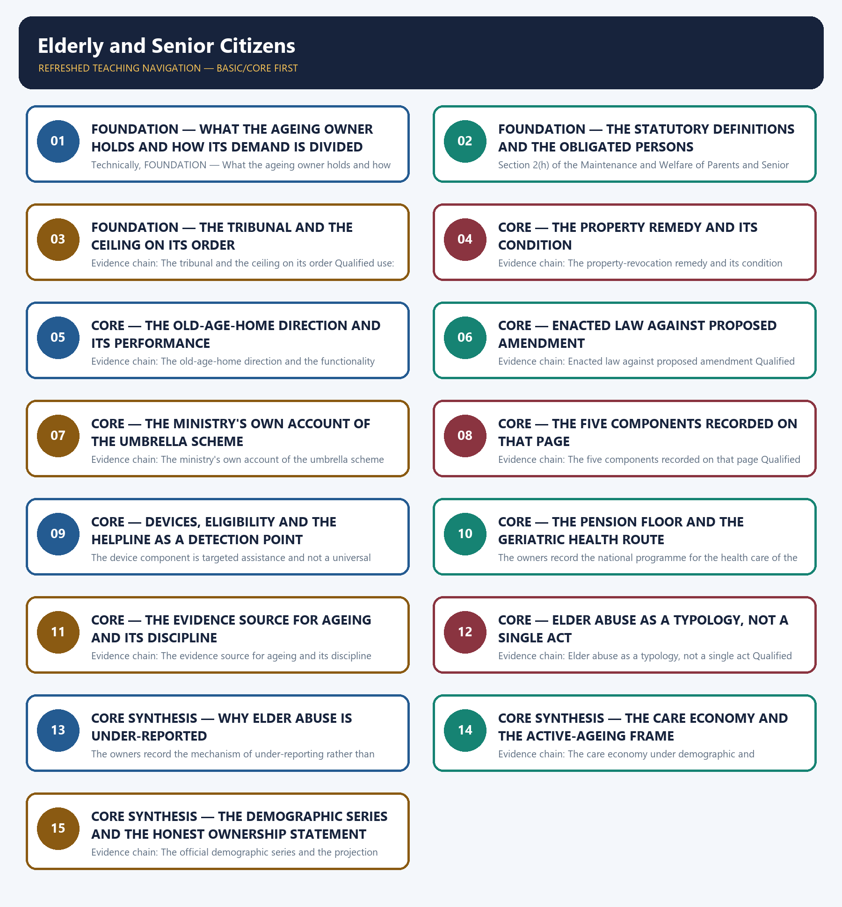

# Elderly and Senior Citizens — Learner-v2 Complete Learning Session

> **Authoring-only generation:** 2026-09-02. No PDF was rendered and no tracker or index was mutated.

### SOURCE, PROGRESSION AND CURRENT-LINKAGE AUDIT

- **Generation date:** 2026-09-02.
- **Repository-first evidence:** the Basic owner is taught first and preserved in full; the Advanced owner is retained only in the optional final teaching block.
- **OCR evidence:** Repository Markdown was primary. The OCR-searchable official General Studies question papers held under books\mains and books\more_previous_papers were read only to confirm the printed wording of routed Mains demands. No official answer key, marking scheme, page precision or unsupported quotation was imported from them.
- **Qdrant:** not used; repository Markdown and available OCR context were sufficient.
- **PYQ integrity:** This owner's previous-year record is a verified one rather than a zero, and it is stated precisely together with the boundary of what is claimed. The audited 2018-2023 Mains routing ledger routes exactly one General Studies Mains demand here, the 2020 General Studies Paper II question numbered 6 on health policies for geriatric and maternal care, with the directive Discuss, ten marks and one hundred and fifty words, and it records the ownership as cross-cutting between this owner and the health-systems and universal-health-coverage owner because the question names two distinct care domains. The Basic owner's answer architecture records the division in the same terms, stating that the elderly-care half of that demand is owned here and supersedes the older Advanced ownership. This package therefore solves the geriatric limb of that demand with a model answer written to the repository's examiner-grade standard using the claim, named evidence, analysis and qualification pattern, and states expressly in the demand card that the maternal-care limb belongs to the health-systems owner and is not claimed here, so that the same question is not double-counted as two independent ownerships. No other Mains or objective demand is claimed: the audited 2024-2025 Mains and Prelims routing ledgers route none to this owner, both the Basic and the Advanced owner state independently that no confirmed direct 2024 or 2025 General Studies Paper II Mains question specifically on elderly welfare exists in the audited local texts, and the 2018 General Studies Paper IV case study involving a district officer and an elderly couple seeking a senior-citizen healthcare scheme is routed by the audited ledger to the Ethics case-study and public-service-values owners, so it is not claimed here either. Alongside the solved demand card, the package adds six original Mains questions with model solutions and eighty original objective questions on a strict A → B → C → D rotation. Each model solution opens with its analytical claim so that the evidence which follows does argumentative rather than decorative work. The locally held OCR-searchable official General Studies papers were read only to confirm the printed wording of the routed Mains demand; no question was invented from them, no marking scheme or page precision was imported and no official answer key is claimed for any question anywhere in this package.
- **Live-link boundary:** One live official page was verified for this topic on 2026-09-02. The Atal Vayo Abhyuday Yojana scheme page of the Department of Social Justice and Empowerment, read on that date, records that it is a scheme to improve the quality of life of senior citizens; that the number of elderly persons has increased from 1.98 crore in 1951 to 7.6 crore in 2001 and 10.38 crore in 2011, and that projections indicate the number of persons aged sixty and above in India will increase to 14.3 crore in 2021 and 17.3 crore in 2026; that continuous increase in life expectancy and general improvement in health-care facilities are among the main reasons for the rising proportion of senior citizens; that society is witnessing a gradual but definite decline of the joint family system, exposing many parents to a lack of emotional, physical and financial support; that the main objective of the scheme is to improve the quality of life of senior citizens by providing basic amenities like shelter, food, medical care and entertainment opportunities and by encouraging productive and active ageing through support for capacity building of State and Union Territory Governments, non-governmental organisations, Panchayati Raj Institutions, local bodies and the community at large; that its developmental objectives are financial security, health care and nutrition, shelter and welfare, protection of life and property of senior citizens, active and productive ageing with intergenerational bonding and skill development, accessibility, transport and an age-friendly environment, awareness generation and capacity building, promoting the silver economy of senior-friendly industrial goods and services, research and study, and project management; that assistance under the scheme is given to implementing agencies such as State and Union Territory Governments, Panchayati Raj Institutions, local bodies and eligible non-governmental and voluntary organisations for programmes catering to basic needs, for intergenerational programmes and active-ageing programmes through Regional Resource and Training Centres, for institutional and non-institutional care, and for research, advocacy and awareness building; and that the scheme has five components, namely the Integrated Programme for Senior Citizens which maintains senior-citizen homes to provide basic amenities especially for indigent senior citizens, the State Action Plan for Senior Citizens under which each State or Union Territory frames its own plan comprising a five-year strategy and annual action plans with the Union ministry releasing funds, Rashtriya Vayoshri Yojana as a Central Sector scheme providing assisted-living devices conforming to Bureau of Indian Standards specifications wherever applicable to eligible senior citizens suffering from age-related disability or infirmity, Senior Citizen Opportunities for Productive Engagement as a portal virtually matching the preferences of experienced senior citizens and enterprises, and the Seniorcare Ageing Growth Engine which identifies, evaluates, verifies, aggregates and delivers aged-care products, solutions and services with the ministry acting as facilitator. Those statements are used only for what they say; the 1951, 2001 and 2011 figures are used as recorded counts and the 2021 and 2026 figures only as recorded projections, and no beneficiary, home, device, call, sanction, budget or expenditure figure is inferred from them. Three further official checks were attempted on the same date, namely two departmental scheme identifiers that returned not-found pages and a senior-citizens welfare portal that returned event listings only, so nothing was read or used from them and no secondary summary, coaching site or news report has been treated as an official source. The package therefore relies on that verified page together with the dated official anchors already carried by the repository owners, each cited with its issuing instrument or status date: the Maintenance and Welfare of Parents and Senior Citizens Act, 2007 with the Section 2(h) definition of a senior citizen as a citizen aged sixty years, maintenance as food, clothing, residence and medical attendance and treatment, the obligation lying on children and on relatives who are or will be legal heirs, the sub-divisional Maintenance Tribunal deciding ordinarily within ninety days with a State-prescribed allowance not exceeding ₹10,000 per month, the Section 23 conditional property-revocation remedy and the direction to establish at least one old-age home per district with capacity for at least one hundred and fifty indigent senior citizens; the amendment Bill introduced in December 2019 proposing a broader dignity definition, enhanced abandonment penalties and direct income deduction, which lapsed with the dissolution of that Lok Sabha, and the Private Members' Bills introduced in both Houses in 2025, neither of which was enacted as at 21 July 2026, so the 2007 Act remains the law in force; the assistive-device component implemented through the public-sector artificial-limbs corporation for persons aged sixty and above with age-related infirmity who are below the poverty line or have family income up to ₹15,000 per month under current guidelines; the national helpline for senior citizens identified as Elderline, typically 14567; the national old-age pension central assistance of ₹200 per month for eligible below-poverty-line persons aged sixty to seventy-nine and ₹500 for those aged eighty and above, with State top-ups varying and with the recorded caution that the central floor is not an earnings-replacement pension; the national programme for the health care of the elderly as the geriatric-care route and the age-based hospitalisation route covering every citizen aged seventy and above, recorded as addressing hospitalisation rather than outpatient, rehabilitation, palliative or long-term care; the Longitudinal Ageing Study in India as the evidence source, to be cited with its wave or year and without inferring causation from association; the National Policy on Older Persons of 1999 and the National Policy for Senior Citizens of 2011; and the Madrid International Plan of Action on Ageing of 2002 as the active-ageing frame. No elderly-population figure other than the recorded series is asserted and the projections are never presented as enumeration, no elder-abuse prevalence figure is asserted because the owners record that nationally representative regular data is lacking, no tribunal, order, compliance, home, device, helpline, pension, enrolment, budget or expenditure count is asserted, no National Family Health Survey, Periodic Labour Force Survey, NITI Aayog or Sustainable Development Goal value is asserted, no legal provision is invented or upgraded in status, no lapsed or pending Bill is described as enacted, and no previous-year question, official answer key or option is asserted or inferred beyond the single routed demand whose printed wording is recorded in the audited ledger.
- **Fact/inference discipline:** no current-affairs item, PYQ wording, figure or quotation is invented.

## BASIC LEARNING SESSION



*Distinct embedded teaching-navigation image. The separate continuous Cārvāka-style flowchart package remains an independent at-a-glance artifact.*

### SESSION 1 — FOUNDATION — WHAT THE AGEING OWNER HOLDS AND HOW ITS DEMAND IS DIVIDED

#### DEFINITION / WHAT THIS IS CALLED

**Plain-language definition:** Evidence chain: What this owner holds and how its routed demand is divided Qualified use: Open an ageing answer by naming the limb, entitlement, welfare or health, that the question actually tests.

**Technical definition:** Technically, FOUNDATION — What the ageing owner holds and how its demand is divided is analysed by relating FOUNDATION to What the ageing owner holds, then testing the relationship through how its demand is divided and Evidence chain.

#### ANSWER-GRABBING OPENING — WRITE/ADAPT IN THE EXAM

> Evidence chain: What this owner holds and how its routed demand is divided Qualified use: Open an ageing answer by naming the limb, entitlement, welfare or health, that the question actually tests.

#### MUST-WRITE KEYWORDS

- **FOUNDATION**
- **What the ageing owner holds**
- **how its demand is divided**
- **Evidence chain**
- **Qualified use**
- **2018-2023**

**How to use them:** Frame the answer through FOUNDATION; define What the ageing owner holds, connect how its demand is divided with Evidence chain to explain the mechanism, and use Qualified use for the decisive comparison or qualification.

#### VISUAL FIRST

```text
WHAT THE AGEING OWNER HOLDS AND HOW ITS DEMAND IS DIVIDED
01. What this owner holds and how its routed demand is divided
BOUNDARY -> The routed 2020 demand is cross-cutting, and the maternal limb belongs to the health-systems owner.
```

*This topic-specific rail fixes the evidence sequence and its exam boundary before analysis.*

#### CORE EXPLANATION

This owner holds the ageing half of the social-protection argument: the statutory maintenance obligation and its tribunal, the property-revocation remedy, the district old-age-home direction, the umbrella welfare scheme of the social-justice ministry with its named components, the assistance floor in old-age pension, the geriatric limb of the health system, the elder-abuse typology and the care economy; its ownership record is verified rather than empty, because the audited 2018-2023 Mains routing ledger routes the 2020 General Studies Paper II question on health policies for geriatric and maternal care to this owner and to the health-systems owner jointly and records the ownership as cross-cutting, so this package solves the geriatric limb of that demand and states expressly that the maternal limb belongs to the health-systems owner, which is exactly how the Basic owner's answer architecture records the division.

#### NAMED EVIDENCE AND MECHANISM

- This owner holds the ageing half of the social-protection argument: the statutory maintenance obligation and its tribunal, the property-revocation remedy, the district old-age-home direction, the umbrella welfare scheme of the social-justice ministry with its named components, the assistance floor in old-age pension, the geriatric limb of the health system, the elder-abuse typology and the care economy; its ownership record is verified rather than empty, because the audited 2018-2023 Mains routing ledger routes the 2020 General Studies Paper II question on health policies for geriatric and maternal care to this owner and to the health-systems owner jointly and records the ownership as cross-cutting, so this package solves the geriatric limb of that demand and states expressly that the maternal limb belongs to the health-systems owner, which is exactly how the Basic owner's answer architecture records the division.

#### EXAMINER CAUTION

- The routed 2020 demand is cross-cutting, and the maternal limb belongs to the health-systems owner.

#### EXAM LINK

- **Prelims:** Retain the exact statute, section, article, ministry, official category, survey round or dated edition attached to What the ageing owner holds and how its demand is divided, and never upgrade a policy document into a statute or a targeted scheme into a universal entitlement.
- **Mains:** Open an ageing answer by naming the limb, entitlement, welfare or health, that the question actually tests.

#### MINI RECAP

- **Evidence chain:** What this owner holds and how its routed demand is divided
- **Qualified use:** Open an ageing answer by naming the limb, entitlement, welfare or health, that the question actually tests.

#### CLOSING RECALL FLOW — FOUNDATION — WHAT THE AGEING OWNER HOLDS AND HOW ITS DEMAND IS DIVIDED

```text
START / CONCEPT: FOUNDATION — What the ageing owner holds and how its demand is divided
        |
        v
EXACT TERMS: FOUNDATION · What the ageing owner holds · how its demand is divided · Evidence chain · Qualified use · 2018-2023
        |
        v
MECHANISM / ARGUMENT: This owner holds the ageing half of the social-protection argument: the statutory maintenance obligation and its tribunal, the property-revocation remedy, the district old-age-home direction, the umbrella welfare scheme of the social-justice ministry with its named components, the assistance floor in old-age pension, the geriatric limb of the health system, the elder-abuse typology and the care economy; its ownership record is verified rather than empty, because the audited 2018-2023 Mains routing ledger routes the 2020 General Studies Paper II question on health policies for geriatric and maternal care to this owner and to the health-systems owner jointly and records the ownership as cross-cutting, so this package solves the geriatric limb of that demand and states expressly that the maternal limb belongs to the health-systems owner, which is exactly how the Basic owner's answer architecture records the division.
        |
        v
CONSEQUENCE / CONTRAST: Prelims: Retain the exact statute, section, article, ministry, official category, survey round or dated edition attached to What the ageing owner holds and how its demand is divided, and never upgrade a policy document into a statute or a targeted scheme into a universal entitlement.
        |
        v
UPSC TRAP / ANSWER-USE: Do not miss this limiting distinction: the routed 2020 demand is cross-cutting.
        |
        v
ANSWER-GRABBING FORMULATION: Evidence chain: What this owner holds and how its routed demand is divided Qualified use: Open an ageing answer by naming the limb, entitlement, welfare or health, that the question actually tests.
```
### SESSION 2 — FOUNDATION — THE STATUTORY DEFINITIONS AND THE OBLIGATED PERSONS

#### DEFINITION / WHAT THIS IS CALLED

**Plain-language definition:** Evidence chain: Who is a senior citizen and what maintenance means - Who owes the obligation Qualified use: Anchor a maintenance answer in the exact statutory definition before arguing about enforcement.

**Technical definition:** Section 2(h) of the Maintenance and Welfare of Parents and Senior Citizens Act, 2007 defines a senior citizen as a citizen of India who has attained the age of sixty years, and the Act defines maintenance as the provision of food, clothing, residence and medical attendance and treatment; the owners record that these are statutory definitions and not descriptive conveniences, so an answer must use the age of sixty as the legal threshold and must state maintenance as the four-part content of the obligation rather than as a general duty of care, because both the tribunal's jurisdiction and the content of its order follow from these definitions.

#### ANSWER-GRABBING OPENING — WRITE/ADAPT IN THE EXAM

> Evidence chain: Who is a senior citizen and what maintenance means - Who owes the obligation Qualified use: Anchor a maintenance answer in the exact statutory definition before arguing about enforcement.

#### MUST-WRITE KEYWORDS

- **FOUNDATION**
- **The statutory definitions**
- **the obligated persons**
- **Evidence chain**
- **Qualified use**
- **Section**

**How to use them:** Frame the answer through FOUNDATION; define The statutory definitions, connect the obligated persons with Evidence chain to explain the mechanism, and use Qualified use for the decisive comparison or qualification.

#### VISUAL FIRST

```text
THE STATUTORY DEFINITIONS AND THE OBLIGATED PERSONS
01. Who is a senior citizen and what maintenance means
    |
    v
02. Who owes the obligation
BOUNDARY -> The heirship link, not the parental link alone, carries the maintenance duty.
```

*This topic-specific rail fixes the evidence sequence and its exam boundary before analysis.*

#### CORE EXPLANATION

Section 2(h) of the Maintenance and Welfare of Parents and Senior Citizens Act, 2007 defines a senior citizen as a citizen of India who has attained the age of sixty years, and the Act defines maintenance as the provision of food, clothing, residence and medical attendance and treatment; the owners record that these are statutory definitions and not descriptive conveniences, so an answer must use the age of sixty as the legal threshold and must state maintenance as the four-part content of the obligation rather than as a general duty of care, because both the tribunal's jurisdiction and the content of its order follow from these definitions. The owners record that under the 2007 Act the obligation to maintain a parent or a senior citizen falls on children and on relatives, relatives being those who are or who will be the legal heirs of the senior citizen's property, and they mark the common error explicitly: an answer that confines the obligation to children has narrowed a statute that deliberately reaches beyond the parent-child relationship in order to cover childless senior citizens whose property will pass to another relative, so the heirship link, and not the parental link alone, is what carries the duty.

#### NAMED EVIDENCE AND MECHANISM

- Section 2(h) of the Maintenance and Welfare of Parents and Senior Citizens Act, 2007 defines a senior citizen as a citizen of India who has attained the age of sixty years, and the Act defines maintenance as the provision of food, clothing, residence and medical attendance and treatment; the owners record that these are statutory definitions and not descriptive conveniences, so an answer must use the age of sixty as the legal threshold and must state maintenance as the four-part content of the obligation rather than as a general duty of care, because both the tribunal's jurisdiction and the content of its order follow from these definitions.
- The owners record that under the 2007 Act the obligation to maintain a parent or a senior citizen falls on children and on relatives, relatives being those who are or who will be the legal heirs of the senior citizen's property, and they mark the common error explicitly: an answer that confines the obligation to children has narrowed a statute that deliberately reaches beyond the parent-child relationship in order to cover childless senior citizens whose property will pass to another relative, so the heirship link, and not the parental link alone, is what carries the duty.

#### EXAMINER CAUTION

- The heirship link, not the parental link alone, carries the maintenance duty.

#### EXAM LINK

- **Prelims:** Retain the exact statute, section, article, ministry, official category, survey round or dated edition attached to The statutory definitions and the obligated persons, and never upgrade a policy document into a statute or a targeted scheme into a universal entitlement.
- **Mains:** Anchor a maintenance answer in the exact statutory definition before arguing about enforcement.

#### MINI RECAP

- **Evidence chain:** Who is a senior citizen and what maintenance means -> Who owes the obligation
- **Qualified use:** Anchor a maintenance answer in the exact statutory definition before arguing about enforcement.

#### CLOSING RECALL FLOW — FOUNDATION — THE STATUTORY DEFINITIONS AND THE OBLIGATED PERSONS

```text
START / CONCEPT: FOUNDATION — The statutory definitions and the obligated persons
        |
        v
EXACT TERMS: FOUNDATION · The statutory definitions · the obligated persons · Evidence chain · Qualified use · Section
        |
        v
MECHANISM / ARGUMENT: Section 2(h) of the Maintenance and Welfare of Parents and Senior Citizens Act, 2007 defines a senior citizen as a citizen of India who has attained the age of sixty years, and the Act defines maintenance as the provision of food, clothing, residence and medical attendance and treatment; the owners record that these are statutory definitions and not descriptive conveniences, so an answer must use the age of sixty as the legal threshold and must state maintenance as the four-part content of the obligation rather than as a general duty of care, because both the tribunal's jurisdiction and the content of its order follow from these definitions.
        |
        v
CONSEQUENCE / CONTRAST: The owners record that under the 2007 Act the obligation to maintain a parent or a senior citizen falls on children and on relatives, relatives being those who are or who will be the legal heirs of the senior citizen's property, and they mark the common error explicitly: an answer that confines the obligation to children has narrowed a statute that deliberately reaches beyond the parent-child relationship in order to cover childless senior citizens whose property will pass to another relative, so the heirship link, and not the parental link alone, is what carries the duty.
        |
        v
UPSC TRAP / ANSWER-USE: Do not miss this limiting distinction: section 2(h) of the Maintenance and Welfare of Parents and Senior Citizens Act, 2007...
        |
        v
ANSWER-GRABBING FORMULATION: Evidence chain: Who is a senior citizen and what maintenance means - Who owes the obligation Qualified use: Anchor a maintenance answer in the exact statutory definition before arguing about enforcement.
```
### SESSION 3 — FOUNDATION — THE TRIBUNAL AND THE CEILING ON ITS ORDER

#### DEFINITION / WHAT THIS IS CALLED

**Plain-language definition:** The Act establishes a Maintenance Tribunal in every sub-division as a summary adjudicatory body to receive applications from senior citizens or authorised persons and ordinarily to decide within ninety days, extendable in exceptional circumstances, and the owners record that the allowance prescribed by the State cannot exceed the Act's ceiling of ten thousand rupees per month; the two facts must travel together in an answer, because the summary and time-bound character is what makes the remedy accessible while the monetary ceiling is what limits its adequacy in a high-cost setting, and a candidate who cites one without the other has described only half of the design.

**Technical definition:** Evidence chain: The tribunal and the ceiling on its order Qualified use: Present a summary remedy with its time limit and its monetary ceiling together.

#### ANSWER-GRABBING OPENING — WRITE/ADAPT IN THE EXAM

> Evidence chain: The tribunal and the ceiling on its order Qualified use: Present a summary remedy with its time limit and its monetary ceiling together.

#### MUST-WRITE KEYWORDS

- **FOUNDATION**
- **The tribunal**
- **the ceiling on its order**
- **Evidence chain**
- **Qualified use**
- **The Act**

**How to use them:** Frame the answer through FOUNDATION; define The tribunal, connect the ceiling on its order with Evidence chain to explain the mechanism, and use Qualified use for the decisive comparison or qualification.

#### VISUAL FIRST

```text
THE TRIBUNAL AND THE CEILING ON ITS ORDER
01. The tribunal and the ceiling on its order
BOUNDARY -> Accessibility and adequacy pull in opposite directions inside the same design.
```

*This topic-specific rail fixes the evidence sequence and its exam boundary before analysis.*

#### CORE EXPLANATION

The Act establishes a Maintenance Tribunal in every sub-division as a summary adjudicatory body to receive applications from senior citizens or authorised persons and ordinarily to decide within ninety days, extendable in exceptional circumstances, and the owners record that the allowance prescribed by the State cannot exceed the Act's ceiling of ten thousand rupees per month; the two facts must travel together in an answer, because the summary and time-bound character is what makes the remedy accessible while the monetary ceiling is what limits its adequacy in a high-cost setting, and a candidate who cites one without the other has described only half of the design.

#### NAMED EVIDENCE AND MECHANISM

- The Act establishes a Maintenance Tribunal in every sub-division as a summary adjudicatory body to receive applications from senior citizens or authorised persons and ordinarily to decide within ninety days, extendable in exceptional circumstances, and the owners record that the allowance prescribed by the State cannot exceed the Act's ceiling of ten thousand rupees per month; the two facts must travel together in an answer, because the summary and time-bound character is what makes the remedy accessible while the monetary ceiling is what limits its adequacy in a high-cost setting, and a candidate who cites one without the other has described only half of the design.

#### EXAMINER CAUTION

- Accessibility and adequacy pull in opposite directions inside the same design.

#### EXAM LINK

- **Prelims:** Retain the exact statute, section, article, ministry, official category, survey round or dated edition attached to The tribunal and the ceiling on its order, and never upgrade a policy document into a statute or a targeted scheme into a universal entitlement.
- **Mains:** Present a summary remedy with its time limit and its monetary ceiling together.

#### MINI RECAP

- **Evidence chain:** The tribunal and the ceiling on its order
- **Qualified use:** Present a summary remedy with its time limit and its monetary ceiling together.

#### CLOSING RECALL FLOW — FOUNDATION — THE TRIBUNAL AND THE CEILING ON ITS ORDER

```text
START / CONCEPT: FOUNDATION — The tribunal and the ceiling on its order
        |
        v
EXACT TERMS: FOUNDATION · The tribunal · the ceiling on its order · Evidence chain · Qualified use · The Act
        |
        v
MECHANISM / ARGUMENT: The Act establishes a Maintenance Tribunal in every sub-division as a summary adjudicatory body to receive applications from senior citizens or authorised persons and ordinarily to decide within ninety days, extendable in exceptional circumstances, and the owners record that the allowance prescribed by the State cannot exceed the Act's ceiling of ten thousand rupees per month; the two facts must travel together in an answer, because the summary and time-bound character is what makes the remedy accessible while the monetary ceiling is what limits its adequacy in a high-cost setting, and a candidate who cites one without the other has described only half of the design.
        |
        v
CONSEQUENCE / CONTRAST: The resulting consequence is that the tribunal and the ceiling on its order Qualified use.
        |
        v
UPSC TRAP / ANSWER-USE: Do not miss this limiting distinction: the tribunal and the ceiling on its order Qualified use.
        |
        v
ANSWER-GRABBING FORMULATION: Evidence chain: The tribunal and the ceiling on its order Qualified use: Present a summary remedy with its time limit and its monetary ceiling together.
```
### SESSION 4 — CORE — THE PROPERTY REMEDY AND ITS CONDITION

#### DEFINITION / WHAT THIS IS CALLED

**Plain-language definition:** The owners record the remedy under Section 23 with its condition intact: where a senior citizen has transferred property by gift or otherwise subject to the condition that the transferee provide basic amenities and physical needs, and the transferee refuses or fails to do so, the transfer may at the option of the senior citizen be declared void; the discipline is that the condition is part of the remedy and not a formality, so this is not an automatic power to undo any later family dispute over property, and an answer that presents it as a general revocation right has overstated the statute.

**Technical definition:** Evidence chain: The property-revocation remedy and its condition Qualified use: State a statutory remedy with the condition that makes it available.

#### ANSWER-GRABBING OPENING — WRITE/ADAPT IN THE EXAM

> The owners record the remedy under Section 23 with its condition intact: where a senior citizen has transferred property by gift or otherwise subject to the condition that the transferee provide basic amenities and physical needs, and the transferee refuses or fails to do so, the transfer may at the option of the senior citizen be declared void; the discipline is that the condition is part of the remedy and not a formality, so this is not an automatic power to undo any later family dispute over property, and an answer that presents it as a general revocation right has overstated the statute.

#### MUST-WRITE KEYWORDS

- **The property remedy**
- **its condition**
- **Evidence chain**
- **Qualified use**
- **Section**
- **Qualified**

**How to use them:** Frame the answer through The property remedy; define its condition, connect Evidence chain with Qualified use to explain the mechanism, and use Section for the decisive comparison or qualification.

#### VISUAL FIRST

```text
THE PROPERTY REMEDY AND ITS CONDITION
01. The property-revocation remedy and its condition
BOUNDARY -> The transfer must have carried the condition; this is not a general revocation right.
```

*This topic-specific rail fixes the evidence sequence and its exam boundary before analysis.*

#### CORE EXPLANATION

The owners record the remedy under Section 23 with its condition intact: where a senior citizen has transferred property by gift or otherwise subject to the condition that the transferee provide basic amenities and physical needs, and the transferee refuses or fails to do so, the transfer may at the option of the senior citizen be declared void; the discipline is that the condition is part of the remedy and not a formality, so this is not an automatic power to undo any later family dispute over property, and an answer that presents it as a general revocation right has overstated the statute.

#### NAMED EVIDENCE AND MECHANISM

- The owners record the remedy under Section 23 with its condition intact: where a senior citizen has transferred property by gift or otherwise subject to the condition that the transferee provide basic amenities and physical needs, and the transferee refuses or fails to do so, the transfer may at the option of the senior citizen be declared void; the discipline is that the condition is part of the remedy and not a formality, so this is not an automatic power to undo any later family dispute over property, and an answer that presents it as a general revocation right has overstated the statute.

#### EXAMINER CAUTION

- The transfer must have carried the condition; this is not a general revocation right.

#### EXAM LINK

- **Prelims:** Retain the exact statute, section, article, ministry, official category, survey round or dated edition attached to The property remedy and its condition, and never upgrade a policy document into a statute or a targeted scheme into a universal entitlement.
- **Mains:** State a statutory remedy with the condition that makes it available.

#### MINI RECAP

- **Evidence chain:** The property-revocation remedy and its condition
- **Qualified use:** State a statutory remedy with the condition that makes it available.

#### CLOSING RECALL FLOW — CORE — THE PROPERTY REMEDY AND ITS CONDITION

```text
START / CONCEPT: CORE — The property remedy and its condition
        |
        v
EXACT TERMS: The property remedy · its condition · Evidence chain · Qualified use · Section · Qualified
        |
        v
MECHANISM / ARGUMENT: Evidence chain: The property-revocation remedy and its condition Qualified use: State a statutory remedy with the condition that makes it available.
        |
        v
CONSEQUENCE / CONTRAST: The transfer must have carried the condition; this is not a general revocation right.
        |
        v
UPSC TRAP / ANSWER-USE: Do not miss this limiting distinction: the owners record the remedy under Section 23 with its condition intact.
        |
        v
ANSWER-GRABBING FORMULATION: The owners record the remedy under Section 23 with its condition intact: where a senior citizen has transferred property by gift or otherwise subject to the condition that the transferee provide basic amenities and physical needs, and the transferee refuses or fails to do so, the transfer may at the option of the senior citizen be declared void; the discipline is that the condition is part of the remedy and not a formality, so this is not an automatic power to undo any later family dispute over property, and an answer that presents it as a general revocation right has overstated the statute.
```
### SESSION 5 — CORE — THE OLD-AGE-HOME DIRECTION AND ITS PERFORMANCE

#### DEFINITION / WHAT THIS IS CALLED

**Plain-language definition:** A statutory direction is law; whether homes exist and function is a State-level fact.

**Technical definition:** Evidence chain: The old-age-home direction and the functionality question Qualified use: Separate a legal norm from an implementation claim in the same sentence.

#### ANSWER-GRABBING OPENING — WRITE/ADAPT IN THE EXAM

> The Act directs State Governments to establish and maintain at least one old-age home in each district with capacity for at least one hundred and fifty indigent senior citizens, and the owners immediately separate the direction from its performance: the statutory instruction fixes the number and the capacity, while whether such homes exist and function is the implementation question, so an answer may state the direction as law and must not state coverage as achieved, and the honest formulation is that the norm is statutory and its fulfilment is a State-level fact to be verified rather than assumed.

#### MUST-WRITE KEYWORDS

- **The old-age-home direction**
- **its performance**
- **Evidence chain**
- **Qualified use**
- **The Act**
- **A statutory direction**

**How to use them:** Frame the answer through The old-age-home direction; define its performance, connect Evidence chain with Qualified use to explain the mechanism, and use The Act for the decisive comparison or qualification.

#### VISUAL FIRST

```text
THE OLD-AGE-HOME DIRECTION AND ITS PERFORMANCE
01. The old-age-home direction and the functionality question
BOUNDARY -> A statutory direction is law; whether homes exist and function is a State-level fact.
```

*This topic-specific rail fixes the evidence sequence and its exam boundary before analysis.*

#### CORE EXPLANATION

The Act directs State Governments to establish and maintain at least one old-age home in each district with capacity for at least one hundred and fifty indigent senior citizens, and the owners immediately separate the direction from its performance: the statutory instruction fixes the number and the capacity, while whether such homes exist and function is the implementation question, so an answer may state the direction as law and must not state coverage as achieved, and the honest formulation is that the norm is statutory and its fulfilment is a State-level fact to be verified rather than assumed.

#### NAMED EVIDENCE AND MECHANISM

- The Act directs State Governments to establish and maintain at least one old-age home in each district with capacity for at least one hundred and fifty indigent senior citizens, and the owners immediately separate the direction from its performance: the statutory instruction fixes the number and the capacity, while whether such homes exist and function is the implementation question, so an answer may state the direction as law and must not state coverage as achieved, and the honest formulation is that the norm is statutory and its fulfilment is a State-level fact to be verified rather than assumed.

#### EXAMINER CAUTION

- A statutory direction is law; whether homes exist and function is a State-level fact.

#### EXAM LINK

- **Prelims:** Retain the exact statute, section, article, ministry, official category, survey round or dated edition attached to The old-age-home direction and its performance, and never upgrade a policy document into a statute or a targeted scheme into a universal entitlement.
- **Mains:** Separate a legal norm from an implementation claim in the same sentence.

#### MINI RECAP

- **Evidence chain:** The old-age-home direction and the functionality question
- **Qualified use:** Separate a legal norm from an implementation claim in the same sentence.

#### CLOSING RECALL FLOW — CORE — THE OLD-AGE-HOME DIRECTION AND ITS PERFORMANCE

```text
START / CONCEPT: CORE — The old-age-home direction and its performance
        |
        v
EXACT TERMS: The old-age-home direction · its performance · Evidence chain · Qualified use · The Act · A statutory direction
        |
        v
MECHANISM / ARGUMENT: Evidence chain: The old-age-home direction and the functionality question Qualified use: Separate a legal norm from an implementation claim in the same sentence.
        |
        v
CONSEQUENCE / CONTRAST: A statutory direction is law; whether homes exist and function is a State-level fact.
        |
        v
UPSC TRAP / ANSWER-USE: Do not miss this limiting distinction: the Act directs State Governments to establish and maintain at least one old-age home...
        |
        v
ANSWER-GRABBING FORMULATION: The Act directs State Governments to establish and maintain at least one old-age home in each district with capacity for at least one hundred and fifty indigent senior citizens, and the owners immediately separate the direction from its performance: the statutory instruction fixes the number and the capacity, while whether such homes exist and function is the implementation question, so an answer may state the direction as law and must not state coverage as achieved, and the honest formulation is that the norm is statutory and its fulfilment is a State-level fact to be verified rather than assumed.
```
### SESSION 6 — CORE — ENACTED LAW AGAINST PROPOSED AMENDMENT

#### DEFINITION / WHAT THIS IS CALLED

**Plain-language definition:** The owners keep the legislative record exact: an amendment Bill was first introduced in the Lok Sabha in December 2019 proposing an expanded definition of a life of dignity, enhanced penalties for abandonment and mechanisms such as direct deduction of the maintenance amount from a paying relative's income, and that Bill lapsed with the dissolution of that Lok Sabha and was never enacted; Private Members' Bills were introduced in the Lok Sabha and the Rajya Sabha in 2025 and, as at 21 July 2026, neither has been enacted, so the law in force is the 2007 Act and any broader dignity definition, enhanced penalty or income-deduction mechanism must be labelled as proposed and never as current law.

**Technical definition:** Evidence chain: Enacted law against proposed amendment Qualified use: Label legislative status precisely before citing any reform as available.

#### ANSWER-GRABBING OPENING — WRITE/ADAPT IN THE EXAM

> The owners keep the legislative record exact: an amendment Bill was first introduced in the Lok Sabha in December 2019 proposing an expanded definition of a life of dignity, enhanced penalties for abandonment and mechanisms such as direct deduction of the maintenance amount from a paying relative's income, and that Bill lapsed with the dissolution of that Lok Sabha and was never enacted; Private Members' Bills were introduced in the Lok Sabha and the Rajya Sabha in 2025 and, as at 21 July 2026, neither has been enacted, so the law in force is the 2007 Act and any broader dignity definition, enhanced penalty or income-deduction mechanism must be labelled as proposed and never as current law.

#### MUST-WRITE KEYWORDS

- **Enacted law against proposed amendment**
- **Evidence chain**
- **Qualified use**
- **Bill**
- **Lok Sabha**
- **Private Members' Bills**

**How to use them:** Frame the answer through Enacted law against proposed amendment; define Evidence chain, connect Qualified use with Bill to explain the mechanism, and use Lok Sabha for the decisive comparison or qualification.

#### VISUAL FIRST

```text
ENACTED LAW AGAINST PROPOSED AMENDMENT
01. Enacted law against proposed amendment
BOUNDARY -> A lapsed Bill and unenacted Private Members' Bills are proposals and not law.
```

*This topic-specific rail fixes the evidence sequence and its exam boundary before analysis.*

#### CORE EXPLANATION

The owners keep the legislative record exact: an amendment Bill was first introduced in the Lok Sabha in December 2019 proposing an expanded definition of a life of dignity, enhanced penalties for abandonment and mechanisms such as direct deduction of the maintenance amount from a paying relative's income, and that Bill lapsed with the dissolution of that Lok Sabha and was never enacted; Private Members' Bills were introduced in the Lok Sabha and the Rajya Sabha in 2025 and, as at 21 July 2026, neither has been enacted, so the law in force is the 2007 Act and any broader dignity definition, enhanced penalty or income-deduction mechanism must be labelled as proposed and never as current law.

#### NAMED EVIDENCE AND MECHANISM

- The owners keep the legislative record exact: an amendment Bill was first introduced in the Lok Sabha in December 2019 proposing an expanded definition of a life of dignity, enhanced penalties for abandonment and mechanisms such as direct deduction of the maintenance amount from a paying relative's income, and that Bill lapsed with the dissolution of that Lok Sabha and was never enacted; Private Members' Bills were introduced in the Lok Sabha and the Rajya Sabha in 2025 and, as at 21 July 2026, neither has been enacted, so the law in force is the 2007 Act and any broader dignity definition, enhanced penalty or income-deduction mechanism must be labelled as proposed and never as current law.

#### EXAMINER CAUTION

- A lapsed Bill and unenacted Private Members' Bills are proposals and not law.

#### EXAM LINK

- **Prelims:** Retain the exact statute, section, article, ministry, official category, survey round or dated edition attached to Enacted law against proposed amendment, and never upgrade a policy document into a statute or a targeted scheme into a universal entitlement.
- **Mains:** Label legislative status precisely before citing any reform as available.

#### MINI RECAP

- **Evidence chain:** Enacted law against proposed amendment
- **Qualified use:** Label legislative status precisely before citing any reform as available.

#### CLOSING RECALL FLOW — CORE — ENACTED LAW AGAINST PROPOSED AMENDMENT

```text
START / CONCEPT: CORE — Enacted law against proposed amendment
        |
        v
EXACT TERMS: Enacted law against proposed amendment · Evidence chain · Qualified use · Bill · Lok Sabha · Private Members' Bills
        |
        v
MECHANISM / ARGUMENT: Evidence chain: Enacted law against proposed amendment Qualified use: Label legislative status precisely before citing any reform as available.
        |
        v
CONSEQUENCE / CONTRAST: A lapsed Bill and unenacted Private Members' Bills are proposals and not law.
        |
        v
UPSC TRAP / ANSWER-USE: Do not miss this limiting distinction: enacted law against proposed amendment Qualified use.
        |
        v
ANSWER-GRABBING FORMULATION: The owners keep the legislative record exact: an amendment Bill was first introduced in the Lok Sabha in December 2019 proposing an expanded definition of a life of dignity, enhanced penalties for abandonment and mechanisms such as direct deduction of the maintenance amount from a paying relative's income, and that Bill lapsed with the dissolution of that Lok Sabha and was never enacted; Private Members' Bills were introduced in the Lok Sabha and the Rajya Sabha in 2025 and, as at 21 July 2026, neither has been enacted, so the law in force is the 2007 Act and any broader dignity definition, enhanced penalty or income-deduction mechanism must be labelled as proposed and never as current law.
```
### SESSION 7 — CORE — THE MINISTRY'S OWN ACCOUNT OF THE UMBRELLA SCHEME

#### DEFINITION / WHAT THIS IS CALLED

**Plain-language definition:** The Atal Vayo Abhyuday Yojana scheme page of the Department of Social Justice and Empowerment, read on 2 September 2026, records that it is a scheme to improve the quality of life of senior citizens; that its main objective is to improve that quality of life by providing basic amenities like shelter, food, medical care and entertainment opportunities and by encouraging productive and active ageing through support for capacity building of State and Union Territory Governments, non-governmental organisations, Panchayati Raj Institutions, local bodies and the community at large; and that its developmental objectives are financial security, health care and nutrition, shelter and welfare, protection of life and property of senior citizens, active and productive ageing with intergenerational bonding and skill development, accessibility, transport and an age-friendly environment, awareness generation and capacity building, promoting the silver economy of senior-friendly industrial goods and services, research and study, and project management; nothing beyond those recorded statements is claimed.

**Technical definition:** Evidence chain: The ministry's own account of the umbrella scheme Qualified use: Cite an official scheme statement for exactly what it says and no further.

#### ANSWER-GRABBING OPENING — WRITE/ADAPT IN THE EXAM

> Evidence chain: The ministry's own account of the umbrella scheme Qualified use: Cite an official scheme statement for exactly what it says and no further.

#### MUST-WRITE KEYWORDS

- **The ministry's own account of the umbrella scheme**
- **Evidence chain**
- **Qualified use**
- **The Atal Vayo Abhyuday Yojana**
- **Department**
- **Social Justice**

**How to use them:** Frame the answer through The ministry's own account of the umbrella scheme; define Evidence chain, connect Qualified use with The Atal Vayo Abhyuday Yojana to explain the mechanism, and use Department for the decisive comparison or qualification.

#### VISUAL FIRST

```text
THE MINISTRY'S OWN ACCOUNT OF THE UMBRELLA SCHEME
01. The ministry's own account of the umbrella scheme
BOUNDARY -> The verified page records the objective and the developmental goals and nothing beyond them.
```

*This topic-specific rail fixes the evidence sequence and its exam boundary before analysis.*

#### CORE EXPLANATION

The Atal Vayo Abhyuday Yojana scheme page of the Department of Social Justice and Empowerment, read on 2 September 2026, records that it is a scheme to improve the quality of life of senior citizens; that its main objective is to improve that quality of life by providing basic amenities like shelter, food, medical care and entertainment opportunities and by encouraging productive and active ageing through support for capacity building of State and Union Territory Governments, non-governmental organisations, Panchayati Raj Institutions, local bodies and the community at large; and that its developmental objectives are financial security, health care and nutrition, shelter and welfare, protection of life and property of senior citizens, active and productive ageing with intergenerational bonding and skill development, accessibility, transport and an age-friendly environment, awareness generation and capacity building, promoting the silver economy of senior-friendly industrial goods and services, research and study, and project management; nothing beyond those recorded statements is claimed.

#### NAMED EVIDENCE AND MECHANISM

- The Atal Vayo Abhyuday Yojana scheme page of the Department of Social Justice and Empowerment, read on 2 September 2026, records that it is a scheme to improve the quality of life of senior citizens; that its main objective is to improve that quality of life by providing basic amenities like shelter, food, medical care and entertainment opportunities and by encouraging productive and active ageing through support for capacity building of State and Union Territory Governments, non-governmental organisations, Panchayati Raj Institutions, local bodies and the community at large; and that its developmental objectives are financial security, health care and nutrition, shelter and welfare, protection of life and property of senior citizens, active and productive ageing with intergenerational bonding and skill development, accessibility, transport and an age-friendly environment, awareness generation and capacity building, promoting the silver economy of senior-friendly industrial goods and services, research and study, and project management; nothing beyond those recorded statements is claimed.

#### EXAMINER CAUTION

- The verified page records the objective and the developmental goals and nothing beyond them.

#### EXAM LINK

- **Prelims:** Retain the exact statute, section, article, ministry, official category, survey round or dated edition attached to The ministry's own account of the umbrella scheme, and never upgrade a policy document into a statute or a targeted scheme into a universal entitlement.
- **Mains:** Cite an official scheme statement for exactly what it says and no further.

#### MINI RECAP

- **Evidence chain:** The ministry's own account of the umbrella scheme
- **Qualified use:** Cite an official scheme statement for exactly what it says and no further.

#### CLOSING RECALL FLOW — CORE — THE MINISTRY'S OWN ACCOUNT OF THE UMBRELLA SCHEME

```text
START / CONCEPT: CORE — The ministry's own account of the umbrella scheme
        |
        v
EXACT TERMS: The ministry's own account of the umbrella scheme · Evidence chain · Qualified use · The Atal Vayo Abhyuday Yojana · Department · Social Justice
        |
        v
MECHANISM / ARGUMENT: The Atal Vayo Abhyuday Yojana scheme page of the Department of Social Justice and Empowerment, read on 2 September 2026, records that it is a scheme to improve the quality of life of senior citizens; that its main objective is to improve that quality of life by providing basic amenities like shelter, food, medical care and entertainment opportunities and by encouraging productive and active ageing through support for capacity building of State and Union Territory Governments, non-governmental organisations, Panchayati Raj Institutions, local bodies and the community at large; and that its developmental objectives are financial security, health care and nutrition, shelter and welfare, protection of life and property of senior citizens, active and productive ageing with intergenerational bonding and skill development, accessibility, transport and an age-friendly environment, awareness generation and capacity building, promoting the silver economy of senior-friendly industrial goods and services, research and study, and project management; nothing beyond those recorded statements is claimed.
        |
        v
CONSEQUENCE / CONTRAST: The resulting consequence is that the ministry's own account of the umbrella scheme Qualified use.
        |
        v
UPSC TRAP / ANSWER-USE: Do not miss this limiting distinction: the ministry's own account of the umbrella scheme Qualified use.
        |
        v
ANSWER-GRABBING FORMULATION: Evidence chain: The ministry's own account of the umbrella scheme Qualified use: Cite an official scheme statement for exactly what it says and no further.
```
### SESSION 8 — CORE — THE FIVE COMPONENTS RECORDED ON THAT PAGE

#### DEFINITION / WHAT THIS IS CALLED

**Plain-language definition:** The same official page records the components of the umbrella scheme as the Integrated Programme for Senior Citizens, the State Action Plan for Senior Citizens, Rashtriya Vayoshri Yojana, Senior Citizen Opportunities for Productive Engagement and the Seniorcare Ageing Growth Engine, and it describes each: the first maintains senior-citizen homes providing shelter, food, medical care and entertainment especially for indigent senior citizens; the second expects each State and Union Territory to frame its own action plan, which may comprise a five-year strategy and annual action plans, with the Union ministry releasing funds for their formulation and implementation; the third is a Central Sector scheme providing assisted-living devices to eligible senior citizens suffering from age-related disability or infirmity, the devices being of high quality and conforming to Bureau of Indian Standards specifications wherever applicable; the fourth is a portal that virtually matches the preferences of experienced senior citizens with enterprises seeking them; and the fifth identifies, evaluates, verifies, aggregates and delivers aged-care products, solutions and services to stakeholders, with the ministry acting as facilitator.

**Technical definition:** Evidence chain: The five components recorded on that page Qualified use: Map a welfare umbrella component by component before evaluating its reach.

#### ANSWER-GRABBING OPENING — WRITE/ADAPT IN THE EXAM

> Evidence chain: The five components recorded on that page Qualified use: Map a welfare umbrella component by component before evaluating its reach.

#### MUST-WRITE KEYWORDS

- **The five components recorded on that page**
- **Evidence chain**
- **Qualified use**
- **Integrated Programme**
- **Senior Citizens**
- **Rashtriya Vayoshri Yojana**

**How to use them:** Frame the answer through The five components recorded on that page; define Evidence chain, connect Qualified use with Integrated Programme to explain the mechanism, and use Senior Citizens for the decisive comparison or qualification.

#### VISUAL FIRST

```text
THE FIVE COMPONENTS RECORDED ON THAT PAGE
01. The five components recorded on that page
BOUNDARY -> Reducing the umbrella to one component misstates the architecture the ministry records.
```

*This topic-specific rail fixes the evidence sequence and its exam boundary before analysis.*

#### CORE EXPLANATION

The same official page records the components of the umbrella scheme as the Integrated Programme for Senior Citizens, the State Action Plan for Senior Citizens, Rashtriya Vayoshri Yojana, Senior Citizen Opportunities for Productive Engagement and the Seniorcare Ageing Growth Engine, and it describes each: the first maintains senior-citizen homes providing shelter, food, medical care and entertainment especially for indigent senior citizens; the second expects each State and Union Territory to frame its own action plan, which may comprise a five-year strategy and annual action plans, with the Union ministry releasing funds for their formulation and implementation; the third is a Central Sector scheme providing assisted-living devices to eligible senior citizens suffering from age-related disability or infirmity, the devices being of high quality and conforming to Bureau of Indian Standards specifications wherever applicable; the fourth is a portal that virtually matches the preferences of experienced senior citizens with enterprises seeking them; and the fifth identifies, evaluates, verifies, aggregates and delivers aged-care products, solutions and services to stakeholders, with the ministry acting as facilitator.

#### NAMED EVIDENCE AND MECHANISM

- The same official page records the components of the umbrella scheme as the Integrated Programme for Senior Citizens, the State Action Plan for Senior Citizens, Rashtriya Vayoshri Yojana, Senior Citizen Opportunities for Productive Engagement and the Seniorcare Ageing Growth Engine, and it describes each: the first maintains senior-citizen homes providing shelter, food, medical care and entertainment especially for indigent senior citizens; the second expects each State and Union Territory to frame its own action plan, which may comprise a five-year strategy and annual action plans, with the Union ministry releasing funds for their formulation and implementation; the third is a Central Sector scheme providing assisted-living devices to eligible senior citizens suffering from age-related disability or infirmity, the devices being of high quality and conforming to Bureau of Indian Standards specifications wherever applicable; the fourth is a portal that virtually matches the preferences of experienced senior citizens with enterprises seeking them; and the fifth identifies, evaluates, verifies, aggregates and delivers aged-care products, solutions and services to stakeholders, with the ministry acting as facilitator.

#### EXAMINER CAUTION

- Reducing the umbrella to one component misstates the architecture the ministry records.

#### EXAM LINK

- **Prelims:** Retain the exact statute, section, article, ministry, official category, survey round or dated edition attached to The five components recorded on that page, and never upgrade a policy document into a statute or a targeted scheme into a universal entitlement.
- **Mains:** Map a welfare umbrella component by component before evaluating its reach.

#### MINI RECAP

- **Evidence chain:** The five components recorded on that page
- **Qualified use:** Map a welfare umbrella component by component before evaluating its reach.

#### CLOSING RECALL FLOW — CORE — THE FIVE COMPONENTS RECORDED ON THAT PAGE

```text
START / CONCEPT: CORE — The five components recorded on that page
        |
        v
EXACT TERMS: The five components recorded on that page · Evidence chain · Qualified use · Integrated Programme · Senior Citizens · Rashtriya Vayoshri Yojana
        |
        v
MECHANISM / ARGUMENT: The same official page records the components of the umbrella scheme as the Integrated Programme for Senior Citizens, the State Action Plan for Senior Citizens, Rashtriya Vayoshri Yojana, Senior Citizen Opportunities for Productive Engagement and the Seniorcare Ageing Growth Engine, and it describes each: the first maintains senior-citizen homes providing shelter, food, medical care and entertainment especially for indigent senior citizens; the second expects each State and Union Territory to frame its own action plan, which may comprise a five-year strategy and annual action plans, with the Union ministry releasing funds for their formulation and implementation; the third is a Central Sector scheme providing assisted-living devices to eligible senior citizens suffering from age-related disability or infirmity, the devices being of high quality and conforming to Bureau of Indian Standards specifications wherever applicable; the fourth is a portal that virtually matches the preferences of experienced senior citizens with enterprises seeking them; and the fifth identifies, evaluates, verifies, aggregates and delivers aged-care products, solutions and services to stakeholders, with the ministry acting as facilitator.
        |
        v
CONSEQUENCE / CONTRAST: The resulting consequence is that the five components recorded on that page Qualified use.
        |
        v
UPSC TRAP / ANSWER-USE: Do not miss this limiting distinction: the five components recorded on that page Qualified use.
        |
        v
ANSWER-GRABBING FORMULATION: Evidence chain: The five components recorded on that page Qualified use: Map a welfare umbrella component by component before evaluating its reach.
```
### SESSION 9 — CORE — DEVICES, ELIGIBILITY AND THE HELPLINE AS A DETECTION POINT

#### DEFINITION / WHAT THIS IS CALLED

**Plain-language definition:** The owners record Elderline as the national helpline for senior citizens, typically reached on the number 14567, providing information, grievance redress and emergency response, and the department's own site carries the same identification; the analytical point that a helpline supports is a detection point, because elder abuse occurs inside the household where the victim depends on the abuser, so a channel that does not require the senior citizen to travel to an office or to confront a family member in public is precisely the instrument that under-reporting requires, while its limitation is that it converts a call into a case only where a functioning local response exists.

**Technical definition:** The device component is targeted assistance and not a universal entitlement of old age.

#### ANSWER-GRABBING OPENING — WRITE/ADAPT IN THE EXAM

> The owners record the assistive-device component as being implemented through the public-sector artificial-limbs corporation and as providing aids and devices to persons aged sixty and above who suffer from age-related infirmity and who are below the poverty line or have family income up to fifteen thousand rupees per month under the current guidelines, while the official page adds the quality condition that the devices must conform to Bureau of Indian Standards specifications wherever applicable; the answer-writing use of the eligibility rule is that it makes the component a targeted assistance route and not a universal entitlement of old age, so an answer must not describe it as a benefit that every senior citizen may claim.

#### MUST-WRITE KEYWORDS

- **Devices**
- **eligibility**
- **the helpline as a detection point**
- **Evidence chain**
- **Qualified use**
- **Bureau**

**How to use them:** Frame the answer through Devices; define eligibility, connect the helpline as a detection point with Evidence chain to explain the mechanism, and use Qualified use for the decisive comparison or qualification.

#### VISUAL FIRST

```text
DEVICES, ELIGIBILITY AND THE HELPLINE AS A DETECTION POINT
01. What the assistive-device component actually requires
    |
    v
02. The national helpline and what a helpline can do
BOUNDARY -> The device component is targeted assistance and not a universal entitlement of old age.
```

*This topic-specific rail fixes the evidence sequence and its exam boundary before analysis.*

#### CORE EXPLANATION

The owners record the assistive-device component as being implemented through the public-sector artificial-limbs corporation and as providing aids and devices to persons aged sixty and above who suffer from age-related infirmity and who are below the poverty line or have family income up to fifteen thousand rupees per month under the current guidelines, while the official page adds the quality condition that the devices must conform to Bureau of Indian Standards specifications wherever applicable; the answer-writing use of the eligibility rule is that it makes the component a targeted assistance route and not a universal entitlement of old age, so an answer must not describe it as a benefit that every senior citizen may claim. The owners record Elderline as the national helpline for senior citizens, typically reached on the number 14567, providing information, grievance redress and emergency response, and the department's own site carries the same identification; the analytical point that a helpline supports is a detection point, because elder abuse occurs inside the household where the victim depends on the abuser, so a channel that does not require the senior citizen to travel to an office or to confront a family member in public is precisely the instrument that under-reporting requires, while its limitation is that it converts a call into a case only where a functioning local response exists.

#### NAMED EVIDENCE AND MECHANISM

- The owners record the assistive-device component as being implemented through the public-sector artificial-limbs corporation and as providing aids and devices to persons aged sixty and above who suffer from age-related infirmity and who are below the poverty line or have family income up to fifteen thousand rupees per month under the current guidelines, while the official page adds the quality condition that the devices must conform to Bureau of Indian Standards specifications wherever applicable; the answer-writing use of the eligibility rule is that it makes the component a targeted assistance route and not a universal entitlement of old age, so an answer must not describe it as a benefit that every senior citizen may claim.
- The owners record Elderline as the national helpline for senior citizens, typically reached on the number 14567, providing information, grievance redress and emergency response, and the department's own site carries the same identification; the analytical point that a helpline supports is a detection point, because elder abuse occurs inside the household where the victim depends on the abuser, so a channel that does not require the senior citizen to travel to an office or to confront a family member in public is precisely the instrument that under-reporting requires, while its limitation is that it converts a call into a case only where a functioning local response exists.

#### EXAMINER CAUTION

- The device component is targeted assistance and not a universal entitlement of old age.

#### EXAM LINK

- **Prelims:** Retain the exact statute, section, article, ministry, official category, survey round or dated edition attached to Devices, eligibility and the helpline as a detection point, and never upgrade a policy document into a statute or a targeted scheme into a universal entitlement.
- **Mains:** Argue detection from where the harm occurs rather than from enforcement capacity.

#### MINI RECAP

- **Evidence chain:** What the assistive-device component actually requires -> The national helpline and what a helpline can do
- **Qualified use:** Argue detection from where the harm occurs rather than from enforcement capacity.

#### CLOSING RECALL FLOW — CORE — DEVICES, ELIGIBILITY AND THE HELPLINE AS A DETECTION POINT

```text
START / CONCEPT: CORE — Devices, eligibility and the helpline as a detection point
        |
        v
EXACT TERMS: Devices · eligibility · the helpline as a detection point · Evidence chain · Qualified use · Bureau
        |
        v
MECHANISM / ARGUMENT: The owners record Elderline as the national helpline for senior citizens, typically reached on the number 14567, providing information, grievance redress and emergency response, and the department's own site carries the same identification; the analytical point that a helpline supports is a detection point, because elder abuse occurs inside the household where the victim depends on the abuser, so a channel that does not require the senior citizen to travel to an office or to confront a family member in public is precisely the instrument that under-reporting requires, while its limitation is that it converts a call into a case only where a functioning local response exists.
        |
        v
CONSEQUENCE / CONTRAST: The device component is targeted assistance and not a universal entitlement of old age.
        |
        v
UPSC TRAP / ANSWER-USE: Evidence chain: What the assistive-device component actually requires - The national helpline and what a helpline can do Qualified use: Argue detection from where the harm occurs rather than from enforcement capacity.
        |
        v
ANSWER-GRABBING FORMULATION: The owners record the assistive-device component as being implemented through the public-sector artificial-limbs corporation and as providing aids and devices to persons aged sixty and above who suffer from age-related infirmity and who are below the poverty line or have family income up to fifteen thousand rupees per month under the current guidelines, while the official page adds the quality condition that the devices must conform to Bureau of Indian Standards specifications wherever applicable; the answer-writing use of the eligibility rule is that it makes the component a targeted assistance route and not a universal entitlement of old age, so an answer must not describe it as a benefit that every senior citizen may claim.
```
### SESSION 10 — CORE — THE PENSION FLOOR AND THE GERIATRIC HEALTH ROUTE

#### DEFINITION / WHAT THIS IS CALLED

**Plain-language definition:** An assistance floor is not an earnings-replacement pension, and hospitalisation is not continuing care.

**Technical definition:** The owners record the national programme for the health care of the elderly as the geriatric-care route inside the public-health system, and they record the age-based hospitalisation route under the national health-assurance scheme covering every citizen aged seventy and above, with the qualification that a hospitalisation entitlement addresses inpatient episodes and not the outpatient, rehabilitation, palliative and long-term care that ageing actually generates; they also record that geriatric capacity in primary and secondary facilities is limited, so most elderly health needs are managed informally or in tertiary hospitals, which is an integration failure between the social-justice ministry and the health ministry rather than an absence of schemes.

#### ANSWER-GRABBING OPENING — WRITE/ADAPT IN THE EXAM

> Evidence chain: The old-age pension floor and how to use it - The geriatric limb of the health system Qualified use: Test an income or health entitlement against the need it was actually designed to meet.

#### MUST-WRITE KEYWORDS

- **The pension floor**
- **the geriatric health route**
- **Evidence chain**
- **Qualified use**
- **An assistance floor**
- **Test**

**How to use them:** Frame the answer through The pension floor; define the geriatric health route, connect Evidence chain with Qualified use to explain the mechanism, and use An assistance floor for the decisive comparison or qualification.

#### VISUAL FIRST

```text
THE PENSION FLOOR AND THE GERIATRIC HEALTH ROUTE
01. The old-age pension floor and how to use it
    |
    v
02. The geriatric limb of the health system
BOUNDARY -> An assistance floor is not an earnings-replacement pension, and hospitalisation is not continuing care.
```

*This topic-specific rail fixes the evidence sequence and its exam boundary before analysis.*

#### CORE EXPLANATION

The owners carry a precise assistance anchor: under the national old-age pension scheme, central assistance is two hundred rupees per month for eligible persons below the poverty line aged sixty to seventy-nine and five hundred rupees per month for those aged eighty and above, with State top-ups varying, and they attach two instructions: the low central floor supports an adequacy critique, and a State's higher combined amount must not be presented as the national figure; the conceptual point that must accompany the numbers is that this is an assistance floor and not an earnings-replacement pension, so it cannot be assessed against a wage-replacement standard. The owners record the national programme for the health care of the elderly as the geriatric-care route inside the public-health system, and they record the age-based hospitalisation route under the national health-assurance scheme covering every citizen aged seventy and above, with the qualification that a hospitalisation entitlement addresses inpatient episodes and not the outpatient, rehabilitation, palliative and long-term care that ageing actually generates; they also record that geriatric capacity in primary and secondary facilities is limited, so most elderly health needs are managed informally or in tertiary hospitals, which is an integration failure between the social-justice ministry and the health ministry rather than an absence of schemes.

#### NAMED EVIDENCE AND MECHANISM

- The owners carry a precise assistance anchor: under the national old-age pension scheme, central assistance is two hundred rupees per month for eligible persons below the poverty line aged sixty to seventy-nine and five hundred rupees per month for those aged eighty and above, with State top-ups varying, and they attach two instructions: the low central floor supports an adequacy critique, and a State's higher combined amount must not be presented as the national figure; the conceptual point that must accompany the numbers is that this is an assistance floor and not an earnings-replacement pension, so it cannot be assessed against a wage-replacement standard.
- The owners record the national programme for the health care of the elderly as the geriatric-care route inside the public-health system, and they record the age-based hospitalisation route under the national health-assurance scheme covering every citizen aged seventy and above, with the qualification that a hospitalisation entitlement addresses inpatient episodes and not the outpatient, rehabilitation, palliative and long-term care that ageing actually generates; they also record that geriatric capacity in primary and secondary facilities is limited, so most elderly health needs are managed informally or in tertiary hospitals, which is an integration failure between the social-justice ministry and the health ministry rather than an absence of schemes.

#### EXAMINER CAUTION

- An assistance floor is not an earnings-replacement pension, and hospitalisation is not continuing care.

#### EXAM LINK

- **Prelims:** Retain the exact statute, section, article, ministry, official category, survey round or dated edition attached to The pension floor and the geriatric health route, and never upgrade a policy document into a statute or a targeted scheme into a universal entitlement.
- **Mains:** Test an income or health entitlement against the need it was actually designed to meet.

#### MINI RECAP

- **Evidence chain:** The old-age pension floor and how to use it -> The geriatric limb of the health system
- **Qualified use:** Test an income or health entitlement against the need it was actually designed to meet.

#### CLOSING RECALL FLOW — CORE — THE PENSION FLOOR AND THE GERIATRIC HEALTH ROUTE

```text
START / CONCEPT: CORE — The pension floor and the geriatric health route
        |
        v
EXACT TERMS: The pension floor · the geriatric health route · Evidence chain · Qualified use · An assistance floor · Test
        |
        v
MECHANISM / ARGUMENT: The owners record the national programme for the health care of the elderly as the geriatric-care route inside the public-health system, and they record the age-based hospitalisation route under the national health-assurance scheme covering every citizen aged seventy and above, with the qualification that a hospitalisation entitlement addresses inpatient episodes and not the outpatient, rehabilitation, palliative and long-term care that ageing actually generates; they also record that geriatric capacity in primary and secondary facilities is limited, so most elderly health needs are managed informally or in tertiary hospitals, which is an integration failure between the social-justice ministry and the health ministry rather than an absence of schemes.
        |
        v
CONSEQUENCE / CONTRAST: An assistance floor is not an earnings-replacement pension, and hospitalisation is not continuing care.
        |
        v
UPSC TRAP / ANSWER-USE: The owners carry a precise assistance anchor: under the national old-age pension scheme, central assistance is two hundred rupees per month for eligible persons below the poverty line aged sixty to seventy-nine and five hundred rupees per month for those aged eighty and above, with State top-ups varying, and they attach two instructions: the low central floor supports an adequacy critique, and a State's higher combined amount must not be presented as the national figure; the conceptual point that must accompany the numbers is that this is an assistance floor and not an earnings-replacement pension, so it cannot be assessed against a wage-replacement standard.
        |
        v
ANSWER-GRABBING FORMULATION: Evidence chain: The old-age pension floor and how to use it - The geriatric limb of the health system Qualified use: Test an income or health entitlement against the need it was actually designed to meet.
```
### SESSION 11 — CORE — THE EVIDENCE SOURCE FOR AGEING AND ITS DISCIPLINE

#### DEFINITION / WHAT THIS IS CALLED

**Plain-language definition:** The owners record the Longitudinal Ageing Study in India as the national evidence source on the health, economic and social conditions of older persons, and they attach two rules for its use: retain the wave or year with any figure quoted from it, and do not infer causation from association; alongside it they record that nationally representative and regular elder-abuse prevalence data is lacking, so policy design is data-blind on that dimension, and the owners are explicit that this is a statement about the evidence base rather than a claim about the prevalence itself.

**Technical definition:** Evidence chain: The evidence source for ageing and its discipline Qualified use: Use a longitudinal source with its wave and its inferential limit attached.

#### ANSWER-GRABBING OPENING — WRITE/ADAPT IN THE EXAM

> Evidence chain: The evidence source for ageing and its discipline Qualified use: Use a longitudinal source with its wave and its inferential limit attached.

#### MUST-WRITE KEYWORDS

- **The evidence source for ageing**
- **its discipline**
- **Evidence chain**
- **Qualified use**
- **Longitudinal Ageing Study**
- **India**

**How to use them:** Frame the answer through The evidence source for ageing; define its discipline, connect Evidence chain with Qualified use to explain the mechanism, and use Longitudinal Ageing Study for the decisive comparison or qualification.

#### VISUAL FIRST

```text
THE EVIDENCE SOURCE FOR AGEING AND ITS DISCIPLINE
01. The evidence source for ageing and its discipline
BOUNDARY -> Retain the wave or year, and do not infer causation from association.
```

*This topic-specific rail fixes the evidence sequence and its exam boundary before analysis.*

#### CORE EXPLANATION

The owners record the Longitudinal Ageing Study in India as the national evidence source on the health, economic and social conditions of older persons, and they attach two rules for its use: retain the wave or year with any figure quoted from it, and do not infer causation from association; alongside it they record that nationally representative and regular elder-abuse prevalence data is lacking, so policy design is data-blind on that dimension, and the owners are explicit that this is a statement about the evidence base rather than a claim about the prevalence itself.

#### NAMED EVIDENCE AND MECHANISM

- The owners record the Longitudinal Ageing Study in India as the national evidence source on the health, economic and social conditions of older persons, and they attach two rules for its use: retain the wave or year with any figure quoted from it, and do not infer causation from association; alongside it they record that nationally representative and regular elder-abuse prevalence data is lacking, so policy design is data-blind on that dimension, and the owners are explicit that this is a statement about the evidence base rather than a claim about the prevalence itself.

#### EXAMINER CAUTION

- Retain the wave or year, and do not infer causation from association.

#### EXAM LINK

- **Prelims:** Retain the exact statute, section, article, ministry, official category, survey round or dated edition attached to The evidence source for ageing and its discipline, and never upgrade a policy document into a statute or a targeted scheme into a universal entitlement.
- **Mains:** Use a longitudinal source with its wave and its inferential limit attached.

#### MINI RECAP

- **Evidence chain:** The evidence source for ageing and its discipline
- **Qualified use:** Use a longitudinal source with its wave and its inferential limit attached.

#### CLOSING RECALL FLOW — CORE — THE EVIDENCE SOURCE FOR AGEING AND ITS DISCIPLINE

```text
START / CONCEPT: CORE — The evidence source for ageing and its discipline
        |
        v
EXACT TERMS: The evidence source for ageing · its discipline · Evidence chain · Qualified use · Longitudinal Ageing Study · India
        |
        v
MECHANISM / ARGUMENT: The owners record the Longitudinal Ageing Study in India as the national evidence source on the health, economic and social conditions of older persons, and they attach two rules for its use: retain the wave or year with any figure quoted from it, and do not infer causation from association; alongside it they record that nationally representative and regular elder-abuse prevalence data is lacking, so policy design is data-blind on that dimension, and the owners are explicit that this is a statement about the evidence base rather than a claim about the prevalence itself.
        |
        v
CONSEQUENCE / CONTRAST: Retain the wave or year, and do not infer causation from association.
        |
        v
UPSC TRAP / ANSWER-USE: Mains: Use a longitudinal source with its wave and its inferential limit attached.
        |
        v
ANSWER-GRABBING FORMULATION: Evidence chain: The evidence source for ageing and its discipline Qualified use: Use a longitudinal source with its wave and its inferential limit attached.
```
### SESSION 12 — CORE — ELDER ABUSE AS A TYPOLOGY, NOT A SINGLE ACT

#### DEFINITION / WHAT THIS IS CALLED

**Plain-language definition:** The owners set out four kinds of elder abuse rather than one: physical abuse including violence and restraint; financial and property abuse including coerced transfer, theft and misuse of funds; emotional and psychological abuse including verbal aggression, isolation and humiliation; and neglect, meaning failure to provide care, extending to abandonment; and they record that financial abuse and neglect are common but under-reported; the reason the typology is examinable is that each kind has a different detection route and a different remedy, so an answer that treats elder abuse as physical violence will propose a policing response to a problem that is mostly financial and relational.

**Technical definition:** Evidence chain: Elder abuse as a typology, not a single act Qualified use: Match a remedy to the kind of abuse rather than to the word abuse.

#### ANSWER-GRABBING OPENING — WRITE/ADAPT IN THE EXAM

> Evidence chain: Elder abuse as a typology, not a single act Qualified use: Match a remedy to the kind of abuse rather than to the word abuse.

#### MUST-WRITE KEYWORDS

- **Elder abuse as a typology**
- **not a single act**
- **Evidence chain**
- **Qualified use**
- **Elder**
- **Qualified**

**How to use them:** Frame the answer through Elder abuse as a typology; define not a single act, connect Evidence chain with Qualified use to explain the mechanism, and use Elder for the decisive comparison or qualification.

#### VISUAL FIRST

```text
ELDER ABUSE AS A TYPOLOGY, NOT A SINGLE ACT
01. Elder abuse as a typology, not a single act
BOUNDARY -> A policing response answers only the least common kind of elder abuse.
```

*This topic-specific rail fixes the evidence sequence and its exam boundary before analysis.*

#### CORE EXPLANATION

The owners set out four kinds of elder abuse rather than one: physical abuse including violence and restraint; financial and property abuse including coerced transfer, theft and misuse of funds; emotional and psychological abuse including verbal aggression, isolation and humiliation; and neglect, meaning failure to provide care, extending to abandonment; and they record that financial abuse and neglect are common but under-reported; the reason the typology is examinable is that each kind has a different detection route and a different remedy, so an answer that treats elder abuse as physical violence will propose a policing response to a problem that is mostly financial and relational.

#### NAMED EVIDENCE AND MECHANISM

- The owners set out four kinds of elder abuse rather than one: physical abuse including violence and restraint; financial and property abuse including coerced transfer, theft and misuse of funds; emotional and psychological abuse including verbal aggression, isolation and humiliation; and neglect, meaning failure to provide care, extending to abandonment; and they record that financial abuse and neglect are common but under-reported; the reason the typology is examinable is that each kind has a different detection route and a different remedy, so an answer that treats elder abuse as physical violence will propose a policing response to a problem that is mostly financial and relational.

#### EXAMINER CAUTION

- A policing response answers only the least common kind of elder abuse.

#### EXAM LINK

- **Prelims:** Retain the exact statute, section, article, ministry, official category, survey round or dated edition attached to Elder abuse as a typology, not a single act, and never upgrade a policy document into a statute or a targeted scheme into a universal entitlement.
- **Mains:** Match a remedy to the kind of abuse rather than to the word abuse.

#### MINI RECAP

- **Evidence chain:** Elder abuse as a typology, not a single act
- **Qualified use:** Match a remedy to the kind of abuse rather than to the word abuse.

#### CLOSING RECALL FLOW — CORE — ELDER ABUSE AS A TYPOLOGY, NOT A SINGLE ACT

```text
START / CONCEPT: CORE — Elder abuse as a typology, not a single act
        |
        v
EXACT TERMS: Elder abuse as a typology · not a single act · Evidence chain · Qualified use · Elder · Qualified
        |
        v
MECHANISM / ARGUMENT: The owners set out four kinds of elder abuse rather than one: physical abuse including violence and restraint; financial and property abuse including coerced transfer, theft and misuse of funds; emotional and psychological abuse including verbal aggression, isolation and humiliation; and neglect, meaning failure to provide care, extending to abandonment; and they record that financial abuse and neglect are common but under-reported; the reason the typology is examinable is that each kind has a different detection route and a different remedy, so an answer that treats elder abuse as physical violence will propose a policing response to a problem that is mostly financial and relational.
        |
        v
CONSEQUENCE / CONTRAST: The resulting consequence is that elder abuse as a typology, not a single act Qualified use.
        |
        v
UPSC TRAP / ANSWER-USE: Do not miss this limiting distinction: elder abuse as a typology, not a single act Qualified use.
        |
        v
ANSWER-GRABBING FORMULATION: Evidence chain: Elder abuse as a typology, not a single act Qualified use: Match a remedy to the kind of abuse rather than to the word abuse.
```
### SESSION 13 — CORE SYNTHESIS — WHY ELDER ABUSE IS UNDER-REPORTED

#### DEFINITION / WHAT THIS IS CALLED

**Plain-language definition:** Evidence chain: Why elder abuse is under-reported Qualified use: Explain an under-reported harm through the dependence that suppresses reporting.

**Technical definition:** The owners record the mechanism of under-reporting rather than merely asserting it: abuse occurs within family settings, the victim commonly depends on the abuser for care and housing, and shame, family loyalty and fear of abandonment inhibit reporting, while the social stigma attached to institutional care makes the alternative unattractive even where informal care is inadequate; the consequence for policy is that enforcement infrastructure alone cannot surface these cases, so detection must be sensitised and proactive, and any recorded rise in reported cases may reflect improved detection as much as rising abuse.

#### ANSWER-GRABBING OPENING — WRITE/ADAPT IN THE EXAM

> Evidence chain: Why elder abuse is under-reported Qualified use: Explain an under-reported harm through the dependence that suppresses reporting.

#### MUST-WRITE KEYWORDS

- **CORE SYNTHESIS**
- **Why elder abuse is under-reported**
- **Evidence chain**
- **Qualified use**
- **Evidence chain: Why elder abuse**
- **Why**

**How to use them:** Frame the answer through CORE SYNTHESIS; define Why elder abuse is under-reported, connect Evidence chain with Qualified use to explain the mechanism, and use Evidence chain: Why elder abuse for the decisive comparison or qualification.

#### VISUAL FIRST

```text
WHY ELDER ABUSE IS UNDER-REPORTED
01. Why elder abuse is under-reported
BOUNDARY -> A rise in reported cases may reflect improved detection as much as rising abuse.
```

*This topic-specific rail fixes the evidence sequence and its exam boundary before analysis.*

#### CORE EXPLANATION

The owners record the mechanism of under-reporting rather than merely asserting it: abuse occurs within family settings, the victim commonly depends on the abuser for care and housing, and shame, family loyalty and fear of abandonment inhibit reporting, while the social stigma attached to institutional care makes the alternative unattractive even where informal care is inadequate; the consequence for policy is that enforcement infrastructure alone cannot surface these cases, so detection must be sensitised and proactive, and any recorded rise in reported cases may reflect improved detection as much as rising abuse.

#### NAMED EVIDENCE AND MECHANISM

- The owners record the mechanism of under-reporting rather than merely asserting it: abuse occurs within family settings, the victim commonly depends on the abuser for care and housing, and shame, family loyalty and fear of abandonment inhibit reporting, while the social stigma attached to institutional care makes the alternative unattractive even where informal care is inadequate; the consequence for policy is that enforcement infrastructure alone cannot surface these cases, so detection must be sensitised and proactive, and any recorded rise in reported cases may reflect improved detection as much as rising abuse.

#### EXAMINER CAUTION

- A rise in reported cases may reflect improved detection as much as rising abuse.

#### EXAM LINK

- **Prelims:** Retain the exact statute, section, article, ministry, official category, survey round or dated edition attached to Why elder abuse is under-reported, and never upgrade a policy document into a statute or a targeted scheme into a universal entitlement.
- **Mains:** Explain an under-reported harm through the dependence that suppresses reporting.

#### MINI RECAP

- **Evidence chain:** Why elder abuse is under-reported
- **Qualified use:** Explain an under-reported harm through the dependence that suppresses reporting.

#### CLOSING RECALL FLOW — CORE SYNTHESIS — WHY ELDER ABUSE IS UNDER-REPORTED

```text
START / CONCEPT: CORE SYNTHESIS — Why elder abuse is under-reported
        |
        v
EXACT TERMS: CORE SYNTHESIS · Why elder abuse is under-reported · Evidence chain · Qualified use · Evidence chain: Why elder abuse · Why
        |
        v
MECHANISM / ARGUMENT: Mains: Explain an under-reported harm through the dependence that suppresses reporting.
        |
        v
CONSEQUENCE / CONTRAST: The owners record the mechanism of under-reporting rather than merely asserting it: abuse occurs within family settings, the victim commonly depends on the abuser for care and housing, and shame, family loyalty and fear of abandonment inhibit reporting, while the social stigma attached to institutional care makes the alternative unattractive even where informal care is inadequate; the consequence for policy is that enforcement infrastructure alone cannot surface these cases, so detection must be sensitised and proactive, and any recorded rise in reported cases may reflect improved detection as much as rising abuse.
        |
        v
UPSC TRAP / ANSWER-USE: Do not miss this limiting distinction: a rise in reported cases may reflect improved detection as much as rising abuse.
        |
        v
ANSWER-GRABBING FORMULATION: Evidence chain: Why elder abuse is under-reported Qualified use: Explain an under-reported harm through the dependence that suppresses reporting.
```
### SESSION 14 — CORE SYNTHESIS — THE CARE ECONOMY AND THE ACTIVE-AGEING FRAME

#### DEFINITION / WHAT THIS IS CALLED

**Plain-language definition:** The owners record that formal care is provided by institutions such as old-age homes, day-care centres and professional caregivers while informal care is provided by family members and is the dominant mode in India, and that urbanisation, migration and the movement toward smaller households weaken multi-generational co-residence and therefore reduce informal-care capacity; they add that the informal-care burden falls disproportionately on women, typically a daughter or a daughter-in-law who forgoes income, and that this unpaid care is largely invisible in policy discourse, so a care-economy answer must name the carer as well as the cared-for.

**Technical definition:** Evidence chain: The care economy under demographic and household change - Active ageing as the policy frame Qualified use: Name the carer as well as the cared-for when arguing about care infrastructure.

#### ANSWER-GRABBING OPENING — WRITE/ADAPT IN THE EXAM

> Evidence chain: The care economy under demographic and household change - Active ageing as the policy frame Qualified use: Name the carer as well as the cared-for when arguing about care infrastructure.

#### MUST-WRITE KEYWORDS

- **CORE SYNTHESIS**
- **The care economy**
- **the active-ageing frame**
- **Evidence chain**
- **Qualified use**
- **The owners record that formal care**

**How to use them:** Frame the answer through CORE SYNTHESIS; define The care economy, connect the active-ageing frame with Evidence chain to explain the mechanism, and use Qualified use for the decisive comparison or qualification.

#### VISUAL FIRST

```text
THE CARE ECONOMY AND THE ACTIVE-AGEING FRAME
01. The care economy under demographic and household change
    |
    v
02. Active ageing as the policy frame
BOUNDARY -> The unpaid carer is part of the policy problem and is largely invisible in the discourse.
```

*This topic-specific rail fixes the evidence sequence and its exam boundary before analysis.*

#### CORE EXPLANATION

The owners record that formal care is provided by institutions such as old-age homes, day-care centres and professional caregivers while informal care is provided by family members and is the dominant mode in India, and that urbanisation, migration and the movement toward smaller households weaken multi-generational co-residence and therefore reduce informal-care capacity; they add that the informal-care burden falls disproportionately on women, typically a daughter or a daughter-in-law who forgoes income, and that this unpaid care is largely invisible in policy discourse, so a care-economy answer must name the carer as well as the cared-for. The owners record active ageing, associated with the World Health Organization and the Madrid International Plan of Action on Ageing of 2002, as the frame that treats continued participation in social, economic, cultural, spiritual and civic affairs as the objective rather than the mere absence of disease, and they draw the policy implication precisely: the objective is enabling productivity and engagement and not protection alone, which is why an employment-matching portal and an intergenerational-bonding component belong to the same scheme as shelter and devices, and why an answer that frames ageing purely as vulnerability has missed the frame the policy itself adopts.

#### NAMED EVIDENCE AND MECHANISM

- The owners record that formal care is provided by institutions such as old-age homes, day-care centres and professional caregivers while informal care is provided by family members and is the dominant mode in India, and that urbanisation, migration and the movement toward smaller households weaken multi-generational co-residence and therefore reduce informal-care capacity; they add that the informal-care burden falls disproportionately on women, typically a daughter or a daughter-in-law who forgoes income, and that this unpaid care is largely invisible in policy discourse, so a care-economy answer must name the carer as well as the cared-for.
- The owners record active ageing, associated with the World Health Organization and the Madrid International Plan of Action on Ageing of 2002, as the frame that treats continued participation in social, economic, cultural, spiritual and civic affairs as the objective rather than the mere absence of disease, and they draw the policy implication precisely: the objective is enabling productivity and engagement and not protection alone, which is why an employment-matching portal and an intergenerational-bonding component belong to the same scheme as shelter and devices, and why an answer that frames ageing purely as vulnerability has missed the frame the policy itself adopts.

#### EXAMINER CAUTION

- The unpaid carer is part of the policy problem and is largely invisible in the discourse.

#### EXAM LINK

- **Prelims:** Retain the exact statute, section, article, ministry, official category, survey round or dated edition attached to The care economy and the active-ageing frame, and never upgrade a policy document into a statute or a targeted scheme into a universal entitlement.
- **Mains:** Name the carer as well as the cared-for when arguing about care infrastructure.

#### MINI RECAP

- **Evidence chain:** The care economy under demographic and household change -> Active ageing as the policy frame
- **Qualified use:** Name the carer as well as the cared-for when arguing about care infrastructure.

#### CLOSING RECALL FLOW — CORE SYNTHESIS — THE CARE ECONOMY AND THE ACTIVE-AGEING FRAME

```text
START / CONCEPT: CORE SYNTHESIS — The care economy and the active-ageing frame
        |
        v
EXACT TERMS: CORE SYNTHESIS · The care economy · the active-ageing frame · Evidence chain · Qualified use · The owners record that formal care
        |
        v
MECHANISM / ARGUMENT: The owners record that formal care is provided by institutions such as old-age homes, day-care centres and professional caregivers while informal care is provided by family members and is the dominant mode in India, and that urbanisation, migration and the movement toward smaller households weaken multi-generational co-residence and therefore reduce informal-care capacity; they add that the informal-care burden falls disproportionately on women, typically a daughter or a daughter-in-law who forgoes income, and that this unpaid care is largely invisible in policy discourse, so a care-economy answer must name the carer as well as the cared-for.
        |
        v
CONSEQUENCE / CONTRAST: The owners record active ageing, associated with the World Health Organization and the Madrid International Plan of Action on Ageing of 2002, as the frame that treats continued participation in social, economic, cultural, spiritual and civic affairs as the objective rather than the mere absence of disease, and they draw the policy implication precisely: the objective is enabling productivity and engagement and not protection alone, which is why an employment-matching portal and an intergenerational-bonding component belong to the same scheme as shelter and devices, and why an answer that frames ageing purely as vulnerability has missed the frame the policy itself adopts.
        |
        v
UPSC TRAP / ANSWER-USE: Do not miss this limiting distinction: the unpaid carer is part of the policy problem and is largely invisible in...
        |
        v
ANSWER-GRABBING FORMULATION: Evidence chain: The care economy under demographic and household change - Active ageing as the policy frame Qualified use: Name the carer as well as the cared-for when arguing about care infrastructure.
```
### SESSION 15 — CORE SYNTHESIS — THE DEMOGRAPHIC SERIES AND THE HONEST OWNERSHIP STATEMENT

#### DEFINITION / WHAT THIS IS CALLED

**Plain-language definition:** The 2007 Act remains current law; proposed amendments are not law. ⚠️ India's 60+ population is projected to rise significantly over coming decades (demographic transition); exact projections vary by source and are not asserted here.

**Technical definition:** Evidence chain: The official demographic series and the projection boundary - The verified previous-year ownership stated precisely Qualified use: Close with a demographic argument that separates enumeration from projection.

#### ANSWER-GRABBING OPENING — WRITE/ADAPT IN THE EXAM

> Evidence chain: The official demographic series and the projection boundary - The verified previous-year ownership stated precisely Qualified use: Close with a demographic argument that separates enumeration from projection.

#### MUST-WRITE KEYWORDS

- **CORE SYNTHESIS**
- **The demographic series**
- **the honest ownership statement**
- **Evidence chain**
- **Qualified use**
- **Subject**

**How to use them:** Frame the answer through CORE SYNTHESIS; define The demographic series, connect the honest ownership statement with Evidence chain to explain the mechanism, and use Qualified use for the decisive comparison or qualification.

#### VISUAL FIRST

```text
THE DEMOGRAPHIC SERIES AND THE HONEST OWNERSHIP STATEMENT
01. The official demographic series and the projection boundary
    |
    v
02. The verified previous-year ownership stated precisely
BOUNDARY -> Recorded counts and projections are different objects and must be labelled as such.
```

*This topic-specific rail fixes the evidence sequence and its exam boundary before analysis.*

#### CORE EXPLANATION

The umbrella-scheme page records that the number of elderly persons has increased from 1.98 crore in 1951 to 7.6 crore in 2001 and 10.38 crore in 2011, and that projections indicate the number of persons aged sixty and above in India will increase to 14.3 crore in 2021 and 17.3 crore in 2026, attributing the trend to continuing increases in life expectancy and general improvement in health-care facilities; the owners' discipline applies to that series without exception, namely that an enumerated figure and a projection are different objects, so the 1951, 2001 and 2011 figures may be cited as recorded counts while the 2021 and 2026 figures must be cited as projections recorded on that page and never as enumerated population. The audited 2018-2023 Mains routing ledger routes exactly one General Studies Mains demand to this owner, the 2020 General Studies Paper II question numbered 6 on health policies for geriatric and maternal care, directive Discuss, ten marks, one hundred and fifty words, with ownership recorded as cross-cutting between this owner and the health-systems owner, and the Basic owner's answer architecture records that the elderly-care half of that demand is owned here and supersedes the older Advanced ownership; this package therefore solves the geriatric limb and states expressly that the maternal limb belongs to the health-systems owner, adds six original Mains questions with model solutions and eighty original objective questions on a strict A → B → C → D rotation, and claims no other Mains or objective demand, since the audited 2024-2025 ledgers route none here and the 2018 General Studies Paper IV case study involving an elderly couple is routed by the audited ledger to the Ethics case-study owner.

#### NAMED EVIDENCE AND MECHANISM

- The umbrella-scheme page records that the number of elderly persons has increased from 1.98 crore in 1951 to 7.6 crore in 2001 and 10.38 crore in 2011, and that projections indicate the number of persons aged sixty and above in India will increase to 14.3 crore in 2021 and 17.3 crore in 2026, attributing the trend to continuing increases in life expectancy and general improvement in health-care facilities; the owners' discipline applies to that series without exception, namely that an enumerated figure and a projection are different objects, so the 1951, 2001 and 2011 figures may be cited as recorded counts while the 2021 and 2026 figures must be cited as projections recorded on that page and never as enumerated population.
- The audited 2018-2023 Mains routing ledger routes exactly one General Studies Mains demand to this owner, the 2020 General Studies Paper II question numbered 6 on health policies for geriatric and maternal care, directive Discuss, ten marks, one hundred and fifty words, with ownership recorded as cross-cutting between this owner and the health-systems owner, and the Basic owner's answer architecture records that the elderly-care half of that demand is owned here and supersedes the older Advanced ownership; this package therefore solves the geriatric limb and states expressly that the maternal limb belongs to the health-systems owner, adds six original Mains questions with model solutions and eighty original objective questions on a strict A → B → C → D rotation, and claims no other Mains or objective demand, since the audited 2024-2025 ledgers route none here and the 2018 General Studies Paper IV case study involving an elderly couple is routed by the audited ledger to the Ethics case-study owner.

#### EXAMINER CAUTION

- Recorded counts and projections are different objects and must be labelled as such.

#### EXAM LINK

- **Prelims:** Retain the exact statute, section, article, ministry, official category, survey round or dated edition attached to The demographic series and the honest ownership statement, and never upgrade a policy document into a statute or a targeted scheme into a universal entitlement.
- **Mains:** Close with a demographic argument that separates enumeration from projection.

#### MINI RECAP

- **Evidence chain:** The official demographic series and the projection boundary -> The verified previous-year ownership stated precisely
- **Qualified use:** Close with a demographic argument that separates enumeration from projection.
#### COMPLETE BASIC OWNER EVIDENCE BANK

> **Subject:** Social Justice | **Tier:** Must-Do (foundation) | **GS Paper:** GS-II;
> cross-cuts GS-I (society, demography) and GS-III (health, economy of ageing).
> **Core area:** Maintenance and Welfare of Parents and Senior Citizens Act, 2007;
> AVYAY; SAGE; elder abuse; ageing demography; geriatric care.
> **Grounded in:** Maintenance and Welfare of Parents and Senior Citizens Act, 2007;
> Maintenance and Welfare of Parents and Senior Citizens (Amendment) Bill, 2019 (lapsed)
> and pending 2025 Private Members' Bills; AVYAY (Atal Vayo Abhyuday Yojana) guidelines;
> SAGE initiative; Ministry of Social Justice and Empowerment; National Policy on Older
> Persons (1999) and National Policy for Senior Citizens (2011);
> Census 2011 ageing data.
> ✅ = source-grounded | ⚠️ = analytical inference | 📰 = current anchor.
> *Companion: `advanced/12_Elderly-and-Senior-Citizens.md`.*

#### 1. Visual foundation

```text
                  ELDERLY WELFARE FRAMEWORK
                           |
       ------------------------------------------------
       |                   |                          |
   MAINTENANCE         WELFARE                    CARE
       |                   |                          |
  Act 2007            AVYAY umbrella             Geriatric
  (children's         (IPSC day-care,            health system
   obligation,         RVY devices,              (cross-link
   Tribunals,          Elderline)                Topic 03)
   property                |                          |
   revocation)        SAGE                       Elder abuse
       |              (start-up                  (physical,
  Private Members'    incubation,                financial,
  Bills 2025          elderly-care               emotional,
  (not enacted)       products)                  neglect)
       |                   |
       +------------------- OUTCOME -------------------+
                              |
                  Dignity, security, health, social
                  participation, intergenerational support
```

**Core proposition:** ✅ Elderly welfare in India combines statutory maintenance rights
under the 2007 Act (children's obligation, Tribunals, property-revocation remedy) with
developmental welfare under AVYAY (day-care, devices, helpline) and innovative support
through SAGE (elderly-care start-ups); effectiveness depends on enforcement, geriatric-
health integration and addressing under-reported elder abuse within family structures.

#### 2. Essential definitions

| Concept | Exam-ready meaning |
|---|---|
| ✅ **Senior citizen** | A citizen of India who has attained the age of sixty years (Section 2(h), Maintenance and Welfare of Parents and Senior Citizens Act, 2007). |
| ✅ **Maintenance (Act of 2007)** | Provision of food, clothing, residence, medical attendance and treatment to a parent or senior citizen by children or relatives who are legally obligated to provide such maintenance. |
| ✅ **Maintenance Tribunal** | A summary adjudicatory body established under the 2007 Act in every sub-division to receive applications from senior citizens for maintenance and ordinarily decide within 90 days (extendable in exceptional circumstances). A State-prescribed allowance cannot exceed the Act's ₹10,000 monthly ceiling. |
| ✅ **Property-revocation remedy** | A transfer by gift or otherwise made subject to the condition that the transferee provide basic amenities/physical needs may be declared void at the senior citizen's option if that condition is not met. It is not an automatic remedy for every later family dispute. |
| ✅ **AVYAY (Atal Vayo Abhyuday Yojana)** | An umbrella elderly-welfare scheme covering the Integrated Programme for Senior Citizens (IPSC), RVY and Elderline. RVY, implemented through ALIMCO, provides aids/devices for eligible 60+ persons with age-related infirmity who are BPL or have family income up to ₹15,000/month under current guidelines. |
| ⚠️ **Elder abuse** | Physical, financial/property, emotional/psychological harm or neglect of senior citizens, often perpetrated within family settings and under-reported due to dependence, shame and family-loyalty dynamics. |

#### 3. How elderly maintenance and welfare work (mechanism)

1. **Statutory obligation:** Under the 2007 Act, children and relatives (those who are
   or will be legal heirs) are obligated to maintain parents and senior citizens.
2. **Maintenance Tribunals:** A senior citizen (or authorised person) may apply to the
   Tribunal for a maintenance order; the State prescribes the allowance, subject to the
   Act's ₹10,000-per-month ceiling.
3. **Property-revocation remedy:** Where a transfer was made subject to a condition of
   basic amenities/physical needs and the transferee fails it, the senior citizen may
   seek the Section 23 declaration; state the condition in a legal answer.
4. **Old-age-home provision:** The Act directs State Governments to establish and maintain
   at least one old-age home in each district, with capacity for at least 150 indigent
   senior citizens; actual functionality remains the implementation question.
5. **AVYAY welfare:** IPSC supports NGO/state-run old-age homes and day-care centres;
   RVY provides aids/devices through ALIMCO to eligible 60+ seniors with age-related
   infirmity (BPL or family income up to ₹15,000/month under current guidelines);
   Elderline provides a toll-free national helpline.
6. **SAGE:** The Seniorcare Ageing Growth Engine initiative supports elderly-care
   start-ups/products/services through a curated marketplace and incubation model,
   encouraging private-sector innovation in eldercare.

#### 4. Institutions and tools

- ✅ **Maintenance and Welfare of Parents and Senior Citizens Act, 2007:** Core
  architecture — children's/relatives' statutory obligation, Maintenance Tribunals,
  property-revocation remedy, old-age-home establishment, abandonment penalty.
- ✅ **Maintenance and Welfare of Parents and Senior Citizens amendment proposals:**
  - A Bill was first introduced in the Lok Sabha in December 2019 proposing an
    expanded definition of a life of dignity for senior citizens, enhanced penalties
    for abandonment, and mechanisms such as direct maintenance-amount deduction from
    a paying relative's income; this 2019 Bill lapsed with the dissolution of that
    Lok Sabha and was NEVER enacted.
  - Private Members' Bills were introduced in the Lok Sabha and Rajya Sabha in 2025.
    They are proposals, not a Government amendment enacted by Parliament.
  - ⚠️ As at 21 July 2026, neither 2025 Private Member's Bill is enacted. The Act in
    force is the 2007 Act; a broader dignity definition, enhanced penalties or
    income-deduction mechanism must be labelled proposed, not current law.
- ✅ **AVYAY (Atal Vayo Abhyuday Yojana):** Umbrella scheme; components include IPSC
  (old-age homes, day-care, multi-service centres), RVY (ALIMCO aids/devices for
  eligible BPL or ≤₹15,000/month-family-income seniors with age-related infirmity) and
  Elderline (national helpline, typically 14567).
- ⚠️ **SAGE (Seniorcare Ageing Growth Engine):** Initiative supporting elderly-care
  start-ups and products through a curated marketplace and incubation support;
  specific participant counts are not asserted here as they are periodically updated.

#### 5. Indian applications and examples

- ⚠️ A senior citizen whose children refuse to provide care after receiving property
  transfer may apply to the Maintenance Tribunal for a maintenance order and/or for
  revocation of the property transfer — the dual remedy under the 2007 Act.
- ⚠️ An eligible senior receiving free spectacles and a hearing aid through RVY
  illustrates AVYAY's assistive-device component.
- ⚠️ An elderly person experiencing financial exploitation by a family member but not
  reporting it due to dependence and shame illustrates the under-reporting challenge
  in elder-abuse detection.

- ✅ **IGNOAPS adequacy anchor:** Central assistance is ₹200 per month for eligible BPL
  persons aged 60-79 and ₹500 for those aged 80+, with State top-ups varying. The low
  Central floor supports an adequacy critique; do not present a State's higher combined
  pension as the national amount.

#### 6. Must-Know Facts for Prelims

- ✅ The Maintenance and Welfare of Parents and Senior Citizens Act, 2007 defines a
  senior citizen as a citizen aged 60 years or above.
- ✅ A State-prescribed Tribunal maintenance allowance cannot exceed ₹10,000 per month
  under the 2007 Act.
- ✅ AVYAY is the umbrella elderly-welfare scheme; RVY provides ALIMCO aids/devices to
  eligible 60+ seniors with age-related infirmity who meet the BPL/income criterion.
- ✅ Elderline is the National Helpline for Senior Citizens (typically 14567).
- ✅ The 2007 Act enables senior citizens to seek revocation of property transfers where
  the transferee fails to provide basic amenities.

#### 7. UPSC traps

- ❌ A Government “Amendment Act, 2025” is in force. -> ✅ The 2019 Government Bill lapsed;
  2025 Private Members' Bills are pending proposals, and the 2007 Act remains current law.
- ❌ Only children have a maintenance obligation under the 2007 Act. -> ✅ The obligation
  extends to children AND relatives (those who are or will be legal heirs of the senior
  citizen's property).
- ❌ Maintenance Tribunals are civil courts with unlimited jurisdiction. -> ✅ Maintenance
  Tribunals are summary bodies with a capped maximum maintenance amount (₹10,000/month
  under the 2007 Act) and a time-bound adjudication mandate.
- ❌ Elder abuse is primarily physical violence. -> ✅ Elder abuse includes physical,
  financial/property, emotional/psychological abuse and neglect — financial exploitation
  and neglect are common but under-reported forms.

#### 8. 📰 Current anchor

- ✅ The Maintenance and Welfare of Parents and Senior Citizens (Amendment) Bill, 2019
  lapsed with the dissolution of that Lok Sabha.
- ✅ Private Members' Bills were introduced in the Lok Sabha and Rajya Sabha in 2025.
- ⚠️ Neither is enacted as at 21 July 2026. The 2007 Act remains current law; proposed
  amendments are not law.
- ⚠️ India's 60+ population is projected to rise significantly over coming decades
  (demographic transition); exact projections vary by source and are not asserted
  here. The durable fact is that ageing is a growing policy priority requiring
  integrated health, welfare and social-protection responses.

#### 9. PYQ application

- ⚠️ There is no confirmed direct 2024 or 2025 GS-II Mains PYQ specifically on elderly
  welfare in the audited local PYQ texts. However, questions on social security, welfare
  and demographic transition may intersect with this topic. A strong answer should cite
  the 2007 Act's maintenance-obligation and property-revocation architecture, AVYAY's
  umbrella structure, and the under-reporting challenge in elder abuse.

#### 10. Mains angles

- ⚠️ Frame the 2007 Act as a legal-entitlement foundation (maintenance, Tribunals,
  property remedy), complemented by welfare schemes (AVYAY) and innovation support
  (SAGE).
- ⚠️ Distinguish enacted law (2007 Act) from pending 2025 Private Members' Bills
  (not enacted).
- ⚠️ For health aspects of ageing (geriatric care, NCD burden, primary-health
  integration), cross-link to `basic/03_Health-Systems-Public-Health-and-Universal-Health-Coverage.md`.
- ⚠️ Flag elder abuse as a data-scarce, under-reported problem requiring sensitised
  detection, not merely enforcement infrastructure.

> **Answer thesis:** Elderly welfare in India rests on the Maintenance and Welfare of
> Parents and Senior Citizens Act, 2007, which creates a statutory maintenance
> obligation, Tribunal-based adjudication and a property-revocation remedy,
> complemented by AVYAY's umbrella welfare components and SAGE's innovation support;
> its effectiveness depends on enforcement, integration with the geriatric-health
> system, and addressing the under-reported problem of elder abuse within family
> structures — reforms proposed in pending 2025 Private Members' Bills, if enacted, may strengthen
> this framework.

#### 11. Probable questions

- ⚠️ **Prelims:** Under the Maintenance and Welfare of Parents and Senior Citizens
  Act, 2007, what is the maximum maintenance amount that a Maintenance Tribunal may
  order per month?
- ⚠️ **Mains (10 marks):** Examine the key provisions of the Maintenance and Welfare of
  Parents and Senior Citizens Act, 2007 for protecting the rights of senior citizens.
- ⚠️ **Mains (15 marks):** "India's ageing population requires an integrated response
  combining legal entitlements, welfare schemes and geriatric-health services."
  Discuss with reference to current policy architecture and gaps.

#### 11A. Answer architecture (10/15/20-mark support)

The elderly-care half of the **2020 GS-II geriatric/maternal-care** demand is owned
here, superseding `advanced/12`.

- **LASI:** national evidence source for older persons' health, economic and social
  conditions; retain wave/year and do not infer causation from association.
- **Health:** NPHCE is the geriatric-care route; PM-JAY's all-70+ route addresses
  hospitalisation, not all outpatient, rehabilitation, palliative or long-term care.
- **Income:** IGNOAPS is an assistance floor, not earnings-replacement pension; amount,
  eligibility and State top-ups retain jurisdiction/date.
- **Care economy:** migration, smaller households and women's unpaid care require
  community, respite, home-based, trained and palliative services.

**10 marks:** law plus pension/health and one gap. **15 marks:** income, health, abuse,
housing, digital access and care. **20 marks:** ageing, intergenerational equity,
long-term-care finance, gender and rural-urban variation.

> **Reasoned verdict:** Active ageing needs a continuum from income and prevention to
> long-term, palliative and abuse-protection services.

#### 12. Study links

- ✅ Advanced companion: `advanced/12_Elderly-and-Senior-Citizens.md`.
- ✅ `basic/03_Health-Systems-Public-Health-and-Universal-Health-Coverage.md` — geriatric
  health, NCD burden, primary-health integration (cross-link for health aspects).
- ✅ `basic/15_Labour-Social-Security-Unorganised-and-Gig-Workers.md` — social-security
  and pension architecture for the unorganised sector.
- ✅ `Governance/basic/13_Public-Finance-and-Service-Delivery-Tools.md` — the DBT/PFMS/SNA
  fund-flow machinery through which pension/welfare safety-net transfers actually reach
  senior citizens.

<!-- BEGIN GENERATED PYQ INTEGRATION: 2018-2023 -->

#### Historical PYQ Integration (2018-2023)

> **Status:** Question-level PYQ demand is integrated into this owner.
> **Provenance:** Audited local official-paper routing ledgers: `_PYQ-ROUTING-MAINS-GS1-GS2-ESSAY-2018-2023.md`.

- **Years represented:** 2020
- **Paper(s):** GS-II
- **Routed question demands:** 1

| Year | Paper | Q | PYQ demand (neutral rendering) | Directive / format | Source status | Owner requirement |
|---:|---|---:|---|---|---|---|
| 2020 | GS-II | 6 | Health policies for geriatric and maternal care | Discuss · 10 marks · 150 words | Cross-cutting Core ownership | Prepare context, core dimensions, evidence/examples, counterpoint and a concise conclusion. |

##### What this owner must now support

- Health policies for geriatric and maternal care

> The table integrates the examinable demand and paper metadata. It does not turn an unkeyed objective question into a solved answer, and it does not claim that lexical presence alone proves full conceptual sufficiency.
<!-- END GENERATED PYQ INTEGRATION: 2018-2023 -->

#### CLOSING RECALL FLOW — CORE SYNTHESIS — THE DEMOGRAPHIC SERIES AND THE HONEST OWNERSHIP STATEMENT

```text
START / CONCEPT: CORE SYNTHESIS — The demographic series and the honest ownership statement
        |
        v
EXACT TERMS: CORE SYNTHESIS · The demographic series · the honest ownership statement · Evidence chain · Qualified use · Subject
        |
        v
MECHANISM / ARGUMENT: The 2007 Act remains current law; proposed amendments are not law. ⚠️ India's 60+ population is projected to rise significantly over coming decades (demographic transition); exact projections vary by source and are not asserted here.
        |
        v
CONSEQUENCE / CONTRAST: The umbrella-scheme page records that the number of elderly persons has increased from 1.98 crore in 1951 to 7.6 crore in 2001 and 10.38 crore in 2011, and that projections indicate the number of persons aged sixty and above in India will increase to 14.3 crore in 2021 and 17.3 crore in 2026, attributing the trend to continuing increases in life expectancy and general improvement in health-care facilities; the owners' discipline applies to that series without exception, namely that an enumerated figure and a projection are different objects, so the 1951, 2001 and 2011 figures may be cited as recorded counts while the 2021 and 2026 figures must be cited as projections recorded on that page and never as enumerated population.
        |
        v
UPSC TRAP / ANSWER-USE: Do not miss this limiting distinction: the audited 2018-2023 Mains routing ledger routes exactly one General Studies Mains demand to...
        |
        v
ANSWER-GRABBING FORMULATION: Evidence chain: The official demographic series and the projection boundary - The verified previous-year ownership stated precisely Qualified use: Close with a demographic argument that separates enumeration from projection.
```
## BASIC MCQS / REMEDIATION

### Q1. Which statement correctly identifies What this owner holds and how its routed demand is divided?

A. This owner holds the ageing half of the social-protection argument: the statutory maintenance obligation and its tribunal, the property-revocation remedy, the district old-age-home direction, the umbrella welfare scheme of the social-justice ministry with its named components, the assistance floor in old-age pension, the geriatric limb of the health system, the elder-abuse typology and the care economy; its ownership record is verified rather than empty, because the audited 2018-2023 Mains routing ledger routes the 2020 General Studies Paper II question on health policies for geriatric and maternal care to this owner and to the health-systems owner jointly and records the ownership as cross-cutting, so this package solves the geriatric limb of that demand and states expressly that the maternal limb belongs to the health-systems owner, which is exactly how the Basic owner's answer architecture records the division.
B. The owners record that under the 2007 Act the obligation to maintain a parent or a senior citizen falls on children and on relatives, relatives being those who are or who will be the legal heirs of the senior citizen's property, and they mark the common error explicitly: an answer that confines the obligation to children has narrowed a statute that deliberately reaches beyond the parent-child relationship in order to cover childless senior citizens whose property will pass to another relative, so the heirship link, and not the parental link alone, is what carries the duty.
C. The Act establishes a Maintenance Tribunal in every sub-division as a summary adjudicatory body to receive applications from senior citizens or authorised persons and ordinarily to decide within ninety days, extendable in exceptional circumstances, and the owners record that the allowance prescribed by the State cannot exceed the Act's ceiling of ten thousand rupees per month; the two facts must travel together in an answer, because the summary and time-bound character is what makes the remedy accessible while the monetary ceiling is what limits its adequacy in a high-cost setting, and a candidate who cites one without the other has described only half of the design.
D. Section 2(h) of the Maintenance and Welfare of Parents and Senior Citizens Act, 2007 defines a senior citizen as a citizen of India who has attained the age of sixty years, and the Act defines maintenance as the provision of food, clothing, residence and medical attendance and treatment; the owners record that these are statutory definitions and not descriptive conveniences, so an answer must use the age of sixty as the legal threshold and must state maintenance as the four-part content of the obligation rather than as a general duty of care, because both the tribunal's jurisdiction and the content of its order follow from these definitions.

**Answer: A.**
**Explanation:** This owner holds the ageing half of the social-protection argument: the statutory maintenance obligation and its tribunal, the property-revocation remedy, the district old-age-home direction, the umbrella welfare scheme of the social-justice ministry with its named components, the assistance floor in old-age pension, the geriatric limb of the health system, the elder-abuse typology and the care economy; its ownership record is verified rather than empty, because the audited 2018-2023 Mains routing ledger routes the 2020 General Studies Paper II question on health policies for geriatric and maternal care to this owner and to the health-systems owner jointly and records the ownership as cross-cutting, so this package solves the geriatric limb of that demand and states expressly that the maternal limb belongs to the health-systems owner, which is exactly how the Basic owner's answer architecture records the division. The remaining options belong to different chronology, actor or analytical categories.

### Q2. Which chronology card should be filed under What this owner holds and how its routed demand is divided?

A. The owners record the remedy under Section 23 with its condition intact: where a senior citizen has transferred property by gift or otherwise subject to the condition that the transferee provide basic amenities and physical needs, and the transferee refuses or fails to do so, the transfer may at the option of the senior citizen be declared void; the discipline is that the condition is part of the remedy and not a formality, so this is not an automatic power to undo any later family dispute over property, and an answer that presents it as a general revocation right has overstated the statute.
B. This owner holds the ageing half of the social-protection argument: the statutory maintenance obligation and its tribunal, the property-revocation remedy, the district old-age-home direction, the umbrella welfare scheme of the social-justice ministry with its named components, the assistance floor in old-age pension, the geriatric limb of the health system, the elder-abuse typology and the care economy; its ownership record is verified rather than empty, because the audited 2018-2023 Mains routing ledger routes the 2020 General Studies Paper II question on health policies for geriatric and maternal care to this owner and to the health-systems owner jointly and records the ownership as cross-cutting, so this package solves the geriatric limb of that demand and states expressly that the maternal limb belongs to the health-systems owner, which is exactly how the Basic owner's answer architecture records the division.
C. The owners record that under the 2007 Act the obligation to maintain a parent or a senior citizen falls on children and on relatives, relatives being those who are or who will be the legal heirs of the senior citizen's property, and they mark the common error explicitly: an answer that confines the obligation to children has narrowed a statute that deliberately reaches beyond the parent-child relationship in order to cover childless senior citizens whose property will pass to another relative, so the heirship link, and not the parental link alone, is what carries the duty.
D. The Act establishes a Maintenance Tribunal in every sub-division as a summary adjudicatory body to receive applications from senior citizens or authorised persons and ordinarily to decide within ninety days, extendable in exceptional circumstances, and the owners record that the allowance prescribed by the State cannot exceed the Act's ceiling of ten thousand rupees per month; the two facts must travel together in an answer, because the summary and time-bound character is what makes the remedy accessible while the monetary ceiling is what limits its adequacy in a high-cost setting, and a candidate who cites one without the other has described only half of the design.

**Answer: B.**
**Explanation:** This owner holds the ageing half of the social-protection argument: the statutory maintenance obligation and its tribunal, the property-revocation remedy, the district old-age-home direction, the umbrella welfare scheme of the social-justice ministry with its named components, the assistance floor in old-age pension, the geriatric limb of the health system, the elder-abuse typology and the care economy; its ownership record is verified rather than empty, because the audited 2018-2023 Mains routing ledger routes the 2020 General Studies Paper II question on health policies for geriatric and maternal care to this owner and to the health-systems owner jointly and records the ownership as cross-cutting, so this package solves the geriatric limb of that demand and states expressly that the maternal limb belongs to the health-systems owner, which is exactly how the Basic owner's answer architecture records the division. The remaining options belong to different chronology, actor or analytical categories.

### Q3. Which option preserves the source-bounded meaning of What this owner holds and how its routed demand is divided?

A. The owners record the remedy under Section 23 with its condition intact: where a senior citizen has transferred property by gift or otherwise subject to the condition that the transferee provide basic amenities and physical needs, and the transferee refuses or fails to do so, the transfer may at the option of the senior citizen be declared void; the discipline is that the condition is part of the remedy and not a formality, so this is not an automatic power to undo any later family dispute over property, and an answer that presents it as a general revocation right has overstated the statute.
B. The Act establishes a Maintenance Tribunal in every sub-division as a summary adjudicatory body to receive applications from senior citizens or authorised persons and ordinarily to decide within ninety days, extendable in exceptional circumstances, and the owners record that the allowance prescribed by the State cannot exceed the Act's ceiling of ten thousand rupees per month; the two facts must travel together in an answer, because the summary and time-bound character is what makes the remedy accessible while the monetary ceiling is what limits its adequacy in a high-cost setting, and a candidate who cites one without the other has described only half of the design.
C. This owner holds the ageing half of the social-protection argument: the statutory maintenance obligation and its tribunal, the property-revocation remedy, the district old-age-home direction, the umbrella welfare scheme of the social-justice ministry with its named components, the assistance floor in old-age pension, the geriatric limb of the health system, the elder-abuse typology and the care economy; its ownership record is verified rather than empty, because the audited 2018-2023 Mains routing ledger routes the 2020 General Studies Paper II question on health policies for geriatric and maternal care to this owner and to the health-systems owner jointly and records the ownership as cross-cutting, so this package solves the geriatric limb of that demand and states expressly that the maternal limb belongs to the health-systems owner, which is exactly how the Basic owner's answer architecture records the division.
D. The Act directs State Governments to establish and maintain at least one old-age home in each district with capacity for at least one hundred and fifty indigent senior citizens, and the owners immediately separate the direction from its performance: the statutory instruction fixes the number and the capacity, while whether such homes exist and function is the implementation question, so an answer may state the direction as law and must not state coverage as achieved, and the honest formulation is that the norm is statutory and its fulfilment is a State-level fact to be verified rather than assumed.

**Answer: C.**
**Explanation:** This owner holds the ageing half of the social-protection argument: the statutory maintenance obligation and its tribunal, the property-revocation remedy, the district old-age-home direction, the umbrella welfare scheme of the social-justice ministry with its named components, the assistance floor in old-age pension, the geriatric limb of the health system, the elder-abuse typology and the care economy; its ownership record is verified rather than empty, because the audited 2018-2023 Mains routing ledger routes the 2020 General Studies Paper II question on health policies for geriatric and maternal care to this owner and to the health-systems owner jointly and records the ownership as cross-cutting, so this package solves the geriatric limb of that demand and states expressly that the maternal limb belongs to the health-systems owner, which is exactly how the Basic owner's answer architecture records the division. The remaining options belong to different chronology, actor or analytical categories.

### Q4. Which statement avoids a close-option trap about What this owner holds and how its routed demand is divided?

A. The owners record the remedy under Section 23 with its condition intact: where a senior citizen has transferred property by gift or otherwise subject to the condition that the transferee provide basic amenities and physical needs, and the transferee refuses or fails to do so, the transfer may at the option of the senior citizen be declared void; the discipline is that the condition is part of the remedy and not a formality, so this is not an automatic power to undo any later family dispute over property, and an answer that presents it as a general revocation right has overstated the statute.
B. The owners keep the legislative record exact: an amendment Bill was first introduced in the Lok Sabha in December 2019 proposing an expanded definition of a life of dignity, enhanced penalties for abandonment and mechanisms such as direct deduction of the maintenance amount from a paying relative's income, and that Bill lapsed with the dissolution of that Lok Sabha and was never enacted; Private Members' Bills were introduced in the Lok Sabha and the Rajya Sabha in 2025 and, as at 21 July 2026, neither has been enacted, so the law in force is the 2007 Act and any broader dignity definition, enhanced penalty or income-deduction mechanism must be labelled as proposed and never as current law.
C. The Act directs State Governments to establish and maintain at least one old-age home in each district with capacity for at least one hundred and fifty indigent senior citizens, and the owners immediately separate the direction from its performance: the statutory instruction fixes the number and the capacity, while whether such homes exist and function is the implementation question, so an answer may state the direction as law and must not state coverage as achieved, and the honest formulation is that the norm is statutory and its fulfilment is a State-level fact to be verified rather than assumed.
D. This owner holds the ageing half of the social-protection argument: the statutory maintenance obligation and its tribunal, the property-revocation remedy, the district old-age-home direction, the umbrella welfare scheme of the social-justice ministry with its named components, the assistance floor in old-age pension, the geriatric limb of the health system, the elder-abuse typology and the care economy; its ownership record is verified rather than empty, because the audited 2018-2023 Mains routing ledger routes the 2020 General Studies Paper II question on health policies for geriatric and maternal care to this owner and to the health-systems owner jointly and records the ownership as cross-cutting, so this package solves the geriatric limb of that demand and states expressly that the maternal limb belongs to the health-systems owner, which is exactly how the Basic owner's answer architecture records the division.

**Answer: D.**
**Explanation:** This owner holds the ageing half of the social-protection argument: the statutory maintenance obligation and its tribunal, the property-revocation remedy, the district old-age-home direction, the umbrella welfare scheme of the social-justice ministry with its named components, the assistance floor in old-age pension, the geriatric limb of the health system, the elder-abuse typology and the care economy; its ownership record is verified rather than empty, because the audited 2018-2023 Mains routing ledger routes the 2020 General Studies Paper II question on health policies for geriatric and maternal care to this owner and to the health-systems owner jointly and records the ownership as cross-cutting, so this package solves the geriatric limb of that demand and states expressly that the maternal limb belongs to the health-systems owner, which is exactly how the Basic owner's answer architecture records the division. The remaining options belong to different chronology, actor or analytical categories.

### Q5. Which statement correctly identifies Who is a senior citizen and what maintenance means?

A. Section 2(h) of the Maintenance and Welfare of Parents and Senior Citizens Act, 2007 defines a senior citizen as a citizen of India who has attained the age of sixty years, and the Act defines maintenance as the provision of food, clothing, residence and medical attendance and treatment; the owners record that these are statutory definitions and not descriptive conveniences, so an answer must use the age of sixty as the legal threshold and must state maintenance as the four-part content of the obligation rather than as a general duty of care, because both the tribunal's jurisdiction and the content of its order follow from these definitions.
B. The owners record that under the 2007 Act the obligation to maintain a parent or a senior citizen falls on children and on relatives, relatives being those who are or who will be the legal heirs of the senior citizen's property, and they mark the common error explicitly: an answer that confines the obligation to children has narrowed a statute that deliberately reaches beyond the parent-child relationship in order to cover childless senior citizens whose property will pass to another relative, so the heirship link, and not the parental link alone, is what carries the duty.
C. The owners record the remedy under Section 23 with its condition intact: where a senior citizen has transferred property by gift or otherwise subject to the condition that the transferee provide basic amenities and physical needs, and the transferee refuses or fails to do so, the transfer may at the option of the senior citizen be declared void; the discipline is that the condition is part of the remedy and not a formality, so this is not an automatic power to undo any later family dispute over property, and an answer that presents it as a general revocation right has overstated the statute.
D. The Act establishes a Maintenance Tribunal in every sub-division as a summary adjudicatory body to receive applications from senior citizens or authorised persons and ordinarily to decide within ninety days, extendable in exceptional circumstances, and the owners record that the allowance prescribed by the State cannot exceed the Act's ceiling of ten thousand rupees per month; the two facts must travel together in an answer, because the summary and time-bound character is what makes the remedy accessible while the monetary ceiling is what limits its adequacy in a high-cost setting, and a candidate who cites one without the other has described only half of the design.

**Answer: A.**
**Explanation:** Section 2(h) of the Maintenance and Welfare of Parents and Senior Citizens Act, 2007 defines a senior citizen as a citizen of India who has attained the age of sixty years, and the Act defines maintenance as the provision of food, clothing, residence and medical attendance and treatment; the owners record that these are statutory definitions and not descriptive conveniences, so an answer must use the age of sixty as the legal threshold and must state maintenance as the four-part content of the obligation rather than as a general duty of care, because both the tribunal's jurisdiction and the content of its order follow from these definitions. The remaining options belong to different chronology, actor or analytical categories.

### Q6. Which chronology card should be filed under Who is a senior citizen and what maintenance means?

A. The owners record the remedy under Section 23 with its condition intact: where a senior citizen has transferred property by gift or otherwise subject to the condition that the transferee provide basic amenities and physical needs, and the transferee refuses or fails to do so, the transfer may at the option of the senior citizen be declared void; the discipline is that the condition is part of the remedy and not a formality, so this is not an automatic power to undo any later family dispute over property, and an answer that presents it as a general revocation right has overstated the statute.
B. Section 2(h) of the Maintenance and Welfare of Parents and Senior Citizens Act, 2007 defines a senior citizen as a citizen of India who has attained the age of sixty years, and the Act defines maintenance as the provision of food, clothing, residence and medical attendance and treatment; the owners record that these are statutory definitions and not descriptive conveniences, so an answer must use the age of sixty as the legal threshold and must state maintenance as the four-part content of the obligation rather than as a general duty of care, because both the tribunal's jurisdiction and the content of its order follow from these definitions.
C. The Act directs State Governments to establish and maintain at least one old-age home in each district with capacity for at least one hundred and fifty indigent senior citizens, and the owners immediately separate the direction from its performance: the statutory instruction fixes the number and the capacity, while whether such homes exist and function is the implementation question, so an answer may state the direction as law and must not state coverage as achieved, and the honest formulation is that the norm is statutory and its fulfilment is a State-level fact to be verified rather than assumed.
D. The Act establishes a Maintenance Tribunal in every sub-division as a summary adjudicatory body to receive applications from senior citizens or authorised persons and ordinarily to decide within ninety days, extendable in exceptional circumstances, and the owners record that the allowance prescribed by the State cannot exceed the Act's ceiling of ten thousand rupees per month; the two facts must travel together in an answer, because the summary and time-bound character is what makes the remedy accessible while the monetary ceiling is what limits its adequacy in a high-cost setting, and a candidate who cites one without the other has described only half of the design.

**Answer: B.**
**Explanation:** Section 2(h) of the Maintenance and Welfare of Parents and Senior Citizens Act, 2007 defines a senior citizen as a citizen of India who has attained the age of sixty years, and the Act defines maintenance as the provision of food, clothing, residence and medical attendance and treatment; the owners record that these are statutory definitions and not descriptive conveniences, so an answer must use the age of sixty as the legal threshold and must state maintenance as the four-part content of the obligation rather than as a general duty of care, because both the tribunal's jurisdiction and the content of its order follow from these definitions. The remaining options belong to different chronology, actor or analytical categories.

### Q7. Which option preserves the source-bounded meaning of Who is a senior citizen and what maintenance means?

A. The owners record the remedy under Section 23 with its condition intact: where a senior citizen has transferred property by gift or otherwise subject to the condition that the transferee provide basic amenities and physical needs, and the transferee refuses or fails to do so, the transfer may at the option of the senior citizen be declared void; the discipline is that the condition is part of the remedy and not a formality, so this is not an automatic power to undo any later family dispute over property, and an answer that presents it as a general revocation right has overstated the statute.
B. The Act directs State Governments to establish and maintain at least one old-age home in each district with capacity for at least one hundred and fifty indigent senior citizens, and the owners immediately separate the direction from its performance: the statutory instruction fixes the number and the capacity, while whether such homes exist and function is the implementation question, so an answer may state the direction as law and must not state coverage as achieved, and the honest formulation is that the norm is statutory and its fulfilment is a State-level fact to be verified rather than assumed.
C. Section 2(h) of the Maintenance and Welfare of Parents and Senior Citizens Act, 2007 defines a senior citizen as a citizen of India who has attained the age of sixty years, and the Act defines maintenance as the provision of food, clothing, residence and medical attendance and treatment; the owners record that these are statutory definitions and not descriptive conveniences, so an answer must use the age of sixty as the legal threshold and must state maintenance as the four-part content of the obligation rather than as a general duty of care, because both the tribunal's jurisdiction and the content of its order follow from these definitions.
D. The owners keep the legislative record exact: an amendment Bill was first introduced in the Lok Sabha in December 2019 proposing an expanded definition of a life of dignity, enhanced penalties for abandonment and mechanisms such as direct deduction of the maintenance amount from a paying relative's income, and that Bill lapsed with the dissolution of that Lok Sabha and was never enacted; Private Members' Bills were introduced in the Lok Sabha and the Rajya Sabha in 2025 and, as at 21 July 2026, neither has been enacted, so the law in force is the 2007 Act and any broader dignity definition, enhanced penalty or income-deduction mechanism must be labelled as proposed and never as current law.

**Answer: C.**
**Explanation:** Section 2(h) of the Maintenance and Welfare of Parents and Senior Citizens Act, 2007 defines a senior citizen as a citizen of India who has attained the age of sixty years, and the Act defines maintenance as the provision of food, clothing, residence and medical attendance and treatment; the owners record that these are statutory definitions and not descriptive conveniences, so an answer must use the age of sixty as the legal threshold and must state maintenance as the four-part content of the obligation rather than as a general duty of care, because both the tribunal's jurisdiction and the content of its order follow from these definitions. The remaining options belong to different chronology, actor or analytical categories.

### Q8. Which statement avoids a close-option trap about Who is a senior citizen and what maintenance means?

A. The Act directs State Governments to establish and maintain at least one old-age home in each district with capacity for at least one hundred and fifty indigent senior citizens, and the owners immediately separate the direction from its performance: the statutory instruction fixes the number and the capacity, while whether such homes exist and function is the implementation question, so an answer may state the direction as law and must not state coverage as achieved, and the honest formulation is that the norm is statutory and its fulfilment is a State-level fact to be verified rather than assumed.
B. The owners keep the legislative record exact: an amendment Bill was first introduced in the Lok Sabha in December 2019 proposing an expanded definition of a life of dignity, enhanced penalties for abandonment and mechanisms such as direct deduction of the maintenance amount from a paying relative's income, and that Bill lapsed with the dissolution of that Lok Sabha and was never enacted; Private Members' Bills were introduced in the Lok Sabha and the Rajya Sabha in 2025 and, as at 21 July 2026, neither has been enacted, so the law in force is the 2007 Act and any broader dignity definition, enhanced penalty or income-deduction mechanism must be labelled as proposed and never as current law.
C. The Atal Vayo Abhyuday Yojana scheme page of the Department of Social Justice and Empowerment, read on 2 September 2026, records that it is a scheme to improve the quality of life of senior citizens; that its main objective is to improve that quality of life by providing basic amenities like shelter, food, medical care and entertainment opportunities and by encouraging productive and active ageing through support for capacity building of State and Union Territory Governments, non-governmental organisations, Panchayati Raj Institutions, local bodies and the community at large; and that its developmental objectives are financial security, health care and nutrition, shelter and welfare, protection of life and property of senior citizens, active and productive ageing with intergenerational bonding and skill development, accessibility, transport and an age-friendly environment, awareness generation and capacity building, promoting the silver economy of senior-friendly industrial goods and services, research and study, and project management; nothing beyond those recorded statements is claimed.
D. Section 2(h) of the Maintenance and Welfare of Parents and Senior Citizens Act, 2007 defines a senior citizen as a citizen of India who has attained the age of sixty years, and the Act defines maintenance as the provision of food, clothing, residence and medical attendance and treatment; the owners record that these are statutory definitions and not descriptive conveniences, so an answer must use the age of sixty as the legal threshold and must state maintenance as the four-part content of the obligation rather than as a general duty of care, because both the tribunal's jurisdiction and the content of its order follow from these definitions.

**Answer: D.**
**Explanation:** Section 2(h) of the Maintenance and Welfare of Parents and Senior Citizens Act, 2007 defines a senior citizen as a citizen of India who has attained the age of sixty years, and the Act defines maintenance as the provision of food, clothing, residence and medical attendance and treatment; the owners record that these are statutory definitions and not descriptive conveniences, so an answer must use the age of sixty as the legal threshold and must state maintenance as the four-part content of the obligation rather than as a general duty of care, because both the tribunal's jurisdiction and the content of its order follow from these definitions. The remaining options belong to different chronology, actor or analytical categories.

### Q9. Which statement correctly identifies Who owes the obligation?

A. The owners record that under the 2007 Act the obligation to maintain a parent or a senior citizen falls on children and on relatives, relatives being those who are or who will be the legal heirs of the senior citizen's property, and they mark the common error explicitly: an answer that confines the obligation to children has narrowed a statute that deliberately reaches beyond the parent-child relationship in order to cover childless senior citizens whose property will pass to another relative, so the heirship link, and not the parental link alone, is what carries the duty.
B. The Act directs State Governments to establish and maintain at least one old-age home in each district with capacity for at least one hundred and fifty indigent senior citizens, and the owners immediately separate the direction from its performance: the statutory instruction fixes the number and the capacity, while whether such homes exist and function is the implementation question, so an answer may state the direction as law and must not state coverage as achieved, and the honest formulation is that the norm is statutory and its fulfilment is a State-level fact to be verified rather than assumed.
C. The Act establishes a Maintenance Tribunal in every sub-division as a summary adjudicatory body to receive applications from senior citizens or authorised persons and ordinarily to decide within ninety days, extendable in exceptional circumstances, and the owners record that the allowance prescribed by the State cannot exceed the Act's ceiling of ten thousand rupees per month; the two facts must travel together in an answer, because the summary and time-bound character is what makes the remedy accessible while the monetary ceiling is what limits its adequacy in a high-cost setting, and a candidate who cites one without the other has described only half of the design.
D. The owners record the remedy under Section 23 with its condition intact: where a senior citizen has transferred property by gift or otherwise subject to the condition that the transferee provide basic amenities and physical needs, and the transferee refuses or fails to do so, the transfer may at the option of the senior citizen be declared void; the discipline is that the condition is part of the remedy and not a formality, so this is not an automatic power to undo any later family dispute over property, and an answer that presents it as a general revocation right has overstated the statute.

**Answer: A.**
**Explanation:** The owners record that under the 2007 Act the obligation to maintain a parent or a senior citizen falls on children and on relatives, relatives being those who are or who will be the legal heirs of the senior citizen's property, and they mark the common error explicitly: an answer that confines the obligation to children has narrowed a statute that deliberately reaches beyond the parent-child relationship in order to cover childless senior citizens whose property will pass to another relative, so the heirship link, and not the parental link alone, is what carries the duty. The remaining options belong to different chronology, actor or analytical categories.

### Q10. Which chronology card should be filed under Who owes the obligation?

A. The Act directs State Governments to establish and maintain at least one old-age home in each district with capacity for at least one hundred and fifty indigent senior citizens, and the owners immediately separate the direction from its performance: the statutory instruction fixes the number and the capacity, while whether such homes exist and function is the implementation question, so an answer may state the direction as law and must not state coverage as achieved, and the honest formulation is that the norm is statutory and its fulfilment is a State-level fact to be verified rather than assumed.
B. The owners record that under the 2007 Act the obligation to maintain a parent or a senior citizen falls on children and on relatives, relatives being those who are or who will be the legal heirs of the senior citizen's property, and they mark the common error explicitly: an answer that confines the obligation to children has narrowed a statute that deliberately reaches beyond the parent-child relationship in order to cover childless senior citizens whose property will pass to another relative, so the heirship link, and not the parental link alone, is what carries the duty.
C. The owners keep the legislative record exact: an amendment Bill was first introduced in the Lok Sabha in December 2019 proposing an expanded definition of a life of dignity, enhanced penalties for abandonment and mechanisms such as direct deduction of the maintenance amount from a paying relative's income, and that Bill lapsed with the dissolution of that Lok Sabha and was never enacted; Private Members' Bills were introduced in the Lok Sabha and the Rajya Sabha in 2025 and, as at 21 July 2026, neither has been enacted, so the law in force is the 2007 Act and any broader dignity definition, enhanced penalty or income-deduction mechanism must be labelled as proposed and never as current law.
D. The owners record the remedy under Section 23 with its condition intact: where a senior citizen has transferred property by gift or otherwise subject to the condition that the transferee provide basic amenities and physical needs, and the transferee refuses or fails to do so, the transfer may at the option of the senior citizen be declared void; the discipline is that the condition is part of the remedy and not a formality, so this is not an automatic power to undo any later family dispute over property, and an answer that presents it as a general revocation right has overstated the statute.

**Answer: B.**
**Explanation:** The owners record that under the 2007 Act the obligation to maintain a parent or a senior citizen falls on children and on relatives, relatives being those who are or who will be the legal heirs of the senior citizen's property, and they mark the common error explicitly: an answer that confines the obligation to children has narrowed a statute that deliberately reaches beyond the parent-child relationship in order to cover childless senior citizens whose property will pass to another relative, so the heirship link, and not the parental link alone, is what carries the duty. The remaining options belong to different chronology, actor or analytical categories.

### Q11. Which option preserves the source-bounded meaning of Who owes the obligation?

A. The owners keep the legislative record exact: an amendment Bill was first introduced in the Lok Sabha in December 2019 proposing an expanded definition of a life of dignity, enhanced penalties for abandonment and mechanisms such as direct deduction of the maintenance amount from a paying relative's income, and that Bill lapsed with the dissolution of that Lok Sabha and was never enacted; Private Members' Bills were introduced in the Lok Sabha and the Rajya Sabha in 2025 and, as at 21 July 2026, neither has been enacted, so the law in force is the 2007 Act and any broader dignity definition, enhanced penalty or income-deduction mechanism must be labelled as proposed and never as current law.
B. The Atal Vayo Abhyuday Yojana scheme page of the Department of Social Justice and Empowerment, read on 2 September 2026, records that it is a scheme to improve the quality of life of senior citizens; that its main objective is to improve that quality of life by providing basic amenities like shelter, food, medical care and entertainment opportunities and by encouraging productive and active ageing through support for capacity building of State and Union Territory Governments, non-governmental organisations, Panchayati Raj Institutions, local bodies and the community at large; and that its developmental objectives are financial security, health care and nutrition, shelter and welfare, protection of life and property of senior citizens, active and productive ageing with intergenerational bonding and skill development, accessibility, transport and an age-friendly environment, awareness generation and capacity building, promoting the silver economy of senior-friendly industrial goods and services, research and study, and project management; nothing beyond those recorded statements is claimed.
C. The owners record that under the 2007 Act the obligation to maintain a parent or a senior citizen falls on children and on relatives, relatives being those who are or who will be the legal heirs of the senior citizen's property, and they mark the common error explicitly: an answer that confines the obligation to children has narrowed a statute that deliberately reaches beyond the parent-child relationship in order to cover childless senior citizens whose property will pass to another relative, so the heirship link, and not the parental link alone, is what carries the duty.
D. The Act directs State Governments to establish and maintain at least one old-age home in each district with capacity for at least one hundred and fifty indigent senior citizens, and the owners immediately separate the direction from its performance: the statutory instruction fixes the number and the capacity, while whether such homes exist and function is the implementation question, so an answer may state the direction as law and must not state coverage as achieved, and the honest formulation is that the norm is statutory and its fulfilment is a State-level fact to be verified rather than assumed.

**Answer: C.**
**Explanation:** The owners record that under the 2007 Act the obligation to maintain a parent or a senior citizen falls on children and on relatives, relatives being those who are or who will be the legal heirs of the senior citizen's property, and they mark the common error explicitly: an answer that confines the obligation to children has narrowed a statute that deliberately reaches beyond the parent-child relationship in order to cover childless senior citizens whose property will pass to another relative, so the heirship link, and not the parental link alone, is what carries the duty. The remaining options belong to different chronology, actor or analytical categories.

### Q12. Which statement avoids a close-option trap about Who owes the obligation?

A. The same official page records the components of the umbrella scheme as the Integrated Programme for Senior Citizens, the State Action Plan for Senior Citizens, Rashtriya Vayoshri Yojana, Senior Citizen Opportunities for Productive Engagement and the Seniorcare Ageing Growth Engine, and it describes each: the first maintains senior-citizen homes providing shelter, food, medical care and entertainment especially for indigent senior citizens; the second expects each State and Union Territory to frame its own action plan, which may comprise a five-year strategy and annual action plans, with the Union ministry releasing funds for their formulation and implementation; the third is a Central Sector scheme providing assisted-living devices to eligible senior citizens suffering from age-related disability or infirmity, the devices being of high quality and conforming to Bureau of Indian Standards specifications wherever applicable; the fourth is a portal that virtually matches the preferences of experienced senior citizens with enterprises seeking them; and the fifth identifies, evaluates, verifies, aggregates and delivers aged-care products, solutions and services to stakeholders, with the ministry acting as facilitator.
B. The Atal Vayo Abhyuday Yojana scheme page of the Department of Social Justice and Empowerment, read on 2 September 2026, records that it is a scheme to improve the quality of life of senior citizens; that its main objective is to improve that quality of life by providing basic amenities like shelter, food, medical care and entertainment opportunities and by encouraging productive and active ageing through support for capacity building of State and Union Territory Governments, non-governmental organisations, Panchayati Raj Institutions, local bodies and the community at large; and that its developmental objectives are financial security, health care and nutrition, shelter and welfare, protection of life and property of senior citizens, active and productive ageing with intergenerational bonding and skill development, accessibility, transport and an age-friendly environment, awareness generation and capacity building, promoting the silver economy of senior-friendly industrial goods and services, research and study, and project management; nothing beyond those recorded statements is claimed.
C. The owners keep the legislative record exact: an amendment Bill was first introduced in the Lok Sabha in December 2019 proposing an expanded definition of a life of dignity, enhanced penalties for abandonment and mechanisms such as direct deduction of the maintenance amount from a paying relative's income, and that Bill lapsed with the dissolution of that Lok Sabha and was never enacted; Private Members' Bills were introduced in the Lok Sabha and the Rajya Sabha in 2025 and, as at 21 July 2026, neither has been enacted, so the law in force is the 2007 Act and any broader dignity definition, enhanced penalty or income-deduction mechanism must be labelled as proposed and never as current law.
D. The owners record that under the 2007 Act the obligation to maintain a parent or a senior citizen falls on children and on relatives, relatives being those who are or who will be the legal heirs of the senior citizen's property, and they mark the common error explicitly: an answer that confines the obligation to children has narrowed a statute that deliberately reaches beyond the parent-child relationship in order to cover childless senior citizens whose property will pass to another relative, so the heirship link, and not the parental link alone, is what carries the duty.

**Answer: D.**
**Explanation:** The owners record that under the 2007 Act the obligation to maintain a parent or a senior citizen falls on children and on relatives, relatives being those who are or who will be the legal heirs of the senior citizen's property, and they mark the common error explicitly: an answer that confines the obligation to children has narrowed a statute that deliberately reaches beyond the parent-child relationship in order to cover childless senior citizens whose property will pass to another relative, so the heirship link, and not the parental link alone, is what carries the duty. The remaining options belong to different chronology, actor or analytical categories.

### Q13. Which statement correctly identifies The tribunal and the ceiling on its order?

A. The Act establishes a Maintenance Tribunal in every sub-division as a summary adjudicatory body to receive applications from senior citizens or authorised persons and ordinarily to decide within ninety days, extendable in exceptional circumstances, and the owners record that the allowance prescribed by the State cannot exceed the Act's ceiling of ten thousand rupees per month; the two facts must travel together in an answer, because the summary and time-bound character is what makes the remedy accessible while the monetary ceiling is what limits its adequacy in a high-cost setting, and a candidate who cites one without the other has described only half of the design.
B. The Act directs State Governments to establish and maintain at least one old-age home in each district with capacity for at least one hundred and fifty indigent senior citizens, and the owners immediately separate the direction from its performance: the statutory instruction fixes the number and the capacity, while whether such homes exist and function is the implementation question, so an answer may state the direction as law and must not state coverage as achieved, and the honest formulation is that the norm is statutory and its fulfilment is a State-level fact to be verified rather than assumed.
C. The owners record the remedy under Section 23 with its condition intact: where a senior citizen has transferred property by gift or otherwise subject to the condition that the transferee provide basic amenities and physical needs, and the transferee refuses or fails to do so, the transfer may at the option of the senior citizen be declared void; the discipline is that the condition is part of the remedy and not a formality, so this is not an automatic power to undo any later family dispute over property, and an answer that presents it as a general revocation right has overstated the statute.
D. The owners keep the legislative record exact: an amendment Bill was first introduced in the Lok Sabha in December 2019 proposing an expanded definition of a life of dignity, enhanced penalties for abandonment and mechanisms such as direct deduction of the maintenance amount from a paying relative's income, and that Bill lapsed with the dissolution of that Lok Sabha and was never enacted; Private Members' Bills were introduced in the Lok Sabha and the Rajya Sabha in 2025 and, as at 21 July 2026, neither has been enacted, so the law in force is the 2007 Act and any broader dignity definition, enhanced penalty or income-deduction mechanism must be labelled as proposed and never as current law.

**Answer: A.**
**Explanation:** The Act establishes a Maintenance Tribunal in every sub-division as a summary adjudicatory body to receive applications from senior citizens or authorised persons and ordinarily to decide within ninety days, extendable in exceptional circumstances, and the owners record that the allowance prescribed by the State cannot exceed the Act's ceiling of ten thousand rupees per month; the two facts must travel together in an answer, because the summary and time-bound character is what makes the remedy accessible while the monetary ceiling is what limits its adequacy in a high-cost setting, and a candidate who cites one without the other has described only half of the design. The remaining options belong to different chronology, actor or analytical categories.

### Q14. Which chronology card should be filed under The tribunal and the ceiling on its order?

A. The owners keep the legislative record exact: an amendment Bill was first introduced in the Lok Sabha in December 2019 proposing an expanded definition of a life of dignity, enhanced penalties for abandonment and mechanisms such as direct deduction of the maintenance amount from a paying relative's income, and that Bill lapsed with the dissolution of that Lok Sabha and was never enacted; Private Members' Bills were introduced in the Lok Sabha and the Rajya Sabha in 2025 and, as at 21 July 2026, neither has been enacted, so the law in force is the 2007 Act and any broader dignity definition, enhanced penalty or income-deduction mechanism must be labelled as proposed and never as current law.
B. The Act establishes a Maintenance Tribunal in every sub-division as a summary adjudicatory body to receive applications from senior citizens or authorised persons and ordinarily to decide within ninety days, extendable in exceptional circumstances, and the owners record that the allowance prescribed by the State cannot exceed the Act's ceiling of ten thousand rupees per month; the two facts must travel together in an answer, because the summary and time-bound character is what makes the remedy accessible while the monetary ceiling is what limits its adequacy in a high-cost setting, and a candidate who cites one without the other has described only half of the design.
C. The Atal Vayo Abhyuday Yojana scheme page of the Department of Social Justice and Empowerment, read on 2 September 2026, records that it is a scheme to improve the quality of life of senior citizens; that its main objective is to improve that quality of life by providing basic amenities like shelter, food, medical care and entertainment opportunities and by encouraging productive and active ageing through support for capacity building of State and Union Territory Governments, non-governmental organisations, Panchayati Raj Institutions, local bodies and the community at large; and that its developmental objectives are financial security, health care and nutrition, shelter and welfare, protection of life and property of senior citizens, active and productive ageing with intergenerational bonding and skill development, accessibility, transport and an age-friendly environment, awareness generation and capacity building, promoting the silver economy of senior-friendly industrial goods and services, research and study, and project management; nothing beyond those recorded statements is claimed.
D. The Act directs State Governments to establish and maintain at least one old-age home in each district with capacity for at least one hundred and fifty indigent senior citizens, and the owners immediately separate the direction from its performance: the statutory instruction fixes the number and the capacity, while whether such homes exist and function is the implementation question, so an answer may state the direction as law and must not state coverage as achieved, and the honest formulation is that the norm is statutory and its fulfilment is a State-level fact to be verified rather than assumed.

**Answer: B.**
**Explanation:** The Act establishes a Maintenance Tribunal in every sub-division as a summary adjudicatory body to receive applications from senior citizens or authorised persons and ordinarily to decide within ninety days, extendable in exceptional circumstances, and the owners record that the allowance prescribed by the State cannot exceed the Act's ceiling of ten thousand rupees per month; the two facts must travel together in an answer, because the summary and time-bound character is what makes the remedy accessible while the monetary ceiling is what limits its adequacy in a high-cost setting, and a candidate who cites one without the other has described only half of the design. The remaining options belong to different chronology, actor or analytical categories.

### Q15. Which option preserves the source-bounded meaning of The tribunal and the ceiling on its order?

A. The same official page records the components of the umbrella scheme as the Integrated Programme for Senior Citizens, the State Action Plan for Senior Citizens, Rashtriya Vayoshri Yojana, Senior Citizen Opportunities for Productive Engagement and the Seniorcare Ageing Growth Engine, and it describes each: the first maintains senior-citizen homes providing shelter, food, medical care and entertainment especially for indigent senior citizens; the second expects each State and Union Territory to frame its own action plan, which may comprise a five-year strategy and annual action plans, with the Union ministry releasing funds for their formulation and implementation; the third is a Central Sector scheme providing assisted-living devices to eligible senior citizens suffering from age-related disability or infirmity, the devices being of high quality and conforming to Bureau of Indian Standards specifications wherever applicable; the fourth is a portal that virtually matches the preferences of experienced senior citizens with enterprises seeking them; and the fifth identifies, evaluates, verifies, aggregates and delivers aged-care products, solutions and services to stakeholders, with the ministry acting as facilitator.
B. The Atal Vayo Abhyuday Yojana scheme page of the Department of Social Justice and Empowerment, read on 2 September 2026, records that it is a scheme to improve the quality of life of senior citizens; that its main objective is to improve that quality of life by providing basic amenities like shelter, food, medical care and entertainment opportunities and by encouraging productive and active ageing through support for capacity building of State and Union Territory Governments, non-governmental organisations, Panchayati Raj Institutions, local bodies and the community at large; and that its developmental objectives are financial security, health care and nutrition, shelter and welfare, protection of life and property of senior citizens, active and productive ageing with intergenerational bonding and skill development, accessibility, transport and an age-friendly environment, awareness generation and capacity building, promoting the silver economy of senior-friendly industrial goods and services, research and study, and project management; nothing beyond those recorded statements is claimed.
C. The Act establishes a Maintenance Tribunal in every sub-division as a summary adjudicatory body to receive applications from senior citizens or authorised persons and ordinarily to decide within ninety days, extendable in exceptional circumstances, and the owners record that the allowance prescribed by the State cannot exceed the Act's ceiling of ten thousand rupees per month; the two facts must travel together in an answer, because the summary and time-bound character is what makes the remedy accessible while the monetary ceiling is what limits its adequacy in a high-cost setting, and a candidate who cites one without the other has described only half of the design.
D. The owners keep the legislative record exact: an amendment Bill was first introduced in the Lok Sabha in December 2019 proposing an expanded definition of a life of dignity, enhanced penalties for abandonment and mechanisms such as direct deduction of the maintenance amount from a paying relative's income, and that Bill lapsed with the dissolution of that Lok Sabha and was never enacted; Private Members' Bills were introduced in the Lok Sabha and the Rajya Sabha in 2025 and, as at 21 July 2026, neither has been enacted, so the law in force is the 2007 Act and any broader dignity definition, enhanced penalty or income-deduction mechanism must be labelled as proposed and never as current law.

**Answer: C.**
**Explanation:** The Act establishes a Maintenance Tribunal in every sub-division as a summary adjudicatory body to receive applications from senior citizens or authorised persons and ordinarily to decide within ninety days, extendable in exceptional circumstances, and the owners record that the allowance prescribed by the State cannot exceed the Act's ceiling of ten thousand rupees per month; the two facts must travel together in an answer, because the summary and time-bound character is what makes the remedy accessible while the monetary ceiling is what limits its adequacy in a high-cost setting, and a candidate who cites one without the other has described only half of the design. The remaining options belong to different chronology, actor or analytical categories.

### Q16. Which statement avoids a close-option trap about The tribunal and the ceiling on its order?

A. The same official page records the components of the umbrella scheme as the Integrated Programme for Senior Citizens, the State Action Plan for Senior Citizens, Rashtriya Vayoshri Yojana, Senior Citizen Opportunities for Productive Engagement and the Seniorcare Ageing Growth Engine, and it describes each: the first maintains senior-citizen homes providing shelter, food, medical care and entertainment especially for indigent senior citizens; the second expects each State and Union Territory to frame its own action plan, which may comprise a five-year strategy and annual action plans, with the Union ministry releasing funds for their formulation and implementation; the third is a Central Sector scheme providing assisted-living devices to eligible senior citizens suffering from age-related disability or infirmity, the devices being of high quality and conforming to Bureau of Indian Standards specifications wherever applicable; the fourth is a portal that virtually matches the preferences of experienced senior citizens with enterprises seeking them; and the fifth identifies, evaluates, verifies, aggregates and delivers aged-care products, solutions and services to stakeholders, with the ministry acting as facilitator.
B. The owners record the assistive-device component as being implemented through the public-sector artificial-limbs corporation and as providing aids and devices to persons aged sixty and above who suffer from age-related infirmity and who are below the poverty line or have family income up to fifteen thousand rupees per month under the current guidelines, while the official page adds the quality condition that the devices must conform to Bureau of Indian Standards specifications wherever applicable; the answer-writing use of the eligibility rule is that it makes the component a targeted assistance route and not a universal entitlement of old age, so an answer must not describe it as a benefit that every senior citizen may claim.
C. The Atal Vayo Abhyuday Yojana scheme page of the Department of Social Justice and Empowerment, read on 2 September 2026, records that it is a scheme to improve the quality of life of senior citizens; that its main objective is to improve that quality of life by providing basic amenities like shelter, food, medical care and entertainment opportunities and by encouraging productive and active ageing through support for capacity building of State and Union Territory Governments, non-governmental organisations, Panchayati Raj Institutions, local bodies and the community at large; and that its developmental objectives are financial security, health care and nutrition, shelter and welfare, protection of life and property of senior citizens, active and productive ageing with intergenerational bonding and skill development, accessibility, transport and an age-friendly environment, awareness generation and capacity building, promoting the silver economy of senior-friendly industrial goods and services, research and study, and project management; nothing beyond those recorded statements is claimed.
D. The Act establishes a Maintenance Tribunal in every sub-division as a summary adjudicatory body to receive applications from senior citizens or authorised persons and ordinarily to decide within ninety days, extendable in exceptional circumstances, and the owners record that the allowance prescribed by the State cannot exceed the Act's ceiling of ten thousand rupees per month; the two facts must travel together in an answer, because the summary and time-bound character is what makes the remedy accessible while the monetary ceiling is what limits its adequacy in a high-cost setting, and a candidate who cites one without the other has described only half of the design.

**Answer: D.**
**Explanation:** The Act establishes a Maintenance Tribunal in every sub-division as a summary adjudicatory body to receive applications from senior citizens or authorised persons and ordinarily to decide within ninety days, extendable in exceptional circumstances, and the owners record that the allowance prescribed by the State cannot exceed the Act's ceiling of ten thousand rupees per month; the two facts must travel together in an answer, because the summary and time-bound character is what makes the remedy accessible while the monetary ceiling is what limits its adequacy in a high-cost setting, and a candidate who cites one without the other has described only half of the design. The remaining options belong to different chronology, actor or analytical categories.

### Q17. Which statement correctly identifies The property-revocation remedy and its condition?

A. The owners record the remedy under Section 23 with its condition intact: where a senior citizen has transferred property by gift or otherwise subject to the condition that the transferee provide basic amenities and physical needs, and the transferee refuses or fails to do so, the transfer may at the option of the senior citizen be declared void; the discipline is that the condition is part of the remedy and not a formality, so this is not an automatic power to undo any later family dispute over property, and an answer that presents it as a general revocation right has overstated the statute.
B. The owners keep the legislative record exact: an amendment Bill was first introduced in the Lok Sabha in December 2019 proposing an expanded definition of a life of dignity, enhanced penalties for abandonment and mechanisms such as direct deduction of the maintenance amount from a paying relative's income, and that Bill lapsed with the dissolution of that Lok Sabha and was never enacted; Private Members' Bills were introduced in the Lok Sabha and the Rajya Sabha in 2025 and, as at 21 July 2026, neither has been enacted, so the law in force is the 2007 Act and any broader dignity definition, enhanced penalty or income-deduction mechanism must be labelled as proposed and never as current law.
C. The Atal Vayo Abhyuday Yojana scheme page of the Department of Social Justice and Empowerment, read on 2 September 2026, records that it is a scheme to improve the quality of life of senior citizens; that its main objective is to improve that quality of life by providing basic amenities like shelter, food, medical care and entertainment opportunities and by encouraging productive and active ageing through support for capacity building of State and Union Territory Governments, non-governmental organisations, Panchayati Raj Institutions, local bodies and the community at large; and that its developmental objectives are financial security, health care and nutrition, shelter and welfare, protection of life and property of senior citizens, active and productive ageing with intergenerational bonding and skill development, accessibility, transport and an age-friendly environment, awareness generation and capacity building, promoting the silver economy of senior-friendly industrial goods and services, research and study, and project management; nothing beyond those recorded statements is claimed.
D. The Act directs State Governments to establish and maintain at least one old-age home in each district with capacity for at least one hundred and fifty indigent senior citizens, and the owners immediately separate the direction from its performance: the statutory instruction fixes the number and the capacity, while whether such homes exist and function is the implementation question, so an answer may state the direction as law and must not state coverage as achieved, and the honest formulation is that the norm is statutory and its fulfilment is a State-level fact to be verified rather than assumed.

**Answer: A.**
**Explanation:** The owners record the remedy under Section 23 with its condition intact: where a senior citizen has transferred property by gift or otherwise subject to the condition that the transferee provide basic amenities and physical needs, and the transferee refuses or fails to do so, the transfer may at the option of the senior citizen be declared void; the discipline is that the condition is part of the remedy and not a formality, so this is not an automatic power to undo any later family dispute over property, and an answer that presents it as a general revocation right has overstated the statute. The remaining options belong to different chronology, actor or analytical categories.

### Q18. Which chronology card should be filed under The property-revocation remedy and its condition?

A. The owners keep the legislative record exact: an amendment Bill was first introduced in the Lok Sabha in December 2019 proposing an expanded definition of a life of dignity, enhanced penalties for abandonment and mechanisms such as direct deduction of the maintenance amount from a paying relative's income, and that Bill lapsed with the dissolution of that Lok Sabha and was never enacted; Private Members' Bills were introduced in the Lok Sabha and the Rajya Sabha in 2025 and, as at 21 July 2026, neither has been enacted, so the law in force is the 2007 Act and any broader dignity definition, enhanced penalty or income-deduction mechanism must be labelled as proposed and never as current law.
B. The owners record the remedy under Section 23 with its condition intact: where a senior citizen has transferred property by gift or otherwise subject to the condition that the transferee provide basic amenities and physical needs, and the transferee refuses or fails to do so, the transfer may at the option of the senior citizen be declared void; the discipline is that the condition is part of the remedy and not a formality, so this is not an automatic power to undo any later family dispute over property, and an answer that presents it as a general revocation right has overstated the statute.
C. The same official page records the components of the umbrella scheme as the Integrated Programme for Senior Citizens, the State Action Plan for Senior Citizens, Rashtriya Vayoshri Yojana, Senior Citizen Opportunities for Productive Engagement and the Seniorcare Ageing Growth Engine, and it describes each: the first maintains senior-citizen homes providing shelter, food, medical care and entertainment especially for indigent senior citizens; the second expects each State and Union Territory to frame its own action plan, which may comprise a five-year strategy and annual action plans, with the Union ministry releasing funds for their formulation and implementation; the third is a Central Sector scheme providing assisted-living devices to eligible senior citizens suffering from age-related disability or infirmity, the devices being of high quality and conforming to Bureau of Indian Standards specifications wherever applicable; the fourth is a portal that virtually matches the preferences of experienced senior citizens with enterprises seeking them; and the fifth identifies, evaluates, verifies, aggregates and delivers aged-care products, solutions and services to stakeholders, with the ministry acting as facilitator.
D. The Atal Vayo Abhyuday Yojana scheme page of the Department of Social Justice and Empowerment, read on 2 September 2026, records that it is a scheme to improve the quality of life of senior citizens; that its main objective is to improve that quality of life by providing basic amenities like shelter, food, medical care and entertainment opportunities and by encouraging productive and active ageing through support for capacity building of State and Union Territory Governments, non-governmental organisations, Panchayati Raj Institutions, local bodies and the community at large; and that its developmental objectives are financial security, health care and nutrition, shelter and welfare, protection of life and property of senior citizens, active and productive ageing with intergenerational bonding and skill development, accessibility, transport and an age-friendly environment, awareness generation and capacity building, promoting the silver economy of senior-friendly industrial goods and services, research and study, and project management; nothing beyond those recorded statements is claimed.

**Answer: B.**
**Explanation:** The owners record the remedy under Section 23 with its condition intact: where a senior citizen has transferred property by gift or otherwise subject to the condition that the transferee provide basic amenities and physical needs, and the transferee refuses or fails to do so, the transfer may at the option of the senior citizen be declared void; the discipline is that the condition is part of the remedy and not a formality, so this is not an automatic power to undo any later family dispute over property, and an answer that presents it as a general revocation right has overstated the statute. The remaining options belong to different chronology, actor or analytical categories.

### Q19. Which option preserves the source-bounded meaning of The property-revocation remedy and its condition?

A. The Atal Vayo Abhyuday Yojana scheme page of the Department of Social Justice and Empowerment, read on 2 September 2026, records that it is a scheme to improve the quality of life of senior citizens; that its main objective is to improve that quality of life by providing basic amenities like shelter, food, medical care and entertainment opportunities and by encouraging productive and active ageing through support for capacity building of State and Union Territory Governments, non-governmental organisations, Panchayati Raj Institutions, local bodies and the community at large; and that its developmental objectives are financial security, health care and nutrition, shelter and welfare, protection of life and property of senior citizens, active and productive ageing with intergenerational bonding and skill development, accessibility, transport and an age-friendly environment, awareness generation and capacity building, promoting the silver economy of senior-friendly industrial goods and services, research and study, and project management; nothing beyond those recorded statements is claimed.
B. The same official page records the components of the umbrella scheme as the Integrated Programme for Senior Citizens, the State Action Plan for Senior Citizens, Rashtriya Vayoshri Yojana, Senior Citizen Opportunities for Productive Engagement and the Seniorcare Ageing Growth Engine, and it describes each: the first maintains senior-citizen homes providing shelter, food, medical care and entertainment especially for indigent senior citizens; the second expects each State and Union Territory to frame its own action plan, which may comprise a five-year strategy and annual action plans, with the Union ministry releasing funds for their formulation and implementation; the third is a Central Sector scheme providing assisted-living devices to eligible senior citizens suffering from age-related disability or infirmity, the devices being of high quality and conforming to Bureau of Indian Standards specifications wherever applicable; the fourth is a portal that virtually matches the preferences of experienced senior citizens with enterprises seeking them; and the fifth identifies, evaluates, verifies, aggregates and delivers aged-care products, solutions and services to stakeholders, with the ministry acting as facilitator.
C. The owners record the remedy under Section 23 with its condition intact: where a senior citizen has transferred property by gift or otherwise subject to the condition that the transferee provide basic amenities and physical needs, and the transferee refuses or fails to do so, the transfer may at the option of the senior citizen be declared void; the discipline is that the condition is part of the remedy and not a formality, so this is not an automatic power to undo any later family dispute over property, and an answer that presents it as a general revocation right has overstated the statute.
D. The owners record the assistive-device component as being implemented through the public-sector artificial-limbs corporation and as providing aids and devices to persons aged sixty and above who suffer from age-related infirmity and who are below the poverty line or have family income up to fifteen thousand rupees per month under the current guidelines, while the official page adds the quality condition that the devices must conform to Bureau of Indian Standards specifications wherever applicable; the answer-writing use of the eligibility rule is that it makes the component a targeted assistance route and not a universal entitlement of old age, so an answer must not describe it as a benefit that every senior citizen may claim.

**Answer: C.**
**Explanation:** The owners record the remedy under Section 23 with its condition intact: where a senior citizen has transferred property by gift or otherwise subject to the condition that the transferee provide basic amenities and physical needs, and the transferee refuses or fails to do so, the transfer may at the option of the senior citizen be declared void; the discipline is that the condition is part of the remedy and not a formality, so this is not an automatic power to undo any later family dispute over property, and an answer that presents it as a general revocation right has overstated the statute. The remaining options belong to different chronology, actor or analytical categories.

### Q20. Which statement avoids a close-option trap about The property-revocation remedy and its condition?

A. The owners record Elderline as the national helpline for senior citizens, typically reached on the number 14567, providing information, grievance redress and emergency response, and the department's own site carries the same identification; the analytical point that a helpline supports is a detection point, because elder abuse occurs inside the household where the victim depends on the abuser, so a channel that does not require the senior citizen to travel to an office or to confront a family member in public is precisely the instrument that under-reporting requires, while its limitation is that it converts a call into a case only where a functioning local response exists.
B. The same official page records the components of the umbrella scheme as the Integrated Programme for Senior Citizens, the State Action Plan for Senior Citizens, Rashtriya Vayoshri Yojana, Senior Citizen Opportunities for Productive Engagement and the Seniorcare Ageing Growth Engine, and it describes each: the first maintains senior-citizen homes providing shelter, food, medical care and entertainment especially for indigent senior citizens; the second expects each State and Union Territory to frame its own action plan, which may comprise a five-year strategy and annual action plans, with the Union ministry releasing funds for their formulation and implementation; the third is a Central Sector scheme providing assisted-living devices to eligible senior citizens suffering from age-related disability or infirmity, the devices being of high quality and conforming to Bureau of Indian Standards specifications wherever applicable; the fourth is a portal that virtually matches the preferences of experienced senior citizens with enterprises seeking them; and the fifth identifies, evaluates, verifies, aggregates and delivers aged-care products, solutions and services to stakeholders, with the ministry acting as facilitator.
C. The owners record the assistive-device component as being implemented through the public-sector artificial-limbs corporation and as providing aids and devices to persons aged sixty and above who suffer from age-related infirmity and who are below the poverty line or have family income up to fifteen thousand rupees per month under the current guidelines, while the official page adds the quality condition that the devices must conform to Bureau of Indian Standards specifications wherever applicable; the answer-writing use of the eligibility rule is that it makes the component a targeted assistance route and not a universal entitlement of old age, so an answer must not describe it as a benefit that every senior citizen may claim.
D. The owners record the remedy under Section 23 with its condition intact: where a senior citizen has transferred property by gift or otherwise subject to the condition that the transferee provide basic amenities and physical needs, and the transferee refuses or fails to do so, the transfer may at the option of the senior citizen be declared void; the discipline is that the condition is part of the remedy and not a formality, so this is not an automatic power to undo any later family dispute over property, and an answer that presents it as a general revocation right has overstated the statute.

**Answer: D.**
**Explanation:** The owners record the remedy under Section 23 with its condition intact: where a senior citizen has transferred property by gift or otherwise subject to the condition that the transferee provide basic amenities and physical needs, and the transferee refuses or fails to do so, the transfer may at the option of the senior citizen be declared void; the discipline is that the condition is part of the remedy and not a formality, so this is not an automatic power to undo any later family dispute over property, and an answer that presents it as a general revocation right has overstated the statute. The remaining options belong to different chronology, actor or analytical categories.

### Q21. Which statement correctly identifies The old-age-home direction and the functionality question?

A. The Act directs State Governments to establish and maintain at least one old-age home in each district with capacity for at least one hundred and fifty indigent senior citizens, and the owners immediately separate the direction from its performance: the statutory instruction fixes the number and the capacity, while whether such homes exist and function is the implementation question, so an answer may state the direction as law and must not state coverage as achieved, and the honest formulation is that the norm is statutory and its fulfilment is a State-level fact to be verified rather than assumed.
B. The Atal Vayo Abhyuday Yojana scheme page of the Department of Social Justice and Empowerment, read on 2 September 2026, records that it is a scheme to improve the quality of life of senior citizens; that its main objective is to improve that quality of life by providing basic amenities like shelter, food, medical care and entertainment opportunities and by encouraging productive and active ageing through support for capacity building of State and Union Territory Governments, non-governmental organisations, Panchayati Raj Institutions, local bodies and the community at large; and that its developmental objectives are financial security, health care and nutrition, shelter and welfare, protection of life and property of senior citizens, active and productive ageing with intergenerational bonding and skill development, accessibility, transport and an age-friendly environment, awareness generation and capacity building, promoting the silver economy of senior-friendly industrial goods and services, research and study, and project management; nothing beyond those recorded statements is claimed.
C. The owners keep the legislative record exact: an amendment Bill was first introduced in the Lok Sabha in December 2019 proposing an expanded definition of a life of dignity, enhanced penalties for abandonment and mechanisms such as direct deduction of the maintenance amount from a paying relative's income, and that Bill lapsed with the dissolution of that Lok Sabha and was never enacted; Private Members' Bills were introduced in the Lok Sabha and the Rajya Sabha in 2025 and, as at 21 July 2026, neither has been enacted, so the law in force is the 2007 Act and any broader dignity definition, enhanced penalty or income-deduction mechanism must be labelled as proposed and never as current law.
D. The same official page records the components of the umbrella scheme as the Integrated Programme for Senior Citizens, the State Action Plan for Senior Citizens, Rashtriya Vayoshri Yojana, Senior Citizen Opportunities for Productive Engagement and the Seniorcare Ageing Growth Engine, and it describes each: the first maintains senior-citizen homes providing shelter, food, medical care and entertainment especially for indigent senior citizens; the second expects each State and Union Territory to frame its own action plan, which may comprise a five-year strategy and annual action plans, with the Union ministry releasing funds for their formulation and implementation; the third is a Central Sector scheme providing assisted-living devices to eligible senior citizens suffering from age-related disability or infirmity, the devices being of high quality and conforming to Bureau of Indian Standards specifications wherever applicable; the fourth is a portal that virtually matches the preferences of experienced senior citizens with enterprises seeking them; and the fifth identifies, evaluates, verifies, aggregates and delivers aged-care products, solutions and services to stakeholders, with the ministry acting as facilitator.

**Answer: A.**
**Explanation:** The Act directs State Governments to establish and maintain at least one old-age home in each district with capacity for at least one hundred and fifty indigent senior citizens, and the owners immediately separate the direction from its performance: the statutory instruction fixes the number and the capacity, while whether such homes exist and function is the implementation question, so an answer may state the direction as law and must not state coverage as achieved, and the honest formulation is that the norm is statutory and its fulfilment is a State-level fact to be verified rather than assumed. The remaining options belong to different chronology, actor or analytical categories.

### Q22. Which chronology card should be filed under The old-age-home direction and the functionality question?

A. The Atal Vayo Abhyuday Yojana scheme page of the Department of Social Justice and Empowerment, read on 2 September 2026, records that it is a scheme to improve the quality of life of senior citizens; that its main objective is to improve that quality of life by providing basic amenities like shelter, food, medical care and entertainment opportunities and by encouraging productive and active ageing through support for capacity building of State and Union Territory Governments, non-governmental organisations, Panchayati Raj Institutions, local bodies and the community at large; and that its developmental objectives are financial security, health care and nutrition, shelter and welfare, protection of life and property of senior citizens, active and productive ageing with intergenerational bonding and skill development, accessibility, transport and an age-friendly environment, awareness generation and capacity building, promoting the silver economy of senior-friendly industrial goods and services, research and study, and project management; nothing beyond those recorded statements is claimed.
B. The Act directs State Governments to establish and maintain at least one old-age home in each district with capacity for at least one hundred and fifty indigent senior citizens, and the owners immediately separate the direction from its performance: the statutory instruction fixes the number and the capacity, while whether such homes exist and function is the implementation question, so an answer may state the direction as law and must not state coverage as achieved, and the honest formulation is that the norm is statutory and its fulfilment is a State-level fact to be verified rather than assumed.
C. The owners record the assistive-device component as being implemented through the public-sector artificial-limbs corporation and as providing aids and devices to persons aged sixty and above who suffer from age-related infirmity and who are below the poverty line or have family income up to fifteen thousand rupees per month under the current guidelines, while the official page adds the quality condition that the devices must conform to Bureau of Indian Standards specifications wherever applicable; the answer-writing use of the eligibility rule is that it makes the component a targeted assistance route and not a universal entitlement of old age, so an answer must not describe it as a benefit that every senior citizen may claim.
D. The same official page records the components of the umbrella scheme as the Integrated Programme for Senior Citizens, the State Action Plan for Senior Citizens, Rashtriya Vayoshri Yojana, Senior Citizen Opportunities for Productive Engagement and the Seniorcare Ageing Growth Engine, and it describes each: the first maintains senior-citizen homes providing shelter, food, medical care and entertainment especially for indigent senior citizens; the second expects each State and Union Territory to frame its own action plan, which may comprise a five-year strategy and annual action plans, with the Union ministry releasing funds for their formulation and implementation; the third is a Central Sector scheme providing assisted-living devices to eligible senior citizens suffering from age-related disability or infirmity, the devices being of high quality and conforming to Bureau of Indian Standards specifications wherever applicable; the fourth is a portal that virtually matches the preferences of experienced senior citizens with enterprises seeking them; and the fifth identifies, evaluates, verifies, aggregates and delivers aged-care products, solutions and services to stakeholders, with the ministry acting as facilitator.

**Answer: B.**
**Explanation:** The Act directs State Governments to establish and maintain at least one old-age home in each district with capacity for at least one hundred and fifty indigent senior citizens, and the owners immediately separate the direction from its performance: the statutory instruction fixes the number and the capacity, while whether such homes exist and function is the implementation question, so an answer may state the direction as law and must not state coverage as achieved, and the honest formulation is that the norm is statutory and its fulfilment is a State-level fact to be verified rather than assumed. The remaining options belong to different chronology, actor or analytical categories.

### Q23. Which option preserves the source-bounded meaning of The old-age-home direction and the functionality question?

A. The owners record Elderline as the national helpline for senior citizens, typically reached on the number 14567, providing information, grievance redress and emergency response, and the department's own site carries the same identification; the analytical point that a helpline supports is a detection point, because elder abuse occurs inside the household where the victim depends on the abuser, so a channel that does not require the senior citizen to travel to an office or to confront a family member in public is precisely the instrument that under-reporting requires, while its limitation is that it converts a call into a case only where a functioning local response exists.
B. The same official page records the components of the umbrella scheme as the Integrated Programme for Senior Citizens, the State Action Plan for Senior Citizens, Rashtriya Vayoshri Yojana, Senior Citizen Opportunities for Productive Engagement and the Seniorcare Ageing Growth Engine, and it describes each: the first maintains senior-citizen homes providing shelter, food, medical care and entertainment especially for indigent senior citizens; the second expects each State and Union Territory to frame its own action plan, which may comprise a five-year strategy and annual action plans, with the Union ministry releasing funds for their formulation and implementation; the third is a Central Sector scheme providing assisted-living devices to eligible senior citizens suffering from age-related disability or infirmity, the devices being of high quality and conforming to Bureau of Indian Standards specifications wherever applicable; the fourth is a portal that virtually matches the preferences of experienced senior citizens with enterprises seeking them; and the fifth identifies, evaluates, verifies, aggregates and delivers aged-care products, solutions and services to stakeholders, with the ministry acting as facilitator.
C. The Act directs State Governments to establish and maintain at least one old-age home in each district with capacity for at least one hundred and fifty indigent senior citizens, and the owners immediately separate the direction from its performance: the statutory instruction fixes the number and the capacity, while whether such homes exist and function is the implementation question, so an answer may state the direction as law and must not state coverage as achieved, and the honest formulation is that the norm is statutory and its fulfilment is a State-level fact to be verified rather than assumed.
D. The owners record the assistive-device component as being implemented through the public-sector artificial-limbs corporation and as providing aids and devices to persons aged sixty and above who suffer from age-related infirmity and who are below the poverty line or have family income up to fifteen thousand rupees per month under the current guidelines, while the official page adds the quality condition that the devices must conform to Bureau of Indian Standards specifications wherever applicable; the answer-writing use of the eligibility rule is that it makes the component a targeted assistance route and not a universal entitlement of old age, so an answer must not describe it as a benefit that every senior citizen may claim.

**Answer: C.**
**Explanation:** The Act directs State Governments to establish and maintain at least one old-age home in each district with capacity for at least one hundred and fifty indigent senior citizens, and the owners immediately separate the direction from its performance: the statutory instruction fixes the number and the capacity, while whether such homes exist and function is the implementation question, so an answer may state the direction as law and must not state coverage as achieved, and the honest formulation is that the norm is statutory and its fulfilment is a State-level fact to be verified rather than assumed. The remaining options belong to different chronology, actor or analytical categories.

### Q24. Which statement avoids a close-option trap about The old-age-home direction and the functionality question?

A. The owners record Elderline as the national helpline for senior citizens, typically reached on the number 14567, providing information, grievance redress and emergency response, and the department's own site carries the same identification; the analytical point that a helpline supports is a detection point, because elder abuse occurs inside the household where the victim depends on the abuser, so a channel that does not require the senior citizen to travel to an office or to confront a family member in public is precisely the instrument that under-reporting requires, while its limitation is that it converts a call into a case only where a functioning local response exists.
B. The owners record the assistive-device component as being implemented through the public-sector artificial-limbs corporation and as providing aids and devices to persons aged sixty and above who suffer from age-related infirmity and who are below the poverty line or have family income up to fifteen thousand rupees per month under the current guidelines, while the official page adds the quality condition that the devices must conform to Bureau of Indian Standards specifications wherever applicable; the answer-writing use of the eligibility rule is that it makes the component a targeted assistance route and not a universal entitlement of old age, so an answer must not describe it as a benefit that every senior citizen may claim.
C. The owners carry a precise assistance anchor: under the national old-age pension scheme, central assistance is two hundred rupees per month for eligible persons below the poverty line aged sixty to seventy-nine and five hundred rupees per month for those aged eighty and above, with State top-ups varying, and they attach two instructions: the low central floor supports an adequacy critique, and a State's higher combined amount must not be presented as the national figure; the conceptual point that must accompany the numbers is that this is an assistance floor and not an earnings-replacement pension, so it cannot be assessed against a wage-replacement standard.
D. The Act directs State Governments to establish and maintain at least one old-age home in each district with capacity for at least one hundred and fifty indigent senior citizens, and the owners immediately separate the direction from its performance: the statutory instruction fixes the number and the capacity, while whether such homes exist and function is the implementation question, so an answer may state the direction as law and must not state coverage as achieved, and the honest formulation is that the norm is statutory and its fulfilment is a State-level fact to be verified rather than assumed.

**Answer: D.**
**Explanation:** The Act directs State Governments to establish and maintain at least one old-age home in each district with capacity for at least one hundred and fifty indigent senior citizens, and the owners immediately separate the direction from its performance: the statutory instruction fixes the number and the capacity, while whether such homes exist and function is the implementation question, so an answer may state the direction as law and must not state coverage as achieved, and the honest formulation is that the norm is statutory and its fulfilment is a State-level fact to be verified rather than assumed. The remaining options belong to different chronology, actor or analytical categories.

### Q25. Which statement correctly identifies Enacted law against proposed amendment?

A. The owners keep the legislative record exact: an amendment Bill was first introduced in the Lok Sabha in December 2019 proposing an expanded definition of a life of dignity, enhanced penalties for abandonment and mechanisms such as direct deduction of the maintenance amount from a paying relative's income, and that Bill lapsed with the dissolution of that Lok Sabha and was never enacted; Private Members' Bills were introduced in the Lok Sabha and the Rajya Sabha in 2025 and, as at 21 July 2026, neither has been enacted, so the law in force is the 2007 Act and any broader dignity definition, enhanced penalty or income-deduction mechanism must be labelled as proposed and never as current law.
B. The owners record the assistive-device component as being implemented through the public-sector artificial-limbs corporation and as providing aids and devices to persons aged sixty and above who suffer from age-related infirmity and who are below the poverty line or have family income up to fifteen thousand rupees per month under the current guidelines, while the official page adds the quality condition that the devices must conform to Bureau of Indian Standards specifications wherever applicable; the answer-writing use of the eligibility rule is that it makes the component a targeted assistance route and not a universal entitlement of old age, so an answer must not describe it as a benefit that every senior citizen may claim.
C. The Atal Vayo Abhyuday Yojana scheme page of the Department of Social Justice and Empowerment, read on 2 September 2026, records that it is a scheme to improve the quality of life of senior citizens; that its main objective is to improve that quality of life by providing basic amenities like shelter, food, medical care and entertainment opportunities and by encouraging productive and active ageing through support for capacity building of State and Union Territory Governments, non-governmental organisations, Panchayati Raj Institutions, local bodies and the community at large; and that its developmental objectives are financial security, health care and nutrition, shelter and welfare, protection of life and property of senior citizens, active and productive ageing with intergenerational bonding and skill development, accessibility, transport and an age-friendly environment, awareness generation and capacity building, promoting the silver economy of senior-friendly industrial goods and services, research and study, and project management; nothing beyond those recorded statements is claimed.
D. The same official page records the components of the umbrella scheme as the Integrated Programme for Senior Citizens, the State Action Plan for Senior Citizens, Rashtriya Vayoshri Yojana, Senior Citizen Opportunities for Productive Engagement and the Seniorcare Ageing Growth Engine, and it describes each: the first maintains senior-citizen homes providing shelter, food, medical care and entertainment especially for indigent senior citizens; the second expects each State and Union Territory to frame its own action plan, which may comprise a five-year strategy and annual action plans, with the Union ministry releasing funds for their formulation and implementation; the third is a Central Sector scheme providing assisted-living devices to eligible senior citizens suffering from age-related disability or infirmity, the devices being of high quality and conforming to Bureau of Indian Standards specifications wherever applicable; the fourth is a portal that virtually matches the preferences of experienced senior citizens with enterprises seeking them; and the fifth identifies, evaluates, verifies, aggregates and delivers aged-care products, solutions and services to stakeholders, with the ministry acting as facilitator.

**Answer: A.**
**Explanation:** The owners keep the legislative record exact: an amendment Bill was first introduced in the Lok Sabha in December 2019 proposing an expanded definition of a life of dignity, enhanced penalties for abandonment and mechanisms such as direct deduction of the maintenance amount from a paying relative's income, and that Bill lapsed with the dissolution of that Lok Sabha and was never enacted; Private Members' Bills were introduced in the Lok Sabha and the Rajya Sabha in 2025 and, as at 21 July 2026, neither has been enacted, so the law in force is the 2007 Act and any broader dignity definition, enhanced penalty or income-deduction mechanism must be labelled as proposed and never as current law. The remaining options belong to different chronology, actor or analytical categories.

### Q26. Which chronology card should be filed under Enacted law against proposed amendment?

A. The same official page records the components of the umbrella scheme as the Integrated Programme for Senior Citizens, the State Action Plan for Senior Citizens, Rashtriya Vayoshri Yojana, Senior Citizen Opportunities for Productive Engagement and the Seniorcare Ageing Growth Engine, and it describes each: the first maintains senior-citizen homes providing shelter, food, medical care and entertainment especially for indigent senior citizens; the second expects each State and Union Territory to frame its own action plan, which may comprise a five-year strategy and annual action plans, with the Union ministry releasing funds for their formulation and implementation; the third is a Central Sector scheme providing assisted-living devices to eligible senior citizens suffering from age-related disability or infirmity, the devices being of high quality and conforming to Bureau of Indian Standards specifications wherever applicable; the fourth is a portal that virtually matches the preferences of experienced senior citizens with enterprises seeking them; and the fifth identifies, evaluates, verifies, aggregates and delivers aged-care products, solutions and services to stakeholders, with the ministry acting as facilitator.
B. The owners keep the legislative record exact: an amendment Bill was first introduced in the Lok Sabha in December 2019 proposing an expanded definition of a life of dignity, enhanced penalties for abandonment and mechanisms such as direct deduction of the maintenance amount from a paying relative's income, and that Bill lapsed with the dissolution of that Lok Sabha and was never enacted; Private Members' Bills were introduced in the Lok Sabha and the Rajya Sabha in 2025 and, as at 21 July 2026, neither has been enacted, so the law in force is the 2007 Act and any broader dignity definition, enhanced penalty or income-deduction mechanism must be labelled as proposed and never as current law.
C. The owners record the assistive-device component as being implemented through the public-sector artificial-limbs corporation and as providing aids and devices to persons aged sixty and above who suffer from age-related infirmity and who are below the poverty line or have family income up to fifteen thousand rupees per month under the current guidelines, while the official page adds the quality condition that the devices must conform to Bureau of Indian Standards specifications wherever applicable; the answer-writing use of the eligibility rule is that it makes the component a targeted assistance route and not a universal entitlement of old age, so an answer must not describe it as a benefit that every senior citizen may claim.
D. The owners record Elderline as the national helpline for senior citizens, typically reached on the number 14567, providing information, grievance redress and emergency response, and the department's own site carries the same identification; the analytical point that a helpline supports is a detection point, because elder abuse occurs inside the household where the victim depends on the abuser, so a channel that does not require the senior citizen to travel to an office or to confront a family member in public is precisely the instrument that under-reporting requires, while its limitation is that it converts a call into a case only where a functioning local response exists.

**Answer: B.**
**Explanation:** The owners keep the legislative record exact: an amendment Bill was first introduced in the Lok Sabha in December 2019 proposing an expanded definition of a life of dignity, enhanced penalties for abandonment and mechanisms such as direct deduction of the maintenance amount from a paying relative's income, and that Bill lapsed with the dissolution of that Lok Sabha and was never enacted; Private Members' Bills were introduced in the Lok Sabha and the Rajya Sabha in 2025 and, as at 21 July 2026, neither has been enacted, so the law in force is the 2007 Act and any broader dignity definition, enhanced penalty or income-deduction mechanism must be labelled as proposed and never as current law. The remaining options belong to different chronology, actor or analytical categories.

### Q27. Which option preserves the source-bounded meaning of Enacted law against proposed amendment?

A. The owners record Elderline as the national helpline for senior citizens, typically reached on the number 14567, providing information, grievance redress and emergency response, and the department's own site carries the same identification; the analytical point that a helpline supports is a detection point, because elder abuse occurs inside the household where the victim depends on the abuser, so a channel that does not require the senior citizen to travel to an office or to confront a family member in public is precisely the instrument that under-reporting requires, while its limitation is that it converts a call into a case only where a functioning local response exists.
B. The owners record the assistive-device component as being implemented through the public-sector artificial-limbs corporation and as providing aids and devices to persons aged sixty and above who suffer from age-related infirmity and who are below the poverty line or have family income up to fifteen thousand rupees per month under the current guidelines, while the official page adds the quality condition that the devices must conform to Bureau of Indian Standards specifications wherever applicable; the answer-writing use of the eligibility rule is that it makes the component a targeted assistance route and not a universal entitlement of old age, so an answer must not describe it as a benefit that every senior citizen may claim.
C. The owners keep the legislative record exact: an amendment Bill was first introduced in the Lok Sabha in December 2019 proposing an expanded definition of a life of dignity, enhanced penalties for abandonment and mechanisms such as direct deduction of the maintenance amount from a paying relative's income, and that Bill lapsed with the dissolution of that Lok Sabha and was never enacted; Private Members' Bills were introduced in the Lok Sabha and the Rajya Sabha in 2025 and, as at 21 July 2026, neither has been enacted, so the law in force is the 2007 Act and any broader dignity definition, enhanced penalty or income-deduction mechanism must be labelled as proposed and never as current law.
D. The owners carry a precise assistance anchor: under the national old-age pension scheme, central assistance is two hundred rupees per month for eligible persons below the poverty line aged sixty to seventy-nine and five hundred rupees per month for those aged eighty and above, with State top-ups varying, and they attach two instructions: the low central floor supports an adequacy critique, and a State's higher combined amount must not be presented as the national figure; the conceptual point that must accompany the numbers is that this is an assistance floor and not an earnings-replacement pension, so it cannot be assessed against a wage-replacement standard.

**Answer: C.**
**Explanation:** The owners keep the legislative record exact: an amendment Bill was first introduced in the Lok Sabha in December 2019 proposing an expanded definition of a life of dignity, enhanced penalties for abandonment and mechanisms such as direct deduction of the maintenance amount from a paying relative's income, and that Bill lapsed with the dissolution of that Lok Sabha and was never enacted; Private Members' Bills were introduced in the Lok Sabha and the Rajya Sabha in 2025 and, as at 21 July 2026, neither has been enacted, so the law in force is the 2007 Act and any broader dignity definition, enhanced penalty or income-deduction mechanism must be labelled as proposed and never as current law. The remaining options belong to different chronology, actor or analytical categories.

### Q28. Which statement avoids a close-option trap about Enacted law against proposed amendment?

A. The owners carry a precise assistance anchor: under the national old-age pension scheme, central assistance is two hundred rupees per month for eligible persons below the poverty line aged sixty to seventy-nine and five hundred rupees per month for those aged eighty and above, with State top-ups varying, and they attach two instructions: the low central floor supports an adequacy critique, and a State's higher combined amount must not be presented as the national figure; the conceptual point that must accompany the numbers is that this is an assistance floor and not an earnings-replacement pension, so it cannot be assessed against a wage-replacement standard.
B. The owners record the national programme for the health care of the elderly as the geriatric-care route inside the public-health system, and they record the age-based hospitalisation route under the national health-assurance scheme covering every citizen aged seventy and above, with the qualification that a hospitalisation entitlement addresses inpatient episodes and not the outpatient, rehabilitation, palliative and long-term care that ageing actually generates; they also record that geriatric capacity in primary and secondary facilities is limited, so most elderly health needs are managed informally or in tertiary hospitals, which is an integration failure between the social-justice ministry and the health ministry rather than an absence of schemes.
C. The owners record Elderline as the national helpline for senior citizens, typically reached on the number 14567, providing information, grievance redress and emergency response, and the department's own site carries the same identification; the analytical point that a helpline supports is a detection point, because elder abuse occurs inside the household where the victim depends on the abuser, so a channel that does not require the senior citizen to travel to an office or to confront a family member in public is precisely the instrument that under-reporting requires, while its limitation is that it converts a call into a case only where a functioning local response exists.
D. The owners keep the legislative record exact: an amendment Bill was first introduced in the Lok Sabha in December 2019 proposing an expanded definition of a life of dignity, enhanced penalties for abandonment and mechanisms such as direct deduction of the maintenance amount from a paying relative's income, and that Bill lapsed with the dissolution of that Lok Sabha and was never enacted; Private Members' Bills were introduced in the Lok Sabha and the Rajya Sabha in 2025 and, as at 21 July 2026, neither has been enacted, so the law in force is the 2007 Act and any broader dignity definition, enhanced penalty or income-deduction mechanism must be labelled as proposed and never as current law.

**Answer: D.**
**Explanation:** The owners keep the legislative record exact: an amendment Bill was first introduced in the Lok Sabha in December 2019 proposing an expanded definition of a life of dignity, enhanced penalties for abandonment and mechanisms such as direct deduction of the maintenance amount from a paying relative's income, and that Bill lapsed with the dissolution of that Lok Sabha and was never enacted; Private Members' Bills were introduced in the Lok Sabha and the Rajya Sabha in 2025 and, as at 21 July 2026, neither has been enacted, so the law in force is the 2007 Act and any broader dignity definition, enhanced penalty or income-deduction mechanism must be labelled as proposed and never as current law. The remaining options belong to different chronology, actor or analytical categories.

### Q29. Which statement correctly identifies The ministry's own account of the umbrella scheme?

A. The Atal Vayo Abhyuday Yojana scheme page of the Department of Social Justice and Empowerment, read on 2 September 2026, records that it is a scheme to improve the quality of life of senior citizens; that its main objective is to improve that quality of life by providing basic amenities like shelter, food, medical care and entertainment opportunities and by encouraging productive and active ageing through support for capacity building of State and Union Territory Governments, non-governmental organisations, Panchayati Raj Institutions, local bodies and the community at large; and that its developmental objectives are financial security, health care and nutrition, shelter and welfare, protection of life and property of senior citizens, active and productive ageing with intergenerational bonding and skill development, accessibility, transport and an age-friendly environment, awareness generation and capacity building, promoting the silver economy of senior-friendly industrial goods and services, research and study, and project management; nothing beyond those recorded statements is claimed.
B. The owners record the assistive-device component as being implemented through the public-sector artificial-limbs corporation and as providing aids and devices to persons aged sixty and above who suffer from age-related infirmity and who are below the poverty line or have family income up to fifteen thousand rupees per month under the current guidelines, while the official page adds the quality condition that the devices must conform to Bureau of Indian Standards specifications wherever applicable; the answer-writing use of the eligibility rule is that it makes the component a targeted assistance route and not a universal entitlement of old age, so an answer must not describe it as a benefit that every senior citizen may claim.
C. The owners record Elderline as the national helpline for senior citizens, typically reached on the number 14567, providing information, grievance redress and emergency response, and the department's own site carries the same identification; the analytical point that a helpline supports is a detection point, because elder abuse occurs inside the household where the victim depends on the abuser, so a channel that does not require the senior citizen to travel to an office or to confront a family member in public is precisely the instrument that under-reporting requires, while its limitation is that it converts a call into a case only where a functioning local response exists.
D. The same official page records the components of the umbrella scheme as the Integrated Programme for Senior Citizens, the State Action Plan for Senior Citizens, Rashtriya Vayoshri Yojana, Senior Citizen Opportunities for Productive Engagement and the Seniorcare Ageing Growth Engine, and it describes each: the first maintains senior-citizen homes providing shelter, food, medical care and entertainment especially for indigent senior citizens; the second expects each State and Union Territory to frame its own action plan, which may comprise a five-year strategy and annual action plans, with the Union ministry releasing funds for their formulation and implementation; the third is a Central Sector scheme providing assisted-living devices to eligible senior citizens suffering from age-related disability or infirmity, the devices being of high quality and conforming to Bureau of Indian Standards specifications wherever applicable; the fourth is a portal that virtually matches the preferences of experienced senior citizens with enterprises seeking them; and the fifth identifies, evaluates, verifies, aggregates and delivers aged-care products, solutions and services to stakeholders, with the ministry acting as facilitator.

**Answer: A.**
**Explanation:** The Atal Vayo Abhyuday Yojana scheme page of the Department of Social Justice and Empowerment, read on 2 September 2026, records that it is a scheme to improve the quality of life of senior citizens; that its main objective is to improve that quality of life by providing basic amenities like shelter, food, medical care and entertainment opportunities and by encouraging productive and active ageing through support for capacity building of State and Union Territory Governments, non-governmental organisations, Panchayati Raj Institutions, local bodies and the community at large; and that its developmental objectives are financial security, health care and nutrition, shelter and welfare, protection of life and property of senior citizens, active and productive ageing with intergenerational bonding and skill development, accessibility, transport and an age-friendly environment, awareness generation and capacity building, promoting the silver economy of senior-friendly industrial goods and services, research and study, and project management; nothing beyond those recorded statements is claimed. The remaining options belong to different chronology, actor or analytical categories.

### Q30. Which chronology card should be filed under The ministry's own account of the umbrella scheme?

A. The owners record the assistive-device component as being implemented through the public-sector artificial-limbs corporation and as providing aids and devices to persons aged sixty and above who suffer from age-related infirmity and who are below the poverty line or have family income up to fifteen thousand rupees per month under the current guidelines, while the official page adds the quality condition that the devices must conform to Bureau of Indian Standards specifications wherever applicable; the answer-writing use of the eligibility rule is that it makes the component a targeted assistance route and not a universal entitlement of old age, so an answer must not describe it as a benefit that every senior citizen may claim.
B. The Atal Vayo Abhyuday Yojana scheme page of the Department of Social Justice and Empowerment, read on 2 September 2026, records that it is a scheme to improve the quality of life of senior citizens; that its main objective is to improve that quality of life by providing basic amenities like shelter, food, medical care and entertainment opportunities and by encouraging productive and active ageing through support for capacity building of State and Union Territory Governments, non-governmental organisations, Panchayati Raj Institutions, local bodies and the community at large; and that its developmental objectives are financial security, health care and nutrition, shelter and welfare, protection of life and property of senior citizens, active and productive ageing with intergenerational bonding and skill development, accessibility, transport and an age-friendly environment, awareness generation and capacity building, promoting the silver economy of senior-friendly industrial goods and services, research and study, and project management; nothing beyond those recorded statements is claimed.
C. The owners carry a precise assistance anchor: under the national old-age pension scheme, central assistance is two hundred rupees per month for eligible persons below the poverty line aged sixty to seventy-nine and five hundred rupees per month for those aged eighty and above, with State top-ups varying, and they attach two instructions: the low central floor supports an adequacy critique, and a State's higher combined amount must not be presented as the national figure; the conceptual point that must accompany the numbers is that this is an assistance floor and not an earnings-replacement pension, so it cannot be assessed against a wage-replacement standard.
D. The owners record Elderline as the national helpline for senior citizens, typically reached on the number 14567, providing information, grievance redress and emergency response, and the department's own site carries the same identification; the analytical point that a helpline supports is a detection point, because elder abuse occurs inside the household where the victim depends on the abuser, so a channel that does not require the senior citizen to travel to an office or to confront a family member in public is precisely the instrument that under-reporting requires, while its limitation is that it converts a call into a case only where a functioning local response exists.

**Answer: B.**
**Explanation:** The Atal Vayo Abhyuday Yojana scheme page of the Department of Social Justice and Empowerment, read on 2 September 2026, records that it is a scheme to improve the quality of life of senior citizens; that its main objective is to improve that quality of life by providing basic amenities like shelter, food, medical care and entertainment opportunities and by encouraging productive and active ageing through support for capacity building of State and Union Territory Governments, non-governmental organisations, Panchayati Raj Institutions, local bodies and the community at large; and that its developmental objectives are financial security, health care and nutrition, shelter and welfare, protection of life and property of senior citizens, active and productive ageing with intergenerational bonding and skill development, accessibility, transport and an age-friendly environment, awareness generation and capacity building, promoting the silver economy of senior-friendly industrial goods and services, research and study, and project management; nothing beyond those recorded statements is claimed. The remaining options belong to different chronology, actor or analytical categories.

### Q31. Which option preserves the source-bounded meaning of The ministry's own account of the umbrella scheme?

A. The owners record the national programme for the health care of the elderly as the geriatric-care route inside the public-health system, and they record the age-based hospitalisation route under the national health-assurance scheme covering every citizen aged seventy and above, with the qualification that a hospitalisation entitlement addresses inpatient episodes and not the outpatient, rehabilitation, palliative and long-term care that ageing actually generates; they also record that geriatric capacity in primary and secondary facilities is limited, so most elderly health needs are managed informally or in tertiary hospitals, which is an integration failure between the social-justice ministry and the health ministry rather than an absence of schemes.
B. The owners record Elderline as the national helpline for senior citizens, typically reached on the number 14567, providing information, grievance redress and emergency response, and the department's own site carries the same identification; the analytical point that a helpline supports is a detection point, because elder abuse occurs inside the household where the victim depends on the abuser, so a channel that does not require the senior citizen to travel to an office or to confront a family member in public is precisely the instrument that under-reporting requires, while its limitation is that it converts a call into a case only where a functioning local response exists.
C. The Atal Vayo Abhyuday Yojana scheme page of the Department of Social Justice and Empowerment, read on 2 September 2026, records that it is a scheme to improve the quality of life of senior citizens; that its main objective is to improve that quality of life by providing basic amenities like shelter, food, medical care and entertainment opportunities and by encouraging productive and active ageing through support for capacity building of State and Union Territory Governments, non-governmental organisations, Panchayati Raj Institutions, local bodies and the community at large; and that its developmental objectives are financial security, health care and nutrition, shelter and welfare, protection of life and property of senior citizens, active and productive ageing with intergenerational bonding and skill development, accessibility, transport and an age-friendly environment, awareness generation and capacity building, promoting the silver economy of senior-friendly industrial goods and services, research and study, and project management; nothing beyond those recorded statements is claimed.
D. The owners carry a precise assistance anchor: under the national old-age pension scheme, central assistance is two hundred rupees per month for eligible persons below the poverty line aged sixty to seventy-nine and five hundred rupees per month for those aged eighty and above, with State top-ups varying, and they attach two instructions: the low central floor supports an adequacy critique, and a State's higher combined amount must not be presented as the national figure; the conceptual point that must accompany the numbers is that this is an assistance floor and not an earnings-replacement pension, so it cannot be assessed against a wage-replacement standard.

**Answer: C.**
**Explanation:** The Atal Vayo Abhyuday Yojana scheme page of the Department of Social Justice and Empowerment, read on 2 September 2026, records that it is a scheme to improve the quality of life of senior citizens; that its main objective is to improve that quality of life by providing basic amenities like shelter, food, medical care and entertainment opportunities and by encouraging productive and active ageing through support for capacity building of State and Union Territory Governments, non-governmental organisations, Panchayati Raj Institutions, local bodies and the community at large; and that its developmental objectives are financial security, health care and nutrition, shelter and welfare, protection of life and property of senior citizens, active and productive ageing with intergenerational bonding and skill development, accessibility, transport and an age-friendly environment, awareness generation and capacity building, promoting the silver economy of senior-friendly industrial goods and services, research and study, and project management; nothing beyond those recorded statements is claimed. The remaining options belong to different chronology, actor or analytical categories.

### Q32. Which statement avoids a close-option trap about The ministry's own account of the umbrella scheme?

A. The owners record the national programme for the health care of the elderly as the geriatric-care route inside the public-health system, and they record the age-based hospitalisation route under the national health-assurance scheme covering every citizen aged seventy and above, with the qualification that a hospitalisation entitlement addresses inpatient episodes and not the outpatient, rehabilitation, palliative and long-term care that ageing actually generates; they also record that geriatric capacity in primary and secondary facilities is limited, so most elderly health needs are managed informally or in tertiary hospitals, which is an integration failure between the social-justice ministry and the health ministry rather than an absence of schemes.
B. The owners record the Longitudinal Ageing Study in India as the national evidence source on the health, economic and social conditions of older persons, and they attach two rules for its use: retain the wave or year with any figure quoted from it, and do not infer causation from association; alongside it they record that nationally representative and regular elder-abuse prevalence data is lacking, so policy design is data-blind on that dimension, and the owners are explicit that this is a statement about the evidence base rather than a claim about the prevalence itself.
C. The owners carry a precise assistance anchor: under the national old-age pension scheme, central assistance is two hundred rupees per month for eligible persons below the poverty line aged sixty to seventy-nine and five hundred rupees per month for those aged eighty and above, with State top-ups varying, and they attach two instructions: the low central floor supports an adequacy critique, and a State's higher combined amount must not be presented as the national figure; the conceptual point that must accompany the numbers is that this is an assistance floor and not an earnings-replacement pension, so it cannot be assessed against a wage-replacement standard.
D. The Atal Vayo Abhyuday Yojana scheme page of the Department of Social Justice and Empowerment, read on 2 September 2026, records that it is a scheme to improve the quality of life of senior citizens; that its main objective is to improve that quality of life by providing basic amenities like shelter, food, medical care and entertainment opportunities and by encouraging productive and active ageing through support for capacity building of State and Union Territory Governments, non-governmental organisations, Panchayati Raj Institutions, local bodies and the community at large; and that its developmental objectives are financial security, health care and nutrition, shelter and welfare, protection of life and property of senior citizens, active and productive ageing with intergenerational bonding and skill development, accessibility, transport and an age-friendly environment, awareness generation and capacity building, promoting the silver economy of senior-friendly industrial goods and services, research and study, and project management; nothing beyond those recorded statements is claimed.

**Answer: D.**
**Explanation:** The Atal Vayo Abhyuday Yojana scheme page of the Department of Social Justice and Empowerment, read on 2 September 2026, records that it is a scheme to improve the quality of life of senior citizens; that its main objective is to improve that quality of life by providing basic amenities like shelter, food, medical care and entertainment opportunities and by encouraging productive and active ageing through support for capacity building of State and Union Territory Governments, non-governmental organisations, Panchayati Raj Institutions, local bodies and the community at large; and that its developmental objectives are financial security, health care and nutrition, shelter and welfare, protection of life and property of senior citizens, active and productive ageing with intergenerational bonding and skill development, accessibility, transport and an age-friendly environment, awareness generation and capacity building, promoting the silver economy of senior-friendly industrial goods and services, research and study, and project management; nothing beyond those recorded statements is claimed. The remaining options belong to different chronology, actor or analytical categories.

### Q33. Which statement correctly identifies The five components recorded on that page?

A. The same official page records the components of the umbrella scheme as the Integrated Programme for Senior Citizens, the State Action Plan for Senior Citizens, Rashtriya Vayoshri Yojana, Senior Citizen Opportunities for Productive Engagement and the Seniorcare Ageing Growth Engine, and it describes each: the first maintains senior-citizen homes providing shelter, food, medical care and entertainment especially for indigent senior citizens; the second expects each State and Union Territory to frame its own action plan, which may comprise a five-year strategy and annual action plans, with the Union ministry releasing funds for their formulation and implementation; the third is a Central Sector scheme providing assisted-living devices to eligible senior citizens suffering from age-related disability or infirmity, the devices being of high quality and conforming to Bureau of Indian Standards specifications wherever applicable; the fourth is a portal that virtually matches the preferences of experienced senior citizens with enterprises seeking them; and the fifth identifies, evaluates, verifies, aggregates and delivers aged-care products, solutions and services to stakeholders, with the ministry acting as facilitator.
B. The owners record Elderline as the national helpline for senior citizens, typically reached on the number 14567, providing information, grievance redress and emergency response, and the department's own site carries the same identification; the analytical point that a helpline supports is a detection point, because elder abuse occurs inside the household where the victim depends on the abuser, so a channel that does not require the senior citizen to travel to an office or to confront a family member in public is precisely the instrument that under-reporting requires, while its limitation is that it converts a call into a case only where a functioning local response exists.
C. The owners record the assistive-device component as being implemented through the public-sector artificial-limbs corporation and as providing aids and devices to persons aged sixty and above who suffer from age-related infirmity and who are below the poverty line or have family income up to fifteen thousand rupees per month under the current guidelines, while the official page adds the quality condition that the devices must conform to Bureau of Indian Standards specifications wherever applicable; the answer-writing use of the eligibility rule is that it makes the component a targeted assistance route and not a universal entitlement of old age, so an answer must not describe it as a benefit that every senior citizen may claim.
D. The owners carry a precise assistance anchor: under the national old-age pension scheme, central assistance is two hundred rupees per month for eligible persons below the poverty line aged sixty to seventy-nine and five hundred rupees per month for those aged eighty and above, with State top-ups varying, and they attach two instructions: the low central floor supports an adequacy critique, and a State's higher combined amount must not be presented as the national figure; the conceptual point that must accompany the numbers is that this is an assistance floor and not an earnings-replacement pension, so it cannot be assessed against a wage-replacement standard.

**Answer: A.**
**Explanation:** The same official page records the components of the umbrella scheme as the Integrated Programme for Senior Citizens, the State Action Plan for Senior Citizens, Rashtriya Vayoshri Yojana, Senior Citizen Opportunities for Productive Engagement and the Seniorcare Ageing Growth Engine, and it describes each: the first maintains senior-citizen homes providing shelter, food, medical care and entertainment especially for indigent senior citizens; the second expects each State and Union Territory to frame its own action plan, which may comprise a five-year strategy and annual action plans, with the Union ministry releasing funds for their formulation and implementation; the third is a Central Sector scheme providing assisted-living devices to eligible senior citizens suffering from age-related disability or infirmity, the devices being of high quality and conforming to Bureau of Indian Standards specifications wherever applicable; the fourth is a portal that virtually matches the preferences of experienced senior citizens with enterprises seeking them; and the fifth identifies, evaluates, verifies, aggregates and delivers aged-care products, solutions and services to stakeholders, with the ministry acting as facilitator. The remaining options belong to different chronology, actor or analytical categories.

### Q34. Which chronology card should be filed under The five components recorded on that page?

A. The owners carry a precise assistance anchor: under the national old-age pension scheme, central assistance is two hundred rupees per month for eligible persons below the poverty line aged sixty to seventy-nine and five hundred rupees per month for those aged eighty and above, with State top-ups varying, and they attach two instructions: the low central floor supports an adequacy critique, and a State's higher combined amount must not be presented as the national figure; the conceptual point that must accompany the numbers is that this is an assistance floor and not an earnings-replacement pension, so it cannot be assessed against a wage-replacement standard.
B. The same official page records the components of the umbrella scheme as the Integrated Programme for Senior Citizens, the State Action Plan for Senior Citizens, Rashtriya Vayoshri Yojana, Senior Citizen Opportunities for Productive Engagement and the Seniorcare Ageing Growth Engine, and it describes each: the first maintains senior-citizen homes providing shelter, food, medical care and entertainment especially for indigent senior citizens; the second expects each State and Union Territory to frame its own action plan, which may comprise a five-year strategy and annual action plans, with the Union ministry releasing funds for their formulation and implementation; the third is a Central Sector scheme providing assisted-living devices to eligible senior citizens suffering from age-related disability or infirmity, the devices being of high quality and conforming to Bureau of Indian Standards specifications wherever applicable; the fourth is a portal that virtually matches the preferences of experienced senior citizens with enterprises seeking them; and the fifth identifies, evaluates, verifies, aggregates and delivers aged-care products, solutions and services to stakeholders, with the ministry acting as facilitator.
C. The owners record Elderline as the national helpline for senior citizens, typically reached on the number 14567, providing information, grievance redress and emergency response, and the department's own site carries the same identification; the analytical point that a helpline supports is a detection point, because elder abuse occurs inside the household where the victim depends on the abuser, so a channel that does not require the senior citizen to travel to an office or to confront a family member in public is precisely the instrument that under-reporting requires, while its limitation is that it converts a call into a case only where a functioning local response exists.
D. The owners record the national programme for the health care of the elderly as the geriatric-care route inside the public-health system, and they record the age-based hospitalisation route under the national health-assurance scheme covering every citizen aged seventy and above, with the qualification that a hospitalisation entitlement addresses inpatient episodes and not the outpatient, rehabilitation, palliative and long-term care that ageing actually generates; they also record that geriatric capacity in primary and secondary facilities is limited, so most elderly health needs are managed informally or in tertiary hospitals, which is an integration failure between the social-justice ministry and the health ministry rather than an absence of schemes.

**Answer: B.**
**Explanation:** The same official page records the components of the umbrella scheme as the Integrated Programme for Senior Citizens, the State Action Plan for Senior Citizens, Rashtriya Vayoshri Yojana, Senior Citizen Opportunities for Productive Engagement and the Seniorcare Ageing Growth Engine, and it describes each: the first maintains senior-citizen homes providing shelter, food, medical care and entertainment especially for indigent senior citizens; the second expects each State and Union Territory to frame its own action plan, which may comprise a five-year strategy and annual action plans, with the Union ministry releasing funds for their formulation and implementation; the third is a Central Sector scheme providing assisted-living devices to eligible senior citizens suffering from age-related disability or infirmity, the devices being of high quality and conforming to Bureau of Indian Standards specifications wherever applicable; the fourth is a portal that virtually matches the preferences of experienced senior citizens with enterprises seeking them; and the fifth identifies, evaluates, verifies, aggregates and delivers aged-care products, solutions and services to stakeholders, with the ministry acting as facilitator. The remaining options belong to different chronology, actor or analytical categories.

### Q35. Which option preserves the source-bounded meaning of The five components recorded on that page?

A. The owners carry a precise assistance anchor: under the national old-age pension scheme, central assistance is two hundred rupees per month for eligible persons below the poverty line aged sixty to seventy-nine and five hundred rupees per month for those aged eighty and above, with State top-ups varying, and they attach two instructions: the low central floor supports an adequacy critique, and a State's higher combined amount must not be presented as the national figure; the conceptual point that must accompany the numbers is that this is an assistance floor and not an earnings-replacement pension, so it cannot be assessed against a wage-replacement standard.
B. The owners record the national programme for the health care of the elderly as the geriatric-care route inside the public-health system, and they record the age-based hospitalisation route under the national health-assurance scheme covering every citizen aged seventy and above, with the qualification that a hospitalisation entitlement addresses inpatient episodes and not the outpatient, rehabilitation, palliative and long-term care that ageing actually generates; they also record that geriatric capacity in primary and secondary facilities is limited, so most elderly health needs are managed informally or in tertiary hospitals, which is an integration failure between the social-justice ministry and the health ministry rather than an absence of schemes.
C. The same official page records the components of the umbrella scheme as the Integrated Programme for Senior Citizens, the State Action Plan for Senior Citizens, Rashtriya Vayoshri Yojana, Senior Citizen Opportunities for Productive Engagement and the Seniorcare Ageing Growth Engine, and it describes each: the first maintains senior-citizen homes providing shelter, food, medical care and entertainment especially for indigent senior citizens; the second expects each State and Union Territory to frame its own action plan, which may comprise a five-year strategy and annual action plans, with the Union ministry releasing funds for their formulation and implementation; the third is a Central Sector scheme providing assisted-living devices to eligible senior citizens suffering from age-related disability or infirmity, the devices being of high quality and conforming to Bureau of Indian Standards specifications wherever applicable; the fourth is a portal that virtually matches the preferences of experienced senior citizens with enterprises seeking them; and the fifth identifies, evaluates, verifies, aggregates and delivers aged-care products, solutions and services to stakeholders, with the ministry acting as facilitator.
D. The owners record the Longitudinal Ageing Study in India as the national evidence source on the health, economic and social conditions of older persons, and they attach two rules for its use: retain the wave or year with any figure quoted from it, and do not infer causation from association; alongside it they record that nationally representative and regular elder-abuse prevalence data is lacking, so policy design is data-blind on that dimension, and the owners are explicit that this is a statement about the evidence base rather than a claim about the prevalence itself.

**Answer: C.**
**Explanation:** The same official page records the components of the umbrella scheme as the Integrated Programme for Senior Citizens, the State Action Plan for Senior Citizens, Rashtriya Vayoshri Yojana, Senior Citizen Opportunities for Productive Engagement and the Seniorcare Ageing Growth Engine, and it describes each: the first maintains senior-citizen homes providing shelter, food, medical care and entertainment especially for indigent senior citizens; the second expects each State and Union Territory to frame its own action plan, which may comprise a five-year strategy and annual action plans, with the Union ministry releasing funds for their formulation and implementation; the third is a Central Sector scheme providing assisted-living devices to eligible senior citizens suffering from age-related disability or infirmity, the devices being of high quality and conforming to Bureau of Indian Standards specifications wherever applicable; the fourth is a portal that virtually matches the preferences of experienced senior citizens with enterprises seeking them; and the fifth identifies, evaluates, verifies, aggregates and delivers aged-care products, solutions and services to stakeholders, with the ministry acting as facilitator. The remaining options belong to different chronology, actor or analytical categories.

### Q36. Which statement avoids a close-option trap about The five components recorded on that page?

A. The owners set out four kinds of elder abuse rather than one: physical abuse including violence and restraint; financial and property abuse including coerced transfer, theft and misuse of funds; emotional and psychological abuse including verbal aggression, isolation and humiliation; and neglect, meaning failure to provide care, extending to abandonment; and they record that financial abuse and neglect are common but under-reported; the reason the typology is examinable is that each kind has a different detection route and a different remedy, so an answer that treats elder abuse as physical violence will propose a policing response to a problem that is mostly financial and relational.
B. The owners record the Longitudinal Ageing Study in India as the national evidence source on the health, economic and social conditions of older persons, and they attach two rules for its use: retain the wave or year with any figure quoted from it, and do not infer causation from association; alongside it they record that nationally representative and regular elder-abuse prevalence data is lacking, so policy design is data-blind on that dimension, and the owners are explicit that this is a statement about the evidence base rather than a claim about the prevalence itself.
C. The owners record the national programme for the health care of the elderly as the geriatric-care route inside the public-health system, and they record the age-based hospitalisation route under the national health-assurance scheme covering every citizen aged seventy and above, with the qualification that a hospitalisation entitlement addresses inpatient episodes and not the outpatient, rehabilitation, palliative and long-term care that ageing actually generates; they also record that geriatric capacity in primary and secondary facilities is limited, so most elderly health needs are managed informally or in tertiary hospitals, which is an integration failure between the social-justice ministry and the health ministry rather than an absence of schemes.
D. The same official page records the components of the umbrella scheme as the Integrated Programme for Senior Citizens, the State Action Plan for Senior Citizens, Rashtriya Vayoshri Yojana, Senior Citizen Opportunities for Productive Engagement and the Seniorcare Ageing Growth Engine, and it describes each: the first maintains senior-citizen homes providing shelter, food, medical care and entertainment especially for indigent senior citizens; the second expects each State and Union Territory to frame its own action plan, which may comprise a five-year strategy and annual action plans, with the Union ministry releasing funds for their formulation and implementation; the third is a Central Sector scheme providing assisted-living devices to eligible senior citizens suffering from age-related disability or infirmity, the devices being of high quality and conforming to Bureau of Indian Standards specifications wherever applicable; the fourth is a portal that virtually matches the preferences of experienced senior citizens with enterprises seeking them; and the fifth identifies, evaluates, verifies, aggregates and delivers aged-care products, solutions and services to stakeholders, with the ministry acting as facilitator.

**Answer: D.**
**Explanation:** The same official page records the components of the umbrella scheme as the Integrated Programme for Senior Citizens, the State Action Plan for Senior Citizens, Rashtriya Vayoshri Yojana, Senior Citizen Opportunities for Productive Engagement and the Seniorcare Ageing Growth Engine, and it describes each: the first maintains senior-citizen homes providing shelter, food, medical care and entertainment especially for indigent senior citizens; the second expects each State and Union Territory to frame its own action plan, which may comprise a five-year strategy and annual action plans, with the Union ministry releasing funds for their formulation and implementation; the third is a Central Sector scheme providing assisted-living devices to eligible senior citizens suffering from age-related disability or infirmity, the devices being of high quality and conforming to Bureau of Indian Standards specifications wherever applicable; the fourth is a portal that virtually matches the preferences of experienced senior citizens with enterprises seeking them; and the fifth identifies, evaluates, verifies, aggregates and delivers aged-care products, solutions and services to stakeholders, with the ministry acting as facilitator. The remaining options belong to different chronology, actor or analytical categories.

### Q37. Which statement correctly identifies What the assistive-device component actually requires?

A. The owners record the assistive-device component as being implemented through the public-sector artificial-limbs corporation and as providing aids and devices to persons aged sixty and above who suffer from age-related infirmity and who are below the poverty line or have family income up to fifteen thousand rupees per month under the current guidelines, while the official page adds the quality condition that the devices must conform to Bureau of Indian Standards specifications wherever applicable; the answer-writing use of the eligibility rule is that it makes the component a targeted assistance route and not a universal entitlement of old age, so an answer must not describe it as a benefit that every senior citizen may claim.
B. The owners record Elderline as the national helpline for senior citizens, typically reached on the number 14567, providing information, grievance redress and emergency response, and the department's own site carries the same identification; the analytical point that a helpline supports is a detection point, because elder abuse occurs inside the household where the victim depends on the abuser, so a channel that does not require the senior citizen to travel to an office or to confront a family member in public is precisely the instrument that under-reporting requires, while its limitation is that it converts a call into a case only where a functioning local response exists.
C. The owners record the national programme for the health care of the elderly as the geriatric-care route inside the public-health system, and they record the age-based hospitalisation route under the national health-assurance scheme covering every citizen aged seventy and above, with the qualification that a hospitalisation entitlement addresses inpatient episodes and not the outpatient, rehabilitation, palliative and long-term care that ageing actually generates; they also record that geriatric capacity in primary and secondary facilities is limited, so most elderly health needs are managed informally or in tertiary hospitals, which is an integration failure between the social-justice ministry and the health ministry rather than an absence of schemes.
D. The owners carry a precise assistance anchor: under the national old-age pension scheme, central assistance is two hundred rupees per month for eligible persons below the poverty line aged sixty to seventy-nine and five hundred rupees per month for those aged eighty and above, with State top-ups varying, and they attach two instructions: the low central floor supports an adequacy critique, and a State's higher combined amount must not be presented as the national figure; the conceptual point that must accompany the numbers is that this is an assistance floor and not an earnings-replacement pension, so it cannot be assessed against a wage-replacement standard.

**Answer: A.**
**Explanation:** The owners record the assistive-device component as being implemented through the public-sector artificial-limbs corporation and as providing aids and devices to persons aged sixty and above who suffer from age-related infirmity and who are below the poverty line or have family income up to fifteen thousand rupees per month under the current guidelines, while the official page adds the quality condition that the devices must conform to Bureau of Indian Standards specifications wherever applicable; the answer-writing use of the eligibility rule is that it makes the component a targeted assistance route and not a universal entitlement of old age, so an answer must not describe it as a benefit that every senior citizen may claim. The remaining options belong to different chronology, actor or analytical categories.

### Q38. Which chronology card should be filed under What the assistive-device component actually requires?

A. The owners record the Longitudinal Ageing Study in India as the national evidence source on the health, economic and social conditions of older persons, and they attach two rules for its use: retain the wave or year with any figure quoted from it, and do not infer causation from association; alongside it they record that nationally representative and regular elder-abuse prevalence data is lacking, so policy design is data-blind on that dimension, and the owners are explicit that this is a statement about the evidence base rather than a claim about the prevalence itself.
B. The owners record the assistive-device component as being implemented through the public-sector artificial-limbs corporation and as providing aids and devices to persons aged sixty and above who suffer from age-related infirmity and who are below the poverty line or have family income up to fifteen thousand rupees per month under the current guidelines, while the official page adds the quality condition that the devices must conform to Bureau of Indian Standards specifications wherever applicable; the answer-writing use of the eligibility rule is that it makes the component a targeted assistance route and not a universal entitlement of old age, so an answer must not describe it as a benefit that every senior citizen may claim.
C. The owners record the national programme for the health care of the elderly as the geriatric-care route inside the public-health system, and they record the age-based hospitalisation route under the national health-assurance scheme covering every citizen aged seventy and above, with the qualification that a hospitalisation entitlement addresses inpatient episodes and not the outpatient, rehabilitation, palliative and long-term care that ageing actually generates; they also record that geriatric capacity in primary and secondary facilities is limited, so most elderly health needs are managed informally or in tertiary hospitals, which is an integration failure between the social-justice ministry and the health ministry rather than an absence of schemes.
D. The owners carry a precise assistance anchor: under the national old-age pension scheme, central assistance is two hundred rupees per month for eligible persons below the poverty line aged sixty to seventy-nine and five hundred rupees per month for those aged eighty and above, with State top-ups varying, and they attach two instructions: the low central floor supports an adequacy critique, and a State's higher combined amount must not be presented as the national figure; the conceptual point that must accompany the numbers is that this is an assistance floor and not an earnings-replacement pension, so it cannot be assessed against a wage-replacement standard.

**Answer: B.**
**Explanation:** The owners record the assistive-device component as being implemented through the public-sector artificial-limbs corporation and as providing aids and devices to persons aged sixty and above who suffer from age-related infirmity and who are below the poverty line or have family income up to fifteen thousand rupees per month under the current guidelines, while the official page adds the quality condition that the devices must conform to Bureau of Indian Standards specifications wherever applicable; the answer-writing use of the eligibility rule is that it makes the component a targeted assistance route and not a universal entitlement of old age, so an answer must not describe it as a benefit that every senior citizen may claim. The remaining options belong to different chronology, actor or analytical categories.

### Q39. Which option preserves the source-bounded meaning of What the assistive-device component actually requires?

A. The owners record the national programme for the health care of the elderly as the geriatric-care route inside the public-health system, and they record the age-based hospitalisation route under the national health-assurance scheme covering every citizen aged seventy and above, with the qualification that a hospitalisation entitlement addresses inpatient episodes and not the outpatient, rehabilitation, palliative and long-term care that ageing actually generates; they also record that geriatric capacity in primary and secondary facilities is limited, so most elderly health needs are managed informally or in tertiary hospitals, which is an integration failure between the social-justice ministry and the health ministry rather than an absence of schemes.
B. The owners set out four kinds of elder abuse rather than one: physical abuse including violence and restraint; financial and property abuse including coerced transfer, theft and misuse of funds; emotional and psychological abuse including verbal aggression, isolation and humiliation; and neglect, meaning failure to provide care, extending to abandonment; and they record that financial abuse and neglect are common but under-reported; the reason the typology is examinable is that each kind has a different detection route and a different remedy, so an answer that treats elder abuse as physical violence will propose a policing response to a problem that is mostly financial and relational.
C. The owners record the assistive-device component as being implemented through the public-sector artificial-limbs corporation and as providing aids and devices to persons aged sixty and above who suffer from age-related infirmity and who are below the poverty line or have family income up to fifteen thousand rupees per month under the current guidelines, while the official page adds the quality condition that the devices must conform to Bureau of Indian Standards specifications wherever applicable; the answer-writing use of the eligibility rule is that it makes the component a targeted assistance route and not a universal entitlement of old age, so an answer must not describe it as a benefit that every senior citizen may claim.
D. The owners record the Longitudinal Ageing Study in India as the national evidence source on the health, economic and social conditions of older persons, and they attach two rules for its use: retain the wave or year with any figure quoted from it, and do not infer causation from association; alongside it they record that nationally representative and regular elder-abuse prevalence data is lacking, so policy design is data-blind on that dimension, and the owners are explicit that this is a statement about the evidence base rather than a claim about the prevalence itself.

**Answer: C.**
**Explanation:** The owners record the assistive-device component as being implemented through the public-sector artificial-limbs corporation and as providing aids and devices to persons aged sixty and above who suffer from age-related infirmity and who are below the poverty line or have family income up to fifteen thousand rupees per month under the current guidelines, while the official page adds the quality condition that the devices must conform to Bureau of Indian Standards specifications wherever applicable; the answer-writing use of the eligibility rule is that it makes the component a targeted assistance route and not a universal entitlement of old age, so an answer must not describe it as a benefit that every senior citizen may claim. The remaining options belong to different chronology, actor or analytical categories.

### Q40. Which statement avoids a close-option trap about What the assistive-device component actually requires?

A. The owners record the Longitudinal Ageing Study in India as the national evidence source on the health, economic and social conditions of older persons, and they attach two rules for its use: retain the wave or year with any figure quoted from it, and do not infer causation from association; alongside it they record that nationally representative and regular elder-abuse prevalence data is lacking, so policy design is data-blind on that dimension, and the owners are explicit that this is a statement about the evidence base rather than a claim about the prevalence itself.
B. The owners record the mechanism of under-reporting rather than merely asserting it: abuse occurs within family settings, the victim commonly depends on the abuser for care and housing, and shame, family loyalty and fear of abandonment inhibit reporting, while the social stigma attached to institutional care makes the alternative unattractive even where informal care is inadequate; the consequence for policy is that enforcement infrastructure alone cannot surface these cases, so detection must be sensitised and proactive, and any recorded rise in reported cases may reflect improved detection as much as rising abuse.
C. The owners set out four kinds of elder abuse rather than one: physical abuse including violence and restraint; financial and property abuse including coerced transfer, theft and misuse of funds; emotional and psychological abuse including verbal aggression, isolation and humiliation; and neglect, meaning failure to provide care, extending to abandonment; and they record that financial abuse and neglect are common but under-reported; the reason the typology is examinable is that each kind has a different detection route and a different remedy, so an answer that treats elder abuse as physical violence will propose a policing response to a problem that is mostly financial and relational.
D. The owners record the assistive-device component as being implemented through the public-sector artificial-limbs corporation and as providing aids and devices to persons aged sixty and above who suffer from age-related infirmity and who are below the poverty line or have family income up to fifteen thousand rupees per month under the current guidelines, while the official page adds the quality condition that the devices must conform to Bureau of Indian Standards specifications wherever applicable; the answer-writing use of the eligibility rule is that it makes the component a targeted assistance route and not a universal entitlement of old age, so an answer must not describe it as a benefit that every senior citizen may claim.

**Answer: D.**
**Explanation:** The owners record the assistive-device component as being implemented through the public-sector artificial-limbs corporation and as providing aids and devices to persons aged sixty and above who suffer from age-related infirmity and who are below the poverty line or have family income up to fifteen thousand rupees per month under the current guidelines, while the official page adds the quality condition that the devices must conform to Bureau of Indian Standards specifications wherever applicable; the answer-writing use of the eligibility rule is that it makes the component a targeted assistance route and not a universal entitlement of old age, so an answer must not describe it as a benefit that every senior citizen may claim. The remaining options belong to different chronology, actor or analytical categories.

### Q41. Which statement correctly identifies The national helpline and what a helpline can do?

A. The owners record Elderline as the national helpline for senior citizens, typically reached on the number 14567, providing information, grievance redress and emergency response, and the department's own site carries the same identification; the analytical point that a helpline supports is a detection point, because elder abuse occurs inside the household where the victim depends on the abuser, so a channel that does not require the senior citizen to travel to an office or to confront a family member in public is precisely the instrument that under-reporting requires, while its limitation is that it converts a call into a case only where a functioning local response exists.
B. The owners record the Longitudinal Ageing Study in India as the national evidence source on the health, economic and social conditions of older persons, and they attach two rules for its use: retain the wave or year with any figure quoted from it, and do not infer causation from association; alongside it they record that nationally representative and regular elder-abuse prevalence data is lacking, so policy design is data-blind on that dimension, and the owners are explicit that this is a statement about the evidence base rather than a claim about the prevalence itself.
C. The owners carry a precise assistance anchor: under the national old-age pension scheme, central assistance is two hundred rupees per month for eligible persons below the poverty line aged sixty to seventy-nine and five hundred rupees per month for those aged eighty and above, with State top-ups varying, and they attach two instructions: the low central floor supports an adequacy critique, and a State's higher combined amount must not be presented as the national figure; the conceptual point that must accompany the numbers is that this is an assistance floor and not an earnings-replacement pension, so it cannot be assessed against a wage-replacement standard.
D. The owners record the national programme for the health care of the elderly as the geriatric-care route inside the public-health system, and they record the age-based hospitalisation route under the national health-assurance scheme covering every citizen aged seventy and above, with the qualification that a hospitalisation entitlement addresses inpatient episodes and not the outpatient, rehabilitation, palliative and long-term care that ageing actually generates; they also record that geriatric capacity in primary and secondary facilities is limited, so most elderly health needs are managed informally or in tertiary hospitals, which is an integration failure between the social-justice ministry and the health ministry rather than an absence of schemes.

**Answer: A.**
**Explanation:** The owners record Elderline as the national helpline for senior citizens, typically reached on the number 14567, providing information, grievance redress and emergency response, and the department's own site carries the same identification; the analytical point that a helpline supports is a detection point, because elder abuse occurs inside the household where the victim depends on the abuser, so a channel that does not require the senior citizen to travel to an office or to confront a family member in public is precisely the instrument that under-reporting requires, while its limitation is that it converts a call into a case only where a functioning local response exists. The remaining options belong to different chronology, actor or analytical categories.

### Q42. Which chronology card should be filed under The national helpline and what a helpline can do?

A. The owners record the national programme for the health care of the elderly as the geriatric-care route inside the public-health system, and they record the age-based hospitalisation route under the national health-assurance scheme covering every citizen aged seventy and above, with the qualification that a hospitalisation entitlement addresses inpatient episodes and not the outpatient, rehabilitation, palliative and long-term care that ageing actually generates; they also record that geriatric capacity in primary and secondary facilities is limited, so most elderly health needs are managed informally or in tertiary hospitals, which is an integration failure between the social-justice ministry and the health ministry rather than an absence of schemes.
B. The owners record Elderline as the national helpline for senior citizens, typically reached on the number 14567, providing information, grievance redress and emergency response, and the department's own site carries the same identification; the analytical point that a helpline supports is a detection point, because elder abuse occurs inside the household where the victim depends on the abuser, so a channel that does not require the senior citizen to travel to an office or to confront a family member in public is precisely the instrument that under-reporting requires, while its limitation is that it converts a call into a case only where a functioning local response exists.
C. The owners set out four kinds of elder abuse rather than one: physical abuse including violence and restraint; financial and property abuse including coerced transfer, theft and misuse of funds; emotional and psychological abuse including verbal aggression, isolation and humiliation; and neglect, meaning failure to provide care, extending to abandonment; and they record that financial abuse and neglect are common but under-reported; the reason the typology is examinable is that each kind has a different detection route and a different remedy, so an answer that treats elder abuse as physical violence will propose a policing response to a problem that is mostly financial and relational.
D. The owners record the Longitudinal Ageing Study in India as the national evidence source on the health, economic and social conditions of older persons, and they attach two rules for its use: retain the wave or year with any figure quoted from it, and do not infer causation from association; alongside it they record that nationally representative and regular elder-abuse prevalence data is lacking, so policy design is data-blind on that dimension, and the owners are explicit that this is a statement about the evidence base rather than a claim about the prevalence itself.

**Answer: B.**
**Explanation:** The owners record Elderline as the national helpline for senior citizens, typically reached on the number 14567, providing information, grievance redress and emergency response, and the department's own site carries the same identification; the analytical point that a helpline supports is a detection point, because elder abuse occurs inside the household where the victim depends on the abuser, so a channel that does not require the senior citizen to travel to an office or to confront a family member in public is precisely the instrument that under-reporting requires, while its limitation is that it converts a call into a case only where a functioning local response exists. The remaining options belong to different chronology, actor or analytical categories.

### Q43. Which option preserves the source-bounded meaning of The national helpline and what a helpline can do?

A. The owners set out four kinds of elder abuse rather than one: physical abuse including violence and restraint; financial and property abuse including coerced transfer, theft and misuse of funds; emotional and psychological abuse including verbal aggression, isolation and humiliation; and neglect, meaning failure to provide care, extending to abandonment; and they record that financial abuse and neglect are common but under-reported; the reason the typology is examinable is that each kind has a different detection route and a different remedy, so an answer that treats elder abuse as physical violence will propose a policing response to a problem that is mostly financial and relational.
B. The owners record the Longitudinal Ageing Study in India as the national evidence source on the health, economic and social conditions of older persons, and they attach two rules for its use: retain the wave or year with any figure quoted from it, and do not infer causation from association; alongside it they record that nationally representative and regular elder-abuse prevalence data is lacking, so policy design is data-blind on that dimension, and the owners are explicit that this is a statement about the evidence base rather than a claim about the prevalence itself.
C. The owners record Elderline as the national helpline for senior citizens, typically reached on the number 14567, providing information, grievance redress and emergency response, and the department's own site carries the same identification; the analytical point that a helpline supports is a detection point, because elder abuse occurs inside the household where the victim depends on the abuser, so a channel that does not require the senior citizen to travel to an office or to confront a family member in public is precisely the instrument that under-reporting requires, while its limitation is that it converts a call into a case only where a functioning local response exists.
D. The owners record the mechanism of under-reporting rather than merely asserting it: abuse occurs within family settings, the victim commonly depends on the abuser for care and housing, and shame, family loyalty and fear of abandonment inhibit reporting, while the social stigma attached to institutional care makes the alternative unattractive even where informal care is inadequate; the consequence for policy is that enforcement infrastructure alone cannot surface these cases, so detection must be sensitised and proactive, and any recorded rise in reported cases may reflect improved detection as much as rising abuse.

**Answer: C.**
**Explanation:** The owners record Elderline as the national helpline for senior citizens, typically reached on the number 14567, providing information, grievance redress and emergency response, and the department's own site carries the same identification; the analytical point that a helpline supports is a detection point, because elder abuse occurs inside the household where the victim depends on the abuser, so a channel that does not require the senior citizen to travel to an office or to confront a family member in public is precisely the instrument that under-reporting requires, while its limitation is that it converts a call into a case only where a functioning local response exists. The remaining options belong to different chronology, actor or analytical categories.

### Q44. Which statement avoids a close-option trap about The national helpline and what a helpline can do?

A. The owners record that formal care is provided by institutions such as old-age homes, day-care centres and professional caregivers while informal care is provided by family members and is the dominant mode in India, and that urbanisation, migration and the movement toward smaller households weaken multi-generational co-residence and therefore reduce informal-care capacity; they add that the informal-care burden falls disproportionately on women, typically a daughter or a daughter-in-law who forgoes income, and that this unpaid care is largely invisible in policy discourse, so a care-economy answer must name the carer as well as the cared-for.
B. The owners record the mechanism of under-reporting rather than merely asserting it: abuse occurs within family settings, the victim commonly depends on the abuser for care and housing, and shame, family loyalty and fear of abandonment inhibit reporting, while the social stigma attached to institutional care makes the alternative unattractive even where informal care is inadequate; the consequence for policy is that enforcement infrastructure alone cannot surface these cases, so detection must be sensitised and proactive, and any recorded rise in reported cases may reflect improved detection as much as rising abuse.
C. The owners set out four kinds of elder abuse rather than one: physical abuse including violence and restraint; financial and property abuse including coerced transfer, theft and misuse of funds; emotional and psychological abuse including verbal aggression, isolation and humiliation; and neglect, meaning failure to provide care, extending to abandonment; and they record that financial abuse and neglect are common but under-reported; the reason the typology is examinable is that each kind has a different detection route and a different remedy, so an answer that treats elder abuse as physical violence will propose a policing response to a problem that is mostly financial and relational.
D. The owners record Elderline as the national helpline for senior citizens, typically reached on the number 14567, providing information, grievance redress and emergency response, and the department's own site carries the same identification; the analytical point that a helpline supports is a detection point, because elder abuse occurs inside the household where the victim depends on the abuser, so a channel that does not require the senior citizen to travel to an office or to confront a family member in public is precisely the instrument that under-reporting requires, while its limitation is that it converts a call into a case only where a functioning local response exists.

**Answer: D.**
**Explanation:** The owners record Elderline as the national helpline for senior citizens, typically reached on the number 14567, providing information, grievance redress and emergency response, and the department's own site carries the same identification; the analytical point that a helpline supports is a detection point, because elder abuse occurs inside the household where the victim depends on the abuser, so a channel that does not require the senior citizen to travel to an office or to confront a family member in public is precisely the instrument that under-reporting requires, while its limitation is that it converts a call into a case only where a functioning local response exists. The remaining options belong to different chronology, actor or analytical categories.

### Q45. Which statement correctly identifies The old-age pension floor and how to use it?

A. The owners carry a precise assistance anchor: under the national old-age pension scheme, central assistance is two hundred rupees per month for eligible persons below the poverty line aged sixty to seventy-nine and five hundred rupees per month for those aged eighty and above, with State top-ups varying, and they attach two instructions: the low central floor supports an adequacy critique, and a State's higher combined amount must not be presented as the national figure; the conceptual point that must accompany the numbers is that this is an assistance floor and not an earnings-replacement pension, so it cannot be assessed against a wage-replacement standard.
B. The owners set out four kinds of elder abuse rather than one: physical abuse including violence and restraint; financial and property abuse including coerced transfer, theft and misuse of funds; emotional and psychological abuse including verbal aggression, isolation and humiliation; and neglect, meaning failure to provide care, extending to abandonment; and they record that financial abuse and neglect are common but under-reported; the reason the typology is examinable is that each kind has a different detection route and a different remedy, so an answer that treats elder abuse as physical violence will propose a policing response to a problem that is mostly financial and relational.
C. The owners record the Longitudinal Ageing Study in India as the national evidence source on the health, economic and social conditions of older persons, and they attach two rules for its use: retain the wave or year with any figure quoted from it, and do not infer causation from association; alongside it they record that nationally representative and regular elder-abuse prevalence data is lacking, so policy design is data-blind on that dimension, and the owners are explicit that this is a statement about the evidence base rather than a claim about the prevalence itself.
D. The owners record the national programme for the health care of the elderly as the geriatric-care route inside the public-health system, and they record the age-based hospitalisation route under the national health-assurance scheme covering every citizen aged seventy and above, with the qualification that a hospitalisation entitlement addresses inpatient episodes and not the outpatient, rehabilitation, palliative and long-term care that ageing actually generates; they also record that geriatric capacity in primary and secondary facilities is limited, so most elderly health needs are managed informally or in tertiary hospitals, which is an integration failure between the social-justice ministry and the health ministry rather than an absence of schemes.

**Answer: A.**
**Explanation:** The owners carry a precise assistance anchor: under the national old-age pension scheme, central assistance is two hundred rupees per month for eligible persons below the poverty line aged sixty to seventy-nine and five hundred rupees per month for those aged eighty and above, with State top-ups varying, and they attach two instructions: the low central floor supports an adequacy critique, and a State's higher combined amount must not be presented as the national figure; the conceptual point that must accompany the numbers is that this is an assistance floor and not an earnings-replacement pension, so it cannot be assessed against a wage-replacement standard. The remaining options belong to different chronology, actor or analytical categories.

### Q46. Which chronology card should be filed under The old-age pension floor and how to use it?

A. The owners set out four kinds of elder abuse rather than one: physical abuse including violence and restraint; financial and property abuse including coerced transfer, theft and misuse of funds; emotional and psychological abuse including verbal aggression, isolation and humiliation; and neglect, meaning failure to provide care, extending to abandonment; and they record that financial abuse and neglect are common but under-reported; the reason the typology is examinable is that each kind has a different detection route and a different remedy, so an answer that treats elder abuse as physical violence will propose a policing response to a problem that is mostly financial and relational.
B. The owners carry a precise assistance anchor: under the national old-age pension scheme, central assistance is two hundred rupees per month for eligible persons below the poverty line aged sixty to seventy-nine and five hundred rupees per month for those aged eighty and above, with State top-ups varying, and they attach two instructions: the low central floor supports an adequacy critique, and a State's higher combined amount must not be presented as the national figure; the conceptual point that must accompany the numbers is that this is an assistance floor and not an earnings-replacement pension, so it cannot be assessed against a wage-replacement standard.
C. The owners record the Longitudinal Ageing Study in India as the national evidence source on the health, economic and social conditions of older persons, and they attach two rules for its use: retain the wave or year with any figure quoted from it, and do not infer causation from association; alongside it they record that nationally representative and regular elder-abuse prevalence data is lacking, so policy design is data-blind on that dimension, and the owners are explicit that this is a statement about the evidence base rather than a claim about the prevalence itself.
D. The owners record the mechanism of under-reporting rather than merely asserting it: abuse occurs within family settings, the victim commonly depends on the abuser for care and housing, and shame, family loyalty and fear of abandonment inhibit reporting, while the social stigma attached to institutional care makes the alternative unattractive even where informal care is inadequate; the consequence for policy is that enforcement infrastructure alone cannot surface these cases, so detection must be sensitised and proactive, and any recorded rise in reported cases may reflect improved detection as much as rising abuse.

**Answer: B.**
**Explanation:** The owners carry a precise assistance anchor: under the national old-age pension scheme, central assistance is two hundred rupees per month for eligible persons below the poverty line aged sixty to seventy-nine and five hundred rupees per month for those aged eighty and above, with State top-ups varying, and they attach two instructions: the low central floor supports an adequacy critique, and a State's higher combined amount must not be presented as the national figure; the conceptual point that must accompany the numbers is that this is an assistance floor and not an earnings-replacement pension, so it cannot be assessed against a wage-replacement standard. The remaining options belong to different chronology, actor or analytical categories.

### Q47. Which option preserves the source-bounded meaning of The old-age pension floor and how to use it?

A. The owners record that formal care is provided by institutions such as old-age homes, day-care centres and professional caregivers while informal care is provided by family members and is the dominant mode in India, and that urbanisation, migration and the movement toward smaller households weaken multi-generational co-residence and therefore reduce informal-care capacity; they add that the informal-care burden falls disproportionately on women, typically a daughter or a daughter-in-law who forgoes income, and that this unpaid care is largely invisible in policy discourse, so a care-economy answer must name the carer as well as the cared-for.
B. The owners record the mechanism of under-reporting rather than merely asserting it: abuse occurs within family settings, the victim commonly depends on the abuser for care and housing, and shame, family loyalty and fear of abandonment inhibit reporting, while the social stigma attached to institutional care makes the alternative unattractive even where informal care is inadequate; the consequence for policy is that enforcement infrastructure alone cannot surface these cases, so detection must be sensitised and proactive, and any recorded rise in reported cases may reflect improved detection as much as rising abuse.
C. The owners carry a precise assistance anchor: under the national old-age pension scheme, central assistance is two hundred rupees per month for eligible persons below the poverty line aged sixty to seventy-nine and five hundred rupees per month for those aged eighty and above, with State top-ups varying, and they attach two instructions: the low central floor supports an adequacy critique, and a State's higher combined amount must not be presented as the national figure; the conceptual point that must accompany the numbers is that this is an assistance floor and not an earnings-replacement pension, so it cannot be assessed against a wage-replacement standard.
D. The owners set out four kinds of elder abuse rather than one: physical abuse including violence and restraint; financial and property abuse including coerced transfer, theft and misuse of funds; emotional and psychological abuse including verbal aggression, isolation and humiliation; and neglect, meaning failure to provide care, extending to abandonment; and they record that financial abuse and neglect are common but under-reported; the reason the typology is examinable is that each kind has a different detection route and a different remedy, so an answer that treats elder abuse as physical violence will propose a policing response to a problem that is mostly financial and relational.

**Answer: C.**
**Explanation:** The owners carry a precise assistance anchor: under the national old-age pension scheme, central assistance is two hundred rupees per month for eligible persons below the poverty line aged sixty to seventy-nine and five hundred rupees per month for those aged eighty and above, with State top-ups varying, and they attach two instructions: the low central floor supports an adequacy critique, and a State's higher combined amount must not be presented as the national figure; the conceptual point that must accompany the numbers is that this is an assistance floor and not an earnings-replacement pension, so it cannot be assessed against a wage-replacement standard. The remaining options belong to different chronology, actor or analytical categories.

### Q48. Which statement avoids a close-option trap about The old-age pension floor and how to use it?

A. The owners record the mechanism of under-reporting rather than merely asserting it: abuse occurs within family settings, the victim commonly depends on the abuser for care and housing, and shame, family loyalty and fear of abandonment inhibit reporting, while the social stigma attached to institutional care makes the alternative unattractive even where informal care is inadequate; the consequence for policy is that enforcement infrastructure alone cannot surface these cases, so detection must be sensitised and proactive, and any recorded rise in reported cases may reflect improved detection as much as rising abuse.
B. The owners record that formal care is provided by institutions such as old-age homes, day-care centres and professional caregivers while informal care is provided by family members and is the dominant mode in India, and that urbanisation, migration and the movement toward smaller households weaken multi-generational co-residence and therefore reduce informal-care capacity; they add that the informal-care burden falls disproportionately on women, typically a daughter or a daughter-in-law who forgoes income, and that this unpaid care is largely invisible in policy discourse, so a care-economy answer must name the carer as well as the cared-for.
C. The owners record active ageing, associated with the World Health Organization and the Madrid International Plan of Action on Ageing of 2002, as the frame that treats continued participation in social, economic, cultural, spiritual and civic affairs as the objective rather than the mere absence of disease, and they draw the policy implication precisely: the objective is enabling productivity and engagement and not protection alone, which is why an employment-matching portal and an intergenerational-bonding component belong to the same scheme as shelter and devices, and why an answer that frames ageing purely as vulnerability has missed the frame the policy itself adopts.
D. The owners carry a precise assistance anchor: under the national old-age pension scheme, central assistance is two hundred rupees per month for eligible persons below the poverty line aged sixty to seventy-nine and five hundred rupees per month for those aged eighty and above, with State top-ups varying, and they attach two instructions: the low central floor supports an adequacy critique, and a State's higher combined amount must not be presented as the national figure; the conceptual point that must accompany the numbers is that this is an assistance floor and not an earnings-replacement pension, so it cannot be assessed against a wage-replacement standard.

**Answer: D.**
**Explanation:** The owners carry a precise assistance anchor: under the national old-age pension scheme, central assistance is two hundred rupees per month for eligible persons below the poverty line aged sixty to seventy-nine and five hundred rupees per month for those aged eighty and above, with State top-ups varying, and they attach two instructions: the low central floor supports an adequacy critique, and a State's higher combined amount must not be presented as the national figure; the conceptual point that must accompany the numbers is that this is an assistance floor and not an earnings-replacement pension, so it cannot be assessed against a wage-replacement standard. The remaining options belong to different chronology, actor or analytical categories.

### Q49. Which statement correctly identifies The geriatric limb of the health system?

A. The owners record the national programme for the health care of the elderly as the geriatric-care route inside the public-health system, and they record the age-based hospitalisation route under the national health-assurance scheme covering every citizen aged seventy and above, with the qualification that a hospitalisation entitlement addresses inpatient episodes and not the outpatient, rehabilitation, palliative and long-term care that ageing actually generates; they also record that geriatric capacity in primary and secondary facilities is limited, so most elderly health needs are managed informally or in tertiary hospitals, which is an integration failure between the social-justice ministry and the health ministry rather than an absence of schemes.
B. The owners set out four kinds of elder abuse rather than one: physical abuse including violence and restraint; financial and property abuse including coerced transfer, theft and misuse of funds; emotional and psychological abuse including verbal aggression, isolation and humiliation; and neglect, meaning failure to provide care, extending to abandonment; and they record that financial abuse and neglect are common but under-reported; the reason the typology is examinable is that each kind has a different detection route and a different remedy, so an answer that treats elder abuse as physical violence will propose a policing response to a problem that is mostly financial and relational.
C. The owners record the mechanism of under-reporting rather than merely asserting it: abuse occurs within family settings, the victim commonly depends on the abuser for care and housing, and shame, family loyalty and fear of abandonment inhibit reporting, while the social stigma attached to institutional care makes the alternative unattractive even where informal care is inadequate; the consequence for policy is that enforcement infrastructure alone cannot surface these cases, so detection must be sensitised and proactive, and any recorded rise in reported cases may reflect improved detection as much as rising abuse.
D. The owners record the Longitudinal Ageing Study in India as the national evidence source on the health, economic and social conditions of older persons, and they attach two rules for its use: retain the wave or year with any figure quoted from it, and do not infer causation from association; alongside it they record that nationally representative and regular elder-abuse prevalence data is lacking, so policy design is data-blind on that dimension, and the owners are explicit that this is a statement about the evidence base rather than a claim about the prevalence itself.

**Answer: A.**
**Explanation:** The owners record the national programme for the health care of the elderly as the geriatric-care route inside the public-health system, and they record the age-based hospitalisation route under the national health-assurance scheme covering every citizen aged seventy and above, with the qualification that a hospitalisation entitlement addresses inpatient episodes and not the outpatient, rehabilitation, palliative and long-term care that ageing actually generates; they also record that geriatric capacity in primary and secondary facilities is limited, so most elderly health needs are managed informally or in tertiary hospitals, which is an integration failure between the social-justice ministry and the health ministry rather than an absence of schemes. The remaining options belong to different chronology, actor or analytical categories.

### Q50. Which chronology card should be filed under The geriatric limb of the health system?

A. The owners record that formal care is provided by institutions such as old-age homes, day-care centres and professional caregivers while informal care is provided by family members and is the dominant mode in India, and that urbanisation, migration and the movement toward smaller households weaken multi-generational co-residence and therefore reduce informal-care capacity; they add that the informal-care burden falls disproportionately on women, typically a daughter or a daughter-in-law who forgoes income, and that this unpaid care is largely invisible in policy discourse, so a care-economy answer must name the carer as well as the cared-for.
B. The owners record the national programme for the health care of the elderly as the geriatric-care route inside the public-health system, and they record the age-based hospitalisation route under the national health-assurance scheme covering every citizen aged seventy and above, with the qualification that a hospitalisation entitlement addresses inpatient episodes and not the outpatient, rehabilitation, palliative and long-term care that ageing actually generates; they also record that geriatric capacity in primary and secondary facilities is limited, so most elderly health needs are managed informally or in tertiary hospitals, which is an integration failure between the social-justice ministry and the health ministry rather than an absence of schemes.
C. The owners set out four kinds of elder abuse rather than one: physical abuse including violence and restraint; financial and property abuse including coerced transfer, theft and misuse of funds; emotional and psychological abuse including verbal aggression, isolation and humiliation; and neglect, meaning failure to provide care, extending to abandonment; and they record that financial abuse and neglect are common but under-reported; the reason the typology is examinable is that each kind has a different detection route and a different remedy, so an answer that treats elder abuse as physical violence will propose a policing response to a problem that is mostly financial and relational.
D. The owners record the mechanism of under-reporting rather than merely asserting it: abuse occurs within family settings, the victim commonly depends on the abuser for care and housing, and shame, family loyalty and fear of abandonment inhibit reporting, while the social stigma attached to institutional care makes the alternative unattractive even where informal care is inadequate; the consequence for policy is that enforcement infrastructure alone cannot surface these cases, so detection must be sensitised and proactive, and any recorded rise in reported cases may reflect improved detection as much as rising abuse.

**Answer: B.**
**Explanation:** The owners record the national programme for the health care of the elderly as the geriatric-care route inside the public-health system, and they record the age-based hospitalisation route under the national health-assurance scheme covering every citizen aged seventy and above, with the qualification that a hospitalisation entitlement addresses inpatient episodes and not the outpatient, rehabilitation, palliative and long-term care that ageing actually generates; they also record that geriatric capacity in primary and secondary facilities is limited, so most elderly health needs are managed informally or in tertiary hospitals, which is an integration failure between the social-justice ministry and the health ministry rather than an absence of schemes. The remaining options belong to different chronology, actor or analytical categories.

### Q51. Which option preserves the source-bounded meaning of The geriatric limb of the health system?

A. The owners record that formal care is provided by institutions such as old-age homes, day-care centres and professional caregivers while informal care is provided by family members and is the dominant mode in India, and that urbanisation, migration and the movement toward smaller households weaken multi-generational co-residence and therefore reduce informal-care capacity; they add that the informal-care burden falls disproportionately on women, typically a daughter or a daughter-in-law who forgoes income, and that this unpaid care is largely invisible in policy discourse, so a care-economy answer must name the carer as well as the cared-for.
B. The owners record the mechanism of under-reporting rather than merely asserting it: abuse occurs within family settings, the victim commonly depends on the abuser for care and housing, and shame, family loyalty and fear of abandonment inhibit reporting, while the social stigma attached to institutional care makes the alternative unattractive even where informal care is inadequate; the consequence for policy is that enforcement infrastructure alone cannot surface these cases, so detection must be sensitised and proactive, and any recorded rise in reported cases may reflect improved detection as much as rising abuse.
C. The owners record the national programme for the health care of the elderly as the geriatric-care route inside the public-health system, and they record the age-based hospitalisation route under the national health-assurance scheme covering every citizen aged seventy and above, with the qualification that a hospitalisation entitlement addresses inpatient episodes and not the outpatient, rehabilitation, palliative and long-term care that ageing actually generates; they also record that geriatric capacity in primary and secondary facilities is limited, so most elderly health needs are managed informally or in tertiary hospitals, which is an integration failure between the social-justice ministry and the health ministry rather than an absence of schemes.
D. The owners record active ageing, associated with the World Health Organization and the Madrid International Plan of Action on Ageing of 2002, as the frame that treats continued participation in social, economic, cultural, spiritual and civic affairs as the objective rather than the mere absence of disease, and they draw the policy implication precisely: the objective is enabling productivity and engagement and not protection alone, which is why an employment-matching portal and an intergenerational-bonding component belong to the same scheme as shelter and devices, and why an answer that frames ageing purely as vulnerability has missed the frame the policy itself adopts.

**Answer: C.**
**Explanation:** The owners record the national programme for the health care of the elderly as the geriatric-care route inside the public-health system, and they record the age-based hospitalisation route under the national health-assurance scheme covering every citizen aged seventy and above, with the qualification that a hospitalisation entitlement addresses inpatient episodes and not the outpatient, rehabilitation, palliative and long-term care that ageing actually generates; they also record that geriatric capacity in primary and secondary facilities is limited, so most elderly health needs are managed informally or in tertiary hospitals, which is an integration failure between the social-justice ministry and the health ministry rather than an absence of schemes. The remaining options belong to different chronology, actor or analytical categories.

### Q52. Which statement avoids a close-option trap about The geriatric limb of the health system?

A. The owners record active ageing, associated with the World Health Organization and the Madrid International Plan of Action on Ageing of 2002, as the frame that treats continued participation in social, economic, cultural, spiritual and civic affairs as the objective rather than the mere absence of disease, and they draw the policy implication precisely: the objective is enabling productivity and engagement and not protection alone, which is why an employment-matching portal and an intergenerational-bonding component belong to the same scheme as shelter and devices, and why an answer that frames ageing purely as vulnerability has missed the frame the policy itself adopts.
B. The umbrella-scheme page records that the number of elderly persons has increased from 1.98 crore in 1951 to 7.6 crore in 2001 and 10.38 crore in 2011, and that projections indicate the number of persons aged sixty and above in India will increase to 14.3 crore in 2021 and 17.3 crore in 2026, attributing the trend to continuing increases in life expectancy and general improvement in health-care facilities; the owners' discipline applies to that series without exception, namely that an enumerated figure and a projection are different objects, so the 1951, 2001 and 2011 figures may be cited as recorded counts while the 2021 and 2026 figures must be cited as projections recorded on that page and never as enumerated population.
C. The owners record that formal care is provided by institutions such as old-age homes, day-care centres and professional caregivers while informal care is provided by family members and is the dominant mode in India, and that urbanisation, migration and the movement toward smaller households weaken multi-generational co-residence and therefore reduce informal-care capacity; they add that the informal-care burden falls disproportionately on women, typically a daughter or a daughter-in-law who forgoes income, and that this unpaid care is largely invisible in policy discourse, so a care-economy answer must name the carer as well as the cared-for.
D. The owners record the national programme for the health care of the elderly as the geriatric-care route inside the public-health system, and they record the age-based hospitalisation route under the national health-assurance scheme covering every citizen aged seventy and above, with the qualification that a hospitalisation entitlement addresses inpatient episodes and not the outpatient, rehabilitation, palliative and long-term care that ageing actually generates; they also record that geriatric capacity in primary and secondary facilities is limited, so most elderly health needs are managed informally or in tertiary hospitals, which is an integration failure between the social-justice ministry and the health ministry rather than an absence of schemes.

**Answer: D.**
**Explanation:** The owners record the national programme for the health care of the elderly as the geriatric-care route inside the public-health system, and they record the age-based hospitalisation route under the national health-assurance scheme covering every citizen aged seventy and above, with the qualification that a hospitalisation entitlement addresses inpatient episodes and not the outpatient, rehabilitation, palliative and long-term care that ageing actually generates; they also record that geriatric capacity in primary and secondary facilities is limited, so most elderly health needs are managed informally or in tertiary hospitals, which is an integration failure between the social-justice ministry and the health ministry rather than an absence of schemes. The remaining options belong to different chronology, actor or analytical categories.

### Q53. Which statement correctly identifies The evidence source for ageing and its discipline?

A. The owners record the Longitudinal Ageing Study in India as the national evidence source on the health, economic and social conditions of older persons, and they attach two rules for its use: retain the wave or year with any figure quoted from it, and do not infer causation from association; alongside it they record that nationally representative and regular elder-abuse prevalence data is lacking, so policy design is data-blind on that dimension, and the owners are explicit that this is a statement about the evidence base rather than a claim about the prevalence itself.
B. The owners record the mechanism of under-reporting rather than merely asserting it: abuse occurs within family settings, the victim commonly depends on the abuser for care and housing, and shame, family loyalty and fear of abandonment inhibit reporting, while the social stigma attached to institutional care makes the alternative unattractive even where informal care is inadequate; the consequence for policy is that enforcement infrastructure alone cannot surface these cases, so detection must be sensitised and proactive, and any recorded rise in reported cases may reflect improved detection as much as rising abuse.
C. The owners set out four kinds of elder abuse rather than one: physical abuse including violence and restraint; financial and property abuse including coerced transfer, theft and misuse of funds; emotional and psychological abuse including verbal aggression, isolation and humiliation; and neglect, meaning failure to provide care, extending to abandonment; and they record that financial abuse and neglect are common but under-reported; the reason the typology is examinable is that each kind has a different detection route and a different remedy, so an answer that treats elder abuse as physical violence will propose a policing response to a problem that is mostly financial and relational.
D. The owners record that formal care is provided by institutions such as old-age homes, day-care centres and professional caregivers while informal care is provided by family members and is the dominant mode in India, and that urbanisation, migration and the movement toward smaller households weaken multi-generational co-residence and therefore reduce informal-care capacity; they add that the informal-care burden falls disproportionately on women, typically a daughter or a daughter-in-law who forgoes income, and that this unpaid care is largely invisible in policy discourse, so a care-economy answer must name the carer as well as the cared-for.

**Answer: A.**
**Explanation:** The owners record the Longitudinal Ageing Study in India as the national evidence source on the health, economic and social conditions of older persons, and they attach two rules for its use: retain the wave or year with any figure quoted from it, and do not infer causation from association; alongside it they record that nationally representative and regular elder-abuse prevalence data is lacking, so policy design is data-blind on that dimension, and the owners are explicit that this is a statement about the evidence base rather than a claim about the prevalence itself. The remaining options belong to different chronology, actor or analytical categories.

### Q54. Which chronology card should be filed under The evidence source for ageing and its discipline?

A. The owners record the mechanism of under-reporting rather than merely asserting it: abuse occurs within family settings, the victim commonly depends on the abuser for care and housing, and shame, family loyalty and fear of abandonment inhibit reporting, while the social stigma attached to institutional care makes the alternative unattractive even where informal care is inadequate; the consequence for policy is that enforcement infrastructure alone cannot surface these cases, so detection must be sensitised and proactive, and any recorded rise in reported cases may reflect improved detection as much as rising abuse.
B. The owners record the Longitudinal Ageing Study in India as the national evidence source on the health, economic and social conditions of older persons, and they attach two rules for its use: retain the wave or year with any figure quoted from it, and do not infer causation from association; alongside it they record that nationally representative and regular elder-abuse prevalence data is lacking, so policy design is data-blind on that dimension, and the owners are explicit that this is a statement about the evidence base rather than a claim about the prevalence itself.
C. The owners record that formal care is provided by institutions such as old-age homes, day-care centres and professional caregivers while informal care is provided by family members and is the dominant mode in India, and that urbanisation, migration and the movement toward smaller households weaken multi-generational co-residence and therefore reduce informal-care capacity; they add that the informal-care burden falls disproportionately on women, typically a daughter or a daughter-in-law who forgoes income, and that this unpaid care is largely invisible in policy discourse, so a care-economy answer must name the carer as well as the cared-for.
D. The owners record active ageing, associated with the World Health Organization and the Madrid International Plan of Action on Ageing of 2002, as the frame that treats continued participation in social, economic, cultural, spiritual and civic affairs as the objective rather than the mere absence of disease, and they draw the policy implication precisely: the objective is enabling productivity and engagement and not protection alone, which is why an employment-matching portal and an intergenerational-bonding component belong to the same scheme as shelter and devices, and why an answer that frames ageing purely as vulnerability has missed the frame the policy itself adopts.

**Answer: B.**
**Explanation:** The owners record the Longitudinal Ageing Study in India as the national evidence source on the health, economic and social conditions of older persons, and they attach two rules for its use: retain the wave or year with any figure quoted from it, and do not infer causation from association; alongside it they record that nationally representative and regular elder-abuse prevalence data is lacking, so policy design is data-blind on that dimension, and the owners are explicit that this is a statement about the evidence base rather than a claim about the prevalence itself. The remaining options belong to different chronology, actor or analytical categories.

### Q55. Which option preserves the source-bounded meaning of The evidence source for ageing and its discipline?

A. The owners record that formal care is provided by institutions such as old-age homes, day-care centres and professional caregivers while informal care is provided by family members and is the dominant mode in India, and that urbanisation, migration and the movement toward smaller households weaken multi-generational co-residence and therefore reduce informal-care capacity; they add that the informal-care burden falls disproportionately on women, typically a daughter or a daughter-in-law who forgoes income, and that this unpaid care is largely invisible in policy discourse, so a care-economy answer must name the carer as well as the cared-for.
B. The umbrella-scheme page records that the number of elderly persons has increased from 1.98 crore in 1951 to 7.6 crore in 2001 and 10.38 crore in 2011, and that projections indicate the number of persons aged sixty and above in India will increase to 14.3 crore in 2021 and 17.3 crore in 2026, attributing the trend to continuing increases in life expectancy and general improvement in health-care facilities; the owners' discipline applies to that series without exception, namely that an enumerated figure and a projection are different objects, so the 1951, 2001 and 2011 figures may be cited as recorded counts while the 2021 and 2026 figures must be cited as projections recorded on that page and never as enumerated population.
C. The owners record the Longitudinal Ageing Study in India as the national evidence source on the health, economic and social conditions of older persons, and they attach two rules for its use: retain the wave or year with any figure quoted from it, and do not infer causation from association; alongside it they record that nationally representative and regular elder-abuse prevalence data is lacking, so policy design is data-blind on that dimension, and the owners are explicit that this is a statement about the evidence base rather than a claim about the prevalence itself.
D. The owners record active ageing, associated with the World Health Organization and the Madrid International Plan of Action on Ageing of 2002, as the frame that treats continued participation in social, economic, cultural, spiritual and civic affairs as the objective rather than the mere absence of disease, and they draw the policy implication precisely: the objective is enabling productivity and engagement and not protection alone, which is why an employment-matching portal and an intergenerational-bonding component belong to the same scheme as shelter and devices, and why an answer that frames ageing purely as vulnerability has missed the frame the policy itself adopts.

**Answer: C.**
**Explanation:** The owners record the Longitudinal Ageing Study in India as the national evidence source on the health, economic and social conditions of older persons, and they attach two rules for its use: retain the wave or year with any figure quoted from it, and do not infer causation from association; alongside it they record that nationally representative and regular elder-abuse prevalence data is lacking, so policy design is data-blind on that dimension, and the owners are explicit that this is a statement about the evidence base rather than a claim about the prevalence itself. The remaining options belong to different chronology, actor or analytical categories.

### Q56. Which statement avoids a close-option trap about The evidence source for ageing and its discipline?

A. The umbrella-scheme page records that the number of elderly persons has increased from 1.98 crore in 1951 to 7.6 crore in 2001 and 10.38 crore in 2011, and that projections indicate the number of persons aged sixty and above in India will increase to 14.3 crore in 2021 and 17.3 crore in 2026, attributing the trend to continuing increases in life expectancy and general improvement in health-care facilities; the owners' discipline applies to that series without exception, namely that an enumerated figure and a projection are different objects, so the 1951, 2001 and 2011 figures may be cited as recorded counts while the 2021 and 2026 figures must be cited as projections recorded on that page and never as enumerated population.
B. The audited 2018-2023 Mains routing ledger routes exactly one General Studies Mains demand to this owner, the 2020 General Studies Paper II question numbered 6 on health policies for geriatric and maternal care, directive Discuss, ten marks, one hundred and fifty words, with ownership recorded as cross-cutting between this owner and the health-systems owner, and the Basic owner's answer architecture records that the elderly-care half of that demand is owned here and supersedes the older Advanced ownership; this package therefore solves the geriatric limb and states expressly that the maternal limb belongs to the health-systems owner, adds six original Mains questions with model solutions and eighty original objective questions on a strict A → B → C → D rotation, and claims no other Mains or objective demand, since the audited 2024-2025 ledgers route none here and the 2018 General Studies Paper IV case study involving an elderly couple is routed by the audited ledger to the Ethics case-study owner.
C. The owners record active ageing, associated with the World Health Organization and the Madrid International Plan of Action on Ageing of 2002, as the frame that treats continued participation in social, economic, cultural, spiritual and civic affairs as the objective rather than the mere absence of disease, and they draw the policy implication precisely: the objective is enabling productivity and engagement and not protection alone, which is why an employment-matching portal and an intergenerational-bonding component belong to the same scheme as shelter and devices, and why an answer that frames ageing purely as vulnerability has missed the frame the policy itself adopts.
D. The owners record the Longitudinal Ageing Study in India as the national evidence source on the health, economic and social conditions of older persons, and they attach two rules for its use: retain the wave or year with any figure quoted from it, and do not infer causation from association; alongside it they record that nationally representative and regular elder-abuse prevalence data is lacking, so policy design is data-blind on that dimension, and the owners are explicit that this is a statement about the evidence base rather than a claim about the prevalence itself.

**Answer: D.**
**Explanation:** The owners record the Longitudinal Ageing Study in India as the national evidence source on the health, economic and social conditions of older persons, and they attach two rules for its use: retain the wave or year with any figure quoted from it, and do not infer causation from association; alongside it they record that nationally representative and regular elder-abuse prevalence data is lacking, so policy design is data-blind on that dimension, and the owners are explicit that this is a statement about the evidence base rather than a claim about the prevalence itself. The remaining options belong to different chronology, actor or analytical categories.

### Q57. Which statement correctly identifies Elder abuse as a typology, not a single act?

A. The owners set out four kinds of elder abuse rather than one: physical abuse including violence and restraint; financial and property abuse including coerced transfer, theft and misuse of funds; emotional and psychological abuse including verbal aggression, isolation and humiliation; and neglect, meaning failure to provide care, extending to abandonment; and they record that financial abuse and neglect are common but under-reported; the reason the typology is examinable is that each kind has a different detection route and a different remedy, so an answer that treats elder abuse as physical violence will propose a policing response to a problem that is mostly financial and relational.
B. The owners record active ageing, associated with the World Health Organization and the Madrid International Plan of Action on Ageing of 2002, as the frame that treats continued participation in social, economic, cultural, spiritual and civic affairs as the objective rather than the mere absence of disease, and they draw the policy implication precisely: the objective is enabling productivity and engagement and not protection alone, which is why an employment-matching portal and an intergenerational-bonding component belong to the same scheme as shelter and devices, and why an answer that frames ageing purely as vulnerability has missed the frame the policy itself adopts.
C. The owners record the mechanism of under-reporting rather than merely asserting it: abuse occurs within family settings, the victim commonly depends on the abuser for care and housing, and shame, family loyalty and fear of abandonment inhibit reporting, while the social stigma attached to institutional care makes the alternative unattractive even where informal care is inadequate; the consequence for policy is that enforcement infrastructure alone cannot surface these cases, so detection must be sensitised and proactive, and any recorded rise in reported cases may reflect improved detection as much as rising abuse.
D. The owners record that formal care is provided by institutions such as old-age homes, day-care centres and professional caregivers while informal care is provided by family members and is the dominant mode in India, and that urbanisation, migration and the movement toward smaller households weaken multi-generational co-residence and therefore reduce informal-care capacity; they add that the informal-care burden falls disproportionately on women, typically a daughter or a daughter-in-law who forgoes income, and that this unpaid care is largely invisible in policy discourse, so a care-economy answer must name the carer as well as the cared-for.

**Answer: A.**
**Explanation:** The owners set out four kinds of elder abuse rather than one: physical abuse including violence and restraint; financial and property abuse including coerced transfer, theft and misuse of funds; emotional and psychological abuse including verbal aggression, isolation and humiliation; and neglect, meaning failure to provide care, extending to abandonment; and they record that financial abuse and neglect are common but under-reported; the reason the typology is examinable is that each kind has a different detection route and a different remedy, so an answer that treats elder abuse as physical violence will propose a policing response to a problem that is mostly financial and relational. The remaining options belong to different chronology, actor or analytical categories.

### Q58. Which chronology card should be filed under Elder abuse as a typology, not a single act?

A. The owners record that formal care is provided by institutions such as old-age homes, day-care centres and professional caregivers while informal care is provided by family members and is the dominant mode in India, and that urbanisation, migration and the movement toward smaller households weaken multi-generational co-residence and therefore reduce informal-care capacity; they add that the informal-care burden falls disproportionately on women, typically a daughter or a daughter-in-law who forgoes income, and that this unpaid care is largely invisible in policy discourse, so a care-economy answer must name the carer as well as the cared-for.
B. The owners set out four kinds of elder abuse rather than one: physical abuse including violence and restraint; financial and property abuse including coerced transfer, theft and misuse of funds; emotional and psychological abuse including verbal aggression, isolation and humiliation; and neglect, meaning failure to provide care, extending to abandonment; and they record that financial abuse and neglect are common but under-reported; the reason the typology is examinable is that each kind has a different detection route and a different remedy, so an answer that treats elder abuse as physical violence will propose a policing response to a problem that is mostly financial and relational.
C. The owners record active ageing, associated with the World Health Organization and the Madrid International Plan of Action on Ageing of 2002, as the frame that treats continued participation in social, economic, cultural, spiritual and civic affairs as the objective rather than the mere absence of disease, and they draw the policy implication precisely: the objective is enabling productivity and engagement and not protection alone, which is why an employment-matching portal and an intergenerational-bonding component belong to the same scheme as shelter and devices, and why an answer that frames ageing purely as vulnerability has missed the frame the policy itself adopts.
D. The umbrella-scheme page records that the number of elderly persons has increased from 1.98 crore in 1951 to 7.6 crore in 2001 and 10.38 crore in 2011, and that projections indicate the number of persons aged sixty and above in India will increase to 14.3 crore in 2021 and 17.3 crore in 2026, attributing the trend to continuing increases in life expectancy and general improvement in health-care facilities; the owners' discipline applies to that series without exception, namely that an enumerated figure and a projection are different objects, so the 1951, 2001 and 2011 figures may be cited as recorded counts while the 2021 and 2026 figures must be cited as projections recorded on that page and never as enumerated population.

**Answer: B.**
**Explanation:** The owners set out four kinds of elder abuse rather than one: physical abuse including violence and restraint; financial and property abuse including coerced transfer, theft and misuse of funds; emotional and psychological abuse including verbal aggression, isolation and humiliation; and neglect, meaning failure to provide care, extending to abandonment; and they record that financial abuse and neglect are common but under-reported; the reason the typology is examinable is that each kind has a different detection route and a different remedy, so an answer that treats elder abuse as physical violence will propose a policing response to a problem that is mostly financial and relational. The remaining options belong to different chronology, actor or analytical categories.

### Q59. Which option preserves the source-bounded meaning of Elder abuse as a typology, not a single act?

A. The audited 2018-2023 Mains routing ledger routes exactly one General Studies Mains demand to this owner, the 2020 General Studies Paper II question numbered 6 on health policies for geriatric and maternal care, directive Discuss, ten marks, one hundred and fifty words, with ownership recorded as cross-cutting between this owner and the health-systems owner, and the Basic owner's answer architecture records that the elderly-care half of that demand is owned here and supersedes the older Advanced ownership; this package therefore solves the geriatric limb and states expressly that the maternal limb belongs to the health-systems owner, adds six original Mains questions with model solutions and eighty original objective questions on a strict A → B → C → D rotation, and claims no other Mains or objective demand, since the audited 2024-2025 ledgers route none here and the 2018 General Studies Paper IV case study involving an elderly couple is routed by the audited ledger to the Ethics case-study owner.
B. The umbrella-scheme page records that the number of elderly persons has increased from 1.98 crore in 1951 to 7.6 crore in 2001 and 10.38 crore in 2011, and that projections indicate the number of persons aged sixty and above in India will increase to 14.3 crore in 2021 and 17.3 crore in 2026, attributing the trend to continuing increases in life expectancy and general improvement in health-care facilities; the owners' discipline applies to that series without exception, namely that an enumerated figure and a projection are different objects, so the 1951, 2001 and 2011 figures may be cited as recorded counts while the 2021 and 2026 figures must be cited as projections recorded on that page and never as enumerated population.
C. The owners set out four kinds of elder abuse rather than one: physical abuse including violence and restraint; financial and property abuse including coerced transfer, theft and misuse of funds; emotional and psychological abuse including verbal aggression, isolation and humiliation; and neglect, meaning failure to provide care, extending to abandonment; and they record that financial abuse and neglect are common but under-reported; the reason the typology is examinable is that each kind has a different detection route and a different remedy, so an answer that treats elder abuse as physical violence will propose a policing response to a problem that is mostly financial and relational.
D. The owners record active ageing, associated with the World Health Organization and the Madrid International Plan of Action on Ageing of 2002, as the frame that treats continued participation in social, economic, cultural, spiritual and civic affairs as the objective rather than the mere absence of disease, and they draw the policy implication precisely: the objective is enabling productivity and engagement and not protection alone, which is why an employment-matching portal and an intergenerational-bonding component belong to the same scheme as shelter and devices, and why an answer that frames ageing purely as vulnerability has missed the frame the policy itself adopts.

**Answer: C.**
**Explanation:** The owners set out four kinds of elder abuse rather than one: physical abuse including violence and restraint; financial and property abuse including coerced transfer, theft and misuse of funds; emotional and psychological abuse including verbal aggression, isolation and humiliation; and neglect, meaning failure to provide care, extending to abandonment; and they record that financial abuse and neglect are common but under-reported; the reason the typology is examinable is that each kind has a different detection route and a different remedy, so an answer that treats elder abuse as physical violence will propose a policing response to a problem that is mostly financial and relational. The remaining options belong to different chronology, actor or analytical categories.

### Q60. Which statement avoids a close-option trap about Elder abuse as a typology, not a single act?

A. The umbrella-scheme page records that the number of elderly persons has increased from 1.98 crore in 1951 to 7.6 crore in 2001 and 10.38 crore in 2011, and that projections indicate the number of persons aged sixty and above in India will increase to 14.3 crore in 2021 and 17.3 crore in 2026, attributing the trend to continuing increases in life expectancy and general improvement in health-care facilities; the owners' discipline applies to that series without exception, namely that an enumerated figure and a projection are different objects, so the 1951, 2001 and 2011 figures may be cited as recorded counts while the 2021 and 2026 figures must be cited as projections recorded on that page and never as enumerated population.
B. The audited 2018-2023 Mains routing ledger routes exactly one General Studies Mains demand to this owner, the 2020 General Studies Paper II question numbered 6 on health policies for geriatric and maternal care, directive Discuss, ten marks, one hundred and fifty words, with ownership recorded as cross-cutting between this owner and the health-systems owner, and the Basic owner's answer architecture records that the elderly-care half of that demand is owned here and supersedes the older Advanced ownership; this package therefore solves the geriatric limb and states expressly that the maternal limb belongs to the health-systems owner, adds six original Mains questions with model solutions and eighty original objective questions on a strict A → B → C → D rotation, and claims no other Mains or objective demand, since the audited 2024-2025 ledgers route none here and the 2018 General Studies Paper IV case study involving an elderly couple is routed by the audited ledger to the Ethics case-study owner.
C. This owner holds the ageing half of the social-protection argument: the statutory maintenance obligation and its tribunal, the property-revocation remedy, the district old-age-home direction, the umbrella welfare scheme of the social-justice ministry with its named components, the assistance floor in old-age pension, the geriatric limb of the health system, the elder-abuse typology and the care economy; its ownership record is verified rather than empty, because the audited 2018-2023 Mains routing ledger routes the 2020 General Studies Paper II question on health policies for geriatric and maternal care to this owner and to the health-systems owner jointly and records the ownership as cross-cutting, so this package solves the geriatric limb of that demand and states expressly that the maternal limb belongs to the health-systems owner, which is exactly how the Basic owner's answer architecture records the division.
D. The owners set out four kinds of elder abuse rather than one: physical abuse including violence and restraint; financial and property abuse including coerced transfer, theft and misuse of funds; emotional and psychological abuse including verbal aggression, isolation and humiliation; and neglect, meaning failure to provide care, extending to abandonment; and they record that financial abuse and neglect are common but under-reported; the reason the typology is examinable is that each kind has a different detection route and a different remedy, so an answer that treats elder abuse as physical violence will propose a policing response to a problem that is mostly financial and relational.

**Answer: D.**
**Explanation:** The owners set out four kinds of elder abuse rather than one: physical abuse including violence and restraint; financial and property abuse including coerced transfer, theft and misuse of funds; emotional and psychological abuse including verbal aggression, isolation and humiliation; and neglect, meaning failure to provide care, extending to abandonment; and they record that financial abuse and neglect are common but under-reported; the reason the typology is examinable is that each kind has a different detection route and a different remedy, so an answer that treats elder abuse as physical violence will propose a policing response to a problem that is mostly financial and relational. The remaining options belong to different chronology, actor or analytical categories.

### Q61. Which statement correctly identifies Why elder abuse is under-reported?

A. The owners record the mechanism of under-reporting rather than merely asserting it: abuse occurs within family settings, the victim commonly depends on the abuser for care and housing, and shame, family loyalty and fear of abandonment inhibit reporting, while the social stigma attached to institutional care makes the alternative unattractive even where informal care is inadequate; the consequence for policy is that enforcement infrastructure alone cannot surface these cases, so detection must be sensitised and proactive, and any recorded rise in reported cases may reflect improved detection as much as rising abuse.
B. The owners record that formal care is provided by institutions such as old-age homes, day-care centres and professional caregivers while informal care is provided by family members and is the dominant mode in India, and that urbanisation, migration and the movement toward smaller households weaken multi-generational co-residence and therefore reduce informal-care capacity; they add that the informal-care burden falls disproportionately on women, typically a daughter or a daughter-in-law who forgoes income, and that this unpaid care is largely invisible in policy discourse, so a care-economy answer must name the carer as well as the cared-for.
C. The owners record active ageing, associated with the World Health Organization and the Madrid International Plan of Action on Ageing of 2002, as the frame that treats continued participation in social, economic, cultural, spiritual and civic affairs as the objective rather than the mere absence of disease, and they draw the policy implication precisely: the objective is enabling productivity and engagement and not protection alone, which is why an employment-matching portal and an intergenerational-bonding component belong to the same scheme as shelter and devices, and why an answer that frames ageing purely as vulnerability has missed the frame the policy itself adopts.
D. The umbrella-scheme page records that the number of elderly persons has increased from 1.98 crore in 1951 to 7.6 crore in 2001 and 10.38 crore in 2011, and that projections indicate the number of persons aged sixty and above in India will increase to 14.3 crore in 2021 and 17.3 crore in 2026, attributing the trend to continuing increases in life expectancy and general improvement in health-care facilities; the owners' discipline applies to that series without exception, namely that an enumerated figure and a projection are different objects, so the 1951, 2001 and 2011 figures may be cited as recorded counts while the 2021 and 2026 figures must be cited as projections recorded on that page and never as enumerated population.

**Answer: A.**
**Explanation:** The owners record the mechanism of under-reporting rather than merely asserting it: abuse occurs within family settings, the victim commonly depends on the abuser for care and housing, and shame, family loyalty and fear of abandonment inhibit reporting, while the social stigma attached to institutional care makes the alternative unattractive even where informal care is inadequate; the consequence for policy is that enforcement infrastructure alone cannot surface these cases, so detection must be sensitised and proactive, and any recorded rise in reported cases may reflect improved detection as much as rising abuse. The remaining options belong to different chronology, actor or analytical categories.

### Q62. Which chronology card should be filed under Why elder abuse is under-reported?

A. The umbrella-scheme page records that the number of elderly persons has increased from 1.98 crore in 1951 to 7.6 crore in 2001 and 10.38 crore in 2011, and that projections indicate the number of persons aged sixty and above in India will increase to 14.3 crore in 2021 and 17.3 crore in 2026, attributing the trend to continuing increases in life expectancy and general improvement in health-care facilities; the owners' discipline applies to that series without exception, namely that an enumerated figure and a projection are different objects, so the 1951, 2001 and 2011 figures may be cited as recorded counts while the 2021 and 2026 figures must be cited as projections recorded on that page and never as enumerated population.
B. The owners record the mechanism of under-reporting rather than merely asserting it: abuse occurs within family settings, the victim commonly depends on the abuser for care and housing, and shame, family loyalty and fear of abandonment inhibit reporting, while the social stigma attached to institutional care makes the alternative unattractive even where informal care is inadequate; the consequence for policy is that enforcement infrastructure alone cannot surface these cases, so detection must be sensitised and proactive, and any recorded rise in reported cases may reflect improved detection as much as rising abuse.
C. The audited 2018-2023 Mains routing ledger routes exactly one General Studies Mains demand to this owner, the 2020 General Studies Paper II question numbered 6 on health policies for geriatric and maternal care, directive Discuss, ten marks, one hundred and fifty words, with ownership recorded as cross-cutting between this owner and the health-systems owner, and the Basic owner's answer architecture records that the elderly-care half of that demand is owned here and supersedes the older Advanced ownership; this package therefore solves the geriatric limb and states expressly that the maternal limb belongs to the health-systems owner, adds six original Mains questions with model solutions and eighty original objective questions on a strict A → B → C → D rotation, and claims no other Mains or objective demand, since the audited 2024-2025 ledgers route none here and the 2018 General Studies Paper IV case study involving an elderly couple is routed by the audited ledger to the Ethics case-study owner.
D. The owners record active ageing, associated with the World Health Organization and the Madrid International Plan of Action on Ageing of 2002, as the frame that treats continued participation in social, economic, cultural, spiritual and civic affairs as the objective rather than the mere absence of disease, and they draw the policy implication precisely: the objective is enabling productivity and engagement and not protection alone, which is why an employment-matching portal and an intergenerational-bonding component belong to the same scheme as shelter and devices, and why an answer that frames ageing purely as vulnerability has missed the frame the policy itself adopts.

**Answer: B.**
**Explanation:** The owners record the mechanism of under-reporting rather than merely asserting it: abuse occurs within family settings, the victim commonly depends on the abuser for care and housing, and shame, family loyalty and fear of abandonment inhibit reporting, while the social stigma attached to institutional care makes the alternative unattractive even where informal care is inadequate; the consequence for policy is that enforcement infrastructure alone cannot surface these cases, so detection must be sensitised and proactive, and any recorded rise in reported cases may reflect improved detection as much as rising abuse. The remaining options belong to different chronology, actor or analytical categories.

### Q63. Which option preserves the source-bounded meaning of Why elder abuse is under-reported?

A. This owner holds the ageing half of the social-protection argument: the statutory maintenance obligation and its tribunal, the property-revocation remedy, the district old-age-home direction, the umbrella welfare scheme of the social-justice ministry with its named components, the assistance floor in old-age pension, the geriatric limb of the health system, the elder-abuse typology and the care economy; its ownership record is verified rather than empty, because the audited 2018-2023 Mains routing ledger routes the 2020 General Studies Paper II question on health policies for geriatric and maternal care to this owner and to the health-systems owner jointly and records the ownership as cross-cutting, so this package solves the geriatric limb of that demand and states expressly that the maternal limb belongs to the health-systems owner, which is exactly how the Basic owner's answer architecture records the division.
B. The audited 2018-2023 Mains routing ledger routes exactly one General Studies Mains demand to this owner, the 2020 General Studies Paper II question numbered 6 on health policies for geriatric and maternal care, directive Discuss, ten marks, one hundred and fifty words, with ownership recorded as cross-cutting between this owner and the health-systems owner, and the Basic owner's answer architecture records that the elderly-care half of that demand is owned here and supersedes the older Advanced ownership; this package therefore solves the geriatric limb and states expressly that the maternal limb belongs to the health-systems owner, adds six original Mains questions with model solutions and eighty original objective questions on a strict A → B → C → D rotation, and claims no other Mains or objective demand, since the audited 2024-2025 ledgers route none here and the 2018 General Studies Paper IV case study involving an elderly couple is routed by the audited ledger to the Ethics case-study owner.
C. The owners record the mechanism of under-reporting rather than merely asserting it: abuse occurs within family settings, the victim commonly depends on the abuser for care and housing, and shame, family loyalty and fear of abandonment inhibit reporting, while the social stigma attached to institutional care makes the alternative unattractive even where informal care is inadequate; the consequence for policy is that enforcement infrastructure alone cannot surface these cases, so detection must be sensitised and proactive, and any recorded rise in reported cases may reflect improved detection as much as rising abuse.
D. The umbrella-scheme page records that the number of elderly persons has increased from 1.98 crore in 1951 to 7.6 crore in 2001 and 10.38 crore in 2011, and that projections indicate the number of persons aged sixty and above in India will increase to 14.3 crore in 2021 and 17.3 crore in 2026, attributing the trend to continuing increases in life expectancy and general improvement in health-care facilities; the owners' discipline applies to that series without exception, namely that an enumerated figure and a projection are different objects, so the 1951, 2001 and 2011 figures may be cited as recorded counts while the 2021 and 2026 figures must be cited as projections recorded on that page and never as enumerated population.

**Answer: C.**
**Explanation:** The owners record the mechanism of under-reporting rather than merely asserting it: abuse occurs within family settings, the victim commonly depends on the abuser for care and housing, and shame, family loyalty and fear of abandonment inhibit reporting, while the social stigma attached to institutional care makes the alternative unattractive even where informal care is inadequate; the consequence for policy is that enforcement infrastructure alone cannot surface these cases, so detection must be sensitised and proactive, and any recorded rise in reported cases may reflect improved detection as much as rising abuse. The remaining options belong to different chronology, actor or analytical categories.

### Q64. Which statement avoids a close-option trap about Why elder abuse is under-reported?

A. The audited 2018-2023 Mains routing ledger routes exactly one General Studies Mains demand to this owner, the 2020 General Studies Paper II question numbered 6 on health policies for geriatric and maternal care, directive Discuss, ten marks, one hundred and fifty words, with ownership recorded as cross-cutting between this owner and the health-systems owner, and the Basic owner's answer architecture records that the elderly-care half of that demand is owned here and supersedes the older Advanced ownership; this package therefore solves the geriatric limb and states expressly that the maternal limb belongs to the health-systems owner, adds six original Mains questions with model solutions and eighty original objective questions on a strict A → B → C → D rotation, and claims no other Mains or objective demand, since the audited 2024-2025 ledgers route none here and the 2018 General Studies Paper IV case study involving an elderly couple is routed by the audited ledger to the Ethics case-study owner.
B. This owner holds the ageing half of the social-protection argument: the statutory maintenance obligation and its tribunal, the property-revocation remedy, the district old-age-home direction, the umbrella welfare scheme of the social-justice ministry with its named components, the assistance floor in old-age pension, the geriatric limb of the health system, the elder-abuse typology and the care economy; its ownership record is verified rather than empty, because the audited 2018-2023 Mains routing ledger routes the 2020 General Studies Paper II question on health policies for geriatric and maternal care to this owner and to the health-systems owner jointly and records the ownership as cross-cutting, so this package solves the geriatric limb of that demand and states expressly that the maternal limb belongs to the health-systems owner, which is exactly how the Basic owner's answer architecture records the division.
C. Section 2(h) of the Maintenance and Welfare of Parents and Senior Citizens Act, 2007 defines a senior citizen as a citizen of India who has attained the age of sixty years, and the Act defines maintenance as the provision of food, clothing, residence and medical attendance and treatment; the owners record that these are statutory definitions and not descriptive conveniences, so an answer must use the age of sixty as the legal threshold and must state maintenance as the four-part content of the obligation rather than as a general duty of care, because both the tribunal's jurisdiction and the content of its order follow from these definitions.
D. The owners record the mechanism of under-reporting rather than merely asserting it: abuse occurs within family settings, the victim commonly depends on the abuser for care and housing, and shame, family loyalty and fear of abandonment inhibit reporting, while the social stigma attached to institutional care makes the alternative unattractive even where informal care is inadequate; the consequence for policy is that enforcement infrastructure alone cannot surface these cases, so detection must be sensitised and proactive, and any recorded rise in reported cases may reflect improved detection as much as rising abuse.

**Answer: D.**
**Explanation:** The owners record the mechanism of under-reporting rather than merely asserting it: abuse occurs within family settings, the victim commonly depends on the abuser for care and housing, and shame, family loyalty and fear of abandonment inhibit reporting, while the social stigma attached to institutional care makes the alternative unattractive even where informal care is inadequate; the consequence for policy is that enforcement infrastructure alone cannot surface these cases, so detection must be sensitised and proactive, and any recorded rise in reported cases may reflect improved detection as much as rising abuse. The remaining options belong to different chronology, actor or analytical categories.

### Q65. Which statement correctly identifies The care economy under demographic and household change?

A. The owners record that formal care is provided by institutions such as old-age homes, day-care centres and professional caregivers while informal care is provided by family members and is the dominant mode in India, and that urbanisation, migration and the movement toward smaller households weaken multi-generational co-residence and therefore reduce informal-care capacity; they add that the informal-care burden falls disproportionately on women, typically a daughter or a daughter-in-law who forgoes income, and that this unpaid care is largely invisible in policy discourse, so a care-economy answer must name the carer as well as the cared-for.
B. The audited 2018-2023 Mains routing ledger routes exactly one General Studies Mains demand to this owner, the 2020 General Studies Paper II question numbered 6 on health policies for geriatric and maternal care, directive Discuss, ten marks, one hundred and fifty words, with ownership recorded as cross-cutting between this owner and the health-systems owner, and the Basic owner's answer architecture records that the elderly-care half of that demand is owned here and supersedes the older Advanced ownership; this package therefore solves the geriatric limb and states expressly that the maternal limb belongs to the health-systems owner, adds six original Mains questions with model solutions and eighty original objective questions on a strict A → B → C → D rotation, and claims no other Mains or objective demand, since the audited 2024-2025 ledgers route none here and the 2018 General Studies Paper IV case study involving an elderly couple is routed by the audited ledger to the Ethics case-study owner.
C. The umbrella-scheme page records that the number of elderly persons has increased from 1.98 crore in 1951 to 7.6 crore in 2001 and 10.38 crore in 2011, and that projections indicate the number of persons aged sixty and above in India will increase to 14.3 crore in 2021 and 17.3 crore in 2026, attributing the trend to continuing increases in life expectancy and general improvement in health-care facilities; the owners' discipline applies to that series without exception, namely that an enumerated figure and a projection are different objects, so the 1951, 2001 and 2011 figures may be cited as recorded counts while the 2021 and 2026 figures must be cited as projections recorded on that page and never as enumerated population.
D. The owners record active ageing, associated with the World Health Organization and the Madrid International Plan of Action on Ageing of 2002, as the frame that treats continued participation in social, economic, cultural, spiritual and civic affairs as the objective rather than the mere absence of disease, and they draw the policy implication precisely: the objective is enabling productivity and engagement and not protection alone, which is why an employment-matching portal and an intergenerational-bonding component belong to the same scheme as shelter and devices, and why an answer that frames ageing purely as vulnerability has missed the frame the policy itself adopts.

**Answer: A.**
**Explanation:** The owners record that formal care is provided by institutions such as old-age homes, day-care centres and professional caregivers while informal care is provided by family members and is the dominant mode in India, and that urbanisation, migration and the movement toward smaller households weaken multi-generational co-residence and therefore reduce informal-care capacity; they add that the informal-care burden falls disproportionately on women, typically a daughter or a daughter-in-law who forgoes income, and that this unpaid care is largely invisible in policy discourse, so a care-economy answer must name the carer as well as the cared-for. The remaining options belong to different chronology, actor or analytical categories.

### Q66. Which chronology card should be filed under The care economy under demographic and household change?

A. The audited 2018-2023 Mains routing ledger routes exactly one General Studies Mains demand to this owner, the 2020 General Studies Paper II question numbered 6 on health policies for geriatric and maternal care, directive Discuss, ten marks, one hundred and fifty words, with ownership recorded as cross-cutting between this owner and the health-systems owner, and the Basic owner's answer architecture records that the elderly-care half of that demand is owned here and supersedes the older Advanced ownership; this package therefore solves the geriatric limb and states expressly that the maternal limb belongs to the health-systems owner, adds six original Mains questions with model solutions and eighty original objective questions on a strict A → B → C → D rotation, and claims no other Mains or objective demand, since the audited 2024-2025 ledgers route none here and the 2018 General Studies Paper IV case study involving an elderly couple is routed by the audited ledger to the Ethics case-study owner.
B. The owners record that formal care is provided by institutions such as old-age homes, day-care centres and professional caregivers while informal care is provided by family members and is the dominant mode in India, and that urbanisation, migration and the movement toward smaller households weaken multi-generational co-residence and therefore reduce informal-care capacity; they add that the informal-care burden falls disproportionately on women, typically a daughter or a daughter-in-law who forgoes income, and that this unpaid care is largely invisible in policy discourse, so a care-economy answer must name the carer as well as the cared-for.
C. The umbrella-scheme page records that the number of elderly persons has increased from 1.98 crore in 1951 to 7.6 crore in 2001 and 10.38 crore in 2011, and that projections indicate the number of persons aged sixty and above in India will increase to 14.3 crore in 2021 and 17.3 crore in 2026, attributing the trend to continuing increases in life expectancy and general improvement in health-care facilities; the owners' discipline applies to that series without exception, namely that an enumerated figure and a projection are different objects, so the 1951, 2001 and 2011 figures may be cited as recorded counts while the 2021 and 2026 figures must be cited as projections recorded on that page and never as enumerated population.
D. This owner holds the ageing half of the social-protection argument: the statutory maintenance obligation and its tribunal, the property-revocation remedy, the district old-age-home direction, the umbrella welfare scheme of the social-justice ministry with its named components, the assistance floor in old-age pension, the geriatric limb of the health system, the elder-abuse typology and the care economy; its ownership record is verified rather than empty, because the audited 2018-2023 Mains routing ledger routes the 2020 General Studies Paper II question on health policies for geriatric and maternal care to this owner and to the health-systems owner jointly and records the ownership as cross-cutting, so this package solves the geriatric limb of that demand and states expressly that the maternal limb belongs to the health-systems owner, which is exactly how the Basic owner's answer architecture records the division.

**Answer: B.**
**Explanation:** The owners record that formal care is provided by institutions such as old-age homes, day-care centres and professional caregivers while informal care is provided by family members and is the dominant mode in India, and that urbanisation, migration and the movement toward smaller households weaken multi-generational co-residence and therefore reduce informal-care capacity; they add that the informal-care burden falls disproportionately on women, typically a daughter or a daughter-in-law who forgoes income, and that this unpaid care is largely invisible in policy discourse, so a care-economy answer must name the carer as well as the cared-for. The remaining options belong to different chronology, actor or analytical categories.

### Q67. Which option preserves the source-bounded meaning of The care economy under demographic and household change?

A. The audited 2018-2023 Mains routing ledger routes exactly one General Studies Mains demand to this owner, the 2020 General Studies Paper II question numbered 6 on health policies for geriatric and maternal care, directive Discuss, ten marks, one hundred and fifty words, with ownership recorded as cross-cutting between this owner and the health-systems owner, and the Basic owner's answer architecture records that the elderly-care half of that demand is owned here and supersedes the older Advanced ownership; this package therefore solves the geriatric limb and states expressly that the maternal limb belongs to the health-systems owner, adds six original Mains questions with model solutions and eighty original objective questions on a strict A → B → C → D rotation, and claims no other Mains or objective demand, since the audited 2024-2025 ledgers route none here and the 2018 General Studies Paper IV case study involving an elderly couple is routed by the audited ledger to the Ethics case-study owner.
B. This owner holds the ageing half of the social-protection argument: the statutory maintenance obligation and its tribunal, the property-revocation remedy, the district old-age-home direction, the umbrella welfare scheme of the social-justice ministry with its named components, the assistance floor in old-age pension, the geriatric limb of the health system, the elder-abuse typology and the care economy; its ownership record is verified rather than empty, because the audited 2018-2023 Mains routing ledger routes the 2020 General Studies Paper II question on health policies for geriatric and maternal care to this owner and to the health-systems owner jointly and records the ownership as cross-cutting, so this package solves the geriatric limb of that demand and states expressly that the maternal limb belongs to the health-systems owner, which is exactly how the Basic owner's answer architecture records the division.
C. The owners record that formal care is provided by institutions such as old-age homes, day-care centres and professional caregivers while informal care is provided by family members and is the dominant mode in India, and that urbanisation, migration and the movement toward smaller households weaken multi-generational co-residence and therefore reduce informal-care capacity; they add that the informal-care burden falls disproportionately on women, typically a daughter or a daughter-in-law who forgoes income, and that this unpaid care is largely invisible in policy discourse, so a care-economy answer must name the carer as well as the cared-for.
D. Section 2(h) of the Maintenance and Welfare of Parents and Senior Citizens Act, 2007 defines a senior citizen as a citizen of India who has attained the age of sixty years, and the Act defines maintenance as the provision of food, clothing, residence and medical attendance and treatment; the owners record that these are statutory definitions and not descriptive conveniences, so an answer must use the age of sixty as the legal threshold and must state maintenance as the four-part content of the obligation rather than as a general duty of care, because both the tribunal's jurisdiction and the content of its order follow from these definitions.

**Answer: C.**
**Explanation:** The owners record that formal care is provided by institutions such as old-age homes, day-care centres and professional caregivers while informal care is provided by family members and is the dominant mode in India, and that urbanisation, migration and the movement toward smaller households weaken multi-generational co-residence and therefore reduce informal-care capacity; they add that the informal-care burden falls disproportionately on women, typically a daughter or a daughter-in-law who forgoes income, and that this unpaid care is largely invisible in policy discourse, so a care-economy answer must name the carer as well as the cared-for. The remaining options belong to different chronology, actor or analytical categories.

### Q68. Which statement avoids a close-option trap about The care economy under demographic and household change?

A. The owners record that under the 2007 Act the obligation to maintain a parent or a senior citizen falls on children and on relatives, relatives being those who are or who will be the legal heirs of the senior citizen's property, and they mark the common error explicitly: an answer that confines the obligation to children has narrowed a statute that deliberately reaches beyond the parent-child relationship in order to cover childless senior citizens whose property will pass to another relative, so the heirship link, and not the parental link alone, is what carries the duty.
B. Section 2(h) of the Maintenance and Welfare of Parents and Senior Citizens Act, 2007 defines a senior citizen as a citizen of India who has attained the age of sixty years, and the Act defines maintenance as the provision of food, clothing, residence and medical attendance and treatment; the owners record that these are statutory definitions and not descriptive conveniences, so an answer must use the age of sixty as the legal threshold and must state maintenance as the four-part content of the obligation rather than as a general duty of care, because both the tribunal's jurisdiction and the content of its order follow from these definitions.
C. This owner holds the ageing half of the social-protection argument: the statutory maintenance obligation and its tribunal, the property-revocation remedy, the district old-age-home direction, the umbrella welfare scheme of the social-justice ministry with its named components, the assistance floor in old-age pension, the geriatric limb of the health system, the elder-abuse typology and the care economy; its ownership record is verified rather than empty, because the audited 2018-2023 Mains routing ledger routes the 2020 General Studies Paper II question on health policies for geriatric and maternal care to this owner and to the health-systems owner jointly and records the ownership as cross-cutting, so this package solves the geriatric limb of that demand and states expressly that the maternal limb belongs to the health-systems owner, which is exactly how the Basic owner's answer architecture records the division.
D. The owners record that formal care is provided by institutions such as old-age homes, day-care centres and professional caregivers while informal care is provided by family members and is the dominant mode in India, and that urbanisation, migration and the movement toward smaller households weaken multi-generational co-residence and therefore reduce informal-care capacity; they add that the informal-care burden falls disproportionately on women, typically a daughter or a daughter-in-law who forgoes income, and that this unpaid care is largely invisible in policy discourse, so a care-economy answer must name the carer as well as the cared-for.

**Answer: D.**
**Explanation:** The owners record that formal care is provided by institutions such as old-age homes, day-care centres and professional caregivers while informal care is provided by family members and is the dominant mode in India, and that urbanisation, migration and the movement toward smaller households weaken multi-generational co-residence and therefore reduce informal-care capacity; they add that the informal-care burden falls disproportionately on women, typically a daughter or a daughter-in-law who forgoes income, and that this unpaid care is largely invisible in policy discourse, so a care-economy answer must name the carer as well as the cared-for. The remaining options belong to different chronology, actor or analytical categories.

### Q69. Which statement correctly identifies Active ageing as the policy frame?

A. The owners record active ageing, associated with the World Health Organization and the Madrid International Plan of Action on Ageing of 2002, as the frame that treats continued participation in social, economic, cultural, spiritual and civic affairs as the objective rather than the mere absence of disease, and they draw the policy implication precisely: the objective is enabling productivity and engagement and not protection alone, which is why an employment-matching portal and an intergenerational-bonding component belong to the same scheme as shelter and devices, and why an answer that frames ageing purely as vulnerability has missed the frame the policy itself adopts.
B. The audited 2018-2023 Mains routing ledger routes exactly one General Studies Mains demand to this owner, the 2020 General Studies Paper II question numbered 6 on health policies for geriatric and maternal care, directive Discuss, ten marks, one hundred and fifty words, with ownership recorded as cross-cutting between this owner and the health-systems owner, and the Basic owner's answer architecture records that the elderly-care half of that demand is owned here and supersedes the older Advanced ownership; this package therefore solves the geriatric limb and states expressly that the maternal limb belongs to the health-systems owner, adds six original Mains questions with model solutions and eighty original objective questions on a strict A → B → C → D rotation, and claims no other Mains or objective demand, since the audited 2024-2025 ledgers route none here and the 2018 General Studies Paper IV case study involving an elderly couple is routed by the audited ledger to the Ethics case-study owner.
C. The umbrella-scheme page records that the number of elderly persons has increased from 1.98 crore in 1951 to 7.6 crore in 2001 and 10.38 crore in 2011, and that projections indicate the number of persons aged sixty and above in India will increase to 14.3 crore in 2021 and 17.3 crore in 2026, attributing the trend to continuing increases in life expectancy and general improvement in health-care facilities; the owners' discipline applies to that series without exception, namely that an enumerated figure and a projection are different objects, so the 1951, 2001 and 2011 figures may be cited as recorded counts while the 2021 and 2026 figures must be cited as projections recorded on that page and never as enumerated population.
D. This owner holds the ageing half of the social-protection argument: the statutory maintenance obligation and its tribunal, the property-revocation remedy, the district old-age-home direction, the umbrella welfare scheme of the social-justice ministry with its named components, the assistance floor in old-age pension, the geriatric limb of the health system, the elder-abuse typology and the care economy; its ownership record is verified rather than empty, because the audited 2018-2023 Mains routing ledger routes the 2020 General Studies Paper II question on health policies for geriatric and maternal care to this owner and to the health-systems owner jointly and records the ownership as cross-cutting, so this package solves the geriatric limb of that demand and states expressly that the maternal limb belongs to the health-systems owner, which is exactly how the Basic owner's answer architecture records the division.

**Answer: A.**
**Explanation:** The owners record active ageing, associated with the World Health Organization and the Madrid International Plan of Action on Ageing of 2002, as the frame that treats continued participation in social, economic, cultural, spiritual and civic affairs as the objective rather than the mere absence of disease, and they draw the policy implication precisely: the objective is enabling productivity and engagement and not protection alone, which is why an employment-matching portal and an intergenerational-bonding component belong to the same scheme as shelter and devices, and why an answer that frames ageing purely as vulnerability has missed the frame the policy itself adopts. The remaining options belong to different chronology, actor or analytical categories.

### Q70. Which chronology card should be filed under Active ageing as the policy frame?

A. Section 2(h) of the Maintenance and Welfare of Parents and Senior Citizens Act, 2007 defines a senior citizen as a citizen of India who has attained the age of sixty years, and the Act defines maintenance as the provision of food, clothing, residence and medical attendance and treatment; the owners record that these are statutory definitions and not descriptive conveniences, so an answer must use the age of sixty as the legal threshold and must state maintenance as the four-part content of the obligation rather than as a general duty of care, because both the tribunal's jurisdiction and the content of its order follow from these definitions.
B. The owners record active ageing, associated with the World Health Organization and the Madrid International Plan of Action on Ageing of 2002, as the frame that treats continued participation in social, economic, cultural, spiritual and civic affairs as the objective rather than the mere absence of disease, and they draw the policy implication precisely: the objective is enabling productivity and engagement and not protection alone, which is why an employment-matching portal and an intergenerational-bonding component belong to the same scheme as shelter and devices, and why an answer that frames ageing purely as vulnerability has missed the frame the policy itself adopts.
C. The audited 2018-2023 Mains routing ledger routes exactly one General Studies Mains demand to this owner, the 2020 General Studies Paper II question numbered 6 on health policies for geriatric and maternal care, directive Discuss, ten marks, one hundred and fifty words, with ownership recorded as cross-cutting between this owner and the health-systems owner, and the Basic owner's answer architecture records that the elderly-care half of that demand is owned here and supersedes the older Advanced ownership; this package therefore solves the geriatric limb and states expressly that the maternal limb belongs to the health-systems owner, adds six original Mains questions with model solutions and eighty original objective questions on a strict A → B → C → D rotation, and claims no other Mains or objective demand, since the audited 2024-2025 ledgers route none here and the 2018 General Studies Paper IV case study involving an elderly couple is routed by the audited ledger to the Ethics case-study owner.
D. This owner holds the ageing half of the social-protection argument: the statutory maintenance obligation and its tribunal, the property-revocation remedy, the district old-age-home direction, the umbrella welfare scheme of the social-justice ministry with its named components, the assistance floor in old-age pension, the geriatric limb of the health system, the elder-abuse typology and the care economy; its ownership record is verified rather than empty, because the audited 2018-2023 Mains routing ledger routes the 2020 General Studies Paper II question on health policies for geriatric and maternal care to this owner and to the health-systems owner jointly and records the ownership as cross-cutting, so this package solves the geriatric limb of that demand and states expressly that the maternal limb belongs to the health-systems owner, which is exactly how the Basic owner's answer architecture records the division.

**Answer: B.**
**Explanation:** The owners record active ageing, associated with the World Health Organization and the Madrid International Plan of Action on Ageing of 2002, as the frame that treats continued participation in social, economic, cultural, spiritual and civic affairs as the objective rather than the mere absence of disease, and they draw the policy implication precisely: the objective is enabling productivity and engagement and not protection alone, which is why an employment-matching portal and an intergenerational-bonding component belong to the same scheme as shelter and devices, and why an answer that frames ageing purely as vulnerability has missed the frame the policy itself adopts. The remaining options belong to different chronology, actor or analytical categories.

### Q71. Which option preserves the source-bounded meaning of Active ageing as the policy frame?

A. This owner holds the ageing half of the social-protection argument: the statutory maintenance obligation and its tribunal, the property-revocation remedy, the district old-age-home direction, the umbrella welfare scheme of the social-justice ministry with its named components, the assistance floor in old-age pension, the geriatric limb of the health system, the elder-abuse typology and the care economy; its ownership record is verified rather than empty, because the audited 2018-2023 Mains routing ledger routes the 2020 General Studies Paper II question on health policies for geriatric and maternal care to this owner and to the health-systems owner jointly and records the ownership as cross-cutting, so this package solves the geriatric limb of that demand and states expressly that the maternal limb belongs to the health-systems owner, which is exactly how the Basic owner's answer architecture records the division.
B. The owners record that under the 2007 Act the obligation to maintain a parent or a senior citizen falls on children and on relatives, relatives being those who are or who will be the legal heirs of the senior citizen's property, and they mark the common error explicitly: an answer that confines the obligation to children has narrowed a statute that deliberately reaches beyond the parent-child relationship in order to cover childless senior citizens whose property will pass to another relative, so the heirship link, and not the parental link alone, is what carries the duty.
C. The owners record active ageing, associated with the World Health Organization and the Madrid International Plan of Action on Ageing of 2002, as the frame that treats continued participation in social, economic, cultural, spiritual and civic affairs as the objective rather than the mere absence of disease, and they draw the policy implication precisely: the objective is enabling productivity and engagement and not protection alone, which is why an employment-matching portal and an intergenerational-bonding component belong to the same scheme as shelter and devices, and why an answer that frames ageing purely as vulnerability has missed the frame the policy itself adopts.
D. Section 2(h) of the Maintenance and Welfare of Parents and Senior Citizens Act, 2007 defines a senior citizen as a citizen of India who has attained the age of sixty years, and the Act defines maintenance as the provision of food, clothing, residence and medical attendance and treatment; the owners record that these are statutory definitions and not descriptive conveniences, so an answer must use the age of sixty as the legal threshold and must state maintenance as the four-part content of the obligation rather than as a general duty of care, because both the tribunal's jurisdiction and the content of its order follow from these definitions.

**Answer: C.**
**Explanation:** The owners record active ageing, associated with the World Health Organization and the Madrid International Plan of Action on Ageing of 2002, as the frame that treats continued participation in social, economic, cultural, spiritual and civic affairs as the objective rather than the mere absence of disease, and they draw the policy implication precisely: the objective is enabling productivity and engagement and not protection alone, which is why an employment-matching portal and an intergenerational-bonding component belong to the same scheme as shelter and devices, and why an answer that frames ageing purely as vulnerability has missed the frame the policy itself adopts. The remaining options belong to different chronology, actor or analytical categories.

### Q72. Which statement avoids a close-option trap about Active ageing as the policy frame?

A. The owners record that under the 2007 Act the obligation to maintain a parent or a senior citizen falls on children and on relatives, relatives being those who are or who will be the legal heirs of the senior citizen's property, and they mark the common error explicitly: an answer that confines the obligation to children has narrowed a statute that deliberately reaches beyond the parent-child relationship in order to cover childless senior citizens whose property will pass to another relative, so the heirship link, and not the parental link alone, is what carries the duty.
B. The Act establishes a Maintenance Tribunal in every sub-division as a summary adjudicatory body to receive applications from senior citizens or authorised persons and ordinarily to decide within ninety days, extendable in exceptional circumstances, and the owners record that the allowance prescribed by the State cannot exceed the Act's ceiling of ten thousand rupees per month; the two facts must travel together in an answer, because the summary and time-bound character is what makes the remedy accessible while the monetary ceiling is what limits its adequacy in a high-cost setting, and a candidate who cites one without the other has described only half of the design.
C. Section 2(h) of the Maintenance and Welfare of Parents and Senior Citizens Act, 2007 defines a senior citizen as a citizen of India who has attained the age of sixty years, and the Act defines maintenance as the provision of food, clothing, residence and medical attendance and treatment; the owners record that these are statutory definitions and not descriptive conveniences, so an answer must use the age of sixty as the legal threshold and must state maintenance as the four-part content of the obligation rather than as a general duty of care, because both the tribunal's jurisdiction and the content of its order follow from these definitions.
D. The owners record active ageing, associated with the World Health Organization and the Madrid International Plan of Action on Ageing of 2002, as the frame that treats continued participation in social, economic, cultural, spiritual and civic affairs as the objective rather than the mere absence of disease, and they draw the policy implication precisely: the objective is enabling productivity and engagement and not protection alone, which is why an employment-matching portal and an intergenerational-bonding component belong to the same scheme as shelter and devices, and why an answer that frames ageing purely as vulnerability has missed the frame the policy itself adopts.

**Answer: D.**
**Explanation:** The owners record active ageing, associated with the World Health Organization and the Madrid International Plan of Action on Ageing of 2002, as the frame that treats continued participation in social, economic, cultural, spiritual and civic affairs as the objective rather than the mere absence of disease, and they draw the policy implication precisely: the objective is enabling productivity and engagement and not protection alone, which is why an employment-matching portal and an intergenerational-bonding component belong to the same scheme as shelter and devices, and why an answer that frames ageing purely as vulnerability has missed the frame the policy itself adopts. The remaining options belong to different chronology, actor or analytical categories.

### Q73. Which statement correctly identifies The official demographic series and the projection boundary?

A. The umbrella-scheme page records that the number of elderly persons has increased from 1.98 crore in 1951 to 7.6 crore in 2001 and 10.38 crore in 2011, and that projections indicate the number of persons aged sixty and above in India will increase to 14.3 crore in 2021 and 17.3 crore in 2026, attributing the trend to continuing increases in life expectancy and general improvement in health-care facilities; the owners' discipline applies to that series without exception, namely that an enumerated figure and a projection are different objects, so the 1951, 2001 and 2011 figures may be cited as recorded counts while the 2021 and 2026 figures must be cited as projections recorded on that page and never as enumerated population.
B. This owner holds the ageing half of the social-protection argument: the statutory maintenance obligation and its tribunal, the property-revocation remedy, the district old-age-home direction, the umbrella welfare scheme of the social-justice ministry with its named components, the assistance floor in old-age pension, the geriatric limb of the health system, the elder-abuse typology and the care economy; its ownership record is verified rather than empty, because the audited 2018-2023 Mains routing ledger routes the 2020 General Studies Paper II question on health policies for geriatric and maternal care to this owner and to the health-systems owner jointly and records the ownership as cross-cutting, so this package solves the geriatric limb of that demand and states expressly that the maternal limb belongs to the health-systems owner, which is exactly how the Basic owner's answer architecture records the division.
C. The audited 2018-2023 Mains routing ledger routes exactly one General Studies Mains demand to this owner, the 2020 General Studies Paper II question numbered 6 on health policies for geriatric and maternal care, directive Discuss, ten marks, one hundred and fifty words, with ownership recorded as cross-cutting between this owner and the health-systems owner, and the Basic owner's answer architecture records that the elderly-care half of that demand is owned here and supersedes the older Advanced ownership; this package therefore solves the geriatric limb and states expressly that the maternal limb belongs to the health-systems owner, adds six original Mains questions with model solutions and eighty original objective questions on a strict A → B → C → D rotation, and claims no other Mains or objective demand, since the audited 2024-2025 ledgers route none here and the 2018 General Studies Paper IV case study involving an elderly couple is routed by the audited ledger to the Ethics case-study owner.
D. Section 2(h) of the Maintenance and Welfare of Parents and Senior Citizens Act, 2007 defines a senior citizen as a citizen of India who has attained the age of sixty years, and the Act defines maintenance as the provision of food, clothing, residence and medical attendance and treatment; the owners record that these are statutory definitions and not descriptive conveniences, so an answer must use the age of sixty as the legal threshold and must state maintenance as the four-part content of the obligation rather than as a general duty of care, because both the tribunal's jurisdiction and the content of its order follow from these definitions.

**Answer: A.**
**Explanation:** The umbrella-scheme page records that the number of elderly persons has increased from 1.98 crore in 1951 to 7.6 crore in 2001 and 10.38 crore in 2011, and that projections indicate the number of persons aged sixty and above in India will increase to 14.3 crore in 2021 and 17.3 crore in 2026, attributing the trend to continuing increases in life expectancy and general improvement in health-care facilities; the owners' discipline applies to that series without exception, namely that an enumerated figure and a projection are different objects, so the 1951, 2001 and 2011 figures may be cited as recorded counts while the 2021 and 2026 figures must be cited as projections recorded on that page and never as enumerated population. The remaining options belong to different chronology, actor or analytical categories.

### Q74. Which chronology card should be filed under The official demographic series and the projection boundary?

A. Section 2(h) of the Maintenance and Welfare of Parents and Senior Citizens Act, 2007 defines a senior citizen as a citizen of India who has attained the age of sixty years, and the Act defines maintenance as the provision of food, clothing, residence and medical attendance and treatment; the owners record that these are statutory definitions and not descriptive conveniences, so an answer must use the age of sixty as the legal threshold and must state maintenance as the four-part content of the obligation rather than as a general duty of care, because both the tribunal's jurisdiction and the content of its order follow from these definitions.
B. The umbrella-scheme page records that the number of elderly persons has increased from 1.98 crore in 1951 to 7.6 crore in 2001 and 10.38 crore in 2011, and that projections indicate the number of persons aged sixty and above in India will increase to 14.3 crore in 2021 and 17.3 crore in 2026, attributing the trend to continuing increases in life expectancy and general improvement in health-care facilities; the owners' discipline applies to that series without exception, namely that an enumerated figure and a projection are different objects, so the 1951, 2001 and 2011 figures may be cited as recorded counts while the 2021 and 2026 figures must be cited as projections recorded on that page and never as enumerated population.
C. This owner holds the ageing half of the social-protection argument: the statutory maintenance obligation and its tribunal, the property-revocation remedy, the district old-age-home direction, the umbrella welfare scheme of the social-justice ministry with its named components, the assistance floor in old-age pension, the geriatric limb of the health system, the elder-abuse typology and the care economy; its ownership record is verified rather than empty, because the audited 2018-2023 Mains routing ledger routes the 2020 General Studies Paper II question on health policies for geriatric and maternal care to this owner and to the health-systems owner jointly and records the ownership as cross-cutting, so this package solves the geriatric limb of that demand and states expressly that the maternal limb belongs to the health-systems owner, which is exactly how the Basic owner's answer architecture records the division.
D. The owners record that under the 2007 Act the obligation to maintain a parent or a senior citizen falls on children and on relatives, relatives being those who are or who will be the legal heirs of the senior citizen's property, and they mark the common error explicitly: an answer that confines the obligation to children has narrowed a statute that deliberately reaches beyond the parent-child relationship in order to cover childless senior citizens whose property will pass to another relative, so the heirship link, and not the parental link alone, is what carries the duty.

**Answer: B.**
**Explanation:** The umbrella-scheme page records that the number of elderly persons has increased from 1.98 crore in 1951 to 7.6 crore in 2001 and 10.38 crore in 2011, and that projections indicate the number of persons aged sixty and above in India will increase to 14.3 crore in 2021 and 17.3 crore in 2026, attributing the trend to continuing increases in life expectancy and general improvement in health-care facilities; the owners' discipline applies to that series without exception, namely that an enumerated figure and a projection are different objects, so the 1951, 2001 and 2011 figures may be cited as recorded counts while the 2021 and 2026 figures must be cited as projections recorded on that page and never as enumerated population. The remaining options belong to different chronology, actor or analytical categories.

### Q75. Which option preserves the source-bounded meaning of The official demographic series and the projection boundary?

A. The Act establishes a Maintenance Tribunal in every sub-division as a summary adjudicatory body to receive applications from senior citizens or authorised persons and ordinarily to decide within ninety days, extendable in exceptional circumstances, and the owners record that the allowance prescribed by the State cannot exceed the Act's ceiling of ten thousand rupees per month; the two facts must travel together in an answer, because the summary and time-bound character is what makes the remedy accessible while the monetary ceiling is what limits its adequacy in a high-cost setting, and a candidate who cites one without the other has described only half of the design.
B. The owners record that under the 2007 Act the obligation to maintain a parent or a senior citizen falls on children and on relatives, relatives being those who are or who will be the legal heirs of the senior citizen's property, and they mark the common error explicitly: an answer that confines the obligation to children has narrowed a statute that deliberately reaches beyond the parent-child relationship in order to cover childless senior citizens whose property will pass to another relative, so the heirship link, and not the parental link alone, is what carries the duty.
C. The umbrella-scheme page records that the number of elderly persons has increased from 1.98 crore in 1951 to 7.6 crore in 2001 and 10.38 crore in 2011, and that projections indicate the number of persons aged sixty and above in India will increase to 14.3 crore in 2021 and 17.3 crore in 2026, attributing the trend to continuing increases in life expectancy and general improvement in health-care facilities; the owners' discipline applies to that series without exception, namely that an enumerated figure and a projection are different objects, so the 1951, 2001 and 2011 figures may be cited as recorded counts while the 2021 and 2026 figures must be cited as projections recorded on that page and never as enumerated population.
D. Section 2(h) of the Maintenance and Welfare of Parents and Senior Citizens Act, 2007 defines a senior citizen as a citizen of India who has attained the age of sixty years, and the Act defines maintenance as the provision of food, clothing, residence and medical attendance and treatment; the owners record that these are statutory definitions and not descriptive conveniences, so an answer must use the age of sixty as the legal threshold and must state maintenance as the four-part content of the obligation rather than as a general duty of care, because both the tribunal's jurisdiction and the content of its order follow from these definitions.

**Answer: C.**
**Explanation:** The umbrella-scheme page records that the number of elderly persons has increased from 1.98 crore in 1951 to 7.6 crore in 2001 and 10.38 crore in 2011, and that projections indicate the number of persons aged sixty and above in India will increase to 14.3 crore in 2021 and 17.3 crore in 2026, attributing the trend to continuing increases in life expectancy and general improvement in health-care facilities; the owners' discipline applies to that series without exception, namely that an enumerated figure and a projection are different objects, so the 1951, 2001 and 2011 figures may be cited as recorded counts while the 2021 and 2026 figures must be cited as projections recorded on that page and never as enumerated population. The remaining options belong to different chronology, actor or analytical categories.

### Q76. Which statement avoids a close-option trap about The official demographic series and the projection boundary?

A. The Act establishes a Maintenance Tribunal in every sub-division as a summary adjudicatory body to receive applications from senior citizens or authorised persons and ordinarily to decide within ninety days, extendable in exceptional circumstances, and the owners record that the allowance prescribed by the State cannot exceed the Act's ceiling of ten thousand rupees per month; the two facts must travel together in an answer, because the summary and time-bound character is what makes the remedy accessible while the monetary ceiling is what limits its adequacy in a high-cost setting, and a candidate who cites one without the other has described only half of the design.
B. The owners record that under the 2007 Act the obligation to maintain a parent or a senior citizen falls on children and on relatives, relatives being those who are or who will be the legal heirs of the senior citizen's property, and they mark the common error explicitly: an answer that confines the obligation to children has narrowed a statute that deliberately reaches beyond the parent-child relationship in order to cover childless senior citizens whose property will pass to another relative, so the heirship link, and not the parental link alone, is what carries the duty.
C. The owners record the remedy under Section 23 with its condition intact: where a senior citizen has transferred property by gift or otherwise subject to the condition that the transferee provide basic amenities and physical needs, and the transferee refuses or fails to do so, the transfer may at the option of the senior citizen be declared void; the discipline is that the condition is part of the remedy and not a formality, so this is not an automatic power to undo any later family dispute over property, and an answer that presents it as a general revocation right has overstated the statute.
D. The umbrella-scheme page records that the number of elderly persons has increased from 1.98 crore in 1951 to 7.6 crore in 2001 and 10.38 crore in 2011, and that projections indicate the number of persons aged sixty and above in India will increase to 14.3 crore in 2021 and 17.3 crore in 2026, attributing the trend to continuing increases in life expectancy and general improvement in health-care facilities; the owners' discipline applies to that series without exception, namely that an enumerated figure and a projection are different objects, so the 1951, 2001 and 2011 figures may be cited as recorded counts while the 2021 and 2026 figures must be cited as projections recorded on that page and never as enumerated population.

**Answer: D.**
**Explanation:** The umbrella-scheme page records that the number of elderly persons has increased from 1.98 crore in 1951 to 7.6 crore in 2001 and 10.38 crore in 2011, and that projections indicate the number of persons aged sixty and above in India will increase to 14.3 crore in 2021 and 17.3 crore in 2026, attributing the trend to continuing increases in life expectancy and general improvement in health-care facilities; the owners' discipline applies to that series without exception, namely that an enumerated figure and a projection are different objects, so the 1951, 2001 and 2011 figures may be cited as recorded counts while the 2021 and 2026 figures must be cited as projections recorded on that page and never as enumerated population. The remaining options belong to different chronology, actor or analytical categories.

### Q77. Which statement correctly identifies The verified previous-year ownership stated precisely?

A. The audited 2018-2023 Mains routing ledger routes exactly one General Studies Mains demand to this owner, the 2020 General Studies Paper II question numbered 6 on health policies for geriatric and maternal care, directive Discuss, ten marks, one hundred and fifty words, with ownership recorded as cross-cutting between this owner and the health-systems owner, and the Basic owner's answer architecture records that the elderly-care half of that demand is owned here and supersedes the older Advanced ownership; this package therefore solves the geriatric limb and states expressly that the maternal limb belongs to the health-systems owner, adds six original Mains questions with model solutions and eighty original objective questions on a strict A → B → C → D rotation, and claims no other Mains or objective demand, since the audited 2024-2025 ledgers route none here and the 2018 General Studies Paper IV case study involving an elderly couple is routed by the audited ledger to the Ethics case-study owner.
B. Section 2(h) of the Maintenance and Welfare of Parents and Senior Citizens Act, 2007 defines a senior citizen as a citizen of India who has attained the age of sixty years, and the Act defines maintenance as the provision of food, clothing, residence and medical attendance and treatment; the owners record that these are statutory definitions and not descriptive conveniences, so an answer must use the age of sixty as the legal threshold and must state maintenance as the four-part content of the obligation rather than as a general duty of care, because both the tribunal's jurisdiction and the content of its order follow from these definitions.
C. This owner holds the ageing half of the social-protection argument: the statutory maintenance obligation and its tribunal, the property-revocation remedy, the district old-age-home direction, the umbrella welfare scheme of the social-justice ministry with its named components, the assistance floor in old-age pension, the geriatric limb of the health system, the elder-abuse typology and the care economy; its ownership record is verified rather than empty, because the audited 2018-2023 Mains routing ledger routes the 2020 General Studies Paper II question on health policies for geriatric and maternal care to this owner and to the health-systems owner jointly and records the ownership as cross-cutting, so this package solves the geriatric limb of that demand and states expressly that the maternal limb belongs to the health-systems owner, which is exactly how the Basic owner's answer architecture records the division.
D. The owners record that under the 2007 Act the obligation to maintain a parent or a senior citizen falls on children and on relatives, relatives being those who are or who will be the legal heirs of the senior citizen's property, and they mark the common error explicitly: an answer that confines the obligation to children has narrowed a statute that deliberately reaches beyond the parent-child relationship in order to cover childless senior citizens whose property will pass to another relative, so the heirship link, and not the parental link alone, is what carries the duty.

**Answer: A.**
**Explanation:** The audited 2018-2023 Mains routing ledger routes exactly one General Studies Mains demand to this owner, the 2020 General Studies Paper II question numbered 6 on health policies for geriatric and maternal care, directive Discuss, ten marks, one hundred and fifty words, with ownership recorded as cross-cutting between this owner and the health-systems owner, and the Basic owner's answer architecture records that the elderly-care half of that demand is owned here and supersedes the older Advanced ownership; this package therefore solves the geriatric limb and states expressly that the maternal limb belongs to the health-systems owner, adds six original Mains questions with model solutions and eighty original objective questions on a strict A → B → C → D rotation, and claims no other Mains or objective demand, since the audited 2024-2025 ledgers route none here and the 2018 General Studies Paper IV case study involving an elderly couple is routed by the audited ledger to the Ethics case-study owner. The remaining options belong to different chronology, actor or analytical categories.

### Q78. Which chronology card should be filed under The verified previous-year ownership stated precisely?

A. The owners record that under the 2007 Act the obligation to maintain a parent or a senior citizen falls on children and on relatives, relatives being those who are or who will be the legal heirs of the senior citizen's property, and they mark the common error explicitly: an answer that confines the obligation to children has narrowed a statute that deliberately reaches beyond the parent-child relationship in order to cover childless senior citizens whose property will pass to another relative, so the heirship link, and not the parental link alone, is what carries the duty.
B. The audited 2018-2023 Mains routing ledger routes exactly one General Studies Mains demand to this owner, the 2020 General Studies Paper II question numbered 6 on health policies for geriatric and maternal care, directive Discuss, ten marks, one hundred and fifty words, with ownership recorded as cross-cutting between this owner and the health-systems owner, and the Basic owner's answer architecture records that the elderly-care half of that demand is owned here and supersedes the older Advanced ownership; this package therefore solves the geriatric limb and states expressly that the maternal limb belongs to the health-systems owner, adds six original Mains questions with model solutions and eighty original objective questions on a strict A → B → C → D rotation, and claims no other Mains or objective demand, since the audited 2024-2025 ledgers route none here and the 2018 General Studies Paper IV case study involving an elderly couple is routed by the audited ledger to the Ethics case-study owner.
C. Section 2(h) of the Maintenance and Welfare of Parents and Senior Citizens Act, 2007 defines a senior citizen as a citizen of India who has attained the age of sixty years, and the Act defines maintenance as the provision of food, clothing, residence and medical attendance and treatment; the owners record that these are statutory definitions and not descriptive conveniences, so an answer must use the age of sixty as the legal threshold and must state maintenance as the four-part content of the obligation rather than as a general duty of care, because both the tribunal's jurisdiction and the content of its order follow from these definitions.
D. The Act establishes a Maintenance Tribunal in every sub-division as a summary adjudicatory body to receive applications from senior citizens or authorised persons and ordinarily to decide within ninety days, extendable in exceptional circumstances, and the owners record that the allowance prescribed by the State cannot exceed the Act's ceiling of ten thousand rupees per month; the two facts must travel together in an answer, because the summary and time-bound character is what makes the remedy accessible while the monetary ceiling is what limits its adequacy in a high-cost setting, and a candidate who cites one without the other has described only half of the design.

**Answer: B.**
**Explanation:** The audited 2018-2023 Mains routing ledger routes exactly one General Studies Mains demand to this owner, the 2020 General Studies Paper II question numbered 6 on health policies for geriatric and maternal care, directive Discuss, ten marks, one hundred and fifty words, with ownership recorded as cross-cutting between this owner and the health-systems owner, and the Basic owner's answer architecture records that the elderly-care half of that demand is owned here and supersedes the older Advanced ownership; this package therefore solves the geriatric limb and states expressly that the maternal limb belongs to the health-systems owner, adds six original Mains questions with model solutions and eighty original objective questions on a strict A → B → C → D rotation, and claims no other Mains or objective demand, since the audited 2024-2025 ledgers route none here and the 2018 General Studies Paper IV case study involving an elderly couple is routed by the audited ledger to the Ethics case-study owner. The remaining options belong to different chronology, actor or analytical categories.

### Q79. Which option preserves the source-bounded meaning of The verified previous-year ownership stated precisely?

A. The owners record the remedy under Section 23 with its condition intact: where a senior citizen has transferred property by gift or otherwise subject to the condition that the transferee provide basic amenities and physical needs, and the transferee refuses or fails to do so, the transfer may at the option of the senior citizen be declared void; the discipline is that the condition is part of the remedy and not a formality, so this is not an automatic power to undo any later family dispute over property, and an answer that presents it as a general revocation right has overstated the statute.
B. The owners record that under the 2007 Act the obligation to maintain a parent or a senior citizen falls on children and on relatives, relatives being those who are or who will be the legal heirs of the senior citizen's property, and they mark the common error explicitly: an answer that confines the obligation to children has narrowed a statute that deliberately reaches beyond the parent-child relationship in order to cover childless senior citizens whose property will pass to another relative, so the heirship link, and not the parental link alone, is what carries the duty.
C. The audited 2018-2023 Mains routing ledger routes exactly one General Studies Mains demand to this owner, the 2020 General Studies Paper II question numbered 6 on health policies for geriatric and maternal care, directive Discuss, ten marks, one hundred and fifty words, with ownership recorded as cross-cutting between this owner and the health-systems owner, and the Basic owner's answer architecture records that the elderly-care half of that demand is owned here and supersedes the older Advanced ownership; this package therefore solves the geriatric limb and states expressly that the maternal limb belongs to the health-systems owner, adds six original Mains questions with model solutions and eighty original objective questions on a strict A → B → C → D rotation, and claims no other Mains or objective demand, since the audited 2024-2025 ledgers route none here and the 2018 General Studies Paper IV case study involving an elderly couple is routed by the audited ledger to the Ethics case-study owner.
D. The Act establishes a Maintenance Tribunal in every sub-division as a summary adjudicatory body to receive applications from senior citizens or authorised persons and ordinarily to decide within ninety days, extendable in exceptional circumstances, and the owners record that the allowance prescribed by the State cannot exceed the Act's ceiling of ten thousand rupees per month; the two facts must travel together in an answer, because the summary and time-bound character is what makes the remedy accessible while the monetary ceiling is what limits its adequacy in a high-cost setting, and a candidate who cites one without the other has described only half of the design.

**Answer: C.**
**Explanation:** The audited 2018-2023 Mains routing ledger routes exactly one General Studies Mains demand to this owner, the 2020 General Studies Paper II question numbered 6 on health policies for geriatric and maternal care, directive Discuss, ten marks, one hundred and fifty words, with ownership recorded as cross-cutting between this owner and the health-systems owner, and the Basic owner's answer architecture records that the elderly-care half of that demand is owned here and supersedes the older Advanced ownership; this package therefore solves the geriatric limb and states expressly that the maternal limb belongs to the health-systems owner, adds six original Mains questions with model solutions and eighty original objective questions on a strict A → B → C → D rotation, and claims no other Mains or objective demand, since the audited 2024-2025 ledgers route none here and the 2018 General Studies Paper IV case study involving an elderly couple is routed by the audited ledger to the Ethics case-study owner. The remaining options belong to different chronology, actor or analytical categories.

### Q80. Which statement avoids a close-option trap about The verified previous-year ownership stated precisely?

A. The owners record the remedy under Section 23 with its condition intact: where a senior citizen has transferred property by gift or otherwise subject to the condition that the transferee provide basic amenities and physical needs, and the transferee refuses or fails to do so, the transfer may at the option of the senior citizen be declared void; the discipline is that the condition is part of the remedy and not a formality, so this is not an automatic power to undo any later family dispute over property, and an answer that presents it as a general revocation right has overstated the statute.
B. The Act establishes a Maintenance Tribunal in every sub-division as a summary adjudicatory body to receive applications from senior citizens or authorised persons and ordinarily to decide within ninety days, extendable in exceptional circumstances, and the owners record that the allowance prescribed by the State cannot exceed the Act's ceiling of ten thousand rupees per month; the two facts must travel together in an answer, because the summary and time-bound character is what makes the remedy accessible while the monetary ceiling is what limits its adequacy in a high-cost setting, and a candidate who cites one without the other has described only half of the design.
C. The Act directs State Governments to establish and maintain at least one old-age home in each district with capacity for at least one hundred and fifty indigent senior citizens, and the owners immediately separate the direction from its performance: the statutory instruction fixes the number and the capacity, while whether such homes exist and function is the implementation question, so an answer may state the direction as law and must not state coverage as achieved, and the honest formulation is that the norm is statutory and its fulfilment is a State-level fact to be verified rather than assumed.
D. The audited 2018-2023 Mains routing ledger routes exactly one General Studies Mains demand to this owner, the 2020 General Studies Paper II question numbered 6 on health policies for geriatric and maternal care, directive Discuss, ten marks, one hundred and fifty words, with ownership recorded as cross-cutting between this owner and the health-systems owner, and the Basic owner's answer architecture records that the elderly-care half of that demand is owned here and supersedes the older Advanced ownership; this package therefore solves the geriatric limb and states expressly that the maternal limb belongs to the health-systems owner, adds six original Mains questions with model solutions and eighty original objective questions on a strict A → B → C → D rotation, and claims no other Mains or objective demand, since the audited 2024-2025 ledgers route none here and the 2018 General Studies Paper IV case study involving an elderly couple is routed by the audited ledger to the Ethics case-study owner.

**Answer: D.**
**Explanation:** The audited 2018-2023 Mains routing ledger routes exactly one General Studies Mains demand to this owner, the 2020 General Studies Paper II question numbered 6 on health policies for geriatric and maternal care, directive Discuss, ten marks, one hundred and fifty words, with ownership recorded as cross-cutting between this owner and the health-systems owner, and the Basic owner's answer architecture records that the elderly-care half of that demand is owned here and supersedes the older Advanced ownership; this package therefore solves the geriatric limb and states expressly that the maternal limb belongs to the health-systems owner, adds six original Mains questions with model solutions and eighty original objective questions on a strict A → B → C → D rotation, and claims no other Mains or objective demand, since the audited 2024-2025 ledgers route none here and the 2018 General Studies Paper IV case study involving an elderly couple is routed by the audited ledger to the Ethics case-study owner. The remaining options belong to different chronology, actor or analytical categories.

## PYQS AND ANSWER PRACTICE

### VERIFIED PYQ OWNERSHIP AUDIT

This owner's previous-year record is a verified one rather than a zero, and it is stated precisely together with the boundary of what is claimed. The audited 2018-2023 Mains routing ledger routes exactly one General Studies Mains demand here, the 2020 General Studies Paper II question numbered 6 on health policies for geriatric and maternal care, with the directive Discuss, ten marks and one hundred and fifty words, and it records the ownership as cross-cutting between this owner and the health-systems and universal-health-coverage owner because the question names two distinct care domains. The Basic owner's answer architecture records the division in the same terms, stating that the elderly-care half of that demand is owned here and supersedes the older Advanced ownership. This package therefore solves the geriatric limb of that demand with a model answer written to the repository's examiner-grade standard using the claim, named evidence, analysis and qualification pattern, and states expressly in the demand card that the maternal-care limb belongs to the health-systems owner and is not claimed here, so that the same question is not double-counted as two independent ownerships. No other Mains or objective demand is claimed: the audited 2024-2025 Mains and Prelims routing ledgers route none to this owner, both the Basic and the Advanced owner state independently that no confirmed direct 2024 or 2025 General Studies Paper II Mains question specifically on elderly welfare exists in the audited local texts, and the 2018 General Studies Paper IV case study involving a district officer and an elderly couple seeking a senior-citizen healthcare scheme is routed by the audited ledger to the Ethics case-study and public-service-values owners, so it is not claimed here either. Alongside the solved demand card, the package adds six original Mains questions with model solutions and eighty original objective questions on a strict A → B → C → D rotation. Each model solution opens with its analytical claim so that the evidence which follows does argumentative rather than decorative work. The locally held OCR-searchable official General Studies papers were read only to confirm the printed wording of the routed Mains demand; no question was invented from them, no marking scheme or page precision was imported and no official answer key is claimed for any question anywhere in this package.

### OWNER PYQ LEDGER EXTRACTS

#### 9. PYQ application

- ⚠️ There is no confirmed direct 2024 or 2025 GS-II Mains PYQ specifically on elderly
  welfare in the audited local PYQ texts. However, questions on social security, welfare
  and demographic transition may intersect with this topic. A strong answer should cite
  the 2007 Act's maintenance-obligation and property-revocation architecture, AVYAY's
  umbrella structure, and the under-reporting challenge in elder abuse.

#### Historical PYQ Integration (2018-2023)

> **Status:** Question-level PYQ demand is integrated into this owner.
> **Provenance:** Audited local official-paper routing ledgers: `_PYQ-ROUTING-MAINS-GS1-GS2-ESSAY-2018-2023.md`.

- **Years represented:** 2020
- **Paper(s):** GS-II
- **Routed question demands:** 1

| Year | Paper | Q | PYQ demand (neutral rendering) | Directive / format | Source status | Owner requirement |
|---:|---|---:|---|---|---|---|
| 2020 | GS-II | 6 | Health policies for geriatric and maternal care | Discuss · 10 marks · 150 words | Cross-cutting Core ownership | Prepare context, core dimensions, evidence/examples, counterpoint and a concise conclusion. |

##### What this owner must now support

- Health policies for geriatric and maternal care

> The table integrates the examinable demand and paper metadata. It does not turn an unkeyed objective question into a solved answer, and it does not claim that lexical presence alone proves full conceptual sufficiency.
<!-- END GENERATED PYQ INTEGRATION: 2018-2023 -->

#### 10. PYQ-based analytical application

- ⚠️ There is no confirmed direct 2024 or 2025 GS-II Mains PYQ specifically on elderly
  welfare in the audited local PYQ texts. A strong Mains answer should: (a) cite the
  2007 Act's architecture (maintenance, Tribunals, property remedy) and its limitations,
  (b) distinguish enacted law from pending 2025 Private Members' Bills, (c) map
  AVYAY's components, (d) flag the elder-abuse under-reporting challenge, and (e)
  cross-link geriatric-health integration to the health-system topic.

#### Historical PYQ Integration (2018-2023)

> **Status:** Question-level PYQ demand is integrated into this owner.
> **Provenance:** Audited local official-paper routing ledgers: `_PYQ-ROUTING-MAINS-GS1-GS2-ESSAY-2018-2023.md`.

- **Years represented:** 2020
- **Paper(s):** GS-II
- **Routed question demands:** 1

| Year | Paper | Q | PYQ demand (neutral rendering) | Directive / format | Source status | Owner requirement |
|---:|---|---:|---|---|---|---|
| 2020 | GS-II | 6 | Health policies for geriatric and maternal care | Discuss · 10 marks · 150 words | Cross-cutting; the question names two distinct care domains | Prepare context, core dimensions, evidence/examples, counterpoint and a concise conclusion. |

##### What this owner must now support

- Health policies for geriatric and maternal care

> The table integrates the examinable demand and paper metadata. It does not turn an unkeyed objective question into a solved answer, and it does not claim that lexical presence alone proves full conceptual sufficiency.
<!-- END GENERATED PYQ INTEGRATION: 2018-2023 -->

### PYQ DEMAND CARD 1 — 2020 General Studies Paper II

**Demand:** Health policies for geriatric and maternal care, with the directive Discuss, ten marks and one hundred and fifty words, exactly as recorded in the audited 2018-2023 Mains routing ledger, where ownership is recorded as cross-cutting between this owner and the health-systems and universal-health-coverage owner because the question names two distinct care domains.

**Status:** Routed to this owner jointly with the health-systems owner by the audited 2018-2023 Mains routing ledger, and recorded in the Basic owner's answer architecture as an ownership in which the elderly-care half belongs here and supersedes the older Advanced ownership. The model solution below therefore answers the geriatric limb in full and states the maternal limb as belonging to the health-systems owner rather than reproducing it; no official marking scheme, model answer or page precision is claimed, and the answer is this repository's own examiner-grade solution.

**Model solution:** Claim: geriatric care is the point at which India's health architecture is tested not by its ability to treat an episode but by its ability to sustain continuity, so a geriatric health policy that is built around hospitalisation will look adequate on paper and fail in the household. Named evidence and example: the national programme for the health care of the elderly, which is the designated geriatric-care route inside the public-health system; the age-based hospitalisation route under the national health-assurance scheme, which covers every citizen aged seventy and above and therefore removes the means test at the oldest ages while addressing inpatient episodes only; the recorded limitation that geriatric capacity in primary and secondary facilities is limited, so most elderly health needs, which are chronic rather than episodic, are managed informally or in tertiary hospitals; the umbrella welfare scheme of the social-justice ministry, whose own official page lists health care and nutrition among its developmental objectives and whose components include senior-citizen homes, a State action plan, assisted-living devices conforming to Bureau of Indian Standards specifications for persons aged sixty and above with age-related infirmity who are below the poverty line or have family income up to fifteen thousand rupees a month, a productive-engagement portal and an aged-care products engine; the national helpline for senior citizens as a grievance and emergency channel; the assistance floor of two hundred rupees a month for eligible below-poverty-line persons aged sixty to seventy-nine and five hundred rupees for those aged eighty and above, which shapes what an elderly household can spend out of pocket; and the demographic series recorded on that same official page, showing elderly persons rising from 1.98 crore in 1951 to 7.6 crore in 2001 and 10.38 crore in 2011, with projections of 14.3 crore in 2021 and 17.3 crore in 2026. Analysis: these instruments sit in three different administrative silos, and the joins between them are where the elderly person is lost, because a hospitalisation entitlement does not purchase outpatient follow-up, rehabilitation after a fracture, palliative care in a terminal illness or long-term care in cognitive decline; an assistive device restores function but is delivered on a means test and a camp schedule; an income floor of a few hundred rupees cannot finance a continuing drug regimen; and the informal carer who fills all of these gaps is typically a woman whose unpaid labour is invisible to every one of the schemes. The policy question is therefore integration rather than creation, and it requires geriatric competence at the primary level, a defined continuum from prevention to palliative care, and coordination between the social-justice ministry that owns the welfare components and the health ministry that owns the clinical ones. Qualification: the maternal-care limb of this question is owned by the health-systems and universal-health-coverage owner and is answered there through the reproductive and child-health route, so it is deliberately not reproduced here; and no coverage, enrolment, claim, facility or expenditure figure is asserted, while the 2021 and 2026 elderly-population figures are recorded projections on the scheme page and not enumerated counts. Why this earns marks: it answers the directive Discuss by taking a defensible position on continuity against episode, uses exact programme names, eligibility rules, statutory ages, assistance amounts and a dated demographic series as argumentative evidence, locates the failure at named joins rather than asserting general weakness, and closes with a qualified conclusion that respects both the cross-cutting ownership of the question and the limits of the available data.

### ORIGINAL MAINS 1 — 10 MARKS

**Question:** Examine the key provisions of the Maintenance and Welfare of Parents and Senior Citizens Act, 2007 for protecting the rights of senior citizens. Answer in about 150 words.

**Model thesis:** The Act creates a remedy rather than a benefit, so the examination must state the definition, the obligated persons, the tribunal with its ceiling and time limit, the conditional property remedy and the old-age-home direction, and then say where each stops.

**Claim → named evidence → analysis → qualification:**

- Section 2(h) of the Maintenance and Welfare of Parents and Senior Citizens Act, 2007 defines a senior citizen as a citizen of India who has attained the age of sixty years, and the Act defines maintenance as the provision of food, clothing, residence and medical attendance and treatment; the owners record that these are statutory definitions and not descriptive conveniences, so an answer must use the age of sixty as the legal threshold and must state maintenance as the four-part content of the obligation rather than as a general duty of care, because both the tribunal's jurisdiction and the content of its order follow from these definitions.
- The owners record that under the 2007 Act the obligation to maintain a parent or a senior citizen falls on children and on relatives, relatives being those who are or who will be the legal heirs of the senior citizen's property, and they mark the common error explicitly: an answer that confines the obligation to children has narrowed a statute that deliberately reaches beyond the parent-child relationship in order to cover childless senior citizens whose property will pass to another relative, so the heirship link, and not the parental link alone, is what carries the duty.
- The Act establishes a Maintenance Tribunal in every sub-division as a summary adjudicatory body to receive applications from senior citizens or authorised persons and ordinarily to decide within ninety days, extendable in exceptional circumstances, and the owners record that the allowance prescribed by the State cannot exceed the Act's ceiling of ten thousand rupees per month; the two facts must travel together in an answer, because the summary and time-bound character is what makes the remedy accessible while the monetary ceiling is what limits its adequacy in a high-cost setting, and a candidate who cites one without the other has described only half of the design.
- The owners record the remedy under Section 23 with its condition intact: where a senior citizen has transferred property by gift or otherwise subject to the condition that the transferee provide basic amenities and physical needs, and the transferee refuses or fails to do so, the transfer may at the option of the senior citizen be declared void; the discipline is that the condition is part of the remedy and not a formality, so this is not an automatic power to undo any later family dispute over property, and an answer that presents it as a general revocation right has overstated the statute.

**Qualified conclusion:** The Act creates a remedy rather than a benefit, so the examination must state the definition, the obligated persons, the tribunal with its ceiling and time limit, the conditional property remedy and the old-age-home direction, and then say where each stops.

### ORIGINAL MAINS 2 — 10 MARKS

**Question:** Distinguish enacted law from proposed reform in India's elderly-welfare framework, and explain why the distinction matters for an answer. Answer in about 150 words.

**Model thesis:** Status errors here are decisive, so the distinction must set the 2007 Act against a lapsed 2019 Bill and unenacted 2025 Private Members' Bills, and must show what a candidate would wrongly assert if the distinction were dropped.

**Claim → named evidence → analysis → qualification:**

- The owners keep the legislative record exact: an amendment Bill was first introduced in the Lok Sabha in December 2019 proposing an expanded definition of a life of dignity, enhanced penalties for abandonment and mechanisms such as direct deduction of the maintenance amount from a paying relative's income, and that Bill lapsed with the dissolution of that Lok Sabha and was never enacted; Private Members' Bills were introduced in the Lok Sabha and the Rajya Sabha in 2025 and, as at 21 July 2026, neither has been enacted, so the law in force is the 2007 Act and any broader dignity definition, enhanced penalty or income-deduction mechanism must be labelled as proposed and never as current law.
- The Act establishes a Maintenance Tribunal in every sub-division as a summary adjudicatory body to receive applications from senior citizens or authorised persons and ordinarily to decide within ninety days, extendable in exceptional circumstances, and the owners record that the allowance prescribed by the State cannot exceed the Act's ceiling of ten thousand rupees per month; the two facts must travel together in an answer, because the summary and time-bound character is what makes the remedy accessible while the monetary ceiling is what limits its adequacy in a high-cost setting, and a candidate who cites one without the other has described only half of the design.
- The Act directs State Governments to establish and maintain at least one old-age home in each district with capacity for at least one hundred and fifty indigent senior citizens, and the owners immediately separate the direction from its performance: the statutory instruction fixes the number and the capacity, while whether such homes exist and function is the implementation question, so an answer may state the direction as law and must not state coverage as achieved, and the honest formulation is that the norm is statutory and its fulfilment is a State-level fact to be verified rather than assumed.
- The audited 2018-2023 Mains routing ledger routes exactly one General Studies Mains demand to this owner, the 2020 General Studies Paper II question numbered 6 on health policies for geriatric and maternal care, directive Discuss, ten marks, one hundred and fifty words, with ownership recorded as cross-cutting between this owner and the health-systems owner, and the Basic owner's answer architecture records that the elderly-care half of that demand is owned here and supersedes the older Advanced ownership; this package therefore solves the geriatric limb and states expressly that the maternal limb belongs to the health-systems owner, adds six original Mains questions with model solutions and eighty original objective questions on a strict A → B → C → D rotation, and claims no other Mains or objective demand, since the audited 2024-2025 ledgers route none here and the 2018 General Studies Paper IV case study involving an elderly couple is routed by the audited ledger to the Ethics case-study owner.

**Qualified conclusion:** Status errors here are decisive, so the distinction must set the 2007 Act against a lapsed 2019 Bill and unenacted 2025 Private Members' Bills, and must show what a candidate would wrongly assert if the distinction were dropped.

### ORIGINAL MAINS 3 — 15 MARKS

**Question:** Critically examine the claim that India's elderly-welfare architecture is fragmented across law, welfare schemes and health services. Answer in about 250 words.

**Model thesis:** Fragmentation is an integration failure and not an absence of instruments, so the examination must map the statutory remedy, the five scheme components and the geriatric health route, and must locate the joins where a senior citizen falls between them.

**Claim → named evidence → analysis → qualification:**

- The Atal Vayo Abhyuday Yojana scheme page of the Department of Social Justice and Empowerment, read on 2 September 2026, records that it is a scheme to improve the quality of life of senior citizens; that its main objective is to improve that quality of life by providing basic amenities like shelter, food, medical care and entertainment opportunities and by encouraging productive and active ageing through support for capacity building of State and Union Territory Governments, non-governmental organisations, Panchayati Raj Institutions, local bodies and the community at large; and that its developmental objectives are financial security, health care and nutrition, shelter and welfare, protection of life and property of senior citizens, active and productive ageing with intergenerational bonding and skill development, accessibility, transport and an age-friendly environment, awareness generation and capacity building, promoting the silver economy of senior-friendly industrial goods and services, research and study, and project management; nothing beyond those recorded statements is claimed.
- The same official page records the components of the umbrella scheme as the Integrated Programme for Senior Citizens, the State Action Plan for Senior Citizens, Rashtriya Vayoshri Yojana, Senior Citizen Opportunities for Productive Engagement and the Seniorcare Ageing Growth Engine, and it describes each: the first maintains senior-citizen homes providing shelter, food, medical care and entertainment especially for indigent senior citizens; the second expects each State and Union Territory to frame its own action plan, which may comprise a five-year strategy and annual action plans, with the Union ministry releasing funds for their formulation and implementation; the third is a Central Sector scheme providing assisted-living devices to eligible senior citizens suffering from age-related disability or infirmity, the devices being of high quality and conforming to Bureau of Indian Standards specifications wherever applicable; the fourth is a portal that virtually matches the preferences of experienced senior citizens with enterprises seeking them; and the fifth identifies, evaluates, verifies, aggregates and delivers aged-care products, solutions and services to stakeholders, with the ministry acting as facilitator.
- The owners record the national programme for the health care of the elderly as the geriatric-care route inside the public-health system, and they record the age-based hospitalisation route under the national health-assurance scheme covering every citizen aged seventy and above, with the qualification that a hospitalisation entitlement addresses inpatient episodes and not the outpatient, rehabilitation, palliative and long-term care that ageing actually generates; they also record that geriatric capacity in primary and secondary facilities is limited, so most elderly health needs are managed informally or in tertiary hospitals, which is an integration failure between the social-justice ministry and the health ministry rather than an absence of schemes.
- The owners record that formal care is provided by institutions such as old-age homes, day-care centres and professional caregivers while informal care is provided by family members and is the dominant mode in India, and that urbanisation, migration and the movement toward smaller households weaken multi-generational co-residence and therefore reduce informal-care capacity; they add that the informal-care burden falls disproportionately on women, typically a daughter or a daughter-in-law who forgoes income, and that this unpaid care is largely invisible in policy discourse, so a care-economy answer must name the carer as well as the cared-for.

**Qualified conclusion:** Fragmentation is an integration failure and not an absence of instruments, so the examination must map the statutory remedy, the five scheme components and the geriatric health route, and must locate the joins where a senior citizen falls between them.

### ORIGINAL MAINS 4 — 15 MARKS

**Question:** Assess why elder abuse remains under-reported in India and what a detection-oriented policy response would require. Answer in about 250 words.

**Model thesis:** Under-reporting has a mechanism, so the assessment must run the typology against dependence, shame, loyalty and stigma, must treat the helpline as a detection point, and must be honest about the missing prevalence data.

**Claim → named evidence → analysis → qualification:**

- The owners set out four kinds of elder abuse rather than one: physical abuse including violence and restraint; financial and property abuse including coerced transfer, theft and misuse of funds; emotional and psychological abuse including verbal aggression, isolation and humiliation; and neglect, meaning failure to provide care, extending to abandonment; and they record that financial abuse and neglect are common but under-reported; the reason the typology is examinable is that each kind has a different detection route and a different remedy, so an answer that treats elder abuse as physical violence will propose a policing response to a problem that is mostly financial and relational.
- The owners record the mechanism of under-reporting rather than merely asserting it: abuse occurs within family settings, the victim commonly depends on the abuser for care and housing, and shame, family loyalty and fear of abandonment inhibit reporting, while the social stigma attached to institutional care makes the alternative unattractive even where informal care is inadequate; the consequence for policy is that enforcement infrastructure alone cannot surface these cases, so detection must be sensitised and proactive, and any recorded rise in reported cases may reflect improved detection as much as rising abuse.
- The owners record Elderline as the national helpline for senior citizens, typically reached on the number 14567, providing information, grievance redress and emergency response, and the department's own site carries the same identification; the analytical point that a helpline supports is a detection point, because elder abuse occurs inside the household where the victim depends on the abuser, so a channel that does not require the senior citizen to travel to an office or to confront a family member in public is precisely the instrument that under-reporting requires, while its limitation is that it converts a call into a case only where a functioning local response exists.
- The owners record the Longitudinal Ageing Study in India as the national evidence source on the health, economic and social conditions of older persons, and they attach two rules for its use: retain the wave or year with any figure quoted from it, and do not infer causation from association; alongside it they record that nationally representative and regular elder-abuse prevalence data is lacking, so policy design is data-blind on that dimension, and the owners are explicit that this is a statement about the evidence base rather than a claim about the prevalence itself.

**Qualified conclusion:** Under-reporting has a mechanism, so the assessment must run the typology against dependence, shame, loyalty and stigma, must treat the helpline as a detection point, and must be honest about the missing prevalence data.

### ORIGINAL MAINS 5 — 20 MARKS

**Question:** Analyse the implications of India's ageing demography for income security, health care and the care economy. Answer in about 300 words.

**Model thesis:** Ageing changes three systems at once, so the analysis must use the recorded demographic series with its projection boundary, then test the assistance floor, the geriatric health route and unpaid family care separately before combining them.

**Claim → named evidence → analysis → qualification:**

- The umbrella-scheme page records that the number of elderly persons has increased from 1.98 crore in 1951 to 7.6 crore in 2001 and 10.38 crore in 2011, and that projections indicate the number of persons aged sixty and above in India will increase to 14.3 crore in 2021 and 17.3 crore in 2026, attributing the trend to continuing increases in life expectancy and general improvement in health-care facilities; the owners' discipline applies to that series without exception, namely that an enumerated figure and a projection are different objects, so the 1951, 2001 and 2011 figures may be cited as recorded counts while the 2021 and 2026 figures must be cited as projections recorded on that page and never as enumerated population.
- The owners carry a precise assistance anchor: under the national old-age pension scheme, central assistance is two hundred rupees per month for eligible persons below the poverty line aged sixty to seventy-nine and five hundred rupees per month for those aged eighty and above, with State top-ups varying, and they attach two instructions: the low central floor supports an adequacy critique, and a State's higher combined amount must not be presented as the national figure; the conceptual point that must accompany the numbers is that this is an assistance floor and not an earnings-replacement pension, so it cannot be assessed against a wage-replacement standard.
- The owners record the national programme for the health care of the elderly as the geriatric-care route inside the public-health system, and they record the age-based hospitalisation route under the national health-assurance scheme covering every citizen aged seventy and above, with the qualification that a hospitalisation entitlement addresses inpatient episodes and not the outpatient, rehabilitation, palliative and long-term care that ageing actually generates; they also record that geriatric capacity in primary and secondary facilities is limited, so most elderly health needs are managed informally or in tertiary hospitals, which is an integration failure between the social-justice ministry and the health ministry rather than an absence of schemes.
- The owners record that formal care is provided by institutions such as old-age homes, day-care centres and professional caregivers while informal care is provided by family members and is the dominant mode in India, and that urbanisation, migration and the movement toward smaller households weaken multi-generational co-residence and therefore reduce informal-care capacity; they add that the informal-care burden falls disproportionately on women, typically a daughter or a daughter-in-law who forgoes income, and that this unpaid care is largely invisible in policy discourse, so a care-economy answer must name the carer as well as the cared-for.

**Qualified conclusion:** Ageing changes three systems at once, so the analysis must use the recorded demographic series with its projection boundary, then test the assistance floor, the geriatric health route and unpaid family care separately before combining them.

### ORIGINAL MAINS 6 — 20 MARKS

**Question:** Evaluate the proposition that Indian policy for older persons has moved from protection towards active ageing. Answer in about 300 words.

**Model thesis:** Active ageing is a stated frame with concrete instruments, so the evaluation must weigh the productive-engagement and intergenerational components against the shelter and device components and close with a graded verdict rather than a uniform one.

**Claim → named evidence → analysis → qualification:**

- The owners record active ageing, associated with the World Health Organization and the Madrid International Plan of Action on Ageing of 2002, as the frame that treats continued participation in social, economic, cultural, spiritual and civic affairs as the objective rather than the mere absence of disease, and they draw the policy implication precisely: the objective is enabling productivity and engagement and not protection alone, which is why an employment-matching portal and an intergenerational-bonding component belong to the same scheme as shelter and devices, and why an answer that frames ageing purely as vulnerability has missed the frame the policy itself adopts.
- The same official page records the components of the umbrella scheme as the Integrated Programme for Senior Citizens, the State Action Plan for Senior Citizens, Rashtriya Vayoshri Yojana, Senior Citizen Opportunities for Productive Engagement and the Seniorcare Ageing Growth Engine, and it describes each: the first maintains senior-citizen homes providing shelter, food, medical care and entertainment especially for indigent senior citizens; the second expects each State and Union Territory to frame its own action plan, which may comprise a five-year strategy and annual action plans, with the Union ministry releasing funds for their formulation and implementation; the third is a Central Sector scheme providing assisted-living devices to eligible senior citizens suffering from age-related disability or infirmity, the devices being of high quality and conforming to Bureau of Indian Standards specifications wherever applicable; the fourth is a portal that virtually matches the preferences of experienced senior citizens with enterprises seeking them; and the fifth identifies, evaluates, verifies, aggregates and delivers aged-care products, solutions and services to stakeholders, with the ministry acting as facilitator.
- The owners record the assistive-device component as being implemented through the public-sector artificial-limbs corporation and as providing aids and devices to persons aged sixty and above who suffer from age-related infirmity and who are below the poverty line or have family income up to fifteen thousand rupees per month under the current guidelines, while the official page adds the quality condition that the devices must conform to Bureau of Indian Standards specifications wherever applicable; the answer-writing use of the eligibility rule is that it makes the component a targeted assistance route and not a universal entitlement of old age, so an answer must not describe it as a benefit that every senior citizen may claim.
- The audited 2018-2023 Mains routing ledger routes exactly one General Studies Mains demand to this owner, the 2020 General Studies Paper II question numbered 6 on health policies for geriatric and maternal care, directive Discuss, ten marks, one hundred and fifty words, with ownership recorded as cross-cutting between this owner and the health-systems owner, and the Basic owner's answer architecture records that the elderly-care half of that demand is owned here and supersedes the older Advanced ownership; this package therefore solves the geriatric limb and states expressly that the maternal limb belongs to the health-systems owner, adds six original Mains questions with model solutions and eighty original objective questions on a strict A → B → C → D rotation, and claims no other Mains or objective demand, since the audited 2024-2025 ledgers route none here and the 2018 General Studies Paper IV case study involving an elderly couple is routed by the audited ledger to the Ethics case-study owner.

**Qualified conclusion:** Active ageing is a stated frame with concrete instruments, so the evaluation must weigh the productive-engagement and intergenerational components against the shelter and device components and close with a graded verdict rather than a uniform one.

## OPTIONAL ADVANCED DEPTH — NOT REQUIRED FOR A CORE ANSWER

> **Subject:** Social Justice | **Tier:** Advanced | **GS Paper:** GS-II;
> cross-cuts GS-I (demography, society) and GS-III (health economics, labour markets).
> **Core area:** Maintenance and Welfare of Parents and Senior Citizens Act, 2007;
> pending Amendment Bill; AVYAY; SAGE; elder abuse typology; demographic transition;
> geriatric-health integration; active ageing.
> **Grounded in:** Maintenance and Welfare of Parents and Senior Citizens Act, 2007;
> Amendment Bill 2019 (lapsed) and 2025 Private Members' Bills (pending); AVYAY; SAGE;
> National Policy on Older Persons (1999), National Policy for Senior Citizens (2011);
> Madrid International Plan of Action on Ageing (2002); Census
> 2011; LASI (Longitudinal Ageing Study in India).
> ✅ = source-grounded | ⚠️ = inference/analysis | 📰 = current anchor.
> *Companion: `basic/12_Elderly-and-Senior-Citizens.md`.*

#### 1. Architecture

```text
DEMOGRAPHIC DRIVER                      POLICY RESPONSE
        |                                      |
  Ageing population              Legal foundation: Act 2007
  (60+ share rising,             (maintenance, Tribunals,
   dependency ratio              property remedy)
   shifting)                            |
        |                         Amendment Bill 2025
        v                         (pending — NOT enacted)
  NEED DOMAINS                          |
        |                         Welfare: AVYAY
   -----------------------        (IPSC, RVY, Elderline)
   |         |          |               |
Health   Economic   Social        Innovation: SAGE
(NCDs,   (pension,  (dignity,     (start-ups, products)
 geriatric livelihood, inclusion,       |
 care)    productivity) participation)   |
   |         |          |               |
   +-------- ELDER ABUSE ---------+     |
             (physical, financial,      |
              emotional, neglect;       |
              under-reported)           |
                    |                   |
                    +---- OUTCOME ------+
                              |
              Dignity, security, health,
              participation, intergenerational equity
```

**Analytical claim:** ⚠️ India's demographic transition toward an ageing population
creates rising demand for elderly welfare, but the policy response — a 2007 Act now
nearly two decades old, a pending amendment, and scheme-based welfare — is fragmented;
effective response requires integration across legal entitlements, welfare, geriatric
health, economic security and elder-abuse detection, with recognition that family-based
care models are under stress from urbanisation and nuclear-family trends.

#### 2. Concepts and distinctions

| Concept | Precise meaning |
|---|---|
| ✅ **Old-age dependency ratio** | The ratio of population aged 60+ (or 65+) to the working-age population (15–59 or 15–64); a rising ratio signals increasing care and support burden on the working-age population. |
| ✅ **Active ageing** | A concept (WHO, Madrid Plan) promoting continued participation in social, economic, cultural, spiritual and civic affairs, not merely absence of disease; policy implication is enabling productivity and engagement, not just protection. |
| ✅ **Formal vs informal care** | Formal care is provided by institutions (old-age homes, day-care centres, professional caregivers); informal care is provided by family members, often women — the dominant mode in India, but under stress from urbanisation and nuclear-family trends. |
| ⚠️ **Elder abuse typology** | Physical abuse (violence, restraint); financial/property abuse (coerced property transfer, theft, misuse of funds); emotional/psychological abuse (verbal aggression, isolation, humiliation); neglect (failure to provide care, abandonment). Financial abuse and neglect are common but under-reported. |
| ⚠️ **Geriatric health integration** | Incorporating geriatric-medicine expertise, NCD management and disability-care services into primary health infrastructure; currently weak in India's public-health system (cross-link Topic 03). |

#### 3. Detailed causal chain: demographic pressure to policy response

1. **Demographic transition:** India's 60+ population is rising in absolute numbers and
   as a share of total population (Census 2011 showed ~8%, projected to rise); life
   expectancy has increased, but healthy-life expectancy gains lag, creating extended
   periods of morbidity and care need.
2. **Shifting family structure:** Urbanisation, migration and nuclear-family trends
   weaken traditional multi-generational co-residence, reducing informal care capacity.
3. **Legal entitlement:** The 2007 Act creates a statutory maintenance obligation, but
   enforcement is weak — Tribunal orders may not be complied with, and the State-
   prescribed allowance cannot exceed ₹10,000/month.
4. **Welfare schemes:** AVYAY provides old-age-home support (IPSC), assistive devices
   (RVY) and helpline (Elderline), but coverage is limited relative to the ageing
   population's size.
5. **Health-system gap:** Geriatric-care capacity in primary and secondary health
   facilities is limited; most elderly health needs (NCDs, mobility, cognitive decline)
   are managed informally or in tertiary hospitals — a health-system integration gap.
6. **Elder abuse under-reporting:** Abuse occurs within family settings; victims often
   depend on abusers for care and housing; shame, loyalty and fear of abandonment
   inhibit reporting; data on prevalence is limited (LASI provides some estimates).
7. **Proposed reforms:** 2025 Private Members' Bills propose changes such as a broader
   dignity framing, higher penalties and more flexible maintenance. They are not enacted
   law and must not be presented as a Government amendment.

#### 4. Institutional and reform architecture

- ✅ **2007 Act limitations:** The State-prescribed maintenance allowance cannot exceed
  ₹10,000/month; Tribunal orders need enforcement; and the property remedy requires the
  statutory transfer condition. The Act directs at least one 150-capacity indigent-senior
  home per district, but functionality can still lag.
- ✅ **2019 Bill (lapsed):** Proposed broader dignity definition (life of dignity
  includes protection from abuse), enhanced penalties for abandonment/abuse, direct
  deduction of maintenance amount from the paying relative's salary/income; lapsed
  with dissolution of the 16th Lok Sabha.
- ✅ **2025 Private Members' Bills (pending):** Introduced separately in both Houses;
  neither is a Government amendment nor enacted as at 21 July 2026. The 2007 Act remains
  in force.
- ✅ **AVYAY components:** IPSC (grants to NGOs/state governments for old-age homes,
  day-care and multi-service centres); RVY (ALIMCO aids/devices for eligible 60+ seniors
  with age-related infirmity who are BPL or have family income up to ₹15,000/month under
  current guidelines); Elderline (national helpline 14567 for information, grievance
  redress and emergency response).
- ⚠️ **SAGE:** Supports elderly-care start-ups through a curated marketplace and
  incubation; aims to foster private-sector innovation in eldercare products/services;
  specific participant numbers are periodically updated and not asserted here.

#### 5. Indian applications and boundary cases

- ⚠️ A senior citizen in a rural area with no functioning Maintenance Tribunal
  illustrates the implementation gap — the 2007 Act mandates Tribunals, but not all
  sub-divisions have functional ones.
- ⚠️ An urban elderly couple living alone, children migrated to another city, unable
  to access informal family care, illustrates the need for formal care infrastructure
  (day-care, home-care services) — a gap AVYAY partially addresses.
- ⚠️ A family caregiver (typically a daughter or daughter-in-law) providing unpaid care
  for an elderly parent while forgoing income illustrates the informal-care burden,
  often invisible in policy discourse.

#### 6. Limitations and trade-offs

- ⚠️ **Maintenance cap:** The Act's ₹10,000 ceiling may be inadequate in high-cost
  settings; 2025 Private Members' proposals are not enacted and cannot be cited as a
  raised/removal of the cap.
- ⚠️ **Enforcement gap:** Tribunal orders lack strong enforcement mechanisms; defaulters
  may ignore orders; penalties are rarely imposed.
- ⚠️ **Formal-care stigma:** Old-age homes carry social stigma in many communities;
  families may avoid institutional care even when informal care is inadequate, leaving
  seniors in neglectful situations.
- ⚠️ **Data scarcity on abuse:** LASI and small surveys provide some estimates, but
  nationally representative, regular elder-abuse prevalence data is lacking; policy
  design is thus data-blind on a critical dimension.
- ⚠️ **Health-system disconnect:** AVYAY and the 2007 Act operate separately from the
  health-system architecture; geriatric-care integration requires coordination between
  MoSJE and MoHFW, which is institutionally weak.

#### 7. Must-Know Facts for Advanced Prelims

- ✅ Census 2011 recorded ~8% of India's population as aged 60+; projections indicate
  rising share in coming decades.
- ✅ The 2007 Act's Maintenance Tribunal cap is ₹10,000/month; the pending 2025 Amendment
  Bill proposes changes but is NOT enacted.
- ✅ LASI (Longitudinal Ageing Study in India) is a key data source on ageing, health
  and social conditions of India's elderly population.
- ✅ The Madrid International Plan of Action on Ageing (2002) is the primary
  international framework for ageing policy, promoting active ageing.

#### 8. Advanced Prelims traps

- ❌ A 2025 Government amendment to the Act is in force. -> ✅ The 2019 Government Bill
  lapsed; 2025 Private Members' Bills are not enacted, so the 2007 Act remains current law.
- ❌ India's elderly population is declining as a share of total population. -> ✅
  India's 60+ population share is rising (demographic transition) — ageing is a growing
  policy priority.
- ❌ Elder abuse is a Western problem, rare in Indian joint-family settings. -> ✅ Elder
  abuse occurs in India and is under-reported due to family-dependence dynamics; LASI
  and surveys document its prevalence.

#### 9. 📰 Current-anchor note

- ✅ The Maintenance and Welfare of Parents and Senior Citizens (Amendment) Bill, 2019
  lapsed with the dissolution of that Lok Sabha.
- ✅ Private Members' Bills were introduced in both Houses in 2025.
- ⚠️ Neither was enacted as at 21 July 2026. The 2007 Act is current law; the proposed
  changes are not law.
- ⚠️ Demographic projections for India's 60+ population vary by source; exact figures
  are not asserted here. The durable fact is that ageing is a growing policy priority.

#### 10. PYQ-based analytical application

- ⚠️ There is no confirmed direct 2024 or 2025 GS-II Mains PYQ specifically on elderly
  welfare in the audited local PYQ texts. A strong Mains answer should: (a) cite the
  2007 Act's architecture (maintenance, Tribunals, property remedy) and its limitations,
  (b) distinguish enacted law from pending 2025 Private Members' Bills, (c) map
  AVYAY's components, (d) flag the elder-abuse under-reporting challenge, and (e)
  cross-link geriatric-health integration to the health-system topic.

#### 11. Mains-ready framework

**Central thesis:** India's demographic transition toward an ageing population creates
rising demand for elderly welfare, but the current response — a 2007 Act with enforcement
gaps, scheme-based welfare under AVYAY, and pending (not enacted) Private Members' Bills —
is
fragmented; effective policy requires integrating legal entitlements with geriatric-
health services, strengthening formal care infrastructure, addressing elder-abuse under-
reporting, and enabling active ageing rather than mere protection.

1. **Frame the demographic context:** Rising 60+ population share, old-age dependency
   ratio shifting, informal-care capacity under stress.
2. **Outline the legal foundation:** 2007 Act (maintenance, Tribunals, property remedy);
   note limitations (cap, enforcement); distinguish from pending 2025 Private Members'
   Bills (not enacted).
3. **Map welfare components:** AVYAY (IPSC, RVY, Elderline), SAGE (innovation support).
4. **Identify cross-cutting gaps:** Geriatric-health integration (cross-link Topic 03),
   elder-abuse detection (data scarcity, under-reporting), formal-care stigma.
5. **Apply active-ageing concept:** Policy should enable participation and productivity,
   not only protection; Madrid Plan as reference.
6. **Recommend:** Strengthen Tribunal enforcement, raise/remove maintenance cap,
   integrate AVYAY with health-system delivery, develop elder-abuse surveillance,
   expand formal-care options with dignity.

#### 12. Probable questions

- ⚠️ **Prelims:** Which longitudinal survey provides data on the health and social
  conditions of India's ageing population?
- ⚠️ **Mains (10 marks):** Examine the limitations of the Maintenance and Welfare of
  Parents and Senior Citizens Act, 2007 in protecting the rights of senior citizens.
- ⚠️ **Mains (15 marks):** "India's response to population ageing requires integration
  of legal entitlements, welfare schemes and geriatric-health services." Discuss with
  reference to current policy architecture and the concept of active ageing.
- ⚠️ **Mains (15 marks):** Critically analyse the problem of elder abuse in India with
  reference to its typology, under-reporting challenges and policy responses.

#### 13. Study links

- ✅ Foundation companion: `basic/12_Elderly-and-Senior-Citizens.md`.
- ✅ `basic/03_Health-Systems-Public-Health-and-Universal-Health-Coverage.md` — geriatric
  health, NCD burden, and primary-health-system integration for the ageing population.
- ✅ `basic/15_Labour-Social-Security-Unorganised-and-Gig-Workers.md` — social-security
  and pension architecture for the unorganised sector.
- ✅ `Governance/advanced/08_Transparency-Accountability-Grievance-Redress-and-Social-Audit.md`
  — grievance mechanisms and accountability for welfare delivery to senior citizens.

<!-- BEGIN GENERATED PYQ INTEGRATION: 2018-2023 -->

#### Historical PYQ Integration (2018-2023)

> **Status:** Question-level PYQ demand is integrated into this owner.
> **Provenance:** Audited local official-paper routing ledgers: `_PYQ-ROUTING-MAINS-GS1-GS2-ESSAY-2018-2023.md`.

- **Years represented:** 2020
- **Paper(s):** GS-II
- **Routed question demands:** 1

| Year | Paper | Q | PYQ demand (neutral rendering) | Directive / format | Source status | Owner requirement |
|---:|---|---:|---|---|---|---|
| 2020 | GS-II | 6 | Health policies for geriatric and maternal care | Discuss · 10 marks · 150 words | Cross-cutting; the question names two distinct care domains | Prepare context, core dimensions, evidence/examples, counterpoint and a concise conclusion. |

##### What this owner must now support

- Health policies for geriatric and maternal care

> The table integrates the examinable demand and paper metadata. It does not turn an unkeyed objective question into a solved answer, and it does not claim that lexical presence alone proves full conceptual sufficiency.
<!-- END GENERATED PYQ INTEGRATION: 2018-2023 -->

## CONSOLIDATED REGISTER NOTES

### Elderly and Senior Citizens: RAPID RIGHT, SCHEME AND MEASURED-OUTCOME MAP

1. **What this owner holds and how its routed demand is divided:** This owner holds the ageing half of the social-protection argument: the statutory maintenance obligation and its tribunal, the property-revocation remedy, the district old-age-home direction, the umbrella welfare scheme of the social-justice ministry with its named components, the assistance floor in old-age pension, the geriatric limb of the health system, the elder-abuse typology and the care economy; its ownership record is verified rather than empty, because the audited 2018-2023 Mains routing ledger routes the 2020 General Studies Paper II question on health policies for geriatric and maternal care to this owner and to the health-systems owner jointly and records the ownership as cross-cutting, so this package solves the geriatric limb of that demand and states expressly that the maternal limb belongs to the health-systems owner, which is exactly how the Basic owner's answer architecture records the division.
2. **Who is a senior citizen and what maintenance means:** Section 2(h) of the Maintenance and Welfare of Parents and Senior Citizens Act, 2007 defines a senior citizen as a citizen of India who has attained the age of sixty years, and the Act defines maintenance as the provision of food, clothing, residence and medical attendance and treatment; the owners record that these are statutory definitions and not descriptive conveniences, so an answer must use the age of sixty as the legal threshold and must state maintenance as the four-part content of the obligation rather than as a general duty of care, because both the tribunal's jurisdiction and the content of its order follow from these definitions.
3. **Who owes the obligation:** The owners record that under the 2007 Act the obligation to maintain a parent or a senior citizen falls on children and on relatives, relatives being those who are or who will be the legal heirs of the senior citizen's property, and they mark the common error explicitly: an answer that confines the obligation to children has narrowed a statute that deliberately reaches beyond the parent-child relationship in order to cover childless senior citizens whose property will pass to another relative, so the heirship link, and not the parental link alone, is what carries the duty.
4. **The tribunal and the ceiling on its order:** The Act establishes a Maintenance Tribunal in every sub-division as a summary adjudicatory body to receive applications from senior citizens or authorised persons and ordinarily to decide within ninety days, extendable in exceptional circumstances, and the owners record that the allowance prescribed by the State cannot exceed the Act's ceiling of ten thousand rupees per month; the two facts must travel together in an answer, because the summary and time-bound character is what makes the remedy accessible while the monetary ceiling is what limits its adequacy in a high-cost setting, and a candidate who cites one without the other has described only half of the design.
5. **The property-revocation remedy and its condition:** The owners record the remedy under Section 23 with its condition intact: where a senior citizen has transferred property by gift or otherwise subject to the condition that the transferee provide basic amenities and physical needs, and the transferee refuses or fails to do so, the transfer may at the option of the senior citizen be declared void; the discipline is that the condition is part of the remedy and not a formality, so this is not an automatic power to undo any later family dispute over property, and an answer that presents it as a general revocation right has overstated the statute.
6. **The old-age-home direction and the functionality question:** The Act directs State Governments to establish and maintain at least one old-age home in each district with capacity for at least one hundred and fifty indigent senior citizens, and the owners immediately separate the direction from its performance: the statutory instruction fixes the number and the capacity, while whether such homes exist and function is the implementation question, so an answer may state the direction as law and must not state coverage as achieved, and the honest formulation is that the norm is statutory and its fulfilment is a State-level fact to be verified rather than assumed.
7. **Enacted law against proposed amendment:** The owners keep the legislative record exact: an amendment Bill was first introduced in the Lok Sabha in December 2019 proposing an expanded definition of a life of dignity, enhanced penalties for abandonment and mechanisms such as direct deduction of the maintenance amount from a paying relative's income, and that Bill lapsed with the dissolution of that Lok Sabha and was never enacted; Private Members' Bills were introduced in the Lok Sabha and the Rajya Sabha in 2025 and, as at 21 July 2026, neither has been enacted, so the law in force is the 2007 Act and any broader dignity definition, enhanced penalty or income-deduction mechanism must be labelled as proposed and never as current law.
8. **The ministry's own account of the umbrella scheme:** The Atal Vayo Abhyuday Yojana scheme page of the Department of Social Justice and Empowerment, read on 2 September 2026, records that it is a scheme to improve the quality of life of senior citizens; that its main objective is to improve that quality of life by providing basic amenities like shelter, food, medical care and entertainment opportunities and by encouraging productive and active ageing through support for capacity building of State and Union Territory Governments, non-governmental organisations, Panchayati Raj Institutions, local bodies and the community at large; and that its developmental objectives are financial security, health care and nutrition, shelter and welfare, protection of life and property of senior citizens, active and productive ageing with intergenerational bonding and skill development, accessibility, transport and an age-friendly environment, awareness generation and capacity building, promoting the silver economy of senior-friendly industrial goods and services, research and study, and project management; nothing beyond those recorded statements is claimed.
9. **The five components recorded on that page:** The same official page records the components of the umbrella scheme as the Integrated Programme for Senior Citizens, the State Action Plan for Senior Citizens, Rashtriya Vayoshri Yojana, Senior Citizen Opportunities for Productive Engagement and the Seniorcare Ageing Growth Engine, and it describes each: the first maintains senior-citizen homes providing shelter, food, medical care and entertainment especially for indigent senior citizens; the second expects each State and Union Territory to frame its own action plan, which may comprise a five-year strategy and annual action plans, with the Union ministry releasing funds for their formulation and implementation; the third is a Central Sector scheme providing assisted-living devices to eligible senior citizens suffering from age-related disability or infirmity, the devices being of high quality and conforming to Bureau of Indian Standards specifications wherever applicable; the fourth is a portal that virtually matches the preferences of experienced senior citizens with enterprises seeking them; and the fifth identifies, evaluates, verifies, aggregates and delivers aged-care products, solutions and services to stakeholders, with the ministry acting as facilitator.
10. **What the assistive-device component actually requires:** The owners record the assistive-device component as being implemented through the public-sector artificial-limbs corporation and as providing aids and devices to persons aged sixty and above who suffer from age-related infirmity and who are below the poverty line or have family income up to fifteen thousand rupees per month under the current guidelines, while the official page adds the quality condition that the devices must conform to Bureau of Indian Standards specifications wherever applicable; the answer-writing use of the eligibility rule is that it makes the component a targeted assistance route and not a universal entitlement of old age, so an answer must not describe it as a benefit that every senior citizen may claim.
11. **The national helpline and what a helpline can do:** The owners record Elderline as the national helpline for senior citizens, typically reached on the number 14567, providing information, grievance redress and emergency response, and the department's own site carries the same identification; the analytical point that a helpline supports is a detection point, because elder abuse occurs inside the household where the victim depends on the abuser, so a channel that does not require the senior citizen to travel to an office or to confront a family member in public is precisely the instrument that under-reporting requires, while its limitation is that it converts a call into a case only where a functioning local response exists.
12. **The old-age pension floor and how to use it:** The owners carry a precise assistance anchor: under the national old-age pension scheme, central assistance is two hundred rupees per month for eligible persons below the poverty line aged sixty to seventy-nine and five hundred rupees per month for those aged eighty and above, with State top-ups varying, and they attach two instructions: the low central floor supports an adequacy critique, and a State's higher combined amount must not be presented as the national figure; the conceptual point that must accompany the numbers is that this is an assistance floor and not an earnings-replacement pension, so it cannot be assessed against a wage-replacement standard.
13. **The geriatric limb of the health system:** The owners record the national programme for the health care of the elderly as the geriatric-care route inside the public-health system, and they record the age-based hospitalisation route under the national health-assurance scheme covering every citizen aged seventy and above, with the qualification that a hospitalisation entitlement addresses inpatient episodes and not the outpatient, rehabilitation, palliative and long-term care that ageing actually generates; they also record that geriatric capacity in primary and secondary facilities is limited, so most elderly health needs are managed informally or in tertiary hospitals, which is an integration failure between the social-justice ministry and the health ministry rather than an absence of schemes.
14. **The evidence source for ageing and its discipline:** The owners record the Longitudinal Ageing Study in India as the national evidence source on the health, economic and social conditions of older persons, and they attach two rules for its use: retain the wave or year with any figure quoted from it, and do not infer causation from association; alongside it they record that nationally representative and regular elder-abuse prevalence data is lacking, so policy design is data-blind on that dimension, and the owners are explicit that this is a statement about the evidence base rather than a claim about the prevalence itself.
15. **Elder abuse as a typology, not a single act:** The owners set out four kinds of elder abuse rather than one: physical abuse including violence and restraint; financial and property abuse including coerced transfer, theft and misuse of funds; emotional and psychological abuse including verbal aggression, isolation and humiliation; and neglect, meaning failure to provide care, extending to abandonment; and they record that financial abuse and neglect are common but under-reported; the reason the typology is examinable is that each kind has a different detection route and a different remedy, so an answer that treats elder abuse as physical violence will propose a policing response to a problem that is mostly financial and relational.
16. **Why elder abuse is under-reported:** The owners record the mechanism of under-reporting rather than merely asserting it: abuse occurs within family settings, the victim commonly depends on the abuser for care and housing, and shame, family loyalty and fear of abandonment inhibit reporting, while the social stigma attached to institutional care makes the alternative unattractive even where informal care is inadequate; the consequence for policy is that enforcement infrastructure alone cannot surface these cases, so detection must be sensitised and proactive, and any recorded rise in reported cases may reflect improved detection as much as rising abuse.
17. **The care economy under demographic and household change:** The owners record that formal care is provided by institutions such as old-age homes, day-care centres and professional caregivers while informal care is provided by family members and is the dominant mode in India, and that urbanisation, migration and the movement toward smaller households weaken multi-generational co-residence and therefore reduce informal-care capacity; they add that the informal-care burden falls disproportionately on women, typically a daughter or a daughter-in-law who forgoes income, and that this unpaid care is largely invisible in policy discourse, so a care-economy answer must name the carer as well as the cared-for.
18. **Active ageing as the policy frame:** The owners record active ageing, associated with the World Health Organization and the Madrid International Plan of Action on Ageing of 2002, as the frame that treats continued participation in social, economic, cultural, spiritual and civic affairs as the objective rather than the mere absence of disease, and they draw the policy implication precisely: the objective is enabling productivity and engagement and not protection alone, which is why an employment-matching portal and an intergenerational-bonding component belong to the same scheme as shelter and devices, and why an answer that frames ageing purely as vulnerability has missed the frame the policy itself adopts.
19. **The official demographic series and the projection boundary:** The umbrella-scheme page records that the number of elderly persons has increased from 1.98 crore in 1951 to 7.6 crore in 2001 and 10.38 crore in 2011, and that projections indicate the number of persons aged sixty and above in India will increase to 14.3 crore in 2021 and 17.3 crore in 2026, attributing the trend to continuing increases in life expectancy and general improvement in health-care facilities; the owners' discipline applies to that series without exception, namely that an enumerated figure and a projection are different objects, so the 1951, 2001 and 2011 figures may be cited as recorded counts while the 2021 and 2026 figures must be cited as projections recorded on that page and never as enumerated population.
20. **The verified previous-year ownership stated precisely:** The audited 2018-2023 Mains routing ledger routes exactly one General Studies Mains demand to this owner, the 2020 General Studies Paper II question numbered 6 on health policies for geriatric and maternal care, directive Discuss, ten marks, one hundred and fifty words, with ownership recorded as cross-cutting between this owner and the health-systems owner, and the Basic owner's answer architecture records that the elderly-care half of that demand is owned here and supersedes the older Advanced ownership; this package therefore solves the geriatric limb and states expressly that the maternal limb belongs to the health-systems owner, adds six original Mains questions with model solutions and eighty original objective questions on a strict A → B → C → D rotation, and claims no other Mains or objective demand, since the audited 2024-2025 ledgers route none here and the 2018 General Studies Paper IV case study involving an elderly couple is routed by the audited ledger to the Ethics case-study owner.

### Elderly and Senior Citizens: CLOSE-OPTION AND ENTITLEMENT TRAPS

- Do not state an age other than sixty for a senior citizen, because Section 2(h) of the 2007 Act fixes that threshold.
- Do not describe maintenance vaguely, because the Act defines it as food, clothing, residence and medical attendance and treatment.
- Do not confine the maintenance obligation to children, because it extends to relatives who are or who will be legal heirs of the senior citizen's property.
- Do not describe the Maintenance Tribunal as a civil court of unlimited jurisdiction, because it is a summary body with a time-bound mandate and a monetary ceiling.
- Do not omit the ten thousand rupees per month ceiling on a State-prescribed allowance, because it is the limit that governs the adequacy of the remedy.
- Do not present the property remedy as a general revocation right, because the transfer must have been made subject to the condition of providing basic amenities and physical needs.
- Do not read the old-age-home direction as achieved coverage, because the Act fixes at least one home per district with capacity for at least one hundred and fifty indigent senior citizens while functionality remains a State-level fact.
- Do not describe a Government Amendment Act of 2025 as in force, because the 2019 Bill lapsed and the 2025 Private Members' Bills were not enacted as at 21 July 2026.
- Do not cite the proposed income-deduction mechanism or the enhanced abandonment penalty as current law, because both belong to a lapsed Bill.
- Do not reduce the umbrella scheme to a single component, because the official page records five, namely the integrated programme, the State action plan, the assistive-device scheme, the productive-engagement portal and the aged-care marketplace.
- Do not describe the assistive-device component as a universal entitlement of old age, because it is targeted at persons aged sixty and above with age-related infirmity who are below the poverty line or have family income up to fifteen thousand rupees per month under current guidelines.
- Do not drop the quality condition from the device component, because the official page records that devices must conform to Bureau of Indian Standards specifications wherever applicable.
- Do not present the old-age pension amount as an earnings-replacement pension, because central assistance is two hundred rupees per month for eligible persons aged sixty to seventy-nine below the poverty line and five hundred for those aged eighty and above, with State top-ups varying.
- Do not present a State's higher combined pension as the national amount, because the central floor and the State top-up are different components.
- Do not treat the age-based hospitalisation route for citizens aged seventy and above as covering outpatient, rehabilitation, palliative or long-term care, because it addresses hospitalisation.
- Do not quote an ageing figure from the national longitudinal study without its wave or year, and do not infer causation from association in it.
- Do not treat elder abuse as physical violence, because the recorded typology also covers financial and property abuse, emotional and psychological abuse and neglect, and the last two are common but under-reported.
- Do not read a rise in reported elder-abuse cases as a rise in prevalence, because detection, sensitisation and reporting behaviour also move.
- Do not cite the 2021 and 2026 elderly-population figures as enumerated counts, because the official page records them as projections while the 1951, 2001 and 2011 figures are recorded counts.
- Do not claim the maternal limb of the routed 2020 demand for this owner, because the audited ledger records that demand as cross-cutting and the health-systems owner carries the maternal half.

### Elderly and Senior Citizens: ANSWER-WRITING SPINE

```text
NAME THE DEPRIVATION OR CLAIM -> IDENTIFY THE RIGHT-HOLDER AND THE DUTY-BEARER
-> SEPARATE THE CONSTITUTIONAL OR STATUTORY ENTITLEMENT FROM THE SCHEME THAT CARRIES IT
-> TRACE ADMINISTRATIVE DELIVERY: IDENTIFICATION, ENROLMENT, ACCESS, QUALITY
-> TEST THE MEASURED OUTCOME AGAINST THE INPUT, NAMING SURVEY, ROUND AND YEAR
-> SEPARATE INCLUSION ERROR FROM EXCLUSION ERROR AND COVERAGE FROM CAPABILITY
-> CLOSE WITH A GRADED VERDICT AND AN EXPLICIT INDICATOR OR STATUS CAVEAT
```

### Elderly and Senior Citizens: DATED-INDICATOR AND STATUS BOUNDARY

One live official page was verified for this topic on 2026-09-02. The Atal Vayo Abhyuday Yojana scheme page of the Department of Social Justice and Empowerment, read on that date, records that it is a scheme to improve the quality of life of senior citizens; that the number of elderly persons has increased from 1.98 crore in 1951 to 7.6 crore in 2001 and 10.38 crore in 2011, and that projections indicate the number of persons aged sixty and above in India will increase to 14.3 crore in 2021 and 17.3 crore in 2026; that continuous increase in life expectancy and general improvement in health-care facilities are among the main reasons for the rising proportion of senior citizens; that society is witnessing a gradual but definite decline of the joint family system, exposing many parents to a lack of emotional, physical and financial support; that the main objective of the scheme is to improve the quality of life of senior citizens by providing basic amenities like shelter, food, medical care and entertainment opportunities and by encouraging productive and active ageing through support for capacity building of State and Union Territory Governments, non-governmental organisations, Panchayati Raj Institutions, local bodies and the community at large; that its developmental objectives are financial security, health care and nutrition, shelter and welfare, protection of life and property of senior citizens, active and productive ageing with intergenerational bonding and skill development, accessibility, transport and an age-friendly environment, awareness generation and capacity building, promoting the silver economy of senior-friendly industrial goods and services, research and study, and project management; that assistance under the scheme is given to implementing agencies such as State and Union Territory Governments, Panchayati Raj Institutions, local bodies and eligible non-governmental and voluntary organisations for programmes catering to basic needs, for intergenerational programmes and active-ageing programmes through Regional Resource and Training Centres, for institutional and non-institutional care, and for research, advocacy and awareness building; and that the scheme has five components, namely the Integrated Programme for Senior Citizens which maintains senior-citizen homes to provide basic amenities especially for indigent senior citizens, the State Action Plan for Senior Citizens under which each State or Union Territory frames its own plan comprising a five-year strategy and annual action plans with the Union ministry releasing funds, Rashtriya Vayoshri Yojana as a Central Sector scheme providing assisted-living devices conforming to Bureau of Indian Standards specifications wherever applicable to eligible senior citizens suffering from age-related disability or infirmity, Senior Citizen Opportunities for Productive Engagement as a portal virtually matching the preferences of experienced senior citizens and enterprises, and the Seniorcare Ageing Growth Engine which identifies, evaluates, verifies, aggregates and delivers aged-care products, solutions and services with the ministry acting as facilitator. Those statements are used only for what they say; the 1951, 2001 and 2011 figures are used as recorded counts and the 2021 and 2026 figures only as recorded projections, and no beneficiary, home, device, call, sanction, budget or expenditure figure is inferred from them. Three further official checks were attempted on the same date, namely two departmental scheme identifiers that returned not-found pages and a senior-citizens welfare portal that returned event listings only, so nothing was read or used from them and no secondary summary, coaching site or news report has been treated as an official source. The package therefore relies on that verified page together with the dated official anchors already carried by the repository owners, each cited with its issuing instrument or status date: the Maintenance and Welfare of Parents and Senior Citizens Act, 2007 with the Section 2(h) definition of a senior citizen as a citizen aged sixty years, maintenance as food, clothing, residence and medical attendance and treatment, the obligation lying on children and on relatives who are or will be legal heirs, the sub-divisional Maintenance Tribunal deciding ordinarily within ninety days with a State-prescribed allowance not exceeding ₹10,000 per month, the Section 23 conditional property-revocation remedy and the direction to establish at least one old-age home per district with capacity for at least one hundred and fifty indigent senior citizens; the amendment Bill introduced in December 2019 proposing a broader dignity definition, enhanced abandonment penalties and direct income deduction, which lapsed with the dissolution of that Lok Sabha, and the Private Members' Bills introduced in both Houses in 2025, neither of which was enacted as at 21 July 2026, so the 2007 Act remains the law in force; the assistive-device component implemented through the public-sector artificial-limbs corporation for persons aged sixty and above with age-related infirmity who are below the poverty line or have family income up to ₹15,000 per month under current guidelines; the national helpline for senior citizens identified as Elderline, typically 14567; the national old-age pension central assistance of ₹200 per month for eligible below-poverty-line persons aged sixty to seventy-nine and ₹500 for those aged eighty and above, with State top-ups varying and with the recorded caution that the central floor is not an earnings-replacement pension; the national programme for the health care of the elderly as the geriatric-care route and the age-based hospitalisation route covering every citizen aged seventy and above, recorded as addressing hospitalisation rather than outpatient, rehabilitation, palliative or long-term care; the Longitudinal Ageing Study in India as the evidence source, to be cited with its wave or year and without inferring causation from association; the National Policy on Older Persons of 1999 and the National Policy for Senior Citizens of 2011; and the Madrid International Plan of Action on Ageing of 2002 as the active-ageing frame. No elderly-population figure other than the recorded series is asserted and the projections are never presented as enumeration, no elder-abuse prevalence figure is asserted because the owners record that nationally representative regular data is lacking, no tribunal, order, compliance, home, device, helpline, pension, enrolment, budget or expenditure count is asserted, no National Family Health Survey, Periodic Labour Force Survey, NITI Aayog or Sustainable Development Goal value is asserted, no legal provision is invented or upgraded in status, no lapsed or pending Bill is described as enacted, and no previous-year question, official answer key or option is asserted or inferred beyond the single routed demand whose printed wording is recorded in the audited ledger.

### COMPLETE TOPIC ASCII MASTER FLOW DIAGRAM

**High-yield use:** Follow the panels as one topic-specific conceptual atlas: root question, classifications, processes or arguments, comparisons, objections and a final answer-writing spine. This text-native master is separate from both graphical flowchart artifacts.

#### ASCII MASTER FLOW — PANEL 1/12: Three limbs of ageing policy

```ascii-master
NEED -> income security, health and continuing care, safety and dignity in the household
-> LEGAL LIMB: maintenance obligation; tribunal; conditional property remedy; home direction
-> WELFARE LIMB: umbrella scheme with five recorded components
-> HEALTH LIMB: geriatric programme; age-based hospitalisation route for those aged seventy plus
TEST -> dignity, security, participation and intergenerational equity
```

#### ASCII MASTER FLOW — PANEL 2/12: Statutory definitions

```ascii-master
SENIOR CITIZEN -> Section 2(h): a citizen of India who has attained the age of sixty years
MAINTENANCE -> food, clothing, residence, and medical attendance and treatment
OBLIGED -> children of the parent or senior citizen
ALSO OBLIGED -> relatives who are or who will be legal heirs of the property
REASON -> the heirship link covers childless senior citizens whom a parental link would miss
```

#### ASCII MASTER FLOW — PANEL 3/12: Tribunal design

```ascii-master
FORUM -> Maintenance Tribunal in every sub-division; summary adjudication
APPLICANT -> the senior citizen or a person authorised on their behalf
TIME -> ordinarily decided within ninety days, extendable in exceptional circumstances
CEILING -> a State-prescribed allowance cannot exceed ₹10,000 per month
TRADE-OFF -> summary access raises reach; the ceiling limits adequacy
```

#### ASCII MASTER FLOW — PANEL 4/12: Property remedy ladder

```ascii-master
STEP 1 -> the senior citizen transfers property by gift or otherwise
STEP 2 -> the transfer is subject to the condition of basic amenities and physical needs
STEP 3 -> the transferee refuses or fails to provide them
STEP 4 -> the transfer may be declared void at the option of the senior citizen
LIMIT -> without the condition there is no revocation route under this section
```

#### ASCII MASTER FLOW — PANEL 5/12: Legislative status ledger

```ascii-master
2007 -> the Maintenance and Welfare of Parents and Senior Citizens Act is enacted
DECEMBER 2019 -> amendment Bill introduced: dignity definition, penalties, income deduction
LAPSED -> that Bill fell with the dissolution of that Lok Sabha and was never enacted
2025 -> Private Members' Bills introduced in the Lok Sabha and the Rajya Sabha
AS AT 21 JULY 2026 -> neither is enacted; the 2007 Act remains the law in force
```

#### ASCII MASTER FLOW — PANEL 6/12: Ministry statement card

```ascii-master
PURPOSE -> a scheme to improve the quality of life of senior citizens
MEANS -> shelter, food, medical care and entertainment opportunities
PLUS -> encouraging productive and active ageing through capacity building
PARTNERS -> States and Union Territories, non-governmental organisations, Panchayati Raj
GOALS -> financial security; health and nutrition; shelter; protection of life and property
```

#### ASCII MASTER FLOW — PANEL 7/12: Five recorded components

```ascii-master
INTEGRATED PROGRAMME -> maintenance of senior-citizen homes for indigent senior citizens
STATE ACTION PLAN -> each State frames a five-year strategy and annual action plans
DEVICE SCHEME -> Central Sector; assisted-living devices for age-related infirmity
PRODUCTIVE ENGAGEMENT -> a portal matching experienced seniors with enterprises
AGED-CARE ENGINE -> identify, evaluate, verify, aggregate and deliver products and services
```

#### ASCII MASTER FLOW — PANEL 8/12: Device eligibility card

```ascii-master
AGE -> sixty years and above
CONDITION -> suffering from an age-related disability or infirmity
MEANS TEST -> below the poverty line, or family income up to ₹15,000 per month
QUALITY -> devices conforming to Bureau of Indian Standards specifications where applicable
BOUNDARY -> targeted assistance, not a universal entitlement of old age
```

#### ASCII MASTER FLOW — PANEL 9/12: Income floor

```ascii-master
CENTRAL ASSISTANCE -> ₹200 per month for eligible below-poverty-line persons aged 60 to 79
CENTRAL ASSISTANCE -> ₹500 per month for those aged eighty and above
STATE TOP-UP -> varies by State and is a separate component
ERROR -> presenting a State's higher combined amount as the national figure
CONCEPT -> an assistance floor, not an earnings-replacement pension
```

#### ASCII MASTER FLOW — PANEL 10/12: Care continuum gap

```ascii-master
HOSPITALISATION -> age-based route covering every citizen aged seventy and above
NOT COVERED BY IT -> outpatient care, rehabilitation, palliative care, long-term care
PRIMARY AND SECONDARY -> limited geriatric capacity; needs managed informally or in tertiary
COORDINATION -> integration between the social-justice and health ministries is weak
RESULT -> an integration failure rather than an absence of schemes
```

#### ASCII MASTER FLOW — PANEL 11/12: Abuse typology and suppressors

```ascii-master
PHYSICAL -> violence and restraint
FINANCIAL AND PROPERTY -> coerced transfer, theft, misuse of funds
EMOTIONAL -> verbal aggression, isolation, humiliation
NEGLECT -> failure to provide care, extending to abandonment
SUPPRESSORS -> dependence on the abuser, shame, family loyalty, fear of abandonment, stigma
```

#### ASCII MASTER FLOW — PANEL 12/12: Demographic series

```ascii-master
1951 -> 1.98 crore elderly persons, as recorded on the scheme page
2001 -> 7.6 crore, as recorded on the same page
2011 -> 10.38 crore, as recorded on the same page
PROJECTED 2021 -> 14.3 crore; PROJECTED 2026 -> 17.3 crore, recorded as projections
RULE -> cite a recorded count as a count and a projection as a projection
```
