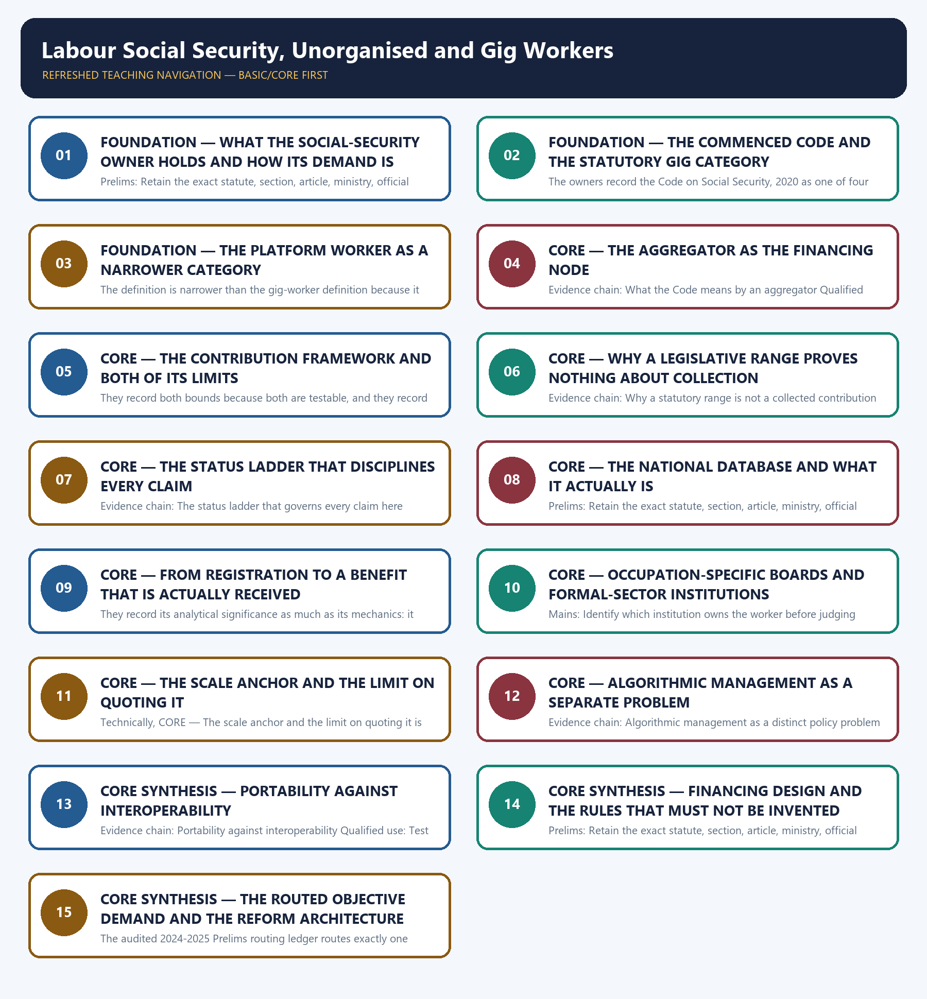

# Labour Social Security, Unorganised and Gig Workers — Learner-v2 Complete Learning Session

> **Authoring-only generation:** 2026-09-02. No PDF was rendered and no tracker or index was mutated.

### SOURCE, PROGRESSION AND CURRENT-LINKAGE AUDIT

- **Generation date:** 2026-09-02.
- **Repository-first evidence:** the Basic owner is taught first and preserved in full; the Advanced owner is retained only in the optional final teaching block.
- **OCR evidence:** Repository Markdown was primary. The OCR-searchable official General Studies question papers held under books\mains and books\more_previous_papers were read only to confirm the printed wording of routed Mains demands. No official answer key, marking scheme, page precision or unsupported quotation was imported from them.
- **Qdrant:** not used; repository Markdown and available OCR context were sufficient.
- **PYQ integrity:** This owner's previous-year record is a verified objective ownership rather than a Mains ownership, and it is stated precisely together with the boundary of what is claimed. The audited 2024-2025 Prelims routing ledger routes exactly one demand here, question 100 of the 2024 Prelims General Studies Paper I on Pradhan Mantri Shram Yogi Maan-dhan, the pension scheme for unorganised workers, and that ledger records expressly that although the official Set-A answer key is available locally the answer is not recorded there; the Basic owner's own generated integration block applies the same rule and states that it does not convert an unkeyed or answer-free objective question into a solved answer. This package therefore records no option, no key and no inferred answer letter for that question anywhere, and discharges the owner requirement by teaching the scheme's voluntary and contributory character, its matching-contribution structure, its monthly pension of three thousand rupees after the age of sixty subject to scheme conditions, and its statement-level distinction from a registration database. No Mains demand is claimed: the audited 2018-2023 and 2024-2025 Mains routing ledgers route no General Studies Paper II question to this owner, and both the Basic and the Advanced owner state expressly that the 2024 General Studies Paper III question on the Labour Codes is analysed in the Economy employment and labour-codes owner rather than here, so that demand is not reproduced, solved or counted as this owner's ownership and no year, paper, question number, directive, mark value or word limit is asserted for it. The 2021 General Studies Paper I demand on the gig economy and the empowerment of women is routed by the audited ledger to the Indian Society women and women's organisations owner and is likewise not claimed here. Because no solved Mains demand card is available, the package supplies six original Mains questions with model solutions and eighty original objective questions on a strict A → B → C → D rotation, each model solution opening with its analytical claim so that the evidence which follows does argumentative rather than decorative work. The locally held OCR-searchable official General Studies papers were read only to confirm that no routed Mains demand for this owner appears in them; no question was invented from them, no marking scheme or page precision was imported and no official answer key is claimed for any question anywhere in this package.
- **Live-link boundary:** No live official page was verified for this topic on 2026-09-02. Two official checks were attempted on that date, namely the national unorganised-worker registration portal, which returned only a language-selection gate and no substantive content, and a scheme page of the pension portal for unorganised workers, which returned a not-found page; nothing was read or used from either, and no secondary summary, coaching site or news report has been treated as an official source. The package therefore relies entirely on the dated official anchors already carried by the repository owners, each cited with its issuing instrument or status date: the Code on Social Security, 2020, recorded as one of four Labour Codes, commenced on 21 November 2025, with final Central Rules notified in May 2026 for establishments in Central jurisdiction and with State rules and specific scheme notifications recorded as still relevant because labour is a concurrent subject; the Code's statutory definitions of a gig worker as a person who performs work or participates in a work arrangement and earns from activities outside the traditional employer-employee relationship, of a platform worker as a person engaged in platform work outside that relationship using an online platform to access organisations or individuals for specific services in exchange for payment, and of an aggregator as a digital intermediary or marketplace connecting a service user with a provider through an application or platform; Section 114 of the Code providing a statutory framework for a Central-Government-notified contribution of at least one per cent and not more than two per cent of an aggregator's annual turnover, subject to a cap of five per cent of the amount paid or payable to gig and platform workers, recorded expressly as a framework rather than as evidence of a notified rate, a collection ledger, a fund balance or a paid claim; the national unorganised-worker database and registration portal launched by the Ministry of Labour and Employment in 2021 issuing a card with a universal account number and recorded as a delivery and convergence tool rather than an automatic entitlement; the voluntary contributory pension route introduced in 2019 with matching worker and Government contributions and a monthly pension of three thousand rupees after the age of sixty subject to scheme conditions; the State welfare boards under the Building and Other Construction Workers framework of 1996 funded principally through the construction-welfare cess and delivering State-notified benefits to registered workers; the provident-fund and employee-insurance institutions as current implementing bodies where the applicable legacy statutes cover the establishment or worker; the Unorganised Workers' Social Security Act, 2008 as legal background; and the 2022 report of the national policy think tank estimating 7.7 million gig workers in 2020-21 and projecting 23.5 million by 2029-30, used only as an estimate and a scenario respectively. No registration total, beneficiary count, enrolment figure, contribution amount collected, fund balance, claim-settlement figure, coverage percentage, wage or earnings figure, platform count, budget or expenditure number is asserted anywhere in this package. No commencement or notification date other than 21 November 2025 and May 2026 is asserted, no scheme is described as operational beyond what the owners record, no eligibility threshold in work days or earnings is invented, no statutory range is described as a collected levy, no registration database is described as an entitlement, no welfare board is described as abolished, no definition is extended to settle a labour-standard dispute it does not govern, and no previous-year question, official answer key, option or answer letter is asserted or inferred, including for the single routed objective demand whose neutral rendering alone is recorded in the audited ledger.
- **Fact/inference discipline:** no current-affairs item, PYQ wording, figure or quotation is invented.

## BASIC LEARNING SESSION



*Distinct embedded teaching-navigation image. The separate continuous Cārvāka-style flowchart package remains an independent at-a-glance artifact.*

### SESSION 1 — FOUNDATION — WHAT THE SOCIAL-SECURITY OWNER HOLDS AND HOW ITS DEMAND IS BOUNDED

#### DEFINITION / WHAT THIS IS CALLED

**Plain-language definition:** Evidence chain: What this owner holds and how its routed demand is bounded Qualified use: Open a labour answer by naming whether the question asks about social security or about labour-market reform.

**Technical definition:** Prelims: Retain the exact statute, section, article, ministry, official category, survey round or dated edition attached to What the social-security owner holds and how its demand is bounded, and never upgrade a policy document into a statute or a targeted scheme into a universal entitlement.

#### ANSWER-GRABBING OPENING — WRITE/ADAPT IN THE EXAM

> Prelims: Retain the exact statute, section, article, ministry, official category, survey round or dated edition attached to What the social-security owner holds and how its demand is bounded, and never upgrade a policy document into a statute or a targeted scheme into a universal entitlement.

#### MUST-WRITE KEYWORDS

- **FOUNDATION**
- **What the social-security owner holds**
- **how its demand is bounded**
- **Evidence chain**
- **Qualified use**
- **2024-2025**

**How to use them:** Frame the answer through FOUNDATION; define What the social-security owner holds, connect how its demand is bounded with Evidence chain to explain the mechanism, and use Qualified use for the decisive comparison or qualification.

#### VISUAL FIRST

```text
WHAT THE SOCIAL-SECURITY OWNER HOLDS AND HOW ITS DEMAND IS BOUNDED
01. What this owner holds and how its routed demand is bounded
BOUNDARY -> One objective demand is routed here, and no option, key or answer letter is recorded for it.
```

*This topic-specific rail fixes the evidence sequence and its exam boundary before analysis.*

#### CORE EXPLANATION

This owner holds the social-security half of the labour question rather than the labour-market half: statutory recognition of gig, platform and aggregator categories, the financing design attached to them, the registration and welfare-board routes that currently deliver protection, and the discipline that separates an enacted provision from a benefit a worker actually receives. The audited 2024-2025 Prelims routing ledger routes exactly one objective demand here, question 100 of the 2024 Prelims General Studies Paper I on Pradhan Mantri Shram Yogi Maan-dhan, the pension route for unorganised workers, and it records that although the official Set-A key is available locally the answer is not recorded there, so this package states no option, key or answer letter for it. The owners also record that the 2024 General Studies Paper III demand on the Labour Codes is analysed in the Economy owner, so no Mains demand is claimed here.

#### NAMED EVIDENCE AND MECHANISM

- This owner holds the social-security half of the labour question rather than the labour-market half: statutory recognition of gig, platform and aggregator categories, the financing design attached to them, the registration and welfare-board routes that currently deliver protection, and the discipline that separates an enacted provision from a benefit a worker actually receives. The audited 2024-2025 Prelims routing ledger routes exactly one objective demand here, question 100 of the 2024 Prelims General Studies Paper I on Pradhan Mantri Shram Yogi Maan-dhan, the pension route for unorganised workers, and it records that although the official Set-A key is available locally the answer is not recorded there, so this package states no option, key or answer letter for it. The owners also record that the 2024 General Studies Paper III demand on the Labour Codes is analysed in the Economy owner, so no Mains demand is claimed here.

#### EXAMINER CAUTION

- One objective demand is routed here, and no option, key or answer letter is recorded for it.

#### EXAM LINK

- **Prelims:** Retain the exact statute, section, article, ministry, official category, survey round or dated edition attached to What the social-security owner holds and how its demand is bounded, and never upgrade a policy document into a statute or a targeted scheme into a universal entitlement.
- **Mains:** Open a labour answer by naming whether the question asks about social security or about labour-market reform.

#### MINI RECAP

- **Evidence chain:** What this owner holds and how its routed demand is bounded
- **Qualified use:** Open a labour answer by naming whether the question asks about social security or about labour-market reform.

#### CLOSING RECALL FLOW — FOUNDATION — WHAT THE SOCIAL-SECURITY OWNER HOLDS AND HOW ITS DEMAND IS BOUNDED

```text
START / CONCEPT: FOUNDATION — What the social-security owner holds and how its demand is bounded
        |
        v
EXACT TERMS: FOUNDATION · What the social-security owner holds · how its demand is bounded · Evidence chain · Qualified use · 2024-2025
        |
        v
MECHANISM / ARGUMENT: Evidence chain: What this owner holds and how its routed demand is bounded Qualified use: Open a labour answer by naming whether the question asks about social security or about labour-market reform.
        |
        v
CONSEQUENCE / CONTRAST: The audited 2024-2025 Prelims routing ledger routes exactly one objective demand here, question 100 of the 2024 Prelims General Studies Paper I on Pradhan Mantri Shram Yogi Maan-dhan, the pension route for unorganised workers, and it records that although the official Set-A key is available locally the answer is not recorded there, so this package states no option, key or answer letter for it.
        |
        v
UPSC TRAP / ANSWER-USE: This owner holds the social-security half of the labour question rather than the labour-market half: statutory recognition of gig, platform and aggregator categories, the financing design attached to them, the registration and welfare-board routes that currently deliver protection, and the discipline that separates an enacted provision from a benefit a worker actually receives.
        |
        v
ANSWER-GRABBING FORMULATION: Prelims: Retain the exact statute, section, article, ministry, official category, survey round or dated edition attached to What the social-security owner holds and how its demand is bounded, and never upgrade a policy document into a statute or a targeted scheme into a universal entitlement.
```
### SESSION 2 — FOUNDATION — THE COMMENCED CODE AND THE STATUTORY GIG CATEGORY

#### DEFINITION / WHAT THIS IS CALLED

**Plain-language definition:** Evidence chain: The Code on Social Security and its exact legal status - What the Code means by a gig worker Qualified use: State the exact legal status of an instrument before describing what it delivers.

**Technical definition:** The owners record the Code on Social Security, 2020 as one of four Labour Codes and record its status precisely: it commenced on 21 November 2025, and final Central Rules were notified in May 2026 for establishments in Central jurisdiction, while State rules and specific scheme notifications remain relevant because labour is a concurrent subject.

#### ANSWER-GRABBING OPENING — WRITE/ADAPT IN THE EXAM

> The owners record the Code on Social Security, 2020 as one of four Labour Codes and record its status precisely: it commenced on 21 November 2025, and final Central Rules were notified in May 2026 for establishments in Central jurisdiction, while State rules and specific scheme notifications remain relevant because labour is a concurrent subject.

#### MUST-WRITE KEYWORDS

- **FOUNDATION**
- **The commenced Code**
- **the statutory gig category**
- **Evidence chain**
- **Qualified use**
- **Code**

**How to use them:** Frame the answer through FOUNDATION; define The commenced Code, connect the statutory gig category with Evidence chain to explain the mechanism, and use Qualified use for the decisive comparison or qualification.

#### VISUAL FIRST

```text
THE COMMENCED CODE AND THE STATUTORY GIG CATEGORY
01. The Code on Social Security and its exact legal status
    |
    v
02. What the Code means by a gig worker
BOUNDARY -> Commencement is not activation, and recognition is not a guaranteed benefit.
```

*This topic-specific rail fixes the evidence sequence and its exam boundary before analysis.*

#### CORE EXPLANATION

The owners record the Code on Social Security, 2020 as one of four Labour Codes and record its status precisely: it commenced on 21 November 2025, and final Central Rules were notified in May 2026 for establishments in Central jurisdiction, while State rules and specific scheme notifications remain relevant because labour is a concurrent subject. The owners correct two opposite errors in the same breath, that the Codes remain merely enacted, which is now wrong, and that commencement by itself activated every levy and benefit, which was never right; the correct statement names the commencement date, the rules date and the remaining scheme-level questions together. The owners record the Code's statutory definition of a gig worker as a person who performs work or participates in a work arrangement and earns from activities outside the traditional employer-employee relationship, and they attach the decisive qualification that the definition gives statutory recognition within the Code and does not by itself guarantee a benefit. The examinable move is to treat the definition as the entry condition for a social-security architecture rather than as the architecture itself, because recognition tells you who may be covered while a notified scheme tells you what they receive.

#### NAMED EVIDENCE AND MECHANISM

- The owners record the Code on Social Security, 2020 as one of four Labour Codes and record its status precisely: it commenced on 21 November 2025, and final Central Rules were notified in May 2026 for establishments in Central jurisdiction, while State rules and specific scheme notifications remain relevant because labour is a concurrent subject. The owners correct two opposite errors in the same breath, that the Codes remain merely enacted, which is now wrong, and that commencement by itself activated every levy and benefit, which was never right; the correct statement names the commencement date, the rules date and the remaining scheme-level questions together.
- The owners record the Code's statutory definition of a gig worker as a person who performs work or participates in a work arrangement and earns from activities outside the traditional employer-employee relationship, and they attach the decisive qualification that the definition gives statutory recognition within the Code and does not by itself guarantee a benefit. The examinable move is to treat the definition as the entry condition for a social-security architecture rather than as the architecture itself, because recognition tells you who may be covered while a notified scheme tells you what they receive.

#### EXAMINER CAUTION

- Commencement is not activation, and recognition is not a guaranteed benefit.

#### EXAM LINK

- **Prelims:** Retain the exact statute, section, article, ministry, official category, survey round or dated edition attached to The commenced Code and the statutory gig category, and never upgrade a policy document into a statute or a targeted scheme into a universal entitlement.
- **Mains:** State the exact legal status of an instrument before describing what it delivers.

#### MINI RECAP

- **Evidence chain:** The Code on Social Security and its exact legal status -> What the Code means by a gig worker
- **Qualified use:** State the exact legal status of an instrument before describing what it delivers.

#### CLOSING RECALL FLOW — FOUNDATION — THE COMMENCED CODE AND THE STATUTORY GIG CATEGORY

```text
START / CONCEPT: FOUNDATION — The commenced Code and the statutory gig category
        |
        v
EXACT TERMS: FOUNDATION · The commenced Code · the statutory gig category · Evidence chain · Qualified use · Code
        |
        v
MECHANISM / ARGUMENT: Evidence chain: The Code on Social Security and its exact legal status - What the Code means by a gig worker Qualified use: State the exact legal status of an instrument before describing what it delivers.
        |
        v
CONSEQUENCE / CONTRAST: The owners record the Code's statutory definition of a gig worker as a person who performs work or participates in a work arrangement and earns from activities outside the traditional employer-employee relationship, and they attach the decisive qualification that the definition gives statutory recognition within the Code and does not by itself guarantee a benefit.
        |
        v
UPSC TRAP / ANSWER-USE: Commencement is not activation, and recognition is not a guaranteed benefit.
        |
        v
ANSWER-GRABBING FORMULATION: The owners record the Code on Social Security, 2020 as one of four Labour Codes and record its status precisely: it commenced on 21 November 2025, and final Central Rules were notified in May 2026 for establishments in Central jurisdiction, while State rules and specific scheme notifications remain relevant because labour is a concurrent subject.
```
### SESSION 3 — FOUNDATION — THE PLATFORM WORKER AS A NARROWER CATEGORY

#### DEFINITION / WHAT THIS IS CALLED

**Plain-language definition:** Evidence chain: What the Code means by a platform worker Qualified use: Use the precise statutory category the question names rather than a nearby one.

**Technical definition:** The definition is narrower than the gig-worker definition because it names the online platform as the means of access, and the owners keep the two apart deliberately, since an answer that uses the two terms interchangeably loses the distinction the Code drew between working outside a conventional employment relationship and working through an intermediating application.

#### ANSWER-GRABBING OPENING — WRITE/ADAPT IN THE EXAM

> The definition is narrower than the gig-worker definition because it names the online platform as the means of access, and the owners keep the two apart deliberately, since an answer that uses the two terms interchangeably loses the distinction the Code drew between working outside a conventional employment relationship and working through an intermediating application.

#### MUST-WRITE KEYWORDS

- **FOUNDATION**
- **The platform worker as a narrower category**
- **Evidence chain**
- **Qualified use**
- **Code**
- **The online platform**

**How to use them:** Frame the answer through FOUNDATION; define The platform worker as a narrower category, connect Evidence chain with Qualified use to explain the mechanism, and use Code for the decisive comparison or qualification.

#### VISUAL FIRST

```text
THE PLATFORM WORKER AS A NARROWER CATEGORY
01. What the Code means by a platform worker
BOUNDARY -> The online platform is part of the definition and is not decorative.
```

*This topic-specific rail fixes the evidence sequence and its exam boundary before analysis.*

#### CORE EXPLANATION

The owners record the Code's statutory definition of a platform worker as a person engaged in platform work outside a traditional employer-employee relationship, using an online platform to access organisations or individuals for specific services in exchange for payment. The definition is narrower than the gig-worker definition because it names the online platform as the means of access, and the owners keep the two apart deliberately, since an answer that uses the two terms interchangeably loses the distinction the Code drew between working outside a conventional employment relationship and working through an intermediating application.

#### NAMED EVIDENCE AND MECHANISM

- The owners record the Code's statutory definition of a platform worker as a person engaged in platform work outside a traditional employer-employee relationship, using an online platform to access organisations or individuals for specific services in exchange for payment. The definition is narrower than the gig-worker definition because it names the online platform as the means of access, and the owners keep the two apart deliberately, since an answer that uses the two terms interchangeably loses the distinction the Code drew between working outside a conventional employment relationship and working through an intermediating application.

#### EXAMINER CAUTION

- The online platform is part of the definition and is not decorative.

#### EXAM LINK

- **Prelims:** Retain the exact statute, section, article, ministry, official category, survey round or dated edition attached to The platform worker as a narrower category, and never upgrade a policy document into a statute or a targeted scheme into a universal entitlement.
- **Mains:** Use the precise statutory category the question names rather than a nearby one.

#### MINI RECAP

- **Evidence chain:** What the Code means by a platform worker
- **Qualified use:** Use the precise statutory category the question names rather than a nearby one.

#### CLOSING RECALL FLOW — FOUNDATION — THE PLATFORM WORKER AS A NARROWER CATEGORY

```text
START / CONCEPT: FOUNDATION — The platform worker as a narrower category
        |
        v
EXACT TERMS: FOUNDATION · The platform worker as a narrower category · Evidence chain · Qualified use · Code · The online platform
        |
        v
MECHANISM / ARGUMENT: Evidence chain: What the Code means by a platform worker Qualified use: Use the precise statutory category the question names rather than a nearby one.
        |
        v
CONSEQUENCE / CONTRAST: The online platform is part of the definition and is not decorative.
        |
        v
UPSC TRAP / ANSWER-USE: Mains: Use the precise statutory category the question names rather than a nearby one.
        |
        v
ANSWER-GRABBING FORMULATION: The definition is narrower than the gig-worker definition because it names the online platform as the means of access, and the owners keep the two apart deliberately, since an answer that uses the two terms interchangeably loses the distinction the Code drew between working outside a conventional employment relationship and working through an intermediating application.
```
### SESSION 4 — CORE — THE AGGREGATOR AS THE FINANCING NODE

#### DEFINITION / WHAT THIS IS CALLED

**Plain-language definition:** The aggregator is therefore the financing node of the design rather than a worker category, and the examinable relationship is that the Code recognises the worker, names the aggregator and then attaches a contribution power to the aggregator rather than to the worker.

**Technical definition:** Evidence chain: What the Code means by an aggregator Qualified use: Identify who is made to pay before assessing whether a scheme is funded.

#### ANSWER-GRABBING OPENING — WRITE/ADAPT IN THE EXAM

> The aggregator is therefore the financing node of the design rather than a worker category, and the examinable relationship is that the Code recognises the worker, names the aggregator and then attaches a contribution power to the aggregator rather than to the worker.

#### MUST-WRITE KEYWORDS

- **The aggregator as the financing node**
- **Evidence chain**
- **Qualified use**
- **Code's**
- **Code**
- **The aggregator**

**How to use them:** Frame the answer through The aggregator as the financing node; define Evidence chain, connect Qualified use with Code's to explain the mechanism, and use Code for the decisive comparison or qualification.

#### VISUAL FIRST

```text
THE AGGREGATOR AS THE FINANCING NODE
01. What the Code means by an aggregator
BOUNDARY -> The aggregator is an intermediary and not a worker category.
```

*This topic-specific rail fixes the evidence sequence and its exam boundary before analysis.*

#### CORE EXPLANATION

The owners record the Code's definition of an aggregator as a digital intermediary or marketplace that connects a service user with a service provider through an application or platform, and they record that the Code identifies aggregator categories for a social-security contribution architecture. The aggregator is therefore the financing node of the design rather than a worker category, and the examinable relationship is that the Code recognises the worker, names the aggregator and then attaches a contribution power to the aggregator rather than to the worker.

#### NAMED EVIDENCE AND MECHANISM

- The owners record the Code's definition of an aggregator as a digital intermediary or marketplace that connects a service user with a service provider through an application or platform, and they record that the Code identifies aggregator categories for a social-security contribution architecture. The aggregator is therefore the financing node of the design rather than a worker category, and the examinable relationship is that the Code recognises the worker, names the aggregator and then attaches a contribution power to the aggregator rather than to the worker.

#### EXAMINER CAUTION

- The aggregator is an intermediary and not a worker category.

#### EXAM LINK

- **Prelims:** Retain the exact statute, section, article, ministry, official category, survey round or dated edition attached to The aggregator as the financing node, and never upgrade a policy document into a statute or a targeted scheme into a universal entitlement.
- **Mains:** Identify who is made to pay before assessing whether a scheme is funded.

#### MINI RECAP

- **Evidence chain:** What the Code means by an aggregator
- **Qualified use:** Identify who is made to pay before assessing whether a scheme is funded.

#### CLOSING RECALL FLOW — CORE — THE AGGREGATOR AS THE FINANCING NODE

```text
START / CONCEPT: CORE — The aggregator as the financing node
        |
        v
EXACT TERMS: The aggregator as the financing node · Evidence chain · Qualified use · Code's · Code · The aggregator
        |
        v
MECHANISM / ARGUMENT: Evidence chain: What the Code means by an aggregator Qualified use: Identify who is made to pay before assessing whether a scheme is funded.
        |
        v
CONSEQUENCE / CONTRAST: The aggregator is an intermediary and not a worker category.
        |
        v
UPSC TRAP / ANSWER-USE: Do not miss this limiting distinction: the owners record the Code's definition of an aggregator as a digital intermediary or...
        |
        v
ANSWER-GRABBING FORMULATION: The aggregator is therefore the financing node of the design rather than a worker category, and the examinable relationship is that the Code recognises the worker, names the aggregator and then attaches a contribution power to the aggregator rather than to the worker.
```
### SESSION 5 — CORE — THE CONTRIBUTION FRAMEWORK AND BOTH OF ITS LIMITS

#### DEFINITION / WHAT THIS IS CALLED

**Plain-language definition:** The turnover range and the payout cap are separate limits and both are testable.

**Technical definition:** They record both bounds because both are testable, and they record the cap as a separate limit rather than as a restatement of the range, so an answer that quotes the turnover range without the payout cap has given only half of the statutory design.

#### ANSWER-GRABBING OPENING — WRITE/ADAPT IN THE EXAM

> The turnover range and the payout cap are separate limits and both are testable.

#### MUST-WRITE KEYWORDS

- **The contribution framework**
- **both of its limits**
- **Evidence chain**
- **Qualified use**
- **Section**
- **Code**

**How to use them:** Frame the answer through The contribution framework; define both of its limits, connect Evidence chain with Qualified use to explain the mechanism, and use Section for the decisive comparison or qualification.

#### VISUAL FIRST

```text
THE CONTRIBUTION FRAMEWORK AND BOTH OF ITS LIMITS
01. The contribution framework in Section 114 and its exact numbers
BOUNDARY -> The turnover range and the payout cap are separate limits and both are testable.
```

*This topic-specific rail fixes the evidence sequence and its exam boundary before analysis.*

#### CORE EXPLANATION

The owners record that Section 114 of the Code provides a statutory framework for a contribution rate to be notified by the Central Government of at least one per cent and not more than two per cent of an aggregator's annual turnover, subject to a cap of five per cent of the amount paid or payable by the aggregator to gig and platform workers. They record both bounds because both are testable, and they record the cap as a separate limit rather than as a restatement of the range, so an answer that quotes the turnover range without the payout cap has given only half of the statutory design.

#### NAMED EVIDENCE AND MECHANISM

- The owners record that Section 114 of the Code provides a statutory framework for a contribution rate to be notified by the Central Government of at least one per cent and not more than two per cent of an aggregator's annual turnover, subject to a cap of five per cent of the amount paid or payable by the aggregator to gig and platform workers. They record both bounds because both are testable, and they record the cap as a separate limit rather than as a restatement of the range, so an answer that quotes the turnover range without the payout cap has given only half of the statutory design.

#### EXAMINER CAUTION

- The turnover range and the payout cap are separate limits and both are testable.

#### EXAM LINK

- **Prelims:** Retain the exact statute, section, article, ministry, official category, survey round or dated edition attached to The contribution framework and both of its limits, and never upgrade a policy document into a statute or a targeted scheme into a universal entitlement.
- **Mains:** Quote a financing provision with every bound the statute actually contains.

#### MINI RECAP

- **Evidence chain:** The contribution framework in Section 114 and its exact numbers
- **Qualified use:** Quote a financing provision with every bound the statute actually contains.

#### CLOSING RECALL FLOW — CORE — THE CONTRIBUTION FRAMEWORK AND BOTH OF ITS LIMITS

```text
START / CONCEPT: CORE — The contribution framework and both of its limits
        |
        v
EXACT TERMS: The contribution framework · both of its limits · Evidence chain · Qualified use · Section · Code
        |
        v
MECHANISM / ARGUMENT: They record both bounds because both are testable, and they record the cap as a separate limit rather than as a restatement of the range, so an answer that quotes the turnover range without the payout cap has given only half of the statutory design.
        |
        v
CONSEQUENCE / CONTRAST: The owners record that Section 114 of the Code provides a statutory framework for a contribution rate to be notified by the Central Government of at least one per cent and not more than two per cent of an aggregator's annual turnover, subject to a cap of five per cent of the amount paid or payable by the aggregator to gig and platform workers.
        |
        v
UPSC TRAP / ANSWER-USE: Do not miss this limiting distinction: the contribution framework in Section 114 and its exact numbers Qualified use.
        |
        v
ANSWER-GRABBING FORMULATION: The turnover range and the payout cap are separate limits and both are testable.
```
### SESSION 6 — CORE — WHY A LEGISLATIVE RANGE PROVES NOTHING ABOUT COLLECTION

#### DEFINITION / WHAT THIS IS CALLED

**Plain-language definition:** A range is not a notified rate, a collection ledger, a fund balance or a paid claim.

**Technical definition:** Evidence chain: Why a statutory range is not a collected contribution Qualified use: Refuse an implementation claim that the cited instrument cannot support.

#### ANSWER-GRABBING OPENING — WRITE/ADAPT IN THE EXAM

> Prelims: Retain the exact statute, section, article, ministry, official category, survey round or dated edition attached to Why a legislative range proves nothing about collection, and never upgrade a policy document into a statute or a targeted scheme into a universal entitlement.

#### MUST-WRITE KEYWORDS

- **Evidence chain**
- **Qualified use**
- **A range stated in legislation**
- **A range**
- **Retain**
- **Why**

**How to use them:** Frame the answer through Evidence chain; define Qualified use, connect A range stated in legislation with A range to explain the mechanism, and use Retain for the decisive comparison or qualification.

#### VISUAL FIRST

```text
WHY A LEGISLATIVE RANGE PROVES NOTHING ABOUT COLLECTION
01. Why a statutory range is not a collected contribution
BOUNDARY -> A range is not a notified rate, a collection ledger, a fund balance or a paid claim.
```

*This topic-specific rail fixes the evidence sequence and its exam boundary before analysis.*

#### CORE EXPLANATION

The owners treat this as the central analytical discipline of the topic. A range stated in legislation is not evidence of a notified rate, a collection ledger, a fund balance or a paid claim, and calling an enacted range a current levy conceals the gap between legal design and a worker's actual protection. The owners record the correct answer move explicitly: state the source and its date, name the exact rung of the status ladder that has been reached, and only then make an implementation claim, because false certainty about financing is the most common and most costly error in this topic.

#### NAMED EVIDENCE AND MECHANISM

- The owners treat this as the central analytical discipline of the topic. A range stated in legislation is not evidence of a notified rate, a collection ledger, a fund balance or a paid claim, and calling an enacted range a current levy conceals the gap between legal design and a worker's actual protection. The owners record the correct answer move explicitly: state the source and its date, name the exact rung of the status ladder that has been reached, and only then make an implementation claim, because false certainty about financing is the most common and most costly error in this topic.

#### EXAMINER CAUTION

- A range is not a notified rate, a collection ledger, a fund balance or a paid claim.

#### EXAM LINK

- **Prelims:** Retain the exact statute, section, article, ministry, official category, survey round or dated edition attached to Why a legislative range proves nothing about collection, and never upgrade a policy document into a statute or a targeted scheme into a universal entitlement.
- **Mains:** Refuse an implementation claim that the cited instrument cannot support.

#### MINI RECAP

- **Evidence chain:** Why a statutory range is not a collected contribution
- **Qualified use:** Refuse an implementation claim that the cited instrument cannot support.

#### CLOSING RECALL FLOW — CORE — WHY A LEGISLATIVE RANGE PROVES NOTHING ABOUT COLLECTION

```text
START / CONCEPT: CORE — Why a legislative range proves nothing about collection
        |
        v
EXACT TERMS: Evidence chain · Qualified use · A range stated in legislation · A range · Retain · Why
        |
        v
MECHANISM / ARGUMENT: The owners record the correct answer move explicitly: state the source and its date, name the exact rung of the status ladder that has been reached, and only then make an implementation claim, because false certainty about financing is the most common and most costly error in this topic.
        |
        v
CONSEQUENCE / CONTRAST: A range is not a notified rate, a collection ledger, a fund balance or a paid claim.
        |
        v
UPSC TRAP / ANSWER-USE: Evidence chain: Why a statutory range is not a collected contribution Qualified use: Refuse an implementation claim that the cited instrument cannot support.
        |
        v
ANSWER-GRABBING FORMULATION: Prelims: Retain the exact statute, section, article, ministry, official category, survey round or dated edition attached to Why a legislative range proves nothing about collection, and never upgrade a policy document into a statute or a targeted scheme into a universal entitlement.
```
### SESSION 7 — CORE — THE STATUS LADDER THAT DISCIPLINES EVERY CLAIM

#### DEFINITION / WHAT THIS IS CALLED

**Plain-language definition:** The ladder is what converts a vague charge of weak implementation into a locatable failure, because each rung has a different responsible authority and a different corrective instrument.

**Technical definition:** Evidence chain: The status ladder that governs every claim here Qualified use: Name the rung reached before asserting coverage, financing or delivery.

#### ANSWER-GRABBING OPENING — WRITE/ADAPT IN THE EXAM

> Evidence chain: The status ladder that governs every claim here Qualified use: Name the rung reached before asserting coverage, financing or delivery.

#### MUST-WRITE KEYWORDS

- **The status ladder that disciplines every claim**
- **Evidence chain**
- **Qualified use**
- **The ladder**
- **Each**
- **Qualified**

**How to use them:** Frame the answer through The status ladder that disciplines every claim; define Evidence chain, connect Qualified use with The ladder to explain the mechanism, and use Each for the decisive comparison or qualification.

#### VISUAL FIRST

```text
THE STATUS LADDER THAT DISCIPLINES EVERY CLAIM
01. The status ladder that governs every claim here
BOUNDARY -> Each rung has a different responsible authority and a different corrective instrument.
```

*This topic-specific rail fixes the evidence sequence and its exam boundary before analysis.*

#### CORE EXPLANATION

The owners set out the ladder in fixed order: enacted, then rules or scheme notified, then the provision commenced, then contribution collected, then benefit delivered, and they instruct that an answer name the rung it has reached before asserting anything about coverage. They extend the same ladder to the individual: recognition, registration, scheme matching, contribution, claim and receipt. The ladder is what converts a vague charge of weak implementation into a locatable failure, because each rung has a different responsible authority and a different corrective instrument.

#### NAMED EVIDENCE AND MECHANISM

- The owners set out the ladder in fixed order: enacted, then rules or scheme notified, then the provision commenced, then contribution collected, then benefit delivered, and they instruct that an answer name the rung it has reached before asserting anything about coverage. They extend the same ladder to the individual: recognition, registration, scheme matching, contribution, claim and receipt. The ladder is what converts a vague charge of weak implementation into a locatable failure, because each rung has a different responsible authority and a different corrective instrument.

#### EXAMINER CAUTION

- Each rung has a different responsible authority and a different corrective instrument.

#### EXAM LINK

- **Prelims:** Retain the exact statute, section, article, ministry, official category, survey round or dated edition attached to The status ladder that disciplines every claim, and never upgrade a policy document into a statute or a targeted scheme into a universal entitlement.
- **Mains:** Name the rung reached before asserting coverage, financing or delivery.

#### MINI RECAP

- **Evidence chain:** The status ladder that governs every claim here
- **Qualified use:** Name the rung reached before asserting coverage, financing or delivery.

#### CLOSING RECALL FLOW — CORE — THE STATUS LADDER THAT DISCIPLINES EVERY CLAIM

```text
START / CONCEPT: CORE — The status ladder that disciplines every claim
        |
        v
EXACT TERMS: The status ladder that disciplines every claim · Evidence chain · Qualified use · The ladder · Each · Qualified
        |
        v
MECHANISM / ARGUMENT: The ladder is what converts a vague charge of weak implementation into a locatable failure, because each rung has a different responsible authority and a different corrective instrument.
        |
        v
CONSEQUENCE / CONTRAST: The owners set out the ladder in fixed order: enacted, then rules or scheme notified, then the provision commenced, then contribution collected, then benefit delivered, and they instruct that an answer name the rung it has reached before asserting anything about coverage.
        |
        v
UPSC TRAP / ANSWER-USE: Do not miss this limiting distinction: each rung has a different responsible authority and a different corrective instrument.
        |
        v
ANSWER-GRABBING FORMULATION: Evidence chain: The status ladder that governs every claim here Qualified use: Name the rung reached before asserting coverage, financing or delivery.
```
### SESSION 8 — CORE — THE NATIONAL DATABASE AND WHAT IT ACTUALLY IS

#### DEFINITION / WHAT THIS IS CALLED

**Plain-language definition:** Evidence chain: The national unorganised-worker database and what it is Qualified use: Distinguish an identification instrument from a benefit instrument in the same sentence.

**Technical definition:** Prelims: Retain the exact statute, section, article, ministry, official category, survey round or dated edition attached to The national database and what it actually is, and never upgrade a policy document into a statute or a targeted scheme into a universal entitlement.

#### ANSWER-GRABBING OPENING — WRITE/ADAPT IN THE EXAM

> Prelims: Retain the exact statute, section, article, ministry, official category, survey round or dated edition attached to The national database and what it actually is, and never upgrade a policy document into a statute or a targeted scheme into a universal entitlement.

#### MUST-WRITE KEYWORDS

- **The national database**
- **what it actually is**
- **Evidence chain**
- **Qualified use**
- **They**
- **A registration total**

**How to use them:** Frame the answer through The national database; define what it actually is, connect Evidence chain with Qualified use to explain the mechanism, and use They for the decisive comparison or qualification.

#### VISUAL FIRST

```text
THE NATIONAL DATABASE AND WHAT IT ACTUALLY IS
01. The national unorganised-worker database and what it is
BOUNDARY -> A registration total is an administrative output rather than an entitlement count.
```

*This topic-specific rail fixes the evidence sequence and its exam boundary before analysis.*

#### CORE EXPLANATION

The owners record e-Shram, launched in 2021 by the Ministry of Labour and Employment, as a national database and registration portal for unorganised workers that issues a card carrying a universal account number, and they record it as a delivery and convergence tool rather than an automatic pension, insurance or statutory gig-worker entitlement. They add the evidence discipline that a cumulative registration total changes continuously and is an administrative output rather than an entitlement count, so a headline registration figure cannot be offered as a measure of protection.

#### NAMED EVIDENCE AND MECHANISM

- The owners record e-Shram, launched in 2021 by the Ministry of Labour and Employment, as a national database and registration portal for unorganised workers that issues a card carrying a universal account number, and they record it as a delivery and convergence tool rather than an automatic pension, insurance or statutory gig-worker entitlement. They add the evidence discipline that a cumulative registration total changes continuously and is an administrative output rather than an entitlement count, so a headline registration figure cannot be offered as a measure of protection.

#### EXAMINER CAUTION

- A registration total is an administrative output rather than an entitlement count.

#### EXAM LINK

- **Prelims:** Retain the exact statute, section, article, ministry, official category, survey round or dated edition attached to The national database and what it actually is, and never upgrade a policy document into a statute or a targeted scheme into a universal entitlement.
- **Mains:** Distinguish an identification instrument from a benefit instrument in the same sentence.

#### MINI RECAP

- **Evidence chain:** The national unorganised-worker database and what it is
- **Qualified use:** Distinguish an identification instrument from a benefit instrument in the same sentence.

#### CLOSING RECALL FLOW — CORE — THE NATIONAL DATABASE AND WHAT IT ACTUALLY IS

```text
START / CONCEPT: CORE — The national database and what it actually is
        |
        v
EXACT TERMS: The national database · what it actually is · Evidence chain · Qualified use · They · A registration total
        |
        v
MECHANISM / ARGUMENT: Evidence chain: The national unorganised-worker database and what it is Qualified use: Distinguish an identification instrument from a benefit instrument in the same sentence.
        |
        v
CONSEQUENCE / CONTRAST: They add the evidence discipline that a cumulative registration total changes continuously and is an administrative output rather than an entitlement count, so a headline registration figure cannot be offered as a measure of protection.
        |
        v
UPSC TRAP / ANSWER-USE: A registration total is an administrative output rather than an entitlement count.
        |
        v
ANSWER-GRABBING FORMULATION: Prelims: Retain the exact statute, section, article, ministry, official category, survey round or dated edition attached to The national database and what it actually is, and never upgrade a policy document into a statute or a targeted scheme into a universal entitlement.
```
### SESSION 9 — CORE — FROM REGISTRATION TO A BENEFIT THAT IS ACTUALLY RECEIVED

#### DEFINITION / WHAT THIS IS CALLED

**Plain-language definition:** Evidence chain: Why registration is necessary but not sufficient - The voluntary contributory pension route for unorganised workers Qualified use: Trace a worker's path rung by rung instead of asserting weak implementation.

**Technical definition:** They record its analytical significance as much as its mechanics: it demonstrates that a registry entry and a benefit enrolment are two separate administrative steps, because a worker recorded in the national database is not thereby enrolled in this pension.

#### ANSWER-GRABBING OPENING — WRITE/ADAPT IN THE EXAM

> Prelims: Retain the exact statute, section, article, ministry, official category, survey round or dated edition attached to From registration to a benefit that is actually received, and never upgrade a policy document into a statute or a targeted scheme into a universal entitlement.

#### MUST-WRITE KEYWORDS

- **Evidence chain**
- **Qualified use**
- **Pradhan Mantri Shram Yogi Maandhan**
- **Government**
- **They**
- **Retain**

**How to use them:** Frame the answer through Evidence chain; define Qualified use, connect Pradhan Mantri Shram Yogi Maandhan with Government to explain the mechanism, and use They for the decisive comparison or qualification.

#### VISUAL FIRST

```text
FROM REGISTRATION TO A BENEFIT THAT IS ACTUALLY RECEIVED
01. Why registration is necessary but not sufficient
    |
    v
02. The voluntary contributory pension route for unorganised workers
BOUNDARY -> Eligibility, contribution and claim steps stand between a record and a pension.
```

*This topic-specific rail fixes the evidence sequence and its exam boundary before analysis.*

#### CORE EXPLANATION

The owners set out the registration-to-benefit failure chain in four steps: the database records the worker's identity and account number; the worker must separately meet a scheme's age, income, occupation, contribution or documentation rules; bank access, documentation, awareness and State or platform data quality can interrupt a benefit even after registration; and the result is that a headline registration total can coexist with low insurance, pension or accident-cover uptake. The owners give the direct illustration that a registrant who does not separately meet a scheme's eligibility conditions receives no pension, health insurance or cash transfer automatically. The owners record Pradhan Mantri Shram Yogi Maandhan, introduced in 2019, as a voluntary contributory pension route for eligible unorganised workers in which the worker and the Government make matching contributions and the enrollee receives a monthly pension of three thousand rupees after the age of sixty, subject to the scheme's conditions. They record its analytical significance as much as its mechanics: it demonstrates that a registry entry and a benefit enrolment are two separate administrative steps, because a worker recorded in the national database is not thereby enrolled in this pension.

#### NAMED EVIDENCE AND MECHANISM

- The owners set out the registration-to-benefit failure chain in four steps: the database records the worker's identity and account number; the worker must separately meet a scheme's age, income, occupation, contribution or documentation rules; bank access, documentation, awareness and State or platform data quality can interrupt a benefit even after registration; and the result is that a headline registration total can coexist with low insurance, pension or accident-cover uptake. The owners give the direct illustration that a registrant who does not separately meet a scheme's eligibility conditions receives no pension, health insurance or cash transfer automatically.
- The owners record Pradhan Mantri Shram Yogi Maandhan, introduced in 2019, as a voluntary contributory pension route for eligible unorganised workers in which the worker and the Government make matching contributions and the enrollee receives a monthly pension of three thousand rupees after the age of sixty, subject to the scheme's conditions. They record its analytical significance as much as its mechanics: it demonstrates that a registry entry and a benefit enrolment are two separate administrative steps, because a worker recorded in the national database is not thereby enrolled in this pension.

#### EXAMINER CAUTION

- Eligibility, contribution and claim steps stand between a record and a pension.

#### EXAM LINK

- **Prelims:** Retain the exact statute, section, article, ministry, official category, survey round or dated edition attached to From registration to a benefit that is actually received, and never upgrade a policy document into a statute or a targeted scheme into a universal entitlement.
- **Mains:** Trace a worker's path rung by rung instead of asserting weak implementation.

#### MINI RECAP

- **Evidence chain:** Why registration is necessary but not sufficient -> The voluntary contributory pension route for unorganised workers
- **Qualified use:** Trace a worker's path rung by rung instead of asserting weak implementation.

#### CLOSING RECALL FLOW — CORE — FROM REGISTRATION TO A BENEFIT THAT IS ACTUALLY RECEIVED

```text
START / CONCEPT: CORE — From registration to a benefit that is actually received
        |
        v
EXACT TERMS: Evidence chain · Qualified use · Pradhan Mantri Shram Yogi Maandhan · Government · They · Retain
        |
        v
MECHANISM / ARGUMENT: The owners set out the registration-to-benefit failure chain in four steps: the database records the worker's identity and account number; the worker must separately meet a scheme's age, income, occupation, contribution or documentation rules; bank access, documentation, awareness and State or platform data quality can interrupt a benefit even after registration; and the result is that a headline registration total can coexist with low insurance, pension or accident-cover uptake.
        |
        v
CONSEQUENCE / CONTRAST: Evidence chain: Why registration is necessary but not sufficient - The voluntary contributory pension route for unorganised workers Qualified use: Trace a worker's path rung by rung instead of asserting weak implementation.
        |
        v
UPSC TRAP / ANSWER-USE: They record its analytical significance as much as its mechanics: it demonstrates that a registry entry and a benefit enrolment are two separate administrative steps, because a worker recorded in the national database is not thereby enrolled in this pension.
        |
        v
ANSWER-GRABBING FORMULATION: Prelims: Retain the exact statute, section, article, ministry, official category, survey round or dated edition attached to From registration to a benefit that is actually received, and never upgrade a policy document into a statute or a targeted scheme into a universal entitlement.
```
### SESSION 10 — CORE — OCCUPATION-SPECIFIC BOARDS AND FORMAL-SECTOR INSTITUTIONS

#### DEFINITION / WHAT THIS IS CALLED

**Plain-language definition:** Evidence chain: Occupation-specific welfare through the construction boards - The formal-sector institutions that continue to deliver Qualified use: Identify which institution owns the worker before judging whether they are protected.

**Technical definition:** Mains: Identify which institution owns the worker before judging whether they are protected.

#### ANSWER-GRABBING OPENING — WRITE/ADAPT IN THE EXAM

> Evidence chain: Occupation-specific welfare through the construction boards - The formal-sector institutions that continue to deliver Qualified use: Identify which institution owns the worker before judging whether they are protected.

#### MUST-WRITE KEYWORDS

- **Occupation-specific boards**
- **formal-sector institutions**
- **Evidence chain**
- **Qualified use**
- **They**
- **Code**

**How to use them:** Frame the answer through Occupation-specific boards; define formal-sector institutions, connect Evidence chain with Qualified use to explain the mechanism, and use They for the decisive comparison or qualification.

#### VISUAL FIRST

```text
OCCUPATION-SPECIFIC BOARDS AND FORMAL-SECTOR INSTITUTIONS
01. Occupation-specific welfare through the construction boards
    |
    v
02. The formal-sector institutions that continue to deliver
BOUNDARY -> Different institutions apply different coverage tests, and none of them covers everyone.
```

*This topic-specific rail fixes the evidence sequence and its exam boundary before analysis.*

#### CORE EXPLANATION

The owners record the State welfare boards constituted under the Building and Other Construction Workers legal framework of 1996 as funded principally through the construction-welfare cess and as delivering State-notified benefits, including accident, education and pension support, to registered workers. They record that the benefit depends on registration, on cess administration and on State rules, and they correct the error that these boards disappeared on commencement of the Code, because the Code retains an occupation-specific cess and welfare architecture in which State implementation remains essential. The owners record the Employees' Provident Fund Organisation and the Employees' State Insurance Corporation as the current implementing institutions for provident fund and employee insurance where the applicable legacy statutes cover the establishment or the worker, and they record that both remain central to implementation under the reorganised Code architecture. The examinable point is that India's social security is delivered by a set of institutions with different coverage tests rather than by one instrument, so an answer must identify which institution owns the worker in question before assessing whether that worker is protected.

#### NAMED EVIDENCE AND MECHANISM

- The owners record the State welfare boards constituted under the Building and Other Construction Workers legal framework of 1996 as funded principally through the construction-welfare cess and as delivering State-notified benefits, including accident, education and pension support, to registered workers. They record that the benefit depends on registration, on cess administration and on State rules, and they correct the error that these boards disappeared on commencement of the Code, because the Code retains an occupation-specific cess and welfare architecture in which State implementation remains essential.
- The owners record the Employees' Provident Fund Organisation and the Employees' State Insurance Corporation as the current implementing institutions for provident fund and employee insurance where the applicable legacy statutes cover the establishment or the worker, and they record that both remain central to implementation under the reorganised Code architecture. The examinable point is that India's social security is delivered by a set of institutions with different coverage tests rather than by one instrument, so an answer must identify which institution owns the worker in question before assessing whether that worker is protected.

#### EXAMINER CAUTION

- Different institutions apply different coverage tests, and none of them covers everyone.

#### EXAM LINK

- **Prelims:** Retain the exact statute, section, article, ministry, official category, survey round or dated edition attached to Occupation-specific boards and formal-sector institutions, and never upgrade a policy document into a statute or a targeted scheme into a universal entitlement.
- **Mains:** Identify which institution owns the worker before judging whether they are protected.

#### MINI RECAP

- **Evidence chain:** Occupation-specific welfare through the construction boards -> The formal-sector institutions that continue to deliver
- **Qualified use:** Identify which institution owns the worker before judging whether they are protected.

#### CLOSING RECALL FLOW — CORE — OCCUPATION-SPECIFIC BOARDS AND FORMAL-SECTOR INSTITUTIONS

```text
START / CONCEPT: CORE — Occupation-specific boards and formal-sector institutions
        |
        v
EXACT TERMS: Occupation-specific boards · formal-sector institutions · Evidence chain · Qualified use · They · Code
        |
        v
MECHANISM / ARGUMENT: They record that the benefit depends on registration, on cess administration and on State rules, and they correct the error that these boards disappeared on commencement of the Code, because the Code retains an occupation-specific cess and welfare architecture in which State implementation remains essential.
        |
        v
CONSEQUENCE / CONTRAST: Mains: Identify which institution owns the worker before judging whether they are protected.
        |
        v
UPSC TRAP / ANSWER-USE: The examinable point is that India's social security is delivered by a set of institutions with different coverage tests rather than by one instrument, so an answer must identify which institution owns the worker in question before assessing whether that worker is protected.
        |
        v
ANSWER-GRABBING FORMULATION: Evidence chain: Occupation-specific welfare through the construction boards - The formal-sector institutions that continue to deliver Qualified use: Identify which institution owns the worker before judging whether they are protected.
```
### SESSION 11 — CORE — THE SCALE ANCHOR AND THE LIMIT ON QUOTING IT

#### DEFINITION / WHAT THIS IS CALLED

**Plain-language definition:** Evidence chain: The scale anchor and the boundary on using it Qualified use: Cite a projection with its issuing body, year and scenario status attached.

**Technical definition:** Technically, CORE — The scale anchor and the limit on quoting it is analysed by relating The scale anchor to the limit on quoting it, then testing the relationship through Evidence chain and Qualified use.

#### ANSWER-GRABBING OPENING — WRITE/ADAPT IN THE EXAM

> Evidence chain: The scale anchor and the boundary on using it Qualified use: Cite a projection with its issuing body, year and scenario status attached.

#### MUST-WRITE KEYWORDS

- **The scale anchor**
- **the limit on quoting it**
- **Evidence chain**
- **Qualified use**
- **2020-21**
- **2029-30**

**How to use them:** Frame the answer through The scale anchor; define the limit on quoting it, connect Evidence chain with Qualified use to explain the mechanism, and use 2020-21 for the decisive comparison or qualification.

#### VISUAL FIRST

```text
THE SCALE ANCHOR AND THE LIMIT ON QUOTING IT
01. The scale anchor and the boundary on using it
BOUNDARY -> An estimate and a projection are different objects and neither counts protected persons.
```

*This topic-specific rail fixes the evidence sequence and its exam boundary before analysis.*

#### CORE EXPLANATION

The owners record a single scale anchor for this topic: a 2022 report of the national policy think tank estimated 7.7 million gig workers in 2020-21 and projected 23.5 million by 2029-30. They immediately bound it, recording that the projection is a scenario rather than a worker registry or a current beneficiary count, and they record the parallel earlier statute, the Unorganised Workers' Social Security Act, 2008, as part of the legal background. The discipline is that an estimate and a projection may be cited with their year and issuing body, and neither may be converted into a count of persons protected.

#### NAMED EVIDENCE AND MECHANISM

- The owners record a single scale anchor for this topic: a 2022 report of the national policy think tank estimated 7.7 million gig workers in 2020-21 and projected 23.5 million by 2029-30. They immediately bound it, recording that the projection is a scenario rather than a worker registry or a current beneficiary count, and they record the parallel earlier statute, the Unorganised Workers' Social Security Act, 2008, as part of the legal background. The discipline is that an estimate and a projection may be cited with their year and issuing body, and neither may be converted into a count of persons protected.

#### EXAMINER CAUTION

- An estimate and a projection are different objects and neither counts protected persons.

#### EXAM LINK

- **Prelims:** Retain the exact statute, section, article, ministry, official category, survey round or dated edition attached to The scale anchor and the limit on quoting it, and never upgrade a policy document into a statute or a targeted scheme into a universal entitlement.
- **Mains:** Cite a projection with its issuing body, year and scenario status attached.

#### MINI RECAP

- **Evidence chain:** The scale anchor and the boundary on using it
- **Qualified use:** Cite a projection with its issuing body, year and scenario status attached.

#### CLOSING RECALL FLOW — CORE — THE SCALE ANCHOR AND THE LIMIT ON QUOTING IT

```text
START / CONCEPT: CORE — The scale anchor and the limit on quoting it
        |
        v
EXACT TERMS: The scale anchor · the limit on quoting it · Evidence chain · Qualified use · 2020-21 · 2029-30
        |
        v
MECHANISM / ARGUMENT: The discipline is that an estimate and a projection may be cited with their year and issuing body, and neither may be converted into a count of persons protected.
        |
        v
CONSEQUENCE / CONTRAST: An estimate and a projection are different objects and neither counts protected persons.
        |
        v
UPSC TRAP / ANSWER-USE: They immediately bound it, recording that the projection is a scenario rather than a worker registry or a current beneficiary count, and they record the parallel earlier statute, the Unorganised Workers' Social Security Act, 2008, as part of the legal background.
        |
        v
ANSWER-GRABBING FORMULATION: Evidence chain: The scale anchor and the boundary on using it Qualified use: Cite a projection with its issuing body, year and scenario status attached.
```
### SESSION 12 — CORE — ALGORITHMIC MANAGEMENT AS A SEPARATE PROBLEM

#### DEFINITION / WHAT THIS IS CALLED

**Plain-language definition:** The owners record the platform-power failure chain as separate from the financing question: ratings, incentives, task allocation and deactivation shape working conditions without transparent human management; variable demand and unilateral incentive changes make regular contributions difficult for workers with irregular earnings; social-security recognition does not settle employee or independent-contractor questions for all labour standards; and an individual application grievance channel is not equivalent to collective bargaining or independent adjudication.

**Technical definition:** Evidence chain: Algorithmic management as a distinct policy problem Qualified use: Separate the financing question from the workplace-power question in a platform answer.

#### ANSWER-GRABBING OPENING — WRITE/ADAPT IN THE EXAM

> Evidence chain: Algorithmic management as a distinct policy problem Qualified use: Separate the financing question from the workplace-power question in a platform answer.

#### MUST-WRITE KEYWORDS

- **Algorithmic management as a separate problem**
- **Evidence chain**
- **Qualified use**
- **They**
- **Algorithmic**
- **Qualified**

**How to use them:** Frame the answer through Algorithmic management as a separate problem; define Evidence chain, connect Qualified use with They to explain the mechanism, and use Algorithmic for the decisive comparison or qualification.

#### VISUAL FIRST

```text
ALGORITHMIC MANAGEMENT AS A SEPARATE PROBLEM
01. Algorithmic management as a distinct policy problem
BOUNDARY -> Financing reform cannot answer deactivation, allocation opacity or the absence of voice.
```

*This topic-specific rail fixes the evidence sequence and its exam boundary before analysis.*

#### CORE EXPLANATION

The owners record the platform-power failure chain as separate from the financing question: ratings, incentives, task allocation and deactivation shape working conditions without transparent human management; variable demand and unilateral incentive changes make regular contributions difficult for workers with irregular earnings; social-security recognition does not settle employee or independent-contractor questions for all labour standards; and an individual application grievance channel is not equivalent to collective bargaining or independent adjudication. They add that a platform describing a worker as a partner may not defeat a statutory definition while the label can still matter in a separate dispute about employment standards.

#### NAMED EVIDENCE AND MECHANISM

- The owners record the platform-power failure chain as separate from the financing question: ratings, incentives, task allocation and deactivation shape working conditions without transparent human management; variable demand and unilateral incentive changes make regular contributions difficult for workers with irregular earnings; social-security recognition does not settle employee or independent-contractor questions for all labour standards; and an individual application grievance channel is not equivalent to collective bargaining or independent adjudication. They add that a platform describing a worker as a partner may not defeat a statutory definition while the label can still matter in a separate dispute about employment standards.

#### EXAMINER CAUTION

- Financing reform cannot answer deactivation, allocation opacity or the absence of voice.

#### EXAM LINK

- **Prelims:** Retain the exact statute, section, article, ministry, official category, survey round or dated edition attached to Algorithmic management as a separate problem, and never upgrade a policy document into a statute or a targeted scheme into a universal entitlement.
- **Mains:** Separate the financing question from the workplace-power question in a platform answer.

#### MINI RECAP

- **Evidence chain:** Algorithmic management as a distinct policy problem
- **Qualified use:** Separate the financing question from the workplace-power question in a platform answer.

#### CLOSING RECALL FLOW — CORE — ALGORITHMIC MANAGEMENT AS A SEPARATE PROBLEM

```text
START / CONCEPT: CORE — Algorithmic management as a separate problem
        |
        v
EXACT TERMS: Algorithmic management as a separate problem · Evidence chain · Qualified use · They · Algorithmic · Qualified
        |
        v
MECHANISM / ARGUMENT: They add that a platform describing a worker as a partner may not defeat a statutory definition while the label can still matter in a separate dispute about employment standards.
        |
        v
CONSEQUENCE / CONTRAST: The owners record the platform-power failure chain as separate from the financing question: ratings, incentives, task allocation and deactivation shape working conditions without transparent human management; variable demand and unilateral incentive changes make regular contributions difficult for workers with irregular earnings; social-security recognition does not settle employee or independent-contractor questions for all labour standards; and an individual application grievance channel is not equivalent to collective bargaining or independent adjudication.
        |
        v
UPSC TRAP / ANSWER-USE: Do not miss this limiting distinction: algorithmic management as a distinct policy problem Qualified use.
        |
        v
ANSWER-GRABBING FORMULATION: Evidence chain: Algorithmic management as a distinct policy problem Qualified use: Separate the financing question from the workplace-power question in a platform answer.
```
### SESSION 13 — CORE SYNTHESIS — PORTABILITY AGAINST INTEROPERABILITY

#### DEFINITION / WHAT THIS IS CALLED

**Plain-language definition:** They give the contrast that a construction worker registered with a State board may receive that board's benefit while a worker registered only on the national database receives none, which is why a database must not be presented as a universal entitlement, and they record that cross-platform portability creates surveillance and privacy risk requiring purpose limitation, consent and notice, access and correction and non-digital assisted routes.

**Technical definition:** Evidence chain: Portability against interoperability Qualified use: Test a portability claim against records, eligibility, claims and grievance across borders.

#### ANSWER-GRABBING OPENING — WRITE/ADAPT IN THE EXAM

> Evidence chain: Portability against interoperability Qualified use: Test a portability claim against records, eligibility, claims and grievance across borders.

#### MUST-WRITE KEYWORDS

- **CORE SYNTHESIS**
- **Portability against interoperability**
- **Evidence chain**
- **Qualified use**
- **States**
- **They**

**How to use them:** Frame the answer through CORE SYNTHESIS; define Portability against interoperability, connect Evidence chain with Qualified use to explain the mechanism, and use States for the decisive comparison or qualification.

#### VISUAL FIRST

```text
PORTABILITY AGAINST INTEROPERABILITY
01. Portability against interoperability
BOUNDARY -> A card that travels is not a benefit that travels.
```

*This topic-specific rail fixes the evidence sequence and its exam boundary before analysis.*

#### CORE EXPLANATION

The owners distinguish a portable card from a portable benefit. A card carrying a universal account number can follow the worker, but benefits are genuinely portable only if contribution records, eligibility rules, claim settlement and grievance redress work across States, platforms and occupations. They give the contrast that a construction worker registered with a State board may receive that board's benefit while a worker registered only on the national database receives none, which is why a database must not be presented as a universal entitlement, and they record that cross-platform portability creates surveillance and privacy risk requiring purpose limitation, consent and notice, access and correction and non-digital assisted routes.

#### NAMED EVIDENCE AND MECHANISM

- The owners distinguish a portable card from a portable benefit. A card carrying a universal account number can follow the worker, but benefits are genuinely portable only if contribution records, eligibility rules, claim settlement and grievance redress work across States, platforms and occupations. They give the contrast that a construction worker registered with a State board may receive that board's benefit while a worker registered only on the national database receives none, which is why a database must not be presented as a universal entitlement, and they record that cross-platform portability creates surveillance and privacy risk requiring purpose limitation, consent and notice, access and correction and non-digital assisted routes.

#### EXAMINER CAUTION

- A card that travels is not a benefit that travels.

#### EXAM LINK

- **Prelims:** Retain the exact statute, section, article, ministry, official category, survey round or dated edition attached to Portability against interoperability, and never upgrade a policy document into a statute or a targeted scheme into a universal entitlement.
- **Mains:** Test a portability claim against records, eligibility, claims and grievance across borders.

#### MINI RECAP

- **Evidence chain:** Portability against interoperability
- **Qualified use:** Test a portability claim against records, eligibility, claims and grievance across borders.

#### CLOSING RECALL FLOW — CORE SYNTHESIS — PORTABILITY AGAINST INTEROPERABILITY

```text
START / CONCEPT: CORE SYNTHESIS — Portability against interoperability
        |
        v
EXACT TERMS: CORE SYNTHESIS · Portability against interoperability · Evidence chain · Qualified use · States · They
        |
        v
MECHANISM / ARGUMENT: They give the contrast that a construction worker registered with a State board may receive that board's benefit while a worker registered only on the national database receives none, which is why a database must not be presented as a universal entitlement, and they record that cross-platform portability creates surveillance and privacy risk requiring purpose limitation, consent and notice, access and correction and non-digital assisted routes.
        |
        v
CONSEQUENCE / CONTRAST: A card carrying a universal account number can follow the worker, but benefits are genuinely portable only if contribution records, eligibility rules, claim settlement and grievance redress work across States, platforms and occupations.
        |
        v
UPSC TRAP / ANSWER-USE: A card that travels is not a benefit that travels.
        |
        v
ANSWER-GRABBING FORMULATION: Evidence chain: Portability against interoperability Qualified use: Test a portability claim against records, eligibility, claims and grievance across borders.
```
### SESSION 14 — CORE SYNTHESIS — FINANCING DESIGN AND THE RULES THAT MUST NOT BE INVENTED

#### DEFINITION / WHAT THIS IS CALLED

**Plain-language definition:** The owners impose two prohibitions that objective questions are built to catch.

**Technical definition:** Prelims: Retain the exact statute, section, article, ministry, official category, survey round or dated edition attached to Financing design and the rules that must not be invented, and never upgrade a policy document into a statute or a targeted scheme into a universal entitlement.

#### ANSWER-GRABBING OPENING — WRITE/ADAPT IN THE EXAM

> Prelims: Retain the exact statute, section, article, ministry, official category, survey round or dated edition attached to Financing design and the rules that must not be invented, and never upgrade a policy document into a statute or a targeted scheme into a universal entitlement.

#### MUST-WRITE KEYWORDS

- **CORE SYNTHESIS**
- **Financing design**
- **Evidence chain**
- **Qualified use**
- **Tax-financed**
- **Code**

**How to use them:** Frame the answer through CORE SYNTHESIS; define Financing design, connect Evidence chain with Qualified use to explain the mechanism, and use Tax-financed for the decisive comparison or qualification.

#### VISUAL FIRST

```text
FINANCING DESIGN AND THE RULES THAT MUST NOT BE INVENTED
01. A universal floor against a contributory top-up
    |
    v
02. The thresholds and the safeguards that must not be invented
BOUNDARY -> No national work-day or earnings threshold may be asserted without an official operative rule.
```

*This topic-specific rail fixes the evidence sequence and its exam boundary before analysis.*

#### CORE EXPLANATION

The owners set out the financing choice as a design trade-off rather than as a preference. Tax-financed basic protection reduces the exclusion of low and irregular earners but costs more and covers less deeply; contributory protection can deepen cover but may exclude workers whose earnings are volatile, which describes precisely the population the Code is trying to reach. The owners conclude that a credible model for gig work usually needs both, and they add the incidence caution that an aggregator levy can finance protection but may be passed on to workers or users, so transparency in payouts and periodic incidence analysis are required before claiming a progressive outcome. The owners impose two prohibitions that objective questions are built to catch. A work-day or earnings threshold could simplify administration but would exclude highly casual workers, and no ninety-day or one-hundred-and-twenty-day national eligibility rule may be asserted unless an official operative rule supplies it. Insurance-led design is the second trap, because hospitalisation or accident cover alone cannot correct unstable pay, unpaid waiting time, unsafe work or arbitrary deactivation. The owners also record that the Code's gig and platform definitions do not by themselves settle disputes about minimum wages, working time, dismissal or collective bargaining.

#### NAMED EVIDENCE AND MECHANISM

- The owners set out the financing choice as a design trade-off rather than as a preference. Tax-financed basic protection reduces the exclusion of low and irregular earners but costs more and covers less deeply; contributory protection can deepen cover but may exclude workers whose earnings are volatile, which describes precisely the population the Code is trying to reach. The owners conclude that a credible model for gig work usually needs both, and they add the incidence caution that an aggregator levy can finance protection but may be passed on to workers or users, so transparency in payouts and periodic incidence analysis are required before claiming a progressive outcome.
- The owners impose two prohibitions that objective questions are built to catch. A work-day or earnings threshold could simplify administration but would exclude highly casual workers, and no ninety-day or one-hundred-and-twenty-day national eligibility rule may be asserted unless an official operative rule supplies it. Insurance-led design is the second trap, because hospitalisation or accident cover alone cannot correct unstable pay, unpaid waiting time, unsafe work or arbitrary deactivation. The owners also record that the Code's gig and platform definitions do not by themselves settle disputes about minimum wages, working time, dismissal or collective bargaining.

#### EXAMINER CAUTION

- No national work-day or earnings threshold may be asserted without an official operative rule.

#### EXAM LINK

- **Prelims:** Retain the exact statute, section, article, ministry, official category, survey round or dated edition attached to Financing design and the rules that must not be invented, and never upgrade a policy document into a statute or a targeted scheme into a universal entitlement.
- **Mains:** Argue a financing mix while refusing to supply a threshold the sources do not contain.

#### MINI RECAP

- **Evidence chain:** A universal floor against a contributory top-up -> The thresholds and the safeguards that must not be invented
- **Qualified use:** Argue a financing mix while refusing to supply a threshold the sources do not contain.

#### CLOSING RECALL FLOW — CORE SYNTHESIS — FINANCING DESIGN AND THE RULES THAT MUST NOT BE INVENTED

```text
START / CONCEPT: CORE SYNTHESIS — Financing design and the rules that must not be invented
        |
        v
EXACT TERMS: CORE SYNTHESIS · Financing design · Evidence chain · Qualified use · Tax-financed · Code
        |
        v
MECHANISM / ARGUMENT: Evidence chain: A universal floor against a contributory top-up - The thresholds and the safeguards that must not be invented Qualified use: Argue a financing mix while refusing to supply a threshold the sources do not contain.
        |
        v
CONSEQUENCE / CONTRAST: The owners also record that the Code's gig and platform definitions do not by themselves settle disputes about minimum wages, working time, dismissal or collective bargaining.
        |
        v
UPSC TRAP / ANSWER-USE: A work-day or earnings threshold could simplify administration but would exclude highly casual workers, and no ninety-day or one-hundred-and-twenty-day national eligibility rule may be asserted unless an official operative rule supplies it.
        |
        v
ANSWER-GRABBING FORMULATION: Prelims: Retain the exact statute, section, article, ministry, official category, survey round or dated edition attached to Financing design and the rules that must not be invented, and never upgrade a policy document into a statute or a targeted scheme into a universal entitlement.
```
### SESSION 15 — CORE SYNTHESIS — THE ROUTED OBJECTIVE DEMAND AND THE REFORM ARCHITECTURE

#### DEFINITION / WHAT THIS IS CALLED

**Plain-language definition:** Evidence chain: The 2024 objective demand and how it is covered - The reform design the owners recommend and its costs Qualified use: Close with a graded verdict, a named correction and an explicit statement of what is not claimed.

**Technical definition:** The audited 2024-2025 Prelims routing ledger routes exactly one objective demand to this owner, question 100 of the 2024 Prelims General Studies Paper I on Pradhan Mantri Shram Yogi Maan-dhan, the pension route for unorganised workers, and it records that although the official Set-A key is available locally the answer is not recorded there.

#### ANSWER-GRABBING OPENING — WRITE/ADAPT IN THE EXAM

> Evidence chain: The 2024 objective demand and how it is covered - The reform design the owners recommend and its costs Qualified use: Close with a graded verdict, a named correction and an explicit statement of what is not claimed.

#### MUST-WRITE KEYWORDS

- **CORE SYNTHESIS**
- **The routed objective demand**
- **the reform architecture**
- **Evidence chain**
- **Qualified use**
- **Subject**

**How to use them:** Frame the answer through CORE SYNTHESIS; define The routed objective demand, connect the reform architecture with Evidence chain to explain the mechanism, and use Qualified use for the decisive comparison or qualification.

#### VISUAL FIRST

```text
THE ROUTED OBJECTIVE DEMAND AND THE REFORM ARCHITECTURE
01. The 2024 objective demand and how it is covered
    |
    v
02. The reform design the owners recommend and its costs
BOUNDARY -> Every recommended correction carries a recorded incidence, exclusion or privacy cost.
```

*This topic-specific rail fixes the evidence sequence and its exam boundary before analysis.*

#### CORE EXPLANATION

The audited 2024-2025 Prelims routing ledger routes exactly one objective demand to this owner, question 100 of the 2024 Prelims General Studies Paper I on Pradhan Mantri Shram Yogi Maan-dhan, the pension route for unorganised workers, and it records that although the official Set-A key is available locally the answer is not recorded there. The Basic owner's generated integration block applies the same rule and states that it does not convert an unkeyed or answer-free objective question into a solved answer. This package therefore records no option, key or inferred answer letter for that question anywhere, and satisfies the owner requirement by teaching the scheme's voluntary and contributory character, its matching-contribution structure, its three-thousand-rupee monthly pension after sixty and its statement-level distinction from a registration database. The owners record a specific reform package rather than a general appeal for funds: publish provision-specific commencement and scheme status so that a reader can locate the rung reached; make fund receipts and claims auditable; offer assisted and offline enrolment so that digital exclusion does not become benefit exclusion; and create an independent grievance route for algorithmic deactivation and benefit disputes. They record the accompanying costs as part of the recommendation, that an aggregator levy may be shifted in incidence, that a simplifying threshold excludes casual workers, that portability creates privacy exposure and that insurance-led cover leaves the structural conditions of the work untouched.

#### NAMED EVIDENCE AND MECHANISM

- The audited 2024-2025 Prelims routing ledger routes exactly one objective demand to this owner, question 100 of the 2024 Prelims General Studies Paper I on Pradhan Mantri Shram Yogi Maan-dhan, the pension route for unorganised workers, and it records that although the official Set-A key is available locally the answer is not recorded there. The Basic owner's generated integration block applies the same rule and states that it does not convert an unkeyed or answer-free objective question into a solved answer. This package therefore records no option, key or inferred answer letter for that question anywhere, and satisfies the owner requirement by teaching the scheme's voluntary and contributory character, its matching-contribution structure, its three-thousand-rupee monthly pension after sixty and its statement-level distinction from a registration database.
- The owners record a specific reform package rather than a general appeal for funds: publish provision-specific commencement and scheme status so that a reader can locate the rung reached; make fund receipts and claims auditable; offer assisted and offline enrolment so that digital exclusion does not become benefit exclusion; and create an independent grievance route for algorithmic deactivation and benefit disputes. They record the accompanying costs as part of the recommendation, that an aggregator levy may be shifted in incidence, that a simplifying threshold excludes casual workers, that portability creates privacy exposure and that insurance-led cover leaves the structural conditions of the work untouched.

#### EXAMINER CAUTION

- Every recommended correction carries a recorded incidence, exclusion or privacy cost.

#### EXAM LINK

- **Prelims:** Retain the exact statute, section, article, ministry, official category, survey round or dated edition attached to The routed objective demand and the reform architecture, and never upgrade a policy document into a statute or a targeted scheme into a universal entitlement.
- **Mains:** Close with a graded verdict, a named correction and an explicit statement of what is not claimed.

#### MINI RECAP

- **Evidence chain:** The 2024 objective demand and how it is covered -> The reform design the owners recommend and its costs
- **Qualified use:** Close with a graded verdict, a named correction and an explicit statement of what is not claimed.
#### COMPLETE BASIC OWNER EVIDENCE BANK

> **Subject:** Social Justice | **Tier:** Must-Do (foundation) | **GS Paper:** GS-II;
> cross-reference GS-III (labour-market reform — see `Economy/basic/22`).
> **Core area:** Code on Social Security, 2020; enacted-versus-commenced labour-code
> status; gig/platform-worker definitions; e-Shram; BOCW welfare; PM-SYM.
> **Grounded in:** Code on Social Security, 2020 (commenced 21 November 2025);
> final Central Rules notified in May 2026; e-Shram; PM-SYM; BOCW architecture;
> audited 2024 GS-III Labour Codes PYQ (cross-link only).
> ✅ = source-grounded | ⚠️ = analytical inference | 📰 = current anchor.
> *Companion: `advanced/15_Labour-Social-Security-Unorganised-and-Gig-Workers.md`.*

#### 1. Visual foundation

```text
SOCIAL-SECURITY ARCHITECTURE: ENACTMENT IS NOT COMMENCEMENT

CODE ON SOCIAL SECURITY, 2020
(enacted; definitions + enabling framework)
                    |
                    v
CHECK THE STATUS LADDER
enacted -> rules/scheme notified -> provision commenced
        -> contribution collected -> benefit delivered
                    |
      commenced 21 Nov 2025 / Central Rules May 2026
      scheme-level gig benefits still require status checks
                    |
                    v
CURRENT DELIVERY ROUTES
e-Shram registration | BOCW welfare boards | EPFO/ESIC
PM-SYM / State schemes | Code and applicable Central/State rules
                    |
                    v
OUTCOME TEST
portable, adequate and actually accessible protection
for informal, migrant, gig and platform workers
```

**Core proposition:** ✅ The Code on Social Security, 2020 is an enacted framework that
defines gig and platform workers and provides for schemes/funding mechanisms. As at
21 July 2026, do not call the Code or a supposed “Social Security (Central) Rules,
2026” a universally operational national gig-worker benefit system merely from Code
commencement. A specific scheme, rate, collection and claims system still require proof.

#### 2. Essential definitions

| Concept | Exam-ready meaning |
|---|---|
| ✅ **Code on Social Security, 2020** | One of four Labour Codes commenced on 21 November 2025. Final Central Rules followed in May 2026 for Central-jurisdiction establishments; State rules and specific scheme notifications remain relevant. |
| ✅ **Gig worker (Code definition)** | A person who performs work or participates in a work arrangement and earns from activities outside the traditional employer-employee relationship. The definition gives statutory recognition in the Code; it does not itself guarantee a benefit. |
| ✅ **Platform worker (Code definition)** | A person engaged in platform work outside a traditional employer-employee relationship, using an online platform to access organisations/individuals for specific services in exchange for payment. |
| ✅ **Aggregator (Code definition)** | A digital intermediary/marketplace connecting a service user with a provider through an application or platform. The Code identifies aggregator categories for a future social-security contribution architecture. |
| ✅ **Aggregator contribution in the enacted Code** | Section 114 provides a statutory framework for a Central-Government-notified rate: at least 1% and no more than 2% of annual turnover, subject to a cap of 5% of the amount paid/payable to gig and platform workers. This range is not evidence that a nationwide contribution is being collected or benefits disbursed. |
| ✅ **e-Shram (2021)** | Ministry of Labour and Employment database/registration portal for unorganised workers, issuing a UAN-based card. It is a delivery and convergence tool, not an automatic pension, insurance or statutory gig-worker entitlement. |
| ✅ **BOCW Welfare Boards** | State welfare boards under the Building and Other Construction Workers legal framework, funded principally through the construction-welfare cess and delivering State-notified benefits to registered workers. |
| ✅ **PM-SYM (2019)** | Pradhan Mantri Shram Yogi Maandhan: voluntary contributory pension route for eligible unorganised workers; the worker and Government make matching contributions, with ₹3,000 monthly pension after age 60 subject to scheme conditions. |

#### 3. How the social-security mechanism works

1. **Recognise the worker and legal status:** the Code has commenced, but ask whether a
   worker fits the definition and whether the applicable scheme/rate/benefit is operational.
2. **Use current delivery routes:** An unorganised worker can register on e-Shram and may
   separately enrol in a scheme such as PM-SYM, PM-JAY or a State welfare board if eligible.
   Registration is a gateway, not benefit receipt.
3. **Maintain occupation-specific protection:** Construction workers use BOCW registration
   and State boards; EPFO/ESIC protect eligible formal workers.
4. **Understand the Code architecture:** The Code contemplates schemes for unorganised,
   gig and platform workers and an aggregator contribution mechanism. Operational delivery
   needs a notified scheme/rate, administrative collection,
   worker registration, claims rules and benefit delivery.
5. **Measure effective protection:** Test portability across States/platforms, awareness,
   documentation, contribution collection, grievance redress and whether the worker
   receives health, disability, maternity, old-age or accident support in practice.

#### 4. Institutions and tools

- ✅ **Code on Social Security, 2020:** commenced on 21 November 2025; final Central
  Rules were notified in May 2026. Do not infer a universal operational gig levy from
  those facts alone.
- ✅ **e-Shram portal (MoLE, 2021):** national unorganised-worker database/UAN route;
  cumulative registration changes continuously and is not an entitlement count.
- ✅ **EPFO and ESIC:** current implementing institutions for provident fund and employee
  insurance where their applicable legacy statutes cover the establishment/worker.
- ✅ **BOCW Welfare Boards:** State-level registration and welfare delivery for construction
  workers under the 1996 framework and cess funding.
- ✅ **PM-SYM:** voluntary contributory pension; separate enrolment is required.

#### 5. Indian applications and examples

- ⚠️ A food-delivery rider may meet the Code's platform-worker definition. That fact alone
  does not prove a current national Fund benefit, a 90/120-day eligibility threshold or a
  collected aggregator levy; each requires a valid operational source.
- ⚠️ A construction worker registered with a State BOCW board can seek that board's
  State-notified accident, education or pension support. The benefit depends on
  registration, contribution/cess administration and State rules.
- ⚠️ An e-Shram registrant who does not separately meet a scheme's eligibility conditions
  does not automatically receive a PM-SYM pension, health insurance or cash transfer.

- ✅ **Scale anchor:** NITI Aayog's 2022 report estimated 7.7 million gig workers in
  2020-21 and projected 23.5 million by 2029-30. The projection is a scenario, not a
  worker registry or current beneficiary count.

#### 6. Must-Know Facts for Prelims

- ✅ The Code on Social Security, 2020 commenced on 21 November 2025; final Central
  Rules followed in May 2026 for Central-jurisdiction establishments.
- ✅ The Code contains statutory definitions of “gig worker”, “platform worker” and
  “aggregator”.
- ✅ Section 114 contains the 1–2% annual-turnover contribution range and 5% payout cap;
  it does not by itself establish a verified operational national levy/benefit system.
- ✅ e-Shram is a registration database/UAN route, not an automatic social-security
  benefit.
- ✅ PM-SYM is a voluntary contributory pension route with ₹3,000 monthly pension after
  age 60 for eligible enrollees.

#### 7. UPSC traps

- ❌ The Labour Codes remain only enacted. -> All four commenced on 21 November 2025;
  the live qualification concerns rules, schemes and actual implementation.
- ❌ Commencement automatically activated every gig-worker levy and benefit. -> The
  statutory range still requires an applicable scheme/rate and delivery system; do not
  invent a universal threshold.
- ❌ e-Shram registration automatically provides pension and health insurance. -> It is a
  registration/convergence route; benefits require the relevant scheme and eligibility.
- ❌ BOCW boards disappeared on commencement. -> The Code retains an occupation-specific
  cess/welfare architecture and State implementation remains essential.

#### 8. 📰 Current anchor

- 📰 **Status check (May 2026):** cite commencement on 21 November 2025 and final
  Central Rules in May 2026, then separately establish State rules, a gig-worker
  scheme/rate, contribution collection and benefit delivery.
- 📰 e-Shram and welfare-board counts are dynamic administrative outputs. Use a dated
  portal value only alongside a measure of actual benefit access and portability.

#### 9. PYQ application

- ⚠️ The 2024 GS-III question on Labour Codes is analysed in `Economy/basic/22` and
  `Economy/advanced/22`. For a GS-II social-security answer, first state the legal
  status correctly, then explain worker recognition, current delivery routes and the
  gap between a database/Code and actual protection.

#### 10. Mains angles

- ⚠️ Lead with the status ladder: commenced Code -> rules -> scheme ->
  collection -> individual benefit. This avoids the common error of reporting a proposal
  as a delivered entitlement.
- ⚠️ Distinguish worker classification (gig/platform), registration (e-Shram), scheme
  enrolment (PM-SYM/insurance) and benefit receipt.
- ⚠️ Explain the real policy gap: short-tenure workers, multiple platforms, migrants,
  accident cover, income volatility, grievance redress and bargaining asymmetry.

> **Answer thesis:** India has enacted a forward-looking social-security framework for
> gig and platform workers, including definitions and an aggregator-contribution design,
> but a commenced framework is not the same as a funded and delivered benefit.
> Current protection still depends on e-Shram-enabled convergence and labour/welfare
> institutions and separately enrolled schemes; reform must convert recognition into
> portable, enforceable and measurable social security.

#### 11. Probable questions

- ⚠️ **Prelims:** What is the distinction between the Code on Social Security's statutory
  1–2% aggregator-contribution range and an operational notified levy?
- ⚠️ **Mains (10 marks):** Explain why commencement, scheme notification and benefit
  delivery must be distinguished while assessing the Code on Social Security, 2020.
- ⚠️ **Mains (15 marks):** “Registration of an unorganised worker is necessary but not
  sufficient for social security.” Discuss with reference to e-Shram, welfare boards
  and gig/platform workers.

#### 11A. Answer architecture (10/15/20-mark support)

- **Status ladder:** commenced Code -> rules -> registration -> financing -> portability
  -> claim/grievance -> realised benefit.
- **Algorithmic management:** ratings, allocation, dynamic pricing and deactivation can
  create opacity, income volatility and weak natural justice.
- **Portability/privacy:** worker databases can follow mobile workers, but purpose
  limitation, accuracy, correction and non-exclusion safeguards matter.

**10 marks:** status, worker category and three gaps. **15 marks:** coverage, financing,
aggregator responsibility, portability, voice and grievance. **20 marks:** compare
employee/unorganised/gig protection, federal implementation, algorithms, migration,
fiscal design and data rights.

> **Reasoned verdict:** Recognition matters only when portable, financed and contestable
> benefits reduce risk without allowing platforms or databases to evade accountability.

#### 12. Study links

- ✅ Advanced companion: `advanced/15_Labour-Social-Security-Unorganised-and-Gig-Workers.md`.
- ✅ `Economy/basic/22_Employment-Labour-Codes-Skills-and-Demographic-Dividend.md` —
  Labour Codes overview and the 2024 GS-III PYQ.
- ✅ `basic/01_Social-Justice-Concept-Inclusion-and-Welfare-State-Framework.md` — status
  ladder, entitlement/access distinction and delivery gap.
- ✅ `Governance/basic/13_Public-Finance-and-Service-Delivery-Tools.md` — fund-flow and
  benefit-delivery architecture.

<!-- BEGIN GENERATED PYQ INTEGRATION: 2024-2025 -->

#### Recent PYQ Integration (2024-2025)

> **Status:** 2024-2025 question-level PYQ demand is integrated into this owner.
> **Provenance:** Audited local official-paper routing ledgers: `_PYQ-ROUTING-PRELIMS-2024-2025.md`.
> **Answer-key rule:** The official 2024-2025 Prelims Set-A keys are present in the repository and CSAT Set-A keys are supplied; even so, no option or answer is recorded or inferred in this integration.

- **Years represented:** 2024
- **Paper(s):** Prelims GS-I
- **Routed question demands:** 1

| Year | Paper | Q | PYQ demand (neutral rendering) | Directive / format | Source status | Owner requirement |
|---:|---|---|---|---|---|---|
| 2024 | Prelims GS-I | 100 | Pradhan Mantri Shram Yogi Maan-dhan (PM-SYM pension for unorganised workers) | Objective question; official Set-A key available locally, answer not inferred | Key available locally (official Set-A answer key present); answer not recorded here | Cover the named fact/concept and its likely statement-level distinctions. |

##### What this owner must now support

- Pradhan Mantri Shram Yogi Maan-dhan (PM-SYM pension for unorganised workers)

> This block integrates the 2024-2025 examinable demand and paper metadata. It is kept separate from the 2018-2023 block and does not convert an unkeyed/answer-free objective question into a solved answer.
<!-- END GENERATED PYQ INTEGRATION: 2024-2025 -->

#### CLOSING RECALL FLOW — CORE SYNTHESIS — THE ROUTED OBJECTIVE DEMAND AND THE REFORM ARCHITECTURE

```text
START / CONCEPT: CORE SYNTHESIS — The routed objective demand and the reform architecture
        |
        v
EXACT TERMS: CORE SYNTHESIS · The routed objective demand · the reform architecture · Evidence chain · Qualified use · Subject
        |
        v
MECHANISM / ARGUMENT: The Basic owner's generated integration block applies the same rule and states that it does not convert an unkeyed or answer-free objective question into a solved answer.
        |
        v
CONSEQUENCE / CONTRAST: The audited 2024-2025 Prelims routing ledger routes exactly one objective demand to this owner, question 100 of the 2024 Prelims General Studies Paper I on Pradhan Mantri Shram Yogi Maan-dhan, the pension route for unorganised workers, and it records that although the official Set-A key is available locally the answer is not recorded there.
        |
        v
UPSC TRAP / ANSWER-USE: It is kept separate from the 2018-2023 block and does not convert an unkeyed/answer-free objective question into a solved answer. <!-- END GENERATED PYQ INTEGRATION: 2024-2025.
        |
        v
ANSWER-GRABBING FORMULATION: Evidence chain: The 2024 objective demand and how it is covered - The reform design the owners recommend and its costs Qualified use: Close with a graded verdict, a named correction and an explicit statement of what is not claimed.
```
## BASIC MCQS / REMEDIATION

### Q1. Which statement correctly identifies What this owner holds and how its routed demand is bounded?

A. This owner holds the social-security half of the labour question rather than the labour-market half: statutory recognition of gig, platform and aggregator categories, the financing design attached to them, the registration and welfare-board routes that currently deliver protection, and the discipline that separates an enacted provision from a benefit a worker actually receives. The audited 2024-2025 Prelims routing ledger routes exactly one objective demand here, question 100 of the 2024 Prelims General Studies Paper I on Pradhan Mantri Shram Yogi Maan-dhan, the pension route for unorganised workers, and it records that although the official Set-A key is available locally the answer is not recorded there, so this package states no option, key or answer letter for it. The owners also record that the 2024 General Studies Paper III demand on the Labour Codes is analysed in the Economy owner, so no Mains demand is claimed here.
B. The owners record the Code's statutory definition of a gig worker as a person who performs work or participates in a work arrangement and earns from activities outside the traditional employer-employee relationship, and they attach the decisive qualification that the definition gives statutory recognition within the Code and does not by itself guarantee a benefit. The examinable move is to treat the definition as the entry condition for a social-security architecture rather than as the architecture itself, because recognition tells you who may be covered while a notified scheme tells you what they receive.
C. The owners record the Code's statutory definition of a platform worker as a person engaged in platform work outside a traditional employer-employee relationship, using an online platform to access organisations or individuals for specific services in exchange for payment. The definition is narrower than the gig-worker definition because it names the online platform as the means of access, and the owners keep the two apart deliberately, since an answer that uses the two terms interchangeably loses the distinction the Code drew between working outside a conventional employment relationship and working through an intermediating application.
D. The owners record the Code on Social Security, 2020 as one of four Labour Codes and record its status precisely: it commenced on 21 November 2025, and final Central Rules were notified in May 2026 for establishments in Central jurisdiction, while State rules and specific scheme notifications remain relevant because labour is a concurrent subject. The owners correct two opposite errors in the same breath, that the Codes remain merely enacted, which is now wrong, and that commencement by itself activated every levy and benefit, which was never right; the correct statement names the commencement date, the rules date and the remaining scheme-level questions together.

**Answer: A.**
**Explanation:** This owner holds the social-security half of the labour question rather than the labour-market half: statutory recognition of gig, platform and aggregator categories, the financing design attached to them, the registration and welfare-board routes that currently deliver protection, and the discipline that separates an enacted provision from a benefit a worker actually receives. The audited 2024-2025 Prelims routing ledger routes exactly one objective demand here, question 100 of the 2024 Prelims General Studies Paper I on Pradhan Mantri Shram Yogi Maan-dhan, the pension route for unorganised workers, and it records that although the official Set-A key is available locally the answer is not recorded there, so this package states no option, key or answer letter for it. The owners also record that the 2024 General Studies Paper III demand on the Labour Codes is analysed in the Economy owner, so no Mains demand is claimed here. The remaining options belong to different chronology, actor or analytical categories.

### Q2. Which chronology card should be filed under What this owner holds and how its routed demand is bounded?

A. The owners record the Code's statutory definition of a platform worker as a person engaged in platform work outside a traditional employer-employee relationship, using an online platform to access organisations or individuals for specific services in exchange for payment. The definition is narrower than the gig-worker definition because it names the online platform as the means of access, and the owners keep the two apart deliberately, since an answer that uses the two terms interchangeably loses the distinction the Code drew between working outside a conventional employment relationship and working through an intermediating application.
B. This owner holds the social-security half of the labour question rather than the labour-market half: statutory recognition of gig, platform and aggregator categories, the financing design attached to them, the registration and welfare-board routes that currently deliver protection, and the discipline that separates an enacted provision from a benefit a worker actually receives. The audited 2024-2025 Prelims routing ledger routes exactly one objective demand here, question 100 of the 2024 Prelims General Studies Paper I on Pradhan Mantri Shram Yogi Maan-dhan, the pension route for unorganised workers, and it records that although the official Set-A key is available locally the answer is not recorded there, so this package states no option, key or answer letter for it. The owners also record that the 2024 General Studies Paper III demand on the Labour Codes is analysed in the Economy owner, so no Mains demand is claimed here.
C. The owners record the Code's definition of an aggregator as a digital intermediary or marketplace that connects a service user with a service provider through an application or platform, and they record that the Code identifies aggregator categories for a social-security contribution architecture. The aggregator is therefore the financing node of the design rather than a worker category, and the examinable relationship is that the Code recognises the worker, names the aggregator and then attaches a contribution power to the aggregator rather than to the worker.
D. The owners record the Code's statutory definition of a gig worker as a person who performs work or participates in a work arrangement and earns from activities outside the traditional employer-employee relationship, and they attach the decisive qualification that the definition gives statutory recognition within the Code and does not by itself guarantee a benefit. The examinable move is to treat the definition as the entry condition for a social-security architecture rather than as the architecture itself, because recognition tells you who may be covered while a notified scheme tells you what they receive.

**Answer: B.**
**Explanation:** This owner holds the social-security half of the labour question rather than the labour-market half: statutory recognition of gig, platform and aggregator categories, the financing design attached to them, the registration and welfare-board routes that currently deliver protection, and the discipline that separates an enacted provision from a benefit a worker actually receives. The audited 2024-2025 Prelims routing ledger routes exactly one objective demand here, question 100 of the 2024 Prelims General Studies Paper I on Pradhan Mantri Shram Yogi Maan-dhan, the pension route for unorganised workers, and it records that although the official Set-A key is available locally the answer is not recorded there, so this package states no option, key or answer letter for it. The owners also record that the 2024 General Studies Paper III demand on the Labour Codes is analysed in the Economy owner, so no Mains demand is claimed here. The remaining options belong to different chronology, actor or analytical categories.

### Q3. Which option preserves the source-bounded meaning of What this owner holds and how its routed demand is bounded?

A. The owners record the Code's statutory definition of a platform worker as a person engaged in platform work outside a traditional employer-employee relationship, using an online platform to access organisations or individuals for specific services in exchange for payment. The definition is narrower than the gig-worker definition because it names the online platform as the means of access, and the owners keep the two apart deliberately, since an answer that uses the two terms interchangeably loses the distinction the Code drew between working outside a conventional employment relationship and working through an intermediating application.
B. The owners record the Code's definition of an aggregator as a digital intermediary or marketplace that connects a service user with a service provider through an application or platform, and they record that the Code identifies aggregator categories for a social-security contribution architecture. The aggregator is therefore the financing node of the design rather than a worker category, and the examinable relationship is that the Code recognises the worker, names the aggregator and then attaches a contribution power to the aggregator rather than to the worker.
C. This owner holds the social-security half of the labour question rather than the labour-market half: statutory recognition of gig, platform and aggregator categories, the financing design attached to them, the registration and welfare-board routes that currently deliver protection, and the discipline that separates an enacted provision from a benefit a worker actually receives. The audited 2024-2025 Prelims routing ledger routes exactly one objective demand here, question 100 of the 2024 Prelims General Studies Paper I on Pradhan Mantri Shram Yogi Maan-dhan, the pension route for unorganised workers, and it records that although the official Set-A key is available locally the answer is not recorded there, so this package states no option, key or answer letter for it. The owners also record that the 2024 General Studies Paper III demand on the Labour Codes is analysed in the Economy owner, so no Mains demand is claimed here.
D. The owners record that Section 114 of the Code provides a statutory framework for a contribution rate to be notified by the Central Government of at least one per cent and not more than two per cent of an aggregator's annual turnover, subject to a cap of five per cent of the amount paid or payable by the aggregator to gig and platform workers. They record both bounds because both are testable, and they record the cap as a separate limit rather than as a restatement of the range, so an answer that quotes the turnover range without the payout cap has given only half of the statutory design.

**Answer: C.**
**Explanation:** This owner holds the social-security half of the labour question rather than the labour-market half: statutory recognition of gig, platform and aggregator categories, the financing design attached to them, the registration and welfare-board routes that currently deliver protection, and the discipline that separates an enacted provision from a benefit a worker actually receives. The audited 2024-2025 Prelims routing ledger routes exactly one objective demand here, question 100 of the 2024 Prelims General Studies Paper I on Pradhan Mantri Shram Yogi Maan-dhan, the pension route for unorganised workers, and it records that although the official Set-A key is available locally the answer is not recorded there, so this package states no option, key or answer letter for it. The owners also record that the 2024 General Studies Paper III demand on the Labour Codes is analysed in the Economy owner, so no Mains demand is claimed here. The remaining options belong to different chronology, actor or analytical categories.

### Q4. Which statement avoids a close-option trap about What this owner holds and how its routed demand is bounded?

A. The owners record that Section 114 of the Code provides a statutory framework for a contribution rate to be notified by the Central Government of at least one per cent and not more than two per cent of an aggregator's annual turnover, subject to a cap of five per cent of the amount paid or payable by the aggregator to gig and platform workers. They record both bounds because both are testable, and they record the cap as a separate limit rather than as a restatement of the range, so an answer that quotes the turnover range without the payout cap has given only half of the statutory design.
B. The owners treat this as the central analytical discipline of the topic. A range stated in legislation is not evidence of a notified rate, a collection ledger, a fund balance or a paid claim, and calling an enacted range a current levy conceals the gap between legal design and a worker's actual protection. The owners record the correct answer move explicitly: state the source and its date, name the exact rung of the status ladder that has been reached, and only then make an implementation claim, because false certainty about financing is the most common and most costly error in this topic.
C. The owners record the Code's definition of an aggregator as a digital intermediary or marketplace that connects a service user with a service provider through an application or platform, and they record that the Code identifies aggregator categories for a social-security contribution architecture. The aggregator is therefore the financing node of the design rather than a worker category, and the examinable relationship is that the Code recognises the worker, names the aggregator and then attaches a contribution power to the aggregator rather than to the worker.
D. This owner holds the social-security half of the labour question rather than the labour-market half: statutory recognition of gig, platform and aggregator categories, the financing design attached to them, the registration and welfare-board routes that currently deliver protection, and the discipline that separates an enacted provision from a benefit a worker actually receives. The audited 2024-2025 Prelims routing ledger routes exactly one objective demand here, question 100 of the 2024 Prelims General Studies Paper I on Pradhan Mantri Shram Yogi Maan-dhan, the pension route for unorganised workers, and it records that although the official Set-A key is available locally the answer is not recorded there, so this package states no option, key or answer letter for it. The owners also record that the 2024 General Studies Paper III demand on the Labour Codes is analysed in the Economy owner, so no Mains demand is claimed here.

**Answer: D.**
**Explanation:** This owner holds the social-security half of the labour question rather than the labour-market half: statutory recognition of gig, platform and aggregator categories, the financing design attached to them, the registration and welfare-board routes that currently deliver protection, and the discipline that separates an enacted provision from a benefit a worker actually receives. The audited 2024-2025 Prelims routing ledger routes exactly one objective demand here, question 100 of the 2024 Prelims General Studies Paper I on Pradhan Mantri Shram Yogi Maan-dhan, the pension route for unorganised workers, and it records that although the official Set-A key is available locally the answer is not recorded there, so this package states no option, key or answer letter for it. The owners also record that the 2024 General Studies Paper III demand on the Labour Codes is analysed in the Economy owner, so no Mains demand is claimed here. The remaining options belong to different chronology, actor or analytical categories.

### Q5. Which statement correctly identifies The Code on Social Security and its exact legal status?

A. The owners record the Code on Social Security, 2020 as one of four Labour Codes and record its status precisely: it commenced on 21 November 2025, and final Central Rules were notified in May 2026 for establishments in Central jurisdiction, while State rules and specific scheme notifications remain relevant because labour is a concurrent subject. The owners correct two opposite errors in the same breath, that the Codes remain merely enacted, which is now wrong, and that commencement by itself activated every levy and benefit, which was never right; the correct statement names the commencement date, the rules date and the remaining scheme-level questions together.
B. The owners record the Code's statutory definition of a gig worker as a person who performs work or participates in a work arrangement and earns from activities outside the traditional employer-employee relationship, and they attach the decisive qualification that the definition gives statutory recognition within the Code and does not by itself guarantee a benefit. The examinable move is to treat the definition as the entry condition for a social-security architecture rather than as the architecture itself, because recognition tells you who may be covered while a notified scheme tells you what they receive.
C. The owners record the Code's statutory definition of a platform worker as a person engaged in platform work outside a traditional employer-employee relationship, using an online platform to access organisations or individuals for specific services in exchange for payment. The definition is narrower than the gig-worker definition because it names the online platform as the means of access, and the owners keep the two apart deliberately, since an answer that uses the two terms interchangeably loses the distinction the Code drew between working outside a conventional employment relationship and working through an intermediating application.
D. The owners record the Code's definition of an aggregator as a digital intermediary or marketplace that connects a service user with a service provider through an application or platform, and they record that the Code identifies aggregator categories for a social-security contribution architecture. The aggregator is therefore the financing node of the design rather than a worker category, and the examinable relationship is that the Code recognises the worker, names the aggregator and then attaches a contribution power to the aggregator rather than to the worker.

**Answer: A.**
**Explanation:** The owners record the Code on Social Security, 2020 as one of four Labour Codes and record its status precisely: it commenced on 21 November 2025, and final Central Rules were notified in May 2026 for establishments in Central jurisdiction, while State rules and specific scheme notifications remain relevant because labour is a concurrent subject. The owners correct two opposite errors in the same breath, that the Codes remain merely enacted, which is now wrong, and that commencement by itself activated every levy and benefit, which was never right; the correct statement names the commencement date, the rules date and the remaining scheme-level questions together. The remaining options belong to different chronology, actor or analytical categories.

### Q6. Which chronology card should be filed under The Code on Social Security and its exact legal status?

A. The owners record that Section 114 of the Code provides a statutory framework for a contribution rate to be notified by the Central Government of at least one per cent and not more than two per cent of an aggregator's annual turnover, subject to a cap of five per cent of the amount paid or payable by the aggregator to gig and platform workers. They record both bounds because both are testable, and they record the cap as a separate limit rather than as a restatement of the range, so an answer that quotes the turnover range without the payout cap has given only half of the statutory design.
B. The owners record the Code on Social Security, 2020 as one of four Labour Codes and record its status precisely: it commenced on 21 November 2025, and final Central Rules were notified in May 2026 for establishments in Central jurisdiction, while State rules and specific scheme notifications remain relevant because labour is a concurrent subject. The owners correct two opposite errors in the same breath, that the Codes remain merely enacted, which is now wrong, and that commencement by itself activated every levy and benefit, which was never right; the correct statement names the commencement date, the rules date and the remaining scheme-level questions together.
C. The owners record the Code's definition of an aggregator as a digital intermediary or marketplace that connects a service user with a service provider through an application or platform, and they record that the Code identifies aggregator categories for a social-security contribution architecture. The aggregator is therefore the financing node of the design rather than a worker category, and the examinable relationship is that the Code recognises the worker, names the aggregator and then attaches a contribution power to the aggregator rather than to the worker.
D. The owners record the Code's statutory definition of a platform worker as a person engaged in platform work outside a traditional employer-employee relationship, using an online platform to access organisations or individuals for specific services in exchange for payment. The definition is narrower than the gig-worker definition because it names the online platform as the means of access, and the owners keep the two apart deliberately, since an answer that uses the two terms interchangeably loses the distinction the Code drew between working outside a conventional employment relationship and working through an intermediating application.

**Answer: B.**
**Explanation:** The owners record the Code on Social Security, 2020 as one of four Labour Codes and record its status precisely: it commenced on 21 November 2025, and final Central Rules were notified in May 2026 for establishments in Central jurisdiction, while State rules and specific scheme notifications remain relevant because labour is a concurrent subject. The owners correct two opposite errors in the same breath, that the Codes remain merely enacted, which is now wrong, and that commencement by itself activated every levy and benefit, which was never right; the correct statement names the commencement date, the rules date and the remaining scheme-level questions together. The remaining options belong to different chronology, actor or analytical categories.

### Q7. Which option preserves the source-bounded meaning of The Code on Social Security and its exact legal status?

A. The owners record the Code's definition of an aggregator as a digital intermediary or marketplace that connects a service user with a service provider through an application or platform, and they record that the Code identifies aggregator categories for a social-security contribution architecture. The aggregator is therefore the financing node of the design rather than a worker category, and the examinable relationship is that the Code recognises the worker, names the aggregator and then attaches a contribution power to the aggregator rather than to the worker.
B. The owners treat this as the central analytical discipline of the topic. A range stated in legislation is not evidence of a notified rate, a collection ledger, a fund balance or a paid claim, and calling an enacted range a current levy conceals the gap between legal design and a worker's actual protection. The owners record the correct answer move explicitly: state the source and its date, name the exact rung of the status ladder that has been reached, and only then make an implementation claim, because false certainty about financing is the most common and most costly error in this topic.
C. The owners record the Code on Social Security, 2020 as one of four Labour Codes and record its status precisely: it commenced on 21 November 2025, and final Central Rules were notified in May 2026 for establishments in Central jurisdiction, while State rules and specific scheme notifications remain relevant because labour is a concurrent subject. The owners correct two opposite errors in the same breath, that the Codes remain merely enacted, which is now wrong, and that commencement by itself activated every levy and benefit, which was never right; the correct statement names the commencement date, the rules date and the remaining scheme-level questions together.
D. The owners record that Section 114 of the Code provides a statutory framework for a contribution rate to be notified by the Central Government of at least one per cent and not more than two per cent of an aggregator's annual turnover, subject to a cap of five per cent of the amount paid or payable by the aggregator to gig and platform workers. They record both bounds because both are testable, and they record the cap as a separate limit rather than as a restatement of the range, so an answer that quotes the turnover range without the payout cap has given only half of the statutory design.

**Answer: C.**
**Explanation:** The owners record the Code on Social Security, 2020 as one of four Labour Codes and record its status precisely: it commenced on 21 November 2025, and final Central Rules were notified in May 2026 for establishments in Central jurisdiction, while State rules and specific scheme notifications remain relevant because labour is a concurrent subject. The owners correct two opposite errors in the same breath, that the Codes remain merely enacted, which is now wrong, and that commencement by itself activated every levy and benefit, which was never right; the correct statement names the commencement date, the rules date and the remaining scheme-level questions together. The remaining options belong to different chronology, actor or analytical categories.

### Q8. Which statement avoids a close-option trap about The Code on Social Security and its exact legal status?

A. The owners record that Section 114 of the Code provides a statutory framework for a contribution rate to be notified by the Central Government of at least one per cent and not more than two per cent of an aggregator's annual turnover, subject to a cap of five per cent of the amount paid or payable by the aggregator to gig and platform workers. They record both bounds because both are testable, and they record the cap as a separate limit rather than as a restatement of the range, so an answer that quotes the turnover range without the payout cap has given only half of the statutory design.
B. The owners treat this as the central analytical discipline of the topic. A range stated in legislation is not evidence of a notified rate, a collection ledger, a fund balance or a paid claim, and calling an enacted range a current levy conceals the gap between legal design and a worker's actual protection. The owners record the correct answer move explicitly: state the source and its date, name the exact rung of the status ladder that has been reached, and only then make an implementation claim, because false certainty about financing is the most common and most costly error in this topic.
C. The owners set out the ladder in fixed order: enacted, then rules or scheme notified, then the provision commenced, then contribution collected, then benefit delivered, and they instruct that an answer name the rung it has reached before asserting anything about coverage. They extend the same ladder to the individual: recognition, registration, scheme matching, contribution, claim and receipt. The ladder is what converts a vague charge of weak implementation into a locatable failure, because each rung has a different responsible authority and a different corrective instrument.
D. The owners record the Code on Social Security, 2020 as one of four Labour Codes and record its status precisely: it commenced on 21 November 2025, and final Central Rules were notified in May 2026 for establishments in Central jurisdiction, while State rules and specific scheme notifications remain relevant because labour is a concurrent subject. The owners correct two opposite errors in the same breath, that the Codes remain merely enacted, which is now wrong, and that commencement by itself activated every levy and benefit, which was never right; the correct statement names the commencement date, the rules date and the remaining scheme-level questions together.

**Answer: D.**
**Explanation:** The owners record the Code on Social Security, 2020 as one of four Labour Codes and record its status precisely: it commenced on 21 November 2025, and final Central Rules were notified in May 2026 for establishments in Central jurisdiction, while State rules and specific scheme notifications remain relevant because labour is a concurrent subject. The owners correct two opposite errors in the same breath, that the Codes remain merely enacted, which is now wrong, and that commencement by itself activated every levy and benefit, which was never right; the correct statement names the commencement date, the rules date and the remaining scheme-level questions together. The remaining options belong to different chronology, actor or analytical categories.

### Q9. Which statement correctly identifies What the Code means by a gig worker?

A. The owners record the Code's statutory definition of a gig worker as a person who performs work or participates in a work arrangement and earns from activities outside the traditional employer-employee relationship, and they attach the decisive qualification that the definition gives statutory recognition within the Code and does not by itself guarantee a benefit. The examinable move is to treat the definition as the entry condition for a social-security architecture rather than as the architecture itself, because recognition tells you who may be covered while a notified scheme tells you what they receive.
B. The owners record the Code's definition of an aggregator as a digital intermediary or marketplace that connects a service user with a service provider through an application or platform, and they record that the Code identifies aggregator categories for a social-security contribution architecture. The aggregator is therefore the financing node of the design rather than a worker category, and the examinable relationship is that the Code recognises the worker, names the aggregator and then attaches a contribution power to the aggregator rather than to the worker.
C. The owners record the Code's statutory definition of a platform worker as a person engaged in platform work outside a traditional employer-employee relationship, using an online platform to access organisations or individuals for specific services in exchange for payment. The definition is narrower than the gig-worker definition because it names the online platform as the means of access, and the owners keep the two apart deliberately, since an answer that uses the two terms interchangeably loses the distinction the Code drew between working outside a conventional employment relationship and working through an intermediating application.
D. The owners record that Section 114 of the Code provides a statutory framework for a contribution rate to be notified by the Central Government of at least one per cent and not more than two per cent of an aggregator's annual turnover, subject to a cap of five per cent of the amount paid or payable by the aggregator to gig and platform workers. They record both bounds because both are testable, and they record the cap as a separate limit rather than as a restatement of the range, so an answer that quotes the turnover range without the payout cap has given only half of the statutory design.

**Answer: A.**
**Explanation:** The owners record the Code's statutory definition of a gig worker as a person who performs work or participates in a work arrangement and earns from activities outside the traditional employer-employee relationship, and they attach the decisive qualification that the definition gives statutory recognition within the Code and does not by itself guarantee a benefit. The examinable move is to treat the definition as the entry condition for a social-security architecture rather than as the architecture itself, because recognition tells you who may be covered while a notified scheme tells you what they receive. The remaining options belong to different chronology, actor or analytical categories.

### Q10. Which chronology card should be filed under What the Code means by a gig worker?

A. The owners record that Section 114 of the Code provides a statutory framework for a contribution rate to be notified by the Central Government of at least one per cent and not more than two per cent of an aggregator's annual turnover, subject to a cap of five per cent of the amount paid or payable by the aggregator to gig and platform workers. They record both bounds because both are testable, and they record the cap as a separate limit rather than as a restatement of the range, so an answer that quotes the turnover range without the payout cap has given only half of the statutory design.
B. The owners record the Code's statutory definition of a gig worker as a person who performs work or participates in a work arrangement and earns from activities outside the traditional employer-employee relationship, and they attach the decisive qualification that the definition gives statutory recognition within the Code and does not by itself guarantee a benefit. The examinable move is to treat the definition as the entry condition for a social-security architecture rather than as the architecture itself, because recognition tells you who may be covered while a notified scheme tells you what they receive.
C. The owners treat this as the central analytical discipline of the topic. A range stated in legislation is not evidence of a notified rate, a collection ledger, a fund balance or a paid claim, and calling an enacted range a current levy conceals the gap between legal design and a worker's actual protection. The owners record the correct answer move explicitly: state the source and its date, name the exact rung of the status ladder that has been reached, and only then make an implementation claim, because false certainty about financing is the most common and most costly error in this topic.
D. The owners record the Code's definition of an aggregator as a digital intermediary or marketplace that connects a service user with a service provider through an application or platform, and they record that the Code identifies aggregator categories for a social-security contribution architecture. The aggregator is therefore the financing node of the design rather than a worker category, and the examinable relationship is that the Code recognises the worker, names the aggregator and then attaches a contribution power to the aggregator rather than to the worker.

**Answer: B.**
**Explanation:** The owners record the Code's statutory definition of a gig worker as a person who performs work or participates in a work arrangement and earns from activities outside the traditional employer-employee relationship, and they attach the decisive qualification that the definition gives statutory recognition within the Code and does not by itself guarantee a benefit. The examinable move is to treat the definition as the entry condition for a social-security architecture rather than as the architecture itself, because recognition tells you who may be covered while a notified scheme tells you what they receive. The remaining options belong to different chronology, actor or analytical categories.

### Q11. Which option preserves the source-bounded meaning of What the Code means by a gig worker?

A. The owners set out the ladder in fixed order: enacted, then rules or scheme notified, then the provision commenced, then contribution collected, then benefit delivered, and they instruct that an answer name the rung it has reached before asserting anything about coverage. They extend the same ladder to the individual: recognition, registration, scheme matching, contribution, claim and receipt. The ladder is what converts a vague charge of weak implementation into a locatable failure, because each rung has a different responsible authority and a different corrective instrument.
B. The owners treat this as the central analytical discipline of the topic. A range stated in legislation is not evidence of a notified rate, a collection ledger, a fund balance or a paid claim, and calling an enacted range a current levy conceals the gap between legal design and a worker's actual protection. The owners record the correct answer move explicitly: state the source and its date, name the exact rung of the status ladder that has been reached, and only then make an implementation claim, because false certainty about financing is the most common and most costly error in this topic.
C. The owners record the Code's statutory definition of a gig worker as a person who performs work or participates in a work arrangement and earns from activities outside the traditional employer-employee relationship, and they attach the decisive qualification that the definition gives statutory recognition within the Code and does not by itself guarantee a benefit. The examinable move is to treat the definition as the entry condition for a social-security architecture rather than as the architecture itself, because recognition tells you who may be covered while a notified scheme tells you what they receive.
D. The owners record that Section 114 of the Code provides a statutory framework for a contribution rate to be notified by the Central Government of at least one per cent and not more than two per cent of an aggregator's annual turnover, subject to a cap of five per cent of the amount paid or payable by the aggregator to gig and platform workers. They record both bounds because both are testable, and they record the cap as a separate limit rather than as a restatement of the range, so an answer that quotes the turnover range without the payout cap has given only half of the statutory design.

**Answer: C.**
**Explanation:** The owners record the Code's statutory definition of a gig worker as a person who performs work or participates in a work arrangement and earns from activities outside the traditional employer-employee relationship, and they attach the decisive qualification that the definition gives statutory recognition within the Code and does not by itself guarantee a benefit. The examinable move is to treat the definition as the entry condition for a social-security architecture rather than as the architecture itself, because recognition tells you who may be covered while a notified scheme tells you what they receive. The remaining options belong to different chronology, actor or analytical categories.

### Q12. Which statement avoids a close-option trap about What the Code means by a gig worker?

A. The owners treat this as the central analytical discipline of the topic. A range stated in legislation is not evidence of a notified rate, a collection ledger, a fund balance or a paid claim, and calling an enacted range a current levy conceals the gap between legal design and a worker's actual protection. The owners record the correct answer move explicitly: state the source and its date, name the exact rung of the status ladder that has been reached, and only then make an implementation claim, because false certainty about financing is the most common and most costly error in this topic.
B. The owners record e-Shram, launched in 2021 by the Ministry of Labour and Employment, as a national database and registration portal for unorganised workers that issues a card carrying a universal account number, and they record it as a delivery and convergence tool rather than an automatic pension, insurance or statutory gig-worker entitlement. They add the evidence discipline that a cumulative registration total changes continuously and is an administrative output rather than an entitlement count, so a headline registration figure cannot be offered as a measure of protection.
C. The owners set out the ladder in fixed order: enacted, then rules or scheme notified, then the provision commenced, then contribution collected, then benefit delivered, and they instruct that an answer name the rung it has reached before asserting anything about coverage. They extend the same ladder to the individual: recognition, registration, scheme matching, contribution, claim and receipt. The ladder is what converts a vague charge of weak implementation into a locatable failure, because each rung has a different responsible authority and a different corrective instrument.
D. The owners record the Code's statutory definition of a gig worker as a person who performs work or participates in a work arrangement and earns from activities outside the traditional employer-employee relationship, and they attach the decisive qualification that the definition gives statutory recognition within the Code and does not by itself guarantee a benefit. The examinable move is to treat the definition as the entry condition for a social-security architecture rather than as the architecture itself, because recognition tells you who may be covered while a notified scheme tells you what they receive.

**Answer: D.**
**Explanation:** The owners record the Code's statutory definition of a gig worker as a person who performs work or participates in a work arrangement and earns from activities outside the traditional employer-employee relationship, and they attach the decisive qualification that the definition gives statutory recognition within the Code and does not by itself guarantee a benefit. The examinable move is to treat the definition as the entry condition for a social-security architecture rather than as the architecture itself, because recognition tells you who may be covered while a notified scheme tells you what they receive. The remaining options belong to different chronology, actor or analytical categories.

### Q13. Which statement correctly identifies What the Code means by a platform worker?

A. The owners record the Code's statutory definition of a platform worker as a person engaged in platform work outside a traditional employer-employee relationship, using an online platform to access organisations or individuals for specific services in exchange for payment. The definition is narrower than the gig-worker definition because it names the online platform as the means of access, and the owners keep the two apart deliberately, since an answer that uses the two terms interchangeably loses the distinction the Code drew between working outside a conventional employment relationship and working through an intermediating application.
B. The owners record the Code's definition of an aggregator as a digital intermediary or marketplace that connects a service user with a service provider through an application or platform, and they record that the Code identifies aggregator categories for a social-security contribution architecture. The aggregator is therefore the financing node of the design rather than a worker category, and the examinable relationship is that the Code recognises the worker, names the aggregator and then attaches a contribution power to the aggregator rather than to the worker.
C. The owners treat this as the central analytical discipline of the topic. A range stated in legislation is not evidence of a notified rate, a collection ledger, a fund balance or a paid claim, and calling an enacted range a current levy conceals the gap between legal design and a worker's actual protection. The owners record the correct answer move explicitly: state the source and its date, name the exact rung of the status ladder that has been reached, and only then make an implementation claim, because false certainty about financing is the most common and most costly error in this topic.
D. The owners record that Section 114 of the Code provides a statutory framework for a contribution rate to be notified by the Central Government of at least one per cent and not more than two per cent of an aggregator's annual turnover, subject to a cap of five per cent of the amount paid or payable by the aggregator to gig and platform workers. They record both bounds because both are testable, and they record the cap as a separate limit rather than as a restatement of the range, so an answer that quotes the turnover range without the payout cap has given only half of the statutory design.

**Answer: A.**
**Explanation:** The owners record the Code's statutory definition of a platform worker as a person engaged in platform work outside a traditional employer-employee relationship, using an online platform to access organisations or individuals for specific services in exchange for payment. The definition is narrower than the gig-worker definition because it names the online platform as the means of access, and the owners keep the two apart deliberately, since an answer that uses the two terms interchangeably loses the distinction the Code drew between working outside a conventional employment relationship and working through an intermediating application. The remaining options belong to different chronology, actor or analytical categories.

### Q14. Which chronology card should be filed under What the Code means by a platform worker?

A. The owners set out the ladder in fixed order: enacted, then rules or scheme notified, then the provision commenced, then contribution collected, then benefit delivered, and they instruct that an answer name the rung it has reached before asserting anything about coverage. They extend the same ladder to the individual: recognition, registration, scheme matching, contribution, claim and receipt. The ladder is what converts a vague charge of weak implementation into a locatable failure, because each rung has a different responsible authority and a different corrective instrument.
B. The owners record the Code's statutory definition of a platform worker as a person engaged in platform work outside a traditional employer-employee relationship, using an online platform to access organisations or individuals for specific services in exchange for payment. The definition is narrower than the gig-worker definition because it names the online platform as the means of access, and the owners keep the two apart deliberately, since an answer that uses the two terms interchangeably loses the distinction the Code drew between working outside a conventional employment relationship and working through an intermediating application.
C. The owners record that Section 114 of the Code provides a statutory framework for a contribution rate to be notified by the Central Government of at least one per cent and not more than two per cent of an aggregator's annual turnover, subject to a cap of five per cent of the amount paid or payable by the aggregator to gig and platform workers. They record both bounds because both are testable, and they record the cap as a separate limit rather than as a restatement of the range, so an answer that quotes the turnover range without the payout cap has given only half of the statutory design.
D. The owners treat this as the central analytical discipline of the topic. A range stated in legislation is not evidence of a notified rate, a collection ledger, a fund balance or a paid claim, and calling an enacted range a current levy conceals the gap between legal design and a worker's actual protection. The owners record the correct answer move explicitly: state the source and its date, name the exact rung of the status ladder that has been reached, and only then make an implementation claim, because false certainty about financing is the most common and most costly error in this topic.

**Answer: B.**
**Explanation:** The owners record the Code's statutory definition of a platform worker as a person engaged in platform work outside a traditional employer-employee relationship, using an online platform to access organisations or individuals for specific services in exchange for payment. The definition is narrower than the gig-worker definition because it names the online platform as the means of access, and the owners keep the two apart deliberately, since an answer that uses the two terms interchangeably loses the distinction the Code drew between working outside a conventional employment relationship and working through an intermediating application. The remaining options belong to different chronology, actor or analytical categories.

### Q15. Which option preserves the source-bounded meaning of What the Code means by a platform worker?

A. The owners treat this as the central analytical discipline of the topic. A range stated in legislation is not evidence of a notified rate, a collection ledger, a fund balance or a paid claim, and calling an enacted range a current levy conceals the gap between legal design and a worker's actual protection. The owners record the correct answer move explicitly: state the source and its date, name the exact rung of the status ladder that has been reached, and only then make an implementation claim, because false certainty about financing is the most common and most costly error in this topic.
B. The owners record e-Shram, launched in 2021 by the Ministry of Labour and Employment, as a national database and registration portal for unorganised workers that issues a card carrying a universal account number, and they record it as a delivery and convergence tool rather than an automatic pension, insurance or statutory gig-worker entitlement. They add the evidence discipline that a cumulative registration total changes continuously and is an administrative output rather than an entitlement count, so a headline registration figure cannot be offered as a measure of protection.
C. The owners record the Code's statutory definition of a platform worker as a person engaged in platform work outside a traditional employer-employee relationship, using an online platform to access organisations or individuals for specific services in exchange for payment. The definition is narrower than the gig-worker definition because it names the online platform as the means of access, and the owners keep the two apart deliberately, since an answer that uses the two terms interchangeably loses the distinction the Code drew between working outside a conventional employment relationship and working through an intermediating application.
D. The owners set out the ladder in fixed order: enacted, then rules or scheme notified, then the provision commenced, then contribution collected, then benefit delivered, and they instruct that an answer name the rung it has reached before asserting anything about coverage. They extend the same ladder to the individual: recognition, registration, scheme matching, contribution, claim and receipt. The ladder is what converts a vague charge of weak implementation into a locatable failure, because each rung has a different responsible authority and a different corrective instrument.

**Answer: C.**
**Explanation:** The owners record the Code's statutory definition of a platform worker as a person engaged in platform work outside a traditional employer-employee relationship, using an online platform to access organisations or individuals for specific services in exchange for payment. The definition is narrower than the gig-worker definition because it names the online platform as the means of access, and the owners keep the two apart deliberately, since an answer that uses the two terms interchangeably loses the distinction the Code drew between working outside a conventional employment relationship and working through an intermediating application. The remaining options belong to different chronology, actor or analytical categories.

### Q16. Which statement avoids a close-option trap about What the Code means by a platform worker?

A. The owners record e-Shram, launched in 2021 by the Ministry of Labour and Employment, as a national database and registration portal for unorganised workers that issues a card carrying a universal account number, and they record it as a delivery and convergence tool rather than an automatic pension, insurance or statutory gig-worker entitlement. They add the evidence discipline that a cumulative registration total changes continuously and is an administrative output rather than an entitlement count, so a headline registration figure cannot be offered as a measure of protection.
B. The owners set out the registration-to-benefit failure chain in four steps: the database records the worker's identity and account number; the worker must separately meet a scheme's age, income, occupation, contribution or documentation rules; bank access, documentation, awareness and State or platform data quality can interrupt a benefit even after registration; and the result is that a headline registration total can coexist with low insurance, pension or accident-cover uptake. The owners give the direct illustration that a registrant who does not separately meet a scheme's eligibility conditions receives no pension, health insurance or cash transfer automatically.
C. The owners set out the ladder in fixed order: enacted, then rules or scheme notified, then the provision commenced, then contribution collected, then benefit delivered, and they instruct that an answer name the rung it has reached before asserting anything about coverage. They extend the same ladder to the individual: recognition, registration, scheme matching, contribution, claim and receipt. The ladder is what converts a vague charge of weak implementation into a locatable failure, because each rung has a different responsible authority and a different corrective instrument.
D. The owners record the Code's statutory definition of a platform worker as a person engaged in platform work outside a traditional employer-employee relationship, using an online platform to access organisations or individuals for specific services in exchange for payment. The definition is narrower than the gig-worker definition because it names the online platform as the means of access, and the owners keep the two apart deliberately, since an answer that uses the two terms interchangeably loses the distinction the Code drew between working outside a conventional employment relationship and working through an intermediating application.

**Answer: D.**
**Explanation:** The owners record the Code's statutory definition of a platform worker as a person engaged in platform work outside a traditional employer-employee relationship, using an online platform to access organisations or individuals for specific services in exchange for payment. The definition is narrower than the gig-worker definition because it names the online platform as the means of access, and the owners keep the two apart deliberately, since an answer that uses the two terms interchangeably loses the distinction the Code drew between working outside a conventional employment relationship and working through an intermediating application. The remaining options belong to different chronology, actor or analytical categories.

### Q17. Which statement correctly identifies What the Code means by an aggregator?

A. The owners record the Code's definition of an aggregator as a digital intermediary or marketplace that connects a service user with a service provider through an application or platform, and they record that the Code identifies aggregator categories for a social-security contribution architecture. The aggregator is therefore the financing node of the design rather than a worker category, and the examinable relationship is that the Code recognises the worker, names the aggregator and then attaches a contribution power to the aggregator rather than to the worker.
B. The owners set out the ladder in fixed order: enacted, then rules or scheme notified, then the provision commenced, then contribution collected, then benefit delivered, and they instruct that an answer name the rung it has reached before asserting anything about coverage. They extend the same ladder to the individual: recognition, registration, scheme matching, contribution, claim and receipt. The ladder is what converts a vague charge of weak implementation into a locatable failure, because each rung has a different responsible authority and a different corrective instrument.
C. The owners record that Section 114 of the Code provides a statutory framework for a contribution rate to be notified by the Central Government of at least one per cent and not more than two per cent of an aggregator's annual turnover, subject to a cap of five per cent of the amount paid or payable by the aggregator to gig and platform workers. They record both bounds because both are testable, and they record the cap as a separate limit rather than as a restatement of the range, so an answer that quotes the turnover range without the payout cap has given only half of the statutory design.
D. The owners treat this as the central analytical discipline of the topic. A range stated in legislation is not evidence of a notified rate, a collection ledger, a fund balance or a paid claim, and calling an enacted range a current levy conceals the gap between legal design and a worker's actual protection. The owners record the correct answer move explicitly: state the source and its date, name the exact rung of the status ladder that has been reached, and only then make an implementation claim, because false certainty about financing is the most common and most costly error in this topic.

**Answer: A.**
**Explanation:** The owners record the Code's definition of an aggregator as a digital intermediary or marketplace that connects a service user with a service provider through an application or platform, and they record that the Code identifies aggregator categories for a social-security contribution architecture. The aggregator is therefore the financing node of the design rather than a worker category, and the examinable relationship is that the Code recognises the worker, names the aggregator and then attaches a contribution power to the aggregator rather than to the worker. The remaining options belong to different chronology, actor or analytical categories.

### Q18. Which chronology card should be filed under What the Code means by an aggregator?

A. The owners record e-Shram, launched in 2021 by the Ministry of Labour and Employment, as a national database and registration portal for unorganised workers that issues a card carrying a universal account number, and they record it as a delivery and convergence tool rather than an automatic pension, insurance or statutory gig-worker entitlement. They add the evidence discipline that a cumulative registration total changes continuously and is an administrative output rather than an entitlement count, so a headline registration figure cannot be offered as a measure of protection.
B. The owners record the Code's definition of an aggregator as a digital intermediary or marketplace that connects a service user with a service provider through an application or platform, and they record that the Code identifies aggregator categories for a social-security contribution architecture. The aggregator is therefore the financing node of the design rather than a worker category, and the examinable relationship is that the Code recognises the worker, names the aggregator and then attaches a contribution power to the aggregator rather than to the worker.
C. The owners set out the ladder in fixed order: enacted, then rules or scheme notified, then the provision commenced, then contribution collected, then benefit delivered, and they instruct that an answer name the rung it has reached before asserting anything about coverage. They extend the same ladder to the individual: recognition, registration, scheme matching, contribution, claim and receipt. The ladder is what converts a vague charge of weak implementation into a locatable failure, because each rung has a different responsible authority and a different corrective instrument.
D. The owners treat this as the central analytical discipline of the topic. A range stated in legislation is not evidence of a notified rate, a collection ledger, a fund balance or a paid claim, and calling an enacted range a current levy conceals the gap between legal design and a worker's actual protection. The owners record the correct answer move explicitly: state the source and its date, name the exact rung of the status ladder that has been reached, and only then make an implementation claim, because false certainty about financing is the most common and most costly error in this topic.

**Answer: B.**
**Explanation:** The owners record the Code's definition of an aggregator as a digital intermediary or marketplace that connects a service user with a service provider through an application or platform, and they record that the Code identifies aggregator categories for a social-security contribution architecture. The aggregator is therefore the financing node of the design rather than a worker category, and the examinable relationship is that the Code recognises the worker, names the aggregator and then attaches a contribution power to the aggregator rather than to the worker. The remaining options belong to different chronology, actor or analytical categories.

### Q19. Which option preserves the source-bounded meaning of What the Code means by an aggregator?

A. The owners record e-Shram, launched in 2021 by the Ministry of Labour and Employment, as a national database and registration portal for unorganised workers that issues a card carrying a universal account number, and they record it as a delivery and convergence tool rather than an automatic pension, insurance or statutory gig-worker entitlement. They add the evidence discipline that a cumulative registration total changes continuously and is an administrative output rather than an entitlement count, so a headline registration figure cannot be offered as a measure of protection.
B. The owners set out the ladder in fixed order: enacted, then rules or scheme notified, then the provision commenced, then contribution collected, then benefit delivered, and they instruct that an answer name the rung it has reached before asserting anything about coverage. They extend the same ladder to the individual: recognition, registration, scheme matching, contribution, claim and receipt. The ladder is what converts a vague charge of weak implementation into a locatable failure, because each rung has a different responsible authority and a different corrective instrument.
C. The owners record the Code's definition of an aggregator as a digital intermediary or marketplace that connects a service user with a service provider through an application or platform, and they record that the Code identifies aggregator categories for a social-security contribution architecture. The aggregator is therefore the financing node of the design rather than a worker category, and the examinable relationship is that the Code recognises the worker, names the aggregator and then attaches a contribution power to the aggregator rather than to the worker.
D. The owners set out the registration-to-benefit failure chain in four steps: the database records the worker's identity and account number; the worker must separately meet a scheme's age, income, occupation, contribution or documentation rules; bank access, documentation, awareness and State or platform data quality can interrupt a benefit even after registration; and the result is that a headline registration total can coexist with low insurance, pension or accident-cover uptake. The owners give the direct illustration that a registrant who does not separately meet a scheme's eligibility conditions receives no pension, health insurance or cash transfer automatically.

**Answer: C.**
**Explanation:** The owners record the Code's definition of an aggregator as a digital intermediary or marketplace that connects a service user with a service provider through an application or platform, and they record that the Code identifies aggregator categories for a social-security contribution architecture. The aggregator is therefore the financing node of the design rather than a worker category, and the examinable relationship is that the Code recognises the worker, names the aggregator and then attaches a contribution power to the aggregator rather than to the worker. The remaining options belong to different chronology, actor or analytical categories.

### Q20. Which statement avoids a close-option trap about What the Code means by an aggregator?

A. The owners set out the registration-to-benefit failure chain in four steps: the database records the worker's identity and account number; the worker must separately meet a scheme's age, income, occupation, contribution or documentation rules; bank access, documentation, awareness and State or platform data quality can interrupt a benefit even after registration; and the result is that a headline registration total can coexist with low insurance, pension or accident-cover uptake. The owners give the direct illustration that a registrant who does not separately meet a scheme's eligibility conditions receives no pension, health insurance or cash transfer automatically.
B. The owners record Pradhan Mantri Shram Yogi Maandhan, introduced in 2019, as a voluntary contributory pension route for eligible unorganised workers in which the worker and the Government make matching contributions and the enrollee receives a monthly pension of three thousand rupees after the age of sixty, subject to the scheme's conditions. They record its analytical significance as much as its mechanics: it demonstrates that a registry entry and a benefit enrolment are two separate administrative steps, because a worker recorded in the national database is not thereby enrolled in this pension.
C. The owners record e-Shram, launched in 2021 by the Ministry of Labour and Employment, as a national database and registration portal for unorganised workers that issues a card carrying a universal account number, and they record it as a delivery and convergence tool rather than an automatic pension, insurance or statutory gig-worker entitlement. They add the evidence discipline that a cumulative registration total changes continuously and is an administrative output rather than an entitlement count, so a headline registration figure cannot be offered as a measure of protection.
D. The owners record the Code's definition of an aggregator as a digital intermediary or marketplace that connects a service user with a service provider through an application or platform, and they record that the Code identifies aggregator categories for a social-security contribution architecture. The aggregator is therefore the financing node of the design rather than a worker category, and the examinable relationship is that the Code recognises the worker, names the aggregator and then attaches a contribution power to the aggregator rather than to the worker.

**Answer: D.**
**Explanation:** The owners record the Code's definition of an aggregator as a digital intermediary or marketplace that connects a service user with a service provider through an application or platform, and they record that the Code identifies aggregator categories for a social-security contribution architecture. The aggregator is therefore the financing node of the design rather than a worker category, and the examinable relationship is that the Code recognises the worker, names the aggregator and then attaches a contribution power to the aggregator rather than to the worker. The remaining options belong to different chronology, actor or analytical categories.

### Q21. Which statement correctly identifies The contribution framework in Section 114 and its exact numbers?

A. The owners record that Section 114 of the Code provides a statutory framework for a contribution rate to be notified by the Central Government of at least one per cent and not more than two per cent of an aggregator's annual turnover, subject to a cap of five per cent of the amount paid or payable by the aggregator to gig and platform workers. They record both bounds because both are testable, and they record the cap as a separate limit rather than as a restatement of the range, so an answer that quotes the turnover range without the payout cap has given only half of the statutory design.
B. The owners record e-Shram, launched in 2021 by the Ministry of Labour and Employment, as a national database and registration portal for unorganised workers that issues a card carrying a universal account number, and they record it as a delivery and convergence tool rather than an automatic pension, insurance or statutory gig-worker entitlement. They add the evidence discipline that a cumulative registration total changes continuously and is an administrative output rather than an entitlement count, so a headline registration figure cannot be offered as a measure of protection.
C. The owners treat this as the central analytical discipline of the topic. A range stated in legislation is not evidence of a notified rate, a collection ledger, a fund balance or a paid claim, and calling an enacted range a current levy conceals the gap between legal design and a worker's actual protection. The owners record the correct answer move explicitly: state the source and its date, name the exact rung of the status ladder that has been reached, and only then make an implementation claim, because false certainty about financing is the most common and most costly error in this topic.
D. The owners set out the ladder in fixed order: enacted, then rules or scheme notified, then the provision commenced, then contribution collected, then benefit delivered, and they instruct that an answer name the rung it has reached before asserting anything about coverage. They extend the same ladder to the individual: recognition, registration, scheme matching, contribution, claim and receipt. The ladder is what converts a vague charge of weak implementation into a locatable failure, because each rung has a different responsible authority and a different corrective instrument.

**Answer: A.**
**Explanation:** The owners record that Section 114 of the Code provides a statutory framework for a contribution rate to be notified by the Central Government of at least one per cent and not more than two per cent of an aggregator's annual turnover, subject to a cap of five per cent of the amount paid or payable by the aggregator to gig and platform workers. They record both bounds because both are testable, and they record the cap as a separate limit rather than as a restatement of the range, so an answer that quotes the turnover range without the payout cap has given only half of the statutory design. The remaining options belong to different chronology, actor or analytical categories.

### Q22. Which chronology card should be filed under The contribution framework in Section 114 and its exact numbers?

A. The owners record e-Shram, launched in 2021 by the Ministry of Labour and Employment, as a national database and registration portal for unorganised workers that issues a card carrying a universal account number, and they record it as a delivery and convergence tool rather than an automatic pension, insurance or statutory gig-worker entitlement. They add the evidence discipline that a cumulative registration total changes continuously and is an administrative output rather than an entitlement count, so a headline registration figure cannot be offered as a measure of protection.
B. The owners record that Section 114 of the Code provides a statutory framework for a contribution rate to be notified by the Central Government of at least one per cent and not more than two per cent of an aggregator's annual turnover, subject to a cap of five per cent of the amount paid or payable by the aggregator to gig and platform workers. They record both bounds because both are testable, and they record the cap as a separate limit rather than as a restatement of the range, so an answer that quotes the turnover range without the payout cap has given only half of the statutory design.
C. The owners set out the ladder in fixed order: enacted, then rules or scheme notified, then the provision commenced, then contribution collected, then benefit delivered, and they instruct that an answer name the rung it has reached before asserting anything about coverage. They extend the same ladder to the individual: recognition, registration, scheme matching, contribution, claim and receipt. The ladder is what converts a vague charge of weak implementation into a locatable failure, because each rung has a different responsible authority and a different corrective instrument.
D. The owners set out the registration-to-benefit failure chain in four steps: the database records the worker's identity and account number; the worker must separately meet a scheme's age, income, occupation, contribution or documentation rules; bank access, documentation, awareness and State or platform data quality can interrupt a benefit even after registration; and the result is that a headline registration total can coexist with low insurance, pension or accident-cover uptake. The owners give the direct illustration that a registrant who does not separately meet a scheme's eligibility conditions receives no pension, health insurance or cash transfer automatically.

**Answer: B.**
**Explanation:** The owners record that Section 114 of the Code provides a statutory framework for a contribution rate to be notified by the Central Government of at least one per cent and not more than two per cent of an aggregator's annual turnover, subject to a cap of five per cent of the amount paid or payable by the aggregator to gig and platform workers. They record both bounds because both are testable, and they record the cap as a separate limit rather than as a restatement of the range, so an answer that quotes the turnover range without the payout cap has given only half of the statutory design. The remaining options belong to different chronology, actor or analytical categories.

### Q23. Which option preserves the source-bounded meaning of The contribution framework in Section 114 and its exact numbers?

A. The owners record e-Shram, launched in 2021 by the Ministry of Labour and Employment, as a national database and registration portal for unorganised workers that issues a card carrying a universal account number, and they record it as a delivery and convergence tool rather than an automatic pension, insurance or statutory gig-worker entitlement. They add the evidence discipline that a cumulative registration total changes continuously and is an administrative output rather than an entitlement count, so a headline registration figure cannot be offered as a measure of protection.
B. The owners record Pradhan Mantri Shram Yogi Maandhan, introduced in 2019, as a voluntary contributory pension route for eligible unorganised workers in which the worker and the Government make matching contributions and the enrollee receives a monthly pension of three thousand rupees after the age of sixty, subject to the scheme's conditions. They record its analytical significance as much as its mechanics: it demonstrates that a registry entry and a benefit enrolment are two separate administrative steps, because a worker recorded in the national database is not thereby enrolled in this pension.
C. The owners record that Section 114 of the Code provides a statutory framework for a contribution rate to be notified by the Central Government of at least one per cent and not more than two per cent of an aggregator's annual turnover, subject to a cap of five per cent of the amount paid or payable by the aggregator to gig and platform workers. They record both bounds because both are testable, and they record the cap as a separate limit rather than as a restatement of the range, so an answer that quotes the turnover range without the payout cap has given only half of the statutory design.
D. The owners set out the registration-to-benefit failure chain in four steps: the database records the worker's identity and account number; the worker must separately meet a scheme's age, income, occupation, contribution or documentation rules; bank access, documentation, awareness and State or platform data quality can interrupt a benefit even after registration; and the result is that a headline registration total can coexist with low insurance, pension or accident-cover uptake. The owners give the direct illustration that a registrant who does not separately meet a scheme's eligibility conditions receives no pension, health insurance or cash transfer automatically.

**Answer: C.**
**Explanation:** The owners record that Section 114 of the Code provides a statutory framework for a contribution rate to be notified by the Central Government of at least one per cent and not more than two per cent of an aggregator's annual turnover, subject to a cap of five per cent of the amount paid or payable by the aggregator to gig and platform workers. They record both bounds because both are testable, and they record the cap as a separate limit rather than as a restatement of the range, so an answer that quotes the turnover range without the payout cap has given only half of the statutory design. The remaining options belong to different chronology, actor or analytical categories.

### Q24. Which statement avoids a close-option trap about The contribution framework in Section 114 and its exact numbers?

A. The owners record the State welfare boards constituted under the Building and Other Construction Workers legal framework of 1996 as funded principally through the construction-welfare cess and as delivering State-notified benefits, including accident, education and pension support, to registered workers. They record that the benefit depends on registration, on cess administration and on State rules, and they correct the error that these boards disappeared on commencement of the Code, because the Code retains an occupation-specific cess and welfare architecture in which State implementation remains essential.
B. The owners record Pradhan Mantri Shram Yogi Maandhan, introduced in 2019, as a voluntary contributory pension route for eligible unorganised workers in which the worker and the Government make matching contributions and the enrollee receives a monthly pension of three thousand rupees after the age of sixty, subject to the scheme's conditions. They record its analytical significance as much as its mechanics: it demonstrates that a registry entry and a benefit enrolment are two separate administrative steps, because a worker recorded in the national database is not thereby enrolled in this pension.
C. The owners set out the registration-to-benefit failure chain in four steps: the database records the worker's identity and account number; the worker must separately meet a scheme's age, income, occupation, contribution or documentation rules; bank access, documentation, awareness and State or platform data quality can interrupt a benefit even after registration; and the result is that a headline registration total can coexist with low insurance, pension or accident-cover uptake. The owners give the direct illustration that a registrant who does not separately meet a scheme's eligibility conditions receives no pension, health insurance or cash transfer automatically.
D. The owners record that Section 114 of the Code provides a statutory framework for a contribution rate to be notified by the Central Government of at least one per cent and not more than two per cent of an aggregator's annual turnover, subject to a cap of five per cent of the amount paid or payable by the aggregator to gig and platform workers. They record both bounds because both are testable, and they record the cap as a separate limit rather than as a restatement of the range, so an answer that quotes the turnover range without the payout cap has given only half of the statutory design.

**Answer: D.**
**Explanation:** The owners record that Section 114 of the Code provides a statutory framework for a contribution rate to be notified by the Central Government of at least one per cent and not more than two per cent of an aggregator's annual turnover, subject to a cap of five per cent of the amount paid or payable by the aggregator to gig and platform workers. They record both bounds because both are testable, and they record the cap as a separate limit rather than as a restatement of the range, so an answer that quotes the turnover range without the payout cap has given only half of the statutory design. The remaining options belong to different chronology, actor or analytical categories.

### Q25. Which statement correctly identifies Why a statutory range is not a collected contribution?

A. The owners treat this as the central analytical discipline of the topic. A range stated in legislation is not evidence of a notified rate, a collection ledger, a fund balance or a paid claim, and calling an enacted range a current levy conceals the gap between legal design and a worker's actual protection. The owners record the correct answer move explicitly: state the source and its date, name the exact rung of the status ladder that has been reached, and only then make an implementation claim, because false certainty about financing is the most common and most costly error in this topic.
B. The owners record e-Shram, launched in 2021 by the Ministry of Labour and Employment, as a national database and registration portal for unorganised workers that issues a card carrying a universal account number, and they record it as a delivery and convergence tool rather than an automatic pension, insurance or statutory gig-worker entitlement. They add the evidence discipline that a cumulative registration total changes continuously and is an administrative output rather than an entitlement count, so a headline registration figure cannot be offered as a measure of protection.
C. The owners set out the registration-to-benefit failure chain in four steps: the database records the worker's identity and account number; the worker must separately meet a scheme's age, income, occupation, contribution or documentation rules; bank access, documentation, awareness and State or platform data quality can interrupt a benefit even after registration; and the result is that a headline registration total can coexist with low insurance, pension or accident-cover uptake. The owners give the direct illustration that a registrant who does not separately meet a scheme's eligibility conditions receives no pension, health insurance or cash transfer automatically.
D. The owners set out the ladder in fixed order: enacted, then rules or scheme notified, then the provision commenced, then contribution collected, then benefit delivered, and they instruct that an answer name the rung it has reached before asserting anything about coverage. They extend the same ladder to the individual: recognition, registration, scheme matching, contribution, claim and receipt. The ladder is what converts a vague charge of weak implementation into a locatable failure, because each rung has a different responsible authority and a different corrective instrument.

**Answer: A.**
**Explanation:** The owners treat this as the central analytical discipline of the topic. A range stated in legislation is not evidence of a notified rate, a collection ledger, a fund balance or a paid claim, and calling an enacted range a current levy conceals the gap between legal design and a worker's actual protection. The owners record the correct answer move explicitly: state the source and its date, name the exact rung of the status ladder that has been reached, and only then make an implementation claim, because false certainty about financing is the most common and most costly error in this topic. The remaining options belong to different chronology, actor or analytical categories.

### Q26. Which chronology card should be filed under Why a statutory range is not a collected contribution?

A. The owners record e-Shram, launched in 2021 by the Ministry of Labour and Employment, as a national database and registration portal for unorganised workers that issues a card carrying a universal account number, and they record it as a delivery and convergence tool rather than an automatic pension, insurance or statutory gig-worker entitlement. They add the evidence discipline that a cumulative registration total changes continuously and is an administrative output rather than an entitlement count, so a headline registration figure cannot be offered as a measure of protection.
B. The owners treat this as the central analytical discipline of the topic. A range stated in legislation is not evidence of a notified rate, a collection ledger, a fund balance or a paid claim, and calling an enacted range a current levy conceals the gap between legal design and a worker's actual protection. The owners record the correct answer move explicitly: state the source and its date, name the exact rung of the status ladder that has been reached, and only then make an implementation claim, because false certainty about financing is the most common and most costly error in this topic.
C. The owners set out the registration-to-benefit failure chain in four steps: the database records the worker's identity and account number; the worker must separately meet a scheme's age, income, occupation, contribution or documentation rules; bank access, documentation, awareness and State or platform data quality can interrupt a benefit even after registration; and the result is that a headline registration total can coexist with low insurance, pension or accident-cover uptake. The owners give the direct illustration that a registrant who does not separately meet a scheme's eligibility conditions receives no pension, health insurance or cash transfer automatically.
D. The owners record Pradhan Mantri Shram Yogi Maandhan, introduced in 2019, as a voluntary contributory pension route for eligible unorganised workers in which the worker and the Government make matching contributions and the enrollee receives a monthly pension of three thousand rupees after the age of sixty, subject to the scheme's conditions. They record its analytical significance as much as its mechanics: it demonstrates that a registry entry and a benefit enrolment are two separate administrative steps, because a worker recorded in the national database is not thereby enrolled in this pension.

**Answer: B.**
**Explanation:** The owners treat this as the central analytical discipline of the topic. A range stated in legislation is not evidence of a notified rate, a collection ledger, a fund balance or a paid claim, and calling an enacted range a current levy conceals the gap between legal design and a worker's actual protection. The owners record the correct answer move explicitly: state the source and its date, name the exact rung of the status ladder that has been reached, and only then make an implementation claim, because false certainty about financing is the most common and most costly error in this topic. The remaining options belong to different chronology, actor or analytical categories.

### Q27. Which option preserves the source-bounded meaning of Why a statutory range is not a collected contribution?

A. The owners set out the registration-to-benefit failure chain in four steps: the database records the worker's identity and account number; the worker must separately meet a scheme's age, income, occupation, contribution or documentation rules; bank access, documentation, awareness and State or platform data quality can interrupt a benefit even after registration; and the result is that a headline registration total can coexist with low insurance, pension or accident-cover uptake. The owners give the direct illustration that a registrant who does not separately meet a scheme's eligibility conditions receives no pension, health insurance or cash transfer automatically.
B. The owners record Pradhan Mantri Shram Yogi Maandhan, introduced in 2019, as a voluntary contributory pension route for eligible unorganised workers in which the worker and the Government make matching contributions and the enrollee receives a monthly pension of three thousand rupees after the age of sixty, subject to the scheme's conditions. They record its analytical significance as much as its mechanics: it demonstrates that a registry entry and a benefit enrolment are two separate administrative steps, because a worker recorded in the national database is not thereby enrolled in this pension.
C. The owners treat this as the central analytical discipline of the topic. A range stated in legislation is not evidence of a notified rate, a collection ledger, a fund balance or a paid claim, and calling an enacted range a current levy conceals the gap between legal design and a worker's actual protection. The owners record the correct answer move explicitly: state the source and its date, name the exact rung of the status ladder that has been reached, and only then make an implementation claim, because false certainty about financing is the most common and most costly error in this topic.
D. The owners record the State welfare boards constituted under the Building and Other Construction Workers legal framework of 1996 as funded principally through the construction-welfare cess and as delivering State-notified benefits, including accident, education and pension support, to registered workers. They record that the benefit depends on registration, on cess administration and on State rules, and they correct the error that these boards disappeared on commencement of the Code, because the Code retains an occupation-specific cess and welfare architecture in which State implementation remains essential.

**Answer: C.**
**Explanation:** The owners treat this as the central analytical discipline of the topic. A range stated in legislation is not evidence of a notified rate, a collection ledger, a fund balance or a paid claim, and calling an enacted range a current levy conceals the gap between legal design and a worker's actual protection. The owners record the correct answer move explicitly: state the source and its date, name the exact rung of the status ladder that has been reached, and only then make an implementation claim, because false certainty about financing is the most common and most costly error in this topic. The remaining options belong to different chronology, actor or analytical categories.

### Q28. Which statement avoids a close-option trap about Why a statutory range is not a collected contribution?

A. The owners record Pradhan Mantri Shram Yogi Maandhan, introduced in 2019, as a voluntary contributory pension route for eligible unorganised workers in which the worker and the Government make matching contributions and the enrollee receives a monthly pension of three thousand rupees after the age of sixty, subject to the scheme's conditions. They record its analytical significance as much as its mechanics: it demonstrates that a registry entry and a benefit enrolment are two separate administrative steps, because a worker recorded in the national database is not thereby enrolled in this pension.
B. The owners record the State welfare boards constituted under the Building and Other Construction Workers legal framework of 1996 as funded principally through the construction-welfare cess and as delivering State-notified benefits, including accident, education and pension support, to registered workers. They record that the benefit depends on registration, on cess administration and on State rules, and they correct the error that these boards disappeared on commencement of the Code, because the Code retains an occupation-specific cess and welfare architecture in which State implementation remains essential.
C. The owners record the Employees' Provident Fund Organisation and the Employees' State Insurance Corporation as the current implementing institutions for provident fund and employee insurance where the applicable legacy statutes cover the establishment or the worker, and they record that both remain central to implementation under the reorganised Code architecture. The examinable point is that India's social security is delivered by a set of institutions with different coverage tests rather than by one instrument, so an answer must identify which institution owns the worker in question before assessing whether that worker is protected.
D. The owners treat this as the central analytical discipline of the topic. A range stated in legislation is not evidence of a notified rate, a collection ledger, a fund balance or a paid claim, and calling an enacted range a current levy conceals the gap between legal design and a worker's actual protection. The owners record the correct answer move explicitly: state the source and its date, name the exact rung of the status ladder that has been reached, and only then make an implementation claim, because false certainty about financing is the most common and most costly error in this topic.

**Answer: D.**
**Explanation:** The owners treat this as the central analytical discipline of the topic. A range stated in legislation is not evidence of a notified rate, a collection ledger, a fund balance or a paid claim, and calling an enacted range a current levy conceals the gap between legal design and a worker's actual protection. The owners record the correct answer move explicitly: state the source and its date, name the exact rung of the status ladder that has been reached, and only then make an implementation claim, because false certainty about financing is the most common and most costly error in this topic. The remaining options belong to different chronology, actor or analytical categories.

### Q29. Which statement correctly identifies The status ladder that governs every claim here?

A. The owners set out the ladder in fixed order: enacted, then rules or scheme notified, then the provision commenced, then contribution collected, then benefit delivered, and they instruct that an answer name the rung it has reached before asserting anything about coverage. They extend the same ladder to the individual: recognition, registration, scheme matching, contribution, claim and receipt. The ladder is what converts a vague charge of weak implementation into a locatable failure, because each rung has a different responsible authority and a different corrective instrument.
B. The owners set out the registration-to-benefit failure chain in four steps: the database records the worker's identity and account number; the worker must separately meet a scheme's age, income, occupation, contribution or documentation rules; bank access, documentation, awareness and State or platform data quality can interrupt a benefit even after registration; and the result is that a headline registration total can coexist with low insurance, pension or accident-cover uptake. The owners give the direct illustration that a registrant who does not separately meet a scheme's eligibility conditions receives no pension, health insurance or cash transfer automatically.
C. The owners record Pradhan Mantri Shram Yogi Maandhan, introduced in 2019, as a voluntary contributory pension route for eligible unorganised workers in which the worker and the Government make matching contributions and the enrollee receives a monthly pension of three thousand rupees after the age of sixty, subject to the scheme's conditions. They record its analytical significance as much as its mechanics: it demonstrates that a registry entry and a benefit enrolment are two separate administrative steps, because a worker recorded in the national database is not thereby enrolled in this pension.
D. The owners record e-Shram, launched in 2021 by the Ministry of Labour and Employment, as a national database and registration portal for unorganised workers that issues a card carrying a universal account number, and they record it as a delivery and convergence tool rather than an automatic pension, insurance or statutory gig-worker entitlement. They add the evidence discipline that a cumulative registration total changes continuously and is an administrative output rather than an entitlement count, so a headline registration figure cannot be offered as a measure of protection.

**Answer: A.**
**Explanation:** The owners set out the ladder in fixed order: enacted, then rules or scheme notified, then the provision commenced, then contribution collected, then benefit delivered, and they instruct that an answer name the rung it has reached before asserting anything about coverage. They extend the same ladder to the individual: recognition, registration, scheme matching, contribution, claim and receipt. The ladder is what converts a vague charge of weak implementation into a locatable failure, because each rung has a different responsible authority and a different corrective instrument. The remaining options belong to different chronology, actor or analytical categories.

### Q30. Which chronology card should be filed under The status ladder that governs every claim here?

A. The owners record Pradhan Mantri Shram Yogi Maandhan, introduced in 2019, as a voluntary contributory pension route for eligible unorganised workers in which the worker and the Government make matching contributions and the enrollee receives a monthly pension of three thousand rupees after the age of sixty, subject to the scheme's conditions. They record its analytical significance as much as its mechanics: it demonstrates that a registry entry and a benefit enrolment are two separate administrative steps, because a worker recorded in the national database is not thereby enrolled in this pension.
B. The owners set out the ladder in fixed order: enacted, then rules or scheme notified, then the provision commenced, then contribution collected, then benefit delivered, and they instruct that an answer name the rung it has reached before asserting anything about coverage. They extend the same ladder to the individual: recognition, registration, scheme matching, contribution, claim and receipt. The ladder is what converts a vague charge of weak implementation into a locatable failure, because each rung has a different responsible authority and a different corrective instrument.
C. The owners record the State welfare boards constituted under the Building and Other Construction Workers legal framework of 1996 as funded principally through the construction-welfare cess and as delivering State-notified benefits, including accident, education and pension support, to registered workers. They record that the benefit depends on registration, on cess administration and on State rules, and they correct the error that these boards disappeared on commencement of the Code, because the Code retains an occupation-specific cess and welfare architecture in which State implementation remains essential.
D. The owners set out the registration-to-benefit failure chain in four steps: the database records the worker's identity and account number; the worker must separately meet a scheme's age, income, occupation, contribution or documentation rules; bank access, documentation, awareness and State or platform data quality can interrupt a benefit even after registration; and the result is that a headline registration total can coexist with low insurance, pension or accident-cover uptake. The owners give the direct illustration that a registrant who does not separately meet a scheme's eligibility conditions receives no pension, health insurance or cash transfer automatically.

**Answer: B.**
**Explanation:** The owners set out the ladder in fixed order: enacted, then rules or scheme notified, then the provision commenced, then contribution collected, then benefit delivered, and they instruct that an answer name the rung it has reached before asserting anything about coverage. They extend the same ladder to the individual: recognition, registration, scheme matching, contribution, claim and receipt. The ladder is what converts a vague charge of weak implementation into a locatable failure, because each rung has a different responsible authority and a different corrective instrument. The remaining options belong to different chronology, actor or analytical categories.

### Q31. Which option preserves the source-bounded meaning of The status ladder that governs every claim here?

A. The owners record Pradhan Mantri Shram Yogi Maandhan, introduced in 2019, as a voluntary contributory pension route for eligible unorganised workers in which the worker and the Government make matching contributions and the enrollee receives a monthly pension of three thousand rupees after the age of sixty, subject to the scheme's conditions. They record its analytical significance as much as its mechanics: it demonstrates that a registry entry and a benefit enrolment are two separate administrative steps, because a worker recorded in the national database is not thereby enrolled in this pension.
B. The owners record the Employees' Provident Fund Organisation and the Employees' State Insurance Corporation as the current implementing institutions for provident fund and employee insurance where the applicable legacy statutes cover the establishment or the worker, and they record that both remain central to implementation under the reorganised Code architecture. The examinable point is that India's social security is delivered by a set of institutions with different coverage tests rather than by one instrument, so an answer must identify which institution owns the worker in question before assessing whether that worker is protected.
C. The owners set out the ladder in fixed order: enacted, then rules or scheme notified, then the provision commenced, then contribution collected, then benefit delivered, and they instruct that an answer name the rung it has reached before asserting anything about coverage. They extend the same ladder to the individual: recognition, registration, scheme matching, contribution, claim and receipt. The ladder is what converts a vague charge of weak implementation into a locatable failure, because each rung has a different responsible authority and a different corrective instrument.
D. The owners record the State welfare boards constituted under the Building and Other Construction Workers legal framework of 1996 as funded principally through the construction-welfare cess and as delivering State-notified benefits, including accident, education and pension support, to registered workers. They record that the benefit depends on registration, on cess administration and on State rules, and they correct the error that these boards disappeared on commencement of the Code, because the Code retains an occupation-specific cess and welfare architecture in which State implementation remains essential.

**Answer: C.**
**Explanation:** The owners set out the ladder in fixed order: enacted, then rules or scheme notified, then the provision commenced, then contribution collected, then benefit delivered, and they instruct that an answer name the rung it has reached before asserting anything about coverage. They extend the same ladder to the individual: recognition, registration, scheme matching, contribution, claim and receipt. The ladder is what converts a vague charge of weak implementation into a locatable failure, because each rung has a different responsible authority and a different corrective instrument. The remaining options belong to different chronology, actor or analytical categories.

### Q32. Which statement avoids a close-option trap about The status ladder that governs every claim here?

A. The owners record a single scale anchor for this topic: a 2022 report of the national policy think tank estimated 7.7 million gig workers in 2020-21 and projected 23.5 million by 2029-30. They immediately bound it, recording that the projection is a scenario rather than a worker registry or a current beneficiary count, and they record the parallel earlier statute, the Unorganised Workers' Social Security Act, 2008, as part of the legal background. The discipline is that an estimate and a projection may be cited with their year and issuing body, and neither may be converted into a count of persons protected.
B. The owners record the State welfare boards constituted under the Building and Other Construction Workers legal framework of 1996 as funded principally through the construction-welfare cess and as delivering State-notified benefits, including accident, education and pension support, to registered workers. They record that the benefit depends on registration, on cess administration and on State rules, and they correct the error that these boards disappeared on commencement of the Code, because the Code retains an occupation-specific cess and welfare architecture in which State implementation remains essential.
C. The owners record the Employees' Provident Fund Organisation and the Employees' State Insurance Corporation as the current implementing institutions for provident fund and employee insurance where the applicable legacy statutes cover the establishment or the worker, and they record that both remain central to implementation under the reorganised Code architecture. The examinable point is that India's social security is delivered by a set of institutions with different coverage tests rather than by one instrument, so an answer must identify which institution owns the worker in question before assessing whether that worker is protected.
D. The owners set out the ladder in fixed order: enacted, then rules or scheme notified, then the provision commenced, then contribution collected, then benefit delivered, and they instruct that an answer name the rung it has reached before asserting anything about coverage. They extend the same ladder to the individual: recognition, registration, scheme matching, contribution, claim and receipt. The ladder is what converts a vague charge of weak implementation into a locatable failure, because each rung has a different responsible authority and a different corrective instrument.

**Answer: D.**
**Explanation:** The owners set out the ladder in fixed order: enacted, then rules or scheme notified, then the provision commenced, then contribution collected, then benefit delivered, and they instruct that an answer name the rung it has reached before asserting anything about coverage. They extend the same ladder to the individual: recognition, registration, scheme matching, contribution, claim and receipt. The ladder is what converts a vague charge of weak implementation into a locatable failure, because each rung has a different responsible authority and a different corrective instrument. The remaining options belong to different chronology, actor or analytical categories.

### Q33. Which statement correctly identifies The national unorganised-worker database and what it is?

A. The owners record e-Shram, launched in 2021 by the Ministry of Labour and Employment, as a national database and registration portal for unorganised workers that issues a card carrying a universal account number, and they record it as a delivery and convergence tool rather than an automatic pension, insurance or statutory gig-worker entitlement. They add the evidence discipline that a cumulative registration total changes continuously and is an administrative output rather than an entitlement count, so a headline registration figure cannot be offered as a measure of protection.
B. The owners record Pradhan Mantri Shram Yogi Maandhan, introduced in 2019, as a voluntary contributory pension route for eligible unorganised workers in which the worker and the Government make matching contributions and the enrollee receives a monthly pension of three thousand rupees after the age of sixty, subject to the scheme's conditions. They record its analytical significance as much as its mechanics: it demonstrates that a registry entry and a benefit enrolment are two separate administrative steps, because a worker recorded in the national database is not thereby enrolled in this pension.
C. The owners record the State welfare boards constituted under the Building and Other Construction Workers legal framework of 1996 as funded principally through the construction-welfare cess and as delivering State-notified benefits, including accident, education and pension support, to registered workers. They record that the benefit depends on registration, on cess administration and on State rules, and they correct the error that these boards disappeared on commencement of the Code, because the Code retains an occupation-specific cess and welfare architecture in which State implementation remains essential.
D. The owners set out the registration-to-benefit failure chain in four steps: the database records the worker's identity and account number; the worker must separately meet a scheme's age, income, occupation, contribution or documentation rules; bank access, documentation, awareness and State or platform data quality can interrupt a benefit even after registration; and the result is that a headline registration total can coexist with low insurance, pension or accident-cover uptake. The owners give the direct illustration that a registrant who does not separately meet a scheme's eligibility conditions receives no pension, health insurance or cash transfer automatically.

**Answer: A.**
**Explanation:** The owners record e-Shram, launched in 2021 by the Ministry of Labour and Employment, as a national database and registration portal for unorganised workers that issues a card carrying a universal account number, and they record it as a delivery and convergence tool rather than an automatic pension, insurance or statutory gig-worker entitlement. They add the evidence discipline that a cumulative registration total changes continuously and is an administrative output rather than an entitlement count, so a headline registration figure cannot be offered as a measure of protection. The remaining options belong to different chronology, actor or analytical categories.

### Q34. Which chronology card should be filed under The national unorganised-worker database and what it is?

A. The owners record the Employees' Provident Fund Organisation and the Employees' State Insurance Corporation as the current implementing institutions for provident fund and employee insurance where the applicable legacy statutes cover the establishment or the worker, and they record that both remain central to implementation under the reorganised Code architecture. The examinable point is that India's social security is delivered by a set of institutions with different coverage tests rather than by one instrument, so an answer must identify which institution owns the worker in question before assessing whether that worker is protected.
B. The owners record e-Shram, launched in 2021 by the Ministry of Labour and Employment, as a national database and registration portal for unorganised workers that issues a card carrying a universal account number, and they record it as a delivery and convergence tool rather than an automatic pension, insurance or statutory gig-worker entitlement. They add the evidence discipline that a cumulative registration total changes continuously and is an administrative output rather than an entitlement count, so a headline registration figure cannot be offered as a measure of protection.
C. The owners record Pradhan Mantri Shram Yogi Maandhan, introduced in 2019, as a voluntary contributory pension route for eligible unorganised workers in which the worker and the Government make matching contributions and the enrollee receives a monthly pension of three thousand rupees after the age of sixty, subject to the scheme's conditions. They record its analytical significance as much as its mechanics: it demonstrates that a registry entry and a benefit enrolment are two separate administrative steps, because a worker recorded in the national database is not thereby enrolled in this pension.
D. The owners record the State welfare boards constituted under the Building and Other Construction Workers legal framework of 1996 as funded principally through the construction-welfare cess and as delivering State-notified benefits, including accident, education and pension support, to registered workers. They record that the benefit depends on registration, on cess administration and on State rules, and they correct the error that these boards disappeared on commencement of the Code, because the Code retains an occupation-specific cess and welfare architecture in which State implementation remains essential.

**Answer: B.**
**Explanation:** The owners record e-Shram, launched in 2021 by the Ministry of Labour and Employment, as a national database and registration portal for unorganised workers that issues a card carrying a universal account number, and they record it as a delivery and convergence tool rather than an automatic pension, insurance or statutory gig-worker entitlement. They add the evidence discipline that a cumulative registration total changes continuously and is an administrative output rather than an entitlement count, so a headline registration figure cannot be offered as a measure of protection. The remaining options belong to different chronology, actor or analytical categories.

### Q35. Which option preserves the source-bounded meaning of The national unorganised-worker database and what it is?

A. The owners record the Employees' Provident Fund Organisation and the Employees' State Insurance Corporation as the current implementing institutions for provident fund and employee insurance where the applicable legacy statutes cover the establishment or the worker, and they record that both remain central to implementation under the reorganised Code architecture. The examinable point is that India's social security is delivered by a set of institutions with different coverage tests rather than by one instrument, so an answer must identify which institution owns the worker in question before assessing whether that worker is protected.
B. The owners record the State welfare boards constituted under the Building and Other Construction Workers legal framework of 1996 as funded principally through the construction-welfare cess and as delivering State-notified benefits, including accident, education and pension support, to registered workers. They record that the benefit depends on registration, on cess administration and on State rules, and they correct the error that these boards disappeared on commencement of the Code, because the Code retains an occupation-specific cess and welfare architecture in which State implementation remains essential.
C. The owners record e-Shram, launched in 2021 by the Ministry of Labour and Employment, as a national database and registration portal for unorganised workers that issues a card carrying a universal account number, and they record it as a delivery and convergence tool rather than an automatic pension, insurance or statutory gig-worker entitlement. They add the evidence discipline that a cumulative registration total changes continuously and is an administrative output rather than an entitlement count, so a headline registration figure cannot be offered as a measure of protection.
D. The owners record a single scale anchor for this topic: a 2022 report of the national policy think tank estimated 7.7 million gig workers in 2020-21 and projected 23.5 million by 2029-30. They immediately bound it, recording that the projection is a scenario rather than a worker registry or a current beneficiary count, and they record the parallel earlier statute, the Unorganised Workers' Social Security Act, 2008, as part of the legal background. The discipline is that an estimate and a projection may be cited with their year and issuing body, and neither may be converted into a count of persons protected.

**Answer: C.**
**Explanation:** The owners record e-Shram, launched in 2021 by the Ministry of Labour and Employment, as a national database and registration portal for unorganised workers that issues a card carrying a universal account number, and they record it as a delivery and convergence tool rather than an automatic pension, insurance or statutory gig-worker entitlement. They add the evidence discipline that a cumulative registration total changes continuously and is an administrative output rather than an entitlement count, so a headline registration figure cannot be offered as a measure of protection. The remaining options belong to different chronology, actor or analytical categories.

### Q36. Which statement avoids a close-option trap about The national unorganised-worker database and what it is?

A. The owners record a single scale anchor for this topic: a 2022 report of the national policy think tank estimated 7.7 million gig workers in 2020-21 and projected 23.5 million by 2029-30. They immediately bound it, recording that the projection is a scenario rather than a worker registry or a current beneficiary count, and they record the parallel earlier statute, the Unorganised Workers' Social Security Act, 2008, as part of the legal background. The discipline is that an estimate and a projection may be cited with their year and issuing body, and neither may be converted into a count of persons protected.
B. The owners record the Employees' Provident Fund Organisation and the Employees' State Insurance Corporation as the current implementing institutions for provident fund and employee insurance where the applicable legacy statutes cover the establishment or the worker, and they record that both remain central to implementation under the reorganised Code architecture. The examinable point is that India's social security is delivered by a set of institutions with different coverage tests rather than by one instrument, so an answer must identify which institution owns the worker in question before assessing whether that worker is protected.
C. The owners record the platform-power failure chain as separate from the financing question: ratings, incentives, task allocation and deactivation shape working conditions without transparent human management; variable demand and unilateral incentive changes make regular contributions difficult for workers with irregular earnings; social-security recognition does not settle employee or independent-contractor questions for all labour standards; and an individual application grievance channel is not equivalent to collective bargaining or independent adjudication. They add that a platform describing a worker as a partner may not defeat a statutory definition while the label can still matter in a separate dispute about employment standards.
D. The owners record e-Shram, launched in 2021 by the Ministry of Labour and Employment, as a national database and registration portal for unorganised workers that issues a card carrying a universal account number, and they record it as a delivery and convergence tool rather than an automatic pension, insurance or statutory gig-worker entitlement. They add the evidence discipline that a cumulative registration total changes continuously and is an administrative output rather than an entitlement count, so a headline registration figure cannot be offered as a measure of protection.

**Answer: D.**
**Explanation:** The owners record e-Shram, launched in 2021 by the Ministry of Labour and Employment, as a national database and registration portal for unorganised workers that issues a card carrying a universal account number, and they record it as a delivery and convergence tool rather than an automatic pension, insurance or statutory gig-worker entitlement. They add the evidence discipline that a cumulative registration total changes continuously and is an administrative output rather than an entitlement count, so a headline registration figure cannot be offered as a measure of protection. The remaining options belong to different chronology, actor or analytical categories.

### Q37. Which statement correctly identifies Why registration is necessary but not sufficient?

A. The owners set out the registration-to-benefit failure chain in four steps: the database records the worker's identity and account number; the worker must separately meet a scheme's age, income, occupation, contribution or documentation rules; bank access, documentation, awareness and State or platform data quality can interrupt a benefit even after registration; and the result is that a headline registration total can coexist with low insurance, pension or accident-cover uptake. The owners give the direct illustration that a registrant who does not separately meet a scheme's eligibility conditions receives no pension, health insurance or cash transfer automatically.
B. The owners record the Employees' Provident Fund Organisation and the Employees' State Insurance Corporation as the current implementing institutions for provident fund and employee insurance where the applicable legacy statutes cover the establishment or the worker, and they record that both remain central to implementation under the reorganised Code architecture. The examinable point is that India's social security is delivered by a set of institutions with different coverage tests rather than by one instrument, so an answer must identify which institution owns the worker in question before assessing whether that worker is protected.
C. The owners record the State welfare boards constituted under the Building and Other Construction Workers legal framework of 1996 as funded principally through the construction-welfare cess and as delivering State-notified benefits, including accident, education and pension support, to registered workers. They record that the benefit depends on registration, on cess administration and on State rules, and they correct the error that these boards disappeared on commencement of the Code, because the Code retains an occupation-specific cess and welfare architecture in which State implementation remains essential.
D. The owners record Pradhan Mantri Shram Yogi Maandhan, introduced in 2019, as a voluntary contributory pension route for eligible unorganised workers in which the worker and the Government make matching contributions and the enrollee receives a monthly pension of three thousand rupees after the age of sixty, subject to the scheme's conditions. They record its analytical significance as much as its mechanics: it demonstrates that a registry entry and a benefit enrolment are two separate administrative steps, because a worker recorded in the national database is not thereby enrolled in this pension.

**Answer: A.**
**Explanation:** The owners set out the registration-to-benefit failure chain in four steps: the database records the worker's identity and account number; the worker must separately meet a scheme's age, income, occupation, contribution or documentation rules; bank access, documentation, awareness and State or platform data quality can interrupt a benefit even after registration; and the result is that a headline registration total can coexist with low insurance, pension or accident-cover uptake. The owners give the direct illustration that a registrant who does not separately meet a scheme's eligibility conditions receives no pension, health insurance or cash transfer automatically. The remaining options belong to different chronology, actor or analytical categories.

### Q38. Which chronology card should be filed under Why registration is necessary but not sufficient?

A. The owners record the State welfare boards constituted under the Building and Other Construction Workers legal framework of 1996 as funded principally through the construction-welfare cess and as delivering State-notified benefits, including accident, education and pension support, to registered workers. They record that the benefit depends on registration, on cess administration and on State rules, and they correct the error that these boards disappeared on commencement of the Code, because the Code retains an occupation-specific cess and welfare architecture in which State implementation remains essential.
B. The owners set out the registration-to-benefit failure chain in four steps: the database records the worker's identity and account number; the worker must separately meet a scheme's age, income, occupation, contribution or documentation rules; bank access, documentation, awareness and State or platform data quality can interrupt a benefit even after registration; and the result is that a headline registration total can coexist with low insurance, pension or accident-cover uptake. The owners give the direct illustration that a registrant who does not separately meet a scheme's eligibility conditions receives no pension, health insurance or cash transfer automatically.
C. The owners record the Employees' Provident Fund Organisation and the Employees' State Insurance Corporation as the current implementing institutions for provident fund and employee insurance where the applicable legacy statutes cover the establishment or the worker, and they record that both remain central to implementation under the reorganised Code architecture. The examinable point is that India's social security is delivered by a set of institutions with different coverage tests rather than by one instrument, so an answer must identify which institution owns the worker in question before assessing whether that worker is protected.
D. The owners record a single scale anchor for this topic: a 2022 report of the national policy think tank estimated 7.7 million gig workers in 2020-21 and projected 23.5 million by 2029-30. They immediately bound it, recording that the projection is a scenario rather than a worker registry or a current beneficiary count, and they record the parallel earlier statute, the Unorganised Workers' Social Security Act, 2008, as part of the legal background. The discipline is that an estimate and a projection may be cited with their year and issuing body, and neither may be converted into a count of persons protected.

**Answer: B.**
**Explanation:** The owners set out the registration-to-benefit failure chain in four steps: the database records the worker's identity and account number; the worker must separately meet a scheme's age, income, occupation, contribution or documentation rules; bank access, documentation, awareness and State or platform data quality can interrupt a benefit even after registration; and the result is that a headline registration total can coexist with low insurance, pension or accident-cover uptake. The owners give the direct illustration that a registrant who does not separately meet a scheme's eligibility conditions receives no pension, health insurance or cash transfer automatically. The remaining options belong to different chronology, actor or analytical categories.

### Q39. Which option preserves the source-bounded meaning of Why registration is necessary but not sufficient?

A. The owners record the Employees' Provident Fund Organisation and the Employees' State Insurance Corporation as the current implementing institutions for provident fund and employee insurance where the applicable legacy statutes cover the establishment or the worker, and they record that both remain central to implementation under the reorganised Code architecture. The examinable point is that India's social security is delivered by a set of institutions with different coverage tests rather than by one instrument, so an answer must identify which institution owns the worker in question before assessing whether that worker is protected.
B. The owners record a single scale anchor for this topic: a 2022 report of the national policy think tank estimated 7.7 million gig workers in 2020-21 and projected 23.5 million by 2029-30. They immediately bound it, recording that the projection is a scenario rather than a worker registry or a current beneficiary count, and they record the parallel earlier statute, the Unorganised Workers' Social Security Act, 2008, as part of the legal background. The discipline is that an estimate and a projection may be cited with their year and issuing body, and neither may be converted into a count of persons protected.
C. The owners set out the registration-to-benefit failure chain in four steps: the database records the worker's identity and account number; the worker must separately meet a scheme's age, income, occupation, contribution or documentation rules; bank access, documentation, awareness and State or platform data quality can interrupt a benefit even after registration; and the result is that a headline registration total can coexist with low insurance, pension or accident-cover uptake. The owners give the direct illustration that a registrant who does not separately meet a scheme's eligibility conditions receives no pension, health insurance or cash transfer automatically.
D. The owners record the platform-power failure chain as separate from the financing question: ratings, incentives, task allocation and deactivation shape working conditions without transparent human management; variable demand and unilateral incentive changes make regular contributions difficult for workers with irregular earnings; social-security recognition does not settle employee or independent-contractor questions for all labour standards; and an individual application grievance channel is not equivalent to collective bargaining or independent adjudication. They add that a platform describing a worker as a partner may not defeat a statutory definition while the label can still matter in a separate dispute about employment standards.

**Answer: C.**
**Explanation:** The owners set out the registration-to-benefit failure chain in four steps: the database records the worker's identity and account number; the worker must separately meet a scheme's age, income, occupation, contribution or documentation rules; bank access, documentation, awareness and State or platform data quality can interrupt a benefit even after registration; and the result is that a headline registration total can coexist with low insurance, pension or accident-cover uptake. The owners give the direct illustration that a registrant who does not separately meet a scheme's eligibility conditions receives no pension, health insurance or cash transfer automatically. The remaining options belong to different chronology, actor or analytical categories.

### Q40. Which statement avoids a close-option trap about Why registration is necessary but not sufficient?

A. The owners record a single scale anchor for this topic: a 2022 report of the national policy think tank estimated 7.7 million gig workers in 2020-21 and projected 23.5 million by 2029-30. They immediately bound it, recording that the projection is a scenario rather than a worker registry or a current beneficiary count, and they record the parallel earlier statute, the Unorganised Workers' Social Security Act, 2008, as part of the legal background. The discipline is that an estimate and a projection may be cited with their year and issuing body, and neither may be converted into a count of persons protected.
B. The owners distinguish a portable card from a portable benefit. A card carrying a universal account number can follow the worker, but benefits are genuinely portable only if contribution records, eligibility rules, claim settlement and grievance redress work across States, platforms and occupations. They give the contrast that a construction worker registered with a State board may receive that board's benefit while a worker registered only on the national database receives none, which is why a database must not be presented as a universal entitlement, and they record that cross-platform portability creates surveillance and privacy risk requiring purpose limitation, consent and notice, access and correction and non-digital assisted routes.
C. The owners record the platform-power failure chain as separate from the financing question: ratings, incentives, task allocation and deactivation shape working conditions without transparent human management; variable demand and unilateral incentive changes make regular contributions difficult for workers with irregular earnings; social-security recognition does not settle employee or independent-contractor questions for all labour standards; and an individual application grievance channel is not equivalent to collective bargaining or independent adjudication. They add that a platform describing a worker as a partner may not defeat a statutory definition while the label can still matter in a separate dispute about employment standards.
D. The owners set out the registration-to-benefit failure chain in four steps: the database records the worker's identity and account number; the worker must separately meet a scheme's age, income, occupation, contribution or documentation rules; bank access, documentation, awareness and State or platform data quality can interrupt a benefit even after registration; and the result is that a headline registration total can coexist with low insurance, pension or accident-cover uptake. The owners give the direct illustration that a registrant who does not separately meet a scheme's eligibility conditions receives no pension, health insurance or cash transfer automatically.

**Answer: D.**
**Explanation:** The owners set out the registration-to-benefit failure chain in four steps: the database records the worker's identity and account number; the worker must separately meet a scheme's age, income, occupation, contribution or documentation rules; bank access, documentation, awareness and State or platform data quality can interrupt a benefit even after registration; and the result is that a headline registration total can coexist with low insurance, pension or accident-cover uptake. The owners give the direct illustration that a registrant who does not separately meet a scheme's eligibility conditions receives no pension, health insurance or cash transfer automatically. The remaining options belong to different chronology, actor or analytical categories.

### Q41. Which statement correctly identifies The voluntary contributory pension route for unorganised workers?

A. The owners record Pradhan Mantri Shram Yogi Maandhan, introduced in 2019, as a voluntary contributory pension route for eligible unorganised workers in which the worker and the Government make matching contributions and the enrollee receives a monthly pension of three thousand rupees after the age of sixty, subject to the scheme's conditions. They record its analytical significance as much as its mechanics: it demonstrates that a registry entry and a benefit enrolment are two separate administrative steps, because a worker recorded in the national database is not thereby enrolled in this pension.
B. The owners record the Employees' Provident Fund Organisation and the Employees' State Insurance Corporation as the current implementing institutions for provident fund and employee insurance where the applicable legacy statutes cover the establishment or the worker, and they record that both remain central to implementation under the reorganised Code architecture. The examinable point is that India's social security is delivered by a set of institutions with different coverage tests rather than by one instrument, so an answer must identify which institution owns the worker in question before assessing whether that worker is protected.
C. The owners record a single scale anchor for this topic: a 2022 report of the national policy think tank estimated 7.7 million gig workers in 2020-21 and projected 23.5 million by 2029-30. They immediately bound it, recording that the projection is a scenario rather than a worker registry or a current beneficiary count, and they record the parallel earlier statute, the Unorganised Workers' Social Security Act, 2008, as part of the legal background. The discipline is that an estimate and a projection may be cited with their year and issuing body, and neither may be converted into a count of persons protected.
D. The owners record the State welfare boards constituted under the Building and Other Construction Workers legal framework of 1996 as funded principally through the construction-welfare cess and as delivering State-notified benefits, including accident, education and pension support, to registered workers. They record that the benefit depends on registration, on cess administration and on State rules, and they correct the error that these boards disappeared on commencement of the Code, because the Code retains an occupation-specific cess and welfare architecture in which State implementation remains essential.

**Answer: A.**
**Explanation:** The owners record Pradhan Mantri Shram Yogi Maandhan, introduced in 2019, as a voluntary contributory pension route for eligible unorganised workers in which the worker and the Government make matching contributions and the enrollee receives a monthly pension of three thousand rupees after the age of sixty, subject to the scheme's conditions. They record its analytical significance as much as its mechanics: it demonstrates that a registry entry and a benefit enrolment are two separate administrative steps, because a worker recorded in the national database is not thereby enrolled in this pension. The remaining options belong to different chronology, actor or analytical categories.

### Q42. Which chronology card should be filed under The voluntary contributory pension route for unorganised workers?

A. The owners record the platform-power failure chain as separate from the financing question: ratings, incentives, task allocation and deactivation shape working conditions without transparent human management; variable demand and unilateral incentive changes make regular contributions difficult for workers with irregular earnings; social-security recognition does not settle employee or independent-contractor questions for all labour standards; and an individual application grievance channel is not equivalent to collective bargaining or independent adjudication. They add that a platform describing a worker as a partner may not defeat a statutory definition while the label can still matter in a separate dispute about employment standards.
B. The owners record Pradhan Mantri Shram Yogi Maandhan, introduced in 2019, as a voluntary contributory pension route for eligible unorganised workers in which the worker and the Government make matching contributions and the enrollee receives a monthly pension of three thousand rupees after the age of sixty, subject to the scheme's conditions. They record its analytical significance as much as its mechanics: it demonstrates that a registry entry and a benefit enrolment are two separate administrative steps, because a worker recorded in the national database is not thereby enrolled in this pension.
C. The owners record the Employees' Provident Fund Organisation and the Employees' State Insurance Corporation as the current implementing institutions for provident fund and employee insurance where the applicable legacy statutes cover the establishment or the worker, and they record that both remain central to implementation under the reorganised Code architecture. The examinable point is that India's social security is delivered by a set of institutions with different coverage tests rather than by one instrument, so an answer must identify which institution owns the worker in question before assessing whether that worker is protected.
D. The owners record a single scale anchor for this topic: a 2022 report of the national policy think tank estimated 7.7 million gig workers in 2020-21 and projected 23.5 million by 2029-30. They immediately bound it, recording that the projection is a scenario rather than a worker registry or a current beneficiary count, and they record the parallel earlier statute, the Unorganised Workers' Social Security Act, 2008, as part of the legal background. The discipline is that an estimate and a projection may be cited with their year and issuing body, and neither may be converted into a count of persons protected.

**Answer: B.**
**Explanation:** The owners record Pradhan Mantri Shram Yogi Maandhan, introduced in 2019, as a voluntary contributory pension route for eligible unorganised workers in which the worker and the Government make matching contributions and the enrollee receives a monthly pension of three thousand rupees after the age of sixty, subject to the scheme's conditions. They record its analytical significance as much as its mechanics: it demonstrates that a registry entry and a benefit enrolment are two separate administrative steps, because a worker recorded in the national database is not thereby enrolled in this pension. The remaining options belong to different chronology, actor or analytical categories.

### Q43. Which option preserves the source-bounded meaning of The voluntary contributory pension route for unorganised workers?

A. The owners record the platform-power failure chain as separate from the financing question: ratings, incentives, task allocation and deactivation shape working conditions without transparent human management; variable demand and unilateral incentive changes make regular contributions difficult for workers with irregular earnings; social-security recognition does not settle employee or independent-contractor questions for all labour standards; and an individual application grievance channel is not equivalent to collective bargaining or independent adjudication. They add that a platform describing a worker as a partner may not defeat a statutory definition while the label can still matter in a separate dispute about employment standards.
B. The owners record a single scale anchor for this topic: a 2022 report of the national policy think tank estimated 7.7 million gig workers in 2020-21 and projected 23.5 million by 2029-30. They immediately bound it, recording that the projection is a scenario rather than a worker registry or a current beneficiary count, and they record the parallel earlier statute, the Unorganised Workers' Social Security Act, 2008, as part of the legal background. The discipline is that an estimate and a projection may be cited with their year and issuing body, and neither may be converted into a count of persons protected.
C. The owners record Pradhan Mantri Shram Yogi Maandhan, introduced in 2019, as a voluntary contributory pension route for eligible unorganised workers in which the worker and the Government make matching contributions and the enrollee receives a monthly pension of three thousand rupees after the age of sixty, subject to the scheme's conditions. They record its analytical significance as much as its mechanics: it demonstrates that a registry entry and a benefit enrolment are two separate administrative steps, because a worker recorded in the national database is not thereby enrolled in this pension.
D. The owners distinguish a portable card from a portable benefit. A card carrying a universal account number can follow the worker, but benefits are genuinely portable only if contribution records, eligibility rules, claim settlement and grievance redress work across States, platforms and occupations. They give the contrast that a construction worker registered with a State board may receive that board's benefit while a worker registered only on the national database receives none, which is why a database must not be presented as a universal entitlement, and they record that cross-platform portability creates surveillance and privacy risk requiring purpose limitation, consent and notice, access and correction and non-digital assisted routes.

**Answer: C.**
**Explanation:** The owners record Pradhan Mantri Shram Yogi Maandhan, introduced in 2019, as a voluntary contributory pension route for eligible unorganised workers in which the worker and the Government make matching contributions and the enrollee receives a monthly pension of three thousand rupees after the age of sixty, subject to the scheme's conditions. They record its analytical significance as much as its mechanics: it demonstrates that a registry entry and a benefit enrolment are two separate administrative steps, because a worker recorded in the national database is not thereby enrolled in this pension. The remaining options belong to different chronology, actor or analytical categories.

### Q44. Which statement avoids a close-option trap about The voluntary contributory pension route for unorganised workers?

A. The owners record the platform-power failure chain as separate from the financing question: ratings, incentives, task allocation and deactivation shape working conditions without transparent human management; variable demand and unilateral incentive changes make regular contributions difficult for workers with irregular earnings; social-security recognition does not settle employee or independent-contractor questions for all labour standards; and an individual application grievance channel is not equivalent to collective bargaining or independent adjudication. They add that a platform describing a worker as a partner may not defeat a statutory definition while the label can still matter in a separate dispute about employment standards.
B. The owners distinguish a portable card from a portable benefit. A card carrying a universal account number can follow the worker, but benefits are genuinely portable only if contribution records, eligibility rules, claim settlement and grievance redress work across States, platforms and occupations. They give the contrast that a construction worker registered with a State board may receive that board's benefit while a worker registered only on the national database receives none, which is why a database must not be presented as a universal entitlement, and they record that cross-platform portability creates surveillance and privacy risk requiring purpose limitation, consent and notice, access and correction and non-digital assisted routes.
C. The owners set out the financing choice as a design trade-off rather than as a preference. Tax-financed basic protection reduces the exclusion of low and irregular earners but costs more and covers less deeply; contributory protection can deepen cover but may exclude workers whose earnings are volatile, which describes precisely the population the Code is trying to reach. The owners conclude that a credible model for gig work usually needs both, and they add the incidence caution that an aggregator levy can finance protection but may be passed on to workers or users, so transparency in payouts and periodic incidence analysis are required before claiming a progressive outcome.
D. The owners record Pradhan Mantri Shram Yogi Maandhan, introduced in 2019, as a voluntary contributory pension route for eligible unorganised workers in which the worker and the Government make matching contributions and the enrollee receives a monthly pension of three thousand rupees after the age of sixty, subject to the scheme's conditions. They record its analytical significance as much as its mechanics: it demonstrates that a registry entry and a benefit enrolment are two separate administrative steps, because a worker recorded in the national database is not thereby enrolled in this pension.

**Answer: D.**
**Explanation:** The owners record Pradhan Mantri Shram Yogi Maandhan, introduced in 2019, as a voluntary contributory pension route for eligible unorganised workers in which the worker and the Government make matching contributions and the enrollee receives a monthly pension of three thousand rupees after the age of sixty, subject to the scheme's conditions. They record its analytical significance as much as its mechanics: it demonstrates that a registry entry and a benefit enrolment are two separate administrative steps, because a worker recorded in the national database is not thereby enrolled in this pension. The remaining options belong to different chronology, actor or analytical categories.

### Q45. Which statement correctly identifies Occupation-specific welfare through the construction boards?

A. The owners record the State welfare boards constituted under the Building and Other Construction Workers legal framework of 1996 as funded principally through the construction-welfare cess and as delivering State-notified benefits, including accident, education and pension support, to registered workers. They record that the benefit depends on registration, on cess administration and on State rules, and they correct the error that these boards disappeared on commencement of the Code, because the Code retains an occupation-specific cess and welfare architecture in which State implementation remains essential.
B. The owners record the Employees' Provident Fund Organisation and the Employees' State Insurance Corporation as the current implementing institutions for provident fund and employee insurance where the applicable legacy statutes cover the establishment or the worker, and they record that both remain central to implementation under the reorganised Code architecture. The examinable point is that India's social security is delivered by a set of institutions with different coverage tests rather than by one instrument, so an answer must identify which institution owns the worker in question before assessing whether that worker is protected.
C. The owners record a single scale anchor for this topic: a 2022 report of the national policy think tank estimated 7.7 million gig workers in 2020-21 and projected 23.5 million by 2029-30. They immediately bound it, recording that the projection is a scenario rather than a worker registry or a current beneficiary count, and they record the parallel earlier statute, the Unorganised Workers' Social Security Act, 2008, as part of the legal background. The discipline is that an estimate and a projection may be cited with their year and issuing body, and neither may be converted into a count of persons protected.
D. The owners record the platform-power failure chain as separate from the financing question: ratings, incentives, task allocation and deactivation shape working conditions without transparent human management; variable demand and unilateral incentive changes make regular contributions difficult for workers with irregular earnings; social-security recognition does not settle employee or independent-contractor questions for all labour standards; and an individual application grievance channel is not equivalent to collective bargaining or independent adjudication. They add that a platform describing a worker as a partner may not defeat a statutory definition while the label can still matter in a separate dispute about employment standards.

**Answer: A.**
**Explanation:** The owners record the State welfare boards constituted under the Building and Other Construction Workers legal framework of 1996 as funded principally through the construction-welfare cess and as delivering State-notified benefits, including accident, education and pension support, to registered workers. They record that the benefit depends on registration, on cess administration and on State rules, and they correct the error that these boards disappeared on commencement of the Code, because the Code retains an occupation-specific cess and welfare architecture in which State implementation remains essential. The remaining options belong to different chronology, actor or analytical categories.

### Q46. Which chronology card should be filed under Occupation-specific welfare through the construction boards?

A. The owners record the platform-power failure chain as separate from the financing question: ratings, incentives, task allocation and deactivation shape working conditions without transparent human management; variable demand and unilateral incentive changes make regular contributions difficult for workers with irregular earnings; social-security recognition does not settle employee or independent-contractor questions for all labour standards; and an individual application grievance channel is not equivalent to collective bargaining or independent adjudication. They add that a platform describing a worker as a partner may not defeat a statutory definition while the label can still matter in a separate dispute about employment standards.
B. The owners record the State welfare boards constituted under the Building and Other Construction Workers legal framework of 1996 as funded principally through the construction-welfare cess and as delivering State-notified benefits, including accident, education and pension support, to registered workers. They record that the benefit depends on registration, on cess administration and on State rules, and they correct the error that these boards disappeared on commencement of the Code, because the Code retains an occupation-specific cess and welfare architecture in which State implementation remains essential.
C. The owners distinguish a portable card from a portable benefit. A card carrying a universal account number can follow the worker, but benefits are genuinely portable only if contribution records, eligibility rules, claim settlement and grievance redress work across States, platforms and occupations. They give the contrast that a construction worker registered with a State board may receive that board's benefit while a worker registered only on the national database receives none, which is why a database must not be presented as a universal entitlement, and they record that cross-platform portability creates surveillance and privacy risk requiring purpose limitation, consent and notice, access and correction and non-digital assisted routes.
D. The owners record a single scale anchor for this topic: a 2022 report of the national policy think tank estimated 7.7 million gig workers in 2020-21 and projected 23.5 million by 2029-30. They immediately bound it, recording that the projection is a scenario rather than a worker registry or a current beneficiary count, and they record the parallel earlier statute, the Unorganised Workers' Social Security Act, 2008, as part of the legal background. The discipline is that an estimate and a projection may be cited with their year and issuing body, and neither may be converted into a count of persons protected.

**Answer: B.**
**Explanation:** The owners record the State welfare boards constituted under the Building and Other Construction Workers legal framework of 1996 as funded principally through the construction-welfare cess and as delivering State-notified benefits, including accident, education and pension support, to registered workers. They record that the benefit depends on registration, on cess administration and on State rules, and they correct the error that these boards disappeared on commencement of the Code, because the Code retains an occupation-specific cess and welfare architecture in which State implementation remains essential. The remaining options belong to different chronology, actor or analytical categories.

### Q47. Which option preserves the source-bounded meaning of Occupation-specific welfare through the construction boards?

A. The owners record the platform-power failure chain as separate from the financing question: ratings, incentives, task allocation and deactivation shape working conditions without transparent human management; variable demand and unilateral incentive changes make regular contributions difficult for workers with irregular earnings; social-security recognition does not settle employee or independent-contractor questions for all labour standards; and an individual application grievance channel is not equivalent to collective bargaining or independent adjudication. They add that a platform describing a worker as a partner may not defeat a statutory definition while the label can still matter in a separate dispute about employment standards.
B. The owners set out the financing choice as a design trade-off rather than as a preference. Tax-financed basic protection reduces the exclusion of low and irregular earners but costs more and covers less deeply; contributory protection can deepen cover but may exclude workers whose earnings are volatile, which describes precisely the population the Code is trying to reach. The owners conclude that a credible model for gig work usually needs both, and they add the incidence caution that an aggregator levy can finance protection but may be passed on to workers or users, so transparency in payouts and periodic incidence analysis are required before claiming a progressive outcome.
C. The owners record the State welfare boards constituted under the Building and Other Construction Workers legal framework of 1996 as funded principally through the construction-welfare cess and as delivering State-notified benefits, including accident, education and pension support, to registered workers. They record that the benefit depends on registration, on cess administration and on State rules, and they correct the error that these boards disappeared on commencement of the Code, because the Code retains an occupation-specific cess and welfare architecture in which State implementation remains essential.
D. The owners distinguish a portable card from a portable benefit. A card carrying a universal account number can follow the worker, but benefits are genuinely portable only if contribution records, eligibility rules, claim settlement and grievance redress work across States, platforms and occupations. They give the contrast that a construction worker registered with a State board may receive that board's benefit while a worker registered only on the national database receives none, which is why a database must not be presented as a universal entitlement, and they record that cross-platform portability creates surveillance and privacy risk requiring purpose limitation, consent and notice, access and correction and non-digital assisted routes.

**Answer: C.**
**Explanation:** The owners record the State welfare boards constituted under the Building and Other Construction Workers legal framework of 1996 as funded principally through the construction-welfare cess and as delivering State-notified benefits, including accident, education and pension support, to registered workers. They record that the benefit depends on registration, on cess administration and on State rules, and they correct the error that these boards disappeared on commencement of the Code, because the Code retains an occupation-specific cess and welfare architecture in which State implementation remains essential. The remaining options belong to different chronology, actor or analytical categories.

### Q48. Which statement avoids a close-option trap about Occupation-specific welfare through the construction boards?

A. The owners distinguish a portable card from a portable benefit. A card carrying a universal account number can follow the worker, but benefits are genuinely portable only if contribution records, eligibility rules, claim settlement and grievance redress work across States, platforms and occupations. They give the contrast that a construction worker registered with a State board may receive that board's benefit while a worker registered only on the national database receives none, which is why a database must not be presented as a universal entitlement, and they record that cross-platform portability creates surveillance and privacy risk requiring purpose limitation, consent and notice, access and correction and non-digital assisted routes.
B. The owners set out the financing choice as a design trade-off rather than as a preference. Tax-financed basic protection reduces the exclusion of low and irregular earners but costs more and covers less deeply; contributory protection can deepen cover but may exclude workers whose earnings are volatile, which describes precisely the population the Code is trying to reach. The owners conclude that a credible model for gig work usually needs both, and they add the incidence caution that an aggregator levy can finance protection but may be passed on to workers or users, so transparency in payouts and periodic incidence analysis are required before claiming a progressive outcome.
C. The owners impose two prohibitions that objective questions are built to catch. A work-day or earnings threshold could simplify administration but would exclude highly casual workers, and no ninety-day or one-hundred-and-twenty-day national eligibility rule may be asserted unless an official operative rule supplies it. Insurance-led design is the second trap, because hospitalisation or accident cover alone cannot correct unstable pay, unpaid waiting time, unsafe work or arbitrary deactivation. The owners also record that the Code's gig and platform definitions do not by themselves settle disputes about minimum wages, working time, dismissal or collective bargaining.
D. The owners record the State welfare boards constituted under the Building and Other Construction Workers legal framework of 1996 as funded principally through the construction-welfare cess and as delivering State-notified benefits, including accident, education and pension support, to registered workers. They record that the benefit depends on registration, on cess administration and on State rules, and they correct the error that these boards disappeared on commencement of the Code, because the Code retains an occupation-specific cess and welfare architecture in which State implementation remains essential.

**Answer: D.**
**Explanation:** The owners record the State welfare boards constituted under the Building and Other Construction Workers legal framework of 1996 as funded principally through the construction-welfare cess and as delivering State-notified benefits, including accident, education and pension support, to registered workers. They record that the benefit depends on registration, on cess administration and on State rules, and they correct the error that these boards disappeared on commencement of the Code, because the Code retains an occupation-specific cess and welfare architecture in which State implementation remains essential. The remaining options belong to different chronology, actor or analytical categories.

### Q49. Which statement correctly identifies The formal-sector institutions that continue to deliver?

A. The owners record the Employees' Provident Fund Organisation and the Employees' State Insurance Corporation as the current implementing institutions for provident fund and employee insurance where the applicable legacy statutes cover the establishment or the worker, and they record that both remain central to implementation under the reorganised Code architecture. The examinable point is that India's social security is delivered by a set of institutions with different coverage tests rather than by one instrument, so an answer must identify which institution owns the worker in question before assessing whether that worker is protected.
B. The owners distinguish a portable card from a portable benefit. A card carrying a universal account number can follow the worker, but benefits are genuinely portable only if contribution records, eligibility rules, claim settlement and grievance redress work across States, platforms and occupations. They give the contrast that a construction worker registered with a State board may receive that board's benefit while a worker registered only on the national database receives none, which is why a database must not be presented as a universal entitlement, and they record that cross-platform portability creates surveillance and privacy risk requiring purpose limitation, consent and notice, access and correction and non-digital assisted routes.
C. The owners record the platform-power failure chain as separate from the financing question: ratings, incentives, task allocation and deactivation shape working conditions without transparent human management; variable demand and unilateral incentive changes make regular contributions difficult for workers with irregular earnings; social-security recognition does not settle employee or independent-contractor questions for all labour standards; and an individual application grievance channel is not equivalent to collective bargaining or independent adjudication. They add that a platform describing a worker as a partner may not defeat a statutory definition while the label can still matter in a separate dispute about employment standards.
D. The owners record a single scale anchor for this topic: a 2022 report of the national policy think tank estimated 7.7 million gig workers in 2020-21 and projected 23.5 million by 2029-30. They immediately bound it, recording that the projection is a scenario rather than a worker registry or a current beneficiary count, and they record the parallel earlier statute, the Unorganised Workers' Social Security Act, 2008, as part of the legal background. The discipline is that an estimate and a projection may be cited with their year and issuing body, and neither may be converted into a count of persons protected.

**Answer: A.**
**Explanation:** The owners record the Employees' Provident Fund Organisation and the Employees' State Insurance Corporation as the current implementing institutions for provident fund and employee insurance where the applicable legacy statutes cover the establishment or the worker, and they record that both remain central to implementation under the reorganised Code architecture. The examinable point is that India's social security is delivered by a set of institutions with different coverage tests rather than by one instrument, so an answer must identify which institution owns the worker in question before assessing whether that worker is protected. The remaining options belong to different chronology, actor or analytical categories.

### Q50. Which chronology card should be filed under The formal-sector institutions that continue to deliver?

A. The owners distinguish a portable card from a portable benefit. A card carrying a universal account number can follow the worker, but benefits are genuinely portable only if contribution records, eligibility rules, claim settlement and grievance redress work across States, platforms and occupations. They give the contrast that a construction worker registered with a State board may receive that board's benefit while a worker registered only on the national database receives none, which is why a database must not be presented as a universal entitlement, and they record that cross-platform portability creates surveillance and privacy risk requiring purpose limitation, consent and notice, access and correction and non-digital assisted routes.
B. The owners record the Employees' Provident Fund Organisation and the Employees' State Insurance Corporation as the current implementing institutions for provident fund and employee insurance where the applicable legacy statutes cover the establishment or the worker, and they record that both remain central to implementation under the reorganised Code architecture. The examinable point is that India's social security is delivered by a set of institutions with different coverage tests rather than by one instrument, so an answer must identify which institution owns the worker in question before assessing whether that worker is protected.
C. The owners record the platform-power failure chain as separate from the financing question: ratings, incentives, task allocation and deactivation shape working conditions without transparent human management; variable demand and unilateral incentive changes make regular contributions difficult for workers with irregular earnings; social-security recognition does not settle employee or independent-contractor questions for all labour standards; and an individual application grievance channel is not equivalent to collective bargaining or independent adjudication. They add that a platform describing a worker as a partner may not defeat a statutory definition while the label can still matter in a separate dispute about employment standards.
D. The owners set out the financing choice as a design trade-off rather than as a preference. Tax-financed basic protection reduces the exclusion of low and irregular earners but costs more and covers less deeply; contributory protection can deepen cover but may exclude workers whose earnings are volatile, which describes precisely the population the Code is trying to reach. The owners conclude that a credible model for gig work usually needs both, and they add the incidence caution that an aggregator levy can finance protection but may be passed on to workers or users, so transparency in payouts and periodic incidence analysis are required before claiming a progressive outcome.

**Answer: B.**
**Explanation:** The owners record the Employees' Provident Fund Organisation and the Employees' State Insurance Corporation as the current implementing institutions for provident fund and employee insurance where the applicable legacy statutes cover the establishment or the worker, and they record that both remain central to implementation under the reorganised Code architecture. The examinable point is that India's social security is delivered by a set of institutions with different coverage tests rather than by one instrument, so an answer must identify which institution owns the worker in question before assessing whether that worker is protected. The remaining options belong to different chronology, actor or analytical categories.

### Q51. Which option preserves the source-bounded meaning of The formal-sector institutions that continue to deliver?

A. The owners set out the financing choice as a design trade-off rather than as a preference. Tax-financed basic protection reduces the exclusion of low and irregular earners but costs more and covers less deeply; contributory protection can deepen cover but may exclude workers whose earnings are volatile, which describes precisely the population the Code is trying to reach. The owners conclude that a credible model for gig work usually needs both, and they add the incidence caution that an aggregator levy can finance protection but may be passed on to workers or users, so transparency in payouts and periodic incidence analysis are required before claiming a progressive outcome.
B. The owners distinguish a portable card from a portable benefit. A card carrying a universal account number can follow the worker, but benefits are genuinely portable only if contribution records, eligibility rules, claim settlement and grievance redress work across States, platforms and occupations. They give the contrast that a construction worker registered with a State board may receive that board's benefit while a worker registered only on the national database receives none, which is why a database must not be presented as a universal entitlement, and they record that cross-platform portability creates surveillance and privacy risk requiring purpose limitation, consent and notice, access and correction and non-digital assisted routes.
C. The owners record the Employees' Provident Fund Organisation and the Employees' State Insurance Corporation as the current implementing institutions for provident fund and employee insurance where the applicable legacy statutes cover the establishment or the worker, and they record that both remain central to implementation under the reorganised Code architecture. The examinable point is that India's social security is delivered by a set of institutions with different coverage tests rather than by one instrument, so an answer must identify which institution owns the worker in question before assessing whether that worker is protected.
D. The owners impose two prohibitions that objective questions are built to catch. A work-day or earnings threshold could simplify administration but would exclude highly casual workers, and no ninety-day or one-hundred-and-twenty-day national eligibility rule may be asserted unless an official operative rule supplies it. Insurance-led design is the second trap, because hospitalisation or accident cover alone cannot correct unstable pay, unpaid waiting time, unsafe work or arbitrary deactivation. The owners also record that the Code's gig and platform definitions do not by themselves settle disputes about minimum wages, working time, dismissal or collective bargaining.

**Answer: C.**
**Explanation:** The owners record the Employees' Provident Fund Organisation and the Employees' State Insurance Corporation as the current implementing institutions for provident fund and employee insurance where the applicable legacy statutes cover the establishment or the worker, and they record that both remain central to implementation under the reorganised Code architecture. The examinable point is that India's social security is delivered by a set of institutions with different coverage tests rather than by one instrument, so an answer must identify which institution owns the worker in question before assessing whether that worker is protected. The remaining options belong to different chronology, actor or analytical categories.

### Q52. Which statement avoids a close-option trap about The formal-sector institutions that continue to deliver?

A. The owners set out the financing choice as a design trade-off rather than as a preference. Tax-financed basic protection reduces the exclusion of low and irregular earners but costs more and covers less deeply; contributory protection can deepen cover but may exclude workers whose earnings are volatile, which describes precisely the population the Code is trying to reach. The owners conclude that a credible model for gig work usually needs both, and they add the incidence caution that an aggregator levy can finance protection but may be passed on to workers or users, so transparency in payouts and periodic incidence analysis are required before claiming a progressive outcome.
B. The owners impose two prohibitions that objective questions are built to catch. A work-day or earnings threshold could simplify administration but would exclude highly casual workers, and no ninety-day or one-hundred-and-twenty-day national eligibility rule may be asserted unless an official operative rule supplies it. Insurance-led design is the second trap, because hospitalisation or accident cover alone cannot correct unstable pay, unpaid waiting time, unsafe work or arbitrary deactivation. The owners also record that the Code's gig and platform definitions do not by themselves settle disputes about minimum wages, working time, dismissal or collective bargaining.
C. The audited 2024-2025 Prelims routing ledger routes exactly one objective demand to this owner, question 100 of the 2024 Prelims General Studies Paper I on Pradhan Mantri Shram Yogi Maan-dhan, the pension route for unorganised workers, and it records that although the official Set-A key is available locally the answer is not recorded there. The Basic owner's generated integration block applies the same rule and states that it does not convert an unkeyed or answer-free objective question into a solved answer. This package therefore records no option, key or inferred answer letter for that question anywhere, and satisfies the owner requirement by teaching the scheme's voluntary and contributory character, its matching-contribution structure, its three-thousand-rupee monthly pension after sixty and its statement-level distinction from a registration database.
D. The owners record the Employees' Provident Fund Organisation and the Employees' State Insurance Corporation as the current implementing institutions for provident fund and employee insurance where the applicable legacy statutes cover the establishment or the worker, and they record that both remain central to implementation under the reorganised Code architecture. The examinable point is that India's social security is delivered by a set of institutions with different coverage tests rather than by one instrument, so an answer must identify which institution owns the worker in question before assessing whether that worker is protected.

**Answer: D.**
**Explanation:** The owners record the Employees' Provident Fund Organisation and the Employees' State Insurance Corporation as the current implementing institutions for provident fund and employee insurance where the applicable legacy statutes cover the establishment or the worker, and they record that both remain central to implementation under the reorganised Code architecture. The examinable point is that India's social security is delivered by a set of institutions with different coverage tests rather than by one instrument, so an answer must identify which institution owns the worker in question before assessing whether that worker is protected. The remaining options belong to different chronology, actor or analytical categories.

### Q53. Which statement correctly identifies The scale anchor and the boundary on using it?

A. The owners record a single scale anchor for this topic: a 2022 report of the national policy think tank estimated 7.7 million gig workers in 2020-21 and projected 23.5 million by 2029-30. They immediately bound it, recording that the projection is a scenario rather than a worker registry or a current beneficiary count, and they record the parallel earlier statute, the Unorganised Workers' Social Security Act, 2008, as part of the legal background. The discipline is that an estimate and a projection may be cited with their year and issuing body, and neither may be converted into a count of persons protected.
B. The owners distinguish a portable card from a portable benefit. A card carrying a universal account number can follow the worker, but benefits are genuinely portable only if contribution records, eligibility rules, claim settlement and grievance redress work across States, platforms and occupations. They give the contrast that a construction worker registered with a State board may receive that board's benefit while a worker registered only on the national database receives none, which is why a database must not be presented as a universal entitlement, and they record that cross-platform portability creates surveillance and privacy risk requiring purpose limitation, consent and notice, access and correction and non-digital assisted routes.
C. The owners record the platform-power failure chain as separate from the financing question: ratings, incentives, task allocation and deactivation shape working conditions without transparent human management; variable demand and unilateral incentive changes make regular contributions difficult for workers with irregular earnings; social-security recognition does not settle employee or independent-contractor questions for all labour standards; and an individual application grievance channel is not equivalent to collective bargaining or independent adjudication. They add that a platform describing a worker as a partner may not defeat a statutory definition while the label can still matter in a separate dispute about employment standards.
D. The owners set out the financing choice as a design trade-off rather than as a preference. Tax-financed basic protection reduces the exclusion of low and irregular earners but costs more and covers less deeply; contributory protection can deepen cover but may exclude workers whose earnings are volatile, which describes precisely the population the Code is trying to reach. The owners conclude that a credible model for gig work usually needs both, and they add the incidence caution that an aggregator levy can finance protection but may be passed on to workers or users, so transparency in payouts and periodic incidence analysis are required before claiming a progressive outcome.

**Answer: A.**
**Explanation:** The owners record a single scale anchor for this topic: a 2022 report of the national policy think tank estimated 7.7 million gig workers in 2020-21 and projected 23.5 million by 2029-30. They immediately bound it, recording that the projection is a scenario rather than a worker registry or a current beneficiary count, and they record the parallel earlier statute, the Unorganised Workers' Social Security Act, 2008, as part of the legal background. The discipline is that an estimate and a projection may be cited with their year and issuing body, and neither may be converted into a count of persons protected. The remaining options belong to different chronology, actor or analytical categories.

### Q54. Which chronology card should be filed under The scale anchor and the boundary on using it?

A. The owners impose two prohibitions that objective questions are built to catch. A work-day or earnings threshold could simplify administration but would exclude highly casual workers, and no ninety-day or one-hundred-and-twenty-day national eligibility rule may be asserted unless an official operative rule supplies it. Insurance-led design is the second trap, because hospitalisation or accident cover alone cannot correct unstable pay, unpaid waiting time, unsafe work or arbitrary deactivation. The owners also record that the Code's gig and platform definitions do not by themselves settle disputes about minimum wages, working time, dismissal or collective bargaining.
B. The owners record a single scale anchor for this topic: a 2022 report of the national policy think tank estimated 7.7 million gig workers in 2020-21 and projected 23.5 million by 2029-30. They immediately bound it, recording that the projection is a scenario rather than a worker registry or a current beneficiary count, and they record the parallel earlier statute, the Unorganised Workers' Social Security Act, 2008, as part of the legal background. The discipline is that an estimate and a projection may be cited with their year and issuing body, and neither may be converted into a count of persons protected.
C. The owners set out the financing choice as a design trade-off rather than as a preference. Tax-financed basic protection reduces the exclusion of low and irregular earners but costs more and covers less deeply; contributory protection can deepen cover but may exclude workers whose earnings are volatile, which describes precisely the population the Code is trying to reach. The owners conclude that a credible model for gig work usually needs both, and they add the incidence caution that an aggregator levy can finance protection but may be passed on to workers or users, so transparency in payouts and periodic incidence analysis are required before claiming a progressive outcome.
D. The owners distinguish a portable card from a portable benefit. A card carrying a universal account number can follow the worker, but benefits are genuinely portable only if contribution records, eligibility rules, claim settlement and grievance redress work across States, platforms and occupations. They give the contrast that a construction worker registered with a State board may receive that board's benefit while a worker registered only on the national database receives none, which is why a database must not be presented as a universal entitlement, and they record that cross-platform portability creates surveillance and privacy risk requiring purpose limitation, consent and notice, access and correction and non-digital assisted routes.

**Answer: B.**
**Explanation:** The owners record a single scale anchor for this topic: a 2022 report of the national policy think tank estimated 7.7 million gig workers in 2020-21 and projected 23.5 million by 2029-30. They immediately bound it, recording that the projection is a scenario rather than a worker registry or a current beneficiary count, and they record the parallel earlier statute, the Unorganised Workers' Social Security Act, 2008, as part of the legal background. The discipline is that an estimate and a projection may be cited with their year and issuing body, and neither may be converted into a count of persons protected. The remaining options belong to different chronology, actor or analytical categories.

### Q55. Which option preserves the source-bounded meaning of The scale anchor and the boundary on using it?

A. The audited 2024-2025 Prelims routing ledger routes exactly one objective demand to this owner, question 100 of the 2024 Prelims General Studies Paper I on Pradhan Mantri Shram Yogi Maan-dhan, the pension route for unorganised workers, and it records that although the official Set-A key is available locally the answer is not recorded there. The Basic owner's generated integration block applies the same rule and states that it does not convert an unkeyed or answer-free objective question into a solved answer. This package therefore records no option, key or inferred answer letter for that question anywhere, and satisfies the owner requirement by teaching the scheme's voluntary and contributory character, its matching-contribution structure, its three-thousand-rupee monthly pension after sixty and its statement-level distinction from a registration database.
B. The owners impose two prohibitions that objective questions are built to catch. A work-day or earnings threshold could simplify administration but would exclude highly casual workers, and no ninety-day or one-hundred-and-twenty-day national eligibility rule may be asserted unless an official operative rule supplies it. Insurance-led design is the second trap, because hospitalisation or accident cover alone cannot correct unstable pay, unpaid waiting time, unsafe work or arbitrary deactivation. The owners also record that the Code's gig and platform definitions do not by themselves settle disputes about minimum wages, working time, dismissal or collective bargaining.
C. The owners record a single scale anchor for this topic: a 2022 report of the national policy think tank estimated 7.7 million gig workers in 2020-21 and projected 23.5 million by 2029-30. They immediately bound it, recording that the projection is a scenario rather than a worker registry or a current beneficiary count, and they record the parallel earlier statute, the Unorganised Workers' Social Security Act, 2008, as part of the legal background. The discipline is that an estimate and a projection may be cited with their year and issuing body, and neither may be converted into a count of persons protected.
D. The owners set out the financing choice as a design trade-off rather than as a preference. Tax-financed basic protection reduces the exclusion of low and irregular earners but costs more and covers less deeply; contributory protection can deepen cover but may exclude workers whose earnings are volatile, which describes precisely the population the Code is trying to reach. The owners conclude that a credible model for gig work usually needs both, and they add the incidence caution that an aggregator levy can finance protection but may be passed on to workers or users, so transparency in payouts and periodic incidence analysis are required before claiming a progressive outcome.

**Answer: C.**
**Explanation:** The owners record a single scale anchor for this topic: a 2022 report of the national policy think tank estimated 7.7 million gig workers in 2020-21 and projected 23.5 million by 2029-30. They immediately bound it, recording that the projection is a scenario rather than a worker registry or a current beneficiary count, and they record the parallel earlier statute, the Unorganised Workers' Social Security Act, 2008, as part of the legal background. The discipline is that an estimate and a projection may be cited with their year and issuing body, and neither may be converted into a count of persons protected. The remaining options belong to different chronology, actor or analytical categories.

### Q56. Which statement avoids a close-option trap about The scale anchor and the boundary on using it?

A. The owners record a specific reform package rather than a general appeal for funds: publish provision-specific commencement and scheme status so that a reader can locate the rung reached; make fund receipts and claims auditable; offer assisted and offline enrolment so that digital exclusion does not become benefit exclusion; and create an independent grievance route for algorithmic deactivation and benefit disputes. They record the accompanying costs as part of the recommendation, that an aggregator levy may be shifted in incidence, that a simplifying threshold excludes casual workers, that portability creates privacy exposure and that insurance-led cover leaves the structural conditions of the work untouched.
B. The owners impose two prohibitions that objective questions are built to catch. A work-day or earnings threshold could simplify administration but would exclude highly casual workers, and no ninety-day or one-hundred-and-twenty-day national eligibility rule may be asserted unless an official operative rule supplies it. Insurance-led design is the second trap, because hospitalisation or accident cover alone cannot correct unstable pay, unpaid waiting time, unsafe work or arbitrary deactivation. The owners also record that the Code's gig and platform definitions do not by themselves settle disputes about minimum wages, working time, dismissal or collective bargaining.
C. The audited 2024-2025 Prelims routing ledger routes exactly one objective demand to this owner, question 100 of the 2024 Prelims General Studies Paper I on Pradhan Mantri Shram Yogi Maan-dhan, the pension route for unorganised workers, and it records that although the official Set-A key is available locally the answer is not recorded there. The Basic owner's generated integration block applies the same rule and states that it does not convert an unkeyed or answer-free objective question into a solved answer. This package therefore records no option, key or inferred answer letter for that question anywhere, and satisfies the owner requirement by teaching the scheme's voluntary and contributory character, its matching-contribution structure, its three-thousand-rupee monthly pension after sixty and its statement-level distinction from a registration database.
D. The owners record a single scale anchor for this topic: a 2022 report of the national policy think tank estimated 7.7 million gig workers in 2020-21 and projected 23.5 million by 2029-30. They immediately bound it, recording that the projection is a scenario rather than a worker registry or a current beneficiary count, and they record the parallel earlier statute, the Unorganised Workers' Social Security Act, 2008, as part of the legal background. The discipline is that an estimate and a projection may be cited with their year and issuing body, and neither may be converted into a count of persons protected.

**Answer: D.**
**Explanation:** The owners record a single scale anchor for this topic: a 2022 report of the national policy think tank estimated 7.7 million gig workers in 2020-21 and projected 23.5 million by 2029-30. They immediately bound it, recording that the projection is a scenario rather than a worker registry or a current beneficiary count, and they record the parallel earlier statute, the Unorganised Workers' Social Security Act, 2008, as part of the legal background. The discipline is that an estimate and a projection may be cited with their year and issuing body, and neither may be converted into a count of persons protected. The remaining options belong to different chronology, actor or analytical categories.

### Q57. Which statement correctly identifies Algorithmic management as a distinct policy problem?

A. The owners record the platform-power failure chain as separate from the financing question: ratings, incentives, task allocation and deactivation shape working conditions without transparent human management; variable demand and unilateral incentive changes make regular contributions difficult for workers with irregular earnings; social-security recognition does not settle employee or independent-contractor questions for all labour standards; and an individual application grievance channel is not equivalent to collective bargaining or independent adjudication. They add that a platform describing a worker as a partner may not defeat a statutory definition while the label can still matter in a separate dispute about employment standards.
B. The owners distinguish a portable card from a portable benefit. A card carrying a universal account number can follow the worker, but benefits are genuinely portable only if contribution records, eligibility rules, claim settlement and grievance redress work across States, platforms and occupations. They give the contrast that a construction worker registered with a State board may receive that board's benefit while a worker registered only on the national database receives none, which is why a database must not be presented as a universal entitlement, and they record that cross-platform portability creates surveillance and privacy risk requiring purpose limitation, consent and notice, access and correction and non-digital assisted routes.
C. The owners impose two prohibitions that objective questions are built to catch. A work-day or earnings threshold could simplify administration but would exclude highly casual workers, and no ninety-day or one-hundred-and-twenty-day national eligibility rule may be asserted unless an official operative rule supplies it. Insurance-led design is the second trap, because hospitalisation or accident cover alone cannot correct unstable pay, unpaid waiting time, unsafe work or arbitrary deactivation. The owners also record that the Code's gig and platform definitions do not by themselves settle disputes about minimum wages, working time, dismissal or collective bargaining.
D. The owners set out the financing choice as a design trade-off rather than as a preference. Tax-financed basic protection reduces the exclusion of low and irregular earners but costs more and covers less deeply; contributory protection can deepen cover but may exclude workers whose earnings are volatile, which describes precisely the population the Code is trying to reach. The owners conclude that a credible model for gig work usually needs both, and they add the incidence caution that an aggregator levy can finance protection but may be passed on to workers or users, so transparency in payouts and periodic incidence analysis are required before claiming a progressive outcome.

**Answer: A.**
**Explanation:** The owners record the platform-power failure chain as separate from the financing question: ratings, incentives, task allocation and deactivation shape working conditions without transparent human management; variable demand and unilateral incentive changes make regular contributions difficult for workers with irregular earnings; social-security recognition does not settle employee or independent-contractor questions for all labour standards; and an individual application grievance channel is not equivalent to collective bargaining or independent adjudication. They add that a platform describing a worker as a partner may not defeat a statutory definition while the label can still matter in a separate dispute about employment standards. The remaining options belong to different chronology, actor or analytical categories.

### Q58. Which chronology card should be filed under Algorithmic management as a distinct policy problem?

A. The audited 2024-2025 Prelims routing ledger routes exactly one objective demand to this owner, question 100 of the 2024 Prelims General Studies Paper I on Pradhan Mantri Shram Yogi Maan-dhan, the pension route for unorganised workers, and it records that although the official Set-A key is available locally the answer is not recorded there. The Basic owner's generated integration block applies the same rule and states that it does not convert an unkeyed or answer-free objective question into a solved answer. This package therefore records no option, key or inferred answer letter for that question anywhere, and satisfies the owner requirement by teaching the scheme's voluntary and contributory character, its matching-contribution structure, its three-thousand-rupee monthly pension after sixty and its statement-level distinction from a registration database.
B. The owners record the platform-power failure chain as separate from the financing question: ratings, incentives, task allocation and deactivation shape working conditions without transparent human management; variable demand and unilateral incentive changes make regular contributions difficult for workers with irregular earnings; social-security recognition does not settle employee or independent-contractor questions for all labour standards; and an individual application grievance channel is not equivalent to collective bargaining or independent adjudication. They add that a platform describing a worker as a partner may not defeat a statutory definition while the label can still matter in a separate dispute about employment standards.
C. The owners impose two prohibitions that objective questions are built to catch. A work-day or earnings threshold could simplify administration but would exclude highly casual workers, and no ninety-day or one-hundred-and-twenty-day national eligibility rule may be asserted unless an official operative rule supplies it. Insurance-led design is the second trap, because hospitalisation or accident cover alone cannot correct unstable pay, unpaid waiting time, unsafe work or arbitrary deactivation. The owners also record that the Code's gig and platform definitions do not by themselves settle disputes about minimum wages, working time, dismissal or collective bargaining.
D. The owners set out the financing choice as a design trade-off rather than as a preference. Tax-financed basic protection reduces the exclusion of low and irregular earners but costs more and covers less deeply; contributory protection can deepen cover but may exclude workers whose earnings are volatile, which describes precisely the population the Code is trying to reach. The owners conclude that a credible model for gig work usually needs both, and they add the incidence caution that an aggregator levy can finance protection but may be passed on to workers or users, so transparency in payouts and periodic incidence analysis are required before claiming a progressive outcome.

**Answer: B.**
**Explanation:** The owners record the platform-power failure chain as separate from the financing question: ratings, incentives, task allocation and deactivation shape working conditions without transparent human management; variable demand and unilateral incentive changes make regular contributions difficult for workers with irregular earnings; social-security recognition does not settle employee or independent-contractor questions for all labour standards; and an individual application grievance channel is not equivalent to collective bargaining or independent adjudication. They add that a platform describing a worker as a partner may not defeat a statutory definition while the label can still matter in a separate dispute about employment standards. The remaining options belong to different chronology, actor or analytical categories.

### Q59. Which option preserves the source-bounded meaning of Algorithmic management as a distinct policy problem?

A. The audited 2024-2025 Prelims routing ledger routes exactly one objective demand to this owner, question 100 of the 2024 Prelims General Studies Paper I on Pradhan Mantri Shram Yogi Maan-dhan, the pension route for unorganised workers, and it records that although the official Set-A key is available locally the answer is not recorded there. The Basic owner's generated integration block applies the same rule and states that it does not convert an unkeyed or answer-free objective question into a solved answer. This package therefore records no option, key or inferred answer letter for that question anywhere, and satisfies the owner requirement by teaching the scheme's voluntary and contributory character, its matching-contribution structure, its three-thousand-rupee monthly pension after sixty and its statement-level distinction from a registration database.
B. The owners impose two prohibitions that objective questions are built to catch. A work-day or earnings threshold could simplify administration but would exclude highly casual workers, and no ninety-day or one-hundred-and-twenty-day national eligibility rule may be asserted unless an official operative rule supplies it. Insurance-led design is the second trap, because hospitalisation or accident cover alone cannot correct unstable pay, unpaid waiting time, unsafe work or arbitrary deactivation. The owners also record that the Code's gig and platform definitions do not by themselves settle disputes about minimum wages, working time, dismissal or collective bargaining.
C. The owners record the platform-power failure chain as separate from the financing question: ratings, incentives, task allocation and deactivation shape working conditions without transparent human management; variable demand and unilateral incentive changes make regular contributions difficult for workers with irregular earnings; social-security recognition does not settle employee or independent-contractor questions for all labour standards; and an individual application grievance channel is not equivalent to collective bargaining or independent adjudication. They add that a platform describing a worker as a partner may not defeat a statutory definition while the label can still matter in a separate dispute about employment standards.
D. The owners record a specific reform package rather than a general appeal for funds: publish provision-specific commencement and scheme status so that a reader can locate the rung reached; make fund receipts and claims auditable; offer assisted and offline enrolment so that digital exclusion does not become benefit exclusion; and create an independent grievance route for algorithmic deactivation and benefit disputes. They record the accompanying costs as part of the recommendation, that an aggregator levy may be shifted in incidence, that a simplifying threshold excludes casual workers, that portability creates privacy exposure and that insurance-led cover leaves the structural conditions of the work untouched.

**Answer: C.**
**Explanation:** The owners record the platform-power failure chain as separate from the financing question: ratings, incentives, task allocation and deactivation shape working conditions without transparent human management; variable demand and unilateral incentive changes make regular contributions difficult for workers with irregular earnings; social-security recognition does not settle employee or independent-contractor questions for all labour standards; and an individual application grievance channel is not equivalent to collective bargaining or independent adjudication. They add that a platform describing a worker as a partner may not defeat a statutory definition while the label can still matter in a separate dispute about employment standards. The remaining options belong to different chronology, actor or analytical categories.

### Q60. Which statement avoids a close-option trap about Algorithmic management as a distinct policy problem?

A. The audited 2024-2025 Prelims routing ledger routes exactly one objective demand to this owner, question 100 of the 2024 Prelims General Studies Paper I on Pradhan Mantri Shram Yogi Maan-dhan, the pension route for unorganised workers, and it records that although the official Set-A key is available locally the answer is not recorded there. The Basic owner's generated integration block applies the same rule and states that it does not convert an unkeyed or answer-free objective question into a solved answer. This package therefore records no option, key or inferred answer letter for that question anywhere, and satisfies the owner requirement by teaching the scheme's voluntary and contributory character, its matching-contribution structure, its three-thousand-rupee monthly pension after sixty and its statement-level distinction from a registration database.
B. This owner holds the social-security half of the labour question rather than the labour-market half: statutory recognition of gig, platform and aggregator categories, the financing design attached to them, the registration and welfare-board routes that currently deliver protection, and the discipline that separates an enacted provision from a benefit a worker actually receives. The audited 2024-2025 Prelims routing ledger routes exactly one objective demand here, question 100 of the 2024 Prelims General Studies Paper I on Pradhan Mantri Shram Yogi Maan-dhan, the pension route for unorganised workers, and it records that although the official Set-A key is available locally the answer is not recorded there, so this package states no option, key or answer letter for it. The owners also record that the 2024 General Studies Paper III demand on the Labour Codes is analysed in the Economy owner, so no Mains demand is claimed here.
C. The owners record a specific reform package rather than a general appeal for funds: publish provision-specific commencement and scheme status so that a reader can locate the rung reached; make fund receipts and claims auditable; offer assisted and offline enrolment so that digital exclusion does not become benefit exclusion; and create an independent grievance route for algorithmic deactivation and benefit disputes. They record the accompanying costs as part of the recommendation, that an aggregator levy may be shifted in incidence, that a simplifying threshold excludes casual workers, that portability creates privacy exposure and that insurance-led cover leaves the structural conditions of the work untouched.
D. The owners record the platform-power failure chain as separate from the financing question: ratings, incentives, task allocation and deactivation shape working conditions without transparent human management; variable demand and unilateral incentive changes make regular contributions difficult for workers with irregular earnings; social-security recognition does not settle employee or independent-contractor questions for all labour standards; and an individual application grievance channel is not equivalent to collective bargaining or independent adjudication. They add that a platform describing a worker as a partner may not defeat a statutory definition while the label can still matter in a separate dispute about employment standards.

**Answer: D.**
**Explanation:** The owners record the platform-power failure chain as separate from the financing question: ratings, incentives, task allocation and deactivation shape working conditions without transparent human management; variable demand and unilateral incentive changes make regular contributions difficult for workers with irregular earnings; social-security recognition does not settle employee or independent-contractor questions for all labour standards; and an individual application grievance channel is not equivalent to collective bargaining or independent adjudication. They add that a platform describing a worker as a partner may not defeat a statutory definition while the label can still matter in a separate dispute about employment standards. The remaining options belong to different chronology, actor or analytical categories.

### Q61. Which statement correctly identifies Portability against interoperability?

A. The owners distinguish a portable card from a portable benefit. A card carrying a universal account number can follow the worker, but benefits are genuinely portable only if contribution records, eligibility rules, claim settlement and grievance redress work across States, platforms and occupations. They give the contrast that a construction worker registered with a State board may receive that board's benefit while a worker registered only on the national database receives none, which is why a database must not be presented as a universal entitlement, and they record that cross-platform portability creates surveillance and privacy risk requiring purpose limitation, consent and notice, access and correction and non-digital assisted routes.
B. The owners impose two prohibitions that objective questions are built to catch. A work-day or earnings threshold could simplify administration but would exclude highly casual workers, and no ninety-day or one-hundred-and-twenty-day national eligibility rule may be asserted unless an official operative rule supplies it. Insurance-led design is the second trap, because hospitalisation or accident cover alone cannot correct unstable pay, unpaid waiting time, unsafe work or arbitrary deactivation. The owners also record that the Code's gig and platform definitions do not by themselves settle disputes about minimum wages, working time, dismissal or collective bargaining.
C. The audited 2024-2025 Prelims routing ledger routes exactly one objective demand to this owner, question 100 of the 2024 Prelims General Studies Paper I on Pradhan Mantri Shram Yogi Maan-dhan, the pension route for unorganised workers, and it records that although the official Set-A key is available locally the answer is not recorded there. The Basic owner's generated integration block applies the same rule and states that it does not convert an unkeyed or answer-free objective question into a solved answer. This package therefore records no option, key or inferred answer letter for that question anywhere, and satisfies the owner requirement by teaching the scheme's voluntary and contributory character, its matching-contribution structure, its three-thousand-rupee monthly pension after sixty and its statement-level distinction from a registration database.
D. The owners set out the financing choice as a design trade-off rather than as a preference. Tax-financed basic protection reduces the exclusion of low and irregular earners but costs more and covers less deeply; contributory protection can deepen cover but may exclude workers whose earnings are volatile, which describes precisely the population the Code is trying to reach. The owners conclude that a credible model for gig work usually needs both, and they add the incidence caution that an aggregator levy can finance protection but may be passed on to workers or users, so transparency in payouts and periodic incidence analysis are required before claiming a progressive outcome.

**Answer: A.**
**Explanation:** The owners distinguish a portable card from a portable benefit. A card carrying a universal account number can follow the worker, but benefits are genuinely portable only if contribution records, eligibility rules, claim settlement and grievance redress work across States, platforms and occupations. They give the contrast that a construction worker registered with a State board may receive that board's benefit while a worker registered only on the national database receives none, which is why a database must not be presented as a universal entitlement, and they record that cross-platform portability creates surveillance and privacy risk requiring purpose limitation, consent and notice, access and correction and non-digital assisted routes. The remaining options belong to different chronology, actor or analytical categories.

### Q62. Which chronology card should be filed under Portability against interoperability?

A. The owners impose two prohibitions that objective questions are built to catch. A work-day or earnings threshold could simplify administration but would exclude highly casual workers, and no ninety-day or one-hundred-and-twenty-day national eligibility rule may be asserted unless an official operative rule supplies it. Insurance-led design is the second trap, because hospitalisation or accident cover alone cannot correct unstable pay, unpaid waiting time, unsafe work or arbitrary deactivation. The owners also record that the Code's gig and platform definitions do not by themselves settle disputes about minimum wages, working time, dismissal or collective bargaining.
B. The owners distinguish a portable card from a portable benefit. A card carrying a universal account number can follow the worker, but benefits are genuinely portable only if contribution records, eligibility rules, claim settlement and grievance redress work across States, platforms and occupations. They give the contrast that a construction worker registered with a State board may receive that board's benefit while a worker registered only on the national database receives none, which is why a database must not be presented as a universal entitlement, and they record that cross-platform portability creates surveillance and privacy risk requiring purpose limitation, consent and notice, access and correction and non-digital assisted routes.
C. The owners record a specific reform package rather than a general appeal for funds: publish provision-specific commencement and scheme status so that a reader can locate the rung reached; make fund receipts and claims auditable; offer assisted and offline enrolment so that digital exclusion does not become benefit exclusion; and create an independent grievance route for algorithmic deactivation and benefit disputes. They record the accompanying costs as part of the recommendation, that an aggregator levy may be shifted in incidence, that a simplifying threshold excludes casual workers, that portability creates privacy exposure and that insurance-led cover leaves the structural conditions of the work untouched.
D. The audited 2024-2025 Prelims routing ledger routes exactly one objective demand to this owner, question 100 of the 2024 Prelims General Studies Paper I on Pradhan Mantri Shram Yogi Maan-dhan, the pension route for unorganised workers, and it records that although the official Set-A key is available locally the answer is not recorded there. The Basic owner's generated integration block applies the same rule and states that it does not convert an unkeyed or answer-free objective question into a solved answer. This package therefore records no option, key or inferred answer letter for that question anywhere, and satisfies the owner requirement by teaching the scheme's voluntary and contributory character, its matching-contribution structure, its three-thousand-rupee monthly pension after sixty and its statement-level distinction from a registration database.

**Answer: B.**
**Explanation:** The owners distinguish a portable card from a portable benefit. A card carrying a universal account number can follow the worker, but benefits are genuinely portable only if contribution records, eligibility rules, claim settlement and grievance redress work across States, platforms and occupations. They give the contrast that a construction worker registered with a State board may receive that board's benefit while a worker registered only on the national database receives none, which is why a database must not be presented as a universal entitlement, and they record that cross-platform portability creates surveillance and privacy risk requiring purpose limitation, consent and notice, access and correction and non-digital assisted routes. The remaining options belong to different chronology, actor or analytical categories.

### Q63. Which option preserves the source-bounded meaning of Portability against interoperability?

A. This owner holds the social-security half of the labour question rather than the labour-market half: statutory recognition of gig, platform and aggregator categories, the financing design attached to them, the registration and welfare-board routes that currently deliver protection, and the discipline that separates an enacted provision from a benefit a worker actually receives. The audited 2024-2025 Prelims routing ledger routes exactly one objective demand here, question 100 of the 2024 Prelims General Studies Paper I on Pradhan Mantri Shram Yogi Maan-dhan, the pension route for unorganised workers, and it records that although the official Set-A key is available locally the answer is not recorded there, so this package states no option, key or answer letter for it. The owners also record that the 2024 General Studies Paper III demand on the Labour Codes is analysed in the Economy owner, so no Mains demand is claimed here.
B. The owners record a specific reform package rather than a general appeal for funds: publish provision-specific commencement and scheme status so that a reader can locate the rung reached; make fund receipts and claims auditable; offer assisted and offline enrolment so that digital exclusion does not become benefit exclusion; and create an independent grievance route for algorithmic deactivation and benefit disputes. They record the accompanying costs as part of the recommendation, that an aggregator levy may be shifted in incidence, that a simplifying threshold excludes casual workers, that portability creates privacy exposure and that insurance-led cover leaves the structural conditions of the work untouched.
C. The owners distinguish a portable card from a portable benefit. A card carrying a universal account number can follow the worker, but benefits are genuinely portable only if contribution records, eligibility rules, claim settlement and grievance redress work across States, platforms and occupations. They give the contrast that a construction worker registered with a State board may receive that board's benefit while a worker registered only on the national database receives none, which is why a database must not be presented as a universal entitlement, and they record that cross-platform portability creates surveillance and privacy risk requiring purpose limitation, consent and notice, access and correction and non-digital assisted routes.
D. The audited 2024-2025 Prelims routing ledger routes exactly one objective demand to this owner, question 100 of the 2024 Prelims General Studies Paper I on Pradhan Mantri Shram Yogi Maan-dhan, the pension route for unorganised workers, and it records that although the official Set-A key is available locally the answer is not recorded there. The Basic owner's generated integration block applies the same rule and states that it does not convert an unkeyed or answer-free objective question into a solved answer. This package therefore records no option, key or inferred answer letter for that question anywhere, and satisfies the owner requirement by teaching the scheme's voluntary and contributory character, its matching-contribution structure, its three-thousand-rupee monthly pension after sixty and its statement-level distinction from a registration database.

**Answer: C.**
**Explanation:** The owners distinguish a portable card from a portable benefit. A card carrying a universal account number can follow the worker, but benefits are genuinely portable only if contribution records, eligibility rules, claim settlement and grievance redress work across States, platforms and occupations. They give the contrast that a construction worker registered with a State board may receive that board's benefit while a worker registered only on the national database receives none, which is why a database must not be presented as a universal entitlement, and they record that cross-platform portability creates surveillance and privacy risk requiring purpose limitation, consent and notice, access and correction and non-digital assisted routes. The remaining options belong to different chronology, actor or analytical categories.

### Q64. Which statement avoids a close-option trap about Portability against interoperability?

A. The owners record a specific reform package rather than a general appeal for funds: publish provision-specific commencement and scheme status so that a reader can locate the rung reached; make fund receipts and claims auditable; offer assisted and offline enrolment so that digital exclusion does not become benefit exclusion; and create an independent grievance route for algorithmic deactivation and benefit disputes. They record the accompanying costs as part of the recommendation, that an aggregator levy may be shifted in incidence, that a simplifying threshold excludes casual workers, that portability creates privacy exposure and that insurance-led cover leaves the structural conditions of the work untouched.
B. The owners record the Code on Social Security, 2020 as one of four Labour Codes and record its status precisely: it commenced on 21 November 2025, and final Central Rules were notified in May 2026 for establishments in Central jurisdiction, while State rules and specific scheme notifications remain relevant because labour is a concurrent subject. The owners correct two opposite errors in the same breath, that the Codes remain merely enacted, which is now wrong, and that commencement by itself activated every levy and benefit, which was never right; the correct statement names the commencement date, the rules date and the remaining scheme-level questions together.
C. This owner holds the social-security half of the labour question rather than the labour-market half: statutory recognition of gig, platform and aggregator categories, the financing design attached to them, the registration and welfare-board routes that currently deliver protection, and the discipline that separates an enacted provision from a benefit a worker actually receives. The audited 2024-2025 Prelims routing ledger routes exactly one objective demand here, question 100 of the 2024 Prelims General Studies Paper I on Pradhan Mantri Shram Yogi Maan-dhan, the pension route for unorganised workers, and it records that although the official Set-A key is available locally the answer is not recorded there, so this package states no option, key or answer letter for it. The owners also record that the 2024 General Studies Paper III demand on the Labour Codes is analysed in the Economy owner, so no Mains demand is claimed here.
D. The owners distinguish a portable card from a portable benefit. A card carrying a universal account number can follow the worker, but benefits are genuinely portable only if contribution records, eligibility rules, claim settlement and grievance redress work across States, platforms and occupations. They give the contrast that a construction worker registered with a State board may receive that board's benefit while a worker registered only on the national database receives none, which is why a database must not be presented as a universal entitlement, and they record that cross-platform portability creates surveillance and privacy risk requiring purpose limitation, consent and notice, access and correction and non-digital assisted routes.

**Answer: D.**
**Explanation:** The owners distinguish a portable card from a portable benefit. A card carrying a universal account number can follow the worker, but benefits are genuinely portable only if contribution records, eligibility rules, claim settlement and grievance redress work across States, platforms and occupations. They give the contrast that a construction worker registered with a State board may receive that board's benefit while a worker registered only on the national database receives none, which is why a database must not be presented as a universal entitlement, and they record that cross-platform portability creates surveillance and privacy risk requiring purpose limitation, consent and notice, access and correction and non-digital assisted routes. The remaining options belong to different chronology, actor or analytical categories.

### Q65. Which statement correctly identifies A universal floor against a contributory top-up?

A. The owners set out the financing choice as a design trade-off rather than as a preference. Tax-financed basic protection reduces the exclusion of low and irregular earners but costs more and covers less deeply; contributory protection can deepen cover but may exclude workers whose earnings are volatile, which describes precisely the population the Code is trying to reach. The owners conclude that a credible model for gig work usually needs both, and they add the incidence caution that an aggregator levy can finance protection but may be passed on to workers or users, so transparency in payouts and periodic incidence analysis are required before claiming a progressive outcome.
B. The owners record a specific reform package rather than a general appeal for funds: publish provision-specific commencement and scheme status so that a reader can locate the rung reached; make fund receipts and claims auditable; offer assisted and offline enrolment so that digital exclusion does not become benefit exclusion; and create an independent grievance route for algorithmic deactivation and benefit disputes. They record the accompanying costs as part of the recommendation, that an aggregator levy may be shifted in incidence, that a simplifying threshold excludes casual workers, that portability creates privacy exposure and that insurance-led cover leaves the structural conditions of the work untouched.
C. The owners impose two prohibitions that objective questions are built to catch. A work-day or earnings threshold could simplify administration but would exclude highly casual workers, and no ninety-day or one-hundred-and-twenty-day national eligibility rule may be asserted unless an official operative rule supplies it. Insurance-led design is the second trap, because hospitalisation or accident cover alone cannot correct unstable pay, unpaid waiting time, unsafe work or arbitrary deactivation. The owners also record that the Code's gig and platform definitions do not by themselves settle disputes about minimum wages, working time, dismissal or collective bargaining.
D. The audited 2024-2025 Prelims routing ledger routes exactly one objective demand to this owner, question 100 of the 2024 Prelims General Studies Paper I on Pradhan Mantri Shram Yogi Maan-dhan, the pension route for unorganised workers, and it records that although the official Set-A key is available locally the answer is not recorded there. The Basic owner's generated integration block applies the same rule and states that it does not convert an unkeyed or answer-free objective question into a solved answer. This package therefore records no option, key or inferred answer letter for that question anywhere, and satisfies the owner requirement by teaching the scheme's voluntary and contributory character, its matching-contribution structure, its three-thousand-rupee monthly pension after sixty and its statement-level distinction from a registration database.

**Answer: A.**
**Explanation:** The owners set out the financing choice as a design trade-off rather than as a preference. Tax-financed basic protection reduces the exclusion of low and irregular earners but costs more and covers less deeply; contributory protection can deepen cover but may exclude workers whose earnings are volatile, which describes precisely the population the Code is trying to reach. The owners conclude that a credible model for gig work usually needs both, and they add the incidence caution that an aggregator levy can finance protection but may be passed on to workers or users, so transparency in payouts and periodic incidence analysis are required before claiming a progressive outcome. The remaining options belong to different chronology, actor or analytical categories.

### Q66. Which chronology card should be filed under A universal floor against a contributory top-up?

A. This owner holds the social-security half of the labour question rather than the labour-market half: statutory recognition of gig, platform and aggregator categories, the financing design attached to them, the registration and welfare-board routes that currently deliver protection, and the discipline that separates an enacted provision from a benefit a worker actually receives. The audited 2024-2025 Prelims routing ledger routes exactly one objective demand here, question 100 of the 2024 Prelims General Studies Paper I on Pradhan Mantri Shram Yogi Maan-dhan, the pension route for unorganised workers, and it records that although the official Set-A key is available locally the answer is not recorded there, so this package states no option, key or answer letter for it. The owners also record that the 2024 General Studies Paper III demand on the Labour Codes is analysed in the Economy owner, so no Mains demand is claimed here.
B. The owners set out the financing choice as a design trade-off rather than as a preference. Tax-financed basic protection reduces the exclusion of low and irregular earners but costs more and covers less deeply; contributory protection can deepen cover but may exclude workers whose earnings are volatile, which describes precisely the population the Code is trying to reach. The owners conclude that a credible model for gig work usually needs both, and they add the incidence caution that an aggregator levy can finance protection but may be passed on to workers or users, so transparency in payouts and periodic incidence analysis are required before claiming a progressive outcome.
C. The owners record a specific reform package rather than a general appeal for funds: publish provision-specific commencement and scheme status so that a reader can locate the rung reached; make fund receipts and claims auditable; offer assisted and offline enrolment so that digital exclusion does not become benefit exclusion; and create an independent grievance route for algorithmic deactivation and benefit disputes. They record the accompanying costs as part of the recommendation, that an aggregator levy may be shifted in incidence, that a simplifying threshold excludes casual workers, that portability creates privacy exposure and that insurance-led cover leaves the structural conditions of the work untouched.
D. The audited 2024-2025 Prelims routing ledger routes exactly one objective demand to this owner, question 100 of the 2024 Prelims General Studies Paper I on Pradhan Mantri Shram Yogi Maan-dhan, the pension route for unorganised workers, and it records that although the official Set-A key is available locally the answer is not recorded there. The Basic owner's generated integration block applies the same rule and states that it does not convert an unkeyed or answer-free objective question into a solved answer. This package therefore records no option, key or inferred answer letter for that question anywhere, and satisfies the owner requirement by teaching the scheme's voluntary and contributory character, its matching-contribution structure, its three-thousand-rupee monthly pension after sixty and its statement-level distinction from a registration database.

**Answer: B.**
**Explanation:** The owners set out the financing choice as a design trade-off rather than as a preference. Tax-financed basic protection reduces the exclusion of low and irregular earners but costs more and covers less deeply; contributory protection can deepen cover but may exclude workers whose earnings are volatile, which describes precisely the population the Code is trying to reach. The owners conclude that a credible model for gig work usually needs both, and they add the incidence caution that an aggregator levy can finance protection but may be passed on to workers or users, so transparency in payouts and periodic incidence analysis are required before claiming a progressive outcome. The remaining options belong to different chronology, actor or analytical categories.

### Q67. Which option preserves the source-bounded meaning of A universal floor against a contributory top-up?

A. The owners record a specific reform package rather than a general appeal for funds: publish provision-specific commencement and scheme status so that a reader can locate the rung reached; make fund receipts and claims auditable; offer assisted and offline enrolment so that digital exclusion does not become benefit exclusion; and create an independent grievance route for algorithmic deactivation and benefit disputes. They record the accompanying costs as part of the recommendation, that an aggregator levy may be shifted in incidence, that a simplifying threshold excludes casual workers, that portability creates privacy exposure and that insurance-led cover leaves the structural conditions of the work untouched.
B. This owner holds the social-security half of the labour question rather than the labour-market half: statutory recognition of gig, platform and aggregator categories, the financing design attached to them, the registration and welfare-board routes that currently deliver protection, and the discipline that separates an enacted provision from a benefit a worker actually receives. The audited 2024-2025 Prelims routing ledger routes exactly one objective demand here, question 100 of the 2024 Prelims General Studies Paper I on Pradhan Mantri Shram Yogi Maan-dhan, the pension route for unorganised workers, and it records that although the official Set-A key is available locally the answer is not recorded there, so this package states no option, key or answer letter for it. The owners also record that the 2024 General Studies Paper III demand on the Labour Codes is analysed in the Economy owner, so no Mains demand is claimed here.
C. The owners set out the financing choice as a design trade-off rather than as a preference. Tax-financed basic protection reduces the exclusion of low and irregular earners but costs more and covers less deeply; contributory protection can deepen cover but may exclude workers whose earnings are volatile, which describes precisely the population the Code is trying to reach. The owners conclude that a credible model for gig work usually needs both, and they add the incidence caution that an aggregator levy can finance protection but may be passed on to workers or users, so transparency in payouts and periodic incidence analysis are required before claiming a progressive outcome.
D. The owners record the Code on Social Security, 2020 as one of four Labour Codes and record its status precisely: it commenced on 21 November 2025, and final Central Rules were notified in May 2026 for establishments in Central jurisdiction, while State rules and specific scheme notifications remain relevant because labour is a concurrent subject. The owners correct two opposite errors in the same breath, that the Codes remain merely enacted, which is now wrong, and that commencement by itself activated every levy and benefit, which was never right; the correct statement names the commencement date, the rules date and the remaining scheme-level questions together.

**Answer: C.**
**Explanation:** The owners set out the financing choice as a design trade-off rather than as a preference. Tax-financed basic protection reduces the exclusion of low and irregular earners but costs more and covers less deeply; contributory protection can deepen cover but may exclude workers whose earnings are volatile, which describes precisely the population the Code is trying to reach. The owners conclude that a credible model for gig work usually needs both, and they add the incidence caution that an aggregator levy can finance protection but may be passed on to workers or users, so transparency in payouts and periodic incidence analysis are required before claiming a progressive outcome. The remaining options belong to different chronology, actor or analytical categories.

### Q68. Which statement avoids a close-option trap about A universal floor against a contributory top-up?

A. The owners record the Code on Social Security, 2020 as one of four Labour Codes and record its status precisely: it commenced on 21 November 2025, and final Central Rules were notified in May 2026 for establishments in Central jurisdiction, while State rules and specific scheme notifications remain relevant because labour is a concurrent subject. The owners correct two opposite errors in the same breath, that the Codes remain merely enacted, which is now wrong, and that commencement by itself activated every levy and benefit, which was never right; the correct statement names the commencement date, the rules date and the remaining scheme-level questions together.
B. This owner holds the social-security half of the labour question rather than the labour-market half: statutory recognition of gig, platform and aggregator categories, the financing design attached to them, the registration and welfare-board routes that currently deliver protection, and the discipline that separates an enacted provision from a benefit a worker actually receives. The audited 2024-2025 Prelims routing ledger routes exactly one objective demand here, question 100 of the 2024 Prelims General Studies Paper I on Pradhan Mantri Shram Yogi Maan-dhan, the pension route for unorganised workers, and it records that although the official Set-A key is available locally the answer is not recorded there, so this package states no option, key or answer letter for it. The owners also record that the 2024 General Studies Paper III demand on the Labour Codes is analysed in the Economy owner, so no Mains demand is claimed here.
C. The owners record the Code's statutory definition of a gig worker as a person who performs work or participates in a work arrangement and earns from activities outside the traditional employer-employee relationship, and they attach the decisive qualification that the definition gives statutory recognition within the Code and does not by itself guarantee a benefit. The examinable move is to treat the definition as the entry condition for a social-security architecture rather than as the architecture itself, because recognition tells you who may be covered while a notified scheme tells you what they receive.
D. The owners set out the financing choice as a design trade-off rather than as a preference. Tax-financed basic protection reduces the exclusion of low and irregular earners but costs more and covers less deeply; contributory protection can deepen cover but may exclude workers whose earnings are volatile, which describes precisely the population the Code is trying to reach. The owners conclude that a credible model for gig work usually needs both, and they add the incidence caution that an aggregator levy can finance protection but may be passed on to workers or users, so transparency in payouts and periodic incidence analysis are required before claiming a progressive outcome.

**Answer: D.**
**Explanation:** The owners set out the financing choice as a design trade-off rather than as a preference. Tax-financed basic protection reduces the exclusion of low and irregular earners but costs more and covers less deeply; contributory protection can deepen cover but may exclude workers whose earnings are volatile, which describes precisely the population the Code is trying to reach. The owners conclude that a credible model for gig work usually needs both, and they add the incidence caution that an aggregator levy can finance protection but may be passed on to workers or users, so transparency in payouts and periodic incidence analysis are required before claiming a progressive outcome. The remaining options belong to different chronology, actor or analytical categories.

### Q69. Which statement correctly identifies The thresholds and the safeguards that must not be invented?

A. The owners impose two prohibitions that objective questions are built to catch. A work-day or earnings threshold could simplify administration but would exclude highly casual workers, and no ninety-day or one-hundred-and-twenty-day national eligibility rule may be asserted unless an official operative rule supplies it. Insurance-led design is the second trap, because hospitalisation or accident cover alone cannot correct unstable pay, unpaid waiting time, unsafe work or arbitrary deactivation. The owners also record that the Code's gig and platform definitions do not by themselves settle disputes about minimum wages, working time, dismissal or collective bargaining.
B. The audited 2024-2025 Prelims routing ledger routes exactly one objective demand to this owner, question 100 of the 2024 Prelims General Studies Paper I on Pradhan Mantri Shram Yogi Maan-dhan, the pension route for unorganised workers, and it records that although the official Set-A key is available locally the answer is not recorded there. The Basic owner's generated integration block applies the same rule and states that it does not convert an unkeyed or answer-free objective question into a solved answer. This package therefore records no option, key or inferred answer letter for that question anywhere, and satisfies the owner requirement by teaching the scheme's voluntary and contributory character, its matching-contribution structure, its three-thousand-rupee monthly pension after sixty and its statement-level distinction from a registration database.
C. The owners record a specific reform package rather than a general appeal for funds: publish provision-specific commencement and scheme status so that a reader can locate the rung reached; make fund receipts and claims auditable; offer assisted and offline enrolment so that digital exclusion does not become benefit exclusion; and create an independent grievance route for algorithmic deactivation and benefit disputes. They record the accompanying costs as part of the recommendation, that an aggregator levy may be shifted in incidence, that a simplifying threshold excludes casual workers, that portability creates privacy exposure and that insurance-led cover leaves the structural conditions of the work untouched.
D. This owner holds the social-security half of the labour question rather than the labour-market half: statutory recognition of gig, platform and aggregator categories, the financing design attached to them, the registration and welfare-board routes that currently deliver protection, and the discipline that separates an enacted provision from a benefit a worker actually receives. The audited 2024-2025 Prelims routing ledger routes exactly one objective demand here, question 100 of the 2024 Prelims General Studies Paper I on Pradhan Mantri Shram Yogi Maan-dhan, the pension route for unorganised workers, and it records that although the official Set-A key is available locally the answer is not recorded there, so this package states no option, key or answer letter for it. The owners also record that the 2024 General Studies Paper III demand on the Labour Codes is analysed in the Economy owner, so no Mains demand is claimed here.

**Answer: A.**
**Explanation:** The owners impose two prohibitions that objective questions are built to catch. A work-day or earnings threshold could simplify administration but would exclude highly casual workers, and no ninety-day or one-hundred-and-twenty-day national eligibility rule may be asserted unless an official operative rule supplies it. Insurance-led design is the second trap, because hospitalisation or accident cover alone cannot correct unstable pay, unpaid waiting time, unsafe work or arbitrary deactivation. The owners also record that the Code's gig and platform definitions do not by themselves settle disputes about minimum wages, working time, dismissal or collective bargaining. The remaining options belong to different chronology, actor or analytical categories.

### Q70. Which chronology card should be filed under The thresholds and the safeguards that must not be invented?

A. The owners record the Code on Social Security, 2020 as one of four Labour Codes and record its status precisely: it commenced on 21 November 2025, and final Central Rules were notified in May 2026 for establishments in Central jurisdiction, while State rules and specific scheme notifications remain relevant because labour is a concurrent subject. The owners correct two opposite errors in the same breath, that the Codes remain merely enacted, which is now wrong, and that commencement by itself activated every levy and benefit, which was never right; the correct statement names the commencement date, the rules date and the remaining scheme-level questions together.
B. The owners impose two prohibitions that objective questions are built to catch. A work-day or earnings threshold could simplify administration but would exclude highly casual workers, and no ninety-day or one-hundred-and-twenty-day national eligibility rule may be asserted unless an official operative rule supplies it. Insurance-led design is the second trap, because hospitalisation or accident cover alone cannot correct unstable pay, unpaid waiting time, unsafe work or arbitrary deactivation. The owners also record that the Code's gig and platform definitions do not by themselves settle disputes about minimum wages, working time, dismissal or collective bargaining.
C. The owners record a specific reform package rather than a general appeal for funds: publish provision-specific commencement and scheme status so that a reader can locate the rung reached; make fund receipts and claims auditable; offer assisted and offline enrolment so that digital exclusion does not become benefit exclusion; and create an independent grievance route for algorithmic deactivation and benefit disputes. They record the accompanying costs as part of the recommendation, that an aggregator levy may be shifted in incidence, that a simplifying threshold excludes casual workers, that portability creates privacy exposure and that insurance-led cover leaves the structural conditions of the work untouched.
D. This owner holds the social-security half of the labour question rather than the labour-market half: statutory recognition of gig, platform and aggregator categories, the financing design attached to them, the registration and welfare-board routes that currently deliver protection, and the discipline that separates an enacted provision from a benefit a worker actually receives. The audited 2024-2025 Prelims routing ledger routes exactly one objective demand here, question 100 of the 2024 Prelims General Studies Paper I on Pradhan Mantri Shram Yogi Maan-dhan, the pension route for unorganised workers, and it records that although the official Set-A key is available locally the answer is not recorded there, so this package states no option, key or answer letter for it. The owners also record that the 2024 General Studies Paper III demand on the Labour Codes is analysed in the Economy owner, so no Mains demand is claimed here.

**Answer: B.**
**Explanation:** The owners impose two prohibitions that objective questions are built to catch. A work-day or earnings threshold could simplify administration but would exclude highly casual workers, and no ninety-day or one-hundred-and-twenty-day national eligibility rule may be asserted unless an official operative rule supplies it. Insurance-led design is the second trap, because hospitalisation or accident cover alone cannot correct unstable pay, unpaid waiting time, unsafe work or arbitrary deactivation. The owners also record that the Code's gig and platform definitions do not by themselves settle disputes about minimum wages, working time, dismissal or collective bargaining. The remaining options belong to different chronology, actor or analytical categories.

### Q71. Which option preserves the source-bounded meaning of The thresholds and the safeguards that must not be invented?

A. The owners record the Code on Social Security, 2020 as one of four Labour Codes and record its status precisely: it commenced on 21 November 2025, and final Central Rules were notified in May 2026 for establishments in Central jurisdiction, while State rules and specific scheme notifications remain relevant because labour is a concurrent subject. The owners correct two opposite errors in the same breath, that the Codes remain merely enacted, which is now wrong, and that commencement by itself activated every levy and benefit, which was never right; the correct statement names the commencement date, the rules date and the remaining scheme-level questions together.
B. The owners record the Code's statutory definition of a gig worker as a person who performs work or participates in a work arrangement and earns from activities outside the traditional employer-employee relationship, and they attach the decisive qualification that the definition gives statutory recognition within the Code and does not by itself guarantee a benefit. The examinable move is to treat the definition as the entry condition for a social-security architecture rather than as the architecture itself, because recognition tells you who may be covered while a notified scheme tells you what they receive.
C. The owners impose two prohibitions that objective questions are built to catch. A work-day or earnings threshold could simplify administration but would exclude highly casual workers, and no ninety-day or one-hundred-and-twenty-day national eligibility rule may be asserted unless an official operative rule supplies it. Insurance-led design is the second trap, because hospitalisation or accident cover alone cannot correct unstable pay, unpaid waiting time, unsafe work or arbitrary deactivation. The owners also record that the Code's gig and platform definitions do not by themselves settle disputes about minimum wages, working time, dismissal or collective bargaining.
D. This owner holds the social-security half of the labour question rather than the labour-market half: statutory recognition of gig, platform and aggregator categories, the financing design attached to them, the registration and welfare-board routes that currently deliver protection, and the discipline that separates an enacted provision from a benefit a worker actually receives. The audited 2024-2025 Prelims routing ledger routes exactly one objective demand here, question 100 of the 2024 Prelims General Studies Paper I on Pradhan Mantri Shram Yogi Maan-dhan, the pension route for unorganised workers, and it records that although the official Set-A key is available locally the answer is not recorded there, so this package states no option, key or answer letter for it. The owners also record that the 2024 General Studies Paper III demand on the Labour Codes is analysed in the Economy owner, so no Mains demand is claimed here.

**Answer: C.**
**Explanation:** The owners impose two prohibitions that objective questions are built to catch. A work-day or earnings threshold could simplify administration but would exclude highly casual workers, and no ninety-day or one-hundred-and-twenty-day national eligibility rule may be asserted unless an official operative rule supplies it. Insurance-led design is the second trap, because hospitalisation or accident cover alone cannot correct unstable pay, unpaid waiting time, unsafe work or arbitrary deactivation. The owners also record that the Code's gig and platform definitions do not by themselves settle disputes about minimum wages, working time, dismissal or collective bargaining. The remaining options belong to different chronology, actor or analytical categories.

### Q72. Which statement avoids a close-option trap about The thresholds and the safeguards that must not be invented?

A. The owners record the Code's statutory definition of a platform worker as a person engaged in platform work outside a traditional employer-employee relationship, using an online platform to access organisations or individuals for specific services in exchange for payment. The definition is narrower than the gig-worker definition because it names the online platform as the means of access, and the owners keep the two apart deliberately, since an answer that uses the two terms interchangeably loses the distinction the Code drew between working outside a conventional employment relationship and working through an intermediating application.
B. The owners record the Code on Social Security, 2020 as one of four Labour Codes and record its status precisely: it commenced on 21 November 2025, and final Central Rules were notified in May 2026 for establishments in Central jurisdiction, while State rules and specific scheme notifications remain relevant because labour is a concurrent subject. The owners correct two opposite errors in the same breath, that the Codes remain merely enacted, which is now wrong, and that commencement by itself activated every levy and benefit, which was never right; the correct statement names the commencement date, the rules date and the remaining scheme-level questions together.
C. The owners record the Code's statutory definition of a gig worker as a person who performs work or participates in a work arrangement and earns from activities outside the traditional employer-employee relationship, and they attach the decisive qualification that the definition gives statutory recognition within the Code and does not by itself guarantee a benefit. The examinable move is to treat the definition as the entry condition for a social-security architecture rather than as the architecture itself, because recognition tells you who may be covered while a notified scheme tells you what they receive.
D. The owners impose two prohibitions that objective questions are built to catch. A work-day or earnings threshold could simplify administration but would exclude highly casual workers, and no ninety-day or one-hundred-and-twenty-day national eligibility rule may be asserted unless an official operative rule supplies it. Insurance-led design is the second trap, because hospitalisation or accident cover alone cannot correct unstable pay, unpaid waiting time, unsafe work or arbitrary deactivation. The owners also record that the Code's gig and platform definitions do not by themselves settle disputes about minimum wages, working time, dismissal or collective bargaining.

**Answer: D.**
**Explanation:** The owners impose two prohibitions that objective questions are built to catch. A work-day or earnings threshold could simplify administration but would exclude highly casual workers, and no ninety-day or one-hundred-and-twenty-day national eligibility rule may be asserted unless an official operative rule supplies it. Insurance-led design is the second trap, because hospitalisation or accident cover alone cannot correct unstable pay, unpaid waiting time, unsafe work or arbitrary deactivation. The owners also record that the Code's gig and platform definitions do not by themselves settle disputes about minimum wages, working time, dismissal or collective bargaining. The remaining options belong to different chronology, actor or analytical categories.

### Q73. Which statement correctly identifies The 2024 objective demand and how it is covered?

A. The audited 2024-2025 Prelims routing ledger routes exactly one objective demand to this owner, question 100 of the 2024 Prelims General Studies Paper I on Pradhan Mantri Shram Yogi Maan-dhan, the pension route for unorganised workers, and it records that although the official Set-A key is available locally the answer is not recorded there. The Basic owner's generated integration block applies the same rule and states that it does not convert an unkeyed or answer-free objective question into a solved answer. This package therefore records no option, key or inferred answer letter for that question anywhere, and satisfies the owner requirement by teaching the scheme's voluntary and contributory character, its matching-contribution structure, its three-thousand-rupee monthly pension after sixty and its statement-level distinction from a registration database.
B. This owner holds the social-security half of the labour question rather than the labour-market half: statutory recognition of gig, platform and aggregator categories, the financing design attached to them, the registration and welfare-board routes that currently deliver protection, and the discipline that separates an enacted provision from a benefit a worker actually receives. The audited 2024-2025 Prelims routing ledger routes exactly one objective demand here, question 100 of the 2024 Prelims General Studies Paper I on Pradhan Mantri Shram Yogi Maan-dhan, the pension route for unorganised workers, and it records that although the official Set-A key is available locally the answer is not recorded there, so this package states no option, key or answer letter for it. The owners also record that the 2024 General Studies Paper III demand on the Labour Codes is analysed in the Economy owner, so no Mains demand is claimed here.
C. The owners record the Code on Social Security, 2020 as one of four Labour Codes and record its status precisely: it commenced on 21 November 2025, and final Central Rules were notified in May 2026 for establishments in Central jurisdiction, while State rules and specific scheme notifications remain relevant because labour is a concurrent subject. The owners correct two opposite errors in the same breath, that the Codes remain merely enacted, which is now wrong, and that commencement by itself activated every levy and benefit, which was never right; the correct statement names the commencement date, the rules date and the remaining scheme-level questions together.
D. The owners record a specific reform package rather than a general appeal for funds: publish provision-specific commencement and scheme status so that a reader can locate the rung reached; make fund receipts and claims auditable; offer assisted and offline enrolment so that digital exclusion does not become benefit exclusion; and create an independent grievance route for algorithmic deactivation and benefit disputes. They record the accompanying costs as part of the recommendation, that an aggregator levy may be shifted in incidence, that a simplifying threshold excludes casual workers, that portability creates privacy exposure and that insurance-led cover leaves the structural conditions of the work untouched.

**Answer: A.**
**Explanation:** The audited 2024-2025 Prelims routing ledger routes exactly one objective demand to this owner, question 100 of the 2024 Prelims General Studies Paper I on Pradhan Mantri Shram Yogi Maan-dhan, the pension route for unorganised workers, and it records that although the official Set-A key is available locally the answer is not recorded there. The Basic owner's generated integration block applies the same rule and states that it does not convert an unkeyed or answer-free objective question into a solved answer. This package therefore records no option, key or inferred answer letter for that question anywhere, and satisfies the owner requirement by teaching the scheme's voluntary and contributory character, its matching-contribution structure, its three-thousand-rupee monthly pension after sixty and its statement-level distinction from a registration database. The remaining options belong to different chronology, actor or analytical categories.

### Q74. Which chronology card should be filed under The 2024 objective demand and how it is covered?

A. The owners record the Code's statutory definition of a gig worker as a person who performs work or participates in a work arrangement and earns from activities outside the traditional employer-employee relationship, and they attach the decisive qualification that the definition gives statutory recognition within the Code and does not by itself guarantee a benefit. The examinable move is to treat the definition as the entry condition for a social-security architecture rather than as the architecture itself, because recognition tells you who may be covered while a notified scheme tells you what they receive.
B. The audited 2024-2025 Prelims routing ledger routes exactly one objective demand to this owner, question 100 of the 2024 Prelims General Studies Paper I on Pradhan Mantri Shram Yogi Maan-dhan, the pension route for unorganised workers, and it records that although the official Set-A key is available locally the answer is not recorded there. The Basic owner's generated integration block applies the same rule and states that it does not convert an unkeyed or answer-free objective question into a solved answer. This package therefore records no option, key or inferred answer letter for that question anywhere, and satisfies the owner requirement by teaching the scheme's voluntary and contributory character, its matching-contribution structure, its three-thousand-rupee monthly pension after sixty and its statement-level distinction from a registration database.
C. The owners record the Code on Social Security, 2020 as one of four Labour Codes and record its status precisely: it commenced on 21 November 2025, and final Central Rules were notified in May 2026 for establishments in Central jurisdiction, while State rules and specific scheme notifications remain relevant because labour is a concurrent subject. The owners correct two opposite errors in the same breath, that the Codes remain merely enacted, which is now wrong, and that commencement by itself activated every levy and benefit, which was never right; the correct statement names the commencement date, the rules date and the remaining scheme-level questions together.
D. This owner holds the social-security half of the labour question rather than the labour-market half: statutory recognition of gig, platform and aggregator categories, the financing design attached to them, the registration and welfare-board routes that currently deliver protection, and the discipline that separates an enacted provision from a benefit a worker actually receives. The audited 2024-2025 Prelims routing ledger routes exactly one objective demand here, question 100 of the 2024 Prelims General Studies Paper I on Pradhan Mantri Shram Yogi Maan-dhan, the pension route for unorganised workers, and it records that although the official Set-A key is available locally the answer is not recorded there, so this package states no option, key or answer letter for it. The owners also record that the 2024 General Studies Paper III demand on the Labour Codes is analysed in the Economy owner, so no Mains demand is claimed here.

**Answer: B.**
**Explanation:** The audited 2024-2025 Prelims routing ledger routes exactly one objective demand to this owner, question 100 of the 2024 Prelims General Studies Paper I on Pradhan Mantri Shram Yogi Maan-dhan, the pension route for unorganised workers, and it records that although the official Set-A key is available locally the answer is not recorded there. The Basic owner's generated integration block applies the same rule and states that it does not convert an unkeyed or answer-free objective question into a solved answer. This package therefore records no option, key or inferred answer letter for that question anywhere, and satisfies the owner requirement by teaching the scheme's voluntary and contributory character, its matching-contribution structure, its three-thousand-rupee monthly pension after sixty and its statement-level distinction from a registration database. The remaining options belong to different chronology, actor or analytical categories.

### Q75. Which option preserves the source-bounded meaning of The 2024 objective demand and how it is covered?

A. The owners record the Code's statutory definition of a gig worker as a person who performs work or participates in a work arrangement and earns from activities outside the traditional employer-employee relationship, and they attach the decisive qualification that the definition gives statutory recognition within the Code and does not by itself guarantee a benefit. The examinable move is to treat the definition as the entry condition for a social-security architecture rather than as the architecture itself, because recognition tells you who may be covered while a notified scheme tells you what they receive.
B. The owners record the Code on Social Security, 2020 as one of four Labour Codes and record its status precisely: it commenced on 21 November 2025, and final Central Rules were notified in May 2026 for establishments in Central jurisdiction, while State rules and specific scheme notifications remain relevant because labour is a concurrent subject. The owners correct two opposite errors in the same breath, that the Codes remain merely enacted, which is now wrong, and that commencement by itself activated every levy and benefit, which was never right; the correct statement names the commencement date, the rules date and the remaining scheme-level questions together.
C. The audited 2024-2025 Prelims routing ledger routes exactly one objective demand to this owner, question 100 of the 2024 Prelims General Studies Paper I on Pradhan Mantri Shram Yogi Maan-dhan, the pension route for unorganised workers, and it records that although the official Set-A key is available locally the answer is not recorded there. The Basic owner's generated integration block applies the same rule and states that it does not convert an unkeyed or answer-free objective question into a solved answer. This package therefore records no option, key or inferred answer letter for that question anywhere, and satisfies the owner requirement by teaching the scheme's voluntary and contributory character, its matching-contribution structure, its three-thousand-rupee monthly pension after sixty and its statement-level distinction from a registration database.
D. The owners record the Code's statutory definition of a platform worker as a person engaged in platform work outside a traditional employer-employee relationship, using an online platform to access organisations or individuals for specific services in exchange for payment. The definition is narrower than the gig-worker definition because it names the online platform as the means of access, and the owners keep the two apart deliberately, since an answer that uses the two terms interchangeably loses the distinction the Code drew between working outside a conventional employment relationship and working through an intermediating application.

**Answer: C.**
**Explanation:** The audited 2024-2025 Prelims routing ledger routes exactly one objective demand to this owner, question 100 of the 2024 Prelims General Studies Paper I on Pradhan Mantri Shram Yogi Maan-dhan, the pension route for unorganised workers, and it records that although the official Set-A key is available locally the answer is not recorded there. The Basic owner's generated integration block applies the same rule and states that it does not convert an unkeyed or answer-free objective question into a solved answer. This package therefore records no option, key or inferred answer letter for that question anywhere, and satisfies the owner requirement by teaching the scheme's voluntary and contributory character, its matching-contribution structure, its three-thousand-rupee monthly pension after sixty and its statement-level distinction from a registration database. The remaining options belong to different chronology, actor or analytical categories.

### Q76. Which statement avoids a close-option trap about The 2024 objective demand and how it is covered?

A. The owners record the Code's statutory definition of a platform worker as a person engaged in platform work outside a traditional employer-employee relationship, using an online platform to access organisations or individuals for specific services in exchange for payment. The definition is narrower than the gig-worker definition because it names the online platform as the means of access, and the owners keep the two apart deliberately, since an answer that uses the two terms interchangeably loses the distinction the Code drew between working outside a conventional employment relationship and working through an intermediating application.
B. The owners record the Code's definition of an aggregator as a digital intermediary or marketplace that connects a service user with a service provider through an application or platform, and they record that the Code identifies aggregator categories for a social-security contribution architecture. The aggregator is therefore the financing node of the design rather than a worker category, and the examinable relationship is that the Code recognises the worker, names the aggregator and then attaches a contribution power to the aggregator rather than to the worker.
C. The owners record the Code's statutory definition of a gig worker as a person who performs work or participates in a work arrangement and earns from activities outside the traditional employer-employee relationship, and they attach the decisive qualification that the definition gives statutory recognition within the Code and does not by itself guarantee a benefit. The examinable move is to treat the definition as the entry condition for a social-security architecture rather than as the architecture itself, because recognition tells you who may be covered while a notified scheme tells you what they receive.
D. The audited 2024-2025 Prelims routing ledger routes exactly one objective demand to this owner, question 100 of the 2024 Prelims General Studies Paper I on Pradhan Mantri Shram Yogi Maan-dhan, the pension route for unorganised workers, and it records that although the official Set-A key is available locally the answer is not recorded there. The Basic owner's generated integration block applies the same rule and states that it does not convert an unkeyed or answer-free objective question into a solved answer. This package therefore records no option, key or inferred answer letter for that question anywhere, and satisfies the owner requirement by teaching the scheme's voluntary and contributory character, its matching-contribution structure, its three-thousand-rupee monthly pension after sixty and its statement-level distinction from a registration database.

**Answer: D.**
**Explanation:** The audited 2024-2025 Prelims routing ledger routes exactly one objective demand to this owner, question 100 of the 2024 Prelims General Studies Paper I on Pradhan Mantri Shram Yogi Maan-dhan, the pension route for unorganised workers, and it records that although the official Set-A key is available locally the answer is not recorded there. The Basic owner's generated integration block applies the same rule and states that it does not convert an unkeyed or answer-free objective question into a solved answer. This package therefore records no option, key or inferred answer letter for that question anywhere, and satisfies the owner requirement by teaching the scheme's voluntary and contributory character, its matching-contribution structure, its three-thousand-rupee monthly pension after sixty and its statement-level distinction from a registration database. The remaining options belong to different chronology, actor or analytical categories.

### Q77. Which statement correctly identifies The reform design the owners recommend and its costs?

A. The owners record a specific reform package rather than a general appeal for funds: publish provision-specific commencement and scheme status so that a reader can locate the rung reached; make fund receipts and claims auditable; offer assisted and offline enrolment so that digital exclusion does not become benefit exclusion; and create an independent grievance route for algorithmic deactivation and benefit disputes. They record the accompanying costs as part of the recommendation, that an aggregator levy may be shifted in incidence, that a simplifying threshold excludes casual workers, that portability creates privacy exposure and that insurance-led cover leaves the structural conditions of the work untouched.
B. The owners record the Code on Social Security, 2020 as one of four Labour Codes and record its status precisely: it commenced on 21 November 2025, and final Central Rules were notified in May 2026 for establishments in Central jurisdiction, while State rules and specific scheme notifications remain relevant because labour is a concurrent subject. The owners correct two opposite errors in the same breath, that the Codes remain merely enacted, which is now wrong, and that commencement by itself activated every levy and benefit, which was never right; the correct statement names the commencement date, the rules date and the remaining scheme-level questions together.
C. The owners record the Code's statutory definition of a gig worker as a person who performs work or participates in a work arrangement and earns from activities outside the traditional employer-employee relationship, and they attach the decisive qualification that the definition gives statutory recognition within the Code and does not by itself guarantee a benefit. The examinable move is to treat the definition as the entry condition for a social-security architecture rather than as the architecture itself, because recognition tells you who may be covered while a notified scheme tells you what they receive.
D. This owner holds the social-security half of the labour question rather than the labour-market half: statutory recognition of gig, platform and aggregator categories, the financing design attached to them, the registration and welfare-board routes that currently deliver protection, and the discipline that separates an enacted provision from a benefit a worker actually receives. The audited 2024-2025 Prelims routing ledger routes exactly one objective demand here, question 100 of the 2024 Prelims General Studies Paper I on Pradhan Mantri Shram Yogi Maan-dhan, the pension route for unorganised workers, and it records that although the official Set-A key is available locally the answer is not recorded there, so this package states no option, key or answer letter for it. The owners also record that the 2024 General Studies Paper III demand on the Labour Codes is analysed in the Economy owner, so no Mains demand is claimed here.

**Answer: A.**
**Explanation:** The owners record a specific reform package rather than a general appeal for funds: publish provision-specific commencement and scheme status so that a reader can locate the rung reached; make fund receipts and claims auditable; offer assisted and offline enrolment so that digital exclusion does not become benefit exclusion; and create an independent grievance route for algorithmic deactivation and benefit disputes. They record the accompanying costs as part of the recommendation, that an aggregator levy may be shifted in incidence, that a simplifying threshold excludes casual workers, that portability creates privacy exposure and that insurance-led cover leaves the structural conditions of the work untouched. The remaining options belong to different chronology, actor or analytical categories.

### Q78. Which chronology card should be filed under The reform design the owners recommend and its costs?

A. The owners record the Code's statutory definition of a gig worker as a person who performs work or participates in a work arrangement and earns from activities outside the traditional employer-employee relationship, and they attach the decisive qualification that the definition gives statutory recognition within the Code and does not by itself guarantee a benefit. The examinable move is to treat the definition as the entry condition for a social-security architecture rather than as the architecture itself, because recognition tells you who may be covered while a notified scheme tells you what they receive.
B. The owners record a specific reform package rather than a general appeal for funds: publish provision-specific commencement and scheme status so that a reader can locate the rung reached; make fund receipts and claims auditable; offer assisted and offline enrolment so that digital exclusion does not become benefit exclusion; and create an independent grievance route for algorithmic deactivation and benefit disputes. They record the accompanying costs as part of the recommendation, that an aggregator levy may be shifted in incidence, that a simplifying threshold excludes casual workers, that portability creates privacy exposure and that insurance-led cover leaves the structural conditions of the work untouched.
C. The owners record the Code on Social Security, 2020 as one of four Labour Codes and record its status precisely: it commenced on 21 November 2025, and final Central Rules were notified in May 2026 for establishments in Central jurisdiction, while State rules and specific scheme notifications remain relevant because labour is a concurrent subject. The owners correct two opposite errors in the same breath, that the Codes remain merely enacted, which is now wrong, and that commencement by itself activated every levy and benefit, which was never right; the correct statement names the commencement date, the rules date and the remaining scheme-level questions together.
D. The owners record the Code's statutory definition of a platform worker as a person engaged in platform work outside a traditional employer-employee relationship, using an online platform to access organisations or individuals for specific services in exchange for payment. The definition is narrower than the gig-worker definition because it names the online platform as the means of access, and the owners keep the two apart deliberately, since an answer that uses the two terms interchangeably loses the distinction the Code drew between working outside a conventional employment relationship and working through an intermediating application.

**Answer: B.**
**Explanation:** The owners record a specific reform package rather than a general appeal for funds: publish provision-specific commencement and scheme status so that a reader can locate the rung reached; make fund receipts and claims auditable; offer assisted and offline enrolment so that digital exclusion does not become benefit exclusion; and create an independent grievance route for algorithmic deactivation and benefit disputes. They record the accompanying costs as part of the recommendation, that an aggregator levy may be shifted in incidence, that a simplifying threshold excludes casual workers, that portability creates privacy exposure and that insurance-led cover leaves the structural conditions of the work untouched. The remaining options belong to different chronology, actor or analytical categories.

### Q79. Which option preserves the source-bounded meaning of The reform design the owners recommend and its costs?

A. The owners record the Code's definition of an aggregator as a digital intermediary or marketplace that connects a service user with a service provider through an application or platform, and they record that the Code identifies aggregator categories for a social-security contribution architecture. The aggregator is therefore the financing node of the design rather than a worker category, and the examinable relationship is that the Code recognises the worker, names the aggregator and then attaches a contribution power to the aggregator rather than to the worker.
B. The owners record the Code's statutory definition of a gig worker as a person who performs work or participates in a work arrangement and earns from activities outside the traditional employer-employee relationship, and they attach the decisive qualification that the definition gives statutory recognition within the Code and does not by itself guarantee a benefit. The examinable move is to treat the definition as the entry condition for a social-security architecture rather than as the architecture itself, because recognition tells you who may be covered while a notified scheme tells you what they receive.
C. The owners record a specific reform package rather than a general appeal for funds: publish provision-specific commencement and scheme status so that a reader can locate the rung reached; make fund receipts and claims auditable; offer assisted and offline enrolment so that digital exclusion does not become benefit exclusion; and create an independent grievance route for algorithmic deactivation and benefit disputes. They record the accompanying costs as part of the recommendation, that an aggregator levy may be shifted in incidence, that a simplifying threshold excludes casual workers, that portability creates privacy exposure and that insurance-led cover leaves the structural conditions of the work untouched.
D. The owners record the Code's statutory definition of a platform worker as a person engaged in platform work outside a traditional employer-employee relationship, using an online platform to access organisations or individuals for specific services in exchange for payment. The definition is narrower than the gig-worker definition because it names the online platform as the means of access, and the owners keep the two apart deliberately, since an answer that uses the two terms interchangeably loses the distinction the Code drew between working outside a conventional employment relationship and working through an intermediating application.

**Answer: C.**
**Explanation:** The owners record a specific reform package rather than a general appeal for funds: publish provision-specific commencement and scheme status so that a reader can locate the rung reached; make fund receipts and claims auditable; offer assisted and offline enrolment so that digital exclusion does not become benefit exclusion; and create an independent grievance route for algorithmic deactivation and benefit disputes. They record the accompanying costs as part of the recommendation, that an aggregator levy may be shifted in incidence, that a simplifying threshold excludes casual workers, that portability creates privacy exposure and that insurance-led cover leaves the structural conditions of the work untouched. The remaining options belong to different chronology, actor or analytical categories.

### Q80. Which statement avoids a close-option trap about The reform design the owners recommend and its costs?

A. The owners record the Code's statutory definition of a platform worker as a person engaged in platform work outside a traditional employer-employee relationship, using an online platform to access organisations or individuals for specific services in exchange for payment. The definition is narrower than the gig-worker definition because it names the online platform as the means of access, and the owners keep the two apart deliberately, since an answer that uses the two terms interchangeably loses the distinction the Code drew between working outside a conventional employment relationship and working through an intermediating application.
B. The owners record that Section 114 of the Code provides a statutory framework for a contribution rate to be notified by the Central Government of at least one per cent and not more than two per cent of an aggregator's annual turnover, subject to a cap of five per cent of the amount paid or payable by the aggregator to gig and platform workers. They record both bounds because both are testable, and they record the cap as a separate limit rather than as a restatement of the range, so an answer that quotes the turnover range without the payout cap has given only half of the statutory design.
C. The owners record the Code's definition of an aggregator as a digital intermediary or marketplace that connects a service user with a service provider through an application or platform, and they record that the Code identifies aggregator categories for a social-security contribution architecture. The aggregator is therefore the financing node of the design rather than a worker category, and the examinable relationship is that the Code recognises the worker, names the aggregator and then attaches a contribution power to the aggregator rather than to the worker.
D. The owners record a specific reform package rather than a general appeal for funds: publish provision-specific commencement and scheme status so that a reader can locate the rung reached; make fund receipts and claims auditable; offer assisted and offline enrolment so that digital exclusion does not become benefit exclusion; and create an independent grievance route for algorithmic deactivation and benefit disputes. They record the accompanying costs as part of the recommendation, that an aggregator levy may be shifted in incidence, that a simplifying threshold excludes casual workers, that portability creates privacy exposure and that insurance-led cover leaves the structural conditions of the work untouched.

**Answer: D.**
**Explanation:** The owners record a specific reform package rather than a general appeal for funds: publish provision-specific commencement and scheme status so that a reader can locate the rung reached; make fund receipts and claims auditable; offer assisted and offline enrolment so that digital exclusion does not become benefit exclusion; and create an independent grievance route for algorithmic deactivation and benefit disputes. They record the accompanying costs as part of the recommendation, that an aggregator levy may be shifted in incidence, that a simplifying threshold excludes casual workers, that portability creates privacy exposure and that insurance-led cover leaves the structural conditions of the work untouched. The remaining options belong to different chronology, actor or analytical categories.

## PYQS AND ANSWER PRACTICE

### VERIFIED OBJECTIVE-DEMAND OWNERSHIP AUDIT

This owner's previous-year record is a verified objective ownership rather than a Mains ownership, and it is stated precisely together with the boundary of what is claimed. The audited 2024-2025 Prelims routing ledger routes exactly one demand here, question 100 of the 2024 Prelims General Studies Paper I on Pradhan Mantri Shram Yogi Maan-dhan, the pension scheme for unorganised workers, and that ledger records expressly that although the official Set-A answer key is available locally the answer is not recorded there; the Basic owner's own generated integration block applies the same rule and states that it does not convert an unkeyed or answer-free objective question into a solved answer. This package therefore records no option, no key and no inferred answer letter for that question anywhere, and discharges the owner requirement by teaching the scheme's voluntary and contributory character, its matching-contribution structure, its monthly pension of three thousand rupees after the age of sixty subject to scheme conditions, and its statement-level distinction from a registration database. No Mains demand is claimed: the audited 2018-2023 and 2024-2025 Mains routing ledgers route no General Studies Paper II question to this owner, and both the Basic and the Advanced owner state expressly that the 2024 General Studies Paper III question on the Labour Codes is analysed in the Economy employment and labour-codes owner rather than here, so that demand is not reproduced, solved or counted as this owner's ownership and no year, paper, question number, directive, mark value or word limit is asserted for it. The 2021 General Studies Paper I demand on the gig economy and the empowerment of women is routed by the audited ledger to the Indian Society women and women's organisations owner and is likewise not claimed here. Because no solved Mains demand card is available, the package supplies six original Mains questions with model solutions and eighty original objective questions on a strict A → B → C → D rotation, each model solution opening with its analytical claim so that the evidence which follows does argumentative rather than decorative work. The locally held OCR-searchable official General Studies papers were read only to confirm that no routed Mains demand for this owner appears in them; no question was invented from them, no marking scheme or page precision was imported and no official answer key is claimed for any question anywhere in this package.

### OWNER PYQ LEDGER EXTRACTS

#### 9. PYQ application

- ⚠️ The 2024 GS-III question on Labour Codes is analysed in `Economy/basic/22` and
  `Economy/advanced/22`. For a GS-II social-security answer, first state the legal
  status correctly, then explain worker recognition, current delivery routes and the
  gap between a database/Code and actual protection.

#### Recent PYQ Integration (2024-2025)

> **Status:** 2024-2025 question-level PYQ demand is integrated into this owner.
> **Provenance:** Audited local official-paper routing ledgers: `_PYQ-ROUTING-PRELIMS-2024-2025.md`.
> **Answer-key rule:** The official 2024-2025 Prelims Set-A keys are present in the repository and CSAT Set-A keys are supplied; even so, no option or answer is recorded or inferred in this integration.

- **Years represented:** 2024
- **Paper(s):** Prelims GS-I
- **Routed question demands:** 1

| Year | Paper | Q | PYQ demand (neutral rendering) | Directive / format | Source status | Owner requirement |
|---:|---|---|---|---|---|---|
| 2024 | Prelims GS-I | 100 | Pradhan Mantri Shram Yogi Maan-dhan (PM-SYM pension for unorganised workers) | Objective question; official Set-A key available locally, answer not inferred | Key available locally (official Set-A answer key present); answer not recorded here | Cover the named fact/concept and its likely statement-level distinctions. |

##### What this owner must now support

- Pradhan Mantri Shram Yogi Maan-dhan (PM-SYM pension for unorganised workers)

> This block integrates the 2024-2025 examinable demand and paper metadata. It is kept separate from the 2018-2023 block and does not convert an unkeyed/answer-free objective question into a solved answer.
<!-- END GENERATED PYQ INTEGRATION: 2024-2025 -->

#### 10. PYQ-based analytical application

- ⚠️ For the 2024 GS-III Labour Codes question, use `Economy/advanced/22` for macro
  reforms. Add this topic's advanced insight: evaluate each claimed reform through the
  status ladder and separate legal recognition from benefits, worker voice and outcomes.

### ORIGINAL MAINS 1 — 10 MARKS

**Question:** Explain why commencement, scheme notification and benefit delivery must be distinguished when assessing the Code on Social Security, 2020. Answer in about 150 words.

**Model thesis:** Claim: the three are separate legal and administrative events with different actors, so treating them as one produces a status error that misstates what a worker currently holds. Named evidence: the Code's commencement on 21 November 2025; the final Central Rules of May 2026 for establishments in Central jurisdiction with State rules still relevant because labour is concurrent; the statutory definitions of gig worker, platform worker and aggregator; and Section 114's framework for a notified rate of at least one and not more than two per cent of annual turnover capped at five per cent of amounts paid or payable to gig and platform workers. Analysis: commencement is an act of the Central Government bringing provisions into force, notification supplies the operative rate and scheme, and delivery requires collection, registration, claims rules and grievance machinery, so a worker can be inside a commenced Code and outside every benefit at once. Qualification: the answer should correct both errors symmetrically, refusing to say the Codes remain merely enacted and refusing to say commencement created a universal levy, and should name the rung reached before asserting coverage.

**Claim → named evidence → analysis → qualification:**

- The owners record the Code on Social Security, 2020 as one of four Labour Codes and record its status precisely: it commenced on 21 November 2025, and final Central Rules were notified in May 2026 for establishments in Central jurisdiction, while State rules and specific scheme notifications remain relevant because labour is a concurrent subject. The owners correct two opposite errors in the same breath, that the Codes remain merely enacted, which is now wrong, and that commencement by itself activated every levy and benefit, which was never right; the correct statement names the commencement date, the rules date and the remaining scheme-level questions together.
- The owners record the Code's definition of an aggregator as a digital intermediary or marketplace that connects a service user with a service provider through an application or platform, and they record that the Code identifies aggregator categories for a social-security contribution architecture. The aggregator is therefore the financing node of the design rather than a worker category, and the examinable relationship is that the Code recognises the worker, names the aggregator and then attaches a contribution power to the aggregator rather than to the worker.
- The owners record that Section 114 of the Code provides a statutory framework for a contribution rate to be notified by the Central Government of at least one per cent and not more than two per cent of an aggregator's annual turnover, subject to a cap of five per cent of the amount paid or payable by the aggregator to gig and platform workers. They record both bounds because both are testable, and they record the cap as a separate limit rather than as a restatement of the range, so an answer that quotes the turnover range without the payout cap has given only half of the statutory design.
- The owners treat this as the central analytical discipline of the topic. A range stated in legislation is not evidence of a notified rate, a collection ledger, a fund balance or a paid claim, and calling an enacted range a current levy conceals the gap between legal design and a worker's actual protection. The owners record the correct answer move explicitly: state the source and its date, name the exact rung of the status ladder that has been reached, and only then make an implementation claim, because false certainty about financing is the most common and most costly error in this topic.
- The owners set out the ladder in fixed order: enacted, then rules or scheme notified, then the provision commenced, then contribution collected, then benefit delivered, and they instruct that an answer name the rung it has reached before asserting anything about coverage. They extend the same ladder to the individual: recognition, registration, scheme matching, contribution, claim and receipt. The ladder is what converts a vague charge of weak implementation into a locatable failure, because each rung has a different responsible authority and a different corrective instrument.

**Qualified conclusion:** Claim: the three are separate legal and administrative events with different actors, so treating them as one produces a status error that misstates what a worker currently holds. Named evidence: the Code's commencement on 21 November 2025; the final Central Rules of May 2026 for establishments in Central jurisdiction with State rules still relevant because labour is concurrent; the statutory definitions of gig worker, platform worker and aggregator; and Section 114's framework for a notified rate of at least one and not more than two per cent of annual turnover capped at five per cent of amounts paid or payable to gig and platform workers. Analysis: commencement is an act of the Central Government bringing provisions into force, notification supplies the operative rate and scheme, and delivery requires collection, registration, claims rules and grievance machinery, so a worker can be inside a commenced Code and outside every benefit at once. Qualification: the answer should correct both errors symmetrically, refusing to say the Codes remain merely enacted and refusing to say commencement created a universal levy, and should name the rung reached before asserting coverage.

### ORIGINAL MAINS 2 — 10 MARKS

**Question:** Distinguish statutory recognition of a platform worker from operational social-security coverage, and explain what evidence would show the difference. Answer in about 150 words.

**Model thesis:** Claim: recognition establishes who may be covered while coverage requires a financed and administered promise, so the two must be evidenced separately. Named evidence: the platform-worker definition resting on access to organisations or individuals through an online platform for payment; the gig-worker definition resting on earning outside a traditional employer-employee relationship; the aggregator definition as the digital intermediary that the Code makes the financing node; Section 114's range and cap; and the owners' record that a rider engaged through two platforms may satisfy the definitions and still have no verified nationwide fund claim route. Analysis: the evidence that would settle the question is not the statutory text but a notified rate, a collection record, a registration and claims rule and a settled claim, and the absence of any one of them leaves the worker recognised and unprotected. Qualification: the answer should record that recognition is nevertheless a real advance, because it creates the legal category on which a future scheme can be built, and should not treat the design as empty merely because delivery is unevidenced.

**Claim → named evidence → analysis → qualification:**

- The owners record the Code's statutory definition of a gig worker as a person who performs work or participates in a work arrangement and earns from activities outside the traditional employer-employee relationship, and they attach the decisive qualification that the definition gives statutory recognition within the Code and does not by itself guarantee a benefit. The examinable move is to treat the definition as the entry condition for a social-security architecture rather than as the architecture itself, because recognition tells you who may be covered while a notified scheme tells you what they receive.
- The owners record the Code's statutory definition of a platform worker as a person engaged in platform work outside a traditional employer-employee relationship, using an online platform to access organisations or individuals for specific services in exchange for payment. The definition is narrower than the gig-worker definition because it names the online platform as the means of access, and the owners keep the two apart deliberately, since an answer that uses the two terms interchangeably loses the distinction the Code drew between working outside a conventional employment relationship and working through an intermediating application.
- The owners record the Code's definition of an aggregator as a digital intermediary or marketplace that connects a service user with a service provider through an application or platform, and they record that the Code identifies aggregator categories for a social-security contribution architecture. The aggregator is therefore the financing node of the design rather than a worker category, and the examinable relationship is that the Code recognises the worker, names the aggregator and then attaches a contribution power to the aggregator rather than to the worker.
- The owners record that Section 114 of the Code provides a statutory framework for a contribution rate to be notified by the Central Government of at least one per cent and not more than two per cent of an aggregator's annual turnover, subject to a cap of five per cent of the amount paid or payable by the aggregator to gig and platform workers. They record both bounds because both are testable, and they record the cap as a separate limit rather than as a restatement of the range, so an answer that quotes the turnover range without the payout cap has given only half of the statutory design.
- The owners treat this as the central analytical discipline of the topic. A range stated in legislation is not evidence of a notified rate, a collection ledger, a fund balance or a paid claim, and calling an enacted range a current levy conceals the gap between legal design and a worker's actual protection. The owners record the correct answer move explicitly: state the source and its date, name the exact rung of the status ladder that has been reached, and only then make an implementation claim, because false certainty about financing is the most common and most costly error in this topic.

**Qualified conclusion:** Claim: recognition establishes who may be covered while coverage requires a financed and administered promise, so the two must be evidenced separately. Named evidence: the platform-worker definition resting on access to organisations or individuals through an online platform for payment; the gig-worker definition resting on earning outside a traditional employer-employee relationship; the aggregator definition as the digital intermediary that the Code makes the financing node; Section 114's range and cap; and the owners' record that a rider engaged through two platforms may satisfy the definitions and still have no verified nationwide fund claim route. Analysis: the evidence that would settle the question is not the statutory text but a notified rate, a collection record, a registration and claims rule and a settled claim, and the absence of any one of them leaves the worker recognised and unprotected. Qualification: the answer should record that recognition is nevertheless a real advance, because it creates the legal category on which a future scheme can be built, and should not treat the design as empty merely because delivery is unevidenced.

### ORIGINAL MAINS 3 — 15 MARKS

**Question:** Critically examine the proposition that registration of an unorganised worker is necessary but not sufficient for social security. Answer in about 250 words.

**Model thesis:** Claim: the proposition is correct and can be proved step by step, because registration solves identification while every remaining barrier to a benefit lies downstream of it. Named evidence: the national unorganised-worker database launched in 2021 with a universal account number, recorded as a delivery and convergence tool rather than an entitlement; the separate age, income, occupation, contribution and documentation rules of each scheme; the voluntary contributory pension route with matching contributions and a monthly pension of three thousand rupees after sixty; the State construction welfare boards funded through the cess and delivering State-notified benefits to registered workers; the provident-fund and employee-insurance institutions covering workers whose establishments fall within the applicable statutes; and the recorded interruptions of bank access, documentation, awareness and State or platform data quality. Analysis: the contrast between a construction worker holding a State board benefit and a worker holding only a database entry shows that identification and entitlement sit in different institutions, so a rising registration total and a flat benefit-uptake rate are entirely compatible facts. Qualification: the examination should credit registration as the precondition for convergence and portability while refusing to treat a cumulative registration figure as a measure of protection.

**Claim → named evidence → analysis → qualification:**

- The owners record e-Shram, launched in 2021 by the Ministry of Labour and Employment, as a national database and registration portal for unorganised workers that issues a card carrying a universal account number, and they record it as a delivery and convergence tool rather than an automatic pension, insurance or statutory gig-worker entitlement. They add the evidence discipline that a cumulative registration total changes continuously and is an administrative output rather than an entitlement count, so a headline registration figure cannot be offered as a measure of protection.
- The owners set out the registration-to-benefit failure chain in four steps: the database records the worker's identity and account number; the worker must separately meet a scheme's age, income, occupation, contribution or documentation rules; bank access, documentation, awareness and State or platform data quality can interrupt a benefit even after registration; and the result is that a headline registration total can coexist with low insurance, pension or accident-cover uptake. The owners give the direct illustration that a registrant who does not separately meet a scheme's eligibility conditions receives no pension, health insurance or cash transfer automatically.
- The owners record Pradhan Mantri Shram Yogi Maandhan, introduced in 2019, as a voluntary contributory pension route for eligible unorganised workers in which the worker and the Government make matching contributions and the enrollee receives a monthly pension of three thousand rupees after the age of sixty, subject to the scheme's conditions. They record its analytical significance as much as its mechanics: it demonstrates that a registry entry and a benefit enrolment are two separate administrative steps, because a worker recorded in the national database is not thereby enrolled in this pension.
- The owners record the State welfare boards constituted under the Building and Other Construction Workers legal framework of 1996 as funded principally through the construction-welfare cess and as delivering State-notified benefits, including accident, education and pension support, to registered workers. They record that the benefit depends on registration, on cess administration and on State rules, and they correct the error that these boards disappeared on commencement of the Code, because the Code retains an occupation-specific cess and welfare architecture in which State implementation remains essential.
- The owners record the Employees' Provident Fund Organisation and the Employees' State Insurance Corporation as the current implementing institutions for provident fund and employee insurance where the applicable legacy statutes cover the establishment or the worker, and they record that both remain central to implementation under the reorganised Code architecture. The examinable point is that India's social security is delivered by a set of institutions with different coverage tests rather than by one instrument, so an answer must identify which institution owns the worker in question before assessing whether that worker is protected.
- The owners distinguish a portable card from a portable benefit. A card carrying a universal account number can follow the worker, but benefits are genuinely portable only if contribution records, eligibility rules, claim settlement and grievance redress work across States, platforms and occupations. They give the contrast that a construction worker registered with a State board may receive that board's benefit while a worker registered only on the national database receives none, which is why a database must not be presented as a universal entitlement, and they record that cross-platform portability creates surveillance and privacy risk requiring purpose limitation, consent and notice, access and correction and non-digital assisted routes.

**Qualified conclusion:** Claim: the proposition is correct and can be proved step by step, because registration solves identification while every remaining barrier to a benefit lies downstream of it. Named evidence: the national unorganised-worker database launched in 2021 with a universal account number, recorded as a delivery and convergence tool rather than an entitlement; the separate age, income, occupation, contribution and documentation rules of each scheme; the voluntary contributory pension route with matching contributions and a monthly pension of three thousand rupees after sixty; the State construction welfare boards funded through the cess and delivering State-notified benefits to registered workers; the provident-fund and employee-insurance institutions covering workers whose establishments fall within the applicable statutes; and the recorded interruptions of bank access, documentation, awareness and State or platform data quality. Analysis: the contrast between a construction worker holding a State board benefit and a worker holding only a database entry shows that identification and entitlement sit in different institutions, so a rising registration total and a flat benefit-uptake rate are entirely compatible facts. Qualification: the examination should credit registration as the precondition for convergence and portability while refusing to treat a cumulative registration figure as a measure of protection.

### ORIGINAL MAINS 4 — 15 MARKS

**Question:** Assess whether an aggregator-financed contribution can deliver adequate social security for gig and platform workers. Answer in about 250 words.

**Model thesis:** Claim: an aggregator contribution is the right financing node and an insufficient financing answer, because it addresses who pays without resolving incidence, coverage of irregular earners or the non-financial conditions of the work. Named evidence: Section 114's range of at least one and not more than two per cent of annual turnover with a cap of five per cent of amounts paid or payable to gig and platform workers; the owners' record that a legislative range is not a notified rate, a collection ledger, a fund balance or a paid claim; the incidence caution that a levy may be passed to workers or users so that transparency in payouts and periodic incidence analysis are required; the trade-off between a tax-financed universal floor that reduces exclusion and a contributory top-up that deepens cover while excluding volatile earners; and the 2022 estimate of 7.7 million gig workers in 2020-21 with a projection of 23.5 million by 2029-30 cited as a scenario. Analysis: the design is sound in placing the obligation on the party with the turnover and the data, but its adequacy depends on a notified rate, an auditable fund, a claims route that tolerates irregular work histories and a floor for those whose contributions cannot be regular. Qualification: the assessment must not assert a threshold rule that no official source supplies, and must record that financing cannot answer algorithmic deactivation, unpaid waiting time or unsafe work.

**Claim → named evidence → analysis → qualification:**

- The owners record that Section 114 of the Code provides a statutory framework for a contribution rate to be notified by the Central Government of at least one per cent and not more than two per cent of an aggregator's annual turnover, subject to a cap of five per cent of the amount paid or payable by the aggregator to gig and platform workers. They record both bounds because both are testable, and they record the cap as a separate limit rather than as a restatement of the range, so an answer that quotes the turnover range without the payout cap has given only half of the statutory design.
- The owners treat this as the central analytical discipline of the topic. A range stated in legislation is not evidence of a notified rate, a collection ledger, a fund balance or a paid claim, and calling an enacted range a current levy conceals the gap between legal design and a worker's actual protection. The owners record the correct answer move explicitly: state the source and its date, name the exact rung of the status ladder that has been reached, and only then make an implementation claim, because false certainty about financing is the most common and most costly error in this topic.
- The owners record a single scale anchor for this topic: a 2022 report of the national policy think tank estimated 7.7 million gig workers in 2020-21 and projected 23.5 million by 2029-30. They immediately bound it, recording that the projection is a scenario rather than a worker registry or a current beneficiary count, and they record the parallel earlier statute, the Unorganised Workers' Social Security Act, 2008, as part of the legal background. The discipline is that an estimate and a projection may be cited with their year and issuing body, and neither may be converted into a count of persons protected.
- The owners set out the financing choice as a design trade-off rather than as a preference. Tax-financed basic protection reduces the exclusion of low and irregular earners but costs more and covers less deeply; contributory protection can deepen cover but may exclude workers whose earnings are volatile, which describes precisely the population the Code is trying to reach. The owners conclude that a credible model for gig work usually needs both, and they add the incidence caution that an aggregator levy can finance protection but may be passed on to workers or users, so transparency in payouts and periodic incidence analysis are required before claiming a progressive outcome.
- The owners impose two prohibitions that objective questions are built to catch. A work-day or earnings threshold could simplify administration but would exclude highly casual workers, and no ninety-day or one-hundred-and-twenty-day national eligibility rule may be asserted unless an official operative rule supplies it. Insurance-led design is the second trap, because hospitalisation or accident cover alone cannot correct unstable pay, unpaid waiting time, unsafe work or arbitrary deactivation. The owners also record that the Code's gig and platform definitions do not by themselves settle disputes about minimum wages, working time, dismissal or collective bargaining.
- The owners record a specific reform package rather than a general appeal for funds: publish provision-specific commencement and scheme status so that a reader can locate the rung reached; make fund receipts and claims auditable; offer assisted and offline enrolment so that digital exclusion does not become benefit exclusion; and create an independent grievance route for algorithmic deactivation and benefit disputes. They record the accompanying costs as part of the recommendation, that an aggregator levy may be shifted in incidence, that a simplifying threshold excludes casual workers, that portability creates privacy exposure and that insurance-led cover leaves the structural conditions of the work untouched.

**Qualified conclusion:** Claim: an aggregator contribution is the right financing node and an insufficient financing answer, because it addresses who pays without resolving incidence, coverage of irregular earners or the non-financial conditions of the work. Named evidence: Section 114's range of at least one and not more than two per cent of annual turnover with a cap of five per cent of amounts paid or payable to gig and platform workers; the owners' record that a legislative range is not a notified rate, a collection ledger, a fund balance or a paid claim; the incidence caution that a levy may be passed to workers or users so that transparency in payouts and periodic incidence analysis are required; the trade-off between a tax-financed universal floor that reduces exclusion and a contributory top-up that deepens cover while excluding volatile earners; and the 2022 estimate of 7.7 million gig workers in 2020-21 with a projection of 23.5 million by 2029-30 cited as a scenario. Analysis: the design is sound in placing the obligation on the party with the turnover and the data, but its adequacy depends on a notified rate, an auditable fund, a claims route that tolerates irregular work histories and a floor for those whose contributions cannot be regular. Qualification: the assessment must not assert a threshold rule that no official source supplies, and must record that financing cannot answer algorithmic deactivation, unpaid waiting time or unsafe work.

### ORIGINAL MAINS 5 — 20 MARKS

**Question:** Analyse the gap between legal recognition and effective protection for India's gig and platform workers, and identify where each corrective instrument must be applied. Answer in about 300 words.

**Model thesis:** Claim: the gap is not one gap but four, at recognition, financing, delivery and voice, and each rung has a different responsible authority, so an undifferentiated demand for better implementation cannot correct any of them. Named evidence: the commenced Code of 21 November 2025 with Central Rules of May 2026; the statutory definitions of gig worker, platform worker and aggregator; Section 114's range and cap; the status ladder of enacted, notified, commenced, collected and delivered; the national database of 2021 with its universal account number; the voluntary contributory pension route; the State construction welfare boards and the provident-fund and employee-insurance institutions; the registration-to-benefit interruptions of bank access, documentation, awareness and data quality; and the platform-power chain of ratings, task allocation, deactivation, income volatility, classification disputes and the absence of collective voice. Analysis: recognition is corrected by legislation and has largely been done, financing by a notified rate and an auditable fund, delivery by assisted enrolment, interoperable claims and portability that carries contribution records rather than only a card, and voice by an independent grievance route for deactivation and benefit disputes, so applying a delivery remedy to a voice problem leaves the worker exactly where they were. Qualification: the analysis should state the incidence, threshold, privacy and insurance-led cautions the owners record, and should avoid asserting any nationwide levy, fund balance or eligibility rule that the sources do not supply.

**Claim → named evidence → analysis → qualification:**

- This owner holds the social-security half of the labour question rather than the labour-market half: statutory recognition of gig, platform and aggregator categories, the financing design attached to them, the registration and welfare-board routes that currently deliver protection, and the discipline that separates an enacted provision from a benefit a worker actually receives. The audited 2024-2025 Prelims routing ledger routes exactly one objective demand here, question 100 of the 2024 Prelims General Studies Paper I on Pradhan Mantri Shram Yogi Maan-dhan, the pension route for unorganised workers, and it records that although the official Set-A key is available locally the answer is not recorded there, so this package states no option, key or answer letter for it. The owners also record that the 2024 General Studies Paper III demand on the Labour Codes is analysed in the Economy owner, so no Mains demand is claimed here.
- The owners record the Code on Social Security, 2020 as one of four Labour Codes and record its status precisely: it commenced on 21 November 2025, and final Central Rules were notified in May 2026 for establishments in Central jurisdiction, while State rules and specific scheme notifications remain relevant because labour is a concurrent subject. The owners correct two opposite errors in the same breath, that the Codes remain merely enacted, which is now wrong, and that commencement by itself activated every levy and benefit, which was never right; the correct statement names the commencement date, the rules date and the remaining scheme-level questions together.
- The owners record that Section 114 of the Code provides a statutory framework for a contribution rate to be notified by the Central Government of at least one per cent and not more than two per cent of an aggregator's annual turnover, subject to a cap of five per cent of the amount paid or payable by the aggregator to gig and platform workers. They record both bounds because both are testable, and they record the cap as a separate limit rather than as a restatement of the range, so an answer that quotes the turnover range without the payout cap has given only half of the statutory design.
- The owners set out the ladder in fixed order: enacted, then rules or scheme notified, then the provision commenced, then contribution collected, then benefit delivered, and they instruct that an answer name the rung it has reached before asserting anything about coverage. They extend the same ladder to the individual: recognition, registration, scheme matching, contribution, claim and receipt. The ladder is what converts a vague charge of weak implementation into a locatable failure, because each rung has a different responsible authority and a different corrective instrument.
- The owners set out the registration-to-benefit failure chain in four steps: the database records the worker's identity and account number; the worker must separately meet a scheme's age, income, occupation, contribution or documentation rules; bank access, documentation, awareness and State or platform data quality can interrupt a benefit even after registration; and the result is that a headline registration total can coexist with low insurance, pension or accident-cover uptake. The owners give the direct illustration that a registrant who does not separately meet a scheme's eligibility conditions receives no pension, health insurance or cash transfer automatically.
- The owners record the platform-power failure chain as separate from the financing question: ratings, incentives, task allocation and deactivation shape working conditions without transparent human management; variable demand and unilateral incentive changes make regular contributions difficult for workers with irregular earnings; social-security recognition does not settle employee or independent-contractor questions for all labour standards; and an individual application grievance channel is not equivalent to collective bargaining or independent adjudication. They add that a platform describing a worker as a partner may not defeat a statutory definition while the label can still matter in a separate dispute about employment standards.
- The owners distinguish a portable card from a portable benefit. A card carrying a universal account number can follow the worker, but benefits are genuinely portable only if contribution records, eligibility rules, claim settlement and grievance redress work across States, platforms and occupations. They give the contrast that a construction worker registered with a State board may receive that board's benefit while a worker registered only on the national database receives none, which is why a database must not be presented as a universal entitlement, and they record that cross-platform portability creates surveillance and privacy risk requiring purpose limitation, consent and notice, access and correction and non-digital assisted routes.
- The owners record a specific reform package rather than a general appeal for funds: publish provision-specific commencement and scheme status so that a reader can locate the rung reached; make fund receipts and claims auditable; offer assisted and offline enrolment so that digital exclusion does not become benefit exclusion; and create an independent grievance route for algorithmic deactivation and benefit disputes. They record the accompanying costs as part of the recommendation, that an aggregator levy may be shifted in incidence, that a simplifying threshold excludes casual workers, that portability creates privacy exposure and that insurance-led cover leaves the structural conditions of the work untouched.

**Qualified conclusion:** Claim: the gap is not one gap but four, at recognition, financing, delivery and voice, and each rung has a different responsible authority, so an undifferentiated demand for better implementation cannot correct any of them. Named evidence: the commenced Code of 21 November 2025 with Central Rules of May 2026; the statutory definitions of gig worker, platform worker and aggregator; Section 114's range and cap; the status ladder of enacted, notified, commenced, collected and delivered; the national database of 2021 with its universal account number; the voluntary contributory pension route; the State construction welfare boards and the provident-fund and employee-insurance institutions; the registration-to-benefit interruptions of bank access, documentation, awareness and data quality; and the platform-power chain of ratings, task allocation, deactivation, income volatility, classification disputes and the absence of collective voice. Analysis: recognition is corrected by legislation and has largely been done, financing by a notified rate and an auditable fund, delivery by assisted enrolment, interoperable claims and portability that carries contribution records rather than only a card, and voice by an independent grievance route for deactivation and benefit disputes, so applying a delivery remedy to a voice problem leaves the worker exactly where they were. Qualification: the analysis should state the incidence, threshold, privacy and insurance-led cautions the owners record, and should avoid asserting any nationwide levy, fund balance or eligibility rule that the sources do not supply.

### ORIGINAL MAINS 6 — 20 MARKS

**Question:** Evaluate the claim that platform-worker inclusion requires more than registration and more than insurance. Answer in about 300 words.

**Model thesis:** Claim: the claim is sustained, because registration answers identity and insurance answers a single realised risk, whereas the conditions that make platform work precarious are pay volatility, unilateral algorithmic decision-making and the absence of an adjudicatory forum. Named evidence: the database recorded as a convergence tool rather than an entitlement; the separate eligibility and enrolment step demonstrated by the voluntary contributory pension route; the platform-power chain in which ratings, incentives, task allocation and deactivation shape conditions without transparent human management; the record that income volatility makes regular contributions difficult; the record that social-security recognition does not settle employee or independent-contractor questions for all labour standards; the record that an application grievance channel is not collective bargaining or independent adjudication; the portability-against-interoperability distinction; and the insurance-led caution that hospitalisation or accident cover cannot correct unstable pay, unpaid waiting time, unsafe work or arbitrary deactivation. Analysis: each additional requirement follows from a specific failure rather than from a general preference, so the corrective package is a notified and auditable financing route, portability that carries contribution records across States and platforms, assisted enrolment for those excluded digitally, and an independent forum for deactivation, and the last of these has no existing institutional home. Qualification: the evaluation should concede that a universal floor and a contributory top-up are both needed and both costly, and should record the privacy exposure that cross-platform portability creates.

**Claim → named evidence → analysis → qualification:**

- The owners record e-Shram, launched in 2021 by the Ministry of Labour and Employment, as a national database and registration portal for unorganised workers that issues a card carrying a universal account number, and they record it as a delivery and convergence tool rather than an automatic pension, insurance or statutory gig-worker entitlement. They add the evidence discipline that a cumulative registration total changes continuously and is an administrative output rather than an entitlement count, so a headline registration figure cannot be offered as a measure of protection.
- The owners set out the registration-to-benefit failure chain in four steps: the database records the worker's identity and account number; the worker must separately meet a scheme's age, income, occupation, contribution or documentation rules; bank access, documentation, awareness and State or platform data quality can interrupt a benefit even after registration; and the result is that a headline registration total can coexist with low insurance, pension or accident-cover uptake. The owners give the direct illustration that a registrant who does not separately meet a scheme's eligibility conditions receives no pension, health insurance or cash transfer automatically.
- The owners record the platform-power failure chain as separate from the financing question: ratings, incentives, task allocation and deactivation shape working conditions without transparent human management; variable demand and unilateral incentive changes make regular contributions difficult for workers with irregular earnings; social-security recognition does not settle employee or independent-contractor questions for all labour standards; and an individual application grievance channel is not equivalent to collective bargaining or independent adjudication. They add that a platform describing a worker as a partner may not defeat a statutory definition while the label can still matter in a separate dispute about employment standards.
- The owners distinguish a portable card from a portable benefit. A card carrying a universal account number can follow the worker, but benefits are genuinely portable only if contribution records, eligibility rules, claim settlement and grievance redress work across States, platforms and occupations. They give the contrast that a construction worker registered with a State board may receive that board's benefit while a worker registered only on the national database receives none, which is why a database must not be presented as a universal entitlement, and they record that cross-platform portability creates surveillance and privacy risk requiring purpose limitation, consent and notice, access and correction and non-digital assisted routes.
- The owners set out the financing choice as a design trade-off rather than as a preference. Tax-financed basic protection reduces the exclusion of low and irregular earners but costs more and covers less deeply; contributory protection can deepen cover but may exclude workers whose earnings are volatile, which describes precisely the population the Code is trying to reach. The owners conclude that a credible model for gig work usually needs both, and they add the incidence caution that an aggregator levy can finance protection but may be passed on to workers or users, so transparency in payouts and periodic incidence analysis are required before claiming a progressive outcome.
- The owners impose two prohibitions that objective questions are built to catch. A work-day or earnings threshold could simplify administration but would exclude highly casual workers, and no ninety-day or one-hundred-and-twenty-day national eligibility rule may be asserted unless an official operative rule supplies it. Insurance-led design is the second trap, because hospitalisation or accident cover alone cannot correct unstable pay, unpaid waiting time, unsafe work or arbitrary deactivation. The owners also record that the Code's gig and platform definitions do not by themselves settle disputes about minimum wages, working time, dismissal or collective bargaining.
- The owners record a specific reform package rather than a general appeal for funds: publish provision-specific commencement and scheme status so that a reader can locate the rung reached; make fund receipts and claims auditable; offer assisted and offline enrolment so that digital exclusion does not become benefit exclusion; and create an independent grievance route for algorithmic deactivation and benefit disputes. They record the accompanying costs as part of the recommendation, that an aggregator levy may be shifted in incidence, that a simplifying threshold excludes casual workers, that portability creates privacy exposure and that insurance-led cover leaves the structural conditions of the work untouched.

**Qualified conclusion:** Claim: the claim is sustained, because registration answers identity and insurance answers a single realised risk, whereas the conditions that make platform work precarious are pay volatility, unilateral algorithmic decision-making and the absence of an adjudicatory forum. Named evidence: the database recorded as a convergence tool rather than an entitlement; the separate eligibility and enrolment step demonstrated by the voluntary contributory pension route; the platform-power chain in which ratings, incentives, task allocation and deactivation shape conditions without transparent human management; the record that income volatility makes regular contributions difficult; the record that social-security recognition does not settle employee or independent-contractor questions for all labour standards; the record that an application grievance channel is not collective bargaining or independent adjudication; the portability-against-interoperability distinction; and the insurance-led caution that hospitalisation or accident cover cannot correct unstable pay, unpaid waiting time, unsafe work or arbitrary deactivation. Analysis: each additional requirement follows from a specific failure rather than from a general preference, so the corrective package is a notified and auditable financing route, portability that carries contribution records across States and platforms, assisted enrolment for those excluded digitally, and an independent forum for deactivation, and the last of these has no existing institutional home. Qualification: the evaluation should concede that a universal floor and a contributory top-up are both needed and both costly, and should record the privacy exposure that cross-platform portability creates.

## OPTIONAL ADVANCED DEPTH — NOT REQUIRED FOR A CORE ANSWER

> **Subject:** Social Justice | **Tier:** Advanced | **GS Paper:** GS-II;
> cross-reference GS-III (labour-market reform — see `Economy/advanced/22`).
> **Core area:** Enactment-versus-delivery analysis; Code on Social Security,
> aggregator-contribution design, gig-worker classification, e-Shram portability and
> residual welfare gaps.
> **Grounded in:** Code on Social Security, 2020; Unorganised Workers' Social Security
> Act, 2008; BOCW framework; e-Shram; PM-SYM; India Code/Gazette status as at
> 21 July 2026; policy literature on platform work.
> ✅ = source-grounded | ⚠️ = inference/analysis | 📰 = current anchor.
> *Companion: `basic/15_Labour-Social-Security-Unorganised-and-Gig-Workers.md`.*

#### 1. Architecture

```text
FROM LEGAL TEXT TO EFFECTIVE SOCIAL SECURITY

ENACTED CODE 2020
definitions + scheme/fund architecture + Section 114 range
                           |
                           v
STATUS GATE
commencement notification + scheme/rules + administrative system
                           |
          not established by an assertion of a future rule
                           |
                           v
FUNDING / REGISTRATION / CLAIMS
aggregator collection | worker records | portability | grievance
                           |
                           v
BENEFIT RECEIPT
health, accident, maternity, old-age and disability protection
                           |
                           v
RESIDUAL POWER GAP
algorithmic control | income volatility | classification disputes
collective voice | migrant / short-tenure exclusion
```

**Analytical claim:** ⚠️ The key policy distinction is not “Code exists versus Code does
not exist,” but whether a provision is enacted, commenced, operationalised through a
scheme, funded, administered and actually received. As at 21 July 2026, the Code's
gig-platform framework should be analysed as an important enacted design, not as proof
of a nationwide operational benefit system.

#### 2. Concepts and distinctions

| Concept | Precise meaning |
|---|---|
| ✅ **Commenced Code vs operational benefit** | The Code commenced on 21 November 2025 and final Central Rules followed in May 2026, but a particular scheme, contribution rate, claims process and State-rule implementation must still be established. |
| ✅ **Statutory range vs collected contribution** | Code Section 114 sets a possible notified aggregator contribution of 1–2% of annual turnover, capped at 5% of amounts paid/payable to gig/platform workers. A range in legislation is not evidence of a notified rate, collection ledger, Fund balance or paid claim. |
| ⚠️ **Registration vs entitlement** | e-Shram records an unorganised worker and may support convergence. Eligibility for a pension, insurance, welfare-board benefit or future Code scheme is a separate legal/administrative question. |
| ⚠️ **Social-security coverage vs employment status** | The Code's gig/platform definitions can extend a social-security design beyond a conventional employment relationship. They do not by themselves settle every dispute about minimum wages, working time, dismissal or collective bargaining. |
| ⚠️ **Portability vs interoperability** | A portable UAN/card can follow the worker, but benefits are genuinely portable only if contribution records, eligibility rules, claim settlement and grievance redress work across States, platforms and occupations. |
| ⚠️ **Universal floor vs contributory top-up** | Tax-financed basic protection reduces exclusion of low/irregular earners; contributory protection can deepen cover but may exclude workers with volatile earnings. A credible gig model usually needs both. |

#### 3. Detailed causal chains and failure modes

##### Legal-status failure chain

1. **Recognition:** The Code defines gig, platform worker and aggregator.
2. **Operational gap:** A nationwide benefit still needs a scheme/rate, contribution
   administration, registration/claims rules and grievance machinery.
3. **False-certainty risk:** Calling an enacted range a current levy conceals the gap
   between legal design and the worker's actual protection.
4. **Correct answer move:** State the source date and name the exact rung of the status
   ladder before making an implementation claim.

##### Registration-to-benefit failure chain

1. **Database entry:** e-Shram records a worker's identity/UAN.
2. **Scheme matching:** The worker must separately meet a scheme's age, income,
   occupation, contribution or documentation rules.
3. **Payment/claim friction:** Bank access, documentation, awareness and State/platform
   data quality can interrupt a benefit even after registration.
4. **Outcome risk:** A headline registration total can coexist with low insurance,
   pension or accident-cover uptake.

##### Platform-power failure chain

1. **Algorithmic control:** Ratings, incentives, task allocation and deactivation shape
   working conditions without transparent human management.
2. **Income volatility:** Variable demand and unilateral incentive changes make regular
   contributions difficult for workers with irregular earnings.
3. **Classification boundary:** Social-security recognition does not settle employee/
   independent-contractor questions for all labour standards.
4. **Voice gap:** Individual app grievance channels are not equivalent to collective
   bargaining or independent adjudication.

#### 4. Institutional and reform architecture

- ✅ **Code on Social Security, 2020:** enacted framework that contains gig/platform
  definitions, scheme-making powers and an aggregator-contribution design. It must be
  read with the commenced Code, applicable rules and an actual scheme notification.
- ✅ **Delivery institutions:** EPFO, ESIC and State BOCW Welfare Boards remain central
  to implementation under the reorganised Code architecture.
- ✅ **e-Shram:** MoLE national database/UAN infrastructure; useful for mapping and
  convergence, but not a substitute for a benefit statute, funding or claims system.
- ✅ **PM-SYM:** voluntary contributory pension route for eligible unorganised workers;
  it illustrates that a registry and a benefit enrolment are separate steps.
- ⚠️ **Recommended design:** publish provision-specific commencement and scheme status,
  make Fund receipts/claims auditable, offer assisted/offline enrolment, and create an
  independent grievance route for algorithmic deactivation and benefit disputes.

#### 5. Indian applications and boundary cases

- ⚠️ A rider engaged through two platforms may satisfy the Code definitions but still
  have no verified nationwide Fund claim route. This distinguishes recognition from
  operational coverage.
- ⚠️ A BOCW-registered migrant construction worker may receive a State-board benefit,
  while an e-Shram-only worker receives none. The contrast shows why data registration
  must not be presented as a universal entitlement.
- ⚠️ A platform calling a worker a “partner” may not defeat a future social-security
  scheme's statutory definition, but the label can still matter in a separate dispute
  over employment standards.

#### 6. Limitations and trade-offs

- ⚠️ **Contribution incidence:** An aggregator levy can finance protection but may be
  passed to workers or users. Transparency in payouts and periodic incidence analysis
  are needed before claiming a progressive outcome.
- ⚠️ **Threshold design:** Any work-day/earnings threshold could simplify administration
  but exclude highly casual workers. Do not invent a 90/120-day threshold unless an
  official operative rule supplies it.
- ⚠️ **Data minimisation:** Cross-platform portability improves protection but creates
  surveillance/privacy risks; purpose limitation, consent/notice, access correction and
  non-digital assisted routes matter.
- ⚠️ **Insurance-led bias:** Hospitalisation or accident cover alone cannot correct
  unstable pay, unpaid waiting time, unsafe work or arbitrary deactivation.

#### 7. Must-Know Facts for Advanced Prelims

- ✅ The Code on Social Security, 2020 commenced on 21 November 2025; final Central
  Rules followed in May 2026.
- ✅ It contains statutory definitions of gig worker, platform worker and aggregator.
- ✅ Section 114 contains the 1–2% turnover range and 5% payout cap for an
  aggregator-contribution design; it is not a verified nationwide 2026 operational rule.
- ✅ e-Shram is a registration/UAN platform, not automatic pension or insurance.
- ✅ BOCW boards and other delivery institutions remain relevant to actual protection.

#### 8. Advanced Prelims traps

- ❌ A rate stated in the Code proves a nationwide levy is already collected. -> A
  statutory range requires the relevant scheme/rate and an operational
  collection-and-benefit system.
- ❌ Gig/platform definitions settle all employee-status disputes. -> They are important
  for the Code's social-security architecture, but do not resolve every labour-standard
  question.
- ❌ Code commencement created a universal 90/120-day benefit threshold. -> Do not
  invent a national eligibility rule without the applicable official scheme/rule.

#### 9. 📰 Current-anchor note

- 📰 **Legal-status correction (May 2026):** all four Labour Codes commenced on
  21 November 2025 and final Central Rules followed in May 2026. Neither fact alone
  proves that a nationwide gig levy, eligibility threshold or paid benefit is operational.

#### 10. PYQ-based analytical application

- ⚠️ For the 2024 GS-III Labour Codes question, use `Economy/advanced/22` for macro
  reforms. Add this topic's advanced insight: evaluate each claimed reform through the
  status ladder and separate legal recognition from benefits, worker voice and outcomes.

#### 11. Mains-ready framework

**Central thesis:** The Code on Social Security, 2020 supplies an important legal design
for gig/platform workers, but social justice requires the full chain from commenced law
to notified scheme, collected contribution, accessible claim and portable benefit. Until
that chain is evidenced, e-Shram and delivery institutions remain necessary routes,
while algorithmic control and worker voice remain independent policy problems.

1. **State the exact status:** commenced Code, notified Central Rules and no unsupported
   scheme-level operational claim.
2. **Explain the design:** definitions, schemes/Fund and Section 114 range/cap.
3. **Map current delivery:** e-Shram, BOCW/ESIC/EPFO and separately enrolled schemes.
4. **Diagnose gaps:** registration-to-benefit, portability, short-tenure work, incidence,
   algorithmic control and grievance/voice.
5. **Recommend:** transparent notifications and Fund accounts, assisted enrolment,
   interoperable claims, privacy safeguards and independent worker grievance structures.

#### 12. Probable questions

- ⚠️ **Prelims:** Why is the Code's 1–2% aggregator-contribution range not by itself
  proof of a current benefit entitlement?
- ⚠️ **Mains (10 marks):** Distinguish an enacted labour-code provision from an
  operational social-security benefit for a platform worker.
- ⚠️ **Mains (15 marks):** “Platform-worker inclusion requires more than registration
  and more than insurance.” Critically analyse with reference to portability, algorithmic
  management and worker voice.

#### 13. Study links

- ✅ Foundation companion: `basic/15_Labour-Social-Security-Unorganised-and-Gig-Workers.md`.
- ✅ `Economy/advanced/22_Employment-Labour-Codes-Skills-and-Demographic-Dividend.md` —
  macro labour-code analysis and the 2024 GS-III PYQ.
- ✅ `advanced/01_Social-Justice-Concept-Inclusion-and-Welfare-State-Framework.md` —
  status ladder, rights/access and outcome gap.
- ✅ `Governance/basic/15_Monitoring-Evaluation-and-Outcomes.md` — evidence needed to
  distinguish dashboard coverage from actual protection.

## CONSOLIDATED REGISTER NOTES

### Labour Social Security, Unorganised and Gig Workers: RAPID RIGHT, SCHEME AND MEASURED-OUTCOME MAP

1. **What this owner holds and how its routed demand is bounded:** This owner holds the social-security half of the labour question rather than the labour-market half: statutory recognition of gig, platform and aggregator categories, the financing design attached to them, the registration and welfare-board routes that currently deliver protection, and the discipline that separates an enacted provision from a benefit a worker actually receives. The audited 2024-2025 Prelims routing ledger routes exactly one objective demand here, question 100 of the 2024 Prelims General Studies Paper I on Pradhan Mantri Shram Yogi Maan-dhan, the pension route for unorganised workers, and it records that although the official Set-A key is available locally the answer is not recorded there, so this package states no option, key or answer letter for it. The owners also record that the 2024 General Studies Paper III demand on the Labour Codes is analysed in the Economy owner, so no Mains demand is claimed here.
2. **The Code on Social Security and its exact legal status:** The owners record the Code on Social Security, 2020 as one of four Labour Codes and record its status precisely: it commenced on 21 November 2025, and final Central Rules were notified in May 2026 for establishments in Central jurisdiction, while State rules and specific scheme notifications remain relevant because labour is a concurrent subject. The owners correct two opposite errors in the same breath, that the Codes remain merely enacted, which is now wrong, and that commencement by itself activated every levy and benefit, which was never right; the correct statement names the commencement date, the rules date and the remaining scheme-level questions together.
3. **What the Code means by a gig worker:** The owners record the Code's statutory definition of a gig worker as a person who performs work or participates in a work arrangement and earns from activities outside the traditional employer-employee relationship, and they attach the decisive qualification that the definition gives statutory recognition within the Code and does not by itself guarantee a benefit. The examinable move is to treat the definition as the entry condition for a social-security architecture rather than as the architecture itself, because recognition tells you who may be covered while a notified scheme tells you what they receive.
4. **What the Code means by a platform worker:** The owners record the Code's statutory definition of a platform worker as a person engaged in platform work outside a traditional employer-employee relationship, using an online platform to access organisations or individuals for specific services in exchange for payment. The definition is narrower than the gig-worker definition because it names the online platform as the means of access, and the owners keep the two apart deliberately, since an answer that uses the two terms interchangeably loses the distinction the Code drew between working outside a conventional employment relationship and working through an intermediating application.
5. **What the Code means by an aggregator:** The owners record the Code's definition of an aggregator as a digital intermediary or marketplace that connects a service user with a service provider through an application or platform, and they record that the Code identifies aggregator categories for a social-security contribution architecture. The aggregator is therefore the financing node of the design rather than a worker category, and the examinable relationship is that the Code recognises the worker, names the aggregator and then attaches a contribution power to the aggregator rather than to the worker.
6. **The contribution framework in Section 114 and its exact numbers:** The owners record that Section 114 of the Code provides a statutory framework for a contribution rate to be notified by the Central Government of at least one per cent and not more than two per cent of an aggregator's annual turnover, subject to a cap of five per cent of the amount paid or payable by the aggregator to gig and platform workers. They record both bounds because both are testable, and they record the cap as a separate limit rather than as a restatement of the range, so an answer that quotes the turnover range without the payout cap has given only half of the statutory design.
7. **Why a statutory range is not a collected contribution:** The owners treat this as the central analytical discipline of the topic. A range stated in legislation is not evidence of a notified rate, a collection ledger, a fund balance or a paid claim, and calling an enacted range a current levy conceals the gap between legal design and a worker's actual protection. The owners record the correct answer move explicitly: state the source and its date, name the exact rung of the status ladder that has been reached, and only then make an implementation claim, because false certainty about financing is the most common and most costly error in this topic.
8. **The status ladder that governs every claim here:** The owners set out the ladder in fixed order: enacted, then rules or scheme notified, then the provision commenced, then contribution collected, then benefit delivered, and they instruct that an answer name the rung it has reached before asserting anything about coverage. They extend the same ladder to the individual: recognition, registration, scheme matching, contribution, claim and receipt. The ladder is what converts a vague charge of weak implementation into a locatable failure, because each rung has a different responsible authority and a different corrective instrument.
9. **The national unorganised-worker database and what it is:** The owners record e-Shram, launched in 2021 by the Ministry of Labour and Employment, as a national database and registration portal for unorganised workers that issues a card carrying a universal account number, and they record it as a delivery and convergence tool rather than an automatic pension, insurance or statutory gig-worker entitlement. They add the evidence discipline that a cumulative registration total changes continuously and is an administrative output rather than an entitlement count, so a headline registration figure cannot be offered as a measure of protection.
10. **Why registration is necessary but not sufficient:** The owners set out the registration-to-benefit failure chain in four steps: the database records the worker's identity and account number; the worker must separately meet a scheme's age, income, occupation, contribution or documentation rules; bank access, documentation, awareness and State or platform data quality can interrupt a benefit even after registration; and the result is that a headline registration total can coexist with low insurance, pension or accident-cover uptake. The owners give the direct illustration that a registrant who does not separately meet a scheme's eligibility conditions receives no pension, health insurance or cash transfer automatically.
11. **The voluntary contributory pension route for unorganised workers:** The owners record Pradhan Mantri Shram Yogi Maandhan, introduced in 2019, as a voluntary contributory pension route for eligible unorganised workers in which the worker and the Government make matching contributions and the enrollee receives a monthly pension of three thousand rupees after the age of sixty, subject to the scheme's conditions. They record its analytical significance as much as its mechanics: it demonstrates that a registry entry and a benefit enrolment are two separate administrative steps, because a worker recorded in the national database is not thereby enrolled in this pension.
12. **Occupation-specific welfare through the construction boards:** The owners record the State welfare boards constituted under the Building and Other Construction Workers legal framework of 1996 as funded principally through the construction-welfare cess and as delivering State-notified benefits, including accident, education and pension support, to registered workers. They record that the benefit depends on registration, on cess administration and on State rules, and they correct the error that these boards disappeared on commencement of the Code, because the Code retains an occupation-specific cess and welfare architecture in which State implementation remains essential.
13. **The formal-sector institutions that continue to deliver:** The owners record the Employees' Provident Fund Organisation and the Employees' State Insurance Corporation as the current implementing institutions for provident fund and employee insurance where the applicable legacy statutes cover the establishment or the worker, and they record that both remain central to implementation under the reorganised Code architecture. The examinable point is that India's social security is delivered by a set of institutions with different coverage tests rather than by one instrument, so an answer must identify which institution owns the worker in question before assessing whether that worker is protected.
14. **The scale anchor and the boundary on using it:** The owners record a single scale anchor for this topic: a 2022 report of the national policy think tank estimated 7.7 million gig workers in 2020-21 and projected 23.5 million by 2029-30. They immediately bound it, recording that the projection is a scenario rather than a worker registry or a current beneficiary count, and they record the parallel earlier statute, the Unorganised Workers' Social Security Act, 2008, as part of the legal background. The discipline is that an estimate and a projection may be cited with their year and issuing body, and neither may be converted into a count of persons protected.
15. **Algorithmic management as a distinct policy problem:** The owners record the platform-power failure chain as separate from the financing question: ratings, incentives, task allocation and deactivation shape working conditions without transparent human management; variable demand and unilateral incentive changes make regular contributions difficult for workers with irregular earnings; social-security recognition does not settle employee or independent-contractor questions for all labour standards; and an individual application grievance channel is not equivalent to collective bargaining or independent adjudication. They add that a platform describing a worker as a partner may not defeat a statutory definition while the label can still matter in a separate dispute about employment standards.
16. **Portability against interoperability:** The owners distinguish a portable card from a portable benefit. A card carrying a universal account number can follow the worker, but benefits are genuinely portable only if contribution records, eligibility rules, claim settlement and grievance redress work across States, platforms and occupations. They give the contrast that a construction worker registered with a State board may receive that board's benefit while a worker registered only on the national database receives none, which is why a database must not be presented as a universal entitlement, and they record that cross-platform portability creates surveillance and privacy risk requiring purpose limitation, consent and notice, access and correction and non-digital assisted routes.
17. **A universal floor against a contributory top-up:** The owners set out the financing choice as a design trade-off rather than as a preference. Tax-financed basic protection reduces the exclusion of low and irregular earners but costs more and covers less deeply; contributory protection can deepen cover but may exclude workers whose earnings are volatile, which describes precisely the population the Code is trying to reach. The owners conclude that a credible model for gig work usually needs both, and they add the incidence caution that an aggregator levy can finance protection but may be passed on to workers or users, so transparency in payouts and periodic incidence analysis are required before claiming a progressive outcome.
18. **The thresholds and the safeguards that must not be invented:** The owners impose two prohibitions that objective questions are built to catch. A work-day or earnings threshold could simplify administration but would exclude highly casual workers, and no ninety-day or one-hundred-and-twenty-day national eligibility rule may be asserted unless an official operative rule supplies it. Insurance-led design is the second trap, because hospitalisation or accident cover alone cannot correct unstable pay, unpaid waiting time, unsafe work or arbitrary deactivation. The owners also record that the Code's gig and platform definitions do not by themselves settle disputes about minimum wages, working time, dismissal or collective bargaining.
19. **The 2024 objective demand and how it is covered:** The audited 2024-2025 Prelims routing ledger routes exactly one objective demand to this owner, question 100 of the 2024 Prelims General Studies Paper I on Pradhan Mantri Shram Yogi Maan-dhan, the pension route for unorganised workers, and it records that although the official Set-A key is available locally the answer is not recorded there. The Basic owner's generated integration block applies the same rule and states that it does not convert an unkeyed or answer-free objective question into a solved answer. This package therefore records no option, key or inferred answer letter for that question anywhere, and satisfies the owner requirement by teaching the scheme's voluntary and contributory character, its matching-contribution structure, its three-thousand-rupee monthly pension after sixty and its statement-level distinction from a registration database.
20. **The reform design the owners recommend and its costs:** The owners record a specific reform package rather than a general appeal for funds: publish provision-specific commencement and scheme status so that a reader can locate the rung reached; make fund receipts and claims auditable; offer assisted and offline enrolment so that digital exclusion does not become benefit exclusion; and create an independent grievance route for algorithmic deactivation and benefit disputes. They record the accompanying costs as part of the recommendation, that an aggregator levy may be shifted in incidence, that a simplifying threshold excludes casual workers, that portability creates privacy exposure and that insurance-led cover leaves the structural conditions of the work untouched.

### Labour Social Security, Unorganised and Gig Workers: CLOSE-OPTION AND ENTITLEMENT TRAPS

- Do not say the Labour Codes remain only enacted, because the Code on Social Security commenced on 21 November 2025 and final Central Rules followed in May 2026.
- Do not treat commencement as activation of every gig-worker levy and benefit, because a notified scheme, rate and delivery system are separate requirements.
- Do not quote the Section 114 turnover range without the payout cap, because the range is at least one and not more than two per cent of annual turnover subject to a cap of five per cent of amounts paid or payable to gig and platform workers.
- Do not present a statutory range as a collected contribution, because a range in legislation is not a notified rate, a collection ledger, a fund balance or a paid claim.
- Do not use gig worker and platform worker as synonyms, because the platform-worker definition names the online platform as the means of access.
- Do not describe an aggregator as a worker category, because it is the digital intermediary or marketplace that the Code makes the financing node.
- Do not say that registration on the national unorganised-worker database automatically provides pension or health insurance, because it is a registration and convergence route.
- Do not present a cumulative registration total as an entitlement count, because it is an administrative output that changes continuously.
- Do not describe the unorganised-worker pension route as automatic, because it is voluntary and contributory with matching contributions and a monthly pension of three thousand rupees after sixty subject to conditions.
- Do not say the construction welfare boards disappeared on commencement, because the Code retains an occupation-specific cess and welfare architecture with State implementation.
- Do not treat the provident-fund and employee-insurance institutions as covering every worker, because their coverage depends on the applicable statute and the establishment.
- Do not present the projection of 23.5 million gig workers by 2029-30 as a count, because the owners record the 2022 estimate of 7.7 million for 2020-21 and the later figure as a projected scenario.
- Do not invent a ninety-day or one-hundred-and-twenty-day national eligibility threshold, because no official operative rule in the owners supplies one.
- Do not claim that the Code's definitions settle minimum wage, working time, dismissal or collective-bargaining disputes, because they govern the social-security architecture.
- Do not treat an application-based grievance channel as collective bargaining or independent adjudication, because the owners record it as neither.
- Do not present a portable card as a portable benefit, because portability requires contribution records, eligibility rules, claim settlement and grievance redress to work across States and platforms.
- Do not assume an aggregator levy is progressive, because its incidence may be passed to workers or users and requires transparency and periodic analysis.
- Do not present hospitalisation or accident cover as a complete answer, because it cannot correct unstable pay, unpaid waiting time, unsafe work or arbitrary deactivation.
- Do not record an option, key or answer letter for the routed 2024 objective demand on the unorganised-worker pension route, because the audited ledger expressly does not record one.
- Do not claim the 2024 General Studies Paper III Labour Codes demand for this owner, because the owners route that analysis to the Economy employment and labour-codes owner.

### Labour Social Security, Unorganised and Gig Workers: ANSWER-WRITING SPINE

```text
NAME THE DEPRIVATION OR CLAIM -> IDENTIFY THE RIGHT-HOLDER AND THE DUTY-BEARER
-> SEPARATE THE CONSTITUTIONAL OR STATUTORY ENTITLEMENT FROM THE SCHEME THAT CARRIES IT
-> TRACE ADMINISTRATIVE DELIVERY: IDENTIFICATION, ENROLMENT, ACCESS, QUALITY
-> TEST THE MEASURED OUTCOME AGAINST THE INPUT, NAMING SURVEY, ROUND AND YEAR
-> SEPARATE INCLUSION ERROR FROM EXCLUSION ERROR AND COVERAGE FROM CAPABILITY
-> CLOSE WITH A GRADED VERDICT AND AN EXPLICIT INDICATOR OR STATUS CAVEAT
```

### Labour Social Security, Unorganised and Gig Workers: DATED-INDICATOR AND STATUS BOUNDARY

No live official page was verified for this topic on 2026-09-02. Two official checks were attempted on that date, namely the national unorganised-worker registration portal, which returned only a language-selection gate and no substantive content, and a scheme page of the pension portal for unorganised workers, which returned a not-found page; nothing was read or used from either, and no secondary summary, coaching site or news report has been treated as an official source. The package therefore relies entirely on the dated official anchors already carried by the repository owners, each cited with its issuing instrument or status date: the Code on Social Security, 2020, recorded as one of four Labour Codes, commenced on 21 November 2025, with final Central Rules notified in May 2026 for establishments in Central jurisdiction and with State rules and specific scheme notifications recorded as still relevant because labour is a concurrent subject; the Code's statutory definitions of a gig worker as a person who performs work or participates in a work arrangement and earns from activities outside the traditional employer-employee relationship, of a platform worker as a person engaged in platform work outside that relationship using an online platform to access organisations or individuals for specific services in exchange for payment, and of an aggregator as a digital intermediary or marketplace connecting a service user with a provider through an application or platform; Section 114 of the Code providing a statutory framework for a Central-Government-notified contribution of at least one per cent and not more than two per cent of an aggregator's annual turnover, subject to a cap of five per cent of the amount paid or payable to gig and platform workers, recorded expressly as a framework rather than as evidence of a notified rate, a collection ledger, a fund balance or a paid claim; the national unorganised-worker database and registration portal launched by the Ministry of Labour and Employment in 2021 issuing a card with a universal account number and recorded as a delivery and convergence tool rather than an automatic entitlement; the voluntary contributory pension route introduced in 2019 with matching worker and Government contributions and a monthly pension of three thousand rupees after the age of sixty subject to scheme conditions; the State welfare boards under the Building and Other Construction Workers framework of 1996 funded principally through the construction-welfare cess and delivering State-notified benefits to registered workers; the provident-fund and employee-insurance institutions as current implementing bodies where the applicable legacy statutes cover the establishment or worker; the Unorganised Workers' Social Security Act, 2008 as legal background; and the 2022 report of the national policy think tank estimating 7.7 million gig workers in 2020-21 and projecting 23.5 million by 2029-30, used only as an estimate and a scenario respectively. No registration total, beneficiary count, enrolment figure, contribution amount collected, fund balance, claim-settlement figure, coverage percentage, wage or earnings figure, platform count, budget or expenditure number is asserted anywhere in this package. No commencement or notification date other than 21 November 2025 and May 2026 is asserted, no scheme is described as operational beyond what the owners record, no eligibility threshold in work days or earnings is invented, no statutory range is described as a collected levy, no registration database is described as an entitlement, no welfare board is described as abolished, no definition is extended to settle a labour-standard dispute it does not govern, and no previous-year question, official answer key, option or answer letter is asserted or inferred, including for the single routed objective demand whose neutral rendering alone is recorded in the audited ledger.

### COMPLETE TOPIC ASCII MASTER FLOW DIAGRAM

**High-yield use:** Follow the panels as one topic-specific conceptual atlas: root question, classifications, processes or arguments, comparisons, objections and a final answer-writing spine. This text-native master is separate from both graphical flowchart artifacts.

#### ASCII MASTER FLOW — PANEL 1/12: Status ladder

```ascii-master
RUNG 1 -> enacted: the Code on Social Security, 2020 is passed
RUNG 2 -> commenced: brought into force on 21 November 2025
RUNG 3 -> rules and scheme: final Central Rules notified in May 2026; State rules pending relevance
RUNG 4 -> collected: a notified rate and an administered contribution ledger
RUNG 5 -> delivered: registration, claims rules, grievance redress and a benefit received
```

#### ASCII MASTER FLOW — PANEL 2/12: Three statutory categories

```ascii-master
GIG WORKER -> earns from work outside a traditional employer-employee relationship
PLATFORM WORKER -> works outside that relationship through an online platform for payment
AGGREGATOR -> digital intermediary or marketplace connecting user and provider
ROLE -> the first two are worker categories; the third is the financing node
LIMIT -> a definition creates eligibility to be covered, not a benefit
```

#### ASCII MASTER FLOW — PANEL 3/12: Contribution framework card

```ascii-master
PROVISION -> Section 114 of the Code on Social Security, 2020
RATE FLOOR -> at least one per cent of an aggregator's annual turnover
RATE CEILING -> not more than two per cent of that annual turnover
PAYOUT CAP -> five per cent of amounts paid or payable to gig and platform workers
STATUS -> a framework for a notified rate; not proof of a collected levy
```

#### ASCII MASTER FLOW — PANEL 4/12: Registration to benefit

```ascii-master
DATABASE ENTRY -> identity recorded with a universal account number since 2021
-> SCHEME MATCHING: age, income, occupation, contribution and documentation rules apply
-> PAYMENT FRICTION: bank access, documents, awareness and data quality can interrupt
-> OUTCOME RISK: a high registration total can coexist with low pension or insurance uptake
RULE -> registration is necessary and is not sufficient
```

#### ASCII MASTER FLOW — PANEL 5/12: Delivery institutions

```ascii-master
PENSION ROUTE -> voluntary, contributory, matching contributions, separate enrolment required
PENSION VALUE -> three thousand rupees per month after age sixty, subject to conditions
CONSTRUCTION BOARDS -> State boards under the 1996 framework, funded by the welfare cess
FORMAL SECTOR -> provident fund and employee insurance where the applicable statutes cover
RULE -> identify the owning institution before judging whether a worker is protected
```

#### ASCII MASTER FLOW — PANEL 6/12: Scale anchor card

```ascii-master
SOURCE -> a 2022 report of the national policy think tank
ESTIMATE -> 7.7 million gig workers in 2020-21
PROJECTION -> 23.5 million by 2029-30
STATUS -> a scenario, not a worker registry or a beneficiary count
BACKGROUND STATUTE -> the Unorganised Workers' Social Security Act, 2008
```

#### ASCII MASTER FLOW — PANEL 7/12: Platform-power chain

```ascii-master
ALGORITHMIC CONTROL -> ratings, incentives, task allocation and deactivation
INCOME VOLATILITY -> variable demand and unilateral incentive changes
CONTRIBUTION DIFFICULTY -> irregular earnings obstruct regular contributions
CLASSIFICATION BOUNDARY -> recognition does not settle every labour-standard dispute
VOICE GAP -> an application grievance channel is not bargaining or adjudication
```

#### ASCII MASTER FLOW — PANEL 8/12: Portability test

```ascii-master
PORTABLE CARD -> a universal account number that follows the worker
PORTABLE BENEFIT -> contribution records that follow the worker as well
ALSO REQUIRED -> eligibility rules, claim settlement and grievance across States and platforms
CONTRAST -> a board-registered construction worker holds a benefit; a database-only worker may not
RISK -> cross-platform data creates surveillance exposure needing purpose limitation and consent
```

#### ASCII MASTER FLOW — PANEL 9/12: Financing mix

```ascii-master
TAX-FINANCED FLOOR -> reduces exclusion of low and irregular earners; higher fiscal cost
CONTRIBUTORY TOP-UP -> deepens cover; excludes workers with volatile earnings
AGGREGATOR LEVY -> places the obligation on the party with turnover and data
INCIDENCE -> the levy may be passed to workers or users; transparency and analysis needed
CONCLUSION -> a credible gig model usually needs both floor and top-up
```

#### ASCII MASTER FLOW — PANEL 10/12: Prohibited inventions

```ascii-master
NO THRESHOLD -> no ninety-day or one-hundred-and-twenty-day national eligibility rule
NO LEVY CLAIM -> no assertion of a collected nationwide contribution or fund balance
NO STATUS UPGRADE -> a definition does not settle wages, hours, dismissal or bargaining
NO INSURANCE SHORTCUT -> hospitalisation cover does not correct pay or deactivation
NO KEY -> no option or answer letter for the routed objective demand
```

#### ASCII MASTER FLOW — PANEL 11/12: Routed objective demand

```ascii-master
YEAR AND PAPER -> 2024 Prelims General Studies Paper I, question numbered 100
DEMAND -> the unorganised-worker pension route, rendered neutrally in the audited ledger
KEY STATUS -> official Set-A key available locally; the answer is not recorded there
PACKAGE RULE -> no option, key or inferred answer letter is stated anywhere here
COVERAGE -> voluntary enrolment, matching contributions, pension after sixty, taught as content
```

#### ASCII MASTER FLOW — PANEL 12/12: Reform architecture and its costs

```ascii-master
PUBLISH STATUS -> provision-specific commencement and scheme status made readable
-> AUDITABLE FUND: receipts and claims open to inspection
-> ASSISTED ENROLMENT: offline routes so digital exclusion is not benefit exclusion
-> INDEPENDENT GRIEVANCE: a forum for deactivation and benefit disputes
COSTS -> levy incidence, threshold exclusion, privacy exposure, insurance-led narrowness
```
