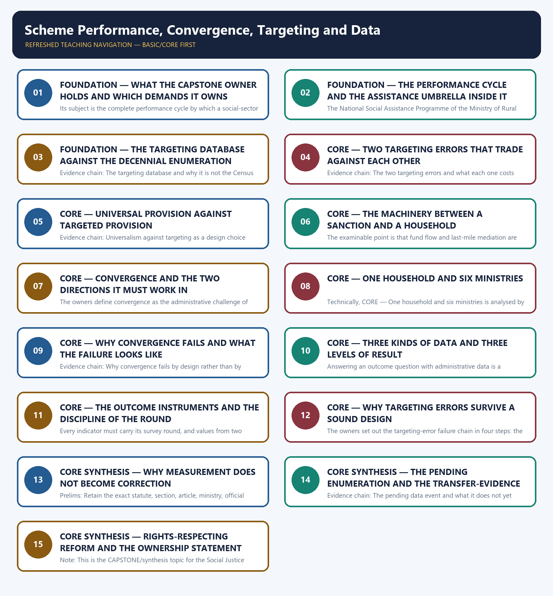

# Scheme Performance, Convergence, Targeting and Data — Learner-v2 Complete Learning Session

> **Authoring-only generation:** 2026-09-02. No PDF was rendered and no tracker or index was mutated.

### SOURCE, PROGRESSION AND CURRENT-LINKAGE AUDIT

- **Generation date:** 2026-09-02.
- **Repository-first evidence:** the Basic owner is taught first and preserved in full; the Advanced owner is retained only in the optional final teaching block.
- **OCR evidence:** Repository Markdown was primary. The OCR-searchable official General Studies question papers held under books\mains and books\more_previous_papers were read only to confirm the printed wording of routed Mains demands. No official answer key, marking scheme, page precision or unsupported quotation was imported from them.
- **Qdrant:** not used; repository Markdown and available OCR context were sufficient.
- **PYQ integrity:** This owner's previous-year record is a verified Mains ownership of exactly two demands, and it is stated precisely together with the boundary of what is claimed. The audited 2018-2023 Mains routing ledger routes the 2019 General Studies Paper II question numbered 18 here, whose printed wording states that the performance of welfare schemes that are implemented for vulnerable sections is not so effective due to the absence of their awareness and active involvement at all stages of the policy process, with the directive Discuss, fifteen marks and two hundred and fifty words; and it routes the 2023 General Studies Paper II question numbered 17 here, whose printed wording states that development and welfare schemes for the vulnerable, by their nature, are discriminatory in approach and asks whether the candidate agrees and to give reasons for the answer, with fifteen marks and two hundred and fifty words. For both the ledger records that the core route supersedes the older Advanced ownership, and the Basic owner's answer architecture records the same ownership in the same terms. Both demands are therefore solved in this package with model answers written to the repository's examiner-grade standard using the claim, named evidence, analysis and qualification pattern. No further demand is claimed: the audited 2024-2025 Mains routing ledger and the audited 2018-2023, 2024-2025 and 2026 Prelims routing ledgers route no additional question to this owner, and both the Basic and the Advanced owner state independently that no General Studies Paper II question in the audited 2024-2025 papers directly names the social-assistance umbrella, the targeting database or convergence. Alongside the two solved demand cards, the package adds six original Mains questions with model solutions and eighty original objective questions on a strict A → B → C → D rotation, each model solution opening with its analytical claim so that the evidence which follows does argumentative rather than decorative work. The locally held OCR-searchable official General Studies papers were read only to confirm the printed wording of the two routed Mains demands; no question was invented from them, no marking scheme or page precision was imported and no official answer key is claimed for any question anywhere in this package.
- **Live-link boundary:** No live official page was verified for this topic on 2026-09-02. Two official checks were attempted on that date, namely a national social-assistance portal address that failed to resolve at the transport level and a departmental scheme identifier that returned a not-found page, so nothing was read or used from either, and no secondary summary, coaching site or news report has been treated as an official source. The package therefore relies entirely on the dated official anchors already carried by the repository owners, each cited with its issuing body, round or status date: the National Social Assistance Programme of the Ministry of Rural Development with its five recorded components, the Indira Gandhi National Old Age Pension Scheme, the Indira Gandhi National Widow Pension Scheme, the Indira Gandhi National Disability Pension Scheme, the National Family Benefit Scheme paying a lump sum on the death of the primary breadwinner and Annapurna providing food support for elderly persons not covered by a pension, with central assistance fixed and State top-ups permitted and with eligibility administered through below-poverty-line and State targeting routes that must be specified rather than assumed; the Socio-Economic and Caste Census of 2011 as a static deprivation-based targeting database distinct from the decennial Census, underpinning the core eligibility route of the national health-assurance scheme while the separate route for all persons aged seventy and above is age-based, and with its caste data recorded as collected but not released or validated for general policy use; the definitions of inclusion error and exclusion error; the delivery layer of direct benefit transfer on the identity, account and mobile trinity, the public financial management system and the single nodal agency arrangement, with the auxiliary nurse midwife, accredited social health activist, anganwadi worker and panchayat secretary as frontline cadres and urban local bodies and panchayati raj institutions as the implementing tier; the outcome instruments comprising the National Family Health Survey of the health ministry, the Periodic Labour Force Survey of the statistics ministry, National Crime Records Bureau data, the Sustainable Development Goal India Index and the Multidimensional Poverty Index of the national policy think tank; the sixth round of the National Family Health Survey covering 2023-24, recorded as released on 29 May 2026 and reporting under-five stunting at 29.3 per cent against 35.5 per cent in the fifth round covering 2019-21, with the instruction that the round travel with every indicator and that values from two rounds never be silently merged; the Development Monitoring and Evaluation Office housed in the national policy think tank coordinating third-party evaluations and the Output-Outcome Monitoring Framework introduced by the Ministry of Finance as a budget-document requirement; the approval of caste enumeration for the 2027 Census by the Cabinet Committee on Political Affairs on 30 April 2025 with first-phase houselisting notified for the period from 1 April to 30 September 2026 and with no results available, recorded expressly as an ongoing operation rather than a published database or a ready-made targeting list; the Economic Survey of 2025-26 finding that cash transfers can improve short-term consumption and food security without consistently improving child nutrition, education or durable poverty exits when complementary public services and work opportunities are absent, used only to support a convergence argument; and the privacy judgment's requirement of legality, purpose, proportionality and safeguards with the rule that verification must not become denial of an entitlement. No beneficiary count, pension amount, enrolment figure, coverage percentage other than the recorded food-security share and the two recorded stunting values, leakage or diversion estimate, inclusion-error or exclusion-error rate, evaluation score, district ranking, budget, allocation or expenditure number is asserted anywhere in this package. No survey round is invented or merged, no projection is presented as an enumeration, no caste-enumeration result is asserted, no scheme is described as universal that the owners record as targeted or as targeted that they record as age-based, no advisory institution is described as having binding power, no legal or constitutional provision is invented or upgraded in status, no judicial holding is extended beyond what the owners record, and no previous-year question, official answer key, option or date is asserted or inferred beyond the two routed Mains demands whose printed wording is recorded in the audited ledger and confirmed against the locally held official papers.
- **Fact/inference discipline:** no current-affairs item, PYQ wording, figure or quotation is invented.

## BASIC LEARNING SESSION



*Distinct embedded teaching-navigation image. The separate continuous Cārvāka-style flowchart package remains an independent at-a-glance artifact.*

### SESSION 1 — FOUNDATION — WHAT THE CAPSTONE OWNER HOLDS AND WHICH DEMANDS IT OWNS

#### DEFINITION / WHAT THIS IS CALLED

**Plain-language definition:** Evidence chain: What this capstone owner holds and which demands are routed to it Qualified use: Open a scheme-evaluation answer by naming the stage of the cycle the question actually engages.

**Technical definition:** Its subject is the complete performance cycle by which a social-sector promise becomes a measured capability change.

#### ANSWER-GRABBING OPENING — WRITE/ADAPT IN THE EXAM

> Evidence chain: What this capstone owner holds and which demands are routed to it Qualified use: Open a scheme-evaluation answer by naming the stage of the cycle the question actually engages.

#### MUST-WRITE KEYWORDS

- **FOUNDATION**
- **What the capstone owner holds**
- **which demands it owns**
- **Evidence chain**
- **Qualified use**
- **2018-2023**

**How to use them:** Frame the answer through FOUNDATION; define What the capstone owner holds, connect which demands it owns with Evidence chain to explain the mechanism, and use Qualified use for the decisive comparison or qualification.

#### VISUAL FIRST

```text
WHAT THE CAPSTONE OWNER HOLDS AND WHICH DEMANDS IT OWNS
01. What this capstone owner holds and which demands are routed to it
BOUNDARY -> Two General Studies Paper II demands are routed here; no further demand is claimed.
```

*This topic-specific rail fixes the evidence sequence and its exam boundary before analysis.*

#### CORE EXPLANATION

The owners mark this as the capstone or synthesis topic of the Social Justice folder, to be read after the sixteen preceding owners, because it integrates targeting, convergence and data-architecture concepts across them and cross-links rather than re-deriving their content. Its subject is the complete performance cycle by which a social-sector promise becomes a measured capability change. The audited 2018-2023 Mains routing ledger routes two General Studies Paper II demands here and records both as core routes that supersede the older Advanced ownership: the 2019 question numbered 18 on the performance of welfare schemes for vulnerable sections and the absence of awareness and active involvement, and the 2023 question numbered 17 on development and welfare schemes for the vulnerable being discriminatory in approach. Both are solved in this package with model answers written to the examiner-grade standard.

#### NAMED EVIDENCE AND MECHANISM

- The owners mark this as the capstone or synthesis topic of the Social Justice folder, to be read after the sixteen preceding owners, because it integrates targeting, convergence and data-architecture concepts across them and cross-links rather than re-deriving their content. Its subject is the complete performance cycle by which a social-sector promise becomes a measured capability change. The audited 2018-2023 Mains routing ledger routes two General Studies Paper II demands here and records both as core routes that supersede the older Advanced ownership: the 2019 question numbered 18 on the performance of welfare schemes for vulnerable sections and the absence of awareness and active involvement, and the 2023 question numbered 17 on development and welfare schemes for the vulnerable being discriminatory in approach. Both are solved in this package with model answers written to the examiner-grade standard.

#### EXAMINER CAUTION

- Two General Studies Paper II demands are routed here; no further demand is claimed.

#### EXAM LINK

- **Prelims:** Retain the exact statute, section, article, ministry, official category, survey round or dated edition attached to What the capstone owner holds and which demands it owns, and never upgrade a policy document into a statute or a targeted scheme into a universal entitlement.
- **Mains:** Open a scheme-evaluation answer by naming the stage of the cycle the question actually engages.

#### MINI RECAP

- **Evidence chain:** What this capstone owner holds and which demands are routed to it
- **Qualified use:** Open a scheme-evaluation answer by naming the stage of the cycle the question actually engages.

#### CLOSING RECALL FLOW — FOUNDATION — WHAT THE CAPSTONE OWNER HOLDS AND WHICH DEMANDS IT OWNS

```text
START / CONCEPT: FOUNDATION — What the capstone owner holds and which demands it owns
        |
        v
EXACT TERMS: FOUNDATION · What the capstone owner holds · which demands it owns · Evidence chain · Qualified use · 2018-2023
        |
        v
MECHANISM / ARGUMENT: Prelims: Retain the exact statute, section, article, ministry, official category, survey round or dated edition attached to What the capstone owner holds and which demands it owns, and never upgrade a policy document into a statute or a targeted scheme into a universal entitlement.
        |
        v
CONSEQUENCE / CONTRAST: Its subject is the complete performance cycle by which a social-sector promise becomes a measured capability change.
        |
        v
UPSC TRAP / ANSWER-USE: Do not miss this limiting distinction: two General Studies Paper II demands are routed here.
        |
        v
ANSWER-GRABBING FORMULATION: Evidence chain: What this capstone owner holds and which demands are routed to it Qualified use: Open a scheme-evaluation answer by naming the stage of the cycle the question actually engages.
```
### SESSION 2 — FOUNDATION — THE PERFORMANCE CYCLE AND THE ASSISTANCE UMBRELLA INSIDE IT

#### DEFINITION / WHAT THIS IS CALLED

**Plain-language definition:** They record that central assistance is fixed while States may top up, and that eligibility is administered through below-poverty-line and State targeting routes which must be specified rather than assumed to be one current list.

**Technical definition:** The National Social Assistance Programme of the Ministry of Rural Development is the umbrella non-contributory social-assistance scheme, and the owners record its composition exactly as five components: the Indira Gandhi National Old Age Pension Scheme, the Indira Gandhi National Widow Pension Scheme, the Indira Gandhi National Disability Pension Scheme, the National Family Benefit Scheme providing a lump sum on the death of the primary breadwinner, and Annapurna providing food support for elderly persons not covered by a pension.

#### ANSWER-GRABBING OPENING — WRITE/ADAPT IN THE EXAM

> They record that central assistance is fixed while States may top up, and that eligibility is administered through below-poverty-line and State targeting routes which must be specified rather than assumed to be one current list.

#### MUST-WRITE KEYWORDS

- **FOUNDATION**
- **The performance cycle**
- **the assistance umbrella inside it**
- **Evidence chain**
- **Qualified use**
- **They**

**How to use them:** Frame the answer through FOUNDATION; define The performance cycle, connect the assistance umbrella inside it with Evidence chain to explain the mechanism, and use Qualified use for the decisive comparison or qualification.

#### VISUAL FIRST

```text
THE PERFORMANCE CYCLE AND THE ASSISTANCE UMBRELLA INSIDE IT
01. The five-stage cycle that organises the whole topic
    |
    v
02. The social-assistance umbrella and its five components
BOUNDARY -> No stage of the cycle substitutes for another, and the umbrella has five named components.
```

*This topic-specific rail fixes the evidence sequence and its exam boundary before analysis.*

#### CORE EXPLANATION

The owners state the core proposition as a cycle rather than as a checklist: targeting decides who is eligible, delivery decides how a benefit reaches them, convergence decides how multiple schemes coordinate at the household level, outcome measurement decides what actually changed, and correction decides how evidence feeds back into redesign. They add the decisive rule that no single component substitutes for the others, which is why a scheme-evaluation answer that praises coverage while ignoring outcome, or condemns outcome while ignoring targeting, has assessed one stage and reported it as a verdict on the whole. The National Social Assistance Programme of the Ministry of Rural Development is the umbrella non-contributory social-assistance scheme, and the owners record its composition exactly as five components: the Indira Gandhi National Old Age Pension Scheme, the Indira Gandhi National Widow Pension Scheme, the Indira Gandhi National Disability Pension Scheme, the National Family Benefit Scheme providing a lump sum on the death of the primary breadwinner, and Annapurna providing food support for elderly persons not covered by a pension. They record that central assistance is fixed while States may top up, and that eligibility is administered through below-poverty-line and State targeting routes which must be specified rather than assumed to be one current list.

#### NAMED EVIDENCE AND MECHANISM

- The owners state the core proposition as a cycle rather than as a checklist: targeting decides who is eligible, delivery decides how a benefit reaches them, convergence decides how multiple schemes coordinate at the household level, outcome measurement decides what actually changed, and correction decides how evidence feeds back into redesign. They add the decisive rule that no single component substitutes for the others, which is why a scheme-evaluation answer that praises coverage while ignoring outcome, or condemns outcome while ignoring targeting, has assessed one stage and reported it as a verdict on the whole.
- The National Social Assistance Programme of the Ministry of Rural Development is the umbrella non-contributory social-assistance scheme, and the owners record its composition exactly as five components: the Indira Gandhi National Old Age Pension Scheme, the Indira Gandhi National Widow Pension Scheme, the Indira Gandhi National Disability Pension Scheme, the National Family Benefit Scheme providing a lump sum on the death of the primary breadwinner, and Annapurna providing food support for elderly persons not covered by a pension. They record that central assistance is fixed while States may top up, and that eligibility is administered through below-poverty-line and State targeting routes which must be specified rather than assumed to be one current list.

#### EXAMINER CAUTION

- No stage of the cycle substitutes for another, and the umbrella has five named components.

#### EXAM LINK

- **Prelims:** Retain the exact statute, section, article, ministry, official category, survey round or dated edition attached to The performance cycle and the assistance umbrella inside it, and never upgrade a policy document into a statute or a targeted scheme into a universal entitlement.
- **Mains:** Structure any scheme answer as targeting, delivery, convergence, outcome and correction.

#### MINI RECAP

- **Evidence chain:** The five-stage cycle that organises the whole topic -> The social-assistance umbrella and its five components
- **Qualified use:** Structure any scheme answer as targeting, delivery, convergence, outcome and correction.

#### CLOSING RECALL FLOW — FOUNDATION — THE PERFORMANCE CYCLE AND THE ASSISTANCE UMBRELLA INSIDE IT

```text
START / CONCEPT: FOUNDATION — The performance cycle and the assistance umbrella inside it
        |
        v
EXACT TERMS: FOUNDATION · The performance cycle · the assistance umbrella inside it · Evidence chain · Qualified use · They
        |
        v
MECHANISM / ARGUMENT: The National Social Assistance Programme of the Ministry of Rural Development is the umbrella non-contributory social-assistance scheme, and the owners record its composition exactly as five components: the Indira Gandhi National Old Age Pension Scheme, the Indira Gandhi National Widow Pension Scheme, the Indira Gandhi National Disability Pension Scheme, the National Family Benefit Scheme providing a lump sum on the death of the primary breadwinner, and Annapurna providing food support for elderly persons not covered by a pension.
        |
        v
CONSEQUENCE / CONTRAST: Evidence chain: The five-stage cycle that organises the whole topic - The social-assistance umbrella and its five components Qualified use: Structure any scheme answer as targeting, delivery, convergence, outcome and correction.
        |
        v
UPSC TRAP / ANSWER-USE: They add the decisive rule that no single component substitutes for the others, which is why a scheme-evaluation answer that praises coverage while ignoring outcome, or condemns outcome while ignoring targeting, has assessed one stage and reported it as a verdict on the whole.
        |
        v
ANSWER-GRABBING FORMULATION: They record that central assistance is fixed while States may top up, and that eligibility is administered through below-poverty-line and State targeting routes which must be specified rather than assumed to be one current list.
```
### SESSION 3 — FOUNDATION — THE TARGETING DATABASE AGAINST THE DECENNIAL ENUMERATION

#### DEFINITION / WHAT THIS IS CALLED

**Plain-language definition:** The owners record the Socio-Economic and Caste Census of 2011 as a targeting database distinct from the decennial Census, built on deprivation and occupation indicators such as housing type, land and assets, and they record that its rural and urban deprivation data underpins the core eligibility route of the national health-assurance scheme while the separate route covering all persons aged seventy and above is age-based and not limited by that database.

**Technical definition:** Evidence chain: The targeting database and why it is not the Census Qualified use: Name the database a scheme actually uses before assessing who it reaches.

#### ANSWER-GRABBING OPENING — WRITE/ADAPT IN THE EXAM

> The owners record the Socio-Economic and Caste Census of 2011 as a targeting database distinct from the decennial Census, built on deprivation and occupation indicators such as housing type, land and assets, and they record that its rural and urban deprivation data underpins the core eligibility route of the national health-assurance scheme while the separate route covering all persons aged seventy and above is age-based and not limited by that database.

#### MUST-WRITE KEYWORDS

- **FOUNDATION**
- **The targeting database against the decennial enumeration**
- **Evidence chain**
- **Qualified use**
- **Socio-Economic**
- **Caste Census**

**How to use them:** Frame the answer through FOUNDATION; define The targeting database against the decennial enumeration, connect Evidence chain with Qualified use to explain the mechanism, and use Socio-Economic for the decisive comparison or qualification.

#### VISUAL FIRST

```text
THE TARGETING DATABASE AGAINST THE DECENNIAL ENUMERATION
01. The targeting database and why it is not the Census
BOUNDARY -> The two exercises differ in purpose and method, and the caste data was never released for policy use.
```

*This topic-specific rail fixes the evidence sequence and its exam boundary before analysis.*

#### CORE EXPLANATION

The owners record the Socio-Economic and Caste Census of 2011 as a targeting database distinct from the decennial Census, built on deprivation and occupation indicators such as housing type, land and assets, and they record that its rural and urban deprivation data underpins the core eligibility route of the national health-assurance scheme while the separate route covering all persons aged seventy and above is age-based and not limited by that database. They record two boundaries that objective questions test: the two exercises differ in purpose and methodology, and the caste data collected in 2011 was not released or validated for general policy use.

#### NAMED EVIDENCE AND MECHANISM

- The owners record the Socio-Economic and Caste Census of 2011 as a targeting database distinct from the decennial Census, built on deprivation and occupation indicators such as housing type, land and assets, and they record that its rural and urban deprivation data underpins the core eligibility route of the national health-assurance scheme while the separate route covering all persons aged seventy and above is age-based and not limited by that database. They record two boundaries that objective questions test: the two exercises differ in purpose and methodology, and the caste data collected in 2011 was not released or validated for general policy use.

#### EXAMINER CAUTION

- The two exercises differ in purpose and method, and the caste data was never released for policy use.

#### EXAM LINK

- **Prelims:** Retain the exact statute, section, article, ministry, official category, survey round or dated edition attached to The targeting database against the decennial enumeration, and never upgrade a policy document into a statute or a targeted scheme into a universal entitlement.
- **Mains:** Name the database a scheme actually uses before assessing who it reaches.

#### MINI RECAP

- **Evidence chain:** The targeting database and why it is not the Census
- **Qualified use:** Name the database a scheme actually uses before assessing who it reaches.

#### CLOSING RECALL FLOW — FOUNDATION — THE TARGETING DATABASE AGAINST THE DECENNIAL ENUMERATION

```text
START / CONCEPT: FOUNDATION — The targeting database against the decennial enumeration
        |
        v
EXACT TERMS: FOUNDATION · The targeting database against the decennial enumeration · Evidence chain · Qualified use · Socio-Economic · Caste Census
        |
        v
MECHANISM / ARGUMENT: Evidence chain: The targeting database and why it is not the Census Qualified use: Name the database a scheme actually uses before assessing who it reaches.
        |
        v
CONSEQUENCE / CONTRAST: They record two boundaries that objective questions test: the two exercises differ in purpose and methodology, and the caste data collected in 2011 was not released or validated for general policy use.
        |
        v
UPSC TRAP / ANSWER-USE: Do not miss this limiting distinction: name the database a scheme actually uses before assessing who it reaches.
        |
        v
ANSWER-GRABBING FORMULATION: The owners record the Socio-Economic and Caste Census of 2011 as a targeting database distinct from the decennial Census, built on deprivation and occupation indicators such as housing type, land and assets, and they record that its rural and urban deprivation data underpins the core eligibility route of the national health-assurance scheme while the separate route covering all persons aged seventy and above is age-based and not limited by that database.
```
### SESSION 4 — CORE — TWO TARGETING ERRORS THAT TRADE AGAINST EACH OTHER

#### DEFINITION / WHAT THIS IS CALLED

**Plain-language definition:** The examinable point is that the two errors trade against each other rather than rising and falling together, so tightening verification to reduce leakage raises exclusion among genuine claimants who lack documents, and an answer that treats both as symptoms of poor administration has missed the structural choice that scheme design is actually making.

**Technical definition:** Evidence chain: The two targeting errors and what each one costs Qualified use: State which error a design has chosen to bear before criticising its performance.

#### ANSWER-GRABBING OPENING — WRITE/ADAPT IN THE EXAM

> The examinable point is that the two errors trade against each other rather than rising and falling together, so tightening verification to reduce leakage raises exclusion among genuine claimants who lack documents, and an answer that treats both as symptoms of poor administration has missed the structural choice that scheme design is actually making.

#### MUST-WRITE KEYWORDS

- **Two targeting errors that trade against each other**
- **Evidence chain**
- **Qualified use**
- **The examinable point**
- **Reducing**
- **Qualified**

**How to use them:** Frame the answer through Two targeting errors that trade against each other; define Evidence chain, connect Qualified use with The examinable point to explain the mechanism, and use Reducing for the decisive comparison or qualification.

#### VISUAL FIRST

```text
TWO TARGETING ERRORS THAT TRADE AGAINST EACH OTHER
01. The two targeting errors and what each one costs
BOUNDARY -> Reducing leakage raises exclusion, so the errors cannot both be minimised at once.
```

*This topic-specific rail fixes the evidence sequence and its exam boundary before analysis.*

#### CORE EXPLANATION

The owners define inclusion error, also called Type I error, as the inclusion of ineligible beneficiaries so that resources leak to the non-poor, and exclusion error, also called Type II error, as the exclusion of eligible beneficiaries so that the truly needy miss benefits. The examinable point is that the two errors trade against each other rather than rising and falling together, so tightening verification to reduce leakage raises exclusion among genuine claimants who lack documents, and an answer that treats both as symptoms of poor administration has missed the structural choice that scheme design is actually making.

#### NAMED EVIDENCE AND MECHANISM

- The owners define inclusion error, also called Type I error, as the inclusion of ineligible beneficiaries so that resources leak to the non-poor, and exclusion error, also called Type II error, as the exclusion of eligible beneficiaries so that the truly needy miss benefits. The examinable point is that the two errors trade against each other rather than rising and falling together, so tightening verification to reduce leakage raises exclusion among genuine claimants who lack documents, and an answer that treats both as symptoms of poor administration has missed the structural choice that scheme design is actually making.

#### EXAMINER CAUTION

- Reducing leakage raises exclusion, so the errors cannot both be minimised at once.

#### EXAM LINK

- **Prelims:** Retain the exact statute, section, article, ministry, official category, survey round or dated edition attached to Two targeting errors that trade against each other, and never upgrade a policy document into a statute or a targeted scheme into a universal entitlement.
- **Mains:** State which error a design has chosen to bear before criticising its performance.

#### MINI RECAP

- **Evidence chain:** The two targeting errors and what each one costs
- **Qualified use:** State which error a design has chosen to bear before criticising its performance.

#### CLOSING RECALL FLOW — CORE — TWO TARGETING ERRORS THAT TRADE AGAINST EACH OTHER

```text
START / CONCEPT: CORE — Two targeting errors that trade against each other
        |
        v
EXACT TERMS: Two targeting errors that trade against each other · Evidence chain · Qualified use · The examinable point · Reducing · Qualified
        |
        v
MECHANISM / ARGUMENT: Evidence chain: The two targeting errors and what each one costs Qualified use: State which error a design has chosen to bear before criticising its performance.
        |
        v
CONSEQUENCE / CONTRAST: Reducing leakage raises exclusion, so the errors cannot both be minimised at once.
        |
        v
UPSC TRAP / ANSWER-USE: Do not miss this limiting distinction: state which error a design has chosen to bear before criticising its performance.
        |
        v
ANSWER-GRABBING FORMULATION: The examinable point is that the two errors trade against each other rather than rising and falling together, so tightening verification to reduce leakage raises exclusion among genuine claimants who lack documents, and an answer that treats both as symptoms of poor administration has missed the structural choice that scheme design is actually making.
```
### SESSION 5 — CORE — UNIVERSAL PROVISION AGAINST TARGETED PROVISION

#### DEFINITION / WHAT THIS IS CALLED

**Plain-language definition:** They record that there is no first-best answer and that the optimal mix depends on the programme type, and they record the complication that a single scheme can carry both logics at once, since the health-assurance scheme runs a deprivation-targeted core route alongside a universal age-based route for persons aged seventy and above.

**Technical definition:** Evidence chain: Universalism against targeting as a design choice Qualified use: Argue the targeting choice from the programme type rather than from a general preference.

#### ANSWER-GRABBING OPENING — WRITE/ADAPT IN THE EXAM

> Universal provision under the food-security law covers roughly two-thirds of the population and reduces exclusion error while including some non-poor and costing more; targeted provision such as the health-assurance scheme concentrates resources but raises exclusion risk and documentation burden.

#### MUST-WRITE KEYWORDS

- **Universal provision against targeted provision**
- **Evidence chain**
- **Qualified use**
- **Universal**
- **They record that there**
- **They**

**How to use them:** Frame the answer through Universal provision against targeted provision; define Evidence chain, connect Qualified use with Universal to explain the mechanism, and use They record that there for the decisive comparison or qualification.

#### VISUAL FIRST

```text
UNIVERSAL PROVISION AGAINST TARGETED PROVISION
01. Universalism against targeting as a design choice
BOUNDARY -> A single scheme can carry a deprivation-targeted route and a universal age-based route at once.
```

*This topic-specific rail fixes the evidence sequence and its exam boundary before analysis.*

#### CORE EXPLANATION

The owners set the trade-off out with its instruments named. Universal provision under the food-security law covers roughly two-thirds of the population and reduces exclusion error while including some non-poor and costing more; targeted provision such as the health-assurance scheme concentrates resources but raises exclusion risk and documentation burden. They record that there is no first-best answer and that the optimal mix depends on the programme type, and they record the complication that a single scheme can carry both logics at once, since the health-assurance scheme runs a deprivation-targeted core route alongside a universal age-based route for persons aged seventy and above.

#### NAMED EVIDENCE AND MECHANISM

- The owners set the trade-off out with its instruments named. Universal provision under the food-security law covers roughly two-thirds of the population and reduces exclusion error while including some non-poor and costing more; targeted provision such as the health-assurance scheme concentrates resources but raises exclusion risk and documentation burden. They record that there is no first-best answer and that the optimal mix depends on the programme type, and they record the complication that a single scheme can carry both logics at once, since the health-assurance scheme runs a deprivation-targeted core route alongside a universal age-based route for persons aged seventy and above.

#### EXAMINER CAUTION

- A single scheme can carry a deprivation-targeted route and a universal age-based route at once.

#### EXAM LINK

- **Prelims:** Retain the exact statute, section, article, ministry, official category, survey round or dated edition attached to Universal provision against targeted provision, and never upgrade a policy document into a statute or a targeted scheme into a universal entitlement.
- **Mains:** Argue the targeting choice from the programme type rather than from a general preference.

#### MINI RECAP

- **Evidence chain:** Universalism against targeting as a design choice
- **Qualified use:** Argue the targeting choice from the programme type rather than from a general preference.

#### CLOSING RECALL FLOW — CORE — UNIVERSAL PROVISION AGAINST TARGETED PROVISION

```text
START / CONCEPT: CORE — Universal provision against targeted provision
        |
        v
EXACT TERMS: Universal provision against targeted provision · Evidence chain · Qualified use · Universal · They record that there · They
        |
        v
MECHANISM / ARGUMENT: They record that there is no first-best answer and that the optimal mix depends on the programme type, and they record the complication that a single scheme can carry both logics at once, since the health-assurance scheme runs a deprivation-targeted core route alongside a universal age-based route for persons aged seventy and above.
        |
        v
CONSEQUENCE / CONTRAST: Evidence chain: Universalism against targeting as a design choice Qualified use: Argue the targeting choice from the programme type rather than from a general preference.
        |
        v
UPSC TRAP / ANSWER-USE: Do not miss this limiting distinction: a single scheme can carry a deprivation-targeted route and a universal age-based route at...
        |
        v
ANSWER-GRABBING FORMULATION: Universal provision under the food-security law covers roughly two-thirds of the population and reduces exclusion error while including some non-poor and costing more; targeted provision such as the health-assurance scheme concentrates resources but raises exclusion risk and documentation burden.
```
### SESSION 6 — CORE — THE MACHINERY BETWEEN A SANCTION AND A HOUSEHOLD

#### DEFINITION / WHAT THIS IS CALLED

**Plain-language definition:** Evidence chain: The delivery machinery between a sanction and a household Qualified use: Separate the transfer rail from the frontline worker when prescribing a delivery fix.

**Technical definition:** The examinable point is that fund flow and last-mile mediation are different problems, so a reform that accelerates transfers does nothing about a frontline worker who serves one scheme and cannot see the household's other entitlements.

#### ANSWER-GRABBING OPENING — WRITE/ADAPT IN THE EXAM

> Evidence chain: The delivery machinery between a sanction and a household Qualified use: Separate the transfer rail from the frontline worker when prescribing a delivery fix.

#### MUST-WRITE KEYWORDS

- **The machinery between a sanction**
- **a household**
- **Evidence chain**
- **Qualified use**
- **The examinable point**
- **Fund flow and last-mile mediation**

**How to use them:** Frame the answer through The machinery between a sanction; define a household, connect Evidence chain with Qualified use to explain the mechanism, and use The examinable point for the decisive comparison or qualification.

#### VISUAL FIRST

```text
THE MACHINERY BETWEEN A SANCTION AND A HOUSEHOLD
01. The delivery machinery between a sanction and a household
BOUNDARY -> Fund flow and last-mile mediation are different problems with different remedies.
```

*This topic-specific rail fixes the evidence sequence and its exam boundary before analysis.*

#### CORE EXPLANATION

The owners record the delivery layer as direct benefit transfer working with the identity, bank-account and mobile trinity, the public financial management system and the single nodal agency arrangement for fund flow, together with frontline cadres including the auxiliary nurse midwife, the accredited social health activist, the anganwadi worker and the panchayat secretary, and urban local bodies and panchayati raj institutions as the implementing tier. The examinable point is that fund flow and last-mile mediation are different problems, so a reform that accelerates transfers does nothing about a frontline worker who serves one scheme and cannot see the household's other entitlements.

#### NAMED EVIDENCE AND MECHANISM

- The owners record the delivery layer as direct benefit transfer working with the identity, bank-account and mobile trinity, the public financial management system and the single nodal agency arrangement for fund flow, together with frontline cadres including the auxiliary nurse midwife, the accredited social health activist, the anganwadi worker and the panchayat secretary, and urban local bodies and panchayati raj institutions as the implementing tier. The examinable point is that fund flow and last-mile mediation are different problems, so a reform that accelerates transfers does nothing about a frontline worker who serves one scheme and cannot see the household's other entitlements.

#### EXAMINER CAUTION

- Fund flow and last-mile mediation are different problems with different remedies.

#### EXAM LINK

- **Prelims:** Retain the exact statute, section, article, ministry, official category, survey round or dated edition attached to The machinery between a sanction and a household, and never upgrade a policy document into a statute or a targeted scheme into a universal entitlement.
- **Mains:** Separate the transfer rail from the frontline worker when prescribing a delivery fix.

#### MINI RECAP

- **Evidence chain:** The delivery machinery between a sanction and a household
- **Qualified use:** Separate the transfer rail from the frontline worker when prescribing a delivery fix.

#### CLOSING RECALL FLOW — CORE — THE MACHINERY BETWEEN A SANCTION AND A HOUSEHOLD

```text
START / CONCEPT: CORE — The machinery between a sanction and a household
        |
        v
EXACT TERMS: The machinery between a sanction · a household · Evidence chain · Qualified use · The examinable point · Fund flow and last-mile mediation
        |
        v
MECHANISM / ARGUMENT: The examinable point is that fund flow and last-mile mediation are different problems, so a reform that accelerates transfers does nothing about a frontline worker who serves one scheme and cannot see the household's other entitlements.
        |
        v
CONSEQUENCE / CONTRAST: Fund flow and last-mile mediation are different problems with different remedies.
        |
        v
UPSC TRAP / ANSWER-USE: Do not miss this limiting distinction: the delivery machinery between a sanction and a household Qualified use.
        |
        v
ANSWER-GRABBING FORMULATION: Evidence chain: The delivery machinery between a sanction and a household Qualified use: Separate the transfer rail from the frontline worker when prescribing a delivery fix.
```
### SESSION 7 — CORE — CONVERGENCE AND THE TWO DIRECTIONS IT MUST WORK IN

#### DEFINITION / WHAT THIS IS CALLED

**Plain-language definition:** Evidence chain: What convergence means and the two directions it must work in Qualified use: Specify the axis of coordination a proposed reform is supposed to repair.

**Technical definition:** The owners define convergence as the administrative challenge of coordinating multiple ministries and schemes at the point of delivery for a single beneficiary or household, and they record it as critical for multi-dimensional poverty because deprivation is simultaneous while schemes are sequential.

#### ANSWER-GRABBING OPENING — WRITE/ADAPT IN THE EXAM

> Evidence chain: What convergence means and the two directions it must work in Qualified use: Specify the axis of coordination a proposed reform is supposed to repair.

#### MUST-WRITE KEYWORDS

- **Convergence**
- **Evidence chain**
- **Qualified use**
- **They**
- **Centre**
- **Horizontal and vertical coordination**

**How to use them:** Frame the answer through Convergence; define Evidence chain, connect Qualified use with They to explain the mechanism, and use Centre for the decisive comparison or qualification.

#### VISUAL FIRST

```text
CONVERGENCE AND THE TWO DIRECTIONS IT MUST WORK IN
01. What convergence means and the two directions it must work in
BOUNDARY -> Horizontal and vertical coordination are both required; one alone leaves the household unserved.
```

*This topic-specific rail fixes the evidence sequence and its exam boundary before analysis.*

#### CORE EXPLANATION

The owners define convergence as the administrative challenge of coordinating multiple ministries and schemes at the point of delivery for a single beneficiary or household, and they record it as critical for multi-dimensional poverty because deprivation is simultaneous while schemes are sequential. They distinguish horizontal convergence, meaning coordination across ministries at the same level, from vertical convergence, meaning coordination across the Centre, the State, the district and the block, and they record that both are necessary for household-level convergence, so an answer that proposes only an inter-ministerial committee has addressed one axis.

#### NAMED EVIDENCE AND MECHANISM

- The owners define convergence as the administrative challenge of coordinating multiple ministries and schemes at the point of delivery for a single beneficiary or household, and they record it as critical for multi-dimensional poverty because deprivation is simultaneous while schemes are sequential. They distinguish horizontal convergence, meaning coordination across ministries at the same level, from vertical convergence, meaning coordination across the Centre, the State, the district and the block, and they record that both are necessary for household-level convergence, so an answer that proposes only an inter-ministerial committee has addressed one axis.

#### EXAMINER CAUTION

- Horizontal and vertical coordination are both required; one alone leaves the household unserved.

#### EXAM LINK

- **Prelims:** Retain the exact statute, section, article, ministry, official category, survey round or dated edition attached to Convergence and the two directions it must work in, and never upgrade a policy document into a statute or a targeted scheme into a universal entitlement.
- **Mains:** Specify the axis of coordination a proposed reform is supposed to repair.

#### MINI RECAP

- **Evidence chain:** What convergence means and the two directions it must work in
- **Qualified use:** Specify the axis of coordination a proposed reform is supposed to repair.

#### CLOSING RECALL FLOW — CORE — CONVERGENCE AND THE TWO DIRECTIONS IT MUST WORK IN

```text
START / CONCEPT: CORE — Convergence and the two directions it must work in
        |
        v
EXACT TERMS: Convergence · Evidence chain · Qualified use · They · Centre · Horizontal and vertical coordination
        |
        v
MECHANISM / ARGUMENT: Prelims: Retain the exact statute, section, article, ministry, official category, survey round or dated edition attached to Convergence and the two directions it must work in, and never upgrade a policy document into a statute or a targeted scheme into a universal entitlement.
        |
        v
CONSEQUENCE / CONTRAST: The owners define convergence as the administrative challenge of coordinating multiple ministries and schemes at the point of delivery for a single beneficiary or household, and they record it as critical for multi-dimensional poverty because deprivation is simultaneous while schemes are sequential.
        |
        v
UPSC TRAP / ANSWER-USE: They distinguish horizontal convergence, meaning coordination across ministries at the same level, from vertical convergence, meaning coordination across the Centre, the State, the district and the block, and they record that both are necessary for household-level convergence, so an answer that proposes only an inter-ministerial committee has addressed one axis.
        |
        v
ANSWER-GRABBING FORMULATION: Evidence chain: What convergence means and the two directions it must work in Qualified use: Specify the axis of coordination a proposed reform is supposed to repair.
```
### SESSION 8 — CORE — ONE HOUSEHOLD AND SIX MINISTRIES

#### DEFINITION / WHAT THIS IS CALLED

**Plain-language definition:** Evidence chain: The household that shows why convergence is hard Qualified use: Ground a convergence argument in a household that needs several schemes at once.

**Technical definition:** Technically, CORE — One household and six ministries is analysed by relating One household to six ministries, then testing the relationship through Evidence chain and Qualified use.

#### ANSWER-GRABBING OPENING — WRITE/ADAPT IN THE EXAM

> Evidence chain: The household that shows why convergence is hard Qualified use: Ground a convergence argument in a household that needs several schemes at once.

#### MUST-WRITE KEYWORDS

- **One household**
- **six ministries**
- **Evidence chain**
- **Qualified use**
- **Qualified**
- **Ground**

**How to use them:** Frame the answer through One household; define six ministries, connect Evidence chain with Qualified use to explain the mechanism, and use Qualified for the decisive comparison or qualification.

#### VISUAL FIRST

```text
ONE HOUSEHOLD AND SIX MINISTRIES
01. The household that shows why convergence is hard
BOUNDARY -> Each scheme brings a different database, a different worker and a different reporting line.
```

*This topic-specific rail fixes the evidence sequence and its exam boundary before analysis.*

#### CORE EXPLANATION

The owners give a worked convergence case rather than an abstraction. A particularly vulnerable tribal group household in a remote block may simultaneously need individual and community forest rights under the forest-rights law administered by the tribal affairs ministry and the State forest department, housing, road and water support under the tribal development mission of the same ministry, the school meal programme of the education ministry, the integrated nutrition programme of the women and child development ministry, health assurance through the national health authority and a social-assistance pension for an elderly member from the rural development ministry. The owners record that each scheme has a different eligibility database, a different frontline worker and a different reporting line.

#### NAMED EVIDENCE AND MECHANISM

- The owners give a worked convergence case rather than an abstraction. A particularly vulnerable tribal group household in a remote block may simultaneously need individual and community forest rights under the forest-rights law administered by the tribal affairs ministry and the State forest department, housing, road and water support under the tribal development mission of the same ministry, the school meal programme of the education ministry, the integrated nutrition programme of the women and child development ministry, health assurance through the national health authority and a social-assistance pension for an elderly member from the rural development ministry. The owners record that each scheme has a different eligibility database, a different frontline worker and a different reporting line.

#### EXAMINER CAUTION

- Each scheme brings a different database, a different worker and a different reporting line.

#### EXAM LINK

- **Prelims:** Retain the exact statute, section, article, ministry, official category, survey round or dated edition attached to One household and six ministries, and never upgrade a policy document into a statute or a targeted scheme into a universal entitlement.
- **Mains:** Ground a convergence argument in a household that needs several schemes at once.

#### MINI RECAP

- **Evidence chain:** The household that shows why convergence is hard
- **Qualified use:** Ground a convergence argument in a household that needs several schemes at once.

#### CLOSING RECALL FLOW — CORE — ONE HOUSEHOLD AND SIX MINISTRIES

```text
START / CONCEPT: CORE — One household and six ministries
        |
        v
EXACT TERMS: One household · six ministries · Evidence chain · Qualified use · Qualified · Ground
        |
        v
MECHANISM / ARGUMENT: The owners record that each scheme has a different eligibility database, a different frontline worker and a different reporting line.
        |
        v
CONSEQUENCE / CONTRAST: The resulting consequence is that the household that shows why convergence is hard Qualified use.
        |
        v
UPSC TRAP / ANSWER-USE: Do not miss this limiting distinction: the household that shows why convergence is hard Qualified use.
        |
        v
ANSWER-GRABBING FORMULATION: Evidence chain: The household that shows why convergence is hard Qualified use: Ground a convergence argument in a household that needs several schemes at once.
```
### SESSION 9 — CORE — WHY CONVERGENCE FAILS AND WHAT THE FAILURE LOOKS LIKE

#### DEFINITION / WHAT THIS IS CALLED

**Plain-language definition:** The owners set out the convergence failure chain in four steps: each ministry designs schemes with its own eligibility database so that no universally interoperable beneficiary record exists across schemes; different frontline cadres serve different schemes so that no single worker holds a household-wide view; district collectors are notionally responsible for convergence but lack real-time data and authority over central scheme implementing agencies; and schemes operate on different disbursement cycles so that a household may receive one benefit and miss another purely because of timing.

**Technical definition:** Evidence chain: Why convergence fails by design rather than by neglect - What the failure looks like inside one household Qualified use: Diagnose a named convergence failure instead of asserting weak coordination.

#### ANSWER-GRABBING OPENING — WRITE/ADAPT IN THE EXAM

> Evidence chain: Why convergence fails by design rather than by neglect - What the failure looks like inside one household Qualified use: Diagnose a named convergence failure instead of asserting weak coordination.

#### MUST-WRITE KEYWORDS

- **Why convergence fails**
- **what the failure looks like**
- **Evidence chain**
- **Qualified use**
- **Convergence**
- **Why**

**How to use them:** Frame the answer through Why convergence fails; define what the failure looks like, connect Evidence chain with Qualified use to explain the mechanism, and use Convergence for the decisive comparison or qualification.

#### VISUAL FIRST

```text
WHY CONVERGENCE FAILS AND WHAT THE FAILURE LOOKS LIKE
01. Why convergence fails by design rather than by neglect
    |
    v
02. What the failure looks like inside one household
BOUNDARY -> Convergence does not happen by default, and exhortation cannot supply authority or data.
```

*This topic-specific rail fixes the evidence sequence and its exam boundary before analysis.*

#### CORE EXPLANATION

The owners set out the convergence failure chain in four steps: each ministry designs schemes with its own eligibility database so that no universally interoperable beneficiary record exists across schemes; different frontline cadres serve different schemes so that no single worker holds a household-wide view; district collectors are notionally responsible for convergence but lack real-time data and authority over central scheme implementing agencies; and schemes operate on different disbursement cycles so that a household may receive one benefit and miss another purely because of timing. The chain shows that convergence does not happen by default and that exhortation cannot supply what authority and data do not. The owners give three boundary cases that convert the failure chain into diagnosable situations. A household enrolled in food security, health assurance and social assistance but excluded from the income-support scheme for cultivators because of a land-record mismatch illustrates database fragmentation. A hamlet of a particularly vulnerable tribal group with near-universal housing sanction under the tribal mission but persistent malnutrition recorded in survey data illustrates the output-outcome gap. A State that achieves high integrated child development enrolment but lags on anaemia reduction illustrates the convergence-quality gap, in which enrolment occurs without service quality behind it.

#### NAMED EVIDENCE AND MECHANISM

- The owners set out the convergence failure chain in four steps: each ministry designs schemes with its own eligibility database so that no universally interoperable beneficiary record exists across schemes; different frontline cadres serve different schemes so that no single worker holds a household-wide view; district collectors are notionally responsible for convergence but lack real-time data and authority over central scheme implementing agencies; and schemes operate on different disbursement cycles so that a household may receive one benefit and miss another purely because of timing. The chain shows that convergence does not happen by default and that exhortation cannot supply what authority and data do not.
- The owners give three boundary cases that convert the failure chain into diagnosable situations. A household enrolled in food security, health assurance and social assistance but excluded from the income-support scheme for cultivators because of a land-record mismatch illustrates database fragmentation. A hamlet of a particularly vulnerable tribal group with near-universal housing sanction under the tribal mission but persistent malnutrition recorded in survey data illustrates the output-outcome gap. A State that achieves high integrated child development enrolment but lags on anaemia reduction illustrates the convergence-quality gap, in which enrolment occurs without service quality behind it.

#### EXAMINER CAUTION

- Convergence does not happen by default, and exhortation cannot supply authority or data.

#### EXAM LINK

- **Prelims:** Retain the exact statute, section, article, ministry, official category, survey round or dated edition attached to Why convergence fails and what the failure looks like, and never upgrade a policy document into a statute or a targeted scheme into a universal entitlement.
- **Mains:** Diagnose a named convergence failure instead of asserting weak coordination.

#### MINI RECAP

- **Evidence chain:** Why convergence fails by design rather than by neglect -> What the failure looks like inside one household
- **Qualified use:** Diagnose a named convergence failure instead of asserting weak coordination.

#### CLOSING RECALL FLOW — CORE — WHY CONVERGENCE FAILS AND WHAT THE FAILURE LOOKS LIKE

```text
START / CONCEPT: CORE — Why convergence fails and what the failure looks like
        |
        v
EXACT TERMS: Why convergence fails · what the failure looks like · Evidence chain · Qualified use · Convergence · Why
        |
        v
MECHANISM / ARGUMENT: The owners set out the convergence failure chain in four steps: each ministry designs schemes with its own eligibility database so that no universally interoperable beneficiary record exists across schemes; different frontline cadres serve different schemes so that no single worker holds a household-wide view; district collectors are notionally responsible for convergence but lack real-time data and authority over central scheme implementing agencies; and schemes operate on different disbursement cycles so that a household may receive one benefit and miss another purely because of timing.
        |
        v
CONSEQUENCE / CONTRAST: The chain shows that convergence does not happen by default and that exhortation cannot supply what authority and data do not.
        |
        v
UPSC TRAP / ANSWER-USE: Convergence does not happen by default, and exhortation cannot supply authority or data.
        |
        v
ANSWER-GRABBING FORMULATION: Evidence chain: Why convergence fails by design rather than by neglect - What the failure looks like inside one household Qualified use: Diagnose a named convergence failure instead of asserting weak coordination.
```
### SESSION 10 — CORE — THREE KINDS OF DATA AND THREE LEVELS OF RESULT

#### DEFINITION / WHAT THIS IS CALLED

**Plain-language definition:** Evidence chain: Three kinds of data and what each one can and cannot say - Output, outcome and impact as three different results Qualified use: Match the evidence type to the question the examiner is actually asking.

**Technical definition:** Answering an outcome question with administrative data is a category error, not a weak citation.

#### ANSWER-GRABBING OPENING — WRITE/ADAPT IN THE EXAM

> Evidence chain: Three kinds of data and what each one can and cannot say - Output, outcome and impact as three different results Qualified use: Match the evidence type to the question the examiner is actually asking.

#### MUST-WRITE KEYWORDS

- **Three kinds of data**
- **three levels of result**
- **Evidence chain**
- **Qualified use**
- **The owners distinguish administrative data, which**
- **The rule that follows**

**How to use them:** Frame the answer through Three kinds of data; define three levels of result, connect Evidence chain with Qualified use to explain the mechanism, and use The owners distinguish administrative data, which for the decisive comparison or qualification.

#### VISUAL FIRST

```text
THREE KINDS OF DATA AND THREE LEVELS OF RESULT
01. Three kinds of data and what each one can and cannot say
    |
    v
02. Output, outcome and impact as three different results
BOUNDARY -> Answering an outcome question with administrative data is a category error, not a weak citation.
```

*This topic-specific rail fixes the evidence sequence and its exam boundary before analysis.*

#### CORE EXPLANATION

The owners distinguish administrative data, which is high frequency and programme-specific but excludes everyone not enrolled; survey data, which offers comparable indicators but rests on sampling and carries a reporting lag; and census data, which is universal in coverage but infrequent and slow. The rule that follows is that a question about who is being reached is an administrative question, a question about what changed is a survey question and a question about the total population in a condition is a census question, so citing a dashboard total in answer to an outcome question is a category error rather than merely a weak citation. The owners define output as the immediate product such as meals served, outcome as the medium-term change such as nutritional status, and impact as the long-term capability such as cognitive development, and they record which instrument captures which: administrative data typically captures outputs, surveys capture outcomes and evaluations estimate impact. The examinable consequence is that an administration reporting rising outputs is answering a different question from the one an outcome critic is asking, and an answer that keeps the three levels apart can concede genuine output achievement while still sustaining an outcome criticism.

#### NAMED EVIDENCE AND MECHANISM

- The owners distinguish administrative data, which is high frequency and programme-specific but excludes everyone not enrolled; survey data, which offers comparable indicators but rests on sampling and carries a reporting lag; and census data, which is universal in coverage but infrequent and slow. The rule that follows is that a question about who is being reached is an administrative question, a question about what changed is a survey question and a question about the total population in a condition is a census question, so citing a dashboard total in answer to an outcome question is a category error rather than merely a weak citation.
- The owners define output as the immediate product such as meals served, outcome as the medium-term change such as nutritional status, and impact as the long-term capability such as cognitive development, and they record which instrument captures which: administrative data typically captures outputs, surveys capture outcomes and evaluations estimate impact. The examinable consequence is that an administration reporting rising outputs is answering a different question from the one an outcome critic is asking, and an answer that keeps the three levels apart can concede genuine output achievement while still sustaining an outcome criticism.

#### EXAMINER CAUTION

- Answering an outcome question with administrative data is a category error, not a weak citation.

#### EXAM LINK

- **Prelims:** Retain the exact statute, section, article, ministry, official category, survey round or dated edition attached to Three kinds of data and three levels of result, and never upgrade a policy document into a statute or a targeted scheme into a universal entitlement.
- **Mains:** Match the evidence type to the question the examiner is actually asking.

#### MINI RECAP

- **Evidence chain:** Three kinds of data and what each one can and cannot say -> Output, outcome and impact as three different results
- **Qualified use:** Match the evidence type to the question the examiner is actually asking.

#### CLOSING RECALL FLOW — CORE — THREE KINDS OF DATA AND THREE LEVELS OF RESULT

```text
START / CONCEPT: CORE — Three kinds of data and three levels of result
        |
        v
EXACT TERMS: Three kinds of data · three levels of result · Evidence chain · Qualified use · The owners distinguish administrative data, which · The rule that follows
        |
        v
MECHANISM / ARGUMENT: The examinable consequence is that an administration reporting rising outputs is answering a different question from the one an outcome critic is asking, and an answer that keeps the three levels apart can concede genuine output achievement while still sustaining an outcome criticism.
        |
        v
CONSEQUENCE / CONTRAST: Answering an outcome question with administrative data is a category error, not a weak citation.
        |
        v
UPSC TRAP / ANSWER-USE: The owners distinguish administrative data, which is high frequency and programme-specific but excludes everyone not enrolled; survey data, which offers comparable indicators but rests on sampling and carries a reporting lag; and census data, which is universal in coverage but infrequent and slow.
        |
        v
ANSWER-GRABBING FORMULATION: Evidence chain: Three kinds of data and what each one can and cannot say - Output, outcome and impact as three different results Qualified use: Match the evidence type to the question the examiner is actually asking.
```
### SESSION 11 — CORE — THE OUTCOME INSTRUMENTS AND THE DISCIPLINE OF THE ROUND

#### DEFINITION / WHAT THIS IS CALLED

**Plain-language definition:** Evidence chain: The outcome instruments and the discipline of the round Qualified use: Cite an outcome figure with its survey, round and year attached.

**Technical definition:** Every indicator must carry its survey round, and values from two rounds may never be merged.

#### ANSWER-GRABBING OPENING — WRITE/ADAPT IN THE EXAM

> Evidence chain: The outcome instruments and the discipline of the round Qualified use: Cite an outcome figure with its survey, round and year attached.

#### MUST-WRITE KEYWORDS

- **The outcome instruments**
- **the discipline of the round**
- **Evidence chain**
- **Qualified use**
- **Every**
- **2023-24**

**How to use them:** Frame the answer through The outcome instruments; define the discipline of the round, connect Evidence chain with Qualified use to explain the mechanism, and use Every for the decisive comparison or qualification.

#### VISUAL FIRST

```text
THE OUTCOME INSTRUMENTS AND THE DISCIPLINE OF THE ROUND
01. The outcome instruments and the discipline of the round
BOUNDARY -> Every indicator must carry its survey round, and values from two rounds may never be merged.
```

*This topic-specific rail fixes the evidence sequence and its exam boundary before analysis.*

#### CORE EXPLANATION

The owners name the outcome evidence base precisely: the National Family Health Survey of the health ministry for health and nutrition outcomes, the Periodic Labour Force Survey of the statistics ministry for employment outcomes, the National Crime Records Bureau of the home ministry for data on atrocities and crimes against women, children and Scheduled Castes and Tribes, the Sustainable Development Goal India Index of the national policy think tank for composite State-level performance and the Multidimensional Poverty Index for deprivation across health, education and standard of living. They record the current round exactly: the sixth round of the family health survey, covering 2023-24, was released on 29 May 2026 and reports under-five stunting at 29.3 per cent, improved from 35.5 per cent in the fifth round, and they instruct that the round travel with every indicator and that values from two rounds never be silently merged.

#### NAMED EVIDENCE AND MECHANISM

- The owners name the outcome evidence base precisely: the National Family Health Survey of the health ministry for health and nutrition outcomes, the Periodic Labour Force Survey of the statistics ministry for employment outcomes, the National Crime Records Bureau of the home ministry for data on atrocities and crimes against women, children and Scheduled Castes and Tribes, the Sustainable Development Goal India Index of the national policy think tank for composite State-level performance and the Multidimensional Poverty Index for deprivation across health, education and standard of living. They record the current round exactly: the sixth round of the family health survey, covering 2023-24, was released on 29 May 2026 and reports under-five stunting at 29.3 per cent, improved from 35.5 per cent in the fifth round, and they instruct that the round travel with every indicator and that values from two rounds never be silently merged.

#### EXAMINER CAUTION

- Every indicator must carry its survey round, and values from two rounds may never be merged.

#### EXAM LINK

- **Prelims:** Retain the exact statute, section, article, ministry, official category, survey round or dated edition attached to The outcome instruments and the discipline of the round, and never upgrade a policy document into a statute or a targeted scheme into a universal entitlement.
- **Mains:** Cite an outcome figure with its survey, round and year attached.

#### MINI RECAP

- **Evidence chain:** The outcome instruments and the discipline of the round
- **Qualified use:** Cite an outcome figure with its survey, round and year attached.

#### CLOSING RECALL FLOW — CORE — THE OUTCOME INSTRUMENTS AND THE DISCIPLINE OF THE ROUND

```text
START / CONCEPT: CORE — The outcome instruments and the discipline of the round
        |
        v
EXACT TERMS: The outcome instruments · the discipline of the round · Evidence chain · Qualified use · Every · 2023-24
        |
        v
MECHANISM / ARGUMENT: Every indicator must carry its survey round, and values from two rounds may never be merged.
        |
        v
CONSEQUENCE / CONTRAST: The resulting consequence is that the outcome instruments and the discipline of the round Qualified use.
        |
        v
UPSC TRAP / ANSWER-USE: Do not miss this limiting distinction: the outcome instruments and the discipline of the round Qualified use.
        |
        v
ANSWER-GRABBING FORMULATION: Evidence chain: The outcome instruments and the discipline of the round Qualified use: Cite an outcome figure with its survey, round and year attached.
```
### SESSION 12 — CORE — WHY TARGETING ERRORS SURVIVE A SOUND DESIGN

#### DEFINITION / WHAT THIS IS CALLED

**Plain-language definition:** Evidence chain: Why targeting errors arise even when the design is sound Qualified use: Trace an exclusion to the specific rule or record that produced it.

**Technical definition:** The owners set out the targeting-error failure chain in four steps: the 2011 database is over a decade old so that population movement, income change and newly arising deprivation are not captured and the newly poor are excluded; households lacking an identity number, a ration card or a caste certificate cannot access benefits because documentation proxies for identity rather than for need; self-declaration risks inclusion error while certificate-based verification risks exclusion error for genuine claimants without documents; and deprivation criteria such as housing type, land and assets are imperfect proxies for income or consumption poverty that can both include the non-poor and exclude the poor.

#### ANSWER-GRABBING OPENING — WRITE/ADAPT IN THE EXAM

> Evidence chain: Why targeting errors arise even when the design is sound Qualified use: Trace an exclusion to the specific rule or record that produced it.

#### MUST-WRITE KEYWORDS

- **Why targeting errors survive a sound design**
- **Evidence chain**
- **Qualified use**
- **They**
- **Why**
- **Qualified**

**How to use them:** Frame the answer through Why targeting errors survive a sound design; define Evidence chain, connect Qualified use with They to explain the mechanism, and use Why for the decisive comparison or qualification.

#### VISUAL FIRST

```text
WHY TARGETING ERRORS SURVIVE A SOUND DESIGN
01. Why targeting errors arise even when the design is sound
BOUNDARY -> Documentation proxies for identity rather than need, and a dated list excludes the newly poor.
```

*This topic-specific rail fixes the evidence sequence and its exam boundary before analysis.*

#### CORE EXPLANATION

The owners set out the targeting-error failure chain in four steps: the 2011 database is over a decade old so that population movement, income change and newly arising deprivation are not captured and the newly poor are excluded; households lacking an identity number, a ration card or a caste certificate cannot access benefits because documentation proxies for identity rather than for need; self-declaration risks inclusion error while certificate-based verification risks exclusion error for genuine claimants without documents; and deprivation criteria such as housing type, land and assets are imperfect proxies for income or consumption poverty that can both include the non-poor and exclude the poor. They add that authentication-based de-duplication must retain assisted and non-digital alternatives and a correction route.

#### NAMED EVIDENCE AND MECHANISM

- The owners set out the targeting-error failure chain in four steps: the 2011 database is over a decade old so that population movement, income change and newly arising deprivation are not captured and the newly poor are excluded; households lacking an identity number, a ration card or a caste certificate cannot access benefits because documentation proxies for identity rather than for need; self-declaration risks inclusion error while certificate-based verification risks exclusion error for genuine claimants without documents; and deprivation criteria such as housing type, land and assets are imperfect proxies for income or consumption poverty that can both include the non-poor and exclude the poor. They add that authentication-based de-duplication must retain assisted and non-digital alternatives and a correction route.

#### EXAMINER CAUTION

- Documentation proxies for identity rather than need, and a dated list excludes the newly poor.

#### EXAM LINK

- **Prelims:** Retain the exact statute, section, article, ministry, official category, survey round or dated edition attached to Why targeting errors survive a sound design, and never upgrade a policy document into a statute or a targeted scheme into a universal entitlement.
- **Mains:** Trace an exclusion to the specific rule or record that produced it.

#### MINI RECAP

- **Evidence chain:** Why targeting errors arise even when the design is sound
- **Qualified use:** Trace an exclusion to the specific rule or record that produced it.

#### CLOSING RECALL FLOW — CORE — WHY TARGETING ERRORS SURVIVE A SOUND DESIGN

```text
START / CONCEPT: CORE — Why targeting errors survive a sound design
        |
        v
EXACT TERMS: Why targeting errors survive a sound design · Evidence chain · Qualified use · They · Why · Qualified
        |
        v
MECHANISM / ARGUMENT: The owners set out the targeting-error failure chain in four steps: the 2011 database is over a decade old so that population movement, income change and newly arising deprivation are not captured and the newly poor are excluded; households lacking an identity number, a ration card or a caste certificate cannot access benefits because documentation proxies for identity rather than for need; self-declaration risks inclusion error while certificate-based verification risks exclusion error for genuine claimants without documents; and deprivation criteria such as housing type, land and assets are imperfect proxies for income or consumption poverty that can both include the non-poor and exclude the poor.
        |
        v
CONSEQUENCE / CONTRAST: They add that authentication-based de-duplication must retain assisted and non-digital alternatives and a correction route.
        |
        v
UPSC TRAP / ANSWER-USE: Do not miss this limiting distinction: why targeting errors arise even when the design is sound Qualified use.
        |
        v
ANSWER-GRABBING FORMULATION: Evidence chain: Why targeting errors arise even when the design is sound Qualified use: Trace an exclusion to the specific rule or record that produced it.
```
### SESSION 13 — CORE SYNTHESIS — WHY MEASUREMENT DOES NOT BECOME CORRECTION

#### DEFINITION / WHAT THIS IS CALLED

**Plain-language definition:** Evidence chain: Why evidence does not become correction Qualified use: Locate the feedback break rather than demanding better monitoring in general.

**Technical definition:** Prelims: Retain the exact statute, section, article, ministry, official category, survey round or dated edition attached to Why measurement does not become correction, and never upgrade a policy document into a statute or a targeted scheme into a universal entitlement.

#### ANSWER-GRABBING OPENING — WRITE/ADAPT IN THE EXAM

> Evidence chain: Why evidence does not become correction Qualified use: Locate the feedback break rather than demanding better monitoring in general.

#### MUST-WRITE KEYWORDS

- **CORE SYNTHESIS**
- **Evidence chain**
- **Qualified use**
- **They**
- **Evaluation**
- **Retain**

**How to use them:** Frame the answer through CORE SYNTHESIS; define Evidence chain, connect Qualified use with They to explain the mechanism, and use Evaluation for the decisive comparison or qualification.

#### VISUAL FIRST

```text
WHY MEASUREMENT DOES NOT BECOME CORRECTION
01. Why evidence does not become correction
BOUNDARY -> Evaluation is advisory in a system where allocation is the only binding signal.
```

*This topic-specific rail fixes the evidence sequence and its exam boundary before analysis.*

#### CORE EXPLANATION

The owners set out the outcome-learning failure chain in three steps: administrative dashboards show coverage while surveys show remaining outcome deficits and the divergence is not investigated; the evaluation office of the national policy think tank and third-party evaluations exist but their findings are not systematically fed back into scheme redesign and remain in reports; and governments prefer coverage figures, which are easy to announce, over outcome figures, which are harder to achieve and may be unflattering. They record the institutional instruments that already exist for this purpose, the evaluation office housed in the think tank which coordinates third-party evaluations, and the output-outcome monitoring framework introduced by the finance ministry as a budget-document requirement.

#### NAMED EVIDENCE AND MECHANISM

- The owners set out the outcome-learning failure chain in three steps: administrative dashboards show coverage while surveys show remaining outcome deficits and the divergence is not investigated; the evaluation office of the national policy think tank and third-party evaluations exist but their findings are not systematically fed back into scheme redesign and remain in reports; and governments prefer coverage figures, which are easy to announce, over outcome figures, which are harder to achieve and may be unflattering. They record the institutional instruments that already exist for this purpose, the evaluation office housed in the think tank which coordinates third-party evaluations, and the output-outcome monitoring framework introduced by the finance ministry as a budget-document requirement.

#### EXAMINER CAUTION

- Evaluation is advisory in a system where allocation is the only binding signal.

#### EXAM LINK

- **Prelims:** Retain the exact statute, section, article, ministry, official category, survey round or dated edition attached to Why measurement does not become correction, and never upgrade a policy document into a statute or a targeted scheme into a universal entitlement.
- **Mains:** Locate the feedback break rather than demanding better monitoring in general.

#### MINI RECAP

- **Evidence chain:** Why evidence does not become correction
- **Qualified use:** Locate the feedback break rather than demanding better monitoring in general.

#### CLOSING RECALL FLOW — CORE SYNTHESIS — WHY MEASUREMENT DOES NOT BECOME CORRECTION

```text
START / CONCEPT: CORE SYNTHESIS — Why measurement does not become correction
        |
        v
EXACT TERMS: CORE SYNTHESIS · Evidence chain · Qualified use · They · Evaluation · Retain
        |
        v
MECHANISM / ARGUMENT: They record the institutional instruments that already exist for this purpose, the evaluation office housed in the think tank which coordinates third-party evaluations, and the output-outcome monitoring framework introduced by the finance ministry as a budget-document requirement.
        |
        v
CONSEQUENCE / CONTRAST: Prelims: Retain the exact statute, section, article, ministry, official category, survey round or dated edition attached to Why measurement does not become correction, and never upgrade a policy document into a statute or a targeted scheme into a universal entitlement.
        |
        v
UPSC TRAP / ANSWER-USE: The owners set out the outcome-learning failure chain in three steps: administrative dashboards show coverage while surveys show remaining outcome deficits and the divergence is not investigated; the evaluation office of the national policy think tank and third-party evaluations exist but their findings are not systematically fed back into scheme redesign and remain in reports; and governments prefer coverage figures, which are easy to announce, over outcome figures, which are harder to achieve and may be unflattering.
        |
        v
ANSWER-GRABBING FORMULATION: Evidence chain: Why evidence does not become correction Qualified use: Locate the feedback break rather than demanding better monitoring in general.
```
### SESSION 14 — CORE SYNTHESIS — THE PENDING ENUMERATION AND THE TRANSFER-EVIDENCE CAUTION

#### DEFINITION / WHAT THIS IS CALLED

**Plain-language definition:** The Cabinet Committee on Political Affairs approved caste enumeration for the 2027 Census on 30 April 2025, and first-phase houselisting is notified for the period from 1 April to 30 September 2026, so operations have begun but no results are available as at the recorded status date.

**Technical definition:** Evidence chain: The pending data event and what it does not yet supply - What the transfer evidence actually supports Qualified use: Use a dated status and a bounded finding for exactly what each supports.

#### ANSWER-GRABBING OPENING — WRITE/ADAPT IN THE EXAM

> Evidence chain: The pending data event and what it does not yet supply - What the transfer evidence actually supports Qualified use: Use a dated status and a bounded finding for exactly what each supports.

#### MUST-WRITE KEYWORDS

- **CORE SYNTHESIS**
- **The pending enumeration**
- **the transfer-evidence caution**
- **Evidence chain**
- **Qualified use**
- **2025-26**

**How to use them:** Frame the answer through CORE SYNTHESIS; define The pending enumeration, connect the transfer-evidence caution with Evidence chain to explain the mechanism, and use Qualified use for the decisive comparison or qualification.

#### VISUAL FIRST

```text
THE PENDING ENUMERATION AND THE TRANSFER-EVIDENCE CAUTION
01. The pending data event and what it does not yet supply
    |
    v
02. What the transfer evidence actually supports
BOUNDARY -> An approved operation is not a published database, and a consumption gain is not a capability gain.
```

*This topic-specific rail fixes the evidence sequence and its exam boundary before analysis.*

#### CORE EXPLANATION

The owners record the caste-enumeration decision precisely and bound it. The Cabinet Committee on Political Affairs approved caste enumeration for the 2027 Census on 30 April 2025, and first-phase houselisting is notified for the period from 1 April to 30 September 2026, so operations have begun but no results are available as at the recorded status date. They instruct that this is an ongoing operation rather than a published database or a ready-made targeting list, and they record that a database update would improve targeting but is a massive logistical exercise, so the 2027 enumeration may only partially address the data-architecture gap. The owners record a specific finding rather than a general endorsement: the Economic Survey of 2025-26 notes that cash transfers can improve short-term consumption and food security without consistently improving child nutrition, education or durable poverty exits when complementary public services and work opportunities are absent. They record its argumentative use with equal precision, that it supports a convergence argument and does not support a claim that transfer coverage alone proves social-sector success, which makes it the single most useful citation for an answer that must concede a real achievement while refusing the inference the achievement is offered to support.

#### NAMED EVIDENCE AND MECHANISM

- The owners record the caste-enumeration decision precisely and bound it. The Cabinet Committee on Political Affairs approved caste enumeration for the 2027 Census on 30 April 2025, and first-phase houselisting is notified for the period from 1 April to 30 September 2026, so operations have begun but no results are available as at the recorded status date. They instruct that this is an ongoing operation rather than a published database or a ready-made targeting list, and they record that a database update would improve targeting but is a massive logistical exercise, so the 2027 enumeration may only partially address the data-architecture gap.
- The owners record a specific finding rather than a general endorsement: the Economic Survey of 2025-26 notes that cash transfers can improve short-term consumption and food security without consistently improving child nutrition, education or durable poverty exits when complementary public services and work opportunities are absent. They record its argumentative use with equal precision, that it supports a convergence argument and does not support a claim that transfer coverage alone proves social-sector success, which makes it the single most useful citation for an answer that must concede a real achievement while refusing the inference the achievement is offered to support.

#### EXAMINER CAUTION

- An approved operation is not a published database, and a consumption gain is not a capability gain.

#### EXAM LINK

- **Prelims:** Retain the exact statute, section, article, ministry, official category, survey round or dated edition attached to The pending enumeration and the transfer-evidence caution, and never upgrade a policy document into a statute or a targeted scheme into a universal entitlement.
- **Mains:** Use a dated status and a bounded finding for exactly what each supports.

#### MINI RECAP

- **Evidence chain:** The pending data event and what it does not yet supply -> What the transfer evidence actually supports
- **Qualified use:** Use a dated status and a bounded finding for exactly what each supports.

#### CLOSING RECALL FLOW — CORE SYNTHESIS — THE PENDING ENUMERATION AND THE TRANSFER-EVIDENCE CAUTION

```text
START / CONCEPT: CORE SYNTHESIS — The pending enumeration and the transfer-evidence caution
        |
        v
EXACT TERMS: CORE SYNTHESIS · The pending enumeration · the transfer-evidence caution · Evidence chain · Qualified use · 2025-26
        |
        v
MECHANISM / ARGUMENT: The Cabinet Committee on Political Affairs approved caste enumeration for the 2027 Census on 30 April 2025, and first-phase houselisting is notified for the period from 1 April to 30 September 2026, so operations have begun but no results are available as at the recorded status date.
        |
        v
CONSEQUENCE / CONTRAST: They instruct that this is an ongoing operation rather than a published database or a ready-made targeting list, and they record that a database update would improve targeting but is a massive logistical exercise, so the 2027 enumeration may only partially address the data-architecture gap.
        |
        v
UPSC TRAP / ANSWER-USE: An approved operation is not a published database, and a consumption gain is not a capability gain.
        |
        v
ANSWER-GRABBING FORMULATION: Evidence chain: The pending data event and what it does not yet supply - What the transfer evidence actually supports Qualified use: Use a dated status and a bounded finding for exactly what each supports.
```
### SESSION 15 — CORE SYNTHESIS — RIGHTS-RESPECTING REFORM AND THE OWNERSHIP STATEMENT

#### DEFINITION / WHAT THIS IS CALLED

**Plain-language definition:** Evidence chain: The reform architecture and the rights limits on it - How the two routed demands are owned and divided Qualified use: Close with a graded verdict, a named safeguard and a precise statement of routed ownership.

**Technical definition:** Note: This is the CAPSTONE/synthesis topic for the Social Justice folder.

#### ANSWER-GRABBING OPENING — WRITE/ADAPT IN THE EXAM

> Evidence chain: The reform architecture and the rights limits on it - How the two routed demands are owned and divided Qualified use: Close with a graded verdict, a named safeguard and a precise statement of routed ownership.

#### MUST-WRITE KEYWORDS

- **CORE SYNTHESIS**
- **Rights-respecting reform**
- **the ownership statement**
- **Evidence chain**
- **Qualified use**
- **Subject**

**How to use them:** Frame the answer through CORE SYNTHESIS; define Rights-respecting reform, connect the ownership statement with Evidence chain to explain the mechanism, and use Qualified use for the decisive comparison or qualification.

#### VISUAL FIRST

```text
RIGHTS-RESPECTING REFORM AND THE OWNERSHIP STATEMENT
01. The reform architecture and the rights limits on it
    |
    v
02. How the two routed demands are owned and divided
BOUNDARY -> Every recommended correction carries a privacy, cost or equity price the answer must concede.
```

*This topic-specific rail fixes the evidence sequence and its exam boundary before analysis.*

#### CORE EXPLANATION

The owners record a reform package with its constraints attached. They recommend a federated, purpose-limited interoperability layer with updated beneficiary records, human-assisted correction, audit trails and non-digital access rather than an unchecked all-purpose identity-linked registry; outcome-linked budget allocation in which incremental funding depends on evaluation-verified outcome improvement rather than coverage expansion; and explicit convergence authority for district collectors with real-time dashboard visibility across central schemes. They record the constitutional limit that the privacy judgment requires legality, purpose, proportionality and safeguards and that verification must not become denial of the entitlement, the district-convergence illustration that indicator-led ranking can favour measurable outputs and invite data gaming, the participation point that awareness and community monitoring aid uptake and correction while consultation without decision power is tokenistic, and the equity caution that outcome-linked funding may penalise States with harder-to-reach populations. The audited 2018-2023 Mains routing ledger routes two General Studies Paper II demands to this owner and records both with the note that the core route supersedes the older Advanced ownership. The first is the 2019 question numbered 18, whose printed wording states that the performance of welfare schemes implemented for vulnerable sections is not so effective due to the absence of their awareness and active involvement at all stages of the policy process, with the directive Discuss, fifteen marks and two hundred and fifty words. The second is the 2023 question numbered 17, whose printed wording states that development and welfare schemes for the vulnerable, by their nature, are discriminatory in approach, and asks whether the candidate agrees and to give reasons, with fifteen marks and two hundred and fifty words. Both are solved here; the audited 2024-2025 Mains and Prelims ledgers route no further demand to this owner and no other question is claimed.

#### NAMED EVIDENCE AND MECHANISM

- The owners record a reform package with its constraints attached. They recommend a federated, purpose-limited interoperability layer with updated beneficiary records, human-assisted correction, audit trails and non-digital access rather than an unchecked all-purpose identity-linked registry; outcome-linked budget allocation in which incremental funding depends on evaluation-verified outcome improvement rather than coverage expansion; and explicit convergence authority for district collectors with real-time dashboard visibility across central schemes. They record the constitutional limit that the privacy judgment requires legality, purpose, proportionality and safeguards and that verification must not become denial of the entitlement, the district-convergence illustration that indicator-led ranking can favour measurable outputs and invite data gaming, the participation point that awareness and community monitoring aid uptake and correction while consultation without decision power is tokenistic, and the equity caution that outcome-linked funding may penalise States with harder-to-reach populations.
- The audited 2018-2023 Mains routing ledger routes two General Studies Paper II demands to this owner and records both with the note that the core route supersedes the older Advanced ownership. The first is the 2019 question numbered 18, whose printed wording states that the performance of welfare schemes implemented for vulnerable sections is not so effective due to the absence of their awareness and active involvement at all stages of the policy process, with the directive Discuss, fifteen marks and two hundred and fifty words. The second is the 2023 question numbered 17, whose printed wording states that development and welfare schemes for the vulnerable, by their nature, are discriminatory in approach, and asks whether the candidate agrees and to give reasons, with fifteen marks and two hundred and fifty words. Both are solved here; the audited 2024-2025 Mains and Prelims ledgers route no further demand to this owner and no other question is claimed.

#### EXAMINER CAUTION

- Every recommended correction carries a privacy, cost or equity price the answer must concede.

#### EXAM LINK

- **Prelims:** Retain the exact statute, section, article, ministry, official category, survey round or dated edition attached to Rights-respecting reform and the ownership statement, and never upgrade a policy document into a statute or a targeted scheme into a universal entitlement.
- **Mains:** Close with a graded verdict, a named safeguard and a precise statement of routed ownership.

#### MINI RECAP

- **Evidence chain:** The reform architecture and the rights limits on it -> How the two routed demands are owned and divided
- **Qualified use:** Close with a graded verdict, a named safeguard and a precise statement of routed ownership.
#### COMPLETE BASIC OWNER EVIDENCE BANK

> **Subject:** Social Justice | **Tier:** Must-Do (foundation) | **GS Paper:** GS-II;
> cross-reference GS-III (development processes) and Governance (monitoring/evaluation).
> **Core area:** NSAP social assistance; SECC targeting database; targeting errors;
> convergence challenges; outcome-data architecture.
> **Grounded in:** NSAP (MoRD); SECC 2011; NFHS-6 (2023-24), with NFHS-5 as comparator; PLFS; NCRB; SDG India Index;
> DMEO/OOMF (cross-link Governance/15); DBT/PFMS/SNA (cross-link Governance/13); 2027
> Census caste-enumeration decision and 2026 operations (cross-link Topic 09).
> ✅ = source-grounded | ⚠️ = analytical inference | 📰 = current anchor.
> *Companion: `advanced/17_Scheme-Performance-Convergence-Targeting-and-Data-Architecture.md`.*

**Note:** This is the CAPSTONE/synthesis topic for the Social Justice folder. Read
Topics 01-16 first; this topic integrates targeting, convergence and data-architecture
concepts across the earlier files. Cross-link liberally rather than re-deriving content.

#### 1. Visual foundation

```text
TARGETING → DELIVERY → OUTCOME → DATA → CORRECTION CYCLE

┌─────────────────────────────────────────────────────────────────────────────┐
│ 1. TARGETING DATABASE                                                       │
│    SECC 2011 (deprivation criteria) | Aadhaar | e-Shram | State lists       │
│    ⚠️ SECC caste data not released/validated for general policy use          │
│    📰 Census 2027 caste enumeration approved; operations begun, no results  │
│                                     |                                       │
│                                     v                                       │
│ 2. SCHEME DESIGN                                                            │
│    Universalism (NFSA) vs Targeting (core PM-JAY via SECC-derived data)      │
│    plus age-based 70+ PM-JAY route vs Contributory (PM-SYM)                  │
│    ⚠️ Universalism-vs-targeting trade-off (Topic 01 link)                   │
│                                     |                                       │
│                                     v                                       │
│ 3. DELIVERY MACHINERY                                                       │
│    DBT/JAM/PFMS/SNA (Governance/13 link) | Frontline cadres | ULBs/PRIs     │
│                                     |                                       │
│                                     v                                       │
│ 4. CONVERGENCE CHALLENGE                                                    │
│    Multiple ministries → single beneficiary/household                       │
│    Example: Tribal HH needing FRA title (Topic 08) + PM-JANMAN + PM POSHAN  │
│             (Topic 02) + NSAP pension (this topic) simultaneously           │
│    ⚠️ Different eligibility databases, ministries, frontline cadres         │
│                                     |                                       │
│                                     v                                       │
│ 5. OUTCOME MEASUREMENT                                                      │
│    Administrative dashboards | Surveys (NFHS, PLFS) | Census | NCRB | MPI   │
│    ⚠️ Coverage ≠ outcome (Master-Framework Section 7 link)                  │
│                                     |                                       │
│                                     v                                       │
│ 6. ACCOUNTABILITY + CORRECTION                                              │
│    DMEO evaluation | Social audit | Grievance redress (Governance/08, 15)   │
│    ⚠️ Outcome-learning gap: outputs counted, capability change not measured │
└─────────────────────────────────────────────────────────────────────────────┘
```

**Core proposition:** ✅ Social-sector effectiveness depends on a complete cycle:
targeting (who is eligible), delivery (how benefits reach them), convergence (how
multiple schemes coordinate at the household level), outcome measurement (what actually
changes) and correction (how evidence feeds back into redesign) — no single component
substitutes for the others.

#### 2. Essential definitions

| Concept | Exam-ready meaning |
|---|---|
| ✅ **NSAP** | National Social Assistance Programme — the umbrella non-contributory social-assistance scheme comprising: (1) Indira Gandhi National Old Age Pension Scheme (IGNOAPS), (2) Indira Gandhi National Widow Pension Scheme (IGNWPS), (3) Indira Gandhi National Disability Pension Scheme (IGNDPS), (4) National Family Benefit Scheme (NFBS — lump sum on death of primary breadwinner), (5) Annapurna (food support for elderly not covered by pension). |
| ✅ **SECC 2011** | Socio-Economic and Caste Census, 2011 — a targeting database distinct from the decennial Census. Its rural/urban deprivation/occupation data underpins the core PM-JAY eligibility route, but the separate all-70+ route is not SECC-limited; caste data was not released/validated for general policy use. |
| ✅ **Inclusion error (Type I)** | Ineligible beneficiaries included in a scheme — resources leak to non-poor. |
| ✅ **Exclusion error (Type II)** | Eligible beneficiaries excluded from a scheme — the truly needy miss benefits. |
| ⚠️ **Convergence** | The administrative challenge of coordinating multiple ministries and schemes at the point of delivery for a single beneficiary or household — critical for multi-dimensional poverty. |
| ⚠️ **Administrative data vs survey data vs census data** | Administrative data: high frequency, programme-specific, excludes non-enrolled; survey data: comparable indicators, sampling, reporting lag; census data: universal coverage, infrequent, slow. |

#### 3. How the targeting-delivery-outcome mechanism works

1. **Targeting-database construction:** SECC 2011 used deprivation indicators (housing,
   assets, occupation, land) for various targeting routes; core PM-JAY eligibility uses
   SECC-derived rural/urban criteria, while the separate 70+ PM-JAY expansion is
   age-based. Aadhaar-enabled de-duplication must retain assisted/non-digital alternatives
   and a correction route.
2. **Scheme design choice:** Universalism (NFSA covers ~67% population) reduces exclusion
   error but may include non-poor; targeting (PM-JAY) concentrates resources but risks
   exclusion error and documentation barriers. See Topic 01 for conceptual framing.
3. **Delivery machinery:** DBT/JAM/PFMS/SNA (cross-link `Governance/basic/13`) ensure
   fund flow; frontline workers (ANM, ASHA, AWW, Panchayat secretary) mediate last-mile
   access.
4. **Convergence at household level:** A single tribal household may need FRA title
   (Topic 08), PM-JANMAN infrastructure (Topic 08), PM POSHAN for children (Topic 02),
   PM-JAY for health (Topic 03) and NSAP pension for an elderly member (this topic) —
   each from a different ministry, with different eligibility databases and frontline
   cadres.
5. **Outcome measurement:** NFHS (health/nutrition outcomes), PLFS (employment outcomes),
   NCRB (crime/discrimination data), SDG India Index and MPI (composite deprivation)
   provide survey/composite evidence distinct from administrative dashboards.
6. **Correction loop:** DMEO evaluations, social audits and grievance-redress mechanisms
   (cross-link `Governance/basic/08` and `Governance/basic/15`) feed evidence back into
   scheme redesign.

#### 4. Institutions and tools

- ✅ **NSAP (Ministry of Rural Development):** Central assistance to states for social
  pensions (old age, widow, disability) and family benefit; states may top up central
  amounts.
- ✅ **SECC 2011 (MoRD):** deprivation-based targeting database; core PM-JAY eligibility
  uses SECC-derived criteria, but not every current PM-JAY route does. Caste data was
  collected but not released/validated for general policy use.
- ✅ **NFHS (MoHFW):** National Family Health Survey — rounds 4 (2015-16) and 5 (2019-21)
  provide health/nutrition outcome data.
- ✅ **PLFS (MoSPI):** Periodic Labour Force Survey — quarterly and annual employment data.
- ✅ **NCRB (MHA):** National Crime Records Bureau — data on atrocities, crimes against
  women/children, SC/ST crimes.
- ✅ **SDG India Index (NITI Aayog):** Composite state-level SDG performance.
- ✅ **MPI India (NITI Aayog):** Multidimensional Poverty Index — deprivation across
  health, education, standard of living (cross-link `Economy/basic/02`).
- ⚠️ Cross-link `Governance/basic/15_Monitoring-Evaluation-and-Outcomes.md` for DMEO
  and OOMF machinery.

#### 5. Indian applications and examples — convergence triangulation

##### Convergence example: tribal household
- ⚠️ A PVTG household in a remote block may need:
  - FRA individual/community forest rights (Topic 08, Ministry of Tribal Affairs/State
    Forest Dept).
  - PM-JANMAN housing, road, water (Topic 08, MoTA).
  - PM POSHAN for school-age children (Topic 02, Ministry of Education).
  - Poshan 2.0 for under-5 children (Topic 02, MWCD).
  - PM-JAY health insurance (Topic 03, NHA).
  - NSAP pension for elderly member (this topic, MoRD).
- ⚠️ Each scheme has a different eligibility database, different frontline worker and
  different reporting line — convergence requires district-level coordination, often
  absent.

##### Outcome-evidence triangulation example: nutrition
- ⚠️ Administrative dashboards may show high anganwadi enrolment; NFHS-6 (2023-24)
  still reports under-five stunting at 29.3%, despite improvement from NFHS-5's 35.5%.
- ⚠️ Interpretation: coverage (output) does not guarantee nutrition improvement (outcome);
  the outcome-learning gap (Master-Framework Section 7) persists.

#### 6. Must-Know Facts for Prelims

- ✅ NSAP comprises five components: IGNOAPS, IGNWPS, IGNDPS, NFBS and Annapurna.
- ✅ SECC 2011 is a targeting database distinct from the decennial Census; its caste data
  was collected but never officially released.
- ✅ Inclusion error = ineligible included; exclusion error = eligible excluded.
- ✅ NFHS-6 (2023-24), released 29 May 2026, is the current national round; retain the
  survey round beside every indicator.

#### 7. UPSC traps

- ❌ SECC 2011 and Census 2011 are the same exercise. -> SECC is a targeting database
  using deprivation criteria; Census is the decennial population enumeration — distinct
  purposes and methodologies.
- ❌ High administrative coverage proves scheme success. -> Coverage (output) does not
  equal outcome; survey data may show poor health/nutrition despite dashboard coverage.
- ❌ Convergence is automatic when multiple schemes exist. -> Convergence requires
  coordinated eligibility databases, shared frontline cadres and district-level
  management — it does not happen by default.
- ❌ NSAP is a single pension scheme. -> NSAP is an umbrella with five components (old age,
  widow, disability, family benefit, Annapurna).

#### 8. 📰 Current anchor

- 📰 **Census 2027 (21 July 2026):** CCPA approved caste enumeration on 30 April 2025 and
  first-phase houselisting is notified for 1 April–30 September 2026. This is an ongoing
  operation, not a published database or a ready-made targeting list. Full treatment:
  `basic/09_OBC-EWS-and-Social-Mobility.md`.
- 📰 **NFHS status:** NFHS-6 (2023-24) is released and reports under-five stunting at
  29.3%; retain the round and do not silently merge NFHS-5 values.
- ⚠️ No GS-II Mains question in the audited 2024-2025 papers directly names NSAP, SECC
  or convergence; treat the probable questions below as anticipated framing.

#### 9. PYQ application

- ⚠️ No direct GS-II Mains PYQ in 2024-2025 on this topic. The targeting-error and
  convergence concepts are foundational and will recur in any scheme-evaluation question.

#### 10. Mains angles

- ⚠️ Use the targeting-delivery-outcome-data-correction cycle as the default answer
  structure for any scheme-evaluation question.
- ⚠️ Always triangulate administrative coverage with survey/outcome data — do not cite
  dashboard totals without mentioning NFHS/PLFS/SDG evidence, legal status and a
  correction/grievance route.
- ⚠️ Diagnose the specific gap (identification, delivery, convergence, outcome-learning)
  rather than offering a generic "implementation weak" critique.

> **Answer thesis:** Social-sector effectiveness requires a complete cycle — targeting,
> delivery, convergence, outcome measurement and correction — with the persistent
> challenge being the gap between administrative coverage (outputs counted) and
> capability improvement (outcomes achieved), diagnosable only through survey-dashboard
> triangulation.

#### 11. Probable questions

- ⚠️ **Prelims:** Which database is used for beneficiary identification under PM-JAY,
  and what is the composition of NSAP?
- ⚠️ **Mains (10 marks):** Distinguish inclusion error and exclusion error in social-
  sector targeting. How does SECC 2011 address these errors?
- ⚠️ **Mains (15 marks):** "Administrative coverage does not guarantee capability
  improvement." Discuss with reference to India's nutrition and health schemes.

#### 11A. Answer architecture (10/15/20-mark support)

The **2019 GS-II** awareness/involvement and **2023 GS-II** discriminatory-welfare
demands are owned here, superseding `advanced/17`.

- **Exclusion:** stale SECC, documents, authentication and mobility require grievance,
  assisted access and updating.
- **Aadhaar:** *Puttaswamy* requires legality, purpose, proportionality and safeguards;
  verification must not become denial of the entitlement.
- **Convergence:** Aspirational Districts illustrates indicator-led district convergence;
  ranking can also favour measurable outputs/data gaming.
- **Outcome learning:** administrative data plus NFHS, PLFS, learning surveys and social
  audit; separate coverage, quality, intermediate outcome, capability and distribution.
- **Participation:** awareness and community monitoring aid uptake/correction; consultation
  without decision power can be tokenistic.

**10 marks:** specific failure plus 2-3 examples. **15 marks:** targeting, delivery,
participation, convergence, outcomes and grievance. **20 marks:** universalism/targeting,
privacy, federalism, capacity, local institutions and distributional impact.

> **Reasoned verdict:** Scheme success is equitable capability gain plus correction when
> design or data excludes the intended citizen.

#### 12. Study links

- ✅ Advanced companion: `advanced/17_Scheme-Performance-Convergence-Targeting-and-Data-Architecture.md`.
- ✅ `basic/01_Social-Justice-Concept-Inclusion-and-Welfare-State-Framework.md` —
  universalism-vs-targeting concept; welfare-gap typology.
- ✅ `basic/02_Poverty-Hunger-Food-and-Nutrition-Security.md` — NFSA, Poshan 2.0,
  nutrition-outcome data (NFHS).
- ✅ `basic/08_Scheduled-Tribes-PVTGs-and-Tribal-Welfare.md` — PM-JANMAN, FRA;
  convergence example.
- ✅ `basic/09_OBC-EWS-and-Social-Mobility.md` — caste-census decision, targeting-
  data-architecture link.
- ✅ `Governance/basic/13_Public-Finance-and-Service-Delivery-Tools.md` — DBT/PFMS/SNA
  delivery machinery.
- ✅ `Governance/basic/15_Monitoring-Evaluation-and-Outcomes.md` — DMEO, OOMF,
  output-vs-outcome distinction.

<!-- BEGIN GENERATED PYQ INTEGRATION: 2018-2023 -->

#### Historical PYQ Integration (2018-2023)

> **Status:** Question-level PYQ demand is integrated into this owner.
> **Provenance:** Audited local official-paper routing ledgers: `_PYQ-ROUTING-MAINS-GS1-GS2-ESSAY-2018-2023.md`.

- **Years represented:** 2019, 2023
- **Paper(s):** GS-II
- **Routed question demands:** 2

| Year | Paper | Q | PYQ demand (neutral rendering) | Directive / format | Source status | Owner requirement |
|---:|---|---:|---|---|---|---|
| 2019 | GS-II | 18 | Welfare schemes for vulnerable sections and awareness and involvement | Discuss · 15 marks · 250 words | Core route supersedes older Advanced ownership | Prepare context, core dimensions, evidence/examples, counterpoint and a concise conclusion. |
| 2023 | GS-II | 17 | Development and welfare schemes for the vulnerable as discriminatory | Do you agree and give reasons · 15 marks · 250 words | Core route supersedes older Advanced ownership | Prepare context, core dimensions, evidence/examples, counterpoint and a concise conclusion. |

##### What this owner must now support

- Welfare schemes for vulnerable sections and awareness and involvement
- Development and welfare schemes for the vulnerable as discriminatory

> The table integrates the examinable demand and paper metadata. It does not turn an unkeyed objective question into a solved answer, and it does not claim that lexical presence alone proves full conceptual sufficiency.
<!-- END GENERATED PYQ INTEGRATION: 2018-2023 -->

#### CLOSING RECALL FLOW — CORE SYNTHESIS — RIGHTS-RESPECTING REFORM AND THE OWNERSHIP STATEMENT

```text
START / CONCEPT: CORE SYNTHESIS — Rights-respecting reform and the ownership statement
        |
        v
EXACT TERMS: CORE SYNTHESIS · Rights-respecting reform · the ownership statement · Evidence chain · Qualified use · Subject
        |
        v
MECHANISM / ARGUMENT: They recommend a federated, purpose-limited interoperability layer with updated beneficiary records, human-assisted correction, audit trails and non-digital access rather than an unchecked all-purpose identity-linked registry; outcome-linked budget allocation in which incremental funding depends on evaluation-verified outcome improvement rather than coverage expansion; and explicit convergence authority for district collectors with real-time dashboard visibility across central schemes.
        |
        v
CONSEQUENCE / CONTRAST: Targeting-database construction: SECC 2011 used deprivation indicators (housing, assets, occupation, land) for various targeting routes; core PM-JAY eligibility uses SECC-derived rural/urban criteria, while the separate 70+ PM-JAY expansion is age-based.
        |
        v
UPSC TRAP / ANSWER-USE: Scheme design choice: Universalism (NFSA covers ~67% population) reduces exclusion error but may include non-poor; targeting (PM-JAY) concentrates resources but risks exclusion error and documentation barriers.
        |
        v
ANSWER-GRABBING FORMULATION: Evidence chain: The reform architecture and the rights limits on it - How the two routed demands are owned and divided Qualified use: Close with a graded verdict, a named safeguard and a precise statement of routed ownership.
```
## BASIC MCQS / REMEDIATION

### Q1. Which statement correctly identifies What this capstone owner holds and which demands are routed to it?

A. The owners mark this as the capstone or synthesis topic of the Social Justice folder, to be read after the sixteen preceding owners, because it integrates targeting, convergence and data-architecture concepts across them and cross-links rather than re-deriving their content. Its subject is the complete performance cycle by which a social-sector promise becomes a measured capability change. The audited 2018-2023 Mains routing ledger routes two General Studies Paper II demands here and records both as core routes that supersede the older Advanced ownership: the 2019 question numbered 18 on the performance of welfare schemes for vulnerable sections and the absence of awareness and active involvement, and the 2023 question numbered 17 on development and welfare schemes for the vulnerable being discriminatory in approach. Both are solved in this package with model answers written to the examiner-grade standard.
B. The owners state the core proposition as a cycle rather than as a checklist: targeting decides who is eligible, delivery decides how a benefit reaches them, convergence decides how multiple schemes coordinate at the household level, outcome measurement decides what actually changed, and correction decides how evidence feeds back into redesign. They add the decisive rule that no single component substitutes for the others, which is why a scheme-evaluation answer that praises coverage while ignoring outcome, or condemns outcome while ignoring targeting, has assessed one stage and reported it as a verdict on the whole.
C. The owners record the Socio-Economic and Caste Census of 2011 as a targeting database distinct from the decennial Census, built on deprivation and occupation indicators such as housing type, land and assets, and they record that its rural and urban deprivation data underpins the core eligibility route of the national health-assurance scheme while the separate route covering all persons aged seventy and above is age-based and not limited by that database. They record two boundaries that objective questions test: the two exercises differ in purpose and methodology, and the caste data collected in 2011 was not released or validated for general policy use.
D. The National Social Assistance Programme of the Ministry of Rural Development is the umbrella non-contributory social-assistance scheme, and the owners record its composition exactly as five components: the Indira Gandhi National Old Age Pension Scheme, the Indira Gandhi National Widow Pension Scheme, the Indira Gandhi National Disability Pension Scheme, the National Family Benefit Scheme providing a lump sum on the death of the primary breadwinner, and Annapurna providing food support for elderly persons not covered by a pension. They record that central assistance is fixed while States may top up, and that eligibility is administered through below-poverty-line and State targeting routes which must be specified rather than assumed to be one current list.

**Answer: A.**
**Explanation:** The owners mark this as the capstone or synthesis topic of the Social Justice folder, to be read after the sixteen preceding owners, because it integrates targeting, convergence and data-architecture concepts across them and cross-links rather than re-deriving their content. Its subject is the complete performance cycle by which a social-sector promise becomes a measured capability change. The audited 2018-2023 Mains routing ledger routes two General Studies Paper II demands here and records both as core routes that supersede the older Advanced ownership: the 2019 question numbered 18 on the performance of welfare schemes for vulnerable sections and the absence of awareness and active involvement, and the 2023 question numbered 17 on development and welfare schemes for the vulnerable being discriminatory in approach. Both are solved in this package with model answers written to the examiner-grade standard. The remaining options belong to different chronology, actor or analytical categories.

### Q2. Which chronology card should be filed under What this capstone owner holds and which demands are routed to it?

A. The owners record the Socio-Economic and Caste Census of 2011 as a targeting database distinct from the decennial Census, built on deprivation and occupation indicators such as housing type, land and assets, and they record that its rural and urban deprivation data underpins the core eligibility route of the national health-assurance scheme while the separate route covering all persons aged seventy and above is age-based and not limited by that database. They record two boundaries that objective questions test: the two exercises differ in purpose and methodology, and the caste data collected in 2011 was not released or validated for general policy use.
B. The owners mark this as the capstone or synthesis topic of the Social Justice folder, to be read after the sixteen preceding owners, because it integrates targeting, convergence and data-architecture concepts across them and cross-links rather than re-deriving their content. Its subject is the complete performance cycle by which a social-sector promise becomes a measured capability change. The audited 2018-2023 Mains routing ledger routes two General Studies Paper II demands here and records both as core routes that supersede the older Advanced ownership: the 2019 question numbered 18 on the performance of welfare schemes for vulnerable sections and the absence of awareness and active involvement, and the 2023 question numbered 17 on development and welfare schemes for the vulnerable being discriminatory in approach. Both are solved in this package with model answers written to the examiner-grade standard.
C. The owners define inclusion error, also called Type I error, as the inclusion of ineligible beneficiaries so that resources leak to the non-poor, and exclusion error, also called Type II error, as the exclusion of eligible beneficiaries so that the truly needy miss benefits. The examinable point is that the two errors trade against each other rather than rising and falling together, so tightening verification to reduce leakage raises exclusion among genuine claimants who lack documents, and an answer that treats both as symptoms of poor administration has missed the structural choice that scheme design is actually making.
D. The National Social Assistance Programme of the Ministry of Rural Development is the umbrella non-contributory social-assistance scheme, and the owners record its composition exactly as five components: the Indira Gandhi National Old Age Pension Scheme, the Indira Gandhi National Widow Pension Scheme, the Indira Gandhi National Disability Pension Scheme, the National Family Benefit Scheme providing a lump sum on the death of the primary breadwinner, and Annapurna providing food support for elderly persons not covered by a pension. They record that central assistance is fixed while States may top up, and that eligibility is administered through below-poverty-line and State targeting routes which must be specified rather than assumed to be one current list.

**Answer: B.**
**Explanation:** The owners mark this as the capstone or synthesis topic of the Social Justice folder, to be read after the sixteen preceding owners, because it integrates targeting, convergence and data-architecture concepts across them and cross-links rather than re-deriving their content. Its subject is the complete performance cycle by which a social-sector promise becomes a measured capability change. The audited 2018-2023 Mains routing ledger routes two General Studies Paper II demands here and records both as core routes that supersede the older Advanced ownership: the 2019 question numbered 18 on the performance of welfare schemes for vulnerable sections and the absence of awareness and active involvement, and the 2023 question numbered 17 on development and welfare schemes for the vulnerable being discriminatory in approach. Both are solved in this package with model answers written to the examiner-grade standard. The remaining options belong to different chronology, actor or analytical categories.

### Q3. Which option preserves the source-bounded meaning of What this capstone owner holds and which demands are routed to it?

A. The owners define inclusion error, also called Type I error, as the inclusion of ineligible beneficiaries so that resources leak to the non-poor, and exclusion error, also called Type II error, as the exclusion of eligible beneficiaries so that the truly needy miss benefits. The examinable point is that the two errors trade against each other rather than rising and falling together, so tightening verification to reduce leakage raises exclusion among genuine claimants who lack documents, and an answer that treats both as symptoms of poor administration has missed the structural choice that scheme design is actually making.
B. The owners record the Socio-Economic and Caste Census of 2011 as a targeting database distinct from the decennial Census, built on deprivation and occupation indicators such as housing type, land and assets, and they record that its rural and urban deprivation data underpins the core eligibility route of the national health-assurance scheme while the separate route covering all persons aged seventy and above is age-based and not limited by that database. They record two boundaries that objective questions test: the two exercises differ in purpose and methodology, and the caste data collected in 2011 was not released or validated for general policy use.
C. The owners mark this as the capstone or synthesis topic of the Social Justice folder, to be read after the sixteen preceding owners, because it integrates targeting, convergence and data-architecture concepts across them and cross-links rather than re-deriving their content. Its subject is the complete performance cycle by which a social-sector promise becomes a measured capability change. The audited 2018-2023 Mains routing ledger routes two General Studies Paper II demands here and records both as core routes that supersede the older Advanced ownership: the 2019 question numbered 18 on the performance of welfare schemes for vulnerable sections and the absence of awareness and active involvement, and the 2023 question numbered 17 on development and welfare schemes for the vulnerable being discriminatory in approach. Both are solved in this package with model answers written to the examiner-grade standard.
D. The owners set the trade-off out with its instruments named. Universal provision under the food-security law covers roughly two-thirds of the population and reduces exclusion error while including some non-poor and costing more; targeted provision such as the health-assurance scheme concentrates resources but raises exclusion risk and documentation burden. They record that there is no first-best answer and that the optimal mix depends on the programme type, and they record the complication that a single scheme can carry both logics at once, since the health-assurance scheme runs a deprivation-targeted core route alongside a universal age-based route for persons aged seventy and above.

**Answer: C.**
**Explanation:** The owners mark this as the capstone or synthesis topic of the Social Justice folder, to be read after the sixteen preceding owners, because it integrates targeting, convergence and data-architecture concepts across them and cross-links rather than re-deriving their content. Its subject is the complete performance cycle by which a social-sector promise becomes a measured capability change. The audited 2018-2023 Mains routing ledger routes two General Studies Paper II demands here and records both as core routes that supersede the older Advanced ownership: the 2019 question numbered 18 on the performance of welfare schemes for vulnerable sections and the absence of awareness and active involvement, and the 2023 question numbered 17 on development and welfare schemes for the vulnerable being discriminatory in approach. Both are solved in this package with model answers written to the examiner-grade standard. The remaining options belong to different chronology, actor or analytical categories.

### Q4. Which statement avoids a close-option trap about What this capstone owner holds and which demands are routed to it?

A. The owners set the trade-off out with its instruments named. Universal provision under the food-security law covers roughly two-thirds of the population and reduces exclusion error while including some non-poor and costing more; targeted provision such as the health-assurance scheme concentrates resources but raises exclusion risk and documentation burden. They record that there is no first-best answer and that the optimal mix depends on the programme type, and they record the complication that a single scheme can carry both logics at once, since the health-assurance scheme runs a deprivation-targeted core route alongside a universal age-based route for persons aged seventy and above.
B. The owners define inclusion error, also called Type I error, as the inclusion of ineligible beneficiaries so that resources leak to the non-poor, and exclusion error, also called Type II error, as the exclusion of eligible beneficiaries so that the truly needy miss benefits. The examinable point is that the two errors trade against each other rather than rising and falling together, so tightening verification to reduce leakage raises exclusion among genuine claimants who lack documents, and an answer that treats both as symptoms of poor administration has missed the structural choice that scheme design is actually making.
C. The owners record the delivery layer as direct benefit transfer working with the identity, bank-account and mobile trinity, the public financial management system and the single nodal agency arrangement for fund flow, together with frontline cadres including the auxiliary nurse midwife, the accredited social health activist, the anganwadi worker and the panchayat secretary, and urban local bodies and panchayati raj institutions as the implementing tier. The examinable point is that fund flow and last-mile mediation are different problems, so a reform that accelerates transfers does nothing about a frontline worker who serves one scheme and cannot see the household's other entitlements.
D. The owners mark this as the capstone or synthesis topic of the Social Justice folder, to be read after the sixteen preceding owners, because it integrates targeting, convergence and data-architecture concepts across them and cross-links rather than re-deriving their content. Its subject is the complete performance cycle by which a social-sector promise becomes a measured capability change. The audited 2018-2023 Mains routing ledger routes two General Studies Paper II demands here and records both as core routes that supersede the older Advanced ownership: the 2019 question numbered 18 on the performance of welfare schemes for vulnerable sections and the absence of awareness and active involvement, and the 2023 question numbered 17 on development and welfare schemes for the vulnerable being discriminatory in approach. Both are solved in this package with model answers written to the examiner-grade standard.

**Answer: D.**
**Explanation:** The owners mark this as the capstone or synthesis topic of the Social Justice folder, to be read after the sixteen preceding owners, because it integrates targeting, convergence and data-architecture concepts across them and cross-links rather than re-deriving their content. Its subject is the complete performance cycle by which a social-sector promise becomes a measured capability change. The audited 2018-2023 Mains routing ledger routes two General Studies Paper II demands here and records both as core routes that supersede the older Advanced ownership: the 2019 question numbered 18 on the performance of welfare schemes for vulnerable sections and the absence of awareness and active involvement, and the 2023 question numbered 17 on development and welfare schemes for the vulnerable being discriminatory in approach. Both are solved in this package with model answers written to the examiner-grade standard. The remaining options belong to different chronology, actor or analytical categories.

### Q5. Which statement correctly identifies The five-stage cycle that organises the whole topic?

A. The owners state the core proposition as a cycle rather than as a checklist: targeting decides who is eligible, delivery decides how a benefit reaches them, convergence decides how multiple schemes coordinate at the household level, outcome measurement decides what actually changed, and correction decides how evidence feeds back into redesign. They add the decisive rule that no single component substitutes for the others, which is why a scheme-evaluation answer that praises coverage while ignoring outcome, or condemns outcome while ignoring targeting, has assessed one stage and reported it as a verdict on the whole.
B. The National Social Assistance Programme of the Ministry of Rural Development is the umbrella non-contributory social-assistance scheme, and the owners record its composition exactly as five components: the Indira Gandhi National Old Age Pension Scheme, the Indira Gandhi National Widow Pension Scheme, the Indira Gandhi National Disability Pension Scheme, the National Family Benefit Scheme providing a lump sum on the death of the primary breadwinner, and Annapurna providing food support for elderly persons not covered by a pension. They record that central assistance is fixed while States may top up, and that eligibility is administered through below-poverty-line and State targeting routes which must be specified rather than assumed to be one current list.
C. The owners record the Socio-Economic and Caste Census of 2011 as a targeting database distinct from the decennial Census, built on deprivation and occupation indicators such as housing type, land and assets, and they record that its rural and urban deprivation data underpins the core eligibility route of the national health-assurance scheme while the separate route covering all persons aged seventy and above is age-based and not limited by that database. They record two boundaries that objective questions test: the two exercises differ in purpose and methodology, and the caste data collected in 2011 was not released or validated for general policy use.
D. The owners define inclusion error, also called Type I error, as the inclusion of ineligible beneficiaries so that resources leak to the non-poor, and exclusion error, also called Type II error, as the exclusion of eligible beneficiaries so that the truly needy miss benefits. The examinable point is that the two errors trade against each other rather than rising and falling together, so tightening verification to reduce leakage raises exclusion among genuine claimants who lack documents, and an answer that treats both as symptoms of poor administration has missed the structural choice that scheme design is actually making.

**Answer: A.**
**Explanation:** The owners state the core proposition as a cycle rather than as a checklist: targeting decides who is eligible, delivery decides how a benefit reaches them, convergence decides how multiple schemes coordinate at the household level, outcome measurement decides what actually changed, and correction decides how evidence feeds back into redesign. They add the decisive rule that no single component substitutes for the others, which is why a scheme-evaluation answer that praises coverage while ignoring outcome, or condemns outcome while ignoring targeting, has assessed one stage and reported it as a verdict on the whole. The remaining options belong to different chronology, actor or analytical categories.

### Q6. Which chronology card should be filed under The five-stage cycle that organises the whole topic?

A. The owners record the Socio-Economic and Caste Census of 2011 as a targeting database distinct from the decennial Census, built on deprivation and occupation indicators such as housing type, land and assets, and they record that its rural and urban deprivation data underpins the core eligibility route of the national health-assurance scheme while the separate route covering all persons aged seventy and above is age-based and not limited by that database. They record two boundaries that objective questions test: the two exercises differ in purpose and methodology, and the caste data collected in 2011 was not released or validated for general policy use.
B. The owners state the core proposition as a cycle rather than as a checklist: targeting decides who is eligible, delivery decides how a benefit reaches them, convergence decides how multiple schemes coordinate at the household level, outcome measurement decides what actually changed, and correction decides how evidence feeds back into redesign. They add the decisive rule that no single component substitutes for the others, which is why a scheme-evaluation answer that praises coverage while ignoring outcome, or condemns outcome while ignoring targeting, has assessed one stage and reported it as a verdict on the whole.
C. The owners set the trade-off out with its instruments named. Universal provision under the food-security law covers roughly two-thirds of the population and reduces exclusion error while including some non-poor and costing more; targeted provision such as the health-assurance scheme concentrates resources but raises exclusion risk and documentation burden. They record that there is no first-best answer and that the optimal mix depends on the programme type, and they record the complication that a single scheme can carry both logics at once, since the health-assurance scheme runs a deprivation-targeted core route alongside a universal age-based route for persons aged seventy and above.
D. The owners define inclusion error, also called Type I error, as the inclusion of ineligible beneficiaries so that resources leak to the non-poor, and exclusion error, also called Type II error, as the exclusion of eligible beneficiaries so that the truly needy miss benefits. The examinable point is that the two errors trade against each other rather than rising and falling together, so tightening verification to reduce leakage raises exclusion among genuine claimants who lack documents, and an answer that treats both as symptoms of poor administration has missed the structural choice that scheme design is actually making.

**Answer: B.**
**Explanation:** The owners state the core proposition as a cycle rather than as a checklist: targeting decides who is eligible, delivery decides how a benefit reaches them, convergence decides how multiple schemes coordinate at the household level, outcome measurement decides what actually changed, and correction decides how evidence feeds back into redesign. They add the decisive rule that no single component substitutes for the others, which is why a scheme-evaluation answer that praises coverage while ignoring outcome, or condemns outcome while ignoring targeting, has assessed one stage and reported it as a verdict on the whole. The remaining options belong to different chronology, actor or analytical categories.

### Q7. Which option preserves the source-bounded meaning of The five-stage cycle that organises the whole topic?

A. The owners define inclusion error, also called Type I error, as the inclusion of ineligible beneficiaries so that resources leak to the non-poor, and exclusion error, also called Type II error, as the exclusion of eligible beneficiaries so that the truly needy miss benefits. The examinable point is that the two errors trade against each other rather than rising and falling together, so tightening verification to reduce leakage raises exclusion among genuine claimants who lack documents, and an answer that treats both as symptoms of poor administration has missed the structural choice that scheme design is actually making.
B. The owners set the trade-off out with its instruments named. Universal provision under the food-security law covers roughly two-thirds of the population and reduces exclusion error while including some non-poor and costing more; targeted provision such as the health-assurance scheme concentrates resources but raises exclusion risk and documentation burden. They record that there is no first-best answer and that the optimal mix depends on the programme type, and they record the complication that a single scheme can carry both logics at once, since the health-assurance scheme runs a deprivation-targeted core route alongside a universal age-based route for persons aged seventy and above.
C. The owners state the core proposition as a cycle rather than as a checklist: targeting decides who is eligible, delivery decides how a benefit reaches them, convergence decides how multiple schemes coordinate at the household level, outcome measurement decides what actually changed, and correction decides how evidence feeds back into redesign. They add the decisive rule that no single component substitutes for the others, which is why a scheme-evaluation answer that praises coverage while ignoring outcome, or condemns outcome while ignoring targeting, has assessed one stage and reported it as a verdict on the whole.
D. The owners record the delivery layer as direct benefit transfer working with the identity, bank-account and mobile trinity, the public financial management system and the single nodal agency arrangement for fund flow, together with frontline cadres including the auxiliary nurse midwife, the accredited social health activist, the anganwadi worker and the panchayat secretary, and urban local bodies and panchayati raj institutions as the implementing tier. The examinable point is that fund flow and last-mile mediation are different problems, so a reform that accelerates transfers does nothing about a frontline worker who serves one scheme and cannot see the household's other entitlements.

**Answer: C.**
**Explanation:** The owners state the core proposition as a cycle rather than as a checklist: targeting decides who is eligible, delivery decides how a benefit reaches them, convergence decides how multiple schemes coordinate at the household level, outcome measurement decides what actually changed, and correction decides how evidence feeds back into redesign. They add the decisive rule that no single component substitutes for the others, which is why a scheme-evaluation answer that praises coverage while ignoring outcome, or condemns outcome while ignoring targeting, has assessed one stage and reported it as a verdict on the whole. The remaining options belong to different chronology, actor or analytical categories.

### Q8. Which statement avoids a close-option trap about The five-stage cycle that organises the whole topic?

A. The owners define convergence as the administrative challenge of coordinating multiple ministries and schemes at the point of delivery for a single beneficiary or household, and they record it as critical for multi-dimensional poverty because deprivation is simultaneous while schemes are sequential. They distinguish horizontal convergence, meaning coordination across ministries at the same level, from vertical convergence, meaning coordination across the Centre, the State, the district and the block, and they record that both are necessary for household-level convergence, so an answer that proposes only an inter-ministerial committee has addressed one axis.
B. The owners record the delivery layer as direct benefit transfer working with the identity, bank-account and mobile trinity, the public financial management system and the single nodal agency arrangement for fund flow, together with frontline cadres including the auxiliary nurse midwife, the accredited social health activist, the anganwadi worker and the panchayat secretary, and urban local bodies and panchayati raj institutions as the implementing tier. The examinable point is that fund flow and last-mile mediation are different problems, so a reform that accelerates transfers does nothing about a frontline worker who serves one scheme and cannot see the household's other entitlements.
C. The owners set the trade-off out with its instruments named. Universal provision under the food-security law covers roughly two-thirds of the population and reduces exclusion error while including some non-poor and costing more; targeted provision such as the health-assurance scheme concentrates resources but raises exclusion risk and documentation burden. They record that there is no first-best answer and that the optimal mix depends on the programme type, and they record the complication that a single scheme can carry both logics at once, since the health-assurance scheme runs a deprivation-targeted core route alongside a universal age-based route for persons aged seventy and above.
D. The owners state the core proposition as a cycle rather than as a checklist: targeting decides who is eligible, delivery decides how a benefit reaches them, convergence decides how multiple schemes coordinate at the household level, outcome measurement decides what actually changed, and correction decides how evidence feeds back into redesign. They add the decisive rule that no single component substitutes for the others, which is why a scheme-evaluation answer that praises coverage while ignoring outcome, or condemns outcome while ignoring targeting, has assessed one stage and reported it as a verdict on the whole.

**Answer: D.**
**Explanation:** The owners state the core proposition as a cycle rather than as a checklist: targeting decides who is eligible, delivery decides how a benefit reaches them, convergence decides how multiple schemes coordinate at the household level, outcome measurement decides what actually changed, and correction decides how evidence feeds back into redesign. They add the decisive rule that no single component substitutes for the others, which is why a scheme-evaluation answer that praises coverage while ignoring outcome, or condemns outcome while ignoring targeting, has assessed one stage and reported it as a verdict on the whole. The remaining options belong to different chronology, actor or analytical categories.

### Q9. Which statement correctly identifies The social-assistance umbrella and its five components?

A. The National Social Assistance Programme of the Ministry of Rural Development is the umbrella non-contributory social-assistance scheme, and the owners record its composition exactly as five components: the Indira Gandhi National Old Age Pension Scheme, the Indira Gandhi National Widow Pension Scheme, the Indira Gandhi National Disability Pension Scheme, the National Family Benefit Scheme providing a lump sum on the death of the primary breadwinner, and Annapurna providing food support for elderly persons not covered by a pension. They record that central assistance is fixed while States may top up, and that eligibility is administered through below-poverty-line and State targeting routes which must be specified rather than assumed to be one current list.
B. The owners define inclusion error, also called Type I error, as the inclusion of ineligible beneficiaries so that resources leak to the non-poor, and exclusion error, also called Type II error, as the exclusion of eligible beneficiaries so that the truly needy miss benefits. The examinable point is that the two errors trade against each other rather than rising and falling together, so tightening verification to reduce leakage raises exclusion among genuine claimants who lack documents, and an answer that treats both as symptoms of poor administration has missed the structural choice that scheme design is actually making.
C. The owners set the trade-off out with its instruments named. Universal provision under the food-security law covers roughly two-thirds of the population and reduces exclusion error while including some non-poor and costing more; targeted provision such as the health-assurance scheme concentrates resources but raises exclusion risk and documentation burden. They record that there is no first-best answer and that the optimal mix depends on the programme type, and they record the complication that a single scheme can carry both logics at once, since the health-assurance scheme runs a deprivation-targeted core route alongside a universal age-based route for persons aged seventy and above.
D. The owners record the Socio-Economic and Caste Census of 2011 as a targeting database distinct from the decennial Census, built on deprivation and occupation indicators such as housing type, land and assets, and they record that its rural and urban deprivation data underpins the core eligibility route of the national health-assurance scheme while the separate route covering all persons aged seventy and above is age-based and not limited by that database. They record two boundaries that objective questions test: the two exercises differ in purpose and methodology, and the caste data collected in 2011 was not released or validated for general policy use.

**Answer: A.**
**Explanation:** The National Social Assistance Programme of the Ministry of Rural Development is the umbrella non-contributory social-assistance scheme, and the owners record its composition exactly as five components: the Indira Gandhi National Old Age Pension Scheme, the Indira Gandhi National Widow Pension Scheme, the Indira Gandhi National Disability Pension Scheme, the National Family Benefit Scheme providing a lump sum on the death of the primary breadwinner, and Annapurna providing food support for elderly persons not covered by a pension. They record that central assistance is fixed while States may top up, and that eligibility is administered through below-poverty-line and State targeting routes which must be specified rather than assumed to be one current list. The remaining options belong to different chronology, actor or analytical categories.

### Q10. Which chronology card should be filed under The social-assistance umbrella and its five components?

A. The owners set the trade-off out with its instruments named. Universal provision under the food-security law covers roughly two-thirds of the population and reduces exclusion error while including some non-poor and costing more; targeted provision such as the health-assurance scheme concentrates resources but raises exclusion risk and documentation burden. They record that there is no first-best answer and that the optimal mix depends on the programme type, and they record the complication that a single scheme can carry both logics at once, since the health-assurance scheme runs a deprivation-targeted core route alongside a universal age-based route for persons aged seventy and above.
B. The National Social Assistance Programme of the Ministry of Rural Development is the umbrella non-contributory social-assistance scheme, and the owners record its composition exactly as five components: the Indira Gandhi National Old Age Pension Scheme, the Indira Gandhi National Widow Pension Scheme, the Indira Gandhi National Disability Pension Scheme, the National Family Benefit Scheme providing a lump sum on the death of the primary breadwinner, and Annapurna providing food support for elderly persons not covered by a pension. They record that central assistance is fixed while States may top up, and that eligibility is administered through below-poverty-line and State targeting routes which must be specified rather than assumed to be one current list.
C. The owners define inclusion error, also called Type I error, as the inclusion of ineligible beneficiaries so that resources leak to the non-poor, and exclusion error, also called Type II error, as the exclusion of eligible beneficiaries so that the truly needy miss benefits. The examinable point is that the two errors trade against each other rather than rising and falling together, so tightening verification to reduce leakage raises exclusion among genuine claimants who lack documents, and an answer that treats both as symptoms of poor administration has missed the structural choice that scheme design is actually making.
D. The owners record the delivery layer as direct benefit transfer working with the identity, bank-account and mobile trinity, the public financial management system and the single nodal agency arrangement for fund flow, together with frontline cadres including the auxiliary nurse midwife, the accredited social health activist, the anganwadi worker and the panchayat secretary, and urban local bodies and panchayati raj institutions as the implementing tier. The examinable point is that fund flow and last-mile mediation are different problems, so a reform that accelerates transfers does nothing about a frontline worker who serves one scheme and cannot see the household's other entitlements.

**Answer: B.**
**Explanation:** The National Social Assistance Programme of the Ministry of Rural Development is the umbrella non-contributory social-assistance scheme, and the owners record its composition exactly as five components: the Indira Gandhi National Old Age Pension Scheme, the Indira Gandhi National Widow Pension Scheme, the Indira Gandhi National Disability Pension Scheme, the National Family Benefit Scheme providing a lump sum on the death of the primary breadwinner, and Annapurna providing food support for elderly persons not covered by a pension. They record that central assistance is fixed while States may top up, and that eligibility is administered through below-poverty-line and State targeting routes which must be specified rather than assumed to be one current list. The remaining options belong to different chronology, actor or analytical categories.

### Q11. Which option preserves the source-bounded meaning of The social-assistance umbrella and its five components?

A. The owners set the trade-off out with its instruments named. Universal provision under the food-security law covers roughly two-thirds of the population and reduces exclusion error while including some non-poor and costing more; targeted provision such as the health-assurance scheme concentrates resources but raises exclusion risk and documentation burden. They record that there is no first-best answer and that the optimal mix depends on the programme type, and they record the complication that a single scheme can carry both logics at once, since the health-assurance scheme runs a deprivation-targeted core route alongside a universal age-based route for persons aged seventy and above.
B. The owners define convergence as the administrative challenge of coordinating multiple ministries and schemes at the point of delivery for a single beneficiary or household, and they record it as critical for multi-dimensional poverty because deprivation is simultaneous while schemes are sequential. They distinguish horizontal convergence, meaning coordination across ministries at the same level, from vertical convergence, meaning coordination across the Centre, the State, the district and the block, and they record that both are necessary for household-level convergence, so an answer that proposes only an inter-ministerial committee has addressed one axis.
C. The National Social Assistance Programme of the Ministry of Rural Development is the umbrella non-contributory social-assistance scheme, and the owners record its composition exactly as five components: the Indira Gandhi National Old Age Pension Scheme, the Indira Gandhi National Widow Pension Scheme, the Indira Gandhi National Disability Pension Scheme, the National Family Benefit Scheme providing a lump sum on the death of the primary breadwinner, and Annapurna providing food support for elderly persons not covered by a pension. They record that central assistance is fixed while States may top up, and that eligibility is administered through below-poverty-line and State targeting routes which must be specified rather than assumed to be one current list.
D. The owners record the delivery layer as direct benefit transfer working with the identity, bank-account and mobile trinity, the public financial management system and the single nodal agency arrangement for fund flow, together with frontline cadres including the auxiliary nurse midwife, the accredited social health activist, the anganwadi worker and the panchayat secretary, and urban local bodies and panchayati raj institutions as the implementing tier. The examinable point is that fund flow and last-mile mediation are different problems, so a reform that accelerates transfers does nothing about a frontline worker who serves one scheme and cannot see the household's other entitlements.

**Answer: C.**
**Explanation:** The National Social Assistance Programme of the Ministry of Rural Development is the umbrella non-contributory social-assistance scheme, and the owners record its composition exactly as five components: the Indira Gandhi National Old Age Pension Scheme, the Indira Gandhi National Widow Pension Scheme, the Indira Gandhi National Disability Pension Scheme, the National Family Benefit Scheme providing a lump sum on the death of the primary breadwinner, and Annapurna providing food support for elderly persons not covered by a pension. They record that central assistance is fixed while States may top up, and that eligibility is administered through below-poverty-line and State targeting routes which must be specified rather than assumed to be one current list. The remaining options belong to different chronology, actor or analytical categories.

### Q12. Which statement avoids a close-option trap about The social-assistance umbrella and its five components?

A. The owners give a worked convergence case rather than an abstraction. A particularly vulnerable tribal group household in a remote block may simultaneously need individual and community forest rights under the forest-rights law administered by the tribal affairs ministry and the State forest department, housing, road and water support under the tribal development mission of the same ministry, the school meal programme of the education ministry, the integrated nutrition programme of the women and child development ministry, health assurance through the national health authority and a social-assistance pension for an elderly member from the rural development ministry. The owners record that each scheme has a different eligibility database, a different frontline worker and a different reporting line.
B. The owners define convergence as the administrative challenge of coordinating multiple ministries and schemes at the point of delivery for a single beneficiary or household, and they record it as critical for multi-dimensional poverty because deprivation is simultaneous while schemes are sequential. They distinguish horizontal convergence, meaning coordination across ministries at the same level, from vertical convergence, meaning coordination across the Centre, the State, the district and the block, and they record that both are necessary for household-level convergence, so an answer that proposes only an inter-ministerial committee has addressed one axis.
C. The owners record the delivery layer as direct benefit transfer working with the identity, bank-account and mobile trinity, the public financial management system and the single nodal agency arrangement for fund flow, together with frontline cadres including the auxiliary nurse midwife, the accredited social health activist, the anganwadi worker and the panchayat secretary, and urban local bodies and panchayati raj institutions as the implementing tier. The examinable point is that fund flow and last-mile mediation are different problems, so a reform that accelerates transfers does nothing about a frontline worker who serves one scheme and cannot see the household's other entitlements.
D. The National Social Assistance Programme of the Ministry of Rural Development is the umbrella non-contributory social-assistance scheme, and the owners record its composition exactly as five components: the Indira Gandhi National Old Age Pension Scheme, the Indira Gandhi National Widow Pension Scheme, the Indira Gandhi National Disability Pension Scheme, the National Family Benefit Scheme providing a lump sum on the death of the primary breadwinner, and Annapurna providing food support for elderly persons not covered by a pension. They record that central assistance is fixed while States may top up, and that eligibility is administered through below-poverty-line and State targeting routes which must be specified rather than assumed to be one current list.

**Answer: D.**
**Explanation:** The National Social Assistance Programme of the Ministry of Rural Development is the umbrella non-contributory social-assistance scheme, and the owners record its composition exactly as five components: the Indira Gandhi National Old Age Pension Scheme, the Indira Gandhi National Widow Pension Scheme, the Indira Gandhi National Disability Pension Scheme, the National Family Benefit Scheme providing a lump sum on the death of the primary breadwinner, and Annapurna providing food support for elderly persons not covered by a pension. They record that central assistance is fixed while States may top up, and that eligibility is administered through below-poverty-line and State targeting routes which must be specified rather than assumed to be one current list. The remaining options belong to different chronology, actor or analytical categories.

### Q13. Which statement correctly identifies The targeting database and why it is not the Census?

A. The owners record the Socio-Economic and Caste Census of 2011 as a targeting database distinct from the decennial Census, built on deprivation and occupation indicators such as housing type, land and assets, and they record that its rural and urban deprivation data underpins the core eligibility route of the national health-assurance scheme while the separate route covering all persons aged seventy and above is age-based and not limited by that database. They record two boundaries that objective questions test: the two exercises differ in purpose and methodology, and the caste data collected in 2011 was not released or validated for general policy use.
B. The owners define inclusion error, also called Type I error, as the inclusion of ineligible beneficiaries so that resources leak to the non-poor, and exclusion error, also called Type II error, as the exclusion of eligible beneficiaries so that the truly needy miss benefits. The examinable point is that the two errors trade against each other rather than rising and falling together, so tightening verification to reduce leakage raises exclusion among genuine claimants who lack documents, and an answer that treats both as symptoms of poor administration has missed the structural choice that scheme design is actually making.
C. The owners set the trade-off out with its instruments named. Universal provision under the food-security law covers roughly two-thirds of the population and reduces exclusion error while including some non-poor and costing more; targeted provision such as the health-assurance scheme concentrates resources but raises exclusion risk and documentation burden. They record that there is no first-best answer and that the optimal mix depends on the programme type, and they record the complication that a single scheme can carry both logics at once, since the health-assurance scheme runs a deprivation-targeted core route alongside a universal age-based route for persons aged seventy and above.
D. The owners record the delivery layer as direct benefit transfer working with the identity, bank-account and mobile trinity, the public financial management system and the single nodal agency arrangement for fund flow, together with frontline cadres including the auxiliary nurse midwife, the accredited social health activist, the anganwadi worker and the panchayat secretary, and urban local bodies and panchayati raj institutions as the implementing tier. The examinable point is that fund flow and last-mile mediation are different problems, so a reform that accelerates transfers does nothing about a frontline worker who serves one scheme and cannot see the household's other entitlements.

**Answer: A.**
**Explanation:** The owners record the Socio-Economic and Caste Census of 2011 as a targeting database distinct from the decennial Census, built on deprivation and occupation indicators such as housing type, land and assets, and they record that its rural and urban deprivation data underpins the core eligibility route of the national health-assurance scheme while the separate route covering all persons aged seventy and above is age-based and not limited by that database. They record two boundaries that objective questions test: the two exercises differ in purpose and methodology, and the caste data collected in 2011 was not released or validated for general policy use. The remaining options belong to different chronology, actor or analytical categories.

### Q14. Which chronology card should be filed under The targeting database and why it is not the Census?

A. The owners set the trade-off out with its instruments named. Universal provision under the food-security law covers roughly two-thirds of the population and reduces exclusion error while including some non-poor and costing more; targeted provision such as the health-assurance scheme concentrates resources but raises exclusion risk and documentation burden. They record that there is no first-best answer and that the optimal mix depends on the programme type, and they record the complication that a single scheme can carry both logics at once, since the health-assurance scheme runs a deprivation-targeted core route alongside a universal age-based route for persons aged seventy and above.
B. The owners record the Socio-Economic and Caste Census of 2011 as a targeting database distinct from the decennial Census, built on deprivation and occupation indicators such as housing type, land and assets, and they record that its rural and urban deprivation data underpins the core eligibility route of the national health-assurance scheme while the separate route covering all persons aged seventy and above is age-based and not limited by that database. They record two boundaries that objective questions test: the two exercises differ in purpose and methodology, and the caste data collected in 2011 was not released or validated for general policy use.
C. The owners record the delivery layer as direct benefit transfer working with the identity, bank-account and mobile trinity, the public financial management system and the single nodal agency arrangement for fund flow, together with frontline cadres including the auxiliary nurse midwife, the accredited social health activist, the anganwadi worker and the panchayat secretary, and urban local bodies and panchayati raj institutions as the implementing tier. The examinable point is that fund flow and last-mile mediation are different problems, so a reform that accelerates transfers does nothing about a frontline worker who serves one scheme and cannot see the household's other entitlements.
D. The owners define convergence as the administrative challenge of coordinating multiple ministries and schemes at the point of delivery for a single beneficiary or household, and they record it as critical for multi-dimensional poverty because deprivation is simultaneous while schemes are sequential. They distinguish horizontal convergence, meaning coordination across ministries at the same level, from vertical convergence, meaning coordination across the Centre, the State, the district and the block, and they record that both are necessary for household-level convergence, so an answer that proposes only an inter-ministerial committee has addressed one axis.

**Answer: B.**
**Explanation:** The owners record the Socio-Economic and Caste Census of 2011 as a targeting database distinct from the decennial Census, built on deprivation and occupation indicators such as housing type, land and assets, and they record that its rural and urban deprivation data underpins the core eligibility route of the national health-assurance scheme while the separate route covering all persons aged seventy and above is age-based and not limited by that database. They record two boundaries that objective questions test: the two exercises differ in purpose and methodology, and the caste data collected in 2011 was not released or validated for general policy use. The remaining options belong to different chronology, actor or analytical categories.

### Q15. Which option preserves the source-bounded meaning of The targeting database and why it is not the Census?

A. The owners record the delivery layer as direct benefit transfer working with the identity, bank-account and mobile trinity, the public financial management system and the single nodal agency arrangement for fund flow, together with frontline cadres including the auxiliary nurse midwife, the accredited social health activist, the anganwadi worker and the panchayat secretary, and urban local bodies and panchayati raj institutions as the implementing tier. The examinable point is that fund flow and last-mile mediation are different problems, so a reform that accelerates transfers does nothing about a frontline worker who serves one scheme and cannot see the household's other entitlements.
B. The owners give a worked convergence case rather than an abstraction. A particularly vulnerable tribal group household in a remote block may simultaneously need individual and community forest rights under the forest-rights law administered by the tribal affairs ministry and the State forest department, housing, road and water support under the tribal development mission of the same ministry, the school meal programme of the education ministry, the integrated nutrition programme of the women and child development ministry, health assurance through the national health authority and a social-assistance pension for an elderly member from the rural development ministry. The owners record that each scheme has a different eligibility database, a different frontline worker and a different reporting line.
C. The owners record the Socio-Economic and Caste Census of 2011 as a targeting database distinct from the decennial Census, built on deprivation and occupation indicators such as housing type, land and assets, and they record that its rural and urban deprivation data underpins the core eligibility route of the national health-assurance scheme while the separate route covering all persons aged seventy and above is age-based and not limited by that database. They record two boundaries that objective questions test: the two exercises differ in purpose and methodology, and the caste data collected in 2011 was not released or validated for general policy use.
D. The owners define convergence as the administrative challenge of coordinating multiple ministries and schemes at the point of delivery for a single beneficiary or household, and they record it as critical for multi-dimensional poverty because deprivation is simultaneous while schemes are sequential. They distinguish horizontal convergence, meaning coordination across ministries at the same level, from vertical convergence, meaning coordination across the Centre, the State, the district and the block, and they record that both are necessary for household-level convergence, so an answer that proposes only an inter-ministerial committee has addressed one axis.

**Answer: C.**
**Explanation:** The owners record the Socio-Economic and Caste Census of 2011 as a targeting database distinct from the decennial Census, built on deprivation and occupation indicators such as housing type, land and assets, and they record that its rural and urban deprivation data underpins the core eligibility route of the national health-assurance scheme while the separate route covering all persons aged seventy and above is age-based and not limited by that database. They record two boundaries that objective questions test: the two exercises differ in purpose and methodology, and the caste data collected in 2011 was not released or validated for general policy use. The remaining options belong to different chronology, actor or analytical categories.

### Q16. Which statement avoids a close-option trap about The targeting database and why it is not the Census?

A. The owners define convergence as the administrative challenge of coordinating multiple ministries and schemes at the point of delivery for a single beneficiary or household, and they record it as critical for multi-dimensional poverty because deprivation is simultaneous while schemes are sequential. They distinguish horizontal convergence, meaning coordination across ministries at the same level, from vertical convergence, meaning coordination across the Centre, the State, the district and the block, and they record that both are necessary for household-level convergence, so an answer that proposes only an inter-ministerial committee has addressed one axis.
B. The owners set out the convergence failure chain in four steps: each ministry designs schemes with its own eligibility database so that no universally interoperable beneficiary record exists across schemes; different frontline cadres serve different schemes so that no single worker holds a household-wide view; district collectors are notionally responsible for convergence but lack real-time data and authority over central scheme implementing agencies; and schemes operate on different disbursement cycles so that a household may receive one benefit and miss another purely because of timing. The chain shows that convergence does not happen by default and that exhortation cannot supply what authority and data do not.
C. The owners give a worked convergence case rather than an abstraction. A particularly vulnerable tribal group household in a remote block may simultaneously need individual and community forest rights under the forest-rights law administered by the tribal affairs ministry and the State forest department, housing, road and water support under the tribal development mission of the same ministry, the school meal programme of the education ministry, the integrated nutrition programme of the women and child development ministry, health assurance through the national health authority and a social-assistance pension for an elderly member from the rural development ministry. The owners record that each scheme has a different eligibility database, a different frontline worker and a different reporting line.
D. The owners record the Socio-Economic and Caste Census of 2011 as a targeting database distinct from the decennial Census, built on deprivation and occupation indicators such as housing type, land and assets, and they record that its rural and urban deprivation data underpins the core eligibility route of the national health-assurance scheme while the separate route covering all persons aged seventy and above is age-based and not limited by that database. They record two boundaries that objective questions test: the two exercises differ in purpose and methodology, and the caste data collected in 2011 was not released or validated for general policy use.

**Answer: D.**
**Explanation:** The owners record the Socio-Economic and Caste Census of 2011 as a targeting database distinct from the decennial Census, built on deprivation and occupation indicators such as housing type, land and assets, and they record that its rural and urban deprivation data underpins the core eligibility route of the national health-assurance scheme while the separate route covering all persons aged seventy and above is age-based and not limited by that database. They record two boundaries that objective questions test: the two exercises differ in purpose and methodology, and the caste data collected in 2011 was not released or validated for general policy use. The remaining options belong to different chronology, actor or analytical categories.

### Q17. Which statement correctly identifies The two targeting errors and what each one costs?

A. The owners define inclusion error, also called Type I error, as the inclusion of ineligible beneficiaries so that resources leak to the non-poor, and exclusion error, also called Type II error, as the exclusion of eligible beneficiaries so that the truly needy miss benefits. The examinable point is that the two errors trade against each other rather than rising and falling together, so tightening verification to reduce leakage raises exclusion among genuine claimants who lack documents, and an answer that treats both as symptoms of poor administration has missed the structural choice that scheme design is actually making.
B. The owners set the trade-off out with its instruments named. Universal provision under the food-security law covers roughly two-thirds of the population and reduces exclusion error while including some non-poor and costing more; targeted provision such as the health-assurance scheme concentrates resources but raises exclusion risk and documentation burden. They record that there is no first-best answer and that the optimal mix depends on the programme type, and they record the complication that a single scheme can carry both logics at once, since the health-assurance scheme runs a deprivation-targeted core route alongside a universal age-based route for persons aged seventy and above.
C. The owners define convergence as the administrative challenge of coordinating multiple ministries and schemes at the point of delivery for a single beneficiary or household, and they record it as critical for multi-dimensional poverty because deprivation is simultaneous while schemes are sequential. They distinguish horizontal convergence, meaning coordination across ministries at the same level, from vertical convergence, meaning coordination across the Centre, the State, the district and the block, and they record that both are necessary for household-level convergence, so an answer that proposes only an inter-ministerial committee has addressed one axis.
D. The owners record the delivery layer as direct benefit transfer working with the identity, bank-account and mobile trinity, the public financial management system and the single nodal agency arrangement for fund flow, together with frontline cadres including the auxiliary nurse midwife, the accredited social health activist, the anganwadi worker and the panchayat secretary, and urban local bodies and panchayati raj institutions as the implementing tier. The examinable point is that fund flow and last-mile mediation are different problems, so a reform that accelerates transfers does nothing about a frontline worker who serves one scheme and cannot see the household's other entitlements.

**Answer: A.**
**Explanation:** The owners define inclusion error, also called Type I error, as the inclusion of ineligible beneficiaries so that resources leak to the non-poor, and exclusion error, also called Type II error, as the exclusion of eligible beneficiaries so that the truly needy miss benefits. The examinable point is that the two errors trade against each other rather than rising and falling together, so tightening verification to reduce leakage raises exclusion among genuine claimants who lack documents, and an answer that treats both as symptoms of poor administration has missed the structural choice that scheme design is actually making. The remaining options belong to different chronology, actor or analytical categories.

### Q18. Which chronology card should be filed under The two targeting errors and what each one costs?

A. The owners record the delivery layer as direct benefit transfer working with the identity, bank-account and mobile trinity, the public financial management system and the single nodal agency arrangement for fund flow, together with frontline cadres including the auxiliary nurse midwife, the accredited social health activist, the anganwadi worker and the panchayat secretary, and urban local bodies and panchayati raj institutions as the implementing tier. The examinable point is that fund flow and last-mile mediation are different problems, so a reform that accelerates transfers does nothing about a frontline worker who serves one scheme and cannot see the household's other entitlements.
B. The owners define inclusion error, also called Type I error, as the inclusion of ineligible beneficiaries so that resources leak to the non-poor, and exclusion error, also called Type II error, as the exclusion of eligible beneficiaries so that the truly needy miss benefits. The examinable point is that the two errors trade against each other rather than rising and falling together, so tightening verification to reduce leakage raises exclusion among genuine claimants who lack documents, and an answer that treats both as symptoms of poor administration has missed the structural choice that scheme design is actually making.
C. The owners give a worked convergence case rather than an abstraction. A particularly vulnerable tribal group household in a remote block may simultaneously need individual and community forest rights under the forest-rights law administered by the tribal affairs ministry and the State forest department, housing, road and water support under the tribal development mission of the same ministry, the school meal programme of the education ministry, the integrated nutrition programme of the women and child development ministry, health assurance through the national health authority and a social-assistance pension for an elderly member from the rural development ministry. The owners record that each scheme has a different eligibility database, a different frontline worker and a different reporting line.
D. The owners define convergence as the administrative challenge of coordinating multiple ministries and schemes at the point of delivery for a single beneficiary or household, and they record it as critical for multi-dimensional poverty because deprivation is simultaneous while schemes are sequential. They distinguish horizontal convergence, meaning coordination across ministries at the same level, from vertical convergence, meaning coordination across the Centre, the State, the district and the block, and they record that both are necessary for household-level convergence, so an answer that proposes only an inter-ministerial committee has addressed one axis.

**Answer: B.**
**Explanation:** The owners define inclusion error, also called Type I error, as the inclusion of ineligible beneficiaries so that resources leak to the non-poor, and exclusion error, also called Type II error, as the exclusion of eligible beneficiaries so that the truly needy miss benefits. The examinable point is that the two errors trade against each other rather than rising and falling together, so tightening verification to reduce leakage raises exclusion among genuine claimants who lack documents, and an answer that treats both as symptoms of poor administration has missed the structural choice that scheme design is actually making. The remaining options belong to different chronology, actor or analytical categories.

### Q19. Which option preserves the source-bounded meaning of The two targeting errors and what each one costs?

A. The owners set out the convergence failure chain in four steps: each ministry designs schemes with its own eligibility database so that no universally interoperable beneficiary record exists across schemes; different frontline cadres serve different schemes so that no single worker holds a household-wide view; district collectors are notionally responsible for convergence but lack real-time data and authority over central scheme implementing agencies; and schemes operate on different disbursement cycles so that a household may receive one benefit and miss another purely because of timing. The chain shows that convergence does not happen by default and that exhortation cannot supply what authority and data do not.
B. The owners define convergence as the administrative challenge of coordinating multiple ministries and schemes at the point of delivery for a single beneficiary or household, and they record it as critical for multi-dimensional poverty because deprivation is simultaneous while schemes are sequential. They distinguish horizontal convergence, meaning coordination across ministries at the same level, from vertical convergence, meaning coordination across the Centre, the State, the district and the block, and they record that both are necessary for household-level convergence, so an answer that proposes only an inter-ministerial committee has addressed one axis.
C. The owners define inclusion error, also called Type I error, as the inclusion of ineligible beneficiaries so that resources leak to the non-poor, and exclusion error, also called Type II error, as the exclusion of eligible beneficiaries so that the truly needy miss benefits. The examinable point is that the two errors trade against each other rather than rising and falling together, so tightening verification to reduce leakage raises exclusion among genuine claimants who lack documents, and an answer that treats both as symptoms of poor administration has missed the structural choice that scheme design is actually making.
D. The owners give a worked convergence case rather than an abstraction. A particularly vulnerable tribal group household in a remote block may simultaneously need individual and community forest rights under the forest-rights law administered by the tribal affairs ministry and the State forest department, housing, road and water support under the tribal development mission of the same ministry, the school meal programme of the education ministry, the integrated nutrition programme of the women and child development ministry, health assurance through the national health authority and a social-assistance pension for an elderly member from the rural development ministry. The owners record that each scheme has a different eligibility database, a different frontline worker and a different reporting line.

**Answer: C.**
**Explanation:** The owners define inclusion error, also called Type I error, as the inclusion of ineligible beneficiaries so that resources leak to the non-poor, and exclusion error, also called Type II error, as the exclusion of eligible beneficiaries so that the truly needy miss benefits. The examinable point is that the two errors trade against each other rather than rising and falling together, so tightening verification to reduce leakage raises exclusion among genuine claimants who lack documents, and an answer that treats both as symptoms of poor administration has missed the structural choice that scheme design is actually making. The remaining options belong to different chronology, actor or analytical categories.

### Q20. Which statement avoids a close-option trap about The two targeting errors and what each one costs?

A. The owners set out the convergence failure chain in four steps: each ministry designs schemes with its own eligibility database so that no universally interoperable beneficiary record exists across schemes; different frontline cadres serve different schemes so that no single worker holds a household-wide view; district collectors are notionally responsible for convergence but lack real-time data and authority over central scheme implementing agencies; and schemes operate on different disbursement cycles so that a household may receive one benefit and miss another purely because of timing. The chain shows that convergence does not happen by default and that exhortation cannot supply what authority and data do not.
B. The owners give a worked convergence case rather than an abstraction. A particularly vulnerable tribal group household in a remote block may simultaneously need individual and community forest rights under the forest-rights law administered by the tribal affairs ministry and the State forest department, housing, road and water support under the tribal development mission of the same ministry, the school meal programme of the education ministry, the integrated nutrition programme of the women and child development ministry, health assurance through the national health authority and a social-assistance pension for an elderly member from the rural development ministry. The owners record that each scheme has a different eligibility database, a different frontline worker and a different reporting line.
C. The owners give three boundary cases that convert the failure chain into diagnosable situations. A household enrolled in food security, health assurance and social assistance but excluded from the income-support scheme for cultivators because of a land-record mismatch illustrates database fragmentation. A hamlet of a particularly vulnerable tribal group with near-universal housing sanction under the tribal mission but persistent malnutrition recorded in survey data illustrates the output-outcome gap. A State that achieves high integrated child development enrolment but lags on anaemia reduction illustrates the convergence-quality gap, in which enrolment occurs without service quality behind it.
D. The owners define inclusion error, also called Type I error, as the inclusion of ineligible beneficiaries so that resources leak to the non-poor, and exclusion error, also called Type II error, as the exclusion of eligible beneficiaries so that the truly needy miss benefits. The examinable point is that the two errors trade against each other rather than rising and falling together, so tightening verification to reduce leakage raises exclusion among genuine claimants who lack documents, and an answer that treats both as symptoms of poor administration has missed the structural choice that scheme design is actually making.

**Answer: D.**
**Explanation:** The owners define inclusion error, also called Type I error, as the inclusion of ineligible beneficiaries so that resources leak to the non-poor, and exclusion error, also called Type II error, as the exclusion of eligible beneficiaries so that the truly needy miss benefits. The examinable point is that the two errors trade against each other rather than rising and falling together, so tightening verification to reduce leakage raises exclusion among genuine claimants who lack documents, and an answer that treats both as symptoms of poor administration has missed the structural choice that scheme design is actually making. The remaining options belong to different chronology, actor or analytical categories.

### Q21. Which statement correctly identifies Universalism against targeting as a design choice?

A. The owners set the trade-off out with its instruments named. Universal provision under the food-security law covers roughly two-thirds of the population and reduces exclusion error while including some non-poor and costing more; targeted provision such as the health-assurance scheme concentrates resources but raises exclusion risk and documentation burden. They record that there is no first-best answer and that the optimal mix depends on the programme type, and they record the complication that a single scheme can carry both logics at once, since the health-assurance scheme runs a deprivation-targeted core route alongside a universal age-based route for persons aged seventy and above.
B. The owners record the delivery layer as direct benefit transfer working with the identity, bank-account and mobile trinity, the public financial management system and the single nodal agency arrangement for fund flow, together with frontline cadres including the auxiliary nurse midwife, the accredited social health activist, the anganwadi worker and the panchayat secretary, and urban local bodies and panchayati raj institutions as the implementing tier. The examinable point is that fund flow and last-mile mediation are different problems, so a reform that accelerates transfers does nothing about a frontline worker who serves one scheme and cannot see the household's other entitlements.
C. The owners define convergence as the administrative challenge of coordinating multiple ministries and schemes at the point of delivery for a single beneficiary or household, and they record it as critical for multi-dimensional poverty because deprivation is simultaneous while schemes are sequential. They distinguish horizontal convergence, meaning coordination across ministries at the same level, from vertical convergence, meaning coordination across the Centre, the State, the district and the block, and they record that both are necessary for household-level convergence, so an answer that proposes only an inter-ministerial committee has addressed one axis.
D. The owners give a worked convergence case rather than an abstraction. A particularly vulnerable tribal group household in a remote block may simultaneously need individual and community forest rights under the forest-rights law administered by the tribal affairs ministry and the State forest department, housing, road and water support under the tribal development mission of the same ministry, the school meal programme of the education ministry, the integrated nutrition programme of the women and child development ministry, health assurance through the national health authority and a social-assistance pension for an elderly member from the rural development ministry. The owners record that each scheme has a different eligibility database, a different frontline worker and a different reporting line.

**Answer: A.**
**Explanation:** The owners set the trade-off out with its instruments named. Universal provision under the food-security law covers roughly two-thirds of the population and reduces exclusion error while including some non-poor and costing more; targeted provision such as the health-assurance scheme concentrates resources but raises exclusion risk and documentation burden. They record that there is no first-best answer and that the optimal mix depends on the programme type, and they record the complication that a single scheme can carry both logics at once, since the health-assurance scheme runs a deprivation-targeted core route alongside a universal age-based route for persons aged seventy and above. The remaining options belong to different chronology, actor or analytical categories.

### Q22. Which chronology card should be filed under Universalism against targeting as a design choice?

A. The owners set out the convergence failure chain in four steps: each ministry designs schemes with its own eligibility database so that no universally interoperable beneficiary record exists across schemes; different frontline cadres serve different schemes so that no single worker holds a household-wide view; district collectors are notionally responsible for convergence but lack real-time data and authority over central scheme implementing agencies; and schemes operate on different disbursement cycles so that a household may receive one benefit and miss another purely because of timing. The chain shows that convergence does not happen by default and that exhortation cannot supply what authority and data do not.
B. The owners set the trade-off out with its instruments named. Universal provision under the food-security law covers roughly two-thirds of the population and reduces exclusion error while including some non-poor and costing more; targeted provision such as the health-assurance scheme concentrates resources but raises exclusion risk and documentation burden. They record that there is no first-best answer and that the optimal mix depends on the programme type, and they record the complication that a single scheme can carry both logics at once, since the health-assurance scheme runs a deprivation-targeted core route alongside a universal age-based route for persons aged seventy and above.
C. The owners give a worked convergence case rather than an abstraction. A particularly vulnerable tribal group household in a remote block may simultaneously need individual and community forest rights under the forest-rights law administered by the tribal affairs ministry and the State forest department, housing, road and water support under the tribal development mission of the same ministry, the school meal programme of the education ministry, the integrated nutrition programme of the women and child development ministry, health assurance through the national health authority and a social-assistance pension for an elderly member from the rural development ministry. The owners record that each scheme has a different eligibility database, a different frontline worker and a different reporting line.
D. The owners define convergence as the administrative challenge of coordinating multiple ministries and schemes at the point of delivery for a single beneficiary or household, and they record it as critical for multi-dimensional poverty because deprivation is simultaneous while schemes are sequential. They distinguish horizontal convergence, meaning coordination across ministries at the same level, from vertical convergence, meaning coordination across the Centre, the State, the district and the block, and they record that both are necessary for household-level convergence, so an answer that proposes only an inter-ministerial committee has addressed one axis.

**Answer: B.**
**Explanation:** The owners set the trade-off out with its instruments named. Universal provision under the food-security law covers roughly two-thirds of the population and reduces exclusion error while including some non-poor and costing more; targeted provision such as the health-assurance scheme concentrates resources but raises exclusion risk and documentation burden. They record that there is no first-best answer and that the optimal mix depends on the programme type, and they record the complication that a single scheme can carry both logics at once, since the health-assurance scheme runs a deprivation-targeted core route alongside a universal age-based route for persons aged seventy and above. The remaining options belong to different chronology, actor or analytical categories.

### Q23. Which option preserves the source-bounded meaning of Universalism against targeting as a design choice?

A. The owners set out the convergence failure chain in four steps: each ministry designs schemes with its own eligibility database so that no universally interoperable beneficiary record exists across schemes; different frontline cadres serve different schemes so that no single worker holds a household-wide view; district collectors are notionally responsible for convergence but lack real-time data and authority over central scheme implementing agencies; and schemes operate on different disbursement cycles so that a household may receive one benefit and miss another purely because of timing. The chain shows that convergence does not happen by default and that exhortation cannot supply what authority and data do not.
B. The owners give three boundary cases that convert the failure chain into diagnosable situations. A household enrolled in food security, health assurance and social assistance but excluded from the income-support scheme for cultivators because of a land-record mismatch illustrates database fragmentation. A hamlet of a particularly vulnerable tribal group with near-universal housing sanction under the tribal mission but persistent malnutrition recorded in survey data illustrates the output-outcome gap. A State that achieves high integrated child development enrolment but lags on anaemia reduction illustrates the convergence-quality gap, in which enrolment occurs without service quality behind it.
C. The owners set the trade-off out with its instruments named. Universal provision under the food-security law covers roughly two-thirds of the population and reduces exclusion error while including some non-poor and costing more; targeted provision such as the health-assurance scheme concentrates resources but raises exclusion risk and documentation burden. They record that there is no first-best answer and that the optimal mix depends on the programme type, and they record the complication that a single scheme can carry both logics at once, since the health-assurance scheme runs a deprivation-targeted core route alongside a universal age-based route for persons aged seventy and above.
D. The owners give a worked convergence case rather than an abstraction. A particularly vulnerable tribal group household in a remote block may simultaneously need individual and community forest rights under the forest-rights law administered by the tribal affairs ministry and the State forest department, housing, road and water support under the tribal development mission of the same ministry, the school meal programme of the education ministry, the integrated nutrition programme of the women and child development ministry, health assurance through the national health authority and a social-assistance pension for an elderly member from the rural development ministry. The owners record that each scheme has a different eligibility database, a different frontline worker and a different reporting line.

**Answer: C.**
**Explanation:** The owners set the trade-off out with its instruments named. Universal provision under the food-security law covers roughly two-thirds of the population and reduces exclusion error while including some non-poor and costing more; targeted provision such as the health-assurance scheme concentrates resources but raises exclusion risk and documentation burden. They record that there is no first-best answer and that the optimal mix depends on the programme type, and they record the complication that a single scheme can carry both logics at once, since the health-assurance scheme runs a deprivation-targeted core route alongside a universal age-based route for persons aged seventy and above. The remaining options belong to different chronology, actor or analytical categories.

### Q24. Which statement avoids a close-option trap about Universalism against targeting as a design choice?

A. The owners distinguish administrative data, which is high frequency and programme-specific but excludes everyone not enrolled; survey data, which offers comparable indicators but rests on sampling and carries a reporting lag; and census data, which is universal in coverage but infrequent and slow. The rule that follows is that a question about who is being reached is an administrative question, a question about what changed is a survey question and a question about the total population in a condition is a census question, so citing a dashboard total in answer to an outcome question is a category error rather than merely a weak citation.
B. The owners set out the convergence failure chain in four steps: each ministry designs schemes with its own eligibility database so that no universally interoperable beneficiary record exists across schemes; different frontline cadres serve different schemes so that no single worker holds a household-wide view; district collectors are notionally responsible for convergence but lack real-time data and authority over central scheme implementing agencies; and schemes operate on different disbursement cycles so that a household may receive one benefit and miss another purely because of timing. The chain shows that convergence does not happen by default and that exhortation cannot supply what authority and data do not.
C. The owners give three boundary cases that convert the failure chain into diagnosable situations. A household enrolled in food security, health assurance and social assistance but excluded from the income-support scheme for cultivators because of a land-record mismatch illustrates database fragmentation. A hamlet of a particularly vulnerable tribal group with near-universal housing sanction under the tribal mission but persistent malnutrition recorded in survey data illustrates the output-outcome gap. A State that achieves high integrated child development enrolment but lags on anaemia reduction illustrates the convergence-quality gap, in which enrolment occurs without service quality behind it.
D. The owners set the trade-off out with its instruments named. Universal provision under the food-security law covers roughly two-thirds of the population and reduces exclusion error while including some non-poor and costing more; targeted provision such as the health-assurance scheme concentrates resources but raises exclusion risk and documentation burden. They record that there is no first-best answer and that the optimal mix depends on the programme type, and they record the complication that a single scheme can carry both logics at once, since the health-assurance scheme runs a deprivation-targeted core route alongside a universal age-based route for persons aged seventy and above.

**Answer: D.**
**Explanation:** The owners set the trade-off out with its instruments named. Universal provision under the food-security law covers roughly two-thirds of the population and reduces exclusion error while including some non-poor and costing more; targeted provision such as the health-assurance scheme concentrates resources but raises exclusion risk and documentation burden. They record that there is no first-best answer and that the optimal mix depends on the programme type, and they record the complication that a single scheme can carry both logics at once, since the health-assurance scheme runs a deprivation-targeted core route alongside a universal age-based route for persons aged seventy and above. The remaining options belong to different chronology, actor or analytical categories.

### Q25. Which statement correctly identifies The delivery machinery between a sanction and a household?

A. The owners record the delivery layer as direct benefit transfer working with the identity, bank-account and mobile trinity, the public financial management system and the single nodal agency arrangement for fund flow, together with frontline cadres including the auxiliary nurse midwife, the accredited social health activist, the anganwadi worker and the panchayat secretary, and urban local bodies and panchayati raj institutions as the implementing tier. The examinable point is that fund flow and last-mile mediation are different problems, so a reform that accelerates transfers does nothing about a frontline worker who serves one scheme and cannot see the household's other entitlements.
B. The owners give a worked convergence case rather than an abstraction. A particularly vulnerable tribal group household in a remote block may simultaneously need individual and community forest rights under the forest-rights law administered by the tribal affairs ministry and the State forest department, housing, road and water support under the tribal development mission of the same ministry, the school meal programme of the education ministry, the integrated nutrition programme of the women and child development ministry, health assurance through the national health authority and a social-assistance pension for an elderly member from the rural development ministry. The owners record that each scheme has a different eligibility database, a different frontline worker and a different reporting line.
C. The owners set out the convergence failure chain in four steps: each ministry designs schemes with its own eligibility database so that no universally interoperable beneficiary record exists across schemes; different frontline cadres serve different schemes so that no single worker holds a household-wide view; district collectors are notionally responsible for convergence but lack real-time data and authority over central scheme implementing agencies; and schemes operate on different disbursement cycles so that a household may receive one benefit and miss another purely because of timing. The chain shows that convergence does not happen by default and that exhortation cannot supply what authority and data do not.
D. The owners define convergence as the administrative challenge of coordinating multiple ministries and schemes at the point of delivery for a single beneficiary or household, and they record it as critical for multi-dimensional poverty because deprivation is simultaneous while schemes are sequential. They distinguish horizontal convergence, meaning coordination across ministries at the same level, from vertical convergence, meaning coordination across the Centre, the State, the district and the block, and they record that both are necessary for household-level convergence, so an answer that proposes only an inter-ministerial committee has addressed one axis.

**Answer: A.**
**Explanation:** The owners record the delivery layer as direct benefit transfer working with the identity, bank-account and mobile trinity, the public financial management system and the single nodal agency arrangement for fund flow, together with frontline cadres including the auxiliary nurse midwife, the accredited social health activist, the anganwadi worker and the panchayat secretary, and urban local bodies and panchayati raj institutions as the implementing tier. The examinable point is that fund flow and last-mile mediation are different problems, so a reform that accelerates transfers does nothing about a frontline worker who serves one scheme and cannot see the household's other entitlements. The remaining options belong to different chronology, actor or analytical categories.

### Q26. Which chronology card should be filed under The delivery machinery between a sanction and a household?

A. The owners give three boundary cases that convert the failure chain into diagnosable situations. A household enrolled in food security, health assurance and social assistance but excluded from the income-support scheme for cultivators because of a land-record mismatch illustrates database fragmentation. A hamlet of a particularly vulnerable tribal group with near-universal housing sanction under the tribal mission but persistent malnutrition recorded in survey data illustrates the output-outcome gap. A State that achieves high integrated child development enrolment but lags on anaemia reduction illustrates the convergence-quality gap, in which enrolment occurs without service quality behind it.
B. The owners record the delivery layer as direct benefit transfer working with the identity, bank-account and mobile trinity, the public financial management system and the single nodal agency arrangement for fund flow, together with frontline cadres including the auxiliary nurse midwife, the accredited social health activist, the anganwadi worker and the panchayat secretary, and urban local bodies and panchayati raj institutions as the implementing tier. The examinable point is that fund flow and last-mile mediation are different problems, so a reform that accelerates transfers does nothing about a frontline worker who serves one scheme and cannot see the household's other entitlements.
C. The owners give a worked convergence case rather than an abstraction. A particularly vulnerable tribal group household in a remote block may simultaneously need individual and community forest rights under the forest-rights law administered by the tribal affairs ministry and the State forest department, housing, road and water support under the tribal development mission of the same ministry, the school meal programme of the education ministry, the integrated nutrition programme of the women and child development ministry, health assurance through the national health authority and a social-assistance pension for an elderly member from the rural development ministry. The owners record that each scheme has a different eligibility database, a different frontline worker and a different reporting line.
D. The owners set out the convergence failure chain in four steps: each ministry designs schemes with its own eligibility database so that no universally interoperable beneficiary record exists across schemes; different frontline cadres serve different schemes so that no single worker holds a household-wide view; district collectors are notionally responsible for convergence but lack real-time data and authority over central scheme implementing agencies; and schemes operate on different disbursement cycles so that a household may receive one benefit and miss another purely because of timing. The chain shows that convergence does not happen by default and that exhortation cannot supply what authority and data do not.

**Answer: B.**
**Explanation:** The owners record the delivery layer as direct benefit transfer working with the identity, bank-account and mobile trinity, the public financial management system and the single nodal agency arrangement for fund flow, together with frontline cadres including the auxiliary nurse midwife, the accredited social health activist, the anganwadi worker and the panchayat secretary, and urban local bodies and panchayati raj institutions as the implementing tier. The examinable point is that fund flow and last-mile mediation are different problems, so a reform that accelerates transfers does nothing about a frontline worker who serves one scheme and cannot see the household's other entitlements. The remaining options belong to different chronology, actor or analytical categories.

### Q27. Which option preserves the source-bounded meaning of The delivery machinery between a sanction and a household?

A. The owners set out the convergence failure chain in four steps: each ministry designs schemes with its own eligibility database so that no universally interoperable beneficiary record exists across schemes; different frontline cadres serve different schemes so that no single worker holds a household-wide view; district collectors are notionally responsible for convergence but lack real-time data and authority over central scheme implementing agencies; and schemes operate on different disbursement cycles so that a household may receive one benefit and miss another purely because of timing. The chain shows that convergence does not happen by default and that exhortation cannot supply what authority and data do not.
B. The owners give three boundary cases that convert the failure chain into diagnosable situations. A household enrolled in food security, health assurance and social assistance but excluded from the income-support scheme for cultivators because of a land-record mismatch illustrates database fragmentation. A hamlet of a particularly vulnerable tribal group with near-universal housing sanction under the tribal mission but persistent malnutrition recorded in survey data illustrates the output-outcome gap. A State that achieves high integrated child development enrolment but lags on anaemia reduction illustrates the convergence-quality gap, in which enrolment occurs without service quality behind it.
C. The owners record the delivery layer as direct benefit transfer working with the identity, bank-account and mobile trinity, the public financial management system and the single nodal agency arrangement for fund flow, together with frontline cadres including the auxiliary nurse midwife, the accredited social health activist, the anganwadi worker and the panchayat secretary, and urban local bodies and panchayati raj institutions as the implementing tier. The examinable point is that fund flow and last-mile mediation are different problems, so a reform that accelerates transfers does nothing about a frontline worker who serves one scheme and cannot see the household's other entitlements.
D. The owners distinguish administrative data, which is high frequency and programme-specific but excludes everyone not enrolled; survey data, which offers comparable indicators but rests on sampling and carries a reporting lag; and census data, which is universal in coverage but infrequent and slow. The rule that follows is that a question about who is being reached is an administrative question, a question about what changed is a survey question and a question about the total population in a condition is a census question, so citing a dashboard total in answer to an outcome question is a category error rather than merely a weak citation.

**Answer: C.**
**Explanation:** The owners record the delivery layer as direct benefit transfer working with the identity, bank-account and mobile trinity, the public financial management system and the single nodal agency arrangement for fund flow, together with frontline cadres including the auxiliary nurse midwife, the accredited social health activist, the anganwadi worker and the panchayat secretary, and urban local bodies and panchayati raj institutions as the implementing tier. The examinable point is that fund flow and last-mile mediation are different problems, so a reform that accelerates transfers does nothing about a frontline worker who serves one scheme and cannot see the household's other entitlements. The remaining options belong to different chronology, actor or analytical categories.

### Q28. Which statement avoids a close-option trap about The delivery machinery between a sanction and a household?

A. The owners define output as the immediate product such as meals served, outcome as the medium-term change such as nutritional status, and impact as the long-term capability such as cognitive development, and they record which instrument captures which: administrative data typically captures outputs, surveys capture outcomes and evaluations estimate impact. The examinable consequence is that an administration reporting rising outputs is answering a different question from the one an outcome critic is asking, and an answer that keeps the three levels apart can concede genuine output achievement while still sustaining an outcome criticism.
B. The owners give three boundary cases that convert the failure chain into diagnosable situations. A household enrolled in food security, health assurance and social assistance but excluded from the income-support scheme for cultivators because of a land-record mismatch illustrates database fragmentation. A hamlet of a particularly vulnerable tribal group with near-universal housing sanction under the tribal mission but persistent malnutrition recorded in survey data illustrates the output-outcome gap. A State that achieves high integrated child development enrolment but lags on anaemia reduction illustrates the convergence-quality gap, in which enrolment occurs without service quality behind it.
C. The owners distinguish administrative data, which is high frequency and programme-specific but excludes everyone not enrolled; survey data, which offers comparable indicators but rests on sampling and carries a reporting lag; and census data, which is universal in coverage but infrequent and slow. The rule that follows is that a question about who is being reached is an administrative question, a question about what changed is a survey question and a question about the total population in a condition is a census question, so citing a dashboard total in answer to an outcome question is a category error rather than merely a weak citation.
D. The owners record the delivery layer as direct benefit transfer working with the identity, bank-account and mobile trinity, the public financial management system and the single nodal agency arrangement for fund flow, together with frontline cadres including the auxiliary nurse midwife, the accredited social health activist, the anganwadi worker and the panchayat secretary, and urban local bodies and panchayati raj institutions as the implementing tier. The examinable point is that fund flow and last-mile mediation are different problems, so a reform that accelerates transfers does nothing about a frontline worker who serves one scheme and cannot see the household's other entitlements.

**Answer: D.**
**Explanation:** The owners record the delivery layer as direct benefit transfer working with the identity, bank-account and mobile trinity, the public financial management system and the single nodal agency arrangement for fund flow, together with frontline cadres including the auxiliary nurse midwife, the accredited social health activist, the anganwadi worker and the panchayat secretary, and urban local bodies and panchayati raj institutions as the implementing tier. The examinable point is that fund flow and last-mile mediation are different problems, so a reform that accelerates transfers does nothing about a frontline worker who serves one scheme and cannot see the household's other entitlements. The remaining options belong to different chronology, actor or analytical categories.

### Q29. Which statement correctly identifies What convergence means and the two directions it must work in?

A. The owners define convergence as the administrative challenge of coordinating multiple ministries and schemes at the point of delivery for a single beneficiary or household, and they record it as critical for multi-dimensional poverty because deprivation is simultaneous while schemes are sequential. They distinguish horizontal convergence, meaning coordination across ministries at the same level, from vertical convergence, meaning coordination across the Centre, the State, the district and the block, and they record that both are necessary for household-level convergence, so an answer that proposes only an inter-ministerial committee has addressed one axis.
B. The owners give three boundary cases that convert the failure chain into diagnosable situations. A household enrolled in food security, health assurance and social assistance but excluded from the income-support scheme for cultivators because of a land-record mismatch illustrates database fragmentation. A hamlet of a particularly vulnerable tribal group with near-universal housing sanction under the tribal mission but persistent malnutrition recorded in survey data illustrates the output-outcome gap. A State that achieves high integrated child development enrolment but lags on anaemia reduction illustrates the convergence-quality gap, in which enrolment occurs without service quality behind it.
C. The owners set out the convergence failure chain in four steps: each ministry designs schemes with its own eligibility database so that no universally interoperable beneficiary record exists across schemes; different frontline cadres serve different schemes so that no single worker holds a household-wide view; district collectors are notionally responsible for convergence but lack real-time data and authority over central scheme implementing agencies; and schemes operate on different disbursement cycles so that a household may receive one benefit and miss another purely because of timing. The chain shows that convergence does not happen by default and that exhortation cannot supply what authority and data do not.
D. The owners give a worked convergence case rather than an abstraction. A particularly vulnerable tribal group household in a remote block may simultaneously need individual and community forest rights under the forest-rights law administered by the tribal affairs ministry and the State forest department, housing, road and water support under the tribal development mission of the same ministry, the school meal programme of the education ministry, the integrated nutrition programme of the women and child development ministry, health assurance through the national health authority and a social-assistance pension for an elderly member from the rural development ministry. The owners record that each scheme has a different eligibility database, a different frontline worker and a different reporting line.

**Answer: A.**
**Explanation:** The owners define convergence as the administrative challenge of coordinating multiple ministries and schemes at the point of delivery for a single beneficiary or household, and they record it as critical for multi-dimensional poverty because deprivation is simultaneous while schemes are sequential. They distinguish horizontal convergence, meaning coordination across ministries at the same level, from vertical convergence, meaning coordination across the Centre, the State, the district and the block, and they record that both are necessary for household-level convergence, so an answer that proposes only an inter-ministerial committee has addressed one axis. The remaining options belong to different chronology, actor or analytical categories.

### Q30. Which chronology card should be filed under What convergence means and the two directions it must work in?

A. The owners distinguish administrative data, which is high frequency and programme-specific but excludes everyone not enrolled; survey data, which offers comparable indicators but rests on sampling and carries a reporting lag; and census data, which is universal in coverage but infrequent and slow. The rule that follows is that a question about who is being reached is an administrative question, a question about what changed is a survey question and a question about the total population in a condition is a census question, so citing a dashboard total in answer to an outcome question is a category error rather than merely a weak citation.
B. The owners define convergence as the administrative challenge of coordinating multiple ministries and schemes at the point of delivery for a single beneficiary or household, and they record it as critical for multi-dimensional poverty because deprivation is simultaneous while schemes are sequential. They distinguish horizontal convergence, meaning coordination across ministries at the same level, from vertical convergence, meaning coordination across the Centre, the State, the district and the block, and they record that both are necessary for household-level convergence, so an answer that proposes only an inter-ministerial committee has addressed one axis.
C. The owners give three boundary cases that convert the failure chain into diagnosable situations. A household enrolled in food security, health assurance and social assistance but excluded from the income-support scheme for cultivators because of a land-record mismatch illustrates database fragmentation. A hamlet of a particularly vulnerable tribal group with near-universal housing sanction under the tribal mission but persistent malnutrition recorded in survey data illustrates the output-outcome gap. A State that achieves high integrated child development enrolment but lags on anaemia reduction illustrates the convergence-quality gap, in which enrolment occurs without service quality behind it.
D. The owners set out the convergence failure chain in four steps: each ministry designs schemes with its own eligibility database so that no universally interoperable beneficiary record exists across schemes; different frontline cadres serve different schemes so that no single worker holds a household-wide view; district collectors are notionally responsible for convergence but lack real-time data and authority over central scheme implementing agencies; and schemes operate on different disbursement cycles so that a household may receive one benefit and miss another purely because of timing. The chain shows that convergence does not happen by default and that exhortation cannot supply what authority and data do not.

**Answer: B.**
**Explanation:** The owners define convergence as the administrative challenge of coordinating multiple ministries and schemes at the point of delivery for a single beneficiary or household, and they record it as critical for multi-dimensional poverty because deprivation is simultaneous while schemes are sequential. They distinguish horizontal convergence, meaning coordination across ministries at the same level, from vertical convergence, meaning coordination across the Centre, the State, the district and the block, and they record that both are necessary for household-level convergence, so an answer that proposes only an inter-ministerial committee has addressed one axis. The remaining options belong to different chronology, actor or analytical categories.

### Q31. Which option preserves the source-bounded meaning of What convergence means and the two directions it must work in?

A. The owners define output as the immediate product such as meals served, outcome as the medium-term change such as nutritional status, and impact as the long-term capability such as cognitive development, and they record which instrument captures which: administrative data typically captures outputs, surveys capture outcomes and evaluations estimate impact. The examinable consequence is that an administration reporting rising outputs is answering a different question from the one an outcome critic is asking, and an answer that keeps the three levels apart can concede genuine output achievement while still sustaining an outcome criticism.
B. The owners distinguish administrative data, which is high frequency and programme-specific but excludes everyone not enrolled; survey data, which offers comparable indicators but rests on sampling and carries a reporting lag; and census data, which is universal in coverage but infrequent and slow. The rule that follows is that a question about who is being reached is an administrative question, a question about what changed is a survey question and a question about the total population in a condition is a census question, so citing a dashboard total in answer to an outcome question is a category error rather than merely a weak citation.
C. The owners define convergence as the administrative challenge of coordinating multiple ministries and schemes at the point of delivery for a single beneficiary or household, and they record it as critical for multi-dimensional poverty because deprivation is simultaneous while schemes are sequential. They distinguish horizontal convergence, meaning coordination across ministries at the same level, from vertical convergence, meaning coordination across the Centre, the State, the district and the block, and they record that both are necessary for household-level convergence, so an answer that proposes only an inter-ministerial committee has addressed one axis.
D. The owners give three boundary cases that convert the failure chain into diagnosable situations. A household enrolled in food security, health assurance and social assistance but excluded from the income-support scheme for cultivators because of a land-record mismatch illustrates database fragmentation. A hamlet of a particularly vulnerable tribal group with near-universal housing sanction under the tribal mission but persistent malnutrition recorded in survey data illustrates the output-outcome gap. A State that achieves high integrated child development enrolment but lags on anaemia reduction illustrates the convergence-quality gap, in which enrolment occurs without service quality behind it.

**Answer: C.**
**Explanation:** The owners define convergence as the administrative challenge of coordinating multiple ministries and schemes at the point of delivery for a single beneficiary or household, and they record it as critical for multi-dimensional poverty because deprivation is simultaneous while schemes are sequential. They distinguish horizontal convergence, meaning coordination across ministries at the same level, from vertical convergence, meaning coordination across the Centre, the State, the district and the block, and they record that both are necessary for household-level convergence, so an answer that proposes only an inter-ministerial committee has addressed one axis. The remaining options belong to different chronology, actor or analytical categories.

### Q32. Which statement avoids a close-option trap about What convergence means and the two directions it must work in?

A. The owners define output as the immediate product such as meals served, outcome as the medium-term change such as nutritional status, and impact as the long-term capability such as cognitive development, and they record which instrument captures which: administrative data typically captures outputs, surveys capture outcomes and evaluations estimate impact. The examinable consequence is that an administration reporting rising outputs is answering a different question from the one an outcome critic is asking, and an answer that keeps the three levels apart can concede genuine output achievement while still sustaining an outcome criticism.
B. The owners name the outcome evidence base precisely: the National Family Health Survey of the health ministry for health and nutrition outcomes, the Periodic Labour Force Survey of the statistics ministry for employment outcomes, the National Crime Records Bureau of the home ministry for data on atrocities and crimes against women, children and Scheduled Castes and Tribes, the Sustainable Development Goal India Index of the national policy think tank for composite State-level performance and the Multidimensional Poverty Index for deprivation across health, education and standard of living. They record the current round exactly: the sixth round of the family health survey, covering 2023-24, was released on 29 May 2026 and reports under-five stunting at 29.3 per cent, improved from 35.5 per cent in the fifth round, and they instruct that the round travel with every indicator and that values from two rounds never be silently merged.
C. The owners distinguish administrative data, which is high frequency and programme-specific but excludes everyone not enrolled; survey data, which offers comparable indicators but rests on sampling and carries a reporting lag; and census data, which is universal in coverage but infrequent and slow. The rule that follows is that a question about who is being reached is an administrative question, a question about what changed is a survey question and a question about the total population in a condition is a census question, so citing a dashboard total in answer to an outcome question is a category error rather than merely a weak citation.
D. The owners define convergence as the administrative challenge of coordinating multiple ministries and schemes at the point of delivery for a single beneficiary or household, and they record it as critical for multi-dimensional poverty because deprivation is simultaneous while schemes are sequential. They distinguish horizontal convergence, meaning coordination across ministries at the same level, from vertical convergence, meaning coordination across the Centre, the State, the district and the block, and they record that both are necessary for household-level convergence, so an answer that proposes only an inter-ministerial committee has addressed one axis.

**Answer: D.**
**Explanation:** The owners define convergence as the administrative challenge of coordinating multiple ministries and schemes at the point of delivery for a single beneficiary or household, and they record it as critical for multi-dimensional poverty because deprivation is simultaneous while schemes are sequential. They distinguish horizontal convergence, meaning coordination across ministries at the same level, from vertical convergence, meaning coordination across the Centre, the State, the district and the block, and they record that both are necessary for household-level convergence, so an answer that proposes only an inter-ministerial committee has addressed one axis. The remaining options belong to different chronology, actor or analytical categories.

### Q33. Which statement correctly identifies The household that shows why convergence is hard?

A. The owners give a worked convergence case rather than an abstraction. A particularly vulnerable tribal group household in a remote block may simultaneously need individual and community forest rights under the forest-rights law administered by the tribal affairs ministry and the State forest department, housing, road and water support under the tribal development mission of the same ministry, the school meal programme of the education ministry, the integrated nutrition programme of the women and child development ministry, health assurance through the national health authority and a social-assistance pension for an elderly member from the rural development ministry. The owners record that each scheme has a different eligibility database, a different frontline worker and a different reporting line.
B. The owners give three boundary cases that convert the failure chain into diagnosable situations. A household enrolled in food security, health assurance and social assistance but excluded from the income-support scheme for cultivators because of a land-record mismatch illustrates database fragmentation. A hamlet of a particularly vulnerable tribal group with near-universal housing sanction under the tribal mission but persistent malnutrition recorded in survey data illustrates the output-outcome gap. A State that achieves high integrated child development enrolment but lags on anaemia reduction illustrates the convergence-quality gap, in which enrolment occurs without service quality behind it.
C. The owners set out the convergence failure chain in four steps: each ministry designs schemes with its own eligibility database so that no universally interoperable beneficiary record exists across schemes; different frontline cadres serve different schemes so that no single worker holds a household-wide view; district collectors are notionally responsible for convergence but lack real-time data and authority over central scheme implementing agencies; and schemes operate on different disbursement cycles so that a household may receive one benefit and miss another purely because of timing. The chain shows that convergence does not happen by default and that exhortation cannot supply what authority and data do not.
D. The owners distinguish administrative data, which is high frequency and programme-specific but excludes everyone not enrolled; survey data, which offers comparable indicators but rests on sampling and carries a reporting lag; and census data, which is universal in coverage but infrequent and slow. The rule that follows is that a question about who is being reached is an administrative question, a question about what changed is a survey question and a question about the total population in a condition is a census question, so citing a dashboard total in answer to an outcome question is a category error rather than merely a weak citation.

**Answer: A.**
**Explanation:** The owners give a worked convergence case rather than an abstraction. A particularly vulnerable tribal group household in a remote block may simultaneously need individual and community forest rights under the forest-rights law administered by the tribal affairs ministry and the State forest department, housing, road and water support under the tribal development mission of the same ministry, the school meal programme of the education ministry, the integrated nutrition programme of the women and child development ministry, health assurance through the national health authority and a social-assistance pension for an elderly member from the rural development ministry. The owners record that each scheme has a different eligibility database, a different frontline worker and a different reporting line. The remaining options belong to different chronology, actor or analytical categories.

### Q34. Which chronology card should be filed under The household that shows why convergence is hard?

A. The owners define output as the immediate product such as meals served, outcome as the medium-term change such as nutritional status, and impact as the long-term capability such as cognitive development, and they record which instrument captures which: administrative data typically captures outputs, surveys capture outcomes and evaluations estimate impact. The examinable consequence is that an administration reporting rising outputs is answering a different question from the one an outcome critic is asking, and an answer that keeps the three levels apart can concede genuine output achievement while still sustaining an outcome criticism.
B. The owners give a worked convergence case rather than an abstraction. A particularly vulnerable tribal group household in a remote block may simultaneously need individual and community forest rights under the forest-rights law administered by the tribal affairs ministry and the State forest department, housing, road and water support under the tribal development mission of the same ministry, the school meal programme of the education ministry, the integrated nutrition programme of the women and child development ministry, health assurance through the national health authority and a social-assistance pension for an elderly member from the rural development ministry. The owners record that each scheme has a different eligibility database, a different frontline worker and a different reporting line.
C. The owners distinguish administrative data, which is high frequency and programme-specific but excludes everyone not enrolled; survey data, which offers comparable indicators but rests on sampling and carries a reporting lag; and census data, which is universal in coverage but infrequent and slow. The rule that follows is that a question about who is being reached is an administrative question, a question about what changed is a survey question and a question about the total population in a condition is a census question, so citing a dashboard total in answer to an outcome question is a category error rather than merely a weak citation.
D. The owners give three boundary cases that convert the failure chain into diagnosable situations. A household enrolled in food security, health assurance and social assistance but excluded from the income-support scheme for cultivators because of a land-record mismatch illustrates database fragmentation. A hamlet of a particularly vulnerable tribal group with near-universal housing sanction under the tribal mission but persistent malnutrition recorded in survey data illustrates the output-outcome gap. A State that achieves high integrated child development enrolment but lags on anaemia reduction illustrates the convergence-quality gap, in which enrolment occurs without service quality behind it.

**Answer: B.**
**Explanation:** The owners give a worked convergence case rather than an abstraction. A particularly vulnerable tribal group household in a remote block may simultaneously need individual and community forest rights under the forest-rights law administered by the tribal affairs ministry and the State forest department, housing, road and water support under the tribal development mission of the same ministry, the school meal programme of the education ministry, the integrated nutrition programme of the women and child development ministry, health assurance through the national health authority and a social-assistance pension for an elderly member from the rural development ministry. The owners record that each scheme has a different eligibility database, a different frontline worker and a different reporting line. The remaining options belong to different chronology, actor or analytical categories.

### Q35. Which option preserves the source-bounded meaning of The household that shows why convergence is hard?

A. The owners distinguish administrative data, which is high frequency and programme-specific but excludes everyone not enrolled; survey data, which offers comparable indicators but rests on sampling and carries a reporting lag; and census data, which is universal in coverage but infrequent and slow. The rule that follows is that a question about who is being reached is an administrative question, a question about what changed is a survey question and a question about the total population in a condition is a census question, so citing a dashboard total in answer to an outcome question is a category error rather than merely a weak citation.
B. The owners define output as the immediate product such as meals served, outcome as the medium-term change such as nutritional status, and impact as the long-term capability such as cognitive development, and they record which instrument captures which: administrative data typically captures outputs, surveys capture outcomes and evaluations estimate impact. The examinable consequence is that an administration reporting rising outputs is answering a different question from the one an outcome critic is asking, and an answer that keeps the three levels apart can concede genuine output achievement while still sustaining an outcome criticism.
C. The owners give a worked convergence case rather than an abstraction. A particularly vulnerable tribal group household in a remote block may simultaneously need individual and community forest rights under the forest-rights law administered by the tribal affairs ministry and the State forest department, housing, road and water support under the tribal development mission of the same ministry, the school meal programme of the education ministry, the integrated nutrition programme of the women and child development ministry, health assurance through the national health authority and a social-assistance pension for an elderly member from the rural development ministry. The owners record that each scheme has a different eligibility database, a different frontline worker and a different reporting line.
D. The owners name the outcome evidence base precisely: the National Family Health Survey of the health ministry for health and nutrition outcomes, the Periodic Labour Force Survey of the statistics ministry for employment outcomes, the National Crime Records Bureau of the home ministry for data on atrocities and crimes against women, children and Scheduled Castes and Tribes, the Sustainable Development Goal India Index of the national policy think tank for composite State-level performance and the Multidimensional Poverty Index for deprivation across health, education and standard of living. They record the current round exactly: the sixth round of the family health survey, covering 2023-24, was released on 29 May 2026 and reports under-five stunting at 29.3 per cent, improved from 35.5 per cent in the fifth round, and they instruct that the round travel with every indicator and that values from two rounds never be silently merged.

**Answer: C.**
**Explanation:** The owners give a worked convergence case rather than an abstraction. A particularly vulnerable tribal group household in a remote block may simultaneously need individual and community forest rights under the forest-rights law administered by the tribal affairs ministry and the State forest department, housing, road and water support under the tribal development mission of the same ministry, the school meal programme of the education ministry, the integrated nutrition programme of the women and child development ministry, health assurance through the national health authority and a social-assistance pension for an elderly member from the rural development ministry. The owners record that each scheme has a different eligibility database, a different frontline worker and a different reporting line. The remaining options belong to different chronology, actor or analytical categories.

### Q36. Which statement avoids a close-option trap about The household that shows why convergence is hard?

A. The owners define output as the immediate product such as meals served, outcome as the medium-term change such as nutritional status, and impact as the long-term capability such as cognitive development, and they record which instrument captures which: administrative data typically captures outputs, surveys capture outcomes and evaluations estimate impact. The examinable consequence is that an administration reporting rising outputs is answering a different question from the one an outcome critic is asking, and an answer that keeps the three levels apart can concede genuine output achievement while still sustaining an outcome criticism.
B. The owners name the outcome evidence base precisely: the National Family Health Survey of the health ministry for health and nutrition outcomes, the Periodic Labour Force Survey of the statistics ministry for employment outcomes, the National Crime Records Bureau of the home ministry for data on atrocities and crimes against women, children and Scheduled Castes and Tribes, the Sustainable Development Goal India Index of the national policy think tank for composite State-level performance and the Multidimensional Poverty Index for deprivation across health, education and standard of living. They record the current round exactly: the sixth round of the family health survey, covering 2023-24, was released on 29 May 2026 and reports under-five stunting at 29.3 per cent, improved from 35.5 per cent in the fifth round, and they instruct that the round travel with every indicator and that values from two rounds never be silently merged.
C. The owners set out the targeting-error failure chain in four steps: the 2011 database is over a decade old so that population movement, income change and newly arising deprivation are not captured and the newly poor are excluded; households lacking an identity number, a ration card or a caste certificate cannot access benefits because documentation proxies for identity rather than for need; self-declaration risks inclusion error while certificate-based verification risks exclusion error for genuine claimants without documents; and deprivation criteria such as housing type, land and assets are imperfect proxies for income or consumption poverty that can both include the non-poor and exclude the poor. They add that authentication-based de-duplication must retain assisted and non-digital alternatives and a correction route.
D. The owners give a worked convergence case rather than an abstraction. A particularly vulnerable tribal group household in a remote block may simultaneously need individual and community forest rights under the forest-rights law administered by the tribal affairs ministry and the State forest department, housing, road and water support under the tribal development mission of the same ministry, the school meal programme of the education ministry, the integrated nutrition programme of the women and child development ministry, health assurance through the national health authority and a social-assistance pension for an elderly member from the rural development ministry. The owners record that each scheme has a different eligibility database, a different frontline worker and a different reporting line.

**Answer: D.**
**Explanation:** The owners give a worked convergence case rather than an abstraction. A particularly vulnerable tribal group household in a remote block may simultaneously need individual and community forest rights under the forest-rights law administered by the tribal affairs ministry and the State forest department, housing, road and water support under the tribal development mission of the same ministry, the school meal programme of the education ministry, the integrated nutrition programme of the women and child development ministry, health assurance through the national health authority and a social-assistance pension for an elderly member from the rural development ministry. The owners record that each scheme has a different eligibility database, a different frontline worker and a different reporting line. The remaining options belong to different chronology, actor or analytical categories.

### Q37. Which statement correctly identifies Why convergence fails by design rather than by neglect?

A. The owners set out the convergence failure chain in four steps: each ministry designs schemes with its own eligibility database so that no universally interoperable beneficiary record exists across schemes; different frontline cadres serve different schemes so that no single worker holds a household-wide view; district collectors are notionally responsible for convergence but lack real-time data and authority over central scheme implementing agencies; and schemes operate on different disbursement cycles so that a household may receive one benefit and miss another purely because of timing. The chain shows that convergence does not happen by default and that exhortation cannot supply what authority and data do not.
B. The owners give three boundary cases that convert the failure chain into diagnosable situations. A household enrolled in food security, health assurance and social assistance but excluded from the income-support scheme for cultivators because of a land-record mismatch illustrates database fragmentation. A hamlet of a particularly vulnerable tribal group with near-universal housing sanction under the tribal mission but persistent malnutrition recorded in survey data illustrates the output-outcome gap. A State that achieves high integrated child development enrolment but lags on anaemia reduction illustrates the convergence-quality gap, in which enrolment occurs without service quality behind it.
C. The owners distinguish administrative data, which is high frequency and programme-specific but excludes everyone not enrolled; survey data, which offers comparable indicators but rests on sampling and carries a reporting lag; and census data, which is universal in coverage but infrequent and slow. The rule that follows is that a question about who is being reached is an administrative question, a question about what changed is a survey question and a question about the total population in a condition is a census question, so citing a dashboard total in answer to an outcome question is a category error rather than merely a weak citation.
D. The owners define output as the immediate product such as meals served, outcome as the medium-term change such as nutritional status, and impact as the long-term capability such as cognitive development, and they record which instrument captures which: administrative data typically captures outputs, surveys capture outcomes and evaluations estimate impact. The examinable consequence is that an administration reporting rising outputs is answering a different question from the one an outcome critic is asking, and an answer that keeps the three levels apart can concede genuine output achievement while still sustaining an outcome criticism.

**Answer: A.**
**Explanation:** The owners set out the convergence failure chain in four steps: each ministry designs schemes with its own eligibility database so that no universally interoperable beneficiary record exists across schemes; different frontline cadres serve different schemes so that no single worker holds a household-wide view; district collectors are notionally responsible for convergence but lack real-time data and authority over central scheme implementing agencies; and schemes operate on different disbursement cycles so that a household may receive one benefit and miss another purely because of timing. The chain shows that convergence does not happen by default and that exhortation cannot supply what authority and data do not. The remaining options belong to different chronology, actor or analytical categories.

### Q38. Which chronology card should be filed under Why convergence fails by design rather than by neglect?

A. The owners distinguish administrative data, which is high frequency and programme-specific but excludes everyone not enrolled; survey data, which offers comparable indicators but rests on sampling and carries a reporting lag; and census data, which is universal in coverage but infrequent and slow. The rule that follows is that a question about who is being reached is an administrative question, a question about what changed is a survey question and a question about the total population in a condition is a census question, so citing a dashboard total in answer to an outcome question is a category error rather than merely a weak citation.
B. The owners set out the convergence failure chain in four steps: each ministry designs schemes with its own eligibility database so that no universally interoperable beneficiary record exists across schemes; different frontline cadres serve different schemes so that no single worker holds a household-wide view; district collectors are notionally responsible for convergence but lack real-time data and authority over central scheme implementing agencies; and schemes operate on different disbursement cycles so that a household may receive one benefit and miss another purely because of timing. The chain shows that convergence does not happen by default and that exhortation cannot supply what authority and data do not.
C. The owners define output as the immediate product such as meals served, outcome as the medium-term change such as nutritional status, and impact as the long-term capability such as cognitive development, and they record which instrument captures which: administrative data typically captures outputs, surveys capture outcomes and evaluations estimate impact. The examinable consequence is that an administration reporting rising outputs is answering a different question from the one an outcome critic is asking, and an answer that keeps the three levels apart can concede genuine output achievement while still sustaining an outcome criticism.
D. The owners name the outcome evidence base precisely: the National Family Health Survey of the health ministry for health and nutrition outcomes, the Periodic Labour Force Survey of the statistics ministry for employment outcomes, the National Crime Records Bureau of the home ministry for data on atrocities and crimes against women, children and Scheduled Castes and Tribes, the Sustainable Development Goal India Index of the national policy think tank for composite State-level performance and the Multidimensional Poverty Index for deprivation across health, education and standard of living. They record the current round exactly: the sixth round of the family health survey, covering 2023-24, was released on 29 May 2026 and reports under-five stunting at 29.3 per cent, improved from 35.5 per cent in the fifth round, and they instruct that the round travel with every indicator and that values from two rounds never be silently merged.

**Answer: B.**
**Explanation:** The owners set out the convergence failure chain in four steps: each ministry designs schemes with its own eligibility database so that no universally interoperable beneficiary record exists across schemes; different frontline cadres serve different schemes so that no single worker holds a household-wide view; district collectors are notionally responsible for convergence but lack real-time data and authority over central scheme implementing agencies; and schemes operate on different disbursement cycles so that a household may receive one benefit and miss another purely because of timing. The chain shows that convergence does not happen by default and that exhortation cannot supply what authority and data do not. The remaining options belong to different chronology, actor or analytical categories.

### Q39. Which option preserves the source-bounded meaning of Why convergence fails by design rather than by neglect?

A. The owners define output as the immediate product such as meals served, outcome as the medium-term change such as nutritional status, and impact as the long-term capability such as cognitive development, and they record which instrument captures which: administrative data typically captures outputs, surveys capture outcomes and evaluations estimate impact. The examinable consequence is that an administration reporting rising outputs is answering a different question from the one an outcome critic is asking, and an answer that keeps the three levels apart can concede genuine output achievement while still sustaining an outcome criticism.
B. The owners set out the targeting-error failure chain in four steps: the 2011 database is over a decade old so that population movement, income change and newly arising deprivation are not captured and the newly poor are excluded; households lacking an identity number, a ration card or a caste certificate cannot access benefits because documentation proxies for identity rather than for need; self-declaration risks inclusion error while certificate-based verification risks exclusion error for genuine claimants without documents; and deprivation criteria such as housing type, land and assets are imperfect proxies for income or consumption poverty that can both include the non-poor and exclude the poor. They add that authentication-based de-duplication must retain assisted and non-digital alternatives and a correction route.
C. The owners set out the convergence failure chain in four steps: each ministry designs schemes with its own eligibility database so that no universally interoperable beneficiary record exists across schemes; different frontline cadres serve different schemes so that no single worker holds a household-wide view; district collectors are notionally responsible for convergence but lack real-time data and authority over central scheme implementing agencies; and schemes operate on different disbursement cycles so that a household may receive one benefit and miss another purely because of timing. The chain shows that convergence does not happen by default and that exhortation cannot supply what authority and data do not.
D. The owners name the outcome evidence base precisely: the National Family Health Survey of the health ministry for health and nutrition outcomes, the Periodic Labour Force Survey of the statistics ministry for employment outcomes, the National Crime Records Bureau of the home ministry for data on atrocities and crimes against women, children and Scheduled Castes and Tribes, the Sustainable Development Goal India Index of the national policy think tank for composite State-level performance and the Multidimensional Poverty Index for deprivation across health, education and standard of living. They record the current round exactly: the sixth round of the family health survey, covering 2023-24, was released on 29 May 2026 and reports under-five stunting at 29.3 per cent, improved from 35.5 per cent in the fifth round, and they instruct that the round travel with every indicator and that values from two rounds never be silently merged.

**Answer: C.**
**Explanation:** The owners set out the convergence failure chain in four steps: each ministry designs schemes with its own eligibility database so that no universally interoperable beneficiary record exists across schemes; different frontline cadres serve different schemes so that no single worker holds a household-wide view; district collectors are notionally responsible for convergence but lack real-time data and authority over central scheme implementing agencies; and schemes operate on different disbursement cycles so that a household may receive one benefit and miss another purely because of timing. The chain shows that convergence does not happen by default and that exhortation cannot supply what authority and data do not. The remaining options belong to different chronology, actor or analytical categories.

### Q40. Which statement avoids a close-option trap about Why convergence fails by design rather than by neglect?

A. The owners name the outcome evidence base precisely: the National Family Health Survey of the health ministry for health and nutrition outcomes, the Periodic Labour Force Survey of the statistics ministry for employment outcomes, the National Crime Records Bureau of the home ministry for data on atrocities and crimes against women, children and Scheduled Castes and Tribes, the Sustainable Development Goal India Index of the national policy think tank for composite State-level performance and the Multidimensional Poverty Index for deprivation across health, education and standard of living. They record the current round exactly: the sixth round of the family health survey, covering 2023-24, was released on 29 May 2026 and reports under-five stunting at 29.3 per cent, improved from 35.5 per cent in the fifth round, and they instruct that the round travel with every indicator and that values from two rounds never be silently merged.
B. The owners set out the targeting-error failure chain in four steps: the 2011 database is over a decade old so that population movement, income change and newly arising deprivation are not captured and the newly poor are excluded; households lacking an identity number, a ration card or a caste certificate cannot access benefits because documentation proxies for identity rather than for need; self-declaration risks inclusion error while certificate-based verification risks exclusion error for genuine claimants without documents; and deprivation criteria such as housing type, land and assets are imperfect proxies for income or consumption poverty that can both include the non-poor and exclude the poor. They add that authentication-based de-duplication must retain assisted and non-digital alternatives and a correction route.
C. The owners set out the outcome-learning failure chain in three steps: administrative dashboards show coverage while surveys show remaining outcome deficits and the divergence is not investigated; the evaluation office of the national policy think tank and third-party evaluations exist but their findings are not systematically fed back into scheme redesign and remain in reports; and governments prefer coverage figures, which are easy to announce, over outcome figures, which are harder to achieve and may be unflattering. They record the institutional instruments that already exist for this purpose, the evaluation office housed in the think tank which coordinates third-party evaluations, and the output-outcome monitoring framework introduced by the finance ministry as a budget-document requirement.
D. The owners set out the convergence failure chain in four steps: each ministry designs schemes with its own eligibility database so that no universally interoperable beneficiary record exists across schemes; different frontline cadres serve different schemes so that no single worker holds a household-wide view; district collectors are notionally responsible for convergence but lack real-time data and authority over central scheme implementing agencies; and schemes operate on different disbursement cycles so that a household may receive one benefit and miss another purely because of timing. The chain shows that convergence does not happen by default and that exhortation cannot supply what authority and data do not.

**Answer: D.**
**Explanation:** The owners set out the convergence failure chain in four steps: each ministry designs schemes with its own eligibility database so that no universally interoperable beneficiary record exists across schemes; different frontline cadres serve different schemes so that no single worker holds a household-wide view; district collectors are notionally responsible for convergence but lack real-time data and authority over central scheme implementing agencies; and schemes operate on different disbursement cycles so that a household may receive one benefit and miss another purely because of timing. The chain shows that convergence does not happen by default and that exhortation cannot supply what authority and data do not. The remaining options belong to different chronology, actor or analytical categories.

### Q41. Which statement correctly identifies What the failure looks like inside one household?

A. The owners give three boundary cases that convert the failure chain into diagnosable situations. A household enrolled in food security, health assurance and social assistance but excluded from the income-support scheme for cultivators because of a land-record mismatch illustrates database fragmentation. A hamlet of a particularly vulnerable tribal group with near-universal housing sanction under the tribal mission but persistent malnutrition recorded in survey data illustrates the output-outcome gap. A State that achieves high integrated child development enrolment but lags on anaemia reduction illustrates the convergence-quality gap, in which enrolment occurs without service quality behind it.
B. The owners distinguish administrative data, which is high frequency and programme-specific but excludes everyone not enrolled; survey data, which offers comparable indicators but rests on sampling and carries a reporting lag; and census data, which is universal in coverage but infrequent and slow. The rule that follows is that a question about who is being reached is an administrative question, a question about what changed is a survey question and a question about the total population in a condition is a census question, so citing a dashboard total in answer to an outcome question is a category error rather than merely a weak citation.
C. The owners name the outcome evidence base precisely: the National Family Health Survey of the health ministry for health and nutrition outcomes, the Periodic Labour Force Survey of the statistics ministry for employment outcomes, the National Crime Records Bureau of the home ministry for data on atrocities and crimes against women, children and Scheduled Castes and Tribes, the Sustainable Development Goal India Index of the national policy think tank for composite State-level performance and the Multidimensional Poverty Index for deprivation across health, education and standard of living. They record the current round exactly: the sixth round of the family health survey, covering 2023-24, was released on 29 May 2026 and reports under-five stunting at 29.3 per cent, improved from 35.5 per cent in the fifth round, and they instruct that the round travel with every indicator and that values from two rounds never be silently merged.
D. The owners define output as the immediate product such as meals served, outcome as the medium-term change such as nutritional status, and impact as the long-term capability such as cognitive development, and they record which instrument captures which: administrative data typically captures outputs, surveys capture outcomes and evaluations estimate impact. The examinable consequence is that an administration reporting rising outputs is answering a different question from the one an outcome critic is asking, and an answer that keeps the three levels apart can concede genuine output achievement while still sustaining an outcome criticism.

**Answer: A.**
**Explanation:** The owners give three boundary cases that convert the failure chain into diagnosable situations. A household enrolled in food security, health assurance and social assistance but excluded from the income-support scheme for cultivators because of a land-record mismatch illustrates database fragmentation. A hamlet of a particularly vulnerable tribal group with near-universal housing sanction under the tribal mission but persistent malnutrition recorded in survey data illustrates the output-outcome gap. A State that achieves high integrated child development enrolment but lags on anaemia reduction illustrates the convergence-quality gap, in which enrolment occurs without service quality behind it. The remaining options belong to different chronology, actor or analytical categories.

### Q42. Which chronology card should be filed under What the failure looks like inside one household?

A. The owners set out the targeting-error failure chain in four steps: the 2011 database is over a decade old so that population movement, income change and newly arising deprivation are not captured and the newly poor are excluded; households lacking an identity number, a ration card or a caste certificate cannot access benefits because documentation proxies for identity rather than for need; self-declaration risks inclusion error while certificate-based verification risks exclusion error for genuine claimants without documents; and deprivation criteria such as housing type, land and assets are imperfect proxies for income or consumption poverty that can both include the non-poor and exclude the poor. They add that authentication-based de-duplication must retain assisted and non-digital alternatives and a correction route.
B. The owners give three boundary cases that convert the failure chain into diagnosable situations. A household enrolled in food security, health assurance and social assistance but excluded from the income-support scheme for cultivators because of a land-record mismatch illustrates database fragmentation. A hamlet of a particularly vulnerable tribal group with near-universal housing sanction under the tribal mission but persistent malnutrition recorded in survey data illustrates the output-outcome gap. A State that achieves high integrated child development enrolment but lags on anaemia reduction illustrates the convergence-quality gap, in which enrolment occurs without service quality behind it.
C. The owners define output as the immediate product such as meals served, outcome as the medium-term change such as nutritional status, and impact as the long-term capability such as cognitive development, and they record which instrument captures which: administrative data typically captures outputs, surveys capture outcomes and evaluations estimate impact. The examinable consequence is that an administration reporting rising outputs is answering a different question from the one an outcome critic is asking, and an answer that keeps the three levels apart can concede genuine output achievement while still sustaining an outcome criticism.
D. The owners name the outcome evidence base precisely: the National Family Health Survey of the health ministry for health and nutrition outcomes, the Periodic Labour Force Survey of the statistics ministry for employment outcomes, the National Crime Records Bureau of the home ministry for data on atrocities and crimes against women, children and Scheduled Castes and Tribes, the Sustainable Development Goal India Index of the national policy think tank for composite State-level performance and the Multidimensional Poverty Index for deprivation across health, education and standard of living. They record the current round exactly: the sixth round of the family health survey, covering 2023-24, was released on 29 May 2026 and reports under-five stunting at 29.3 per cent, improved from 35.5 per cent in the fifth round, and they instruct that the round travel with every indicator and that values from two rounds never be silently merged.

**Answer: B.**
**Explanation:** The owners give three boundary cases that convert the failure chain into diagnosable situations. A household enrolled in food security, health assurance and social assistance but excluded from the income-support scheme for cultivators because of a land-record mismatch illustrates database fragmentation. A hamlet of a particularly vulnerable tribal group with near-universal housing sanction under the tribal mission but persistent malnutrition recorded in survey data illustrates the output-outcome gap. A State that achieves high integrated child development enrolment but lags on anaemia reduction illustrates the convergence-quality gap, in which enrolment occurs without service quality behind it. The remaining options belong to different chronology, actor or analytical categories.

### Q43. Which option preserves the source-bounded meaning of What the failure looks like inside one household?

A. The owners name the outcome evidence base precisely: the National Family Health Survey of the health ministry for health and nutrition outcomes, the Periodic Labour Force Survey of the statistics ministry for employment outcomes, the National Crime Records Bureau of the home ministry for data on atrocities and crimes against women, children and Scheduled Castes and Tribes, the Sustainable Development Goal India Index of the national policy think tank for composite State-level performance and the Multidimensional Poverty Index for deprivation across health, education and standard of living. They record the current round exactly: the sixth round of the family health survey, covering 2023-24, was released on 29 May 2026 and reports under-five stunting at 29.3 per cent, improved from 35.5 per cent in the fifth round, and they instruct that the round travel with every indicator and that values from two rounds never be silently merged.
B. The owners set out the targeting-error failure chain in four steps: the 2011 database is over a decade old so that population movement, income change and newly arising deprivation are not captured and the newly poor are excluded; households lacking an identity number, a ration card or a caste certificate cannot access benefits because documentation proxies for identity rather than for need; self-declaration risks inclusion error while certificate-based verification risks exclusion error for genuine claimants without documents; and deprivation criteria such as housing type, land and assets are imperfect proxies for income or consumption poverty that can both include the non-poor and exclude the poor. They add that authentication-based de-duplication must retain assisted and non-digital alternatives and a correction route.
C. The owners give three boundary cases that convert the failure chain into diagnosable situations. A household enrolled in food security, health assurance and social assistance but excluded from the income-support scheme for cultivators because of a land-record mismatch illustrates database fragmentation. A hamlet of a particularly vulnerable tribal group with near-universal housing sanction under the tribal mission but persistent malnutrition recorded in survey data illustrates the output-outcome gap. A State that achieves high integrated child development enrolment but lags on anaemia reduction illustrates the convergence-quality gap, in which enrolment occurs without service quality behind it.
D. The owners set out the outcome-learning failure chain in three steps: administrative dashboards show coverage while surveys show remaining outcome deficits and the divergence is not investigated; the evaluation office of the national policy think tank and third-party evaluations exist but their findings are not systematically fed back into scheme redesign and remain in reports; and governments prefer coverage figures, which are easy to announce, over outcome figures, which are harder to achieve and may be unflattering. They record the institutional instruments that already exist for this purpose, the evaluation office housed in the think tank which coordinates third-party evaluations, and the output-outcome monitoring framework introduced by the finance ministry as a budget-document requirement.

**Answer: C.**
**Explanation:** The owners give three boundary cases that convert the failure chain into diagnosable situations. A household enrolled in food security, health assurance and social assistance but excluded from the income-support scheme for cultivators because of a land-record mismatch illustrates database fragmentation. A hamlet of a particularly vulnerable tribal group with near-universal housing sanction under the tribal mission but persistent malnutrition recorded in survey data illustrates the output-outcome gap. A State that achieves high integrated child development enrolment but lags on anaemia reduction illustrates the convergence-quality gap, in which enrolment occurs without service quality behind it. The remaining options belong to different chronology, actor or analytical categories.

### Q44. Which statement avoids a close-option trap about What the failure looks like inside one household?

A. The owners set out the outcome-learning failure chain in three steps: administrative dashboards show coverage while surveys show remaining outcome deficits and the divergence is not investigated; the evaluation office of the national policy think tank and third-party evaluations exist but their findings are not systematically fed back into scheme redesign and remain in reports; and governments prefer coverage figures, which are easy to announce, over outcome figures, which are harder to achieve and may be unflattering. They record the institutional instruments that already exist for this purpose, the evaluation office housed in the think tank which coordinates third-party evaluations, and the output-outcome monitoring framework introduced by the finance ministry as a budget-document requirement.
B. The owners set out the targeting-error failure chain in four steps: the 2011 database is over a decade old so that population movement, income change and newly arising deprivation are not captured and the newly poor are excluded; households lacking an identity number, a ration card or a caste certificate cannot access benefits because documentation proxies for identity rather than for need; self-declaration risks inclusion error while certificate-based verification risks exclusion error for genuine claimants without documents; and deprivation criteria such as housing type, land and assets are imperfect proxies for income or consumption poverty that can both include the non-poor and exclude the poor. They add that authentication-based de-duplication must retain assisted and non-digital alternatives and a correction route.
C. The owners record the caste-enumeration decision precisely and bound it. The Cabinet Committee on Political Affairs approved caste enumeration for the 2027 Census on 30 April 2025, and first-phase houselisting is notified for the period from 1 April to 30 September 2026, so operations have begun but no results are available as at the recorded status date. They instruct that this is an ongoing operation rather than a published database or a ready-made targeting list, and they record that a database update would improve targeting but is a massive logistical exercise, so the 2027 enumeration may only partially address the data-architecture gap.
D. The owners give three boundary cases that convert the failure chain into diagnosable situations. A household enrolled in food security, health assurance and social assistance but excluded from the income-support scheme for cultivators because of a land-record mismatch illustrates database fragmentation. A hamlet of a particularly vulnerable tribal group with near-universal housing sanction under the tribal mission but persistent malnutrition recorded in survey data illustrates the output-outcome gap. A State that achieves high integrated child development enrolment but lags on anaemia reduction illustrates the convergence-quality gap, in which enrolment occurs without service quality behind it.

**Answer: D.**
**Explanation:** The owners give three boundary cases that convert the failure chain into diagnosable situations. A household enrolled in food security, health assurance and social assistance but excluded from the income-support scheme for cultivators because of a land-record mismatch illustrates database fragmentation. A hamlet of a particularly vulnerable tribal group with near-universal housing sanction under the tribal mission but persistent malnutrition recorded in survey data illustrates the output-outcome gap. A State that achieves high integrated child development enrolment but lags on anaemia reduction illustrates the convergence-quality gap, in which enrolment occurs without service quality behind it. The remaining options belong to different chronology, actor or analytical categories.

### Q45. Which statement correctly identifies Three kinds of data and what each one can and cannot say?

A. The owners distinguish administrative data, which is high frequency and programme-specific but excludes everyone not enrolled; survey data, which offers comparable indicators but rests on sampling and carries a reporting lag; and census data, which is universal in coverage but infrequent and slow. The rule that follows is that a question about who is being reached is an administrative question, a question about what changed is a survey question and a question about the total population in a condition is a census question, so citing a dashboard total in answer to an outcome question is a category error rather than merely a weak citation.
B. The owners define output as the immediate product such as meals served, outcome as the medium-term change such as nutritional status, and impact as the long-term capability such as cognitive development, and they record which instrument captures which: administrative data typically captures outputs, surveys capture outcomes and evaluations estimate impact. The examinable consequence is that an administration reporting rising outputs is answering a different question from the one an outcome critic is asking, and an answer that keeps the three levels apart can concede genuine output achievement while still sustaining an outcome criticism.
C. The owners name the outcome evidence base precisely: the National Family Health Survey of the health ministry for health and nutrition outcomes, the Periodic Labour Force Survey of the statistics ministry for employment outcomes, the National Crime Records Bureau of the home ministry for data on atrocities and crimes against women, children and Scheduled Castes and Tribes, the Sustainable Development Goal India Index of the national policy think tank for composite State-level performance and the Multidimensional Poverty Index for deprivation across health, education and standard of living. They record the current round exactly: the sixth round of the family health survey, covering 2023-24, was released on 29 May 2026 and reports under-five stunting at 29.3 per cent, improved from 35.5 per cent in the fifth round, and they instruct that the round travel with every indicator and that values from two rounds never be silently merged.
D. The owners set out the targeting-error failure chain in four steps: the 2011 database is over a decade old so that population movement, income change and newly arising deprivation are not captured and the newly poor are excluded; households lacking an identity number, a ration card or a caste certificate cannot access benefits because documentation proxies for identity rather than for need; self-declaration risks inclusion error while certificate-based verification risks exclusion error for genuine claimants without documents; and deprivation criteria such as housing type, land and assets are imperfect proxies for income or consumption poverty that can both include the non-poor and exclude the poor. They add that authentication-based de-duplication must retain assisted and non-digital alternatives and a correction route.

**Answer: A.**
**Explanation:** The owners distinguish administrative data, which is high frequency and programme-specific but excludes everyone not enrolled; survey data, which offers comparable indicators but rests on sampling and carries a reporting lag; and census data, which is universal in coverage but infrequent and slow. The rule that follows is that a question about who is being reached is an administrative question, a question about what changed is a survey question and a question about the total population in a condition is a census question, so citing a dashboard total in answer to an outcome question is a category error rather than merely a weak citation. The remaining options belong to different chronology, actor or analytical categories.

### Q46. Which chronology card should be filed under Three kinds of data and what each one can and cannot say?

A. The owners set out the targeting-error failure chain in four steps: the 2011 database is over a decade old so that population movement, income change and newly arising deprivation are not captured and the newly poor are excluded; households lacking an identity number, a ration card or a caste certificate cannot access benefits because documentation proxies for identity rather than for need; self-declaration risks inclusion error while certificate-based verification risks exclusion error for genuine claimants without documents; and deprivation criteria such as housing type, land and assets are imperfect proxies for income or consumption poverty that can both include the non-poor and exclude the poor. They add that authentication-based de-duplication must retain assisted and non-digital alternatives and a correction route.
B. The owners distinguish administrative data, which is high frequency and programme-specific but excludes everyone not enrolled; survey data, which offers comparable indicators but rests on sampling and carries a reporting lag; and census data, which is universal in coverage but infrequent and slow. The rule that follows is that a question about who is being reached is an administrative question, a question about what changed is a survey question and a question about the total population in a condition is a census question, so citing a dashboard total in answer to an outcome question is a category error rather than merely a weak citation.
C. The owners name the outcome evidence base precisely: the National Family Health Survey of the health ministry for health and nutrition outcomes, the Periodic Labour Force Survey of the statistics ministry for employment outcomes, the National Crime Records Bureau of the home ministry for data on atrocities and crimes against women, children and Scheduled Castes and Tribes, the Sustainable Development Goal India Index of the national policy think tank for composite State-level performance and the Multidimensional Poverty Index for deprivation across health, education and standard of living. They record the current round exactly: the sixth round of the family health survey, covering 2023-24, was released on 29 May 2026 and reports under-five stunting at 29.3 per cent, improved from 35.5 per cent in the fifth round, and they instruct that the round travel with every indicator and that values from two rounds never be silently merged.
D. The owners set out the outcome-learning failure chain in three steps: administrative dashboards show coverage while surveys show remaining outcome deficits and the divergence is not investigated; the evaluation office of the national policy think tank and third-party evaluations exist but their findings are not systematically fed back into scheme redesign and remain in reports; and governments prefer coverage figures, which are easy to announce, over outcome figures, which are harder to achieve and may be unflattering. They record the institutional instruments that already exist for this purpose, the evaluation office housed in the think tank which coordinates third-party evaluations, and the output-outcome monitoring framework introduced by the finance ministry as a budget-document requirement.

**Answer: B.**
**Explanation:** The owners distinguish administrative data, which is high frequency and programme-specific but excludes everyone not enrolled; survey data, which offers comparable indicators but rests on sampling and carries a reporting lag; and census data, which is universal in coverage but infrequent and slow. The rule that follows is that a question about who is being reached is an administrative question, a question about what changed is a survey question and a question about the total population in a condition is a census question, so citing a dashboard total in answer to an outcome question is a category error rather than merely a weak citation. The remaining options belong to different chronology, actor or analytical categories.

### Q47. Which option preserves the source-bounded meaning of Three kinds of data and what each one can and cannot say?

A. The owners set out the targeting-error failure chain in four steps: the 2011 database is over a decade old so that population movement, income change and newly arising deprivation are not captured and the newly poor are excluded; households lacking an identity number, a ration card or a caste certificate cannot access benefits because documentation proxies for identity rather than for need; self-declaration risks inclusion error while certificate-based verification risks exclusion error for genuine claimants without documents; and deprivation criteria such as housing type, land and assets are imperfect proxies for income or consumption poverty that can both include the non-poor and exclude the poor. They add that authentication-based de-duplication must retain assisted and non-digital alternatives and a correction route.
B. The owners record the caste-enumeration decision precisely and bound it. The Cabinet Committee on Political Affairs approved caste enumeration for the 2027 Census on 30 April 2025, and first-phase houselisting is notified for the period from 1 April to 30 September 2026, so operations have begun but no results are available as at the recorded status date. They instruct that this is an ongoing operation rather than a published database or a ready-made targeting list, and they record that a database update would improve targeting but is a massive logistical exercise, so the 2027 enumeration may only partially address the data-architecture gap.
C. The owners distinguish administrative data, which is high frequency and programme-specific but excludes everyone not enrolled; survey data, which offers comparable indicators but rests on sampling and carries a reporting lag; and census data, which is universal in coverage but infrequent and slow. The rule that follows is that a question about who is being reached is an administrative question, a question about what changed is a survey question and a question about the total population in a condition is a census question, so citing a dashboard total in answer to an outcome question is a category error rather than merely a weak citation.
D. The owners set out the outcome-learning failure chain in three steps: administrative dashboards show coverage while surveys show remaining outcome deficits and the divergence is not investigated; the evaluation office of the national policy think tank and third-party evaluations exist but their findings are not systematically fed back into scheme redesign and remain in reports; and governments prefer coverage figures, which are easy to announce, over outcome figures, which are harder to achieve and may be unflattering. They record the institutional instruments that already exist for this purpose, the evaluation office housed in the think tank which coordinates third-party evaluations, and the output-outcome monitoring framework introduced by the finance ministry as a budget-document requirement.

**Answer: C.**
**Explanation:** The owners distinguish administrative data, which is high frequency and programme-specific but excludes everyone not enrolled; survey data, which offers comparable indicators but rests on sampling and carries a reporting lag; and census data, which is universal in coverage but infrequent and slow. The rule that follows is that a question about who is being reached is an administrative question, a question about what changed is a survey question and a question about the total population in a condition is a census question, so citing a dashboard total in answer to an outcome question is a category error rather than merely a weak citation. The remaining options belong to different chronology, actor or analytical categories.

### Q48. Which statement avoids a close-option trap about Three kinds of data and what each one can and cannot say?

A. The owners record a specific finding rather than a general endorsement: the Economic Survey of 2025-26 notes that cash transfers can improve short-term consumption and food security without consistently improving child nutrition, education or durable poverty exits when complementary public services and work opportunities are absent. They record its argumentative use with equal precision, that it supports a convergence argument and does not support a claim that transfer coverage alone proves social-sector success, which makes it the single most useful citation for an answer that must concede a real achievement while refusing the inference the achievement is offered to support.
B. The owners set out the outcome-learning failure chain in three steps: administrative dashboards show coverage while surveys show remaining outcome deficits and the divergence is not investigated; the evaluation office of the national policy think tank and third-party evaluations exist but their findings are not systematically fed back into scheme redesign and remain in reports; and governments prefer coverage figures, which are easy to announce, over outcome figures, which are harder to achieve and may be unflattering. They record the institutional instruments that already exist for this purpose, the evaluation office housed in the think tank which coordinates third-party evaluations, and the output-outcome monitoring framework introduced by the finance ministry as a budget-document requirement.
C. The owners record the caste-enumeration decision precisely and bound it. The Cabinet Committee on Political Affairs approved caste enumeration for the 2027 Census on 30 April 2025, and first-phase houselisting is notified for the period from 1 April to 30 September 2026, so operations have begun but no results are available as at the recorded status date. They instruct that this is an ongoing operation rather than a published database or a ready-made targeting list, and they record that a database update would improve targeting but is a massive logistical exercise, so the 2027 enumeration may only partially address the data-architecture gap.
D. The owners distinguish administrative data, which is high frequency and programme-specific but excludes everyone not enrolled; survey data, which offers comparable indicators but rests on sampling and carries a reporting lag; and census data, which is universal in coverage but infrequent and slow. The rule that follows is that a question about who is being reached is an administrative question, a question about what changed is a survey question and a question about the total population in a condition is a census question, so citing a dashboard total in answer to an outcome question is a category error rather than merely a weak citation.

**Answer: D.**
**Explanation:** The owners distinguish administrative data, which is high frequency and programme-specific but excludes everyone not enrolled; survey data, which offers comparable indicators but rests on sampling and carries a reporting lag; and census data, which is universal in coverage but infrequent and slow. The rule that follows is that a question about who is being reached is an administrative question, a question about what changed is a survey question and a question about the total population in a condition is a census question, so citing a dashboard total in answer to an outcome question is a category error rather than merely a weak citation. The remaining options belong to different chronology, actor or analytical categories.

### Q49. Which statement correctly identifies Output, outcome and impact as three different results?

A. The owners define output as the immediate product such as meals served, outcome as the medium-term change such as nutritional status, and impact as the long-term capability such as cognitive development, and they record which instrument captures which: administrative data typically captures outputs, surveys capture outcomes and evaluations estimate impact. The examinable consequence is that an administration reporting rising outputs is answering a different question from the one an outcome critic is asking, and an answer that keeps the three levels apart can concede genuine output achievement while still sustaining an outcome criticism.
B. The owners set out the targeting-error failure chain in four steps: the 2011 database is over a decade old so that population movement, income change and newly arising deprivation are not captured and the newly poor are excluded; households lacking an identity number, a ration card or a caste certificate cannot access benefits because documentation proxies for identity rather than for need; self-declaration risks inclusion error while certificate-based verification risks exclusion error for genuine claimants without documents; and deprivation criteria such as housing type, land and assets are imperfect proxies for income or consumption poverty that can both include the non-poor and exclude the poor. They add that authentication-based de-duplication must retain assisted and non-digital alternatives and a correction route.
C. The owners set out the outcome-learning failure chain in three steps: administrative dashboards show coverage while surveys show remaining outcome deficits and the divergence is not investigated; the evaluation office of the national policy think tank and third-party evaluations exist but their findings are not systematically fed back into scheme redesign and remain in reports; and governments prefer coverage figures, which are easy to announce, over outcome figures, which are harder to achieve and may be unflattering. They record the institutional instruments that already exist for this purpose, the evaluation office housed in the think tank which coordinates third-party evaluations, and the output-outcome monitoring framework introduced by the finance ministry as a budget-document requirement.
D. The owners name the outcome evidence base precisely: the National Family Health Survey of the health ministry for health and nutrition outcomes, the Periodic Labour Force Survey of the statistics ministry for employment outcomes, the National Crime Records Bureau of the home ministry for data on atrocities and crimes against women, children and Scheduled Castes and Tribes, the Sustainable Development Goal India Index of the national policy think tank for composite State-level performance and the Multidimensional Poverty Index for deprivation across health, education and standard of living. They record the current round exactly: the sixth round of the family health survey, covering 2023-24, was released on 29 May 2026 and reports under-five stunting at 29.3 per cent, improved from 35.5 per cent in the fifth round, and they instruct that the round travel with every indicator and that values from two rounds never be silently merged.

**Answer: A.**
**Explanation:** The owners define output as the immediate product such as meals served, outcome as the medium-term change such as nutritional status, and impact as the long-term capability such as cognitive development, and they record which instrument captures which: administrative data typically captures outputs, surveys capture outcomes and evaluations estimate impact. The examinable consequence is that an administration reporting rising outputs is answering a different question from the one an outcome critic is asking, and an answer that keeps the three levels apart can concede genuine output achievement while still sustaining an outcome criticism. The remaining options belong to different chronology, actor or analytical categories.

### Q50. Which chronology card should be filed under Output, outcome and impact as three different results?

A. The owners set out the targeting-error failure chain in four steps: the 2011 database is over a decade old so that population movement, income change and newly arising deprivation are not captured and the newly poor are excluded; households lacking an identity number, a ration card or a caste certificate cannot access benefits because documentation proxies for identity rather than for need; self-declaration risks inclusion error while certificate-based verification risks exclusion error for genuine claimants without documents; and deprivation criteria such as housing type, land and assets are imperfect proxies for income or consumption poverty that can both include the non-poor and exclude the poor. They add that authentication-based de-duplication must retain assisted and non-digital alternatives and a correction route.
B. The owners define output as the immediate product such as meals served, outcome as the medium-term change such as nutritional status, and impact as the long-term capability such as cognitive development, and they record which instrument captures which: administrative data typically captures outputs, surveys capture outcomes and evaluations estimate impact. The examinable consequence is that an administration reporting rising outputs is answering a different question from the one an outcome critic is asking, and an answer that keeps the three levels apart can concede genuine output achievement while still sustaining an outcome criticism.
C. The owners record the caste-enumeration decision precisely and bound it. The Cabinet Committee on Political Affairs approved caste enumeration for the 2027 Census on 30 April 2025, and first-phase houselisting is notified for the period from 1 April to 30 September 2026, so operations have begun but no results are available as at the recorded status date. They instruct that this is an ongoing operation rather than a published database or a ready-made targeting list, and they record that a database update would improve targeting but is a massive logistical exercise, so the 2027 enumeration may only partially address the data-architecture gap.
D. The owners set out the outcome-learning failure chain in three steps: administrative dashboards show coverage while surveys show remaining outcome deficits and the divergence is not investigated; the evaluation office of the national policy think tank and third-party evaluations exist but their findings are not systematically fed back into scheme redesign and remain in reports; and governments prefer coverage figures, which are easy to announce, over outcome figures, which are harder to achieve and may be unflattering. They record the institutional instruments that already exist for this purpose, the evaluation office housed in the think tank which coordinates third-party evaluations, and the output-outcome monitoring framework introduced by the finance ministry as a budget-document requirement.

**Answer: B.**
**Explanation:** The owners define output as the immediate product such as meals served, outcome as the medium-term change such as nutritional status, and impact as the long-term capability such as cognitive development, and they record which instrument captures which: administrative data typically captures outputs, surveys capture outcomes and evaluations estimate impact. The examinable consequence is that an administration reporting rising outputs is answering a different question from the one an outcome critic is asking, and an answer that keeps the three levels apart can concede genuine output achievement while still sustaining an outcome criticism. The remaining options belong to different chronology, actor or analytical categories.

### Q51. Which option preserves the source-bounded meaning of Output, outcome and impact as three different results?

A. The owners record a specific finding rather than a general endorsement: the Economic Survey of 2025-26 notes that cash transfers can improve short-term consumption and food security without consistently improving child nutrition, education or durable poverty exits when complementary public services and work opportunities are absent. They record its argumentative use with equal precision, that it supports a convergence argument and does not support a claim that transfer coverage alone proves social-sector success, which makes it the single most useful citation for an answer that must concede a real achievement while refusing the inference the achievement is offered to support.
B. The owners set out the outcome-learning failure chain in three steps: administrative dashboards show coverage while surveys show remaining outcome deficits and the divergence is not investigated; the evaluation office of the national policy think tank and third-party evaluations exist but their findings are not systematically fed back into scheme redesign and remain in reports; and governments prefer coverage figures, which are easy to announce, over outcome figures, which are harder to achieve and may be unflattering. They record the institutional instruments that already exist for this purpose, the evaluation office housed in the think tank which coordinates third-party evaluations, and the output-outcome monitoring framework introduced by the finance ministry as a budget-document requirement.
C. The owners define output as the immediate product such as meals served, outcome as the medium-term change such as nutritional status, and impact as the long-term capability such as cognitive development, and they record which instrument captures which: administrative data typically captures outputs, surveys capture outcomes and evaluations estimate impact. The examinable consequence is that an administration reporting rising outputs is answering a different question from the one an outcome critic is asking, and an answer that keeps the three levels apart can concede genuine output achievement while still sustaining an outcome criticism.
D. The owners record the caste-enumeration decision precisely and bound it. The Cabinet Committee on Political Affairs approved caste enumeration for the 2027 Census on 30 April 2025, and first-phase houselisting is notified for the period from 1 April to 30 September 2026, so operations have begun but no results are available as at the recorded status date. They instruct that this is an ongoing operation rather than a published database or a ready-made targeting list, and they record that a database update would improve targeting but is a massive logistical exercise, so the 2027 enumeration may only partially address the data-architecture gap.

**Answer: C.**
**Explanation:** The owners define output as the immediate product such as meals served, outcome as the medium-term change such as nutritional status, and impact as the long-term capability such as cognitive development, and they record which instrument captures which: administrative data typically captures outputs, surveys capture outcomes and evaluations estimate impact. The examinable consequence is that an administration reporting rising outputs is answering a different question from the one an outcome critic is asking, and an answer that keeps the three levels apart can concede genuine output achievement while still sustaining an outcome criticism. The remaining options belong to different chronology, actor or analytical categories.

### Q52. Which statement avoids a close-option trap about Output, outcome and impact as three different results?

A. The owners record a specific finding rather than a general endorsement: the Economic Survey of 2025-26 notes that cash transfers can improve short-term consumption and food security without consistently improving child nutrition, education or durable poverty exits when complementary public services and work opportunities are absent. They record its argumentative use with equal precision, that it supports a convergence argument and does not support a claim that transfer coverage alone proves social-sector success, which makes it the single most useful citation for an answer that must concede a real achievement while refusing the inference the achievement is offered to support.
B. The owners record the caste-enumeration decision precisely and bound it. The Cabinet Committee on Political Affairs approved caste enumeration for the 2027 Census on 30 April 2025, and first-phase houselisting is notified for the period from 1 April to 30 September 2026, so operations have begun but no results are available as at the recorded status date. They instruct that this is an ongoing operation rather than a published database or a ready-made targeting list, and they record that a database update would improve targeting but is a massive logistical exercise, so the 2027 enumeration may only partially address the data-architecture gap.
C. The owners record a reform package with its constraints attached. They recommend a federated, purpose-limited interoperability layer with updated beneficiary records, human-assisted correction, audit trails and non-digital access rather than an unchecked all-purpose identity-linked registry; outcome-linked budget allocation in which incremental funding depends on evaluation-verified outcome improvement rather than coverage expansion; and explicit convergence authority for district collectors with real-time dashboard visibility across central schemes. They record the constitutional limit that the privacy judgment requires legality, purpose, proportionality and safeguards and that verification must not become denial of the entitlement, the district-convergence illustration that indicator-led ranking can favour measurable outputs and invite data gaming, the participation point that awareness and community monitoring aid uptake and correction while consultation without decision power is tokenistic, and the equity caution that outcome-linked funding may penalise States with harder-to-reach populations.
D. The owners define output as the immediate product such as meals served, outcome as the medium-term change such as nutritional status, and impact as the long-term capability such as cognitive development, and they record which instrument captures which: administrative data typically captures outputs, surveys capture outcomes and evaluations estimate impact. The examinable consequence is that an administration reporting rising outputs is answering a different question from the one an outcome critic is asking, and an answer that keeps the three levels apart can concede genuine output achievement while still sustaining an outcome criticism.

**Answer: D.**
**Explanation:** The owners define output as the immediate product such as meals served, outcome as the medium-term change such as nutritional status, and impact as the long-term capability such as cognitive development, and they record which instrument captures which: administrative data typically captures outputs, surveys capture outcomes and evaluations estimate impact. The examinable consequence is that an administration reporting rising outputs is answering a different question from the one an outcome critic is asking, and an answer that keeps the three levels apart can concede genuine output achievement while still sustaining an outcome criticism. The remaining options belong to different chronology, actor or analytical categories.

### Q53. Which statement correctly identifies The outcome instruments and the discipline of the round?

A. The owners name the outcome evidence base precisely: the National Family Health Survey of the health ministry for health and nutrition outcomes, the Periodic Labour Force Survey of the statistics ministry for employment outcomes, the National Crime Records Bureau of the home ministry for data on atrocities and crimes against women, children and Scheduled Castes and Tribes, the Sustainable Development Goal India Index of the national policy think tank for composite State-level performance and the Multidimensional Poverty Index for deprivation across health, education and standard of living. They record the current round exactly: the sixth round of the family health survey, covering 2023-24, was released on 29 May 2026 and reports under-five stunting at 29.3 per cent, improved from 35.5 per cent in the fifth round, and they instruct that the round travel with every indicator and that values from two rounds never be silently merged.
B. The owners set out the targeting-error failure chain in four steps: the 2011 database is over a decade old so that population movement, income change and newly arising deprivation are not captured and the newly poor are excluded; households lacking an identity number, a ration card or a caste certificate cannot access benefits because documentation proxies for identity rather than for need; self-declaration risks inclusion error while certificate-based verification risks exclusion error for genuine claimants without documents; and deprivation criteria such as housing type, land and assets are imperfect proxies for income or consumption poverty that can both include the non-poor and exclude the poor. They add that authentication-based de-duplication must retain assisted and non-digital alternatives and a correction route.
C. The owners set out the outcome-learning failure chain in three steps: administrative dashboards show coverage while surveys show remaining outcome deficits and the divergence is not investigated; the evaluation office of the national policy think tank and third-party evaluations exist but their findings are not systematically fed back into scheme redesign and remain in reports; and governments prefer coverage figures, which are easy to announce, over outcome figures, which are harder to achieve and may be unflattering. They record the institutional instruments that already exist for this purpose, the evaluation office housed in the think tank which coordinates third-party evaluations, and the output-outcome monitoring framework introduced by the finance ministry as a budget-document requirement.
D. The owners record the caste-enumeration decision precisely and bound it. The Cabinet Committee on Political Affairs approved caste enumeration for the 2027 Census on 30 April 2025, and first-phase houselisting is notified for the period from 1 April to 30 September 2026, so operations have begun but no results are available as at the recorded status date. They instruct that this is an ongoing operation rather than a published database or a ready-made targeting list, and they record that a database update would improve targeting but is a massive logistical exercise, so the 2027 enumeration may only partially address the data-architecture gap.

**Answer: A.**
**Explanation:** The owners name the outcome evidence base precisely: the National Family Health Survey of the health ministry for health and nutrition outcomes, the Periodic Labour Force Survey of the statistics ministry for employment outcomes, the National Crime Records Bureau of the home ministry for data on atrocities and crimes against women, children and Scheduled Castes and Tribes, the Sustainable Development Goal India Index of the national policy think tank for composite State-level performance and the Multidimensional Poverty Index for deprivation across health, education and standard of living. They record the current round exactly: the sixth round of the family health survey, covering 2023-24, was released on 29 May 2026 and reports under-five stunting at 29.3 per cent, improved from 35.5 per cent in the fifth round, and they instruct that the round travel with every indicator and that values from two rounds never be silently merged. The remaining options belong to different chronology, actor or analytical categories.

### Q54. Which chronology card should be filed under The outcome instruments and the discipline of the round?

A. The owners record the caste-enumeration decision precisely and bound it. The Cabinet Committee on Political Affairs approved caste enumeration for the 2027 Census on 30 April 2025, and first-phase houselisting is notified for the period from 1 April to 30 September 2026, so operations have begun but no results are available as at the recorded status date. They instruct that this is an ongoing operation rather than a published database or a ready-made targeting list, and they record that a database update would improve targeting but is a massive logistical exercise, so the 2027 enumeration may only partially address the data-architecture gap.
B. The owners name the outcome evidence base precisely: the National Family Health Survey of the health ministry for health and nutrition outcomes, the Periodic Labour Force Survey of the statistics ministry for employment outcomes, the National Crime Records Bureau of the home ministry for data on atrocities and crimes against women, children and Scheduled Castes and Tribes, the Sustainable Development Goal India Index of the national policy think tank for composite State-level performance and the Multidimensional Poverty Index for deprivation across health, education and standard of living. They record the current round exactly: the sixth round of the family health survey, covering 2023-24, was released on 29 May 2026 and reports under-five stunting at 29.3 per cent, improved from 35.5 per cent in the fifth round, and they instruct that the round travel with every indicator and that values from two rounds never be silently merged.
C. The owners record a specific finding rather than a general endorsement: the Economic Survey of 2025-26 notes that cash transfers can improve short-term consumption and food security without consistently improving child nutrition, education or durable poverty exits when complementary public services and work opportunities are absent. They record its argumentative use with equal precision, that it supports a convergence argument and does not support a claim that transfer coverage alone proves social-sector success, which makes it the single most useful citation for an answer that must concede a real achievement while refusing the inference the achievement is offered to support.
D. The owners set out the outcome-learning failure chain in three steps: administrative dashboards show coverage while surveys show remaining outcome deficits and the divergence is not investigated; the evaluation office of the national policy think tank and third-party evaluations exist but their findings are not systematically fed back into scheme redesign and remain in reports; and governments prefer coverage figures, which are easy to announce, over outcome figures, which are harder to achieve and may be unflattering. They record the institutional instruments that already exist for this purpose, the evaluation office housed in the think tank which coordinates third-party evaluations, and the output-outcome monitoring framework introduced by the finance ministry as a budget-document requirement.

**Answer: B.**
**Explanation:** The owners name the outcome evidence base precisely: the National Family Health Survey of the health ministry for health and nutrition outcomes, the Periodic Labour Force Survey of the statistics ministry for employment outcomes, the National Crime Records Bureau of the home ministry for data on atrocities and crimes against women, children and Scheduled Castes and Tribes, the Sustainable Development Goal India Index of the national policy think tank for composite State-level performance and the Multidimensional Poverty Index for deprivation across health, education and standard of living. They record the current round exactly: the sixth round of the family health survey, covering 2023-24, was released on 29 May 2026 and reports under-five stunting at 29.3 per cent, improved from 35.5 per cent in the fifth round, and they instruct that the round travel with every indicator and that values from two rounds never be silently merged. The remaining options belong to different chronology, actor or analytical categories.

### Q55. Which option preserves the source-bounded meaning of The outcome instruments and the discipline of the round?

A. The owners record the caste-enumeration decision precisely and bound it. The Cabinet Committee on Political Affairs approved caste enumeration for the 2027 Census on 30 April 2025, and first-phase houselisting is notified for the period from 1 April to 30 September 2026, so operations have begun but no results are available as at the recorded status date. They instruct that this is an ongoing operation rather than a published database or a ready-made targeting list, and they record that a database update would improve targeting but is a massive logistical exercise, so the 2027 enumeration may only partially address the data-architecture gap.
B. The owners record a reform package with its constraints attached. They recommend a federated, purpose-limited interoperability layer with updated beneficiary records, human-assisted correction, audit trails and non-digital access rather than an unchecked all-purpose identity-linked registry; outcome-linked budget allocation in which incremental funding depends on evaluation-verified outcome improvement rather than coverage expansion; and explicit convergence authority for district collectors with real-time dashboard visibility across central schemes. They record the constitutional limit that the privacy judgment requires legality, purpose, proportionality and safeguards and that verification must not become denial of the entitlement, the district-convergence illustration that indicator-led ranking can favour measurable outputs and invite data gaming, the participation point that awareness and community monitoring aid uptake and correction while consultation without decision power is tokenistic, and the equity caution that outcome-linked funding may penalise States with harder-to-reach populations.
C. The owners name the outcome evidence base precisely: the National Family Health Survey of the health ministry for health and nutrition outcomes, the Periodic Labour Force Survey of the statistics ministry for employment outcomes, the National Crime Records Bureau of the home ministry for data on atrocities and crimes against women, children and Scheduled Castes and Tribes, the Sustainable Development Goal India Index of the national policy think tank for composite State-level performance and the Multidimensional Poverty Index for deprivation across health, education and standard of living. They record the current round exactly: the sixth round of the family health survey, covering 2023-24, was released on 29 May 2026 and reports under-five stunting at 29.3 per cent, improved from 35.5 per cent in the fifth round, and they instruct that the round travel with every indicator and that values from two rounds never be silently merged.
D. The owners record a specific finding rather than a general endorsement: the Economic Survey of 2025-26 notes that cash transfers can improve short-term consumption and food security without consistently improving child nutrition, education or durable poverty exits when complementary public services and work opportunities are absent. They record its argumentative use with equal precision, that it supports a convergence argument and does not support a claim that transfer coverage alone proves social-sector success, which makes it the single most useful citation for an answer that must concede a real achievement while refusing the inference the achievement is offered to support.

**Answer: C.**
**Explanation:** The owners name the outcome evidence base precisely: the National Family Health Survey of the health ministry for health and nutrition outcomes, the Periodic Labour Force Survey of the statistics ministry for employment outcomes, the National Crime Records Bureau of the home ministry for data on atrocities and crimes against women, children and Scheduled Castes and Tribes, the Sustainable Development Goal India Index of the national policy think tank for composite State-level performance and the Multidimensional Poverty Index for deprivation across health, education and standard of living. They record the current round exactly: the sixth round of the family health survey, covering 2023-24, was released on 29 May 2026 and reports under-five stunting at 29.3 per cent, improved from 35.5 per cent in the fifth round, and they instruct that the round travel with every indicator and that values from two rounds never be silently merged. The remaining options belong to different chronology, actor or analytical categories.

### Q56. Which statement avoids a close-option trap about The outcome instruments and the discipline of the round?

A. The owners record a reform package with its constraints attached. They recommend a federated, purpose-limited interoperability layer with updated beneficiary records, human-assisted correction, audit trails and non-digital access rather than an unchecked all-purpose identity-linked registry; outcome-linked budget allocation in which incremental funding depends on evaluation-verified outcome improvement rather than coverage expansion; and explicit convergence authority for district collectors with real-time dashboard visibility across central schemes. They record the constitutional limit that the privacy judgment requires legality, purpose, proportionality and safeguards and that verification must not become denial of the entitlement, the district-convergence illustration that indicator-led ranking can favour measurable outputs and invite data gaming, the participation point that awareness and community monitoring aid uptake and correction while consultation without decision power is tokenistic, and the equity caution that outcome-linked funding may penalise States with harder-to-reach populations.
B. The audited 2018-2023 Mains routing ledger routes two General Studies Paper II demands to this owner and records both with the note that the core route supersedes the older Advanced ownership. The first is the 2019 question numbered 18, whose printed wording states that the performance of welfare schemes implemented for vulnerable sections is not so effective due to the absence of their awareness and active involvement at all stages of the policy process, with the directive Discuss, fifteen marks and two hundred and fifty words. The second is the 2023 question numbered 17, whose printed wording states that development and welfare schemes for the vulnerable, by their nature, are discriminatory in approach, and asks whether the candidate agrees and to give reasons, with fifteen marks and two hundred and fifty words. Both are solved here; the audited 2024-2025 Mains and Prelims ledgers route no further demand to this owner and no other question is claimed.
C. The owners record a specific finding rather than a general endorsement: the Economic Survey of 2025-26 notes that cash transfers can improve short-term consumption and food security without consistently improving child nutrition, education or durable poverty exits when complementary public services and work opportunities are absent. They record its argumentative use with equal precision, that it supports a convergence argument and does not support a claim that transfer coverage alone proves social-sector success, which makes it the single most useful citation for an answer that must concede a real achievement while refusing the inference the achievement is offered to support.
D. The owners name the outcome evidence base precisely: the National Family Health Survey of the health ministry for health and nutrition outcomes, the Periodic Labour Force Survey of the statistics ministry for employment outcomes, the National Crime Records Bureau of the home ministry for data on atrocities and crimes against women, children and Scheduled Castes and Tribes, the Sustainable Development Goal India Index of the national policy think tank for composite State-level performance and the Multidimensional Poverty Index for deprivation across health, education and standard of living. They record the current round exactly: the sixth round of the family health survey, covering 2023-24, was released on 29 May 2026 and reports under-five stunting at 29.3 per cent, improved from 35.5 per cent in the fifth round, and they instruct that the round travel with every indicator and that values from two rounds never be silently merged.

**Answer: D.**
**Explanation:** The owners name the outcome evidence base precisely: the National Family Health Survey of the health ministry for health and nutrition outcomes, the Periodic Labour Force Survey of the statistics ministry for employment outcomes, the National Crime Records Bureau of the home ministry for data on atrocities and crimes against women, children and Scheduled Castes and Tribes, the Sustainable Development Goal India Index of the national policy think tank for composite State-level performance and the Multidimensional Poverty Index for deprivation across health, education and standard of living. They record the current round exactly: the sixth round of the family health survey, covering 2023-24, was released on 29 May 2026 and reports under-five stunting at 29.3 per cent, improved from 35.5 per cent in the fifth round, and they instruct that the round travel with every indicator and that values from two rounds never be silently merged. The remaining options belong to different chronology, actor or analytical categories.

### Q57. Which statement correctly identifies Why targeting errors arise even when the design is sound?

A. The owners set out the targeting-error failure chain in four steps: the 2011 database is over a decade old so that population movement, income change and newly arising deprivation are not captured and the newly poor are excluded; households lacking an identity number, a ration card or a caste certificate cannot access benefits because documentation proxies for identity rather than for need; self-declaration risks inclusion error while certificate-based verification risks exclusion error for genuine claimants without documents; and deprivation criteria such as housing type, land and assets are imperfect proxies for income or consumption poverty that can both include the non-poor and exclude the poor. They add that authentication-based de-duplication must retain assisted and non-digital alternatives and a correction route.
B. The owners record a specific finding rather than a general endorsement: the Economic Survey of 2025-26 notes that cash transfers can improve short-term consumption and food security without consistently improving child nutrition, education or durable poverty exits when complementary public services and work opportunities are absent. They record its argumentative use with equal precision, that it supports a convergence argument and does not support a claim that transfer coverage alone proves social-sector success, which makes it the single most useful citation for an answer that must concede a real achievement while refusing the inference the achievement is offered to support.
C. The owners set out the outcome-learning failure chain in three steps: administrative dashboards show coverage while surveys show remaining outcome deficits and the divergence is not investigated; the evaluation office of the national policy think tank and third-party evaluations exist but their findings are not systematically fed back into scheme redesign and remain in reports; and governments prefer coverage figures, which are easy to announce, over outcome figures, which are harder to achieve and may be unflattering. They record the institutional instruments that already exist for this purpose, the evaluation office housed in the think tank which coordinates third-party evaluations, and the output-outcome monitoring framework introduced by the finance ministry as a budget-document requirement.
D. The owners record the caste-enumeration decision precisely and bound it. The Cabinet Committee on Political Affairs approved caste enumeration for the 2027 Census on 30 April 2025, and first-phase houselisting is notified for the period from 1 April to 30 September 2026, so operations have begun but no results are available as at the recorded status date. They instruct that this is an ongoing operation rather than a published database or a ready-made targeting list, and they record that a database update would improve targeting but is a massive logistical exercise, so the 2027 enumeration may only partially address the data-architecture gap.

**Answer: A.**
**Explanation:** The owners set out the targeting-error failure chain in four steps: the 2011 database is over a decade old so that population movement, income change and newly arising deprivation are not captured and the newly poor are excluded; households lacking an identity number, a ration card or a caste certificate cannot access benefits because documentation proxies for identity rather than for need; self-declaration risks inclusion error while certificate-based verification risks exclusion error for genuine claimants without documents; and deprivation criteria such as housing type, land and assets are imperfect proxies for income or consumption poverty that can both include the non-poor and exclude the poor. They add that authentication-based de-duplication must retain assisted and non-digital alternatives and a correction route. The remaining options belong to different chronology, actor or analytical categories.

### Q58. Which chronology card should be filed under Why targeting errors arise even when the design is sound?

A. The owners record a reform package with its constraints attached. They recommend a federated, purpose-limited interoperability layer with updated beneficiary records, human-assisted correction, audit trails and non-digital access rather than an unchecked all-purpose identity-linked registry; outcome-linked budget allocation in which incremental funding depends on evaluation-verified outcome improvement rather than coverage expansion; and explicit convergence authority for district collectors with real-time dashboard visibility across central schemes. They record the constitutional limit that the privacy judgment requires legality, purpose, proportionality and safeguards and that verification must not become denial of the entitlement, the district-convergence illustration that indicator-led ranking can favour measurable outputs and invite data gaming, the participation point that awareness and community monitoring aid uptake and correction while consultation without decision power is tokenistic, and the equity caution that outcome-linked funding may penalise States with harder-to-reach populations.
B. The owners set out the targeting-error failure chain in four steps: the 2011 database is over a decade old so that population movement, income change and newly arising deprivation are not captured and the newly poor are excluded; households lacking an identity number, a ration card or a caste certificate cannot access benefits because documentation proxies for identity rather than for need; self-declaration risks inclusion error while certificate-based verification risks exclusion error for genuine claimants without documents; and deprivation criteria such as housing type, land and assets are imperfect proxies for income or consumption poverty that can both include the non-poor and exclude the poor. They add that authentication-based de-duplication must retain assisted and non-digital alternatives and a correction route.
C. The owners record the caste-enumeration decision precisely and bound it. The Cabinet Committee on Political Affairs approved caste enumeration for the 2027 Census on 30 April 2025, and first-phase houselisting is notified for the period from 1 April to 30 September 2026, so operations have begun but no results are available as at the recorded status date. They instruct that this is an ongoing operation rather than a published database or a ready-made targeting list, and they record that a database update would improve targeting but is a massive logistical exercise, so the 2027 enumeration may only partially address the data-architecture gap.
D. The owners record a specific finding rather than a general endorsement: the Economic Survey of 2025-26 notes that cash transfers can improve short-term consumption and food security without consistently improving child nutrition, education or durable poverty exits when complementary public services and work opportunities are absent. They record its argumentative use with equal precision, that it supports a convergence argument and does not support a claim that transfer coverage alone proves social-sector success, which makes it the single most useful citation for an answer that must concede a real achievement while refusing the inference the achievement is offered to support.

**Answer: B.**
**Explanation:** The owners set out the targeting-error failure chain in four steps: the 2011 database is over a decade old so that population movement, income change and newly arising deprivation are not captured and the newly poor are excluded; households lacking an identity number, a ration card or a caste certificate cannot access benefits because documentation proxies for identity rather than for need; self-declaration risks inclusion error while certificate-based verification risks exclusion error for genuine claimants without documents; and deprivation criteria such as housing type, land and assets are imperfect proxies for income or consumption poverty that can both include the non-poor and exclude the poor. They add that authentication-based de-duplication must retain assisted and non-digital alternatives and a correction route. The remaining options belong to different chronology, actor or analytical categories.

### Q59. Which option preserves the source-bounded meaning of Why targeting errors arise even when the design is sound?

A. The audited 2018-2023 Mains routing ledger routes two General Studies Paper II demands to this owner and records both with the note that the core route supersedes the older Advanced ownership. The first is the 2019 question numbered 18, whose printed wording states that the performance of welfare schemes implemented for vulnerable sections is not so effective due to the absence of their awareness and active involvement at all stages of the policy process, with the directive Discuss, fifteen marks and two hundred and fifty words. The second is the 2023 question numbered 17, whose printed wording states that development and welfare schemes for the vulnerable, by their nature, are discriminatory in approach, and asks whether the candidate agrees and to give reasons, with fifteen marks and two hundred and fifty words. Both are solved here; the audited 2024-2025 Mains and Prelims ledgers route no further demand to this owner and no other question is claimed.
B. The owners record a reform package with its constraints attached. They recommend a federated, purpose-limited interoperability layer with updated beneficiary records, human-assisted correction, audit trails and non-digital access rather than an unchecked all-purpose identity-linked registry; outcome-linked budget allocation in which incremental funding depends on evaluation-verified outcome improvement rather than coverage expansion; and explicit convergence authority for district collectors with real-time dashboard visibility across central schemes. They record the constitutional limit that the privacy judgment requires legality, purpose, proportionality and safeguards and that verification must not become denial of the entitlement, the district-convergence illustration that indicator-led ranking can favour measurable outputs and invite data gaming, the participation point that awareness and community monitoring aid uptake and correction while consultation without decision power is tokenistic, and the equity caution that outcome-linked funding may penalise States with harder-to-reach populations.
C. The owners set out the targeting-error failure chain in four steps: the 2011 database is over a decade old so that population movement, income change and newly arising deprivation are not captured and the newly poor are excluded; households lacking an identity number, a ration card or a caste certificate cannot access benefits because documentation proxies for identity rather than for need; self-declaration risks inclusion error while certificate-based verification risks exclusion error for genuine claimants without documents; and deprivation criteria such as housing type, land and assets are imperfect proxies for income or consumption poverty that can both include the non-poor and exclude the poor. They add that authentication-based de-duplication must retain assisted and non-digital alternatives and a correction route.
D. The owners record a specific finding rather than a general endorsement: the Economic Survey of 2025-26 notes that cash transfers can improve short-term consumption and food security without consistently improving child nutrition, education or durable poverty exits when complementary public services and work opportunities are absent. They record its argumentative use with equal precision, that it supports a convergence argument and does not support a claim that transfer coverage alone proves social-sector success, which makes it the single most useful citation for an answer that must concede a real achievement while refusing the inference the achievement is offered to support.

**Answer: C.**
**Explanation:** The owners set out the targeting-error failure chain in four steps: the 2011 database is over a decade old so that population movement, income change and newly arising deprivation are not captured and the newly poor are excluded; households lacking an identity number, a ration card or a caste certificate cannot access benefits because documentation proxies for identity rather than for need; self-declaration risks inclusion error while certificate-based verification risks exclusion error for genuine claimants without documents; and deprivation criteria such as housing type, land and assets are imperfect proxies for income or consumption poverty that can both include the non-poor and exclude the poor. They add that authentication-based de-duplication must retain assisted and non-digital alternatives and a correction route. The remaining options belong to different chronology, actor or analytical categories.

### Q60. Which statement avoids a close-option trap about Why targeting errors arise even when the design is sound?

A. The audited 2018-2023 Mains routing ledger routes two General Studies Paper II demands to this owner and records both with the note that the core route supersedes the older Advanced ownership. The first is the 2019 question numbered 18, whose printed wording states that the performance of welfare schemes implemented for vulnerable sections is not so effective due to the absence of their awareness and active involvement at all stages of the policy process, with the directive Discuss, fifteen marks and two hundred and fifty words. The second is the 2023 question numbered 17, whose printed wording states that development and welfare schemes for the vulnerable, by their nature, are discriminatory in approach, and asks whether the candidate agrees and to give reasons, with fifteen marks and two hundred and fifty words. Both are solved here; the audited 2024-2025 Mains and Prelims ledgers route no further demand to this owner and no other question is claimed.
B. The owners mark this as the capstone or synthesis topic of the Social Justice folder, to be read after the sixteen preceding owners, because it integrates targeting, convergence and data-architecture concepts across them and cross-links rather than re-deriving their content. Its subject is the complete performance cycle by which a social-sector promise becomes a measured capability change. The audited 2018-2023 Mains routing ledger routes two General Studies Paper II demands here and records both as core routes that supersede the older Advanced ownership: the 2019 question numbered 18 on the performance of welfare schemes for vulnerable sections and the absence of awareness and active involvement, and the 2023 question numbered 17 on development and welfare schemes for the vulnerable being discriminatory in approach. Both are solved in this package with model answers written to the examiner-grade standard.
C. The owners record a reform package with its constraints attached. They recommend a federated, purpose-limited interoperability layer with updated beneficiary records, human-assisted correction, audit trails and non-digital access rather than an unchecked all-purpose identity-linked registry; outcome-linked budget allocation in which incremental funding depends on evaluation-verified outcome improvement rather than coverage expansion; and explicit convergence authority for district collectors with real-time dashboard visibility across central schemes. They record the constitutional limit that the privacy judgment requires legality, purpose, proportionality and safeguards and that verification must not become denial of the entitlement, the district-convergence illustration that indicator-led ranking can favour measurable outputs and invite data gaming, the participation point that awareness and community monitoring aid uptake and correction while consultation without decision power is tokenistic, and the equity caution that outcome-linked funding may penalise States with harder-to-reach populations.
D. The owners set out the targeting-error failure chain in four steps: the 2011 database is over a decade old so that population movement, income change and newly arising deprivation are not captured and the newly poor are excluded; households lacking an identity number, a ration card or a caste certificate cannot access benefits because documentation proxies for identity rather than for need; self-declaration risks inclusion error while certificate-based verification risks exclusion error for genuine claimants without documents; and deprivation criteria such as housing type, land and assets are imperfect proxies for income or consumption poverty that can both include the non-poor and exclude the poor. They add that authentication-based de-duplication must retain assisted and non-digital alternatives and a correction route.

**Answer: D.**
**Explanation:** The owners set out the targeting-error failure chain in four steps: the 2011 database is over a decade old so that population movement, income change and newly arising deprivation are not captured and the newly poor are excluded; households lacking an identity number, a ration card or a caste certificate cannot access benefits because documentation proxies for identity rather than for need; self-declaration risks inclusion error while certificate-based verification risks exclusion error for genuine claimants without documents; and deprivation criteria such as housing type, land and assets are imperfect proxies for income or consumption poverty that can both include the non-poor and exclude the poor. They add that authentication-based de-duplication must retain assisted and non-digital alternatives and a correction route. The remaining options belong to different chronology, actor or analytical categories.

### Q61. Which statement correctly identifies Why evidence does not become correction?

A. The owners set out the outcome-learning failure chain in three steps: administrative dashboards show coverage while surveys show remaining outcome deficits and the divergence is not investigated; the evaluation office of the national policy think tank and third-party evaluations exist but their findings are not systematically fed back into scheme redesign and remain in reports; and governments prefer coverage figures, which are easy to announce, over outcome figures, which are harder to achieve and may be unflattering. They record the institutional instruments that already exist for this purpose, the evaluation office housed in the think tank which coordinates third-party evaluations, and the output-outcome monitoring framework introduced by the finance ministry as a budget-document requirement.
B. The owners record a specific finding rather than a general endorsement: the Economic Survey of 2025-26 notes that cash transfers can improve short-term consumption and food security without consistently improving child nutrition, education or durable poverty exits when complementary public services and work opportunities are absent. They record its argumentative use with equal precision, that it supports a convergence argument and does not support a claim that transfer coverage alone proves social-sector success, which makes it the single most useful citation for an answer that must concede a real achievement while refusing the inference the achievement is offered to support.
C. The owners record a reform package with its constraints attached. They recommend a federated, purpose-limited interoperability layer with updated beneficiary records, human-assisted correction, audit trails and non-digital access rather than an unchecked all-purpose identity-linked registry; outcome-linked budget allocation in which incremental funding depends on evaluation-verified outcome improvement rather than coverage expansion; and explicit convergence authority for district collectors with real-time dashboard visibility across central schemes. They record the constitutional limit that the privacy judgment requires legality, purpose, proportionality and safeguards and that verification must not become denial of the entitlement, the district-convergence illustration that indicator-led ranking can favour measurable outputs and invite data gaming, the participation point that awareness and community monitoring aid uptake and correction while consultation without decision power is tokenistic, and the equity caution that outcome-linked funding may penalise States with harder-to-reach populations.
D. The owners record the caste-enumeration decision precisely and bound it. The Cabinet Committee on Political Affairs approved caste enumeration for the 2027 Census on 30 April 2025, and first-phase houselisting is notified for the period from 1 April to 30 September 2026, so operations have begun but no results are available as at the recorded status date. They instruct that this is an ongoing operation rather than a published database or a ready-made targeting list, and they record that a database update would improve targeting but is a massive logistical exercise, so the 2027 enumeration may only partially address the data-architecture gap.

**Answer: A.**
**Explanation:** The owners set out the outcome-learning failure chain in three steps: administrative dashboards show coverage while surveys show remaining outcome deficits and the divergence is not investigated; the evaluation office of the national policy think tank and third-party evaluations exist but their findings are not systematically fed back into scheme redesign and remain in reports; and governments prefer coverage figures, which are easy to announce, over outcome figures, which are harder to achieve and may be unflattering. They record the institutional instruments that already exist for this purpose, the evaluation office housed in the think tank which coordinates third-party evaluations, and the output-outcome monitoring framework introduced by the finance ministry as a budget-document requirement. The remaining options belong to different chronology, actor or analytical categories.

### Q62. Which chronology card should be filed under Why evidence does not become correction?

A. The audited 2018-2023 Mains routing ledger routes two General Studies Paper II demands to this owner and records both with the note that the core route supersedes the older Advanced ownership. The first is the 2019 question numbered 18, whose printed wording states that the performance of welfare schemes implemented for vulnerable sections is not so effective due to the absence of their awareness and active involvement at all stages of the policy process, with the directive Discuss, fifteen marks and two hundred and fifty words. The second is the 2023 question numbered 17, whose printed wording states that development and welfare schemes for the vulnerable, by their nature, are discriminatory in approach, and asks whether the candidate agrees and to give reasons, with fifteen marks and two hundred and fifty words. Both are solved here; the audited 2024-2025 Mains and Prelims ledgers route no further demand to this owner and no other question is claimed.
B. The owners set out the outcome-learning failure chain in three steps: administrative dashboards show coverage while surveys show remaining outcome deficits and the divergence is not investigated; the evaluation office of the national policy think tank and third-party evaluations exist but their findings are not systematically fed back into scheme redesign and remain in reports; and governments prefer coverage figures, which are easy to announce, over outcome figures, which are harder to achieve and may be unflattering. They record the institutional instruments that already exist for this purpose, the evaluation office housed in the think tank which coordinates third-party evaluations, and the output-outcome monitoring framework introduced by the finance ministry as a budget-document requirement.
C. The owners record a reform package with its constraints attached. They recommend a federated, purpose-limited interoperability layer with updated beneficiary records, human-assisted correction, audit trails and non-digital access rather than an unchecked all-purpose identity-linked registry; outcome-linked budget allocation in which incremental funding depends on evaluation-verified outcome improvement rather than coverage expansion; and explicit convergence authority for district collectors with real-time dashboard visibility across central schemes. They record the constitutional limit that the privacy judgment requires legality, purpose, proportionality and safeguards and that verification must not become denial of the entitlement, the district-convergence illustration that indicator-led ranking can favour measurable outputs and invite data gaming, the participation point that awareness and community monitoring aid uptake and correction while consultation without decision power is tokenistic, and the equity caution that outcome-linked funding may penalise States with harder-to-reach populations.
D. The owners record a specific finding rather than a general endorsement: the Economic Survey of 2025-26 notes that cash transfers can improve short-term consumption and food security without consistently improving child nutrition, education or durable poverty exits when complementary public services and work opportunities are absent. They record its argumentative use with equal precision, that it supports a convergence argument and does not support a claim that transfer coverage alone proves social-sector success, which makes it the single most useful citation for an answer that must concede a real achievement while refusing the inference the achievement is offered to support.

**Answer: B.**
**Explanation:** The owners set out the outcome-learning failure chain in three steps: administrative dashboards show coverage while surveys show remaining outcome deficits and the divergence is not investigated; the evaluation office of the national policy think tank and third-party evaluations exist but their findings are not systematically fed back into scheme redesign and remain in reports; and governments prefer coverage figures, which are easy to announce, over outcome figures, which are harder to achieve and may be unflattering. They record the institutional instruments that already exist for this purpose, the evaluation office housed in the think tank which coordinates third-party evaluations, and the output-outcome monitoring framework introduced by the finance ministry as a budget-document requirement. The remaining options belong to different chronology, actor or analytical categories.

### Q63. Which option preserves the source-bounded meaning of Why evidence does not become correction?

A. The audited 2018-2023 Mains routing ledger routes two General Studies Paper II demands to this owner and records both with the note that the core route supersedes the older Advanced ownership. The first is the 2019 question numbered 18, whose printed wording states that the performance of welfare schemes implemented for vulnerable sections is not so effective due to the absence of their awareness and active involvement at all stages of the policy process, with the directive Discuss, fifteen marks and two hundred and fifty words. The second is the 2023 question numbered 17, whose printed wording states that development and welfare schemes for the vulnerable, by their nature, are discriminatory in approach, and asks whether the candidate agrees and to give reasons, with fifteen marks and two hundred and fifty words. Both are solved here; the audited 2024-2025 Mains and Prelims ledgers route no further demand to this owner and no other question is claimed.
B. The owners mark this as the capstone or synthesis topic of the Social Justice folder, to be read after the sixteen preceding owners, because it integrates targeting, convergence and data-architecture concepts across them and cross-links rather than re-deriving their content. Its subject is the complete performance cycle by which a social-sector promise becomes a measured capability change. The audited 2018-2023 Mains routing ledger routes two General Studies Paper II demands here and records both as core routes that supersede the older Advanced ownership: the 2019 question numbered 18 on the performance of welfare schemes for vulnerable sections and the absence of awareness and active involvement, and the 2023 question numbered 17 on development and welfare schemes for the vulnerable being discriminatory in approach. Both are solved in this package with model answers written to the examiner-grade standard.
C. The owners set out the outcome-learning failure chain in three steps: administrative dashboards show coverage while surveys show remaining outcome deficits and the divergence is not investigated; the evaluation office of the national policy think tank and third-party evaluations exist but their findings are not systematically fed back into scheme redesign and remain in reports; and governments prefer coverage figures, which are easy to announce, over outcome figures, which are harder to achieve and may be unflattering. They record the institutional instruments that already exist for this purpose, the evaluation office housed in the think tank which coordinates third-party evaluations, and the output-outcome monitoring framework introduced by the finance ministry as a budget-document requirement.
D. The owners record a reform package with its constraints attached. They recommend a federated, purpose-limited interoperability layer with updated beneficiary records, human-assisted correction, audit trails and non-digital access rather than an unchecked all-purpose identity-linked registry; outcome-linked budget allocation in which incremental funding depends on evaluation-verified outcome improvement rather than coverage expansion; and explicit convergence authority for district collectors with real-time dashboard visibility across central schemes. They record the constitutional limit that the privacy judgment requires legality, purpose, proportionality and safeguards and that verification must not become denial of the entitlement, the district-convergence illustration that indicator-led ranking can favour measurable outputs and invite data gaming, the participation point that awareness and community monitoring aid uptake and correction while consultation without decision power is tokenistic, and the equity caution that outcome-linked funding may penalise States with harder-to-reach populations.

**Answer: C.**
**Explanation:** The owners set out the outcome-learning failure chain in three steps: administrative dashboards show coverage while surveys show remaining outcome deficits and the divergence is not investigated; the evaluation office of the national policy think tank and third-party evaluations exist but their findings are not systematically fed back into scheme redesign and remain in reports; and governments prefer coverage figures, which are easy to announce, over outcome figures, which are harder to achieve and may be unflattering. They record the institutional instruments that already exist for this purpose, the evaluation office housed in the think tank which coordinates third-party evaluations, and the output-outcome monitoring framework introduced by the finance ministry as a budget-document requirement. The remaining options belong to different chronology, actor or analytical categories.

### Q64. Which statement avoids a close-option trap about Why evidence does not become correction?

A. The owners mark this as the capstone or synthesis topic of the Social Justice folder, to be read after the sixteen preceding owners, because it integrates targeting, convergence and data-architecture concepts across them and cross-links rather than re-deriving their content. Its subject is the complete performance cycle by which a social-sector promise becomes a measured capability change. The audited 2018-2023 Mains routing ledger routes two General Studies Paper II demands here and records both as core routes that supersede the older Advanced ownership: the 2019 question numbered 18 on the performance of welfare schemes for vulnerable sections and the absence of awareness and active involvement, and the 2023 question numbered 17 on development and welfare schemes for the vulnerable being discriminatory in approach. Both are solved in this package with model answers written to the examiner-grade standard.
B. The owners state the core proposition as a cycle rather than as a checklist: targeting decides who is eligible, delivery decides how a benefit reaches them, convergence decides how multiple schemes coordinate at the household level, outcome measurement decides what actually changed, and correction decides how evidence feeds back into redesign. They add the decisive rule that no single component substitutes for the others, which is why a scheme-evaluation answer that praises coverage while ignoring outcome, or condemns outcome while ignoring targeting, has assessed one stage and reported it as a verdict on the whole.
C. The audited 2018-2023 Mains routing ledger routes two General Studies Paper II demands to this owner and records both with the note that the core route supersedes the older Advanced ownership. The first is the 2019 question numbered 18, whose printed wording states that the performance of welfare schemes implemented for vulnerable sections is not so effective due to the absence of their awareness and active involvement at all stages of the policy process, with the directive Discuss, fifteen marks and two hundred and fifty words. The second is the 2023 question numbered 17, whose printed wording states that development and welfare schemes for the vulnerable, by their nature, are discriminatory in approach, and asks whether the candidate agrees and to give reasons, with fifteen marks and two hundred and fifty words. Both are solved here; the audited 2024-2025 Mains and Prelims ledgers route no further demand to this owner and no other question is claimed.
D. The owners set out the outcome-learning failure chain in three steps: administrative dashboards show coverage while surveys show remaining outcome deficits and the divergence is not investigated; the evaluation office of the national policy think tank and third-party evaluations exist but their findings are not systematically fed back into scheme redesign and remain in reports; and governments prefer coverage figures, which are easy to announce, over outcome figures, which are harder to achieve and may be unflattering. They record the institutional instruments that already exist for this purpose, the evaluation office housed in the think tank which coordinates third-party evaluations, and the output-outcome monitoring framework introduced by the finance ministry as a budget-document requirement.

**Answer: D.**
**Explanation:** The owners set out the outcome-learning failure chain in three steps: administrative dashboards show coverage while surveys show remaining outcome deficits and the divergence is not investigated; the evaluation office of the national policy think tank and third-party evaluations exist but their findings are not systematically fed back into scheme redesign and remain in reports; and governments prefer coverage figures, which are easy to announce, over outcome figures, which are harder to achieve and may be unflattering. They record the institutional instruments that already exist for this purpose, the evaluation office housed in the think tank which coordinates third-party evaluations, and the output-outcome monitoring framework introduced by the finance ministry as a budget-document requirement. The remaining options belong to different chronology, actor or analytical categories.

### Q65. Which statement correctly identifies The pending data event and what it does not yet supply?

A. The owners record the caste-enumeration decision precisely and bound it. The Cabinet Committee on Political Affairs approved caste enumeration for the 2027 Census on 30 April 2025, and first-phase houselisting is notified for the period from 1 April to 30 September 2026, so operations have begun but no results are available as at the recorded status date. They instruct that this is an ongoing operation rather than a published database or a ready-made targeting list, and they record that a database update would improve targeting but is a massive logistical exercise, so the 2027 enumeration may only partially address the data-architecture gap.
B. The audited 2018-2023 Mains routing ledger routes two General Studies Paper II demands to this owner and records both with the note that the core route supersedes the older Advanced ownership. The first is the 2019 question numbered 18, whose printed wording states that the performance of welfare schemes implemented for vulnerable sections is not so effective due to the absence of their awareness and active involvement at all stages of the policy process, with the directive Discuss, fifteen marks and two hundred and fifty words. The second is the 2023 question numbered 17, whose printed wording states that development and welfare schemes for the vulnerable, by their nature, are discriminatory in approach, and asks whether the candidate agrees and to give reasons, with fifteen marks and two hundred and fifty words. Both are solved here; the audited 2024-2025 Mains and Prelims ledgers route no further demand to this owner and no other question is claimed.
C. The owners record a specific finding rather than a general endorsement: the Economic Survey of 2025-26 notes that cash transfers can improve short-term consumption and food security without consistently improving child nutrition, education or durable poverty exits when complementary public services and work opportunities are absent. They record its argumentative use with equal precision, that it supports a convergence argument and does not support a claim that transfer coverage alone proves social-sector success, which makes it the single most useful citation for an answer that must concede a real achievement while refusing the inference the achievement is offered to support.
D. The owners record a reform package with its constraints attached. They recommend a federated, purpose-limited interoperability layer with updated beneficiary records, human-assisted correction, audit trails and non-digital access rather than an unchecked all-purpose identity-linked registry; outcome-linked budget allocation in which incremental funding depends on evaluation-verified outcome improvement rather than coverage expansion; and explicit convergence authority for district collectors with real-time dashboard visibility across central schemes. They record the constitutional limit that the privacy judgment requires legality, purpose, proportionality and safeguards and that verification must not become denial of the entitlement, the district-convergence illustration that indicator-led ranking can favour measurable outputs and invite data gaming, the participation point that awareness and community monitoring aid uptake and correction while consultation without decision power is tokenistic, and the equity caution that outcome-linked funding may penalise States with harder-to-reach populations.

**Answer: A.**
**Explanation:** The owners record the caste-enumeration decision precisely and bound it. The Cabinet Committee on Political Affairs approved caste enumeration for the 2027 Census on 30 April 2025, and first-phase houselisting is notified for the period from 1 April to 30 September 2026, so operations have begun but no results are available as at the recorded status date. They instruct that this is an ongoing operation rather than a published database or a ready-made targeting list, and they record that a database update would improve targeting but is a massive logistical exercise, so the 2027 enumeration may only partially address the data-architecture gap. The remaining options belong to different chronology, actor or analytical categories.

### Q66. Which chronology card should be filed under The pending data event and what it does not yet supply?

A. The owners record a reform package with its constraints attached. They recommend a federated, purpose-limited interoperability layer with updated beneficiary records, human-assisted correction, audit trails and non-digital access rather than an unchecked all-purpose identity-linked registry; outcome-linked budget allocation in which incremental funding depends on evaluation-verified outcome improvement rather than coverage expansion; and explicit convergence authority for district collectors with real-time dashboard visibility across central schemes. They record the constitutional limit that the privacy judgment requires legality, purpose, proportionality and safeguards and that verification must not become denial of the entitlement, the district-convergence illustration that indicator-led ranking can favour measurable outputs and invite data gaming, the participation point that awareness and community monitoring aid uptake and correction while consultation without decision power is tokenistic, and the equity caution that outcome-linked funding may penalise States with harder-to-reach populations.
B. The owners record the caste-enumeration decision precisely and bound it. The Cabinet Committee on Political Affairs approved caste enumeration for the 2027 Census on 30 April 2025, and first-phase houselisting is notified for the period from 1 April to 30 September 2026, so operations have begun but no results are available as at the recorded status date. They instruct that this is an ongoing operation rather than a published database or a ready-made targeting list, and they record that a database update would improve targeting but is a massive logistical exercise, so the 2027 enumeration may only partially address the data-architecture gap.
C. The owners mark this as the capstone or synthesis topic of the Social Justice folder, to be read after the sixteen preceding owners, because it integrates targeting, convergence and data-architecture concepts across them and cross-links rather than re-deriving their content. Its subject is the complete performance cycle by which a social-sector promise becomes a measured capability change. The audited 2018-2023 Mains routing ledger routes two General Studies Paper II demands here and records both as core routes that supersede the older Advanced ownership: the 2019 question numbered 18 on the performance of welfare schemes for vulnerable sections and the absence of awareness and active involvement, and the 2023 question numbered 17 on development and welfare schemes for the vulnerable being discriminatory in approach. Both are solved in this package with model answers written to the examiner-grade standard.
D. The audited 2018-2023 Mains routing ledger routes two General Studies Paper II demands to this owner and records both with the note that the core route supersedes the older Advanced ownership. The first is the 2019 question numbered 18, whose printed wording states that the performance of welfare schemes implemented for vulnerable sections is not so effective due to the absence of their awareness and active involvement at all stages of the policy process, with the directive Discuss, fifteen marks and two hundred and fifty words. The second is the 2023 question numbered 17, whose printed wording states that development and welfare schemes for the vulnerable, by their nature, are discriminatory in approach, and asks whether the candidate agrees and to give reasons, with fifteen marks and two hundred and fifty words. Both are solved here; the audited 2024-2025 Mains and Prelims ledgers route no further demand to this owner and no other question is claimed.

**Answer: B.**
**Explanation:** The owners record the caste-enumeration decision precisely and bound it. The Cabinet Committee on Political Affairs approved caste enumeration for the 2027 Census on 30 April 2025, and first-phase houselisting is notified for the period from 1 April to 30 September 2026, so operations have begun but no results are available as at the recorded status date. They instruct that this is an ongoing operation rather than a published database or a ready-made targeting list, and they record that a database update would improve targeting but is a massive logistical exercise, so the 2027 enumeration may only partially address the data-architecture gap. The remaining options belong to different chronology, actor or analytical categories.

### Q67. Which option preserves the source-bounded meaning of The pending data event and what it does not yet supply?

A. The owners state the core proposition as a cycle rather than as a checklist: targeting decides who is eligible, delivery decides how a benefit reaches them, convergence decides how multiple schemes coordinate at the household level, outcome measurement decides what actually changed, and correction decides how evidence feeds back into redesign. They add the decisive rule that no single component substitutes for the others, which is why a scheme-evaluation answer that praises coverage while ignoring outcome, or condemns outcome while ignoring targeting, has assessed one stage and reported it as a verdict on the whole.
B. The audited 2018-2023 Mains routing ledger routes two General Studies Paper II demands to this owner and records both with the note that the core route supersedes the older Advanced ownership. The first is the 2019 question numbered 18, whose printed wording states that the performance of welfare schemes implemented for vulnerable sections is not so effective due to the absence of their awareness and active involvement at all stages of the policy process, with the directive Discuss, fifteen marks and two hundred and fifty words. The second is the 2023 question numbered 17, whose printed wording states that development and welfare schemes for the vulnerable, by their nature, are discriminatory in approach, and asks whether the candidate agrees and to give reasons, with fifteen marks and two hundred and fifty words. Both are solved here; the audited 2024-2025 Mains and Prelims ledgers route no further demand to this owner and no other question is claimed.
C. The owners record the caste-enumeration decision precisely and bound it. The Cabinet Committee on Political Affairs approved caste enumeration for the 2027 Census on 30 April 2025, and first-phase houselisting is notified for the period from 1 April to 30 September 2026, so operations have begun but no results are available as at the recorded status date. They instruct that this is an ongoing operation rather than a published database or a ready-made targeting list, and they record that a database update would improve targeting but is a massive logistical exercise, so the 2027 enumeration may only partially address the data-architecture gap.
D. The owners mark this as the capstone or synthesis topic of the Social Justice folder, to be read after the sixteen preceding owners, because it integrates targeting, convergence and data-architecture concepts across them and cross-links rather than re-deriving their content. Its subject is the complete performance cycle by which a social-sector promise becomes a measured capability change. The audited 2018-2023 Mains routing ledger routes two General Studies Paper II demands here and records both as core routes that supersede the older Advanced ownership: the 2019 question numbered 18 on the performance of welfare schemes for vulnerable sections and the absence of awareness and active involvement, and the 2023 question numbered 17 on development and welfare schemes for the vulnerable being discriminatory in approach. Both are solved in this package with model answers written to the examiner-grade standard.

**Answer: C.**
**Explanation:** The owners record the caste-enumeration decision precisely and bound it. The Cabinet Committee on Political Affairs approved caste enumeration for the 2027 Census on 30 April 2025, and first-phase houselisting is notified for the period from 1 April to 30 September 2026, so operations have begun but no results are available as at the recorded status date. They instruct that this is an ongoing operation rather than a published database or a ready-made targeting list, and they record that a database update would improve targeting but is a massive logistical exercise, so the 2027 enumeration may only partially address the data-architecture gap. The remaining options belong to different chronology, actor or analytical categories.

### Q68. Which statement avoids a close-option trap about The pending data event and what it does not yet supply?

A. The owners state the core proposition as a cycle rather than as a checklist: targeting decides who is eligible, delivery decides how a benefit reaches them, convergence decides how multiple schemes coordinate at the household level, outcome measurement decides what actually changed, and correction decides how evidence feeds back into redesign. They add the decisive rule that no single component substitutes for the others, which is why a scheme-evaluation answer that praises coverage while ignoring outcome, or condemns outcome while ignoring targeting, has assessed one stage and reported it as a verdict on the whole.
B. The National Social Assistance Programme of the Ministry of Rural Development is the umbrella non-contributory social-assistance scheme, and the owners record its composition exactly as five components: the Indira Gandhi National Old Age Pension Scheme, the Indira Gandhi National Widow Pension Scheme, the Indira Gandhi National Disability Pension Scheme, the National Family Benefit Scheme providing a lump sum on the death of the primary breadwinner, and Annapurna providing food support for elderly persons not covered by a pension. They record that central assistance is fixed while States may top up, and that eligibility is administered through below-poverty-line and State targeting routes which must be specified rather than assumed to be one current list.
C. The owners mark this as the capstone or synthesis topic of the Social Justice folder, to be read after the sixteen preceding owners, because it integrates targeting, convergence and data-architecture concepts across them and cross-links rather than re-deriving their content. Its subject is the complete performance cycle by which a social-sector promise becomes a measured capability change. The audited 2018-2023 Mains routing ledger routes two General Studies Paper II demands here and records both as core routes that supersede the older Advanced ownership: the 2019 question numbered 18 on the performance of welfare schemes for vulnerable sections and the absence of awareness and active involvement, and the 2023 question numbered 17 on development and welfare schemes for the vulnerable being discriminatory in approach. Both are solved in this package with model answers written to the examiner-grade standard.
D. The owners record the caste-enumeration decision precisely and bound it. The Cabinet Committee on Political Affairs approved caste enumeration for the 2027 Census on 30 April 2025, and first-phase houselisting is notified for the period from 1 April to 30 September 2026, so operations have begun but no results are available as at the recorded status date. They instruct that this is an ongoing operation rather than a published database or a ready-made targeting list, and they record that a database update would improve targeting but is a massive logistical exercise, so the 2027 enumeration may only partially address the data-architecture gap.

**Answer: D.**
**Explanation:** The owners record the caste-enumeration decision precisely and bound it. The Cabinet Committee on Political Affairs approved caste enumeration for the 2027 Census on 30 April 2025, and first-phase houselisting is notified for the period from 1 April to 30 September 2026, so operations have begun but no results are available as at the recorded status date. They instruct that this is an ongoing operation rather than a published database or a ready-made targeting list, and they record that a database update would improve targeting but is a massive logistical exercise, so the 2027 enumeration may only partially address the data-architecture gap. The remaining options belong to different chronology, actor or analytical categories.

### Q69. Which statement correctly identifies What the transfer evidence actually supports?

A. The owners record a specific finding rather than a general endorsement: the Economic Survey of 2025-26 notes that cash transfers can improve short-term consumption and food security without consistently improving child nutrition, education or durable poverty exits when complementary public services and work opportunities are absent. They record its argumentative use with equal precision, that it supports a convergence argument and does not support a claim that transfer coverage alone proves social-sector success, which makes it the single most useful citation for an answer that must concede a real achievement while refusing the inference the achievement is offered to support.
B. The owners mark this as the capstone or synthesis topic of the Social Justice folder, to be read after the sixteen preceding owners, because it integrates targeting, convergence and data-architecture concepts across them and cross-links rather than re-deriving their content. Its subject is the complete performance cycle by which a social-sector promise becomes a measured capability change. The audited 2018-2023 Mains routing ledger routes two General Studies Paper II demands here and records both as core routes that supersede the older Advanced ownership: the 2019 question numbered 18 on the performance of welfare schemes for vulnerable sections and the absence of awareness and active involvement, and the 2023 question numbered 17 on development and welfare schemes for the vulnerable being discriminatory in approach. Both are solved in this package with model answers written to the examiner-grade standard.
C. The owners record a reform package with its constraints attached. They recommend a federated, purpose-limited interoperability layer with updated beneficiary records, human-assisted correction, audit trails and non-digital access rather than an unchecked all-purpose identity-linked registry; outcome-linked budget allocation in which incremental funding depends on evaluation-verified outcome improvement rather than coverage expansion; and explicit convergence authority for district collectors with real-time dashboard visibility across central schemes. They record the constitutional limit that the privacy judgment requires legality, purpose, proportionality and safeguards and that verification must not become denial of the entitlement, the district-convergence illustration that indicator-led ranking can favour measurable outputs and invite data gaming, the participation point that awareness and community monitoring aid uptake and correction while consultation without decision power is tokenistic, and the equity caution that outcome-linked funding may penalise States with harder-to-reach populations.
D. The audited 2018-2023 Mains routing ledger routes two General Studies Paper II demands to this owner and records both with the note that the core route supersedes the older Advanced ownership. The first is the 2019 question numbered 18, whose printed wording states that the performance of welfare schemes implemented for vulnerable sections is not so effective due to the absence of their awareness and active involvement at all stages of the policy process, with the directive Discuss, fifteen marks and two hundred and fifty words. The second is the 2023 question numbered 17, whose printed wording states that development and welfare schemes for the vulnerable, by their nature, are discriminatory in approach, and asks whether the candidate agrees and to give reasons, with fifteen marks and two hundred and fifty words. Both are solved here; the audited 2024-2025 Mains and Prelims ledgers route no further demand to this owner and no other question is claimed.

**Answer: A.**
**Explanation:** The owners record a specific finding rather than a general endorsement: the Economic Survey of 2025-26 notes that cash transfers can improve short-term consumption and food security without consistently improving child nutrition, education or durable poverty exits when complementary public services and work opportunities are absent. They record its argumentative use with equal precision, that it supports a convergence argument and does not support a claim that transfer coverage alone proves social-sector success, which makes it the single most useful citation for an answer that must concede a real achievement while refusing the inference the achievement is offered to support. The remaining options belong to different chronology, actor or analytical categories.

### Q70. Which chronology card should be filed under What the transfer evidence actually supports?

A. The audited 2018-2023 Mains routing ledger routes two General Studies Paper II demands to this owner and records both with the note that the core route supersedes the older Advanced ownership. The first is the 2019 question numbered 18, whose printed wording states that the performance of welfare schemes implemented for vulnerable sections is not so effective due to the absence of their awareness and active involvement at all stages of the policy process, with the directive Discuss, fifteen marks and two hundred and fifty words. The second is the 2023 question numbered 17, whose printed wording states that development and welfare schemes for the vulnerable, by their nature, are discriminatory in approach, and asks whether the candidate agrees and to give reasons, with fifteen marks and two hundred and fifty words. Both are solved here; the audited 2024-2025 Mains and Prelims ledgers route no further demand to this owner and no other question is claimed.
B. The owners record a specific finding rather than a general endorsement: the Economic Survey of 2025-26 notes that cash transfers can improve short-term consumption and food security without consistently improving child nutrition, education or durable poverty exits when complementary public services and work opportunities are absent. They record its argumentative use with equal precision, that it supports a convergence argument and does not support a claim that transfer coverage alone proves social-sector success, which makes it the single most useful citation for an answer that must concede a real achievement while refusing the inference the achievement is offered to support.
C. The owners state the core proposition as a cycle rather than as a checklist: targeting decides who is eligible, delivery decides how a benefit reaches them, convergence decides how multiple schemes coordinate at the household level, outcome measurement decides what actually changed, and correction decides how evidence feeds back into redesign. They add the decisive rule that no single component substitutes for the others, which is why a scheme-evaluation answer that praises coverage while ignoring outcome, or condemns outcome while ignoring targeting, has assessed one stage and reported it as a verdict on the whole.
D. The owners mark this as the capstone or synthesis topic of the Social Justice folder, to be read after the sixteen preceding owners, because it integrates targeting, convergence and data-architecture concepts across them and cross-links rather than re-deriving their content. Its subject is the complete performance cycle by which a social-sector promise becomes a measured capability change. The audited 2018-2023 Mains routing ledger routes two General Studies Paper II demands here and records both as core routes that supersede the older Advanced ownership: the 2019 question numbered 18 on the performance of welfare schemes for vulnerable sections and the absence of awareness and active involvement, and the 2023 question numbered 17 on development and welfare schemes for the vulnerable being discriminatory in approach. Both are solved in this package with model answers written to the examiner-grade standard.

**Answer: B.**
**Explanation:** The owners record a specific finding rather than a general endorsement: the Economic Survey of 2025-26 notes that cash transfers can improve short-term consumption and food security without consistently improving child nutrition, education or durable poverty exits when complementary public services and work opportunities are absent. They record its argumentative use with equal precision, that it supports a convergence argument and does not support a claim that transfer coverage alone proves social-sector success, which makes it the single most useful citation for an answer that must concede a real achievement while refusing the inference the achievement is offered to support. The remaining options belong to different chronology, actor or analytical categories.

### Q71. Which option preserves the source-bounded meaning of What the transfer evidence actually supports?

A. The owners state the core proposition as a cycle rather than as a checklist: targeting decides who is eligible, delivery decides how a benefit reaches them, convergence decides how multiple schemes coordinate at the household level, outcome measurement decides what actually changed, and correction decides how evidence feeds back into redesign. They add the decisive rule that no single component substitutes for the others, which is why a scheme-evaluation answer that praises coverage while ignoring outcome, or condemns outcome while ignoring targeting, has assessed one stage and reported it as a verdict on the whole.
B. The National Social Assistance Programme of the Ministry of Rural Development is the umbrella non-contributory social-assistance scheme, and the owners record its composition exactly as five components: the Indira Gandhi National Old Age Pension Scheme, the Indira Gandhi National Widow Pension Scheme, the Indira Gandhi National Disability Pension Scheme, the National Family Benefit Scheme providing a lump sum on the death of the primary breadwinner, and Annapurna providing food support for elderly persons not covered by a pension. They record that central assistance is fixed while States may top up, and that eligibility is administered through below-poverty-line and State targeting routes which must be specified rather than assumed to be one current list.
C. The owners record a specific finding rather than a general endorsement: the Economic Survey of 2025-26 notes that cash transfers can improve short-term consumption and food security without consistently improving child nutrition, education or durable poverty exits when complementary public services and work opportunities are absent. They record its argumentative use with equal precision, that it supports a convergence argument and does not support a claim that transfer coverage alone proves social-sector success, which makes it the single most useful citation for an answer that must concede a real achievement while refusing the inference the achievement is offered to support.
D. The owners mark this as the capstone or synthesis topic of the Social Justice folder, to be read after the sixteen preceding owners, because it integrates targeting, convergence and data-architecture concepts across them and cross-links rather than re-deriving their content. Its subject is the complete performance cycle by which a social-sector promise becomes a measured capability change. The audited 2018-2023 Mains routing ledger routes two General Studies Paper II demands here and records both as core routes that supersede the older Advanced ownership: the 2019 question numbered 18 on the performance of welfare schemes for vulnerable sections and the absence of awareness and active involvement, and the 2023 question numbered 17 on development and welfare schemes for the vulnerable being discriminatory in approach. Both are solved in this package with model answers written to the examiner-grade standard.

**Answer: C.**
**Explanation:** The owners record a specific finding rather than a general endorsement: the Economic Survey of 2025-26 notes that cash transfers can improve short-term consumption and food security without consistently improving child nutrition, education or durable poverty exits when complementary public services and work opportunities are absent. They record its argumentative use with equal precision, that it supports a convergence argument and does not support a claim that transfer coverage alone proves social-sector success, which makes it the single most useful citation for an answer that must concede a real achievement while refusing the inference the achievement is offered to support. The remaining options belong to different chronology, actor or analytical categories.

### Q72. Which statement avoids a close-option trap about What the transfer evidence actually supports?

A. The owners state the core proposition as a cycle rather than as a checklist: targeting decides who is eligible, delivery decides how a benefit reaches them, convergence decides how multiple schemes coordinate at the household level, outcome measurement decides what actually changed, and correction decides how evidence feeds back into redesign. They add the decisive rule that no single component substitutes for the others, which is why a scheme-evaluation answer that praises coverage while ignoring outcome, or condemns outcome while ignoring targeting, has assessed one stage and reported it as a verdict on the whole.
B. The National Social Assistance Programme of the Ministry of Rural Development is the umbrella non-contributory social-assistance scheme, and the owners record its composition exactly as five components: the Indira Gandhi National Old Age Pension Scheme, the Indira Gandhi National Widow Pension Scheme, the Indira Gandhi National Disability Pension Scheme, the National Family Benefit Scheme providing a lump sum on the death of the primary breadwinner, and Annapurna providing food support for elderly persons not covered by a pension. They record that central assistance is fixed while States may top up, and that eligibility is administered through below-poverty-line and State targeting routes which must be specified rather than assumed to be one current list.
C. The owners record the Socio-Economic and Caste Census of 2011 as a targeting database distinct from the decennial Census, built on deprivation and occupation indicators such as housing type, land and assets, and they record that its rural and urban deprivation data underpins the core eligibility route of the national health-assurance scheme while the separate route covering all persons aged seventy and above is age-based and not limited by that database. They record two boundaries that objective questions test: the two exercises differ in purpose and methodology, and the caste data collected in 2011 was not released or validated for general policy use.
D. The owners record a specific finding rather than a general endorsement: the Economic Survey of 2025-26 notes that cash transfers can improve short-term consumption and food security without consistently improving child nutrition, education or durable poverty exits when complementary public services and work opportunities are absent. They record its argumentative use with equal precision, that it supports a convergence argument and does not support a claim that transfer coverage alone proves social-sector success, which makes it the single most useful citation for an answer that must concede a real achievement while refusing the inference the achievement is offered to support.

**Answer: D.**
**Explanation:** The owners record a specific finding rather than a general endorsement: the Economic Survey of 2025-26 notes that cash transfers can improve short-term consumption and food security without consistently improving child nutrition, education or durable poverty exits when complementary public services and work opportunities are absent. They record its argumentative use with equal precision, that it supports a convergence argument and does not support a claim that transfer coverage alone proves social-sector success, which makes it the single most useful citation for an answer that must concede a real achievement while refusing the inference the achievement is offered to support. The remaining options belong to different chronology, actor or analytical categories.

### Q73. Which statement correctly identifies The reform architecture and the rights limits on it?

A. The owners record a reform package with its constraints attached. They recommend a federated, purpose-limited interoperability layer with updated beneficiary records, human-assisted correction, audit trails and non-digital access rather than an unchecked all-purpose identity-linked registry; outcome-linked budget allocation in which incremental funding depends on evaluation-verified outcome improvement rather than coverage expansion; and explicit convergence authority for district collectors with real-time dashboard visibility across central schemes. They record the constitutional limit that the privacy judgment requires legality, purpose, proportionality and safeguards and that verification must not become denial of the entitlement, the district-convergence illustration that indicator-led ranking can favour measurable outputs and invite data gaming, the participation point that awareness and community monitoring aid uptake and correction while consultation without decision power is tokenistic, and the equity caution that outcome-linked funding may penalise States with harder-to-reach populations.
B. The owners mark this as the capstone or synthesis topic of the Social Justice folder, to be read after the sixteen preceding owners, because it integrates targeting, convergence and data-architecture concepts across them and cross-links rather than re-deriving their content. Its subject is the complete performance cycle by which a social-sector promise becomes a measured capability change. The audited 2018-2023 Mains routing ledger routes two General Studies Paper II demands here and records both as core routes that supersede the older Advanced ownership: the 2019 question numbered 18 on the performance of welfare schemes for vulnerable sections and the absence of awareness and active involvement, and the 2023 question numbered 17 on development and welfare schemes for the vulnerable being discriminatory in approach. Both are solved in this package with model answers written to the examiner-grade standard.
C. The owners state the core proposition as a cycle rather than as a checklist: targeting decides who is eligible, delivery decides how a benefit reaches them, convergence decides how multiple schemes coordinate at the household level, outcome measurement decides what actually changed, and correction decides how evidence feeds back into redesign. They add the decisive rule that no single component substitutes for the others, which is why a scheme-evaluation answer that praises coverage while ignoring outcome, or condemns outcome while ignoring targeting, has assessed one stage and reported it as a verdict on the whole.
D. The audited 2018-2023 Mains routing ledger routes two General Studies Paper II demands to this owner and records both with the note that the core route supersedes the older Advanced ownership. The first is the 2019 question numbered 18, whose printed wording states that the performance of welfare schemes implemented for vulnerable sections is not so effective due to the absence of their awareness and active involvement at all stages of the policy process, with the directive Discuss, fifteen marks and two hundred and fifty words. The second is the 2023 question numbered 17, whose printed wording states that development and welfare schemes for the vulnerable, by their nature, are discriminatory in approach, and asks whether the candidate agrees and to give reasons, with fifteen marks and two hundred and fifty words. Both are solved here; the audited 2024-2025 Mains and Prelims ledgers route no further demand to this owner and no other question is claimed.

**Answer: A.**
**Explanation:** The owners record a reform package with its constraints attached. They recommend a federated, purpose-limited interoperability layer with updated beneficiary records, human-assisted correction, audit trails and non-digital access rather than an unchecked all-purpose identity-linked registry; outcome-linked budget allocation in which incremental funding depends on evaluation-verified outcome improvement rather than coverage expansion; and explicit convergence authority for district collectors with real-time dashboard visibility across central schemes. They record the constitutional limit that the privacy judgment requires legality, purpose, proportionality and safeguards and that verification must not become denial of the entitlement, the district-convergence illustration that indicator-led ranking can favour measurable outputs and invite data gaming, the participation point that awareness and community monitoring aid uptake and correction while consultation without decision power is tokenistic, and the equity caution that outcome-linked funding may penalise States with harder-to-reach populations. The remaining options belong to different chronology, actor or analytical categories.

### Q74. Which chronology card should be filed under The reform architecture and the rights limits on it?

A. The owners mark this as the capstone or synthesis topic of the Social Justice folder, to be read after the sixteen preceding owners, because it integrates targeting, convergence and data-architecture concepts across them and cross-links rather than re-deriving their content. Its subject is the complete performance cycle by which a social-sector promise becomes a measured capability change. The audited 2018-2023 Mains routing ledger routes two General Studies Paper II demands here and records both as core routes that supersede the older Advanced ownership: the 2019 question numbered 18 on the performance of welfare schemes for vulnerable sections and the absence of awareness and active involvement, and the 2023 question numbered 17 on development and welfare schemes for the vulnerable being discriminatory in approach. Both are solved in this package with model answers written to the examiner-grade standard.
B. The owners record a reform package with its constraints attached. They recommend a federated, purpose-limited interoperability layer with updated beneficiary records, human-assisted correction, audit trails and non-digital access rather than an unchecked all-purpose identity-linked registry; outcome-linked budget allocation in which incremental funding depends on evaluation-verified outcome improvement rather than coverage expansion; and explicit convergence authority for district collectors with real-time dashboard visibility across central schemes. They record the constitutional limit that the privacy judgment requires legality, purpose, proportionality and safeguards and that verification must not become denial of the entitlement, the district-convergence illustration that indicator-led ranking can favour measurable outputs and invite data gaming, the participation point that awareness and community monitoring aid uptake and correction while consultation without decision power is tokenistic, and the equity caution that outcome-linked funding may penalise States with harder-to-reach populations.
C. The owners state the core proposition as a cycle rather than as a checklist: targeting decides who is eligible, delivery decides how a benefit reaches them, convergence decides how multiple schemes coordinate at the household level, outcome measurement decides what actually changed, and correction decides how evidence feeds back into redesign. They add the decisive rule that no single component substitutes for the others, which is why a scheme-evaluation answer that praises coverage while ignoring outcome, or condemns outcome while ignoring targeting, has assessed one stage and reported it as a verdict on the whole.
D. The National Social Assistance Programme of the Ministry of Rural Development is the umbrella non-contributory social-assistance scheme, and the owners record its composition exactly as five components: the Indira Gandhi National Old Age Pension Scheme, the Indira Gandhi National Widow Pension Scheme, the Indira Gandhi National Disability Pension Scheme, the National Family Benefit Scheme providing a lump sum on the death of the primary breadwinner, and Annapurna providing food support for elderly persons not covered by a pension. They record that central assistance is fixed while States may top up, and that eligibility is administered through below-poverty-line and State targeting routes which must be specified rather than assumed to be one current list.

**Answer: B.**
**Explanation:** The owners record a reform package with its constraints attached. They recommend a federated, purpose-limited interoperability layer with updated beneficiary records, human-assisted correction, audit trails and non-digital access rather than an unchecked all-purpose identity-linked registry; outcome-linked budget allocation in which incremental funding depends on evaluation-verified outcome improvement rather than coverage expansion; and explicit convergence authority for district collectors with real-time dashboard visibility across central schemes. They record the constitutional limit that the privacy judgment requires legality, purpose, proportionality and safeguards and that verification must not become denial of the entitlement, the district-convergence illustration that indicator-led ranking can favour measurable outputs and invite data gaming, the participation point that awareness and community monitoring aid uptake and correction while consultation without decision power is tokenistic, and the equity caution that outcome-linked funding may penalise States with harder-to-reach populations. The remaining options belong to different chronology, actor or analytical categories.

### Q75. Which option preserves the source-bounded meaning of The reform architecture and the rights limits on it?

A. The owners record the Socio-Economic and Caste Census of 2011 as a targeting database distinct from the decennial Census, built on deprivation and occupation indicators such as housing type, land and assets, and they record that its rural and urban deprivation data underpins the core eligibility route of the national health-assurance scheme while the separate route covering all persons aged seventy and above is age-based and not limited by that database. They record two boundaries that objective questions test: the two exercises differ in purpose and methodology, and the caste data collected in 2011 was not released or validated for general policy use.
B. The owners state the core proposition as a cycle rather than as a checklist: targeting decides who is eligible, delivery decides how a benefit reaches them, convergence decides how multiple schemes coordinate at the household level, outcome measurement decides what actually changed, and correction decides how evidence feeds back into redesign. They add the decisive rule that no single component substitutes for the others, which is why a scheme-evaluation answer that praises coverage while ignoring outcome, or condemns outcome while ignoring targeting, has assessed one stage and reported it as a verdict on the whole.
C. The owners record a reform package with its constraints attached. They recommend a federated, purpose-limited interoperability layer with updated beneficiary records, human-assisted correction, audit trails and non-digital access rather than an unchecked all-purpose identity-linked registry; outcome-linked budget allocation in which incremental funding depends on evaluation-verified outcome improvement rather than coverage expansion; and explicit convergence authority for district collectors with real-time dashboard visibility across central schemes. They record the constitutional limit that the privacy judgment requires legality, purpose, proportionality and safeguards and that verification must not become denial of the entitlement, the district-convergence illustration that indicator-led ranking can favour measurable outputs and invite data gaming, the participation point that awareness and community monitoring aid uptake and correction while consultation without decision power is tokenistic, and the equity caution that outcome-linked funding may penalise States with harder-to-reach populations.
D. The National Social Assistance Programme of the Ministry of Rural Development is the umbrella non-contributory social-assistance scheme, and the owners record its composition exactly as five components: the Indira Gandhi National Old Age Pension Scheme, the Indira Gandhi National Widow Pension Scheme, the Indira Gandhi National Disability Pension Scheme, the National Family Benefit Scheme providing a lump sum on the death of the primary breadwinner, and Annapurna providing food support for elderly persons not covered by a pension. They record that central assistance is fixed while States may top up, and that eligibility is administered through below-poverty-line and State targeting routes which must be specified rather than assumed to be one current list.

**Answer: C.**
**Explanation:** The owners record a reform package with its constraints attached. They recommend a federated, purpose-limited interoperability layer with updated beneficiary records, human-assisted correction, audit trails and non-digital access rather than an unchecked all-purpose identity-linked registry; outcome-linked budget allocation in which incremental funding depends on evaluation-verified outcome improvement rather than coverage expansion; and explicit convergence authority for district collectors with real-time dashboard visibility across central schemes. They record the constitutional limit that the privacy judgment requires legality, purpose, proportionality and safeguards and that verification must not become denial of the entitlement, the district-convergence illustration that indicator-led ranking can favour measurable outputs and invite data gaming, the participation point that awareness and community monitoring aid uptake and correction while consultation without decision power is tokenistic, and the equity caution that outcome-linked funding may penalise States with harder-to-reach populations. The remaining options belong to different chronology, actor or analytical categories.

### Q76. Which statement avoids a close-option trap about The reform architecture and the rights limits on it?

A. The owners record the Socio-Economic and Caste Census of 2011 as a targeting database distinct from the decennial Census, built on deprivation and occupation indicators such as housing type, land and assets, and they record that its rural and urban deprivation data underpins the core eligibility route of the national health-assurance scheme while the separate route covering all persons aged seventy and above is age-based and not limited by that database. They record two boundaries that objective questions test: the two exercises differ in purpose and methodology, and the caste data collected in 2011 was not released or validated for general policy use.
B. The owners define inclusion error, also called Type I error, as the inclusion of ineligible beneficiaries so that resources leak to the non-poor, and exclusion error, also called Type II error, as the exclusion of eligible beneficiaries so that the truly needy miss benefits. The examinable point is that the two errors trade against each other rather than rising and falling together, so tightening verification to reduce leakage raises exclusion among genuine claimants who lack documents, and an answer that treats both as symptoms of poor administration has missed the structural choice that scheme design is actually making.
C. The National Social Assistance Programme of the Ministry of Rural Development is the umbrella non-contributory social-assistance scheme, and the owners record its composition exactly as five components: the Indira Gandhi National Old Age Pension Scheme, the Indira Gandhi National Widow Pension Scheme, the Indira Gandhi National Disability Pension Scheme, the National Family Benefit Scheme providing a lump sum on the death of the primary breadwinner, and Annapurna providing food support for elderly persons not covered by a pension. They record that central assistance is fixed while States may top up, and that eligibility is administered through below-poverty-line and State targeting routes which must be specified rather than assumed to be one current list.
D. The owners record a reform package with its constraints attached. They recommend a federated, purpose-limited interoperability layer with updated beneficiary records, human-assisted correction, audit trails and non-digital access rather than an unchecked all-purpose identity-linked registry; outcome-linked budget allocation in which incremental funding depends on evaluation-verified outcome improvement rather than coverage expansion; and explicit convergence authority for district collectors with real-time dashboard visibility across central schemes. They record the constitutional limit that the privacy judgment requires legality, purpose, proportionality and safeguards and that verification must not become denial of the entitlement, the district-convergence illustration that indicator-led ranking can favour measurable outputs and invite data gaming, the participation point that awareness and community monitoring aid uptake and correction while consultation without decision power is tokenistic, and the equity caution that outcome-linked funding may penalise States with harder-to-reach populations.

**Answer: D.**
**Explanation:** The owners record a reform package with its constraints attached. They recommend a federated, purpose-limited interoperability layer with updated beneficiary records, human-assisted correction, audit trails and non-digital access rather than an unchecked all-purpose identity-linked registry; outcome-linked budget allocation in which incremental funding depends on evaluation-verified outcome improvement rather than coverage expansion; and explicit convergence authority for district collectors with real-time dashboard visibility across central schemes. They record the constitutional limit that the privacy judgment requires legality, purpose, proportionality and safeguards and that verification must not become denial of the entitlement, the district-convergence illustration that indicator-led ranking can favour measurable outputs and invite data gaming, the participation point that awareness and community monitoring aid uptake and correction while consultation without decision power is tokenistic, and the equity caution that outcome-linked funding may penalise States with harder-to-reach populations. The remaining options belong to different chronology, actor or analytical categories.

### Q77. Which statement correctly identifies How the two routed demands are owned and divided?

A. The audited 2018-2023 Mains routing ledger routes two General Studies Paper II demands to this owner and records both with the note that the core route supersedes the older Advanced ownership. The first is the 2019 question numbered 18, whose printed wording states that the performance of welfare schemes implemented for vulnerable sections is not so effective due to the absence of their awareness and active involvement at all stages of the policy process, with the directive Discuss, fifteen marks and two hundred and fifty words. The second is the 2023 question numbered 17, whose printed wording states that development and welfare schemes for the vulnerable, by their nature, are discriminatory in approach, and asks whether the candidate agrees and to give reasons, with fifteen marks and two hundred and fifty words. Both are solved here; the audited 2024-2025 Mains and Prelims ledgers route no further demand to this owner and no other question is claimed.
B. The National Social Assistance Programme of the Ministry of Rural Development is the umbrella non-contributory social-assistance scheme, and the owners record its composition exactly as five components: the Indira Gandhi National Old Age Pension Scheme, the Indira Gandhi National Widow Pension Scheme, the Indira Gandhi National Disability Pension Scheme, the National Family Benefit Scheme providing a lump sum on the death of the primary breadwinner, and Annapurna providing food support for elderly persons not covered by a pension. They record that central assistance is fixed while States may top up, and that eligibility is administered through below-poverty-line and State targeting routes which must be specified rather than assumed to be one current list.
C. The owners mark this as the capstone or synthesis topic of the Social Justice folder, to be read after the sixteen preceding owners, because it integrates targeting, convergence and data-architecture concepts across them and cross-links rather than re-deriving their content. Its subject is the complete performance cycle by which a social-sector promise becomes a measured capability change. The audited 2018-2023 Mains routing ledger routes two General Studies Paper II demands here and records both as core routes that supersede the older Advanced ownership: the 2019 question numbered 18 on the performance of welfare schemes for vulnerable sections and the absence of awareness and active involvement, and the 2023 question numbered 17 on development and welfare schemes for the vulnerable being discriminatory in approach. Both are solved in this package with model answers written to the examiner-grade standard.
D. The owners state the core proposition as a cycle rather than as a checklist: targeting decides who is eligible, delivery decides how a benefit reaches them, convergence decides how multiple schemes coordinate at the household level, outcome measurement decides what actually changed, and correction decides how evidence feeds back into redesign. They add the decisive rule that no single component substitutes for the others, which is why a scheme-evaluation answer that praises coverage while ignoring outcome, or condemns outcome while ignoring targeting, has assessed one stage and reported it as a verdict on the whole.

**Answer: A.**
**Explanation:** The audited 2018-2023 Mains routing ledger routes two General Studies Paper II demands to this owner and records both with the note that the core route supersedes the older Advanced ownership. The first is the 2019 question numbered 18, whose printed wording states that the performance of welfare schemes implemented for vulnerable sections is not so effective due to the absence of their awareness and active involvement at all stages of the policy process, with the directive Discuss, fifteen marks and two hundred and fifty words. The second is the 2023 question numbered 17, whose printed wording states that development and welfare schemes for the vulnerable, by their nature, are discriminatory in approach, and asks whether the candidate agrees and to give reasons, with fifteen marks and two hundred and fifty words. Both are solved here; the audited 2024-2025 Mains and Prelims ledgers route no further demand to this owner and no other question is claimed. The remaining options belong to different chronology, actor or analytical categories.

### Q78. Which chronology card should be filed under How the two routed demands are owned and divided?

A. The National Social Assistance Programme of the Ministry of Rural Development is the umbrella non-contributory social-assistance scheme, and the owners record its composition exactly as five components: the Indira Gandhi National Old Age Pension Scheme, the Indira Gandhi National Widow Pension Scheme, the Indira Gandhi National Disability Pension Scheme, the National Family Benefit Scheme providing a lump sum on the death of the primary breadwinner, and Annapurna providing food support for elderly persons not covered by a pension. They record that central assistance is fixed while States may top up, and that eligibility is administered through below-poverty-line and State targeting routes which must be specified rather than assumed to be one current list.
B. The audited 2018-2023 Mains routing ledger routes two General Studies Paper II demands to this owner and records both with the note that the core route supersedes the older Advanced ownership. The first is the 2019 question numbered 18, whose printed wording states that the performance of welfare schemes implemented for vulnerable sections is not so effective due to the absence of their awareness and active involvement at all stages of the policy process, with the directive Discuss, fifteen marks and two hundred and fifty words. The second is the 2023 question numbered 17, whose printed wording states that development and welfare schemes for the vulnerable, by their nature, are discriminatory in approach, and asks whether the candidate agrees and to give reasons, with fifteen marks and two hundred and fifty words. Both are solved here; the audited 2024-2025 Mains and Prelims ledgers route no further demand to this owner and no other question is claimed.
C. The owners state the core proposition as a cycle rather than as a checklist: targeting decides who is eligible, delivery decides how a benefit reaches them, convergence decides how multiple schemes coordinate at the household level, outcome measurement decides what actually changed, and correction decides how evidence feeds back into redesign. They add the decisive rule that no single component substitutes for the others, which is why a scheme-evaluation answer that praises coverage while ignoring outcome, or condemns outcome while ignoring targeting, has assessed one stage and reported it as a verdict on the whole.
D. The owners record the Socio-Economic and Caste Census of 2011 as a targeting database distinct from the decennial Census, built on deprivation and occupation indicators such as housing type, land and assets, and they record that its rural and urban deprivation data underpins the core eligibility route of the national health-assurance scheme while the separate route covering all persons aged seventy and above is age-based and not limited by that database. They record two boundaries that objective questions test: the two exercises differ in purpose and methodology, and the caste data collected in 2011 was not released or validated for general policy use.

**Answer: B.**
**Explanation:** The audited 2018-2023 Mains routing ledger routes two General Studies Paper II demands to this owner and records both with the note that the core route supersedes the older Advanced ownership. The first is the 2019 question numbered 18, whose printed wording states that the performance of welfare schemes implemented for vulnerable sections is not so effective due to the absence of their awareness and active involvement at all stages of the policy process, with the directive Discuss, fifteen marks and two hundred and fifty words. The second is the 2023 question numbered 17, whose printed wording states that development and welfare schemes for the vulnerable, by their nature, are discriminatory in approach, and asks whether the candidate agrees and to give reasons, with fifteen marks and two hundred and fifty words. Both are solved here; the audited 2024-2025 Mains and Prelims ledgers route no further demand to this owner and no other question is claimed. The remaining options belong to different chronology, actor or analytical categories.

### Q79. Which option preserves the source-bounded meaning of How the two routed demands are owned and divided?

A. The owners define inclusion error, also called Type I error, as the inclusion of ineligible beneficiaries so that resources leak to the non-poor, and exclusion error, also called Type II error, as the exclusion of eligible beneficiaries so that the truly needy miss benefits. The examinable point is that the two errors trade against each other rather than rising and falling together, so tightening verification to reduce leakage raises exclusion among genuine claimants who lack documents, and an answer that treats both as symptoms of poor administration has missed the structural choice that scheme design is actually making.
B. The National Social Assistance Programme of the Ministry of Rural Development is the umbrella non-contributory social-assistance scheme, and the owners record its composition exactly as five components: the Indira Gandhi National Old Age Pension Scheme, the Indira Gandhi National Widow Pension Scheme, the Indira Gandhi National Disability Pension Scheme, the National Family Benefit Scheme providing a lump sum on the death of the primary breadwinner, and Annapurna providing food support for elderly persons not covered by a pension. They record that central assistance is fixed while States may top up, and that eligibility is administered through below-poverty-line and State targeting routes which must be specified rather than assumed to be one current list.
C. The audited 2018-2023 Mains routing ledger routes two General Studies Paper II demands to this owner and records both with the note that the core route supersedes the older Advanced ownership. The first is the 2019 question numbered 18, whose printed wording states that the performance of welfare schemes implemented for vulnerable sections is not so effective due to the absence of their awareness and active involvement at all stages of the policy process, with the directive Discuss, fifteen marks and two hundred and fifty words. The second is the 2023 question numbered 17, whose printed wording states that development and welfare schemes for the vulnerable, by their nature, are discriminatory in approach, and asks whether the candidate agrees and to give reasons, with fifteen marks and two hundred and fifty words. Both are solved here; the audited 2024-2025 Mains and Prelims ledgers route no further demand to this owner and no other question is claimed.
D. The owners record the Socio-Economic and Caste Census of 2011 as a targeting database distinct from the decennial Census, built on deprivation and occupation indicators such as housing type, land and assets, and they record that its rural and urban deprivation data underpins the core eligibility route of the national health-assurance scheme while the separate route covering all persons aged seventy and above is age-based and not limited by that database. They record two boundaries that objective questions test: the two exercises differ in purpose and methodology, and the caste data collected in 2011 was not released or validated for general policy use.

**Answer: C.**
**Explanation:** The audited 2018-2023 Mains routing ledger routes two General Studies Paper II demands to this owner and records both with the note that the core route supersedes the older Advanced ownership. The first is the 2019 question numbered 18, whose printed wording states that the performance of welfare schemes implemented for vulnerable sections is not so effective due to the absence of their awareness and active involvement at all stages of the policy process, with the directive Discuss, fifteen marks and two hundred and fifty words. The second is the 2023 question numbered 17, whose printed wording states that development and welfare schemes for the vulnerable, by their nature, are discriminatory in approach, and asks whether the candidate agrees and to give reasons, with fifteen marks and two hundred and fifty words. Both are solved here; the audited 2024-2025 Mains and Prelims ledgers route no further demand to this owner and no other question is claimed. The remaining options belong to different chronology, actor or analytical categories.

### Q80. Which statement avoids a close-option trap about How the two routed demands are owned and divided?

A. The owners define inclusion error, also called Type I error, as the inclusion of ineligible beneficiaries so that resources leak to the non-poor, and exclusion error, also called Type II error, as the exclusion of eligible beneficiaries so that the truly needy miss benefits. The examinable point is that the two errors trade against each other rather than rising and falling together, so tightening verification to reduce leakage raises exclusion among genuine claimants who lack documents, and an answer that treats both as symptoms of poor administration has missed the structural choice that scheme design is actually making.
B. The owners set the trade-off out with its instruments named. Universal provision under the food-security law covers roughly two-thirds of the population and reduces exclusion error while including some non-poor and costing more; targeted provision such as the health-assurance scheme concentrates resources but raises exclusion risk and documentation burden. They record that there is no first-best answer and that the optimal mix depends on the programme type, and they record the complication that a single scheme can carry both logics at once, since the health-assurance scheme runs a deprivation-targeted core route alongside a universal age-based route for persons aged seventy and above.
C. The owners record the Socio-Economic and Caste Census of 2011 as a targeting database distinct from the decennial Census, built on deprivation and occupation indicators such as housing type, land and assets, and they record that its rural and urban deprivation data underpins the core eligibility route of the national health-assurance scheme while the separate route covering all persons aged seventy and above is age-based and not limited by that database. They record two boundaries that objective questions test: the two exercises differ in purpose and methodology, and the caste data collected in 2011 was not released or validated for general policy use.
D. The audited 2018-2023 Mains routing ledger routes two General Studies Paper II demands to this owner and records both with the note that the core route supersedes the older Advanced ownership. The first is the 2019 question numbered 18, whose printed wording states that the performance of welfare schemes implemented for vulnerable sections is not so effective due to the absence of their awareness and active involvement at all stages of the policy process, with the directive Discuss, fifteen marks and two hundred and fifty words. The second is the 2023 question numbered 17, whose printed wording states that development and welfare schemes for the vulnerable, by their nature, are discriminatory in approach, and asks whether the candidate agrees and to give reasons, with fifteen marks and two hundred and fifty words. Both are solved here; the audited 2024-2025 Mains and Prelims ledgers route no further demand to this owner and no other question is claimed.

**Answer: D.**
**Explanation:** The audited 2018-2023 Mains routing ledger routes two General Studies Paper II demands to this owner and records both with the note that the core route supersedes the older Advanced ownership. The first is the 2019 question numbered 18, whose printed wording states that the performance of welfare schemes implemented for vulnerable sections is not so effective due to the absence of their awareness and active involvement at all stages of the policy process, with the directive Discuss, fifteen marks and two hundred and fifty words. The second is the 2023 question numbered 17, whose printed wording states that development and welfare schemes for the vulnerable, by their nature, are discriminatory in approach, and asks whether the candidate agrees and to give reasons, with fifteen marks and two hundred and fifty words. Both are solved here; the audited 2024-2025 Mains and Prelims ledgers route no further demand to this owner and no other question is claimed. The remaining options belong to different chronology, actor or analytical categories.

## PYQS AND ANSWER PRACTICE

### VERIFIED PYQ OWNERSHIP AUDIT

This owner's previous-year record is a verified Mains ownership of exactly two demands, and it is stated precisely together with the boundary of what is claimed. The audited 2018-2023 Mains routing ledger routes the 2019 General Studies Paper II question numbered 18 here, whose printed wording states that the performance of welfare schemes that are implemented for vulnerable sections is not so effective due to the absence of their awareness and active involvement at all stages of the policy process, with the directive Discuss, fifteen marks and two hundred and fifty words; and it routes the 2023 General Studies Paper II question numbered 17 here, whose printed wording states that development and welfare schemes for the vulnerable, by their nature, are discriminatory in approach and asks whether the candidate agrees and to give reasons for the answer, with fifteen marks and two hundred and fifty words. For both the ledger records that the core route supersedes the older Advanced ownership, and the Basic owner's answer architecture records the same ownership in the same terms. Both demands are therefore solved in this package with model answers written to the repository's examiner-grade standard using the claim, named evidence, analysis and qualification pattern. No further demand is claimed: the audited 2024-2025 Mains routing ledger and the audited 2018-2023, 2024-2025 and 2026 Prelims routing ledgers route no additional question to this owner, and both the Basic and the Advanced owner state independently that no General Studies Paper II question in the audited 2024-2025 papers directly names the social-assistance umbrella, the targeting database or convergence. Alongside the two solved demand cards, the package adds six original Mains questions with model solutions and eighty original objective questions on a strict A → B → C → D rotation, each model solution opening with its analytical claim so that the evidence which follows does argumentative rather than decorative work. The locally held OCR-searchable official General Studies papers were read only to confirm the printed wording of the two routed Mains demands; no question was invented from them, no marking scheme or page precision was imported and no official answer key is claimed for any question anywhere in this package.

### OWNER PYQ LEDGER EXTRACTS

#### 9. PYQ application

- ⚠️ No direct GS-II Mains PYQ in 2024-2025 on this topic. The targeting-error and
  convergence concepts are foundational and will recur in any scheme-evaluation question.

#### Historical PYQ Integration (2018-2023)

> **Status:** Question-level PYQ demand is integrated into this owner.
> **Provenance:** Audited local official-paper routing ledgers: `_PYQ-ROUTING-MAINS-GS1-GS2-ESSAY-2018-2023.md`.

- **Years represented:** 2019, 2023
- **Paper(s):** GS-II
- **Routed question demands:** 2

| Year | Paper | Q | PYQ demand (neutral rendering) | Directive / format | Source status | Owner requirement |
|---:|---|---:|---|---|---|---|
| 2019 | GS-II | 18 | Welfare schemes for vulnerable sections and awareness and involvement | Discuss · 15 marks · 250 words | Core route supersedes older Advanced ownership | Prepare context, core dimensions, evidence/examples, counterpoint and a concise conclusion. |
| 2023 | GS-II | 17 | Development and welfare schemes for the vulnerable as discriminatory | Do you agree and give reasons · 15 marks · 250 words | Core route supersedes older Advanced ownership | Prepare context, core dimensions, evidence/examples, counterpoint and a concise conclusion. |

##### What this owner must now support

- Welfare schemes for vulnerable sections and awareness and involvement
- Development and welfare schemes for the vulnerable as discriminatory

> The table integrates the examinable demand and paper metadata. It does not turn an unkeyed objective question into a solved answer, and it does not claim that lexical presence alone proves full conceptual sufficiency.
<!-- END GENERATED PYQ INTEGRATION: 2018-2023 -->

#### 10. PYQ-based analytical application

- ⚠️ No direct PYQ; apply the targeting-convergence-outcome framework to any future
  scheme-evaluation question: (1) identify targeting-database used, (2) trace delivery
  machinery, (3) diagnose convergence gaps, (4) triangulate administrative coverage with
  survey outcomes, (5) recommend correction loop.

#### Historical PYQ Integration (2018-2023)

> **Status:** Question-level PYQ demand is integrated into this owner.
> **Provenance:** Audited local official-paper routing ledgers: `_PYQ-ROUTING-MAINS-GS1-GS2-ESSAY-2018-2023.md`.

- **Years represented:** 2019, 2023
- **Paper(s):** GS-II
- **Routed question demands:** 2

| Year | Paper | Q | PYQ demand (neutral rendering) | Directive / format | Source status | Owner requirement |
|---:|---|---:|---|---|---|---|
| 2019 | GS-II | 18 | Welfare schemes for vulnerable sections and awareness and involvement | Discuss · 15 marks · 250 words | Routed to owning topic; word limit taken from the instruction block | Prepare context, core dimensions, evidence/examples, counterpoint and a concise conclusion. |
| 2023 | GS-II | 17 | Development and welfare schemes for the vulnerable as discriminatory | Do you agree and give reasons · 15 marks · 250 words | Routed to owning topic; word limit taken from the instruction block | Prepare context, core dimensions, evidence/examples, counterpoint and a concise conclusion. |

##### What this owner must now support

- Welfare schemes for vulnerable sections and awareness and involvement
- Development and welfare schemes for the vulnerable as discriminatory

> The table integrates the examinable demand and paper metadata. It does not turn an unkeyed objective question into a solved answer, and it does not claim that lexical presence alone proves full conceptual sufficiency.
<!-- END GENERATED PYQ INTEGRATION: 2018-2023 -->

### PYQ DEMAND CARD 1 — 2019 General Studies Paper II

**Demand:** Performance of welfare schemes that are implemented for vulnerable sections is not so effective due to absence of their awareness and active involvement at all stages of the policy process, with the directive Discuss, fifteen marks and two hundred and fifty words, exactly as recorded in the audited 2018-2023 Mains routing ledger and as printed in the locally held official question paper.

**Status:** Routed to this owner by the audited 2018-2023 Mains routing ledger with the recorded note that this core route supersedes the older Advanced ownership, and recorded in the Basic owner's answer architecture as an ownership held here. The printed wording was confirmed against the locally held official General Studies Paper II of 2019; no official answer key, marking scheme or model answer is claimed from that paper, and the solution below is original.

**Model solution:** Claim: the demand contains an embedded causal assertion, that ineffectiveness is due to the absence of awareness and active involvement, and the mark-bearing answer is one that agrees with participation as a real and underweighted cause while showing that it is one link in a five-stage cycle whose other links fail independently, so participation is necessary and not sufficient. Named evidence and analysis, stage by stage. At targeting, the deprivation database of 2011 is over a decade old, documentation proxies for identity rather than need, and deprivation criteria such as housing type, land and assets are imperfect proxies for consumption poverty; a household excluded here is excluded before any question of awareness arises, which is why an awareness campaign cannot reach a person the list does not contain. At delivery, the transfer rail, the public financial management system and the single nodal agency arrangement move money reliably while the frontline cadres, the auxiliary nurse midwife, the health activist, the anganwadi worker and the panchayat secretary, each serve one scheme and hold no household-wide view, so the person best placed to inform a family about a second entitlement has no institutional reason to know of it. At convergence, the worked case of a particularly vulnerable tribal household needing forest rights, tribal mission infrastructure, the school meal programme, the integrated nutrition programme, health assurance and an old-age pension shows six ministries, six databases and six reporting lines meeting at one door, and the district collector who is notionally responsible lacks real-time data and authority over central implementing agencies. At outcome, the sixth round of the family health survey covering 2023-24 and released on 29 May 2026 records under-five stunting at 29.3 per cent, improved from 35.5 per cent in the fifth round, which establishes both that progress is real and that a substantial deficit persists behind high administrative enrolment. At correction, the evaluation office of the national policy think tank and the finance ministry's output-outcome monitoring framework exist, yet findings remain in reports because allocation does not depend on verified outcome improvement. Where the proposition is strongest: participation operates at precisely the two points the architecture leaves weakest, uptake and correction, because a community that knows its entitlement supplies the demand-side pressure that a fragmented frontline cannot, and community monitoring and social audit surface exclusions that no dashboard reports; the district-convergence experience shows that indicator-led attention improves measured performance, and it equally shows that ranking can favour measurable outputs and invite data gaming, which is exactly the distortion informed local scrutiny is placed to catch. Where it is insufficient: awareness cannot repair a stale eligibility list, cannot align disbursement cycles, cannot confer authority on a collector and cannot make evaluation binding on the budget; and the Economic Survey of 2025-26 records that cash transfers improve short-term consumption and food security without consistently improving child nutrition, education or durable poverty exits where complementary public services and work opportunities are absent, which shows a fully delivered and fully known benefit still failing on outcome. Qualification: participation must also be real rather than procedural, because consultation without decision power is tokenistic, and it must be paired with an assisted, non-digital correction route, since the households least aware of their entitlements are usually the same households whose records are wrong. Verdict: agree with the proposition as a diagnosis of the uptake and correction stages, qualify it as incomplete for the targeting, convergence and evaluation stages, and conclude that awareness and involvement should be institutionalised as a statutory participation and social-audit requirement inside the cycle rather than added to it as a campaign. Why this earns marks: it accepts the examiner's causal claim explicitly, locates it precisely within a named five-stage architecture, supplies dated official evidence including the survey round and the Economic Survey finding, and closes with a qualified verdict rather than a general appeal for greater public awareness.

### PYQ DEMAND CARD 2 — 2023 General Studies Paper II

**Demand:** Development and welfare schemes for the vulnerable, by its nature, are discriminatory in approach. Do you agree? Give reasons for your answer, with fifteen marks and two hundred and fifty words, exactly as recorded in the audited 2018-2023 Mains routing ledger and as printed in the locally held official question paper.

**Status:** Routed to this owner by the audited 2018-2023 Mains routing ledger with the recorded note that this core route supersedes the older Advanced ownership, and recorded in the Basic owner's answer architecture as an ownership held here. The printed wording was confirmed against the locally held official General Studies Paper II of 2023; no official answer key, marking scheme or model answer is claimed from that paper, and the solution below is original.

**Model solution:** Claim: agree in the descriptive sense and disagree in the pejorative sense, because targeted schemes are necessarily discriminatory in the literal meaning of drawing distinctions between persons, and that differentiation is constitutionally and analytically justified as compensatory rather than arbitrary; the answer must nonetheless concede that specific design and delivery choices convert justified differentiation into unjustified exclusion. Named evidence and reasoning in three movements. First, why differentiation is inherent and defensible: targeting concentrates limited resources by identifying who is eligible, and the two targeting errors are structurally opposed, since inclusion error means an ineligible person receives a benefit while exclusion error means an eligible person is denied one, so any rule tight enough to prevent leakage will exclude some genuine claimants; universal provision such as the food-security law covering roughly two-thirds of the population minimises exclusion at higher cost and with some inclusion of the non-poor, while a targeted scheme such as the health-assurance route built on the deprivation database concentrates resources at the cost of documentation burden, and the same scheme also carries a universal age-based route for all persons aged seventy and above, which demonstrates that the choice is programme-specific rather than ideological. The differentiation is compensatory because the deprivations differ in kind: the social-assistance umbrella pays an old-age, widow or disability pension, a lump sum on a breadwinner's death and food support for uncovered elderly persons, and these are five different answers to five different contingencies rather than one benefit unequally distributed. Second, where the charge lands: the discrimination becomes objectionable when it is arbitrary in operation rather than in intent, and the owners locate that arbitrariness precisely. The deprivation database dates from 2011, so the newly poor are excluded by vintage; documentation proxies for identity rather than for need, so a household without an identity number, ration card or caste certificate is excluded by paperwork; deprivation criteria such as housing type, land and assets are imperfect proxies for consumption poverty, so both inclusion and exclusion errors survive careful administration; and a land-record mismatch can exclude an otherwise enrolled household from cultivator income support without any decision being taken about it. Convergence failure compounds the effect, because six ministries with six databases and six frontline cadres meeting at one household ration access by administrative accident rather than by need. Third, the constitutional and evidential limits: the privacy judgment requires legality, purpose, proportionality and safeguards, and verification must not become denial of the entitlement, which supplies the standard against which a targeting rule should be tested; and the Economic Survey of 2025-26 records that transfers improve short-term consumption and food security without consistently improving nutrition, education or durable poverty exits where complementary services are absent, which shows that even a correctly targeted benefit can leave the underlying disadvantage in place. Qualification and verdict: agree that these schemes discriminate in the sense of differentiating, hold that such differentiation is justified where it is compensatory, evidence-based, currently verified and correctable, and hold that it becomes indefensible where the evidence is stale, the documents substitute for need, the correction route is absent or the outcome is never measured; the corrective is therefore a purpose-limited and updated interoperability layer with human-assisted correction, audit trails and non-digital access, together with outcome measurement that keeps its survey round attached, rather than abandonment of targeting itself. Why this earns marks: it takes an explicit position on a proposition the examiner has framed to invite an unqualified yes or no, distinguishes two senses of the operative word, supplies named schemes, named error types and dated official evidence for each movement, and converts the concession into a specific institutional remedy instead of ending in balance for its own sake.

### ORIGINAL MAINS 1 — 10 MARKS

**Question:** Distinguish inclusion error from exclusion error in social-sector targeting, and explain how a deprivation-based targeting database affects each. Answer in about 150 words.

**Model thesis:** Claim: the two errors move in opposite directions under any given verification rule, so a targeting database does not reduce error in general but chooses which error the programme will bear. Named evidence: inclusion error defined as the inclusion of ineligible beneficiaries so that resources leak to the non-poor and exclusion error as the exclusion of eligible beneficiaries so that the needy miss benefits; the 2011 targeting database built on deprivation and occupation indicators including housing type, land and assets and distinct in purpose and methodology from the decennial Census; its use as the core eligibility route of the health-assurance scheme alongside a separate age-based route for persons aged seventy and above; and the recorded limits that the database is over a decade old, that documentation proxies for identity rather than need, and that deprivation criteria are imperfect proxies for income or consumption poverty. Analysis: a deprivation-based list reduces the inclusion error that a self-declared list would produce, while its vintage and its document requirements generate exclusion error among the newly poor and the undocumented, so the database converts a leakage problem into an exclusion problem rather than solving both. Qualification: the answer should record that the choice is defensible where the benefit is costly and rationed, and should require an assisted correction route as the price of using a dated list.

**Claim → named evidence → analysis → qualification:**

- The owners record the Socio-Economic and Caste Census of 2011 as a targeting database distinct from the decennial Census, built on deprivation and occupation indicators such as housing type, land and assets, and they record that its rural and urban deprivation data underpins the core eligibility route of the national health-assurance scheme while the separate route covering all persons aged seventy and above is age-based and not limited by that database. They record two boundaries that objective questions test: the two exercises differ in purpose and methodology, and the caste data collected in 2011 was not released or validated for general policy use.
- The owners define inclusion error, also called Type I error, as the inclusion of ineligible beneficiaries so that resources leak to the non-poor, and exclusion error, also called Type II error, as the exclusion of eligible beneficiaries so that the truly needy miss benefits. The examinable point is that the two errors trade against each other rather than rising and falling together, so tightening verification to reduce leakage raises exclusion among genuine claimants who lack documents, and an answer that treats both as symptoms of poor administration has missed the structural choice that scheme design is actually making.
- The owners set the trade-off out with its instruments named. Universal provision under the food-security law covers roughly two-thirds of the population and reduces exclusion error while including some non-poor and costing more; targeted provision such as the health-assurance scheme concentrates resources but raises exclusion risk and documentation burden. They record that there is no first-best answer and that the optimal mix depends on the programme type, and they record the complication that a single scheme can carry both logics at once, since the health-assurance scheme runs a deprivation-targeted core route alongside a universal age-based route for persons aged seventy and above.
- The owners set out the targeting-error failure chain in four steps: the 2011 database is over a decade old so that population movement, income change and newly arising deprivation are not captured and the newly poor are excluded; households lacking an identity number, a ration card or a caste certificate cannot access benefits because documentation proxies for identity rather than for need; self-declaration risks inclusion error while certificate-based verification risks exclusion error for genuine claimants without documents; and deprivation criteria such as housing type, land and assets are imperfect proxies for income or consumption poverty that can both include the non-poor and exclude the poor. They add that authentication-based de-duplication must retain assisted and non-digital alternatives and a correction route.

**Qualified conclusion:** Claim: the two errors move in opposite directions under any given verification rule, so a targeting database does not reduce error in general but chooses which error the programme will bear. Named evidence: inclusion error defined as the inclusion of ineligible beneficiaries so that resources leak to the non-poor and exclusion error as the exclusion of eligible beneficiaries so that the needy miss benefits; the 2011 targeting database built on deprivation and occupation indicators including housing type, land and assets and distinct in purpose and methodology from the decennial Census; its use as the core eligibility route of the health-assurance scheme alongside a separate age-based route for persons aged seventy and above; and the recorded limits that the database is over a decade old, that documentation proxies for identity rather than need, and that deprivation criteria are imperfect proxies for income or consumption poverty. Analysis: a deprivation-based list reduces the inclusion error that a self-declared list would produce, while its vintage and its document requirements generate exclusion error among the newly poor and the undocumented, so the database converts a leakage problem into an exclusion problem rather than solving both. Qualification: the answer should record that the choice is defensible where the benefit is costly and rationed, and should require an assisted correction route as the price of using a dated list.

### ORIGINAL MAINS 2 — 10 MARKS

**Question:** Explain why high administrative coverage does not establish that a social-sector scheme has succeeded. Answer in about 150 words.

**Model thesis:** Claim: coverage and capability are measured by different instruments at different levels of result, so a coverage figure cannot answer a capability question however large it is. Named evidence: the distinction between output as the immediate product, outcome as the medium-term change and impact as the long-term capability, with administrative data capturing outputs, surveys capturing outcomes and evaluations estimating impact; the distinction between administrative data that is high frequency and excludes the non-enrolled, survey data that is comparable but sampled and lagged, and census data that is universal but infrequent; the sixth round of the family health survey covering 2023-24 and released on 29 May 2026 reporting under-five stunting at 29.3 per cent against 35.5 per cent in the fifth round; and the boundary case of a State with high integrated child development enrolment that lags on anaemia reduction. Analysis: the divergence between a dashboard and a survey is itself the finding, because it locates the failure in service quality and convergence rather than in enrolment, and investigating it is the step the outcome-learning chain records as missing. Qualification: the answer should concede that improvement is real and measurable, since stunting fell between the two rounds, while insisting that the round travel with the figure.

**Claim → named evidence → analysis → qualification:**

- The owners distinguish administrative data, which is high frequency and programme-specific but excludes everyone not enrolled; survey data, which offers comparable indicators but rests on sampling and carries a reporting lag; and census data, which is universal in coverage but infrequent and slow. The rule that follows is that a question about who is being reached is an administrative question, a question about what changed is a survey question and a question about the total population in a condition is a census question, so citing a dashboard total in answer to an outcome question is a category error rather than merely a weak citation.
- The owners define output as the immediate product such as meals served, outcome as the medium-term change such as nutritional status, and impact as the long-term capability such as cognitive development, and they record which instrument captures which: administrative data typically captures outputs, surveys capture outcomes and evaluations estimate impact. The examinable consequence is that an administration reporting rising outputs is answering a different question from the one an outcome critic is asking, and an answer that keeps the three levels apart can concede genuine output achievement while still sustaining an outcome criticism.
- The owners name the outcome evidence base precisely: the National Family Health Survey of the health ministry for health and nutrition outcomes, the Periodic Labour Force Survey of the statistics ministry for employment outcomes, the National Crime Records Bureau of the home ministry for data on atrocities and crimes against women, children and Scheduled Castes and Tribes, the Sustainable Development Goal India Index of the national policy think tank for composite State-level performance and the Multidimensional Poverty Index for deprivation across health, education and standard of living. They record the current round exactly: the sixth round of the family health survey, covering 2023-24, was released on 29 May 2026 and reports under-five stunting at 29.3 per cent, improved from 35.5 per cent in the fifth round, and they instruct that the round travel with every indicator and that values from two rounds never be silently merged.
- The owners give three boundary cases that convert the failure chain into diagnosable situations. A household enrolled in food security, health assurance and social assistance but excluded from the income-support scheme for cultivators because of a land-record mismatch illustrates database fragmentation. A hamlet of a particularly vulnerable tribal group with near-universal housing sanction under the tribal mission but persistent malnutrition recorded in survey data illustrates the output-outcome gap. A State that achieves high integrated child development enrolment but lags on anaemia reduction illustrates the convergence-quality gap, in which enrolment occurs without service quality behind it.

**Qualified conclusion:** Claim: coverage and capability are measured by different instruments at different levels of result, so a coverage figure cannot answer a capability question however large it is. Named evidence: the distinction between output as the immediate product, outcome as the medium-term change and impact as the long-term capability, with administrative data capturing outputs, surveys capturing outcomes and evaluations estimating impact; the distinction between administrative data that is high frequency and excludes the non-enrolled, survey data that is comparable but sampled and lagged, and census data that is universal but infrequent; the sixth round of the family health survey covering 2023-24 and released on 29 May 2026 reporting under-five stunting at 29.3 per cent against 35.5 per cent in the fifth round; and the boundary case of a State with high integrated child development enrolment that lags on anaemia reduction. Analysis: the divergence between a dashboard and a survey is itself the finding, because it locates the failure in service quality and convergence rather than in enrolment, and investigating it is the step the outcome-learning chain records as missing. Qualification: the answer should concede that improvement is real and measurable, since stunting fell between the two rounds, while insisting that the round travel with the figure.

### ORIGINAL MAINS 3 — 15 MARKS

**Question:** Critically examine the claim that India's social-sector schemes suffer from a convergence deficit at the household level. Answer in about 250 words.

**Model thesis:** Claim: the claim is sustained, and the deficit is architectural rather than attitudinal, because deprivation is simultaneous while the administrative system is organised by scheme. Named evidence: convergence defined as coordination of multiple ministries and schemes at the point of delivery for one household, with horizontal coordination across ministries and vertical coordination across the Centre, State, district and block both required; the worked case of a particularly vulnerable tribal household needing forest rights, tribal mission infrastructure, the school meal programme, the integrated nutrition programme, health assurance and a social-assistance pension, each from a different ministry with a different eligibility database and frontline worker; the four-step failure chain of siloed eligibility databases, fragmented frontline cadres, district collectors without real-time data or authority over central implementing agencies, and mismatched disbursement cycles; and the boundary cases of a land-record mismatch excluding a household from cultivator income support and a hamlet with housing sanction but persistent malnutrition. Analysis: each failure has a distinct corrective, an interoperability layer for databases, a household-wide view for the frontline, statutory convergence authority for the district and cycle alignment for timing, so a general call for better coordination cannot repair any of them. Qualification: the examination should record that indicator-led district convergence has been demonstrated but can favour measurable outputs and invite data gaming, and that interoperability carries privacy and profiling risks requiring purpose limitation and correction rights.

**Claim → named evidence → analysis → qualification:**

- The owners define convergence as the administrative challenge of coordinating multiple ministries and schemes at the point of delivery for a single beneficiary or household, and they record it as critical for multi-dimensional poverty because deprivation is simultaneous while schemes are sequential. They distinguish horizontal convergence, meaning coordination across ministries at the same level, from vertical convergence, meaning coordination across the Centre, the State, the district and the block, and they record that both are necessary for household-level convergence, so an answer that proposes only an inter-ministerial committee has addressed one axis.
- The owners give a worked convergence case rather than an abstraction. A particularly vulnerable tribal group household in a remote block may simultaneously need individual and community forest rights under the forest-rights law administered by the tribal affairs ministry and the State forest department, housing, road and water support under the tribal development mission of the same ministry, the school meal programme of the education ministry, the integrated nutrition programme of the women and child development ministry, health assurance through the national health authority and a social-assistance pension for an elderly member from the rural development ministry. The owners record that each scheme has a different eligibility database, a different frontline worker and a different reporting line.
- The owners set out the convergence failure chain in four steps: each ministry designs schemes with its own eligibility database so that no universally interoperable beneficiary record exists across schemes; different frontline cadres serve different schemes so that no single worker holds a household-wide view; district collectors are notionally responsible for convergence but lack real-time data and authority over central scheme implementing agencies; and schemes operate on different disbursement cycles so that a household may receive one benefit and miss another purely because of timing. The chain shows that convergence does not happen by default and that exhortation cannot supply what authority and data do not.
- The owners give three boundary cases that convert the failure chain into diagnosable situations. A household enrolled in food security, health assurance and social assistance but excluded from the income-support scheme for cultivators because of a land-record mismatch illustrates database fragmentation. A hamlet of a particularly vulnerable tribal group with near-universal housing sanction under the tribal mission but persistent malnutrition recorded in survey data illustrates the output-outcome gap. A State that achieves high integrated child development enrolment but lags on anaemia reduction illustrates the convergence-quality gap, in which enrolment occurs without service quality behind it.
- The owners record a reform package with its constraints attached. They recommend a federated, purpose-limited interoperability layer with updated beneficiary records, human-assisted correction, audit trails and non-digital access rather than an unchecked all-purpose identity-linked registry; outcome-linked budget allocation in which incremental funding depends on evaluation-verified outcome improvement rather than coverage expansion; and explicit convergence authority for district collectors with real-time dashboard visibility across central schemes. They record the constitutional limit that the privacy judgment requires legality, purpose, proportionality and safeguards and that verification must not become denial of the entitlement, the district-convergence illustration that indicator-led ranking can favour measurable outputs and invite data gaming, the participation point that awareness and community monitoring aid uptake and correction while consultation without decision power is tokenistic, and the equity caution that outcome-linked funding may penalise States with harder-to-reach populations.

**Qualified conclusion:** Claim: the claim is sustained, and the deficit is architectural rather than attitudinal, because deprivation is simultaneous while the administrative system is organised by scheme. Named evidence: convergence defined as coordination of multiple ministries and schemes at the point of delivery for one household, with horizontal coordination across ministries and vertical coordination across the Centre, State, district and block both required; the worked case of a particularly vulnerable tribal household needing forest rights, tribal mission infrastructure, the school meal programme, the integrated nutrition programme, health assurance and a social-assistance pension, each from a different ministry with a different eligibility database and frontline worker; the four-step failure chain of siloed eligibility databases, fragmented frontline cadres, district collectors without real-time data or authority over central implementing agencies, and mismatched disbursement cycles; and the boundary cases of a land-record mismatch excluding a household from cultivator income support and a hamlet with housing sanction but persistent malnutrition. Analysis: each failure has a distinct corrective, an interoperability layer for databases, a household-wide view for the frontline, statutory convergence authority for the district and cycle alignment for timing, so a general call for better coordination cannot repair any of them. Qualification: the examination should record that indicator-led district convergence has been demonstrated but can favour measurable outputs and invite data gaming, and that interoperability carries privacy and profiling risks requiring purpose limitation and correction rights.

### ORIGINAL MAINS 4 — 15 MARKS

**Question:** Assess whether India's social-sector data architecture is capable of correcting the schemes it measures. Answer in about 250 words.

**Model thesis:** Claim: the architecture can detect failure and cannot yet convert detection into redesign, so its weakness lies in the feedback link rather than in measurement capacity. Named evidence: the outcome instruments comprising the family health survey, the labour force survey, the crime records data, the composite goal index and the multidimensional poverty measure; the three-step outcome-learning failure chain of uninvestigated dashboard-survey divergence, evaluation findings that remain in reports, and a political preference for announceable coverage figures over unflattering outcome figures; the evaluation office housed in the national policy think tank coordinating third-party evaluations and the output-outcome monitoring framework introduced by the finance ministry as a budget-document requirement; the static 2011 targeting database; and the 2027 caste enumeration approved on 30 April 2025 with first-phase houselisting notified from 1 April to 30 September 2026 and no results available. Analysis: the measurement layer is comparatively strong and the correction layer is institutionally weak, because the budget framework requires outcome statements without making allocation depend on verified outcome improvement, which leaves evaluation advisory in a system where funding is the only binding signal. Qualification: the assessment should record that outcome-linked allocation may penalise States with harder-to-reach populations and that the pending enumeration is an operation rather than a database, so neither is a complete remedy.

**Claim → named evidence → analysis → qualification:**

- The owners name the outcome evidence base precisely: the National Family Health Survey of the health ministry for health and nutrition outcomes, the Periodic Labour Force Survey of the statistics ministry for employment outcomes, the National Crime Records Bureau of the home ministry for data on atrocities and crimes against women, children and Scheduled Castes and Tribes, the Sustainable Development Goal India Index of the national policy think tank for composite State-level performance and the Multidimensional Poverty Index for deprivation across health, education and standard of living. They record the current round exactly: the sixth round of the family health survey, covering 2023-24, was released on 29 May 2026 and reports under-five stunting at 29.3 per cent, improved from 35.5 per cent in the fifth round, and they instruct that the round travel with every indicator and that values from two rounds never be silently merged.
- The owners set out the outcome-learning failure chain in three steps: administrative dashboards show coverage while surveys show remaining outcome deficits and the divergence is not investigated; the evaluation office of the national policy think tank and third-party evaluations exist but their findings are not systematically fed back into scheme redesign and remain in reports; and governments prefer coverage figures, which are easy to announce, over outcome figures, which are harder to achieve and may be unflattering. They record the institutional instruments that already exist for this purpose, the evaluation office housed in the think tank which coordinates third-party evaluations, and the output-outcome monitoring framework introduced by the finance ministry as a budget-document requirement.
- The owners record the caste-enumeration decision precisely and bound it. The Cabinet Committee on Political Affairs approved caste enumeration for the 2027 Census on 30 April 2025, and first-phase houselisting is notified for the period from 1 April to 30 September 2026, so operations have begun but no results are available as at the recorded status date. They instruct that this is an ongoing operation rather than a published database or a ready-made targeting list, and they record that a database update would improve targeting but is a massive logistical exercise, so the 2027 enumeration may only partially address the data-architecture gap.
- The owners record the Socio-Economic and Caste Census of 2011 as a targeting database distinct from the decennial Census, built on deprivation and occupation indicators such as housing type, land and assets, and they record that its rural and urban deprivation data underpins the core eligibility route of the national health-assurance scheme while the separate route covering all persons aged seventy and above is age-based and not limited by that database. They record two boundaries that objective questions test: the two exercises differ in purpose and methodology, and the caste data collected in 2011 was not released or validated for general policy use.
- The owners record a reform package with its constraints attached. They recommend a federated, purpose-limited interoperability layer with updated beneficiary records, human-assisted correction, audit trails and non-digital access rather than an unchecked all-purpose identity-linked registry; outcome-linked budget allocation in which incremental funding depends on evaluation-verified outcome improvement rather than coverage expansion; and explicit convergence authority for district collectors with real-time dashboard visibility across central schemes. They record the constitutional limit that the privacy judgment requires legality, purpose, proportionality and safeguards and that verification must not become denial of the entitlement, the district-convergence illustration that indicator-led ranking can favour measurable outputs and invite data gaming, the participation point that awareness and community monitoring aid uptake and correction while consultation without decision power is tokenistic, and the equity caution that outcome-linked funding may penalise States with harder-to-reach populations.

**Qualified conclusion:** Claim: the architecture can detect failure and cannot yet convert detection into redesign, so its weakness lies in the feedback link rather than in measurement capacity. Named evidence: the outcome instruments comprising the family health survey, the labour force survey, the crime records data, the composite goal index and the multidimensional poverty measure; the three-step outcome-learning failure chain of uninvestigated dashboard-survey divergence, evaluation findings that remain in reports, and a political preference for announceable coverage figures over unflattering outcome figures; the evaluation office housed in the national policy think tank coordinating third-party evaluations and the output-outcome monitoring framework introduced by the finance ministry as a budget-document requirement; the static 2011 targeting database; and the 2027 caste enumeration approved on 30 April 2025 with first-phase houselisting notified from 1 April to 30 September 2026 and no results available. Analysis: the measurement layer is comparatively strong and the correction layer is institutionally weak, because the budget framework requires outcome statements without making allocation depend on verified outcome improvement, which leaves evaluation advisory in a system where funding is the only binding signal. Qualification: the assessment should record that outcome-linked allocation may penalise States with harder-to-reach populations and that the pending enumeration is an operation rather than a database, so neither is a complete remedy.

### ORIGINAL MAINS 5 — 20 MARKS

**Question:** Analyse the complete cycle from targeting to correction and evaluate where India's social-sector performance is actually constrained. Answer in about 300 words.

**Model thesis:** Claim: the binding constraint moves as one travels the cycle, sitting in database vintage at targeting, in cadre fragmentation at convergence and in the absence of a funding consequence at correction, so a single reform aimed at any one stage cannot lift performance overall. Named evidence: the five-stage cycle of targeting, delivery, convergence, outcome measurement and correction with the rule that no component substitutes for another; the five-component social-assistance umbrella with fixed central assistance and State top-ups; the 2011 deprivation database with its unreleased caste data and its use alongside an age-based health route; the delivery layer of direct benefit transfer with the identity, account and mobile trinity, the public financial management system, the single nodal agency arrangement and the frontline cadres; the convergence failure chain and its worked tribal-household case; the three data types and the three result levels; the sixth family health survey round of 2023-24 released on 29 May 2026 with stunting at 29.3 per cent against 35.5 per cent; the evaluation office and the output-outcome budget framework; and the Economic Survey finding that transfers improve consumption and food security without consistently improving nutrition, education or durable poverty exit where complementary services are absent. Analysis: the survey finding is decisive because it shows the delivery stage working while the outcome stage does not, which locates the constraint in what surrounds the transfer rather than in the transfer itself, and the correction stage then fails to act on that finding because allocation does not depend on it. Qualification: the analysis should concede genuine progress in delivery and in stunting reduction, should keep every figure with its round or status date, and should treat the 2027 enumeration as pending rather than as a solution already available.

**Claim → named evidence → analysis → qualification:**

- The owners state the core proposition as a cycle rather than as a checklist: targeting decides who is eligible, delivery decides how a benefit reaches them, convergence decides how multiple schemes coordinate at the household level, outcome measurement decides what actually changed, and correction decides how evidence feeds back into redesign. They add the decisive rule that no single component substitutes for the others, which is why a scheme-evaluation answer that praises coverage while ignoring outcome, or condemns outcome while ignoring targeting, has assessed one stage and reported it as a verdict on the whole.
- The National Social Assistance Programme of the Ministry of Rural Development is the umbrella non-contributory social-assistance scheme, and the owners record its composition exactly as five components: the Indira Gandhi National Old Age Pension Scheme, the Indira Gandhi National Widow Pension Scheme, the Indira Gandhi National Disability Pension Scheme, the National Family Benefit Scheme providing a lump sum on the death of the primary breadwinner, and Annapurna providing food support for elderly persons not covered by a pension. They record that central assistance is fixed while States may top up, and that eligibility is administered through below-poverty-line and State targeting routes which must be specified rather than assumed to be one current list.
- The owners record the delivery layer as direct benefit transfer working with the identity, bank-account and mobile trinity, the public financial management system and the single nodal agency arrangement for fund flow, together with frontline cadres including the auxiliary nurse midwife, the accredited social health activist, the anganwadi worker and the panchayat secretary, and urban local bodies and panchayati raj institutions as the implementing tier. The examinable point is that fund flow and last-mile mediation are different problems, so a reform that accelerates transfers does nothing about a frontline worker who serves one scheme and cannot see the household's other entitlements.
- The owners set out the convergence failure chain in four steps: each ministry designs schemes with its own eligibility database so that no universally interoperable beneficiary record exists across schemes; different frontline cadres serve different schemes so that no single worker holds a household-wide view; district collectors are notionally responsible for convergence but lack real-time data and authority over central scheme implementing agencies; and schemes operate on different disbursement cycles so that a household may receive one benefit and miss another purely because of timing. The chain shows that convergence does not happen by default and that exhortation cannot supply what authority and data do not.
- The owners define output as the immediate product such as meals served, outcome as the medium-term change such as nutritional status, and impact as the long-term capability such as cognitive development, and they record which instrument captures which: administrative data typically captures outputs, surveys capture outcomes and evaluations estimate impact. The examinable consequence is that an administration reporting rising outputs is answering a different question from the one an outcome critic is asking, and an answer that keeps the three levels apart can concede genuine output achievement while still sustaining an outcome criticism.
- The owners name the outcome evidence base precisely: the National Family Health Survey of the health ministry for health and nutrition outcomes, the Periodic Labour Force Survey of the statistics ministry for employment outcomes, the National Crime Records Bureau of the home ministry for data on atrocities and crimes against women, children and Scheduled Castes and Tribes, the Sustainable Development Goal India Index of the national policy think tank for composite State-level performance and the Multidimensional Poverty Index for deprivation across health, education and standard of living. They record the current round exactly: the sixth round of the family health survey, covering 2023-24, was released on 29 May 2026 and reports under-five stunting at 29.3 per cent, improved from 35.5 per cent in the fifth round, and they instruct that the round travel with every indicator and that values from two rounds never be silently merged.
- The owners record a specific finding rather than a general endorsement: the Economic Survey of 2025-26 notes that cash transfers can improve short-term consumption and food security without consistently improving child nutrition, education or durable poverty exits when complementary public services and work opportunities are absent. They record its argumentative use with equal precision, that it supports a convergence argument and does not support a claim that transfer coverage alone proves social-sector success, which makes it the single most useful citation for an answer that must concede a real achievement while refusing the inference the achievement is offered to support.
- The owners set out the outcome-learning failure chain in three steps: administrative dashboards show coverage while surveys show remaining outcome deficits and the divergence is not investigated; the evaluation office of the national policy think tank and third-party evaluations exist but their findings are not systematically fed back into scheme redesign and remain in reports; and governments prefer coverage figures, which are easy to announce, over outcome figures, which are harder to achieve and may be unflattering. They record the institutional instruments that already exist for this purpose, the evaluation office housed in the think tank which coordinates third-party evaluations, and the output-outcome monitoring framework introduced by the finance ministry as a budget-document requirement.

**Qualified conclusion:** Claim: the binding constraint moves as one travels the cycle, sitting in database vintage at targeting, in cadre fragmentation at convergence and in the absence of a funding consequence at correction, so a single reform aimed at any one stage cannot lift performance overall. Named evidence: the five-stage cycle of targeting, delivery, convergence, outcome measurement and correction with the rule that no component substitutes for another; the five-component social-assistance umbrella with fixed central assistance and State top-ups; the 2011 deprivation database with its unreleased caste data and its use alongside an age-based health route; the delivery layer of direct benefit transfer with the identity, account and mobile trinity, the public financial management system, the single nodal agency arrangement and the frontline cadres; the convergence failure chain and its worked tribal-household case; the three data types and the three result levels; the sixth family health survey round of 2023-24 released on 29 May 2026 with stunting at 29.3 per cent against 35.5 per cent; the evaluation office and the output-outcome budget framework; and the Economic Survey finding that transfers improve consumption and food security without consistently improving nutrition, education or durable poverty exit where complementary services are absent. Analysis: the survey finding is decisive because it shows the delivery stage working while the outcome stage does not, which locates the constraint in what surrounds the transfer rather than in the transfer itself, and the correction stage then fails to act on that finding because allocation does not depend on it. Qualification: the analysis should concede genuine progress in delivery and in stunting reduction, should keep every figure with its round or status date, and should treat the 2027 enumeration as pending rather than as a solution already available.

### ORIGINAL MAINS 6 — 20 MARKS

**Question:** Evaluate the proposition that a rights-respecting data architecture is a precondition for, rather than a threat to, effective welfare delivery. Answer in about 300 words.

**Model thesis:** Claim: the proposition holds, because the safeguards that protect the citizen are the same mechanisms that keep a beneficiary record accurate and usable, so treating rights and efficiency as opposed misdescribes both. Named evidence: the recommended federated, purpose-limited interoperability layer with updated beneficiary records, human-assisted correction, audit trails and non-digital access, contrasted with an unchecked all-purpose identity-linked registry; the privacy judgment's requirement of legality, purpose, proportionality and safeguards with the rule that verification must not become denial of the entitlement; the targeting-error chain in which authentication and documentation exclude eligible households and de-duplication must retain assisted and non-digital alternatives and a correction route; the distinction between administrative, survey and census data and their differing coverage; the district-convergence illustration in which indicator-led ranking can favour measurable outputs and invite data gaming; and the participation point that awareness and community monitoring aid uptake and correction while consultation without decision power is tokenistic. Analysis: a correction right keeps a record current and therefore keeps targeting accurate, an audit trail deters gaming and therefore keeps rankings meaningful, and an assisted non-digital route preserves the enrolment of exactly the households whose exclusion most distorts outcome data, so each safeguard has an administrative pay-off as well as a rights justification. Qualification: the evaluation should concede the real costs, that interoperability creates profiling exposure, that correction machinery is administratively expensive and that participation without decision power delivers neither legitimacy nor accuracy.

**Claim → named evidence → analysis → qualification:**

- The owners set out the targeting-error failure chain in four steps: the 2011 database is over a decade old so that population movement, income change and newly arising deprivation are not captured and the newly poor are excluded; households lacking an identity number, a ration card or a caste certificate cannot access benefits because documentation proxies for identity rather than for need; self-declaration risks inclusion error while certificate-based verification risks exclusion error for genuine claimants without documents; and deprivation criteria such as housing type, land and assets are imperfect proxies for income or consumption poverty that can both include the non-poor and exclude the poor. They add that authentication-based de-duplication must retain assisted and non-digital alternatives and a correction route.
- The owners record a reform package with its constraints attached. They recommend a federated, purpose-limited interoperability layer with updated beneficiary records, human-assisted correction, audit trails and non-digital access rather than an unchecked all-purpose identity-linked registry; outcome-linked budget allocation in which incremental funding depends on evaluation-verified outcome improvement rather than coverage expansion; and explicit convergence authority for district collectors with real-time dashboard visibility across central schemes. They record the constitutional limit that the privacy judgment requires legality, purpose, proportionality and safeguards and that verification must not become denial of the entitlement, the district-convergence illustration that indicator-led ranking can favour measurable outputs and invite data gaming, the participation point that awareness and community monitoring aid uptake and correction while consultation without decision power is tokenistic, and the equity caution that outcome-linked funding may penalise States with harder-to-reach populations.
- The owners distinguish administrative data, which is high frequency and programme-specific but excludes everyone not enrolled; survey data, which offers comparable indicators but rests on sampling and carries a reporting lag; and census data, which is universal in coverage but infrequent and slow. The rule that follows is that a question about who is being reached is an administrative question, a question about what changed is a survey question and a question about the total population in a condition is a census question, so citing a dashboard total in answer to an outcome question is a category error rather than merely a weak citation.
- The owners set out the convergence failure chain in four steps: each ministry designs schemes with its own eligibility database so that no universally interoperable beneficiary record exists across schemes; different frontline cadres serve different schemes so that no single worker holds a household-wide view; district collectors are notionally responsible for convergence but lack real-time data and authority over central scheme implementing agencies; and schemes operate on different disbursement cycles so that a household may receive one benefit and miss another purely because of timing. The chain shows that convergence does not happen by default and that exhortation cannot supply what authority and data do not.
- The audited 2018-2023 Mains routing ledger routes two General Studies Paper II demands to this owner and records both with the note that the core route supersedes the older Advanced ownership. The first is the 2019 question numbered 18, whose printed wording states that the performance of welfare schemes implemented for vulnerable sections is not so effective due to the absence of their awareness and active involvement at all stages of the policy process, with the directive Discuss, fifteen marks and two hundred and fifty words. The second is the 2023 question numbered 17, whose printed wording states that development and welfare schemes for the vulnerable, by their nature, are discriminatory in approach, and asks whether the candidate agrees and to give reasons, with fifteen marks and two hundred and fifty words. Both are solved here; the audited 2024-2025 Mains and Prelims ledgers route no further demand to this owner and no other question is claimed.

**Qualified conclusion:** Claim: the proposition holds, because the safeguards that protect the citizen are the same mechanisms that keep a beneficiary record accurate and usable, so treating rights and efficiency as opposed misdescribes both. Named evidence: the recommended federated, purpose-limited interoperability layer with updated beneficiary records, human-assisted correction, audit trails and non-digital access, contrasted with an unchecked all-purpose identity-linked registry; the privacy judgment's requirement of legality, purpose, proportionality and safeguards with the rule that verification must not become denial of the entitlement; the targeting-error chain in which authentication and documentation exclude eligible households and de-duplication must retain assisted and non-digital alternatives and a correction route; the distinction between administrative, survey and census data and their differing coverage; the district-convergence illustration in which indicator-led ranking can favour measurable outputs and invite data gaming; and the participation point that awareness and community monitoring aid uptake and correction while consultation without decision power is tokenistic. Analysis: a correction right keeps a record current and therefore keeps targeting accurate, an audit trail deters gaming and therefore keeps rankings meaningful, and an assisted non-digital route preserves the enrolment of exactly the households whose exclusion most distorts outcome data, so each safeguard has an administrative pay-off as well as a rights justification. Qualification: the evaluation should concede the real costs, that interoperability creates profiling exposure, that correction machinery is administratively expensive and that participation without decision power delivers neither legitimacy nor accuracy.

## OPTIONAL ADVANCED DEPTH — NOT REQUIRED FOR A CORE ANSWER

> **Subject:** Social Justice | **Tier:** Advanced | **GS Paper:** GS-II;
> cross-reference GS-III (development processes) and Governance (M&E).
> **Core area:** Targeting-error trade-offs; convergence failure modes; data-architecture
> gaps; outcome-learning loop.
> **Grounded in:** NSAP; SECC 2011; NFHS-6 (2023-24), with NFHS-5 as comparator; PLFS; NCRB; SDG India Index; MPI;
> DMEO/OOMF (Governance/15); DBT/PFMS/SNA (Governance/13); 2027 Census caste-enumeration
> decision and 2026 operations (Topic 09); Economic Survey 2025-26.
> ✅ = source-grounded | ⚠️ = inference/analysis | 📰 = current anchor.
> *Companion: `basic/17_Scheme-Performance-Convergence-Targeting-and-Data-Architecture.md`.*

**Note:** This is the CAPSTONE/synthesis topic. Read Topics 01-16 first; this file
deepens targeting-error analysis, convergence failure modes and data-architecture
limitations, cross-linking rather than re-deriving earlier content.

#### 1. Architecture

```text
TARGETING-CONVERGENCE-OUTCOME FAILURE MODES

TARGETING DATABASE LAYER            DELIVERY LAYER              OUTCOME LAYER
┌──────────────────────────┐        ┌──────────────────┐        ┌──────────────────┐
│ SECC 2011 (deprivation)  │        │ DBT/PFMS/SNA     │        │ NFHS/PLFS/NCRB   │
│ Aadhaar (identity)       │  ──>   │ Frontline cadres │  ──>   │ SDG Index/MPI    │
│ State lists (caste/tribe)│        │ ULBs/PRIs        │        │                  │
└──────────────────────────┘        └──────────────────┘        └──────────────────┘
        |                                    |                          |
        v                                    v                          v
  TARGETING ERRORS                 CONVERGENCE FAILURE            OUTCOME-LEARNING GAP
  - Inclusion (Type I)             - Different eligibility DBs    - Coverage ≠ outcome
  - Exclusion (Type II)            - Different ministries         - Administrative data
  - Identification gap             - Different frontline cadres     ≠ survey data
  (Topic 01 link)                  - No district-level             - Evaluation
                                     coordination                    underutilised
        |                                    |                          |
        +------------------------------------+                          |
                         |                                              |
                         v                                              v
        DATA-ARCHITECTURE GAP <────────────────────────────────────────┘
        - SECC caste data unreleased
        - Census 2027 caste enumeration approved; operations begun, no results (Topic 09)
        - No universally interoperable, continuously updated registry
```

**Analytical claim:** ⚠️ Social-sector schemes face three interlocking failure modes:
(1) targeting errors arising from database limitations and documentation barriers;
(2) convergence failures when multiple schemes operate in silos at the household level;
(3) outcome-learning gaps when administrative dashboards are not triangulated with
survey data and evaluation findings are not fed back into redesign.

✅ **Economic Survey 2025-26 linkage:** The Survey notes that cash transfers can improve
short-term consumption and food security without consistently improving child nutrition,
education or durable poverty exits when complementary public services and work
opportunities are absent. It supports a convergence argument, not a claim that transfer
coverage alone proves social-sector success.

#### 2. Concepts and distinctions

| Concept | Precise meaning |
|---|---|
| ⚠️ **Universalism-targeting trade-off** | Universalism minimises exclusion error but increases fiscal cost and may include non-poor; targeting minimises inclusion error but increases exclusion risk and documentation burden — no first-best; optimal mix depends on programme type (Topic 01 link). |
| ⚠️ **SECC vs Aadhaar vs state lists** | SECC supplies dated deprivation proxies; Aadhaar can support identity/de-duplication; state caste/tribe lists confer group-based eligibility. They have distinct functions, and no one should silently substitute for a current needs assessment, consent/notice or grievance route. |
| ⚠️ **Output vs outcome vs impact** | Output: immediate product (meals served); outcome: medium-term change (nutritional status); impact: long-term capability (cognitive development) — administrative data typically captures outputs, surveys capture outcomes, evaluations estimate impact. |
| ⚠️ **Horizontal vs vertical convergence** | Horizontal: coordination across ministries at the same level (Centre-Centre or State-State); vertical: coordination across levels (Centre-State-District-Block) — both are necessary for household-level convergence. |
| ⚠️ **Data-architecture gap** | SECC is static (2011) and registries/eligibility rules remain fragmented across schemes. The policy challenge is not merely to centralise data, but to achieve interoperable, updated records with purpose limitation, human correction and access safeguards. |

#### 3. Detailed causal chains and failure modes

##### Targeting-error failure chain
1. **SECC-vintage problem:** SECC 2011 data is over a decade old; population movement,
   income changes and new deprivation not captured — exclusion of newly poor.
2. **Documentation barrier:** Eligible households lacking Aadhaar, ration card or caste
   certificate cannot access scheme benefits — documentation proxies for identity, not
   need.
3. **Self-declaration vs verification:** Self-declaration (EWS) risks inclusion error;
   verification (caste certificate) risks exclusion error for genuine claimants lacking
   documents.
4. **Proxy-means-testing limits:** SECC deprivation criteria (housing type, land, assets)
   are imperfect proxies for income/consumption poverty — can both include non-poor and
   exclude poor.

##### Convergence failure chain
1. **Silo design:** Each ministry designs schemes with its own eligibility database
   (SECC for MoRD, e-Shram for MoLE, NFHS sampling for MoHFW evaluation) — no universally
   interoperable beneficiary record across schemes.
2. **Frontline fragmentation:** Different cadres (AWW, ASHA, Panchayat secretary,
   agricultural extension) serve different schemes; no single worker has a household-
   wide view.
3. **District coordination gap:** District Collectors are notionally responsible for
   convergence, but lack real-time data and authority over central scheme implementing
   agencies.
4. **Timing mismatch:** Schemes operate on different disbursement cycles; a household
   may receive one benefit but miss another due to timing.

##### Outcome-learning failure chain
1. **Dashboard-survey divergence:** Administrative dashboards show coverage (e.g., ICDS
   enrolment) while surveys show remaining outcome deficits (e.g., NFHS-6 stunting) — divergence not
   investigated.
2. **Evaluation underutilisation:** DMEO and third-party evaluations exist but are not
   systematically fed back into scheme redesign; evaluation findings remain in reports.
3. **Political incentive:** Governments prefer coverage figures (easy to announce) over
   outcome figures (harder to achieve and may be unflattering).

#### 4. Institutional and reform architecture

- ✅ **NSAP (MoRD):** Social-assistance umbrella; central contribution is fixed and
  States may top up. Eligibility is administered through BPL/State targeting routes,
  which must be specified rather than assumed to be one current SECC list.
- ✅ **SECC 2011 (MoRD):** Static targeting database; no update since 2011; caste data
  collected but unreleased.
- ✅ **DMEO (NITI Aayog):** Evaluation and monitoring; OOMF mandates output-outcome
  statements in Budget documents (cross-link `Governance/basic/15`).
- ⚠️ Recommended reform: build a federated, purpose-limited interoperability layer with
  updated beneficiary records, human-assisted correction, audit trails and non-digital
  access — not an unchecked all-purpose Aadhaar-linked registry.
- ⚠️ Recommended reform: mandate outcome-linked Budget allocations — incremental funding
  contingent on evaluation-verified outcome improvement, not merely coverage expansion.
- ⚠️ Recommended reform: assign District Collectors explicit convergence authority with
  real-time dashboard visibility across all central schemes.

#### 5. Indian applications and boundary cases

- ⚠️ A BPL household enrolled in NFSA, PM-JAY and NSAP but excluded from PM-KISAN due
  to land-record mismatch illustrates database fragmentation.
- ⚠️ A PVTG hamlet with near-universal PM-JANMAN housing sanction but persistent
  malnutrition (NFHS data) illustrates the output-outcome gap.
- ⚠️ A state that achieves high ICDS enrolment but lags on anaemia reduction (dated NFHS)
  illustrates the convergence-quality gap — enrolment without service quality.

#### 6. Limitations and trade-offs

- ⚠️ Real-time beneficiary interoperability can improve convergence but raises privacy,
  profiling and exclusion risks; purpose limitation, access/correction, audit and
  offline-assisted options are substantive safeguards, not afterthoughts.
- ⚠️ Outcome-linked funding creates accountability but may penalise states with harder-
  to-reach populations (PVTG areas, conflict zones).
- ⚠️ SECC update would improve targeting but is a massive logistical exercise; the
  2027 Census caste enumeration may partially address the data-architecture gap (Topic 09).

#### 7. Must-Know Facts for Advanced Prelims

- ✅ SECC 2011 caste data was not released/validated for general policy use. CCPA approved
  caste enumeration for Census 2027 on 30 April 2025; operations have begun but results
  are not available as at 21 July 2026.
- ✅ DMEO (Development Monitoring and Evaluation Office) is housed in NITI Aayog and
  coordinates third-party evaluations.
- ✅ OOMF (Output-Outcome Monitoring Framework) is a Budget-document requirement
  introduced by the Ministry of Finance.
- ✅ NSAP comprises five components: IGNOAPS, IGNWPS, IGNDPS, NFBS and Annapurna.

#### 8. Advanced Prelims traps

- ❌ SECC is updated annually. -> SECC 2011 is static; no subsequent round has been
  conducted.
- ❌ High ICDS enrolment guarantees nutrition improvement. -> Enrolment (output) does
  not equal nutrition status (outcome); NFHS-6 still reports under-five stunting.
- ❌ Convergence happens automatically when multiple schemes exist. -> Convergence
  requires unified databases, coordinated frontline cadres and district-level authority —
  none automatic.

#### 9. 📰 Current-anchor note

- 📰 **Census 2027 (21 July 2026):** Caste enumeration is approved and first-phase
  houselisting is notified for 1 April–30 September 2026, but no results are available.
  Full treatment: `basic/09`.
- 📰 **NFHS status:** NFHS-6 (2023-24) was released on 29 May 2026; do not mix its
  values with NFHS-5 without labelling both rounds.
- ⚠️ No direct GS-II Mains PYQ in 2024-2025 on NSAP, SECC or convergence; the conceptual
  framework is foundational and will recur.

#### 10. PYQ-based analytical application

- ⚠️ No direct PYQ; apply the targeting-convergence-outcome framework to any future
  scheme-evaluation question: (1) identify targeting-database used, (2) trace delivery
  machinery, (3) diagnose convergence gaps, (4) triangulate administrative coverage with
  survey outcomes, (5) recommend correction loop.

#### 11. Mains-ready framework

**Central thesis:** Social-sector effectiveness is limited by three interlocking failure
modes — targeting errors from outdated/fragmented databases, convergence failures from
ministerial silos and frontline fragmentation, and outcome-learning gaps from dashboard-
survey divergence and evaluation underutilisation — closing these requires a unified
beneficiary registry, district-level convergence authority and outcome-linked funding.

1. **Map the targeting architecture:** SECC, Aadhaar, state lists; identify vintage and
   fragmentation.
2. **Diagnose targeting errors:** inclusion/exclusion; documentation barrier;
   proxy-means-testing limits.
3. **Trace delivery machinery:** DBT/PFMS/SNA (Governance/13); frontline cadres.
4. **Diagnose convergence failures:** different eligibility DBs, ministries, cadres;
   no district-level coordination.
5. **Triangulate outcome data:** administrative dashboard vs NFHS/PLFS/SDG/MPI.
6. **Recommend correction loop:** rights-respecting interoperability, DMEO evaluation
   feedback and outcome-linked allocation that does not punish hard-to-reach populations.

#### 12. Probable questions

- ⚠️ **Prelims:** What is the composition of NSAP, and which database is used for
  PM-JAY beneficiary identification?
- ⚠️ **Mains (10 marks):** Distinguish inclusion error and exclusion error. How do
  targeting databases like SECC balance these errors?
- ⚠️ **Mains (15 marks):** "India's social-sector schemes suffer from a convergence
  deficit at the household level." Analyse with examples and suggest institutional
  corrections.
- ⚠️ **Mains (15 marks):** "Administrative coverage statistics can mask capability
  failures." Discuss with reference to nutrition and health schemes, using survey
  evidence.

#### 13. Study links

- ✅ Foundation companion: `basic/17_Scheme-Performance-Convergence-Targeting-and-Data-Architecture.md`.
- ✅ `advanced/01_Social-Justice-Concept-Inclusion-and-Welfare-State-Framework.md` —
  welfare-gap typology; universalism-targeting trade-off.
- ✅ `advanced/02_Poverty-Hunger-Food-and-Nutrition-Security.md` — NFHS outcome data;
  nutrition convergence.
- ✅ `advanced/08_Scheduled-Tribes-PVTGs-and-Tribal-Welfare.md` — PM-JANMAN; PVTG
  convergence case.
- ✅ `advanced/09_OBC-EWS-and-Social-Mobility.md` — caste-census decision; data-
  architecture link.
- ✅ `Governance/basic/13_Public-Finance-and-Service-Delivery-Tools.md` — DBT/PFMS/SNA.
- ✅ `Governance/basic/15_Monitoring-Evaluation-and-Outcomes.md` — DMEO, OOMF,
  output-outcome distinction.
- ✅ `Governance/basic/08_Transparency-Accountability-Grievance-Redress-and-Social-Audit.md` —
  social audit and grievance redress.

<!-- BEGIN GENERATED PYQ INTEGRATION: 2018-2023 -->

#### Historical PYQ Integration (2018-2023)

> **Status:** Question-level PYQ demand is integrated into this owner.
> **Provenance:** Audited local official-paper routing ledgers: `_PYQ-ROUTING-MAINS-GS1-GS2-ESSAY-2018-2023.md`.

- **Years represented:** 2019, 2023
- **Paper(s):** GS-II
- **Routed question demands:** 2

| Year | Paper | Q | PYQ demand (neutral rendering) | Directive / format | Source status | Owner requirement |
|---:|---|---:|---|---|---|---|
| 2019 | GS-II | 18 | Welfare schemes for vulnerable sections and awareness and involvement | Discuss · 15 marks · 250 words | Routed to owning topic; word limit taken from the instruction block | Prepare context, core dimensions, evidence/examples, counterpoint and a concise conclusion. |
| 2023 | GS-II | 17 | Development and welfare schemes for the vulnerable as discriminatory | Do you agree and give reasons · 15 marks · 250 words | Routed to owning topic; word limit taken from the instruction block | Prepare context, core dimensions, evidence/examples, counterpoint and a concise conclusion. |

##### What this owner must now support

- Welfare schemes for vulnerable sections and awareness and involvement
- Development and welfare schemes for the vulnerable as discriminatory

> The table integrates the examinable demand and paper metadata. It does not turn an unkeyed objective question into a solved answer, and it does not claim that lexical presence alone proves full conceptual sufficiency.
<!-- END GENERATED PYQ INTEGRATION: 2018-2023 -->

## CONSOLIDATED REGISTER NOTES

### Scheme Performance, Convergence, Targeting and Data: RAPID RIGHT, SCHEME AND MEASURED-OUTCOME MAP

1. **What this capstone owner holds and which demands are routed to it:** The owners mark this as the capstone or synthesis topic of the Social Justice folder, to be read after the sixteen preceding owners, because it integrates targeting, convergence and data-architecture concepts across them and cross-links rather than re-deriving their content. Its subject is the complete performance cycle by which a social-sector promise becomes a measured capability change. The audited 2018-2023 Mains routing ledger routes two General Studies Paper II demands here and records both as core routes that supersede the older Advanced ownership: the 2019 question numbered 18 on the performance of welfare schemes for vulnerable sections and the absence of awareness and active involvement, and the 2023 question numbered 17 on development and welfare schemes for the vulnerable being discriminatory in approach. Both are solved in this package with model answers written to the examiner-grade standard.
2. **The five-stage cycle that organises the whole topic:** The owners state the core proposition as a cycle rather than as a checklist: targeting decides who is eligible, delivery decides how a benefit reaches them, convergence decides how multiple schemes coordinate at the household level, outcome measurement decides what actually changed, and correction decides how evidence feeds back into redesign. They add the decisive rule that no single component substitutes for the others, which is why a scheme-evaluation answer that praises coverage while ignoring outcome, or condemns outcome while ignoring targeting, has assessed one stage and reported it as a verdict on the whole.
3. **The social-assistance umbrella and its five components:** The National Social Assistance Programme of the Ministry of Rural Development is the umbrella non-contributory social-assistance scheme, and the owners record its composition exactly as five components: the Indira Gandhi National Old Age Pension Scheme, the Indira Gandhi National Widow Pension Scheme, the Indira Gandhi National Disability Pension Scheme, the National Family Benefit Scheme providing a lump sum on the death of the primary breadwinner, and Annapurna providing food support for elderly persons not covered by a pension. They record that central assistance is fixed while States may top up, and that eligibility is administered through below-poverty-line and State targeting routes which must be specified rather than assumed to be one current list.
4. **The targeting database and why it is not the Census:** The owners record the Socio-Economic and Caste Census of 2011 as a targeting database distinct from the decennial Census, built on deprivation and occupation indicators such as housing type, land and assets, and they record that its rural and urban deprivation data underpins the core eligibility route of the national health-assurance scheme while the separate route covering all persons aged seventy and above is age-based and not limited by that database. They record two boundaries that objective questions test: the two exercises differ in purpose and methodology, and the caste data collected in 2011 was not released or validated for general policy use.
5. **The two targeting errors and what each one costs:** The owners define inclusion error, also called Type I error, as the inclusion of ineligible beneficiaries so that resources leak to the non-poor, and exclusion error, also called Type II error, as the exclusion of eligible beneficiaries so that the truly needy miss benefits. The examinable point is that the two errors trade against each other rather than rising and falling together, so tightening verification to reduce leakage raises exclusion among genuine claimants who lack documents, and an answer that treats both as symptoms of poor administration has missed the structural choice that scheme design is actually making.
6. **Universalism against targeting as a design choice:** The owners set the trade-off out with its instruments named. Universal provision under the food-security law covers roughly two-thirds of the population and reduces exclusion error while including some non-poor and costing more; targeted provision such as the health-assurance scheme concentrates resources but raises exclusion risk and documentation burden. They record that there is no first-best answer and that the optimal mix depends on the programme type, and they record the complication that a single scheme can carry both logics at once, since the health-assurance scheme runs a deprivation-targeted core route alongside a universal age-based route for persons aged seventy and above.
7. **The delivery machinery between a sanction and a household:** The owners record the delivery layer as direct benefit transfer working with the identity, bank-account and mobile trinity, the public financial management system and the single nodal agency arrangement for fund flow, together with frontline cadres including the auxiliary nurse midwife, the accredited social health activist, the anganwadi worker and the panchayat secretary, and urban local bodies and panchayati raj institutions as the implementing tier. The examinable point is that fund flow and last-mile mediation are different problems, so a reform that accelerates transfers does nothing about a frontline worker who serves one scheme and cannot see the household's other entitlements.
8. **What convergence means and the two directions it must work in:** The owners define convergence as the administrative challenge of coordinating multiple ministries and schemes at the point of delivery for a single beneficiary or household, and they record it as critical for multi-dimensional poverty because deprivation is simultaneous while schemes are sequential. They distinguish horizontal convergence, meaning coordination across ministries at the same level, from vertical convergence, meaning coordination across the Centre, the State, the district and the block, and they record that both are necessary for household-level convergence, so an answer that proposes only an inter-ministerial committee has addressed one axis.
9. **The household that shows why convergence is hard:** The owners give a worked convergence case rather than an abstraction. A particularly vulnerable tribal group household in a remote block may simultaneously need individual and community forest rights under the forest-rights law administered by the tribal affairs ministry and the State forest department, housing, road and water support under the tribal development mission of the same ministry, the school meal programme of the education ministry, the integrated nutrition programme of the women and child development ministry, health assurance through the national health authority and a social-assistance pension for an elderly member from the rural development ministry. The owners record that each scheme has a different eligibility database, a different frontline worker and a different reporting line.
10. **Why convergence fails by design rather than by neglect:** The owners set out the convergence failure chain in four steps: each ministry designs schemes with its own eligibility database so that no universally interoperable beneficiary record exists across schemes; different frontline cadres serve different schemes so that no single worker holds a household-wide view; district collectors are notionally responsible for convergence but lack real-time data and authority over central scheme implementing agencies; and schemes operate on different disbursement cycles so that a household may receive one benefit and miss another purely because of timing. The chain shows that convergence does not happen by default and that exhortation cannot supply what authority and data do not.
11. **What the failure looks like inside one household:** The owners give three boundary cases that convert the failure chain into diagnosable situations. A household enrolled in food security, health assurance and social assistance but excluded from the income-support scheme for cultivators because of a land-record mismatch illustrates database fragmentation. A hamlet of a particularly vulnerable tribal group with near-universal housing sanction under the tribal mission but persistent malnutrition recorded in survey data illustrates the output-outcome gap. A State that achieves high integrated child development enrolment but lags on anaemia reduction illustrates the convergence-quality gap, in which enrolment occurs without service quality behind it.
12. **Three kinds of data and what each one can and cannot say:** The owners distinguish administrative data, which is high frequency and programme-specific but excludes everyone not enrolled; survey data, which offers comparable indicators but rests on sampling and carries a reporting lag; and census data, which is universal in coverage but infrequent and slow. The rule that follows is that a question about who is being reached is an administrative question, a question about what changed is a survey question and a question about the total population in a condition is a census question, so citing a dashboard total in answer to an outcome question is a category error rather than merely a weak citation.
13. **Output, outcome and impact as three different results:** The owners define output as the immediate product such as meals served, outcome as the medium-term change such as nutritional status, and impact as the long-term capability such as cognitive development, and they record which instrument captures which: administrative data typically captures outputs, surveys capture outcomes and evaluations estimate impact. The examinable consequence is that an administration reporting rising outputs is answering a different question from the one an outcome critic is asking, and an answer that keeps the three levels apart can concede genuine output achievement while still sustaining an outcome criticism.
14. **The outcome instruments and the discipline of the round:** The owners name the outcome evidence base precisely: the National Family Health Survey of the health ministry for health and nutrition outcomes, the Periodic Labour Force Survey of the statistics ministry for employment outcomes, the National Crime Records Bureau of the home ministry for data on atrocities and crimes against women, children and Scheduled Castes and Tribes, the Sustainable Development Goal India Index of the national policy think tank for composite State-level performance and the Multidimensional Poverty Index for deprivation across health, education and standard of living. They record the current round exactly: the sixth round of the family health survey, covering 2023-24, was released on 29 May 2026 and reports under-five stunting at 29.3 per cent, improved from 35.5 per cent in the fifth round, and they instruct that the round travel with every indicator and that values from two rounds never be silently merged.
15. **Why targeting errors arise even when the design is sound:** The owners set out the targeting-error failure chain in four steps: the 2011 database is over a decade old so that population movement, income change and newly arising deprivation are not captured and the newly poor are excluded; households lacking an identity number, a ration card or a caste certificate cannot access benefits because documentation proxies for identity rather than for need; self-declaration risks inclusion error while certificate-based verification risks exclusion error for genuine claimants without documents; and deprivation criteria such as housing type, land and assets are imperfect proxies for income or consumption poverty that can both include the non-poor and exclude the poor. They add that authentication-based de-duplication must retain assisted and non-digital alternatives and a correction route.
16. **Why evidence does not become correction:** The owners set out the outcome-learning failure chain in three steps: administrative dashboards show coverage while surveys show remaining outcome deficits and the divergence is not investigated; the evaluation office of the national policy think tank and third-party evaluations exist but their findings are not systematically fed back into scheme redesign and remain in reports; and governments prefer coverage figures, which are easy to announce, over outcome figures, which are harder to achieve and may be unflattering. They record the institutional instruments that already exist for this purpose, the evaluation office housed in the think tank which coordinates third-party evaluations, and the output-outcome monitoring framework introduced by the finance ministry as a budget-document requirement.
17. **The pending data event and what it does not yet supply:** The owners record the caste-enumeration decision precisely and bound it. The Cabinet Committee on Political Affairs approved caste enumeration for the 2027 Census on 30 April 2025, and first-phase houselisting is notified for the period from 1 April to 30 September 2026, so operations have begun but no results are available as at the recorded status date. They instruct that this is an ongoing operation rather than a published database or a ready-made targeting list, and they record that a database update would improve targeting but is a massive logistical exercise, so the 2027 enumeration may only partially address the data-architecture gap.
18. **What the transfer evidence actually supports:** The owners record a specific finding rather than a general endorsement: the Economic Survey of 2025-26 notes that cash transfers can improve short-term consumption and food security without consistently improving child nutrition, education or durable poverty exits when complementary public services and work opportunities are absent. They record its argumentative use with equal precision, that it supports a convergence argument and does not support a claim that transfer coverage alone proves social-sector success, which makes it the single most useful citation for an answer that must concede a real achievement while refusing the inference the achievement is offered to support.
19. **The reform architecture and the rights limits on it:** The owners record a reform package with its constraints attached. They recommend a federated, purpose-limited interoperability layer with updated beneficiary records, human-assisted correction, audit trails and non-digital access rather than an unchecked all-purpose identity-linked registry; outcome-linked budget allocation in which incremental funding depends on evaluation-verified outcome improvement rather than coverage expansion; and explicit convergence authority for district collectors with real-time dashboard visibility across central schemes. They record the constitutional limit that the privacy judgment requires legality, purpose, proportionality and safeguards and that verification must not become denial of the entitlement, the district-convergence illustration that indicator-led ranking can favour measurable outputs and invite data gaming, the participation point that awareness and community monitoring aid uptake and correction while consultation without decision power is tokenistic, and the equity caution that outcome-linked funding may penalise States with harder-to-reach populations.
20. **How the two routed demands are owned and divided:** The audited 2018-2023 Mains routing ledger routes two General Studies Paper II demands to this owner and records both with the note that the core route supersedes the older Advanced ownership. The first is the 2019 question numbered 18, whose printed wording states that the performance of welfare schemes implemented for vulnerable sections is not so effective due to the absence of their awareness and active involvement at all stages of the policy process, with the directive Discuss, fifteen marks and two hundred and fifty words. The second is the 2023 question numbered 17, whose printed wording states that development and welfare schemes for the vulnerable, by their nature, are discriminatory in approach, and asks whether the candidate agrees and to give reasons, with fifteen marks and two hundred and fifty words. Both are solved here; the audited 2024-2025 Mains and Prelims ledgers route no further demand to this owner and no other question is claimed.

### Scheme Performance, Convergence, Targeting and Data: CLOSE-OPTION AND ENTITLEMENT TRAPS

- Do not treat the 2011 targeting database and the decennial Census as the same exercise, because one uses deprivation criteria for targeting and the other is a population enumeration.
- Do not say the caste data of the 2011 targeting exercise was released, because the owners record that it was collected but not released or validated for general policy use.
- Do not describe the social-assistance umbrella as a single pension, because it comprises five components including old-age, widow and disability pensions, the family benefit and food support for uncovered elderly persons.
- Do not present central social-assistance amounts as the whole benefit, because the central contribution is fixed while States may top up.
- Do not reverse the two targeting errors, because inclusion error means an ineligible person is included and exclusion error means an eligible person is left out.
- Do not treat universalism and targeting as right and wrong, because each minimises one error at the cost of the other and the optimal mix depends on the programme.
- Do not describe the health-assurance scheme as entirely database-targeted, because the route for all persons aged seventy and above is age-based rather than deprivation-based.
- Do not present high administrative coverage as proof of scheme success, because coverage is an output while nutrition or health status is an outcome.
- Do not cite a family health survey figure without its round, because the sixth round covering 2023-24 reports under-five stunting at 29.3 per cent against 35.5 per cent in the fifth round.
- Do not date the release of the sixth round anywhere other than 29 May 2026, and do not merge values from two rounds without labelling both.
- Do not assume convergence happens automatically where multiple schemes exist, because it requires interoperable eligibility records, coordinated cadres and district-level authority.
- Do not describe a district collector as already holding convergence authority, because the owners record that the collector lacks real-time data and authority over central implementing agencies.
- Do not confuse output, outcome and impact, because administrative data captures outputs, surveys capture outcomes and evaluations estimate impact.
- Do not use administrative data to answer an outcome question, because it is programme-specific and excludes everyone not enrolled.
- Do not present the 2027 caste enumeration as a published database or a ready-made targeting list, because approval was given on 30 April 2025 and first-phase houselisting runs from 1 April to 30 September 2026 with no results available.
- Do not read the Economic Survey finding as an endorsement of cash transfers alone, because it records improvement in short-term consumption and food security without consistent gains in nutrition, education or durable poverty exit when complementary services are absent.
- Do not propose an unchecked identity-linked registry, because the owners require purpose limitation, updated records, human-assisted correction, audit trails and non-digital access.
- Do not treat authentication as a substitute for entitlement, because the privacy judgment requires legality, purpose, proportionality and safeguards and verification must not become denial.
- Do not present outcome-linked funding as costless, because it may penalise States with harder-to-reach populations such as particularly vulnerable tribal areas and conflict zones.
- Do not claim a routed demand for this owner beyond the two General Studies Paper II questions of 2019 and 2023, because the audited 2024-2025 Mains and Prelims ledgers route no further demand here.

### Scheme Performance, Convergence, Targeting and Data: ANSWER-WRITING SPINE

```text
NAME THE DEPRIVATION OR CLAIM -> IDENTIFY THE RIGHT-HOLDER AND THE DUTY-BEARER
-> SEPARATE THE CONSTITUTIONAL OR STATUTORY ENTITLEMENT FROM THE SCHEME THAT CARRIES IT
-> TRACE ADMINISTRATIVE DELIVERY: IDENTIFICATION, ENROLMENT, ACCESS, QUALITY
-> TEST THE MEASURED OUTCOME AGAINST THE INPUT, NAMING SURVEY, ROUND AND YEAR
-> SEPARATE INCLUSION ERROR FROM EXCLUSION ERROR AND COVERAGE FROM CAPABILITY
-> CLOSE WITH A GRADED VERDICT AND AN EXPLICIT INDICATOR OR STATUS CAVEAT
```

### Scheme Performance, Convergence, Targeting and Data: DATED-INDICATOR AND STATUS BOUNDARY

No live official page was verified for this topic on 2026-09-02. Two official checks were attempted on that date, namely a national social-assistance portal address that failed to resolve at the transport level and a departmental scheme identifier that returned a not-found page, so nothing was read or used from either, and no secondary summary, coaching site or news report has been treated as an official source. The package therefore relies entirely on the dated official anchors already carried by the repository owners, each cited with its issuing body, round or status date: the National Social Assistance Programme of the Ministry of Rural Development with its five recorded components, the Indira Gandhi National Old Age Pension Scheme, the Indira Gandhi National Widow Pension Scheme, the Indira Gandhi National Disability Pension Scheme, the National Family Benefit Scheme paying a lump sum on the death of the primary breadwinner and Annapurna providing food support for elderly persons not covered by a pension, with central assistance fixed and State top-ups permitted and with eligibility administered through below-poverty-line and State targeting routes that must be specified rather than assumed; the Socio-Economic and Caste Census of 2011 as a static deprivation-based targeting database distinct from the decennial Census, underpinning the core eligibility route of the national health-assurance scheme while the separate route for all persons aged seventy and above is age-based, and with its caste data recorded as collected but not released or validated for general policy use; the definitions of inclusion error and exclusion error; the delivery layer of direct benefit transfer on the identity, account and mobile trinity, the public financial management system and the single nodal agency arrangement, with the auxiliary nurse midwife, accredited social health activist, anganwadi worker and panchayat secretary as frontline cadres and urban local bodies and panchayati raj institutions as the implementing tier; the outcome instruments comprising the National Family Health Survey of the health ministry, the Periodic Labour Force Survey of the statistics ministry, National Crime Records Bureau data, the Sustainable Development Goal India Index and the Multidimensional Poverty Index of the national policy think tank; the sixth round of the National Family Health Survey covering 2023-24, recorded as released on 29 May 2026 and reporting under-five stunting at 29.3 per cent against 35.5 per cent in the fifth round covering 2019-21, with the instruction that the round travel with every indicator and that values from two rounds never be silently merged; the Development Monitoring and Evaluation Office housed in the national policy think tank coordinating third-party evaluations and the Output-Outcome Monitoring Framework introduced by the Ministry of Finance as a budget-document requirement; the approval of caste enumeration for the 2027 Census by the Cabinet Committee on Political Affairs on 30 April 2025 with first-phase houselisting notified for the period from 1 April to 30 September 2026 and with no results available, recorded expressly as an ongoing operation rather than a published database or a ready-made targeting list; the Economic Survey of 2025-26 finding that cash transfers can improve short-term consumption and food security without consistently improving child nutrition, education or durable poverty exits when complementary public services and work opportunities are absent, used only to support a convergence argument; and the privacy judgment's requirement of legality, purpose, proportionality and safeguards with the rule that verification must not become denial of an entitlement. No beneficiary count, pension amount, enrolment figure, coverage percentage other than the recorded food-security share and the two recorded stunting values, leakage or diversion estimate, inclusion-error or exclusion-error rate, evaluation score, district ranking, budget, allocation or expenditure number is asserted anywhere in this package. No survey round is invented or merged, no projection is presented as an enumeration, no caste-enumeration result is asserted, no scheme is described as universal that the owners record as targeted or as targeted that they record as age-based, no advisory institution is described as having binding power, no legal or constitutional provision is invented or upgraded in status, no judicial holding is extended beyond what the owners record, and no previous-year question, official answer key, option or date is asserted or inferred beyond the two routed Mains demands whose printed wording is recorded in the audited ledger and confirmed against the locally held official papers.

### COMPLETE TOPIC ASCII MASTER FLOW DIAGRAM

**High-yield use:** Follow the panels as one topic-specific conceptual atlas: root question, classifications, processes or arguments, comparisons, objections and a final answer-writing spine. This text-native master is separate from both graphical flowchart artifacts.

#### ASCII MASTER FLOW — PANEL 1/12: The five-stage performance cycle

```ascii-master
STAGE 1 TARGETING -> who is eligible: deprivation database, identity, State and group lists
-> STAGE 2 DELIVERY: transfer rails, fund-flow systems and frontline cadres
-> STAGE 3 CONVERGENCE: several ministries meeting at one household
-> STAGE 4 OUTCOME: surveys and composite indices measuring what actually changed
-> STAGE 5 CORRECTION: evaluation and grievance feeding evidence back into redesign
```

#### ASCII MASTER FLOW — PANEL 2/12: Social-assistance umbrella

```ascii-master
OLD AGE -> Indira Gandhi National Old Age Pension Scheme
WIDOW -> Indira Gandhi National Widow Pension Scheme
DISABILITY -> Indira Gandhi National Disability Pension Scheme
BEREAVEMENT -> National Family Benefit Scheme, a lump sum on a breadwinner's death
FOOD -> Annapurna, for elderly persons not covered by a pension; States may top up
```

#### ASCII MASTER FLOW — PANEL 3/12: Database against census

```ascii-master
TARGETING DATABASE 2011 -> deprivation and occupation criteria: housing, land, assets
USE -> core eligibility route of the health-assurance scheme
NOT USED FOR -> the separate age-based route covering all persons aged seventy and above
DECENNIAL CENSUS -> universal population enumeration with a different purpose and method
CASTE DATA -> collected in 2011; not released or validated for general policy use
```

#### ASCII MASTER FLOW — PANEL 4/12: Targeting-error matrix

```ascii-master
INCLUSION ERROR -> an ineligible person is included; resources leak to the non-poor
EXCLUSION ERROR -> an eligible person is left out; the needy miss the benefit
TIGHTER VERIFICATION -> lowers inclusion error and raises exclusion error
SELF-DECLARATION -> lowers exclusion error and raises inclusion error
RULE -> a design chooses which error to bear; it does not remove both
```

#### ASCII MASTER FLOW — PANEL 5/12: Delivery machinery

```ascii-master
TRANSFER RAIL -> direct benefit transfer on the identity, account and mobile trinity
FUND FLOW -> the public financial management system and single nodal agency arrangement
LAST MILE -> auxiliary nurse midwife, health activist, anganwadi worker, panchayat secretary
TIER -> urban local bodies and panchayati raj institutions implement
LIMIT -> faster transfers do not give a frontline worker a household-wide view
```

#### ASCII MASTER FLOW — PANEL 6/12: One household, six ministries

```ascii-master
FOREST RIGHTS -> tribal affairs ministry with the State forest department
HABITAT -> tribal development mission: housing, road and water
CHILD NUTRITION -> school meal programme and the integrated nutrition programme
HEALTH -> health assurance administered through the national health authority
OLD AGE -> social-assistance pension from the rural development ministry
```

#### ASCII MASTER FLOW — PANEL 7/12: Convergence failure chain

```ascii-master
STEP 1 -> each ministry keeps its own eligibility database; no interoperable record exists
STEP 2 -> different cadres serve different schemes; no worker sees the whole household
STEP 3 -> the district collector lacks real-time data and authority over central agencies
STEP 4 -> disbursement cycles differ, so one benefit arrives and another is missed
RESULT -> convergence is architectural, so exhortation cannot produce it
```

#### ASCII MASTER FLOW — PANEL 8/12: Data type and result level

```ascii-master
ADMINISTRATIVE -> high frequency, programme-specific, excludes the non-enrolled
SURVEY -> comparable indicators, sampled, carries a reporting lag
CENSUS -> universal coverage, infrequent and slow
OUTPUT VERSUS OUTCOME -> meals served against nutritional status
IMPACT -> long-term capability such as cognitive development, estimated by evaluation
```

#### ASCII MASTER FLOW — PANEL 9/12: Outcome instruments card

```ascii-master
HEALTH AND NUTRITION -> the National Family Health Survey of the health ministry
EMPLOYMENT -> the Periodic Labour Force Survey of the statistics ministry
DISCRIMINATION AND CRIME -> National Crime Records Bureau data
COMPOSITE -> the Sustainable Development Goal India Index and the poverty index
ROUND RULE -> sixth round 2023-24, released 29 May 2026; stunting 29.3% against 35.5%
```

#### ASCII MASTER FLOW — PANEL 10/12: Targeting-error chain

```ascii-master
VINTAGE -> a 2011 list misses movement, income change and newly arising deprivation
-> DOCUMENTS: identity number, ration card or certificate proxies for identity, not need
-> VERIFICATION CHOICE: self-declaration leaks; certification excludes the undocumented
-> PROXY LIMITS: housing, land and assets imperfectly track income or consumption poverty
SAFEGUARD -> assisted and non-digital alternatives with a correction route
```

#### ASCII MASTER FLOW — PANEL 11/12: Correction failure and its instruments

```ascii-master
DIVERGENCE -> dashboards show coverage; surveys show a remaining outcome deficit
UNINVESTIGATED -> the divergence itself is not treated as a finding
EVALUATION -> the think tank's evaluation office coordinates third-party evaluation
BUDGET -> the output-outcome monitoring framework of the finance ministry
BREAK -> findings stay in reports because allocation does not depend on them
```

#### ASCII MASTER FLOW — PANEL 12/12: Pending data and bounded findings

```ascii-master
30 APRIL 2025 -> caste enumeration for the 2027 Census is approved
1 APRIL TO 30 SEPTEMBER 2026 -> first-phase houselisting is notified
STATUS -> operations begun; no results; not a database or a targeting list
SURVEY FINDING -> transfers improve short-term consumption and food security
BOUNDARY -> without complementary services, nutrition, education and exits do not follow
```
