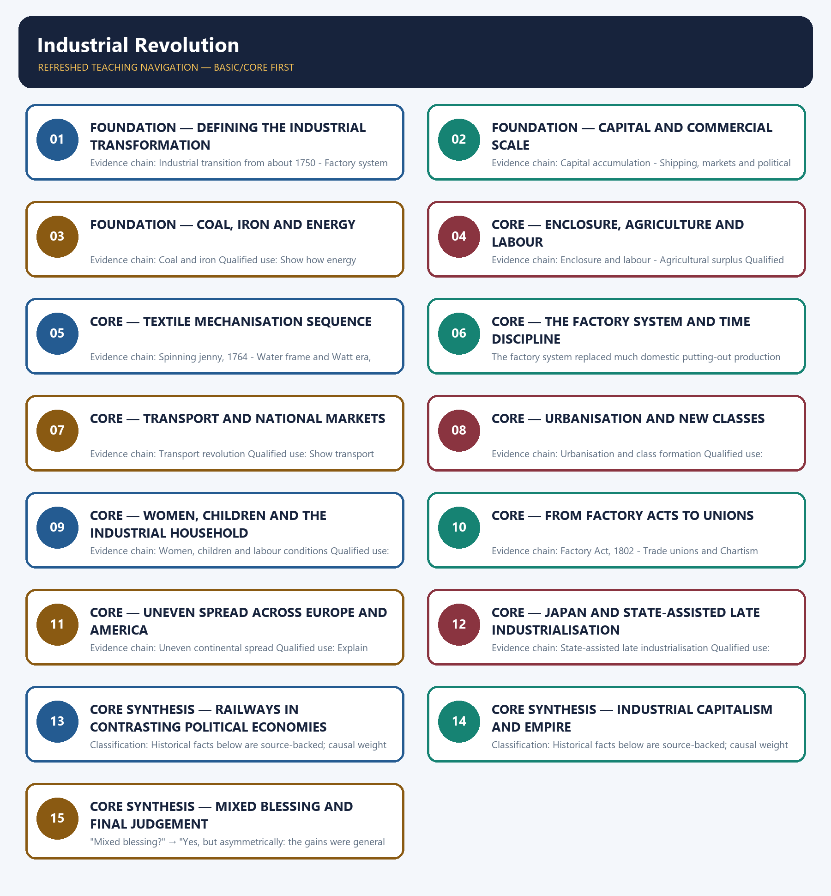

# Industrial Revolution — Learner-v2 Complete Learning Session

> **Authoring-only generation:** 2026-09-01. No PDF was rendered and no tracker or index was mutated.

### SOURCE, PROGRESSION AND CURRENT-LINKAGE AUDIT

- **Generation date:** 2026-09-01.
- **Repository-first evidence:** the Basic owner is taught first and preserved in full; the Advanced owner is retained only in the optional final teaching block.
- **OCR evidence:** Repository Markdown was used first. The available OCR-searchable Norman Lowe World History PDF was retained as supplementary local context, but no unsupported page number, quotation or precision was imported from it.
- **Qdrant:** not used; repository Markdown and available OCR context were sufficient.
- **PYQ integrity:** The owners verify the 2023 GS-I demand on socio-economic effects of railways in different countries and reproduce the exact 2024 GS-I question on England's Industrial Revolution and Indian handicrafts. The India-specific verdict remains with the Modern Indian History owner.
- **Live-link boundary:** No verified live current-affairs item is pegged to this historical topic in the repository owners. The package therefore uses the bounded phrase 'no verified live item' rather than inventing a headline, date, institution or contemporary linkage.
- **Fact/inference discipline:** no current-affairs item, PYQ wording, figure or quotation is invented.

## BASIC LEARNING SESSION



*Distinct embedded teaching-navigation image. The separate continuous Cārvāka-style flowchart package remains an independent at-a-glance artifact.*

### SESSION 1 — FOUNDATION — DEFINING THE INDUSTRIAL TRANSFORMATION

#### DEFINITION / WHAT THIS IS CALLED

**Plain-language definition:** Precise definition: Defining the industrial transformation is the source-bounded relationship among Industrial transition from about 1750 and Factory system within Industrial Revolution.

**Technical definition:** Evidence chain: Industrial transition from about 1750 - Factory system Qualified use: Define technological and social transformation together.

#### ANSWER-GRABBING OPENING — WRITE/ADAPT IN THE EXAM

> Precise definition: Defining the industrial transformation is the source-bounded relationship among Industrial transition from about 1750 and Factory system within Industrial Revolution.

#### MUST-WRITE KEYWORDS

- **FOUNDATION**
- **Defining the industrial transformation**
- **Precise definition**
- **Evidence chain**
- **Qualified use**
- **Precise definition: Defining the industrial transformation**

**How to use them:** Frame the answer through FOUNDATION; define Defining the industrial transformation, connect Precise definition with Evidence chain to explain the mechanism, and use Qualified use for the decisive comparison or qualification.

##### VISUAL FIRST

```text
DEFINING THE INDUSTRIAL TRANSFORMATION
01. Industrial transition from about 1750
    |
    v
02. Factory system
BOUNDARY -> Use a period, not a single start date.
```

*This topic-specific rail fixes the evidence sequence and its exam boundary before analysis.*

##### CONCEPT DEFINITIONS

- **Precise definition:** Defining the industrial transformation is the source-bounded relationship among Industrial transition from about 1750 and Factory system within Industrial Revolution.
- **Classification:** Historical facts below are source-backed; causal weight and evaluative verdicts are analytical synthesis.

##### CORE EXPLANATION

Old NCERT places the beginning of the Industrial Revolution in England around 1750 as machine-based large-scale production created an industrial economy. The factory system replaced much domestic putting-out production with concentrated machinery, supervision and time discipline.

##### NAMED EVIDENCE AND MECHANISM

- Old NCERT places the beginning of the Industrial Revolution in England around 1750 as machine-based large-scale production created an industrial economy.
- The factory system replaced much domestic putting-out production with concentrated machinery, supervision and time discipline.

##### EXAMINER CAUTION

- Use a period, not a single start date.

##### EXAM LINK

- **Prelims:** Retain the exact actor, date, document and category in Defining the industrial transformation.
- **Mains:** Define technological and social transformation together.

##### MINI RECAP

- **Evidence chain:** Industrial transition from about 1750 -> Factory system
- **Qualified use:** Define technological and social transformation together.

#### CLOSING RECALL FLOW — FOUNDATION — DEFINING THE INDUSTRIAL TRANSFORMATION

```text
START / CONCEPT: FOUNDATION — Defining the industrial transformation
        |
        v
EXACT TERMS: FOUNDATION · Defining the industrial transformation · Precise definition · Evidence chain · Qualified use · Precise definition: Defining the industrial transformation
        |
        v
MECHANISM / ARGUMENT: Evidence chain: Industrial transition from about 1750 - Factory system Qualified use: Define technological and social transformation together.
        |
        v
CONSEQUENCE / CONTRAST: Use a period, not a single start date.
        |
        v
UPSC TRAP / ANSWER-USE: Do not miss this limiting distinction: old NCERT places the beginning of the Industrial Revolution in England around 1750 as...
        |
        v
ANSWER-GRABBING FORMULATION: Precise definition: Defining the industrial transformation is the source-bounded relationship among Industrial transition from about 1750 and Factory system within Industrial Revolution.
```
### SESSION 2 — FOUNDATION — CAPITAL AND COMMERCIAL SCALE

#### DEFINITION / WHAT THIS IS CALLED

**Plain-language definition:** Precise definition: Capital and commercial scale is the source-bounded relationship among Capital accumulation and Shipping, markets and political order within Industrial Revolution.

**Technical definition:** Evidence chain: Capital accumulation - Shipping, markets and political order Qualified use: Connect finance and markets to fixed industrial investment.

#### ANSWER-GRABBING OPENING — WRITE/ADAPT IN THE EXAM

> Precise definition: Capital and commercial scale is the source-bounded relationship among Capital accumulation and Shipping, markets and political order within Industrial Revolution.

#### MUST-WRITE KEYWORDS

- **FOUNDATION**
- **Capital**
- **commercial scale**
- **Precise definition**
- **Evidence chain**
- **Qualified use**

**How to use them:** Frame the answer through FOUNDATION; define Capital, connect commercial scale with Precise definition to explain the mechanism, and use Evidence chain for the decisive comparison or qualification.

##### VISUAL FIRST

```text
CAPITAL AND COMMERCIAL SCALE
01. Capital accumulation
    |
    v
02. Shipping, markets and political order
BOUNDARY -> Colonial wealth was one source of capital, not the whole explanation.
```

*This topic-specific rail fixes the evidence sequence and its exam boundary before analysis.*

##### CONCEPT DEFINITIONS

- **Precise definition:** Capital and commercial scale is the source-bounded relationship among Capital accumulation and Shipping, markets and political order within Industrial Revolution.
- **Classification:** Historical facts below are source-backed; causal weight and evaluative verdicts are analytical synthesis.

##### CORE EXPLANATION

Expanding trade, colonies and accumulated wealth supplied investible capital, but colonial gains were one element rather than the sole cause. Overseas shipping and markets encouraged scale, while a commercially favourable post-seventeenth-century political-legal order reduced friction for enterprise.

##### NAMED EVIDENCE AND MECHANISM

- Expanding trade, colonies and accumulated wealth supplied investible capital, but colonial gains were one element rather than the sole cause.
- Overseas shipping and markets encouraged scale, while a commercially favourable post-seventeenth-century political-legal order reduced friction for enterprise.

##### EXAMINER CAUTION

- Colonial wealth was one source of capital, not the whole explanation.

##### EXAM LINK

- **Prelims:** Retain the exact actor, date, document and category in Capital and commercial scale.
- **Mains:** Connect finance and markets to fixed industrial investment.

##### MINI RECAP

- **Evidence chain:** Capital accumulation -> Shipping, markets and political order
- **Qualified use:** Connect finance and markets to fixed industrial investment.

#### CLOSING RECALL FLOW — FOUNDATION — CAPITAL AND COMMERCIAL SCALE

```text
START / CONCEPT: FOUNDATION — Capital and commercial scale
        |
        v
EXACT TERMS: FOUNDATION · Capital · commercial scale · Precise definition · Evidence chain · Qualified use
        |
        v
MECHANISM / ARGUMENT: Expanding trade, colonies and accumulated wealth supplied investible capital, but colonial gains were one element rather than the sole cause.
        |
        v
CONSEQUENCE / CONTRAST: Colonial wealth was one source of capital, not the whole explanation.
        |
        v
UPSC TRAP / ANSWER-USE: Do not miss this limiting distinction: capital accumulation - Shipping, markets and political order Qualified use.
        |
        v
ANSWER-GRABBING FORMULATION: Precise definition: Capital and commercial scale is the source-bounded relationship among Capital accumulation and Shipping, markets and political order within Industrial Revolution.
```
### SESSION 3 — FOUNDATION — COAL, IRON AND ENERGY

#### DEFINITION / WHAT THIS IS CALLED

**Plain-language definition:** Precise definition: Coal, iron and energy is the source-bounded relationship among and Coal and iron within Industrial Revolution.

**Technical definition:** Evidence chain: Coal and iron Qualified use: Show how energy removed production limits.

#### ANSWER-GRABBING OPENING — WRITE/ADAPT IN THE EXAM

> Precise definition: Coal, iron and energy is the source-bounded relationship among and Coal and iron within Industrial Revolution.

#### MUST-WRITE KEYWORDS

- **FOUNDATION**
- **Coal**
- **iron**
- **energy**
- **Precise definition**
- **Evidence chain**

**How to use them:** Frame the answer through FOUNDATION; define Coal, connect iron with energy to explain the mechanism, and use Precise definition for the decisive comparison or qualification.

##### VISUAL FIRST

```text
COAL, IRON AND ENERGY
01. Coal and iron
BOUNDARY -> Natural resources do not explain industrialisation without institutions and demand.
```

*This topic-specific rail fixes the evidence sequence and its exam boundary before analysis.*

##### CONCEPT DEFINITIONS

- **Precise definition:** Coal, iron and energy is the source-bounded relationship among  and Coal and iron within Industrial Revolution.
- **Classification:** Historical facts below are source-backed; causal weight and evaluative verdicts are analytical synthesis.

##### CORE EXPLANATION

England's abundant coal and iron supported energy-intensive machinery, though resources required markets, institutions and capital to become productive.

##### NAMED EVIDENCE AND MECHANISM

- England's abundant coal and iron supported energy-intensive machinery, though resources required markets, institutions and capital to become productive.

##### EXAMINER CAUTION

- Natural resources do not explain industrialisation without institutions and demand.

##### EXAM LINK

- **Prelims:** Retain the exact actor, date, document and category in Coal, iron and energy.
- **Mains:** Show how energy removed production limits.

##### MINI RECAP

- **Evidence chain:** Coal and iron
- **Qualified use:** Show how energy removed production limits.

#### CLOSING RECALL FLOW — FOUNDATION — COAL, IRON AND ENERGY

```text
START / CONCEPT: FOUNDATION — Coal, iron and energy
        |
        v
EXACT TERMS: FOUNDATION · Coal · iron · energy · Precise definition · Evidence chain
        |
        v
MECHANISM / ARGUMENT: Evidence chain: Coal and iron Qualified use: Show how energy removed production limits.
        |
        v
CONSEQUENCE / CONTRAST: Natural resources do not explain industrialisation without institutions and demand.
        |
        v
UPSC TRAP / ANSWER-USE: Do not miss this limiting distinction: show how energy removed production limits.
        |
        v
ANSWER-GRABBING FORMULATION: Precise definition: Coal, iron and energy is the source-bounded relationship among and Coal and iron within Industrial Revolution.
```
### SESSION 4 — CORE — ENCLOSURE, AGRICULTURE AND LABOUR

#### DEFINITION / WHAT THIS IS CALLED

**Plain-language definition:** Precise definition: Enclosure, agriculture and labour is the source-bounded relationship among Enclosure and labour and Agricultural surplus within Industrial Revolution.

**Technical definition:** Evidence chain: Enclosure and labour - Agricultural surplus Qualified use: Link countryside transformation to factories and towns.

#### ANSWER-GRABBING OPENING — WRITE/ADAPT IN THE EXAM

> Precise definition: Enclosure, agriculture and labour is the source-bounded relationship among Enclosure and labour and Agricultural surplus within Industrial Revolution.

#### MUST-WRITE KEYWORDS

- **Enclosure**
- **agriculture**
- **labour**
- **Precise definition**
- **Evidence chain**
- **Qualified use**

**How to use them:** Frame the answer through Enclosure; define agriculture, connect labour with Precise definition to explain the mechanism, and use Evidence chain for the decisive comparison or qualification.

##### VISUAL FIRST

```text
ENCLOSURE, AGRICULTURE AND LABOUR
01. Enclosure and labour
    |
    v
02. Agricultural surplus
BOUNDARY -> Agricultural change created both surplus and dispossession.
```

*This topic-specific rail fixes the evidence sequence and its exam boundary before analysis.*

##### CONCEPT DEFINITIONS

- **Precise definition:** Enclosure, agriculture and labour is the source-bounded relationship among Enclosure and labour and Agricultural surplus within Industrial Revolution.
- **Classification:** Historical facts below are source-backed; causal weight and evaluative verdicts are analytical synthesis.

##### CORE EXPLANATION

The enclosure movement released landless labour for factories, linking agricultural change to industrial wage dependence. Crop rotation, manuring and new implements raised food supply and helped sustain a non-farming urban population.

##### NAMED EVIDENCE AND MECHANISM

- The enclosure movement released landless labour for factories, linking agricultural change to industrial wage dependence.
- Crop rotation, manuring and new implements raised food supply and helped sustain a non-farming urban population.

##### EXAMINER CAUTION

- Agricultural change created both surplus and dispossession.

##### EXAM LINK

- **Prelims:** Retain the exact actor, date, document and category in Enclosure, agriculture and labour.
- **Mains:** Link countryside transformation to factories and towns.

##### MINI RECAP

- **Evidence chain:** Enclosure and labour -> Agricultural surplus
- **Qualified use:** Link countryside transformation to factories and towns.

#### CLOSING RECALL FLOW — CORE — ENCLOSURE, AGRICULTURE AND LABOUR

```text
START / CONCEPT: CORE — Enclosure, agriculture and labour
        |
        v
EXACT TERMS: Enclosure · agriculture · labour · Precise definition · Evidence chain · Qualified use
        |
        v
MECHANISM / ARGUMENT: Evidence chain: Enclosure and labour - Agricultural surplus Qualified use: Link countryside transformation to factories and towns.
        |
        v
CONSEQUENCE / CONTRAST: Classification: Historical facts below are source-backed; causal weight and evaluative verdicts are analytical synthesis.
        |
        v
UPSC TRAP / ANSWER-USE: Do not miss this limiting distinction: agricultural change created both surplus and dispossession.
        |
        v
ANSWER-GRABBING FORMULATION: Precise definition: Enclosure, agriculture and labour is the source-bounded relationship among Enclosure and labour and Agricultural surplus within Industrial Revolution.
```
### SESSION 5 — CORE — TEXTILE MECHANISATION SEQUENCE

#### DEFINITION / WHAT THIS IS CALLED

**Plain-language definition:** Precise definition: Textile mechanisation sequence is the source-bounded relationship among Spinning jenny, 1764, Water frame and Watt era, 1769, Power loom, 1785 and Cotton gin, 1793 within Industrial Revolution.

**Technical definition:** Evidence chain: Spinning jenny, 1764 - Water frame and Watt era, 1769 - Power loom, 1785 - Cotton gin, 1793 Qualified use: Use textiles to explain cumulative innovation.

#### ANSWER-GRABBING OPENING — WRITE/ADAPT IN THE EXAM

> Precise definition: Textile mechanisation sequence is the source-bounded relationship among Spinning jenny, 1764, Water frame and Watt era, 1769, Power loom, 1785 and Cotton gin, 1793 within Industrial Revolution.

#### MUST-WRITE KEYWORDS

- **Textile mechanisation sequence**
- **Precise definition**
- **Evidence chain**
- **Qualified use**
- **Precise definition: Textile mechanisation sequence**
- **Precise**

**How to use them:** Frame the answer through Textile mechanisation sequence; define Precise definition, connect Evidence chain with Qualified use to explain the mechanism, and use Precise definition: Textile mechanisation sequence for the decisive comparison or qualification.

##### VISUAL FIRST

```text
TEXTILE MECHANISATION SEQUENCE
01. Spinning jenny, 1764
    |
    v
02. Water frame and Watt era, 1769
    |
    v
03. Power loom, 1785
    |
    v
04. Cotton gin, 1793
BOUNDARY -> Keep inventors, dates and countries distinct.
```

*This topic-specific rail fixes the evidence sequence and its exam boundary before analysis.*

##### CONCEPT DEFINITIONS

- **Precise definition:** Textile mechanisation sequence is the source-bounded relationship among Spinning jenny, 1764, Water frame and Watt era, 1769, Power loom, 1785 and Cotton gin, 1793 within Industrial Revolution.
- **Classification:** Historical facts below are source-backed; causal weight and evaluative verdicts are analytical synthesis.

##### CORE EXPLANATION

James Hargreaves' spinning jenny of 1764 accelerated spinning in the leading cotton-textile sector. Arkwright's water frame and Watt's steam-engine improvement era around 1769 deepened mechanisation; Watt improved rather than solely invented the steam engine. Edmund Cartwright's power loom of 1785 mechanised weaving and helped integrate textile production inside factories. Eli Whitney's cotton gin of 1793, an American invention, accelerated raw-cotton processing.

##### NAMED EVIDENCE AND MECHANISM

- James Hargreaves' spinning jenny of 1764 accelerated spinning in the leading cotton-textile sector.
- Arkwright's water frame and Watt's steam-engine improvement era around 1769 deepened mechanisation; Watt improved rather than solely invented the steam engine.
- Edmund Cartwright's power loom of 1785 mechanised weaving and helped integrate textile production inside factories.
- Eli Whitney's cotton gin of 1793, an American invention, accelerated raw-cotton processing.

##### EXAMINER CAUTION

- Keep inventors, dates and countries distinct.

##### EXAM LINK

- **Prelims:** Retain the exact actor, date, document and category in Textile mechanisation sequence.
- **Mains:** Use textiles to explain cumulative innovation.

##### MINI RECAP

- **Evidence chain:** Spinning jenny, 1764 -> Water frame and Watt era, 1769 -> Power loom, 1785 -> Cotton gin, 1793
- **Qualified use:** Use textiles to explain cumulative innovation.

#### CLOSING RECALL FLOW — CORE — TEXTILE MECHANISATION SEQUENCE

```text
START / CONCEPT: CORE — Textile mechanisation sequence
        |
        v
EXACT TERMS: Textile mechanisation sequence · Precise definition · Evidence chain · Qualified use · Precise definition: Textile mechanisation sequence · Precise
        |
        v
MECHANISM / ARGUMENT: Evidence chain: Spinning jenny, 1764 - Water frame and Watt era, 1769 - Power loom, 1785 - Cotton gin, 1793 Qualified use: Use textiles to explain cumulative innovation.
        |
        v
CONSEQUENCE / CONTRAST: Mains: Use textiles to explain cumulative innovation.
        |
        v
UPSC TRAP / ANSWER-USE: Do not miss this limiting distinction: causal weight and evaluative verdicts are analytical synthesis.
        |
        v
ANSWER-GRABBING FORMULATION: Precise definition: Textile mechanisation sequence is the source-bounded relationship among Spinning jenny, 1764, Water frame and Watt era, 1769, Power loom, 1785 and Cotton gin, 1793 within Industrial Revolution.
```
### SESSION 6 — CORE — THE FACTORY SYSTEM AND TIME DISCIPLINE

#### DEFINITION / WHAT THIS IS CALLED

**Plain-language definition:** Precise definition: The factory system and time discipline is the source-bounded relationship among and Factory system within Industrial Revolution.

**Technical definition:** The factory system replaced much domestic putting-out production with concentrated machinery, supervision and time discipline.

#### ANSWER-GRABBING OPENING — WRITE/ADAPT IN THE EXAM

> Precise definition: The factory system and time discipline is the source-bounded relationship among and Factory system within Industrial Revolution.

#### MUST-WRITE KEYWORDS

- **The factory system**
- **time discipline**
- **Precise definition**
- **Evidence chain**
- **Qualified use**
- **Precise definition: The factory system and time discipline**

**How to use them:** Frame the answer through The factory system; define time discipline, connect Precise definition with Evidence chain to explain the mechanism, and use Qualified use for the decisive comparison or qualification.

##### VISUAL FIRST

```text
THE FACTORY SYSTEM AND TIME DISCIPLINE
01. Factory system
BOUNDARY -> Factory concentration was organisational as well as technological.
```

*This topic-specific rail fixes the evidence sequence and its exam boundary before analysis.*

##### CONCEPT DEFINITIONS

- **Precise definition:** The factory system and time discipline is the source-bounded relationship among  and Factory system within Industrial Revolution.
- **Classification:** Historical facts below are source-backed; causal weight and evaluative verdicts are analytical synthesis.

##### CORE EXPLANATION

The factory system replaced much domestic putting-out production with concentrated machinery, supervision and time discipline.

##### NAMED EVIDENCE AND MECHANISM

- The factory system replaced much domestic putting-out production with concentrated machinery, supervision and time discipline.

##### EXAMINER CAUTION

- Factory concentration was organisational as well as technological.

##### EXAM LINK

- **Prelims:** Retain the exact actor, date, document and category in The factory system and time discipline.
- **Mains:** Explain new control over labour and production.

##### MINI RECAP

- **Evidence chain:** Factory system
- **Qualified use:** Explain new control over labour and production.

#### CLOSING RECALL FLOW — CORE — THE FACTORY SYSTEM AND TIME DISCIPLINE

```text
START / CONCEPT: CORE — The factory system and time discipline
        |
        v
EXACT TERMS: The factory system · time discipline · Precise definition · Evidence chain · Qualified use · Precise definition: The factory system and time discipline
        |
        v
MECHANISM / ARGUMENT: The factory system replaced much domestic putting-out production with concentrated machinery, supervision and time discipline.
        |
        v
CONSEQUENCE / CONTRAST: Evidence chain: Factory system Qualified use: Explain new control over labour and production.
        |
        v
UPSC TRAP / ANSWER-USE: Do not miss this limiting distinction: factory concentration was organisational as well as technological.
        |
        v
ANSWER-GRABBING FORMULATION: Precise definition: The factory system and time discipline is the source-bounded relationship among and Factory system within Industrial Revolution.
```
### SESSION 7 — CORE — TRANSPORT AND NATIONAL MARKETS

#### DEFINITION / WHAT THIS IS CALLED

**Plain-language definition:** Precise definition: Transport and national markets is the source-bounded relationship among and Transport revolution within Industrial Revolution.

**Technical definition:** Evidence chain: Transport revolution Qualified use: Show transport magnifying rather than initiating industrialisation.

#### ANSWER-GRABBING OPENING — WRITE/ADAPT IN THE EXAM

> Precise definition: Transport and national markets is the source-bounded relationship among and Transport revolution within Industrial Revolution.

#### MUST-WRITE KEYWORDS

- **Transport**
- **national markets**
- **Precise definition**
- **Evidence chain**
- **Qualified use**
- **Precise definition: Transport and national markets**

**How to use them:** Frame the answer through Transport; define national markets, connect Precise definition with Evidence chain to explain the mechanism, and use Qualified use for the decisive comparison or qualification.

##### VISUAL FIRST

```text
TRANSPORT AND NATIONAL MARKETS
01. Transport revolution
BOUNDARY -> Railways followed the first mechanisation wave.
```

*This topic-specific rail fixes the evidence sequence and its exam boundary before analysis.*

##### CONCEPT DEFINITIONS

- **Precise definition:** Transport and national markets is the source-bounded relationship among  and Transport revolution within Industrial Revolution.
- **Classification:** Historical facts below are source-backed; causal weight and evaluative verdicts are analytical synthesis.

##### CORE EXPLANATION

Canals, macadam roads, steam boats and the first passenger railway in 1830 reduced transport costs and deepened national markets.

##### NAMED EVIDENCE AND MECHANISM

- Canals, macadam roads, steam boats and the first passenger railway in 1830 reduced transport costs and deepened national markets.

##### EXAMINER CAUTION

- Railways followed the first mechanisation wave.

##### EXAM LINK

- **Prelims:** Retain the exact actor, date, document and category in Transport and national markets.
- **Mains:** Show transport magnifying rather than initiating industrialisation.

##### MINI RECAP

- **Evidence chain:** Transport revolution
- **Qualified use:** Show transport magnifying rather than initiating industrialisation.

#### CLOSING RECALL FLOW — CORE — TRANSPORT AND NATIONAL MARKETS

```text
START / CONCEPT: CORE — Transport and national markets
        |
        v
EXACT TERMS: Transport · national markets · Precise definition · Evidence chain · Qualified use · Precise definition: Transport and national markets
        |
        v
MECHANISM / ARGUMENT: Evidence chain: Transport revolution Qualified use: Show transport magnifying rather than initiating industrialisation.
        |
        v
CONSEQUENCE / CONTRAST: Mains: Show transport magnifying rather than initiating industrialisation.
        |
        v
UPSC TRAP / ANSWER-USE: Do not miss this limiting distinction: causal weight and evaluative verdicts are analytical synthesis.
        |
        v
ANSWER-GRABBING FORMULATION: Precise definition: Transport and national markets is the source-bounded relationship among and Transport revolution within Industrial Revolution.
```
### SESSION 8 — CORE — URBANISATION AND NEW CLASSES

#### DEFINITION / WHAT THIS IS CALLED

**Plain-language definition:** Precise definition: Urbanisation and new classes is the source-bounded relationship among and Urbanisation and class formation within Industrial Revolution.

**Technical definition:** Evidence chain: Urbanisation and class formation Qualified use: Connect production change to social structure.

#### ANSWER-GRABBING OPENING — WRITE/ADAPT IN THE EXAM

> Precise definition: Urbanisation and new classes is the source-bounded relationship among and Urbanisation and class formation within Industrial Revolution.

#### MUST-WRITE KEYWORDS

- **Urbanisation**
- **new classes**
- **Precise definition**
- **Evidence chain**
- **Qualified use**
- **Precise definition: Urbanisation and new classes**

**How to use them:** Frame the answer through Urbanisation; define new classes, connect Precise definition with Evidence chain to explain the mechanism, and use Qualified use for the decisive comparison or qualification.

##### VISUAL FIRST

```text
URBANISATION AND NEW CLASSES
01. Urbanisation and class formation
BOUNDARY -> Class formation was uneven across regions and trades.
```

*This topic-specific rail fixes the evidence sequence and its exam boundary before analysis.*

##### CONCEPT DEFINITIONS

- **Precise definition:** Urbanisation and new classes is the source-bounded relationship among  and Urbanisation and class formation within Industrial Revolution.
- **Classification:** Historical facts below are source-backed; causal weight and evaluative verdicts are analytical synthesis.

##### CORE EXPLANATION

Industrialisation shifted economic life toward towns and made capitalists and wage-workers central social classes.

##### NAMED EVIDENCE AND MECHANISM

- Industrialisation shifted economic life toward towns and made capitalists and wage-workers central social classes.

##### EXAMINER CAUTION

- Class formation was uneven across regions and trades.

##### EXAM LINK

- **Prelims:** Retain the exact actor, date, document and category in Urbanisation and new classes.
- **Mains:** Connect production change to social structure.

##### MINI RECAP

- **Evidence chain:** Urbanisation and class formation
- **Qualified use:** Connect production change to social structure.

#### CLOSING RECALL FLOW — CORE — URBANISATION AND NEW CLASSES

```text
START / CONCEPT: CORE — Urbanisation and new classes
        |
        v
EXACT TERMS: Urbanisation · new classes · Precise definition · Evidence chain · Qualified use · Precise definition: Urbanisation and new classes
        |
        v
MECHANISM / ARGUMENT: Evidence chain: Urbanisation and class formation Qualified use: Connect production change to social structure.
        |
        v
CONSEQUENCE / CONTRAST: Classification: Historical facts below are source-backed; causal weight and evaluative verdicts are analytical synthesis.
        |
        v
UPSC TRAP / ANSWER-USE: Do not miss this limiting distinction: class formation was uneven across regions and trades.
        |
        v
ANSWER-GRABBING FORMULATION: Precise definition: Urbanisation and new classes is the source-bounded relationship among and Urbanisation and class formation within Industrial Revolution.
```
### SESSION 9 — CORE — WOMEN, CHILDREN AND THE INDUSTRIAL HOUSEHOLD

#### DEFINITION / WHAT THIS IS CALLED

**Plain-language definition:** Precise definition: Women, children and the industrial household is the source-bounded relationship among and Women, children and labour conditions within Industrial Revolution.

**Technical definition:** Evidence chain: Women, children and labour conditions Qualified use: Include gender, childhood and household economy.

#### ANSWER-GRABBING OPENING — WRITE/ADAPT IN THE EXAM

> Precise definition: Women, children and the industrial household is the source-bounded relationship among and Women, children and labour conditions within Industrial Revolution.

#### MUST-WRITE KEYWORDS

- **Women**
- **children**
- **the industrial household**
- **Precise definition**
- **Evidence chain**
- **Qualified use**

**How to use them:** Frame the answer through Women; define children, connect the industrial household with Precise definition to explain the mechanism, and use Evidence chain for the decisive comparison or qualification.

##### VISUAL FIRST

```text
WOMEN, CHILDREN AND THE INDUSTRIAL HOUSEHOLD
01. Women, children and labour conditions
BOUNDARY -> Factory work coexisted with domestic and outwork labour.
```

*This topic-specific rail fixes the evidence sequence and its exam boundary before analysis.*

##### CONCEPT DEFINITIONS

- **Precise definition:** Women, children and the industrial household is the source-bounded relationship among  and Women, children and labour conditions within Industrial Revolution.
- **Classification:** Historical facts below are source-backed; causal weight and evaluative verdicts are analytical synthesis.

##### CORE EXPLANATION

Early factories relied heavily on women and children amid long hours, low wages, insecurity and slum conditions.

##### NAMED EVIDENCE AND MECHANISM

- Early factories relied heavily on women and children amid long hours, low wages, insecurity and slum conditions.

##### EXAMINER CAUTION

- Factory work coexisted with domestic and outwork labour.

##### EXAM LINK

- **Prelims:** Retain the exact actor, date, document and category in Women, children and the industrial household.
- **Mains:** Include gender, childhood and household economy.

##### MINI RECAP

- **Evidence chain:** Women, children and labour conditions
- **Qualified use:** Include gender, childhood and household economy.

#### CLOSING RECALL FLOW — CORE — WOMEN, CHILDREN AND THE INDUSTRIAL HOUSEHOLD

```text
START / CONCEPT: CORE — Women, children and the industrial household
        |
        v
EXACT TERMS: Women · children · the industrial household · Precise definition · Evidence chain · Qualified use
        |
        v
MECHANISM / ARGUMENT: Evidence chain: Women, children and labour conditions Qualified use: Include gender, childhood and household economy.
        |
        v
CONSEQUENCE / CONTRAST: Mains: Include gender, childhood and household economy.
        |
        v
UPSC TRAP / ANSWER-USE: Do not miss this limiting distinction: causal weight and evaluative verdicts are analytical synthesis.
        |
        v
ANSWER-GRABBING FORMULATION: Precise definition: Women, children and the industrial household is the source-bounded relationship among and Women, children and labour conditions within Industrial Revolution.
```
### SESSION 10 — CORE — FROM FACTORY ACTS TO UNIONS

#### DEFINITION / WHAT THIS IS CALLED

**Plain-language definition:** Precise definition: From Factory Acts to unions is the source-bounded relationship among Factory Act, 1802 and Trade unions and Chartism within Industrial Revolution.

**Technical definition:** Evidence chain: Factory Act, 1802 - Trade unions and Chartism Qualified use: Show harm producing regulation and political organisation.

#### ANSWER-GRABBING OPENING — WRITE/ADAPT IN THE EXAM

> Precise definition: From Factory Acts to unions is the source-bounded relationship among Factory Act, 1802 and Trade unions and Chartism within Industrial Revolution.

#### MUST-WRITE KEYWORDS

- **From Factory Acts to unions**
- **Precise definition**
- **Evidence chain**
- **Qualified use**
- **Precise definition: From Factory Acts to unions**
- **Precise**

**How to use them:** Frame the answer through From Factory Acts to unions; define Precise definition, connect Evidence chain with Qualified use to explain the mechanism, and use Precise definition: From Factory Acts to unions for the decisive comparison or qualification.

##### VISUAL FIRST

```text
FROM FACTORY ACTS TO UNIONS
01. Factory Act, 1802
    |
    v
02. Trade unions and Chartism
BOUNDARY -> Early law was weak and Chartism did not win immediately.
```

*This topic-specific rail fixes the evidence sequence and its exam boundary before analysis.*

##### CONCEPT DEFINITIONS

- **Precise definition:** From Factory Acts to unions is the source-bounded relationship among Factory Act, 1802 and Trade unions and Chartism within Industrial Revolution.
- **Classification:** Historical facts below are source-backed; causal weight and evaluative verdicts are analytical synthesis.

##### CORE EXPLANATION

The first Factory Act in England in 1802 began labour regulation, though early enforcement remained weak. Repeal of anti-union laws in 1824 enabled union growth, while Chartism in the 1830s and 1840s connected labour conditions with political rights.

##### NAMED EVIDENCE AND MECHANISM

- The first Factory Act in England in 1802 began labour regulation, though early enforcement remained weak.
- Repeal of anti-union laws in 1824 enabled union growth, while Chartism in the 1830s and 1840s connected labour conditions with political rights.

##### EXAMINER CAUTION

- Early law was weak and Chartism did not win immediately.

##### EXAM LINK

- **Prelims:** Retain the exact actor, date, document and category in From Factory Acts to unions.
- **Mains:** Show harm producing regulation and political organisation.

##### MINI RECAP

- **Evidence chain:** Factory Act, 1802 -> Trade unions and Chartism
- **Qualified use:** Show harm producing regulation and political organisation.

#### CLOSING RECALL FLOW — CORE — FROM FACTORY ACTS TO UNIONS

```text
START / CONCEPT: CORE — From Factory Acts to unions
        |
        v
EXACT TERMS: From Factory Acts to unions · Precise definition · Evidence chain · Qualified use · Precise definition: From Factory Acts to unions · Precise
        |
        v
MECHANISM / ARGUMENT: Evidence chain: Factory Act, 1802 - Trade unions and Chartism Qualified use: Show harm producing regulation and political organisation.
        |
        v
CONSEQUENCE / CONTRAST: Repeal of anti-union laws in 1824 enabled union growth, while Chartism in the 1830s and 1840s connected labour conditions with political rights.
        |
        v
UPSC TRAP / ANSWER-USE: Early law was weak and Chartism did not win immediately.
        |
        v
ANSWER-GRABBING FORMULATION: Precise definition: From Factory Acts to unions is the source-bounded relationship among Factory Act, 1802 and Trade unions and Chartism within Industrial Revolution.
```
### SESSION 11 — CORE — UNEVEN SPREAD ACROSS EUROPE AND AMERICA

#### DEFINITION / WHAT THIS IS CALLED

**Plain-language definition:** Precise definition: Uneven spread across Europe and America is the source-bounded relationship among and Uneven continental spread within Industrial Revolution.

**Technical definition:** Evidence chain: Uneven continental spread Qualified use: Explain catch-up and regional variation.

#### ANSWER-GRABBING OPENING — WRITE/ADAPT IN THE EXAM

> Precise definition: Uneven spread across Europe and America is the source-bounded relationship among and Uneven continental spread within Industrial Revolution.

#### MUST-WRITE KEYWORDS

- **Uneven spread across Europe**
- **America**
- **Precise definition**
- **Evidence chain**
- **Qualified use**
- **Precise definition: Uneven spread across Europe and America**

**How to use them:** Frame the answer through Uneven spread across Europe; define America, connect Precise definition with Evidence chain to explain the mechanism, and use Qualified use for the decisive comparison or qualification.

##### VISUAL FIRST

```text
UNEVEN SPREAD ACROSS EUROPE AND AMERICA
01. Uneven continental spread
BOUNDARY -> Do not use one British path as a universal model.
```

*This topic-specific rail fixes the evidence sequence and its exam boundary before analysis.*

##### CONCEPT DEFINITIONS

- **Precise definition:** Uneven spread across Europe and America is the source-bounded relationship among  and Uneven continental spread within Industrial Revolution.
- **Classification:** Historical facts below are source-backed; causal weight and evaluative verdicts are analytical synthesis.

##### CORE EXPLANATION

Industrialisation spread unevenly to France, Belgium and Switzerland after 1815, later to Germany, and rapidly in the United States especially after 1870.

##### NAMED EVIDENCE AND MECHANISM

- Industrialisation spread unevenly to France, Belgium and Switzerland after 1815, later to Germany, and rapidly in the United States especially after 1870.

##### EXAMINER CAUTION

- Do not use one British path as a universal model.

##### EXAM LINK

- **Prelims:** Retain the exact actor, date, document and category in Uneven spread across Europe and America.
- **Mains:** Explain catch-up and regional variation.

##### MINI RECAP

- **Evidence chain:** Uneven continental spread
- **Qualified use:** Explain catch-up and regional variation.

#### CLOSING RECALL FLOW — CORE — UNEVEN SPREAD ACROSS EUROPE AND AMERICA

```text
START / CONCEPT: CORE — Uneven spread across Europe and America
        |
        v
EXACT TERMS: Uneven spread across Europe · America · Precise definition · Evidence chain · Qualified use · Precise definition: Uneven spread across Europe and America
        |
        v
MECHANISM / ARGUMENT: Evidence chain: Uneven continental spread Qualified use: Explain catch-up and regional variation.
        |
        v
CONSEQUENCE / CONTRAST: Do not use one British path as a universal model.
        |
        v
UPSC TRAP / ANSWER-USE: Do not miss this limiting distinction: causal weight and evaluative verdicts are analytical synthesis.
        |
        v
ANSWER-GRABBING FORMULATION: Precise definition: Uneven spread across Europe and America is the source-bounded relationship among and Uneven continental spread within Industrial Revolution.
```
### SESSION 12 — CORE — JAPAN AND STATE-ASSISTED LATE INDUSTRIALISATION

#### DEFINITION / WHAT THIS IS CALLED

**Plain-language definition:** Precise definition: Japan and state-assisted late industrialisation is the source-bounded relationship among and State-assisted late industrialisation within Industrial Revolution.

**Technical definition:** Evidence chain: State-assisted late industrialisation Qualified use: Compare market-led and state-directed routes.

#### ANSWER-GRABBING OPENING — WRITE/ADAPT IN THE EXAM

> Precise definition: Japan and state-assisted late industrialisation is the source-bounded relationship among and State-assisted late industrialisation within Industrial Revolution.

#### MUST-WRITE KEYWORDS

- **Japan**
- **Precise definition**
- **Evidence chain**
- **Qualified use**
- **Precise definition: Japan and state-assisted late industrialisation**
- **Precise**

**How to use them:** Frame the answer through Japan; define Precise definition, connect Evidence chain with Qualified use to explain the mechanism, and use Precise definition: Japan and state-assisted late industrialisation for the decisive comparison or qualification.

##### VISUAL FIRST

```text
JAPAN AND STATE-ASSISTED LATE INDUSTRIALISATION
01. State-assisted late industrialisation
BOUNDARY -> Use only the locally sourced Meiji infrastructure and industry claims.
```

*This topic-specific rail fixes the evidence sequence and its exam boundary before analysis.*

##### CONCEPT DEFINITIONS

- **Precise definition:** Japan and state-assisted late industrialisation is the source-bounded relationship among  and State-assisted late industrialisation within Industrial Revolution.
- **Classification:** Historical facts below are source-backed; causal weight and evaluative verdicts are analytical synthesis.

##### CORE EXPLANATION

Russia and Japan followed later state-assisted paths; Japan's Meiji government from 1868 built railways, improved roads and promoted modern cotton and silk industry.

##### NAMED EVIDENCE AND MECHANISM

- Russia and Japan followed later state-assisted paths; Japan's Meiji government from 1868 built railways, improved roads and promoted modern cotton and silk industry.

##### EXAMINER CAUTION

- Use only the locally sourced Meiji infrastructure and industry claims.

##### EXAM LINK

- **Prelims:** Retain the exact actor, date, document and category in Japan and state-assisted late industrialisation.
- **Mains:** Compare market-led and state-directed routes.

##### MINI RECAP

- **Evidence chain:** State-assisted late industrialisation
- **Qualified use:** Compare market-led and state-directed routes.

#### CLOSING RECALL FLOW — CORE — JAPAN AND STATE-ASSISTED LATE INDUSTRIALISATION

```text
START / CONCEPT: CORE — Japan and state-assisted late industrialisation
        |
        v
EXACT TERMS: Japan · Precise definition · Evidence chain · Qualified use · Precise definition: Japan and state-assisted late industrialisation · Precise
        |
        v
MECHANISM / ARGUMENT: Evidence chain: State-assisted late industrialisation Qualified use: Compare market-led and state-directed routes.
        |
        v
CONSEQUENCE / CONTRAST: Russia and Japan followed later state-assisted paths; Japan's Meiji government from 1868 built railways, improved roads and promoted modern cotton and silk industry.
        |
        v
UPSC TRAP / ANSWER-USE: Do not miss this limiting distinction: causal weight and evaluative verdicts are analytical synthesis.
        |
        v
ANSWER-GRABBING FORMULATION: Precise definition: Japan and state-assisted late industrialisation is the source-bounded relationship among and State-assisted late industrialisation within Industrial Revolution.
```
### SESSION 13 — CORE SYNTHESIS — RAILWAYS IN CONTRASTING POLITICAL ECONOMIES

#### DEFINITION / WHAT THIS IS CALLED

**Plain-language definition:** Precise definition: Railways in contrasting political economies is the source-bounded relationship among Transport revolution, Uneven continental spread and State-assisted late industrialisation within Industrial Revolution.

**Technical definition:** Classification: Historical facts below are source-backed; causal weight and evaluative verdicts are analytical synthesis.

#### ANSWER-GRABBING OPENING — WRITE/ADAPT IN THE EXAM

> Precise definition: Railways in contrasting political economies is the source-bounded relationship among Transport revolution, Uneven continental spread and State-assisted late industrialisation within Industrial Revolution.

#### MUST-WRITE KEYWORDS

- **CORE SYNTHESIS**
- **Railways in contrasting political economies**
- **Precise definition**
- **Evidence chain**
- **Qualified use**
- **Precise definition: Railways in contrasting political economies**

**How to use them:** Frame the answer through CORE SYNTHESIS; define Railways in contrasting political economies, connect Precise definition with Evidence chain to explain the mechanism, and use Qualified use for the decisive comparison or qualification.

##### VISUAL FIRST

```text
RAILWAYS IN CONTRASTING POLITICAL ECONOMIES
01. Transport revolution
    |
    v
02. Uneven continental spread
    |
    v
03. State-assisted late industrialisation
BOUNDARY -> The same technology can integrate or extract.
```

*This topic-specific rail fixes the evidence sequence and its exam boundary before analysis.*

##### CONCEPT DEFINITIONS

- **Precise definition:** Railways in contrasting political economies is the source-bounded relationship among Transport revolution, Uneven continental spread and State-assisted late industrialisation within Industrial Revolution.
- **Classification:** Historical facts below are source-backed; causal weight and evaluative verdicts are analytical synthesis.

##### CORE EXPLANATION

Canals, macadam roads, steam boats and the first passenger railway in 1830 reduced transport costs and deepened national markets. Industrialisation spread unevenly to France, Belgium and Switzerland after 1815, later to Germany, and rapidly in the United States especially after 1870. Russia and Japan followed later state-assisted paths; Japan's Meiji government from 1868 built railways, improved roads and promoted modern cotton and silk industry.

##### NAMED EVIDENCE AND MECHANISM

- Canals, macadam roads, steam boats and the first passenger railway in 1830 reduced transport costs and deepened national markets.
- Industrialisation spread unevenly to France, Belgium and Switzerland after 1815, later to Germany, and rapidly in the United States especially after 1870.
- Russia and Japan followed later state-assisted paths; Japan's Meiji government from 1868 built railways, improved roads and promoted modern cotton and silk industry.

##### EXAMINER CAUTION

- The same technology can integrate or extract.

##### EXAM LINK

- **Prelims:** Retain the exact actor, date, document and category in Railways in contrasting political economies.
- **Mains:** Differentiate industrial, settler, latecomer and colonial effects.

##### MINI RECAP

- **Evidence chain:** Transport revolution -> Uneven continental spread -> State-assisted late industrialisation
- **Qualified use:** Differentiate industrial, settler, latecomer and colonial effects.

#### CLOSING RECALL FLOW — CORE SYNTHESIS — RAILWAYS IN CONTRASTING POLITICAL ECONOMIES

```text
START / CONCEPT: CORE SYNTHESIS — Railways in contrasting political economies
        |
        v
EXACT TERMS: CORE SYNTHESIS · Railways in contrasting political economies · Precise definition · Evidence chain · Qualified use · Precise definition: Railways in contrasting political economies
        |
        v
MECHANISM / ARGUMENT: Classification: Historical facts below are source-backed; causal weight and evaluative verdicts are analytical synthesis.
        |
        v
CONSEQUENCE / CONTRAST: Russia and Japan followed later state-assisted paths; Japan's Meiji government from 1868 built railways, improved roads and promoted modern cotton and silk industry.
        |
        v
UPSC TRAP / ANSWER-USE: Do not miss this limiting distinction: transport revolution - Uneven continental spread - State-assisted late industrialisation Qualified use.
        |
        v
ANSWER-GRABBING FORMULATION: Precise definition: Railways in contrasting political economies is the source-bounded relationship among Transport revolution, Uneven continental spread and State-assisted late industrialisation within Industrial Revolution.
```
### SESSION 14 — CORE SYNTHESIS — INDUSTRIAL CAPITALISM AND EMPIRE

#### DEFINITION / WHAT THIS IS CALLED

**Plain-language definition:** Precise definition: Industrial capitalism and empire is the source-bounded relationship among and Industry and imperialism within Industrial Revolution.

**Technical definition:** Classification: Historical facts below are source-backed; causal weight and evaluative verdicts are analytical synthesis.

#### ANSWER-GRABBING OPENING — WRITE/ADAPT IN THE EXAM

> Precise definition: Industrial capitalism and empire is the source-bounded relationship among and Industry and imperialism within Industrial Revolution.

#### MUST-WRITE KEYWORDS

- **CORE SYNTHESIS**
- **Industrial capitalism**
- **empire**
- **Precise definition**
- **Evidence chain**
- **Qualified use**

**How to use them:** Frame the answer through CORE SYNTHESIS; define Industrial capitalism, connect empire with Precise definition to explain the mechanism, and use Evidence chain for the decisive comparison or qualification.

##### VISUAL FIRST

```text
INDUSTRIAL CAPITALISM AND EMPIRE
01. Industry and imperialism
BOUNDARY -> Intensification is safer than monocausal creation.
```

*This topic-specific rail fixes the evidence sequence and its exam boundary before analysis.*

##### CONCEPT DEFINITIONS

- **Precise definition:** Industrial capitalism and empire is the source-bounded relationship among  and Industry and imperialism within Industrial Revolution.
- **Classification:** Historical facts below are source-backed; causal weight and evaluative verdicts are analytical synthesis.

##### CORE EXPLANATION

Rising output intensified demand for raw materials, markets and investment outlets, greatly strengthening imperial rivalry without mechanically creating empire.

##### NAMED EVIDENCE AND MECHANISM

- Rising output intensified demand for raw materials, markets and investment outlets, greatly strengthening imperial rivalry without mechanically creating empire.

##### EXAMINER CAUTION

- Intensification is safer than monocausal creation.

##### EXAM LINK

- **Prelims:** Retain the exact actor, date, document and category in Industrial capitalism and empire.
- **Mains:** Link production pressure to global rivalry with qualifications.

##### MINI RECAP

- **Evidence chain:** Industry and imperialism
- **Qualified use:** Link production pressure to global rivalry with qualifications.

#### CLOSING RECALL FLOW — CORE SYNTHESIS — INDUSTRIAL CAPITALISM AND EMPIRE

```text
START / CONCEPT: CORE SYNTHESIS — Industrial capitalism and empire
        |
        v
EXACT TERMS: CORE SYNTHESIS · Industrial capitalism · empire · Precise definition · Evidence chain · Qualified use
        |
        v
MECHANISM / ARGUMENT: Classification: Historical facts below are source-backed; causal weight and evaluative verdicts are analytical synthesis.
        |
        v
CONSEQUENCE / CONTRAST: Evidence chain: Industry and imperialism Qualified use: Link production pressure to global rivalry with qualifications.
        |
        v
UPSC TRAP / ANSWER-USE: Do not miss this limiting distinction: intensification is safer than monocausal creation.
        |
        v
ANSWER-GRABBING FORMULATION: Precise definition: Industrial capitalism and empire is the source-bounded relationship among and Industry and imperialism within Industrial Revolution.
```
### SESSION 15 — CORE SYNTHESIS — MIXED BLESSING AND FINAL JUDGEMENT

#### DEFINITION / WHAT THIS IS CALLED

**Plain-language definition:** Precise definition: Mixed blessing and final judgement is the source-bounded relationship among Mixed-blessing verdict, Urbanisation and class formation, Women, children and labour conditions and Trade unions and Chartism within Industrial Revolution.

**Technical definition:** "Mixed blessing?" → "Yes, but asymmetrically: the gains were general and delayed, the costs were concentrated and immediate — which is why the political response took the form of labour law and the franchise rather than a rejection of industry." "Why Britain?" → "Not one cause but a conjunction; remove any single element and the sequence slows, but remove secure markets and cheap coal together and it does not begin." "Railways?" → "Railways magnified whatever economic order they entered: integration where there was a national market to integrate, extraction where the economy was organised for export." "Industry and empire?" → "Industrial capitalism raised the stakes of empire rather than inventing the impulse — which is why imperial competition intensified precisely as industrial rivalry did.".

#### ANSWER-GRABBING OPENING — WRITE/ADAPT IN THE EXAM

> Precise definition: Mixed blessing and final judgement is the source-bounded relationship among Mixed-blessing verdict, Urbanisation and class formation, Women, children and labour conditions and Trade unions and Chartism within Industrial Revolution.

#### MUST-WRITE KEYWORDS

- **CORE SYNTHESIS**
- **Mixed blessing**
- **final judgement**
- **Precise definition**
- **Evidence chain**
- **Qualified use**

**How to use them:** Frame the answer through CORE SYNTHESIS; define Mixed blessing, connect final judgement with Precise definition to explain the mechanism, and use Evidence chain for the decisive comparison or qualification.

##### VISUAL FIRST

```text
MIXED BLESSING AND FINAL JUDGEMENT
01. Mixed-blessing verdict
    |
    v
02. Urbanisation and class formation
    |
    v
03. Women, children and labour conditions
    |
    v
04. Trade unions and Chartism
BOUNDARY -> Separate short-run concentrated costs from long-run productive gains.
```

*This topic-specific rail fixes the evidence sequence and its exam boundary before analysis.*

##### CONCEPT DEFINITIONS

- **Precise definition:** Mixed blessing and final judgement is the source-bounded relationship among Mixed-blessing verdict, Urbanisation and class formation, Women, children and labour conditions and Trade unions and Chartism within Industrial Revolution.
- **Classification:** Historical facts below are source-backed; causal weight and evaluative verdicts are analytical synthesis.

##### CORE EXPLANATION

Industrialisation raised long-run productive capacity but concentrated immediate social costs on workers, making labour law, unionism and political reform part of the industrial story. Industrialisation shifted economic life toward towns and made capitalists and wage-workers central social classes. Early factories relied heavily on women and children amid long hours, low wages, insecurity and slum conditions. Repeal of anti-union laws in 1824 enabled union growth, while Chartism in the 1830s and 1840s connected labour conditions with political rights.

##### NAMED EVIDENCE AND MECHANISM

- Industrialisation raised long-run productive capacity but concentrated immediate social costs on workers, making labour law, unionism and political reform part of the industrial story.
- Industrialisation shifted economic life toward towns and made capitalists and wage-workers central social classes.
- Early factories relied heavily on women and children amid long hours, low wages, insecurity and slum conditions.
- Repeal of anti-union laws in 1824 enabled union growth, while Chartism in the 1830s and 1840s connected labour conditions with political rights.

##### EXAMINER CAUTION

- Separate short-run concentrated costs from long-run productive gains.

##### EXAM LINK

- **Prelims:** Retain the exact actor, date, document and category in Mixed blessing and final judgement.
- **Mains:** End with a graded social and economic verdict.

##### MINI RECAP

- **Evidence chain:** Mixed-blessing verdict -> Urbanisation and class formation -> Women, children and labour conditions -> Trade unions and Chartism
- **Qualified use:** End with a graded social and economic verdict.

#### COMPLETE BASIC OWNER EVIDENCE BANK

> **Subject:** History (World History) · **Tier:** Must-Do (foundation) · **GS Paper:** GS-I (World History)
> **Grounded in:** Old NCERT (Arjun Dev, *The Story of Civilization*, Vol. I, Ch. 7 "Capitalism and the Industrial Revolution") + Britannica, *Industrial Revolution* and *Industrial Revolution: Causes and Effects*.
> ✅ = source-grounded fact (named source) · ⚠️ = analytical synthesis / standard knowledge · 📰 = current affairs.
> *Companion: `advanced/04_Industrial-Revolution.md`.*

#### 1. Mini-timeline

| Date | Event / invention | Why it matters |
|---|---|---|
| ✅ c. 1750 | Industrial Revolution begins in England (old NCERT) | Start of machine-based large-scale production |
| ✅ 1764 | Hargreaves' spinning jenny | Faster spinning in textiles |
| ✅ 1769 | Arkwright's water-frame / Watt's steam-engine breakthrough era | Mechanisation deepens |
| ✅ 1785 | Cartwright's power loom | Weaving accelerates |
| ✅ 1793 | Eli Whitney's cotton gin | Raw cotton processing speeds up sharply |
| ✅ 1802 | First Factory Act in England | Early labour regulation begins |
| ✅ 1824 | Anti-union laws repealed in England (old NCERT) | Trade-union growth becomes possible |
| ✅ 1830 | First railway for passengers (old NCERT) | Transport revolution supports industry |
| ✅ 1830s–40s | Chartist movement | Working-class political rights enter the agenda |

#### 2. What the Industrial Revolution means

- ✅ Old NCERT defines it as the rapid set of changes in the later half of the 18th century that revolutionised techniques of production and created an **industrial economy**.
- ✅ Britannica calls it the transition from an **agrarian and handicraft economy** to one dominated by **industry and machine manufacturing**.
- ✅ Old NCERT links it directly to the growth of **capitalism**, the **factory system**, and the rising use of **steam power**.
- ⚠️ For UPSC, write it as both a **technological revolution** and a **social revolution**.

#### 3. Why England first?

| Condition | ✅ Source-grounded content | Use in answer |
|---|---|---|
| ✅ Capital accumulation | Old NCERT links expanding trade, colonies and plundered wealth to investible capital | Industry needed finance |
| ✅ Natural resources | England had coal and iron in abundance | Machinery and fuel base |
| ✅ Labour supply | Enclosure movement created landless labour available for factories | Rural displacement fed industry |
| ✅ Shipping and markets | Overseas trade and colonies widened demand | Scale and export incentive |
| ✅ Stable political order | Post-17th-century English state was more favourable to commerce | Lower political friction for enterprise |

#### 4. Key sectors, inventions and mechanisms

| Sector | Invention / change | Effect |
|---|---|---|
| ✅ Textiles | Spinning jenny, water frame, power loom | Cotton-textile output rises sharply |
| ✅ Raw cotton processing | Cotton gin | Fibre separation becomes much faster |
| ✅ Energy | Watt's steam engine | Production leaves the limits of muscle and water power |
| ✅ Metals | Coal + iron support machinery production | Machine-building expands |
| ✅ Transport | Railways, canals, macadam roads, steam boats | Raw materials and finished goods move faster |
| ✅ Agriculture | Crop rotation, manuring, new implements | More food and labour for towns |

```text
capital + coal/iron + labour + markets
               ->
        textile mechanisation
               ->
        factory system + steam power
               ->
  more output + urbanisation + new working class
               ->
  labour protest + social legislation + imperial expansion
```

#### 5. Consequences

| Consequence | ✅ Source-grounded point | Historical significance |
|---|---|---|
| ✅ Urbanisation | Economic life shifts from village to city | Industrial towns dominate modern life |
| ✅ New classes | Capitalists and wage-workers become central | Class politics deepens |
| ✅ Harsh labour regime | Long hours, low wages, women and child labour | Social question emerges |
| ✅ Trade unions and labour laws | Factory Acts, union growth, Chartism | State begins regulating industry |
| ✅ International effects | Search for markets and raw materials intensifies | Industrialisation links to imperialism |

#### 6. Must-Know Facts (Prelims) and UPSC traps

- ✅ Industrial Revolution begins in **England** in the mid-18th century.
- ✅ **Textiles** were the earliest leading sector.
- ✅ **James Watt** is linked with the steam engine; **James Hargreaves** with the spinning jenny; **Edmund Cartwright** with the power loom; **Eli Whitney** with the cotton gin.
- ✅ The **factory system** replaced the domestic / putting-out system.
- ✅ Labour regulation began slowly through **Factory Acts**; workers also built **trade unions** and **Chartism**.

> 🔑 Trap: Do not reduce the Industrial Revolution to machines alone; UPSC expects social effects.

- ❌ Industrial Revolution started equally across Europe. → ✅ It began in England and spread unevenly.
- ❌ Steam engine alone caused everything. → ✅ It was crucial, but capital, labour, resources, agriculture and markets also mattered.
- ❌ Industrialisation automatically improved workers' lives. → ✅ Early phases produced severe exploitation and slum conditions.

#### 7. Exam linkage and Mains angles

- ✅ UPSC GS-I syllabus explicitly names the **industrial revolution** and asks for its forms and effects on society.
- ⚠️ This is one of the clearest GS-I topics for demonstrating **cause-mechanism-consequence** writing.

##### Probable questions

1. Explain the causes of the Industrial Revolution in England.
2. Examine the social consequences of the Industrial Revolution.
3. Why did the factory system mark a decisive break from earlier production systems?

#### 8. Answer architecture (10/15/20-mark support)

> **Core-sufficiency note:** this section makes `basic/04` independently sufficient for the
> world-side demands of every plausible Industrial Revolution question, including the **English
> mechanism required by the 2024 GS-I handicrafts question** (whose primary owner is
> `Modern-Indian-History/basic/07_Economic-Impact-of-British-Rule.md`) and the **2023 GS-I
> railways question**. `advanced/04` adds the optimist/pessimist historiography only.

##### 8.1 Directive and demand map

| If the question says | It is really testing | Do NOT write |
|---|---|---|
| *Why England first?* | Ranking and interaction of conditions | An invention list |
| *Examine the social consequences* | Class, gender, childhood, city, health, protest | "It brought progress and problems" |
| *Was it a blessing or a curse? / Critically examine* | Short-run cost vs long-run productivity, with a graded verdict | An unqualified verdict either way |
| *Bring out the socio-economic effects of railways* | Differentiated effects **by country type** — industrialiser vs colony vs settler frontier | A generic "railways helped trade" |
| *How far was it responsible for X outside England?* | Supply the English mechanism, then hand the local verdict to the local owner | Answering an India question purely from world history |
| *Industrialisation and imperialism* | Intensification, not automatic causation | "Industry caused empire" |
| *Why could a latecomer such as Japan industrialise?* | The **comparison** route in §8.6A — who initiated, what was imported, what it cost | Two separate country narratives |
| *Why did the state start regulating the economy?* | The social question forcing law | Listing Factory Acts without the causal argument |

##### 8.2 Qualified thesis templates

- ⚠️ **Why Britain:** "Britain industrialised first not because of any single advantage but because capital, coal, cheap displaced labour, agricultural surplus, transport and secure commercial law happened to be *simultaneously* available — a conjunction, not a cause."
- ⚠️ **Consequences:** "The Industrial Revolution raised productive capacity faster than it raised welfare, and the gap between the two is what produced the modern social question."
- ⚠️ **Verdict:** "It was a decisive gain in long-run productive power purchased at a heavy, unequally distributed short-run social cost."
- ⚠️ **Empire link:** "Industrial capitalism did not mechanically produce empire, but it converted colonies from trading posts into structurally required sources of raw material and captive demand."
- ⚠️ **Latecomer:** "Japan industrialised as a latecomer because it treated industry as an instrument of national security rather than as an opportunity for private profit — and the state that made that choice had first to be centralised, which is why 1868 and not 1853 is the effective starting date."

##### 8.3 Mark-scaled structures

| Marks | Structure |
|---|---|
| **10** | Thesis → **two** named mechanisms (e.g. mechanisation + factory discipline) → one social consequence → one qualification → verdict |
| **15** | Thesis → conditions (4–5 named) → mechanism chain → social consequences (class, gender, city) → state/labour response → qualification (unevenness) → verdict |
| **20** | All of the above → **plus** diffusion beyond Britain **or** the global/imperial dimension → environmental and demographic effects → historiographical caution → verdict answering the exact wording |

> ⚠️ **Which bank to open for a comparison directive:** §8.6 for *the same technology in different
> economies*; **§8.6A** for *different routes into industrialisation itself* (Britain versus Japan,
> with Russia as a controlled third case).

##### 8.4 Evidence bank A — why Britain, as a mechanism (not a list)

| Condition | ✅ Named evidence | How it actually operated | Limitation / caution |
|---|---|---|---|
| Investible capital | ✅ Old NCERT links expanding trade, colonies and plundered wealth to capital formation | Made fixed investment in mills and engines financeable before returns arrived | ⚠️ Colonial profit is one source among several; do not make empire the single cause of British industrialisation |
| Energy and metals | ✅ England had coal and iron in abundance | Coal removed the ceiling that water power imposed on mill siting and scale | ⚠️ Resources alone explain nothing — other regions had coal and did not industrialise first |
| Released labour | ✅ Enclosure created landless labour available for factories | Supplied workers who had no alternative subsistence and so accepted factory time-discipline | ⚠️ Enclosure was a long, contested process, not a single event |
| Agricultural surplus | ✅ Crop rotation, manuring and new implements raised output | Fed a non-farming urban population | ⚠️ Improvement was regionally uneven |
| Market and shipping | ✅ Overseas trade and colonies widened demand | Justified producing far beyond local need — the precondition for scale | ⚠️ Domestic demand also mattered; do not reduce it to exports |
| Political-legal order | ✅ The post-17th-century English state was more favourable to commerce | Lowered the risk of expropriation and enforced contracts | ⚠️ "Stability" is comparative, not absolute |

##### 8.5 Evidence bank B — the English mechanism required by the India-facing question

> ⚠️ **Boundary rule (non-negotiable).** This file supplies only the **world/English side**. The
> "how far" verdict on Indian deindustrialisation — colonial tariff asymmetry, loss of court and
> aristocratic patronage, revenue policy, transport penetration, regional and craft-wise
> variation, and the scholarly dispute over the extent of decline — belongs to
> `Modern-Indian-History/basic/07_Economic-Impact-of-British-Rule.md` and its advanced companion.
> Do **not** re-derive Indian causes here, and do **not** answer that question from World History
> alone.

**The transmissible mechanism, stated as an evidence unit:**

| Step | ✅ Evidence in this file | Analytical significance |
|---|---|---|
| 1. Mechanisation concentrates on textiles | ✅ Spinning jenny (1764), water frame, power loom (1785), cotton gin (1793) | Cotton yarn and cloth are the first goods where machine cost advantage becomes decisive |
| 2. Steam removes the siting and scale limit | ✅ Watt's steam engine | Output can expand without waiting for water sites, so unit costs keep falling |
| 3. Factory system replaces the putting-out system | ✅ Stated in §6 | Standardised, supervised production raises output per worker beyond artisan capacity |
| 4. Transport lowers delivered cost | ✅ Railways, canals, macadam roads, steam boats | The cost advantage survives the journey to distant markets |
| 5. Structural pressure outward | ✅ Old NCERT: search for markets and raw materials intensifies | Machine-made goods arrive as *cheaper competing supply* in overseas markets, and those markets are also wanted as raw-material sources |

⚠️ **The one-sentence hand-off to use in an answer:** "English mechanisation, steam and cheap
transport made machine-made cloth structurally cheaper than hand production; whether, how far and
where that translated into the decline of Indian handicrafts depends on colonial policy,
patronage and demand conditions inside India, which is where the decisive evidence lies."

⚠️ **Caution against overstatement:** cheaper competing supply is a *pressure*, not an automatic
outcome. Handicraft decline was uneven by craft, region and market segment, and coarse/rural and
specialised luxury production behaved differently from the segments most exposed to machine
competition. Any unqualified "the Industrial Revolution destroyed Indian handicrafts" is a
directive failure on a "how far" question.

##### 8.6 Evidence bank C — socio-economic effects of railways, differentiated by country type

> ⚠️ Railways are the standard trap where candidates write one undifferentiated paragraph. The
> mark lies in showing that **the same technology produced different social outcomes depending on
> who controlled it and what the economy was organised for.**

| Setting | ✅/⚠️ Effect | Analytical significance | Caution |
|---|---|---|---|
| **Britain (early industrialiser)** | ✅ First passenger railway, 1830; railways complete the transport revolution alongside canals and macadam roads | Integrates a national market, cheapens coal and raw-material movement, and pulls forward iron, coal and engineering demand | ⚠️ Railways *followed* the first mechanisation wave; do not present them as its cause |
| **Continental Europe (catch-up: France, Belgium, Germany)** | ✅ Industrial growth after 1815; ⚠️ railway building was often state-promoted | Railways served national economic integration and, in the German case, political unification of a market before political unification of a state | ⚠️ Timing and state involvement varied by country |
| **USA / settler frontier** | ✅ Rapid growth after independence and especially after 1870 | Railways opened interior land to settlement and commercial agriculture, binding a continental market | ⚠️ Expansion also meant dispossession of indigenous populations — say so if the question asks for social effects |
| **Russia / Japan (late, state-assisted)** | ✅ Later and state-assisted industrial paths | Railways were instruments of deliberate state modernisation and strategic reach, not spontaneous market outcomes | ⚠️ "Compressed" modernisation carried heavier social strain |
| **Colonies** | ⚠️ Railway networks in colonial economies were typically laid to move export commodities to ports and administrative-military traffic inland | The same technology deepened export dependence rather than building a diversified home market | ⚠️ For the Indian case specifically, cross-link to `Modern-Indian-History/basic/07` — do not supply Indian figures from this file |

**Common social effects to add wherever relevant (⚠️ analytical):** faster urbanisation and
commuting; national standardised time; cheaper long-distance migration; famine relief and famine
*exposure* both becoming possible; new occupational groups (drivers, guards, clerks) and early
transport unionism; and the mixing of previously separated social groups in shared carriages.

##### 8.6A Evidence bank C2 — Britain versus Japan: the latecomer/state-directed route

> ⚠️ **Why this bank exists.** GS-I has asked directly why **Japan** was able to industrialise as a
> latecomer while much of the rest of Asia did not. That is a *comparison* demand, and it fails if
> the candidate writes a British narrative and a Japanese narrative side by side. The directive
> route below is built on a single organising question — **who initiated industrialisation, and
> what did that choice determine?**
>
> **PYQ provenance note.** A GS-I question on Japan's ability to industrialise as a latecomer is a
> recorded recurring demand from the pre-2018 period. The local ledgers begin at **2018**, so
> **no verbatim 2013 text is held in this repository**; the demand is rendered neutrally and
> answered in full. No question number or wording is invented.
>
> **Source status.** The Japanese material below is ✅ grounded in **Norman Lowe, Ch. 15.1**, which
> this folder holds in full text and which `basic/12` already cites. The British material is
> ✅ grounded in this file's own old NCERT/Britannica base. Where a standard economic-history
> category is used without a folder source, it is marked ⚠️ and bounded in §8.9.

**The organising contrast in one line:** ⚠️ *Britain industrialised because private actors found
it profitable; Japan industrialised because the state decided it was necessary.*

| Axis | **Britain (first industrialiser, market-led)** | **Japan (latecomer, state-directed)** | ⚠️ Why the difference matters |
|---|---|---|---|
| **Initiating agent** | ✅ Private enterprise responding to capital, coal, released labour, markets and a commercial legal order (§8.4) | ✅ The state: after Commodore **Matthew Perry** forced trade treaties from **1853**, the treaties were felt as "a great national humiliation" and "gradually a determination to modernize and strengthen the country developed"; ✅ from the **Meiji restoration of 1868** the government drove the programme | Britain's industrialisation had no author; Japan's had a *policy* — which is why Japan's is datable to a year and Britain's is not |
| **Motive** | ⚠️ Profit and market opportunity | ✅ **Security**: ✅ "The government decided that the best way to prevent the western powers from treating Japan in the same way as China was to occupy neighbouring territories" | Explains why Japanese industrialisation was tied to armed force from the outset |
| **Political precondition** | ✅ A commercially favourable state after the 17th century, but no programme of national reconstruction | ✅ "For the first time in over two and a half centuries Japan became a unified and centralized empire"; ✅ a parliamentary system was introduced, **modelled on Germany's constitution** | Centralisation came *first* in Japan; in Britain it was never the issue |
| **Technology** | ✅ Domestically generated — spinning jenny (1764), water frame, power loom (1785), Watt's steam engine | ⚠️ **Imported and adapted**: Japan began "starting modem industries, like cotton and silk manufacture" from a standing start, using techniques already proven abroad | ⚠️ The latecomer's structural advantage: it can skip the invention stage and buy the result. State this as the core of the latecomer argument |
| **Leading sector** | ✅ **Textiles first**, then metals, then transport | ✅ **Cotton and silk manufacture** named as the first modern industries; ✅ during the First World War "the exports of Japanese cotton cloth almost trebled" | Both begin in textiles — the similarity is real and should be conceded before the contrast |
| **Infrastructure** | ✅ Canals, macadam roads, railways (first passenger railway 1830) — largely private and incremental | ✅ From 1868 "the Japanese embarked on a policy of **building railways, improving the road system**" as an explicit government programme | Same technology, opposite initiating logic — the exact point §8.6 makes about railways |
| **Institution-building and education** | ✅ Slow, reactive — Factory Acts, union legalisation (1824), franchise reform | ✅ Deliberate and rapid: a constitution formally accepted in **1889**, an elected lower house (the **Diet**) first meeting in **1890**, a cabinet, a house of peers and a Privy Council; ⚠️ institution-building preceded rather than followed industrial society | ⚠️ Japan built the institutions of a modern state *in order to* industrialise; Britain reformed its institutions *because* it had industrialised |
| **Business structure** | ✅ Dispersed private firms; ✅ trade unions legalised 1824 and Chartism as the workers' counter-movement | ✅ **Concentrated business power tied to the state**: ✅ Lowe records that "many politicians were corrupt and regularly accepted bribes from **big business**", and that after 1929 "factory workers and peasants blamed the government **and big business**" for their poverty | Concentration is the observable fact in the source; see the bounding note below before naming any combine |
| **Labour and social cost** | ✅ Long hours, low wages, women's and children's labour, slum conditions; ✅ Factory Acts from 1802; ✅ unions and Chartism | ✅ Harsher and more political: ✅ when Japanese "farmers and industrial workers tried to organize themselves into a political party, they were **ruthlessly suppressed by the police**"; ✅ farmers were hit by collapsing rice prices after the war boom ended in 1921 | ⚠️ The decisive social contrast: Britain's industrial workers eventually converted grievance into legal rights; Japan's were denied that route, which is part of why the 1930s produced militarism rather than labour politics |
| **Military-industrial priority** | ⚠️ Naval and imperial demand mattered but did not define the programme | ✅ Explicitly military: ✅ Korea and then Manchuria were "colonized", causing wars with **China (1894–95)** and **Russia (1904–5)**; ✅ Japan won both — against Russia "the first time that an Asian country had defeated one of the European great powers"; ✅ by 1918 Japan had "a powerful navy, a well-trained and well-equipped army" | Industrial capacity and military capacity were the same project in Japan; treating them separately misreads the case |
| **External shock as accelerator** | ⚠️ None comparable | ✅ The First World War: ✅ Japan supplied the Allies with shipping and goods and filled Asian orders Europeans could not, so cotton-cloth exports "almost trebled" and the **merchant fleet doubled in tonnage** | ⚠️ A latecomer can grow fastest when the incumbents are otherwise occupied — a genuinely transferable analytical point |
| **Vulnerability created** | ✅ Dependence on export markets and imported raw cotton | ✅ Acute: ✅ the war boom "lasted only until the middle of 1921"; ✅ the 1929 crisis made "exports shrink disastrously" and other countries raised tariffs against Japanese goods; ✅ raw silk fell by 1932 to **less than one-fifth** of its 1923 price | Compressed, export-led industrialisation buys speed at the price of exposure — the strongest single limitation to state in the verdict |

**⚠️ Russia as a controlled third case (use only briefly, and only for what this folder supports):**
✅ This file already records Russia and Japan together as "later and state-assisted" industrial
paths (§8.6), and `basic/13` §9.4 owns the Russian evidence — a state modernising under strategic
pressure with an unresolved agrarian question. Use Russia in one sentence to show that
**state-led industrialisation is a family of cases, not a Japanese peculiarity**, and that its
common risk is social strain outrunning political adaptation. Do not build a third column of
detail from this file.

**Named evidence → significance → limitation, ready for use:**

1. ✅ **Perry, 1853 → the Meiji restoration, 1868.** Significance: industrialisation began as a
   response to a *demonstrated* military-technological gap, not to a market opportunity.
   Limitation: humiliation explains the motive, not the capacity to act on it — centralisation
   supplied that.
2. ✅ **Railways, roads, cotton and silk from 1868.** Significance: the state chose the sectors and
   built the arteries, compressing into decades what Britain took a century to assemble.
   Limitation: choosing sectors is easier than creating markets; Japan's growth stayed dependent
   on external demand.
3. ✅ **The 1889 constitution and the 1890 Diet.** Significance: modern institutions were part of
   the industrial programme. Limitation: ✅ the system "was far from democratic" — the emperor
   could dissolve the Diet, decided war and peace, and was commander-in-chief — so
   industrialisation was not accompanied by an equivalent political opening.
4. ✅ **Victory over China (1894–95) and Russia (1904–5).** Significance: the clearest proof that
   latecomer industrialisation had changed the international balance of power. Limitation: it
   also locked Japan into a territorial logic that ended in the 1930s crisis (`basic/12`).
5. ✅ **The 1921 collapse and the 1929 shock.** Significance: shows the model's fragility.
   Limitation: ✅ Lowe uses precisely this to explain the turn to military dictatorship — so a
   verdict praising Japanese industrialisation without naming this outcome is incomplete.

**Verdict scaffolds for this bank:**

- **"Why could Japan industrialise as a latecomer?"** → "Because it converted a security threat
  into a state programme: a centralised government after 1868 imported proven technology, built
  railways, roads and modern textile industry, created constitutional and administrative
  institutions to carry the change, and financed and protected it as a matter of national
  survival — advantages Britain never needed because it was inventing the process rather than
  copying it."
- **"Compare the British and Japanese paths."** → "Both began in textiles and both ended in
  factory society, but Britain's industrialisation was an unplanned outcome of private advantage
  and Japan's was an instrument of state policy — which is why Britain's social costs were
  eventually answered by labour law and the franchise, and Japan's by police suppression and,
  ultimately, by militarism."
- **"Was state direction superior?"** → "Faster, not superior: it delivered in fifty years what
  Britain took a century to build, and it delivered with it an export dependence and a
  militarised political economy that broke down in the 1920s and 1930s."

##### 8.7 Evidence bank D — social consequences of industrialisation (for "effect on society")

| Group / dimension | ✅ Evidence | Significance | Qualification |
|---|---|---|---|
| Wage workers | ✅ Long hours, low wages; landless, toolless workers dependent on employers | Creates a class whose livelihood is structurally insecure | ⚠️ Conditions varied by trade and improved unevenly over the century |
| Women and children | ✅ Women and child labour were central to the early factory regime | Industrialisation restructured the household economy, not just the workplace | ⚠️ Women's factory work coexisted with continued domestic and outwork labour; do not present a single trajectory |
| The city | ✅ Economic life shifts from village to city; slum conditions in early phases | Urban public health, housing and sanitation become state problems for the first time | ⚠️ Urbanisation was concentrated in specific industrial regions |
| Collective response | ✅ Anti-union laws repealed 1824; trade-union growth; Chartism in the 1830s–40s | The social question becomes a *constitutional* question about who may vote | ⚠️ Chartism did not achieve its immediate aims |
| The state | ✅ First Factory Act 1802; later Factory Acts | Laissez-faire is eroded by evidence of harm, from within the industrial order itself | ⚠️ Early Acts were weakly enforced |
| Environment (⚠️) | ⚠️ Coal-based production concentrated smoke, waterway pollution and occupational disease in industrial districts | Lets a 20-mark answer connect industrialisation to modern environmental history | ⚠️ Keep this qualitative — do not invent emission or mortality figures |

##### 8.8 Verdict scaffolds

- **"Mixed blessing?"** → "Yes, but asymmetrically: the gains were general and delayed, the costs were concentrated and immediate — which is why the political response took the form of labour law and the franchise rather than a rejection of industry."
- **"Why Britain?"** → "Not one cause but a conjunction; remove any single element and the sequence slows, but remove secure markets and cheap coal together and it does not begin."
- **"Railways?"** → "Railways magnified whatever economic order they entered: integration where there was a national market to integrate, extraction where the economy was organised for export."
- **"Industry and empire?"** → "Industrial capitalism raised the *stakes* of empire rather than inventing the impulse — which is why imperial competition intensified precisely as industrial rivalry did."

##### 8.9 Factual-risk controls

- ❌ Do not attribute the steam engine's *invention* solely to Watt. ✅ Watt's improvements were the decisive breakthrough for industrial use.
- ❌ Do not date the Industrial Revolution to a single year. ✅ Use "c. 1750 onward in England" (old NCERT) or "c. 1760s–1840s" (`00_Master-Chronology.md`).
- ❌ Do not give output, GDP, wage or population figures for Britain — none are sourced in this folder.
- ❌ Do not claim the Industrial Revolution "spread evenly across Europe". ✅ It began in England and spread unevenly (France/Belgium after 1815; Germany later; USA especially after 1870; Russia and Japan later and state-assisted).
- ❌ Do not import Indian deindustrialisation statistics, artisan-population estimates or drain figures into this file; use the Modern-Indian-History owner.
- ❌ Do not assert that the cotton gin was a British invention. ✅ Eli Whitney, 1793, in the United States.
- ❌ **Do not name Japanese business combines (`zaibatsu`) as a sourced fact of this folder.** ✅ What Lowe supplies is the *phenomenon*: politicians who "regularly accepted bribes from **big business**", and workers and peasants who after 1929 blamed "the government **and big business**". ⚠️ You may therefore write that Japanese industrialisation produced **concentrated business groups closely tied to government**, and note that the standard term for them is *zaibatsu*, marked ⚠️. Do **not** name individual houses, give founding dates, ownership shares or a transfer-of-enterprise chronology; none is sourced here.
- ❌ Do not claim that the Meiji state **founded model enterprises and later sold them to private groups**, or describe a land-tax reform financing industrialisation. ⚠️ Both are standard accounts of Meiji policy, but **neither is supported by this folder's sources**, which record only the government policy of building railways, improving roads and starting modern cotton and silk industry from 1868. Write the sourced version.
- ❌ Do not give Japanese output, tonnage, wage, workforce or investment figures beyond those sourced in §8.6A: cotton-cloth exports "almost trebled" and the merchant fleet "doubled in tonnage" during the First World War, and raw silk below one-fifth of its 1923 price by 1932.
- ❌ Do not date Japan's opening other than ✅ **1853** (Perry), the restoration other than ✅ **1868**, the constitution other than ✅ **1889**, the first Diet other than ✅ **1890**, or the wars other than ✅ **1894–95** (China) and **1904–5** (Russia).
- ❌ Do not present Japanese state-led industrialisation as a success story with no ending. ✅ Lowe's own chain runs from the 1921 collapse and the 1929 shock to the army's assumption of control at the beginning of the 1930s — cross-link to `basic/12`.

#### 9. Study link

World History → Age of Revolutions → Industrial Revolution
World History → `basic/01_Enlightenment-and-Age-of-Revolutions-Overview.md` §9 owns the political-philosophies clause — capitalism, socialism, trade unions and the welfare state as *doctrines*; this file owns the industrial *process* that produced them
World History → `basic/12_Rise-of-Fascism-Italy-Germany-Japan.md` for what happened to Japan's compressed industrial economy after 1921 and 1929 (the sequel to §8.6A)
World History → `basic/13_Russian-Revolution-and-USSR-under-Stalin.md` §9.4 and §9.7 for the other state-led industrialisation case
World History → `basic/20_World-Economy-and-Population-since-1900.md` §9 for the Great Depression that broke the interwar industrial order
World History → `advanced/04_Industrial-Revolution.md` for the optimist/pessimist living-standards debate (optional enrichment)
Modern-Indian-History → `basic/07_Economic-Impact-of-British-Rule.md` and `advanced/07_Economic-Impact-of-British-Rule.md` own the Indian deindustrialisation verdict — cross-link, do not duplicate

#### CLOSING RECALL FLOW — CORE SYNTHESIS — MIXED BLESSING AND FINAL JUDGEMENT

```text
START / CONCEPT: CORE SYNTHESIS — Mixed blessing and final judgement
        |
        v
EXACT TERMS: CORE SYNTHESIS · Mixed blessing · final judgement · Precise definition · Evidence chain · Qualified use
        |
        v
MECHANISM / ARGUMENT: "Mixed blessing?" → "Yes, but asymmetrically: the gains were general and delayed, the costs were concentrated and immediate — which is why the political response took the form of labour law and the franchise rather than a rejection of industry." "Why Britain?" → "Not one cause but a conjunction; remove any single element and the sequence slows, but remove secure markets and cheap coal together and it does not begin." "Railways?" → "Railways magnified whatever economic order they entered: integration where there was a national market to integrate, extraction where the economy was organised for export." "Industry and empire?" → "Industrial capitalism raised the stakes of empire rather than inventing the impulse — which is why imperial competition intensified precisely as industrial rivalry did.".
        |
        v
CONSEQUENCE / CONTRAST: Repeal of anti-union laws in 1824 enabled union growth, while Chartism in the 1830s and 1840s connected labour conditions with political rights.
        |
        v
UPSC TRAP / ANSWER-USE: 🔑 Trap: Do not reduce the Industrial Revolution to machines alone; UPSC expects social effects.
        |
        v
ANSWER-GRABBING FORMULATION: Precise definition: Mixed blessing and final judgement is the source-bounded relationship among Mixed-blessing verdict, Urbanisation and class formation, Women, children and labour conditions and Trade unions and Chartism within Industrial Revolution.
```
## BASIC MCQS / REMEDIATION

### Q1. Which statement correctly identifies Industrial transition from about 1750?

A. Old NCERT places the beginning of the Industrial Revolution in England around 1750 as machine-based large-scale production created an industrial economy.
B. England's abundant coal and iron supported energy-intensive machinery, though resources required markets, institutions and capital to become productive.
C. Expanding trade, colonies and accumulated wealth supplied investible capital, but colonial gains were one element rather than the sole cause.
D. The enclosure movement released landless labour for factories, linking agricultural change to industrial wage dependence.

**Answer: A.**
**Explanation:** Old NCERT places the beginning of the Industrial Revolution in England around 1750 as machine-based large-scale production created an industrial economy. The remaining options belong to different chronology, actor or analytical categories.

### Q2. Which chronology card should be filed under Industrial transition from about 1750?

A. Crop rotation, manuring and new implements raised food supply and helped sustain a non-farming urban population.
B. Old NCERT places the beginning of the Industrial Revolution in England around 1750 as machine-based large-scale production created an industrial economy.
C. The enclosure movement released landless labour for factories, linking agricultural change to industrial wage dependence.
D. England's abundant coal and iron supported energy-intensive machinery, though resources required markets, institutions and capital to become productive.

**Answer: B.**
**Explanation:** Old NCERT places the beginning of the Industrial Revolution in England around 1750 as machine-based large-scale production created an industrial economy. The remaining options belong to different chronology, actor or analytical categories.

### Q3. Which option preserves the source-bounded meaning of Industrial transition from about 1750?

A. Overseas shipping and markets encouraged scale, while a commercially favourable post-seventeenth-century political-legal order reduced friction for enterprise.
B. Crop rotation, manuring and new implements raised food supply and helped sustain a non-farming urban population.
C. Old NCERT places the beginning of the Industrial Revolution in England around 1750 as machine-based large-scale production created an industrial economy.
D. The enclosure movement released landless labour for factories, linking agricultural change to industrial wage dependence.

**Answer: C.**
**Explanation:** Old NCERT places the beginning of the Industrial Revolution in England around 1750 as machine-based large-scale production created an industrial economy. The remaining options belong to different chronology, actor or analytical categories.

### Q4. Which statement avoids a close-option trap about Industrial transition from about 1750?

A. Overseas shipping and markets encouraged scale, while a commercially favourable post-seventeenth-century political-legal order reduced friction for enterprise.
B. Crop rotation, manuring and new implements raised food supply and helped sustain a non-farming urban population.
C. James Hargreaves' spinning jenny of 1764 accelerated spinning in the leading cotton-textile sector.
D. Old NCERT places the beginning of the Industrial Revolution in England around 1750 as machine-based large-scale production created an industrial economy.

**Answer: D.**
**Explanation:** Old NCERT places the beginning of the Industrial Revolution in England around 1750 as machine-based large-scale production created an industrial economy. The remaining options belong to different chronology, actor or analytical categories.

### Q5. Which statement correctly identifies Capital accumulation?

A. Expanding trade, colonies and accumulated wealth supplied investible capital, but colonial gains were one element rather than the sole cause.
B. England's abundant coal and iron supported energy-intensive machinery, though resources required markets, institutions and capital to become productive.
C. The enclosure movement released landless labour for factories, linking agricultural change to industrial wage dependence.
D. Crop rotation, manuring and new implements raised food supply and helped sustain a non-farming urban population.

**Answer: A.**
**Explanation:** Expanding trade, colonies and accumulated wealth supplied investible capital, but colonial gains were one element rather than the sole cause. The remaining options belong to different chronology, actor or analytical categories.

### Q6. Which chronology card should be filed under Capital accumulation?

A. Overseas shipping and markets encouraged scale, while a commercially favourable post-seventeenth-century political-legal order reduced friction for enterprise.
B. Expanding trade, colonies and accumulated wealth supplied investible capital, but colonial gains were one element rather than the sole cause.
C. Crop rotation, manuring and new implements raised food supply and helped sustain a non-farming urban population.
D. The enclosure movement released landless labour for factories, linking agricultural change to industrial wage dependence.

**Answer: B.**
**Explanation:** Expanding trade, colonies and accumulated wealth supplied investible capital, but colonial gains were one element rather than the sole cause. The remaining options belong to different chronology, actor or analytical categories.

### Q7. Which option preserves the source-bounded meaning of Capital accumulation?

A. Overseas shipping and markets encouraged scale, while a commercially favourable post-seventeenth-century political-legal order reduced friction for enterprise.
B. James Hargreaves' spinning jenny of 1764 accelerated spinning in the leading cotton-textile sector.
C. Expanding trade, colonies and accumulated wealth supplied investible capital, but colonial gains were one element rather than the sole cause.
D. Crop rotation, manuring and new implements raised food supply and helped sustain a non-farming urban population.

**Answer: C.**
**Explanation:** Expanding trade, colonies and accumulated wealth supplied investible capital, but colonial gains were one element rather than the sole cause. The remaining options belong to different chronology, actor or analytical categories.

### Q8. Which statement avoids a close-option trap about Capital accumulation?

A. Arkwright's water frame and Watt's steam-engine improvement era around 1769 deepened mechanisation; Watt improved rather than solely invented the steam engine.
B. Overseas shipping and markets encouraged scale, while a commercially favourable post-seventeenth-century political-legal order reduced friction for enterprise.
C. James Hargreaves' spinning jenny of 1764 accelerated spinning in the leading cotton-textile sector.
D. Expanding trade, colonies and accumulated wealth supplied investible capital, but colonial gains were one element rather than the sole cause.

**Answer: D.**
**Explanation:** Expanding trade, colonies and accumulated wealth supplied investible capital, but colonial gains were one element rather than the sole cause. The remaining options belong to different chronology, actor or analytical categories.

### Q9. Which statement correctly identifies Coal and iron?

A. England's abundant coal and iron supported energy-intensive machinery, though resources required markets, institutions and capital to become productive.
B. The enclosure movement released landless labour for factories, linking agricultural change to industrial wage dependence.
C. Overseas shipping and markets encouraged scale, while a commercially favourable post-seventeenth-century political-legal order reduced friction for enterprise.
D. Crop rotation, manuring and new implements raised food supply and helped sustain a non-farming urban population.

**Answer: A.**
**Explanation:** England's abundant coal and iron supported energy-intensive machinery, though resources required markets, institutions and capital to become productive. The remaining options belong to different chronology, actor or analytical categories.

### Q10. Which chronology card should be filed under Coal and iron?

A. Overseas shipping and markets encouraged scale, while a commercially favourable post-seventeenth-century political-legal order reduced friction for enterprise.
B. England's abundant coal and iron supported energy-intensive machinery, though resources required markets, institutions and capital to become productive.
C. Crop rotation, manuring and new implements raised food supply and helped sustain a non-farming urban population.
D. James Hargreaves' spinning jenny of 1764 accelerated spinning in the leading cotton-textile sector.

**Answer: B.**
**Explanation:** England's abundant coal and iron supported energy-intensive machinery, though resources required markets, institutions and capital to become productive. The remaining options belong to different chronology, actor or analytical categories.

### Q11. Which option preserves the source-bounded meaning of Coal and iron?

A. Arkwright's water frame and Watt's steam-engine improvement era around 1769 deepened mechanisation; Watt improved rather than solely invented the steam engine.
B. James Hargreaves' spinning jenny of 1764 accelerated spinning in the leading cotton-textile sector.
C. England's abundant coal and iron supported energy-intensive machinery, though resources required markets, institutions and capital to become productive.
D. Overseas shipping and markets encouraged scale, while a commercially favourable post-seventeenth-century political-legal order reduced friction for enterprise.

**Answer: C.**
**Explanation:** England's abundant coal and iron supported energy-intensive machinery, though resources required markets, institutions and capital to become productive. The remaining options belong to different chronology, actor or analytical categories.

### Q12. Which statement avoids a close-option trap about Coal and iron?

A. Arkwright's water frame and Watt's steam-engine improvement era around 1769 deepened mechanisation; Watt improved rather than solely invented the steam engine.
B. Edmund Cartwright's power loom of 1785 mechanised weaving and helped integrate textile production inside factories.
C. James Hargreaves' spinning jenny of 1764 accelerated spinning in the leading cotton-textile sector.
D. England's abundant coal and iron supported energy-intensive machinery, though resources required markets, institutions and capital to become productive.

**Answer: D.**
**Explanation:** England's abundant coal and iron supported energy-intensive machinery, though resources required markets, institutions and capital to become productive. The remaining options belong to different chronology, actor or analytical categories.

### Q13. Which statement correctly identifies Enclosure and labour?

A. The enclosure movement released landless labour for factories, linking agricultural change to industrial wage dependence.
B. Crop rotation, manuring and new implements raised food supply and helped sustain a non-farming urban population.
C. Overseas shipping and markets encouraged scale, while a commercially favourable post-seventeenth-century political-legal order reduced friction for enterprise.
D. James Hargreaves' spinning jenny of 1764 accelerated spinning in the leading cotton-textile sector.

**Answer: A.**
**Explanation:** The enclosure movement released landless labour for factories, linking agricultural change to industrial wage dependence. The remaining options belong to different chronology, actor or analytical categories.

### Q14. Which chronology card should be filed under Enclosure and labour?

A. James Hargreaves' spinning jenny of 1764 accelerated spinning in the leading cotton-textile sector.
B. The enclosure movement released landless labour for factories, linking agricultural change to industrial wage dependence.
C. Arkwright's water frame and Watt's steam-engine improvement era around 1769 deepened mechanisation; Watt improved rather than solely invented the steam engine.
D. Overseas shipping and markets encouraged scale, while a commercially favourable post-seventeenth-century political-legal order reduced friction for enterprise.

**Answer: B.**
**Explanation:** The enclosure movement released landless labour for factories, linking agricultural change to industrial wage dependence. The remaining options belong to different chronology, actor or analytical categories.

### Q15. Which option preserves the source-bounded meaning of Enclosure and labour?

A. Arkwright's water frame and Watt's steam-engine improvement era around 1769 deepened mechanisation; Watt improved rather than solely invented the steam engine.
B. James Hargreaves' spinning jenny of 1764 accelerated spinning in the leading cotton-textile sector.
C. The enclosure movement released landless labour for factories, linking agricultural change to industrial wage dependence.
D. Edmund Cartwright's power loom of 1785 mechanised weaving and helped integrate textile production inside factories.

**Answer: C.**
**Explanation:** The enclosure movement released landless labour for factories, linking agricultural change to industrial wage dependence. The remaining options belong to different chronology, actor or analytical categories.

### Q16. Which statement avoids a close-option trap about Enclosure and labour?

A. Arkwright's water frame and Watt's steam-engine improvement era around 1769 deepened mechanisation; Watt improved rather than solely invented the steam engine.
B. Eli Whitney's cotton gin of 1793, an American invention, accelerated raw-cotton processing.
C. Edmund Cartwright's power loom of 1785 mechanised weaving and helped integrate textile production inside factories.
D. The enclosure movement released landless labour for factories, linking agricultural change to industrial wage dependence.

**Answer: D.**
**Explanation:** The enclosure movement released landless labour for factories, linking agricultural change to industrial wage dependence. The remaining options belong to different chronology, actor or analytical categories.

### Q17. Which statement correctly identifies Agricultural surplus?

A. Crop rotation, manuring and new implements raised food supply and helped sustain a non-farming urban population.
B. Overseas shipping and markets encouraged scale, while a commercially favourable post-seventeenth-century political-legal order reduced friction for enterprise.
C. Arkwright's water frame and Watt's steam-engine improvement era around 1769 deepened mechanisation; Watt improved rather than solely invented the steam engine.
D. James Hargreaves' spinning jenny of 1764 accelerated spinning in the leading cotton-textile sector.

**Answer: A.**
**Explanation:** Crop rotation, manuring and new implements raised food supply and helped sustain a non-farming urban population. The remaining options belong to different chronology, actor or analytical categories.

### Q18. Which chronology card should be filed under Agricultural surplus?

A. Arkwright's water frame and Watt's steam-engine improvement era around 1769 deepened mechanisation; Watt improved rather than solely invented the steam engine.
B. Crop rotation, manuring and new implements raised food supply and helped sustain a non-farming urban population.
C. Edmund Cartwright's power loom of 1785 mechanised weaving and helped integrate textile production inside factories.
D. James Hargreaves' spinning jenny of 1764 accelerated spinning in the leading cotton-textile sector.

**Answer: B.**
**Explanation:** Crop rotation, manuring and new implements raised food supply and helped sustain a non-farming urban population. The remaining options belong to different chronology, actor or analytical categories.

### Q19. Which option preserves the source-bounded meaning of Agricultural surplus?

A. Edmund Cartwright's power loom of 1785 mechanised weaving and helped integrate textile production inside factories.
B. Arkwright's water frame and Watt's steam-engine improvement era around 1769 deepened mechanisation; Watt improved rather than solely invented the steam engine.
C. Crop rotation, manuring and new implements raised food supply and helped sustain a non-farming urban population.
D. Eli Whitney's cotton gin of 1793, an American invention, accelerated raw-cotton processing.

**Answer: C.**
**Explanation:** Crop rotation, manuring and new implements raised food supply and helped sustain a non-farming urban population. The remaining options belong to different chronology, actor or analytical categories.

### Q20. Which statement avoids a close-option trap about Agricultural surplus?

A. Eli Whitney's cotton gin of 1793, an American invention, accelerated raw-cotton processing.
B. Edmund Cartwright's power loom of 1785 mechanised weaving and helped integrate textile production inside factories.
C. The factory system replaced much domestic putting-out production with concentrated machinery, supervision and time discipline.
D. Crop rotation, manuring and new implements raised food supply and helped sustain a non-farming urban population.

**Answer: D.**
**Explanation:** Crop rotation, manuring and new implements raised food supply and helped sustain a non-farming urban population. The remaining options belong to different chronology, actor or analytical categories.

### Q21. Which statement correctly identifies Shipping, markets and political order?

A. Overseas shipping and markets encouraged scale, while a commercially favourable post-seventeenth-century political-legal order reduced friction for enterprise.
B. Arkwright's water frame and Watt's steam-engine improvement era around 1769 deepened mechanisation; Watt improved rather than solely invented the steam engine.
C. Edmund Cartwright's power loom of 1785 mechanised weaving and helped integrate textile production inside factories.
D. James Hargreaves' spinning jenny of 1764 accelerated spinning in the leading cotton-textile sector.

**Answer: A.**
**Explanation:** Overseas shipping and markets encouraged scale, while a commercially favourable post-seventeenth-century political-legal order reduced friction for enterprise. The remaining options belong to different chronology, actor or analytical categories.

### Q22. Which chronology card should be filed under Shipping, markets and political order?

A. Eli Whitney's cotton gin of 1793, an American invention, accelerated raw-cotton processing.
B. Overseas shipping and markets encouraged scale, while a commercially favourable post-seventeenth-century political-legal order reduced friction for enterprise.
C. Edmund Cartwright's power loom of 1785 mechanised weaving and helped integrate textile production inside factories.
D. Arkwright's water frame and Watt's steam-engine improvement era around 1769 deepened mechanisation; Watt improved rather than solely invented the steam engine.

**Answer: B.**
**Explanation:** Overseas shipping and markets encouraged scale, while a commercially favourable post-seventeenth-century political-legal order reduced friction for enterprise. The remaining options belong to different chronology, actor or analytical categories.

### Q23. Which option preserves the source-bounded meaning of Shipping, markets and political order?

A. Eli Whitney's cotton gin of 1793, an American invention, accelerated raw-cotton processing.
B. The factory system replaced much domestic putting-out production with concentrated machinery, supervision and time discipline.
C. Overseas shipping and markets encouraged scale, while a commercially favourable post-seventeenth-century political-legal order reduced friction for enterprise.
D. Edmund Cartwright's power loom of 1785 mechanised weaving and helped integrate textile production inside factories.

**Answer: C.**
**Explanation:** Overseas shipping and markets encouraged scale, while a commercially favourable post-seventeenth-century political-legal order reduced friction for enterprise. The remaining options belong to different chronology, actor or analytical categories.

### Q24. Which statement avoids a close-option trap about Shipping, markets and political order?

A. Canals, macadam roads, steam boats and the first passenger railway in 1830 reduced transport costs and deepened national markets.
B. The factory system replaced much domestic putting-out production with concentrated machinery, supervision and time discipline.
C. Eli Whitney's cotton gin of 1793, an American invention, accelerated raw-cotton processing.
D. Overseas shipping and markets encouraged scale, while a commercially favourable post-seventeenth-century political-legal order reduced friction for enterprise.

**Answer: D.**
**Explanation:** Overseas shipping and markets encouraged scale, while a commercially favourable post-seventeenth-century political-legal order reduced friction for enterprise. The remaining options belong to different chronology, actor or analytical categories.

### Q25. Which statement correctly identifies Spinning jenny, 1764?

A. James Hargreaves' spinning jenny of 1764 accelerated spinning in the leading cotton-textile sector.
B. Edmund Cartwright's power loom of 1785 mechanised weaving and helped integrate textile production inside factories.
C. Arkwright's water frame and Watt's steam-engine improvement era around 1769 deepened mechanisation; Watt improved rather than solely invented the steam engine.
D. Eli Whitney's cotton gin of 1793, an American invention, accelerated raw-cotton processing.

**Answer: A.**
**Explanation:** James Hargreaves' spinning jenny of 1764 accelerated spinning in the leading cotton-textile sector. The remaining options belong to different chronology, actor or analytical categories.

### Q26. Which chronology card should be filed under Spinning jenny, 1764?

A. The factory system replaced much domestic putting-out production with concentrated machinery, supervision and time discipline.
B. James Hargreaves' spinning jenny of 1764 accelerated spinning in the leading cotton-textile sector.
C. Edmund Cartwright's power loom of 1785 mechanised weaving and helped integrate textile production inside factories.
D. Eli Whitney's cotton gin of 1793, an American invention, accelerated raw-cotton processing.

**Answer: B.**
**Explanation:** James Hargreaves' spinning jenny of 1764 accelerated spinning in the leading cotton-textile sector. The remaining options belong to different chronology, actor or analytical categories.

### Q27. Which option preserves the source-bounded meaning of Spinning jenny, 1764?

A. The factory system replaced much domestic putting-out production with concentrated machinery, supervision and time discipline.
B. Canals, macadam roads, steam boats and the first passenger railway in 1830 reduced transport costs and deepened national markets.
C. James Hargreaves' spinning jenny of 1764 accelerated spinning in the leading cotton-textile sector.
D. Eli Whitney's cotton gin of 1793, an American invention, accelerated raw-cotton processing.

**Answer: C.**
**Explanation:** James Hargreaves' spinning jenny of 1764 accelerated spinning in the leading cotton-textile sector. The remaining options belong to different chronology, actor or analytical categories.

### Q28. Which statement avoids a close-option trap about Spinning jenny, 1764?

A. Industrialisation shifted economic life toward towns and made capitalists and wage-workers central social classes.
B. The factory system replaced much domestic putting-out production with concentrated machinery, supervision and time discipline.
C. Canals, macadam roads, steam boats and the first passenger railway in 1830 reduced transport costs and deepened national markets.
D. James Hargreaves' spinning jenny of 1764 accelerated spinning in the leading cotton-textile sector.

**Answer: D.**
**Explanation:** James Hargreaves' spinning jenny of 1764 accelerated spinning in the leading cotton-textile sector. The remaining options belong to different chronology, actor or analytical categories.

### Q29. Which statement correctly identifies Water frame and Watt era, 1769?

A. Arkwright's water frame and Watt's steam-engine improvement era around 1769 deepened mechanisation; Watt improved rather than solely invented the steam engine.
B. Eli Whitney's cotton gin of 1793, an American invention, accelerated raw-cotton processing.
C. Edmund Cartwright's power loom of 1785 mechanised weaving and helped integrate textile production inside factories.
D. The factory system replaced much domestic putting-out production with concentrated machinery, supervision and time discipline.

**Answer: A.**
**Explanation:** Arkwright's water frame and Watt's steam-engine improvement era around 1769 deepened mechanisation; Watt improved rather than solely invented the steam engine. The remaining options belong to different chronology, actor or analytical categories.

### Q30. Which chronology card should be filed under Water frame and Watt era, 1769?

A. The factory system replaced much domestic putting-out production with concentrated machinery, supervision and time discipline.
B. Arkwright's water frame and Watt's steam-engine improvement era around 1769 deepened mechanisation; Watt improved rather than solely invented the steam engine.
C. Canals, macadam roads, steam boats and the first passenger railway in 1830 reduced transport costs and deepened national markets.
D. Eli Whitney's cotton gin of 1793, an American invention, accelerated raw-cotton processing.

**Answer: B.**
**Explanation:** Arkwright's water frame and Watt's steam-engine improvement era around 1769 deepened mechanisation; Watt improved rather than solely invented the steam engine. The remaining options belong to different chronology, actor or analytical categories.

### Q31. Which option preserves the source-bounded meaning of Water frame and Watt era, 1769?

A. Canals, macadam roads, steam boats and the first passenger railway in 1830 reduced transport costs and deepened national markets.
B. Industrialisation shifted economic life toward towns and made capitalists and wage-workers central social classes.
C. Arkwright's water frame and Watt's steam-engine improvement era around 1769 deepened mechanisation; Watt improved rather than solely invented the steam engine.
D. The factory system replaced much domestic putting-out production with concentrated machinery, supervision and time discipline.

**Answer: C.**
**Explanation:** Arkwright's water frame and Watt's steam-engine improvement era around 1769 deepened mechanisation; Watt improved rather than solely invented the steam engine. The remaining options belong to different chronology, actor or analytical categories.

### Q32. Which statement avoids a close-option trap about Water frame and Watt era, 1769?

A. Early factories relied heavily on women and children amid long hours, low wages, insecurity and slum conditions.
B. Canals, macadam roads, steam boats and the first passenger railway in 1830 reduced transport costs and deepened national markets.
C. Industrialisation shifted economic life toward towns and made capitalists and wage-workers central social classes.
D. Arkwright's water frame and Watt's steam-engine improvement era around 1769 deepened mechanisation; Watt improved rather than solely invented the steam engine.

**Answer: D.**
**Explanation:** Arkwright's water frame and Watt's steam-engine improvement era around 1769 deepened mechanisation; Watt improved rather than solely invented the steam engine. The remaining options belong to different chronology, actor or analytical categories.

### Q33. Which statement correctly identifies Power loom, 1785?

A. Edmund Cartwright's power loom of 1785 mechanised weaving and helped integrate textile production inside factories.
B. Canals, macadam roads, steam boats and the first passenger railway in 1830 reduced transport costs and deepened national markets.
C. Eli Whitney's cotton gin of 1793, an American invention, accelerated raw-cotton processing.
D. The factory system replaced much domestic putting-out production with concentrated machinery, supervision and time discipline.

**Answer: A.**
**Explanation:** Edmund Cartwright's power loom of 1785 mechanised weaving and helped integrate textile production inside factories. The remaining options belong to different chronology, actor or analytical categories.

### Q34. Which chronology card should be filed under Power loom, 1785?

A. The factory system replaced much domestic putting-out production with concentrated machinery, supervision and time discipline.
B. Edmund Cartwright's power loom of 1785 mechanised weaving and helped integrate textile production inside factories.
C. Canals, macadam roads, steam boats and the first passenger railway in 1830 reduced transport costs and deepened national markets.
D. Industrialisation shifted economic life toward towns and made capitalists and wage-workers central social classes.

**Answer: B.**
**Explanation:** Edmund Cartwright's power loom of 1785 mechanised weaving and helped integrate textile production inside factories. The remaining options belong to different chronology, actor or analytical categories.

### Q35. Which option preserves the source-bounded meaning of Power loom, 1785?

A. Canals, macadam roads, steam boats and the first passenger railway in 1830 reduced transport costs and deepened national markets.
B. Industrialisation shifted economic life toward towns and made capitalists and wage-workers central social classes.
C. Edmund Cartwright's power loom of 1785 mechanised weaving and helped integrate textile production inside factories.
D. Early factories relied heavily on women and children amid long hours, low wages, insecurity and slum conditions.

**Answer: C.**
**Explanation:** Edmund Cartwright's power loom of 1785 mechanised weaving and helped integrate textile production inside factories. The remaining options belong to different chronology, actor or analytical categories.

### Q36. Which statement avoids a close-option trap about Power loom, 1785?

A. The first Factory Act in England in 1802 began labour regulation, though early enforcement remained weak.
B. Industrialisation shifted economic life toward towns and made capitalists and wage-workers central social classes.
C. Early factories relied heavily on women and children amid long hours, low wages, insecurity and slum conditions.
D. Edmund Cartwright's power loom of 1785 mechanised weaving and helped integrate textile production inside factories.

**Answer: D.**
**Explanation:** Edmund Cartwright's power loom of 1785 mechanised weaving and helped integrate textile production inside factories. The remaining options belong to different chronology, actor or analytical categories.

### Q37. Which statement correctly identifies Cotton gin, 1793?

A. Eli Whitney's cotton gin of 1793, an American invention, accelerated raw-cotton processing.
B. Canals, macadam roads, steam boats and the first passenger railway in 1830 reduced transport costs and deepened national markets.
C. Industrialisation shifted economic life toward towns and made capitalists and wage-workers central social classes.
D. The factory system replaced much domestic putting-out production with concentrated machinery, supervision and time discipline.

**Answer: A.**
**Explanation:** Eli Whitney's cotton gin of 1793, an American invention, accelerated raw-cotton processing. The remaining options belong to different chronology, actor or analytical categories.

### Q38. Which chronology card should be filed under Cotton gin, 1793?

A. Canals, macadam roads, steam boats and the first passenger railway in 1830 reduced transport costs and deepened national markets.
B. Eli Whitney's cotton gin of 1793, an American invention, accelerated raw-cotton processing.
C. Early factories relied heavily on women and children amid long hours, low wages, insecurity and slum conditions.
D. Industrialisation shifted economic life toward towns and made capitalists and wage-workers central social classes.

**Answer: B.**
**Explanation:** Eli Whitney's cotton gin of 1793, an American invention, accelerated raw-cotton processing. The remaining options belong to different chronology, actor or analytical categories.

### Q39. Which option preserves the source-bounded meaning of Cotton gin, 1793?

A. Industrialisation shifted economic life toward towns and made capitalists and wage-workers central social classes.
B. The first Factory Act in England in 1802 began labour regulation, though early enforcement remained weak.
C. Eli Whitney's cotton gin of 1793, an American invention, accelerated raw-cotton processing.
D. Early factories relied heavily on women and children amid long hours, low wages, insecurity and slum conditions.

**Answer: C.**
**Explanation:** Eli Whitney's cotton gin of 1793, an American invention, accelerated raw-cotton processing. The remaining options belong to different chronology, actor or analytical categories.

### Q40. Which statement avoids a close-option trap about Cotton gin, 1793?

A. Repeal of anti-union laws in 1824 enabled union growth, while Chartism in the 1830s and 1840s connected labour conditions with political rights.
B. The first Factory Act in England in 1802 began labour regulation, though early enforcement remained weak.
C. Early factories relied heavily on women and children amid long hours, low wages, insecurity and slum conditions.
D. Eli Whitney's cotton gin of 1793, an American invention, accelerated raw-cotton processing.

**Answer: D.**
**Explanation:** Eli Whitney's cotton gin of 1793, an American invention, accelerated raw-cotton processing. The remaining options belong to different chronology, actor or analytical categories.

### Q41. Which statement correctly identifies Factory system?

A. The factory system replaced much domestic putting-out production with concentrated machinery, supervision and time discipline.
B. Canals, macadam roads, steam boats and the first passenger railway in 1830 reduced transport costs and deepened national markets.
C. Industrialisation shifted economic life toward towns and made capitalists and wage-workers central social classes.
D. Early factories relied heavily on women and children amid long hours, low wages, insecurity and slum conditions.

**Answer: A.**
**Explanation:** The factory system replaced much domestic putting-out production with concentrated machinery, supervision and time discipline. The remaining options belong to different chronology, actor or analytical categories.

### Q42. Which chronology card should be filed under Factory system?

A. Industrialisation shifted economic life toward towns and made capitalists and wage-workers central social classes.
B. The factory system replaced much domestic putting-out production with concentrated machinery, supervision and time discipline.
C. Early factories relied heavily on women and children amid long hours, low wages, insecurity and slum conditions.
D. The first Factory Act in England in 1802 began labour regulation, though early enforcement remained weak.

**Answer: B.**
**Explanation:** The factory system replaced much domestic putting-out production with concentrated machinery, supervision and time discipline. The remaining options belong to different chronology, actor or analytical categories.

### Q43. Which option preserves the source-bounded meaning of Factory system?

A. Early factories relied heavily on women and children amid long hours, low wages, insecurity and slum conditions.
B. The first Factory Act in England in 1802 began labour regulation, though early enforcement remained weak.
C. The factory system replaced much domestic putting-out production with concentrated machinery, supervision and time discipline.
D. Repeal of anti-union laws in 1824 enabled union growth, while Chartism in the 1830s and 1840s connected labour conditions with political rights.

**Answer: C.**
**Explanation:** The factory system replaced much domestic putting-out production with concentrated machinery, supervision and time discipline. The remaining options belong to different chronology, actor or analytical categories.

### Q44. Which statement avoids a close-option trap about Factory system?

A. Industrialisation spread unevenly to France, Belgium and Switzerland after 1815, later to Germany, and rapidly in the United States especially after 1870.
B. Repeal of anti-union laws in 1824 enabled union growth, while Chartism in the 1830s and 1840s connected labour conditions with political rights.
C. The first Factory Act in England in 1802 began labour regulation, though early enforcement remained weak.
D. The factory system replaced much domestic putting-out production with concentrated machinery, supervision and time discipline.

**Answer: D.**
**Explanation:** The factory system replaced much domestic putting-out production with concentrated machinery, supervision and time discipline. The remaining options belong to different chronology, actor or analytical categories.

### Q45. Which statement correctly identifies Transport revolution?

A. Canals, macadam roads, steam boats and the first passenger railway in 1830 reduced transport costs and deepened national markets.
B. The first Factory Act in England in 1802 began labour regulation, though early enforcement remained weak.
C. Industrialisation shifted economic life toward towns and made capitalists and wage-workers central social classes.
D. Early factories relied heavily on women and children amid long hours, low wages, insecurity and slum conditions.

**Answer: A.**
**Explanation:** Canals, macadam roads, steam boats and the first passenger railway in 1830 reduced transport costs and deepened national markets. The remaining options belong to different chronology, actor or analytical categories.

### Q46. Which chronology card should be filed under Transport revolution?

A. The first Factory Act in England in 1802 began labour regulation, though early enforcement remained weak.
B. Canals, macadam roads, steam boats and the first passenger railway in 1830 reduced transport costs and deepened national markets.
C. Early factories relied heavily on women and children amid long hours, low wages, insecurity and slum conditions.
D. Repeal of anti-union laws in 1824 enabled union growth, while Chartism in the 1830s and 1840s connected labour conditions with political rights.

**Answer: B.**
**Explanation:** Canals, macadam roads, steam boats and the first passenger railway in 1830 reduced transport costs and deepened national markets. The remaining options belong to different chronology, actor or analytical categories.

### Q47. Which option preserves the source-bounded meaning of Transport revolution?

A. The first Factory Act in England in 1802 began labour regulation, though early enforcement remained weak.
B. Industrialisation spread unevenly to France, Belgium and Switzerland after 1815, later to Germany, and rapidly in the United States especially after 1870.
C. Canals, macadam roads, steam boats and the first passenger railway in 1830 reduced transport costs and deepened national markets.
D. Repeal of anti-union laws in 1824 enabled union growth, while Chartism in the 1830s and 1840s connected labour conditions with political rights.

**Answer: C.**
**Explanation:** Canals, macadam roads, steam boats and the first passenger railway in 1830 reduced transport costs and deepened national markets. The remaining options belong to different chronology, actor or analytical categories.

### Q48. Which statement avoids a close-option trap about Transport revolution?

A. Industrialisation spread unevenly to France, Belgium and Switzerland after 1815, later to Germany, and rapidly in the United States especially after 1870.
B. Russia and Japan followed later state-assisted paths; Japan's Meiji government from 1868 built railways, improved roads and promoted modern cotton and silk industry.
C. Repeal of anti-union laws in 1824 enabled union growth, while Chartism in the 1830s and 1840s connected labour conditions with political rights.
D. Canals, macadam roads, steam boats and the first passenger railway in 1830 reduced transport costs and deepened national markets.

**Answer: D.**
**Explanation:** Canals, macadam roads, steam boats and the first passenger railway in 1830 reduced transport costs and deepened national markets. The remaining options belong to different chronology, actor or analytical categories.

### Q49. Which statement correctly identifies Urbanisation and class formation?

A. Industrialisation shifted economic life toward towns and made capitalists and wage-workers central social classes.
B. The first Factory Act in England in 1802 began labour regulation, though early enforcement remained weak.
C. Repeal of anti-union laws in 1824 enabled union growth, while Chartism in the 1830s and 1840s connected labour conditions with political rights.
D. Early factories relied heavily on women and children amid long hours, low wages, insecurity and slum conditions.

**Answer: A.**
**Explanation:** Industrialisation shifted economic life toward towns and made capitalists and wage-workers central social classes. The remaining options belong to different chronology, actor or analytical categories.

### Q50. Which chronology card should be filed under Urbanisation and class formation?

A. Repeal of anti-union laws in 1824 enabled union growth, while Chartism in the 1830s and 1840s connected labour conditions with political rights.
B. Industrialisation shifted economic life toward towns and made capitalists and wage-workers central social classes.
C. The first Factory Act in England in 1802 began labour regulation, though early enforcement remained weak.
D. Industrialisation spread unevenly to France, Belgium and Switzerland after 1815, later to Germany, and rapidly in the United States especially after 1870.

**Answer: B.**
**Explanation:** Industrialisation shifted economic life toward towns and made capitalists and wage-workers central social classes. The remaining options belong to different chronology, actor or analytical categories.

### Q51. Which option preserves the source-bounded meaning of Urbanisation and class formation?

A. Industrialisation spread unevenly to France, Belgium and Switzerland after 1815, later to Germany, and rapidly in the United States especially after 1870.
B. Repeal of anti-union laws in 1824 enabled union growth, while Chartism in the 1830s and 1840s connected labour conditions with political rights.
C. Industrialisation shifted economic life toward towns and made capitalists and wage-workers central social classes.
D. Russia and Japan followed later state-assisted paths; Japan's Meiji government from 1868 built railways, improved roads and promoted modern cotton and silk industry.

**Answer: C.**
**Explanation:** Industrialisation shifted economic life toward towns and made capitalists and wage-workers central social classes. The remaining options belong to different chronology, actor or analytical categories.

### Q52. Which statement avoids a close-option trap about Urbanisation and class formation?

A. Russia and Japan followed later state-assisted paths; Japan's Meiji government from 1868 built railways, improved roads and promoted modern cotton and silk industry.
B. Industrialisation spread unevenly to France, Belgium and Switzerland after 1815, later to Germany, and rapidly in the United States especially after 1870.
C. Rising output intensified demand for raw materials, markets and investment outlets, greatly strengthening imperial rivalry without mechanically creating empire.
D. Industrialisation shifted economic life toward towns and made capitalists and wage-workers central social classes.

**Answer: D.**
**Explanation:** Industrialisation shifted economic life toward towns and made capitalists and wage-workers central social classes. The remaining options belong to different chronology, actor or analytical categories.

### Q53. Which statement correctly identifies Women, children and labour conditions?

A. Early factories relied heavily on women and children amid long hours, low wages, insecurity and slum conditions.
B. The first Factory Act in England in 1802 began labour regulation, though early enforcement remained weak.
C. Repeal of anti-union laws in 1824 enabled union growth, while Chartism in the 1830s and 1840s connected labour conditions with political rights.
D. Industrialisation spread unevenly to France, Belgium and Switzerland after 1815, later to Germany, and rapidly in the United States especially after 1870.

**Answer: A.**
**Explanation:** Early factories relied heavily on women and children amid long hours, low wages, insecurity and slum conditions. The remaining options belong to different chronology, actor or analytical categories.

### Q54. Which chronology card should be filed under Women, children and labour conditions?

A. Repeal of anti-union laws in 1824 enabled union growth, while Chartism in the 1830s and 1840s connected labour conditions with political rights.
B. Early factories relied heavily on women and children amid long hours, low wages, insecurity and slum conditions.
C. Industrialisation spread unevenly to France, Belgium and Switzerland after 1815, later to Germany, and rapidly in the United States especially after 1870.
D. Russia and Japan followed later state-assisted paths; Japan's Meiji government from 1868 built railways, improved roads and promoted modern cotton and silk industry.

**Answer: B.**
**Explanation:** Early factories relied heavily on women and children amid long hours, low wages, insecurity and slum conditions. The remaining options belong to different chronology, actor or analytical categories.

### Q55. Which option preserves the source-bounded meaning of Women, children and labour conditions?

A. Industrialisation spread unevenly to France, Belgium and Switzerland after 1815, later to Germany, and rapidly in the United States especially after 1870.
B. Russia and Japan followed later state-assisted paths; Japan's Meiji government from 1868 built railways, improved roads and promoted modern cotton and silk industry.
C. Early factories relied heavily on women and children amid long hours, low wages, insecurity and slum conditions.
D. Rising output intensified demand for raw materials, markets and investment outlets, greatly strengthening imperial rivalry without mechanically creating empire.

**Answer: C.**
**Explanation:** Early factories relied heavily on women and children amid long hours, low wages, insecurity and slum conditions. The remaining options belong to different chronology, actor or analytical categories.

### Q56. Which statement avoids a close-option trap about Women, children and labour conditions?

A. Industrialisation raised long-run productive capacity but concentrated immediate social costs on workers, making labour law, unionism and political reform part of the industrial story.
B. Russia and Japan followed later state-assisted paths; Japan's Meiji government from 1868 built railways, improved roads and promoted modern cotton and silk industry.
C. Rising output intensified demand for raw materials, markets and investment outlets, greatly strengthening imperial rivalry without mechanically creating empire.
D. Early factories relied heavily on women and children amid long hours, low wages, insecurity and slum conditions.

**Answer: D.**
**Explanation:** Early factories relied heavily on women and children amid long hours, low wages, insecurity and slum conditions. The remaining options belong to different chronology, actor or analytical categories.

### Q57. Which statement correctly identifies Factory Act, 1802?

A. The first Factory Act in England in 1802 began labour regulation, though early enforcement remained weak.
B. Russia and Japan followed later state-assisted paths; Japan's Meiji government from 1868 built railways, improved roads and promoted modern cotton and silk industry.
C. Industrialisation spread unevenly to France, Belgium and Switzerland after 1815, later to Germany, and rapidly in the United States especially after 1870.
D. Repeal of anti-union laws in 1824 enabled union growth, while Chartism in the 1830s and 1840s connected labour conditions with political rights.

**Answer: A.**
**Explanation:** The first Factory Act in England in 1802 began labour regulation, though early enforcement remained weak. The remaining options belong to different chronology, actor or analytical categories.

### Q58. Which chronology card should be filed under Factory Act, 1802?

A. Industrialisation spread unevenly to France, Belgium and Switzerland after 1815, later to Germany, and rapidly in the United States especially after 1870.
B. The first Factory Act in England in 1802 began labour regulation, though early enforcement remained weak.
C. Russia and Japan followed later state-assisted paths; Japan's Meiji government from 1868 built railways, improved roads and promoted modern cotton and silk industry.
D. Rising output intensified demand for raw materials, markets and investment outlets, greatly strengthening imperial rivalry without mechanically creating empire.

**Answer: B.**
**Explanation:** The first Factory Act in England in 1802 began labour regulation, though early enforcement remained weak. The remaining options belong to different chronology, actor or analytical categories.

### Q59. Which option preserves the source-bounded meaning of Factory Act, 1802?

A. Russia and Japan followed later state-assisted paths; Japan's Meiji government from 1868 built railways, improved roads and promoted modern cotton and silk industry.
B. Rising output intensified demand for raw materials, markets and investment outlets, greatly strengthening imperial rivalry without mechanically creating empire.
C. The first Factory Act in England in 1802 began labour regulation, though early enforcement remained weak.
D. Industrialisation raised long-run productive capacity but concentrated immediate social costs on workers, making labour law, unionism and political reform part of the industrial story.

**Answer: C.**
**Explanation:** The first Factory Act in England in 1802 began labour regulation, though early enforcement remained weak. The remaining options belong to different chronology, actor or analytical categories.

### Q60. Which statement avoids a close-option trap about Factory Act, 1802?

A. Old NCERT places the beginning of the Industrial Revolution in England around 1750 as machine-based large-scale production created an industrial economy.
B. Rising output intensified demand for raw materials, markets and investment outlets, greatly strengthening imperial rivalry without mechanically creating empire.
C. Industrialisation raised long-run productive capacity but concentrated immediate social costs on workers, making labour law, unionism and political reform part of the industrial story.
D. The first Factory Act in England in 1802 began labour regulation, though early enforcement remained weak.

**Answer: D.**
**Explanation:** The first Factory Act in England in 1802 began labour regulation, though early enforcement remained weak. The remaining options belong to different chronology, actor or analytical categories.

### Q61. Which statement correctly identifies Trade unions and Chartism?

A. Repeal of anti-union laws in 1824 enabled union growth, while Chartism in the 1830s and 1840s connected labour conditions with political rights.
B. Industrialisation spread unevenly to France, Belgium and Switzerland after 1815, later to Germany, and rapidly in the United States especially after 1870.
C. Russia and Japan followed later state-assisted paths; Japan's Meiji government from 1868 built railways, improved roads and promoted modern cotton and silk industry.
D. Rising output intensified demand for raw materials, markets and investment outlets, greatly strengthening imperial rivalry without mechanically creating empire.

**Answer: A.**
**Explanation:** Repeal of anti-union laws in 1824 enabled union growth, while Chartism in the 1830s and 1840s connected labour conditions with political rights. The remaining options belong to different chronology, actor or analytical categories.

### Q62. Which chronology card should be filed under Trade unions and Chartism?

A. Industrialisation raised long-run productive capacity but concentrated immediate social costs on workers, making labour law, unionism and political reform part of the industrial story.
B. Repeal of anti-union laws in 1824 enabled union growth, while Chartism in the 1830s and 1840s connected labour conditions with political rights.
C. Russia and Japan followed later state-assisted paths; Japan's Meiji government from 1868 built railways, improved roads and promoted modern cotton and silk industry.
D. Rising output intensified demand for raw materials, markets and investment outlets, greatly strengthening imperial rivalry without mechanically creating empire.

**Answer: B.**
**Explanation:** Repeal of anti-union laws in 1824 enabled union growth, while Chartism in the 1830s and 1840s connected labour conditions with political rights. The remaining options belong to different chronology, actor or analytical categories.

### Q63. Which option preserves the source-bounded meaning of Trade unions and Chartism?

A. Rising output intensified demand for raw materials, markets and investment outlets, greatly strengthening imperial rivalry without mechanically creating empire.
B. Old NCERT places the beginning of the Industrial Revolution in England around 1750 as machine-based large-scale production created an industrial economy.
C. Repeal of anti-union laws in 1824 enabled union growth, while Chartism in the 1830s and 1840s connected labour conditions with political rights.
D. Industrialisation raised long-run productive capacity but concentrated immediate social costs on workers, making labour law, unionism and political reform part of the industrial story.

**Answer: C.**
**Explanation:** Repeal of anti-union laws in 1824 enabled union growth, while Chartism in the 1830s and 1840s connected labour conditions with political rights. The remaining options belong to different chronology, actor or analytical categories.

### Q64. Which statement avoids a close-option trap about Trade unions and Chartism?

A. Industrialisation raised long-run productive capacity but concentrated immediate social costs on workers, making labour law, unionism and political reform part of the industrial story.
B. Old NCERT places the beginning of the Industrial Revolution in England around 1750 as machine-based large-scale production created an industrial economy.
C. Expanding trade, colonies and accumulated wealth supplied investible capital, but colonial gains were one element rather than the sole cause.
D. Repeal of anti-union laws in 1824 enabled union growth, while Chartism in the 1830s and 1840s connected labour conditions with political rights.

**Answer: D.**
**Explanation:** Repeal of anti-union laws in 1824 enabled union growth, while Chartism in the 1830s and 1840s connected labour conditions with political rights. The remaining options belong to different chronology, actor or analytical categories.

### Q65. Which statement correctly identifies Uneven continental spread?

A. Industrialisation spread unevenly to France, Belgium and Switzerland after 1815, later to Germany, and rapidly in the United States especially after 1870.
B. Russia and Japan followed later state-assisted paths; Japan's Meiji government from 1868 built railways, improved roads and promoted modern cotton and silk industry.
C. Rising output intensified demand for raw materials, markets and investment outlets, greatly strengthening imperial rivalry without mechanically creating empire.
D. Industrialisation raised long-run productive capacity but concentrated immediate social costs on workers, making labour law, unionism and political reform part of the industrial story.

**Answer: A.**
**Explanation:** Industrialisation spread unevenly to France, Belgium and Switzerland after 1815, later to Germany, and rapidly in the United States especially after 1870. The remaining options belong to different chronology, actor or analytical categories.

### Q66. Which chronology card should be filed under Uneven continental spread?

A. Industrialisation raised long-run productive capacity but concentrated immediate social costs on workers, making labour law, unionism and political reform part of the industrial story.
B. Industrialisation spread unevenly to France, Belgium and Switzerland after 1815, later to Germany, and rapidly in the United States especially after 1870.
C. Rising output intensified demand for raw materials, markets and investment outlets, greatly strengthening imperial rivalry without mechanically creating empire.
D. Old NCERT places the beginning of the Industrial Revolution in England around 1750 as machine-based large-scale production created an industrial economy.

**Answer: B.**
**Explanation:** Industrialisation spread unevenly to France, Belgium and Switzerland after 1815, later to Germany, and rapidly in the United States especially after 1870. The remaining options belong to different chronology, actor or analytical categories.

### Q67. Which option preserves the source-bounded meaning of Uneven continental spread?

A. Old NCERT places the beginning of the Industrial Revolution in England around 1750 as machine-based large-scale production created an industrial economy.
B. Expanding trade, colonies and accumulated wealth supplied investible capital, but colonial gains were one element rather than the sole cause.
C. Industrialisation spread unevenly to France, Belgium and Switzerland after 1815, later to Germany, and rapidly in the United States especially after 1870.
D. Industrialisation raised long-run productive capacity but concentrated immediate social costs on workers, making labour law, unionism and political reform part of the industrial story.

**Answer: C.**
**Explanation:** Industrialisation spread unevenly to France, Belgium and Switzerland after 1815, later to Germany, and rapidly in the United States especially after 1870. The remaining options belong to different chronology, actor or analytical categories.

### Q68. Which statement avoids a close-option trap about Uneven continental spread?

A. Expanding trade, colonies and accumulated wealth supplied investible capital, but colonial gains were one element rather than the sole cause.
B. England's abundant coal and iron supported energy-intensive machinery, though resources required markets, institutions and capital to become productive.
C. Old NCERT places the beginning of the Industrial Revolution in England around 1750 as machine-based large-scale production created an industrial economy.
D. Industrialisation spread unevenly to France, Belgium and Switzerland after 1815, later to Germany, and rapidly in the United States especially after 1870.

**Answer: D.**
**Explanation:** Industrialisation spread unevenly to France, Belgium and Switzerland after 1815, later to Germany, and rapidly in the United States especially after 1870. The remaining options belong to different chronology, actor or analytical categories.

### Q69. Which statement correctly identifies State-assisted late industrialisation?

A. Russia and Japan followed later state-assisted paths; Japan's Meiji government from 1868 built railways, improved roads and promoted modern cotton and silk industry.
B. Old NCERT places the beginning of the Industrial Revolution in England around 1750 as machine-based large-scale production created an industrial economy.
C. Rising output intensified demand for raw materials, markets and investment outlets, greatly strengthening imperial rivalry without mechanically creating empire.
D. Industrialisation raised long-run productive capacity but concentrated immediate social costs on workers, making labour law, unionism and political reform part of the industrial story.

**Answer: A.**
**Explanation:** Russia and Japan followed later state-assisted paths; Japan's Meiji government from 1868 built railways, improved roads and promoted modern cotton and silk industry. The remaining options belong to different chronology, actor or analytical categories.

### Q70. Which chronology card should be filed under State-assisted late industrialisation?

A. Industrialisation raised long-run productive capacity but concentrated immediate social costs on workers, making labour law, unionism and political reform part of the industrial story.
B. Russia and Japan followed later state-assisted paths; Japan's Meiji government from 1868 built railways, improved roads and promoted modern cotton and silk industry.
C. Expanding trade, colonies and accumulated wealth supplied investible capital, but colonial gains were one element rather than the sole cause.
D. Old NCERT places the beginning of the Industrial Revolution in England around 1750 as machine-based large-scale production created an industrial economy.

**Answer: B.**
**Explanation:** Russia and Japan followed later state-assisted paths; Japan's Meiji government from 1868 built railways, improved roads and promoted modern cotton and silk industry. The remaining options belong to different chronology, actor or analytical categories.

### Q71. Which option preserves the source-bounded meaning of State-assisted late industrialisation?

A. England's abundant coal and iron supported energy-intensive machinery, though resources required markets, institutions and capital to become productive.
B. Expanding trade, colonies and accumulated wealth supplied investible capital, but colonial gains were one element rather than the sole cause.
C. Russia and Japan followed later state-assisted paths; Japan's Meiji government from 1868 built railways, improved roads and promoted modern cotton and silk industry.
D. Old NCERT places the beginning of the Industrial Revolution in England around 1750 as machine-based large-scale production created an industrial economy.

**Answer: C.**
**Explanation:** Russia and Japan followed later state-assisted paths; Japan's Meiji government from 1868 built railways, improved roads and promoted modern cotton and silk industry. The remaining options belong to different chronology, actor or analytical categories.

### Q72. Which statement avoids a close-option trap about State-assisted late industrialisation?

A. The enclosure movement released landless labour for factories, linking agricultural change to industrial wage dependence.
B. Expanding trade, colonies and accumulated wealth supplied investible capital, but colonial gains were one element rather than the sole cause.
C. England's abundant coal and iron supported energy-intensive machinery, though resources required markets, institutions and capital to become productive.
D. Russia and Japan followed later state-assisted paths; Japan's Meiji government from 1868 built railways, improved roads and promoted modern cotton and silk industry.

**Answer: D.**
**Explanation:** Russia and Japan followed later state-assisted paths; Japan's Meiji government from 1868 built railways, improved roads and promoted modern cotton and silk industry. The remaining options belong to different chronology, actor or analytical categories.

### Q73. Which statement correctly identifies Industry and imperialism?

A. Rising output intensified demand for raw materials, markets and investment outlets, greatly strengthening imperial rivalry without mechanically creating empire.
B. Industrialisation raised long-run productive capacity but concentrated immediate social costs on workers, making labour law, unionism and political reform part of the industrial story.
C. Old NCERT places the beginning of the Industrial Revolution in England around 1750 as machine-based large-scale production created an industrial economy.
D. Expanding trade, colonies and accumulated wealth supplied investible capital, but colonial gains were one element rather than the sole cause.

**Answer: A.**
**Explanation:** Rising output intensified demand for raw materials, markets and investment outlets, greatly strengthening imperial rivalry without mechanically creating empire. The remaining options belong to different chronology, actor or analytical categories.

### Q74. Which chronology card should be filed under Industry and imperialism?

A. Old NCERT places the beginning of the Industrial Revolution in England around 1750 as machine-based large-scale production created an industrial economy.
B. Rising output intensified demand for raw materials, markets and investment outlets, greatly strengthening imperial rivalry without mechanically creating empire.
C. England's abundant coal and iron supported energy-intensive machinery, though resources required markets, institutions and capital to become productive.
D. Expanding trade, colonies and accumulated wealth supplied investible capital, but colonial gains were one element rather than the sole cause.

**Answer: B.**
**Explanation:** Rising output intensified demand for raw materials, markets and investment outlets, greatly strengthening imperial rivalry without mechanically creating empire. The remaining options belong to different chronology, actor or analytical categories.

### Q75. Which option preserves the source-bounded meaning of Industry and imperialism?

A. The enclosure movement released landless labour for factories, linking agricultural change to industrial wage dependence.
B. England's abundant coal and iron supported energy-intensive machinery, though resources required markets, institutions and capital to become productive.
C. Rising output intensified demand for raw materials, markets and investment outlets, greatly strengthening imperial rivalry without mechanically creating empire.
D. Expanding trade, colonies and accumulated wealth supplied investible capital, but colonial gains were one element rather than the sole cause.

**Answer: C.**
**Explanation:** Rising output intensified demand for raw materials, markets and investment outlets, greatly strengthening imperial rivalry without mechanically creating empire. The remaining options belong to different chronology, actor or analytical categories.

### Q76. Which statement avoids a close-option trap about Industry and imperialism?

A. The enclosure movement released landless labour for factories, linking agricultural change to industrial wage dependence.
B. Crop rotation, manuring and new implements raised food supply and helped sustain a non-farming urban population.
C. England's abundant coal and iron supported energy-intensive machinery, though resources required markets, institutions and capital to become productive.
D. Rising output intensified demand for raw materials, markets and investment outlets, greatly strengthening imperial rivalry without mechanically creating empire.

**Answer: D.**
**Explanation:** Rising output intensified demand for raw materials, markets and investment outlets, greatly strengthening imperial rivalry without mechanically creating empire. The remaining options belong to different chronology, actor or analytical categories.

### Q77. Which statement correctly identifies Mixed-blessing verdict?

A. Industrialisation raised long-run productive capacity but concentrated immediate social costs on workers, making labour law, unionism and political reform part of the industrial story.
B. England's abundant coal and iron supported energy-intensive machinery, though resources required markets, institutions and capital to become productive.
C. Expanding trade, colonies and accumulated wealth supplied investible capital, but colonial gains were one element rather than the sole cause.
D. Old NCERT places the beginning of the Industrial Revolution in England around 1750 as machine-based large-scale production created an industrial economy.

**Answer: A.**
**Explanation:** Industrialisation raised long-run productive capacity but concentrated immediate social costs on workers, making labour law, unionism and political reform part of the industrial story. The remaining options belong to different chronology, actor or analytical categories.

### Q78. Which chronology card should be filed under Mixed-blessing verdict?

A. Expanding trade, colonies and accumulated wealth supplied investible capital, but colonial gains were one element rather than the sole cause.
B. Industrialisation raised long-run productive capacity but concentrated immediate social costs on workers, making labour law, unionism and political reform part of the industrial story.
C. The enclosure movement released landless labour for factories, linking agricultural change to industrial wage dependence.
D. England's abundant coal and iron supported energy-intensive machinery, though resources required markets, institutions and capital to become productive.

**Answer: B.**
**Explanation:** Industrialisation raised long-run productive capacity but concentrated immediate social costs on workers, making labour law, unionism and political reform part of the industrial story. The remaining options belong to different chronology, actor or analytical categories.

### Q79. Which option preserves the source-bounded meaning of Mixed-blessing verdict?

A. The enclosure movement released landless labour for factories, linking agricultural change to industrial wage dependence.
B. Crop rotation, manuring and new implements raised food supply and helped sustain a non-farming urban population.
C. Industrialisation raised long-run productive capacity but concentrated immediate social costs on workers, making labour law, unionism and political reform part of the industrial story.
D. England's abundant coal and iron supported energy-intensive machinery, though resources required markets, institutions and capital to become productive.

**Answer: C.**
**Explanation:** Industrialisation raised long-run productive capacity but concentrated immediate social costs on workers, making labour law, unionism and political reform part of the industrial story. The remaining options belong to different chronology, actor or analytical categories.

### Q80. Which statement avoids a close-option trap about Mixed-blessing verdict?

A. The enclosure movement released landless labour for factories, linking agricultural change to industrial wage dependence.
B. Crop rotation, manuring and new implements raised food supply and helped sustain a non-farming urban population.
C. Overseas shipping and markets encouraged scale, while a commercially favourable post-seventeenth-century political-legal order reduced friction for enterprise.
D. Industrialisation raised long-run productive capacity but concentrated immediate social costs on workers, making labour law, unionism and political reform part of the industrial story.

**Answer: D.**
**Explanation:** Industrialisation raised long-run productive capacity but concentrated immediate social costs on workers, making labour law, unionism and political reform part of the industrial story. The remaining options belong to different chronology, actor or analytical categories.

## PYQS AND ANSWER PRACTICE

#### 7. Exact PYQ support route (2024 GS-I)

> **Verbatim:** “How far was the Industrial Revolution in England responsible for the decline of handicrafts and cottage industries in India? (Answer in 250 words)”

This file supplies only the **English-side mechanism**:

```text
mechanised factory production + lower unit costs
                    ->
larger output + demand for raw materials and overseas markets
                    ->
British manufactured imports gain a structural advantage
```

⚠️ The question's decisive “how far” assessment belongs to
`Modern-Indian-History/advanced/07_Economic-Impact-of-British-Rule.md`,
which adds colonial tariffs/monopoly, lost court patronage, transport and
regional variation. Do not answer the India-specific causal question from
World History alone.

#### Historical PYQ Integration (2018-2023)

> **Status:** Question-level PYQ demand is integrated into this owner.
> **Provenance:** Audited local official-paper routing ledgers: `_PYQ-ROUTING-MAINS-GS1-GS2-ESSAY-2018-2023.md`.

- **Years represented:** 2023
- **Paper(s):** GS-I
- **Routed question demands:** 1

| Year | Paper | Q | PYQ demand (neutral rendering) | Directive / format | Source status | Owner requirement |
|---:|---|---:|---|---|---|---|
| 2023 | GS-I | 3 | Socio-economic effects of railways in different countries | Bring out · 10 marks · 150 words | Routed to owning topic | Prepare context, core dimensions, evidence/examples, counterpoint and a concise conclusion. |

##### What this owner must now support

- Socio-economic effects of railways in different countries

> The table integrates the examinable demand and paper metadata. It does not turn an unkeyed objective question into a solved answer, and it does not claim that lexical presence alone proves full conceptual sufficiency.
<!-- END GENERATED PYQ INTEGRATION: 2018-2023 -->

### PYQ DEMAND CARD 1 — 2023 GS-I · 10 marks · 150 words

**Demand:** Bring out the socio-economic effects of railways in different countries.

**Status:** Verified neutral demand from the local owner.

**Model solution:** Railways magnified the political economy they entered. In Britain they integrated coal, iron, engineering and a national market; in continental catch-up economies they often supported state-led market integration; in the United States they opened a settler frontier while accelerating indigenous dispossession; in Russia and Japan they served compressed strategic modernisation; and in colonies they commonly moved export commodities and administrative power toward ports. Across settings they accelerated urbanisation, migration, standard time and new occupations. Thus the technology was common, but ownership and economic purpose determined whether integration or extraction dominated.

### PYQ DEMAND CARD 2 — 2024 GS-I · 15 marks · 250 words

**Demand:** How far was the Industrial Revolution in England responsible for the decline of handicrafts and cottage industries in India?

**Status:** Exact wording reproduced by the World History owner; final India verdict belongs to Modern Indian History.

**Model solution:** England's mechanised textile sequence, steam-powered factory production and cheaper transport sharply lowered unit costs and created pressure for overseas raw materials and markets. This made British manufactures formidable competitors to hand production. However, 'how far' cannot be answered from English technology alone. Colonial tariff and monopoly structures, revenue policy, loss of court patronage, transport penetration and regional and craft variation determined the Indian outcome. Some coarse rural and specialised luxury production persisted. The Industrial Revolution supplied the cost and scale advantage; colonial power converted that advantage into asymmetric market access, so the decline was technologically enabled but politically mediated.

### ORIGINAL MAINS 1 — 10 MARKS

**Question:** Why did England industrialise first? Answer in about 150 words.

**Model thesis:** England's lead arose from a conjunction of capital, coal, labour release, agricultural surplus, markets, transport and commercial institutions rather than a single invention.

**Claim → named evidence → analysis → qualification:**

- Expanding trade, colonies and accumulated wealth supplied investible capital, but colonial gains were one element rather than the sole cause.
- England's abundant coal and iron supported energy-intensive machinery, though resources required markets, institutions and capital to become productive.
- The enclosure movement released landless labour for factories, linking agricultural change to industrial wage dependence.
- Crop rotation, manuring and new implements raised food supply and helped sustain a non-farming urban population.
- Overseas shipping and markets encouraged scale, while a commercially favourable post-seventeenth-century political-legal order reduced friction for enterprise.

**Qualified conclusion:** England's lead arose from a conjunction of capital, coal, labour release, agricultural surplus, markets, transport and commercial institutions rather than a single invention.

### ORIGINAL MAINS 2 — 10 MARKS

**Question:** Why was the factory system a decisive break from domestic production? Answer in about 150 words.

**Model thesis:** Factories concentrated machinery, labour supervision, steam power and time discipline, increasing scale while creating new wage dependence.

**Claim → named evidence → analysis → qualification:**

- Arkwright's water frame and Watt's steam-engine improvement era around 1769 deepened mechanisation; Watt improved rather than solely invented the steam engine.
- Edmund Cartwright's power loom of 1785 mechanised weaving and helped integrate textile production inside factories.
- The factory system replaced much domestic putting-out production with concentrated machinery, supervision and time discipline.
- Early factories relied heavily on women and children amid long hours, low wages, insecurity and slum conditions.

**Qualified conclusion:** Factories concentrated machinery, labour supervision, steam power and time discipline, increasing scale while creating new wage dependence.

### ORIGINAL MAINS 3 — 15 MARKS

**Question:** Examine the social consequences of the Industrial Revolution. Answer in about 250 words.

**Model thesis:** Productivity and urban growth created capitalist and working classes, harsh gendered and child labour, slums, unions, labour law and demands for political rights.

**Claim → named evidence → analysis → qualification:**

- Industrialisation shifted economic life toward towns and made capitalists and wage-workers central social classes.
- Early factories relied heavily on women and children amid long hours, low wages, insecurity and slum conditions.
- The first Factory Act in England in 1802 began labour regulation, though early enforcement remained weak.
- Repeal of anti-union laws in 1824 enabled union growth, while Chartism in the 1830s and 1840s connected labour conditions with political rights.
- Industrialisation raised long-run productive capacity but concentrated immediate social costs on workers, making labour law, unionism and political reform part of the industrial story.

**Qualified conclusion:** Productivity and urban growth created capitalist and working classes, harsh gendered and child labour, slums, unions, labour law and demands for political rights.

### ORIGINAL MAINS 4 — 15 MARKS

**Question:** Bring out the socio-economic effects of railways in different country settings. Answer in about 250 words.

**Model thesis:** Railways integrated industrial markets, accelerated continental catch-up, opened settler frontiers, enabled state modernisation and deepened colonial extraction according to the political economy they entered.

**Claim → named evidence → analysis → qualification:**

- Canals, macadam roads, steam boats and the first passenger railway in 1830 reduced transport costs and deepened national markets.
- Industrialisation spread unevenly to France, Belgium and Switzerland after 1815, later to Germany, and rapidly in the United States especially after 1870.
- Russia and Japan followed later state-assisted paths; Japan's Meiji government from 1868 built railways, improved roads and promoted modern cotton and silk industry.
- Rising output intensified demand for raw materials, markets and investment outlets, greatly strengthening imperial rivalry without mechanically creating empire.

**Qualified conclusion:** Railways integrated industrial markets, accelerated continental catch-up, opened settler frontiers, enabled state modernisation and deepened colonial extraction according to the political economy they entered.

### ORIGINAL MAINS 5 — 20 MARKS

**Question:** The Industrial Revolution was a mixed blessing. Critically examine. Answer in about 300 words.

**Model thesis:** Its productive gains were broad and long-term, while early costs were concentrated and immediate; the resulting conflict forced regulation, unionism and franchise reform.

**Claim → named evidence → analysis → qualification:**

- James Hargreaves' spinning jenny of 1764 accelerated spinning in the leading cotton-textile sector.
- Arkwright's water frame and Watt's steam-engine improvement era around 1769 deepened mechanisation; Watt improved rather than solely invented the steam engine.
- The factory system replaced much domestic putting-out production with concentrated machinery, supervision and time discipline.
- Industrialisation shifted economic life toward towns and made capitalists and wage-workers central social classes.
- Early factories relied heavily on women and children amid long hours, low wages, insecurity and slum conditions.
- The first Factory Act in England in 1802 began labour regulation, though early enforcement remained weak.
- Repeal of anti-union laws in 1824 enabled union growth, while Chartism in the 1830s and 1840s connected labour conditions with political rights.
- Industrialisation raised long-run productive capacity but concentrated immediate social costs on workers, making labour law, unionism and political reform part of the industrial story.

**Qualified conclusion:** Its productive gains were broad and long-term, while early costs were concentrated and immediate; the resulting conflict forced regulation, unionism and franchise reform.

### ORIGINAL MAINS 6 — 20 MARKS

**Question:** Analyse the relationship between industrialisation and imperialism. Answer in about 300 words.

**Model thesis:** Industrial output intensified the search for raw materials, markets and investment and sharpened interstate rivalry, but imperialism also had strategic, political and ideological causes.

**Claim → named evidence → analysis → qualification:**

- Expanding trade, colonies and accumulated wealth supplied investible capital, but colonial gains were one element rather than the sole cause.
- Overseas shipping and markets encouraged scale, while a commercially favourable post-seventeenth-century political-legal order reduced friction for enterprise.
- Canals, macadam roads, steam boats and the first passenger railway in 1830 reduced transport costs and deepened national markets.
- Industrialisation spread unevenly to France, Belgium and Switzerland after 1815, later to Germany, and rapidly in the United States especially after 1870.
- Rising output intensified demand for raw materials, markets and investment outlets, greatly strengthening imperial rivalry without mechanically creating empire.

**Qualified conclusion:** Industrial output intensified the search for raw materials, markets and investment and sharpened interstate rivalry, but imperialism also had strategic, political and ideological causes.

## OPTIONAL ADVANCED DEPTH — NOT REQUIRED FOR A CORE ANSWER

> **Subject:** History (World History) · **Tier:** Advanced (debate + answer-writing) · **GS Paper:** GS-I (World History)
> **Grounded in:** Old NCERT (Arjun Dev, *The Story of Civilization*, Vol. I, Ch. 7) + Britannica + incidental cross-link notes from later world-history material on industrialisation and empire.
> ✅ = source-grounded fact (named source) · ⚠️ = analytical synthesis / historiographical framing · 📰 = current affairs.
> *Companion: `basic/04_Industrial-Revolution.md`.*

#### 1. Analytical timeline

| Phase | Marker | Why it matters |
|---|---|---|
| ✅ c. 1750–1780s | Textile and steam breakthrough in England | First mechanised surge |
| ✅ late 18th–early 19th c. | Factory system consolidates | Labour and capital reorganise society |
| ✅ early 19th c. | Railway and transport revolution | National markets deepen |
| ✅ 19th c. spread | France, Belgium, Germany, USA, Russia, Japan (old NCERT) | Industrialisation becomes global but uneven |
| ⚠️ late 19th c. | Industrial capitalism links tightly to imperial rivalry | Economic transformation becomes geopolitical |

#### 2. Historiographical debate: was it a blessing or a social catastrophe?

| Debate | Optimist emphasis | Pessimist emphasis | Best UPSC handling |
|---|---|---|---|
| ⚠️ Living standards | Output rose, goods became cheaper, long-run prosperity expanded | Early workers faced long hours, slums, insecurity and child labour | Distinguish short-run misery from long-run productivity gain |
| ⚠️ State vs market | Enterprise and innovation mattered | Unregulated capitalism produced severe exploitation | Show why labour laws and the modern state grew |
| ⚠️ Speed of change | "Revolution" captures visible rupture | Some sectors changed gradually and unevenly | Use revolution for impact, not uniform pace |

- ✅ Old NCERT itself ends by calling industrialisation a source of both **benefits** and **hardships / evils**.
- ⚠️ Therefore the phrase **"mixed blessing"** is entirely legitimate when supported with evidence.

#### 3. Capitalism, labour and the modern state

| Theme | ✅ Source-grounded fact | Analytical value |
|---|---|---|
| ✅ Industrial capitalism | Means of production concentrated in private hands | New class society |
| ✅ Wage labour | Landless, toolless workers depended on employers | Economic insecurity becomes structural |
| ✅ Trade unions | Workers forced legal recognition over time | Collective bargaining enters modern politics |
| ✅ Factory Acts | State begins regulating labour and hours | Laissez-faire weakens |
| ✅ Chartism | Workers demand political rights, not only wages | Social question becomes constitutional question |

#### 4. Industrialisation and imperialism

```text
rising industrial output
         ->
need for raw materials + markets + investment outlets
         ->
competition among industrial powers
         ->
colonial domination / imperial rivalry
```

- ✅ Old NCERT explicitly connects industrialisation with the search for **markets**, **raw materials**, and eventually **imperial expansion**.
- ✅ It also notes that industrial countries subordinated the economies of weaker regions to their own interests.
- ⚠️ This is the correct bridge to late-19th-century imperialism: industry did not mechanically create empire, but it **greatly intensified the pressure for empire**.
- ⚠️ For India-specific consequences such as deindustrialisation, drain and colonial market subordination, cross-link rather than repeat: `Modern-Indian-History/basic/07_Economic-Impact-of-British-Rule.md` and `Modern-Indian-History/advanced/07_Economic-Impact-of-British-Rule.md`.

#### 5. Uneven spread and why it matters

| Country / region | Old NCERT cue | UPSC use |
|---|---|---|
| ✅ England | Earliest and most advantageous start | Benchmark case |
| ✅ France / Belgium / Switzerland | Industrial growth after 1815 | Continental catch-up |
| ✅ Germany | Later but powerful rise | Shows importance of national integration |
| ✅ USA | Rapid growth after independence and especially after 1870 | Resource-rich industrial power |
| ✅ Russia / Japan | Later and state-assisted paths | Modernisation can be uneven and compressed |

#### 6. Must-Know Facts (Prelims) and UPSC traps

- ✅ Enclosure movement, colonies, coal, iron, shipping and capital formation are central to the English lead.
- ✅ Early labour reform included Factory Acts and the eventual legalisation of trade unions.
- ✅ Laissez-faire is associated with the early capitalist belief in minimum state interference.
- ✅ Industrialisation strengthened the pressure for tariff policy, market protection and imperial competition.

> 🔑 Trap: Do not write that industrialisation automatically meant free trade everywhere. Many late-industrialising states used protection.

- ❌ Industrial Revolution improved all social groups equally. → ✅ Gains were uneven and conflict-ridden.
- ❌ Imperialism can be explained only by racism or only by nationalism. → ✅ Economic demands generated by industrial capitalism are also central.
- ❌ India's colonial economic impact must be fully re-explained here. → ✅ Cross-link to Modern-Indian-History instead of duplicating that folder's core topic.

#### 8. Mains-answer framework

| Part | What to write |
|---|---|
| Intro | Define industrialisation as a machine-, factory- and steam-based transformation beginning in England |
| Body 1 | Conditions: capital, labour, resources, agriculture, markets, political stability |
| Body 2 | Technologies and factory system |
| Body 3 | Social cost: labour, women/children, slums, class society |
| Body 4 | State response and global effect: unions, laws, imperialism |
| Conclusion | Industrialisation transformed productivity but also created the modern social question |

##### Probable questions

1. "The Industrial Revolution was a mixed blessing." Critically examine.
2. Analyse the relationship between industrial capitalism and imperial expansion in the 19th century.
3. Why did industrialisation force a rethinking of the role of the state in society and economy?

#### 9. Study link

World History → Age of Revolutions → Industrial Capitalism, Labour and Empire

<!-- BEGIN GENERATED PYQ INTEGRATION: 2018-2023 -->

## CONSOLIDATED REGISTER NOTES

### COMPLETE TOPIC ASCII MASTER FLOW DIAGRAM

**High-yield use:** Follow the panels as one topic-specific conceptual atlas: root question, classifications, processes or arguments, comparisons, objections and a final answer-writing spine. This text-native master is separate from both graphical flowchart artifacts.

#### ASCII MASTER FLOW — PANEL 1/12: Why England first: conjunction

```ascii-master
CAPITAL -> finances fixed investment before returns
COAL + IRON -> energy and machinery base
LABOUR + FOOD -> enclosure and agricultural improvement
MARKETS + LAW -> scale, contracts and commercial security
```

#### ASCII MASTER FLOW — PANEL 2/12: Cotton innovation chain

```ascii-master
1764 -> Hargreaves: spinning jenny
1769 -> Arkwright water frame; Watt improvement era
1785 -> Cartwright: power loom
1793 -> Whitney: cotton gin in the United States
```

#### ASCII MASTER FLOW — PANEL 3/12: Putting-out to factory

```ascii-master
DOMESTIC SYSTEM -> dispersed tools and household rhythm
FACTORY -> concentrated machinery and supervision
STEAM -> production freed from muscle and water limits
TIME DISCIPLINE -> wage labour organised by the clock
```

#### ASCII MASTER FLOW — PANEL 4/12: Transport multiplier

```ascii-master
CANALS + ROADS -> cheaper movement of bulk goods
STEAM BOATS -> faster water transport
PASSENGER RAILWAY 1830 -> national networks deepen
RESULT -> coal, iron, engineering and markets reinforce each other
```

#### ASCII MASTER FLOW — PANEL 5/12: Industrial class society

```ascii-master
CAPITALISTS -> own productive machinery and seek profit
WAGE WORKERS -> lack tools and depend on employers
CITY -> housing, sanitation and health become public issues
POLITICS -> class grievance enters organisation and franchise
```

#### ASCII MASTER FLOW — PANEL 6/12: Gender and childhood ledger

```ascii-master
WOMEN -> central factory workers and household earners
CHILDREN -> cheap labour under weak protection
CONDITIONS -> long hours, low wages and insecurity
CAUTION -> experience varied by trade, place and household
```

#### ASCII MASTER FLOW — PANEL 7/12: Social response ladder

```ascii-master
1802 -> first Factory Act begins regulation
1824 -> anti-union laws repealed
1830s-40s -> Chartism demands political rights
LONG RESULT -> laissez-faire yields to labour evidence
```

#### ASCII MASTER FLOW — PANEL 8/12: Uneven diffusion map

```ascii-master
ENGLAND -> earliest machine-and-factory surge
FRANCE/BELGIUM -> continental growth after 1815
GERMANY/USA -> later powerful acceleration
RUSSIA/JAPAN -> compressed, state-assisted routes
```

#### ASCII MASTER FLOW — PANEL 9/12: Britain versus Japan

```ascii-master
BRITAIN -> private profit joins capital, coal and markets
JAPAN 1868 -> state treats industry as national security
BRITAIN -> domestically generated invention sequence
JAPAN -> railways, roads, cotton and silk promoted from above
```

#### ASCII MASTER FLOW — PANEL 10/12: Railways change with context

```ascii-master
INDUSTRIALISER -> integrates markets and heavy industry
CONTINENTAL CATCH-UP -> links state policy and national market
SETTLER FRONTIER -> opens land and displaces indigenous peoples
COLONY -> moves exports and administrative power toward ports
```

#### ASCII MASTER FLOW — PANEL 11/12: Industry-to-empire pressure

```ascii-master
OUTPUT RISES -> raw-material demand expands
SCALE RISES -> overseas markets become more valuable
CAPITAL ACCUMULATES -> investment outlets are sought
RIVALRY INTENSIFIES -> empire gains economic weight
```

#### ASCII MASTER FLOW — PANEL 12/12: Mixed-blessing answer spine

```ascii-master
GAIN -> productivity, transport and cheaper goods
COST -> labour insecurity, slums, women and child exploitation
RESPONSE -> unions, Factory Acts and Chartism
VERDICT -> broad delayed gains, concentrated immediate costs
```
