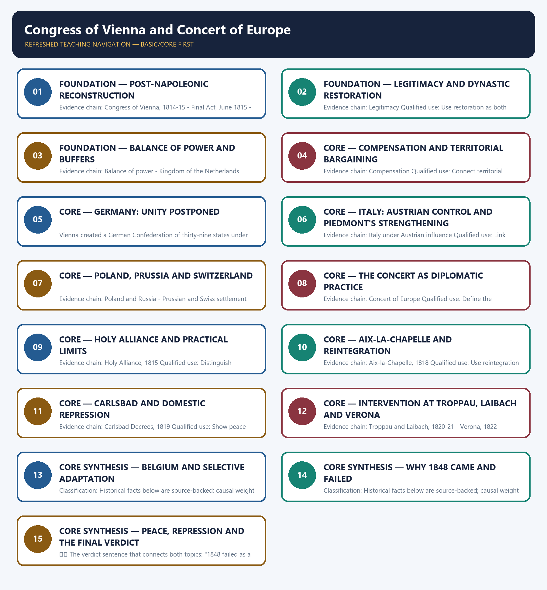

# Congress of Vienna and Concert of Europe — Learner-v2 Complete Learning Session

> **Authoring-only generation:** 2026-09-01. No PDF was rendered and no tracker or index was mutated.

### SOURCE, PROGRESSION AND CURRENT-LINKAGE AUDIT

- **Generation date:** 2026-09-01.
- **Repository-first evidence:** the Basic owner is taught first and preserved in full; the Advanced owner is retained only in the optional final teaching block.
- **OCR evidence:** Repository Markdown was used first. The available OCR-searchable Norman Lowe World History PDF was retained as supplementary local context, but no unsupported page number, quotation or precision was imported from it.
- **Qdrant:** not used; repository Markdown and available OCR context were sufficient.
- **PYQ integrity:** No direct UPSC PYQ is verified as owned solely by this topic in the local 2018-2025 routing blocks. Probable questions in the owners remain labelled as practice rather than converted into PYQs.
- **Live-link boundary:** No verified live current-affairs item is pegged to this historical topic in the repository owners. The package therefore uses the bounded phrase 'no verified live item' rather than inventing a headline, date, institution or contemporary linkage.
- **Fact/inference discipline:** no current-affairs item, PYQ wording, figure or quotation is invented.

## BASIC LEARNING SESSION



*Distinct embedded teaching-navigation image. The separate continuous Cārvāka-style flowchart package remains an independent at-a-glance artifact.*

### SESSION 1 — FOUNDATION — POST-NAPOLEONIC RECONSTRUCTION

#### DEFINITION / WHAT THIS IS CALLED

**Plain-language definition:** Precise definition: Post-Napoleonic reconstruction is the source-bounded relationship among Congress of Vienna, 1814-15, Final Act, June 1815 and Metternich within Congress of Vienna and Concert of Europe.

**Technical definition:** Evidence chain: Congress of Vienna, 1814-15 - Final Act, June 1815 - Metternich Qualified use: Define the settlement's context, document and leading statesman.

#### ANSWER-GRABBING OPENING — WRITE/ADAPT IN THE EXAM

> Precise definition: Post-Napoleonic reconstruction is the source-bounded relationship among Congress of Vienna, 1814-15, Final Act, June 1815 and Metternich within Congress of Vienna and Concert of Europe.

#### MUST-WRITE KEYWORDS

- **FOUNDATION**
- **Post-Napoleonic reconstruction**
- **Precise definition**
- **Evidence chain**
- **Qualified use**
- **1814-15**

**How to use them:** Frame the answer through FOUNDATION; define Post-Napoleonic reconstruction, connect Precise definition with Evidence chain to explain the mechanism, and use Qualified use for the decisive comparison or qualification.

##### VISUAL FIRST

```text
POST-NAPOLEONIC RECONSTRUCTION
01. Congress of Vienna, 1814-15
    |
    v
02. Final Act, June 1815
    |
    v
03. Metternich
BOUNDARY -> Vienna sought order after war, not democratic reconstruction.
```

*This topic-specific rail fixes the evidence sequence and its exam boundary before analysis.*

##### CONCEPT DEFINITIONS

- **Precise definition:** Post-Napoleonic reconstruction is the source-bounded relationship among Congress of Vienna, 1814-15, Final Act, June 1815 and Metternich within Congress of Vienna and Concert of Europe.
- **Classification:** Historical facts below are source-backed; causal weight and evaluative verdicts are analytical synthesis.

##### CORE EXPLANATION

The Congress of Vienna met in 1814-15 after Napoleon's defeat to reconstruct Europe through dynastic restoration and strategic equilibrium. The Final Act signed in June 1815 formalised the territorial and diplomatic settlement. Austrian statesman Metternich was the dominant figure at Vienna, especially in the conservative ordering of Central Europe.

##### NAMED EVIDENCE AND MECHANISM

- The Congress of Vienna met in 1814-15 after Napoleon's defeat to reconstruct Europe through dynastic restoration and strategic equilibrium.
- The Final Act signed in June 1815 formalised the territorial and diplomatic settlement.
- Austrian statesman Metternich was the dominant figure at Vienna, especially in the conservative ordering of Central Europe.

##### EXAMINER CAUTION

- Vienna sought order after war, not democratic reconstruction.

##### EXAM LINK

- **Prelims:** Retain the exact actor, date, document and category in Post-Napoleonic reconstruction.
- **Mains:** Define the settlement's context, document and leading statesman.

##### MINI RECAP

- **Evidence chain:** Congress of Vienna, 1814-15 -> Final Act, June 1815 -> Metternich
- **Qualified use:** Define the settlement's context, document and leading statesman.

#### CLOSING RECALL FLOW — FOUNDATION — POST-NAPOLEONIC RECONSTRUCTION

```text
START / CONCEPT: FOUNDATION — Post-Napoleonic reconstruction
        |
        v
EXACT TERMS: FOUNDATION · Post-Napoleonic reconstruction · Precise definition · Evidence chain · Qualified use · 1814-15
        |
        v
MECHANISM / ARGUMENT: Evidence chain: Congress of Vienna, 1814-15 - Final Act, June 1815 - Metternich Qualified use: Define the settlement's context, document and leading statesman.
        |
        v
CONSEQUENCE / CONTRAST: Classification: Historical facts below are source-backed; causal weight and evaluative verdicts are analytical synthesis.
        |
        v
UPSC TRAP / ANSWER-USE: Do not miss this limiting distinction: austrian statesman Metternich was the dominant figure at Vienna, especially in the conservative ordering...
        |
        v
ANSWER-GRABBING FORMULATION: Precise definition: Post-Napoleonic reconstruction is the source-bounded relationship among Congress of Vienna, 1814-15, Final Act, June 1815 and Metternich within Congress of Vienna and Concert of Europe.
```
### SESSION 2 — FOUNDATION — LEGITIMACY AND DYNASTIC RESTORATION

#### DEFINITION / WHAT THIS IS CALLED

**Plain-language definition:** Precise definition: Legitimacy and dynastic restoration is the source-bounded relationship among and Legitimacy within Congress of Vienna and Concert of Europe.

**Technical definition:** Evidence chain: Legitimacy Qualified use: Use restoration as both stabilising method and legitimacy problem.

#### ANSWER-GRABBING OPENING — WRITE/ADAPT IN THE EXAM

> Precise definition: Legitimacy and dynastic restoration is the source-bounded relationship among and Legitimacy within Congress of Vienna and Concert of Europe.

#### MUST-WRITE KEYWORDS

- **FOUNDATION**
- **Legitimacy**
- **dynastic restoration**
- **Precise definition**
- **Evidence chain**
- **Qualified use**

**How to use them:** Frame the answer through FOUNDATION; define Legitimacy, connect dynastic restoration with Precise definition to explain the mechanism, and use Evidence chain for the decisive comparison or qualification.

##### VISUAL FIRST

```text
LEGITIMACY AND DYNASTIC RESTORATION
01. Legitimacy
BOUNDARY -> Legitimacy privileged dynastic right over national consent.
```

*This topic-specific rail fixes the evidence sequence and its exam boundary before analysis.*

##### CONCEPT DEFINITIONS

- **Precise definition:** Legitimacy and dynastic restoration is the source-bounded relationship among  and Legitimacy within Congress of Vienna and Concert of Europe.
- **Classification:** Historical facts below are source-backed; causal weight and evaluative verdicts are analytical synthesis.

##### CORE EXPLANATION

The principle of legitimacy restored dynasties, including the Bourbons in France, and treated inherited rule rather than national consent as the basis of valid government.

##### NAMED EVIDENCE AND MECHANISM

- The principle of legitimacy restored dynasties, including the Bourbons in France, and treated inherited rule rather than national consent as the basis of valid government.

##### EXAMINER CAUTION

- Legitimacy privileged dynastic right over national consent.

##### EXAM LINK

- **Prelims:** Retain the exact actor, date, document and category in Legitimacy and dynastic restoration.
- **Mains:** Use restoration as both stabilising method and legitimacy problem.

##### MINI RECAP

- **Evidence chain:** Legitimacy
- **Qualified use:** Use restoration as both stabilising method and legitimacy problem.

#### CLOSING RECALL FLOW — FOUNDATION — LEGITIMACY AND DYNASTIC RESTORATION

```text
START / CONCEPT: FOUNDATION — Legitimacy and dynastic restoration
        |
        v
EXACT TERMS: FOUNDATION · Legitimacy · dynastic restoration · Precise definition · Evidence chain · Qualified use
        |
        v
MECHANISM / ARGUMENT: Evidence chain: Legitimacy Qualified use: Use restoration as both stabilising method and legitimacy problem.
        |
        v
CONSEQUENCE / CONTRAST: Mains: Use restoration as both stabilising method and legitimacy problem.
        |
        v
UPSC TRAP / ANSWER-USE: Do not miss this limiting distinction: causal weight and evaluative verdicts are analytical synthesis.
        |
        v
ANSWER-GRABBING FORMULATION: Precise definition: Legitimacy and dynastic restoration is the source-bounded relationship among and Legitimacy within Congress of Vienna and Concert of Europe.
```
### SESSION 3 — FOUNDATION — BALANCE OF POWER AND BUFFERS

#### DEFINITION / WHAT THIS IS CALLED

**Plain-language definition:** Precise definition: Balance of power and buffers is the source-bounded relationship among Balance of power and Kingdom of the Netherlands within Congress of Vienna and Concert of Europe.

**Technical definition:** Evidence chain: Balance of power - Kingdom of the Netherlands Qualified use: Explain strategic geography through the Netherlands buffer.

#### ANSWER-GRABBING OPENING — WRITE/ADAPT IN THE EXAM

> Precise definition: Balance of power and buffers is the source-bounded relationship among Balance of power and Kingdom of the Netherlands within Congress of Vienna and Concert of Europe.

#### MUST-WRITE KEYWORDS

- **FOUNDATION**
- **Balance of power**
- **buffers**
- **Precise definition**
- **Evidence chain**
- **Qualified use**

**How to use them:** Frame the answer through FOUNDATION; define Balance of power, connect buffers with Precise definition to explain the mechanism, and use Evidence chain for the decisive comparison or qualification.

##### VISUAL FIRST

```text
BALANCE OF POWER AND BUFFERS
01. Balance of power
    |
    v
02. Kingdom of the Netherlands
BOUNDARY -> Containment did not mean destruction of France.
```

*This topic-specific rail fixes the evidence sequence and its exam boundary before analysis.*

##### CONCEPT DEFINITIONS

- **Precise definition:** Balance of power and buffers is the source-bounded relationship among Balance of power and Kingdom of the Netherlands within Congress of Vienna and Concert of Europe.
- **Classification:** Historical facts below are source-backed; causal weight and evaluative verdicts are analytical synthesis.

##### CORE EXPLANATION

Balance-of-power policy contained rather than destroyed France, built buffers and prevented another single continental hegemon. Belgium and Holland were joined in the Kingdom of the Netherlands as a northern buffer against France, an arrangement broken by Belgian independence in 1830.

##### NAMED EVIDENCE AND MECHANISM

- Balance-of-power policy contained rather than destroyed France, built buffers and prevented another single continental hegemon.
- Belgium and Holland were joined in the Kingdom of the Netherlands as a northern buffer against France, an arrangement broken by Belgian independence in 1830.

##### EXAMINER CAUTION

- Containment did not mean destruction of France.

##### EXAM LINK

- **Prelims:** Retain the exact actor, date, document and category in Balance of power and buffers.
- **Mains:** Explain strategic geography through the Netherlands buffer.

##### MINI RECAP

- **Evidence chain:** Balance of power -> Kingdom of the Netherlands
- **Qualified use:** Explain strategic geography through the Netherlands buffer.

#### CLOSING RECALL FLOW — FOUNDATION — BALANCE OF POWER AND BUFFERS

```text
START / CONCEPT: FOUNDATION — Balance of power and buffers
        |
        v
EXACT TERMS: FOUNDATION · Balance of power · buffers · Precise definition · Evidence chain · Qualified use
        |
        v
MECHANISM / ARGUMENT: Evidence chain: Balance of power - Kingdom of the Netherlands Qualified use: Explain strategic geography through the Netherlands buffer.
        |
        v
CONSEQUENCE / CONTRAST: Balance-of-power policy contained rather than destroyed France, built buffers and prevented another single continental hegemon.
        |
        v
UPSC TRAP / ANSWER-USE: Do not miss this limiting distinction: belgium and Holland were joined in the Kingdom of the Netherlands as a northern...
        |
        v
ANSWER-GRABBING FORMULATION: Precise definition: Balance of power and buffers is the source-bounded relationship among Balance of power and Kingdom of the Netherlands within Congress of Vienna and Concert of Europe.
```
### SESSION 4 — CORE — COMPENSATION AND TERRITORIAL BARGAINING

#### DEFINITION / WHAT THIS IS CALLED

**Plain-language definition:** Precise definition: Compensation and territorial bargaining is the source-bounded relationship among and Compensation within Congress of Vienna and Concert of Europe.

**Technical definition:** Evidence chain: Compensation Qualified use: Connect territorial transfers to later unintended consequences.

#### ANSWER-GRABBING OPENING — WRITE/ADAPT IN THE EXAM

> Precise definition: Compensation and territorial bargaining is the source-bounded relationship among and Compensation within Congress of Vienna and Concert of Europe.

#### MUST-WRITE KEYWORDS

- **Compensation**
- **territorial bargaining**
- **Precise definition**
- **Evidence chain**
- **Qualified use**
- **Precise definition: Compensation and territorial bargaining**

**How to use them:** Frame the answer through Compensation; define territorial bargaining, connect Precise definition with Evidence chain to explain the mechanism, and use Qualified use for the decisive comparison or qualification.

##### VISUAL FIRST

```text
COMPENSATION AND TERRITORIAL BARGAINING
01. Compensation
BOUNDARY -> Compensation rewarded powers, not populations.
```

*This topic-specific rail fixes the evidence sequence and its exam boundary before analysis.*

##### CONCEPT DEFINITIONS

- **Precise definition:** Compensation and territorial bargaining is the source-bounded relationship among  and Compensation within Congress of Vienna and Concert of Europe.
- **Classification:** Historical facts below are source-backed; causal weight and evaluative verdicts are analytical synthesis.

##### CORE EXPLANATION

Compensation redistributed territory among victors, strengthening Prussia and Sardinia-Piedmont while enlarging Austrian and Russian influence.

##### NAMED EVIDENCE AND MECHANISM

- Compensation redistributed territory among victors, strengthening Prussia and Sardinia-Piedmont while enlarging Austrian and Russian influence.

##### EXAMINER CAUTION

- Compensation rewarded powers, not populations.

##### EXAM LINK

- **Prelims:** Retain the exact actor, date, document and category in Compensation and territorial bargaining.
- **Mains:** Connect territorial transfers to later unintended consequences.

##### MINI RECAP

- **Evidence chain:** Compensation
- **Qualified use:** Connect territorial transfers to later unintended consequences.

#### CLOSING RECALL FLOW — CORE — COMPENSATION AND TERRITORIAL BARGAINING

```text
START / CONCEPT: CORE — Compensation and territorial bargaining
        |
        v
EXACT TERMS: Compensation · territorial bargaining · Precise definition · Evidence chain · Qualified use · Precise definition: Compensation and territorial bargaining
        |
        v
MECHANISM / ARGUMENT: Evidence chain: Compensation Qualified use: Connect territorial transfers to later unintended consequences.
        |
        v
CONSEQUENCE / CONTRAST: Classification: Historical facts below are source-backed; causal weight and evaluative verdicts are analytical synthesis.
        |
        v
UPSC TRAP / ANSWER-USE: Do not miss this limiting distinction: compensation and territorial bargaining is the source-bounded relationship among and Compensation within Congress of...
        |
        v
ANSWER-GRABBING FORMULATION: Precise definition: Compensation and territorial bargaining is the source-bounded relationship among and Compensation within Congress of Vienna and Concert of Europe.
```
### SESSION 5 — CORE — GERMANY: UNITY POSTPONED

#### DEFINITION / WHAT THIS IS CALLED

**Plain-language definition:** Precise definition: Germany: unity postponed is the source-bounded relationship among and German Confederation, 39 states within Congress of Vienna and Concert of Europe.

**Technical definition:** Vienna created a German Confederation of thirty-nine states under Austrian influence, postponing rather than solving German unity.

#### ANSWER-GRABBING OPENING — WRITE/ADAPT IN THE EXAM

> Precise definition: Germany: unity postponed is the source-bounded relationship among and German Confederation, 39 states within Congress of Vienna and Concert of Europe.

#### MUST-WRITE KEYWORDS

- **Germany**
- **unity postponed**
- **Precise definition**
- **Evidence chain**
- **Qualified use**
- **Precise definition: Germany: unity postponed**

**How to use them:** Frame the answer through Germany; define unity postponed, connect Precise definition with Evidence chain to explain the mechanism, and use Qualified use for the decisive comparison or qualification.

##### VISUAL FIRST

```text
GERMANY: UNITY POSTPONED
01. German Confederation, 39 states
BOUNDARY -> The Confederation was not a united German nation-state.
```

*This topic-specific rail fixes the evidence sequence and its exam boundary before analysis.*

##### CONCEPT DEFINITIONS

- **Precise definition:** Germany: unity postponed is the source-bounded relationship among  and German Confederation, 39 states within Congress of Vienna and Concert of Europe.
- **Classification:** Historical facts below are source-backed; causal weight and evaluative verdicts are analytical synthesis.

##### CORE EXPLANATION

Vienna created a German Confederation of thirty-nine states under Austrian influence, postponing rather than solving German unity.

##### NAMED EVIDENCE AND MECHANISM

- Vienna created a German Confederation of thirty-nine states under Austrian influence, postponing rather than solving German unity.

##### EXAMINER CAUTION

- The Confederation was not a united German nation-state.

##### EXAM LINK

- **Prelims:** Retain the exact actor, date, document and category in Germany: unity postponed.
- **Mains:** Show the thirty-nine-state arrangement and Austrian influence.

##### MINI RECAP

- **Evidence chain:** German Confederation, 39 states
- **Qualified use:** Show the thirty-nine-state arrangement and Austrian influence.

#### CLOSING RECALL FLOW — CORE — GERMANY: UNITY POSTPONED

```text
START / CONCEPT: CORE — Germany: unity postponed
        |
        v
EXACT TERMS: Germany · unity postponed · Precise definition · Evidence chain · Qualified use · Precise definition: Germany: unity postponed
        |
        v
MECHANISM / ARGUMENT: Vienna created a German Confederation of thirty-nine states under Austrian influence, postponing rather than solving German unity.
        |
        v
CONSEQUENCE / CONTRAST: The Confederation was not a united German nation-state.
        |
        v
UPSC TRAP / ANSWER-USE: Do not miss this limiting distinction: german Confederation, 39 states Qualified use.
        |
        v
ANSWER-GRABBING FORMULATION: Precise definition: Germany: unity postponed is the source-bounded relationship among and German Confederation, 39 states within Congress of Vienna and Concert of Europe.
```
### SESSION 6 — CORE — ITALY: AUSTRIAN CONTROL AND PIEDMONT'S STRENGTHENING

#### DEFINITION / WHAT THIS IS CALLED

**Plain-language definition:** Precise definition: Italy: Austrian control and Piedmont's strengthening is the source-bounded relationship among and Italy under Austrian influence within Congress of Vienna and Concert of Europe.

**Technical definition:** Evidence chain: Italy under Austrian influence Qualified use: Link settlement design to later Italian nationalism.

#### ANSWER-GRABBING OPENING — WRITE/ADAPT IN THE EXAM

> Precise definition: Italy: Austrian control and Piedmont's strengthening is the source-bounded relationship among and Italy under Austrian influence within Congress of Vienna and Concert of Europe.

#### MUST-WRITE KEYWORDS

- **Italy**
- **Austrian control**
- **Piedmont's strengthening**
- **Precise definition**
- **Evidence chain**
- **Qualified use**

**How to use them:** Frame the answer through Italy; define Austrian control, connect Piedmont's strengthening with Precise definition to explain the mechanism, and use Evidence chain for the decisive comparison or qualification.

##### VISUAL FIRST

```text
ITALY: AUSTRIAN CONTROL AND PIEDMONT'S STRENGTHENING
01. Italy under Austrian influence
BOUNDARY -> Vienna unintentionally strengthened a future unifier.
```

*This topic-specific rail fixes the evidence sequence and its exam boundary before analysis.*

##### CONCEPT DEFINITIONS

- **Precise definition:** Italy: Austrian control and Piedmont's strengthening is the source-bounded relationship among  and Italy under Austrian influence within Congress of Vienna and Concert of Europe.
- **Classification:** Historical facts below are source-backed; causal weight and evaluative verdicts are analytical synthesis.

##### CORE EXPLANATION

Austria received Lombardy and Venetia and influenced much of divided Italy, while Sardinia-Piedmont gained Genoa and later led unification.

##### NAMED EVIDENCE AND MECHANISM

- Austria received Lombardy and Venetia and influenced much of divided Italy, while Sardinia-Piedmont gained Genoa and later led unification.

##### EXAMINER CAUTION

- Vienna unintentionally strengthened a future unifier.

##### EXAM LINK

- **Prelims:** Retain the exact actor, date, document and category in Italy: Austrian control and Piedmont's strengthening.
- **Mains:** Link settlement design to later Italian nationalism.

##### MINI RECAP

- **Evidence chain:** Italy under Austrian influence
- **Qualified use:** Link settlement design to later Italian nationalism.

#### CLOSING RECALL FLOW — CORE — ITALY: AUSTRIAN CONTROL AND PIEDMONT'S STRENGTHENING

```text
START / CONCEPT: CORE — Italy: Austrian control and Piedmont's strengthening
        |
        v
EXACT TERMS: Italy · Austrian control · Piedmont's strengthening · Precise definition · Evidence chain · Qualified use
        |
        v
MECHANISM / ARGUMENT: Evidence chain: Italy under Austrian influence Qualified use: Link settlement design to later Italian nationalism.
        |
        v
CONSEQUENCE / CONTRAST: Classification: Historical facts below are source-backed; causal weight and evaluative verdicts are analytical synthesis.
        |
        v
UPSC TRAP / ANSWER-USE: Do not miss this limiting distinction: austrian control and Piedmont's strengthening is the source-bounded relationship among and Italy under Austrian...
        |
        v
ANSWER-GRABBING FORMULATION: Precise definition: Italy: Austrian control and Piedmont's strengthening is the source-bounded relationship among and Italy under Austrian influence within Congress of Vienna and Concert of Europe.
```
### SESSION 7 — CORE — POLAND, PRUSSIA AND SWITZERLAND

#### DEFINITION / WHAT THIS IS CALLED

**Plain-language definition:** Precise definition: Poland, Prussia and Switzerland is the source-bounded relationship among Poland and Russia and Prussian and Swiss settlement within Congress of Vienna and Concert of Europe.

**Technical definition:** Evidence chain: Poland and Russia - Prussian and Swiss settlement Qualified use: Use one consequence for each transfer.

#### ANSWER-GRABBING OPENING — WRITE/ADAPT IN THE EXAM

> Precise definition: Poland, Prussia and Switzerland is the source-bounded relationship among Poland and Russia and Prussian and Swiss settlement within Congress of Vienna and Concert of Europe.

#### MUST-WRITE KEYWORDS

- **Poland**
- **Prussia**
- **Switzerland**
- **Precise definition**
- **Evidence chain**
- **Qualified use**

**How to use them:** Frame the answer through Poland; define Prussia, connect Switzerland with Precise definition to explain the mechanism, and use Evidence chain for the decisive comparison or qualification.

##### VISUAL FIRST

```text
POLAND, PRUSSIA AND SWITZERLAND
01. Poland and Russia
    |
    v
02. Prussian and Swiss settlement
BOUNDARY -> Do not flatten distinct territorial outcomes into one map list.
```

*This topic-specific rail fixes the evidence sequence and its exam boundary before analysis.*

##### CONCEPT DEFINITIONS

- **Precise definition:** Poland, Prussia and Switzerland is the source-bounded relationship among Poland and Russia and Prussian and Swiss settlement within Congress of Vienna and Concert of Europe.
- **Classification:** Historical facts below are source-backed; causal weight and evaluative verdicts are analytical synthesis.

##### CORE EXPLANATION

Most of the Duchy of Warsaw passed under Russian control as Congress Poland, subordinating Polish national aspirations to great-power bargaining. Prussia gained the Rhineland, Westphalia and part of Saxony, while Swiss neutrality received recognition.

##### NAMED EVIDENCE AND MECHANISM

- Most of the Duchy of Warsaw passed under Russian control as Congress Poland, subordinating Polish national aspirations to great-power bargaining.
- Prussia gained the Rhineland, Westphalia and part of Saxony, while Swiss neutrality received recognition.

##### EXAMINER CAUTION

- Do not flatten distinct territorial outcomes into one map list.

##### EXAM LINK

- **Prelims:** Retain the exact actor, date, document and category in Poland, Prussia and Switzerland.
- **Mains:** Use one consequence for each transfer.

##### MINI RECAP

- **Evidence chain:** Poland and Russia -> Prussian and Swiss settlement
- **Qualified use:** Use one consequence for each transfer.

#### CLOSING RECALL FLOW — CORE — POLAND, PRUSSIA AND SWITZERLAND

```text
START / CONCEPT: CORE — Poland, Prussia and Switzerland
        |
        v
EXACT TERMS: Poland · Prussia · Switzerland · Precise definition · Evidence chain · Qualified use
        |
        v
MECHANISM / ARGUMENT: Evidence chain: Poland and Russia - Prussian and Swiss settlement Qualified use: Use one consequence for each transfer.
        |
        v
CONSEQUENCE / CONTRAST: Do not flatten distinct territorial outcomes into one map list.
        |
        v
UPSC TRAP / ANSWER-USE: Do not miss this limiting distinction: use one consequence for each transfer.
        |
        v
ANSWER-GRABBING FORMULATION: Precise definition: Poland, Prussia and Switzerland is the source-bounded relationship among Poland and Russia and Prussian and Swiss settlement within Congress of Vienna and Concert of Europe.
```
### SESSION 8 — CORE — THE CONCERT AS DIPLOMATIC PRACTICE

#### DEFINITION / WHAT THIS IS CALLED

**Plain-language definition:** Precise definition: The Concert as diplomatic practice is the source-bounded relationship among and Concert of Europe within Congress of Vienna and Concert of Europe.

**Technical definition:** Evidence chain: Concert of Europe Qualified use: Define the mechanism before judging it.

#### ANSWER-GRABBING OPENING — WRITE/ADAPT IN THE EXAM

> Precise definition: The Concert as diplomatic practice is the source-bounded relationship among and Concert of Europe within Congress of Vienna and Concert of Europe.

#### MUST-WRITE KEYWORDS

- **The Concert as diplomatic practice**
- **Precise definition**
- **Evidence chain**
- **Qualified use**
- **Precise definition: The Concert as diplomatic practice**
- **Precise**

**How to use them:** Frame the answer through The Concert as diplomatic practice; define Precise definition, connect Evidence chain with Qualified use to explain the mechanism, and use Precise definition: The Concert as diplomatic practice for the decisive comparison or qualification.

##### VISUAL FIRST

```text
THE CONCERT AS DIPLOMATIC PRACTICE
01. Concert of Europe
BOUNDARY -> The Concert was a habit of consultation, not a supranational government.
```

*This topic-specific rail fixes the evidence sequence and its exam boundary before analysis.*

##### CONCEPT DEFINITIONS

- **Precise definition:** The Concert as diplomatic practice is the source-bounded relationship among  and Concert of Europe within Congress of Vienna and Concert of Europe.
- **Classification:** Historical facts below are source-backed; causal weight and evaluative verdicts are analytical synthesis.

##### CORE EXPLANATION

The Concert was a diplomatic habit of great-power consultation and periodic congresses, not a permanent treaty-state or the same institution as the Holy Alliance.

##### NAMED EVIDENCE AND MECHANISM

- The Concert was a diplomatic habit of great-power consultation and periodic congresses, not a permanent treaty-state or the same institution as the Holy Alliance.

##### EXAMINER CAUTION

- The Concert was a habit of consultation, not a supranational government.

##### EXAM LINK

- **Prelims:** Retain the exact actor, date, document and category in The Concert as diplomatic practice.
- **Mains:** Define the mechanism before judging it.

##### MINI RECAP

- **Evidence chain:** Concert of Europe
- **Qualified use:** Define the mechanism before judging it.

#### CLOSING RECALL FLOW — CORE — THE CONCERT AS DIPLOMATIC PRACTICE

```text
START / CONCEPT: CORE — The Concert as diplomatic practice
        |
        v
EXACT TERMS: The Concert as diplomatic practice · Precise definition · Evidence chain · Qualified use · Precise definition: The Concert as diplomatic practice · Precise
        |
        v
MECHANISM / ARGUMENT: Evidence chain: Concert of Europe Qualified use: Define the mechanism before judging it.
        |
        v
CONSEQUENCE / CONTRAST: The Concert was a diplomatic habit of great-power consultation and periodic congresses, not a permanent treaty-state or the same institution as the Holy Alliance.
        |
        v
UPSC TRAP / ANSWER-USE: The Concert was a habit of consultation, not a supranational government.
        |
        v
ANSWER-GRABBING FORMULATION: Precise definition: The Concert as diplomatic practice is the source-bounded relationship among and Concert of Europe within Congress of Vienna and Concert of Europe.
```
### SESSION 9 — CORE — HOLY ALLIANCE AND PRACTICAL LIMITS

#### DEFINITION / WHAT THIS IS CALLED

**Plain-language definition:** Precise definition: Holy Alliance and practical limits is the source-bounded relationship among and Holy Alliance, 1815 within Congress of Vienna and Concert of Europe.

**Technical definition:** Evidence chain: Holy Alliance, 1815 Qualified use: Distinguish overlapping post-1815 instruments.

#### ANSWER-GRABBING OPENING — WRITE/ADAPT IN THE EXAM

> Precise definition: Holy Alliance and practical limits is the source-bounded relationship among and Holy Alliance, 1815 within Congress of Vienna and Concert of Europe.

#### MUST-WRITE KEYWORDS

- **Holy Alliance**
- **practical limits**
- **Precise definition**
- **Evidence chain**
- **Qualified use**
- **Precise definition: Holy Alliance and practical limits**

**How to use them:** Frame the answer through Holy Alliance; define practical limits, connect Precise definition with Evidence chain to explain the mechanism, and use Qualified use for the decisive comparison or qualification.

##### VISUAL FIRST

```text
HOLY ALLIANCE AND PRACTICAL LIMITS
01. Holy Alliance, 1815
BOUNDARY -> Symbolic language and operational diplomacy were not identical.
```

*This topic-specific rail fixes the evidence sequence and its exam boundary before analysis.*

##### CONCEPT DEFINITIONS

- **Precise definition:** Holy Alliance and practical limits is the source-bounded relationship among  and Holy Alliance, 1815 within Congress of Vienna and Concert of Europe.
- **Classification:** Historical facts below are source-backed; causal weight and evaluative verdicts are analytical synthesis.

##### CORE EXPLANATION

The Holy Alliance of Russia, Austria and Prussia supplied symbolic conservative language but had limited practical importance compared with the wider Concert.

##### NAMED EVIDENCE AND MECHANISM

- The Holy Alliance of Russia, Austria and Prussia supplied symbolic conservative language but had limited practical importance compared with the wider Concert.

##### EXAMINER CAUTION

- Symbolic language and operational diplomacy were not identical.

##### EXAM LINK

- **Prelims:** Retain the exact actor, date, document and category in Holy Alliance and practical limits.
- **Mains:** Distinguish overlapping post-1815 instruments.

##### MINI RECAP

- **Evidence chain:** Holy Alliance, 1815
- **Qualified use:** Distinguish overlapping post-1815 instruments.

#### CLOSING RECALL FLOW — CORE — HOLY ALLIANCE AND PRACTICAL LIMITS

```text
START / CONCEPT: CORE — Holy Alliance and practical limits
        |
        v
EXACT TERMS: Holy Alliance · practical limits · Precise definition · Evidence chain · Qualified use · Precise definition: Holy Alliance and practical limits
        |
        v
MECHANISM / ARGUMENT: The Holy Alliance of Russia, Austria and Prussia supplied symbolic conservative language but had limited practical importance compared with the wider Concert.
        |
        v
CONSEQUENCE / CONTRAST: Evidence chain: Holy Alliance, 1815 Qualified use: Distinguish overlapping post-1815 instruments.
        |
        v
UPSC TRAP / ANSWER-USE: Symbolic language and operational diplomacy were not identical.
        |
        v
ANSWER-GRABBING FORMULATION: Precise definition: Holy Alliance and practical limits is the source-bounded relationship among and Holy Alliance, 1815 within Congress of Vienna and Concert of Europe.
```
### SESSION 10 — CORE — AIX-LA-CHAPELLE AND REINTEGRATION

#### DEFINITION / WHAT THIS IS CALLED

**Plain-language definition:** Precise definition: Aix-la-Chapelle and reintegration is the source-bounded relationship among and Aix-la-Chapelle, 1818 within Congress of Vienna and Concert of Europe.

**Technical definition:** Evidence chain: Aix-la-Chapelle, 1818 Qualified use: Use reintegration as evidence of adaptive peace-making.

#### ANSWER-GRABBING OPENING — WRITE/ADAPT IN THE EXAM

> Precise definition: Aix-la-Chapelle and reintegration is the source-bounded relationship among and Aix-la-Chapelle, 1818 within Congress of Vienna and Concert of Europe.

#### MUST-WRITE KEYWORDS

- **Aix-la-Chapelle**
- **reintegration**
- **Precise definition**
- **Evidence chain**
- **Qualified use**
- **Precise definition: Aix-la-Chapelle and reintegration**

**How to use them:** Frame the answer through Aix-la-Chapelle; define reintegration, connect Precise definition with Evidence chain to explain the mechanism, and use Qualified use for the decisive comparison or qualification.

##### VISUAL FIRST

```text
AIX-LA-CHAPELLE AND REINTEGRATION
01. Aix-la-Chapelle, 1818
BOUNDARY -> France's readmission shows moderation, not ideological unity.
```

*This topic-specific rail fixes the evidence sequence and its exam boundary before analysis.*

##### CONCEPT DEFINITIONS

- **Precise definition:** Aix-la-Chapelle and reintegration is the source-bounded relationship among  and Aix-la-Chapelle, 1818 within Congress of Vienna and Concert of Europe.
- **Classification:** Historical facts below are source-backed; causal weight and evaluative verdicts are analytical synthesis.

##### CORE EXPLANATION

At Aix-la-Chapelle in 1818 France was readmitted to great-power consultation, showing that the defeated power was reintegrated rather than permanently excluded.

##### NAMED EVIDENCE AND MECHANISM

- At Aix-la-Chapelle in 1818 France was readmitted to great-power consultation, showing that the defeated power was reintegrated rather than permanently excluded.

##### EXAMINER CAUTION

- France's readmission shows moderation, not ideological unity.

##### EXAM LINK

- **Prelims:** Retain the exact actor, date, document and category in Aix-la-Chapelle and reintegration.
- **Mains:** Use reintegration as evidence of adaptive peace-making.

##### MINI RECAP

- **Evidence chain:** Aix-la-Chapelle, 1818
- **Qualified use:** Use reintegration as evidence of adaptive peace-making.

#### CLOSING RECALL FLOW — CORE — AIX-LA-CHAPELLE AND REINTEGRATION

```text
START / CONCEPT: CORE — Aix-la-Chapelle and reintegration
        |
        v
EXACT TERMS: Aix-la-Chapelle · reintegration · Precise definition · Evidence chain · Qualified use · Precise definition: Aix-la-Chapelle and reintegration
        |
        v
MECHANISM / ARGUMENT: Evidence chain: Aix-la-Chapelle, 1818 Qualified use: Use reintegration as evidence of adaptive peace-making.
        |
        v
CONSEQUENCE / CONTRAST: France's readmission shows moderation, not ideological unity.
        |
        v
UPSC TRAP / ANSWER-USE: At Aix-la-Chapelle in 1818 France was readmitted to great-power consultation, showing that the defeated power was reintegrated rather than permanently excluded.
        |
        v
ANSWER-GRABBING FORMULATION: Precise definition: Aix-la-Chapelle and reintegration is the source-bounded relationship among and Aix-la-Chapelle, 1818 within Congress of Vienna and Concert of Europe.
```
### SESSION 11 — CORE — CARLSBAD AND DOMESTIC REPRESSION

#### DEFINITION / WHAT THIS IS CALLED

**Plain-language definition:** Precise definition: Carlsbad and domestic repression is the source-bounded relationship among and Carlsbad Decrees, 1819 within Congress of Vienna and Concert of Europe.

**Technical definition:** Evidence chain: Carlsbad Decrees, 1819 Qualified use: Show peace among states linked to repression within states.

#### ANSWER-GRABBING OPENING — WRITE/ADAPT IN THE EXAM

> Precise definition: Carlsbad and domestic repression is the source-bounded relationship among and Carlsbad Decrees, 1819 within Congress of Vienna and Concert of Europe.

#### MUST-WRITE KEYWORDS

- **Carlsbad**
- **domestic repression**
- **Precise definition**
- **Evidence chain**
- **Qualified use**
- **Precise definition: Carlsbad and domestic repression**

**How to use them:** Frame the answer through Carlsbad; define domestic repression, connect Precise definition with Evidence chain to explain the mechanism, and use Qualified use for the decisive comparison or qualification.

##### VISUAL FIRST

```text
CARLSBAD AND DOMESTIC REPRESSION
01. Carlsbad Decrees, 1819
BOUNDARY -> Censorship and university control targeted liberal nationalism.
```

*This topic-specific rail fixes the evidence sequence and its exam boundary before analysis.*

##### CONCEPT DEFINITIONS

- **Precise definition:** Carlsbad and domestic repression is the source-bounded relationship among  and Carlsbad Decrees, 1819 within Congress of Vienna and Concert of Europe.
- **Classification:** Historical facts below are source-backed; causal weight and evaluative verdicts are analytical synthesis.

##### CORE EXPLANATION

The Carlsbad Decrees of 1819 imposed censorship, university control and investigation against liberal and nationalist activity in the German states.

##### NAMED EVIDENCE AND MECHANISM

- The Carlsbad Decrees of 1819 imposed censorship, university control and investigation against liberal and nationalist activity in the German states.

##### EXAMINER CAUTION

- Censorship and university control targeted liberal nationalism.

##### EXAM LINK

- **Prelims:** Retain the exact actor, date, document and category in Carlsbad and domestic repression.
- **Mains:** Show peace among states linked to repression within states.

##### MINI RECAP

- **Evidence chain:** Carlsbad Decrees, 1819
- **Qualified use:** Show peace among states linked to repression within states.

#### CLOSING RECALL FLOW — CORE — CARLSBAD AND DOMESTIC REPRESSION

```text
START / CONCEPT: CORE — Carlsbad and domestic repression
        |
        v
EXACT TERMS: Carlsbad · domestic repression · Precise definition · Evidence chain · Qualified use · Precise definition: Carlsbad and domestic repression
        |
        v
MECHANISM / ARGUMENT: Evidence chain: Carlsbad Decrees, 1819 Qualified use: Show peace among states linked to repression within states.
        |
        v
CONSEQUENCE / CONTRAST: Mains: Show peace among states linked to repression within states.
        |
        v
UPSC TRAP / ANSWER-USE: Do not miss this limiting distinction: causal weight and evaluative verdicts are analytical synthesis.
        |
        v
ANSWER-GRABBING FORMULATION: Precise definition: Carlsbad and domestic repression is the source-bounded relationship among and Carlsbad Decrees, 1819 within Congress of Vienna and Concert of Europe.
```
### SESSION 12 — CORE — INTERVENTION AT TROPPAU, LAIBACH AND VERONA

#### DEFINITION / WHAT THIS IS CALLED

**Plain-language definition:** Precise definition: Intervention at Troppau, Laibach and Verona is the source-bounded relationship among Troppau and Laibach, 1820-21 and Verona, 1822 within Congress of Vienna and Concert of Europe.

**Technical definition:** Evidence chain: Troppau and Laibach, 1820-21 - Verona, 1822 Qualified use: Trace the intervention doctrine and its weakening.

#### ANSWER-GRABBING OPENING — WRITE/ADAPT IN THE EXAM

> Precise definition: Intervention at Troppau, Laibach and Verona is the source-bounded relationship among Troppau and Laibach, 1820-21 and Verona, 1822 within Congress of Vienna and Concert of Europe.

#### MUST-WRITE KEYWORDS

- **Intervention at Troppau**
- **Laibach**
- **Verona**
- **Precise definition**
- **Evidence chain**
- **Qualified use**

**How to use them:** Frame the answer through Intervention at Troppau; define Laibach, connect Verona with Precise definition to explain the mechanism, and use Evidence chain for the decisive comparison or qualification.

##### VISUAL FIRST

```text
INTERVENTION AT TROPPAU, LAIBACH AND VERONA
01. Troppau and Laibach, 1820-21
    |
    v
02. Verona, 1822
BOUNDARY -> Congress diplomacy included coercive intervention.
```

*This topic-specific rail fixes the evidence sequence and its exam boundary before analysis.*

##### CONCEPT DEFINITIONS

- **Precise definition:** Intervention at Troppau, Laibach and Verona is the source-bounded relationship among Troppau and Laibach, 1820-21 and Verona, 1822 within Congress of Vienna and Concert of Europe.
- **Classification:** Historical facts below are source-backed; causal weight and evaluative verdicts are analytical synthesis.

##### CORE EXPLANATION

The Troppau and Laibach congresses asserted intervention against revolutions, linking great-power order to domestic repression. The Congress of Verona in 1822 approved French intervention in Spain and was the last major effective congress of the old system.

##### NAMED EVIDENCE AND MECHANISM

- The Troppau and Laibach congresses asserted intervention against revolutions, linking great-power order to domestic repression.
- The Congress of Verona in 1822 approved French intervention in Spain and was the last major effective congress of the old system.

##### EXAMINER CAUTION

- Congress diplomacy included coercive intervention.

##### EXAM LINK

- **Prelims:** Retain the exact actor, date, document and category in Intervention at Troppau, Laibach and Verona.
- **Mains:** Trace the intervention doctrine and its weakening.

##### MINI RECAP

- **Evidence chain:** Troppau and Laibach, 1820-21 -> Verona, 1822
- **Qualified use:** Trace the intervention doctrine and its weakening.

#### CLOSING RECALL FLOW — CORE — INTERVENTION AT TROPPAU, LAIBACH AND VERONA

```text
START / CONCEPT: CORE — Intervention at Troppau, Laibach and Verona
        |
        v
EXACT TERMS: Intervention at Troppau · Laibach · Verona · Precise definition · Evidence chain · Qualified use
        |
        v
MECHANISM / ARGUMENT: Evidence chain: Troppau and Laibach, 1820-21 - Verona, 1822 Qualified use: Trace the intervention doctrine and its weakening.
        |
        v
CONSEQUENCE / CONTRAST: The Congress of Verona in 1822 approved French intervention in Spain and was the last major effective congress of the old system.
        |
        v
UPSC TRAP / ANSWER-USE: Do not miss this limiting distinction: causal weight and evaluative verdicts are analytical synthesis.
        |
        v
ANSWER-GRABBING FORMULATION: Precise definition: Intervention at Troppau, Laibach and Verona is the source-bounded relationship among Troppau and Laibach, 1820-21 and Verona, 1822 within Congress of Vienna and Concert of Europe.
```
### SESSION 13 — CORE SYNTHESIS — BELGIUM AND SELECTIVE ADAPTATION

#### DEFINITION / WHAT THIS IS CALLED

**Plain-language definition:** Precise definition: Belgium and selective adaptation is the source-bounded relationship among Belgian independence, 1830 and Kingdom of the Netherlands within Congress of Vienna and Concert of Europe.

**Technical definition:** Classification: Historical facts below are source-backed; causal weight and evaluative verdicts are analytical synthesis.

#### ANSWER-GRABBING OPENING — WRITE/ADAPT IN THE EXAM

> Precise definition: Belgium and selective adaptation is the source-bounded relationship among Belgian independence, 1830 and Kingdom of the Netherlands within Congress of Vienna and Concert of Europe.

#### MUST-WRITE KEYWORDS

- **CORE SYNTHESIS**
- **Belgium**
- **selective adaptation**
- **Precise definition**
- **Evidence chain**
- **Qualified use**

**How to use them:** Frame the answer through CORE SYNTHESIS; define Belgium, connect selective adaptation with Precise definition to explain the mechanism, and use Evidence chain for the decisive comparison or qualification.

##### VISUAL FIRST

```text
BELGIUM AND SELECTIVE ADAPTATION
01. Belgian independence, 1830
    |
    v
02. Kingdom of the Netherlands
BOUNDARY -> Adaptation preserved the Concert by revising Vienna.
```

*This topic-specific rail fixes the evidence sequence and its exam boundary before analysis.*

##### CONCEPT DEFINITIONS

- **Precise definition:** Belgium and selective adaptation is the source-bounded relationship among Belgian independence, 1830 and Kingdom of the Netherlands within Congress of Vienna and Concert of Europe.
- **Classification:** Historical facts below are source-backed; causal weight and evaluative verdicts are analytical synthesis.

##### CORE EXPLANATION

The Concert accepted Belgian independence in 1830, demonstrating selective adaptation rather than rigid restoration. Belgium and Holland were joined in the Kingdom of the Netherlands as a northern buffer against France, an arrangement broken by Belgian independence in 1830.

##### NAMED EVIDENCE AND MECHANISM

- The Concert accepted Belgian independence in 1830, demonstrating selective adaptation rather than rigid restoration.
- Belgium and Holland were joined in the Kingdom of the Netherlands as a northern buffer against France, an arrangement broken by Belgian independence in 1830.

##### EXAMINER CAUTION

- Adaptation preserved the Concert by revising Vienna.

##### EXAM LINK

- **Prelims:** Retain the exact actor, date, document and category in Belgium and selective adaptation.
- **Mains:** Use 1830 to reject a rigid-restoration caricature.

##### MINI RECAP

- **Evidence chain:** Belgian independence, 1830 -> Kingdom of the Netherlands
- **Qualified use:** Use 1830 to reject a rigid-restoration caricature.

#### CLOSING RECALL FLOW — CORE SYNTHESIS — BELGIUM AND SELECTIVE ADAPTATION

```text
START / CONCEPT: CORE SYNTHESIS — Belgium and selective adaptation
        |
        v
EXACT TERMS: CORE SYNTHESIS · Belgium · selective adaptation · Precise definition · Evidence chain · Qualified use
        |
        v
MECHANISM / ARGUMENT: Belgium and Holland were joined in the Kingdom of the Netherlands as a northern buffer against France, an arrangement broken by Belgian independence in 1830.
        |
        v
CONSEQUENCE / CONTRAST: Classification: Historical facts below are source-backed; causal weight and evaluative verdicts are analytical synthesis.
        |
        v
UPSC TRAP / ANSWER-USE: Do not miss this limiting distinction: belgian independence, 1830 - Kingdom of the Netherlands Qualified use.
        |
        v
ANSWER-GRABBING FORMULATION: Precise definition: Belgium and selective adaptation is the source-bounded relationship among Belgian independence, 1830 and Kingdom of the Netherlands within Congress of Vienna and Concert of Europe.
```
### SESSION 14 — CORE SYNTHESIS — WHY 1848 CAME AND FAILED

#### DEFINITION / WHAT THIS IS CALLED

**Plain-language definition:** Precise definition: Why 1848 came and failed is the source-bounded relationship among and Revolutions of 1848 within Congress of Vienna and Concert of Europe.

**Technical definition:** Classification: Historical facts below are source-backed; causal weight and evaluative verdicts are analytical synthesis.

#### ANSWER-GRABBING OPENING — WRITE/ADAPT IN THE EXAM

> Precise definition: Why 1848 came and failed is the source-bounded relationship among and Revolutions of 1848 within Congress of Vienna and Concert of Europe.

#### MUST-WRITE KEYWORDS

- **CORE SYNTHESIS**
- **Why 1848 came**
- **failed**
- **Precise definition**
- **Evidence chain**
- **Qualified use**

**How to use them:** Frame the answer through CORE SYNTHESIS; define Why 1848 came, connect failed with Precise definition to explain the mechanism, and use Evidence chain for the decisive comparison or qualification.

##### VISUAL FIRST

```text
WHY 1848 CAME AND FAILED
01. Revolutions of 1848
BOUNDARY -> Use only bounded causes and no unsupported leader detail.
```

*This topic-specific rail fixes the evidence sequence and its exam boundary before analysis.*

##### CONCEPT DEFINITIONS

- **Precise definition:** Why 1848 came and failed is the source-bounded relationship among  and Revolutions of 1848 within Congress of Vienna and Concert of Europe.
- **Classification:** Historical facts below are source-backed; causal weight and evaluative verdicts are analytical synthesis.

##### CORE EXPLANATION

The revolutions of 1848 exposed the settlement's unresolved liberal, national and social questions, though divided coalitions and loyal dynastic armies helped defeat them.

##### NAMED EVIDENCE AND MECHANISM

- The revolutions of 1848 exposed the settlement's unresolved liberal, national and social questions, though divided coalitions and loyal dynastic armies helped defeat them.

##### EXAMINER CAUTION

- Use only bounded causes and no unsupported leader detail.

##### EXAM LINK

- **Prelims:** Retain the exact actor, date, document and category in Why 1848 came and failed.
- **Mains:** Explain grievance convergence and mechanisms of defeat.

##### MINI RECAP

- **Evidence chain:** Revolutions of 1848
- **Qualified use:** Explain grievance convergence and mechanisms of defeat.

#### CLOSING RECALL FLOW — CORE SYNTHESIS — WHY 1848 CAME AND FAILED

```text
START / CONCEPT: CORE SYNTHESIS — Why 1848 came and failed
        |
        v
EXACT TERMS: CORE SYNTHESIS · Why 1848 came · failed · Precise definition · Evidence chain · Qualified use
        |
        v
MECHANISM / ARGUMENT: Use only bounded causes and no unsupported leader detail.
        |
        v
CONSEQUENCE / CONTRAST: Classification: Historical facts below are source-backed; causal weight and evaluative verdicts are analytical synthesis.
        |
        v
UPSC TRAP / ANSWER-USE: Do not miss this limiting distinction: explain grievance convergence and mechanisms of defeat.
        |
        v
ANSWER-GRABBING FORMULATION: Precise definition: Why 1848 came and failed is the source-bounded relationship among and Revolutions of 1848 within Congress of Vienna and Concert of Europe.
```
### SESSION 15 — CORE SYNTHESIS — PEACE, REPRESSION AND THE FINAL VERDICT

#### DEFINITION / WHAT THIS IS CALLED

**Plain-language definition:** Precise definition: Peace, repression and the final verdict is the source-bounded relationship among Peace-versus-repression verdict, Balance of power, Carlsbad Decrees, 1819 and Belgian independence, 1830 within Congress of Vienna and Concert of Europe.

**Technical definition:** ⚠️ The verdict sentence that connects both topics: "1848 failed as a revolution and succeeded as a demonstration: it proved that the Vienna order could no longer command consent and that liberal nationalism could not by itself command force — which is why the next generation achieved national unification by abandoning the first half of that formula and borrowing the second from the conservative states themselves.".

#### ANSWER-GRABBING OPENING — WRITE/ADAPT IN THE EXAM

> Precise definition: Peace, repression and the final verdict is the source-bounded relationship among Peace-versus-repression verdict, Balance of power, Carlsbad Decrees, 1819 and Belgian independence, 1830 within Congress of Vienna and Concert of Europe.

#### MUST-WRITE KEYWORDS

- **CORE SYNTHESIS**
- **Peace**
- **repression**
- **the final verdict**
- **Precise definition**
- **Evidence chain**

**How to use them:** Frame the answer through CORE SYNTHESIS; define Peace, connect repression with the final verdict to explain the mechanism, and use Precise definition for the decisive comparison or qualification.

##### VISUAL FIRST

```text
PEACE, REPRESSION AND THE FINAL VERDICT
01. Peace-versus-repression verdict
    |
    v
02. Balance of power
    |
    v
03. Carlsbad Decrees, 1819
    |
    v
04. Belgian independence, 1830
BOUNDARY -> Judge Vienna by both great-power peace and popular legitimacy.
```

*This topic-specific rail fixes the evidence sequence and its exam boundary before analysis.*

##### CONCEPT DEFINITIONS

- **Precise definition:** Peace, repression and the final verdict is the source-bounded relationship among Peace-versus-repression verdict, Balance of power, Carlsbad Decrees, 1819 and Belgian independence, 1830 within Congress of Vienna and Concert of Europe.
- **Classification:** Historical facts below are source-backed; causal weight and evaluative verdicts are analytical synthesis.

##### CORE EXPLANATION

Vienna achieved substantial great-power peace and diplomatic consultation while denying consent and repressing liberal-national change, creating stability with a legitimacy deficit. Balance-of-power policy contained rather than destroyed France, built buffers and prevented another single continental hegemon. The Carlsbad Decrees of 1819 imposed censorship, university control and investigation against liberal and nationalist activity in the German states. The Concert accepted Belgian independence in 1830, demonstrating selective adaptation rather than rigid restoration.

##### NAMED EVIDENCE AND MECHANISM

- Vienna achieved substantial great-power peace and diplomatic consultation while denying consent and repressing liberal-national change, creating stability with a legitimacy deficit.
- Balance-of-power policy contained rather than destroyed France, built buffers and prevented another single continental hegemon.
- The Carlsbad Decrees of 1819 imposed censorship, university control and investigation against liberal and nationalist activity in the German states.
- The Concert accepted Belgian independence in 1830, demonstrating selective adaptation rather than rigid restoration.

##### EXAMINER CAUTION

- Judge Vienna by both great-power peace and popular legitimacy.

##### EXAM LINK

- **Prelims:** Retain the exact actor, date, document and category in Peace, repression and the final verdict.
- **Mains:** Conclude with a successful peace system and long-term legitimacy deficit.

##### MINI RECAP

- **Evidence chain:** Peace-versus-repression verdict -> Balance of power -> Carlsbad Decrees, 1819 -> Belgian independence, 1830
- **Qualified use:** Conclude with a successful peace system and long-term legitimacy deficit.

#### COMPLETE BASIC OWNER EVIDENCE BANK

> **Subject:** History (World History) · **Tier:** Must-Do (foundation) · **GS Paper:** GS-I (World History)
> **Grounded in:** NCERT, *The Rise of Nationalism in Europe* + Old NCERT/Arjun Dev world-history chapters on 19th-century Europe + Britannica, *Congress of Vienna*, *Concert of Europe*, *Carlsbad Decrees* and *Holy Alliance* + official UPSC GS-I syllabus line.
> ✅ = source-grounded fact (named source) · ⚠️ = analytical synthesis / standard knowledge · 📰 = current affairs.
> *Companion: `advanced/05_Congress-of-Vienna-and-Concert-of-Europe.md`.*

#### 1. Mini-timeline

| Date | Event | Why it matters |
|---|---|---|
| ✅ 1814-15 | Congress of Vienna meets after Napoleon's defeat | Europe is reorganized after the Napoleonic Wars |
| ✅ June 1815 | Final Act signed | Settlement principles are formalized |
| ✅ 1815 | German Confederation of 39 states created | Central Europe is reordered without German unification |
| ✅ 1815 | Holy Alliance formed | Conservative monarchs claim a moral basis for post-Napoleonic order |
| ✅ 1818 | Congress of Aix-la-Chapelle | France is readmitted into great-power consultation |
| ✅ 1819 | Carlsbad Decrees | Liberal and nationalist activity in German states is curbed |
| ✅ 1820-21 | Troppau and Laibach congresses | Intervention against revolutions is asserted |
| ✅ 1822 | Congress of Verona | French intervention in Spain is approved; congress system weakens |
| ✅ 1830 | Belgian independence accepted | Concert survives by compromise, not by rigid restoration |
| ✅ 1848 | Revolutions across Europe | Vienna order faces its deepest challenge |

#### 2. Why Vienna happened and what it tried to do

- ✅ NCERT presents the Congress of Vienna as the conservative response to the French Revolution and Napoleon.
- ✅ Metternich of Austria was the dominant statesman at Vienna.
- ✅ The settlement worked through three famous principles: **legitimacy**, **balance of power** and **compensation**.
- ✅ Bourbon rule was restored in France, and dynastic rulers were restored in several parts of Europe.
- ⚠️ The deeper aim was not only to punish France but to prevent another continent-wide revolutionary upheaval.

#### 3. The Vienna settlement: what changed on the map?

| Region / issue | ✅ Settlement point | Why UPSC should care |
|---|---|---|
| ✅ France | Bourbon monarchy restored; France was contained rather than destroyed | Shows moderation plus strategic caution |
| ✅ Netherlands | Belgium and Holland were joined into the Kingdom of the Netherlands | A buffer was created against France |
| ✅ Sardinia-Piedmont | Strengthened by the addition of Genoa | Important later for Italian unification |
| ✅ German lands | German Confederation of 39 states created under Austrian influence | National unity was postponed, not solved |
| ✅ Italy | Austria received Lombardy and Venetia and influenced much of the peninsula | Explains later Italian resentment of Austrian control |
| ✅ Poland | Most of the Duchy of Warsaw passed under Russian control as Congress Poland | National aspirations were subordinated to great-power bargaining |
| ✅ Prussia | Gained Rhineland, Westphalia and part of Saxony | Strengthened Prussia for later German leadership |
| ✅ Switzerland | Neutrality recognized | A long-term diplomatic principle was affirmed |

#### 4. What the Concert of Europe meant

- ✅ Britannica defines the Concert of Europe as a post-Napoleonic great-power consensus in favour of preserving the territorial and political status quo.
- ✅ It worked through consultation among the major powers and periodic congresses.
- ✅ The system intervened against revolutionary movements in Italy and Spain.
- ✅ Britannica notes that the Concert later accepted Belgian independence in 1830, showing that it could adapt when necessary.
- ⚠️ So the Concert was not a permanent treaty-state; it was a diplomatic habit backed by great-power cooperation.

```text
Napoleonic Wars end
        ->
Vienna settlement (1814-15)
        ->
legitimacy + balance of power + compensation
        ->
great-power consultation (Concert)
        ->
stability for rulers, pressure on liberals/nationalists
```

#### 5. Must-Know Facts (Prelims) and UPSC traps

- ✅ **Metternich** was the key Austrian statesman at Vienna.
- ✅ **German Confederation** had **39 states** and was dominated by Austria.
- ✅ **Carlsbad Decrees (1819)** aimed to suppress liberal and nationalist politics in the German states.
- ✅ **Holy Alliance (1815)** was formed by Russia, Austria and Prussia, though Britannica treats its practical importance as limited.
- ✅ **Congress of Verona (1822)** was the last major effective congress of the system.

> 🔑 Trap: Do not confuse the **Holy Alliance** with the whole **Concert of Europe**. The Holy Alliance was symbolic and conservative; the wider Concert was the broader great-power consultation system.

- ❌ Vienna created nation-states according to popular will. -> ✅ It largely restored dynasties and ignored national aspirations.
- ❌ The Congress only punished France. -> ✅ It also redistributed territory, created buffer states and tried to regulate future diplomacy.
- ❌ The Concert of Europe was purely peaceful liberal cooperation. -> ✅ It often justified intervention against revolutions.
- ❌ Carlsbad Decrees strengthened German democracy. -> ✅ They imposed censorship and surveillance.

#### 6. Exam linkage and Mains angles

- ✅ Official UPSC GS-I syllabus explicitly includes: **"History of the world will include events from 18th century such as industrial revolution, world wars, redrawal of national boundaries, colonization, decolonization, political philosophies like communism, capitalism, socialism etc.-their forms and effect on the society."**
- ⚠️ Vienna fits the syllabus directly through **redrawal of national boundaries** and the conservative reshaping of Europe after revolution and war.

##### Probable questions

1. Explain the principles and major territorial decisions of the Congress of Vienna.
2. Was the Concert of Europe an instrument of peace or repression? Discuss.
3. How did the Vienna settlement postpone, but not resolve, the nationalism question in Europe?

#### 7. Answer architecture (10/15/20-mark support)

> **Core-sufficiency note:** this file must independently support "restoration versus adaptation"
> and boundary-redrawal demands. `advanced/05` adds the peace-versus-repression historiography
> only.

##### 7.1 Directive and demand map

| If the question says | It is really testing | Do NOT write |
|---|---|---|
| *Explain the principles and decisions* | Principle → territorial application → consequence | A map list |
| *Peace or repression?* | A two-sided verdict on the same settlement | Choosing one side |
| *How far did it postpone the nationalism question?* | Deferral vs suppression, and the 1830/1848 test | "It ignored nationalism" without the sequel |
| *Assess the Concert of Europe* | The Concert as a **practice**, and its capacity to adapt | Treating the Holy Alliance as the Concert |
| *Redrawal of boundaries* | Buffer logic, compensation, and who was left out | Listing transfers without the logic |
| *Compare Vienna with the post-1919 settlement* | Great-power management vs self-determination | Assuming 1919 was simply better |

##### 7.2 Qualified thesis templates

- ⚠️ **Dual verdict:** "Vienna succeeded remarkably at its own stated objective — preventing another continent-wide war among the great powers — and failed at the objective it refused to acknowledge, the political claims of nations and liberals."
- ⚠️ **Adaptation:** "The Vienna order lasted not because it was rigid but because it was quietly flexible: it restored dynasties where it could and accepted change, as in Belgium in 1830, where it had to."
- ⚠️ **Deferral:** "Vienna did not answer the national question; it postponed it, and the interest on that postponement was paid in 1830, 1848 and finally in the unifications of 1859–71."

##### 7.3 Mark-scaled structures

| Marks | Structure |
|---|---|
| **10** | Thesis → the three principles with **one territorial illustration each** → one limitation → verdict |
| **15** | Thesis → principles → territorial settlement → the Concert as practice → the repression record → the adaptation record → graded verdict |
| **20** | All of the above → **plus** the long consequence chain to 1848 and the unifications, and a comparison with a later settlement → verdict |

##### 7.4 Evidence bank A — principle → territorial application → consequence

| Principle | ✅ Territorial application | ⚠️ Consequence it set up |
|---|---|---|
| **Legitimacy** | ✅ Bourbon monarchy restored in France; dynastic rulers restored in several parts of Europe | Made dynastic right, not national feeling, the test of a valid state — the exact claim 1848 attacked |
| **Balance of power** | ✅ France contained rather than destroyed; ✅ Belgium and Holland joined into the Kingdom of the Netherlands as a buffer; ✅ Switzerland's neutrality recognised | Produced durable great-power equilibrium — and an artificial Dutch-Belgian union that broke in 1830 |
| **Compensation** | ✅ Prussia gained Rhineland, Westphalia and part of Saxony; ✅ Austria received Lombardy and Venetia; ✅ Sardinia-Piedmont strengthened by Genoa; ✅ most of the Duchy of Warsaw passed to Russia as Congress Poland | Rewarded the victors with populations that had not consented — Prussia's Rhineland gain and Piedmont's strengthening both later powered unification against Vienna's own design |

⚠️ **The high-value irony to use in a 15/20-mark answer:** the settlement's compensations created
the two states — **Prussia** and **Sardinia-Piedmont** — that later destroyed the settlement's
central European arrangements. Vienna armed its own gravediggers.

##### 7.5 Evidence bank B — repression versus adaptation (the balance the directive needs)

| Repression | ✅ Evidence | Adaptation | ✅ Evidence |
|---|---|---|---|
| Suppression of liberal-national politics in the German states | ✅ Carlsbad Decrees, 1819 — censorship and surveillance | Readmission of the defeated power | ✅ Congress of Aix-la-Chapelle, 1818, brings France back into great-power consultation |
| Doctrine of intervention against revolution | ✅ Troppau and Laibach congresses, 1820–21 | Acceptance of a national secession | ✅ Belgian independence accepted in 1830 |
| Armed intervention endorsed | ✅ Congress of Verona, 1822, approves French intervention in Spain | The congress system itself lapsed rather than hardened | ✅ Verona was the last major effective congress |
| National aspirations subordinated | ✅ Poland placed under Russian control; ✅ German unity postponed in a 39-state Confederation; ✅ Austrian influence over much of Italy | The great-power framework survived without a general war for decades | ⚠️ No continent-wide war between 1815 and 1914 comparable to the Napoleonic Wars |

##### 7.6 Evidence bank C — who was left out (social and national dimension)

- ✅ **Poles:** partitioned arrangement confirmed; Congress Poland under Russian control — the clearest case of a nation subordinated to great-power bargaining.
- ✅ **Germans:** offered a 39-state Confederation under Austrian influence instead of unity.
- ✅ **Italians:** left under Austrian rule in Lombardy and Venetia and Austrian influence elsewhere — the direct source of later Italian resentment.
- ✅ **Belgians:** absorbed into a Dutch-dominated kingdom without consent — reversed in 1830.
- ⚠️ **Liberals and students** across the German states: targeted by the Carlsbad Decrees, showing that Vienna's opponents were *social groups*, not only nations.
- ⚠️ **Not represented at all:** peasants, workers and colonial subjects. Vienna was a settlement among dynasties and cabinets.

##### 7.6A Evidence bank D — 1848: why the revolutions came, and why they failed

> ⚠️ **Why this bank exists.** 1848 is the hinge between this topic and `basic/06`, and it appears
> in this file's own timeline, thesis templates and verdicts. Without it, the "how far did Vienna
> postpone nationalism?" verdict rests on a date the file does not explain.
>
> **Source status.** ✅ This folder records the fact and the outcome — ✅ "Revolutions across Europe,
> 1848", ✅ "Vienna order faces its deepest challenge", ✅ "Liberal-national attempts fail, but the
> issue survives", ✅ the failed **Frankfurt** attempt at German unification (`basic/06`), and
> ✅ Lowe's remark that the German constitutional system later adopted was a monarchical one. The
> **causal analysis** below is built from evidence already held in this folder and is marked ⚠️
> where it is analytical.

**Why they came — four convergent pressures:**

| Pressure | ✅/⚠️ Evidence held here | ⚠️ Mechanism |
|---|---|---|
| **A settlement that had refused the national question** | ✅ Poland under Russian control; ✅ Germany offered a 39-state Confederation instead of unity; ✅ Italians left under Austrian rule and influence; ✅ Belgians absorbed into a Dutch-dominated kingdom (§7.6) | Grievance was not an accident of 1848 but a design feature of 1815 |
| **A settlement that had refused the liberal question** | ✅ Carlsbad Decrees (1819) censorship and surveillance; ✅ the doctrine of intervention against revolution at Troppau and Laibach (1820–21); ✅ armed intervention endorsed at Verona (1822) | Constitutional demands had no legal channel, so they accumulated outside the system |
| **Precedent that the order could be forced** | ✅ Belgian independence accepted in **1830** — an actual national secession conceded by the powers | Demonstrated that the settlement was revisable, which is the precondition of a revolutionary wave |
| **A new social question** | ✅ The Industrial Revolution had created urban wage-workers, ✅ trade unions and ✅ Chartism in Britain by the 1830s–40s (`basic/04` §8.7); ⚠️ on the continent the same industrial and agrarian distress joined liberal and national demands to an urban crowd | ⚠️ The decisive novelty: 1848 combined constitutional demands with a social movement, which is also why it frightened its own liberal leaders |

**Why they failed — four mechanisms, each with the evidence this folder holds:**

| Mechanism of failure | ⚠️ Argument | ✅/⚠️ Evidence and cross-link |
|---|---|---|
| **The coalition contained incompatible demands** | ⚠️ Liberals wanted constitutions, nationalists wanted new states, workers and peasants wanted social relief — and each success threatened the others | ✅ `basic/01` §8.5 supplies the general rule: social conflict determines "who led and how far it went"; ✅ §7.6 above shows the same groups excluded in 1815 for the same reason |
| **Nationalism divided the revolutionaries against each other** | ⚠️ In multinational Europe, one nation's self-determination was another's dismemberment — the Habsburg lands are the case | ✅ `basic/10` §8.6A: where empire and state were the same thing, the national question could not be settled without destroying the state, which is exactly why the dynasty fought rather than conceded |
| **The armies never changed sides** | ⚠️ Vienna's order rested on dynastic armies that remained intact and obedient; revolutions that capture capitals but not armies are reversible | ✅ The 1820s congresses had already established that intervention would be used against revolution (§7.5); ⚠️ contrast `basic/13` §9.4, where the Russian army's disaffection in 1917 is what makes that revolution irreversible |
| **Liberal nationalism had no instrument of force** | ✅ The **Frankfurt** attempt at German unification failed, and ⚠️ its failure "pushed unification away from liberal idealism alone and toward statecraft, diplomacy and war" (`basic/06` §2) | ✅ The proof is the sequel: the same national goal was achieved in 1859–71 by Cavour and Bismarck using armies and diplomacy — the method 1848 lacked |

⚠️ **The verdict sentence that connects both topics:** "1848 failed as a revolution and succeeded
as a demonstration: it proved that the Vienna order could no longer command consent and that
liberal nationalism could not by itself command force — which is why the next generation achieved
national unification by abandoning the first half of that formula and borrowing the second from
the conservative states themselves."

⚠️ **Bounded:** ❌ do not name 1848 leaders, assemblies (other than ✅ Frankfurt), constitutions,
dates within the year, or country-by-country sequences; ❌ do not give casualty, participation or
electoral figures. None is sourced in this folder.

##### 7.7 Verdict scaffolds

- **"Peace or repression?"** → "Both, and inseparably: the same great-power discipline that prevented war among states was used to prevent change within them."
- **"How far did it postpone nationalism?"** → "It postponed it by roughly a generation — 1830 forced the first concession, 1848 shook the order, and 1859–71 completed what Vienna had denied."
- **"Was it a success?"** → "Judged by its own criteria, a substantial success; judged by the criteria of the century that followed, a settlement that mistook the absence of war for the presence of stability."

##### 7.8 Factual-risk controls

- ❌ Do not equate the **Holy Alliance** with the **Concert of Europe**. ✅ The Holy Alliance (1815; Russia, Austria, Prussia) was symbolic and, per Britannica, of limited practical importance; the Concert was the broader great-power consultation practice.
- ❌ Do not say Vienna created nation-states by popular will. ✅ It largely restored dynasties.
- ❌ Do not claim the Berlin/Vienna settlement "drew all borders permanently" — Belgium (1830), Italy (1859–70) and Germany (1864–71) all changed them.
- ❌ Do not say the German Confederation had a number other than **39** states.
- ❌ Do not attribute a verbatim quotation to Metternich.
- ❌ Do not give population or territorial-area figures for any transfer — none is sourced here.
- ❌ Do not claim the Concert prevented *all* conflict; it prevented a general war, not intervention or regional war.
- ✅ **1848 may be analysed from §7.6A**, whose causal argument is built from evidence already held in this folder. ❌ Do not name 1848 leaders, assemblies other than ✅ **Frankfurt**, constitutions, months within the year, or country sequences, and ❌ do not give casualty, participation or electoral figures for 1848.

#### 8. Study link

World History → `basic/03_French-Revolution-and-Napoleon.md` for the background crisis
World History → `basic/04_Industrial-Revolution.md` §8.7 for the social question that entered European politics between 1815 and 1848
World History → `basic/06_Unification-of-Italy-and-Germany.md` for the nationalist challenge to Vienna and the post-1848 turn to statecraft
World History → `advanced/05_Congress-of-Vienna-and-Concert-of-Europe.md` for the peace-versus-repression historiography (optional)

#### CLOSING RECALL FLOW — CORE SYNTHESIS — PEACE, REPRESSION AND THE FINAL VERDICT

```text
START / CONCEPT: CORE SYNTHESIS — Peace, repression and the final verdict
        |
        v
EXACT TERMS: CORE SYNTHESIS · Peace · repression · the final verdict · Precise definition · Evidence chain
        |
        v
MECHANISM / ARGUMENT: "Peace or repression?" → "Both, and inseparably: the same great-power discipline that prevented war among states was used to prevent change within them." "How far did it postpone nationalism?" → "It postponed it by roughly a generation — 1830 forced the first concession, 1848 shook the order, and 1859–71 completed what Vienna had denied." "Was it a success?" → "Judged by its own criteria, a substantial success; judged by the criteria of the century that followed, a settlement that mistook the absence of war for the presence of stability.".
        |
        v
CONSEQUENCE / CONTRAST: Without it, the "how far did Vienna postpone nationalism?" verdict rests on a date the file does not explain.
        |
        v
UPSC TRAP / ANSWER-USE: Do not miss this limiting distinction: peace-versus-repression verdict - Balance of power - Carlsbad Decrees, 1819 - Belgian independence, 1830...
        |
        v
ANSWER-GRABBING FORMULATION: Precise definition: Peace, repression and the final verdict is the source-bounded relationship among Peace-versus-repression verdict, Balance of power, Carlsbad Decrees, 1819 and Belgian independence, 1830 within Congress of Vienna and Concert of Europe.
```
## BASIC MCQS / REMEDIATION

### Q1. Which statement correctly identifies Congress of Vienna, 1814-15?

A. The Congress of Vienna met in 1814-15 after Napoleon's defeat to reconstruct Europe through dynastic restoration and strategic equilibrium.
B. The principle of legitimacy restored dynasties, including the Bourbons in France, and treated inherited rule rather than national consent as the basis of valid government.
C. The Final Act signed in June 1815 formalised the territorial and diplomatic settlement.
D. Austrian statesman Metternich was the dominant figure at Vienna, especially in the conservative ordering of Central Europe.

**Answer: A.**
**Explanation:** The Congress of Vienna met in 1814-15 after Napoleon's defeat to reconstruct Europe through dynastic restoration and strategic equilibrium. The remaining options belong to different chronology, actor or analytical categories.

### Q2. Which chronology card should be filed under Congress of Vienna, 1814-15?

A. Austrian statesman Metternich was the dominant figure at Vienna, especially in the conservative ordering of Central Europe.
B. The Congress of Vienna met in 1814-15 after Napoleon's defeat to reconstruct Europe through dynastic restoration and strategic equilibrium.
C. The principle of legitimacy restored dynasties, including the Bourbons in France, and treated inherited rule rather than national consent as the basis of valid government.
D. Balance-of-power policy contained rather than destroyed France, built buffers and prevented another single continental hegemon.

**Answer: B.**
**Explanation:** The Congress of Vienna met in 1814-15 after Napoleon's defeat to reconstruct Europe through dynastic restoration and strategic equilibrium. The remaining options belong to different chronology, actor or analytical categories.

### Q3. Which option preserves the source-bounded meaning of Congress of Vienna, 1814-15?

A. Balance-of-power policy contained rather than destroyed France, built buffers and prevented another single continental hegemon.
B. Compensation redistributed territory among victors, strengthening Prussia and Sardinia-Piedmont while enlarging Austrian and Russian influence.
C. The Congress of Vienna met in 1814-15 after Napoleon's defeat to reconstruct Europe through dynastic restoration and strategic equilibrium.
D. The principle of legitimacy restored dynasties, including the Bourbons in France, and treated inherited rule rather than national consent as the basis of valid government.

**Answer: C.**
**Explanation:** The Congress of Vienna met in 1814-15 after Napoleon's defeat to reconstruct Europe through dynastic restoration and strategic equilibrium. The remaining options belong to different chronology, actor or analytical categories.

### Q4. Which statement avoids a close-option trap about Congress of Vienna, 1814-15?

A. Balance-of-power policy contained rather than destroyed France, built buffers and prevented another single continental hegemon.
B. Belgium and Holland were joined in the Kingdom of the Netherlands as a northern buffer against France, an arrangement broken by Belgian independence in 1830.
C. Compensation redistributed territory among victors, strengthening Prussia and Sardinia-Piedmont while enlarging Austrian and Russian influence.
D. The Congress of Vienna met in 1814-15 after Napoleon's defeat to reconstruct Europe through dynastic restoration and strategic equilibrium.

**Answer: D.**
**Explanation:** The Congress of Vienna met in 1814-15 after Napoleon's defeat to reconstruct Europe through dynastic restoration and strategic equilibrium. The remaining options belong to different chronology, actor or analytical categories.

### Q5. Which statement correctly identifies Final Act, June 1815?

A. The Final Act signed in June 1815 formalised the territorial and diplomatic settlement.
B. Balance-of-power policy contained rather than destroyed France, built buffers and prevented another single continental hegemon.
C. The principle of legitimacy restored dynasties, including the Bourbons in France, and treated inherited rule rather than national consent as the basis of valid government.
D. Austrian statesman Metternich was the dominant figure at Vienna, especially in the conservative ordering of Central Europe.

**Answer: A.**
**Explanation:** The Final Act signed in June 1815 formalised the territorial and diplomatic settlement. The remaining options belong to different chronology, actor or analytical categories.

### Q6. Which chronology card should be filed under Final Act, June 1815?

A. Balance-of-power policy contained rather than destroyed France, built buffers and prevented another single continental hegemon.
B. The Final Act signed in June 1815 formalised the territorial and diplomatic settlement.
C. The principle of legitimacy restored dynasties, including the Bourbons in France, and treated inherited rule rather than national consent as the basis of valid government.
D. Compensation redistributed territory among victors, strengthening Prussia and Sardinia-Piedmont while enlarging Austrian and Russian influence.

**Answer: B.**
**Explanation:** The Final Act signed in June 1815 formalised the territorial and diplomatic settlement. The remaining options belong to different chronology, actor or analytical categories.

### Q7. Which option preserves the source-bounded meaning of Final Act, June 1815?

A. Balance-of-power policy contained rather than destroyed France, built buffers and prevented another single continental hegemon.
B. Compensation redistributed territory among victors, strengthening Prussia and Sardinia-Piedmont while enlarging Austrian and Russian influence.
C. The Final Act signed in June 1815 formalised the territorial and diplomatic settlement.
D. Belgium and Holland were joined in the Kingdom of the Netherlands as a northern buffer against France, an arrangement broken by Belgian independence in 1830.

**Answer: C.**
**Explanation:** The Final Act signed in June 1815 formalised the territorial and diplomatic settlement. The remaining options belong to different chronology, actor or analytical categories.

### Q8. Which statement avoids a close-option trap about Final Act, June 1815?

A. Belgium and Holland were joined in the Kingdom of the Netherlands as a northern buffer against France, an arrangement broken by Belgian independence in 1830.
B. Compensation redistributed territory among victors, strengthening Prussia and Sardinia-Piedmont while enlarging Austrian and Russian influence.
C. Vienna created a German Confederation of thirty-nine states under Austrian influence, postponing rather than solving German unity.
D. The Final Act signed in June 1815 formalised the territorial and diplomatic settlement.

**Answer: D.**
**Explanation:** The Final Act signed in June 1815 formalised the territorial and diplomatic settlement. The remaining options belong to different chronology, actor or analytical categories.

### Q9. Which statement correctly identifies Metternich?

A. Austrian statesman Metternich was the dominant figure at Vienna, especially in the conservative ordering of Central Europe.
B. The principle of legitimacy restored dynasties, including the Bourbons in France, and treated inherited rule rather than national consent as the basis of valid government.
C. Compensation redistributed territory among victors, strengthening Prussia and Sardinia-Piedmont while enlarging Austrian and Russian influence.
D. Balance-of-power policy contained rather than destroyed France, built buffers and prevented another single continental hegemon.

**Answer: A.**
**Explanation:** Austrian statesman Metternich was the dominant figure at Vienna, especially in the conservative ordering of Central Europe. The remaining options belong to different chronology, actor or analytical categories.

### Q10. Which chronology card should be filed under Metternich?

A. Compensation redistributed territory among victors, strengthening Prussia and Sardinia-Piedmont while enlarging Austrian and Russian influence.
B. Austrian statesman Metternich was the dominant figure at Vienna, especially in the conservative ordering of Central Europe.
C. Belgium and Holland were joined in the Kingdom of the Netherlands as a northern buffer against France, an arrangement broken by Belgian independence in 1830.
D. Balance-of-power policy contained rather than destroyed France, built buffers and prevented another single continental hegemon.

**Answer: B.**
**Explanation:** Austrian statesman Metternich was the dominant figure at Vienna, especially in the conservative ordering of Central Europe. The remaining options belong to different chronology, actor or analytical categories.

### Q11. Which option preserves the source-bounded meaning of Metternich?

A. Vienna created a German Confederation of thirty-nine states under Austrian influence, postponing rather than solving German unity.
B. Belgium and Holland were joined in the Kingdom of the Netherlands as a northern buffer against France, an arrangement broken by Belgian independence in 1830.
C. Austrian statesman Metternich was the dominant figure at Vienna, especially in the conservative ordering of Central Europe.
D. Compensation redistributed territory among victors, strengthening Prussia and Sardinia-Piedmont while enlarging Austrian and Russian influence.

**Answer: C.**
**Explanation:** Austrian statesman Metternich was the dominant figure at Vienna, especially in the conservative ordering of Central Europe. The remaining options belong to different chronology, actor or analytical categories.

### Q12. Which statement avoids a close-option trap about Metternich?

A. Austria received Lombardy and Venetia and influenced much of divided Italy, while Sardinia-Piedmont gained Genoa and later led unification.
B. Vienna created a German Confederation of thirty-nine states under Austrian influence, postponing rather than solving German unity.
C. Belgium and Holland were joined in the Kingdom of the Netherlands as a northern buffer against France, an arrangement broken by Belgian independence in 1830.
D. Austrian statesman Metternich was the dominant figure at Vienna, especially in the conservative ordering of Central Europe.

**Answer: D.**
**Explanation:** Austrian statesman Metternich was the dominant figure at Vienna, especially in the conservative ordering of Central Europe. The remaining options belong to different chronology, actor or analytical categories.

### Q13. Which statement correctly identifies Legitimacy?

A. The principle of legitimacy restored dynasties, including the Bourbons in France, and treated inherited rule rather than national consent as the basis of valid government.
B. Belgium and Holland were joined in the Kingdom of the Netherlands as a northern buffer against France, an arrangement broken by Belgian independence in 1830.
C. Compensation redistributed territory among victors, strengthening Prussia and Sardinia-Piedmont while enlarging Austrian and Russian influence.
D. Balance-of-power policy contained rather than destroyed France, built buffers and prevented another single continental hegemon.

**Answer: A.**
**Explanation:** The principle of legitimacy restored dynasties, including the Bourbons in France, and treated inherited rule rather than national consent as the basis of valid government. The remaining options belong to different chronology, actor or analytical categories.

### Q14. Which chronology card should be filed under Legitimacy?

A. Belgium and Holland were joined in the Kingdom of the Netherlands as a northern buffer against France, an arrangement broken by Belgian independence in 1830.
B. The principle of legitimacy restored dynasties, including the Bourbons in France, and treated inherited rule rather than national consent as the basis of valid government.
C. Compensation redistributed territory among victors, strengthening Prussia and Sardinia-Piedmont while enlarging Austrian and Russian influence.
D. Vienna created a German Confederation of thirty-nine states under Austrian influence, postponing rather than solving German unity.

**Answer: B.**
**Explanation:** The principle of legitimacy restored dynasties, including the Bourbons in France, and treated inherited rule rather than national consent as the basis of valid government. The remaining options belong to different chronology, actor or analytical categories.

### Q15. Which option preserves the source-bounded meaning of Legitimacy?

A. Belgium and Holland were joined in the Kingdom of the Netherlands as a northern buffer against France, an arrangement broken by Belgian independence in 1830.
B. Austria received Lombardy and Venetia and influenced much of divided Italy, while Sardinia-Piedmont gained Genoa and later led unification.
C. The principle of legitimacy restored dynasties, including the Bourbons in France, and treated inherited rule rather than national consent as the basis of valid government.
D. Vienna created a German Confederation of thirty-nine states under Austrian influence, postponing rather than solving German unity.

**Answer: C.**
**Explanation:** The principle of legitimacy restored dynasties, including the Bourbons in France, and treated inherited rule rather than national consent as the basis of valid government. The remaining options belong to different chronology, actor or analytical categories.

### Q16. Which statement avoids a close-option trap about Legitimacy?

A. Austria received Lombardy and Venetia and influenced much of divided Italy, while Sardinia-Piedmont gained Genoa and later led unification.
B. Most of the Duchy of Warsaw passed under Russian control as Congress Poland, subordinating Polish national aspirations to great-power bargaining.
C. Vienna created a German Confederation of thirty-nine states under Austrian influence, postponing rather than solving German unity.
D. The principle of legitimacy restored dynasties, including the Bourbons in France, and treated inherited rule rather than national consent as the basis of valid government.

**Answer: D.**
**Explanation:** The principle of legitimacy restored dynasties, including the Bourbons in France, and treated inherited rule rather than national consent as the basis of valid government. The remaining options belong to different chronology, actor or analytical categories.

### Q17. Which statement correctly identifies Balance of power?

A. Balance-of-power policy contained rather than destroyed France, built buffers and prevented another single continental hegemon.
B. Vienna created a German Confederation of thirty-nine states under Austrian influence, postponing rather than solving German unity.
C. Belgium and Holland were joined in the Kingdom of the Netherlands as a northern buffer against France, an arrangement broken by Belgian independence in 1830.
D. Compensation redistributed territory among victors, strengthening Prussia and Sardinia-Piedmont while enlarging Austrian and Russian influence.

**Answer: A.**
**Explanation:** Balance-of-power policy contained rather than destroyed France, built buffers and prevented another single continental hegemon. The remaining options belong to different chronology, actor or analytical categories.

### Q18. Which chronology card should be filed under Balance of power?

A. Vienna created a German Confederation of thirty-nine states under Austrian influence, postponing rather than solving German unity.
B. Balance-of-power policy contained rather than destroyed France, built buffers and prevented another single continental hegemon.
C. Austria received Lombardy and Venetia and influenced much of divided Italy, while Sardinia-Piedmont gained Genoa and later led unification.
D. Belgium and Holland were joined in the Kingdom of the Netherlands as a northern buffer against France, an arrangement broken by Belgian independence in 1830.

**Answer: B.**
**Explanation:** Balance-of-power policy contained rather than destroyed France, built buffers and prevented another single continental hegemon. The remaining options belong to different chronology, actor or analytical categories.

### Q19. Which option preserves the source-bounded meaning of Balance of power?

A. Most of the Duchy of Warsaw passed under Russian control as Congress Poland, subordinating Polish national aspirations to great-power bargaining.
B. Austria received Lombardy and Venetia and influenced much of divided Italy, while Sardinia-Piedmont gained Genoa and later led unification.
C. Balance-of-power policy contained rather than destroyed France, built buffers and prevented another single continental hegemon.
D. Vienna created a German Confederation of thirty-nine states under Austrian influence, postponing rather than solving German unity.

**Answer: C.**
**Explanation:** Balance-of-power policy contained rather than destroyed France, built buffers and prevented another single continental hegemon. The remaining options belong to different chronology, actor or analytical categories.

### Q20. Which statement avoids a close-option trap about Balance of power?

A. Austria received Lombardy and Venetia and influenced much of divided Italy, while Sardinia-Piedmont gained Genoa and later led unification.
B. Most of the Duchy of Warsaw passed under Russian control as Congress Poland, subordinating Polish national aspirations to great-power bargaining.
C. Prussia gained the Rhineland, Westphalia and part of Saxony, while Swiss neutrality received recognition.
D. Balance-of-power policy contained rather than destroyed France, built buffers and prevented another single continental hegemon.

**Answer: D.**
**Explanation:** Balance-of-power policy contained rather than destroyed France, built buffers and prevented another single continental hegemon. The remaining options belong to different chronology, actor or analytical categories.

### Q21. Which statement correctly identifies Compensation?

A. Compensation redistributed territory among victors, strengthening Prussia and Sardinia-Piedmont while enlarging Austrian and Russian influence.
B. Vienna created a German Confederation of thirty-nine states under Austrian influence, postponing rather than solving German unity.
C. Belgium and Holland were joined in the Kingdom of the Netherlands as a northern buffer against France, an arrangement broken by Belgian independence in 1830.
D. Austria received Lombardy and Venetia and influenced much of divided Italy, while Sardinia-Piedmont gained Genoa and later led unification.

**Answer: A.**
**Explanation:** Compensation redistributed territory among victors, strengthening Prussia and Sardinia-Piedmont while enlarging Austrian and Russian influence. The remaining options belong to different chronology, actor or analytical categories.

### Q22. Which chronology card should be filed under Compensation?

A. Vienna created a German Confederation of thirty-nine states under Austrian influence, postponing rather than solving German unity.
B. Compensation redistributed territory among victors, strengthening Prussia and Sardinia-Piedmont while enlarging Austrian and Russian influence.
C. Most of the Duchy of Warsaw passed under Russian control as Congress Poland, subordinating Polish national aspirations to great-power bargaining.
D. Austria received Lombardy and Venetia and influenced much of divided Italy, while Sardinia-Piedmont gained Genoa and later led unification.

**Answer: B.**
**Explanation:** Compensation redistributed territory among victors, strengthening Prussia and Sardinia-Piedmont while enlarging Austrian and Russian influence. The remaining options belong to different chronology, actor or analytical categories.

### Q23. Which option preserves the source-bounded meaning of Compensation?

A. Austria received Lombardy and Venetia and influenced much of divided Italy, while Sardinia-Piedmont gained Genoa and later led unification.
B. Most of the Duchy of Warsaw passed under Russian control as Congress Poland, subordinating Polish national aspirations to great-power bargaining.
C. Compensation redistributed territory among victors, strengthening Prussia and Sardinia-Piedmont while enlarging Austrian and Russian influence.
D. Prussia gained the Rhineland, Westphalia and part of Saxony, while Swiss neutrality received recognition.

**Answer: C.**
**Explanation:** Compensation redistributed territory among victors, strengthening Prussia and Sardinia-Piedmont while enlarging Austrian and Russian influence. The remaining options belong to different chronology, actor or analytical categories.

### Q24. Which statement avoids a close-option trap about Compensation?

A. Prussia gained the Rhineland, Westphalia and part of Saxony, while Swiss neutrality received recognition.
B. Most of the Duchy of Warsaw passed under Russian control as Congress Poland, subordinating Polish national aspirations to great-power bargaining.
C. The Concert was a diplomatic habit of great-power consultation and periodic congresses, not a permanent treaty-state or the same institution as the Holy Alliance.
D. Compensation redistributed territory among victors, strengthening Prussia and Sardinia-Piedmont while enlarging Austrian and Russian influence.

**Answer: D.**
**Explanation:** Compensation redistributed territory among victors, strengthening Prussia and Sardinia-Piedmont while enlarging Austrian and Russian influence. The remaining options belong to different chronology, actor or analytical categories.

### Q25. Which statement correctly identifies Kingdom of the Netherlands?

A. Belgium and Holland were joined in the Kingdom of the Netherlands as a northern buffer against France, an arrangement broken by Belgian independence in 1830.
B. Vienna created a German Confederation of thirty-nine states under Austrian influence, postponing rather than solving German unity.
C. Most of the Duchy of Warsaw passed under Russian control as Congress Poland, subordinating Polish national aspirations to great-power bargaining.
D. Austria received Lombardy and Venetia and influenced much of divided Italy, while Sardinia-Piedmont gained Genoa and later led unification.

**Answer: A.**
**Explanation:** Belgium and Holland were joined in the Kingdom of the Netherlands as a northern buffer against France, an arrangement broken by Belgian independence in 1830. The remaining options belong to different chronology, actor or analytical categories.

### Q26. Which chronology card should be filed under Kingdom of the Netherlands?

A. Most of the Duchy of Warsaw passed under Russian control as Congress Poland, subordinating Polish national aspirations to great-power bargaining.
B. Belgium and Holland were joined in the Kingdom of the Netherlands as a northern buffer against France, an arrangement broken by Belgian independence in 1830.
C. Prussia gained the Rhineland, Westphalia and part of Saxony, while Swiss neutrality received recognition.
D. Austria received Lombardy and Venetia and influenced much of divided Italy, while Sardinia-Piedmont gained Genoa and later led unification.

**Answer: B.**
**Explanation:** Belgium and Holland were joined in the Kingdom of the Netherlands as a northern buffer against France, an arrangement broken by Belgian independence in 1830. The remaining options belong to different chronology, actor or analytical categories.

### Q27. Which option preserves the source-bounded meaning of Kingdom of the Netherlands?

A. Prussia gained the Rhineland, Westphalia and part of Saxony, while Swiss neutrality received recognition.
B. The Concert was a diplomatic habit of great-power consultation and periodic congresses, not a permanent treaty-state or the same institution as the Holy Alliance.
C. Belgium and Holland were joined in the Kingdom of the Netherlands as a northern buffer against France, an arrangement broken by Belgian independence in 1830.
D. Most of the Duchy of Warsaw passed under Russian control as Congress Poland, subordinating Polish national aspirations to great-power bargaining.

**Answer: C.**
**Explanation:** Belgium and Holland were joined in the Kingdom of the Netherlands as a northern buffer against France, an arrangement broken by Belgian independence in 1830. The remaining options belong to different chronology, actor or analytical categories.

### Q28. Which statement avoids a close-option trap about Kingdom of the Netherlands?

A. Prussia gained the Rhineland, Westphalia and part of Saxony, while Swiss neutrality received recognition.
B. The Concert was a diplomatic habit of great-power consultation and periodic congresses, not a permanent treaty-state or the same institution as the Holy Alliance.
C. The Holy Alliance of Russia, Austria and Prussia supplied symbolic conservative language but had limited practical importance compared with the wider Concert.
D. Belgium and Holland were joined in the Kingdom of the Netherlands as a northern buffer against France, an arrangement broken by Belgian independence in 1830.

**Answer: D.**
**Explanation:** Belgium and Holland were joined in the Kingdom of the Netherlands as a northern buffer against France, an arrangement broken by Belgian independence in 1830. The remaining options belong to different chronology, actor or analytical categories.

### Q29. Which statement correctly identifies German Confederation, 39 states?

A. Vienna created a German Confederation of thirty-nine states under Austrian influence, postponing rather than solving German unity.
B. Most of the Duchy of Warsaw passed under Russian control as Congress Poland, subordinating Polish national aspirations to great-power bargaining.
C. Austria received Lombardy and Venetia and influenced much of divided Italy, while Sardinia-Piedmont gained Genoa and later led unification.
D. Prussia gained the Rhineland, Westphalia and part of Saxony, while Swiss neutrality received recognition.

**Answer: A.**
**Explanation:** Vienna created a German Confederation of thirty-nine states under Austrian influence, postponing rather than solving German unity. The remaining options belong to different chronology, actor or analytical categories.

### Q30. Which chronology card should be filed under German Confederation, 39 states?

A. Most of the Duchy of Warsaw passed under Russian control as Congress Poland, subordinating Polish national aspirations to great-power bargaining.
B. Vienna created a German Confederation of thirty-nine states under Austrian influence, postponing rather than solving German unity.
C. Prussia gained the Rhineland, Westphalia and part of Saxony, while Swiss neutrality received recognition.
D. The Concert was a diplomatic habit of great-power consultation and periodic congresses, not a permanent treaty-state or the same institution as the Holy Alliance.

**Answer: B.**
**Explanation:** Vienna created a German Confederation of thirty-nine states under Austrian influence, postponing rather than solving German unity. The remaining options belong to different chronology, actor or analytical categories.

### Q31. Which option preserves the source-bounded meaning of German Confederation, 39 states?

A. The Holy Alliance of Russia, Austria and Prussia supplied symbolic conservative language but had limited practical importance compared with the wider Concert.
B. Prussia gained the Rhineland, Westphalia and part of Saxony, while Swiss neutrality received recognition.
C. Vienna created a German Confederation of thirty-nine states under Austrian influence, postponing rather than solving German unity.
D. The Concert was a diplomatic habit of great-power consultation and periodic congresses, not a permanent treaty-state or the same institution as the Holy Alliance.

**Answer: C.**
**Explanation:** Vienna created a German Confederation of thirty-nine states under Austrian influence, postponing rather than solving German unity. The remaining options belong to different chronology, actor or analytical categories.

### Q32. Which statement avoids a close-option trap about German Confederation, 39 states?

A. The Concert was a diplomatic habit of great-power consultation and periodic congresses, not a permanent treaty-state or the same institution as the Holy Alliance.
B. The Holy Alliance of Russia, Austria and Prussia supplied symbolic conservative language but had limited practical importance compared with the wider Concert.
C. At Aix-la-Chapelle in 1818 France was readmitted to great-power consultation, showing that the defeated power was reintegrated rather than permanently excluded.
D. Vienna created a German Confederation of thirty-nine states under Austrian influence, postponing rather than solving German unity.

**Answer: D.**
**Explanation:** Vienna created a German Confederation of thirty-nine states under Austrian influence, postponing rather than solving German unity. The remaining options belong to different chronology, actor or analytical categories.

### Q33. Which statement correctly identifies Italy under Austrian influence?

A. Austria received Lombardy and Venetia and influenced much of divided Italy, while Sardinia-Piedmont gained Genoa and later led unification.
B. The Concert was a diplomatic habit of great-power consultation and periodic congresses, not a permanent treaty-state or the same institution as the Holy Alliance.
C. Prussia gained the Rhineland, Westphalia and part of Saxony, while Swiss neutrality received recognition.
D. Most of the Duchy of Warsaw passed under Russian control as Congress Poland, subordinating Polish national aspirations to great-power bargaining.

**Answer: A.**
**Explanation:** Austria received Lombardy and Venetia and influenced much of divided Italy, while Sardinia-Piedmont gained Genoa and later led unification. The remaining options belong to different chronology, actor or analytical categories.

### Q34. Which chronology card should be filed under Italy under Austrian influence?

A. The Holy Alliance of Russia, Austria and Prussia supplied symbolic conservative language but had limited practical importance compared with the wider Concert.
B. Austria received Lombardy and Venetia and influenced much of divided Italy, while Sardinia-Piedmont gained Genoa and later led unification.
C. Prussia gained the Rhineland, Westphalia and part of Saxony, while Swiss neutrality received recognition.
D. The Concert was a diplomatic habit of great-power consultation and periodic congresses, not a permanent treaty-state or the same institution as the Holy Alliance.

**Answer: B.**
**Explanation:** Austria received Lombardy and Venetia and influenced much of divided Italy, while Sardinia-Piedmont gained Genoa and later led unification. The remaining options belong to different chronology, actor or analytical categories.

### Q35. Which option preserves the source-bounded meaning of Italy under Austrian influence?

A. At Aix-la-Chapelle in 1818 France was readmitted to great-power consultation, showing that the defeated power was reintegrated rather than permanently excluded.
B. The Holy Alliance of Russia, Austria and Prussia supplied symbolic conservative language but had limited practical importance compared with the wider Concert.
C. Austria received Lombardy and Venetia and influenced much of divided Italy, while Sardinia-Piedmont gained Genoa and later led unification.
D. The Concert was a diplomatic habit of great-power consultation and periodic congresses, not a permanent treaty-state or the same institution as the Holy Alliance.

**Answer: C.**
**Explanation:** Austria received Lombardy and Venetia and influenced much of divided Italy, while Sardinia-Piedmont gained Genoa and later led unification. The remaining options belong to different chronology, actor or analytical categories.

### Q36. Which statement avoids a close-option trap about Italy under Austrian influence?

A. The Holy Alliance of Russia, Austria and Prussia supplied symbolic conservative language but had limited practical importance compared with the wider Concert.
B. The Carlsbad Decrees of 1819 imposed censorship, university control and investigation against liberal and nationalist activity in the German states.
C. At Aix-la-Chapelle in 1818 France was readmitted to great-power consultation, showing that the defeated power was reintegrated rather than permanently excluded.
D. Austria received Lombardy and Venetia and influenced much of divided Italy, while Sardinia-Piedmont gained Genoa and later led unification.

**Answer: D.**
**Explanation:** Austria received Lombardy and Venetia and influenced much of divided Italy, while Sardinia-Piedmont gained Genoa and later led unification. The remaining options belong to different chronology, actor or analytical categories.

### Q37. Which statement correctly identifies Poland and Russia?

A. Most of the Duchy of Warsaw passed under Russian control as Congress Poland, subordinating Polish national aspirations to great-power bargaining.
B. The Concert was a diplomatic habit of great-power consultation and periodic congresses, not a permanent treaty-state or the same institution as the Holy Alliance.
C. The Holy Alliance of Russia, Austria and Prussia supplied symbolic conservative language but had limited practical importance compared with the wider Concert.
D. Prussia gained the Rhineland, Westphalia and part of Saxony, while Swiss neutrality received recognition.

**Answer: A.**
**Explanation:** Most of the Duchy of Warsaw passed under Russian control as Congress Poland, subordinating Polish national aspirations to great-power bargaining. The remaining options belong to different chronology, actor or analytical categories.

### Q38. Which chronology card should be filed under Poland and Russia?

A. The Concert was a diplomatic habit of great-power consultation and periodic congresses, not a permanent treaty-state or the same institution as the Holy Alliance.
B. Most of the Duchy of Warsaw passed under Russian control as Congress Poland, subordinating Polish national aspirations to great-power bargaining.
C. The Holy Alliance of Russia, Austria and Prussia supplied symbolic conservative language but had limited practical importance compared with the wider Concert.
D. At Aix-la-Chapelle in 1818 France was readmitted to great-power consultation, showing that the defeated power was reintegrated rather than permanently excluded.

**Answer: B.**
**Explanation:** Most of the Duchy of Warsaw passed under Russian control as Congress Poland, subordinating Polish national aspirations to great-power bargaining. The remaining options belong to different chronology, actor or analytical categories.

### Q39. Which option preserves the source-bounded meaning of Poland and Russia?

A. The Holy Alliance of Russia, Austria and Prussia supplied symbolic conservative language but had limited practical importance compared with the wider Concert.
B. At Aix-la-Chapelle in 1818 France was readmitted to great-power consultation, showing that the defeated power was reintegrated rather than permanently excluded.
C. Most of the Duchy of Warsaw passed under Russian control as Congress Poland, subordinating Polish national aspirations to great-power bargaining.
D. The Carlsbad Decrees of 1819 imposed censorship, university control and investigation against liberal and nationalist activity in the German states.

**Answer: C.**
**Explanation:** Most of the Duchy of Warsaw passed under Russian control as Congress Poland, subordinating Polish national aspirations to great-power bargaining. The remaining options belong to different chronology, actor or analytical categories.

### Q40. Which statement avoids a close-option trap about Poland and Russia?

A. The Carlsbad Decrees of 1819 imposed censorship, university control and investigation against liberal and nationalist activity in the German states.
B. The Troppau and Laibach congresses asserted intervention against revolutions, linking great-power order to domestic repression.
C. At Aix-la-Chapelle in 1818 France was readmitted to great-power consultation, showing that the defeated power was reintegrated rather than permanently excluded.
D. Most of the Duchy of Warsaw passed under Russian control as Congress Poland, subordinating Polish national aspirations to great-power bargaining.

**Answer: D.**
**Explanation:** Most of the Duchy of Warsaw passed under Russian control as Congress Poland, subordinating Polish national aspirations to great-power bargaining. The remaining options belong to different chronology, actor or analytical categories.

### Q41. Which statement correctly identifies Prussian and Swiss settlement?

A. Prussia gained the Rhineland, Westphalia and part of Saxony, while Swiss neutrality received recognition.
B. The Concert was a diplomatic habit of great-power consultation and periodic congresses, not a permanent treaty-state or the same institution as the Holy Alliance.
C. The Holy Alliance of Russia, Austria and Prussia supplied symbolic conservative language but had limited practical importance compared with the wider Concert.
D. At Aix-la-Chapelle in 1818 France was readmitted to great-power consultation, showing that the defeated power was reintegrated rather than permanently excluded.

**Answer: A.**
**Explanation:** Prussia gained the Rhineland, Westphalia and part of Saxony, while Swiss neutrality received recognition. The remaining options belong to different chronology, actor or analytical categories.

### Q42. Which chronology card should be filed under Prussian and Swiss settlement?

A. At Aix-la-Chapelle in 1818 France was readmitted to great-power consultation, showing that the defeated power was reintegrated rather than permanently excluded.
B. Prussia gained the Rhineland, Westphalia and part of Saxony, while Swiss neutrality received recognition.
C. The Holy Alliance of Russia, Austria and Prussia supplied symbolic conservative language but had limited practical importance compared with the wider Concert.
D. The Carlsbad Decrees of 1819 imposed censorship, university control and investigation against liberal and nationalist activity in the German states.

**Answer: B.**
**Explanation:** Prussia gained the Rhineland, Westphalia and part of Saxony, while Swiss neutrality received recognition. The remaining options belong to different chronology, actor or analytical categories.

### Q43. Which option preserves the source-bounded meaning of Prussian and Swiss settlement?

A. The Troppau and Laibach congresses asserted intervention against revolutions, linking great-power order to domestic repression.
B. At Aix-la-Chapelle in 1818 France was readmitted to great-power consultation, showing that the defeated power was reintegrated rather than permanently excluded.
C. Prussia gained the Rhineland, Westphalia and part of Saxony, while Swiss neutrality received recognition.
D. The Carlsbad Decrees of 1819 imposed censorship, university control and investigation against liberal and nationalist activity in the German states.

**Answer: C.**
**Explanation:** Prussia gained the Rhineland, Westphalia and part of Saxony, while Swiss neutrality received recognition. The remaining options belong to different chronology, actor or analytical categories.

### Q44. Which statement avoids a close-option trap about Prussian and Swiss settlement?

A. The Troppau and Laibach congresses asserted intervention against revolutions, linking great-power order to domestic repression.
B. The Carlsbad Decrees of 1819 imposed censorship, university control and investigation against liberal and nationalist activity in the German states.
C. The Congress of Verona in 1822 approved French intervention in Spain and was the last major effective congress of the old system.
D. Prussia gained the Rhineland, Westphalia and part of Saxony, while Swiss neutrality received recognition.

**Answer: D.**
**Explanation:** Prussia gained the Rhineland, Westphalia and part of Saxony, while Swiss neutrality received recognition. The remaining options belong to different chronology, actor or analytical categories.

### Q45. Which statement correctly identifies Concert of Europe?

A. The Concert was a diplomatic habit of great-power consultation and periodic congresses, not a permanent treaty-state or the same institution as the Holy Alliance.
B. The Holy Alliance of Russia, Austria and Prussia supplied symbolic conservative language but had limited practical importance compared with the wider Concert.
C. At Aix-la-Chapelle in 1818 France was readmitted to great-power consultation, showing that the defeated power was reintegrated rather than permanently excluded.
D. The Carlsbad Decrees of 1819 imposed censorship, university control and investigation against liberal and nationalist activity in the German states.

**Answer: A.**
**Explanation:** The Concert was a diplomatic habit of great-power consultation and periodic congresses, not a permanent treaty-state or the same institution as the Holy Alliance. The remaining options belong to different chronology, actor or analytical categories.

### Q46. Which chronology card should be filed under Concert of Europe?

A. At Aix-la-Chapelle in 1818 France was readmitted to great-power consultation, showing that the defeated power was reintegrated rather than permanently excluded.
B. The Concert was a diplomatic habit of great-power consultation and periodic congresses, not a permanent treaty-state or the same institution as the Holy Alliance.
C. The Troppau and Laibach congresses asserted intervention against revolutions, linking great-power order to domestic repression.
D. The Carlsbad Decrees of 1819 imposed censorship, university control and investigation against liberal and nationalist activity in the German states.

**Answer: B.**
**Explanation:** The Concert was a diplomatic habit of great-power consultation and periodic congresses, not a permanent treaty-state or the same institution as the Holy Alliance. The remaining options belong to different chronology, actor or analytical categories.

### Q47. Which option preserves the source-bounded meaning of Concert of Europe?

A. The Troppau and Laibach congresses asserted intervention against revolutions, linking great-power order to domestic repression.
B. The Carlsbad Decrees of 1819 imposed censorship, university control and investigation against liberal and nationalist activity in the German states.
C. The Concert was a diplomatic habit of great-power consultation and periodic congresses, not a permanent treaty-state or the same institution as the Holy Alliance.
D. The Congress of Verona in 1822 approved French intervention in Spain and was the last major effective congress of the old system.

**Answer: C.**
**Explanation:** The Concert was a diplomatic habit of great-power consultation and periodic congresses, not a permanent treaty-state or the same institution as the Holy Alliance. The remaining options belong to different chronology, actor or analytical categories.

### Q48. Which statement avoids a close-option trap about Concert of Europe?

A. The Troppau and Laibach congresses asserted intervention against revolutions, linking great-power order to domestic repression.
B. The Congress of Verona in 1822 approved French intervention in Spain and was the last major effective congress of the old system.
C. The Concert accepted Belgian independence in 1830, demonstrating selective adaptation rather than rigid restoration.
D. The Concert was a diplomatic habit of great-power consultation and periodic congresses, not a permanent treaty-state or the same institution as the Holy Alliance.

**Answer: D.**
**Explanation:** The Concert was a diplomatic habit of great-power consultation and periodic congresses, not a permanent treaty-state or the same institution as the Holy Alliance. The remaining options belong to different chronology, actor or analytical categories.

### Q49. Which statement correctly identifies Holy Alliance, 1815?

A. The Holy Alliance of Russia, Austria and Prussia supplied symbolic conservative language but had limited practical importance compared with the wider Concert.
B. The Troppau and Laibach congresses asserted intervention against revolutions, linking great-power order to domestic repression.
C. At Aix-la-Chapelle in 1818 France was readmitted to great-power consultation, showing that the defeated power was reintegrated rather than permanently excluded.
D. The Carlsbad Decrees of 1819 imposed censorship, university control and investigation against liberal and nationalist activity in the German states.

**Answer: A.**
**Explanation:** The Holy Alliance of Russia, Austria and Prussia supplied symbolic conservative language but had limited practical importance compared with the wider Concert. The remaining options belong to different chronology, actor or analytical categories.

### Q50. Which chronology card should be filed under Holy Alliance, 1815?

A. The Troppau and Laibach congresses asserted intervention against revolutions, linking great-power order to domestic repression.
B. The Holy Alliance of Russia, Austria and Prussia supplied symbolic conservative language but had limited practical importance compared with the wider Concert.
C. The Congress of Verona in 1822 approved French intervention in Spain and was the last major effective congress of the old system.
D. The Carlsbad Decrees of 1819 imposed censorship, university control and investigation against liberal and nationalist activity in the German states.

**Answer: B.**
**Explanation:** The Holy Alliance of Russia, Austria and Prussia supplied symbolic conservative language but had limited practical importance compared with the wider Concert. The remaining options belong to different chronology, actor or analytical categories.

### Q51. Which option preserves the source-bounded meaning of Holy Alliance, 1815?

A. The Congress of Verona in 1822 approved French intervention in Spain and was the last major effective congress of the old system.
B. The Troppau and Laibach congresses asserted intervention against revolutions, linking great-power order to domestic repression.
C. The Holy Alliance of Russia, Austria and Prussia supplied symbolic conservative language but had limited practical importance compared with the wider Concert.
D. The Concert accepted Belgian independence in 1830, demonstrating selective adaptation rather than rigid restoration.

**Answer: C.**
**Explanation:** The Holy Alliance of Russia, Austria and Prussia supplied symbolic conservative language but had limited practical importance compared with the wider Concert. The remaining options belong to different chronology, actor or analytical categories.

### Q52. Which statement avoids a close-option trap about Holy Alliance, 1815?

A. The revolutions of 1848 exposed the settlement's unresolved liberal, national and social questions, though divided coalitions and loyal dynastic armies helped defeat them.
B. The Concert accepted Belgian independence in 1830, demonstrating selective adaptation rather than rigid restoration.
C. The Congress of Verona in 1822 approved French intervention in Spain and was the last major effective congress of the old system.
D. The Holy Alliance of Russia, Austria and Prussia supplied symbolic conservative language but had limited practical importance compared with the wider Concert.

**Answer: D.**
**Explanation:** The Holy Alliance of Russia, Austria and Prussia supplied symbolic conservative language but had limited practical importance compared with the wider Concert. The remaining options belong to different chronology, actor or analytical categories.

### Q53. Which statement correctly identifies Aix-la-Chapelle, 1818?

A. At Aix-la-Chapelle in 1818 France was readmitted to great-power consultation, showing that the defeated power was reintegrated rather than permanently excluded.
B. The Carlsbad Decrees of 1819 imposed censorship, university control and investigation against liberal and nationalist activity in the German states.
C. The Congress of Verona in 1822 approved French intervention in Spain and was the last major effective congress of the old system.
D. The Troppau and Laibach congresses asserted intervention against revolutions, linking great-power order to domestic repression.

**Answer: A.**
**Explanation:** At Aix-la-Chapelle in 1818 France was readmitted to great-power consultation, showing that the defeated power was reintegrated rather than permanently excluded. The remaining options belong to different chronology, actor or analytical categories.

### Q54. Which chronology card should be filed under Aix-la-Chapelle, 1818?

A. The Concert accepted Belgian independence in 1830, demonstrating selective adaptation rather than rigid restoration.
B. At Aix-la-Chapelle in 1818 France was readmitted to great-power consultation, showing that the defeated power was reintegrated rather than permanently excluded.
C. The Troppau and Laibach congresses asserted intervention against revolutions, linking great-power order to domestic repression.
D. The Congress of Verona in 1822 approved French intervention in Spain and was the last major effective congress of the old system.

**Answer: B.**
**Explanation:** At Aix-la-Chapelle in 1818 France was readmitted to great-power consultation, showing that the defeated power was reintegrated rather than permanently excluded. The remaining options belong to different chronology, actor or analytical categories.

### Q55. Which option preserves the source-bounded meaning of Aix-la-Chapelle, 1818?

A. The Congress of Verona in 1822 approved French intervention in Spain and was the last major effective congress of the old system.
B. The Concert accepted Belgian independence in 1830, demonstrating selective adaptation rather than rigid restoration.
C. At Aix-la-Chapelle in 1818 France was readmitted to great-power consultation, showing that the defeated power was reintegrated rather than permanently excluded.
D. The revolutions of 1848 exposed the settlement's unresolved liberal, national and social questions, though divided coalitions and loyal dynastic armies helped defeat them.

**Answer: C.**
**Explanation:** At Aix-la-Chapelle in 1818 France was readmitted to great-power consultation, showing that the defeated power was reintegrated rather than permanently excluded. The remaining options belong to different chronology, actor or analytical categories.

### Q56. Which statement avoids a close-option trap about Aix-la-Chapelle, 1818?

A. The Concert accepted Belgian independence in 1830, demonstrating selective adaptation rather than rigid restoration.
B. Vienna achieved substantial great-power peace and diplomatic consultation while denying consent and repressing liberal-national change, creating stability with a legitimacy deficit.
C. The revolutions of 1848 exposed the settlement's unresolved liberal, national and social questions, though divided coalitions and loyal dynastic armies helped defeat them.
D. At Aix-la-Chapelle in 1818 France was readmitted to great-power consultation, showing that the defeated power was reintegrated rather than permanently excluded.

**Answer: D.**
**Explanation:** At Aix-la-Chapelle in 1818 France was readmitted to great-power consultation, showing that the defeated power was reintegrated rather than permanently excluded. The remaining options belong to different chronology, actor or analytical categories.

### Q57. Which statement correctly identifies Carlsbad Decrees, 1819?

A. The Carlsbad Decrees of 1819 imposed censorship, university control and investigation against liberal and nationalist activity in the German states.
B. The Troppau and Laibach congresses asserted intervention against revolutions, linking great-power order to domestic repression.
C. The Congress of Verona in 1822 approved French intervention in Spain and was the last major effective congress of the old system.
D. The Concert accepted Belgian independence in 1830, demonstrating selective adaptation rather than rigid restoration.

**Answer: A.**
**Explanation:** The Carlsbad Decrees of 1819 imposed censorship, university control and investigation against liberal and nationalist activity in the German states. The remaining options belong to different chronology, actor or analytical categories.

### Q58. Which chronology card should be filed under Carlsbad Decrees, 1819?

A. The revolutions of 1848 exposed the settlement's unresolved liberal, national and social questions, though divided coalitions and loyal dynastic armies helped defeat them.
B. The Carlsbad Decrees of 1819 imposed censorship, university control and investigation against liberal and nationalist activity in the German states.
C. The Concert accepted Belgian independence in 1830, demonstrating selective adaptation rather than rigid restoration.
D. The Congress of Verona in 1822 approved French intervention in Spain and was the last major effective congress of the old system.

**Answer: B.**
**Explanation:** The Carlsbad Decrees of 1819 imposed censorship, university control and investigation against liberal and nationalist activity in the German states. The remaining options belong to different chronology, actor or analytical categories.

### Q59. Which option preserves the source-bounded meaning of Carlsbad Decrees, 1819?

A. The Concert accepted Belgian independence in 1830, demonstrating selective adaptation rather than rigid restoration.
B. The revolutions of 1848 exposed the settlement's unresolved liberal, national and social questions, though divided coalitions and loyal dynastic armies helped defeat them.
C. The Carlsbad Decrees of 1819 imposed censorship, university control and investigation against liberal and nationalist activity in the German states.
D. Vienna achieved substantial great-power peace and diplomatic consultation while denying consent and repressing liberal-national change, creating stability with a legitimacy deficit.

**Answer: C.**
**Explanation:** The Carlsbad Decrees of 1819 imposed censorship, university control and investigation against liberal and nationalist activity in the German states. The remaining options belong to different chronology, actor or analytical categories.

### Q60. Which statement avoids a close-option trap about Carlsbad Decrees, 1819?

A. Vienna achieved substantial great-power peace and diplomatic consultation while denying consent and repressing liberal-national change, creating stability with a legitimacy deficit.
B. The Congress of Vienna met in 1814-15 after Napoleon's defeat to reconstruct Europe through dynastic restoration and strategic equilibrium.
C. The revolutions of 1848 exposed the settlement's unresolved liberal, national and social questions, though divided coalitions and loyal dynastic armies helped defeat them.
D. The Carlsbad Decrees of 1819 imposed censorship, university control and investigation against liberal and nationalist activity in the German states.

**Answer: D.**
**Explanation:** The Carlsbad Decrees of 1819 imposed censorship, university control and investigation against liberal and nationalist activity in the German states. The remaining options belong to different chronology, actor or analytical categories.

### Q61. Which statement correctly identifies Troppau and Laibach, 1820-21?

A. The Troppau and Laibach congresses asserted intervention against revolutions, linking great-power order to domestic repression.
B. The Concert accepted Belgian independence in 1830, demonstrating selective adaptation rather than rigid restoration.
C. The revolutions of 1848 exposed the settlement's unresolved liberal, national and social questions, though divided coalitions and loyal dynastic armies helped defeat them.
D. The Congress of Verona in 1822 approved French intervention in Spain and was the last major effective congress of the old system.

**Answer: A.**
**Explanation:** The Troppau and Laibach congresses asserted intervention against revolutions, linking great-power order to domestic repression. The remaining options belong to different chronology, actor or analytical categories.

### Q62. Which chronology card should be filed under Troppau and Laibach, 1820-21?

A. Vienna achieved substantial great-power peace and diplomatic consultation while denying consent and repressing liberal-national change, creating stability with a legitimacy deficit.
B. The Troppau and Laibach congresses asserted intervention against revolutions, linking great-power order to domestic repression.
C. The revolutions of 1848 exposed the settlement's unresolved liberal, national and social questions, though divided coalitions and loyal dynastic armies helped defeat them.
D. The Concert accepted Belgian independence in 1830, demonstrating selective adaptation rather than rigid restoration.

**Answer: B.**
**Explanation:** The Troppau and Laibach congresses asserted intervention against revolutions, linking great-power order to domestic repression. The remaining options belong to different chronology, actor or analytical categories.

### Q63. Which option preserves the source-bounded meaning of Troppau and Laibach, 1820-21?

A. Vienna achieved substantial great-power peace and diplomatic consultation while denying consent and repressing liberal-national change, creating stability with a legitimacy deficit.
B. The Congress of Vienna met in 1814-15 after Napoleon's defeat to reconstruct Europe through dynastic restoration and strategic equilibrium.
C. The Troppau and Laibach congresses asserted intervention against revolutions, linking great-power order to domestic repression.
D. The revolutions of 1848 exposed the settlement's unresolved liberal, national and social questions, though divided coalitions and loyal dynastic armies helped defeat them.

**Answer: C.**
**Explanation:** The Troppau and Laibach congresses asserted intervention against revolutions, linking great-power order to domestic repression. The remaining options belong to different chronology, actor or analytical categories.

### Q64. Which statement avoids a close-option trap about Troppau and Laibach, 1820-21?

A. Vienna achieved substantial great-power peace and diplomatic consultation while denying consent and repressing liberal-national change, creating stability with a legitimacy deficit.
B. The Final Act signed in June 1815 formalised the territorial and diplomatic settlement.
C. The Congress of Vienna met in 1814-15 after Napoleon's defeat to reconstruct Europe through dynastic restoration and strategic equilibrium.
D. The Troppau and Laibach congresses asserted intervention against revolutions, linking great-power order to domestic repression.

**Answer: D.**
**Explanation:** The Troppau and Laibach congresses asserted intervention against revolutions, linking great-power order to domestic repression. The remaining options belong to different chronology, actor or analytical categories.

### Q65. Which statement correctly identifies Verona, 1822?

A. The Congress of Verona in 1822 approved French intervention in Spain and was the last major effective congress of the old system.
B. Vienna achieved substantial great-power peace and diplomatic consultation while denying consent and repressing liberal-national change, creating stability with a legitimacy deficit.
C. The revolutions of 1848 exposed the settlement's unresolved liberal, national and social questions, though divided coalitions and loyal dynastic armies helped defeat them.
D. The Concert accepted Belgian independence in 1830, demonstrating selective adaptation rather than rigid restoration.

**Answer: A.**
**Explanation:** The Congress of Verona in 1822 approved French intervention in Spain and was the last major effective congress of the old system. The remaining options belong to different chronology, actor or analytical categories.

### Q66. Which chronology card should be filed under Verona, 1822?

A. The Congress of Vienna met in 1814-15 after Napoleon's defeat to reconstruct Europe through dynastic restoration and strategic equilibrium.
B. The Congress of Verona in 1822 approved French intervention in Spain and was the last major effective congress of the old system.
C. Vienna achieved substantial great-power peace and diplomatic consultation while denying consent and repressing liberal-national change, creating stability with a legitimacy deficit.
D. The revolutions of 1848 exposed the settlement's unresolved liberal, national and social questions, though divided coalitions and loyal dynastic armies helped defeat them.

**Answer: B.**
**Explanation:** The Congress of Verona in 1822 approved French intervention in Spain and was the last major effective congress of the old system. The remaining options belong to different chronology, actor or analytical categories.

### Q67. Which option preserves the source-bounded meaning of Verona, 1822?

A. The Final Act signed in June 1815 formalised the territorial and diplomatic settlement.
B. The Congress of Vienna met in 1814-15 after Napoleon's defeat to reconstruct Europe through dynastic restoration and strategic equilibrium.
C. The Congress of Verona in 1822 approved French intervention in Spain and was the last major effective congress of the old system.
D. Vienna achieved substantial great-power peace and diplomatic consultation while denying consent and repressing liberal-national change, creating stability with a legitimacy deficit.

**Answer: C.**
**Explanation:** The Congress of Verona in 1822 approved French intervention in Spain and was the last major effective congress of the old system. The remaining options belong to different chronology, actor or analytical categories.

### Q68. Which statement avoids a close-option trap about Verona, 1822?

A. The Final Act signed in June 1815 formalised the territorial and diplomatic settlement.
B. The Congress of Vienna met in 1814-15 after Napoleon's defeat to reconstruct Europe through dynastic restoration and strategic equilibrium.
C. Austrian statesman Metternich was the dominant figure at Vienna, especially in the conservative ordering of Central Europe.
D. The Congress of Verona in 1822 approved French intervention in Spain and was the last major effective congress of the old system.

**Answer: D.**
**Explanation:** The Congress of Verona in 1822 approved French intervention in Spain and was the last major effective congress of the old system. The remaining options belong to different chronology, actor or analytical categories.

### Q69. Which statement correctly identifies Belgian independence, 1830?

A. The Concert accepted Belgian independence in 1830, demonstrating selective adaptation rather than rigid restoration.
B. The revolutions of 1848 exposed the settlement's unresolved liberal, national and social questions, though divided coalitions and loyal dynastic armies helped defeat them.
C. Vienna achieved substantial great-power peace and diplomatic consultation while denying consent and repressing liberal-national change, creating stability with a legitimacy deficit.
D. The Congress of Vienna met in 1814-15 after Napoleon's defeat to reconstruct Europe through dynastic restoration and strategic equilibrium.

**Answer: A.**
**Explanation:** The Concert accepted Belgian independence in 1830, demonstrating selective adaptation rather than rigid restoration. The remaining options belong to different chronology, actor or analytical categories.

### Q70. Which chronology card should be filed under Belgian independence, 1830?

A. The Congress of Vienna met in 1814-15 after Napoleon's defeat to reconstruct Europe through dynastic restoration and strategic equilibrium.
B. The Concert accepted Belgian independence in 1830, demonstrating selective adaptation rather than rigid restoration.
C. Vienna achieved substantial great-power peace and diplomatic consultation while denying consent and repressing liberal-national change, creating stability with a legitimacy deficit.
D. The Final Act signed in June 1815 formalised the territorial and diplomatic settlement.

**Answer: B.**
**Explanation:** The Concert accepted Belgian independence in 1830, demonstrating selective adaptation rather than rigid restoration. The remaining options belong to different chronology, actor or analytical categories.

### Q71. Which option preserves the source-bounded meaning of Belgian independence, 1830?

A. The Congress of Vienna met in 1814-15 after Napoleon's defeat to reconstruct Europe through dynastic restoration and strategic equilibrium.
B. The Final Act signed in June 1815 formalised the territorial and diplomatic settlement.
C. The Concert accepted Belgian independence in 1830, demonstrating selective adaptation rather than rigid restoration.
D. Austrian statesman Metternich was the dominant figure at Vienna, especially in the conservative ordering of Central Europe.

**Answer: C.**
**Explanation:** The Concert accepted Belgian independence in 1830, demonstrating selective adaptation rather than rigid restoration. The remaining options belong to different chronology, actor or analytical categories.

### Q72. Which statement avoids a close-option trap about Belgian independence, 1830?

A. The principle of legitimacy restored dynasties, including the Bourbons in France, and treated inherited rule rather than national consent as the basis of valid government.
B. The Final Act signed in June 1815 formalised the territorial and diplomatic settlement.
C. Austrian statesman Metternich was the dominant figure at Vienna, especially in the conservative ordering of Central Europe.
D. The Concert accepted Belgian independence in 1830, demonstrating selective adaptation rather than rigid restoration.

**Answer: D.**
**Explanation:** The Concert accepted Belgian independence in 1830, demonstrating selective adaptation rather than rigid restoration. The remaining options belong to different chronology, actor or analytical categories.

### Q73. Which statement correctly identifies Revolutions of 1848?

A. The revolutions of 1848 exposed the settlement's unresolved liberal, national and social questions, though divided coalitions and loyal dynastic armies helped defeat them.
B. Vienna achieved substantial great-power peace and diplomatic consultation while denying consent and repressing liberal-national change, creating stability with a legitimacy deficit.
C. The Final Act signed in June 1815 formalised the territorial and diplomatic settlement.
D. The Congress of Vienna met in 1814-15 after Napoleon's defeat to reconstruct Europe through dynastic restoration and strategic equilibrium.

**Answer: A.**
**Explanation:** The revolutions of 1848 exposed the settlement's unresolved liberal, national and social questions, though divided coalitions and loyal dynastic armies helped defeat them. The remaining options belong to different chronology, actor or analytical categories.

### Q74. Which chronology card should be filed under Revolutions of 1848?

A. The Congress of Vienna met in 1814-15 after Napoleon's defeat to reconstruct Europe through dynastic restoration and strategic equilibrium.
B. The revolutions of 1848 exposed the settlement's unresolved liberal, national and social questions, though divided coalitions and loyal dynastic armies helped defeat them.
C. Austrian statesman Metternich was the dominant figure at Vienna, especially in the conservative ordering of Central Europe.
D. The Final Act signed in June 1815 formalised the territorial and diplomatic settlement.

**Answer: B.**
**Explanation:** The revolutions of 1848 exposed the settlement's unresolved liberal, national and social questions, though divided coalitions and loyal dynastic armies helped defeat them. The remaining options belong to different chronology, actor or analytical categories.

### Q75. Which option preserves the source-bounded meaning of Revolutions of 1848?

A. The Final Act signed in June 1815 formalised the territorial and diplomatic settlement.
B. The principle of legitimacy restored dynasties, including the Bourbons in France, and treated inherited rule rather than national consent as the basis of valid government.
C. The revolutions of 1848 exposed the settlement's unresolved liberal, national and social questions, though divided coalitions and loyal dynastic armies helped defeat them.
D. Austrian statesman Metternich was the dominant figure at Vienna, especially in the conservative ordering of Central Europe.

**Answer: C.**
**Explanation:** The revolutions of 1848 exposed the settlement's unresolved liberal, national and social questions, though divided coalitions and loyal dynastic armies helped defeat them. The remaining options belong to different chronology, actor or analytical categories.

### Q76. Which statement avoids a close-option trap about Revolutions of 1848?

A. The principle of legitimacy restored dynasties, including the Bourbons in France, and treated inherited rule rather than national consent as the basis of valid government.
B. Austrian statesman Metternich was the dominant figure at Vienna, especially in the conservative ordering of Central Europe.
C. Balance-of-power policy contained rather than destroyed France, built buffers and prevented another single continental hegemon.
D. The revolutions of 1848 exposed the settlement's unresolved liberal, national and social questions, though divided coalitions and loyal dynastic armies helped defeat them.

**Answer: D.**
**Explanation:** The revolutions of 1848 exposed the settlement's unresolved liberal, national and social questions, though divided coalitions and loyal dynastic armies helped defeat them. The remaining options belong to different chronology, actor or analytical categories.

### Q77. Which statement correctly identifies Peace-versus-repression verdict?

A. Vienna achieved substantial great-power peace and diplomatic consultation while denying consent and repressing liberal-national change, creating stability with a legitimacy deficit.
B. Austrian statesman Metternich was the dominant figure at Vienna, especially in the conservative ordering of Central Europe.
C. The Final Act signed in June 1815 formalised the territorial and diplomatic settlement.
D. The Congress of Vienna met in 1814-15 after Napoleon's defeat to reconstruct Europe through dynastic restoration and strategic equilibrium.

**Answer: A.**
**Explanation:** Vienna achieved substantial great-power peace and diplomatic consultation while denying consent and repressing liberal-national change, creating stability with a legitimacy deficit. The remaining options belong to different chronology, actor or analytical categories.

### Q78. Which chronology card should be filed under Peace-versus-repression verdict?

A. Austrian statesman Metternich was the dominant figure at Vienna, especially in the conservative ordering of Central Europe.
B. Vienna achieved substantial great-power peace and diplomatic consultation while denying consent and repressing liberal-national change, creating stability with a legitimacy deficit.
C. The Final Act signed in June 1815 formalised the territorial and diplomatic settlement.
D. The principle of legitimacy restored dynasties, including the Bourbons in France, and treated inherited rule rather than national consent as the basis of valid government.

**Answer: B.**
**Explanation:** Vienna achieved substantial great-power peace and diplomatic consultation while denying consent and repressing liberal-national change, creating stability with a legitimacy deficit. The remaining options belong to different chronology, actor or analytical categories.

### Q79. Which option preserves the source-bounded meaning of Peace-versus-repression verdict?

A. Balance-of-power policy contained rather than destroyed France, built buffers and prevented another single continental hegemon.
B. The principle of legitimacy restored dynasties, including the Bourbons in France, and treated inherited rule rather than national consent as the basis of valid government.
C. Vienna achieved substantial great-power peace and diplomatic consultation while denying consent and repressing liberal-national change, creating stability with a legitimacy deficit.
D. Austrian statesman Metternich was the dominant figure at Vienna, especially in the conservative ordering of Central Europe.

**Answer: C.**
**Explanation:** Vienna achieved substantial great-power peace and diplomatic consultation while denying consent and repressing liberal-national change, creating stability with a legitimacy deficit. The remaining options belong to different chronology, actor or analytical categories.

### Q80. Which statement avoids a close-option trap about Peace-versus-repression verdict?

A. Compensation redistributed territory among victors, strengthening Prussia and Sardinia-Piedmont while enlarging Austrian and Russian influence.
B. The principle of legitimacy restored dynasties, including the Bourbons in France, and treated inherited rule rather than national consent as the basis of valid government.
C. Balance-of-power policy contained rather than destroyed France, built buffers and prevented another single continental hegemon.
D. Vienna achieved substantial great-power peace and diplomatic consultation while denying consent and repressing liberal-national change, creating stability with a legitimacy deficit.

**Answer: D.**
**Explanation:** Vienna achieved substantial great-power peace and diplomatic consultation while denying consent and repressing liberal-national change, creating stability with a legitimacy deficit. The remaining options belong to different chronology, actor or analytical categories.

## PYQS AND ANSWER PRACTICE

### TRANSPARENT ZERO-DIRECT-PYQ AUDIT

No direct UPSC PYQ is verified as owned solely by this topic in the local 2018-2025 routing blocks. Probable questions in the owners remain labelled as practice rather than converted into PYQs.

### ORIGINAL MAINS 1 — 10 MARKS

**Question:** Explain the principles of legitimacy, balance of power and compensation at Vienna. Answer in about 150 words.

**Model thesis:** The principles restored dynasties, contained France through buffers and redistributed territory among victors, producing order without popular consent.

**Claim → named evidence → analysis → qualification:**

- The principle of legitimacy restored dynasties, including the Bourbons in France, and treated inherited rule rather than national consent as the basis of valid government.
- Balance-of-power policy contained rather than destroyed France, built buffers and prevented another single continental hegemon.
- Compensation redistributed territory among victors, strengthening Prussia and Sardinia-Piedmont while enlarging Austrian and Russian influence.
- Belgium and Holland were joined in the Kingdom of the Netherlands as a northern buffer against France, an arrangement broken by Belgian independence in 1830.

**Qualified conclusion:** The principles restored dynasties, contained France through buffers and redistributed territory among victors, producing order without popular consent.

### ORIGINAL MAINS 2 — 10 MARKS

**Question:** Distinguish the Concert of Europe from the Holy Alliance. Answer in about 150 words.

**Model thesis:** The Concert was the broader practical habit of great-power consultation; the Holy Alliance was a narrower symbolic conservative compact among Russia, Austria and Prussia.

**Claim → named evidence → analysis → qualification:**

- The Concert was a diplomatic habit of great-power consultation and periodic congresses, not a permanent treaty-state or the same institution as the Holy Alliance.
- The Holy Alliance of Russia, Austria and Prussia supplied symbolic conservative language but had limited practical importance compared with the wider Concert.
- At Aix-la-Chapelle in 1818 France was readmitted to great-power consultation, showing that the defeated power was reintegrated rather than permanently excluded.

**Qualified conclusion:** The Concert was the broader practical habit of great-power consultation; the Holy Alliance was a narrower symbolic conservative compact among Russia, Austria and Prussia.

### ORIGINAL MAINS 3 — 15 MARKS

**Question:** Was the Concert of Europe an instrument of peace or repression? Answer in about 250 words.

**Model thesis:** It was both: consultation moderated conflict among powers while Carlsbad and intervention congresses suppressed liberal and national movements within states.

**Claim → named evidence → analysis → qualification:**

- The Concert was a diplomatic habit of great-power consultation and periodic congresses, not a permanent treaty-state or the same institution as the Holy Alliance.
- The Carlsbad Decrees of 1819 imposed censorship, university control and investigation against liberal and nationalist activity in the German states.
- The Troppau and Laibach congresses asserted intervention against revolutions, linking great-power order to domestic repression.
- The Congress of Verona in 1822 approved French intervention in Spain and was the last major effective congress of the old system.
- The Concert accepted Belgian independence in 1830, demonstrating selective adaptation rather than rigid restoration.
- Vienna achieved substantial great-power peace and diplomatic consultation while denying consent and repressing liberal-national change, creating stability with a legitimacy deficit.

**Qualified conclusion:** It was both: consultation moderated conflict among powers while Carlsbad and intervention congresses suppressed liberal and national movements within states.

### ORIGINAL MAINS 4 — 15 MARKS

**Question:** How did Vienna postpone rather than solve the national question? Answer in about 250 words.

**Model thesis:** Its German, Italian, Polish and Belgian arrangements subordinated nations to dynastic strategy, producing later revision in 1830, 1848 and the unifications.

**Claim → named evidence → analysis → qualification:**

- Belgium and Holland were joined in the Kingdom of the Netherlands as a northern buffer against France, an arrangement broken by Belgian independence in 1830.
- Vienna created a German Confederation of thirty-nine states under Austrian influence, postponing rather than solving German unity.
- Austria received Lombardy and Venetia and influenced much of divided Italy, while Sardinia-Piedmont gained Genoa and later led unification.
- Most of the Duchy of Warsaw passed under Russian control as Congress Poland, subordinating Polish national aspirations to great-power bargaining.
- The Concert accepted Belgian independence in 1830, demonstrating selective adaptation rather than rigid restoration.
- The revolutions of 1848 exposed the settlement's unresolved liberal, national and social questions, though divided coalitions and loyal dynastic armies helped defeat them.

**Qualified conclusion:** Its German, Italian, Polish and Belgian arrangements subordinated nations to dynastic strategy, producing later revision in 1830, 1848 and the unifications.

### ORIGINAL MAINS 5 — 20 MARKS

**Question:** Assess the Congress of Vienna as a post-war settlement. Answer in about 300 words.

**Model thesis:** Vienna wisely reintegrated France, built strategic equilibrium and established consultation, but compensation and legitimacy armed future unifiers and denied popular consent.

**Claim → named evidence → analysis → qualification:**

- The Congress of Vienna met in 1814-15 after Napoleon's defeat to reconstruct Europe through dynastic restoration and strategic equilibrium.
- The principle of legitimacy restored dynasties, including the Bourbons in France, and treated inherited rule rather than national consent as the basis of valid government.
- Balance-of-power policy contained rather than destroyed France, built buffers and prevented another single continental hegemon.
- Compensation redistributed territory among victors, strengthening Prussia and Sardinia-Piedmont while enlarging Austrian and Russian influence.
- Prussia gained the Rhineland, Westphalia and part of Saxony, while Swiss neutrality received recognition.
- At Aix-la-Chapelle in 1818 France was readmitted to great-power consultation, showing that the defeated power was reintegrated rather than permanently excluded.
- Vienna achieved substantial great-power peace and diplomatic consultation while denying consent and repressing liberal-national change, creating stability with a legitimacy deficit.

**Qualified conclusion:** Vienna wisely reintegrated France, built strategic equilibrium and established consultation, but compensation and legitimacy armed future unifiers and denied popular consent.

### ORIGINAL MAINS 6 — 20 MARKS

**Question:** Why did the revolutions of 1848 challenge yet fail to destroy the Vienna order? Answer in about 300 words.

**Model thesis:** The order had accumulated national, liberal and social grievances, but revolutionary coalitions divided, national aims conflicted and dynastic armies retained coercive power.

**Claim → named evidence → analysis → qualification:**

- The Carlsbad Decrees of 1819 imposed censorship, university control and investigation against liberal and nationalist activity in the German states.
- The Troppau and Laibach congresses asserted intervention against revolutions, linking great-power order to domestic repression.
- The Concert accepted Belgian independence in 1830, demonstrating selective adaptation rather than rigid restoration.
- The revolutions of 1848 exposed the settlement's unresolved liberal, national and social questions, though divided coalitions and loyal dynastic armies helped defeat them.
- Vienna achieved substantial great-power peace and diplomatic consultation while denying consent and repressing liberal-national change, creating stability with a legitimacy deficit.

**Qualified conclusion:** The order had accumulated national, liberal and social grievances, but revolutionary coalitions divided, national aims conflicted and dynastic armies retained coercive power.

## OPTIONAL ADVANCED DEPTH — NOT REQUIRED FOR A CORE ANSWER

> **Subject:** History (World History) · **Tier:** Advanced (debate + answer-writing) · **GS Paper:** GS-I (World History)
> **Grounded in:** NCERT, *The Rise of Nationalism in Europe* + Old NCERT/Arjun Dev world-history chapters on 19th-century Europe + Britannica, *Congress of Vienna*, *Concert of Europe*, *Holy Alliance*, *Carlsbad Decrees* and *Congress of Verona* + official UPSC GS-I syllabus line.
> ✅ = source-grounded fact (named source) · ⚠️ = analytical synthesis / historiographical framing · 📰 = current affairs.
> *Companion: `basic/05_Congress-of-Vienna-and-Concert-of-Europe.md`.*

#### 1. Analytical timeline

| Date | Development | Analytical use |
|---|---|---|
| ✅ 1814-15 | Vienna Congress reorganizes Europe | Conservative peace-making after revolutionary war |
| ✅ 1815 | Quadruple/Holy Alliance phase begins | Great-power order takes institutional shape |
| ✅ 1818-22 | Congress system from Aix-la-Chapelle to Verona | Consultation and intervention both operate |
| ✅ 1819 | Carlsbad Decrees | Vienna order becomes openly anti-liberal in German lands |
| ✅ 1830 | Belgium accepted as independent | Concert survives by selective flexibility |
| ✅ 1848 | Continental revolutions | Repression could delay but not extinguish nationalism |

#### 2. The central debate: stabilizing peace or reactionary repression?

| Debate | One side | Other side | Best UPSC synthesis |
|---|---|---|---|
| ⚠️ Nature of Vienna | It restored order after two decades of war | It ignored peoples and privileged dynasties | Both are true; stability was bought through conservatism |
| ⚠️ Balance of power | Prevented another Napoleonic hegemony | Protected ruler-interests more than rights | Use this as the core contradiction |
| ⚠️ Concert diplomacy | Early collective-security habit | Justification for intervention in domestic revolts | Peace among powers, repression within states |
| ⚠️ Legacy | Created durable diplomatic norms | Generated postponed nationalist explosions | Vienna solved the French problem, not the nationality problem |

- ✅ NCERT is clear that the settlement did not respect national aspirations in Italy, Germany, Poland and elsewhere.
- ⚠️ Therefore, the Vienna order is best understood as a **successful short-term peace system with a long-term legitimacy deficit**.

#### 3. What actually held the system together?

| Element | ✅ What the sources show | Why it mattered |
|---|---|---|
| ✅ Shared fear of renewed French expansion | Buffer states and territorial redistribution were designed around this fear | External threat encouraged cooperation |
| ✅ Great-power consultation | Congresses became the working method of the Concert | Diplomacy replaced immediate war among the victors |
| ✅ Austrian leadership in Central Europe | Metternich shaped Germany and Italy through influence and intervention | Conservatism had a geographical centre |
| ✅ Repression tools | Carlsbad Decrees used censorship, university control and investigation | Nationalism was treated as a police problem |
| ✅ British limits | Britannica notes Britain blocked wider intervention in Spanish America at Verona | The Concert was never ideologically uniform |

#### 4. Why the system weakened

- ✅ Britannica notes that the revolutions of 1830 and 1848 and later Italian and German unifications made the original form of the Concert obsolete.
- ✅ Verona exposed disagreement over intervention, especially once Britain resisted continental policing beyond Europe.
- ⚠️ The key weakness was structural: a dynastic settlement tried to contain social and national forces released by the French Revolution.
- ⚠️ Vienna could restore rulers, but it could not permanently reverse mass politics, public opinion and the national idea.

```text
peace among great powers
          is not the same as
legitimacy among peoples

Vienna succeeded at the first
but struggled with the second
```

#### 5. World-history significance

- ✅ The Vienna settlement created the **German Confederation**, kept Italy divided and strengthened Sardinia-Piedmont.
- ⚠️ That means the settlement directly shaped the later terrain of **Italian and German unification**.
- ⚠️ Advanced answers should connect Vienna to a longer arc: **French Revolution -> conservative restoration -> nationalist revolt -> nation-state formation**.
- ⚠️ It also marks an early modern example of multilateral diplomacy, though not modern democracy.

#### 6. Must-Know Facts (Prelims) and UPSC traps

- ✅ **Congress of Vienna** met in **1814-15**; Final Act signed in **June 1815**.
- ✅ **Concert of Europe** was a post-Napoleonic great-power consultation system.
- ✅ **Carlsbad Decrees (1819)** targeted liberal and nationalist tendencies in the German states.
- ✅ **Congress of Verona (1822)** was the last major effective meeting of the old congress system.

> 🔑 Trap: Do not write that the Concert "collapsed immediately." It weakened unevenly and survived in modified consultation even after the old congress rhythm faded.

- ❌ Metternich alone controlled all Europe. -> ✅ He was dominant in Central Europe, but Britain and Russia had their own priorities.
- ❌ Vienna permanently solved the European question. -> ✅ It postponed major conflicts and redirected them into later nationalist struggles.
- ❌ The Holy Alliance and Quadruple Alliance were identical. -> ✅ They overlapped in time but were not the same diplomatic instrument.

#### 7. Mains-answer framework

| Part | What to write |
|---|---|
| Intro | Define Vienna as the conservative reconstruction of Europe after Napoleon |
| Body 1 | Principles: legitimacy, balance of power, compensation |
| Body 2 | Concert system: congresses, consultation, intervention |
| Body 3 | Critique: repression in Italy/Germany/Poland, Carlsbad Decrees |
| Conclusion | Vienna gave Europe order, but not consent; nationalism returned with force |

##### Probable questions

1. "The Congress of Vienna created peace among states but not legitimacy among peoples." Examine.
2. Evaluate the Concert of Europe as an early system of collective security.
3. How far was the Age of Metternich a success?

#### 8. Study link

World History → `basic/05_Congress-of-Vienna-and-Concert-of-Europe.md` for the map changes  
World History → `advanced/06_Unification-of-Italy-and-Germany.md` for the nationalist undoing of Vienna

## CONSOLIDATED REGISTER NOTES

### COMPLETE TOPIC ASCII MASTER FLOW DIAGRAM

**High-yield use:** Follow the panels as one topic-specific conceptual atlas: root question, classifications, processes or arguments, comparisons, objections and a final answer-writing spine. This text-native master is separate from both graphical flowchart artifacts.

#### ASCII MASTER FLOW — PANEL 1/12: Vienna's starting problem

```ascii-master
NAPOLEON DEFEATED -> Europe needs reconstruction
FEAR 1 -> renewed French hegemony
FEAR 2 -> revolutionary and national contagion
VIENNA 1814-15 -> strategic peace plus conservative restoration
```

#### ASCII MASTER FLOW — PANEL 2/12: Three settlement principles

```ascii-master
LEGITIMACY -> restore dynasties
BALANCE OF POWER -> contain France with buffers
COMPENSATION -> reward victors with territory
COMMON LIMIT -> populations do not supply consent
```

#### ASCII MASTER FLOW — PANEL 3/12: Northern and central map logic

```ascii-master
NETHERLANDS -> Belgium + Holland buffer France
GERMAN LANDS -> 39-state Confederation under Austria
PRUSSIA -> Rhineland, Westphalia and part of Saxony
SWITZERLAND -> neutrality recognised
```

#### ASCII MASTER FLOW — PANEL 4/12: Italian and Polish deferral

```ascii-master
ITALY -> Austria gets Lombardy and Venetia
PIEDMONT -> strengthened by Genoa
POLAND -> Congress Poland under Russian control
RESULT -> national questions postponed, not resolved
```

#### ASCII MASTER FLOW — PANEL 5/12: Concert operating mechanism

```ascii-master
GREAT POWERS -> consult rather than fight immediately
CONGRESSES -> periodic management of disputes
STATUS QUO -> territorial and political order defended
LIMIT -> no permanent treaty-state or democratic representation
```

#### ASCII MASTER FLOW — PANEL 6/12: Concert versus Holy Alliance

```ascii-master
CONCERT -> broad practical great-power consultation
HOLY ALLIANCE -> Russia, Austria, Prussia; symbolic conservatism
OVERLAP -> both emerge in 1815 order
RULE -> never use the names as synonyms
```

#### ASCII MASTER FLOW — PANEL 7/12: Reintegration and repression

```ascii-master
AIX 1818 -> France readmitted to consultation
CARLSBAD 1819 -> censorship and university control
EXTERNAL LOGIC -> include a former enemy
INTERNAL LOGIC -> exclude liberal-national dissent
```

#### ASCII MASTER FLOW — PANEL 8/12: Intervention congress sequence

```ascii-master
TROPPAU 1820 -> intervention principle asserted
LAIBACH 1821 -> intervention against revolution applied
VERONA 1822 -> French intervention in Spain approved
AFTER VERONA -> old congress rhythm weakens
```

#### ASCII MASTER FLOW — PANEL 9/12: Belgium tests flexibility

```ascii-master
1815 -> Belgium joined with Holland as buffer
1830 -> Belgian revolt breaks the arrangement
CONCERT -> accepts independence
LESSON -> adaptation can preserve wider equilibrium
```

#### ASCII MASTER FLOW — PANEL 10/12: 1848 pressure and failure

```ascii-master
PRESSURE -> national + liberal + social grievances converge
DIVISION -> liberals, nationalists and workers differ
CONFLICT -> national claims collide in multinational empires
FORCE -> dynastic armies remain loyal and reverse revolutions
```

#### ASCII MASTER FLOW — PANEL 11/12: Vienna's unintended gravediggers

```ascii-master
PRUSSIA GAINS RHINELAND -> stronger western base
PIEDMONT GAINS GENOA -> stronger Italian state
VIENNA INTENT -> reinforce conservative balance
LATER RESULT -> strengthened states lead national unification
```

#### ASCII MASTER FLOW — PANEL 12/12: Peace-versus-repression spine

```ascii-master
SUCCESS -> no renewed Napoleonic hegemony
METHOD -> balance, reintegration and consultation
COST -> censorship, intervention and denied nationality
VERDICT -> peace among powers, legitimacy deficit among peoples
```
