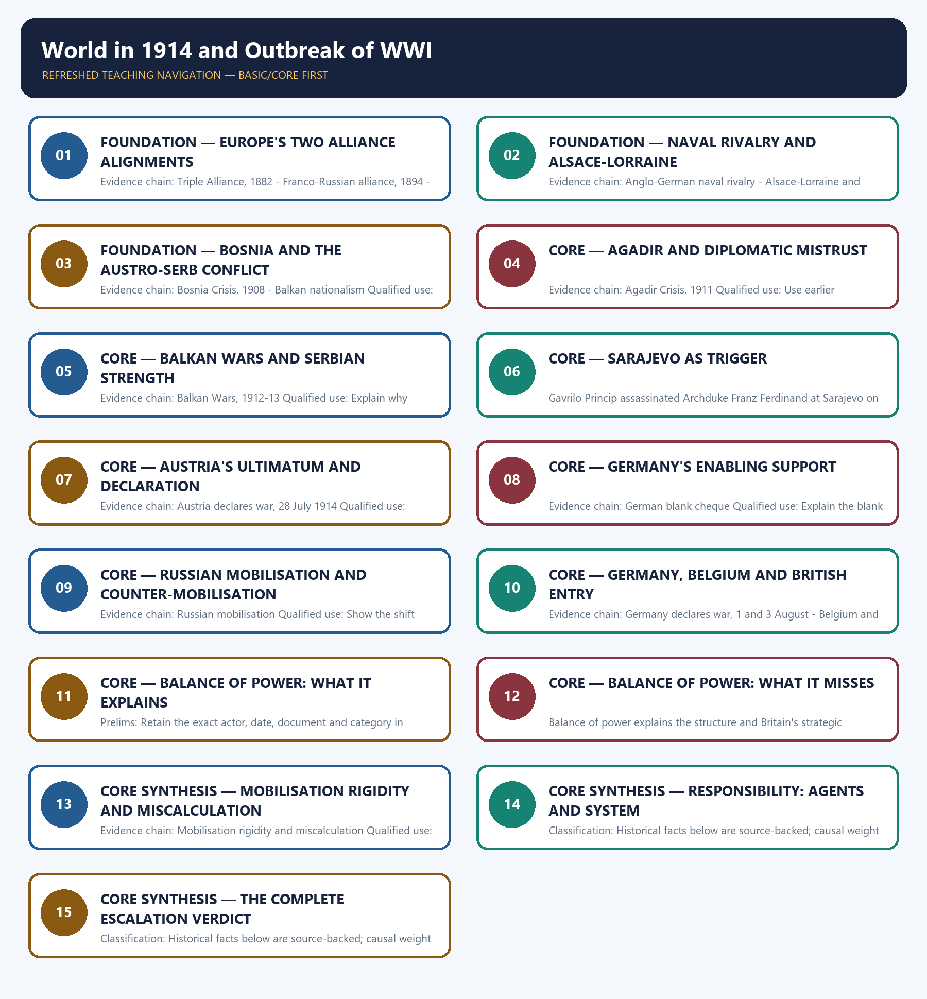

# World in 1914 and Outbreak of WWI — Learner-v2 Complete Learning Session

> **Authoring-only generation:** 2026-09-01. No PDF was rendered and no tracker or index was mutated.

### SOURCE, PROGRESSION AND CURRENT-LINKAGE AUDIT

- **Generation date:** 2026-09-01.
- **Repository-first evidence:** the Basic owner is taught first and preserved in full; the Advanced owner is retained only in the optional final teaching block.
- **OCR evidence:** Repository Markdown was used first. The available OCR-searchable Norman Lowe World History PDF was retained as supplementary local context, but no unsupported page number, quotation or precision was imported from it.
- **Qdrant:** not used; repository Markdown and available OCR context were sufficient.
- **PYQ integrity:** The local owners verify the 2024 GS-I demand asking how far the First World War was fought essentially for preservation of balance of power.
- **Live-link boundary:** No verified live current-affairs item is pegged to this historical topic in the repository owners. The package therefore uses the bounded phrase 'no verified live item' rather than inventing a headline, date, institution or contemporary linkage.
- **Fact/inference discipline:** no current-affairs item, PYQ wording, figure or quotation is invented.

## BASIC LEARNING SESSION



*Distinct embedded teaching-navigation image. The separate continuous Cārvāka-style flowchart package remains an independent at-a-glance artifact.*

### SESSION 1 — FOUNDATION — EUROPE'S TWO ALLIANCE ALIGNMENTS

#### DEFINITION / WHAT THIS IS CALLED

**Plain-language definition:** Precise definition: Europe's two alliance alignments is the source-bounded relationship among Triple Alliance, 1882, Franco-Russian alliance, 1894, Entente Cordiale, 1904 and Anglo-Russian agreement, 1907 within World in 1914 and Outbreak of WWI.

**Technical definition:** Evidence chain: Triple Alliance, 1882 - Franco-Russian alliance, 1894 - Entente Cordiale, 1904 - Anglo-Russian agreement, 1907 Qualified use: Map the blocs and their gradual formation.

#### ANSWER-GRABBING OPENING — WRITE/ADAPT IN THE EXAM

> Precise definition: Europe's two alliance alignments is the source-bounded relationship among Triple Alliance, 1882, Franco-Russian alliance, 1894, Entente Cordiale, 1904 and Anglo-Russian agreement, 1907 within World in 1914 and Outbreak of WWI.

#### MUST-WRITE KEYWORDS

- **FOUNDATION**
- **Europe's two alliance alignments**
- **Precise definition**
- **Evidence chain**
- **Qualified use**
- **Precise definition: Europe's two alliance alignments**

**How to use them:** Frame the answer through FOUNDATION; define Europe's two alliance alignments, connect Precise definition with Evidence chain to explain the mechanism, and use Qualified use for the decisive comparison or qualification.

##### VISUAL FIRST

```text
EUROPE'S TWO ALLIANCE ALIGNMENTS
01. Triple Alliance, 1882
    |
    v
02. Franco-Russian alliance, 1894
    |
    v
03. Entente Cordiale, 1904
    |
    v
04. Anglo-Russian agreement, 1907
BOUNDARY -> Alignment did not mechanically compel every signatory to fight.
```

*This topic-specific rail fixes the evidence sequence and its exam boundary before analysis.*

##### CONCEPT DEFINITIONS

- **Precise definition:** Europe's two alliance alignments is the source-bounded relationship among Triple Alliance, 1882, Franco-Russian alliance, 1894, Entente Cordiale, 1904 and Anglo-Russian agreement, 1907 within World in 1914 and Outbreak of WWI.
- **Classification:** Historical facts below are source-backed; causal weight and evaluative verdicts are analytical synthesis.

##### CORE EXPLANATION

The Triple Alliance of 1882 joined Germany, Austria-Hungary and Italy, though Italy did not fight with them at the war's opening and entered on the Allied side in 1915. The 1894 Franco-Russian alliance helped organise Europe into counterweighted blocs and intensified German fear of encirclement. Britain and France reached the Entente Cordiale in 1904, resolving colonial disputes and enabling closer strategic cooperation. The 1907 British-Russian agreement completed the alignment commonly called the Triple Entente of Britain, France and Russia.

##### NAMED EVIDENCE AND MECHANISM

- The Triple Alliance of 1882 joined Germany, Austria-Hungary and Italy, though Italy did not fight with them at the war's opening and entered on the Allied side in 1915.
- The 1894 Franco-Russian alliance helped organise Europe into counterweighted blocs and intensified German fear of encirclement.
- Britain and France reached the Entente Cordiale in 1904, resolving colonial disputes and enabling closer strategic cooperation.
- The 1907 British-Russian agreement completed the alignment commonly called the Triple Entente of Britain, France and Russia.

##### EXAMINER CAUTION

- Alignment did not mechanically compel every signatory to fight.

##### EXAM LINK

- **Prelims:** Retain the exact actor, date, document and category in Europe's two alliance alignments.
- **Mains:** Map the blocs and their gradual formation.

##### MINI RECAP

- **Evidence chain:** Triple Alliance, 1882 -> Franco-Russian alliance, 1894 -> Entente Cordiale, 1904 -> Anglo-Russian agreement, 1907
- **Qualified use:** Map the blocs and their gradual formation.

#### CLOSING RECALL FLOW — FOUNDATION — EUROPE'S TWO ALLIANCE ALIGNMENTS

```text
START / CONCEPT: FOUNDATION — Europe's two alliance alignments
        |
        v
EXACT TERMS: FOUNDATION · Europe's two alliance alignments · Precise definition · Evidence chain · Qualified use · Precise definition: Europe's two alliance alignments
        |
        v
MECHANISM / ARGUMENT: Evidence chain: Triple Alliance, 1882 - Franco-Russian alliance, 1894 - Entente Cordiale, 1904 - Anglo-Russian agreement, 1907 Qualified use: Map the blocs and their gradual formation.
        |
        v
CONSEQUENCE / CONTRAST: Classification: Historical facts below are source-backed; causal weight and evaluative verdicts are analytical synthesis.
        |
        v
UPSC TRAP / ANSWER-USE: Do not miss this limiting distinction: europe's two alliance alignments is the source-bounded relationship among Triple Alliance, 1882, Franco-Russian alliance...
        |
        v
ANSWER-GRABBING FORMULATION: Precise definition: Europe's two alliance alignments is the source-bounded relationship among Triple Alliance, 1882, Franco-Russian alliance, 1894, Entente Cordiale, 1904 and Anglo-Russian agreement, 1907 within World in 1914 and Outbreak of WWI.
```
### SESSION 2 — FOUNDATION — NAVAL RIVALRY AND ALSACE-LORRAINE

#### DEFINITION / WHAT THIS IS CALLED

**Plain-language definition:** Precise definition: Naval rivalry and Alsace-Lorraine is the source-bounded relationship among Anglo-German naval rivalry and Alsace-Lorraine and revanchism within World in 1914 and Outbreak of WWI.

**Technical definition:** Evidence chain: Anglo-German naval rivalry - Alsace-Lorraine and revanchism Qualified use: Separate Anglo-German and Franco-German tensions.

#### ANSWER-GRABBING OPENING — WRITE/ADAPT IN THE EXAM

> Precise definition: Naval rivalry and Alsace-Lorraine is the source-bounded relationship among Anglo-German naval rivalry and Alsace-Lorraine and revanchism within World in 1914 and Outbreak of WWI.

#### MUST-WRITE KEYWORDS

- **FOUNDATION**
- **Naval rivalry**
- **Alsace-Lorraine**
- **Precise definition**
- **Evidence chain**
- **Qualified use**

**How to use them:** Frame the answer through FOUNDATION; define Naval rivalry, connect Alsace-Lorraine with Precise definition to explain the mechanism, and use Evidence chain for the decisive comparison or qualification.

##### VISUAL FIRST

```text
NAVAL RIVALRY AND ALSACE-LORRAINE
01. Anglo-German naval rivalry
    |
    v
02. Alsace-Lorraine and revanchism
BOUNDARY -> Relative power and national grievance are distinct causal categories.
```

*This topic-specific rail fixes the evidence sequence and its exam boundary before analysis.*

##### CONCEPT DEFINITIONS

- **Precise definition:** Naval rivalry and Alsace-Lorraine is the source-bounded relationship among Anglo-German naval rivalry and Alsace-Lorraine and revanchism within World in 1914 and Outbreak of WWI.
- **Classification:** Historical facts below are source-backed; causal weight and evaluative verdicts are analytical synthesis.

##### CORE EXPLANATION

Germany's naval rise directly challenged Britain's relative sea power and strategic security more than colonial rivalry alone did. French resentment over Alsace-Lorraine, lost in 1871, remained a national-territorial source of tension.

##### NAMED EVIDENCE AND MECHANISM

- Germany's naval rise directly challenged Britain's relative sea power and strategic security more than colonial rivalry alone did.
- French resentment over Alsace-Lorraine, lost in 1871, remained a national-territorial source of tension.

##### EXAMINER CAUTION

- Relative power and national grievance are distinct causal categories.

##### EXAM LINK

- **Prelims:** Retain the exact actor, date, document and category in Naval rivalry and Alsace-Lorraine.
- **Mains:** Separate Anglo-German and Franco-German tensions.

##### MINI RECAP

- **Evidence chain:** Anglo-German naval rivalry -> Alsace-Lorraine and revanchism
- **Qualified use:** Separate Anglo-German and Franco-German tensions.

#### CLOSING RECALL FLOW — FOUNDATION — NAVAL RIVALRY AND ALSACE-LORRAINE

```text
START / CONCEPT: FOUNDATION — Naval rivalry and Alsace-Lorraine
        |
        v
EXACT TERMS: FOUNDATION · Naval rivalry · Alsace-Lorraine · Precise definition · Evidence chain · Qualified use
        |
        v
MECHANISM / ARGUMENT: Evidence chain: Anglo-German naval rivalry - Alsace-Lorraine and revanchism Qualified use: Separate Anglo-German and Franco-German tensions.
        |
        v
CONSEQUENCE / CONTRAST: Classification: Historical facts below are source-backed; causal weight and evaluative verdicts are analytical synthesis.
        |
        v
UPSC TRAP / ANSWER-USE: Do not miss this limiting distinction: relative power and national grievance are distinct causal categories.
        |
        v
ANSWER-GRABBING FORMULATION: Precise definition: Naval rivalry and Alsace-Lorraine is the source-bounded relationship among Anglo-German naval rivalry and Alsace-Lorraine and revanchism within World in 1914 and Outbreak of WWI.
```
### SESSION 3 — FOUNDATION — BOSNIA AND THE AUSTRO-SERB CONFLICT

#### DEFINITION / WHAT THIS IS CALLED

**Plain-language definition:** Precise definition: Bosnia and the Austro-Serb conflict is the source-bounded relationship among Bosnia Crisis, 1908 and Balkan nationalism within World in 1914 and Outbreak of WWI.

**Technical definition:** Evidence chain: Bosnia Crisis, 1908 - Balkan nationalism Qualified use: Place South Slav nationalism at the regional core.

#### ANSWER-GRABBING OPENING — WRITE/ADAPT IN THE EXAM

> Precise definition: Bosnia and the Austro-Serb conflict is the source-bounded relationship among Bosnia Crisis, 1908 and Balkan nationalism within World in 1914 and Outbreak of WWI.

#### MUST-WRITE KEYWORDS

- **FOUNDATION**
- **Bosnia**
- **the Austro-Serb conflict**
- **Precise definition**
- **Evidence chain**
- **Qualified use**

**How to use them:** Frame the answer through FOUNDATION; define Bosnia, connect the Austro-Serb conflict with Precise definition to explain the mechanism, and use Evidence chain for the decisive comparison or qualification.

##### VISUAL FIRST

```text
BOSNIA AND THE AUSTRO-SERB CONFLICT
01. Bosnia Crisis, 1908
    |
    v
02. Balkan nationalism
BOUNDARY -> The threat was to Habsburg survival, not only prestige.
```

*This topic-specific rail fixes the evidence sequence and its exam boundary before analysis.*

##### CONCEPT DEFINITIONS

- **Precise definition:** Bosnia and the Austro-Serb conflict is the source-bounded relationship among Bosnia Crisis, 1908 and Balkan nationalism within World in 1914 and Outbreak of WWI.
- **Classification:** Historical facts below are source-backed; causal weight and evaluative verdicts are analytical synthesis.

##### CORE EXPLANATION

Austria-Hungary annexed Bosnia in 1908, deepening Serbian hostility and convincing Russia not to accept another humiliating retreat. Serbian and South Slav nationalism aimed at political unification while Austria-Hungary fought to preserve a multinational empire.

##### NAMED EVIDENCE AND MECHANISM

- Austria-Hungary annexed Bosnia in 1908, deepening Serbian hostility and convincing Russia not to accept another humiliating retreat.
- Serbian and South Slav nationalism aimed at political unification while Austria-Hungary fought to preserve a multinational empire.

##### EXAMINER CAUTION

- The threat was to Habsburg survival, not only prestige.

##### EXAM LINK

- **Prelims:** Retain the exact actor, date, document and category in Bosnia and the Austro-Serb conflict.
- **Mains:** Place South Slav nationalism at the regional core.

##### MINI RECAP

- **Evidence chain:** Bosnia Crisis, 1908 -> Balkan nationalism
- **Qualified use:** Place South Slav nationalism at the regional core.

#### CLOSING RECALL FLOW — FOUNDATION — BOSNIA AND THE AUSTRO-SERB CONFLICT

```text
START / CONCEPT: FOUNDATION — Bosnia and the Austro-Serb conflict
        |
        v
EXACT TERMS: FOUNDATION · Bosnia · the Austro-Serb conflict · Precise definition · Evidence chain · Qualified use
        |
        v
MECHANISM / ARGUMENT: Evidence chain: Bosnia Crisis, 1908 - Balkan nationalism Qualified use: Place South Slav nationalism at the regional core.
        |
        v
CONSEQUENCE / CONTRAST: The threat was to Habsburg survival, not only prestige.
        |
        v
UPSC TRAP / ANSWER-USE: Do not miss this limiting distinction: causal weight and evaluative verdicts are analytical synthesis.
        |
        v
ANSWER-GRABBING FORMULATION: Precise definition: Bosnia and the Austro-Serb conflict is the source-bounded relationship among Bosnia Crisis, 1908 and Balkan nationalism within World in 1914 and Outbreak of WWI.
```
### SESSION 4 — CORE — AGADIR AND DIPLOMATIC MISTRUST

#### DEFINITION / WHAT THIS IS CALLED

**Plain-language definition:** Precise definition: Agadir and diplomatic mistrust is the source-bounded relationship among and Agadir Crisis, 1911 within World in 1914 and Outbreak of WWI.

**Technical definition:** Evidence chain: Agadir Crisis, 1911 Qualified use: Use earlier containment to qualify inevitability.

#### ANSWER-GRABBING OPENING — WRITE/ADAPT IN THE EXAM

> Precise definition: Agadir and diplomatic mistrust is the source-bounded relationship among and Agadir Crisis, 1911 within World in 1914 and Outbreak of WWI.

#### MUST-WRITE KEYWORDS

- **Agadir**
- **diplomatic mistrust**
- **Precise definition**
- **Evidence chain**
- **Qualified use**
- **Precise definition: Agadir and diplomatic mistrust**

**How to use them:** Frame the answer through Agadir; define diplomatic mistrust, connect Precise definition with Evidence chain to explain the mechanism, and use Qualified use for the decisive comparison or qualification.

##### VISUAL FIRST

```text
AGADIR AND DIPLOMATIC MISTRUST
01. Agadir Crisis, 1911
BOUNDARY -> Agadir sharpened alignments without making war inevitable.
```

*This topic-specific rail fixes the evidence sequence and its exam boundary before analysis.*

##### CONCEPT DEFINITIONS

- **Precise definition:** Agadir and diplomatic mistrust is the source-bounded relationship among  and Agadir Crisis, 1911 within World in 1914 and Outbreak of WWI.
- **Classification:** Historical facts below are source-backed; causal weight and evaluative verdicts are analytical synthesis.

##### CORE EXPLANATION

The Agadir Crisis of 1911 strengthened British support for France and deepened German mistrust.

##### NAMED EVIDENCE AND MECHANISM

- The Agadir Crisis of 1911 strengthened British support for France and deepened German mistrust.

##### EXAMINER CAUTION

- Agadir sharpened alignments without making war inevitable.

##### EXAM LINK

- **Prelims:** Retain the exact actor, date, document and category in Agadir and diplomatic mistrust.
- **Mains:** Use earlier containment to qualify inevitability.

##### MINI RECAP

- **Evidence chain:** Agadir Crisis, 1911
- **Qualified use:** Use earlier containment to qualify inevitability.

#### CLOSING RECALL FLOW — CORE — AGADIR AND DIPLOMATIC MISTRUST

```text
START / CONCEPT: CORE — Agadir and diplomatic mistrust
        |
        v
EXACT TERMS: Agadir · diplomatic mistrust · Precise definition · Evidence chain · Qualified use · Precise definition: Agadir and diplomatic mistrust
        |
        v
MECHANISM / ARGUMENT: Evidence chain: Agadir Crisis, 1911 Qualified use: Use earlier containment to qualify inevitability.
        |
        v
CONSEQUENCE / CONTRAST: Classification: Historical facts below are source-backed; causal weight and evaluative verdicts are analytical synthesis.
        |
        v
UPSC TRAP / ANSWER-USE: Do not miss this limiting distinction: use earlier containment to qualify inevitability.
        |
        v
ANSWER-GRABBING FORMULATION: Precise definition: Agadir and diplomatic mistrust is the source-bounded relationship among and Agadir Crisis, 1911 within World in 1914 and Outbreak of WWI.
```
### SESSION 5 — CORE — BALKAN WARS AND SERBIAN STRENGTH

#### DEFINITION / WHAT THIS IS CALLED

**Plain-language definition:** Precise definition: Balkan Wars and Serbian strength is the source-bounded relationship among and Balkan Wars, 1912-13 within World in 1914 and Outbreak of WWI.

**Technical definition:** Evidence chain: Balkan Wars, 1912-13 Qualified use: Explain why Austria's risk tolerance rose.

#### ANSWER-GRABBING OPENING — WRITE/ADAPT IN THE EXAM

> Precise definition: Balkan Wars and Serbian strength is the source-bounded relationship among and Balkan Wars, 1912-13 within World in 1914 and Outbreak of WWI.

#### MUST-WRITE KEYWORDS

- **Balkan Wars**
- **Serbian strength**
- **Precise definition**
- **Evidence chain**
- **Qualified use**
- **1912-13**

**How to use them:** Frame the answer through Balkan Wars; define Serbian strength, connect Precise definition with Evidence chain to explain the mechanism, and use Qualified use for the decisive comparison or qualification.

##### VISUAL FIRST

```text
BALKAN WARS AND SERBIAN STRENGTH
01. Balkan Wars, 1912-13
BOUNDARY -> Use 1912-13 exactly and avoid battle detail not owned.
```

*This topic-specific rail fixes the evidence sequence and its exam boundary before analysis.*

##### CONCEPT DEFINITIONS

- **Precise definition:** Balkan Wars and Serbian strength is the source-bounded relationship among  and Balkan Wars, 1912-13 within World in 1914 and Outbreak of WWI.
- **Classification:** Historical facts below are source-backed; causal weight and evaluative verdicts are analytical synthesis.

##### CORE EXPLANATION

The Balkan Wars strengthened Serbia and alarmed Austria-Hungary, which saw South Slav nationalism as a threat to imperial survival.

##### NAMED EVIDENCE AND MECHANISM

- The Balkan Wars strengthened Serbia and alarmed Austria-Hungary, which saw South Slav nationalism as a threat to imperial survival.

##### EXAMINER CAUTION

- Use 1912-13 exactly and avoid battle detail not owned.

##### EXAM LINK

- **Prelims:** Retain the exact actor, date, document and category in Balkan Wars and Serbian strength.
- **Mains:** Explain why Austria's risk tolerance rose.

##### MINI RECAP

- **Evidence chain:** Balkan Wars, 1912-13
- **Qualified use:** Explain why Austria's risk tolerance rose.

#### CLOSING RECALL FLOW — CORE — BALKAN WARS AND SERBIAN STRENGTH

```text
START / CONCEPT: CORE — Balkan Wars and Serbian strength
        |
        v
EXACT TERMS: Balkan Wars · Serbian strength · Precise definition · Evidence chain · Qualified use · 1912-13
        |
        v
MECHANISM / ARGUMENT: Evidence chain: Balkan Wars, 1912-13 Qualified use: Explain why Austria's risk tolerance rose.
        |
        v
CONSEQUENCE / CONTRAST: Use 1912-13 exactly and avoid battle detail not owned.
        |
        v
UPSC TRAP / ANSWER-USE: Do not miss this limiting distinction: causal weight and evaluative verdicts are analytical synthesis.
        |
        v
ANSWER-GRABBING FORMULATION: Precise definition: Balkan Wars and Serbian strength is the source-bounded relationship among and Balkan Wars, 1912-13 within World in 1914 and Outbreak of WWI.
```
### SESSION 6 — CORE — SARAJEVO AS TRIGGER

#### DEFINITION / WHAT THIS IS CALLED

**Plain-language definition:** Precise definition: Sarajevo as trigger is the source-bounded relationship among and Sarajevo, 28 June 1914 within World in 1914 and Outbreak of WWI.

**Technical definition:** Gavrilo Princip assassinated Archduke Franz Ferdinand at Sarajevo on 28 June 1914; the assassination was the trigger, not the complete cause.

#### ANSWER-GRABBING OPENING — WRITE/ADAPT IN THE EXAM

> Precise definition: Sarajevo as trigger is the source-bounded relationship among and Sarajevo, 28 June 1914 within World in 1914 and Outbreak of WWI.

#### MUST-WRITE KEYWORDS

- **Sarajevo as trigger**
- **Precise definition**
- **Evidence chain**
- **Qualified use**
- **Precise definition: Sarajevo as trigger**
- **Precise**

**How to use them:** Frame the answer through Sarajevo as trigger; define Precise definition, connect Evidence chain with Qualified use to explain the mechanism, and use Precise definition: Sarajevo as trigger for the decisive comparison or qualification.

##### VISUAL FIRST

```text
SARAJEVO AS TRIGGER
01. Sarajevo, 28 June 1914
BOUNDARY -> Trigger and structural cause must remain separate.
```

*This topic-specific rail fixes the evidence sequence and its exam boundary before analysis.*

##### CONCEPT DEFINITIONS

- **Precise definition:** Sarajevo as trigger is the source-bounded relationship among  and Sarajevo, 28 June 1914 within World in 1914 and Outbreak of WWI.
- **Classification:** Historical facts below are source-backed; causal weight and evaluative verdicts are analytical synthesis.

##### CORE EXPLANATION

Gavrilo Princip assassinated Archduke Franz Ferdinand at Sarajevo on 28 June 1914; the assassination was the trigger, not the complete cause.

##### NAMED EVIDENCE AND MECHANISM

- Gavrilo Princip assassinated Archduke Franz Ferdinand at Sarajevo on 28 June 1914; the assassination was the trigger, not the complete cause.

##### EXAMINER CAUTION

- Trigger and structural cause must remain separate.

##### EXAM LINK

- **Prelims:** Retain the exact actor, date, document and category in Sarajevo as trigger.
- **Mains:** Open chronology without reducing causation.

##### MINI RECAP

- **Evidence chain:** Sarajevo, 28 June 1914
- **Qualified use:** Open chronology without reducing causation.

#### CLOSING RECALL FLOW — CORE — SARAJEVO AS TRIGGER

```text
START / CONCEPT: CORE — Sarajevo as trigger
        |
        v
EXACT TERMS: Sarajevo as trigger · Precise definition · Evidence chain · Qualified use · Precise definition: Sarajevo as trigger · Precise
        |
        v
MECHANISM / ARGUMENT: Gavrilo Princip assassinated Archduke Franz Ferdinand at Sarajevo on 28 June 1914; the assassination was the trigger, not the complete cause.
        |
        v
CONSEQUENCE / CONTRAST: Evidence chain: Sarajevo, 28 June 1914 Qualified use: Open chronology without reducing causation.
        |
        v
UPSC TRAP / ANSWER-USE: Do not miss this limiting distinction: trigger and structural cause must remain separate.
        |
        v
ANSWER-GRABBING FORMULATION: Precise definition: Sarajevo as trigger is the source-bounded relationship among and Sarajevo, 28 June 1914 within World in 1914 and Outbreak of WWI.
```
### SESSION 7 — CORE — AUSTRIA'S ULTIMATUM AND DECLARATION

#### DEFINITION / WHAT THIS IS CALLED

**Plain-language definition:** Precise definition: Austria's ultimatum and declaration is the source-bounded relationship among and Austria declares war, 28 July 1914 within World in 1914 and Outbreak of WWI.

**Technical definition:** Evidence chain: Austria declares war, 28 July 1914 Qualified use: Identify the immediate choice for war.

#### ANSWER-GRABBING OPENING — WRITE/ADAPT IN THE EXAM

> Precise definition: Austria's ultimatum and declaration is the source-bounded relationship among and Austria declares war, 28 July 1914 within World in 1914 and Outbreak of WWI.

#### MUST-WRITE KEYWORDS

- **Austria's ultimatum**
- **declaration**
- **Precise definition**
- **Evidence chain**
- **Qualified use**
- **Precise definition: Austria's ultimatum and declaration**

**How to use them:** Frame the answer through Austria's ultimatum; define declaration, connect Precise definition with Evidence chain to explain the mechanism, and use Qualified use for the decisive comparison or qualification.

##### VISUAL FIRST

```text
AUSTRIA'S ULTIMATUM AND DECLARATION
01. Austria declares war, 28 July 1914
BOUNDARY -> Vienna retained decision-making agency.
```

*This topic-specific rail fixes the evidence sequence and its exam boundary before analysis.*

##### CONCEPT DEFINITIONS

- **Precise definition:** Austria's ultimatum and declaration is the source-bounded relationship among  and Austria declares war, 28 July 1914 within World in 1914 and Outbreak of WWI.
- **Classification:** Historical facts below are source-backed; causal weight and evaluative verdicts are analytical synthesis.

##### CORE EXPLANATION

Austria-Hungary used the assassination and ultimatum crisis to declare war on Serbia on 28 July 1914.

##### NAMED EVIDENCE AND MECHANISM

- Austria-Hungary used the assassination and ultimatum crisis to declare war on Serbia on 28 July 1914.

##### EXAMINER CAUTION

- Vienna retained decision-making agency.

##### EXAM LINK

- **Prelims:** Retain the exact actor, date, document and category in Austria's ultimatum and declaration.
- **Mains:** Identify the immediate choice for war.

##### MINI RECAP

- **Evidence chain:** Austria declares war, 28 July 1914
- **Qualified use:** Identify the immediate choice for war.

#### CLOSING RECALL FLOW — CORE — AUSTRIA'S ULTIMATUM AND DECLARATION

```text
START / CONCEPT: CORE — Austria's ultimatum and declaration
        |
        v
EXACT TERMS: Austria's ultimatum · declaration · Precise definition · Evidence chain · Qualified use · Precise definition: Austria's ultimatum and declaration
        |
        v
MECHANISM / ARGUMENT: Evidence chain: Austria declares war, 28 July 1914 Qualified use: Identify the immediate choice for war.
        |
        v
CONSEQUENCE / CONTRAST: Classification: Historical facts below are source-backed; causal weight and evaluative verdicts are analytical synthesis.
        |
        v
UPSC TRAP / ANSWER-USE: Do not miss this limiting distinction: austria's ultimatum and declaration is the source-bounded relationship among and Austria declares war, 28...
        |
        v
ANSWER-GRABBING FORMULATION: Precise definition: Austria's ultimatum and declaration is the source-bounded relationship among and Austria declares war, 28 July 1914 within World in 1914 and Outbreak of WWI.
```
### SESSION 8 — CORE — GERMANY'S ENABLING SUPPORT

#### DEFINITION / WHAT THIS IS CALLED

**Plain-language definition:** Precise definition: Germany's enabling support is the source-bounded relationship among and German blank cheque within World in 1914 and Outbreak of WWI.

**Technical definition:** Evidence chain: German blank cheque Qualified use: Explain the blank cheque as escalation permission.

#### ANSWER-GRABBING OPENING — WRITE/ADAPT IN THE EXAM

> Precise definition: Germany's enabling support is the source-bounded relationship among and German blank cheque within World in 1914 and Outbreak of WWI.

#### MUST-WRITE KEYWORDS

- **Germany's enabling support**
- **Precise definition**
- **Evidence chain**
- **Qualified use**
- **Precise definition: Germany's enabling support**
- **Precise**

**How to use them:** Frame the answer through Germany's enabling support; define Precise definition, connect Evidence chain with Qualified use to explain the mechanism, and use Precise definition: Germany's enabling support for the decisive comparison or qualification.

##### VISUAL FIRST

```text
GERMANY'S ENABLING SUPPORT
01. German blank cheque
BOUNDARY -> Heavy responsibility does not require sole responsibility.
```

*This topic-specific rail fixes the evidence sequence and its exam boundary before analysis.*

##### CONCEPT DEFINITIONS

- **Precise definition:** Germany's enabling support is the source-bounded relationship among  and German blank cheque within World in 1914 and Outbreak of WWI.
- **Classification:** Historical facts below are source-backed; causal weight and evaluative verdicts are analytical synthesis.

##### CORE EXPLANATION

German backing enabled Austria-Hungary's hard line and is central to arguments assigning heavy responsibility to Berlin and Vienna.

##### NAMED EVIDENCE AND MECHANISM

- German backing enabled Austria-Hungary's hard line and is central to arguments assigning heavy responsibility to Berlin and Vienna.

##### EXAMINER CAUTION

- Heavy responsibility does not require sole responsibility.

##### EXAM LINK

- **Prelims:** Retain the exact actor, date, document and category in Germany's enabling support.
- **Mains:** Explain the blank cheque as escalation permission.

##### MINI RECAP

- **Evidence chain:** German blank cheque
- **Qualified use:** Explain the blank cheque as escalation permission.

#### CLOSING RECALL FLOW — CORE — GERMANY'S ENABLING SUPPORT

```text
START / CONCEPT: CORE — Germany's enabling support
        |
        v
EXACT TERMS: Germany's enabling support · Precise definition · Evidence chain · Qualified use · Precise definition: Germany's enabling support · Precise
        |
        v
MECHANISM / ARGUMENT: Evidence chain: German blank cheque Qualified use: Explain the blank cheque as escalation permission.
        |
        v
CONSEQUENCE / CONTRAST: Heavy responsibility does not require sole responsibility.
        |
        v
UPSC TRAP / ANSWER-USE: Do not miss this limiting distinction: causal weight and evaluative verdicts are analytical synthesis.
        |
        v
ANSWER-GRABBING FORMULATION: Precise definition: Germany's enabling support is the source-bounded relationship among and German blank cheque within World in 1914 and Outbreak of WWI.
```
### SESSION 9 — CORE — RUSSIAN MOBILISATION AND COUNTER-MOBILISATION

#### DEFINITION / WHAT THIS IS CALLED

**Plain-language definition:** Precise definition: Russian mobilisation and counter-mobilisation is the source-bounded relationship among and Russian mobilisation within World in 1914 and Outbreak of WWI.

**Technical definition:** Evidence chain: Russian mobilisation Qualified use: Show the shift from Balkan to continental war.

#### ANSWER-GRABBING OPENING — WRITE/ADAPT IN THE EXAM

> Precise definition: Russian mobilisation and counter-mobilisation is the source-bounded relationship among and Russian mobilisation within World in 1914 and Outbreak of WWI.

#### MUST-WRITE KEYWORDS

- **Russian mobilisation**
- **counter-mobilisation**
- **Precise definition**
- **Evidence chain**
- **Qualified use**
- **Precise definition: Russian mobilisation and counter-mobilisation**

**How to use them:** Frame the answer through Russian mobilisation; define counter-mobilisation, connect Precise definition with Evidence chain to explain the mechanism, and use Qualified use for the decisive comparison or qualification.

##### VISUAL FIRST

```text
RUSSIAN MOBILISATION AND COUNTER-MOBILISATION
01. Russian mobilisation
BOUNDARY -> Mobilisation was a strategic act, not a neutral precaution.
```

*This topic-specific rail fixes the evidence sequence and its exam boundary before analysis.*

##### CONCEPT DEFINITIONS

- **Precise definition:** Russian mobilisation and counter-mobilisation is the source-bounded relationship among  and Russian mobilisation within World in 1914 and Outbreak of WWI.
- **Classification:** Historical facts below are source-backed; causal weight and evaluative verdicts are analytical synthesis.

##### CORE EXPLANATION

Russian mobilisation for Serbia transformed the Austro-Serb conflict into a direct great-power confrontation and compressed German decision time.

##### NAMED EVIDENCE AND MECHANISM

- Russian mobilisation for Serbia transformed the Austro-Serb conflict into a direct great-power confrontation and compressed German decision time.

##### EXAMINER CAUTION

- Mobilisation was a strategic act, not a neutral precaution.

##### EXAM LINK

- **Prelims:** Retain the exact actor, date, document and category in Russian mobilisation and counter-mobilisation.
- **Mains:** Show the shift from Balkan to continental war.

##### MINI RECAP

- **Evidence chain:** Russian mobilisation
- **Qualified use:** Show the shift from Balkan to continental war.

#### CLOSING RECALL FLOW — CORE — RUSSIAN MOBILISATION AND COUNTER-MOBILISATION

```text
START / CONCEPT: CORE — Russian mobilisation and counter-mobilisation
        |
        v
EXACT TERMS: Russian mobilisation · counter-mobilisation · Precise definition · Evidence chain · Qualified use · Precise definition: Russian mobilisation and counter-mobilisation
        |
        v
MECHANISM / ARGUMENT: Evidence chain: Russian mobilisation Qualified use: Show the shift from Balkan to continental war.
        |
        v
CONSEQUENCE / CONTRAST: Mobilisation was a strategic act, not a neutral precaution.
        |
        v
UPSC TRAP / ANSWER-USE: Do not miss this limiting distinction: causal weight and evaluative verdicts are analytical synthesis.
        |
        v
ANSWER-GRABBING FORMULATION: Precise definition: Russian mobilisation and counter-mobilisation is the source-bounded relationship among and Russian mobilisation within World in 1914 and Outbreak of WWI.
```
### SESSION 10 — CORE — GERMANY, BELGIUM AND BRITISH ENTRY

#### DEFINITION / WHAT THIS IS CALLED

**Plain-language definition:** Precise definition: Germany, Belgium and British entry is the source-bounded relationship among Germany declares war, 1 and 3 August and Belgium and British entry, 4 August within World in 1914 and Outbreak of WWI.

**Technical definition:** Evidence chain: Germany declares war, 1 and 3 August - Belgium and British entry, 4 August Qualified use: Trace operational planning into wider war.

#### ANSWER-GRABBING OPENING — WRITE/ADAPT IN THE EXAM

> Precise definition: Germany, Belgium and British entry is the source-bounded relationship among Germany declares war, 1 and 3 August and Belgium and British entry, 4 August within World in 1914 and Outbreak of WWI.

#### MUST-WRITE KEYWORDS

- **Germany**
- **Belgium**
- **British entry**
- **Precise definition**
- **Evidence chain**
- **Qualified use**

**How to use them:** Frame the answer through Germany; define Belgium, connect British entry with Precise definition to explain the mechanism, and use Evidence chain for the decisive comparison or qualification.

##### VISUAL FIRST

```text
GERMANY, BELGIUM AND BRITISH ENTRY
01. Germany declares war, 1 and 3 August
    |
    v
02. Belgium and British entry, 4 August
BOUNDARY -> Britain's immediate legal-political trigger was Belgian neutrality.
```

*This topic-specific rail fixes the evidence sequence and its exam boundary before analysis.*

##### CONCEPT DEFINITIONS

- **Precise definition:** Germany, Belgium and British entry is the source-bounded relationship among Germany declares war, 1 and 3 August and Belgium and British entry, 4 August within World in 1914 and Outbreak of WWI.
- **Classification:** Historical facts below are source-backed; causal weight and evaluative verdicts are analytical synthesis.

##### CORE EXPLANATION

Germany declared war on Russia on 1 August and France on 3 August 1914. German mobilisation planning required an attack through Belgium, and violation of Belgian neutrality brought Britain into war on 4 August 1914.

##### NAMED EVIDENCE AND MECHANISM

- Germany declared war on Russia on 1 August and France on 3 August 1914.
- German mobilisation planning required an attack through Belgium, and violation of Belgian neutrality brought Britain into war on 4 August 1914.

##### EXAMINER CAUTION

- Britain's immediate legal-political trigger was Belgian neutrality.

##### EXAM LINK

- **Prelims:** Retain the exact actor, date, document and category in Germany, Belgium and British entry.
- **Mains:** Trace operational planning into wider war.

##### MINI RECAP

- **Evidence chain:** Germany declares war, 1 and 3 August -> Belgium and British entry, 4 August
- **Qualified use:** Trace operational planning into wider war.

#### CLOSING RECALL FLOW — CORE — GERMANY, BELGIUM AND BRITISH ENTRY

```text
START / CONCEPT: CORE — Germany, Belgium and British entry
        |
        v
EXACT TERMS: Germany · Belgium · British entry · Precise definition · Evidence chain · Qualified use
        |
        v
MECHANISM / ARGUMENT: Evidence chain: Germany declares war, 1 and 3 August - Belgium and British entry, 4 August Qualified use: Trace operational planning into wider war.
        |
        v
CONSEQUENCE / CONTRAST: Classification: Historical facts below are source-backed; causal weight and evaluative verdicts are analytical synthesis.
        |
        v
UPSC TRAP / ANSWER-USE: Do not miss this limiting distinction: britain's immediate legal-political trigger was Belgian neutrality.
        |
        v
ANSWER-GRABBING FORMULATION: Precise definition: Germany, Belgium and British entry is the source-bounded relationship among Germany declares war, 1 and 3 August and Belgium and British entry, 4 August within World in 1914 and Outbreak of WWI.
```
### SESSION 11 — CORE — BALANCE OF POWER: WHAT IT EXPLAINS

#### DEFINITION / WHAT THIS IS CALLED

**Plain-language definition:** Precise definition: Balance of power: what it explains is the source-bounded relationship among and Balance-of-power structure within World in 1914 and Outbreak of WWI.

**Technical definition:** Prelims: Retain the exact actor, date, document and category in Balance of power: what it explains.

#### ANSWER-GRABBING OPENING — WRITE/ADAPT IN THE EXAM

> Precise definition: Balance of power: what it explains is the source-bounded relationship among and Balance-of-power structure within World in 1914 and Outbreak of WWI.

#### MUST-WRITE KEYWORDS

- **Balance of power**
- **what it explains**
- **Precise definition**
- **Evidence chain**
- **Qualified use**
- **Precise**

**How to use them:** Frame the answer through Balance of power; define what it explains, connect Precise definition with Evidence chain to explain the mechanism, and use Qualified use for the decisive comparison or qualification.

##### VISUAL FIRST

```text
BALANCE OF POWER: WHAT IT EXPLAINS
01. Balance-of-power structure
BOUNDARY -> Concede bloc structure, ratios and strategic fear first.
```

*This topic-specific rail fixes the evidence sequence and its exam boundary before analysis.*

##### CONCEPT DEFINITIONS

- **Precise definition:** Balance of power: what it explains is the source-bounded relationship among  and Balance-of-power structure within World in 1914 and Outbreak of WWI.
- **Classification:** Historical facts below are source-backed; causal weight and evaluative verdicts are analytical synthesis.

##### CORE EXPLANATION

Alliance blocs, encirclement fears, naval ratios and Balkan shifts made local conflict a test of great-power standing.

##### NAMED EVIDENCE AND MECHANISM

- Alliance blocs, encirclement fears, naval ratios and Balkan shifts made local conflict a test of great-power standing.

##### EXAMINER CAUTION

- Concede bloc structure, ratios and strategic fear first.

##### EXAM LINK

- **Prelims:** Retain the exact actor, date, document and category in Balance of power: what it explains.
- **Mains:** Answer the strongest part of the 2024 demand.

##### MINI RECAP

- **Evidence chain:** Balance-of-power structure
- **Qualified use:** Answer the strongest part of the 2024 demand.

#### CLOSING RECALL FLOW — CORE — BALANCE OF POWER: WHAT IT EXPLAINS

```text
START / CONCEPT: CORE — Balance of power: what it explains
        |
        v
EXACT TERMS: Balance of power · what it explains · Precise definition · Evidence chain · Qualified use · Precise
        |
        v
MECHANISM / ARGUMENT: Prelims: Retain the exact actor, date, document and category in Balance of power: what it explains.
        |
        v
CONSEQUENCE / CONTRAST: Evidence chain: Balance-of-power structure Qualified use: Answer the strongest part of the 2024 demand.
        |
        v
UPSC TRAP / ANSWER-USE: Do not miss this limiting distinction: causal weight and evaluative verdicts are analytical synthesis.
        |
        v
ANSWER-GRABBING FORMULATION: Precise definition: Balance of power: what it explains is the source-bounded relationship among and Balance-of-power structure within World in 1914 and Outbreak of WWI.
```
### SESSION 12 — CORE — BALANCE OF POWER: WHAT IT MISSES

#### DEFINITION / WHAT THIS IS CALLED

**Plain-language definition:** Precise definition: Balance of power: what it misses is the source-bounded relationship among Balkan nationalism and Balance-of-power verdict within World in 1914 and Outbreak of WWI.

**Technical definition:** Balance of power explains the structure and Britain's strategic concern, but not the full motives: Habsburg survival, South Slav nationalism, revanchism and preventive calculation also mattered.

#### ANSWER-GRABBING OPENING — WRITE/ADAPT IN THE EXAM

> Precise definition: Balance of power: what it misses is the source-bounded relationship among Balkan nationalism and Balance-of-power verdict within World in 1914 and Outbreak of WWI.

#### MUST-WRITE KEYWORDS

- **Balance of power**
- **what it misses**
- **Precise definition**
- **Evidence chain**
- **Qualified use**
- **Precise definition: Balance of power: what it misses**

**How to use them:** Frame the answer through Balance of power; define what it misses, connect Precise definition with Evidence chain to explain the mechanism, and use Qualified use for the decisive comparison or qualification.

##### VISUAL FIRST

```text
BALANCE OF POWER: WHAT IT MISSES
01. Balkan nationalism
    |
    v
02. Balance-of-power verdict
BOUNDARY -> National and imperial motives cannot be collapsed into equilibrium.
```

*This topic-specific rail fixes the evidence sequence and its exam boundary before analysis.*

##### CONCEPT DEFINITIONS

- **Precise definition:** Balance of power: what it misses is the source-bounded relationship among Balkan nationalism and Balance-of-power verdict within World in 1914 and Outbreak of WWI.
- **Classification:** Historical facts below are source-backed; causal weight and evaluative verdicts are analytical synthesis.

##### CORE EXPLANATION

Serbian and South Slav nationalism aimed at political unification while Austria-Hungary fought to preserve a multinational empire. Balance of power explains the structure and Britain's strategic concern, but not the full motives: Habsburg survival, South Slav nationalism, revanchism and preventive calculation also mattered.

##### NAMED EVIDENCE AND MECHANISM

- Serbian and South Slav nationalism aimed at political unification while Austria-Hungary fought to preserve a multinational empire.
- Balance of power explains the structure and Britain's strategic concern, but not the full motives: Habsburg survival, South Slav nationalism, revanchism and preventive calculation also mattered.

##### EXAMINER CAUTION

- National and imperial motives cannot be collapsed into equilibrium.

##### EXAM LINK

- **Prelims:** Retain the exact actor, date, document and category in Balance of power: what it misses.
- **Mains:** Build the graded how-far qualification.

##### MINI RECAP

- **Evidence chain:** Balkan nationalism -> Balance-of-power verdict
- **Qualified use:** Build the graded how-far qualification.

#### CLOSING RECALL FLOW — CORE — BALANCE OF POWER: WHAT IT MISSES

```text
START / CONCEPT: CORE — Balance of power: what it misses
        |
        v
EXACT TERMS: Balance of power · what it misses · Precise definition · Evidence chain · Qualified use · Precise definition: Balance of power: what it misses
        |
        v
MECHANISM / ARGUMENT: Balance of power explains the structure and Britain's strategic concern, but not the full motives: Habsburg survival, South Slav nationalism, revanchism and preventive calculation also mattered.
        |
        v
CONSEQUENCE / CONTRAST: Evidence chain: Balkan nationalism - Balance-of-power verdict Qualified use: Build the graded how-far qualification.
        |
        v
UPSC TRAP / ANSWER-USE: Do not miss this limiting distinction: causal weight and evaluative verdicts are analytical synthesis.
        |
        v
ANSWER-GRABBING FORMULATION: Precise definition: Balance of power: what it misses is the source-bounded relationship among Balkan nationalism and Balance-of-power verdict within World in 1914 and Outbreak of WWI.
```
### SESSION 13 — CORE SYNTHESIS — MOBILISATION RIGIDITY AND MISCALCULATION

#### DEFINITION / WHAT THIS IS CALLED

**Plain-language definition:** Precise definition: Mobilisation rigidity and miscalculation is the source-bounded relationship among and Mobilisation rigidity and miscalculation within World in 1914 and Outbreak of WWI.

**Technical definition:** Evidence chain: Mobilisation rigidity and miscalculation Qualified use: Use operational time and mistaken assumptions.

#### ANSWER-GRABBING OPENING — WRITE/ADAPT IN THE EXAM

> Precise definition: Mobilisation rigidity and miscalculation is the source-bounded relationship among and Mobilisation rigidity and miscalculation within World in 1914 and Outbreak of WWI.

#### MUST-WRITE KEYWORDS

- **CORE SYNTHESIS**
- **Mobilisation rigidity**
- **miscalculation**
- **Precise definition**
- **Evidence chain**
- **Qualified use**

**How to use them:** Frame the answer through CORE SYNTHESIS; define Mobilisation rigidity, connect miscalculation with Precise definition to explain the mechanism, and use Evidence chain for the decisive comparison or qualification.

##### VISUAL FIRST

```text
MOBILISATION RIGIDITY AND MISCALCULATION
01. Mobilisation rigidity and miscalculation
BOUNDARY -> High likelihood is not inevitability.
```

*This topic-specific rail fixes the evidence sequence and its exam boundary before analysis.*

##### CONCEPT DEFINITIONS

- **Precise definition:** Mobilisation rigidity and miscalculation is the source-bounded relationship among  and Mobilisation rigidity and miscalculation within World in 1914 and Outbreak of WWI.
- **Classification:** Historical facts below are source-backed; causal weight and evaluative verdicts are analytical synthesis.

##### CORE EXPLANATION

Military timetables shortened diplomacy while leaders misjudged Russian, British and German responses; likelihood increased without making war inevitable.

##### NAMED EVIDENCE AND MECHANISM

- Military timetables shortened diplomacy while leaders misjudged Russian, British and German responses; likelihood increased without making war inevitable.

##### EXAMINER CAUTION

- High likelihood is not inevitability.

##### EXAM LINK

- **Prelims:** Retain the exact actor, date, document and category in Mobilisation rigidity and miscalculation.
- **Mains:** Use operational time and mistaken assumptions.

##### MINI RECAP

- **Evidence chain:** Mobilisation rigidity and miscalculation
- **Qualified use:** Use operational time and mistaken assumptions.

#### CLOSING RECALL FLOW — CORE SYNTHESIS — MOBILISATION RIGIDITY AND MISCALCULATION

```text
START / CONCEPT: CORE SYNTHESIS — Mobilisation rigidity and miscalculation
        |
        v
EXACT TERMS: CORE SYNTHESIS · Mobilisation rigidity · miscalculation · Precise definition · Evidence chain · Qualified use
        |
        v
MECHANISM / ARGUMENT: Evidence chain: Mobilisation rigidity and miscalculation Qualified use: Use operational time and mistaken assumptions.
        |
        v
CONSEQUENCE / CONTRAST: Classification: Historical facts below are source-backed; causal weight and evaluative verdicts are analytical synthesis.
        |
        v
UPSC TRAP / ANSWER-USE: Do not miss this limiting distinction: use operational time and mistaken assumptions.
        |
        v
ANSWER-GRABBING FORMULATION: Precise definition: Mobilisation rigidity and miscalculation is the source-bounded relationship among and Mobilisation rigidity and miscalculation within World in 1914 and Outbreak of WWI.
```
### SESSION 14 — CORE SYNTHESIS — RESPONSIBILITY: AGENTS AND SYSTEM

#### DEFINITION / WHAT THIS IS CALLED

**Plain-language definition:** Precise definition: Responsibility: agents and system is the source-bounded relationship among and Responsibility at two levels within World in 1914 and Outbreak of WWI.

**Technical definition:** Classification: Historical facts below are source-backed; causal weight and evaluative verdicts are analytical synthesis.

#### ANSWER-GRABBING OPENING — WRITE/ADAPT IN THE EXAM

> Precise definition: Responsibility: agents and system is the source-bounded relationship among and Responsibility at two levels within World in 1914 and Outbreak of WWI.

#### MUST-WRITE KEYWORDS

- **CORE SYNTHESIS**
- **Responsibility**
- **agents**
- **system**
- **Precise definition**
- **Evidence chain**

**How to use them:** Frame the answer through CORE SYNTHESIS; define Responsibility, connect agents with system to explain the mechanism, and use Precise definition for the decisive comparison or qualification.

##### VISUAL FIRST

```text
RESPONSIBILITY: AGENTS AND SYSTEM
01. Responsibility at two levels
BOUNDARY -> Keep immediate decisions and structural conditions on separate levels.
```

*This topic-specific rail fixes the evidence sequence and its exam boundary before analysis.*

##### CONCEPT DEFINITIONS

- **Precise definition:** Responsibility: agents and system is the source-bounded relationship among  and Responsibility at two levels within World in 1914 and Outbreak of WWI.
- **Classification:** Historical facts below are source-backed; causal weight and evaluative verdicts are analytical synthesis.

##### CORE EXPLANATION

Immediate responsibility centres on Vienna's decision for war and Berlin's support, while systemic responsibility lies in militarised blocs, nationalism and prestige politics.

##### NAMED EVIDENCE AND MECHANISM

- Immediate responsibility centres on Vienna's decision for war and Berlin's support, while systemic responsibility lies in militarised blocs, nationalism and prestige politics.

##### EXAMINER CAUTION

- Keep immediate decisions and structural conditions on separate levels.

##### EXAM LINK

- **Prelims:** Retain the exact actor, date, document and category in Responsibility: agents and system.
- **Mains:** Produce a nuanced blame paragraph.

##### MINI RECAP

- **Evidence chain:** Responsibility at two levels
- **Qualified use:** Produce a nuanced blame paragraph.

#### CLOSING RECALL FLOW — CORE SYNTHESIS — RESPONSIBILITY: AGENTS AND SYSTEM

```text
START / CONCEPT: CORE SYNTHESIS — Responsibility: agents and system
        |
        v
EXACT TERMS: CORE SYNTHESIS · Responsibility · agents · system · Precise definition · Evidence chain
        |
        v
MECHANISM / ARGUMENT: Evidence chain: Responsibility at two levels Qualified use: Produce a nuanced blame paragraph.
        |
        v
CONSEQUENCE / CONTRAST: Classification: Historical facts below are source-backed; causal weight and evaluative verdicts are analytical synthesis.
        |
        v
UPSC TRAP / ANSWER-USE: Do not miss this limiting distinction: agents and system is the source-bounded relationship among and Responsibility at two levels within...
        |
        v
ANSWER-GRABBING FORMULATION: Precise definition: Responsibility: agents and system is the source-bounded relationship among and Responsibility at two levels within World in 1914 and Outbreak of WWI.
```
### SESSION 15 — CORE SYNTHESIS — THE COMPLETE ESCALATION VERDICT

#### DEFINITION / WHAT THIS IS CALLED

**Plain-language definition:** Precise definition: The complete escalation verdict is the source-bounded relationship among Sarajevo, 28 June 1914, Austria declares war, 28 July 1914, German blank cheque, Russian mobilisation, Belgium and British entry, 4 August and Balance-of-power verdict within World in 1914 and Outbreak of WWI.

**Technical definition:** Classification: Historical facts below are source-backed; causal weight and evaluative verdicts are analytical synthesis.

#### ANSWER-GRABBING OPENING — WRITE/ADAPT IN THE EXAM

> Precise definition: The complete escalation verdict is the source-bounded relationship among Sarajevo, 28 June 1914, Austria declares war, 28 July 1914, German blank cheque, Russian mobilisation, Belgium and British entry, 4 August and Balance-of-power verdict within World in 1914 and Outbreak of WWI.

#### MUST-WRITE KEYWORDS

- **CORE SYNTHESIS**
- **The complete escalation verdict**
- **Precise definition**
- **Evidence chain**
- **Qualified use**
- **Subject**

**How to use them:** Frame the answer through CORE SYNTHESIS; define The complete escalation verdict, connect Precise definition with Evidence chain to explain the mechanism, and use Qualified use for the decisive comparison or qualification.

##### VISUAL FIRST

```text
THE COMPLETE ESCALATION VERDICT
01. Sarajevo, 28 June 1914
    |
    v
02. Austria declares war, 28 July 1914
    |
    v
03. German blank cheque
    |
    v
04. Russian mobilisation
    |
    v
05. Belgium and British entry, 4 August
    |
    v
06. Balance-of-power verdict
BOUNDARY -> Do not substitute chronology for causal weighting.
```

*This topic-specific rail fixes the evidence sequence and its exam boundary before analysis.*

##### CONCEPT DEFINITIONS

- **Precise definition:** The complete escalation verdict is the source-bounded relationship among Sarajevo, 28 June 1914, Austria declares war, 28 July 1914, German blank cheque, Russian mobilisation, Belgium and British entry, 4 August and Balance-of-power verdict within World in 1914 and Outbreak of WWI.
- **Classification:** Historical facts below are source-backed; causal weight and evaluative verdicts are analytical synthesis.

##### CORE EXPLANATION

Gavrilo Princip assassinated Archduke Franz Ferdinand at Sarajevo on 28 June 1914; the assassination was the trigger, not the complete cause. Austria-Hungary used the assassination and ultimatum crisis to declare war on Serbia on 28 July 1914. German backing enabled Austria-Hungary's hard line and is central to arguments assigning heavy responsibility to Berlin and Vienna. Russian mobilisation for Serbia transformed the Austro-Serb conflict into a direct great-power confrontation and compressed German decision time. German mobilisation planning required an attack through Belgium, and violation of Belgian neutrality brought Britain into war on 4 August 1914. Balance of power explains the structure and Britain's strategic concern, but not the full motives: Habsburg survival, South Slav nationalism, revanchism and preventive calculation also mattered.

##### NAMED EVIDENCE AND MECHANISM

- Gavrilo Princip assassinated Archduke Franz Ferdinand at Sarajevo on 28 June 1914; the assassination was the trigger, not the complete cause.
- Austria-Hungary used the assassination and ultimatum crisis to declare war on Serbia on 28 July 1914.
- German backing enabled Austria-Hungary's hard line and is central to arguments assigning heavy responsibility to Berlin and Vienna.
- Russian mobilisation for Serbia transformed the Austro-Serb conflict into a direct great-power confrontation and compressed German decision time.
- German mobilisation planning required an attack through Belgium, and violation of Belgian neutrality brought Britain into war on 4 August 1914.
- Balance of power explains the structure and Britain's strategic concern, but not the full motives: Habsburg survival, South Slav nationalism, revanchism and preventive calculation also mattered.

##### EXAMINER CAUTION

- Do not substitute chronology for causal weighting.

##### EXAM LINK

- **Prelims:** Retain the exact actor, date, document and category in The complete escalation verdict.
- **Mains:** Conclude from trigger through system to contingent decisions.

##### MINI RECAP

- **Evidence chain:** Sarajevo, 28 June 1914 -> Austria declares war, 28 July 1914 -> German blank cheque -> Russian mobilisation -> Belgium and British entry, 4 August -> Balance-of-power verdict
- **Qualified use:** Conclude from trigger through system to contingent decisions.

#### COMPLETE BASIC OWNER EVIDENCE BANK

> **Subject:** History (World History) · **Tier:** Must-Do (foundation) · **GS Paper:** GS-I
> **Grounded in:** Norman Lowe, *Mastering Modern World History* (5th ed.), Chapter 1, pp. 3-17; OCR lines used: 1313-2230.
> **Exam-relevance anchor:** ✅ UPSC GS-I syllabus includes: "History of the world will include events from 18th century such as industrial revolution, world wars, redrawal of national boundaries, colonization, decolonization, political philosophies like communism, capitalism, socialism etc.—their forms and effect on the society."
> ✅ = source-grounded · ⚠️ = interpretive synthesis / answer-writing line · 📰 = current-affairs peg only when separately verified.
> *Companion: `advanced/09_World-in-1914-and-Outbreak-of-WWI.md`.*

#### Mini-timeline

| Date | Event |
|---|---|
| ✅ 1882 | Triple Alliance of Germany, Austria-Hungary and Italy |
| ✅ 1894 | France and Russia sign alliance |
| ✅ 1904 | Britain and France sign Entente Cordiale |
| ✅ 1907 | Britain and Russia sign agreement |
| ✅ 1908 | Bosnia Crisis intensifies Austro-Serb hostility |
| ✅ 1911 | Agadir Crisis sharpens Anglo-German tension |
| ✅ 1912-13 | Balkan Wars strengthen Serbia and alarm Austria-Hungary |
| ✅ 28 June 1914 | Archduke Franz Ferdinand assassinated at Sarajevo |
| ✅ 28 July 1914 | Austria-Hungary declares war on Serbia |
| ✅ 1-4 August 1914 | Germany declares war on Russia and France; Britain enters war |

#### 1. Snapshot and core idea

✅ Lowe presents 1914 Europe as a powerful but unstable state system: Europe still dominated world politics, imperial competition had sharpened mistrust, and two alliance blocs stood facing each other.

✅ The Sarajevo assassination was the immediate trigger, but the war grew out of deeper tensions: Balkan nationalism, Austro-Serb rivalry, Russian backing for Serbia, German support for Austria-Hungary, and rigid mobilization plans.

⚠️ The safest GS-I formulation is: **Sarajevo lit the match, but the continent had already been filled with strategic, diplomatic and nationalist fuel.**

#### 2. What the world looked like in 1914

✅ Europe still made most of the decisions shaping global politics. Germany was militarily and economically the leading European power, Britain remained the great naval power, France was still influenced by Alsace-Lorraine, Russia was expanding, the USA had become a world power, and Japan had modernized rapidly after defeating Russia in 1904-05.

✅ Lowe distinguishes political systems clearly: Britain, France and the USA had democratic institutions; Germany, Italy and Japan had elected bodies but limited effective democracy; Russia and Austria-Hungary remained far more autocratic.

✅ Imperial expansion after 1880 sharpened rivalry. Africa was partitioned by European powers, while China was repeatedly forced into concessions by outside powers.

| Power / bloc | Position in 1914 | Why it mattered |
|---|---|---|
| Germany | Leading continental military-economic power | Central actor in alliance and war planning |
| Britain | Naval power with global empire | Feared German naval rise and Belgian threat |
| France | Revanchist after 1871 | Wanted Alsace-Lorraine restored |
| Russia | Expanding but insecure | Backed Serbia and feared Balkan setbacks |
| Austria-Hungary | Multi-national empire under strain | Felt Serbian nationalism threatened imperial survival |
| Serbia | Small but assertive Balkan state | Center of South Slav nationalism |

#### 3. Alliance system and sources of friction

✅ Europe had divided into two armed camps:

| Alignment | Members |
|---|---|
| Triple Alliance | Germany, Austria-Hungary, Italy |
| Triple Entente | Britain, France, Russia |

✅ Lowe identifies several sources of friction:
- ✅ Anglo-German naval rivalry.
- ✅ French resentment over the loss of Alsace-Lorraine in 1871.
- ✅ German fear of being "encircled" by Britain, France and Russia.
- ✅ Friction created by German Weltpolitik and imperial disappointment.
- ✅ Austrian and Russian rivalry in the Balkans.
- ✅ Serbian nationalism and the dream of a larger South Slav/Yugoslav state.

⚠️ The Balkans mattered because Serbian success threatened not just Austria's prestige but the internal survival of the Habsburg Empire itself.

#### 4. From Balkan crises to July crisis

✅ Lowe's sequence is important:
- ✅ Moroccan Crisis (1905-06): tested the Entente; Germany suffered a diplomatic defeat.
- ✅ British agreement with Russia (1907): deepened German fears of encirclement.
- ✅ Bosnia Crisis (1908): Austria annexed Bosnia; Serbia stayed bitter; Russia resolved not to suffer humiliation again.
- ✅ Agadir Crisis (1911): Britain backed France; anti-British feeling deepened in Germany.
- ✅ First and Second Balkan Wars (1912-13): Serbia emerged stronger; Austria became more determined to curb Serbia.
- ✅ Sarajevo assassination (28 June 1914): Austria used it as the excuse for war on Serbia.

✅ The July crisis then widened rapidly:

    Austria-Hungary vs Serbia
            -> Russia mobilizes for Serbia
            -> Germany backs Austria and mobilizes
            -> Germany attacks France through Belgium
            -> Britain enters to defend Belgian neutrality
            -> Balkan quarrel becomes world war

✅ Germany declared war on Russia on 1 August and France on 3 August; Britain entered on 4 August after Germany violated Belgian neutrality.

#### 5. Causes: immediate, structural and operational

| Layer | Lowe-grounded content | Exam use |
|---|---|---|
| Immediate cause | Sarajevo assassination and Austrian ultimatum to Serbia | Opening paragraph / trigger |
| Structural cause | Alliance blocs, nationalism, imperial tension, naval rivalry | Long-term causes |
| Regional cause | Austro-Serb struggle over Bosnia and South Slav nationalism | Balkan focus |
| Great-power cause | Russian backing for Serbia and German backing for Austria | Escalation mechanism |
| Operational cause | Mobilization plans, especially Germany's move through Belgium | Why local war became general war |

✅ Lowe is clear that the Austro-Serb quarrel explains the outbreak, but by itself does not fully explain why it became a European and then world war.

#### 6. Must-Know Facts (Prelims) and UPSC traps

- ✅ Triple Alliance: Germany, Austria-Hungary, Italy.
- ✅ Triple Entente: Britain, France, Russia.
- ✅ Bosnia was annexed by Austria-Hungary in 1908.
- ✅ Gavrilo Princip assassinated Archduke Franz Ferdinand at Sarajevo on 28 June 1914.
- ✅ Austria-Hungary declared war on Serbia on 28 July 1914.
- ✅ Germany entered Belgium on the way to France; Britain entered war on 4 August 1914.
- ✅ Serbian nationalism and Austrian fear for the Habsburg Empire are central Lowe themes.

> 🔑 Trap: Do not reduce the cause of the war to "alliances alone" or "the assassination alone". Lowe treats the assassination as the trigger, not the complete cause.

- ❌ Italy fought from the start with Germany and Austria. → ✅ Italy was in the Triple Alliance but later entered the war on the Allied side in 1915.
- ❌ Germany fought Britain because of colonies alone. → ✅ Naval rivalry mattered more directly than colonial rivalry.
- ❌ Britain entered only because of France. → ✅ Belgian neutrality was the immediate legal-political issue in Lowe's narrative.
- ❌ The Balkans were a side-show. → ✅ The Balkan question was the immediate ignition zone.

#### 7. GS-I Mains exam linkage, answer frame and probable questions

✅ UPSC's syllabus directly covers world wars and their effects, so this topic should be prepared as a **cause-mechanism-escalation** answer, not as a mere chronology dump.

⚠️ A strong mains frame:
1. Start with Sarajevo as immediate trigger.
2. Add long-term causes: alliances, nationalism, naval rivalry, imperial tension.
3. Explain escalation: Russian mobilization, German "blank cheque", Belgium and Britain.
4. End with the line that a Balkan crisis became a world war because the European system was already militarized and mistrustful.

**Probable Mains questions**
- ⚠️ "The First World War began in the Balkans, but the structure of European politics made escalation increasingly likely." Examine.
- ⚠️ "How did Balkan nationalism convert a regional crisis into a world war in 1914?"
- ⚠️ "Account for the outbreak of the First World War with special reference to alliance politics and mobilization."

#### 8. Answer architecture (10/15/20-mark support)

> **Core-sufficiency note:** this section makes `basic/09` independently sufficient for the
> **exact 2024 GS-I question** routed to this file by
> `_PYQ-ROUTING-MAINS-GS1-GS2-ESSAY-2024-2025.md` — *"How far is it correct to say that the First
> World War was fought essentially for the preservation of balance of power?"* — and for the
> wider causation family. `advanced/09` adds the named historiography (Fischer, Zuber, Turner,
> Mulligan and others); naming historians is optional enrichment, not a requirement for full
> marks.

##### 8.1 Directive and demand map

| If the question says | It is really testing | Do NOT write |
|---|---|---|
| *How far / to what extent* | A **graded** verdict: partly correct, and here is what it misses | A yes/no answer, or a balanced-sounding answer with no verdict |
| *Account for the outbreak* | Layered causation: immediate, structural, regional, escalatory, operational | A July 1914 diary |
| *Was it inevitable?* | Distinguishing likelihood from inevitability | "Alliances made war certain" |
| *Who was responsible?* | Two levels — decision-makers **and** system | Naming one state in one sentence |
| *Role of nationalism / imperialism / militarism* | Isolating one factor while showing its interaction | Reproducing the whole causes essay |
| *Why did a Balkan crisis become a world war?* | The **escalation mechanism**, not the origin | Repeating the causes of Austro-Serb hostility only |

##### 8.2 Qualified thesis templates

- ⚠️ **For the exact "how far / balance of power" demand:** "Balance-of-power calculation was the *organising logic* of the alliance system that turned a Balkan quarrel into a continental war, but it was not the *purpose* for which the war was fought: Austria-Hungary fought for imperial survival, Serbia and the South Slavs for national unification, Germany against encirclement and for a preventive advantage, Russia for prestige and Balkan position, and Britain on a concrete legal-strategic trigger. Balance of power explains the **structure**, not the **motives** or the **timing**."
- ⚠️ **Causation:** "The war originated in a regional nationality conflict, but it became general because the European system had converted every regional dispute into a test of great-power standing."
- ⚠️ **Inevitability:** "By 1914 war had become highly likely but not inevitable; earlier crises had been contained, and it took specific July decisions to break the pattern."

##### 8.3 Mark-scaled structures

| Marks | Structure |
|---|---|
| **10** | Thesis → **two** causal layers (e.g. alliance structure + Balkan nationalism) → escalation in one paragraph → verdict |
| **15** | Thesis → concede what balance of power explains → **three** things it does not (nationalism, imperial insecurity, mobilisation rigidity) → July escalation chain → graded verdict |
| **20** | All of the above → **plus** war aims once war began, the non-European/imperial dimension, and the inevitability question → verdict that answers the exact wording |

##### 8.4 Evidence bank A — what "preservation of balance of power" **does** explain (concede first)

| Claim | ✅ Named evidence | Why it supports the balance-of-power reading |
|---|---|---|
| Europe had organised itself into two counterweighted blocs | ✅ Triple Alliance (Germany, Austria-Hungary, Italy, 1882); Franco-Russian alliance 1894; Entente Cordiale 1904; Anglo-Russian agreement 1907 | Alliance formation was explicitly about not letting any bloc become preponderant |
| Germany read the Entente as encirclement | ✅ Lowe records German fear of being "encircled" by Britain, France and Russia | Encirclement is a balance-of-power fear by definition |
| Naval competition was a power-ratio contest | ✅ Anglo-German naval rivalry | Britain's concern was the *relative* naval balance, not territory |
| Britain's entry followed a strategic-legal trigger | ✅ Germany entered Belgium; Britain entered on 4 August 1914 | A hostile great power on the Channel coast is the classic balance-of-power threat |
| Balkan outcomes were treated as power transfers | ✅ Bosnia Crisis 1908; Balkan Wars 1912–13 strengthen Serbia and alarm Austria-Hungary; ✅ Russia resolved not to suffer humiliation again after 1908 | Each side scored regional change as a shift in the great-power ledger |
| Earlier crises were managed by the same logic | ✅ Moroccan Crisis 1905–06; Agadir 1911 | Shows a functioning balance system — and therefore that it did not *require* war |

##### 8.5 Evidence bank B — what balance of power **fails** to explain (the "how far" core)

| Missing explanation | ✅ Named evidence | Why balance of power cannot absorb it |
|---|---|---|
| **Imperial survival, not equilibrium** | ✅ Lowe: Serbian success threatened not just Austria's prestige but the internal survival of the Habsburg Empire | Austria-Hungary was fighting an *internal* nationality problem; a multi-national empire's fear of dissolution is not a ratio-of-power calculation |
| **Nationalism as a positive aim** | ✅ Serbian nationalism and the dream of a larger South Slav/Yugoslav state | South Slav unification sought to *create* a state, not preserve an equilibrium |
| **Revanchism** | ✅ French resentment over the loss of Alsace-Lorraine in 1871 | This is a territorial-national grievance, not a balancing objective |
| **Preventive-war timing** | ✅ German backing for Austria and mobilisation once Russia mobilised; ⚠️ the "act now before Russia grows stronger" logic | Preventive war seeks to *change* the future balance, i.e. it is the opposite of preservation |
| **Operational rigidity** | ✅ Mobilisation plans, especially Germany's move through Belgium | Timetables, not diplomats, compressed the decision window — a mechanical cause, not a strategic purpose |
| **Contingent July decisions** | ✅ Austrian ultimatum; Russia mobilises for Serbia; Germany declares war on Russia 1 Aug and France 3 Aug; Britain enters 4 Aug | Identical structural conditions had existed in 1908 and 1911 without general war |
| **Domestic and regime pressures (⚠️)** | ⚠️ Autocratic Russia and Austria-Hungary, and semi-constitutional Germany, faced internal strain that made external firmness attractive | Balance-of-power theory treats states as unitary; it cannot see this |
| **What the war became** | ✅ The conflict pulled in the wider world and imperial manpower and territory (see `basic/10`) | Once fought, the war's aims (territory, colonies, regime change, national self-determination) went far beyond restoring 1914 equilibrium |

##### 8.6 The escalation chain (the paragraph that earns the "how far" mark)

```text
Sarajevo, 28 June 1914        [immediate trigger — not the cause]
   -> Austria-Hungary's ultimatum and declaration on Serbia, 28 July
        [imperial survival motive]
   -> Russian mobilisation for Serbia
        [prestige + Balkan position, after the 1908 humiliation]
   -> German backing for Austria and counter-mobilisation
        [alliance obligation + preventive-war timing]
   -> German attack on France through Belgium
        [operational plan overrides diplomacy]
   -> Britain enters, 4 August
        [Belgian neutrality + Channel/naval balance]
   => a Balkan nationality quarrel becomes a general European war
```

⚠️ **Read the chain back against the question:** only the first and last links are cleanly
balance-of-power; the middle links are imperial, national and operational. That asymmetry *is*
the answer to "how far".

##### 8.7 Verdict scaffolds

- **"How far... essentially for the preservation of balance of power?"** → "Correct as a description of the **system** that made general war possible and of Britain's entry; substantially incomplete as a statement of **why the belligerents chose war in July 1914**. Balance of power was the medium through which other motives — Habsburg survival, South Slav nationalism, German preventive calculation, Russian prestige — were transmitted and amplified. It is a necessary part of the explanation and not the essential one."
- **"Who was responsible?"** → "Immediate responsibility lies with Vienna's decision for war and Berlin's unconditional backing; systemic responsibility lies with a militarised alliance order in which every state believed restraint would be read as weakness."
- **"Was it inevitable?"** → "Highly likely, not inevitable — the same alliance structure had produced containment in 1905–06, 1908 and 1911."

##### 8.8 Factual-risk controls

- ❌ Do not write that alliance treaties **obliged** every signatory to fight in 1914. ✅ Italy was in the Triple Alliance and entered on the Allied side in 1915.
- ❌ Do not say Britain entered "because of the alliance with France". ✅ Britain had no binding alliance obligation of that kind; Belgian neutrality was the immediate legal-political issue in Lowe's narrative.
- ❌ Do not present the Schlieffen Plan as an uncontested fixed blueprint; the folder records that this is disputed (`advanced/09`). Say "German mobilisation planning required an attack through Belgium" — that is safe.
- ❌ Do not give casualty, army-size, dreadnought or arms-spending figures; none is sourced in this folder.
- ❌ Do not name a historian's position unless it appears in `advanced/09`; and do not quote any historian verbatim.
- ❌ Do not date the Balkan Wars, Bosnia Crisis or Agadir loosely. ✅ 1912–13, 1908, 1911.
- ❌ Do not claim Germany "planned the war for years". ✅ The folder records this as a *contested* historiographical position, not an established fact.

#### 9. Study link

> **Study link:** World-History → `advanced/09_World-in-1914-and-Outbreak-of-WWI.md` for named historiography (optional enrichment).
> **Study link:** Modern-Indian-History → `basic/18_WWI-Home-Rule-and-Lucknow-Pact.md` for India's wartime political response.
> **Study link:** World-History → `basic/10_First-World-War-and-Aftermath.md` for the war's course and peace settlement.

<!-- BEGIN GENERATED PYQ INTEGRATION: 2024-2025 -->

#### CLOSING RECALL FLOW — CORE SYNTHESIS — THE COMPLETE ESCALATION VERDICT

```text
START / CONCEPT: CORE SYNTHESIS — The complete escalation verdict
        |
        v
EXACT TERMS: CORE SYNTHESIS · The complete escalation verdict · Precise definition · Evidence chain · Qualified use · Subject
        |
        v
MECHANISM / ARGUMENT: Gavrilo Princip assassinated Archduke Franz Ferdinand at Sarajevo on 28 June 1914; the assassination was the trigger, not the complete cause.
        |
        v
CONSEQUENCE / CONTRAST: Lowe treats the assassination as the trigger, not the complete cause.
        |
        v
UPSC TRAP / ANSWER-USE: Balance of power explains the structure and Britain's strategic concern, but not the full motives: Habsburg survival, South Slav nationalism, revanchism and preventive calculation also mattered.
        |
        v
ANSWER-GRABBING FORMULATION: Precise definition: The complete escalation verdict is the source-bounded relationship among Sarajevo, 28 June 1914, Austria declares war, 28 July 1914, German blank cheque, Russian mobilisation, Belgium and British entry, 4 August and Balance-of-power verdict within World in 1914 and Outbreak of WWI.
```
## BASIC MCQS / REMEDIATION

### Q1. Which statement correctly identifies Triple Alliance, 1882?

A. The Triple Alliance of 1882 joined Germany, Austria-Hungary and Italy, though Italy did not fight with them at the war's opening and entered on the Allied side in 1915.
B. Britain and France reached the Entente Cordiale in 1904, resolving colonial disputes and enabling closer strategic cooperation.
C. The 1894 Franco-Russian alliance helped organise Europe into counterweighted blocs and intensified German fear of encirclement.
D. The 1907 British-Russian agreement completed the alignment commonly called the Triple Entente of Britain, France and Russia.

**Answer: A.**
**Explanation:** The Triple Alliance of 1882 joined Germany, Austria-Hungary and Italy, though Italy did not fight with them at the war's opening and entered on the Allied side in 1915. The remaining options belong to different chronology, actor or analytical categories.

### Q2. Which chronology card should be filed under Triple Alliance, 1882?

A. The 1907 British-Russian agreement completed the alignment commonly called the Triple Entente of Britain, France and Russia.
B. The Triple Alliance of 1882 joined Germany, Austria-Hungary and Italy, though Italy did not fight with them at the war's opening and entered on the Allied side in 1915.
C. Germany's naval rise directly challenged Britain's relative sea power and strategic security more than colonial rivalry alone did.
D. Britain and France reached the Entente Cordiale in 1904, resolving colonial disputes and enabling closer strategic cooperation.

**Answer: B.**
**Explanation:** The Triple Alliance of 1882 joined Germany, Austria-Hungary and Italy, though Italy did not fight with them at the war's opening and entered on the Allied side in 1915. The remaining options belong to different chronology, actor or analytical categories.

### Q3. Which option preserves the source-bounded meaning of Triple Alliance, 1882?

A. Germany's naval rise directly challenged Britain's relative sea power and strategic security more than colonial rivalry alone did.
B. French resentment over Alsace-Lorraine, lost in 1871, remained a national-territorial source of tension.
C. The Triple Alliance of 1882 joined Germany, Austria-Hungary and Italy, though Italy did not fight with them at the war's opening and entered on the Allied side in 1915.
D. The 1907 British-Russian agreement completed the alignment commonly called the Triple Entente of Britain, France and Russia.

**Answer: C.**
**Explanation:** The Triple Alliance of 1882 joined Germany, Austria-Hungary and Italy, though Italy did not fight with them at the war's opening and entered on the Allied side in 1915. The remaining options belong to different chronology, actor or analytical categories.

### Q4. Which statement avoids a close-option trap about Triple Alliance, 1882?

A. French resentment over Alsace-Lorraine, lost in 1871, remained a national-territorial source of tension.
B. Austria-Hungary annexed Bosnia in 1908, deepening Serbian hostility and convincing Russia not to accept another humiliating retreat.
C. Germany's naval rise directly challenged Britain's relative sea power and strategic security more than colonial rivalry alone did.
D. The Triple Alliance of 1882 joined Germany, Austria-Hungary and Italy, though Italy did not fight with them at the war's opening and entered on the Allied side in 1915.

**Answer: D.**
**Explanation:** The Triple Alliance of 1882 joined Germany, Austria-Hungary and Italy, though Italy did not fight with them at the war's opening and entered on the Allied side in 1915. The remaining options belong to different chronology, actor or analytical categories.

### Q5. Which statement correctly identifies Franco-Russian alliance, 1894?

A. The 1894 Franco-Russian alliance helped organise Europe into counterweighted blocs and intensified German fear of encirclement.
B. The 1907 British-Russian agreement completed the alignment commonly called the Triple Entente of Britain, France and Russia.
C. Germany's naval rise directly challenged Britain's relative sea power and strategic security more than colonial rivalry alone did.
D. Britain and France reached the Entente Cordiale in 1904, resolving colonial disputes and enabling closer strategic cooperation.

**Answer: A.**
**Explanation:** The 1894 Franco-Russian alliance helped organise Europe into counterweighted blocs and intensified German fear of encirclement. The remaining options belong to different chronology, actor or analytical categories.

### Q6. Which chronology card should be filed under Franco-Russian alliance, 1894?

A. Germany's naval rise directly challenged Britain's relative sea power and strategic security more than colonial rivalry alone did.
B. The 1894 Franco-Russian alliance helped organise Europe into counterweighted blocs and intensified German fear of encirclement.
C. The 1907 British-Russian agreement completed the alignment commonly called the Triple Entente of Britain, France and Russia.
D. French resentment over Alsace-Lorraine, lost in 1871, remained a national-territorial source of tension.

**Answer: B.**
**Explanation:** The 1894 Franco-Russian alliance helped organise Europe into counterweighted blocs and intensified German fear of encirclement. The remaining options belong to different chronology, actor or analytical categories.

### Q7. Which option preserves the source-bounded meaning of Franco-Russian alliance, 1894?

A. French resentment over Alsace-Lorraine, lost in 1871, remained a national-territorial source of tension.
B. Germany's naval rise directly challenged Britain's relative sea power and strategic security more than colonial rivalry alone did.
C. The 1894 Franco-Russian alliance helped organise Europe into counterweighted blocs and intensified German fear of encirclement.
D. Austria-Hungary annexed Bosnia in 1908, deepening Serbian hostility and convincing Russia not to accept another humiliating retreat.

**Answer: C.**
**Explanation:** The 1894 Franco-Russian alliance helped organise Europe into counterweighted blocs and intensified German fear of encirclement. The remaining options belong to different chronology, actor or analytical categories.

### Q8. Which statement avoids a close-option trap about Franco-Russian alliance, 1894?

A. French resentment over Alsace-Lorraine, lost in 1871, remained a national-territorial source of tension.
B. Austria-Hungary annexed Bosnia in 1908, deepening Serbian hostility and convincing Russia not to accept another humiliating retreat.
C. The Agadir Crisis of 1911 strengthened British support for France and deepened German mistrust.
D. The 1894 Franco-Russian alliance helped organise Europe into counterweighted blocs and intensified German fear of encirclement.

**Answer: D.**
**Explanation:** The 1894 Franco-Russian alliance helped organise Europe into counterweighted blocs and intensified German fear of encirclement. The remaining options belong to different chronology, actor or analytical categories.

### Q9. Which statement correctly identifies Entente Cordiale, 1904?

A. Britain and France reached the Entente Cordiale in 1904, resolving colonial disputes and enabling closer strategic cooperation.
B. Germany's naval rise directly challenged Britain's relative sea power and strategic security more than colonial rivalry alone did.
C. The 1907 British-Russian agreement completed the alignment commonly called the Triple Entente of Britain, France and Russia.
D. French resentment over Alsace-Lorraine, lost in 1871, remained a national-territorial source of tension.

**Answer: A.**
**Explanation:** Britain and France reached the Entente Cordiale in 1904, resolving colonial disputes and enabling closer strategic cooperation. The remaining options belong to different chronology, actor or analytical categories.

### Q10. Which chronology card should be filed under Entente Cordiale, 1904?

A. Germany's naval rise directly challenged Britain's relative sea power and strategic security more than colonial rivalry alone did.
B. Britain and France reached the Entente Cordiale in 1904, resolving colonial disputes and enabling closer strategic cooperation.
C. French resentment over Alsace-Lorraine, lost in 1871, remained a national-territorial source of tension.
D. Austria-Hungary annexed Bosnia in 1908, deepening Serbian hostility and convincing Russia not to accept another humiliating retreat.

**Answer: B.**
**Explanation:** Britain and France reached the Entente Cordiale in 1904, resolving colonial disputes and enabling closer strategic cooperation. The remaining options belong to different chronology, actor or analytical categories.

### Q11. Which option preserves the source-bounded meaning of Entente Cordiale, 1904?

A. The Agadir Crisis of 1911 strengthened British support for France and deepened German mistrust.
B. French resentment over Alsace-Lorraine, lost in 1871, remained a national-territorial source of tension.
C. Britain and France reached the Entente Cordiale in 1904, resolving colonial disputes and enabling closer strategic cooperation.
D. Austria-Hungary annexed Bosnia in 1908, deepening Serbian hostility and convincing Russia not to accept another humiliating retreat.

**Answer: C.**
**Explanation:** Britain and France reached the Entente Cordiale in 1904, resolving colonial disputes and enabling closer strategic cooperation. The remaining options belong to different chronology, actor or analytical categories.

### Q12. Which statement avoids a close-option trap about Entente Cordiale, 1904?

A. Austria-Hungary annexed Bosnia in 1908, deepening Serbian hostility and convincing Russia not to accept another humiliating retreat.
B. The Agadir Crisis of 1911 strengthened British support for France and deepened German mistrust.
C. The Balkan Wars strengthened Serbia and alarmed Austria-Hungary, which saw South Slav nationalism as a threat to imperial survival.
D. Britain and France reached the Entente Cordiale in 1904, resolving colonial disputes and enabling closer strategic cooperation.

**Answer: D.**
**Explanation:** Britain and France reached the Entente Cordiale in 1904, resolving colonial disputes and enabling closer strategic cooperation. The remaining options belong to different chronology, actor or analytical categories.

### Q13. Which statement correctly identifies Anglo-Russian agreement, 1907?

A. The 1907 British-Russian agreement completed the alignment commonly called the Triple Entente of Britain, France and Russia.
B. French resentment over Alsace-Lorraine, lost in 1871, remained a national-territorial source of tension.
C. Germany's naval rise directly challenged Britain's relative sea power and strategic security more than colonial rivalry alone did.
D. Austria-Hungary annexed Bosnia in 1908, deepening Serbian hostility and convincing Russia not to accept another humiliating retreat.

**Answer: A.**
**Explanation:** The 1907 British-Russian agreement completed the alignment commonly called the Triple Entente of Britain, France and Russia. The remaining options belong to different chronology, actor or analytical categories.

### Q14. Which chronology card should be filed under Anglo-Russian agreement, 1907?

A. French resentment over Alsace-Lorraine, lost in 1871, remained a national-territorial source of tension.
B. The 1907 British-Russian agreement completed the alignment commonly called the Triple Entente of Britain, France and Russia.
C. Austria-Hungary annexed Bosnia in 1908, deepening Serbian hostility and convincing Russia not to accept another humiliating retreat.
D. The Agadir Crisis of 1911 strengthened British support for France and deepened German mistrust.

**Answer: B.**
**Explanation:** The 1907 British-Russian agreement completed the alignment commonly called the Triple Entente of Britain, France and Russia. The remaining options belong to different chronology, actor or analytical categories.

### Q15. Which option preserves the source-bounded meaning of Anglo-Russian agreement, 1907?

A. The Agadir Crisis of 1911 strengthened British support for France and deepened German mistrust.
B. The Balkan Wars strengthened Serbia and alarmed Austria-Hungary, which saw South Slav nationalism as a threat to imperial survival.
C. The 1907 British-Russian agreement completed the alignment commonly called the Triple Entente of Britain, France and Russia.
D. Austria-Hungary annexed Bosnia in 1908, deepening Serbian hostility and convincing Russia not to accept another humiliating retreat.

**Answer: C.**
**Explanation:** The 1907 British-Russian agreement completed the alignment commonly called the Triple Entente of Britain, France and Russia. The remaining options belong to different chronology, actor or analytical categories.

### Q16. Which statement avoids a close-option trap about Anglo-Russian agreement, 1907?

A. Gavrilo Princip assassinated Archduke Franz Ferdinand at Sarajevo on 28 June 1914; the assassination was the trigger, not the complete cause.
B. The Agadir Crisis of 1911 strengthened British support for France and deepened German mistrust.
C. The Balkan Wars strengthened Serbia and alarmed Austria-Hungary, which saw South Slav nationalism as a threat to imperial survival.
D. The 1907 British-Russian agreement completed the alignment commonly called the Triple Entente of Britain, France and Russia.

**Answer: D.**
**Explanation:** The 1907 British-Russian agreement completed the alignment commonly called the Triple Entente of Britain, France and Russia. The remaining options belong to different chronology, actor or analytical categories.

### Q17. Which statement correctly identifies Anglo-German naval rivalry?

A. Germany's naval rise directly challenged Britain's relative sea power and strategic security more than colonial rivalry alone did.
B. French resentment over Alsace-Lorraine, lost in 1871, remained a national-territorial source of tension.
C. The Agadir Crisis of 1911 strengthened British support for France and deepened German mistrust.
D. Austria-Hungary annexed Bosnia in 1908, deepening Serbian hostility and convincing Russia not to accept another humiliating retreat.

**Answer: A.**
**Explanation:** Germany's naval rise directly challenged Britain's relative sea power and strategic security more than colonial rivalry alone did. The remaining options belong to different chronology, actor or analytical categories.

### Q18. Which chronology card should be filed under Anglo-German naval rivalry?

A. The Agadir Crisis of 1911 strengthened British support for France and deepened German mistrust.
B. Germany's naval rise directly challenged Britain's relative sea power and strategic security more than colonial rivalry alone did.
C. Austria-Hungary annexed Bosnia in 1908, deepening Serbian hostility and convincing Russia not to accept another humiliating retreat.
D. The Balkan Wars strengthened Serbia and alarmed Austria-Hungary, which saw South Slav nationalism as a threat to imperial survival.

**Answer: B.**
**Explanation:** Germany's naval rise directly challenged Britain's relative sea power and strategic security more than colonial rivalry alone did. The remaining options belong to different chronology, actor or analytical categories.

### Q19. Which option preserves the source-bounded meaning of Anglo-German naval rivalry?

A. The Agadir Crisis of 1911 strengthened British support for France and deepened German mistrust.
B. The Balkan Wars strengthened Serbia and alarmed Austria-Hungary, which saw South Slav nationalism as a threat to imperial survival.
C. Germany's naval rise directly challenged Britain's relative sea power and strategic security more than colonial rivalry alone did.
D. Gavrilo Princip assassinated Archduke Franz Ferdinand at Sarajevo on 28 June 1914; the assassination was the trigger, not the complete cause.

**Answer: C.**
**Explanation:** Germany's naval rise directly challenged Britain's relative sea power and strategic security more than colonial rivalry alone did. The remaining options belong to different chronology, actor or analytical categories.

### Q20. Which statement avoids a close-option trap about Anglo-German naval rivalry?

A. The Balkan Wars strengthened Serbia and alarmed Austria-Hungary, which saw South Slav nationalism as a threat to imperial survival.
B. Austria-Hungary used the assassination and ultimatum crisis to declare war on Serbia on 28 July 1914.
C. Gavrilo Princip assassinated Archduke Franz Ferdinand at Sarajevo on 28 June 1914; the assassination was the trigger, not the complete cause.
D. Germany's naval rise directly challenged Britain's relative sea power and strategic security more than colonial rivalry alone did.

**Answer: D.**
**Explanation:** Germany's naval rise directly challenged Britain's relative sea power and strategic security more than colonial rivalry alone did. The remaining options belong to different chronology, actor or analytical categories.

### Q21. Which statement correctly identifies Alsace-Lorraine and revanchism?

A. French resentment over Alsace-Lorraine, lost in 1871, remained a national-territorial source of tension.
B. The Agadir Crisis of 1911 strengthened British support for France and deepened German mistrust.
C. The Balkan Wars strengthened Serbia and alarmed Austria-Hungary, which saw South Slav nationalism as a threat to imperial survival.
D. Austria-Hungary annexed Bosnia in 1908, deepening Serbian hostility and convincing Russia not to accept another humiliating retreat.

**Answer: A.**
**Explanation:** French resentment over Alsace-Lorraine, lost in 1871, remained a national-territorial source of tension. The remaining options belong to different chronology, actor or analytical categories.

### Q22. Which chronology card should be filed under Alsace-Lorraine and revanchism?

A. The Balkan Wars strengthened Serbia and alarmed Austria-Hungary, which saw South Slav nationalism as a threat to imperial survival.
B. French resentment over Alsace-Lorraine, lost in 1871, remained a national-territorial source of tension.
C. The Agadir Crisis of 1911 strengthened British support for France and deepened German mistrust.
D. Gavrilo Princip assassinated Archduke Franz Ferdinand at Sarajevo on 28 June 1914; the assassination was the trigger, not the complete cause.

**Answer: B.**
**Explanation:** French resentment over Alsace-Lorraine, lost in 1871, remained a national-territorial source of tension. The remaining options belong to different chronology, actor or analytical categories.

### Q23. Which option preserves the source-bounded meaning of Alsace-Lorraine and revanchism?

A. The Balkan Wars strengthened Serbia and alarmed Austria-Hungary, which saw South Slav nationalism as a threat to imperial survival.
B. Gavrilo Princip assassinated Archduke Franz Ferdinand at Sarajevo on 28 June 1914; the assassination was the trigger, not the complete cause.
C. French resentment over Alsace-Lorraine, lost in 1871, remained a national-territorial source of tension.
D. Austria-Hungary used the assassination and ultimatum crisis to declare war on Serbia on 28 July 1914.

**Answer: C.**
**Explanation:** French resentment over Alsace-Lorraine, lost in 1871, remained a national-territorial source of tension. The remaining options belong to different chronology, actor or analytical categories.

### Q24. Which statement avoids a close-option trap about Alsace-Lorraine and revanchism?

A. German backing enabled Austria-Hungary's hard line and is central to arguments assigning heavy responsibility to Berlin and Vienna.
B. Gavrilo Princip assassinated Archduke Franz Ferdinand at Sarajevo on 28 June 1914; the assassination was the trigger, not the complete cause.
C. Austria-Hungary used the assassination and ultimatum crisis to declare war on Serbia on 28 July 1914.
D. French resentment over Alsace-Lorraine, lost in 1871, remained a national-territorial source of tension.

**Answer: D.**
**Explanation:** French resentment over Alsace-Lorraine, lost in 1871, remained a national-territorial source of tension. The remaining options belong to different chronology, actor or analytical categories.

### Q25. Which statement correctly identifies Bosnia Crisis, 1908?

A. Austria-Hungary annexed Bosnia in 1908, deepening Serbian hostility and convincing Russia not to accept another humiliating retreat.
B. Gavrilo Princip assassinated Archduke Franz Ferdinand at Sarajevo on 28 June 1914; the assassination was the trigger, not the complete cause.
C. The Balkan Wars strengthened Serbia and alarmed Austria-Hungary, which saw South Slav nationalism as a threat to imperial survival.
D. The Agadir Crisis of 1911 strengthened British support for France and deepened German mistrust.

**Answer: A.**
**Explanation:** Austria-Hungary annexed Bosnia in 1908, deepening Serbian hostility and convincing Russia not to accept another humiliating retreat. The remaining options belong to different chronology, actor or analytical categories.

### Q26. Which chronology card should be filed under Bosnia Crisis, 1908?

A. The Balkan Wars strengthened Serbia and alarmed Austria-Hungary, which saw South Slav nationalism as a threat to imperial survival.
B. Austria-Hungary annexed Bosnia in 1908, deepening Serbian hostility and convincing Russia not to accept another humiliating retreat.
C. Gavrilo Princip assassinated Archduke Franz Ferdinand at Sarajevo on 28 June 1914; the assassination was the trigger, not the complete cause.
D. Austria-Hungary used the assassination and ultimatum crisis to declare war on Serbia on 28 July 1914.

**Answer: B.**
**Explanation:** Austria-Hungary annexed Bosnia in 1908, deepening Serbian hostility and convincing Russia not to accept another humiliating retreat. The remaining options belong to different chronology, actor or analytical categories.

### Q27. Which option preserves the source-bounded meaning of Bosnia Crisis, 1908?

A. Gavrilo Princip assassinated Archduke Franz Ferdinand at Sarajevo on 28 June 1914; the assassination was the trigger, not the complete cause.
B. German backing enabled Austria-Hungary's hard line and is central to arguments assigning heavy responsibility to Berlin and Vienna.
C. Austria-Hungary annexed Bosnia in 1908, deepening Serbian hostility and convincing Russia not to accept another humiliating retreat.
D. Austria-Hungary used the assassination and ultimatum crisis to declare war on Serbia on 28 July 1914.

**Answer: C.**
**Explanation:** Austria-Hungary annexed Bosnia in 1908, deepening Serbian hostility and convincing Russia not to accept another humiliating retreat. The remaining options belong to different chronology, actor or analytical categories.

### Q28. Which statement avoids a close-option trap about Bosnia Crisis, 1908?

A. Austria-Hungary used the assassination and ultimatum crisis to declare war on Serbia on 28 July 1914.
B. German backing enabled Austria-Hungary's hard line and is central to arguments assigning heavy responsibility to Berlin and Vienna.
C. Russian mobilisation for Serbia transformed the Austro-Serb conflict into a direct great-power confrontation and compressed German decision time.
D. Austria-Hungary annexed Bosnia in 1908, deepening Serbian hostility and convincing Russia not to accept another humiliating retreat.

**Answer: D.**
**Explanation:** Austria-Hungary annexed Bosnia in 1908, deepening Serbian hostility and convincing Russia not to accept another humiliating retreat. The remaining options belong to different chronology, actor or analytical categories.

### Q29. Which statement correctly identifies Agadir Crisis, 1911?

A. The Agadir Crisis of 1911 strengthened British support for France and deepened German mistrust.
B. Gavrilo Princip assassinated Archduke Franz Ferdinand at Sarajevo on 28 June 1914; the assassination was the trigger, not the complete cause.
C. Austria-Hungary used the assassination and ultimatum crisis to declare war on Serbia on 28 July 1914.
D. The Balkan Wars strengthened Serbia and alarmed Austria-Hungary, which saw South Slav nationalism as a threat to imperial survival.

**Answer: A.**
**Explanation:** The Agadir Crisis of 1911 strengthened British support for France and deepened German mistrust. The remaining options belong to different chronology, actor or analytical categories.

### Q30. Which chronology card should be filed under Agadir Crisis, 1911?

A. German backing enabled Austria-Hungary's hard line and is central to arguments assigning heavy responsibility to Berlin and Vienna.
B. The Agadir Crisis of 1911 strengthened British support for France and deepened German mistrust.
C. Gavrilo Princip assassinated Archduke Franz Ferdinand at Sarajevo on 28 June 1914; the assassination was the trigger, not the complete cause.
D. Austria-Hungary used the assassination and ultimatum crisis to declare war on Serbia on 28 July 1914.

**Answer: B.**
**Explanation:** The Agadir Crisis of 1911 strengthened British support for France and deepened German mistrust. The remaining options belong to different chronology, actor or analytical categories.

### Q31. Which option preserves the source-bounded meaning of Agadir Crisis, 1911?

A. Russian mobilisation for Serbia transformed the Austro-Serb conflict into a direct great-power confrontation and compressed German decision time.
B. Austria-Hungary used the assassination and ultimatum crisis to declare war on Serbia on 28 July 1914.
C. The Agadir Crisis of 1911 strengthened British support for France and deepened German mistrust.
D. German backing enabled Austria-Hungary's hard line and is central to arguments assigning heavy responsibility to Berlin and Vienna.

**Answer: C.**
**Explanation:** The Agadir Crisis of 1911 strengthened British support for France and deepened German mistrust. The remaining options belong to different chronology, actor or analytical categories.

### Q32. Which statement avoids a close-option trap about Agadir Crisis, 1911?

A. Russian mobilisation for Serbia transformed the Austro-Serb conflict into a direct great-power confrontation and compressed German decision time.
B. German backing enabled Austria-Hungary's hard line and is central to arguments assigning heavy responsibility to Berlin and Vienna.
C. Germany declared war on Russia on 1 August and France on 3 August 1914.
D. The Agadir Crisis of 1911 strengthened British support for France and deepened German mistrust.

**Answer: D.**
**Explanation:** The Agadir Crisis of 1911 strengthened British support for France and deepened German mistrust. The remaining options belong to different chronology, actor or analytical categories.

### Q33. Which statement correctly identifies Balkan Wars, 1912-13?

A. The Balkan Wars strengthened Serbia and alarmed Austria-Hungary, which saw South Slav nationalism as a threat to imperial survival.
B. Austria-Hungary used the assassination and ultimatum crisis to declare war on Serbia on 28 July 1914.
C. German backing enabled Austria-Hungary's hard line and is central to arguments assigning heavy responsibility to Berlin and Vienna.
D. Gavrilo Princip assassinated Archduke Franz Ferdinand at Sarajevo on 28 June 1914; the assassination was the trigger, not the complete cause.

**Answer: A.**
**Explanation:** The Balkan Wars strengthened Serbia and alarmed Austria-Hungary, which saw South Slav nationalism as a threat to imperial survival. The remaining options belong to different chronology, actor or analytical categories.

### Q34. Which chronology card should be filed under Balkan Wars, 1912-13?

A. Russian mobilisation for Serbia transformed the Austro-Serb conflict into a direct great-power confrontation and compressed German decision time.
B. The Balkan Wars strengthened Serbia and alarmed Austria-Hungary, which saw South Slav nationalism as a threat to imperial survival.
C. Austria-Hungary used the assassination and ultimatum crisis to declare war on Serbia on 28 July 1914.
D. German backing enabled Austria-Hungary's hard line and is central to arguments assigning heavy responsibility to Berlin and Vienna.

**Answer: B.**
**Explanation:** The Balkan Wars strengthened Serbia and alarmed Austria-Hungary, which saw South Slav nationalism as a threat to imperial survival. The remaining options belong to different chronology, actor or analytical categories.

### Q35. Which option preserves the source-bounded meaning of Balkan Wars, 1912-13?

A. German backing enabled Austria-Hungary's hard line and is central to arguments assigning heavy responsibility to Berlin and Vienna.
B. Germany declared war on Russia on 1 August and France on 3 August 1914.
C. The Balkan Wars strengthened Serbia and alarmed Austria-Hungary, which saw South Slav nationalism as a threat to imperial survival.
D. Russian mobilisation for Serbia transformed the Austro-Serb conflict into a direct great-power confrontation and compressed German decision time.

**Answer: C.**
**Explanation:** The Balkan Wars strengthened Serbia and alarmed Austria-Hungary, which saw South Slav nationalism as a threat to imperial survival. The remaining options belong to different chronology, actor or analytical categories.

### Q36. Which statement avoids a close-option trap about Balkan Wars, 1912-13?

A. Russian mobilisation for Serbia transformed the Austro-Serb conflict into a direct great-power confrontation and compressed German decision time.
B. German mobilisation planning required an attack through Belgium, and violation of Belgian neutrality brought Britain into war on 4 August 1914.
C. Germany declared war on Russia on 1 August and France on 3 August 1914.
D. The Balkan Wars strengthened Serbia and alarmed Austria-Hungary, which saw South Slav nationalism as a threat to imperial survival.

**Answer: D.**
**Explanation:** The Balkan Wars strengthened Serbia and alarmed Austria-Hungary, which saw South Slav nationalism as a threat to imperial survival. The remaining options belong to different chronology, actor or analytical categories.

### Q37. Which statement correctly identifies Sarajevo, 28 June 1914?

A. Gavrilo Princip assassinated Archduke Franz Ferdinand at Sarajevo on 28 June 1914; the assassination was the trigger, not the complete cause.
B. Russian mobilisation for Serbia transformed the Austro-Serb conflict into a direct great-power confrontation and compressed German decision time.
C. Austria-Hungary used the assassination and ultimatum crisis to declare war on Serbia on 28 July 1914.
D. German backing enabled Austria-Hungary's hard line and is central to arguments assigning heavy responsibility to Berlin and Vienna.

**Answer: A.**
**Explanation:** Gavrilo Princip assassinated Archduke Franz Ferdinand at Sarajevo on 28 June 1914; the assassination was the trigger, not the complete cause. The remaining options belong to different chronology, actor or analytical categories.

### Q38. Which chronology card should be filed under Sarajevo, 28 June 1914?

A. Germany declared war on Russia on 1 August and France on 3 August 1914.
B. Gavrilo Princip assassinated Archduke Franz Ferdinand at Sarajevo on 28 June 1914; the assassination was the trigger, not the complete cause.
C. German backing enabled Austria-Hungary's hard line and is central to arguments assigning heavy responsibility to Berlin and Vienna.
D. Russian mobilisation for Serbia transformed the Austro-Serb conflict into a direct great-power confrontation and compressed German decision time.

**Answer: B.**
**Explanation:** Gavrilo Princip assassinated Archduke Franz Ferdinand at Sarajevo on 28 June 1914; the assassination was the trigger, not the complete cause. The remaining options belong to different chronology, actor or analytical categories.

### Q39. Which option preserves the source-bounded meaning of Sarajevo, 28 June 1914?

A. Russian mobilisation for Serbia transformed the Austro-Serb conflict into a direct great-power confrontation and compressed German decision time.
B. Germany declared war on Russia on 1 August and France on 3 August 1914.
C. Gavrilo Princip assassinated Archduke Franz Ferdinand at Sarajevo on 28 June 1914; the assassination was the trigger, not the complete cause.
D. German mobilisation planning required an attack through Belgium, and violation of Belgian neutrality brought Britain into war on 4 August 1914.

**Answer: C.**
**Explanation:** Gavrilo Princip assassinated Archduke Franz Ferdinand at Sarajevo on 28 June 1914; the assassination was the trigger, not the complete cause. The remaining options belong to different chronology, actor or analytical categories.

### Q40. Which statement avoids a close-option trap about Sarajevo, 28 June 1914?

A. Germany declared war on Russia on 1 August and France on 3 August 1914.
B. German mobilisation planning required an attack through Belgium, and violation of Belgian neutrality brought Britain into war on 4 August 1914.
C. Serbian and South Slav nationalism aimed at political unification while Austria-Hungary fought to preserve a multinational empire.
D. Gavrilo Princip assassinated Archduke Franz Ferdinand at Sarajevo on 28 June 1914; the assassination was the trigger, not the complete cause.

**Answer: D.**
**Explanation:** Gavrilo Princip assassinated Archduke Franz Ferdinand at Sarajevo on 28 June 1914; the assassination was the trigger, not the complete cause. The remaining options belong to different chronology, actor or analytical categories.

### Q41. Which statement correctly identifies Austria declares war, 28 July 1914?

A. Austria-Hungary used the assassination and ultimatum crisis to declare war on Serbia on 28 July 1914.
B. Russian mobilisation for Serbia transformed the Austro-Serb conflict into a direct great-power confrontation and compressed German decision time.
C. German backing enabled Austria-Hungary's hard line and is central to arguments assigning heavy responsibility to Berlin and Vienna.
D. Germany declared war on Russia on 1 August and France on 3 August 1914.

**Answer: A.**
**Explanation:** Austria-Hungary used the assassination and ultimatum crisis to declare war on Serbia on 28 July 1914. The remaining options belong to different chronology, actor or analytical categories.

### Q42. Which chronology card should be filed under Austria declares war, 28 July 1914?

A. Russian mobilisation for Serbia transformed the Austro-Serb conflict into a direct great-power confrontation and compressed German decision time.
B. Austria-Hungary used the assassination and ultimatum crisis to declare war on Serbia on 28 July 1914.
C. German mobilisation planning required an attack through Belgium, and violation of Belgian neutrality brought Britain into war on 4 August 1914.
D. Germany declared war on Russia on 1 August and France on 3 August 1914.

**Answer: B.**
**Explanation:** Austria-Hungary used the assassination and ultimatum crisis to declare war on Serbia on 28 July 1914. The remaining options belong to different chronology, actor or analytical categories.

### Q43. Which option preserves the source-bounded meaning of Austria declares war, 28 July 1914?

A. German mobilisation planning required an attack through Belgium, and violation of Belgian neutrality brought Britain into war on 4 August 1914.
B. Serbian and South Slav nationalism aimed at political unification while Austria-Hungary fought to preserve a multinational empire.
C. Austria-Hungary used the assassination and ultimatum crisis to declare war on Serbia on 28 July 1914.
D. Germany declared war on Russia on 1 August and France on 3 August 1914.

**Answer: C.**
**Explanation:** Austria-Hungary used the assassination and ultimatum crisis to declare war on Serbia on 28 July 1914. The remaining options belong to different chronology, actor or analytical categories.

### Q44. Which statement avoids a close-option trap about Austria declares war, 28 July 1914?

A. German mobilisation planning required an attack through Belgium, and violation of Belgian neutrality brought Britain into war on 4 August 1914.
B. Serbian and South Slav nationalism aimed at political unification while Austria-Hungary fought to preserve a multinational empire.
C. Alliance blocs, encirclement fears, naval ratios and Balkan shifts made local conflict a test of great-power standing.
D. Austria-Hungary used the assassination and ultimatum crisis to declare war on Serbia on 28 July 1914.

**Answer: D.**
**Explanation:** Austria-Hungary used the assassination and ultimatum crisis to declare war on Serbia on 28 July 1914. The remaining options belong to different chronology, actor or analytical categories.

### Q45. Which statement correctly identifies German blank cheque?

A. German backing enabled Austria-Hungary's hard line and is central to arguments assigning heavy responsibility to Berlin and Vienna.
B. Germany declared war on Russia on 1 August and France on 3 August 1914.
C. German mobilisation planning required an attack through Belgium, and violation of Belgian neutrality brought Britain into war on 4 August 1914.
D. Russian mobilisation for Serbia transformed the Austro-Serb conflict into a direct great-power confrontation and compressed German decision time.

**Answer: A.**
**Explanation:** German backing enabled Austria-Hungary's hard line and is central to arguments assigning heavy responsibility to Berlin and Vienna. The remaining options belong to different chronology, actor or analytical categories.

### Q46. Which chronology card should be filed under German blank cheque?

A. German mobilisation planning required an attack through Belgium, and violation of Belgian neutrality brought Britain into war on 4 August 1914.
B. German backing enabled Austria-Hungary's hard line and is central to arguments assigning heavy responsibility to Berlin and Vienna.
C. Germany declared war on Russia on 1 August and France on 3 August 1914.
D. Serbian and South Slav nationalism aimed at political unification while Austria-Hungary fought to preserve a multinational empire.

**Answer: B.**
**Explanation:** German backing enabled Austria-Hungary's hard line and is central to arguments assigning heavy responsibility to Berlin and Vienna. The remaining options belong to different chronology, actor or analytical categories.

### Q47. Which option preserves the source-bounded meaning of German blank cheque?

A. German mobilisation planning required an attack through Belgium, and violation of Belgian neutrality brought Britain into war on 4 August 1914.
B. Serbian and South Slav nationalism aimed at political unification while Austria-Hungary fought to preserve a multinational empire.
C. German backing enabled Austria-Hungary's hard line and is central to arguments assigning heavy responsibility to Berlin and Vienna.
D. Alliance blocs, encirclement fears, naval ratios and Balkan shifts made local conflict a test of great-power standing.

**Answer: C.**
**Explanation:** German backing enabled Austria-Hungary's hard line and is central to arguments assigning heavy responsibility to Berlin and Vienna. The remaining options belong to different chronology, actor or analytical categories.

### Q48. Which statement avoids a close-option trap about German blank cheque?

A. Serbian and South Slav nationalism aimed at political unification while Austria-Hungary fought to preserve a multinational empire.
B. Alliance blocs, encirclement fears, naval ratios and Balkan shifts made local conflict a test of great-power standing.
C. Military timetables shortened diplomacy while leaders misjudged Russian, British and German responses; likelihood increased without making war inevitable.
D. German backing enabled Austria-Hungary's hard line and is central to arguments assigning heavy responsibility to Berlin and Vienna.

**Answer: D.**
**Explanation:** German backing enabled Austria-Hungary's hard line and is central to arguments assigning heavy responsibility to Berlin and Vienna. The remaining options belong to different chronology, actor or analytical categories.

### Q49. Which statement correctly identifies Russian mobilisation?

A. Russian mobilisation for Serbia transformed the Austro-Serb conflict into a direct great-power confrontation and compressed German decision time.
B. German mobilisation planning required an attack through Belgium, and violation of Belgian neutrality brought Britain into war on 4 August 1914.
C. Germany declared war on Russia on 1 August and France on 3 August 1914.
D. Serbian and South Slav nationalism aimed at political unification while Austria-Hungary fought to preserve a multinational empire.

**Answer: A.**
**Explanation:** Russian mobilisation for Serbia transformed the Austro-Serb conflict into a direct great-power confrontation and compressed German decision time. The remaining options belong to different chronology, actor or analytical categories.

### Q50. Which chronology card should be filed under Russian mobilisation?

A. Serbian and South Slav nationalism aimed at political unification while Austria-Hungary fought to preserve a multinational empire.
B. Russian mobilisation for Serbia transformed the Austro-Serb conflict into a direct great-power confrontation and compressed German decision time.
C. German mobilisation planning required an attack through Belgium, and violation of Belgian neutrality brought Britain into war on 4 August 1914.
D. Alliance blocs, encirclement fears, naval ratios and Balkan shifts made local conflict a test of great-power standing.

**Answer: B.**
**Explanation:** Russian mobilisation for Serbia transformed the Austro-Serb conflict into a direct great-power confrontation and compressed German decision time. The remaining options belong to different chronology, actor or analytical categories.

### Q51. Which option preserves the source-bounded meaning of Russian mobilisation?

A. Serbian and South Slav nationalism aimed at political unification while Austria-Hungary fought to preserve a multinational empire.
B. Military timetables shortened diplomacy while leaders misjudged Russian, British and German responses; likelihood increased without making war inevitable.
C. Russian mobilisation for Serbia transformed the Austro-Serb conflict into a direct great-power confrontation and compressed German decision time.
D. Alliance blocs, encirclement fears, naval ratios and Balkan shifts made local conflict a test of great-power standing.

**Answer: C.**
**Explanation:** Russian mobilisation for Serbia transformed the Austro-Serb conflict into a direct great-power confrontation and compressed German decision time. The remaining options belong to different chronology, actor or analytical categories.

### Q52. Which statement avoids a close-option trap about Russian mobilisation?

A. Immediate responsibility centres on Vienna's decision for war and Berlin's support, while systemic responsibility lies in militarised blocs, nationalism and prestige politics.
B. Military timetables shortened diplomacy while leaders misjudged Russian, British and German responses; likelihood increased without making war inevitable.
C. Alliance blocs, encirclement fears, naval ratios and Balkan shifts made local conflict a test of great-power standing.
D. Russian mobilisation for Serbia transformed the Austro-Serb conflict into a direct great-power confrontation and compressed German decision time.

**Answer: D.**
**Explanation:** Russian mobilisation for Serbia transformed the Austro-Serb conflict into a direct great-power confrontation and compressed German decision time. The remaining options belong to different chronology, actor or analytical categories.

### Q53. Which statement correctly identifies Germany declares war, 1 and 3 August?

A. Germany declared war on Russia on 1 August and France on 3 August 1914.
B. Alliance blocs, encirclement fears, naval ratios and Balkan shifts made local conflict a test of great-power standing.
C. Serbian and South Slav nationalism aimed at political unification while Austria-Hungary fought to preserve a multinational empire.
D. German mobilisation planning required an attack through Belgium, and violation of Belgian neutrality brought Britain into war on 4 August 1914.

**Answer: A.**
**Explanation:** Germany declared war on Russia on 1 August and France on 3 August 1914. The remaining options belong to different chronology, actor or analytical categories.

### Q54. Which chronology card should be filed under Germany declares war, 1 and 3 August?

A. Military timetables shortened diplomacy while leaders misjudged Russian, British and German responses; likelihood increased without making war inevitable.
B. Germany declared war on Russia on 1 August and France on 3 August 1914.
C. Alliance blocs, encirclement fears, naval ratios and Balkan shifts made local conflict a test of great-power standing.
D. Serbian and South Slav nationalism aimed at political unification while Austria-Hungary fought to preserve a multinational empire.

**Answer: B.**
**Explanation:** Germany declared war on Russia on 1 August and France on 3 August 1914. The remaining options belong to different chronology, actor or analytical categories.

### Q55. Which option preserves the source-bounded meaning of Germany declares war, 1 and 3 August?

A. Military timetables shortened diplomacy while leaders misjudged Russian, British and German responses; likelihood increased without making war inevitable.
B. Alliance blocs, encirclement fears, naval ratios and Balkan shifts made local conflict a test of great-power standing.
C. Germany declared war on Russia on 1 August and France on 3 August 1914.
D. Immediate responsibility centres on Vienna's decision for war and Berlin's support, while systemic responsibility lies in militarised blocs, nationalism and prestige politics.

**Answer: C.**
**Explanation:** Germany declared war on Russia on 1 August and France on 3 August 1914. The remaining options belong to different chronology, actor or analytical categories.

### Q56. Which statement avoids a close-option trap about Germany declares war, 1 and 3 August?

A. Immediate responsibility centres on Vienna's decision for war and Berlin's support, while systemic responsibility lies in militarised blocs, nationalism and prestige politics.
B. Military timetables shortened diplomacy while leaders misjudged Russian, British and German responses; likelihood increased without making war inevitable.
C. Balance of power explains the structure and Britain's strategic concern, but not the full motives: Habsburg survival, South Slav nationalism, revanchism and preventive calculation also mattered.
D. Germany declared war on Russia on 1 August and France on 3 August 1914.

**Answer: D.**
**Explanation:** Germany declared war on Russia on 1 August and France on 3 August 1914. The remaining options belong to different chronology, actor or analytical categories.

### Q57. Which statement correctly identifies Belgium and British entry, 4 August?

A. German mobilisation planning required an attack through Belgium, and violation of Belgian neutrality brought Britain into war on 4 August 1914.
B. Military timetables shortened diplomacy while leaders misjudged Russian, British and German responses; likelihood increased without making war inevitable.
C. Serbian and South Slav nationalism aimed at political unification while Austria-Hungary fought to preserve a multinational empire.
D. Alliance blocs, encirclement fears, naval ratios and Balkan shifts made local conflict a test of great-power standing.

**Answer: A.**
**Explanation:** German mobilisation planning required an attack through Belgium, and violation of Belgian neutrality brought Britain into war on 4 August 1914. The remaining options belong to different chronology, actor or analytical categories.

### Q58. Which chronology card should be filed under Belgium and British entry, 4 August?

A. Military timetables shortened diplomacy while leaders misjudged Russian, British and German responses; likelihood increased without making war inevitable.
B. German mobilisation planning required an attack through Belgium, and violation of Belgian neutrality brought Britain into war on 4 August 1914.
C. Immediate responsibility centres on Vienna's decision for war and Berlin's support, while systemic responsibility lies in militarised blocs, nationalism and prestige politics.
D. Alliance blocs, encirclement fears, naval ratios and Balkan shifts made local conflict a test of great-power standing.

**Answer: B.**
**Explanation:** German mobilisation planning required an attack through Belgium, and violation of Belgian neutrality brought Britain into war on 4 August 1914. The remaining options belong to different chronology, actor or analytical categories.

### Q59. Which option preserves the source-bounded meaning of Belgium and British entry, 4 August?

A. Balance of power explains the structure and Britain's strategic concern, but not the full motives: Habsburg survival, South Slav nationalism, revanchism and preventive calculation also mattered.
B. Immediate responsibility centres on Vienna's decision for war and Berlin's support, while systemic responsibility lies in militarised blocs, nationalism and prestige politics.
C. German mobilisation planning required an attack through Belgium, and violation of Belgian neutrality brought Britain into war on 4 August 1914.
D. Military timetables shortened diplomacy while leaders misjudged Russian, British and German responses; likelihood increased without making war inevitable.

**Answer: C.**
**Explanation:** German mobilisation planning required an attack through Belgium, and violation of Belgian neutrality brought Britain into war on 4 August 1914. The remaining options belong to different chronology, actor or analytical categories.

### Q60. Which statement avoids a close-option trap about Belgium and British entry, 4 August?

A. Balance of power explains the structure and Britain's strategic concern, but not the full motives: Habsburg survival, South Slav nationalism, revanchism and preventive calculation also mattered.
B. Immediate responsibility centres on Vienna's decision for war and Berlin's support, while systemic responsibility lies in militarised blocs, nationalism and prestige politics.
C. The Triple Alliance of 1882 joined Germany, Austria-Hungary and Italy, though Italy did not fight with them at the war's opening and entered on the Allied side in 1915.
D. German mobilisation planning required an attack through Belgium, and violation of Belgian neutrality brought Britain into war on 4 August 1914.

**Answer: D.**
**Explanation:** German mobilisation planning required an attack through Belgium, and violation of Belgian neutrality brought Britain into war on 4 August 1914. The remaining options belong to different chronology, actor or analytical categories.

### Q61. Which statement correctly identifies Balkan nationalism?

A. Serbian and South Slav nationalism aimed at political unification while Austria-Hungary fought to preserve a multinational empire.
B. Immediate responsibility centres on Vienna's decision for war and Berlin's support, while systemic responsibility lies in militarised blocs, nationalism and prestige politics.
C. Military timetables shortened diplomacy while leaders misjudged Russian, British and German responses; likelihood increased without making war inevitable.
D. Alliance blocs, encirclement fears, naval ratios and Balkan shifts made local conflict a test of great-power standing.

**Answer: A.**
**Explanation:** Serbian and South Slav nationalism aimed at political unification while Austria-Hungary fought to preserve a multinational empire. The remaining options belong to different chronology, actor or analytical categories.

### Q62. Which chronology card should be filed under Balkan nationalism?

A. Balance of power explains the structure and Britain's strategic concern, but not the full motives: Habsburg survival, South Slav nationalism, revanchism and preventive calculation also mattered.
B. Serbian and South Slav nationalism aimed at political unification while Austria-Hungary fought to preserve a multinational empire.
C. Immediate responsibility centres on Vienna's decision for war and Berlin's support, while systemic responsibility lies in militarised blocs, nationalism and prestige politics.
D. Military timetables shortened diplomacy while leaders misjudged Russian, British and German responses; likelihood increased without making war inevitable.

**Answer: B.**
**Explanation:** Serbian and South Slav nationalism aimed at political unification while Austria-Hungary fought to preserve a multinational empire. The remaining options belong to different chronology, actor or analytical categories.

### Q63. Which option preserves the source-bounded meaning of Balkan nationalism?

A. Immediate responsibility centres on Vienna's decision for war and Berlin's support, while systemic responsibility lies in militarised blocs, nationalism and prestige politics.
B. The Triple Alliance of 1882 joined Germany, Austria-Hungary and Italy, though Italy did not fight with them at the war's opening and entered on the Allied side in 1915.
C. Serbian and South Slav nationalism aimed at political unification while Austria-Hungary fought to preserve a multinational empire.
D. Balance of power explains the structure and Britain's strategic concern, but not the full motives: Habsburg survival, South Slav nationalism, revanchism and preventive calculation also mattered.

**Answer: C.**
**Explanation:** Serbian and South Slav nationalism aimed at political unification while Austria-Hungary fought to preserve a multinational empire. The remaining options belong to different chronology, actor or analytical categories.

### Q64. Which statement avoids a close-option trap about Balkan nationalism?

A. Balance of power explains the structure and Britain's strategic concern, but not the full motives: Habsburg survival, South Slav nationalism, revanchism and preventive calculation also mattered.
B. The 1894 Franco-Russian alliance helped organise Europe into counterweighted blocs and intensified German fear of encirclement.
C. The Triple Alliance of 1882 joined Germany, Austria-Hungary and Italy, though Italy did not fight with them at the war's opening and entered on the Allied side in 1915.
D. Serbian and South Slav nationalism aimed at political unification while Austria-Hungary fought to preserve a multinational empire.

**Answer: D.**
**Explanation:** Serbian and South Slav nationalism aimed at political unification while Austria-Hungary fought to preserve a multinational empire. The remaining options belong to different chronology, actor or analytical categories.

### Q65. Which statement correctly identifies Balance-of-power structure?

A. Alliance blocs, encirclement fears, naval ratios and Balkan shifts made local conflict a test of great-power standing.
B. Balance of power explains the structure and Britain's strategic concern, but not the full motives: Habsburg survival, South Slav nationalism, revanchism and preventive calculation also mattered.
C. Military timetables shortened diplomacy while leaders misjudged Russian, British and German responses; likelihood increased without making war inevitable.
D. Immediate responsibility centres on Vienna's decision for war and Berlin's support, while systemic responsibility lies in militarised blocs, nationalism and prestige politics.

**Answer: A.**
**Explanation:** Alliance blocs, encirclement fears, naval ratios and Balkan shifts made local conflict a test of great-power standing. The remaining options belong to different chronology, actor or analytical categories.

### Q66. Which chronology card should be filed under Balance-of-power structure?

A. Balance of power explains the structure and Britain's strategic concern, but not the full motives: Habsburg survival, South Slav nationalism, revanchism and preventive calculation also mattered.
B. Alliance blocs, encirclement fears, naval ratios and Balkan shifts made local conflict a test of great-power standing.
C. The Triple Alliance of 1882 joined Germany, Austria-Hungary and Italy, though Italy did not fight with them at the war's opening and entered on the Allied side in 1915.
D. Immediate responsibility centres on Vienna's decision for war and Berlin's support, while systemic responsibility lies in militarised blocs, nationalism and prestige politics.

**Answer: B.**
**Explanation:** Alliance blocs, encirclement fears, naval ratios and Balkan shifts made local conflict a test of great-power standing. The remaining options belong to different chronology, actor or analytical categories.

### Q67. Which option preserves the source-bounded meaning of Balance-of-power structure?

A. The 1894 Franco-Russian alliance helped organise Europe into counterweighted blocs and intensified German fear of encirclement.
B. The Triple Alliance of 1882 joined Germany, Austria-Hungary and Italy, though Italy did not fight with them at the war's opening and entered on the Allied side in 1915.
C. Alliance blocs, encirclement fears, naval ratios and Balkan shifts made local conflict a test of great-power standing.
D. Balance of power explains the structure and Britain's strategic concern, but not the full motives: Habsburg survival, South Slav nationalism, revanchism and preventive calculation also mattered.

**Answer: C.**
**Explanation:** Alliance blocs, encirclement fears, naval ratios and Balkan shifts made local conflict a test of great-power standing. The remaining options belong to different chronology, actor or analytical categories.

### Q68. Which statement avoids a close-option trap about Balance-of-power structure?

A. The Triple Alliance of 1882 joined Germany, Austria-Hungary and Italy, though Italy did not fight with them at the war's opening and entered on the Allied side in 1915.
B. Britain and France reached the Entente Cordiale in 1904, resolving colonial disputes and enabling closer strategic cooperation.
C. The 1894 Franco-Russian alliance helped organise Europe into counterweighted blocs and intensified German fear of encirclement.
D. Alliance blocs, encirclement fears, naval ratios and Balkan shifts made local conflict a test of great-power standing.

**Answer: D.**
**Explanation:** Alliance blocs, encirclement fears, naval ratios and Balkan shifts made local conflict a test of great-power standing. The remaining options belong to different chronology, actor or analytical categories.

### Q69. Which statement correctly identifies Mobilisation rigidity and miscalculation?

A. Military timetables shortened diplomacy while leaders misjudged Russian, British and German responses; likelihood increased without making war inevitable.
B. Balance of power explains the structure and Britain's strategic concern, but not the full motives: Habsburg survival, South Slav nationalism, revanchism and preventive calculation also mattered.
C. The Triple Alliance of 1882 joined Germany, Austria-Hungary and Italy, though Italy did not fight with them at the war's opening and entered on the Allied side in 1915.
D. Immediate responsibility centres on Vienna's decision for war and Berlin's support, while systemic responsibility lies in militarised blocs, nationalism and prestige politics.

**Answer: A.**
**Explanation:** Military timetables shortened diplomacy while leaders misjudged Russian, British and German responses; likelihood increased without making war inevitable. The remaining options belong to different chronology, actor or analytical categories.

### Q70. Which chronology card should be filed under Mobilisation rigidity and miscalculation?

A. The Triple Alliance of 1882 joined Germany, Austria-Hungary and Italy, though Italy did not fight with them at the war's opening and entered on the Allied side in 1915.
B. Military timetables shortened diplomacy while leaders misjudged Russian, British and German responses; likelihood increased without making war inevitable.
C. The 1894 Franco-Russian alliance helped organise Europe into counterweighted blocs and intensified German fear of encirclement.
D. Balance of power explains the structure and Britain's strategic concern, but not the full motives: Habsburg survival, South Slav nationalism, revanchism and preventive calculation also mattered.

**Answer: B.**
**Explanation:** Military timetables shortened diplomacy while leaders misjudged Russian, British and German responses; likelihood increased without making war inevitable. The remaining options belong to different chronology, actor or analytical categories.

### Q71. Which option preserves the source-bounded meaning of Mobilisation rigidity and miscalculation?

A. The 1894 Franco-Russian alliance helped organise Europe into counterweighted blocs and intensified German fear of encirclement.
B. Britain and France reached the Entente Cordiale in 1904, resolving colonial disputes and enabling closer strategic cooperation.
C. Military timetables shortened diplomacy while leaders misjudged Russian, British and German responses; likelihood increased without making war inevitable.
D. The Triple Alliance of 1882 joined Germany, Austria-Hungary and Italy, though Italy did not fight with them at the war's opening and entered on the Allied side in 1915.

**Answer: C.**
**Explanation:** Military timetables shortened diplomacy while leaders misjudged Russian, British and German responses; likelihood increased without making war inevitable. The remaining options belong to different chronology, actor or analytical categories.

### Q72. Which statement avoids a close-option trap about Mobilisation rigidity and miscalculation?

A. The 1894 Franco-Russian alliance helped organise Europe into counterweighted blocs and intensified German fear of encirclement.
B. Britain and France reached the Entente Cordiale in 1904, resolving colonial disputes and enabling closer strategic cooperation.
C. The 1907 British-Russian agreement completed the alignment commonly called the Triple Entente of Britain, France and Russia.
D. Military timetables shortened diplomacy while leaders misjudged Russian, British and German responses; likelihood increased without making war inevitable.

**Answer: D.**
**Explanation:** Military timetables shortened diplomacy while leaders misjudged Russian, British and German responses; likelihood increased without making war inevitable. The remaining options belong to different chronology, actor or analytical categories.

### Q73. Which statement correctly identifies Responsibility at two levels?

A. Immediate responsibility centres on Vienna's decision for war and Berlin's support, while systemic responsibility lies in militarised blocs, nationalism and prestige politics.
B. Balance of power explains the structure and Britain's strategic concern, but not the full motives: Habsburg survival, South Slav nationalism, revanchism and preventive calculation also mattered.
C. The 1894 Franco-Russian alliance helped organise Europe into counterweighted blocs and intensified German fear of encirclement.
D. The Triple Alliance of 1882 joined Germany, Austria-Hungary and Italy, though Italy did not fight with them at the war's opening and entered on the Allied side in 1915.

**Answer: A.**
**Explanation:** Immediate responsibility centres on Vienna's decision for war and Berlin's support, while systemic responsibility lies in militarised blocs, nationalism and prestige politics. The remaining options belong to different chronology, actor or analytical categories.

### Q74. Which chronology card should be filed under Responsibility at two levels?

A. Britain and France reached the Entente Cordiale in 1904, resolving colonial disputes and enabling closer strategic cooperation.
B. Immediate responsibility centres on Vienna's decision for war and Berlin's support, while systemic responsibility lies in militarised blocs, nationalism and prestige politics.
C. The Triple Alliance of 1882 joined Germany, Austria-Hungary and Italy, though Italy did not fight with them at the war's opening and entered on the Allied side in 1915.
D. The 1894 Franco-Russian alliance helped organise Europe into counterweighted blocs and intensified German fear of encirclement.

**Answer: B.**
**Explanation:** Immediate responsibility centres on Vienna's decision for war and Berlin's support, while systemic responsibility lies in militarised blocs, nationalism and prestige politics. The remaining options belong to different chronology, actor or analytical categories.

### Q75. Which option preserves the source-bounded meaning of Responsibility at two levels?

A. The 1894 Franco-Russian alliance helped organise Europe into counterweighted blocs and intensified German fear of encirclement.
B. Britain and France reached the Entente Cordiale in 1904, resolving colonial disputes and enabling closer strategic cooperation.
C. Immediate responsibility centres on Vienna's decision for war and Berlin's support, while systemic responsibility lies in militarised blocs, nationalism and prestige politics.
D. The 1907 British-Russian agreement completed the alignment commonly called the Triple Entente of Britain, France and Russia.

**Answer: C.**
**Explanation:** Immediate responsibility centres on Vienna's decision for war and Berlin's support, while systemic responsibility lies in militarised blocs, nationalism and prestige politics. The remaining options belong to different chronology, actor or analytical categories.

### Q76. Which statement avoids a close-option trap about Responsibility at two levels?

A. Germany's naval rise directly challenged Britain's relative sea power and strategic security more than colonial rivalry alone did.
B. The 1907 British-Russian agreement completed the alignment commonly called the Triple Entente of Britain, France and Russia.
C. Britain and France reached the Entente Cordiale in 1904, resolving colonial disputes and enabling closer strategic cooperation.
D. Immediate responsibility centres on Vienna's decision for war and Berlin's support, while systemic responsibility lies in militarised blocs, nationalism and prestige politics.

**Answer: D.**
**Explanation:** Immediate responsibility centres on Vienna's decision for war and Berlin's support, while systemic responsibility lies in militarised blocs, nationalism and prestige politics. The remaining options belong to different chronology, actor or analytical categories.

### Q77. Which statement correctly identifies Balance-of-power verdict?

A. Balance of power explains the structure and Britain's strategic concern, but not the full motives: Habsburg survival, South Slav nationalism, revanchism and preventive calculation also mattered.
B. The Triple Alliance of 1882 joined Germany, Austria-Hungary and Italy, though Italy did not fight with them at the war's opening and entered on the Allied side in 1915.
C. The 1894 Franco-Russian alliance helped organise Europe into counterweighted blocs and intensified German fear of encirclement.
D. Britain and France reached the Entente Cordiale in 1904, resolving colonial disputes and enabling closer strategic cooperation.

**Answer: A.**
**Explanation:** Balance of power explains the structure and Britain's strategic concern, but not the full motives: Habsburg survival, South Slav nationalism, revanchism and preventive calculation also mattered. The remaining options belong to different chronology, actor or analytical categories.

### Q78. Which chronology card should be filed under Balance-of-power verdict?

A. Britain and France reached the Entente Cordiale in 1904, resolving colonial disputes and enabling closer strategic cooperation.
B. Balance of power explains the structure and Britain's strategic concern, but not the full motives: Habsburg survival, South Slav nationalism, revanchism and preventive calculation also mattered.
C. The 1894 Franco-Russian alliance helped organise Europe into counterweighted blocs and intensified German fear of encirclement.
D. The 1907 British-Russian agreement completed the alignment commonly called the Triple Entente of Britain, France and Russia.

**Answer: B.**
**Explanation:** Balance of power explains the structure and Britain's strategic concern, but not the full motives: Habsburg survival, South Slav nationalism, revanchism and preventive calculation also mattered. The remaining options belong to different chronology, actor or analytical categories.

### Q79. Which option preserves the source-bounded meaning of Balance-of-power verdict?

A. Britain and France reached the Entente Cordiale in 1904, resolving colonial disputes and enabling closer strategic cooperation.
B. The 1907 British-Russian agreement completed the alignment commonly called the Triple Entente of Britain, France and Russia.
C. Balance of power explains the structure and Britain's strategic concern, but not the full motives: Habsburg survival, South Slav nationalism, revanchism and preventive calculation also mattered.
D. Germany's naval rise directly challenged Britain's relative sea power and strategic security more than colonial rivalry alone did.

**Answer: C.**
**Explanation:** Balance of power explains the structure and Britain's strategic concern, but not the full motives: Habsburg survival, South Slav nationalism, revanchism and preventive calculation also mattered. The remaining options belong to different chronology, actor or analytical categories.

### Q80. Which statement avoids a close-option trap about Balance-of-power verdict?

A. Germany's naval rise directly challenged Britain's relative sea power and strategic security more than colonial rivalry alone did.
B. The 1907 British-Russian agreement completed the alignment commonly called the Triple Entente of Britain, France and Russia.
C. French resentment over Alsace-Lorraine, lost in 1871, remained a national-territorial source of tension.
D. Balance of power explains the structure and Britain's strategic concern, but not the full motives: Habsburg survival, South Slav nationalism, revanchism and preventive calculation also mattered.

**Answer: D.**
**Explanation:** Balance of power explains the structure and Britain's strategic concern, but not the full motives: Habsburg survival, South Slav nationalism, revanchism and preventive calculation also mattered. The remaining options belong to different chronology, actor or analytical categories.

## PYQS AND ANSWER PRACTICE

#### Recent PYQ Integration (2024-2025)

> **Status:** 2024-2025 question-level PYQ demand is integrated into this owner.
> **Provenance:** Audited local official-paper routing ledgers: `_PYQ-ROUTING-MAINS-GS1-GS2-ESSAY-2024-2025.md`.

- **Years represented:** 2024
- **Paper(s):** GS-I
- **Routed question demands:** 1

| Year | Paper | Q | PYQ demand (neutral rendering) | Directive / format | Source status | Owner requirement |
|---:|---|---|---|---|---|---|
| 2024 | GS-I | 12 | First World War fought for preservation of balance of power | Comment · 15 marks · 250 words | Routed to owning topic | Prepare context, core dimensions, evidence/examples, counterpoint and a concise conclusion. |

##### What this owner must now support

- First World War fought for preservation of balance of power

> This block integrates the 2024-2025 examinable demand and paper metadata. It is kept separate from the 2018-2023 block and does not convert an unkeyed/answer-free objective question into a solved answer.
<!-- END GENERATED PYQ INTEGRATION: 2024-2025 -->

### PYQ DEMAND CARD 1 — 2024 GS-I · 15 marks · 250 words

**Demand:** How far is it correct to say that the First World War was fought essentially for the preservation of balance of power?

**Status:** Exact wording verified in the local owner.

**Model solution:** Balance of power explains the framework: two counterweighted alignments, German encirclement fears, Anglo-German naval ratios, Russian-Austrian rivalry and Britain's concern over Belgium. Yet it does not fully explain purpose or timing. Austria-Hungary sought imperial survival against South Slav nationalism; Serbia sought national expansion; France retained the Alsace-Lorraine grievance; Germany considered preventive advantage; and Russian mobilisation, German operational planning and specific July decisions converted danger into war. Thus balance of power was the structure through which competing motives were transmitted, not the essential motive shared by every belligerent.

### ORIGINAL MAINS 1 — 10 MARKS

**Question:** Why did the Balkans become the ignition zone of the First World War? Answer in about 150 words.

**Model thesis:** Serbian national expansion threatened Habsburg imperial survival while Russia and Germany converted the regional dispute into a great-power test.

**Claim → named evidence → analysis → qualification:**

- Austria-Hungary annexed Bosnia in 1908, deepening Serbian hostility and convincing Russia not to accept another humiliating retreat.
- The Balkan Wars strengthened Serbia and alarmed Austria-Hungary, which saw South Slav nationalism as a threat to imperial survival.
- Serbian and South Slav nationalism aimed at political unification while Austria-Hungary fought to preserve a multinational empire.
- Alliance blocs, encirclement fears, naval ratios and Balkan shifts made local conflict a test of great-power standing.

**Qualified conclusion:** Serbian national expansion threatened Habsburg imperial survival while Russia and Germany converted the regional dispute into a great-power test.

### ORIGINAL MAINS 2 — 10 MARKS

**Question:** How did mobilisation planning widen the July Crisis? Answer in about 150 words.

**Model thesis:** Russian mobilisation and German planning through Belgium compressed diplomacy and drew France and Britain into a local Austro-Serb war.

**Claim → named evidence → analysis → qualification:**

- Russian mobilisation for Serbia transformed the Austro-Serb conflict into a direct great-power confrontation and compressed German decision time.
- Germany declared war on Russia on 1 August and France on 3 August 1914.
- German mobilisation planning required an attack through Belgium, and violation of Belgian neutrality brought Britain into war on 4 August 1914.
- Military timetables shortened diplomacy while leaders misjudged Russian, British and German responses; likelihood increased without making war inevitable.

**Qualified conclusion:** Russian mobilisation and German planning through Belgium compressed diplomacy and drew France and Britain into a local Austro-Serb war.

### ORIGINAL MAINS 3 — 15 MARKS

**Question:** How far did alliances cause the First World War? Answer in about 250 words.

**Model thesis:** Alliances structured escalation and encirclement fears but did not compel war; specific July decisions, nationalism and imperial insecurity remained decisive.

**Claim → named evidence → analysis → qualification:**

- The Triple Alliance of 1882 joined Germany, Austria-Hungary and Italy, though Italy did not fight with them at the war's opening and entered on the Allied side in 1915.
- The 1894 Franco-Russian alliance helped organise Europe into counterweighted blocs and intensified German fear of encirclement.
- Britain and France reached the Entente Cordiale in 1904, resolving colonial disputes and enabling closer strategic cooperation.
- The 1907 British-Russian agreement completed the alignment commonly called the Triple Entente of Britain, France and Russia.
- German backing enabled Austria-Hungary's hard line and is central to arguments assigning heavy responsibility to Berlin and Vienna.
- Military timetables shortened diplomacy while leaders misjudged Russian, British and German responses; likelihood increased without making war inevitable.

**Qualified conclusion:** Alliances structured escalation and encirclement fears but did not compel war; specific July decisions, nationalism and imperial insecurity remained decisive.

### ORIGINAL MAINS 4 — 15 MARKS

**Question:** Who bears responsibility for the outbreak of war? Answer in about 250 words.

**Model thesis:** Vienna chose war against Serbia and Berlin enabled it, while Russian mobilisation and a militarised alliance system widened responsibility without erasing agency.

**Claim → named evidence → analysis → qualification:**

- Austria-Hungary used the assassination and ultimatum crisis to declare war on Serbia on 28 July 1914.
- German backing enabled Austria-Hungary's hard line and is central to arguments assigning heavy responsibility to Berlin and Vienna.
- Russian mobilisation for Serbia transformed the Austro-Serb conflict into a direct great-power confrontation and compressed German decision time.
- Immediate responsibility centres on Vienna's decision for war and Berlin's support, while systemic responsibility lies in militarised blocs, nationalism and prestige politics.

**Qualified conclusion:** Vienna chose war against Serbia and Berlin enabled it, while Russian mobilisation and a militarised alliance system widened responsibility without erasing agency.

### ORIGINAL MAINS 5 — 20 MARKS

**Question:** How far was the First World War fought for preservation of balance of power? Answer in about 300 words.

**Model thesis:** Balance of power organised the blocs and Britain's intervention but cannot absorb national, imperial and preventive motives; it was the transmission system, not the complete purpose.

**Claim → named evidence → analysis → qualification:**

- Germany's naval rise directly challenged Britain's relative sea power and strategic security more than colonial rivalry alone did.
- Austria-Hungary annexed Bosnia in 1908, deepening Serbian hostility and convincing Russia not to accept another humiliating retreat.
- Serbian and South Slav nationalism aimed at political unification while Austria-Hungary fought to preserve a multinational empire.
- Alliance blocs, encirclement fears, naval ratios and Balkan shifts made local conflict a test of great-power standing.
- Balance of power explains the structure and Britain's strategic concern, but not the full motives: Habsburg survival, South Slav nationalism, revanchism and preventive calculation also mattered.

**Qualified conclusion:** Balance of power organised the blocs and Britain's intervention but cannot absorb national, imperial and preventive motives; it was the transmission system, not the complete purpose.

### ORIGINAL MAINS 6 — 20 MARKS

**Question:** Why did a Balkan crisis become a world war in 1914? Answer in about 300 words.

**Model thesis:** A local assassination activated Austro-Serb hostility, German support, Russian mobilisation, operational rigidity and Belgian intervention inside a mistrustful imperial system.

**Claim → named evidence → analysis → qualification:**

- The Balkan Wars strengthened Serbia and alarmed Austria-Hungary, which saw South Slav nationalism as a threat to imperial survival.
- Gavrilo Princip assassinated Archduke Franz Ferdinand at Sarajevo on 28 June 1914; the assassination was the trigger, not the complete cause.
- Austria-Hungary used the assassination and ultimatum crisis to declare war on Serbia on 28 July 1914.
- German backing enabled Austria-Hungary's hard line and is central to arguments assigning heavy responsibility to Berlin and Vienna.
- Russian mobilisation for Serbia transformed the Austro-Serb conflict into a direct great-power confrontation and compressed German decision time.
- Germany declared war on Russia on 1 August and France on 3 August 1914.
- German mobilisation planning required an attack through Belgium, and violation of Belgian neutrality brought Britain into war on 4 August 1914.
- Military timetables shortened diplomacy while leaders misjudged Russian, British and German responses; likelihood increased without making war inevitable.

**Qualified conclusion:** A local assassination activated Austro-Serb hostility, German support, Russian mobilisation, operational rigidity and Belgian intervention inside a mistrustful imperial system.

## OPTIONAL ADVANCED DEPTH — NOT REQUIRED FOR A CORE ANSWER

> **Subject:** History (World History) · **Tier:** Advanced (debates + answer-writing) · **GS Paper:** GS-I
> **Grounded in:** Norman Lowe, *Mastering Modern World History* (5th ed.), Chapter 1, pp. 3-17; OCR lines used: 1313-2230.
> **Exam-relevance anchor:** ✅ UPSC GS-I syllabus includes world wars and their effects; this advanced note focuses on blame, escalation and historiography.
> ✅ = source-grounded · ⚠️ = interpretive synthesis / answer-writing line · 📰 = current-affairs peg only when separately verified.
> *Companion: `basic/09_World-in-1914-and-Outbreak-of-WWI.md`.*

#### Mini-timeline of the debate structure

| Debate layer | Lowe-grounded issue |
|---|---|
| ✅ Immediate spark | Sarajevo and the Austro-Serb quarrel |
| ✅ Structural background | Alliance blocs, naval rivalry, Balkan tension |
| ✅ Escalation question | Why a Balkan war became a European war |
| ✅ Responsibility question | Austria? Russia? Germany? Britain? |
| ✅ Historiographical question | Deliberate German gamble, preventive war, or tragic miscalculation? |

#### 1. Why this topic becomes a debate, not just a chronology

✅ Lowe explicitly says historians do not fully agree on why the assassination at Sarajevo turned into a world war.

✅ He notes different blame positions: Austria as first aggressor, Russia as first to order full mobilization, Germany for supporting Austria, and Britain for not warning Germany clearly enough.

⚠️ That is why a good GS-I answer should not end at "alliances caused war". It must explain **how the crisis escalated** and **how historians distribute responsibility**.

#### 2. Competing explanations in Lowe's chapter

| Explanation | What Lowe reports | Best use in answer |
|---|---|---|
| Alliance system | ✅ George Kennan saw the 1894 Franco-Russian alliance as sealing Europe's fate | Long-term background, but not sufficient alone |
| Colonial rivalry | ✅ Present, but Lowe finds it less convincing as a direct cause | Mention, then qualify |
| Naval race | ✅ Serious Anglo-German friction, though less decisive by 1914 | Structural tension |
| Economic rivalry | ✅ Marxist explanation exists, but Lowe treats it cautiously | Contrastive point |
| Russia backing Serbia | ✅ Russian prestige, Dardanelles concern and mobilization mattered | Escalation mechanism |
| German "blank cheque" | ✅ Crucial enabling factor for Austrian hard line | Core blame point |
| Mobilization plans | ✅ Schlieffen-style rigidity shortened diplomacy time | Operational cause |
| Miscalculation | ✅ Leaders made reckless assumptions about neutrality and mobilization | Nuanced concluding line |

#### 3. Historiography matrix from Lowe

✅ Lowe's chapter is especially useful because it brings named historians into the narrative.

| Historian / view | Lowe-grounded position |
|---|---|
| George Kennan | ✅ Alliance blocs made war highly likely |
| Fritz Fischer | ✅ Germany took most blame; leaders risked major war deliberately |
| H. W. Koch | ✅ Challenges the weight given to the 1912 "war council" |
| Gerhard Ritter | ✅ German mobilization planning was dangerously rigid |
| A. J. P. Taylor | ✅ Railway timetables and mobilization accelerated events; later also questioned rigid blueprint claims |
| Terence Zuber | ✅ Challenges the idea of a single fixed Schlieffen Plan |
| L. C. F. Turner | ✅ War as a "tragedy of miscalculation" |
| Hamilton and Herwig | ✅ Ultimate responsibility probably rests with Germany |
| Samuel Williamson | ✅ Vienna's decision-making retained its own autonomy |
| John Rohl | ✅ Wilhelm II's recklessness mattered greatly |
| William Mulligan | ✅ Russian rearmament and policy shift also deserve serious weight |

#### 4. Four advanced controversies you can use directly

##### (a) Was war inevitable once Europe split into two camps?

✅ Lowe reports that many historians reject simple inevitability. Earlier crises had not produced general war, and alliance obligations were not mechanically binding.

⚠️ Strong line: **alliances created a dangerous framework, but they did not mechanically predetermine war; political decisions in July 1914 still mattered.**

##### (b) Was Germany mainly to blame?

✅ Lowe gives special weight to Fischer's argument that Germany's leaders risked war by giving Austria-Hungary a "blank cheque" and by thinking in terms of preventive war before Russia became too strong.

✅ He also notes later scholars such as Hamilton and Herwig leaning toward ultimate German responsibility.

⚠️ Yet Lowe does not close the debate absolutely; he still leaves space for shared responsibility involving Austria-Hungary and Russia.

##### (c) Did military plans take over politics?

✅ In Lowe's presentation of Ritter and Taylor, mobilization plans greatly reduced room for diplomacy.

✅ Once Russia mobilized, Moltke insisted on the full plan through Belgium; the generals appeared to seize the timetable from the politicians.

⚠️ This makes a powerful sub-point in mains answers: **rigid military planning converted diplomacy into a race against the clock.**

##### (d) Was it all a tragic miscalculation?

✅ Turner argues that Austria, Germany and Russia all miscalculated: Austria assumed Russia would stay out; Germany assumed pressure would localize the war; Russian and German leaders treated mobilization too casually; generals trusted a quick victory.

⚠️ This is the best balancing paragraph if a question asks "who was to blame" but you want to avoid a simplistic one-state answer.

#### 5. Lowe's own usable synthesis

✅ Lowe is clearest on three points:
- ✅ the Austro-Serb quarrel sparked the war;
- ✅ German backing of Austria was crucial;
- ✅ Russian policy and rearmament also helped make Germany feel pressed toward risk.

⚠️ A mature conclusion, still faithful to Lowe, is: **the crisis began in the Balkans, but it became a world war because Austria-Hungary, Germany and Russia all treated prestige and security more urgently than restraint.**

#### 6. India / empire linkage without duplication

⚠️ Lowe's chapter is about Europe, but for UPSC it is useful to connect the outbreak of war to imperial politics rather than repeating Indian detail here.

- ⚠️ Use the outbreak of war as the setting for later Indian wartime expectations of reform, loyalty and postwar disappointment.
- ⚠️ Cross-link instead of duplicating: `Modern-Indian-History/basic/18_WWI-Home-Rule-and-Lucknow-Pact.md` and `basic/19_Gandhis-Rise-Rowlatt-and-Jallianwala.md`.
- ⚠️ In answers, one sentence is enough: the war globalized European conflict and pulled colonies into a crisis whose political after-effects were felt far beyond Europe.

#### 7. Must-Know Facts (Prelims) and UPSC traps

- ✅ Bosnia Crisis: 1908.
- ✅ Agadir Crisis: 1911.
- ✅ Sarajevo assassination: 28 June 1914.
- ✅ Russia ordered general mobilization after Austria moved on Serbia.
- ✅ German support for Austria is described by Lowe as a "blank cheque".
- ✅ Belgian neutrality brought Britain directly into war.
- ✅ Lowe discusses Fischer, Zuber, Turner and Mulligan within the blame debate.

> 🔑 Trap: If a question says "Who was responsible?", do not answer with one sentence naming one state. Use at least two levels: immediate decision-makers and wider structural setting.

- ❌ Schlieffen Plan is an uncontested fixed master-plan. → ✅ Lowe notes Zuber's challenge to that rigid view.
- ❌ Britain had no role in escalation. → ✅ Lowe notes the argument that clearer British signalling might have mattered, even if that is disputed.
- ❌ Russia was only a passive victim. → ✅ Lowe also records the argument that Russian mobilization and rearmament mattered.

#### 8. GS-I Mains answer frameworks and probable questions

⚠️ **Framework: "Who was to blame for the First World War?"**
1. Open with Sarajevo as trigger, not full explanation.
2. Explain Austro-Serb rivalry.
3. Add Germany's blank cheque and preventive-war thinking.
4. Add Russian mobilization and military timetables.
5. Conclude with qualified shared responsibility, while noting Lowe's tilt toward heavy German responsibility.

⚠️ **Framework: "Why did a Balkan crisis become a world war?"**
1. Regional spark.
2. Great-power alignments and prestige.
3. Mobilization rigidity and Belgium.
4. Conclude with systemic militarization.

##### Exact PYQ support route (2024 GS-I)

> **Verified from the local UPSC paper:** “How far is it correct to say that the First World War was fought essentially for the preservation of balance of power? (Answer in 250 words)”

⚠️ Treat balance-of-power competition as a major structural explanation, not a complete one.
Use the two blocs, German encirclement fears, Russian and Austrian Balkan rivalry and British
concern over German power; then qualify with nationalism, imperial insecurity, domestic
pressures, mobilization plans and the contingent decisions of July 1914.

**Probable Mains questions**
- ⚠️ "To what extent was Germany responsible for the outbreak of the First World War?"
- ⚠️ "Examine the role of Balkan nationalism in the outbreak of the First World War."
- ⚠️ "How far had war become likely, but not inevitable, by 1914? Discuss in the light of competing interpretations."

#### 9. Study link

> **Study link:** World-History → `basic/09_World-in-1914-and-Outbreak-of-WWI.md` for the standard narrative skeleton.
> **Study link:** World-History → `advanced/10_First-World-War-and-Aftermath.md` for the Versailles debate that grows out of 1914 responsibility questions.
> **Study link:** Modern-Indian-History → `basic/18_WWI-Home-Rule-and-Lucknow-Pact.md` for wartime Indian political repercussions.

## CONSOLIDATED REGISTER NOTES

### COMPLETE TOPIC ASCII MASTER FLOW DIAGRAM

**High-yield use:** Follow the panels as one topic-specific conceptual atlas: root question, classifications, processes or arguments, comparisons, objections and a final answer-writing spine. This text-native master is separate from both graphical flowchart artifacts.

#### ASCII MASTER FLOW — PANEL 1/12: Alliance system formation

```ascii-master
1882 -> Triple Alliance: Germany, Austria-Hungary, Italy
1894 -> France and Russia ally
1904 -> Entente Cordiale
1907 -> Britain and Russia complete the Entente alignment
```

#### ASCII MASTER FLOW — PANEL 2/12: Four structural tensions

```ascii-master
NAVAL RACE -> Britain fears relative German sea power
ALSACE-LORRAINE -> French revanchist grievance
ENCIRCLEMENT -> Germany reads Entente as strategic pressure
BALKANS -> Austria and Russia compete through Serbia
```

#### ASCII MASTER FLOW — PANEL 3/12: Balkan crisis ladder

```ascii-master
1908 -> Austria-Hungary annexes Bosnia
1911 -> Agadir sharpens Anglo-German mistrust
1912-13 -> Balkan Wars strengthen Serbia
1914 -> Austria seeks to curb Serbian nationalism
```

#### ASCII MASTER FLOW — PANEL 4/12: July trigger and first decision

```ascii-master
28 JUNE -> Princip assassinates Franz Ferdinand at Sarajevo
ULTIMATUM -> Austria frames demands Serbia cannot fully accept
28 JULY -> Austria-Hungary declares war on Serbia
RULE -> assassination triggers; Vienna chooses war
```

#### ASCII MASTER FLOW — PANEL 5/12: Escalation chain

```ascii-master
GERMAN SUPPORT -> Austria takes hard line
RUSSIAN MOBILISATION -> conflict becomes great-power crisis
1/3 AUG -> Germany declares war on Russia and France
4 AUG -> Belgium violated; Britain enters
```

#### ASCII MASTER FLOW — PANEL 6/12: Balance-of-power case

```ascii-master
BLOCS -> Europe divided into counterweights
ENCIRCLEMENT -> Germany fears relative decline
NAVAL RATIO -> Britain watches Channel and fleet balance
BALKANS -> each crisis scored as a power transfer
```

#### ASCII MASTER FLOW — PANEL 7/12: Motives balance cannot absorb

```ascii-master
AUSTRIA -> multinational empire's survival
SERBIA -> South Slav national unification
FRANCE -> Alsace-Lorraine revanchism
GERMANY/RUSSIA -> preventive timing and prestige
```

#### ASCII MASTER FLOW — PANEL 8/12: Mobilisation as mechanism

```ascii-master
RUSSIA MOBILISES -> Germany sees narrowing time
GERMAN PLAN -> attack France through Belgium
TIMETABLES -> military sequence compresses diplomacy
RESULT -> strategic plans widen a regional war
```

#### ASCII MASTER FLOW — PANEL 9/12: Likelihood versus inevitability

```ascii-master
LIKELY -> blocs, arms, Balkan crises and mistrust
NOT INEVITABLE -> 1905-06, 1908 and 1911 were contained
BREAK -> July leaders make specific risky choices
VERDICT -> structure raises danger; agency starts war
```

#### ASCII MASTER FLOW — PANEL 10/12: Responsibility at two levels

```ascii-master
IMMEDIATE -> Vienna's decision to attack Serbia
ENABLING -> Berlin's support and preventive calculation
ESCALATORY -> Russian mobilisation and German plan
SYSTEMIC -> alliances, nationalism, prestige and militarisation
```

#### ASCII MASTER FLOW — PANEL 11/12: Italy and Britain traps

```ascii-master
ITALY -> Alliance member but neutral in 1914; Allies in 1915
BRITAIN -> no binding French alliance obligation
BELGIUM -> immediate legal-political trigger
RULE -> alignment, obligation and entry cause are different
```

#### ASCII MASTER FLOW — PANEL 12/12: Outbreak answer spine

```ascii-master
TRIGGER -> Sarajevo, 28 June
REGIONAL -> Austro-Serb nationality conflict
ESCALATION -> support, mobilisation, Belgium
VERDICT -> balance structure plus distinct motives and choices
```
