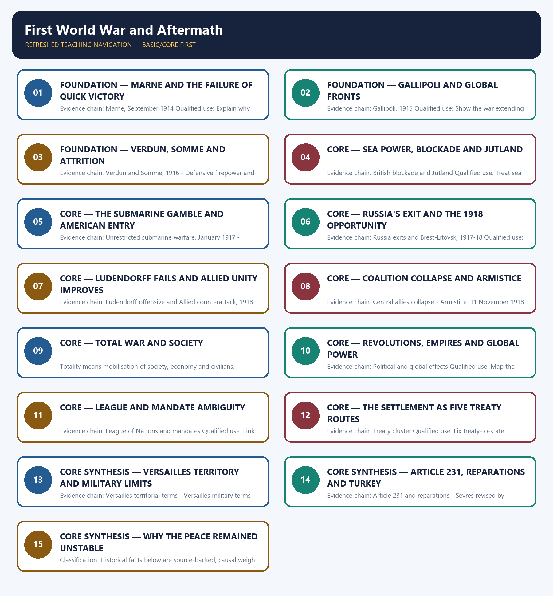

# First World War and Aftermath — Learner-v2 Complete Learning Session

> **Authoring-only generation:** 2026-09-01. No PDF was rendered and no tracker or index was mutated.

### SOURCE, PROGRESSION AND CURRENT-LINKAGE AUDIT

- **Generation date:** 2026-09-01.
- **Repository-first evidence:** the Basic owner is taught first and preserved in full; the Advanced owner is retained only in the optional final teaching block.
- **OCR evidence:** Repository Markdown was used first. The available OCR-searchable Norman Lowe World History PDF was retained as supplementary local context, but no unsupported page number, quotation or precision was imported from it.
- **Qdrant:** not used; repository Markdown and available OCR context were sufficient.
- **PYQ integrity:** No direct UPSC PYQ is verified as owned solely by this topic in the local 2018-2025 routing blocks. The exact 2024 balance-of-power demand belongs to Topic 09, not to this course-and-aftermath owner.
- **Live-link boundary:** No verified live current-affairs item is pegged to this historical topic in the repository owners. The package therefore uses the bounded phrase 'no verified live item' rather than inventing a headline, date, institution or contemporary linkage.
- **Fact/inference discipline:** no current-affairs item, PYQ wording, figure or quotation is invented.

## BASIC LEARNING SESSION



*Distinct embedded teaching-navigation image. The separate continuous Cārvāka-style flowchart package remains an independent at-a-glance artifact.*

### SESSION 1 — FOUNDATION — MARNE AND THE FAILURE OF QUICK VICTORY

#### DEFINITION / WHAT THIS IS CALLED

**Plain-language definition:** Precise definition: Marne and the failure of quick victory is the source-bounded relationship among and Marne, September 1914 within First World War and Aftermath.

**Technical definition:** Evidence chain: Marne, September 1914 Qualified use: Explain why the expected short war failed.

#### ANSWER-GRABBING OPENING — WRITE/ADAPT IN THE EXAM

> Precise definition: Marne and the failure of quick victory is the source-bounded relationship among and Marne, September 1914 within First World War and Aftermath.

#### MUST-WRITE KEYWORDS

- **FOUNDATION**
- **Marne**
- **the failure of quick victory**
- **Precise definition**
- **Evidence chain**
- **Qualified use**

**How to use them:** Frame the answer through FOUNDATION; define Marne, connect the failure of quick victory with Precise definition to explain the mechanism, and use Evidence chain for the decisive comparison or qualification.

##### VISUAL FIRST

```text
MARNE AND THE FAILURE OF QUICK VICTORY
01. Marne, September 1914
BOUNDARY -> Do not generalise western trench deadlock to every front.
```

*This topic-specific rail fixes the evidence sequence and its exam boundary before analysis.*

##### CONCEPT DEFINITIONS

- **Precise definition:** Marne and the failure of quick victory is the source-bounded relationship among  and Marne, September 1914 within First World War and Aftermath.
- **Classification:** Historical facts below are source-backed; causal weight and evaluative verdicts are analytical synthesis.

##### CORE EXPLANATION

The Battle of the Marne in September 1914 stopped a quick German victory and helped lock the western front into trench stalemate.

##### NAMED EVIDENCE AND MECHANISM

- The Battle of the Marne in September 1914 stopped a quick German victory and helped lock the western front into trench stalemate.

##### EXAMINER CAUTION

- Do not generalise western trench deadlock to every front.

##### EXAM LINK

- **Prelims:** Retain the exact actor, date, document and category in Marne and the failure of quick victory.
- **Mains:** Explain why the expected short war failed.

##### MINI RECAP

- **Evidence chain:** Marne, September 1914
- **Qualified use:** Explain why the expected short war failed.

#### CLOSING RECALL FLOW — FOUNDATION — MARNE AND THE FAILURE OF QUICK VICTORY

```text
START / CONCEPT: FOUNDATION — Marne and the failure of quick victory
        |
        v
EXACT TERMS: FOUNDATION · Marne · the failure of quick victory · Precise definition · Evidence chain · Qualified use
        |
        v
MECHANISM / ARGUMENT: Evidence chain: Marne, September 1914 Qualified use: Explain why the expected short war failed.
        |
        v
CONSEQUENCE / CONTRAST: Do not generalise western trench deadlock to every front.
        |
        v
UPSC TRAP / ANSWER-USE: Do not miss this limiting distinction: causal weight and evaluative verdicts are analytical synthesis.
        |
        v
ANSWER-GRABBING FORMULATION: Precise definition: Marne and the failure of quick victory is the source-bounded relationship among and Marne, September 1914 within First World War and Aftermath.
```
### SESSION 2 — FOUNDATION — GALLIPOLI AND GLOBAL FRONTS

#### DEFINITION / WHAT THIS IS CALLED

**Plain-language definition:** Precise definition: Gallipoli and global fronts is the source-bounded relationship among and Gallipoli, 1915 within First World War and Aftermath.

**Technical definition:** Evidence chain: Gallipoli, 1915 Qualified use: Show the war extending beyond France and Belgium.

#### ANSWER-GRABBING OPENING — WRITE/ADAPT IN THE EXAM

> Precise definition: Gallipoli and global fronts is the source-bounded relationship among and Gallipoli, 1915 within First World War and Aftermath.

#### MUST-WRITE KEYWORDS

- **FOUNDATION**
- **Gallipoli**
- **global fronts**
- **Precise definition**
- **Evidence chain**
- **Qualified use**

**How to use them:** Frame the answer through FOUNDATION; define Gallipoli, connect global fronts with Precise definition to explain the mechanism, and use Evidence chain for the decisive comparison or qualification.

##### VISUAL FIRST

```text
GALLIPOLI AND GLOBAL FRONTS
01. Gallipoli, 1915
BOUNDARY -> A failed side campaign did not by itself decide the war.
```

*This topic-specific rail fixes the evidence sequence and its exam boundary before analysis.*

##### CONCEPT DEFINITIONS

- **Precise definition:** Gallipoli and global fronts is the source-bounded relationship among  and Gallipoli, 1915 within First World War and Aftermath.
- **Classification:** Historical facts below are source-backed; causal weight and evaluative verdicts are analytical synthesis.

##### CORE EXPLANATION

The Gallipoli campaign failed in 1915 while trench stalemate continued and Bulgaria joined the Central Powers.

##### NAMED EVIDENCE AND MECHANISM

- The Gallipoli campaign failed in 1915 while trench stalemate continued and Bulgaria joined the Central Powers.

##### EXAMINER CAUTION

- A failed side campaign did not by itself decide the war.

##### EXAM LINK

- **Prelims:** Retain the exact actor, date, document and category in Gallipoli and global fronts.
- **Mains:** Show the war extending beyond France and Belgium.

##### MINI RECAP

- **Evidence chain:** Gallipoli, 1915
- **Qualified use:** Show the war extending beyond France and Belgium.

#### CLOSING RECALL FLOW — FOUNDATION — GALLIPOLI AND GLOBAL FRONTS

```text
START / CONCEPT: FOUNDATION — Gallipoli and global fronts
        |
        v
EXACT TERMS: FOUNDATION · Gallipoli · global fronts · Precise definition · Evidence chain · Qualified use
        |
        v
MECHANISM / ARGUMENT: Evidence chain: Gallipoli, 1915 Qualified use: Show the war extending beyond France and Belgium.
        |
        v
CONSEQUENCE / CONTRAST: Classification: Historical facts below are source-backed; causal weight and evaluative verdicts are analytical synthesis.
        |
        v
UPSC TRAP / ANSWER-USE: Do not miss this limiting distinction: show the war extending beyond France and Belgium.
        |
        v
ANSWER-GRABBING FORMULATION: Precise definition: Gallipoli and global fronts is the source-bounded relationship among and Gallipoli, 1915 within First World War and Aftermath.
```
### SESSION 3 — FOUNDATION — VERDUN, SOMME AND ATTRITION

#### DEFINITION / WHAT THIS IS CALLED

**Plain-language definition:** Precise definition: Verdun, Somme and attrition is the source-bounded relationship among Verdun and Somme, 1916 and Defensive firepower and trench deadlock within First World War and Aftermath.

**Technical definition:** Evidence chain: Verdun and Somme, 1916 - Defensive firepower and trench deadlock Qualified use: Connect battle method to technological deadlock.

#### ANSWER-GRABBING OPENING — WRITE/ADAPT IN THE EXAM

> Precise definition: Verdun, Somme and attrition is the source-bounded relationship among Verdun and Somme, 1916 and Defensive firepower and trench deadlock within First World War and Aftermath.

#### MUST-WRITE KEYWORDS

- **FOUNDATION**
- **Verdun**
- **Somme**
- **attrition**
- **Precise definition**
- **Evidence chain**

**How to use them:** Frame the answer through FOUNDATION; define Verdun, connect Somme with attrition to explain the mechanism, and use Precise definition for the decisive comparison or qualification.

##### VISUAL FIRST

```text
VERDUN, SOMME AND ATTRITION
01. Verdun and Somme, 1916
    |
    v
02. Defensive firepower and trench deadlock
BOUNDARY -> Avoid unsupported casualty totals.
```

*This topic-specific rail fixes the evidence sequence and its exam boundary before analysis.*

##### CONCEPT DEFINITIONS

- **Precise definition:** Verdun, Somme and attrition is the source-bounded relationship among Verdun and Somme, 1916 and Defensive firepower and trench deadlock within First World War and Aftermath.
- **Classification:** Historical facts below are source-backed; causal weight and evaluative verdicts are analytical synthesis.

##### CORE EXPLANATION

Verdun and the Somme in 1916 became symbols of industrial attrition: enormous human cost, limited territorial gain and cumulative exhaustion. Machine-guns, heavy artillery and fixed defences outmatched movement and communication, preventing tactical success from becoming strategic breakthrough.

##### NAMED EVIDENCE AND MECHANISM

- Verdun and the Somme in 1916 became symbols of industrial attrition: enormous human cost, limited territorial gain and cumulative exhaustion.
- Machine-guns, heavy artillery and fixed defences outmatched movement and communication, preventing tactical success from becoming strategic breakthrough.

##### EXAMINER CAUTION

- Avoid unsupported casualty totals.

##### EXAM LINK

- **Prelims:** Retain the exact actor, date, document and category in Verdun, Somme and attrition.
- **Mains:** Connect battle method to technological deadlock.

##### MINI RECAP

- **Evidence chain:** Verdun and Somme, 1916 -> Defensive firepower and trench deadlock
- **Qualified use:** Connect battle method to technological deadlock.

#### CLOSING RECALL FLOW — FOUNDATION — VERDUN, SOMME AND ATTRITION

```text
START / CONCEPT: FOUNDATION — Verdun, Somme and attrition
        |
        v
EXACT TERMS: FOUNDATION · Verdun · Somme · attrition · Precise definition · Evidence chain
        |
        v
MECHANISM / ARGUMENT: Verdun and the Somme in 1916 became symbols of industrial attrition: enormous human cost, limited territorial gain and cumulative exhaustion.
        |
        v
CONSEQUENCE / CONTRAST: Evidence chain: Verdun and Somme, 1916 - Defensive firepower and trench deadlock Qualified use: Connect battle method to technological deadlock.
        |
        v
UPSC TRAP / ANSWER-USE: Do not miss this limiting distinction: causal weight and evaluative verdicts are analytical synthesis.
        |
        v
ANSWER-GRABBING FORMULATION: Precise definition: Verdun, Somme and attrition is the source-bounded relationship among Verdun and Somme, 1916 and Defensive firepower and trench deadlock within First World War and Aftermath.
```
### SESSION 4 — CORE — SEA POWER, BLOCKADE AND JUTLAND

#### DEFINITION / WHAT THIS IS CALLED

**Plain-language definition:** Precise definition: Sea power, blockade and Jutland is the source-bounded relationship among and British blockade and Jutland within First World War and Aftermath.

**Technical definition:** Evidence chain: British blockade and Jutland Qualified use: Treat sea power as economic warfare.

#### ANSWER-GRABBING OPENING — WRITE/ADAPT IN THE EXAM

> Precise definition: Sea power, blockade and Jutland is the source-bounded relationship among and British blockade and Jutland within First World War and Aftermath.

#### MUST-WRITE KEYWORDS

- **Sea power**
- **blockade**
- **Jutland**
- **Precise definition**
- **Evidence chain**
- **Qualified use**

**How to use them:** Frame the answer through Sea power; define blockade, connect Jutland with Precise definition to explain the mechanism, and use Evidence chain for the decisive comparison or qualification.

##### VISUAL FIRST

```text
SEA POWER, BLOCKADE AND JUTLAND
01. British blockade and Jutland
BOUNDARY -> Jutland was tactically indecisive but strategically preserved British control.
```

*This topic-specific rail fixes the evidence sequence and its exam boundary before analysis.*

##### CONCEPT DEFINITIONS

- **Precise definition:** Sea power, blockade and Jutland is the source-bounded relationship among  and British blockade and Jutland within First World War and Aftermath.
- **Classification:** Historical facts below are source-backed; causal weight and evaluative verdicts are analytical synthesis.

##### CORE EXPLANATION

British sea power and blockade strangled Central Power supplies; Jutland was tactically indecisive but did not break British naval control.

##### NAMED EVIDENCE AND MECHANISM

- British sea power and blockade strangled Central Power supplies; Jutland was tactically indecisive but did not break British naval control.

##### EXAMINER CAUTION

- Jutland was tactically indecisive but strategically preserved British control.

##### EXAM LINK

- **Prelims:** Retain the exact actor, date, document and category in Sea power, blockade and Jutland.
- **Mains:** Treat sea power as economic warfare.

##### MINI RECAP

- **Evidence chain:** British blockade and Jutland
- **Qualified use:** Treat sea power as economic warfare.

#### CLOSING RECALL FLOW — CORE — SEA POWER, BLOCKADE AND JUTLAND

```text
START / CONCEPT: CORE — Sea power, blockade and Jutland
        |
        v
EXACT TERMS: Sea power · blockade · Jutland · Precise definition · Evidence chain · Qualified use
        |
        v
MECHANISM / ARGUMENT: Evidence chain: British blockade and Jutland Qualified use: Treat sea power as economic warfare.
        |
        v
CONSEQUENCE / CONTRAST: British sea power and blockade strangled Central Power supplies; Jutland was tactically indecisive but did not break British naval control.
        |
        v
UPSC TRAP / ANSWER-USE: Jutland was tactically indecisive but strategically preserved British control.
        |
        v
ANSWER-GRABBING FORMULATION: Precise definition: Sea power, blockade and Jutland is the source-bounded relationship among and British blockade and Jutland within First World War and Aftermath.
```
### SESSION 5 — CORE — THE SUBMARINE GAMBLE AND AMERICAN ENTRY

#### DEFINITION / WHAT THIS IS CALLED

**Plain-language definition:** Precise definition: The submarine gamble and American entry is the source-bounded relationship among Unrestricted submarine warfare, January 1917 and United States enters, April 1917 within First World War and Aftermath.

**Technical definition:** Evidence chain: Unrestricted submarine warfare, January 1917 - United States enters, April 1917 Qualified use: Show tactical action producing strategic reversal.

#### ANSWER-GRABBING OPENING — WRITE/ADAPT IN THE EXAM

> Precise definition: The submarine gamble and American entry is the source-bounded relationship among Unrestricted submarine warfare, January 1917 and United States enters, April 1917 within First World War and Aftermath.

#### MUST-WRITE KEYWORDS

- **The submarine gamble**
- **American entry**
- **Precise definition**
- **Evidence chain**
- **Qualified use**
- **Precise definition: The submarine gamble and American entry**

**How to use them:** Frame the answer through The submarine gamble; define American entry, connect Precise definition with Evidence chain to explain the mechanism, and use Qualified use for the decisive comparison or qualification.

##### VISUAL FIRST

```text
THE SUBMARINE GAMBLE AND AMERICAN ENTRY
01. Unrestricted submarine warfare, January 1917
    |
    v
02. United States enters, April 1917
BOUNDARY -> American impact included resources and morale as well as troops.
```

*This topic-specific rail fixes the evidence sequence and its exam boundary before analysis.*

##### CONCEPT DEFINITIONS

- **Precise definition:** The submarine gamble and American entry is the source-bounded relationship among Unrestricted submarine warfare, January 1917 and United States enters, April 1917 within First World War and Aftermath.
- **Classification:** Historical facts below are source-backed; causal weight and evaluative verdicts are analytical synthesis.

##### CORE EXPLANATION

Germany resumed unrestricted submarine warfare in January 1917, a tactical gamble that threatened shipping but helped bring the United States into war. The United States entered in April 1917, contributing finance, food, shipping, morale and eventually troops.

##### NAMED EVIDENCE AND MECHANISM

- Germany resumed unrestricted submarine warfare in January 1917, a tactical gamble that threatened shipping but helped bring the United States into war.
- The United States entered in April 1917, contributing finance, food, shipping, morale and eventually troops.

##### EXAMINER CAUTION

- American impact included resources and morale as well as troops.

##### EXAM LINK

- **Prelims:** Retain the exact actor, date, document and category in The submarine gamble and American entry.
- **Mains:** Show tactical action producing strategic reversal.

##### MINI RECAP

- **Evidence chain:** Unrestricted submarine warfare, January 1917 -> United States enters, April 1917
- **Qualified use:** Show tactical action producing strategic reversal.

#### CLOSING RECALL FLOW — CORE — THE SUBMARINE GAMBLE AND AMERICAN ENTRY

```text
START / CONCEPT: CORE — The submarine gamble and American entry
        |
        v
EXACT TERMS: The submarine gamble · American entry · Precise definition · Evidence chain · Qualified use · Precise definition: The submarine gamble and American entry
        |
        v
MECHANISM / ARGUMENT: Evidence chain: Unrestricted submarine warfare, January 1917 - United States enters, April 1917 Qualified use: Show tactical action producing strategic reversal.
        |
        v
CONSEQUENCE / CONTRAST: Classification: Historical facts below are source-backed; causal weight and evaluative verdicts are analytical synthesis.
        |
        v
UPSC TRAP / ANSWER-USE: Do not miss this limiting distinction: show tactical action producing strategic reversal.
        |
        v
ANSWER-GRABBING FORMULATION: Precise definition: The submarine gamble and American entry is the source-bounded relationship among Unrestricted submarine warfare, January 1917 and United States enters, April 1917 within First World War and Aftermath.
```
### SESSION 6 — CORE — RUSSIA'S EXIT AND THE 1918 OPPORTUNITY

#### DEFINITION / WHAT THIS IS CALLED

**Plain-language definition:** Precise definition: Russia's exit and the 1918 opportunity is the source-bounded relationship among and Russia exits and Brest-Litovsk, 1917-18 within First World War and Aftermath.

**Technical definition:** Evidence chain: Russia exits and Brest-Litovsk, 1917-18 Qualified use: Explain Germany's temporary relief.

#### ANSWER-GRABBING OPENING — WRITE/ADAPT IN THE EXAM

> Precise definition: Russia's exit and the 1918 opportunity is the source-bounded relationship among and Russia exits and Brest-Litovsk, 1917-18 within First World War and Aftermath.

#### MUST-WRITE KEYWORDS

- **Russia's exit**
- **the 1918 opportunity**
- **Precise definition**
- **Evidence chain**
- **Qualified use**
- **1917-18**

**How to use them:** Frame the answer through Russia's exit; define the 1918 opportunity, connect Precise definition with Evidence chain to explain the mechanism, and use Qualified use for the decisive comparison or qualification.

##### VISUAL FIRST

```text
RUSSIA'S EXIT AND THE 1918 OPPORTUNITY
01. Russia exits and Brest-Litovsk, 1917-18
BOUNDARY -> Brest-Litovsk belongs to March 1918 after the armistice process.
```

*This topic-specific rail fixes the evidence sequence and its exam boundary before analysis.*

##### CONCEPT DEFINITIONS

- **Precise definition:** Russia's exit and the 1918 opportunity is the source-bounded relationship among  and Russia exits and Brest-Litovsk, 1917-18 within First World War and Aftermath.
- **Classification:** Historical facts below are source-backed; causal weight and evaluative verdicts are analytical synthesis.

##### CORE EXPLANATION

Bolshevik armistice was followed by the Treaty of Brest-Litovsk in March 1918, formally removing Russia from the war.

##### NAMED EVIDENCE AND MECHANISM

- Bolshevik armistice was followed by the Treaty of Brest-Litovsk in March 1918, formally removing Russia from the war.

##### EXAMINER CAUTION

- Brest-Litovsk belongs to March 1918 after the armistice process.

##### EXAM LINK

- **Prelims:** Retain the exact actor, date, document and category in Russia's exit and the 1918 opportunity.
- **Mains:** Explain Germany's temporary relief.

##### MINI RECAP

- **Evidence chain:** Russia exits and Brest-Litovsk, 1917-18
- **Qualified use:** Explain Germany's temporary relief.

#### CLOSING RECALL FLOW — CORE — RUSSIA'S EXIT AND THE 1918 OPPORTUNITY

```text
START / CONCEPT: CORE — Russia's exit and the 1918 opportunity
        |
        v
EXACT TERMS: Russia's exit · the 1918 opportunity · Precise definition · Evidence chain · Qualified use · 1917-18
        |
        v
MECHANISM / ARGUMENT: Bolshevik armistice was followed by the Treaty of Brest-Litovsk in March 1918, formally removing Russia from the war.
        |
        v
CONSEQUENCE / CONTRAST: Evidence chain: Russia exits and Brest-Litovsk, 1917-18 Qualified use: Explain Germany's temporary relief.
        |
        v
UPSC TRAP / ANSWER-USE: Do not miss this limiting distinction: causal weight and evaluative verdicts are analytical synthesis.
        |
        v
ANSWER-GRABBING FORMULATION: Precise definition: Russia's exit and the 1918 opportunity is the source-bounded relationship among and Russia exits and Brest-Litovsk, 1917-18 within First World War and Aftermath.
```
### SESSION 7 — CORE — LUDENDORFF FAILS AND ALLIED UNITY IMPROVES

#### DEFINITION / WHAT THIS IS CALLED

**Plain-language definition:** Precise definition: Ludendorff fails and Allied unity improves is the source-bounded relationship among and Ludendorff offensive and Allied counterattack, 1918 within First World War and Aftermath.

**Technical definition:** Evidence chain: Ludendorff offensive and Allied counterattack, 1918 Qualified use: Trace operational failure and coalition coordination.

#### ANSWER-GRABBING OPENING — WRITE/ADAPT IN THE EXAM

> Precise definition: Ludendorff fails and Allied unity improves is the source-bounded relationship among and Ludendorff offensive and Allied counterattack, 1918 within First World War and Aftermath.

#### MUST-WRITE KEYWORDS

- **Ludendorff fails**
- **Allied unity improves**
- **Precise definition**
- **Evidence chain**
- **Qualified use**
- **Precise definition: Ludendorff fails and Allied unity improves**

**How to use them:** Frame the answer through Ludendorff fails; define Allied unity improves, connect Precise definition with Evidence chain to explain the mechanism, and use Qualified use for the decisive comparison or qualification.

##### VISUAL FIRST

```text
LUDENDORFF FAILS AND ALLIED UNITY IMPROVES
01. Ludendorff offensive and Allied counterattack, 1918
BOUNDARY -> Do not reduce victory to American entry alone.
```

*This topic-specific rail fixes the evidence sequence and its exam boundary before analysis.*

##### CONCEPT DEFINITIONS

- **Precise definition:** Ludendorff fails and Allied unity improves is the source-bounded relationship among  and Ludendorff offensive and Allied counterattack, 1918 within First World War and Aftermath.
- **Classification:** Historical facts below are source-backed; causal weight and evaluative verdicts are analytical synthesis.

##### CORE EXPLANATION

The Ludendorff offensive failed in spring 1918, while Allied unity under Foch and coordinated counterattack broke the Hindenburg Line.

##### NAMED EVIDENCE AND MECHANISM

- The Ludendorff offensive failed in spring 1918, while Allied unity under Foch and coordinated counterattack broke the Hindenburg Line.

##### EXAMINER CAUTION

- Do not reduce victory to American entry alone.

##### EXAM LINK

- **Prelims:** Retain the exact actor, date, document and category in Ludendorff fails and Allied unity improves.
- **Mains:** Trace operational failure and coalition coordination.

##### MINI RECAP

- **Evidence chain:** Ludendorff offensive and Allied counterattack, 1918
- **Qualified use:** Trace operational failure and coalition coordination.

#### CLOSING RECALL FLOW — CORE — LUDENDORFF FAILS AND ALLIED UNITY IMPROVES

```text
START / CONCEPT: CORE — Ludendorff fails and Allied unity improves
        |
        v
EXACT TERMS: Ludendorff fails · Allied unity improves · Precise definition · Evidence chain · Qualified use · Precise definition: Ludendorff fails and Allied unity improves
        |
        v
MECHANISM / ARGUMENT: Evidence chain: Ludendorff offensive and Allied counterattack, 1918 Qualified use: Trace operational failure and coalition coordination.
        |
        v
CONSEQUENCE / CONTRAST: Do not reduce victory to American entry alone.
        |
        v
UPSC TRAP / ANSWER-USE: Do not miss this limiting distinction: causal weight and evaluative verdicts are analytical synthesis.
        |
        v
ANSWER-GRABBING FORMULATION: Precise definition: Ludendorff fails and Allied unity improves is the source-bounded relationship among and Ludendorff offensive and Allied counterattack, 1918 within First World War and Aftermath.
```
### SESSION 8 — CORE — COALITION COLLAPSE AND ARMISTICE

#### DEFINITION / WHAT THIS IS CALLED

**Plain-language definition:** Precise definition: Coalition collapse and armistice is the source-bounded relationship among Central allies collapse and Armistice, 11 November 1918 within First World War and Aftermath.

**Technical definition:** Evidence chain: Central allies collapse - Armistice, 11 November 1918 Qualified use: Explain cumulative defeat and the exact endpoint.

#### ANSWER-GRABBING OPENING — WRITE/ADAPT IN THE EXAM

> Precise definition: Coalition collapse and armistice is the source-bounded relationship among Central allies collapse and Armistice, 11 November 1918 within First World War and Aftermath.

#### MUST-WRITE KEYWORDS

- **Coalition collapse**
- **armistice**
- **Precise definition**
- **Evidence chain**
- **Qualified use**
- **Precise definition: Coalition collapse and armistice**

**How to use them:** Frame the answer through Coalition collapse; define armistice, connect Precise definition with Evidence chain to explain the mechanism, and use Qualified use for the decisive comparison or qualification.

##### VISUAL FIRST

```text
COALITION COLLAPSE AND ARMISTICE
01. Central allies collapse
    |
    v
02. Armistice, 11 November 1918
BOUNDARY -> Germany sought armistice before deep occupation.
```

*This topic-specific rail fixes the evidence sequence and its exam boundary before analysis.*

##### CONCEPT DEFINITIONS

- **Precise definition:** Coalition collapse and armistice is the source-bounded relationship among Central allies collapse and Armistice, 11 November 1918 within First World War and Aftermath.
- **Classification:** Historical facts below are source-backed; causal weight and evaluative verdicts are analytical synthesis.

##### CORE EXPLANATION

Bulgaria, Austria-Hungary and the Ottoman Empire collapsed before Germany, exposing the weakest-member problem in coalition warfare. Germany sought an armistice before deep occupation of German soil, and fighting ended on 11 November 1918.

##### NAMED EVIDENCE AND MECHANISM

- Bulgaria, Austria-Hungary and the Ottoman Empire collapsed before Germany, exposing the weakest-member problem in coalition warfare.
- Germany sought an armistice before deep occupation of German soil, and fighting ended on 11 November 1918.

##### EXAMINER CAUTION

- Germany sought armistice before deep occupation.

##### EXAM LINK

- **Prelims:** Retain the exact actor, date, document and category in Coalition collapse and armistice.
- **Mains:** Explain cumulative defeat and the exact endpoint.

##### MINI RECAP

- **Evidence chain:** Central allies collapse -> Armistice, 11 November 1918
- **Qualified use:** Explain cumulative defeat and the exact endpoint.

#### CLOSING RECALL FLOW — CORE — COALITION COLLAPSE AND ARMISTICE

```text
START / CONCEPT: CORE — Coalition collapse and armistice
        |
        v
EXACT TERMS: Coalition collapse · armistice · Precise definition · Evidence chain · Qualified use · Precise definition: Coalition collapse and armistice
        |
        v
MECHANISM / ARGUMENT: Evidence chain: Central allies collapse - Armistice, 11 November 1918 Qualified use: Explain cumulative defeat and the exact endpoint.
        |
        v
CONSEQUENCE / CONTRAST: Germany sought an armistice before deep occupation of German soil, and fighting ended on 11 November 1918.
        |
        v
UPSC TRAP / ANSWER-USE: Do not miss this limiting distinction: causal weight and evaluative verdicts are analytical synthesis.
        |
        v
ANSWER-GRABBING FORMULATION: Precise definition: Coalition collapse and armistice is the source-bounded relationship among Central allies collapse and Armistice, 11 November 1918 within First World War and Aftermath.
```
### SESSION 9 — CORE — TOTAL WAR AND SOCIETY

#### DEFINITION / WHAT THIS IS CALLED

**Plain-language definition:** Precise definition: Total war and society is the source-bounded relationship among and Total war within First World War and Aftermath.

**Technical definition:** Totality means mobilisation of society, economy and civilians.

#### ANSWER-GRABBING OPENING — WRITE/ADAPT IN THE EXAM

> Precise definition: Total war and society is the source-bounded relationship among and Total war within First World War and Aftermath.

#### MUST-WRITE KEYWORDS

- **Total war**
- **society**
- **Precise definition**
- **Evidence chain**
- **Qualified use**
- **Precise definition: Total war and society**

**How to use them:** Frame the answer through Total war; define society, connect Precise definition with Evidence chain to explain the mechanism, and use Qualified use for the decisive comparison or qualification.

##### VISUAL FIRST

```text
TOTAL WAR AND SOCIETY
01. Total war
BOUNDARY -> Totality means mobilisation of society, economy and civilians.
```

*This topic-specific rail fixes the evidence sequence and its exam boundary before analysis.*

##### CONCEPT DEFINITIONS

- **Precise definition:** Total war and society is the source-bounded relationship among  and Total war within First World War and Aftermath.
- **Classification:** Historical facts below are source-backed; causal weight and evaluative verdicts are analytical synthesis.

##### CORE EXPLANATION

The war mobilised whole populations, modern industry, state controls, women workers, propaganda, blockade and imperial manpower, making civilians part of strategy.

##### NAMED EVIDENCE AND MECHANISM

- The war mobilised whole populations, modern industry, state controls, women workers, propaganda, blockade and imperial manpower, making civilians part of strategy.

##### EXAMINER CAUTION

- Totality means mobilisation of society, economy and civilians.

##### EXAM LINK

- **Prelims:** Retain the exact actor, date, document and category in Total war and society.
- **Mains:** Move beyond battlefield scale.

##### MINI RECAP

- **Evidence chain:** Total war
- **Qualified use:** Move beyond battlefield scale.

#### CLOSING RECALL FLOW — CORE — TOTAL WAR AND SOCIETY

```text
START / CONCEPT: CORE — Total war and society
        |
        v
EXACT TERMS: Total war · society · Precise definition · Evidence chain · Qualified use · Precise definition: Total war and society
        |
        v
MECHANISM / ARGUMENT: Evidence chain: Total war Qualified use: Move beyond battlefield scale.
        |
        v
CONSEQUENCE / CONTRAST: Totality means mobilisation of society, economy and civilians.
        |
        v
UPSC TRAP / ANSWER-USE: Do not miss this limiting distinction: causal weight and evaluative verdicts are analytical synthesis.
        |
        v
ANSWER-GRABBING FORMULATION: Precise definition: Total war and society is the source-bounded relationship among and Total war within First World War and Aftermath.
```
### SESSION 10 — CORE — REVOLUTIONS, EMPIRES AND GLOBAL POWER

#### DEFINITION / WHAT THIS IS CALLED

**Plain-language definition:** Precise definition: Revolutions, empires and global power is the source-bounded relationship among and Political and global effects within First World War and Aftermath.

**Technical definition:** Evidence chain: Political and global effects Qualified use: Map the political earthquake after 1918.

#### ANSWER-GRABBING OPENING — WRITE/ADAPT IN THE EXAM

> Precise definition: Revolutions, empires and global power is the source-bounded relationship among and Political and global effects within First World War and Aftermath.

#### MUST-WRITE KEYWORDS

- **Revolutions**
- **empires**
- **global power**
- **Precise definition**
- **Evidence chain**
- **Qualified use**

**How to use them:** Frame the answer through Revolutions; define empires, connect global power with Precise definition to explain the mechanism, and use Evidence chain for the decisive comparison or qualification.

##### VISUAL FIRST

```text
REVOLUTIONS, EMPIRES AND GLOBAL POWER
01. Political and global effects
BOUNDARY -> Separate institutional change from social consequence.
```

*This topic-specific rail fixes the evidence sequence and its exam boundary before analysis.*

##### CONCEPT DEFINITIONS

- **Precise definition:** Revolutions, empires and global power is the source-bounded relationship among  and Political and global effects within First World War and Aftermath.
- **Classification:** Historical facts below are source-backed; causal weight and evaluative verdicts are analytical synthesis.

##### CORE EXPLANATION

The war destroyed the Habsburg, Ottoman, Russian and German imperial orders, produced Weimar and Bolshevik regimes, and strengthened the relative position of the United States and Japan.

##### NAMED EVIDENCE AND MECHANISM

- The war destroyed the Habsburg, Ottoman, Russian and German imperial orders, produced Weimar and Bolshevik regimes, and strengthened the relative position of the United States and Japan.

##### EXAMINER CAUTION

- Separate institutional change from social consequence.

##### EXAM LINK

- **Prelims:** Retain the exact actor, date, document and category in Revolutions, empires and global power.
- **Mains:** Map the political earthquake after 1918.

##### MINI RECAP

- **Evidence chain:** Political and global effects
- **Qualified use:** Map the political earthquake after 1918.

#### CLOSING RECALL FLOW — CORE — REVOLUTIONS, EMPIRES AND GLOBAL POWER

```text
START / CONCEPT: CORE — Revolutions, empires and global power
        |
        v
EXACT TERMS: Revolutions · empires · global power · Precise definition · Evidence chain · Qualified use
        |
        v
MECHANISM / ARGUMENT: Evidence chain: Political and global effects Qualified use: Map the political earthquake after 1918.
        |
        v
CONSEQUENCE / CONTRAST: Classification: Historical facts below are source-backed; causal weight and evaluative verdicts are analytical synthesis.
        |
        v
UPSC TRAP / ANSWER-USE: Do not miss this limiting distinction: revolutions, empires and global power is the source-bounded relationship among and Political and global...
        |
        v
ANSWER-GRABBING FORMULATION: Precise definition: Revolutions, empires and global power is the source-bounded relationship among and Political and global effects within First World War and Aftermath.
```
### SESSION 11 — CORE — LEAGUE AND MANDATE AMBIGUITY

#### DEFINITION / WHAT THIS IS CALLED

**Plain-language definition:** Precise definition: League and mandate ambiguity is the source-bounded relationship among and League of Nations and mandates within First World War and Aftermath.

**Technical definition:** Evidence chain: League of Nations and mandates Qualified use: Link peace machinery to imperial continuity.

#### ANSWER-GRABBING OPENING — WRITE/ADAPT IN THE EXAM

> Precise definition: League and mandate ambiguity is the source-bounded relationship among and League of Nations and mandates within First World War and Aftermath.

#### MUST-WRITE KEYWORDS

- **League**
- **mandate ambiguity**
- **Precise definition**
- **Evidence chain**
- **Qualified use**
- **Precise definition: League and mandate ambiguity**

**How to use them:** Frame the answer through League; define mandate ambiguity, connect Precise definition with Evidence chain to explain the mechanism, and use Qualified use for the decisive comparison or qualification.

##### VISUAL FIRST

```text
LEAGUE AND MANDATE AMBIGUITY
01. League of Nations and mandates
BOUNDARY -> Mandates were conditional in principle yet preserved imperial rule.
```

*This topic-specific rail fixes the evidence sequence and its exam boundary before analysis.*

##### CONCEPT DEFINITIONS

- **Precise definition:** League and mandate ambiguity is the source-bounded relationship among  and League of Nations and mandates within First World War and Aftermath.
- **Classification:** Historical facts below are source-backed; causal weight and evaluative verdicts are analytical synthesis.

##### CORE EXPLANATION

The peace created the League of Nations while German colonies and former Ottoman lands became mandates, preserving imperial control under conditional trusteeship language.

##### NAMED EVIDENCE AND MECHANISM

- The peace created the League of Nations while German colonies and former Ottoman lands became mandates, preserving imperial control under conditional trusteeship language.

##### EXAMINER CAUTION

- Mandates were conditional in principle yet preserved imperial rule.

##### EXAM LINK

- **Prelims:** Retain the exact actor, date, document and category in League and mandate ambiguity.
- **Mains:** Link peace machinery to imperial continuity.

##### MINI RECAP

- **Evidence chain:** League of Nations and mandates
- **Qualified use:** Link peace machinery to imperial continuity.

#### CLOSING RECALL FLOW — CORE — LEAGUE AND MANDATE AMBIGUITY

```text
START / CONCEPT: CORE — League and mandate ambiguity
        |
        v
EXACT TERMS: League · mandate ambiguity · Precise definition · Evidence chain · Qualified use · Precise definition: League and mandate ambiguity
        |
        v
MECHANISM / ARGUMENT: Evidence chain: League of Nations and mandates Qualified use: Link peace machinery to imperial continuity.
        |
        v
CONSEQUENCE / CONTRAST: The peace created the League of Nations while German colonies and former Ottoman lands became mandates, preserving imperial control under conditional trusteeship language.
        |
        v
UPSC TRAP / ANSWER-USE: Do not miss this limiting distinction: mandates were conditional in principle yet preserved imperial rule.
        |
        v
ANSWER-GRABBING FORMULATION: Precise definition: League and mandate ambiguity is the source-bounded relationship among and League of Nations and mandates within First World War and Aftermath.
```
### SESSION 12 — CORE — THE SETTLEMENT AS FIVE TREATY ROUTES

#### DEFINITION / WHAT THIS IS CALLED

**Plain-language definition:** Precise definition: The settlement as five treaty routes is the source-bounded relationship among and Treaty cluster within First World War and Aftermath.

**Technical definition:** Evidence chain: Treaty cluster Qualified use: Fix treaty-to-state matching.

#### ANSWER-GRABBING OPENING — WRITE/ADAPT IN THE EXAM

> Precise definition: The settlement as five treaty routes is the source-bounded relationship among and Treaty cluster within First World War and Aftermath.

#### MUST-WRITE KEYWORDS

- **The settlement as five treaty routes**
- **Precise definition**
- **Evidence chain**
- **Qualified use**
- **Precise definition: The settlement as five treaty routes**
- **Precise**

**How to use them:** Frame the answer through The settlement as five treaty routes; define Precise definition, connect Evidence chain with Qualified use to explain the mechanism, and use Precise definition: The settlement as five treaty routes for the decisive comparison or qualification.

##### VISUAL FIRST

```text
THE SETTLEMENT AS FIVE TREATY ROUTES
01. Treaty cluster
BOUNDARY -> Never use Versailles as shorthand for every defeated state.
```

*This topic-specific rail fixes the evidence sequence and its exam boundary before analysis.*

##### CONCEPT DEFINITIONS

- **Precise definition:** The settlement as five treaty routes is the source-bounded relationship among  and Treaty cluster within First World War and Aftermath.
- **Classification:** Historical facts below are source-backed; causal weight and evaluative verdicts are analytical synthesis.

##### CORE EXPLANATION

The postwar settlement comprised Versailles for Germany, St Germain for Austria, Trianon for Hungary, Neuilly for Bulgaria and Sevres later revised by Lausanne for Turkey.

##### NAMED EVIDENCE AND MECHANISM

- The postwar settlement comprised Versailles for Germany, St Germain for Austria, Trianon for Hungary, Neuilly for Bulgaria and Sevres later revised by Lausanne for Turkey.

##### EXAMINER CAUTION

- Never use Versailles as shorthand for every defeated state.

##### EXAM LINK

- **Prelims:** Retain the exact actor, date, document and category in The settlement as five treaty routes.
- **Mains:** Fix treaty-to-state matching.

##### MINI RECAP

- **Evidence chain:** Treaty cluster
- **Qualified use:** Fix treaty-to-state matching.

#### CLOSING RECALL FLOW — CORE — THE SETTLEMENT AS FIVE TREATY ROUTES

```text
START / CONCEPT: CORE — The settlement as five treaty routes
        |
        v
EXACT TERMS: The settlement as five treaty routes · Precise definition · Evidence chain · Qualified use · Precise definition: The settlement as five treaty routes · Precise
        |
        v
MECHANISM / ARGUMENT: Evidence chain: Treaty cluster Qualified use: Fix treaty-to-state matching.
        |
        v
CONSEQUENCE / CONTRAST: Classification: Historical facts below are source-backed; causal weight and evaluative verdicts are analytical synthesis.
        |
        v
UPSC TRAP / ANSWER-USE: Never use Versailles as shorthand for every defeated state.
        |
        v
ANSWER-GRABBING FORMULATION: Precise definition: The settlement as five treaty routes is the source-bounded relationship among and Treaty cluster within First World War and Aftermath.
```
### SESSION 13 — CORE SYNTHESIS — VERSAILLES TERRITORY AND MILITARY LIMITS

#### DEFINITION / WHAT THIS IS CALLED

**Plain-language definition:** Precise definition: Versailles territory and military limits is the source-bounded relationship among Versailles territorial terms and Versailles military terms within First World War and Aftermath.

**Technical definition:** Evidence chain: Versailles territorial terms - Versailles military terms Qualified use: Explain containment through borders and force limits.

#### ANSWER-GRABBING OPENING — WRITE/ADAPT IN THE EXAM

> Precise definition: Versailles territory and military limits is the source-bounded relationship among Versailles territorial terms and Versailles military terms within First World War and Aftermath.

#### MUST-WRITE KEYWORDS

- **CORE SYNTHESIS**
- **Versailles territory**
- **military limits**
- **Precise definition**
- **Evidence chain**
- **Qualified use**

**How to use them:** Frame the answer through CORE SYNTHESIS; define Versailles territory, connect military limits with Precise definition to explain the mechanism, and use Evidence chain for the decisive comparison or qualification.

##### VISUAL FIRST

```text
VERSAILLES TERRITORY AND MILITARY LIMITS
01. Versailles territorial terms
    |
    v
02. Versailles military terms
BOUNDARY -> Territorial and military terms perform different functions.
```

*This topic-specific rail fixes the evidence sequence and its exam boundary before analysis.*

##### CONCEPT DEFINITIONS

- **Precise definition:** Versailles territory and military limits is the source-bounded relationship among Versailles territorial terms and Versailles military terms within First World War and Aftermath.
- **Classification:** Historical facts below are source-backed; causal weight and evaluative verdicts are analytical synthesis.

##### CORE EXPLANATION

Alsace-Lorraine returned to France; West Prussia and Posen went to Poland; Danzig became a free city; the Saar entered League administration; union with Austria was forbidden. Germany's army was limited to one hundred thousand, conscription, tanks, submarines and military aircraft were prohibited, and the Rhineland was demilitarised.

##### NAMED EVIDENCE AND MECHANISM

- Alsace-Lorraine returned to France; West Prussia and Posen went to Poland; Danzig became a free city; the Saar entered League administration; union with Austria was forbidden.
- Germany's army was limited to one hundred thousand, conscription, tanks, submarines and military aircraft were prohibited, and the Rhineland was demilitarised.

##### EXAMINER CAUTION

- Territorial and military terms perform different functions.

##### EXAM LINK

- **Prelims:** Retain the exact actor, date, document and category in Versailles territory and military limits.
- **Mains:** Explain containment through borders and force limits.

##### MINI RECAP

- **Evidence chain:** Versailles territorial terms -> Versailles military terms
- **Qualified use:** Explain containment through borders and force limits.

#### CLOSING RECALL FLOW — CORE SYNTHESIS — VERSAILLES TERRITORY AND MILITARY LIMITS

```text
START / CONCEPT: CORE SYNTHESIS — Versailles territory and military limits
        |
        v
EXACT TERMS: CORE SYNTHESIS · Versailles territory · military limits · Precise definition · Evidence chain · Qualified use
        |
        v
MECHANISM / ARGUMENT: Evidence chain: Versailles territorial terms - Versailles military terms Qualified use: Explain containment through borders and force limits.
        |
        v
CONSEQUENCE / CONTRAST: Classification: Historical facts below are source-backed; causal weight and evaluative verdicts are analytical synthesis.
        |
        v
UPSC TRAP / ANSWER-USE: Do not miss this limiting distinction: germany's army was limited to one hundred thousand, conscription, tanks, submarines and military aircraft...
        |
        v
ANSWER-GRABBING FORMULATION: Precise definition: Versailles territory and military limits is the source-bounded relationship among Versailles territorial terms and Versailles military terms within First World War and Aftermath.
```
### SESSION 14 — CORE SYNTHESIS — ARTICLE 231, REPARATIONS AND TURKEY

#### DEFINITION / WHAT THIS IS CALLED

**Plain-language definition:** Precise definition: Article 231, reparations and Turkey is the source-bounded relationship among Article 231 and reparations and Sevres revised by Lausanne within First World War and Aftermath.

**Technical definition:** Evidence chain: Article 231 and reparations - Sevres revised by Lausanne Qualified use: Compare grievance with successful armed revision.

#### ANSWER-GRABBING OPENING — WRITE/ADAPT IN THE EXAM

> Precise definition: Article 231, reparations and Turkey is the source-bounded relationship among Article 231 and reparations and Sevres revised by Lausanne within First World War and Aftermath.

#### MUST-WRITE KEYWORDS

- **CORE SYNTHESIS**
- **Article 231**
- **reparations**
- **Turkey**
- **Precise definition**
- **Evidence chain**

**How to use them:** Frame the answer through CORE SYNTHESIS; define Article 231, connect reparations with Turkey to explain the mechanism, and use Precise definition for the decisive comparison or qualification.

##### VISUAL FIRST

```text
ARTICLE 231, REPARATIONS AND TURKEY
01. Article 231 and reparations
    |
    v
02. Sevres revised by Lausanne
BOUNDARY -> Keep legal liability, political war guilt and Turkish revision distinct.
```

*This topic-specific rail fixes the evidence sequence and its exam boundary before analysis.*

##### CONCEPT DEFINITIONS

- **Precise definition:** Article 231, reparations and Turkey is the source-bounded relationship among Article 231 and reparations and Sevres revised by Lausanne within First World War and Aftermath.
- **Classification:** Historical facts below are source-backed; causal weight and evaluative verdicts are analytical synthesis.

##### CORE EXPLANATION

Article 231 established liability for Allied loss and damage and became politically known as the war-guilt clause; reparations were fixed in 1921 at six thousand six hundred million pounds. Turkish nationalist resistance under Mustafa Kemal rejected Sevres, and Lausanne in 1923 recognised Turkish sovereignty over eastern Thrace and Anatolia including Smyrna or Izmir.

##### NAMED EVIDENCE AND MECHANISM

- Article 231 established liability for Allied loss and damage and became politically known as the war-guilt clause; reparations were fixed in 1921 at six thousand six hundred million pounds.
- Turkish nationalist resistance under Mustafa Kemal rejected Sevres, and Lausanne in 1923 recognised Turkish sovereignty over eastern Thrace and Anatolia including Smyrna or Izmir.

##### EXAMINER CAUTION

- Keep legal liability, political war guilt and Turkish revision distinct.

##### EXAM LINK

- **Prelims:** Retain the exact actor, date, document and category in Article 231, reparations and Turkey.
- **Mains:** Compare grievance with successful armed revision.

##### MINI RECAP

- **Evidence chain:** Article 231 and reparations -> Sevres revised by Lausanne
- **Qualified use:** Compare grievance with successful armed revision.

#### CLOSING RECALL FLOW — CORE SYNTHESIS — ARTICLE 231, REPARATIONS AND TURKEY

```text
START / CONCEPT: CORE SYNTHESIS — Article 231, reparations and Turkey
        |
        v
EXACT TERMS: CORE SYNTHESIS · Article 231 · reparations · Turkey · Precise definition · Evidence chain
        |
        v
MECHANISM / ARGUMENT: Evidence chain: Article 231 and reparations - Sevres revised by Lausanne Qualified use: Compare grievance with successful armed revision.
        |
        v
CONSEQUENCE / CONTRAST: Article 231 established liability for Allied loss and damage and became politically known as the war-guilt clause; reparations were fixed in 1921 at six thousand six hundred million pounds.
        |
        v
UPSC TRAP / ANSWER-USE: Do not miss this limiting distinction: causal weight and evaluative verdicts are analytical synthesis.
        |
        v
ANSWER-GRABBING FORMULATION: Precise definition: Article 231, reparations and Turkey is the source-bounded relationship among Article 231 and reparations and Sevres revised by Lausanne within First World War and Aftermath.
```
### SESSION 15 — CORE SYNTHESIS — WHY THE PEACE REMAINED UNSTABLE

#### DEFINITION / WHAT THIS IS CALLED

**Plain-language definition:** Precise definition: Why the peace remained unstable is the source-bounded relationship among Unstable-peace verdict, League of Nations and mandates and Article 231 and reparations within First World War and Aftermath.

**Technical definition:** Classification: Historical facts below are source-backed; causal weight and evaluative verdicts are analytical synthesis.

#### ANSWER-GRABBING OPENING — WRITE/ADAPT IN THE EXAM

> Precise definition: Why the peace remained unstable is the source-bounded relationship among Unstable-peace verdict, League of Nations and mandates and Article 231 and reparations within First World War and Aftermath.

#### MUST-WRITE KEYWORDS

- **CORE SYNTHESIS**
- **Why the peace remained unstable**
- **Precise definition**
- **Evidence chain**
- **Qualified use**
- **Subject**

**How to use them:** Frame the answer through CORE SYNTHESIS; define Why the peace remained unstable, connect Precise definition with Evidence chain to explain the mechanism, and use Qualified use for the decisive comparison or qualification.

##### VISUAL FIRST

```text
WHY THE PEACE REMAINED UNSTABLE
01. Unstable-peace verdict
    |
    v
02. League of Nations and mandates
    |
    v
03. Article 231 and reparations
BOUNDARY -> Versailles grievance required later depression and political choices to become catastrophe.
```

*This topic-specific rail fixes the evidence sequence and its exam boundary before analysis.*

##### CONCEPT DEFINITIONS

- **Precise definition:** Why the peace remained unstable is the source-bounded relationship among Unstable-peace verdict, League of Nations and mandates and Article 231 and reparations within First World War and Aftermath.
- **Classification:** Historical facts below are source-backed; causal weight and evaluative verdicts are analytical synthesis.

##### CORE EXPLANATION

The settlement mixed self-determination with minorities, mandates and revisionist grievances; it was harsh enough to embitter Germany but insufficiently enforced to prevent revision. The peace created the League of Nations while German colonies and former Ottoman lands became mandates, preserving imperial control under conditional trusteeship language. Article 231 established liability for Allied loss and damage and became politically known as the war-guilt clause; reparations were fixed in 1921 at six thousand six hundred million pounds.

##### NAMED EVIDENCE AND MECHANISM

- The settlement mixed self-determination with minorities, mandates and revisionist grievances; it was harsh enough to embitter Germany but insufficiently enforced to prevent revision.
- The peace created the League of Nations while German colonies and former Ottoman lands became mandates, preserving imperial control under conditional trusteeship language.
- Article 231 established liability for Allied loss and damage and became politically known as the war-guilt clause; reparations were fixed in 1921 at six thousand six hundred million pounds.

##### EXAMINER CAUTION

- Versailles grievance required later depression and political choices to become catastrophe.

##### EXAM LINK

- **Prelims:** Retain the exact actor, date, document and category in Why the peace remained unstable.
- **Mains:** Conclude with grievance, enforcement and inconsistent principle.

##### MINI RECAP

- **Evidence chain:** Unstable-peace verdict -> League of Nations and mandates -> Article 231 and reparations
- **Qualified use:** Conclude with grievance, enforcement and inconsistent principle.

#### COMPLETE BASIC OWNER EVIDENCE BANK

> **Subject:** History (World History) · **Tier:** Must-Do (foundation) · **GS Paper:** GS-I
> **Grounded in:** Norman Lowe, *Mastering Modern World History* (5th ed.), Chapter 2, pp. 18-42; OCR lines used: 2250-4050.
> **Exam-relevance anchor:** ✅ UPSC GS-I syllabus includes: "History of the world will include events from 18th century such as industrial revolution, world wars, redrawal of national boundaries, colonization, decolonization, political philosophies like communism, capitalism, socialism etc.—their forms and effect on the society."
> ✅ = source-grounded · ⚠️ = interpretive synthesis / answer-writing line · 📰 = current-affairs peg only when separately verified.
> *Companion: `advanced/10_First-World-War-and-Aftermath.md`.*

#### Mini-timeline

| Date | Event |
|---|---|
| ✅ Sept 1914 | Battle of the Marne stops quick German victory |
| ✅ 1915 | Gallipoli fails; trench stalemate continues |
| ✅ 1916 | Verdun and the Somme become symbols of attrition |
| ✅ Jan 1917 | Germany begins unrestricted submarine warfare |
| ✅ April 1917 | USA enters the war |
| ✅ Dec 1917-Mar 1918 | Bolshevik armistice is followed by the Treaty of Brest-Litovsk, formally taking Russia out of the war |
| ✅ Spring-Aug 1918 | Ludendorff offensive fails; Allied counter-offensive begins |
| ✅ 11 Nov 1918 | Armistice signed |
| ✅ 1919-23 | Paris peace treaties redraw Europe and the Middle East |

#### 1. Snapshot and core idea

✅ Lowe emphasizes that the war turned out very differently from what most Europeans expected. It was not "over by Christmas" in 1914; instead, it became a prolonged industrial war of attrition fought on land, sea and across empires.

✅ The aftermath was just as important as the fighting itself: the war destroyed old empires, produced revolutions, weakened Europe globally, and left behind a peace settlement that was unstable from the start.

⚠️ A compact GS-I line is: **the First World War was both a military deadlock and a political earthquake.**

#### 2. Course of the war: how it unfolded

| Front / phase | Lowe-grounded highlights |
|---|---|
| Western Front, 1914 | ✅ German advance halted at the Marne; trench stalemate begins |
| Eastern Front, 1914-17 | ✅ More movement than west; Russia suffers heavy defeats and exits in 1917 |
| 1915 | ✅ Gallipoli fails; Bulgaria joins Central Powers; Serbia overrun |
| 1916 | ✅ Verdun and Somme show the scale of attrition |
| War at sea | ✅ British blockade, Jutland, U-boat campaign, convoy system |
| 1917 | ✅ Russian withdrawal; US entry; Passchendaele and Cambrai |
| 1918 | ✅ Ludendorff offensive fails; Allied counter-attack breaks the Hindenburg Line |

✅ Marne mattered because it ruined hopes of a quick German victory and locked the western front into trench warfare.

✅ Lowe treats Verdun and the Somme as classic battles of attrition: huge casualties, limited territorial gain, but long-term exhaustion of the Central Powers.

✅ The naval war mattered strategically. Britain's blockade strangled German supplies; Germany's unrestricted submarine warfare almost succeeded, but the convoy system reduced losses and helped bring the USA decisively into the war.

#### 3. Why the Central Powers lost and why the war lasted so long

✅ Lowe gives two linked explanations.

**Why the war lasted so long**
- ✅ The two sides were fairly evenly balanced.
- ✅ Once trench stalemate emerged, defensive firepower outmatched offensive methods.
- ✅ Both sides had strong war aims and were unwilling to compromise.
- ✅ Propaganda sustained morale and delayed collapse.
- ✅ The war expanded into a global conflict with new participants and imperial manpower.

**Why the Central Powers lost**
- ✅ Failure of the Schlieffen Plan left Germany in a two-front war.
- ✅ Allied sea power and blockade were decisive.
- ✅ German submarine warfare failed and brought the USA into the war.
- ✅ American resources compensated for Russia's withdrawal.
- ✅ Allied leadership and unity under Foch improved in 1918.
- ✅ Germany's allies collapsed first: Bulgaria, Austria-Hungary and Turkey.

#### 4. Effects of the war

✅ Lowe calls it the first "total war": whole populations, modern industry, women in factories, blockade hardships, and large-scale state control all became central.

✅ His major aftermath points include:
- ✅ huge military death tolls across Europe;
- ✅ revolution in Germany and creation of the Weimar Republic;
- ✅ collapse of the Habsburg Empire into successor states;
- ✅ Russian revolutions and Bolshevik rule;
- ✅ Italy's postwar crisis, later exploited by Mussolini;
- ✅ relative gain for the USA and Japan as Europe weakened;
- ✅ creation of the League of Nations as a peacekeeping experiment.

⚠️ For GS-I, it is useful to separate **institutional effects** (new states, League, Weimar, Bolshevism) from **social effects** (casualties, women at work, total-war governance, psychological shock).

#### 5. The peace settlement and its main terms

✅ The peace settlement was not one treaty but a cluster of treaties.

| Treaty / settlement | State concerned | Core Lowe points |
|---|---|---|
| Treaty of Versailles (1919) | Germany | ✅ Territorial losses, disarmament, war-guilt clause, reparations, Rhineland demilitarization |
| Treaty of St Germain (1919) | Austria | ✅ Loss of Bohemia, Moravia, South Tyrol, Trieste and other territories |
| Treaty of Trianon (1920) | Hungary | ✅ Slovakia, Ruthenia, Croatia, Slovenia, Transylvania lost |
| Treaty of Sevres (1920) / Lausanne (1923) | Turkey | ✅ Sevres' territorial terms were rejected by Turkish nationalists; Lausanne recognized Turkish sovereignty over eastern Thrace and Anatolia, including Smyrna/Izmir |
| Treaty of Neuilly (1919) | Bulgaria | ✅ Territorial loss to Greece, Yugoslavia and Romania |

✅ Lowe's Versailles summary is especially important:
- ✅ Alsace-Lorraine returned to France.
- ✅ West Prussia and Posen went to Poland; Danzig became a free city.
- ✅ The Saar was put under League administration for 15 years, while France used its coal mines.
- ✅ Union between Germany and Austria was forbidden.
- ✅ German colonies became League mandates.
- ✅ Germany was limited to a 100,000-man army; no conscription, tanks, submarines or military aircraft.
- ✅ Article 231 assigned Germany and its allies responsibility for Allied loss and damage as the legal basis for reparations; it became known politically as the "war-guilt clause".
- ✅ Reparations were later fixed at £6600 million.

#### 6. Must-Know Facts (Prelims) and UPSC traps

- ✅ Battle of the Marne (1914) checked the German advance.
- ✅ Gallipoli failed in 1915.
- ✅ Verdun and the Somme were the major attritional battles of 1916.
- ✅ Germany resumed unrestricted submarine warfare in 1917 and helped bring the USA in.
- ✅ Armistice: 11 November 1918.
- ✅ Treaty of Versailles restricted Germany to 100,000 troops and demilitarized the Rhineland.
- ✅ Reparations were later fixed at £6600 million and later reduced by the Young Plan.
- ✅ Treaty of Lausanne revised Sevres after Turkish resistance under Mustafa Kemal.

> 🔑 Trap: Do not treat "Versailles" as the whole peace settlement. UPSC can differentiate between Versailles (Germany), St Germain (Austria), Trianon (Hungary), Sevres/Lausanne (Turkey) and Neuilly (Bulgaria).

- ❌ The war ended because Germany was fully occupied. → ✅ Germany asked for an armistice before deep invasion of German soil.
- ❌ The USA decided the war only through troop numbers. → ✅ Lowe also stresses finance, food, shipping and morale effects.
- ❌ Turkey simply accepted Sevres. → ✅ Turkish resistance forced revision through Lausanne.
- ❌ The settlement solved Europe's nationality problem. → ✅ It improved self-determination in some places but left serious minority and revisionist grievances.

#### 7. GS-I Mains exam linkage, answer frame and probable questions

✅ UPSC usually rewards answers that combine **war course + consequences + peace-settlement critique**, rather than narrating battles in isolation.

⚠️ Strong mains frame:
1. Show why trench stalemate turned the war into attrition.
2. Explain why Allied blockade, US entry and Central Power exhaustion mattered.
3. Shift to the peace settlement: what it did, and why it remained unstable.
4. End with how the war remade Europe politically and weakened it globally.

**Probable Mains questions**
- ⚠️ "Why did the First World War become a prolonged war of attrition rather than a short conflict?"
- ⚠️ "Examine the effects of the First World War on Europe and the wider world."
- ⚠️ "Discuss the major terms and major weaknesses of the post-1919 peace settlement."

#### 8. Answer architecture (10/15/20-mark support)

> **Core-sufficiency note:** this file must independently support course-of-war, total-war,
> social-consequence and peace-settlement demands. `advanced/10` adds the Versailles-harshness
> and Haig debates only.

##### 8.1 Directive and demand map

| If the question says | It is really testing | Do NOT write |
|---|---|---|
| *Why did it become a war of attrition?* | Technology–tactics mismatch, not incompetence | A battle list |
| *Why did the Central Powers lose?* | Cumulative causation across fronts, sea and economy | One battle or one ally |
| *Examine the effects on Europe and the wider world* | Institutional **and** social effects, plus the shift of world power | Casualty statistics |
| *Discuss the peace settlement* | The **cluster** of treaties and their structural instability | Versailles alone |
| *Total war* | Mobilisation of whole societies, not the scale of fighting | "It was a big war" |
| *Redrawal of national boundaries* | Successor states, minorities and mandates | Only Germany's losses |

##### 8.2 Qualified thesis templates

- ⚠️ **Attrition:** "Trench deadlock arose because defensive firepower had outrun the means of movement and communication; the war became a contest of endurance because neither side could convert local success into strategic breakthrough."
- ⚠️ **Defeat:** "The Central Powers were not defeated at a point but exhausted across a system: blockade, a second front, failed submarine gamble and the arrival of American resources."
- ⚠️ **Settlement:** "The 1919–23 settlement was unstable less because it was harsh than because it was *unenforced*: it created grievances proportionate to a victory it did not maintain the will to sustain."
- ⚠️ **Effects:** "The war destroyed four empires, created the first universal peace organisation, and shifted the world's economic centre out of Europe — three consequences no belligerent had sought."

##### 8.3 Mark-scaled structures

| Marks | Structure |
|---|---|
| **10** | Thesis → **two** reasons for stalemate or defeat with named evidence → one consequence → verdict |
| **15** | Thesis → course by front → why the war lasted → why the Central Powers lost → effects → verdict |
| **20** | All of the above → **plus** total war and its social consequences, the full treaty cluster, and the boundary/minority legacy → verdict |

##### 8.4 Evidence bank A — why the war lasted and why the Central Powers lost

| Claim | ✅ Named evidence | Significance | Caution |
|---|---|---|---|
| Neither side could break through | ✅ Marne (Sept 1914) ends hopes of quick victory; ✅ defensive firepower outmatched offensive methods | Explains trench warfare as a technological condition | ⚠️ The eastern front saw more movement — do not generalise "trenches" to all theatres |
| Attrition became the strategy | ✅ Verdun and the Somme, 1916: huge casualties, limited territorial gain, long-term exhaustion of the Central Powers | Shows attrition as deliberate, not merely failure | ⚠️ Do not cite casualty totals; none is sourced here |
| Two-front war | ✅ Failure of the Schlieffen Plan left Germany fighting on two fronts | The structural burden that all else compounded | ⚠️ Russia's 1917 exit temporarily relieved it |
| Sea power was decisive | ✅ British blockade strangled German supplies; ✅ Jutland; ✅ convoy system reduced U-boat losses | Economic strangulation, not battlefield defeat, did much of the work | ⚠️ Jutland was not a decisive fleet victory |
| The submarine gamble backfired | ✅ Unrestricted submarine warfare Jan 1917 → ✅ USA enters April 1917 | Converted a tactical bid into a strategic catastrophe | — |
| American resources offset Russia's exit | ✅ Brest-Litovsk (Mar 1918) removes Russia; ✅ American resources compensate | Explains why 1918 did not go Germany's way | ⚠️ Lowe stresses finance, food, shipping and morale as well as troops |
| Allied unity improved | ✅ Allied leadership and unity under Foch in 1918 | Command coherence as a cause | — |
| The alliance collapsed from the edges | ✅ Bulgaria, Austria-Hungary and Turkey collapsed first | Coalition warfare fails at its weakest member | — |
| Morale was sustained politically | ✅ Propaganda sustained morale and delayed collapse | Explains why exhausted societies kept fighting | ⚠️ Propaganda is a cause of duration, not of victory |

##### 8.5 Evidence bank B — total war and its social consequences

> ⚠️ This is the bank that answers "effect on the society" — the exact phrase in the GS-I
> syllabus line.

| Dimension | ✅/⚠️ Evidence | Significance |
|---|---|---|
| **State control** | ✅ Large-scale state control of industry, transport and food supply | The war created the modern interventionist state; controls outlived the war |
| **Women** | ✅ Women in factories are named by Lowe as a defining feature of total war | Wartime labour altered the argument about women's political and economic status |
| **Civilians as targets** | ✅ Blockade hardships; whole populations mobilised | Civilian suffering becomes a strategic instrument, not a by-product |
| **Colonial manpower and territory** | ✅ The war expanded into a global conflict with new participants and imperial manpower; ✅ German colonies became League mandates | Empire was both a resource and a theatre; colonial expectations of reform followed |
| **Political revolution** | ✅ Revolution in Germany and the Weimar Republic; ✅ Russian revolutions and Bolshevik rule; ✅ collapse of the Habsburg Empire into successor states | War destroyed regimes that could not sustain total mobilisation |
| **Postwar political instability** | ✅ Italy's postwar crisis, later exploited by Mussolini | Direct causal bridge to `basic/12` |
| **Shift of world power** | ✅ Relative gain for the USA and Japan as Europe weakened | The war's largest structural consequence |
| **New international machinery** | ✅ Creation of the League of Nations | Bridges to `basic/11` and `basic/16` |

⚠️ **Separate institutional effects from social effects in the answer.** Institutional: new
states, League, Weimar, Bolshevism. Social: casualties, women at work, total-war governance,
psychological shock.

##### 8.6 Evidence bank C — the settlement as a cluster (never "Versailles" alone)

| Treaty | State | ✅ Core terms |
|---|---|---|
| **Versailles (1919)** | Germany | Alsace-Lorraine to France; West Prussia and Posen to Poland; Danzig a free city; Saar under League administration for 15 years with French use of the coal mines; union with Austria forbidden; colonies became League mandates; army limited to 100,000 with no conscription, tanks, submarines or military aircraft; Rhineland demilitarised; Article 231 as the legal basis for reparations; reparations later fixed at **£6600 million** |
| **St Germain (1919)** | Austria | Loss of Bohemia, Moravia, South Tyrol, Trieste and other territories |
| **Trianon (1920)** | Hungary | Slovakia, Ruthenia, Croatia, Slovenia and Transylvania lost |
| **Neuilly (1919)** | Bulgaria | Territory lost to Greece, Yugoslavia and Romania |
| **Sèvres (1920) → Lausanne (1923)** | Turkey | Sèvres rejected by Turkish nationalists under Mustafa Kemal; Lausanne recognised Turkish sovereignty over eastern Thrace and Anatolia, including Smyrna/Izmir |

**Why it was structurally unstable (⚠️, four arguments):**

1. **Grievance without disarmament of resentment** — Article 231 became politically the "war-guilt clause" and supplied a permanent revisionist rallying point (see `basic/12` on the stab-in-the-back myth).
2. **Self-determination applied inconsistently** — ✅ the settlement improved self-determination in some places but left serious minority and revisionist grievances; ✅ German–Austrian union was forbidden even as self-determination was proclaimed.
3. **Enforcement depended on continued great-power will** — which reparations diplomacy and the Depression eroded (see `basic/11`).
4. **The successor states were small, mutually hostile and militarily weak** — a power vacuum in central Europe between Germany and the USSR.

⚠️ **Lausanne is the proof-case:** where a defeated state had the military and political capacity
to resist, the settlement was simply rewritten. That single fact demonstrates that the treaties
rested on power, not on consent.

##### 8.6A Evidence bank C2 — the mandate mechanism, and imperial survival versus imperial collapse

**(a) What a mandate actually was, and why the mechanism matters**

| Element | ✅ Evidence | ⚠️ Mechanism to state |
|---|---|---|
| The transfer | ✅ German colonies "became League mandates"; ✅ Britain and France "still held land in the Middle East, taken from Turkey at the end of the First World War": ✅ **Britain held Transjordan and Palestine**, ✅ **France held Syria** | Territory changed hands between empires while the *language* changed from conquest to trusteeship |
| The stated purpose | ✅ Mandated territories "meant that Britain and France were intended to '**look after**' them and prepare them for independence" | ⚠️ The mandate is the first international instrument to make imperial rule *conditional and temporary in principle* |
| The supervising body | ✅ The League ran commissions and committees on **mandates**, disarmament, minorities, labour, health and welfare (`basic/11` §2) | ⚠️ Supervision existed; enforcement did not — the League's general defect applied here too |
| ⚠️ The analytical verdict | ⚠️ The mandate system simultaneously **legitimised** continued European rule over non-European populations and **conceded the principle** that such rule required justification and had an endpoint | ⚠️ This is the examinable ambiguity: it is both the last instrument of imperial expansion and the first admission that empire was not permanent |
| ⚠️ The long consequence | ⚠️ Mandates created administrative units and boundaries that later became states — ✅ Transjordan (Jordan) became independent in **1946** and ✅ Palestine's mandate ended in **1948** (`basic/18`, `basic/15`) | Links the 1919 settlement directly to the post-1945 decolonisation and Middle East topics |

⚠️ **Do not overstate:** this folder does not hold the League Covenant's mandate classes (A/B/C),
mandate-by-mandate administrative detail, or the Permanent Mandates Commission's procedures.
Write the mechanism and the ambiguity; do not invent the machinery.

**(b) Why the Ottoman and Habsburg empires collapsed while the British survived the same war**

> ⚠️ **Why this comparison is worth a bank.** "Redrawal of national boundaries" questions are often
> answered as a list of treaties. The stronger answer explains why the war destroyed some empires
> and not others — and this folder holds the evidence for a four-variable explanation.

| Variable | **Habsburg (Austria-Hungary)** | **Ottoman** | **British** | ⚠️ Discrimination |
|---|---|---|---|---|
| **Defeat** | ✅ Defeated and dismembered by St Germain and Trianon — Bohemia, Moravia, South Tyrol, Trieste, Slovakia, Ruthenia, Croatia, Slovenia, Transylvania all lost | ✅ Defeated; ✅ Sèvres imposed, then rejected | ✅ **Victorious** | Defeat is necessary but not sufficient: ✅ Germany was defeated and dismembered without ceasing to exist |
| **Structure** | ✅ A **multinational dynastic empire** whose subject nationalities had organised national movements (✅ South Slav nationalism is central to `basic/09` §8.5) | ✅ A multinational empire with Arab and Turkish national movements emerging | ⚠️ An overseas empire whose metropole was a **nation-state**, so defeat abroad did not dissolve the centre | ⚠️ **The decisive variable.** Where the empire *was* the state, national self-determination destroyed the state; where empire was an overseas possession of a nation-state, it did not |
| **The victors' principle** | ✅ Self-determination applied — successor states created | ✅ Applied selectively — ✅ Arab territories became **mandates**, not independent states | ✅ Not applied to it at all — ✅ it *received* German colonies as mandates | ⚠️ The clearest evidence that self-determination was ✅ "applied inconsistently": it dissolved the losers' empires and enlarged the winners' |
| **Capacity to resist** | ⚠️ None — the state had disintegrated | ✅ **Real**: ✅ Turkish nationalists under **Mustafa Kemal** rejected Sèvres and forced **Lausanne (1923)**, recovering sovereignty over eastern Thrace and Anatolia including Smyrna/Izmir | ✅ Intact | ⚠️ The Ottoman case splits in two: the *empire* died, the *Turkish nation-state* survived by force — which is why Lausanne is the proof-case in §8.6 |
| **Outcome** | ✅ Replaced by small, mutually hostile, militarily weak successor states — a power vacuum between Germany and the USSR | ✅ Replaced by a Turkish republic plus European-administered mandates | ✅ Territorially **enlarged** in 1919 and weakened only later, by the Second World War and its costs (`basic/14`, `basic/18`) | ⚠️ The 1919 settlement postponed the end of the maritime empires by a generation |

⚠️ **The one-sentence answer:** "The First World War destroyed the empires in which nationality
and sovereignty were the same question and enlarged the empires in which they were not — which is
why 1919 dissolved the Habsburg and Ottoman states and handed their territories, as mandates, to
victors whose own imperial reckoning was deferred to 1945."

##### 8.7 Verdict scaffolds

- **"Why prolonged?"** → "Because both coalitions were roughly balanced, defence dominated attack, war aims were non-negotiable, and each side could still recruit new resources — men, empires and allies — faster than it could be exhausted."
- **"Effects?"** → "The war's decisive results were not territorial but structural: it ended the European empires' monopoly of world power, made revolutionary politics viable, and made total mobilisation a permanent capability of the modern state."
- **"Was the settlement doomed?"** → "Not doomed, but unsustainable on the terms chosen: it required either sustained enforcement or genuine reconciliation, and the victors supplied neither."

##### 8.8 Factual-risk controls

- ❌ Do not treat "Versailles" as the whole settlement. ✅ Name St Germain, Trianon, Sèvres/Lausanne and Neuilly.
- ❌ Do not give casualty figures for any battle or for the war as a whole; none is sourced here.
- ❌ Do not give a reparations figure other than ✅ **£6600 million**, later reduced by the Young Plan (✅ to £2000 million — see `basic/11`).
- ❌ Do not say Article 231 was called the "war-guilt clause" in the treaty text. ✅ It assigned responsibility as the legal basis for reparations and *became known politically* as the war-guilt clause.
- ❌ Do not say Germany was fully occupied before surrendering. ✅ Germany asked for an armistice before deep invasion of German soil.
- ❌ Do not say the USA won the war by troop numbers alone. ✅ Finance, food, shipping and morale also mattered.
- ❌ Do not say Turkey accepted Sèvres. ✅ Turkish resistance forced revision through Lausanne.
- ❌ Do not date the armistice other than ✅ **11 November 1918**.
- ✅ **Mandates may be described from §8.6A(a)** — German colonies and Ottoman Arab territories became mandates; ✅ Britain held Transjordan and Palestine, ✅ France held Syria; ✅ the stated purpose was to "look after" them and prepare them for independence; ✅ the League ran a mandates commission. ❌ Do not name mandate classes (A/B/C), Covenant articles, the Permanent Mandates Commission's procedures, or mandate-by-mandate administrative detail — none is sourced here.
- ❌ Do not say the mandate system was simply a disguise for annexation, and do not say it was a genuine trusteeship. ✅ §8.6A(a) requires the ambiguity to be stated on both sides.
- ❌ Do not claim the war "ended empire". ✅ It destroyed the Habsburg and Ottoman empires and **enlarged** the British and French; the maritime empires ended after 1945 (`basic/18`).

#### 9. Study link

> **Study link:** World-History → `advanced/10_First-World-War-and-Aftermath.md` for the Versailles-harshness and Haig debates (optional).
> **Study link:** World-History → `basic/11_International-Relations-1919-39.md` for the League of Nations and the interwar order.
> **Study link:** Modern-Indian-History → `basic/18_WWI-Home-Rule-and-Lucknow-Pact.md` and `basic/19_Gandhis-Rise-Rowlatt-and-Jallianwala.md` for India's wartime and immediate postwar context.

#### CLOSING RECALL FLOW — CORE SYNTHESIS — WHY THE PEACE REMAINED UNSTABLE

```text
START / CONCEPT: CORE SYNTHESIS — Why the peace remained unstable
        |
        v
EXACT TERMS: CORE SYNTHESIS · Why the peace remained unstable · Precise definition · Evidence chain · Qualified use · Subject
        |
        v
MECHANISM / ARGUMENT: ⚠️ Attrition: "Trench deadlock arose because defensive firepower had outrun the means of movement and communication; the war became a contest of endurance because neither side could convert local success into strategic breakthrough." ⚠️ Defeat: "The Central Powers were not defeated at a point but exhausted across a system: blockade, a second front, failed submarine gamble and the arrival of American resources." ⚠️ Settlement: "The 1919–23 settlement was unstable less because it was harsh than because it was unenforced: it created grievances proportionate to a victory it did not maintain the will to sustain." ⚠️ Effects: "The war destroyed four empires, created the first universal peace organisation, and shifted the world's economic centre out of Europe — three consequences no belligerent had sought.".
        |
        v
CONSEQUENCE / CONTRAST: The peace created the League of Nations while German colonies and former Ottoman lands became mandates, preserving imperial control under conditional trusteeship language.
        |
        v
UPSC TRAP / ANSWER-USE: ✅ The peace settlement was not one treaty but a cluster of treaties.
        |
        v
ANSWER-GRABBING FORMULATION: Precise definition: Why the peace remained unstable is the source-bounded relationship among Unstable-peace verdict, League of Nations and mandates and Article 231 and reparations within First World War and Aftermath.
```
## BASIC MCQS / REMEDIATION

### Q1. Which statement correctly identifies Marne, September 1914?

A. The Battle of the Marne in September 1914 stopped a quick German victory and helped lock the western front into trench stalemate.
B. The Gallipoli campaign failed in 1915 while trench stalemate continued and Bulgaria joined the Central Powers.
C. Verdun and the Somme in 1916 became symbols of industrial attrition: enormous human cost, limited territorial gain and cumulative exhaustion.
D. Machine-guns, heavy artillery and fixed defences outmatched movement and communication, preventing tactical success from becoming strategic breakthrough.

**Answer: A.**
**Explanation:** The Battle of the Marne in September 1914 stopped a quick German victory and helped lock the western front into trench stalemate. The remaining options belong to different chronology, actor or analytical categories.

### Q2. Which chronology card should be filed under Marne, September 1914?

A. British sea power and blockade strangled Central Power supplies; Jutland was tactically indecisive but did not break British naval control.
B. The Battle of the Marne in September 1914 stopped a quick German victory and helped lock the western front into trench stalemate.
C. Verdun and the Somme in 1916 became symbols of industrial attrition: enormous human cost, limited territorial gain and cumulative exhaustion.
D. Machine-guns, heavy artillery and fixed defences outmatched movement and communication, preventing tactical success from becoming strategic breakthrough.

**Answer: B.**
**Explanation:** The Battle of the Marne in September 1914 stopped a quick German victory and helped lock the western front into trench stalemate. The remaining options belong to different chronology, actor or analytical categories.

### Q3. Which option preserves the source-bounded meaning of Marne, September 1914?

A. Germany resumed unrestricted submarine warfare in January 1917, a tactical gamble that threatened shipping but helped bring the United States into war.
B. British sea power and blockade strangled Central Power supplies; Jutland was tactically indecisive but did not break British naval control.
C. The Battle of the Marne in September 1914 stopped a quick German victory and helped lock the western front into trench stalemate.
D. Machine-guns, heavy artillery and fixed defences outmatched movement and communication, preventing tactical success from becoming strategic breakthrough.

**Answer: C.**
**Explanation:** The Battle of the Marne in September 1914 stopped a quick German victory and helped lock the western front into trench stalemate. The remaining options belong to different chronology, actor or analytical categories.

### Q4. Which statement avoids a close-option trap about Marne, September 1914?

A. The United States entered in April 1917, contributing finance, food, shipping, morale and eventually troops.
B. British sea power and blockade strangled Central Power supplies; Jutland was tactically indecisive but did not break British naval control.
C. Germany resumed unrestricted submarine warfare in January 1917, a tactical gamble that threatened shipping but helped bring the United States into war.
D. The Battle of the Marne in September 1914 stopped a quick German victory and helped lock the western front into trench stalemate.

**Answer: D.**
**Explanation:** The Battle of the Marne in September 1914 stopped a quick German victory and helped lock the western front into trench stalemate. The remaining options belong to different chronology, actor or analytical categories.

### Q5. Which statement correctly identifies Gallipoli, 1915?

A. The Gallipoli campaign failed in 1915 while trench stalemate continued and Bulgaria joined the Central Powers.
B. British sea power and blockade strangled Central Power supplies; Jutland was tactically indecisive but did not break British naval control.
C. Verdun and the Somme in 1916 became symbols of industrial attrition: enormous human cost, limited territorial gain and cumulative exhaustion.
D. Machine-guns, heavy artillery and fixed defences outmatched movement and communication, preventing tactical success from becoming strategic breakthrough.

**Answer: A.**
**Explanation:** The Gallipoli campaign failed in 1915 while trench stalemate continued and Bulgaria joined the Central Powers. The remaining options belong to different chronology, actor or analytical categories.

### Q6. Which chronology card should be filed under Gallipoli, 1915?

A. Germany resumed unrestricted submarine warfare in January 1917, a tactical gamble that threatened shipping but helped bring the United States into war.
B. The Gallipoli campaign failed in 1915 while trench stalemate continued and Bulgaria joined the Central Powers.
C. British sea power and blockade strangled Central Power supplies; Jutland was tactically indecisive but did not break British naval control.
D. Machine-guns, heavy artillery and fixed defences outmatched movement and communication, preventing tactical success from becoming strategic breakthrough.

**Answer: B.**
**Explanation:** The Gallipoli campaign failed in 1915 while trench stalemate continued and Bulgaria joined the Central Powers. The remaining options belong to different chronology, actor or analytical categories.

### Q7. Which option preserves the source-bounded meaning of Gallipoli, 1915?

A. The United States entered in April 1917, contributing finance, food, shipping, morale and eventually troops.
B. British sea power and blockade strangled Central Power supplies; Jutland was tactically indecisive but did not break British naval control.
C. The Gallipoli campaign failed in 1915 while trench stalemate continued and Bulgaria joined the Central Powers.
D. Germany resumed unrestricted submarine warfare in January 1917, a tactical gamble that threatened shipping but helped bring the United States into war.

**Answer: C.**
**Explanation:** The Gallipoli campaign failed in 1915 while trench stalemate continued and Bulgaria joined the Central Powers. The remaining options belong to different chronology, actor or analytical categories.

### Q8. Which statement avoids a close-option trap about Gallipoli, 1915?

A. Germany resumed unrestricted submarine warfare in January 1917, a tactical gamble that threatened shipping but helped bring the United States into war.
B. Bolshevik armistice was followed by the Treaty of Brest-Litovsk in March 1918, formally removing Russia from the war.
C. The United States entered in April 1917, contributing finance, food, shipping, morale and eventually troops.
D. The Gallipoli campaign failed in 1915 while trench stalemate continued and Bulgaria joined the Central Powers.

**Answer: D.**
**Explanation:** The Gallipoli campaign failed in 1915 while trench stalemate continued and Bulgaria joined the Central Powers. The remaining options belong to different chronology, actor or analytical categories.

### Q9. Which statement correctly identifies Verdun and Somme, 1916?

A. Verdun and the Somme in 1916 became symbols of industrial attrition: enormous human cost, limited territorial gain and cumulative exhaustion.
B. Machine-guns, heavy artillery and fixed defences outmatched movement and communication, preventing tactical success from becoming strategic breakthrough.
C. British sea power and blockade strangled Central Power supplies; Jutland was tactically indecisive but did not break British naval control.
D. Germany resumed unrestricted submarine warfare in January 1917, a tactical gamble that threatened shipping but helped bring the United States into war.

**Answer: A.**
**Explanation:** Verdun and the Somme in 1916 became symbols of industrial attrition: enormous human cost, limited territorial gain and cumulative exhaustion. The remaining options belong to different chronology, actor or analytical categories.

### Q10. Which chronology card should be filed under Verdun and Somme, 1916?

A. British sea power and blockade strangled Central Power supplies; Jutland was tactically indecisive but did not break British naval control.
B. Verdun and the Somme in 1916 became symbols of industrial attrition: enormous human cost, limited territorial gain and cumulative exhaustion.
C. Germany resumed unrestricted submarine warfare in January 1917, a tactical gamble that threatened shipping but helped bring the United States into war.
D. The United States entered in April 1917, contributing finance, food, shipping, morale and eventually troops.

**Answer: B.**
**Explanation:** Verdun and the Somme in 1916 became symbols of industrial attrition: enormous human cost, limited territorial gain and cumulative exhaustion. The remaining options belong to different chronology, actor or analytical categories.

### Q11. Which option preserves the source-bounded meaning of Verdun and Somme, 1916?

A. The United States entered in April 1917, contributing finance, food, shipping, morale and eventually troops.
B. Germany resumed unrestricted submarine warfare in January 1917, a tactical gamble that threatened shipping but helped bring the United States into war.
C. Verdun and the Somme in 1916 became symbols of industrial attrition: enormous human cost, limited territorial gain and cumulative exhaustion.
D. Bolshevik armistice was followed by the Treaty of Brest-Litovsk in March 1918, formally removing Russia from the war.

**Answer: C.**
**Explanation:** Verdun and the Somme in 1916 became symbols of industrial attrition: enormous human cost, limited territorial gain and cumulative exhaustion. The remaining options belong to different chronology, actor or analytical categories.

### Q12. Which statement avoids a close-option trap about Verdun and Somme, 1916?

A. Bolshevik armistice was followed by the Treaty of Brest-Litovsk in March 1918, formally removing Russia from the war.
B. The United States entered in April 1917, contributing finance, food, shipping, morale and eventually troops.
C. The Ludendorff offensive failed in spring 1918, while Allied unity under Foch and coordinated counterattack broke the Hindenburg Line.
D. Verdun and the Somme in 1916 became symbols of industrial attrition: enormous human cost, limited territorial gain and cumulative exhaustion.

**Answer: D.**
**Explanation:** Verdun and the Somme in 1916 became symbols of industrial attrition: enormous human cost, limited territorial gain and cumulative exhaustion. The remaining options belong to different chronology, actor or analytical categories.

### Q13. Which statement correctly identifies Defensive firepower and trench deadlock?

A. Machine-guns, heavy artillery and fixed defences outmatched movement and communication, preventing tactical success from becoming strategic breakthrough.
B. Germany resumed unrestricted submarine warfare in January 1917, a tactical gamble that threatened shipping but helped bring the United States into war.
C. The United States entered in April 1917, contributing finance, food, shipping, morale and eventually troops.
D. British sea power and blockade strangled Central Power supplies; Jutland was tactically indecisive but did not break British naval control.

**Answer: A.**
**Explanation:** Machine-guns, heavy artillery and fixed defences outmatched movement and communication, preventing tactical success from becoming strategic breakthrough. The remaining options belong to different chronology, actor or analytical categories.

### Q14. Which chronology card should be filed under Defensive firepower and trench deadlock?

A. Bolshevik armistice was followed by the Treaty of Brest-Litovsk in March 1918, formally removing Russia from the war.
B. Machine-guns, heavy artillery and fixed defences outmatched movement and communication, preventing tactical success from becoming strategic breakthrough.
C. The United States entered in April 1917, contributing finance, food, shipping, morale and eventually troops.
D. Germany resumed unrestricted submarine warfare in January 1917, a tactical gamble that threatened shipping but helped bring the United States into war.

**Answer: B.**
**Explanation:** Machine-guns, heavy artillery and fixed defences outmatched movement and communication, preventing tactical success from becoming strategic breakthrough. The remaining options belong to different chronology, actor or analytical categories.

### Q15. Which option preserves the source-bounded meaning of Defensive firepower and trench deadlock?

A. Bolshevik armistice was followed by the Treaty of Brest-Litovsk in March 1918, formally removing Russia from the war.
B. The Ludendorff offensive failed in spring 1918, while Allied unity under Foch and coordinated counterattack broke the Hindenburg Line.
C. Machine-guns, heavy artillery and fixed defences outmatched movement and communication, preventing tactical success from becoming strategic breakthrough.
D. The United States entered in April 1917, contributing finance, food, shipping, morale and eventually troops.

**Answer: C.**
**Explanation:** Machine-guns, heavy artillery and fixed defences outmatched movement and communication, preventing tactical success from becoming strategic breakthrough. The remaining options belong to different chronology, actor or analytical categories.

### Q16. Which statement avoids a close-option trap about Defensive firepower and trench deadlock?

A. Bolshevik armistice was followed by the Treaty of Brest-Litovsk in March 1918, formally removing Russia from the war.
B. The Ludendorff offensive failed in spring 1918, while Allied unity under Foch and coordinated counterattack broke the Hindenburg Line.
C. Bulgaria, Austria-Hungary and the Ottoman Empire collapsed before Germany, exposing the weakest-member problem in coalition warfare.
D. Machine-guns, heavy artillery and fixed defences outmatched movement and communication, preventing tactical success from becoming strategic breakthrough.

**Answer: D.**
**Explanation:** Machine-guns, heavy artillery and fixed defences outmatched movement and communication, preventing tactical success from becoming strategic breakthrough. The remaining options belong to different chronology, actor or analytical categories.

### Q17. Which statement correctly identifies British blockade and Jutland?

A. British sea power and blockade strangled Central Power supplies; Jutland was tactically indecisive but did not break British naval control.
B. Germany resumed unrestricted submarine warfare in January 1917, a tactical gamble that threatened shipping but helped bring the United States into war.
C. Bolshevik armistice was followed by the Treaty of Brest-Litovsk in March 1918, formally removing Russia from the war.
D. The United States entered in April 1917, contributing finance, food, shipping, morale and eventually troops.

**Answer: A.**
**Explanation:** British sea power and blockade strangled Central Power supplies; Jutland was tactically indecisive but did not break British naval control. The remaining options belong to different chronology, actor or analytical categories.

### Q18. Which chronology card should be filed under British blockade and Jutland?

A. The United States entered in April 1917, contributing finance, food, shipping, morale and eventually troops.
B. British sea power and blockade strangled Central Power supplies; Jutland was tactically indecisive but did not break British naval control.
C. Bolshevik armistice was followed by the Treaty of Brest-Litovsk in March 1918, formally removing Russia from the war.
D. The Ludendorff offensive failed in spring 1918, while Allied unity under Foch and coordinated counterattack broke the Hindenburg Line.

**Answer: B.**
**Explanation:** British sea power and blockade strangled Central Power supplies; Jutland was tactically indecisive but did not break British naval control. The remaining options belong to different chronology, actor or analytical categories.

### Q19. Which option preserves the source-bounded meaning of British blockade and Jutland?

A. Bulgaria, Austria-Hungary and the Ottoman Empire collapsed before Germany, exposing the weakest-member problem in coalition warfare.
B. Bolshevik armistice was followed by the Treaty of Brest-Litovsk in March 1918, formally removing Russia from the war.
C. British sea power and blockade strangled Central Power supplies; Jutland was tactically indecisive but did not break British naval control.
D. The Ludendorff offensive failed in spring 1918, while Allied unity under Foch and coordinated counterattack broke the Hindenburg Line.

**Answer: C.**
**Explanation:** British sea power and blockade strangled Central Power supplies; Jutland was tactically indecisive but did not break British naval control. The remaining options belong to different chronology, actor or analytical categories.

### Q20. Which statement avoids a close-option trap about British blockade and Jutland?

A. Germany sought an armistice before deep occupation of German soil, and fighting ended on 11 November 1918.
B. Bulgaria, Austria-Hungary and the Ottoman Empire collapsed before Germany, exposing the weakest-member problem in coalition warfare.
C. The Ludendorff offensive failed in spring 1918, while Allied unity under Foch and coordinated counterattack broke the Hindenburg Line.
D. British sea power and blockade strangled Central Power supplies; Jutland was tactically indecisive but did not break British naval control.

**Answer: D.**
**Explanation:** British sea power and blockade strangled Central Power supplies; Jutland was tactically indecisive but did not break British naval control. The remaining options belong to different chronology, actor or analytical categories.

### Q21. Which statement correctly identifies Unrestricted submarine warfare, January 1917?

A. Germany resumed unrestricted submarine warfare in January 1917, a tactical gamble that threatened shipping but helped bring the United States into war.
B. The United States entered in April 1917, contributing finance, food, shipping, morale and eventually troops.
C. Bolshevik armistice was followed by the Treaty of Brest-Litovsk in March 1918, formally removing Russia from the war.
D. The Ludendorff offensive failed in spring 1918, while Allied unity under Foch and coordinated counterattack broke the Hindenburg Line.

**Answer: A.**
**Explanation:** Germany resumed unrestricted submarine warfare in January 1917, a tactical gamble that threatened shipping but helped bring the United States into war. The remaining options belong to different chronology, actor or analytical categories.

### Q22. Which chronology card should be filed under Unrestricted submarine warfare, January 1917?

A. The Ludendorff offensive failed in spring 1918, while Allied unity under Foch and coordinated counterattack broke the Hindenburg Line.
B. Germany resumed unrestricted submarine warfare in January 1917, a tactical gamble that threatened shipping but helped bring the United States into war.
C. Bolshevik armistice was followed by the Treaty of Brest-Litovsk in March 1918, formally removing Russia from the war.
D. Bulgaria, Austria-Hungary and the Ottoman Empire collapsed before Germany, exposing the weakest-member problem in coalition warfare.

**Answer: B.**
**Explanation:** Germany resumed unrestricted submarine warfare in January 1917, a tactical gamble that threatened shipping but helped bring the United States into war. The remaining options belong to different chronology, actor or analytical categories.

### Q23. Which option preserves the source-bounded meaning of Unrestricted submarine warfare, January 1917?

A. The Ludendorff offensive failed in spring 1918, while Allied unity under Foch and coordinated counterattack broke the Hindenburg Line.
B. Bulgaria, Austria-Hungary and the Ottoman Empire collapsed before Germany, exposing the weakest-member problem in coalition warfare.
C. Germany resumed unrestricted submarine warfare in January 1917, a tactical gamble that threatened shipping but helped bring the United States into war.
D. Germany sought an armistice before deep occupation of German soil, and fighting ended on 11 November 1918.

**Answer: C.**
**Explanation:** Germany resumed unrestricted submarine warfare in January 1917, a tactical gamble that threatened shipping but helped bring the United States into war. The remaining options belong to different chronology, actor or analytical categories.

### Q24. Which statement avoids a close-option trap about Unrestricted submarine warfare, January 1917?

A. The war mobilised whole populations, modern industry, state controls, women workers, propaganda, blockade and imperial manpower, making civilians part of strategy.
B. Germany sought an armistice before deep occupation of German soil, and fighting ended on 11 November 1918.
C. Bulgaria, Austria-Hungary and the Ottoman Empire collapsed before Germany, exposing the weakest-member problem in coalition warfare.
D. Germany resumed unrestricted submarine warfare in January 1917, a tactical gamble that threatened shipping but helped bring the United States into war.

**Answer: D.**
**Explanation:** Germany resumed unrestricted submarine warfare in January 1917, a tactical gamble that threatened shipping but helped bring the United States into war. The remaining options belong to different chronology, actor or analytical categories.

### Q25. Which statement correctly identifies United States enters, April 1917?

A. The United States entered in April 1917, contributing finance, food, shipping, morale and eventually troops.
B. Bulgaria, Austria-Hungary and the Ottoman Empire collapsed before Germany, exposing the weakest-member problem in coalition warfare.
C. Bolshevik armistice was followed by the Treaty of Brest-Litovsk in March 1918, formally removing Russia from the war.
D. The Ludendorff offensive failed in spring 1918, while Allied unity under Foch and coordinated counterattack broke the Hindenburg Line.

**Answer: A.**
**Explanation:** The United States entered in April 1917, contributing finance, food, shipping, morale and eventually troops. The remaining options belong to different chronology, actor or analytical categories.

### Q26. Which chronology card should be filed under United States enters, April 1917?

A. Bulgaria, Austria-Hungary and the Ottoman Empire collapsed before Germany, exposing the weakest-member problem in coalition warfare.
B. The United States entered in April 1917, contributing finance, food, shipping, morale and eventually troops.
C. The Ludendorff offensive failed in spring 1918, while Allied unity under Foch and coordinated counterattack broke the Hindenburg Line.
D. Germany sought an armistice before deep occupation of German soil, and fighting ended on 11 November 1918.

**Answer: B.**
**Explanation:** The United States entered in April 1917, contributing finance, food, shipping, morale and eventually troops. The remaining options belong to different chronology, actor or analytical categories.

### Q27. Which option preserves the source-bounded meaning of United States enters, April 1917?

A. The war mobilised whole populations, modern industry, state controls, women workers, propaganda, blockade and imperial manpower, making civilians part of strategy.
B. Bulgaria, Austria-Hungary and the Ottoman Empire collapsed before Germany, exposing the weakest-member problem in coalition warfare.
C. The United States entered in April 1917, contributing finance, food, shipping, morale and eventually troops.
D. Germany sought an armistice before deep occupation of German soil, and fighting ended on 11 November 1918.

**Answer: C.**
**Explanation:** The United States entered in April 1917, contributing finance, food, shipping, morale and eventually troops. The remaining options belong to different chronology, actor or analytical categories.

### Q28. Which statement avoids a close-option trap about United States enters, April 1917?

A. The war mobilised whole populations, modern industry, state controls, women workers, propaganda, blockade and imperial manpower, making civilians part of strategy.
B. The war destroyed the Habsburg, Ottoman, Russian and German imperial orders, produced Weimar and Bolshevik regimes, and strengthened the relative position of the United States and Japan.
C. Germany sought an armistice before deep occupation of German soil, and fighting ended on 11 November 1918.
D. The United States entered in April 1917, contributing finance, food, shipping, morale and eventually troops.

**Answer: D.**
**Explanation:** The United States entered in April 1917, contributing finance, food, shipping, morale and eventually troops. The remaining options belong to different chronology, actor or analytical categories.

### Q29. Which statement correctly identifies Russia exits and Brest-Litovsk, 1917-18?

A. Bolshevik armistice was followed by the Treaty of Brest-Litovsk in March 1918, formally removing Russia from the war.
B. The Ludendorff offensive failed in spring 1918, while Allied unity under Foch and coordinated counterattack broke the Hindenburg Line.
C. Bulgaria, Austria-Hungary and the Ottoman Empire collapsed before Germany, exposing the weakest-member problem in coalition warfare.
D. Germany sought an armistice before deep occupation of German soil, and fighting ended on 11 November 1918.

**Answer: A.**
**Explanation:** Bolshevik armistice was followed by the Treaty of Brest-Litovsk in March 1918, formally removing Russia from the war. The remaining options belong to different chronology, actor or analytical categories.

### Q30. Which chronology card should be filed under Russia exits and Brest-Litovsk, 1917-18?

A. Bulgaria, Austria-Hungary and the Ottoman Empire collapsed before Germany, exposing the weakest-member problem in coalition warfare.
B. Bolshevik armistice was followed by the Treaty of Brest-Litovsk in March 1918, formally removing Russia from the war.
C. Germany sought an armistice before deep occupation of German soil, and fighting ended on 11 November 1918.
D. The war mobilised whole populations, modern industry, state controls, women workers, propaganda, blockade and imperial manpower, making civilians part of strategy.

**Answer: B.**
**Explanation:** Bolshevik armistice was followed by the Treaty of Brest-Litovsk in March 1918, formally removing Russia from the war. The remaining options belong to different chronology, actor or analytical categories.

### Q31. Which option preserves the source-bounded meaning of Russia exits and Brest-Litovsk, 1917-18?

A. The war destroyed the Habsburg, Ottoman, Russian and German imperial orders, produced Weimar and Bolshevik regimes, and strengthened the relative position of the United States and Japan.
B. Germany sought an armistice before deep occupation of German soil, and fighting ended on 11 November 1918.
C. Bolshevik armistice was followed by the Treaty of Brest-Litovsk in March 1918, formally removing Russia from the war.
D. The war mobilised whole populations, modern industry, state controls, women workers, propaganda, blockade and imperial manpower, making civilians part of strategy.

**Answer: C.**
**Explanation:** Bolshevik armistice was followed by the Treaty of Brest-Litovsk in March 1918, formally removing Russia from the war. The remaining options belong to different chronology, actor or analytical categories.

### Q32. Which statement avoids a close-option trap about Russia exits and Brest-Litovsk, 1917-18?

A. The war destroyed the Habsburg, Ottoman, Russian and German imperial orders, produced Weimar and Bolshevik regimes, and strengthened the relative position of the United States and Japan.
B. The war mobilised whole populations, modern industry, state controls, women workers, propaganda, blockade and imperial manpower, making civilians part of strategy.
C. The peace created the League of Nations while German colonies and former Ottoman lands became mandates, preserving imperial control under conditional trusteeship language.
D. Bolshevik armistice was followed by the Treaty of Brest-Litovsk in March 1918, formally removing Russia from the war.

**Answer: D.**
**Explanation:** Bolshevik armistice was followed by the Treaty of Brest-Litovsk in March 1918, formally removing Russia from the war. The remaining options belong to different chronology, actor or analytical categories.

### Q33. Which statement correctly identifies Ludendorff offensive and Allied counterattack, 1918?

A. The Ludendorff offensive failed in spring 1918, while Allied unity under Foch and coordinated counterattack broke the Hindenburg Line.
B. Bulgaria, Austria-Hungary and the Ottoman Empire collapsed before Germany, exposing the weakest-member problem in coalition warfare.
C. Germany sought an armistice before deep occupation of German soil, and fighting ended on 11 November 1918.
D. The war mobilised whole populations, modern industry, state controls, women workers, propaganda, blockade and imperial manpower, making civilians part of strategy.

**Answer: A.**
**Explanation:** The Ludendorff offensive failed in spring 1918, while Allied unity under Foch and coordinated counterattack broke the Hindenburg Line. The remaining options belong to different chronology, actor or analytical categories.

### Q34. Which chronology card should be filed under Ludendorff offensive and Allied counterattack, 1918?

A. The war destroyed the Habsburg, Ottoman, Russian and German imperial orders, produced Weimar and Bolshevik regimes, and strengthened the relative position of the United States and Japan.
B. The Ludendorff offensive failed in spring 1918, while Allied unity under Foch and coordinated counterattack broke the Hindenburg Line.
C. Germany sought an armistice before deep occupation of German soil, and fighting ended on 11 November 1918.
D. The war mobilised whole populations, modern industry, state controls, women workers, propaganda, blockade and imperial manpower, making civilians part of strategy.

**Answer: B.**
**Explanation:** The Ludendorff offensive failed in spring 1918, while Allied unity under Foch and coordinated counterattack broke the Hindenburg Line. The remaining options belong to different chronology, actor or analytical categories.

### Q35. Which option preserves the source-bounded meaning of Ludendorff offensive and Allied counterattack, 1918?

A. The war mobilised whole populations, modern industry, state controls, women workers, propaganda, blockade and imperial manpower, making civilians part of strategy.
B. The war destroyed the Habsburg, Ottoman, Russian and German imperial orders, produced Weimar and Bolshevik regimes, and strengthened the relative position of the United States and Japan.
C. The Ludendorff offensive failed in spring 1918, while Allied unity under Foch and coordinated counterattack broke the Hindenburg Line.
D. The peace created the League of Nations while German colonies and former Ottoman lands became mandates, preserving imperial control under conditional trusteeship language.

**Answer: C.**
**Explanation:** The Ludendorff offensive failed in spring 1918, while Allied unity under Foch and coordinated counterattack broke the Hindenburg Line. The remaining options belong to different chronology, actor or analytical categories.

### Q36. Which statement avoids a close-option trap about Ludendorff offensive and Allied counterattack, 1918?

A. The peace created the League of Nations while German colonies and former Ottoman lands became mandates, preserving imperial control under conditional trusteeship language.
B. The war destroyed the Habsburg, Ottoman, Russian and German imperial orders, produced Weimar and Bolshevik regimes, and strengthened the relative position of the United States and Japan.
C. The postwar settlement comprised Versailles for Germany, St Germain for Austria, Trianon for Hungary, Neuilly for Bulgaria and Sevres later revised by Lausanne for Turkey.
D. The Ludendorff offensive failed in spring 1918, while Allied unity under Foch and coordinated counterattack broke the Hindenburg Line.

**Answer: D.**
**Explanation:** The Ludendorff offensive failed in spring 1918, while Allied unity under Foch and coordinated counterattack broke the Hindenburg Line. The remaining options belong to different chronology, actor or analytical categories.

### Q37. Which statement correctly identifies Central allies collapse?

A. Bulgaria, Austria-Hungary and the Ottoman Empire collapsed before Germany, exposing the weakest-member problem in coalition warfare.
B. The war destroyed the Habsburg, Ottoman, Russian and German imperial orders, produced Weimar and Bolshevik regimes, and strengthened the relative position of the United States and Japan.
C. Germany sought an armistice before deep occupation of German soil, and fighting ended on 11 November 1918.
D. The war mobilised whole populations, modern industry, state controls, women workers, propaganda, blockade and imperial manpower, making civilians part of strategy.

**Answer: A.**
**Explanation:** Bulgaria, Austria-Hungary and the Ottoman Empire collapsed before Germany, exposing the weakest-member problem in coalition warfare. The remaining options belong to different chronology, actor or analytical categories.

### Q38. Which chronology card should be filed under Central allies collapse?

A. The war mobilised whole populations, modern industry, state controls, women workers, propaganda, blockade and imperial manpower, making civilians part of strategy.
B. Bulgaria, Austria-Hungary and the Ottoman Empire collapsed before Germany, exposing the weakest-member problem in coalition warfare.
C. The peace created the League of Nations while German colonies and former Ottoman lands became mandates, preserving imperial control under conditional trusteeship language.
D. The war destroyed the Habsburg, Ottoman, Russian and German imperial orders, produced Weimar and Bolshevik regimes, and strengthened the relative position of the United States and Japan.

**Answer: B.**
**Explanation:** Bulgaria, Austria-Hungary and the Ottoman Empire collapsed before Germany, exposing the weakest-member problem in coalition warfare. The remaining options belong to different chronology, actor or analytical categories.

### Q39. Which option preserves the source-bounded meaning of Central allies collapse?

A. The peace created the League of Nations while German colonies and former Ottoman lands became mandates, preserving imperial control under conditional trusteeship language.
B. The war destroyed the Habsburg, Ottoman, Russian and German imperial orders, produced Weimar and Bolshevik regimes, and strengthened the relative position of the United States and Japan.
C. Bulgaria, Austria-Hungary and the Ottoman Empire collapsed before Germany, exposing the weakest-member problem in coalition warfare.
D. The postwar settlement comprised Versailles for Germany, St Germain for Austria, Trianon for Hungary, Neuilly for Bulgaria and Sevres later revised by Lausanne for Turkey.

**Answer: C.**
**Explanation:** Bulgaria, Austria-Hungary and the Ottoman Empire collapsed before Germany, exposing the weakest-member problem in coalition warfare. The remaining options belong to different chronology, actor or analytical categories.

### Q40. Which statement avoids a close-option trap about Central allies collapse?

A. Alsace-Lorraine returned to France; West Prussia and Posen went to Poland; Danzig became a free city; the Saar entered League administration; union with Austria was forbidden.
B. The peace created the League of Nations while German colonies and former Ottoman lands became mandates, preserving imperial control under conditional trusteeship language.
C. The postwar settlement comprised Versailles for Germany, St Germain for Austria, Trianon for Hungary, Neuilly for Bulgaria and Sevres later revised by Lausanne for Turkey.
D. Bulgaria, Austria-Hungary and the Ottoman Empire collapsed before Germany, exposing the weakest-member problem in coalition warfare.

**Answer: D.**
**Explanation:** Bulgaria, Austria-Hungary and the Ottoman Empire collapsed before Germany, exposing the weakest-member problem in coalition warfare. The remaining options belong to different chronology, actor or analytical categories.

### Q41. Which statement correctly identifies Armistice, 11 November 1918?

A. Germany sought an armistice before deep occupation of German soil, and fighting ended on 11 November 1918.
B. The war destroyed the Habsburg, Ottoman, Russian and German imperial orders, produced Weimar and Bolshevik regimes, and strengthened the relative position of the United States and Japan.
C. The peace created the League of Nations while German colonies and former Ottoman lands became mandates, preserving imperial control under conditional trusteeship language.
D. The war mobilised whole populations, modern industry, state controls, women workers, propaganda, blockade and imperial manpower, making civilians part of strategy.

**Answer: A.**
**Explanation:** Germany sought an armistice before deep occupation of German soil, and fighting ended on 11 November 1918. The remaining options belong to different chronology, actor or analytical categories.

### Q42. Which chronology card should be filed under Armistice, 11 November 1918?

A. The war destroyed the Habsburg, Ottoman, Russian and German imperial orders, produced Weimar and Bolshevik regimes, and strengthened the relative position of the United States and Japan.
B. Germany sought an armistice before deep occupation of German soil, and fighting ended on 11 November 1918.
C. The peace created the League of Nations while German colonies and former Ottoman lands became mandates, preserving imperial control under conditional trusteeship language.
D. The postwar settlement comprised Versailles for Germany, St Germain for Austria, Trianon for Hungary, Neuilly for Bulgaria and Sevres later revised by Lausanne for Turkey.

**Answer: B.**
**Explanation:** Germany sought an armistice before deep occupation of German soil, and fighting ended on 11 November 1918. The remaining options belong to different chronology, actor or analytical categories.

### Q43. Which option preserves the source-bounded meaning of Armistice, 11 November 1918?

A. The peace created the League of Nations while German colonies and former Ottoman lands became mandates, preserving imperial control under conditional trusteeship language.
B. The postwar settlement comprised Versailles for Germany, St Germain for Austria, Trianon for Hungary, Neuilly for Bulgaria and Sevres later revised by Lausanne for Turkey.
C. Germany sought an armistice before deep occupation of German soil, and fighting ended on 11 November 1918.
D. Alsace-Lorraine returned to France; West Prussia and Posen went to Poland; Danzig became a free city; the Saar entered League administration; union with Austria was forbidden.

**Answer: C.**
**Explanation:** Germany sought an armistice before deep occupation of German soil, and fighting ended on 11 November 1918. The remaining options belong to different chronology, actor or analytical categories.

### Q44. Which statement avoids a close-option trap about Armistice, 11 November 1918?

A. The postwar settlement comprised Versailles for Germany, St Germain for Austria, Trianon for Hungary, Neuilly for Bulgaria and Sevres later revised by Lausanne for Turkey.
B. Germany's army was limited to one hundred thousand, conscription, tanks, submarines and military aircraft were prohibited, and the Rhineland was demilitarised.
C. Alsace-Lorraine returned to France; West Prussia and Posen went to Poland; Danzig became a free city; the Saar entered League administration; union with Austria was forbidden.
D. Germany sought an armistice before deep occupation of German soil, and fighting ended on 11 November 1918.

**Answer: D.**
**Explanation:** Germany sought an armistice before deep occupation of German soil, and fighting ended on 11 November 1918. The remaining options belong to different chronology, actor or analytical categories.

### Q45. Which statement correctly identifies Total war?

A. The war mobilised whole populations, modern industry, state controls, women workers, propaganda, blockade and imperial manpower, making civilians part of strategy.
B. The peace created the League of Nations while German colonies and former Ottoman lands became mandates, preserving imperial control under conditional trusteeship language.
C. The war destroyed the Habsburg, Ottoman, Russian and German imperial orders, produced Weimar and Bolshevik regimes, and strengthened the relative position of the United States and Japan.
D. The postwar settlement comprised Versailles for Germany, St Germain for Austria, Trianon for Hungary, Neuilly for Bulgaria and Sevres later revised by Lausanne for Turkey.

**Answer: A.**
**Explanation:** The war mobilised whole populations, modern industry, state controls, women workers, propaganda, blockade and imperial manpower, making civilians part of strategy. The remaining options belong to different chronology, actor or analytical categories.

### Q46. Which chronology card should be filed under Total war?

A. Alsace-Lorraine returned to France; West Prussia and Posen went to Poland; Danzig became a free city; the Saar entered League administration; union with Austria was forbidden.
B. The war mobilised whole populations, modern industry, state controls, women workers, propaganda, blockade and imperial manpower, making civilians part of strategy.
C. The peace created the League of Nations while German colonies and former Ottoman lands became mandates, preserving imperial control under conditional trusteeship language.
D. The postwar settlement comprised Versailles for Germany, St Germain for Austria, Trianon for Hungary, Neuilly for Bulgaria and Sevres later revised by Lausanne for Turkey.

**Answer: B.**
**Explanation:** The war mobilised whole populations, modern industry, state controls, women workers, propaganda, blockade and imperial manpower, making civilians part of strategy. The remaining options belong to different chronology, actor or analytical categories.

### Q47. Which option preserves the source-bounded meaning of Total war?

A. Alsace-Lorraine returned to France; West Prussia and Posen went to Poland; Danzig became a free city; the Saar entered League administration; union with Austria was forbidden.
B. The postwar settlement comprised Versailles for Germany, St Germain for Austria, Trianon for Hungary, Neuilly for Bulgaria and Sevres later revised by Lausanne for Turkey.
C. The war mobilised whole populations, modern industry, state controls, women workers, propaganda, blockade and imperial manpower, making civilians part of strategy.
D. Germany's army was limited to one hundred thousand, conscription, tanks, submarines and military aircraft were prohibited, and the Rhineland was demilitarised.

**Answer: C.**
**Explanation:** The war mobilised whole populations, modern industry, state controls, women workers, propaganda, blockade and imperial manpower, making civilians part of strategy. The remaining options belong to different chronology, actor or analytical categories.

### Q48. Which statement avoids a close-option trap about Total war?

A. Alsace-Lorraine returned to France; West Prussia and Posen went to Poland; Danzig became a free city; the Saar entered League administration; union with Austria was forbidden.
B. Germany's army was limited to one hundred thousand, conscription, tanks, submarines and military aircraft were prohibited, and the Rhineland was demilitarised.
C. Article 231 established liability for Allied loss and damage and became politically known as the war-guilt clause; reparations were fixed in 1921 at six thousand six hundred million pounds.
D. The war mobilised whole populations, modern industry, state controls, women workers, propaganda, blockade and imperial manpower, making civilians part of strategy.

**Answer: D.**
**Explanation:** The war mobilised whole populations, modern industry, state controls, women workers, propaganda, blockade and imperial manpower, making civilians part of strategy. The remaining options belong to different chronology, actor or analytical categories.

### Q49. Which statement correctly identifies Political and global effects?

A. The war destroyed the Habsburg, Ottoman, Russian and German imperial orders, produced Weimar and Bolshevik regimes, and strengthened the relative position of the United States and Japan.
B. The postwar settlement comprised Versailles for Germany, St Germain for Austria, Trianon for Hungary, Neuilly for Bulgaria and Sevres later revised by Lausanne for Turkey.
C. Alsace-Lorraine returned to France; West Prussia and Posen went to Poland; Danzig became a free city; the Saar entered League administration; union with Austria was forbidden.
D. The peace created the League of Nations while German colonies and former Ottoman lands became mandates, preserving imperial control under conditional trusteeship language.

**Answer: A.**
**Explanation:** The war destroyed the Habsburg, Ottoman, Russian and German imperial orders, produced Weimar and Bolshevik regimes, and strengthened the relative position of the United States and Japan. The remaining options belong to different chronology, actor or analytical categories.

### Q50. Which chronology card should be filed under Political and global effects?

A. Germany's army was limited to one hundred thousand, conscription, tanks, submarines and military aircraft were prohibited, and the Rhineland was demilitarised.
B. The war destroyed the Habsburg, Ottoman, Russian and German imperial orders, produced Weimar and Bolshevik regimes, and strengthened the relative position of the United States and Japan.
C. Alsace-Lorraine returned to France; West Prussia and Posen went to Poland; Danzig became a free city; the Saar entered League administration; union with Austria was forbidden.
D. The postwar settlement comprised Versailles for Germany, St Germain for Austria, Trianon for Hungary, Neuilly for Bulgaria and Sevres later revised by Lausanne for Turkey.

**Answer: B.**
**Explanation:** The war destroyed the Habsburg, Ottoman, Russian and German imperial orders, produced Weimar and Bolshevik regimes, and strengthened the relative position of the United States and Japan. The remaining options belong to different chronology, actor or analytical categories.

### Q51. Which option preserves the source-bounded meaning of Political and global effects?

A. Alsace-Lorraine returned to France; West Prussia and Posen went to Poland; Danzig became a free city; the Saar entered League administration; union with Austria was forbidden.
B. Article 231 established liability for Allied loss and damage and became politically known as the war-guilt clause; reparations were fixed in 1921 at six thousand six hundred million pounds.
C. The war destroyed the Habsburg, Ottoman, Russian and German imperial orders, produced Weimar and Bolshevik regimes, and strengthened the relative position of the United States and Japan.
D. Germany's army was limited to one hundred thousand, conscription, tanks, submarines and military aircraft were prohibited, and the Rhineland was demilitarised.

**Answer: C.**
**Explanation:** The war destroyed the Habsburg, Ottoman, Russian and German imperial orders, produced Weimar and Bolshevik regimes, and strengthened the relative position of the United States and Japan. The remaining options belong to different chronology, actor or analytical categories.

### Q52. Which statement avoids a close-option trap about Political and global effects?

A. Article 231 established liability for Allied loss and damage and became politically known as the war-guilt clause; reparations were fixed in 1921 at six thousand six hundred million pounds.
B. Turkish nationalist resistance under Mustafa Kemal rejected Sevres, and Lausanne in 1923 recognised Turkish sovereignty over eastern Thrace and Anatolia including Smyrna or Izmir.
C. Germany's army was limited to one hundred thousand, conscription, tanks, submarines and military aircraft were prohibited, and the Rhineland was demilitarised.
D. The war destroyed the Habsburg, Ottoman, Russian and German imperial orders, produced Weimar and Bolshevik regimes, and strengthened the relative position of the United States and Japan.

**Answer: D.**
**Explanation:** The war destroyed the Habsburg, Ottoman, Russian and German imperial orders, produced Weimar and Bolshevik regimes, and strengthened the relative position of the United States and Japan. The remaining options belong to different chronology, actor or analytical categories.

### Q53. Which statement correctly identifies League of Nations and mandates?

A. The peace created the League of Nations while German colonies and former Ottoman lands became mandates, preserving imperial control under conditional trusteeship language.
B. Germany's army was limited to one hundred thousand, conscription, tanks, submarines and military aircraft were prohibited, and the Rhineland was demilitarised.
C. Alsace-Lorraine returned to France; West Prussia and Posen went to Poland; Danzig became a free city; the Saar entered League administration; union with Austria was forbidden.
D. The postwar settlement comprised Versailles for Germany, St Germain for Austria, Trianon for Hungary, Neuilly for Bulgaria and Sevres later revised by Lausanne for Turkey.

**Answer: A.**
**Explanation:** The peace created the League of Nations while German colonies and former Ottoman lands became mandates, preserving imperial control under conditional trusteeship language. The remaining options belong to different chronology, actor or analytical categories.

### Q54. Which chronology card should be filed under League of Nations and mandates?

A. Article 231 established liability for Allied loss and damage and became politically known as the war-guilt clause; reparations were fixed in 1921 at six thousand six hundred million pounds.
B. The peace created the League of Nations while German colonies and former Ottoman lands became mandates, preserving imperial control under conditional trusteeship language.
C. Alsace-Lorraine returned to France; West Prussia and Posen went to Poland; Danzig became a free city; the Saar entered League administration; union with Austria was forbidden.
D. Germany's army was limited to one hundred thousand, conscription, tanks, submarines and military aircraft were prohibited, and the Rhineland was demilitarised.

**Answer: B.**
**Explanation:** The peace created the League of Nations while German colonies and former Ottoman lands became mandates, preserving imperial control under conditional trusteeship language. The remaining options belong to different chronology, actor or analytical categories.

### Q55. Which option preserves the source-bounded meaning of League of Nations and mandates?

A. Turkish nationalist resistance under Mustafa Kemal rejected Sevres, and Lausanne in 1923 recognised Turkish sovereignty over eastern Thrace and Anatolia including Smyrna or Izmir.
B. Germany's army was limited to one hundred thousand, conscription, tanks, submarines and military aircraft were prohibited, and the Rhineland was demilitarised.
C. The peace created the League of Nations while German colonies and former Ottoman lands became mandates, preserving imperial control under conditional trusteeship language.
D. Article 231 established liability for Allied loss and damage and became politically known as the war-guilt clause; reparations were fixed in 1921 at six thousand six hundred million pounds.

**Answer: C.**
**Explanation:** The peace created the League of Nations while German colonies and former Ottoman lands became mandates, preserving imperial control under conditional trusteeship language. The remaining options belong to different chronology, actor or analytical categories.

### Q56. Which statement avoids a close-option trap about League of Nations and mandates?

A. The settlement mixed self-determination with minorities, mandates and revisionist grievances; it was harsh enough to embitter Germany but insufficiently enforced to prevent revision.
B. Turkish nationalist resistance under Mustafa Kemal rejected Sevres, and Lausanne in 1923 recognised Turkish sovereignty over eastern Thrace and Anatolia including Smyrna or Izmir.
C. Article 231 established liability for Allied loss and damage and became politically known as the war-guilt clause; reparations were fixed in 1921 at six thousand six hundred million pounds.
D. The peace created the League of Nations while German colonies and former Ottoman lands became mandates, preserving imperial control under conditional trusteeship language.

**Answer: D.**
**Explanation:** The peace created the League of Nations while German colonies and former Ottoman lands became mandates, preserving imperial control under conditional trusteeship language. The remaining options belong to different chronology, actor or analytical categories.

### Q57. Which statement correctly identifies Treaty cluster?

A. The postwar settlement comprised Versailles for Germany, St Germain for Austria, Trianon for Hungary, Neuilly for Bulgaria and Sevres later revised by Lausanne for Turkey.
B. Article 231 established liability for Allied loss and damage and became politically known as the war-guilt clause; reparations were fixed in 1921 at six thousand six hundred million pounds.
C. Germany's army was limited to one hundred thousand, conscription, tanks, submarines and military aircraft were prohibited, and the Rhineland was demilitarised.
D. Alsace-Lorraine returned to France; West Prussia and Posen went to Poland; Danzig became a free city; the Saar entered League administration; union with Austria was forbidden.

**Answer: A.**
**Explanation:** The postwar settlement comprised Versailles for Germany, St Germain for Austria, Trianon for Hungary, Neuilly for Bulgaria and Sevres later revised by Lausanne for Turkey. The remaining options belong to different chronology, actor or analytical categories.

### Q58. Which chronology card should be filed under Treaty cluster?

A. Turkish nationalist resistance under Mustafa Kemal rejected Sevres, and Lausanne in 1923 recognised Turkish sovereignty over eastern Thrace and Anatolia including Smyrna or Izmir.
B. The postwar settlement comprised Versailles for Germany, St Germain for Austria, Trianon for Hungary, Neuilly for Bulgaria and Sevres later revised by Lausanne for Turkey.
C. Article 231 established liability for Allied loss and damage and became politically known as the war-guilt clause; reparations were fixed in 1921 at six thousand six hundred million pounds.
D. Germany's army was limited to one hundred thousand, conscription, tanks, submarines and military aircraft were prohibited, and the Rhineland was demilitarised.

**Answer: B.**
**Explanation:** The postwar settlement comprised Versailles for Germany, St Germain for Austria, Trianon for Hungary, Neuilly for Bulgaria and Sevres later revised by Lausanne for Turkey. The remaining options belong to different chronology, actor or analytical categories.

### Q59. Which option preserves the source-bounded meaning of Treaty cluster?

A. The settlement mixed self-determination with minorities, mandates and revisionist grievances; it was harsh enough to embitter Germany but insufficiently enforced to prevent revision.
B. Article 231 established liability for Allied loss and damage and became politically known as the war-guilt clause; reparations were fixed in 1921 at six thousand six hundred million pounds.
C. The postwar settlement comprised Versailles for Germany, St Germain for Austria, Trianon for Hungary, Neuilly for Bulgaria and Sevres later revised by Lausanne for Turkey.
D. Turkish nationalist resistance under Mustafa Kemal rejected Sevres, and Lausanne in 1923 recognised Turkish sovereignty over eastern Thrace and Anatolia including Smyrna or Izmir.

**Answer: C.**
**Explanation:** The postwar settlement comprised Versailles for Germany, St Germain for Austria, Trianon for Hungary, Neuilly for Bulgaria and Sevres later revised by Lausanne for Turkey. The remaining options belong to different chronology, actor or analytical categories.

### Q60. Which statement avoids a close-option trap about Treaty cluster?

A. The settlement mixed self-determination with minorities, mandates and revisionist grievances; it was harsh enough to embitter Germany but insufficiently enforced to prevent revision.
B. Turkish nationalist resistance under Mustafa Kemal rejected Sevres, and Lausanne in 1923 recognised Turkish sovereignty over eastern Thrace and Anatolia including Smyrna or Izmir.
C. The Battle of the Marne in September 1914 stopped a quick German victory and helped lock the western front into trench stalemate.
D. The postwar settlement comprised Versailles for Germany, St Germain for Austria, Trianon for Hungary, Neuilly for Bulgaria and Sevres later revised by Lausanne for Turkey.

**Answer: D.**
**Explanation:** The postwar settlement comprised Versailles for Germany, St Germain for Austria, Trianon for Hungary, Neuilly for Bulgaria and Sevres later revised by Lausanne for Turkey. The remaining options belong to different chronology, actor or analytical categories.

### Q61. Which statement correctly identifies Versailles territorial terms?

A. Alsace-Lorraine returned to France; West Prussia and Posen went to Poland; Danzig became a free city; the Saar entered League administration; union with Austria was forbidden.
B. Germany's army was limited to one hundred thousand, conscription, tanks, submarines and military aircraft were prohibited, and the Rhineland was demilitarised.
C. Article 231 established liability for Allied loss and damage and became politically known as the war-guilt clause; reparations were fixed in 1921 at six thousand six hundred million pounds.
D. Turkish nationalist resistance under Mustafa Kemal rejected Sevres, and Lausanne in 1923 recognised Turkish sovereignty over eastern Thrace and Anatolia including Smyrna or Izmir.

**Answer: A.**
**Explanation:** Alsace-Lorraine returned to France; West Prussia and Posen went to Poland; Danzig became a free city; the Saar entered League administration; union with Austria was forbidden. The remaining options belong to different chronology, actor or analytical categories.

### Q62. Which chronology card should be filed under Versailles territorial terms?

A. Article 231 established liability for Allied loss and damage and became politically known as the war-guilt clause; reparations were fixed in 1921 at six thousand six hundred million pounds.
B. Alsace-Lorraine returned to France; West Prussia and Posen went to Poland; Danzig became a free city; the Saar entered League administration; union with Austria was forbidden.
C. The settlement mixed self-determination with minorities, mandates and revisionist grievances; it was harsh enough to embitter Germany but insufficiently enforced to prevent revision.
D. Turkish nationalist resistance under Mustafa Kemal rejected Sevres, and Lausanne in 1923 recognised Turkish sovereignty over eastern Thrace and Anatolia including Smyrna or Izmir.

**Answer: B.**
**Explanation:** Alsace-Lorraine returned to France; West Prussia and Posen went to Poland; Danzig became a free city; the Saar entered League administration; union with Austria was forbidden. The remaining options belong to different chronology, actor or analytical categories.

### Q63. Which option preserves the source-bounded meaning of Versailles territorial terms?

A. The Battle of the Marne in September 1914 stopped a quick German victory and helped lock the western front into trench stalemate.
B. The settlement mixed self-determination with minorities, mandates and revisionist grievances; it was harsh enough to embitter Germany but insufficiently enforced to prevent revision.
C. Alsace-Lorraine returned to France; West Prussia and Posen went to Poland; Danzig became a free city; the Saar entered League administration; union with Austria was forbidden.
D. Turkish nationalist resistance under Mustafa Kemal rejected Sevres, and Lausanne in 1923 recognised Turkish sovereignty over eastern Thrace and Anatolia including Smyrna or Izmir.

**Answer: C.**
**Explanation:** Alsace-Lorraine returned to France; West Prussia and Posen went to Poland; Danzig became a free city; the Saar entered League administration; union with Austria was forbidden. The remaining options belong to different chronology, actor or analytical categories.

### Q64. Which statement avoids a close-option trap about Versailles territorial terms?

A. The settlement mixed self-determination with minorities, mandates and revisionist grievances; it was harsh enough to embitter Germany but insufficiently enforced to prevent revision.
B. The Gallipoli campaign failed in 1915 while trench stalemate continued and Bulgaria joined the Central Powers.
C. The Battle of the Marne in September 1914 stopped a quick German victory and helped lock the western front into trench stalemate.
D. Alsace-Lorraine returned to France; West Prussia and Posen went to Poland; Danzig became a free city; the Saar entered League administration; union with Austria was forbidden.

**Answer: D.**
**Explanation:** Alsace-Lorraine returned to France; West Prussia and Posen went to Poland; Danzig became a free city; the Saar entered League administration; union with Austria was forbidden. The remaining options belong to different chronology, actor or analytical categories.

### Q65. Which statement correctly identifies Versailles military terms?

A. Germany's army was limited to one hundred thousand, conscription, tanks, submarines and military aircraft were prohibited, and the Rhineland was demilitarised.
B. Turkish nationalist resistance under Mustafa Kemal rejected Sevres, and Lausanne in 1923 recognised Turkish sovereignty over eastern Thrace and Anatolia including Smyrna or Izmir.
C. The settlement mixed self-determination with minorities, mandates and revisionist grievances; it was harsh enough to embitter Germany but insufficiently enforced to prevent revision.
D. Article 231 established liability for Allied loss and damage and became politically known as the war-guilt clause; reparations were fixed in 1921 at six thousand six hundred million pounds.

**Answer: A.**
**Explanation:** Germany's army was limited to one hundred thousand, conscription, tanks, submarines and military aircraft were prohibited, and the Rhineland was demilitarised. The remaining options belong to different chronology, actor or analytical categories.

### Q66. Which chronology card should be filed under Versailles military terms?

A. The Battle of the Marne in September 1914 stopped a quick German victory and helped lock the western front into trench stalemate.
B. Germany's army was limited to one hundred thousand, conscription, tanks, submarines and military aircraft were prohibited, and the Rhineland was demilitarised.
C. Turkish nationalist resistance under Mustafa Kemal rejected Sevres, and Lausanne in 1923 recognised Turkish sovereignty over eastern Thrace and Anatolia including Smyrna or Izmir.
D. The settlement mixed self-determination with minorities, mandates and revisionist grievances; it was harsh enough to embitter Germany but insufficiently enforced to prevent revision.

**Answer: B.**
**Explanation:** Germany's army was limited to one hundred thousand, conscription, tanks, submarines and military aircraft were prohibited, and the Rhineland was demilitarised. The remaining options belong to different chronology, actor or analytical categories.

### Q67. Which option preserves the source-bounded meaning of Versailles military terms?

A. The settlement mixed self-determination with minorities, mandates and revisionist grievances; it was harsh enough to embitter Germany but insufficiently enforced to prevent revision.
B. The Battle of the Marne in September 1914 stopped a quick German victory and helped lock the western front into trench stalemate.
C. Germany's army was limited to one hundred thousand, conscription, tanks, submarines and military aircraft were prohibited, and the Rhineland was demilitarised.
D. The Gallipoli campaign failed in 1915 while trench stalemate continued and Bulgaria joined the Central Powers.

**Answer: C.**
**Explanation:** Germany's army was limited to one hundred thousand, conscription, tanks, submarines and military aircraft were prohibited, and the Rhineland was demilitarised. The remaining options belong to different chronology, actor or analytical categories.

### Q68. Which statement avoids a close-option trap about Versailles military terms?

A. Verdun and the Somme in 1916 became symbols of industrial attrition: enormous human cost, limited territorial gain and cumulative exhaustion.
B. The Battle of the Marne in September 1914 stopped a quick German victory and helped lock the western front into trench stalemate.
C. The Gallipoli campaign failed in 1915 while trench stalemate continued and Bulgaria joined the Central Powers.
D. Germany's army was limited to one hundred thousand, conscription, tanks, submarines and military aircraft were prohibited, and the Rhineland was demilitarised.

**Answer: D.**
**Explanation:** Germany's army was limited to one hundred thousand, conscription, tanks, submarines and military aircraft were prohibited, and the Rhineland was demilitarised. The remaining options belong to different chronology, actor or analytical categories.

### Q69. Which statement correctly identifies Article 231 and reparations?

A. Article 231 established liability for Allied loss and damage and became politically known as the war-guilt clause; reparations were fixed in 1921 at six thousand six hundred million pounds.
B. Turkish nationalist resistance under Mustafa Kemal rejected Sevres, and Lausanne in 1923 recognised Turkish sovereignty over eastern Thrace and Anatolia including Smyrna or Izmir.
C. The Battle of the Marne in September 1914 stopped a quick German victory and helped lock the western front into trench stalemate.
D. The settlement mixed self-determination with minorities, mandates and revisionist grievances; it was harsh enough to embitter Germany but insufficiently enforced to prevent revision.

**Answer: A.**
**Explanation:** Article 231 established liability for Allied loss and damage and became politically known as the war-guilt clause; reparations were fixed in 1921 at six thousand six hundred million pounds. The remaining options belong to different chronology, actor or analytical categories.

### Q70. Which chronology card should be filed under Article 231 and reparations?

A. The Battle of the Marne in September 1914 stopped a quick German victory and helped lock the western front into trench stalemate.
B. Article 231 established liability for Allied loss and damage and became politically known as the war-guilt clause; reparations were fixed in 1921 at six thousand six hundred million pounds.
C. The Gallipoli campaign failed in 1915 while trench stalemate continued and Bulgaria joined the Central Powers.
D. The settlement mixed self-determination with minorities, mandates and revisionist grievances; it was harsh enough to embitter Germany but insufficiently enforced to prevent revision.

**Answer: B.**
**Explanation:** Article 231 established liability for Allied loss and damage and became politically known as the war-guilt clause; reparations were fixed in 1921 at six thousand six hundred million pounds. The remaining options belong to different chronology, actor or analytical categories.

### Q71. Which option preserves the source-bounded meaning of Article 231 and reparations?

A. The Battle of the Marne in September 1914 stopped a quick German victory and helped lock the western front into trench stalemate.
B. The Gallipoli campaign failed in 1915 while trench stalemate continued and Bulgaria joined the Central Powers.
C. Article 231 established liability for Allied loss and damage and became politically known as the war-guilt clause; reparations were fixed in 1921 at six thousand six hundred million pounds.
D. Verdun and the Somme in 1916 became symbols of industrial attrition: enormous human cost, limited territorial gain and cumulative exhaustion.

**Answer: C.**
**Explanation:** Article 231 established liability for Allied loss and damage and became politically known as the war-guilt clause; reparations were fixed in 1921 at six thousand six hundred million pounds. The remaining options belong to different chronology, actor or analytical categories.

### Q72. Which statement avoids a close-option trap about Article 231 and reparations?

A. Verdun and the Somme in 1916 became symbols of industrial attrition: enormous human cost, limited territorial gain and cumulative exhaustion.
B. The Gallipoli campaign failed in 1915 while trench stalemate continued and Bulgaria joined the Central Powers.
C. Machine-guns, heavy artillery and fixed defences outmatched movement and communication, preventing tactical success from becoming strategic breakthrough.
D. Article 231 established liability for Allied loss and damage and became politically known as the war-guilt clause; reparations were fixed in 1921 at six thousand six hundred million pounds.

**Answer: D.**
**Explanation:** Article 231 established liability for Allied loss and damage and became politically known as the war-guilt clause; reparations were fixed in 1921 at six thousand six hundred million pounds. The remaining options belong to different chronology, actor or analytical categories.

### Q73. Which statement correctly identifies Sevres revised by Lausanne?

A. Turkish nationalist resistance under Mustafa Kemal rejected Sevres, and Lausanne in 1923 recognised Turkish sovereignty over eastern Thrace and Anatolia including Smyrna or Izmir.
B. The settlement mixed self-determination with minorities, mandates and revisionist grievances; it was harsh enough to embitter Germany but insufficiently enforced to prevent revision.
C. The Battle of the Marne in September 1914 stopped a quick German victory and helped lock the western front into trench stalemate.
D. The Gallipoli campaign failed in 1915 while trench stalemate continued and Bulgaria joined the Central Powers.

**Answer: A.**
**Explanation:** Turkish nationalist resistance under Mustafa Kemal rejected Sevres, and Lausanne in 1923 recognised Turkish sovereignty over eastern Thrace and Anatolia including Smyrna or Izmir. The remaining options belong to different chronology, actor or analytical categories.

### Q74. Which chronology card should be filed under Sevres revised by Lausanne?

A. The Gallipoli campaign failed in 1915 while trench stalemate continued and Bulgaria joined the Central Powers.
B. Turkish nationalist resistance under Mustafa Kemal rejected Sevres, and Lausanne in 1923 recognised Turkish sovereignty over eastern Thrace and Anatolia including Smyrna or Izmir.
C. The Battle of the Marne in September 1914 stopped a quick German victory and helped lock the western front into trench stalemate.
D. Verdun and the Somme in 1916 became symbols of industrial attrition: enormous human cost, limited territorial gain and cumulative exhaustion.

**Answer: B.**
**Explanation:** Turkish nationalist resistance under Mustafa Kemal rejected Sevres, and Lausanne in 1923 recognised Turkish sovereignty over eastern Thrace and Anatolia including Smyrna or Izmir. The remaining options belong to different chronology, actor or analytical categories.

### Q75. Which option preserves the source-bounded meaning of Sevres revised by Lausanne?

A. Machine-guns, heavy artillery and fixed defences outmatched movement and communication, preventing tactical success from becoming strategic breakthrough.
B. The Gallipoli campaign failed in 1915 while trench stalemate continued and Bulgaria joined the Central Powers.
C. Turkish nationalist resistance under Mustafa Kemal rejected Sevres, and Lausanne in 1923 recognised Turkish sovereignty over eastern Thrace and Anatolia including Smyrna or Izmir.
D. Verdun and the Somme in 1916 became symbols of industrial attrition: enormous human cost, limited territorial gain and cumulative exhaustion.

**Answer: C.**
**Explanation:** Turkish nationalist resistance under Mustafa Kemal rejected Sevres, and Lausanne in 1923 recognised Turkish sovereignty over eastern Thrace and Anatolia including Smyrna or Izmir. The remaining options belong to different chronology, actor or analytical categories.

### Q76. Which statement avoids a close-option trap about Sevres revised by Lausanne?

A. British sea power and blockade strangled Central Power supplies; Jutland was tactically indecisive but did not break British naval control.
B. Machine-guns, heavy artillery and fixed defences outmatched movement and communication, preventing tactical success from becoming strategic breakthrough.
C. Verdun and the Somme in 1916 became symbols of industrial attrition: enormous human cost, limited territorial gain and cumulative exhaustion.
D. Turkish nationalist resistance under Mustafa Kemal rejected Sevres, and Lausanne in 1923 recognised Turkish sovereignty over eastern Thrace and Anatolia including Smyrna or Izmir.

**Answer: D.**
**Explanation:** Turkish nationalist resistance under Mustafa Kemal rejected Sevres, and Lausanne in 1923 recognised Turkish sovereignty over eastern Thrace and Anatolia including Smyrna or Izmir. The remaining options belong to different chronology, actor or analytical categories.

### Q77. Which statement correctly identifies Unstable-peace verdict?

A. The settlement mixed self-determination with minorities, mandates and revisionist grievances; it was harsh enough to embitter Germany but insufficiently enforced to prevent revision.
B. The Gallipoli campaign failed in 1915 while trench stalemate continued and Bulgaria joined the Central Powers.
C. Verdun and the Somme in 1916 became symbols of industrial attrition: enormous human cost, limited territorial gain and cumulative exhaustion.
D. The Battle of the Marne in September 1914 stopped a quick German victory and helped lock the western front into trench stalemate.

**Answer: A.**
**Explanation:** The settlement mixed self-determination with minorities, mandates and revisionist grievances; it was harsh enough to embitter Germany but insufficiently enforced to prevent revision. The remaining options belong to different chronology, actor or analytical categories.

### Q78. Which chronology card should be filed under Unstable-peace verdict?

A. Machine-guns, heavy artillery and fixed defences outmatched movement and communication, preventing tactical success from becoming strategic breakthrough.
B. The settlement mixed self-determination with minorities, mandates and revisionist grievances; it was harsh enough to embitter Germany but insufficiently enforced to prevent revision.
C. The Gallipoli campaign failed in 1915 while trench stalemate continued and Bulgaria joined the Central Powers.
D. Verdun and the Somme in 1916 became symbols of industrial attrition: enormous human cost, limited territorial gain and cumulative exhaustion.

**Answer: B.**
**Explanation:** The settlement mixed self-determination with minorities, mandates and revisionist grievances; it was harsh enough to embitter Germany but insufficiently enforced to prevent revision. The remaining options belong to different chronology, actor or analytical categories.

### Q79. Which option preserves the source-bounded meaning of Unstable-peace verdict?

A. Machine-guns, heavy artillery and fixed defences outmatched movement and communication, preventing tactical success from becoming strategic breakthrough.
B. Verdun and the Somme in 1916 became symbols of industrial attrition: enormous human cost, limited territorial gain and cumulative exhaustion.
C. The settlement mixed self-determination with minorities, mandates and revisionist grievances; it was harsh enough to embitter Germany but insufficiently enforced to prevent revision.
D. British sea power and blockade strangled Central Power supplies; Jutland was tactically indecisive but did not break British naval control.

**Answer: C.**
**Explanation:** The settlement mixed self-determination with minorities, mandates and revisionist grievances; it was harsh enough to embitter Germany but insufficiently enforced to prevent revision. The remaining options belong to different chronology, actor or analytical categories.

### Q80. Which statement avoids a close-option trap about Unstable-peace verdict?

A. British sea power and blockade strangled Central Power supplies; Jutland was tactically indecisive but did not break British naval control.
B. Machine-guns, heavy artillery and fixed defences outmatched movement and communication, preventing tactical success from becoming strategic breakthrough.
C. Germany resumed unrestricted submarine warfare in January 1917, a tactical gamble that threatened shipping but helped bring the United States into war.
D. The settlement mixed self-determination with minorities, mandates and revisionist grievances; it was harsh enough to embitter Germany but insufficiently enforced to prevent revision.

**Answer: D.**
**Explanation:** The settlement mixed self-determination with minorities, mandates and revisionist grievances; it was harsh enough to embitter Germany but insufficiently enforced to prevent revision. The remaining options belong to different chronology, actor or analytical categories.

## PYQS AND ANSWER PRACTICE

### TRANSPARENT ZERO-DIRECT-PYQ AUDIT

No direct UPSC PYQ is verified as owned solely by this topic in the local 2018-2025 routing blocks. The exact 2024 balance-of-power demand belongs to Topic 09, not to this course-and-aftermath owner.

### ORIGINAL MAINS 1 — 10 MARKS

**Question:** Why did the western front become a war of attrition? Answer in about 150 words.

**Model thesis:** The Marne prevented quick victory while defensive firepower outran movement and communication, turning industrial capacity and endurance into the decisive tests.

**Claim → named evidence → analysis → qualification:**

- The Battle of the Marne in September 1914 stopped a quick German victory and helped lock the western front into trench stalemate.
- Verdun and the Somme in 1916 became symbols of industrial attrition: enormous human cost, limited territorial gain and cumulative exhaustion.
- Machine-guns, heavy artillery and fixed defences outmatched movement and communication, preventing tactical success from becoming strategic breakthrough.

**Qualified conclusion:** The Marne prevented quick victory while defensive firepower outran movement and communication, turning industrial capacity and endurance into the decisive tests.

### ORIGINAL MAINS 2 — 10 MARKS

**Question:** Why did unrestricted submarine warfare fail strategically? Answer in about 150 words.

**Model thesis:** It could not defeat the convoy-protected maritime system and helped bring American finance, shipping, food, morale and troops against Germany.

**Claim → named evidence → analysis → qualification:**

- British sea power and blockade strangled Central Power supplies; Jutland was tactically indecisive but did not break British naval control.
- Germany resumed unrestricted submarine warfare in January 1917, a tactical gamble that threatened shipping but helped bring the United States into war.
- The United States entered in April 1917, contributing finance, food, shipping, morale and eventually troops.

**Qualified conclusion:** It could not defeat the convoy-protected maritime system and helped bring American finance, shipping, food, morale and troops against Germany.

### ORIGINAL MAINS 3 — 15 MARKS

**Question:** Why did the Central Powers lose? Answer in about 250 words.

**Model thesis:** Two-front strain, blockade, failed submarine gamble, American resources, improved Allied unity and collapse of Germany's allies exhausted the coalition as a system.

**Claim → named evidence → analysis → qualification:**

- British sea power and blockade strangled Central Power supplies; Jutland was tactically indecisive but did not break British naval control.
- Germany resumed unrestricted submarine warfare in January 1917, a tactical gamble that threatened shipping but helped bring the United States into war.
- The United States entered in April 1917, contributing finance, food, shipping, morale and eventually troops.
- Bolshevik armistice was followed by the Treaty of Brest-Litovsk in March 1918, formally removing Russia from the war.
- The Ludendorff offensive failed in spring 1918, while Allied unity under Foch and coordinated counterattack broke the Hindenburg Line.
- Bulgaria, Austria-Hungary and the Ottoman Empire collapsed before Germany, exposing the weakest-member problem in coalition warfare.

**Qualified conclusion:** Two-front strain, blockade, failed submarine gamble, American resources, improved Allied unity and collapse of Germany's allies exhausted the coalition as a system.

### ORIGINAL MAINS 4 — 15 MARKS

**Question:** Explain the First World War as total war. Answer in about 250 words.

**Model thesis:** Industry, state control, women workers, propaganda, civilian blockade and imperial manpower erased the boundary between battlefront and home front.

**Claim → named evidence → analysis → qualification:**

- The war mobilised whole populations, modern industry, state controls, women workers, propaganda, blockade and imperial manpower, making civilians part of strategy.
- The war destroyed the Habsburg, Ottoman, Russian and German imperial orders, produced Weimar and Bolshevik regimes, and strengthened the relative position of the United States and Japan.
- The peace created the League of Nations while German colonies and former Ottoman lands became mandates, preserving imperial control under conditional trusteeship language.

**Qualified conclusion:** Industry, state control, women workers, propaganda, civilian blockade and imperial manpower erased the boundary between battlefront and home front.

### ORIGINAL MAINS 5 — 20 MARKS

**Question:** Critically evaluate the post-1919 peace settlement. Answer in about 300 words.

**Model thesis:** The treaty cluster redrew boundaries and built the League but applied self-determination unevenly, preserved empire through mandates and created grievance without durable enforcement.

**Claim → named evidence → analysis → qualification:**

- The peace created the League of Nations while German colonies and former Ottoman lands became mandates, preserving imperial control under conditional trusteeship language.
- The postwar settlement comprised Versailles for Germany, St Germain for Austria, Trianon for Hungary, Neuilly for Bulgaria and Sevres later revised by Lausanne for Turkey.
- Alsace-Lorraine returned to France; West Prussia and Posen went to Poland; Danzig became a free city; the Saar entered League administration; union with Austria was forbidden.
- Germany's army was limited to one hundred thousand, conscription, tanks, submarines and military aircraft were prohibited, and the Rhineland was demilitarised.
- Article 231 established liability for Allied loss and damage and became politically known as the war-guilt clause; reparations were fixed in 1921 at six thousand six hundred million pounds.
- Turkish nationalist resistance under Mustafa Kemal rejected Sevres, and Lausanne in 1923 recognised Turkish sovereignty over eastern Thrace and Anatolia including Smyrna or Izmir.
- The settlement mixed self-determination with minorities, mandates and revisionist grievances; it was harsh enough to embitter Germany but insufficiently enforced to prevent revision.

**Qualified conclusion:** The treaty cluster redrew boundaries and built the League but applied self-determination unevenly, preserved empire through mandates and created grievance without durable enforcement.

### ORIGINAL MAINS 6 — 20 MARKS

**Question:** How did the First World War transform Europe and the wider world? Answer in about 300 words.

**Model thesis:** It destroyed empires, created new regimes and states, enlarged interventionist government, mobilised women and colonies, weakened Europe and shifted relative power toward the United States and Japan.

**Claim → named evidence → analysis → qualification:**

- The war mobilised whole populations, modern industry, state controls, women workers, propaganda, blockade and imperial manpower, making civilians part of strategy.
- The war destroyed the Habsburg, Ottoman, Russian and German imperial orders, produced Weimar and Bolshevik regimes, and strengthened the relative position of the United States and Japan.
- The peace created the League of Nations while German colonies and former Ottoman lands became mandates, preserving imperial control under conditional trusteeship language.
- The settlement mixed self-determination with minorities, mandates and revisionist grievances; it was harsh enough to embitter Germany but insufficiently enforced to prevent revision.

**Qualified conclusion:** It destroyed empires, created new regimes and states, enlarged interventionist government, mobilised women and colonies, weakened Europe and shifted relative power toward the United States and Japan.

## OPTIONAL ADVANCED DEPTH — NOT REQUIRED FOR A CORE ANSWER

> **Subject:** History (World History) · **Tier:** Advanced (debates + answer-writing) · **GS Paper:** GS-I
> **Grounded in:** Norman Lowe, *Mastering Modern World History* (5th ed.), Chapter 2, pp. 18-42; OCR lines used: 2250-4050.
> **Exam-relevance anchor:** ✅ UPSC GS-I syllabus includes world wars and their effects; this note focuses on contested verdicts about the war's course and peace settlement.
> ✅ = source-grounded · ⚠️ = interpretive synthesis / answer-writing line · 📰 = current-affairs peg only when separately verified.
> *Companion: `basic/10_First-World-War-and-Aftermath.md`.*

#### Mini-map of the advanced debate

| Debate | Lowe-grounded issue |
|---|---|
| ✅ War conduct | Why did the war last so long? |
| ✅ Command question | Haig: butcher or adapting commander? |
| ✅ Social memory | "Lost generation" and total-war perception |
| ✅ Settlement question | Was Versailles too harsh, too soft, or simply unworkable? |
| ✅ Historical verdict | Did peacemakers fail, or were later depression and Hitler the decisive spoilers? |

#### 1. Why this topic needs more than battle notes

✅ Lowe's chapter does not stop at chronology. He asks why the war endured, why the Central Powers lost, and why the peace settlement failed to create a durable order.

⚠️ In advanced GS-I preparation, the real value of this chapter lies in the **verdicts**: what kind of war this was, how to judge Allied leadership, and whether Versailles produced revenge politics or only became disastrous later.

#### 2. The war as industrial attrition and "total war"

✅ Lowe treats the First World War as the first major "total war" involving full populations, modern industry, state control and new weapons.

✅ His key features are clear:
- ✅ tanks, submarines, bombers, machine-guns, heavy artillery and gas changed warfare;
- ✅ women entered factory and other wartime roles on a much larger scale;
- ✅ whole societies were mobilized;
- ✅ blockade hardship hit civilians, especially in the Central Powers and Russia.

⚠️ A good advanced line is: **the war was won not only in trenches, but in shipyards, factories, food systems and state capacity.**

#### 3. Haig, attrition and the problem of military judgment

✅ Lowe notes the classic criticism of Allied generals: huge casualties, repeated frontal assaults, and apparently small gains at Verdun and the Somme.

✅ He also records a revisionist defence of Haig. J. P. Harris and later Gary Sheffield argue that Haig learned slowly but significantly, helped transform the British Expeditionary Force, and contributed decisively to the improved 1918 Allied method using tanks, coordination and broader-front attacks.

| View | Lowe-grounded evidence |
|---|---|
| Critique of Haig | ✅ Somme casualties, reliance on the "big push", image of "lions led by donkeys" |
| Defence of Haig | ✅ Learning curve, army transformation, role in 1918 victory, improved combined methods |

⚠️ UPSC-safe conclusion: **Haig can be criticized for costly attritional methods, but Lowe's later historians do not support a one-dimensional caricature.**

#### 4. "Lost generation" and memory versus measurement

✅ Lowe gives the enormous death tolls and the idea of the "lost generation", especially in France.

✅ But he also cites Dan Todman, who questions the over-simplified memory that an entire generation was wholly annihilated, arguing that public memory can exaggerate uniformity and totality.

⚠️ This is useful for mains nuance: **the war was catastrophic, but historians distinguish between emotional memory and exact demographic interpretation.**

#### 5. Was the Treaty of Versailles too harsh?

✅ Lowe shows why Germans objected:
- ✅ dictated peace without German participation;
- ✅ territorial losses, especially where Germans remained outside the Reich;
- ✅ loss of colonies;
- ✅ disarmament clauses;
- ✅ Article 231, read in Germany as a war-guilt clause and used by the Allies as a legal basis for reparations;
- ✅ reparations set at £6600 million.

✅ Yet he also qualifies German objections:
- ✅ some territorial changes were defensible on nationality grounds;
- ✅ many terms broadly reflected Wilsonian ideas plus later wartime hardening;
- ✅ Germany had itself imposed Brest-Litovsk harshly on Russia.

| Issue | Lowe's verdict |
|---|---|
| Dictated peace | ✅ German complaint understandable |
| 14 Points argument | ✅ not fully convincing as a German defence |
| Article 231 | ✅ grounds for German resentment because of its political "war-guilt" meaning, though its immediate legal function was reparations liability |
| Reparations | ✅ amount widely judged too high; Keynes preferred £2000 million |
| Disarmament | ✅ deeply resented; difficult to enforce fully |

⚠️ Strong answer line: **Versailles was harsh enough to embitter Germany, but not harsh enough to render Germany permanently incapable of recovery.**

#### 6. Was the wider peace settlement doomed from the start?

✅ Lowe's verdict on the settlement is mixed but critical.

✅ His major weaknesses:
- ✅ Europe was split between revisionist states and status-quo states;
- ✅ the USA never ratified the settlement or joined the League;
- ✅ France lost confidence when Anglo-American guarantees lapsed;
- ✅ Italy felt cheated;
- ✅ Russia was ignored;
- ✅ Germany remained economically strong enough to recover and retaliate politically;
- ✅ some minority questions were left unresolved.

✅ Yet Lowe also notes a more sympathetic revisionist view: the peacemakers faced immense complexity, and some later historians argue that the real tragedy was that depression and Hitler destroyed a recovery that might have worked.

| Hard verdict | Softer verdict |
|---|---|
| ✅ Settlement created grievance without lasting enforcement | ✅ Settlement may have been the best compromise available in 1919 |
| ✅ Germany remained strong enough to revise it | ✅ Peacemakers cannot be blamed mechanically for Hitler |
| ✅ Reparations and war-guilt politics were destabilizing | ✅ Great Depression was the later decisive rupture |

#### 7. India / empire linkage without duplication

⚠️ For UPSC, the aftermath of the war should be linked to empire-wide change, but not retold here in Indian detail.

- ⚠️ Use one bridge line: wartime mobilization and postwar disappointment sharpened colonial demands for reform.
- ⚠️ Cross-link instead of repeating: `Modern-Indian-History/basic/18_WWI-Home-Rule-and-Lucknow-Pact.md` and `basic/19_Gandhis-Rise-Rowlatt-and-Jallianwala.md`.
- ⚠️ The mandate system is also useful as an example of how formal decolonization did not follow immediately from wartime rhetoric about self-determination.

#### 8. Must-Know Facts (Prelims) and UPSC traps

- ✅ Jutland was indecisive tactically but did not break British sea power.
- ✅ Convoys were crucial in blunting unrestricted submarine warfare.
- ✅ Article 231 underpinned reparations liability and became popularly known as the war-guilt clause.
- ✅ Reparations were fixed in 1921 at £6600 million and later reduced.
- ✅ St Germain dealt with Austria; Trianon with Hungary; Neuilly with Bulgaria; Sevres/Lausanne with Turkey.
- ✅ Lowe cites Keynes on reparations and later historians on Haig and memory.

> 🔑 Trap: "Versailles caused the Second World War" is too crude. Lowe allows criticism of the settlement, but he also insists on later factors such as the Depression and Hitler.

- ❌ Versailles alone explains fascism and war. → ✅ It created grievance, but later economic and political crises mattered decisively.
- ❌ Article 231 was only a moral statement. → ✅ It also mattered because it established legal liability for reparations.
- ❌ The peace settlement fully applied self-determination. → ✅ Germans in Sudetenland and Poland were left outside the Reich.

#### 9. GS-I Mains answer frameworks and probable questions

⚠️ **Framework: "Was the Treaty of Versailles too harsh?"**
1. State terms briefly.
2. Present German objections.
3. Evaluate them one by one using Lowe.
4. Conclude that reparations and political symbolism were especially damaging.

⚠️ **Framework: "Did the peace settlement of 1919 fail?"**
1. Mention peacemakers' aims.
2. Show successes: some self-determination, formal peace, new states.
3. Show failures: no US participation, Italian and German grievance, weak enforcement.
4. End with later depression/Hitler as force multipliers.

**Probable Mains questions**
- ⚠️ "Critically evaluate the Treaty of Versailles."
- ⚠️ "Why did the peace settlement of 1919 fail to secure a durable peace in Europe?"
- ⚠️ "Assess the argument that the First World War was the first total war of the modern age."

#### 10. Study link

> **Study link:** World-History → `basic/10_First-World-War-and-Aftermath.md` for the standard narrative backbone.
> **Study link:** World-History → `advanced/11_International-Relations-1919-39.md` for how the weaknesses of 1919 reappeared in the League, appeasement and the road to war.
> **Study link:** Modern-Indian-History → `basic/18_WWI-Home-Rule-and-Lucknow-Pact.md` and `basic/19_Gandhis-Rise-Rowlatt-and-Jallianwala.md` for empire-side repercussions.

## CONSOLIDATED REGISTER NOTES

### COMPLETE TOPIC ASCII MASTER FLOW DIAGRAM

**High-yield use:** Follow the panels as one topic-specific conceptual atlas: root question, classifications, processes or arguments, comparisons, objections and a final answer-writing spine. This text-native master is separate from both graphical flowchart artifacts.

#### ASCII MASTER FLOW — PANEL 1/12: Why quick war failed

```ascii-master
MARNE, SEPT 1914 -> German advance halted
DEFENSIVE FIREPOWER -> movement cannot exploit success
TRENCHES -> western front hardens
RESULT -> strategy shifts from manoeuvre to endurance
```

#### ASCII MASTER FLOW — PANEL 2/12: Attrition battlefield

```ascii-master
VERDUN 1916 -> prolonged exhaustion
SOMME 1916 -> huge cost and limited ground
DEFENCE -> machine-guns and artillery dominate
STRATEGIC TEST -> manpower, industry and morale
```

#### ASCII MASTER FLOW — PANEL 3/12: Sea-war mechanism

```ascii-master
BRITISH FLEET -> blockade Central Powers
JUTLAND -> no decisive tactical resolution
GERMAN U-BOATS -> unrestricted campaign
CONVOYS -> shipping losses reduced; British control survives
```

#### ASCII MASTER FLOW — PANEL 4/12: 1917 strategic exchange

```ascii-master
RUSSIA -> revolution and exit reduce Germany's eastern burden
USA -> entry adds finance, food, shipping, morale and troops
GERMAN GAMBLE -> submarine warfare helps trigger US entry
NET EFFECT -> American resources offset Russian withdrawal
```

#### ASCII MASTER FLOW — PANEL 5/12: How the Central Powers lost

```ascii-master
TWO FRONTS -> Germany's structural burden
BLOCKADE -> supplies and civilian endurance weaken
1918 OFFENSIVE -> Ludendorff fails
ALLIES COLLAPSE -> Bulgaria, Habsburg and Ottoman systems fall
```

#### ASCII MASTER FLOW — PANEL 6/12: Total-war society

```ascii-master
STATE -> controls industry, transport and food
WOMEN -> enter expanded wartime production roles
CIVILIANS -> blockade and propaganda make home front strategic
EMPIRE -> colonial manpower and territory globalise the war
```

#### ASCII MASTER FLOW — PANEL 7/12: Political earthquake

```ascii-master
RUSSIA -> Bolshevik rule
GERMANY -> revolution and Weimar Republic
HABSBURG/OTTOMAN -> empires collapse into new arrangements
GLOBAL POWER -> USA and Japan gain as Europe weakens
```

#### ASCII MASTER FLOW — PANEL 8/12: Five-treaty matching

```ascii-master
VERSAILLES -> Germany; ST GERMAIN -> Austria
TRIANON -> Hungary; NEUILLY -> Bulgaria
SEVRES -> Ottoman Turkey, rejected
LAUSANNE 1923 -> revised Turkish settlement
```

#### ASCII MASTER FLOW — PANEL 9/12: Versailles containment

```ascii-master
TERRITORY -> Alsace-Lorraine, Poland, Danzig, Saar
MILITARY -> 100,000 army; no conscription or key weapons
RHINELAND -> demilitarised
AUSTRIA -> union with Germany forbidden
```

#### ASCII MASTER FLOW — PANEL 10/12: Article 231 and reparations

```ascii-master
ARTICLE 231 -> legal liability for Allied loss and damage
POLITICS -> read in Germany as war-guilt clause
1921 -> reparations fixed at £6600 million
EFFECT -> revisionist grievance plus enforcement problem
```

#### ASCII MASTER FLOW — PANEL 11/12: Mandates: change and continuity

```ascii-master
OLD LANGUAGE -> conquest and annexation
NEW LANGUAGE -> League trusteeship and preparation for independence
PRACTICE -> Britain and France retain imperial control
VERDICT -> empire survives under conditional justification
```

#### ASCII MASTER FLOW — PANEL 12/12: War-and-peace answer spine

```ascii-master
COURSE -> failed quick war, attrition, blockade and coalition collapse
TOTAL WAR -> state, society, women, civilians and empire
SETTLEMENT -> treaty cluster, League, mandates and minorities
VERDICT -> political earthquake followed by unstable peace
```
