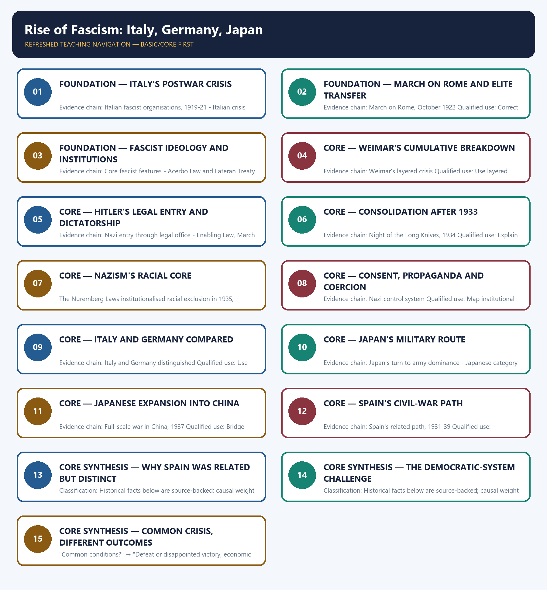

# Rise of Fascism: Italy, Germany, Japan — Learner-v2 Complete Learning Session

> **Authoring-only generation:** 2026-09-01. No PDF was rendered and no tracker or index was mutated.

### SOURCE, PROGRESSION AND CURRENT-LINKAGE AUDIT

- **Generation date:** 2026-09-01.
- **Repository-first evidence:** the Basic owner is taught first and preserved in full; the Advanced owner is retained only in the optional final teaching block.
- **OCR evidence:** Repository Markdown was used first. The available OCR-searchable Norman Lowe World History PDF was retained as supplementary local context, but no unsupported page number, quotation or precision was imported from it.
- **Qdrant:** not used; repository Markdown and available OCR context were sufficient.
- **PYQ integrity:** The owner verifies one 2021 GS-I demand in neutral rendering only: evaluate the challenge to the democratic state system between the two World Wars. Verbatim official wording is not held locally.
- **Live-link boundary:** The official United Nations Holocaust Memorial Observance on 27 January 2026 used the theme 'Holocaust Remembrance for Dignity and Human Rights'. This is a bounded remembrance link to the consequences of Nazism within this comparative topic; it is not evidence about Italian fascism or Japanese militarism.
- **Fact/inference discipline:** no current-affairs item, PYQ wording, figure or quotation is invented.

## BASIC LEARNING SESSION



*Distinct embedded teaching-navigation image. The separate continuous Cārvāka-style flowchart package remains an independent at-a-glance artifact.*

### SESSION 1 — FOUNDATION — ITALY'S POSTWAR CRISIS

#### DEFINITION / WHAT THIS IS CALLED

**Plain-language definition:** Precise definition: Italy's postwar crisis is the source-bounded relationship among Italian fascist organisations, 1919-21 and Italian crisis after war within Rise of Fascism: Italy, Germany, Japan.

**Technical definition:** Evidence chain: Italian fascist organisations, 1919-21 - Italian crisis after war Qualified use: Build the conditions before the takeover.

#### ANSWER-GRABBING OPENING — WRITE/ADAPT IN THE EXAM

> Precise definition: Italy's postwar crisis is the source-bounded relationship among Italian fascist organisations, 1919-21 and Italian crisis after war within Rise of Fascism: Italy, Germany, Japan.

#### MUST-WRITE KEYWORDS

- **FOUNDATION**
- **Italy's postwar crisis**
- **Precise definition**
- **Evidence chain**
- **Qualified use**
- **1919-21**

**How to use them:** Frame the answer through FOUNDATION; define Italy's postwar crisis, connect Precise definition with Evidence chain to explain the mechanism, and use Qualified use for the decisive comparison or qualification.

##### VISUAL FIRST

```text
ITALY'S POSTWAR CRISIS
01. Italian fascist organisations, 1919-21
    |
    v
02. Italian crisis after war
BOUNDARY -> Economic distress worked through class fear and weak government.
```

*This topic-specific rail fixes the evidence sequence and its exam boundary before analysis.*

##### CONCEPT DEFINITIONS

- **Precise definition:** Italy's postwar crisis is the source-bounded relationship among Italian fascist organisations, 1919-21 and Italian crisis after war within Rise of Fascism: Italy, Germany, Japan.
- **Classification:** Historical facts below are source-backed; causal weight and evaluative verdicts are analytical synthesis.

##### CORE EXPLANATION

Mussolini founded the Fasci di combattimento in 1919 and organised the National Fascist Party in 1921. Disappointed victory, inflation, debt, unemployment, weak coalitions, labour unrest and fear of socialism widened fascist support.

##### NAMED EVIDENCE AND MECHANISM

- Mussolini founded the Fasci di combattimento in 1919 and organised the National Fascist Party in 1921.
- Disappointed victory, inflation, debt, unemployment, weak coalitions, labour unrest and fear of socialism widened fascist support.

##### EXAMINER CAUTION

- Economic distress worked through class fear and weak government.

##### EXAM LINK

- **Prelims:** Retain the exact actor, date, document and category in Italy's postwar crisis.
- **Mains:** Build the conditions before the takeover.

##### MINI RECAP

- **Evidence chain:** Italian fascist organisations, 1919-21 -> Italian crisis after war
- **Qualified use:** Build the conditions before the takeover.

#### CLOSING RECALL FLOW — FOUNDATION — ITALY'S POSTWAR CRISIS

```text
START / CONCEPT: FOUNDATION — Italy's postwar crisis
        |
        v
EXACT TERMS: FOUNDATION · Italy's postwar crisis · Precise definition · Evidence chain · Qualified use · 1919-21
        |
        v
MECHANISM / ARGUMENT: Evidence chain: Italian fascist organisations, 1919-21 - Italian crisis after war Qualified use: Build the conditions before the takeover.
        |
        v
CONSEQUENCE / CONTRAST: Classification: Historical facts below are source-backed; causal weight and evaluative verdicts are analytical synthesis.
        |
        v
UPSC TRAP / ANSWER-USE: Do not miss this limiting distinction: disappointed victory, inflation, debt, unemployment, weak coalitions, labour unrest and fear of socialism widened...
        |
        v
ANSWER-GRABBING FORMULATION: Precise definition: Italy's postwar crisis is the source-bounded relationship among Italian fascist organisations, 1919-21 and Italian crisis after war within Rise of Fascism: Italy, Germany, Japan.
```
### SESSION 2 — FOUNDATION — MARCH ON ROME AND ELITE TRANSFER

#### DEFINITION / WHAT THIS IS CALLED

**Plain-language definition:** Precise definition: March on Rome and elite transfer is the source-bounded relationship among and March on Rome, October 1922 within Rise of Fascism: Italy, Germany, Japan.

**Technical definition:** Evidence chain: March on Rome, October 1922 Qualified use: Correct the seizure-of-power myth.

#### ANSWER-GRABBING OPENING — WRITE/ADAPT IN THE EXAM

> Precise definition: March on Rome and elite transfer is the source-bounded relationship among and March on Rome, October 1922 within Rise of Fascism: Italy, Germany, Japan.

#### MUST-WRITE KEYWORDS

- **FOUNDATION**
- **March on Rome**
- **elite transfer**
- **Precise definition**
- **Evidence chain**
- **Qualified use**

**How to use them:** Frame the answer through FOUNDATION; define March on Rome, connect elite transfer with Precise definition to explain the mechanism, and use Evidence chain for the decisive comparison or qualification.

##### VISUAL FIRST

```text
MARCH ON ROME AND ELITE TRANSFER
01. March on Rome, October 1922
BOUNDARY -> The king's decision was more decisive than fascist military strength.
```

*This topic-specific rail fixes the evidence sequence and its exam boundary before analysis.*

##### CONCEPT DEFINITIONS

- **Precise definition:** March on Rome and elite transfer is the source-bounded relationship among  and March on Rome, October 1922 within Rise of Fascism: Italy, Germany, Japan.
- **Classification:** Historical facts below are source-backed; causal weight and evaluative verdicts are analytical synthesis.

##### CORE EXPLANATION

The March on Rome was more bluff than conquest; Victor Emmanuel III refused resistance and invited Mussolini to form a government.

##### NAMED EVIDENCE AND MECHANISM

- The March on Rome was more bluff than conquest; Victor Emmanuel III refused resistance and invited Mussolini to form a government.

##### EXAMINER CAUTION

- The king's decision was more decisive than fascist military strength.

##### EXAM LINK

- **Prelims:** Retain the exact actor, date, document and category in March on Rome and elite transfer.
- **Mains:** Correct the seizure-of-power myth.

##### MINI RECAP

- **Evidence chain:** March on Rome, October 1922
- **Qualified use:** Correct the seizure-of-power myth.

#### CLOSING RECALL FLOW — FOUNDATION — MARCH ON ROME AND ELITE TRANSFER

```text
START / CONCEPT: FOUNDATION — March on Rome and elite transfer
        |
        v
EXACT TERMS: FOUNDATION · March on Rome · elite transfer · Precise definition · Evidence chain · Qualified use
        |
        v
MECHANISM / ARGUMENT: Evidence chain: March on Rome, October 1922 Qualified use: Correct the seizure-of-power myth.
        |
        v
CONSEQUENCE / CONTRAST: The March on Rome was more bluff than conquest; Victor Emmanuel III refused resistance and invited Mussolini to form a government.
        |
        v
UPSC TRAP / ANSWER-USE: Do not miss this limiting distinction: causal weight and evaluative verdicts are analytical synthesis.
        |
        v
ANSWER-GRABBING FORMULATION: Precise definition: March on Rome and elite transfer is the source-bounded relationship among and March on Rome, October 1922 within Rise of Fascism: Italy, Germany, Japan.
```
### SESSION 3 — FOUNDATION — FASCIST IDEOLOGY AND INSTITUTIONS

#### DEFINITION / WHAT THIS IS CALLED

**Plain-language definition:** Precise definition: Fascist ideology and institutions is the source-bounded relationship among Core fascist features and Acerbo Law and Lateran Treaty within Rise of Fascism: Italy, Germany, Japan.

**Technical definition:** Evidence chain: Core fascist features - Acerbo Law and Lateran Treaty Qualified use: Separate doctrine from governing capacity.

#### ANSWER-GRABBING OPENING — WRITE/ADAPT IN THE EXAM

> Precise definition: Fascist ideology and institutions is the source-bounded relationship among Core fascist features and Acerbo Law and Lateran Treaty within Rise of Fascism: Italy, Germany, Japan.

#### MUST-WRITE KEYWORDS

- **FOUNDATION**
- **Fascist ideology**
- **institutions**
- **Precise definition**
- **Evidence chain**
- **Qualified use**

**How to use them:** Frame the answer through FOUNDATION; define Fascist ideology, connect institutions with Precise definition to explain the mechanism, and use Evidence chain for the decisive comparison or qualification.

##### VISUAL FIRST

```text
FASCIST IDEOLOGY AND INSTITUTIONS
01. Core fascist features
    |
    v
02. Acerbo Law and Lateran Treaty
BOUNDARY -> Ambition for total control exceeded realised penetration.
```

*This topic-specific rail fixes the evidence sequence and its exam boundary before analysis.*

##### CONCEPT DEFINITIONS

- **Precise definition:** Fascist ideology and institutions is the source-bounded relationship among Core fascist features and Acerbo Law and Lateran Treaty within Rise of Fascism: Italy, Germany, Japan.
- **Classification:** Historical facts below are source-backed; causal weight and evaluative verdicts are analytical synthesis.

##### CORE EXPLANATION

Italian fascism joined authoritarian rule, extreme nationalism, leader cult, one-party ambition, anti-communism, propaganda, autarky and glorified violence. The Acerbo Law helped fascist parliamentary dominance, while the Lateran Treaty of 1929 settled relations with the papacy.

##### NAMED EVIDENCE AND MECHANISM

- Italian fascism joined authoritarian rule, extreme nationalism, leader cult, one-party ambition, anti-communism, propaganda, autarky and glorified violence.
- The Acerbo Law helped fascist parliamentary dominance, while the Lateran Treaty of 1929 settled relations with the papacy.

##### EXAMINER CAUTION

- Ambition for total control exceeded realised penetration.

##### EXAM LINK

- **Prelims:** Retain the exact actor, date, document and category in Fascist ideology and institutions.
- **Mains:** Separate doctrine from governing capacity.

##### MINI RECAP

- **Evidence chain:** Core fascist features -> Acerbo Law and Lateran Treaty
- **Qualified use:** Separate doctrine from governing capacity.

#### CLOSING RECALL FLOW — FOUNDATION — FASCIST IDEOLOGY AND INSTITUTIONS

```text
START / CONCEPT: FOUNDATION — Fascist ideology and institutions
        |
        v
EXACT TERMS: FOUNDATION · Fascist ideology · institutions · Precise definition · Evidence chain · Qualified use
        |
        v
MECHANISM / ARGUMENT: Evidence chain: Core fascist features - Acerbo Law and Lateran Treaty Qualified use: Separate doctrine from governing capacity.
        |
        v
CONSEQUENCE / CONTRAST: Classification: Historical facts below are source-backed; causal weight and evaluative verdicts are analytical synthesis.
        |
        v
UPSC TRAP / ANSWER-USE: Do not miss this limiting distinction: fascist ideology and institutions is the source-bounded relationship among Core fascist features and Acerbo...
        |
        v
ANSWER-GRABBING FORMULATION: Precise definition: Fascist ideology and institutions is the source-bounded relationship among Core fascist features and Acerbo Law and Lateran Treaty within Rise of Fascism: Italy, Germany, Japan.
```
### SESSION 4 — CORE — WEIMAR'S CUMULATIVE BREAKDOWN

#### DEFINITION / WHAT THIS IS CALLED

**Plain-language definition:** Precise definition: Weimar's cumulative breakdown is the source-bounded relationship among and Weimar's layered crisis within Rise of Fascism: Italy, Germany, Japan.

**Technical definition:** Evidence chain: Weimar's layered crisis Qualified use: Use layered causation rather than one trigger.

#### ANSWER-GRABBING OPENING — WRITE/ADAPT IN THE EXAM

> Precise definition: Weimar's cumulative breakdown is the source-bounded relationship among and Weimar's layered crisis within Rise of Fascism: Italy, Germany, Japan.

#### MUST-WRITE KEYWORDS

- **Weimar's cumulative breakdown**
- **Precise definition**
- **Evidence chain**
- **Qualified use**
- **Precise definition: Weimar's cumulative breakdown**
- **Precise**

**How to use them:** Frame the answer through Weimar's cumulative breakdown; define Precise definition, connect Evidence chain with Qualified use to explain the mechanism, and use Precise definition: Weimar's cumulative breakdown for the decisive comparison or qualification.

##### VISUAL FIRST

```text
WEIMAR'S CUMULATIVE BREAKDOWN
01. Weimar's layered crisis
BOUNDARY -> The Depression accelerated older weaknesses.
```

*This topic-specific rail fixes the evidence sequence and its exam boundary before analysis.*

##### CONCEPT DEFINITIONS

- **Precise definition:** Weimar's cumulative breakdown is the source-bounded relationship among  and Weimar's layered crisis within Rise of Fascism: Italy, Germany, Japan.
- **Classification:** Historical facts below are source-backed; causal weight and evaluative verdicts are analytical synthesis.

##### CORE EXPLANATION

Versailles stigma, the stab-in-the-back myth, fragmented coalitions, violence, hyperinflation, American-credit dependence and Depression eroded the Weimar Republic's legitimacy.

##### NAMED EVIDENCE AND MECHANISM

- Versailles stigma, the stab-in-the-back myth, fragmented coalitions, violence, hyperinflation, American-credit dependence and Depression eroded the Weimar Republic's legitimacy.

##### EXAMINER CAUTION

- The Depression accelerated older weaknesses.

##### EXAM LINK

- **Prelims:** Retain the exact actor, date, document and category in Weimar's cumulative breakdown.
- **Mains:** Use layered causation rather than one trigger.

##### MINI RECAP

- **Evidence chain:** Weimar's layered crisis
- **Qualified use:** Use layered causation rather than one trigger.

#### CLOSING RECALL FLOW — CORE — WEIMAR'S CUMULATIVE BREAKDOWN

```text
START / CONCEPT: CORE — Weimar's cumulative breakdown
        |
        v
EXACT TERMS: Weimar's cumulative breakdown · Precise definition · Evidence chain · Qualified use · Precise definition: Weimar's cumulative breakdown · Precise
        |
        v
MECHANISM / ARGUMENT: Evidence chain: Weimar's layered crisis Qualified use: Use layered causation rather than one trigger.
        |
        v
CONSEQUENCE / CONTRAST: Classification: Historical facts below are source-backed; causal weight and evaluative verdicts are analytical synthesis.
        |
        v
UPSC TRAP / ANSWER-USE: Mains: Use layered causation rather than one trigger.
        |
        v
ANSWER-GRABBING FORMULATION: Precise definition: Weimar's cumulative breakdown is the source-bounded relationship among and Weimar's layered crisis within Rise of Fascism: Italy, Germany, Japan.
```
### SESSION 5 — CORE — HITLER'S LEGAL ENTRY AND DICTATORSHIP

#### DEFINITION / WHAT THIS IS CALLED

**Plain-language definition:** Precise definition: Hitler's legal entry and dictatorship is the source-bounded relationship among Nazi entry through legal office and Enabling Law, March 1933 within Rise of Fascism: Italy, Germany, Japan.

**Technical definition:** Evidence chain: Nazi entry through legal office - Enabling Law, March 1933 Qualified use: Trace constitutional self-destruction.

#### ANSWER-GRABBING OPENING — WRITE/ADAPT IN THE EXAM

> Precise definition: Hitler's legal entry and dictatorship is the source-bounded relationship among Nazi entry through legal office and Enabling Law, March 1933 within Rise of Fascism: Italy, Germany, Japan.

#### MUST-WRITE KEYWORDS

- **Hitler's legal entry**
- **dictatorship**
- **Precise definition**
- **Evidence chain**
- **Qualified use**
- **Precise definition: Hitler's legal entry and dictatorship**

**How to use them:** Frame the answer through Hitler's legal entry; define dictatorship, connect Precise definition with Evidence chain to explain the mechanism, and use Qualified use for the decisive comparison or qualification.

##### VISUAL FIRST

```text
HITLER'S LEGAL ENTRY AND DICTATORSHIP
01. Nazi entry through legal office
    |
    v
02. Enabling Law, March 1933
BOUNDARY -> Chancellorship and dictatorial law belong to different months.
```

*This topic-specific rail fixes the evidence sequence and its exam boundary before analysis.*

##### CONCEPT DEFINITIONS

- **Precise definition:** Hitler's legal entry and dictatorship is the source-bounded relationship among Nazi entry through legal office and Enabling Law, March 1933 within Rise of Fascism: Italy, Germany, Japan.
- **Classification:** Historical facts below are source-backed; causal weight and evaluative verdicts are analytical synthesis.

##### CORE EXPLANATION

The Nazis never won an overall electoral majority; conservative intrigue helped Hitler become Chancellor in January 1933. The Enabling Law of March 1933 supplied the decisive legal breakthrough from chancellorship to dictatorship.

##### NAMED EVIDENCE AND MECHANISM

- The Nazis never won an overall electoral majority; conservative intrigue helped Hitler become Chancellor in January 1933.
- The Enabling Law of March 1933 supplied the decisive legal breakthrough from chancellorship to dictatorship.

##### EXAMINER CAUTION

- Chancellorship and dictatorial law belong to different months.

##### EXAM LINK

- **Prelims:** Retain the exact actor, date, document and category in Hitler's legal entry and dictatorship.
- **Mains:** Trace constitutional self-destruction.

##### MINI RECAP

- **Evidence chain:** Nazi entry through legal office -> Enabling Law, March 1933
- **Qualified use:** Trace constitutional self-destruction.

#### CLOSING RECALL FLOW — CORE — HITLER'S LEGAL ENTRY AND DICTATORSHIP

```text
START / CONCEPT: CORE — Hitler's legal entry and dictatorship
        |
        v
EXACT TERMS: Hitler's legal entry · dictatorship · Precise definition · Evidence chain · Qualified use · Precise definition: Hitler's legal entry and dictatorship
        |
        v
MECHANISM / ARGUMENT: Evidence chain: Nazi entry through legal office - Enabling Law, March 1933 Qualified use: Trace constitutional self-destruction.
        |
        v
CONSEQUENCE / CONTRAST: Classification: Historical facts below are source-backed; causal weight and evaluative verdicts are analytical synthesis.
        |
        v
UPSC TRAP / ANSWER-USE: Do not miss this limiting distinction: hitler's legal entry and dictatorship is the source-bounded relationship among Nazi entry through legal...
        |
        v
ANSWER-GRABBING FORMULATION: Precise definition: Hitler's legal entry and dictatorship is the source-bounded relationship among Nazi entry through legal office and Enabling Law, March 1933 within Rise of Fascism: Italy, Germany, Japan.
```
### SESSION 6 — CORE — CONSOLIDATION AFTER 1933

#### DEFINITION / WHAT THIS IS CALLED

**Plain-language definition:** Precise definition: Consolidation after 1933 is the source-bounded relationship among and Night of the Long Knives, 1934 within Rise of Fascism: Italy, Germany, Japan.

**Technical definition:** Evidence chain: Night of the Long Knives, 1934 Qualified use: Explain the Night of the Long Knives.

#### ANSWER-GRABBING OPENING — WRITE/ADAPT IN THE EXAM

> Precise definition: Consolidation after 1933 is the source-bounded relationship among and Night of the Long Knives, 1934 within Rise of Fascism: Italy, Germany, Japan.

#### MUST-WRITE KEYWORDS

- **Consolidation after 1933**
- **Precise definition**
- **Evidence chain**
- **Qualified use**
- **Precise definition: Consolidation after 1933**
- **Precise**

**How to use them:** Frame the answer through Consolidation after 1933; define Precise definition, connect Evidence chain with Qualified use to explain the mechanism, and use Precise definition: Consolidation after 1933 for the decisive comparison or qualification.

##### VISUAL FIRST

```text
CONSOLIDATION AFTER 1933
01. Night of the Long Knives, 1934
BOUNDARY -> Power consolidation involved bargains and purge, not election alone.
```

*This topic-specific rail fixes the evidence sequence and its exam boundary before analysis.*

##### CONCEPT DEFINITIONS

- **Precise definition:** Consolidation after 1933 is the source-bounded relationship among  and Night of the Long Knives, 1934 within Rise of Fascism: Italy, Germany, Japan.
- **Classification:** Historical facts below are source-backed; causal weight and evaluative verdicts are analytical synthesis.

##### CORE EXPLANATION

The Night of the Long Knives consolidated Hitler's position by eliminating rivals and reassuring conservative power centres.

##### NAMED EVIDENCE AND MECHANISM

- The Night of the Long Knives consolidated Hitler's position by eliminating rivals and reassuring conservative power centres.

##### EXAMINER CAUTION

- Power consolidation involved bargains and purge, not election alone.

##### EXAM LINK

- **Prelims:** Retain the exact actor, date, document and category in Consolidation after 1933.
- **Mains:** Explain the Night of the Long Knives.

##### MINI RECAP

- **Evidence chain:** Night of the Long Knives, 1934
- **Qualified use:** Explain the Night of the Long Knives.

#### CLOSING RECALL FLOW — CORE — CONSOLIDATION AFTER 1933

```text
START / CONCEPT: CORE — Consolidation after 1933
        |
        v
EXACT TERMS: Consolidation after 1933 · Precise definition · Evidence chain · Qualified use · Precise definition: Consolidation after 1933 · Precise
        |
        v
MECHANISM / ARGUMENT: Evidence chain: Night of the Long Knives, 1934 Qualified use: Explain the Night of the Long Knives.
        |
        v
CONSEQUENCE / CONTRAST: Classification: Historical facts below are source-backed; causal weight and evaluative verdicts are analytical synthesis.
        |
        v
UPSC TRAP / ANSWER-USE: Do not miss this limiting distinction: explain the Night of the Long Knives.
        |
        v
ANSWER-GRABBING FORMULATION: Precise definition: Consolidation after 1933 is the source-bounded relationship among and Night of the Long Knives, 1934 within Rise of Fascism: Italy, Germany, Japan.
```
### SESSION 7 — CORE — NAZISM'S RACIAL CORE

#### DEFINITION / WHAT THIS IS CALLED

**Plain-language definition:** Precise definition: Nazism's racial core is the source-bounded relationship among Nazi ideological core and Nuremberg Laws, 1935 within Rise of Fascism: Italy, Germany, Japan.

**Technical definition:** The Nuremberg Laws institutionalised racial exclusion in 1935, showing that race was constitutive rather than incidental to Nazism.

#### ANSWER-GRABBING OPENING — WRITE/ADAPT IN THE EXAM

> Precise definition: Nazism's racial core is the source-bounded relationship among Nazi ideological core and Nuremberg Laws, 1935 within Rise of Fascism: Italy, Germany, Japan.

#### MUST-WRITE KEYWORDS

- **Nazism's racial core**
- **Precise definition**
- **Evidence chain**
- **Qualified use**
- **Precise definition: Nazism's racial core**
- **Precise**

**How to use them:** Frame the answer through Nazism's racial core; define Precise definition, connect Evidence chain with Qualified use to explain the mechanism, and use Precise definition: Nazism's racial core for the decisive comparison or qualification.

##### VISUAL FIRST

```text
NAZISM'S RACIAL CORE
01. Nazi ideological core
    |
    v
02. Nuremberg Laws, 1935
BOUNDARY -> Race distinguishes Nazism from generic authoritarian nationalism.
```

*This topic-specific rail fixes the evidence sequence and its exam boundary before analysis.*

##### CONCEPT DEFINITIONS

- **Precise definition:** Nazism's racial core is the source-bounded relationship among Nazi ideological core and Nuremberg Laws, 1935 within Rise of Fascism: Italy, Germany, Japan.
- **Classification:** Historical facts below are source-backed; causal weight and evaluative verdicts are analytical synthesis.

##### CORE EXPLANATION

Nazism fused national rebirth, totalitarian organisation and militarisation with Aryan supremacy and anti-Semitism at its centre. The Nuremberg Laws institutionalised racial exclusion in 1935, showing that race was constitutive rather than incidental to Nazism.

##### NAMED EVIDENCE AND MECHANISM

- Nazism fused national rebirth, totalitarian organisation and militarisation with Aryan supremacy and anti-Semitism at its centre.
- The Nuremberg Laws institutionalised racial exclusion in 1935, showing that race was constitutive rather than incidental to Nazism.

##### EXAMINER CAUTION

- Race distinguishes Nazism from generic authoritarian nationalism.

##### EXAM LINK

- **Prelims:** Retain the exact actor, date, document and category in Nazism's racial core.
- **Mains:** Keep exclusion central.

##### MINI RECAP

- **Evidence chain:** Nazi ideological core -> Nuremberg Laws, 1935
- **Qualified use:** Keep exclusion central.

#### CLOSING RECALL FLOW — CORE — NAZISM'S RACIAL CORE

```text
START / CONCEPT: CORE — Nazism's racial core
        |
        v
EXACT TERMS: Nazism's racial core · Precise definition · Evidence chain · Qualified use · Precise definition: Nazism's racial core · Precise
        |
        v
MECHANISM / ARGUMENT: The Nuremberg Laws institutionalised racial exclusion in 1935, showing that race was constitutive rather than incidental to Nazism.
        |
        v
CONSEQUENCE / CONTRAST: Evidence chain: Nazi ideological core - Nuremberg Laws, 1935 Qualified use: Keep exclusion central.
        |
        v
UPSC TRAP / ANSWER-USE: Do not miss this limiting distinction: causal weight and evaluative verdicts are analytical synthesis.
        |
        v
ANSWER-GRABBING FORMULATION: Precise definition: Nazism's racial core is the source-bounded relationship among Nazi ideological core and Nuremberg Laws, 1935 within Rise of Fascism: Italy, Germany, Japan.
```
### SESSION 8 — CORE — CONSENT, PROPAGANDA AND COERCION

#### DEFINITION / WHAT THIS IS CALLED

**Plain-language definition:** Precise definition: Consent, propaganda and coercion is the source-bounded relationship among and Nazi control system within Rise of Fascism: Italy, Germany, Japan.

**Technical definition:** Evidence chain: Nazi control system Qualified use: Map institutional penetration.

#### ANSWER-GRABBING OPENING — WRITE/ADAPT IN THE EXAM

> Precise definition: Consent, propaganda and coercion is the source-bounded relationship among and Nazi control system within Rise of Fascism: Italy, Germany, Japan.

#### MUST-WRITE KEYWORDS

- **Consent**
- **propaganda**
- **coercion**
- **Precise definition**
- **Evidence chain**
- **Qualified use**

**How to use them:** Frame the answer through Consent; define propaganda, connect coercion with Precise definition to explain the mechanism, and use Evidence chain for the decisive comparison or qualification.

##### VISUAL FIRST

```text
CONSENT, PROPAGANDA AND COERCION
01. Nazi control system
BOUNDARY -> Control depended on changing mixtures, not terror alone.
```

*This topic-specific rail fixes the evidence sequence and its exam boundary before analysis.*

##### CONCEPT DEFINITIONS

- **Precise definition:** Consent, propaganda and coercion is the source-bounded relationship among  and Nazi control system within Rise of Fascism: Italy, Germany, Japan.
- **Classification:** Historical facts below are source-backed; causal weight and evaluative verdicts are analytical synthesis.

##### CORE EXPLANATION

Trade-union destruction, youth and school control, Goebbels's propaganda machinery, police power and camps penetrated society more thoroughly than Italian fascism.

##### NAMED EVIDENCE AND MECHANISM

- Trade-union destruction, youth and school control, Goebbels's propaganda machinery, police power and camps penetrated society more thoroughly than Italian fascism.

##### EXAMINER CAUTION

- Control depended on changing mixtures, not terror alone.

##### EXAM LINK

- **Prelims:** Retain the exact actor, date, document and category in Consent, propaganda and coercion.
- **Mains:** Map institutional penetration.

##### MINI RECAP

- **Evidence chain:** Nazi control system
- **Qualified use:** Map institutional penetration.

#### CLOSING RECALL FLOW — CORE — CONSENT, PROPAGANDA AND COERCION

```text
START / CONCEPT: CORE — Consent, propaganda and coercion
        |
        v
EXACT TERMS: Consent · propaganda · coercion · Precise definition · Evidence chain · Qualified use
        |
        v
MECHANISM / ARGUMENT: Evidence chain: Nazi control system Qualified use: Map institutional penetration.
        |
        v
CONSEQUENCE / CONTRAST: Classification: Historical facts below are source-backed; causal weight and evaluative verdicts are analytical synthesis.
        |
        v
UPSC TRAP / ANSWER-USE: Do not miss this limiting distinction: consent, propaganda and coercion is the source-bounded relationship among and Nazi control system within...
        |
        v
ANSWER-GRABBING FORMULATION: Precise definition: Consent, propaganda and coercion is the source-bounded relationship among and Nazi control system within Rise of Fascism: Italy, Germany, Japan.
```
### SESSION 9 — CORE — ITALY AND GERMANY COMPARED

#### DEFINITION / WHAT THIS IS CALLED

**Plain-language definition:** Precise definition: Italy and Germany compared is the source-bounded relationship among and Italy and Germany distinguished within Rise of Fascism: Italy, Germany, Japan.

**Technical definition:** Evidence chain: Italy and Germany distinguished Qualified use: Use race and thoroughness as axes.

#### ANSWER-GRABBING OPENING — WRITE/ADAPT IN THE EXAM

> Precise definition: Italy and Germany compared is the source-bounded relationship among and Italy and Germany distinguished within Rise of Fascism: Italy, Germany, Japan.

#### MUST-WRITE KEYWORDS

- **Italy**
- **Germany compared**
- **Precise definition**
- **Evidence chain**
- **Qualified use**
- **Precise definition: Italy and Germany compared**

**How to use them:** Frame the answer through Italy; define Germany compared, connect Precise definition with Evidence chain to explain the mechanism, and use Qualified use for the decisive comparison or qualification.

##### VISUAL FIRST

```text
ITALY AND GERMANY COMPARED
01. Italy and Germany distinguished
BOUNDARY -> Difference is qualitative as well as one of degree.
```

*This topic-specific rail fixes the evidence sequence and its exam boundary before analysis.*

##### CONCEPT DEFINITIONS

- **Precise definition:** Italy and Germany compared is the source-bounded relationship among  and Italy and Germany distinguished within Rise of Fascism: Italy, Germany, Japan.
- **Classification:** Historical facts below are source-backed; causal weight and evaluative verdicts are analytical synthesis.

##### CORE EXPLANATION

Both destroyed pluralism, but Italian fascism remained less systematic and racialised; Nazism made biological race an organising principle.

##### NAMED EVIDENCE AND MECHANISM

- Both destroyed pluralism, but Italian fascism remained less systematic and racialised; Nazism made biological race an organising principle.

##### EXAMINER CAUTION

- Difference is qualitative as well as one of degree.

##### EXAM LINK

- **Prelims:** Retain the exact actor, date, document and category in Italy and Germany compared.
- **Mains:** Use race and thoroughness as axes.

##### MINI RECAP

- **Evidence chain:** Italy and Germany distinguished
- **Qualified use:** Use race and thoroughness as axes.

#### CLOSING RECALL FLOW — CORE — ITALY AND GERMANY COMPARED

```text
START / CONCEPT: CORE — Italy and Germany compared
        |
        v
EXACT TERMS: Italy · Germany compared · Precise definition · Evidence chain · Qualified use · Precise definition: Italy and Germany compared
        |
        v
MECHANISM / ARGUMENT: Evidence chain: Italy and Germany distinguished Qualified use: Use race and thoroughness as axes.
        |
        v
CONSEQUENCE / CONTRAST: Classification: Historical facts below are source-backed; causal weight and evaluative verdicts are analytical synthesis.
        |
        v
UPSC TRAP / ANSWER-USE: Do not miss this limiting distinction: difference is qualitative as well as one of degree.
        |
        v
ANSWER-GRABBING FORMULATION: Precise definition: Italy and Germany compared is the source-bounded relationship among and Italy and Germany distinguished within Rise of Fascism: Italy, Germany, Japan.
```
### SESSION 10 — CORE — JAPAN'S MILITARY ROUTE

#### DEFINITION / WHAT THIS IS CALLED

**Plain-language definition:** Precise definition: Japan's military route is the source-bounded relationship among Japan's turn to army dominance and Japanese category caution within Rise of Fascism: Italy, Germany, Japan.

**Technical definition:** Evidence chain: Japan's turn to army dominance - Japanese category caution Qualified use: Define army dominance carefully.

#### ANSWER-GRABBING OPENING — WRITE/ADAPT IN THE EXAM

> Precise definition: Japan's military route is the source-bounded relationship among Japan's turn to army dominance and Japanese category caution within Rise of Fascism: Italy, Germany, Japan.

#### MUST-WRITE KEYWORDS

- **Japan's military route**
- **Precise definition**
- **Evidence chain**
- **Qualified use**
- **Precise definition: Japan's military route**
- **Precise**

**How to use them:** Frame the answer through Japan's military route; define Precise definition, connect Evidence chain with Qualified use to explain the mechanism, and use Precise definition: Japan's military route for the decisive comparison or qualification.

##### VISUAL FIRST

```text
JAPAN'S MILITARY ROUTE
01. Japan's turn to army dominance
    |
    v
02. Japanese category caution
BOUNDARY -> Retained institutions do not imply parliamentary control.
```

*This topic-specific rail fixes the evidence sequence and its exam boundary before analysis.*

##### CONCEPT DEFINITIONS

- **Precise definition:** Japan's military route is the source-bounded relationship among Japan's turn to army dominance and Japanese category caution within Rise of Fascism: Italy, Germany, Japan.
- **Classification:** Historical facts below are source-backed; causal weight and evaluative verdicts are analytical synthesis.

##### CORE EXPLANATION

The occupation of Manchuria in 1931 and assassination of Prime Minister Inukai in 1932 marked the transition toward military dominance. Japan retained imperial and constitutional forms under army influence and lacked the same mass party-state, so military authoritarianism is safer than an unqualified fascist label.

##### NAMED EVIDENCE AND MECHANISM

- The occupation of Manchuria in 1931 and assassination of Prime Minister Inukai in 1932 marked the transition toward military dominance.
- Japan retained imperial and constitutional forms under army influence and lacked the same mass party-state, so military authoritarianism is safer than an unqualified fascist label.

##### EXAMINER CAUTION

- Retained institutions do not imply parliamentary control.

##### EXAM LINK

- **Prelims:** Retain the exact actor, date, document and category in Japan's military route.
- **Mains:** Define army dominance carefully.

##### MINI RECAP

- **Evidence chain:** Japan's turn to army dominance -> Japanese category caution
- **Qualified use:** Define army dominance carefully.

#### CLOSING RECALL FLOW — CORE — JAPAN'S MILITARY ROUTE

```text
START / CONCEPT: CORE — Japan's military route
        |
        v
EXACT TERMS: Japan's military route · Precise definition · Evidence chain · Qualified use · Precise definition: Japan's military route · Precise
        |
        v
MECHANISM / ARGUMENT: Evidence chain: Japan's turn to army dominance - Japanese category caution Qualified use: Define army dominance carefully.
        |
        v
CONSEQUENCE / CONTRAST: Retained institutions do not imply parliamentary control.
        |
        v
UPSC TRAP / ANSWER-USE: Do not miss this limiting distinction: japan retained imperial and constitutional forms under army influence and lacked the same mass...
        |
        v
ANSWER-GRABBING FORMULATION: Precise definition: Japan's military route is the source-bounded relationship among Japan's turn to army dominance and Japanese category caution within Rise of Fascism: Italy, Germany, Japan.
```
### SESSION 11 — CORE — JAPANESE EXPANSION INTO CHINA

#### DEFINITION / WHAT THIS IS CALLED

**Plain-language definition:** Precise definition: Japanese expansion into China is the source-bounded relationship among and Full-scale war in China, 1937 within Rise of Fascism: Italy, Germany, Japan.

**Technical definition:** Evidence chain: Full-scale war in China, 1937 Qualified use: Bridge militarism to war.

#### ANSWER-GRABBING OPENING — WRITE/ADAPT IN THE EXAM

> Precise definition: Japanese expansion into China is the source-bounded relationship among and Full-scale war in China, 1937 within Rise of Fascism: Italy, Germany, Japan.

#### MUST-WRITE KEYWORDS

- **Japanese expansion into China**
- **Precise definition**
- **Evidence chain**
- **Qualified use**
- **Precise definition: Japanese expansion into China**
- **Precise**

**How to use them:** Frame the answer through Japanese expansion into China; define Precise definition, connect Evidence chain with Qualified use to explain the mechanism, and use Precise definition: Japanese expansion into China for the decisive comparison or qualification.

##### VISUAL FIRST

```text
JAPANESE EXPANSION INTO CHINA
01. Full-scale war in China, 1937
BOUNDARY -> Keep domestic form and foreign expansion analytically linked.
```

*This topic-specific rail fixes the evidence sequence and its exam boundary before analysis.*

##### CONCEPT DEFINITIONS

- **Precise definition:** Japanese expansion into China is the source-bounded relationship among  and Full-scale war in China, 1937 within Rise of Fascism: Italy, Germany, Japan.
- **Classification:** Historical facts below are source-backed; causal weight and evaluative verdicts are analytical synthesis.

##### CORE EXPLANATION

Japanese army-led expansion widened into full-scale war in China in 1937 and later into the Pacific conflict.

##### NAMED EVIDENCE AND MECHANISM

- Japanese army-led expansion widened into full-scale war in China in 1937 and later into the Pacific conflict.

##### EXAMINER CAUTION

- Keep domestic form and foreign expansion analytically linked.

##### EXAM LINK

- **Prelims:** Retain the exact actor, date, document and category in Japanese expansion into China.
- **Mains:** Bridge militarism to war.

##### MINI RECAP

- **Evidence chain:** Full-scale war in China, 1937
- **Qualified use:** Bridge militarism to war.

#### CLOSING RECALL FLOW — CORE — JAPANESE EXPANSION INTO CHINA

```text
START / CONCEPT: CORE — Japanese expansion into China
        |
        v
EXACT TERMS: Japanese expansion into China · Precise definition · Evidence chain · Qualified use · Precise definition: Japanese expansion into China · Precise
        |
        v
MECHANISM / ARGUMENT: Japanese army-led expansion widened into full-scale war in China in 1937 and later into the Pacific conflict.
        |
        v
CONSEQUENCE / CONTRAST: Evidence chain: Full-scale war in China, 1937 Qualified use: Bridge militarism to war.
        |
        v
UPSC TRAP / ANSWER-USE: Do not miss this limiting distinction: causal weight and evaluative verdicts are analytical synthesis.
        |
        v
ANSWER-GRABBING FORMULATION: Precise definition: Japanese expansion into China is the source-bounded relationship among and Full-scale war in China, 1937 within Rise of Fascism: Italy, Germany, Japan.
```
### SESSION 12 — CORE — SPAIN'S CIVIL-WAR PATH

#### DEFINITION / WHAT THIS IS CALLED

**Plain-language definition:** Precise definition: Spain's civil-war path is the source-bounded relationship among and Spain's related path, 1931-39 within Rise of Fascism: Italy, Germany, Japan.

**Technical definition:** Evidence chain: Spain's related path, 1931-39 Qualified use: Distinguish civil-war victory from party takeover.

#### ANSWER-GRABBING OPENING — WRITE/ADAPT IN THE EXAM

> Precise definition: Spain's civil-war path is the source-bounded relationship among and Spain's related path, 1931-39 within Rise of Fascism: Italy, Germany, Japan.

#### MUST-WRITE KEYWORDS

- **Spain's civil-war path**
- **Precise definition**
- **Evidence chain**
- **Qualified use**
- **Precise definition: Spain's civil-war path**
- **1931-39**

**How to use them:** Frame the answer through Spain's civil-war path; define Precise definition, connect Evidence chain with Qualified use to explain the mechanism, and use Precise definition: Spain's civil-war path for the decisive comparison or qualification.

##### VISUAL FIRST

```text
SPAIN'S CIVIL-WAR PATH
01. Spain's related path, 1931-39
BOUNDARY -> Use only the bounded chronology and external support.
```

*This topic-specific rail fixes the evidence sequence and its exam boundary before analysis.*

##### CONCEPT DEFINITIONS

- **Precise definition:** Spain's civil-war path is the source-bounded relationship among  and Spain's related path, 1931-39 within Rise of Fascism: Italy, Germany, Japan.
- **Classification:** Historical facts below are source-backed; causal weight and evaluative verdicts are analytical synthesis.

##### CORE EXPLANATION

Spain's monarchy fell in 1931, civil war began in 1936, and Franco won in 1939 with German and Italian help.

##### NAMED EVIDENCE AND MECHANISM

- Spain's monarchy fell in 1931, civil war began in 1936, and Franco won in 1939 with German and Italian help.

##### EXAMINER CAUTION

- Use only the bounded chronology and external support.

##### EXAM LINK

- **Prelims:** Retain the exact actor, date, document and category in Spain's civil-war path.
- **Mains:** Distinguish civil-war victory from party takeover.

##### MINI RECAP

- **Evidence chain:** Spain's related path, 1931-39
- **Qualified use:** Distinguish civil-war victory from party takeover.

#### CLOSING RECALL FLOW — CORE — SPAIN'S CIVIL-WAR PATH

```text
START / CONCEPT: CORE — Spain's civil-war path
        |
        v
EXACT TERMS: Spain's civil-war path · Precise definition · Evidence chain · Qualified use · Precise definition: Spain's civil-war path · 1931-39
        |
        v
MECHANISM / ARGUMENT: Evidence chain: Spain's related path, 1931-39 Qualified use: Distinguish civil-war victory from party takeover.
        |
        v
CONSEQUENCE / CONTRAST: Classification: Historical facts below are source-backed; causal weight and evaluative verdicts are analytical synthesis.
        |
        v
UPSC TRAP / ANSWER-USE: Do not miss this limiting distinction: use only the bounded chronology and external support.
        |
        v
ANSWER-GRABBING FORMULATION: Precise definition: Spain's civil-war path is the source-bounded relationship among and Spain's related path, 1931-39 within Rise of Fascism: Italy, Germany, Japan.
```
### SESSION 13 — CORE SYNTHESIS — WHY SPAIN WAS RELATED BUT DISTINCT

#### DEFINITION / WHAT THIS IS CALLED

**Plain-language definition:** Precise definition: Why Spain was related but distinct is the source-bounded relationship among and Spain not a full fascist replica within Rise of Fascism: Italy, Germany, Japan.

**Technical definition:** Classification: Historical facts below are source-backed; causal weight and evaluative verdicts are analytical synthesis.

#### ANSWER-GRABBING OPENING — WRITE/ADAPT IN THE EXAM

> Precise definition: Why Spain was related but distinct is the source-bounded relationship among and Spain not a full fascist replica within Rise of Fascism: Italy, Germany, Japan.

#### MUST-WRITE KEYWORDS

- **CORE SYNTHESIS**
- **Precise definition**
- **Evidence chain**
- **Qualified use**
- **Precise**
- **Why Spain**

**How to use them:** Frame the answer through CORE SYNTHESIS; define Precise definition, connect Evidence chain with Qualified use to explain the mechanism, and use Precise for the decisive comparison or qualification.

##### VISUAL FIRST

```text
WHY SPAIN WAS RELATED BUT DISTINCT
01. Spain not a full fascist replica
BOUNDARY -> Authoritarian similarity does not prove fascist identity.
```

*This topic-specific rail fixes the evidence sequence and its exam boundary before analysis.*

##### CONCEPT DEFINITIONS

- **Precise definition:** Why Spain was related but distinct is the source-bounded relationship among  and Spain not a full fascist replica within Rise of Fascism: Italy, Germany, Japan.
- **Classification:** Historical facts below are source-backed; causal weight and evaluative verdicts are analytical synthesis.

##### CORE EXPLANATION

Franco's regime shared authoritarian and anti-left features but lacked the same mass mobilisation for national rebirth as Italy and Germany.

##### NAMED EVIDENCE AND MECHANISM

- Franco's regime shared authoritarian and anti-left features but lacked the same mass mobilisation for national rebirth as Italy and Germany.

##### EXAMINER CAUTION

- Authoritarian similarity does not prove fascist identity.

##### EXAM LINK

- **Prelims:** Retain the exact actor, date, document and category in Why Spain was related but distinct.
- **Mains:** Apply category discipline.

##### MINI RECAP

- **Evidence chain:** Spain not a full fascist replica
- **Qualified use:** Apply category discipline.

#### CLOSING RECALL FLOW — CORE SYNTHESIS — WHY SPAIN WAS RELATED BUT DISTINCT

```text
START / CONCEPT: CORE SYNTHESIS — Why Spain was related but distinct
        |
        v
EXACT TERMS: CORE SYNTHESIS · Precise definition · Evidence chain · Qualified use · Precise · Why Spain
        |
        v
MECHANISM / ARGUMENT: Prelims: Retain the exact actor, date, document and category in Why Spain was related but distinct.
        |
        v
CONSEQUENCE / CONTRAST: Evidence chain: Spain not a full fascist replica Qualified use: Apply category discipline.
        |
        v
UPSC TRAP / ANSWER-USE: Authoritarian similarity does not prove fascist identity.
        |
        v
ANSWER-GRABBING FORMULATION: Precise definition: Why Spain was related but distinct is the source-bounded relationship among and Spain not a full fascist replica within Rise of Fascism: Italy, Germany, Japan.
```
### SESSION 14 — CORE SYNTHESIS — THE DEMOCRATIC-SYSTEM CHALLENGE

#### DEFINITION / WHAT THIS IS CALLED

**Plain-language definition:** Precise definition: The democratic-system challenge is the source-bounded relationship among and Democracy challenged from above and below within Rise of Fascism: Italy, Germany, Japan.

**Technical definition:** Classification: Historical facts below are source-backed; causal weight and evaluative verdicts are analytical synthesis.

#### ANSWER-GRABBING OPENING — WRITE/ADAPT IN THE EXAM

> Precise definition: The democratic-system challenge is the source-bounded relationship among and Democracy challenged from above and below within Rise of Fascism: Italy, Germany, Japan.

#### MUST-WRITE KEYWORDS

- **CORE SYNTHESIS**
- **The democratic-system challenge**
- **Precise definition**
- **Evidence chain**
- **Qualified use**
- **Precise definition: The democratic-system challenge**

**How to use them:** Frame the answer through CORE SYNTHESIS; define The democratic-system challenge, connect Precise definition with Evidence chain to explain the mechanism, and use Qualified use for the decisive comparison or qualification.

##### VISUAL FIRST

```text
THE DEMOCRATIC-SYSTEM CHALLENGE
01. Democracy challenged from above and below
BOUNDARY -> The verified 2021 demand is held only in neutral rendering.
```

*This topic-specific rail fixes the evidence sequence and its exam boundary before analysis.*

##### CONCEPT DEFINITIONS

- **Precise definition:** The democratic-system challenge is the source-bounded relationship among  and Democracy challenged from above and below within Rise of Fascism: Italy, Germany, Japan.
- **Classification:** Historical facts below are source-backed; causal weight and evaluative verdicts are analytical synthesis.

##### CORE EXPLANATION

Mass movements, economic grievance and violence weakened democracy from below while kings, conservative elites and constitutional mechanisms transferred power from above.

##### NAMED EVIDENCE AND MECHANISM

- Mass movements, economic grievance and violence weakened democracy from below while kings, conservative elites and constitutional mechanisms transferred power from above.

##### EXAMINER CAUTION

- The verified 2021 demand is held only in neutral rendering.

##### EXAM LINK

- **Prelims:** Retain the exact actor, date, document and category in The democratic-system challenge.
- **Mains:** Answer through below, above and legal transfer.

##### MINI RECAP

- **Evidence chain:** Democracy challenged from above and below
- **Qualified use:** Answer through below, above and legal transfer.

#### CLOSING RECALL FLOW — CORE SYNTHESIS — THE DEMOCRATIC-SYSTEM CHALLENGE

```text
START / CONCEPT: CORE SYNTHESIS — The democratic-system challenge
        |
        v
EXACT TERMS: CORE SYNTHESIS · The democratic-system challenge · Precise definition · Evidence chain · Qualified use · Precise definition: The democratic-system challenge
        |
        v
MECHANISM / ARGUMENT: Evidence chain: Democracy challenged from above and below Qualified use: Answer through below, above and legal transfer.
        |
        v
CONSEQUENCE / CONTRAST: Classification: Historical facts below are source-backed; causal weight and evaluative verdicts are analytical synthesis.
        |
        v
UPSC TRAP / ANSWER-USE: Do not miss this limiting distinction: the verified 2021 demand is held only in neutral rendering.
        |
        v
ANSWER-GRABBING FORMULATION: Precise definition: The democratic-system challenge is the source-bounded relationship among and Democracy challenged from above and below within Rise of Fascism: Italy, Germany, Japan.
```
### SESSION 15 — CORE SYNTHESIS — COMMON CRISIS, DIFFERENT OUTCOMES

#### DEFINITION / WHAT THIS IS CALLED

**Plain-language definition:** Precise definition: Common crisis, different outcomes is the source-bounded relationship among Common crisis, different regimes, Italy and Germany distinguished, Japanese category caution and Spain not a full fascist replica within Rise of Fascism: Italy, Germany, Japan.

**Technical definition:** "Common conditions?" → "Defeat or disappointed victory, economic collapse, fragile parliaments and fear of the left were common; what differed was the mechanism of transfer — a king in Italy, a legal chancellorship and Enabling Law in Germany, and army insubordination in Japan." "Compare fascism and Nazism." → "Both destroyed pluralism; only Nazism made biological race the organising principle of the state, and that difference determined the difference in outcome between dictatorship and genocide." "Challenge to democracy?" → "The interwar crisis showed that democracies fail when they cannot deliver security and subsistence and when their own elites conclude that democracy is dispensable.".

#### ANSWER-GRABBING OPENING — WRITE/ADAPT IN THE EXAM

> Precise definition: Common crisis, different outcomes is the source-bounded relationship among Common crisis, different regimes, Italy and Germany distinguished, Japanese category caution and Spain not a full fascist replica within Rise of Fascism: Italy, Germany, Japan.

#### MUST-WRITE KEYWORDS

- **CORE SYNTHESIS**
- **Common crisis**
- **different outcomes**
- **Precise definition**
- **Evidence chain**
- **Qualified use**

**How to use them:** Frame the answer through CORE SYNTHESIS; define Common crisis, connect different outcomes with Precise definition to explain the mechanism, and use Evidence chain for the decisive comparison or qualification.

##### VISUAL FIRST

```text
COMMON CRISIS, DIFFERENT OUTCOMES
01. Common crisis, different regimes
    |
    v
02. Italy and Germany distinguished
    |
    v
03. Japanese category caution
    |
    v
04. Spain not a full fascist replica
BOUNDARY -> Comparison requires shared axes and national differences.
```

*This topic-specific rail fixes the evidence sequence and its exam boundary before analysis.*

##### CONCEPT DEFINITIONS

- **Precise definition:** Common crisis, different outcomes is the source-bounded relationship among Common crisis, different regimes, Italy and Germany distinguished, Japanese category caution and Spain not a full fascist replica within Rise of Fascism: Italy, Germany, Japan.
- **Classification:** Historical facts below are source-backed; causal weight and evaluative verdicts are analytical synthesis.

##### CORE EXPLANATION

Interwar authoritarianism arose from similar insecurity and parliamentary failure but produced Italian party dictatorship, German racial totalitarianism, Japanese militarism and Spanish authoritarianism. Both destroyed pluralism, but Italian fascism remained less systematic and racialised; Nazism made biological race an organising principle. Japan retained imperial and constitutional forms under army influence and lacked the same mass party-state, so military authoritarianism is safer than an unqualified fascist label. Franco's regime shared authoritarian and anti-left features but lacked the same mass mobilisation for national rebirth as Italy and Germany.

##### NAMED EVIDENCE AND MECHANISM

- Interwar authoritarianism arose from similar insecurity and parliamentary failure but produced Italian party dictatorship, German racial totalitarianism, Japanese militarism and Spanish authoritarianism.
- Both destroyed pluralism, but Italian fascism remained less systematic and racialised; Nazism made biological race an organising principle.
- Japan retained imperial and constitutional forms under army influence and lacked the same mass party-state, so military authoritarianism is safer than an unqualified fascist label.
- Franco's regime shared authoritarian and anti-left features but lacked the same mass mobilisation for national rebirth as Italy and Germany.

##### EXAMINER CAUTION

- Comparison requires shared axes and national differences.

##### EXAM LINK

- **Prelims:** Retain the exact actor, date, document and category in Common crisis, different outcomes.
- **Mains:** Conclude without flattening regimes.

##### MINI RECAP

- **Evidence chain:** Common crisis, different regimes -> Italy and Germany distinguished -> Japanese category caution -> Spain not a full fascist replica
- **Qualified use:** Conclude without flattening regimes.

#### COMPLETE BASIC OWNER EVIDENCE BANK

> **Subject:** History (World History) · **Tier:** Must-Do (foundation) · **GS Paper:** GS-I
> **Grounded in:** Norman Lowe, *Mastering Modern World History* (5th ed.), Chapters 13-15, pp. 295-348; OCR lines used: 18810-19540, 19573-21074, 21233-21420, 21615-22036.
> **Exam-relevance anchor:** ✅ UPSC GS-I syllabus includes world wars and political philosophies like communism, capitalism and socialism, along with their forms and effects on society; fascism and Nazism fit this zone directly.
> ✅ = source-grounded · ⚠️ = interpretive synthesis / answer-writing line · 📰 = current-affairs peg only when separately verified.
> *Companion: `advanced/12_Rise-of-Fascism-Italy-Germany-Japan.md`.*

#### Mini-timeline

| Date | Event |
|---|---|
| ✅ 1919 / 1921 | Mussolini founds the *Fasci di combattimento* in 1919; the National Fascist Party is organized in 1921 |
| ✅ Oct 1922 | March on Rome; Mussolini becomes prime minister |
| ✅ 1923 | Beer-Hall Putsch fails in Germany |
| ✅ 1929 | Lateran Treaty between Mussolini and the Papacy |
| ✅ 1931 | Japanese army occupies Manchuria |
| ✅ Jan 1933 | Hitler becomes Chancellor |
| ✅ Mar 1933 | Enabling Law gives Hitler dictatorial powers |
| ✅ 1934 | Night of the Long Knives consolidates Hitler's position |
| ✅ 1935 | Nuremberg Laws in Germany |
| ✅ 1936-39 | Spanish Civil War; Franco triumphs |
| ✅ 1937 | Full-scale Japanese war in China |
| ✅ 1938-39 | Anti-Jewish turn in Italy; Franco victory in Spain |

#### 1. Snapshot and core idea

✅ Lowe shows that fascism and right-wing authoritarianism emerged from crisis: postwar disappointment, parliamentary weakness, fear of socialism/communism, economic breakdown and the search for strong government.

✅ Italy produced the first fascist regime, Germany produced the most radical and destructive version in Nazism, Japan moved into military dictatorship, and Spain under Franco became a related but not fully fascist case.

⚠️ A good GS-I one-liner is: **the interwar crisis of liberal democracy opened the door to authoritarian nationalism, but the forms it took were not identical across countries.**

#### 2. Italy: why Mussolini succeeded

✅ Lowe's main causes for Mussolini's rise include:
- ✅ disappointment at Italy's postwar gains and the "mutilated victory" mood;
- ✅ severe economic distress, inflation, debt and unemployment after the war;
- ✅ contempt for weak coalition cabinets;
- ✅ strikes, factory occupations and fear of socialist/communist revolution;
- ✅ support from property-owners, business interests, parts of the Church and eventually the king;
- ✅ weak and divided opposition.

✅ The March on Rome in October 1922 was more bluff than military revolution: King Victor Emmanuel III refused to authorize resistance and invited Mussolini to form a government.

✅ Lowe's basic features of fascism include authoritarian government, extreme nationalism, one-party rule, leader cult, economic self-sufficiency, propaganda, anti-communism and glorification of violence.

#### 3. Germany: Weimar crisis and Nazi rise

✅ Lowe explains the collapse of Weimar through several layers:
- ✅ Versailles humiliation and the "stab-in-the-back" myth;
- ✅ constitutional weakness and fragmented coalition politics;
- ✅ political violence from left and right;
- ✅ hyperinflation in 1923;
- ✅ dependence on American loans after 1924;
- ✅ Depression after 1929, mass unemployment and loss of faith in democracy;
- ✅ Nazi mass appeal plus conservative intrigue that let Hitler in legally.

✅ Hitler became Chancellor in January 1933, but the decisive legal breakthrough was the Enabling Law of March 1933.

✅ Lowe's basic Nazi principles were: national rebirth, totalitarian organization, militarization of the state and race theory with Aryan supremacy and anti-Semitism at the centre.

#### 4. How Nazi and fascist rule worked

| Regime tool | Italy | Germany |
|---|---|---|
| One-party rule | ✅ Gradual fascist monopoly | ✅ Opposition destroyed much faster after 1933 |
| Leader cult | ✅ il Duce | ✅ Fuhrer |
| Youth / education control | ✅ GIL and state indoctrination | ✅ Hitler Youth and school control |
| Labour control | ✅ Corporate State; strikes banned | ✅ Trade unions crushed; labour and economy reorganized |
| Propaganda | ✅ Press, radio and mass symbols | ✅ Goebbels system, rallies, film, radio |
| Repression | ✅ Authoritarian, violent, but less thorough | ✅ Police state, camps, racial persecution |

✅ Lowe repeatedly notes that Nazism was more systematic, more racialized and far more brutal than Italian fascism.

#### 5. Japan and Spain: related but not identical cases

✅ In Japan, parliamentary government weakened under elite hostility, corruption, economic crisis and army pressure. The Manchurian seizure of 1931 and the assassination of Prime Minister Inukai in 1932 marked the transition to army dominance.

✅ Lowe shows that the Japanese military then drove expansion into China and later the Pacific War.

✅ In Spain, the monarchy fell in 1931, the republic faced Church-army-regional-social conflict, and civil war broke out in 1936. Franco's Nationalists won in 1939 with major help from Germany and Italy.

✅ Lowe explicitly warns that Japan, Spain and Portugal should not simply be labelled fascist in the same strict sense as Italy and Germany; they lacked the same kind of mass mobilization for national rebirth.

#### 6. Comparative takeaways

    Postwar grievance / crisis
            +
    economic distress / class fear
            +
    weak parliamentary order
            +
    mass propaganda + coercion
            -> authoritarian right gains ground

⚠️ Italy gives the first model, Germany gives the most extreme model, Japan gives army-led militarism, and Spain gives a civil-war-forged authoritarian outcome linked to but not identical with fascism.

#### 7. Must-Know Facts (Prelims) and UPSC traps

- ✅ Mussolini founded the *Fasci di combattimento* in 1919; the National Fascist Party followed in 1921; he became prime minister in October 1922 after the March on Rome.
- ✅ Acerbo Law helped the fascists dominate parliament.
- ✅ Lateran Treaty was signed in 1929.
- ✅ Hitler became Chancellor in January 1933; the Enabling Law was passed in March 1933.
- ✅ Nuremberg Laws were passed in 1935.
- ✅ Japan occupied Manchuria in 1931 and expanded war in China in 1937.
- ✅ Franco won the Spanish Civil War in 1939 with German and Italian support.

> 🔑 Trap: "Fascism" and "Nazism" overlap, but Lowe does not treat them as identical. Nazism is more deeply racial and more brutally totalitarian.

- ❌ Mussolini seized power by defeating the army in battle. → ✅ He was invited to office when the king refused resistance.
- ❌ Hitler won an overall majority in free elections. → ✅ The Nazis never won an overall majority; conservative elites still let him in.
- ❌ Japan became fascist in exactly the Italian sense. → ✅ Lowe treats it as military dictatorship/right-wing nationalism rather than a simple copy.
- ❌ Franco's Spain was just another fascist state. → ✅ It shared many authoritarian features but was not identical to Italian or German fascism.

#### 8. GS-I Mains exam linkage and answer frame

✅ UPSC usually asks this area through **causes + ideology + methods + comparison**.

⚠️ Strong mains frame:
1. Start with the interwar crisis of liberal democracy.
2. Explain Italy first as the pioneering fascist model.
3. Move to Germany as a more radical racial-totalitarian development.
4. Use Japan and Spain to show variation within the authoritarian right.
5. End with how these regimes fed directly into the road to the Second World War.

**Probable Mains questions**
- ⚠️ "What conditions enabled the rise of fascism and Nazism in interwar Europe?"
- ⚠️ "Compare Italian fascism and German Nazism."
- ⚠️ "How did the failures of parliamentary politics contribute to right-wing authoritarianism in the interwar period?"

#### 9. Probable Questions

**Prelims-style concept prompt**
- ⚠️ Which of the following statements about the interwar rise of fascism is/are correct? (1) Mussolini seized power through an armed defeat of the Italian army; (2) Hitler's Nazi party won an outright parliamentary majority before he became Chancellor; (3) the Enabling Act of March 1933 legally granted Hitler dictatorial powers. Select the correct answer using the codes: only statement 3 is correct — both (1) and (2) are the classic UPSC-style distractors this file's traps directly flag (March on Rome was a bluff/invitation, not a battlefield victory; the Nazis never won an outright majority).

**Probable Mains questions (10-15 marks)**
- ⚠️ "Examine the common conditions — economic distress, weak parliamentary institutions and fear of the left — that allowed authoritarian right-wing regimes to emerge in Italy, Germany and Japan between the wars." (15 marks)
- ⚠️ "Distinguish between fascism, Nazism and Japanese militarism as forms of interwar authoritarianism, bringing out why Lowe cautions against treating them as a single uniform category." (10 marks)

#### 10. Answer architecture (10/15/20-mark support)

> **Core-sufficiency note:** this file must independently support the comparative-fascism demand
> **and** the "challenge to the democratic state system between the two World Wars" demand routed
> in the ledger to the advanced tier — the Core evidence for it is supplied here.
> `advanced/12` adds the totalitarianism, "weak dictator" and Hitler-myth debates only.

##### 10.1 Directive and demand map

| If the question says | It is really testing | Do NOT write |
|---|---|---|
| *What conditions enabled fascism?* | The common crisis **plus** the national differences | One list applied to three countries |
| *Compare fascism and Nazism* | Ideological and institutional distinctions, especially race | "Both were dictatorships" |
| *Evaluate the challenge to the democratic state system* | Why parliamentary democracy lost legitimacy, not just who attacked it | A rise-to-power narrative |
| *Ideology, social base, institutions, coercion* | Four separable analytical layers | Merging them |
| *Was Japan fascist?* | Definitional discipline | Calling Japan fascist without qualification |
| *Fascism and the road to war* | Expansion as ideologically required, not incidental | Foreign-policy chronology |

##### 10.2 Qualified thesis templates

- ⚠️ **Conditions:** "Fascism did not defeat democracy; it occupied the space left by democracies that could not deliver security, employment or national self-respect after 1918."
- ⚠️ **Comparison:** "Italian fascism was authoritarian-nationalist and opportunistic in its racism; Nazism was racial-biological in its core and therefore committed in principle to exclusion and expansion — the difference is not one of degree."
- ⚠️ **Democratic crisis:** "The interwar challenge to democracy came from three directions at once — from mass movements below, from conservative elites above who preferred authoritarianism to socialism, and from the constitutional mechanisms of the democracies themselves."
- ⚠️ **Japan:** "Japan produced military dominance of a surviving constitutional structure, not a mass party-state — related to fascism in its expansionism, distinct in its route."

##### 10.3 Mark-scaled structures

| Marks | Structure |
|---|---|
| **10** | Thesis → **two** enabling conditions with named evidence from **two** countries → one distinction → verdict |
| **15** | Thesis → the common interwar crisis → Italy as the model → Germany as the radicalisation → the distinctions → verdict |
| **20** | All of the above → **plus** Japan and Spain as variation cases, the four-layer analysis (ideology/base/institutions/coercion) and the link to war → verdict |

##### 10.4 Evidence bank A — why parliamentary democracy lost legitimacy (the "challenge to the democratic state system" bank)

| Mechanism of democratic failure | ✅ Named evidence | ⚠️ Why it mattered |
|---|---|---|
| **Unmet war expectations** | ✅ Italy's "mutilated victory" mood; ✅ Versailles humiliation and the "stab-in-the-back" myth in Germany | Made the parliamentary regime itself appear as the author of national defeat |
| **Economic breakdown** | ✅ Italian inflation, debt and unemployment after the war; ✅ German hyperinflation 1923; ✅ Depression after 1929 with mass unemployment — ✅ over **six million** unemployed in Germany by 1932, ✅ Italian unemployment at **1.1 million** with wages cut and the lira not devalued until 1936, and ✅ in Japan "exports shrank disastrously", raw silk falling by 1932 to less than a fifth of its 1923 price. **Mechanism owner: `basic/20` §9.5** | Destroyed the material case for the existing system. ⚠️ ✅ Lowe states the counterfactual directly: without the world economic crisis "Hitler would probably never have been able to come to power" |
| **Institutional design failure** | ✅ Weimar constitutional weakness and fragmented coalition politics; ✅ contempt for weak Italian coalition cabinets | Democracy was blamed for *immobilism*, not only for outcomes |
| **Political violence normalised** | ✅ Political violence from left and right in Germany; ✅ fascist squads amid Italian strikes and factory occupations | The state's monopoly of force was visibly broken before it was formally surrendered |
| **Fear of revolution** | ✅ Italian strikes, factory occupations and fear of socialist/communist revolution | Made propertied groups prefer an authoritarian solution to a democratic risk |
| **Elite complicity** | ✅ King Victor Emmanuel III refused to authorise resistance and invited Mussolini; ✅ conservative intrigue let Hitler in **legally** | The decisive point: democracy was handed over from within, not stormed |
| **Weak or divided opposition** | ✅ Weak and divided Italian opposition | No coalition existed to defend the system |
| **External dependence** | ✅ German dependence on American loans after 1924 | Recovery was hostage to a foreign credit cycle |

⚠️ **Verdict line for this demand:** "The interwar democracies were not overthrown so much as
abandoned — by electorates that had lost confidence in them and by elites that preferred
authoritarian order to democratic uncertainty."

##### 10.5 Evidence bank B — the four-layer comparison (ideology / base / institutions / coercion)

| Layer | Italy | Germany | Japan |
|---|---|---|---|
| **Ideology** | ✅ Authoritarian government, extreme nationalism, one-party rule, leader cult, economic self-sufficiency, anti-communism, glorification of violence | ✅ National rebirth, totalitarian organisation, militarisation of the state, and **race theory with Aryan supremacy and anti-Semitism at the centre** | ⚠️ Emperor-centred nationalism and army-led expansionism; ✅ Lowe warns against applying the fascist label in the strict Italian/German sense |
| **Route to power** | ✅ March on Rome, Oct 1922 — more bluff than military revolution; power was **given** | ✅ Chancellor Jan 1933; ✅ Enabling Law Mar 1933 as the decisive legal breakthrough; ✅ Night of the Long Knives 1934 | ✅ Manchuria 1931 and the assassination of Prime Minister Inukai in 1932 marked the transition to army dominance |
| **Social base** | ✅ Property-owners, business interests, parts of the Church, eventually the king | ⚠️ Broad electoral base, but ✅ the Nazis never won an overall majority; conservative elites supplied the final step | ⚠️ Military and bureaucratic elites rather than a mass party |
| **Institutions** | ✅ Corporate State; strikes banned; GIL youth organisation; ✅ Acerbo Law helped fascist parliamentary dominance; ✅ Lateran Treaty 1929 settled the Church question | ✅ Trade unions crushed; Hitler Youth and school control; Goebbels propaganda system | ⚠️ Existing constitutional and imperial institutions retained, but subordinated to army influence |
| **Coercion** | ✅ Authoritarian and violent, but less thorough | ✅ Police state, camps, racial persecution; ✅ Nuremberg Laws 1935 | ⚠️ Repression of dissent alongside external war from 1937 |
| **Expansion** | ✅ Abyssinia 1935 (see `basic/11`) | ✅ Rhineland, Anschluss, Czechoslovakia, Poland | ✅ Manchuria 1931; full-scale war in China 1937 |

⚠️ **Spain as the fourth case:** ✅ monarchy fell 1931; the republic faced Church-army-regional-social conflict; civil war from 1936; Franco's Nationalists won in 1939 with major German and Italian help. ✅ Lowe explicitly cautions against labelling Spain and Portugal fascist in the same strict sense — they lacked the same mass mobilisation for national rebirth.

##### 10.6 Evidence bank C — why the differences matter analytically

- ⚠️ **Race is the discriminator.** ✅ Anti-Jewish measures came to Italy only in 1938–39, after more than fifteen years of fascist rule; in Germany the Nuremberg Laws came in 1935, within two years. Racial exclusion was *derivative* in Italy and *constitutive* in Germany.
- ⚠️ **Thoroughness is the second discriminator.** ✅ Lowe repeatedly notes that Nazism was more systematic, more racialised and far more brutal than Italian fascism.
- ⚠️ **Mass mobilisation is the third.** Japan, Spain and Portugal lacked the mass movement for national rebirth that defined Italy and Germany — which is why "right-wing authoritarianism" is the safer umbrella term and "fascism" the narrower one.
- ⚠️ **Therefore:** the family resemblance is real (anti-communism, nationalism, leader cult, contempt for parliament, expansionism); the identity is false.

##### 10.7 Verdict scaffolds

- **"Common conditions?"** → "Defeat or disappointed victory, economic collapse, fragile parliaments and fear of the left were common; what differed was the *mechanism of transfer* — a king in Italy, a legal chancellorship and Enabling Law in Germany, and army insubordination in Japan."
- **"Compare fascism and Nazism."** → "Both destroyed pluralism; only Nazism made biological race the organising principle of the state, and that difference determined the difference in outcome between dictatorship and genocide."
- **"Challenge to democracy?"** → "The interwar crisis showed that democracies fail when they cannot deliver security and subsistence and when their own elites conclude that democracy is dispensable."

##### 10.8 Factual-risk controls

- ❌ Do not say Mussolini seized power by defeating the army. ✅ He was invited to office when the king refused resistance.
- ❌ Do not say Hitler won an overall electoral majority. ✅ The Nazis never did.
- ❌ Do not call Japan fascist without qualification, or equate Franco's Spain with Nazi Germany.
- ❌ Do not date the Enabling Law to January 1933. ✅ Hitler became Chancellor in January 1933; the Enabling Law was **March 1933**.
- ❌ Do not give membership, vote-share or camp-population figures; none is sourced here.
- ✅ **Unemployment and economic figures may be used only as sourced in §10.4 and in `basic/20` §9**: over 6 million German unemployed (1932) falling to just over 2 million (end-1935) and negligible by 1939; the German military budget at 52 per cent of government spending in 1938–9; Italian unemployment 1.1 million; Japanese raw silk below one-fifth of its 1923 price by 1932. ❌ Do not add others.
- ⚠️ **The Depression is a causal variable in this file, not its subject.** ✅ Its causes, transmission and the policy instruments used against it — including the rearmament-led recovery in Nazi Germany and its trade-union and racial-purge preconditions — are owned by **`basic/20` §9**. ❌ Do not answer a Depression question from this file alone, and ❌ do not present Nazi full employment as a policy success without §9.6's qualification.
- ❌ Do not attribute Holocaust content to this file. ✅ The Holocaust is owned by `basic/14` §6.
- ❌ Do not quote Mussolini or Hitler verbatim.
- ❌ Do not date the Nuremberg Laws, Lateran Treaty, March on Rome or Manchuria loosely. ✅ 1935, 1929, October 1922, 1931.

#### 11. Study link

> **Study link:** World-History → `advanced/12_Rise-of-Fascism-Italy-Germany-Japan.md` for the totalitarianism, "weak dictator" and Hitler-myth debates (optional).
> **Study link:** World-History → `basic/01_Enlightenment-and-Age-of-Revolutions-Overview.md` §9 for the liberal, socialist and social-democratic doctrines fascism defined itself against — including the Weimar SPD/communist split that §10.3(g) records.
> **Study link:** World-History → `basic/11_International-Relations-1919-39.md` for the foreign-policy consequences of these regimes.
> **Study link:** World-History → `basic/14_Second-World-War.md` §6 for the Holocaust, which this file deliberately does not duplicate.
> **Study link:** World-History → `basic/20_World-Economy-and-Population-since-1900.md` §9 owns the Great Depression — causes, transmission, instruments and the authoritarian rearmament counter-case.
> **Study link:** World-History → `basic/04_Industrial-Revolution.md` §8.6A for the Japanese industrial economy whose 1921 and 1929 collapse this file's §5 explains.
> **Study link:** Modern-Indian-History → `basic/22_Simon-Nehru-Report-CDM-and-RTC.md` and `basic/23_Left-Peasant-Workers-and-States-Peoples-Movements.md` for interwar Indian politics without repeating it here.

#### CLOSING RECALL FLOW — CORE SYNTHESIS — COMMON CRISIS, DIFFERENT OUTCOMES

```text
START / CONCEPT: CORE SYNTHESIS — Common crisis, different outcomes
        |
        v
EXACT TERMS: CORE SYNTHESIS · Common crisis · different outcomes · Precise definition · Evidence chain · Qualified use
        |
        v
MECHANISM / ARGUMENT: "Common conditions?" → "Defeat or disappointed victory, economic collapse, fragile parliaments and fear of the left were common; what differed was the mechanism of transfer — a king in Italy, a legal chancellorship and Enabling Law in Germany, and army insubordination in Japan." "Compare fascism and Nazism." → "Both destroyed pluralism; only Nazism made biological race the organising principle of the state, and that difference determined the difference in outcome between dictatorship and genocide." "Challenge to democracy?" → "The interwar crisis showed that democracies fail when they cannot deliver security and subsistence and when their own elites conclude that democracy is dispensable.".
        |
        v
CONSEQUENCE / CONTRAST: Evidence chain: Common crisis, different regimes - Italy and Germany distinguished - Japanese category caution - Spain not a full fascist replica Qualified use: Conclude without flattening regimes.
        |
        v
UPSC TRAP / ANSWER-USE: ⚠️ A good GS-I one-liner is: the interwar crisis of liberal democracy opened the door to authoritarian nationalism, but the forms it took were not identical across countries.
        |
        v
ANSWER-GRABBING FORMULATION: Precise definition: Common crisis, different outcomes is the source-bounded relationship among Common crisis, different regimes, Italy and Germany distinguished, Japanese category caution and Spain not a full fascist replica within Rise of Fascism: Italy, Germany, Japan.
```
## BASIC MCQS / REMEDIATION

### Q1. Which statement correctly identifies Italian fascist organisations, 1919-21?

A. Mussolini founded the Fasci di combattimento in 1919 and organised the National Fascist Party in 1921.
B. Italian fascism joined authoritarian rule, extreme nationalism, leader cult, one-party ambition, anti-communism, propaganda, autarky and glorified violence.
C. The March on Rome was more bluff than conquest; Victor Emmanuel III refused resistance and invited Mussolini to form a government.
D. Disappointed victory, inflation, debt, unemployment, weak coalitions, labour unrest and fear of socialism widened fascist support.

**Answer: A.**
**Explanation:** Mussolini founded the Fasci di combattimento in 1919 and organised the National Fascist Party in 1921. The remaining options belong to different chronology, actor or analytical categories.

### Q2. Which chronology card should be filed under Italian fascist organisations, 1919-21?

A. The March on Rome was more bluff than conquest; Victor Emmanuel III refused resistance and invited Mussolini to form a government.
B. Mussolini founded the Fasci di combattimento in 1919 and organised the National Fascist Party in 1921.
C. Italian fascism joined authoritarian rule, extreme nationalism, leader cult, one-party ambition, anti-communism, propaganda, autarky and glorified violence.
D. The Acerbo Law helped fascist parliamentary dominance, while the Lateran Treaty of 1929 settled relations with the papacy.

**Answer: B.**
**Explanation:** Mussolini founded the Fasci di combattimento in 1919 and organised the National Fascist Party in 1921. The remaining options belong to different chronology, actor or analytical categories.

### Q3. Which option preserves the source-bounded meaning of Italian fascist organisations, 1919-21?

A. Italian fascism joined authoritarian rule, extreme nationalism, leader cult, one-party ambition, anti-communism, propaganda, autarky and glorified violence.
B. The Acerbo Law helped fascist parliamentary dominance, while the Lateran Treaty of 1929 settled relations with the papacy.
C. Mussolini founded the Fasci di combattimento in 1919 and organised the National Fascist Party in 1921.
D. Versailles stigma, the stab-in-the-back myth, fragmented coalitions, violence, hyperinflation, American-credit dependence and Depression eroded the Weimar Republic's legitimacy.

**Answer: C.**
**Explanation:** Mussolini founded the Fasci di combattimento in 1919 and organised the National Fascist Party in 1921. The remaining options belong to different chronology, actor or analytical categories.

### Q4. Which statement avoids a close-option trap about Italian fascist organisations, 1919-21?

A. The Nazis never won an overall electoral majority; conservative intrigue helped Hitler become Chancellor in January 1933.
B. The Acerbo Law helped fascist parliamentary dominance, while the Lateran Treaty of 1929 settled relations with the papacy.
C. Versailles stigma, the stab-in-the-back myth, fragmented coalitions, violence, hyperinflation, American-credit dependence and Depression eroded the Weimar Republic's legitimacy.
D. Mussolini founded the Fasci di combattimento in 1919 and organised the National Fascist Party in 1921.

**Answer: D.**
**Explanation:** Mussolini founded the Fasci di combattimento in 1919 and organised the National Fascist Party in 1921. The remaining options belong to different chronology, actor or analytical categories.

### Q5. Which statement correctly identifies Italian crisis after war?

A. Disappointed victory, inflation, debt, unemployment, weak coalitions, labour unrest and fear of socialism widened fascist support.
B. Italian fascism joined authoritarian rule, extreme nationalism, leader cult, one-party ambition, anti-communism, propaganda, autarky and glorified violence.
C. The Acerbo Law helped fascist parliamentary dominance, while the Lateran Treaty of 1929 settled relations with the papacy.
D. The March on Rome was more bluff than conquest; Victor Emmanuel III refused resistance and invited Mussolini to form a government.

**Answer: A.**
**Explanation:** Disappointed victory, inflation, debt, unemployment, weak coalitions, labour unrest and fear of socialism widened fascist support. The remaining options belong to different chronology, actor or analytical categories.

### Q6. Which chronology card should be filed under Italian crisis after war?

A. Italian fascism joined authoritarian rule, extreme nationalism, leader cult, one-party ambition, anti-communism, propaganda, autarky and glorified violence.
B. Disappointed victory, inflation, debt, unemployment, weak coalitions, labour unrest and fear of socialism widened fascist support.
C. The Acerbo Law helped fascist parliamentary dominance, while the Lateran Treaty of 1929 settled relations with the papacy.
D. Versailles stigma, the stab-in-the-back myth, fragmented coalitions, violence, hyperinflation, American-credit dependence and Depression eroded the Weimar Republic's legitimacy.

**Answer: B.**
**Explanation:** Disappointed victory, inflation, debt, unemployment, weak coalitions, labour unrest and fear of socialism widened fascist support. The remaining options belong to different chronology, actor or analytical categories.

### Q7. Which option preserves the source-bounded meaning of Italian crisis after war?

A. The Nazis never won an overall electoral majority; conservative intrigue helped Hitler become Chancellor in January 1933.
B. Versailles stigma, the stab-in-the-back myth, fragmented coalitions, violence, hyperinflation, American-credit dependence and Depression eroded the Weimar Republic's legitimacy.
C. Disappointed victory, inflation, debt, unemployment, weak coalitions, labour unrest and fear of socialism widened fascist support.
D. The Acerbo Law helped fascist parliamentary dominance, while the Lateran Treaty of 1929 settled relations with the papacy.

**Answer: C.**
**Explanation:** Disappointed victory, inflation, debt, unemployment, weak coalitions, labour unrest and fear of socialism widened fascist support. The remaining options belong to different chronology, actor or analytical categories.

### Q8. Which statement avoids a close-option trap about Italian crisis after war?

A. The Enabling Law of March 1933 supplied the decisive legal breakthrough from chancellorship to dictatorship.
B. Versailles stigma, the stab-in-the-back myth, fragmented coalitions, violence, hyperinflation, American-credit dependence and Depression eroded the Weimar Republic's legitimacy.
C. The Nazis never won an overall electoral majority; conservative intrigue helped Hitler become Chancellor in January 1933.
D. Disappointed victory, inflation, debt, unemployment, weak coalitions, labour unrest and fear of socialism widened fascist support.

**Answer: D.**
**Explanation:** Disappointed victory, inflation, debt, unemployment, weak coalitions, labour unrest and fear of socialism widened fascist support. The remaining options belong to different chronology, actor or analytical categories.

### Q9. Which statement correctly identifies March on Rome, October 1922?

A. The March on Rome was more bluff than conquest; Victor Emmanuel III refused resistance and invited Mussolini to form a government.
B. The Acerbo Law helped fascist parliamentary dominance, while the Lateran Treaty of 1929 settled relations with the papacy.
C. Versailles stigma, the stab-in-the-back myth, fragmented coalitions, violence, hyperinflation, American-credit dependence and Depression eroded the Weimar Republic's legitimacy.
D. Italian fascism joined authoritarian rule, extreme nationalism, leader cult, one-party ambition, anti-communism, propaganda, autarky and glorified violence.

**Answer: A.**
**Explanation:** The March on Rome was more bluff than conquest; Victor Emmanuel III refused resistance and invited Mussolini to form a government. The remaining options belong to different chronology, actor or analytical categories.

### Q10. Which chronology card should be filed under March on Rome, October 1922?

A. The Acerbo Law helped fascist parliamentary dominance, while the Lateran Treaty of 1929 settled relations with the papacy.
B. The March on Rome was more bluff than conquest; Victor Emmanuel III refused resistance and invited Mussolini to form a government.
C. The Nazis never won an overall electoral majority; conservative intrigue helped Hitler become Chancellor in January 1933.
D. Versailles stigma, the stab-in-the-back myth, fragmented coalitions, violence, hyperinflation, American-credit dependence and Depression eroded the Weimar Republic's legitimacy.

**Answer: B.**
**Explanation:** The March on Rome was more bluff than conquest; Victor Emmanuel III refused resistance and invited Mussolini to form a government. The remaining options belong to different chronology, actor or analytical categories.

### Q11. Which option preserves the source-bounded meaning of March on Rome, October 1922?

A. The Enabling Law of March 1933 supplied the decisive legal breakthrough from chancellorship to dictatorship.
B. Versailles stigma, the stab-in-the-back myth, fragmented coalitions, violence, hyperinflation, American-credit dependence and Depression eroded the Weimar Republic's legitimacy.
C. The March on Rome was more bluff than conquest; Victor Emmanuel III refused resistance and invited Mussolini to form a government.
D. The Nazis never won an overall electoral majority; conservative intrigue helped Hitler become Chancellor in January 1933.

**Answer: C.**
**Explanation:** The March on Rome was more bluff than conquest; Victor Emmanuel III refused resistance and invited Mussolini to form a government. The remaining options belong to different chronology, actor or analytical categories.

### Q12. Which statement avoids a close-option trap about March on Rome, October 1922?

A. The Night of the Long Knives consolidated Hitler's position by eliminating rivals and reassuring conservative power centres.
B. The Enabling Law of March 1933 supplied the decisive legal breakthrough from chancellorship to dictatorship.
C. The Nazis never won an overall electoral majority; conservative intrigue helped Hitler become Chancellor in January 1933.
D. The March on Rome was more bluff than conquest; Victor Emmanuel III refused resistance and invited Mussolini to form a government.

**Answer: D.**
**Explanation:** The March on Rome was more bluff than conquest; Victor Emmanuel III refused resistance and invited Mussolini to form a government. The remaining options belong to different chronology, actor or analytical categories.

### Q13. Which statement correctly identifies Core fascist features?

A. Italian fascism joined authoritarian rule, extreme nationalism, leader cult, one-party ambition, anti-communism, propaganda, autarky and glorified violence.
B. The Acerbo Law helped fascist parliamentary dominance, while the Lateran Treaty of 1929 settled relations with the papacy.
C. The Nazis never won an overall electoral majority; conservative intrigue helped Hitler become Chancellor in January 1933.
D. Versailles stigma, the stab-in-the-back myth, fragmented coalitions, violence, hyperinflation, American-credit dependence and Depression eroded the Weimar Republic's legitimacy.

**Answer: A.**
**Explanation:** Italian fascism joined authoritarian rule, extreme nationalism, leader cult, one-party ambition, anti-communism, propaganda, autarky and glorified violence. The remaining options belong to different chronology, actor or analytical categories.

### Q14. Which chronology card should be filed under Core fascist features?

A. The Enabling Law of March 1933 supplied the decisive legal breakthrough from chancellorship to dictatorship.
B. Italian fascism joined authoritarian rule, extreme nationalism, leader cult, one-party ambition, anti-communism, propaganda, autarky and glorified violence.
C. The Nazis never won an overall electoral majority; conservative intrigue helped Hitler become Chancellor in January 1933.
D. Versailles stigma, the stab-in-the-back myth, fragmented coalitions, violence, hyperinflation, American-credit dependence and Depression eroded the Weimar Republic's legitimacy.

**Answer: B.**
**Explanation:** Italian fascism joined authoritarian rule, extreme nationalism, leader cult, one-party ambition, anti-communism, propaganda, autarky and glorified violence. The remaining options belong to different chronology, actor or analytical categories.

### Q15. Which option preserves the source-bounded meaning of Core fascist features?

A. The Night of the Long Knives consolidated Hitler's position by eliminating rivals and reassuring conservative power centres.
B. The Enabling Law of March 1933 supplied the decisive legal breakthrough from chancellorship to dictatorship.
C. Italian fascism joined authoritarian rule, extreme nationalism, leader cult, one-party ambition, anti-communism, propaganda, autarky and glorified violence.
D. The Nazis never won an overall electoral majority; conservative intrigue helped Hitler become Chancellor in January 1933.

**Answer: C.**
**Explanation:** Italian fascism joined authoritarian rule, extreme nationalism, leader cult, one-party ambition, anti-communism, propaganda, autarky and glorified violence. The remaining options belong to different chronology, actor or analytical categories.

### Q16. Which statement avoids a close-option trap about Core fascist features?

A. Nazism fused national rebirth, totalitarian organisation and militarisation with Aryan supremacy and anti-Semitism at its centre.
B. The Enabling Law of March 1933 supplied the decisive legal breakthrough from chancellorship to dictatorship.
C. The Night of the Long Knives consolidated Hitler's position by eliminating rivals and reassuring conservative power centres.
D. Italian fascism joined authoritarian rule, extreme nationalism, leader cult, one-party ambition, anti-communism, propaganda, autarky and glorified violence.

**Answer: D.**
**Explanation:** Italian fascism joined authoritarian rule, extreme nationalism, leader cult, one-party ambition, anti-communism, propaganda, autarky and glorified violence. The remaining options belong to different chronology, actor or analytical categories.

### Q17. Which statement correctly identifies Acerbo Law and Lateran Treaty?

A. The Acerbo Law helped fascist parliamentary dominance, while the Lateran Treaty of 1929 settled relations with the papacy.
B. The Enabling Law of March 1933 supplied the decisive legal breakthrough from chancellorship to dictatorship.
C. The Nazis never won an overall electoral majority; conservative intrigue helped Hitler become Chancellor in January 1933.
D. Versailles stigma, the stab-in-the-back myth, fragmented coalitions, violence, hyperinflation, American-credit dependence and Depression eroded the Weimar Republic's legitimacy.

**Answer: A.**
**Explanation:** The Acerbo Law helped fascist parliamentary dominance, while the Lateran Treaty of 1929 settled relations with the papacy. The remaining options belong to different chronology, actor or analytical categories.

### Q18. Which chronology card should be filed under Acerbo Law and Lateran Treaty?

A. The Nazis never won an overall electoral majority; conservative intrigue helped Hitler become Chancellor in January 1933.
B. The Acerbo Law helped fascist parliamentary dominance, while the Lateran Treaty of 1929 settled relations with the papacy.
C. The Enabling Law of March 1933 supplied the decisive legal breakthrough from chancellorship to dictatorship.
D. The Night of the Long Knives consolidated Hitler's position by eliminating rivals and reassuring conservative power centres.

**Answer: B.**
**Explanation:** The Acerbo Law helped fascist parliamentary dominance, while the Lateran Treaty of 1929 settled relations with the papacy. The remaining options belong to different chronology, actor or analytical categories.

### Q19. Which option preserves the source-bounded meaning of Acerbo Law and Lateran Treaty?

A. The Night of the Long Knives consolidated Hitler's position by eliminating rivals and reassuring conservative power centres.
B. The Enabling Law of March 1933 supplied the decisive legal breakthrough from chancellorship to dictatorship.
C. The Acerbo Law helped fascist parliamentary dominance, while the Lateran Treaty of 1929 settled relations with the papacy.
D. Nazism fused national rebirth, totalitarian organisation and militarisation with Aryan supremacy and anti-Semitism at its centre.

**Answer: C.**
**Explanation:** The Acerbo Law helped fascist parliamentary dominance, while the Lateran Treaty of 1929 settled relations with the papacy. The remaining options belong to different chronology, actor or analytical categories.

### Q20. Which statement avoids a close-option trap about Acerbo Law and Lateran Treaty?

A. Trade-union destruction, youth and school control, Goebbels's propaganda machinery, police power and camps penetrated society more thoroughly than Italian fascism.
B. The Night of the Long Knives consolidated Hitler's position by eliminating rivals and reassuring conservative power centres.
C. Nazism fused national rebirth, totalitarian organisation and militarisation with Aryan supremacy and anti-Semitism at its centre.
D. The Acerbo Law helped fascist parliamentary dominance, while the Lateran Treaty of 1929 settled relations with the papacy.

**Answer: D.**
**Explanation:** The Acerbo Law helped fascist parliamentary dominance, while the Lateran Treaty of 1929 settled relations with the papacy. The remaining options belong to different chronology, actor or analytical categories.

### Q21. Which statement correctly identifies Weimar's layered crisis?

A. Versailles stigma, the stab-in-the-back myth, fragmented coalitions, violence, hyperinflation, American-credit dependence and Depression eroded the Weimar Republic's legitimacy.
B. The Night of the Long Knives consolidated Hitler's position by eliminating rivals and reassuring conservative power centres.
C. The Nazis never won an overall electoral majority; conservative intrigue helped Hitler become Chancellor in January 1933.
D. The Enabling Law of March 1933 supplied the decisive legal breakthrough from chancellorship to dictatorship.

**Answer: A.**
**Explanation:** Versailles stigma, the stab-in-the-back myth, fragmented coalitions, violence, hyperinflation, American-credit dependence and Depression eroded the Weimar Republic's legitimacy. The remaining options belong to different chronology, actor or analytical categories.

### Q22. Which chronology card should be filed under Weimar's layered crisis?

A. The Enabling Law of March 1933 supplied the decisive legal breakthrough from chancellorship to dictatorship.
B. Versailles stigma, the stab-in-the-back myth, fragmented coalitions, violence, hyperinflation, American-credit dependence and Depression eroded the Weimar Republic's legitimacy.
C. Nazism fused national rebirth, totalitarian organisation and militarisation with Aryan supremacy and anti-Semitism at its centre.
D. The Night of the Long Knives consolidated Hitler's position by eliminating rivals and reassuring conservative power centres.

**Answer: B.**
**Explanation:** Versailles stigma, the stab-in-the-back myth, fragmented coalitions, violence, hyperinflation, American-credit dependence and Depression eroded the Weimar Republic's legitimacy. The remaining options belong to different chronology, actor or analytical categories.

### Q23. Which option preserves the source-bounded meaning of Weimar's layered crisis?

A. Trade-union destruction, youth and school control, Goebbels's propaganda machinery, police power and camps penetrated society more thoroughly than Italian fascism.
B. Nazism fused national rebirth, totalitarian organisation and militarisation with Aryan supremacy and anti-Semitism at its centre.
C. Versailles stigma, the stab-in-the-back myth, fragmented coalitions, violence, hyperinflation, American-credit dependence and Depression eroded the Weimar Republic's legitimacy.
D. The Night of the Long Knives consolidated Hitler's position by eliminating rivals and reassuring conservative power centres.

**Answer: C.**
**Explanation:** Versailles stigma, the stab-in-the-back myth, fragmented coalitions, violence, hyperinflation, American-credit dependence and Depression eroded the Weimar Republic's legitimacy. The remaining options belong to different chronology, actor or analytical categories.

### Q24. Which statement avoids a close-option trap about Weimar's layered crisis?

A. The Nuremberg Laws institutionalised racial exclusion in 1935, showing that race was constitutive rather than incidental to Nazism.
B. Nazism fused national rebirth, totalitarian organisation and militarisation with Aryan supremacy and anti-Semitism at its centre.
C. Trade-union destruction, youth and school control, Goebbels's propaganda machinery, police power and camps penetrated society more thoroughly than Italian fascism.
D. Versailles stigma, the stab-in-the-back myth, fragmented coalitions, violence, hyperinflation, American-credit dependence and Depression eroded the Weimar Republic's legitimacy.

**Answer: D.**
**Explanation:** Versailles stigma, the stab-in-the-back myth, fragmented coalitions, violence, hyperinflation, American-credit dependence and Depression eroded the Weimar Republic's legitimacy. The remaining options belong to different chronology, actor or analytical categories.

### Q25. Which statement correctly identifies Nazi entry through legal office?

A. The Nazis never won an overall electoral majority; conservative intrigue helped Hitler become Chancellor in January 1933.
B. The Enabling Law of March 1933 supplied the decisive legal breakthrough from chancellorship to dictatorship.
C. Nazism fused national rebirth, totalitarian organisation and militarisation with Aryan supremacy and anti-Semitism at its centre.
D. The Night of the Long Knives consolidated Hitler's position by eliminating rivals and reassuring conservative power centres.

**Answer: A.**
**Explanation:** The Nazis never won an overall electoral majority; conservative intrigue helped Hitler become Chancellor in January 1933. The remaining options belong to different chronology, actor or analytical categories.

### Q26. Which chronology card should be filed under Nazi entry through legal office?

A. The Night of the Long Knives consolidated Hitler's position by eliminating rivals and reassuring conservative power centres.
B. The Nazis never won an overall electoral majority; conservative intrigue helped Hitler become Chancellor in January 1933.
C. Trade-union destruction, youth and school control, Goebbels's propaganda machinery, police power and camps penetrated society more thoroughly than Italian fascism.
D. Nazism fused national rebirth, totalitarian organisation and militarisation with Aryan supremacy and anti-Semitism at its centre.

**Answer: B.**
**Explanation:** The Nazis never won an overall electoral majority; conservative intrigue helped Hitler become Chancellor in January 1933. The remaining options belong to different chronology, actor or analytical categories.

### Q27. Which option preserves the source-bounded meaning of Nazi entry through legal office?

A. Trade-union destruction, youth and school control, Goebbels's propaganda machinery, police power and camps penetrated society more thoroughly than Italian fascism.
B. The Nuremberg Laws institutionalised racial exclusion in 1935, showing that race was constitutive rather than incidental to Nazism.
C. The Nazis never won an overall electoral majority; conservative intrigue helped Hitler become Chancellor in January 1933.
D. Nazism fused national rebirth, totalitarian organisation and militarisation with Aryan supremacy and anti-Semitism at its centre.

**Answer: C.**
**Explanation:** The Nazis never won an overall electoral majority; conservative intrigue helped Hitler become Chancellor in January 1933. The remaining options belong to different chronology, actor or analytical categories.

### Q28. Which statement avoids a close-option trap about Nazi entry through legal office?

A. Both destroyed pluralism, but Italian fascism remained less systematic and racialised; Nazism made biological race an organising principle.
B. Trade-union destruction, youth and school control, Goebbels's propaganda machinery, police power and camps penetrated society more thoroughly than Italian fascism.
C. The Nuremberg Laws institutionalised racial exclusion in 1935, showing that race was constitutive rather than incidental to Nazism.
D. The Nazis never won an overall electoral majority; conservative intrigue helped Hitler become Chancellor in January 1933.

**Answer: D.**
**Explanation:** The Nazis never won an overall electoral majority; conservative intrigue helped Hitler become Chancellor in January 1933. The remaining options belong to different chronology, actor or analytical categories.

### Q29. Which statement correctly identifies Enabling Law, March 1933?

A. The Enabling Law of March 1933 supplied the decisive legal breakthrough from chancellorship to dictatorship.
B. Nazism fused national rebirth, totalitarian organisation and militarisation with Aryan supremacy and anti-Semitism at its centre.
C. Trade-union destruction, youth and school control, Goebbels's propaganda machinery, police power and camps penetrated society more thoroughly than Italian fascism.
D. The Night of the Long Knives consolidated Hitler's position by eliminating rivals and reassuring conservative power centres.

**Answer: A.**
**Explanation:** The Enabling Law of March 1933 supplied the decisive legal breakthrough from chancellorship to dictatorship. The remaining options belong to different chronology, actor or analytical categories.

### Q30. Which chronology card should be filed under Enabling Law, March 1933?

A. Nazism fused national rebirth, totalitarian organisation and militarisation with Aryan supremacy and anti-Semitism at its centre.
B. The Enabling Law of March 1933 supplied the decisive legal breakthrough from chancellorship to dictatorship.
C. The Nuremberg Laws institutionalised racial exclusion in 1935, showing that race was constitutive rather than incidental to Nazism.
D. Trade-union destruction, youth and school control, Goebbels's propaganda machinery, police power and camps penetrated society more thoroughly than Italian fascism.

**Answer: B.**
**Explanation:** The Enabling Law of March 1933 supplied the decisive legal breakthrough from chancellorship to dictatorship. The remaining options belong to different chronology, actor or analytical categories.

### Q31. Which option preserves the source-bounded meaning of Enabling Law, March 1933?

A. The Nuremberg Laws institutionalised racial exclusion in 1935, showing that race was constitutive rather than incidental to Nazism.
B. Trade-union destruction, youth and school control, Goebbels's propaganda machinery, police power and camps penetrated society more thoroughly than Italian fascism.
C. The Enabling Law of March 1933 supplied the decisive legal breakthrough from chancellorship to dictatorship.
D. Both destroyed pluralism, but Italian fascism remained less systematic and racialised; Nazism made biological race an organising principle.

**Answer: C.**
**Explanation:** The Enabling Law of March 1933 supplied the decisive legal breakthrough from chancellorship to dictatorship. The remaining options belong to different chronology, actor or analytical categories.

### Q32. Which statement avoids a close-option trap about Enabling Law, March 1933?

A. The Nuremberg Laws institutionalised racial exclusion in 1935, showing that race was constitutive rather than incidental to Nazism.
B. Both destroyed pluralism, but Italian fascism remained less systematic and racialised; Nazism made biological race an organising principle.
C. The occupation of Manchuria in 1931 and assassination of Prime Minister Inukai in 1932 marked the transition toward military dominance.
D. The Enabling Law of March 1933 supplied the decisive legal breakthrough from chancellorship to dictatorship.

**Answer: D.**
**Explanation:** The Enabling Law of March 1933 supplied the decisive legal breakthrough from chancellorship to dictatorship. The remaining options belong to different chronology, actor or analytical categories.

### Q33. Which statement correctly identifies Night of the Long Knives, 1934?

A. The Night of the Long Knives consolidated Hitler's position by eliminating rivals and reassuring conservative power centres.
B. The Nuremberg Laws institutionalised racial exclusion in 1935, showing that race was constitutive rather than incidental to Nazism.
C. Trade-union destruction, youth and school control, Goebbels's propaganda machinery, police power and camps penetrated society more thoroughly than Italian fascism.
D. Nazism fused national rebirth, totalitarian organisation and militarisation with Aryan supremacy and anti-Semitism at its centre.

**Answer: A.**
**Explanation:** The Night of the Long Knives consolidated Hitler's position by eliminating rivals and reassuring conservative power centres. The remaining options belong to different chronology, actor or analytical categories.

### Q34. Which chronology card should be filed under Night of the Long Knives, 1934?

A. The Nuremberg Laws institutionalised racial exclusion in 1935, showing that race was constitutive rather than incidental to Nazism.
B. The Night of the Long Knives consolidated Hitler's position by eliminating rivals and reassuring conservative power centres.
C. Both destroyed pluralism, but Italian fascism remained less systematic and racialised; Nazism made biological race an organising principle.
D. Trade-union destruction, youth and school control, Goebbels's propaganda machinery, police power and camps penetrated society more thoroughly than Italian fascism.

**Answer: B.**
**Explanation:** The Night of the Long Knives consolidated Hitler's position by eliminating rivals and reassuring conservative power centres. The remaining options belong to different chronology, actor or analytical categories.

### Q35. Which option preserves the source-bounded meaning of Night of the Long Knives, 1934?

A. Both destroyed pluralism, but Italian fascism remained less systematic and racialised; Nazism made biological race an organising principle.
B. The Nuremberg Laws institutionalised racial exclusion in 1935, showing that race was constitutive rather than incidental to Nazism.
C. The Night of the Long Knives consolidated Hitler's position by eliminating rivals and reassuring conservative power centres.
D. The occupation of Manchuria in 1931 and assassination of Prime Minister Inukai in 1932 marked the transition toward military dominance.

**Answer: C.**
**Explanation:** The Night of the Long Knives consolidated Hitler's position by eliminating rivals and reassuring conservative power centres. The remaining options belong to different chronology, actor or analytical categories.

### Q36. Which statement avoids a close-option trap about Night of the Long Knives, 1934?

A. The occupation of Manchuria in 1931 and assassination of Prime Minister Inukai in 1932 marked the transition toward military dominance.
B. Both destroyed pluralism, but Italian fascism remained less systematic and racialised; Nazism made biological race an organising principle.
C. Japan retained imperial and constitutional forms under army influence and lacked the same mass party-state, so military authoritarianism is safer than an unqualified fascist label.
D. The Night of the Long Knives consolidated Hitler's position by eliminating rivals and reassuring conservative power centres.

**Answer: D.**
**Explanation:** The Night of the Long Knives consolidated Hitler's position by eliminating rivals and reassuring conservative power centres. The remaining options belong to different chronology, actor or analytical categories.

### Q37. Which statement correctly identifies Nazi ideological core?

A. Nazism fused national rebirth, totalitarian organisation and militarisation with Aryan supremacy and anti-Semitism at its centre.
B. Both destroyed pluralism, but Italian fascism remained less systematic and racialised; Nazism made biological race an organising principle.
C. The Nuremberg Laws institutionalised racial exclusion in 1935, showing that race was constitutive rather than incidental to Nazism.
D. Trade-union destruction, youth and school control, Goebbels's propaganda machinery, police power and camps penetrated society more thoroughly than Italian fascism.

**Answer: A.**
**Explanation:** Nazism fused national rebirth, totalitarian organisation and militarisation with Aryan supremacy and anti-Semitism at its centre. The remaining options belong to different chronology, actor or analytical categories.

### Q38. Which chronology card should be filed under Nazi ideological core?

A. The occupation of Manchuria in 1931 and assassination of Prime Minister Inukai in 1932 marked the transition toward military dominance.
B. Nazism fused national rebirth, totalitarian organisation and militarisation with Aryan supremacy and anti-Semitism at its centre.
C. Both destroyed pluralism, but Italian fascism remained less systematic and racialised; Nazism made biological race an organising principle.
D. The Nuremberg Laws institutionalised racial exclusion in 1935, showing that race was constitutive rather than incidental to Nazism.

**Answer: B.**
**Explanation:** Nazism fused national rebirth, totalitarian organisation and militarisation with Aryan supremacy and anti-Semitism at its centre. The remaining options belong to different chronology, actor or analytical categories.

### Q39. Which option preserves the source-bounded meaning of Nazi ideological core?

A. Both destroyed pluralism, but Italian fascism remained less systematic and racialised; Nazism made biological race an organising principle.
B. The occupation of Manchuria in 1931 and assassination of Prime Minister Inukai in 1932 marked the transition toward military dominance.
C. Nazism fused national rebirth, totalitarian organisation and militarisation with Aryan supremacy and anti-Semitism at its centre.
D. Japan retained imperial and constitutional forms under army influence and lacked the same mass party-state, so military authoritarianism is safer than an unqualified fascist label.

**Answer: C.**
**Explanation:** Nazism fused national rebirth, totalitarian organisation and militarisation with Aryan supremacy and anti-Semitism at its centre. The remaining options belong to different chronology, actor or analytical categories.

### Q40. Which statement avoids a close-option trap about Nazi ideological core?

A. The occupation of Manchuria in 1931 and assassination of Prime Minister Inukai in 1932 marked the transition toward military dominance.
B. Japanese army-led expansion widened into full-scale war in China in 1937 and later into the Pacific conflict.
C. Japan retained imperial and constitutional forms under army influence and lacked the same mass party-state, so military authoritarianism is safer than an unqualified fascist label.
D. Nazism fused national rebirth, totalitarian organisation and militarisation with Aryan supremacy and anti-Semitism at its centre.

**Answer: D.**
**Explanation:** Nazism fused national rebirth, totalitarian organisation and militarisation with Aryan supremacy and anti-Semitism at its centre. The remaining options belong to different chronology, actor or analytical categories.

### Q41. Which statement correctly identifies Nazi control system?

A. Trade-union destruction, youth and school control, Goebbels's propaganda machinery, police power and camps penetrated society more thoroughly than Italian fascism.
B. The occupation of Manchuria in 1931 and assassination of Prime Minister Inukai in 1932 marked the transition toward military dominance.
C. The Nuremberg Laws institutionalised racial exclusion in 1935, showing that race was constitutive rather than incidental to Nazism.
D. Both destroyed pluralism, but Italian fascism remained less systematic and racialised; Nazism made biological race an organising principle.

**Answer: A.**
**Explanation:** Trade-union destruction, youth and school control, Goebbels's propaganda machinery, police power and camps penetrated society more thoroughly than Italian fascism. The remaining options belong to different chronology, actor or analytical categories.

### Q42. Which chronology card should be filed under Nazi control system?

A. Both destroyed pluralism, but Italian fascism remained less systematic and racialised; Nazism made biological race an organising principle.
B. Trade-union destruction, youth and school control, Goebbels's propaganda machinery, police power and camps penetrated society more thoroughly than Italian fascism.
C. The occupation of Manchuria in 1931 and assassination of Prime Minister Inukai in 1932 marked the transition toward military dominance.
D. Japan retained imperial and constitutional forms under army influence and lacked the same mass party-state, so military authoritarianism is safer than an unqualified fascist label.

**Answer: B.**
**Explanation:** Trade-union destruction, youth and school control, Goebbels's propaganda machinery, police power and camps penetrated society more thoroughly than Italian fascism. The remaining options belong to different chronology, actor or analytical categories.

### Q43. Which option preserves the source-bounded meaning of Nazi control system?

A. The occupation of Manchuria in 1931 and assassination of Prime Minister Inukai in 1932 marked the transition toward military dominance.
B. Japanese army-led expansion widened into full-scale war in China in 1937 and later into the Pacific conflict.
C. Trade-union destruction, youth and school control, Goebbels's propaganda machinery, police power and camps penetrated society more thoroughly than Italian fascism.
D. Japan retained imperial and constitutional forms under army influence and lacked the same mass party-state, so military authoritarianism is safer than an unqualified fascist label.

**Answer: C.**
**Explanation:** Trade-union destruction, youth and school control, Goebbels's propaganda machinery, police power and camps penetrated society more thoroughly than Italian fascism. The remaining options belong to different chronology, actor or analytical categories.

### Q44. Which statement avoids a close-option trap about Nazi control system?

A. Spain's monarchy fell in 1931, civil war began in 1936, and Franco won in 1939 with German and Italian help.
B. Japanese army-led expansion widened into full-scale war in China in 1937 and later into the Pacific conflict.
C. Japan retained imperial and constitutional forms under army influence and lacked the same mass party-state, so military authoritarianism is safer than an unqualified fascist label.
D. Trade-union destruction, youth and school control, Goebbels's propaganda machinery, police power and camps penetrated society more thoroughly than Italian fascism.

**Answer: D.**
**Explanation:** Trade-union destruction, youth and school control, Goebbels's propaganda machinery, police power and camps penetrated society more thoroughly than Italian fascism. The remaining options belong to different chronology, actor or analytical categories.

### Q45. Which statement correctly identifies Nuremberg Laws, 1935?

A. The Nuremberg Laws institutionalised racial exclusion in 1935, showing that race was constitutive rather than incidental to Nazism.
B. The occupation of Manchuria in 1931 and assassination of Prime Minister Inukai in 1932 marked the transition toward military dominance.
C. Both destroyed pluralism, but Italian fascism remained less systematic and racialised; Nazism made biological race an organising principle.
D. Japan retained imperial and constitutional forms under army influence and lacked the same mass party-state, so military authoritarianism is safer than an unqualified fascist label.

**Answer: A.**
**Explanation:** The Nuremberg Laws institutionalised racial exclusion in 1935, showing that race was constitutive rather than incidental to Nazism. The remaining options belong to different chronology, actor or analytical categories.

### Q46. Which chronology card should be filed under Nuremberg Laws, 1935?

A. Japanese army-led expansion widened into full-scale war in China in 1937 and later into the Pacific conflict.
B. The Nuremberg Laws institutionalised racial exclusion in 1935, showing that race was constitutive rather than incidental to Nazism.
C. The occupation of Manchuria in 1931 and assassination of Prime Minister Inukai in 1932 marked the transition toward military dominance.
D. Japan retained imperial and constitutional forms under army influence and lacked the same mass party-state, so military authoritarianism is safer than an unqualified fascist label.

**Answer: B.**
**Explanation:** The Nuremberg Laws institutionalised racial exclusion in 1935, showing that race was constitutive rather than incidental to Nazism. The remaining options belong to different chronology, actor or analytical categories.

### Q47. Which option preserves the source-bounded meaning of Nuremberg Laws, 1935?

A. Japanese army-led expansion widened into full-scale war in China in 1937 and later into the Pacific conflict.
B. Japan retained imperial and constitutional forms under army influence and lacked the same mass party-state, so military authoritarianism is safer than an unqualified fascist label.
C. The Nuremberg Laws institutionalised racial exclusion in 1935, showing that race was constitutive rather than incidental to Nazism.
D. Spain's monarchy fell in 1931, civil war began in 1936, and Franco won in 1939 with German and Italian help.

**Answer: C.**
**Explanation:** The Nuremberg Laws institutionalised racial exclusion in 1935, showing that race was constitutive rather than incidental to Nazism. The remaining options belong to different chronology, actor or analytical categories.

### Q48. Which statement avoids a close-option trap about Nuremberg Laws, 1935?

A. Franco's regime shared authoritarian and anti-left features but lacked the same mass mobilisation for national rebirth as Italy and Germany.
B. Japanese army-led expansion widened into full-scale war in China in 1937 and later into the Pacific conflict.
C. Spain's monarchy fell in 1931, civil war began in 1936, and Franco won in 1939 with German and Italian help.
D. The Nuremberg Laws institutionalised racial exclusion in 1935, showing that race was constitutive rather than incidental to Nazism.

**Answer: D.**
**Explanation:** The Nuremberg Laws institutionalised racial exclusion in 1935, showing that race was constitutive rather than incidental to Nazism. The remaining options belong to different chronology, actor or analytical categories.

### Q49. Which statement correctly identifies Italy and Germany distinguished?

A. Both destroyed pluralism, but Italian fascism remained less systematic and racialised; Nazism made biological race an organising principle.
B. Japan retained imperial and constitutional forms under army influence and lacked the same mass party-state, so military authoritarianism is safer than an unqualified fascist label.
C. The occupation of Manchuria in 1931 and assassination of Prime Minister Inukai in 1932 marked the transition toward military dominance.
D. Japanese army-led expansion widened into full-scale war in China in 1937 and later into the Pacific conflict.

**Answer: A.**
**Explanation:** Both destroyed pluralism, but Italian fascism remained less systematic and racialised; Nazism made biological race an organising principle. The remaining options belong to different chronology, actor or analytical categories.

### Q50. Which chronology card should be filed under Italy and Germany distinguished?

A. Japan retained imperial and constitutional forms under army influence and lacked the same mass party-state, so military authoritarianism is safer than an unqualified fascist label.
B. Both destroyed pluralism, but Italian fascism remained less systematic and racialised; Nazism made biological race an organising principle.
C. Japanese army-led expansion widened into full-scale war in China in 1937 and later into the Pacific conflict.
D. Spain's monarchy fell in 1931, civil war began in 1936, and Franco won in 1939 with German and Italian help.

**Answer: B.**
**Explanation:** Both destroyed pluralism, but Italian fascism remained less systematic and racialised; Nazism made biological race an organising principle. The remaining options belong to different chronology, actor or analytical categories.

### Q51. Which option preserves the source-bounded meaning of Italy and Germany distinguished?

A. Japanese army-led expansion widened into full-scale war in China in 1937 and later into the Pacific conflict.
B. Spain's monarchy fell in 1931, civil war began in 1936, and Franco won in 1939 with German and Italian help.
C. Both destroyed pluralism, but Italian fascism remained less systematic and racialised; Nazism made biological race an organising principle.
D. Franco's regime shared authoritarian and anti-left features but lacked the same mass mobilisation for national rebirth as Italy and Germany.

**Answer: C.**
**Explanation:** Both destroyed pluralism, but Italian fascism remained less systematic and racialised; Nazism made biological race an organising principle. The remaining options belong to different chronology, actor or analytical categories.

### Q52. Which statement avoids a close-option trap about Italy and Germany distinguished?

A. Franco's regime shared authoritarian and anti-left features but lacked the same mass mobilisation for national rebirth as Italy and Germany.
B. Mass movements, economic grievance and violence weakened democracy from below while kings, conservative elites and constitutional mechanisms transferred power from above.
C. Spain's monarchy fell in 1931, civil war began in 1936, and Franco won in 1939 with German and Italian help.
D. Both destroyed pluralism, but Italian fascism remained less systematic and racialised; Nazism made biological race an organising principle.

**Answer: D.**
**Explanation:** Both destroyed pluralism, but Italian fascism remained less systematic and racialised; Nazism made biological race an organising principle. The remaining options belong to different chronology, actor or analytical categories.

### Q53. Which statement correctly identifies Japan's turn to army dominance?

A. The occupation of Manchuria in 1931 and assassination of Prime Minister Inukai in 1932 marked the transition toward military dominance.
B. Japan retained imperial and constitutional forms under army influence and lacked the same mass party-state, so military authoritarianism is safer than an unqualified fascist label.
C. Spain's monarchy fell in 1931, civil war began in 1936, and Franco won in 1939 with German and Italian help.
D. Japanese army-led expansion widened into full-scale war in China in 1937 and later into the Pacific conflict.

**Answer: A.**
**Explanation:** The occupation of Manchuria in 1931 and assassination of Prime Minister Inukai in 1932 marked the transition toward military dominance. The remaining options belong to different chronology, actor or analytical categories.

### Q54. Which chronology card should be filed under Japan's turn to army dominance?

A. Franco's regime shared authoritarian and anti-left features but lacked the same mass mobilisation for national rebirth as Italy and Germany.
B. The occupation of Manchuria in 1931 and assassination of Prime Minister Inukai in 1932 marked the transition toward military dominance.
C. Spain's monarchy fell in 1931, civil war began in 1936, and Franco won in 1939 with German and Italian help.
D. Japanese army-led expansion widened into full-scale war in China in 1937 and later into the Pacific conflict.

**Answer: B.**
**Explanation:** The occupation of Manchuria in 1931 and assassination of Prime Minister Inukai in 1932 marked the transition toward military dominance. The remaining options belong to different chronology, actor or analytical categories.

### Q55. Which option preserves the source-bounded meaning of Japan's turn to army dominance?

A. Mass movements, economic grievance and violence weakened democracy from below while kings, conservative elites and constitutional mechanisms transferred power from above.
B. Spain's monarchy fell in 1931, civil war began in 1936, and Franco won in 1939 with German and Italian help.
C. The occupation of Manchuria in 1931 and assassination of Prime Minister Inukai in 1932 marked the transition toward military dominance.
D. Franco's regime shared authoritarian and anti-left features but lacked the same mass mobilisation for national rebirth as Italy and Germany.

**Answer: C.**
**Explanation:** The occupation of Manchuria in 1931 and assassination of Prime Minister Inukai in 1932 marked the transition toward military dominance. The remaining options belong to different chronology, actor or analytical categories.

### Q56. Which statement avoids a close-option trap about Japan's turn to army dominance?

A. Interwar authoritarianism arose from similar insecurity and parliamentary failure but produced Italian party dictatorship, German racial totalitarianism, Japanese militarism and Spanish authoritarianism.
B. Franco's regime shared authoritarian and anti-left features but lacked the same mass mobilisation for national rebirth as Italy and Germany.
C. Mass movements, economic grievance and violence weakened democracy from below while kings, conservative elites and constitutional mechanisms transferred power from above.
D. The occupation of Manchuria in 1931 and assassination of Prime Minister Inukai in 1932 marked the transition toward military dominance.

**Answer: D.**
**Explanation:** The occupation of Manchuria in 1931 and assassination of Prime Minister Inukai in 1932 marked the transition toward military dominance. The remaining options belong to different chronology, actor or analytical categories.

### Q57. Which statement correctly identifies Japanese category caution?

A. Japan retained imperial and constitutional forms under army influence and lacked the same mass party-state, so military authoritarianism is safer than an unqualified fascist label.
B. Spain's monarchy fell in 1931, civil war began in 1936, and Franco won in 1939 with German and Italian help.
C. Franco's regime shared authoritarian and anti-left features but lacked the same mass mobilisation for national rebirth as Italy and Germany.
D. Japanese army-led expansion widened into full-scale war in China in 1937 and later into the Pacific conflict.

**Answer: A.**
**Explanation:** Japan retained imperial and constitutional forms under army influence and lacked the same mass party-state, so military authoritarianism is safer than an unqualified fascist label. The remaining options belong to different chronology, actor or analytical categories.

### Q58. Which chronology card should be filed under Japanese category caution?

A. Franco's regime shared authoritarian and anti-left features but lacked the same mass mobilisation for national rebirth as Italy and Germany.
B. Japan retained imperial and constitutional forms under army influence and lacked the same mass party-state, so military authoritarianism is safer than an unqualified fascist label.
C. Mass movements, economic grievance and violence weakened democracy from below while kings, conservative elites and constitutional mechanisms transferred power from above.
D. Spain's monarchy fell in 1931, civil war began in 1936, and Franco won in 1939 with German and Italian help.

**Answer: B.**
**Explanation:** Japan retained imperial and constitutional forms under army influence and lacked the same mass party-state, so military authoritarianism is safer than an unqualified fascist label. The remaining options belong to different chronology, actor or analytical categories.

### Q59. Which option preserves the source-bounded meaning of Japanese category caution?

A. Franco's regime shared authoritarian and anti-left features but lacked the same mass mobilisation for national rebirth as Italy and Germany.
B. Interwar authoritarianism arose from similar insecurity and parliamentary failure but produced Italian party dictatorship, German racial totalitarianism, Japanese militarism and Spanish authoritarianism.
C. Japan retained imperial and constitutional forms under army influence and lacked the same mass party-state, so military authoritarianism is safer than an unqualified fascist label.
D. Mass movements, economic grievance and violence weakened democracy from below while kings, conservative elites and constitutional mechanisms transferred power from above.

**Answer: C.**
**Explanation:** Japan retained imperial and constitutional forms under army influence and lacked the same mass party-state, so military authoritarianism is safer than an unqualified fascist label. The remaining options belong to different chronology, actor or analytical categories.

### Q60. Which statement avoids a close-option trap about Japanese category caution?

A. Interwar authoritarianism arose from similar insecurity and parliamentary failure but produced Italian party dictatorship, German racial totalitarianism, Japanese militarism and Spanish authoritarianism.
B. Mass movements, economic grievance and violence weakened democracy from below while kings, conservative elites and constitutional mechanisms transferred power from above.
C. Mussolini founded the Fasci di combattimento in 1919 and organised the National Fascist Party in 1921.
D. Japan retained imperial and constitutional forms under army influence and lacked the same mass party-state, so military authoritarianism is safer than an unqualified fascist label.

**Answer: D.**
**Explanation:** Japan retained imperial and constitutional forms under army influence and lacked the same mass party-state, so military authoritarianism is safer than an unqualified fascist label. The remaining options belong to different chronology, actor or analytical categories.

### Q61. Which statement correctly identifies Full-scale war in China, 1937?

A. Japanese army-led expansion widened into full-scale war in China in 1937 and later into the Pacific conflict.
B. Spain's monarchy fell in 1931, civil war began in 1936, and Franco won in 1939 with German and Italian help.
C. Franco's regime shared authoritarian and anti-left features but lacked the same mass mobilisation for national rebirth as Italy and Germany.
D. Mass movements, economic grievance and violence weakened democracy from below while kings, conservative elites and constitutional mechanisms transferred power from above.

**Answer: A.**
**Explanation:** Japanese army-led expansion widened into full-scale war in China in 1937 and later into the Pacific conflict. The remaining options belong to different chronology, actor or analytical categories.

### Q62. Which chronology card should be filed under Full-scale war in China, 1937?

A. Interwar authoritarianism arose from similar insecurity and parliamentary failure but produced Italian party dictatorship, German racial totalitarianism, Japanese militarism and Spanish authoritarianism.
B. Japanese army-led expansion widened into full-scale war in China in 1937 and later into the Pacific conflict.
C. Franco's regime shared authoritarian and anti-left features but lacked the same mass mobilisation for national rebirth as Italy and Germany.
D. Mass movements, economic grievance and violence weakened democracy from below while kings, conservative elites and constitutional mechanisms transferred power from above.

**Answer: B.**
**Explanation:** Japanese army-led expansion widened into full-scale war in China in 1937 and later into the Pacific conflict. The remaining options belong to different chronology, actor or analytical categories.

### Q63. Which option preserves the source-bounded meaning of Full-scale war in China, 1937?

A. Mass movements, economic grievance and violence weakened democracy from below while kings, conservative elites and constitutional mechanisms transferred power from above.
B. Interwar authoritarianism arose from similar insecurity and parliamentary failure but produced Italian party dictatorship, German racial totalitarianism, Japanese militarism and Spanish authoritarianism.
C. Japanese army-led expansion widened into full-scale war in China in 1937 and later into the Pacific conflict.
D. Mussolini founded the Fasci di combattimento in 1919 and organised the National Fascist Party in 1921.

**Answer: C.**
**Explanation:** Japanese army-led expansion widened into full-scale war in China in 1937 and later into the Pacific conflict. The remaining options belong to different chronology, actor or analytical categories.

### Q64. Which statement avoids a close-option trap about Full-scale war in China, 1937?

A. Mussolini founded the Fasci di combattimento in 1919 and organised the National Fascist Party in 1921.
B. Disappointed victory, inflation, debt, unemployment, weak coalitions, labour unrest and fear of socialism widened fascist support.
C. Interwar authoritarianism arose from similar insecurity and parliamentary failure but produced Italian party dictatorship, German racial totalitarianism, Japanese militarism and Spanish authoritarianism.
D. Japanese army-led expansion widened into full-scale war in China in 1937 and later into the Pacific conflict.

**Answer: D.**
**Explanation:** Japanese army-led expansion widened into full-scale war in China in 1937 and later into the Pacific conflict. The remaining options belong to different chronology, actor or analytical categories.

### Q65. Which statement correctly identifies Spain's related path, 1931-39?

A. Spain's monarchy fell in 1931, civil war began in 1936, and Franco won in 1939 with German and Italian help.
B. Franco's regime shared authoritarian and anti-left features but lacked the same mass mobilisation for national rebirth as Italy and Germany.
C. Interwar authoritarianism arose from similar insecurity and parliamentary failure but produced Italian party dictatorship, German racial totalitarianism, Japanese militarism and Spanish authoritarianism.
D. Mass movements, economic grievance and violence weakened democracy from below while kings, conservative elites and constitutional mechanisms transferred power from above.

**Answer: A.**
**Explanation:** Spain's monarchy fell in 1931, civil war began in 1936, and Franco won in 1939 with German and Italian help. The remaining options belong to different chronology, actor or analytical categories.

### Q66. Which chronology card should be filed under Spain's related path, 1931-39?

A. Mass movements, economic grievance and violence weakened democracy from below while kings, conservative elites and constitutional mechanisms transferred power from above.
B. Spain's monarchy fell in 1931, civil war began in 1936, and Franco won in 1939 with German and Italian help.
C. Mussolini founded the Fasci di combattimento in 1919 and organised the National Fascist Party in 1921.
D. Interwar authoritarianism arose from similar insecurity and parliamentary failure but produced Italian party dictatorship, German racial totalitarianism, Japanese militarism and Spanish authoritarianism.

**Answer: B.**
**Explanation:** Spain's monarchy fell in 1931, civil war began in 1936, and Franco won in 1939 with German and Italian help. The remaining options belong to different chronology, actor or analytical categories.

### Q67. Which option preserves the source-bounded meaning of Spain's related path, 1931-39?

A. Mussolini founded the Fasci di combattimento in 1919 and organised the National Fascist Party in 1921.
B. Interwar authoritarianism arose from similar insecurity and parliamentary failure but produced Italian party dictatorship, German racial totalitarianism, Japanese militarism and Spanish authoritarianism.
C. Spain's monarchy fell in 1931, civil war began in 1936, and Franco won in 1939 with German and Italian help.
D. Disappointed victory, inflation, debt, unemployment, weak coalitions, labour unrest and fear of socialism widened fascist support.

**Answer: C.**
**Explanation:** Spain's monarchy fell in 1931, civil war began in 1936, and Franco won in 1939 with German and Italian help. The remaining options belong to different chronology, actor or analytical categories.

### Q68. Which statement avoids a close-option trap about Spain's related path, 1931-39?

A. Disappointed victory, inflation, debt, unemployment, weak coalitions, labour unrest and fear of socialism widened fascist support.
B. The March on Rome was more bluff than conquest; Victor Emmanuel III refused resistance and invited Mussolini to form a government.
C. Mussolini founded the Fasci di combattimento in 1919 and organised the National Fascist Party in 1921.
D. Spain's monarchy fell in 1931, civil war began in 1936, and Franco won in 1939 with German and Italian help.

**Answer: D.**
**Explanation:** Spain's monarchy fell in 1931, civil war began in 1936, and Franco won in 1939 with German and Italian help. The remaining options belong to different chronology, actor or analytical categories.

### Q69. Which statement correctly identifies Spain not a full fascist replica?

A. Franco's regime shared authoritarian and anti-left features but lacked the same mass mobilisation for national rebirth as Italy and Germany.
B. Mass movements, economic grievance and violence weakened democracy from below while kings, conservative elites and constitutional mechanisms transferred power from above.
C. Interwar authoritarianism arose from similar insecurity and parliamentary failure but produced Italian party dictatorship, German racial totalitarianism, Japanese militarism and Spanish authoritarianism.
D. Mussolini founded the Fasci di combattimento in 1919 and organised the National Fascist Party in 1921.

**Answer: A.**
**Explanation:** Franco's regime shared authoritarian and anti-left features but lacked the same mass mobilisation for national rebirth as Italy and Germany. The remaining options belong to different chronology, actor or analytical categories.

### Q70. Which chronology card should be filed under Spain not a full fascist replica?

A. Disappointed victory, inflation, debt, unemployment, weak coalitions, labour unrest and fear of socialism widened fascist support.
B. Franco's regime shared authoritarian and anti-left features but lacked the same mass mobilisation for national rebirth as Italy and Germany.
C. Interwar authoritarianism arose from similar insecurity and parliamentary failure but produced Italian party dictatorship, German racial totalitarianism, Japanese militarism and Spanish authoritarianism.
D. Mussolini founded the Fasci di combattimento in 1919 and organised the National Fascist Party in 1921.

**Answer: B.**
**Explanation:** Franco's regime shared authoritarian and anti-left features but lacked the same mass mobilisation for national rebirth as Italy and Germany. The remaining options belong to different chronology, actor or analytical categories.

### Q71. Which option preserves the source-bounded meaning of Spain not a full fascist replica?

A. Disappointed victory, inflation, debt, unemployment, weak coalitions, labour unrest and fear of socialism widened fascist support.
B. The March on Rome was more bluff than conquest; Victor Emmanuel III refused resistance and invited Mussolini to form a government.
C. Franco's regime shared authoritarian and anti-left features but lacked the same mass mobilisation for national rebirth as Italy and Germany.
D. Mussolini founded the Fasci di combattimento in 1919 and organised the National Fascist Party in 1921.

**Answer: C.**
**Explanation:** Franco's regime shared authoritarian and anti-left features but lacked the same mass mobilisation for national rebirth as Italy and Germany. The remaining options belong to different chronology, actor or analytical categories.

### Q72. Which statement avoids a close-option trap about Spain not a full fascist replica?

A. Disappointed victory, inflation, debt, unemployment, weak coalitions, labour unrest and fear of socialism widened fascist support.
B. The March on Rome was more bluff than conquest; Victor Emmanuel III refused resistance and invited Mussolini to form a government.
C. Italian fascism joined authoritarian rule, extreme nationalism, leader cult, one-party ambition, anti-communism, propaganda, autarky and glorified violence.
D. Franco's regime shared authoritarian and anti-left features but lacked the same mass mobilisation for national rebirth as Italy and Germany.

**Answer: D.**
**Explanation:** Franco's regime shared authoritarian and anti-left features but lacked the same mass mobilisation for national rebirth as Italy and Germany. The remaining options belong to different chronology, actor or analytical categories.

### Q73. Which statement correctly identifies Democracy challenged from above and below?

A. Mass movements, economic grievance and violence weakened democracy from below while kings, conservative elites and constitutional mechanisms transferred power from above.
B. Interwar authoritarianism arose from similar insecurity and parliamentary failure but produced Italian party dictatorship, German racial totalitarianism, Japanese militarism and Spanish authoritarianism.
C. Mussolini founded the Fasci di combattimento in 1919 and organised the National Fascist Party in 1921.
D. Disappointed victory, inflation, debt, unemployment, weak coalitions, labour unrest and fear of socialism widened fascist support.

**Answer: A.**
**Explanation:** Mass movements, economic grievance and violence weakened democracy from below while kings, conservative elites and constitutional mechanisms transferred power from above. The remaining options belong to different chronology, actor or analytical categories.

### Q74. Which chronology card should be filed under Democracy challenged from above and below?

A. The March on Rome was more bluff than conquest; Victor Emmanuel III refused resistance and invited Mussolini to form a government.
B. Mass movements, economic grievance and violence weakened democracy from below while kings, conservative elites and constitutional mechanisms transferred power from above.
C. Mussolini founded the Fasci di combattimento in 1919 and organised the National Fascist Party in 1921.
D. Disappointed victory, inflation, debt, unemployment, weak coalitions, labour unrest and fear of socialism widened fascist support.

**Answer: B.**
**Explanation:** Mass movements, economic grievance and violence weakened democracy from below while kings, conservative elites and constitutional mechanisms transferred power from above. The remaining options belong to different chronology, actor or analytical categories.

### Q75. Which option preserves the source-bounded meaning of Democracy challenged from above and below?

A. The March on Rome was more bluff than conquest; Victor Emmanuel III refused resistance and invited Mussolini to form a government.
B. Italian fascism joined authoritarian rule, extreme nationalism, leader cult, one-party ambition, anti-communism, propaganda, autarky and glorified violence.
C. Mass movements, economic grievance and violence weakened democracy from below while kings, conservative elites and constitutional mechanisms transferred power from above.
D. Disappointed victory, inflation, debt, unemployment, weak coalitions, labour unrest and fear of socialism widened fascist support.

**Answer: C.**
**Explanation:** Mass movements, economic grievance and violence weakened democracy from below while kings, conservative elites and constitutional mechanisms transferred power from above. The remaining options belong to different chronology, actor or analytical categories.

### Q76. Which statement avoids a close-option trap about Democracy challenged from above and below?

A. Italian fascism joined authoritarian rule, extreme nationalism, leader cult, one-party ambition, anti-communism, propaganda, autarky and glorified violence.
B. The March on Rome was more bluff than conquest; Victor Emmanuel III refused resistance and invited Mussolini to form a government.
C. The Acerbo Law helped fascist parliamentary dominance, while the Lateran Treaty of 1929 settled relations with the papacy.
D. Mass movements, economic grievance and violence weakened democracy from below while kings, conservative elites and constitutional mechanisms transferred power from above.

**Answer: D.**
**Explanation:** Mass movements, economic grievance and violence weakened democracy from below while kings, conservative elites and constitutional mechanisms transferred power from above. The remaining options belong to different chronology, actor or analytical categories.

### Q77. Which statement correctly identifies Common crisis, different regimes?

A. Interwar authoritarianism arose from similar insecurity and parliamentary failure but produced Italian party dictatorship, German racial totalitarianism, Japanese militarism and Spanish authoritarianism.
B. Disappointed victory, inflation, debt, unemployment, weak coalitions, labour unrest and fear of socialism widened fascist support.
C. Mussolini founded the Fasci di combattimento in 1919 and organised the National Fascist Party in 1921.
D. The March on Rome was more bluff than conquest; Victor Emmanuel III refused resistance and invited Mussolini to form a government.

**Answer: A.**
**Explanation:** Interwar authoritarianism arose from similar insecurity and parliamentary failure but produced Italian party dictatorship, German racial totalitarianism, Japanese militarism and Spanish authoritarianism. The remaining options belong to different chronology, actor or analytical categories.

### Q78. Which chronology card should be filed under Common crisis, different regimes?

A. Disappointed victory, inflation, debt, unemployment, weak coalitions, labour unrest and fear of socialism widened fascist support.
B. Interwar authoritarianism arose from similar insecurity and parliamentary failure but produced Italian party dictatorship, German racial totalitarianism, Japanese militarism and Spanish authoritarianism.
C. The March on Rome was more bluff than conquest; Victor Emmanuel III refused resistance and invited Mussolini to form a government.
D. Italian fascism joined authoritarian rule, extreme nationalism, leader cult, one-party ambition, anti-communism, propaganda, autarky and glorified violence.

**Answer: B.**
**Explanation:** Interwar authoritarianism arose from similar insecurity and parliamentary failure but produced Italian party dictatorship, German racial totalitarianism, Japanese militarism and Spanish authoritarianism. The remaining options belong to different chronology, actor or analytical categories.

### Q79. Which option preserves the source-bounded meaning of Common crisis, different regimes?

A. The March on Rome was more bluff than conquest; Victor Emmanuel III refused resistance and invited Mussolini to form a government.
B. The Acerbo Law helped fascist parliamentary dominance, while the Lateran Treaty of 1929 settled relations with the papacy.
C. Interwar authoritarianism arose from similar insecurity and parliamentary failure but produced Italian party dictatorship, German racial totalitarianism, Japanese militarism and Spanish authoritarianism.
D. Italian fascism joined authoritarian rule, extreme nationalism, leader cult, one-party ambition, anti-communism, propaganda, autarky and glorified violence.

**Answer: C.**
**Explanation:** Interwar authoritarianism arose from similar insecurity and parliamentary failure but produced Italian party dictatorship, German racial totalitarianism, Japanese militarism and Spanish authoritarianism. The remaining options belong to different chronology, actor or analytical categories.

### Q80. Which statement avoids a close-option trap about Common crisis, different regimes?

A. Italian fascism joined authoritarian rule, extreme nationalism, leader cult, one-party ambition, anti-communism, propaganda, autarky and glorified violence.
B. Versailles stigma, the stab-in-the-back myth, fragmented coalitions, violence, hyperinflation, American-credit dependence and Depression eroded the Weimar Republic's legitimacy.
C. The Acerbo Law helped fascist parliamentary dominance, while the Lateran Treaty of 1929 settled relations with the papacy.
D. Interwar authoritarianism arose from similar insecurity and parliamentary failure but produced Italian party dictatorship, German racial totalitarianism, Japanese militarism and Spanish authoritarianism.

**Answer: D.**
**Explanation:** Interwar authoritarianism arose from similar insecurity and parliamentary failure but produced Italian party dictatorship, German racial totalitarianism, Japanese militarism and Spanish authoritarianism. The remaining options belong to different chronology, actor or analytical categories.

## PYQS AND ANSWER PRACTICE

#### Historical PYQ Integration (2018-2023)

> **Status:** Question-level PYQ demand is integrated into this owner.
> **Provenance:** Audited local official-paper routing ledgers: `_PYQ-ROUTING-MAINS-GS1-GS2-ESSAY-2018-2023.md`.

- **Years represented:** 2021
- **Paper(s):** GS-I
- **Routed question demands:** 1

| Year | Paper | Q | PYQ demand (neutral rendering) | Directive / format | Source status | Owner requirement |
|---:|---|---:|---|---|---|---|
| 2021 | GS-I | 13 | Challenge to the democratic state system between the two World Wars | Evaluate the statement · 15 marks · 250 words | Routed to owning topic | Prepare context, core dimensions, evidence/examples, counterpoint and a concise conclusion. |

##### What this owner must now support

- Challenge to the democratic state system between the two World Wars

> The table integrates the examinable demand and paper metadata. It does not turn an unkeyed objective question into a solved answer, and it does not claim that lexical presence alone proves full conceptual sufficiency.
<!-- END GENERATED PYQ INTEGRATION: 2018-2023 -->

### PYQ DEMAND CARD 1 — 2021 GS-I · 15 marks · 250 words

**Demand:** Evaluate the challenge to the democratic state system between the two World Wars.

**Status:** Verified neutral rendering from the audited local routing ledger; not claimed as verbatim.

**Model solution:** The democratic state system was challenged not only by fascist movements but by failures within democracy. War grievance, inflation, unemployment, fragmented coalitions and political violence weakened mass confidence. Authoritarian movements then mobilised nationalism and anti-communism from below, while conservative elites transferred power from above: Italy's king invited Mussolini, and German conservatives enabled Hitler's chancellorship before the Enabling Law destroyed constitutional restraint. Japan followed an army-led route inside surviving institutions, and Spain a civil-war route. Thus the challenge was both external assault and constitutional abandonment, expressed through nationally distinct authoritarian forms.

### ORIGINAL MAINS 1 — 10 MARKS

**Question:** Why did Mussolini reach office in 1922? Answer in about 150 words.

**Model thesis:** Postwar grievance and class fear widened support, but the decisive transfer came when the king refused resistance and invited Mussolini to govern.

**Claim → named evidence → analysis → qualification:**

- Disappointed victory, inflation, debt, unemployment, weak coalitions, labour unrest and fear of socialism widened fascist support.
- The March on Rome was more bluff than conquest; Victor Emmanuel III refused resistance and invited Mussolini to form a government.

**Qualified conclusion:** Postwar grievance and class fear widened support, but the decisive transfer came when the king refused resistance and invited Mussolini to govern.

### ORIGINAL MAINS 2 — 10 MARKS

**Question:** Why is Japan not safely described as fascist in the strict sense? Answer in about 150 words.

**Model thesis:** Army influence, emperor-centred nationalism and expansion resembled fascism, but Japan lacked the same mass party-state and route to power.

**Claim → named evidence → analysis → qualification:**

- The occupation of Manchuria in 1931 and assassination of Prime Minister Inukai in 1932 marked the transition toward military dominance.
- Japan retained imperial and constitutional forms under army influence and lacked the same mass party-state, so military authoritarianism is safer than an unqualified fascist label.
- Japanese army-led expansion widened into full-scale war in China in 1937 and later into the Pacific conflict.

**Qualified conclusion:** Army influence, emperor-centred nationalism and expansion resembled fascism, but Japan lacked the same mass party-state and route to power.

### ORIGINAL MAINS 3 — 15 MARKS

**Question:** Compare Italian fascism and German Nazism. Answer in about 250 words.

**Model thesis:** Both destroyed pluralism through propaganda and coercion, but Nazism was more thorough and placed biological race at the state's ideological centre.

**Claim → named evidence → analysis → qualification:**

- Italian fascism joined authoritarian rule, extreme nationalism, leader cult, one-party ambition, anti-communism, propaganda, autarky and glorified violence.
- The Acerbo Law helped fascist parliamentary dominance, while the Lateran Treaty of 1929 settled relations with the papacy.
- Nazism fused national rebirth, totalitarian organisation and militarisation with Aryan supremacy and anti-Semitism at its centre.
- Trade-union destruction, youth and school control, Goebbels's propaganda machinery, police power and camps penetrated society more thoroughly than Italian fascism.
- The Nuremberg Laws institutionalised racial exclusion in 1935, showing that race was constitutive rather than incidental to Nazism.
- Both destroyed pluralism, but Italian fascism remained less systematic and racialised; Nazism made biological race an organising principle.

**Qualified conclusion:** Both destroyed pluralism through propaganda and coercion, but Nazism was more thorough and placed biological race at the state's ideological centre.

### ORIGINAL MAINS 4 — 15 MARKS

**Question:** How did interwar democracies enable authoritarian takeover? Answer in about 250 words.

**Model thesis:** Economic failure and violence eroded legitimacy, while kings, conservative elites and legal mechanisms handed power to movements they expected to control.

**Claim → named evidence → analysis → qualification:**

- The March on Rome was more bluff than conquest; Victor Emmanuel III refused resistance and invited Mussolini to form a government.
- Versailles stigma, the stab-in-the-back myth, fragmented coalitions, violence, hyperinflation, American-credit dependence and Depression eroded the Weimar Republic's legitimacy.
- The Nazis never won an overall electoral majority; conservative intrigue helped Hitler become Chancellor in January 1933.
- The Enabling Law of March 1933 supplied the decisive legal breakthrough from chancellorship to dictatorship.
- Mass movements, economic grievance and violence weakened democracy from below while kings, conservative elites and constitutional mechanisms transferred power from above.

**Qualified conclusion:** Economic failure and violence eroded legitimacy, while kings, conservative elites and legal mechanisms handed power to movements they expected to control.

### ORIGINAL MAINS 5 — 20 MARKS

**Question:** Evaluate the challenge to the democratic state system between the World Wars. Answer in about 300 words.

**Model thesis:** The challenge combined mass grievance, anti-left mobilisation, elite surrender and constitutional self-destruction, but took nationally distinct institutional forms.

**Claim → named evidence → analysis → qualification:**

- Disappointed victory, inflation, debt, unemployment, weak coalitions, labour unrest and fear of socialism widened fascist support.
- The March on Rome was more bluff than conquest; Victor Emmanuel III refused resistance and invited Mussolini to form a government.
- Versailles stigma, the stab-in-the-back myth, fragmented coalitions, violence, hyperinflation, American-credit dependence and Depression eroded the Weimar Republic's legitimacy.
- The Nazis never won an overall electoral majority; conservative intrigue helped Hitler become Chancellor in January 1933.
- The Enabling Law of March 1933 supplied the decisive legal breakthrough from chancellorship to dictatorship.
- The occupation of Manchuria in 1931 and assassination of Prime Minister Inukai in 1932 marked the transition toward military dominance.
- Mass movements, economic grievance and violence weakened democracy from below while kings, conservative elites and constitutional mechanisms transferred power from above.
- Interwar authoritarianism arose from similar insecurity and parliamentary failure but produced Italian party dictatorship, German racial totalitarianism, Japanese militarism and Spanish authoritarianism.

**Qualified conclusion:** The challenge combined mass grievance, anti-left mobilisation, elite surrender and constitutional self-destruction, but took nationally distinct institutional forms.

### ORIGINAL MAINS 6 — 20 MARKS

**Question:** Compare fascism, Nazism, Japanese militarism and Francoism. Answer in about 300 words.

**Model thesis:** A common authoritarian family resemblance existed, but race, mass-party mobilisation, surviving institutions and routes to power prevent a single-category verdict.

**Claim → named evidence → analysis → qualification:**

- Italian fascism joined authoritarian rule, extreme nationalism, leader cult, one-party ambition, anti-communism, propaganda, autarky and glorified violence.
- Nazism fused national rebirth, totalitarian organisation and militarisation with Aryan supremacy and anti-Semitism at its centre.
- Both destroyed pluralism, but Italian fascism remained less systematic and racialised; Nazism made biological race an organising principle.
- Japan retained imperial and constitutional forms under army influence and lacked the same mass party-state, so military authoritarianism is safer than an unqualified fascist label.
- Spain's monarchy fell in 1931, civil war began in 1936, and Franco won in 1939 with German and Italian help.
- Franco's regime shared authoritarian and anti-left features but lacked the same mass mobilisation for national rebirth as Italy and Germany.
- Interwar authoritarianism arose from similar insecurity and parliamentary failure but produced Italian party dictatorship, German racial totalitarianism, Japanese militarism and Spanish authoritarianism.

**Qualified conclusion:** A common authoritarian family resemblance existed, but race, mass-party mobilisation, surviving institutions and routes to power prevent a single-category verdict.

## OPTIONAL ADVANCED DEPTH — NOT REQUIRED FOR A CORE ANSWER

> **Subject:** History (World History) · **Tier:** Advanced (debates + answer-writing) · **GS Paper:** GS-I
> **Grounded in:** Norman Lowe, *Mastering Modern World History* (5th ed.), Chapters 13-15, pp. 295-348; OCR lines used: 18810-19540, 19573-21074, 21233-21420, 21615-22036.
> **Exam-relevance anchor:** ✅ UPSC GS-I syllabus includes world wars and political philosophies like communism, capitalism and socialism, and their forms and effects on society; fascism/Nazism fit this directly.
> ✅ = source-grounded · ⚠️ = interpretive synthesis / answer-writing line · 📰 = current-affairs peg only when separately verified.
> *Companion: `basic/12_Rise-of-Fascism-Italy-Germany-Japan.md`.*

#### Mini-map of the advanced debate

| Debate | Lowe-grounded issue |
|---|---|
| ✅ Italian fascism | Was Mussolini really totalitarian? |
| ✅ Fascist performance | Did fascism improve Italy in any lasting way? |
| ✅ Nazi rise | Economic collapse, elite intrigue, ideology, or all together? |
| ✅ Nazi rule | Consent, coercion, or the "Hitler myth"? |
| ✅ Comparative label | Why Japan and Spain are related cases, but not identical fascisms |

#### 1. Why this topic is more than ideology labels

✅ Lowe does not treat "fascism" as a loose abuse word. He insists that the term must be handled carefully, because Italy, Germany, Japan, Spain and Portugal were not all the same type of regime.

⚠️ For GS-I, this is the key gain: **compare without flattening differences**. Italy created the first fascist model, Germany radicalized it into racial-totalitarian Nazism, Japan moved into military dictatorship, and Spain under Franco became authoritarian and right-wing, but not a full fascist replica.

#### 2. Mussolini: authoritarian strongman or totalitarian ruler?

✅ Lowe lists the fascist ambitions clearly: one-party rule, leader cult, corporatism, propaganda, nationalism, anti-communism, violence and the drive for autarky.

✅ Chronology matters: Mussolini created the *Fasci di combattimento* in 1919 with a fluid early
programme; after electoral failure and a turn towards property and business interests, the
National Fascist Party took shape in 1921. Fascism was therefore not born as a fully fixed
doctrine.

✅ Yet Lowe's own verdict is qualified: Mussolini never created a completely totalitarian system in the strict fascist sense of eliminating all independent centres of power.

| Evidence of fascist control | Limits on Mussolini's control |
|---|---|
| ✅ one-party state, censorship, youth control, decrees, blackshirt violence | ✅ king remained head of state and dismissed him in 1943 |
| ✅ propaganda cult of il Duce | ✅ Church remained a rival focus of loyalty |
| ✅ corporate machinery and local control | ✅ critics like Benedetto Croce survived |
| ✅ repression of opposition | ✅ system less pervasive and less brutal than Nazi Germany |

⚠️ Lowe's conclusion is best captured as: **Mussolini's Italy was authoritarian with totalitarian ambitions, not fully totalitarian in realized practice.**

#### 3. Did fascism benefit Italy?

✅ Lowe presents a mixed verdict.

##### What seemed successful at first
- ✅ public works, reclaimed marshes, roads and infrastructure;
- ✅ some industrial growth and hydro-electric expansion;
- ✅ Lateran Treaty of 1929, often seen as a durable settlement of the Church-State conflict;
- ✅ Dopolavoro and controlled welfare/leisure measures won some popularity;
- ✅ regime appeared to offer order after coalition instability.

##### What remained weak or failed
- ✅ autarky remained incomplete; Italy still lacked coal, oil and enough steel;
- ✅ the "Battle for Wheat" hurt other agricultural sectors and preserved the north-south imbalance;
- ✅ real wages fell in the Depression years;
- ✅ no real welfare state emerged;
- ✅ the corporate state did not eliminate class conflict and functioned largely as labour control;
- ✅ corruption and inefficiency remained serious.

⚠️ High-value conclusion: **fascism gave Italy spectacle, discipline and some short-term stabilization, but did not solve its structural economic weakness.**

#### 4. Why Weimar collapsed and Hitler rose

✅ Lowe's account is multi-causal. The republic began with disadvantages: Versailles stigma, the stab-in-the-back myth, weak coalition politics, violence, inflation, dependence on US loans and then the Depression.

✅ He is explicit that the economic crisis after 1929 was probably the crucial factor behind republican collapse.

✅ But he also stresses that Hitler did not come to power by mass majority alone: conservatives and elites still let him in through legal appointment.

| Factor | Lowe-grounded significance |
|---|---|
| ✅ Versailles + nationalism | republic associated with defeat and dishonour |
| ✅ constitutional fragmentation | unstable coalition politics |
| ✅ street violence | democracy looked weak and disorderly |
| ✅ 1923 inflation | middle-class savings destroyed |
| ✅ 1929 Depression | unemployment radicalized politics |
| ✅ Nazi propaganda + organization | offered unity, jobs and anti-Marxism |
| ✅ elite bargaining | Hitler appointed Chancellor in Jan 1933 |

⚠️ Strong mains line: **Hitler's rise was neither purely inevitable nor purely accidental; it required crisis, mass appeal and elite miscalculation together.**

#### 5. Was Hitler just a capitalist tool?

✅ Lowe records the Marxist claim that industrialists funded Hitler as an anti-communist instrument.

✅ He also gives Joachim Fest's caution that this support has sometimes been exaggerated, and that big money flowed more strongly after Hitler came to power.

⚠️ UPSC-safe balance: **big business mattered, but Lowe does not reduce Nazism to a simple puppet of capital.** The alliance was real, but not sufficient by itself to explain Nazi success.

#### 6. Consent, coercion and the "Hitler myth"

✅ Lowe repeatedly warns against a one-sided terror explanation. The regime was brutally repressive, but many Germans also experienced it through jobs, restored order, national prestige, welfare benefits, parades and propaganda.

✅ He cites Gotz Aly on material benefits and Ian Kershaw on the "Hitler myth" - Hitler as a figure seen as above day-to-day unpleasantness.

✅ He also cites Richard Evans, who stresses boredom, disengagement, survival strategies and fear as explanations for the absence of open revolt.

| Interpretation | Lowe-grounded line |
|---|---|
| Consent view | ✅ jobs, rearmament, welfare/leisure benefits, foreign-policy successes, restored order |
| Propaganda view | ✅ Goebbels magnified Hitler's image as infallible national saviour |
| Coercion view | ✅ Gestapo, camps, informers, censorship, danger of criticism |
| Mixed verdict | ✅ support and fear coexisted; popularity eroded seriously only with wartime disaster |

⚠️ Best synthesis: **Nazi rule endured through a changing blend of achievement, myth, conformity and fear.**

#### 7. Was Hitler a "weak dictator"?

✅ Lowe summarizes Hans Mommsen's argument that Hitler was a "weak dictator" who often exploited circumstances rather than operating through a neat master-plan.

✅ Martin Broszat develops this idea by suggesting that many policies were pushed from below.

✅ Yet Lowe also presents the opposing view through Norman Rich and Eberhard Jackel: Hitler remained the decisive master figure.

✅ Ian Kershaw's intermediate formula - officials "working towards the Fuhrer" - is treated by Lowe as especially useful.

⚠️ A concise exam line is: **Hitler did not have to issue every order personally to remain central; the regime radicalized itself around his perceived wishes.**

#### 8. Anti-Semitism and the difference between fascism and Nazism

✅ Lowe is very clear that Nazism was more deeply racial than Italian fascism.

✅ In Italy, Mussolini showed little systematic anti-Jewishness for much of the 1920s and early 1930s; anti-Jewish laws came much later as alignment with Hitler deepened.

✅ In Germany, anti-Semitism was ideologically central: Nuremberg Laws, Kristallnacht and finally the Holocaust followed from a much more radical racial worldview.

⚠️ Therefore, **Nazism was not merely "German fascism" in a generic sense; it fused authoritarian nationalism with biologized race ideology and exterminatory anti-Semitism.**

#### 9. Japan and Spain: why related, but not identical

✅ Lowe's chapter summary states that Japan, Spain and Portugal had many features resembling fascist states - one-party rule, repression, secret police and authoritarian nationalism.

✅ But he explicitly says they were **not strictly fascist states**, because they lacked the crucial fascist element of mass mobilization for national rebirth.

##### Japan
- ✅ democratic institutions were weak and elites hostile;
- ✅ corruption and Depression discredited parliament;
- ✅ the army used Manchuria and anti-party nationalism to dominate the state;
- ✅ after 1932 the army effectively ran the country, suppressing opponents and driving expansion.

##### Spain
- ✅ Primo de Rivera was a military dictator, not a fascist;
- ✅ Franco's post-1939 regime shared repression and one-party control, but restored Church power and was not a full fascist mobilizational state.

⚠️ Comparative verdict: **Japan was an army-dominated militarist regime; Franco's Spain was clerical-authoritarian and civil-war forged; both overlap with fascism without being exact duplicates of Italian or German models.**

#### 10. India / empire linkage without duplication

⚠️ This note should connect to India only through context.

- ⚠️ The rise of interwar authoritarianism exposed the fragility of the liberal-imperial world order that colonized societies were being told to respect.
- ⚠️ Cross-link instead of retelling Indian nationalism: `Modern-Indian-History/basic/22_Simon-Nehru-Report-CDM-and-RTC.md`, `advanced/22_Simon-Nehru-Report-CDM-and-RTC.md`, and `basic/18_WWI-Home-Rule-and-Lucknow-Pact.md`.
- ⚠️ In GS-I answers, one sentence is enough: democratic crisis in Europe widened the ideological space for anti-colonial criticism of imperial claims to civilizational superiority.

#### 11. Must-Know Facts (Prelims) and UPSC traps

- ✅ March on Rome succeeded because the king refused to authorize resistance, not because fascists won a major battle.
- ✅ Acerbo Law strengthened fascist parliamentary control.
- ✅ Lateran Treaty was signed in 1929.
- ✅ Weimar prosperity after 1924 depended heavily on American loans.
- ✅ Hitler became Chancellor in January 1933; Enabling Law in March 1933.
- ✅ Lowe cites Kershaw, Aly, Evans, Mommsen and others to show active historiographical debate.
- ✅ Japan's Manchurian occupation (1931) and Inukai's assassination (1932) were turning points toward military domination.
- ✅ Franco's Spain was authoritarian and repressive but not identical to a "true" fascist state in Lowe's framing.

> 🔑 Trap: Do not write "all dictatorships of the 1930s were fascist". Lowe explicitly resists that simplification.

- ❌ Mussolini created a completely totalitarian state. → ✅ Lowe's own verdict is that it was authoritarian rather than fully totalitarian.
- ❌ Hitler came to power only because Germans loved Nazi ideology. → ✅ Economic collapse, elite intrigue and conservative calculation mattered too.
- ❌ Fear alone explains Nazi stability. → ✅ Lowe presents both coercion and genuine support.
- ❌ Japan and Spain can be treated as simple copies of Italian fascism. → ✅ They shared features, but lacked the same mass-mobilizational pattern.

#### 12. GS-I Mains answer frameworks and probable questions

⚠️ **Framework: "Why did fascism/Nazism rise?"**
1. Postwar dislocation and legitimacy crisis.
2. Parliamentary weakness.
3. Economic breakdown and social fear.
4. Leadership + propaganda + elite support.
5. Conclude with national variations.

⚠️ **Framework: "Compare Italian fascism and German Nazism."**
1. Shared anti-liberal, anti-socialist, leader-centred politics.
2. Compare party-state structure and propaganda.
3. Contrast race, anti-Semitism and degree of totalitarian penetration.
4. Conclude that Nazism was the more radical and destructive variant.

⚠️ **Framework: "How far were Japan and Spain fascist?"**
1. Begin with Lowe's warning about loose labels.
2. Show overlap: repression, authoritarianism, one-party tendencies.
3. Show difference: army dominance in Japan, Church-central authoritarianism in Spain.
4. End with the mass-mobilization test.

**Probable Mains questions**
- ⚠️ "What conditions enabled the rise of fascism and Nazism in the interwar period?"
- ⚠️ "How far was Mussolini's Italy a totalitarian state?"
- ⚠️ "Compare Italian fascism, German Nazism and Japanese militarism."
- ⚠️ "Was Hitler's dictatorship based more on consent than coercion?"

#### 13. Study link

> **Study link:** World-History → `basic/12_Rise-of-Fascism-Italy-Germany-Japan.md` for the foundation narrative.
> **Study link:** World-History → `advanced/11_International-Relations-1919-39.md` for how these regimes reshaped international relations.
> **Study link:** Modern-Indian-History → `basic/18_WWI-Home-Rule-and-Lucknow-Pact.md` and `basic/22_Simon-Nehru-Report-CDM-and-RTC.md` for Indian-side context without duplication.

<!-- BEGIN GENERATED PYQ INTEGRATION: 2018-2023 -->

## CONSOLIDATED REGISTER NOTES

### COMPLETE TOPIC ASCII MASTER FLOW DIAGRAM

**High-yield use:** Follow the panels as one topic-specific conceptual atlas: root question, classifications, processes or arguments, comparisons, objections and a final answer-writing spine. This text-native master is separate from both graphical flowchart artifacts.

#### ASCII MASTER FLOW — PANEL 1/12: Italian road to office

```ascii-master
1919-21 -> fascist movement and party organised
POSTWAR CRISIS -> grievance, inflation and class fear
OCT 1922 -> March on Rome applies pressure
KING -> refuses resistance and invites Mussolini
```

#### ASCII MASTER FLOW — PANEL 2/12: Fascist governing toolkit

```ascii-master
LEADER CULT -> il Duce
PARTY/LAW -> monopoly grows through Acerbo system
LABOUR/YOUTH -> corporate control and GIL
CHURCH -> Lateran Treaty settles one rival centre
```

#### ASCII MASTER FLOW — PANEL 3/12: Weimar breakdown chain

```ascii-master
VERSAILLES + MYTH -> national legitimacy weakens
HYPERINFLATION + CREDIT -> recovery remains fragile
DEPRESSION -> unemployment and radicalisation
CONSERVATIVE INTRIGUE -> Hitler enters office legally
```

#### ASCII MASTER FLOW — PANEL 4/12: From Chancellor to dictator

```ascii-master
JAN 1933 -> Hitler becomes Chancellor
MAR 1933 -> Enabling Law grants dictatorial power
1934 -> Night of the Long Knives
1935 -> Nuremberg Laws institutionalise exclusion
```

#### ASCII MASTER FLOW — PANEL 5/12: Italian fascism versus Nazism

```ascii-master
ITALY -> authoritarian nationalism and corporate claims
GERMANY -> racial-biological ideology at core
ITALY -> less thorough social penetration
GERMANY -> police, party, youth and camps integrate control
```

#### ASCII MASTER FLOW — PANEL 6/12: Nazi control mixture

```ascii-master
PROPAGANDA -> leader myth and national rebirth
ORGANISATION -> youth, schools and labour reordered
COERCION -> police power, camps and purge
RACE -> membership in the nation legally restricted
```

#### ASCII MASTER FLOW — PANEL 7/12: Japan's distinct route

```ascii-master
1931 -> army occupies Manchuria
1932 -> Inukai assassinated
ARMY -> dominance grows inside surviving institutions
1937 -> full-scale war in China
```

#### ASCII MASTER FLOW — PANEL 8/12: Why Japan needs a qualifier

```ascii-master
SIMILAR -> nationalism, anti-left politics and expansion
DIFFERENT -> no equivalent fascist mass party-state
FORM -> emperor and constitution formally survive
LABEL -> military authoritarianism is safer
```

#### ASCII MASTER FLOW — PANEL 9/12: Spain's bounded path

```ascii-master
1931 -> monarchy falls
1936 -> civil war begins
GERMANY/ITALY -> support Franco
1939 -> Nationalist victory and authoritarian rule
```

#### ASCII MASTER FLOW — PANEL 10/12: Four-regime matrix

```ascii-master
ITALY -> first fascist party dictatorship
GERMANY -> racial totalitarian radicalisation
JAPAN -> army-led imperial militarism
SPAIN -> civil-war authoritarianism without full fascist form
```

#### ASCII MASTER FLOW — PANEL 11/12: Democracy attacked twice

```ascii-master
BELOW -> mass grievance, violence and movement politics
ABOVE -> king and conservatives enable transfer
WITHIN LAW -> chancellorship and Enabling Law
RESULT -> democracy abandoned before fully destroyed
```

#### ASCII MASTER FLOW — PANEL 12/12: Authoritarianism answer spine

```ascii-master
CONTEXT -> postwar grievance and economic crisis
ROUTE -> movement pressure plus elite or military transfer
COMPARE -> ideology, base, institutions and coercion
VERDICT -> family resemblance without identity
```
