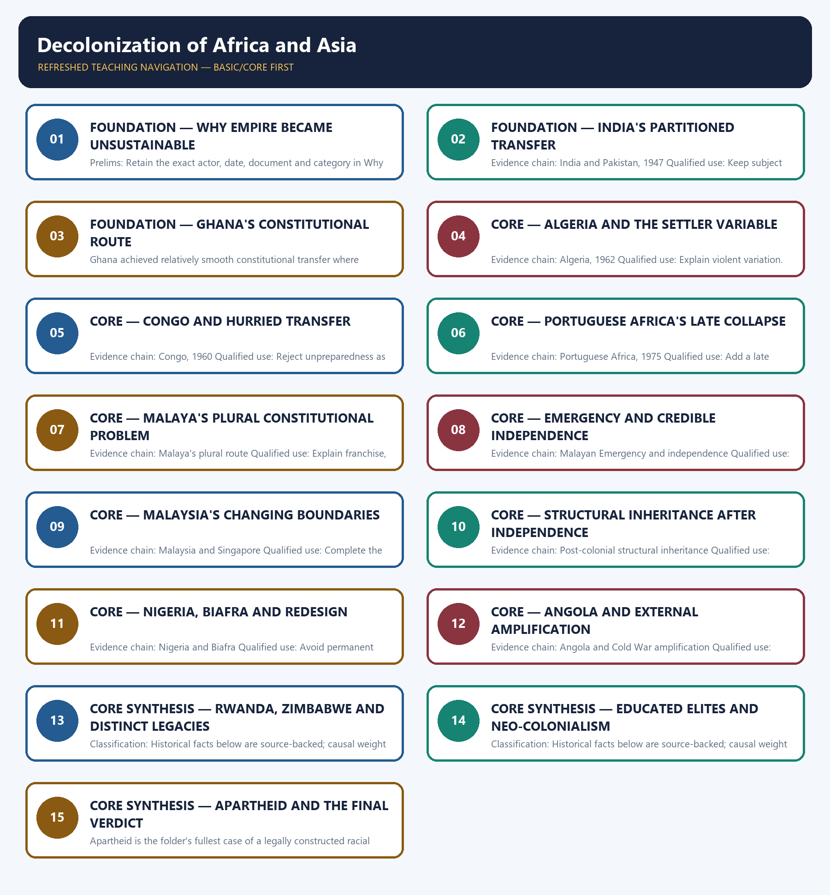

# Decolonization of Africa and Asia — Learner-v2 Complete Learning Session

> **Authoring-only generation:** 2026-09-01. No PDF was rendered and no tracker or index was mutated.

### SOURCE, PROGRESSION AND CURRENT-LINKAGE AUDIT

- **Generation date:** 2026-09-01.
- **Repository-first evidence:** the Basic owner is taught first and preserved in full; the Advanced owner is retained only in the optional final teaching block.
- **OCR evidence:** Repository Markdown was used first. The available OCR-searchable Norman Lowe World History PDF was retained as supplementary local context, but no unsupported page number, quotation or precision was imported from it.
- **Qdrant:** not used; repository Markdown and available OCR context were sufficient.
- **PYQ integrity:** The owner records two pre-2018 GS-I demands in neutral rendering only: the distinctive problems of Malayan decolonisation and the role of Western-educated Africans in West African nationalism. No verbatim 2015 or 2016 wording is held locally.
- **Live-link boundary:** Official UN coverage of the 2026 Special Committee on Decolonization session records 17 remaining Non-Self-Governing Territories and the continuing legacy of colonialism. The C-24 approved three draft resolutions concerning information dissemination, information from administering Powers, and visiting or special missions. This supplies a narrow link to decolonization as unfinished UN business; these remaining territories must not be conflated with the historical mass decolonization of Africa and Asia.
- **Fact/inference discipline:** no current-affairs item, PYQ wording, figure or quotation is invented.

## BASIC LEARNING SESSION



*Distinct embedded teaching-navigation image. The separate continuous Cārvāka-style flowchart package remains an independent at-a-glance artifact.*

### SESSION 1 — FOUNDATION — WHY EMPIRE BECAME UNSUSTAINABLE

#### DEFINITION / WHAT THIS IS CALLED

**Plain-language definition:** Precise definition: Why empire became unsustainable is the source-bounded relationship among European exhaustion after 1945, Nationalist mobilisation, Ideological and international climate and Cost-of-repression mechanism within Decolonization of Africa and Asia.

**Technical definition:** Prelims: Retain the exact actor, date, document and category in Why empire became unsustainable.

#### ANSWER-GRABBING OPENING — WRITE/ADAPT IN THE EXAM

> Precise definition: Why empire became unsustainable is the source-bounded relationship among European exhaustion after 1945, Nationalist mobilisation, Ideological and international climate and Cost-of-repression mechanism within Decolonization of Africa and Asia.

#### MUST-WRITE KEYWORDS

- **FOUNDATION**
- **Why empire became unsustainable**
- **Precise definition**
- **Evidence chain**
- **Qualified use**
- **Precise**

**How to use them:** Frame the answer through FOUNDATION; define Why empire became unsustainable, connect Precise definition with Evidence chain to explain the mechanism, and use Qualified use for the decisive comparison or qualification.

##### VISUAL FIRST

```text
WHY EMPIRE BECAME UNSUSTAINABLE
01. European exhaustion after 1945
    |
    v
02. Nationalist mobilisation
    |
    v
03. Ideological and international climate
    |
    v
04. Cost-of-repression mechanism
BOUNDARY -> Causes interact through the cost-of-repression mechanism.
```

*This topic-specific rail fixes the evidence sequence and its exam boundary before analysis.*

##### CONCEPT DEFINITIONS

- **Precise definition:** Why empire became unsustainable is the source-bounded relationship among European exhaustion after 1945, Nationalist mobilisation, Ideological and international climate and Cost-of-repression mechanism within Decolonization of Africa and Asia.
- **Classification:** Historical facts below are source-backed; causal weight and evaluative verdicts are analytical synthesis.

##### CORE EXPLANATION

War weakened European finances, coercive capacity and confidence, reducing the supply of imperial repression. Colonial elites, workers, soldiers and peasants raised the political and coercive cost of continued foreign rule. Anti-fascist rhetoric, self-determination, Japanese victories, the United Nations and superpower pressure weakened empire's legitimacy. Empire ended where nationalist resistance made the cost of holding territory exceed the benefit metropolitan publics would bear.

##### NAMED EVIDENCE AND MECHANISM

- War weakened European finances, coercive capacity and confidence, reducing the supply of imperial repression.
- Colonial elites, workers, soldiers and peasants raised the political and coercive cost of continued foreign rule.
- Anti-fascist rhetoric, self-determination, Japanese victories, the United Nations and superpower pressure weakened empire's legitimacy.
- Empire ended where nationalist resistance made the cost of holding territory exceed the benefit metropolitan publics would bear.

##### EXAMINER CAUTION

- Causes interact through the cost-of-repression mechanism.

##### EXAM LINK

- **Prelims:** Retain the exact actor, date, document and category in Why empire became unsustainable.
- **Mains:** Build a causal argument, not a list.

##### MINI RECAP

- **Evidence chain:** European exhaustion after 1945 -> Nationalist mobilisation -> Ideological and international climate -> Cost-of-repression mechanism
- **Qualified use:** Build a causal argument, not a list.

#### CLOSING RECALL FLOW — FOUNDATION — WHY EMPIRE BECAME UNSUSTAINABLE

```text
START / CONCEPT: FOUNDATION — Why empire became unsustainable
        |
        v
EXACT TERMS: FOUNDATION · Why empire became unsustainable · Precise definition · Evidence chain · Qualified use · Precise
        |
        v
MECHANISM / ARGUMENT: Prelims: Retain the exact actor, date, document and category in Why empire became unsustainable.
        |
        v
CONSEQUENCE / CONTRAST: Evidence chain: European exhaustion after 1945 - Nationalist mobilisation - Ideological and international climate - Cost-of-repression mechanism Qualified use: Build a causal argument, not a list.
        |
        v
UPSC TRAP / ANSWER-USE: Mains: Build a causal argument, not a list.
        |
        v
ANSWER-GRABBING FORMULATION: Precise definition: Why empire became unsustainable is the source-bounded relationship among European exhaustion after 1945, Nationalist mobilisation, Ideological and international climate and Cost-of-repression mechanism within Decolonization of Africa and Asia.
```
### SESSION 2 — FOUNDATION — INDIA'S PARTITIONED TRANSFER

#### DEFINITION / WHAT THIS IS CALLED

**Plain-language definition:** Precise definition: India's partitioned transfer is the source-bounded relationship among and India and Pakistan, 1947 within Decolonization of Africa and Asia.

**Technical definition:** Evidence chain: India and Pakistan, 1947 Qualified use: Keep subject ownership clean.

#### ANSWER-GRABBING OPENING — WRITE/ADAPT IN THE EXAM

> Precise definition: India's partitioned transfer is the source-bounded relationship among and India and Pakistan, 1947 within Decolonization of Africa and Asia.

#### MUST-WRITE KEYWORDS

- **FOUNDATION**
- **India's partitioned transfer**
- **Precise definition**
- **Evidence chain**
- **Qualified use**
- **Precise definition: India's partitioned transfer**

**How to use them:** Frame the answer through FOUNDATION; define India's partitioned transfer, connect Precise definition with Evidence chain to explain the mechanism, and use Qualified use for the decisive comparison or qualification.

##### VISUAL FIRST

```text
INDIA'S PARTITIONED TRANSFER
01. India and Pakistan, 1947
BOUNDARY -> Use only as a comparative route.
```

*This topic-specific rail fixes the evidence sequence and its exam boundary before analysis.*

##### CONCEPT DEFINITIONS

- **Precise definition:** India's partitioned transfer is the source-bounded relationship among  and India and Pakistan, 1947 within Decolonization of Africa and Asia.
- **Classification:** Historical facts below are source-backed; causal weight and evaluative verdicts are analytical synthesis.

##### CORE EXPLANATION

British withdrawal transferred power through partition; the Indian detail remains owned by Modern Indian History.

##### NAMED EVIDENCE AND MECHANISM

- British withdrawal transferred power through partition; the Indian detail remains owned by Modern Indian History.

##### EXAMINER CAUTION

- Use only as a comparative route.

##### EXAM LINK

- **Prelims:** Retain the exact actor, date, document and category in India's partitioned transfer.
- **Mains:** Keep subject ownership clean.

##### MINI RECAP

- **Evidence chain:** India and Pakistan, 1947
- **Qualified use:** Keep subject ownership clean.

#### CLOSING RECALL FLOW — FOUNDATION — INDIA'S PARTITIONED TRANSFER

```text
START / CONCEPT: FOUNDATION — India's partitioned transfer
        |
        v
EXACT TERMS: FOUNDATION · India's partitioned transfer · Precise definition · Evidence chain · Qualified use · Precise definition: India's partitioned transfer
        |
        v
MECHANISM / ARGUMENT: British withdrawal transferred power through partition; the Indian detail remains owned by Modern Indian History.
        |
        v
CONSEQUENCE / CONTRAST: Evidence chain: India and Pakistan, 1947 Qualified use: Keep subject ownership clean.
        |
        v
UPSC TRAP / ANSWER-USE: Do not miss this limiting distinction: causal weight and evaluative verdicts are analytical synthesis.
        |
        v
ANSWER-GRABBING FORMULATION: Precise definition: India's partitioned transfer is the source-bounded relationship among and India and Pakistan, 1947 within Decolonization of Africa and Asia.
```
### SESSION 3 — FOUNDATION — GHANA'S CONSTITUTIONAL ROUTE

#### DEFINITION / WHAT THIS IS CALLED

**Plain-language definition:** Precise definition: Ghana's constitutional route is the source-bounded relationship among and Ghana, 1957 within Decolonization of Africa and Asia.

**Technical definition:** Ghana achieved relatively smooth constitutional transfer where settlers were few, yet commodity dependence and later political closure produced strain and a 1966 coup.

#### ANSWER-GRABBING OPENING — WRITE/ADAPT IN THE EXAM

> Precise definition: Ghana's constitutional route is the source-bounded relationship among and Ghana, 1957 within Decolonization of Africa and Asia.

#### MUST-WRITE KEYWORDS

- **FOUNDATION**
- **Ghana's constitutional route**
- **Precise definition**
- **Evidence chain**
- **Qualified use**
- **Precise definition: Ghana's constitutional route**

**How to use them:** Frame the answer through FOUNDATION; define Ghana's constitutional route, connect Precise definition with Evidence chain to explain the mechanism, and use Qualified use for the decisive comparison or qualification.

##### VISUAL FIRST

```text
GHANA'S CONSTITUTIONAL ROUTE
01. Ghana, 1957
BOUNDARY -> Preparation did not guarantee economic or democratic stability.
```

*This topic-specific rail fixes the evidence sequence and its exam boundary before analysis.*

##### CONCEPT DEFINITIONS

- **Precise definition:** Ghana's constitutional route is the source-bounded relationship among  and Ghana, 1957 within Decolonization of Africa and Asia.
- **Classification:** Historical facts below are source-backed; causal weight and evaluative verdicts are analytical synthesis.

##### CORE EXPLANATION

Ghana achieved relatively smooth constitutional transfer where settlers were few, yet commodity dependence and later political closure produced strain and a 1966 coup.

##### NAMED EVIDENCE AND MECHANISM

- Ghana achieved relatively smooth constitutional transfer where settlers were few, yet commodity dependence and later political closure produced strain and a 1966 coup.

##### EXAMINER CAUTION

- Preparation did not guarantee economic or democratic stability.

##### EXAM LINK

- **Prelims:** Retain the exact actor, date, document and category in Ghana's constitutional route.
- **Mains:** Separate transfer from state-building.

##### MINI RECAP

- **Evidence chain:** Ghana, 1957
- **Qualified use:** Separate transfer from state-building.

#### CLOSING RECALL FLOW — FOUNDATION — GHANA'S CONSTITUTIONAL ROUTE

```text
START / CONCEPT: FOUNDATION — Ghana's constitutional route
        |
        v
EXACT TERMS: FOUNDATION · Ghana's constitutional route · Precise definition · Evidence chain · Qualified use · Precise definition: Ghana's constitutional route
        |
        v
MECHANISM / ARGUMENT: Ghana achieved relatively smooth constitutional transfer where settlers were few, yet commodity dependence and later political closure produced strain and a 1966 coup.
        |
        v
CONSEQUENCE / CONTRAST: Evidence chain: Ghana, 1957 Qualified use: Separate transfer from state-building.
        |
        v
UPSC TRAP / ANSWER-USE: Do not miss this limiting distinction: causal weight and evaluative verdicts are analytical synthesis.
        |
        v
ANSWER-GRABBING FORMULATION: Precise definition: Ghana's constitutional route is the source-bounded relationship among and Ghana, 1957 within Decolonization of Africa and Asia.
```
### SESSION 4 — CORE — ALGERIA AND THE SETTLER VARIABLE

#### DEFINITION / WHAT THIS IS CALLED

**Plain-language definition:** Precise definition: Algeria and the settler variable is the source-bounded relationship among and Algeria, 1962 within Decolonization of Africa and Asia.

**Technical definition:** Evidence chain: Algeria, 1962 Qualified use: Explain violent variation.

#### ANSWER-GRABBING OPENING — WRITE/ADAPT IN THE EXAM

> Precise definition: Algeria and the settler variable is the source-bounded relationship among and Algeria, 1962 within Decolonization of Africa and Asia.

#### MUST-WRITE KEYWORDS

- **Algeria**
- **the settler variable**
- **Precise definition**
- **Evidence chain**
- **Qualified use**
- **Precise definition: Algeria and the settler variable**

**How to use them:** Frame the answer through Algeria; define the settler variable, connect Precise definition with Evidence chain to explain the mechanism, and use Qualified use for the decisive comparison or qualification.

##### VISUAL FIRST

```text
ALGERIA AND THE SETTLER VARIABLE
01. Algeria, 1962
BOUNDARY -> Settler property made withdrawal harder to negotiate.
```

*This topic-specific rail fixes the evidence sequence and its exam boundary before analysis.*

##### CONCEPT DEFINITIONS

- **Precise definition:** Algeria and the settler variable is the source-bounded relationship among  and Algeria, 1962 within Decolonization of Africa and Asia.
- **Classification:** Historical facts below are source-backed; causal weight and evaluative verdicts are analytical synthesis.

##### CORE EXPLANATION

A large settler population and metropolitan stakes made French withdrawal prolonged and violent.

##### NAMED EVIDENCE AND MECHANISM

- A large settler population and metropolitan stakes made French withdrawal prolonged and violent.

##### EXAMINER CAUTION

- Settler property made withdrawal harder to negotiate.

##### EXAM LINK

- **Prelims:** Retain the exact actor, date, document and category in Algeria and the settler variable.
- **Mains:** Explain violent variation.

##### MINI RECAP

- **Evidence chain:** Algeria, 1962
- **Qualified use:** Explain violent variation.

#### CLOSING RECALL FLOW — CORE — ALGERIA AND THE SETTLER VARIABLE

```text
START / CONCEPT: CORE — Algeria and the settler variable
        |
        v
EXACT TERMS: Algeria · the settler variable · Precise definition · Evidence chain · Qualified use · Precise definition: Algeria and the settler variable
        |
        v
MECHANISM / ARGUMENT: Evidence chain: Algeria, 1962 Qualified use: Explain violent variation.
        |
        v
CONSEQUENCE / CONTRAST: Classification: Historical facts below are source-backed; causal weight and evaluative verdicts are analytical synthesis.
        |
        v
UPSC TRAP / ANSWER-USE: Do not miss this limiting distinction: algeria and the settler variable is the source-bounded relationship among and Algeria, 1962 within...
        |
        v
ANSWER-GRABBING FORMULATION: Precise definition: Algeria and the settler variable is the source-bounded relationship among and Algeria, 1962 within Decolonization of Africa and Asia.
```
### SESSION 5 — CORE — CONGO AND HURRIED TRANSFER

#### DEFINITION / WHAT THIS IS CALLED

**Plain-language definition:** Precise definition: Congo and hurried transfer is the source-bounded relationship among and Congo, 1960 within Decolonization of Africa and Asia.

**Technical definition:** Evidence chain: Congo, 1960 Qualified use: Reject unpreparedness as a civilisational claim.

#### ANSWER-GRABBING OPENING — WRITE/ADAPT IN THE EXAM

> Precise definition: Congo and hurried transfer is the source-bounded relationship among and Congo, 1960 within Decolonization of Africa and Asia.

#### MUST-WRITE KEYWORDS

- **Congo**
- **hurried transfer**
- **Precise definition**
- **Evidence chain**
- **Qualified use**
- **Precise definition: Congo and hurried transfer**

**How to use them:** Frame the answer through Congo; define hurried transfer, connect Precise definition with Evidence chain to explain the mechanism, and use Qualified use for the decisive comparison or qualification.

##### VISUAL FIRST

```text
CONGO AND HURRIED TRANSFER
01. Congo, 1960
BOUNDARY -> Administrative scarcity, resources and intervention interacted.
```

*This topic-specific rail fixes the evidence sequence and its exam boundary before analysis.*

##### CONCEPT DEFINITIONS

- **Precise definition:** Congo and hurried transfer is the source-bounded relationship among  and Congo, 1960 within Decolonization of Africa and Asia.
- **Classification:** Historical facts below are source-backed; causal weight and evaluative verdicts are analytical synthesis.

##### CORE EXPLANATION

Belgium transferred power abruptly with only seventeen graduates, while Katanga secession, resource politics, Cold War intervention and UN deployment destabilised the state.

##### NAMED EVIDENCE AND MECHANISM

- Belgium transferred power abruptly with only seventeen graduates, while Katanga secession, resource politics, Cold War intervention and UN deployment destabilised the state.

##### EXAMINER CAUTION

- Administrative scarcity, resources and intervention interacted.

##### EXAM LINK

- **Prelims:** Retain the exact actor, date, document and category in Congo and hurried transfer.
- **Mains:** Reject unpreparedness as a civilisational claim.

##### MINI RECAP

- **Evidence chain:** Congo, 1960
- **Qualified use:** Reject unpreparedness as a civilisational claim.

#### CLOSING RECALL FLOW — CORE — CONGO AND HURRIED TRANSFER

```text
START / CONCEPT: CORE — Congo and hurried transfer
        |
        v
EXACT TERMS: Congo · hurried transfer · Precise definition · Evidence chain · Qualified use · Precise definition: Congo and hurried transfer
        |
        v
MECHANISM / ARGUMENT: Evidence chain: Congo, 1960 Qualified use: Reject unpreparedness as a civilisational claim.
        |
        v
CONSEQUENCE / CONTRAST: Classification: Historical facts below are source-backed; causal weight and evaluative verdicts are analytical synthesis.
        |
        v
UPSC TRAP / ANSWER-USE: Do not miss this limiting distinction: congo and hurried transfer is the source-bounded relationship among and Congo, 1960 within Decolonization...
        |
        v
ANSWER-GRABBING FORMULATION: Precise definition: Congo and hurried transfer is the source-bounded relationship among and Congo, 1960 within Decolonization of Africa and Asia.
```
### SESSION 6 — CORE — PORTUGUESE AFRICA'S LATE COLLAPSE

#### DEFINITION / WHAT THIS IS CALLED

**Plain-language definition:** Precise definition: Portuguese Africa's late collapse is the source-bounded relationship among and Portuguese Africa, 1975 within Decolonization of Africa and Asia.

**Technical definition:** Evidence chain: Portuguese Africa, 1975 Qualified use: Add a late imperial route.

#### ANSWER-GRABBING OPENING — WRITE/ADAPT IN THE EXAM

> Precise definition: Portuguese Africa's late collapse is the source-bounded relationship among and Portuguese Africa, 1975 within Decolonization of Africa and Asia.

#### MUST-WRITE KEYWORDS

- **Portuguese Africa's late collapse**
- **Precise definition**
- **Evidence chain**
- **Qualified use**
- **Precise definition: Portuguese Africa's late collapse**
- **Precise**

**How to use them:** Frame the answer through Portuguese Africa's late collapse; define Precise definition, connect Evidence chain with Qualified use to explain the mechanism, and use Precise definition: Portuguese Africa's late collapse for the decisive comparison or qualification.

##### VISUAL FIRST

```text
PORTUGUESE AFRICA'S LATE COLLAPSE
01. Portuguese Africa, 1975
BOUNDARY -> Rapid exit followed metropolitan regime change.
```

*This topic-specific rail fixes the evidence sequence and its exam boundary before analysis.*

##### CONCEPT DEFINITIONS

- **Precise definition:** Portuguese Africa's late collapse is the source-bounded relationship among  and Portuguese Africa, 1975 within Decolonization of Africa and Asia.
- **Classification:** Historical facts below are source-backed; causal weight and evaluative verdicts are analytical synthesis.

##### CORE EXPLANATION

Authoritarian Portugal's late imperial collapse produced rapid independence in Angola and Mozambique.

##### NAMED EVIDENCE AND MECHANISM

- Authoritarian Portugal's late imperial collapse produced rapid independence in Angola and Mozambique.

##### EXAMINER CAUTION

- Rapid exit followed metropolitan regime change.

##### EXAM LINK

- **Prelims:** Retain the exact actor, date, document and category in Portuguese Africa's late collapse.
- **Mains:** Add a late imperial route.

##### MINI RECAP

- **Evidence chain:** Portuguese Africa, 1975
- **Qualified use:** Add a late imperial route.

#### CLOSING RECALL FLOW — CORE — PORTUGUESE AFRICA'S LATE COLLAPSE

```text
START / CONCEPT: CORE — Portuguese Africa's late collapse
        |
        v
EXACT TERMS: Portuguese Africa's late collapse · Precise definition · Evidence chain · Qualified use · Precise definition: Portuguese Africa's late collapse · Precise
        |
        v
MECHANISM / ARGUMENT: Evidence chain: Portuguese Africa, 1975 Qualified use: Add a late imperial route.
        |
        v
CONSEQUENCE / CONTRAST: Classification: Historical facts below are source-backed; causal weight and evaluative verdicts are analytical synthesis.
        |
        v
UPSC TRAP / ANSWER-USE: Do not miss this limiting distinction: rapid exit followed metropolitan regime change.
        |
        v
ANSWER-GRABBING FORMULATION: Precise definition: Portuguese Africa's late collapse is the source-bounded relationship among and Portuguese Africa, 1975 within Decolonization of Africa and Asia.
```
### SESSION 7 — CORE — MALAYA'S PLURAL CONSTITUTIONAL PROBLEM

#### DEFINITION / WHAT THIS IS CALLED

**Plain-language definition:** Precise definition: Malaya's plural constitutional problem is the source-bounded relationship among and Malaya's plural route within Decolonization of Africa and Asia.

**Technical definition:** Evidence chain: Malaya's plural route Qualified use: Explain franchise, sultanates and Singapore.

#### ANSWER-GRABBING OPENING — WRITE/ADAPT IN THE EXAM

> Precise definition: Malaya's plural constitutional problem is the source-bounded relationship among and Malaya's plural route within Decolonization of Africa and Asia.

#### MUST-WRITE KEYWORDS

- **Malaya's plural constitutional problem**
- **Precise definition**
- **Evidence chain**
- **Qualified use**
- **Precise definition: Malaya's plural constitutional problem**
- **Precise**

**How to use them:** Frame the answer through Malaya's plural constitutional problem; define Precise definition, connect Evidence chain with Qualified use to explain the mechanism, and use Precise definition: Malaya's plural constitutional problem for the decisive comparison or qualification.

##### VISUAL FIRST

```text
MALAYA'S PLURAL CONSTITUTIONAL PROBLEM
01. Malaya's plural route
BOUNDARY -> The successor state had to be constructed.
```

*This topic-specific rail fixes the evidence sequence and its exam boundary before analysis.*

##### CONCEPT DEFINITIONS

- **Precise definition:** Malaya's plural constitutional problem is the source-bounded relationship among  and Malaya's plural route within Decolonization of Africa and Asia.
- **Classification:** Historical facts below are source-backed; causal weight and evaluative verdicts are analytical synthesis.

##### CORE EXPLANATION

The Federation of Malaya joined nine sultanates and two settlements in 1948 while Singapore remained separate, making franchise and state shape central questions.

##### NAMED EVIDENCE AND MECHANISM

- The Federation of Malaya joined nine sultanates and two settlements in 1948 while Singapore remained separate, making franchise and state shape central questions.

##### EXAMINER CAUTION

- The successor state had to be constructed.

##### EXAM LINK

- **Prelims:** Retain the exact actor, date, document and category in Malaya's plural constitutional problem.
- **Mains:** Explain franchise, sultanates and Singapore.

##### MINI RECAP

- **Evidence chain:** Malaya's plural route
- **Qualified use:** Explain franchise, sultanates and Singapore.

#### CLOSING RECALL FLOW — CORE — MALAYA'S PLURAL CONSTITUTIONAL PROBLEM

```text
START / CONCEPT: CORE — Malaya's plural constitutional problem
        |
        v
EXACT TERMS: Malaya's plural constitutional problem · Precise definition · Evidence chain · Qualified use · Precise definition: Malaya's plural constitutional problem · Precise
        |
        v
MECHANISM / ARGUMENT: Evidence chain: Malaya's plural route Qualified use: Explain franchise, sultanates and Singapore.
        |
        v
CONSEQUENCE / CONTRAST: Classification: Historical facts below are source-backed; causal weight and evaluative verdicts are analytical synthesis.
        |
        v
UPSC TRAP / ANSWER-USE: Do not miss this limiting distinction: the successor state had to be constructed.
        |
        v
ANSWER-GRABBING FORMULATION: Precise definition: Malaya's plural constitutional problem is the source-bounded relationship among and Malaya's plural route within Decolonization of Africa and Asia.
```
### SESSION 8 — CORE — EMERGENCY AND CREDIBLE INDEPENDENCE

#### DEFINITION / WHAT THIS IS CALLED

**Plain-language definition:** Precise definition: Emergency and credible independence is the source-bounded relationship among and Malayan Emergency and independence within Decolonization of Africa and Asia.

**Technical definition:** Evidence chain: Malayan Emergency and independence Qualified use: Show coercion plus concession.

#### ANSWER-GRABBING OPENING — WRITE/ADAPT IN THE EXAM

> Precise definition: Emergency and credible independence is the source-bounded relationship among and Malayan Emergency and independence within Decolonization of Africa and Asia.

#### MUST-WRITE KEYWORDS

- **Emergency**
- **credible independence**
- **Precise definition**
- **Evidence chain**
- **Qualified use**
- **1948-60**

**How to use them:** Frame the answer through Emergency; define credible independence, connect Precise definition with Evidence chain to explain the mechanism, and use Qualified use for the decisive comparison or qualification.

##### VISUAL FIRST

```text
EMERGENCY AND CREDIBLE INDEPENDENCE
01. Malayan Emergency and independence
BOUNDARY -> Counter-insurgency worked with a political timetable.
```

*This topic-specific rail fixes the evidence sequence and its exam boundary before analysis.*

##### CONCEPT DEFINITIONS

- **Precise definition:** Emergency and credible independence is the source-bounded relationship among  and Malayan Emergency and independence within Decolonization of Africa and Asia.
- **Classification:** Historical facts below are source-backed; causal weight and evaluative verdicts are analytical synthesis.

##### CORE EXPLANATION

The 1948-60 Emergency combined resettlement with a credible independence promise; an inter-communal Alliance victory in 1955 preceded independence in 1957.

##### NAMED EVIDENCE AND MECHANISM

- The 1948-60 Emergency combined resettlement with a credible independence promise; an inter-communal Alliance victory in 1955 preceded independence in 1957.

##### EXAMINER CAUTION

- Counter-insurgency worked with a political timetable.

##### EXAM LINK

- **Prelims:** Retain the exact actor, date, document and category in Emergency and credible independence.
- **Mains:** Show coercion plus concession.

##### MINI RECAP

- **Evidence chain:** Malayan Emergency and independence
- **Qualified use:** Show coercion plus concession.

#### CLOSING RECALL FLOW — CORE — EMERGENCY AND CREDIBLE INDEPENDENCE

```text
START / CONCEPT: CORE — Emergency and credible independence
        |
        v
EXACT TERMS: Emergency · credible independence · Precise definition · Evidence chain · Qualified use · 1948-60
        |
        v
MECHANISM / ARGUMENT: Evidence chain: Malayan Emergency and independence Qualified use: Show coercion plus concession.
        |
        v
CONSEQUENCE / CONTRAST: Classification: Historical facts below are source-backed; causal weight and evaluative verdicts are analytical synthesis.
        |
        v
UPSC TRAP / ANSWER-USE: Do not miss this limiting distinction: emergency and credible independence is the source-bounded relationship among and Malayan Emergency and independence...
        |
        v
ANSWER-GRABBING FORMULATION: Precise definition: Emergency and credible independence is the source-bounded relationship among and Malayan Emergency and independence within Decolonization of Africa and Asia.
```
### SESSION 9 — CORE — MALAYSIA'S CHANGING BOUNDARIES

#### DEFINITION / WHAT THIS IS CALLED

**Plain-language definition:** Precise definition: Malaysia's changing boundaries is the source-bounded relationship among and Malaysia and Singapore within Decolonization of Africa and Asia.

**Technical definition:** Evidence chain: Malaysia and Singapore Qualified use: Complete the federation sequence.

#### ANSWER-GRABBING OPENING — WRITE/ADAPT IN THE EXAM

> Precise definition: Malaysia's changing boundaries is the source-bounded relationship among and Malaysia and Singapore within Decolonization of Africa and Asia.

#### MUST-WRITE KEYWORDS

- **Malaysia's changing boundaries**
- **Precise definition**
- **Evidence chain**
- **Qualified use**
- **Precise definition: Malaysia's changing boundaries**
- **Precise**

**How to use them:** Frame the answer through Malaysia's changing boundaries; define Precise definition, connect Evidence chain with Qualified use to explain the mechanism, and use Precise definition: Malaysia's changing boundaries for the decisive comparison or qualification.

##### VISUAL FIRST

```text
MALAYSIA'S CHANGING BOUNDARIES
01. Malaysia and Singapore
BOUNDARY -> State shape remained contested after independence.
```

*This topic-specific rail fixes the evidence sequence and its exam boundary before analysis.*

##### CONCEPT DEFINITIONS

- **Precise definition:** Malaysia's changing boundaries is the source-bounded relationship among  and Malaysia and Singapore within Decolonization of Africa and Asia.
- **Classification:** Historical facts below are source-backed; causal weight and evaluative verdicts are analytical synthesis.

##### CORE EXPLANATION

Malaysia was proclaimed in 1963 after a UN investigation; Brunei did not join and Singapore became separate in 1965.

##### NAMED EVIDENCE AND MECHANISM

- Malaysia was proclaimed in 1963 after a UN investigation; Brunei did not join and Singapore became separate in 1965.

##### EXAMINER CAUTION

- State shape remained contested after independence.

##### EXAM LINK

- **Prelims:** Retain the exact actor, date, document and category in Malaysia's changing boundaries.
- **Mains:** Complete the federation sequence.

##### MINI RECAP

- **Evidence chain:** Malaysia and Singapore
- **Qualified use:** Complete the federation sequence.

#### CLOSING RECALL FLOW — CORE — MALAYSIA'S CHANGING BOUNDARIES

```text
START / CONCEPT: CORE — Malaysia's changing boundaries
        |
        v
EXACT TERMS: Malaysia's changing boundaries · Precise definition · Evidence chain · Qualified use · Precise definition: Malaysia's changing boundaries · Precise
        |
        v
MECHANISM / ARGUMENT: Evidence chain: Malaysia and Singapore Qualified use: Complete the federation sequence.
        |
        v
CONSEQUENCE / CONTRAST: Malaysia was proclaimed in 1963 after a UN investigation; Brunei did not join and Singapore became separate in 1965.
        |
        v
UPSC TRAP / ANSWER-USE: Do not miss this limiting distinction: causal weight and evaluative verdicts are analytical synthesis.
        |
        v
ANSWER-GRABBING FORMULATION: Precise definition: Malaysia's changing boundaries is the source-bounded relationship among and Malaysia and Singapore within Decolonization of Africa and Asia.
```
### SESSION 10 — CORE — STRUCTURAL INHERITANCE AFTER INDEPENDENCE

#### DEFINITION / WHAT THIS IS CALLED

**Plain-language definition:** Precise definition: Structural inheritance after independence is the source-bounded relationship among and Post-colonial structural inheritance within Decolonization of Africa and Asia.

**Technical definition:** Evidence chain: Post-colonial structural inheritance Qualified use: Move from empire to state-building.

#### ANSWER-GRABBING OPENING — WRITE/ADAPT IN THE EXAM

> Precise definition: Structural inheritance after independence is the source-bounded relationship among and Post-colonial structural inheritance within Decolonization of Africa and Asia.

#### MUST-WRITE KEYWORDS

- **Structural inheritance after independence**
- **Precise definition**
- **Evidence chain**
- **Qualified use**
- **Precise definition: Structural inheritance after independence**
- **Precise**

**How to use them:** Frame the answer through Structural inheritance after independence; define Precise definition, connect Evidence chain with Qualified use to explain the mechanism, and use Precise definition: Structural inheritance after independence for the decisive comparison or qualification.

##### VISUAL FIRST

```text
STRUCTURAL INHERITANCE AFTER INDEPENDENCE
01. Post-colonial structural inheritance
BOUNDARY -> Constraints are inherited mechanisms, not cultural defects.
```

*This topic-specific rail fixes the evidence sequence and its exam boundary before analysis.*

##### CONCEPT DEFINITIONS

- **Precise definition:** Structural inheritance after independence is the source-bounded relationship among  and Post-colonial structural inheritance within Decolonization of Africa and Asia.
- **Classification:** Historical facts below are source-backed; causal weight and evaluative verdicts are analytical synthesis.

##### CORE EXPLANATION

Colonial borders, narrow administration, mono-export economies, army-elite rivalry and Cold War intervention constrained new states.

##### NAMED EVIDENCE AND MECHANISM

- Colonial borders, narrow administration, mono-export economies, army-elite rivalry and Cold War intervention constrained new states.

##### EXAMINER CAUTION

- Constraints are inherited mechanisms, not cultural defects.

##### EXAM LINK

- **Prelims:** Retain the exact actor, date, document and category in Structural inheritance after independence.
- **Mains:** Move from empire to state-building.

##### MINI RECAP

- **Evidence chain:** Post-colonial structural inheritance
- **Qualified use:** Move from empire to state-building.

#### CLOSING RECALL FLOW — CORE — STRUCTURAL INHERITANCE AFTER INDEPENDENCE

```text
START / CONCEPT: CORE — Structural inheritance after independence
        |
        v
EXACT TERMS: Structural inheritance after independence · Precise definition · Evidence chain · Qualified use · Precise definition: Structural inheritance after independence · Precise
        |
        v
MECHANISM / ARGUMENT: Evidence chain: Post-colonial structural inheritance Qualified use: Move from empire to state-building.
        |
        v
CONSEQUENCE / CONTRAST: Constraints are inherited mechanisms, not cultural defects.
        |
        v
UPSC TRAP / ANSWER-USE: Do not miss this limiting distinction: causal weight and evaluative verdicts are analytical synthesis.
        |
        v
ANSWER-GRABBING FORMULATION: Precise definition: Structural inheritance after independence is the source-bounded relationship among and Post-colonial structural inheritance within Decolonization of Africa and Asia.
```
### SESSION 11 — CORE — NIGERIA, BIAFRA AND REDESIGN

#### DEFINITION / WHAT THIS IS CALLED

**Plain-language definition:** Precise definition: Nigeria, Biafra and redesign is the source-bounded relationship among and Nigeria and Biafra within Decolonization of Africa and Asia.

**Technical definition:** Evidence chain: Nigeria and Biafra Qualified use: Avoid permanent ethnic determinism.

#### ANSWER-GRABBING OPENING — WRITE/ADAPT IN THE EXAM

> Precise definition: Nigeria, Biafra and redesign is the source-bounded relationship among and Nigeria and Biafra within Decolonization of Africa and Asia.

#### MUST-WRITE KEYWORDS

- **Nigeria**
- **Biafra**
- **redesign**
- **Precise definition**
- **Evidence chain**
- **Qualified use**

**How to use them:** Frame the answer through Nigeria; define Biafra, connect redesign with Precise definition to explain the mechanism, and use Evidence chain for the decisive comparison or qualification.

##### VISUAL FIRST

```text
NIGERIA, BIAFRA AND REDESIGN
01. Nigeria and Biafra
BOUNDARY -> Include postwar reconciliation as counter-evidence.
```

*This topic-specific rail fixes the evidence sequence and its exam boundary before analysis.*

##### CONCEPT DEFINITIONS

- **Precise definition:** Nigeria, Biafra and redesign is the source-bounded relationship among  and Nigeria and Biafra within Decolonization of Africa and Asia.
- **Classification:** Historical facts below are source-backed; causal weight and evaluative verdicts are analytical synthesis.

##### CORE EXPLANATION

A 1966 coup, anti-Igbo massacres and Biafran secession in 1967 produced war until January 1970, followed by reconciliation and federal redesign.

##### NAMED EVIDENCE AND MECHANISM

- A 1966 coup, anti-Igbo massacres and Biafran secession in 1967 produced war until January 1970, followed by reconciliation and federal redesign.

##### EXAMINER CAUTION

- Include postwar reconciliation as counter-evidence.

##### EXAM LINK

- **Prelims:** Retain the exact actor, date, document and category in Nigeria, Biafra and redesign.
- **Mains:** Avoid permanent ethnic determinism.

##### MINI RECAP

- **Evidence chain:** Nigeria and Biafra
- **Qualified use:** Avoid permanent ethnic determinism.

#### CLOSING RECALL FLOW — CORE — NIGERIA, BIAFRA AND REDESIGN

```text
START / CONCEPT: CORE — Nigeria, Biafra and redesign
        |
        v
EXACT TERMS: Nigeria · Biafra · redesign · Precise definition · Evidence chain · Qualified use
        |
        v
MECHANISM / ARGUMENT: A 1966 coup, anti-Igbo massacres and Biafran secession in 1967 produced war until January 1970, followed by reconciliation and federal redesign.
        |
        v
CONSEQUENCE / CONTRAST: Evidence chain: Nigeria and Biafra Qualified use: Avoid permanent ethnic determinism.
        |
        v
UPSC TRAP / ANSWER-USE: Do not miss this limiting distinction: causal weight and evaluative verdicts are analytical synthesis.
        |
        v
ANSWER-GRABBING FORMULATION: Precise definition: Nigeria, Biafra and redesign is the source-bounded relationship among and Nigeria and Biafra within Decolonization of Africa and Asia.
```
### SESSION 12 — CORE — ANGOLA AND EXTERNAL AMPLIFICATION

#### DEFINITION / WHAT THIS IS CALLED

**Plain-language definition:** Precise definition: Angola and external amplification is the source-bounded relationship among and Angola and Cold War amplification within Decolonization of Africa and Asia.

**Technical definition:** Evidence chain: Angola and Cold War amplification Qualified use: Apply Cold War causation carefully.

#### ANSWER-GRABBING OPENING — WRITE/ADAPT IN THE EXAM

> Precise definition: Angola and external amplification is the source-bounded relationship among and Angola and Cold War amplification within Decolonization of Africa and Asia.

#### MUST-WRITE KEYWORDS

- **Angola**
- **external amplification**
- **Precise definition**
- **Evidence chain**
- **Qualified use**
- **Precise definition: Angola and external amplification**

**How to use them:** Frame the answer through Angola; define external amplification, connect Precise definition with Evidence chain to explain the mechanism, and use Qualified use for the decisive comparison or qualification.

##### VISUAL FIRST

```text
ANGOLA AND EXTERNAL AMPLIFICATION
01. Angola and Cold War amplification
BOUNDARY -> Intervention worsened a conflict it did not originate.
```

*This topic-specific rail fixes the evidence sequence and its exam boundary before analysis.*

##### CONCEPT DEFINITIONS

- **Precise definition:** Angola and external amplification is the source-bounded relationship among  and Angola and Cold War amplification within Decolonization of Africa and Asia.
- **Classification:** Historical facts below are source-backed; causal weight and evaluative verdicts are analytical synthesis.

##### CORE EXPLANATION

MPLA, UNITA and FNLA rivalry after 1975 was intensified by American, Cuban, South African and Zairian intervention; outsiders worsened rather than created the conflict.

##### NAMED EVIDENCE AND MECHANISM

- MPLA, UNITA and FNLA rivalry after 1975 was intensified by American, Cuban, South African and Zairian intervention; outsiders worsened rather than created the conflict.

##### EXAMINER CAUTION

- Intervention worsened a conflict it did not originate.

##### EXAM LINK

- **Prelims:** Retain the exact actor, date, document and category in Angola and external amplification.
- **Mains:** Apply Cold War causation carefully.

##### MINI RECAP

- **Evidence chain:** Angola and Cold War amplification
- **Qualified use:** Apply Cold War causation carefully.

#### CLOSING RECALL FLOW — CORE — ANGOLA AND EXTERNAL AMPLIFICATION

```text
START / CONCEPT: CORE — Angola and external amplification
        |
        v
EXACT TERMS: Angola · external amplification · Precise definition · Evidence chain · Qualified use · Precise definition: Angola and external amplification
        |
        v
MECHANISM / ARGUMENT: Evidence chain: Angola and Cold War amplification Qualified use: Apply Cold War causation carefully.
        |
        v
CONSEQUENCE / CONTRAST: Classification: Historical facts below are source-backed; causal weight and evaluative verdicts are analytical synthesis.
        |
        v
UPSC TRAP / ANSWER-USE: MPLA, UNITA and FNLA rivalry after 1975 was intensified by American, Cuban, South African and Zairian intervention; outsiders worsened rather than created the conflict.
        |
        v
ANSWER-GRABBING FORMULATION: Precise definition: Angola and external amplification is the source-bounded relationship among and Angola and Cold War amplification within Decolonization of Africa and Asia.
```
### SESSION 13 — CORE SYNTHESIS — RWANDA, ZIMBABWE AND DISTINCT LEGACIES

#### DEFINITION / WHAT THIS IS CALLED

**Plain-language definition:** Precise definition: Rwanda, Zimbabwe and distinct legacies is the source-bounded relationship among Rwanda and genocide and Zimbabwe's deferred land question within Decolonization of Africa and Asia.

**Technical definition:** Classification: Historical facts below are source-backed; causal weight and evaluative verdicts are analytical synthesis.

#### ANSWER-GRABBING OPENING — WRITE/ADAPT IN THE EXAM

> Precise definition: Rwanda, Zimbabwe and distinct legacies is the source-bounded relationship among Rwanda and genocide and Zimbabwe's deferred land question within Decolonization of Africa and Asia.

#### MUST-WRITE KEYWORDS

- **CORE SYNTHESIS**
- **Rwanda**
- **Zimbabwe**
- **distinct legacies**
- **Precise definition**
- **Evidence chain**

**How to use them:** Frame the answer through CORE SYNTHESIS; define Rwanda, connect Zimbabwe with distinct legacies to explain the mechanism, and use Precise definition for the decisive comparison or qualification.

##### VISUAL FIRST

```text
RWANDA, ZIMBABWE AND DISTINCT LEGACIES
01. Rwanda and genocide
    |
    v
02. Zimbabwe's deferred land question
BOUNDARY -> Genocide and land crisis are different categories.
```

*This topic-specific rail fixes the evidence sequence and its exam boundary before analysis.*

##### CONCEPT DEFINITIONS

- **Precise definition:** Rwanda, Zimbabwe and distinct legacies is the source-bounded relationship among Rwanda and genocide and Zimbabwe's deferred land question within Decolonization of Africa and Asia.
- **Classification:** Historical facts below are source-backed; causal weight and evaluative verdicts are analytical synthesis.

##### CORE EXPLANATION

Colonial and post-colonial politics hardened Hutu-Tutsi identities; state-backed Interahamwe violence in 1994 murdered about eight hundred thousand Tutsi and moderate Hutu. The 1979 Lancaster House settlement enabled 1980 independence but deferred unequal land ownership, which later became an instrument of political crisis.

##### NAMED EVIDENCE AND MECHANISM

- Colonial and post-colonial politics hardened Hutu-Tutsi identities; state-backed Interahamwe violence in 1994 murdered about eight hundred thousand Tutsi and moderate Hutu.
- The 1979 Lancaster House settlement enabled 1980 independence but deferred unequal land ownership, which later became an instrument of political crisis.

##### EXAMINER CAUTION

- Genocide and land crisis are different categories.

##### EXAM LINK

- **Prelims:** Retain the exact actor, date, document and category in Rwanda, Zimbabwe and distinct legacies.
- **Mains:** Compare identity construction and deferred assets.

##### MINI RECAP

- **Evidence chain:** Rwanda and genocide -> Zimbabwe's deferred land question
- **Qualified use:** Compare identity construction and deferred assets.

#### CLOSING RECALL FLOW — CORE SYNTHESIS — RWANDA, ZIMBABWE AND DISTINCT LEGACIES

```text
START / CONCEPT: CORE SYNTHESIS — Rwanda, Zimbabwe and distinct legacies
        |
        v
EXACT TERMS: CORE SYNTHESIS · Rwanda · Zimbabwe · distinct legacies · Precise definition · Evidence chain
        |
        v
MECHANISM / ARGUMENT: Evidence chain: Rwanda and genocide - Zimbabwe's deferred land question Qualified use: Compare identity construction and deferred assets.
        |
        v
CONSEQUENCE / CONTRAST: The 1979 Lancaster House settlement enabled 1980 independence but deferred unequal land ownership, which later became an instrument of political crisis.
        |
        v
UPSC TRAP / ANSWER-USE: Do not miss this limiting distinction: causal weight and evaluative verdicts are analytical synthesis.
        |
        v
ANSWER-GRABBING FORMULATION: Precise definition: Rwanda, Zimbabwe and distinct legacies is the source-bounded relationship among Rwanda and genocide and Zimbabwe's deferred land question within Decolonization of Africa and Asia.
```
### SESSION 14 — CORE SYNTHESIS — EDUCATED ELITES AND NEO-COLONIALISM

#### DEFINITION / WHAT THIS IS CALLED

**Plain-language definition:** Precise definition: Educated elites and neo-colonialism is the source-bounded relationship among Western-educated African elite and Neo-colonial continuity within Decolonization of Africa and Asia.

**Technical definition:** Classification: Historical facts below are source-backed; causal weight and evaluative verdicts are analytical synthesis.

#### ANSWER-GRABBING OPENING — WRITE/ADAPT IN THE EXAM

> Precise definition: Educated elites and neo-colonialism is the source-bounded relationship among Western-educated African elite and Neo-colonial continuity within Decolonization of Africa and Asia.

#### MUST-WRITE KEYWORDS

- **CORE SYNTHESIS**
- **Educated elites**
- **neo-colonialism**
- **Precise definition**
- **Evidence chain**
- **Qualified use**

**How to use them:** Frame the answer through CORE SYNTHESIS; define Educated elites, connect neo-colonialism with Precise definition to explain the mechanism, and use Evidence chain for the decisive comparison or qualification.

##### VISUAL FIRST

```text
EDUCATED ELITES AND NEO-COLONIALISM
01. Western-educated African elite
    |
    v
02. Neo-colonial continuity
BOUNDARY -> Leadership required mass action; sovereignty did not erase dependence.
```

*This topic-specific rail fixes the evidence sequence and its exam boundary before analysis.*

##### CONCEPT DEFINITIONS

- **Precise definition:** Educated elites and neo-colonialism is the source-bounded relationship among Western-educated African elite and Neo-colonial continuity within Decolonization of Africa and Asia.
- **Classification:** Historical facts below are source-backed; causal weight and evaluative verdicts are analytical synthesis.

##### CORE EXPLANATION

Nkrumah, Azikiwe and Nyerere turned metropolitan education, newspapers, parties and strikes into nationalist leadership joined to urban mass action. Formal sovereignty often coexisted with economic influence through trade links, commodity dependence and external intervention, described historically as neo-colonialism.

##### NAMED EVIDENCE AND MECHANISM

- Nkrumah, Azikiwe and Nyerere turned metropolitan education, newspapers, parties and strikes into nationalist leadership joined to urban mass action.
- Formal sovereignty often coexisted with economic influence through trade links, commodity dependence and external intervention, described historically as neo-colonialism.

##### EXAMINER CAUTION

- Leadership required mass action; sovereignty did not erase dependence.

##### EXAM LINK

- **Prelims:** Retain the exact actor, date, document and category in Educated elites and neo-colonialism.
- **Mains:** Link political and economic decolonisation.

##### MINI RECAP

- **Evidence chain:** Western-educated African elite -> Neo-colonial continuity
- **Qualified use:** Link political and economic decolonisation.

#### CLOSING RECALL FLOW — CORE SYNTHESIS — EDUCATED ELITES AND NEO-COLONIALISM

```text
START / CONCEPT: CORE SYNTHESIS — Educated elites and neo-colonialism
        |
        v
EXACT TERMS: CORE SYNTHESIS · Educated elites · neo-colonialism · Precise definition · Evidence chain · Qualified use
        |
        v
MECHANISM / ARGUMENT: Formal sovereignty often coexisted with economic influence through trade links, commodity dependence and external intervention, described historically as neo-colonialism.
        |
        v
CONSEQUENCE / CONTRAST: Evidence chain: Western-educated African elite - Neo-colonial continuity Qualified use: Link political and economic decolonisation.
        |
        v
UPSC TRAP / ANSWER-USE: Do not miss this limiting distinction: causal weight and evaluative verdicts are analytical synthesis.
        |
        v
ANSWER-GRABBING FORMULATION: Precise definition: Educated elites and neo-colonialism is the source-bounded relationship among Western-educated African elite and Neo-colonial continuity within Decolonization of Africa and Asia.
```
### SESSION 15 — CORE SYNTHESIS — APARTHEID AND THE FINAL VERDICT

#### DEFINITION / WHAT THIS IS CALLED

**Plain-language definition:** Precise definition: Apartheid and the final verdict is the source-bounded relationship among Apartheid and negotiated transition and Neo-colonial continuity within Decolonization of Africa and Asia.

**Technical definition:** Apartheid is the folder's fullest case of a legally constructed racial order and of its dismantling by negotiation — so it answers demands on racial policy, social effects, resistance, international pressure and negotiated transition.

#### ANSWER-GRABBING OPENING — WRITE/ADAPT IN THE EXAM

> Precise definition: Apartheid and the final verdict is the source-bounded relationship among Apartheid and negotiated transition and Neo-colonial continuity within Decolonization of Africa and Asia.

#### MUST-WRITE KEYWORDS

- **CORE SYNTHESIS**
- **Apartheid**
- **the final verdict**
- **Precise definition**
- **Evidence chain**
- **Qualified use**

**How to use them:** Frame the answer through CORE SYNTHESIS; define Apartheid, connect the final verdict with Precise definition to explain the mechanism, and use Evidence chain for the decisive comparison or qualification.

##### VISUAL FIRST

```text
APARTHEID AND THE FINAL VERDICT
01. Apartheid and negotiated transition
    |
    v
02. Neo-colonial continuity
BOUNDARY -> Apartheid is legal racial subordination, not genocide.
```

*This topic-specific rail fixes the evidence sequence and its exam boundary before analysis.*

##### CONCEPT DEFINITIONS

- **Precise definition:** Apartheid and the final verdict is the source-bounded relationship among Apartheid and negotiated transition and Neo-colonial continuity within Decolonization of Africa and Asia.
- **Classification:** Historical facts below are source-backed; causal weight and evaluative verdicts are analytical synthesis.

##### CORE EXPLANATION

Apartheid codified racial exclusion after 1948, provoked constitutional and armed resistance, faced international pressure and ended through negotiated majority rule in 1994. Formal sovereignty often coexisted with economic influence through trade links, commodity dependence and external intervention, described historically as neo-colonialism.

##### NAMED EVIDENCE AND MECHANISM

- Apartheid codified racial exclusion after 1948, provoked constitutional and armed resistance, faced international pressure and ended through negotiated majority rule in 1994.
- Formal sovereignty often coexisted with economic influence through trade links, commodity dependence and external intervention, described historically as neo-colonialism.

##### EXAMINER CAUTION

- Apartheid is legal racial subordination, not genocide.

##### EXAM LINK

- **Prelims:** Retain the exact actor, date, document and category in Apartheid and the final verdict.
- **Mains:** Conclude through resistance, negotiation and continuity.

##### MINI RECAP

- **Evidence chain:** Apartheid and negotiated transition -> Neo-colonial continuity
- **Qualified use:** Conclude through resistance, negotiation and continuity.

#### COMPLETE BASIC OWNER EVIDENCE BANK

> **Subject:** History (World History) · **Tier:** Basic (foundation) · **GS Paper:** GS-I
> **Grounded in:** Norman Lowe, *Mastering Modern World History* (5th ed.), Chapters 24-25 + official UPSC GS-I syllabus line.
> ✅ = from Lowe / official syllabus · ⚠️ = synthesis / analytical linkage · 📰 = current affairs.
> *Companion: `advanced/18_Decolonization-of-Africa-and-Asia.md`.*

#### Mini-timeline

| Date / phase | Event |
|---|---|
| ✅ 1947 | British India is partitioned and power transferred to India and Pakistan |
| ✅ 1948 | Federation of Malaya formed; state of emergency declared against the communist insurgency (lifted 1960) |
| ✅ 1950s | British and French imperial retreats accelerate |
| ✅ 1957 | Ghana becomes the first black African colony south of the Sahara to gain independence from Britain; Malaya becomes independent |
| ✅ 1960 | Congo's troubled independence symbolizes the risks of hurried transfer |
| ✅ 1962 | Algeria secures independence from France after a long violent struggle |
| ✅ 1963 | Federation of Malaysia proclaimed; Singapore separates in 1965 |
| ✅ 1975 | Portuguese rule collapses in Angola and Mozambique |
| ✅ 1980 | Zimbabwe becomes independent after the Lancaster House Conference |
| ✅ 1994 | South Africa's negotiated transition to black majority rule ends apartheid |

#### 1. Snapshot and syllabus anchor

- ✅ Official UPSC GS-I syllabus explicitly includes **"colonization, decolonization"** under world history.
- ✅ Decolonization is not only a diplomatic story of flags changing; it is also a story of partition, civil conflict, weak states, military intervention and uneven post-colonial development.
- ⚠️ UPSC often asks two linked questions: **why empire ended** and **why independence did not automatically produce stability**.

#### 2. Why did the European empires end?

| Cause | What it meant |
|---|---|
| ✅ European exhaustion after the Second World War | Britain, France and others had less money, less coercive capacity and less confidence to sustain empires indefinitely. |
| ✅ Rise of nationalist movements | Colonial elites, workers, soldiers and peasants increasingly challenged foreign rule. |
| ✅ Global ideological change | Empire became harder to defend morally after anti-fascist war rhetoric and the language of self-determination. |
| ✅ International pressure | The USA, USSR and UN climate often made old-style empire harder to preserve. |
| ✅ Cost of repression | In places like Algeria, maintaining empire required levels of force that became politically expensive. |

#### 3. Asia and Africa: a few exam-ready case patterns

| Case | Pattern | What to remember |
|---|---|---|
| ✅ India / Pakistan | British withdrawal with partition | Independence came with communal division; do not duplicate India detail here |
| ✅ French Indo-China | Anti-colonial war weakened French control | Shows that decolonization in Asia could be militarized |
| ✅ Ghana | Relatively smoother constitutional transfer | Independence alone did not prevent later economic strain and coups |
| ✅ Algeria | Settler colonialism made the struggle long and violent | Decolonization could become a brutal war |
| ✅ Congo / Angola | Rapid exit plus factional conflict | Weak institutions and outside interference could turn freedom into crisis |

> **Study link:** India's transfer-of-power and partition details -> `Modern-Indian-History/basic/27_Independence-and-Partition.md` and `Modern-Indian-History/advanced/27_Independence-and-Partition.md`.

#### 4. Why many African states struggled after independence

```text
colonial borders + weak institutions + mono-crop economies
                       +
            army / elite rivalry + Cold War interference
                       ->
            coups, civil wars and unstable states
```

- ✅ Many frontiers were colonial creations that grouped together communities with weak shared political identity.
- ✅ Colonial economies often depended on a few exports and had narrow administrative bases.
- ✅ New states inherited too few trained officials, officers and technical experts.
- ✅ One-party rule, military coups and corruption often replaced hopes of democratic consolidation.
- ✅ External intervention and Cold War competition made internal conflicts worse in several cases.

#### 5. Must-Know Facts (Prelims) and UPSC traps

- ✅ Decolonization accelerated sharply **after 1945**.
- ✅ **India's independence in 1947** is part of the wider imperial retreat, but India's deeper story belongs in the Modern Indian History folder.
- ✅ **Ghana** is a key early example of black African independence under British rule.
- ✅ **Algeria** is a key example of violent decolonization.
- ✅ **Congo** became a classic example of post-colonial instability after hurried transfer.
- ✅ **Portuguese Africa** decolonized later than many British and French colonies.

> 🔑 Trap: **Political independence did not automatically mean economic strength or democratic stability.**

- ❌ All colonies became independent by peaceful negotiation -> many did not.
- ❌ Empire ended only because Europeans became generous -> colonial nationalism and global pressure were central.
- ❌ Africa's later problems prove decolonization was a mistake -> Lowe treats those problems as post-colonial state-building crises, not as a defence of empire.
- ❌ Partition is the whole story of Asian decolonization -> Indo-China, Malaya and other cases show diverse trajectories.

#### 6. Exam linkage, Mains angles and probable questions

- ⚠️ **Recurring UPSC theme:** distinguish **causes of decolonization** from **problems after decolonization**.
- Why did the European colonial empires collapse after the Second World War?
- Why did many newly independent African states face severe political instability?
- Compare a relatively peaceful case of decolonization with a violent one.

#### 7. Answer architecture (10/15/20-mark support)

> **Core-sufficiency note:** this file is the direct owner of the syllabus word **decolonization**
> and must independently support causation, route-comparison, boundary-redrawal and
> post-colonial-state demands. `advanced/18` adds Lowe's verdict debate only.

##### 7.1 Directive and demand map

| If the question says | It is really testing | Do NOT write |
|---|---|---|
| *Why did the European empires collapse?* | The **interaction** of metropolitan weakness, colonial nationalism and international climate | "Nationalists won" or "Europeans left" |
| *Compare a peaceful and a violent case* | The variable that decides the route — settler presence and strategic value | Two case narratives |
| *Why did new states face instability?* | Inherited structures, not cultural explanations | "They were not ready" |
| *Redrawal of national boundaries* | Arbitrary partition as a mechanism producing later conflict | Determinism |
| *Was decolonisation a transfer or a rupture?* | Formal sovereignty vs continuing economic dependence | A verdict without evidence |
| *Compare with Latin American independence* | Different era, colonial type, leadership and social base | Assuming one model |
| *Malay Peninsula: problems and how they differed* | **§7.5A** — plural society, insurgency, federation and franchise | An Emergency narrative |
| *Post-independence problems with named cases* | **§7.6A** — claim → case → mechanism → limitation | A list of coups |
| *Apartheid: system, resistance, end* | **§7.7** — the statutory system, the internal contradiction, resistance, pressure, negotiated transition | A moral condemnation without mechanism |
| *Role of Western-educated Africans in nationalism* | **§7.6B** — elite leadership **plus** urban mass action | A list of leaders |

##### 7.2 Qualified thesis templates

- ⚠️ **Causation:** "Empire ended where the cost of holding it exceeded the benefit — and colonial nationalism's decisive achievement was to raise that cost until metropolitan publics were unwilling to pay it."
- ⚠️ **Route:** "The form decolonisation took was determined less by the coloniser's intentions than by whether settlers, strategic assets or economic stakes made withdrawal negotiable."
- ⚠️ **Post-colonial crisis:** "Independence transferred sovereignty into structures designed for extraction and control, and the instability that followed was an inheritance, not a verdict on self-rule."
- ⚠️ **Continuity:** "Political decolonisation was rapid; economic decolonisation was not, which is why formal independence coexisted with continued commodity dependence."

##### 7.3 Mark-scaled structures

| Marks | Structure |
|---|---|
| **10** | Thesis → **two** causes of imperial collapse → one case illustrating the route → verdict |
| **15** | Thesis → why empire became unsustainable → the two routes with named cases → why instability followed → verdict |
| **20** | All of the above → **plus** settler vs non-settler variation, the border legacy, Cold War interference and the economic-dependence question → verdict |

> ⚠️ **Bank selection rule.** §7.4 causes · §7.5 routes · **§7.5A Malaya** · §7.6 inherited
> constraints · **§7.6A named post-independence cases** · **§7.6B the educated elite** ·
> **§7.7 South Africa/apartheid** · **§7.7A conceptual discipline**. Use two or three banks, not
> all eight; the mark is lost by breadth without mechanism.

##### 7.4 Evidence bank A — why empire ended (interaction, not a list)

| Cause | ✅ Evidence | ⚠️ How it actually operated | Caution |
|---|---|---|---|
| **Metropolitan exhaustion** | ✅ Britain, France and others had less money, less coercive capacity and less confidence after the Second World War | Reduced the *supply* of repression | ⚠️ Exhaustion alone would have produced reform, not withdrawal |
| **Colonial nationalism** | ✅ Colonial elites, workers, soldiers and peasants increasingly challenged foreign rule | Raised the *demand* for repression above what the metropole could supply | ⚠️ Movements differed enormously in social base and method |
| **Ideological delegitimation** | ✅ Empire became harder to defend morally after anti-fascist war rhetoric and the language of self-determination; ✅ Japanese victories had damaged the myth of European invincibility (`basic/14`) | Removed the moral argument at home, not only abroad | ⚠️ Delegitimation is slow and does not by itself set a date |
| **International climate** | ✅ The USA, USSR and UN climate often made old-style empire harder to preserve | Both superpowers were, for different reasons, anti-colonial in declared position | ⚠️ Both also intervened in decolonising states for their own ends |
| **Cost of repression** | ✅ In places like Algeria, maintaining empire required levels of force that became politically expensive | The decisive causal mechanism: it converts the other four into a decision to leave | ⚠️ The calculation differed by colony, not by empire |

##### 7.5 Evidence bank B — routes: settler versus non-settler, negotiated versus violent

> ⚠️ **The single most useful analytical variable in this topic** is whether a substantial settler
> population and its property claims stood between the colonial power and withdrawal.

| Route | ✅ Named cases | ⚠️ Decisive variable | ⚠️ Outcome pattern |
|---|---|---|---|
| **Negotiated / constitutional transfer** | ✅ **Ghana, 1957** — the first black African colony south of the Sahara to gain independence from Britain, through a relatively smooth constitutional transfer | Few settlers; no strategic asset the metropole would fight for; an organised movement able to be a negotiating partner | ✅ Independence alone did not prevent later economic strain and coups |
| **Negotiated but partitioned** | ✅ **India/Pakistan, 1947** — British withdrawal with partition | An organised mass movement plus unresolved internal communal-political division | ✅ Independence came with communal division; ⚠️ Indian detail belongs to `Modern-Indian-History` |
| **Prolonged anti-colonial war (non-settler)** | ✅ **French Indo-China** — anti-colonial war weakened French control | Metropolitan refusal to concede, against an armed nationalist movement | ✅ Shows decolonisation in Asia could be militarised; feeds into `basic/17` (Vietnam) |
| **Settler-colonial war** | ✅ **Algeria, 1962** — settler colonialism made the struggle long and violent | A large settler population legally and politically integrated with the metropole | ✅ Decolonisation could become a brutal war |
| **Late imperial collapse** | ✅ **Portuguese Africa** — Portuguese rule collapsed in **Angola and Mozambique in 1975**, later than many British and French colonies | An authoritarian metropole with no domestic mechanism for conceding withdrawal | ✅ Rapid exit plus factional conflict |
| **Hurried exit into crisis** | ✅ **Congo, 1960** — troubled independence symbolising the risks of hurried transfer | Minimal preparation of administration and institutions, plus external interest in resources | ✅ Weak institutions and outside interference could turn freedom into crisis |

⚠️ **The comparison sentence examiners reward:** "Ghana and Algeria received independence from the
same continent in the same era by opposite means, and the difference lies less in the coloniser
than in whether Europeans lived there."

##### 7.5A Evidence bank B2 — Malaya: a third route that neither Ghana nor Algeria explains

> ⚠️ **Why Malaya is a distinct route and not a variant.** In Ghana the coloniser had no reason to
> stay; in Algeria it had settlers to defend. In Malaya Britain intended to leave but would not
> leave to the insurgents — so independence was **delayed and then accelerated by the same
> variable: which community would inherit the state.** The route is therefore defined by
> **communal composition plus armed communist insurgency**, not by settlers.
>
> **PYQ provenance note.** A GS-I question on the **problems of decolonisation in the Malay
> Peninsula and how they differed from other colonies** is a recorded recurring demand from the
> pre-2018 period. The local ledgers begin at **2018**, so **no verbatim 2015 text is held in this
> repository**; the demand is rendered neutrally here and answered in full from ✅ Lowe §24.3(b).

| Element | ✅ Evidence (Lowe §24.3(b)) | ⚠️ Mechanism / analytical use |
|---|---|---|
| **Territorial and constitutional complexity** | ✅ "a complex area which would be difficult to organize": **nine states each ruled by a sultan**, two British settlements (**Malacca and Penang**), and **Singapore**, "a small island less than a mile from the mainland" | The unit of independence had to be *created* before it could be transferred — unlike Ghana or India, there was no pre-existing single polity |
| **Ethnic and economic structure** | ✅ "The population was multiracial: mostly **Malays and Chinese**, but with some **Indians and Europeans** as well"; ✅ the economy was "based on exports of **rubber and tin**" and was "the most prosperous in south-east Asia" | Communal plurality without a majority nationalism, attached to a valuable export economy: independence is a question of *who inherits*, not merely *whether* |
| **The constitutional design answer** | ✅ The **Federation of Malaya (1948)** grouped the states and settlements while **Singapore remained a separate colony**; ✅ each state kept a legislature for local affairs and the sultans retained some power, but "the central government had firm overall control"; ✅ "All adults had the vote and this meant that the **Malays, the largest group, usually dominated affairs**" | Excluding Singapore was a *demographic* decision as much as an administrative one; universal suffrage in the chosen unit determined the communal outcome in advance |
| **The communist insurgency** | ✅ "**Chinese communist guerrillas led by Chin Peng**, who had played a leading role in the resistance to the Japanese, now began to stir up strikes and violence against the British in support of an independent communist state" | The anti-Japanese resistance became the anti-British insurgency — the same sequence as Indo-China, with the opposite outcome. Explains *why* Britain would not simply hand over |
| **The Emergency and British strategy** | ✅ A **state of emergency declared in 1948**, "in force until **1960**"; ✅ tactics were "to **resettle into specially guarded villages** all Chinese suspected of helping the guerrillas"; ✅ crucially, "**it was made clear that independence would follow as soon as the country was ready for it**; this ensured that the Malays remained firmly pro-British and gave very little help to the communists, who were Chinese" | ⚠️ **The decisive mechanism, and the one that answers the "how did it differ" demand:** Britain defeated the insurgency by *promising the thing the insurgents were demanding* to a different community. Counter-insurgency plus a credible political timetable — not repression alone |
| **The political route to independence** | ✅ The Malay Party under **Tunku Abdul Rahman** "joined forces with the main Chinese and Indian groups to form the **Alliance Party**, which won **51 out of the 52 seats** in the **1955** elections"; ✅ "this seemed to suggest stability and the British were persuaded to grant full independence in **1957**, when Malaya was admitted to the Commonwealth" | An inter-communal electoral coalition, not a single-nation movement, was the instrument of independence — the structural opposite of Ghanaian or Indian mass nationalism |
| **Federation and its complications** | ✅ The **Federation of Malaysia** was proposed by the Tunku in 1961 and proclaimed in **September 1963**, joining Malaya with **Singapore, North Borneo (Sabah), Brunei and Sarawak**, after ✅ a **United Nations investigation team** reported a large majority in favour; ✅ **Brunei decided not to join** and became independent within the Commonwealth in 1984; ✅ **Singapore left the Federation to become an independent republic in 1965**, "the rest of the Federation continued successfully" | ⚠️ Decolonisation here did not end at independence: the *shape* of the successor state remained contested for another eight years, and was settled by separation rather than by war |

**⚠️ Why Malaya's problems differed — the direct comparison table:**

| Variable | **India** | **Ghana** | **Algeria** | **Malaya** |
|---|---|---|---|---|
| Core problem | ✅ Communal division inside a single mass movement | ✅ Building a state on a single-commodity economy | ✅ A settler population integrated with the metropole | ✅ Which of several communities inherits a state that does not yet exist |
| Coloniser's stance | ✅ Willing to leave; unable to agree the terms | ✅ Willing, and gradualist | ✅ Unwilling; fought | ✅ Willing, but **not to the insurgents** |
| Decisive instrument | ✅ Negotiation ending in partition | ✅ Mass campaign plus constitutional preparation | ✅ Prolonged war | ✅ Counter-insurgency **plus** a credible independence promise |
| Armed conflict | ⚠️ Communal violence around partition | ✅ Limited: boycotts, demonstrations, a general strike | ✅ Full colonial war | ✅ Insurgency against the coloniser **and** against the majority community's future state |
| Outcome form | ✅ Two states, 1947 | ✅ One state, 1957 | ✅ One state, 1962 | ✅ Federation 1957 → Malaysia 1963 → Singapore separate 1965 |
| ⚠️ What it teaches | Partition as the price of a deferred question | Preparation is necessary but not sufficient | Settlers make withdrawal non-negotiable | ⚠️ **Where the colonised society is plural, decolonisation is a contest over the successor state's boundaries and franchise, not only over the coloniser's departure** |

⚠️ **The one-line verdict for the Malaya demand:** "Malaya's difficulty was not persuading Britain
to go but deciding who would be there when it went — which is why its decolonisation took the form
of a franchise-and-federation problem solved by an inter-communal alliance, while an armed
communist minority was defeated by combining resettlement with a promise of the very independence
it was fighting for."

##### 7.6 Evidence bank C — why post-colonial states struggled (structural, not cultural)

```text
colonial borders + weak institutions + mono-crop economies
                       +
            army / elite rivalry + Cold War interference
                       ->
            coups, civil wars and unstable states
```

| Inherited constraint | ✅ Evidence | ⚠️ Mechanism to state |
|---|---|---|
| **Arbitrary borders** | ✅ Many frontiers were colonial creations grouping communities with weak shared political identity; ✅ boundaries rarely followed ethnic or political realities (`basic/07`) | Borders did not "cause" conflict; they made the *territorial state* an object of ethnic competition rather than a shared frame |
| **Narrow economies** | ✅ Colonial economies often depended on a few exports and had narrow administrative bases | Commodity price shocks became regime-threatening events (see `basic/20`) |
| **Thin administrative capacity** | ✅ New states inherited too few trained officials, officers and technical experts | The army was often the most organised institution — hence its political weight |
| **Authoritarian drift** | ✅ One-party rule, military coups and corruption often replaced hopes of democratic consolidation | State-building imperatives were used to justify closing politics |
| **External intervention** | ✅ Cold War competition made internal conflicts worse in several cases | Local disputes acquired external arms and money (see `basic/15` §10.6) |
| **Colonial identity-fixing (⚠️)** | ⚠️ Colonial administration had recognised and sometimes invented "chiefs", hardening fluid identities into fixed categories (`basic/07` §8.7) | Supplies the causal link from colonial practice to post-colonial ethnic politics — better than any "ancient hatreds" explanation |

⚠️ **Mandatory balance:** ✅ Lowe treats post-colonial problems as **post-colonial state-building
crises**, not as a defence of empire. Never let this bank slide into a retrospective
justification of colonial rule.

##### 7.6A Evidence bank C2 — named post-independence cases (claim → case → mechanism → limitation)

> ⚠️ **Why this bank exists.** §7.6 states the inherited constraints; without named cases they are
> assertions. Every case below is ✅ from Lowe Ch. 24–25. Use **two** cases at 10 marks, **three or
> four** at 15, and **five with one counter-case** at 20 — never all of them.

| # | Claim it evidences | ✅ Case (Lowe Ch. 24–25) | ⚠️ Mechanism | ⚠️ Limitation / what it does *not* prove |
|---|---|---|---|---|
| 1 | **A well-prepared transfer still fails if the economy is undiversified and politics closes** | ✅ **Ghana.** Nkrumah ruled from independence in **1957** until removed by the army in **1966**. ✅ Real achievements first: cocoa output doubled, forestry, fishing and cattle-breeding expanded, gold and bauxite better exploited, the **Volta dam begun 1961** for irrigation and hydro-electric power, village road and school projects. ✅ Then: dependence on cocoa exports meant a steep fall in the world cocoa price produced a huge balance-of-payments deficit; ✅ from **1959** opponents could be deported or jailed without trial, ✅ in **1964** all parties except his own were banned, ✅ and he was believed to have amassed a personal fortune through corruption. ✅ Ghana had "a small but well-educated group of politicians and other professionals" who gained five years' experience of government before 1957 — ✅ Lowe calls this experience "unique to Ghana" | A single-commodity export base converts a world price movement into a fiscal crisis; the leader answers the crisis by closing politics; closing politics leaves the army as the only remaining instrument of change | ⚠️ Ghana had the *best* preparation in British Africa and still failed — so "they were not ready" is not the explanation. ⚠️ ✅ Lowe also records the **American CIA gave the 1966 coup its full backing** because the USA disapproved of Nkrumah's links with communist states: external interest is part of the mechanism, not background |
| 2 | **Careful constitutional design cannot by itself contain regionally concentrated ethnic politics** | ✅ **Nigeria and Biafra.** ✅ Independence **1960**, largest British African colony, potentially wealthy from eastern oil, with a capable prime minister (Balewa) and a federal constitution of three regions. ✅ The regions felt the centre did not protect them; ✅ recession by 1964 (prices up 15 per cent, wages below the calculated minimum living wage); ✅ the government was accused of "fixing" the 1964 elections; ✅ a January **1966** coup by mainly Ibo officers killed Balewa; ✅ massacres of Ibos followed in the north; ✅ Colonel Ojukwu declared the eastern region independent as **Biafra (May 1967)**; ✅ the war lasted to **January 1970**, with Britain and the USSR arming the federal side and France arming Biafra, and ✅ "Biafra lost more civilians from disease and starvation than troops killed in the fighting"; ✅ neither the UN, the Commonwealth nor the OAU could mediate | Federalism distributes power territorially; where identity is also territorial, every distributive dispute becomes a secession question — and outside arms make it survivable long enough to become a famine | ⚠️ **The counter-evidence must be given:** ✅ recovery after 1970 was "remarkably swift"; ✅ Gowon took no revenge, reconciled the Ibos and expanded the federation from 12 states to 19 "to give more recognition of local tribal differences". ⚠️ So ethnic division is not a permanent verdict on the post-colonial state — institutional redesign worked |
| 3 | **A rushed exit with no trained successor class produces state failure, not independence** | ✅ **Congo / Zaire.** ✅ The Belgians "suddenly allowed the Congo to become independent" with no prepared group to receive power; ✅ "the Congolese had not been educated for professional jobs — there were only **17 graduates**"; ✅ mineral-rich **Katanga** seceded, taking the wealthiest part of the state; ✅ Lumumba was destroyed as "a dangerous communist"; ✅ by mid-1961 there were **20,000 UN troops** in the Congo; ✅ **General Mobutu**, "using white mercenaries and backed by the USA", took power; ✅ Amnesty International reported at least a thousand political prisoners held without trial and several hundred dead from torture or starvation in 1978–9; ✅ the **1981 Nationality Law** restricted citizenship to those with a family connection to the Congo at the time of the **1885 Berlin Conference** | Administrative decapitation plus a secessionist resource province plus Cold War hostility to the elected leader — the three combine into permanent contested statehood | ⚠️ Do **not** treat the Congo as typical: ✅ Lowe explicitly contrasts it with the Ghanaian preparation. ⚠️ The 1981 citizenship law also shows colonial-era labour migration being converted into a post-colonial legal problem — a mechanism, not a fact of nature |
| 4 | **Cold War intervention turned a succession dispute into a decades-long war** | ✅ **Angola.** ✅ Civil war "immediately after gaining independence from Portugal in **1975**" between three movements: ✅ the Marxist-style **MPLA** (Neto) appealing across tribal divisions, ✅ **UNITA** (Savimbi) based on the Ovimbundu, ✅ the weaker **FNLA** on the Bakongo. ✅ The USA backed the FNLA with advisers, cash and armaments; ✅ Cuba sent troops for the MPLA; ✅ South African troops invaded via Namibia and ✅ Mobutu sent troops from Zaire. ✅ Lowe's own verdict: "No doubt there would have been fighting and bloodshed anyway, but outside interference and the extension of the Cold War to Angola certainly made the conflict much worse." ✅ Settlement came only when the international situation changed — the **December 1988** UN-brokered deal trading South African withdrawal from Namibia against the departure of the **50,000** Cuban troops | External patrons convert a finite internal contest into an indefinitely resourced one, because neither side can be defeated while its supplier remains | ⚠️ Lowe's phrasing is the model of balance: intervention **worsened** a conflict it did not create. Do not claim the Cold War caused African civil wars |
| 5 | **"Tribal conflict" is a political construction with a datable history, not an ancient given** | ✅ **Rwanda and Burundi.** ✅ Lowe's own framing defeats the primordial reading: Tutsi and Hutu "spoke the same language and looked very much alike", the Hutu were the majority and the Tutsi "the elite ruling group", differentiated by occupation — cattle versus crops. ✅ Burundi: a Hutu president elected in the first democratic elections of 1993 was murdered by Tutsi soldiers in **October 1993**; reprisal killings followed; ✅ the OAU sent a peacekeeping force — "the first time it had ever taken such action" — and could not stop the massacres; ✅ the great powers "showed little concern — their interests were not involved or threatened". ✅ Rwanda: fighting from 1990 between the Tutsi-dominated **FPR** and the Hutu-dominated army; ✅ an **Arusha** settlement in 1993 with 2,500 UN troops; ✅ the aircraft carrying the Rwandan and Burundian presidents was brought down in **April 1994**; ✅ the **Interahamwe** militia launched "a campaign of genocide"; ✅ about **800,000** Tutsi and moderate Hutu were murdered in "a deliberate and carefully planned attempt to wipe out the entire Tutsi population of Rwanda", ✅ backed by the Hutu government; ✅ the small UN force "was not equipped to deal with violence on this scale, and it soon withdrew"; ✅ about a million Tutsi refugees fled to Tanzania and Zaire | Colonial and post-colonial politics hardened a social-occupational hierarchy into a political identity; competitive elections then made that identity the currency of power; organised militia and state backing converted communal violence into genocide | ⚠️ **Conceptual discipline (§7.7A).** ✅ Lowe calls Rwanda **genocide** and does so on the evidence of intent, planning and state backing. It is a different category from apartheid, which was a legal system of racial subordination. Never use the two words interchangeably, and never describe either as "civil war" without qualification |
| 6 | **A negotiated settlement with a land question deferred stores up the next crisis** | ✅ **Zimbabwe.** ✅ Independence **1980** after the ✅ **Lancaster House Conference (1979)**. ✅ Mugabe's first decade earns Lowe's praise: he "showed that he was capable of moderation", pledged reconciliation, reassured white farmers and businessmen "who were necessary for the economy to flourish", kept the Lancaster House guarantee of **20 of 100 parliamentary seats** for whites, and introduced ✅ wage increases, food subsidies and better social services, health care and education. ✅ Then: ZANU–ZAPU hostility, Nkomo's forced resignation in 1982, brutal suppression in Matabeleland, and the 1987 **Unity Accord**; ✅ IMF structural adjustment with unpopular cuts; ✅ about **4,000 white farmers** still owned "about half the country's arable land"; ✅ from **February 2000** the systematic violent occupation of white-owned farms, "clearly a deliberate policy organized by the government"; ✅ Britain declared itself willing to fund extra compensation provided the land went "to ordinary peasant farmers rather than to members of Mugabe's ruling elite" | A settlement that secures political power while leaving the colonial distribution of productive assets untouched leaves the land question available as a political instrument twenty years later | ⚠️ Two limitations. ✅ Lowe records the genuine early achievement — do not read 1980 backwards from 2000. ⚠️ And the land seizures were a *government strategy under electoral pressure*, ✅ following the February 2000 rejection of Mugabe's draft constitution — political, not simply redistributive |

⚠️ **The synthesis sentence for a 20-mark answer:** "Ghana shows preparation was not enough, Congo
shows its absence was fatal, Nigeria shows constitutional design meeting territorial identity,
Angola shows the Cold War lengthening a war it did not start, Rwanda shows identity being made
rather than inherited, and Zimbabwe shows an unresolved land question surviving the settlement
that ignored it — six mechanisms, one inheritance."

##### 7.6B Evidence bank C3 — West African nationalism and the Western-educated elite

> ⚠️ A GS-I theme on the role of Western-educated Africans in the rise of African nationalism is a
> recorded recurring demand from the pre-2018 period; **no verbatim 2016 text is held locally**
> (the ledgers begin at 2018), so it is rendered neutrally here and answered from ✅ Lowe §24.4.

| Claim | ✅ Evidence | ⚠️ Mechanism | ⚠️ Limitation |
|---|---|---|---|
| **Education abroad created the nationalist leadership** | ✅ "African nationalism spread rapidly after 1945; this was because more and more Africans were being educated in [Britain and] the USA, where they were made aware of racial discrimination" | Exposure to metropolitan political vocabulary *and* to racial discrimination simultaneously supplied both the argument and the grievance | ⚠️ Education explains the leadership, not the movement's mass force |
| **Named cases** | ✅ **Kwame Nkrumah** — educated in London and the USA, leader of the **Convention People's Party** from 1949; ✅ **Nnamdi Azikiwe** ("Zik") — educated in the USA, newspaper editor in the Gold Coast, founder of a series of newspapers in Nigeria from 1937; ✅ **Julius Nyerere** of the Tanganyika African National Union — university-educated; ✅ **Marcus Garvey**, "a self-educated Jamaican who had founded the Universal Negro Improvement Association", as the pan-African antecedent | The press, the party and the general strike were the elite's three instruments — all learned instruments of metropolitan politics turned against the metropole | ⚠️ Not all were Western-educated in the same way; ✅ Garvey is explicitly described as **self-educated**. Do not homogenise |
| **The elite needed a mass base to succeed** | ✅ Nkrumah's campaign used "boycotts of European goods, violent demonstrations and a general strike (1950)"; ✅ the British released him "realizing that he had mass support"; ✅ Azikiwe "showed he meant business by organizing an impressive general strike" in 1945, "which was enough to prompt the British to begin preparing Nigeria for independence"; ✅ "the mass of Africans in the new towns were particularly receptive to nationalist ideas" | The educated elite supplied leadership and legitimacy; urban workers supplied the disruptive capacity that changed British calculations | ⚠️ **The examinable correction:** the elite did not win independence by argument. It won by combining argument with urban mass action |
| **Why West Africa moved first** | ✅ In West Africa "there were relatively few Europeans, and they tended to be administrators rather than permanent settlers with profitable estates to defend. This made the move to independence comparatively straightforward" | The settler variable of §7.5 explains the *region*, the educated elite explains the *leadership* | ⚠️ Two different variables answering two different questions — keep them separate |
| **Pan-Africanism as the elite's wider project** | ✅ Nkrumah "was a strong believer in pan-Africanism" and sought a continental federation; ✅ he supported the **Organization of African Unity (1963)**; ✅ an economic union was formed with Guinea and Mali "though nothing much came of it", and ✅ "his dream of an African federal state quickly faded"; ✅ other leaders "suspected that Nkrumah was" pursuing his own leadership through it | The educated elite's transnational formation produced a transnational political ambition that the territorial states they inherited could not accommodate | ⚠️ A real limitation on the elite thesis: their most distinctive project failed |
| **⚠️ Neo-colonialism as the elite's own critique** | ✅ Lowe records the term in its historical sense: Britain expected to "still be able to exercise influence through trade links", and "this practice of exercising influence over former colonies after independence by economic means became known as **neo-colonialism**"; ✅ it "became widespread in most of the new states of the Third World" | Gives the answer a concept, not just a complaint, for the gap between formal and economic independence | ⚠️ Lowe presents it as a description of a practice, not as a completed theory — do not attribute it to a named theorist from this file |

##### 7.7 Evidence bank D — South Africa: the apartheid answer engine

> ⚠️ **Why a dedicated engine.** Apartheid is the folder's fullest case of a *legally constructed*
> racial order and of its dismantling by negotiation — so it answers demands on racial policy,
> social effects, resistance, international pressure and negotiated transition. All evidence is
> ✅ Lowe §25.8.

**(a) What apartheid was, and why it came in 1948**

| Element | ✅ Evidence | ⚠️ Mechanism |
|---|---|---|
| The pre-existing order | ✅ The Union of South Africa (**1910**) was ~70 per cent black African, 18 per cent white, 9 per cent "coloured", 3 per cent Asian; ✅ whites dominated politics and economic life and, with few exceptions, blacks could not vote; ✅ reserved areas were about **7 per cent** of the country and too small to feed their populations; ✅ pass laws controlled movement; ✅ by a law of **1911** black workers were forbidden to strike and barred from skilled jobs | Apartheid **codified and extended** an existing hierarchy; it did not invent it |
| The trigger | ✅ "When India and Pakistan were given independence in 1947, white South Africans became alarmed at the growing racial equality within the Commonwealth, and they were determined to preserve their supremacy" | ⚠️ The most transferable point: apartheid was a *reaction to decolonisation elsewhere* — which is exactly why it belongs in this topic |
| The political vehicle | ✅ The **Afrikaner Nationalist Party** under **Dr Malan** won the **1948** elections promising to rescue whites from "the black menace" and preserve racial purity; ✅ they claimed whites were a master race; ✅ the **Dutch Reformed Church** supported this and quoted scripture for it, "very much out of line with the rest of the Christian churches"; ✅ the **Broederbond** worked secretly to preserve Afrikaner power | Doctrine + party + church + secret organisation = a *system*, not a policy |

**(b) The statutory racial hierarchy and its social effects**

- ✅ **Separation at every level:** reserves in the countryside, separate townships in the towns, whole communities "uprooted and re-grouped" if judged too close to white areas; separate buses, coaches, trains, cafés, toilets, park benches, hospitals, beaches, picnic areas, sports, churches and schools, with black children "given a much inferior education".
- ✅ **Classification and pass laws:** every person given a racial classification and identity card; travel forbidden without a pass or police permission.
- ✅ **Prohibition of interracial marriage and sexual relations**, with police surveillance to enforce it.
- ✅ **Bantustans:** the **Bantu Self-Government Act (1959)** created seven "homelands"; ✅ Transkei was declared "independent" in **1969**, Bophuthatswana and Venda by 1980; ✅ the areas were about **13 per cent** of the country for over **8 million** people — "vastly overcrowded", "very little better than rural slums" — and ✅ "the outside world dismissed this with contempt".
- ✅ **Loss of representation:** Africans lost all political rights and their (white-held) parliamentary representation was abolished.
- ⚠️ **The system's internal contradiction, which Lowe names:** ✅ "complete separation was impossible because over half the non-white population worked in white-owned mines, factories and other businesses. The economy would have collapsed if all non-whites had been moved to reserves." **This is the single best analytical sentence available on apartheid** — the system's economic dependence on the people it excluded is what made it unsustainable.

**(c) Internal resistance, and how repression changed its form**

| Phase | ✅ Evidence | ⚠️ Significance |
|---|---|---|
| Legal-constitutional protest | ✅ **Chief Albert Luthuli** organised stay-away protests; ✅ the **1952** defiance of the laws led to over **8,000** arrests and floggings; ✅ the **1955** Kliptown meeting proclaimed the **Freedom Charter** — "South Africa belongs to all who live in it, black and white" — demanding equality before the law, freedoms of assembly, movement, speech, religion and press, the vote, equal pay, a 40-hour week, a minimum wage, unemployment benefit, free medical care and free compulsory equal education; ✅ the **1957** bus boycott sustained for three months | The Charter is a *constitutional* document: it shows the movement's claim was inclusion, not reversal |
| The turning point | ✅ **Sharpeville, 1960** — police fired on an anti-pass-law demonstration, killing **67** and wounding many; ✅ **15,000** arrests followed; ✅ "this brutal treatment by the authorities convinced many black leaders that violence could only be met with violence" | Repression, not doctrine, produced the armed turn — the causal claim to make |
| Armed struggle | ✅ **Umkhonto we Sizwe (MK)**, with **Nelson Mandela** prominent, sabotaged strategic targets, with bomb attacks in Johannesburg, Port Elizabeth and Durban in **1961**; ✅ Mandela was sentenced to life imprisonment on Robben Island; ✅ Luthuli continued non-violent protest, published *Let My People Go*, and was awarded the **Nobel Peace Prize** | Both strategies persisted simultaneously — do not write a simple shift from non-violence to violence |
| Mass and generational protest | ✅ **Soweto, 1976** — mass demonstrations against Afrikaans as the language of instruction; police opened fire, killing at least **200**; ✅ protests spread nationwide and a further **500** were killed over six months; ✅ **Steve Biko**, "encouraging young people to be proud of their blackness", was **beaten to death by police in 1977** | The state's own language and education policy created the generation that broke it |
| ✅ Violence within the resistance | ✅ The ANC used the "necklace" to kill black councillors and police "regarded as collaborators with apartheid"; ✅ Lowe records escalation "with both sides guilty of excesses" | ⚠️ Required for balance in a *critically examine* answer |
| Churches and civil society | ✅ Church leaders and missionaries, black and white, spoke out, including **Trevor Huddleston**; ✅ **Desmond Tutu** won the Nobel Peace Prize in **1984** and became Anglican archbishop of Cape Town in 1986; ✅ the **Dutch Reformed Church** eventually "condemned it as incompatible with Christianity" | The defection of the regime's own religious legitimation is a measurable turning point |

**(d) International pressure — including where it failed**

- ✅ **Commonwealth:** ✅ Macmillan's **1960** "wind of change" speech in Cape Town; ✅ at the 1961 Commonwealth Conference criticism was intense and ✅ Verwoerd withdrew South Africa's application for continued membership, ending its Commonwealth status.
- ✅ **UN and OAU:** ✅ both condemned apartheid and were "particularly critical of the continued South African occupation of South West Africa"; ✅ the UN voted an economic boycott in **1962** — ✅ "but this proved useless because not all member states supported it".
- ✅ **The gap between words and trade:** ✅ "Britain, the USA, France, West Germany and Italy condemned apartheid in public, but continued to trade with South Africa… they sold South Africa massive arms supplies, apparently hoping that it would prove to be a bastion against the spread of communism in Africa." ⚠️ **This is the essential qualification** — Cold War priorities protected apartheid for two decades.
- ✅ **When sanctions began to bite:** ✅ in **August 1986** the Commonwealth (except Britain) agreed a strong package — no further loans, no sales of oil, computer equipment or nuclear goods, no cultural and scientific contacts; ✅ **Margaret Thatcher** would commit Britain only to a voluntary investment ban, arguing severe sanctions would cost black Africans their jobs, and ✅ **Rajiv Gandhi** accused her of "compromising on basic principles and values for economic ends"; ✅ in **September 1986** the US Congress voted **over President Reagan's veto** to stop American loans, cut air links and ban imports of South African iron, steel, coal, textiles and uranium.
- ✅ **Regional change mattered as much as sanctions:** ✅ Angola's and Mozambique's independence in **1975** and ✅ the African takeover of **Zimbabwe in 1980** left South Africa "surrounded by hostile black states".

**(e) Negotiated transition to majority rule**

```text
Botha (from 1979): reform apartheid IN ORDER TO PRESERVE white control
   -> unions and strikes legalised for blacks (1979); township councils (1981);
      tricameral constitution for whites/coloureds/Asians but NOT Africans (1984);
      mixed marriage allowed (1985); pass laws abolished (1986)
   -> concessions REFUSED the vote -> anger rises, not falls
   -> states of emergency 1985 and 1986; mass arrests; reporting banned
   -> de Klerk (1989) concludes apartheid must go completely
   -> Mandela released 1990 after 27 years; ANC legalised; apartheid laws dropped;
      Namibia independent 1990; constitutional talks from 1991
   -> 1993 power-sharing agreement; election won by the ANC with almost two-thirds
   => coalition government of ANC, National Party and Inkatha; Mandela president 1994
```

- ✅ **Why Botha moved:** mounting Commonwealth/UN/OAU criticism; economic recession in the late 1970s with whites emigrating while the black population grew (whites **16 per cent** by 1980 against **21 per cent** between the wars); the failure of the homelands; and American criticism. ✅ His own words in September 1979: "Either we adapt or we perish. White domination and legally enforced apartheid are a recipe for permanent conflict."
- ✅ **Why partial reform failed:** ✅ Botha "would not even consider the ANC's main demands (the right to vote and to play a full part in ruling the country)", and ✅ "far from being won over by these concessions, black Africans were incensed that the new constitution made no provision for them".
- ⚠️ **Lowe's transferable generalisation:** ✅ "as so often happens when an authoritarian regime tries to reform itself, it proved impossible to stop the process of change (the same happened in the USSR when Gorbachev tried to reform communism)". **Use this to link Topic 18 to `basic/21`** — the same mechanism, two continents.
- ✅ **The negotiators' constraints:** ✅ de Klerk faced "bitter opposition from right-wing Afrikaner groups" and from his own National Party; ✅ the ANC was in a power struggle with the Zulu **Inkatha Freedom Party** under **Chief Buthelezi**; ✅ the ANC deliberately reassured whites, disclaiming wholesale nationalisation, and ✅ Mandela "condemned violence and called for reconciliation".
- ✅ **The outcome:** ✅ transition to black majority rule **without civil war** — the analytical achievement, and the reason this case is examined.

**(f) Continuities and limits after 1994**

- ✅ **The Truth and Reconciliation Commission**, assisted by Tutu, chose amnesty and acknowledgement over revenge; ✅ Lowe's judgement is that Mandela, jailed 27 years, "still believed in forgiveness and reconciliation".
- ✅ **Real delivery:** ✅ 70 per cent of black households had electricity; ✅ access to pure water rose by 9 million people since 1994; ✅ education free and compulsory; ✅ exports diversified away from gold; ✅ inflation down to 4 per cent.
- ✅ **Persistent structural problems:** ✅ "the scale of the problem was so vast that it would be many years before standards would show improvement for everybody"; ✅ high unemployment, a soaring crime rate, ✅ union protest against job losses and privatisation, ✅ growth slowing to 1.5 per cent in 2001 from 3.1 in 2000; ✅ the AIDS crisis and the government's contested handling of it; ✅ migration pressure and the anti-immigrant riots of **May 2008** in which at least 80 people were killed; ✅ left-wing ANC criticism that "there had been too little progress in the redistribution of wealth".
- ⚠️ **The verdict formulation:** political apartheid ended completely and at once; economic apartheid did not — which is the same "political independence without economic decolonisation" argument this topic makes in §7.7 and §7.2, applied to a state that never left the map.

##### 7.7A Conceptual discipline — genocide, apartheid and civil war are not interchangeable

| Term | ✅ How this folder's source uses it | ⚠️ The test that distinguishes it | ❌ Error to avoid |
|---|---|---|---|
| **Genocide** | ✅ Rwanda 1994: "a deliberate and carefully planned attempt to wipe out the entire Tutsi population", backed by the government; ✅ Lowe also titles the Burundi/Rwanda section "Genocide in Burundi and Rwanda" | **Intent to destroy a group as such**, plus planning and, here, state backing | ❌ Calling Rwanda 1994 simply "civil war" or "tribal violence"; ✅ Lowe records a concurrent civil war **and** a genocide, which is why both words are needed |
| **Apartheid** | ✅ South Africa from 1948: a **statutory** system of racial separation and subordination, with classification, pass laws, land allocation, marriage prohibition and separate inferior education | **Legal construction and maintenance of racial hierarchy**, not extermination | ❌ Using "genocide" for apartheid, or "apartheid" as a loose synonym for any racial discrimination |
| **Civil war** | ✅ Nigeria 1967–70, Angola from 1975, Congo/DRC from 1998 | Organised armed contest for control of the state or for secession | ❌ Using it to describe one-sided mass killing of civilians |
| **Neo-colonialism** | ✅ Post-independence influence "by economic means" over former colonies | Continuing economic dependence *after* formal sovereignty | ❌ Using it for continuing formal rule, which is simply colonialism |

##### 7.8 Verdict scaffolds

- **"Why did empires collapse?"** → "Because the equation changed on both sides at once: colonial nationalism raised the price of staying while war and reconstruction reduced the metropole's capacity and willingness to pay it."
- **"Compare routes."** → "Where the coloniser had only officials to withdraw, it negotiated; where it had settlers and strategic assets to protect, it fought — and the length of the war predicted the violence of the successor state."
- **"Why instability?"** → "Because independence handed nationalist movements a state built to extract and control, with borders they had not drawn, an economy they did not diversify and a Cold War they could not exit."
- **"Transfer or rupture?"** → "A real rupture in sovereignty and a much weaker one in economic structure — which is why the second half of the 20th century produced political independence alongside continuing dependence."
- **"Malay Peninsula?"** → "Malaya's problem was not extracting a departure but constructing a successor: a plural society with no majority nationalism, a valuable export economy and an armed communist minority meant that the questions of boundary and franchise had to be settled before independence could be granted — and were still being settled in 1963 and 1965."
- **"Post-independence African instability?"** → "The inheritance set the constraints; choices made inside them determined the outcome. Undiversified economies, thin administrative classes, territorially concentrated identities and unresolved land distribution narrowed the options, while closed parties, rigged elections, personal enrichment and coercive state-building explain why some states deteriorated more sharply than others. Gowon's post-1970 reconstruction in Nigeria shows that inherited difficulty did not make failure inevitable."
- **"Apartheid?"** → "A legal system built in 1948 to insulate white supremacy from the decolonisation happening elsewhere, which failed because it could neither dispense with black labour nor survive the loss of its regional buffer states, its international respectability and its own church's blessing — and which ended by negotiation because both sides concluded that the alternative was civil war."
- **"Western-educated elite?"** → "The educated elite supplied the leadership, the vocabulary and the international audience; the boycott, the general strike and the new urban populations supplied the pressure — and neither on its own would have moved the British timetable."

##### 7.9 Factual-risk controls

- ❌ Do not say all colonies became independent peacefully. ✅ Many did not.
- ❌ Do not say empire ended because Europeans became generous. ✅ Colonial nationalism and global pressure were central.
- ❌ Do not use African instability as an argument that decolonisation was a mistake. ✅ Lowe treats these as post-colonial state-building crises.
- ❌ Do not treat partition as the whole story of Asian decolonisation. ✅ Indo-China and **Malaya (§7.5A)** show diverse trajectories.
- ❌ Do not give independence dates other than those sourced: ✅ India/Pakistan **1947**, Ghana **1957**, Nigeria **1960**, Congo **1960**, Algeria **1962**, Angola and Mozambique **1975**, Zimbabwe **1980**; ✅ Malaya: Federation of Malaya **1948**, independence **1957**, Federation of Malaysia **September 1963**, Singapore's separation **1965**, Brunei **1984**.
- ✅ **The only figures permitted in this file** are those sourced in §§7.5A–7.7: 51 of 52 seats (Malaya, 1955); Malayan Emergency 1948–1960; 17 Congolese graduates; 20,000 UN troops in the Congo; 50,000 Cuban troops in Angola; ~800,000 killed in the Rwandan genocide; ~1 million Tutsi refugees; ~50,000 Tutsi killed in Burundi in 1993; Nigeria's 1964 price rise of 15 per cent and its 12→19 states; Ghana's debt service at ~40 per cent of export profits under Busia; South Africa's 1910 population shares (≈70/18/9/3 per cent), 7 per cent reserves, 13 per cent Bantustan area for over 8 million people, 8,000 arrests in 1952, 67 killed at Sharpeville, 15,000 arrests after it, at least 200 killed at Soweto and 500 in the following six months, whites 16 per cent by 1980 against 21 per cent between the wars, 20 of 100 reserved white seats in Zimbabwe, ~4,000 white farmers owning about half Zimbabwe's arable land, and post-1994 South African delivery figures (70 per cent of black households with electricity; access to pure water up by 9 million; growth 1.5 per cent in 2001 against 3.1 in 2000; inflation 4 per cent; at least 80 killed in the May 2008 riots).
- ❌ Do not add coup counts, casualty totals, refugee totals, GDP or aid figures beyond that list.
- ❌ **Do not confuse genocide, apartheid, civil war and neo-colonialism.** ✅ Use §7.7A.
- ❌ Do not describe post-2013 African or South African politics from this file. ✅ Lowe's 5th edition ends there; any later claim must be a separately dated 📰 anchor.
- ❌ Do not supply Indian transfer-of-power or partition detail here. ✅ Cross-link to `Modern-Indian-History/basic/27_Independence-and-Partition.md`.
- ❌ Do not attribute Bandung or Non-Aligned Movement detail to this file; ⚠️ that Afro-Asian and Indian foreign-policy material belongs to `Polity` and, for the Cold-War framing, to `basic/15` §10.6.
- ❌ Do not attribute the term *neo-colonialism* to a named theorist from this file. ✅ Lowe records it as the name given to a practice.
- ❌ Do not name Malayan or Malaysian actors beyond those sourced: ✅ **Chin Peng** and ✅ **Tunku Abdul Rahman**; and do not describe the communal riots, party system or constitutional guarantees of independent Malaysia — none is sourced here.

#### 8. Study link

> **Study link:** `advanced/18_Decolonization-of-Africa-and-Asia.md` for Lowe's verdict and post-colonial state-failure frameworks (optional).
> **Study link:** World-History → `basic/07_New-Imperialism-and-Scramble-for-Africa.md` for the colonisation this reverses, and for the border and identity legacy.
> **Study link:** World-History → `basic/08_Latin-American-Independence-Movements.md` §8.7 for the disciplined comparison with the earlier wave.
> **Study link:** World-History → `basic/14_Second-World-War.md` §10.6 for the wartime resistance movements that became post-war insurgencies (Malaya, Indo-China).
> **Study link:** World-History → `basic/15_Cold-War-and-International-Relations.md` §10.6 for non-alignment and superpower intervention — the Angolan and Congolese cases in §7.6A are its African evidence.
> **Study link:** World-History → `basic/20_World-Economy-and-Population-since-1900.md` §8.5A for the commodity-price and debt mechanism behind the Ghanaian, Nigerian, Tanzanian and Zimbabwean cases.
> **Study link:** World-History → `basic/21_Cold-War-End-and-New-World-Order.md` for the "reforming an authoritarian regime cannot be stopped halfway" mechanism that §7.7(e) shares with the USSR.
> **Study link:** Afro-Asian and Non-Aligned overlap -> `Polity/basic/National-Integration-and-Foreign-Policy.md`.

#### CLOSING RECALL FLOW — CORE SYNTHESIS — APARTHEID AND THE FINAL VERDICT

```text
START / CONCEPT: CORE SYNTHESIS — Apartheid and the final verdict
        |
        v
EXACT TERMS: CORE SYNTHESIS · Apartheid · the final verdict · Precise definition · Evidence chain · Qualified use
        |
        v
MECHANISM / ARGUMENT: Evidence chain: Apartheid and negotiated transition - Neo-colonial continuity Qualified use: Conclude through resistance, negotiation and continuity.
        |
        v
CONSEQUENCE / CONTRAST: ✅ The Truth and Reconciliation Commission, assisted by Tutu, chose amnesty and acknowledgement over revenge; ✅ Lowe's judgement is that Mandela, jailed 27 years, "still believed in forgiveness and reconciliation". ✅ Real delivery: ✅ 70 per cent of black households had electricity; ✅ access to pure water rose by 9 million people since 1994; ✅ education free and compulsory; ✅ exports diversified away from gold; ✅ inflation down to 4 per cent. ✅ Persistent structural problems: ✅ "the scale of the problem was so vast that it would be many years before standards would show improvement for everybody"; ✅ high unemployment, a soaring crime rate, ✅ union protest against job losses and privatisation, ✅ growth slowing to 1.5 per cent in 2001 from 3.1 in 2000; ✅ the AIDS crisis and the government's contested handling of it; ✅ migration pressure and the anti-immigrant riots of May 2008 in which at least 80 people were killed; ✅ left-wing ANC criticism that "there had been too little progress in the redistribution of wealth". ⚠️ The verdict formulation: political apartheid ended completely and at once; economic apartheid did not — which is the same "political independence without economic decolonisation" argument this topic makes in §7.7 and §7.2, applied to a state that never left the map.
        |
        v
UPSC TRAP / ANSWER-USE: Apartheid is legal racial subordination, not genocide.
        |
        v
ANSWER-GRABBING FORMULATION: Precise definition: Apartheid and the final verdict is the source-bounded relationship among Apartheid and negotiated transition and Neo-colonial continuity within Decolonization of Africa and Asia.
```
## BASIC MCQS / REMEDIATION

### Q1. Which statement correctly identifies European exhaustion after 1945?

A. War weakened European finances, coercive capacity and confidence, reducing the supply of imperial repression.
B. Empire ended where nationalist resistance made the cost of holding territory exceed the benefit metropolitan publics would bear.
C. Colonial elites, workers, soldiers and peasants raised the political and coercive cost of continued foreign rule.
D. Anti-fascist rhetoric, self-determination, Japanese victories, the United Nations and superpower pressure weakened empire's legitimacy.

**Answer: A.**
**Explanation:** War weakened European finances, coercive capacity and confidence, reducing the supply of imperial repression. The remaining options belong to different chronology, actor or analytical categories.

### Q2. Which chronology card should be filed under European exhaustion after 1945?

A. British withdrawal transferred power through partition; the Indian detail remains owned by Modern Indian History.
B. War weakened European finances, coercive capacity and confidence, reducing the supply of imperial repression.
C. Empire ended where nationalist resistance made the cost of holding territory exceed the benefit metropolitan publics would bear.
D. Anti-fascist rhetoric, self-determination, Japanese victories, the United Nations and superpower pressure weakened empire's legitimacy.

**Answer: B.**
**Explanation:** War weakened European finances, coercive capacity and confidence, reducing the supply of imperial repression. The remaining options belong to different chronology, actor or analytical categories.

### Q3. Which option preserves the source-bounded meaning of European exhaustion after 1945?

A. Empire ended where nationalist resistance made the cost of holding territory exceed the benefit metropolitan publics would bear.
B. British withdrawal transferred power through partition; the Indian detail remains owned by Modern Indian History.
C. War weakened European finances, coercive capacity and confidence, reducing the supply of imperial repression.
D. Ghana achieved relatively smooth constitutional transfer where settlers were few, yet commodity dependence and later political closure produced strain and a 1966 coup.

**Answer: C.**
**Explanation:** War weakened European finances, coercive capacity and confidence, reducing the supply of imperial repression. The remaining options belong to different chronology, actor or analytical categories.

### Q4. Which statement avoids a close-option trap about European exhaustion after 1945?

A. Ghana achieved relatively smooth constitutional transfer where settlers were few, yet commodity dependence and later political closure produced strain and a 1966 coup.
B. A large settler population and metropolitan stakes made French withdrawal prolonged and violent.
C. British withdrawal transferred power through partition; the Indian detail remains owned by Modern Indian History.
D. War weakened European finances, coercive capacity and confidence, reducing the supply of imperial repression.

**Answer: D.**
**Explanation:** War weakened European finances, coercive capacity and confidence, reducing the supply of imperial repression. The remaining options belong to different chronology, actor or analytical categories.

### Q5. Which statement correctly identifies Nationalist mobilisation?

A. Colonial elites, workers, soldiers and peasants raised the political and coercive cost of continued foreign rule.
B. Empire ended where nationalist resistance made the cost of holding territory exceed the benefit metropolitan publics would bear.
C. Anti-fascist rhetoric, self-determination, Japanese victories, the United Nations and superpower pressure weakened empire's legitimacy.
D. British withdrawal transferred power through partition; the Indian detail remains owned by Modern Indian History.

**Answer: A.**
**Explanation:** Colonial elites, workers, soldiers and peasants raised the political and coercive cost of continued foreign rule. The remaining options belong to different chronology, actor or analytical categories.

### Q6. Which chronology card should be filed under Nationalist mobilisation?

A. Empire ended where nationalist resistance made the cost of holding territory exceed the benefit metropolitan publics would bear.
B. Colonial elites, workers, soldiers and peasants raised the political and coercive cost of continued foreign rule.
C. British withdrawal transferred power through partition; the Indian detail remains owned by Modern Indian History.
D. Ghana achieved relatively smooth constitutional transfer where settlers were few, yet commodity dependence and later political closure produced strain and a 1966 coup.

**Answer: B.**
**Explanation:** Colonial elites, workers, soldiers and peasants raised the political and coercive cost of continued foreign rule. The remaining options belong to different chronology, actor or analytical categories.

### Q7. Which option preserves the source-bounded meaning of Nationalist mobilisation?

A. Ghana achieved relatively smooth constitutional transfer where settlers were few, yet commodity dependence and later political closure produced strain and a 1966 coup.
B. A large settler population and metropolitan stakes made French withdrawal prolonged and violent.
C. Colonial elites, workers, soldiers and peasants raised the political and coercive cost of continued foreign rule.
D. British withdrawal transferred power through partition; the Indian detail remains owned by Modern Indian History.

**Answer: C.**
**Explanation:** Colonial elites, workers, soldiers and peasants raised the political and coercive cost of continued foreign rule. The remaining options belong to different chronology, actor or analytical categories.

### Q8. Which statement avoids a close-option trap about Nationalist mobilisation?

A. A large settler population and metropolitan stakes made French withdrawal prolonged and violent.
B. Ghana achieved relatively smooth constitutional transfer where settlers were few, yet commodity dependence and later political closure produced strain and a 1966 coup.
C. Belgium transferred power abruptly with only seventeen graduates, while Katanga secession, resource politics, Cold War intervention and UN deployment destabilised the state.
D. Colonial elites, workers, soldiers and peasants raised the political and coercive cost of continued foreign rule.

**Answer: D.**
**Explanation:** Colonial elites, workers, soldiers and peasants raised the political and coercive cost of continued foreign rule. The remaining options belong to different chronology, actor or analytical categories.

### Q9. Which statement correctly identifies Ideological and international climate?

A. Anti-fascist rhetoric, self-determination, Japanese victories, the United Nations and superpower pressure weakened empire's legitimacy.
B. Ghana achieved relatively smooth constitutional transfer where settlers were few, yet commodity dependence and later political closure produced strain and a 1966 coup.
C. British withdrawal transferred power through partition; the Indian detail remains owned by Modern Indian History.
D. Empire ended where nationalist resistance made the cost of holding territory exceed the benefit metropolitan publics would bear.

**Answer: A.**
**Explanation:** Anti-fascist rhetoric, self-determination, Japanese victories, the United Nations and superpower pressure weakened empire's legitimacy. The remaining options belong to different chronology, actor or analytical categories.

### Q10. Which chronology card should be filed under Ideological and international climate?

A. A large settler population and metropolitan stakes made French withdrawal prolonged and violent.
B. Anti-fascist rhetoric, self-determination, Japanese victories, the United Nations and superpower pressure weakened empire's legitimacy.
C. Ghana achieved relatively smooth constitutional transfer where settlers were few, yet commodity dependence and later political closure produced strain and a 1966 coup.
D. British withdrawal transferred power through partition; the Indian detail remains owned by Modern Indian History.

**Answer: B.**
**Explanation:** Anti-fascist rhetoric, self-determination, Japanese victories, the United Nations and superpower pressure weakened empire's legitimacy. The remaining options belong to different chronology, actor or analytical categories.

### Q11. Which option preserves the source-bounded meaning of Ideological and international climate?

A. Belgium transferred power abruptly with only seventeen graduates, while Katanga secession, resource politics, Cold War intervention and UN deployment destabilised the state.
B. A large settler population and metropolitan stakes made French withdrawal prolonged and violent.
C. Anti-fascist rhetoric, self-determination, Japanese victories, the United Nations and superpower pressure weakened empire's legitimacy.
D. Ghana achieved relatively smooth constitutional transfer where settlers were few, yet commodity dependence and later political closure produced strain and a 1966 coup.

**Answer: C.**
**Explanation:** Anti-fascist rhetoric, self-determination, Japanese victories, the United Nations and superpower pressure weakened empire's legitimacy. The remaining options belong to different chronology, actor or analytical categories.

### Q12. Which statement avoids a close-option trap about Ideological and international climate?

A. Belgium transferred power abruptly with only seventeen graduates, while Katanga secession, resource politics, Cold War intervention and UN deployment destabilised the state.
B. Authoritarian Portugal's late imperial collapse produced rapid independence in Angola and Mozambique.
C. A large settler population and metropolitan stakes made French withdrawal prolonged and violent.
D. Anti-fascist rhetoric, self-determination, Japanese victories, the United Nations and superpower pressure weakened empire's legitimacy.

**Answer: D.**
**Explanation:** Anti-fascist rhetoric, self-determination, Japanese victories, the United Nations and superpower pressure weakened empire's legitimacy. The remaining options belong to different chronology, actor or analytical categories.

### Q13. Which statement correctly identifies Cost-of-repression mechanism?

A. Empire ended where nationalist resistance made the cost of holding territory exceed the benefit metropolitan publics would bear.
B. Ghana achieved relatively smooth constitutional transfer where settlers were few, yet commodity dependence and later political closure produced strain and a 1966 coup.
C. British withdrawal transferred power through partition; the Indian detail remains owned by Modern Indian History.
D. A large settler population and metropolitan stakes made French withdrawal prolonged and violent.

**Answer: A.**
**Explanation:** Empire ended where nationalist resistance made the cost of holding territory exceed the benefit metropolitan publics would bear. The remaining options belong to different chronology, actor or analytical categories.

### Q14. Which chronology card should be filed under Cost-of-repression mechanism?

A. Belgium transferred power abruptly with only seventeen graduates, while Katanga secession, resource politics, Cold War intervention and UN deployment destabilised the state.
B. Empire ended where nationalist resistance made the cost of holding territory exceed the benefit metropolitan publics would bear.
C. Ghana achieved relatively smooth constitutional transfer where settlers were few, yet commodity dependence and later political closure produced strain and a 1966 coup.
D. A large settler population and metropolitan stakes made French withdrawal prolonged and violent.

**Answer: B.**
**Explanation:** Empire ended where nationalist resistance made the cost of holding territory exceed the benefit metropolitan publics would bear. The remaining options belong to different chronology, actor or analytical categories.

### Q15. Which option preserves the source-bounded meaning of Cost-of-repression mechanism?

A. Belgium transferred power abruptly with only seventeen graduates, while Katanga secession, resource politics, Cold War intervention and UN deployment destabilised the state.
B. Authoritarian Portugal's late imperial collapse produced rapid independence in Angola and Mozambique.
C. Empire ended where nationalist resistance made the cost of holding territory exceed the benefit metropolitan publics would bear.
D. A large settler population and metropolitan stakes made French withdrawal prolonged and violent.

**Answer: C.**
**Explanation:** Empire ended where nationalist resistance made the cost of holding territory exceed the benefit metropolitan publics would bear. The remaining options belong to different chronology, actor or analytical categories.

### Q16. Which statement avoids a close-option trap about Cost-of-repression mechanism?

A. Belgium transferred power abruptly with only seventeen graduates, while Katanga secession, resource politics, Cold War intervention and UN deployment destabilised the state.
B. Authoritarian Portugal's late imperial collapse produced rapid independence in Angola and Mozambique.
C. The Federation of Malaya joined nine sultanates and two settlements in 1948 while Singapore remained separate, making franchise and state shape central questions.
D. Empire ended where nationalist resistance made the cost of holding territory exceed the benefit metropolitan publics would bear.

**Answer: D.**
**Explanation:** Empire ended where nationalist resistance made the cost of holding territory exceed the benefit metropolitan publics would bear. The remaining options belong to different chronology, actor or analytical categories.

### Q17. Which statement correctly identifies India and Pakistan, 1947?

A. British withdrawal transferred power through partition; the Indian detail remains owned by Modern Indian History.
B. A large settler population and metropolitan stakes made French withdrawal prolonged and violent.
C. Belgium transferred power abruptly with only seventeen graduates, while Katanga secession, resource politics, Cold War intervention and UN deployment destabilised the state.
D. Ghana achieved relatively smooth constitutional transfer where settlers were few, yet commodity dependence and later political closure produced strain and a 1966 coup.

**Answer: A.**
**Explanation:** British withdrawal transferred power through partition; the Indian detail remains owned by Modern Indian History. The remaining options belong to different chronology, actor or analytical categories.

### Q18. Which chronology card should be filed under India and Pakistan, 1947?

A. A large settler population and metropolitan stakes made French withdrawal prolonged and violent.
B. British withdrawal transferred power through partition; the Indian detail remains owned by Modern Indian History.
C. Belgium transferred power abruptly with only seventeen graduates, while Katanga secession, resource politics, Cold War intervention and UN deployment destabilised the state.
D. Authoritarian Portugal's late imperial collapse produced rapid independence in Angola and Mozambique.

**Answer: B.**
**Explanation:** British withdrawal transferred power through partition; the Indian detail remains owned by Modern Indian History. The remaining options belong to different chronology, actor or analytical categories.

### Q19. Which option preserves the source-bounded meaning of India and Pakistan, 1947?

A. Authoritarian Portugal's late imperial collapse produced rapid independence in Angola and Mozambique.
B. Belgium transferred power abruptly with only seventeen graduates, while Katanga secession, resource politics, Cold War intervention and UN deployment destabilised the state.
C. British withdrawal transferred power through partition; the Indian detail remains owned by Modern Indian History.
D. The Federation of Malaya joined nine sultanates and two settlements in 1948 while Singapore remained separate, making franchise and state shape central questions.

**Answer: C.**
**Explanation:** British withdrawal transferred power through partition; the Indian detail remains owned by Modern Indian History. The remaining options belong to different chronology, actor or analytical categories.

### Q20. Which statement avoids a close-option trap about India and Pakistan, 1947?

A. The Federation of Malaya joined nine sultanates and two settlements in 1948 while Singapore remained separate, making franchise and state shape central questions.
B. Authoritarian Portugal's late imperial collapse produced rapid independence in Angola and Mozambique.
C. The 1948-60 Emergency combined resettlement with a credible independence promise; an inter-communal Alliance victory in 1955 preceded independence in 1957.
D. British withdrawal transferred power through partition; the Indian detail remains owned by Modern Indian History.

**Answer: D.**
**Explanation:** British withdrawal transferred power through partition; the Indian detail remains owned by Modern Indian History. The remaining options belong to different chronology, actor or analytical categories.

### Q21. Which statement correctly identifies Ghana, 1957?

A. Ghana achieved relatively smooth constitutional transfer where settlers were few, yet commodity dependence and later political closure produced strain and a 1966 coup.
B. Belgium transferred power abruptly with only seventeen graduates, while Katanga secession, resource politics, Cold War intervention and UN deployment destabilised the state.
C. Authoritarian Portugal's late imperial collapse produced rapid independence in Angola and Mozambique.
D. A large settler population and metropolitan stakes made French withdrawal prolonged and violent.

**Answer: A.**
**Explanation:** Ghana achieved relatively smooth constitutional transfer where settlers were few, yet commodity dependence and later political closure produced strain and a 1966 coup. The remaining options belong to different chronology, actor or analytical categories.

### Q22. Which chronology card should be filed under Ghana, 1957?

A. The Federation of Malaya joined nine sultanates and two settlements in 1948 while Singapore remained separate, making franchise and state shape central questions.
B. Ghana achieved relatively smooth constitutional transfer where settlers were few, yet commodity dependence and later political closure produced strain and a 1966 coup.
C. Belgium transferred power abruptly with only seventeen graduates, while Katanga secession, resource politics, Cold War intervention and UN deployment destabilised the state.
D. Authoritarian Portugal's late imperial collapse produced rapid independence in Angola and Mozambique.

**Answer: B.**
**Explanation:** Ghana achieved relatively smooth constitutional transfer where settlers were few, yet commodity dependence and later political closure produced strain and a 1966 coup. The remaining options belong to different chronology, actor or analytical categories.

### Q23. Which option preserves the source-bounded meaning of Ghana, 1957?

A. The 1948-60 Emergency combined resettlement with a credible independence promise; an inter-communal Alliance victory in 1955 preceded independence in 1957.
B. Authoritarian Portugal's late imperial collapse produced rapid independence in Angola and Mozambique.
C. Ghana achieved relatively smooth constitutional transfer where settlers were few, yet commodity dependence and later political closure produced strain and a 1966 coup.
D. The Federation of Malaya joined nine sultanates and two settlements in 1948 while Singapore remained separate, making franchise and state shape central questions.

**Answer: C.**
**Explanation:** Ghana achieved relatively smooth constitutional transfer where settlers were few, yet commodity dependence and later political closure produced strain and a 1966 coup. The remaining options belong to different chronology, actor or analytical categories.

### Q24. Which statement avoids a close-option trap about Ghana, 1957?

A. Malaysia was proclaimed in 1963 after a UN investigation; Brunei did not join and Singapore became separate in 1965.
B. The Federation of Malaya joined nine sultanates and two settlements in 1948 while Singapore remained separate, making franchise and state shape central questions.
C. The 1948-60 Emergency combined resettlement with a credible independence promise; an inter-communal Alliance victory in 1955 preceded independence in 1957.
D. Ghana achieved relatively smooth constitutional transfer where settlers were few, yet commodity dependence and later political closure produced strain and a 1966 coup.

**Answer: D.**
**Explanation:** Ghana achieved relatively smooth constitutional transfer where settlers were few, yet commodity dependence and later political closure produced strain and a 1966 coup. The remaining options belong to different chronology, actor or analytical categories.

### Q25. Which statement correctly identifies Algeria, 1962?

A. A large settler population and metropolitan stakes made French withdrawal prolonged and violent.
B. The Federation of Malaya joined nine sultanates and two settlements in 1948 while Singapore remained separate, making franchise and state shape central questions.
C. Belgium transferred power abruptly with only seventeen graduates, while Katanga secession, resource politics, Cold War intervention and UN deployment destabilised the state.
D. Authoritarian Portugal's late imperial collapse produced rapid independence in Angola and Mozambique.

**Answer: A.**
**Explanation:** A large settler population and metropolitan stakes made French withdrawal prolonged and violent. The remaining options belong to different chronology, actor or analytical categories.

### Q26. Which chronology card should be filed under Algeria, 1962?

A. The Federation of Malaya joined nine sultanates and two settlements in 1948 while Singapore remained separate, making franchise and state shape central questions.
B. A large settler population and metropolitan stakes made French withdrawal prolonged and violent.
C. Authoritarian Portugal's late imperial collapse produced rapid independence in Angola and Mozambique.
D. The 1948-60 Emergency combined resettlement with a credible independence promise; an inter-communal Alliance victory in 1955 preceded independence in 1957.

**Answer: B.**
**Explanation:** A large settler population and metropolitan stakes made French withdrawal prolonged and violent. The remaining options belong to different chronology, actor or analytical categories.

### Q27. Which option preserves the source-bounded meaning of Algeria, 1962?

A. The 1948-60 Emergency combined resettlement with a credible independence promise; an inter-communal Alliance victory in 1955 preceded independence in 1957.
B. The Federation of Malaya joined nine sultanates and two settlements in 1948 while Singapore remained separate, making franchise and state shape central questions.
C. A large settler population and metropolitan stakes made French withdrawal prolonged and violent.
D. Malaysia was proclaimed in 1963 after a UN investigation; Brunei did not join and Singapore became separate in 1965.

**Answer: C.**
**Explanation:** A large settler population and metropolitan stakes made French withdrawal prolonged and violent. The remaining options belong to different chronology, actor or analytical categories.

### Q28. Which statement avoids a close-option trap about Algeria, 1962?

A. Malaysia was proclaimed in 1963 after a UN investigation; Brunei did not join and Singapore became separate in 1965.
B. Colonial borders, narrow administration, mono-export economies, army-elite rivalry and Cold War intervention constrained new states.
C. The 1948-60 Emergency combined resettlement with a credible independence promise; an inter-communal Alliance victory in 1955 preceded independence in 1957.
D. A large settler population and metropolitan stakes made French withdrawal prolonged and violent.

**Answer: D.**
**Explanation:** A large settler population and metropolitan stakes made French withdrawal prolonged and violent. The remaining options belong to different chronology, actor or analytical categories.

### Q29. Which statement correctly identifies Congo, 1960?

A. Belgium transferred power abruptly with only seventeen graduates, while Katanga secession, resource politics, Cold War intervention and UN deployment destabilised the state.
B. The 1948-60 Emergency combined resettlement with a credible independence promise; an inter-communal Alliance victory in 1955 preceded independence in 1957.
C. The Federation of Malaya joined nine sultanates and two settlements in 1948 while Singapore remained separate, making franchise and state shape central questions.
D. Authoritarian Portugal's late imperial collapse produced rapid independence in Angola and Mozambique.

**Answer: A.**
**Explanation:** Belgium transferred power abruptly with only seventeen graduates, while Katanga secession, resource politics, Cold War intervention and UN deployment destabilised the state. The remaining options belong to different chronology, actor or analytical categories.

### Q30. Which chronology card should be filed under Congo, 1960?

A. The Federation of Malaya joined nine sultanates and two settlements in 1948 while Singapore remained separate, making franchise and state shape central questions.
B. Belgium transferred power abruptly with only seventeen graduates, while Katanga secession, resource politics, Cold War intervention and UN deployment destabilised the state.
C. The 1948-60 Emergency combined resettlement with a credible independence promise; an inter-communal Alliance victory in 1955 preceded independence in 1957.
D. Malaysia was proclaimed in 1963 after a UN investigation; Brunei did not join and Singapore became separate in 1965.

**Answer: B.**
**Explanation:** Belgium transferred power abruptly with only seventeen graduates, while Katanga secession, resource politics, Cold War intervention and UN deployment destabilised the state. The remaining options belong to different chronology, actor or analytical categories.

### Q31. Which option preserves the source-bounded meaning of Congo, 1960?

A. The 1948-60 Emergency combined resettlement with a credible independence promise; an inter-communal Alliance victory in 1955 preceded independence in 1957.
B. Colonial borders, narrow administration, mono-export economies, army-elite rivalry and Cold War intervention constrained new states.
C. Belgium transferred power abruptly with only seventeen graduates, while Katanga secession, resource politics, Cold War intervention and UN deployment destabilised the state.
D. Malaysia was proclaimed in 1963 after a UN investigation; Brunei did not join and Singapore became separate in 1965.

**Answer: C.**
**Explanation:** Belgium transferred power abruptly with only seventeen graduates, while Katanga secession, resource politics, Cold War intervention and UN deployment destabilised the state. The remaining options belong to different chronology, actor or analytical categories.

### Q32. Which statement avoids a close-option trap about Congo, 1960?

A. Colonial borders, narrow administration, mono-export economies, army-elite rivalry and Cold War intervention constrained new states.
B. A 1966 coup, anti-Igbo massacres and Biafran secession in 1967 produced war until January 1970, followed by reconciliation and federal redesign.
C. Malaysia was proclaimed in 1963 after a UN investigation; Brunei did not join and Singapore became separate in 1965.
D. Belgium transferred power abruptly with only seventeen graduates, while Katanga secession, resource politics, Cold War intervention and UN deployment destabilised the state.

**Answer: D.**
**Explanation:** Belgium transferred power abruptly with only seventeen graduates, while Katanga secession, resource politics, Cold War intervention and UN deployment destabilised the state. The remaining options belong to different chronology, actor or analytical categories.

### Q33. Which statement correctly identifies Portuguese Africa, 1975?

A. Authoritarian Portugal's late imperial collapse produced rapid independence in Angola and Mozambique.
B. The 1948-60 Emergency combined resettlement with a credible independence promise; an inter-communal Alliance victory in 1955 preceded independence in 1957.
C. Malaysia was proclaimed in 1963 after a UN investigation; Brunei did not join and Singapore became separate in 1965.
D. The Federation of Malaya joined nine sultanates and two settlements in 1948 while Singapore remained separate, making franchise and state shape central questions.

**Answer: A.**
**Explanation:** Authoritarian Portugal's late imperial collapse produced rapid independence in Angola and Mozambique. The remaining options belong to different chronology, actor or analytical categories.

### Q34. Which chronology card should be filed under Portuguese Africa, 1975?

A. Colonial borders, narrow administration, mono-export economies, army-elite rivalry and Cold War intervention constrained new states.
B. Authoritarian Portugal's late imperial collapse produced rapid independence in Angola and Mozambique.
C. Malaysia was proclaimed in 1963 after a UN investigation; Brunei did not join and Singapore became separate in 1965.
D. The 1948-60 Emergency combined resettlement with a credible independence promise; an inter-communal Alliance victory in 1955 preceded independence in 1957.

**Answer: B.**
**Explanation:** Authoritarian Portugal's late imperial collapse produced rapid independence in Angola and Mozambique. The remaining options belong to different chronology, actor or analytical categories.

### Q35. Which option preserves the source-bounded meaning of Portuguese Africa, 1975?

A. A 1966 coup, anti-Igbo massacres and Biafran secession in 1967 produced war until January 1970, followed by reconciliation and federal redesign.
B. Malaysia was proclaimed in 1963 after a UN investigation; Brunei did not join and Singapore became separate in 1965.
C. Authoritarian Portugal's late imperial collapse produced rapid independence in Angola and Mozambique.
D. Colonial borders, narrow administration, mono-export economies, army-elite rivalry and Cold War intervention constrained new states.

**Answer: C.**
**Explanation:** Authoritarian Portugal's late imperial collapse produced rapid independence in Angola and Mozambique. The remaining options belong to different chronology, actor or analytical categories.

### Q36. Which statement avoids a close-option trap about Portuguese Africa, 1975?

A. A 1966 coup, anti-Igbo massacres and Biafran secession in 1967 produced war until January 1970, followed by reconciliation and federal redesign.
B. Colonial borders, narrow administration, mono-export economies, army-elite rivalry and Cold War intervention constrained new states.
C. MPLA, UNITA and FNLA rivalry after 1975 was intensified by American, Cuban, South African and Zairian intervention; outsiders worsened rather than created the conflict.
D. Authoritarian Portugal's late imperial collapse produced rapid independence in Angola and Mozambique.

**Answer: D.**
**Explanation:** Authoritarian Portugal's late imperial collapse produced rapid independence in Angola and Mozambique. The remaining options belong to different chronology, actor or analytical categories.

### Q37. Which statement correctly identifies Malaya's plural route?

A. The Federation of Malaya joined nine sultanates and two settlements in 1948 while Singapore remained separate, making franchise and state shape central questions.
B. Colonial borders, narrow administration, mono-export economies, army-elite rivalry and Cold War intervention constrained new states.
C. Malaysia was proclaimed in 1963 after a UN investigation; Brunei did not join and Singapore became separate in 1965.
D. The 1948-60 Emergency combined resettlement with a credible independence promise; an inter-communal Alliance victory in 1955 preceded independence in 1957.

**Answer: A.**
**Explanation:** The Federation of Malaya joined nine sultanates and two settlements in 1948 while Singapore remained separate, making franchise and state shape central questions. The remaining options belong to different chronology, actor or analytical categories.

### Q38. Which chronology card should be filed under Malaya's plural route?

A. A 1966 coup, anti-Igbo massacres and Biafran secession in 1967 produced war until January 1970, followed by reconciliation and federal redesign.
B. The Federation of Malaya joined nine sultanates and two settlements in 1948 while Singapore remained separate, making franchise and state shape central questions.
C. Malaysia was proclaimed in 1963 after a UN investigation; Brunei did not join and Singapore became separate in 1965.
D. Colonial borders, narrow administration, mono-export economies, army-elite rivalry and Cold War intervention constrained new states.

**Answer: B.**
**Explanation:** The Federation of Malaya joined nine sultanates and two settlements in 1948 while Singapore remained separate, making franchise and state shape central questions. The remaining options belong to different chronology, actor or analytical categories.

### Q39. Which option preserves the source-bounded meaning of Malaya's plural route?

A. MPLA, UNITA and FNLA rivalry after 1975 was intensified by American, Cuban, South African and Zairian intervention; outsiders worsened rather than created the conflict.
B. Colonial borders, narrow administration, mono-export economies, army-elite rivalry and Cold War intervention constrained new states.
C. The Federation of Malaya joined nine sultanates and two settlements in 1948 while Singapore remained separate, making franchise and state shape central questions.
D. A 1966 coup, anti-Igbo massacres and Biafran secession in 1967 produced war until January 1970, followed by reconciliation and federal redesign.

**Answer: C.**
**Explanation:** The Federation of Malaya joined nine sultanates and two settlements in 1948 while Singapore remained separate, making franchise and state shape central questions. The remaining options belong to different chronology, actor or analytical categories.

### Q40. Which statement avoids a close-option trap about Malaya's plural route?

A. MPLA, UNITA and FNLA rivalry after 1975 was intensified by American, Cuban, South African and Zairian intervention; outsiders worsened rather than created the conflict.
B. Colonial and post-colonial politics hardened Hutu-Tutsi identities; state-backed Interahamwe violence in 1994 murdered about eight hundred thousand Tutsi and moderate Hutu.
C. A 1966 coup, anti-Igbo massacres and Biafran secession in 1967 produced war until January 1970, followed by reconciliation and federal redesign.
D. The Federation of Malaya joined nine sultanates and two settlements in 1948 while Singapore remained separate, making franchise and state shape central questions.

**Answer: D.**
**Explanation:** The Federation of Malaya joined nine sultanates and two settlements in 1948 while Singapore remained separate, making franchise and state shape central questions. The remaining options belong to different chronology, actor or analytical categories.

### Q41. Which statement correctly identifies Malayan Emergency and independence?

A. The 1948-60 Emergency combined resettlement with a credible independence promise; an inter-communal Alliance victory in 1955 preceded independence in 1957.
B. A 1966 coup, anti-Igbo massacres and Biafran secession in 1967 produced war until January 1970, followed by reconciliation and federal redesign.
C. Malaysia was proclaimed in 1963 after a UN investigation; Brunei did not join and Singapore became separate in 1965.
D. Colonial borders, narrow administration, mono-export economies, army-elite rivalry and Cold War intervention constrained new states.

**Answer: A.**
**Explanation:** The 1948-60 Emergency combined resettlement with a credible independence promise; an inter-communal Alliance victory in 1955 preceded independence in 1957. The remaining options belong to different chronology, actor or analytical categories.

### Q42. Which chronology card should be filed under Malayan Emergency and independence?

A. Colonial borders, narrow administration, mono-export economies, army-elite rivalry and Cold War intervention constrained new states.
B. The 1948-60 Emergency combined resettlement with a credible independence promise; an inter-communal Alliance victory in 1955 preceded independence in 1957.
C. MPLA, UNITA and FNLA rivalry after 1975 was intensified by American, Cuban, South African and Zairian intervention; outsiders worsened rather than created the conflict.
D. A 1966 coup, anti-Igbo massacres and Biafran secession in 1967 produced war until January 1970, followed by reconciliation and federal redesign.

**Answer: B.**
**Explanation:** The 1948-60 Emergency combined resettlement with a credible independence promise; an inter-communal Alliance victory in 1955 preceded independence in 1957. The remaining options belong to different chronology, actor or analytical categories.

### Q43. Which option preserves the source-bounded meaning of Malayan Emergency and independence?

A. A 1966 coup, anti-Igbo massacres and Biafran secession in 1967 produced war until January 1970, followed by reconciliation and federal redesign.
B. Colonial and post-colonial politics hardened Hutu-Tutsi identities; state-backed Interahamwe violence in 1994 murdered about eight hundred thousand Tutsi and moderate Hutu.
C. The 1948-60 Emergency combined resettlement with a credible independence promise; an inter-communal Alliance victory in 1955 preceded independence in 1957.
D. MPLA, UNITA and FNLA rivalry after 1975 was intensified by American, Cuban, South African and Zairian intervention; outsiders worsened rather than created the conflict.

**Answer: C.**
**Explanation:** The 1948-60 Emergency combined resettlement with a credible independence promise; an inter-communal Alliance victory in 1955 preceded independence in 1957. The remaining options belong to different chronology, actor or analytical categories.

### Q44. Which statement avoids a close-option trap about Malayan Emergency and independence?

A. The 1979 Lancaster House settlement enabled 1980 independence but deferred unequal land ownership, which later became an instrument of political crisis.
B. MPLA, UNITA and FNLA rivalry after 1975 was intensified by American, Cuban, South African and Zairian intervention; outsiders worsened rather than created the conflict.
C. Colonial and post-colonial politics hardened Hutu-Tutsi identities; state-backed Interahamwe violence in 1994 murdered about eight hundred thousand Tutsi and moderate Hutu.
D. The 1948-60 Emergency combined resettlement with a credible independence promise; an inter-communal Alliance victory in 1955 preceded independence in 1957.

**Answer: D.**
**Explanation:** The 1948-60 Emergency combined resettlement with a credible independence promise; an inter-communal Alliance victory in 1955 preceded independence in 1957. The remaining options belong to different chronology, actor or analytical categories.

### Q45. Which statement correctly identifies Malaysia and Singapore?

A. Malaysia was proclaimed in 1963 after a UN investigation; Brunei did not join and Singapore became separate in 1965.
B. MPLA, UNITA and FNLA rivalry after 1975 was intensified by American, Cuban, South African and Zairian intervention; outsiders worsened rather than created the conflict.
C. Colonial borders, narrow administration, mono-export economies, army-elite rivalry and Cold War intervention constrained new states.
D. A 1966 coup, anti-Igbo massacres and Biafran secession in 1967 produced war until January 1970, followed by reconciliation and federal redesign.

**Answer: A.**
**Explanation:** Malaysia was proclaimed in 1963 after a UN investigation; Brunei did not join and Singapore became separate in 1965. The remaining options belong to different chronology, actor or analytical categories.

### Q46. Which chronology card should be filed under Malaysia and Singapore?

A. Colonial and post-colonial politics hardened Hutu-Tutsi identities; state-backed Interahamwe violence in 1994 murdered about eight hundred thousand Tutsi and moderate Hutu.
B. Malaysia was proclaimed in 1963 after a UN investigation; Brunei did not join and Singapore became separate in 1965.
C. A 1966 coup, anti-Igbo massacres and Biafran secession in 1967 produced war until January 1970, followed by reconciliation and federal redesign.
D. MPLA, UNITA and FNLA rivalry after 1975 was intensified by American, Cuban, South African and Zairian intervention; outsiders worsened rather than created the conflict.

**Answer: B.**
**Explanation:** Malaysia was proclaimed in 1963 after a UN investigation; Brunei did not join and Singapore became separate in 1965. The remaining options belong to different chronology, actor or analytical categories.

### Q47. Which option preserves the source-bounded meaning of Malaysia and Singapore?

A. The 1979 Lancaster House settlement enabled 1980 independence but deferred unequal land ownership, which later became an instrument of political crisis.
B. Colonial and post-colonial politics hardened Hutu-Tutsi identities; state-backed Interahamwe violence in 1994 murdered about eight hundred thousand Tutsi and moderate Hutu.
C. Malaysia was proclaimed in 1963 after a UN investigation; Brunei did not join and Singapore became separate in 1965.
D. MPLA, UNITA and FNLA rivalry after 1975 was intensified by American, Cuban, South African and Zairian intervention; outsiders worsened rather than created the conflict.

**Answer: C.**
**Explanation:** Malaysia was proclaimed in 1963 after a UN investigation; Brunei did not join and Singapore became separate in 1965. The remaining options belong to different chronology, actor or analytical categories.

### Q48. Which statement avoids a close-option trap about Malaysia and Singapore?

A. Colonial and post-colonial politics hardened Hutu-Tutsi identities; state-backed Interahamwe violence in 1994 murdered about eight hundred thousand Tutsi and moderate Hutu.
B. Nkrumah, Azikiwe and Nyerere turned metropolitan education, newspapers, parties and strikes into nationalist leadership joined to urban mass action.
C. The 1979 Lancaster House settlement enabled 1980 independence but deferred unequal land ownership, which later became an instrument of political crisis.
D. Malaysia was proclaimed in 1963 after a UN investigation; Brunei did not join and Singapore became separate in 1965.

**Answer: D.**
**Explanation:** Malaysia was proclaimed in 1963 after a UN investigation; Brunei did not join and Singapore became separate in 1965. The remaining options belong to different chronology, actor or analytical categories.

### Q49. Which statement correctly identifies Post-colonial structural inheritance?

A. Colonial borders, narrow administration, mono-export economies, army-elite rivalry and Cold War intervention constrained new states.
B. MPLA, UNITA and FNLA rivalry after 1975 was intensified by American, Cuban, South African and Zairian intervention; outsiders worsened rather than created the conflict.
C. A 1966 coup, anti-Igbo massacres and Biafran secession in 1967 produced war until January 1970, followed by reconciliation and federal redesign.
D. Colonial and post-colonial politics hardened Hutu-Tutsi identities; state-backed Interahamwe violence in 1994 murdered about eight hundred thousand Tutsi and moderate Hutu.

**Answer: A.**
**Explanation:** Colonial borders, narrow administration, mono-export economies, army-elite rivalry and Cold War intervention constrained new states. The remaining options belong to different chronology, actor or analytical categories.

### Q50. Which chronology card should be filed under Post-colonial structural inheritance?

A. The 1979 Lancaster House settlement enabled 1980 independence but deferred unequal land ownership, which later became an instrument of political crisis.
B. Colonial borders, narrow administration, mono-export economies, army-elite rivalry and Cold War intervention constrained new states.
C. Colonial and post-colonial politics hardened Hutu-Tutsi identities; state-backed Interahamwe violence in 1994 murdered about eight hundred thousand Tutsi and moderate Hutu.
D. MPLA, UNITA and FNLA rivalry after 1975 was intensified by American, Cuban, South African and Zairian intervention; outsiders worsened rather than created the conflict.

**Answer: B.**
**Explanation:** Colonial borders, narrow administration, mono-export economies, army-elite rivalry and Cold War intervention constrained new states. The remaining options belong to different chronology, actor or analytical categories.

### Q51. Which option preserves the source-bounded meaning of Post-colonial structural inheritance?

A. Nkrumah, Azikiwe and Nyerere turned metropolitan education, newspapers, parties and strikes into nationalist leadership joined to urban mass action.
B. The 1979 Lancaster House settlement enabled 1980 independence but deferred unequal land ownership, which later became an instrument of political crisis.
C. Colonial borders, narrow administration, mono-export economies, army-elite rivalry and Cold War intervention constrained new states.
D. Colonial and post-colonial politics hardened Hutu-Tutsi identities; state-backed Interahamwe violence in 1994 murdered about eight hundred thousand Tutsi and moderate Hutu.

**Answer: C.**
**Explanation:** Colonial borders, narrow administration, mono-export economies, army-elite rivalry and Cold War intervention constrained new states. The remaining options belong to different chronology, actor or analytical categories.

### Q52. Which statement avoids a close-option trap about Post-colonial structural inheritance?

A. The 1979 Lancaster House settlement enabled 1980 independence but deferred unequal land ownership, which later became an instrument of political crisis.
B. Nkrumah, Azikiwe and Nyerere turned metropolitan education, newspapers, parties and strikes into nationalist leadership joined to urban mass action.
C. Formal sovereignty often coexisted with economic influence through trade links, commodity dependence and external intervention, described historically as neo-colonialism.
D. Colonial borders, narrow administration, mono-export economies, army-elite rivalry and Cold War intervention constrained new states.

**Answer: D.**
**Explanation:** Colonial borders, narrow administration, mono-export economies, army-elite rivalry and Cold War intervention constrained new states. The remaining options belong to different chronology, actor or analytical categories.

### Q53. Which statement correctly identifies Nigeria and Biafra?

A. A 1966 coup, anti-Igbo massacres and Biafran secession in 1967 produced war until January 1970, followed by reconciliation and federal redesign.
B. Colonial and post-colonial politics hardened Hutu-Tutsi identities; state-backed Interahamwe violence in 1994 murdered about eight hundred thousand Tutsi and moderate Hutu.
C. MPLA, UNITA and FNLA rivalry after 1975 was intensified by American, Cuban, South African and Zairian intervention; outsiders worsened rather than created the conflict.
D. The 1979 Lancaster House settlement enabled 1980 independence but deferred unequal land ownership, which later became an instrument of political crisis.

**Answer: A.**
**Explanation:** A 1966 coup, anti-Igbo massacres and Biafran secession in 1967 produced war until January 1970, followed by reconciliation and federal redesign. The remaining options belong to different chronology, actor or analytical categories.

### Q54. Which chronology card should be filed under Nigeria and Biafra?

A. The 1979 Lancaster House settlement enabled 1980 independence but deferred unequal land ownership, which later became an instrument of political crisis.
B. A 1966 coup, anti-Igbo massacres and Biafran secession in 1967 produced war until January 1970, followed by reconciliation and federal redesign.
C. Nkrumah, Azikiwe and Nyerere turned metropolitan education, newspapers, parties and strikes into nationalist leadership joined to urban mass action.
D. Colonial and post-colonial politics hardened Hutu-Tutsi identities; state-backed Interahamwe violence in 1994 murdered about eight hundred thousand Tutsi and moderate Hutu.

**Answer: B.**
**Explanation:** A 1966 coup, anti-Igbo massacres and Biafran secession in 1967 produced war until January 1970, followed by reconciliation and federal redesign. The remaining options belong to different chronology, actor or analytical categories.

### Q55. Which option preserves the source-bounded meaning of Nigeria and Biafra?

A. The 1979 Lancaster House settlement enabled 1980 independence but deferred unequal land ownership, which later became an instrument of political crisis.
B. Formal sovereignty often coexisted with economic influence through trade links, commodity dependence and external intervention, described historically as neo-colonialism.
C. A 1966 coup, anti-Igbo massacres and Biafran secession in 1967 produced war until January 1970, followed by reconciliation and federal redesign.
D. Nkrumah, Azikiwe and Nyerere turned metropolitan education, newspapers, parties and strikes into nationalist leadership joined to urban mass action.

**Answer: C.**
**Explanation:** A 1966 coup, anti-Igbo massacres and Biafran secession in 1967 produced war until January 1970, followed by reconciliation and federal redesign. The remaining options belong to different chronology, actor or analytical categories.

### Q56. Which statement avoids a close-option trap about Nigeria and Biafra?

A. Apartheid codified racial exclusion after 1948, provoked constitutional and armed resistance, faced international pressure and ended through negotiated majority rule in 1994.
B. Formal sovereignty often coexisted with economic influence through trade links, commodity dependence and external intervention, described historically as neo-colonialism.
C. Nkrumah, Azikiwe and Nyerere turned metropolitan education, newspapers, parties and strikes into nationalist leadership joined to urban mass action.
D. A 1966 coup, anti-Igbo massacres and Biafran secession in 1967 produced war until January 1970, followed by reconciliation and federal redesign.

**Answer: D.**
**Explanation:** A 1966 coup, anti-Igbo massacres and Biafran secession in 1967 produced war until January 1970, followed by reconciliation and federal redesign. The remaining options belong to different chronology, actor or analytical categories.

### Q57. Which statement correctly identifies Angola and Cold War amplification?

A. MPLA, UNITA and FNLA rivalry after 1975 was intensified by American, Cuban, South African and Zairian intervention; outsiders worsened rather than created the conflict.
B. Colonial and post-colonial politics hardened Hutu-Tutsi identities; state-backed Interahamwe violence in 1994 murdered about eight hundred thousand Tutsi and moderate Hutu.
C. Nkrumah, Azikiwe and Nyerere turned metropolitan education, newspapers, parties and strikes into nationalist leadership joined to urban mass action.
D. The 1979 Lancaster House settlement enabled 1980 independence but deferred unequal land ownership, which later became an instrument of political crisis.

**Answer: A.**
**Explanation:** MPLA, UNITA and FNLA rivalry after 1975 was intensified by American, Cuban, South African and Zairian intervention; outsiders worsened rather than created the conflict. The remaining options belong to different chronology, actor or analytical categories.

### Q58. Which chronology card should be filed under Angola and Cold War amplification?

A. Formal sovereignty often coexisted with economic influence through trade links, commodity dependence and external intervention, described historically as neo-colonialism.
B. MPLA, UNITA and FNLA rivalry after 1975 was intensified by American, Cuban, South African and Zairian intervention; outsiders worsened rather than created the conflict.
C. The 1979 Lancaster House settlement enabled 1980 independence but deferred unequal land ownership, which later became an instrument of political crisis.
D. Nkrumah, Azikiwe and Nyerere turned metropolitan education, newspapers, parties and strikes into nationalist leadership joined to urban mass action.

**Answer: B.**
**Explanation:** MPLA, UNITA and FNLA rivalry after 1975 was intensified by American, Cuban, South African and Zairian intervention; outsiders worsened rather than created the conflict. The remaining options belong to different chronology, actor or analytical categories.

### Q59. Which option preserves the source-bounded meaning of Angola and Cold War amplification?

A. Formal sovereignty often coexisted with economic influence through trade links, commodity dependence and external intervention, described historically as neo-colonialism.
B. Nkrumah, Azikiwe and Nyerere turned metropolitan education, newspapers, parties and strikes into nationalist leadership joined to urban mass action.
C. MPLA, UNITA and FNLA rivalry after 1975 was intensified by American, Cuban, South African and Zairian intervention; outsiders worsened rather than created the conflict.
D. Apartheid codified racial exclusion after 1948, provoked constitutional and armed resistance, faced international pressure and ended through negotiated majority rule in 1994.

**Answer: C.**
**Explanation:** MPLA, UNITA and FNLA rivalry after 1975 was intensified by American, Cuban, South African and Zairian intervention; outsiders worsened rather than created the conflict. The remaining options belong to different chronology, actor or analytical categories.

### Q60. Which statement avoids a close-option trap about Angola and Cold War amplification?

A. Formal sovereignty often coexisted with economic influence through trade links, commodity dependence and external intervention, described historically as neo-colonialism.
B. Apartheid codified racial exclusion after 1948, provoked constitutional and armed resistance, faced international pressure and ended through negotiated majority rule in 1994.
C. War weakened European finances, coercive capacity and confidence, reducing the supply of imperial repression.
D. MPLA, UNITA and FNLA rivalry after 1975 was intensified by American, Cuban, South African and Zairian intervention; outsiders worsened rather than created the conflict.

**Answer: D.**
**Explanation:** MPLA, UNITA and FNLA rivalry after 1975 was intensified by American, Cuban, South African and Zairian intervention; outsiders worsened rather than created the conflict. The remaining options belong to different chronology, actor or analytical categories.

### Q61. Which statement correctly identifies Rwanda and genocide?

A. Colonial and post-colonial politics hardened Hutu-Tutsi identities; state-backed Interahamwe violence in 1994 murdered about eight hundred thousand Tutsi and moderate Hutu.
B. The 1979 Lancaster House settlement enabled 1980 independence but deferred unequal land ownership, which later became an instrument of political crisis.
C. Nkrumah, Azikiwe and Nyerere turned metropolitan education, newspapers, parties and strikes into nationalist leadership joined to urban mass action.
D. Formal sovereignty often coexisted with economic influence through trade links, commodity dependence and external intervention, described historically as neo-colonialism.

**Answer: A.**
**Explanation:** Colonial and post-colonial politics hardened Hutu-Tutsi identities; state-backed Interahamwe violence in 1994 murdered about eight hundred thousand Tutsi and moderate Hutu. The remaining options belong to different chronology, actor or analytical categories.

### Q62. Which chronology card should be filed under Rwanda and genocide?

A. Formal sovereignty often coexisted with economic influence through trade links, commodity dependence and external intervention, described historically as neo-colonialism.
B. Colonial and post-colonial politics hardened Hutu-Tutsi identities; state-backed Interahamwe violence in 1994 murdered about eight hundred thousand Tutsi and moderate Hutu.
C. Nkrumah, Azikiwe and Nyerere turned metropolitan education, newspapers, parties and strikes into nationalist leadership joined to urban mass action.
D. Apartheid codified racial exclusion after 1948, provoked constitutional and armed resistance, faced international pressure and ended through negotiated majority rule in 1994.

**Answer: B.**
**Explanation:** Colonial and post-colonial politics hardened Hutu-Tutsi identities; state-backed Interahamwe violence in 1994 murdered about eight hundred thousand Tutsi and moderate Hutu. The remaining options belong to different chronology, actor or analytical categories.

### Q63. Which option preserves the source-bounded meaning of Rwanda and genocide?

A. War weakened European finances, coercive capacity and confidence, reducing the supply of imperial repression.
B. Apartheid codified racial exclusion after 1948, provoked constitutional and armed resistance, faced international pressure and ended through negotiated majority rule in 1994.
C. Colonial and post-colonial politics hardened Hutu-Tutsi identities; state-backed Interahamwe violence in 1994 murdered about eight hundred thousand Tutsi and moderate Hutu.
D. Formal sovereignty often coexisted with economic influence through trade links, commodity dependence and external intervention, described historically as neo-colonialism.

**Answer: C.**
**Explanation:** Colonial and post-colonial politics hardened Hutu-Tutsi identities; state-backed Interahamwe violence in 1994 murdered about eight hundred thousand Tutsi and moderate Hutu. The remaining options belong to different chronology, actor or analytical categories.

### Q64. Which statement avoids a close-option trap about Rwanda and genocide?

A. Apartheid codified racial exclusion after 1948, provoked constitutional and armed resistance, faced international pressure and ended through negotiated majority rule in 1994.
B. Colonial elites, workers, soldiers and peasants raised the political and coercive cost of continued foreign rule.
C. War weakened European finances, coercive capacity and confidence, reducing the supply of imperial repression.
D. Colonial and post-colonial politics hardened Hutu-Tutsi identities; state-backed Interahamwe violence in 1994 murdered about eight hundred thousand Tutsi and moderate Hutu.

**Answer: D.**
**Explanation:** Colonial and post-colonial politics hardened Hutu-Tutsi identities; state-backed Interahamwe violence in 1994 murdered about eight hundred thousand Tutsi and moderate Hutu. The remaining options belong to different chronology, actor or analytical categories.

### Q65. Which statement correctly identifies Zimbabwe's deferred land question?

A. The 1979 Lancaster House settlement enabled 1980 independence but deferred unequal land ownership, which later became an instrument of political crisis.
B. Formal sovereignty often coexisted with economic influence through trade links, commodity dependence and external intervention, described historically as neo-colonialism.
C. Apartheid codified racial exclusion after 1948, provoked constitutional and armed resistance, faced international pressure and ended through negotiated majority rule in 1994.
D. Nkrumah, Azikiwe and Nyerere turned metropolitan education, newspapers, parties and strikes into nationalist leadership joined to urban mass action.

**Answer: A.**
**Explanation:** The 1979 Lancaster House settlement enabled 1980 independence but deferred unequal land ownership, which later became an instrument of political crisis. The remaining options belong to different chronology, actor or analytical categories.

### Q66. Which chronology card should be filed under Zimbabwe's deferred land question?

A. Formal sovereignty often coexisted with economic influence through trade links, commodity dependence and external intervention, described historically as neo-colonialism.
B. The 1979 Lancaster House settlement enabled 1980 independence but deferred unequal land ownership, which later became an instrument of political crisis.
C. War weakened European finances, coercive capacity and confidence, reducing the supply of imperial repression.
D. Apartheid codified racial exclusion after 1948, provoked constitutional and armed resistance, faced international pressure and ended through negotiated majority rule in 1994.

**Answer: B.**
**Explanation:** The 1979 Lancaster House settlement enabled 1980 independence but deferred unequal land ownership, which later became an instrument of political crisis. The remaining options belong to different chronology, actor or analytical categories.

### Q67. Which option preserves the source-bounded meaning of Zimbabwe's deferred land question?

A. Colonial elites, workers, soldiers and peasants raised the political and coercive cost of continued foreign rule.
B. Apartheid codified racial exclusion after 1948, provoked constitutional and armed resistance, faced international pressure and ended through negotiated majority rule in 1994.
C. The 1979 Lancaster House settlement enabled 1980 independence but deferred unequal land ownership, which later became an instrument of political crisis.
D. War weakened European finances, coercive capacity and confidence, reducing the supply of imperial repression.

**Answer: C.**
**Explanation:** The 1979 Lancaster House settlement enabled 1980 independence but deferred unequal land ownership, which later became an instrument of political crisis. The remaining options belong to different chronology, actor or analytical categories.

### Q68. Which statement avoids a close-option trap about Zimbabwe's deferred land question?

A. War weakened European finances, coercive capacity and confidence, reducing the supply of imperial repression.
B. Colonial elites, workers, soldiers and peasants raised the political and coercive cost of continued foreign rule.
C. Anti-fascist rhetoric, self-determination, Japanese victories, the United Nations and superpower pressure weakened empire's legitimacy.
D. The 1979 Lancaster House settlement enabled 1980 independence but deferred unequal land ownership, which later became an instrument of political crisis.

**Answer: D.**
**Explanation:** The 1979 Lancaster House settlement enabled 1980 independence but deferred unequal land ownership, which later became an instrument of political crisis. The remaining options belong to different chronology, actor or analytical categories.

### Q69. Which statement correctly identifies Western-educated African elite?

A. Nkrumah, Azikiwe and Nyerere turned metropolitan education, newspapers, parties and strikes into nationalist leadership joined to urban mass action.
B. Formal sovereignty often coexisted with economic influence through trade links, commodity dependence and external intervention, described historically as neo-colonialism.
C. Apartheid codified racial exclusion after 1948, provoked constitutional and armed resistance, faced international pressure and ended through negotiated majority rule in 1994.
D. War weakened European finances, coercive capacity and confidence, reducing the supply of imperial repression.

**Answer: A.**
**Explanation:** Nkrumah, Azikiwe and Nyerere turned metropolitan education, newspapers, parties and strikes into nationalist leadership joined to urban mass action. The remaining options belong to different chronology, actor or analytical categories.

### Q70. Which chronology card should be filed under Western-educated African elite?

A. Apartheid codified racial exclusion after 1948, provoked constitutional and armed resistance, faced international pressure and ended through negotiated majority rule in 1994.
B. Nkrumah, Azikiwe and Nyerere turned metropolitan education, newspapers, parties and strikes into nationalist leadership joined to urban mass action.
C. Colonial elites, workers, soldiers and peasants raised the political and coercive cost of continued foreign rule.
D. War weakened European finances, coercive capacity and confidence, reducing the supply of imperial repression.

**Answer: B.**
**Explanation:** Nkrumah, Azikiwe and Nyerere turned metropolitan education, newspapers, parties and strikes into nationalist leadership joined to urban mass action. The remaining options belong to different chronology, actor or analytical categories.

### Q71. Which option preserves the source-bounded meaning of Western-educated African elite?

A. War weakened European finances, coercive capacity and confidence, reducing the supply of imperial repression.
B. Anti-fascist rhetoric, self-determination, Japanese victories, the United Nations and superpower pressure weakened empire's legitimacy.
C. Nkrumah, Azikiwe and Nyerere turned metropolitan education, newspapers, parties and strikes into nationalist leadership joined to urban mass action.
D. Colonial elites, workers, soldiers and peasants raised the political and coercive cost of continued foreign rule.

**Answer: C.**
**Explanation:** Nkrumah, Azikiwe and Nyerere turned metropolitan education, newspapers, parties and strikes into nationalist leadership joined to urban mass action. The remaining options belong to different chronology, actor or analytical categories.

### Q72. Which statement avoids a close-option trap about Western-educated African elite?

A. Colonial elites, workers, soldiers and peasants raised the political and coercive cost of continued foreign rule.
B. Empire ended where nationalist resistance made the cost of holding territory exceed the benefit metropolitan publics would bear.
C. Anti-fascist rhetoric, self-determination, Japanese victories, the United Nations and superpower pressure weakened empire's legitimacy.
D. Nkrumah, Azikiwe and Nyerere turned metropolitan education, newspapers, parties and strikes into nationalist leadership joined to urban mass action.

**Answer: D.**
**Explanation:** Nkrumah, Azikiwe and Nyerere turned metropolitan education, newspapers, parties and strikes into nationalist leadership joined to urban mass action. The remaining options belong to different chronology, actor or analytical categories.

### Q73. Which statement correctly identifies Neo-colonial continuity?

A. Formal sovereignty often coexisted with economic influence through trade links, commodity dependence and external intervention, described historically as neo-colonialism.
B. Apartheid codified racial exclusion after 1948, provoked constitutional and armed resistance, faced international pressure and ended through negotiated majority rule in 1994.
C. War weakened European finances, coercive capacity and confidence, reducing the supply of imperial repression.
D. Colonial elites, workers, soldiers and peasants raised the political and coercive cost of continued foreign rule.

**Answer: A.**
**Explanation:** Formal sovereignty often coexisted with economic influence through trade links, commodity dependence and external intervention, described historically as neo-colonialism. The remaining options belong to different chronology, actor or analytical categories.

### Q74. Which chronology card should be filed under Neo-colonial continuity?

A. War weakened European finances, coercive capacity and confidence, reducing the supply of imperial repression.
B. Formal sovereignty often coexisted with economic influence through trade links, commodity dependence and external intervention, described historically as neo-colonialism.
C. Anti-fascist rhetoric, self-determination, Japanese victories, the United Nations and superpower pressure weakened empire's legitimacy.
D. Colonial elites, workers, soldiers and peasants raised the political and coercive cost of continued foreign rule.

**Answer: B.**
**Explanation:** Formal sovereignty often coexisted with economic influence through trade links, commodity dependence and external intervention, described historically as neo-colonialism. The remaining options belong to different chronology, actor or analytical categories.

### Q75. Which option preserves the source-bounded meaning of Neo-colonial continuity?

A. Empire ended where nationalist resistance made the cost of holding territory exceed the benefit metropolitan publics would bear.
B. Colonial elites, workers, soldiers and peasants raised the political and coercive cost of continued foreign rule.
C. Formal sovereignty often coexisted with economic influence through trade links, commodity dependence and external intervention, described historically as neo-colonialism.
D. Anti-fascist rhetoric, self-determination, Japanese victories, the United Nations and superpower pressure weakened empire's legitimacy.

**Answer: C.**
**Explanation:** Formal sovereignty often coexisted with economic influence through trade links, commodity dependence and external intervention, described historically as neo-colonialism. The remaining options belong to different chronology, actor or analytical categories.

### Q76. Which statement avoids a close-option trap about Neo-colonial continuity?

A. British withdrawal transferred power through partition; the Indian detail remains owned by Modern Indian History.
B. Anti-fascist rhetoric, self-determination, Japanese victories, the United Nations and superpower pressure weakened empire's legitimacy.
C. Empire ended where nationalist resistance made the cost of holding territory exceed the benefit metropolitan publics would bear.
D. Formal sovereignty often coexisted with economic influence through trade links, commodity dependence and external intervention, described historically as neo-colonialism.

**Answer: D.**
**Explanation:** Formal sovereignty often coexisted with economic influence through trade links, commodity dependence and external intervention, described historically as neo-colonialism. The remaining options belong to different chronology, actor or analytical categories.

### Q77. Which statement correctly identifies Apartheid and negotiated transition?

A. Apartheid codified racial exclusion after 1948, provoked constitutional and armed resistance, faced international pressure and ended through negotiated majority rule in 1994.
B. Colonial elites, workers, soldiers and peasants raised the political and coercive cost of continued foreign rule.
C. War weakened European finances, coercive capacity and confidence, reducing the supply of imperial repression.
D. Anti-fascist rhetoric, self-determination, Japanese victories, the United Nations and superpower pressure weakened empire's legitimacy.

**Answer: A.**
**Explanation:** Apartheid codified racial exclusion after 1948, provoked constitutional and armed resistance, faced international pressure and ended through negotiated majority rule in 1994. The remaining options belong to different chronology, actor or analytical categories.

### Q78. Which chronology card should be filed under Apartheid and negotiated transition?

A. Anti-fascist rhetoric, self-determination, Japanese victories, the United Nations and superpower pressure weakened empire's legitimacy.
B. Apartheid codified racial exclusion after 1948, provoked constitutional and armed resistance, faced international pressure and ended through negotiated majority rule in 1994.
C. Empire ended where nationalist resistance made the cost of holding territory exceed the benefit metropolitan publics would bear.
D. Colonial elites, workers, soldiers and peasants raised the political and coercive cost of continued foreign rule.

**Answer: B.**
**Explanation:** Apartheid codified racial exclusion after 1948, provoked constitutional and armed resistance, faced international pressure and ended through negotiated majority rule in 1994. The remaining options belong to different chronology, actor or analytical categories.

### Q79. Which option preserves the source-bounded meaning of Apartheid and negotiated transition?

A. Empire ended where nationalist resistance made the cost of holding territory exceed the benefit metropolitan publics would bear.
B. British withdrawal transferred power through partition; the Indian detail remains owned by Modern Indian History.
C. Apartheid codified racial exclusion after 1948, provoked constitutional and armed resistance, faced international pressure and ended through negotiated majority rule in 1994.
D. Anti-fascist rhetoric, self-determination, Japanese victories, the United Nations and superpower pressure weakened empire's legitimacy.

**Answer: C.**
**Explanation:** Apartheid codified racial exclusion after 1948, provoked constitutional and armed resistance, faced international pressure and ended through negotiated majority rule in 1994. The remaining options belong to different chronology, actor or analytical categories.

### Q80. Which statement avoids a close-option trap about Apartheid and negotiated transition?

A. British withdrawal transferred power through partition; the Indian detail remains owned by Modern Indian History.
B. Empire ended where nationalist resistance made the cost of holding territory exceed the benefit metropolitan publics would bear.
C. Ghana achieved relatively smooth constitutional transfer where settlers were few, yet commodity dependence and later political closure produced strain and a 1966 coup.
D. Apartheid codified racial exclusion after 1948, provoked constitutional and armed resistance, faced international pressure and ended through negotiated majority rule in 1994.

**Answer: D.**
**Explanation:** Apartheid codified racial exclusion after 1948, provoked constitutional and armed resistance, faced international pressure and ended through negotiated majority rule in 1994. The remaining options belong to different chronology, actor or analytical categories.

## PYQS AND ANSWER PRACTICE

### TRANSPARENT ZERO-DIRECT-PYQ AUDIT

The owner records two pre-2018 GS-I demands in neutral rendering only: the distinctive problems of Malayan decolonisation and the role of Western-educated Africans in West African nationalism. No verbatim 2015 or 2016 wording is held locally.

### PYQ DEMAND CARD 1 — 2015 GS-I · legacy demand · marks and verbatim wording not locally held

**Demand:** Explain the problems of decolonisation in the Malay Peninsula and how they differed from those in other colonies.

**Status:** Owner-verified neutral rendering; not claimed as verbatim.

**Model solution:** Malaya's central difficulty was deciding who would inherit a successor state composed of sultanates, settlements and a plural Malay-Chinese-Indian population. The 1948 federation excluded Singapore, while a Chinese-led communist insurgency made Britain unwilling to transfer power to armed revolutionaries. British strategy joined resettlement to a credible independence promise, preserving Malay support. Tunku Abdul Rahman's inter-communal Alliance then won fifty-one of fifty-two seats in 1955, enabling independence in 1957. Unlike Ghana's constitutional mass nationalism or Algeria's settler war, Malaya was a franchise, federation and insurgency problem whose boundaries remained in motion through Malaysia in 1963 and Singapore's exit in 1965.

### PYQ DEMAND CARD 2 — 2016 GS-I · legacy demand · marks and verbatim wording not locally held

**Demand:** Examine the role of Western-educated Africans in the rise of West African nationalism.

**Status:** Owner-verified neutral rendering; not claimed as verbatim.

**Model solution:** Western education exposed leaders to metropolitan political language and to racial discrimination. Nkrumah, Azikiwe and Nyerere converted that experience into parties, newspapers and constitutional claims. Yet elite education alone did not end empire: Nkrumah used boycotts, demonstrations and a general strike, while Azikiwe's press and labour organisation gave nationalism disruptive urban power. Few permanent European settlers made negotiated withdrawal easier in West Africa than in Algeria. The educated elite therefore supplied leadership and programme, while workers and urban supporters supplied the mass force that changed British calculations.

### ORIGINAL MAINS 1 — 10 MARKS

**Question:** Why did European empires collapse after 1945? Answer in about 150 words.

**Model thesis:** Metropolitan exhaustion reduced repression while nationalist mobilisation, delegitimation and international pressure raised its cost beyond sustainable benefit.

**Claim → named evidence → analysis → qualification:**

- War weakened European finances, coercive capacity and confidence, reducing the supply of imperial repression.
- Colonial elites, workers, soldiers and peasants raised the political and coercive cost of continued foreign rule.
- Anti-fascist rhetoric, self-determination, Japanese victories, the United Nations and superpower pressure weakened empire's legitimacy.
- Empire ended where nationalist resistance made the cost of holding territory exceed the benefit metropolitan publics would bear.

**Qualified conclusion:** Metropolitan exhaustion reduced repression while nationalist mobilisation, delegitimation and international pressure raised its cost beyond sustainable benefit.

### ORIGINAL MAINS 2 — 10 MARKS

**Question:** Why did Ghana and Algeria follow different routes? Answer in about 150 words.

**Model thesis:** Few settlers and an organised negotiating partner enabled Ghanaian transfer, while Algeria's settler population made property and sovereignty non-negotiable.

**Claim → named evidence → analysis → qualification:**

- Ghana achieved relatively smooth constitutional transfer where settlers were few, yet commodity dependence and later political closure produced strain and a 1966 coup.
- A large settler population and metropolitan stakes made French withdrawal prolonged and violent.

**Qualified conclusion:** Few settlers and an organised negotiating partner enabled Ghanaian transfer, while Algeria's settler population made property and sovereignty non-negotiable.

### ORIGINAL MAINS 3 — 15 MARKS

**Question:** How did Malayan decolonisation differ from other colonies? Answer in about 250 words.

**Model thesis:** Plural demography, communist insurgency, federation design and a credible promise of independence made succession and franchise more important than settler withdrawal.

**Claim → named evidence → analysis → qualification:**

- The Federation of Malaya joined nine sultanates and two settlements in 1948 while Singapore remained separate, making franchise and state shape central questions.
- The 1948-60 Emergency combined resettlement with a credible independence promise; an inter-communal Alliance victory in 1955 preceded independence in 1957.
- Malaysia was proclaimed in 1963 after a UN investigation; Brunei did not join and Singapore became separate in 1965.

**Qualified conclusion:** Plural demography, communist insurgency, federation design and a credible promise of independence made succession and franchise more important than settler withdrawal.

### ORIGINAL MAINS 4 — 15 MARKS

**Question:** Assess the role of Western-educated Africans in nationalism. Answer in about 250 words.

**Model thesis:** Education supplied vocabulary and leadership, but newspapers, parties, strikes and urban mass support converted elite argument into coercive political leverage.

**Claim → named evidence → analysis → qualification:**

- Nkrumah, Azikiwe and Nyerere turned metropolitan education, newspapers, parties and strikes into nationalist leadership joined to urban mass action.

**Qualified conclusion:** Education supplied vocabulary and leadership, but newspapers, parties, strikes and urban mass support converted elite argument into coercive political leverage.

### ORIGINAL MAINS 5 — 20 MARKS

**Question:** Why did many African states face instability after independence? Answer in about 300 words.

**Model thesis:** Extractive economies, colonial borders, narrow institutions and militarised elites interacted with secession and external intervention; Ghana, Congo, Nigeria and Angola show distinct mechanisms.

**Claim → named evidence → analysis → qualification:**

- Ghana achieved relatively smooth constitutional transfer where settlers were few, yet commodity dependence and later political closure produced strain and a 1966 coup.
- Belgium transferred power abruptly with only seventeen graduates, while Katanga secession, resource politics, Cold War intervention and UN deployment destabilised the state.
- Colonial borders, narrow administration, mono-export economies, army-elite rivalry and Cold War intervention constrained new states.
- A 1966 coup, anti-Igbo massacres and Biafran secession in 1967 produced war until January 1970, followed by reconciliation and federal redesign.
- MPLA, UNITA and FNLA rivalry after 1975 was intensified by American, Cuban, South African and Zairian intervention; outsiders worsened rather than created the conflict.

**Qualified conclusion:** Extractive economies, colonial borders, narrow institutions and militarised elites interacted with secession and external intervention; Ghana, Congo, Nigeria and Angola show distinct mechanisms.

### ORIGINAL MAINS 6 — 20 MARKS

**Question:** Was decolonisation transfer or rupture? Answer in about 300 words.

**Model thesis:** Political sovereignty ended direct rule, but commodity dependence, land inequality and external influence persisted, while movements created genuine new institutions and citizenship.

**Claim → named evidence → analysis → qualification:**

- The 1979 Lancaster House settlement enabled 1980 independence but deferred unequal land ownership, which later became an instrument of political crisis.
- Formal sovereignty often coexisted with economic influence through trade links, commodity dependence and external intervention, described historically as neo-colonialism.
- Apartheid codified racial exclusion after 1948, provoked constitutional and armed resistance, faced international pressure and ended through negotiated majority rule in 1994.

**Qualified conclusion:** Political sovereignty ended direct rule, but commodity dependence, land inequality and external influence persisted, while movements created genuine new institutions and citizenship.

## OPTIONAL ADVANCED DEPTH — NOT REQUIRED FOR A CORE ANSWER

> **Subject:** History (World History) · **Tier:** Advanced (analysis + answer writing) · **GS Paper:** GS-I with GS-II linkage
> **Grounded in:** Norman Lowe, *Mastering Modern World History* (5th ed.), Chapters 24-25 + official UPSC syllabus line + dated current-affairs continuity note.
> ✅ = from Lowe / official syllabus · ⚠️ = synthesis / Lowe's judgement · 📰 = post-2013 current affairs.
> *Companion: `basic/18_Decolonization-of-Africa-and-Asia.md`.*

#### 1. The core debate: who ended empire?

| Explanation | Use carefully |
|---|---|
| ✅ European weakness | War fatigue, debt and overstretch made control harder. |
| ✅ Colonial nationalism | Local political mobilization made empire increasingly ungovernable. |
| ✅ International environment | UN language, Cold War rivalry and global opinion eroded imperial legitimacy. |
| ⚠️ Combined answer is strongest | UPSC answers should avoid one-cause reductionism. |

#### 2. Peaceful retreat versus violent decolonization

| Pattern | Example | Why it matters |
|---|---|---|
| ✅ Negotiated / constitutional transfer | Ghana, some British African colonies | Shows that empires could retreat when settler resistance was limited and local institutions were prepared to some extent |
| ✅ Partitioned exit | India | Power transfer can be fast yet deeply violent |
| ✅ Settler-war exit | Algeria | Where large settler interests existed, compromise became far harder |
| ✅ Collapse into state crisis | Congo, later Angola | Independence without administrative depth can produce prolonged disorder |

#### 3. Lowe's verdict on decolonization

- ✅ Lowe's verdict section presents a real interpretive dispute rather than one simple authorial slogan. Piers Brendon and Richard Gott stress coercion, extraction and imperial violence; Niall Ferguson emphasizes legal, commercial and institutional legacies.
- ⚠️ These positions must not be treated as morally or empirically equivalent by default. A balanced answer should test claimed legacies against who benefited, the violence of conquest and rule, and the constrained sovereignty inherited at independence.
- ⚠️ In Lowe's wider treatment, the crucial problem is not that colonial peoples were "unready" in a civilizational sense; empire often left artificial borders, distorted economies, narrow administrative capacity and elite-dominated states.
- ⚠️ UPSC-safe synthesis: **political freedom was historically legitimate and increasingly unavoidable under postwar conditions, but state-building after freedom was immensely difficult and colonial structures did not vanish with the flag**.

#### 4. Why post-colonial African politics became so unstable

| Structural problem | How it worked |
|---|---|
| ✅ Colonial borders | States inherited frontiers that did not match ethnicity, language or older political loyalties. |
| ✅ Weak administrative inheritance | Too few experienced officials, technicians and officers were available at transfer. |
| ✅ Commodity dependence | Many economies relied on one or two exports, making them fragile. |
| ✅ Military and one-party politics | Armies became arbiters where civilian legitimacy was thin. |
| ✅ Cold War intervention | Outside powers armed factions and turned local crises into proxy struggles. |

> 🔑 Trap: post-colonial instability should be explained structurally, not lazily moralized.

#### 5. India / Afro-Asian linkage without duplication

- ✅ India's independence was one of the earliest and most visible blows to British imperial prestige.
- ⚠️ India's later **Bandung / Afro-Asian / Non-Aligned** posture belongs more to GS-II and Indian foreign policy than to this file's world-history narrative.
- ⚠️ Use India here as a bridge example: decolonization was not just African or Arab; it reshaped Asian diplomacy too.

> **Study link:** `Modern-Indian-History/basic/27_Independence-and-Partition.md` and `Modern-Indian-History/advanced/27_Independence-and-Partition.md`.
> **Study link:** `Polity/advanced/45_National-Integration-and-Foreign-Policy.md` for NAM, anti-colonialism and India's Article 51 framing.

#### 6. 📰 Current link

- 📰 **2025:** the African Union officially adopted **"Justice for Africans and People of African Descent Through Reparations"** as its theme of the year.
- 📰 Exam use: this gives a modern afterlife to decolonization debates - memory, reparations, return of artefacts and whether political independence ended colonial inequality.
- ⚠️ Use this only as a continuity hook; the static answer must still rest on the historical decolonization process itself.

#### 7. Must-Know Facts (Prelims) and UPSC Traps

- ✅ Ghana (1957, as the Gold Coast) was among the earliest sub-Saharan African colonies to gain independence through largely negotiated transfer.
- ✅ India's 1947 independence and partition preceded the main wave of African decolonization by roughly a decade.
- ✅ Algeria's independence (1962) followed a prolonged settler-war exit, unlike Ghana's negotiated route.
- ✅ The Congo crisis (from 1960) is Lowe's standard example of collapse into state crisis immediately after independence.
- ✅ Cold War rivalry converted several post-colonial civil conflicts (e.g., Angola) into proxy struggles between outside powers.
- ✅ Lowe's verdict chapter contains a live historiographical dispute over imperial exploitation and claimed institutional legacies; do not quote one side as settled consensus.

- ❌ Decolonization ended colonial influence -> political empire ended faster than economic and strategic dependence.
- ❌ All African crises were caused by tribalism -> Lowe repeatedly points to borders, weak institutions, military politics and outside intervention.
- ❌ Violent decolonization was the universal rule -> some empires exited through staged negotiation.
- ❌ India's partition story can substitute for Asia as a whole -> Indo-China and other Asian cases must also be remembered.

#### 8. Mains answer framework and probable questions

| Question type | Suggested flow |
|---|---|
| Why empires ended | war exhaustion -> nationalist pressure -> international climate -> conclusion |
| Problems after independence | weak state -> economic fragility -> army / faction -> external intervention |
| Assess decolonization | necessity -> achievements -> limitations -> balanced verdict |

- "Decolonization transferred sovereignty faster than it built stable states." Discuss.
- Analyse the causes of the collapse of the European empires after 1945.
- Why did independent Africa face coups, civil wars and one-party rule so often?

#### 9. Study link

> **Study link:** first revise the narrative cases in `basic/18_Decolonization-of-Africa-and-Asia.md`, then return here for debate language and comparative judgement.

## CONSOLIDATED REGISTER NOTES

### COMPLETE TOPIC ASCII MASTER FLOW DIAGRAM

**High-yield use:** Follow the panels as one topic-specific conceptual atlas: root question, classifications, processes or arguments, comparisons, objections and a final answer-writing spine. This text-native master is separate from both graphical flowchart artifacts.

#### ASCII MASTER FLOW — PANEL 1/12: Why empire ended

```ascii-master
EUROPEAN EXHAUSTION -> repression supply falls
NATIONALISM -> cost of rule rises
SELF-DETERMINATION -> legitimacy falls
DECISION -> holding empire costs more than leaving
```

#### ASCII MASTER FLOW — PANEL 2/12: Route comparison

```ascii-master
GHANA -> constitutional transfer, few settlers
ALGERIA -> settler-colonial war
CONGO -> hurried exit into state crisis
PORTUGUESE AFRICA -> late metropolitan collapse
```

#### ASCII MASTER FLOW — PANEL 3/12: Malaya's distinct problem

```ascii-master
NINE SULTANATES -> local rulers remain
MALACCA/PENANG -> British settlements
SINGAPORE -> separate colony in 1948
PLURAL SOCIETY -> franchise determines succession
```

#### ASCII MASTER FLOW — PANEL 4/12: Malayan Emergency mechanism

```ascii-master
1948 -> communist insurgency and emergency
RESETTLEMENT -> guerrilla support constrained
INDEPENDENCE PROMISE -> Malay support retained
1955/1957 -> Alliance victory then independence
```

#### ASCII MASTER FLOW — PANEL 5/12: Malaysia boundary sequence

```ascii-master
1957 -> Malaya independent
1963 -> Federation of Malaysia proclaimed
BRUNEI -> chooses not to join
1965 -> Singapore becomes separate republic
```

#### ASCII MASTER FLOW — PANEL 6/12: Inherited constraint system

```ascii-master
COLONIAL BORDERS -> territorial identity conflict
MONO-EXPORTS -> price shocks become fiscal crises
NARROW ADMINISTRATION -> weak state capacity
COLD WAR ARMS -> internal conflict prolonged
```

#### ASCII MASTER FLOW — PANEL 7/12: Six post-colonial mechanisms

```ascii-master
GHANA -> commodity crisis and political closure
CONGO -> abrupt transfer and resource secession
NIGERIA -> federal identity and Biafra
ANGOLA -> external patrons prolong war
```

#### ASCII MASTER FLOW — PANEL 8/12: Nigeria without determinism

```ascii-master
1966 -> coup and anti-Igbo massacres
MAY 1967 -> Biafra declared
JAN 1970 -> war ends
AFTERWARD -> reconciliation and more states
```

#### ASCII MASTER FLOW — PANEL 9/12: Angola's amplification chain

```ascii-master
LOCAL MOVEMENTS -> MPLA, UNITA and FNLA
OUTSIDE PATRONS -> USA, Cuba, South Africa and Zaire
RESOURCES -> neither side easily defeated
VERDICT -> intervention worsens, not originates
```

#### ASCII MASTER FLOW — PANEL 10/12: Elite plus mass nationalism

```ascii-master
EDUCATION -> political vocabulary and grievance
PRESS/PARTY -> organisation spreads
STRIKE/BOYCOTT -> disruptive leverage
RESULT -> elite leadership gains mass force
```

#### ASCII MASTER FLOW — PANEL 11/12: Apartheid system and end

```ascii-master
1948 -> apartheid government codifies hierarchy
1952/1960/1976 -> resistance and repression widen
INTERNAL + EXTERNAL PRESSURE -> negotiation becomes possible
1994 -> majority rule ends apartheid
```

#### ASCII MASTER FLOW — PANEL 12/12: Decolonisation answer spine

```ascii-master
CAUSE -> exhaustion plus nationalist cost
ROUTES -> negotiated, settler war, insurgency and rushed exit
AFTERMATH -> inherited borders, economies and intervention
VERDICT -> sovereignty achieved, dependence unevenly survives
```
