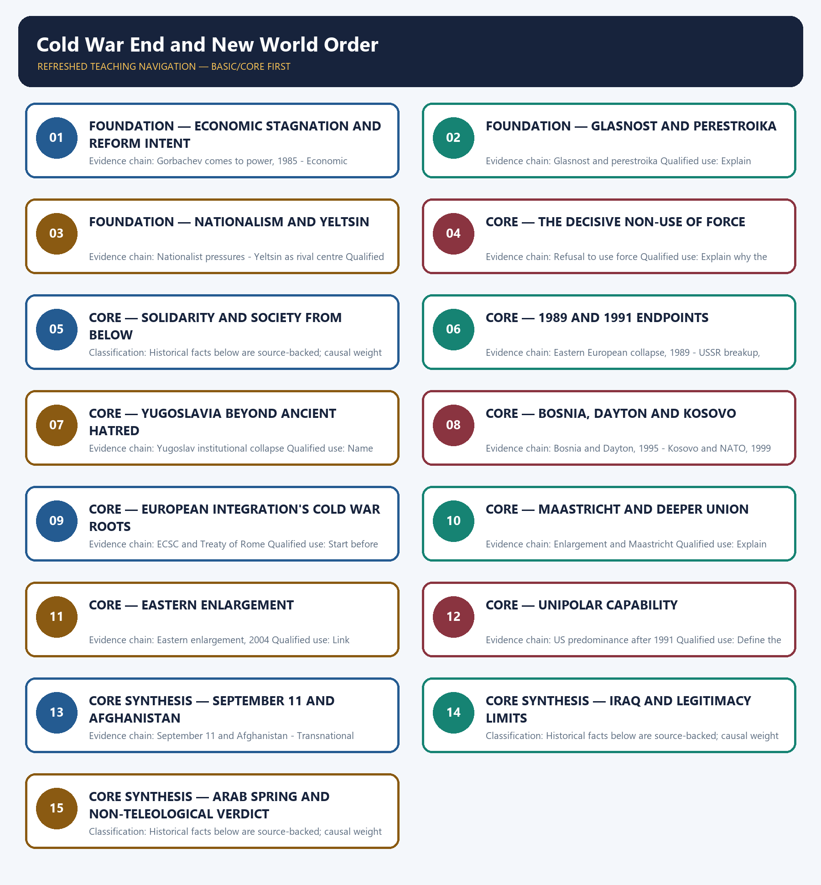

# Cold War End and New World Order — Learner-v2 Complete Learning Session

> **Authoring-only generation:** 2026-09-01. No PDF was rendered and no tracker or index was mutated.

### SOURCE, PROGRESSION AND CURRENT-LINKAGE AUDIT

- **Generation date:** 2026-09-01.
- **Repository-first evidence:** the Basic owner is taught first and preserved in full; the Advanced owner is retained only in the optional final teaching block.
- **OCR evidence:** Repository Markdown was used first. The available OCR-searchable Norman Lowe World History PDF was retained as supplementary local context, but no unsupported page number, quotation or precision was imported from it.
- **Qdrant:** not used; repository Markdown and available OCR context were sufficient.
- **PYQ integrity:** No direct UPSC PYQ is verified as owned solely by this topic in the local routing blocks. All six Mains demands are original practice.
- **Live-link boundary:** The U.S. State Department's National Museum of American Diplomacy is scheduled to open to the public in October 2026 and houses a signed Berlin Wall segment associated with major actors in the diplomacy of 1989-91 and German reunification. This supplies a narrow public-history link to renewed attention to Cold War-ending diplomacy; the object is not evidence for a single-cause account of the Cold War's end or a single-cause 'new world order'.
- **Fact/inference discipline:** no current-affairs item, PYQ wording, figure or quotation is invented.

## BASIC LEARNING SESSION



*Distinct embedded teaching-navigation image. The separate continuous Cārvāka-style flowchart package remains an independent at-a-glance artifact.*

### SESSION 1 — FOUNDATION — ECONOMIC STAGNATION AND REFORM INTENT

#### DEFINITION / WHAT THIS IS CALLED

**Plain-language definition:** Precise definition: Economic stagnation and reform intent is the source-bounded relationship among Gorbachev comes to power, 1985 and Economic stagnation within Cold War End and New World Order.

**Technical definition:** Evidence chain: Gorbachev comes to power, 1985 - Economic stagnation Qualified use: Separate structural weakness from intention.

#### ANSWER-GRABBING OPENING — WRITE/ADAPT IN THE EXAM

> Precise definition: Economic stagnation and reform intent is the source-bounded relationship among Gorbachev comes to power, 1985 and Economic stagnation within Cold War End and New World Order.

#### MUST-WRITE KEYWORDS

- **FOUNDATION**
- **Economic stagnation**
- **reform intent**
- **Precise definition**
- **Evidence chain**
- **Qualified use**

**How to use them:** Frame the answer through FOUNDATION; define Economic stagnation, connect reform intent with Precise definition to explain the mechanism, and use Evidence chain for the decisive comparison or qualification.

##### VISUAL FIRST

```text
ECONOMIC STAGNATION AND REFORM INTENT
01. Gorbachev comes to power, 1985
    |
    v
02. Economic stagnation
BOUNDARY -> Gorbachev aimed to save the system.
```

*This topic-specific rail fixes the evidence sequence and its exam boundary before analysis.*

##### CONCEPT DEFINITIONS

- **Precise definition:** Economic stagnation and reform intent is the source-bounded relationship among Gorbachev comes to power, 1985 and Economic stagnation within Cold War End and New World Order.
- **Classification:** Historical facts below are source-backed; causal weight and evaluative verdicts are analytical synthesis.

##### CORE EXPLANATION

Gorbachev sought to reform and save the Soviet system rather than deliberately destroy it. The command economy's weak efficiency and consumer performance eroded the legitimacy that economic achievement had supplied.

##### NAMED EVIDENCE AND MECHANISM

- Gorbachev sought to reform and save the Soviet system rather than deliberately destroy it.
- The command economy's weak efficiency and consumer performance eroded the legitimacy that economic achievement had supplied.

##### EXAMINER CAUTION

- Gorbachev aimed to save the system.

##### EXAM LINK

- **Prelims:** Retain the exact actor, date, document and category in Economic stagnation and reform intent.
- **Mains:** Separate structural weakness from intention.

##### MINI RECAP

- **Evidence chain:** Gorbachev comes to power, 1985 -> Economic stagnation
- **Qualified use:** Separate structural weakness from intention.

#### CLOSING RECALL FLOW — FOUNDATION — ECONOMIC STAGNATION AND REFORM INTENT

```text
START / CONCEPT: FOUNDATION — Economic stagnation and reform intent
        |
        v
EXACT TERMS: FOUNDATION · Economic stagnation · reform intent · Precise definition · Evidence chain · Qualified use
        |
        v
MECHANISM / ARGUMENT: Evidence chain: Gorbachev comes to power, 1985 - Economic stagnation Qualified use: Separate structural weakness from intention.
        |
        v
CONSEQUENCE / CONTRAST: The command economy's weak efficiency and consumer performance eroded the legitimacy that economic achievement had supplied.
        |
        v
UPSC TRAP / ANSWER-USE: Do not miss this limiting distinction: causal weight and evaluative verdicts are analytical synthesis.
        |
        v
ANSWER-GRABBING FORMULATION: Precise definition: Economic stagnation and reform intent is the source-bounded relationship among Gorbachev comes to power, 1985 and Economic stagnation within Cold War End and New World Order.
```
### SESSION 2 — FOUNDATION — GLASNOST AND PERESTROIKA

#### DEFINITION / WHAT THIS IS CALLED

**Plain-language definition:** Precise definition: Glasnost and perestroika is the source-bounded relationship among and Glasnost and perestroika within Cold War End and New World Order.

**Technical definition:** Evidence chain: Glasnost and perestroika Qualified use: Explain reform's destabilising sequence.

#### ANSWER-GRABBING OPENING — WRITE/ADAPT IN THE EXAM

> Evidence chain: Glasnost and perestroika Qualified use: Explain reform's destabilising sequence.

#### MUST-WRITE KEYWORDS

- **FOUNDATION**
- **Glasnost**
- **perestroika**
- **Precise definition**
- **Evidence chain**
- **Qualified use**

**How to use them:** Frame the answer through FOUNDATION; define Glasnost, connect perestroika with Precise definition to explain the mechanism, and use Evidence chain for the decisive comparison or qualification.

##### VISUAL FIRST

```text
GLASNOST AND PERESTROIKA
01. Glasnost and perestroika
BOUNDARY -> Openness moved faster than institutional stabilisation.
```

*This topic-specific rail fixes the evidence sequence and its exam boundary before analysis.*

##### CONCEPT DEFINITIONS

- **Precise definition:** Glasnost and perestroika is the source-bounded relationship among  and Glasnost and perestroika within Cold War End and New World Order.
- **Classification:** Historical facts below are source-backed; causal weight and evaluative verdicts are analytical synthesis.

##### CORE EXPLANATION

Political openness and restructuring legalised criticism faster than reform delivered stable economic or institutional improvement.

##### NAMED EVIDENCE AND MECHANISM

- Political openness and restructuring legalised criticism faster than reform delivered stable economic or institutional improvement.

##### EXAMINER CAUTION

- Openness moved faster than institutional stabilisation.

##### EXAM LINK

- **Prelims:** Retain the exact actor, date, document and category in Glasnost and perestroika.
- **Mains:** Explain reform's destabilising sequence.

##### MINI RECAP

- **Evidence chain:** Glasnost and perestroika
- **Qualified use:** Explain reform's destabilising sequence.

#### CLOSING RECALL FLOW — FOUNDATION — GLASNOST AND PERESTROIKA

```text
START / CONCEPT: FOUNDATION — Glasnost and perestroika
        |
        v
EXACT TERMS: FOUNDATION · Glasnost · perestroika · Precise definition · Evidence chain · Qualified use
        |
        v
MECHANISM / ARGUMENT: Precise definition: Glasnost and perestroika is the source-bounded relationship among and Glasnost and perestroika within Cold War End and New World Order.
        |
        v
CONSEQUENCE / CONTRAST: Classification: Historical facts below are source-backed; causal weight and evaluative verdicts are analytical synthesis.
        |
        v
UPSC TRAP / ANSWER-USE: Do not miss this limiting distinction: evidence chain: Glasnost and perestroika Qualified use: Explain reform's destabilising sequence.
        |
        v
ANSWER-GRABBING FORMULATION: Evidence chain: Glasnost and perestroika Qualified use: Explain reform's destabilising sequence.
```
### SESSION 3 — FOUNDATION — NATIONALISM AND YELTSIN

#### DEFINITION / WHAT THIS IS CALLED

**Plain-language definition:** Precise definition: Nationalism and Yeltsin is the source-bounded relationship among Nationalist pressures and Yeltsin as rival centre within Cold War End and New World Order.

**Technical definition:** Evidence chain: Nationalist pressures - Yeltsin as rival centre Qualified use: Add republic and elite agency.

#### ANSWER-GRABBING OPENING — WRITE/ADAPT IN THE EXAM

> Precise definition: Nationalism and Yeltsin is the source-bounded relationship among Nationalist pressures and Yeltsin as rival centre within Cold War End and New World Order.

#### MUST-WRITE KEYWORDS

- **FOUNDATION**
- **Nationalism**
- **Yeltsin**
- **Precise definition**
- **Evidence chain**
- **Qualified use**

**How to use them:** Frame the answer through FOUNDATION; define Nationalism, connect Yeltsin with Precise definition to explain the mechanism, and use Evidence chain for the decisive comparison or qualification.

##### VISUAL FIRST

```text
NATIONALISM AND YELTSIN
01. Nationalist pressures
    |
    v
02. Yeltsin as rival centre
BOUNDARY -> Alternative loyalty and rival leadership interacted.
```

*This topic-specific rail fixes the evidence sequence and its exam boundary before analysis.*

##### CONCEPT DEFINITIONS

- **Precise definition:** Nationalism and Yeltsin is the source-bounded relationship among Nationalist pressures and Yeltsin as rival centre within Cold War End and New World Order.
- **Classification:** Historical facts below are source-backed; causal weight and evaluative verdicts are analytical synthesis.

##### CORE EXPLANATION

Soviet republics moved from autonomy demands toward independence as ideological and central authority weakened. Boris Yeltsin emerged as a more radical alternative and created an elite power centre outside Gorbachev's cautious reform programme.

##### NAMED EVIDENCE AND MECHANISM

- Soviet republics moved from autonomy demands toward independence as ideological and central authority weakened.
- Boris Yeltsin emerged as a more radical alternative and created an elite power centre outside Gorbachev's cautious reform programme.

##### EXAMINER CAUTION

- Alternative loyalty and rival leadership interacted.

##### EXAM LINK

- **Prelims:** Retain the exact actor, date, document and category in Nationalism and Yeltsin.
- **Mains:** Add republic and elite agency.

##### MINI RECAP

- **Evidence chain:** Nationalist pressures -> Yeltsin as rival centre
- **Qualified use:** Add republic and elite agency.

#### CLOSING RECALL FLOW — FOUNDATION — NATIONALISM AND YELTSIN

```text
START / CONCEPT: FOUNDATION — Nationalism and Yeltsin
        |
        v
EXACT TERMS: FOUNDATION · Nationalism · Yeltsin · Precise definition · Evidence chain · Qualified use
        |
        v
MECHANISM / ARGUMENT: Evidence chain: Nationalist pressures - Yeltsin as rival centre Qualified use: Add republic and elite agency.
        |
        v
CONSEQUENCE / CONTRAST: Boris Yeltsin emerged as a more radical alternative and created an elite power centre outside Gorbachev's cautious reform programme.
        |
        v
UPSC TRAP / ANSWER-USE: Do not miss this limiting distinction: causal weight and evaluative verdicts are analytical synthesis.
        |
        v
ANSWER-GRABBING FORMULATION: Precise definition: Nationalism and Yeltsin is the source-bounded relationship among Nationalist pressures and Yeltsin as rival centre within Cold War End and New World Order.
```
### SESSION 4 — CORE — THE DECISIVE NON-USE OF FORCE

#### DEFINITION / WHAT THIS IS CALLED

**Plain-language definition:** Precise definition: The decisive non-use of force is the source-bounded relationship among and Refusal to use force within Cold War End and New World Order.

**Technical definition:** Evidence chain: Refusal to use force Qualified use: Explain why the external guarantee vanished.

#### ANSWER-GRABBING OPENING — WRITE/ADAPT IN THE EXAM

> Precise definition: The decisive non-use of force is the source-bounded relationship among and Refusal to use force within Cold War End and New World Order.

#### MUST-WRITE KEYWORDS

- **The decisive non-use of force**
- **Precise definition**
- **Evidence chain**
- **Qualified use**
- **Precise**
- **Refusal**

**How to use them:** Frame the answer through The decisive non-use of force; define Precise definition, connect Evidence chain with Qualified use to explain the mechanism, and use Precise for the decisive comparison or qualification.

##### VISUAL FIRST

```text
THE DECISIVE NON-USE OF FORCE
01. Refusal to use force
BOUNDARY -> The absence of repression was a choice.
```

*This topic-specific rail fixes the evidence sequence and its exam boundary before analysis.*

##### CONCEPT DEFINITIONS

- **Precise definition:** The decisive non-use of force is the source-bounded relationship among  and Refusal to use force within Cold War End and New World Order.
- **Classification:** Historical facts below are source-backed; causal weight and evaluative verdicts are analytical synthesis.

##### CORE EXPLANATION

Gorbachev's decision not to deploy old-style Soviet coercion removed the external guarantee sustaining eastern European communist governments.

##### NAMED EVIDENCE AND MECHANISM

- Gorbachev's decision not to deploy old-style Soviet coercion removed the external guarantee sustaining eastern European communist governments.

##### EXAMINER CAUTION

- The absence of repression was a choice.

##### EXAM LINK

- **Prelims:** Retain the exact actor, date, document and category in The decisive non-use of force.
- **Mains:** Explain why the external guarantee vanished.

##### MINI RECAP

- **Evidence chain:** Refusal to use force
- **Qualified use:** Explain why the external guarantee vanished.

#### CLOSING RECALL FLOW — CORE — THE DECISIVE NON-USE OF FORCE

```text
START / CONCEPT: CORE — The decisive non-use of force
        |
        v
EXACT TERMS: The decisive non-use of force · Precise definition · Evidence chain · Qualified use · Precise · Refusal
        |
        v
MECHANISM / ARGUMENT: Prelims: Retain the exact actor, date, document and category in The decisive non-use of force.
        |
        v
CONSEQUENCE / CONTRAST: Evidence chain: Refusal to use force Qualified use: Explain why the external guarantee vanished.
        |
        v
UPSC TRAP / ANSWER-USE: Do not miss this limiting distinction: causal weight and evaluative verdicts are analytical synthesis.
        |
        v
ANSWER-GRABBING FORMULATION: Precise definition: The decisive non-use of force is the source-bounded relationship among and Refusal to use force within Cold War End and New World Order.
```
### SESSION 5 — CORE — SOLIDARITY AND SOCIETY FROM BELOW

#### DEFINITION / WHAT THIS IS CALLED

**Plain-language definition:** Precise definition: Solidarity and society from below is the source-bounded relationship among and Solidarity, August 1988 within Cold War End and New World Order.

**Technical definition:** Classification: Historical facts below are source-backed; causal weight and evaluative verdicts are analytical synthesis.

#### ANSWER-GRABBING OPENING — WRITE/ADAPT IN THE EXAM

> Precise definition: Solidarity and society from below is the source-bounded relationship among and Solidarity, August 1988 within Cold War End and New World Order.

#### MUST-WRITE KEYWORDS

- **Solidarity**
- **society from below**
- **Precise definition**
- **Evidence chain**
- **Qualified use**
- **Precise definition: Solidarity and society from below**

**How to use them:** Frame the answer through Solidarity; define society from below, connect Precise definition with Evidence chain to explain the mechanism, and use Qualified use for the decisive comparison or qualification.

##### VISUAL FIRST

```text
SOLIDARITY AND SOCIETY FROM BELOW
01. Solidarity, August 1988
BOUNDARY -> Poland is a named case, not a universal model.
```

*This topic-specific rail fixes the evidence sequence and its exam boundary before analysis.*

##### CONCEPT DEFINITIONS

- **Precise definition:** Solidarity and society from below is the source-bounded relationship among  and Solidarity, August 1988 within Cold War End and New World Order.
- **Classification:** Historical facts below are source-backed; causal weight and evaluative verdicts are analytical synthesis.

##### CORE EXPLANATION

Poland's Solidarity trade union organised mass strikes that forced negotiation, supplying organised social agency from below.

##### NAMED EVIDENCE AND MECHANISM

- Poland's Solidarity trade union organised mass strikes that forced negotiation, supplying organised social agency from below.

##### EXAMINER CAUTION

- Poland is a named case, not a universal model.

##### EXAM LINK

- **Prelims:** Retain the exact actor, date, document and category in Solidarity and society from below.
- **Mains:** Restore organised social agency.

##### MINI RECAP

- **Evidence chain:** Solidarity, August 1988
- **Qualified use:** Restore organised social agency.

#### CLOSING RECALL FLOW — CORE — SOLIDARITY AND SOCIETY FROM BELOW

```text
START / CONCEPT: CORE — Solidarity and society from below
        |
        v
EXACT TERMS: Solidarity · society from below · Precise definition · Evidence chain · Qualified use · Precise definition: Solidarity and society from below
        |
        v
MECHANISM / ARGUMENT: Evidence chain: Solidarity, August 1988 Qualified use: Restore organised social agency.
        |
        v
CONSEQUENCE / CONTRAST: Poland is a named case, not a universal model.
        |
        v
UPSC TRAP / ANSWER-USE: Do not miss this limiting distinction: causal weight and evaluative verdicts are analytical synthesis.
        |
        v
ANSWER-GRABBING FORMULATION: Precise definition: Solidarity and society from below is the source-bounded relationship among and Solidarity, August 1988 within Cold War End and New World Order.
```
### SESSION 6 — CORE — 1989 AND 1991 ENDPOINTS

#### DEFINITION / WHAT THIS IS CALLED

**Plain-language definition:** Precise definition: 1989 and 1991 endpoints is the source-bounded relationship among Eastern European collapse, 1989 and USSR breakup, 1991 within Cold War End and New World Order.

**Technical definition:** Evidence chain: Eastern European collapse, 1989 - USSR breakup, 1991 Qualified use: Complete the collapse chronology.

#### ANSWER-GRABBING OPENING — WRITE/ADAPT IN THE EXAM

> Precise definition: 1989 and 1991 endpoints is the source-bounded relationship among Eastern European collapse, 1989 and USSR breakup, 1991 within Cold War End and New World Order.

#### MUST-WRITE KEYWORDS

- **Precise definition**
- **Evidence chain**
- **Qualified use**
- **Precise definition: 1989 and 1991 endpoints**
- **Precise**
- **1991 endpoints**

**How to use them:** Frame the answer through Precise definition; define Evidence chain, connect Qualified use with Precise definition: 1989 and 1991 endpoints to explain the mechanism, and use Precise for the decisive comparison or qualification.

##### VISUAL FIRST

```text
1989 AND 1991 ENDPOINTS
01. Eastern European collapse, 1989
    |
    v
02. USSR breakup, 1991
BOUNDARY -> Eastern Europe and USSR belong to distinct dates.
```

*This topic-specific rail fixes the evidence sequence and its exam boundary before analysis.*

##### CONCEPT DEFINITIONS

- **Precise definition:** 1989 and 1991 endpoints is the source-bounded relationship among Eastern European collapse, 1989 and USSR breakup, 1991 within Cold War End and New World Order.
- **Classification:** Historical facts below are source-backed; causal weight and evaluative verdicts are analytical synthesis.

##### CORE EXPLANATION

Communist regimes collapsed rapidly when Soviet non-intervention and mobilised domestic opposition converged. The Soviet Union broke into separate states in 1991 and Gorbachev resigned.

##### NAMED EVIDENCE AND MECHANISM

- Communist regimes collapsed rapidly when Soviet non-intervention and mobilised domestic opposition converged.
- The Soviet Union broke into separate states in 1991 and Gorbachev resigned.

##### EXAMINER CAUTION

- Eastern Europe and USSR belong to distinct dates.

##### EXAM LINK

- **Prelims:** Retain the exact actor, date, document and category in 1989 and 1991 endpoints.
- **Mains:** Complete the collapse chronology.

##### MINI RECAP

- **Evidence chain:** Eastern European collapse, 1989 -> USSR breakup, 1991
- **Qualified use:** Complete the collapse chronology.

#### CLOSING RECALL FLOW — CORE — 1989 AND 1991 ENDPOINTS

```text
START / CONCEPT: CORE — 1989 and 1991 endpoints
        |
        v
EXACT TERMS: Precise definition · Evidence chain · Qualified use · Precise definition: 1989 and 1991 endpoints · Precise · 1991 endpoints
        |
        v
MECHANISM / ARGUMENT: Evidence chain: Eastern European collapse, 1989 - USSR breakup, 1991 Qualified use: Complete the collapse chronology.
        |
        v
CONSEQUENCE / CONTRAST: Classification: Historical facts below are source-backed; causal weight and evaluative verdicts are analytical synthesis.
        |
        v
UPSC TRAP / ANSWER-USE: Do not miss this limiting distinction: 1989 and 1991 endpoints is the source-bounded relationship among Eastern European collapse, 1989 and...
        |
        v
ANSWER-GRABBING FORMULATION: Precise definition: 1989 and 1991 endpoints is the source-bounded relationship among Eastern European collapse, 1989 and USSR breakup, 1991 within Cold War End and New World Order.
```
### SESSION 7 — CORE — YUGOSLAVIA BEYOND ANCIENT HATRED

#### DEFINITION / WHAT THIS IS CALLED

**Plain-language definition:** Precise definition: Yugoslavia beyond ancient hatred is the source-bounded relationship among and Yugoslav institutional collapse within Cold War End and New World Order.

**Technical definition:** Evidence chain: Yugoslav institutional collapse Qualified use: Name institutions and leaders as mechanisms.

#### ANSWER-GRABBING OPENING — WRITE/ADAPT IN THE EXAM

> Precise definition: Yugoslavia beyond ancient hatred is the source-bounded relationship among and Yugoslav institutional collapse within Cold War End and New World Order.

#### MUST-WRITE KEYWORDS

- **Yugoslavia beyond ancient hatred**
- **Precise definition**
- **Evidence chain**
- **Qualified use**
- **Precise definition: Yugoslavia beyond ancient hatred**
- **Precise**

**How to use them:** Frame the answer through Yugoslavia beyond ancient hatred; define Precise definition, connect Evidence chain with Qualified use to explain the mechanism, and use Precise definition: Yugoslavia beyond ancient hatred for the decisive comparison or qualification.

##### VISUAL FIRST

```text
YUGOSLAVIA BEYOND ANCIENT HATRED
01. Yugoslav institutional collapse
BOUNDARY -> Nationalism was politically produced.
```

*This topic-specific rail fixes the evidence sequence and its exam boundary before analysis.*

##### CONCEPT DEFINITIONS

- **Precise definition:** Yugoslavia beyond ancient hatred is the source-bounded relationship among  and Yugoslav institutional collapse within Cold War End and New World Order.
- **Classification:** Historical facts below are source-backed; causal weight and evaluative verdicts are analytical synthesis.

##### CORE EXPLANATION

The end of communist federal authority combined with aggressive nationalism and political leadership choices rather than timeless hatred.

##### NAMED EVIDENCE AND MECHANISM

- The end of communist federal authority combined with aggressive nationalism and political leadership choices rather than timeless hatred.

##### EXAMINER CAUTION

- Nationalism was politically produced.

##### EXAM LINK

- **Prelims:** Retain the exact actor, date, document and category in Yugoslavia beyond ancient hatred.
- **Mains:** Name institutions and leaders as mechanisms.

##### MINI RECAP

- **Evidence chain:** Yugoslav institutional collapse
- **Qualified use:** Name institutions and leaders as mechanisms.

#### CLOSING RECALL FLOW — CORE — YUGOSLAVIA BEYOND ANCIENT HATRED

```text
START / CONCEPT: CORE — Yugoslavia beyond ancient hatred
        |
        v
EXACT TERMS: Yugoslavia beyond ancient hatred · Precise definition · Evidence chain · Qualified use · Precise definition: Yugoslavia beyond ancient hatred · Precise
        |
        v
MECHANISM / ARGUMENT: Evidence chain: Yugoslav institutional collapse Qualified use: Name institutions and leaders as mechanisms.
        |
        v
CONSEQUENCE / CONTRAST: Classification: Historical facts below are source-backed; causal weight and evaluative verdicts are analytical synthesis.
        |
        v
UPSC TRAP / ANSWER-USE: Do not miss this limiting distinction: yugoslavia beyond ancient hatred is the source-bounded relationship among and Yugoslav institutional collapse within...
        |
        v
ANSWER-GRABBING FORMULATION: Precise definition: Yugoslavia beyond ancient hatred is the source-bounded relationship among and Yugoslav institutional collapse within Cold War End and New World Order.
```
### SESSION 8 — CORE — BOSNIA, DAYTON AND KOSOVO

#### DEFINITION / WHAT THIS IS CALLED

**Plain-language definition:** Precise definition: Bosnia, Dayton and Kosovo is the source-bounded relationship among Bosnia and Dayton, 1995 and Kosovo and NATO, 1999 within Cold War End and New World Order.

**Technical definition:** Evidence chain: Bosnia and Dayton, 1995 - Kosovo and NATO, 1999 Qualified use: Trace incomplete settlement.

#### ANSWER-GRABBING OPENING — WRITE/ADAPT IN THE EXAM

> Precise definition: Bosnia, Dayton and Kosovo is the source-bounded relationship among Bosnia and Dayton, 1995 and Kosovo and NATO, 1999 within Cold War End and New World Order.

#### MUST-WRITE KEYWORDS

- **Bosnia**
- **Dayton**
- **Kosovo**
- **Precise definition**
- **Evidence chain**
- **Qualified use**

**How to use them:** Frame the answer through Bosnia; define Dayton, connect Kosovo with Precise definition to explain the mechanism, and use Evidence chain for the decisive comparison or qualification.

##### VISUAL FIRST

```text
BOSNIA, DAYTON AND KOSOVO
01. Bosnia and Dayton, 1995
    |
    v
02. Kosovo and NATO, 1999
BOUNDARY -> Dayton settled Bosnia but not every Yugoslav conflict.
```

*This topic-specific rail fixes the evidence sequence and its exam boundary before analysis.*

##### CONCEPT DEFINITIONS

- **Precise definition:** Bosnia, Dayton and Kosovo is the source-bounded relationship among Bosnia and Dayton, 1995 and Kosovo and NATO, 1999 within Cold War End and New World Order.
- **Classification:** Historical facts below are source-backed; causal weight and evaluative verdicts are analytical synthesis.

##### CORE EXPLANATION

Bosnia experienced ethnic cleansing, refugee flows and delayed intervention before the Dayton settlement of 1995. The Kosovo crisis and NATO intervention in 1999 showed that Yugoslavia's boundary and legitimacy conflicts survived Dayton.

##### NAMED EVIDENCE AND MECHANISM

- Bosnia experienced ethnic cleansing, refugee flows and delayed intervention before the Dayton settlement of 1995.
- The Kosovo crisis and NATO intervention in 1999 showed that Yugoslavia's boundary and legitimacy conflicts survived Dayton.

##### EXAMINER CAUTION

- Dayton settled Bosnia but not every Yugoslav conflict.

##### EXAM LINK

- **Prelims:** Retain the exact actor, date, document and category in Bosnia, Dayton and Kosovo.
- **Mains:** Trace incomplete settlement.

##### MINI RECAP

- **Evidence chain:** Bosnia and Dayton, 1995 -> Kosovo and NATO, 1999
- **Qualified use:** Trace incomplete settlement.

#### CLOSING RECALL FLOW — CORE — BOSNIA, DAYTON AND KOSOVO

```text
START / CONCEPT: CORE — Bosnia, Dayton and Kosovo
        |
        v
EXACT TERMS: Bosnia · Dayton · Kosovo · Precise definition · Evidence chain · Qualified use
        |
        v
MECHANISM / ARGUMENT: Evidence chain: Bosnia and Dayton, 1995 - Kosovo and NATO, 1999 Qualified use: Trace incomplete settlement.
        |
        v
CONSEQUENCE / CONTRAST: Classification: Historical facts below are source-backed; causal weight and evaluative verdicts are analytical synthesis.
        |
        v
UPSC TRAP / ANSWER-USE: Do not miss this limiting distinction: bosnia and Dayton, 1995 - Kosovo and NATO, 1999 Qualified use.
        |
        v
ANSWER-GRABBING FORMULATION: Precise definition: Bosnia, Dayton and Kosovo is the source-bounded relationship among Bosnia and Dayton, 1995 and Kosovo and NATO, 1999 within Cold War End and New World Order.
```
### SESSION 9 — CORE — EUROPEAN INTEGRATION'S COLD WAR ROOTS

#### DEFINITION / WHAT THIS IS CALLED

**Plain-language definition:** Precise definition: European integration's Cold War roots is the source-bounded relationship among and ECSC and Treaty of Rome within Cold War End and New World Order.

**Technical definition:** Evidence chain: ECSC and Treaty of Rome Qualified use: Start before 1991.

#### ANSWER-GRABBING OPENING — WRITE/ADAPT IN THE EXAM

> Precise definition: European integration's Cold War roots is the source-bounded relationship among and ECSC and Treaty of Rome within Cold War End and New World Order.

#### MUST-WRITE KEYWORDS

- **European integration's Cold War roots**
- **Precise definition**
- **Evidence chain**
- **Qualified use**
- **Precise definition: European integration's Cold War roots**
- **1951-52**

**How to use them:** Frame the answer through European integration's Cold War roots; define Precise definition, connect Evidence chain with Qualified use to explain the mechanism, and use Precise definition: European integration's Cold War roots for the decisive comparison or qualification.

##### VISUAL FIRST

```text
EUROPEAN INTEGRATION'S COLD WAR ROOTS
01. ECSC and Treaty of Rome
BOUNDARY -> Integration began as security by economic means.
```

*This topic-specific rail fixes the evidence sequence and its exam boundary before analysis.*

##### CONCEPT DEFINITIONS

- **Precise definition:** European integration's Cold War roots is the source-bounded relationship among  and ECSC and Treaty of Rome within Cold War End and New World Order.
- **Classification:** Historical facts below are source-backed; causal weight and evaluative verdicts are analytical synthesis.

##### CORE EXPLANATION

The ECSC of 1951-52 pooled strategic industries, while the 1957 Treaty of Rome created the EEC as a peace and market project.

##### NAMED EVIDENCE AND MECHANISM

- The ECSC of 1951-52 pooled strategic industries, while the 1957 Treaty of Rome created the EEC as a peace and market project.

##### EXAMINER CAUTION

- Integration began as security by economic means.

##### EXAM LINK

- **Prelims:** Retain the exact actor, date, document and category in European integration's Cold War roots.
- **Mains:** Start before 1991.

##### MINI RECAP

- **Evidence chain:** ECSC and Treaty of Rome
- **Qualified use:** Start before 1991.

#### CLOSING RECALL FLOW — CORE — EUROPEAN INTEGRATION'S COLD WAR ROOTS

```text
START / CONCEPT: CORE — European integration's Cold War roots
        |
        v
EXACT TERMS: European integration's Cold War roots · Precise definition · Evidence chain · Qualified use · Precise definition: European integration's Cold War roots · 1951-52
        |
        v
MECHANISM / ARGUMENT: Integration began as security by economic means.
        |
        v
CONSEQUENCE / CONTRAST: The ECSC of 1951-52 pooled strategic industries, while the 1957 Treaty of Rome created the EEC as a peace and market project.
        |
        v
UPSC TRAP / ANSWER-USE: Do not miss this limiting distinction: eCSC and Treaty of Rome Qualified use.
        |
        v
ANSWER-GRABBING FORMULATION: Precise definition: European integration's Cold War roots is the source-bounded relationship among and ECSC and Treaty of Rome within Cold War End and New World Order.
```
### SESSION 10 — CORE — MAASTRICHT AND DEEPER UNION

#### DEFINITION / WHAT THIS IS CALLED

**Plain-language definition:** Precise definition: Maastricht and deeper union is the source-bounded relationship among and Enlargement and Maastricht within Cold War End and New World Order.

**Technical definition:** Evidence chain: Enlargement and Maastricht Qualified use: Explain widening versus deepening.

#### ANSWER-GRABBING OPENING — WRITE/ADAPT IN THE EXAM

> Precise definition: Maastricht and deeper union is the source-bounded relationship among and Enlargement and Maastricht within Cold War End and New World Order.

#### MUST-WRITE KEYWORDS

- **Maastricht**
- **deeper union**
- **Precise definition**
- **Evidence chain**
- **Qualified use**
- **Precise definition: Maastricht and deeper union**

**How to use them:** Frame the answer through Maastricht; define deeper union, connect Precise definition with Evidence chain to explain the mechanism, and use Qualified use for the decisive comparison or qualification.

##### VISUAL FIRST

```text
MAASTRICHT AND DEEPER UNION
01. Enlargement and Maastricht
BOUNDARY -> Treaty signature and entry into force are distinct.
```

*This topic-specific rail fixes the evidence sequence and its exam boundary before analysis.*

##### CONCEPT DEFINITIONS

- **Precise definition:** Maastricht and deeper union is the source-bounded relationship among  and Enlargement and Maastricht within Cold War End and New World Order.
- **Classification:** Historical facts below are source-backed; causal weight and evaluative verdicts are analytical synthesis.

##### CORE EXPLANATION

Britain, Ireland and Denmark joined in 1973; Maastricht was signed in 1992 and entered into force in 1993, deepening political and monetary integration.

##### NAMED EVIDENCE AND MECHANISM

- Britain, Ireland and Denmark joined in 1973; Maastricht was signed in 1992 and entered into force in 1993, deepening political and monetary integration.

##### EXAMINER CAUTION

- Treaty signature and entry into force are distinct.

##### EXAM LINK

- **Prelims:** Retain the exact actor, date, document and category in Maastricht and deeper union.
- **Mains:** Explain widening versus deepening.

##### MINI RECAP

- **Evidence chain:** Enlargement and Maastricht
- **Qualified use:** Explain widening versus deepening.

#### CLOSING RECALL FLOW — CORE — MAASTRICHT AND DEEPER UNION

```text
START / CONCEPT: CORE — Maastricht and deeper union
        |
        v
EXACT TERMS: Maastricht · deeper union · Precise definition · Evidence chain · Qualified use · Precise definition: Maastricht and deeper union
        |
        v
MECHANISM / ARGUMENT: Evidence chain: Enlargement and Maastricht Qualified use: Explain widening versus deepening.
        |
        v
CONSEQUENCE / CONTRAST: Britain, Ireland and Denmark joined in 1973; Maastricht was signed in 1992 and entered into force in 1993, deepening political and monetary integration.
        |
        v
UPSC TRAP / ANSWER-USE: Do not miss this limiting distinction: causal weight and evaluative verdicts are analytical synthesis.
        |
        v
ANSWER-GRABBING FORMULATION: Precise definition: Maastricht and deeper union is the source-bounded relationship among and Enlargement and Maastricht within Cold War End and New World Order.
```
### SESSION 11 — CORE — EASTERN ENLARGEMENT

#### DEFINITION / WHAT THIS IS CALLED

**Plain-language definition:** Precise definition: Eastern enlargement is the source-bounded relationship among and Eastern enlargement, 2004 within Cold War End and New World Order.

**Technical definition:** Evidence chain: Eastern enlargement, 2004 Qualified use: Link institutions to geopolitical change.

#### ANSWER-GRABBING OPENING — WRITE/ADAPT IN THE EXAM

> Precise definition: Eastern enlargement is the source-bounded relationship among and Eastern enlargement, 2004 within Cold War End and New World Order.

#### MUST-WRITE KEYWORDS

- **Eastern enlargement**
- **Precise definition**
- **Evidence chain**
- **Qualified use**
- **Precise definition: Eastern enlargement**
- **Precise**

**How to use them:** Frame the answer through Eastern enlargement; define Precise definition, connect Evidence chain with Qualified use to explain the mechanism, and use Precise definition: Eastern enlargement for the decisive comparison or qualification.

##### VISUAL FIRST

```text
EASTERN ENLARGEMENT
01. Eastern enlargement, 2004
BOUNDARY -> Enlargement became a post-communist settlement.
```

*This topic-specific rail fixes the evidence sequence and its exam boundary before analysis.*

##### CONCEPT DEFINITIONS

- **Precise definition:** Eastern enlargement is the source-bounded relationship among  and Eastern enlargement, 2004 within Cold War End and New World Order.
- **Classification:** Historical facts below are source-backed; causal weight and evaluative verdicts are analytical synthesis.

##### CORE EXPLANATION

Former communist states entered the European Union in 2004, turning integration into part of the institutional settlement of the Cold War's end.

##### NAMED EVIDENCE AND MECHANISM

- Former communist states entered the European Union in 2004, turning integration into part of the institutional settlement of the Cold War's end.

##### EXAMINER CAUTION

- Enlargement became a post-communist settlement.

##### EXAM LINK

- **Prelims:** Retain the exact actor, date, document and category in Eastern enlargement.
- **Mains:** Link institutions to geopolitical change.

##### MINI RECAP

- **Evidence chain:** Eastern enlargement, 2004
- **Qualified use:** Link institutions to geopolitical change.

#### CLOSING RECALL FLOW — CORE — EASTERN ENLARGEMENT

```text
START / CONCEPT: CORE — Eastern enlargement
        |
        v
EXACT TERMS: Eastern enlargement · Precise definition · Evidence chain · Qualified use · Precise definition: Eastern enlargement · Precise
        |
        v
MECHANISM / ARGUMENT: Evidence chain: Eastern enlargement, 2004 Qualified use: Link institutions to geopolitical change.
        |
        v
CONSEQUENCE / CONTRAST: Classification: Historical facts below are source-backed; causal weight and evaluative verdicts are analytical synthesis.
        |
        v
UPSC TRAP / ANSWER-USE: Do not miss this limiting distinction: eastern enlargement is the source-bounded relationship among and Eastern enlargement, 2004 within Cold War...
        |
        v
ANSWER-GRABBING FORMULATION: Precise definition: Eastern enlargement is the source-bounded relationship among and Eastern enlargement, 2004 within Cold War End and New World Order.
```
### SESSION 12 — CORE — UNIPOLAR CAPABILITY

#### DEFINITION / WHAT THIS IS CALLED

**Plain-language definition:** Precise definition: Unipolar capability is the source-bounded relationship among and US predominance after 1991 within Cold War End and New World Order.

**Technical definition:** Evidence chain: US predominance after 1991 Qualified use: Define the new-order claim.

#### ANSWER-GRABBING OPENING — WRITE/ADAPT IN THE EXAM

> Precise definition: Unipolar capability is the source-bounded relationship among and US predominance after 1991 within Cold War End and New World Order.

#### MUST-WRITE KEYWORDS

- **Unipolar capability**
- **Precise definition**
- **Evidence chain**
- **Qualified use**
- **Precise definition: Unipolar capability**
- **Precise**

**How to use them:** Frame the answer through Unipolar capability; define Precise definition, connect Evidence chain with Qualified use to explain the mechanism, and use Precise definition: Unipolar capability for the decisive comparison or qualification.

##### VISUAL FIRST

```text
UNIPOLAR CAPABILITY
01. US predominance after 1991
BOUNDARY -> Power predominance did not create legitimacy.
```

*This topic-specific rail fixes the evidence sequence and its exam boundary before analysis.*

##### CONCEPT DEFINITIONS

- **Precise definition:** Unipolar capability is the source-bounded relationship among  and US predominance after 1991 within Cold War End and New World Order.
- **Classification:** Historical facts below are source-backed; causal weight and evaluative verdicts are analytical synthesis.

##### CORE EXPLANATION

The United States appeared as the sole superpower, producing unipolar capability without automatic international legitimacy.

##### NAMED EVIDENCE AND MECHANISM

- The United States appeared as the sole superpower, producing unipolar capability without automatic international legitimacy.

##### EXAMINER CAUTION

- Power predominance did not create legitimacy.

##### EXAM LINK

- **Prelims:** Retain the exact actor, date, document and category in Unipolar capability.
- **Mains:** Define the new-order claim.

##### MINI RECAP

- **Evidence chain:** US predominance after 1991
- **Qualified use:** Define the new-order claim.

#### CLOSING RECALL FLOW — CORE — UNIPOLAR CAPABILITY

```text
START / CONCEPT: CORE — Unipolar capability
        |
        v
EXACT TERMS: Unipolar capability · Precise definition · Evidence chain · Qualified use · Precise definition: Unipolar capability · Precise
        |
        v
MECHANISM / ARGUMENT: Evidence chain: US predominance after 1991 Qualified use: Define the new-order claim.
        |
        v
CONSEQUENCE / CONTRAST: Power predominance did not create legitimacy.
        |
        v
UPSC TRAP / ANSWER-USE: Do not miss this limiting distinction: causal weight and evaluative verdicts are analytical synthesis.
        |
        v
ANSWER-GRABBING FORMULATION: Precise definition: Unipolar capability is the source-bounded relationship among and US predominance after 1991 within Cold War End and New World Order.
```
### SESSION 13 — CORE SYNTHESIS — SEPTEMBER 11 AND AFGHANISTAN

#### DEFINITION / WHAT THIS IS CALLED

**Plain-language definition:** Precise definition: September 11 and Afghanistan is the source-bounded relationship among September 11 and Afghanistan and Transnational security within Cold War End and New World Order.

**Technical definition:** Evidence chain: September 11 and Afghanistan - Transnational security Qualified use: Explain the war-on-terror turn.

#### ANSWER-GRABBING OPENING — WRITE/ADAPT IN THE EXAM

> Evidence chain: September 11 and Afghanistan - Transnational security Qualified use: Explain the war-on-terror turn.

#### MUST-WRITE KEYWORDS

- **CORE SYNTHESIS**
- **September 11**
- **Afghanistan**
- **Precise definition**
- **Evidence chain**
- **Qualified use**

**How to use them:** Frame the answer through CORE SYNTHESIS; define September 11, connect Afghanistan with Precise definition to explain the mechanism, and use Evidence chain for the decisive comparison or qualification.

##### VISUAL FIRST

```text
SEPTEMBER 11 AND AFGHANISTAN
01. September 11 and Afghanistan
    |
    v
02. Transnational security
BOUNDARY -> Transnational threats changed security objects.
```

*This topic-specific rail fixes the evidence sequence and its exam boundary before analysis.*

##### CONCEPT DEFINITIONS

- **Precise definition:** September 11 and Afghanistan is the source-bounded relationship among September 11 and Afghanistan and Transnational security within Cold War End and New World Order.
- **Classification:** Historical facts below are source-backed; causal weight and evaluative verdicts are analytical synthesis.

##### CORE EXPLANATION

The 11 September 2001 attacks prompted a US-led war on terror and attack on the Taliban regime sheltering al-Qaeda. Terrorism and dispersed armed networks made post-Cold-War threats less exclusively state-centred.

##### NAMED EVIDENCE AND MECHANISM

- The 11 September 2001 attacks prompted a US-led war on terror and attack on the Taliban regime sheltering al-Qaeda.
- Terrorism and dispersed armed networks made post-Cold-War threats less exclusively state-centred.

##### EXAMINER CAUTION

- Transnational threats changed security objects.

##### EXAM LINK

- **Prelims:** Retain the exact actor, date, document and category in September 11 and Afghanistan.
- **Mains:** Explain the war-on-terror turn.

##### MINI RECAP

- **Evidence chain:** September 11 and Afghanistan -> Transnational security
- **Qualified use:** Explain the war-on-terror turn.

#### CLOSING RECALL FLOW — CORE SYNTHESIS — SEPTEMBER 11 AND AFGHANISTAN

```text
START / CONCEPT: CORE SYNTHESIS — September 11 and Afghanistan
        |
        v
EXACT TERMS: CORE SYNTHESIS · September 11 · Afghanistan · Precise definition · Evidence chain · Qualified use
        |
        v
MECHANISM / ARGUMENT: Precise definition: September 11 and Afghanistan is the source-bounded relationship among September 11 and Afghanistan and Transnational security within Cold War End and New World Order.
        |
        v
CONSEQUENCE / CONTRAST: Classification: Historical facts below are source-backed; causal weight and evaluative verdicts are analytical synthesis.
        |
        v
UPSC TRAP / ANSWER-USE: Do not miss this limiting distinction: september 11 and Afghanistan - Transnational security Qualified use.
        |
        v
ANSWER-GRABBING FORMULATION: Evidence chain: September 11 and Afghanistan - Transnational security Qualified use: Explain the war-on-terror turn.
```
### SESSION 14 — CORE SYNTHESIS — IRAQ AND LEGITIMACY LIMITS

#### DEFINITION / WHAT THIS IS CALLED

**Plain-language definition:** Precise definition: Iraq and legitimacy limits is the source-bounded relationship among and Iraq, 2003 within Cold War End and New World Order.

**Technical definition:** Classification: Historical facts below are source-backed; causal weight and evaluative verdicts are analytical synthesis.

#### ANSWER-GRABBING OPENING — WRITE/ADAPT IN THE EXAM

> Precise definition: Iraq and legitimacy limits is the source-bounded relationship among and Iraq, 2003 within Cold War End and New World Order.

#### MUST-WRITE KEYWORDS

- **CORE SYNTHESIS**
- **Iraq**
- **legitimacy limits**
- **Precise definition**
- **Evidence chain**
- **Qualified use**

**How to use them:** Frame the answer through CORE SYNTHESIS; define Iraq, connect legitimacy limits with Precise definition to explain the mechanism, and use Evidence chain for the decisive comparison or qualification.

##### VISUAL FIRST

```text
IRAQ AND LEGITIMACY LIMITS
01. Iraq, 2003
BOUNDARY -> Council bypass exposed institutional disagreement.
```

*This topic-specific rail fixes the evidence sequence and its exam boundary before analysis.*

##### CONCEPT DEFINITIONS

- **Precise definition:** Iraq and legitimacy limits is the source-bounded relationship among  and Iraq, 2003 within Cold War End and New World Order.
- **Classification:** Historical facts below are source-backed; causal weight and evaluative verdicts are analytical synthesis.

##### CORE EXPLANATION

The US-UK invasion without clear Security Council authorisation became the most controversial intervention of the new era and exposed a legitimacy ceiling.

##### NAMED EVIDENCE AND MECHANISM

- The US-UK invasion without clear Security Council authorisation became the most controversial intervention of the new era and exposed a legitimacy ceiling.

##### EXAMINER CAUTION

- Council bypass exposed institutional disagreement.

##### EXAM LINK

- **Prelims:** Retain the exact actor, date, document and category in Iraq and legitimacy limits.
- **Mains:** Test the unipolar-order thesis.

##### MINI RECAP

- **Evidence chain:** Iraq, 2003
- **Qualified use:** Test the unipolar-order thesis.

#### CLOSING RECALL FLOW — CORE SYNTHESIS — IRAQ AND LEGITIMACY LIMITS

```text
START / CONCEPT: CORE SYNTHESIS — Iraq and legitimacy limits
        |
        v
EXACT TERMS: CORE SYNTHESIS · Iraq · legitimacy limits · Precise definition · Evidence chain · Qualified use
        |
        v
MECHANISM / ARGUMENT: Evidence chain: Iraq, 2003 Qualified use: Test the unipolar-order thesis.
        |
        v
CONSEQUENCE / CONTRAST: Classification: Historical facts below are source-backed; causal weight and evaluative verdicts are analytical synthesis.
        |
        v
UPSC TRAP / ANSWER-USE: Do not miss this limiting distinction: the US-UK invasion without clear Security Council authorisation became the most controversial intervention of...
        |
        v
ANSWER-GRABBING FORMULATION: Precise definition: Iraq and legitimacy limits is the source-bounded relationship among and Iraq, 2003 within Cold War End and New World Order.
```
### SESSION 15 — CORE SYNTHESIS — ARAB SPRING AND NON-TELEOLOGICAL VERDICT

#### DEFINITION / WHAT THIS IS CALLED

**Plain-language definition:** Precise definition: Arab Spring and non-teleological verdict is the source-bounded relationship among Arab Spring divergence, US predominance after 1991 and Iraq, 2003 within Cold War End and New World Order.

**Technical definition:** Classification: Historical facts below are source-backed; causal weight and evaluative verdicts are analytical synthesis.

#### ANSWER-GRABBING OPENING — WRITE/ADAPT IN THE EXAM

> Precise definition: Arab Spring and non-teleological verdict is the source-bounded relationship among Arab Spring divergence, US predominance after 1991 and Iraq, 2003 within Cold War End and New World Order.

#### MUST-WRITE KEYWORDS

- **CORE SYNTHESIS**
- **Arab Spring**
- **non-teleological verdict**
- **Precise definition**
- **Evidence chain**
- **Qualified use**

**How to use them:** Frame the answer through CORE SYNTHESIS; define Arab Spring, connect non-teleological verdict with Precise definition to explain the mechanism, and use Evidence chain for the decisive comparison or qualification.

##### VISUAL FIRST

```text
ARAB SPRING AND NON-TELEOLOGICAL VERDICT
01. Arab Spring divergence
    |
    v
02. US predominance after 1991
    |
    v
03. Iraq, 2003
BOUNDARY -> Common triggers can produce opposite outcomes.
```

*This topic-specific rail fixes the evidence sequence and its exam boundary before analysis.*

##### CONCEPT DEFINITIONS

- **Precise definition:** Arab Spring and non-teleological verdict is the source-bounded relationship among Arab Spring divergence, US predominance after 1991 and Iraq, 2003 within Cold War End and New World Order.
- **Classification:** Historical facts below are source-backed; causal weight and evaluative verdicts are analytical synthesis.

##### CORE EXPLANATION

Protests began in Tunisia in December 2010 and spread, but different state institutions, armies and external involvement produced sharply divergent outcomes. The United States appeared as the sole superpower, producing unipolar capability without automatic international legitimacy. The US-UK invasion without clear Security Council authorisation became the most controversial intervention of the new era and exposed a legitimacy ceiling.

##### NAMED EVIDENCE AND MECHANISM

- Protests began in Tunisia in December 2010 and spread, but different state institutions, armies and external involvement produced sharply divergent outcomes.
- The United States appeared as the sole superpower, producing unipolar capability without automatic international legitimacy.
- The US-UK invasion without clear Security Council authorisation became the most controversial intervention of the new era and exposed a legitimacy ceiling.

##### EXAMINER CAUTION

- Common triggers can produce opposite outcomes.

##### EXAM LINK

- **Prelims:** Retain the exact actor, date, document and category in Arab Spring and non-teleological verdict.
- **Mains:** Conclude against linear democratisation.

##### MINI RECAP

- **Evidence chain:** Arab Spring divergence -> US predominance after 1991 -> Iraq, 2003
- **Qualified use:** Conclude against linear democratisation.

#### COMPLETE BASIC OWNER EVIDENCE BANK

> **Subject:** History (World History) · **Tier:** Basic (foundation) · **GS Paper:** GS-I with GS-II linkage
> **Grounded in:** Norman Lowe, *Mastering Modern World History* (5th ed.), Chapter 18, Chapter 10 (esp. collapse in Eastern Europe and Yugoslavia), and Chapter 12 + official UPSC GS-I/GS-II syllabus lines.
> ✅ = from Lowe / official syllabus · ⚠️ = synthesis / analytical linkage · 📰 = current affairs.
> *Companion: `advanced/21_Cold-War-End-and-New-World-Order.md`.*

#### Mini-timeline

| Date / phase | Event |
|---|---|
| ✅ 1985 | Gorbachev comes to power in the USSR |
| ✅ 1989 | Communist regimes collapse across much of Eastern Europe |
| ✅ 1991 | USSR breaks into separate states; Gorbachev resigns |
| ✅ 1992-93 | Maastricht Treaty is signed and enters into force, creating the European Union |
| ✅ 1991-95 | Yugoslavia descends into wars of breakup |
| ✅ 1999 | Kosovo crisis and NATO intervention |
| ✅ 11 September 2001 | Terror attacks on the USA |
| ✅ 2003 | US-UK invasion of Iraq |
| ✅ 2010-11 | Arab Spring begins and spreads across the region |

#### 1. Snapshot and syllabus anchor

- ✅ Official UPSC GS-I syllabus covers world-history themes including redrawing of national boundaries and political ideologies.
- ✅ Official GS-II syllabus line - **"Important International institutions, agencies and fora - their structure, mandate"** - becomes relevant here through NATO, the UN and post-Cold-War intervention.
- ⚠️ This topic is really three linked stories: **collapse of communist rule, reordering of Europe, and the troubled post-Cold-War world order**.

#### 2. Why did communist rule collapse?

| Cause | What Lowe emphasizes |
|---|---|
| ✅ Economic stagnation | The Soviet command economy could not deliver enough efficiency or consumer welfare |
| ✅ Gorbachev's reforms | Glasnost and perestroika loosened the system without stabilizing it |
| ✅ Rising criticism | Openness encouraged more opposition than the Party could control |
| ✅ Nationalist pressures | Soviet republics demanded more autonomy and then independence |
| ✅ Yeltsin challenge | Boris Yeltsin emerged as a radical alternative to Gorbachev's cautious reformism |

#### 3. Eastern Europe and the breakup of Yugoslavia

- ✅ Communist systems in Eastern Europe weakened rapidly once Moscow no longer guaranteed repression.
- ✅ **The sequence began in Poland in August 1988**, when the **Solidarity** trade-union organisation staged huge anti-government strikes that eventually forced the government to negotiate — ⚠️ the clearest single case in this folder of an *organised social movement*, not a palace reform, opening a communist system.
- ✅ In Yugoslavia, the end of communism interacted with aggressive nationalism and bad leadership.
- ✅ Serbia under Milosevic, Croatia under Tudjman and the mixed population of Bosnia made compromise difficult.
- ✅ Bosnia witnessed ethnic cleansing, huge refugee flows and international hesitation before stronger intervention.
- ✅ Kosovo later showed that the Yugoslav crisis did not end with the Dayton settlement.
- ⚠️ **Doctrine cross-link:** what collapsed here was a *regime type*, not the socialist idea as such — see `basic/01` §9.2 and §9.3(f)–(g) before writing any "the collapse of communism proved socialism failed" sentence.

#### 4. European integration before and after the Cold War

| Stage | Why it matters |
|---|---|
| ✅ European Coal and Steel Community, 1951-52 | Pooled strategic industries to make renewed Franco-German war less likely |
| ✅ Treaty of Rome, 1957 | Six states created the European Economic Community |
| ✅ First enlargement, 1973 | Britain, Ireland and Denmark joined, widening the Community |
| ✅ Maastricht, 1992-93 | The European Union added a broader political and monetary framework |
| ✅ Eastern enlargement, 2004 | Former communist states entered the Union, linking integration to the post-Cold-War settlement |

⚠️ European integration was both a peace project and an economic-political bargain. Its history
is not a smooth march to federation: sovereignty concerns, uneven economies and the tension
between **deepening** and **widening** remained persistent.

#### 5. The "new world order" after 1991

| Theme | Basic point |
|---|---|
| ✅ US predominance | With the USSR gone, the USA appeared to be the only superpower |
| ✅ 9/11 and Afghanistan | The USA declared a "war on terror" and attacked the Taliban regime sheltering al-Qaeda |
| ✅ Iraq, 2003 | The invasion of Iraq became the most controversial act of the new era |
| ✅ Terrorism | Security threats became more dispersed and transnational |
| ✅ Arab Spring | Authoritarian regimes in the Arab world faced mass protest, but outcomes diverged sharply |

#### 6. Must-Know Facts (Prelims) and UPSC traps

- ✅ **Gorbachev** is linked with **glasnost** and **perestroika**.
- ✅ The **USSR broke up in 1991** into separate states and Gorbachev resigned.
- ✅ **Yeltsin** became the leading figure in post-Soviet Russia.
- ✅ **Dayton (1995)** is associated with the Bosnian peace settlement.
- ✅ The **Treaty of Rome (1957)** created the EEC; **Maastricht** was signed in 1992 and entered into force in 1993.
- ✅ **9/11** triggered the US-led "war on terror".
- ✅ **Arab Spring** began in **Tunisia in December 2010** and spread across the Arab world.

> 🔑 Trap: **The end of the Cold War did not produce a stable peace; it produced new conflicts in new forms.**

- ❌ Gorbachev intended to destroy communism -> he tried to reform and save it.
- ❌ Yugoslavia broke up only because of ancient hatreds -> leadership choices, institutions and external hesitation mattered too.
- ❌ 9/11 made the post-Cold-War order simple and unified -> Iraq and Afghanistan quickly showed deep disagreement.
- ❌ Arab Spring had one outcome everywhere -> Tunisia, Egypt, Libya, Syria, Yemen and Bahrain diverged sharply.
- ❌ European integration began only after the Cold War -> its institutional roots reach back to the ECSC and EEC in the 1950s.

#### 7. Exam linkage, Mains angles and probable questions

- ⚠️ **Recurring UPSC theme:** why political systems collapse when reform weakens coercion faster than it creates legitimacy.
- Analyse the causes of the collapse of communism in the USSR and Eastern Europe.
- Discuss the breakup of Yugoslavia as a post-Cold-War crisis of nationalism and state failure.
- Why did the "new world order" become deeply contested after 2001?
- Explain how European integration changed from a Cold-War peace project into a post-Cold-War enlargement project.

#### 8. Answer architecture (10/15/20-mark support)

> **Core-sufficiency note:** this file must independently support the Soviet-collapse causation,
> Yugoslavia, European integration and post-1991-order demands, non-teleologically.
> `advanced/21` adds the Gorbachev-Yeltsin debate only.

##### 8.1 Directive and demand map

| If the question says | It is really testing | Do NOT write |
|---|---|---|
| *Analyse the causes of the collapse of communism* | Structural decay **plus** reform choices **plus** the decision not to coerce | "Communism failed" |
| *Discuss the breakup of Yugoslavia* | Nationalism as a political product, not an ancient inheritance | "Ancient hatreds" |
| *Why did the "new world order" become contested?* | Unipolarity's limits, shown by Iraq and terrorism | A 9/11 narrative |
| *Explain European integration's change* | From Cold-War peace project to post-Cold-War enlargement project | A treaty timeline |
| *Assess the Arab Spring* | Divergent outcomes from a common trigger | "It brought democracy" / "It failed" |
| *Redrawal of boundaries after 1991* | Soviet successor states, Yugoslav successor states, German reunification | Only the USSR |

##### 8.2 Qualified thesis templates

- ⚠️ **Collapse:** "Soviet communism was not defeated; it was dismantled from above by leaders who tried to reform it and then declined to shoot in order to save it."
- ⚠️ **Yugoslavia:** "Yugoslavia did not break up because its peoples could not live together; it broke up because, once the federal and communist framework dissolved, political entrepreneurs found ethnic mobilisation the cheapest route to power."
- ⚠️ **New world order:** "The post-1991 order was unipolar in capability and never unipolar in legitimacy — which is why the decade of American predominance ended in the most contested intervention of the era."
- ⚠️ **Non-teleological rule:** "Neither the collapse of communism nor the Arab Spring should be read as stages in a single democratising process; both produced divergent outcomes determined by state capacity, institutions and external involvement."

##### 8.3 Mark-scaled structures

| Marks | Structure |
|---|---|
| **10** | Thesis → **two** causes of collapse **or two** features of the new order → one qualification → verdict |
| **15** | Thesis → why communism collapsed → what replaced it in Europe → the contested new order → verdict |
| **20** | All of the above → **plus** Yugoslavia, European integration and the Arab Spring's divergence, with explicit non-teleology → verdict |

##### 8.4 Evidence bank A — why communist rule collapsed (four converging causes)

| Cause | ✅ Evidence | ⚠️ Mechanism | Caution |
|---|---|---|---|
| **Economic stagnation** | ✅ The Soviet command economy could not deliver enough efficiency or consumer welfare | Removed the performance-based legitimacy that had replaced revolutionary legitimacy | ⚠️ Stagnation alone does not topple an armed state |
| **Reform that outran control** | ✅ Glasnost and perestroika loosened the system without stabilising it; ✅ openness encouraged more opposition than the Party could control | Reform legalised criticism faster than it delivered improvement | ⚠️ ✅ Gorbachev intended to reform and save communism, not destroy it |
| **National mobilisation** | ✅ Soviet republics demanded more autonomy and then independence | A multinational state loses its centre when the ideology binding it fails (see `basic/13` §9.7) | ⚠️ Nationalism was a consequence of weakening control as much as a cause |
| **Elite alternative** | ✅ Yeltsin emerged as a radical alternative to Gorbachev's cautious reformism | Gave the opposition a leader and a rival power centre inside the system | — |
| **The decisive omission** | ✅ Gorbachev did **not** use old-style Soviet force to preserve communist rule in eastern Europe (`basic/15`) | Without the guarantee of Soviet intervention, ✅ eastern European communist systems weakened rapidly | ⚠️ This is a *choice*, not an inevitability — that is the whole point |
| **Societal mobilisation from below** | ✅ The process "began in Poland in **August 1988**" when the **Solidarity** trade union organised huge anti-government strikes that eventually forced the government to negotiate (§3) | The decisive omission above created the *opportunity*; organised society supplied the *agency* that used it — without which the collapse would have been a reform programme, not a revolution | ⚠️ Do not generalise Poland's organised opposition to every eastern European state; the sequence and the social base differed |

⚠️ **The pairing to write in an answer:** Moscow's refusal to coerce and Poland's capacity to
mobilise are the two halves of one explanation. Naming only the first makes the collapse a
Kremlin decision; naming only the second makes it inevitable. ✅ Lowe's own sequence has both.

##### 8.5 Evidence bank B — Yugoslavia: nationalism as political production

| Factor | ✅ Evidence | ⚠️ Analytical significance |
|---|---|---|
| Institutional dissolution | ✅ In Yugoslavia the end of communism interacted with aggressive nationalism and bad leadership | The federal framework failed before the violence began |
| Leadership choice | ✅ Serbia under Milošević, Croatia under Tuđman, and the mixed population of Bosnia made compromise difficult | Names the *agents*: this is what defeats the "ancient hatreds" answer |
| Atrocity and displacement | ✅ Bosnia witnessed ethnic cleansing, huge refugee flows and international hesitation before stronger intervention | The clearest post-1945 European case of mass forced displacement |
| Incomplete settlement | ✅ Dayton (1995) settled Bosnia; ✅ Kosovo later showed the crisis did not end there; ✅ NATO intervention, 1999 | Settlements that freeze conflicts are not the same as settlements that resolve them |
| ⚠️ Social consequence | ⚠️ Refugees, minority displacement and contested successor-state borders became the era's characteristic European problem | Connects directly to the syllabus phrase "redrawal of national boundaries" |

##### 8.6 Evidence bank C — European integration: peace project, market bargain, enlargement

| Stage | ✅ Evidence | ⚠️ Why it mattered |
|---|---|---|
| ECSC, 1951–52 | ✅ Pooled strategic industries to make renewed Franco-German war less likely | Integration began as **security policy by economic means** |
| Treaty of Rome, 1957 | ✅ Six states created the EEC | Widened the bargain from coal and steel to a common market |
| First enlargement, 1973 | ✅ Britain, Ireland and Denmark joined | Widening begins to compete with deepening |
| Maastricht, 1992–93 | ✅ The EU added a broader political and monetary framework | Deepening reaches sovereignty questions directly |
| Eastern enlargement, 2004 | ✅ Former communist states entered the Union | Integration became the institutional settlement of the Cold War's end |

⚠️ ✅ **Mandatory qualification:** European integration was both a peace project and an
economic-political bargain; its history is **not** a smooth march to federation — sovereignty
concerns, uneven economies and the tension between **deepening** and **widening** remained
persistent. ✅ Its roots reach back to the ECSC and EEC in the 1950s, not to 1991.

##### 8.7 Evidence bank D — the contested new order, and the Arab Spring's divergence

| Theme | ✅ Evidence | ⚠️ Analytical point |
|---|---|---|
| Unipolarity | ✅ With the USSR gone, the USA appeared to be the only superpower | Capability without automatic legitimacy |
| 9/11 and Afghanistan | ✅ 11 September 2001; the USA declared a "war on terror" and attacked the Taliban regime sheltering al-Qaeda | Security threats became dispersed and transnational, not state-centred |
| Iraq, 2003 | ✅ The most controversial act of the new era; ✅ invasion without clear Security Council authorisation exposed UN limits (`basic/16`) | The moment unipolar capability met a legitimacy ceiling |
| Terrorism | ✅ Security threats became more dispersed and transnational | Redefines the object of security policy away from territory |
| **Arab Spring** | ✅ Began in **Tunisia in December 2010** and spread across the Arab world; ✅ authoritarian regimes faced mass protest, but **outcomes diverged sharply** — Tunisia, Egypt, Libya, Syria, Yemen and Bahrain all differed | The definitive non-teleology case: identical triggers, opposite outcomes |

⚠️ **What explains the Arab Spring's divergence (analytical, safe):** the coherence of the
existing state and army, the presence or absence of organised civilian political alternatives,
the availability of resource rents, and the scale of external military involvement. State these
as variables, not as a verdict on any particular country.

##### 8.8 Verdict scaffolds

- **"Why did communism collapse?"** → "Economic failure made the system indefensible, reform made criticism legal, nationalism supplied the alternative loyalty, and the refusal to use force made the outcome irreversible — the last of these was a decision, not a law of history."
- **"Yugoslavia?"** → "A state failure that was converted into an ethnic war by leaders who found nationalism the most available political resource, and prolonged by external hesitation."
- **"New world order?"** → "Real as a distribution of power and never established as an order: within a decade the dominant power was acting outside the institutions the order was supposed to rest on."
- **"European integration?"** → "It changed from a device for containing Germany into a device for absorbing the post-communist east — and both functions were pursued without resolving the sovereignty question either raised."

##### 8.9 Factual-risk controls

- ❌ Do not say Gorbachev intended to destroy communism. ✅ He tried to reform and save it.
- ❌ Do not explain Yugoslavia by "ancient hatreds". ✅ Leadership choices, institutions and external hesitation mattered too.
- ❌ Do not say 9/11 unified the post-Cold-War order. ✅ Iraq and Afghanistan quickly showed deep disagreement.
- ❌ Do not say the Arab Spring had one outcome. ✅ Tunisia, Egypt, Libya, Syria, Yemen and Bahrain diverged sharply.
- ❌ Do not say European integration began after the Cold War. ✅ Its roots are the ECSC and EEC in the 1950s.
- ❌ Do not give casualty, refugee, membership or GDP figures; none is sourced here.
- ❌ Do not date Maastricht loosely. ✅ Signed **1992**, in force **1993**; Dayton **1995**; Kosovo/NATO **1999**; Rome **1957**; ECSC **1951–52**; eastern enlargement **2004**.
- ❌ Do not extend this file past **2013**. ⚠️ `00_Master-Chronology.md` §5 records that Lowe's 5th edition ends there; any post-2013 claim must be a separately dated 📰 current-affairs anchor, never presented as part of the historical narrative.
- ✅ **Solidarity may be named**: ✅ the trade union whose huge anti-government strikes in **August 1988** began the eastern European sequence. ❌ Do not add its membership, leadership, agreements or the round-table detail; none is sourced here.
- ❌ Do not write that the collapse of communism proved socialism failed. ⚠️ What collapsed was a **regime type** — see `basic/01` §9.2 for the socialism ≠ communism ≠ social democracy discipline before drawing any doctrinal conclusion.

#### 9. Study link

> **Study link:** `advanced/21_Cold-War-End-and-New-World-Order.md` for the Gorbachev-Yeltsin debate and evaluative frameworks (optional).
> **Study link:** for communism's earlier rise, revise `basic/17_China-Communism-and-Asia.md` and `basic/13_Russian-Revolution-and-USSR-under-Stalin.md`.
> **Study link:** World-History → `basic/01_Enlightenment-and-Age-of-Revolutions-Overview.md` §9 for what communism, socialism and social democracy are as doctrines — required before any verdict on what 1989–91 disproved.
> **Study link:** World-History → `basic/15_Cold-War-and-International-Relations.md` for the rivalry that ended here, and §10.6A for the bloc division that preceded the collapse.
> **Study link:** World-History → `basic/16_United-Nations-and-Global-Governance.md` for the institutional limits Iraq 2003 exposed.
> **Study link:** World-History → `basic/18_Decolonization-of-Africa-and-Asia.md` §7.7(e) for the same "an authoritarian regime that starts reforming cannot stop halfway" mechanism in South Africa.
> **Study link:** World-History → `basic/20_World-Economy-and-Population-since-1900.md` for the economic globalisation of the same period.

#### CLOSING RECALL FLOW — CORE SYNTHESIS — ARAB SPRING AND NON-TELEOLOGICAL VERDICT

```text
START / CONCEPT: CORE SYNTHESIS — Arab Spring and non-teleological verdict
        |
        v
EXACT TERMS: CORE SYNTHESIS · Arab Spring · non-teleological verdict · Precise definition · Evidence chain · Qualified use
        |
        v
MECHANISM / ARGUMENT: ⚠️ Collapse: "Soviet communism was not defeated; it was dismantled from above by leaders who tried to reform it and then declined to shoot in order to save it." ⚠️ Yugoslavia: "Yugoslavia did not break up because its peoples could not live together; it broke up because, once the federal and communist framework dissolved, political entrepreneurs found ethnic mobilisation the cheapest route to power." ⚠️ New world order: "The post-1991 order was unipolar in capability and never unipolar in legitimacy — which is why the decade of American predominance ended in the most contested intervention of the era." ⚠️ Non-teleological rule: "Neither the collapse of communism nor the Arab Spring should be read as stages in a single democratising process; both produced divergent outcomes determined by state capacity, institutions and external involvement.".
        |
        v
CONSEQUENCE / CONTRAST: ❌ Do not say Gorbachev intended to destroy communism. ✅ He tried to reform and save it. ❌ Do not explain Yugoslavia by "ancient hatreds". ✅ Leadership choices, institutions and external hesitation mattered too. ❌ Do not say 9/11 unified the post-Cold-War order. ✅ Iraq and Afghanistan quickly showed deep disagreement. ❌ Do not say the Arab Spring had one outcome. ✅ Tunisia, Egypt, Libya, Syria, Yemen and Bahrain diverged sharply. ❌ Do not say European integration began after the Cold War. ✅ Its roots are the ECSC and EEC in the 1950s. ❌ Do not give casualty, refugee, membership or GDP figures; none is sourced here. ❌ Do not date Maastricht loosely. ✅ Signed 1992, in force 1993; Dayton 1995; Kosovo/NATO 1999; Rome 1957; ECSC 1951–52; eastern enlargement 2004. ✅ Solidarity may be named: ✅ the trade union whose huge anti-government strikes in August 1988 began the eastern European sequence. ❌ Do not add its membership, leadership, agreements or the round-table detail; none is sourced here. ❌ Do not write that the collapse of communism proved socialism failed. ⚠️ What collapsed was a regime type — see basic/01 §9.2 for the socialism ≠ communism ≠ social democracy discipline before drawing any doctrinal conclusion.
        |
        v
UPSC TRAP / ANSWER-USE: Do not miss this limiting distinction: arab Spring divergence - US predominance after 1991 - Iraq, 2003 Qualified use.
        |
        v
ANSWER-GRABBING FORMULATION: Precise definition: Arab Spring and non-teleological verdict is the source-bounded relationship among Arab Spring divergence, US predominance after 1991 and Iraq, 2003 within Cold War End and New World Order.
```
## BASIC MCQS / REMEDIATION

### Q1. Which statement correctly identifies Gorbachev comes to power, 1985?

A. Gorbachev sought to reform and save the Soviet system rather than deliberately destroy it.
B. The command economy's weak efficiency and consumer performance eroded the legitimacy that economic achievement had supplied.
C. Political openness and restructuring legalised criticism faster than reform delivered stable economic or institutional improvement.
D. Soviet republics moved from autonomy demands toward independence as ideological and central authority weakened.

**Answer: A.**
**Explanation:** Gorbachev sought to reform and save the Soviet system rather than deliberately destroy it. The remaining options belong to different chronology, actor or analytical categories.

### Q2. Which chronology card should be filed under Gorbachev comes to power, 1985?

A. Soviet republics moved from autonomy demands toward independence as ideological and central authority weakened.
B. Gorbachev sought to reform and save the Soviet system rather than deliberately destroy it.
C. Boris Yeltsin emerged as a more radical alternative and created an elite power centre outside Gorbachev's cautious reform programme.
D. Political openness and restructuring legalised criticism faster than reform delivered stable economic or institutional improvement.

**Answer: B.**
**Explanation:** Gorbachev sought to reform and save the Soviet system rather than deliberately destroy it. The remaining options belong to different chronology, actor or analytical categories.

### Q3. Which option preserves the source-bounded meaning of Gorbachev comes to power, 1985?

A. Boris Yeltsin emerged as a more radical alternative and created an elite power centre outside Gorbachev's cautious reform programme.
B. Soviet republics moved from autonomy demands toward independence as ideological and central authority weakened.
C. Gorbachev sought to reform and save the Soviet system rather than deliberately destroy it.
D. Gorbachev's decision not to deploy old-style Soviet coercion removed the external guarantee sustaining eastern European communist governments.

**Answer: C.**
**Explanation:** Gorbachev sought to reform and save the Soviet system rather than deliberately destroy it. The remaining options belong to different chronology, actor or analytical categories.

### Q4. Which statement avoids a close-option trap about Gorbachev comes to power, 1985?

A. Gorbachev's decision not to deploy old-style Soviet coercion removed the external guarantee sustaining eastern European communist governments.
B. Poland's Solidarity trade union organised mass strikes that forced negotiation, supplying organised social agency from below.
C. Boris Yeltsin emerged as a more radical alternative and created an elite power centre outside Gorbachev's cautious reform programme.
D. Gorbachev sought to reform and save the Soviet system rather than deliberately destroy it.

**Answer: D.**
**Explanation:** Gorbachev sought to reform and save the Soviet system rather than deliberately destroy it. The remaining options belong to different chronology, actor or analytical categories.

### Q5. Which statement correctly identifies Economic stagnation?

A. The command economy's weak efficiency and consumer performance eroded the legitimacy that economic achievement had supplied.
B. Political openness and restructuring legalised criticism faster than reform delivered stable economic or institutional improvement.
C. Boris Yeltsin emerged as a more radical alternative and created an elite power centre outside Gorbachev's cautious reform programme.
D. Soviet republics moved from autonomy demands toward independence as ideological and central authority weakened.

**Answer: A.**
**Explanation:** The command economy's weak efficiency and consumer performance eroded the legitimacy that economic achievement had supplied. The remaining options belong to different chronology, actor or analytical categories.

### Q6. Which chronology card should be filed under Economic stagnation?

A. Gorbachev's decision not to deploy old-style Soviet coercion removed the external guarantee sustaining eastern European communist governments.
B. The command economy's weak efficiency and consumer performance eroded the legitimacy that economic achievement had supplied.
C. Soviet republics moved from autonomy demands toward independence as ideological and central authority weakened.
D. Boris Yeltsin emerged as a more radical alternative and created an elite power centre outside Gorbachev's cautious reform programme.

**Answer: B.**
**Explanation:** The command economy's weak efficiency and consumer performance eroded the legitimacy that economic achievement had supplied. The remaining options belong to different chronology, actor or analytical categories.

### Q7. Which option preserves the source-bounded meaning of Economic stagnation?

A. Gorbachev's decision not to deploy old-style Soviet coercion removed the external guarantee sustaining eastern European communist governments.
B. Poland's Solidarity trade union organised mass strikes that forced negotiation, supplying organised social agency from below.
C. The command economy's weak efficiency and consumer performance eroded the legitimacy that economic achievement had supplied.
D. Boris Yeltsin emerged as a more radical alternative and created an elite power centre outside Gorbachev's cautious reform programme.

**Answer: C.**
**Explanation:** The command economy's weak efficiency and consumer performance eroded the legitimacy that economic achievement had supplied. The remaining options belong to different chronology, actor or analytical categories.

### Q8. Which statement avoids a close-option trap about Economic stagnation?

A. Poland's Solidarity trade union organised mass strikes that forced negotiation, supplying organised social agency from below.
B. Communist regimes collapsed rapidly when Soviet non-intervention and mobilised domestic opposition converged.
C. Gorbachev's decision not to deploy old-style Soviet coercion removed the external guarantee sustaining eastern European communist governments.
D. The command economy's weak efficiency and consumer performance eroded the legitimacy that economic achievement had supplied.

**Answer: D.**
**Explanation:** The command economy's weak efficiency and consumer performance eroded the legitimacy that economic achievement had supplied. The remaining options belong to different chronology, actor or analytical categories.

### Q9. Which statement correctly identifies Glasnost and perestroika?

A. Political openness and restructuring legalised criticism faster than reform delivered stable economic or institutional improvement.
B. Soviet republics moved from autonomy demands toward independence as ideological and central authority weakened.
C. Gorbachev's decision not to deploy old-style Soviet coercion removed the external guarantee sustaining eastern European communist governments.
D. Boris Yeltsin emerged as a more radical alternative and created an elite power centre outside Gorbachev's cautious reform programme.

**Answer: A.**
**Explanation:** Political openness and restructuring legalised criticism faster than reform delivered stable economic or institutional improvement. The remaining options belong to different chronology, actor or analytical categories.

### Q10. Which chronology card should be filed under Glasnost and perestroika?

A. Gorbachev's decision not to deploy old-style Soviet coercion removed the external guarantee sustaining eastern European communist governments.
B. Political openness and restructuring legalised criticism faster than reform delivered stable economic or institutional improvement.
C. Boris Yeltsin emerged as a more radical alternative and created an elite power centre outside Gorbachev's cautious reform programme.
D. Poland's Solidarity trade union organised mass strikes that forced negotiation, supplying organised social agency from below.

**Answer: B.**
**Explanation:** Political openness and restructuring legalised criticism faster than reform delivered stable economic or institutional improvement. The remaining options belong to different chronology, actor or analytical categories.

### Q11. Which option preserves the source-bounded meaning of Glasnost and perestroika?

A. Communist regimes collapsed rapidly when Soviet non-intervention and mobilised domestic opposition converged.
B. Poland's Solidarity trade union organised mass strikes that forced negotiation, supplying organised social agency from below.
C. Political openness and restructuring legalised criticism faster than reform delivered stable economic or institutional improvement.
D. Gorbachev's decision not to deploy old-style Soviet coercion removed the external guarantee sustaining eastern European communist governments.

**Answer: C.**
**Explanation:** Political openness and restructuring legalised criticism faster than reform delivered stable economic or institutional improvement. The remaining options belong to different chronology, actor or analytical categories.

### Q12. Which statement avoids a close-option trap about Glasnost and perestroika?

A. Poland's Solidarity trade union organised mass strikes that forced negotiation, supplying organised social agency from below.
B. Communist regimes collapsed rapidly when Soviet non-intervention and mobilised domestic opposition converged.
C. The Soviet Union broke into separate states in 1991 and Gorbachev resigned.
D. Political openness and restructuring legalised criticism faster than reform delivered stable economic or institutional improvement.

**Answer: D.**
**Explanation:** Political openness and restructuring legalised criticism faster than reform delivered stable economic or institutional improvement. The remaining options belong to different chronology, actor or analytical categories.

### Q13. Which statement correctly identifies Nationalist pressures?

A. Soviet republics moved from autonomy demands toward independence as ideological and central authority weakened.
B. Poland's Solidarity trade union organised mass strikes that forced negotiation, supplying organised social agency from below.
C. Boris Yeltsin emerged as a more radical alternative and created an elite power centre outside Gorbachev's cautious reform programme.
D. Gorbachev's decision not to deploy old-style Soviet coercion removed the external guarantee sustaining eastern European communist governments.

**Answer: A.**
**Explanation:** Soviet republics moved from autonomy demands toward independence as ideological and central authority weakened. The remaining options belong to different chronology, actor or analytical categories.

### Q14. Which chronology card should be filed under Nationalist pressures?

A. Poland's Solidarity trade union organised mass strikes that forced negotiation, supplying organised social agency from below.
B. Soviet republics moved from autonomy demands toward independence as ideological and central authority weakened.
C. Communist regimes collapsed rapidly when Soviet non-intervention and mobilised domestic opposition converged.
D. Gorbachev's decision not to deploy old-style Soviet coercion removed the external guarantee sustaining eastern European communist governments.

**Answer: B.**
**Explanation:** Soviet republics moved from autonomy demands toward independence as ideological and central authority weakened. The remaining options belong to different chronology, actor or analytical categories.

### Q15. Which option preserves the source-bounded meaning of Nationalist pressures?

A. Poland's Solidarity trade union organised mass strikes that forced negotiation, supplying organised social agency from below.
B. The Soviet Union broke into separate states in 1991 and Gorbachev resigned.
C. Soviet republics moved from autonomy demands toward independence as ideological and central authority weakened.
D. Communist regimes collapsed rapidly when Soviet non-intervention and mobilised domestic opposition converged.

**Answer: C.**
**Explanation:** Soviet republics moved from autonomy demands toward independence as ideological and central authority weakened. The remaining options belong to different chronology, actor or analytical categories.

### Q16. Which statement avoids a close-option trap about Nationalist pressures?

A. The Soviet Union broke into separate states in 1991 and Gorbachev resigned.
B. The end of communist federal authority combined with aggressive nationalism and political leadership choices rather than timeless hatred.
C. Communist regimes collapsed rapidly when Soviet non-intervention and mobilised domestic opposition converged.
D. Soviet republics moved from autonomy demands toward independence as ideological and central authority weakened.

**Answer: D.**
**Explanation:** Soviet republics moved from autonomy demands toward independence as ideological and central authority weakened. The remaining options belong to different chronology, actor or analytical categories.

### Q17. Which statement correctly identifies Yeltsin as rival centre?

A. Boris Yeltsin emerged as a more radical alternative and created an elite power centre outside Gorbachev's cautious reform programme.
B. Communist regimes collapsed rapidly when Soviet non-intervention and mobilised domestic opposition converged.
C. Poland's Solidarity trade union organised mass strikes that forced negotiation, supplying organised social agency from below.
D. Gorbachev's decision not to deploy old-style Soviet coercion removed the external guarantee sustaining eastern European communist governments.

**Answer: A.**
**Explanation:** Boris Yeltsin emerged as a more radical alternative and created an elite power centre outside Gorbachev's cautious reform programme. The remaining options belong to different chronology, actor or analytical categories.

### Q18. Which chronology card should be filed under Yeltsin as rival centre?

A. Communist regimes collapsed rapidly when Soviet non-intervention and mobilised domestic opposition converged.
B. Boris Yeltsin emerged as a more radical alternative and created an elite power centre outside Gorbachev's cautious reform programme.
C. Poland's Solidarity trade union organised mass strikes that forced negotiation, supplying organised social agency from below.
D. The Soviet Union broke into separate states in 1991 and Gorbachev resigned.

**Answer: B.**
**Explanation:** Boris Yeltsin emerged as a more radical alternative and created an elite power centre outside Gorbachev's cautious reform programme. The remaining options belong to different chronology, actor or analytical categories.

### Q19. Which option preserves the source-bounded meaning of Yeltsin as rival centre?

A. Communist regimes collapsed rapidly when Soviet non-intervention and mobilised domestic opposition converged.
B. The Soviet Union broke into separate states in 1991 and Gorbachev resigned.
C. Boris Yeltsin emerged as a more radical alternative and created an elite power centre outside Gorbachev's cautious reform programme.
D. The end of communist federal authority combined with aggressive nationalism and political leadership choices rather than timeless hatred.

**Answer: C.**
**Explanation:** Boris Yeltsin emerged as a more radical alternative and created an elite power centre outside Gorbachev's cautious reform programme. The remaining options belong to different chronology, actor or analytical categories.

### Q20. Which statement avoids a close-option trap about Yeltsin as rival centre?

A. The Soviet Union broke into separate states in 1991 and Gorbachev resigned.
B. Bosnia experienced ethnic cleansing, refugee flows and delayed intervention before the Dayton settlement of 1995.
C. The end of communist federal authority combined with aggressive nationalism and political leadership choices rather than timeless hatred.
D. Boris Yeltsin emerged as a more radical alternative and created an elite power centre outside Gorbachev's cautious reform programme.

**Answer: D.**
**Explanation:** Boris Yeltsin emerged as a more radical alternative and created an elite power centre outside Gorbachev's cautious reform programme. The remaining options belong to different chronology, actor or analytical categories.

### Q21. Which statement correctly identifies Refusal to use force?

A. Gorbachev's decision not to deploy old-style Soviet coercion removed the external guarantee sustaining eastern European communist governments.
B. The Soviet Union broke into separate states in 1991 and Gorbachev resigned.
C. Communist regimes collapsed rapidly when Soviet non-intervention and mobilised domestic opposition converged.
D. Poland's Solidarity trade union organised mass strikes that forced negotiation, supplying organised social agency from below.

**Answer: A.**
**Explanation:** Gorbachev's decision not to deploy old-style Soviet coercion removed the external guarantee sustaining eastern European communist governments. The remaining options belong to different chronology, actor or analytical categories.

### Q22. Which chronology card should be filed under Refusal to use force?

A. The end of communist federal authority combined with aggressive nationalism and political leadership choices rather than timeless hatred.
B. Gorbachev's decision not to deploy old-style Soviet coercion removed the external guarantee sustaining eastern European communist governments.
C. The Soviet Union broke into separate states in 1991 and Gorbachev resigned.
D. Communist regimes collapsed rapidly when Soviet non-intervention and mobilised domestic opposition converged.

**Answer: B.**
**Explanation:** Gorbachev's decision not to deploy old-style Soviet coercion removed the external guarantee sustaining eastern European communist governments. The remaining options belong to different chronology, actor or analytical categories.

### Q23. Which option preserves the source-bounded meaning of Refusal to use force?

A. The Soviet Union broke into separate states in 1991 and Gorbachev resigned.
B. Bosnia experienced ethnic cleansing, refugee flows and delayed intervention before the Dayton settlement of 1995.
C. Gorbachev's decision not to deploy old-style Soviet coercion removed the external guarantee sustaining eastern European communist governments.
D. The end of communist federal authority combined with aggressive nationalism and political leadership choices rather than timeless hatred.

**Answer: C.**
**Explanation:** Gorbachev's decision not to deploy old-style Soviet coercion removed the external guarantee sustaining eastern European communist governments. The remaining options belong to different chronology, actor or analytical categories.

### Q24. Which statement avoids a close-option trap about Refusal to use force?

A. Bosnia experienced ethnic cleansing, refugee flows and delayed intervention before the Dayton settlement of 1995.
B. The Kosovo crisis and NATO intervention in 1999 showed that Yugoslavia's boundary and legitimacy conflicts survived Dayton.
C. The end of communist federal authority combined with aggressive nationalism and political leadership choices rather than timeless hatred.
D. Gorbachev's decision not to deploy old-style Soviet coercion removed the external guarantee sustaining eastern European communist governments.

**Answer: D.**
**Explanation:** Gorbachev's decision not to deploy old-style Soviet coercion removed the external guarantee sustaining eastern European communist governments. The remaining options belong to different chronology, actor or analytical categories.

### Q25. Which statement correctly identifies Solidarity, August 1988?

A. Poland's Solidarity trade union organised mass strikes that forced negotiation, supplying organised social agency from below.
B. The Soviet Union broke into separate states in 1991 and Gorbachev resigned.
C. The end of communist federal authority combined with aggressive nationalism and political leadership choices rather than timeless hatred.
D. Communist regimes collapsed rapidly when Soviet non-intervention and mobilised domestic opposition converged.

**Answer: A.**
**Explanation:** Poland's Solidarity trade union organised mass strikes that forced negotiation, supplying organised social agency from below. The remaining options belong to different chronology, actor or analytical categories.

### Q26. Which chronology card should be filed under Solidarity, August 1988?

A. The Soviet Union broke into separate states in 1991 and Gorbachev resigned.
B. Poland's Solidarity trade union organised mass strikes that forced negotiation, supplying organised social agency from below.
C. Bosnia experienced ethnic cleansing, refugee flows and delayed intervention before the Dayton settlement of 1995.
D. The end of communist federal authority combined with aggressive nationalism and political leadership choices rather than timeless hatred.

**Answer: B.**
**Explanation:** Poland's Solidarity trade union organised mass strikes that forced negotiation, supplying organised social agency from below. The remaining options belong to different chronology, actor or analytical categories.

### Q27. Which option preserves the source-bounded meaning of Solidarity, August 1988?

A. The end of communist federal authority combined with aggressive nationalism and political leadership choices rather than timeless hatred.
B. The Kosovo crisis and NATO intervention in 1999 showed that Yugoslavia's boundary and legitimacy conflicts survived Dayton.
C. Poland's Solidarity trade union organised mass strikes that forced negotiation, supplying organised social agency from below.
D. Bosnia experienced ethnic cleansing, refugee flows and delayed intervention before the Dayton settlement of 1995.

**Answer: C.**
**Explanation:** Poland's Solidarity trade union organised mass strikes that forced negotiation, supplying organised social agency from below. The remaining options belong to different chronology, actor or analytical categories.

### Q28. Which statement avoids a close-option trap about Solidarity, August 1988?

A. Bosnia experienced ethnic cleansing, refugee flows and delayed intervention before the Dayton settlement of 1995.
B. The Kosovo crisis and NATO intervention in 1999 showed that Yugoslavia's boundary and legitimacy conflicts survived Dayton.
C. The ECSC of 1951-52 pooled strategic industries, while the 1957 Treaty of Rome created the EEC as a peace and market project.
D. Poland's Solidarity trade union organised mass strikes that forced negotiation, supplying organised social agency from below.

**Answer: D.**
**Explanation:** Poland's Solidarity trade union organised mass strikes that forced negotiation, supplying organised social agency from below. The remaining options belong to different chronology, actor or analytical categories.

### Q29. Which statement correctly identifies Eastern European collapse, 1989?

A. Communist regimes collapsed rapidly when Soviet non-intervention and mobilised domestic opposition converged.
B. The end of communist federal authority combined with aggressive nationalism and political leadership choices rather than timeless hatred.
C. The Soviet Union broke into separate states in 1991 and Gorbachev resigned.
D. Bosnia experienced ethnic cleansing, refugee flows and delayed intervention before the Dayton settlement of 1995.

**Answer: A.**
**Explanation:** Communist regimes collapsed rapidly when Soviet non-intervention and mobilised domestic opposition converged. The remaining options belong to different chronology, actor or analytical categories.

### Q30. Which chronology card should be filed under Eastern European collapse, 1989?

A. Bosnia experienced ethnic cleansing, refugee flows and delayed intervention before the Dayton settlement of 1995.
B. Communist regimes collapsed rapidly when Soviet non-intervention and mobilised domestic opposition converged.
C. The Kosovo crisis and NATO intervention in 1999 showed that Yugoslavia's boundary and legitimacy conflicts survived Dayton.
D. The end of communist federal authority combined with aggressive nationalism and political leadership choices rather than timeless hatred.

**Answer: B.**
**Explanation:** Communist regimes collapsed rapidly when Soviet non-intervention and mobilised domestic opposition converged. The remaining options belong to different chronology, actor or analytical categories.

### Q31. Which option preserves the source-bounded meaning of Eastern European collapse, 1989?

A. The ECSC of 1951-52 pooled strategic industries, while the 1957 Treaty of Rome created the EEC as a peace and market project.
B. Bosnia experienced ethnic cleansing, refugee flows and delayed intervention before the Dayton settlement of 1995.
C. Communist regimes collapsed rapidly when Soviet non-intervention and mobilised domestic opposition converged.
D. The Kosovo crisis and NATO intervention in 1999 showed that Yugoslavia's boundary and legitimacy conflicts survived Dayton.

**Answer: C.**
**Explanation:** Communist regimes collapsed rapidly when Soviet non-intervention and mobilised domestic opposition converged. The remaining options belong to different chronology, actor or analytical categories.

### Q32. Which statement avoids a close-option trap about Eastern European collapse, 1989?

A. Britain, Ireland and Denmark joined in 1973; Maastricht was signed in 1992 and entered into force in 1993, deepening political and monetary integration.
B. The Kosovo crisis and NATO intervention in 1999 showed that Yugoslavia's boundary and legitimacy conflicts survived Dayton.
C. The ECSC of 1951-52 pooled strategic industries, while the 1957 Treaty of Rome created the EEC as a peace and market project.
D. Communist regimes collapsed rapidly when Soviet non-intervention and mobilised domestic opposition converged.

**Answer: D.**
**Explanation:** Communist regimes collapsed rapidly when Soviet non-intervention and mobilised domestic opposition converged. The remaining options belong to different chronology, actor or analytical categories.

### Q33. Which statement correctly identifies USSR breakup, 1991?

A. The Soviet Union broke into separate states in 1991 and Gorbachev resigned.
B. The end of communist federal authority combined with aggressive nationalism and political leadership choices rather than timeless hatred.
C. The Kosovo crisis and NATO intervention in 1999 showed that Yugoslavia's boundary and legitimacy conflicts survived Dayton.
D. Bosnia experienced ethnic cleansing, refugee flows and delayed intervention before the Dayton settlement of 1995.

**Answer: A.**
**Explanation:** The Soviet Union broke into separate states in 1991 and Gorbachev resigned. The remaining options belong to different chronology, actor or analytical categories.

### Q34. Which chronology card should be filed under USSR breakup, 1991?

A. Bosnia experienced ethnic cleansing, refugee flows and delayed intervention before the Dayton settlement of 1995.
B. The Soviet Union broke into separate states in 1991 and Gorbachev resigned.
C. The Kosovo crisis and NATO intervention in 1999 showed that Yugoslavia's boundary and legitimacy conflicts survived Dayton.
D. The ECSC of 1951-52 pooled strategic industries, while the 1957 Treaty of Rome created the EEC as a peace and market project.

**Answer: B.**
**Explanation:** The Soviet Union broke into separate states in 1991 and Gorbachev resigned. The remaining options belong to different chronology, actor or analytical categories.

### Q35. Which option preserves the source-bounded meaning of USSR breakup, 1991?

A. Britain, Ireland and Denmark joined in 1973; Maastricht was signed in 1992 and entered into force in 1993, deepening political and monetary integration.
B. The Kosovo crisis and NATO intervention in 1999 showed that Yugoslavia's boundary and legitimacy conflicts survived Dayton.
C. The Soviet Union broke into separate states in 1991 and Gorbachev resigned.
D. The ECSC of 1951-52 pooled strategic industries, while the 1957 Treaty of Rome created the EEC as a peace and market project.

**Answer: C.**
**Explanation:** The Soviet Union broke into separate states in 1991 and Gorbachev resigned. The remaining options belong to different chronology, actor or analytical categories.

### Q36. Which statement avoids a close-option trap about USSR breakup, 1991?

A. Britain, Ireland and Denmark joined in 1973; Maastricht was signed in 1992 and entered into force in 1993, deepening political and monetary integration.
B. Former communist states entered the European Union in 2004, turning integration into part of the institutional settlement of the Cold War's end.
C. The ECSC of 1951-52 pooled strategic industries, while the 1957 Treaty of Rome created the EEC as a peace and market project.
D. The Soviet Union broke into separate states in 1991 and Gorbachev resigned.

**Answer: D.**
**Explanation:** The Soviet Union broke into separate states in 1991 and Gorbachev resigned. The remaining options belong to different chronology, actor or analytical categories.

### Q37. Which statement correctly identifies Yugoslav institutional collapse?

A. The end of communist federal authority combined with aggressive nationalism and political leadership choices rather than timeless hatred.
B. Bosnia experienced ethnic cleansing, refugee flows and delayed intervention before the Dayton settlement of 1995.
C. The ECSC of 1951-52 pooled strategic industries, while the 1957 Treaty of Rome created the EEC as a peace and market project.
D. The Kosovo crisis and NATO intervention in 1999 showed that Yugoslavia's boundary and legitimacy conflicts survived Dayton.

**Answer: A.**
**Explanation:** The end of communist federal authority combined with aggressive nationalism and political leadership choices rather than timeless hatred. The remaining options belong to different chronology, actor or analytical categories.

### Q38. Which chronology card should be filed under Yugoslav institutional collapse?

A. Britain, Ireland and Denmark joined in 1973; Maastricht was signed in 1992 and entered into force in 1993, deepening political and monetary integration.
B. The end of communist federal authority combined with aggressive nationalism and political leadership choices rather than timeless hatred.
C. The ECSC of 1951-52 pooled strategic industries, while the 1957 Treaty of Rome created the EEC as a peace and market project.
D. The Kosovo crisis and NATO intervention in 1999 showed that Yugoslavia's boundary and legitimacy conflicts survived Dayton.

**Answer: B.**
**Explanation:** The end of communist federal authority combined with aggressive nationalism and political leadership choices rather than timeless hatred. The remaining options belong to different chronology, actor or analytical categories.

### Q39. Which option preserves the source-bounded meaning of Yugoslav institutional collapse?

A. Former communist states entered the European Union in 2004, turning integration into part of the institutional settlement of the Cold War's end.
B. The ECSC of 1951-52 pooled strategic industries, while the 1957 Treaty of Rome created the EEC as a peace and market project.
C. The end of communist federal authority combined with aggressive nationalism and political leadership choices rather than timeless hatred.
D. Britain, Ireland and Denmark joined in 1973; Maastricht was signed in 1992 and entered into force in 1993, deepening political and monetary integration.

**Answer: C.**
**Explanation:** The end of communist federal authority combined with aggressive nationalism and political leadership choices rather than timeless hatred. The remaining options belong to different chronology, actor or analytical categories.

### Q40. Which statement avoids a close-option trap about Yugoslav institutional collapse?

A. Britain, Ireland and Denmark joined in 1973; Maastricht was signed in 1992 and entered into force in 1993, deepening political and monetary integration.
B. The United States appeared as the sole superpower, producing unipolar capability without automatic international legitimacy.
C. Former communist states entered the European Union in 2004, turning integration into part of the institutional settlement of the Cold War's end.
D. The end of communist federal authority combined with aggressive nationalism and political leadership choices rather than timeless hatred.

**Answer: D.**
**Explanation:** The end of communist federal authority combined with aggressive nationalism and political leadership choices rather than timeless hatred. The remaining options belong to different chronology, actor or analytical categories.

### Q41. Which statement correctly identifies Bosnia and Dayton, 1995?

A. Bosnia experienced ethnic cleansing, refugee flows and delayed intervention before the Dayton settlement of 1995.
B. The Kosovo crisis and NATO intervention in 1999 showed that Yugoslavia's boundary and legitimacy conflicts survived Dayton.
C. Britain, Ireland and Denmark joined in 1973; Maastricht was signed in 1992 and entered into force in 1993, deepening political and monetary integration.
D. The ECSC of 1951-52 pooled strategic industries, while the 1957 Treaty of Rome created the EEC as a peace and market project.

**Answer: A.**
**Explanation:** Bosnia experienced ethnic cleansing, refugee flows and delayed intervention before the Dayton settlement of 1995. The remaining options belong to different chronology, actor or analytical categories.

### Q42. Which chronology card should be filed under Bosnia and Dayton, 1995?

A. The ECSC of 1951-52 pooled strategic industries, while the 1957 Treaty of Rome created the EEC as a peace and market project.
B. Bosnia experienced ethnic cleansing, refugee flows and delayed intervention before the Dayton settlement of 1995.
C. Former communist states entered the European Union in 2004, turning integration into part of the institutional settlement of the Cold War's end.
D. Britain, Ireland and Denmark joined in 1973; Maastricht was signed in 1992 and entered into force in 1993, deepening political and monetary integration.

**Answer: B.**
**Explanation:** Bosnia experienced ethnic cleansing, refugee flows and delayed intervention before the Dayton settlement of 1995. The remaining options belong to different chronology, actor or analytical categories.

### Q43. Which option preserves the source-bounded meaning of Bosnia and Dayton, 1995?

A. The United States appeared as the sole superpower, producing unipolar capability without automatic international legitimacy.
B. Britain, Ireland and Denmark joined in 1973; Maastricht was signed in 1992 and entered into force in 1993, deepening political and monetary integration.
C. Bosnia experienced ethnic cleansing, refugee flows and delayed intervention before the Dayton settlement of 1995.
D. Former communist states entered the European Union in 2004, turning integration into part of the institutional settlement of the Cold War's end.

**Answer: C.**
**Explanation:** Bosnia experienced ethnic cleansing, refugee flows and delayed intervention before the Dayton settlement of 1995. The remaining options belong to different chronology, actor or analytical categories.

### Q44. Which statement avoids a close-option trap about Bosnia and Dayton, 1995?

A. The 11 September 2001 attacks prompted a US-led war on terror and attack on the Taliban regime sheltering al-Qaeda.
B. The United States appeared as the sole superpower, producing unipolar capability without automatic international legitimacy.
C. Former communist states entered the European Union in 2004, turning integration into part of the institutional settlement of the Cold War's end.
D. Bosnia experienced ethnic cleansing, refugee flows and delayed intervention before the Dayton settlement of 1995.

**Answer: D.**
**Explanation:** Bosnia experienced ethnic cleansing, refugee flows and delayed intervention before the Dayton settlement of 1995. The remaining options belong to different chronology, actor or analytical categories.

### Q45. Which statement correctly identifies Kosovo and NATO, 1999?

A. The Kosovo crisis and NATO intervention in 1999 showed that Yugoslavia's boundary and legitimacy conflicts survived Dayton.
B. The ECSC of 1951-52 pooled strategic industries, while the 1957 Treaty of Rome created the EEC as a peace and market project.
C. Former communist states entered the European Union in 2004, turning integration into part of the institutional settlement of the Cold War's end.
D. Britain, Ireland and Denmark joined in 1973; Maastricht was signed in 1992 and entered into force in 1993, deepening political and monetary integration.

**Answer: A.**
**Explanation:** The Kosovo crisis and NATO intervention in 1999 showed that Yugoslavia's boundary and legitimacy conflicts survived Dayton. The remaining options belong to different chronology, actor or analytical categories.

### Q46. Which chronology card should be filed under Kosovo and NATO, 1999?

A. Britain, Ireland and Denmark joined in 1973; Maastricht was signed in 1992 and entered into force in 1993, deepening political and monetary integration.
B. The Kosovo crisis and NATO intervention in 1999 showed that Yugoslavia's boundary and legitimacy conflicts survived Dayton.
C. Former communist states entered the European Union in 2004, turning integration into part of the institutional settlement of the Cold War's end.
D. The United States appeared as the sole superpower, producing unipolar capability without automatic international legitimacy.

**Answer: B.**
**Explanation:** The Kosovo crisis and NATO intervention in 1999 showed that Yugoslavia's boundary and legitimacy conflicts survived Dayton. The remaining options belong to different chronology, actor or analytical categories.

### Q47. Which option preserves the source-bounded meaning of Kosovo and NATO, 1999?

A. The United States appeared as the sole superpower, producing unipolar capability without automatic international legitimacy.
B. The 11 September 2001 attacks prompted a US-led war on terror and attack on the Taliban regime sheltering al-Qaeda.
C. The Kosovo crisis and NATO intervention in 1999 showed that Yugoslavia's boundary and legitimacy conflicts survived Dayton.
D. Former communist states entered the European Union in 2004, turning integration into part of the institutional settlement of the Cold War's end.

**Answer: C.**
**Explanation:** The Kosovo crisis and NATO intervention in 1999 showed that Yugoslavia's boundary and legitimacy conflicts survived Dayton. The remaining options belong to different chronology, actor or analytical categories.

### Q48. Which statement avoids a close-option trap about Kosovo and NATO, 1999?

A. The US-UK invasion without clear Security Council authorisation became the most controversial intervention of the new era and exposed a legitimacy ceiling.
B. The United States appeared as the sole superpower, producing unipolar capability without automatic international legitimacy.
C. The 11 September 2001 attacks prompted a US-led war on terror and attack on the Taliban regime sheltering al-Qaeda.
D. The Kosovo crisis and NATO intervention in 1999 showed that Yugoslavia's boundary and legitimacy conflicts survived Dayton.

**Answer: D.**
**Explanation:** The Kosovo crisis and NATO intervention in 1999 showed that Yugoslavia's boundary and legitimacy conflicts survived Dayton. The remaining options belong to different chronology, actor or analytical categories.

### Q49. Which statement correctly identifies ECSC and Treaty of Rome?

A. The ECSC of 1951-52 pooled strategic industries, while the 1957 Treaty of Rome created the EEC as a peace and market project.
B. Former communist states entered the European Union in 2004, turning integration into part of the institutional settlement of the Cold War's end.
C. The United States appeared as the sole superpower, producing unipolar capability without automatic international legitimacy.
D. Britain, Ireland and Denmark joined in 1973; Maastricht was signed in 1992 and entered into force in 1993, deepening political and monetary integration.

**Answer: A.**
**Explanation:** The ECSC of 1951-52 pooled strategic industries, while the 1957 Treaty of Rome created the EEC as a peace and market project. The remaining options belong to different chronology, actor or analytical categories.

### Q50. Which chronology card should be filed under ECSC and Treaty of Rome?

A. The 11 September 2001 attacks prompted a US-led war on terror and attack on the Taliban regime sheltering al-Qaeda.
B. The ECSC of 1951-52 pooled strategic industries, while the 1957 Treaty of Rome created the EEC as a peace and market project.
C. Former communist states entered the European Union in 2004, turning integration into part of the institutional settlement of the Cold War's end.
D. The United States appeared as the sole superpower, producing unipolar capability without automatic international legitimacy.

**Answer: B.**
**Explanation:** The ECSC of 1951-52 pooled strategic industries, while the 1957 Treaty of Rome created the EEC as a peace and market project. The remaining options belong to different chronology, actor or analytical categories.

### Q51. Which option preserves the source-bounded meaning of ECSC and Treaty of Rome?

A. The United States appeared as the sole superpower, producing unipolar capability without automatic international legitimacy.
B. The US-UK invasion without clear Security Council authorisation became the most controversial intervention of the new era and exposed a legitimacy ceiling.
C. The ECSC of 1951-52 pooled strategic industries, while the 1957 Treaty of Rome created the EEC as a peace and market project.
D. The 11 September 2001 attacks prompted a US-led war on terror and attack on the Taliban regime sheltering al-Qaeda.

**Answer: C.**
**Explanation:** The ECSC of 1951-52 pooled strategic industries, while the 1957 Treaty of Rome created the EEC as a peace and market project. The remaining options belong to different chronology, actor or analytical categories.

### Q52. Which statement avoids a close-option trap about ECSC and Treaty of Rome?

A. The US-UK invasion without clear Security Council authorisation became the most controversial intervention of the new era and exposed a legitimacy ceiling.
B. The 11 September 2001 attacks prompted a US-led war on terror and attack on the Taliban regime sheltering al-Qaeda.
C. Terrorism and dispersed armed networks made post-Cold-War threats less exclusively state-centred.
D. The ECSC of 1951-52 pooled strategic industries, while the 1957 Treaty of Rome created the EEC as a peace and market project.

**Answer: D.**
**Explanation:** The ECSC of 1951-52 pooled strategic industries, while the 1957 Treaty of Rome created the EEC as a peace and market project. The remaining options belong to different chronology, actor or analytical categories.

### Q53. Which statement correctly identifies Enlargement and Maastricht?

A. Britain, Ireland and Denmark joined in 1973; Maastricht was signed in 1992 and entered into force in 1993, deepening political and monetary integration.
B. The United States appeared as the sole superpower, producing unipolar capability without automatic international legitimacy.
C. Former communist states entered the European Union in 2004, turning integration into part of the institutional settlement of the Cold War's end.
D. The 11 September 2001 attacks prompted a US-led war on terror and attack on the Taliban regime sheltering al-Qaeda.

**Answer: A.**
**Explanation:** Britain, Ireland and Denmark joined in 1973; Maastricht was signed in 1992 and entered into force in 1993, deepening political and monetary integration. The remaining options belong to different chronology, actor or analytical categories.

### Q54. Which chronology card should be filed under Enlargement and Maastricht?

A. The US-UK invasion without clear Security Council authorisation became the most controversial intervention of the new era and exposed a legitimacy ceiling.
B. Britain, Ireland and Denmark joined in 1973; Maastricht was signed in 1992 and entered into force in 1993, deepening political and monetary integration.
C. The 11 September 2001 attacks prompted a US-led war on terror and attack on the Taliban regime sheltering al-Qaeda.
D. The United States appeared as the sole superpower, producing unipolar capability without automatic international legitimacy.

**Answer: B.**
**Explanation:** Britain, Ireland and Denmark joined in 1973; Maastricht was signed in 1992 and entered into force in 1993, deepening political and monetary integration. The remaining options belong to different chronology, actor or analytical categories.

### Q55. Which option preserves the source-bounded meaning of Enlargement and Maastricht?

A. The 11 September 2001 attacks prompted a US-led war on terror and attack on the Taliban regime sheltering al-Qaeda.
B. Terrorism and dispersed armed networks made post-Cold-War threats less exclusively state-centred.
C. Britain, Ireland and Denmark joined in 1973; Maastricht was signed in 1992 and entered into force in 1993, deepening political and monetary integration.
D. The US-UK invasion without clear Security Council authorisation became the most controversial intervention of the new era and exposed a legitimacy ceiling.

**Answer: C.**
**Explanation:** Britain, Ireland and Denmark joined in 1973; Maastricht was signed in 1992 and entered into force in 1993, deepening political and monetary integration. The remaining options belong to different chronology, actor or analytical categories.

### Q56. Which statement avoids a close-option trap about Enlargement and Maastricht?

A. The US-UK invasion without clear Security Council authorisation became the most controversial intervention of the new era and exposed a legitimacy ceiling.
B. Protests began in Tunisia in December 2010 and spread, but different state institutions, armies and external involvement produced sharply divergent outcomes.
C. Terrorism and dispersed armed networks made post-Cold-War threats less exclusively state-centred.
D. Britain, Ireland and Denmark joined in 1973; Maastricht was signed in 1992 and entered into force in 1993, deepening political and monetary integration.

**Answer: D.**
**Explanation:** Britain, Ireland and Denmark joined in 1973; Maastricht was signed in 1992 and entered into force in 1993, deepening political and monetary integration. The remaining options belong to different chronology, actor or analytical categories.

### Q57. Which statement correctly identifies Eastern enlargement, 2004?

A. Former communist states entered the European Union in 2004, turning integration into part of the institutional settlement of the Cold War's end.
B. The US-UK invasion without clear Security Council authorisation became the most controversial intervention of the new era and exposed a legitimacy ceiling.
C. The United States appeared as the sole superpower, producing unipolar capability without automatic international legitimacy.
D. The 11 September 2001 attacks prompted a US-led war on terror and attack on the Taliban regime sheltering al-Qaeda.

**Answer: A.**
**Explanation:** Former communist states entered the European Union in 2004, turning integration into part of the institutional settlement of the Cold War's end. The remaining options belong to different chronology, actor or analytical categories.

### Q58. Which chronology card should be filed under Eastern enlargement, 2004?

A. Terrorism and dispersed armed networks made post-Cold-War threats less exclusively state-centred.
B. Former communist states entered the European Union in 2004, turning integration into part of the institutional settlement of the Cold War's end.
C. The 11 September 2001 attacks prompted a US-led war on terror and attack on the Taliban regime sheltering al-Qaeda.
D. The US-UK invasion without clear Security Council authorisation became the most controversial intervention of the new era and exposed a legitimacy ceiling.

**Answer: B.**
**Explanation:** Former communist states entered the European Union in 2004, turning integration into part of the institutional settlement of the Cold War's end. The remaining options belong to different chronology, actor or analytical categories.

### Q59. Which option preserves the source-bounded meaning of Eastern enlargement, 2004?

A. Protests began in Tunisia in December 2010 and spread, but different state institutions, armies and external involvement produced sharply divergent outcomes.
B. Terrorism and dispersed armed networks made post-Cold-War threats less exclusively state-centred.
C. Former communist states entered the European Union in 2004, turning integration into part of the institutional settlement of the Cold War's end.
D. The US-UK invasion without clear Security Council authorisation became the most controversial intervention of the new era and exposed a legitimacy ceiling.

**Answer: C.**
**Explanation:** Former communist states entered the European Union in 2004, turning integration into part of the institutional settlement of the Cold War's end. The remaining options belong to different chronology, actor or analytical categories.

### Q60. Which statement avoids a close-option trap about Eastern enlargement, 2004?

A. Protests began in Tunisia in December 2010 and spread, but different state institutions, armies and external involvement produced sharply divergent outcomes.
B. Terrorism and dispersed armed networks made post-Cold-War threats less exclusively state-centred.
C. Gorbachev sought to reform and save the Soviet system rather than deliberately destroy it.
D. Former communist states entered the European Union in 2004, turning integration into part of the institutional settlement of the Cold War's end.

**Answer: D.**
**Explanation:** Former communist states entered the European Union in 2004, turning integration into part of the institutional settlement of the Cold War's end. The remaining options belong to different chronology, actor or analytical categories.

### Q61. Which statement correctly identifies US predominance after 1991?

A. The United States appeared as the sole superpower, producing unipolar capability without automatic international legitimacy.
B. The US-UK invasion without clear Security Council authorisation became the most controversial intervention of the new era and exposed a legitimacy ceiling.
C. The 11 September 2001 attacks prompted a US-led war on terror and attack on the Taliban regime sheltering al-Qaeda.
D. Terrorism and dispersed armed networks made post-Cold-War threats less exclusively state-centred.

**Answer: A.**
**Explanation:** The United States appeared as the sole superpower, producing unipolar capability without automatic international legitimacy. The remaining options belong to different chronology, actor or analytical categories.

### Q62. Which chronology card should be filed under US predominance after 1991?

A. Terrorism and dispersed armed networks made post-Cold-War threats less exclusively state-centred.
B. The United States appeared as the sole superpower, producing unipolar capability without automatic international legitimacy.
C. Protests began in Tunisia in December 2010 and spread, but different state institutions, armies and external involvement produced sharply divergent outcomes.
D. The US-UK invasion without clear Security Council authorisation became the most controversial intervention of the new era and exposed a legitimacy ceiling.

**Answer: B.**
**Explanation:** The United States appeared as the sole superpower, producing unipolar capability without automatic international legitimacy. The remaining options belong to different chronology, actor or analytical categories.

### Q63. Which option preserves the source-bounded meaning of US predominance after 1991?

A. Gorbachev sought to reform and save the Soviet system rather than deliberately destroy it.
B. Terrorism and dispersed armed networks made post-Cold-War threats less exclusively state-centred.
C. The United States appeared as the sole superpower, producing unipolar capability without automatic international legitimacy.
D. Protests began in Tunisia in December 2010 and spread, but different state institutions, armies and external involvement produced sharply divergent outcomes.

**Answer: C.**
**Explanation:** The United States appeared as the sole superpower, producing unipolar capability without automatic international legitimacy. The remaining options belong to different chronology, actor or analytical categories.

### Q64. Which statement avoids a close-option trap about US predominance after 1991?

A. The command economy's weak efficiency and consumer performance eroded the legitimacy that economic achievement had supplied.
B. Protests began in Tunisia in December 2010 and spread, but different state institutions, armies and external involvement produced sharply divergent outcomes.
C. Gorbachev sought to reform and save the Soviet system rather than deliberately destroy it.
D. The United States appeared as the sole superpower, producing unipolar capability without automatic international legitimacy.

**Answer: D.**
**Explanation:** The United States appeared as the sole superpower, producing unipolar capability without automatic international legitimacy. The remaining options belong to different chronology, actor or analytical categories.

### Q65. Which statement correctly identifies September 11 and Afghanistan?

A. The 11 September 2001 attacks prompted a US-led war on terror and attack on the Taliban regime sheltering al-Qaeda.
B. The US-UK invasion without clear Security Council authorisation became the most controversial intervention of the new era and exposed a legitimacy ceiling.
C. Terrorism and dispersed armed networks made post-Cold-War threats less exclusively state-centred.
D. Protests began in Tunisia in December 2010 and spread, but different state institutions, armies and external involvement produced sharply divergent outcomes.

**Answer: A.**
**Explanation:** The 11 September 2001 attacks prompted a US-led war on terror and attack on the Taliban regime sheltering al-Qaeda. The remaining options belong to different chronology, actor or analytical categories.

### Q66. Which chronology card should be filed under September 11 and Afghanistan?

A. Gorbachev sought to reform and save the Soviet system rather than deliberately destroy it.
B. The 11 September 2001 attacks prompted a US-led war on terror and attack on the Taliban regime sheltering al-Qaeda.
C. Protests began in Tunisia in December 2010 and spread, but different state institutions, armies and external involvement produced sharply divergent outcomes.
D. Terrorism and dispersed armed networks made post-Cold-War threats less exclusively state-centred.

**Answer: B.**
**Explanation:** The 11 September 2001 attacks prompted a US-led war on terror and attack on the Taliban regime sheltering al-Qaeda. The remaining options belong to different chronology, actor or analytical categories.

### Q67. Which option preserves the source-bounded meaning of September 11 and Afghanistan?

A. The command economy's weak efficiency and consumer performance eroded the legitimacy that economic achievement had supplied.
B. Gorbachev sought to reform and save the Soviet system rather than deliberately destroy it.
C. The 11 September 2001 attacks prompted a US-led war on terror and attack on the Taliban regime sheltering al-Qaeda.
D. Protests began in Tunisia in December 2010 and spread, but different state institutions, armies and external involvement produced sharply divergent outcomes.

**Answer: C.**
**Explanation:** The 11 September 2001 attacks prompted a US-led war on terror and attack on the Taliban regime sheltering al-Qaeda. The remaining options belong to different chronology, actor or analytical categories.

### Q68. Which statement avoids a close-option trap about September 11 and Afghanistan?

A. Gorbachev sought to reform and save the Soviet system rather than deliberately destroy it.
B. The command economy's weak efficiency and consumer performance eroded the legitimacy that economic achievement had supplied.
C. Political openness and restructuring legalised criticism faster than reform delivered stable economic or institutional improvement.
D. The 11 September 2001 attacks prompted a US-led war on terror and attack on the Taliban regime sheltering al-Qaeda.

**Answer: D.**
**Explanation:** The 11 September 2001 attacks prompted a US-led war on terror and attack on the Taliban regime sheltering al-Qaeda. The remaining options belong to different chronology, actor or analytical categories.

### Q69. Which statement correctly identifies Iraq, 2003?

A. The US-UK invasion without clear Security Council authorisation became the most controversial intervention of the new era and exposed a legitimacy ceiling.
B. Protests began in Tunisia in December 2010 and spread, but different state institutions, armies and external involvement produced sharply divergent outcomes.
C. Gorbachev sought to reform and save the Soviet system rather than deliberately destroy it.
D. Terrorism and dispersed armed networks made post-Cold-War threats less exclusively state-centred.

**Answer: A.**
**Explanation:** The US-UK invasion without clear Security Council authorisation became the most controversial intervention of the new era and exposed a legitimacy ceiling. The remaining options belong to different chronology, actor or analytical categories.

### Q70. Which chronology card should be filed under Iraq, 2003?

A. Gorbachev sought to reform and save the Soviet system rather than deliberately destroy it.
B. The US-UK invasion without clear Security Council authorisation became the most controversial intervention of the new era and exposed a legitimacy ceiling.
C. Protests began in Tunisia in December 2010 and spread, but different state institutions, armies and external involvement produced sharply divergent outcomes.
D. The command economy's weak efficiency and consumer performance eroded the legitimacy that economic achievement had supplied.

**Answer: B.**
**Explanation:** The US-UK invasion without clear Security Council authorisation became the most controversial intervention of the new era and exposed a legitimacy ceiling. The remaining options belong to different chronology, actor or analytical categories.

### Q71. Which option preserves the source-bounded meaning of Iraq, 2003?

A. Gorbachev sought to reform and save the Soviet system rather than deliberately destroy it.
B. The command economy's weak efficiency and consumer performance eroded the legitimacy that economic achievement had supplied.
C. The US-UK invasion without clear Security Council authorisation became the most controversial intervention of the new era and exposed a legitimacy ceiling.
D. Political openness and restructuring legalised criticism faster than reform delivered stable economic or institutional improvement.

**Answer: C.**
**Explanation:** The US-UK invasion without clear Security Council authorisation became the most controversial intervention of the new era and exposed a legitimacy ceiling. The remaining options belong to different chronology, actor or analytical categories.

### Q72. Which statement avoids a close-option trap about Iraq, 2003?

A. The command economy's weak efficiency and consumer performance eroded the legitimacy that economic achievement had supplied.
B. Soviet republics moved from autonomy demands toward independence as ideological and central authority weakened.
C. Political openness and restructuring legalised criticism faster than reform delivered stable economic or institutional improvement.
D. The US-UK invasion without clear Security Council authorisation became the most controversial intervention of the new era and exposed a legitimacy ceiling.

**Answer: D.**
**Explanation:** The US-UK invasion without clear Security Council authorisation became the most controversial intervention of the new era and exposed a legitimacy ceiling. The remaining options belong to different chronology, actor or analytical categories.

### Q73. Which statement correctly identifies Transnational security?

A. Terrorism and dispersed armed networks made post-Cold-War threats less exclusively state-centred.
B. The command economy's weak efficiency and consumer performance eroded the legitimacy that economic achievement had supplied.
C. Protests began in Tunisia in December 2010 and spread, but different state institutions, armies and external involvement produced sharply divergent outcomes.
D. Gorbachev sought to reform and save the Soviet system rather than deliberately destroy it.

**Answer: A.**
**Explanation:** Terrorism and dispersed armed networks made post-Cold-War threats less exclusively state-centred. The remaining options belong to different chronology, actor or analytical categories.

### Q74. Which chronology card should be filed under Transnational security?

A. Political openness and restructuring legalised criticism faster than reform delivered stable economic or institutional improvement.
B. Terrorism and dispersed armed networks made post-Cold-War threats less exclusively state-centred.
C. Gorbachev sought to reform and save the Soviet system rather than deliberately destroy it.
D. The command economy's weak efficiency and consumer performance eroded the legitimacy that economic achievement had supplied.

**Answer: B.**
**Explanation:** Terrorism and dispersed armed networks made post-Cold-War threats less exclusively state-centred. The remaining options belong to different chronology, actor or analytical categories.

### Q75. Which option preserves the source-bounded meaning of Transnational security?

A. Political openness and restructuring legalised criticism faster than reform delivered stable economic or institutional improvement.
B. Soviet republics moved from autonomy demands toward independence as ideological and central authority weakened.
C. Terrorism and dispersed armed networks made post-Cold-War threats less exclusively state-centred.
D. The command economy's weak efficiency and consumer performance eroded the legitimacy that economic achievement had supplied.

**Answer: C.**
**Explanation:** Terrorism and dispersed armed networks made post-Cold-War threats less exclusively state-centred. The remaining options belong to different chronology, actor or analytical categories.

### Q76. Which statement avoids a close-option trap about Transnational security?

A. Boris Yeltsin emerged as a more radical alternative and created an elite power centre outside Gorbachev's cautious reform programme.
B. Soviet republics moved from autonomy demands toward independence as ideological and central authority weakened.
C. Political openness and restructuring legalised criticism faster than reform delivered stable economic or institutional improvement.
D. Terrorism and dispersed armed networks made post-Cold-War threats less exclusively state-centred.

**Answer: D.**
**Explanation:** Terrorism and dispersed armed networks made post-Cold-War threats less exclusively state-centred. The remaining options belong to different chronology, actor or analytical categories.

### Q77. Which statement correctly identifies Arab Spring divergence?

A. Protests began in Tunisia in December 2010 and spread, but different state institutions, armies and external involvement produced sharply divergent outcomes.
B. Political openness and restructuring legalised criticism faster than reform delivered stable economic or institutional improvement.
C. The command economy's weak efficiency and consumer performance eroded the legitimacy that economic achievement had supplied.
D. Gorbachev sought to reform and save the Soviet system rather than deliberately destroy it.

**Answer: A.**
**Explanation:** Protests began in Tunisia in December 2010 and spread, but different state institutions, armies and external involvement produced sharply divergent outcomes. The remaining options belong to different chronology, actor or analytical categories.

### Q78. Which chronology card should be filed under Arab Spring divergence?

A. Soviet republics moved from autonomy demands toward independence as ideological and central authority weakened.
B. Protests began in Tunisia in December 2010 and spread, but different state institutions, armies and external involvement produced sharply divergent outcomes.
C. Political openness and restructuring legalised criticism faster than reform delivered stable economic or institutional improvement.
D. The command economy's weak efficiency and consumer performance eroded the legitimacy that economic achievement had supplied.

**Answer: B.**
**Explanation:** Protests began in Tunisia in December 2010 and spread, but different state institutions, armies and external involvement produced sharply divergent outcomes. The remaining options belong to different chronology, actor or analytical categories.

### Q79. Which option preserves the source-bounded meaning of Arab Spring divergence?

A. Boris Yeltsin emerged as a more radical alternative and created an elite power centre outside Gorbachev's cautious reform programme.
B. Soviet republics moved from autonomy demands toward independence as ideological and central authority weakened.
C. Protests began in Tunisia in December 2010 and spread, but different state institutions, armies and external involvement produced sharply divergent outcomes.
D. Political openness and restructuring legalised criticism faster than reform delivered stable economic or institutional improvement.

**Answer: C.**
**Explanation:** Protests began in Tunisia in December 2010 and spread, but different state institutions, armies and external involvement produced sharply divergent outcomes. The remaining options belong to different chronology, actor or analytical categories.

### Q80. Which statement avoids a close-option trap about Arab Spring divergence?

A. Soviet republics moved from autonomy demands toward independence as ideological and central authority weakened.
B. Boris Yeltsin emerged as a more radical alternative and created an elite power centre outside Gorbachev's cautious reform programme.
C. Gorbachev's decision not to deploy old-style Soviet coercion removed the external guarantee sustaining eastern European communist governments.
D. Protests began in Tunisia in December 2010 and spread, but different state institutions, armies and external involvement produced sharply divergent outcomes.

**Answer: D.**
**Explanation:** Protests began in Tunisia in December 2010 and spread, but different state institutions, armies and external involvement produced sharply divergent outcomes. The remaining options belong to different chronology, actor or analytical categories.

## PYQS AND ANSWER PRACTICE

### TRANSPARENT ZERO-DIRECT-PYQ AUDIT

No direct UPSC PYQ is verified as owned solely by this topic in the local routing blocks. All six Mains demands are original practice.

### ORIGINAL MAINS 1 — 10 MARKS

**Question:** Why was non-use of force decisive in eastern Europe's transformation? Answer in about 150 words.

**Model thesis:** It removed the Soviet guarantee behind local regimes, allowing organised social opposition such as Solidarity to turn reform opportunity into systemic change.

**Claim → named evidence → analysis → qualification:**

- Gorbachev's decision not to deploy old-style Soviet coercion removed the external guarantee sustaining eastern European communist governments.
- Poland's Solidarity trade union organised mass strikes that forced negotiation, supplying organised social agency from below.
- Communist regimes collapsed rapidly when Soviet non-intervention and mobilised domestic opposition converged.

**Qualified conclusion:** It removed the Soviet guarantee behind local regimes, allowing organised social opposition such as Solidarity to turn reform opportunity into systemic change.

### ORIGINAL MAINS 2 — 10 MARKS

**Question:** How did European integration change after the Cold War? Answer in about 150 words.

**Model thesis:** A security-through-economics project rooted in the 1950s became a deeper political union and then an enlargement settlement absorbing former communist states.

**Claim → named evidence → analysis → qualification:**

- The ECSC of 1951-52 pooled strategic industries, while the 1957 Treaty of Rome created the EEC as a peace and market project.
- Britain, Ireland and Denmark joined in 1973; Maastricht was signed in 1992 and entered into force in 1993, deepening political and monetary integration.
- Former communist states entered the European Union in 2004, turning integration into part of the institutional settlement of the Cold War's end.

**Qualified conclusion:** A security-through-economics project rooted in the 1950s became a deeper political union and then an enlargement settlement absorbing former communist states.

### ORIGINAL MAINS 3 — 15 MARKS

**Question:** Why did Soviet communism collapse? Answer in about 250 words.

**Model thesis:** Stagnation weakened legitimacy, reforms loosened control, nationalism and Yeltsin created alternatives, and non-coercion allowed opposition to prevail.

**Claim → named evidence → analysis → qualification:**

- Gorbachev sought to reform and save the Soviet system rather than deliberately destroy it.
- The command economy's weak efficiency and consumer performance eroded the legitimacy that economic achievement had supplied.
- Political openness and restructuring legalised criticism faster than reform delivered stable economic or institutional improvement.
- Soviet republics moved from autonomy demands toward independence as ideological and central authority weakened.
- Boris Yeltsin emerged as a more radical alternative and created an elite power centre outside Gorbachev's cautious reform programme.
- Gorbachev's decision not to deploy old-style Soviet coercion removed the external guarantee sustaining eastern European communist governments.

**Qualified conclusion:** Stagnation weakened legitimacy, reforms loosened control, nationalism and Yeltsin created alternatives, and non-coercion allowed opposition to prevail.

### ORIGINAL MAINS 4 — 15 MARKS

**Question:** Why did Yugoslavia break up violently? Answer in about 250 words.

**Model thesis:** Federal institutional collapse allowed leaders to mobilise ethnic nationalism, while mixed populations, delayed intervention and contested boundaries turned political rivalry into war.

**Claim → named evidence → analysis → qualification:**

- The end of communist federal authority combined with aggressive nationalism and political leadership choices rather than timeless hatred.
- Bosnia experienced ethnic cleansing, refugee flows and delayed intervention before the Dayton settlement of 1995.
- The Kosovo crisis and NATO intervention in 1999 showed that Yugoslavia's boundary and legitimacy conflicts survived Dayton.

**Qualified conclusion:** Federal institutional collapse allowed leaders to mobilise ethnic nationalism, while mixed populations, delayed intervention and contested boundaries turned political rivalry into war.

### ORIGINAL MAINS 5 — 20 MARKS

**Question:** Was there a new world order after 1991? Answer in about 300 words.

**Model thesis:** US predominance created unipolar capability, but Iraq, terrorism and divided responses exposed the absence of shared legitimacy and stable institutional rules.

**Claim → named evidence → analysis → qualification:**

- The United States appeared as the sole superpower, producing unipolar capability without automatic international legitimacy.
- The 11 September 2001 attacks prompted a US-led war on terror and attack on the Taliban regime sheltering al-Qaeda.
- The US-UK invasion without clear Security Council authorisation became the most controversial intervention of the new era and exposed a legitimacy ceiling.
- Terrorism and dispersed armed networks made post-Cold-War threats less exclusively state-centred.

**Qualified conclusion:** US predominance created unipolar capability, but Iraq, terrorism and divided responses exposed the absence of shared legitimacy and stable institutional rules.

### ORIGINAL MAINS 6 — 20 MARKS

**Question:** Why should 1989-2011 not be read as a linear democratic transition? Answer in about 300 words.

**Model thesis:** Soviet and eastern European collapse, Yugoslav war, contested intervention and divergent Arab uprisings show outcomes depended on institutions, coercion and external involvement.

**Claim → named evidence → analysis → qualification:**

- Communist regimes collapsed rapidly when Soviet non-intervention and mobilised domestic opposition converged.
- The Soviet Union broke into separate states in 1991 and Gorbachev resigned.
- The end of communist federal authority combined with aggressive nationalism and political leadership choices rather than timeless hatred.
- The US-UK invasion without clear Security Council authorisation became the most controversial intervention of the new era and exposed a legitimacy ceiling.
- Protests began in Tunisia in December 2010 and spread, but different state institutions, armies and external involvement produced sharply divergent outcomes.

**Qualified conclusion:** Soviet and eastern European collapse, Yugoslav war, contested intervention and divergent Arab uprisings show outcomes depended on institutions, coercion and external involvement.

## OPTIONAL ADVANCED DEPTH — NOT REQUIRED FOR A CORE ANSWER

> **Subject:** History (World History) · **Tier:** Advanced (analysis + answer writing) · **GS Paper:** GS-I with GS-II linkage
> **Grounded in:** Norman Lowe, *Mastering Modern World History* (5th ed.), Chapter 18, Chapter 10 and Chapter 12 + official UPSC syllabus lines + dated current-affairs continuity note.
> ✅ = from Lowe / official syllabus · ⚠️ = synthesis / Lowe's judgement · 📰 = post-2013 current affairs.
> *Companion: `basic/21_Cold-War-End-and-New-World-Order.md`.*

#### 1. The key debate: what really killed Soviet communism?

| Explanation | How to use it |
|---|---|
| ✅ Economic stagnation | Shows the structural weakness of the command economy |
| ✅ Reform sequencing failure | Glasnost released criticism faster than perestroika delivered results |
| ✅ Nationalist centrifugal pull | Republics no longer accepted tight Moscow control |
| ✅ Yeltsin's radical challenge | Reform split the elite and created a rival centre of authority |
| ⚠️ Best answer | Combine structural weakness with the destabilizing politics of reform |

#### 2. Gorbachev, Yeltsin and the aftermath

| Figure / phase | Main point |
|---|---|
| ✅ Gorbachev | Tried to humanize and rescue socialism, not abolish it |
| ✅ Yeltsin | Favoured much faster market change and a looser union |
| ✅ Shock therapy | Post-1991 reform produced inflation, unemployment, oligarchic wealth and social misery |
| ✅ Putin era in Lowe | Restored state authority more effectively than liberal credibility |

- ⚠️ Lowe's post-1991 Russia sections are especially useful for Mains because they show that **the collapse of communism did not automatically create a healthy democracy or a fair market economy**.

#### 3. Yugoslavia: nationalism plus failed statecraft

- ✅ Lowe does not treat Yugoslavia as an inevitable explosion of "ancient" hatred.
- ✅ Milosevic's Serbian nationalism, Tudjman's Croatian nationalism, Bosnia's mixed demography and the weakness of compromise made violence more likely.
- ✅ International response was late, hesitant and inconsistent before NATO acted more decisively.
- ✅ Bosnia and Kosovo are best remembered as tests of post-Cold-War Europe and the UN, not just Balkan history.

#### 4. European integration: peace project, market project and sovereignty bargain

| Interpretation | Evidence | Qualification |
|---|---|---|
| ✅ Peace-through-integration | ECSC pooled coal and steel; Franco-German cooperation became institutional | NATO and US security backing also mattered |
| ✅ Economic integration | EEC removed barriers and built a common market | Benefits and adjustment costs were uneven |
| ✅ Supranational deepening | Maastricht widened cooperation and prepared monetary union | Member states retained major powers and contested centralization |
| ✅ Post-Cold-War widening | 2004 enlargement incorporated many former communist states | Widening made institutional and distributive tensions more complex |

⚠️ Advanced synthesis: **European integration was neither an inevitable federal march nor a
mere free-trade arrangement; it was a repeatedly renegotiated bargain among peace, prosperity,
national sovereignty and geopolitical anchoring**.

#### 5. Was there really a "new world order"?

| Claim | Counterpoint |
|---|---|
| ✅ 1991 seemed unipolar | The USA appeared unrivalled after Soviet collapse |
| ✅ NATO / UN activism expanded | Intervention and peace enforcement became more visible |
| ❌ Stability did not follow | Yugoslavia, terrorism, Iraq and Arab uprisings exposed disorder |
| ⚠️ Better phrase | new order for some, **new disorder** for many |

#### 6. The war on terror and interpretive caution

- ✅ Lowe narrates 9/11, Afghanistan and Iraq in detail.
- ⚠️ He also includes a strong critical discussion of American foreign policy and whether state violence can itself be called terrorism.
- ⚠️ For UPSC, treat that section as **historiographical debate**, not as an unqualified fact to parrot.
- ⚠️ The safer exam line is: the Iraq War damaged the legitimacy of the post-Cold-War order because the justifications became heavily disputed.

#### 7. Arab Spring: democratic wave or fragmented revolt?

| Case | Broad outcome in Lowe's frame |
|---|---|
| ✅ Tunisia | Fastest regime fall, but difficult transition |
| ✅ Egypt | Mubarak fell, military and Islamist tensions persisted |
| ✅ Libya | Regime collapsed through civil war |
| ✅ Syria | Uprising met brutal repression and prolonged conflict |

- ⚠️ The Arab Spring is Lowe's reminder that authoritarian collapse does not by itself settle the problem of legitimate order.

#### 8. 📰 Current link

- 📰 **25 June 2025, NATO Hague Summit Declaration:** allies committed by 2035 to invest 5% of GDP annually in core defence and defence/security-related requirements (3.5% + up to 1.5%), with a review planned for 2029.
- 📰 Exam use: the Cold War ended, but bloc politics and security institutions did not disappear.

#### 9. Must-Know Facts (Prelims) and UPSC Traps

- ✅ The Berlin Wall fell in November 1989; the USSR itself was formally dissolved in December 1991 — these are two distinct milestones roughly two years apart, not the same event.
- ✅ Gorbachev's twin reforms were glasnost (openness) and perestroika (restructuring); Lowe stresses that glasnost released criticism faster than perestroika delivered economic results.
- ✅ Yugoslavia's break-up produced distinct conflicts in Bosnia and later Kosovo, with NATO intervention coming only after a slow, hesitant international response.
- ✅ The 11 September 2001 attacks preceded the US-led invasions of Afghanistan (2001) and Iraq (2003) — keep this sequence precise for Mains chronology.
- ✅ The Arab Spring began in Tunisia in December 2010-January 2011 and produced sharply divergent outcomes across Tunisia, Egypt, Libya and Syria, not one uniform "democratic wave".
- ✅ Treaty of Rome (1957), Maastricht (signed 1992; effective 1993) and the 2004 enlargement are distinct stages of European integration.

- ❌ Reform automatically saves rigid systems -> reform can also accelerate collapse.
- ❌ USSR breakup equals democratic success -> the 1990s Russian experience was far more turbulent.
- ❌ NATO intervention in the Balkans proves the UN system worked smoothly -> Lowe's narrative stresses delay, disagreement and improvisation.
- ❌ The Arab Spring was a single democratic transition -> outcomes were sharply divergent.
- ❌ The EU is simply the old EEC with a new name -> Maastricht broadened integration, while later enlargement changed its political geography.

#### 10. Mains answer framework and probable questions

| Question type | Suggested flow |
|---|---|
| Why communism collapsed | stagnation -> reform -> nationalism -> elite split -> conclusion |
| Assess new world order | unipolar hope -> Balkan wars -> 9/11 -> Iraq -> Arab Spring |
| Post-Soviet Russia | Yeltsin chaos -> oligarchs / shock therapy -> Putin restoration -> balanced judgement |
| European integration | postwar peace logic -> common market -> Maastricht deepening -> eastern enlargement -> sovereignty tensions |

- "Gorbachev tried to reform communism but ended by dissolving it." Comment.
- Why did the breakup of Yugoslavia become the most violent crisis of post-Cold-War Europe?
- Critically examine the idea of a "new world order" after 1991.
- Was European integration driven more by peace, economics or geopolitical strategy? Discuss.

#### 11. Study link

> **Study link:** revise the narrative skeleton in `basic/21_Cold-War-End-and-New-World-Order.md`, then return here for debate language, post-Soviet Russia and NATO/UN evaluation.

## CONSOLIDATED REGISTER NOTES

### COMPLETE TOPIC ASCII MASTER FLOW DIAGRAM

**High-yield use:** Follow the panels as one topic-specific conceptual atlas: root question, classifications, processes or arguments, comparisons, objections and a final answer-writing spine. This text-native master is separate from both graphical flowchart artifacts.

#### ASCII MASTER FLOW — PANEL 1/12: Soviet collapse mechanism

```ascii-master
STAGNATION -> performance legitimacy falls
GLASNOST/PERESTROIKA -> criticism and reform expand
NATIONALISM/YELTSIN -> alternatives organise
NON-USE OF FORCE -> control becomes irreversible collapse
```

#### ASCII MASTER FLOW — PANEL 2/12: Agency above and below

```ascii-master
GORBACHEV -> reform and restraint from above
YELTSIN -> rival elite centre
SOLIDARITY -> organised strikes from below
RESULT -> structure, choice and mobilisation converge
```

#### ASCII MASTER FLOW — PANEL 3/12: Collapse chronology

```ascii-master
1985 -> Gorbachev takes power
AUG 1988 -> Solidarity strikes in Poland
1989 -> eastern European regimes collapse
1991 -> USSR dissolves; Gorbachev resigns
```

#### ASCII MASTER FLOW — PANEL 4/12: Yugoslav breakdown

```ascii-master
FEDERAL ORDER -> loses communist binding framework
LEADERS -> mobilise aggressive nationalism
MIXED POPULATIONS -> territorial claims overlap
HESITATION -> war and displacement deepen
```

#### ASCII MASTER FLOW — PANEL 5/12: Bosnia to Kosovo

```ascii-master
1991-95 -> Yugoslav wars and ethnic cleansing
1995 -> Dayton settles Bosnia
BOUNDARIES -> disputes remain
1999 -> Kosovo crisis and NATO intervention
```

#### ASCII MASTER FLOW — PANEL 6/12: European integration ladder

```ascii-master
1951-52 -> ECSC pools strategic industry
1957 -> Treaty of Rome creates EEC
1973 -> first enlargement
1992-93 -> Maastricht creates deeper EU framework
```

#### ASCII MASTER FLOW — PANEL 7/12: Deepening versus widening

```ascii-master
DEEPENING -> political and monetary authority expands
WIDENING -> more states enter
2004 -> former communist states join
TENSION -> sovereignty and unequal economies persist
```

#### ASCII MASTER FLOW — PANEL 8/12: New-order claim

```ascii-master
CAPABILITY -> USA appears sole superpower
LEGITIMACY -> consent remains incomplete
INSTITUTIONS -> UN authority still matters
VERDICT -> unipolar moment, contested order
```

#### ASCII MASTER FLOW — PANEL 9/12: War-on-terror sequence

```ascii-master
11 SEPT 2001 -> transnational attack
AFGHANISTAN -> Taliban regime targeted
SECURITY -> dispersed networks become central
IRAQ 2003 -> intervention divides the order
```

#### ASCII MASTER FLOW — PANEL 10/12: Iraq legitimacy test

```ascii-master
POWER -> US-UK capacity to invade
AUTHORISATION -> no clear Security Council basis
RESULT -> institutional disagreement
LESSON -> capability cannot manufacture legitimacy
```

#### ASCII MASTER FLOW — PANEL 11/12: Arab Spring divergence

```ascii-master
DEC 2010 -> protests begin in Tunisia
COMMON GRIEVANCE -> uprisings spread
STATE/ARMY -> response capacity differs
EXTERNAL ROLE -> outcomes diverge sharply
```

#### ASCII MASTER FLOW — PANEL 12/12: New world order answer spine

```ascii-master
COLLAPSE -> stagnation, reform, mobilisation and restraint
EUROPE -> Yugoslav fragmentation plus EU enlargement
ORDER -> US predominance tested by terror and Iraq
VERDICT -> no linear democratic or unipolar settlement
```
