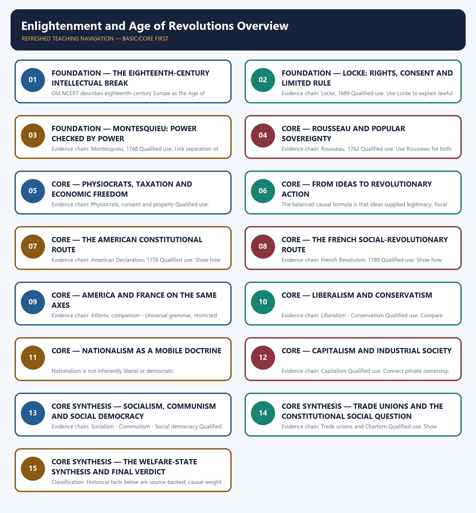

# Enlightenment and Age of Revolutions Overview — Learner-v2 Complete Learning Session

> **Authoring-only generation:** 2026-09-01. No PDF was rendered and no tracker or index was mutated.

### SOURCE, PROGRESSION AND CURRENT-LINKAGE AUDIT

- **Generation date:** 2026-09-01.
- **Repository-first evidence:** the Basic owner is taught first and preserved in full; the Advanced owner is retained only in the optional final teaching block.
- **OCR evidence:** Repository Markdown was used first. The available OCR-searchable Norman Lowe World History PDF was retained as supplementary local context, but no unsupported page number, quotation or precision was imported from it.
- **Qdrant:** not used; repository Markdown and available OCR context were sufficient.
- **PYQ integrity:** No direct UPSC PYQ is verified as owned solely by this overview in the local 2018-2025 routing blocks. The verified 2019 American-and-French-Revolutions demand is solved in Topics 02 and 03 rather than being relabelled here.
- **Live-link boundary:** No verified live current-affairs item is pegged to this historical topic in the repository owners. The package therefore uses the bounded phrase 'no verified live item' rather than inventing a headline, date, institution or contemporary linkage.
- **Fact/inference discipline:** no current-affairs item, PYQ wording, figure or quotation is invented.

## BASIC LEARNING SESSION

### DEEP-REVIEW LEARNING CONTRACT

| Control | Binding rule for this package |
|---|---|
| Syllabus boundary | Complete World History Core is taught chronologically, spatially and causally before optional enrichment. |
| Evidence method | Claim → named event/treaty/institution/actor/region or attributed scholarship → analysis → qualification. |
| Chronology | Structural cause, trigger, event, settlement, implementation and long-term process remain distinct. |
| Geography | Europe, Africa, Asia, West Asia and the Americas retain their own actors, routes and unequal connections; Europe is never the default universal viewpoint. |
| Historiography | Liberal, conservative, Marxist, social, feminist, postcolonial and other relevant interpretations are tied to evidence and bounded claims. |
| Practice contract | Every solved item has directive/demand decoding, an examiner-grade model, an executable timed/compression plan, marks rationale and answer-specific improvement. |
| Approval | This immutable successor remains `approved: false` pending explicit approval. |

**Canonical Basic/Core owner:** `upsc-ai-kit\knowledge\World-History\basic\01_Enlightenment-and-Age-of-Revolutions-Overview.md`  
**Canonical topic owner:** `upsc-ai-kit\knowledge\World-History\basic\01_Enlightenment-and-Age-of-Revolutions-Overview.md`  
**Optional Advanced owner:** `upsc-ai-kit\knowledge\World-History\advanced\01_Enlightenment-and-Age-of-Revolutions-Overview.md`  
**Official syllabus mapping:** `upsc-ai-kit\knowledge\World-History\OFFICIAL-UPSC-SYLLABUS-MAPPING.md`

### EVIDENCE, PYQ AND CURRENT-STATUS CONTROL

- **Primary/official evidence:** treaties, declarations, laws, institutional records, speeches and contemporary testimony are dated and read for authorship, audience and purpose.
- **Spatial and social evidence:** maps, trade and migration routes, battlefield geography, class, race, gender and colonial position qualify state-centred narrative.
- **Quantitative evidence:** population, debt, inflation, output, casualties and territorial claims retain unit, place, period, source and uncertainty; no statistic is invented.
- **Interpretive discipline:** teleology, civilisational ranking, single-cause verdicts and present-day nation-state projection are rejected.
- **PYQ discipline:** repository routing ledgers and locally held papers control wording and metadata; neutral rendering, reconstruction and unavailable official keys remain explicitly labelled.
- **Current-status note, rechecked 2026-09-01:** No verified live current-affairs item is pegged to this historical topic in the repository owners. The package therefore uses the bounded phrase 'no verified live item' rather than inventing a headline, date, institution or contemporary linkage.

**Live/primary context sources recorded by the predecessor generation:**

- No live source is required for a static historical claim in this topic.




*Distinct embedded teaching-navigation image. The separate continuous Cārvāka-style flowchart package remains an independent at-a-glance artifact.*

### SESSION 1 — FOUNDATION — THE EIGHTEENTH-CENTURY INTELLECTUAL BREAK

#### DEFINITION / WHAT THIS IS CALLED

**Plain-language definition:** Precise definition: The eighteenth-century intellectual break is the source-bounded relationship among Age of Reason and Enlightenment and Voltaire and secular criticism within Enlightenment and Age of Revolutions Overview.

**Technical definition:** Old NCERT describes eighteenth-century Europe as the Age of Reason or Enlightenment, an intellectual climate centred on reason, nature, humanity, freedom and happiness.

#### ANSWER-GRABBING OPENING — WRITE/ADAPT IN THE EXAM

> Precise definition: The eighteenth-century intellectual break is the source-bounded relationship among Age of Reason and Enlightenment and Voltaire and secular criticism within Enlightenment and Age of Revolutions Overview.

#### MUST-WRITE KEYWORDS

- **FOUNDATION**
- **The eighteenth-century intellectual break**
- **Precise definition**
- **Evidence chain**
- **Qualified use**
- **Precise definition: The eighteenth-century intellectual break**

**How to use them:** Frame the answer through FOUNDATION; define The eighteenth-century intellectual break, connect Precise definition with Evidence chain to explain the mechanism, and use Qualified use for the decisive comparison or qualification.

##### VISUAL FIRST

```text
THE EIGHTEENTH-CENTURY INTELLECTUAL BREAK
01. Age of Reason and Enlightenment
    |
    v
02. Voltaire and secular criticism
BOUNDARY -> Reason did not mean a single anti-religious programme.
```

*This topic-specific rail fixes the evidence sequence and its exam boundary before analysis.*

##### CONCEPT DEFINITIONS

- **Precise definition:** The eighteenth-century intellectual break is the source-bounded relationship among Age of Reason and Enlightenment and Voltaire and secular criticism within Enlightenment and Age of Revolutions Overview.
- **Classification:** Historical facts below are source-backed; causal weight and evaluative verdicts are analytical synthesis.

##### CORE EXPLANATION

Old NCERT describes eighteenth-century Europe as the Age of Reason or Enlightenment, an intellectual climate centred on reason, nature, humanity, freedom and happiness. Voltaire's critique of clerical authority elevated reason over dogma and widened secular public debate, but anti-clericalism must not be equated automatically with democracy.

##### NAMED EVIDENCE AND MECHANISM

- Old NCERT describes eighteenth-century Europe as the Age of Reason or Enlightenment, an intellectual climate centred on reason, nature, humanity, freedom and happiness.
- Voltaire's critique of clerical authority elevated reason over dogma and widened secular public debate, but anti-clericalism must not be equated automatically with democracy.

##### EXAMINER CAUTION

- Reason did not mean a single anti-religious programme.

##### EXAM LINK

- **Prelims:** Retain the exact actor, date, document and category in The eighteenth-century intellectual break.
- **Mains:** Define the Enlightenment as a plural intellectual climate.

##### MINI RECAP

- **Evidence chain:** Age of Reason and Enlightenment -> Voltaire and secular criticism
- **Qualified use:** Define the Enlightenment as a plural intellectual climate.

#### CLOSING RECALL FLOW — FOUNDATION — THE EIGHTEENTH-CENTURY INTELLECTUAL BREAK

```text
START / CONCEPT: FOUNDATION — The eighteenth-century intellectual break
        |
        v
EXACT TERMS: FOUNDATION · The eighteenth-century intellectual break · Precise definition · Evidence chain · Qualified use · Precise definition: The eighteenth-century intellectual break
        |
        v
MECHANISM / ARGUMENT: Old NCERT describes eighteenth-century Europe as the Age of Reason or Enlightenment, an intellectual climate centred on reason, nature, humanity, freedom and happiness.
        |
        v
CONSEQUENCE / CONTRAST: Voltaire's critique of clerical authority elevated reason over dogma and widened secular public debate, but anti-clericalism must not be equated automatically with democracy.
        |
        v
UPSC TRAP / ANSWER-USE: Do not miss this limiting distinction: age of Reason and Enlightenment - Voltaire and secular criticism Qualified use.
        |
        v
ANSWER-GRABBING FORMULATION: Precise definition: The eighteenth-century intellectual break is the source-bounded relationship among Age of Reason and Enlightenment and Voltaire and secular criticism within Enlightenment and Age of Revolutions Overview.
```
### SESSION 2 — FOUNDATION — LOCKE: RIGHTS, CONSENT AND LIMITED RULE

#### DEFINITION / WHAT THIS IS CALLED

**Plain-language definition:** Precise definition: Locke: rights, consent and limited rule is the source-bounded relationship among and Locke, 1689 within Enlightenment and Age of Revolutions Overview.

**Technical definition:** Evidence chain: Locke, 1689 Qualified use: Use Locke to explain lawful resistance and limited government.

#### ANSWER-GRABBING OPENING — WRITE/ADAPT IN THE EXAM

> Precise definition: Locke: rights, consent and limited rule is the source-bounded relationship among and Locke, 1689 within Enlightenment and Age of Revolutions Overview.

#### MUST-WRITE KEYWORDS

- **FOUNDATION**
- **Locke**
- **rights**
- **consent**
- **limited rule**
- **Precise definition**

**How to use them:** Frame the answer through FOUNDATION; define Locke, connect rights with consent to explain the mechanism, and use limited rule for the decisive comparison or qualification.

##### VISUAL FIRST

```text
LOCKE: RIGHTS, CONSENT AND LIMITED RULE
01. Locke, 1689
BOUNDARY -> Keep Locke in his seventeenth-century setting and avoid modern franchise claims.
```

*This topic-specific rail fixes the evidence sequence and its exam boundary before analysis.*

##### CONCEPT DEFINITIONS

- **Precise definition:** Locke: rights, consent and limited rule is the source-bounded relationship among  and Locke, 1689 within Enlightenment and Age of Revolutions Overview.
- **Classification:** Historical facts below are source-backed; causal weight and evaluative verdicts are analytical synthesis.

##### CORE EXPLANATION

John Locke's 1689 rights-and-government formulation linked natural rights, consent and limited government, making resistance to rights-violating rule politically defensible.

##### NAMED EVIDENCE AND MECHANISM

- John Locke's 1689 rights-and-government formulation linked natural rights, consent and limited government, making resistance to rights-violating rule politically defensible.

##### EXAMINER CAUTION

- Keep Locke in his seventeenth-century setting and avoid modern franchise claims.

##### EXAM LINK

- **Prelims:** Retain the exact actor, date, document and category in Locke: rights, consent and limited rule.
- **Mains:** Use Locke to explain lawful resistance and limited government.

##### MINI RECAP

- **Evidence chain:** Locke, 1689
- **Qualified use:** Use Locke to explain lawful resistance and limited government.

#### CLOSING RECALL FLOW — FOUNDATION — LOCKE: RIGHTS, CONSENT AND LIMITED RULE

```text
START / CONCEPT: FOUNDATION — Locke: rights, consent and limited rule
        |
        v
EXACT TERMS: FOUNDATION · Locke · rights · consent · limited rule · Precise definition
        |
        v
MECHANISM / ARGUMENT: Mains: Use Locke to explain lawful resistance and limited government.
        |
        v
CONSEQUENCE / CONTRAST: Evidence chain: Locke, 1689 Qualified use: Use Locke to explain lawful resistance and limited government.
        |
        v
UPSC TRAP / ANSWER-USE: Do not miss this limiting distinction: causal weight and evaluative verdicts are analytical synthesis.
        |
        v
ANSWER-GRABBING FORMULATION: Precise definition: Locke: rights, consent and limited rule is the source-bounded relationship among and Locke, 1689 within Enlightenment and Age of Revolutions Overview.
```
### SESSION 3 — FOUNDATION — MONTESQUIEU: POWER CHECKED BY POWER

#### DEFINITION / WHAT THIS IS CALLED

**Plain-language definition:** Precise definition: Montesquieu: power checked by power is the source-bounded relationship among and Montesquieu, 1748 within Enlightenment and Age of Revolutions Overview.

**Technical definition:** Evidence chain: Montesquieu, 1748 Qualified use: Link separation of powers to institutional restraint.

#### ANSWER-GRABBING OPENING — WRITE/ADAPT IN THE EXAM

> Precise definition: Montesquieu: power checked by power is the source-bounded relationship among and Montesquieu, 1748 within Enlightenment and Age of Revolutions Overview.

#### MUST-WRITE KEYWORDS

- **FOUNDATION**
- **Montesquieu**
- **power checked by power**
- **Precise definition**
- **Evidence chain**
- **Qualified use**

**How to use them:** Frame the answer through FOUNDATION; define Montesquieu, connect power checked by power with Precise definition to explain the mechanism, and use Evidence chain for the decisive comparison or qualification.

##### VISUAL FIRST

```text
MONTESQUIEU: POWER CHECKED BY POWER
01. Montesquieu, 1748
BOUNDARY -> Do not attribute a later constitution clause directly without a verified source.
```

*This topic-specific rail fixes the evidence sequence and its exam boundary before analysis.*

##### CONCEPT DEFINITIONS

- **Precise definition:** Montesquieu: power checked by power is the source-bounded relationship among  and Montesquieu, 1748 within Enlightenment and Age of Revolutions Overview.
- **Classification:** Historical facts below are source-backed; causal weight and evaluative verdicts are analytical synthesis.

##### CORE EXPLANATION

Montesquieu's 1748 institutional argument connected constitutionalism with separation of powers as a restraint on arbitrary authority.

##### NAMED EVIDENCE AND MECHANISM

- Montesquieu's 1748 institutional argument connected constitutionalism with separation of powers as a restraint on arbitrary authority.

##### EXAMINER CAUTION

- Do not attribute a later constitution clause directly without a verified source.

##### EXAM LINK

- **Prelims:** Retain the exact actor, date, document and category in Montesquieu: power checked by power.
- **Mains:** Link separation of powers to institutional restraint.

##### MINI RECAP

- **Evidence chain:** Montesquieu, 1748
- **Qualified use:** Link separation of powers to institutional restraint.

#### CLOSING RECALL FLOW — FOUNDATION — MONTESQUIEU: POWER CHECKED BY POWER

```text
START / CONCEPT: FOUNDATION — Montesquieu: power checked by power
        |
        v
EXACT TERMS: FOUNDATION · Montesquieu · power checked by power · Precise definition · Evidence chain · Qualified use
        |
        v
MECHANISM / ARGUMENT: Evidence chain: Montesquieu, 1748 Qualified use: Link separation of powers to institutional restraint.
        |
        v
CONSEQUENCE / CONTRAST: Do not attribute a later constitution clause directly without a verified source.
        |
        v
UPSC TRAP / ANSWER-USE: Do not miss this limiting distinction: causal weight and evaluative verdicts are analytical synthesis.
        |
        v
ANSWER-GRABBING FORMULATION: Precise definition: Montesquieu: power checked by power is the source-bounded relationship among and Montesquieu, 1748 within Enlightenment and Age of Revolutions Overview.
```
### SESSION 4 — CORE — ROUSSEAU AND POPULAR SOVEREIGNTY

#### DEFINITION / WHAT THIS IS CALLED

**Plain-language definition:** Precise definition: Rousseau and popular sovereignty is the source-bounded relationship among and Rousseau, 1762 within Enlightenment and Age of Revolutions Overview.

**Technical definition:** Evidence chain: Rousseau, 1762 Qualified use: Use Rousseau for both democratic legitimacy and its tension.

#### ANSWER-GRABBING OPENING — WRITE/ADAPT IN THE EXAM

> Precise definition: Rousseau and popular sovereignty is the source-bounded relationship among and Rousseau, 1762 within Enlightenment and Age of Revolutions Overview.

#### MUST-WRITE KEYWORDS

- **Rousseau**
- **popular sovereignty**
- **Precise definition**
- **Evidence chain**
- **Qualified use**
- **Precise definition: Rousseau and popular sovereignty**

**How to use them:** Frame the answer through Rousseau; define popular sovereignty, connect Precise definition with Evidence chain to explain the mechanism, and use Qualified use for the decisive comparison or qualification.

##### VISUAL FIRST

```text
ROUSSEAU AND POPULAR SOVEREIGNTY
01. Rousseau, 1762
BOUNDARY -> Popular sovereignty can coexist with coercive general-will reasoning.
```

*This topic-specific rail fixes the evidence sequence and its exam boundary before analysis.*

##### CONCEPT DEFINITIONS

- **Precise definition:** Rousseau and popular sovereignty is the source-bounded relationship among  and Rousseau, 1762 within Enlightenment and Age of Revolutions Overview.
- **Classification:** Historical facts below are source-backed; causal weight and evaluative verdicts are analytical synthesis.

##### CORE EXPLANATION

Rousseau's 1762 social-contract argument placed popular sovereignty in the people, while its general-will logic also carried a possible coercive edge.

##### NAMED EVIDENCE AND MECHANISM

- Rousseau's 1762 social-contract argument placed popular sovereignty in the people, while its general-will logic also carried a possible coercive edge.

##### EXAMINER CAUTION

- Popular sovereignty can coexist with coercive general-will reasoning.

##### EXAM LINK

- **Prelims:** Retain the exact actor, date, document and category in Rousseau and popular sovereignty.
- **Mains:** Use Rousseau for both democratic legitimacy and its tension.

##### MINI RECAP

- **Evidence chain:** Rousseau, 1762
- **Qualified use:** Use Rousseau for both democratic legitimacy and its tension.

#### CLOSING RECALL FLOW — CORE — ROUSSEAU AND POPULAR SOVEREIGNTY

```text
START / CONCEPT: CORE — Rousseau and popular sovereignty
        |
        v
EXACT TERMS: Rousseau · popular sovereignty · Precise definition · Evidence chain · Qualified use · Precise definition: Rousseau and popular sovereignty
        |
        v
MECHANISM / ARGUMENT: Rousseau's 1762 social-contract argument placed popular sovereignty in the people, while its general-will logic also carried a possible coercive edge.
        |
        v
CONSEQUENCE / CONTRAST: Evidence chain: Rousseau, 1762 Qualified use: Use Rousseau for both democratic legitimacy and its tension.
        |
        v
UPSC TRAP / ANSWER-USE: Do not miss this limiting distinction: popular sovereignty can coexist with coercive general-will reasoning.
        |
        v
ANSWER-GRABBING FORMULATION: Precise definition: Rousseau and popular sovereignty is the source-bounded relationship among and Rousseau, 1762 within Enlightenment and Age of Revolutions Overview.
```
### SESSION 5 — CORE — PHYSIOCRATS, TAXATION AND ECONOMIC FREEDOM

#### DEFINITION / WHAT THIS IS CALLED

**Plain-language definition:** Precise definition: Physiocrats, taxation and economic freedom is the source-bounded relationship among and Physiocrats, consent and property within Enlightenment and Age of Revolutions Overview.

**Technical definition:** Evidence chain: Physiocrats, consent and property Qualified use: Connect fiscal consent to anti-privilege politics.

#### ANSWER-GRABBING OPENING — WRITE/ADAPT IN THE EXAM

> Precise definition: Physiocrats, taxation and economic freedom is the source-bounded relationship among and Physiocrats, consent and property within Enlightenment and Age of Revolutions Overview.

#### MUST-WRITE KEYWORDS

- **Physiocrats**
- **taxation**
- **economic freedom**
- **Precise definition**
- **Evidence chain**
- **Qualified use**

**How to use them:** Frame the answer through Physiocrats; define taxation, connect economic freedom with Precise definition to explain the mechanism, and use Evidence chain for the decisive comparison or qualification.

##### VISUAL FIRST

```text
PHYSIOCRATS, TAXATION AND ECONOMIC FREEDOM
01. Physiocrats, consent and property
BOUNDARY -> The Physiocrats were one current, not the whole Enlightenment.
```

*This topic-specific rail fixes the evidence sequence and its exam boundary before analysis.*

##### CONCEPT DEFINITIONS

- **Precise definition:** Physiocrats, taxation and economic freedom is the source-bounded relationship among  and Physiocrats, consent and property within Enlightenment and Age of Revolutions Overview.
- **Classification:** Historical facts below are source-backed; causal weight and evaluative verdicts are analytical synthesis.

##### CORE EXPLANATION

The Physiocrats connected taxation with consent and defended property and economic freedom, linking fiscal grievance to anti-privilege politics.

##### NAMED EVIDENCE AND MECHANISM

- The Physiocrats connected taxation with consent and defended property and economic freedom, linking fiscal grievance to anti-privilege politics.

##### EXAMINER CAUTION

- The Physiocrats were one current, not the whole Enlightenment.

##### EXAM LINK

- **Prelims:** Retain the exact actor, date, document and category in Physiocrats, taxation and economic freedom.
- **Mains:** Connect fiscal consent to anti-privilege politics.

##### MINI RECAP

- **Evidence chain:** Physiocrats, consent and property
- **Qualified use:** Connect fiscal consent to anti-privilege politics.

#### CLOSING RECALL FLOW — CORE — PHYSIOCRATS, TAXATION AND ECONOMIC FREEDOM

```text
START / CONCEPT: CORE — Physiocrats, taxation and economic freedom
        |
        v
EXACT TERMS: Physiocrats · taxation · economic freedom · Precise definition · Evidence chain · Qualified use
        |
        v
MECHANISM / ARGUMENT: Evidence chain: Physiocrats, consent and property Qualified use: Connect fiscal consent to anti-privilege politics.
        |
        v
CONSEQUENCE / CONTRAST: The Physiocrats were one current, not the whole Enlightenment.
        |
        v
UPSC TRAP / ANSWER-USE: Do not miss this limiting distinction: causal weight and evaluative verdicts are analytical synthesis.
        |
        v
ANSWER-GRABBING FORMULATION: Precise definition: Physiocrats, taxation and economic freedom is the source-bounded relationship among and Physiocrats, consent and property within Enlightenment and Age of Revolutions Overview.
```
### SESSION 6 — CORE — FROM IDEAS TO REVOLUTIONARY ACTION

#### DEFINITION / WHAT THIS IS CALLED

**Plain-language definition:** Precise definition: From ideas to revolutionary action is the source-bounded relationship among and Ideas, crisis and mobilisation within Enlightenment and Age of Revolutions Overview.

**Technical definition:** The balanced causal formula is that ideas supplied legitimacy, fiscal and social crises supplied momentum, and mobilised groups supplied revolutionary force.

#### ANSWER-GRABBING OPENING — WRITE/ADAPT IN THE EXAM

> Precise definition: From ideas to revolutionary action is the source-bounded relationship among and Ideas, crisis and mobilisation within Enlightenment and Age of Revolutions Overview.

#### MUST-WRITE KEYWORDS

- **From ideas to revolutionary action**
- **Precise definition**
- **Evidence chain**
- **Qualified use**
- **Precise definition: From ideas to revolutionary action**
- **Precise**

**How to use them:** Frame the answer through From ideas to revolutionary action; define Precise definition, connect Evidence chain with Qualified use to explain the mechanism, and use Precise definition: From ideas to revolutionary action for the decisive comparison or qualification.

##### VISUAL FIRST

```text
FROM IDEAS TO REVOLUTIONARY ACTION
01. Ideas, crisis and mobilisation
BOUNDARY -> Ideas explain form, not timing or social depth by themselves.
```

*This topic-specific rail fixes the evidence sequence and its exam boundary before analysis.*

##### CONCEPT DEFINITIONS

- **Precise definition:** From ideas to revolutionary action is the source-bounded relationship among  and Ideas, crisis and mobilisation within Enlightenment and Age of Revolutions Overview.
- **Classification:** Historical facts below are source-backed; causal weight and evaluative verdicts are analytical synthesis.

##### CORE EXPLANATION

The balanced causal formula is that ideas supplied legitimacy, fiscal and social crises supplied momentum, and mobilised groups supplied revolutionary force.

##### NAMED EVIDENCE AND MECHANISM

- The balanced causal formula is that ideas supplied legitimacy, fiscal and social crises supplied momentum, and mobilised groups supplied revolutionary force.

##### EXAMINER CAUTION

- Ideas explain form, not timing or social depth by themselves.

##### EXAM LINK

- **Prelims:** Retain the exact actor, date, document and category in From ideas to revolutionary action.
- **Mains:** Organise causation as legitimacy, crisis and mobilisation.

##### MINI RECAP

- **Evidence chain:** Ideas, crisis and mobilisation
- **Qualified use:** Organise causation as legitimacy, crisis and mobilisation.

#### CLOSING RECALL FLOW — CORE — FROM IDEAS TO REVOLUTIONARY ACTION

```text
START / CONCEPT: CORE — From ideas to revolutionary action
        |
        v
EXACT TERMS: From ideas to revolutionary action · Precise definition · Evidence chain · Qualified use · Precise definition: From ideas to revolutionary action · Precise
        |
        v
MECHANISM / ARGUMENT: Ideas explain form, not timing or social depth by themselves.
        |
        v
CONSEQUENCE / CONTRAST: The balanced causal formula is that ideas supplied legitimacy, fiscal and social crises supplied momentum, and mobilised groups supplied revolutionary force.
        |
        v
UPSC TRAP / ANSWER-USE: Do not miss this limiting distinction: ideas, crisis and mobilisation Qualified use.
        |
        v
ANSWER-GRABBING FORMULATION: Precise definition: From ideas to revolutionary action is the source-bounded relationship among and Ideas, crisis and mobilisation within Enlightenment and Age of Revolutions Overview.
```
### SESSION 7 — CORE — THE AMERICAN CONSTITUTIONAL ROUTE

#### DEFINITION / WHAT THIS IS CALLED

**Plain-language definition:** Precise definition: The American constitutional route is the source-bounded relationship among and American Declaration, 1776 within Enlightenment and Age of Revolutions Overview.

**Technical definition:** Evidence chain: American Declaration, 1776 Qualified use: Show how rights became a constitutional state form.

#### ANSWER-GRABBING OPENING — WRITE/ADAPT IN THE EXAM

> Precise definition: The American constitutional route is the source-bounded relationship among and American Declaration, 1776 within Enlightenment and Age of Revolutions Overview.

#### MUST-WRITE KEYWORDS

- **The American constitutional route**
- **Precise definition**
- **Evidence chain**
- **Qualified use**
- **Precise definition: The American constitutional route**
- **Precise**

**How to use them:** Frame the answer through The American constitutional route; define Precise definition, connect Evidence chain with Qualified use to explain the mechanism, and use Precise definition: The American constitutional route for the decisive comparison or qualification.

##### VISUAL FIRST

```text
THE AMERICAN CONSTITUTIONAL ROUTE
01. American Declaration, 1776
BOUNDARY -> A republican precedent was not yet a fully democratic social order.
```

*This topic-specific rail fixes the evidence sequence and its exam boundary before analysis.*

##### CONCEPT DEFINITIONS

- **Precise definition:** The American constitutional route is the source-bounded relationship among  and American Declaration, 1776 within Enlightenment and Age of Revolutions Overview.
- **Classification:** Historical facts below are source-backed; causal weight and evaluative verdicts are analytical synthesis.

##### CORE EXPLANATION

The 1776 American Declaration translated rights-language into a durable republican break with empire and a precedent for written constitutional government.

##### NAMED EVIDENCE AND MECHANISM

- The 1776 American Declaration translated rights-language into a durable republican break with empire and a precedent for written constitutional government.

##### EXAMINER CAUTION

- A republican precedent was not yet a fully democratic social order.

##### EXAM LINK

- **Prelims:** Retain the exact actor, date, document and category in The American constitutional route.
- **Mains:** Show how rights became a constitutional state form.

##### MINI RECAP

- **Evidence chain:** American Declaration, 1776
- **Qualified use:** Show how rights became a constitutional state form.

#### CLOSING RECALL FLOW — CORE — THE AMERICAN CONSTITUTIONAL ROUTE

```text
START / CONCEPT: CORE — The American constitutional route
        |
        v
EXACT TERMS: The American constitutional route · Precise definition · Evidence chain · Qualified use · Precise definition: The American constitutional route · Precise
        |
        v
MECHANISM / ARGUMENT: Evidence chain: American Declaration, 1776 Qualified use: Show how rights became a constitutional state form.
        |
        v
CONSEQUENCE / CONTRAST: A republican precedent was not yet a fully democratic social order.
        |
        v
UPSC TRAP / ANSWER-USE: Do not miss this limiting distinction: show how rights became a constitutional state form.
        |
        v
ANSWER-GRABBING FORMULATION: Precise definition: The American constitutional route is the source-bounded relationship among and American Declaration, 1776 within Enlightenment and Age of Revolutions Overview.
```
### SESSION 8 — CORE — THE FRENCH SOCIAL-REVOLUTIONARY ROUTE

#### DEFINITION / WHAT THIS IS CALLED

**Plain-language definition:** Precise definition: The French social-revolutionary route is the source-bounded relationship among and French Revolution, 1789 within Enlightenment and Age of Revolutions Overview.

**Technical definition:** Evidence chain: French Revolution, 1789 Qualified use: Show how legal privilege and sovereignty were transformed.

#### ANSWER-GRABBING OPENING — WRITE/ADAPT IN THE EXAM

> Precise definition: The French social-revolutionary route is the source-bounded relationship among and French Revolution, 1789 within Enlightenment and Age of Revolutions Overview.

#### MUST-WRITE KEYWORDS

- **The French social-revolutionary route**
- **Precise definition**
- **Evidence chain**
- **Qualified use**
- **Precise definition: The French social-revolutionary route**
- **Precise**

**How to use them:** Frame the answer through The French social-revolutionary route; define Precise definition, connect Evidence chain with Qualified use to explain the mechanism, and use Precise definition: The French social-revolutionary route for the decisive comparison or qualification.

##### VISUAL FIRST

```text
THE FRENCH SOCIAL-REVOLUTIONARY ROUTE
01. French Revolution, 1789
BOUNDARY -> Rights and citizenship did not immediately erase exclusion.
```

*This topic-specific rail fixes the evidence sequence and its exam boundary before analysis.*

##### CONCEPT DEFINITIONS

- **Precise definition:** The French social-revolutionary route is the source-bounded relationship among  and French Revolution, 1789 within Enlightenment and Age of Revolutions Overview.
- **Classification:** Historical facts below are source-backed; causal weight and evaluative verdicts are analytical synthesis.

##### CORE EXPLANATION

The French Revolution of 1789 made rights, citizenship, the nation and the destruction of legal privilege mass political questions.

##### NAMED EVIDENCE AND MECHANISM

- The French Revolution of 1789 made rights, citizenship, the nation and the destruction of legal privilege mass political questions.

##### EXAMINER CAUTION

- Rights and citizenship did not immediately erase exclusion.

##### EXAM LINK

- **Prelims:** Retain the exact actor, date, document and category in The French social-revolutionary route.
- **Mains:** Show how legal privilege and sovereignty were transformed.

##### MINI RECAP

- **Evidence chain:** French Revolution, 1789
- **Qualified use:** Show how legal privilege and sovereignty were transformed.

#### CLOSING RECALL FLOW — CORE — THE FRENCH SOCIAL-REVOLUTIONARY ROUTE

```text
START / CONCEPT: CORE — The French social-revolutionary route
        |
        v
EXACT TERMS: The French social-revolutionary route · Precise definition · Evidence chain · Qualified use · Precise definition: The French social-revolutionary route · Precise
        |
        v
MECHANISM / ARGUMENT: Evidence chain: French Revolution, 1789 Qualified use: Show how legal privilege and sovereignty were transformed.
        |
        v
CONSEQUENCE / CONTRAST: Classification: Historical facts below are source-backed; causal weight and evaluative verdicts are analytical synthesis.
        |
        v
UPSC TRAP / ANSWER-USE: Do not miss this limiting distinction: show how legal privilege and sovereignty were transformed.
        |
        v
ANSWER-GRABBING FORMULATION: Precise definition: The French social-revolutionary route is the source-bounded relationship among and French Revolution, 1789 within Enlightenment and Age of Revolutions Overview.
```
### SESSION 9 — CORE — AMERICA AND FRANCE ON THE SAME AXES

#### DEFINITION / WHAT THIS IS CALLED

**Plain-language definition:** Precise definition: America and France on the same axes is the source-bounded relationship among Atlantic comparison and Universal grammar, restricted membership within Enlightenment and Age of Revolutions Overview.

**Technical definition:** Evidence chain: Atlantic comparison - Universal grammar, restricted membership Qualified use: Use a disciplined comparison instead of parallel narratives.

#### ANSWER-GRABBING OPENING — WRITE/ADAPT IN THE EXAM

> Precise definition: America and France on the same axes is the source-bounded relationship among Atlantic comparison and Universal grammar, restricted membership within Enlightenment and Age of Revolutions Overview.

#### MUST-WRITE KEYWORDS

- **America**
- **France on the same axes**
- **Precise definition**
- **Evidence chain**
- **Qualified use**
- **Precise**

**How to use them:** Frame the answer through America; define France on the same axes, connect Precise definition with Evidence chain to explain the mechanism, and use Qualified use for the decisive comparison or qualification.

##### VISUAL FIRST

```text
AMERICA AND FRANCE ON THE SAME AXES
01. Atlantic comparison
    |
    v
02. Universal grammar, restricted membership
BOUNDARY -> Preserve differences in target, social depth and inclusion.
```

*This topic-specific rail fixes the evidence sequence and its exam boundary before analysis.*

##### CONCEPT DEFINITIONS

- **Precise definition:** America and France on the same axes is the source-bounded relationship among Atlantic comparison and Universal grammar, restricted membership within Enlightenment and Age of Revolutions Overview.
- **Classification:** Historical facts below are source-backed; causal weight and evaluative verdicts are analytical synthesis.

##### CORE EXPLANATION

America broke an imperial link and institutionalised a federal republic; France dismantled an internal structure of feudal and dynastic privilege with much greater social depth. Enlightenment rights-language claimed universality, but women, enslaved people, colonial subjects and many propertyless men remained outside early political settlements.

##### NAMED EVIDENCE AND MECHANISM

- America broke an imperial link and institutionalised a federal republic; France dismantled an internal structure of feudal and dynastic privilege with much greater social depth.
- Enlightenment rights-language claimed universality, but women, enslaved people, colonial subjects and many propertyless men remained outside early political settlements.

##### EXAMINER CAUTION

- Preserve differences in target, social depth and inclusion.

##### EXAM LINK

- **Prelims:** Retain the exact actor, date, document and category in America and France on the same axes.
- **Mains:** Use a disciplined comparison instead of parallel narratives.

##### MINI RECAP

- **Evidence chain:** Atlantic comparison -> Universal grammar, restricted membership
- **Qualified use:** Use a disciplined comparison instead of parallel narratives.

#### CLOSING RECALL FLOW — CORE — AMERICA AND FRANCE ON THE SAME AXES

```text
START / CONCEPT: CORE — America and France on the same axes
        |
        v
EXACT TERMS: America · France on the same axes · Precise definition · Evidence chain · Qualified use · Precise
        |
        v
MECHANISM / ARGUMENT: Evidence chain: Atlantic comparison - Universal grammar, restricted membership Qualified use: Use a disciplined comparison instead of parallel narratives.
        |
        v
CONSEQUENCE / CONTRAST: Classification: Historical facts below are source-backed; causal weight and evaluative verdicts are analytical synthesis.
        |
        v
UPSC TRAP / ANSWER-USE: Do not miss this limiting distinction: use a disciplined comparison instead of parallel narratives.
        |
        v
ANSWER-GRABBING FORMULATION: Precise definition: America and France on the same axes is the source-bounded relationship among Atlantic comparison and Universal grammar, restricted membership within Enlightenment and Age of Revolutions Overview.
```
### SESSION 10 — CORE — LIBERALISM AND CONSERVATISM

#### DEFINITION / WHAT THIS IS CALLED

**Plain-language definition:** Precise definition: Liberalism and conservatism is the source-bounded relationship among Liberalism and Conservatism within Enlightenment and Age of Revolutions Overview.

**Technical definition:** Evidence chain: Liberalism - Conservatism Qualified use: Compare consent and rights with order and inherited institutions.

#### ANSWER-GRABBING OPENING — WRITE/ADAPT IN THE EXAM

> Precise definition: Liberalism and conservatism is the source-bounded relationship among Liberalism and Conservatism within Enlightenment and Age of Revolutions Overview.

#### MUST-WRITE KEYWORDS

- **Liberalism**
- **conservatism**
- **Precise definition**
- **Evidence chain**
- **Qualified use**
- **Precise definition: Liberalism and conservatism**

**How to use them:** Frame the answer through Liberalism; define conservatism, connect Precise definition with Evidence chain to explain the mechanism, and use Qualified use for the decisive comparison or qualification.

##### VISUAL FIRST

```text
LIBERALISM AND CONSERVATISM
01. Liberalism
    |
    v
02. Conservatism
BOUNDARY -> Neither doctrine had one fixed historical form.
```

*This topic-specific rail fixes the evidence sequence and its exam boundary before analysis.*

##### CONCEPT DEFINITIONS

- **Precise definition:** Liberalism and conservatism is the source-bounded relationship among Liberalism and Conservatism within Enlightenment and Age of Revolutions Overview.
- **Classification:** Historical facts below are source-backed; causal weight and evaluative verdicts are analytical synthesis.

##### CORE EXPLANATION

Liberalism made consent, limited government, legal equality, rights and representative institutions its core political tests, without initially implying universal franchise. Conservatism defended order, religion, property and inherited institutions through gradual change; the Vienna system combined great-power peace with repression of liberal nationalism.

##### NAMED EVIDENCE AND MECHANISM

- Liberalism made consent, limited government, legal equality, rights and representative institutions its core political tests, without initially implying universal franchise.
- Conservatism defended order, religion, property and inherited institutions through gradual change; the Vienna system combined great-power peace with repression of liberal nationalism.

##### EXAMINER CAUTION

- Neither doctrine had one fixed historical form.

##### EXAM LINK

- **Prelims:** Retain the exact actor, date, document and category in Liberalism and conservatism.
- **Mains:** Compare consent and rights with order and inherited institutions.

##### MINI RECAP

- **Evidence chain:** Liberalism -> Conservatism
- **Qualified use:** Compare consent and rights with order and inherited institutions.

#### CLOSING RECALL FLOW — CORE — LIBERALISM AND CONSERVATISM

```text
START / CONCEPT: CORE — Liberalism and conservatism
        |
        v
EXACT TERMS: Liberalism · conservatism · Precise definition · Evidence chain · Qualified use · Precise definition: Liberalism and conservatism
        |
        v
MECHANISM / ARGUMENT: Evidence chain: Liberalism - Conservatism Qualified use: Compare consent and rights with order and inherited institutions.
        |
        v
CONSEQUENCE / CONTRAST: Classification: Historical facts below are source-backed; causal weight and evaluative verdicts are analytical synthesis.
        |
        v
UPSC TRAP / ANSWER-USE: Do not miss this limiting distinction: neither doctrine had one fixed historical form.
        |
        v
ANSWER-GRABBING FORMULATION: Precise definition: Liberalism and conservatism is the source-bounded relationship among Liberalism and Conservatism within Enlightenment and Age of Revolutions Overview.
```
### SESSION 11 — CORE — NATIONALISM AS A MOBILE DOCTRINE

#### DEFINITION / WHAT THIS IS CALLED

**Plain-language definition:** Precise definition: Nationalism as a mobile doctrine is the source-bounded relationship among and Nationalism within Enlightenment and Age of Revolutions Overview.

**Technical definition:** Nationalism is not inherently liberal or democratic.

#### ANSWER-GRABBING OPENING — WRITE/ADAPT IN THE EXAM

> Precise definition: Nationalism as a mobile doctrine is the source-bounded relationship among and Nationalism within Enlightenment and Age of Revolutions Overview.

#### MUST-WRITE KEYWORDS

- **Nationalism as a mobile doctrine**
- **Precise definition**
- **Evidence chain**
- **Qualified use**
- **Precise definition: Nationalism as a mobile doctrine**
- **Precise**

**How to use them:** Frame the answer through Nationalism as a mobile doctrine; define Precise definition, connect Evidence chain with Qualified use to explain the mechanism, and use Precise definition: Nationalism as a mobile doctrine for the decisive comparison or qualification.

##### VISUAL FIRST

```text
NATIONALISM AS A MOBILE DOCTRINE
01. Nationalism
BOUNDARY -> Nationalism is not inherently liberal or democratic.
```

*This topic-specific rail fixes the evidence sequence and its exam boundary before analysis.*

##### CONCEPT DEFINITIONS

- **Precise definition:** Nationalism as a mobile doctrine is the source-bounded relationship among  and Nationalism within Enlightenment and Age of Revolutions Overview.
- **Classification:** Historical facts below are source-backed; causal weight and evaluative verdicts are analytical synthesis.

##### CORE EXPLANATION

Nationalism treated the nation as the proper unit of sovereignty, but later combined variously with liberal, conservative, racial and anti-colonial projects.

##### NAMED EVIDENCE AND MECHANISM

- Nationalism treated the nation as the proper unit of sovereignty, but later combined variously with liberal, conservative, racial and anti-colonial projects.

##### EXAMINER CAUTION

- Nationalism is not inherently liberal or democratic.

##### EXAM LINK

- **Prelims:** Retain the exact actor, date, document and category in Nationalism as a mobile doctrine.
- **Mains:** Trace how the nation became a claim to sovereignty.

##### MINI RECAP

- **Evidence chain:** Nationalism
- **Qualified use:** Trace how the nation became a claim to sovereignty.

#### CLOSING RECALL FLOW — CORE — NATIONALISM AS A MOBILE DOCTRINE

```text
START / CONCEPT: CORE — Nationalism as a mobile doctrine
        |
        v
EXACT TERMS: Nationalism as a mobile doctrine · Precise definition · Evidence chain · Qualified use · Precise definition: Nationalism as a mobile doctrine · Precise
        |
        v
MECHANISM / ARGUMENT: Evidence chain: Nationalism Qualified use: Trace how the nation became a claim to sovereignty.
        |
        v
CONSEQUENCE / CONTRAST: Nationalism is not inherently liberal or democratic.
        |
        v
UPSC TRAP / ANSWER-USE: Do not miss this limiting distinction: causal weight and evaluative verdicts are analytical synthesis.
        |
        v
ANSWER-GRABBING FORMULATION: Precise definition: Nationalism as a mobile doctrine is the source-bounded relationship among and Nationalism within Enlightenment and Age of Revolutions Overview.
```
### SESSION 12 — CORE — CAPITALISM AND INDUSTRIAL SOCIETY

#### DEFINITION / WHAT THIS IS CALLED

**Plain-language definition:** Precise definition: Capitalism and industrial society is the source-bounded relationship among and Capitalism within Enlightenment and Age of Revolutions Overview.

**Technical definition:** Evidence chain: Capitalism Qualified use: Connect private ownership and wage labour to changing social outcomes.

#### ANSWER-GRABBING OPENING — WRITE/ADAPT IN THE EXAM

> Precise definition: Capitalism and industrial society is the source-bounded relationship among and Capitalism within Enlightenment and Age of Revolutions Overview.

#### MUST-WRITE KEYWORDS

- **Capitalism**
- **industrial society**
- **Precise definition**
- **Evidence chain**
- **Qualified use**
- **Precise definition: Capitalism and industrial society**

**How to use them:** Frame the answer through Capitalism; define industrial society, connect Precise definition with Evidence chain to explain the mechanism, and use Qualified use for the decisive comparison or qualification.

##### VISUAL FIRST

```text
CAPITALISM AND INDUSTRIAL SOCIETY
01. Capitalism
BOUNDARY -> Do not equate capitalism with one regulation level.
```

*This topic-specific rail fixes the evidence sequence and its exam boundary before analysis.*

##### CONCEPT DEFINITIONS

- **Precise definition:** Capitalism and industrial society is the source-bounded relationship among  and Capitalism within Enlightenment and Age of Revolutions Overview.
- **Classification:** Historical facts below are source-backed; causal weight and evaluative verdicts are analytical synthesis.

##### CORE EXPLANATION

Capitalism concentrated productive wealth in private hands and organised production through profit, contract and wage labour; its social effects depended heavily on regulation.

##### NAMED EVIDENCE AND MECHANISM

- Capitalism concentrated productive wealth in private hands and organised production through profit, contract and wage labour; its social effects depended heavily on regulation.

##### EXAMINER CAUTION

- Do not equate capitalism with one regulation level.

##### EXAM LINK

- **Prelims:** Retain the exact actor, date, document and category in Capitalism and industrial society.
- **Mains:** Connect private ownership and wage labour to changing social outcomes.

##### MINI RECAP

- **Evidence chain:** Capitalism
- **Qualified use:** Connect private ownership and wage labour to changing social outcomes.

#### CLOSING RECALL FLOW — CORE — CAPITALISM AND INDUSTRIAL SOCIETY

```text
START / CONCEPT: CORE — Capitalism and industrial society
        |
        v
EXACT TERMS: Capitalism · industrial society · Precise definition · Evidence chain · Qualified use · Precise definition: Capitalism and industrial society
        |
        v
MECHANISM / ARGUMENT: Evidence chain: Capitalism Qualified use: Connect private ownership and wage labour to changing social outcomes.
        |
        v
CONSEQUENCE / CONTRAST: Do not equate capitalism with one regulation level.
        |
        v
UPSC TRAP / ANSWER-USE: Do not miss this limiting distinction: causal weight and evaluative verdicts are analytical synthesis.
        |
        v
ANSWER-GRABBING FORMULATION: Precise definition: Capitalism and industrial society is the source-bounded relationship among and Capitalism within Enlightenment and Age of Revolutions Overview.
```
### SESSION 13 — CORE SYNTHESIS — SOCIALISM, COMMUNISM AND SOCIAL DEMOCRACY

#### DEFINITION / WHAT THIS IS CALLED

**Plain-language definition:** Precise definition: Socialism, communism and social democracy is the source-bounded relationship among Socialism, Communism and Social democracy within Enlightenment and Age of Revolutions Overview.

**Technical definition:** Evidence chain: Socialism - Communism - Social democracy Qualified use: Build a three-column doctrinal comparison.

#### ANSWER-GRABBING OPENING — WRITE/ADAPT IN THE EXAM

> Precise definition: Socialism, communism and social democracy is the source-bounded relationship among Socialism, Communism and Social democracy within Enlightenment and Age of Revolutions Overview.

#### MUST-WRITE KEYWORDS

- **CORE SYNTHESIS**
- **Socialism**
- **communism**
- **social democracy**
- **Precise definition**
- **Evidence chain**

**How to use them:** Frame the answer through CORE SYNTHESIS; define Socialism, connect communism with social democracy to explain the mechanism, and use Precise definition for the decisive comparison or qualification.

##### VISUAL FIRST

```text
SOCIALISM, COMMUNISM AND SOCIAL DEMOCRACY
01. Socialism
    |
    v
02. Communism
    |
    v
03. Social democracy
BOUNDARY -> Separate ownership, method and political pluralism.
```

*This topic-specific rail fixes the evidence sequence and its exam boundary before analysis.*

##### CONCEPT DEFINITIONS

- **Precise definition:** Socialism, communism and social democracy is the source-bounded relationship among Socialism, Communism and Social democracy within Enlightenment and Age of Revolutions Overview.
- **Classification:** Historical facts below are source-backed; causal weight and evaluative verdicts are analytical synthesis.

##### CORE EXPLANATION

Socialism argued that productive wealth should be socially owned or controlled and distribution should serve need, ranging from cooperative and parliamentary to revolutionary forms. Communism joined collective ownership and central planning to revolutionary seizure of power and, in practice, one-party rule, while differing Soviet, Chinese and Yugoslav forms emerged. Social democracy retained capitalist production but sought democratic regulation, redistribution, labour rights and welfare through elections, bargaining and legislation.

##### NAMED EVIDENCE AND MECHANISM

- Socialism argued that productive wealth should be socially owned or controlled and distribution should serve need, ranging from cooperative and parliamentary to revolutionary forms.
- Communism joined collective ownership and central planning to revolutionary seizure of power and, in practice, one-party rule, while differing Soviet, Chinese and Yugoslav forms emerged.
- Social democracy retained capitalist production but sought democratic regulation, redistribution, labour rights and welfare through elections, bargaining and legislation.

##### EXAMINER CAUTION

- Separate ownership, method and political pluralism.

##### EXAM LINK

- **Prelims:** Retain the exact actor, date, document and category in Socialism, communism and social democracy.
- **Mains:** Build a three-column doctrinal comparison.

##### MINI RECAP

- **Evidence chain:** Socialism -> Communism -> Social democracy
- **Qualified use:** Build a three-column doctrinal comparison.

#### CLOSING RECALL FLOW — CORE SYNTHESIS — SOCIALISM, COMMUNISM AND SOCIAL DEMOCRACY

```text
START / CONCEPT: CORE SYNTHESIS — Socialism, communism and social democracy
        |
        v
EXACT TERMS: CORE SYNTHESIS · Socialism · communism · social democracy · Precise definition · Evidence chain
        |
        v
MECHANISM / ARGUMENT: Evidence chain: Socialism - Communism - Social democracy Qualified use: Build a three-column doctrinal comparison.
        |
        v
CONSEQUENCE / CONTRAST: Social democracy retained capitalist production but sought democratic regulation, redistribution, labour rights and welfare through elections, bargaining and legislation.
        |
        v
UPSC TRAP / ANSWER-USE: Communism joined collective ownership and central planning to revolutionary seizure of power and, in practice, one-party rule, while differing Soviet, Chinese and Yugoslav forms emerged.
        |
        v
ANSWER-GRABBING FORMULATION: Precise definition: Socialism, communism and social democracy is the source-bounded relationship among Socialism, Communism and Social democracy within Enlightenment and Age of Revolutions Overview.
```
### SESSION 14 — CORE SYNTHESIS — TRADE UNIONS AND THE CONSTITUTIONAL SOCIAL QUESTION

#### DEFINITION / WHAT THIS IS CALLED

**Plain-language definition:** Precise definition: Trade unions and the constitutional social question is the source-bounded relationship among and Trade unions and Chartism within Enlightenment and Age of Revolutions Overview.

**Technical definition:** Evidence chain: Trade unions and Chartism Qualified use: Show labour moving from workplace bargaining to political rights.

#### ANSWER-GRABBING OPENING — WRITE/ADAPT IN THE EXAM

> Precise definition: Trade unions and the constitutional social question is the source-bounded relationship among and Trade unions and Chartism within Enlightenment and Age of Revolutions Overview.

#### MUST-WRITE KEYWORDS

- **CORE SYNTHESIS**
- **Trade unions**
- **the constitutional social question**
- **Precise definition**
- **Evidence chain**
- **Qualified use**

**How to use them:** Frame the answer through CORE SYNTHESIS; define Trade unions, connect the constitutional social question with Precise definition to explain the mechanism, and use Evidence chain for the decisive comparison or qualification.

##### VISUAL FIRST

```text
TRADE UNIONS AND THE CONSTITUTIONAL SOCIAL QUESTION
01. Trade unions and Chartism
BOUNDARY -> Chartism did not achieve its immediate programme.
```

*This topic-specific rail fixes the evidence sequence and its exam boundary before analysis.*

##### CONCEPT DEFINITIONS

- **Precise definition:** Trade unions and the constitutional social question is the source-bounded relationship among  and Trade unions and Chartism within Enlightenment and Age of Revolutions Overview.
- **Classification:** Historical facts below are source-backed; causal weight and evaluative verdicts are analytical synthesis.

##### CORE EXPLANATION

England's anti-union laws were repealed in 1824, enabling union growth, while Chartism in the 1830s and 1840s carried working-class demands into constitutional politics.

##### NAMED EVIDENCE AND MECHANISM

- England's anti-union laws were repealed in 1824, enabling union growth, while Chartism in the 1830s and 1840s carried working-class demands into constitutional politics.

##### EXAMINER CAUTION

- Chartism did not achieve its immediate programme.

##### EXAM LINK

- **Prelims:** Retain the exact actor, date, document and category in Trade unions and the constitutional social question.
- **Mains:** Show labour moving from workplace bargaining to political rights.

##### MINI RECAP

- **Evidence chain:** Trade unions and Chartism
- **Qualified use:** Show labour moving from workplace bargaining to political rights.

#### CLOSING RECALL FLOW — CORE SYNTHESIS — TRADE UNIONS AND THE CONSTITUTIONAL SOCIAL QUESTION

```text
START / CONCEPT: CORE SYNTHESIS — Trade unions and the constitutional social question
        |
        v
EXACT TERMS: CORE SYNTHESIS · Trade unions · the constitutional social question · Precise definition · Evidence chain · Qualified use
        |
        v
MECHANISM / ARGUMENT: Evidence chain: Trade unions and Chartism Qualified use: Show labour moving from workplace bargaining to political rights.
        |
        v
CONSEQUENCE / CONTRAST: England's anti-union laws were repealed in 1824, enabling union growth, while Chartism in the 1830s and 1840s carried working-class demands into constitutional politics.
        |
        v
UPSC TRAP / ANSWER-USE: Do not miss this limiting distinction: causal weight and evaluative verdicts are analytical synthesis.
        |
        v
ANSWER-GRABBING FORMULATION: Precise definition: Trade unions and the constitutional social question is the source-bounded relationship among and Trade unions and Chartism within Enlightenment and Age of Revolutions Overview.
```
### SESSION 15 — CORE SYNTHESIS — THE WELFARE-STATE SYNTHESIS AND FINAL VERDICT

#### DEFINITION / WHAT THIS IS CALLED

**Plain-language definition:** Precise definition: The welfare-state synthesis and final verdict is the source-bounded relationship among Welfare-state synthesis and Universal grammar, restricted membership within Enlightenment and Age of Revolutions Overview.

**Technical definition:** Classification: Historical facts below are source-backed; causal weight and evaluative verdicts are analytical synthesis.

#### ANSWER-GRABBING OPENING — WRITE/ADAPT IN THE EXAM

> Precise definition: The welfare-state synthesis and final verdict is the source-bounded relationship among Welfare-state synthesis and Universal grammar, restricted membership within Enlightenment and Age of Revolutions Overview.

#### MUST-WRITE KEYWORDS

- **CORE SYNTHESIS**
- **The welfare-state synthesis**
- **final verdict**
- **Precise definition**
- **Evidence chain**
- **Qualified use**

**How to use them:** Frame the answer through CORE SYNTHESIS; define The welfare-state synthesis, connect final verdict with Precise definition to explain the mechanism, and use Evidence chain for the decisive comparison or qualification.

##### VISUAL FIRST

```text
THE WELFARE-STATE SYNTHESIS AND FINAL VERDICT
01. Welfare-state synthesis
    |
    v
02. Universal grammar, restricted membership
BOUNDARY -> Avoid a single-cause account of welfare or universal inclusion.
```

*This topic-specific rail fixes the evidence sequence and its exam boundary before analysis.*

##### CONCEPT DEFINITIONS

- **Precise definition:** The welfare-state synthesis and final verdict is the source-bounded relationship among Welfare-state synthesis and Universal grammar, restricted membership within Enlightenment and Age of Revolutions Overview.
- **Classification:** Historical facts below are source-backed; causal weight and evaluative verdicts are analytical synthesis.

##### CORE EXPLANATION

Socialist and labour pressure supplied much of the welfare programme, while depression and total war created the political and administrative opening represented by the 1935 Social Security Act and the 1942 Beveridge Report. Enlightenment rights-language claimed universality, but women, enslaved people, colonial subjects and many propertyless men remained outside early political settlements.

##### NAMED EVIDENCE AND MECHANISM

- Socialist and labour pressure supplied much of the welfare programme, while depression and total war created the political and administrative opening represented by the 1935 Social Security Act and the 1942 Beveridge Report.
- Enlightenment rights-language claimed universality, but women, enslaved people, colonial subjects and many propertyless men remained outside early political settlements.

##### EXAMINER CAUTION

- Avoid a single-cause account of welfare or universal inclusion.

##### EXAM LINK

- **Prelims:** Retain the exact actor, date, document and category in The welfare-state synthesis and final verdict.
- **Mains:** Conclude with programme, political opening and persistent exclusions.

##### MINI RECAP

- **Evidence chain:** Welfare-state synthesis -> Universal grammar, restricted membership
- **Qualified use:** Conclude with programme, political opening and persistent exclusions.

#### COMPLETE BASIC OWNER EVIDENCE BANK

> **Subject:** History (World History) · **Tier:** Must-Do (foundation) · **GS Paper:** GS-I (World History)
> **Grounded in:** Old NCERT (Arjun Dev, *The Story of Civilization*, Vol. I, Ch. 8 "Revolutionary and Nationalist Movements") + Britannica, *Enlightenment*.
> ✅ = source-grounded fact (named source) · ⚠️ = analytical synthesis / standard periodisation · 📰 = current affairs.
> *Companion: `advanced/01_Enlightenment-and-Age-of-Revolutions-Overview.md`.*

#### 1. Mini-timeline

| Date / phase | Marker | Why it matters |
|---|---|---|
| ✅ 17th–18th centuries | Scientific advance + rational inquiry deepen in Europe (Britannica) | Weakens blind acceptance of inherited authority |
| ✅ 1689 | John Locke's *Two Treatises of Government* | Natural rights + limited government vocabulary |
| ✅ 1748 | Montesquieu's *Spirit of Laws* | Separation of powers becomes a major constitutional idea |
| ✅ 1762 | Rousseau's *Social Contract* | Popular sovereignty enters mass politics |
| ✅ 1776 | American Declaration of Independence | Enlightenment ideas translated into a political break with empire |
| ✅ 1789 | French Revolution begins | Rights, citizenship and sovereignty become world-historical questions |
| ⚠️ c. 1776–1848 | "Age of Revolutions" | Standard period label for linked Atlantic and European upheavals |

#### 2. Snapshot and core idea

- ✅ Old NCERT describes the 18th century in Europe as the **Age of Reason or the Age of Enlightenment**.
- ✅ Britannica defines the Enlightenment as a European intellectual movement centred on **reason, nature, humanity, freedom and happiness**.
- ✅ Old NCERT links this change in thought with attacks on **privilege by birth**, the ideological authority of the **Church**, and **autocratic political systems**.
- ✅ The new slogans that gained force were **liberty, equality and fraternity**; alongside them rose ideas of **freedom, democracy and nationalism**.
- ⚠️ The safest UPSC formulation is that the Enlightenment was not one single revolution; it was the **intellectual climate** that made late-18th-century political revolutions thinkable and defensible.

#### 3. Key thinkers and what UPSC should remember

| Thinker / current | ✅ Source-grounded idea | UPSC use |
|---|---|---|
| ✅ John Locke | Natural rights and limited government | Best anchor for American Revolution and consent-based rule |
| ✅ Voltaire | Critique of clerical authority; reason over dogma | Use for anti-clerical and civil-liberty strands |
| ✅ Montesquieu | Constitutionalism and separation of powers | Best bridge to modern institutional design |
| ✅ Rousseau | Popular sovereignty; "Man is born free..." | Best bridge to democracy and the general will |
| ✅ Physiocrats | Taxes require consent; property and economic freedom matter | Helps explain anti-feudal and anti-privilege politics |

#### 4. How ideas turned into revolutions

```text
Scientific advance + print culture
            ->
reason questions Church + absolutism + hereditary privilege
            ->
natural rights + consent + sovereignty of the people
            ->
American Revolution (colonial self-government)
            +
French Revolution (destruction of feudal privilege)
            ->
nationalism, constitutionalism and rights-based politics spread outward
```

- ✅ Old NCERT explicitly links the new ideas to movements in Europe and North America that sought to **overthrow autocratic governments** and **abolish privilege**.
- ⚠️ In answer-writing, keep the chain clear: **ideas alone did not produce revolution**; they gave language, legitimacy and programme to groups already angered by fiscal, social and political crises.

#### 5. Must-Know Facts (Prelims) and UPSC traps

- ✅ "Age of Reason" and "Age of Enlightenment" are used for the 18th-century European intellectual shift.
- ✅ Core Enlightenment themes: reason, criticism of privilege, secular inquiry, rights, liberty and representative government.
- ✅ Rousseau is linked with **popular sovereignty** and the **social contract**.
- ✅ Montesquieu is linked with **separation of powers**.
- ✅ Locke is linked with **natural rights** and **consent of the governed**.
- ✅ Old NCERT treats **liberty, equality, fraternity** and **nationalism** as major ideological outcomes of the period.

> 🔑 Trap: Do not write that all Enlightenment thinkers were democrats in the modern universal-franchise sense. The safer claim is that they **expanded the language of rights, reason and limits on arbitrary power**.

- ❌ Enlightenment = only anti-religion. → ✅ It was broader: reason, natural law, rights, science, constitutionalism and secular public debate.
- ❌ Enlightenment automatically created democracy everywhere. → ✅ It opened ideological space; actual political change depended on social conflict and state crisis.
- ❌ Nationalism was identical to liberalism from the start. → ✅ In this phase they often overlapped, but they are not the same concept.

#### 6. Exam linkage (GS-I syllabus anchor)

- ✅ UPSC GS-I Mains syllabus states: **"History of the world will include events from 18th century such as industrial revolution, world wars, redrawal of national boundaries, colonization, decolonization, political philosophies like communism, capitalism, socialism etc.— their forms and effect on the society."**
- ⚠️ This overview works as the **introductory frame** for later answers on the American Revolution, French Revolution, nationalism, socialism and industrial capitalism.
- ⚠️ Past GS-I questioning has broadly favoured **comparative and consequence-based prompts** rather than one-line factual recall; avoid inventing PYQ years unless separately verified.

#### 7. Mains angles

- ⚠️ Explain how the Enlightenment undermined hereditary privilege and legitimised rights-based politics.
- ⚠️ Distinguish between **intellectual change** (Enlightenment) and **political rupture** (Age of Revolutions).
- ⚠️ Show how liberty, equality, fraternity and popular sovereignty moved from books into constitutions, declarations and mass politics.

##### Probable questions

1. "The Enlightenment supplied the language, not the entire cause, of the Age of Revolutions." Discuss.
2. How did Enlightenment thought challenge absolutism and feudal privilege in Europe?
3. Compare the political consequences of Enlightenment ideas in America and France.

#### 8. Answer architecture (10/15/20-mark support)

> **Core-sufficiency note:** this file is the *frame-setter* for Topics 02–08. It must
> independently support "ideas versus interests" and Atlantic-comparison demands.
> `advanced/01` adds transmission-mechanism detail only.

##### 8.1 Directive and demand map

| If the question says | It is really testing | Do NOT write |
|---|---|---|
| *How did Enlightenment thought challenge absolutism?* | The **mechanism of delegitimation**, not a thinker list | Four biographies |
| *"Ideas supplied the language, not the cause." Discuss* | Weighing ideology against material and fiscal crisis | Choosing one side |
| *Compare the consequences in America and France* | Difference in social depth and in what was destroyed | Flattening the two into "Atlantic revolution" |
| *Enlightenment and the modern state* | Constitutionalism, separation of powers, consent, rights | Repeating the 18th-century narrative |
| *Assess its limits* | Exclusions — women, enslaved people, colonial subjects, the propertyless | Presenting the Enlightenment as already universal |
| *Political philosophies — communism, capitalism, socialism, their forms and effect on society* | The **doctrine owner** in **§9** of this file: proposition, social base, institutional form, effects, limits | Narrating the USSR when asked what socialism is |

> **Two architectures in this file.** §8 answers the Enlightenment/Age-of-Revolutions demands.
> **§9 is the Core owner of the GS-I political-philosophies clause** and is used by Topics 04,
> 12, 13, 15, 17, 19, 20 and 21, which own the *historical records* of these ideologies but not
> their definitions.

##### 8.2 Qualified thesis templates

- ⚠️ **Ideas vs interests:** "Enlightenment thought did not create the grievances of the 18th century; it converted grievances into *rights-claims*, which is why fiscal disputes escalated into disputes about sovereignty itself."
- ⚠️ **Institutional:** "The Enlightenment's durable political legacy is not a doctrine but a set of institutional questions — who consents, who is limited, and by what right — that no subsequent regime could avoid answering."
- ⚠️ **Limits:** "The Enlightenment universalised the *form* of political argument while leaving the *boundary* of who counted as a rights-bearer to be fought over for two more centuries."

##### 8.3 Mark-scaled structures

| Marks | Structure |
|---|---|
| **10** | Thesis → **two** named thinker-mechanisms with their institutional payoff → one exclusion/limit → verdict |
| **15** | Thesis → intellectual shift → the three targets (Church authority, absolutism, hereditary privilege) → transmission into politics → exclusions → verdict |
| **20** | All of the above → **plus** the ideas-versus-material-interests debate and an Atlantic comparison that preserves the differences → verdict |

##### 8.4 Evidence bank A — thinker → mechanism → institutional payoff

| Thinker | ✅ Idea | ⚠️ Institutional payoff it made arguable | Caution |
|---|---|---|---|
| Locke | ✅ Natural rights; limited government; consent of the governed | Rebellion against a government that violates rights becomes *lawful*, not merely successful | ⚠️ Locke's own political context is 17th-century English, not a programme for mass democracy |
| Montesquieu | ✅ Separation of powers; constitutionalism | Supplies the design principle later used in written constitutions | ⚠️ He argued for balance among *social orders* too, not only among branches |
| Rousseau | ✅ Popular sovereignty; the social contract; the general will | Makes "the people" the source of legitimate authority | ⚠️ The general will can also justify coercion of dissenters — a point the Terror later illustrated |
| Voltaire | ✅ Critique of clerical authority; reason over dogma | Opens space for a secular public sphere and civil liberty | ⚠️ Anti-clericalism is not the same as democracy; Voltaire was not a democrat |
| Physiocrats | ✅ Taxes require consent; property and economic freedom | Links fiscal politics to consent — the exact fault line of 1765 and 1789 | ⚠️ A minority current, not the whole Enlightenment |

##### 8.5 Evidence bank B — the "ideas versus material interests" debate

| Position | Supporting evidence | Counter-evidence | Safe synthesis |
|---|---|---|---|
| **Ideas were decisive** | ✅ Old NCERT explicitly links the new thought to movements seeking to overthrow autocratic governments and abolish privilege; ✅ the American Declaration and the French Declaration are both rights documents | ⚠️ Ideas circulated for decades before revolutions; enlightened absolutists in Europe adopted reformist language without revolution | ⚠️ Ideas were **necessary for the form** the revolts took |
| **Material and fiscal crisis was decisive** | ✅ British war debt after 1763 produced the colonial taxation dispute (`basic/02`); ✅ French monarchy pushed toward bankruptcy and bread crisis (`basic/03`) | ⚠️ Fiscal crises had occurred before without producing revolution | ⚠️ Crisis was **necessary for the timing** |
| **Social conflict was decisive** | ✅ Bourgeois wealth without matching status; ✅ peasant burden of dues and taxes; ✅ artisan and urban unrest | ⚠️ These groups wanted different, sometimes incompatible things | ⚠️ Social conflict determined **who led and how far it went** |

⚠️ **The examinable formulation:** *form* from ideas, *timing* from crisis, *depth* from social
conflict — one sentence that resolves the debate without evading it.

##### 8.6 Evidence bank C — Atlantic comparison without flattening

| Dimension | American Revolution | French Revolution | ⚠️ Why the difference matters |
|---|---|---|---|
| What was overthrown | ✅ External imperial authority | ✅ An internal social and legal order of privilege | America broke a *link*; France destroyed a *structure* |
| Feudal/seigneurial burden | ⚠️ Largely absent in the colonies | ✅ Central target — dues, tithes, tax exemptions | Explains why French change reached the village |
| Social violence | ⚠️ Comparatively contained | ✅ Terror phase, 1793–94 | Radicalisation under war and counter-revolution |
| Outcome form | ✅ Federal republic with written constitution and Bill of Rights (1789) | ✅ Republic → Directory → Napoleonic empire, with legal equality retained | Stability vs volatility |
| Slavery | ✅ Survived the Revolution | ✅ Abolition attempted in the revolutionary period, reversed under Napoleon | Neither revolution resolved it |
| Common inheritance | ✅ Rights-language, consent, written constitutionalism | ✅ Rights-language, popular sovereignty, the modern nation | The shared vocabulary is real; the social depth is not |

⚠️ **Sequencing caution (from `00_Master-Chronology.md` §1):** the causal arrow runs
Enlightenment → *both* revolutions in parallel. Do not write that the American Revolution caused
the French Revolution; write that it **influenced and encouraged** it.

##### 8.7 Evidence bank D — exclusions and limits (converts description into evaluation)

- ✅ NCERT devotes a section to whether women had a revolution — political citizenship was not extended equally.
- ✅ The abolition-of-slavery question shows universal rights colliding directly with colonial slave economies.
- ✅ Old NCERT records that workers and artisans gained political voice without economic equality.
- ⚠️ Property qualifications, not universal franchise, were the norm in the first constitutional settlements.
- ⚠️ Therefore: "the Enlightenment produced a *universal grammar* administered by a *restricted electorate*" — a usable one-line critique.

##### 8.8 Verdict scaffolds

- **"Ideas or crisis?"** → "Neither alone: the crisis made revolt urgent, the ideas made it legitimate, and only their combination made it revolutionary rather than riotous."
- **"How far did it challenge absolutism?"** → "Decisively at the level of justification — after the Enlightenment, absolutism could still be *practised* but could no longer be *argued for* on inherited grounds."
- **"Compare America and France."** → "Both drew on the same vocabulary; only France used it to dismantle a social order, which is why France, not America, became the template for later European revolutions."

##### 8.9 Factual-risk controls

- ❌ Do not call Enlightenment thinkers democrats in the modern universal-franchise sense.
- ❌ Do not attribute a specific constitutional clause in any country directly to a named philosophe without a verified source.
- ❌ Do not quote Rousseau, Locke or Voltaire verbatim; paraphrase. ✅ Only the standard opening of the *Social Contract* ("Man is born free...") appears in this folder, and even that is safer paraphrased.
- ❌ Do not give publication dates other than those in §1 (✅ Locke 1689, Montesquieu 1748, Rousseau 1762).
- ❌ Do not treat "Enlightenment" as a single organised movement with an agreed programme; it was a plural intellectual climate.
- ❌ Do not equate Enlightenment with liberalism, nationalism or secularism as later defined.

---

#### 9. Answer architecture — political philosophies: forms and effect on society (Core owner)

> **Why this section is here and what it is not.** The GS-I syllabus clause reads:
> ✅ *"...political philosophies like communism, capitalism, socialism etc. — their forms and effect
> on the society."* Until this section existed, the folder held the **histories** of these
> ideologies scattered across Topics 04, 12, 13, 15, 17, 19 and 20 but had **no owner for the
> doctrines themselves** — so a candidate could describe the USSR and still be unable to say what
> socialism *is*, or how it differs from communism and from social democracy. This file is the
> natural owner because it already owns the moment when political doctrine became the organising
> language of European politics.
>
> **Deliberate boundary.** This is a *syllabus-relevant owner*, not a political-theory textbook.
> Each doctrine gets: core proposition · social base / problem addressed · institutional form ·
> named anchors **only where locally sourceable** · effect on society · limits and variations. It
> does **not** cover contemporary theory, non-European traditions, or the analytical philosophy of
> the concepts — for conceptual depth see `Political-Theory`, and for India's own ideological
> currents see `Modern-Indian-History`.
>
> **Source status.** ✅ Where a claim rests on this folder's sources it is tagged: the old NCERT and
> Britannica base of Topics 01–08 for the 18th–19th-century doctrines, and **Norman Lowe** for the
> 20th-century material — Lowe's own definitions of communism and capitalism (§7.1(a)), the
> Russian Social Democrat Labour Party and the Bolshevik/Menshevik split (Ch. 16), the Chinese
> charge of "revisionism" against Khrushchev (§8.6(d)), the Beveridge Report (Ch. 6), and the
> Social Security Act as "an important step towards a welfare state" (§22.7(d)). ⚠️ marks a
> standard definition or an analytical linkage that this folder does **not** separately source.

##### 9.1 Directive and demand map

| If the question says | It is really testing | Do NOT write |
|---|---|---|
| *Trace the rise of socialist ideas* | Why the doctrine appeared **when and where** it did — i.e. as an answer to industrial society | A definition followed by the USSR |
| *Effect of socialist ideas on society* | Concrete institutional and legal outputs — unions, franchise, labour law, welfare | "It inspired the working class" |
| *Distinguish socialism, communism and social democracy* | Three questions: **who owns**, **who decides**, **by what method** | Using the three words as synonyms |
| *Capitalism and its effect on society* | Capitalism as a **family of forms** with different social outcomes | "Capitalism means free markets" |
| *Was the welfare state a product of war or of socialism?* | Competing causal accounts, both evidenced | Choosing one without evidence |
| *Liberalism and nationalism in the 19th century* | Where they reinforced and where they diverged | Treating them as one movement |
| *Conservatism* | A reasoned position, not merely resistance | "Conservatives opposed change" |
| *"Forms and effect on society"* (the exact syllabus phrase) | Doctrine → institution → measurable social change, for **each** ideology named | An essay on ideology in general |

##### 9.2 Definitional discipline (the highest-value block in this section)

> ⚠️ Most marks lost on this clause are lost here, not on facts. Fix these three distinctions
> before writing anything else.

**1. Socialism ≠ communism ≠ social democracy.**

| | **Socialism** | **Communism** | **Social democracy** |
|---|---|---|---|
| **Core claim** | ⚠️ Productive wealth should be owned or controlled collectively/socially rather than privately, and distribution should serve need rather than profit | ✅ Lowe: "the wealth of a country should be collectively owned and shared by everybody. The economy should be centrally planned and the interests and well-being of the working classes safeguarded by state social policies" | ⚠️ Capitalist production is retained but subjected to democratic regulation, redistribution and social provision |
| **Method** | ⚠️ Ranges from cooperative and gradual to revolutionary — the word covers the whole range | ✅ Revolutionary: ⚠️ Lowe records that the Bolshevik position rested on Marx's "dictatorship of the proletariat", and that the Chinese later attacked Khrushchev precisely for claiming "it was possible to achieve communism by methods other than violent revolution" | ✅ Parliamentary and electoral: ⚠️ the doctrine's defining commitment is that socialist ends must be pursued by constitutional means |
| **Relation to the state** | ⚠️ Varies; not necessarily statist | ✅ A single-party state directing a planned economy | ⚠️ A pluralist state with competing parties and protected opposition |
| **The examinable rule** | ⚠️ **Socialism is the genus; communism and social democracy are two species of it that disagree about method and about the fate of political pluralism.** | | |

**2. A philosophy/doctrine ≠ a regime that claims it.**
⚠️ The USSR's record is evidence about **Soviet communism in practice**, not a definition of
communism, and still less of socialism. ✅ This folder's own material forces the distinction: Lowe
records that socialists in the USA attacked Roosevelt's New Deal for *not going far enough*
(`basic/20` §9.7), that the German **Social Democrats** were the party the Nazis imprisoned in
concentration camps and the only party to vote against the Enabling Act, and that Soviet and
Chinese communists accused each other of betraying the same doctrine. ⚠️ **Write "socialism in the
Soviet form", "socialism in the social-democratic form", never "socialism, i.e. the USSR".**

**3. Capitalism is a system with forms, not one fixed model.**
✅ Lowe's minimal definition: "The capitalist system... operates on the basis of private ownership
of a country's wealth. The driving forces behind capitalism are private enterprise in the pursuit
of making profits, and the preservation of the power of private wealth." ⚠️ But this folder's own
evidence shows at least four historically distinct forms — ✅ *laissez-faire* capitalism (this
file's §8 and `basic/04`), ✅ the regulated and welfare-supported capitalism built by the New Deal
and the post-war welfare states (`basic/20` §9.6–9.7), ✅ state-directed capitalism in the Japanese
latecomer model (`basic/04` §8.6A), and ✅ the deregulated, globally integrated capitalism of the
late twentieth century that produced the 2008 crisis (`basic/20` §8.5). ⚠️ **Never write "capitalism
means free markets" — say which capitalism, in which decades.**

##### 9.3 Evidence bank A — the doctrines, each as a complete unit

**(a) Liberalism**

- ⚠️ **Core proposition:** government exists by consent, is limited by law, and must protect
  individual rights; careers and rights should follow ability rather than birth.
- ✅ **Named anchors (locally sourceable):** Locke — natural rights, limited government, consent
  (§3, §8.4); Montesquieu — separation of powers (§3); the Physiocrats — taxes require consent
  (§3); the American Declaration of Independence (1776) and the French Declaration as rights
  documents (§8.5).
- ⚠️ **Social base / problem addressed:** propertied and professional classes excluded from
  political power by hereditary privilege; the specific grievance is arbitrary taxation and
  arbitrary authority.
- ⚠️ **Institutional form:** written constitutions, separation of powers, representative
  assemblies, rule of law, legal equality, free press.
- ✅ **Effect on society:** ✅ the abolition of privilege by birth and of the ideological authority
  of the Church were direct outcomes of this current (§2); ✅ legal equality survived even the
  Napoleonic reaction (`basic/03`).
- ⚠️ **Limits and variations:** ✅ first-generation liberal constitutions rested on **property
  qualifications, not universal franchise** (§8.7); liberalism was compatible with slavery
  (`basic/02`) and with empire; nineteenth-century liberalism was not democratic in the modern
  sense (§5 trap).

**(b) Conservatism**

- ⚠️ **Core proposition:** political order, religion, property and inherited institutions are
  achievements that are easier to destroy than to rebuild; change should be gradual and
  organic, and abstract rights-reasoning is dangerous when applied to whole societies.
- ✅ **Named anchors:** ✅ the **Congress of Vienna** settlement and the **Concert of Europe** are
  this folder's institutional case (`basic/05`), including ✅ the **Holy Alliance** and ✅ the
  **Carlsbad Decrees** as its repressive instruments.
- ⚠️ **Social base / problem addressed:** monarchies, aristocracies and established churches
  facing revolutionary and Napoleonic upheaval; the problem addressed is *how to prevent
  recurrence*.
- ⚠️ **Institutional form:** restored monarchies, censorship, policing of universities and the
  press, congress diplomacy, balance of power.
- ✅ **Effect on society:** ✅ decades of great-power peace after 1815 alongside ✅ systematic
  repression of liberal and national movements (`basic/05` §7.4–7.6).
- ⚠️ **Limits and variations:** conservatism proved capable of **adaptation** as well as
  repression — `basic/05` §7.5 is built on exactly that ledger, and `basic/06` shows conservative
  statesmen later using nationalism for their own ends.

**(c) Nationalism**

- ⚠️ **Core proposition:** the nation — a people sharing language, culture, history or civic
  allegiance — is the proper unit of sovereignty.
- ✅ **Named anchors:** ✅ old NCERT treats **nationalism** as a major ideological outcome of this
  period alongside liberty, equality and fraternity (§2, §5); ✅ Mazzini, Garibaldi, Cavour and
  Bismarck in `basic/06`; ✅ the French Revolution as the moment the nation became a political
  claim (`basic/03`).
- ⚠️ **Social base / problem addressed:** peoples divided among dynastic states or subject to
  foreign rule; later, colonised peoples (`basic/18`).
- ⚠️ **Institutional form:** the nation-state, national conscription and citizenship, national
  education and language policy, self-determination as an international principle
  (`basic/10`).
- ✅ **Effect on society:** ✅ the unification of Italy and Germany and the redrawing of Europe's
  map twice over (`basic/06`, `basic/10`); ✅ the decisive political resource of anti-colonial
  movements (`basic/18` §7.4).
- ⚠️ **Limits and variations:** ✅ nationalism and liberalism overlapped in this phase **but are not
  the same concept** (§5 trap); it later fused with conservatism (`basic/06`), with racial
  doctrine (`basic/12`) and with anti-colonial socialism (`basic/17`, `basic/18`) — the same word,
  radically different politics.

**(d) Capitalism**

- ✅ **Core proposition:** ✅ Lowe as quoted in §9.2 — private ownership of a country's wealth,
  private enterprise pursuing profit, and the preservation of the power of private wealth.
- ✅ **Named anchors:** ✅ old NCERT links the Industrial Revolution directly to "the growth of
  **capitalism**, the **factory system**, and the rising use of **steam power**" (`basic/04` §2);
  ✅ the Physiocrats supply the 18th-century argument for economic freedom and property (§3).
- ⚠️ **Social base / problem addressed:** merchants, manufacturers and financiers whose activity
  was constrained by guild regulation, privilege and arbitrary taxation.
- ⚠️ **Institutional form:** private property and contract law, wage labour, joint-stock
  companies and stock exchanges, banking and credit, and — historically — everything from
  laissez-faire to state-directed and regulated variants (§9.2, point 3).
- ✅ **Effect on society:** ✅ urbanisation, the creation of a capitalist class and a wage-earning
  class, and class politics (`basic/04` §5); ✅ enormous productive capacity; ✅ but also long
  hours, low wages, women's and children's labour and slum conditions in the early phase.
- ✅ **Limits and variations:** ✅ recurrent instability is intrinsic, not incidental — the folder
  holds two demonstrations, the Great Depression (`basic/20` §9) and the 2008 crisis (`basic/20`
  §8.5); ⚠️ and its social outcomes vary enormously with the regulatory regime attached to it.

**(e) Socialism — utopian and Marxian**

- ⚠️ **Core proposition:** industrial society produces wealth and poverty together, and the remedy
  is social rather than private control of productive property.
- ⚠️ **The utopian/early current:** ⚠️ the earlier nineteenth-century socialists argued from moral
  criticism and from model communities and cooperatives rather than from a theory of historical
  necessity. ✅ This folder's usable evidence of that mode is Lowe's account of **Huey Long's
  "Share Our Wealth"** scheme in 1930s Louisiana — redistribution by direct guarantee, financed by
  taxing the rich (`basic/20` §9.7) — an American, non-Marxian socialism. ⚠️ **Do not name early
  European utopian socialists as sourced facts of this folder** (see §9.7).
- ✅ **The Marxian current:** ✅ Lowe records Marx's claim that the wealth of a country should be
  collectively owned and shared, the economy centrally planned, and working-class interests
  safeguarded by state social policy; ✅ that Marx called the transitional workers' rule "**the
  dictatorship of the proletariat**"; ✅ that Marx's distributive principle was "**from each
  according to his ability, to each according to his needs**"; and ✅ that Marx "had never
  described" how a socialist economy should actually be run — which is precisely why Bolshevik
  policy became contested in the Politburo.
- ✅ **Social base / problem addressed:** ✅ the industrial working class created by mechanisation
  and the factory system (`basic/04` §5) — landless, toolless and dependent on employers.
- ⚠️ **Institutional form:** socialist parties, trade unions, cooperatives, and — in the Marxian
  line — a revolutionary party seizing state power.
- ✅ **Effect on society:** ✅ Lowe's clearest statement is about the USA: the socialist movement's
  importance "was that it publicized the need for reform and influenced both major parties, which
  acknowledged, however reluctantly, that some changes were needed"; ✅ the Progressive programme
  it forced onto the agenda included the **eight-hour day, prohibition of child labour, votes for
  women and a national system of social insurance**. ⚠️ **This is the single best evidence unit in
  the folder for "effect on society"** — socialist ideas changed law and policy in countries where
  socialists never took power.
- ✅ **Limits and variations:** ✅ Lowe notes the American socialist vote remained small even as it
  grew (Debs's 1912 vote more than doubled his previous total); ⚠️ and the doctrine split
  permanently over method — see (f) and (g).

**(f) Communism**

- ✅ **Core proposition and method:** ✅ collective ownership, central planning, state social
  policy for the working class (Lowe, §7.1(a)); ✅ achieved through revolution and exercised
  through the dictatorship of the proletariat.
- ✅ **Named anchors:** ✅ the world's first communist government was set up in **Russia in 1917**;
  ✅ the Russian **Social Democrat Labour Party** was "Marxist in outlook" and split, with the
  **Mensheviks** as "the strict Marxists, believing in a proletarian revolution", while Lowe
  records that it was **Lenin** who was "moving away from Marxism"; ✅ `basic/13` and `basic/17`
  own the Soviet and Chinese records.
- ⚠️ **Social base / problem addressed:** in Russia and China, ✅ predominantly **peasant** societies
  in state crisis — not the mature industrial proletariat Marx wrote about. ⚠️ That mismatch is the
  most examinable single fact about twentieth-century communism.
- ⚠️ **Institutional form:** single ruling party, state ownership, central planning, security
  apparatus, official ideology.
- ✅ **Effect on society:** ✅ rapid state-led industrialisation and mass literacy and welfare
  provision alongside ✅ famine, terror and the destruction of political pluralism (`basic/13`
  §9.7); ✅ and, internationally, the organising principle of one side of the Cold War
  (`basic/15`).
- ✅ **Limits and variations:** ✅ **communism was never monolithic** — ✅ the Chinese accused the
  Russians of "revisionism" for reinterpreting Marx and Lenin to suit themselves, ✅ Yugoslavia
  developed its own model, and ✅ Lowe records Chinese contempt for Khrushchev's "peaceful
  coexistence". See `basic/17` §8.7A and `basic/15` §10.6A.

**(g) Revisionism, parliamentary socialism and social democracy**

- ⚠️ **Core proposition:** capitalism can be reformed rather than overthrown; the working class
  should use the vote, the union and the parliament, and socialism arrives by accumulation of
  reforms rather than by rupture.
- ✅ **Named anchors and the sourced meaning of "revisionism":** ✅ Lowe defines it from the Chinese
  attack on Khrushchev — "revising or reinterpreting the teachings of Marx and Lenin to suit their
  own needs" — and records that what the Chinese objected to was precisely ✅ Khrushchev's "belief
  in 'peaceful coexistence', and his claim that it was possible to achieve communism by methods
  other than violent revolution". ⚠️ Note the irony worth one sentence in an answer: *revisionism*
  is almost always a term of abuse used by those who claim orthodoxy.
- ✅ **The party evidence:** ✅ the German **Social Democrats (SPD)** — Friedrich Ebert became the
  first president of the Weimar Republic and the SPD was the largest single party in Germany's
  first fully democratic election; ✅ in Vienna the Social Democrats "set up welfare and housing
  projects for the workers"; ✅ in Nazi Germany the SPD alone voted against the Enabling Act
  (441 to 94) and Social Democrats were among the first political prisoners in the camps;
  ✅ Japan's Socialist Party became the **Social Democratic Party of Japan** in 1991.
- ⚠️ **Institutional form:** mass membership parties, trade-union affiliation, electoral
  competition, welfare legislation, nationalisation of selected industries.
- ✅ **Effect on society:** ✅ municipal welfare and housing (Vienna), ✅ constitutional government
  in a defeated Germany, ⚠️ and, more generally, the conversion of class grievance into
  legislation rather than insurrection.
- ✅ **Limits and variations:** ✅ Lowe records that the communist refusal to work with the SPD was
  a decisive Weimar failure — the two wings of the socialist family fought each other while the
  Nazis advanced; ⚠️ and social democracy's dependence on growth becomes a liability when growth
  stops.

**(h) Trade unions and the labour movement**

- ⚠️ **Core proposition:** workers' bargaining power is collective or it does not exist.
- ✅ **Named anchors:** ✅ anti-union laws repealed in England in **1824**, making union growth
  possible; ✅ **Chartism** in the 1830s–40s carrying working-class demands into the constitutional
  arena; ✅ the American Federation of Labor and the IWW as rival strategies in the USA;
  ✅ collective bargaining "became accepted" under the New Deal and ✅ **General Motors and US Steel**
  were forced to recognise unions; ✅ **Solidarity** in Poland, a trade union, opened the collapse
  of communism in August 1988 (`basic/21`).
- ✅ **Effect on society:** ✅ the **First Factory Act (1802)** and later Factory Acts; ✅ the
  **Fair Labour Standards Act (1938)** — maximum hours, minimum wage in low-paid trades, most child
  labour illegal; ✅ the eight-hour day and the abolition of child labour on the American
  Progressive programme; ⚠️ and the entry of the "social question" into the franchise question.
- ✅ **Limits and variations:** ✅ Chartism did not achieve its immediate aims; ✅ Japanese workers'
  attempts to organise politically were "ruthlessly suppressed by the police" (`basic/04` §8.6A);
  ✅ Nazi Germany abolished trade unions outright and ✅ South Africa forbade black workers to
  strike from 1911 until 1979 (`basic/18` §7.7). ⚠️ Unions are therefore a *test* of a regime, not
  merely an actor within it.

**(i) The welfare state**

- ⚠️ **Core proposition:** the state owes its citizens a floor of security — income in old age,
  sickness and unemployment, plus health, housing and education — as a matter of right.
- ✅ **Named anchors:** ✅ the **Beveridge Report (1942)**, "a plan for introducing a Welfare State",
  produced **during** the Second World War; ✅ the American **Social Security Act (1935)**, which
  Lowe calls "an important step towards a welfare state", with the accompanying judgement that
  "the American government had accepted that it had a duty to help those in need"; ✅ Vienna's
  Social Democratic welfare and housing projects; ✅ Truman's **Fair Deal**, which "he hoped would
  continue Roosevelt's New Deal".
- ✅ **The two competing causal accounts — this is the answer to the "war or socialism?" demand:**

  | Account | ✅ Evidence for it | ⚠️ What it cannot explain |
  |---|---|---|
  | **Product of socialist and labour pressure** | ✅ The American socialist movement forced insurance, hours and child-labour reform onto both major parties before 1914; ✅ Social Democratic municipal welfare in Vienna; ✅ trade-union pressure behind labour legislation | ⚠️ Welfare states were also built where socialists did not govern, and the American 1935 Act came from a president attacked *by* socialists as too cautious |
  | **Product of war and depression** | ✅ Beveridge is a **1942**, wartime document; ✅ the 1935 Act followed the Depression's destruction of savings and employment; ✅ Lowe's summary that governments came to promise "welfare in return for the respect and obedience of its citizens" | ⚠️ Cannot explain the pre-1914 reform agenda, which existed before either catastrophe |
  | ⚠️ **The synthesis to write** | ⚠️ Socialist and labour pressure supplied the *programme*; depression and total war supplied the *political possibility* and the administrative machinery for delivering it. | |

- ✅ **Limits and variations:** ✅ "rugged individualism" remained "a vital ingredient in American
  society" even after 1935 — the American welfare state stayed narrower than the European; ✅ and
  from the 1980s the "monetarist" theories of ✅ **Milton Friedman** and ✅ **Friedrich Hayek**
  (✅ *The Road to Serfdom*, first published **1944**) "opposed socialism and the welfare state on
  the grounds that they involved too much government interference and regulation" — so the welfare
  state has a *contested* history, not a triumphal one.

**(j) The doctrinal argument about welfare, stated with its named texts (⚠️ use for 20-mark depth)**

> ✅ Lowe sets out the dispute in its own terms, which makes it the folder's one fully sourced
> ideological debate. Use it when a question asks *why* welfare is contested rather than *what*
> welfare is.

| Position | ✅ Sourced statement | ✅ Named anchor | ⚠️ Answer use |
|---|---|---|---|
| **Conservative / right** | ✅ Based on "rugged individualism" and self-help; ✅ taxation "viewed as an invasion of private property", and government regulation as a restraint on freedom and prosperity | ✅ **Robert Nozick**, *Anarchy, State and Utopia* (1974), argued "that property rights should be strictly upheld" and for a minimal state; ✅ Friedman and Hayek on the economic side | The property-rights objection, stated at its strongest — concede it before answering it |
| **Liberal / social-contract** | ✅ "Rugged individualism should be tempered by the idea of a 'social contract'… the state should provide basic welfare in return for the respect and obedience of its citizens" | ✅ **John Rawls**, *A Theory of Justice* (1973), argued "in favour of equality and claimed that it was the duty of government to provide welfare and some redistribution of wealth through taxation" | Connects the welfare state back to §3's social-contract tradition — the cleanest full-circle move available in this file |
| ✅ **Institutional consequence** | ✅ Lowe attaches the doctrinal division directly to policy: "Hence Roosevelt's New Deal and Johnson's Great Society — programmes introduced by Democrat administrations, which included large elements of social reform" | | ⚠️ Shows doctrine translating into legislation, which is exactly what "forms and effect on the society" asks for |

⚠️ **Caution:** Rawls, Nozick, Friedman and Hayek are ✅ named and dated in this folder's source, but
**no verbatim quotation from their works is held**. Report their positions as Lowe reports them;
do not quote them.

##### 9.4 Reusable comparison bank

**Comparison 1 — the four doctrines on the same six questions (use for any "compare ideologies" demand):**

| Question | Liberalism | Conservatism | Socialism (social-democratic form) | Communism |
|---|---|---|---|---|
| Who should own productive wealth? | ⚠️ Private owners | ⚠️ Established owners; property as social ballast | ⚠️ Mixed — private production, socially regulated and taxed | ✅ Collectively owned, centrally planned |
| Where does legitimacy come from? | ⚠️ Consent and constitutional limits | ⚠️ Continuity, tradition, established institutions | ⚠️ Electoral majority | ✅ The party as vanguard of the working class |
| What is the central social problem? | ⚠️ Arbitrary power | ⚠️ Disorder and rupture | ⚠️ Insecurity and inequality within capitalism | ✅ Class exploitation itself |
| Method of change | ⚠️ Reform through law | ⚠️ Gradual, organic adaptation | ⚠️ Legislation and bargaining | ✅ Revolution |
| Attitude to political pluralism | ⚠️ Constitutive | ⚠️ Accepted within limits | ⚠️ Constitutive | ✅ Rejected in practice |
| Characteristic institutional output | ⚠️ Constitutions, rights, franchise | ✅ Concert diplomacy, restored monarchies, censorship | ✅ Labour law, social insurance, welfare state | ✅ One-party state, planned economy |

**Comparison 2 — capitalism and socialism judged on outcomes, not slogans:**

| Test | Capitalism (in its historical forms) | Socialism (in its two main forms) |
|---|---|---|
| Output and consumption | ✅ The higher-consumption system in the Cold War comparison (`basic/20` §8.8) | ✅ Rapid early industrialisation from a low base (`basic/13` §9.7) |
| Security of the individual | ✅ Weak until welfare provision was attached to it — the Depression is the demonstration (`basic/20` §9.7) | ✅ Employment and basic provision guaranteed, ✅ at the cost of choice and, in the Soviet case, of life |
| Instability | ✅ Recurrent and intrinsic: 1929 and 2008 | ✅ Different failure mode — ✅ the planned economies "stagnated" and eventually collapsed politically (`basic/21`) |
| Political freedom | ⚠️ Compatible with democracy **and** with authoritarian rule (Japan, Nazi Germany's industrial order) | ⚠️ Compatible with democracy in the social-democratic form, ✅ not in the communist form |
| ⚠️ **The verdict sentence** | ⚠️ "Neither system can be judged on ownership alone: the decisive variable in both cases is whether political institutions existed to correct the system's characteristic failure." | |

**Comparison 3 — where each ideology's social base lay (prevents abstraction):**
⚠️ liberalism → propertied and professional classes; conservatism → landed, dynastic and clerical
elites; nationalism → intellectuals, students, soldiers and, later, mass electorates and colonised
peoples; capitalism → merchants, manufacturers, financiers; socialism and communism → the
industrial working class in doctrine, ✅ but in Russia and China the **peasantry** in practice;
social democracy → organised labour plus salaried middle classes.

##### 9.5 Mark-scaled structures for this clause

| Marks | Structure |
|---|---|
| **10** | Definition with the discipline of §9.2 → **two** named institutional effects → one limit → verdict |
| **15** | Why the doctrine arose (the social problem it answered) → its institutional form → **three or four** named effects on society → variations/limits → verdict |
| **20** | All of the above → **plus** a genuine comparison from §9.4 → the doctrine-versus-regime distinction → the counter-case that complicates the verdict → graded verdict |

**Ready-made 15/20-mark spines:**

1. **"Trace the rise of socialist ideas and assess their effect on society." (15)** → industrial
   society creates a propertyless wage-earning class (`basic/04` §5) → early moral and
   redistributive socialism → the Marxian turn with its distinctive claims (§9.3(e)) → the split
   over method → **effects**: unions and Chartism, the American Progressive programme, Vienna's
   municipal welfare, labour law, social insurance → **limits**: small electoral share in some
   countries, the fratricidal split, and the difference between influence and power → verdict:
   *socialism's largest effect on society was achieved where it did not take power*.
2. **"Distinguish socialism, communism and social democracy, and account for their divergence." (15)**
   → the three-column table in §9.2 → the divergence is about **method and pluralism**, not about
   the diagnosis → evidence: ✅ the Menshevik/Bolshevik split, ✅ the SPD/communist hostility in
   Weimar, ✅ the Chinese charge of revisionism against Khrushchev → verdict: *the family quarrel
   was decisive for twentieth-century politics precisely because the diagnosis was shared*.
3. **"The welfare state was a product of war, not of socialism." Critically examine. (20)** →
   the two-account table in §9.3(i) → concede the war evidence (Beveridge 1942; the Depression
   before the 1935 Act) → supply the pre-1914 socialist and labour agenda as counter-evidence →
   note that welfare states were built by non-socialist governments → **graded verdict**: socialist
   and labour pressure wrote the programme; war and depression made it politically and
   administratively possible; and the post-1980 monetarist attack shows neither claim settled it
   permanently.
4. **"Assess the effects of capitalism and socialism on twentieth-century society." (20)** →
   §9.2 point 3 (capitalism has forms) → Comparison 2 → the two demonstrations of capitalist
   instability and the two failure modes of socialism → the political-institutions variable →
   graded verdict rather than a winner.
5. **"Political philosophies of the nineteenth century changed society more by their institutional
   residue than by their revolutions." Discuss. (20)** → liberalism → constitutions and franchise;
   conservatism → the Vienna system and the practice of congress diplomacy; nationalism → the
   nation-state as the world's default unit; socialism → labour law and social insurance →
   verdict.

##### 9.6 Verdict scaffolds

- **"Rise and effect of socialist ideas?"** → "Socialism arose as the political answer to a social
  fact — the creation of a class with nothing to sell but its labour — and its measurable effect
  on society lies less in the states that called themselves socialist than in the labour law,
  social insurance and franchise reform it forced on states that did not."
- **"Socialism, communism, social democracy?"** → "One diagnosis, three prescriptions: they agree
  that capitalist ownership produces insecurity and inequality, and divide over whether the
  remedy is revolution, regulation or a redefinition of ownership itself — and it is the answer to
  *that* question, not the diagnosis, that determined whether political pluralism survived."
- **"Capitalism's effect on society?"** → "Capitalism produced both the greatest expansion of
  productive capacity in history and the social insecurity that made socialism necessary — which
  is why its most stable form is the one that absorbed its critics' demands."
- **"Welfare state?"** → "Written by socialists and labour movements, enacted by governments that
  feared what depression and war had revealed, and contested again as soon as prosperity returned."
- **"Do philosophies or interests drive change?"** → cross-refer to §8.5: form from ideas, timing
  from crisis, depth from social conflict — the same resolution works for the nineteenth-century
  ideologies as for the eighteenth-century revolutions.

##### 9.7 Factual-risk controls for this clause

- ❌ Do not use *socialism*, *communism* and *social democracy* interchangeably. ✅ Use §9.2.
- ❌ Do not define socialism by the USSR, or communism by any single regime. ✅ Doctrine ≠ regime.
- ❌ **Do not name early or "utopian" socialist thinkers, texts or model communities** — Saint-Simon,
  Fourier, Owen and the like are **not sourced anywhere in this folder**. ✅ Use the sourced
  American case (Huey Long's Share Our Wealth) if you need a non-Marxian socialist example, or
  describe the current generically.
- ❌ **Do not quote Marx or Engels verbatim beyond what is sourced here**: ✅ only "the dictatorship
  of the proletariat" and ✅ "from each according to his ability, to each according to his needs"
  appear in this folder's source base, both reported by Lowe. ❌ Do not cite *The Communist
  Manifesto*, *Das Kapital* or any date of publication — none is sourced.
- ❌ Do not name Bernstein, Kautsky or any European theorist of revisionism. ✅ The folder's sourced
  meaning of "revisionism" is the Sino-Soviet usage in §9.3(g); use that and say so.
- ❌ Do not name Beveridge's proposals, the British 1945–51 legislation, the NHS, or any national
  welfare-state statute other than those sourced: ✅ Beveridge Report **1942** (a plan for
  introducing a Welfare State, stimulated by the war in Britain), ✅ US Social Security Act
  **1935**, ✅ Fair Labour Standards Act **1938**, ✅ the Fair Deal, ✅ Johnson's Great Society.
- ✅ Rawls (*A Theory of Justice*, 1973), Nozick (*Anarchy, State and Utopia*, 1974), Friedman and
  Hayek (*The Road to Serfdom*, 1944) **are** sourced by name and date in this folder — ❌ but no
  verbatim quotation from any of them is held, so paraphrase only.
- ❌ Do not give membership, vote-share, expenditure or coverage figures. ✅ The only figures
  permitted here are Lowe's: the American Socialist Party's roughly **100,000** members by 1910;
  Debs's just over **400,000** votes in 1908 and **900,672** in 1912; the 1912 result (Wilson 6.3
  million, Roosevelt 4.1 million, Taft 3.5 million); **nine** US states with votes for women by
  1914 and federal women's suffrage in **1920**; the Enabling Act passed **441 to 94**.
- ❌ Do not attribute liberalism, conservatism or nationalism to a founding text or thinker not
  listed in §3 and §9.3.
- ❌ Do not claim that any ideology "caused" a war or a revolution on its own. ✅ Use §8.5's
  form/timing/depth rule.
- ❌ Do not extend this section into contemporary politics, party systems or current policy debate;
  ⚠️ conceptual depth belongs to `Political-Theory`, India's ideological currents to
  `Modern-Indian-History`, and current economic policy to `Economy`.

##### 9.8 Where each ideology's *historical record* is owned

⚠️ This section owns the **doctrines**. Do not re-narrate the histories here — route to the owner:

| Ideology | Historical record owned by |
|---|---|
| Liberalism, the rights tradition | `basic/02`, `basic/03` |
| Conservatism as a governing system | `basic/05` |
| Nationalism (European) | `basic/06`, `basic/10` |
| Nationalism (anti-colonial) | `basic/18` |
| Capitalism (industrial) | `basic/04` |
| Capitalism (crisis and world system) | `basic/20` §§8–9 |
| Socialism and communism (Russia) | `basic/13` |
| Communism (China and Asia) | `basic/17` |
| Communism (bloc politics and its non-monolithism) | `basic/15` §10.6A, `basic/17` §8.7A |
| Fascism as the anti-liberal, anti-socialist reaction | `basic/12` |
| Welfare state and the New Deal | `basic/20` §9 |
| Collapse of the communist model | `basic/21` |

---

#### 10. Study link

World History -> Age of Revolutions -> Enlightenment and Revolutions Overview
World History -> `basic/02` and `basic/03` for the two revolutions this frame explains
World History -> §9 of this file for the **political-philosophies clause** (liberalism, conservatism, nationalism, capitalism, socialism, communism, social democracy, trade unions, the welfare state) — the Core owner used by Topics 04, 12, 13, 15, 17, 19, 20 and 21
World History -> `basic/04` §5 and §8.7 for the industrial society that produced the socialist and labour movements
World History -> `basic/20` §9 for the Great Depression and the New Deal, where these doctrines met their decisive test
World History -> `advanced/01_Enlightenment-and-Age-of-Revolutions-Overview.md` for transmission-mechanism enrichment (optional)
Political-Theory -> conceptual depth on these doctrines; Modern-Indian-History -> India's own ideological currents; Economy -> current economic policy

#### CLOSING RECALL FLOW — CORE SYNTHESIS — THE WELFARE-STATE SYNTHESIS AND FINAL VERDICT

```text
START / CONCEPT: CORE SYNTHESIS — The welfare-state synthesis and final verdict
        |
        v
EXACT TERMS: CORE SYNTHESIS · The welfare-state synthesis · final verdict · Precise definition · Evidence chain · Qualified use
        |
        v
MECHANISM / ARGUMENT: Evidence chain: Welfare-state synthesis - Universal grammar, restricted membership Qualified use: Conclude with programme, political opening and persistent exclusions.
        |
        v
CONSEQUENCE / CONTRAST: "Trace the rise of socialist ideas and assess their effect on society." (15) → industrial society creates a propertyless wage-earning class (basic/04 §5) → early moral and redistributive socialism → the Marxian turn with its distinctive claims (§9.3(e)) → the split over method → effects: unions and Chartism, the American Progressive programme, Vienna's municipal welfare, labour law, social insurance → limits: small electoral share in some countries, the fratricidal split, and the difference between influence and power → verdict socialism's largest effect on society was achieved where it did not take power.
        |
        v
UPSC TRAP / ANSWER-USE: "Distinguish socialism, communism and social democracy, and account for their divergence." (15) → the three-column table in §9.2 → the divergence is about method and pluralism, not about the diagnosis → evidence: ✅ the Menshevik/Bolshevik split, ✅ the SPD/communist hostility in Weimar, ✅ the Chinese charge of revisionism against Khrushchev → verdict: the family quarrel was decisive for twentieth-century politics precisely because the diagnosis was shared.
        |
        v
ANSWER-GRABBING FORMULATION: Precise definition: The welfare-state synthesis and final verdict is the source-bounded relationship among Welfare-state synthesis and Universal grammar, restricted membership within Enlightenment and Age of Revolutions Overview.
```
### WORLD HISTORY DEEP-REVIEW CORE CONTROL

- **Must remember:** Locke (1689), Montesquieu (1748) and Rousseau (1762) supplied distinct arguments about rights, divided power and popular sovereignty; ideas gave legitimacy while crisis and mobilisation determined revolutionary timing.
- **Close distinction:** Liberalism, conservatism, nationalism, capitalism, socialism, communism and social democracy must be compared by authority, ownership, method and social constituency rather than treated as synonyms or a single linear progression.
- **Evidence / interpretation limit:** Universal rights-language coexisted with exclusions based on property, sex, slavery, race and colonial status; later inclusion used the same grammar but was neither immediate nor inevitable.

## BASIC MCQS / REMEDIATION

### Q1. Which statement correctly identifies Age of Reason and Enlightenment?

A. Old NCERT describes eighteenth-century Europe as the Age of Reason or Enlightenment, an intellectual climate centred on reason, nature, humanity, freedom and happiness.
B. John Locke's 1689 rights-and-government formulation linked natural rights, consent and limited government, making resistance to rights-violating rule politically defensible.
C. Rousseau's 1762 social-contract argument placed popular sovereignty in the people, while its general-will logic also carried a possible coercive edge.
D. Montesquieu's 1748 institutional argument connected constitutionalism with separation of powers as a restraint on arbitrary authority.

**Answer: A.**
**Explanation:** Old NCERT describes eighteenth-century Europe as the Age of Reason or Enlightenment, an intellectual climate centred on reason, nature, humanity, freedom and happiness. The remaining options belong to different chronology, actor or analytical categories.

### Q2. Which chronology card should be filed under Age of Reason and Enlightenment?

A. Montesquieu's 1748 institutional argument connected constitutionalism with separation of powers as a restraint on arbitrary authority.
B. Old NCERT describes eighteenth-century Europe as the Age of Reason or Enlightenment, an intellectual climate centred on reason, nature, humanity, freedom and happiness.
C. Voltaire's critique of clerical authority elevated reason over dogma and widened secular public debate, but anti-clericalism must not be equated automatically with democracy.
D. Rousseau's 1762 social-contract argument placed popular sovereignty in the people, while its general-will logic also carried a possible coercive edge.

**Answer: B.**
**Explanation:** Old NCERT describes eighteenth-century Europe as the Age of Reason or Enlightenment, an intellectual climate centred on reason, nature, humanity, freedom and happiness. The remaining options belong to different chronology, actor or analytical categories.

### Q3. Which option preserves the source-bounded meaning of Age of Reason and Enlightenment?

A. Voltaire's critique of clerical authority elevated reason over dogma and widened secular public debate, but anti-clericalism must not be equated automatically with democracy.
B. The Physiocrats connected taxation with consent and defended property and economic freedom, linking fiscal grievance to anti-privilege politics.
C. Old NCERT describes eighteenth-century Europe as the Age of Reason or Enlightenment, an intellectual climate centred on reason, nature, humanity, freedom and happiness.
D. Rousseau's 1762 social-contract argument placed popular sovereignty in the people, while its general-will logic also carried a possible coercive edge.

**Answer: C.**
**Explanation:** Old NCERT describes eighteenth-century Europe as the Age of Reason or Enlightenment, an intellectual climate centred on reason, nature, humanity, freedom and happiness. The remaining options belong to different chronology, actor or analytical categories.

### Q4. Which statement avoids a close-option trap about Age of Reason and Enlightenment?

A. The Physiocrats connected taxation with consent and defended property and economic freedom, linking fiscal grievance to anti-privilege politics.
B. The balanced causal formula is that ideas supplied legitimacy, fiscal and social crises supplied momentum, and mobilised groups supplied revolutionary force.
C. Voltaire's critique of clerical authority elevated reason over dogma and widened secular public debate, but anti-clericalism must not be equated automatically with democracy.
D. Old NCERT describes eighteenth-century Europe as the Age of Reason or Enlightenment, an intellectual climate centred on reason, nature, humanity, freedom and happiness.

**Answer: D.**
**Explanation:** Old NCERT describes eighteenth-century Europe as the Age of Reason or Enlightenment, an intellectual climate centred on reason, nature, humanity, freedom and happiness. The remaining options belong to different chronology, actor or analytical categories.

### Q5. Which statement correctly identifies Locke, 1689?

A. John Locke's 1689 rights-and-government formulation linked natural rights, consent and limited government, making resistance to rights-violating rule politically defensible.
B. Montesquieu's 1748 institutional argument connected constitutionalism with separation of powers as a restraint on arbitrary authority.
C. Rousseau's 1762 social-contract argument placed popular sovereignty in the people, while its general-will logic also carried a possible coercive edge.
D. Voltaire's critique of clerical authority elevated reason over dogma and widened secular public debate, but anti-clericalism must not be equated automatically with democracy.

**Answer: A.**
**Explanation:** John Locke's 1689 rights-and-government formulation linked natural rights, consent and limited government, making resistance to rights-violating rule politically defensible. The remaining options belong to different chronology, actor or analytical categories.

### Q6. Which chronology card should be filed under Locke, 1689?

A. The Physiocrats connected taxation with consent and defended property and economic freedom, linking fiscal grievance to anti-privilege politics.
B. John Locke's 1689 rights-and-government formulation linked natural rights, consent and limited government, making resistance to rights-violating rule politically defensible.
C. Rousseau's 1762 social-contract argument placed popular sovereignty in the people, while its general-will logic also carried a possible coercive edge.
D. Voltaire's critique of clerical authority elevated reason over dogma and widened secular public debate, but anti-clericalism must not be equated automatically with democracy.

**Answer: B.**
**Explanation:** John Locke's 1689 rights-and-government formulation linked natural rights, consent and limited government, making resistance to rights-violating rule politically defensible. The remaining options belong to different chronology, actor or analytical categories.

### Q7. Which option preserves the source-bounded meaning of Locke, 1689?

A. The balanced causal formula is that ideas supplied legitimacy, fiscal and social crises supplied momentum, and mobilised groups supplied revolutionary force.
B. The Physiocrats connected taxation with consent and defended property and economic freedom, linking fiscal grievance to anti-privilege politics.
C. John Locke's 1689 rights-and-government formulation linked natural rights, consent and limited government, making resistance to rights-violating rule politically defensible.
D. Voltaire's critique of clerical authority elevated reason over dogma and widened secular public debate, but anti-clericalism must not be equated automatically with democracy.

**Answer: C.**
**Explanation:** John Locke's 1689 rights-and-government formulation linked natural rights, consent and limited government, making resistance to rights-violating rule politically defensible. The remaining options belong to different chronology, actor or analytical categories.

### Q8. Which statement avoids a close-option trap about Locke, 1689?

A. The balanced causal formula is that ideas supplied legitimacy, fiscal and social crises supplied momentum, and mobilised groups supplied revolutionary force.
B. The Physiocrats connected taxation with consent and defended property and economic freedom, linking fiscal grievance to anti-privilege politics.
C. The 1776 American Declaration translated rights-language into a durable republican break with empire and a precedent for written constitutional government.
D. John Locke's 1689 rights-and-government formulation linked natural rights, consent and limited government, making resistance to rights-violating rule politically defensible.

**Answer: D.**
**Explanation:** John Locke's 1689 rights-and-government formulation linked natural rights, consent and limited government, making resistance to rights-violating rule politically defensible. The remaining options belong to different chronology, actor or analytical categories.

### Q9. Which statement correctly identifies Montesquieu, 1748?

A. Montesquieu's 1748 institutional argument connected constitutionalism with separation of powers as a restraint on arbitrary authority.
B. The Physiocrats connected taxation with consent and defended property and economic freedom, linking fiscal grievance to anti-privilege politics.
C. Rousseau's 1762 social-contract argument placed popular sovereignty in the people, while its general-will logic also carried a possible coercive edge.
D. Voltaire's critique of clerical authority elevated reason over dogma and widened secular public debate, but anti-clericalism must not be equated automatically with democracy.

**Answer: A.**
**Explanation:** Montesquieu's 1748 institutional argument connected constitutionalism with separation of powers as a restraint on arbitrary authority. The remaining options belong to different chronology, actor or analytical categories.

### Q10. Which chronology card should be filed under Montesquieu, 1748?

A. The balanced causal formula is that ideas supplied legitimacy, fiscal and social crises supplied momentum, and mobilised groups supplied revolutionary force.
B. Montesquieu's 1748 institutional argument connected constitutionalism with separation of powers as a restraint on arbitrary authority.
C. The Physiocrats connected taxation with consent and defended property and economic freedom, linking fiscal grievance to anti-privilege politics.
D. Voltaire's critique of clerical authority elevated reason over dogma and widened secular public debate, but anti-clericalism must not be equated automatically with democracy.

**Answer: B.**
**Explanation:** Montesquieu's 1748 institutional argument connected constitutionalism with separation of powers as a restraint on arbitrary authority. The remaining options belong to different chronology, actor or analytical categories.

### Q11. Which option preserves the source-bounded meaning of Montesquieu, 1748?

A. The Physiocrats connected taxation with consent and defended property and economic freedom, linking fiscal grievance to anti-privilege politics.
B. The balanced causal formula is that ideas supplied legitimacy, fiscal and social crises supplied momentum, and mobilised groups supplied revolutionary force.
C. Montesquieu's 1748 institutional argument connected constitutionalism with separation of powers as a restraint on arbitrary authority.
D. The 1776 American Declaration translated rights-language into a durable republican break with empire and a precedent for written constitutional government.

**Answer: C.**
**Explanation:** Montesquieu's 1748 institutional argument connected constitutionalism with separation of powers as a restraint on arbitrary authority. The remaining options belong to different chronology, actor or analytical categories.

### Q12. Which statement avoids a close-option trap about Montesquieu, 1748?

A. The balanced causal formula is that ideas supplied legitimacy, fiscal and social crises supplied momentum, and mobilised groups supplied revolutionary force.
B. The 1776 American Declaration translated rights-language into a durable republican break with empire and a precedent for written constitutional government.
C. The French Revolution of 1789 made rights, citizenship, the nation and the destruction of legal privilege mass political questions.
D. Montesquieu's 1748 institutional argument connected constitutionalism with separation of powers as a restraint on arbitrary authority.

**Answer: D.**
**Explanation:** Montesquieu's 1748 institutional argument connected constitutionalism with separation of powers as a restraint on arbitrary authority. The remaining options belong to different chronology, actor or analytical categories.

### Q13. Which statement correctly identifies Rousseau, 1762?

A. Rousseau's 1762 social-contract argument placed popular sovereignty in the people, while its general-will logic also carried a possible coercive edge.
B. The balanced causal formula is that ideas supplied legitimacy, fiscal and social crises supplied momentum, and mobilised groups supplied revolutionary force.
C. The Physiocrats connected taxation with consent and defended property and economic freedom, linking fiscal grievance to anti-privilege politics.
D. Voltaire's critique of clerical authority elevated reason over dogma and widened secular public debate, but anti-clericalism must not be equated automatically with democracy.

**Answer: A.**
**Explanation:** Rousseau's 1762 social-contract argument placed popular sovereignty in the people, while its general-will logic also carried a possible coercive edge. The remaining options belong to different chronology, actor or analytical categories.

### Q14. Which chronology card should be filed under Rousseau, 1762?

A. The 1776 American Declaration translated rights-language into a durable republican break with empire and a precedent for written constitutional government.
B. Rousseau's 1762 social-contract argument placed popular sovereignty in the people, while its general-will logic also carried a possible coercive edge.
C. The balanced causal formula is that ideas supplied legitimacy, fiscal and social crises supplied momentum, and mobilised groups supplied revolutionary force.
D. The Physiocrats connected taxation with consent and defended property and economic freedom, linking fiscal grievance to anti-privilege politics.

**Answer: B.**
**Explanation:** Rousseau's 1762 social-contract argument placed popular sovereignty in the people, while its general-will logic also carried a possible coercive edge. The remaining options belong to different chronology, actor or analytical categories.

### Q15. Which option preserves the source-bounded meaning of Rousseau, 1762?

A. The French Revolution of 1789 made rights, citizenship, the nation and the destruction of legal privilege mass political questions.
B. The 1776 American Declaration translated rights-language into a durable republican break with empire and a precedent for written constitutional government.
C. Rousseau's 1762 social-contract argument placed popular sovereignty in the people, while its general-will logic also carried a possible coercive edge.
D. The balanced causal formula is that ideas supplied legitimacy, fiscal and social crises supplied momentum, and mobilised groups supplied revolutionary force.

**Answer: C.**
**Explanation:** Rousseau's 1762 social-contract argument placed popular sovereignty in the people, while its general-will logic also carried a possible coercive edge. The remaining options belong to different chronology, actor or analytical categories.

### Q16. Which statement avoids a close-option trap about Rousseau, 1762?

A. America broke an imperial link and institutionalised a federal republic; France dismantled an internal structure of feudal and dynastic privilege with much greater social depth.
B. The 1776 American Declaration translated rights-language into a durable republican break with empire and a precedent for written constitutional government.
C. The French Revolution of 1789 made rights, citizenship, the nation and the destruction of legal privilege mass political questions.
D. Rousseau's 1762 social-contract argument placed popular sovereignty in the people, while its general-will logic also carried a possible coercive edge.

**Answer: D.**
**Explanation:** Rousseau's 1762 social-contract argument placed popular sovereignty in the people, while its general-will logic also carried a possible coercive edge. The remaining options belong to different chronology, actor or analytical categories.

### Q17. Which statement correctly identifies Voltaire and secular criticism?

A. Voltaire's critique of clerical authority elevated reason over dogma and widened secular public debate, but anti-clericalism must not be equated automatically with democracy.
B. The balanced causal formula is that ideas supplied legitimacy, fiscal and social crises supplied momentum, and mobilised groups supplied revolutionary force.
C. The 1776 American Declaration translated rights-language into a durable republican break with empire and a precedent for written constitutional government.
D. The Physiocrats connected taxation with consent and defended property and economic freedom, linking fiscal grievance to anti-privilege politics.

**Answer: A.**
**Explanation:** Voltaire's critique of clerical authority elevated reason over dogma and widened secular public debate, but anti-clericalism must not be equated automatically with democracy. The remaining options belong to different chronology, actor or analytical categories.

### Q18. Which chronology card should be filed under Voltaire and secular criticism?

A. The 1776 American Declaration translated rights-language into a durable republican break with empire and a precedent for written constitutional government.
B. Voltaire's critique of clerical authority elevated reason over dogma and widened secular public debate, but anti-clericalism must not be equated automatically with democracy.
C. The balanced causal formula is that ideas supplied legitimacy, fiscal and social crises supplied momentum, and mobilised groups supplied revolutionary force.
D. The French Revolution of 1789 made rights, citizenship, the nation and the destruction of legal privilege mass political questions.

**Answer: B.**
**Explanation:** Voltaire's critique of clerical authority elevated reason over dogma and widened secular public debate, but anti-clericalism must not be equated automatically with democracy. The remaining options belong to different chronology, actor or analytical categories.

### Q19. Which option preserves the source-bounded meaning of Voltaire and secular criticism?

A. The 1776 American Declaration translated rights-language into a durable republican break with empire and a precedent for written constitutional government.
B. The French Revolution of 1789 made rights, citizenship, the nation and the destruction of legal privilege mass political questions.
C. Voltaire's critique of clerical authority elevated reason over dogma and widened secular public debate, but anti-clericalism must not be equated automatically with democracy.
D. America broke an imperial link and institutionalised a federal republic; France dismantled an internal structure of feudal and dynastic privilege with much greater social depth.

**Answer: C.**
**Explanation:** Voltaire's critique of clerical authority elevated reason over dogma and widened secular public debate, but anti-clericalism must not be equated automatically with democracy. The remaining options belong to different chronology, actor or analytical categories.

### Q20. Which statement avoids a close-option trap about Voltaire and secular criticism?

A. America broke an imperial link and institutionalised a federal republic; France dismantled an internal structure of feudal and dynastic privilege with much greater social depth.
B. Enlightenment rights-language claimed universality, but women, enslaved people, colonial subjects and many propertyless men remained outside early political settlements.
C. The French Revolution of 1789 made rights, citizenship, the nation and the destruction of legal privilege mass political questions.
D. Voltaire's critique of clerical authority elevated reason over dogma and widened secular public debate, but anti-clericalism must not be equated automatically with democracy.

**Answer: D.**
**Explanation:** Voltaire's critique of clerical authority elevated reason over dogma and widened secular public debate, but anti-clericalism must not be equated automatically with democracy. The remaining options belong to different chronology, actor or analytical categories.

### Q21. Which statement correctly identifies Physiocrats, consent and property?

A. The Physiocrats connected taxation with consent and defended property and economic freedom, linking fiscal grievance to anti-privilege politics.
B. The 1776 American Declaration translated rights-language into a durable republican break with empire and a precedent for written constitutional government.
C. The balanced causal formula is that ideas supplied legitimacy, fiscal and social crises supplied momentum, and mobilised groups supplied revolutionary force.
D. The French Revolution of 1789 made rights, citizenship, the nation and the destruction of legal privilege mass political questions.

**Answer: A.**
**Explanation:** The Physiocrats connected taxation with consent and defended property and economic freedom, linking fiscal grievance to anti-privilege politics. The remaining options belong to different chronology, actor or analytical categories.

### Q22. Which chronology card should be filed under Physiocrats, consent and property?

A. The 1776 American Declaration translated rights-language into a durable republican break with empire and a precedent for written constitutional government.
B. The Physiocrats connected taxation with consent and defended property and economic freedom, linking fiscal grievance to anti-privilege politics.
C. The French Revolution of 1789 made rights, citizenship, the nation and the destruction of legal privilege mass political questions.
D. America broke an imperial link and institutionalised a federal republic; France dismantled an internal structure of feudal and dynastic privilege with much greater social depth.

**Answer: B.**
**Explanation:** The Physiocrats connected taxation with consent and defended property and economic freedom, linking fiscal grievance to anti-privilege politics. The remaining options belong to different chronology, actor or analytical categories.

### Q23. Which option preserves the source-bounded meaning of Physiocrats, consent and property?

A. Enlightenment rights-language claimed universality, but women, enslaved people, colonial subjects and many propertyless men remained outside early political settlements.
B. America broke an imperial link and institutionalised a federal republic; France dismantled an internal structure of feudal and dynastic privilege with much greater social depth.
C. The Physiocrats connected taxation with consent and defended property and economic freedom, linking fiscal grievance to anti-privilege politics.
D. The French Revolution of 1789 made rights, citizenship, the nation and the destruction of legal privilege mass political questions.

**Answer: C.**
**Explanation:** The Physiocrats connected taxation with consent and defended property and economic freedom, linking fiscal grievance to anti-privilege politics. The remaining options belong to different chronology, actor or analytical categories.

### Q24. Which statement avoids a close-option trap about Physiocrats, consent and property?

A. America broke an imperial link and institutionalised a federal republic; France dismantled an internal structure of feudal and dynastic privilege with much greater social depth.
B. Liberalism made consent, limited government, legal equality, rights and representative institutions its core political tests, without initially implying universal franchise.
C. Enlightenment rights-language claimed universality, but women, enslaved people, colonial subjects and many propertyless men remained outside early political settlements.
D. The Physiocrats connected taxation with consent and defended property and economic freedom, linking fiscal grievance to anti-privilege politics.

**Answer: D.**
**Explanation:** The Physiocrats connected taxation with consent and defended property and economic freedom, linking fiscal grievance to anti-privilege politics. The remaining options belong to different chronology, actor or analytical categories.

### Q25. Which statement correctly identifies Ideas, crisis and mobilisation?

A. The balanced causal formula is that ideas supplied legitimacy, fiscal and social crises supplied momentum, and mobilised groups supplied revolutionary force.
B. The French Revolution of 1789 made rights, citizenship, the nation and the destruction of legal privilege mass political questions.
C. America broke an imperial link and institutionalised a federal republic; France dismantled an internal structure of feudal and dynastic privilege with much greater social depth.
D. The 1776 American Declaration translated rights-language into a durable republican break with empire and a precedent for written constitutional government.

**Answer: A.**
**Explanation:** The balanced causal formula is that ideas supplied legitimacy, fiscal and social crises supplied momentum, and mobilised groups supplied revolutionary force. The remaining options belong to different chronology, actor or analytical categories.

### Q26. Which chronology card should be filed under Ideas, crisis and mobilisation?

A. Enlightenment rights-language claimed universality, but women, enslaved people, colonial subjects and many propertyless men remained outside early political settlements.
B. The balanced causal formula is that ideas supplied legitimacy, fiscal and social crises supplied momentum, and mobilised groups supplied revolutionary force.
C. America broke an imperial link and institutionalised a federal republic; France dismantled an internal structure of feudal and dynastic privilege with much greater social depth.
D. The French Revolution of 1789 made rights, citizenship, the nation and the destruction of legal privilege mass political questions.

**Answer: B.**
**Explanation:** The balanced causal formula is that ideas supplied legitimacy, fiscal and social crises supplied momentum, and mobilised groups supplied revolutionary force. The remaining options belong to different chronology, actor or analytical categories.

### Q27. Which option preserves the source-bounded meaning of Ideas, crisis and mobilisation?

A. Liberalism made consent, limited government, legal equality, rights and representative institutions its core political tests, without initially implying universal franchise.
B. Enlightenment rights-language claimed universality, but women, enslaved people, colonial subjects and many propertyless men remained outside early political settlements.
C. The balanced causal formula is that ideas supplied legitimacy, fiscal and social crises supplied momentum, and mobilised groups supplied revolutionary force.
D. America broke an imperial link and institutionalised a federal republic; France dismantled an internal structure of feudal and dynastic privilege with much greater social depth.

**Answer: C.**
**Explanation:** The balanced causal formula is that ideas supplied legitimacy, fiscal and social crises supplied momentum, and mobilised groups supplied revolutionary force. The remaining options belong to different chronology, actor or analytical categories.

### Q28. Which statement avoids a close-option trap about Ideas, crisis and mobilisation?

A. Enlightenment rights-language claimed universality, but women, enslaved people, colonial subjects and many propertyless men remained outside early political settlements.
B. Conservatism defended order, religion, property and inherited institutions through gradual change; the Vienna system combined great-power peace with repression of liberal nationalism.
C. Liberalism made consent, limited government, legal equality, rights and representative institutions its core political tests, without initially implying universal franchise.
D. The balanced causal formula is that ideas supplied legitimacy, fiscal and social crises supplied momentum, and mobilised groups supplied revolutionary force.

**Answer: D.**
**Explanation:** The balanced causal formula is that ideas supplied legitimacy, fiscal and social crises supplied momentum, and mobilised groups supplied revolutionary force. The remaining options belong to different chronology, actor or analytical categories.

### Q29. Which statement correctly identifies American Declaration, 1776?

A. The 1776 American Declaration translated rights-language into a durable republican break with empire and a precedent for written constitutional government.
B. America broke an imperial link and institutionalised a federal republic; France dismantled an internal structure of feudal and dynastic privilege with much greater social depth.
C. Enlightenment rights-language claimed universality, but women, enslaved people, colonial subjects and many propertyless men remained outside early political settlements.
D. The French Revolution of 1789 made rights, citizenship, the nation and the destruction of legal privilege mass political questions.

**Answer: A.**
**Explanation:** The 1776 American Declaration translated rights-language into a durable republican break with empire and a precedent for written constitutional government. The remaining options belong to different chronology, actor or analytical categories.

### Q30. Which chronology card should be filed under American Declaration, 1776?

A. Liberalism made consent, limited government, legal equality, rights and representative institutions its core political tests, without initially implying universal franchise.
B. The 1776 American Declaration translated rights-language into a durable republican break with empire and a precedent for written constitutional government.
C. America broke an imperial link and institutionalised a federal republic; France dismantled an internal structure of feudal and dynastic privilege with much greater social depth.
D. Enlightenment rights-language claimed universality, but women, enslaved people, colonial subjects and many propertyless men remained outside early political settlements.

**Answer: B.**
**Explanation:** The 1776 American Declaration translated rights-language into a durable republican break with empire and a precedent for written constitutional government. The remaining options belong to different chronology, actor or analytical categories.

### Q31. Which option preserves the source-bounded meaning of American Declaration, 1776?

A. Liberalism made consent, limited government, legal equality, rights and representative institutions its core political tests, without initially implying universal franchise.
B. Enlightenment rights-language claimed universality, but women, enslaved people, colonial subjects and many propertyless men remained outside early political settlements.
C. The 1776 American Declaration translated rights-language into a durable republican break with empire and a precedent for written constitutional government.
D. Conservatism defended order, religion, property and inherited institutions through gradual change; the Vienna system combined great-power peace with repression of liberal nationalism.

**Answer: C.**
**Explanation:** The 1776 American Declaration translated rights-language into a durable republican break with empire and a precedent for written constitutional government. The remaining options belong to different chronology, actor or analytical categories.

### Q32. Which statement avoids a close-option trap about American Declaration, 1776?

A. Liberalism made consent, limited government, legal equality, rights and representative institutions its core political tests, without initially implying universal franchise.
B. Conservatism defended order, religion, property and inherited institutions through gradual change; the Vienna system combined great-power peace with repression of liberal nationalism.
C. Nationalism treated the nation as the proper unit of sovereignty, but later combined variously with liberal, conservative, racial and anti-colonial projects.
D. The 1776 American Declaration translated rights-language into a durable republican break with empire and a precedent for written constitutional government.

**Answer: D.**
**Explanation:** The 1776 American Declaration translated rights-language into a durable republican break with empire and a precedent for written constitutional government. The remaining options belong to different chronology, actor or analytical categories.

### Q33. Which statement correctly identifies French Revolution, 1789?

A. The French Revolution of 1789 made rights, citizenship, the nation and the destruction of legal privilege mass political questions.
B. Liberalism made consent, limited government, legal equality, rights and representative institutions its core political tests, without initially implying universal franchise.
C. America broke an imperial link and institutionalised a federal republic; France dismantled an internal structure of feudal and dynastic privilege with much greater social depth.
D. Enlightenment rights-language claimed universality, but women, enslaved people, colonial subjects and many propertyless men remained outside early political settlements.

**Answer: A.**
**Explanation:** The French Revolution of 1789 made rights, citizenship, the nation and the destruction of legal privilege mass political questions. The remaining options belong to different chronology, actor or analytical categories.

### Q34. Which chronology card should be filed under French Revolution, 1789?

A. Liberalism made consent, limited government, legal equality, rights and representative institutions its core political tests, without initially implying universal franchise.
B. The French Revolution of 1789 made rights, citizenship, the nation and the destruction of legal privilege mass political questions.
C. Enlightenment rights-language claimed universality, but women, enslaved people, colonial subjects and many propertyless men remained outside early political settlements.
D. Conservatism defended order, religion, property and inherited institutions through gradual change; the Vienna system combined great-power peace with repression of liberal nationalism.

**Answer: B.**
**Explanation:** The French Revolution of 1789 made rights, citizenship, the nation and the destruction of legal privilege mass political questions. The remaining options belong to different chronology, actor or analytical categories.

### Q35. Which option preserves the source-bounded meaning of French Revolution, 1789?

A. Nationalism treated the nation as the proper unit of sovereignty, but later combined variously with liberal, conservative, racial and anti-colonial projects.
B. Liberalism made consent, limited government, legal equality, rights and representative institutions its core political tests, without initially implying universal franchise.
C. The French Revolution of 1789 made rights, citizenship, the nation and the destruction of legal privilege mass political questions.
D. Conservatism defended order, religion, property and inherited institutions through gradual change; the Vienna system combined great-power peace with repression of liberal nationalism.

**Answer: C.**
**Explanation:** The French Revolution of 1789 made rights, citizenship, the nation and the destruction of legal privilege mass political questions. The remaining options belong to different chronology, actor or analytical categories.

### Q36. Which statement avoids a close-option trap about French Revolution, 1789?

A. Conservatism defended order, religion, property and inherited institutions through gradual change; the Vienna system combined great-power peace with repression of liberal nationalism.
B. Capitalism concentrated productive wealth in private hands and organised production through profit, contract and wage labour; its social effects depended heavily on regulation.
C. Nationalism treated the nation as the proper unit of sovereignty, but later combined variously with liberal, conservative, racial and anti-colonial projects.
D. The French Revolution of 1789 made rights, citizenship, the nation and the destruction of legal privilege mass political questions.

**Answer: D.**
**Explanation:** The French Revolution of 1789 made rights, citizenship, the nation and the destruction of legal privilege mass political questions. The remaining options belong to different chronology, actor or analytical categories.

### Q37. Which statement correctly identifies Atlantic comparison?

A. America broke an imperial link and institutionalised a federal republic; France dismantled an internal structure of feudal and dynastic privilege with much greater social depth.
B. Liberalism made consent, limited government, legal equality, rights and representative institutions its core political tests, without initially implying universal franchise.
C. Enlightenment rights-language claimed universality, but women, enslaved people, colonial subjects and many propertyless men remained outside early political settlements.
D. Conservatism defended order, religion, property and inherited institutions through gradual change; the Vienna system combined great-power peace with repression of liberal nationalism.

**Answer: A.**
**Explanation:** America broke an imperial link and institutionalised a federal republic; France dismantled an internal structure of feudal and dynastic privilege with much greater social depth. The remaining options belong to different chronology, actor or analytical categories.

### Q38. Which chronology card should be filed under Atlantic comparison?

A. Liberalism made consent, limited government, legal equality, rights and representative institutions its core political tests, without initially implying universal franchise.
B. America broke an imperial link and institutionalised a federal republic; France dismantled an internal structure of feudal and dynastic privilege with much greater social depth.
C. Nationalism treated the nation as the proper unit of sovereignty, but later combined variously with liberal, conservative, racial and anti-colonial projects.
D. Conservatism defended order, religion, property and inherited institutions through gradual change; the Vienna system combined great-power peace with repression of liberal nationalism.

**Answer: B.**
**Explanation:** America broke an imperial link and institutionalised a federal republic; France dismantled an internal structure of feudal and dynastic privilege with much greater social depth. The remaining options belong to different chronology, actor or analytical categories.

### Q39. Which option preserves the source-bounded meaning of Atlantic comparison?

A. Nationalism treated the nation as the proper unit of sovereignty, but later combined variously with liberal, conservative, racial and anti-colonial projects.
B. Capitalism concentrated productive wealth in private hands and organised production through profit, contract and wage labour; its social effects depended heavily on regulation.
C. America broke an imperial link and institutionalised a federal republic; France dismantled an internal structure of feudal and dynastic privilege with much greater social depth.
D. Conservatism defended order, religion, property and inherited institutions through gradual change; the Vienna system combined great-power peace with repression of liberal nationalism.

**Answer: C.**
**Explanation:** America broke an imperial link and institutionalised a federal republic; France dismantled an internal structure of feudal and dynastic privilege with much greater social depth. The remaining options belong to different chronology, actor or analytical categories.

### Q40. Which statement avoids a close-option trap about Atlantic comparison?

A. Socialism argued that productive wealth should be socially owned or controlled and distribution should serve need, ranging from cooperative and parliamentary to revolutionary forms.
B. Capitalism concentrated productive wealth in private hands and organised production through profit, contract and wage labour; its social effects depended heavily on regulation.
C. Nationalism treated the nation as the proper unit of sovereignty, but later combined variously with liberal, conservative, racial and anti-colonial projects.
D. America broke an imperial link and institutionalised a federal republic; France dismantled an internal structure of feudal and dynastic privilege with much greater social depth.

**Answer: D.**
**Explanation:** America broke an imperial link and institutionalised a federal republic; France dismantled an internal structure of feudal and dynastic privilege with much greater social depth. The remaining options belong to different chronology, actor or analytical categories.

### Q41. Which statement correctly identifies Universal grammar, restricted membership?

A. Enlightenment rights-language claimed universality, but women, enslaved people, colonial subjects and many propertyless men remained outside early political settlements.
B. Nationalism treated the nation as the proper unit of sovereignty, but later combined variously with liberal, conservative, racial and anti-colonial projects.
C. Conservatism defended order, religion, property and inherited institutions through gradual change; the Vienna system combined great-power peace with repression of liberal nationalism.
D. Liberalism made consent, limited government, legal equality, rights and representative institutions its core political tests, without initially implying universal franchise.

**Answer: A.**
**Explanation:** Enlightenment rights-language claimed universality, but women, enslaved people, colonial subjects and many propertyless men remained outside early political settlements. The remaining options belong to different chronology, actor or analytical categories.

### Q42. Which chronology card should be filed under Universal grammar, restricted membership?

A. Capitalism concentrated productive wealth in private hands and organised production through profit, contract and wage labour; its social effects depended heavily on regulation.
B. Enlightenment rights-language claimed universality, but women, enslaved people, colonial subjects and many propertyless men remained outside early political settlements.
C. Conservatism defended order, religion, property and inherited institutions through gradual change; the Vienna system combined great-power peace with repression of liberal nationalism.
D. Nationalism treated the nation as the proper unit of sovereignty, but later combined variously with liberal, conservative, racial and anti-colonial projects.

**Answer: B.**
**Explanation:** Enlightenment rights-language claimed universality, but women, enslaved people, colonial subjects and many propertyless men remained outside early political settlements. The remaining options belong to different chronology, actor or analytical categories.

### Q43. Which option preserves the source-bounded meaning of Universal grammar, restricted membership?

A. Socialism argued that productive wealth should be socially owned or controlled and distribution should serve need, ranging from cooperative and parliamentary to revolutionary forms.
B. Nationalism treated the nation as the proper unit of sovereignty, but later combined variously with liberal, conservative, racial and anti-colonial projects.
C. Enlightenment rights-language claimed universality, but women, enslaved people, colonial subjects and many propertyless men remained outside early political settlements.
D. Capitalism concentrated productive wealth in private hands and organised production through profit, contract and wage labour; its social effects depended heavily on regulation.

**Answer: C.**
**Explanation:** Enlightenment rights-language claimed universality, but women, enslaved people, colonial subjects and many propertyless men remained outside early political settlements. The remaining options belong to different chronology, actor or analytical categories.

### Q44. Which statement avoids a close-option trap about Universal grammar, restricted membership?

A. Capitalism concentrated productive wealth in private hands and organised production through profit, contract and wage labour; its social effects depended heavily on regulation.
B. Socialism argued that productive wealth should be socially owned or controlled and distribution should serve need, ranging from cooperative and parliamentary to revolutionary forms.
C. Communism joined collective ownership and central planning to revolutionary seizure of power and, in practice, one-party rule, while differing Soviet, Chinese and Yugoslav forms emerged.
D. Enlightenment rights-language claimed universality, but women, enslaved people, colonial subjects and many propertyless men remained outside early political settlements.

**Answer: D.**
**Explanation:** Enlightenment rights-language claimed universality, but women, enslaved people, colonial subjects and many propertyless men remained outside early political settlements. The remaining options belong to different chronology, actor or analytical categories.

### Q45. Which statement correctly identifies Liberalism?

A. Liberalism made consent, limited government, legal equality, rights and representative institutions its core political tests, without initially implying universal franchise.
B. Capitalism concentrated productive wealth in private hands and organised production through profit, contract and wage labour; its social effects depended heavily on regulation.
C. Nationalism treated the nation as the proper unit of sovereignty, but later combined variously with liberal, conservative, racial and anti-colonial projects.
D. Conservatism defended order, religion, property and inherited institutions through gradual change; the Vienna system combined great-power peace with repression of liberal nationalism.

**Answer: A.**
**Explanation:** Liberalism made consent, limited government, legal equality, rights and representative institutions its core political tests, without initially implying universal franchise. The remaining options belong to different chronology, actor or analytical categories.

### Q46. Which chronology card should be filed under Liberalism?

A. Nationalism treated the nation as the proper unit of sovereignty, but later combined variously with liberal, conservative, racial and anti-colonial projects.
B. Liberalism made consent, limited government, legal equality, rights and representative institutions its core political tests, without initially implying universal franchise.
C. Capitalism concentrated productive wealth in private hands and organised production through profit, contract and wage labour; its social effects depended heavily on regulation.
D. Socialism argued that productive wealth should be socially owned or controlled and distribution should serve need, ranging from cooperative and parliamentary to revolutionary forms.

**Answer: B.**
**Explanation:** Liberalism made consent, limited government, legal equality, rights and representative institutions its core political tests, without initially implying universal franchise. The remaining options belong to different chronology, actor or analytical categories.

### Q47. Which option preserves the source-bounded meaning of Liberalism?

A. Communism joined collective ownership and central planning to revolutionary seizure of power and, in practice, one-party rule, while differing Soviet, Chinese and Yugoslav forms emerged.
B. Capitalism concentrated productive wealth in private hands and organised production through profit, contract and wage labour; its social effects depended heavily on regulation.
C. Liberalism made consent, limited government, legal equality, rights and representative institutions its core political tests, without initially implying universal franchise.
D. Socialism argued that productive wealth should be socially owned or controlled and distribution should serve need, ranging from cooperative and parliamentary to revolutionary forms.

**Answer: C.**
**Explanation:** Liberalism made consent, limited government, legal equality, rights and representative institutions its core political tests, without initially implying universal franchise. The remaining options belong to different chronology, actor or analytical categories.

### Q48. Which statement avoids a close-option trap about Liberalism?

A. Social democracy retained capitalist production but sought democratic regulation, redistribution, labour rights and welfare through elections, bargaining and legislation.
B. Communism joined collective ownership and central planning to revolutionary seizure of power and, in practice, one-party rule, while differing Soviet, Chinese and Yugoslav forms emerged.
C. Socialism argued that productive wealth should be socially owned or controlled and distribution should serve need, ranging from cooperative and parliamentary to revolutionary forms.
D. Liberalism made consent, limited government, legal equality, rights and representative institutions its core political tests, without initially implying universal franchise.

**Answer: D.**
**Explanation:** Liberalism made consent, limited government, legal equality, rights and representative institutions its core political tests, without initially implying universal franchise. The remaining options belong to different chronology, actor or analytical categories.

### Q49. Which statement correctly identifies Conservatism?

A. Conservatism defended order, religion, property and inherited institutions through gradual change; the Vienna system combined great-power peace with repression of liberal nationalism.
B. Nationalism treated the nation as the proper unit of sovereignty, but later combined variously with liberal, conservative, racial and anti-colonial projects.
C. Socialism argued that productive wealth should be socially owned or controlled and distribution should serve need, ranging from cooperative and parliamentary to revolutionary forms.
D. Capitalism concentrated productive wealth in private hands and organised production through profit, contract and wage labour; its social effects depended heavily on regulation.

**Answer: A.**
**Explanation:** Conservatism defended order, religion, property and inherited institutions through gradual change; the Vienna system combined great-power peace with repression of liberal nationalism. The remaining options belong to different chronology, actor or analytical categories.

### Q50. Which chronology card should be filed under Conservatism?

A. Socialism argued that productive wealth should be socially owned or controlled and distribution should serve need, ranging from cooperative and parliamentary to revolutionary forms.
B. Conservatism defended order, religion, property and inherited institutions through gradual change; the Vienna system combined great-power peace with repression of liberal nationalism.
C. Communism joined collective ownership and central planning to revolutionary seizure of power and, in practice, one-party rule, while differing Soviet, Chinese and Yugoslav forms emerged.
D. Capitalism concentrated productive wealth in private hands and organised production through profit, contract and wage labour; its social effects depended heavily on regulation.

**Answer: B.**
**Explanation:** Conservatism defended order, religion, property and inherited institutions through gradual change; the Vienna system combined great-power peace with repression of liberal nationalism. The remaining options belong to different chronology, actor or analytical categories.

### Q51. Which option preserves the source-bounded meaning of Conservatism?

A. Socialism argued that productive wealth should be socially owned or controlled and distribution should serve need, ranging from cooperative and parliamentary to revolutionary forms.
B. Social democracy retained capitalist production but sought democratic regulation, redistribution, labour rights and welfare through elections, bargaining and legislation.
C. Conservatism defended order, religion, property and inherited institutions through gradual change; the Vienna system combined great-power peace with repression of liberal nationalism.
D. Communism joined collective ownership and central planning to revolutionary seizure of power and, in practice, one-party rule, while differing Soviet, Chinese and Yugoslav forms emerged.

**Answer: C.**
**Explanation:** Conservatism defended order, religion, property and inherited institutions through gradual change; the Vienna system combined great-power peace with repression of liberal nationalism. The remaining options belong to different chronology, actor or analytical categories.

### Q52. Which statement avoids a close-option trap about Conservatism?

A. Communism joined collective ownership and central planning to revolutionary seizure of power and, in practice, one-party rule, while differing Soviet, Chinese and Yugoslav forms emerged.
B. England's anti-union laws were repealed in 1824, enabling union growth, while Chartism in the 1830s and 1840s carried working-class demands into constitutional politics.
C. Social democracy retained capitalist production but sought democratic regulation, redistribution, labour rights and welfare through elections, bargaining and legislation.
D. Conservatism defended order, religion, property and inherited institutions through gradual change; the Vienna system combined great-power peace with repression of liberal nationalism.

**Answer: D.**
**Explanation:** Conservatism defended order, religion, property and inherited institutions through gradual change; the Vienna system combined great-power peace with repression of liberal nationalism. The remaining options belong to different chronology, actor or analytical categories.

### Q53. Which statement correctly identifies Nationalism?

A. Nationalism treated the nation as the proper unit of sovereignty, but later combined variously with liberal, conservative, racial and anti-colonial projects.
B. Capitalism concentrated productive wealth in private hands and organised production through profit, contract and wage labour; its social effects depended heavily on regulation.
C. Socialism argued that productive wealth should be socially owned or controlled and distribution should serve need, ranging from cooperative and parliamentary to revolutionary forms.
D. Communism joined collective ownership and central planning to revolutionary seizure of power and, in practice, one-party rule, while differing Soviet, Chinese and Yugoslav forms emerged.

**Answer: A.**
**Explanation:** Nationalism treated the nation as the proper unit of sovereignty, but later combined variously with liberal, conservative, racial and anti-colonial projects. The remaining options belong to different chronology, actor or analytical categories.

### Q54. Which chronology card should be filed under Nationalism?

A. Communism joined collective ownership and central planning to revolutionary seizure of power and, in practice, one-party rule, while differing Soviet, Chinese and Yugoslav forms emerged.
B. Nationalism treated the nation as the proper unit of sovereignty, but later combined variously with liberal, conservative, racial and anti-colonial projects.
C. Socialism argued that productive wealth should be socially owned or controlled and distribution should serve need, ranging from cooperative and parliamentary to revolutionary forms.
D. Social democracy retained capitalist production but sought democratic regulation, redistribution, labour rights and welfare through elections, bargaining and legislation.

**Answer: B.**
**Explanation:** Nationalism treated the nation as the proper unit of sovereignty, but later combined variously with liberal, conservative, racial and anti-colonial projects. The remaining options belong to different chronology, actor or analytical categories.

### Q55. Which option preserves the source-bounded meaning of Nationalism?

A. Social democracy retained capitalist production but sought democratic regulation, redistribution, labour rights and welfare through elections, bargaining and legislation.
B. Communism joined collective ownership and central planning to revolutionary seizure of power and, in practice, one-party rule, while differing Soviet, Chinese and Yugoslav forms emerged.
C. Nationalism treated the nation as the proper unit of sovereignty, but later combined variously with liberal, conservative, racial and anti-colonial projects.
D. England's anti-union laws were repealed in 1824, enabling union growth, while Chartism in the 1830s and 1840s carried working-class demands into constitutional politics.

**Answer: C.**
**Explanation:** Nationalism treated the nation as the proper unit of sovereignty, but later combined variously with liberal, conservative, racial and anti-colonial projects. The remaining options belong to different chronology, actor or analytical categories.

### Q56. Which statement avoids a close-option trap about Nationalism?

A. Social democracy retained capitalist production but sought democratic regulation, redistribution, labour rights and welfare through elections, bargaining and legislation.
B. England's anti-union laws were repealed in 1824, enabling union growth, while Chartism in the 1830s and 1840s carried working-class demands into constitutional politics.
C. Socialist and labour pressure supplied much of the welfare programme, while depression and total war created the political and administrative opening represented by the 1935 Social Security Act and the 1942 Beveridge Report.
D. Nationalism treated the nation as the proper unit of sovereignty, but later combined variously with liberal, conservative, racial and anti-colonial projects.

**Answer: D.**
**Explanation:** Nationalism treated the nation as the proper unit of sovereignty, but later combined variously with liberal, conservative, racial and anti-colonial projects. The remaining options belong to different chronology, actor or analytical categories.

### Q57. Which statement correctly identifies Capitalism?

A. Capitalism concentrated productive wealth in private hands and organised production through profit, contract and wage labour; its social effects depended heavily on regulation.
B. Communism joined collective ownership and central planning to revolutionary seizure of power and, in practice, one-party rule, while differing Soviet, Chinese and Yugoslav forms emerged.
C. Social democracy retained capitalist production but sought democratic regulation, redistribution, labour rights and welfare through elections, bargaining and legislation.
D. Socialism argued that productive wealth should be socially owned or controlled and distribution should serve need, ranging from cooperative and parliamentary to revolutionary forms.

**Answer: A.**
**Explanation:** Capitalism concentrated productive wealth in private hands and organised production through profit, contract and wage labour; its social effects depended heavily on regulation. The remaining options belong to different chronology, actor or analytical categories.

### Q58. Which chronology card should be filed under Capitalism?

A. Social democracy retained capitalist production but sought democratic regulation, redistribution, labour rights and welfare through elections, bargaining and legislation.
B. Capitalism concentrated productive wealth in private hands and organised production through profit, contract and wage labour; its social effects depended heavily on regulation.
C. Communism joined collective ownership and central planning to revolutionary seizure of power and, in practice, one-party rule, while differing Soviet, Chinese and Yugoslav forms emerged.
D. England's anti-union laws were repealed in 1824, enabling union growth, while Chartism in the 1830s and 1840s carried working-class demands into constitutional politics.

**Answer: B.**
**Explanation:** Capitalism concentrated productive wealth in private hands and organised production through profit, contract and wage labour; its social effects depended heavily on regulation. The remaining options belong to different chronology, actor or analytical categories.

### Q59. Which option preserves the source-bounded meaning of Capitalism?

A. Socialist and labour pressure supplied much of the welfare programme, while depression and total war created the political and administrative opening represented by the 1935 Social Security Act and the 1942 Beveridge Report.
B. England's anti-union laws were repealed in 1824, enabling union growth, while Chartism in the 1830s and 1840s carried working-class demands into constitutional politics.
C. Capitalism concentrated productive wealth in private hands and organised production through profit, contract and wage labour; its social effects depended heavily on regulation.
D. Social democracy retained capitalist production but sought democratic regulation, redistribution, labour rights and welfare through elections, bargaining and legislation.

**Answer: C.**
**Explanation:** Capitalism concentrated productive wealth in private hands and organised production through profit, contract and wage labour; its social effects depended heavily on regulation. The remaining options belong to different chronology, actor or analytical categories.

### Q60. Which statement avoids a close-option trap about Capitalism?

A. Socialist and labour pressure supplied much of the welfare programme, while depression and total war created the political and administrative opening represented by the 1935 Social Security Act and the 1942 Beveridge Report.
B. England's anti-union laws were repealed in 1824, enabling union growth, while Chartism in the 1830s and 1840s carried working-class demands into constitutional politics.
C. Old NCERT describes eighteenth-century Europe as the Age of Reason or Enlightenment, an intellectual climate centred on reason, nature, humanity, freedom and happiness.
D. Capitalism concentrated productive wealth in private hands and organised production through profit, contract and wage labour; its social effects depended heavily on regulation.

**Answer: D.**
**Explanation:** Capitalism concentrated productive wealth in private hands and organised production through profit, contract and wage labour; its social effects depended heavily on regulation. The remaining options belong to different chronology, actor or analytical categories.

### Q61. Which statement correctly identifies Socialism?

A. Socialism argued that productive wealth should be socially owned or controlled and distribution should serve need, ranging from cooperative and parliamentary to revolutionary forms.
B. Communism joined collective ownership and central planning to revolutionary seizure of power and, in practice, one-party rule, while differing Soviet, Chinese and Yugoslav forms emerged.
C. Social democracy retained capitalist production but sought democratic regulation, redistribution, labour rights and welfare through elections, bargaining and legislation.
D. England's anti-union laws were repealed in 1824, enabling union growth, while Chartism in the 1830s and 1840s carried working-class demands into constitutional politics.

**Answer: A.**
**Explanation:** Socialism argued that productive wealth should be socially owned or controlled and distribution should serve need, ranging from cooperative and parliamentary to revolutionary forms. The remaining options belong to different chronology, actor or analytical categories.

### Q62. Which chronology card should be filed under Socialism?

A. Socialist and labour pressure supplied much of the welfare programme, while depression and total war created the political and administrative opening represented by the 1935 Social Security Act and the 1942 Beveridge Report.
B. Socialism argued that productive wealth should be socially owned or controlled and distribution should serve need, ranging from cooperative and parliamentary to revolutionary forms.
C. England's anti-union laws were repealed in 1824, enabling union growth, while Chartism in the 1830s and 1840s carried working-class demands into constitutional politics.
D. Social democracy retained capitalist production but sought democratic regulation, redistribution, labour rights and welfare through elections, bargaining and legislation.

**Answer: B.**
**Explanation:** Socialism argued that productive wealth should be socially owned or controlled and distribution should serve need, ranging from cooperative and parliamentary to revolutionary forms. The remaining options belong to different chronology, actor or analytical categories.

### Q63. Which option preserves the source-bounded meaning of Socialism?

A. England's anti-union laws were repealed in 1824, enabling union growth, while Chartism in the 1830s and 1840s carried working-class demands into constitutional politics.
B. Old NCERT describes eighteenth-century Europe as the Age of Reason or Enlightenment, an intellectual climate centred on reason, nature, humanity, freedom and happiness.
C. Socialism argued that productive wealth should be socially owned or controlled and distribution should serve need, ranging from cooperative and parliamentary to revolutionary forms.
D. Socialist and labour pressure supplied much of the welfare programme, while depression and total war created the political and administrative opening represented by the 1935 Social Security Act and the 1942 Beveridge Report.

**Answer: C.**
**Explanation:** Socialism argued that productive wealth should be socially owned or controlled and distribution should serve need, ranging from cooperative and parliamentary to revolutionary forms. The remaining options belong to different chronology, actor or analytical categories.

### Q64. Which statement avoids a close-option trap about Socialism?

A. Socialist and labour pressure supplied much of the welfare programme, while depression and total war created the political and administrative opening represented by the 1935 Social Security Act and the 1942 Beveridge Report.
B. Old NCERT describes eighteenth-century Europe as the Age of Reason or Enlightenment, an intellectual climate centred on reason, nature, humanity, freedom and happiness.
C. John Locke's 1689 rights-and-government formulation linked natural rights, consent and limited government, making resistance to rights-violating rule politically defensible.
D. Socialism argued that productive wealth should be socially owned or controlled and distribution should serve need, ranging from cooperative and parliamentary to revolutionary forms.

**Answer: D.**
**Explanation:** Socialism argued that productive wealth should be socially owned or controlled and distribution should serve need, ranging from cooperative and parliamentary to revolutionary forms. The remaining options belong to different chronology, actor or analytical categories.

### Q65. Which statement correctly identifies Communism?

A. Communism joined collective ownership and central planning to revolutionary seizure of power and, in practice, one-party rule, while differing Soviet, Chinese and Yugoslav forms emerged.
B. Socialist and labour pressure supplied much of the welfare programme, while depression and total war created the political and administrative opening represented by the 1935 Social Security Act and the 1942 Beveridge Report.
C. England's anti-union laws were repealed in 1824, enabling union growth, while Chartism in the 1830s and 1840s carried working-class demands into constitutional politics.
D. Social democracy retained capitalist production but sought democratic regulation, redistribution, labour rights and welfare through elections, bargaining and legislation.

**Answer: A.**
**Explanation:** Communism joined collective ownership and central planning to revolutionary seizure of power and, in practice, one-party rule, while differing Soviet, Chinese and Yugoslav forms emerged. The remaining options belong to different chronology, actor or analytical categories.

### Q66. Which chronology card should be filed under Communism?

A. Socialist and labour pressure supplied much of the welfare programme, while depression and total war created the political and administrative opening represented by the 1935 Social Security Act and the 1942 Beveridge Report.
B. Communism joined collective ownership and central planning to revolutionary seizure of power and, in practice, one-party rule, while differing Soviet, Chinese and Yugoslav forms emerged.
C. England's anti-union laws were repealed in 1824, enabling union growth, while Chartism in the 1830s and 1840s carried working-class demands into constitutional politics.
D. Old NCERT describes eighteenth-century Europe as the Age of Reason or Enlightenment, an intellectual climate centred on reason, nature, humanity, freedom and happiness.

**Answer: B.**
**Explanation:** Communism joined collective ownership and central planning to revolutionary seizure of power and, in practice, one-party rule, while differing Soviet, Chinese and Yugoslav forms emerged. The remaining options belong to different chronology, actor or analytical categories.

### Q67. Which option preserves the source-bounded meaning of Communism?

A. Socialist and labour pressure supplied much of the welfare programme, while depression and total war created the political and administrative opening represented by the 1935 Social Security Act and the 1942 Beveridge Report.
B. Old NCERT describes eighteenth-century Europe as the Age of Reason or Enlightenment, an intellectual climate centred on reason, nature, humanity, freedom and happiness.
C. Communism joined collective ownership and central planning to revolutionary seizure of power and, in practice, one-party rule, while differing Soviet, Chinese and Yugoslav forms emerged.
D. John Locke's 1689 rights-and-government formulation linked natural rights, consent and limited government, making resistance to rights-violating rule politically defensible.

**Answer: C.**
**Explanation:** Communism joined collective ownership and central planning to revolutionary seizure of power and, in practice, one-party rule, while differing Soviet, Chinese and Yugoslav forms emerged. The remaining options belong to different chronology, actor or analytical categories.

### Q68. Which statement avoids a close-option trap about Communism?

A. John Locke's 1689 rights-and-government formulation linked natural rights, consent and limited government, making resistance to rights-violating rule politically defensible.
B. Old NCERT describes eighteenth-century Europe as the Age of Reason or Enlightenment, an intellectual climate centred on reason, nature, humanity, freedom and happiness.
C. Montesquieu's 1748 institutional argument connected constitutionalism with separation of powers as a restraint on arbitrary authority.
D. Communism joined collective ownership and central planning to revolutionary seizure of power and, in practice, one-party rule, while differing Soviet, Chinese and Yugoslav forms emerged.

**Answer: D.**
**Explanation:** Communism joined collective ownership and central planning to revolutionary seizure of power and, in practice, one-party rule, while differing Soviet, Chinese and Yugoslav forms emerged. The remaining options belong to different chronology, actor or analytical categories.

### Q69. Which statement correctly identifies Social democracy?

A. Social democracy retained capitalist production but sought democratic regulation, redistribution, labour rights and welfare through elections, bargaining and legislation.
B. England's anti-union laws were repealed in 1824, enabling union growth, while Chartism in the 1830s and 1840s carried working-class demands into constitutional politics.
C. Old NCERT describes eighteenth-century Europe as the Age of Reason or Enlightenment, an intellectual climate centred on reason, nature, humanity, freedom and happiness.
D. Socialist and labour pressure supplied much of the welfare programme, while depression and total war created the political and administrative opening represented by the 1935 Social Security Act and the 1942 Beveridge Report.

**Answer: A.**
**Explanation:** Social democracy retained capitalist production but sought democratic regulation, redistribution, labour rights and welfare through elections, bargaining and legislation. The remaining options belong to different chronology, actor or analytical categories.

### Q70. Which chronology card should be filed under Social democracy?

A. Socialist and labour pressure supplied much of the welfare programme, while depression and total war created the political and administrative opening represented by the 1935 Social Security Act and the 1942 Beveridge Report.
B. Social democracy retained capitalist production but sought democratic regulation, redistribution, labour rights and welfare through elections, bargaining and legislation.
C. Old NCERT describes eighteenth-century Europe as the Age of Reason or Enlightenment, an intellectual climate centred on reason, nature, humanity, freedom and happiness.
D. John Locke's 1689 rights-and-government formulation linked natural rights, consent and limited government, making resistance to rights-violating rule politically defensible.

**Answer: B.**
**Explanation:** Social democracy retained capitalist production but sought democratic regulation, redistribution, labour rights and welfare through elections, bargaining and legislation. The remaining options belong to different chronology, actor or analytical categories.

### Q71. Which option preserves the source-bounded meaning of Social democracy?

A. John Locke's 1689 rights-and-government formulation linked natural rights, consent and limited government, making resistance to rights-violating rule politically defensible.
B. Montesquieu's 1748 institutional argument connected constitutionalism with separation of powers as a restraint on arbitrary authority.
C. Social democracy retained capitalist production but sought democratic regulation, redistribution, labour rights and welfare through elections, bargaining and legislation.
D. Old NCERT describes eighteenth-century Europe as the Age of Reason or Enlightenment, an intellectual climate centred on reason, nature, humanity, freedom and happiness.

**Answer: C.**
**Explanation:** Social democracy retained capitalist production but sought democratic regulation, redistribution, labour rights and welfare through elections, bargaining and legislation. The remaining options belong to different chronology, actor or analytical categories.

### Q72. Which statement avoids a close-option trap about Social democracy?

A. Montesquieu's 1748 institutional argument connected constitutionalism with separation of powers as a restraint on arbitrary authority.
B. John Locke's 1689 rights-and-government formulation linked natural rights, consent and limited government, making resistance to rights-violating rule politically defensible.
C. Rousseau's 1762 social-contract argument placed popular sovereignty in the people, while its general-will logic also carried a possible coercive edge.
D. Social democracy retained capitalist production but sought democratic regulation, redistribution, labour rights and welfare through elections, bargaining and legislation.

**Answer: D.**
**Explanation:** Social democracy retained capitalist production but sought democratic regulation, redistribution, labour rights and welfare through elections, bargaining and legislation. The remaining options belong to different chronology, actor or analytical categories.

### Q73. Which statement correctly identifies Trade unions and Chartism?

A. England's anti-union laws were repealed in 1824, enabling union growth, while Chartism in the 1830s and 1840s carried working-class demands into constitutional politics.
B. Socialist and labour pressure supplied much of the welfare programme, while depression and total war created the political and administrative opening represented by the 1935 Social Security Act and the 1942 Beveridge Report.
C. John Locke's 1689 rights-and-government formulation linked natural rights, consent and limited government, making resistance to rights-violating rule politically defensible.
D. Old NCERT describes eighteenth-century Europe as the Age of Reason or Enlightenment, an intellectual climate centred on reason, nature, humanity, freedom and happiness.

**Answer: A.**
**Explanation:** England's anti-union laws were repealed in 1824, enabling union growth, while Chartism in the 1830s and 1840s carried working-class demands into constitutional politics. The remaining options belong to different chronology, actor or analytical categories.

### Q74. Which chronology card should be filed under Trade unions and Chartism?

A. John Locke's 1689 rights-and-government formulation linked natural rights, consent and limited government, making resistance to rights-violating rule politically defensible.
B. England's anti-union laws were repealed in 1824, enabling union growth, while Chartism in the 1830s and 1840s carried working-class demands into constitutional politics.
C. Old NCERT describes eighteenth-century Europe as the Age of Reason or Enlightenment, an intellectual climate centred on reason, nature, humanity, freedom and happiness.
D. Montesquieu's 1748 institutional argument connected constitutionalism with separation of powers as a restraint on arbitrary authority.

**Answer: B.**
**Explanation:** England's anti-union laws were repealed in 1824, enabling union growth, while Chartism in the 1830s and 1840s carried working-class demands into constitutional politics. The remaining options belong to different chronology, actor or analytical categories.

### Q75. Which option preserves the source-bounded meaning of Trade unions and Chartism?

A. John Locke's 1689 rights-and-government formulation linked natural rights, consent and limited government, making resistance to rights-violating rule politically defensible.
B. Montesquieu's 1748 institutional argument connected constitutionalism with separation of powers as a restraint on arbitrary authority.
C. England's anti-union laws were repealed in 1824, enabling union growth, while Chartism in the 1830s and 1840s carried working-class demands into constitutional politics.
D. Rousseau's 1762 social-contract argument placed popular sovereignty in the people, while its general-will logic also carried a possible coercive edge.

**Answer: C.**
**Explanation:** England's anti-union laws were repealed in 1824, enabling union growth, while Chartism in the 1830s and 1840s carried working-class demands into constitutional politics. The remaining options belong to different chronology, actor or analytical categories.

### Q76. Which statement avoids a close-option trap about Trade unions and Chartism?

A. Montesquieu's 1748 institutional argument connected constitutionalism with separation of powers as a restraint on arbitrary authority.
B. Voltaire's critique of clerical authority elevated reason over dogma and widened secular public debate, but anti-clericalism must not be equated automatically with democracy.
C. Rousseau's 1762 social-contract argument placed popular sovereignty in the people, while its general-will logic also carried a possible coercive edge.
D. England's anti-union laws were repealed in 1824, enabling union growth, while Chartism in the 1830s and 1840s carried working-class demands into constitutional politics.

**Answer: D.**
**Explanation:** England's anti-union laws were repealed in 1824, enabling union growth, while Chartism in the 1830s and 1840s carried working-class demands into constitutional politics. The remaining options belong to different chronology, actor or analytical categories.

### Q77. Which statement correctly identifies Welfare-state synthesis?

A. Socialist and labour pressure supplied much of the welfare programme, while depression and total war created the political and administrative opening represented by the 1935 Social Security Act and the 1942 Beveridge Report.
B. John Locke's 1689 rights-and-government formulation linked natural rights, consent and limited government, making resistance to rights-violating rule politically defensible.
C. Old NCERT describes eighteenth-century Europe as the Age of Reason or Enlightenment, an intellectual climate centred on reason, nature, humanity, freedom and happiness.
D. Montesquieu's 1748 institutional argument connected constitutionalism with separation of powers as a restraint on arbitrary authority.

**Answer: A.**
**Explanation:** Socialist and labour pressure supplied much of the welfare programme, while depression and total war created the political and administrative opening represented by the 1935 Social Security Act and the 1942 Beveridge Report. The remaining options belong to different chronology, actor or analytical categories.

### Q78. Which chronology card should be filed under Welfare-state synthesis?

A. Rousseau's 1762 social-contract argument placed popular sovereignty in the people, while its general-will logic also carried a possible coercive edge.
B. Socialist and labour pressure supplied much of the welfare programme, while depression and total war created the political and administrative opening represented by the 1935 Social Security Act and the 1942 Beveridge Report.
C. John Locke's 1689 rights-and-government formulation linked natural rights, consent and limited government, making resistance to rights-violating rule politically defensible.
D. Montesquieu's 1748 institutional argument connected constitutionalism with separation of powers as a restraint on arbitrary authority.

**Answer: B.**
**Explanation:** Socialist and labour pressure supplied much of the welfare programme, while depression and total war created the political and administrative opening represented by the 1935 Social Security Act and the 1942 Beveridge Report. The remaining options belong to different chronology, actor or analytical categories.

### Q79. Which option preserves the source-bounded meaning of Welfare-state synthesis?

A. Rousseau's 1762 social-contract argument placed popular sovereignty in the people, while its general-will logic also carried a possible coercive edge.
B. Voltaire's critique of clerical authority elevated reason over dogma and widened secular public debate, but anti-clericalism must not be equated automatically with democracy.
C. Socialist and labour pressure supplied much of the welfare programme, while depression and total war created the political and administrative opening represented by the 1935 Social Security Act and the 1942 Beveridge Report.
D. Montesquieu's 1748 institutional argument connected constitutionalism with separation of powers as a restraint on arbitrary authority.

**Answer: C.**
**Explanation:** Socialist and labour pressure supplied much of the welfare programme, while depression and total war created the political and administrative opening represented by the 1935 Social Security Act and the 1942 Beveridge Report. The remaining options belong to different chronology, actor or analytical categories.

### Q80. Which statement avoids a close-option trap about Welfare-state synthesis?

A. Voltaire's critique of clerical authority elevated reason over dogma and widened secular public debate, but anti-clericalism must not be equated automatically with democracy.
B. Rousseau's 1762 social-contract argument placed popular sovereignty in the people, while its general-will logic also carried a possible coercive edge.
C. The Physiocrats connected taxation with consent and defended property and economic freedom, linking fiscal grievance to anti-privilege politics.
D. Socialist and labour pressure supplied much of the welfare programme, while depression and total war created the political and administrative opening represented by the 1935 Social Security Act and the 1942 Beveridge Report.

**Answer: D.**
**Explanation:** Socialist and labour pressure supplied much of the welfare programme, while depression and total war created the political and administrative opening represented by the 1935 Social Security Act and the 1942 Beveridge Report. The remaining options belong to different chronology, actor or analytical categories.

## PYQS AND ANSWER PRACTICE

### TRANSPARENT ZERO-DIRECT-PYQ AUDIT

No direct UPSC PYQ is verified as owned solely by this overview in the local 2018-2025 routing blocks. The verified 2019 American-and-French-Revolutions demand is solved in Topics 02 and 03 rather than being relabelled here.

### ORIGINAL MAINS 1 — 10 MARKS

**Question:** How did Enlightenment thought challenge arbitrary political authority? Answer in about 150 words.

**Model thesis:** It replaced inherited authority with tests of rights, consent, institutional limitation and public reason, while stopping short of modern universal democracy.

**Claim → named evidence → analysis → qualification:**

- John Locke's 1689 rights-and-government formulation linked natural rights, consent and limited government, making resistance to rights-violating rule politically defensible.
- Montesquieu's 1748 institutional argument connected constitutionalism with separation of powers as a restraint on arbitrary authority.
- Rousseau's 1762 social-contract argument placed popular sovereignty in the people, while its general-will logic also carried a possible coercive edge.
- Voltaire's critique of clerical authority elevated reason over dogma and widened secular public debate, but anti-clericalism must not be equated automatically with democracy.

**Qualified conclusion:** It replaced inherited authority with tests of rights, consent, institutional limitation and public reason, while stopping short of modern universal democracy.

**Demand decoding:** The directive **answer** requires a direct position on “How did Enlightenment thought challenge arbitrary political authority? Answer in about 150…”, every clause and time boundary, chronological-causal organisation, named evidence, a counter-position and a qualified global verdict.

**Detailed examiner-grade model status:** The solved content above is the executable answer base. Preserve its thesis, named chronology, spatial evidence, causal mechanism, counter-position and qualification rather than replacing it with a generic narrative.

**Executable exam-length answer / compression plan:** For a 10-mark answer, open with a two-sentence thesis and a spatial-temporal frame; organise three named events, treaties, actors, regions, institutions or attributed interpretations as claim → evidence → analysis → qualification; reserve the final lines for a graded conclusion.

**Why this earns marks:** The answer obeys the directive, distinguishes structure, trigger and outcome, connects evidence to mechanism, includes non-European agency and avoids teleology, presentism and monocausal explanation.

**How to improve this answer:** For “How did Enlightenment thought challenge arbitrary political authority? Answer in about 150…”, replace the weakest generalisation with one additional named treaty, regional case, primary record or attributed scholarly position and state what that evidence cannot prove.

**Detailed examiner-grade model answer:**

**Introduction and thesis:** It replaced inherited authority with tests of rights, consent, institutional limitation and public reason, while stopping short of modern universal democracy.

**Analytical body:**

1. **Claim and named evidence:** John Locke's 1689 rights-and-government formulation linked natural rights, consent and limited government, making resistance to rights-violating rule politically defensible. **Analysis:** Use this evidence to establish the mechanism asked in the directive, not merely to narrate the event. **Qualification:** Keep its chronological, regional and interpretive boundary explicit.
2. **Claim and named evidence:** Montesquieu's 1748 institutional argument connected constitutionalism with separation of powers as a restraint on arbitrary authority. **Analysis:** Use this evidence to establish the mechanism asked in the directive, not merely to narrate the event. **Qualification:** Keep its chronological, regional and interpretive boundary explicit.
3. **Claim and named evidence:** Rousseau's 1762 social-contract argument placed popular sovereignty in the people, while its general-will logic also carried a possible coercive edge. **Analysis:** Use this evidence to establish the mechanism asked in the directive, not merely to narrate the event. **Qualification:** Keep its chronological, regional and interpretive boundary explicit.
4. **Claim and named evidence:** Voltaire's critique of clerical authority elevated reason over dogma and widened secular public debate, but anti-clericalism must not be equated automatically with democracy. **Analysis:** Use this evidence to establish the mechanism asked in the directive, not merely to narrate the event. **Qualification:** Keep its chronological, regional and interpretive boundary explicit.

**Counter-position / limit:** No single actor, battle, treaty, ideology or economic pressure should be made sufficient where the evidence shows interaction among structures, triggers, agency and uneven regional outcomes.

**Qualified conclusion:** It replaced inherited authority with tests of rights, consent, institutional limitation and public reason, while stopping short of modern universal democracy.

### ORIGINAL MAINS 2 — 10 MARKS

**Question:** Distinguish liberalism from nationalism in the Age of Revolutions. Answer in about 150 words.

**Model thesis:** Liberalism asked how power should be limited and rights secured; nationalism asked which people should possess sovereignty, and their temporary alliance never made them identical.

**Claim → named evidence → analysis → qualification:**

- Liberalism made consent, limited government, legal equality, rights and representative institutions its core political tests, without initially implying universal franchise.
- Nationalism treated the nation as the proper unit of sovereignty, but later combined variously with liberal, conservative, racial and anti-colonial projects.
- Enlightenment rights-language claimed universality, but women, enslaved people, colonial subjects and many propertyless men remained outside early political settlements.

**Qualified conclusion:** Liberalism asked how power should be limited and rights secured; nationalism asked which people should possess sovereignty, and their temporary alliance never made them identical.

**Demand decoding:** The directive **answer** requires a direct position on “Distinguish liberalism from nationalism in the Age of Revolutions. Answer in about 150 words.”, every clause and time boundary, chronological-causal organisation, named evidence, a counter-position and a qualified global verdict.

**Detailed examiner-grade model status:** The solved content above is the executable answer base. Preserve its thesis, named chronology, spatial evidence, causal mechanism, counter-position and qualification rather than replacing it with a generic narrative.

**Executable exam-length answer / compression plan:** For a 10-mark answer, open with a two-sentence thesis and a spatial-temporal frame; organise three named events, treaties, actors, regions, institutions or attributed interpretations as claim → evidence → analysis → qualification; reserve the final lines for a graded conclusion.

**Why this earns marks:** The answer obeys the directive, distinguishes structure, trigger and outcome, connects evidence to mechanism, includes non-European agency and avoids teleology, presentism and monocausal explanation.

**How to improve this answer:** For “Distinguish liberalism from nationalism in the Age of Revolutions. Answer in about 150 words.”, replace the weakest generalisation with one additional named treaty, regional case, primary record or attributed scholarly position and state what that evidence cannot prove.

**Detailed examiner-grade model answer:**

**Introduction and thesis:** Liberalism asked how power should be limited and rights secured; nationalism asked which people should possess sovereignty, and their temporary alliance never made them identical.

**Analytical body:**

1. **Claim and named evidence:** Liberalism made consent, limited government, legal equality, rights and representative institutions its core political tests, without initially implying universal franchise. **Analysis:** Use this evidence to establish the mechanism asked in the directive, not merely to narrate the event. **Qualification:** Keep its chronological, regional and interpretive boundary explicit.
2. **Claim and named evidence:** Nationalism treated the nation as the proper unit of sovereignty, but later combined variously with liberal, conservative, racial and anti-colonial projects. **Analysis:** Use this evidence to establish the mechanism asked in the directive, not merely to narrate the event. **Qualification:** Keep its chronological, regional and interpretive boundary explicit.
3. **Claim and named evidence:** Enlightenment rights-language claimed universality, but women, enslaved people, colonial subjects and many propertyless men remained outside early political settlements. **Analysis:** Use this evidence to establish the mechanism asked in the directive, not merely to narrate the event. **Qualification:** Keep its chronological, regional and interpretive boundary explicit.

**Counter-position / limit:** No single actor, battle, treaty, ideology or economic pressure should be made sufficient where the evidence shows interaction among structures, triggers, agency and uneven regional outcomes.

**Qualified conclusion:** Liberalism asked how power should be limited and rights secured; nationalism asked which people should possess sovereignty, and their temporary alliance never made them identical.

### ORIGINAL MAINS 3 — 15 MARKS

**Question:** The Enlightenment supplied the language, not the entire cause, of revolution. Discuss. Answer in about 250 words.

**Model thesis:** Ideas converted grievance into rights-claims, but fiscal crisis, social conflict and political opportunity determined timing, leadership and depth.

**Claim → named evidence → analysis → qualification:**

- Old NCERT describes eighteenth-century Europe as the Age of Reason or Enlightenment, an intellectual climate centred on reason, nature, humanity, freedom and happiness.
- The balanced causal formula is that ideas supplied legitimacy, fiscal and social crises supplied momentum, and mobilised groups supplied revolutionary force.
- The 1776 American Declaration translated rights-language into a durable republican break with empire and a precedent for written constitutional government.
- The French Revolution of 1789 made rights, citizenship, the nation and the destruction of legal privilege mass political questions.

**Qualified conclusion:** Ideas converted grievance into rights-claims, but fiscal crisis, social conflict and political opportunity determined timing, leadership and depth.

**Demand decoding:** The directive **discuss** requires a direct position on “The Enlightenment supplied the language, not the entire cause, of revolution. Discuss. Answer…”, every clause and time boundary, chronological-causal organisation, named evidence, a counter-position and a qualified global verdict.

**Detailed examiner-grade model status:** The solved content above is the executable answer base. Preserve its thesis, named chronology, spatial evidence, causal mechanism, counter-position and qualification rather than replacing it with a generic narrative.

**Executable exam-length answer / compression plan:** For a 15-mark answer, open with a two-sentence thesis and a spatial-temporal frame; organise five named events, treaties, actors, regions, institutions or attributed interpretations as claim → evidence → analysis → qualification; reserve the final lines for a graded conclusion.

**Why this earns marks:** The answer obeys the directive, distinguishes structure, trigger and outcome, connects evidence to mechanism, includes non-European agency and avoids teleology, presentism and monocausal explanation.

**How to improve this answer:** For “The Enlightenment supplied the language, not the entire cause, of revolution. Discuss. Answer…”, replace the weakest generalisation with one additional named treaty, regional case, primary record or attributed scholarly position and state what that evidence cannot prove.

**Detailed examiner-grade model answer:**

**Introduction and thesis:** Ideas converted grievance into rights-claims, but fiscal crisis, social conflict and political opportunity determined timing, leadership and depth.

**Analytical body:**

1. **Claim and named evidence:** Old NCERT describes eighteenth-century Europe as the Age of Reason or Enlightenment, an intellectual climate centred on reason, nature, humanity, freedom and happiness. **Analysis:** Use this evidence to establish the mechanism asked in the directive, not merely to narrate the event. **Qualification:** Keep its chronological, regional and interpretive boundary explicit.
2. **Claim and named evidence:** The balanced causal formula is that ideas supplied legitimacy, fiscal and social crises supplied momentum, and mobilised groups supplied revolutionary force. **Analysis:** Use this evidence to establish the mechanism asked in the directive, not merely to narrate the event. **Qualification:** Keep its chronological, regional and interpretive boundary explicit.
3. **Claim and named evidence:** The 1776 American Declaration translated rights-language into a durable republican break with empire and a precedent for written constitutional government. **Analysis:** Use this evidence to establish the mechanism asked in the directive, not merely to narrate the event. **Qualification:** Keep its chronological, regional and interpretive boundary explicit.
4. **Claim and named evidence:** The French Revolution of 1789 made rights, citizenship, the nation and the destruction of legal privilege mass political questions. **Analysis:** Use this evidence to establish the mechanism asked in the directive, not merely to narrate the event. **Qualification:** Keep its chronological, regional and interpretive boundary explicit.

**Counter-position / limit:** No single actor, battle, treaty, ideology or economic pressure should be made sufficient where the evidence shows interaction among structures, triggers, agency and uneven regional outcomes.

**Qualified conclusion:** Ideas converted grievance into rights-claims, but fiscal crisis, social conflict and political opportunity determined timing, leadership and depth.

### ORIGINAL MAINS 4 — 15 MARKS

**Question:** Compare the uses of Enlightenment ideas in the American and French Revolutions. Answer in about 250 words.

**Model thesis:** Both used rights and sovereignty, but America constitutionalised independence while France destroyed internal privilege and made citizenship and nationhood socially transformative.

**Claim → named evidence → analysis → qualification:**

- The 1776 American Declaration translated rights-language into a durable republican break with empire and a precedent for written constitutional government.
- The French Revolution of 1789 made rights, citizenship, the nation and the destruction of legal privilege mass political questions.
- America broke an imperial link and institutionalised a federal republic; France dismantled an internal structure of feudal and dynastic privilege with much greater social depth.
- Enlightenment rights-language claimed universality, but women, enslaved people, colonial subjects and many propertyless men remained outside early political settlements.

**Qualified conclusion:** Both used rights and sovereignty, but America constitutionalised independence while France destroyed internal privilege and made citizenship and nationhood socially transformative.

**Demand decoding:** The directive **compare** requires a direct position on “Compare the uses of Enlightenment ideas in the American and French Revolutions. Answer in…”, every clause and time boundary, chronological-causal organisation, named evidence, a counter-position and a qualified global verdict.

**Detailed examiner-grade model status:** The solved content above is the executable answer base. Preserve its thesis, named chronology, spatial evidence, causal mechanism, counter-position and qualification rather than replacing it with a generic narrative.

**Executable exam-length answer / compression plan:** For a 15-mark answer, open with a two-sentence thesis and a spatial-temporal frame; organise five named events, treaties, actors, regions, institutions or attributed interpretations as claim → evidence → analysis → qualification; reserve the final lines for a graded conclusion.

**Why this earns marks:** The answer obeys the directive, distinguishes structure, trigger and outcome, connects evidence to mechanism, includes non-European agency and avoids teleology, presentism and monocausal explanation.

**How to improve this answer:** For “Compare the uses of Enlightenment ideas in the American and French Revolutions. Answer in…”, replace the weakest generalisation with one additional named treaty, regional case, primary record or attributed scholarly position and state what that evidence cannot prove.

**Detailed examiner-grade model answer:**

**Introduction and thesis:** Both used rights and sovereignty, but America constitutionalised independence while France destroyed internal privilege and made citizenship and nationhood socially transformative.

**Analytical body:**

1. **Claim and named evidence:** The 1776 American Declaration translated rights-language into a durable republican break with empire and a precedent for written constitutional government. **Analysis:** Use this evidence to establish the mechanism asked in the directive, not merely to narrate the event. **Qualification:** Keep its chronological, regional and interpretive boundary explicit.
2. **Claim and named evidence:** The French Revolution of 1789 made rights, citizenship, the nation and the destruction of legal privilege mass political questions. **Analysis:** Use this evidence to establish the mechanism asked in the directive, not merely to narrate the event. **Qualification:** Keep its chronological, regional and interpretive boundary explicit.
3. **Claim and named evidence:** America broke an imperial link and institutionalised a federal republic; France dismantled an internal structure of feudal and dynastic privilege with much greater social depth. **Analysis:** Use this evidence to establish the mechanism asked in the directive, not merely to narrate the event. **Qualification:** Keep its chronological, regional and interpretive boundary explicit.
4. **Claim and named evidence:** Enlightenment rights-language claimed universality, but women, enslaved people, colonial subjects and many propertyless men remained outside early political settlements. **Analysis:** Use this evidence to establish the mechanism asked in the directive, not merely to narrate the event. **Qualification:** Keep its chronological, regional and interpretive boundary explicit.

**Counter-position / limit:** No single actor, battle, treaty, ideology or economic pressure should be made sufficient where the evidence shows interaction among structures, triggers, agency and uneven regional outcomes.

**Qualified conclusion:** Both used rights and sovereignty, but America constitutionalised independence while France destroyed internal privilege and made citizenship and nationhood socially transformative.

### ORIGINAL MAINS 5 — 20 MARKS

**Question:** Examine the forms and social effects of capitalism, socialism and communism. Answer in about 300 words.

**Model thesis:** The doctrines differed over ownership, decision-making and method; their effects varied through wage labour, revolution, regulation and welfare rather than following slogans mechanically.

**Claim → named evidence → analysis → qualification:**

- Capitalism concentrated productive wealth in private hands and organised production through profit, contract and wage labour; its social effects depended heavily on regulation.
- Socialism argued that productive wealth should be socially owned or controlled and distribution should serve need, ranging from cooperative and parliamentary to revolutionary forms.
- Communism joined collective ownership and central planning to revolutionary seizure of power and, in practice, one-party rule, while differing Soviet, Chinese and Yugoslav forms emerged.
- Social democracy retained capitalist production but sought democratic regulation, redistribution, labour rights and welfare through elections, bargaining and legislation.
- England's anti-union laws were repealed in 1824, enabling union growth, while Chartism in the 1830s and 1840s carried working-class demands into constitutional politics.
- Socialist and labour pressure supplied much of the welfare programme, while depression and total war created the political and administrative opening represented by the 1935 Social Security Act and the 1942 Beveridge Report.

**Qualified conclusion:** The doctrines differed over ownership, decision-making and method; their effects varied through wage labour, revolution, regulation and welfare rather than following slogans mechanically.

**Demand decoding:** The directive **examine** requires a direct position on “Examine the forms and social effects of capitalism, socialism and communism. Answer in about…”, every clause and time boundary, chronological-causal organisation, named evidence, a counter-position and a qualified global verdict.

**Detailed examiner-grade model status:** The solved content above is the executable answer base. Preserve its thesis, named chronology, spatial evidence, causal mechanism, counter-position and qualification rather than replacing it with a generic narrative.

**Executable exam-length answer / compression plan:** For a 20-mark answer, open with a two-sentence thesis and a spatial-temporal frame; organise six to eight named events, treaties, actors, regions, institutions or attributed interpretations as claim → evidence → analysis → qualification; reserve the final lines for a graded conclusion.

**Why this earns marks:** The answer obeys the directive, distinguishes structure, trigger and outcome, connects evidence to mechanism, includes non-European agency and avoids teleology, presentism and monocausal explanation.

**How to improve this answer:** For “Examine the forms and social effects of capitalism, socialism and communism. Answer in about…”, replace the weakest generalisation with one additional named treaty, regional case, primary record or attributed scholarly position and state what that evidence cannot prove.

**Detailed examiner-grade model answer:**

**Introduction and thesis:** The doctrines differed over ownership, decision-making and method; their effects varied through wage labour, revolution, regulation and welfare rather than following slogans mechanically.

**Analytical body:**

1. **Claim and named evidence:** Capitalism concentrated productive wealth in private hands and organised production through profit, contract and wage labour; its social effects depended heavily on regulation. **Analysis:** Use this evidence to establish the mechanism asked in the directive, not merely to narrate the event. **Qualification:** Keep its chronological, regional and interpretive boundary explicit.
2. **Claim and named evidence:** Socialism argued that productive wealth should be socially owned or controlled and distribution should serve need, ranging from cooperative and parliamentary to revolutionary forms. **Analysis:** Use this evidence to establish the mechanism asked in the directive, not merely to narrate the event. **Qualification:** Keep its chronological, regional and interpretive boundary explicit.
3. **Claim and named evidence:** Communism joined collective ownership and central planning to revolutionary seizure of power and, in practice, one-party rule, while differing Soviet, Chinese and Yugoslav forms emerged. **Analysis:** Use this evidence to establish the mechanism asked in the directive, not merely to narrate the event. **Qualification:** Keep its chronological, regional and interpretive boundary explicit.
4. **Claim and named evidence:** Social democracy retained capitalist production but sought democratic regulation, redistribution, labour rights and welfare through elections, bargaining and legislation. **Analysis:** Use this evidence to establish the mechanism asked in the directive, not merely to narrate the event. **Qualification:** Keep its chronological, regional and interpretive boundary explicit.
5. **Claim and named evidence:** England's anti-union laws were repealed in 1824, enabling union growth, while Chartism in the 1830s and 1840s carried working-class demands into constitutional politics. **Analysis:** Use this evidence to establish the mechanism asked in the directive, not merely to narrate the event. **Qualification:** Keep its chronological, regional and interpretive boundary explicit.
6. **Claim and named evidence:** Socialist and labour pressure supplied much of the welfare programme, while depression and total war created the political and administrative opening represented by the 1935 Social Security Act and the 1942 Beveridge Report. **Analysis:** Use this evidence to establish the mechanism asked in the directive, not merely to narrate the event. **Qualification:** Keep its chronological, regional and interpretive boundary explicit.

**Counter-position / limit:** No single actor, battle, treaty, ideology or economic pressure should be made sufficient where the evidence shows interaction among structures, triggers, agency and uneven regional outcomes.

**Qualified conclusion:** The doctrines differed over ownership, decision-making and method; their effects varied through wage labour, revolution, regulation and welfare rather than following slogans mechanically.

### ORIGINAL MAINS 6 — 20 MARKS

**Question:** Why is the Age of Revolutions a turning point in modern political legitimacy? Answer in about 300 words.

**Model thesis:** After the revolutionary era, inherited power had to answer claims of rights, consent, nation and citizenship, even though the early rights-bearing public remained sharply restricted.

**Claim → named evidence → analysis → qualification:**

- John Locke's 1689 rights-and-government formulation linked natural rights, consent and limited government, making resistance to rights-violating rule politically defensible.
- Montesquieu's 1748 institutional argument connected constitutionalism with separation of powers as a restraint on arbitrary authority.
- Rousseau's 1762 social-contract argument placed popular sovereignty in the people, while its general-will logic also carried a possible coercive edge.
- The 1776 American Declaration translated rights-language into a durable republican break with empire and a precedent for written constitutional government.
- The French Revolution of 1789 made rights, citizenship, the nation and the destruction of legal privilege mass political questions.
- Enlightenment rights-language claimed universality, but women, enslaved people, colonial subjects and many propertyless men remained outside early political settlements.
- Conservatism defended order, religion, property and inherited institutions through gradual change; the Vienna system combined great-power peace with repression of liberal nationalism.
- Nationalism treated the nation as the proper unit of sovereignty, but later combined variously with liberal, conservative, racial and anti-colonial projects.

**Qualified conclusion:** After the revolutionary era, inherited power had to answer claims of rights, consent, nation and citizenship, even though the early rights-bearing public remained sharply restricted.

**Demand decoding:** The directive **answer** requires a direct position on “Why is the Age of Revolutions a turning point in modern political legitimacy? Answer in about…”, every clause and time boundary, chronological-causal organisation, named evidence, a counter-position and a qualified global verdict.

**Detailed examiner-grade model status:** The solved content above is the executable answer base. Preserve its thesis, named chronology, spatial evidence, causal mechanism, counter-position and qualification rather than replacing it with a generic narrative.

**Executable exam-length answer / compression plan:** For a 20-mark answer, open with a two-sentence thesis and a spatial-temporal frame; organise six to eight named events, treaties, actors, regions, institutions or attributed interpretations as claim → evidence → analysis → qualification; reserve the final lines for a graded conclusion.

**Why this earns marks:** The answer obeys the directive, distinguishes structure, trigger and outcome, connects evidence to mechanism, includes non-European agency and avoids teleology, presentism and monocausal explanation.

**How to improve this answer:** For “Why is the Age of Revolutions a turning point in modern political legitimacy? Answer in about…”, replace the weakest generalisation with one additional named treaty, regional case, primary record or attributed scholarly position and state what that evidence cannot prove.

**Detailed examiner-grade model answer:**

**Introduction and thesis:** After the revolutionary era, inherited power had to answer claims of rights, consent, nation and citizenship, even though the early rights-bearing public remained sharply restricted.

**Analytical body:**

1. **Claim and named evidence:** John Locke's 1689 rights-and-government formulation linked natural rights, consent and limited government, making resistance to rights-violating rule politically defensible. **Analysis:** Use this evidence to establish the mechanism asked in the directive, not merely to narrate the event. **Qualification:** Keep its chronological, regional and interpretive boundary explicit.
2. **Claim and named evidence:** Montesquieu's 1748 institutional argument connected constitutionalism with separation of powers as a restraint on arbitrary authority. **Analysis:** Use this evidence to establish the mechanism asked in the directive, not merely to narrate the event. **Qualification:** Keep its chronological, regional and interpretive boundary explicit.
3. **Claim and named evidence:** Rousseau's 1762 social-contract argument placed popular sovereignty in the people, while its general-will logic also carried a possible coercive edge. **Analysis:** Use this evidence to establish the mechanism asked in the directive, not merely to narrate the event. **Qualification:** Keep its chronological, regional and interpretive boundary explicit.
4. **Claim and named evidence:** The 1776 American Declaration translated rights-language into a durable republican break with empire and a precedent for written constitutional government. **Analysis:** Use this evidence to establish the mechanism asked in the directive, not merely to narrate the event. **Qualification:** Keep its chronological, regional and interpretive boundary explicit.
5. **Claim and named evidence:** The French Revolution of 1789 made rights, citizenship, the nation and the destruction of legal privilege mass political questions. **Analysis:** Use this evidence to establish the mechanism asked in the directive, not merely to narrate the event. **Qualification:** Keep its chronological, regional and interpretive boundary explicit.
6. **Claim and named evidence:** Enlightenment rights-language claimed universality, but women, enslaved people, colonial subjects and many propertyless men remained outside early political settlements. **Analysis:** Use this evidence to establish the mechanism asked in the directive, not merely to narrate the event. **Qualification:** Keep its chronological, regional and interpretive boundary explicit.
7. **Claim and named evidence:** Conservatism defended order, religion, property and inherited institutions through gradual change; the Vienna system combined great-power peace with repression of liberal nationalism. **Analysis:** Use this evidence to establish the mechanism asked in the directive, not merely to narrate the event. **Qualification:** Keep its chronological, regional and interpretive boundary explicit.
8. **Claim and named evidence:** Nationalism treated the nation as the proper unit of sovereignty, but later combined variously with liberal, conservative, racial and anti-colonial projects. **Analysis:** Use this evidence to establish the mechanism asked in the directive, not merely to narrate the event. **Qualification:** Keep its chronological, regional and interpretive boundary explicit.

**Counter-position / limit:** No single actor, battle, treaty, ideology or economic pressure should be made sufficient where the evidence shows interaction among structures, triggers, agency and uneven regional outcomes.

**Qualified conclusion:** After the revolutionary era, inherited power had to answer claims of rights, consent, nation and citizenship, even though the early rights-bearing public remained sharply restricted.

## OPTIONAL ADVANCED DEPTH — NOT REQUIRED FOR A CORE ANSWER

> **Subject:** History (World History) · **Tier:** Advanced (debate + answer-writing) · **GS Paper:** GS-I (World History)
> **Grounded in:** Old NCERT (Arjun Dev, *The Story of Civilization*, Vol. I, Ch. 8) + Britannica, *Enlightenment*.
> ✅ = source-grounded fact (named source) · ⚠️ = analytical synthesis / historiographical framing · 📰 = current affairs.
> *Companion: `basic/01_Enlightenment-and-Age-of-Revolutions-Overview.md`.*

#### 1. Analytical timeline

| Date | Development | Analytical use |
|---|---|---|
| ✅ 1689 | Locke's rights-and-government formulation | Best for constitutional limitation of power |
| ✅ 1748 | Montesquieu's institutional argument | Best for state structure and checks on arbitrariness |
| ✅ 1762 | Rousseau's social-contract argument | Best for sovereignty resting in the people |
| ✅ 1776 | American Declaration of Independence | First durable republican break using Enlightenment vocabulary |
| ✅ 1789 | French Revolution and Rights of Man | Makes rights and nationhood a mass political force |
| ⚠️ Late 18th–early 19th century | Diffusion into nationalism, constitutionalism and anti-feudal reform | Use as the bridge to later 19th-century Europe |

#### 2. The big debate: what really caused the Age of Revolutions?

| Position | What it stresses | Safe UPSC handling |
|---|---|---|
| ⚠️ Ideational view | Enlightenment ideas made old regimes illegitimate | Use for intro, but do not stop here |
| ⚠️ Social-economic view | Fiscal crisis, class resentment, colonial grievance, food stress | Use to show why ideas became politically explosive |
| ⚠️ State-crisis view | Weak monarchies or empires failed to absorb reform pressures | Strong for comparing America and France |
| ⚠️ Best balanced answer | Ideas + grievance + political opportunity interacted | Usually the highest-scoring synthesis |

- ✅ Old NCERT directly says discontent alone is not enough; revolutionary thinking and ideals must precede revolutionary action.
- ⚠️ Therefore, the clean formulation is: **ideas provided legitimacy, crises provided momentum, and mobilised groups provided force**.

#### 3. How Enlightenment ideas travelled

| Channel | ✅ What is source-grounded | Why it matters |
|---|---|---|
| ✅ Print and pamphlets | Old NCERT repeatedly treats revolutionary writing as politically catalytic | Ideas could leave elite circles and become slogans |
| ✅ Atlantic example | American Revolution showed rights-language could found a republic | France and Latin America watched a successful precedent |
| ✅ Public debate | Britannica highlights reason, inquiry and secular argument | Authority had to justify itself in public terms |
| ⚠️ War and diplomacy | Soldiers, diplomats and reformers carried examples across borders | Explains why revolutions became transnational, not local |

#### 4. Advanced comparative insight: America and France were not identical

| Theme | American Revolution | French Revolution |
|---|---|---|
| ✅ Immediate target | Imperial control by Britain | Absolutism + feudal privilege inside France |
| ✅ Social depth | Political separation first | Political + social + legal restructuring |
| ✅ Document | Declaration of Independence | Declaration of the Rights of Man and Citizen |
| ⚠️ Historical weight | Strong republican precedent | Far more radical destruction of old-order legitimacy |

- ⚠️ A compact UPSC line: **America internationalised republican constitutionalism; France universalised the language of citizenship, nation and anti-feudal transformation.**

#### 5. World and India linkages

- ✅ Old NCERT says revolutionary ideas spread beyond their place of origin and influenced other peoples suffering under oppressive governments.
- ⚠️ Later 19th-century constitutional and nationalist politics across Europe drew heavily on this rights-sovereignty vocabulary.
- ⚠️ In Indian-context answers, use this cautiously: the direct actors differ, but the wider modern language of **liberty, equality, citizenship, representation and sovereignty** becomes part of the same global political inheritance.
- ⚠️ Do not overclaim direct straight-line influence on every anti-colonial movement; say these revolutions created a **worldwide grammar of modern politics**.

#### 6. Must-Know Facts (Prelims) and UPSC traps

- ✅ Old NCERT links the Enlightenment with attacks on privilege and with the rise of nationalism.
- ✅ Rousseau = popular sovereignty; Montesquieu = constitutional distribution of power; Locke = natural rights.
- ✅ The Age of Revolutions is tied above all to the **late 18th century**, especially America and France.
- ⚠️ Standard period labels such as c. 1776–1848 are acceptable only when clearly presented as periodisation, not as a single event.

> 🔑 Trap: Never reduce the Age of Revolutions to "middle class replaced nobility" in one line. That is too mechanical for GS-I.

- ❌ Enlightenment was purely French. → ✅ It was European in reach, though French thinkers were central to its political idiom.
- ❌ Rights-language meant immediate universal equality. → ✅ In practice, most revolutions still carried exclusions and contradictions.
- ❌ Nationalism appears only after 1815. → ✅ Old NCERT already links it to the ideological world opened by the 18th century.

#### 7. Mains-answer framework

| Part of answer | What to write |
|---|---|
| Intro | Define Enlightenment as the intellectual setting of the 18th century and the Age of Revolutions as its political eruption |
| Body 1 | Reason, rights, anti-clericalism, anti-privilege, consent, sovereignty |
| Body 2 | Why ideas mattered politically: fiscal crisis, class resentment, empire, state weakness |
| Body 3 | Compare America and France; mention spread to nationalism/constitutionalism |
| Conclusion | Ideas did not act alone, but they permanently changed the legitimacy of power |

##### Probable questions

1. Was the Enlightenment the principal cause of the Age of Revolutions? Examine.
2. Compare the political uses of Enlightenment thought in the American and French Revolutions.
3. Why is the Age of Revolutions considered a turning point in the history of modern legitimacy?

#### 8. Study link

World History → Age of Revolutions → Enlightenment, Rights, Sovereignty and Nationalism

## CONSOLIDATED REGISTER NOTES

### COMPLETE TOPIC ASCII MASTER FLOW DIAGRAM

#### ASCII MASTER FLOW — PANEL 1/12: Enlightenment starting condition

```ascii-master
INHERITED AUTHORITY -> Church, dynasty, privilege by birth
NEW TEST -> reason, nature, humanity, freedom, happiness
POLITICAL QUESTION -> by what right does power command?
RESULT -> authority must justify itself in public terms
MUST REMEMBER: Locke (1689), Montesquieu (1748) and Rousseau (1762) supplied distinct
  arguments about rights, divided power and popular sovereignty; ideas gave legitimacy while
  crisis and mobilisation determined revolutionary timing.
MUST REMEMBER: Locke (1689), Montesquieu (1748) and Rousseau (1762) supplied distinct
  arguments about rights, divided power and popular sovereignty; ideas gave legitimacy while
  crisis and mobilisation determined revolutionary timing.
```

#### ASCII MASTER FLOW — PANEL 2/12: Thinker-to-institution map

```ascii-master
LOCKE -> natural rights + consent -> limited government
MONTESQUIEU -> separation of powers -> constitutional restraint
ROUSSEAU -> popular sovereignty -> people as source of authority
VOLTAIRE -> clerical criticism -> secular public debate
```

#### ASCII MASTER FLOW — PANEL 3/12: Ideas, crisis and force

```ascii-master
IDEAS -> make inherited privilege illegitimate
CRISIS -> fiscal stress, food stress, imperial grievance
MOBILISATION -> assemblies, pamphlets, crowds, organised groups
REVOLUTION -> legitimacy + momentum + force must interact
```

#### ASCII MASTER FLOW — PANEL 4/12: Parallel Atlantic routes

```ascii-master
AMERICA -> external empire challenged -> federal republic
FRANCE -> internal privilege challenged -> social-legal rupture
SHARED -> rights, consent, sovereignty, constitutional argument
DIFFERENCE -> America broke a link; France broke a structure
```

#### ASCII MASTER FLOW — PANEL 5/12: Rights and exclusions ledger

```ascii-master
UNIVERSAL CLAIM -> rights belong to human beings or citizens
EARLY BOUNDARY -> property, race, sex and colonial status restrict membership
CONTRADICTION -> proclaimed equality outruns political practice
LEGACY -> excluded groups later use the same grammar to demand entry
```

#### ASCII MASTER FLOW — PANEL 6/12: Liberalism versus conservatism

```ascii-master
LIBERALISM -> consent, rights, law, representation
CONSERVATISM -> order, property, religion, gradual change
LIBERAL RISK -> restricted franchise and imperial compatibility
CONSERVATIVE RISK -> censorship and dynastic repression
```

#### ASCII MASTER FLOW — PANEL 7/12: Nationalism's changing alliances

```ascii-master
CORE -> nation claimed as proper unit of sovereignty
LIBERAL ALLIANCE -> constitutions and national self-rule
CONSERVATIVE USE -> state-led unification and discipline
LATER FORMS -> racial, imperial and anti-colonial nationalisms
```

#### ASCII MASTER FLOW — PANEL 8/12: Capitalism's social mechanism

```ascii-master
PRIVATE OWNERSHIP + PROFIT -> investment and factory production
WAGE LABOUR -> workers depend on employers for livelihood
OUTPUT GROWTH -> productive capacity and consumption expand
UNREGULATED COST -> insecurity, long hours and class conflict
```

#### ASCII MASTER FLOW — PANEL 9/12: Socialist family tree

```ascii-master
SOCIALISM -> social ownership or control; many methods
COMMUNISM -> revolution + central planning + one-party practice
SOCIAL DEMOCRACY -> elections + regulation + redistribution
TEST -> ask who owns, who decides and by what method
```

#### ASCII MASTER FLOW — PANEL 10/12: Labour pressure becomes law

```ascii-master
1824 -> England repeals anti-union laws
1830s-40s -> Chartism links labour to franchise
TRADE UNIONS -> collective bargaining enters modern politics
FACTORY LAW -> laissez-faire yields to evidence of harm
CLOSE DISTINCTION: Liberalism, conservatism, nationalism, capitalism, socialism, communism and
  social democracy must be compared by authority, ownership, method and social constituency
  rather than treated as synonyms or a single linear progression.
CLOSE DISTINCTION: Liberalism, conservatism, nationalism, capitalism, socialism, communism and
  social democracy must be compared by authority, ownership, method and social constituency
  rather than treated as synonyms or a single linear progression.
```

#### ASCII MASTER FLOW — PANEL 11/12: Welfare-state causal synthesis

```ascii-master
PROGRAMME -> socialist and labour demands for security
OPENING -> depression destroys private safeguards
CAPACITY -> total war expands administration and solidarity
OUTPUT -> Social Security 1935; Beveridge Report 1942
EVIDENCE LIMIT: Universal rights-language coexisted with exclusions based on property, sex,
  slavery, race and colonial status; later inclusion used the same grammar but was neither
  immediate nor inevitable.
EVIDENCE LIMIT: Universal rights-language coexisted with exclusions based on property, sex,
  slavery, race and colonial status; later inclusion used the same grammar but was neither
  immediate nor inevitable.
```

#### ASCII MASTER FLOW — PANEL 12/12: Overview answer spine

```ascii-master
DEFINE -> Enlightenment climate or named doctrine
EVIDENCE -> thinker, document, institution and social base
ANALYSE -> form, timing, depth and effect on society
QUALIFY -> exclusions, variant forms and non-linear outcomes
```
