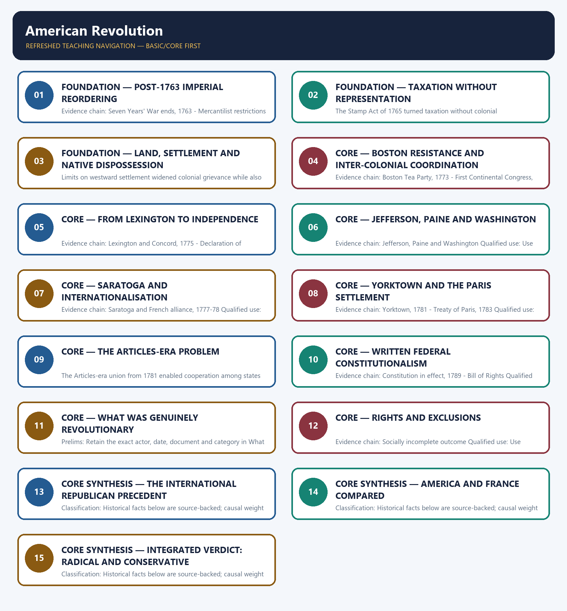

# American Revolution — Learner-v2 Complete Learning Session

> **Authoring-only generation:** 2026-09-01. No PDF was rendered and no tracker or index was mutated.

### SOURCE, PROGRESSION AND CURRENT-LINKAGE AUDIT

- **Generation date:** 2026-09-01.
- **Repository-first evidence:** the Basic owner is taught first and preserved in full; the Advanced owner is retained only in the optional final teaching block.
- **OCR evidence:** Repository Markdown was used first. The available OCR-searchable Norman Lowe World History PDF was retained as supplementary local context, but no unsupported page number, quotation or precision was imported from it.
- **Qdrant:** not used; repository Markdown and available OCR context were sufficient.
- **PYQ integrity:** The local owner routes the 2019 GS-I demand on the American and French Revolutions and the foundations of the modern world. The neutral demand is retained and solved without inventing question number details beyond the owner record.
- **Live-link boundary:** The official America250 homepage metadata identifies America250 as a bipartisan initiative working to engage every American in the 250th anniversary of the United States. Its current 2026 homepage describes the Semiquincentennial year and ongoing educational and history events. This directly renews public attention to the American Revolution and the founding documents; no decorative event detail or broader contemporary claim is imported.
- **Fact/inference discipline:** no current-affairs item, PYQ wording, figure or quotation is invented.

## BASIC LEARNING SESSION

### DEEP-REVIEW LEARNING CONTRACT

| Control | Binding rule for this package |
|---|---|
| Syllabus boundary | Complete World History Core is taught chronologically, spatially and causally before optional enrichment. |
| Evidence method | Claim → named event/treaty/institution/actor/region or attributed scholarship → analysis → qualification. |
| Chronology | Structural cause, trigger, event, settlement, implementation and long-term process remain distinct. |
| Geography | Europe, Africa, Asia, West Asia and the Americas retain their own actors, routes and unequal connections; Europe is never the default universal viewpoint. |
| Historiography | Liberal, conservative, Marxist, social, feminist, postcolonial and other relevant interpretations are tied to evidence and bounded claims. |
| Practice contract | Every solved item has directive/demand decoding, an examiner-grade model, an executable timed/compression plan, marks rationale and answer-specific improvement. |
| Approval | This immutable successor remains `approved: false` pending explicit approval. |

**Canonical Basic/Core owner:** `upsc-ai-kit\knowledge\World-History\basic\02_American-Revolution.md`  
**Canonical topic owner:** `upsc-ai-kit\knowledge\World-History\basic\02_American-Revolution.md`  
**Optional Advanced owner:** `upsc-ai-kit\knowledge\World-History\advanced\02_American-Revolution.md`  
**Official syllabus mapping:** `upsc-ai-kit\knowledge\World-History\OFFICIAL-UPSC-SYLLABUS-MAPPING.md`

### EVIDENCE, PYQ AND CURRENT-STATUS CONTROL

- **Primary/official evidence:** treaties, declarations, laws, institutional records, speeches and contemporary testimony are dated and read for authorship, audience and purpose.
- **Spatial and social evidence:** maps, trade and migration routes, battlefield geography, class, race, gender and colonial position qualify state-centred narrative.
- **Quantitative evidence:** population, debt, inflation, output, casualties and territorial claims retain unit, place, period, source and uncertainty; no statistic is invented.
- **Interpretive discipline:** teleology, civilisational ranking, single-cause verdicts and present-day nation-state projection are rejected.
- **PYQ discipline:** repository routing ledgers and locally held papers control wording and metadata; neutral rendering, reconstruction and unavailable official keys remain explicitly labelled.
- **Current-status note, rechecked 2026-09-01:** The official America250 homepage metadata identifies America250 as a bipartisan initiative working to engage every American in the 250th anniversary of the United States. Its current 2026 homepage describes the Semiquincentennial year and ongoing educational and history events. This directly renews public attention to the American Revolution and the founding documents; no decorative event detail or broader contemporary claim is imported.

**Live/primary context sources recorded by the predecessor generation:**

- `https://america250.org/`




*Distinct embedded teaching-navigation image. The separate continuous Cārvāka-style flowchart package remains an independent at-a-glance artifact.*

### SESSION 1 — FOUNDATION — POST-1763 IMPERIAL REORDERING

#### DEFINITION / WHAT THIS IS CALLED

**Plain-language definition:** Precise definition: Post-1763 imperial reordering is the source-bounded relationship among Seven Years' War ends, 1763 and Mercantilist restrictions within American Revolution.

**Technical definition:** Evidence chain: Seven Years' War ends, 1763 - Mercantilist restrictions Qualified use: Open with the structural and conjunctural causes together.

#### ANSWER-GRABBING OPENING — WRITE/ADAPT IN THE EXAM

> Precise definition: Post-1763 imperial reordering is the source-bounded relationship among Seven Years' War ends, 1763 and Mercantilist restrictions within American Revolution.

#### MUST-WRITE KEYWORDS

- **FOUNDATION**
- **Post-1763 imperial reordering**
- **Precise definition**
- **Evidence chain**
- **Qualified use**
- **Precise definition: Post-1763 imperial reordering**

**How to use them:** Frame the answer through FOUNDATION; define Post-1763 imperial reordering, connect Precise definition with Evidence chain to explain the mechanism, and use Qualified use for the decisive comparison or qualification.

##### VISUAL FIRST

```text
POST-1763 IMPERIAL REORDERING
01. Seven Years' War ends, 1763
    |
    v
02. Mercantilist restrictions
BOUNDARY -> British debt explains timing, not the whole revolutionary programme.
```

*This topic-specific rail fixes the evidence sequence and its exam boundary before analysis.*

##### CONCEPT DEFINITIONS

- **Precise definition:** Post-1763 imperial reordering is the source-bounded relationship among Seven Years' War ends, 1763 and Mercantilist restrictions within American Revolution.
- **Classification:** Historical facts below are source-backed; causal weight and evaluative verdicts are analytical synthesis.

##### CORE EXPLANATION

The Seven Years' War ended in 1763, after which British war debt encouraged tighter taxation, regulation and troop deployment in the thirteen colonies. British shipping, market and manufacturing restrictions constrained colonial economic autonomy, though many colonists had also benefited from empire.

##### NAMED EVIDENCE AND MECHANISM

- The Seven Years' War ended in 1763, after which British war debt encouraged tighter taxation, regulation and troop deployment in the thirteen colonies.
- British shipping, market and manufacturing restrictions constrained colonial economic autonomy, though many colonists had also benefited from empire.

##### EXAMINER CAUTION

- British debt explains timing, not the whole revolutionary programme.

##### EXAM LINK

- **Prelims:** Retain the exact actor, date, document and category in Post-1763 imperial reordering.
- **Mains:** Open with the structural and conjunctural causes together.

##### MINI RECAP

- **Evidence chain:** Seven Years' War ends, 1763 -> Mercantilist restrictions
- **Qualified use:** Open with the structural and conjunctural causes together.

#### CLOSING RECALL FLOW — FOUNDATION — POST-1763 IMPERIAL REORDERING

```text
START / CONCEPT: FOUNDATION — Post-1763 imperial reordering
        |
        v
EXACT TERMS: FOUNDATION · Post-1763 imperial reordering · Precise definition · Evidence chain · Qualified use · Precise definition: Post-1763 imperial reordering
        |
        v
MECHANISM / ARGUMENT: Evidence chain: Seven Years' War ends, 1763 - Mercantilist restrictions Qualified use: Open with the structural and conjunctural causes together.
        |
        v
CONSEQUENCE / CONTRAST: British debt explains timing, not the whole revolutionary programme.
        |
        v
UPSC TRAP / ANSWER-USE: Do not miss this limiting distinction: causal weight and evaluative verdicts are analytical synthesis.
        |
        v
ANSWER-GRABBING FORMULATION: Precise definition: Post-1763 imperial reordering is the source-bounded relationship among Seven Years' War ends, 1763 and Mercantilist restrictions within American Revolution.
```
### SESSION 2 — FOUNDATION — TAXATION WITHOUT REPRESENTATION

#### DEFINITION / WHAT THIS IS CALLED

**Plain-language definition:** Precise definition: Taxation without representation is the source-bounded relationship among Stamp Act, 1765 and Colonial self-government within American Revolution.

**Technical definition:** The Stamp Act of 1765 turned taxation without colonial representation into a constitutional dispute over who could tax and legislate.

#### ANSWER-GRABBING OPENING — WRITE/ADAPT IN THE EXAM

> Precise definition: Taxation without representation is the source-bounded relationship among Stamp Act, 1765 and Colonial self-government within American Revolution.

#### MUST-WRITE KEYWORDS

- **FOUNDATION**
- **Taxation without representation**
- **Precise definition**
- **Evidence chain**
- **Qualified use**
- **Precise definition: Taxation without representation**

**How to use them:** Frame the answer through FOUNDATION; define Taxation without representation, connect Precise definition with Evidence chain to explain the mechanism, and use Qualified use for the decisive comparison or qualification.

##### VISUAL FIRST

```text
TAXATION WITHOUT REPRESENTATION
01. Stamp Act, 1765
    |
    v
02. Colonial self-government
BOUNDARY -> Representation meant colonial assemblies, not universal franchise.
```

*This topic-specific rail fixes the evidence sequence and its exam boundary before analysis.*

##### CONCEPT DEFINITIONS

- **Precise definition:** Taxation without representation is the source-bounded relationship among Stamp Act, 1765 and Colonial self-government within American Revolution.
- **Classification:** Historical facts below are source-backed; causal weight and evaluative verdicts are analytical synthesis.

##### CORE EXPLANATION

The Stamp Act of 1765 turned taxation without colonial representation into a constitutional dispute over who could tax and legislate. Existing colonial assemblies gave resistance an institutional base, but these assemblies were elite bodies rather than organs of universal democracy.

##### NAMED EVIDENCE AND MECHANISM

- The Stamp Act of 1765 turned taxation without colonial representation into a constitutional dispute over who could tax and legislate.
- Existing colonial assemblies gave resistance an institutional base, but these assemblies were elite bodies rather than organs of universal democracy.

##### EXAMINER CAUTION

- Representation meant colonial assemblies, not universal franchise.

##### EXAM LINK

- **Prelims:** Retain the exact actor, date, document and category in Taxation without representation.
- **Mains:** Frame taxation as a sovereignty dispute.

##### MINI RECAP

- **Evidence chain:** Stamp Act, 1765 -> Colonial self-government
- **Qualified use:** Frame taxation as a sovereignty dispute.

#### CLOSING RECALL FLOW — FOUNDATION — TAXATION WITHOUT REPRESENTATION

```text
START / CONCEPT: FOUNDATION — Taxation without representation
        |
        v
EXACT TERMS: FOUNDATION · Taxation without representation · Precise definition · Evidence chain · Qualified use · Precise definition: Taxation without representation
        |
        v
MECHANISM / ARGUMENT: The Stamp Act of 1765 turned taxation without colonial representation into a constitutional dispute over who could tax and legislate.
        |
        v
CONSEQUENCE / CONTRAST: Existing colonial assemblies gave resistance an institutional base, but these assemblies were elite bodies rather than organs of universal democracy.
        |
        v
UPSC TRAP / ANSWER-USE: Do not miss this limiting distinction: stamp Act, 1765 - Colonial self-government Qualified use.
        |
        v
ANSWER-GRABBING FORMULATION: Precise definition: Taxation without representation is the source-bounded relationship among Stamp Act, 1765 and Colonial self-government within American Revolution.
```
### SESSION 3 — FOUNDATION — LAND, SETTLEMENT AND NATIVE DISPOSSESSION

#### DEFINITION / WHAT THIS IS CALLED

**Plain-language definition:** Precise definition: Land, settlement and Native dispossession is the source-bounded relationship among and Westward restrictions within American Revolution.

**Technical definition:** Limits on westward settlement widened colonial grievance while also revealing that expansion threatened Native American lands.

#### ANSWER-GRABBING OPENING — WRITE/ADAPT IN THE EXAM

> Precise definition: Land, settlement and Native dispossession is the source-bounded relationship among and Westward restrictions within American Revolution.

#### MUST-WRITE KEYWORDS

- **FOUNDATION**
- **Land**
- **settlement**
- **Native dispossession**
- **Precise definition**
- **Evidence chain**

**How to use them:** Frame the answer through FOUNDATION; define Land, connect settlement with Native dispossession to explain the mechanism, and use Precise definition for the decisive comparison or qualification.

##### VISUAL FIRST

```text
LAND, SETTLEMENT AND NATIVE DISPOSSESSION
01. Westward restrictions
BOUNDARY -> Colonial liberty and westward expansion carried contradictory implications.
```

*This topic-specific rail fixes the evidence sequence and its exam boundary before analysis.*

##### CONCEPT DEFINITIONS

- **Precise definition:** Land, settlement and Native dispossession is the source-bounded relationship among  and Westward restrictions within American Revolution.
- **Classification:** Historical facts below are source-backed; causal weight and evaluative verdicts are analytical synthesis.

##### CORE EXPLANATION

Limits on westward settlement widened colonial grievance while also revealing that expansion threatened Native American lands.

##### NAMED EVIDENCE AND MECHANISM

- Limits on westward settlement widened colonial grievance while also revealing that expansion threatened Native American lands.

##### EXAMINER CAUTION

- Colonial liberty and westward expansion carried contradictory implications.

##### EXAM LINK

- **Prelims:** Retain the exact actor, date, document and category in Land, settlement and Native dispossession.
- **Mains:** Add the social cost to an otherwise constitutional narrative.

##### MINI RECAP

- **Evidence chain:** Westward restrictions
- **Qualified use:** Add the social cost to an otherwise constitutional narrative.

#### CLOSING RECALL FLOW — FOUNDATION — LAND, SETTLEMENT AND NATIVE DISPOSSESSION

```text
START / CONCEPT: FOUNDATION — Land, settlement and Native dispossession
        |
        v
EXACT TERMS: FOUNDATION · Land · settlement · Native dispossession · Precise definition · Evidence chain
        |
        v
MECHANISM / ARGUMENT: Limits on westward settlement widened colonial grievance while also revealing that expansion threatened Native American lands.
        |
        v
CONSEQUENCE / CONTRAST: Evidence chain: Westward restrictions Qualified use: Add the social cost to an otherwise constitutional narrative.
        |
        v
UPSC TRAP / ANSWER-USE: Do not miss this limiting distinction: causal weight and evaluative verdicts are analytical synthesis.
        |
        v
ANSWER-GRABBING FORMULATION: Precise definition: Land, settlement and Native dispossession is the source-bounded relationship among and Westward restrictions within American Revolution.
```
### SESSION 4 — CORE — BOSTON RESISTANCE AND INTER-COLONIAL COORDINATION

#### DEFINITION / WHAT THIS IS CALLED

**Plain-language definition:** Precise definition: Boston resistance and inter-colonial coordination is the source-bounded relationship among Boston Tea Party, 1773 and First Continental Congress, 1774 within American Revolution.

**Technical definition:** Evidence chain: Boston Tea Party, 1773 - First Continental Congress, 1774 Qualified use: Trace symbolic defiance becoming coordinated politics.

#### ANSWER-GRABBING OPENING — WRITE/ADAPT IN THE EXAM

> Precise definition: Boston resistance and inter-colonial coordination is the source-bounded relationship among Boston Tea Party, 1773 and First Continental Congress, 1774 within American Revolution.

#### MUST-WRITE KEYWORDS

- **Boston resistance**
- **inter-colonial coordination**
- **Precise definition**
- **Evidence chain**
- **Qualified use**
- **Precise definition: Boston resistance and inter-colonial coordination**

**How to use them:** Frame the answer through Boston resistance; define inter-colonial coordination, connect Precise definition with Evidence chain to explain the mechanism, and use Qualified use for the decisive comparison or qualification.

##### VISUAL FIRST

```text
BOSTON RESISTANCE AND INTER-COLONIAL COORDINATION
01. Boston Tea Party, 1773
    |
    v
02. First Continental Congress, 1774
BOUNDARY -> The Tea Party and Congress were different forms of mobilisation.
```

*This topic-specific rail fixes the evidence sequence and its exam boundary before analysis.*

##### CONCEPT DEFINITIONS

- **Precise definition:** Boston resistance and inter-colonial coordination is the source-bounded relationship among Boston Tea Party, 1773 and First Continental Congress, 1774 within American Revolution.
- **Classification:** Historical facts below are source-backed; causal weight and evaluative verdicts are analytical synthesis.

##### CORE EXPLANATION

The Boston Tea Party of 1773 transformed a tea-duty dispute into symbolic defiance of imperial authority and provoked punitive British measures. The First Continental Congress met at Philadelphia in 1774 and coordinated colonial political resistance.

##### NAMED EVIDENCE AND MECHANISM

- The Boston Tea Party of 1773 transformed a tea-duty dispute into symbolic defiance of imperial authority and provoked punitive British measures.
- The First Continental Congress met at Philadelphia in 1774 and coordinated colonial political resistance.

##### EXAMINER CAUTION

- The Tea Party and Congress were different forms of mobilisation.

##### EXAM LINK

- **Prelims:** Retain the exact actor, date, document and category in Boston resistance and inter-colonial coordination.
- **Mains:** Trace symbolic defiance becoming coordinated politics.

##### MINI RECAP

- **Evidence chain:** Boston Tea Party, 1773 -> First Continental Congress, 1774
- **Qualified use:** Trace symbolic defiance becoming coordinated politics.

#### CLOSING RECALL FLOW — CORE — BOSTON RESISTANCE AND INTER-COLONIAL COORDINATION

```text
START / CONCEPT: CORE — Boston resistance and inter-colonial coordination
        |
        v
EXACT TERMS: Boston resistance · inter-colonial coordination · Precise definition · Evidence chain · Qualified use · Precise definition: Boston resistance and inter-colonial coordination
        |
        v
MECHANISM / ARGUMENT: Evidence chain: Boston Tea Party, 1773 - First Continental Congress, 1774 Qualified use: Trace symbolic defiance becoming coordinated politics.
        |
        v
CONSEQUENCE / CONTRAST: The Boston Tea Party of 1773 transformed a tea-duty dispute into symbolic defiance of imperial authority and provoked punitive British measures.
        |
        v
UPSC TRAP / ANSWER-USE: Do not miss this limiting distinction: causal weight and evaluative verdicts are analytical synthesis.
        |
        v
ANSWER-GRABBING FORMULATION: Precise definition: Boston resistance and inter-colonial coordination is the source-bounded relationship among Boston Tea Party, 1773 and First Continental Congress, 1774 within American Revolution.
```
### SESSION 5 — CORE — FROM LEXINGTON TO INDEPENDENCE

#### DEFINITION / WHAT THIS IS CALLED

**Plain-language definition:** Precise definition: From Lexington to independence is the source-bounded relationship among Lexington and Concord, 1775 and Declaration of Independence, 1776 within American Revolution.

**Technical definition:** Evidence chain: Lexington and Concord, 1775 - Declaration of Independence, 1776 Qualified use: Separate military escalation from ideological nation-making.

#### ANSWER-GRABBING OPENING — WRITE/ADAPT IN THE EXAM

> Precise definition: From Lexington to independence is the source-bounded relationship among Lexington and Concord, 1775 and Declaration of Independence, 1776 within American Revolution.

#### MUST-WRITE KEYWORDS

- **From Lexington to independence**
- **Precise definition**
- **Evidence chain**
- **Qualified use**
- **Precise definition: From Lexington to independence**
- **Precise**

**How to use them:** Frame the answer through From Lexington to independence; define Precise definition, connect Evidence chain with Qualified use to explain the mechanism, and use Precise definition: From Lexington to independence for the decisive comparison or qualification.

##### VISUAL FIRST

```text
FROM LEXINGTON TO INDEPENDENCE
01. Lexington and Concord, 1775
    |
    v
02. Declaration of Independence, 1776
BOUNDARY -> Do not merge the start of war with the declaration of statehood.
```

*This topic-specific rail fixes the evidence sequence and its exam boundary before analysis.*

##### CONCEPT DEFINITIONS

- **Precise definition:** From Lexington to independence is the source-bounded relationship among Lexington and Concord, 1775 and Declaration of Independence, 1776 within American Revolution.
- **Classification:** Historical facts below are source-backed; causal weight and evaluative verdicts are analytical synthesis.

##### CORE EXPLANATION

Armed conflict began at Lexington and Concord in 1775, shifting resistance from boycott and petition toward war. The Declaration adopted on 4 July 1776 asserted equality and inalienable rights to life, liberty and the pursuit of happiness as the moral basis of independence.

##### NAMED EVIDENCE AND MECHANISM

- Armed conflict began at Lexington and Concord in 1775, shifting resistance from boycott and petition toward war.
- The Declaration adopted on 4 July 1776 asserted equality and inalienable rights to life, liberty and the pursuit of happiness as the moral basis of independence.

##### EXAMINER CAUTION

- Do not merge the start of war with the declaration of statehood.

##### EXAM LINK

- **Prelims:** Retain the exact actor, date, document and category in From Lexington to independence.
- **Mains:** Separate military escalation from ideological nation-making.

##### MINI RECAP

- **Evidence chain:** Lexington and Concord, 1775 -> Declaration of Independence, 1776
- **Qualified use:** Separate military escalation from ideological nation-making.

#### CLOSING RECALL FLOW — CORE — FROM LEXINGTON TO INDEPENDENCE

```text
START / CONCEPT: CORE — From Lexington to independence
        |
        v
EXACT TERMS: From Lexington to independence · Precise definition · Evidence chain · Qualified use · Precise definition: From Lexington to independence · Precise
        |
        v
MECHANISM / ARGUMENT: Evidence chain: Lexington and Concord, 1775 - Declaration of Independence, 1776 Qualified use: Separate military escalation from ideological nation-making.
        |
        v
CONSEQUENCE / CONTRAST: Do not merge the start of war with the declaration of statehood.
        |
        v
UPSC TRAP / ANSWER-USE: Do not miss this limiting distinction: causal weight and evaluative verdicts are analytical synthesis.
        |
        v
ANSWER-GRABBING FORMULATION: Precise definition: From Lexington to independence is the source-bounded relationship among Lexington and Concord, 1775 and Declaration of Independence, 1776 within American Revolution.
```
### SESSION 6 — CORE — JEFFERSON, PAINE AND WASHINGTON

#### DEFINITION / WHAT THIS IS CALLED

**Plain-language definition:** Precise definition: Jefferson, Paine and Washington is the source-bounded relationship among and Jefferson, Paine and Washington within American Revolution.

**Technical definition:** Evidence chain: Jefferson, Paine and Washington Qualified use: Use named actors without turning the answer into biography.

#### ANSWER-GRABBING OPENING — WRITE/ADAPT IN THE EXAM

> Precise definition: Jefferson, Paine and Washington is the source-bounded relationship among and Jefferson, Paine and Washington within American Revolution.

#### MUST-WRITE KEYWORDS

- **Jefferson**
- **Paine**
- **Washington**
- **Precise definition**
- **Evidence chain**
- **Qualified use**

**How to use them:** Frame the answer through Jefferson; define Paine, connect Washington with Precise definition to explain the mechanism, and use Evidence chain for the decisive comparison or qualification.

##### VISUAL FIRST

```text
JEFFERSON, PAINE AND WASHINGTON
01. Jefferson, Paine and Washington
BOUNDARY -> Keep authorship, pamphleteering and command roles distinct.
```

*This topic-specific rail fixes the evidence sequence and its exam boundary before analysis.*

##### CONCEPT DEFINITIONS

- **Precise definition:** Jefferson, Paine and Washington is the source-bounded relationship among  and Jefferson, Paine and Washington within American Revolution.
- **Classification:** Historical facts below are source-backed; causal weight and evaluative verdicts are analytical synthesis.

##### CORE EXPLANATION

Thomas Jefferson drafted the Declaration, Thomas Paine's Common Sense supplied ideological force, and George Washington commanded the American armies.

##### NAMED EVIDENCE AND MECHANISM

- Thomas Jefferson drafted the Declaration, Thomas Paine's Common Sense supplied ideological force, and George Washington commanded the American armies.

##### EXAMINER CAUTION

- Keep authorship, pamphleteering and command roles distinct.

##### EXAM LINK

- **Prelims:** Retain the exact actor, date, document and category in Jefferson, Paine and Washington.
- **Mains:** Use named actors without turning the answer into biography.

##### MINI RECAP

- **Evidence chain:** Jefferson, Paine and Washington
- **Qualified use:** Use named actors without turning the answer into biography.

#### CLOSING RECALL FLOW — CORE — JEFFERSON, PAINE AND WASHINGTON

```text
START / CONCEPT: CORE — Jefferson, Paine and Washington
        |
        v
EXACT TERMS: Jefferson · Paine · Washington · Precise definition · Evidence chain · Qualified use
        |
        v
MECHANISM / ARGUMENT: Evidence chain: Jefferson, Paine and Washington Qualified use: Use named actors without turning the answer into biography.
        |
        v
CONSEQUENCE / CONTRAST: Classification: Historical facts below are source-backed; causal weight and evaluative verdicts are analytical synthesis.
        |
        v
UPSC TRAP / ANSWER-USE: Do not miss this limiting distinction: use named actors without turning the answer into biography.
        |
        v
ANSWER-GRABBING FORMULATION: Precise definition: Jefferson, Paine and Washington is the source-bounded relationship among and Jefferson, Paine and Washington within American Revolution.
```
### SESSION 7 — CORE — SARATOGA AND INTERNATIONALISATION

#### DEFINITION / WHAT THIS IS CALLED

**Plain-language definition:** Precise definition: Saratoga and internationalisation is the source-bounded relationship among and Saratoga and French alliance, 1777-78 within American Revolution.

**Technical definition:** Evidence chain: Saratoga and French alliance, 1777-78 Qualified use: Explain why external support changed the war.

#### ANSWER-GRABBING OPENING — WRITE/ADAPT IN THE EXAM

> Precise definition: Saratoga and internationalisation is the source-bounded relationship among and Saratoga and French alliance, 1777-78 within American Revolution.

#### MUST-WRITE KEYWORDS

- **Saratoga**
- **internationalisation**
- **Precise definition**
- **Evidence chain**
- **Qualified use**
- **1777-78**

**How to use them:** Frame the answer through Saratoga; define internationalisation, connect Precise definition with Evidence chain to explain the mechanism, and use Qualified use for the decisive comparison or qualification.

##### VISUAL FIRST

```text
SARATOGA AND INTERNATIONALISATION
01. Saratoga and French alliance, 1777-78
BOUNDARY -> French alliance followed the turning point; it was not present from the start.
```

*This topic-specific rail fixes the evidence sequence and its exam boundary before analysis.*

##### CONCEPT DEFINITIONS

- **Precise definition:** Saratoga and internationalisation is the source-bounded relationship among  and Saratoga and French alliance, 1777-78 within American Revolution.
- **Classification:** Historical facts below are source-backed; causal weight and evaluative verdicts are analytical synthesis.

##### CORE EXPLANATION

The colonial victory at Saratoga helped secure the French alliance in 1778, internationalising the war and altering the balance against Britain.

##### NAMED EVIDENCE AND MECHANISM

- The colonial victory at Saratoga helped secure the French alliance in 1778, internationalising the war and altering the balance against Britain.

##### EXAMINER CAUTION

- French alliance followed the turning point; it was not present from the start.

##### EXAM LINK

- **Prelims:** Retain the exact actor, date, document and category in Saratoga and internationalisation.
- **Mains:** Explain why external support changed the war.

##### MINI RECAP

- **Evidence chain:** Saratoga and French alliance, 1777-78
- **Qualified use:** Explain why external support changed the war.

#### CLOSING RECALL FLOW — CORE — SARATOGA AND INTERNATIONALISATION

```text
START / CONCEPT: CORE — Saratoga and internationalisation
        |
        v
EXACT TERMS: Saratoga · internationalisation · Precise definition · Evidence chain · Qualified use · 1777-78
        |
        v
MECHANISM / ARGUMENT: Evidence chain: Saratoga and French alliance, 1777-78 Qualified use: Explain why external support changed the war.
        |
        v
CONSEQUENCE / CONTRAST: French alliance followed the turning point; it was not present from the start.
        |
        v
UPSC TRAP / ANSWER-USE: Do not miss this limiting distinction: causal weight and evaluative verdicts are analytical synthesis.
        |
        v
ANSWER-GRABBING FORMULATION: Precise definition: Saratoga and internationalisation is the source-bounded relationship among and Saratoga and French alliance, 1777-78 within American Revolution.
```
### SESSION 8 — CORE — YORKTOWN AND THE PARIS SETTLEMENT

#### DEFINITION / WHAT THIS IS CALLED

**Plain-language definition:** Precise definition: Yorktown and the Paris settlement is the source-bounded relationship among Yorktown, 1781 and Treaty of Paris, 1783 within American Revolution.

**Technical definition:** Evidence chain: Yorktown, 1781 - Treaty of Paris, 1783 Qualified use: Close the war through battlefield and treaty stages.

#### ANSWER-GRABBING OPENING — WRITE/ADAPT IN THE EXAM

> Precise definition: Yorktown and the Paris settlement is the source-bounded relationship among Yorktown, 1781 and Treaty of Paris, 1783 within American Revolution.

#### MUST-WRITE KEYWORDS

- **Yorktown**
- **the Paris settlement**
- **Precise definition**
- **Evidence chain**
- **Qualified use**
- **Precise definition: Yorktown and the Paris settlement**

**How to use them:** Frame the answer through Yorktown; define the Paris settlement, connect Precise definition with Evidence chain to explain the mechanism, and use Qualified use for the decisive comparison or qualification.

##### VISUAL FIRST

```text
YORKTOWN AND THE PARIS SETTLEMENT
01. Yorktown, 1781
    |
    v
02. Treaty of Paris, 1783
BOUNDARY -> Military decision and legal recognition occurred in different years.
```

*This topic-specific rail fixes the evidence sequence and its exam boundary before analysis.*

##### CONCEPT DEFINITIONS

- **Precise definition:** Yorktown and the Paris settlement is the source-bounded relationship among Yorktown, 1781 and Treaty of Paris, 1783 within American Revolution.
- **Classification:** Historical facts below are source-backed; causal weight and evaluative verdicts are analytical synthesis.

##### CORE EXPLANATION

Cornwallis's surrender at Yorktown in 1781 was the decisive military turning point, but it did not itself constitute legal recognition of independence. The Treaty of Paris of 1783 brought British recognition of American independence and converted military success into an international settlement.

##### NAMED EVIDENCE AND MECHANISM

- Cornwallis's surrender at Yorktown in 1781 was the decisive military turning point, but it did not itself constitute legal recognition of independence.
- The Treaty of Paris of 1783 brought British recognition of American independence and converted military success into an international settlement.

##### EXAMINER CAUTION

- Military decision and legal recognition occurred in different years.

##### EXAM LINK

- **Prelims:** Retain the exact actor, date, document and category in Yorktown and the Paris settlement.
- **Mains:** Close the war through battlefield and treaty stages.

##### MINI RECAP

- **Evidence chain:** Yorktown, 1781 -> Treaty of Paris, 1783
- **Qualified use:** Close the war through battlefield and treaty stages.

#### CLOSING RECALL FLOW — CORE — YORKTOWN AND THE PARIS SETTLEMENT

```text
START / CONCEPT: CORE — Yorktown and the Paris settlement
        |
        v
EXACT TERMS: Yorktown · the Paris settlement · Precise definition · Evidence chain · Qualified use · Precise definition: Yorktown and the Paris settlement
        |
        v
MECHANISM / ARGUMENT: Evidence chain: Yorktown, 1781 - Treaty of Paris, 1783 Qualified use: Close the war through battlefield and treaty stages.
        |
        v
CONSEQUENCE / CONTRAST: Cornwallis's surrender at Yorktown in 1781 was the decisive military turning point, but it did not itself constitute legal recognition of independence.
        |
        v
UPSC TRAP / ANSWER-USE: Do not miss this limiting distinction: causal weight and evaluative verdicts are analytical synthesis.
        |
        v
ANSWER-GRABBING FORMULATION: Precise definition: Yorktown and the Paris settlement is the source-bounded relationship among Yorktown, 1781 and Treaty of Paris, 1783 within American Revolution.
```
### SESSION 9 — CORE — THE ARTICLES-ERA PROBLEM

#### DEFINITION / WHAT THIS IS CALLED

**Plain-language definition:** Precise definition: The Articles-era problem is the source-bounded relationship among and Articles and union phase, 1781 within American Revolution.

**Technical definition:** The Articles-era union from 1781 enabled cooperation among states but proved weaker than the later federal constitutional order.

#### ANSWER-GRABBING OPENING — WRITE/ADAPT IN THE EXAM

> Precise definition: The Articles-era problem is the source-bounded relationship among and Articles and union phase, 1781 within American Revolution.

#### MUST-WRITE KEYWORDS

- **The Articles-era problem**
- **Precise definition**
- **Evidence chain**
- **Qualified use**
- **Precise definition: The Articles-era problem**
- **Precise**

**How to use them:** Frame the answer through The Articles-era problem; define Precise definition, connect Evidence chain with Qualified use to explain the mechanism, and use Precise definition: The Articles-era problem for the decisive comparison or qualification.

##### VISUAL FIRST

```text
THE ARTICLES-ERA PROBLEM
01. Articles and union phase, 1781
BOUNDARY -> The 1781 framework was not the 1789 Constitution.
```

*This topic-specific rail fixes the evidence sequence and its exam boundary before analysis.*

##### CONCEPT DEFINITIONS

- **Precise definition:** The Articles-era problem is the source-bounded relationship among  and Articles and union phase, 1781 within American Revolution.
- **Classification:** Historical facts below are source-backed; causal weight and evaluative verdicts are analytical synthesis.

##### CORE EXPLANATION

The Articles-era union from 1781 enabled cooperation among states but proved weaker than the later federal constitutional order.

##### NAMED EVIDENCE AND MECHANISM

- The Articles-era union from 1781 enabled cooperation among states but proved weaker than the later federal constitutional order.

##### EXAMINER CAUTION

- The 1781 framework was not the 1789 Constitution.

##### EXAM LINK

- **Prelims:** Retain the exact actor, date, document and category in The Articles-era problem.
- **Mains:** Show why independence still required institutional consolidation.

##### MINI RECAP

- **Evidence chain:** Articles and union phase, 1781
- **Qualified use:** Show why independence still required institutional consolidation.

#### CLOSING RECALL FLOW — CORE — THE ARTICLES-ERA PROBLEM

```text
START / CONCEPT: CORE — The Articles-era problem
        |
        v
EXACT TERMS: The Articles-era problem · Precise definition · Evidence chain · Qualified use · Precise definition: The Articles-era problem · Precise
        |
        v
MECHANISM / ARGUMENT: The Articles-era union from 1781 enabled cooperation among states but proved weaker than the later federal constitutional order.
        |
        v
CONSEQUENCE / CONTRAST: The 1781 framework was not the 1789 Constitution.
        |
        v
UPSC TRAP / ANSWER-USE: Do not miss this limiting distinction: articles and union phase, 1781 Qualified use.
        |
        v
ANSWER-GRABBING FORMULATION: Precise definition: The Articles-era problem is the source-bounded relationship among and Articles and union phase, 1781 within American Revolution.
```
### SESSION 10 — CORE — WRITTEN FEDERAL CONSTITUTIONALISM

#### DEFINITION / WHAT THIS IS CALLED

**Plain-language definition:** Precise definition: Written federal constitutionalism is the source-bounded relationship among Constitution in effect, 1789 and Bill of Rights within American Revolution.

**Technical definition:** Evidence chain: Constitution in effect, 1789 - Bill of Rights Qualified use: Explain constitutional form and entrenched rights.

#### ANSWER-GRABBING OPENING — WRITE/ADAPT IN THE EXAM

> Precise definition: Written federal constitutionalism is the source-bounded relationship among Constitution in effect, 1789 and Bill of Rights within American Revolution.

#### MUST-WRITE KEYWORDS

- **Written federal constitutionalism**
- **Precise definition**
- **Evidence chain**
- **Qualified use**
- **Precise definition: Written federal constitutionalism**
- **Precise**

**How to use them:** Frame the answer through Written federal constitutionalism; define Precise definition, connect Evidence chain with Qualified use to explain the mechanism, and use Precise definition: Written federal constitutionalism for the decisive comparison or qualification.

##### VISUAL FIRST

```text
WRITTEN FEDERAL CONSTITUTIONALISM
01. Constitution in effect, 1789
    |
    v
02. Bill of Rights
BOUNDARY -> A federal republic did not automatically mean full democracy.
```

*This topic-specific rail fixes the evidence sequence and its exam boundary before analysis.*

##### CONCEPT DEFINITIONS

- **Precise definition:** Written federal constitutionalism is the source-bounded relationship among Constitution in effect, 1789 and Bill of Rights within American Revolution.
- **Classification:** Historical facts below are source-backed; causal weight and evaluative verdicts are analytical synthesis.

##### CORE EXPLANATION

The United States Constitution came into effect in 1789 and established a written federal republican system. The Bill of Rights entrenched protections for speech, press, religion and legal safeguards against government.

##### NAMED EVIDENCE AND MECHANISM

- The United States Constitution came into effect in 1789 and established a written federal republican system.
- The Bill of Rights entrenched protections for speech, press, religion and legal safeguards against government.

##### EXAMINER CAUTION

- A federal republic did not automatically mean full democracy.

##### EXAM LINK

- **Prelims:** Retain the exact actor, date, document and category in Written federal constitutionalism.
- **Mains:** Explain constitutional form and entrenched rights.

##### MINI RECAP

- **Evidence chain:** Constitution in effect, 1789 -> Bill of Rights
- **Qualified use:** Explain constitutional form and entrenched rights.

#### CLOSING RECALL FLOW — CORE — WRITTEN FEDERAL CONSTITUTIONALISM

```text
START / CONCEPT: CORE — Written federal constitutionalism
        |
        v
EXACT TERMS: Written federal constitutionalism · Precise definition · Evidence chain · Qualified use · Precise definition: Written federal constitutionalism · Precise
        |
        v
MECHANISM / ARGUMENT: Evidence chain: Constitution in effect, 1789 - Bill of Rights Qualified use: Explain constitutional form and entrenched rights.
        |
        v
CONSEQUENCE / CONTRAST: Classification: Historical facts below are source-backed; causal weight and evaluative verdicts are analytical synthesis.
        |
        v
UPSC TRAP / ANSWER-USE: Do not miss this limiting distinction: explain constitutional form and entrenched rights.
        |
        v
ANSWER-GRABBING FORMULATION: Precise definition: Written federal constitutionalism is the source-bounded relationship among Constitution in effect, 1789 and Bill of Rights within American Revolution.
```
### SESSION 11 — CORE — WHAT WAS GENUINELY REVOLUTIONARY

#### DEFINITION / WHAT THIS IS CALLED

**Plain-language definition:** Precise definition: What was genuinely revolutionary is the source-bounded relationship among and Politically radical outcome within American Revolution.

**Technical definition:** Prelims: Retain the exact actor, date, document and category in What was genuinely revolutionary.

#### ANSWER-GRABBING OPENING — WRITE/ADAPT IN THE EXAM

> Precise definition: What was genuinely revolutionary is the source-bounded relationship among and Politically radical outcome within American Revolution.

#### MUST-WRITE KEYWORDS

- **What was genuinely revolutionary**
- **Precise definition**
- **Evidence chain**
- **Qualified use**
- **Precise**
- **Politically**

**How to use them:** Frame the answer through What was genuinely revolutionary; define Precise definition, connect Evidence chain with Qualified use to explain the mechanism, and use Precise for the decisive comparison or qualification.

##### VISUAL FIRST

```text
WHAT WAS GENUINELY REVOLUTIONARY
01. Politically radical outcome
BOUNDARY -> Do not judge revolution only by social redistribution.
```

*This topic-specific rail fixes the evidence sequence and its exam boundary before analysis.*

##### CONCEPT DEFINITIONS

- **Precise definition:** What was genuinely revolutionary is the source-bounded relationship among  and Politically radical outcome within American Revolution.
- **Classification:** Historical facts below are source-backed; causal weight and evaluative verdicts are analytical synthesis.

##### CORE EXPLANATION

The Revolution was politically radical because a colony overthrew imperial rule and created a rights-based written federal republic.

##### NAMED EVIDENCE AND MECHANISM

- The Revolution was politically radical because a colony overthrew imperial rule and created a rights-based written federal republic.

##### EXAMINER CAUTION

- Do not judge revolution only by social redistribution.

##### EXAM LINK

- **Prelims:** Retain the exact actor, date, document and category in What was genuinely revolutionary.
- **Mains:** Identify the radical change in sovereignty and state form.

##### MINI RECAP

- **Evidence chain:** Politically radical outcome
- **Qualified use:** Identify the radical change in sovereignty and state form.

#### CLOSING RECALL FLOW — CORE — WHAT WAS GENUINELY REVOLUTIONARY

```text
START / CONCEPT: CORE — What was genuinely revolutionary
        |
        v
EXACT TERMS: What was genuinely revolutionary · Precise definition · Evidence chain · Qualified use · Precise · Politically
        |
        v
MECHANISM / ARGUMENT: The Revolution was politically radical because a colony overthrew imperial rule and created a rights-based written federal republic.
        |
        v
CONSEQUENCE / CONTRAST: Prelims: Retain the exact actor, date, document and category in What was genuinely revolutionary.
        |
        v
UPSC TRAP / ANSWER-USE: Do not judge revolution only by social redistribution.
        |
        v
ANSWER-GRABBING FORMULATION: Precise definition: What was genuinely revolutionary is the source-bounded relationship among and Politically radical outcome within American Revolution.
```
### SESSION 12 — CORE — RIGHTS AND EXCLUSIONS

#### DEFINITION / WHAT THIS IS CALLED

**Plain-language definition:** Precise definition: Rights and exclusions is the source-bounded relationship among and Socially incomplete outcome within American Revolution.

**Technical definition:** Evidence chain: Socially incomplete outcome Qualified use: Use contradiction as evaluation, not as dismissal.

#### ANSWER-GRABBING OPENING — WRITE/ADAPT IN THE EXAM

> Precise definition: Rights and exclusions is the source-bounded relationship among and Socially incomplete outcome within American Revolution.

#### MUST-WRITE KEYWORDS

- **Rights**
- **exclusions**
- **Precise definition**
- **Evidence chain**
- **Qualified use**
- **Precise definition: Rights and exclusions**

**How to use them:** Frame the answer through Rights; define exclusions, connect Precise definition with Evidence chain to explain the mechanism, and use Qualified use for the decisive comparison or qualification.

##### VISUAL FIRST

```text
RIGHTS AND EXCLUSIONS
01. Socially incomplete outcome
BOUNDARY -> Declared equality and actual membership must be assessed together.
```

*This topic-specific rail fixes the evidence sequence and its exam boundary before analysis.*

##### CONCEPT DEFINITIONS

- **Precise definition:** Rights and exclusions is the source-bounded relationship among  and Socially incomplete outcome within American Revolution.
- **Classification:** Historical facts below are source-backed; causal weight and evaluative verdicts are analytical synthesis.

##### CORE EXPLANATION

Slavery survived, property qualifications restricted participation, and women and Native Americans remained largely excluded from political equality.

##### NAMED EVIDENCE AND MECHANISM

- Slavery survived, property qualifications restricted participation, and women and Native Americans remained largely excluded from political equality.

##### EXAMINER CAUTION

- Declared equality and actual membership must be assessed together.

##### EXAM LINK

- **Prelims:** Retain the exact actor, date, document and category in Rights and exclusions.
- **Mains:** Use contradiction as evaluation, not as dismissal.

##### MINI RECAP

- **Evidence chain:** Socially incomplete outcome
- **Qualified use:** Use contradiction as evaluation, not as dismissal.

#### CLOSING RECALL FLOW — CORE — RIGHTS AND EXCLUSIONS

```text
START / CONCEPT: CORE — Rights and exclusions
        |
        v
EXACT TERMS: Rights · exclusions · Precise definition · Evidence chain · Qualified use · Precise definition: Rights and exclusions
        |
        v
MECHANISM / ARGUMENT: Evidence chain: Socially incomplete outcome Qualified use: Use contradiction as evaluation, not as dismissal.
        |
        v
CONSEQUENCE / CONTRAST: Mains: Use contradiction as evaluation, not as dismissal.
        |
        v
UPSC TRAP / ANSWER-USE: Do not miss this limiting distinction: causal weight and evaluative verdicts are analytical synthesis.
        |
        v
ANSWER-GRABBING FORMULATION: Precise definition: Rights and exclusions is the source-bounded relationship among and Socially incomplete outcome within American Revolution.
```
### SESSION 13 — CORE SYNTHESIS — THE INTERNATIONAL REPUBLICAN PRECEDENT

#### DEFINITION / WHAT THIS IS CALLED

**Plain-language definition:** Precise definition: The international republican precedent is the source-bounded relationship among and International precedent within American Revolution.

**Technical definition:** Classification: Historical facts below are source-backed; causal weight and evaluative verdicts are analytical synthesis.

#### ANSWER-GRABBING OPENING — WRITE/ADAPT IN THE EXAM

> Precise definition: The international republican precedent is the source-bounded relationship among and International precedent within American Revolution.

#### MUST-WRITE KEYWORDS

- **CORE SYNTHESIS**
- **The international republican precedent**
- **Precise definition**
- **Evidence chain**
- **Qualified use**
- **Precise definition: The international republican precedent**

**How to use them:** Frame the answer through CORE SYNTHESIS; define The international republican precedent, connect Precise definition with Evidence chain to explain the mechanism, and use Qualified use for the decisive comparison or qualification.

##### VISUAL FIRST

```text
THE INTERNATIONAL REPUBLICAN PRECEDENT
01. International precedent
BOUNDARY -> Influence is safer than direct causation.
```

*This topic-specific rail fixes the evidence sequence and its exam boundary before analysis.*

##### CONCEPT DEFINITIONS

- **Precise definition:** The international republican precedent is the source-bounded relationship among  and International precedent within American Revolution.
- **Classification:** Historical facts below are source-backed; causal weight and evaluative verdicts are analytical synthesis.

##### CORE EXPLANATION

The American example encouraged revolutionaries in France, Europe and Latin America by proving that republican constitutional state-building could survive.

##### NAMED EVIDENCE AND MECHANISM

- The American example encouraged revolutionaries in France, Europe and Latin America by proving that republican constitutional state-building could survive.

##### EXAMINER CAUTION

- Influence is safer than direct causation.

##### EXAM LINK

- **Prelims:** Retain the exact actor, date, document and category in The international republican precedent.
- **Mains:** Link successful independence to later revolutionary possibility.

##### MINI RECAP

- **Evidence chain:** International precedent
- **Qualified use:** Link successful independence to later revolutionary possibility.

#### CLOSING RECALL FLOW — CORE SYNTHESIS — THE INTERNATIONAL REPUBLICAN PRECEDENT

```text
START / CONCEPT: CORE SYNTHESIS — The international republican precedent
        |
        v
EXACT TERMS: CORE SYNTHESIS · The international republican precedent · Precise definition · Evidence chain · Qualified use · Precise definition: The international republican precedent
        |
        v
MECHANISM / ARGUMENT: The American example encouraged revolutionaries in France, Europe and Latin America by proving that republican constitutional state-building could survive.
        |
        v
CONSEQUENCE / CONTRAST: Evidence chain: International precedent Qualified use: Link successful independence to later revolutionary possibility.
        |
        v
UPSC TRAP / ANSWER-USE: Do not miss this limiting distinction: causal weight and evaluative verdicts are analytical synthesis.
        |
        v
ANSWER-GRABBING FORMULATION: Precise definition: The international republican precedent is the source-bounded relationship among and International precedent within American Revolution.
```
### SESSION 14 — CORE SYNTHESIS — AMERICA AND FRANCE COMPARED

#### DEFINITION / WHAT THIS IS CALLED

**Plain-language definition:** Precise definition: America and France compared is the source-bounded relationship among and American-French distinction within American Revolution.

**Technical definition:** Classification: Historical facts below are source-backed; causal weight and evaluative verdicts are analytical synthesis.

#### ANSWER-GRABBING OPENING — WRITE/ADAPT IN THE EXAM

> Precise definition: America and France compared is the source-bounded relationship among and American-French distinction within American Revolution.

#### MUST-WRITE KEYWORDS

- **CORE SYNTHESIS**
- **America**
- **France compared**
- **Precise definition**
- **Evidence chain**
- **Qualified use**

**How to use them:** Frame the answer through CORE SYNTHESIS; define America, connect France compared with Precise definition to explain the mechanism, and use Evidence chain for the decisive comparison or qualification.

##### VISUAL FIRST

```text
AMERICA AND FRANCE COMPARED
01. American-French distinction
BOUNDARY -> Preserve each revolution's distinct contribution.
```

*This topic-specific rail fixes the evidence sequence and its exam boundary before analysis.*

##### CONCEPT DEFINITIONS

- **Precise definition:** America and France compared is the source-bounded relationship among  and American-French distinction within American Revolution.
- **Classification:** Historical facts below are source-backed; causal weight and evaluative verdicts are analytical synthesis.

##### CORE EXPLANATION

America contributed a durable constitutional form; France contributed a deeper social destruction of privilege and a more radical language of citizenship and nation.

##### NAMED EVIDENCE AND MECHANISM

- America contributed a durable constitutional form; France contributed a deeper social destruction of privilege and a more radical language of citizenship and nation.

##### EXAMINER CAUTION

- Preserve each revolution's distinct contribution.

##### EXAM LINK

- **Prelims:** Retain the exact actor, date, document and category in America and France compared.
- **Mains:** Answer cross-cutting questions by using common axes.

##### MINI RECAP

- **Evidence chain:** American-French distinction
- **Qualified use:** Answer cross-cutting questions by using common axes.

#### CLOSING RECALL FLOW — CORE SYNTHESIS — AMERICA AND FRANCE COMPARED

```text
START / CONCEPT: CORE SYNTHESIS — America and France compared
        |
        v
EXACT TERMS: CORE SYNTHESIS · America · France compared · Precise definition · Evidence chain · Qualified use
        |
        v
MECHANISM / ARGUMENT: Evidence chain: American-French distinction Qualified use: Answer cross-cutting questions by using common axes.
        |
        v
CONSEQUENCE / CONTRAST: Classification: Historical facts below are source-backed; causal weight and evaluative verdicts are analytical synthesis.
        |
        v
UPSC TRAP / ANSWER-USE: Do not miss this limiting distinction: america and France compared is the source-bounded relationship among and American-French distinction within American...
        |
        v
ANSWER-GRABBING FORMULATION: Precise definition: America and France compared is the source-bounded relationship among and American-French distinction within American Revolution.
```
### SESSION 15 — CORE SYNTHESIS — INTEGRATED VERDICT: RADICAL AND CONSERVATIVE

#### DEFINITION / WHAT THIS IS CALLED

**Plain-language definition:** Precise definition: Integrated verdict: radical and conservative is the source-bounded relationship among Politically radical outcome, Socially incomplete outcome and American-French distinction within American Revolution.

**Technical definition:** Classification: Historical facts below are source-backed; causal weight and evaluative verdicts are analytical synthesis.

#### ANSWER-GRABBING OPENING — WRITE/ADAPT IN THE EXAM

> Precise definition: Integrated verdict: radical and conservative is the source-bounded relationship among Politically radical outcome, Socially incomplete outcome and American-French distinction within American Revolution.

#### MUST-WRITE KEYWORDS

- **CORE SYNTHESIS**
- **Integrated verdict**
- **radical**
- **conservative**
- **Precise definition**
- **Evidence chain**

**How to use them:** Frame the answer through CORE SYNTHESIS; define Integrated verdict, connect radical with conservative to explain the mechanism, and use Precise definition for the decisive comparison or qualification.

##### VISUAL FIRST

```text
INTEGRATED VERDICT: RADICAL AND CONSERVATIVE
01. Politically radical outcome
    |
    v
02. Socially incomplete outcome
    |
    v
03. American-French distinction
BOUNDARY -> A graded verdict is stronger than choosing one label.
```

*This topic-specific rail fixes the evidence sequence and its exam boundary before analysis.*

##### CONCEPT DEFINITIONS

- **Precise definition:** Integrated verdict: radical and conservative is the source-bounded relationship among Politically radical outcome, Socially incomplete outcome and American-French distinction within American Revolution.
- **Classification:** Historical facts below are source-backed; causal weight and evaluative verdicts are analytical synthesis.

##### CORE EXPLANATION

The Revolution was politically radical because a colony overthrew imperial rule and created a rights-based written federal republic. Slavery survived, property qualifications restricted participation, and women and Native Americans remained largely excluded from political equality. America contributed a durable constitutional form; France contributed a deeper social destruction of privilege and a more radical language of citizenship and nation.

##### NAMED EVIDENCE AND MECHANISM

- The Revolution was politically radical because a colony overthrew imperial rule and created a rights-based written federal republic.
- Slavery survived, property qualifications restricted participation, and women and Native Americans remained largely excluded from political equality.
- America contributed a durable constitutional form; France contributed a deeper social destruction of privilege and a more radical language of citizenship and nation.

##### EXAMINER CAUTION

- A graded verdict is stronger than choosing one label.

##### EXAM LINK

- **Prelims:** Retain the exact actor, date, document and category in Integrated verdict: radical and conservative.
- **Mains:** Conclude: radical in political form, conservative in social settlement.

##### MINI RECAP

- **Evidence chain:** Politically radical outcome -> Socially incomplete outcome -> American-French distinction
- **Qualified use:** Conclude: radical in political form, conservative in social settlement.

#### COMPLETE BASIC OWNER EVIDENCE BANK

> **Subject:** History (World History) · **Tier:** Must-Do (foundation) · **GS Paper:** GS-I (World History)
> **Grounded in:** Old NCERT (Arjun Dev, *The Story of Civilization*, Vol. I, Ch. 8, American Revolution pages) + Britannica, *American Revolution* + Library of Congress overview + U.S. National Archives, Declaration transcript.
> ✅ = source-grounded fact (named source) · ⚠️ = analytical synthesis / standard knowledge · 📰 = current affairs.
> *Companion: `advanced/02_American-Revolution.md`.*

#### 1. Mini-timeline

| Date | Event | Why it matters |
|---|---|---|
| ✅ 1763 | Seven Years' War ends (LoC) | Britain tightens imperial control to recover costs |
| ✅ 1765 | Stamp Act | Colonists radicalise around taxation and representation |
| ✅ 1773 | Boston Tea Party | Tea dispute becomes an open confrontation |
| ✅ 1774 | First Continental Congress at Philadelphia | Colonies coordinate politically |
| ✅ 1775 | Lexington and Concord | Armed struggle begins |
| ✅ 4 July 1776 | Declaration of Independence adopted | Colonial protest becomes nation-making |
| ✅ 1777–78 | Saratoga and French alliance (LoC/Britannica) | War turns international |
| ✅ 1781 | Cornwallis surrenders at Yorktown | Decisive military turning point |
| ✅ 1783 | Treaty of Paris | Britain recognises independence |
| ✅ 1789 | U.S. Constitution comes into effect | Republican federal order is institutionalised |

#### 2. Snapshot and core idea

- ✅ Old NCERT presents the American Revolution as a struggle by 13 British colonies against an imperial system that blocked their economic and political autonomy.
- ✅ The Library of Congress traces the immediate background to Britain's war debt after 1763 and the new attempt to tax, regulate and station troops in the colonies.
- ✅ The Declaration of Independence asserted that **all men are created equal** and possess **inalienable rights** including **life, liberty and the pursuit of happiness**.
- ⚠️ In UPSC language, the American Revolution was both a **war of independence** and a **constitutional revolution**.

#### 3. Main causes

| Cause | ✅ Source-grounded content | UPSC cue |
|---|---|---|
| ✅ Mercantilist restrictions | Old NCERT says colonies were forced into British ships, markets and manufactures | Economic grievance |
| ✅ Taxation measures | Stamp Act and duties without colonial representation | "No taxation without representation" |
| ✅ Westward restrictions | Old NCERT notes anger over limits on moving westward | Imperial control over settlement |
| ✅ Political self-government | Colonies already had local assemblies | Conflict over who may tax and legislate |
| ✅ Enlightenment ideas | Locke, Jefferson, Paine and rights-language | Legitimacy for rebellion |

#### 4. Course of the revolution

```text
Imperial taxation and regulation
          ->
boycott + inter-colonial coordination
          ->
Boston Tea Party and punitive British response
          ->
Continental Congresses + militia mobilisation
          ->
Declaration of Independence (1776)
          ->
French alliance internationalises the war
          ->
Yorktown (1781) -> Treaty of Paris (1783)
```

| Phase | What happened | Names to remember |
|---|---|---|
| ✅ Protest phase | Stamp Act agitation, boycott, Boston Tea Party | Thomas Paine, colonial assemblies |
| ✅ War phase | Lexington, militia war, Washington's command | George Washington |
| ✅ International phase | Saratoga helps bring France in; Spain and the Dutch also hurt Britain | Lafayette, Cornwallis |
| ✅ Settlement phase | Paris peace and constitutional framing | Jefferson, Philadelphia Convention |

#### 5. Documents and institutions

| Item | Why important |
|---|---|
| ✅ Declaration of Independence (1776) | Turns colonial rights-claim into a rights-based claim to statehood |
| ✅ Articles / national union phase (1781) | Colonies cooperate as states under a common framework |
| ✅ U.S. Constitution (1789) | Establishes a federal republican system |
| ✅ Bill of Rights | Protects speech, press, religion and legal safeguards |

#### 6. Must-Know Facts (Prelims) and UPSC traps

- ✅ There were **13 British colonies** on the Atlantic coast.
- ✅ **Stamp Act, 1765** and **Boston Tea Party, 1773** are central pre-war markers.
- ✅ **Lexington and Concord (1775)** mark the start of armed conflict.
- ✅ **George Washington** led the American forces.
- ✅ **Thomas Jefferson** drafted the Declaration of Independence.
- ✅ **Treaty of Paris (1783)** recognised American independence.
- ✅ The U.S. Constitution established a **federal republic**, not a monarchy.

> 🔑 Trap: Do not call the American Revolution fully democratic in 1776 or 1789.

- ❌ It was only a tax revolt. → ✅ It became a struggle over sovereignty, representation and nationhood.
- ❌ Declaration of Independence and Constitution are the same document. → ✅ They are different: one proclaims independence; the other structures the state.
- ❌ Britain fought only the colonies. → ✅ After 1778 the conflict became international.

#### 7. Exam linkage and Mains angles

- ✅ UPSC GS-I syllabus explicitly includes 18th-century world-history developments and their effect on society.
- ⚠️ Use this topic for themes of **colonial grievance, republicanism, rights-language, written constitutionalism and limits of early democracy**.

##### Probable questions

1. Analyse the political and economic causes of the American Revolution.
2. Why is the American Revolution seen as a constitutional turning point in modern world history?
3. How did Enlightenment ideas shape the American struggle for independence?

#### 8. Answer architecture (10/15/20-mark support)

> **Core-sufficiency note:** this file must independently support the "how revolutionary was it?"
> demand and the **2019-style cross-cutting demand** on the American and French Revolutions and
> the foundations of the modern world (routed in the ledger to the advanced tier; the Core
> evidence needed for it is supplied here). `advanced/02` adds interpretive depth only.

##### 8.1 Directive and demand map

| If the question says | It is really testing | Do NOT write |
|---|---|---|
| *Analyse the causes* | Interaction of mercantilist restriction, taxation, self-government and ideas | The tax narrative alone |
| *How revolutionary was it?* | Political/constitutional innovation vs social continuity | "It was a great revolution" |
| *Constitutional turning point?* | Written constitution, federalism, rights-entrenchment as **novelties** | Describing the Constitution's contents |
| *Contribution to the foundations of the modern world* | Exportable models: written constitution, federal republic, rights entrenchment, legitimate anti-colonial revolt | A US-centred narrative |
| *Compare with the French Revolution* | Depth of social transformation | Flattening the two |
| *Rights and exclusions* | Enslaved people, Native Americans, women, loyalists | Only "all men are created equal" |

##### 8.2 Qualified thesis templates

- ⚠️ **Radical/conservative:** "The American Revolution was radical in what it *created* — a rights-entrenching federal republic — and conservative in what it *left standing*: slavery, property qualifications and existing elites."
- ⚠️ **Foundations:** "Its world-historical contribution was procedural rather than social: it showed that a people could write down the terms of its own government and hold rulers to that text."
- ⚠️ **Causes:** "It began as a constitutional dispute over who may tax and legislate, and became a national revolution only when Britain answered a claim of right with coercion."

##### 8.3 Mark-scaled structures

| Marks | Structure |
|---|---|
| **10** | Thesis → **two** causes (one economic, one political-ideological) → the constitutional outcome → one exclusion → verdict |
| **15** | Thesis → causes → escalation from protest to independence → internationalisation → constitutional settlement → exclusions → verdict |
| **20** | All of the above → **plus** world-historical significance and a disciplined comparison with the French Revolution → verdict |

##### 8.4 Evidence bank A — causes as an interacting system

| Claim | ✅ Named evidence | Analytical significance | Caution |
|---|---|---|---|
| Empire constrained colonial economic life | ✅ Old NCERT: colonies forced into British ships, markets and manufactures | Grievance was structural, not episodic | ⚠️ Many colonists still profited within the imperial system |
| Post-1763 fiscal reordering triggered the conflict | ✅ Library of Congress: Britain's war debt after 1763 led to new taxation, regulation and troops | Explains the timing precisely | ⚠️ The sums were not crushing; the *principle* was the issue |
| Taxation without representation was a constitutional claim | ✅ Stamp Act 1765; duties without colonial representation | Turns a fiscal dispute into a sovereignty dispute | ⚠️ "Representation" meant colonial assemblies, not universal franchise |
| Settlement restriction added a land grievance | ✅ Old NCERT notes anger over limits on westward movement | Widens the coalition beyond merchants | ⚠️ Westward expansion meant dispossession of Native peoples — state this if asked for social consequences |
| Existing self-government supplied the institutions of revolt | ✅ Colonies already had local assemblies | The revolution had ready-made political machinery | ⚠️ Assemblies were elite bodies |
| Ideas legitimised resistance | ✅ Locke, Jefferson, Paine and rights-language | Converts resistance into lawful defence of rights | ⚠️ Ideas did not create the grievance |

##### 8.5 Evidence bank B — how revolutionary? (radical vs conservative ledger)

| Radical / novel | ✅ Evidence | Conservative / continuous | ✅ Evidence |
|---|---|---|---|
| Rights-based claim to statehood | ✅ Declaration of Independence (1776): all men created equal; inalienable rights to life, liberty and the pursuit of happiness | Slavery survived the Revolution | ⚠️ The Revolution did not abolish it; see `basic/08` for the contrast with Haiti |
| A written constitution creating a federal republic | ✅ U.S. Constitution in effect 1789 | Property and status qualifications limited political participation | ⚠️ This folder's own trap warns against calling it fully democratic in 1776 or 1789 |
| Entrenched liberties against government | ✅ Bill of Rights protects speech, press, religion and legal safeguards | Existing colonial elites largely retained social leadership | ⚠️ Leadership continuity, not social overturn |
| Rejection of monarchy as a form | ✅ Federal republic, not a monarchy | Native American land dispossession accelerated | ⚠️ Independence removed the imperial restraint on westward settlement |
| A successful anti-imperial precedent | ✅ Treaty of Paris (1783) recognised independence | Women gained no equivalent political status | ⚠️ Rights-language outran rights-practice |

⚠️ **The examinable line:** "A political revolution with a constitutional method and a social
settlement it declined to disturb."

##### 8.6 Evidence bank C — foundations of the modern world (exportable models)

| Model exported | ✅ Evidence | ⚠️ Why it mattered beyond America |
|---|---|---|
| Written, supreme constitution | ✅ Constitution in effect 1789 | Establishes the idea that the state's powers are enumerated in a text |
| Federal division of power | ✅ Federal republic; the 1781 union phase preceded it | Provides a template for large, diverse polities |
| Entrenched bill of rights | ✅ Bill of Rights | Rights become judicially defensible, not merely proclaimed |
| Legitimate revolt against empire | ✅ Declaration's rights-based justification | Supplies the argument later used across the Atlantic world and, in different form, by 20th-century anti-colonial movements |
| Internationalised anti-colonial war | ✅ Saratoga and the French alliance (1777–78); Spain and the Dutch also hurt Britain | Shows that imperial power can be broken by combining local resistance with great-power rivalry |

⚠️ **Caution for the cross-cutting American+French question:** give each revolution its own
distinct contribution (America: constitutional form and federal republic; France: social
destruction of privilege, citizenship and the modern nation), then state the shared inheritance.
Do not merge them into a single "Atlantic revolution" — see `basic/01` §8.6.

##### 8.7 Verdict scaffolds

- **"How revolutionary?"** → "Revolutionary in constitutional form, reformist in social content, and consequential precisely because the gap between its declared principle and its practice became the engine of later American conflict."
- **"Foundations of the modern world?"** → "It contributed the *method* — a people writing and binding itself by a constitution; France contributed the *content* — the destruction of privilege and the making of the citizen."
- **"Causes?"** → "A revolt over the terms of empire became a revolution over the source of authority."

##### 8.8 Factual-risk controls

- ❌ Do not conflate the Declaration of Independence (1776) with the Constitution (in effect 1789) or the Bill of Rights.
- ❌ Do not say the Revolution established democracy. ✅ It established a federal republic with a restricted franchise.
- ❌ Do not claim it abolished slavery — it did not.
- ❌ Do not give troop numbers, casualty figures or tax revenue figures; none is sourced here.
- ❌ Do not quote the Declaration beyond the phrases already verified in §2 from the National Archives transcript.
- ❌ Do not say Britain fought only the colonies. ✅ After 1778 the conflict was international.
- ❌ Do not date the Boston Tea Party or Lexington loosely. ✅ 1773 and 1775.

#### 9. Study link

World History → Age of Revolutions → American Revolution
World History → `basic/01` §8.6 for the disciplined Atlantic comparison
World History → `advanced/02_American-Revolution.md` for the "how revolutionary" historiography (optional)

#### CLOSING RECALL FLOW — CORE SYNTHESIS — INTEGRATED VERDICT: RADICAL AND CONSERVATIVE

```text
START / CONCEPT: CORE SYNTHESIS — Integrated verdict: radical and conservative
        |
        v
EXACT TERMS: CORE SYNTHESIS · Integrated verdict · radical · conservative · Precise definition · Evidence chain
        |
        v
MECHANISM / ARGUMENT: ⚠️ Radical/conservative: "The American Revolution was radical in what it created — a rights-entrenching federal republic — and conservative in what it left standing: slavery, property qualifications and existing elites." ⚠️ Foundations: "Its world-historical contribution was procedural rather than social: it showed that a people could write down the terms of its own government and hold rulers to that text." ⚠️ Causes: "It began as a constitutional dispute over who may tax and legislate, and became a national revolution only when Britain answered a claim of right with coercion.".
        |
        v
CONSEQUENCE / CONTRAST: Evidence chain: Politically radical outcome - Socially incomplete outcome - American-French distinction Qualified use: Conclude: radical in political form, conservative in social settlement.
        |
        v
UPSC TRAP / ANSWER-USE: 🔑 Trap: Do not call the American Revolution fully democratic in 1776 or 1789.
        |
        v
ANSWER-GRABBING FORMULATION: Precise definition: Integrated verdict: radical and conservative is the source-bounded relationship among Politically radical outcome, Socially incomplete outcome and American-French distinction within American Revolution.
```
### WORLD HISTORY DEEP-REVIEW CORE CONTROL

- **Must remember:** The core sequence is post-1763 imperial tightening, Stamp Act (1765), Boston Tea Party (1773), Lexington-Concord (1775), Declaration (1776), Saratoga (1777), Yorktown (1781), Paris (1783), Constitution in force (1789) and Bill of Rights (1791).
- **Close distinction:** Saratoga internationalised the war, Yorktown was the decisive surrender and the Treaty of Paris supplied legal recognition; these are related but not interchangeable turning points.
- **Evidence / interpretation limit:** The Revolution transformed sovereignty and constitutional form while preserving slavery, Native dispossession, property restrictions and women's exclusion, so political radicalism must be qualified socially.

## BASIC MCQS / REMEDIATION

### Q1. Which statement correctly identifies Seven Years' War ends, 1763?

A. The Seven Years' War ended in 1763, after which British war debt encouraged tighter taxation, regulation and troop deployment in the thirteen colonies.
B. The Stamp Act of 1765 turned taxation without colonial representation into a constitutional dispute over who could tax and legislate.
C. Limits on westward settlement widened colonial grievance while also revealing that expansion threatened Native American lands.
D. British shipping, market and manufacturing restrictions constrained colonial economic autonomy, though many colonists had also benefited from empire.

**Answer: A.**
**Explanation:** The Seven Years' War ended in 1763, after which British war debt encouraged tighter taxation, regulation and troop deployment in the thirteen colonies. The remaining options belong to different chronology, actor or analytical categories.

### Q2. Which chronology card should be filed under Seven Years' War ends, 1763?

A. British shipping, market and manufacturing restrictions constrained colonial economic autonomy, though many colonists had also benefited from empire.
B. The Seven Years' War ended in 1763, after which British war debt encouraged tighter taxation, regulation and troop deployment in the thirteen colonies.
C. Limits on westward settlement widened colonial grievance while also revealing that expansion threatened Native American lands.
D. Existing colonial assemblies gave resistance an institutional base, but these assemblies were elite bodies rather than organs of universal democracy.

**Answer: B.**
**Explanation:** The Seven Years' War ended in 1763, after which British war debt encouraged tighter taxation, regulation and troop deployment in the thirteen colonies. The remaining options belong to different chronology, actor or analytical categories.

### Q3. Which option preserves the source-bounded meaning of Seven Years' War ends, 1763?

A. Limits on westward settlement widened colonial grievance while also revealing that expansion threatened Native American lands.
B. Existing colonial assemblies gave resistance an institutional base, but these assemblies were elite bodies rather than organs of universal democracy.
C. The Seven Years' War ended in 1763, after which British war debt encouraged tighter taxation, regulation and troop deployment in the thirteen colonies.
D. The Boston Tea Party of 1773 transformed a tea-duty dispute into symbolic defiance of imperial authority and provoked punitive British measures.

**Answer: C.**
**Explanation:** The Seven Years' War ended in 1763, after which British war debt encouraged tighter taxation, regulation and troop deployment in the thirteen colonies. The remaining options belong to different chronology, actor or analytical categories.

### Q4. Which statement avoids a close-option trap about Seven Years' War ends, 1763?

A. The Boston Tea Party of 1773 transformed a tea-duty dispute into symbolic defiance of imperial authority and provoked punitive British measures.
B. Existing colonial assemblies gave resistance an institutional base, but these assemblies were elite bodies rather than organs of universal democracy.
C. The First Continental Congress met at Philadelphia in 1774 and coordinated colonial political resistance.
D. The Seven Years' War ended in 1763, after which British war debt encouraged tighter taxation, regulation and troop deployment in the thirteen colonies.

**Answer: D.**
**Explanation:** The Seven Years' War ended in 1763, after which British war debt encouraged tighter taxation, regulation and troop deployment in the thirteen colonies. The remaining options belong to different chronology, actor or analytical categories.

### Q5. Which statement correctly identifies Stamp Act, 1765?

A. The Stamp Act of 1765 turned taxation without colonial representation into a constitutional dispute over who could tax and legislate.
B. British shipping, market and manufacturing restrictions constrained colonial economic autonomy, though many colonists had also benefited from empire.
C. Existing colonial assemblies gave resistance an institutional base, but these assemblies were elite bodies rather than organs of universal democracy.
D. Limits on westward settlement widened colonial grievance while also revealing that expansion threatened Native American lands.

**Answer: A.**
**Explanation:** The Stamp Act of 1765 turned taxation without colonial representation into a constitutional dispute over who could tax and legislate. The remaining options belong to different chronology, actor or analytical categories.

### Q6. Which chronology card should be filed under Stamp Act, 1765?

A. The Boston Tea Party of 1773 transformed a tea-duty dispute into symbolic defiance of imperial authority and provoked punitive British measures.
B. The Stamp Act of 1765 turned taxation without colonial representation into a constitutional dispute over who could tax and legislate.
C. Existing colonial assemblies gave resistance an institutional base, but these assemblies were elite bodies rather than organs of universal democracy.
D. Limits on westward settlement widened colonial grievance while also revealing that expansion threatened Native American lands.

**Answer: B.**
**Explanation:** The Stamp Act of 1765 turned taxation without colonial representation into a constitutional dispute over who could tax and legislate. The remaining options belong to different chronology, actor or analytical categories.

### Q7. Which option preserves the source-bounded meaning of Stamp Act, 1765?

A. Existing colonial assemblies gave resistance an institutional base, but these assemblies were elite bodies rather than organs of universal democracy.
B. The First Continental Congress met at Philadelphia in 1774 and coordinated colonial political resistance.
C. The Stamp Act of 1765 turned taxation without colonial representation into a constitutional dispute over who could tax and legislate.
D. The Boston Tea Party of 1773 transformed a tea-duty dispute into symbolic defiance of imperial authority and provoked punitive British measures.

**Answer: C.**
**Explanation:** The Stamp Act of 1765 turned taxation without colonial representation into a constitutional dispute over who could tax and legislate. The remaining options belong to different chronology, actor or analytical categories.

### Q8. Which statement avoids a close-option trap about Stamp Act, 1765?

A. The First Continental Congress met at Philadelphia in 1774 and coordinated colonial political resistance.
B. Armed conflict began at Lexington and Concord in 1775, shifting resistance from boycott and petition toward war.
C. The Boston Tea Party of 1773 transformed a tea-duty dispute into symbolic defiance of imperial authority and provoked punitive British measures.
D. The Stamp Act of 1765 turned taxation without colonial representation into a constitutional dispute over who could tax and legislate.

**Answer: D.**
**Explanation:** The Stamp Act of 1765 turned taxation without colonial representation into a constitutional dispute over who could tax and legislate. The remaining options belong to different chronology, actor or analytical categories.

### Q9. Which statement correctly identifies Mercantilist restrictions?

A. British shipping, market and manufacturing restrictions constrained colonial economic autonomy, though many colonists had also benefited from empire.
B. Limits on westward settlement widened colonial grievance while also revealing that expansion threatened Native American lands.
C. The Boston Tea Party of 1773 transformed a tea-duty dispute into symbolic defiance of imperial authority and provoked punitive British measures.
D. Existing colonial assemblies gave resistance an institutional base, but these assemblies were elite bodies rather than organs of universal democracy.

**Answer: A.**
**Explanation:** British shipping, market and manufacturing restrictions constrained colonial economic autonomy, though many colonists had also benefited from empire. The remaining options belong to different chronology, actor or analytical categories.

### Q10. Which chronology card should be filed under Mercantilist restrictions?

A. Existing colonial assemblies gave resistance an institutional base, but these assemblies were elite bodies rather than organs of universal democracy.
B. British shipping, market and manufacturing restrictions constrained colonial economic autonomy, though many colonists had also benefited from empire.
C. The First Continental Congress met at Philadelphia in 1774 and coordinated colonial political resistance.
D. The Boston Tea Party of 1773 transformed a tea-duty dispute into symbolic defiance of imperial authority and provoked punitive British measures.

**Answer: B.**
**Explanation:** British shipping, market and manufacturing restrictions constrained colonial economic autonomy, though many colonists had also benefited from empire. The remaining options belong to different chronology, actor or analytical categories.

### Q11. Which option preserves the source-bounded meaning of Mercantilist restrictions?

A. The First Continental Congress met at Philadelphia in 1774 and coordinated colonial political resistance.
B. Armed conflict began at Lexington and Concord in 1775, shifting resistance from boycott and petition toward war.
C. British shipping, market and manufacturing restrictions constrained colonial economic autonomy, though many colonists had also benefited from empire.
D. The Boston Tea Party of 1773 transformed a tea-duty dispute into symbolic defiance of imperial authority and provoked punitive British measures.

**Answer: C.**
**Explanation:** British shipping, market and manufacturing restrictions constrained colonial economic autonomy, though many colonists had also benefited from empire. The remaining options belong to different chronology, actor or analytical categories.

### Q12. Which statement avoids a close-option trap about Mercantilist restrictions?

A. The Declaration adopted on 4 July 1776 asserted equality and inalienable rights to life, liberty and the pursuit of happiness as the moral basis of independence.
B. The First Continental Congress met at Philadelphia in 1774 and coordinated colonial political resistance.
C. Armed conflict began at Lexington and Concord in 1775, shifting resistance from boycott and petition toward war.
D. British shipping, market and manufacturing restrictions constrained colonial economic autonomy, though many colonists had also benefited from empire.

**Answer: D.**
**Explanation:** British shipping, market and manufacturing restrictions constrained colonial economic autonomy, though many colonists had also benefited from empire. The remaining options belong to different chronology, actor or analytical categories.

### Q13. Which statement correctly identifies Westward restrictions?

A. Limits on westward settlement widened colonial grievance while also revealing that expansion threatened Native American lands.
B. The Boston Tea Party of 1773 transformed a tea-duty dispute into symbolic defiance of imperial authority and provoked punitive British measures.
C. Existing colonial assemblies gave resistance an institutional base, but these assemblies were elite bodies rather than organs of universal democracy.
D. The First Continental Congress met at Philadelphia in 1774 and coordinated colonial political resistance.

**Answer: A.**
**Explanation:** Limits on westward settlement widened colonial grievance while also revealing that expansion threatened Native American lands. The remaining options belong to different chronology, actor or analytical categories.

### Q14. Which chronology card should be filed under Westward restrictions?

A. Armed conflict began at Lexington and Concord in 1775, shifting resistance from boycott and petition toward war.
B. Limits on westward settlement widened colonial grievance while also revealing that expansion threatened Native American lands.
C. The Boston Tea Party of 1773 transformed a tea-duty dispute into symbolic defiance of imperial authority and provoked punitive British measures.
D. The First Continental Congress met at Philadelphia in 1774 and coordinated colonial political resistance.

**Answer: B.**
**Explanation:** Limits on westward settlement widened colonial grievance while also revealing that expansion threatened Native American lands. The remaining options belong to different chronology, actor or analytical categories.

### Q15. Which option preserves the source-bounded meaning of Westward restrictions?

A. The First Continental Congress met at Philadelphia in 1774 and coordinated colonial political resistance.
B. Armed conflict began at Lexington and Concord in 1775, shifting resistance from boycott and petition toward war.
C. Limits on westward settlement widened colonial grievance while also revealing that expansion threatened Native American lands.
D. The Declaration adopted on 4 July 1776 asserted equality and inalienable rights to life, liberty and the pursuit of happiness as the moral basis of independence.

**Answer: C.**
**Explanation:** Limits on westward settlement widened colonial grievance while also revealing that expansion threatened Native American lands. The remaining options belong to different chronology, actor or analytical categories.

### Q16. Which statement avoids a close-option trap about Westward restrictions?

A. Armed conflict began at Lexington and Concord in 1775, shifting resistance from boycott and petition toward war.
B. The Declaration adopted on 4 July 1776 asserted equality and inalienable rights to life, liberty and the pursuit of happiness as the moral basis of independence.
C. Thomas Jefferson drafted the Declaration, Thomas Paine's Common Sense supplied ideological force, and George Washington commanded the American armies.
D. Limits on westward settlement widened colonial grievance while also revealing that expansion threatened Native American lands.

**Answer: D.**
**Explanation:** Limits on westward settlement widened colonial grievance while also revealing that expansion threatened Native American lands. The remaining options belong to different chronology, actor or analytical categories.

### Q17. Which statement correctly identifies Colonial self-government?

A. Existing colonial assemblies gave resistance an institutional base, but these assemblies were elite bodies rather than organs of universal democracy.
B. Armed conflict began at Lexington and Concord in 1775, shifting resistance from boycott and petition toward war.
C. The First Continental Congress met at Philadelphia in 1774 and coordinated colonial political resistance.
D. The Boston Tea Party of 1773 transformed a tea-duty dispute into symbolic defiance of imperial authority and provoked punitive British measures.

**Answer: A.**
**Explanation:** Existing colonial assemblies gave resistance an institutional base, but these assemblies were elite bodies rather than organs of universal democracy. The remaining options belong to different chronology, actor or analytical categories.

### Q18. Which chronology card should be filed under Colonial self-government?

A. Armed conflict began at Lexington and Concord in 1775, shifting resistance from boycott and petition toward war.
B. Existing colonial assemblies gave resistance an institutional base, but these assemblies were elite bodies rather than organs of universal democracy.
C. The Declaration adopted on 4 July 1776 asserted equality and inalienable rights to life, liberty and the pursuit of happiness as the moral basis of independence.
D. The First Continental Congress met at Philadelphia in 1774 and coordinated colonial political resistance.

**Answer: B.**
**Explanation:** Existing colonial assemblies gave resistance an institutional base, but these assemblies were elite bodies rather than organs of universal democracy. The remaining options belong to different chronology, actor or analytical categories.

### Q19. Which option preserves the source-bounded meaning of Colonial self-government?

A. Thomas Jefferson drafted the Declaration, Thomas Paine's Common Sense supplied ideological force, and George Washington commanded the American armies.
B. Armed conflict began at Lexington and Concord in 1775, shifting resistance from boycott and petition toward war.
C. Existing colonial assemblies gave resistance an institutional base, but these assemblies were elite bodies rather than organs of universal democracy.
D. The Declaration adopted on 4 July 1776 asserted equality and inalienable rights to life, liberty and the pursuit of happiness as the moral basis of independence.

**Answer: C.**
**Explanation:** Existing colonial assemblies gave resistance an institutional base, but these assemblies were elite bodies rather than organs of universal democracy. The remaining options belong to different chronology, actor or analytical categories.

### Q20. Which statement avoids a close-option trap about Colonial self-government?

A. Thomas Jefferson drafted the Declaration, Thomas Paine's Common Sense supplied ideological force, and George Washington commanded the American armies.
B. The Declaration adopted on 4 July 1776 asserted equality and inalienable rights to life, liberty and the pursuit of happiness as the moral basis of independence.
C. The colonial victory at Saratoga helped secure the French alliance in 1778, internationalising the war and altering the balance against Britain.
D. Existing colonial assemblies gave resistance an institutional base, but these assemblies were elite bodies rather than organs of universal democracy.

**Answer: D.**
**Explanation:** Existing colonial assemblies gave resistance an institutional base, but these assemblies were elite bodies rather than organs of universal democracy. The remaining options belong to different chronology, actor or analytical categories.

### Q21. Which statement correctly identifies Boston Tea Party, 1773?

A. The Boston Tea Party of 1773 transformed a tea-duty dispute into symbolic defiance of imperial authority and provoked punitive British measures.
B. The Declaration adopted on 4 July 1776 asserted equality and inalienable rights to life, liberty and the pursuit of happiness as the moral basis of independence.
C. Armed conflict began at Lexington and Concord in 1775, shifting resistance from boycott and petition toward war.
D. The First Continental Congress met at Philadelphia in 1774 and coordinated colonial political resistance.

**Answer: A.**
**Explanation:** The Boston Tea Party of 1773 transformed a tea-duty dispute into symbolic defiance of imperial authority and provoked punitive British measures. The remaining options belong to different chronology, actor or analytical categories.

### Q22. Which chronology card should be filed under Boston Tea Party, 1773?

A. Thomas Jefferson drafted the Declaration, Thomas Paine's Common Sense supplied ideological force, and George Washington commanded the American armies.
B. The Boston Tea Party of 1773 transformed a tea-duty dispute into symbolic defiance of imperial authority and provoked punitive British measures.
C. The Declaration adopted on 4 July 1776 asserted equality and inalienable rights to life, liberty and the pursuit of happiness as the moral basis of independence.
D. Armed conflict began at Lexington and Concord in 1775, shifting resistance from boycott and petition toward war.

**Answer: B.**
**Explanation:** The Boston Tea Party of 1773 transformed a tea-duty dispute into symbolic defiance of imperial authority and provoked punitive British measures. The remaining options belong to different chronology, actor or analytical categories.

### Q23. Which option preserves the source-bounded meaning of Boston Tea Party, 1773?

A. The Declaration adopted on 4 July 1776 asserted equality and inalienable rights to life, liberty and the pursuit of happiness as the moral basis of independence.
B. The colonial victory at Saratoga helped secure the French alliance in 1778, internationalising the war and altering the balance against Britain.
C. The Boston Tea Party of 1773 transformed a tea-duty dispute into symbolic defiance of imperial authority and provoked punitive British measures.
D. Thomas Jefferson drafted the Declaration, Thomas Paine's Common Sense supplied ideological force, and George Washington commanded the American armies.

**Answer: C.**
**Explanation:** The Boston Tea Party of 1773 transformed a tea-duty dispute into symbolic defiance of imperial authority and provoked punitive British measures. The remaining options belong to different chronology, actor or analytical categories.

### Q24. Which statement avoids a close-option trap about Boston Tea Party, 1773?

A. The colonial victory at Saratoga helped secure the French alliance in 1778, internationalising the war and altering the balance against Britain.
B. Thomas Jefferson drafted the Declaration, Thomas Paine's Common Sense supplied ideological force, and George Washington commanded the American armies.
C. Cornwallis's surrender at Yorktown in 1781 was the decisive military turning point, but it did not itself constitute legal recognition of independence.
D. The Boston Tea Party of 1773 transformed a tea-duty dispute into symbolic defiance of imperial authority and provoked punitive British measures.

**Answer: D.**
**Explanation:** The Boston Tea Party of 1773 transformed a tea-duty dispute into symbolic defiance of imperial authority and provoked punitive British measures. The remaining options belong to different chronology, actor or analytical categories.

### Q25. Which statement correctly identifies First Continental Congress, 1774?

A. The First Continental Congress met at Philadelphia in 1774 and coordinated colonial political resistance.
B. Thomas Jefferson drafted the Declaration, Thomas Paine's Common Sense supplied ideological force, and George Washington commanded the American armies.
C. Armed conflict began at Lexington and Concord in 1775, shifting resistance from boycott and petition toward war.
D. The Declaration adopted on 4 July 1776 asserted equality and inalienable rights to life, liberty and the pursuit of happiness as the moral basis of independence.

**Answer: A.**
**Explanation:** The First Continental Congress met at Philadelphia in 1774 and coordinated colonial political resistance. The remaining options belong to different chronology, actor or analytical categories.

### Q26. Which chronology card should be filed under First Continental Congress, 1774?

A. The colonial victory at Saratoga helped secure the French alliance in 1778, internationalising the war and altering the balance against Britain.
B. The First Continental Congress met at Philadelphia in 1774 and coordinated colonial political resistance.
C. The Declaration adopted on 4 July 1776 asserted equality and inalienable rights to life, liberty and the pursuit of happiness as the moral basis of independence.
D. Thomas Jefferson drafted the Declaration, Thomas Paine's Common Sense supplied ideological force, and George Washington commanded the American armies.

**Answer: B.**
**Explanation:** The First Continental Congress met at Philadelphia in 1774 and coordinated colonial political resistance. The remaining options belong to different chronology, actor or analytical categories.

### Q27. Which option preserves the source-bounded meaning of First Continental Congress, 1774?

A. Cornwallis's surrender at Yorktown in 1781 was the decisive military turning point, but it did not itself constitute legal recognition of independence.
B. The colonial victory at Saratoga helped secure the French alliance in 1778, internationalising the war and altering the balance against Britain.
C. The First Continental Congress met at Philadelphia in 1774 and coordinated colonial political resistance.
D. Thomas Jefferson drafted the Declaration, Thomas Paine's Common Sense supplied ideological force, and George Washington commanded the American armies.

**Answer: C.**
**Explanation:** The First Continental Congress met at Philadelphia in 1774 and coordinated colonial political resistance. The remaining options belong to different chronology, actor or analytical categories.

### Q28. Which statement avoids a close-option trap about First Continental Congress, 1774?

A. Cornwallis's surrender at Yorktown in 1781 was the decisive military turning point, but it did not itself constitute legal recognition of independence.
B. The Treaty of Paris of 1783 brought British recognition of American independence and converted military success into an international settlement.
C. The colonial victory at Saratoga helped secure the French alliance in 1778, internationalising the war and altering the balance against Britain.
D. The First Continental Congress met at Philadelphia in 1774 and coordinated colonial political resistance.

**Answer: D.**
**Explanation:** The First Continental Congress met at Philadelphia in 1774 and coordinated colonial political resistance. The remaining options belong to different chronology, actor or analytical categories.

### Q29. Which statement correctly identifies Lexington and Concord, 1775?

A. Armed conflict began at Lexington and Concord in 1775, shifting resistance from boycott and petition toward war.
B. The Declaration adopted on 4 July 1776 asserted equality and inalienable rights to life, liberty and the pursuit of happiness as the moral basis of independence.
C. Thomas Jefferson drafted the Declaration, Thomas Paine's Common Sense supplied ideological force, and George Washington commanded the American armies.
D. The colonial victory at Saratoga helped secure the French alliance in 1778, internationalising the war and altering the balance against Britain.

**Answer: A.**
**Explanation:** Armed conflict began at Lexington and Concord in 1775, shifting resistance from boycott and petition toward war. The remaining options belong to different chronology, actor or analytical categories.

### Q30. Which chronology card should be filed under Lexington and Concord, 1775?

A. Thomas Jefferson drafted the Declaration, Thomas Paine's Common Sense supplied ideological force, and George Washington commanded the American armies.
B. Armed conflict began at Lexington and Concord in 1775, shifting resistance from boycott and petition toward war.
C. The colonial victory at Saratoga helped secure the French alliance in 1778, internationalising the war and altering the balance against Britain.
D. Cornwallis's surrender at Yorktown in 1781 was the decisive military turning point, but it did not itself constitute legal recognition of independence.

**Answer: B.**
**Explanation:** Armed conflict began at Lexington and Concord in 1775, shifting resistance from boycott and petition toward war. The remaining options belong to different chronology, actor or analytical categories.

### Q31. Which option preserves the source-bounded meaning of Lexington and Concord, 1775?

A. Cornwallis's surrender at Yorktown in 1781 was the decisive military turning point, but it did not itself constitute legal recognition of independence.
B. The colonial victory at Saratoga helped secure the French alliance in 1778, internationalising the war and altering the balance against Britain.
C. Armed conflict began at Lexington and Concord in 1775, shifting resistance from boycott and petition toward war.
D. The Treaty of Paris of 1783 brought British recognition of American independence and converted military success into an international settlement.

**Answer: C.**
**Explanation:** Armed conflict began at Lexington and Concord in 1775, shifting resistance from boycott and petition toward war. The remaining options belong to different chronology, actor or analytical categories.

### Q32. Which statement avoids a close-option trap about Lexington and Concord, 1775?

A. The Articles-era union from 1781 enabled cooperation among states but proved weaker than the later federal constitutional order.
B. The Treaty of Paris of 1783 brought British recognition of American independence and converted military success into an international settlement.
C. Cornwallis's surrender at Yorktown in 1781 was the decisive military turning point, but it did not itself constitute legal recognition of independence.
D. Armed conflict began at Lexington and Concord in 1775, shifting resistance from boycott and petition toward war.

**Answer: D.**
**Explanation:** Armed conflict began at Lexington and Concord in 1775, shifting resistance from boycott and petition toward war. The remaining options belong to different chronology, actor or analytical categories.

### Q33. Which statement correctly identifies Declaration of Independence, 1776?

A. The Declaration adopted on 4 July 1776 asserted equality and inalienable rights to life, liberty and the pursuit of happiness as the moral basis of independence.
B. The colonial victory at Saratoga helped secure the French alliance in 1778, internationalising the war and altering the balance against Britain.
C. Thomas Jefferson drafted the Declaration, Thomas Paine's Common Sense supplied ideological force, and George Washington commanded the American armies.
D. Cornwallis's surrender at Yorktown in 1781 was the decisive military turning point, but it did not itself constitute legal recognition of independence.

**Answer: A.**
**Explanation:** The Declaration adopted on 4 July 1776 asserted equality and inalienable rights to life, liberty and the pursuit of happiness as the moral basis of independence. The remaining options belong to different chronology, actor or analytical categories.

### Q34. Which chronology card should be filed under Declaration of Independence, 1776?

A. The Treaty of Paris of 1783 brought British recognition of American independence and converted military success into an international settlement.
B. The Declaration adopted on 4 July 1776 asserted equality and inalienable rights to life, liberty and the pursuit of happiness as the moral basis of independence.
C. Cornwallis's surrender at Yorktown in 1781 was the decisive military turning point, but it did not itself constitute legal recognition of independence.
D. The colonial victory at Saratoga helped secure the French alliance in 1778, internationalising the war and altering the balance against Britain.

**Answer: B.**
**Explanation:** The Declaration adopted on 4 July 1776 asserted equality and inalienable rights to life, liberty and the pursuit of happiness as the moral basis of independence. The remaining options belong to different chronology, actor or analytical categories.

### Q35. Which option preserves the source-bounded meaning of Declaration of Independence, 1776?

A. The Treaty of Paris of 1783 brought British recognition of American independence and converted military success into an international settlement.
B. The Articles-era union from 1781 enabled cooperation among states but proved weaker than the later federal constitutional order.
C. The Declaration adopted on 4 July 1776 asserted equality and inalienable rights to life, liberty and the pursuit of happiness as the moral basis of independence.
D. Cornwallis's surrender at Yorktown in 1781 was the decisive military turning point, but it did not itself constitute legal recognition of independence.

**Answer: C.**
**Explanation:** The Declaration adopted on 4 July 1776 asserted equality and inalienable rights to life, liberty and the pursuit of happiness as the moral basis of independence. The remaining options belong to different chronology, actor or analytical categories.

### Q36. Which statement avoids a close-option trap about Declaration of Independence, 1776?

A. The United States Constitution came into effect in 1789 and established a written federal republican system.
B. The Articles-era union from 1781 enabled cooperation among states but proved weaker than the later federal constitutional order.
C. The Treaty of Paris of 1783 brought British recognition of American independence and converted military success into an international settlement.
D. The Declaration adopted on 4 July 1776 asserted equality and inalienable rights to life, liberty and the pursuit of happiness as the moral basis of independence.

**Answer: D.**
**Explanation:** The Declaration adopted on 4 July 1776 asserted equality and inalienable rights to life, liberty and the pursuit of happiness as the moral basis of independence. The remaining options belong to different chronology, actor or analytical categories.

### Q37. Which statement correctly identifies Jefferson, Paine and Washington?

A. Thomas Jefferson drafted the Declaration, Thomas Paine's Common Sense supplied ideological force, and George Washington commanded the American armies.
B. The Treaty of Paris of 1783 brought British recognition of American independence and converted military success into an international settlement.
C. Cornwallis's surrender at Yorktown in 1781 was the decisive military turning point, but it did not itself constitute legal recognition of independence.
D. The colonial victory at Saratoga helped secure the French alliance in 1778, internationalising the war and altering the balance against Britain.

**Answer: A.**
**Explanation:** Thomas Jefferson drafted the Declaration, Thomas Paine's Common Sense supplied ideological force, and George Washington commanded the American armies. The remaining options belong to different chronology, actor or analytical categories.

### Q38. Which chronology card should be filed under Jefferson, Paine and Washington?

A. The Articles-era union from 1781 enabled cooperation among states but proved weaker than the later federal constitutional order.
B. Thomas Jefferson drafted the Declaration, Thomas Paine's Common Sense supplied ideological force, and George Washington commanded the American armies.
C. Cornwallis's surrender at Yorktown in 1781 was the decisive military turning point, but it did not itself constitute legal recognition of independence.
D. The Treaty of Paris of 1783 brought British recognition of American independence and converted military success into an international settlement.

**Answer: B.**
**Explanation:** Thomas Jefferson drafted the Declaration, Thomas Paine's Common Sense supplied ideological force, and George Washington commanded the American armies. The remaining options belong to different chronology, actor or analytical categories.

### Q39. Which option preserves the source-bounded meaning of Jefferson, Paine and Washington?

A. The Treaty of Paris of 1783 brought British recognition of American independence and converted military success into an international settlement.
B. The United States Constitution came into effect in 1789 and established a written federal republican system.
C. Thomas Jefferson drafted the Declaration, Thomas Paine's Common Sense supplied ideological force, and George Washington commanded the American armies.
D. The Articles-era union from 1781 enabled cooperation among states but proved weaker than the later federal constitutional order.

**Answer: C.**
**Explanation:** Thomas Jefferson drafted the Declaration, Thomas Paine's Common Sense supplied ideological force, and George Washington commanded the American armies. The remaining options belong to different chronology, actor or analytical categories.

### Q40. Which statement avoids a close-option trap about Jefferson, Paine and Washington?

A. The United States Constitution came into effect in 1789 and established a written federal republican system.
B. The Articles-era union from 1781 enabled cooperation among states but proved weaker than the later federal constitutional order.
C. The Bill of Rights entrenched protections for speech, press, religion and legal safeguards against government.
D. Thomas Jefferson drafted the Declaration, Thomas Paine's Common Sense supplied ideological force, and George Washington commanded the American armies.

**Answer: D.**
**Explanation:** Thomas Jefferson drafted the Declaration, Thomas Paine's Common Sense supplied ideological force, and George Washington commanded the American armies. The remaining options belong to different chronology, actor or analytical categories.

### Q41. Which statement correctly identifies Saratoga and French alliance, 1777-78?

A. The colonial victory at Saratoga helped secure the French alliance in 1778, internationalising the war and altering the balance against Britain.
B. Cornwallis's surrender at Yorktown in 1781 was the decisive military turning point, but it did not itself constitute legal recognition of independence.
C. The Treaty of Paris of 1783 brought British recognition of American independence and converted military success into an international settlement.
D. The Articles-era union from 1781 enabled cooperation among states but proved weaker than the later federal constitutional order.

**Answer: A.**
**Explanation:** The colonial victory at Saratoga helped secure the French alliance in 1778, internationalising the war and altering the balance against Britain. The remaining options belong to different chronology, actor or analytical categories.

### Q42. Which chronology card should be filed under Saratoga and French alliance, 1777-78?

A. The United States Constitution came into effect in 1789 and established a written federal republican system.
B. The colonial victory at Saratoga helped secure the French alliance in 1778, internationalising the war and altering the balance against Britain.
C. The Treaty of Paris of 1783 brought British recognition of American independence and converted military success into an international settlement.
D. The Articles-era union from 1781 enabled cooperation among states but proved weaker than the later federal constitutional order.

**Answer: B.**
**Explanation:** The colonial victory at Saratoga helped secure the French alliance in 1778, internationalising the war and altering the balance against Britain. The remaining options belong to different chronology, actor or analytical categories.

### Q43. Which option preserves the source-bounded meaning of Saratoga and French alliance, 1777-78?

A. The United States Constitution came into effect in 1789 and established a written federal republican system.
B. The Bill of Rights entrenched protections for speech, press, religion and legal safeguards against government.
C. The colonial victory at Saratoga helped secure the French alliance in 1778, internationalising the war and altering the balance against Britain.
D. The Articles-era union from 1781 enabled cooperation among states but proved weaker than the later federal constitutional order.

**Answer: C.**
**Explanation:** The colonial victory at Saratoga helped secure the French alliance in 1778, internationalising the war and altering the balance against Britain. The remaining options belong to different chronology, actor or analytical categories.

### Q44. Which statement avoids a close-option trap about Saratoga and French alliance, 1777-78?

A. The Revolution was politically radical because a colony overthrew imperial rule and created a rights-based written federal republic.
B. The United States Constitution came into effect in 1789 and established a written federal republican system.
C. The Bill of Rights entrenched protections for speech, press, religion and legal safeguards against government.
D. The colonial victory at Saratoga helped secure the French alliance in 1778, internationalising the war and altering the balance against Britain.

**Answer: D.**
**Explanation:** The colonial victory at Saratoga helped secure the French alliance in 1778, internationalising the war and altering the balance against Britain. The remaining options belong to different chronology, actor or analytical categories.

### Q45. Which statement correctly identifies Yorktown, 1781?

A. Cornwallis's surrender at Yorktown in 1781 was the decisive military turning point, but it did not itself constitute legal recognition of independence.
B. The Articles-era union from 1781 enabled cooperation among states but proved weaker than the later federal constitutional order.
C. The Treaty of Paris of 1783 brought British recognition of American independence and converted military success into an international settlement.
D. The United States Constitution came into effect in 1789 and established a written federal republican system.

**Answer: A.**
**Explanation:** Cornwallis's surrender at Yorktown in 1781 was the decisive military turning point, but it did not itself constitute legal recognition of independence. The remaining options belong to different chronology, actor or analytical categories.

### Q46. Which chronology card should be filed under Yorktown, 1781?

A. The United States Constitution came into effect in 1789 and established a written federal republican system.
B. Cornwallis's surrender at Yorktown in 1781 was the decisive military turning point, but it did not itself constitute legal recognition of independence.
C. The Articles-era union from 1781 enabled cooperation among states but proved weaker than the later federal constitutional order.
D. The Bill of Rights entrenched protections for speech, press, religion and legal safeguards against government.

**Answer: B.**
**Explanation:** Cornwallis's surrender at Yorktown in 1781 was the decisive military turning point, but it did not itself constitute legal recognition of independence. The remaining options belong to different chronology, actor or analytical categories.

### Q47. Which option preserves the source-bounded meaning of Yorktown, 1781?

A. The United States Constitution came into effect in 1789 and established a written federal republican system.
B. The Revolution was politically radical because a colony overthrew imperial rule and created a rights-based written federal republic.
C. Cornwallis's surrender at Yorktown in 1781 was the decisive military turning point, but it did not itself constitute legal recognition of independence.
D. The Bill of Rights entrenched protections for speech, press, religion and legal safeguards against government.

**Answer: C.**
**Explanation:** Cornwallis's surrender at Yorktown in 1781 was the decisive military turning point, but it did not itself constitute legal recognition of independence. The remaining options belong to different chronology, actor or analytical categories.

### Q48. Which statement avoids a close-option trap about Yorktown, 1781?

A. The Revolution was politically radical because a colony overthrew imperial rule and created a rights-based written federal republic.
B. The Bill of Rights entrenched protections for speech, press, religion and legal safeguards against government.
C. Slavery survived, property qualifications restricted participation, and women and Native Americans remained largely excluded from political equality.
D. Cornwallis's surrender at Yorktown in 1781 was the decisive military turning point, but it did not itself constitute legal recognition of independence.

**Answer: D.**
**Explanation:** Cornwallis's surrender at Yorktown in 1781 was the decisive military turning point, but it did not itself constitute legal recognition of independence. The remaining options belong to different chronology, actor or analytical categories.

### Q49. Which statement correctly identifies Treaty of Paris, 1783?

A. The Treaty of Paris of 1783 brought British recognition of American independence and converted military success into an international settlement.
B. The United States Constitution came into effect in 1789 and established a written federal republican system.
C. The Bill of Rights entrenched protections for speech, press, religion and legal safeguards against government.
D. The Articles-era union from 1781 enabled cooperation among states but proved weaker than the later federal constitutional order.

**Answer: A.**
**Explanation:** The Treaty of Paris of 1783 brought British recognition of American independence and converted military success into an international settlement. The remaining options belong to different chronology, actor or analytical categories.

### Q50. Which chronology card should be filed under Treaty of Paris, 1783?

A. The Revolution was politically radical because a colony overthrew imperial rule and created a rights-based written federal republic.
B. The Treaty of Paris of 1783 brought British recognition of American independence and converted military success into an international settlement.
C. The Bill of Rights entrenched protections for speech, press, religion and legal safeguards against government.
D. The United States Constitution came into effect in 1789 and established a written federal republican system.

**Answer: B.**
**Explanation:** The Treaty of Paris of 1783 brought British recognition of American independence and converted military success into an international settlement. The remaining options belong to different chronology, actor or analytical categories.

### Q51. Which option preserves the source-bounded meaning of Treaty of Paris, 1783?

A. The Bill of Rights entrenched protections for speech, press, religion and legal safeguards against government.
B. Slavery survived, property qualifications restricted participation, and women and Native Americans remained largely excluded from political equality.
C. The Treaty of Paris of 1783 brought British recognition of American independence and converted military success into an international settlement.
D. The Revolution was politically radical because a colony overthrew imperial rule and created a rights-based written federal republic.

**Answer: C.**
**Explanation:** The Treaty of Paris of 1783 brought British recognition of American independence and converted military success into an international settlement. The remaining options belong to different chronology, actor or analytical categories.

### Q52. Which statement avoids a close-option trap about Treaty of Paris, 1783?

A. The Revolution was politically radical because a colony overthrew imperial rule and created a rights-based written federal republic.
B. Slavery survived, property qualifications restricted participation, and women and Native Americans remained largely excluded from political equality.
C. The American example encouraged revolutionaries in France, Europe and Latin America by proving that republican constitutional state-building could survive.
D. The Treaty of Paris of 1783 brought British recognition of American independence and converted military success into an international settlement.

**Answer: D.**
**Explanation:** The Treaty of Paris of 1783 brought British recognition of American independence and converted military success into an international settlement. The remaining options belong to different chronology, actor or analytical categories.

### Q53. Which statement correctly identifies Articles and union phase, 1781?

A. The Articles-era union from 1781 enabled cooperation among states but proved weaker than the later federal constitutional order.
B. The Bill of Rights entrenched protections for speech, press, religion and legal safeguards against government.
C. The United States Constitution came into effect in 1789 and established a written federal republican system.
D. The Revolution was politically radical because a colony overthrew imperial rule and created a rights-based written federal republic.

**Answer: A.**
**Explanation:** The Articles-era union from 1781 enabled cooperation among states but proved weaker than the later federal constitutional order. The remaining options belong to different chronology, actor or analytical categories.

### Q54. Which chronology card should be filed under Articles and union phase, 1781?

A. The Bill of Rights entrenched protections for speech, press, religion and legal safeguards against government.
B. The Articles-era union from 1781 enabled cooperation among states but proved weaker than the later federal constitutional order.
C. Slavery survived, property qualifications restricted participation, and women and Native Americans remained largely excluded from political equality.
D. The Revolution was politically radical because a colony overthrew imperial rule and created a rights-based written federal republic.

**Answer: B.**
**Explanation:** The Articles-era union from 1781 enabled cooperation among states but proved weaker than the later federal constitutional order. The remaining options belong to different chronology, actor or analytical categories.

### Q55. Which option preserves the source-bounded meaning of Articles and union phase, 1781?

A. Slavery survived, property qualifications restricted participation, and women and Native Americans remained largely excluded from political equality.
B. The American example encouraged revolutionaries in France, Europe and Latin America by proving that republican constitutional state-building could survive.
C. The Articles-era union from 1781 enabled cooperation among states but proved weaker than the later federal constitutional order.
D. The Revolution was politically radical because a colony overthrew imperial rule and created a rights-based written federal republic.

**Answer: C.**
**Explanation:** The Articles-era union from 1781 enabled cooperation among states but proved weaker than the later federal constitutional order. The remaining options belong to different chronology, actor or analytical categories.

### Q56. Which statement avoids a close-option trap about Articles and union phase, 1781?

A. The American example encouraged revolutionaries in France, Europe and Latin America by proving that republican constitutional state-building could survive.
B. Slavery survived, property qualifications restricted participation, and women and Native Americans remained largely excluded from political equality.
C. America contributed a durable constitutional form; France contributed a deeper social destruction of privilege and a more radical language of citizenship and nation.
D. The Articles-era union from 1781 enabled cooperation among states but proved weaker than the later federal constitutional order.

**Answer: D.**
**Explanation:** The Articles-era union from 1781 enabled cooperation among states but proved weaker than the later federal constitutional order. The remaining options belong to different chronology, actor or analytical categories.

### Q57. Which statement correctly identifies Constitution in effect, 1789?

A. The United States Constitution came into effect in 1789 and established a written federal republican system.
B. The Revolution was politically radical because a colony overthrew imperial rule and created a rights-based written federal republic.
C. Slavery survived, property qualifications restricted participation, and women and Native Americans remained largely excluded from political equality.
D. The Bill of Rights entrenched protections for speech, press, religion and legal safeguards against government.

**Answer: A.**
**Explanation:** The United States Constitution came into effect in 1789 and established a written federal republican system. The remaining options belong to different chronology, actor or analytical categories.

### Q58. Which chronology card should be filed under Constitution in effect, 1789?

A. Slavery survived, property qualifications restricted participation, and women and Native Americans remained largely excluded from political equality.
B. The United States Constitution came into effect in 1789 and established a written federal republican system.
C. The Revolution was politically radical because a colony overthrew imperial rule and created a rights-based written federal republic.
D. The American example encouraged revolutionaries in France, Europe and Latin America by proving that republican constitutional state-building could survive.

**Answer: B.**
**Explanation:** The United States Constitution came into effect in 1789 and established a written federal republican system. The remaining options belong to different chronology, actor or analytical categories.

### Q59. Which option preserves the source-bounded meaning of Constitution in effect, 1789?

A. The American example encouraged revolutionaries in France, Europe and Latin America by proving that republican constitutional state-building could survive.
B. America contributed a durable constitutional form; France contributed a deeper social destruction of privilege and a more radical language of citizenship and nation.
C. The United States Constitution came into effect in 1789 and established a written federal republican system.
D. Slavery survived, property qualifications restricted participation, and women and Native Americans remained largely excluded from political equality.

**Answer: C.**
**Explanation:** The United States Constitution came into effect in 1789 and established a written federal republican system. The remaining options belong to different chronology, actor or analytical categories.

### Q60. Which statement avoids a close-option trap about Constitution in effect, 1789?

A. The American example encouraged revolutionaries in France, Europe and Latin America by proving that republican constitutional state-building could survive.
B. America contributed a durable constitutional form; France contributed a deeper social destruction of privilege and a more radical language of citizenship and nation.
C. The Seven Years' War ended in 1763, after which British war debt encouraged tighter taxation, regulation and troop deployment in the thirteen colonies.
D. The United States Constitution came into effect in 1789 and established a written federal republican system.

**Answer: D.**
**Explanation:** The United States Constitution came into effect in 1789 and established a written federal republican system. The remaining options belong to different chronology, actor or analytical categories.

### Q61. Which statement correctly identifies Bill of Rights?

A. The Bill of Rights entrenched protections for speech, press, religion and legal safeguards against government.
B. The Revolution was politically radical because a colony overthrew imperial rule and created a rights-based written federal republic.
C. Slavery survived, property qualifications restricted participation, and women and Native Americans remained largely excluded from political equality.
D. The American example encouraged revolutionaries in France, Europe and Latin America by proving that republican constitutional state-building could survive.

**Answer: A.**
**Explanation:** The Bill of Rights entrenched protections for speech, press, religion and legal safeguards against government. The remaining options belong to different chronology, actor or analytical categories.

### Q62. Which chronology card should be filed under Bill of Rights?

A. Slavery survived, property qualifications restricted participation, and women and Native Americans remained largely excluded from political equality.
B. The Bill of Rights entrenched protections for speech, press, religion and legal safeguards against government.
C. The American example encouraged revolutionaries in France, Europe and Latin America by proving that republican constitutional state-building could survive.
D. America contributed a durable constitutional form; France contributed a deeper social destruction of privilege and a more radical language of citizenship and nation.

**Answer: B.**
**Explanation:** The Bill of Rights entrenched protections for speech, press, religion and legal safeguards against government. The remaining options belong to different chronology, actor or analytical categories.

### Q63. Which option preserves the source-bounded meaning of Bill of Rights?

A. America contributed a durable constitutional form; France contributed a deeper social destruction of privilege and a more radical language of citizenship and nation.
B. The American example encouraged revolutionaries in France, Europe and Latin America by proving that republican constitutional state-building could survive.
C. The Bill of Rights entrenched protections for speech, press, religion and legal safeguards against government.
D. The Seven Years' War ended in 1763, after which British war debt encouraged tighter taxation, regulation and troop deployment in the thirteen colonies.

**Answer: C.**
**Explanation:** The Bill of Rights entrenched protections for speech, press, religion and legal safeguards against government. The remaining options belong to different chronology, actor or analytical categories.

### Q64. Which statement avoids a close-option trap about Bill of Rights?

A. The Seven Years' War ended in 1763, after which British war debt encouraged tighter taxation, regulation and troop deployment in the thirteen colonies.
B. The Stamp Act of 1765 turned taxation without colonial representation into a constitutional dispute over who could tax and legislate.
C. America contributed a durable constitutional form; France contributed a deeper social destruction of privilege and a more radical language of citizenship and nation.
D. The Bill of Rights entrenched protections for speech, press, religion and legal safeguards against government.

**Answer: D.**
**Explanation:** The Bill of Rights entrenched protections for speech, press, religion and legal safeguards against government. The remaining options belong to different chronology, actor or analytical categories.

### Q65. Which statement correctly identifies Politically radical outcome?

A. The Revolution was politically radical because a colony overthrew imperial rule and created a rights-based written federal republic.
B. America contributed a durable constitutional form; France contributed a deeper social destruction of privilege and a more radical language of citizenship and nation.
C. Slavery survived, property qualifications restricted participation, and women and Native Americans remained largely excluded from political equality.
D. The American example encouraged revolutionaries in France, Europe and Latin America by proving that republican constitutional state-building could survive.

**Answer: A.**
**Explanation:** The Revolution was politically radical because a colony overthrew imperial rule and created a rights-based written federal republic. The remaining options belong to different chronology, actor or analytical categories.

### Q66. Which chronology card should be filed under Politically radical outcome?

A. The Seven Years' War ended in 1763, after which British war debt encouraged tighter taxation, regulation and troop deployment in the thirteen colonies.
B. The Revolution was politically radical because a colony overthrew imperial rule and created a rights-based written federal republic.
C. America contributed a durable constitutional form; France contributed a deeper social destruction of privilege and a more radical language of citizenship and nation.
D. The American example encouraged revolutionaries in France, Europe and Latin America by proving that republican constitutional state-building could survive.

**Answer: B.**
**Explanation:** The Revolution was politically radical because a colony overthrew imperial rule and created a rights-based written federal republic. The remaining options belong to different chronology, actor or analytical categories.

### Q67. Which option preserves the source-bounded meaning of Politically radical outcome?

A. America contributed a durable constitutional form; France contributed a deeper social destruction of privilege and a more radical language of citizenship and nation.
B. The Seven Years' War ended in 1763, after which British war debt encouraged tighter taxation, regulation and troop deployment in the thirteen colonies.
C. The Revolution was politically radical because a colony overthrew imperial rule and created a rights-based written federal republic.
D. The Stamp Act of 1765 turned taxation without colonial representation into a constitutional dispute over who could tax and legislate.

**Answer: C.**
**Explanation:** The Revolution was politically radical because a colony overthrew imperial rule and created a rights-based written federal republic. The remaining options belong to different chronology, actor or analytical categories.

### Q68. Which statement avoids a close-option trap about Politically radical outcome?

A. The Seven Years' War ended in 1763, after which British war debt encouraged tighter taxation, regulation and troop deployment in the thirteen colonies.
B. British shipping, market and manufacturing restrictions constrained colonial economic autonomy, though many colonists had also benefited from empire.
C. The Stamp Act of 1765 turned taxation without colonial representation into a constitutional dispute over who could tax and legislate.
D. The Revolution was politically radical because a colony overthrew imperial rule and created a rights-based written federal republic.

**Answer: D.**
**Explanation:** The Revolution was politically radical because a colony overthrew imperial rule and created a rights-based written federal republic. The remaining options belong to different chronology, actor or analytical categories.

### Q69. Which statement correctly identifies Socially incomplete outcome?

A. Slavery survived, property qualifications restricted participation, and women and Native Americans remained largely excluded from political equality.
B. The American example encouraged revolutionaries in France, Europe and Latin America by proving that republican constitutional state-building could survive.
C. The Seven Years' War ended in 1763, after which British war debt encouraged tighter taxation, regulation and troop deployment in the thirteen colonies.
D. America contributed a durable constitutional form; France contributed a deeper social destruction of privilege and a more radical language of citizenship and nation.

**Answer: A.**
**Explanation:** Slavery survived, property qualifications restricted participation, and women and Native Americans remained largely excluded from political equality. The remaining options belong to different chronology, actor or analytical categories.

### Q70. Which chronology card should be filed under Socially incomplete outcome?

A. America contributed a durable constitutional form; France contributed a deeper social destruction of privilege and a more radical language of citizenship and nation.
B. Slavery survived, property qualifications restricted participation, and women and Native Americans remained largely excluded from political equality.
C. The Seven Years' War ended in 1763, after which British war debt encouraged tighter taxation, regulation and troop deployment in the thirteen colonies.
D. The Stamp Act of 1765 turned taxation without colonial representation into a constitutional dispute over who could tax and legislate.

**Answer: B.**
**Explanation:** Slavery survived, property qualifications restricted participation, and women and Native Americans remained largely excluded from political equality. The remaining options belong to different chronology, actor or analytical categories.

### Q71. Which option preserves the source-bounded meaning of Socially incomplete outcome?

A. British shipping, market and manufacturing restrictions constrained colonial economic autonomy, though many colonists had also benefited from empire.
B. The Stamp Act of 1765 turned taxation without colonial representation into a constitutional dispute over who could tax and legislate.
C. Slavery survived, property qualifications restricted participation, and women and Native Americans remained largely excluded from political equality.
D. The Seven Years' War ended in 1763, after which British war debt encouraged tighter taxation, regulation and troop deployment in the thirteen colonies.

**Answer: C.**
**Explanation:** Slavery survived, property qualifications restricted participation, and women and Native Americans remained largely excluded from political equality. The remaining options belong to different chronology, actor or analytical categories.

### Q72. Which statement avoids a close-option trap about Socially incomplete outcome?

A. British shipping, market and manufacturing restrictions constrained colonial economic autonomy, though many colonists had also benefited from empire.
B. The Stamp Act of 1765 turned taxation without colonial representation into a constitutional dispute over who could tax and legislate.
C. Limits on westward settlement widened colonial grievance while also revealing that expansion threatened Native American lands.
D. Slavery survived, property qualifications restricted participation, and women and Native Americans remained largely excluded from political equality.

**Answer: D.**
**Explanation:** Slavery survived, property qualifications restricted participation, and women and Native Americans remained largely excluded from political equality. The remaining options belong to different chronology, actor or analytical categories.

### Q73. Which statement correctly identifies International precedent?

A. The American example encouraged revolutionaries in France, Europe and Latin America by proving that republican constitutional state-building could survive.
B. The Stamp Act of 1765 turned taxation without colonial representation into a constitutional dispute over who could tax and legislate.
C. The Seven Years' War ended in 1763, after which British war debt encouraged tighter taxation, regulation and troop deployment in the thirteen colonies.
D. America contributed a durable constitutional form; France contributed a deeper social destruction of privilege and a more radical language of citizenship and nation.

**Answer: A.**
**Explanation:** The American example encouraged revolutionaries in France, Europe and Latin America by proving that republican constitutional state-building could survive. The remaining options belong to different chronology, actor or analytical categories.

### Q74. Which chronology card should be filed under International precedent?

A. The Seven Years' War ended in 1763, after which British war debt encouraged tighter taxation, regulation and troop deployment in the thirteen colonies.
B. The American example encouraged revolutionaries in France, Europe and Latin America by proving that republican constitutional state-building could survive.
C. The Stamp Act of 1765 turned taxation without colonial representation into a constitutional dispute over who could tax and legislate.
D. British shipping, market and manufacturing restrictions constrained colonial economic autonomy, though many colonists had also benefited from empire.

**Answer: B.**
**Explanation:** The American example encouraged revolutionaries in France, Europe and Latin America by proving that republican constitutional state-building could survive. The remaining options belong to different chronology, actor or analytical categories.

### Q75. Which option preserves the source-bounded meaning of International precedent?

A. Limits on westward settlement widened colonial grievance while also revealing that expansion threatened Native American lands.
B. The Stamp Act of 1765 turned taxation without colonial representation into a constitutional dispute over who could tax and legislate.
C. The American example encouraged revolutionaries in France, Europe and Latin America by proving that republican constitutional state-building could survive.
D. British shipping, market and manufacturing restrictions constrained colonial economic autonomy, though many colonists had also benefited from empire.

**Answer: C.**
**Explanation:** The American example encouraged revolutionaries in France, Europe and Latin America by proving that republican constitutional state-building could survive. The remaining options belong to different chronology, actor or analytical categories.

### Q76. Which statement avoids a close-option trap about International precedent?

A. Existing colonial assemblies gave resistance an institutional base, but these assemblies were elite bodies rather than organs of universal democracy.
B. Limits on westward settlement widened colonial grievance while also revealing that expansion threatened Native American lands.
C. British shipping, market and manufacturing restrictions constrained colonial economic autonomy, though many colonists had also benefited from empire.
D. The American example encouraged revolutionaries in France, Europe and Latin America by proving that republican constitutional state-building could survive.

**Answer: D.**
**Explanation:** The American example encouraged revolutionaries in France, Europe and Latin America by proving that republican constitutional state-building could survive. The remaining options belong to different chronology, actor or analytical categories.

### Q77. Which statement correctly identifies American-French distinction?

A. America contributed a durable constitutional form; France contributed a deeper social destruction of privilege and a more radical language of citizenship and nation.
B. The Seven Years' War ended in 1763, after which British war debt encouraged tighter taxation, regulation and troop deployment in the thirteen colonies.
C. The Stamp Act of 1765 turned taxation without colonial representation into a constitutional dispute over who could tax and legislate.
D. British shipping, market and manufacturing restrictions constrained colonial economic autonomy, though many colonists had also benefited from empire.

**Answer: A.**
**Explanation:** America contributed a durable constitutional form; France contributed a deeper social destruction of privilege and a more radical language of citizenship and nation. The remaining options belong to different chronology, actor or analytical categories.

### Q78. Which chronology card should be filed under American-French distinction?

A. The Stamp Act of 1765 turned taxation without colonial representation into a constitutional dispute over who could tax and legislate.
B. America contributed a durable constitutional form; France contributed a deeper social destruction of privilege and a more radical language of citizenship and nation.
C. British shipping, market and manufacturing restrictions constrained colonial economic autonomy, though many colonists had also benefited from empire.
D. Limits on westward settlement widened colonial grievance while also revealing that expansion threatened Native American lands.

**Answer: B.**
**Explanation:** America contributed a durable constitutional form; France contributed a deeper social destruction of privilege and a more radical language of citizenship and nation. The remaining options belong to different chronology, actor or analytical categories.

### Q79. Which option preserves the source-bounded meaning of American-French distinction?

A. British shipping, market and manufacturing restrictions constrained colonial economic autonomy, though many colonists had also benefited from empire.
B. Existing colonial assemblies gave resistance an institutional base, but these assemblies were elite bodies rather than organs of universal democracy.
C. America contributed a durable constitutional form; France contributed a deeper social destruction of privilege and a more radical language of citizenship and nation.
D. Limits on westward settlement widened colonial grievance while also revealing that expansion threatened Native American lands.

**Answer: C.**
**Explanation:** America contributed a durable constitutional form; France contributed a deeper social destruction of privilege and a more radical language of citizenship and nation. The remaining options belong to different chronology, actor or analytical categories.

### Q80. Which statement avoids a close-option trap about American-French distinction?

A. Limits on westward settlement widened colonial grievance while also revealing that expansion threatened Native American lands.
B. Existing colonial assemblies gave resistance an institutional base, but these assemblies were elite bodies rather than organs of universal democracy.
C. The Boston Tea Party of 1773 transformed a tea-duty dispute into symbolic defiance of imperial authority and provoked punitive British measures.
D. America contributed a durable constitutional form; France contributed a deeper social destruction of privilege and a more radical language of citizenship and nation.

**Answer: D.**
**Explanation:** America contributed a durable constitutional form; France contributed a deeper social destruction of privilege and a more radical language of citizenship and nation. The remaining options belong to different chronology, actor or analytical categories.

## PYQS AND ANSWER PRACTICE

#### Historical PYQ Integration (2018-2023)

> **Status:** Question-level PYQ demand is integrated into this owner.
> **Provenance:** Audited local official-paper routing ledgers: `_PYQ-ROUTING-MAINS-GS1-GS2-ESSAY-2018-2023.md`.

- **Years represented:** 2019
- **Paper(s):** GS-I
- **Routed question demands:** 1

| Year | Paper | Q | PYQ demand (neutral rendering) | Directive / format | Source status | Owner requirement |
|---:|---|---:|---|---|---|---|
| 2019 | GS-I | 13 | American and French Revolutions and the foundations of the modern world | Explain · 15 marks · 250 words | Cross-cutting; the question names both revolutions | Prepare context, core dimensions, evidence/examples, counterpoint and a concise conclusion. |

##### What this owner must now support

- American and French Revolutions and the foundations of the modern world

> The table integrates the examinable demand and paper metadata. It does not turn an unkeyed objective question into a solved answer, and it does not claim that lexical presence alone proves full conceptual sufficiency.
<!-- END GENERATED PYQ INTEGRATION: 2018-2023 -->

### PYQ DEMAND CARD 1 — 2019 GS-I · 15 marks

**Demand:** Explain how the American and French Revolutions contributed to the foundations of the modern world.

**Status:** Verified neutral demand from the local routed owner; cross-cutting with Topic 03.

**Model solution:** The American Revolution supplied the constitutional method: a rights-based break with empire, a written federal republic and entrenched liberties. Saratoga and the French alliance also showed how local resistance could exploit great-power rivalry. Its social settlement remained limited because slavery, property restrictions and Native dispossession survived. France supplied the deeper social content through the destruction of privilege, citizenship and popular sovereignty. Together they made inherited authority answerable to rights, constitutions and the nation, without immediately making those principles universal.

**Demand decoding:** The directive **answer** requires a direct position on “PYQ DEMAND CARD 1 — 2019 GS-I · 15 marks”, every clause and time boundary, chronological-causal organisation, named evidence, a counter-position and a qualified global verdict.

**Detailed examiner-grade model status:** The solved content above is the executable answer base. Preserve its thesis, named chronology, spatial evidence, causal mechanism, counter-position and qualification rather than replacing it with a generic narrative.

**Executable exam-length answer / compression plan:** For a 15-mark answer, open with a two-sentence thesis and a spatial-temporal frame; organise five named events, treaties, actors, regions, institutions or attributed interpretations as claim → evidence → analysis → qualification; reserve the final lines for a graded conclusion.

**Why this earns marks:** The answer obeys the directive, distinguishes structure, trigger and outcome, connects evidence to mechanism, includes non-European agency and avoids teleology, presentism and monocausal explanation.

**How to improve this answer:** For “PYQ DEMAND CARD 1 — 2019 GS-I · 15 marks”, replace the weakest generalisation with one additional named treaty, regional case, primary record or attributed scholarly position and state what that evidence cannot prove.

**Detailed examiner-grade model answer:**

**Introduction and thesis:** The American Revolution supplied the constitutional method: a rights-based break with empire, a written federal republic and entrenched liberties. Saratoga and the French alliance also showed how local resistance could exploit great-power rivalry. Its social settlement remained limited because slavery, property restrictions and Native dispossession survived. France supplied the deeper social content through the destruction of privilege, citizenship and popular sovereignty. Together they made inherited authority answerable to rights, constitutions and the nation, without immediately making those principles universal.

**Qualification:** Treat the stated causal weight as bounded by the question's period, geography and evidence status; do not convert it into inevitability or a universal civilisational claim.

### ORIGINAL MAINS 1 — 10 MARKS

**Question:** Why did taxation become a constitutional issue in the American colonies? Answer in about 150 words.

**Model thesis:** The dispute concerned legislative authority and consent, not merely the size of a tax, because established assemblies claimed the right to represent colonial taxpayers.

**Claim → named evidence → analysis → qualification:**

- The Seven Years' War ended in 1763, after which British war debt encouraged tighter taxation, regulation and troop deployment in the thirteen colonies.
- The Stamp Act of 1765 turned taxation without colonial representation into a constitutional dispute over who could tax and legislate.
- Existing colonial assemblies gave resistance an institutional base, but these assemblies were elite bodies rather than organs of universal democracy.

**Qualified conclusion:** The dispute concerned legislative authority and consent, not merely the size of a tax, because established assemblies claimed the right to represent colonial taxpayers.

**Demand decoding:** The directive **answer** requires a direct position on “Why did taxation become a constitutional issue in the American colonies? Answer in about 150…”, every clause and time boundary, chronological-causal organisation, named evidence, a counter-position and a qualified global verdict.

**Detailed examiner-grade model status:** The solved content above is the executable answer base. Preserve its thesis, named chronology, spatial evidence, causal mechanism, counter-position and qualification rather than replacing it with a generic narrative.

**Executable exam-length answer / compression plan:** For a 10-mark answer, open with a two-sentence thesis and a spatial-temporal frame; organise three named events, treaties, actors, regions, institutions or attributed interpretations as claim → evidence → analysis → qualification; reserve the final lines for a graded conclusion.

**Why this earns marks:** The answer obeys the directive, distinguishes structure, trigger and outcome, connects evidence to mechanism, includes non-European agency and avoids teleology, presentism and monocausal explanation.

**How to improve this answer:** For “Why did taxation become a constitutional issue in the American colonies? Answer in about 150…”, replace the weakest generalisation with one additional named treaty, regional case, primary record or attributed scholarly position and state what that evidence cannot prove.

**Detailed examiner-grade model answer:**

**Introduction and thesis:** The dispute concerned legislative authority and consent, not merely the size of a tax, because established assemblies claimed the right to represent colonial taxpayers.

**Analytical body:**

1. **Claim and named evidence:** The Seven Years' War ended in 1763, after which British war debt encouraged tighter taxation, regulation and troop deployment in the thirteen colonies. **Analysis:** Use this evidence to establish the mechanism asked in the directive, not merely to narrate the event. **Qualification:** Keep its chronological, regional and interpretive boundary explicit.
2. **Claim and named evidence:** The Stamp Act of 1765 turned taxation without colonial representation into a constitutional dispute over who could tax and legislate. **Analysis:** Use this evidence to establish the mechanism asked in the directive, not merely to narrate the event. **Qualification:** Keep its chronological, regional and interpretive boundary explicit.
3. **Claim and named evidence:** Existing colonial assemblies gave resistance an institutional base, but these assemblies were elite bodies rather than organs of universal democracy. **Analysis:** Use this evidence to establish the mechanism asked in the directive, not merely to narrate the event. **Qualification:** Keep its chronological, regional and interpretive boundary explicit.

**Counter-position / limit:** No single actor, battle, treaty, ideology or economic pressure should be made sufficient where the evidence shows interaction among structures, triggers, agency and uneven regional outcomes.

**Qualified conclusion:** The dispute concerned legislative authority and consent, not merely the size of a tax, because established assemblies claimed the right to represent colonial taxpayers.

### ORIGINAL MAINS 2 — 10 MARKS

**Question:** Explain why Saratoga was a strategic turning point. Answer in about 150 words.

**Model thesis:** Saratoga mattered because it converted a colonial war into an international conflict by helping secure French alliance and pressure on British power.

**Claim → named evidence → analysis → qualification:**

- The colonial victory at Saratoga helped secure the French alliance in 1778, internationalising the war and altering the balance against Britain.
- Cornwallis's surrender at Yorktown in 1781 was the decisive military turning point, but it did not itself constitute legal recognition of independence.
- The Treaty of Paris of 1783 brought British recognition of American independence and converted military success into an international settlement.

**Qualified conclusion:** Saratoga mattered because it converted a colonial war into an international conflict by helping secure French alliance and pressure on British power.

**Demand decoding:** The directive **explain** requires a direct position on “Explain why Saratoga was a strategic turning point. Answer in about 150 words.”, every clause and time boundary, chronological-causal organisation, named evidence, a counter-position and a qualified global verdict.

**Detailed examiner-grade model status:** The solved content above is the executable answer base. Preserve its thesis, named chronology, spatial evidence, causal mechanism, counter-position and qualification rather than replacing it with a generic narrative.

**Executable exam-length answer / compression plan:** For a 10-mark answer, open with a two-sentence thesis and a spatial-temporal frame; organise three named events, treaties, actors, regions, institutions or attributed interpretations as claim → evidence → analysis → qualification; reserve the final lines for a graded conclusion.

**Why this earns marks:** The answer obeys the directive, distinguishes structure, trigger and outcome, connects evidence to mechanism, includes non-European agency and avoids teleology, presentism and monocausal explanation.

**How to improve this answer:** For “Explain why Saratoga was a strategic turning point. Answer in about 150 words.”, replace the weakest generalisation with one additional named treaty, regional case, primary record or attributed scholarly position and state what that evidence cannot prove.

**Detailed examiner-grade model answer:**

**Introduction and thesis:** Saratoga mattered because it converted a colonial war into an international conflict by helping secure French alliance and pressure on British power.

**Analytical body:**

1. **Claim and named evidence:** The colonial victory at Saratoga helped secure the French alliance in 1778, internationalising the war and altering the balance against Britain. **Analysis:** Use this evidence to establish the mechanism asked in the directive, not merely to narrate the event. **Qualification:** Keep its chronological, regional and interpretive boundary explicit.
2. **Claim and named evidence:** Cornwallis's surrender at Yorktown in 1781 was the decisive military turning point, but it did not itself constitute legal recognition of independence. **Analysis:** Use this evidence to establish the mechanism asked in the directive, not merely to narrate the event. **Qualification:** Keep its chronological, regional and interpretive boundary explicit.
3. **Claim and named evidence:** The Treaty of Paris of 1783 brought British recognition of American independence and converted military success into an international settlement. **Analysis:** Use this evidence to establish the mechanism asked in the directive, not merely to narrate the event. **Qualification:** Keep its chronological, regional and interpretive boundary explicit.

**Counter-position / limit:** No single actor, battle, treaty, ideology or economic pressure should be made sufficient where the evidence shows interaction among structures, triggers, agency and uneven regional outcomes.

**Qualified conclusion:** Saratoga mattered because it converted a colonial war into an international conflict by helping secure French alliance and pressure on British power.

### ORIGINAL MAINS 3 — 15 MARKS

**Question:** The American Revolution was political rather than social. Discuss. Answer in about 250 words.

**Model thesis:** It radically changed sovereignty and constitutional form while leaving slavery, property hierarchy and political exclusion substantially intact.

**Claim → named evidence → analysis → qualification:**

- The United States Constitution came into effect in 1789 and established a written federal republican system.
- The Bill of Rights entrenched protections for speech, press, religion and legal safeguards against government.
- The Revolution was politically radical because a colony overthrew imperial rule and created a rights-based written federal republic.
- Slavery survived, property qualifications restricted participation, and women and Native Americans remained largely excluded from political equality.

**Qualified conclusion:** It radically changed sovereignty and constitutional form while leaving slavery, property hierarchy and political exclusion substantially intact.

**Demand decoding:** The directive **discuss** requires a direct position on “The American Revolution was political rather than social. Discuss. Answer in about 250 words.”, every clause and time boundary, chronological-causal organisation, named evidence, a counter-position and a qualified global verdict.

**Detailed examiner-grade model status:** The solved content above is the executable answer base. Preserve its thesis, named chronology, spatial evidence, causal mechanism, counter-position and qualification rather than replacing it with a generic narrative.

**Executable exam-length answer / compression plan:** For a 15-mark answer, open with a two-sentence thesis and a spatial-temporal frame; organise five named events, treaties, actors, regions, institutions or attributed interpretations as claim → evidence → analysis → qualification; reserve the final lines for a graded conclusion.

**Why this earns marks:** The answer obeys the directive, distinguishes structure, trigger and outcome, connects evidence to mechanism, includes non-European agency and avoids teleology, presentism and monocausal explanation.

**How to improve this answer:** For “The American Revolution was political rather than social. Discuss. Answer in about 250 words.”, replace the weakest generalisation with one additional named treaty, regional case, primary record or attributed scholarly position and state what that evidence cannot prove.

**Detailed examiner-grade model answer:**

**Introduction and thesis:** It radically changed sovereignty and constitutional form while leaving slavery, property hierarchy and political exclusion substantially intact.

**Analytical body:**

1. **Claim and named evidence:** The United States Constitution came into effect in 1789 and established a written federal republican system. **Analysis:** Use this evidence to establish the mechanism asked in the directive, not merely to narrate the event. **Qualification:** Keep its chronological, regional and interpretive boundary explicit.
2. **Claim and named evidence:** The Bill of Rights entrenched protections for speech, press, religion and legal safeguards against government. **Analysis:** Use this evidence to establish the mechanism asked in the directive, not merely to narrate the event. **Qualification:** Keep its chronological, regional and interpretive boundary explicit.
3. **Claim and named evidence:** The Revolution was politically radical because a colony overthrew imperial rule and created a rights-based written federal republic. **Analysis:** Use this evidence to establish the mechanism asked in the directive, not merely to narrate the event. **Qualification:** Keep its chronological, regional and interpretive boundary explicit.
4. **Claim and named evidence:** Slavery survived, property qualifications restricted participation, and women and Native Americans remained largely excluded from political equality. **Analysis:** Use this evidence to establish the mechanism asked in the directive, not merely to narrate the event. **Qualification:** Keep its chronological, regional and interpretive boundary explicit.

**Counter-position / limit:** No single actor, battle, treaty, ideology or economic pressure should be made sufficient where the evidence shows interaction among structures, triggers, agency and uneven regional outcomes.

**Qualified conclusion:** It radically changed sovereignty and constitutional form while leaving slavery, property hierarchy and political exclusion substantially intact.

### ORIGINAL MAINS 4 — 15 MARKS

**Question:** How did Enlightenment ideas shape the American struggle? Answer in about 250 words.

**Model thesis:** Rights, consent and lawful resistance transformed imperial grievance into a justified claim to independent statehood, but social membership remained restricted.

**Claim → named evidence → analysis → qualification:**

- The Stamp Act of 1765 turned taxation without colonial representation into a constitutional dispute over who could tax and legislate.
- The Declaration adopted on 4 July 1776 asserted equality and inalienable rights to life, liberty and the pursuit of happiness as the moral basis of independence.
- Thomas Jefferson drafted the Declaration, Thomas Paine's Common Sense supplied ideological force, and George Washington commanded the American armies.
- Slavery survived, property qualifications restricted participation, and women and Native Americans remained largely excluded from political equality.

**Qualified conclusion:** Rights, consent and lawful resistance transformed imperial grievance into a justified claim to independent statehood, but social membership remained restricted.

**Demand decoding:** The directive **answer** requires a direct position on “How did Enlightenment ideas shape the American struggle? Answer in about 250 words.”, every clause and time boundary, chronological-causal organisation, named evidence, a counter-position and a qualified global verdict.

**Detailed examiner-grade model status:** The solved content above is the executable answer base. Preserve its thesis, named chronology, spatial evidence, causal mechanism, counter-position and qualification rather than replacing it with a generic narrative.

**Executable exam-length answer / compression plan:** For a 15-mark answer, open with a two-sentence thesis and a spatial-temporal frame; organise five named events, treaties, actors, regions, institutions or attributed interpretations as claim → evidence → analysis → qualification; reserve the final lines for a graded conclusion.

**Why this earns marks:** The answer obeys the directive, distinguishes structure, trigger and outcome, connects evidence to mechanism, includes non-European agency and avoids teleology, presentism and monocausal explanation.

**How to improve this answer:** For “How did Enlightenment ideas shape the American struggle? Answer in about 250 words.”, replace the weakest generalisation with one additional named treaty, regional case, primary record or attributed scholarly position and state what that evidence cannot prove.

**Detailed examiner-grade model answer:**

**Introduction and thesis:** Rights, consent and lawful resistance transformed imperial grievance into a justified claim to independent statehood, but social membership remained restricted.

**Analytical body:**

1. **Claim and named evidence:** The Stamp Act of 1765 turned taxation without colonial representation into a constitutional dispute over who could tax and legislate. **Analysis:** Use this evidence to establish the mechanism asked in the directive, not merely to narrate the event. **Qualification:** Keep its chronological, regional and interpretive boundary explicit.
2. **Claim and named evidence:** The Declaration adopted on 4 July 1776 asserted equality and inalienable rights to life, liberty and the pursuit of happiness as the moral basis of independence. **Analysis:** Use this evidence to establish the mechanism asked in the directive, not merely to narrate the event. **Qualification:** Keep its chronological, regional and interpretive boundary explicit.
3. **Claim and named evidence:** Thomas Jefferson drafted the Declaration, Thomas Paine's Common Sense supplied ideological force, and George Washington commanded the American armies. **Analysis:** Use this evidence to establish the mechanism asked in the directive, not merely to narrate the event. **Qualification:** Keep its chronological, regional and interpretive boundary explicit.
4. **Claim and named evidence:** Slavery survived, property qualifications restricted participation, and women and Native Americans remained largely excluded from political equality. **Analysis:** Use this evidence to establish the mechanism asked in the directive, not merely to narrate the event. **Qualification:** Keep its chronological, regional and interpretive boundary explicit.

**Counter-position / limit:** No single actor, battle, treaty, ideology or economic pressure should be made sufficient where the evidence shows interaction among structures, triggers, agency and uneven regional outcomes.

**Qualified conclusion:** Rights, consent and lawful resistance transformed imperial grievance into a justified claim to independent statehood, but social membership remained restricted.

### ORIGINAL MAINS 5 — 20 MARKS

**Question:** Assess the American Revolution's contribution to the foundations of the modern world. Answer in about 300 words.

**Model thesis:** Its main export was a durable method: rights-based secession, written constitutional supremacy, federalism and entrenched liberties, qualified by its exclusions.

**Claim → named evidence → analysis → qualification:**

- The Declaration adopted on 4 July 1776 asserted equality and inalienable rights to life, liberty and the pursuit of happiness as the moral basis of independence.
- The United States Constitution came into effect in 1789 and established a written federal republican system.
- The Bill of Rights entrenched protections for speech, press, religion and legal safeguards against government.
- The Revolution was politically radical because a colony overthrew imperial rule and created a rights-based written federal republic.
- Slavery survived, property qualifications restricted participation, and women and Native Americans remained largely excluded from political equality.
- The American example encouraged revolutionaries in France, Europe and Latin America by proving that republican constitutional state-building could survive.

**Qualified conclusion:** Its main export was a durable method: rights-based secession, written constitutional supremacy, federalism and entrenched liberties, qualified by its exclusions.

**Demand decoding:** The directive **assess** requires a direct position on “Assess the American Revolution's contribution to the foundations of the modern world. Answer…”, every clause and time boundary, chronological-causal organisation, named evidence, a counter-position and a qualified global verdict.

**Detailed examiner-grade model status:** The solved content above is the executable answer base. Preserve its thesis, named chronology, spatial evidence, causal mechanism, counter-position and qualification rather than replacing it with a generic narrative.

**Executable exam-length answer / compression plan:** For a 20-mark answer, open with a two-sentence thesis and a spatial-temporal frame; organise six to eight named events, treaties, actors, regions, institutions or attributed interpretations as claim → evidence → analysis → qualification; reserve the final lines for a graded conclusion.

**Why this earns marks:** The answer obeys the directive, distinguishes structure, trigger and outcome, connects evidence to mechanism, includes non-European agency and avoids teleology, presentism and monocausal explanation.

**How to improve this answer:** For “Assess the American Revolution's contribution to the foundations of the modern world. Answer…”, replace the weakest generalisation with one additional named treaty, regional case, primary record or attributed scholarly position and state what that evidence cannot prove.

**Detailed examiner-grade model answer:**

**Introduction and thesis:** Its main export was a durable method: rights-based secession, written constitutional supremacy, federalism and entrenched liberties, qualified by its exclusions.

**Analytical body:**

1. **Claim and named evidence:** The Declaration adopted on 4 July 1776 asserted equality and inalienable rights to life, liberty and the pursuit of happiness as the moral basis of independence. **Analysis:** Use this evidence to establish the mechanism asked in the directive, not merely to narrate the event. **Qualification:** Keep its chronological, regional and interpretive boundary explicit.
2. **Claim and named evidence:** The United States Constitution came into effect in 1789 and established a written federal republican system. **Analysis:** Use this evidence to establish the mechanism asked in the directive, not merely to narrate the event. **Qualification:** Keep its chronological, regional and interpretive boundary explicit.
3. **Claim and named evidence:** The Bill of Rights entrenched protections for speech, press, religion and legal safeguards against government. **Analysis:** Use this evidence to establish the mechanism asked in the directive, not merely to narrate the event. **Qualification:** Keep its chronological, regional and interpretive boundary explicit.
4. **Claim and named evidence:** The Revolution was politically radical because a colony overthrew imperial rule and created a rights-based written federal republic. **Analysis:** Use this evidence to establish the mechanism asked in the directive, not merely to narrate the event. **Qualification:** Keep its chronological, regional and interpretive boundary explicit.
5. **Claim and named evidence:** Slavery survived, property qualifications restricted participation, and women and Native Americans remained largely excluded from political equality. **Analysis:** Use this evidence to establish the mechanism asked in the directive, not merely to narrate the event. **Qualification:** Keep its chronological, regional and interpretive boundary explicit.
6. **Claim and named evidence:** The American example encouraged revolutionaries in France, Europe and Latin America by proving that republican constitutional state-building could survive. **Analysis:** Use this evidence to establish the mechanism asked in the directive, not merely to narrate the event. **Qualification:** Keep its chronological, regional and interpretive boundary explicit.

**Counter-position / limit:** No single actor, battle, treaty, ideology or economic pressure should be made sufficient where the evidence shows interaction among structures, triggers, agency and uneven regional outcomes.

**Qualified conclusion:** Its main export was a durable method: rights-based secession, written constitutional supremacy, federalism and entrenched liberties, qualified by its exclusions.

### ORIGINAL MAINS 6 — 20 MARKS

**Question:** Compare the American and French Revolutions as makers of modern politics. Answer in about 300 words.

**Model thesis:** They shared rights-language and popular sovereignty, but America institutionalised a republic while France dismantled old-order privilege and transformed citizenship more deeply.

**Claim → named evidence → analysis → qualification:**

- The Revolution was politically radical because a colony overthrew imperial rule and created a rights-based written federal republic.
- Slavery survived, property qualifications restricted participation, and women and Native Americans remained largely excluded from political equality.
- The American example encouraged revolutionaries in France, Europe and Latin America by proving that republican constitutional state-building could survive.
- America contributed a durable constitutional form; France contributed a deeper social destruction of privilege and a more radical language of citizenship and nation.

**Qualified conclusion:** They shared rights-language and popular sovereignty, but America institutionalised a republic while France dismantled old-order privilege and transformed citizenship more deeply.

**Demand decoding:** The directive **compare** requires a direct position on “Compare the American and French Revolutions as makers of modern politics. Answer in about 300…”, every clause and time boundary, chronological-causal organisation, named evidence, a counter-position and a qualified global verdict.

**Detailed examiner-grade model status:** The solved content above is the executable answer base. Preserve its thesis, named chronology, spatial evidence, causal mechanism, counter-position and qualification rather than replacing it with a generic narrative.

**Executable exam-length answer / compression plan:** For a 20-mark answer, open with a two-sentence thesis and a spatial-temporal frame; organise six to eight named events, treaties, actors, regions, institutions or attributed interpretations as claim → evidence → analysis → qualification; reserve the final lines for a graded conclusion.

**Why this earns marks:** The answer obeys the directive, distinguishes structure, trigger and outcome, connects evidence to mechanism, includes non-European agency and avoids teleology, presentism and monocausal explanation.

**How to improve this answer:** For “Compare the American and French Revolutions as makers of modern politics. Answer in about 300…”, replace the weakest generalisation with one additional named treaty, regional case, primary record or attributed scholarly position and state what that evidence cannot prove.

**Detailed examiner-grade model answer:**

**Introduction and thesis:** They shared rights-language and popular sovereignty, but America institutionalised a republic while France dismantled old-order privilege and transformed citizenship more deeply.

**Analytical body:**

1. **Claim and named evidence:** The Revolution was politically radical because a colony overthrew imperial rule and created a rights-based written federal republic. **Analysis:** Use this evidence to establish the mechanism asked in the directive, not merely to narrate the event. **Qualification:** Keep its chronological, regional and interpretive boundary explicit.
2. **Claim and named evidence:** Slavery survived, property qualifications restricted participation, and women and Native Americans remained largely excluded from political equality. **Analysis:** Use this evidence to establish the mechanism asked in the directive, not merely to narrate the event. **Qualification:** Keep its chronological, regional and interpretive boundary explicit.
3. **Claim and named evidence:** The American example encouraged revolutionaries in France, Europe and Latin America by proving that republican constitutional state-building could survive. **Analysis:** Use this evidence to establish the mechanism asked in the directive, not merely to narrate the event. **Qualification:** Keep its chronological, regional and interpretive boundary explicit.
4. **Claim and named evidence:** America contributed a durable constitutional form; France contributed a deeper social destruction of privilege and a more radical language of citizenship and nation. **Analysis:** Use this evidence to establish the mechanism asked in the directive, not merely to narrate the event. **Qualification:** Keep its chronological, regional and interpretive boundary explicit.

**Counter-position / limit:** No single actor, battle, treaty, ideology or economic pressure should be made sufficient where the evidence shows interaction among structures, triggers, agency and uneven regional outcomes.

**Qualified conclusion:** They shared rights-language and popular sovereignty, but America institutionalised a republic while France dismantled old-order privilege and transformed citizenship more deeply.

## OPTIONAL ADVANCED DEPTH — NOT REQUIRED FOR A CORE ANSWER

> **Subject:** History (World History) · **Tier:** Advanced (debate + answer-writing) · **GS Paper:** GS-I (World History)
> **Grounded in:** Old NCERT (Arjun Dev, *The Story of Civilization*, Vol. I, Ch. 8) + Britannica + Library of Congress + U.S. National Archives.
> ✅ = source-grounded fact (named source) · ⚠️ = analytical synthesis / historiographical framing · 📰 = current affairs.
> *Companion: `basic/02_American-Revolution.md`.*

#### 1. Analytical timeline

| Date | Marker | Deeper significance |
|---|---|---|
| ✅ 1765 | Stamp Act | Representation issue becomes constitutional, not just fiscal |
| ✅ 1773 | Boston Tea Party | Symbolic defiance against imperial authority |
| ✅ 1776 | Declaration of Independence | Rights become the moral basis of secession |
| ✅ 1777–78 | Saratoga and French alliance | Proves colonial resistance can survive and win external support |
| ✅ 1783 | Treaty of Paris | Empire loses colonies; republican precedent survives |
| ✅ 1789 | Constitution | War-of-independence gains are turned into durable institutions |

#### 2. Core debate: how revolutionary was the American Revolution?

| View | What it stresses | Best UPSC use |
|---|---|---|
| ⚠️ National-liberation view | A colony broke from empire and created a republic | Strong for intro |
| ⚠️ Constitutional view | Limited government, federalism, rights, written constitution | Best for institutional consequence |
| ⚠️ Social-limits view | Slavery survived; women, Native Americans and most Blacks remained excluded | Best for critical balance |
| ⚠️ Balanced conclusion | Politically radical, socially incomplete | Safest exam synthesis |

#### 3. Rights and exclusions

| Group / principle | What changed | What did not |
|---|---|---|
| ✅ Property-holding white men | Expanded voice in a republic | Franchise still limited by property in many places |
| ✅ States as political units | Enter a federal constitutional order | Strong state identities remained |
| ✅ Rights-language | Became central to legitimacy | Equality was not universal in practice |
| ✅ Enslaved people | Contradiction exposed sharply | Slavery continued until Civil War-era abolition |
| ✅ Women and Native Americans | Revolution affected them deeply | Political inclusion remained minimal |

- ✅ Old NCERT clearly notes that the republic was **not truly democratic** at birth because voting remained limited and enslaved Blacks, Native Americans and women lacked equal political rights.
- ⚠️ This is a high-value GS-I point: **the rhetoric of universal rights outran the actual social order**.

#### 4. World-historical significance

- ✅ Old NCERT says the American example inspired many revolutionaries in **France**, **Europe**, and **Central and South America**.
- ✅ The Library of Congress and Britannica both treat the French alliance as the major turning point in making the war international.
- ⚠️ Its greatest long-term significance was not only independence from Britain, but the proof that a **written republican constitution** could replace monarchy as a legitimate state form.
- ⚠️ In comparative answers, call the American Revolution a **precedent-setting republic**, while the French Revolution was the more socially radical assault on old-order privilege.

#### 5. India and wider anti-colonial linkage

- ⚠️ Use cautiously: the American case is not a model of mass anti-colonial nationalism in the later Asian sense.
- ⚠️ Its stronger relevance for Indian and comparative answers lies in the language of **representation, rights, constitutionalism and resistance to extractive imperial control**.
- ⚠️ If you need a cross-link on state structure, compare it with `Modern-Indian-History/basic/06_Government-Structure-and-Constitutional-Development-1757-1858.md`, but do not collapse the two contexts into one.

#### 6. Must-Know Facts (Prelims) and UPSC traps

- ✅ Thomas Paine's *Common Sense* is a major ideological text of the revolution.
- ✅ Thomas Jefferson authored the Declaration of Independence.
- ✅ French assistance becomes decisive after the colonial victory at Saratoga.
- ✅ The U.S. Constitution established a federal system and was followed by a Bill of Rights.

> 🔑 Trap: Do not write "American Revolution abolished slavery." It did not.

- ❌ American Revolution = French Revolution in miniature. → ✅ Both drew on rights-language, but their social depth and internal targets differed sharply.
- ❌ Yorktown alone legally created the United States. → ✅ Military victory mattered, but recognition came with the Treaty of Paris and institutional durability with the Constitution.
- ❌ Republicanism meant social equality. → ✅ It primarily transformed political legitimacy, not all social hierarchies.

#### 7. Mains-answer framework

| Part | What to do |
|---|---|
| Intro | Define it as a colonial war of independence that produced a republican constitutional order |
| Body 1 | Economic and political grievances against imperial control |
| Body 2 | Role of rights-language: Locke, Jefferson, Paine |
| Body 3 | Internationalisation of war; Constitution and Bill of Rights |
| Body 4 | Limits: slavery, restricted franchise, incomplete democracy |
| Conclusion | Historically radical in politics, limited in social inclusion |

##### Probable questions

1. "The American Revolution was a political revolution more than a social revolution." Discuss.
2. Examine the significance of the American Revolution in the rise of modern constitutionalism.
3. Compare the ideals proclaimed by the American Revolution with the social realities of the early republic.

#### 8. Study link

World History → Age of Revolutions → Rights, Republic and Constitutionalism in America

<!-- BEGIN GENERATED PYQ INTEGRATION: 2018-2023 -->

## CONSOLIDATED REGISTER NOTES

### COMPLETE TOPIC ASCII MASTER FLOW DIAGRAM

#### ASCII MASTER FLOW — PANEL 1/12: Imperial grievance system

```ascii-master
1763 WAR DEBT -> tighter British taxation and regulation
MERCANTILISM -> shipping, market and manufacturing constraints
WESTWARD LIMITS -> land grievance plus Native dispossession
ASSEMBLIES -> existing institutions convert grievance into resistance
MUST REMEMBER: The core sequence is post-1763 imperial tightening, Stamp Act (1765), Boston
  Tea Party (1773), Lexington-Concord (1775), Declaration (1776), Saratoga (1777), Yorktown
  (1781), Paris (1783), Constitution in force (1789) and Bill of Rights (1791).
MUST REMEMBER: The core sequence is post-1763 imperial tightening, Stamp Act (1765), Boston
  Tea Party (1773), Lexington-Concord (1775), Declaration (1776), Saratoga (1777), Yorktown
  (1781), Paris (1783), Constitution in force (1789) and Bill of Rights (1791).
```

#### ASCII MASTER FLOW — PANEL 2/12: Constitutional taxation dispute

```ascii-master
BRITISH CLAIM -> Parliament may tax the colonies
COLONIAL CLAIM -> assemblies represent colonial taxpayers
STAMP ACT 1765 -> principle becomes explicit
OUTCOME -> fiscal protest becomes a sovereignty dispute
```

#### ASCII MASTER FLOW — PANEL 3/12: Protest becomes common action

```ascii-master
1773 -> Boston Tea Party
1774 -> First Continental Congress, Philadelphia
1775 -> Lexington and Concord
1776 -> Declaration turns resistance into independence
```

#### ASCII MASTER FLOW — PANEL 4/12: Three actors, three functions

```ascii-master
JEFFERSON -> drafts the Declaration
PAINE -> Common Sense supplies popular ideological force
WASHINGTON -> commands American armies
RULE -> do not exchange authorship, argument and command
```

#### ASCII MASTER FLOW — PANEL 5/12: War internationalises

```ascii-master
SARATOGA 1777 -> colonial survival becomes credible
FRENCH ALLIANCE 1778 -> money, arms, fleet and wider war
BRITAIN -> faces pressure beyond North America
YORKTOWN 1781 -> decisive military turning point
```

#### ASCII MASTER FLOW — PANEL 6/12: Victory, recognition, constitution

```ascii-master
YORKTOWN 1781 -> military decision
TREATY OF PARIS 1783 -> legal recognition
CONSTITUTION 1789 -> durable federal state form
BILL OF RIGHTS -> liberties entrenched against government
```

#### ASCII MASTER FLOW — PANEL 7/12: Declaration versus Constitution

```ascii-master
DECLARATION 1776 -> why independence is legitimate
ARTICLES PHASE 1781 -> states cooperate under weak union
CONSTITUTION 1789 -> how federal power is organised
BILL OF RIGHTS -> what government is forbidden to violate
```

#### ASCII MASTER FLOW — PANEL 8/12: Political revolution ledger

```ascii-master
EMPIRE -> rejected
MONARCHY -> replaced by federal republic
WRITTEN CONSTITUTION -> state powers placed in a text
RIGHTS -> become standards of legitimate government
```

#### ASCII MASTER FLOW — PANEL 9/12: Social limits ledger

```ascii-master
SLAVERY -> survives
FRANCHISE -> property and status restrictions remain
WOMEN -> no equivalent political citizenship
NATIVE PEOPLES -> expansion intensifies dispossession
```

#### ASCII MASTER FLOW — PANEL 10/12: World-historical export

```ascii-master
ANTI-IMPERIAL CLAIM -> rebellion justified through rights
REPUBLIC -> survives war and diplomatic recognition
WRITTEN CONSTITUTION -> becomes an exportable state model
INFLUENCE -> France, Europe and Latin America observe the precedent
CLOSE DISTINCTION: Saratoga internationalised the war, Yorktown was the decisive surrender and
  the Treaty of Paris supplied legal recognition; these are related but not interchangeable
  turning points.
CLOSE DISTINCTION: Saratoga internationalised the war, Yorktown was the decisive surrender and
  the Treaty of Paris supplied legal recognition; these are related but not interchangeable
  turning points.
```

#### ASCII MASTER FLOW — PANEL 11/12: America versus France

```ascii-master
AMERICA -> breaks external imperial authority
FRANCE -> attacks internal privilege and feudal order
AMERICA -> constitutional stability
FRANCE -> deeper social rupture and radicalisation
EVIDENCE LIMIT: The Revolution transformed sovereignty and constitutional form while
  preserving slavery, Native dispossession, property restrictions and women's exclusion, so
  political radicalism must be qualified socially.
EVIDENCE LIMIT: The Revolution transformed sovereignty and constitutional form while
  preserving slavery, Native dispossession, property restrictions and women's exclusion, so
  political radicalism must be qualified socially.
```

#### ASCII MASTER FLOW — PANEL 12/12: Qualified American verdict

```ascii-master
CAUSE -> empire, taxation, assemblies, rights
COURSE -> protest, war, alliance, treaty
CREATION -> written federal republic
QUALIFICATION -> slavery and exclusion survive
```
