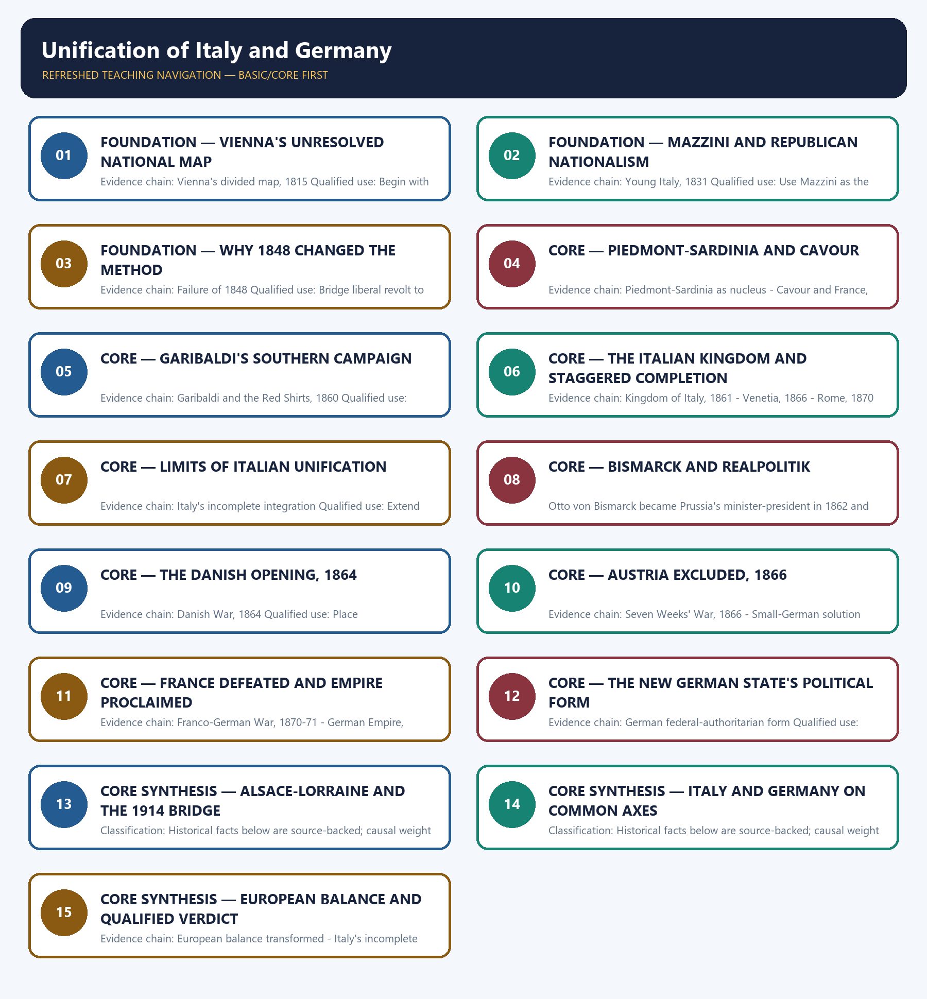

# Unification of Italy and Germany — Learner-v2 Complete Learning Session

> **Authoring-only generation:** 2026-09-01. No PDF was rendered and no tracker or index was mutated.

### SOURCE, PROGRESSION AND CURRENT-LINKAGE AUDIT

- **Generation date:** 2026-09-01.
- **Repository-first evidence:** the Basic owner is taught first and preserved in full; the Advanced owner is retained only in the optional final teaching block.
- **OCR evidence:** Repository Markdown was used first. The available OCR-searchable Norman Lowe World History PDF was retained as supplementary local context, but no unsupported page number, quotation or precision was imported from it.
- **Qdrant:** not used; repository Markdown and available OCR context were sufficient.
- **PYQ integrity:** No direct UPSC PYQ is verified as owned solely by this topic in the local 2018-2025 routing blocks. Probable comparison questions remain original practice.
- **Live-link boundary:** No verified live current-affairs item is pegged to this historical topic in the repository owners. The package therefore uses the bounded phrase 'no verified live item' rather than inventing a headline, date, institution or contemporary linkage.
- **Fact/inference discipline:** no current-affairs item, PYQ wording, figure or quotation is invented.

## BASIC LEARNING SESSION

### DEEP-REVIEW LEARNING CONTRACT

| Control | Binding rule for this package |
|---|---|
| Syllabus boundary | Complete World History Core is taught chronologically, spatially and causally before optional enrichment. |
| Evidence method | Claim → named event/treaty/institution/actor/region or attributed scholarship → analysis → qualification. |
| Chronology | Structural cause, trigger, event, settlement, implementation and long-term process remain distinct. |
| Geography | Europe, Africa, Asia, West Asia and the Americas retain their own actors, routes and unequal connections; Europe is never the default universal viewpoint. |
| Historiography | Liberal, conservative, Marxist, social, feminist, postcolonial and other relevant interpretations are tied to evidence and bounded claims. |
| Practice contract | Every solved item has directive/demand decoding, an examiner-grade model, an executable timed/compression plan, marks rationale and answer-specific improvement. |
| Approval | This immutable successor remains `approved: false` pending explicit approval. |

**Canonical Basic/Core owner:** `upsc-ai-kit\knowledge\World-History\basic\06_Unification-of-Italy-and-Germany.md`  
**Canonical topic owner:** `upsc-ai-kit\knowledge\World-History\basic\06_Unification-of-Italy-and-Germany.md`  
**Optional Advanced owner:** `upsc-ai-kit\knowledge\World-History\advanced\06_Unification-of-Italy-and-Germany.md`  
**Official syllabus mapping:** `upsc-ai-kit\knowledge\World-History\OFFICIAL-UPSC-SYLLABUS-MAPPING.md`

### EVIDENCE, PYQ AND CURRENT-STATUS CONTROL

- **Primary/official evidence:** treaties, declarations, laws, institutional records, speeches and contemporary testimony are dated and read for authorship, audience and purpose.
- **Spatial and social evidence:** maps, trade and migration routes, battlefield geography, class, race, gender and colonial position qualify state-centred narrative.
- **Quantitative evidence:** population, debt, inflation, output, casualties and territorial claims retain unit, place, period, source and uncertainty; no statistic is invented.
- **Interpretive discipline:** teleology, civilisational ranking, single-cause verdicts and present-day nation-state projection are rejected.
- **PYQ discipline:** repository routing ledgers and locally held papers control wording and metadata; neutral rendering, reconstruction and unavailable official keys remain explicitly labelled.
- **Current-status note, rechecked 2026-09-01:** No verified live current-affairs item is pegged to this historical topic in the repository owners. The package therefore uses the bounded phrase 'no verified live item' rather than inventing a headline, date, institution or contemporary linkage.

**Live/primary context sources recorded by the predecessor generation:**

- No live source is required for a static historical claim in this topic.




*Distinct embedded teaching-navigation image. The separate continuous Cārvāka-style flowchart package remains an independent at-a-glance artifact.*

### SESSION 1 — FOUNDATION — VIENNA'S UNRESOLVED NATIONAL MAP

#### DEFINITION / WHAT THIS IS CALLED

**Plain-language definition:** Precise definition: Vienna's unresolved national map is the source-bounded relationship among and Vienna's divided map, 1815 within Unification of Italy and Germany.

**Technical definition:** Evidence chain: Vienna's divided map, 1815 Qualified use: Begin with dynastic fragmentation and Austrian influence.

#### ANSWER-GRABBING OPENING — WRITE/ADAPT IN THE EXAM

> Precise definition: Vienna's unresolved national map is the source-bounded relationship among and Vienna's divided map, 1815 within Unification of Italy and Germany.

#### MUST-WRITE KEYWORDS

- **FOUNDATION**
- **Vienna's unresolved national map**
- **Precise definition**
- **Evidence chain**
- **Qualified use**
- **Precise definition: Vienna's unresolved national map**

**How to use them:** Frame the answer through FOUNDATION; define Vienna's unresolved national map, connect Precise definition with Evidence chain to explain the mechanism, and use Qualified use for the decisive comparison or qualification.

##### VISUAL FIRST

```text
VIENNA'S UNRESOLVED NATIONAL MAP
01. Vienna's divided map, 1815
BOUNDARY -> Vienna created neither Italian nor German nation-states.
```

*This topic-specific rail fixes the evidence sequence and its exam boundary before analysis.*

##### CONCEPT DEFINITIONS

- **Precise definition:** Vienna's unresolved national map is the source-bounded relationship among  and Vienna's divided map, 1815 within Unification of Italy and Germany.
- **Classification:** Historical facts below are source-backed; causal weight and evaluative verdicts are analytical synthesis.

##### CORE EXPLANATION

The Vienna settlement left Italy divided under extensive Austrian control or influence and Germany inside a thirty-nine-state Confederation dominated by Austria.

##### NAMED EVIDENCE AND MECHANISM

- The Vienna settlement left Italy divided under extensive Austrian control or influence and Germany inside a thirty-nine-state Confederation dominated by Austria.

##### EXAMINER CAUTION

- Vienna created neither Italian nor German nation-states.

##### EXAM LINK

- **Prelims:** Retain the exact actor, date, document and category in Vienna's unresolved national map.
- **Mains:** Begin with dynastic fragmentation and Austrian influence.

##### MINI RECAP

- **Evidence chain:** Vienna's divided map, 1815
- **Qualified use:** Begin with dynastic fragmentation and Austrian influence.

#### CLOSING RECALL FLOW — FOUNDATION — VIENNA'S UNRESOLVED NATIONAL MAP

```text
START / CONCEPT: FOUNDATION — Vienna's unresolved national map
        |
        v
EXACT TERMS: FOUNDATION · Vienna's unresolved national map · Precise definition · Evidence chain · Qualified use · Precise definition: Vienna's unresolved national map
        |
        v
MECHANISM / ARGUMENT: Evidence chain: Vienna's divided map, 1815 Qualified use: Begin with dynastic fragmentation and Austrian influence.
        |
        v
CONSEQUENCE / CONTRAST: Classification: Historical facts below are source-backed; causal weight and evaluative verdicts are analytical synthesis.
        |
        v
UPSC TRAP / ANSWER-USE: Do not miss this limiting distinction: vienna created neither Italian nor German nation-states.
        |
        v
ANSWER-GRABBING FORMULATION: Precise definition: Vienna's unresolved national map is the source-bounded relationship among and Vienna's divided map, 1815 within Unification of Italy and Germany.
```
### SESSION 2 — FOUNDATION — MAZZINI AND REPUBLICAN NATIONALISM

#### DEFINITION / WHAT THIS IS CALLED

**Plain-language definition:** Precise definition: Mazzini and republican nationalism is the source-bounded relationship among and Young Italy, 1831 within Unification of Italy and Germany.

**Technical definition:** Evidence chain: Young Italy, 1831 Qualified use: Use Mazzini as the source of legitimacy and programme.

#### ANSWER-GRABBING OPENING — WRITE/ADAPT IN THE EXAM

> Precise definition: Mazzini and republican nationalism is the source-bounded relationship among and Young Italy, 1831 within Unification of Italy and Germany.

#### MUST-WRITE KEYWORDS

- **FOUNDATION**
- **Mazzini**
- **republican nationalism**
- **Precise definition**
- **Evidence chain**
- **Qualified use**

**How to use them:** Frame the answer through FOUNDATION; define Mazzini, connect republican nationalism with Precise definition to explain the mechanism, and use Evidence chain for the decisive comparison or qualification.

##### VISUAL FIRST

```text
MAZZINI AND REPUBLICAN NATIONALISM
01. Young Italy, 1831
BOUNDARY -> Ideological authorship did not equal political completion.
```

*This topic-specific rail fixes the evidence sequence and its exam boundary before analysis.*

##### CONCEPT DEFINITIONS

- **Precise definition:** Mazzini and republican nationalism is the source-bounded relationship among  and Young Italy, 1831 within Unification of Italy and Germany.
- **Classification:** Historical facts below are source-backed; causal weight and evaluative verdicts are analytical synthesis.

##### CORE EXPLANATION

Giuseppe Mazzini founded Young Italy in 1831 and gave republican, unitary nationalism an organised ideological voice.

##### NAMED EVIDENCE AND MECHANISM

- Giuseppe Mazzini founded Young Italy in 1831 and gave republican, unitary nationalism an organised ideological voice.

##### EXAMINER CAUTION

- Ideological authorship did not equal political completion.

##### EXAM LINK

- **Prelims:** Retain the exact actor, date, document and category in Mazzini and republican nationalism.
- **Mains:** Use Mazzini as the source of legitimacy and programme.

##### MINI RECAP

- **Evidence chain:** Young Italy, 1831
- **Qualified use:** Use Mazzini as the source of legitimacy and programme.

#### CLOSING RECALL FLOW — FOUNDATION — MAZZINI AND REPUBLICAN NATIONALISM

```text
START / CONCEPT: FOUNDATION — Mazzini and republican nationalism
        |
        v
EXACT TERMS: FOUNDATION · Mazzini · republican nationalism · Precise definition · Evidence chain · Qualified use
        |
        v
MECHANISM / ARGUMENT: Evidence chain: Young Italy, 1831 Qualified use: Use Mazzini as the source of legitimacy and programme.
        |
        v
CONSEQUENCE / CONTRAST: Mains: Use Mazzini as the source of legitimacy and programme.
        |
        v
UPSC TRAP / ANSWER-USE: Do not miss this limiting distinction: causal weight and evaluative verdicts are analytical synthesis.
        |
        v
ANSWER-GRABBING FORMULATION: Precise definition: Mazzini and republican nationalism is the source-bounded relationship among and Young Italy, 1831 within Unification of Italy and Germany.
```
### SESSION 3 — FOUNDATION — WHY 1848 CHANGED THE METHOD

#### DEFINITION / WHAT THIS IS CALLED

**Plain-language definition:** Precise definition: Why 1848 changed the method is the source-bounded relationship among and Failure of 1848 within Unification of Italy and Germany.

**Technical definition:** Evidence chain: Failure of 1848 Qualified use: Bridge liberal revolt to monarchy-led statecraft.

#### ANSWER-GRABBING OPENING — WRITE/ADAPT IN THE EXAM

> Precise definition: Why 1848 changed the method is the source-bounded relationship among and Failure of 1848 within Unification of Italy and Germany.

#### MUST-WRITE KEYWORDS

- **FOUNDATION**
- **Why 1848 changed the method**
- **Precise definition**
- **Evidence chain**
- **Qualified use**
- **Precise definition: Why 1848 changed the method**

**How to use them:** Frame the answer through FOUNDATION; define Why 1848 changed the method, connect Precise definition with Evidence chain to explain the mechanism, and use Qualified use for the decisive comparison or qualification.

##### VISUAL FIRST

```text
WHY 1848 CHANGED THE METHOD
01. Failure of 1848
BOUNDARY -> Failure redirected nationalism; it did not extinguish it.
```

*This topic-specific rail fixes the evidence sequence and its exam boundary before analysis.*

##### CONCEPT DEFINITIONS

- **Precise definition:** Why 1848 changed the method is the source-bounded relationship among  and Failure of 1848 within Unification of Italy and Germany.
- **Classification:** Historical facts below are source-backed; causal weight and evaluative verdicts are analytical synthesis.

##### CORE EXPLANATION

The revolutions of 1848 put national unity on the agenda but failed, redirecting both movements from liberal idealism toward statecraft, diplomacy and war.

##### NAMED EVIDENCE AND MECHANISM

- The revolutions of 1848 put national unity on the agenda but failed, redirecting both movements from liberal idealism toward statecraft, diplomacy and war.

##### EXAMINER CAUTION

- Failure redirected nationalism; it did not extinguish it.

##### EXAM LINK

- **Prelims:** Retain the exact actor, date, document and category in Why 1848 changed the method.
- **Mains:** Bridge liberal revolt to monarchy-led statecraft.

##### MINI RECAP

- **Evidence chain:** Failure of 1848
- **Qualified use:** Bridge liberal revolt to monarchy-led statecraft.

#### CLOSING RECALL FLOW — FOUNDATION — WHY 1848 CHANGED THE METHOD

```text
START / CONCEPT: FOUNDATION — Why 1848 changed the method
        |
        v
EXACT TERMS: FOUNDATION · Why 1848 changed the method · Precise definition · Evidence chain · Qualified use · Precise definition: Why 1848 changed the method
        |
        v
MECHANISM / ARGUMENT: Evidence chain: Failure of 1848 Qualified use: Bridge liberal revolt to monarchy-led statecraft.
        |
        v
CONSEQUENCE / CONTRAST: Classification: Historical facts below are source-backed; causal weight and evaluative verdicts are analytical synthesis.
        |
        v
UPSC TRAP / ANSWER-USE: Do not miss this limiting distinction: why 1848 changed the method is the source-bounded relationship among and Failure of 1848...
        |
        v
ANSWER-GRABBING FORMULATION: Precise definition: Why 1848 changed the method is the source-bounded relationship among and Failure of 1848 within Unification of Italy and Germany.
```
### SESSION 4 — CORE — PIEDMONT-SARDINIA AND CAVOUR

#### DEFINITION / WHAT THIS IS CALLED

**Plain-language definition:** Precise definition: Piedmont-Sardinia and Cavour is the source-bounded relationship among Piedmont-Sardinia as nucleus and Cavour and France, 1859 within Unification of Italy and Germany.

**Technical definition:** Evidence chain: Piedmont-Sardinia as nucleus - Cavour and France, 1859 Qualified use: Explain why a functioning core state was indispensable.

#### ANSWER-GRABBING OPENING — WRITE/ADAPT IN THE EXAM

> Precise definition: Piedmont-Sardinia and Cavour is the source-bounded relationship among Piedmont-Sardinia as nucleus and Cavour and France, 1859 within Unification of Italy and Germany.

#### MUST-WRITE KEYWORDS

- **Piedmont-Sardinia**
- **Cavour**
- **Precise definition**
- **Evidence chain**
- **Qualified use**
- **Precise definition: Piedmont-Sardinia and Cavour**

**How to use them:** Frame the answer through Piedmont-Sardinia; define Cavour, connect Precise definition with Evidence chain to explain the mechanism, and use Qualified use for the decisive comparison or qualification.

##### VISUAL FIRST

```text
PIEDMONT-SARDINIA AND CAVOUR
01. Piedmont-Sardinia as nucleus
    |
    v
02. Cavour and France, 1859
BOUNDARY -> French help mattered in Italy's 1859 breakthrough.
```

*This topic-specific rail fixes the evidence sequence and its exam boundary before analysis.*

##### CONCEPT DEFINITIONS

- **Precise definition:** Piedmont-Sardinia and Cavour is the source-bounded relationship among Piedmont-Sardinia as nucleus and Cavour and France, 1859 within Unification of Italy and Germany.
- **Classification:** Historical facts below are source-backed; causal weight and evaluative verdicts are analytical synthesis.

##### CORE EXPLANATION

Piedmont-Sardinia, strengthened at Vienna by Genoa, became the functioning state nucleus of Italian unification. Cavour used diplomacy and French military help in 1859 to defeat Austria and secure Lombardy for Piedmont-Sardinia.

##### NAMED EVIDENCE AND MECHANISM

- Piedmont-Sardinia, strengthened at Vienna by Genoa, became the functioning state nucleus of Italian unification.
- Cavour used diplomacy and French military help in 1859 to defeat Austria and secure Lombardy for Piedmont-Sardinia.

##### EXAMINER CAUTION

- French help mattered in Italy's 1859 breakthrough.

##### EXAM LINK

- **Prelims:** Retain the exact actor, date, document and category in Piedmont-Sardinia and Cavour.
- **Mains:** Explain why a functioning core state was indispensable.

##### MINI RECAP

- **Evidence chain:** Piedmont-Sardinia as nucleus -> Cavour and France, 1859
- **Qualified use:** Explain why a functioning core state was indispensable.

#### CLOSING RECALL FLOW — CORE — PIEDMONT-SARDINIA AND CAVOUR

```text
START / CONCEPT: CORE — Piedmont-Sardinia and Cavour
        |
        v
EXACT TERMS: Piedmont-Sardinia · Cavour · Precise definition · Evidence chain · Qualified use · Precise definition: Piedmont-Sardinia and Cavour
        |
        v
MECHANISM / ARGUMENT: Piedmont-Sardinia, strengthened at Vienna by Genoa, became the functioning state nucleus of Italian unification.
        |
        v
CONSEQUENCE / CONTRAST: Evidence chain: Piedmont-Sardinia as nucleus - Cavour and France, 1859 Qualified use: Explain why a functioning core state was indispensable.
        |
        v
UPSC TRAP / ANSWER-USE: Do not miss this limiting distinction: causal weight and evaluative verdicts are analytical synthesis.
        |
        v
ANSWER-GRABBING FORMULATION: Precise definition: Piedmont-Sardinia and Cavour is the source-bounded relationship among Piedmont-Sardinia as nucleus and Cavour and France, 1859 within Unification of Italy and Germany.
```
### SESSION 5 — CORE — GARIBALDI'S SOUTHERN CAMPAIGN

#### DEFINITION / WHAT THIS IS CALLED

**Plain-language definition:** Precise definition: Garibaldi's southern campaign is the source-bounded relationship among and Garibaldi and the Red Shirts, 1860 within Unification of Italy and Germany.

**Technical definition:** Evidence chain: Garibaldi and the Red Shirts, 1860 Qualified use: Show the from-below component of Italian unity.

#### ANSWER-GRABBING OPENING — WRITE/ADAPT IN THE EXAM

> Precise definition: Garibaldi's southern campaign is the source-bounded relationship among and Garibaldi and the Red Shirts, 1860 within Unification of Italy and Germany.

#### MUST-WRITE KEYWORDS

- **Garibaldi's southern campaign**
- **Precise definition**
- **Evidence chain**
- **Qualified use**
- **Precise definition: Garibaldi's southern campaign**
- **Precise**

**How to use them:** Frame the answer through Garibaldi's southern campaign; define Precise definition, connect Evidence chain with Qualified use to explain the mechanism, and use Precise definition: Garibaldi's southern campaign for the decisive comparison or qualification.

##### VISUAL FIRST

```text
GARIBALDI'S SOUTHERN CAMPAIGN
01. Garibaldi and the Red Shirts, 1860
BOUNDARY -> Popular conquest and elite diplomacy must remain distinct.
```

*This topic-specific rail fixes the evidence sequence and its exam boundary before analysis.*

##### CONCEPT DEFINITIONS

- **Precise definition:** Garibaldi's southern campaign is the source-bounded relationship among  and Garibaldi and the Red Shirts, 1860 within Unification of Italy and Germany.
- **Classification:** Historical facts below are source-backed; causal weight and evaluative verdicts are analytical synthesis.

##### CORE EXPLANATION

Garibaldi's Red Shirts conquered Sicily and Naples in 1860, supplying the popular-military force that elite diplomacy alone lacked.

##### NAMED EVIDENCE AND MECHANISM

- Garibaldi's Red Shirts conquered Sicily and Naples in 1860, supplying the popular-military force that elite diplomacy alone lacked.

##### EXAMINER CAUTION

- Popular conquest and elite diplomacy must remain distinct.

##### EXAM LINK

- **Prelims:** Retain the exact actor, date, document and category in Garibaldi's southern campaign.
- **Mains:** Show the from-below component of Italian unity.

##### MINI RECAP

- **Evidence chain:** Garibaldi and the Red Shirts, 1860
- **Qualified use:** Show the from-below component of Italian unity.

#### CLOSING RECALL FLOW — CORE — GARIBALDI'S SOUTHERN CAMPAIGN

```text
START / CONCEPT: CORE — Garibaldi's southern campaign
        |
        v
EXACT TERMS: Garibaldi's southern campaign · Precise definition · Evidence chain · Qualified use · Precise definition: Garibaldi's southern campaign · Precise
        |
        v
MECHANISM / ARGUMENT: Evidence chain: Garibaldi and the Red Shirts, 1860 Qualified use: Show the from-below component of Italian unity.
        |
        v
CONSEQUENCE / CONTRAST: Classification: Historical facts below are source-backed; causal weight and evaluative verdicts are analytical synthesis.
        |
        v
UPSC TRAP / ANSWER-USE: Do not miss this limiting distinction: popular conquest and elite diplomacy must remain distinct.
        |
        v
ANSWER-GRABBING FORMULATION: Precise definition: Garibaldi's southern campaign is the source-bounded relationship among and Garibaldi and the Red Shirts, 1860 within Unification of Italy and Germany.
```
### SESSION 6 — CORE — THE ITALIAN KINGDOM AND STAGGERED COMPLETION

#### DEFINITION / WHAT THIS IS CALLED

**Plain-language definition:** Precise definition: The Italian kingdom and staggered completion is the source-bounded relationship among Kingdom of Italy, 1861, Venetia, 1866 and Rome, 1870 within Unification of Italy and Germany.

**Technical definition:** Evidence chain: Kingdom of Italy, 1861 - Venetia, 1866 - Rome, 1870 Qualified use: Build the exact territorial sequence.

#### ANSWER-GRABBING OPENING — WRITE/ADAPT IN THE EXAM

> Precise definition: The Italian kingdom and staggered completion is the source-bounded relationship among Kingdom of Italy, 1861, Venetia, 1866 and Rome, 1870 within Unification of Italy and Germany.

#### MUST-WRITE KEYWORDS

- **The Italian kingdom**
- **staggered completion**
- **Precise definition**
- **Evidence chain**
- **Qualified use**
- **Precise definition: The Italian kingdom and staggered completion**

**How to use them:** Frame the answer through The Italian kingdom; define staggered completion, connect Precise definition with Evidence chain to explain the mechanism, and use Qualified use for the decisive comparison or qualification.

##### VISUAL FIRST

```text
THE ITALIAN KINGDOM AND STAGGERED COMPLETION
01. Kingdom of Italy, 1861
    |
    v
02. Venetia, 1866
    |
    v
03. Rome, 1870
BOUNDARY -> Kingdom, Venetia and Rome belong to 1861, 1866 and 1870.
```

*This topic-specific rail fixes the evidence sequence and its exam boundary before analysis.*

##### CONCEPT DEFINITIONS

- **Precise definition:** The Italian kingdom and staggered completion is the source-bounded relationship among Kingdom of Italy, 1861, Venetia, 1866 and Rome, 1870 within Unification of Italy and Germany.
- **Classification:** Historical facts below are source-backed; causal weight and evaluative verdicts are analytical synthesis.

##### CORE EXPLANATION

The Kingdom of Italy was proclaimed in 1861 under Victor Emmanuel II, absorbing republican and popular gains into a monarchy. Venetia joined Italy in 1866 after Austria's defeat by Prussia. Rome joined Italy in 1870 after French troops withdrew, completing territorial unification while leaving a long conflict with the papacy.

##### NAMED EVIDENCE AND MECHANISM

- The Kingdom of Italy was proclaimed in 1861 under Victor Emmanuel II, absorbing republican and popular gains into a monarchy.
- Venetia joined Italy in 1866 after Austria's defeat by Prussia.
- Rome joined Italy in 1870 after French troops withdrew, completing territorial unification while leaving a long conflict with the papacy.

##### EXAMINER CAUTION

- Kingdom, Venetia and Rome belong to 1861, 1866 and 1870.

##### EXAM LINK

- **Prelims:** Retain the exact actor, date, document and category in The Italian kingdom and staggered completion.
- **Mains:** Build the exact territorial sequence.

##### MINI RECAP

- **Evidence chain:** Kingdom of Italy, 1861 -> Venetia, 1866 -> Rome, 1870
- **Qualified use:** Build the exact territorial sequence.

#### CLOSING RECALL FLOW — CORE — THE ITALIAN KINGDOM AND STAGGERED COMPLETION

```text
START / CONCEPT: CORE — The Italian kingdom and staggered completion
        |
        v
EXACT TERMS: The Italian kingdom · staggered completion · Precise definition · Evidence chain · Qualified use · Precise definition: The Italian kingdom and staggered completion
        |
        v
MECHANISM / ARGUMENT: Evidence chain: Kingdom of Italy, 1861 - Venetia, 1866 - Rome, 1870 Qualified use: Build the exact territorial sequence.
        |
        v
CONSEQUENCE / CONTRAST: The Kingdom of Italy was proclaimed in 1861 under Victor Emmanuel II, absorbing republican and popular gains into a monarchy.
        |
        v
UPSC TRAP / ANSWER-USE: Do not miss this limiting distinction: causal weight and evaluative verdicts are analytical synthesis.
        |
        v
ANSWER-GRABBING FORMULATION: Precise definition: The Italian kingdom and staggered completion is the source-bounded relationship among Kingdom of Italy, 1861, Venetia, 1866 and Rome, 1870 within Unification of Italy and Germany.
```
### SESSION 7 — CORE — LIMITS OF ITALIAN UNIFICATION

#### DEFINITION / WHAT THIS IS CALLED

**Plain-language definition:** Precise definition: Limits of Italian unification is the source-bounded relationship among and Italy's incomplete integration within Unification of Italy and Germany.

**Technical definition:** Evidence chain: Italy's incomplete integration Qualified use: Extend the answer past proclamation.

#### ANSWER-GRABBING OPENING — WRITE/ADAPT IN THE EXAM

> Precise definition: Limits of Italian unification is the source-bounded relationship among and Italy's incomplete integration within Unification of Italy and Germany.

#### MUST-WRITE KEYWORDS

- **Limits of Italian unification**
- **Precise definition**
- **Evidence chain**
- **Qualified use**
- **Precise definition: Limits of Italian unification**
- **Precise**

**How to use them:** Frame the answer through Limits of Italian unification; define Precise definition, connect Evidence chain with Qualified use to explain the mechanism, and use Precise definition: Limits of Italian unification for the decisive comparison or qualification.

##### VISUAL FIRST

```text
LIMITS OF ITALIAN UNIFICATION
01. Italy's incomplete integration
BOUNDARY -> Political boundaries did not create social homogeneity.
```

*This topic-specific rail fixes the evidence sequence and its exam boundary before analysis.*

##### CONCEPT DEFINITIONS

- **Precise definition:** Limits of Italian unification is the source-bounded relationship among  and Italy's incomplete integration within Unification of Italy and Germany.
- **Classification:** Historical facts below are source-backed; causal weight and evaluative verdicts are analytical synthesis.

##### CORE EXPLANATION

Political unification did not erase the north-south divide, the church-state conflict or the defeat of Mazzini's republican programme.

##### NAMED EVIDENCE AND MECHANISM

- Political unification did not erase the north-south divide, the church-state conflict or the defeat of Mazzini's republican programme.

##### EXAMINER CAUTION

- Political boundaries did not create social homogeneity.

##### EXAM LINK

- **Prelims:** Retain the exact actor, date, document and category in Limits of Italian unification.
- **Mains:** Extend the answer past proclamation.

##### MINI RECAP

- **Evidence chain:** Italy's incomplete integration
- **Qualified use:** Extend the answer past proclamation.

#### CLOSING RECALL FLOW — CORE — LIMITS OF ITALIAN UNIFICATION

```text
START / CONCEPT: CORE — Limits of Italian unification
        |
        v
EXACT TERMS: Limits of Italian unification · Precise definition · Evidence chain · Qualified use · Precise definition: Limits of Italian unification · Precise
        |
        v
MECHANISM / ARGUMENT: Evidence chain: Italy's incomplete integration Qualified use: Extend the answer past proclamation.
        |
        v
CONSEQUENCE / CONTRAST: Political boundaries did not create social homogeneity.
        |
        v
UPSC TRAP / ANSWER-USE: Do not miss this limiting distinction: causal weight and evaluative verdicts are analytical synthesis.
        |
        v
ANSWER-GRABBING FORMULATION: Precise definition: Limits of Italian unification is the source-bounded relationship among and Italy's incomplete integration within Unification of Italy and Germany.
```
### SESSION 8 — CORE — BISMARCK AND REALPOLITIK

#### DEFINITION / WHAT THIS IS CALLED

**Plain-language definition:** Precise definition: Bismarck and Realpolitik is the source-bounded relationship among and Bismarck becomes minister-president, 1862 within Unification of Italy and Germany.

**Technical definition:** Otto von Bismarck became Prussia's minister-president in 1862 and used Realpolitik, practical state interest rather than abstract principle, to direct unification.

#### ANSWER-GRABBING OPENING — WRITE/ADAPT IN THE EXAM

> Precise definition: Bismarck and Realpolitik is the source-bounded relationship among and Bismarck becomes minister-president, 1862 within Unification of Italy and Germany.

#### MUST-WRITE KEYWORDS

- **Bismarck**
- **Realpolitik**
- **Precise definition**
- **Evidence chain**
- **Qualified use**
- **Precise definition: Bismarck and Realpolitik**

**How to use them:** Frame the answer through Bismarck; define Realpolitik, connect Precise definition with Evidence chain to explain the mechanism, and use Qualified use for the decisive comparison or qualification.

##### VISUAL FIRST

```text
BISMARCK AND REALPOLITIK
01. Bismarck becomes minister-president, 1862
BOUNDARY -> Realpolitik means practical state interest, not ideological emptiness.
```

*This topic-specific rail fixes the evidence sequence and its exam boundary before analysis.*

##### CONCEPT DEFINITIONS

- **Precise definition:** Bismarck and Realpolitik is the source-bounded relationship among  and Bismarck becomes minister-president, 1862 within Unification of Italy and Germany.
- **Classification:** Historical facts below are source-backed; causal weight and evaluative verdicts are analytical synthesis.

##### CORE EXPLANATION

Otto von Bismarck became Prussia's minister-president in 1862 and used Realpolitik, practical state interest rather than abstract principle, to direct unification.

##### NAMED EVIDENCE AND MECHANISM

- Otto von Bismarck became Prussia's minister-president in 1862 and used Realpolitik, practical state interest rather than abstract principle, to direct unification.

##### EXAMINER CAUTION

- Realpolitik means practical state interest, not ideological emptiness.

##### EXAM LINK

- **Prelims:** Retain the exact actor, date, document and category in Bismarck and Realpolitik.
- **Mains:** Define the strategist's method without biography.

##### MINI RECAP

- **Evidence chain:** Bismarck becomes minister-president, 1862
- **Qualified use:** Define the strategist's method without biography.

#### CLOSING RECALL FLOW — CORE — BISMARCK AND REALPOLITIK

```text
START / CONCEPT: CORE — Bismarck and Realpolitik
        |
        v
EXACT TERMS: Bismarck · Realpolitik · Precise definition · Evidence chain · Qualified use · Precise definition: Bismarck and Realpolitik
        |
        v
MECHANISM / ARGUMENT: Otto von Bismarck became Prussia's minister-president in 1862 and used Realpolitik, practical state interest rather than abstract principle, to direct unification.
        |
        v
CONSEQUENCE / CONTRAST: Realpolitik means practical state interest, not ideological emptiness.
        |
        v
UPSC TRAP / ANSWER-USE: Do not miss this limiting distinction: bismarck becomes minister-president, 1862 Qualified use.
        |
        v
ANSWER-GRABBING FORMULATION: Precise definition: Bismarck and Realpolitik is the source-bounded relationship among and Bismarck becomes minister-president, 1862 within Unification of Italy and Germany.
```
### SESSION 9 — CORE — THE DANISH OPENING, 1864

#### DEFINITION / WHAT THIS IS CALLED

**Plain-language definition:** Precise definition: The Danish opening, 1864 is the source-bounded relationship among and Danish War, 1864 within Unification of Italy and Germany.

**Technical definition:** Evidence chain: Danish War, 1864 Qualified use: Place Schleswig-Holstein inside the three-war logic.

#### ANSWER-GRABBING OPENING — WRITE/ADAPT IN THE EXAM

> Precise definition: The Danish opening, 1864 is the source-bounded relationship among and Danish War, 1864 within Unification of Italy and Germany.

#### MUST-WRITE KEYWORDS

- **The Danish opening**
- **Precise definition**
- **Evidence chain**
- **Qualified use**
- **Precise definition: The Danish opening, 1864**
- **Precise**

**How to use them:** Frame the answer through The Danish opening; define Precise definition, connect Evidence chain with Qualified use to explain the mechanism, and use Precise definition: The Danish opening, 1864 for the decisive comparison or qualification.

##### VISUAL FIRST

```text
THE DANISH OPENING, 1864
01. Danish War, 1864
BOUNDARY -> The first war opened the sequence but did not exclude Austria.
```

*This topic-specific rail fixes the evidence sequence and its exam boundary before analysis.*

##### CONCEPT DEFINITIONS

- **Precise definition:** The Danish opening, 1864 is the source-bounded relationship among  and Danish War, 1864 within Unification of Italy and Germany.
- **Classification:** Historical facts below are source-backed; causal weight and evaluative verdicts are analytical synthesis.

##### CORE EXPLANATION

Prussia and Austria defeated Denmark in 1864 over Schleswig-Holstein, opening Bismarck's three-war sequence.

##### NAMED EVIDENCE AND MECHANISM

- Prussia and Austria defeated Denmark in 1864 over Schleswig-Holstein, opening Bismarck's three-war sequence.

##### EXAMINER CAUTION

- The first war opened the sequence but did not exclude Austria.

##### EXAM LINK

- **Prelims:** Retain the exact actor, date, document and category in The Danish opening, 1864.
- **Mains:** Place Schleswig-Holstein inside the three-war logic.

##### MINI RECAP

- **Evidence chain:** Danish War, 1864
- **Qualified use:** Place Schleswig-Holstein inside the three-war logic.

#### CLOSING RECALL FLOW — CORE — THE DANISH OPENING, 1864

```text
START / CONCEPT: CORE — The Danish opening, 1864
        |
        v
EXACT TERMS: The Danish opening · Precise definition · Evidence chain · Qualified use · Precise definition: The Danish opening, 1864 · Precise
        |
        v
MECHANISM / ARGUMENT: Evidence chain: Danish War, 1864 Qualified use: Place Schleswig-Holstein inside the three-war logic.
        |
        v
CONSEQUENCE / CONTRAST: Classification: Historical facts below are source-backed; causal weight and evaluative verdicts are analytical synthesis.
        |
        v
UPSC TRAP / ANSWER-USE: Do not miss this limiting distinction: the Danish opening, 1864 is the source-bounded relationship among and Danish War, 1864 within...
        |
        v
ANSWER-GRABBING FORMULATION: Precise definition: The Danish opening, 1864 is the source-bounded relationship among and Danish War, 1864 within Unification of Italy and Germany.
```
### SESSION 10 — CORE — AUSTRIA EXCLUDED, 1866

#### DEFINITION / WHAT THIS IS CALLED

**Plain-language definition:** Precise definition: Austria excluded, 1866 is the source-bounded relationship among Seven Weeks' War, 1866 and Small-German solution within Unification of Italy and Germany.

**Technical definition:** Evidence chain: Seven Weeks' War, 1866 - Small-German solution Qualified use: Explain the decisive constitutional and power shift.

#### ANSWER-GRABBING OPENING — WRITE/ADAPT IN THE EXAM

> Precise definition: Austria excluded, 1866 is the source-bounded relationship among Seven Weeks' War, 1866 and Small-German solution within Unification of Italy and Germany.

#### MUST-WRITE KEYWORDS

- **Austria excluded**
- **Precise definition**
- **Evidence chain**
- **Qualified use**
- **Precise definition: Austria excluded, 1866**
- **Precise**

**How to use them:** Frame the answer through Austria excluded; define Precise definition, connect Evidence chain with Qualified use to explain the mechanism, and use Precise definition: Austria excluded, 1866 for the decisive comparison or qualification.

##### VISUAL FIRST

```text
AUSTRIA EXCLUDED, 1866
01. Seven Weeks' War, 1866
    |
    v
02. Small-German solution
BOUNDARY -> The small-German solution deliberately excluded Austria.
```

*This topic-specific rail fixes the evidence sequence and its exam boundary before analysis.*

##### CONCEPT DEFINITIONS

- **Precise definition:** Austria excluded, 1866 is the source-bounded relationship among Seven Weeks' War, 1866 and Small-German solution within Unification of Italy and Germany.
- **Classification:** Historical facts below are source-backed; causal weight and evaluative verdicts are analytical synthesis.

##### CORE EXPLANATION

Prussia defeated Austria in the Seven Weeks' War of 1866, excluded Austria from German affairs and established the North German Confederation. Austria's exclusion produced a small-German state dominated by Prussia rather than a union of all German-speaking lands.

##### NAMED EVIDENCE AND MECHANISM

- Prussia defeated Austria in the Seven Weeks' War of 1866, excluded Austria from German affairs and established the North German Confederation.
- Austria's exclusion produced a small-German state dominated by Prussia rather than a union of all German-speaking lands.

##### EXAMINER CAUTION

- The small-German solution deliberately excluded Austria.

##### EXAM LINK

- **Prelims:** Retain the exact actor, date, document and category in Austria excluded, 1866.
- **Mains:** Explain the decisive constitutional and power shift.

##### MINI RECAP

- **Evidence chain:** Seven Weeks' War, 1866 -> Small-German solution
- **Qualified use:** Explain the decisive constitutional and power shift.

#### CLOSING RECALL FLOW — CORE — AUSTRIA EXCLUDED, 1866

```text
START / CONCEPT: CORE — Austria excluded, 1866
        |
        v
EXACT TERMS: Austria excluded · Precise definition · Evidence chain · Qualified use · Precise definition: Austria excluded, 1866 · Precise
        |
        v
MECHANISM / ARGUMENT: Evidence chain: Seven Weeks' War, 1866 - Small-German solution Qualified use: Explain the decisive constitutional and power shift.
        |
        v
CONSEQUENCE / CONTRAST: Classification: Historical facts below are source-backed; causal weight and evaluative verdicts are analytical synthesis.
        |
        v
UPSC TRAP / ANSWER-USE: Do not miss this limiting distinction: explain the decisive constitutional and power shift.
        |
        v
ANSWER-GRABBING FORMULATION: Precise definition: Austria excluded, 1866 is the source-bounded relationship among Seven Weeks' War, 1866 and Small-German solution within Unification of Italy and Germany.
```
### SESSION 11 — CORE — FRANCE DEFEATED AND EMPIRE PROCLAIMED

#### DEFINITION / WHAT THIS IS CALLED

**Plain-language definition:** Precise definition: France defeated and empire proclaimed is the source-bounded relationship among Franco-German War, 1870-71 and German Empire, January 1871 within Unification of Italy and Germany.

**Technical definition:** Evidence chain: Franco-German War, 1870-71 - German Empire, January 1871 Qualified use: Show how external war rallied southern states.

#### ANSWER-GRABBING OPENING — WRITE/ADAPT IN THE EXAM

> Precise definition: France defeated and empire proclaimed is the source-bounded relationship among Franco-German War, 1870-71 and German Empire, January 1871 within Unification of Italy and Germany.

#### MUST-WRITE KEYWORDS

- **France defeated**
- **empire proclaimed**
- **Precise definition**
- **Evidence chain**
- **Qualified use**
- **1870-71**

**How to use them:** Frame the answer through France defeated; define empire proclaimed, connect Precise definition with Evidence chain to explain the mechanism, and use Qualified use for the decisive comparison or qualification.

##### VISUAL FIRST

```text
FRANCE DEFEATED AND EMPIRE PROCLAIMED
01. Franco-German War, 1870-71
    |
    v
02. German Empire, January 1871
BOUNDARY -> War and proclamation belong to 1870-71 and January 1871.
```

*This topic-specific rail fixes the evidence sequence and its exam boundary before analysis.*

##### CONCEPT DEFINITIONS

- **Precise definition:** France defeated and empire proclaimed is the source-bounded relationship among Franco-German War, 1870-71 and German Empire, January 1871 within Unification of Italy and Germany.
- **Classification:** Historical facts below are source-backed; causal weight and evaluative verdicts are analytical synthesis.

##### CORE EXPLANATION

War against France in 1870-71 rallied the south German states to Prussia and completed the military-diplomatic unification sequence. The German Empire was proclaimed at Versailles in January 1871 under William I of Prussia.

##### NAMED EVIDENCE AND MECHANISM

- War against France in 1870-71 rallied the south German states to Prussia and completed the military-diplomatic unification sequence.
- The German Empire was proclaimed at Versailles in January 1871 under William I of Prussia.

##### EXAMINER CAUTION

- War and proclamation belong to 1870-71 and January 1871.

##### EXAM LINK

- **Prelims:** Retain the exact actor, date, document and category in France defeated and empire proclaimed.
- **Mains:** Show how external war rallied southern states.

##### MINI RECAP

- **Evidence chain:** Franco-German War, 1870-71 -> German Empire, January 1871
- **Qualified use:** Show how external war rallied southern states.

#### CLOSING RECALL FLOW — CORE — FRANCE DEFEATED AND EMPIRE PROCLAIMED

```text
START / CONCEPT: CORE — France defeated and empire proclaimed
        |
        v
EXACT TERMS: France defeated · empire proclaimed · Precise definition · Evidence chain · Qualified use · 1870-71
        |
        v
MECHANISM / ARGUMENT: Evidence chain: Franco-German War, 1870-71 - German Empire, January 1871 Qualified use: Show how external war rallied southern states.
        |
        v
CONSEQUENCE / CONTRAST: The German Empire was proclaimed at Versailles in January 1871 under William I of Prussia.
        |
        v
UPSC TRAP / ANSWER-USE: Do not miss this limiting distinction: causal weight and evaluative verdicts are analytical synthesis.
        |
        v
ANSWER-GRABBING FORMULATION: Precise definition: France defeated and empire proclaimed is the source-bounded relationship among Franco-German War, 1870-71 and German Empire, January 1871 within Unification of Italy and Germany.
```
### SESSION 12 — CORE — THE NEW GERMAN STATE'S POLITICAL FORM

#### DEFINITION / WHAT THIS IS CALLED

**Plain-language definition:** Precise definition: The new German state's political form is the source-bounded relationship among and German federal-authoritarian form within Unification of Italy and Germany.

**Technical definition:** Evidence chain: German federal-authoritarian form Qualified use: Avoid binary democratic-versus-autocratic labels.

#### ANSWER-GRABBING OPENING — WRITE/ADAPT IN THE EXAM

> Precise definition: The new German state's political form is the source-bounded relationship among and German federal-authoritarian form within Unification of Italy and Germany.

#### MUST-WRITE KEYWORDS

- **The new German state's political form**
- **Precise definition**
- **Evidence chain**
- **Qualified use**
- **Precise definition: The new German state's political form**
- **Precise**

**How to use them:** Frame the answer through The new German state's political form; define Precise definition, connect Evidence chain with Qualified use to explain the mechanism, and use Precise definition: The new German state's political form for the decisive comparison or qualification.

##### VISUAL FIRST

```text
THE NEW GERMAN STATE'S POLITICAL FORM
01. German federal-authoritarian form
BOUNDARY -> Federal institutions coexisted with Prussian-monarchical control.
```

*This topic-specific rail fixes the evidence sequence and its exam boundary before analysis.*

##### CONCEPT DEFINITIONS

- **Precise definition:** The new German state's political form is the source-bounded relationship among  and German federal-authoritarian form within Unification of Italy and Germany.
- **Classification:** Historical facts below are source-backed; causal weight and evaluative verdicts are analytical synthesis.

##### CORE EXPLANATION

The new Empire combined a parliament and federal institutions with Prussian dominance and monarchical control of the army and foreign policy.

##### NAMED EVIDENCE AND MECHANISM

- The new Empire combined a parliament and federal institutions with Prussian dominance and monarchical control of the army and foreign policy.

##### EXAMINER CAUTION

- Federal institutions coexisted with Prussian-monarchical control.

##### EXAM LINK

- **Prelims:** Retain the exact actor, date, document and category in The new German state's political form.
- **Mains:** Avoid binary democratic-versus-autocratic labels.

##### MINI RECAP

- **Evidence chain:** German federal-authoritarian form
- **Qualified use:** Avoid binary democratic-versus-autocratic labels.

#### CLOSING RECALL FLOW — CORE — THE NEW GERMAN STATE'S POLITICAL FORM

```text
START / CONCEPT: CORE — The new German state's political form
        |
        v
EXACT TERMS: The new German state's political form · Precise definition · Evidence chain · Qualified use · Precise definition: The new German state's political form · Precise
        |
        v
MECHANISM / ARGUMENT: Evidence chain: German federal-authoritarian form Qualified use: Avoid binary democratic-versus-autocratic labels.
        |
        v
CONSEQUENCE / CONTRAST: Classification: Historical facts below are source-backed; causal weight and evaluative verdicts are analytical synthesis.
        |
        v
UPSC TRAP / ANSWER-USE: Do not miss this limiting distinction: the new German state's political form is the source-bounded relationship among and German federal-authoritarian...
        |
        v
ANSWER-GRABBING FORMULATION: Precise definition: The new German state's political form is the source-bounded relationship among and German federal-authoritarian form within Unification of Italy and Germany.
```
### SESSION 13 — CORE SYNTHESIS — ALSACE-LORRAINE AND THE 1914 BRIDGE

#### DEFINITION / WHAT THIS IS CALLED

**Plain-language definition:** Precise definition: Alsace-Lorraine and the 1914 bridge is the source-bounded relationship among and Alsace-Lorraine consequence within Unification of Italy and Germany.

**Technical definition:** Classification: Historical facts below are source-backed; causal weight and evaluative verdicts are analytical synthesis.

#### ANSWER-GRABBING OPENING — WRITE/ADAPT IN THE EXAM

> Precise definition: Alsace-Lorraine and the 1914 bridge is the source-bounded relationship among and Alsace-Lorraine consequence within Unification of Italy and Germany.

#### MUST-WRITE KEYWORDS

- **CORE SYNTHESIS**
- **Alsace-Lorraine**
- **the 1914 bridge**
- **Precise definition**
- **Evidence chain**
- **Qualified use**

**How to use them:** Frame the answer through CORE SYNTHESIS; define Alsace-Lorraine, connect the 1914 bridge with Precise definition to explain the mechanism, and use Evidence chain for the decisive comparison or qualification.

##### VISUAL FIRST

```text
ALSACE-LORRAINE AND THE 1914 BRIDGE
01. Alsace-Lorraine consequence
BOUNDARY -> Later friction does not make 1914 mechanically inevitable.
```

*This topic-specific rail fixes the evidence sequence and its exam boundary before analysis.*

##### CONCEPT DEFINITIONS

- **Precise definition:** Alsace-Lorraine and the 1914 bridge is the source-bounded relationship among  and Alsace-Lorraine consequence within Unification of Italy and Germany.
- **Classification:** Historical facts below are source-backed; causal weight and evaluative verdicts are analytical synthesis.

##### CORE EXPLANATION

France's loss of Alsace-Lorraine in 1871 created revanchist grievance that later formed one source of friction before 1914.

##### NAMED EVIDENCE AND MECHANISM

- France's loss of Alsace-Lorraine in 1871 created revanchist grievance that later formed one source of friction before 1914.

##### EXAMINER CAUTION

- Later friction does not make 1914 mechanically inevitable.

##### EXAM LINK

- **Prelims:** Retain the exact actor, date, document and category in Alsace-Lorraine and the 1914 bridge.
- **Mains:** Link unification to French revanchism.

##### MINI RECAP

- **Evidence chain:** Alsace-Lorraine consequence
- **Qualified use:** Link unification to French revanchism.

#### CLOSING RECALL FLOW — CORE SYNTHESIS — ALSACE-LORRAINE AND THE 1914 BRIDGE

```text
START / CONCEPT: CORE SYNTHESIS — Alsace-Lorraine and the 1914 bridge
        |
        v
EXACT TERMS: CORE SYNTHESIS · Alsace-Lorraine · the 1914 bridge · Precise definition · Evidence chain · Qualified use
        |
        v
MECHANISM / ARGUMENT: Evidence chain: Alsace-Lorraine consequence Qualified use: Link unification to French revanchism.
        |
        v
CONSEQUENCE / CONTRAST: Later friction does not make 1914 mechanically inevitable.
        |
        v
UPSC TRAP / ANSWER-USE: Do not miss this limiting distinction: france's loss of Alsace-Lorraine in 1871 created revanchist grievance that later formed one source...
        |
        v
ANSWER-GRABBING FORMULATION: Precise definition: Alsace-Lorraine and the 1914 bridge is the source-bounded relationship among and Alsace-Lorraine consequence within Unification of Italy and Germany.
```
### SESSION 14 — CORE SYNTHESIS — ITALY AND GERMANY ON COMMON AXES

#### DEFINITION / WHAT THIS IS CALLED

**Plain-language definition:** Precise definition: Italy and Germany on common axes is the source-bounded relationship among and Above and below compared within Unification of Italy and Germany.

**Technical definition:** Classification: Historical facts below are source-backed; causal weight and evaluative verdicts are analytical synthesis.

#### ANSWER-GRABBING OPENING — WRITE/ADAPT IN THE EXAM

> Precise definition: Italy and Germany on common axes is the source-bounded relationship among and Above and below compared within Unification of Italy and Germany.

#### MUST-WRITE KEYWORDS

- **CORE SYNTHESIS**
- **Italy**
- **Germany on common axes**
- **Precise definition**
- **Evidence chain**
- **Qualified use**

**How to use them:** Frame the answer through CORE SYNTHESIS; define Italy, connect Germany on common axes with Precise definition to explain the mechanism, and use Evidence chain for the decisive comparison or qualification.

##### VISUAL FIRST

```text
ITALY AND GERMANY ON COMMON AXES
01. Above and below compared
BOUNDARY -> Use agency, alliance, popular mobilisation and state power as common axes.
```

*This topic-specific rail fixes the evidence sequence and its exam boundary before analysis.*

##### CONCEPT DEFINITIONS

- **Precise definition:** Italy and Germany on common axes is the source-bounded relationship among  and Above and below compared within Unification of Italy and Germany.
- **Classification:** Historical facts below are source-backed; causal weight and evaluative verdicts are analytical synthesis.

##### CORE EXPLANATION

Italian unification combined Mazzini's ideas, Garibaldi's mobilisation and Cavour's monarchy-led diplomacy; German unification was much more decisively state-led and military.

##### NAMED EVIDENCE AND MECHANISM

- Italian unification combined Mazzini's ideas, Garibaldi's mobilisation and Cavour's monarchy-led diplomacy; German unification was much more decisively state-led and military.

##### EXAMINER CAUTION

- Use agency, alliance, popular mobilisation and state power as common axes.

##### EXAM LINK

- **Prelims:** Retain the exact actor, date, document and category in Italy and Germany on common axes.
- **Mains:** Compare rather than narrate twice.

##### MINI RECAP

- **Evidence chain:** Above and below compared
- **Qualified use:** Compare rather than narrate twice.

#### CLOSING RECALL FLOW — CORE SYNTHESIS — ITALY AND GERMANY ON COMMON AXES

```text
START / CONCEPT: CORE SYNTHESIS — Italy and Germany on common axes
        |
        v
EXACT TERMS: CORE SYNTHESIS · Italy · Germany on common axes · Precise definition · Evidence chain · Qualified use
        |
        v
MECHANISM / ARGUMENT: Use agency, alliance, popular mobilisation and state power as common axes.
        |
        v
CONSEQUENCE / CONTRAST: Classification: Historical facts below are source-backed; causal weight and evaluative verdicts are analytical synthesis.
        |
        v
UPSC TRAP / ANSWER-USE: Evidence chain: Above and below compared Qualified use: Compare rather than narrate twice.
        |
        v
ANSWER-GRABBING FORMULATION: Precise definition: Italy and Germany on common axes is the source-bounded relationship among and Above and below compared within Unification of Italy and Germany.
```
### SESSION 15 — CORE SYNTHESIS — EUROPEAN BALANCE AND QUALIFIED VERDICT

#### DEFINITION / WHAT THIS IS CALLED

**Plain-language definition:** Precise definition: European balance and qualified verdict is the source-bounded relationship among European balance transformed, Italy's incomplete integration and German federal-authoritarian form within Unification of Italy and Germany.

**Technical definition:** Evidence chain: European balance transformed - Italy's incomplete integration - German federal-authoritarian form Qualified use: Conclude with unequal power effects and incomplete integration.

#### ANSWER-GRABBING OPENING — WRITE/ADAPT IN THE EXAM

> Precise definition: European balance and qualified verdict is the source-bounded relationship among European balance transformed, Italy's incomplete integration and German federal-authoritarian form within Unification of Italy and Germany.

#### MUST-WRITE KEYWORDS

- **CORE SYNTHESIS**
- **European balance**
- **qualified verdict**
- **Precise definition**
- **Evidence chain**
- **Qualified use**

**How to use them:** Frame the answer through CORE SYNTHESIS; define European balance, connect qualified verdict with Precise definition to explain the mechanism, and use Evidence chain for the decisive comparison or qualification.

##### VISUAL FIRST

```text
EUROPEAN BALANCE AND QUALIFIED VERDICT
01. European balance transformed
    |
    v
02. Italy's incomplete integration
    |
    v
03. German federal-authoritarian form
BOUNDARY -> Unity was political before it was socially complete.
```

*This topic-specific rail fixes the evidence sequence and its exam boundary before analysis.*

##### CONCEPT DEFINITIONS

- **Precise definition:** European balance and qualified verdict is the source-bounded relationship among European balance transformed, Italy's incomplete integration and German federal-authoritarian form within Unification of Italy and Germany.
- **Classification:** Historical facts below are source-backed; causal weight and evaluative verdicts are analytical synthesis.

##### CORE EXPLANATION

A unified Germany became the leading continental military-economic power, altering Europe's balance far more sharply than the creation of the weaker Italian state. Political unification did not erase the north-south divide, the church-state conflict or the defeat of Mazzini's republican programme. The new Empire combined a parliament and federal institutions with Prussian dominance and monarchical control of the army and foreign policy.

##### NAMED EVIDENCE AND MECHANISM

- A unified Germany became the leading continental military-economic power, altering Europe's balance far more sharply than the creation of the weaker Italian state.
- Political unification did not erase the north-south divide, the church-state conflict or the defeat of Mazzini's republican programme.
- The new Empire combined a parliament and federal institutions with Prussian dominance and monarchical control of the army and foreign policy.

##### EXAMINER CAUTION

- Unity was political before it was socially complete.

##### EXAM LINK

- **Prelims:** Retain the exact actor, date, document and category in European balance and qualified verdict.
- **Mains:** Conclude with unequal power effects and incomplete integration.

##### MINI RECAP

- **Evidence chain:** European balance transformed -> Italy's incomplete integration -> German federal-authoritarian form
- **Qualified use:** Conclude with unequal power effects and incomplete integration.

#### COMPLETE BASIC OWNER EVIDENCE BANK

> **Subject:** History (World History) · **Tier:** Must-Do (foundation) · **GS Paper:** GS-I (World History)
> **Grounded in:** NCERT, *The Rise of Nationalism in Europe* + Old NCERT/Arjun Dev world-history chapters on 19th-century Europe + Britannica, *Risorgimento*, *unification of Italy*, *Giuseppe Mazzini*, *Giuseppe Garibaldi*, *Otto von Bismarck*, *German Confederation*, *Seven Weeks' War* and *Franco-German War* + official UPSC GS-I syllabus line.
> ✅ = source-grounded fact (named source) · ⚠️ = analytical synthesis / standard knowledge · 📰 = current affairs.
> *Companion: `advanced/06_Unification-of-Italy-and-Germany.md`.*

#### 1. Mini-timeline

| Date | Event | Why it matters |
|---|---|---|
| ✅ 1815 | Vienna settlement leaves Italy divided and Germany in a 39-state confederation | Nationalism remains politically unresolved |
| ✅ 1831 | Mazzini launches Young Italy | Republican nationalism gains a clear voice |
| ✅ 1848 | Revolutions in Europe | Liberal-national attempts fail, but the issue survives |
| ✅ 1859 | Piedmont-Sardinia and France defeat Austria; Lombardy gained | Italian unification moves from ideas to state action |
| ✅ 1860 | Garibaldi's Red Shirts conquer Sicily and Naples | Southern Italy joins the unification process |
| ✅ 1861 | Kingdom of Italy proclaimed under Victor Emmanuel II | Political unification begins formally |
| ✅ 1864 | Denmark defeated by Prussia and Austria | First of Bismarck's three wars |
| ✅ 1866 | Prussia defeats Austria in the Seven Weeks' War; Venetia goes to Italy | Austria is excluded from German affairs; Italy advances |
| ✅ 1870 | Rome joins Italy after French withdrawal | Italian unification is completed territorially |
| ✅ Jan. 1871 | German Empire proclaimed at Versailles | German unification is completed under Prussian leadership |

#### 2. Why nationalism took this form

- ✅ NCERT shows that Vienna had ignored national aspirations in both Italy and Germany.
- ✅ Italy remained divided among Austrian-controlled or Austrian-influenced states, the Papal States, and Sardinia-Piedmont.
- ✅ Germany remained a loose confederation of 39 states under Austrian influence.
- ⚠️ In both cases, the failure of 1848 pushed unification away from liberal idealism alone and toward statecraft, diplomacy and war.

#### 3. Italy: leaders and stages

| Actor / force | ✅ Role | Why it matters |
|---|---|---|
| ✅ Giuseppe Mazzini | Founded Young Italy and argued for a united republican Italy | Ideological inspiration |
| ✅ Cavour | Prime Minister of Piedmont-Sardinia; used diplomacy and war against Austria | Political strategist of unification |
| ✅ Giuseppe Garibaldi | Led the Red Shirts and conquered Sicily and Naples in 1860 | Popular-military energy from below |
| ✅ Victor Emmanuel II | King of Piedmont-Sardinia and then king of Italy in 1861 | Monarchical centre of unification |

- ✅ NCERT and Britannica both emphasize that **Piedmont-Sardinia** became the nucleus of unification.
- ✅ Venetia joined in **1866** and Rome in **1870**.

#### 4. Germany: Prussia, Bismarck and the three wars

| Phase | ✅ Event | Result |
|---|---|---|
| ✅ 1864 | Danish War | Schleswig-Holstein question opens the path |
| ✅ 1866 | Austro-Prussian / Seven Weeks' War | Austria excluded; North German Confederation emerges |
| ✅ 1870-71 | Franco-Prussian / Franco-German War | South German states rally to Prussia; empire proclaimed |

- ✅ Britannica says Bismarck became Prussia's minister-president in **1862** and pursued practical power politics.
- ⚠️ **Realpolitik** means politics guided by practical state interest rather than abstract principle.
- ✅ In **January 1871**, the German Empire was proclaimed at **Versailles**, and William I of Prussia became emperor.

```text
Italy:
Mazzini's idea -> Cavour's diplomacy -> Garibaldi's campaign -> Victor Emmanuel II's kingdom

Germany:
Prussian power -> Bismarck's wars -> Austria excluded -> Empire proclaimed in 1871
```

#### 5. Compare the two unifications

| Theme | Italy | Germany |
|---|---|---|
| ✅ Main obstacle | Austrian domination + political fragmentation | Austrian rivalry + fragmentation |
| ✅ Key state | Piedmont-Sardinia | Prussia |
| ✅ Famous mass leader | Garibaldi | No equivalent mass military hero of the same kind |
| ✅ Key strategist | Cavour | Bismarck |
| ⚠️ Character | Mixed: diplomacy + mass campaign | Heavily state-driven and military |

#### 6. Must-Know Facts (Prelims) and UPSC traps

- ✅ **Young Italy** is associated with **Mazzini**.
- ✅ **Garibaldi** led the **Red Shirts**.
- ✅ **Victor Emmanuel II** became king of united Italy in **1861**.
- ✅ **Rome** joined Italy in **1870**.
- ✅ **Bismarck** used **three wars** to unify Germany.
- ✅ **Seven Weeks' War (1866)** excluded Austria from German affairs.
- ✅ **German Empire** was proclaimed in **1871** at **Versailles**.

> 🔑 Trap: Do not treat Italian and German unification as identical processes. Italy needed both diplomatic statecraft and Garibaldi's mass campaign; Germany was more decisively Prussian and military.

- ❌ Mazzini completed Italian unification. -> ✅ He inspired it, but Cavour, Garibaldi and Victor Emmanuel II completed it.
- ❌ Austria led German unification. -> ✅ Prussia led it after defeating Austria.
- ❌ Rome joined Italy in 1861. -> ✅ Rome joined in **1870**.
- ❌ Germany was unified by popular assemblies alone. -> ✅ Prussian power and war were decisive.

#### 7. Exam linkage and Mains angles

- ✅ Official UPSC GS-I syllabus explicitly includes **redrawal of national boundaries**; both unifications directly fit that line.
- ⚠️ Strong answers should connect nationalism with **state-building, war, diplomacy and the failure of the Vienna order**.

##### Probable questions

1. Compare the processes of Italian and German unification.
2. How did nationalism reshape the European map after 1815?
3. Was unification in Italy and Germany achieved more by ideas or by state power?

#### 8. Answer architecture (10/15/20-mark support)

> **Core-sufficiency note:** this file must independently support the comparison, the
> "from above versus from below" demand and the limits/minorities dimension.
> `advanced/06` adds interpretive depth only.

##### 8.1 Directive and demand map

| If the question says | It is really testing | Do NOT write |
|---|---|---|
| *Compare the two unifications* | Difference in **agency and method**, not two parallel narratives | Italy's story, then Germany's story |
| *From above or from below?* | Whether elite statecraft or popular mobilisation was decisive, case by case | One verdict for both countries |
| *Role of Bismarck / Cavour / Garibaldi / Mazzini* | Function within a sequence, not biography | A life sketch |
| *Ideas or state power?* | Ideology as necessary but insufficient | Choosing one side |
| *How did nationalism reshape the map?* | Boundary consequences and who was excluded | Only the two unifications |
| *Assess the limits of unification* | Regional, social, religious and minority incompleteness | Ending at 1871 |

##### 8.2 Qualified thesis templates

- ⚠️ **Comparative:** "Both unifications required a strong core state and a war against Austria, but Italy needed a popular military campaign that Germany never had, and Germany achieved a concentration of power that Italy never achieved."
- ⚠️ **Above/below:** "Nationalism was generated from below and executed from above; the movements supplied legitimacy and the states supplied the means, and neither could have succeeded alone."
- ⚠️ **Limits:** "Both states were unified politically before they were unified socially, which is why the years after 1871 were dominated by the question of who really belonged to the new nation."

##### 8.3 Mark-scaled structures

| Marks | Structure |
|---|---|
| **10** | Thesis → **two** axes of comparison (core state, method) with named evidence → one limit → verdict |
| **15** | Thesis → the shared obstacle (Vienna's settlement, Austria) → Italy's sequence → Germany's sequence → the decisive difference → limits → verdict |
| **20** | All of the above → **plus** the popular-versus-elite question, minorities and the post-1871 consequences for European power → verdict |

##### 8.4 Evidence bank A — the comparison, made analytical

| Axis | Italy | Germany | ⚠️ What the difference proves |
|---|---|---|---|
| Core state | ✅ Piedmont-Sardinia (strengthened at Vienna by Genoa) | ✅ Prussia (strengthened at Vienna by Rhineland, Westphalia, Saxon lands) | Both nuclei were **created by the settlement they overthrew** |
| Strategist | ✅ Cavour: diplomacy plus war against Austria, with French help in 1859 | ✅ Bismarck: minister-president from 1862; three wars | Italy needed an external great-power ally; Prussia did not |
| Popular-military element | ✅ Garibaldi's Red Shirts conquered Sicily and Naples, 1860 | ✅ No equivalent mass military hero | This is the single sharpest contrast |
| Ideological founder | ✅ Mazzini's Young Italy (1831), republican and unitary | ⚠️ No single equivalent; 1848 Frankfurt liberalism failed | Italy's republican tradition was defeated *within* unification |
| Decisive external defeat of Austria | ✅ 1859 (with France); Venetia gained 1866 | ✅ Seven Weeks' War, 1866 | Austria's exclusion is the common precondition |
| Completion | ✅ Kingdom of Italy 1861; Venetia 1866; Rome 1870 | ✅ German Empire proclaimed at Versailles, January 1871 | Italy's completion was staggered; Germany's was concentrated in seven years |
| Resulting power | ⚠️ A middling power with weak state capacity | ⚠️ The strongest continental military-economic power | Directly feeds the 1914 problem — see `basic/09` |

##### 8.5 Evidence bank B — from above versus from below

| From below | ✅ Evidence | From above | ✅ Evidence |
|---|---|---|---|
| Republican nationalism organised early | ✅ Mazzini launches Young Italy, 1831 | Diplomacy secured the great-power permission | ✅ Cavour's alliance with France defeats Austria in 1859 |
| Popular-military conquest of the south | ✅ Garibaldi's Red Shirts take Sicily and Naples, 1860 | Monarchy absorbed the popular gain | ✅ Kingdom of Italy proclaimed under Victor Emmanuel II, 1861 |
| The 1848 revolutions put unity on the agenda | ✅ Revolutions across Europe, 1848 | Their failure redirected the movement toward statecraft | ✅ After 1848 unification moved toward diplomacy and war |
| ⚠️ South German popular feeling rallied to Prussia in 1870 | ✅ South German states rally to Prussia in the Franco-German war | War manufactured the national moment | ✅ Bismarck's three wars, 1864, 1866, 1870–71 |

⚠️ **Realpolitik defined for use:** ✅ politics guided by practical state interest rather than
abstract principle. Use it to explain *why* Bismarck could ally with liberal nationalism without
sharing its aims.

##### 8.6 Evidence bank C — limits, minorities and social incompleteness

> ⚠️ This bank is what separates a 15-mark answer from a 20-mark answer. Unification questions
> almost always reward candidates who continue past the proclamation.

| Limit | ⚠️ Analytical content | Caution |
|---|---|---|
| **Italy's north–south divide** | Unification joined a commercialising north to a far poorer south under northern institutions; the "southern question" became a permanent feature of Italian politics | ⚠️ Keep qualitative; do not cite income or literacy figures |
| **Italy's church problem** | ✅ Rome joined only in 1870, after French withdrawal; the papacy's relationship with the new state remained hostile for decades | ⚠️ The formal settlement came much later — see `basic/12` (Lateran Treaty, ✅ 1929) |
| **Italy's republican defeat** | ⚠️ Mazzini's republic was displaced by a monarchy; the mass movement's own programme was not what was built | — |
| **Germany's federal-authoritarian form** | ⚠️ The Empire combined a modern parliament with Prussian dominance and monarchical control of the army and foreign policy | ⚠️ Do not call the Empire simply "undemocratic" or simply "constitutional" — it was both |
| **Germany's internal minorities** | ⚠️ The new Empire contained Polish, Danish and French-speaking (Alsace-Lorraine) populations, and it treated Catholics and later socialists as suspect national communities | ⚠️ Name the *Kulturkampf* against the Catholic Church only as an ⚠️ analytical reference; this folder supplies no detailed source for it |
| **The excluded Germans** | ✅ Austria was excluded in 1866, so unification was "small German" in form | This exclusion is the direct root of the 1938 Anschluss question — see `basic/11` |
| **France's permanent grievance** | ✅ Alsace-Lorraine lost in 1871; ✅ French revanchism is a named source of friction in 1914 | The clearest long causal link in the folder |

##### 8.7 Verdict scaffolds

- **"Compare."** → "Same enemy, same era, opposite methods: Italy unified by combining diplomacy with insurrection and remained weak; Germany unified by concentrating military and diplomatic power in one state and became too strong for the system that produced it."
- **"Ideas or state power?"** → "Ideas made unification thinkable and legitimate; state power made it happen — and the gap between the two explains why the unified states disappointed the nationalists who had demanded them."
- **"How did nationalism reshape the map?"** → "It replaced a settlement based on dynastic legitimacy with one based on national states — and in doing so created both the Alsace-Lorraine grievance and the Habsburg nationality crisis that broke Europe in 1914."

##### 8.8 Factual-risk controls

- ❌ Do not date Rome's accession to 1861. ✅ Rome joined in **1870**; the Kingdom of Italy was proclaimed in **1861**; Venetia joined in **1866**.
- ❌ Do not say Mazzini completed unification. ✅ Cavour, Garibaldi and Victor Emmanuel II did.
- ❌ Do not say Austria led German unification. ✅ Prussia did, after defeating Austria in 1866.
- ❌ Do not say Germany was unified by popular assemblies. ✅ Prussian power and war were decisive.
- ❌ Do not give Bismarck's dates other than ✅ minister-president from 1862 and empire proclaimed January 1871 at Versailles.
- ❌ Do not quote Bismarck ("blood and iron" or otherwise) verbatim; paraphrase as Realpolitik.
- ❌ Do not name Kulturkampf, Mezzogiorno or Anti-Socialist legislation as sourced facts of this folder; use them as ⚠️ analytical references only.

#### 9. Study link

World History → `basic/05_Congress-of-Vienna-and-Concert-of-Europe.md` for the divided map after 1815
World History → `basic/09_World-in-1914-and-Outbreak-of-WWI.md` for the later consequences of a united Germany
World History → `advanced/06_Unification-of-Italy-and-Germany.md` for the from-above/from-below historiography (optional)

#### CLOSING RECALL FLOW — CORE SYNTHESIS — EUROPEAN BALANCE AND QUALIFIED VERDICT

```text
START / CONCEPT: CORE SYNTHESIS — European balance and qualified verdict
        |
        v
EXACT TERMS: CORE SYNTHESIS · European balance · qualified verdict · Precise definition · Evidence chain · Qualified use
        |
        v
MECHANISM / ARGUMENT: Evidence chain: European balance transformed - Italy's incomplete integration - German federal-authoritarian form Qualified use: Conclude with unequal power effects and incomplete integration.
        |
        v
CONSEQUENCE / CONTRAST: 🔑 Trap: Do not treat Italian and German unification as identical processes.
        |
        v
UPSC TRAP / ANSWER-USE: Do not miss this limiting distinction: causal weight and evaluative verdicts are analytical synthesis.
        |
        v
ANSWER-GRABBING FORMULATION: Precise definition: European balance and qualified verdict is the source-bounded relationship among European balance transformed, Italy's incomplete integration and German federal-authoritarian form within Unification of Italy and Germany.
```
### WORLD HISTORY DEEP-REVIEW CORE CONTROL

- **Must remember:** Italy's sequence runs through Mazzini (1831), failed 1848, Cavour and France (1859), Garibaldi (1860), kingdom (1861), Venetia (1866) and Rome (1870); Germany's runs through Bismarck (1862) and wars of 1864, 1866 and 1870-71.
- **Close distinction:** Italian unification visibly combined ideology, popular arms, diplomacy and monarchy, whereas German timing, boundary and constitutional form were more decisively Prussian and state-led.
- **Evidence / interpretation limit:** Proclamation did not complete nation-building: regional, church, class and minority conflicts remained, and Alsace-Lorraine became one source of later tension rather than a mechanical cause of 1914.

## BASIC MCQS / REMEDIATION

### Q1. Which statement correctly identifies Vienna's divided map, 1815?

A. The Vienna settlement left Italy divided under extensive Austrian control or influence and Germany inside a thirty-nine-state Confederation dominated by Austria.
B. The revolutions of 1848 put national unity on the agenda but failed, redirecting both movements from liberal idealism toward statecraft, diplomacy and war.
C. Giuseppe Mazzini founded Young Italy in 1831 and gave republican, unitary nationalism an organised ideological voice.
D. Piedmont-Sardinia, strengthened at Vienna by Genoa, became the functioning state nucleus of Italian unification.

**Answer: A.**
**Explanation:** The Vienna settlement left Italy divided under extensive Austrian control or influence and Germany inside a thirty-nine-state Confederation dominated by Austria. The remaining options belong to different chronology, actor or analytical categories.

### Q2. Which chronology card should be filed under Vienna's divided map, 1815?

A. The revolutions of 1848 put national unity on the agenda but failed, redirecting both movements from liberal idealism toward statecraft, diplomacy and war.
B. The Vienna settlement left Italy divided under extensive Austrian control or influence and Germany inside a thirty-nine-state Confederation dominated by Austria.
C. Cavour used diplomacy and French military help in 1859 to defeat Austria and secure Lombardy for Piedmont-Sardinia.
D. Piedmont-Sardinia, strengthened at Vienna by Genoa, became the functioning state nucleus of Italian unification.

**Answer: B.**
**Explanation:** The Vienna settlement left Italy divided under extensive Austrian control or influence and Germany inside a thirty-nine-state Confederation dominated by Austria. The remaining options belong to different chronology, actor or analytical categories.

### Q3. Which option preserves the source-bounded meaning of Vienna's divided map, 1815?

A. Garibaldi's Red Shirts conquered Sicily and Naples in 1860, supplying the popular-military force that elite diplomacy alone lacked.
B. Piedmont-Sardinia, strengthened at Vienna by Genoa, became the functioning state nucleus of Italian unification.
C. The Vienna settlement left Italy divided under extensive Austrian control or influence and Germany inside a thirty-nine-state Confederation dominated by Austria.
D. Cavour used diplomacy and French military help in 1859 to defeat Austria and secure Lombardy for Piedmont-Sardinia.

**Answer: C.**
**Explanation:** The Vienna settlement left Italy divided under extensive Austrian control or influence and Germany inside a thirty-nine-state Confederation dominated by Austria. The remaining options belong to different chronology, actor or analytical categories.

### Q4. Which statement avoids a close-option trap about Vienna's divided map, 1815?

A. Cavour used diplomacy and French military help in 1859 to defeat Austria and secure Lombardy for Piedmont-Sardinia.
B. Garibaldi's Red Shirts conquered Sicily and Naples in 1860, supplying the popular-military force that elite diplomacy alone lacked.
C. The Kingdom of Italy was proclaimed in 1861 under Victor Emmanuel II, absorbing republican and popular gains into a monarchy.
D. The Vienna settlement left Italy divided under extensive Austrian control or influence and Germany inside a thirty-nine-state Confederation dominated by Austria.

**Answer: D.**
**Explanation:** The Vienna settlement left Italy divided under extensive Austrian control or influence and Germany inside a thirty-nine-state Confederation dominated by Austria. The remaining options belong to different chronology, actor or analytical categories.

### Q5. Which statement correctly identifies Young Italy, 1831?

A. Giuseppe Mazzini founded Young Italy in 1831 and gave republican, unitary nationalism an organised ideological voice.
B. Cavour used diplomacy and French military help in 1859 to defeat Austria and secure Lombardy for Piedmont-Sardinia.
C. The revolutions of 1848 put national unity on the agenda but failed, redirecting both movements from liberal idealism toward statecraft, diplomacy and war.
D. Piedmont-Sardinia, strengthened at Vienna by Genoa, became the functioning state nucleus of Italian unification.

**Answer: A.**
**Explanation:** Giuseppe Mazzini founded Young Italy in 1831 and gave republican, unitary nationalism an organised ideological voice. The remaining options belong to different chronology, actor or analytical categories.

### Q6. Which chronology card should be filed under Young Italy, 1831?

A. Cavour used diplomacy and French military help in 1859 to defeat Austria and secure Lombardy for Piedmont-Sardinia.
B. Giuseppe Mazzini founded Young Italy in 1831 and gave republican, unitary nationalism an organised ideological voice.
C. Garibaldi's Red Shirts conquered Sicily and Naples in 1860, supplying the popular-military force that elite diplomacy alone lacked.
D. Piedmont-Sardinia, strengthened at Vienna by Genoa, became the functioning state nucleus of Italian unification.

**Answer: B.**
**Explanation:** Giuseppe Mazzini founded Young Italy in 1831 and gave republican, unitary nationalism an organised ideological voice. The remaining options belong to different chronology, actor or analytical categories.

### Q7. Which option preserves the source-bounded meaning of Young Italy, 1831?

A. Cavour used diplomacy and French military help in 1859 to defeat Austria and secure Lombardy for Piedmont-Sardinia.
B. The Kingdom of Italy was proclaimed in 1861 under Victor Emmanuel II, absorbing republican and popular gains into a monarchy.
C. Giuseppe Mazzini founded Young Italy in 1831 and gave republican, unitary nationalism an organised ideological voice.
D. Garibaldi's Red Shirts conquered Sicily and Naples in 1860, supplying the popular-military force that elite diplomacy alone lacked.

**Answer: C.**
**Explanation:** Giuseppe Mazzini founded Young Italy in 1831 and gave republican, unitary nationalism an organised ideological voice. The remaining options belong to different chronology, actor or analytical categories.

### Q8. Which statement avoids a close-option trap about Young Italy, 1831?

A. Garibaldi's Red Shirts conquered Sicily and Naples in 1860, supplying the popular-military force that elite diplomacy alone lacked.
B. The Kingdom of Italy was proclaimed in 1861 under Victor Emmanuel II, absorbing republican and popular gains into a monarchy.
C. Venetia joined Italy in 1866 after Austria's defeat by Prussia.
D. Giuseppe Mazzini founded Young Italy in 1831 and gave republican, unitary nationalism an organised ideological voice.

**Answer: D.**
**Explanation:** Giuseppe Mazzini founded Young Italy in 1831 and gave republican, unitary nationalism an organised ideological voice. The remaining options belong to different chronology, actor or analytical categories.

### Q9. Which statement correctly identifies Failure of 1848?

A. The revolutions of 1848 put national unity on the agenda but failed, redirecting both movements from liberal idealism toward statecraft, diplomacy and war.
B. Cavour used diplomacy and French military help in 1859 to defeat Austria and secure Lombardy for Piedmont-Sardinia.
C. Garibaldi's Red Shirts conquered Sicily and Naples in 1860, supplying the popular-military force that elite diplomacy alone lacked.
D. Piedmont-Sardinia, strengthened at Vienna by Genoa, became the functioning state nucleus of Italian unification.

**Answer: A.**
**Explanation:** The revolutions of 1848 put national unity on the agenda but failed, redirecting both movements from liberal idealism toward statecraft, diplomacy and war. The remaining options belong to different chronology, actor or analytical categories.

### Q10. Which chronology card should be filed under Failure of 1848?

A. Garibaldi's Red Shirts conquered Sicily and Naples in 1860, supplying the popular-military force that elite diplomacy alone lacked.
B. The revolutions of 1848 put national unity on the agenda but failed, redirecting both movements from liberal idealism toward statecraft, diplomacy and war.
C. Cavour used diplomacy and French military help in 1859 to defeat Austria and secure Lombardy for Piedmont-Sardinia.
D. The Kingdom of Italy was proclaimed in 1861 under Victor Emmanuel II, absorbing republican and popular gains into a monarchy.

**Answer: B.**
**Explanation:** The revolutions of 1848 put national unity on the agenda but failed, redirecting both movements from liberal idealism toward statecraft, diplomacy and war. The remaining options belong to different chronology, actor or analytical categories.

### Q11. Which option preserves the source-bounded meaning of Failure of 1848?

A. Venetia joined Italy in 1866 after Austria's defeat by Prussia.
B. The Kingdom of Italy was proclaimed in 1861 under Victor Emmanuel II, absorbing republican and popular gains into a monarchy.
C. The revolutions of 1848 put national unity on the agenda but failed, redirecting both movements from liberal idealism toward statecraft, diplomacy and war.
D. Garibaldi's Red Shirts conquered Sicily and Naples in 1860, supplying the popular-military force that elite diplomacy alone lacked.

**Answer: C.**
**Explanation:** The revolutions of 1848 put national unity on the agenda but failed, redirecting both movements from liberal idealism toward statecraft, diplomacy and war. The remaining options belong to different chronology, actor or analytical categories.

### Q12. Which statement avoids a close-option trap about Failure of 1848?

A. Venetia joined Italy in 1866 after Austria's defeat by Prussia.
B. Rome joined Italy in 1870 after French troops withdrew, completing territorial unification while leaving a long conflict with the papacy.
C. The Kingdom of Italy was proclaimed in 1861 under Victor Emmanuel II, absorbing republican and popular gains into a monarchy.
D. The revolutions of 1848 put national unity on the agenda but failed, redirecting both movements from liberal idealism toward statecraft, diplomacy and war.

**Answer: D.**
**Explanation:** The revolutions of 1848 put national unity on the agenda but failed, redirecting both movements from liberal idealism toward statecraft, diplomacy and war. The remaining options belong to different chronology, actor or analytical categories.

### Q13. Which statement correctly identifies Piedmont-Sardinia as nucleus?

A. Piedmont-Sardinia, strengthened at Vienna by Genoa, became the functioning state nucleus of Italian unification.
B. The Kingdom of Italy was proclaimed in 1861 under Victor Emmanuel II, absorbing republican and popular gains into a monarchy.
C. Cavour used diplomacy and French military help in 1859 to defeat Austria and secure Lombardy for Piedmont-Sardinia.
D. Garibaldi's Red Shirts conquered Sicily and Naples in 1860, supplying the popular-military force that elite diplomacy alone lacked.

**Answer: A.**
**Explanation:** Piedmont-Sardinia, strengthened at Vienna by Genoa, became the functioning state nucleus of Italian unification. The remaining options belong to different chronology, actor or analytical categories.

### Q14. Which chronology card should be filed under Piedmont-Sardinia as nucleus?

A. Venetia joined Italy in 1866 after Austria's defeat by Prussia.
B. Piedmont-Sardinia, strengthened at Vienna by Genoa, became the functioning state nucleus of Italian unification.
C. The Kingdom of Italy was proclaimed in 1861 under Victor Emmanuel II, absorbing republican and popular gains into a monarchy.
D. Garibaldi's Red Shirts conquered Sicily and Naples in 1860, supplying the popular-military force that elite diplomacy alone lacked.

**Answer: B.**
**Explanation:** Piedmont-Sardinia, strengthened at Vienna by Genoa, became the functioning state nucleus of Italian unification. The remaining options belong to different chronology, actor or analytical categories.

### Q15. Which option preserves the source-bounded meaning of Piedmont-Sardinia as nucleus?

A. Venetia joined Italy in 1866 after Austria's defeat by Prussia.
B. The Kingdom of Italy was proclaimed in 1861 under Victor Emmanuel II, absorbing republican and popular gains into a monarchy.
C. Piedmont-Sardinia, strengthened at Vienna by Genoa, became the functioning state nucleus of Italian unification.
D. Rome joined Italy in 1870 after French troops withdrew, completing territorial unification while leaving a long conflict with the papacy.

**Answer: C.**
**Explanation:** Piedmont-Sardinia, strengthened at Vienna by Genoa, became the functioning state nucleus of Italian unification. The remaining options belong to different chronology, actor or analytical categories.

### Q16. Which statement avoids a close-option trap about Piedmont-Sardinia as nucleus?

A. Political unification did not erase the north-south divide, the church-state conflict or the defeat of Mazzini's republican programme.
B. Rome joined Italy in 1870 after French troops withdrew, completing territorial unification while leaving a long conflict with the papacy.
C. Venetia joined Italy in 1866 after Austria's defeat by Prussia.
D. Piedmont-Sardinia, strengthened at Vienna by Genoa, became the functioning state nucleus of Italian unification.

**Answer: D.**
**Explanation:** Piedmont-Sardinia, strengthened at Vienna by Genoa, became the functioning state nucleus of Italian unification. The remaining options belong to different chronology, actor or analytical categories.

### Q17. Which statement correctly identifies Cavour and France, 1859?

A. Cavour used diplomacy and French military help in 1859 to defeat Austria and secure Lombardy for Piedmont-Sardinia.
B. Venetia joined Italy in 1866 after Austria's defeat by Prussia.
C. Garibaldi's Red Shirts conquered Sicily and Naples in 1860, supplying the popular-military force that elite diplomacy alone lacked.
D. The Kingdom of Italy was proclaimed in 1861 under Victor Emmanuel II, absorbing republican and popular gains into a monarchy.

**Answer: A.**
**Explanation:** Cavour used diplomacy and French military help in 1859 to defeat Austria and secure Lombardy for Piedmont-Sardinia. The remaining options belong to different chronology, actor or analytical categories.

### Q18. Which chronology card should be filed under Cavour and France, 1859?

A. Venetia joined Italy in 1866 after Austria's defeat by Prussia.
B. Cavour used diplomacy and French military help in 1859 to defeat Austria and secure Lombardy for Piedmont-Sardinia.
C. Rome joined Italy in 1870 after French troops withdrew, completing territorial unification while leaving a long conflict with the papacy.
D. The Kingdom of Italy was proclaimed in 1861 under Victor Emmanuel II, absorbing republican and popular gains into a monarchy.

**Answer: B.**
**Explanation:** Cavour used diplomacy and French military help in 1859 to defeat Austria and secure Lombardy for Piedmont-Sardinia. The remaining options belong to different chronology, actor or analytical categories.

### Q19. Which option preserves the source-bounded meaning of Cavour and France, 1859?

A. Venetia joined Italy in 1866 after Austria's defeat by Prussia.
B. Rome joined Italy in 1870 after French troops withdrew, completing territorial unification while leaving a long conflict with the papacy.
C. Cavour used diplomacy and French military help in 1859 to defeat Austria and secure Lombardy for Piedmont-Sardinia.
D. Political unification did not erase the north-south divide, the church-state conflict or the defeat of Mazzini's republican programme.

**Answer: C.**
**Explanation:** Cavour used diplomacy and French military help in 1859 to defeat Austria and secure Lombardy for Piedmont-Sardinia. The remaining options belong to different chronology, actor or analytical categories.

### Q20. Which statement avoids a close-option trap about Cavour and France, 1859?

A. Political unification did not erase the north-south divide, the church-state conflict or the defeat of Mazzini's republican programme.
B. Otto von Bismarck became Prussia's minister-president in 1862 and used Realpolitik, practical state interest rather than abstract principle, to direct unification.
C. Rome joined Italy in 1870 after French troops withdrew, completing territorial unification while leaving a long conflict with the papacy.
D. Cavour used diplomacy and French military help in 1859 to defeat Austria and secure Lombardy for Piedmont-Sardinia.

**Answer: D.**
**Explanation:** Cavour used diplomacy and French military help in 1859 to defeat Austria and secure Lombardy for Piedmont-Sardinia. The remaining options belong to different chronology, actor or analytical categories.

### Q21. Which statement correctly identifies Garibaldi and the Red Shirts, 1860?

A. Garibaldi's Red Shirts conquered Sicily and Naples in 1860, supplying the popular-military force that elite diplomacy alone lacked.
B. Rome joined Italy in 1870 after French troops withdrew, completing territorial unification while leaving a long conflict with the papacy.
C. The Kingdom of Italy was proclaimed in 1861 under Victor Emmanuel II, absorbing republican and popular gains into a monarchy.
D. Venetia joined Italy in 1866 after Austria's defeat by Prussia.

**Answer: A.**
**Explanation:** Garibaldi's Red Shirts conquered Sicily and Naples in 1860, supplying the popular-military force that elite diplomacy alone lacked. The remaining options belong to different chronology, actor or analytical categories.

### Q22. Which chronology card should be filed under Garibaldi and the Red Shirts, 1860?

A. Rome joined Italy in 1870 after French troops withdrew, completing territorial unification while leaving a long conflict with the papacy.
B. Garibaldi's Red Shirts conquered Sicily and Naples in 1860, supplying the popular-military force that elite diplomacy alone lacked.
C. Political unification did not erase the north-south divide, the church-state conflict or the defeat of Mazzini's republican programme.
D. Venetia joined Italy in 1866 after Austria's defeat by Prussia.

**Answer: B.**
**Explanation:** Garibaldi's Red Shirts conquered Sicily and Naples in 1860, supplying the popular-military force that elite diplomacy alone lacked. The remaining options belong to different chronology, actor or analytical categories.

### Q23. Which option preserves the source-bounded meaning of Garibaldi and the Red Shirts, 1860?

A. Political unification did not erase the north-south divide, the church-state conflict or the defeat of Mazzini's republican programme.
B. Rome joined Italy in 1870 after French troops withdrew, completing territorial unification while leaving a long conflict with the papacy.
C. Garibaldi's Red Shirts conquered Sicily and Naples in 1860, supplying the popular-military force that elite diplomacy alone lacked.
D. Otto von Bismarck became Prussia's minister-president in 1862 and used Realpolitik, practical state interest rather than abstract principle, to direct unification.

**Answer: C.**
**Explanation:** Garibaldi's Red Shirts conquered Sicily and Naples in 1860, supplying the popular-military force that elite diplomacy alone lacked. The remaining options belong to different chronology, actor or analytical categories.

### Q24. Which statement avoids a close-option trap about Garibaldi and the Red Shirts, 1860?

A. Political unification did not erase the north-south divide, the church-state conflict or the defeat of Mazzini's republican programme.
B. Prussia and Austria defeated Denmark in 1864 over Schleswig-Holstein, opening Bismarck's three-war sequence.
C. Otto von Bismarck became Prussia's minister-president in 1862 and used Realpolitik, practical state interest rather than abstract principle, to direct unification.
D. Garibaldi's Red Shirts conquered Sicily and Naples in 1860, supplying the popular-military force that elite diplomacy alone lacked.

**Answer: D.**
**Explanation:** Garibaldi's Red Shirts conquered Sicily and Naples in 1860, supplying the popular-military force that elite diplomacy alone lacked. The remaining options belong to different chronology, actor or analytical categories.

### Q25. Which statement correctly identifies Kingdom of Italy, 1861?

A. The Kingdom of Italy was proclaimed in 1861 under Victor Emmanuel II, absorbing republican and popular gains into a monarchy.
B. Rome joined Italy in 1870 after French troops withdrew, completing territorial unification while leaving a long conflict with the papacy.
C. Political unification did not erase the north-south divide, the church-state conflict or the defeat of Mazzini's republican programme.
D. Venetia joined Italy in 1866 after Austria's defeat by Prussia.

**Answer: A.**
**Explanation:** The Kingdom of Italy was proclaimed in 1861 under Victor Emmanuel II, absorbing republican and popular gains into a monarchy. The remaining options belong to different chronology, actor or analytical categories.

### Q26. Which chronology card should be filed under Kingdom of Italy, 1861?

A. Political unification did not erase the north-south divide, the church-state conflict or the defeat of Mazzini's republican programme.
B. The Kingdom of Italy was proclaimed in 1861 under Victor Emmanuel II, absorbing republican and popular gains into a monarchy.
C. Rome joined Italy in 1870 after French troops withdrew, completing territorial unification while leaving a long conflict with the papacy.
D. Otto von Bismarck became Prussia's minister-president in 1862 and used Realpolitik, practical state interest rather than abstract principle, to direct unification.

**Answer: B.**
**Explanation:** The Kingdom of Italy was proclaimed in 1861 under Victor Emmanuel II, absorbing republican and popular gains into a monarchy. The remaining options belong to different chronology, actor or analytical categories.

### Q27. Which option preserves the source-bounded meaning of Kingdom of Italy, 1861?

A. Political unification did not erase the north-south divide, the church-state conflict or the defeat of Mazzini's republican programme.
B. Prussia and Austria defeated Denmark in 1864 over Schleswig-Holstein, opening Bismarck's three-war sequence.
C. The Kingdom of Italy was proclaimed in 1861 under Victor Emmanuel II, absorbing republican and popular gains into a monarchy.
D. Otto von Bismarck became Prussia's minister-president in 1862 and used Realpolitik, practical state interest rather than abstract principle, to direct unification.

**Answer: C.**
**Explanation:** The Kingdom of Italy was proclaimed in 1861 under Victor Emmanuel II, absorbing republican and popular gains into a monarchy. The remaining options belong to different chronology, actor or analytical categories.

### Q28. Which statement avoids a close-option trap about Kingdom of Italy, 1861?

A. Prussia and Austria defeated Denmark in 1864 over Schleswig-Holstein, opening Bismarck's three-war sequence.
B. Otto von Bismarck became Prussia's minister-president in 1862 and used Realpolitik, practical state interest rather than abstract principle, to direct unification.
C. Prussia defeated Austria in the Seven Weeks' War of 1866, excluded Austria from German affairs and established the North German Confederation.
D. The Kingdom of Italy was proclaimed in 1861 under Victor Emmanuel II, absorbing republican and popular gains into a monarchy.

**Answer: D.**
**Explanation:** The Kingdom of Italy was proclaimed in 1861 under Victor Emmanuel II, absorbing republican and popular gains into a monarchy. The remaining options belong to different chronology, actor or analytical categories.

### Q29. Which statement correctly identifies Venetia, 1866?

A. Venetia joined Italy in 1866 after Austria's defeat by Prussia.
B. Otto von Bismarck became Prussia's minister-president in 1862 and used Realpolitik, practical state interest rather than abstract principle, to direct unification.
C. Rome joined Italy in 1870 after French troops withdrew, completing territorial unification while leaving a long conflict with the papacy.
D. Political unification did not erase the north-south divide, the church-state conflict or the defeat of Mazzini's republican programme.

**Answer: A.**
**Explanation:** Venetia joined Italy in 1866 after Austria's defeat by Prussia. The remaining options belong to different chronology, actor or analytical categories.

### Q30. Which chronology card should be filed under Venetia, 1866?

A. Political unification did not erase the north-south divide, the church-state conflict or the defeat of Mazzini's republican programme.
B. Venetia joined Italy in 1866 after Austria's defeat by Prussia.
C. Otto von Bismarck became Prussia's minister-president in 1862 and used Realpolitik, practical state interest rather than abstract principle, to direct unification.
D. Prussia and Austria defeated Denmark in 1864 over Schleswig-Holstein, opening Bismarck's three-war sequence.

**Answer: B.**
**Explanation:** Venetia joined Italy in 1866 after Austria's defeat by Prussia. The remaining options belong to different chronology, actor or analytical categories.

### Q31. Which option preserves the source-bounded meaning of Venetia, 1866?

A. Otto von Bismarck became Prussia's minister-president in 1862 and used Realpolitik, practical state interest rather than abstract principle, to direct unification.
B. Prussia defeated Austria in the Seven Weeks' War of 1866, excluded Austria from German affairs and established the North German Confederation.
C. Venetia joined Italy in 1866 after Austria's defeat by Prussia.
D. Prussia and Austria defeated Denmark in 1864 over Schleswig-Holstein, opening Bismarck's three-war sequence.

**Answer: C.**
**Explanation:** Venetia joined Italy in 1866 after Austria's defeat by Prussia. The remaining options belong to different chronology, actor or analytical categories.

### Q32. Which statement avoids a close-option trap about Venetia, 1866?

A. War against France in 1870-71 rallied the south German states to Prussia and completed the military-diplomatic unification sequence.
B. Prussia defeated Austria in the Seven Weeks' War of 1866, excluded Austria from German affairs and established the North German Confederation.
C. Prussia and Austria defeated Denmark in 1864 over Schleswig-Holstein, opening Bismarck's three-war sequence.
D. Venetia joined Italy in 1866 after Austria's defeat by Prussia.

**Answer: D.**
**Explanation:** Venetia joined Italy in 1866 after Austria's defeat by Prussia. The remaining options belong to different chronology, actor or analytical categories.

### Q33. Which statement correctly identifies Rome, 1870?

A. Rome joined Italy in 1870 after French troops withdrew, completing territorial unification while leaving a long conflict with the papacy.
B. Otto von Bismarck became Prussia's minister-president in 1862 and used Realpolitik, practical state interest rather than abstract principle, to direct unification.
C. Prussia and Austria defeated Denmark in 1864 over Schleswig-Holstein, opening Bismarck's three-war sequence.
D. Political unification did not erase the north-south divide, the church-state conflict or the defeat of Mazzini's republican programme.

**Answer: A.**
**Explanation:** Rome joined Italy in 1870 after French troops withdrew, completing territorial unification while leaving a long conflict with the papacy. The remaining options belong to different chronology, actor or analytical categories.

### Q34. Which chronology card should be filed under Rome, 1870?

A. Prussia and Austria defeated Denmark in 1864 over Schleswig-Holstein, opening Bismarck's three-war sequence.
B. Rome joined Italy in 1870 after French troops withdrew, completing territorial unification while leaving a long conflict with the papacy.
C. Otto von Bismarck became Prussia's minister-president in 1862 and used Realpolitik, practical state interest rather than abstract principle, to direct unification.
D. Prussia defeated Austria in the Seven Weeks' War of 1866, excluded Austria from German affairs and established the North German Confederation.

**Answer: B.**
**Explanation:** Rome joined Italy in 1870 after French troops withdrew, completing territorial unification while leaving a long conflict with the papacy. The remaining options belong to different chronology, actor or analytical categories.

### Q35. Which option preserves the source-bounded meaning of Rome, 1870?

A. War against France in 1870-71 rallied the south German states to Prussia and completed the military-diplomatic unification sequence.
B. Prussia defeated Austria in the Seven Weeks' War of 1866, excluded Austria from German affairs and established the North German Confederation.
C. Rome joined Italy in 1870 after French troops withdrew, completing territorial unification while leaving a long conflict with the papacy.
D. Prussia and Austria defeated Denmark in 1864 over Schleswig-Holstein, opening Bismarck's three-war sequence.

**Answer: C.**
**Explanation:** Rome joined Italy in 1870 after French troops withdrew, completing territorial unification while leaving a long conflict with the papacy. The remaining options belong to different chronology, actor or analytical categories.

### Q36. Which statement avoids a close-option trap about Rome, 1870?

A. Prussia defeated Austria in the Seven Weeks' War of 1866, excluded Austria from German affairs and established the North German Confederation.
B. War against France in 1870-71 rallied the south German states to Prussia and completed the military-diplomatic unification sequence.
C. The German Empire was proclaimed at Versailles in January 1871 under William I of Prussia.
D. Rome joined Italy in 1870 after French troops withdrew, completing territorial unification while leaving a long conflict with the papacy.

**Answer: D.**
**Explanation:** Rome joined Italy in 1870 after French troops withdrew, completing territorial unification while leaving a long conflict with the papacy. The remaining options belong to different chronology, actor or analytical categories.

### Q37. Which statement correctly identifies Italy's incomplete integration?

A. Political unification did not erase the north-south divide, the church-state conflict or the defeat of Mazzini's republican programme.
B. Otto von Bismarck became Prussia's minister-president in 1862 and used Realpolitik, practical state interest rather than abstract principle, to direct unification.
C. Prussia and Austria defeated Denmark in 1864 over Schleswig-Holstein, opening Bismarck's three-war sequence.
D. Prussia defeated Austria in the Seven Weeks' War of 1866, excluded Austria from German affairs and established the North German Confederation.

**Answer: A.**
**Explanation:** Political unification did not erase the north-south divide, the church-state conflict or the defeat of Mazzini's republican programme. The remaining options belong to different chronology, actor or analytical categories.

### Q38. Which chronology card should be filed under Italy's incomplete integration?

A. Prussia defeated Austria in the Seven Weeks' War of 1866, excluded Austria from German affairs and established the North German Confederation.
B. Political unification did not erase the north-south divide, the church-state conflict or the defeat of Mazzini's republican programme.
C. Prussia and Austria defeated Denmark in 1864 over Schleswig-Holstein, opening Bismarck's three-war sequence.
D. War against France in 1870-71 rallied the south German states to Prussia and completed the military-diplomatic unification sequence.

**Answer: B.**
**Explanation:** Political unification did not erase the north-south divide, the church-state conflict or the defeat of Mazzini's republican programme. The remaining options belong to different chronology, actor or analytical categories.

### Q39. Which option preserves the source-bounded meaning of Italy's incomplete integration?

A. The German Empire was proclaimed at Versailles in January 1871 under William I of Prussia.
B. War against France in 1870-71 rallied the south German states to Prussia and completed the military-diplomatic unification sequence.
C. Political unification did not erase the north-south divide, the church-state conflict or the defeat of Mazzini's republican programme.
D. Prussia defeated Austria in the Seven Weeks' War of 1866, excluded Austria from German affairs and established the North German Confederation.

**Answer: C.**
**Explanation:** Political unification did not erase the north-south divide, the church-state conflict or the defeat of Mazzini's republican programme. The remaining options belong to different chronology, actor or analytical categories.

### Q40. Which statement avoids a close-option trap about Italy's incomplete integration?

A. War against France in 1870-71 rallied the south German states to Prussia and completed the military-diplomatic unification sequence.
B. The German Empire was proclaimed at Versailles in January 1871 under William I of Prussia.
C. Austria's exclusion produced a small-German state dominated by Prussia rather than a union of all German-speaking lands.
D. Political unification did not erase the north-south divide, the church-state conflict or the defeat of Mazzini's republican programme.

**Answer: D.**
**Explanation:** Political unification did not erase the north-south divide, the church-state conflict or the defeat of Mazzini's republican programme. The remaining options belong to different chronology, actor or analytical categories.

### Q41. Which statement correctly identifies Bismarck becomes minister-president, 1862?

A. Otto von Bismarck became Prussia's minister-president in 1862 and used Realpolitik, practical state interest rather than abstract principle, to direct unification.
B. War against France in 1870-71 rallied the south German states to Prussia and completed the military-diplomatic unification sequence.
C. Prussia defeated Austria in the Seven Weeks' War of 1866, excluded Austria from German affairs and established the North German Confederation.
D. Prussia and Austria defeated Denmark in 1864 over Schleswig-Holstein, opening Bismarck's three-war sequence.

**Answer: A.**
**Explanation:** Otto von Bismarck became Prussia's minister-president in 1862 and used Realpolitik, practical state interest rather than abstract principle, to direct unification. The remaining options belong to different chronology, actor or analytical categories.

### Q42. Which chronology card should be filed under Bismarck becomes minister-president, 1862?

A. War against France in 1870-71 rallied the south German states to Prussia and completed the military-diplomatic unification sequence.
B. Otto von Bismarck became Prussia's minister-president in 1862 and used Realpolitik, practical state interest rather than abstract principle, to direct unification.
C. The German Empire was proclaimed at Versailles in January 1871 under William I of Prussia.
D. Prussia defeated Austria in the Seven Weeks' War of 1866, excluded Austria from German affairs and established the North German Confederation.

**Answer: B.**
**Explanation:** Otto von Bismarck became Prussia's minister-president in 1862 and used Realpolitik, practical state interest rather than abstract principle, to direct unification. The remaining options belong to different chronology, actor or analytical categories.

### Q43. Which option preserves the source-bounded meaning of Bismarck becomes minister-president, 1862?

A. War against France in 1870-71 rallied the south German states to Prussia and completed the military-diplomatic unification sequence.
B. The German Empire was proclaimed at Versailles in January 1871 under William I of Prussia.
C. Otto von Bismarck became Prussia's minister-president in 1862 and used Realpolitik, practical state interest rather than abstract principle, to direct unification.
D. Austria's exclusion produced a small-German state dominated by Prussia rather than a union of all German-speaking lands.

**Answer: C.**
**Explanation:** Otto von Bismarck became Prussia's minister-president in 1862 and used Realpolitik, practical state interest rather than abstract principle, to direct unification. The remaining options belong to different chronology, actor or analytical categories.

### Q44. Which statement avoids a close-option trap about Bismarck becomes minister-president, 1862?

A. The German Empire was proclaimed at Versailles in January 1871 under William I of Prussia.
B. Austria's exclusion produced a small-German state dominated by Prussia rather than a union of all German-speaking lands.
C. The new Empire combined a parliament and federal institutions with Prussian dominance and monarchical control of the army and foreign policy.
D. Otto von Bismarck became Prussia's minister-president in 1862 and used Realpolitik, practical state interest rather than abstract principle, to direct unification.

**Answer: D.**
**Explanation:** Otto von Bismarck became Prussia's minister-president in 1862 and used Realpolitik, practical state interest rather than abstract principle, to direct unification. The remaining options belong to different chronology, actor or analytical categories.

### Q45. Which statement correctly identifies Danish War, 1864?

A. Prussia and Austria defeated Denmark in 1864 over Schleswig-Holstein, opening Bismarck's three-war sequence.
B. War against France in 1870-71 rallied the south German states to Prussia and completed the military-diplomatic unification sequence.
C. Prussia defeated Austria in the Seven Weeks' War of 1866, excluded Austria from German affairs and established the North German Confederation.
D. The German Empire was proclaimed at Versailles in January 1871 under William I of Prussia.

**Answer: A.**
**Explanation:** Prussia and Austria defeated Denmark in 1864 over Schleswig-Holstein, opening Bismarck's three-war sequence. The remaining options belong to different chronology, actor or analytical categories.

### Q46. Which chronology card should be filed under Danish War, 1864?

A. The German Empire was proclaimed at Versailles in January 1871 under William I of Prussia.
B. Prussia and Austria defeated Denmark in 1864 over Schleswig-Holstein, opening Bismarck's three-war sequence.
C. Austria's exclusion produced a small-German state dominated by Prussia rather than a union of all German-speaking lands.
D. War against France in 1870-71 rallied the south German states to Prussia and completed the military-diplomatic unification sequence.

**Answer: B.**
**Explanation:** Prussia and Austria defeated Denmark in 1864 over Schleswig-Holstein, opening Bismarck's three-war sequence. The remaining options belong to different chronology, actor or analytical categories.

### Q47. Which option preserves the source-bounded meaning of Danish War, 1864?

A. Austria's exclusion produced a small-German state dominated by Prussia rather than a union of all German-speaking lands.
B. The German Empire was proclaimed at Versailles in January 1871 under William I of Prussia.
C. Prussia and Austria defeated Denmark in 1864 over Schleswig-Holstein, opening Bismarck's three-war sequence.
D. The new Empire combined a parliament and federal institutions with Prussian dominance and monarchical control of the army and foreign policy.

**Answer: C.**
**Explanation:** Prussia and Austria defeated Denmark in 1864 over Schleswig-Holstein, opening Bismarck's three-war sequence. The remaining options belong to different chronology, actor or analytical categories.

### Q48. Which statement avoids a close-option trap about Danish War, 1864?

A. Austria's exclusion produced a small-German state dominated by Prussia rather than a union of all German-speaking lands.
B. The new Empire combined a parliament and federal institutions with Prussian dominance and monarchical control of the army and foreign policy.
C. France's loss of Alsace-Lorraine in 1871 created revanchist grievance that later formed one source of friction before 1914.
D. Prussia and Austria defeated Denmark in 1864 over Schleswig-Holstein, opening Bismarck's three-war sequence.

**Answer: D.**
**Explanation:** Prussia and Austria defeated Denmark in 1864 over Schleswig-Holstein, opening Bismarck's three-war sequence. The remaining options belong to different chronology, actor or analytical categories.

### Q49. Which statement correctly identifies Seven Weeks' War, 1866?

A. Prussia defeated Austria in the Seven Weeks' War of 1866, excluded Austria from German affairs and established the North German Confederation.
B. The German Empire was proclaimed at Versailles in January 1871 under William I of Prussia.
C. War against France in 1870-71 rallied the south German states to Prussia and completed the military-diplomatic unification sequence.
D. Austria's exclusion produced a small-German state dominated by Prussia rather than a union of all German-speaking lands.

**Answer: A.**
**Explanation:** Prussia defeated Austria in the Seven Weeks' War of 1866, excluded Austria from German affairs and established the North German Confederation. The remaining options belong to different chronology, actor or analytical categories.

### Q50. Which chronology card should be filed under Seven Weeks' War, 1866?

A. Austria's exclusion produced a small-German state dominated by Prussia rather than a union of all German-speaking lands.
B. Prussia defeated Austria in the Seven Weeks' War of 1866, excluded Austria from German affairs and established the North German Confederation.
C. The German Empire was proclaimed at Versailles in January 1871 under William I of Prussia.
D. The new Empire combined a parliament and federal institutions with Prussian dominance and monarchical control of the army and foreign policy.

**Answer: B.**
**Explanation:** Prussia defeated Austria in the Seven Weeks' War of 1866, excluded Austria from German affairs and established the North German Confederation. The remaining options belong to different chronology, actor or analytical categories.

### Q51. Which option preserves the source-bounded meaning of Seven Weeks' War, 1866?

A. The new Empire combined a parliament and federal institutions with Prussian dominance and monarchical control of the army and foreign policy.
B. Austria's exclusion produced a small-German state dominated by Prussia rather than a union of all German-speaking lands.
C. Prussia defeated Austria in the Seven Weeks' War of 1866, excluded Austria from German affairs and established the North German Confederation.
D. France's loss of Alsace-Lorraine in 1871 created revanchist grievance that later formed one source of friction before 1914.

**Answer: C.**
**Explanation:** Prussia defeated Austria in the Seven Weeks' War of 1866, excluded Austria from German affairs and established the North German Confederation. The remaining options belong to different chronology, actor or analytical categories.

### Q52. Which statement avoids a close-option trap about Seven Weeks' War, 1866?

A. France's loss of Alsace-Lorraine in 1871 created revanchist grievance that later formed one source of friction before 1914.
B. Italian unification combined Mazzini's ideas, Garibaldi's mobilisation and Cavour's monarchy-led diplomacy; German unification was much more decisively state-led and military.
C. The new Empire combined a parliament and federal institutions with Prussian dominance and monarchical control of the army and foreign policy.
D. Prussia defeated Austria in the Seven Weeks' War of 1866, excluded Austria from German affairs and established the North German Confederation.

**Answer: D.**
**Explanation:** Prussia defeated Austria in the Seven Weeks' War of 1866, excluded Austria from German affairs and established the North German Confederation. The remaining options belong to different chronology, actor or analytical categories.

### Q53. Which statement correctly identifies Franco-German War, 1870-71?

A. War against France in 1870-71 rallied the south German states to Prussia and completed the military-diplomatic unification sequence.
B. Austria's exclusion produced a small-German state dominated by Prussia rather than a union of all German-speaking lands.
C. The new Empire combined a parliament and federal institutions with Prussian dominance and monarchical control of the army and foreign policy.
D. The German Empire was proclaimed at Versailles in January 1871 under William I of Prussia.

**Answer: A.**
**Explanation:** War against France in 1870-71 rallied the south German states to Prussia and completed the military-diplomatic unification sequence. The remaining options belong to different chronology, actor or analytical categories.

### Q54. Which chronology card should be filed under Franco-German War, 1870-71?

A. The new Empire combined a parliament and federal institutions with Prussian dominance and monarchical control of the army and foreign policy.
B. War against France in 1870-71 rallied the south German states to Prussia and completed the military-diplomatic unification sequence.
C. France's loss of Alsace-Lorraine in 1871 created revanchist grievance that later formed one source of friction before 1914.
D. Austria's exclusion produced a small-German state dominated by Prussia rather than a union of all German-speaking lands.

**Answer: B.**
**Explanation:** War against France in 1870-71 rallied the south German states to Prussia and completed the military-diplomatic unification sequence. The remaining options belong to different chronology, actor or analytical categories.

### Q55. Which option preserves the source-bounded meaning of Franco-German War, 1870-71?

A. Italian unification combined Mazzini's ideas, Garibaldi's mobilisation and Cavour's monarchy-led diplomacy; German unification was much more decisively state-led and military.
B. The new Empire combined a parliament and federal institutions with Prussian dominance and monarchical control of the army and foreign policy.
C. War against France in 1870-71 rallied the south German states to Prussia and completed the military-diplomatic unification sequence.
D. France's loss of Alsace-Lorraine in 1871 created revanchist grievance that later formed one source of friction before 1914.

**Answer: C.**
**Explanation:** War against France in 1870-71 rallied the south German states to Prussia and completed the military-diplomatic unification sequence. The remaining options belong to different chronology, actor or analytical categories.

### Q56. Which statement avoids a close-option trap about Franco-German War, 1870-71?

A. Italian unification combined Mazzini's ideas, Garibaldi's mobilisation and Cavour's monarchy-led diplomacy; German unification was much more decisively state-led and military.
B. France's loss of Alsace-Lorraine in 1871 created revanchist grievance that later formed one source of friction before 1914.
C. A unified Germany became the leading continental military-economic power, altering Europe's balance far more sharply than the creation of the weaker Italian state.
D. War against France in 1870-71 rallied the south German states to Prussia and completed the military-diplomatic unification sequence.

**Answer: D.**
**Explanation:** War against France in 1870-71 rallied the south German states to Prussia and completed the military-diplomatic unification sequence. The remaining options belong to different chronology, actor or analytical categories.

### Q57. Which statement correctly identifies German Empire, January 1871?

A. The German Empire was proclaimed at Versailles in January 1871 under William I of Prussia.
B. France's loss of Alsace-Lorraine in 1871 created revanchist grievance that later formed one source of friction before 1914.
C. Austria's exclusion produced a small-German state dominated by Prussia rather than a union of all German-speaking lands.
D. The new Empire combined a parliament and federal institutions with Prussian dominance and monarchical control of the army and foreign policy.

**Answer: A.**
**Explanation:** The German Empire was proclaimed at Versailles in January 1871 under William I of Prussia. The remaining options belong to different chronology, actor or analytical categories.

### Q58. Which chronology card should be filed under German Empire, January 1871?

A. France's loss of Alsace-Lorraine in 1871 created revanchist grievance that later formed one source of friction before 1914.
B. The German Empire was proclaimed at Versailles in January 1871 under William I of Prussia.
C. Italian unification combined Mazzini's ideas, Garibaldi's mobilisation and Cavour's monarchy-led diplomacy; German unification was much more decisively state-led and military.
D. The new Empire combined a parliament and federal institutions with Prussian dominance and monarchical control of the army and foreign policy.

**Answer: B.**
**Explanation:** The German Empire was proclaimed at Versailles in January 1871 under William I of Prussia. The remaining options belong to different chronology, actor or analytical categories.

### Q59. Which option preserves the source-bounded meaning of German Empire, January 1871?

A. France's loss of Alsace-Lorraine in 1871 created revanchist grievance that later formed one source of friction before 1914.
B. Italian unification combined Mazzini's ideas, Garibaldi's mobilisation and Cavour's monarchy-led diplomacy; German unification was much more decisively state-led and military.
C. The German Empire was proclaimed at Versailles in January 1871 under William I of Prussia.
D. A unified Germany became the leading continental military-economic power, altering Europe's balance far more sharply than the creation of the weaker Italian state.

**Answer: C.**
**Explanation:** The German Empire was proclaimed at Versailles in January 1871 under William I of Prussia. The remaining options belong to different chronology, actor or analytical categories.

### Q60. Which statement avoids a close-option trap about German Empire, January 1871?

A. The Vienna settlement left Italy divided under extensive Austrian control or influence and Germany inside a thirty-nine-state Confederation dominated by Austria.
B. Italian unification combined Mazzini's ideas, Garibaldi's mobilisation and Cavour's monarchy-led diplomacy; German unification was much more decisively state-led and military.
C. A unified Germany became the leading continental military-economic power, altering Europe's balance far more sharply than the creation of the weaker Italian state.
D. The German Empire was proclaimed at Versailles in January 1871 under William I of Prussia.

**Answer: D.**
**Explanation:** The German Empire was proclaimed at Versailles in January 1871 under William I of Prussia. The remaining options belong to different chronology, actor or analytical categories.

### Q61. Which statement correctly identifies Small-German solution?

A. Austria's exclusion produced a small-German state dominated by Prussia rather than a union of all German-speaking lands.
B. France's loss of Alsace-Lorraine in 1871 created revanchist grievance that later formed one source of friction before 1914.
C. Italian unification combined Mazzini's ideas, Garibaldi's mobilisation and Cavour's monarchy-led diplomacy; German unification was much more decisively state-led and military.
D. The new Empire combined a parliament and federal institutions with Prussian dominance and monarchical control of the army and foreign policy.

**Answer: A.**
**Explanation:** Austria's exclusion produced a small-German state dominated by Prussia rather than a union of all German-speaking lands. The remaining options belong to different chronology, actor or analytical categories.

### Q62. Which chronology card should be filed under Small-German solution?

A. A unified Germany became the leading continental military-economic power, altering Europe's balance far more sharply than the creation of the weaker Italian state.
B. Austria's exclusion produced a small-German state dominated by Prussia rather than a union of all German-speaking lands.
C. Italian unification combined Mazzini's ideas, Garibaldi's mobilisation and Cavour's monarchy-led diplomacy; German unification was much more decisively state-led and military.
D. France's loss of Alsace-Lorraine in 1871 created revanchist grievance that later formed one source of friction before 1914.

**Answer: B.**
**Explanation:** Austria's exclusion produced a small-German state dominated by Prussia rather than a union of all German-speaking lands. The remaining options belong to different chronology, actor or analytical categories.

### Q63. Which option preserves the source-bounded meaning of Small-German solution?

A. The Vienna settlement left Italy divided under extensive Austrian control or influence and Germany inside a thirty-nine-state Confederation dominated by Austria.
B. Italian unification combined Mazzini's ideas, Garibaldi's mobilisation and Cavour's monarchy-led diplomacy; German unification was much more decisively state-led and military.
C. Austria's exclusion produced a small-German state dominated by Prussia rather than a union of all German-speaking lands.
D. A unified Germany became the leading continental military-economic power, altering Europe's balance far more sharply than the creation of the weaker Italian state.

**Answer: C.**
**Explanation:** Austria's exclusion produced a small-German state dominated by Prussia rather than a union of all German-speaking lands. The remaining options belong to different chronology, actor or analytical categories.

### Q64. Which statement avoids a close-option trap about Small-German solution?

A. A unified Germany became the leading continental military-economic power, altering Europe's balance far more sharply than the creation of the weaker Italian state.
B. The Vienna settlement left Italy divided under extensive Austrian control or influence and Germany inside a thirty-nine-state Confederation dominated by Austria.
C. Giuseppe Mazzini founded Young Italy in 1831 and gave republican, unitary nationalism an organised ideological voice.
D. Austria's exclusion produced a small-German state dominated by Prussia rather than a union of all German-speaking lands.

**Answer: D.**
**Explanation:** Austria's exclusion produced a small-German state dominated by Prussia rather than a union of all German-speaking lands. The remaining options belong to different chronology, actor or analytical categories.

### Q65. Which statement correctly identifies German federal-authoritarian form?

A. The new Empire combined a parliament and federal institutions with Prussian dominance and monarchical control of the army and foreign policy.
B. France's loss of Alsace-Lorraine in 1871 created revanchist grievance that later formed one source of friction before 1914.
C. Italian unification combined Mazzini's ideas, Garibaldi's mobilisation and Cavour's monarchy-led diplomacy; German unification was much more decisively state-led and military.
D. A unified Germany became the leading continental military-economic power, altering Europe's balance far more sharply than the creation of the weaker Italian state.

**Answer: A.**
**Explanation:** The new Empire combined a parliament and federal institutions with Prussian dominance and monarchical control of the army and foreign policy. The remaining options belong to different chronology, actor or analytical categories.

### Q66. Which chronology card should be filed under German federal-authoritarian form?

A. Italian unification combined Mazzini's ideas, Garibaldi's mobilisation and Cavour's monarchy-led diplomacy; German unification was much more decisively state-led and military.
B. The new Empire combined a parliament and federal institutions with Prussian dominance and monarchical control of the army and foreign policy.
C. A unified Germany became the leading continental military-economic power, altering Europe's balance far more sharply than the creation of the weaker Italian state.
D. The Vienna settlement left Italy divided under extensive Austrian control or influence and Germany inside a thirty-nine-state Confederation dominated by Austria.

**Answer: B.**
**Explanation:** The new Empire combined a parliament and federal institutions with Prussian dominance and monarchical control of the army and foreign policy. The remaining options belong to different chronology, actor or analytical categories.

### Q67. Which option preserves the source-bounded meaning of German federal-authoritarian form?

A. Giuseppe Mazzini founded Young Italy in 1831 and gave republican, unitary nationalism an organised ideological voice.
B. A unified Germany became the leading continental military-economic power, altering Europe's balance far more sharply than the creation of the weaker Italian state.
C. The new Empire combined a parliament and federal institutions with Prussian dominance and monarchical control of the army and foreign policy.
D. The Vienna settlement left Italy divided under extensive Austrian control or influence and Germany inside a thirty-nine-state Confederation dominated by Austria.

**Answer: C.**
**Explanation:** The new Empire combined a parliament and federal institutions with Prussian dominance and monarchical control of the army and foreign policy. The remaining options belong to different chronology, actor or analytical categories.

### Q68. Which statement avoids a close-option trap about German federal-authoritarian form?

A. Giuseppe Mazzini founded Young Italy in 1831 and gave republican, unitary nationalism an organised ideological voice.
B. The revolutions of 1848 put national unity on the agenda but failed, redirecting both movements from liberal idealism toward statecraft, diplomacy and war.
C. The Vienna settlement left Italy divided under extensive Austrian control or influence and Germany inside a thirty-nine-state Confederation dominated by Austria.
D. The new Empire combined a parliament and federal institutions with Prussian dominance and monarchical control of the army and foreign policy.

**Answer: D.**
**Explanation:** The new Empire combined a parliament and federal institutions with Prussian dominance and monarchical control of the army and foreign policy. The remaining options belong to different chronology, actor or analytical categories.

### Q69. Which statement correctly identifies Alsace-Lorraine consequence?

A. France's loss of Alsace-Lorraine in 1871 created revanchist grievance that later formed one source of friction before 1914.
B. Italian unification combined Mazzini's ideas, Garibaldi's mobilisation and Cavour's monarchy-led diplomacy; German unification was much more decisively state-led and military.
C. A unified Germany became the leading continental military-economic power, altering Europe's balance far more sharply than the creation of the weaker Italian state.
D. The Vienna settlement left Italy divided under extensive Austrian control or influence and Germany inside a thirty-nine-state Confederation dominated by Austria.

**Answer: A.**
**Explanation:** France's loss of Alsace-Lorraine in 1871 created revanchist grievance that later formed one source of friction before 1914. The remaining options belong to different chronology, actor or analytical categories.

### Q70. Which chronology card should be filed under Alsace-Lorraine consequence?

A. Giuseppe Mazzini founded Young Italy in 1831 and gave republican, unitary nationalism an organised ideological voice.
B. France's loss of Alsace-Lorraine in 1871 created revanchist grievance that later formed one source of friction before 1914.
C. The Vienna settlement left Italy divided under extensive Austrian control or influence and Germany inside a thirty-nine-state Confederation dominated by Austria.
D. A unified Germany became the leading continental military-economic power, altering Europe's balance far more sharply than the creation of the weaker Italian state.

**Answer: B.**
**Explanation:** France's loss of Alsace-Lorraine in 1871 created revanchist grievance that later formed one source of friction before 1914. The remaining options belong to different chronology, actor or analytical categories.

### Q71. Which option preserves the source-bounded meaning of Alsace-Lorraine consequence?

A. The revolutions of 1848 put national unity on the agenda but failed, redirecting both movements from liberal idealism toward statecraft, diplomacy and war.
B. The Vienna settlement left Italy divided under extensive Austrian control or influence and Germany inside a thirty-nine-state Confederation dominated by Austria.
C. France's loss of Alsace-Lorraine in 1871 created revanchist grievance that later formed one source of friction before 1914.
D. Giuseppe Mazzini founded Young Italy in 1831 and gave republican, unitary nationalism an organised ideological voice.

**Answer: C.**
**Explanation:** France's loss of Alsace-Lorraine in 1871 created revanchist grievance that later formed one source of friction before 1914. The remaining options belong to different chronology, actor or analytical categories.

### Q72. Which statement avoids a close-option trap about Alsace-Lorraine consequence?

A. Piedmont-Sardinia, strengthened at Vienna by Genoa, became the functioning state nucleus of Italian unification.
B. The revolutions of 1848 put national unity on the agenda but failed, redirecting both movements from liberal idealism toward statecraft, diplomacy and war.
C. Giuseppe Mazzini founded Young Italy in 1831 and gave republican, unitary nationalism an organised ideological voice.
D. France's loss of Alsace-Lorraine in 1871 created revanchist grievance that later formed one source of friction before 1914.

**Answer: D.**
**Explanation:** France's loss of Alsace-Lorraine in 1871 created revanchist grievance that later formed one source of friction before 1914. The remaining options belong to different chronology, actor or analytical categories.

### Q73. Which statement correctly identifies Above and below compared?

A. Italian unification combined Mazzini's ideas, Garibaldi's mobilisation and Cavour's monarchy-led diplomacy; German unification was much more decisively state-led and military.
B. The Vienna settlement left Italy divided under extensive Austrian control or influence and Germany inside a thirty-nine-state Confederation dominated by Austria.
C. A unified Germany became the leading continental military-economic power, altering Europe's balance far more sharply than the creation of the weaker Italian state.
D. Giuseppe Mazzini founded Young Italy in 1831 and gave republican, unitary nationalism an organised ideological voice.

**Answer: A.**
**Explanation:** Italian unification combined Mazzini's ideas, Garibaldi's mobilisation and Cavour's monarchy-led diplomacy; German unification was much more decisively state-led and military. The remaining options belong to different chronology, actor or analytical categories.

### Q74. Which chronology card should be filed under Above and below compared?

A. The revolutions of 1848 put national unity on the agenda but failed, redirecting both movements from liberal idealism toward statecraft, diplomacy and war.
B. Italian unification combined Mazzini's ideas, Garibaldi's mobilisation and Cavour's monarchy-led diplomacy; German unification was much more decisively state-led and military.
C. Giuseppe Mazzini founded Young Italy in 1831 and gave republican, unitary nationalism an organised ideological voice.
D. The Vienna settlement left Italy divided under extensive Austrian control or influence and Germany inside a thirty-nine-state Confederation dominated by Austria.

**Answer: B.**
**Explanation:** Italian unification combined Mazzini's ideas, Garibaldi's mobilisation and Cavour's monarchy-led diplomacy; German unification was much more decisively state-led and military. The remaining options belong to different chronology, actor or analytical categories.

### Q75. Which option preserves the source-bounded meaning of Above and below compared?

A. The revolutions of 1848 put national unity on the agenda but failed, redirecting both movements from liberal idealism toward statecraft, diplomacy and war.
B. Piedmont-Sardinia, strengthened at Vienna by Genoa, became the functioning state nucleus of Italian unification.
C. Italian unification combined Mazzini's ideas, Garibaldi's mobilisation and Cavour's monarchy-led diplomacy; German unification was much more decisively state-led and military.
D. Giuseppe Mazzini founded Young Italy in 1831 and gave republican, unitary nationalism an organised ideological voice.

**Answer: C.**
**Explanation:** Italian unification combined Mazzini's ideas, Garibaldi's mobilisation and Cavour's monarchy-led diplomacy; German unification was much more decisively state-led and military. The remaining options belong to different chronology, actor or analytical categories.

### Q76. Which statement avoids a close-option trap about Above and below compared?

A. The revolutions of 1848 put national unity on the agenda but failed, redirecting both movements from liberal idealism toward statecraft, diplomacy and war.
B. Piedmont-Sardinia, strengthened at Vienna by Genoa, became the functioning state nucleus of Italian unification.
C. Cavour used diplomacy and French military help in 1859 to defeat Austria and secure Lombardy for Piedmont-Sardinia.
D. Italian unification combined Mazzini's ideas, Garibaldi's mobilisation and Cavour's monarchy-led diplomacy; German unification was much more decisively state-led and military.

**Answer: D.**
**Explanation:** Italian unification combined Mazzini's ideas, Garibaldi's mobilisation and Cavour's monarchy-led diplomacy; German unification was much more decisively state-led and military. The remaining options belong to different chronology, actor or analytical categories.

### Q77. Which statement correctly identifies European balance transformed?

A. A unified Germany became the leading continental military-economic power, altering Europe's balance far more sharply than the creation of the weaker Italian state.
B. The revolutions of 1848 put national unity on the agenda but failed, redirecting both movements from liberal idealism toward statecraft, diplomacy and war.
C. Giuseppe Mazzini founded Young Italy in 1831 and gave republican, unitary nationalism an organised ideological voice.
D. The Vienna settlement left Italy divided under extensive Austrian control or influence and Germany inside a thirty-nine-state Confederation dominated by Austria.

**Answer: A.**
**Explanation:** A unified Germany became the leading continental military-economic power, altering Europe's balance far more sharply than the creation of the weaker Italian state. The remaining options belong to different chronology, actor or analytical categories.

### Q78. Which chronology card should be filed under European balance transformed?

A. Piedmont-Sardinia, strengthened at Vienna by Genoa, became the functioning state nucleus of Italian unification.
B. A unified Germany became the leading continental military-economic power, altering Europe's balance far more sharply than the creation of the weaker Italian state.
C. The revolutions of 1848 put national unity on the agenda but failed, redirecting both movements from liberal idealism toward statecraft, diplomacy and war.
D. Giuseppe Mazzini founded Young Italy in 1831 and gave republican, unitary nationalism an organised ideological voice.

**Answer: B.**
**Explanation:** A unified Germany became the leading continental military-economic power, altering Europe's balance far more sharply than the creation of the weaker Italian state. The remaining options belong to different chronology, actor or analytical categories.

### Q79. Which option preserves the source-bounded meaning of European balance transformed?

A. Cavour used diplomacy and French military help in 1859 to defeat Austria and secure Lombardy for Piedmont-Sardinia.
B. The revolutions of 1848 put national unity on the agenda but failed, redirecting both movements from liberal idealism toward statecraft, diplomacy and war.
C. A unified Germany became the leading continental military-economic power, altering Europe's balance far more sharply than the creation of the weaker Italian state.
D. Piedmont-Sardinia, strengthened at Vienna by Genoa, became the functioning state nucleus of Italian unification.

**Answer: C.**
**Explanation:** A unified Germany became the leading continental military-economic power, altering Europe's balance far more sharply than the creation of the weaker Italian state. The remaining options belong to different chronology, actor or analytical categories.

### Q80. Which statement avoids a close-option trap about European balance transformed?

A. Garibaldi's Red Shirts conquered Sicily and Naples in 1860, supplying the popular-military force that elite diplomacy alone lacked.
B. Piedmont-Sardinia, strengthened at Vienna by Genoa, became the functioning state nucleus of Italian unification.
C. Cavour used diplomacy and French military help in 1859 to defeat Austria and secure Lombardy for Piedmont-Sardinia.
D. A unified Germany became the leading continental military-economic power, altering Europe's balance far more sharply than the creation of the weaker Italian state.

**Answer: D.**
**Explanation:** A unified Germany became the leading continental military-economic power, altering Europe's balance far more sharply than the creation of the weaker Italian state. The remaining options belong to different chronology, actor or analytical categories.

## PYQS AND ANSWER PRACTICE

### TRANSPARENT ZERO-DIRECT-PYQ AUDIT

No direct UPSC PYQ is verified as owned solely by this topic in the local 2018-2025 routing blocks. Probable comparison questions remain original practice.

### ORIGINAL MAINS 1 — 10 MARKS

**Question:** Why was Piedmont-Sardinia decisive in Italian unification? Answer in about 150 words.

**Model thesis:** It supplied the diplomatic, administrative and military state frame that converted Mazzini's legitimacy and Garibaldi's mobilisation into a recognised monarchy.

**Claim → named evidence → analysis → qualification:**

- Giuseppe Mazzini founded Young Italy in 1831 and gave republican, unitary nationalism an organised ideological voice.
- Piedmont-Sardinia, strengthened at Vienna by Genoa, became the functioning state nucleus of Italian unification.
- Cavour used diplomacy and French military help in 1859 to defeat Austria and secure Lombardy for Piedmont-Sardinia.
- Garibaldi's Red Shirts conquered Sicily and Naples in 1860, supplying the popular-military force that elite diplomacy alone lacked.
- The Kingdom of Italy was proclaimed in 1861 under Victor Emmanuel II, absorbing republican and popular gains into a monarchy.

**Qualified conclusion:** It supplied the diplomatic, administrative and military state frame that converted Mazzini's legitimacy and Garibaldi's mobilisation into a recognised monarchy.

**Demand decoding:** The directive **answer** requires a direct position on “Why was Piedmont-Sardinia decisive in Italian unification? Answer in about 150 words.”, every clause and time boundary, chronological-causal organisation, named evidence, a counter-position and a qualified global verdict.

**Detailed examiner-grade model status:** The solved content above is the executable answer base. Preserve its thesis, named chronology, spatial evidence, causal mechanism, counter-position and qualification rather than replacing it with a generic narrative.

**Executable exam-length answer / compression plan:** For a 10-mark answer, open with a two-sentence thesis and a spatial-temporal frame; organise three named events, treaties, actors, regions, institutions or attributed interpretations as claim → evidence → analysis → qualification; reserve the final lines for a graded conclusion.

**Why this earns marks:** The answer obeys the directive, distinguishes structure, trigger and outcome, connects evidence to mechanism, includes non-European agency and avoids teleology, presentism and monocausal explanation.

**How to improve this answer:** For “Why was Piedmont-Sardinia decisive in Italian unification? Answer in about 150 words.”, replace the weakest generalisation with one additional named treaty, regional case, primary record or attributed scholarly position and state what that evidence cannot prove.

### ORIGINAL MAINS 2 — 10 MARKS

**Question:** Explain the significance of the Seven Weeks' War for German unification. Answer in about 150 words.

**Model thesis:** The 1866 victory excluded Austria, created the North German Confederation and settled the small-German, Prussian-led path.

**Claim → named evidence → analysis → qualification:**

- Prussia defeated Austria in the Seven Weeks' War of 1866, excluded Austria from German affairs and established the North German Confederation.
- Austria's exclusion produced a small-German state dominated by Prussia rather than a union of all German-speaking lands.

**Qualified conclusion:** The 1866 victory excluded Austria, created the North German Confederation and settled the small-German, Prussian-led path.

**Demand decoding:** The directive **explain** requires a direct position on “Explain the significance of the Seven Weeks' War for German unification. Answer in about 150…”, every clause and time boundary, chronological-causal organisation, named evidence, a counter-position and a qualified global verdict.

**Detailed examiner-grade model status:** The solved content above is the executable answer base. Preserve its thesis, named chronology, spatial evidence, causal mechanism, counter-position and qualification rather than replacing it with a generic narrative.

**Executable exam-length answer / compression plan:** For a 10-mark answer, open with a two-sentence thesis and a spatial-temporal frame; organise three named events, treaties, actors, regions, institutions or attributed interpretations as claim → evidence → analysis → qualification; reserve the final lines for a graded conclusion.

**Why this earns marks:** The answer obeys the directive, distinguishes structure, trigger and outcome, connects evidence to mechanism, includes non-European agency and avoids teleology, presentism and monocausal explanation.

**How to improve this answer:** For “Explain the significance of the Seven Weeks' War for German unification. Answer in about 150…”, replace the weakest generalisation with one additional named treaty, regional case, primary record or attributed scholarly position and state what that evidence cannot prove.

### ORIGINAL MAINS 3 — 15 MARKS

**Question:** Compare the roles of Mazzini, Cavour and Garibaldi. Answer in about 250 words.

**Model thesis:** Mazzini supplied republican-national legitimacy, Cavour supplied statecraft and alliance, and Garibaldi supplied popular military conquest; monarchy absorbed all three.

**Claim → named evidence → analysis → qualification:**

- Giuseppe Mazzini founded Young Italy in 1831 and gave republican, unitary nationalism an organised ideological voice.
- Cavour used diplomacy and French military help in 1859 to defeat Austria and secure Lombardy for Piedmont-Sardinia.
- Garibaldi's Red Shirts conquered Sicily and Naples in 1860, supplying the popular-military force that elite diplomacy alone lacked.
- The Kingdom of Italy was proclaimed in 1861 under Victor Emmanuel II, absorbing republican and popular gains into a monarchy.

**Qualified conclusion:** Mazzini supplied republican-national legitimacy, Cavour supplied statecraft and alliance, and Garibaldi supplied popular military conquest; monarchy absorbed all three.

**Demand decoding:** The directive **compare** requires a direct position on “Compare the roles of Mazzini, Cavour and Garibaldi. Answer in about 250 words.”, every clause and time boundary, chronological-causal organisation, named evidence, a counter-position and a qualified global verdict.

**Detailed examiner-grade model status:** The solved content above is the executable answer base. Preserve its thesis, named chronology, spatial evidence, causal mechanism, counter-position and qualification rather than replacing it with a generic narrative.

**Executable exam-length answer / compression plan:** For a 15-mark answer, open with a two-sentence thesis and a spatial-temporal frame; organise five named events, treaties, actors, regions, institutions or attributed interpretations as claim → evidence → analysis → qualification; reserve the final lines for a graded conclusion.

**Why this earns marks:** The answer obeys the directive, distinguishes structure, trigger and outcome, connects evidence to mechanism, includes non-European agency and avoids teleology, presentism and monocausal explanation.

**How to improve this answer:** For “Compare the roles of Mazzini, Cavour and Garibaldi. Answer in about 250 words.”, replace the weakest generalisation with one additional named treaty, regional case, primary record or attributed scholarly position and state what that evidence cannot prove.

### ORIGINAL MAINS 4 — 15 MARKS

**Question:** German unification was a revolution from above. Discuss. Answer in about 250 words.

**Model thesis:** Popular nationalism created legitimacy, but Prussian institutions, Bismarck's diplomacy and three wars determined timing, boundaries and the authoritarian form of unity.

**Claim → named evidence → analysis → qualification:**

- The revolutions of 1848 put national unity on the agenda but failed, redirecting both movements from liberal idealism toward statecraft, diplomacy and war.
- Otto von Bismarck became Prussia's minister-president in 1862 and used Realpolitik, practical state interest rather than abstract principle, to direct unification.
- Prussia and Austria defeated Denmark in 1864 over Schleswig-Holstein, opening Bismarck's three-war sequence.
- Prussia defeated Austria in the Seven Weeks' War of 1866, excluded Austria from German affairs and established the North German Confederation.
- War against France in 1870-71 rallied the south German states to Prussia and completed the military-diplomatic unification sequence.
- The German Empire was proclaimed at Versailles in January 1871 under William I of Prussia.
- The new Empire combined a parliament and federal institutions with Prussian dominance and monarchical control of the army and foreign policy.

**Qualified conclusion:** Popular nationalism created legitimacy, but Prussian institutions, Bismarck's diplomacy and three wars determined timing, boundaries and the authoritarian form of unity.

**Demand decoding:** The directive **discuss** requires a direct position on “German unification was a revolution from above. Discuss. Answer in about 250 words.”, every clause and time boundary, chronological-causal organisation, named evidence, a counter-position and a qualified global verdict.

**Detailed examiner-grade model status:** The solved content above is the executable answer base. Preserve its thesis, named chronology, spatial evidence, causal mechanism, counter-position and qualification rather than replacing it with a generic narrative.

**Executable exam-length answer / compression plan:** For a 15-mark answer, open with a two-sentence thesis and a spatial-temporal frame; organise five named events, treaties, actors, regions, institutions or attributed interpretations as claim → evidence → analysis → qualification; reserve the final lines for a graded conclusion.

**Why this earns marks:** The answer obeys the directive, distinguishes structure, trigger and outcome, connects evidence to mechanism, includes non-European agency and avoids teleology, presentism and monocausal explanation.

**How to improve this answer:** For “German unification was a revolution from above. Discuss. Answer in about 250 words.”, replace the weakest generalisation with one additional named treaty, regional case, primary record or attributed scholarly position and state what that evidence cannot prove.

### ORIGINAL MAINS 5 — 20 MARKS

**Question:** Compare the unification of Italy and Germany. Answer in about 300 words.

**Model thesis:** Both overturned Vienna through a strong core state and war against Austria, but Italy required a popular campaign and external ally while Germany concentrated power in Prussia.

**Claim → named evidence → analysis → qualification:**

- The Vienna settlement left Italy divided under extensive Austrian control or influence and Germany inside a thirty-nine-state Confederation dominated by Austria.
- Piedmont-Sardinia, strengthened at Vienna by Genoa, became the functioning state nucleus of Italian unification.
- Cavour used diplomacy and French military help in 1859 to defeat Austria and secure Lombardy for Piedmont-Sardinia.
- Garibaldi's Red Shirts conquered Sicily and Naples in 1860, supplying the popular-military force that elite diplomacy alone lacked.
- Otto von Bismarck became Prussia's minister-president in 1862 and used Realpolitik, practical state interest rather than abstract principle, to direct unification.
- Prussia defeated Austria in the Seven Weeks' War of 1866, excluded Austria from German affairs and established the North German Confederation.
- Italian unification combined Mazzini's ideas, Garibaldi's mobilisation and Cavour's monarchy-led diplomacy; German unification was much more decisively state-led and military.
- A unified Germany became the leading continental military-economic power, altering Europe's balance far more sharply than the creation of the weaker Italian state.

**Qualified conclusion:** Both overturned Vienna through a strong core state and war against Austria, but Italy required a popular campaign and external ally while Germany concentrated power in Prussia.

**Demand decoding:** The directive **compare** requires a direct position on “Compare the unification of Italy and Germany. Answer in about 300 words.”, every clause and time boundary, chronological-causal organisation, named evidence, a counter-position and a qualified global verdict.

**Detailed examiner-grade model status:** The solved content above is the executable answer base. Preserve its thesis, named chronology, spatial evidence, causal mechanism, counter-position and qualification rather than replacing it with a generic narrative.

**Executable exam-length answer / compression plan:** For a 20-mark answer, open with a two-sentence thesis and a spatial-temporal frame; organise six to eight named events, treaties, actors, regions, institutions or attributed interpretations as claim → evidence → analysis → qualification; reserve the final lines for a graded conclusion.

**Why this earns marks:** The answer obeys the directive, distinguishes structure, trigger and outcome, connects evidence to mechanism, includes non-European agency and avoids teleology, presentism and monocausal explanation.

**How to improve this answer:** For “Compare the unification of Italy and Germany. Answer in about 300 words.”, replace the weakest generalisation with one additional named treaty, regional case, primary record or attributed scholarly position and state what that evidence cannot prove.

### ORIGINAL MAINS 6 — 20 MARKS

**Question:** How did Italian and German unification transform the European balance of power? Answer in about 300 words.

**Model thesis:** The settlements created nation-states but also minority, church and territorial grievances; Germany's strength and Alsace-Lorraine changed the continental balance most dramatically.

**Claim → named evidence → analysis → qualification:**

- Political unification did not erase the north-south divide, the church-state conflict or the defeat of Mazzini's republican programme.
- The new Empire combined a parliament and federal institutions with Prussian dominance and monarchical control of the army and foreign policy.
- France's loss of Alsace-Lorraine in 1871 created revanchist grievance that later formed one source of friction before 1914.
- A unified Germany became the leading continental military-economic power, altering Europe's balance far more sharply than the creation of the weaker Italian state.

**Qualified conclusion:** The settlements created nation-states but also minority, church and territorial grievances; Germany's strength and Alsace-Lorraine changed the continental balance most dramatically.

**Demand decoding:** The directive **answer** requires a direct position on “How did Italian and German unification transform the European balance of power? Answer in…”, every clause and time boundary, chronological-causal organisation, named evidence, a counter-position and a qualified global verdict.

**Detailed examiner-grade model status:** The solved content above is the executable answer base. Preserve its thesis, named chronology, spatial evidence, causal mechanism, counter-position and qualification rather than replacing it with a generic narrative.

**Executable exam-length answer / compression plan:** For a 20-mark answer, open with a two-sentence thesis and a spatial-temporal frame; organise six to eight named events, treaties, actors, regions, institutions or attributed interpretations as claim → evidence → analysis → qualification; reserve the final lines for a graded conclusion.

**Why this earns marks:** The answer obeys the directive, distinguishes structure, trigger and outcome, connects evidence to mechanism, includes non-European agency and avoids teleology, presentism and monocausal explanation.

**How to improve this answer:** For “How did Italian and German unification transform the European balance of power? Answer in…”, replace the weakest generalisation with one additional named treaty, regional case, primary record or attributed scholarly position and state what that evidence cannot prove.

## OPTIONAL ADVANCED DEPTH — NOT REQUIRED FOR A CORE ANSWER

> **Subject:** History (World History) · **Tier:** Advanced (debate + answer-writing) · **GS Paper:** GS-I (World History)
> **Grounded in:** NCERT, *The Rise of Nationalism in Europe* + Old NCERT/Arjun Dev world-history chapters on 19th-century Europe + Britannica, *Risorgimento*, *unification of Italy*, *Giuseppe Mazzini*, *Giuseppe Garibaldi*, *Otto von Bismarck*, *German Confederation*, *Seven Weeks' War* and *Franco-German War* + official UPSC GS-I syllabus line.
> ✅ = source-grounded fact (named source) · ⚠️ = analytical synthesis / historiographical framing · 📰 = current affairs.
> *Companion: `basic/06_Unification-of-Italy-and-Germany.md`.*

#### 1. The main debate: from below or from above?

| Case | "From below" argument | "From above" argument | Best UPSC synthesis |
|---|---|---|---|
| ⚠️ Italy | Mazzini, secret societies and Garibaldi mobilized nationalism | Piedmont monarchy and Cavour supplied the decisive state frame | Emotional-national energy came from below, completion came from above |
| ⚠️ Germany | 1848 liberals tried to make a nation | Prussia and Bismarck unified Germany by war and diplomacy | German unification was overwhelmingly state-led |

- ✅ NCERT's nationalism chapter is essential because it shows how popular nationalism rose before successful state-led unification.
- ⚠️ The failure of 1848 is the turning point: idealist nationalism survived, but power passed to monarchies and ministers.

#### 2. Italy: why the Risorgimento was both inspiring and incomplete

| Theme | ✅ What the sources support | Advanced use |
|---|---|---|
| ✅ Austrian domination | Austria dominated Lombardy-Venetia and shaped the peninsula after Vienna | Foreign rule sharpened nationalism |
| ✅ Mazzini's role | Young Italy spread a republican and national message | Ideological groundwork mattered |
| ✅ Cavour's role | Piedmont used diplomacy, reform and war with French help in 1859 | Unification required a functioning state |
| ✅ Garibaldi's role | Red Shirts captured Sicily and Naples in 1860 | Popular-military action accelerated the process |
| ⚠️ Limits | Regional divides and the "Roman question" did not disappear | Political unification did not mean social integration |

- ⚠️ A mature answer should say Italy was unified, but not fully homogenized: north-south inequalities and tensions with the Papacy persisted.

#### 3. Germany: why Bismarck mattered so much

| Theme | ✅ What the sources support | Advanced use |
|---|---|---|
| ✅ German Confederation | 39 states under Austrian dominance after Vienna | Explains the scale of the problem |
| ✅ Bismarck | Minister-president from 1862; practical power politics | Central architect of state-led unification |
| ✅ 1864 / 1866 / 1870-71 wars | Denmark, Austria and France were defeated in sequence | War became the instrument of nation-building |
| ✅ 1866 outcome | Austria excluded; North German Confederation formed | "Little Germany" under Prussia prevailed |
| ✅ 1871 empire | Proclaimed at Versailles under Prussian king William I | National unity came with Prussian military prestige |

- ⚠️ Germany unified under an authoritarian-monarchical structure, not under the liberal parliamentary hopes of 1848.
- ⚠️ That is why advanced answers often connect German unification to later militarism and the changed balance of power in Europe.

```text
1848 failed liberal nation-making
              ->
Prussian military-bureaucratic leadership
              ->
German Empire in 1871
```

#### 4. Comparative insight: why the two cases are not interchangeable

| Question | Italy | Germany |
|---|---|---|
| Who carried the mass image? | ✅ Garibaldi | ✅ Bismarck overshadowed mass politics |
| Was foreign help important? | ✅ French help mattered in 1859 | ⚠️ Bismarck aimed to isolate enemies diplomatically |
| What was the final structure? | ✅ Constitutional monarchy with persistent internal divisions | ✅ Powerful empire dominated by Prussia |
| What did it do to Europe? | ⚠️ Completed one nationality struggle | ⚠️ Created a major new continental power |

#### 5. India/world linkages and answer use

- ⚠️ These unifications are useful for GS-I because they show that **nationalism does not always produce democracy first**; sometimes it produces strong nation-states through elite-led consolidation.
- ⚠️ Compare cautiously with Indian nationalism: Italy and Germany were mainly 19th-century European state-building projects, while modern Indian nationalism became a broader anti-colonial movement with mass politics.
- ⚠️ For comparison, see `Modern-Indian-History/basic/14_Foundation-of-INC-and-Moderate-Phase.md`; do not collapse European national unification and Indian anti-colonial nationalism into one template.

#### 6. Must-Know Facts (Prelims) and UPSC traps

- ✅ **Risorgimento** refers to the movement for Italian unification.
- ✅ **Young Italy** was founded by **Mazzini** in the early 1830s.
- ✅ **Seven Weeks' War (1866)** was decisive for excluding Austria from Germany.
- ✅ **Franco-German War (1870-71)** helped complete German unification.

> 🔑 Trap: Do not write that Bismarck "created nationalism." He used nationalism instrumentally under Prussian leadership.

- ❌ Italian unification was purely democratic-republican. -> ✅ Republican currents mattered, but monarchy completed the process.
- ❌ German unification fulfilled the 1848 liberal dream. -> ✅ It fulfilled unity, but under conservative-Prussian dominance.
- ❌ Garibaldi and Bismarck played similar roles. -> ✅ Garibaldi was a volunteer-revolutionary hero; Bismarck was a state strategist.

#### 7. Mains-answer framework

| Part | What to write |
|---|---|
| Intro | Unification as the nationalist undoing of the Vienna settlement |
| Body 1 | Italy: Mazzini, Cavour, Garibaldi, Victor Emmanuel II |
| Body 2 | Germany: Confederation, Bismarck, three wars, 1871 |
| Body 3 | Debate: from above vs from below |
| Conclusion | Unity was achieved, but the form of the new nation-state differed sharply |

##### Probable questions

1. "German unification was a revolution from above; Italian unification was a compromise between above and below." Discuss.
2. Assess the role of Bismarck in the making of modern Germany.
3. How far did the unification of Italy and Germany transform the European balance of power?

#### 8. Study link

World History → `advanced/05_Congress-of-Vienna-and-Concert-of-Europe.md` for the background order  
World History → `basic/09_World-in-1914-and-Outbreak-of-WWI.md` for the long-run consequences of German power

## CONSOLIDATED REGISTER NOTES

### COMPLETE TOPIC ASCII MASTER FLOW DIAGRAM

#### ASCII MASTER FLOW — PANEL 1/12: Vienna's unfinished map

```ascii-master
ITALY -> divided; Austria controls Lombardy-Venetia and influence
GERMANY -> 39-state Confederation under Austrian influence
1848 -> liberal-national attempts fail
RESULT -> nationalism shifts toward states, diplomacy and war
MUST REMEMBER: Italy's sequence runs through Mazzini (1831), failed 1848, Cavour and France
  (1859), Garibaldi (1860), kingdom (1861), Venetia (1866) and Rome (1870); Germany's runs
  through Bismarck (1862) and wars of 1864, 1866 and 1870-71.
```

#### ASCII MASTER FLOW — PANEL 2/12: Italian leadership chain

```ascii-master
MAZZINI -> Young Italy, 1831; republican legitimacy
CAVOUR -> Piedmont diplomacy and French alliance
GARIBALDI -> Red Shirts conquer Sicily and Naples
VICTOR EMMANUEL II -> monarchy absorbs the national gain
```

#### ASCII MASTER FLOW — PANEL 3/12: Italian territorial sequence

```ascii-master
1859 -> Austria defeated; Lombardy gained
1860 -> Garibaldi takes Sicily and Naples
1861 -> Kingdom of Italy proclaimed
1866 -> Venetia; 1870 -> Rome
```

#### ASCII MASTER FLOW — PANEL 4/12: Italy's incomplete unity

```ascii-master
NORTH-SOUTH -> political union without equal integration
CHURCH-STATE -> Rome's accession leaves papal hostility
REPUBLICANISM -> Mazzini's programme displaced by monarchy
VERDICT -> a state was unified before a society
```

#### ASCII MASTER FLOW — PANEL 5/12: Bismarck's three-war sequence

```ascii-master
1864 -> Denmark defeated over Schleswig-Holstein
1866 -> Austria defeated in Seven Weeks' War
1870-71 -> France defeated; southern states rally
JAN 1871 -> German Empire proclaimed at Versailles
```

#### ASCII MASTER FLOW — PANEL 6/12: Realpolitik mechanism

```ascii-master
GOAL -> Prussian-led German unity
METHOD -> isolate one opponent at a time
INSTRUMENT -> diplomacy backed by military force
OUTCOME -> nationalism serves the Prussian state
```

#### ASCII MASTER FLOW — PANEL 7/12: Small-German settlement

```ascii-master
INCLUDED -> Prussia and German states north and south
EXCLUDED -> Austria after 1866
FORM -> North German Confederation, then Empire
POWER CENTRE -> Prussian monarchy and army
```

#### ASCII MASTER FLOW — PANEL 8/12: Italy versus Germany: agency

```ascii-master
ITALY -> ideology + diplomacy + volunteer campaign
GERMANY -> bureaucracy + diplomacy + three wars
ITALY -> French alliance crucial in 1859
GERMANY -> Prussia isolates and defeats rivals
```

#### ASCII MASTER FLOW — PANEL 9/12: Italy versus Germany: outcome

```ascii-master
ITALY -> weaker state with regional and church divisions
GERMANY -> strongest continental military-economic power
ITALY -> staggered completion, 1861-70
GERMANY -> concentrated completion, 1864-71
```

#### ASCII MASTER FLOW — PANEL 10/12: Alsace-Lorraine consequence chain

```ascii-master
1871 -> France loses Alsace-Lorraine
REVANCHISM -> territorial grievance persists
GERMAN POWER -> continental balance shifts
1914 LINK -> one source of tension, not a sole cause
CLOSE DISTINCTION: Italian unification visibly combined ideology, popular arms, diplomacy and
  monarchy, whereas German timing, boundary and constitutional form were more decisively
  Prussian and state-led.
```

#### ASCII MASTER FLOW — PANEL 11/12: Above and below matrix

```ascii-master
FROM BELOW -> Mazzini, 1848, Garibaldi, popular feeling
FROM ABOVE -> Cavour, Victor Emmanuel II, Bismarck, Prussia
ITALY -> both streams visibly combine
GERMANY -> state power decisively dominates
EVIDENCE LIMIT: Proclamation did not complete nation-building: regional, church, class and
  minority conflicts remained, and Alsace-Lorraine became one source of later tension rather
  than a mechanical cause of 1914.
```

#### ASCII MASTER FLOW — PANEL 12/12: Unification answer spine

```ascii-master
START -> Vienna fragmentation and failed 1848
SEQUENCE -> core state + strategist + war + proclamation
COMPARE -> agency, allies, popular force and state form
QUALIFY -> minorities, regional divides and power imbalance
```
