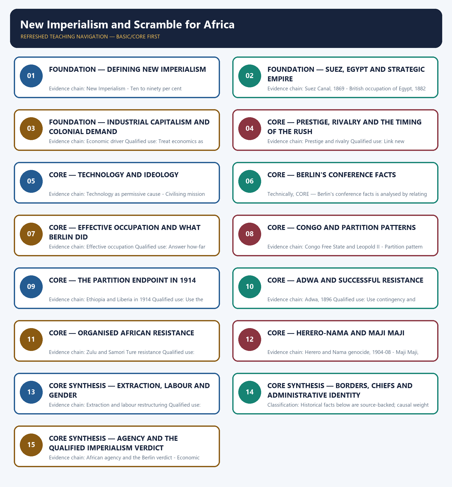

# New Imperialism and Scramble for Africa — Learner-v2 Complete Learning Session

> **Authoring-only generation:** 2026-09-01. No PDF was rendered and no tracker or index was mutated.

### SOURCE, PROGRESSION AND CURRENT-LINKAGE AUDIT

- **Generation date:** 2026-09-01.
- **Repository-first evidence:** the Basic owner is taught first and preserved in full; the Advanced owner is retained only in the optional final teaching block.
- **OCR evidence:** Repository Markdown was used first. The available OCR-searchable Norman Lowe World History PDF was retained as supplementary local context, but no unsupported page number, quotation or precision was imported from it.
- **Qdrant:** not used; repository Markdown and available OCR context were sufficient.
- **PYQ integrity:** No direct UPSC PYQ is verified as owned solely by this topic in the local 2018-2025 routing blocks. Owner probable questions remain original practice.
- **Live-link boundary:** The official African Union Africa Day 2026 release marks 63 years since the founding of the Organization of African Unity. It records AU leaders' calls for accelerated integration and global governance reform and explicitly references reparatory justice and the enduring legacy of slavery and colonialism. This supplies a narrow current link to the continuing legacy of imperialism and decolonisation; the page does not directly discuss the Berlin Conference or the Scramble for Africa.
- **Fact/inference discipline:** no current-affairs item, PYQ wording, figure or quotation is invented.

## BASIC LEARNING SESSION

### DEEP-REVIEW LEARNING CONTRACT

| Control | Binding rule for this package |
|---|---|
| Syllabus boundary | Complete World History Core is taught chronologically, spatially and causally before optional enrichment. |
| Evidence method | Claim → named event/treaty/institution/actor/region or attributed scholarship → analysis → qualification. |
| Chronology | Structural cause, trigger, event, settlement, implementation and long-term process remain distinct. |
| Geography | Europe, Africa, Asia, West Asia and the Americas retain their own actors, routes and unequal connections; Europe is never the default universal viewpoint. |
| Historiography | Liberal, conservative, Marxist, social, feminist, postcolonial and other relevant interpretations are tied to evidence and bounded claims. |
| Practice contract | Every solved item has directive/demand decoding, an examiner-grade model, an executable timed/compression plan, marks rationale and answer-specific improvement. |
| Approval | This immutable successor remains `approved: false` pending explicit approval. |

**Canonical Basic/Core owner:** `upsc-ai-kit\knowledge\World-History\basic\07_New-Imperialism-and-Scramble-for-Africa.md`  
**Canonical topic owner:** `upsc-ai-kit\knowledge\World-History\basic\07_New-Imperialism-and-Scramble-for-Africa.md`  
**Optional Advanced owner:** `upsc-ai-kit\knowledge\World-History\advanced\07_New-Imperialism-and-Scramble-for-Africa.md`  
**Official syllabus mapping:** `upsc-ai-kit\knowledge\World-History\OFFICIAL-UPSC-SYLLABUS-MAPPING.md`

### EVIDENCE, PYQ AND CURRENT-STATUS CONTROL

- **Primary/official evidence:** treaties, declarations, laws, institutional records, speeches and contemporary testimony are dated and read for authorship, audience and purpose.
- **Spatial and social evidence:** maps, trade and migration routes, battlefield geography, class, race, gender and colonial position qualify state-centred narrative.
- **Quantitative evidence:** population, debt, inflation, output, casualties and territorial claims retain unit, place, period, source and uncertainty; no statistic is invented.
- **Interpretive discipline:** teleology, civilisational ranking, single-cause verdicts and present-day nation-state projection are rejected.
- **PYQ discipline:** repository routing ledgers and locally held papers control wording and metadata; neutral rendering, reconstruction and unavailable official keys remain explicitly labelled.
- **Current-status note, rechecked 2026-09-01:** The official African Union Africa Day 2026 release marks 63 years since the founding of the Organization of African Unity. It records AU leaders' calls for accelerated integration and global governance reform and explicitly references reparatory justice and the enduring legacy of slavery and colonialism. This supplies a narrow current link to the continuing legacy of imperialism and decolonisation; the page does not directly discuss the Berlin Conference or the Scramble for Africa.

**Live/primary context sources recorded by the predecessor generation:**

- `https://au.int/en/pressreleases/20260525/au-leaders-issue-joint-africa-day-call-unity-reform-and-renewed-commitment`




*Distinct embedded teaching-navigation image. The separate continuous Cārvāka-style flowchart package remains an independent at-a-glance artifact.*

### SESSION 1 — FOUNDATION — DEFINING NEW IMPERIALISM

#### DEFINITION / WHAT THIS IS CALLED

**Plain-language definition:** Precise definition: Defining New Imperialism is the source-bounded relationship among New Imperialism and Ten to ninety per cent transformation within New Imperialism and Scramble for Africa.

**Technical definition:** Evidence chain: New Imperialism - Ten to ninety per cent transformation Qualified use: Establish direct inland rule and exceptional speed.

#### ANSWER-GRABBING OPENING — WRITE/ADAPT IN THE EXAM

> Precise definition: Defining New Imperialism is the source-bounded relationship among New Imperialism and Ten to ninety per cent transformation within New Imperialism and Scramble for Africa.

#### MUST-WRITE KEYWORDS

- **FOUNDATION**
- **Defining New Imperialism**
- **Precise definition**
- **Evidence chain**
- **Qualified use**
- **Precise definition: Defining New Imperialism**

**How to use them:** Frame the answer through FOUNDATION; define Defining New Imperialism, connect Precise definition with Evidence chain to explain the mechanism, and use Qualified use for the decisive comparison or qualification.

##### VISUAL FIRST

```text
DEFINING NEW IMPERIALISM
01. New Imperialism
    |
    v
02. Ten to ninety per cent transformation
BOUNDARY -> Use the ten-to-ninety figures only with their stated periods.
```

*This topic-specific rail fixes the evidence sequence and its exam boundary before analysis.*

##### CONCEPT DEFINITIONS

- **Precise definition:** Defining New Imperialism is the source-bounded relationship among New Imperialism and Ten to ninety per cent transformation within New Imperialism and Scramble for Africa.
- **Classification:** Historical facts below are source-backed; causal weight and evaluative verdicts are analytical synthesis.

##### CORE EXPLANATION

New Imperialism was the late-nineteenth-century shift from limited coastal influence toward aggressive direct political control of inland territory by industrial powers. Britannica's figures place about ten per cent of African territory under European control in the 1870s and about ninety per cent by 1914.

##### NAMED EVIDENCE AND MECHANISM

- New Imperialism was the late-nineteenth-century shift from limited coastal influence toward aggressive direct political control of inland territory by industrial powers.
- Britannica's figures place about ten per cent of African territory under European control in the 1870s and about ninety per cent by 1914.

##### EXAMINER CAUTION

- Use the ten-to-ninety figures only with their stated periods.

##### EXAM LINK

- **Prelims:** Retain the exact actor, date, document and category in Defining New Imperialism.
- **Mains:** Establish direct inland rule and exceptional speed.

##### MINI RECAP

- **Evidence chain:** New Imperialism -> Ten to ninety per cent transformation
- **Qualified use:** Establish direct inland rule and exceptional speed.

#### CLOSING RECALL FLOW — FOUNDATION — DEFINING NEW IMPERIALISM

```text
START / CONCEPT: FOUNDATION — Defining New Imperialism
        |
        v
EXACT TERMS: FOUNDATION · Defining New Imperialism · Precise definition · Evidence chain · Qualified use · Precise definition: Defining New Imperialism
        |
        v
MECHANISM / ARGUMENT: New Imperialism was the late-nineteenth-century shift from limited coastal influence toward aggressive direct political control of inland territory by industrial powers.
        |
        v
CONSEQUENCE / CONTRAST: Evidence chain: New Imperialism - Ten to ninety per cent transformation Qualified use: Establish direct inland rule and exceptional speed.
        |
        v
UPSC TRAP / ANSWER-USE: Do not miss this limiting distinction: causal weight and evaluative verdicts are analytical synthesis.
        |
        v
ANSWER-GRABBING FORMULATION: Precise definition: Defining New Imperialism is the source-bounded relationship among New Imperialism and Ten to ninety per cent transformation within New Imperialism and Scramble for Africa.
```
### SESSION 2 — FOUNDATION — SUEZ, EGYPT AND STRATEGIC EMPIRE

#### DEFINITION / WHAT THIS IS CALLED

**Plain-language definition:** Precise definition: Suez, Egypt and strategic empire is the source-bounded relationship among Suez Canal, 1869 and British occupation of Egypt, 1882 within New Imperialism and Scramble for Africa.

**Technical definition:** Evidence chain: Suez Canal, 1869 - British occupation of Egypt, 1882 Qualified use: Show why routes shaped territorial priorities.

#### ANSWER-GRABBING OPENING — WRITE/ADAPT IN THE EXAM

> Precise definition: Suez, Egypt and strategic empire is the source-bounded relationship among Suez Canal, 1869 and British occupation of Egypt, 1882 within New Imperialism and Scramble for Africa.

#### MUST-WRITE KEYWORDS

- **FOUNDATION**
- **Suez**
- **Egypt**
- **strategic empire**
- **Precise definition**
- **Evidence chain**

**How to use them:** Frame the answer through FOUNDATION; define Suez, connect Egypt with strategic empire to explain the mechanism, and use Precise definition for the decisive comparison or qualification.

##### VISUAL FIRST

```text
SUEZ, EGYPT AND STRATEGIC EMPIRE
01. Suez Canal, 1869
    |
    v
02. British occupation of Egypt, 1882
BOUNDARY -> Strategy and finance interacted; neither alone is sufficient.
```

*This topic-specific rail fixes the evidence sequence and its exam boundary before analysis.*

##### CONCEPT DEFINITIONS

- **Precise definition:** Suez, Egypt and strategic empire is the source-bounded relationship among Suez Canal, 1869 and British occupation of Egypt, 1882 within New Imperialism and Scramble for Africa.
- **Classification:** Historical facts below are source-backed; causal weight and evaluative verdicts are analytical synthesis.

##### CORE EXPLANATION

The Suez Canal opened in 1869 and increased the strategic value of Egypt, African routes and access to Asia. Britain occupied Egypt in 1882, showing how financial and strategic entanglement could become direct imperial control.

##### NAMED EVIDENCE AND MECHANISM

- The Suez Canal opened in 1869 and increased the strategic value of Egypt, African routes and access to Asia.
- Britain occupied Egypt in 1882, showing how financial and strategic entanglement could become direct imperial control.

##### EXAMINER CAUTION

- Strategy and finance interacted; neither alone is sufficient.

##### EXAM LINK

- **Prelims:** Retain the exact actor, date, document and category in Suez, Egypt and strategic empire.
- **Mains:** Show why routes shaped territorial priorities.

##### MINI RECAP

- **Evidence chain:** Suez Canal, 1869 -> British occupation of Egypt, 1882
- **Qualified use:** Show why routes shaped territorial priorities.

#### CLOSING RECALL FLOW — FOUNDATION — SUEZ, EGYPT AND STRATEGIC EMPIRE

```text
START / CONCEPT: FOUNDATION — Suez, Egypt and strategic empire
        |
        v
EXACT TERMS: FOUNDATION · Suez · Egypt · strategic empire · Precise definition · Evidence chain
        |
        v
MECHANISM / ARGUMENT: Evidence chain: Suez Canal, 1869 - British occupation of Egypt, 1882 Qualified use: Show why routes shaped territorial priorities.
        |
        v
CONSEQUENCE / CONTRAST: Britain occupied Egypt in 1882, showing how financial and strategic entanglement could become direct imperial control.
        |
        v
UPSC TRAP / ANSWER-USE: Do not miss this limiting distinction: causal weight and evaluative verdicts are analytical synthesis.
        |
        v
ANSWER-GRABBING FORMULATION: Precise definition: Suez, Egypt and strategic empire is the source-bounded relationship among Suez Canal, 1869 and British occupation of Egypt, 1882 within New Imperialism and Scramble for Africa.
```
### SESSION 3 — FOUNDATION — INDUSTRIAL CAPITALISM AND COLONIAL DEMAND

#### DEFINITION / WHAT THIS IS CALLED

**Plain-language definition:** Precise definition: Industrial capitalism and colonial demand is the source-bounded relationship among and Economic driver within New Imperialism and Scramble for Africa.

**Technical definition:** Evidence chain: Economic driver Qualified use: Treat economics as central but not exclusive.

#### ANSWER-GRABBING OPENING — WRITE/ADAPT IN THE EXAM

> Precise definition: Industrial capitalism and colonial demand is the source-bounded relationship among and Economic driver within New Imperialism and Scramble for Africa.

#### MUST-WRITE KEYWORDS

- **FOUNDATION**
- **Industrial capitalism**
- **colonial demand**
- **Precise definition**
- **Evidence chain**
- **Qualified use**

**How to use them:** Frame the answer through FOUNDATION; define Industrial capitalism, connect colonial demand with Precise definition to explain the mechanism, and use Evidence chain for the decisive comparison or qualification.

##### VISUAL FIRST

```text
INDUSTRIAL CAPITALISM AND COLONIAL DEMAND
01. Economic driver
BOUNDARY -> Not every colony yielded equal metropolitan profit.
```

*This topic-specific rail fixes the evidence sequence and its exam boundary before analysis.*

##### CONCEPT DEFINITIONS

- **Precise definition:** Industrial capitalism and colonial demand is the source-bounded relationship among  and Economic driver within New Imperialism and Scramble for Africa.
- **Classification:** Historical facts below are source-backed; causal weight and evaluative verdicts are analytical synthesis.

##### CORE EXPLANATION

Industrial powers sought raw materials, markets and investment opportunities, while actual metropolitan profit remained uneven and concentrated.

##### NAMED EVIDENCE AND MECHANISM

- Industrial powers sought raw materials, markets and investment opportunities, while actual metropolitan profit remained uneven and concentrated.

##### EXAMINER CAUTION

- Not every colony yielded equal metropolitan profit.

##### EXAM LINK

- **Prelims:** Retain the exact actor, date, document and category in Industrial capitalism and colonial demand.
- **Mains:** Treat economics as central but not exclusive.

##### MINI RECAP

- **Evidence chain:** Economic driver
- **Qualified use:** Treat economics as central but not exclusive.

#### CLOSING RECALL FLOW — FOUNDATION — INDUSTRIAL CAPITALISM AND COLONIAL DEMAND

```text
START / CONCEPT: FOUNDATION — Industrial capitalism and colonial demand
        |
        v
EXACT TERMS: FOUNDATION · Industrial capitalism · colonial demand · Precise definition · Evidence chain · Qualified use
        |
        v
MECHANISM / ARGUMENT: Evidence chain: Economic driver Qualified use: Treat economics as central but not exclusive.
        |
        v
CONSEQUENCE / CONTRAST: Mains: Treat economics as central but not exclusive.
        |
        v
UPSC TRAP / ANSWER-USE: Do not miss this limiting distinction: causal weight and evaluative verdicts are analytical synthesis.
        |
        v
ANSWER-GRABBING FORMULATION: Precise definition: Industrial capitalism and colonial demand is the source-bounded relationship among and Economic driver within New Imperialism and Scramble for Africa.
```
### SESSION 4 — CORE — PRESTIGE, RIVALRY AND THE TIMING OF THE RUSH

#### DEFINITION / WHAT THIS IS CALLED

**Plain-language definition:** Precise definition: Prestige, rivalry and the timing of the rush is the source-bounded relationship among and Prestige and rivalry within New Imperialism and Scramble for Africa.

**Technical definition:** Evidence chain: Prestige and rivalry Qualified use: Link new nation-states to status competition.

#### ANSWER-GRABBING OPENING — WRITE/ADAPT IN THE EXAM

> Precise definition: Prestige, rivalry and the timing of the rush is the source-bounded relationship among and Prestige and rivalry within New Imperialism and Scramble for Africa.

#### MUST-WRITE KEYWORDS

- **Prestige**
- **rivalry**
- **the timing of the rush**
- **Precise definition**
- **Evidence chain**
- **Qualified use**

**How to use them:** Frame the answer through Prestige; define rivalry, connect the timing of the rush with Precise definition to explain the mechanism, and use Evidence chain for the decisive comparison or qualification.

##### VISUAL FIRST

```text
PRESTIGE, RIVALRY AND THE TIMING OF THE RUSH
01. Prestige and rivalry
BOUNDARY -> Prestige explains pace better than economic restructuring.
```

*This topic-specific rail fixes the evidence sequence and its exam boundary before analysis.*

##### CONCEPT DEFINITIONS

- **Precise definition:** Prestige, rivalry and the timing of the rush is the source-bounded relationship among  and Prestige and rivalry within New Imperialism and Scramble for Africa.
- **Classification:** Historical facts below are source-backed; causal weight and evaluative verdicts are analytical synthesis.

##### CORE EXPLANATION

National prestige and great-power rivalry accelerated the scramble, especially as recently unified Germany and Italy sought colonial status.

##### NAMED EVIDENCE AND MECHANISM

- National prestige and great-power rivalry accelerated the scramble, especially as recently unified Germany and Italy sought colonial status.

##### EXAMINER CAUTION

- Prestige explains pace better than economic restructuring.

##### EXAM LINK

- **Prelims:** Retain the exact actor, date, document and category in Prestige, rivalry and the timing of the rush.
- **Mains:** Link new nation-states to status competition.

##### MINI RECAP

- **Evidence chain:** Prestige and rivalry
- **Qualified use:** Link new nation-states to status competition.

#### CLOSING RECALL FLOW — CORE — PRESTIGE, RIVALRY AND THE TIMING OF THE RUSH

```text
START / CONCEPT: CORE — Prestige, rivalry and the timing of the rush
        |
        v
EXACT TERMS: Prestige · rivalry · the timing of the rush · Precise definition · Evidence chain · Qualified use
        |
        v
MECHANISM / ARGUMENT: Evidence chain: Prestige and rivalry Qualified use: Link new nation-states to status competition.
        |
        v
CONSEQUENCE / CONTRAST: Prestige explains pace better than economic restructuring.
        |
        v
UPSC TRAP / ANSWER-USE: Do not miss this limiting distinction: causal weight and evaluative verdicts are analytical synthesis.
        |
        v
ANSWER-GRABBING FORMULATION: Precise definition: Prestige, rivalry and the timing of the rush is the source-bounded relationship among and Prestige and rivalry within New Imperialism and Scramble for Africa.
```
### SESSION 5 — CORE — TECHNOLOGY AND IDEOLOGY

#### DEFINITION / WHAT THIS IS CALLED

**Plain-language definition:** Precise definition: Technology and ideology is the source-bounded relationship among Technology as permissive cause and Civilising mission and racial ideology within New Imperialism and Scramble for Africa.

**Technical definition:** Evidence chain: Technology as permissive cause - Civilising mission and racial ideology Qualified use: Separate means of conquest from moral permission.

#### ANSWER-GRABBING OPENING — WRITE/ADAPT IN THE EXAM

> Precise definition: Technology and ideology is the source-bounded relationship among Technology as permissive cause and Civilising mission and racial ideology within New Imperialism and Scramble for Africa.

#### MUST-WRITE KEYWORDS

- **Technology**
- **ideology**
- **Precise definition**
- **Evidence chain**
- **Qualified use**
- **Precise definition: Technology and ideology**

**How to use them:** Frame the answer through Technology; define ideology, connect Precise definition with Evidence chain to explain the mechanism, and use Qualified use for the decisive comparison or qualification.

##### VISUAL FIRST

```text
TECHNOLOGY AND IDEOLOGY
01. Technology as permissive cause
    |
    v
02. Civilising mission and racial ideology
BOUNDARY -> Capability and legitimation are different causal roles.
```

*This topic-specific rail fixes the evidence sequence and its exam boundary before analysis.*

##### CONCEPT DEFINITIONS

- **Precise definition:** Technology and ideology is the source-bounded relationship among Technology as permissive cause and Civilising mission and racial ideology within New Imperialism and Scramble for Africa.
- **Classification:** Historical facts below are source-backed; causal weight and evaluative verdicts are analytical synthesis.

##### CORE EXPLANATION

Steam transport, improved weapons and medicines increased European reach; technology supplied capability, not motive. Civilising rhetoric and racial superiority supplied domestic legitimation while coexisting with coercion, extraction and atrocity.

##### NAMED EVIDENCE AND MECHANISM

- Steam transport, improved weapons and medicines increased European reach; technology supplied capability, not motive.
- Civilising rhetoric and racial superiority supplied domestic legitimation while coexisting with coercion, extraction and atrocity.

##### EXAMINER CAUTION

- Capability and legitimation are different causal roles.

##### EXAM LINK

- **Prelims:** Retain the exact actor, date, document and category in Technology and ideology.
- **Mains:** Separate means of conquest from moral permission.

##### MINI RECAP

- **Evidence chain:** Technology as permissive cause -> Civilising mission and racial ideology
- **Qualified use:** Separate means of conquest from moral permission.

#### CLOSING RECALL FLOW — CORE — TECHNOLOGY AND IDEOLOGY

```text
START / CONCEPT: CORE — Technology and ideology
        |
        v
EXACT TERMS: Technology · ideology · Precise definition · Evidence chain · Qualified use · Precise definition: Technology and ideology
        |
        v
MECHANISM / ARGUMENT: Evidence chain: Technology as permissive cause - Civilising mission and racial ideology Qualified use: Separate means of conquest from moral permission.
        |
        v
CONSEQUENCE / CONTRAST: Classification: Historical facts below are source-backed; causal weight and evaluative verdicts are analytical synthesis.
        |
        v
UPSC TRAP / ANSWER-USE: Do not miss this limiting distinction: capability and legitimation are different causal roles.
        |
        v
ANSWER-GRABBING FORMULATION: Precise definition: Technology and ideology is the source-bounded relationship among Technology as permissive cause and Civilising mission and racial ideology within New Imperialism and Scramble for Africa.
```
### SESSION 6 — CORE — BERLIN'S CONFERENCE FACTS

#### DEFINITION / WHAT THIS IS CALLED

**Plain-language definition:** Precise definition: Berlin's conference facts is the source-bounded relationship among and Berlin Conference, 1884-85 within New Imperialism and Scramble for Africa.

**Technical definition:** Technically, CORE — Berlin's conference facts is analysed by relating Berlin's conference facts to Precise definition, then testing the relationship through Evidence chain and Qualified use.

#### ANSWER-GRABBING OPENING — WRITE/ADAPT IN THE EXAM

> Precise definition: Berlin's conference facts is the source-bounded relationship among and Berlin Conference, 1884-85 within New Imperialism and Scramble for Africa.

#### MUST-WRITE KEYWORDS

- **Berlin's conference facts**
- **Precise definition**
- **Evidence chain**
- **Qualified use**
- **Precise definition: Berlin's conference facts**
- **1884-85**

**How to use them:** Frame the answer through Berlin's conference facts; define Precise definition, connect Evidence chain with Qualified use to explain the mechanism, and use Precise definition: Berlin's conference facts for the decisive comparison or qualification.

##### VISUAL FIRST

```text
BERLIN'S CONFERENCE FACTS
01. Berlin Conference, 1884-85
BOUNDARY -> Retain exact dates and fourteen participating countries.
```

*This topic-specific rail fixes the evidence sequence and its exam boundary before analysis.*

##### CONCEPT DEFINITIONS

- **Precise definition:** Berlin's conference facts is the source-bounded relationship among  and Berlin Conference, 1884-85 within New Imperialism and Scramble for Africa.
- **Classification:** Historical facts below are source-backed; causal weight and evaluative verdicts are analytical synthesis.

##### CORE EXPLANATION

The Berlin Conference met from 15 November 1884 to 26 February 1885 with representatives of fourteen countries.

##### NAMED EVIDENCE AND MECHANISM

- The Berlin Conference met from 15 November 1884 to 26 February 1885 with representatives of fourteen countries.

##### EXAMINER CAUTION

- Retain exact dates and fourteen participating countries.

##### EXAM LINK

- **Prelims:** Retain the exact actor, date, document and category in Berlin's conference facts.
- **Mains:** Fix chronology before interpretation.

##### MINI RECAP

- **Evidence chain:** Berlin Conference, 1884-85
- **Qualified use:** Fix chronology before interpretation.

#### CLOSING RECALL FLOW — CORE — BERLIN'S CONFERENCE FACTS

```text
START / CONCEPT: CORE — Berlin's conference facts
        |
        v
EXACT TERMS: Berlin's conference facts · Precise definition · Evidence chain · Qualified use · Precise definition: Berlin's conference facts · 1884-85
        |
        v
MECHANISM / ARGUMENT: Evidence chain: Berlin Conference, 1884-85 Qualified use: Fix chronology before interpretation.
        |
        v
CONSEQUENCE / CONTRAST: Classification: Historical facts below are source-backed; causal weight and evaluative verdicts are analytical synthesis.
        |
        v
UPSC TRAP / ANSWER-USE: Do not miss this limiting distinction: berlin's conference facts is the source-bounded relationship among and Berlin Conference, 1884-85 within New...
        |
        v
ANSWER-GRABBING FORMULATION: Precise definition: Berlin's conference facts is the source-bounded relationship among and Berlin Conference, 1884-85 within New Imperialism and Scramble for Africa.
```
### SESSION 7 — CORE — EFFECTIVE OCCUPATION AND WHAT BERLIN DID

#### DEFINITION / WHAT THIS IS CALLED

**Plain-language definition:** Precise definition: Effective occupation and what Berlin did is the source-bounded relationship among and Effective occupation within New Imperialism and Scramble for Africa.

**Technical definition:** Evidence chain: Effective occupation Qualified use: Answer how-far questions through rule versus cartography.

#### ANSWER-GRABBING OPENING — WRITE/ADAPT IN THE EXAM

> Precise definition: Effective occupation and what Berlin did is the source-bounded relationship among and Effective occupation within New Imperialism and Scramble for Africa.

#### MUST-WRITE KEYWORDS

- **Effective occupation**
- **what Berlin did**
- **Precise definition**
- **Evidence chain**
- **Qualified use**
- **Precise definition: Effective occupation and what Berlin did**

**How to use them:** Frame the answer through Effective occupation; define what Berlin did, connect Precise definition with Evidence chain to explain the mechanism, and use Qualified use for the decisive comparison or qualification.

##### VISUAL FIRST

```text
EFFECTIVE OCCUPATION AND WHAT BERLIN DID
01. Effective occupation
BOUNDARY -> Berlin made rules; conquest and delimitation followed.
```

*This topic-specific rail fixes the evidence sequence and its exam boundary before analysis.*

##### CONCEPT DEFINITIONS

- **Precise definition:** Effective occupation and what Berlin did is the source-bounded relationship among  and Effective occupation within New Imperialism and Scramble for Africa.
- **Classification:** Historical facts below are source-backed; causal weight and evaluative verdicts are analytical synthesis.

##### CORE EXPLANATION

The Berlin General Act required effective occupation for recognition, standardising the rules of competition rather than drawing every African border at one meeting.

##### NAMED EVIDENCE AND MECHANISM

- The Berlin General Act required effective occupation for recognition, standardising the rules of competition rather than drawing every African border at one meeting.

##### EXAMINER CAUTION

- Berlin made rules; conquest and delimitation followed.

##### EXAM LINK

- **Prelims:** Retain the exact actor, date, document and category in Effective occupation and what Berlin did.
- **Mains:** Answer how-far questions through rule versus cartography.

##### MINI RECAP

- **Evidence chain:** Effective occupation
- **Qualified use:** Answer how-far questions through rule versus cartography.

#### CLOSING RECALL FLOW — CORE — EFFECTIVE OCCUPATION AND WHAT BERLIN DID

```text
START / CONCEPT: CORE — Effective occupation and what Berlin did
        |
        v
EXACT TERMS: Effective occupation · what Berlin did · Precise definition · Evidence chain · Qualified use · Precise definition: Effective occupation and what Berlin did
        |
        v
MECHANISM / ARGUMENT: Evidence chain: Effective occupation Qualified use: Answer how-far questions through rule versus cartography.
        |
        v
CONSEQUENCE / CONTRAST: Berlin made rules; conquest and delimitation followed.
        |
        v
UPSC TRAP / ANSWER-USE: Do not miss this limiting distinction: causal weight and evaluative verdicts are analytical synthesis.
        |
        v
ANSWER-GRABBING FORMULATION: Precise definition: Effective occupation and what Berlin did is the source-bounded relationship among and Effective occupation within New Imperialism and Scramble for Africa.
```
### SESSION 8 — CORE — CONGO AND PARTITION PATTERNS

#### DEFINITION / WHAT THIS IS CALLED

**Plain-language definition:** Precise definition: Congo and partition patterns is the source-bounded relationship among Congo Free State and Leopold II and Partition pattern within New Imperialism and Scramble for Africa.

**Technical definition:** Evidence chain: Congo Free State and Leopold II - Partition pattern Qualified use: Illustrate different mechanisms of control.

#### ANSWER-GRABBING OPENING — WRITE/ADAPT IN THE EXAM

> Precise definition: Congo and partition patterns is the source-bounded relationship among Congo Free State and Leopold II and Partition pattern within New Imperialism and Scramble for Africa.

#### MUST-WRITE KEYWORDS

- **Congo**
- **partition patterns**
- **Precise definition**
- **Evidence chain**
- **Qualified use**
- **Precise definition: Congo and partition patterns**

**How to use them:** Frame the answer through Congo; define partition patterns, connect Precise definition with Evidence chain to explain the mechanism, and use Qualified use for the decisive comparison or qualification.

##### VISUAL FIRST

```text
CONGO AND PARTITION PATTERNS
01. Congo Free State and Leopold II
    |
    v
02. Partition pattern
BOUNDARY -> Private and state interests overlapped without forming one uniform model.
```

*This topic-specific rail fixes the evidence sequence and its exam boundary before analysis.*

##### CONCEPT DEFINITIONS

- **Precise definition:** Congo and partition patterns is the source-bounded relationship among Congo Free State and Leopold II and Partition pattern within New Imperialism and Scramble for Africa.
- **Classification:** Historical facts below are source-backed; causal weight and evaluative verdicts are analytical synthesis.

##### CORE EXPLANATION

The Conference recognised the Congo Free State under Leopold II, illustrating the overlap of private profit, sovereignty and imperial violence. Britain, France, Belgium, Germany, Portugal and Italy acquired major African zones through conquest and negotiated delimitation after Berlin.

##### NAMED EVIDENCE AND MECHANISM

- The Conference recognised the Congo Free State under Leopold II, illustrating the overlap of private profit, sovereignty and imperial violence.
- Britain, France, Belgium, Germany, Portugal and Italy acquired major African zones through conquest and negotiated delimitation after Berlin.

##### EXAMINER CAUTION

- Private and state interests overlapped without forming one uniform model.

##### EXAM LINK

- **Prelims:** Retain the exact actor, date, document and category in Congo and partition patterns.
- **Mains:** Illustrate different mechanisms of control.

##### MINI RECAP

- **Evidence chain:** Congo Free State and Leopold II -> Partition pattern
- **Qualified use:** Illustrate different mechanisms of control.

#### CLOSING RECALL FLOW — CORE — CONGO AND PARTITION PATTERNS

```text
START / CONCEPT: CORE — Congo and partition patterns
        |
        v
EXACT TERMS: Congo · partition patterns · Precise definition · Evidence chain · Qualified use · Precise definition: Congo and partition patterns
        |
        v
MECHANISM / ARGUMENT: Evidence chain: Congo Free State and Leopold II - Partition pattern Qualified use: Illustrate different mechanisms of control.
        |
        v
CONSEQUENCE / CONTRAST: The Conference recognised the Congo Free State under Leopold II, illustrating the overlap of private profit, sovereignty and imperial violence.
        |
        v
UPSC TRAP / ANSWER-USE: Do not miss this limiting distinction: causal weight and evaluative verdicts are analytical synthesis.
        |
        v
ANSWER-GRABBING FORMULATION: Precise definition: Congo and partition patterns is the source-bounded relationship among Congo Free State and Leopold II and Partition pattern within New Imperialism and Scramble for Africa.
```
### SESSION 9 — CORE — THE PARTITION ENDPOINT IN 1914

#### DEFINITION / WHAT THIS IS CALLED

**Plain-language definition:** Precise definition: The partition endpoint in 1914 is the source-bounded relationship among and Ethiopia and Liberia in 1914 within New Imperialism and Scramble for Africa.

**Technical definition:** Evidence chain: Ethiopia and Liberia in 1914 Qualified use: Use the endpoint to prove the scramble's scale.

#### ANSWER-GRABBING OPENING — WRITE/ADAPT IN THE EXAM

> Precise definition: The partition endpoint in 1914 is the source-bounded relationship among and Ethiopia and Liberia in 1914 within New Imperialism and Scramble for Africa.

#### MUST-WRITE KEYWORDS

- **The partition endpoint in 1914**
- **Precise definition**
- **Evidence chain**
- **Qualified use**
- **Precise definition: The partition endpoint in 1914**
- **Precise**

**How to use them:** Frame the answer through The partition endpoint in 1914; define Precise definition, connect Evidence chain with Qualified use to explain the mechanism, and use Precise definition: The partition endpoint in 1914 for the decisive comparison or qualification.

##### VISUAL FIRST

```text
THE PARTITION ENDPOINT IN 1914
01. Ethiopia and Liberia in 1914
BOUNDARY -> Ethiopia and Liberia were the independent exceptions.
```

*This topic-specific rail fixes the evidence sequence and its exam boundary before analysis.*

##### CONCEPT DEFINITIONS

- **Precise definition:** The partition endpoint in 1914 is the source-bounded relationship among  and Ethiopia and Liberia in 1914 within New Imperialism and Scramble for Africa.
- **Classification:** Historical facts below are source-backed; causal weight and evaluative verdicts are analytical synthesis.

##### CORE EXPLANATION

By 1914 Ethiopia and Liberia remained independent while most of Africa had been partitioned.

##### NAMED EVIDENCE AND MECHANISM

- By 1914 Ethiopia and Liberia remained independent while most of Africa had been partitioned.

##### EXAMINER CAUTION

- Ethiopia and Liberia were the independent exceptions.

##### EXAM LINK

- **Prelims:** Retain the exact actor, date, document and category in The partition endpoint in 1914.
- **Mains:** Use the endpoint to prove the scramble's scale.

##### MINI RECAP

- **Evidence chain:** Ethiopia and Liberia in 1914
- **Qualified use:** Use the endpoint to prove the scramble's scale.

#### CLOSING RECALL FLOW — CORE — THE PARTITION ENDPOINT IN 1914

```text
START / CONCEPT: CORE — The partition endpoint in 1914
        |
        v
EXACT TERMS: The partition endpoint in 1914 · Precise definition · Evidence chain · Qualified use · Precise definition: The partition endpoint in 1914 · Precise
        |
        v
MECHANISM / ARGUMENT: By 1914 Ethiopia and Liberia remained independent while most of Africa had been partitioned.
        |
        v
CONSEQUENCE / CONTRAST: Evidence chain: Ethiopia and Liberia in 1914 Qualified use: Use the endpoint to prove the scramble's scale.
        |
        v
UPSC TRAP / ANSWER-USE: Do not miss this limiting distinction: use the endpoint to prove the scramble's scale.
        |
        v
ANSWER-GRABBING FORMULATION: Precise definition: The partition endpoint in 1914 is the source-bounded relationship among and Ethiopia and Liberia in 1914 within New Imperialism and Scramble for Africa.
```
### SESSION 10 — CORE — ADWA AND SUCCESSFUL RESISTANCE

#### DEFINITION / WHAT THIS IS CALLED

**Plain-language definition:** Precise definition: Adwa and successful resistance is the source-bounded relationship among and Adwa, 1896 within New Imperialism and Scramble for Africa.

**Technical definition:** Evidence chain: Adwa, 1896 Qualified use: Use contingency and leadership rather than technological determinism.

#### ANSWER-GRABBING OPENING — WRITE/ADAPT IN THE EXAM

> Precise definition: Adwa and successful resistance is the source-bounded relationship among and Adwa, 1896 within New Imperialism and Scramble for Africa.

#### MUST-WRITE KEYWORDS

- **Adwa**
- **successful resistance**
- **Precise definition**
- **Evidence chain**
- **Qualified use**
- **Precise definition: Adwa and successful resistance**

**How to use them:** Frame the answer through Adwa; define successful resistance, connect Precise definition with Evidence chain to explain the mechanism, and use Qualified use for the decisive comparison or qualification.

##### VISUAL FIRST

```text
ADWA AND SUCCESSFUL RESISTANCE
01. Adwa, 1896
BOUNDARY -> Adwa was exceptional but disproves inevitability.
```

*This topic-specific rail fixes the evidence sequence and its exam boundary before analysis.*

##### CONCEPT DEFINITIONS

- **Precise definition:** Adwa and successful resistance is the source-bounded relationship among  and Adwa, 1896 within New Imperialism and Scramble for Africa.
- **Classification:** Historical facts below are source-backed; causal weight and evaluative verdicts are analytical synthesis.

##### CORE EXPLANATION

Ethiopia defeated Italy at Adwa in 1896, proving that European conquest was contingent rather than automatic.

##### NAMED EVIDENCE AND MECHANISM

- Ethiopia defeated Italy at Adwa in 1896, proving that European conquest was contingent rather than automatic.

##### EXAMINER CAUTION

- Adwa was exceptional but disproves inevitability.

##### EXAM LINK

- **Prelims:** Retain the exact actor, date, document and category in Adwa and successful resistance.
- **Mains:** Use contingency and leadership rather than technological determinism.

##### MINI RECAP

- **Evidence chain:** Adwa, 1896
- **Qualified use:** Use contingency and leadership rather than technological determinism.

#### CLOSING RECALL FLOW — CORE — ADWA AND SUCCESSFUL RESISTANCE

```text
START / CONCEPT: CORE — Adwa and successful resistance
        |
        v
EXACT TERMS: Adwa · successful resistance · Precise definition · Evidence chain · Qualified use · Precise definition: Adwa and successful resistance
        |
        v
MECHANISM / ARGUMENT: Evidence chain: Adwa, 1896 Qualified use: Use contingency and leadership rather than technological determinism.
        |
        v
CONSEQUENCE / CONTRAST: Adwa was exceptional but disproves inevitability.
        |
        v
UPSC TRAP / ANSWER-USE: Ethiopia defeated Italy at Adwa in 1896, proving that European conquest was contingent rather than automatic.
        |
        v
ANSWER-GRABBING FORMULATION: Precise definition: Adwa and successful resistance is the source-bounded relationship among and Adwa, 1896 within New Imperialism and Scramble for Africa.
```
### SESSION 11 — CORE — ORGANISED AFRICAN RESISTANCE

#### DEFINITION / WHAT THIS IS CALLED

**Plain-language definition:** Precise definition: Organised African resistance is the source-bounded relationship among and Zulu and Samori Ture resistance within New Imperialism and Scramble for Africa.

**Technical definition:** Evidence chain: Zulu and Samori Ture resistance Qualified use: Restore African political and military agency.

#### ANSWER-GRABBING OPENING — WRITE/ADAPT IN THE EXAM

> Precise definition: Organised African resistance is the source-bounded relationship among and Zulu and Samori Ture resistance within New Imperialism and Scramble for Africa.

#### MUST-WRITE KEYWORDS

- **Organised African resistance**
- **Precise definition**
- **Evidence chain**
- **Qualified use**
- **Precise definition: Organised African resistance**
- **Precise**

**How to use them:** Frame the answer through Organised African resistance; define Precise definition, connect Evidence chain with Qualified use to explain the mechanism, and use Precise definition: Organised African resistance for the decisive comparison or qualification.

##### VISUAL FIRST

```text
ORGANISED AFRICAN RESISTANCE
01. Zulu and Samori Ture resistance
BOUNDARY -> Different African polities resisted for different reasons.
```

*This topic-specific rail fixes the evidence sequence and its exam boundary before analysis.*

##### CONCEPT DEFINITIONS

- **Precise definition:** Organised African resistance is the source-bounded relationship among  and Zulu and Samori Ture resistance within New Imperialism and Scramble for Africa.
- **Classification:** Historical facts below are source-backed; causal weight and evaluative verdicts are analytical synthesis.

##### CORE EXPLANATION

Zulu resistance and Samori Ture's prolonged West African campaigns demonstrate organised African military agency.

##### NAMED EVIDENCE AND MECHANISM

- Zulu resistance and Samori Ture's prolonged West African campaigns demonstrate organised African military agency.

##### EXAMINER CAUTION

- Different African polities resisted for different reasons.

##### EXAM LINK

- **Prelims:** Retain the exact actor, date, document and category in Organised African resistance.
- **Mains:** Restore African political and military agency.

##### MINI RECAP

- **Evidence chain:** Zulu and Samori Ture resistance
- **Qualified use:** Restore African political and military agency.

#### CLOSING RECALL FLOW — CORE — ORGANISED AFRICAN RESISTANCE

```text
START / CONCEPT: CORE — Organised African resistance
        |
        v
EXACT TERMS: Organised African resistance · Precise definition · Evidence chain · Qualified use · Precise definition: Organised African resistance · Precise
        |
        v
MECHANISM / ARGUMENT: Zulu resistance and Samori Ture's prolonged West African campaigns demonstrate organised African military agency.
        |
        v
CONSEQUENCE / CONTRAST: Evidence chain: Zulu and Samori Ture resistance Qualified use: Restore African political and military agency.
        |
        v
UPSC TRAP / ANSWER-USE: Do not miss this limiting distinction: causal weight and evaluative verdicts are analytical synthesis.
        |
        v
ANSWER-GRABBING FORMULATION: Precise definition: Organised African resistance is the source-bounded relationship among and Zulu and Samori Ture resistance within New Imperialism and Scramble for Africa.
```
### SESSION 12 — CORE — HERERO-NAMA AND MAJI MAJI

#### DEFINITION / WHAT THIS IS CALLED

**Plain-language definition:** Precise definition: Herero-Nama and Maji Maji is the source-bounded relationship among Herero and Nama genocide, 1904-08 and Maji Maji, 1905-07 within New Imperialism and Scramble for Africa.

**Technical definition:** Evidence chain: Herero and Nama genocide, 1904-08 - Maji Maji, 1905-07 Qualified use: Show violence and resistance after conquest.

#### ANSWER-GRABBING OPENING — WRITE/ADAPT IN THE EXAM

> Precise definition: Herero-Nama and Maji Maji is the source-bounded relationship among Herero and Nama genocide, 1904-08 and Maji Maji, 1905-07 within New Imperialism and Scramble for Africa.

#### MUST-WRITE KEYWORDS

- **Herero-Nama**
- **Maji Maji**
- **Precise definition**
- **Evidence chain**
- **Qualified use**
- **1904-08**

**How to use them:** Frame the answer through Herero-Nama; define Maji Maji, connect Precise definition with Evidence chain to explain the mechanism, and use Qualified use for the decisive comparison or qualification.

##### VISUAL FIRST

```text
HERERO-NAMA AND MAJI MAJI
01. Herero and Nama genocide, 1904-08
    |
    v
02. Maji Maji, 1905-07
BOUNDARY -> Keep genocide and mass uprising categories precise.
```

*This topic-specific rail fixes the evidence sequence and its exam boundary before analysis.*

##### CONCEPT DEFINITIONS

- **Precise definition:** Herero-Nama and Maji Maji is the source-bounded relationship among Herero and Nama genocide, 1904-08 and Maji Maji, 1905-07 within New Imperialism and Scramble for Africa.
- **Classification:** Historical facts below are source-backed; causal weight and evaluative verdicts are analytical synthesis.

##### CORE EXPLANATION

German suppression in South West Africa became the genocide of the Herero and Nama between 1904 and 1908. The Maji Maji uprising in German East Africa from 1905 to 1907 showed mass resistance continuing after formal conquest.

##### NAMED EVIDENCE AND MECHANISM

- German suppression in South West Africa became the genocide of the Herero and Nama between 1904 and 1908.
- The Maji Maji uprising in German East Africa from 1905 to 1907 showed mass resistance continuing after formal conquest.

##### EXAMINER CAUTION

- Keep genocide and mass uprising categories precise.

##### EXAM LINK

- **Prelims:** Retain the exact actor, date, document and category in Herero-Nama and Maji Maji.
- **Mains:** Show violence and resistance after conquest.

##### MINI RECAP

- **Evidence chain:** Herero and Nama genocide, 1904-08 -> Maji Maji, 1905-07
- **Qualified use:** Show violence and resistance after conquest.

#### CLOSING RECALL FLOW — CORE — HERERO-NAMA AND MAJI MAJI

```text
START / CONCEPT: CORE — Herero-Nama and Maji Maji
        |
        v
EXACT TERMS: Herero-Nama · Maji Maji · Precise definition · Evidence chain · Qualified use · 1904-08
        |
        v
MECHANISM / ARGUMENT: Evidence chain: Herero and Nama genocide, 1904-08 - Maji Maji, 1905-07 Qualified use: Show violence and resistance after conquest.
        |
        v
CONSEQUENCE / CONTRAST: Classification: Historical facts below are source-backed; causal weight and evaluative verdicts are analytical synthesis.
        |
        v
UPSC TRAP / ANSWER-USE: Do not miss this limiting distinction: german suppression in South West Africa became the genocide of the Herero and Nama...
        |
        v
ANSWER-GRABBING FORMULATION: Precise definition: Herero-Nama and Maji Maji is the source-bounded relationship among Herero and Nama genocide, 1904-08 and Maji Maji, 1905-07 within New Imperialism and Scramble for Africa.
```
### SESSION 13 — CORE SYNTHESIS — EXTRACTION, LABOUR AND GENDER

#### DEFINITION / WHAT THIS IS CALLED

**Plain-language definition:** Precise definition: Extraction, labour and gender is the source-bounded relationship among and Extraction and labour restructuring within New Imperialism and Scramble for Africa.

**Technical definition:** Evidence chain: Extraction and labour restructuring Qualified use: Move from resources to household and migration change.

#### ANSWER-GRABBING OPENING — WRITE/ADAPT IN THE EXAM

> Precise definition: Extraction, labour and gender is the source-bounded relationship among and Extraction and labour restructuring within New Imperialism and Scramble for Africa.

#### MUST-WRITE KEYWORDS

- **CORE SYNTHESIS**
- **Extraction**
- **labour**
- **gender**
- **Precise definition**
- **Evidence chain**

**How to use them:** Frame the answer through CORE SYNTHESIS; define Extraction, connect labour with gender to explain the mechanism, and use Precise definition for the decisive comparison or qualification.

##### VISUAL FIRST

```text
EXTRACTION, LABOUR AND GENDER
01. Extraction and labour restructuring
BOUNDARY -> Use qualitative effects; no unsupported figures.
```

*This topic-specific rail fixes the evidence sequence and its exam boundary before analysis.*

##### CONCEPT DEFINITIONS

- **Precise definition:** Extraction, labour and gender is the source-bounded relationship among  and Extraction and labour restructuring within New Imperialism and Scramble for Africa.
- **Classification:** Historical facts below are source-backed; causal weight and evaluative verdicts are analytical synthesis.

##### CORE EXPLANATION

Cash taxation, mines, plantations and labour obligations reorganised economies for export and altered migration, households and gendered work.

##### NAMED EVIDENCE AND MECHANISM

- Cash taxation, mines, plantations and labour obligations reorganised economies for export and altered migration, households and gendered work.

##### EXAMINER CAUTION

- Use qualitative effects; no unsupported figures.

##### EXAM LINK

- **Prelims:** Retain the exact actor, date, document and category in Extraction, labour and gender.
- **Mains:** Move from resources to household and migration change.

##### MINI RECAP

- **Evidence chain:** Extraction and labour restructuring
- **Qualified use:** Move from resources to household and migration change.

#### CLOSING RECALL FLOW — CORE SYNTHESIS — EXTRACTION, LABOUR AND GENDER

```text
START / CONCEPT: CORE SYNTHESIS — Extraction, labour and gender
        |
        v
EXACT TERMS: CORE SYNTHESIS · Extraction · labour · gender · Precise definition · Evidence chain
        |
        v
MECHANISM / ARGUMENT: Evidence chain: Extraction and labour restructuring Qualified use: Move from resources to household and migration change.
        |
        v
CONSEQUENCE / CONTRAST: Classification: Historical facts below are source-backed; causal weight and evaluative verdicts are analytical synthesis.
        |
        v
UPSC TRAP / ANSWER-USE: Do not miss this limiting distinction: use qualitative effects; no unsupported figures.
        |
        v
ANSWER-GRABBING FORMULATION: Precise definition: Extraction, labour and gender is the source-bounded relationship among and Extraction and labour restructuring within New Imperialism and Scramble for Africa.
```
### SESSION 14 — CORE SYNTHESIS — BORDERS, CHIEFS AND ADMINISTRATIVE IDENTITY

#### DEFINITION / WHAT THIS IS CALLED

**Plain-language definition:** Precise definition: Borders, chiefs and administrative identity is the source-bounded relationship among and Colonial borders and authority within New Imperialism and Scramble for Africa.

**Technical definition:** Classification: Historical facts below are source-backed; causal weight and evaluative verdicts are analytical synthesis.

#### ANSWER-GRABBING OPENING — WRITE/ADAPT IN THE EXAM

> Precise definition: Borders, chiefs and administrative identity is the source-bounded relationship among and Colonial borders and authority within New Imperialism and Scramble for Africa.

#### MUST-WRITE KEYWORDS

- **CORE SYNTHESIS**
- **Borders**
- **chiefs**
- **administrative identity**
- **Precise definition**
- **Evidence chain**

**How to use them:** Frame the answer through CORE SYNTHESIS; define Borders, connect chiefs with administrative identity to explain the mechanism, and use Precise definition for the decisive comparison or qualification.

##### VISUAL FIRST

```text
BORDERS, CHIEFS AND ADMINISTRATIVE IDENTITY
01. Colonial borders and authority
BOUNDARY -> Avoid deterministic claims about every post-colonial conflict.
```

*This topic-specific rail fixes the evidence sequence and its exam boundary before analysis.*

##### CONCEPT DEFINITIONS

- **Precise definition:** Borders, chiefs and administrative identity is the source-bounded relationship among  and Colonial borders and authority within New Imperialism and Scramble for Africa.
- **Classification:** Historical facts below are source-backed; causal weight and evaluative verdicts are analytical synthesis.

##### CORE EXPLANATION

Boundaries rarely followed existing political realities, while colonial administrations hardened identities and reshaped authority through selected chiefs and intermediaries.

##### NAMED EVIDENCE AND MECHANISM

- Boundaries rarely followed existing political realities, while colonial administrations hardened identities and reshaped authority through selected chiefs and intermediaries.

##### EXAMINER CAUTION

- Avoid deterministic claims about every post-colonial conflict.

##### EXAM LINK

- **Prelims:** Retain the exact actor, date, document and category in Borders, chiefs and administrative identity.
- **Mains:** Explain how rule remade territory and authority.

##### MINI RECAP

- **Evidence chain:** Colonial borders and authority
- **Qualified use:** Explain how rule remade territory and authority.

#### CLOSING RECALL FLOW — CORE SYNTHESIS — BORDERS, CHIEFS AND ADMINISTRATIVE IDENTITY

```text
START / CONCEPT: CORE SYNTHESIS — Borders, chiefs and administrative identity
        |
        v
EXACT TERMS: CORE SYNTHESIS · Borders · chiefs · administrative identity · Precise definition · Evidence chain
        |
        v
MECHANISM / ARGUMENT: Boundaries rarely followed existing political realities, while colonial administrations hardened identities and reshaped authority through selected chiefs and intermediaries.
        |
        v
CONSEQUENCE / CONTRAST: Evidence chain: Colonial borders and authority Qualified use: Explain how rule remade territory and authority.
        |
        v
UPSC TRAP / ANSWER-USE: Do not miss this limiting distinction: causal weight and evaluative verdicts are analytical synthesis.
        |
        v
ANSWER-GRABBING FORMULATION: Precise definition: Borders, chiefs and administrative identity is the source-bounded relationship among and Colonial borders and authority within New Imperialism and Scramble for Africa.
```
### SESSION 15 — CORE SYNTHESIS — AGENCY AND THE QUALIFIED IMPERIALISM VERDICT

#### DEFINITION / WHAT THIS IS CALLED

**Plain-language definition:** Precise definition: Agency and the qualified imperialism verdict is the source-bounded relationship among African agency and the Berlin verdict, Economic driver and Civilising mission and racial ideology within New Imperialism and Scramble for Africa.

**Technical definition:** Evidence chain: African agency and the Berlin verdict - Economic driver - Civilising mission and racial ideology Qualified use: Conclude with multi-causality, coercion and agency.

#### ANSWER-GRABBING OPENING — WRITE/ADAPT IN THE EXAM

> Precise definition: Agency and the qualified imperialism verdict is the source-bounded relationship among African agency and the Berlin verdict, Economic driver and Civilising mission and racial ideology within New Imperialism and Scramble for Africa.

#### MUST-WRITE KEYWORDS

- **CORE SYNTHESIS**
- **Agency**
- **the qualified imperialism verdict**
- **Precise definition**
- **Evidence chain**
- **Qualified use**

**How to use them:** Frame the answer through CORE SYNTHESIS; define Agency, connect the qualified imperialism verdict with Precise definition to explain the mechanism, and use Evidence chain for the decisive comparison or qualification.

##### VISUAL FIRST

```text
AGENCY AND THE QUALIFIED IMPERIALISM VERDICT
01. African agency and the Berlin verdict
    |
    v
02. Economic driver
    |
    v
03. Civilising mission and racial ideology
BOUNDARY -> Imperial imposition and African action must appear together.
```

*This topic-specific rail fixes the evidence sequence and its exam boundary before analysis.*

##### CONCEPT DEFINITIONS

- **Precise definition:** Agency and the qualified imperialism verdict is the source-bounded relationship among African agency and the Berlin verdict, Economic driver and Civilising mission and racial ideology within New Imperialism and Scramble for Africa.
- **Classification:** Historical facts below are source-backed; causal weight and evaluative verdicts are analytical synthesis.

##### CORE EXPLANATION

African societies resisted, negotiated, collaborated and adapted; Berlin was a legitimising rulebook and accelerator, not a complete cartographic act. Industrial powers sought raw materials, markets and investment opportunities, while actual metropolitan profit remained uneven and concentrated. Civilising rhetoric and racial superiority supplied domestic legitimation while coexisting with coercion, extraction and atrocity.

##### NAMED EVIDENCE AND MECHANISM

- African societies resisted, negotiated, collaborated and adapted; Berlin was a legitimising rulebook and accelerator, not a complete cartographic act.
- Industrial powers sought raw materials, markets and investment opportunities, while actual metropolitan profit remained uneven and concentrated.
- Civilising rhetoric and racial superiority supplied domestic legitimation while coexisting with coercion, extraction and atrocity.

##### EXAMINER CAUTION

- Imperial imposition and African action must appear together.

##### EXAM LINK

- **Prelims:** Retain the exact actor, date, document and category in Agency and the qualified imperialism verdict.
- **Mains:** Conclude with multi-causality, coercion and agency.

##### MINI RECAP

- **Evidence chain:** African agency and the Berlin verdict -> Economic driver -> Civilising mission and racial ideology
- **Qualified use:** Conclude with multi-causality, coercion and agency.

#### COMPLETE BASIC OWNER EVIDENCE BANK

> **Subject:** History (World History) · **Tier:** Must-Do (foundation) · **GS Paper:** GS-I (World History)
> **Grounded in:** Old NCERT/Arjun Dev world-history chapters on imperialism + Britannica, *Scramble for Africa* and *Berlin Conference* + official UPSC GS-I syllabus line.
> ✅ = source-grounded fact (named source) · ⚠️ = analytical synthesis / standard knowledge · 📰 = current affairs.
> *Companion: `advanced/07_New-Imperialism-and-Scramble-for-Africa.md`.*

#### 1. Mini-timeline

| Date | Event | Why it matters |
|---|---|---|
| ✅ 1869 | Suez Canal opened | Africa and Asian routes gain strategic weight |
| ✅ 1870s | European control in Africa still limited mainly to coasts | Shows how rapid the later scramble was |
| ✅ 1882 | Britain occupies Egypt | Strategic-financial imperialism becomes direct rule |
| ✅ 1884 | Bismarck backs German claims in Africa | Scramble becomes openly competitive |
| ✅ Nov. 1884-Feb. 1885 | Berlin Conference | Rules of "effective occupation" are agreed |
| ✅ 1896 | Ethiopia defeats Italy at Adwa | African resistance could succeed |
| ✅ 1904-08 | Herero and Nama genocide in German South West Africa | Colonial violence reaches extreme levels |
| ✅ 1905-07 | Maji Maji uprising in German East Africa | Anti-colonial resistance continues |
| ✅ 1914 | Only Ethiopia and Liberia remain independent | Most of Africa is partitioned under empire |

#### 2. What "New Imperialism" means

- ✅ Old NCERT/Arjun Dev treats the late 19th century as a phase of aggressive imperial expansion by industrial powers.
- ✅ Britannica defines the Scramble for Africa as the period in the late 19th and early 20th centuries when European powers claimed control over most of Africa.
- ✅ By Britannica's figures, in the **1870s** about **10 percent** of African territory was under European control, and by **1914** about **90 percent** was.
- ⚠️ "New" imperialism differed from earlier coastal trading influence because it aimed at direct political control of inland territory.

#### 3. Why did the scramble happen?

| Driver | ✅ Source-grounded point | Exam-ready meaning |
|---|---|---|
| ✅ Economic | Industrial powers wanted raw materials and markets | Empire tied to industrial capitalism |
| ✅ Strategic | Suez, sea routes and rival empires mattered | Colonies were also military-geopolitical assets |
| ✅ National prestige | Recently unified Germany and Italy also sought colonies | Empire became a badge of great-power status |
| ✅ Technology | Steam transport, improved weapons and medicines increased European reach | Conquest became easier |
| ✅ Ideology | "Civilizing mission" and racial superiority rhetoric justified expansion | Moral language often masked exploitation |

#### 4. Berlin Conference and partition patterns

- ✅ Britannica says the Berlin Conference met from **November 15, 1884, to February 26, 1885**.
- ✅ Representatives from **14 countries** attended.
- ✅ The General Act recognized a framework for **effective occupation** and accelerated later claims.
- ✅ The Congo Free State was recognized under **Leopold II**.
- ⚠️ African voices did not shape the rules by which European powers divided the continent.

| Power | Main African zones to remember |
|---|---|
| ✅ Britain | Egypt, Sudan, South Africa, Nigeria, East African holdings |
| ✅ France | Large parts of West and Equatorial Africa, Algeria, Madagascar |
| ✅ Belgium | Congo Free State / Congo |
| ✅ Germany | Togo, Cameroon, German East Africa, German South West Africa |
| ✅ Portugal | Angola, Mozambique |
| ✅ Italy | Eritrea, Somalia; failed in Ethiopia at Adwa |

```text
industry + rivalry + strategy + ideology
                    ->
Berlin rules + effective occupation
                    ->
partition of Africa
                    ->
resource extraction + resistance + artificial borders
```

#### 5. African resistance and consequences

| Theme | ✅ What to remember | Why UPSC should care |
|---|---|---|
| ✅ Ethiopia | Defeated Italy at Adwa in 1896 | Shows conquest was not automatic |
| ✅ Widespread resistance | Zulu, Samori Ture, Maji Maji and others resisted | African agency must be recognized |
| ✅ Violence | Colonial rule often meant coercion and atrocity | "Civilizing mission" was deeply contradictory |
| ✅ Borders | Boundaries rarely followed ethnic or political realities | Long-term instability link |
| ✅ Economy | Colonies were reorganized for extraction | Fits the GS-I colonization theme directly |

#### 6. Must-Know Facts (Prelims) and UPSC traps

- ✅ **Berlin Conference**: **1884-85**.
- ✅ **Leopold II** is linked with the **Congo Free State**.
- ✅ **Effective occupation** became an important principle of colonial recognition.
- ✅ **Ethiopia** and **Liberia** remained independent in 1914.
- ✅ **Adwa (1896)** is the classic example of successful African resistance.

> 🔑 Trap: Do not write as if the Berlin Conference alone drew every African border on one day. It created rules and legitimacy; conquest and delimitation continued afterward.

- ❌ Imperialism was only about civilization. -> ✅ Economic, strategic and power-political motives were central.
- ❌ Africans did not resist. -> ✅ Resistance was frequent, though often defeated.
- ❌ All colonies were equally profitable. -> ✅ Some profits were concentrated, and rule could be costly.
- ❌ Scramble for Africa was separate from wider world history. -> ✅ It was tied to industrial capitalism, nationalism and great-power rivalry.

#### 7. Exam linkage and Mains angles

- ✅ Official UPSC GS-I syllabus explicitly includes **colonization** and its **effect on society**; this topic sits at the core of that line.
- ⚠️ Strong answers should move from **causes -> mechanisms -> partition -> effects on African societies**.

##### Probable questions

1. Explain the causes and mechanisms of the Scramble for Africa.
2. How far was the Berlin Conference responsible for the partition of Africa?
3. Analyse the economic and social consequences of New Imperialism in Africa.

#### 8. Answer architecture (10/15/20-mark support)

> **Core-sufficiency note:** this file must independently support motive-weighting, African
> agency, boundary-redrawal and social-consequence demands. `advanced/07` adds the motive
> historiography only.

##### 8.1 Directive and demand map

| If the question says | It is really testing | Do NOT write |
|---|---|---|
| *Explain the causes* | **Ranking and interaction** of economic, strategic, prestige, technological and ideological drivers | A list of five motives |
| *How far was the Berlin Conference responsible?* | Rules-and-legitimacy vs actual conquest | "Berlin divided Africa" |
| *Analyse the consequences for African societies* | Land, labour, borders, authority structures, violence, health | Only "exploitation" |
| *Assess African agency* | Resistance **and** collaboration, adaptation and survival | Africans as passive victims |
| *Compare New Imperialism with earlier expansion* | Direct territorial rule vs coastal trading influence | Continuity narrative |
| *Colonial borders and later instability* | Mechanism from arbitrary partition to post-colonial conflict | Determinism |

##### 8.2 Qualified thesis templates

- ⚠️ **Multi-causal:** "The scramble was driven by industrial demand and strategic competition acting together; prestige and racial ideology supplied the political permission, and technology supplied the possibility."
- ⚠️ **Berlin:** "The Berlin Conference did not partition Africa; it standardised the terms on which partition could be recognised, and thereby accelerated a process already begun."
- ⚠️ **Consequences:** "Colonial rule reorganised African economies for extraction and African politics for control, and its most durable legacy was a set of territorial units created for European convenience."
- ⚠️ **Agency:** "African societies were subordinated but never merely acted upon: they resisted, negotiated, collaborated and adapted, and the pattern of European rule was shaped by which of these they chose."

##### 8.3 Mark-scaled structures

| Marks | Structure |
|---|---|
| **10** | Thesis → **two** drivers with named cases → the mechanism of conquest → one consequence → verdict |
| **15** | Thesis → drivers ranked → Berlin and the rules → partition pattern by power → African responses → consequences → verdict |
| **20** | All of the above → **plus** social/labour consequences, colonial violence, border legacy and the link to 1914 great-power rivalry → verdict |

##### 8.4 Evidence bank A — drivers, ranked and evidenced

| Driver | ✅ Named evidence | Analytical weight | Caution |
|---|---|---|---|
| **Economic** | ✅ Industrial powers wanted raw materials and markets; ✅ colonies reorganised for extraction | Primary structural driver — ties directly to `basic/04` | ⚠️ Not all colonies were profitable; rule could be costly |
| **Strategic** | ✅ Suez Canal opened 1869; ✅ Britain occupied Egypt 1882 | Explains *which* territories were taken first and why sea routes mattered | ⚠️ Strategy often followed financial entanglement rather than preceding it |
| **Prestige / great-power status** | ✅ Recently unified Germany and Italy also sought colonies; ✅ Bismarck backed German claims in 1884 | Explains the **timing and speed** of the rush after 1884 | ⚠️ Prestige alone cannot explain the economic reorganisation that followed |
| **Technology** | ✅ Steam transport, improved weapons and medicines increased European reach | Converts desire into feasibility — the permissive cause | ⚠️ Technology explains capability, never intent |
| **Ideology** | ✅ "Civilising mission" and racial-superiority rhetoric | Supplies domestic legitimation and shapes the *form* of rule | ⚠️ Do not treat it as sincere motive or as pure cover; it did real work in policy |

⚠️ **The rate-of-change fact that anchors any answer:** ✅ Britannica's figures — about **10 per
cent** of African territory under European control in the **1870s**, about **90 per cent** by
**1914**. Use this to prove the "new" in New Imperialism.

##### 8.5 Evidence bank B — Berlin, and what it did and did not do

| Berlin **did** | ✅ Evidence | Berlin **did not** | ⚠️ Correction |
|---|---|---|---|
| Set a recognition rule | ✅ General Act recognised a framework for **effective occupation** | Draw the actual borders on one day | ✅ Conquest and delimitation continued afterward |
| Convene the interested powers | ✅ Met 15 Nov 1884 – 26 Feb 1885; representatives from **14 countries** | Include African representation | ✅ African voices did not shape the rules |
| Legitimise a private-imperial venture | ✅ Congo Free State recognised under **Leopold II** | Prevent atrocity | ✅ Colonial rule often meant coercion and atrocity |

**Partition pattern (use for a boundary question):** ✅ Britain — Egypt, Sudan, South Africa,
Nigeria, East African holdings; ✅ France — much of West and Equatorial Africa, Algeria,
Madagascar; ✅ Belgium — Congo; ✅ Germany — Togo, Cameroon, German East Africa, German South
West Africa; ✅ Portugal — Angola, Mozambique; ✅ Italy — Eritrea, Somalia, and failure in
Ethiopia. ✅ By 1914 only **Ethiopia and Liberia** remained independent.

##### 8.6 Evidence bank C — African agency: resistance, collaboration, adaptation

| Form of agency | ✅ Named evidence | Analytical significance | Caution |
|---|---|---|---|
| **Successful armed resistance** | ✅ Ethiopia defeated Italy at **Adwa, 1896** | Proves conquest was contingent, not inevitable | ⚠️ Adwa is exceptional; most resistance was defeated |
| **Sustained armed resistance** | ✅ Zulu resistance; ✅ Samori Ture in West Africa | Shows organised states and leaders, not "tribes" | ⚠️ Different polities resisted for different reasons |
| **Mass anti-colonial revolt under rule** | ✅ **Maji Maji** uprising, German East Africa, 1905–07 | Resistance continued *after* conquest, against labour and taxation demands | ⚠️ Do not give casualty figures |
| **The extremity of colonial response** | ✅ **Herero and Nama genocide**, German South West Africa, 1904–08 | The strongest single evidence against the "civilising mission" claim | ⚠️ Name it precisely as genocide of the Herero and Nama; do not generalise the term to all colonial violence |
| **Collaboration and intermediation (⚠️)** | ⚠️ European rule depended on African chiefs, soldiers, clerks, interpreters and tax collectors, because the colonial administrative presence was thin | Explains how tiny European establishments governed vast territories, and why some African elites gained under colonialism | ⚠️ "Collaboration" here is an analytical category, not a moral judgement |
| **Adaptation (⚠️)** | ⚠️ Communities adjusted to cash crops, migrant labour, mission schooling and new legal forums, using them where possible | Prevents the passive-victim narrative and explains where later nationalist leadership came from | ⚠️ Adaptation was constrained, not free choice |

##### 8.7 Evidence bank D — social consequences (for "effect on society")

| Dimension | ⚠️/✅ Content | Significance |
|---|---|---|
| **Land and labour** | ✅ Colonies reorganised for extraction; ⚠️ taxation in cash and labour obligations pushed men into mines, plantations and porterage | Restructured household economies and produced long-distance labour migration |
| **Gender (⚠️)** | ⚠️ Male labour migration shifted farming and household responsibility onto women, while colonial law and mission institutions redefined marriage and property | Adds a social-history dimension most answers omit |
| **Authority structures (⚠️)** | ⚠️ Colonial administration recognised and sometimes invented "chiefs", hardening fluid identities into fixed administrative categories | Direct mechanism from colonial rule to later ethnic politics |
| **Health and demography (⚠️)** | ⚠️ Conquest, forced labour, movement and disruption of food systems raised mortality in several regions | Keep qualitative; no figures are sourced here |
| **Borders** | ✅ Boundaries rarely followed ethnic or political realities | The single most cited long-term legacy — see `basic/18` §7 |

##### 8.7A Evidence bank E — the colonial border legacy: why the lines were kept, and the source problem

**(a) The border-preservation principle — the question most answers never ask**

> ⚠️ Almost every answer states that colonial borders were arbitrary. Almost none explains why
> **independent African states then kept them**. That is the mark-winning question, and this
> folder's evidence answers it.

| Element | ✅/⚠️ Evidence | ⚠️ Mechanism |
|---|---|---|
| The inheritance | ✅ Boundaries "rarely followed ethnic or political realities"; ✅ many frontiers "were colonial creations that grouped together communities with weak shared political identity" (`basic/18` §7.6) | The successor state's territory was defined by a rival empire's convenience |
| ⚠️ Why they were nonetheless preserved | ⚠️ Every alternative was worse: reopening one border legitimises reopening all of them, and no African state's borders would survive a general revision. ✅ The folder's evidence is behavioural — ✅ the **Organization of African Unity (1963)** became the forum in which African states addressed each other's conflicts, and ✅ in Nigeria's civil war neither the UN, the Commonwealth **nor the OAU** would support Biafra's secession (`basic/18` §7.6A) | ⚠️ Border stability was not an oversight but a **collective-security choice**: recognising secession anywhere threatened every member |
| ✅ The cost of that choice | ✅ Nigeria's unity was preserved only through a war in which "Biafra lost more civilians from disease and starvation than troops killed in the fighting"; ✅ Katanga's secession was reversed with UN troops in the Congo | ⚠️ The principle bought territorial stability at the price of internal wars |
| ⚠️ The single exception pattern | ⚠️ Where separation did occur it came by agreement rather than by force — ✅ Singapore left the Federation of Malaysia in 1965 by agreement (`basic/18` §7.5A) | Confirms the rule: unilateral secession was the thing being prevented |
| ⚠️ The verdict formulation | ⚠️ "African states did not keep colonial borders because they thought them just; they kept them because a rule of revision would have had no stopping point — which is why the arbitrariness of 1885 became the permanent constitutional condition of the continent." | |

**(b) The colonial-source critique — how to use European evidence about African societies**

> ⚠️ A source/historiography directive on colonisation is highly examinable and is answerable from
> this folder's own material. The argument runs: *the record of colonial Africa was largely
> produced by the colonisers, and that fact must be built into the answer, not confessed at the end
> of it.*

| Problem with the colonial record | ✅ Evidence from this folder | ⚠️ How to correct for it in an answer |
|---|---|---|
| **Categories were created by administrators** | ⚠️ Colonial administration "recognised and sometimes invented 'chiefs', hardening fluid identities into fixed administrative categories" (§8.7) | Treat "tribe" as an administrative artefact needing explanation, not a natural unit. ✅ Lowe's own Rwanda material demonstrates the correction: Tutsi and Hutu "spoke the same language and looked very much alike" (`basic/18` §7.6A) |
| **Africans were excluded from the record's making** | ✅ At Berlin, "African voices did not shape the rules"; ✅ no African representation at the conference (§8.5) | The absence is itself evidence — about the process, not about African capacity |
| **Justificatory framing** | ✅ The "civilising mission" claim, against which ✅ the **Herero and Nama genocide (1904–08)** and ✅ **Maji Maji (1905–07)** stand as the strongest counter-evidence (§8.6) | Test stated motive against recorded conduct; that comparison *is* the analysis |
| **Silence about violence and cost** | ✅ Colonial rule "often meant coercion and atrocity"; ✅ Berlin legitimised Leopold II's Congo Free State but did nothing to prevent atrocity | Where the colonial record is quietest, look for what it was avoiding recording |
| **What survives to correct it** | ✅ Resistance itself is evidence of African political organisation — ✅ Adwa (1896), ✅ Zulu resistance, ✅ Samori Ture, ✅ Maji Maji; ✅ and post-1945 African nationalism produced its own leaders, newspapers and parties (`basic/18` §7.6B) | ⚠️ Use recorded African action as the counter-source: what people did is evidence even where what they said was not written down |
| ⚠️ **The disciplined conclusion** | ⚠️ "The colonial archive is usable but not neutral: it records European intention accurately, African society through European categories, and colonial violence only partially — so an answer should read it for what Europeans did and cross-check it against what Africans demonstrably did in response." | |

⚠️ **Bounded:** ❌ do not name specific colonial officials, reports, ethnographies, archives or
post-colonial historiographical schools — none is sourced in this folder. The critique above is
built entirely from evidence already held here.

##### 8.8 Verdict scaffolds

- **"Causes?"** → "Industrial capitalism created the demand, great-power rivalry set the pace, technology removed the obstacle, and ideology dissolved the objection — no single one of these would have produced the scramble alone."
- **"How far Berlin?"** → "Berlin was decisive as a legitimising rulebook and negligible as a cartographer: it explains why partition proceeded so quickly and without war among Europeans, not where the lines fell."
- **"Consequences?"** → "The deepest colonial legacy was structural rather than territorial: economies reoriented to export, administrations built for control, and identities administratively fixed — the borders merely made those legacies harder to escape."

##### 8.9 Factual-risk controls

- ❌ Do not say the Berlin Conference partitioned Africa. ✅ It created rules and legitimacy; conquest continued afterward.
- ❌ Do not give a number of countries at Berlin other than ✅ **14**, or dates other than ✅ 15 Nov 1884 – 26 Feb 1885.
- ❌ Do not vary the ✅ 10 per cent (1870s) → 90 per cent (1914) figures, and attribute them to Britannica.
- ❌ Do not say Africans did not resist. ✅ Resistance was frequent, though often defeated.
- ❌ Do not claim all colonies were profitable. ✅ Profits were concentrated and rule could be costly.
- ❌ Do not give casualty figures for Maji Maji, the Herero and Nama genocide, or Congo Free State rule; none is sourced here.
- ❌ Do not import Indian colonial figures here. ✅ Cross-link to `Modern-Indian-History/basic/05_British-Territorial-Expansion.md`.
- ❌ Do not name colonial officials, reports, ethnographies, archives or historiographical schools in §8.7A(b). ✅ The source critique is built only from evidence already held in this folder.
- ❌ Do not claim that the OAU adopted a formal border-inviolability resolution, or cite a text or article for it. ✅ This folder's evidence for the preservation principle is **behavioural** — the refusal of the UN, Commonwealth and OAU to support Biafra, and the reversal of Katanga's secession. State the mechanism, not a document.
- ⚠️ **Known bounded gap:** the Atlantic slave trade, plantation economy and abolition are represented elsewhere in Core only through the Haitian Revolution and the exclusions of the Atlantic revolutions. This file does not contain a source-verified triangular-trade or abolition evidence bank; do not improvise quantitative claims or treat that demand as fully owned here.

#### 9. Study link

World History → `advanced/07_New-Imperialism-and-Scramble-for-Africa.md` for motive debates (optional)
World History → `basic/10_First-World-War-and-Aftermath.md` §8.6A for the mandate mechanism that redistributed German and Ottoman territory after 1919
World History → `basic/18_Decolonization-of-Africa-and-Asia.md` for the reverse movement, the border legacy and the named post-independence cases (§7.6A)
Modern-Indian-History → `basic/05_British-Territorial-Expansion.md` and `advanced/05_British-Territorial-Expansion.md` for the Indian colonial parallel without duplication

#### CLOSING RECALL FLOW — CORE SYNTHESIS — AGENCY AND THE QUALIFIED IMPERIALISM VERDICT

```text
START / CONCEPT: CORE SYNTHESIS — Agency and the qualified imperialism verdict
        |
        v
EXACT TERMS: CORE SYNTHESIS · Agency · the qualified imperialism verdict · Precise definition · Evidence chain · Qualified use
        |
        v
MECHANISM / ARGUMENT: Evidence chain: African agency and the Berlin verdict - Economic driver - Civilising mission and racial ideology Qualified use: Conclude with multi-causality, coercion and agency.
        |
        v
CONSEQUENCE / CONTRAST: Core-sufficiency note: this file must independently support motive-weighting, African agency, boundary-redrawal and social-consequence demands. advanced/07 adds the motive historiography only.
        |
        v
UPSC TRAP / ANSWER-USE: ⚠️ Multi-causal: "The scramble was driven by industrial demand and strategic competition acting together; prestige and racial ideology supplied the political permission, and technology supplied the possibility." ⚠️ Berlin: "The Berlin Conference did not partition Africa; it standardised the terms on which partition could be recognised, and thereby accelerated a process already begun." ⚠️ Consequences: "Colonial rule reorganised African economies for extraction and African politics for control, and its most durable legacy was a set of territorial units created for European convenience." ⚠️ Agency: "African societies were subordinated but never merely acted upon: they resisted, negotiated, collaborated and adapted, and the pattern of European rule was shaped by which of these they chose.".
        |
        v
ANSWER-GRABBING FORMULATION: Precise definition: Agency and the qualified imperialism verdict is the source-bounded relationship among African agency and the Berlin verdict, Economic driver and Civilising mission and racial ideology within New Imperialism and Scramble for Africa.
```
### WORLD HISTORY DEEP-REVIEW CORE CONTROL

- **Must remember:** New Imperialism joined industrial and financial interests, strategic routes, prestige rivalry and racial legitimation; technology and medicine increased capability but did not themselves create motive.
- **Close distinction:** The Berlin Conference (1884-85) standardised recognition and effective occupation; it did not draw every African border at one sitting or convert paper claims instantly into control.
- **Evidence / interpretation limit:** Adwa, Samori Ture, Zulu resistance, Maji Maji and African negotiation show agency under unequal power, while extraction, labour coercion and remade authority require African-centred evidence rather than a passive-continent narrative.

## BASIC MCQS / REMEDIATION

### Q1. Which statement correctly identifies New Imperialism?

A. New Imperialism was the late-nineteenth-century shift from limited coastal influence toward aggressive direct political control of inland territory by industrial powers.
B. Britain occupied Egypt in 1882, showing how financial and strategic entanglement could become direct imperial control.
C. Britannica's figures place about ten per cent of African territory under European control in the 1870s and about ninety per cent by 1914.
D. The Suez Canal opened in 1869 and increased the strategic value of Egypt, African routes and access to Asia.

**Answer: A.**
**Explanation:** New Imperialism was the late-nineteenth-century shift from limited coastal influence toward aggressive direct political control of inland territory by industrial powers. The remaining options belong to different chronology, actor or analytical categories.

### Q2. Which chronology card should be filed under New Imperialism?

A. Britain occupied Egypt in 1882, showing how financial and strategic entanglement could become direct imperial control.
B. New Imperialism was the late-nineteenth-century shift from limited coastal influence toward aggressive direct political control of inland territory by industrial powers.
C. Industrial powers sought raw materials, markets and investment opportunities, while actual metropolitan profit remained uneven and concentrated.
D. The Suez Canal opened in 1869 and increased the strategic value of Egypt, African routes and access to Asia.

**Answer: B.**
**Explanation:** New Imperialism was the late-nineteenth-century shift from limited coastal influence toward aggressive direct political control of inland territory by industrial powers. The remaining options belong to different chronology, actor or analytical categories.

### Q3. Which option preserves the source-bounded meaning of New Imperialism?

A. Britain occupied Egypt in 1882, showing how financial and strategic entanglement could become direct imperial control.
B. Industrial powers sought raw materials, markets and investment opportunities, while actual metropolitan profit remained uneven and concentrated.
C. New Imperialism was the late-nineteenth-century shift from limited coastal influence toward aggressive direct political control of inland territory by industrial powers.
D. National prestige and great-power rivalry accelerated the scramble, especially as recently unified Germany and Italy sought colonial status.

**Answer: C.**
**Explanation:** New Imperialism was the late-nineteenth-century shift from limited coastal influence toward aggressive direct political control of inland territory by industrial powers. The remaining options belong to different chronology, actor or analytical categories.

### Q4. Which statement avoids a close-option trap about New Imperialism?

A. National prestige and great-power rivalry accelerated the scramble, especially as recently unified Germany and Italy sought colonial status.
B. Industrial powers sought raw materials, markets and investment opportunities, while actual metropolitan profit remained uneven and concentrated.
C. Steam transport, improved weapons and medicines increased European reach; technology supplied capability, not motive.
D. New Imperialism was the late-nineteenth-century shift from limited coastal influence toward aggressive direct political control of inland territory by industrial powers.

**Answer: D.**
**Explanation:** New Imperialism was the late-nineteenth-century shift from limited coastal influence toward aggressive direct political control of inland territory by industrial powers. The remaining options belong to different chronology, actor or analytical categories.

### Q5. Which statement correctly identifies Ten to ninety per cent transformation?

A. Britannica's figures place about ten per cent of African territory under European control in the 1870s and about ninety per cent by 1914.
B. Britain occupied Egypt in 1882, showing how financial and strategic entanglement could become direct imperial control.
C. The Suez Canal opened in 1869 and increased the strategic value of Egypt, African routes and access to Asia.
D. Industrial powers sought raw materials, markets and investment opportunities, while actual metropolitan profit remained uneven and concentrated.

**Answer: A.**
**Explanation:** Britannica's figures place about ten per cent of African territory under European control in the 1870s and about ninety per cent by 1914. The remaining options belong to different chronology, actor or analytical categories.

### Q6. Which chronology card should be filed under Ten to ninety per cent transformation?

A. National prestige and great-power rivalry accelerated the scramble, especially as recently unified Germany and Italy sought colonial status.
B. Britannica's figures place about ten per cent of African territory under European control in the 1870s and about ninety per cent by 1914.
C. Industrial powers sought raw materials, markets and investment opportunities, while actual metropolitan profit remained uneven and concentrated.
D. Britain occupied Egypt in 1882, showing how financial and strategic entanglement could become direct imperial control.

**Answer: B.**
**Explanation:** Britannica's figures place about ten per cent of African territory under European control in the 1870s and about ninety per cent by 1914. The remaining options belong to different chronology, actor or analytical categories.

### Q7. Which option preserves the source-bounded meaning of Ten to ninety per cent transformation?

A. Steam transport, improved weapons and medicines increased European reach; technology supplied capability, not motive.
B. National prestige and great-power rivalry accelerated the scramble, especially as recently unified Germany and Italy sought colonial status.
C. Britannica's figures place about ten per cent of African territory under European control in the 1870s and about ninety per cent by 1914.
D. Industrial powers sought raw materials, markets and investment opportunities, while actual metropolitan profit remained uneven and concentrated.

**Answer: C.**
**Explanation:** Britannica's figures place about ten per cent of African territory under European control in the 1870s and about ninety per cent by 1914. The remaining options belong to different chronology, actor or analytical categories.

### Q8. Which statement avoids a close-option trap about Ten to ninety per cent transformation?

A. Steam transport, improved weapons and medicines increased European reach; technology supplied capability, not motive.
B. National prestige and great-power rivalry accelerated the scramble, especially as recently unified Germany and Italy sought colonial status.
C. Civilising rhetoric and racial superiority supplied domestic legitimation while coexisting with coercion, extraction and atrocity.
D. Britannica's figures place about ten per cent of African territory under European control in the 1870s and about ninety per cent by 1914.

**Answer: D.**
**Explanation:** Britannica's figures place about ten per cent of African territory under European control in the 1870s and about ninety per cent by 1914. The remaining options belong to different chronology, actor or analytical categories.

### Q9. Which statement correctly identifies Suez Canal, 1869?

A. The Suez Canal opened in 1869 and increased the strategic value of Egypt, African routes and access to Asia.
B. Britain occupied Egypt in 1882, showing how financial and strategic entanglement could become direct imperial control.
C. National prestige and great-power rivalry accelerated the scramble, especially as recently unified Germany and Italy sought colonial status.
D. Industrial powers sought raw materials, markets and investment opportunities, while actual metropolitan profit remained uneven and concentrated.

**Answer: A.**
**Explanation:** The Suez Canal opened in 1869 and increased the strategic value of Egypt, African routes and access to Asia. The remaining options belong to different chronology, actor or analytical categories.

### Q10. Which chronology card should be filed under Suez Canal, 1869?

A. Industrial powers sought raw materials, markets and investment opportunities, while actual metropolitan profit remained uneven and concentrated.
B. The Suez Canal opened in 1869 and increased the strategic value of Egypt, African routes and access to Asia.
C. National prestige and great-power rivalry accelerated the scramble, especially as recently unified Germany and Italy sought colonial status.
D. Steam transport, improved weapons and medicines increased European reach; technology supplied capability, not motive.

**Answer: B.**
**Explanation:** The Suez Canal opened in 1869 and increased the strategic value of Egypt, African routes and access to Asia. The remaining options belong to different chronology, actor or analytical categories.

### Q11. Which option preserves the source-bounded meaning of Suez Canal, 1869?

A. Civilising rhetoric and racial superiority supplied domestic legitimation while coexisting with coercion, extraction and atrocity.
B. Steam transport, improved weapons and medicines increased European reach; technology supplied capability, not motive.
C. The Suez Canal opened in 1869 and increased the strategic value of Egypt, African routes and access to Asia.
D. National prestige and great-power rivalry accelerated the scramble, especially as recently unified Germany and Italy sought colonial status.

**Answer: C.**
**Explanation:** The Suez Canal opened in 1869 and increased the strategic value of Egypt, African routes and access to Asia. The remaining options belong to different chronology, actor or analytical categories.

### Q12. Which statement avoids a close-option trap about Suez Canal, 1869?

A. Civilising rhetoric and racial superiority supplied domestic legitimation while coexisting with coercion, extraction and atrocity.
B. Steam transport, improved weapons and medicines increased European reach; technology supplied capability, not motive.
C. The Berlin Conference met from 15 November 1884 to 26 February 1885 with representatives of fourteen countries.
D. The Suez Canal opened in 1869 and increased the strategic value of Egypt, African routes and access to Asia.

**Answer: D.**
**Explanation:** The Suez Canal opened in 1869 and increased the strategic value of Egypt, African routes and access to Asia. The remaining options belong to different chronology, actor or analytical categories.

### Q13. Which statement correctly identifies British occupation of Egypt, 1882?

A. Britain occupied Egypt in 1882, showing how financial and strategic entanglement could become direct imperial control.
B. Industrial powers sought raw materials, markets and investment opportunities, while actual metropolitan profit remained uneven and concentrated.
C. National prestige and great-power rivalry accelerated the scramble, especially as recently unified Germany and Italy sought colonial status.
D. Steam transport, improved weapons and medicines increased European reach; technology supplied capability, not motive.

**Answer: A.**
**Explanation:** Britain occupied Egypt in 1882, showing how financial and strategic entanglement could become direct imperial control. The remaining options belong to different chronology, actor or analytical categories.

### Q14. Which chronology card should be filed under British occupation of Egypt, 1882?

A. Civilising rhetoric and racial superiority supplied domestic legitimation while coexisting with coercion, extraction and atrocity.
B. Britain occupied Egypt in 1882, showing how financial and strategic entanglement could become direct imperial control.
C. National prestige and great-power rivalry accelerated the scramble, especially as recently unified Germany and Italy sought colonial status.
D. Steam transport, improved weapons and medicines increased European reach; technology supplied capability, not motive.

**Answer: B.**
**Explanation:** Britain occupied Egypt in 1882, showing how financial and strategic entanglement could become direct imperial control. The remaining options belong to different chronology, actor or analytical categories.

### Q15. Which option preserves the source-bounded meaning of British occupation of Egypt, 1882?

A. The Berlin Conference met from 15 November 1884 to 26 February 1885 with representatives of fourteen countries.
B. Steam transport, improved weapons and medicines increased European reach; technology supplied capability, not motive.
C. Britain occupied Egypt in 1882, showing how financial and strategic entanglement could become direct imperial control.
D. Civilising rhetoric and racial superiority supplied domestic legitimation while coexisting with coercion, extraction and atrocity.

**Answer: C.**
**Explanation:** Britain occupied Egypt in 1882, showing how financial and strategic entanglement could become direct imperial control. The remaining options belong to different chronology, actor or analytical categories.

### Q16. Which statement avoids a close-option trap about British occupation of Egypt, 1882?

A. The Berlin General Act required effective occupation for recognition, standardising the rules of competition rather than drawing every African border at one meeting.
B. The Berlin Conference met from 15 November 1884 to 26 February 1885 with representatives of fourteen countries.
C. Civilising rhetoric and racial superiority supplied domestic legitimation while coexisting with coercion, extraction and atrocity.
D. Britain occupied Egypt in 1882, showing how financial and strategic entanglement could become direct imperial control.

**Answer: D.**
**Explanation:** Britain occupied Egypt in 1882, showing how financial and strategic entanglement could become direct imperial control. The remaining options belong to different chronology, actor or analytical categories.

### Q17. Which statement correctly identifies Economic driver?

A. Industrial powers sought raw materials, markets and investment opportunities, while actual metropolitan profit remained uneven and concentrated.
B. Civilising rhetoric and racial superiority supplied domestic legitimation while coexisting with coercion, extraction and atrocity.
C. Steam transport, improved weapons and medicines increased European reach; technology supplied capability, not motive.
D. National prestige and great-power rivalry accelerated the scramble, especially as recently unified Germany and Italy sought colonial status.

**Answer: A.**
**Explanation:** Industrial powers sought raw materials, markets and investment opportunities, while actual metropolitan profit remained uneven and concentrated. The remaining options belong to different chronology, actor or analytical categories.

### Q18. Which chronology card should be filed under Economic driver?

A. The Berlin Conference met from 15 November 1884 to 26 February 1885 with representatives of fourteen countries.
B. Industrial powers sought raw materials, markets and investment opportunities, while actual metropolitan profit remained uneven and concentrated.
C. Steam transport, improved weapons and medicines increased European reach; technology supplied capability, not motive.
D. Civilising rhetoric and racial superiority supplied domestic legitimation while coexisting with coercion, extraction and atrocity.

**Answer: B.**
**Explanation:** Industrial powers sought raw materials, markets and investment opportunities, while actual metropolitan profit remained uneven and concentrated. The remaining options belong to different chronology, actor or analytical categories.

### Q19. Which option preserves the source-bounded meaning of Economic driver?

A. The Berlin General Act required effective occupation for recognition, standardising the rules of competition rather than drawing every African border at one meeting.
B. The Berlin Conference met from 15 November 1884 to 26 February 1885 with representatives of fourteen countries.
C. Industrial powers sought raw materials, markets and investment opportunities, while actual metropolitan profit remained uneven and concentrated.
D. Civilising rhetoric and racial superiority supplied domestic legitimation while coexisting with coercion, extraction and atrocity.

**Answer: C.**
**Explanation:** Industrial powers sought raw materials, markets and investment opportunities, while actual metropolitan profit remained uneven and concentrated. The remaining options belong to different chronology, actor or analytical categories.

### Q20. Which statement avoids a close-option trap about Economic driver?

A. The Berlin Conference met from 15 November 1884 to 26 February 1885 with representatives of fourteen countries.
B. The Berlin General Act required effective occupation for recognition, standardising the rules of competition rather than drawing every African border at one meeting.
C. The Conference recognised the Congo Free State under Leopold II, illustrating the overlap of private profit, sovereignty and imperial violence.
D. Industrial powers sought raw materials, markets and investment opportunities, while actual metropolitan profit remained uneven and concentrated.

**Answer: D.**
**Explanation:** Industrial powers sought raw materials, markets and investment opportunities, while actual metropolitan profit remained uneven and concentrated. The remaining options belong to different chronology, actor or analytical categories.

### Q21. Which statement correctly identifies Prestige and rivalry?

A. National prestige and great-power rivalry accelerated the scramble, especially as recently unified Germany and Italy sought colonial status.
B. Civilising rhetoric and racial superiority supplied domestic legitimation while coexisting with coercion, extraction and atrocity.
C. Steam transport, improved weapons and medicines increased European reach; technology supplied capability, not motive.
D. The Berlin Conference met from 15 November 1884 to 26 February 1885 with representatives of fourteen countries.

**Answer: A.**
**Explanation:** National prestige and great-power rivalry accelerated the scramble, especially as recently unified Germany and Italy sought colonial status. The remaining options belong to different chronology, actor or analytical categories.

### Q22. Which chronology card should be filed under Prestige and rivalry?

A. Civilising rhetoric and racial superiority supplied domestic legitimation while coexisting with coercion, extraction and atrocity.
B. National prestige and great-power rivalry accelerated the scramble, especially as recently unified Germany and Italy sought colonial status.
C. The Berlin Conference met from 15 November 1884 to 26 February 1885 with representatives of fourteen countries.
D. The Berlin General Act required effective occupation for recognition, standardising the rules of competition rather than drawing every African border at one meeting.

**Answer: B.**
**Explanation:** National prestige and great-power rivalry accelerated the scramble, especially as recently unified Germany and Italy sought colonial status. The remaining options belong to different chronology, actor or analytical categories.

### Q23. Which option preserves the source-bounded meaning of Prestige and rivalry?

A. The Conference recognised the Congo Free State under Leopold II, illustrating the overlap of private profit, sovereignty and imperial violence.
B. The Berlin General Act required effective occupation for recognition, standardising the rules of competition rather than drawing every African border at one meeting.
C. National prestige and great-power rivalry accelerated the scramble, especially as recently unified Germany and Italy sought colonial status.
D. The Berlin Conference met from 15 November 1884 to 26 February 1885 with representatives of fourteen countries.

**Answer: C.**
**Explanation:** National prestige and great-power rivalry accelerated the scramble, especially as recently unified Germany and Italy sought colonial status. The remaining options belong to different chronology, actor or analytical categories.

### Q24. Which statement avoids a close-option trap about Prestige and rivalry?

A. The Conference recognised the Congo Free State under Leopold II, illustrating the overlap of private profit, sovereignty and imperial violence.
B. The Berlin General Act required effective occupation for recognition, standardising the rules of competition rather than drawing every African border at one meeting.
C. Britain, France, Belgium, Germany, Portugal and Italy acquired major African zones through conquest and negotiated delimitation after Berlin.
D. National prestige and great-power rivalry accelerated the scramble, especially as recently unified Germany and Italy sought colonial status.

**Answer: D.**
**Explanation:** National prestige and great-power rivalry accelerated the scramble, especially as recently unified Germany and Italy sought colonial status. The remaining options belong to different chronology, actor or analytical categories.

### Q25. Which statement correctly identifies Technology as permissive cause?

A. Steam transport, improved weapons and medicines increased European reach; technology supplied capability, not motive.
B. The Berlin Conference met from 15 November 1884 to 26 February 1885 with representatives of fourteen countries.
C. The Berlin General Act required effective occupation for recognition, standardising the rules of competition rather than drawing every African border at one meeting.
D. Civilising rhetoric and racial superiority supplied domestic legitimation while coexisting with coercion, extraction and atrocity.

**Answer: A.**
**Explanation:** Steam transport, improved weapons and medicines increased European reach; technology supplied capability, not motive. The remaining options belong to different chronology, actor or analytical categories.

### Q26. Which chronology card should be filed under Technology as permissive cause?

A. The Berlin General Act required effective occupation for recognition, standardising the rules of competition rather than drawing every African border at one meeting.
B. Steam transport, improved weapons and medicines increased European reach; technology supplied capability, not motive.
C. The Conference recognised the Congo Free State under Leopold II, illustrating the overlap of private profit, sovereignty and imperial violence.
D. The Berlin Conference met from 15 November 1884 to 26 February 1885 with representatives of fourteen countries.

**Answer: B.**
**Explanation:** Steam transport, improved weapons and medicines increased European reach; technology supplied capability, not motive. The remaining options belong to different chronology, actor or analytical categories.

### Q27. Which option preserves the source-bounded meaning of Technology as permissive cause?

A. The Conference recognised the Congo Free State under Leopold II, illustrating the overlap of private profit, sovereignty and imperial violence.
B. The Berlin General Act required effective occupation for recognition, standardising the rules of competition rather than drawing every African border at one meeting.
C. Steam transport, improved weapons and medicines increased European reach; technology supplied capability, not motive.
D. Britain, France, Belgium, Germany, Portugal and Italy acquired major African zones through conquest and negotiated delimitation after Berlin.

**Answer: C.**
**Explanation:** Steam transport, improved weapons and medicines increased European reach; technology supplied capability, not motive. The remaining options belong to different chronology, actor or analytical categories.

### Q28. Which statement avoids a close-option trap about Technology as permissive cause?

A. By 1914 Ethiopia and Liberia remained independent while most of Africa had been partitioned.
B. The Conference recognised the Congo Free State under Leopold II, illustrating the overlap of private profit, sovereignty and imperial violence.
C. Britain, France, Belgium, Germany, Portugal and Italy acquired major African zones through conquest and negotiated delimitation after Berlin.
D. Steam transport, improved weapons and medicines increased European reach; technology supplied capability, not motive.

**Answer: D.**
**Explanation:** Steam transport, improved weapons and medicines increased European reach; technology supplied capability, not motive. The remaining options belong to different chronology, actor or analytical categories.

### Q29. Which statement correctly identifies Civilising mission and racial ideology?

A. Civilising rhetoric and racial superiority supplied domestic legitimation while coexisting with coercion, extraction and atrocity.
B. The Berlin Conference met from 15 November 1884 to 26 February 1885 with representatives of fourteen countries.
C. The Conference recognised the Congo Free State under Leopold II, illustrating the overlap of private profit, sovereignty and imperial violence.
D. The Berlin General Act required effective occupation for recognition, standardising the rules of competition rather than drawing every African border at one meeting.

**Answer: A.**
**Explanation:** Civilising rhetoric and racial superiority supplied domestic legitimation while coexisting with coercion, extraction and atrocity. The remaining options belong to different chronology, actor or analytical categories.

### Q30. Which chronology card should be filed under Civilising mission and racial ideology?

A. The Berlin General Act required effective occupation for recognition, standardising the rules of competition rather than drawing every African border at one meeting.
B. Civilising rhetoric and racial superiority supplied domestic legitimation while coexisting with coercion, extraction and atrocity.
C. Britain, France, Belgium, Germany, Portugal and Italy acquired major African zones through conquest and negotiated delimitation after Berlin.
D. The Conference recognised the Congo Free State under Leopold II, illustrating the overlap of private profit, sovereignty and imperial violence.

**Answer: B.**
**Explanation:** Civilising rhetoric and racial superiority supplied domestic legitimation while coexisting with coercion, extraction and atrocity. The remaining options belong to different chronology, actor or analytical categories.

### Q31. Which option preserves the source-bounded meaning of Civilising mission and racial ideology?

A. Britain, France, Belgium, Germany, Portugal and Italy acquired major African zones through conquest and negotiated delimitation after Berlin.
B. By 1914 Ethiopia and Liberia remained independent while most of Africa had been partitioned.
C. Civilising rhetoric and racial superiority supplied domestic legitimation while coexisting with coercion, extraction and atrocity.
D. The Conference recognised the Congo Free State under Leopold II, illustrating the overlap of private profit, sovereignty and imperial violence.

**Answer: C.**
**Explanation:** Civilising rhetoric and racial superiority supplied domestic legitimation while coexisting with coercion, extraction and atrocity. The remaining options belong to different chronology, actor or analytical categories.

### Q32. Which statement avoids a close-option trap about Civilising mission and racial ideology?

A. By 1914 Ethiopia and Liberia remained independent while most of Africa had been partitioned.
B. Ethiopia defeated Italy at Adwa in 1896, proving that European conquest was contingent rather than automatic.
C. Britain, France, Belgium, Germany, Portugal and Italy acquired major African zones through conquest and negotiated delimitation after Berlin.
D. Civilising rhetoric and racial superiority supplied domestic legitimation while coexisting with coercion, extraction and atrocity.

**Answer: D.**
**Explanation:** Civilising rhetoric and racial superiority supplied domestic legitimation while coexisting with coercion, extraction and atrocity. The remaining options belong to different chronology, actor or analytical categories.

### Q33. Which statement correctly identifies Berlin Conference, 1884-85?

A. The Berlin Conference met from 15 November 1884 to 26 February 1885 with representatives of fourteen countries.
B. Britain, France, Belgium, Germany, Portugal and Italy acquired major African zones through conquest and negotiated delimitation after Berlin.
C. The Conference recognised the Congo Free State under Leopold II, illustrating the overlap of private profit, sovereignty and imperial violence.
D. The Berlin General Act required effective occupation for recognition, standardising the rules of competition rather than drawing every African border at one meeting.

**Answer: A.**
**Explanation:** The Berlin Conference met from 15 November 1884 to 26 February 1885 with representatives of fourteen countries. The remaining options belong to different chronology, actor or analytical categories.

### Q34. Which chronology card should be filed under Berlin Conference, 1884-85?

A. Britain, France, Belgium, Germany, Portugal and Italy acquired major African zones through conquest and negotiated delimitation after Berlin.
B. The Berlin Conference met from 15 November 1884 to 26 February 1885 with representatives of fourteen countries.
C. By 1914 Ethiopia and Liberia remained independent while most of Africa had been partitioned.
D. The Conference recognised the Congo Free State under Leopold II, illustrating the overlap of private profit, sovereignty and imperial violence.

**Answer: B.**
**Explanation:** The Berlin Conference met from 15 November 1884 to 26 February 1885 with representatives of fourteen countries. The remaining options belong to different chronology, actor or analytical categories.

### Q35. Which option preserves the source-bounded meaning of Berlin Conference, 1884-85?

A. By 1914 Ethiopia and Liberia remained independent while most of Africa had been partitioned.
B. Britain, France, Belgium, Germany, Portugal and Italy acquired major African zones through conquest and negotiated delimitation after Berlin.
C. The Berlin Conference met from 15 November 1884 to 26 February 1885 with representatives of fourteen countries.
D. Ethiopia defeated Italy at Adwa in 1896, proving that European conquest was contingent rather than automatic.

**Answer: C.**
**Explanation:** The Berlin Conference met from 15 November 1884 to 26 February 1885 with representatives of fourteen countries. The remaining options belong to different chronology, actor or analytical categories.

### Q36. Which statement avoids a close-option trap about Berlin Conference, 1884-85?

A. Ethiopia defeated Italy at Adwa in 1896, proving that European conquest was contingent rather than automatic.
B. Zulu resistance and Samori Ture's prolonged West African campaigns demonstrate organised African military agency.
C. By 1914 Ethiopia and Liberia remained independent while most of Africa had been partitioned.
D. The Berlin Conference met from 15 November 1884 to 26 February 1885 with representatives of fourteen countries.

**Answer: D.**
**Explanation:** The Berlin Conference met from 15 November 1884 to 26 February 1885 with representatives of fourteen countries. The remaining options belong to different chronology, actor or analytical categories.

### Q37. Which statement correctly identifies Effective occupation?

A. The Berlin General Act required effective occupation for recognition, standardising the rules of competition rather than drawing every African border at one meeting.
B. By 1914 Ethiopia and Liberia remained independent while most of Africa had been partitioned.
C. The Conference recognised the Congo Free State under Leopold II, illustrating the overlap of private profit, sovereignty and imperial violence.
D. Britain, France, Belgium, Germany, Portugal and Italy acquired major African zones through conquest and negotiated delimitation after Berlin.

**Answer: A.**
**Explanation:** The Berlin General Act required effective occupation for recognition, standardising the rules of competition rather than drawing every African border at one meeting. The remaining options belong to different chronology, actor or analytical categories.

### Q38. Which chronology card should be filed under Effective occupation?

A. Britain, France, Belgium, Germany, Portugal and Italy acquired major African zones through conquest and negotiated delimitation after Berlin.
B. The Berlin General Act required effective occupation for recognition, standardising the rules of competition rather than drawing every African border at one meeting.
C. Ethiopia defeated Italy at Adwa in 1896, proving that European conquest was contingent rather than automatic.
D. By 1914 Ethiopia and Liberia remained independent while most of Africa had been partitioned.

**Answer: B.**
**Explanation:** The Berlin General Act required effective occupation for recognition, standardising the rules of competition rather than drawing every African border at one meeting. The remaining options belong to different chronology, actor or analytical categories.

### Q39. Which option preserves the source-bounded meaning of Effective occupation?

A. Zulu resistance and Samori Ture's prolonged West African campaigns demonstrate organised African military agency.
B. By 1914 Ethiopia and Liberia remained independent while most of Africa had been partitioned.
C. The Berlin General Act required effective occupation for recognition, standardising the rules of competition rather than drawing every African border at one meeting.
D. Ethiopia defeated Italy at Adwa in 1896, proving that European conquest was contingent rather than automatic.

**Answer: C.**
**Explanation:** The Berlin General Act required effective occupation for recognition, standardising the rules of competition rather than drawing every African border at one meeting. The remaining options belong to different chronology, actor or analytical categories.

### Q40. Which statement avoids a close-option trap about Effective occupation?

A. Ethiopia defeated Italy at Adwa in 1896, proving that European conquest was contingent rather than automatic.
B. German suppression in South West Africa became the genocide of the Herero and Nama between 1904 and 1908.
C. Zulu resistance and Samori Ture's prolonged West African campaigns demonstrate organised African military agency.
D. The Berlin General Act required effective occupation for recognition, standardising the rules of competition rather than drawing every African border at one meeting.

**Answer: D.**
**Explanation:** The Berlin General Act required effective occupation for recognition, standardising the rules of competition rather than drawing every African border at one meeting. The remaining options belong to different chronology, actor or analytical categories.

### Q41. Which statement correctly identifies Congo Free State and Leopold II?

A. The Conference recognised the Congo Free State under Leopold II, illustrating the overlap of private profit, sovereignty and imperial violence.
B. Britain, France, Belgium, Germany, Portugal and Italy acquired major African zones through conquest and negotiated delimitation after Berlin.
C. Ethiopia defeated Italy at Adwa in 1896, proving that European conquest was contingent rather than automatic.
D. By 1914 Ethiopia and Liberia remained independent while most of Africa had been partitioned.

**Answer: A.**
**Explanation:** The Conference recognised the Congo Free State under Leopold II, illustrating the overlap of private profit, sovereignty and imperial violence. The remaining options belong to different chronology, actor or analytical categories.

### Q42. Which chronology card should be filed under Congo Free State and Leopold II?

A. By 1914 Ethiopia and Liberia remained independent while most of Africa had been partitioned.
B. The Conference recognised the Congo Free State under Leopold II, illustrating the overlap of private profit, sovereignty and imperial violence.
C. Zulu resistance and Samori Ture's prolonged West African campaigns demonstrate organised African military agency.
D. Ethiopia defeated Italy at Adwa in 1896, proving that European conquest was contingent rather than automatic.

**Answer: B.**
**Explanation:** The Conference recognised the Congo Free State under Leopold II, illustrating the overlap of private profit, sovereignty and imperial violence. The remaining options belong to different chronology, actor or analytical categories.

### Q43. Which option preserves the source-bounded meaning of Congo Free State and Leopold II?

A. German suppression in South West Africa became the genocide of the Herero and Nama between 1904 and 1908.
B. Zulu resistance and Samori Ture's prolonged West African campaigns demonstrate organised African military agency.
C. The Conference recognised the Congo Free State under Leopold II, illustrating the overlap of private profit, sovereignty and imperial violence.
D. Ethiopia defeated Italy at Adwa in 1896, proving that European conquest was contingent rather than automatic.

**Answer: C.**
**Explanation:** The Conference recognised the Congo Free State under Leopold II, illustrating the overlap of private profit, sovereignty and imperial violence. The remaining options belong to different chronology, actor or analytical categories.

### Q44. Which statement avoids a close-option trap about Congo Free State and Leopold II?

A. The Maji Maji uprising in German East Africa from 1905 to 1907 showed mass resistance continuing after formal conquest.
B. German suppression in South West Africa became the genocide of the Herero and Nama between 1904 and 1908.
C. Zulu resistance and Samori Ture's prolonged West African campaigns demonstrate organised African military agency.
D. The Conference recognised the Congo Free State under Leopold II, illustrating the overlap of private profit, sovereignty and imperial violence.

**Answer: D.**
**Explanation:** The Conference recognised the Congo Free State under Leopold II, illustrating the overlap of private profit, sovereignty and imperial violence. The remaining options belong to different chronology, actor or analytical categories.

### Q45. Which statement correctly identifies Partition pattern?

A. Britain, France, Belgium, Germany, Portugal and Italy acquired major African zones through conquest and negotiated delimitation after Berlin.
B. By 1914 Ethiopia and Liberia remained independent while most of Africa had been partitioned.
C. Ethiopia defeated Italy at Adwa in 1896, proving that European conquest was contingent rather than automatic.
D. Zulu resistance and Samori Ture's prolonged West African campaigns demonstrate organised African military agency.

**Answer: A.**
**Explanation:** Britain, France, Belgium, Germany, Portugal and Italy acquired major African zones through conquest and negotiated delimitation after Berlin. The remaining options belong to different chronology, actor or analytical categories.

### Q46. Which chronology card should be filed under Partition pattern?

A. Zulu resistance and Samori Ture's prolonged West African campaigns demonstrate organised African military agency.
B. Britain, France, Belgium, Germany, Portugal and Italy acquired major African zones through conquest and negotiated delimitation after Berlin.
C. Ethiopia defeated Italy at Adwa in 1896, proving that European conquest was contingent rather than automatic.
D. German suppression in South West Africa became the genocide of the Herero and Nama between 1904 and 1908.

**Answer: B.**
**Explanation:** Britain, France, Belgium, Germany, Portugal and Italy acquired major African zones through conquest and negotiated delimitation after Berlin. The remaining options belong to different chronology, actor or analytical categories.

### Q47. Which option preserves the source-bounded meaning of Partition pattern?

A. Zulu resistance and Samori Ture's prolonged West African campaigns demonstrate organised African military agency.
B. The Maji Maji uprising in German East Africa from 1905 to 1907 showed mass resistance continuing after formal conquest.
C. Britain, France, Belgium, Germany, Portugal and Italy acquired major African zones through conquest and negotiated delimitation after Berlin.
D. German suppression in South West Africa became the genocide of the Herero and Nama between 1904 and 1908.

**Answer: C.**
**Explanation:** Britain, France, Belgium, Germany, Portugal and Italy acquired major African zones through conquest and negotiated delimitation after Berlin. The remaining options belong to different chronology, actor or analytical categories.

### Q48. Which statement avoids a close-option trap about Partition pattern?

A. The Maji Maji uprising in German East Africa from 1905 to 1907 showed mass resistance continuing after formal conquest.
B. Cash taxation, mines, plantations and labour obligations reorganised economies for export and altered migration, households and gendered work.
C. German suppression in South West Africa became the genocide of the Herero and Nama between 1904 and 1908.
D. Britain, France, Belgium, Germany, Portugal and Italy acquired major African zones through conquest and negotiated delimitation after Berlin.

**Answer: D.**
**Explanation:** Britain, France, Belgium, Germany, Portugal and Italy acquired major African zones through conquest and negotiated delimitation after Berlin. The remaining options belong to different chronology, actor or analytical categories.

### Q49. Which statement correctly identifies Ethiopia and Liberia in 1914?

A. By 1914 Ethiopia and Liberia remained independent while most of Africa had been partitioned.
B. German suppression in South West Africa became the genocide of the Herero and Nama between 1904 and 1908.
C. Zulu resistance and Samori Ture's prolonged West African campaigns demonstrate organised African military agency.
D. Ethiopia defeated Italy at Adwa in 1896, proving that European conquest was contingent rather than automatic.

**Answer: A.**
**Explanation:** By 1914 Ethiopia and Liberia remained independent while most of Africa had been partitioned. The remaining options belong to different chronology, actor or analytical categories.

### Q50. Which chronology card should be filed under Ethiopia and Liberia in 1914?

A. The Maji Maji uprising in German East Africa from 1905 to 1907 showed mass resistance continuing after formal conquest.
B. By 1914 Ethiopia and Liberia remained independent while most of Africa had been partitioned.
C. Zulu resistance and Samori Ture's prolonged West African campaigns demonstrate organised African military agency.
D. German suppression in South West Africa became the genocide of the Herero and Nama between 1904 and 1908.

**Answer: B.**
**Explanation:** By 1914 Ethiopia and Liberia remained independent while most of Africa had been partitioned. The remaining options belong to different chronology, actor or analytical categories.

### Q51. Which option preserves the source-bounded meaning of Ethiopia and Liberia in 1914?

A. The Maji Maji uprising in German East Africa from 1905 to 1907 showed mass resistance continuing after formal conquest.
B. German suppression in South West Africa became the genocide of the Herero and Nama between 1904 and 1908.
C. By 1914 Ethiopia and Liberia remained independent while most of Africa had been partitioned.
D. Cash taxation, mines, plantations and labour obligations reorganised economies for export and altered migration, households and gendered work.

**Answer: C.**
**Explanation:** By 1914 Ethiopia and Liberia remained independent while most of Africa had been partitioned. The remaining options belong to different chronology, actor or analytical categories.

### Q52. Which statement avoids a close-option trap about Ethiopia and Liberia in 1914?

A. Cash taxation, mines, plantations and labour obligations reorganised economies for export and altered migration, households and gendered work.
B. Boundaries rarely followed existing political realities, while colonial administrations hardened identities and reshaped authority through selected chiefs and intermediaries.
C. The Maji Maji uprising in German East Africa from 1905 to 1907 showed mass resistance continuing after formal conquest.
D. By 1914 Ethiopia and Liberia remained independent while most of Africa had been partitioned.

**Answer: D.**
**Explanation:** By 1914 Ethiopia and Liberia remained independent while most of Africa had been partitioned. The remaining options belong to different chronology, actor or analytical categories.

### Q53. Which statement correctly identifies Adwa, 1896?

A. Ethiopia defeated Italy at Adwa in 1896, proving that European conquest was contingent rather than automatic.
B. German suppression in South West Africa became the genocide of the Herero and Nama between 1904 and 1908.
C. The Maji Maji uprising in German East Africa from 1905 to 1907 showed mass resistance continuing after formal conquest.
D. Zulu resistance and Samori Ture's prolonged West African campaigns demonstrate organised African military agency.

**Answer: A.**
**Explanation:** Ethiopia defeated Italy at Adwa in 1896, proving that European conquest was contingent rather than automatic. The remaining options belong to different chronology, actor or analytical categories.

### Q54. Which chronology card should be filed under Adwa, 1896?

A. The Maji Maji uprising in German East Africa from 1905 to 1907 showed mass resistance continuing after formal conquest.
B. Ethiopia defeated Italy at Adwa in 1896, proving that European conquest was contingent rather than automatic.
C. German suppression in South West Africa became the genocide of the Herero and Nama between 1904 and 1908.
D. Cash taxation, mines, plantations and labour obligations reorganised economies for export and altered migration, households and gendered work.

**Answer: B.**
**Explanation:** Ethiopia defeated Italy at Adwa in 1896, proving that European conquest was contingent rather than automatic. The remaining options belong to different chronology, actor or analytical categories.

### Q55. Which option preserves the source-bounded meaning of Adwa, 1896?

A. The Maji Maji uprising in German East Africa from 1905 to 1907 showed mass resistance continuing after formal conquest.
B. Boundaries rarely followed existing political realities, while colonial administrations hardened identities and reshaped authority through selected chiefs and intermediaries.
C. Ethiopia defeated Italy at Adwa in 1896, proving that European conquest was contingent rather than automatic.
D. Cash taxation, mines, plantations and labour obligations reorganised economies for export and altered migration, households and gendered work.

**Answer: C.**
**Explanation:** Ethiopia defeated Italy at Adwa in 1896, proving that European conquest was contingent rather than automatic. The remaining options belong to different chronology, actor or analytical categories.

### Q56. Which statement avoids a close-option trap about Adwa, 1896?

A. Cash taxation, mines, plantations and labour obligations reorganised economies for export and altered migration, households and gendered work.
B. Boundaries rarely followed existing political realities, while colonial administrations hardened identities and reshaped authority through selected chiefs and intermediaries.
C. African societies resisted, negotiated, collaborated and adapted; Berlin was a legitimising rulebook and accelerator, not a complete cartographic act.
D. Ethiopia defeated Italy at Adwa in 1896, proving that European conquest was contingent rather than automatic.

**Answer: D.**
**Explanation:** Ethiopia defeated Italy at Adwa in 1896, proving that European conquest was contingent rather than automatic. The remaining options belong to different chronology, actor or analytical categories.

### Q57. Which statement correctly identifies Zulu and Samori Ture resistance?

A. Zulu resistance and Samori Ture's prolonged West African campaigns demonstrate organised African military agency.
B. German suppression in South West Africa became the genocide of the Herero and Nama between 1904 and 1908.
C. The Maji Maji uprising in German East Africa from 1905 to 1907 showed mass resistance continuing after formal conquest.
D. Cash taxation, mines, plantations and labour obligations reorganised economies for export and altered migration, households and gendered work.

**Answer: A.**
**Explanation:** Zulu resistance and Samori Ture's prolonged West African campaigns demonstrate organised African military agency. The remaining options belong to different chronology, actor or analytical categories.

### Q58. Which chronology card should be filed under Zulu and Samori Ture resistance?

A. Cash taxation, mines, plantations and labour obligations reorganised economies for export and altered migration, households and gendered work.
B. Zulu resistance and Samori Ture's prolonged West African campaigns demonstrate organised African military agency.
C. The Maji Maji uprising in German East Africa from 1905 to 1907 showed mass resistance continuing after formal conquest.
D. Boundaries rarely followed existing political realities, while colonial administrations hardened identities and reshaped authority through selected chiefs and intermediaries.

**Answer: B.**
**Explanation:** Zulu resistance and Samori Ture's prolonged West African campaigns demonstrate organised African military agency. The remaining options belong to different chronology, actor or analytical categories.

### Q59. Which option preserves the source-bounded meaning of Zulu and Samori Ture resistance?

A. African societies resisted, negotiated, collaborated and adapted; Berlin was a legitimising rulebook and accelerator, not a complete cartographic act.
B. Cash taxation, mines, plantations and labour obligations reorganised economies for export and altered migration, households and gendered work.
C. Zulu resistance and Samori Ture's prolonged West African campaigns demonstrate organised African military agency.
D. Boundaries rarely followed existing political realities, while colonial administrations hardened identities and reshaped authority through selected chiefs and intermediaries.

**Answer: C.**
**Explanation:** Zulu resistance and Samori Ture's prolonged West African campaigns demonstrate organised African military agency. The remaining options belong to different chronology, actor or analytical categories.

### Q60. Which statement avoids a close-option trap about Zulu and Samori Ture resistance?

A. African societies resisted, negotiated, collaborated and adapted; Berlin was a legitimising rulebook and accelerator, not a complete cartographic act.
B. Boundaries rarely followed existing political realities, while colonial administrations hardened identities and reshaped authority through selected chiefs and intermediaries.
C. New Imperialism was the late-nineteenth-century shift from limited coastal influence toward aggressive direct political control of inland territory by industrial powers.
D. Zulu resistance and Samori Ture's prolonged West African campaigns demonstrate organised African military agency.

**Answer: D.**
**Explanation:** Zulu resistance and Samori Ture's prolonged West African campaigns demonstrate organised African military agency. The remaining options belong to different chronology, actor or analytical categories.

### Q61. Which statement correctly identifies Herero and Nama genocide, 1904-08?

A. German suppression in South West Africa became the genocide of the Herero and Nama between 1904 and 1908.
B. Cash taxation, mines, plantations and labour obligations reorganised economies for export and altered migration, households and gendered work.
C. Boundaries rarely followed existing political realities, while colonial administrations hardened identities and reshaped authority through selected chiefs and intermediaries.
D. The Maji Maji uprising in German East Africa from 1905 to 1907 showed mass resistance continuing after formal conquest.

**Answer: A.**
**Explanation:** German suppression in South West Africa became the genocide of the Herero and Nama between 1904 and 1908. The remaining options belong to different chronology, actor or analytical categories.

### Q62. Which chronology card should be filed under Herero and Nama genocide, 1904-08?

A. Boundaries rarely followed existing political realities, while colonial administrations hardened identities and reshaped authority through selected chiefs and intermediaries.
B. German suppression in South West Africa became the genocide of the Herero and Nama between 1904 and 1908.
C. Cash taxation, mines, plantations and labour obligations reorganised economies for export and altered migration, households and gendered work.
D. African societies resisted, negotiated, collaborated and adapted; Berlin was a legitimising rulebook and accelerator, not a complete cartographic act.

**Answer: B.**
**Explanation:** German suppression in South West Africa became the genocide of the Herero and Nama between 1904 and 1908. The remaining options belong to different chronology, actor or analytical categories.

### Q63. Which option preserves the source-bounded meaning of Herero and Nama genocide, 1904-08?

A. African societies resisted, negotiated, collaborated and adapted; Berlin was a legitimising rulebook and accelerator, not a complete cartographic act.
B. New Imperialism was the late-nineteenth-century shift from limited coastal influence toward aggressive direct political control of inland territory by industrial powers.
C. German suppression in South West Africa became the genocide of the Herero and Nama between 1904 and 1908.
D. Boundaries rarely followed existing political realities, while colonial administrations hardened identities and reshaped authority through selected chiefs and intermediaries.

**Answer: C.**
**Explanation:** German suppression in South West Africa became the genocide of the Herero and Nama between 1904 and 1908. The remaining options belong to different chronology, actor or analytical categories.

### Q64. Which statement avoids a close-option trap about Herero and Nama genocide, 1904-08?

A. African societies resisted, negotiated, collaborated and adapted; Berlin was a legitimising rulebook and accelerator, not a complete cartographic act.
B. Britannica's figures place about ten per cent of African territory under European control in the 1870s and about ninety per cent by 1914.
C. New Imperialism was the late-nineteenth-century shift from limited coastal influence toward aggressive direct political control of inland territory by industrial powers.
D. German suppression in South West Africa became the genocide of the Herero and Nama between 1904 and 1908.

**Answer: D.**
**Explanation:** German suppression in South West Africa became the genocide of the Herero and Nama between 1904 and 1908. The remaining options belong to different chronology, actor or analytical categories.

### Q65. Which statement correctly identifies Maji Maji, 1905-07?

A. The Maji Maji uprising in German East Africa from 1905 to 1907 showed mass resistance continuing after formal conquest.
B. Cash taxation, mines, plantations and labour obligations reorganised economies for export and altered migration, households and gendered work.
C. African societies resisted, negotiated, collaborated and adapted; Berlin was a legitimising rulebook and accelerator, not a complete cartographic act.
D. Boundaries rarely followed existing political realities, while colonial administrations hardened identities and reshaped authority through selected chiefs and intermediaries.

**Answer: A.**
**Explanation:** The Maji Maji uprising in German East Africa from 1905 to 1907 showed mass resistance continuing after formal conquest. The remaining options belong to different chronology, actor or analytical categories.

### Q66. Which chronology card should be filed under Maji Maji, 1905-07?

A. Boundaries rarely followed existing political realities, while colonial administrations hardened identities and reshaped authority through selected chiefs and intermediaries.
B. The Maji Maji uprising in German East Africa from 1905 to 1907 showed mass resistance continuing after formal conquest.
C. African societies resisted, negotiated, collaborated and adapted; Berlin was a legitimising rulebook and accelerator, not a complete cartographic act.
D. New Imperialism was the late-nineteenth-century shift from limited coastal influence toward aggressive direct political control of inland territory by industrial powers.

**Answer: B.**
**Explanation:** The Maji Maji uprising in German East Africa from 1905 to 1907 showed mass resistance continuing after formal conquest. The remaining options belong to different chronology, actor or analytical categories.

### Q67. Which option preserves the source-bounded meaning of Maji Maji, 1905-07?

A. African societies resisted, negotiated, collaborated and adapted; Berlin was a legitimising rulebook and accelerator, not a complete cartographic act.
B. New Imperialism was the late-nineteenth-century shift from limited coastal influence toward aggressive direct political control of inland territory by industrial powers.
C. The Maji Maji uprising in German East Africa from 1905 to 1907 showed mass resistance continuing after formal conquest.
D. Britannica's figures place about ten per cent of African territory under European control in the 1870s and about ninety per cent by 1914.

**Answer: C.**
**Explanation:** The Maji Maji uprising in German East Africa from 1905 to 1907 showed mass resistance continuing after formal conquest. The remaining options belong to different chronology, actor or analytical categories.

### Q68. Which statement avoids a close-option trap about Maji Maji, 1905-07?

A. The Suez Canal opened in 1869 and increased the strategic value of Egypt, African routes and access to Asia.
B. Britannica's figures place about ten per cent of African territory under European control in the 1870s and about ninety per cent by 1914.
C. New Imperialism was the late-nineteenth-century shift from limited coastal influence toward aggressive direct political control of inland territory by industrial powers.
D. The Maji Maji uprising in German East Africa from 1905 to 1907 showed mass resistance continuing after formal conquest.

**Answer: D.**
**Explanation:** The Maji Maji uprising in German East Africa from 1905 to 1907 showed mass resistance continuing after formal conquest. The remaining options belong to different chronology, actor or analytical categories.

### Q69. Which statement correctly identifies Extraction and labour restructuring?

A. Cash taxation, mines, plantations and labour obligations reorganised economies for export and altered migration, households and gendered work.
B. African societies resisted, negotiated, collaborated and adapted; Berlin was a legitimising rulebook and accelerator, not a complete cartographic act.
C. Boundaries rarely followed existing political realities, while colonial administrations hardened identities and reshaped authority through selected chiefs and intermediaries.
D. New Imperialism was the late-nineteenth-century shift from limited coastal influence toward aggressive direct political control of inland territory by industrial powers.

**Answer: A.**
**Explanation:** Cash taxation, mines, plantations and labour obligations reorganised economies for export and altered migration, households and gendered work. The remaining options belong to different chronology, actor or analytical categories.

### Q70. Which chronology card should be filed under Extraction and labour restructuring?

A. New Imperialism was the late-nineteenth-century shift from limited coastal influence toward aggressive direct political control of inland territory by industrial powers.
B. Cash taxation, mines, plantations and labour obligations reorganised economies for export and altered migration, households and gendered work.
C. African societies resisted, negotiated, collaborated and adapted; Berlin was a legitimising rulebook and accelerator, not a complete cartographic act.
D. Britannica's figures place about ten per cent of African territory under European control in the 1870s and about ninety per cent by 1914.

**Answer: B.**
**Explanation:** Cash taxation, mines, plantations and labour obligations reorganised economies for export and altered migration, households and gendered work. The remaining options belong to different chronology, actor or analytical categories.

### Q71. Which option preserves the source-bounded meaning of Extraction and labour restructuring?

A. Britannica's figures place about ten per cent of African territory under European control in the 1870s and about ninety per cent by 1914.
B. The Suez Canal opened in 1869 and increased the strategic value of Egypt, African routes and access to Asia.
C. Cash taxation, mines, plantations and labour obligations reorganised economies for export and altered migration, households and gendered work.
D. New Imperialism was the late-nineteenth-century shift from limited coastal influence toward aggressive direct political control of inland territory by industrial powers.

**Answer: C.**
**Explanation:** Cash taxation, mines, plantations and labour obligations reorganised economies for export and altered migration, households and gendered work. The remaining options belong to different chronology, actor or analytical categories.

### Q72. Which statement avoids a close-option trap about Extraction and labour restructuring?

A. Britain occupied Egypt in 1882, showing how financial and strategic entanglement could become direct imperial control.
B. Britannica's figures place about ten per cent of African territory under European control in the 1870s and about ninety per cent by 1914.
C. The Suez Canal opened in 1869 and increased the strategic value of Egypt, African routes and access to Asia.
D. Cash taxation, mines, plantations and labour obligations reorganised economies for export and altered migration, households and gendered work.

**Answer: D.**
**Explanation:** Cash taxation, mines, plantations and labour obligations reorganised economies for export and altered migration, households and gendered work. The remaining options belong to different chronology, actor or analytical categories.

### Q73. Which statement correctly identifies Colonial borders and authority?

A. Boundaries rarely followed existing political realities, while colonial administrations hardened identities and reshaped authority through selected chiefs and intermediaries.
B. African societies resisted, negotiated, collaborated and adapted; Berlin was a legitimising rulebook and accelerator, not a complete cartographic act.
C. Britannica's figures place about ten per cent of African territory under European control in the 1870s and about ninety per cent by 1914.
D. New Imperialism was the late-nineteenth-century shift from limited coastal influence toward aggressive direct political control of inland territory by industrial powers.

**Answer: A.**
**Explanation:** Boundaries rarely followed existing political realities, while colonial administrations hardened identities and reshaped authority through selected chiefs and intermediaries. The remaining options belong to different chronology, actor or analytical categories.

### Q74. Which chronology card should be filed under Colonial borders and authority?

A. Britannica's figures place about ten per cent of African territory under European control in the 1870s and about ninety per cent by 1914.
B. Boundaries rarely followed existing political realities, while colonial administrations hardened identities and reshaped authority through selected chiefs and intermediaries.
C. The Suez Canal opened in 1869 and increased the strategic value of Egypt, African routes and access to Asia.
D. New Imperialism was the late-nineteenth-century shift from limited coastal influence toward aggressive direct political control of inland territory by industrial powers.

**Answer: B.**
**Explanation:** Boundaries rarely followed existing political realities, while colonial administrations hardened identities and reshaped authority through selected chiefs and intermediaries. The remaining options belong to different chronology, actor or analytical categories.

### Q75. Which option preserves the source-bounded meaning of Colonial borders and authority?

A. Britannica's figures place about ten per cent of African territory under European control in the 1870s and about ninety per cent by 1914.
B. Britain occupied Egypt in 1882, showing how financial and strategic entanglement could become direct imperial control.
C. Boundaries rarely followed existing political realities, while colonial administrations hardened identities and reshaped authority through selected chiefs and intermediaries.
D. The Suez Canal opened in 1869 and increased the strategic value of Egypt, African routes and access to Asia.

**Answer: C.**
**Explanation:** Boundaries rarely followed existing political realities, while colonial administrations hardened identities and reshaped authority through selected chiefs and intermediaries. The remaining options belong to different chronology, actor or analytical categories.

### Q76. Which statement avoids a close-option trap about Colonial borders and authority?

A. Industrial powers sought raw materials, markets and investment opportunities, while actual metropolitan profit remained uneven and concentrated.
B. The Suez Canal opened in 1869 and increased the strategic value of Egypt, African routes and access to Asia.
C. Britain occupied Egypt in 1882, showing how financial and strategic entanglement could become direct imperial control.
D. Boundaries rarely followed existing political realities, while colonial administrations hardened identities and reshaped authority through selected chiefs and intermediaries.

**Answer: D.**
**Explanation:** Boundaries rarely followed existing political realities, while colonial administrations hardened identities and reshaped authority through selected chiefs and intermediaries. The remaining options belong to different chronology, actor or analytical categories.

### Q77. Which statement correctly identifies African agency and the Berlin verdict?

A. African societies resisted, negotiated, collaborated and adapted; Berlin was a legitimising rulebook and accelerator, not a complete cartographic act.
B. New Imperialism was the late-nineteenth-century shift from limited coastal influence toward aggressive direct political control of inland territory by industrial powers.
C. Britannica's figures place about ten per cent of African territory under European control in the 1870s and about ninety per cent by 1914.
D. The Suez Canal opened in 1869 and increased the strategic value of Egypt, African routes and access to Asia.

**Answer: A.**
**Explanation:** African societies resisted, negotiated, collaborated and adapted; Berlin was a legitimising rulebook and accelerator, not a complete cartographic act. The remaining options belong to different chronology, actor or analytical categories.

### Q78. Which chronology card should be filed under African agency and the Berlin verdict?

A. Britannica's figures place about ten per cent of African territory under European control in the 1870s and about ninety per cent by 1914.
B. African societies resisted, negotiated, collaborated and adapted; Berlin was a legitimising rulebook and accelerator, not a complete cartographic act.
C. Britain occupied Egypt in 1882, showing how financial and strategic entanglement could become direct imperial control.
D. The Suez Canal opened in 1869 and increased the strategic value of Egypt, African routes and access to Asia.

**Answer: B.**
**Explanation:** African societies resisted, negotiated, collaborated and adapted; Berlin was a legitimising rulebook and accelerator, not a complete cartographic act. The remaining options belong to different chronology, actor or analytical categories.

### Q79. Which option preserves the source-bounded meaning of African agency and the Berlin verdict?

A. Britain occupied Egypt in 1882, showing how financial and strategic entanglement could become direct imperial control.
B. Industrial powers sought raw materials, markets and investment opportunities, while actual metropolitan profit remained uneven and concentrated.
C. African societies resisted, negotiated, collaborated and adapted; Berlin was a legitimising rulebook and accelerator, not a complete cartographic act.
D. The Suez Canal opened in 1869 and increased the strategic value of Egypt, African routes and access to Asia.

**Answer: C.**
**Explanation:** African societies resisted, negotiated, collaborated and adapted; Berlin was a legitimising rulebook and accelerator, not a complete cartographic act. The remaining options belong to different chronology, actor or analytical categories.

### Q80. Which statement avoids a close-option trap about African agency and the Berlin verdict?

A. Industrial powers sought raw materials, markets and investment opportunities, while actual metropolitan profit remained uneven and concentrated.
B. National prestige and great-power rivalry accelerated the scramble, especially as recently unified Germany and Italy sought colonial status.
C. Britain occupied Egypt in 1882, showing how financial and strategic entanglement could become direct imperial control.
D. African societies resisted, negotiated, collaborated and adapted; Berlin was a legitimising rulebook and accelerator, not a complete cartographic act.

**Answer: D.**
**Explanation:** African societies resisted, negotiated, collaborated and adapted; Berlin was a legitimising rulebook and accelerator, not a complete cartographic act. The remaining options belong to different chronology, actor or analytical categories.

## PYQS AND ANSWER PRACTICE

### TRANSPARENT ZERO-DIRECT-PYQ AUDIT

No direct UPSC PYQ is verified as owned solely by this topic in the local 2018-2025 routing blocks. Owner probable questions remain original practice.

### ORIGINAL MAINS 1 — 10 MARKS

**Question:** What made late-nineteenth-century imperialism new? Answer in about 150 words.

**Model thesis:** Its speed, inland territorial reach, industrial-strategic drivers and formal rules of effective occupation distinguished it from earlier coastal influence.

**Claim → named evidence → analysis → qualification:**

- New Imperialism was the late-nineteenth-century shift from limited coastal influence toward aggressive direct political control of inland territory by industrial powers.
- Britannica's figures place about ten per cent of African territory under European control in the 1870s and about ninety per cent by 1914.
- Industrial powers sought raw materials, markets and investment opportunities, while actual metropolitan profit remained uneven and concentrated.
- The Berlin General Act required effective occupation for recognition, standardising the rules of competition rather than drawing every African border at one meeting.

**Qualified conclusion:** Its speed, inland territorial reach, industrial-strategic drivers and formal rules of effective occupation distinguished it from earlier coastal influence.

**Demand decoding:** The directive **answer** requires a direct position on “What made late-nineteenth-century imperialism new? Answer in about 150 words.”, every clause and time boundary, chronological-causal organisation, named evidence, a counter-position and a qualified global verdict.

**Detailed examiner-grade model status:** The solved content above is the executable answer base. Preserve its thesis, named chronology, spatial evidence, causal mechanism, counter-position and qualification rather than replacing it with a generic narrative.

**Executable exam-length answer / compression plan:** For a 10-mark answer, open with a two-sentence thesis and a spatial-temporal frame; organise three named events, treaties, actors, regions, institutions or attributed interpretations as claim → evidence → analysis → qualification; reserve the final lines for a graded conclusion.

**Why this earns marks:** The answer obeys the directive, distinguishes structure, trigger and outcome, connects evidence to mechanism, includes non-European agency and avoids teleology, presentism and monocausal explanation.

**How to improve this answer:** For “What made late-nineteenth-century imperialism new? Answer in about 150 words.”, replace the weakest generalisation with one additional named treaty, regional case, primary record or attributed scholarly position and state what that evidence cannot prove.

**Detailed examiner-grade model answer:**

**Introduction and thesis:** Its speed, inland territorial reach, industrial-strategic drivers and formal rules of effective occupation distinguished it from earlier coastal influence.

**Analytical body:**

1. **Claim and named evidence:** New Imperialism was the late-nineteenth-century shift from limited coastal influence toward aggressive direct political control of inland territory by industrial powers. **Analysis:** Use this evidence to establish the mechanism asked in the directive, not merely to narrate the event. **Qualification:** Keep its chronological, regional and interpretive boundary explicit.
2. **Claim and named evidence:** Britannica's figures place about ten per cent of African territory under European control in the 1870s and about ninety per cent by 1914. **Analysis:** Use this evidence to establish the mechanism asked in the directive, not merely to narrate the event. **Qualification:** Keep its chronological, regional and interpretive boundary explicit.
3. **Claim and named evidence:** Industrial powers sought raw materials, markets and investment opportunities, while actual metropolitan profit remained uneven and concentrated. **Analysis:** Use this evidence to establish the mechanism asked in the directive, not merely to narrate the event. **Qualification:** Keep its chronological, regional and interpretive boundary explicit.
4. **Claim and named evidence:** The Berlin General Act required effective occupation for recognition, standardising the rules of competition rather than drawing every African border at one meeting. **Analysis:** Use this evidence to establish the mechanism asked in the directive, not merely to narrate the event. **Qualification:** Keep its chronological, regional and interpretive boundary explicit.

**Counter-position / limit:** No single actor, battle, treaty, ideology or economic pressure should be made sufficient where the evidence shows interaction among structures, triggers, agency and uneven regional outcomes.

**Qualified conclusion:** Its speed, inland territorial reach, industrial-strategic drivers and formal rules of effective occupation distinguished it from earlier coastal influence.

### ORIGINAL MAINS 2 — 10 MARKS

**Question:** How far was the Berlin Conference responsible for partition? Answer in about 150 words.

**Model thesis:** Berlin legitimised claims and standardised effective occupation, accelerating conquest, but actual borders emerged through later force and bargaining.

**Claim → named evidence → analysis → qualification:**

- The Berlin Conference met from 15 November 1884 to 26 February 1885 with representatives of fourteen countries.
- The Berlin General Act required effective occupation for recognition, standardising the rules of competition rather than drawing every African border at one meeting.
- The Conference recognised the Congo Free State under Leopold II, illustrating the overlap of private profit, sovereignty and imperial violence.
- African societies resisted, negotiated, collaborated and adapted; Berlin was a legitimising rulebook and accelerator, not a complete cartographic act.

**Qualified conclusion:** Berlin legitimised claims and standardised effective occupation, accelerating conquest, but actual borders emerged through later force and bargaining.

**Demand decoding:** The directive **answer** requires a direct position on “How far was the Berlin Conference responsible for partition? Answer in about 150 words.”, every clause and time boundary, chronological-causal organisation, named evidence, a counter-position and a qualified global verdict.

**Detailed examiner-grade model status:** The solved content above is the executable answer base. Preserve its thesis, named chronology, spatial evidence, causal mechanism, counter-position and qualification rather than replacing it with a generic narrative.

**Executable exam-length answer / compression plan:** For a 10-mark answer, open with a two-sentence thesis and a spatial-temporal frame; organise three named events, treaties, actors, regions, institutions or attributed interpretations as claim → evidence → analysis → qualification; reserve the final lines for a graded conclusion.

**Why this earns marks:** The answer obeys the directive, distinguishes structure, trigger and outcome, connects evidence to mechanism, includes non-European agency and avoids teleology, presentism and monocausal explanation.

**How to improve this answer:** For “How far was the Berlin Conference responsible for partition? Answer in about 150 words.”, replace the weakest generalisation with one additional named treaty, regional case, primary record or attributed scholarly position and state what that evidence cannot prove.

**Detailed examiner-grade model answer:**

**Introduction and thesis:** Berlin legitimised claims and standardised effective occupation, accelerating conquest, but actual borders emerged through later force and bargaining.

**Analytical body:**

1. **Claim and named evidence:** The Berlin Conference met from 15 November 1884 to 26 February 1885 with representatives of fourteen countries. **Analysis:** Use this evidence to establish the mechanism asked in the directive, not merely to narrate the event. **Qualification:** Keep its chronological, regional and interpretive boundary explicit.
2. **Claim and named evidence:** The Berlin General Act required effective occupation for recognition, standardising the rules of competition rather than drawing every African border at one meeting. **Analysis:** Use this evidence to establish the mechanism asked in the directive, not merely to narrate the event. **Qualification:** Keep its chronological, regional and interpretive boundary explicit.
3. **Claim and named evidence:** The Conference recognised the Congo Free State under Leopold II, illustrating the overlap of private profit, sovereignty and imperial violence. **Analysis:** Use this evidence to establish the mechanism asked in the directive, not merely to narrate the event. **Qualification:** Keep its chronological, regional and interpretive boundary explicit.
4. **Claim and named evidence:** African societies resisted, negotiated, collaborated and adapted; Berlin was a legitimising rulebook and accelerator, not a complete cartographic act. **Analysis:** Use this evidence to establish the mechanism asked in the directive, not merely to narrate the event. **Qualification:** Keep its chronological, regional and interpretive boundary explicit.

**Counter-position / limit:** No single actor, battle, treaty, ideology or economic pressure should be made sufficient where the evidence shows interaction among structures, triggers, agency and uneven regional outcomes.

**Qualified conclusion:** Berlin legitimised claims and standardised effective occupation, accelerating conquest, but actual borders emerged through later force and bargaining.

### ORIGINAL MAINS 3 — 15 MARKS

**Question:** Explain the causes of the Scramble for Africa. Answer in about 250 words.

**Model thesis:** Industrial demand and strategy supplied structural incentives, prestige set the pace, technology enabled conquest and racial ideology legitimised it.

**Claim → named evidence → analysis → qualification:**

- The Suez Canal opened in 1869 and increased the strategic value of Egypt, African routes and access to Asia.
- Britain occupied Egypt in 1882, showing how financial and strategic entanglement could become direct imperial control.
- Industrial powers sought raw materials, markets and investment opportunities, while actual metropolitan profit remained uneven and concentrated.
- National prestige and great-power rivalry accelerated the scramble, especially as recently unified Germany and Italy sought colonial status.
- Steam transport, improved weapons and medicines increased European reach; technology supplied capability, not motive.
- Civilising rhetoric and racial superiority supplied domestic legitimation while coexisting with coercion, extraction and atrocity.

**Qualified conclusion:** Industrial demand and strategy supplied structural incentives, prestige set the pace, technology enabled conquest and racial ideology legitimised it.

**Demand decoding:** The directive **explain** requires a direct position on “Explain the causes of the Scramble for Africa. Answer in about 250 words.”, every clause and time boundary, chronological-causal organisation, named evidence, a counter-position and a qualified global verdict.

**Detailed examiner-grade model status:** The solved content above is the executable answer base. Preserve its thesis, named chronology, spatial evidence, causal mechanism, counter-position and qualification rather than replacing it with a generic narrative.

**Executable exam-length answer / compression plan:** For a 15-mark answer, open with a two-sentence thesis and a spatial-temporal frame; organise five named events, treaties, actors, regions, institutions or attributed interpretations as claim → evidence → analysis → qualification; reserve the final lines for a graded conclusion.

**Why this earns marks:** The answer obeys the directive, distinguishes structure, trigger and outcome, connects evidence to mechanism, includes non-European agency and avoids teleology, presentism and monocausal explanation.

**How to improve this answer:** For “Explain the causes of the Scramble for Africa. Answer in about 250 words.”, replace the weakest generalisation with one additional named treaty, regional case, primary record or attributed scholarly position and state what that evidence cannot prove.

**Detailed examiner-grade model answer:**

**Introduction and thesis:** Industrial demand and strategy supplied structural incentives, prestige set the pace, technology enabled conquest and racial ideology legitimised it.

**Analytical body:**

1. **Claim and named evidence:** The Suez Canal opened in 1869 and increased the strategic value of Egypt, African routes and access to Asia. **Analysis:** Use this evidence to establish the mechanism asked in the directive, not merely to narrate the event. **Qualification:** Keep its chronological, regional and interpretive boundary explicit.
2. **Claim and named evidence:** Britain occupied Egypt in 1882, showing how financial and strategic entanglement could become direct imperial control. **Analysis:** Use this evidence to establish the mechanism asked in the directive, not merely to narrate the event. **Qualification:** Keep its chronological, regional and interpretive boundary explicit.
3. **Claim and named evidence:** Industrial powers sought raw materials, markets and investment opportunities, while actual metropolitan profit remained uneven and concentrated. **Analysis:** Use this evidence to establish the mechanism asked in the directive, not merely to narrate the event. **Qualification:** Keep its chronological, regional and interpretive boundary explicit.
4. **Claim and named evidence:** National prestige and great-power rivalry accelerated the scramble, especially as recently unified Germany and Italy sought colonial status. **Analysis:** Use this evidence to establish the mechanism asked in the directive, not merely to narrate the event. **Qualification:** Keep its chronological, regional and interpretive boundary explicit.
5. **Claim and named evidence:** Steam transport, improved weapons and medicines increased European reach; technology supplied capability, not motive. **Analysis:** Use this evidence to establish the mechanism asked in the directive, not merely to narrate the event. **Qualification:** Keep its chronological, regional and interpretive boundary explicit.
6. **Claim and named evidence:** Civilising rhetoric and racial superiority supplied domestic legitimation while coexisting with coercion, extraction and atrocity. **Analysis:** Use this evidence to establish the mechanism asked in the directive, not merely to narrate the event. **Qualification:** Keep its chronological, regional and interpretive boundary explicit.

**Counter-position / limit:** No single actor, battle, treaty, ideology or economic pressure should be made sufficient where the evidence shows interaction among structures, triggers, agency and uneven regional outcomes.

**Qualified conclusion:** Industrial demand and strategy supplied structural incentives, prestige set the pace, technology enabled conquest and racial ideology legitimised it.

### ORIGINAL MAINS 4 — 15 MARKS

**Question:** Assess African agency during the Scramble. Answer in about 250 words.

**Model thesis:** African states and communities resisted, negotiated and adapted under unequal conditions; Adwa proves contingency while later revolts show conquest never ended opposition.

**Claim → named evidence → analysis → qualification:**

- Ethiopia defeated Italy at Adwa in 1896, proving that European conquest was contingent rather than automatic.
- Zulu resistance and Samori Ture's prolonged West African campaigns demonstrate organised African military agency.
- The Maji Maji uprising in German East Africa from 1905 to 1907 showed mass resistance continuing after formal conquest.
- African societies resisted, negotiated, collaborated and adapted; Berlin was a legitimising rulebook and accelerator, not a complete cartographic act.

**Qualified conclusion:** African states and communities resisted, negotiated and adapted under unequal conditions; Adwa proves contingency while later revolts show conquest never ended opposition.

**Demand decoding:** The directive **assess** requires a direct position on “Assess African agency during the Scramble. Answer in about 250 words.”, every clause and time boundary, chronological-causal organisation, named evidence, a counter-position and a qualified global verdict.

**Detailed examiner-grade model status:** The solved content above is the executable answer base. Preserve its thesis, named chronology, spatial evidence, causal mechanism, counter-position and qualification rather than replacing it with a generic narrative.

**Executable exam-length answer / compression plan:** For a 15-mark answer, open with a two-sentence thesis and a spatial-temporal frame; organise five named events, treaties, actors, regions, institutions or attributed interpretations as claim → evidence → analysis → qualification; reserve the final lines for a graded conclusion.

**Why this earns marks:** The answer obeys the directive, distinguishes structure, trigger and outcome, connects evidence to mechanism, includes non-European agency and avoids teleology, presentism and monocausal explanation.

**How to improve this answer:** For “Assess African agency during the Scramble. Answer in about 250 words.”, replace the weakest generalisation with one additional named treaty, regional case, primary record or attributed scholarly position and state what that evidence cannot prove.

**Detailed examiner-grade model answer:**

**Introduction and thesis:** African states and communities resisted, negotiated and adapted under unequal conditions; Adwa proves contingency while later revolts show conquest never ended opposition.

**Analytical body:**

1. **Claim and named evidence:** Ethiopia defeated Italy at Adwa in 1896, proving that European conquest was contingent rather than automatic. **Analysis:** Use this evidence to establish the mechanism asked in the directive, not merely to narrate the event. **Qualification:** Keep its chronological, regional and interpretive boundary explicit.
2. **Claim and named evidence:** Zulu resistance and Samori Ture's prolonged West African campaigns demonstrate organised African military agency. **Analysis:** Use this evidence to establish the mechanism asked in the directive, not merely to narrate the event. **Qualification:** Keep its chronological, regional and interpretive boundary explicit.
3. **Claim and named evidence:** The Maji Maji uprising in German East Africa from 1905 to 1907 showed mass resistance continuing after formal conquest. **Analysis:** Use this evidence to establish the mechanism asked in the directive, not merely to narrate the event. **Qualification:** Keep its chronological, regional and interpretive boundary explicit.
4. **Claim and named evidence:** African societies resisted, negotiated, collaborated and adapted; Berlin was a legitimising rulebook and accelerator, not a complete cartographic act. **Analysis:** Use this evidence to establish the mechanism asked in the directive, not merely to narrate the event. **Qualification:** Keep its chronological, regional and interpretive boundary explicit.

**Counter-position / limit:** No single actor, battle, treaty, ideology or economic pressure should be made sufficient where the evidence shows interaction among structures, triggers, agency and uneven regional outcomes.

**Qualified conclusion:** African states and communities resisted, negotiated and adapted under unequal conditions; Adwa proves contingency while later revolts show conquest never ended opposition.

### ORIGINAL MAINS 5 — 20 MARKS

**Question:** Analyse the social and economic consequences of New Imperialism in Africa. Answer in about 300 words.

**Model thesis:** Extraction, migrant labour, gendered household change, remade authority, hardened identities and imposed borders outlasted colonial rule.

**Claim → named evidence → analysis → qualification:**

- German suppression in South West Africa became the genocide of the Herero and Nama between 1904 and 1908.
- The Maji Maji uprising in German East Africa from 1905 to 1907 showed mass resistance continuing after formal conquest.
- Cash taxation, mines, plantations and labour obligations reorganised economies for export and altered migration, households and gendered work.
- Boundaries rarely followed existing political realities, while colonial administrations hardened identities and reshaped authority through selected chiefs and intermediaries.

**Qualified conclusion:** Extraction, migrant labour, gendered household change, remade authority, hardened identities and imposed borders outlasted colonial rule.

**Demand decoding:** The directive **analyse** requires a direct position on “Analyse the social and economic consequences of New Imperialism in Africa. Answer in about…”, every clause and time boundary, chronological-causal organisation, named evidence, a counter-position and a qualified global verdict.

**Detailed examiner-grade model status:** The solved content above is the executable answer base. Preserve its thesis, named chronology, spatial evidence, causal mechanism, counter-position and qualification rather than replacing it with a generic narrative.

**Executable exam-length answer / compression plan:** For a 20-mark answer, open with a two-sentence thesis and a spatial-temporal frame; organise six to eight named events, treaties, actors, regions, institutions or attributed interpretations as claim → evidence → analysis → qualification; reserve the final lines for a graded conclusion.

**Why this earns marks:** The answer obeys the directive, distinguishes structure, trigger and outcome, connects evidence to mechanism, includes non-European agency and avoids teleology, presentism and monocausal explanation.

**How to improve this answer:** For “Analyse the social and economic consequences of New Imperialism in Africa. Answer in about…”, replace the weakest generalisation with one additional named treaty, regional case, primary record or attributed scholarly position and state what that evidence cannot prove.

**Detailed examiner-grade model answer:**

**Introduction and thesis:** Extraction, migrant labour, gendered household change, remade authority, hardened identities and imposed borders outlasted colonial rule.

**Analytical body:**

1. **Claim and named evidence:** German suppression in South West Africa became the genocide of the Herero and Nama between 1904 and 1908. **Analysis:** Use this evidence to establish the mechanism asked in the directive, not merely to narrate the event. **Qualification:** Keep its chronological, regional and interpretive boundary explicit.
2. **Claim and named evidence:** The Maji Maji uprising in German East Africa from 1905 to 1907 showed mass resistance continuing after formal conquest. **Analysis:** Use this evidence to establish the mechanism asked in the directive, not merely to narrate the event. **Qualification:** Keep its chronological, regional and interpretive boundary explicit.
3. **Claim and named evidence:** Cash taxation, mines, plantations and labour obligations reorganised economies for export and altered migration, households and gendered work. **Analysis:** Use this evidence to establish the mechanism asked in the directive, not merely to narrate the event. **Qualification:** Keep its chronological, regional and interpretive boundary explicit.
4. **Claim and named evidence:** Boundaries rarely followed existing political realities, while colonial administrations hardened identities and reshaped authority through selected chiefs and intermediaries. **Analysis:** Use this evidence to establish the mechanism asked in the directive, not merely to narrate the event. **Qualification:** Keep its chronological, regional and interpretive boundary explicit.

**Counter-position / limit:** No single actor, battle, treaty, ideology or economic pressure should be made sufficient where the evidence shows interaction among structures, triggers, agency and uneven regional outcomes.

**Qualified conclusion:** Extraction, migrant labour, gendered household change, remade authority, hardened identities and imposed borders outlasted colonial rule.

### ORIGINAL MAINS 6 — 20 MARKS

**Question:** The civilising mission concealed a coercive political economy. Critically examine. Answer in about 300 words.

**Model thesis:** Ideology performed real legitimising work, but Congo, forced labour, Herero-Nama genocide and Maji Maji expose the extraction and violence beneath it.

**Claim → named evidence → analysis → qualification:**

- Civilising rhetoric and racial superiority supplied domestic legitimation while coexisting with coercion, extraction and atrocity.
- The Conference recognised the Congo Free State under Leopold II, illustrating the overlap of private profit, sovereignty and imperial violence.
- German suppression in South West Africa became the genocide of the Herero and Nama between 1904 and 1908.
- The Maji Maji uprising in German East Africa from 1905 to 1907 showed mass resistance continuing after formal conquest.
- Cash taxation, mines, plantations and labour obligations reorganised economies for export and altered migration, households and gendered work.

**Qualified conclusion:** Ideology performed real legitimising work, but Congo, forced labour, Herero-Nama genocide and Maji Maji expose the extraction and violence beneath it.

**Demand decoding:** The directive **critically examine** requires a direct position on “The civilising mission concealed a coercive political economy. Critically examine. Answer in…”, every clause and time boundary, chronological-causal organisation, named evidence, a counter-position and a qualified global verdict.

**Detailed examiner-grade model status:** The solved content above is the executable answer base. Preserve its thesis, named chronology, spatial evidence, causal mechanism, counter-position and qualification rather than replacing it with a generic narrative.

**Executable exam-length answer / compression plan:** For a 20-mark answer, open with a two-sentence thesis and a spatial-temporal frame; organise six to eight named events, treaties, actors, regions, institutions or attributed interpretations as claim → evidence → analysis → qualification; reserve the final lines for a graded conclusion.

**Why this earns marks:** The answer obeys the directive, distinguishes structure, trigger and outcome, connects evidence to mechanism, includes non-European agency and avoids teleology, presentism and monocausal explanation.

**How to improve this answer:** For “The civilising mission concealed a coercive political economy. Critically examine. Answer in…”, replace the weakest generalisation with one additional named treaty, regional case, primary record or attributed scholarly position and state what that evidence cannot prove.

**Detailed examiner-grade model answer:**

**Introduction and thesis:** Ideology performed real legitimising work, but Congo, forced labour, Herero-Nama genocide and Maji Maji expose the extraction and violence beneath it.

**Analytical body:**

1. **Claim and named evidence:** Civilising rhetoric and racial superiority supplied domestic legitimation while coexisting with coercion, extraction and atrocity. **Analysis:** Use this evidence to establish the mechanism asked in the directive, not merely to narrate the event. **Qualification:** Keep its chronological, regional and interpretive boundary explicit.
2. **Claim and named evidence:** The Conference recognised the Congo Free State under Leopold II, illustrating the overlap of private profit, sovereignty and imperial violence. **Analysis:** Use this evidence to establish the mechanism asked in the directive, not merely to narrate the event. **Qualification:** Keep its chronological, regional and interpretive boundary explicit.
3. **Claim and named evidence:** German suppression in South West Africa became the genocide of the Herero and Nama between 1904 and 1908. **Analysis:** Use this evidence to establish the mechanism asked in the directive, not merely to narrate the event. **Qualification:** Keep its chronological, regional and interpretive boundary explicit.
4. **Claim and named evidence:** The Maji Maji uprising in German East Africa from 1905 to 1907 showed mass resistance continuing after formal conquest. **Analysis:** Use this evidence to establish the mechanism asked in the directive, not merely to narrate the event. **Qualification:** Keep its chronological, regional and interpretive boundary explicit.
5. **Claim and named evidence:** Cash taxation, mines, plantations and labour obligations reorganised economies for export and altered migration, households and gendered work. **Analysis:** Use this evidence to establish the mechanism asked in the directive, not merely to narrate the event. **Qualification:** Keep its chronological, regional and interpretive boundary explicit.

**Counter-position / limit:** No single actor, battle, treaty, ideology or economic pressure should be made sufficient where the evidence shows interaction among structures, triggers, agency and uneven regional outcomes.

**Qualified conclusion:** Ideology performed real legitimising work, but Congo, forced labour, Herero-Nama genocide and Maji Maji expose the extraction and violence beneath it.

## OPTIONAL ADVANCED DEPTH — NOT REQUIRED FOR A CORE ANSWER

> **Subject:** History (World History) · **Tier:** Advanced (debate + answer-writing) · **GS Paper:** GS-I (World History)
> **Grounded in:** Old NCERT/Arjun Dev world-history chapters on imperialism + Britannica, *Scramble for Africa* and *Berlin Conference* + official UPSC GS-I syllabus line.
> ✅ = source-grounded fact (named source) · ⚠️ = analytical synthesis / historiographical framing · 📰 = current affairs.
> *Companion: `basic/07_New-Imperialism-and-Scramble-for-Africa.md`.*

#### 1. Debate matrix: why did New Imperialism happen?

| Debate | One emphasis | Other emphasis | Best UPSC synthesis |
|---|---|---|---|
| ⚠️ Motive | Capitalism sought raw materials, markets and outlets | Prestige, strategy and rivalry mattered equally | Economic motives were central but not exclusive |
| ⚠️ Berlin Conference | It triggered the scramble | It mostly regularized an ongoing process | Better to say it accelerated and legitimated competition |
| ⚠️ Ideology | "Civilizing mission" was genuine belief for some | It masked coercion, racism and extraction | Treat ideology as both belief and instrument |
| ⚠️ Nature of empire | Direct rule was the key feature | Informal leverage and chartered-company power also mattered | Distinguish types of control carefully |

#### 2. How colonial control actually worked

| Mechanism | ✅ What the sources support | Analytical use |
|---|---|---|
| ✅ Effective occupation | Berlin framework demanded real occupation for claims | Legal cover for expansion |
| ✅ River/trade rules | Congo and Niger were discussed as free waters | Commerce and empire were intertwined |
| ✅ Chartered or concessionary control | Congo under Leopold shows private and state interests mixing | Profit and sovereignty often overlapped |
| ✅ Settler / administrative variation | Different colonial powers ruled differently | Avoid one-size-fits-all answers |

- ⚠️ Advanced answers score better when they avoid writing "imperialism = one uniform model."

#### 3. African agency: resistance, adaptation, survival

| Case | What it shows |
|---|---|
| ✅ Adwa (1896) | Ethiopia could defeat a European power under favourable leadership and conditions |
| ✅ Samori Ture | West African states fought prolonged campaigns |
| ✅ Maji Maji (1905-07) | Colonial rule provoked mass anti-colonial uprisings |
| ✅ Herero and Nama | Suppression could become genocidal |

- ⚠️ The strongest corrective to Eurocentric writing is to show that African societies were not passive recipients of conquest.
- ⚠️ But resistance was uneven because colonial powers had advantages in logistics, weapons and divided local contexts.

```text
do not write:
Europe acted -> Africa received

write instead:
Europe imposed + African societies resisted, negotiated, adapted and suffered
```

#### 4. India/world linkages

- ⚠️ New Imperialism is the world-history counterpart of themes visible in British expansion in India: strategic routes, fiscal extraction, racial hierarchy and the language of "improvement."
- ⚠️ But do not duplicate Indian material here. Cross-read:
- `Modern-Indian-History/basic/04_British-Conquest-of-Bengal.md`
- `Modern-Indian-History/basic/05_British-Territorial-Expansion.md`
- `Modern-Indian-History/advanced/05_British-Territorial-Expansion.md`
- ⚠️ In GS-I answers, a brief comparison with India can strengthen the colonization theme, especially on **economic reorientation, coercive governance and legitimacy through civilizing rhetoric**.

#### 5. Long-term effects that matter for Mains

| Effect | Why it matters |
|---|---|
| ✅ Artificial borders | Later interstate and ethnic tensions were sharpened |
| ✅ Extractive economies | Commodity dependence outlasted empire |
| ✅ Racial order | Colonial ideology hardened hierarchy and exclusion |
| ✅ Violent memory | Anti-colonial nationalism later drew strength from this experience |

- ⚠️ A high-scoring conclusion should move from immediate conquest to long-run structural effects.

#### 6. Must-Know Facts (Prelims) and UPSC traps

- ✅ **Berlin Conference** ran from **Nov. 1884 to Feb. 1885**.
- ✅ **Leopold II** is inseparable from the **Congo Free State**.
- ✅ **Britannica** explicitly links the scramble with strategic claims and access to natural resources.

> 🔑 Trap: Do not say imperialism was caused by one factor only. UPSC prefers a layered answer: capitalism + rivalry + technology + ideology.

- ❌ Colonies were always economically rational for the metropole. -> ✅ Profits could be uneven, rhetorical or concentrated in limited hands.
- ❌ "Civilizing mission" was purely humanitarian. -> ✅ It coexisted with racial superiority and extraction.
- ❌ Berlin Conference was a humanitarian anti-slavery meeting alone. -> ✅ Anti-slavery language existed, but imperial rivalry and territorial claims were central.

#### 7. Mains-answer framework

| Part | What to write |
|---|---|
| Intro | Define New Imperialism as late-19th-century direct expansion by industrial powers |
| Body 1 | Motives: economic, strategic, nationalist, ideological |
| Body 2 | Berlin Conference and effective occupation |
| Body 3 | African resistance and violent realities |
| Conclusion | Imperialism redrew Africa politically and restructured it economically |

##### Probable questions

1. "The Berlin Conference gave legality to imperial greed." Comment.
2. Was New Imperialism driven more by capitalism than by nationalism? Examine.
3. Analyse the long-term effects of the Scramble for Africa on African society and politics.

#### 8. Study link

World History → `basic/07_New-Imperialism-and-Scramble-for-Africa.md` for the factual spine  
World History → `basic/18_Decolonization-of-Africa-and-Asia.md` for the later anti-colonial response

## CONSOLIDATED REGISTER NOTES

### COMPLETE TOPIC ASCII MASTER FLOW DIAGRAM

#### ASCII MASTER FLOW — PANEL 1/12: What made imperialism new

```ascii-master
EARLIER -> coastal forts, trade influence and limited enclaves
NEW -> direct inland territorial rule by industrial powers
1870s -> about 10% of Africa under European control
1914 -> about 90% under European control
MUST REMEMBER: New Imperialism joined industrial and financial interests, strategic routes,
  prestige rivalry and racial legitimation; technology and medicine increased capability but
  did not themselves create motive.
MUST REMEMBER: New Imperialism joined industrial and financial interests, strategic routes,
  prestige rivalry and racial legitimation; technology and medicine increased capability but
  did not themselves create motive.
```

#### ASCII MASTER FLOW — PANEL 2/12: Five-driver system

```ascii-master
ECONOMY -> raw materials, markets and investment
STRATEGY -> Suez, sea routes and rival positions
PRESTIGE -> colonies become great-power status symbols
TECHNOLOGY + IDEOLOGY -> capability plus permission
```

#### ASCII MASTER FLOW — PANEL 3/12: Berlin: facts and function

```ascii-master
15 NOV 1884 -> conference opens
14 COUNTRIES -> European and other powers represented
26 FEB 1885 -> conference closes
GENERAL ACT -> effective occupation becomes recognition rule
```

#### ASCII MASTER FLOW — PANEL 4/12: Berlin did and did not

```ascii-master
DID -> standardise claims and legitimate competition
DID -> recognise Congo Free State under Leopold II
DID NOT -> include African voices in rule-making
DID NOT -> draw every later border at one meeting
```

#### ASCII MASTER FLOW — PANEL 5/12: Partition pattern

```ascii-master
BRITAIN/FRANCE -> largest strategic and territorial zones
BELGIUM -> Congo; PORTUGAL -> Angola and Mozambique
GERMANY -> east, south-west, Togo and Cameroon
ITALY -> Eritrea and Somalia; defeated in Ethiopia
```

#### ASCII MASTER FLOW — PANEL 6/12: African resistance spectrum

```ascii-master
ADWA 1896 -> Ethiopia defeats Italy
ZULU + SAMORI TURE -> organised prolonged resistance
MAJI MAJI 1905-07 -> mass revolt under colonial rule
NEGOTIATION/ADAPTATION -> constrained agency beyond war
```

#### ASCII MASTER FLOW — PANEL 7/12: Colonial violence ledger

```ascii-master
CONGO -> private-imperial extraction and coercion
HERERO AND NAMA 1904-08 -> genocide
MAJI MAJI 1905-07 -> mass uprising and repression
VERDICT -> civilising rhetoric tested against conduct
```

#### ASCII MASTER FLOW — PANEL 8/12: Extraction mechanism

```ascii-master
CASH TAX -> households need colonial currency
MINES/PLANTATIONS -> migrant and coerced labour expands
EXPORT INFRASTRUCTURE -> production points toward ports
RESULT -> commodity dependence and household disruption
```

#### ASCII MASTER FLOW — PANEL 9/12: Authority and identity remade

```ascii-master
THIN COLONIAL STATE -> relies on chiefs and intermediaries
ADMINISTRATIVE CATEGORIES -> fluid identities become fixed
LAW AND SCHOOLING -> new routes to status and exclusion
LEGACY -> political identities carry colonial institutional marks
```

#### ASCII MASTER FLOW — PANEL 10/12: Border legacy without determinism

```ascii-master
LINES -> rarely match prior political realities
SUCCESSOR STATES -> inherit colonial territorial units
PRESERVATION -> reopening one frontier threatens all
CAUTION -> borders condition conflict; they do not mechanically cause it
CLOSE DISTINCTION: The Berlin Conference (1884-85) standardised recognition and effective
  occupation; it did not draw every African border at one sitting or convert paper claims
  instantly into control.
CLOSE DISTINCTION: The Berlin Conference (1884-85) standardised recognition and effective
  occupation; it did not draw every African border at one sitting or convert paper claims
  instantly into control.
```

#### ASCII MASTER FLOW — PANEL 11/12: African agency correction

```ascii-master
WRONG FRAME -> Europe acts; Africa receives
BETTER FRAME -> imposition meets resistance and negotiation
UNEQUAL POWER -> weapons and logistics constrain choices
OUTCOME -> colonial rule is shaped by African responses
EVIDENCE LIMIT: Adwa, Samori Ture, Zulu resistance, Maji Maji and African negotiation show
  agency under unequal power, while extraction, labour coercion and remade authority require
  African-centred evidence rather than a passive-continent narrative.
EVIDENCE LIMIT: Adwa, Samori Ture, Zulu resistance, Maji Maji and African negotiation show
  agency under unequal power, while extraction, labour coercion and remade authority require
  African-centred evidence rather than a passive-continent narrative.
```

#### ASCII MASTER FLOW — PANEL 12/12: Imperialism answer spine

```ascii-master
DEFINE -> direct territorial New Imperialism
CAUSE -> economy + strategy + prestige + technology + ideology
MECHANISM -> Berlin rules, conquest and administrative control
VERDICT -> extraction and borders plus persistent African agency
```
