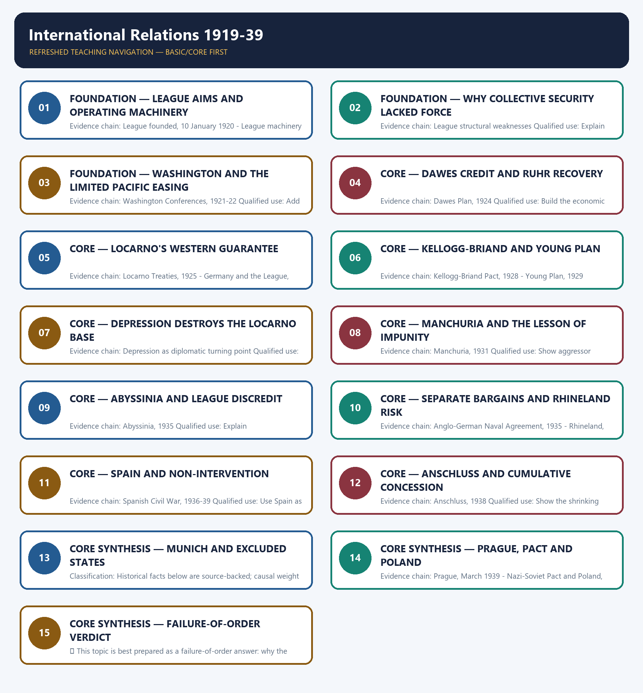

# International Relations 1919-39 — Learner-v2 Complete Learning Session

> **Authoring-only generation:** 2026-09-01. No PDF was rendered and no tracker or index was mutated.

### SOURCE, PROGRESSION AND CURRENT-LINKAGE AUDIT

- **Generation date:** 2026-09-01.
- **Repository-first evidence:** the Basic owner is taught first and preserved in full; the Advanced owner is retained only in the optional final teaching block.
- **OCR evidence:** Repository Markdown was used first. The available OCR-searchable Norman Lowe World History PDF was retained as supplementary local context, but no unsupported page number, quotation or precision was imported from it.
- **Qdrant:** not used; repository Markdown and available OCR context were sufficient.
- **PYQ integrity:** No direct UPSC PYQ is verified as owned solely by this topic in the local routing blocks. The 2021 democratic-system demand belongs to Topic 12.
- **Live-link boundary:** The UK Foreign Secretary's Locarno centenary speech commemorates the hundredth anniversary of the 1925 treaty signing and reflects on its lessons for present security and multilateral cooperation. This supplies a narrow current link to interwar diplomacy and to the limits of the 'spirit of Locarno'; it does not alter the historical assessment of Locarno's incomplete guarantees.
- **Fact/inference discipline:** no current-affairs item, PYQ wording, figure or quotation is invented.

## BASIC LEARNING SESSION

### DEEP-REVIEW LEARNING CONTRACT

| Control | Binding rule for this package |
|---|---|
| Syllabus boundary | Complete World History Core is taught chronologically, spatially and causally before optional enrichment. |
| Evidence method | Claim → named event/treaty/institution/actor/region or attributed scholarship → analysis → qualification. |
| Chronology | Structural cause, trigger, event, settlement, implementation and long-term process remain distinct. |
| Geography | Europe, Africa, Asia, West Asia and the Americas retain their own actors, routes and unequal connections; Europe is never the default universal viewpoint. |
| Historiography | Liberal, conservative, Marxist, social, feminist, postcolonial and other relevant interpretations are tied to evidence and bounded claims. |
| Practice contract | Every solved item has directive/demand decoding, an examiner-grade model, an executable timed/compression plan, marks rationale and answer-specific improvement. |
| Approval | This immutable successor remains `approved: false` pending explicit approval. |

**Canonical Basic/Core owner:** `upsc-ai-kit\knowledge\World-History\basic\11_International-Relations-1919-39.md`  
**Canonical topic owner:** `upsc-ai-kit\knowledge\World-History\basic\11_International-Relations-1919-39.md`  
**Optional Advanced owner:** `upsc-ai-kit\knowledge\World-History\advanced\11_International-Relations-1919-39.md`  
**Official syllabus mapping:** `upsc-ai-kit\knowledge\World-History\OFFICIAL-UPSC-SYLLABUS-MAPPING.md`

### EVIDENCE, PYQ AND CURRENT-STATUS CONTROL

- **Primary/official evidence:** treaties, declarations, laws, institutional records, speeches and contemporary testimony are dated and read for authorship, audience and purpose.
- **Spatial and social evidence:** maps, trade and migration routes, battlefield geography, class, race, gender and colonial position qualify state-centred narrative.
- **Quantitative evidence:** population, debt, inflation, output, casualties and territorial claims retain unit, place, period, source and uncertainty; no statistic is invented.
- **Interpretive discipline:** teleology, civilisational ranking, single-cause verdicts and present-day nation-state projection are rejected.
- **PYQ discipline:** repository routing ledgers and locally held papers control wording and metadata; neutral rendering, reconstruction and unavailable official keys remain explicitly labelled.
- **Current-status note, rechecked 2026-09-01:** The UK Foreign Secretary's Locarno centenary speech commemorates the hundredth anniversary of the 1925 treaty signing and reflects on its lessons for present security and multilateral cooperation. This supplies a narrow current link to interwar diplomacy and to the limits of the 'spirit of Locarno'; it does not alter the historical assessment of Locarno's incomplete guarantees.

**Live/primary context sources recorded by the predecessor generation:**

- `https://www.gov.uk/government/speeches/the-foreign-secretarys-locarno-centenary-speech`




*Distinct embedded teaching-navigation image. The separate continuous Cārvāka-style flowchart package remains an independent at-a-glance artifact.*

### SESSION 1 — FOUNDATION — LEAGUE AIMS AND OPERATING MACHINERY

#### DEFINITION / WHAT THIS IS CALLED

**Plain-language definition:** Precise definition: League aims and operating machinery is the source-bounded relationship among League founded, 10 January 1920 and League machinery and social work within International Relations 1919-39.

**Technical definition:** Evidence chain: League founded, 10 January 1920 - League machinery and social work Qualified use: Start with what the League tried and actually achieved.

#### ANSWER-GRABBING OPENING — WRITE/ADAPT IN THE EXAM

> Precise definition: League aims and operating machinery is the source-bounded relationship among League founded, 10 January 1920 and League machinery and social work within International Relations 1919-39.

#### MUST-WRITE KEYWORDS

- **FOUNDATION**
- **League aims**
- **operating machinery**
- **Precise definition**
- **Evidence chain**
- **Qualified use**

**How to use them:** Frame the answer through FOUNDATION; define League aims, connect operating machinery with Precise definition to explain the mechanism, and use Evidence chain for the decisive comparison or qualification.

##### VISUAL FIRST

```text
LEAGUE AIMS AND OPERATING MACHINERY
01. League founded, 10 January 1920
    |
    v
02. League machinery and social work
BOUNDARY -> Institutional breadth did not guarantee coercive capacity.
```

*This topic-specific rail fixes the evidence sequence and its exam boundary before analysis.*

##### CONCEPT DEFINITIONS

- **Precise definition:** League aims and operating machinery is the source-bounded relationship among League founded, 10 January 1920 and League machinery and social work within International Relations 1919-39.
- **Classification:** Historical facts below are source-backed; causal weight and evaluative verdicts are analytical synthesis.

##### CORE EXPLANATION

The League of Nations formally began on 10 January 1920 to preserve peace through collective security and promote economic and social cooperation. The Assembly, Council, Court, Secretariat and commissions supported genuine work on labour, refugees, health, mandates, minorities and disputed territories.

##### NAMED EVIDENCE AND MECHANISM

- The League of Nations formally began on 10 January 1920 to preserve peace through collective security and promote economic and social cooperation.
- The Assembly, Council, Court, Secretariat and commissions supported genuine work on labour, refugees, health, mandates, minorities and disputed territories.

##### EXAMINER CAUTION

- Institutional breadth did not guarantee coercive capacity.

##### EXAM LINK

- **Prelims:** Retain the exact actor, date, document and category in League aims and operating machinery.
- **Mains:** Start with what the League tried and actually achieved.

##### MINI RECAP

- **Evidence chain:** League founded, 10 January 1920 -> League machinery and social work
- **Qualified use:** Start with what the League tried and actually achieved.

#### CLOSING RECALL FLOW — FOUNDATION — LEAGUE AIMS AND OPERATING MACHINERY

```text
START / CONCEPT: FOUNDATION — League aims and operating machinery
        |
        v
EXACT TERMS: FOUNDATION · League aims · operating machinery · Precise definition · Evidence chain · Qualified use
        |
        v
MECHANISM / ARGUMENT: Prelims: Retain the exact actor, date, document and category in League aims and operating machinery.
        |
        v
CONSEQUENCE / CONTRAST: Evidence chain: League founded, 10 January 1920 - League machinery and social work Qualified use: Start with what the League tried and actually achieved.
        |
        v
UPSC TRAP / ANSWER-USE: Do not miss this limiting distinction: causal weight and evaluative verdicts are analytical synthesis.
        |
        v
ANSWER-GRABBING FORMULATION: Precise definition: League aims and operating machinery is the source-bounded relationship among League founded, 10 January 1920 and League machinery and social work within International Relations 1919-39.
```
### SESSION 2 — FOUNDATION — WHY COLLECTIVE SECURITY LACKED FORCE

#### DEFINITION / WHAT THIS IS CALLED

**Plain-language definition:** Precise definition: Why collective security lacked force is the source-bounded relationship among and League structural weaknesses within International Relations 1919-39.

**Technical definition:** Evidence chain: League structural weaknesses Qualified use: Explain the enforcement deficit.

#### ANSWER-GRABBING OPENING — WRITE/ADAPT IN THE EXAM

> Precise definition: Why collective security lacked force is the source-bounded relationship among and League structural weaknesses within International Relations 1919-39.

#### MUST-WRITE KEYWORDS

- **FOUNDATION**
- **Why collective security lacked force**
- **Precise definition**
- **Evidence chain**
- **Qualified use**
- **1919-39**

**How to use them:** Frame the answer through FOUNDATION; define Why collective security lacked force, connect Precise definition with Evidence chain to explain the mechanism, and use Qualified use for the decisive comparison or qualification.

##### VISUAL FIRST

```text
WHY COLLECTIVE SECURITY LACKED FORCE
01. League structural weaknesses
BOUNDARY -> Political will and institutional design must be separated.
```

*This topic-specific rail fixes the evidence sequence and its exam boundary before analysis.*

##### CONCEPT DEFINITIONS

- **Precise definition:** Why collective security lacked force is the source-bounded relationship among  and League structural weaknesses within International Relations 1919-39.
- **Classification:** Historical facts below are source-backed; causal weight and evaluative verdicts are analytical synthesis.

##### CORE EXPLANATION

The absent United States, late membership of Germany and the USSR, unanimity, no standing army and dependence on British-French will weakened enforcement.

##### NAMED EVIDENCE AND MECHANISM

- The absent United States, late membership of Germany and the USSR, unanimity, no standing army and dependence on British-French will weakened enforcement.

##### EXAMINER CAUTION

- Political will and institutional design must be separated.

##### EXAM LINK

- **Prelims:** Retain the exact actor, date, document and category in Why collective security lacked force.
- **Mains:** Explain the enforcement deficit.

##### MINI RECAP

- **Evidence chain:** League structural weaknesses
- **Qualified use:** Explain the enforcement deficit.

#### CLOSING RECALL FLOW — FOUNDATION — WHY COLLECTIVE SECURITY LACKED FORCE

```text
START / CONCEPT: FOUNDATION — Why collective security lacked force
        |
        v
EXACT TERMS: FOUNDATION · Why collective security lacked force · Precise definition · Evidence chain · Qualified use · 1919-39
        |
        v
MECHANISM / ARGUMENT: Evidence chain: League structural weaknesses Qualified use: Explain the enforcement deficit.
        |
        v
CONSEQUENCE / CONTRAST: Classification: Historical facts below are source-backed; causal weight and evaluative verdicts are analytical synthesis.
        |
        v
UPSC TRAP / ANSWER-USE: Do not miss this limiting distinction: the absent United States, late membership of Germany and the USSR, unanimity, no standing...
        |
        v
ANSWER-GRABBING FORMULATION: Precise definition: Why collective security lacked force is the source-bounded relationship among and League structural weaknesses within International Relations 1919-39.
```
### SESSION 3 — FOUNDATION — WASHINGTON AND THE LIMITED PACIFIC EASING

#### DEFINITION / WHAT THIS IS CALLED

**Plain-language definition:** Precise definition: Washington and the limited Pacific easing is the source-bounded relationship among and Washington Conferences, 1921-22 within International Relations 1919-39.

**Technical definition:** Evidence chain: Washington Conferences, 1921-22 Qualified use: Add the non-European interwar dimension.

#### ANSWER-GRABBING OPENING — WRITE/ADAPT IN THE EXAM

> Precise definition: Washington and the limited Pacific easing is the source-bounded relationship among and Washington Conferences, 1921-22 within International Relations 1919-39.

#### MUST-WRITE KEYWORDS

- **FOUNDATION**
- **Washington**
- **the limited Pacific easing**
- **Precise definition**
- **Evidence chain**
- **Qualified use**

**How to use them:** Frame the answer through FOUNDATION; define Washington, connect the limited Pacific easing with Precise definition to explain the mechanism, and use Evidence chain for the decisive comparison or qualification.

##### VISUAL FIRST

```text
WASHINGTON AND THE LIMITED PACIFIC EASING
01. Washington Conferences, 1921-22
BOUNDARY -> Naval limits did not settle Japanese continental ambition.
```

*This topic-specific rail fixes the evidence sequence and its exam boundary before analysis.*

##### CONCEPT DEFINITIONS

- **Precise definition:** Washington and the limited Pacific easing is the source-bounded relationship among  and Washington Conferences, 1921-22 within International Relations 1919-39.
- **Classification:** Historical facts below are source-backed; causal weight and evaluative verdicts are analytical synthesis.

##### CORE EXPLANATION

The Washington Conferences limited naval competition and temporarily eased Far Eastern tension without resolving Japanese continental ambition.

##### NAMED EVIDENCE AND MECHANISM

- The Washington Conferences limited naval competition and temporarily eased Far Eastern tension without resolving Japanese continental ambition.

##### EXAMINER CAUTION

- Naval limits did not settle Japanese continental ambition.

##### EXAM LINK

- **Prelims:** Retain the exact actor, date, document and category in Washington and the limited Pacific easing.
- **Mains:** Add the non-European interwar dimension.

##### MINI RECAP

- **Evidence chain:** Washington Conferences, 1921-22
- **Qualified use:** Add the non-European interwar dimension.

#### CLOSING RECALL FLOW — FOUNDATION — WASHINGTON AND THE LIMITED PACIFIC EASING

```text
START / CONCEPT: FOUNDATION — Washington and the limited Pacific easing
        |
        v
EXACT TERMS: FOUNDATION · Washington · the limited Pacific easing · Precise definition · Evidence chain · Qualified use
        |
        v
MECHANISM / ARGUMENT: Evidence chain: Washington Conferences, 1921-22 Qualified use: Add the non-European interwar dimension.
        |
        v
CONSEQUENCE / CONTRAST: Classification: Historical facts below are source-backed; causal weight and evaluative verdicts are analytical synthesis.
        |
        v
UPSC TRAP / ANSWER-USE: Do not miss this limiting distinction: washington and the limited Pacific easing is the source-bounded relationship among and Washington Conferences...
        |
        v
ANSWER-GRABBING FORMULATION: Precise definition: Washington and the limited Pacific easing is the source-bounded relationship among and Washington Conferences, 1921-22 within International Relations 1919-39.
```
### SESSION 4 — CORE — DAWES CREDIT AND RUHR RECOVERY

#### DEFINITION / WHAT THIS IS CALLED

**Plain-language definition:** Precise definition: Dawes credit and Ruhr recovery is the source-bounded relationship among and Dawes Plan, 1924 within International Relations 1919-39.

**Technical definition:** Evidence chain: Dawes Plan, 1924 Qualified use: Build the economic foundation of reconciliation.

#### ANSWER-GRABBING OPENING — WRITE/ADAPT IN THE EXAM

> Precise definition: Dawes credit and Ruhr recovery is the source-bounded relationship among and Dawes Plan, 1924 within International Relations 1919-39.

#### MUST-WRITE KEYWORDS

- **Dawes credit**
- **Ruhr recovery**
- **Precise definition**
- **Evidence chain**
- **Qualified use**
- **1919-39**

**How to use them:** Frame the answer through Dawes credit; define Ruhr recovery, connect Precise definition with Evidence chain to explain the mechanism, and use Qualified use for the decisive comparison or qualification.

##### VISUAL FIRST

```text
DAWES CREDIT AND RUHR RECOVERY
01. Dawes Plan, 1924
BOUNDARY -> Recovery rested on American credit rather than a final reparations settlement.
```

*This topic-specific rail fixes the evidence sequence and its exam boundary before analysis.*

##### CONCEPT DEFINITIONS

- **Precise definition:** Dawes credit and Ruhr recovery is the source-bounded relationship among  and Dawes Plan, 1924 within International Relations 1919-39.
- **Classification:** Historical facts below are source-backed; causal weight and evaluative verdicts are analytical synthesis.

##### CORE EXPLANATION

The Dawes Plan used American credit to make reparations manageable and enabled French withdrawal from the Ruhr.

##### NAMED EVIDENCE AND MECHANISM

- The Dawes Plan used American credit to make reparations manageable and enabled French withdrawal from the Ruhr.

##### EXAMINER CAUTION

- Recovery rested on American credit rather than a final reparations settlement.

##### EXAM LINK

- **Prelims:** Retain the exact actor, date, document and category in Dawes credit and Ruhr recovery.
- **Mains:** Build the economic foundation of reconciliation.

##### MINI RECAP

- **Evidence chain:** Dawes Plan, 1924
- **Qualified use:** Build the economic foundation of reconciliation.

#### CLOSING RECALL FLOW — CORE — DAWES CREDIT AND RUHR RECOVERY

```text
START / CONCEPT: CORE — Dawes credit and Ruhr recovery
        |
        v
EXACT TERMS: Dawes credit · Ruhr recovery · Precise definition · Evidence chain · Qualified use · 1919-39
        |
        v
MECHANISM / ARGUMENT: The Dawes Plan used American credit to make reparations manageable and enabled French withdrawal from the Ruhr.
        |
        v
CONSEQUENCE / CONTRAST: Evidence chain: Dawes Plan, 1924 Qualified use: Build the economic foundation of reconciliation.
        |
        v
UPSC TRAP / ANSWER-USE: Do not miss this limiting distinction: causal weight and evaluative verdicts are analytical synthesis.
        |
        v
ANSWER-GRABBING FORMULATION: Precise definition: Dawes credit and Ruhr recovery is the source-bounded relationship among and Dawes Plan, 1924 within International Relations 1919-39.
```
### SESSION 5 — CORE — LOCARNO'S WESTERN GUARANTEE

#### DEFINITION / WHAT THIS IS CALLED

**Plain-language definition:** Precise definition: Locarno's western guarantee is the source-bounded relationship among Locarno Treaties, 1925 and Germany and the League, 1926 within International Relations 1919-39.

**Technical definition:** Evidence chain: Locarno Treaties, 1925 - Germany and the League, 1926 Qualified use: Evaluate the settlement geographically.

#### ANSWER-GRABBING OPENING — WRITE/ADAPT IN THE EXAM

> Precise definition: Locarno's western guarantee is the source-bounded relationship among Locarno Treaties, 1925 and Germany and the League, 1926 within International Relations 1919-39.

#### MUST-WRITE KEYWORDS

- **Locarno's western guarantee**
- **Precise definition**
- **Evidence chain**
- **Qualified use**
- **Precise definition: Locarno's western guarantee**
- **1919-39**

**How to use them:** Frame the answer through Locarno's western guarantee; define Precise definition, connect Evidence chain with Qualified use to explain the mechanism, and use Precise definition: Locarno's western guarantee for the decisive comparison or qualification.

##### VISUAL FIRST

```text
LOCARNO'S WESTERN GUARANTEE
01. Locarno Treaties, 1925
    |
    v
02. Germany and the League, 1926
BOUNDARY -> Western reconciliation coexisted with eastern insecurity.
```

*This topic-specific rail fixes the evidence sequence and its exam boundary before analysis.*

##### CONCEPT DEFINITIONS

- **Precise definition:** Locarno's western guarantee is the source-bounded relationship among Locarno Treaties, 1925 and Germany and the League, 1926 within International Relations 1919-39.
- **Classification:** Historical facts below are source-backed; causal weight and evaluative verdicts are analytical synthesis.

##### CORE EXPLANATION

Locarno guaranteed Germany's western frontiers but left its eastern frontiers unguaranteed, making reconciliation geographically incomplete. Germany entered the League in 1926 during the brief phase of conditional reconciliation.

##### NAMED EVIDENCE AND MECHANISM

- Locarno guaranteed Germany's western frontiers but left its eastern frontiers unguaranteed, making reconciliation geographically incomplete.
- Germany entered the League in 1926 during the brief phase of conditional reconciliation.

##### EXAMINER CAUTION

- Western reconciliation coexisted with eastern insecurity.

##### EXAM LINK

- **Prelims:** Retain the exact actor, date, document and category in Locarno's western guarantee.
- **Mains:** Evaluate the settlement geographically.

##### MINI RECAP

- **Evidence chain:** Locarno Treaties, 1925 -> Germany and the League, 1926
- **Qualified use:** Evaluate the settlement geographically.

#### CLOSING RECALL FLOW — CORE — LOCARNO'S WESTERN GUARANTEE

```text
START / CONCEPT: CORE — Locarno's western guarantee
        |
        v
EXACT TERMS: Locarno's western guarantee · Precise definition · Evidence chain · Qualified use · Precise definition: Locarno's western guarantee · 1919-39
        |
        v
MECHANISM / ARGUMENT: Evidence chain: Locarno Treaties, 1925 - Germany and the League, 1926 Qualified use: Evaluate the settlement geographically.
        |
        v
CONSEQUENCE / CONTRAST: Classification: Historical facts below are source-backed; causal weight and evaluative verdicts are analytical synthesis.
        |
        v
UPSC TRAP / ANSWER-USE: Do not miss this limiting distinction: locarno's western guarantee is the source-bounded relationship among Locarno Treaties, 1925 and Germany and...
        |
        v
ANSWER-GRABBING FORMULATION: Precise definition: Locarno's western guarantee is the source-bounded relationship among Locarno Treaties, 1925 and Germany and the League, 1926 within International Relations 1919-39.
```
### SESSION 6 — CORE — KELLOGG-BRIAND AND YOUNG PLAN

#### DEFINITION / WHAT THIS IS CALLED

**Plain-language definition:** Precise definition: Kellogg-Briand and Young Plan is the source-bounded relationship among Kellogg-Briand Pact, 1928 and Young Plan, 1929 within International Relations 1919-39.

**Technical definition:** Evidence chain: Kellogg-Briand Pact, 1928 - Young Plan, 1929 Qualified use: Close the high point of 1920s optimism.

#### ANSWER-GRABBING OPENING — WRITE/ADAPT IN THE EXAM

> Precise definition: Kellogg-Briand and Young Plan is the source-bounded relationship among Kellogg-Briand Pact, 1928 and Young Plan, 1929 within International Relations 1919-39.

#### MUST-WRITE KEYWORDS

- **Kellogg-Briand**
- **Young Plan**
- **Precise definition**
- **Evidence chain**
- **Qualified use**
- **1919-39**

**How to use them:** Frame the answer through Kellogg-Briand; define Young Plan, connect Precise definition with Evidence chain to explain the mechanism, and use Qualified use for the decisive comparison or qualification.

##### VISUAL FIRST

```text
KELLOGG-BRIAND AND YOUNG PLAN
01. Kellogg-Briand Pact, 1928
    |
    v
02. Young Plan, 1929
BOUNDARY -> Legal renunciation without sanctions is not enforcement.
```

*This topic-specific rail fixes the evidence sequence and its exam boundary before analysis.*

##### CONCEPT DEFINITIONS

- **Precise definition:** Kellogg-Briand and Young Plan is the source-bounded relationship among Kellogg-Briand Pact, 1928 and Young Plan, 1929 within International Relations 1919-39.
- **Classification:** Historical facts below are source-backed; causal weight and evaluative verdicts are analytical synthesis.

##### CORE EXPLANATION

The Kellogg-Briand Pact renounced war but lacked sanctions or an enforcement mechanism. The Young Plan reduced reparations to two thousand million pounds but arrived as the economic foundation of cooperation began to collapse.

##### NAMED EVIDENCE AND MECHANISM

- The Kellogg-Briand Pact renounced war but lacked sanctions or an enforcement mechanism.
- The Young Plan reduced reparations to two thousand million pounds but arrived as the economic foundation of cooperation began to collapse.

##### EXAMINER CAUTION

- Legal renunciation without sanctions is not enforcement.

##### EXAM LINK

- **Prelims:** Retain the exact actor, date, document and category in Kellogg-Briand and Young Plan.
- **Mains:** Close the high point of 1920s optimism.

##### MINI RECAP

- **Evidence chain:** Kellogg-Briand Pact, 1928 -> Young Plan, 1929
- **Qualified use:** Close the high point of 1920s optimism.

#### CLOSING RECALL FLOW — CORE — KELLOGG-BRIAND AND YOUNG PLAN

```text
START / CONCEPT: CORE — Kellogg-Briand and Young Plan
        |
        v
EXACT TERMS: Kellogg-Briand · Young Plan · Precise definition · Evidence chain · Qualified use · 1919-39
        |
        v
MECHANISM / ARGUMENT: Evidence chain: Kellogg-Briand Pact, 1928 - Young Plan, 1929 Qualified use: Close the high point of 1920s optimism.
        |
        v
CONSEQUENCE / CONTRAST: Legal renunciation without sanctions is not enforcement.
        |
        v
UPSC TRAP / ANSWER-USE: Do not miss this limiting distinction: causal weight and evaluative verdicts are analytical synthesis.
        |
        v
ANSWER-GRABBING FORMULATION: Precise definition: Kellogg-Briand and Young Plan is the source-bounded relationship among Kellogg-Briand Pact, 1928 and Young Plan, 1929 within International Relations 1919-39.
```
### SESSION 7 — CORE — DEPRESSION DESTROYS THE LOCARNO BASE

#### DEFINITION / WHAT THIS IS CALLED

**Plain-language definition:** Precise definition: Depression destroys the Locarno base is the source-bounded relationship among and Depression as diplomatic turning point within International Relations 1919-39.

**Technical definition:** Evidence chain: Depression as diplomatic turning point Qualified use: Connect economic shock to diplomatic breakdown.

#### ANSWER-GRABBING OPENING — WRITE/ADAPT IN THE EXAM

> Precise definition: Depression destroys the Locarno base is the source-bounded relationship among and Depression as diplomatic turning point within International Relations 1919-39.

#### MUST-WRITE KEYWORDS

- **Depression destroys the Locarno base**
- **Precise definition**
- **Evidence chain**
- **Qualified use**
- **Precise definition: Depression destroys the Locarno base**
- **1919-39**

**How to use them:** Frame the answer through Depression destroys the Locarno base; define Precise definition, connect Evidence chain with Qualified use to explain the mechanism, and use Precise definition: Depression destroys the Locarno base for the decisive comparison or qualification.

##### VISUAL FIRST

```text
DEPRESSION DESTROYS THE LOCARNO BASE
01. Depression as diplomatic turning point
BOUNDARY -> Use the credit-to-radicalisation mechanism, not a slogan.
```

*This topic-specific rail fixes the evidence sequence and its exam boundary before analysis.*

##### CONCEPT DEFINITIONS

- **Precise definition:** Depression destroys the Locarno base is the source-bounded relationship among  and Depression as diplomatic turning point within International Relations 1919-39.
- **Classification:** Historical facts below are source-backed; causal weight and evaluative verdicts are analytical synthesis.

##### CORE EXPLANATION

Withdrawal of American credit, unemployment and radicalisation after 1929 destroyed the prosperity on which the Locarno spirit depended.

##### NAMED EVIDENCE AND MECHANISM

- Withdrawal of American credit, unemployment and radicalisation after 1929 destroyed the prosperity on which the Locarno spirit depended.

##### EXAMINER CAUTION

- Use the credit-to-radicalisation mechanism, not a slogan.

##### EXAM LINK

- **Prelims:** Retain the exact actor, date, document and category in Depression destroys the Locarno base.
- **Mains:** Connect economic shock to diplomatic breakdown.

##### MINI RECAP

- **Evidence chain:** Depression as diplomatic turning point
- **Qualified use:** Connect economic shock to diplomatic breakdown.

#### CLOSING RECALL FLOW — CORE — DEPRESSION DESTROYS THE LOCARNO BASE

```text
START / CONCEPT: CORE — Depression destroys the Locarno base
        |
        v
EXACT TERMS: Depression destroys the Locarno base · Precise definition · Evidence chain · Qualified use · Precise definition: Depression destroys the Locarno base · 1919-39
        |
        v
MECHANISM / ARGUMENT: Evidence chain: Depression as diplomatic turning point Qualified use: Connect economic shock to diplomatic breakdown.
        |
        v
CONSEQUENCE / CONTRAST: Use the credit-to-radicalisation mechanism, not a slogan.
        |
        v
UPSC TRAP / ANSWER-USE: Do not miss this limiting distinction: causal weight and evaluative verdicts are analytical synthesis.
        |
        v
ANSWER-GRABBING FORMULATION: Precise definition: Depression destroys the Locarno base is the source-bounded relationship among and Depression as diplomatic turning point within International Relations 1919-39.
```
### SESSION 8 — CORE — MANCHURIA AND THE LESSON OF IMPUNITY

#### DEFINITION / WHAT THIS IS CALLED

**Plain-language definition:** Precise definition: Manchuria and the lesson of impunity is the source-bounded relationship among and Manchuria, 1931 within International Relations 1919-39.

**Technical definition:** Evidence chain: Manchuria, 1931 Qualified use: Show aggressor learning.

#### ANSWER-GRABBING OPENING — WRITE/ADAPT IN THE EXAM

> Precise definition: Manchuria and the lesson of impunity is the source-bounded relationship among and Manchuria, 1931 within International Relations 1919-39.

#### MUST-WRITE KEYWORDS

- **Manchuria**
- **the lesson of impunity**
- **Precise definition**
- **Evidence chain**
- **Qualified use**
- **1919-39**

**How to use them:** Frame the answer through Manchuria; define the lesson of impunity, connect Precise definition with Evidence chain to explain the mechanism, and use Qualified use for the decisive comparison or qualification.

##### VISUAL FIRST

```text
MANCHURIA AND THE LESSON OF IMPUNITY
01. Manchuria, 1931
BOUNDARY -> The first major successful defiance predates Hitler's rule.
```

*This topic-specific rail fixes the evidence sequence and its exam boundary before analysis.*

##### CONCEPT DEFINITIONS

- **Precise definition:** Manchuria and the lesson of impunity is the source-bounded relationship among  and Manchuria, 1931 within International Relations 1919-39.
- **Classification:** Historical facts below are source-backed; causal weight and evaluative verdicts are analytical synthesis.

##### CORE EXPLANATION

Japan's seizure of Manchuria was the first major successful defiance of the League and demonstrated that a great power could keep gains.

##### NAMED EVIDENCE AND MECHANISM

- Japan's seizure of Manchuria was the first major successful defiance of the League and demonstrated that a great power could keep gains.

##### EXAMINER CAUTION

- The first major successful defiance predates Hitler's rule.

##### EXAM LINK

- **Prelims:** Retain the exact actor, date, document and category in Manchuria and the lesson of impunity.
- **Mains:** Show aggressor learning.

##### MINI RECAP

- **Evidence chain:** Manchuria, 1931
- **Qualified use:** Show aggressor learning.

#### CLOSING RECALL FLOW — CORE — MANCHURIA AND THE LESSON OF IMPUNITY

```text
START / CONCEPT: CORE — Manchuria and the lesson of impunity
        |
        v
EXACT TERMS: Manchuria · the lesson of impunity · Precise definition · Evidence chain · Qualified use · 1919-39
        |
        v
MECHANISM / ARGUMENT: Japan's seizure of Manchuria was the first major successful defiance of the League and demonstrated that a great power could keep gains.
        |
        v
CONSEQUENCE / CONTRAST: Evidence chain: Manchuria, 1931 Qualified use: Show aggressor learning.
        |
        v
UPSC TRAP / ANSWER-USE: Do not miss this limiting distinction: causal weight and evaluative verdicts are analytical synthesis.
        |
        v
ANSWER-GRABBING FORMULATION: Precise definition: Manchuria and the lesson of impunity is the source-bounded relationship among and Manchuria, 1931 within International Relations 1919-39.
```
### SESSION 9 — CORE — ABYSSINIA AND LEAGUE DISCREDIT

#### DEFINITION / WHAT THIS IS CALLED

**Plain-language definition:** Precise definition: Abyssinia and League discredit is the source-bounded relationship among and Abyssinia, 1935 within International Relations 1919-39.

**Technical definition:** Evidence chain: Abyssinia, 1935 Qualified use: Explain collective-security collapse.

#### ANSWER-GRABBING OPENING — WRITE/ADAPT IN THE EXAM

> Precise definition: Abyssinia and League discredit is the source-bounded relationship among and Abyssinia, 1935 within International Relations 1919-39.

#### MUST-WRITE KEYWORDS

- **Abyssinia**
- **League discredit**
- **Precise definition**
- **Evidence chain**
- **Qualified use**
- **1919-39**

**How to use them:** Frame the answer through Abyssinia; define League discredit, connect Precise definition with Evidence chain to explain the mechanism, and use Qualified use for the decisive comparison or qualification.

##### VISUAL FIRST

```text
ABYSSINIA AND LEAGUE DISCREDIT
01. Abyssinia, 1935
BOUNDARY -> Half-hearted sanctions mattered more than declaratory condemnation.
```

*This topic-specific rail fixes the evidence sequence and its exam boundary before analysis.*

##### CONCEPT DEFINITIONS

- **Precise definition:** Abyssinia and League discredit is the source-bounded relationship among  and Abyssinia, 1935 within International Relations 1919-39.
- **Classification:** Historical facts below are source-backed; causal weight and evaluative verdicts are analytical synthesis.

##### CORE EXPLANATION

Half-hearted sanctions during Italy's invasion of Abyssinia destroyed League credibility and advertised collective-security weakness.

##### NAMED EVIDENCE AND MECHANISM

- Half-hearted sanctions during Italy's invasion of Abyssinia destroyed League credibility and advertised collective-security weakness.

##### EXAMINER CAUTION

- Half-hearted sanctions mattered more than declaratory condemnation.

##### EXAM LINK

- **Prelims:** Retain the exact actor, date, document and category in Abyssinia and League discredit.
- **Mains:** Explain collective-security collapse.

##### MINI RECAP

- **Evidence chain:** Abyssinia, 1935
- **Qualified use:** Explain collective-security collapse.

#### CLOSING RECALL FLOW — CORE — ABYSSINIA AND LEAGUE DISCREDIT

```text
START / CONCEPT: CORE — Abyssinia and League discredit
        |
        v
EXACT TERMS: Abyssinia · League discredit · Precise definition · Evidence chain · Qualified use · 1919-39
        |
        v
MECHANISM / ARGUMENT: Evidence chain: Abyssinia, 1935 Qualified use: Explain collective-security collapse.
        |
        v
CONSEQUENCE / CONTRAST: Classification: Historical facts below are source-backed; causal weight and evaluative verdicts are analytical synthesis.
        |
        v
UPSC TRAP / ANSWER-USE: Do not miss this limiting distinction: abyssinia and League discredit is the source-bounded relationship among and Abyssinia, 1935 within International...
        |
        v
ANSWER-GRABBING FORMULATION: Precise definition: Abyssinia and League discredit is the source-bounded relationship among and Abyssinia, 1935 within International Relations 1919-39.
```
### SESSION 10 — CORE — SEPARATE BARGAINS AND RHINELAND RISK

#### DEFINITION / WHAT THIS IS CALLED

**Plain-language definition:** Precise definition: Separate bargains and Rhineland risk is the source-bounded relationship among Anglo-German Naval Agreement, 1935 and Rhineland, 1936 within International Relations 1919-39.

**Technical definition:** Evidence chain: Anglo-German Naval Agreement, 1935 - Rhineland, 1936 Qualified use: Trace deterrence erosion.

#### ANSWER-GRABBING OPENING — WRITE/ADAPT IN THE EXAM

> Precise definition: Separate bargains and Rhineland risk is the source-bounded relationship among Anglo-German Naval Agreement, 1935 and Rhineland, 1936 within International Relations 1919-39.

#### MUST-WRITE KEYWORDS

- **Separate bargains**
- **Rhineland risk**
- **Precise definition**
- **Evidence chain**
- **Qualified use**
- **1919-39**

**How to use them:** Frame the answer through Separate bargains; define Rhineland risk, connect Precise definition with Evidence chain to explain the mechanism, and use Qualified use for the decisive comparison or qualification.

##### VISUAL FIRST

```text
SEPARATE BARGAINS AND RHINELAND RISK
01. Anglo-German Naval Agreement, 1935
    |
    v
02. Rhineland, 1936
BOUNDARY -> British bilateralism weakened a common front.
```

*This topic-specific rail fixes the evidence sequence and its exam boundary before analysis.*

##### CONCEPT DEFINITIONS

- **Precise definition:** Separate bargains and Rhineland risk is the source-bounded relationship among Anglo-German Naval Agreement, 1935 and Rhineland, 1936 within International Relations 1919-39.
- **Classification:** Historical facts below are source-backed; causal weight and evaluative verdicts are analytical synthesis.

##### CORE EXPLANATION

Britain's separate naval agreement with Germany broke the Stresa Front and weakened coordinated resistance. German remilitarisation of the Rhineland met protest without force and taught Hitler that further risks might go unopposed.

##### NAMED EVIDENCE AND MECHANISM

- Britain's separate naval agreement with Germany broke the Stresa Front and weakened coordinated resistance.
- German remilitarisation of the Rhineland met protest without force and taught Hitler that further risks might go unopposed.

##### EXAMINER CAUTION

- British bilateralism weakened a common front.

##### EXAM LINK

- **Prelims:** Retain the exact actor, date, document and category in Separate bargains and Rhineland risk.
- **Mains:** Trace deterrence erosion.

##### MINI RECAP

- **Evidence chain:** Anglo-German Naval Agreement, 1935 -> Rhineland, 1936
- **Qualified use:** Trace deterrence erosion.

#### CLOSING RECALL FLOW — CORE — SEPARATE BARGAINS AND RHINELAND RISK

```text
START / CONCEPT: CORE — Separate bargains and Rhineland risk
        |
        v
EXACT TERMS: Separate bargains · Rhineland risk · Precise definition · Evidence chain · Qualified use · 1919-39
        |
        v
MECHANISM / ARGUMENT: Evidence chain: Anglo-German Naval Agreement, 1935 - Rhineland, 1936 Qualified use: Trace deterrence erosion.
        |
        v
CONSEQUENCE / CONTRAST: Classification: Historical facts below are source-backed; causal weight and evaluative verdicts are analytical synthesis.
        |
        v
UPSC TRAP / ANSWER-USE: Do not miss this limiting distinction: separate bargains and Rhineland risk is the source-bounded relationship among Anglo-German Naval Agreement, 1935...
        |
        v
ANSWER-GRABBING FORMULATION: Precise definition: Separate bargains and Rhineland risk is the source-bounded relationship among Anglo-German Naval Agreement, 1935 and Rhineland, 1936 within International Relations 1919-39.
```
### SESSION 11 — CORE — SPAIN AND NON-INTERVENTION

#### DEFINITION / WHAT THIS IS CALLED

**Plain-language definition:** Precise definition: Spain and non-intervention is the source-bounded relationship among and Spanish Civil War, 1936-39 within International Relations 1919-39.

**Technical definition:** Evidence chain: Spanish Civil War, 1936-39 Qualified use: Use Spain as an international-relations test.

#### ANSWER-GRABBING OPENING — WRITE/ADAPT IN THE EXAM

> Precise definition: Spain and non-intervention is the source-bounded relationship among and Spanish Civil War, 1936-39 within International Relations 1919-39.

#### MUST-WRITE KEYWORDS

- **Spain**
- **non-intervention**
- **Precise definition**
- **Evidence chain**
- **Qualified use**
- **1936-39**

**How to use them:** Frame the answer through Spain; define non-intervention, connect Precise definition with Evidence chain to explain the mechanism, and use Qualified use for the decisive comparison or qualification.

##### VISUAL FIRST

```text
SPAIN AND NON-INTERVENTION
01. Spanish Civil War, 1936-39
BOUNDARY -> Avoid turning the session into Spanish domestic history.
```

*This topic-specific rail fixes the evidence sequence and its exam boundary before analysis.*

##### CONCEPT DEFINITIONS

- **Precise definition:** Spain and non-intervention is the source-bounded relationship among  and Spanish Civil War, 1936-39 within International Relations 1919-39.
- **Classification:** Historical facts below are source-backed; causal weight and evaluative verdicts are analytical synthesis.

##### CORE EXPLANATION

Germany and Italy supported Franco while Britain and France stayed outside the Spanish Civil War, further exposing the weakness of collective restraint.

##### NAMED EVIDENCE AND MECHANISM

- Germany and Italy supported Franco while Britain and France stayed outside the Spanish Civil War, further exposing the weakness of collective restraint.

##### EXAMINER CAUTION

- Avoid turning the session into Spanish domestic history.

##### EXAM LINK

- **Prelims:** Retain the exact actor, date, document and category in Spain and non-intervention.
- **Mains:** Use Spain as an international-relations test.

##### MINI RECAP

- **Evidence chain:** Spanish Civil War, 1936-39
- **Qualified use:** Use Spain as an international-relations test.

#### CLOSING RECALL FLOW — CORE — SPAIN AND NON-INTERVENTION

```text
START / CONCEPT: CORE — Spain and non-intervention
        |
        v
EXACT TERMS: Spain · non-intervention · Precise definition · Evidence chain · Qualified use · 1936-39
        |
        v
MECHANISM / ARGUMENT: Evidence chain: Spanish Civil War, 1936-39 Qualified use: Use Spain as an international-relations test.
        |
        v
CONSEQUENCE / CONTRAST: Mains: Use Spain as an international-relations test.
        |
        v
UPSC TRAP / ANSWER-USE: Do not miss this limiting distinction: causal weight and evaluative verdicts are analytical synthesis.
        |
        v
ANSWER-GRABBING FORMULATION: Precise definition: Spain and non-intervention is the source-bounded relationship among and Spanish Civil War, 1936-39 within International Relations 1919-39.
```
### SESSION 12 — CORE — ANSCHLUSS AND CUMULATIVE CONCESSION

#### DEFINITION / WHAT THIS IS CALLED

**Plain-language definition:** Precise definition: Anschluss and cumulative concession is the source-bounded relationship among and Anschluss, 1938 within International Relations 1919-39.

**Technical definition:** Evidence chain: Anschluss, 1938 Qualified use: Show the shrinking resistance threshold.

#### ANSWER-GRABBING OPENING — WRITE/ADAPT IN THE EXAM

> Precise definition: Anschluss and cumulative concession is the source-bounded relationship among and Anschluss, 1938 within International Relations 1919-39.

#### MUST-WRITE KEYWORDS

- **Anschluss**
- **cumulative concession**
- **Precise definition**
- **Evidence chain**
- **Qualified use**
- **1919-39**

**How to use them:** Frame the answer through Anschluss; define cumulative concession, connect Precise definition with Evidence chain to explain the mechanism, and use Qualified use for the decisive comparison or qualification.

##### VISUAL FIRST

```text
ANSCHLUSS AND CUMULATIVE CONCESSION
01. Anschluss, 1938
BOUNDARY -> Sequence the 1938 escalation before Munich.
```

*This topic-specific rail fixes the evidence sequence and its exam boundary before analysis.*

##### CONCEPT DEFINITIONS

- **Precise definition:** Anschluss and cumulative concession is the source-bounded relationship among  and Anschluss, 1938 within International Relations 1919-39.
- **Classification:** Historical facts below are source-backed; causal weight and evaluative verdicts are analytical synthesis.

##### CORE EXPLANATION

Germany absorbed Austria in 1938 without effective resistance from the other powers.

##### NAMED EVIDENCE AND MECHANISM

- Germany absorbed Austria in 1938 without effective resistance from the other powers.

##### EXAMINER CAUTION

- Sequence the 1938 escalation before Munich.

##### EXAM LINK

- **Prelims:** Retain the exact actor, date, document and category in Anschluss and cumulative concession.
- **Mains:** Show the shrinking resistance threshold.

##### MINI RECAP

- **Evidence chain:** Anschluss, 1938
- **Qualified use:** Show the shrinking resistance threshold.

#### CLOSING RECALL FLOW — CORE — ANSCHLUSS AND CUMULATIVE CONCESSION

```text
START / CONCEPT: CORE — Anschluss and cumulative concession
        |
        v
EXACT TERMS: Anschluss · cumulative concession · Precise definition · Evidence chain · Qualified use · 1919-39
        |
        v
MECHANISM / ARGUMENT: Evidence chain: Anschluss, 1938 Qualified use: Show the shrinking resistance threshold.
        |
        v
CONSEQUENCE / CONTRAST: Classification: Historical facts below are source-backed; causal weight and evaluative verdicts are analytical synthesis.
        |
        v
UPSC TRAP / ANSWER-USE: Do not miss this limiting distinction: mains: Show the shrinking resistance threshold.
        |
        v
ANSWER-GRABBING FORMULATION: Precise definition: Anschluss and cumulative concession is the source-bounded relationship among and Anschluss, 1938 within International Relations 1919-39.
```
### SESSION 13 — CORE SYNTHESIS — MUNICH AND EXCLUDED STATES

#### DEFINITION / WHAT THIS IS CALLED

**Plain-language definition:** Precise definition: Munich and excluded states is the source-bounded relationship among and Munich, September 1938 within International Relations 1919-39.

**Technical definition:** Classification: Historical facts below are source-backed; causal weight and evaluative verdicts are analytical synthesis.

#### ANSWER-GRABBING OPENING — WRITE/ADAPT IN THE EXAM

> Precise definition: Munich and excluded states is the source-bounded relationship among and Munich, September 1938 within International Relations 1919-39.

#### MUST-WRITE KEYWORDS

- **CORE SYNTHESIS**
- **Munich**
- **excluded states**
- **Precise definition**
- **Evidence chain**
- **Qualified use**

**How to use them:** Frame the answer through CORE SYNTHESIS; define Munich, connect excluded states with Precise definition to explain the mechanism, and use Evidence chain for the decisive comparison or qualification.

##### VISUAL FIRST

```text
MUNICH AND EXCLUDED STATES
01. Munich, September 1938
BOUNDARY -> Czechoslovakia and the USSR were excluded.
```

*This topic-specific rail fixes the evidence sequence and its exam boundary before analysis.*

##### CONCEPT DEFINITIONS

- **Precise definition:** Munich and excluded states is the source-bounded relationship among  and Munich, September 1938 within International Relations 1919-39.
- **Classification:** Historical facts below are source-backed; causal weight and evaluative verdicts are analytical synthesis.

##### CORE EXPLANATION

The Sudetenland was conceded at Munich without Czechoslovak or Soviet participation, strategically crippling Czechoslovakia.

##### NAMED EVIDENCE AND MECHANISM

- The Sudetenland was conceded at Munich without Czechoslovak or Soviet participation, strategically crippling Czechoslovakia.

##### EXAMINER CAUTION

- Czechoslovakia and the USSR were excluded.

##### EXAM LINK

- **Prelims:** Retain the exact actor, date, document and category in Munich and excluded states.
- **Mains:** Evaluate appeasement on its own logic.

##### MINI RECAP

- **Evidence chain:** Munich, September 1938
- **Qualified use:** Evaluate appeasement on its own logic.

#### CLOSING RECALL FLOW — CORE SYNTHESIS — MUNICH AND EXCLUDED STATES

```text
START / CONCEPT: CORE SYNTHESIS — Munich and excluded states
        |
        v
EXACT TERMS: CORE SYNTHESIS · Munich · excluded states · Precise definition · Evidence chain · Qualified use
        |
        v
MECHANISM / ARGUMENT: Evidence chain: Munich, September 1938 Qualified use: Evaluate appeasement on its own logic.
        |
        v
CONSEQUENCE / CONTRAST: The Sudetenland was conceded at Munich without Czechoslovak or Soviet participation, strategically crippling Czechoslovakia.
        |
        v
UPSC TRAP / ANSWER-USE: Do not miss this limiting distinction: causal weight and evaluative verdicts are analytical synthesis.
        |
        v
ANSWER-GRABBING FORMULATION: Precise definition: Munich and excluded states is the source-bounded relationship among and Munich, September 1938 within International Relations 1919-39.
```
### SESSION 14 — CORE SYNTHESIS — PRAGUE, PACT AND POLAND

#### DEFINITION / WHAT THIS IS CALLED

**Plain-language definition:** Precise definition: Prague, pact and Poland is the source-bounded relationship among Prague, March 1939 and Nazi-Soviet Pact and Poland, 1939 within International Relations 1919-39.

**Technical definition:** Evidence chain: Prague, March 1939 - Nazi-Soviet Pact and Poland, 1939 Qualified use: Complete the road-to-war sequence.

#### ANSWER-GRABBING OPENING — WRITE/ADAPT IN THE EXAM

> Precise definition: Prague, pact and Poland is the source-bounded relationship among Prague, March 1939 and Nazi-Soviet Pact and Poland, 1939 within International Relations 1919-39.

#### MUST-WRITE KEYWORDS

- **CORE SYNTHESIS**
- **Prague**
- **pact**
- **Poland**
- **Precise definition**
- **Evidence chain**

**How to use them:** Frame the answer through CORE SYNTHESIS; define Prague, connect pact with Poland to explain the mechanism, and use Precise definition for the decisive comparison or qualification.

##### VISUAL FIRST

```text
PRAGUE, PACT AND POLAND
01. Prague, March 1939
    |
    v
02. Nazi-Soviet Pact and Poland, 1939
BOUNDARY -> Prague broke the self-determination defence before the pact.
```

*This topic-specific rail fixes the evidence sequence and its exam boundary before analysis.*

##### CONCEPT DEFINITIONS

- **Precise definition:** Prague, pact and Poland is the source-bounded relationship among Prague, March 1939 and Nazi-Soviet Pact and Poland, 1939 within International Relations 1919-39.
- **Classification:** Historical facts below are source-backed; causal weight and evaluative verdicts are analytical synthesis.

##### CORE EXPLANATION

Hitler's seizure of non-German Prague in March 1939 destroyed the argument that his aims were limited to national self-determination. The Nazi-Soviet Pact cleared the immediate path to Germany's invasion of Poland, after which Britain and France declared war.

##### NAMED EVIDENCE AND MECHANISM

- Hitler's seizure of non-German Prague in March 1939 destroyed the argument that his aims were limited to national self-determination.
- The Nazi-Soviet Pact cleared the immediate path to Germany's invasion of Poland, after which Britain and France declared war.

##### EXAMINER CAUTION

- Prague broke the self-determination defence before the pact.

##### EXAM LINK

- **Prelims:** Retain the exact actor, date, document and category in Prague, pact and Poland.
- **Mains:** Complete the road-to-war sequence.

##### MINI RECAP

- **Evidence chain:** Prague, March 1939 -> Nazi-Soviet Pact and Poland, 1939
- **Qualified use:** Complete the road-to-war sequence.

#### CLOSING RECALL FLOW — CORE SYNTHESIS — PRAGUE, PACT AND POLAND

```text
START / CONCEPT: CORE SYNTHESIS — Prague, pact and Poland
        |
        v
EXACT TERMS: CORE SYNTHESIS · Prague · pact · Poland · Precise definition · Evidence chain
        |
        v
MECHANISM / ARGUMENT: Evidence chain: Prague, March 1939 - Nazi-Soviet Pact and Poland, 1939 Qualified use: Complete the road-to-war sequence.
        |
        v
CONSEQUENCE / CONTRAST: Hitler's seizure of non-German Prague in March 1939 destroyed the argument that his aims were limited to national self-determination.
        |
        v
UPSC TRAP / ANSWER-USE: Do not miss this limiting distinction: causal weight and evaluative verdicts are analytical synthesis.
        |
        v
ANSWER-GRABBING FORMULATION: Precise definition: Prague, pact and Poland is the source-bounded relationship among Prague, March 1939 and Nazi-Soviet Pact and Poland, 1939 within International Relations 1919-39.
```
### SESSION 15 — CORE SYNTHESIS — FAILURE-OF-ORDER VERDICT

#### DEFINITION / WHAT THIS IS CALLED

**Plain-language definition:** Precise definition: Failure-of-order verdict is the source-bounded relationship among Appeasement and failure-of-order verdict, League structural weaknesses and Depression as diplomatic turning point within International Relations 1919-39.

**Technical definition:** ✅ This topic is best prepared as a failure-of-order answer: why the peace system did not hold.

#### ANSWER-GRABBING OPENING — WRITE/ADAPT IN THE EXAM

> Precise definition: Failure-of-order verdict is the source-bounded relationship among Appeasement and failure-of-order verdict, League structural weaknesses and Depression as diplomatic turning point within International Relations 1919-39.

#### MUST-WRITE KEYWORDS

- **CORE SYNTHESIS**
- **Failure-of-order verdict**
- **Precise definition**
- **Evidence chain**
- **Qualified use**
- **Subject**

**How to use them:** Frame the answer through CORE SYNTHESIS; define Failure-of-order verdict, connect Precise definition with Evidence chain to explain the mechanism, and use Qualified use for the decisive comparison or qualification.

##### VISUAL FIRST

```text
FAILURE-OF-ORDER VERDICT
01. Appeasement and failure-of-order verdict
    |
    v
02. League structural weaknesses
    |
    v
03. Depression as diplomatic turning point
BOUNDARY -> Do not reduce collapse to one aggressor or one treaty.
```

*This topic-specific rail fixes the evidence sequence and its exam boundary before analysis.*

##### CONCEPT DEFINITIONS

- **Precise definition:** Failure-of-order verdict is the source-bounded relationship among Appeasement and failure-of-order verdict, League structural weaknesses and Depression as diplomatic turning point within International Relations 1919-39.
- **Classification:** Historical facts below are source-backed; causal weight and evaluative verdicts are analytical synthesis.

##### CORE EXPLANATION

Appeasement addressed grievances that sometimes looked finite, but repeated concessions removed deterrence while aggressors learned that enforcement would not follow protest. The absent United States, late membership of Germany and the USSR, unanimity, no standing army and dependence on British-French will weakened enforcement. Withdrawal of American credit, unemployment and radicalisation after 1929 destroyed the prosperity on which the Locarno spirit depended.

##### NAMED EVIDENCE AND MECHANISM

- Appeasement addressed grievances that sometimes looked finite, but repeated concessions removed deterrence while aggressors learned that enforcement would not follow protest.
- The absent United States, late membership of Germany and the USSR, unanimity, no standing army and dependence on British-French will weakened enforcement.
- Withdrawal of American credit, unemployment and radicalisation after 1929 destroyed the prosperity on which the Locarno spirit depended.

##### EXAMINER CAUTION

- Do not reduce collapse to one aggressor or one treaty.

##### EXAM LINK

- **Prelims:** Retain the exact actor, date, document and category in Failure-of-order verdict.
- **Mains:** Conclude through design, economy, agency and deterrence.

##### MINI RECAP

- **Evidence chain:** Appeasement and failure-of-order verdict -> League structural weaknesses -> Depression as diplomatic turning point
- **Qualified use:** Conclude through design, economy, agency and deterrence.

#### COMPLETE BASIC OWNER EVIDENCE BANK

> **Subject:** History (World History) · **Tier:** Must-Do (foundation) · **GS Paper:** GS-I
> **Grounded in:** Norman Lowe, *Mastering Modern World History* (5th ed.), Chapters 3-5, pp. 43-88; OCR lines used: 4072-4465, 4494-5530, 5531-6635.
> **Exam-relevance anchor:** ✅ UPSC GS-I syllabus includes: "History of the world will include events from 18th century such as industrial revolution, world wars, redrawal of national boundaries, colonization, decolonization, political philosophies like communism, capitalism, socialism etc.—their forms and effect on the society."
> ✅ = source-grounded · ⚠️ = interpretive synthesis / answer-writing line · 📰 = current-affairs peg only when separately verified.
> *Companion: `advanced/11_International-Relations-1919-39.md`.*

#### Mini-timeline

| Date | Event |
|---|---|
| ✅ 10 Jan 1920 | League of Nations formally comes into existence |
| ✅ 1924 | Dawes Plan eases reparations deadlock |
| ✅ 1925 | Locarno Treaties signed |
| ✅ 1926 | Germany enters the League |
| ✅ 1928 | Kellogg-Briand Pact renounces war |
| ✅ 1929 | Young Plan reduces reparations |
| ✅ 1931 | Japan invades Manchuria |
| ✅ 1933 | Hitler comes to power; Germany leaves disarmament talks and League |
| ✅ 1935-36 | Abyssinia crisis and Rhineland remilitarization |
| ✅ Sept 1938 | Munich Conference |
| ✅ Aug-Sept 1939 | Nazi-Soviet Pact and invasion of Poland |

#### 1. Snapshot and core idea

✅ Lowe divides interwar international relations into two broad phases: a limited and fragile search for stability in the 1920s, and the breakdown of that order in the 1930s under the pressure of aggression, depression and appeasement.

✅ The central institutions and processes were the League of Nations, reparations diplomacy, French security policy, the Locarno phase, Japanese and Italian aggression, Hitler's revisionism and the eventual collapse of collective security.

⚠️ For GS-I, remember the sequence: **peace settlement -> League -> limited reconciliation -> Depression -> aggression -> appeasement -> war.**

#### 2. The League of Nations: aims, structure and early record

✅ Lowe states two main aims of the League:
- ✅ maintain peace through collective security;
- ✅ encourage international co-operation on economic and social problems.

| Organ | Role in Lowe's account |
|---|---|
| General Assembly | Annual meeting; all members; handled general policy and finances |
| Council | Smaller executive body for political disputes |
| Permanent Court of International Justice | Legal disputes between states |
| Secretariat | Administrative machinery and paperwork |
| Commissions / committees | Mandates, disarmament, minorities, labour, health, welfare |

✅ Lowe does not present the League as a total blank. He notes real achievements:
- ✅ ILO work on labour conditions.
- ✅ Refugee work under Fridtjof Nansen.
- ✅ Health work against epidemics such as typhus.
- ✅ Saar administration and plebiscite.
- ✅ Settlement of Aaland Islands, Upper Silesia, the Greek-Bulgarian dispute and Mosul.

#### 3. Why the League failed to preserve peace

✅ Lowe lists recurring weaknesses:
- ✅ too closely linked to the Versailles order;
- ✅ the USA never joined;
- ✅ Germany joined late and the USSR only in 1934;
- ✅ the Conference of Ambassadors often overshadowed it;
- ✅ unanimity rules and absence of a League army weakened enforcement;
- ✅ member states would not commit themselves to fight aggressors;
- ✅ the Depression strengthened aggressive regimes;
- ✅ Manchuria, disarmament failure and Abyssinia exposed impotence.

✅ His bottom line is stark: the League was only as strong as the willingness of Britain and France to support it, and that determination was missing in the 1930s.

#### 4. International relations, 1919-33: fragile improvement

| Phase | Main features |
|---|---|
| 1919-23 | ✅ Reparations disputes, Ruhr occupation, Franco-German bitterness, suspicion of Soviet Russia |
| 1924-29 | ✅ Dawes Plan, Locarno, Germany in League, Kellogg-Briand, Young Plan |
| 1930-33 | ✅ Depression, Manchuria, disarmament failure, Nazi rise |

✅ Lowe's key agreements and their meaning:
- ✅ **Washington Conferences (1921-22):** naval limits and temporary Far Eastern easing.
- ✅ **Dawes Plan (1924):** American loan; reparations made manageable; French leave Ruhr.
- ✅ **Locarno Treaties (1925):** western frontiers guaranteed; eastern frontiers not guaranteed.
- ✅ **Kellogg-Briand Pact (1928):** war renounced, but no sanctions clause.
- ✅ **Young Plan (1929):** reparations cut to £2000 million.

⚠️ Lowe's lesson is that the so-called "Locarno spirit" rested heavily on economic stability; once the Depression arrived, the atmosphere changed sharply.

#### 5. 1933-39: collapse of collective security and road to war

✅ The revisionist/aggressive powers were Japan, Italy and Germany.

| Crisis | Lowe-grounded significance |
|---|---|
| Manchuria, 1931 | ✅ First major successful defiance of the League |
| Abyssinia, 1935 | ✅ League sanctions proved half-hearted and ineffective |
| Anglo-German Naval Agreement, 1935 | ✅ Broke the Stresa Front and weakened united resistance |
| Rhineland, 1936 | ✅ Hitler learned that protest without force meant little |
| Spanish Civil War, 1936-39 | ✅ Germany and Italy helped Franco; Britain and France stayed out |
| Anschluss, 1938 | ✅ Austria absorbed into Reich without resistance from powers |
| Munich, 1938 | ✅ Sudetenland conceded; Czechs and USSR excluded |
| Prague, March 1939 | ✅ Hitler seized non-German territory, shattering appeasement logic |
| Poland, Sept 1939 | ✅ Nazi-Soviet Pact clears way for invasion; Britain and France declare war |

✅ Lowe defines appeasement as the British-led policy of avoiding war by giving way to aggressive powers, so long as their demands did not seem too unreasonable.

✅ Munich is central in his narrative. Sudetenland was ceded immediately; neither the Czechs nor the Russians were invited; and the destruction of the rest of Czechoslovakia in March 1939 showed that Hitler had gone beyond claims of self-determination.

#### 6. Must-Know Facts (Prelims) and UPSC traps

- ✅ League of Nations came into existence on 10 January 1920.
- ✅ Germany entered the League in 1926; Japan left in 1933; Germany left in 1933; USSR joined in 1934.
- ✅ Dawes Plan was 1924; Locarno 1925; Kellogg-Briand 1928; Young Plan 1929.
- ✅ Manchuria was the first major interwar test that the League failed.
- ✅ Abyssinia was the most damaging blow to League prestige before the war.
- ✅ Anglo-German Naval Agreement weakened anti-German unity.
- ✅ Munich Conference took place in September 1938.
- ✅ Britain and France declared war after Germany invaded Poland in September 1939.

> 🔑 Trap: Do not confuse the League's **social and technical successes** with its **failure as a peace-enforcement body**. Lowe recognizes both.

- ❌ Locarno guaranteed all German frontiers. → ✅ It guaranteed the western frontiers, not the eastern ones.
- ❌ Kellogg-Briand prevented war by law. → ✅ It renounced war but had no enforcement mechanism.
- ❌ Munich solved the Sudeten issue permanently. → ✅ It accelerated the destruction of Czechoslovakia.
- ❌ The League collapsed only because of Hitler. → ✅ Lowe shows that Manchuria and Abyssinia had already exposed the deeper weakness.

#### 7. GS-I Mains exam linkage, answer frame and probable questions

✅ This topic is best prepared as a **failure-of-order** answer: why the peace system did not hold.

⚠️ Strong mains frame:
1. Briefly state the promise of collective security.
2. Explain institutional weakness: no army, unanimity, absent great powers.
3. Show 1920s partial recovery through Dawes-Locarno-Young.
4. Show 1930s breakdown through Depression, Manchuria, Abyssinia, appeasement and Munich.
5. End with Poland as the final point where deterrence failed and war began.

**Probable Mains questions**
- ⚠️ "Why did the League of Nations fail to preserve peace?"
- ⚠️ "Assess the significance of the Locarno phase in interwar diplomacy."
- ⚠️ "How did appeasement and revisionist aggression together push Europe towards war?"

#### 8. Answer architecture (10/15/20-mark support)

> **Core-sufficiency note:** this file must independently support League-evaluation,
> appeasement-evaluation and origins-of-WWII demands. `advanced/11` adds the
> "could the League have succeeded?" and blame historiography only.

##### 8.1 Directive and demand map

| If the question says | It is really testing | Do NOT write |
|---|---|---|
| *Why did the League fail?* | Structural design **and** member-state will, plus its real successes | A list of failures |
| *Assess the Locarno phase* | Whether reconciliation was genuine or conditional on prosperity | "The Locarno spirit was good" |
| *Examine appeasement* | Why it looked rational in context **and** why it failed | Hindsight condemnation |
| *Who caused the Second World War?* | Hitler's aims vs systemic and Allied contributions | Naming Hitler and stopping |
| *Collective security* | Why a doctrine that requires prior commitment failed among states that would not commit | Defining the term only |
| *Depression and international relations* | The economic-to-diplomatic transmission mechanism | Economics without diplomacy |

##### 8.2 Qualified thesis templates

- ⚠️ **League:** "The League failed not because its design was worthless but because collective security requires states to accept risk in advance, and its principal members would not — a political failure that its institutional weaknesses merely made easier."
- ⚠️ **Locarno:** "The Locarno settlement was genuine but conditional: it rested on economic recovery and on leaving the eastern frontiers unguaranteed, and both conditions failed together after 1929."
- ⚠️ **Appeasement:** "Appeasement was a defensible response to a misdiagnosed problem: it treated Hitler as a revisionist with finite grievances rather than as an expansionist with unlimited ones."
- ⚠️ **Origins of WWII:** "Hitler's aims were the necessary cause; the Depression, the unenforced settlement and the sequence of unpunished aggressions were the conditions that made those aims achievable."

##### 8.3 Mark-scaled structures

| Marks | Structure |
|---|---|
| **10** | Thesis → **two** structural weaknesses **and** one genuine success → the decisive crisis → verdict |
| **15** | Thesis → aims and design → 1920s partial recovery → Depression as turning point → 1930s crisis sequence → verdict |
| **20** | All of the above → **plus** appeasement evaluated on its own terms, the non-European dimension (Manchuria, Abyssinia) and the origins-of-war question → verdict |

##### 8.4 Evidence bank A — the League: successes, weaknesses, and the decisive crises

| Genuine successes (✅ — use these to earn balance marks) | Structural weaknesses (✅) |
|---|---|
| ILO work on labour conditions | Too closely tied to the Versailles order |
| Refugee work under **Fridtjof Nansen** | The USA never joined |
| Health work against epidemics such as typhus | Germany joined only in 1926; the USSR only in 1934 |
| Saar administration and plebiscite | The Conference of Ambassadors often overshadowed it |
| Settlement of the Aaland Islands, Upper Silesia, the Greek-Bulgarian dispute and Mosul | Unanimity rules and no League army |
| — | Members would not commit to fight aggressors |

**The two crises that broke it (✅):**

| Crisis | What it proved | Why it mattered more than the design flaws |
|---|---|---|
| **Manchuria, 1931** | A great power could defy the League and keep its gains | Demonstrated impunity to every other revisionist state |
| **Abyssinia, 1935** | Sanctions were half-hearted and ineffective | Destroyed League prestige among the very states it needed |

⚠️ **The examinable line:** ✅ Lowe's bottom line — the League was only as strong as Britain's and
France's willingness to support it, and that determination was missing in the 1930s.

##### 8.5 Evidence bank B — the 1920s: how fragile was the recovery?

| Agreement | ✅ Year and content | ⚠️ Built-in weakness |
|---|---|---|
| Washington Conferences | ✅ 1921–22: naval limits and temporary Far Eastern easing | Did not restrain land forces or Japanese continental ambition |
| Dawes Plan | ✅ 1924: American loan; reparations made manageable; French leave the Ruhr | Made European stability dependent on American credit |
| Locarno Treaties | ✅ 1925: western frontiers guaranteed | ✅ Eastern frontiers **not** guaranteed — an open invitation eastward |
| Germany enters the League | ✅ 1926 | Reversed in 1933 |
| Kellogg-Briand Pact | ✅ 1928: war renounced | ✅ No sanctions clause; no enforcement mechanism |
| Young Plan | ✅ 1929: reparations cut to **£2000 million** | Arrived as the Depression began |

```text
American loans (Dawes 1924)
    -> European recovery and the "Locarno spirit"
    -> Wall Street crash and Depression (1929)
    -> loans withdrawn, unemployment, political radicalisation
    -> Manchuria 1931, Nazi power 1933, Abyssinia 1935
    => collective security collapses
```

⚠️ **This chain is the highest-value single diagram in the topic:** it converts "the Depression
caused fascism" into a specific economic-to-diplomatic transmission mechanism.

⚠️ **Mechanism owner for the Depression itself.** This file uses the Depression as a *causal
variable*. Its causes, its transmission channels and the policy instruments used against it are
owned by **`basic/20` §9** — in particular ✅ §9.5, which supplies the credit-withdrawal evidence
this chain depends on: after the Crash the USA "stopped any further loans and began to call in
many of the short-term loans already made to Germany", producing "a crisis of confidence in the
currency" and "a run on the banks". ⚠️ Use that mechanism here; do not re-derive it, and do not
answer a Depression question from this file alone.

##### 8.6 Evidence bank C — appeasement, evaluated on its own terms

| ⚠️ Why appeasement looked rational in the 1930s | ✅ Evidence in this file | ⚠️ Why it failed |
|---|---|---|
| Some German grievances were widely conceded to be genuine | ✅ Lowe defines appeasement as avoiding war by giving way so long as demands did not seem too unreasonable | It could not distinguish finite grievance from unlimited ambition |
| Memory of 1914–18 made war politically unthinkable | ✅ (see `basic/10` on total war and casualties) | Deterrence requires a credible threat that appeasement removed |
| The anti-German front was already broken | ✅ Anglo-German Naval Agreement, 1935, broke the Stresa Front | Britain and France were not acting as a bloc |
| Rearmament was incomplete | ⚠️ Delay was defended as buying time | The delay also bought Germany time |
| The USSR was distrusted as a partner | ✅ Neither the Czechs nor the Russians were invited to Munich | Exclusion of the USSR made the Nazi-Soviet Pact possible |
| Each concession was individually defensible | ✅ Rhineland 1936; Anschluss 1938; Sudetenland at Munich, Sept 1938 | ✅ Hitler learned that protest without force meant little |
| The self-determination argument had a limit | ✅ Prague, March 1939 — Hitler seized non-German territory | This shattered appeasement's own justification |

##### 8.7 Evidence bank D — the crisis sequence, 1931–39 (for causal answers)

✅ Manchuria 1931 → ✅ disarmament failure and Hitler's accession 1933 → ✅ Abyssinia 1935 →
✅ Anglo-German Naval Agreement 1935 → ✅ Rhineland 1936 → ✅ Spanish Civil War 1936–39 (Germany
and Italy help Franco; Britain and France stay out) → ✅ Anschluss 1938 → ✅ Munich Sept 1938 →
✅ Prague March 1939 → ✅ Nazi-Soviet Pact Aug 1939 → ✅ Poland Sept 1939.

⚠️ **Read the sequence as a learning process on both sides:** each unpunished act raised the
aggressor's estimate of what was possible and lowered the defenders' estimate of what was worth
fighting for. That is the causal engine — not a list of dates.

##### 8.8 Verdict scaffolds

- **"Why did the League fail?"** → "It failed at enforcement while succeeding at administration — which is the precise verdict, because it shows the failure was political, not organisational."
- **"Locarno: peace or illusion?"** → "Genuine while prosperity lasted and geographically incomplete from the start; the unguaranteed eastern frontier was the flaw the 1930s exploited."
- **"Appeasement?"** → "A rational policy against the wrong opponent — its error was diagnostic, not moral, and Prague in March 1939 is the moment the diagnosis was proved wrong."
- **"Who caused the war?"** → "Hitler's expansionism was the proximate and necessary cause; the permissive causes were an unenforced settlement, a collapsed economy, a discredited League and the deliberate exclusion of the USSR from collective resistance."

##### 8.9 Factual-risk controls

- ❌ Do not say Locarno guaranteed all German frontiers. ✅ Western frontiers only.
- ❌ Do not say Kellogg-Briand had enforcement machinery. ✅ It had none.
- ❌ Do not date the League's establishment other than ✅ **10 January 1920**.
- ❌ Do not confuse the League's technical and social successes with peace enforcement — name both.
- ❌ Do not claim the League collapsed only because of Hitler. ✅ Manchuria and Abyssinia had already exposed the weakness.
- ❌ Do not give a Young Plan figure other than ✅ **£2000 million**, or a Versailles figure other than ✅ £6600 million.
- ❌ Do not state that Britain and France declared war on Germany before ✅ the September 1939 invasion of Poland.
- ❌ Do not attribute the phrase "peace for our time" or any other quotation to Chamberlain; it is not sourced in this folder.

#### 9. Study link

> **Study link:** World-History → `advanced/11_International-Relations-1919-39.md` for League and blame historiography (optional).
> **Study link:** World-History → `basic/12_Rise-of-Fascism-Italy-Germany-Japan.md` for the regimes driving revisionist foreign policy.
> **Study link:** World-History → `basic/10_First-World-War-and-Aftermath.md` §8.6 for the treaty cluster that this order rested on.
> **Study link:** Modern-Indian-History → `basic/22_Simon-Nehru-Report-CDM-and-RTC.md` and `basic/24_Government-of-India-Act-1935-and-Congress-Ministries.md` for the wider interwar imperial setting without duplicating Indian content here.

#### CLOSING RECALL FLOW — CORE SYNTHESIS — FAILURE-OF-ORDER VERDICT

```text
START / CONCEPT: CORE SYNTHESIS — Failure-of-order verdict
        |
        v
EXACT TERMS: CORE SYNTHESIS · Failure-of-order verdict · Precise definition · Evidence chain · Qualified use · Subject
        |
        v
MECHANISM / ARGUMENT: Evidence chain: Appeasement and failure-of-order verdict - League structural weaknesses - Depression as diplomatic turning point Qualified use: Conclude through design, economy, agency and deterrence.
        |
        v
CONSEQUENCE / CONTRAST: ✅ This topic is best prepared as a failure-of-order answer: why the peace system did not hold.
        |
        v
UPSC TRAP / ANSWER-USE: "Why did the League fail?" → "It failed at enforcement while succeeding at administration — which is the precise verdict, because it shows the failure was political, not organisational." "Locarno: peace or illusion?" → "Genuine while prosperity lasted and geographically incomplete from the start; the unguaranteed eastern frontier was the flaw the 1930s exploited." "Appeasement?" → "A rational policy against the wrong opponent — its error was diagnostic, not moral, and Prague in March 1939 is the moment the diagnosis was proved wrong." "Who caused the war?" → "Hitler's expansionism was the proximate and necessary cause; the permissive causes were an unenforced settlement, a collapsed economy, a discredited League and the deliberate exclusion of the USSR from collective resistance.".
        |
        v
ANSWER-GRABBING FORMULATION: Precise definition: Failure-of-order verdict is the source-bounded relationship among Appeasement and failure-of-order verdict, League structural weaknesses and Depression as diplomatic turning point within International Relations 1919-39.
```
### WORLD HISTORY DEEP-REVIEW CORE CONTROL

- **Must remember:** League formation (1920), Washington, Dawes, Locarno, Kellogg-Briand, Young Plan and conditional reconciliation precede Depression, Manchuria, Abyssinia, Rhineland, Spain, Anschluss, Munich, Prague and the Nazi-Soviet Pact.
- **Close distinction:** Institutional design weaknesses and member-state choices must be separated: technical and humanitarian work could succeed while sanctions and collective enforcement failed.
- **Evidence / interpretation limit:** Appeasement should be assessed through war memory, readiness and finite-grievance assumptions, then tested against deterrence erosion and Prague's destruction of the self-determination defence.

## BASIC MCQS / REMEDIATION

### Q1. Which statement correctly identifies League founded, 10 January 1920?

A. The League of Nations formally began on 10 January 1920 to preserve peace through collective security and promote economic and social cooperation.
B. The Assembly, Council, Court, Secretariat and commissions supported genuine work on labour, refugees, health, mandates, minorities and disputed territories.
C. The Washington Conferences limited naval competition and temporarily eased Far Eastern tension without resolving Japanese continental ambition.
D. The absent United States, late membership of Germany and the USSR, unanimity, no standing army and dependence on British-French will weakened enforcement.

**Answer: A.**
**Explanation:** The League of Nations formally began on 10 January 1920 to preserve peace through collective security and promote economic and social cooperation. The remaining options belong to different chronology, actor or analytical categories.

### Q2. Which chronology card should be filed under League founded, 10 January 1920?

A. The Dawes Plan used American credit to make reparations manageable and enabled French withdrawal from the Ruhr.
B. The League of Nations formally began on 10 January 1920 to preserve peace through collective security and promote economic and social cooperation.
C. The absent United States, late membership of Germany and the USSR, unanimity, no standing army and dependence on British-French will weakened enforcement.
D. The Washington Conferences limited naval competition and temporarily eased Far Eastern tension without resolving Japanese continental ambition.

**Answer: B.**
**Explanation:** The League of Nations formally began on 10 January 1920 to preserve peace through collective security and promote economic and social cooperation. The remaining options belong to different chronology, actor or analytical categories.

### Q3. Which option preserves the source-bounded meaning of League founded, 10 January 1920?

A. The Dawes Plan used American credit to make reparations manageable and enabled French withdrawal from the Ruhr.
B. Locarno guaranteed Germany's western frontiers but left its eastern frontiers unguaranteed, making reconciliation geographically incomplete.
C. The League of Nations formally began on 10 January 1920 to preserve peace through collective security and promote economic and social cooperation.
D. The Washington Conferences limited naval competition and temporarily eased Far Eastern tension without resolving Japanese continental ambition.

**Answer: C.**
**Explanation:** The League of Nations formally began on 10 January 1920 to preserve peace through collective security and promote economic and social cooperation. The remaining options belong to different chronology, actor or analytical categories.

### Q4. Which statement avoids a close-option trap about League founded, 10 January 1920?

A. The Dawes Plan used American credit to make reparations manageable and enabled French withdrawal from the Ruhr.
B. Germany entered the League in 1926 during the brief phase of conditional reconciliation.
C. Locarno guaranteed Germany's western frontiers but left its eastern frontiers unguaranteed, making reconciliation geographically incomplete.
D. The League of Nations formally began on 10 January 1920 to preserve peace through collective security and promote economic and social cooperation.

**Answer: D.**
**Explanation:** The League of Nations formally began on 10 January 1920 to preserve peace through collective security and promote economic and social cooperation. The remaining options belong to different chronology, actor or analytical categories.

### Q5. Which statement correctly identifies League machinery and social work?

A. The Assembly, Council, Court, Secretariat and commissions supported genuine work on labour, refugees, health, mandates, minorities and disputed territories.
B. The absent United States, late membership of Germany and the USSR, unanimity, no standing army and dependence on British-French will weakened enforcement.
C. The Washington Conferences limited naval competition and temporarily eased Far Eastern tension without resolving Japanese continental ambition.
D. The Dawes Plan used American credit to make reparations manageable and enabled French withdrawal from the Ruhr.

**Answer: A.**
**Explanation:** The Assembly, Council, Court, Secretariat and commissions supported genuine work on labour, refugees, health, mandates, minorities and disputed territories. The remaining options belong to different chronology, actor or analytical categories.

### Q6. Which chronology card should be filed under League machinery and social work?

A. The Washington Conferences limited naval competition and temporarily eased Far Eastern tension without resolving Japanese continental ambition.
B. The Assembly, Council, Court, Secretariat and commissions supported genuine work on labour, refugees, health, mandates, minorities and disputed territories.
C. Locarno guaranteed Germany's western frontiers but left its eastern frontiers unguaranteed, making reconciliation geographically incomplete.
D. The Dawes Plan used American credit to make reparations manageable and enabled French withdrawal from the Ruhr.

**Answer: B.**
**Explanation:** The Assembly, Council, Court, Secretariat and commissions supported genuine work on labour, refugees, health, mandates, minorities and disputed territories. The remaining options belong to different chronology, actor or analytical categories.

### Q7. Which option preserves the source-bounded meaning of League machinery and social work?

A. Locarno guaranteed Germany's western frontiers but left its eastern frontiers unguaranteed, making reconciliation geographically incomplete.
B. Germany entered the League in 1926 during the brief phase of conditional reconciliation.
C. The Assembly, Council, Court, Secretariat and commissions supported genuine work on labour, refugees, health, mandates, minorities and disputed territories.
D. The Dawes Plan used American credit to make reparations manageable and enabled French withdrawal from the Ruhr.

**Answer: C.**
**Explanation:** The Assembly, Council, Court, Secretariat and commissions supported genuine work on labour, refugees, health, mandates, minorities and disputed territories. The remaining options belong to different chronology, actor or analytical categories.

### Q8. Which statement avoids a close-option trap about League machinery and social work?

A. Locarno guaranteed Germany's western frontiers but left its eastern frontiers unguaranteed, making reconciliation geographically incomplete.
B. The Kellogg-Briand Pact renounced war but lacked sanctions or an enforcement mechanism.
C. Germany entered the League in 1926 during the brief phase of conditional reconciliation.
D. The Assembly, Council, Court, Secretariat and commissions supported genuine work on labour, refugees, health, mandates, minorities and disputed territories.

**Answer: D.**
**Explanation:** The Assembly, Council, Court, Secretariat and commissions supported genuine work on labour, refugees, health, mandates, minorities and disputed territories. The remaining options belong to different chronology, actor or analytical categories.

### Q9. Which statement correctly identifies League structural weaknesses?

A. The absent United States, late membership of Germany and the USSR, unanimity, no standing army and dependence on British-French will weakened enforcement.
B. Locarno guaranteed Germany's western frontiers but left its eastern frontiers unguaranteed, making reconciliation geographically incomplete.
C. The Washington Conferences limited naval competition and temporarily eased Far Eastern tension without resolving Japanese continental ambition.
D. The Dawes Plan used American credit to make reparations manageable and enabled French withdrawal from the Ruhr.

**Answer: A.**
**Explanation:** The absent United States, late membership of Germany and the USSR, unanimity, no standing army and dependence on British-French will weakened enforcement. The remaining options belong to different chronology, actor or analytical categories.

### Q10. Which chronology card should be filed under League structural weaknesses?

A. Locarno guaranteed Germany's western frontiers but left its eastern frontiers unguaranteed, making reconciliation geographically incomplete.
B. The absent United States, late membership of Germany and the USSR, unanimity, no standing army and dependence on British-French will weakened enforcement.
C. The Dawes Plan used American credit to make reparations manageable and enabled French withdrawal from the Ruhr.
D. Germany entered the League in 1926 during the brief phase of conditional reconciliation.

**Answer: B.**
**Explanation:** The absent United States, late membership of Germany and the USSR, unanimity, no standing army and dependence on British-French will weakened enforcement. The remaining options belong to different chronology, actor or analytical categories.

### Q11. Which option preserves the source-bounded meaning of League structural weaknesses?

A. Locarno guaranteed Germany's western frontiers but left its eastern frontiers unguaranteed, making reconciliation geographically incomplete.
B. The Kellogg-Briand Pact renounced war but lacked sanctions or an enforcement mechanism.
C. The absent United States, late membership of Germany and the USSR, unanimity, no standing army and dependence on British-French will weakened enforcement.
D. Germany entered the League in 1926 during the brief phase of conditional reconciliation.

**Answer: C.**
**Explanation:** The absent United States, late membership of Germany and the USSR, unanimity, no standing army and dependence on British-French will weakened enforcement. The remaining options belong to different chronology, actor or analytical categories.

### Q12. Which statement avoids a close-option trap about League structural weaknesses?

A. The Kellogg-Briand Pact renounced war but lacked sanctions or an enforcement mechanism.
B. Germany entered the League in 1926 during the brief phase of conditional reconciliation.
C. The Young Plan reduced reparations to two thousand million pounds but arrived as the economic foundation of cooperation began to collapse.
D. The absent United States, late membership of Germany and the USSR, unanimity, no standing army and dependence on British-French will weakened enforcement.

**Answer: D.**
**Explanation:** The absent United States, late membership of Germany and the USSR, unanimity, no standing army and dependence on British-French will weakened enforcement. The remaining options belong to different chronology, actor or analytical categories.

### Q13. Which statement correctly identifies Washington Conferences, 1921-22?

A. The Washington Conferences limited naval competition and temporarily eased Far Eastern tension without resolving Japanese continental ambition.
B. Germany entered the League in 1926 during the brief phase of conditional reconciliation.
C. The Dawes Plan used American credit to make reparations manageable and enabled French withdrawal from the Ruhr.
D. Locarno guaranteed Germany's western frontiers but left its eastern frontiers unguaranteed, making reconciliation geographically incomplete.

**Answer: A.**
**Explanation:** The Washington Conferences limited naval competition and temporarily eased Far Eastern tension without resolving Japanese continental ambition. The remaining options belong to different chronology, actor or analytical categories.

### Q14. Which chronology card should be filed under Washington Conferences, 1921-22?

A. Germany entered the League in 1926 during the brief phase of conditional reconciliation.
B. The Washington Conferences limited naval competition and temporarily eased Far Eastern tension without resolving Japanese continental ambition.
C. The Kellogg-Briand Pact renounced war but lacked sanctions or an enforcement mechanism.
D. Locarno guaranteed Germany's western frontiers but left its eastern frontiers unguaranteed, making reconciliation geographically incomplete.

**Answer: B.**
**Explanation:** The Washington Conferences limited naval competition and temporarily eased Far Eastern tension without resolving Japanese continental ambition. The remaining options belong to different chronology, actor or analytical categories.

### Q15. Which option preserves the source-bounded meaning of Washington Conferences, 1921-22?

A. Germany entered the League in 1926 during the brief phase of conditional reconciliation.
B. The Young Plan reduced reparations to two thousand million pounds but arrived as the economic foundation of cooperation began to collapse.
C. The Washington Conferences limited naval competition and temporarily eased Far Eastern tension without resolving Japanese continental ambition.
D. The Kellogg-Briand Pact renounced war but lacked sanctions or an enforcement mechanism.

**Answer: C.**
**Explanation:** The Washington Conferences limited naval competition and temporarily eased Far Eastern tension without resolving Japanese continental ambition. The remaining options belong to different chronology, actor or analytical categories.

### Q16. Which statement avoids a close-option trap about Washington Conferences, 1921-22?

A. The Kellogg-Briand Pact renounced war but lacked sanctions or an enforcement mechanism.
B. The Young Plan reduced reparations to two thousand million pounds but arrived as the economic foundation of cooperation began to collapse.
C. Withdrawal of American credit, unemployment and radicalisation after 1929 destroyed the prosperity on which the Locarno spirit depended.
D. The Washington Conferences limited naval competition and temporarily eased Far Eastern tension without resolving Japanese continental ambition.

**Answer: D.**
**Explanation:** The Washington Conferences limited naval competition and temporarily eased Far Eastern tension without resolving Japanese continental ambition. The remaining options belong to different chronology, actor or analytical categories.

### Q17. Which statement correctly identifies Dawes Plan, 1924?

A. The Dawes Plan used American credit to make reparations manageable and enabled French withdrawal from the Ruhr.
B. The Kellogg-Briand Pact renounced war but lacked sanctions or an enforcement mechanism.
C. Germany entered the League in 1926 during the brief phase of conditional reconciliation.
D. Locarno guaranteed Germany's western frontiers but left its eastern frontiers unguaranteed, making reconciliation geographically incomplete.

**Answer: A.**
**Explanation:** The Dawes Plan used American credit to make reparations manageable and enabled French withdrawal from the Ruhr. The remaining options belong to different chronology, actor or analytical categories.

### Q18. Which chronology card should be filed under Dawes Plan, 1924?

A. The Kellogg-Briand Pact renounced war but lacked sanctions or an enforcement mechanism.
B. The Dawes Plan used American credit to make reparations manageable and enabled French withdrawal from the Ruhr.
C. Germany entered the League in 1926 during the brief phase of conditional reconciliation.
D. The Young Plan reduced reparations to two thousand million pounds but arrived as the economic foundation of cooperation began to collapse.

**Answer: B.**
**Explanation:** The Dawes Plan used American credit to make reparations manageable and enabled French withdrawal from the Ruhr. The remaining options belong to different chronology, actor or analytical categories.

### Q19. Which option preserves the source-bounded meaning of Dawes Plan, 1924?

A. Withdrawal of American credit, unemployment and radicalisation after 1929 destroyed the prosperity on which the Locarno spirit depended.
B. The Young Plan reduced reparations to two thousand million pounds but arrived as the economic foundation of cooperation began to collapse.
C. The Dawes Plan used American credit to make reparations manageable and enabled French withdrawal from the Ruhr.
D. The Kellogg-Briand Pact renounced war but lacked sanctions or an enforcement mechanism.

**Answer: C.**
**Explanation:** The Dawes Plan used American credit to make reparations manageable and enabled French withdrawal from the Ruhr. The remaining options belong to different chronology, actor or analytical categories.

### Q20. Which statement avoids a close-option trap about Dawes Plan, 1924?

A. Withdrawal of American credit, unemployment and radicalisation after 1929 destroyed the prosperity on which the Locarno spirit depended.
B. The Young Plan reduced reparations to two thousand million pounds but arrived as the economic foundation of cooperation began to collapse.
C. Japan's seizure of Manchuria was the first major successful defiance of the League and demonstrated that a great power could keep gains.
D. The Dawes Plan used American credit to make reparations manageable and enabled French withdrawal from the Ruhr.

**Answer: D.**
**Explanation:** The Dawes Plan used American credit to make reparations manageable and enabled French withdrawal from the Ruhr. The remaining options belong to different chronology, actor or analytical categories.

### Q21. Which statement correctly identifies Locarno Treaties, 1925?

A. Locarno guaranteed Germany's western frontiers but left its eastern frontiers unguaranteed, making reconciliation geographically incomplete.
B. The Young Plan reduced reparations to two thousand million pounds but arrived as the economic foundation of cooperation began to collapse.
C. The Kellogg-Briand Pact renounced war but lacked sanctions or an enforcement mechanism.
D. Germany entered the League in 1926 during the brief phase of conditional reconciliation.

**Answer: A.**
**Explanation:** Locarno guaranteed Germany's western frontiers but left its eastern frontiers unguaranteed, making reconciliation geographically incomplete. The remaining options belong to different chronology, actor or analytical categories.

### Q22. Which chronology card should be filed under Locarno Treaties, 1925?

A. The Kellogg-Briand Pact renounced war but lacked sanctions or an enforcement mechanism.
B. Locarno guaranteed Germany's western frontiers but left its eastern frontiers unguaranteed, making reconciliation geographically incomplete.
C. Withdrawal of American credit, unemployment and radicalisation after 1929 destroyed the prosperity on which the Locarno spirit depended.
D. The Young Plan reduced reparations to two thousand million pounds but arrived as the economic foundation of cooperation began to collapse.

**Answer: B.**
**Explanation:** Locarno guaranteed Germany's western frontiers but left its eastern frontiers unguaranteed, making reconciliation geographically incomplete. The remaining options belong to different chronology, actor or analytical categories.

### Q23. Which option preserves the source-bounded meaning of Locarno Treaties, 1925?

A. Withdrawal of American credit, unemployment and radicalisation after 1929 destroyed the prosperity on which the Locarno spirit depended.
B. The Young Plan reduced reparations to two thousand million pounds but arrived as the economic foundation of cooperation began to collapse.
C. Locarno guaranteed Germany's western frontiers but left its eastern frontiers unguaranteed, making reconciliation geographically incomplete.
D. Japan's seizure of Manchuria was the first major successful defiance of the League and demonstrated that a great power could keep gains.

**Answer: C.**
**Explanation:** Locarno guaranteed Germany's western frontiers but left its eastern frontiers unguaranteed, making reconciliation geographically incomplete. The remaining options belong to different chronology, actor or analytical categories.

### Q24. Which statement avoids a close-option trap about Locarno Treaties, 1925?

A. Withdrawal of American credit, unemployment and radicalisation after 1929 destroyed the prosperity on which the Locarno spirit depended.
B. Half-hearted sanctions during Italy's invasion of Abyssinia destroyed League credibility and advertised collective-security weakness.
C. Japan's seizure of Manchuria was the first major successful defiance of the League and demonstrated that a great power could keep gains.
D. Locarno guaranteed Germany's western frontiers but left its eastern frontiers unguaranteed, making reconciliation geographically incomplete.

**Answer: D.**
**Explanation:** Locarno guaranteed Germany's western frontiers but left its eastern frontiers unguaranteed, making reconciliation geographically incomplete. The remaining options belong to different chronology, actor or analytical categories.

### Q25. Which statement correctly identifies Germany and the League, 1926?

A. Germany entered the League in 1926 during the brief phase of conditional reconciliation.
B. The Kellogg-Briand Pact renounced war but lacked sanctions or an enforcement mechanism.
C. Withdrawal of American credit, unemployment and radicalisation after 1929 destroyed the prosperity on which the Locarno spirit depended.
D. The Young Plan reduced reparations to two thousand million pounds but arrived as the economic foundation of cooperation began to collapse.

**Answer: A.**
**Explanation:** Germany entered the League in 1926 during the brief phase of conditional reconciliation. The remaining options belong to different chronology, actor or analytical categories.

### Q26. Which chronology card should be filed under Germany and the League, 1926?

A. Withdrawal of American credit, unemployment and radicalisation after 1929 destroyed the prosperity on which the Locarno spirit depended.
B. Germany entered the League in 1926 during the brief phase of conditional reconciliation.
C. The Young Plan reduced reparations to two thousand million pounds but arrived as the economic foundation of cooperation began to collapse.
D. Japan's seizure of Manchuria was the first major successful defiance of the League and demonstrated that a great power could keep gains.

**Answer: B.**
**Explanation:** Germany entered the League in 1926 during the brief phase of conditional reconciliation. The remaining options belong to different chronology, actor or analytical categories.

### Q27. Which option preserves the source-bounded meaning of Germany and the League, 1926?

A. Half-hearted sanctions during Italy's invasion of Abyssinia destroyed League credibility and advertised collective-security weakness.
B. Japan's seizure of Manchuria was the first major successful defiance of the League and demonstrated that a great power could keep gains.
C. Germany entered the League in 1926 during the brief phase of conditional reconciliation.
D. Withdrawal of American credit, unemployment and radicalisation after 1929 destroyed the prosperity on which the Locarno spirit depended.

**Answer: C.**
**Explanation:** Germany entered the League in 1926 during the brief phase of conditional reconciliation. The remaining options belong to different chronology, actor or analytical categories.

### Q28. Which statement avoids a close-option trap about Germany and the League, 1926?

A. Britain's separate naval agreement with Germany broke the Stresa Front and weakened coordinated resistance.
B. Half-hearted sanctions during Italy's invasion of Abyssinia destroyed League credibility and advertised collective-security weakness.
C. Japan's seizure of Manchuria was the first major successful defiance of the League and demonstrated that a great power could keep gains.
D. Germany entered the League in 1926 during the brief phase of conditional reconciliation.

**Answer: D.**
**Explanation:** Germany entered the League in 1926 during the brief phase of conditional reconciliation. The remaining options belong to different chronology, actor or analytical categories.

### Q29. Which statement correctly identifies Kellogg-Briand Pact, 1928?

A. The Kellogg-Briand Pact renounced war but lacked sanctions or an enforcement mechanism.
B. Withdrawal of American credit, unemployment and radicalisation after 1929 destroyed the prosperity on which the Locarno spirit depended.
C. Japan's seizure of Manchuria was the first major successful defiance of the League and demonstrated that a great power could keep gains.
D. The Young Plan reduced reparations to two thousand million pounds but arrived as the economic foundation of cooperation began to collapse.

**Answer: A.**
**Explanation:** The Kellogg-Briand Pact renounced war but lacked sanctions or an enforcement mechanism. The remaining options belong to different chronology, actor or analytical categories.

### Q30. Which chronology card should be filed under Kellogg-Briand Pact, 1928?

A. Half-hearted sanctions during Italy's invasion of Abyssinia destroyed League credibility and advertised collective-security weakness.
B. The Kellogg-Briand Pact renounced war but lacked sanctions or an enforcement mechanism.
C. Withdrawal of American credit, unemployment and radicalisation after 1929 destroyed the prosperity on which the Locarno spirit depended.
D. Japan's seizure of Manchuria was the first major successful defiance of the League and demonstrated that a great power could keep gains.

**Answer: B.**
**Explanation:** The Kellogg-Briand Pact renounced war but lacked sanctions or an enforcement mechanism. The remaining options belong to different chronology, actor or analytical categories.

### Q31. Which option preserves the source-bounded meaning of Kellogg-Briand Pact, 1928?

A. Japan's seizure of Manchuria was the first major successful defiance of the League and demonstrated that a great power could keep gains.
B. Half-hearted sanctions during Italy's invasion of Abyssinia destroyed League credibility and advertised collective-security weakness.
C. The Kellogg-Briand Pact renounced war but lacked sanctions or an enforcement mechanism.
D. Britain's separate naval agreement with Germany broke the Stresa Front and weakened coordinated resistance.

**Answer: C.**
**Explanation:** The Kellogg-Briand Pact renounced war but lacked sanctions or an enforcement mechanism. The remaining options belong to different chronology, actor or analytical categories.

### Q32. Which statement avoids a close-option trap about Kellogg-Briand Pact, 1928?

A. Britain's separate naval agreement with Germany broke the Stresa Front and weakened coordinated resistance.
B. German remilitarisation of the Rhineland met protest without force and taught Hitler that further risks might go unopposed.
C. Half-hearted sanctions during Italy's invasion of Abyssinia destroyed League credibility and advertised collective-security weakness.
D. The Kellogg-Briand Pact renounced war but lacked sanctions or an enforcement mechanism.

**Answer: D.**
**Explanation:** The Kellogg-Briand Pact renounced war but lacked sanctions or an enforcement mechanism. The remaining options belong to different chronology, actor or analytical categories.

### Q33. Which statement correctly identifies Young Plan, 1929?

A. The Young Plan reduced reparations to two thousand million pounds but arrived as the economic foundation of cooperation began to collapse.
B. Withdrawal of American credit, unemployment and radicalisation after 1929 destroyed the prosperity on which the Locarno spirit depended.
C. Japan's seizure of Manchuria was the first major successful defiance of the League and demonstrated that a great power could keep gains.
D. Half-hearted sanctions during Italy's invasion of Abyssinia destroyed League credibility and advertised collective-security weakness.

**Answer: A.**
**Explanation:** The Young Plan reduced reparations to two thousand million pounds but arrived as the economic foundation of cooperation began to collapse. The remaining options belong to different chronology, actor or analytical categories.

### Q34. Which chronology card should be filed under Young Plan, 1929?

A. Japan's seizure of Manchuria was the first major successful defiance of the League and demonstrated that a great power could keep gains.
B. The Young Plan reduced reparations to two thousand million pounds but arrived as the economic foundation of cooperation began to collapse.
C. Half-hearted sanctions during Italy's invasion of Abyssinia destroyed League credibility and advertised collective-security weakness.
D. Britain's separate naval agreement with Germany broke the Stresa Front and weakened coordinated resistance.

**Answer: B.**
**Explanation:** The Young Plan reduced reparations to two thousand million pounds but arrived as the economic foundation of cooperation began to collapse. The remaining options belong to different chronology, actor or analytical categories.

### Q35. Which option preserves the source-bounded meaning of Young Plan, 1929?

A. Half-hearted sanctions during Italy's invasion of Abyssinia destroyed League credibility and advertised collective-security weakness.
B. Britain's separate naval agreement with Germany broke the Stresa Front and weakened coordinated resistance.
C. The Young Plan reduced reparations to two thousand million pounds but arrived as the economic foundation of cooperation began to collapse.
D. German remilitarisation of the Rhineland met protest without force and taught Hitler that further risks might go unopposed.

**Answer: C.**
**Explanation:** The Young Plan reduced reparations to two thousand million pounds but arrived as the economic foundation of cooperation began to collapse. The remaining options belong to different chronology, actor or analytical categories.

### Q36. Which statement avoids a close-option trap about Young Plan, 1929?

A. Germany and Italy supported Franco while Britain and France stayed outside the Spanish Civil War, further exposing the weakness of collective restraint.
B. Britain's separate naval agreement with Germany broke the Stresa Front and weakened coordinated resistance.
C. German remilitarisation of the Rhineland met protest without force and taught Hitler that further risks might go unopposed.
D. The Young Plan reduced reparations to two thousand million pounds but arrived as the economic foundation of cooperation began to collapse.

**Answer: D.**
**Explanation:** The Young Plan reduced reparations to two thousand million pounds but arrived as the economic foundation of cooperation began to collapse. The remaining options belong to different chronology, actor or analytical categories.

### Q37. Which statement correctly identifies Depression as diplomatic turning point?

A. Withdrawal of American credit, unemployment and radicalisation after 1929 destroyed the prosperity on which the Locarno spirit depended.
B. Half-hearted sanctions during Italy's invasion of Abyssinia destroyed League credibility and advertised collective-security weakness.
C. Japan's seizure of Manchuria was the first major successful defiance of the League and demonstrated that a great power could keep gains.
D. Britain's separate naval agreement with Germany broke the Stresa Front and weakened coordinated resistance.

**Answer: A.**
**Explanation:** Withdrawal of American credit, unemployment and radicalisation after 1929 destroyed the prosperity on which the Locarno spirit depended. The remaining options belong to different chronology, actor or analytical categories.

### Q38. Which chronology card should be filed under Depression as diplomatic turning point?

A. Half-hearted sanctions during Italy's invasion of Abyssinia destroyed League credibility and advertised collective-security weakness.
B. Withdrawal of American credit, unemployment and radicalisation after 1929 destroyed the prosperity on which the Locarno spirit depended.
C. German remilitarisation of the Rhineland met protest without force and taught Hitler that further risks might go unopposed.
D. Britain's separate naval agreement with Germany broke the Stresa Front and weakened coordinated resistance.

**Answer: B.**
**Explanation:** Withdrawal of American credit, unemployment and radicalisation after 1929 destroyed the prosperity on which the Locarno spirit depended. The remaining options belong to different chronology, actor or analytical categories.

### Q39. Which option preserves the source-bounded meaning of Depression as diplomatic turning point?

A. Germany and Italy supported Franco while Britain and France stayed outside the Spanish Civil War, further exposing the weakness of collective restraint.
B. German remilitarisation of the Rhineland met protest without force and taught Hitler that further risks might go unopposed.
C. Withdrawal of American credit, unemployment and radicalisation after 1929 destroyed the prosperity on which the Locarno spirit depended.
D. Britain's separate naval agreement with Germany broke the Stresa Front and weakened coordinated resistance.

**Answer: C.**
**Explanation:** Withdrawal of American credit, unemployment and radicalisation after 1929 destroyed the prosperity on which the Locarno spirit depended. The remaining options belong to different chronology, actor or analytical categories.

### Q40. Which statement avoids a close-option trap about Depression as diplomatic turning point?

A. Germany and Italy supported Franco while Britain and France stayed outside the Spanish Civil War, further exposing the weakness of collective restraint.
B. German remilitarisation of the Rhineland met protest without force and taught Hitler that further risks might go unopposed.
C. Germany absorbed Austria in 1938 without effective resistance from the other powers.
D. Withdrawal of American credit, unemployment and radicalisation after 1929 destroyed the prosperity on which the Locarno spirit depended.

**Answer: D.**
**Explanation:** Withdrawal of American credit, unemployment and radicalisation after 1929 destroyed the prosperity on which the Locarno spirit depended. The remaining options belong to different chronology, actor or analytical categories.

### Q41. Which statement correctly identifies Manchuria, 1931?

A. Japan's seizure of Manchuria was the first major successful defiance of the League and demonstrated that a great power could keep gains.
B. Britain's separate naval agreement with Germany broke the Stresa Front and weakened coordinated resistance.
C. Half-hearted sanctions during Italy's invasion of Abyssinia destroyed League credibility and advertised collective-security weakness.
D. German remilitarisation of the Rhineland met protest without force and taught Hitler that further risks might go unopposed.

**Answer: A.**
**Explanation:** Japan's seizure of Manchuria was the first major successful defiance of the League and demonstrated that a great power could keep gains. The remaining options belong to different chronology, actor or analytical categories.

### Q42. Which chronology card should be filed under Manchuria, 1931?

A. Germany and Italy supported Franco while Britain and France stayed outside the Spanish Civil War, further exposing the weakness of collective restraint.
B. Japan's seizure of Manchuria was the first major successful defiance of the League and demonstrated that a great power could keep gains.
C. Britain's separate naval agreement with Germany broke the Stresa Front and weakened coordinated resistance.
D. German remilitarisation of the Rhineland met protest without force and taught Hitler that further risks might go unopposed.

**Answer: B.**
**Explanation:** Japan's seizure of Manchuria was the first major successful defiance of the League and demonstrated that a great power could keep gains. The remaining options belong to different chronology, actor or analytical categories.

### Q43. Which option preserves the source-bounded meaning of Manchuria, 1931?

A. Germany and Italy supported Franco while Britain and France stayed outside the Spanish Civil War, further exposing the weakness of collective restraint.
B. Germany absorbed Austria in 1938 without effective resistance from the other powers.
C. Japan's seizure of Manchuria was the first major successful defiance of the League and demonstrated that a great power could keep gains.
D. German remilitarisation of the Rhineland met protest without force and taught Hitler that further risks might go unopposed.

**Answer: C.**
**Explanation:** Japan's seizure of Manchuria was the first major successful defiance of the League and demonstrated that a great power could keep gains. The remaining options belong to different chronology, actor or analytical categories.

### Q44. Which statement avoids a close-option trap about Manchuria, 1931?

A. Germany and Italy supported Franco while Britain and France stayed outside the Spanish Civil War, further exposing the weakness of collective restraint.
B. Germany absorbed Austria in 1938 without effective resistance from the other powers.
C. The Sudetenland was conceded at Munich without Czechoslovak or Soviet participation, strategically crippling Czechoslovakia.
D. Japan's seizure of Manchuria was the first major successful defiance of the League and demonstrated that a great power could keep gains.

**Answer: D.**
**Explanation:** Japan's seizure of Manchuria was the first major successful defiance of the League and demonstrated that a great power could keep gains. The remaining options belong to different chronology, actor or analytical categories.

### Q45. Which statement correctly identifies Abyssinia, 1935?

A. Half-hearted sanctions during Italy's invasion of Abyssinia destroyed League credibility and advertised collective-security weakness.
B. Germany and Italy supported Franco while Britain and France stayed outside the Spanish Civil War, further exposing the weakness of collective restraint.
C. German remilitarisation of the Rhineland met protest without force and taught Hitler that further risks might go unopposed.
D. Britain's separate naval agreement with Germany broke the Stresa Front and weakened coordinated resistance.

**Answer: A.**
**Explanation:** Half-hearted sanctions during Italy's invasion of Abyssinia destroyed League credibility and advertised collective-security weakness. The remaining options belong to different chronology, actor or analytical categories.

### Q46. Which chronology card should be filed under Abyssinia, 1935?

A. Germany and Italy supported Franco while Britain and France stayed outside the Spanish Civil War, further exposing the weakness of collective restraint.
B. Half-hearted sanctions during Italy's invasion of Abyssinia destroyed League credibility and advertised collective-security weakness.
C. German remilitarisation of the Rhineland met protest without force and taught Hitler that further risks might go unopposed.
D. Germany absorbed Austria in 1938 without effective resistance from the other powers.

**Answer: B.**
**Explanation:** Half-hearted sanctions during Italy's invasion of Abyssinia destroyed League credibility and advertised collective-security weakness. The remaining options belong to different chronology, actor or analytical categories.

### Q47. Which option preserves the source-bounded meaning of Abyssinia, 1935?

A. The Sudetenland was conceded at Munich without Czechoslovak or Soviet participation, strategically crippling Czechoslovakia.
B. Germany and Italy supported Franco while Britain and France stayed outside the Spanish Civil War, further exposing the weakness of collective restraint.
C. Half-hearted sanctions during Italy's invasion of Abyssinia destroyed League credibility and advertised collective-security weakness.
D. Germany absorbed Austria in 1938 without effective resistance from the other powers.

**Answer: C.**
**Explanation:** Half-hearted sanctions during Italy's invasion of Abyssinia destroyed League credibility and advertised collective-security weakness. The remaining options belong to different chronology, actor or analytical categories.

### Q48. Which statement avoids a close-option trap about Abyssinia, 1935?

A. Hitler's seizure of non-German Prague in March 1939 destroyed the argument that his aims were limited to national self-determination.
B. Germany absorbed Austria in 1938 without effective resistance from the other powers.
C. The Sudetenland was conceded at Munich without Czechoslovak or Soviet participation, strategically crippling Czechoslovakia.
D. Half-hearted sanctions during Italy's invasion of Abyssinia destroyed League credibility and advertised collective-security weakness.

**Answer: D.**
**Explanation:** Half-hearted sanctions during Italy's invasion of Abyssinia destroyed League credibility and advertised collective-security weakness. The remaining options belong to different chronology, actor or analytical categories.

### Q49. Which statement correctly identifies Anglo-German Naval Agreement, 1935?

A. Britain's separate naval agreement with Germany broke the Stresa Front and weakened coordinated resistance.
B. German remilitarisation of the Rhineland met protest without force and taught Hitler that further risks might go unopposed.
C. Germany and Italy supported Franco while Britain and France stayed outside the Spanish Civil War, further exposing the weakness of collective restraint.
D. Germany absorbed Austria in 1938 without effective resistance from the other powers.

**Answer: A.**
**Explanation:** Britain's separate naval agreement with Germany broke the Stresa Front and weakened coordinated resistance. The remaining options belong to different chronology, actor or analytical categories.

### Q50. Which chronology card should be filed under Anglo-German Naval Agreement, 1935?

A. Germany absorbed Austria in 1938 without effective resistance from the other powers.
B. Britain's separate naval agreement with Germany broke the Stresa Front and weakened coordinated resistance.
C. The Sudetenland was conceded at Munich without Czechoslovak or Soviet participation, strategically crippling Czechoslovakia.
D. Germany and Italy supported Franco while Britain and France stayed outside the Spanish Civil War, further exposing the weakness of collective restraint.

**Answer: B.**
**Explanation:** Britain's separate naval agreement with Germany broke the Stresa Front and weakened coordinated resistance. The remaining options belong to different chronology, actor or analytical categories.

### Q51. Which option preserves the source-bounded meaning of Anglo-German Naval Agreement, 1935?

A. The Sudetenland was conceded at Munich without Czechoslovak or Soviet participation, strategically crippling Czechoslovakia.
B. Hitler's seizure of non-German Prague in March 1939 destroyed the argument that his aims were limited to national self-determination.
C. Britain's separate naval agreement with Germany broke the Stresa Front and weakened coordinated resistance.
D. Germany absorbed Austria in 1938 without effective resistance from the other powers.

**Answer: C.**
**Explanation:** Britain's separate naval agreement with Germany broke the Stresa Front and weakened coordinated resistance. The remaining options belong to different chronology, actor or analytical categories.

### Q52. Which statement avoids a close-option trap about Anglo-German Naval Agreement, 1935?

A. The Sudetenland was conceded at Munich without Czechoslovak or Soviet participation, strategically crippling Czechoslovakia.
B. The Nazi-Soviet Pact cleared the immediate path to Germany's invasion of Poland, after which Britain and France declared war.
C. Hitler's seizure of non-German Prague in March 1939 destroyed the argument that his aims were limited to national self-determination.
D. Britain's separate naval agreement with Germany broke the Stresa Front and weakened coordinated resistance.

**Answer: D.**
**Explanation:** Britain's separate naval agreement with Germany broke the Stresa Front and weakened coordinated resistance. The remaining options belong to different chronology, actor or analytical categories.

### Q53. Which statement correctly identifies Rhineland, 1936?

A. German remilitarisation of the Rhineland met protest without force and taught Hitler that further risks might go unopposed.
B. The Sudetenland was conceded at Munich without Czechoslovak or Soviet participation, strategically crippling Czechoslovakia.
C. Germany absorbed Austria in 1938 without effective resistance from the other powers.
D. Germany and Italy supported Franco while Britain and France stayed outside the Spanish Civil War, further exposing the weakness of collective restraint.

**Answer: A.**
**Explanation:** German remilitarisation of the Rhineland met protest without force and taught Hitler that further risks might go unopposed. The remaining options belong to different chronology, actor or analytical categories.

### Q54. Which chronology card should be filed under Rhineland, 1936?

A. The Sudetenland was conceded at Munich without Czechoslovak or Soviet participation, strategically crippling Czechoslovakia.
B. German remilitarisation of the Rhineland met protest without force and taught Hitler that further risks might go unopposed.
C. Germany absorbed Austria in 1938 without effective resistance from the other powers.
D. Hitler's seizure of non-German Prague in March 1939 destroyed the argument that his aims were limited to national self-determination.

**Answer: B.**
**Explanation:** German remilitarisation of the Rhineland met protest without force and taught Hitler that further risks might go unopposed. The remaining options belong to different chronology, actor or analytical categories.

### Q55. Which option preserves the source-bounded meaning of Rhineland, 1936?

A. The Nazi-Soviet Pact cleared the immediate path to Germany's invasion of Poland, after which Britain and France declared war.
B. The Sudetenland was conceded at Munich without Czechoslovak or Soviet participation, strategically crippling Czechoslovakia.
C. German remilitarisation of the Rhineland met protest without force and taught Hitler that further risks might go unopposed.
D. Hitler's seizure of non-German Prague in March 1939 destroyed the argument that his aims were limited to national self-determination.

**Answer: C.**
**Explanation:** German remilitarisation of the Rhineland met protest without force and taught Hitler that further risks might go unopposed. The remaining options belong to different chronology, actor or analytical categories.

### Q56. Which statement avoids a close-option trap about Rhineland, 1936?

A. Appeasement addressed grievances that sometimes looked finite, but repeated concessions removed deterrence while aggressors learned that enforcement would not follow protest.
B. Hitler's seizure of non-German Prague in March 1939 destroyed the argument that his aims were limited to national self-determination.
C. The Nazi-Soviet Pact cleared the immediate path to Germany's invasion of Poland, after which Britain and France declared war.
D. German remilitarisation of the Rhineland met protest without force and taught Hitler that further risks might go unopposed.

**Answer: D.**
**Explanation:** German remilitarisation of the Rhineland met protest without force and taught Hitler that further risks might go unopposed. The remaining options belong to different chronology, actor or analytical categories.

### Q57. Which statement correctly identifies Spanish Civil War, 1936-39?

A. Germany and Italy supported Franco while Britain and France stayed outside the Spanish Civil War, further exposing the weakness of collective restraint.
B. Hitler's seizure of non-German Prague in March 1939 destroyed the argument that his aims were limited to national self-determination.
C. Germany absorbed Austria in 1938 without effective resistance from the other powers.
D. The Sudetenland was conceded at Munich without Czechoslovak or Soviet participation, strategically crippling Czechoslovakia.

**Answer: A.**
**Explanation:** Germany and Italy supported Franco while Britain and France stayed outside the Spanish Civil War, further exposing the weakness of collective restraint. The remaining options belong to different chronology, actor or analytical categories.

### Q58. Which chronology card should be filed under Spanish Civil War, 1936-39?

A. The Nazi-Soviet Pact cleared the immediate path to Germany's invasion of Poland, after which Britain and France declared war.
B. Germany and Italy supported Franco while Britain and France stayed outside the Spanish Civil War, further exposing the weakness of collective restraint.
C. The Sudetenland was conceded at Munich without Czechoslovak or Soviet participation, strategically crippling Czechoslovakia.
D. Hitler's seizure of non-German Prague in March 1939 destroyed the argument that his aims were limited to national self-determination.

**Answer: B.**
**Explanation:** Germany and Italy supported Franco while Britain and France stayed outside the Spanish Civil War, further exposing the weakness of collective restraint. The remaining options belong to different chronology, actor or analytical categories.

### Q59. Which option preserves the source-bounded meaning of Spanish Civil War, 1936-39?

A. Appeasement addressed grievances that sometimes looked finite, but repeated concessions removed deterrence while aggressors learned that enforcement would not follow protest.
B. Hitler's seizure of non-German Prague in March 1939 destroyed the argument that his aims were limited to national self-determination.
C. Germany and Italy supported Franco while Britain and France stayed outside the Spanish Civil War, further exposing the weakness of collective restraint.
D. The Nazi-Soviet Pact cleared the immediate path to Germany's invasion of Poland, after which Britain and France declared war.

**Answer: C.**
**Explanation:** Germany and Italy supported Franco while Britain and France stayed outside the Spanish Civil War, further exposing the weakness of collective restraint. The remaining options belong to different chronology, actor or analytical categories.

### Q60. Which statement avoids a close-option trap about Spanish Civil War, 1936-39?

A. The Nazi-Soviet Pact cleared the immediate path to Germany's invasion of Poland, after which Britain and France declared war.
B. Appeasement addressed grievances that sometimes looked finite, but repeated concessions removed deterrence while aggressors learned that enforcement would not follow protest.
C. The League of Nations formally began on 10 January 1920 to preserve peace through collective security and promote economic and social cooperation.
D. Germany and Italy supported Franco while Britain and France stayed outside the Spanish Civil War, further exposing the weakness of collective restraint.

**Answer: D.**
**Explanation:** Germany and Italy supported Franco while Britain and France stayed outside the Spanish Civil War, further exposing the weakness of collective restraint. The remaining options belong to different chronology, actor or analytical categories.

### Q61. Which statement correctly identifies Anschluss, 1938?

A. Germany absorbed Austria in 1938 without effective resistance from the other powers.
B. The Nazi-Soviet Pact cleared the immediate path to Germany's invasion of Poland, after which Britain and France declared war.
C. Hitler's seizure of non-German Prague in March 1939 destroyed the argument that his aims were limited to national self-determination.
D. The Sudetenland was conceded at Munich without Czechoslovak or Soviet participation, strategically crippling Czechoslovakia.

**Answer: A.**
**Explanation:** Germany absorbed Austria in 1938 without effective resistance from the other powers. The remaining options belong to different chronology, actor or analytical categories.

### Q62. Which chronology card should be filed under Anschluss, 1938?

A. Appeasement addressed grievances that sometimes looked finite, but repeated concessions removed deterrence while aggressors learned that enforcement would not follow protest.
B. Germany absorbed Austria in 1938 without effective resistance from the other powers.
C. Hitler's seizure of non-German Prague in March 1939 destroyed the argument that his aims were limited to national self-determination.
D. The Nazi-Soviet Pact cleared the immediate path to Germany's invasion of Poland, after which Britain and France declared war.

**Answer: B.**
**Explanation:** Germany absorbed Austria in 1938 without effective resistance from the other powers. The remaining options belong to different chronology, actor or analytical categories.

### Q63. Which option preserves the source-bounded meaning of Anschluss, 1938?

A. Appeasement addressed grievances that sometimes looked finite, but repeated concessions removed deterrence while aggressors learned that enforcement would not follow protest.
B. The League of Nations formally began on 10 January 1920 to preserve peace through collective security and promote economic and social cooperation.
C. Germany absorbed Austria in 1938 without effective resistance from the other powers.
D. The Nazi-Soviet Pact cleared the immediate path to Germany's invasion of Poland, after which Britain and France declared war.

**Answer: C.**
**Explanation:** Germany absorbed Austria in 1938 without effective resistance from the other powers. The remaining options belong to different chronology, actor or analytical categories.

### Q64. Which statement avoids a close-option trap about Anschluss, 1938?

A. Appeasement addressed grievances that sometimes looked finite, but repeated concessions removed deterrence while aggressors learned that enforcement would not follow protest.
B. The League of Nations formally began on 10 January 1920 to preserve peace through collective security and promote economic and social cooperation.
C. The Assembly, Council, Court, Secretariat and commissions supported genuine work on labour, refugees, health, mandates, minorities and disputed territories.
D. Germany absorbed Austria in 1938 without effective resistance from the other powers.

**Answer: D.**
**Explanation:** Germany absorbed Austria in 1938 without effective resistance from the other powers. The remaining options belong to different chronology, actor or analytical categories.

### Q65. Which statement correctly identifies Munich, September 1938?

A. The Sudetenland was conceded at Munich without Czechoslovak or Soviet participation, strategically crippling Czechoslovakia.
B. Hitler's seizure of non-German Prague in March 1939 destroyed the argument that his aims were limited to national self-determination.
C. Appeasement addressed grievances that sometimes looked finite, but repeated concessions removed deterrence while aggressors learned that enforcement would not follow protest.
D. The Nazi-Soviet Pact cleared the immediate path to Germany's invasion of Poland, after which Britain and France declared war.

**Answer: A.**
**Explanation:** The Sudetenland was conceded at Munich without Czechoslovak or Soviet participation, strategically crippling Czechoslovakia. The remaining options belong to different chronology, actor or analytical categories.

### Q66. Which chronology card should be filed under Munich, September 1938?

A. The Nazi-Soviet Pact cleared the immediate path to Germany's invasion of Poland, after which Britain and France declared war.
B. The Sudetenland was conceded at Munich without Czechoslovak or Soviet participation, strategically crippling Czechoslovakia.
C. The League of Nations formally began on 10 January 1920 to preserve peace through collective security and promote economic and social cooperation.
D. Appeasement addressed grievances that sometimes looked finite, but repeated concessions removed deterrence while aggressors learned that enforcement would not follow protest.

**Answer: B.**
**Explanation:** The Sudetenland was conceded at Munich without Czechoslovak or Soviet participation, strategically crippling Czechoslovakia. The remaining options belong to different chronology, actor or analytical categories.

### Q67. Which option preserves the source-bounded meaning of Munich, September 1938?

A. Appeasement addressed grievances that sometimes looked finite, but repeated concessions removed deterrence while aggressors learned that enforcement would not follow protest.
B. The Assembly, Council, Court, Secretariat and commissions supported genuine work on labour, refugees, health, mandates, minorities and disputed territories.
C. The Sudetenland was conceded at Munich without Czechoslovak or Soviet participation, strategically crippling Czechoslovakia.
D. The League of Nations formally began on 10 January 1920 to preserve peace through collective security and promote economic and social cooperation.

**Answer: C.**
**Explanation:** The Sudetenland was conceded at Munich without Czechoslovak or Soviet participation, strategically crippling Czechoslovakia. The remaining options belong to different chronology, actor or analytical categories.

### Q68. Which statement avoids a close-option trap about Munich, September 1938?

A. The absent United States, late membership of Germany and the USSR, unanimity, no standing army and dependence on British-French will weakened enforcement.
B. The League of Nations formally began on 10 January 1920 to preserve peace through collective security and promote economic and social cooperation.
C. The Assembly, Council, Court, Secretariat and commissions supported genuine work on labour, refugees, health, mandates, minorities and disputed territories.
D. The Sudetenland was conceded at Munich without Czechoslovak or Soviet participation, strategically crippling Czechoslovakia.

**Answer: D.**
**Explanation:** The Sudetenland was conceded at Munich without Czechoslovak or Soviet participation, strategically crippling Czechoslovakia. The remaining options belong to different chronology, actor or analytical categories.

### Q69. Which statement correctly identifies Prague, March 1939?

A. Hitler's seizure of non-German Prague in March 1939 destroyed the argument that his aims were limited to national self-determination.
B. The League of Nations formally began on 10 January 1920 to preserve peace through collective security and promote economic and social cooperation.
C. Appeasement addressed grievances that sometimes looked finite, but repeated concessions removed deterrence while aggressors learned that enforcement would not follow protest.
D. The Nazi-Soviet Pact cleared the immediate path to Germany's invasion of Poland, after which Britain and France declared war.

**Answer: A.**
**Explanation:** Hitler's seizure of non-German Prague in March 1939 destroyed the argument that his aims were limited to national self-determination. The remaining options belong to different chronology, actor or analytical categories.

### Q70. Which chronology card should be filed under Prague, March 1939?

A. The League of Nations formally began on 10 January 1920 to preserve peace through collective security and promote economic and social cooperation.
B. Hitler's seizure of non-German Prague in March 1939 destroyed the argument that his aims were limited to national self-determination.
C. Appeasement addressed grievances that sometimes looked finite, but repeated concessions removed deterrence while aggressors learned that enforcement would not follow protest.
D. The Assembly, Council, Court, Secretariat and commissions supported genuine work on labour, refugees, health, mandates, minorities and disputed territories.

**Answer: B.**
**Explanation:** Hitler's seizure of non-German Prague in March 1939 destroyed the argument that his aims were limited to national self-determination. The remaining options belong to different chronology, actor or analytical categories.

### Q71. Which option preserves the source-bounded meaning of Prague, March 1939?

A. The absent United States, late membership of Germany and the USSR, unanimity, no standing army and dependence on British-French will weakened enforcement.
B. The Assembly, Council, Court, Secretariat and commissions supported genuine work on labour, refugees, health, mandates, minorities and disputed territories.
C. Hitler's seizure of non-German Prague in March 1939 destroyed the argument that his aims were limited to national self-determination.
D. The League of Nations formally began on 10 January 1920 to preserve peace through collective security and promote economic and social cooperation.

**Answer: C.**
**Explanation:** Hitler's seizure of non-German Prague in March 1939 destroyed the argument that his aims were limited to national self-determination. The remaining options belong to different chronology, actor or analytical categories.

### Q72. Which statement avoids a close-option trap about Prague, March 1939?

A. The Washington Conferences limited naval competition and temporarily eased Far Eastern tension without resolving Japanese continental ambition.
B. The Assembly, Council, Court, Secretariat and commissions supported genuine work on labour, refugees, health, mandates, minorities and disputed territories.
C. The absent United States, late membership of Germany and the USSR, unanimity, no standing army and dependence on British-French will weakened enforcement.
D. Hitler's seizure of non-German Prague in March 1939 destroyed the argument that his aims were limited to national self-determination.

**Answer: D.**
**Explanation:** Hitler's seizure of non-German Prague in March 1939 destroyed the argument that his aims were limited to national self-determination. The remaining options belong to different chronology, actor or analytical categories.

### Q73. Which statement correctly identifies Nazi-Soviet Pact and Poland, 1939?

A. The Nazi-Soviet Pact cleared the immediate path to Germany's invasion of Poland, after which Britain and France declared war.
B. Appeasement addressed grievances that sometimes looked finite, but repeated concessions removed deterrence while aggressors learned that enforcement would not follow protest.
C. The League of Nations formally began on 10 January 1920 to preserve peace through collective security and promote economic and social cooperation.
D. The Assembly, Council, Court, Secretariat and commissions supported genuine work on labour, refugees, health, mandates, minorities and disputed territories.

**Answer: A.**
**Explanation:** The Nazi-Soviet Pact cleared the immediate path to Germany's invasion of Poland, after which Britain and France declared war. The remaining options belong to different chronology, actor or analytical categories.

### Q74. Which chronology card should be filed under Nazi-Soviet Pact and Poland, 1939?

A. The League of Nations formally began on 10 January 1920 to preserve peace through collective security and promote economic and social cooperation.
B. The Nazi-Soviet Pact cleared the immediate path to Germany's invasion of Poland, after which Britain and France declared war.
C. The Assembly, Council, Court, Secretariat and commissions supported genuine work on labour, refugees, health, mandates, minorities and disputed territories.
D. The absent United States, late membership of Germany and the USSR, unanimity, no standing army and dependence on British-French will weakened enforcement.

**Answer: B.**
**Explanation:** The Nazi-Soviet Pact cleared the immediate path to Germany's invasion of Poland, after which Britain and France declared war. The remaining options belong to different chronology, actor or analytical categories.

### Q75. Which option preserves the source-bounded meaning of Nazi-Soviet Pact and Poland, 1939?

A. The Washington Conferences limited naval competition and temporarily eased Far Eastern tension without resolving Japanese continental ambition.
B. The absent United States, late membership of Germany and the USSR, unanimity, no standing army and dependence on British-French will weakened enforcement.
C. The Nazi-Soviet Pact cleared the immediate path to Germany's invasion of Poland, after which Britain and France declared war.
D. The Assembly, Council, Court, Secretariat and commissions supported genuine work on labour, refugees, health, mandates, minorities and disputed territories.

**Answer: C.**
**Explanation:** The Nazi-Soviet Pact cleared the immediate path to Germany's invasion of Poland, after which Britain and France declared war. The remaining options belong to different chronology, actor or analytical categories.

### Q76. Which statement avoids a close-option trap about Nazi-Soviet Pact and Poland, 1939?

A. The Dawes Plan used American credit to make reparations manageable and enabled French withdrawal from the Ruhr.
B. The Washington Conferences limited naval competition and temporarily eased Far Eastern tension without resolving Japanese continental ambition.
C. The absent United States, late membership of Germany and the USSR, unanimity, no standing army and dependence on British-French will weakened enforcement.
D. The Nazi-Soviet Pact cleared the immediate path to Germany's invasion of Poland, after which Britain and France declared war.

**Answer: D.**
**Explanation:** The Nazi-Soviet Pact cleared the immediate path to Germany's invasion of Poland, after which Britain and France declared war. The remaining options belong to different chronology, actor or analytical categories.

### Q77. Which statement correctly identifies Appeasement and failure-of-order verdict?

A. Appeasement addressed grievances that sometimes looked finite, but repeated concessions removed deterrence while aggressors learned that enforcement would not follow protest.
B. The absent United States, late membership of Germany and the USSR, unanimity, no standing army and dependence on British-French will weakened enforcement.
C. The Assembly, Council, Court, Secretariat and commissions supported genuine work on labour, refugees, health, mandates, minorities and disputed territories.
D. The League of Nations formally began on 10 January 1920 to preserve peace through collective security and promote economic and social cooperation.

**Answer: A.**
**Explanation:** Appeasement addressed grievances that sometimes looked finite, but repeated concessions removed deterrence while aggressors learned that enforcement would not follow protest. The remaining options belong to different chronology, actor or analytical categories.

### Q78. Which chronology card should be filed under Appeasement and failure-of-order verdict?

A. The Washington Conferences limited naval competition and temporarily eased Far Eastern tension without resolving Japanese continental ambition.
B. Appeasement addressed grievances that sometimes looked finite, but repeated concessions removed deterrence while aggressors learned that enforcement would not follow protest.
C. The absent United States, late membership of Germany and the USSR, unanimity, no standing army and dependence on British-French will weakened enforcement.
D. The Assembly, Council, Court, Secretariat and commissions supported genuine work on labour, refugees, health, mandates, minorities and disputed territories.

**Answer: B.**
**Explanation:** Appeasement addressed grievances that sometimes looked finite, but repeated concessions removed deterrence while aggressors learned that enforcement would not follow protest. The remaining options belong to different chronology, actor or analytical categories.

### Q79. Which option preserves the source-bounded meaning of Appeasement and failure-of-order verdict?

A. The Dawes Plan used American credit to make reparations manageable and enabled French withdrawal from the Ruhr.
B. The absent United States, late membership of Germany and the USSR, unanimity, no standing army and dependence on British-French will weakened enforcement.
C. Appeasement addressed grievances that sometimes looked finite, but repeated concessions removed deterrence while aggressors learned that enforcement would not follow protest.
D. The Washington Conferences limited naval competition and temporarily eased Far Eastern tension without resolving Japanese continental ambition.

**Answer: C.**
**Explanation:** Appeasement addressed grievances that sometimes looked finite, but repeated concessions removed deterrence while aggressors learned that enforcement would not follow protest. The remaining options belong to different chronology, actor or analytical categories.

### Q80. Which statement avoids a close-option trap about Appeasement and failure-of-order verdict?

A. Locarno guaranteed Germany's western frontiers but left its eastern frontiers unguaranteed, making reconciliation geographically incomplete.
B. The Washington Conferences limited naval competition and temporarily eased Far Eastern tension without resolving Japanese continental ambition.
C. The Dawes Plan used American credit to make reparations manageable and enabled French withdrawal from the Ruhr.
D. Appeasement addressed grievances that sometimes looked finite, but repeated concessions removed deterrence while aggressors learned that enforcement would not follow protest.

**Answer: D.**
**Explanation:** Appeasement addressed grievances that sometimes looked finite, but repeated concessions removed deterrence while aggressors learned that enforcement would not follow protest. The remaining options belong to different chronology, actor or analytical categories.

## PYQS AND ANSWER PRACTICE

### TRANSPARENT ZERO-DIRECT-PYQ AUDIT

No direct UPSC PYQ is verified as owned solely by this topic in the local routing blocks. The 2021 democratic-system demand belongs to Topic 12.

### ORIGINAL MAINS 1 — 10 MARKS

**Question:** Why did the League fail as a peace-enforcement body? Answer in about 150 words.

**Model thesis:** Its design lacked automatic force, but the decisive weakness was political: Britain and France would not accept the risks collective security required.

**Claim → named evidence → analysis → qualification:**

- The League of Nations formally began on 10 January 1920 to preserve peace through collective security and promote economic and social cooperation.
- The Assembly, Council, Court, Secretariat and commissions supported genuine work on labour, refugees, health, mandates, minorities and disputed territories.
- The absent United States, late membership of Germany and the USSR, unanimity, no standing army and dependence on British-French will weakened enforcement.
- Japan's seizure of Manchuria was the first major successful defiance of the League and demonstrated that a great power could keep gains.
- Half-hearted sanctions during Italy's invasion of Abyssinia destroyed League credibility and advertised collective-security weakness.

**Qualified conclusion:** Its design lacked automatic force, but the decisive weakness was political: Britain and France would not accept the risks collective security required.

**Demand decoding:** The directive **answer** requires a direct position on “Why did the League fail as a peace-enforcement body? Answer in about 150 words.”, every clause and time boundary, chronological-causal organisation, named evidence, a counter-position and a qualified global verdict.

**Detailed examiner-grade model status:** The solved content above is the executable answer base. Preserve its thesis, named chronology, spatial evidence, causal mechanism, counter-position and qualification rather than replacing it with a generic narrative.

**Executable exam-length answer / compression plan:** For a 10-mark answer, open with a two-sentence thesis and a spatial-temporal frame; organise three named events, treaties, actors, regions, institutions or attributed interpretations as claim → evidence → analysis → qualification; reserve the final lines for a graded conclusion.

**Why this earns marks:** The answer obeys the directive, distinguishes structure, trigger and outcome, connects evidence to mechanism, includes non-European agency and avoids teleology, presentism and monocausal explanation.

**How to improve this answer:** For “Why did the League fail as a peace-enforcement body? Answer in about 150 words.”, replace the weakest generalisation with one additional named treaty, regional case, primary record or attributed scholarly position and state what that evidence cannot prove.

**Detailed examiner-grade model answer:**

**Introduction and thesis:** Its design lacked automatic force, but the decisive weakness was political: Britain and France would not accept the risks collective security required.

**Analytical body:**

1. **Claim and named evidence:** The League of Nations formally began on 10 January 1920 to preserve peace through collective security and promote economic and social cooperation. **Analysis:** Use this evidence to establish the mechanism asked in the directive, not merely to narrate the event. **Qualification:** Keep its chronological, regional and interpretive boundary explicit.
2. **Claim and named evidence:** The Assembly, Council, Court, Secretariat and commissions supported genuine work on labour, refugees, health, mandates, minorities and disputed territories. **Analysis:** Use this evidence to establish the mechanism asked in the directive, not merely to narrate the event. **Qualification:** Keep its chronological, regional and interpretive boundary explicit.
3. **Claim and named evidence:** The absent United States, late membership of Germany and the USSR, unanimity, no standing army and dependence on British-French will weakened enforcement. **Analysis:** Use this evidence to establish the mechanism asked in the directive, not merely to narrate the event. **Qualification:** Keep its chronological, regional and interpretive boundary explicit.
4. **Claim and named evidence:** Japan's seizure of Manchuria was the first major successful defiance of the League and demonstrated that a great power could keep gains. **Analysis:** Use this evidence to establish the mechanism asked in the directive, not merely to narrate the event. **Qualification:** Keep its chronological, regional and interpretive boundary explicit.
5. **Claim and named evidence:** Half-hearted sanctions during Italy's invasion of Abyssinia destroyed League credibility and advertised collective-security weakness. **Analysis:** Use this evidence to establish the mechanism asked in the directive, not merely to narrate the event. **Qualification:** Keep its chronological, regional and interpretive boundary explicit.

**Counter-position / limit:** No single actor, battle, treaty, ideology or economic pressure should be made sufficient where the evidence shows interaction among structures, triggers, agency and uneven regional outcomes.

**Qualified conclusion:** Its design lacked automatic force, but the decisive weakness was political: Britain and France would not accept the risks collective security required.

### ORIGINAL MAINS 2 — 10 MARKS

**Question:** Assess the Locarno phase. Answer in about 150 words.

**Model thesis:** Dawes credit, western guarantees and German membership produced real easing, but dependence on prosperity and unguaranteed eastern frontiers made it conditional.

**Claim → named evidence → analysis → qualification:**

- The Dawes Plan used American credit to make reparations manageable and enabled French withdrawal from the Ruhr.
- Locarno guaranteed Germany's western frontiers but left its eastern frontiers unguaranteed, making reconciliation geographically incomplete.
- Germany entered the League in 1926 during the brief phase of conditional reconciliation.
- Withdrawal of American credit, unemployment and radicalisation after 1929 destroyed the prosperity on which the Locarno spirit depended.

**Qualified conclusion:** Dawes credit, western guarantees and German membership produced real easing, but dependence on prosperity and unguaranteed eastern frontiers made it conditional.

**Demand decoding:** The directive **assess** requires a direct position on “Assess the Locarno phase. Answer in about 150 words.”, every clause and time boundary, chronological-causal organisation, named evidence, a counter-position and a qualified global verdict.

**Detailed examiner-grade model status:** The solved content above is the executable answer base. Preserve its thesis, named chronology, spatial evidence, causal mechanism, counter-position and qualification rather than replacing it with a generic narrative.

**Executable exam-length answer / compression plan:** For a 10-mark answer, open with a two-sentence thesis and a spatial-temporal frame; organise three named events, treaties, actors, regions, institutions or attributed interpretations as claim → evidence → analysis → qualification; reserve the final lines for a graded conclusion.

**Why this earns marks:** The answer obeys the directive, distinguishes structure, trigger and outcome, connects evidence to mechanism, includes non-European agency and avoids teleology, presentism and monocausal explanation.

**How to improve this answer:** For “Assess the Locarno phase. Answer in about 150 words.”, replace the weakest generalisation with one additional named treaty, regional case, primary record or attributed scholarly position and state what that evidence cannot prove.

**Detailed examiner-grade model answer:**

**Introduction and thesis:** Dawes credit, western guarantees and German membership produced real easing, but dependence on prosperity and unguaranteed eastern frontiers made it conditional.

**Analytical body:**

1. **Claim and named evidence:** The Dawes Plan used American credit to make reparations manageable and enabled French withdrawal from the Ruhr. **Analysis:** Use this evidence to establish the mechanism asked in the directive, not merely to narrate the event. **Qualification:** Keep its chronological, regional and interpretive boundary explicit.
2. **Claim and named evidence:** Locarno guaranteed Germany's western frontiers but left its eastern frontiers unguaranteed, making reconciliation geographically incomplete. **Analysis:** Use this evidence to establish the mechanism asked in the directive, not merely to narrate the event. **Qualification:** Keep its chronological, regional and interpretive boundary explicit.
3. **Claim and named evidence:** Germany entered the League in 1926 during the brief phase of conditional reconciliation. **Analysis:** Use this evidence to establish the mechanism asked in the directive, not merely to narrate the event. **Qualification:** Keep its chronological, regional and interpretive boundary explicit.
4. **Claim and named evidence:** Withdrawal of American credit, unemployment and radicalisation after 1929 destroyed the prosperity on which the Locarno spirit depended. **Analysis:** Use this evidence to establish the mechanism asked in the directive, not merely to narrate the event. **Qualification:** Keep its chronological, regional and interpretive boundary explicit.

**Counter-position / limit:** No single actor, battle, treaty, ideology or economic pressure should be made sufficient where the evidence shows interaction among structures, triggers, agency and uneven regional outcomes.

**Qualified conclusion:** Dawes credit, western guarantees and German membership produced real easing, but dependence on prosperity and unguaranteed eastern frontiers made it conditional.

### ORIGINAL MAINS 3 — 15 MARKS

**Question:** How did the Depression transform interwar international relations? Answer in about 250 words.

**Model thesis:** Credit withdrawal and unemployment weakened cooperation, empowered revisionist regimes and converted institutional weakness into successful aggression.

**Claim → named evidence → analysis → qualification:**

- The Dawes Plan used American credit to make reparations manageable and enabled French withdrawal from the Ruhr.
- The Young Plan reduced reparations to two thousand million pounds but arrived as the economic foundation of cooperation began to collapse.
- Withdrawal of American credit, unemployment and radicalisation after 1929 destroyed the prosperity on which the Locarno spirit depended.
- Japan's seizure of Manchuria was the first major successful defiance of the League and demonstrated that a great power could keep gains.
- Half-hearted sanctions during Italy's invasion of Abyssinia destroyed League credibility and advertised collective-security weakness.

**Qualified conclusion:** Credit withdrawal and unemployment weakened cooperation, empowered revisionist regimes and converted institutional weakness into successful aggression.

**Demand decoding:** The directive **answer** requires a direct position on “How did the Depression transform interwar international relations? Answer in about 250 words.”, every clause and time boundary, chronological-causal organisation, named evidence, a counter-position and a qualified global verdict.

**Detailed examiner-grade model status:** The solved content above is the executable answer base. Preserve its thesis, named chronology, spatial evidence, causal mechanism, counter-position and qualification rather than replacing it with a generic narrative.

**Executable exam-length answer / compression plan:** For a 15-mark answer, open with a two-sentence thesis and a spatial-temporal frame; organise five named events, treaties, actors, regions, institutions or attributed interpretations as claim → evidence → analysis → qualification; reserve the final lines for a graded conclusion.

**Why this earns marks:** The answer obeys the directive, distinguishes structure, trigger and outcome, connects evidence to mechanism, includes non-European agency and avoids teleology, presentism and monocausal explanation.

**How to improve this answer:** For “How did the Depression transform interwar international relations? Answer in about 250 words.”, replace the weakest generalisation with one additional named treaty, regional case, primary record or attributed scholarly position and state what that evidence cannot prove.

**Detailed examiner-grade model answer:**

**Introduction and thesis:** Credit withdrawal and unemployment weakened cooperation, empowered revisionist regimes and converted institutional weakness into successful aggression.

**Analytical body:**

1. **Claim and named evidence:** The Dawes Plan used American credit to make reparations manageable and enabled French withdrawal from the Ruhr. **Analysis:** Use this evidence to establish the mechanism asked in the directive, not merely to narrate the event. **Qualification:** Keep its chronological, regional and interpretive boundary explicit.
2. **Claim and named evidence:** The Young Plan reduced reparations to two thousand million pounds but arrived as the economic foundation of cooperation began to collapse. **Analysis:** Use this evidence to establish the mechanism asked in the directive, not merely to narrate the event. **Qualification:** Keep its chronological, regional and interpretive boundary explicit.
3. **Claim and named evidence:** Withdrawal of American credit, unemployment and radicalisation after 1929 destroyed the prosperity on which the Locarno spirit depended. **Analysis:** Use this evidence to establish the mechanism asked in the directive, not merely to narrate the event. **Qualification:** Keep its chronological, regional and interpretive boundary explicit.
4. **Claim and named evidence:** Japan's seizure of Manchuria was the first major successful defiance of the League and demonstrated that a great power could keep gains. **Analysis:** Use this evidence to establish the mechanism asked in the directive, not merely to narrate the event. **Qualification:** Keep its chronological, regional and interpretive boundary explicit.
5. **Claim and named evidence:** Half-hearted sanctions during Italy's invasion of Abyssinia destroyed League credibility and advertised collective-security weakness. **Analysis:** Use this evidence to establish the mechanism asked in the directive, not merely to narrate the event. **Qualification:** Keep its chronological, regional and interpretive boundary explicit.

**Counter-position / limit:** No single actor, battle, treaty, ideology or economic pressure should be made sufficient where the evidence shows interaction among structures, triggers, agency and uneven regional outcomes.

**Qualified conclusion:** Credit withdrawal and unemployment weakened cooperation, empowered revisionist regimes and converted institutional weakness into successful aggression.

### ORIGINAL MAINS 4 — 15 MARKS

**Question:** Why did appeasement appear reasonable, and why did it fail? Answer in about 250 words.

**Model thesis:** War memory, genuine grievances and weak readiness made concession defensible, but Munich excluded allies and Prague proved Hitler's aims were not finite.

**Claim → named evidence → analysis → qualification:**

- Britain's separate naval agreement with Germany broke the Stresa Front and weakened coordinated resistance.
- German remilitarisation of the Rhineland met protest without force and taught Hitler that further risks might go unopposed.
- The Sudetenland was conceded at Munich without Czechoslovak or Soviet participation, strategically crippling Czechoslovakia.
- Hitler's seizure of non-German Prague in March 1939 destroyed the argument that his aims were limited to national self-determination.
- Appeasement addressed grievances that sometimes looked finite, but repeated concessions removed deterrence while aggressors learned that enforcement would not follow protest.

**Qualified conclusion:** War memory, genuine grievances and weak readiness made concession defensible, but Munich excluded allies and Prague proved Hitler's aims were not finite.

**Demand decoding:** The directive **answer** requires a direct position on “Why did appeasement appear reasonable, and why did it fail? Answer in about 250 words.”, every clause and time boundary, chronological-causal organisation, named evidence, a counter-position and a qualified global verdict.

**Detailed examiner-grade model status:** The solved content above is the executable answer base. Preserve its thesis, named chronology, spatial evidence, causal mechanism, counter-position and qualification rather than replacing it with a generic narrative.

**Executable exam-length answer / compression plan:** For a 15-mark answer, open with a two-sentence thesis and a spatial-temporal frame; organise five named events, treaties, actors, regions, institutions or attributed interpretations as claim → evidence → analysis → qualification; reserve the final lines for a graded conclusion.

**Why this earns marks:** The answer obeys the directive, distinguishes structure, trigger and outcome, connects evidence to mechanism, includes non-European agency and avoids teleology, presentism and monocausal explanation.

**How to improve this answer:** For “Why did appeasement appear reasonable, and why did it fail? Answer in about 250 words.”, replace the weakest generalisation with one additional named treaty, regional case, primary record or attributed scholarly position and state what that evidence cannot prove.

**Detailed examiner-grade model answer:**

**Introduction and thesis:** War memory, genuine grievances and weak readiness made concession defensible, but Munich excluded allies and Prague proved Hitler's aims were not finite.

**Analytical body:**

1. **Claim and named evidence:** Britain's separate naval agreement with Germany broke the Stresa Front and weakened coordinated resistance. **Analysis:** Use this evidence to establish the mechanism asked in the directive, not merely to narrate the event. **Qualification:** Keep its chronological, regional and interpretive boundary explicit.
2. **Claim and named evidence:** German remilitarisation of the Rhineland met protest without force and taught Hitler that further risks might go unopposed. **Analysis:** Use this evidence to establish the mechanism asked in the directive, not merely to narrate the event. **Qualification:** Keep its chronological, regional and interpretive boundary explicit.
3. **Claim and named evidence:** The Sudetenland was conceded at Munich without Czechoslovak or Soviet participation, strategically crippling Czechoslovakia. **Analysis:** Use this evidence to establish the mechanism asked in the directive, not merely to narrate the event. **Qualification:** Keep its chronological, regional and interpretive boundary explicit.
4. **Claim and named evidence:** Hitler's seizure of non-German Prague in March 1939 destroyed the argument that his aims were limited to national self-determination. **Analysis:** Use this evidence to establish the mechanism asked in the directive, not merely to narrate the event. **Qualification:** Keep its chronological, regional and interpretive boundary explicit.
5. **Claim and named evidence:** Appeasement addressed grievances that sometimes looked finite, but repeated concessions removed deterrence while aggressors learned that enforcement would not follow protest. **Analysis:** Use this evidence to establish the mechanism asked in the directive, not merely to narrate the event. **Qualification:** Keep its chronological, regional and interpretive boundary explicit.

**Counter-position / limit:** No single actor, battle, treaty, ideology or economic pressure should be made sufficient where the evidence shows interaction among structures, triggers, agency and uneven regional outcomes.

**Qualified conclusion:** War memory, genuine grievances and weak readiness made concession defensible, but Munich excluded allies and Prague proved Hitler's aims were not finite.

### ORIGINAL MAINS 5 — 20 MARKS

**Question:** Trace the collapse of collective security between 1931 and 1939. Answer in about 300 words.

**Model thesis:** Manchuria established impunity; Abyssinia broke prestige; separate bargains, Rhineland, Spain, Anschluss and Munich removed deterrence before Poland.

**Claim → named evidence → analysis → qualification:**

- Japan's seizure of Manchuria was the first major successful defiance of the League and demonstrated that a great power could keep gains.
- Half-hearted sanctions during Italy's invasion of Abyssinia destroyed League credibility and advertised collective-security weakness.
- Britain's separate naval agreement with Germany broke the Stresa Front and weakened coordinated resistance.
- German remilitarisation of the Rhineland met protest without force and taught Hitler that further risks might go unopposed.
- Germany and Italy supported Franco while Britain and France stayed outside the Spanish Civil War, further exposing the weakness of collective restraint.
- Germany absorbed Austria in 1938 without effective resistance from the other powers.
- The Sudetenland was conceded at Munich without Czechoslovak or Soviet participation, strategically crippling Czechoslovakia.
- The Nazi-Soviet Pact cleared the immediate path to Germany's invasion of Poland, after which Britain and France declared war.

**Qualified conclusion:** Manchuria established impunity; Abyssinia broke prestige; separate bargains, Rhineland, Spain, Anschluss and Munich removed deterrence before Poland.

**Demand decoding:** The directive **trace** requires a direct position on “Trace the collapse of collective security between 1931 and 1939. Answer in about 300 words.”, every clause and time boundary, chronological-causal organisation, named evidence, a counter-position and a qualified global verdict.

**Detailed examiner-grade model status:** The solved content above is the executable answer base. Preserve its thesis, named chronology, spatial evidence, causal mechanism, counter-position and qualification rather than replacing it with a generic narrative.

**Executable exam-length answer / compression plan:** For a 20-mark answer, open with a two-sentence thesis and a spatial-temporal frame; organise six to eight named events, treaties, actors, regions, institutions or attributed interpretations as claim → evidence → analysis → qualification; reserve the final lines for a graded conclusion.

**Why this earns marks:** The answer obeys the directive, distinguishes structure, trigger and outcome, connects evidence to mechanism, includes non-European agency and avoids teleology, presentism and monocausal explanation.

**How to improve this answer:** For “Trace the collapse of collective security between 1931 and 1939. Answer in about 300 words.”, replace the weakest generalisation with one additional named treaty, regional case, primary record or attributed scholarly position and state what that evidence cannot prove.

**Detailed examiner-grade model answer:**

**Introduction and thesis:** Manchuria established impunity; Abyssinia broke prestige; separate bargains, Rhineland, Spain, Anschluss and Munich removed deterrence before Poland.

**Analytical body:**

1. **Claim and named evidence:** Japan's seizure of Manchuria was the first major successful defiance of the League and demonstrated that a great power could keep gains. **Analysis:** Use this evidence to establish the mechanism asked in the directive, not merely to narrate the event. **Qualification:** Keep its chronological, regional and interpretive boundary explicit.
2. **Claim and named evidence:** Half-hearted sanctions during Italy's invasion of Abyssinia destroyed League credibility and advertised collective-security weakness. **Analysis:** Use this evidence to establish the mechanism asked in the directive, not merely to narrate the event. **Qualification:** Keep its chronological, regional and interpretive boundary explicit.
3. **Claim and named evidence:** Britain's separate naval agreement with Germany broke the Stresa Front and weakened coordinated resistance. **Analysis:** Use this evidence to establish the mechanism asked in the directive, not merely to narrate the event. **Qualification:** Keep its chronological, regional and interpretive boundary explicit.
4. **Claim and named evidence:** German remilitarisation of the Rhineland met protest without force and taught Hitler that further risks might go unopposed. **Analysis:** Use this evidence to establish the mechanism asked in the directive, not merely to narrate the event. **Qualification:** Keep its chronological, regional and interpretive boundary explicit.
5. **Claim and named evidence:** Germany and Italy supported Franco while Britain and France stayed outside the Spanish Civil War, further exposing the weakness of collective restraint. **Analysis:** Use this evidence to establish the mechanism asked in the directive, not merely to narrate the event. **Qualification:** Keep its chronological, regional and interpretive boundary explicit.
6. **Claim and named evidence:** Germany absorbed Austria in 1938 without effective resistance from the other powers. **Analysis:** Use this evidence to establish the mechanism asked in the directive, not merely to narrate the event. **Qualification:** Keep its chronological, regional and interpretive boundary explicit.
7. **Claim and named evidence:** The Sudetenland was conceded at Munich without Czechoslovak or Soviet participation, strategically crippling Czechoslovakia. **Analysis:** Use this evidence to establish the mechanism asked in the directive, not merely to narrate the event. **Qualification:** Keep its chronological, regional and interpretive boundary explicit.
8. **Claim and named evidence:** The Nazi-Soviet Pact cleared the immediate path to Germany's invasion of Poland, after which Britain and France declared war. **Analysis:** Use this evidence to establish the mechanism asked in the directive, not merely to narrate the event. **Qualification:** Keep its chronological, regional and interpretive boundary explicit.

**Counter-position / limit:** No single actor, battle, treaty, ideology or economic pressure should be made sufficient where the evidence shows interaction among structures, triggers, agency and uneven regional outcomes.

**Qualified conclusion:** Manchuria established impunity; Abyssinia broke prestige; separate bargains, Rhineland, Spain, Anschluss and Munich removed deterrence before Poland.

### ORIGINAL MAINS 6 — 20 MARKS

**Question:** Was the interwar order doomed by institutional design or state choices? Answer in about 300 words.

**Model thesis:** The League's structure mattered, but member-state choices repeatedly withheld enforcement; political will converted remediable weaknesses into systemic collapse.

**Claim → named evidence → analysis → qualification:**

- The Assembly, Council, Court, Secretariat and commissions supported genuine work on labour, refugees, health, mandates, minorities and disputed territories.
- The absent United States, late membership of Germany and the USSR, unanimity, no standing army and dependence on British-French will weakened enforcement.
- Locarno guaranteed Germany's western frontiers but left its eastern frontiers unguaranteed, making reconciliation geographically incomplete.
- The Kellogg-Briand Pact renounced war but lacked sanctions or an enforcement mechanism.
- Japan's seizure of Manchuria was the first major successful defiance of the League and demonstrated that a great power could keep gains.
- Half-hearted sanctions during Italy's invasion of Abyssinia destroyed League credibility and advertised collective-security weakness.
- Appeasement addressed grievances that sometimes looked finite, but repeated concessions removed deterrence while aggressors learned that enforcement would not follow protest.

**Qualified conclusion:** The League's structure mattered, but member-state choices repeatedly withheld enforcement; political will converted remediable weaknesses into systemic collapse.

**Demand decoding:** The directive **answer** requires a direct position on “Was the interwar order doomed by institutional design or state choices? Answer in about 300…”, every clause and time boundary, chronological-causal organisation, named evidence, a counter-position and a qualified global verdict.

**Detailed examiner-grade model status:** The solved content above is the executable answer base. Preserve its thesis, named chronology, spatial evidence, causal mechanism, counter-position and qualification rather than replacing it with a generic narrative.

**Executable exam-length answer / compression plan:** For a 20-mark answer, open with a two-sentence thesis and a spatial-temporal frame; organise six to eight named events, treaties, actors, regions, institutions or attributed interpretations as claim → evidence → analysis → qualification; reserve the final lines for a graded conclusion.

**Why this earns marks:** The answer obeys the directive, distinguishes structure, trigger and outcome, connects evidence to mechanism, includes non-European agency and avoids teleology, presentism and monocausal explanation.

**How to improve this answer:** For “Was the interwar order doomed by institutional design or state choices? Answer in about 300…”, replace the weakest generalisation with one additional named treaty, regional case, primary record or attributed scholarly position and state what that evidence cannot prove.

**Detailed examiner-grade model answer:**

**Introduction and thesis:** The League's structure mattered, but member-state choices repeatedly withheld enforcement; political will converted remediable weaknesses into systemic collapse.

**Analytical body:**

1. **Claim and named evidence:** The Assembly, Council, Court, Secretariat and commissions supported genuine work on labour, refugees, health, mandates, minorities and disputed territories. **Analysis:** Use this evidence to establish the mechanism asked in the directive, not merely to narrate the event. **Qualification:** Keep its chronological, regional and interpretive boundary explicit.
2. **Claim and named evidence:** The absent United States, late membership of Germany and the USSR, unanimity, no standing army and dependence on British-French will weakened enforcement. **Analysis:** Use this evidence to establish the mechanism asked in the directive, not merely to narrate the event. **Qualification:** Keep its chronological, regional and interpretive boundary explicit.
3. **Claim and named evidence:** Locarno guaranteed Germany's western frontiers but left its eastern frontiers unguaranteed, making reconciliation geographically incomplete. **Analysis:** Use this evidence to establish the mechanism asked in the directive, not merely to narrate the event. **Qualification:** Keep its chronological, regional and interpretive boundary explicit.
4. **Claim and named evidence:** The Kellogg-Briand Pact renounced war but lacked sanctions or an enforcement mechanism. **Analysis:** Use this evidence to establish the mechanism asked in the directive, not merely to narrate the event. **Qualification:** Keep its chronological, regional and interpretive boundary explicit.
5. **Claim and named evidence:** Japan's seizure of Manchuria was the first major successful defiance of the League and demonstrated that a great power could keep gains. **Analysis:** Use this evidence to establish the mechanism asked in the directive, not merely to narrate the event. **Qualification:** Keep its chronological, regional and interpretive boundary explicit.
6. **Claim and named evidence:** Half-hearted sanctions during Italy's invasion of Abyssinia destroyed League credibility and advertised collective-security weakness. **Analysis:** Use this evidence to establish the mechanism asked in the directive, not merely to narrate the event. **Qualification:** Keep its chronological, regional and interpretive boundary explicit.
7. **Claim and named evidence:** Appeasement addressed grievances that sometimes looked finite, but repeated concessions removed deterrence while aggressors learned that enforcement would not follow protest. **Analysis:** Use this evidence to establish the mechanism asked in the directive, not merely to narrate the event. **Qualification:** Keep its chronological, regional and interpretive boundary explicit.

**Counter-position / limit:** No single actor, battle, treaty, ideology or economic pressure should be made sufficient where the evidence shows interaction among structures, triggers, agency and uneven regional outcomes.

**Qualified conclusion:** The League's structure mattered, but member-state choices repeatedly withheld enforcement; political will converted remediable weaknesses into systemic collapse.

## OPTIONAL ADVANCED DEPTH — NOT REQUIRED FOR A CORE ANSWER

> **Subject:** History (World History) · **Tier:** Advanced (debates + answer-writing) · **GS Paper:** GS-I
> **Grounded in:** Norman Lowe, *Mastering Modern World History* (5th ed.), Chapters 3-5, pp. 43-88; OCR lines used: 4072-4465, 4494-5530, 5531-6635.
> **Exam-relevance anchor:** ✅ UPSC GS-I syllabus covers world wars, redrawal of national boundaries and political ideologies; this note focuses on collective security, appeasement and blame for war.
> ✅ = source-grounded · ⚠️ = interpretive synthesis / answer-writing line · 📰 = current-affairs peg only when separately verified.
> *Companion: `basic/11_International-Relations-1919-39.md`.*

#### Mini-structure of the advanced debate

| Issue | Lowe-grounded focus |
|---|---|
| ✅ League verdict | Failure or important first experiment? |
| ✅ Locarno question | Real reconciliation or prosperity-dependent illusion? |
| ✅ Appeasement question | Why did sensible politicians back it? |
| ✅ Blame question | Appeasers, USSR, or Hitler? |
| ✅ Analytical payoff | How to write a balanced "road to war" answer |

#### 1. Why this chapter cluster matters

✅ Lowe's interwar chapters are framed around verdicts. He does not simply list crises; he repeatedly asks whether institutions might have worked better, whether conciliation had limits, and whether Hitler or his opponents were more responsible for the final descent into war.

⚠️ This makes Topic 11 a high-value GS-I area because it trains you to answer **evaluate / assess / discuss** questions instead of only narrating events.

#### 2. Could the League of Nations have succeeded?

✅ The standard Lowe narrative is clear: the League failed to preserve peace when confronted by Japan, Italy and Germany.

✅ But Lowe also includes a later corrective through Ruth Henig. Her argument, as reported by Lowe, is that the League should not be dismissed as a complete irrelevance: it pioneered structures later used by the UN, including the Assembly, Council, Secretariat, Court and some social agencies.

| Verdict | Lowe-grounded support |
|---|---|
| Failure as peacekeeper | ✅ no army, weak sanctions, absent great powers, unwilling Britain and France |
| Limited success as international experiment | ✅ refugee work, labour and health work, legal and institutional legacy to the UN |

⚠️ Strong conclusion: **the League failed as a coercive security system, but not as the first modern experiment in organized international cooperation.**

#### 3. The Locarno phase: genuine peace or temporary illusion?

✅ Lowe's 1924-29 phase appears hopeful: Dawes, Locarno, Germany in the League, Kellogg-Briand, Young Plan.

✅ Yet he is careful not to romanticize it. The most serious omission at Locarno was the lack of guaranteed eastern frontiers for Poland and Czechoslovakia.

✅ Once Stresemann died and the Depression arrived, the "Locarno spirit" evaporated.

⚠️ UPSC-ready line: **Locarno reduced visible tension in western Europe, but it did not resolve the deeper revisionist question in eastern Europe.**

#### 4. Appeasement: what it meant and why it looked reasonable at the time

✅ Lowe defines appeasement as the British, later partly French, policy of avoiding war by conceding demands of aggressive powers when those demands seemed not too unreasonable.

✅ He gives strong reasons why contemporaries supported it:
- ✅ fear of another catastrophic war;
- ✅ pacifist public opinion after 1914-18;
- ✅ belief that Germany and Italy had genuine grievances;
- ✅ distrust of the League's capacity;
- ✅ preference for leader-to-leader diplomacy;
- ✅ fear of communist Russia;
- ✅ British military unreadiness and the hope of buying time for rearmament.

| Why appeasement looked defensible | Why it failed in Lowe's account |
|---|---|
| ✅ war avoidance after 1914-18 | ✅ Hitler read concessions as weakness |
| ✅ some Versailles terms did seem unfair | ✅ Hitler moved beyond limited revision into expansion |
| ✅ Britain needed time to rearm | ✅ Munich destroyed Czechoslovakia's strategic strength |
| ✅ fear of communism shaped conservative thinking | ✅ anti-Soviet hesitation weakened anti-Hitler resistance |

⚠️ This is one of the best examples in world history of a policy that can be **rational in motive yet disastrous in effect**.

#### 5. Munich and the destruction of Czechoslovakia

✅ Lowe is especially valuable here because he distinguishes Sudetenland from the March 1939 occupation.

- ✅ At Munich, Britain and France pressed the Czechs hard and excluded both the Czechs and the USSR from the real decision.
- ✅ Chamberlain returned claiming "peace for our time".
- ✅ Churchill and Duff Cooper were early internal critics.
- ✅ In March 1939 Hitler moved beyond German self-determination and seized non-German Czech territory.

⚠️ A high-scoring mains line is: **Munich mattered not only because territory was conceded, but because it destroyed the strongest central-European barrier to further German expansion.**

#### 6. Who caused the Second World War?

##### (a) Were the appeasers to blame?

✅ Lowe records a powerful case against appeasement: firmness in 1936 over the Rhineland might have checked Hitler before Germany grew stronger, while Munich convinced him that Britain and France would stay passive.

✅ But Lowe also records the defence of Chamberlain: Britain was not ready, a Grand Alliance was difficult to build, and Munich arguably bought time for rearmament.

##### (b) Did the USSR make war inevitable?

✅ Lowe notes the charge that Stalin's non-aggression pact with Germany enabled the invasion of Poland.

✅ But he also records the Soviet defence: Britain and Poland distrusted the USSR, negotiations with the west were slow, and the pact bought time for Soviet defence.

##### (c) Was Hitler chiefly to blame?

✅ Lowe gives the classic case: Poland was attacked on all fronts, not merely over Danzig; Hitler's writings, the Hossbach Memorandum and the idea of Lebensraum all support the view that he was aiming at much more than revision of Versailles.

✅ He also notes the famous A. J. P. Taylor challenge: Hitler may not have intended a general war at once and may have expected only a limited war with Poland.

⚠️ Balanced synthesis: **appeasement and Soviet choices shaped the opportunity structure, but Hitler's expansionism remains the central driving force in Lowe's overall presentation.**

#### 7. India / empire linkage without duplication

⚠️ This subject should be connected to Indian history only by background, not by repetition.

- ⚠️ The Depression, crisis of imperial credibility and collapse of collective-security language form the wider world context of 1930s anti-colonial politics.
- ⚠️ Cross-link instead of duplicating: `Modern-Indian-History/basic/22_Simon-Nehru-Report-CDM-and-RTC.md`, `basic/23_Left-Peasant-Workers-and-States-Peoples-Movements.md`, and `basic/24_Government-of-India-Act-1935-and-Congress-Ministries.md`.
- ⚠️ In answers, one sentence is enough: interwar instability weakened faith in liberal-imperial order worldwide.

#### 8. Must-Know Facts (Prelims) and UPSC traps

- ✅ Ruth Henig is cited by Lowe as a corrective against dismissing the League as wholly irrelevant.
- ✅ Locarno did not guarantee Germany's eastern frontiers.
- ✅ Chamberlain became PM in 1937 and intensified appeasement through direct diplomacy.
- ✅ Munich ceded the Sudetenland; Prague occupation in March 1939 exposed the failure of appeasement.
- ✅ Lowe records both anti-appeasement and pro-appeasement interpretations.
- ✅ Lowe also records A. J. P. Taylor's challenge to blueprint-style interpretations of Hitler.

> 🔑 Trap: Never write "appeasement = foolishness" without explaining why it seemed attractive to contemporaries. UPSC rewards contextual judgment.

- ❌ The League failed because nobody believed in peace. → ✅ Lowe shows many leaders wanted peace, but would not pay the military-political price for collective security.
- ❌ Munich was simply about self-determination. → ✅ It also crippled Czechoslovakia strategically and encouraged further aggression.
- ❌ Britain and France were either heroic resisters or cowardly appeasers. → ✅ Lowe presents a more complicated mix of self-interest, fear, weakness and misjudgment.

#### 9. GS-I Mains answer frameworks and probable questions

⚠️ **Framework: "Why did the League fail?"**
1. Aims and structure.
2. Early limited successes.
3. Structural weaknesses.
4. Manchuria, disarmament, Abyssinia.
5. End with Henig-style qualified verdict.

⚠️ **Framework: "Critically examine appeasement."**
1. Define it.
2. Give reasons it looked sensible.
3. Explain how Hitler exploited it.
4. Balance with British unreadiness and rearmament argument.
5. Conclude with a conditional verdict.

⚠️ **Framework: "Who was responsible for the outbreak of the Second World War?"**
1. Mention Versailles/League/Depression as background.
2. Evaluate appeasement.
3. Mention USSR pact.
4. Give decisive weight to Hitler's expansionism.

**Probable Mains questions**
- ⚠️ "Was the League of Nations a complete failure?"
- ⚠️ "How far can appeasement be justified?"
- ⚠️ "Were Hitler or the appeasers more to blame for the outbreak of the Second World War?"

#### 10. Study link

> **Study link:** World-History → `basic/11_International-Relations-1919-39.md` for the narrative sequence.
> **Study link:** World-History → `advanced/12_Rise-of-Fascism-Italy-Germany-Japan.md` for the domestic roots of revisionist aggression.
> **Study link:** Modern-Indian-History → `basic/22_Simon-Nehru-Report-CDM-and-RTC.md` and `basic/24_Government-of-India-Act-1935-and-Congress-Ministries.md` for the interwar imperial backdrop.

## CONSOLIDATED REGISTER NOTES

### COMPLETE TOPIC ASCII MASTER FLOW DIAGRAM

#### ASCII MASTER FLOW — PANEL 1/12: League promise and machinery

```ascii-master
AIM -> collective security and cooperation
ASSEMBLY/COUNCIL -> political deliberation
COURT/SECRETARIAT -> legal and administrative work
COMMISSIONS -> labour, refugees, health and mandates
MUST REMEMBER: League formation (1920), Washington, Dawes, Locarno, Kellogg-Briand, Young Plan
  and conditional reconciliation precede Depression, Manchuria, Abyssinia, Rhineland, Spain,
  Anschluss, Munich, Prague and the Nazi-Soviet Pact.
MUST REMEMBER: League formation (1920), Washington, Dawes, Locarno, Kellogg-Briand, Young Plan
  and conditional reconciliation precede Depression, Manchuria, Abyssinia, Rhineland, Spain,
  Anschluss, Munich, Prague and the Nazi-Soviet Pact.
```

#### ASCII MASTER FLOW — PANEL 2/12: League's mixed record

```ascii-master
SUCCESS -> Aaland, Saar, Mosul and social work
WEAKNESS -> no army and unanimity
ABSENCE -> USA outside; Germany and USSR late
VERDICT -> administration stronger than enforcement
```

#### ASCII MASTER FLOW — PANEL 3/12: 1920s recovery ladder

```ascii-master
1921-22 -> Washington naval easing
1924 -> Dawes credit and Ruhr withdrawal
1925-26 -> Locarno and Germany in League
1928-29 -> Kellogg-Briand and Young Plan
```

#### ASCII MASTER FLOW — PANEL 4/12: Locarno's geographic flaw

```ascii-master
WEST -> German frontiers guaranteed
EAST -> German frontiers not guaranteed
PROSPERITY -> American credit supports confidence
RISK -> eastern revisionism remains open
```

#### ASCII MASTER FLOW — PANEL 5/12: Depression transmission

```ascii-master
US CREDIT WITHDRAWS -> German recovery contracts
UNEMPLOYMENT -> democratic legitimacy erodes
RADICAL REGIMES -> revisionist policy strengthens
COLLECTIVE SECURITY -> willingness to enforce falls
```

#### ASCII MASTER FLOW — PANEL 6/12: League-breaking crises

```ascii-master
1931 -> Manchuria establishes impunity
1935 -> Abyssinia exposes weak sanctions
1935 -> naval agreement breaks Stresa unity
1936 -> Rhineland risk succeeds
```

#### ASCII MASTER FLOW — PANEL 7/12: Aggressor-learning mechanism

```ascii-master
ACTION -> treaty or frontier challenged
RESPONSE -> protest without effective force
LESSON -> cost of next move appears lower
RESULT -> revision escalates from test to conquest
```

#### ASCII MASTER FLOW — PANEL 8/12: 1938 concession sequence

```ascii-master
ANSCHLUSS -> Austria absorbed
MUNICH -> Sudetenland conceded
EXCLUSION -> Czechoslovakia and USSR absent
PRAGUE 1939 -> non-German territory seized
```

#### ASCII MASTER FLOW — PANEL 9/12: Appeasement on its own terms

```ascii-master
RATIONALE -> war memory and incomplete rearmament
ASSUMPTION -> grievances are finite
FAILURE -> concessions weaken deterrence
TEST -> Prague disproves the assumption
```

#### ASCII MASTER FLOW — PANEL 10/12: Road to Poland

```ascii-master
PRAGUE -> appeasement rationale collapses
NAZI-SOVIET PACT -> eastern obstacle removed
POLAND -> Germany invades
BRITAIN/FRANCE -> declare war
CLOSE DISTINCTION: Institutional design weaknesses and member-state choices must be separated:
  technical and humanitarian work could succeed while sanctions and collective enforcement
  failed.
CLOSE DISTINCTION: Institutional design weaknesses and member-state choices must be separated:
  technical and humanitarian work could succeed while sanctions and collective enforcement
  failed.
```

#### ASCII MASTER FLOW — PANEL 11/12: Design versus choice

```ascii-master
DESIGN -> unanimity, no army, incomplete membership
CHOICE -> members refuse sanctions and military risk
ECONOMY -> Depression narrows cooperation
VERDICT -> weaknesses become fatal through decisions
EVIDENCE LIMIT: Appeasement should be assessed through war memory, readiness and
  finite-grievance assumptions, then tested against deterrence erosion and Prague's
  destruction of the self-determination defence.
EVIDENCE LIMIT: Appeasement should be assessed through war memory, readiness and
  finite-grievance assumptions, then tested against deterrence erosion and Prague's
  destruction of the self-determination defence.
```

#### ASCII MASTER FLOW — PANEL 12/12: Interwar answer spine

```ascii-master
PROMISE -> League and collective security
RECOVERY -> Dawes, Locarno and conditional stability
BREAKDOWN -> Depression, Manchuria and Abyssinia
COLLAPSE -> appeasement, Prague, pact and Poland
```
