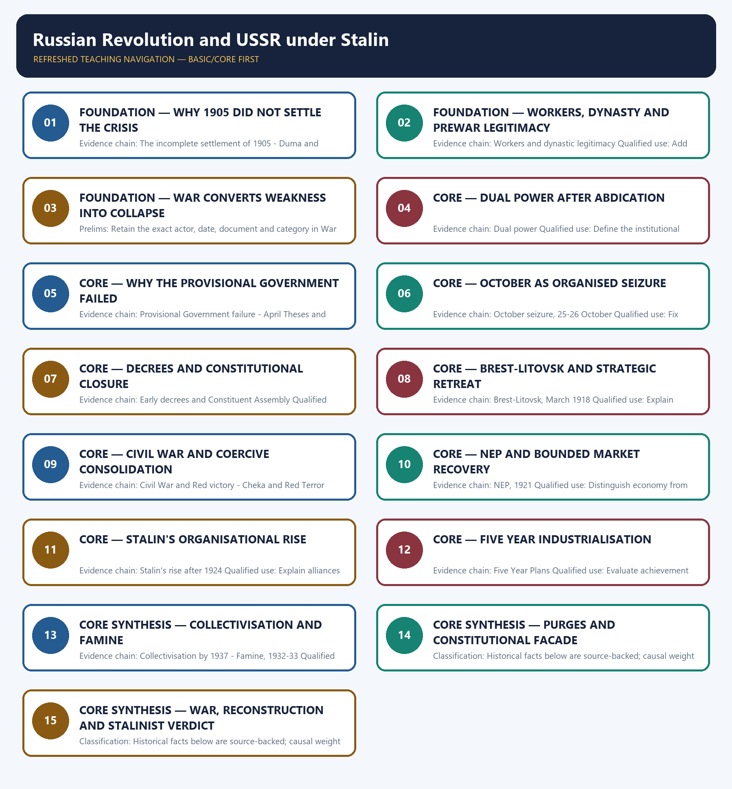

# Russian Revolution and USSR under Stalin — Learner-v2 Complete Learning Session

> **Authoring-only generation:** 2026-09-01. No PDF was rendered and no tracker or index was mutated.

### SOURCE, PROGRESSION AND CURRENT-LINKAGE AUDIT

- **Generation date:** 2026-09-01.
- **Repository-first evidence:** the Basic owner is taught first and preserved in full; the Advanced owner is retained only in the optional final teaching block.
- **OCR evidence:** Repository Markdown was used first. The available OCR-searchable Norman Lowe World History PDF was retained as supplementary local context, but no unsupported page number, quotation or precision was imported from it.
- **Qdrant:** not used; repository Markdown and available OCR context were sufficient.
- **PYQ integrity:** No direct UPSC PYQ is verified as owned solely by this topic in the local routing blocks. All six Mains demands are original practice.
- **Live-link boundary:** No verified live current-affairs item is pegged to this historical topic in the repository owners. The package therefore uses the bounded phrase 'no verified live item' rather than inventing a headline, date, institution or contemporary linkage.
- **Fact/inference discipline:** no current-affairs item, PYQ wording, figure or quotation is invented.

## BASIC LEARNING SESSION

### DEEP-REVIEW LEARNING CONTRACT

| Control | Binding rule for this package |
|---|---|
| Syllabus boundary | Complete World History Core is taught chronologically, spatially and causally before optional enrichment. |
| Evidence method | Claim → named event/treaty/institution/actor/region or attributed scholarship → analysis → qualification. |
| Chronology | Structural cause, trigger, event, settlement, implementation and long-term process remain distinct. |
| Geography | Europe, Africa, Asia, West Asia and the Americas retain their own actors, routes and unequal connections; Europe is never the default universal viewpoint. |
| Historiography | Liberal, conservative, Marxist, social, feminist, postcolonial and other relevant interpretations are tied to evidence and bounded claims. |
| Practice contract | Every solved item has directive/demand decoding, an examiner-grade model, an executable timed/compression plan, marks rationale and answer-specific improvement. |
| Approval | This immutable successor remains `approved: false` pending explicit approval. |

**Canonical Basic/Core owner:** `upsc-ai-kit\knowledge\World-History\basic\13_Russian-Revolution-and-USSR-under-Stalin.md`  
**Canonical topic owner:** `upsc-ai-kit\knowledge\World-History\basic\13_Russian-Revolution-and-USSR-under-Stalin.md`  
**Optional Advanced owner:** `upsc-ai-kit\knowledge\World-History\advanced\13_Russian-Revolution-and-USSR-under-Stalin.md`  
**Official syllabus mapping:** `upsc-ai-kit\knowledge\World-History\OFFICIAL-UPSC-SYLLABUS-MAPPING.md`

### EVIDENCE, PYQ AND CURRENT-STATUS CONTROL

- **Primary/official evidence:** treaties, declarations, laws, institutional records, speeches and contemporary testimony are dated and read for authorship, audience and purpose.
- **Spatial and social evidence:** maps, trade and migration routes, battlefield geography, class, race, gender and colonial position qualify state-centred narrative.
- **Quantitative evidence:** population, debt, inflation, output, casualties and territorial claims retain unit, place, period, source and uncertainty; no statistic is invented.
- **Interpretive discipline:** teleology, civilisational ranking, single-cause verdicts and present-day nation-state projection are rejected.
- **PYQ discipline:** repository routing ledgers and locally held papers control wording and metadata; neutral rendering, reconstruction and unavailable official keys remain explicitly labelled.
- **Current-status note, rechecked 2026-09-01:** No verified live current-affairs item is pegged to this historical topic in the repository owners. The package therefore uses the bounded phrase 'no verified live item' rather than inventing a headline, date, institution or contemporary linkage.

**Live/primary context sources recorded by the predecessor generation:**

- No live source is required for a static historical claim in this topic.




*Distinct embedded teaching-navigation image. The separate continuous Cārvāka-style flowchart package remains an independent at-a-glance artifact.*

### SESSION 1 — FOUNDATION — WHY 1905 DID NOT SETTLE THE CRISIS

#### DEFINITION / WHAT THIS IS CALLED

**Plain-language definition:** Precise definition: Why 1905 did not settle the crisis is the source-bounded relationship among The incomplete settlement of 1905 and Duma and agrarian limits within Russian Revolution and USSR under Stalin.

**Technical definition:** Evidence chain: The incomplete settlement of 1905 - Duma and agrarian limits Qualified use: Begin with incomplete constitutional and agrarian reform.

#### ANSWER-GRABBING OPENING — WRITE/ADAPT IN THE EXAM

> Precise definition: Why 1905 did not settle the crisis is the source-bounded relationship among The incomplete settlement of 1905 and Duma and agrarian limits within Russian Revolution and USSR under Stalin.

#### MUST-WRITE KEYWORDS

- **FOUNDATION**
- **Why 1905 did not settle the crisis**
- **Precise definition**
- **Evidence chain**
- **Qualified use**
- **Precise**

**How to use them:** Frame the answer through FOUNDATION; define Why 1905 did not settle the crisis, connect Precise definition with Evidence chain to explain the mechanism, and use Qualified use for the decisive comparison or qualification.

##### VISUAL FIRST

```text
WHY 1905 DID NOT SETTLE THE CRISIS
01. The incomplete settlement of 1905
    |
    v
02. Duma and agrarian limits
BOUNDARY -> Stabilisation after 1905 was real but shallow.
```

*This topic-specific rail fixes the evidence sequence and its exam boundary before analysis.*

##### CONCEPT DEFINITIONS

- **Precise definition:** Why 1905 did not settle the crisis is the source-bounded relationship among The incomplete settlement of 1905 and Duma and agrarian limits within Russian Revolution and USSR under Stalin.
- **Classification:** Historical facts below are source-backed; causal weight and evaluative verdicts are analytical synthesis.

##### CORE EXPLANATION

Defeat by Japan and unrest forced the October Manifesto and promise of a Duma, but divided opposition and army loyalty allowed Nicholas II to survive. The first two Dumas were dissolved, while Stolypin's reforms and abolition of redemption payments did not resolve land hunger for most peasants.

##### NAMED EVIDENCE AND MECHANISM

- Defeat by Japan and unrest forced the October Manifesto and promise of a Duma, but divided opposition and army loyalty allowed Nicholas II to survive.
- The first two Dumas were dissolved, while Stolypin's reforms and abolition of redemption payments did not resolve land hunger for most peasants.

##### EXAMINER CAUTION

- Stabilisation after 1905 was real but shallow.

##### EXAM LINK

- **Prelims:** Retain the exact actor, date, document and category in Why 1905 did not settle the crisis.
- **Mains:** Begin with incomplete constitutional and agrarian reform.

##### MINI RECAP

- **Evidence chain:** The incomplete settlement of 1905 -> Duma and agrarian limits
- **Qualified use:** Begin with incomplete constitutional and agrarian reform.

#### CLOSING RECALL FLOW — FOUNDATION — WHY 1905 DID NOT SETTLE THE CRISIS

```text
START / CONCEPT: FOUNDATION — Why 1905 did not settle the crisis
        |
        v
EXACT TERMS: FOUNDATION · Why 1905 did not settle the crisis · Precise definition · Evidence chain · Qualified use · Precise
        |
        v
MECHANISM / ARGUMENT: Evidence chain: The incomplete settlement of 1905 - Duma and agrarian limits Qualified use: Begin with incomplete constitutional and agrarian reform.
        |
        v
CONSEQUENCE / CONTRAST: The first two Dumas were dissolved, while Stolypin's reforms and abolition of redemption payments did not resolve land hunger for most peasants.
        |
        v
UPSC TRAP / ANSWER-USE: Stabilisation after 1905 was real but shallow.
        |
        v
ANSWER-GRABBING FORMULATION: Precise definition: Why 1905 did not settle the crisis is the source-bounded relationship among The incomplete settlement of 1905 and Duma and agrarian limits within Russian Revolution and USSR under Stalin.
```
### SESSION 2 — FOUNDATION — WORKERS, DYNASTY AND PREWAR LEGITIMACY

#### DEFINITION / WHAT THIS IS CALLED

**Plain-language definition:** Precise definition: Workers, dynasty and prewar legitimacy is the source-bounded relationship among and Workers and dynastic legitimacy within Russian Revolution and USSR under Stalin.

**Technical definition:** Evidence chain: Workers and dynastic legitimacy Qualified use: Add labour and personal-rule weakness.

#### ANSWER-GRABBING OPENING — WRITE/ADAPT IN THE EXAM

> Precise definition: Workers, dynasty and prewar legitimacy is the source-bounded relationship among and Workers and dynastic legitimacy within Russian Revolution and USSR under Stalin.

#### MUST-WRITE KEYWORDS

- **FOUNDATION**
- **Workers**
- **dynasty**
- **prewar legitimacy**
- **Precise definition**
- **Evidence chain**

**How to use them:** Frame the answer through FOUNDATION; define Workers, connect dynasty with prewar legitimacy to explain the mechanism, and use Precise definition for the decisive comparison or qualification.

##### VISUAL FIRST

```text
WORKERS, DYNASTY AND PREWAR LEGITIMACY
01. Workers and dynastic legitimacy
BOUNDARY -> Rasputin is a symptom, not a complete cause.
```

*This topic-specific rail fixes the evidence sequence and its exam boundary before analysis.*

##### CONCEPT DEFINITIONS

- **Precise definition:** Workers, dynasty and prewar legitimacy is the source-bounded relationship among  and Workers and dynastic legitimacy within Russian Revolution and USSR under Stalin.
- **Classification:** Historical facts below are source-backed; causal weight and evaluative verdicts are analytical synthesis.

##### CORE EXPLANATION

Strike waves revived after 1912, repression continued and the Rasputin scandal deepened distrust of the royal family.

##### NAMED EVIDENCE AND MECHANISM

- Strike waves revived after 1912, repression continued and the Rasputin scandal deepened distrust of the royal family.

##### EXAMINER CAUTION

- Rasputin is a symptom, not a complete cause.

##### EXAM LINK

- **Prelims:** Retain the exact actor, date, document and category in Workers, dynasty and prewar legitimacy.
- **Mains:** Add labour and personal-rule weakness.

##### MINI RECAP

- **Evidence chain:** Workers and dynastic legitimacy
- **Qualified use:** Add labour and personal-rule weakness.

#### CLOSING RECALL FLOW — FOUNDATION — WORKERS, DYNASTY AND PREWAR LEGITIMACY

```text
START / CONCEPT: FOUNDATION — Workers, dynasty and prewar legitimacy
        |
        v
EXACT TERMS: FOUNDATION · Workers · dynasty · prewar legitimacy · Precise definition · Evidence chain
        |
        v
MECHANISM / ARGUMENT: Evidence chain: Workers and dynastic legitimacy Qualified use: Add labour and personal-rule weakness.
        |
        v
CONSEQUENCE / CONTRAST: Rasputin is a symptom, not a complete cause.
        |
        v
UPSC TRAP / ANSWER-USE: Do not miss this limiting distinction: causal weight and evaluative verdicts are analytical synthesis.
        |
        v
ANSWER-GRABBING FORMULATION: Precise definition: Workers, dynasty and prewar legitimacy is the source-bounded relationship among and Workers and dynastic legitimacy within Russian Revolution and USSR under Stalin.
```
### SESSION 3 — FOUNDATION — WAR CONVERTS WEAKNESS INTO COLLAPSE

#### DEFINITION / WHAT THIS IS CALLED

**Plain-language definition:** Precise definition: War converts weakness into collapse is the source-bounded relationship among First World War as accelerator and February Revolution and abdication within Russian Revolution and USSR under Stalin.

**Technical definition:** Prelims: Retain the exact actor, date, document and category in War converts weakness into collapse.

#### ANSWER-GRABBING OPENING — WRITE/ADAPT IN THE EXAM

> Precise definition: War converts weakness into collapse is the source-bounded relationship among First World War as accelerator and February Revolution and abdication within Russian Revolution and USSR under Stalin.

#### MUST-WRITE KEYWORDS

- **FOUNDATION**
- **War converts weakness into collapse**
- **Precise definition**
- **Evidence chain**
- **Qualified use**
- **Precise**

**How to use them:** Frame the answer through FOUNDATION; define War converts weakness into collapse, connect Precise definition with Evidence chain to explain the mechanism, and use Qualified use for the decisive comparison or qualification.

##### VISUAL FIRST

```text
WAR CONVERTS WEAKNESS INTO COLLAPSE
01. First World War as accelerator
    |
    v
02. February Revolution and abdication
BOUNDARY -> The war accelerated rather than created every grievance.
```

*This topic-specific rail fixes the evidence sequence and its exam boundary before analysis.*

##### CONCEPT DEFINITIONS

- **Precise definition:** War converts weakness into collapse is the source-bounded relationship among First World War as accelerator and February Revolution and abdication within Russian Revolution and USSR under Stalin.
- **Classification:** Historical facts below are source-backed; causal weight and evaluative verdicts are analytical synthesis.

##### CORE EXPLANATION

Defeats, shortages, transport breakdown and administrative incompetence converted long-standing legitimacy weakness into state collapse. Bread riots, strikes and mutiny in Petrograd led the Duma and senior generals to abandon Nicholas II, who abdicated on 2 March 1917.

##### NAMED EVIDENCE AND MECHANISM

- Defeats, shortages, transport breakdown and administrative incompetence converted long-standing legitimacy weakness into state collapse.
- Bread riots, strikes and mutiny in Petrograd led the Duma and senior generals to abandon Nicholas II, who abdicated on 2 March 1917.

##### EXAMINER CAUTION

- The war accelerated rather than created every grievance.

##### EXAM LINK

- **Prelims:** Retain the exact actor, date, document and category in War converts weakness into collapse.
- **Mains:** Explain February through capacity failure.

##### MINI RECAP

- **Evidence chain:** First World War as accelerator -> February Revolution and abdication
- **Qualified use:** Explain February through capacity failure.

#### CLOSING RECALL FLOW — FOUNDATION — WAR CONVERTS WEAKNESS INTO COLLAPSE

```text
START / CONCEPT: FOUNDATION — War converts weakness into collapse
        |
        v
EXACT TERMS: FOUNDATION · War converts weakness into collapse · Precise definition · Evidence chain · Qualified use · Precise
        |
        v
MECHANISM / ARGUMENT: Prelims: Retain the exact actor, date, document and category in War converts weakness into collapse.
        |
        v
CONSEQUENCE / CONTRAST: Evidence chain: First World War as accelerator - February Revolution and abdication Qualified use: Explain February through capacity failure.
        |
        v
UPSC TRAP / ANSWER-USE: Do not miss this limiting distinction: causal weight and evaluative verdicts are analytical synthesis.
        |
        v
ANSWER-GRABBING FORMULATION: Precise definition: War converts weakness into collapse is the source-bounded relationship among First World War as accelerator and February Revolution and abdication within Russian Revolution and USSR under Stalin.
```
### SESSION 4 — CORE — DUAL POWER AFTER ABDICATION

#### DEFINITION / WHAT THIS IS CALLED

**Plain-language definition:** Precise definition: Dual power after abdication is the source-bounded relationship among and Dual power within Russian Revolution and USSR under Stalin.

**Technical definition:** Evidence chain: Dual power Qualified use: Define the institutional contradiction.

#### ANSWER-GRABBING OPENING — WRITE/ADAPT IN THE EXAM

> Precise definition: Dual power after abdication is the source-bounded relationship among and Dual power within Russian Revolution and USSR under Stalin.

#### MUST-WRITE KEYWORDS

- **Dual power after abdication**
- **Precise definition**
- **Evidence chain**
- **Qualified use**
- **Precise definition: Dual power after abdication**
- **Precise**

**How to use them:** Frame the answer through Dual power after abdication; define Precise definition, connect Evidence chain with Qualified use to explain the mechanism, and use Precise definition: Dual power after abdication for the decisive comparison or qualification.

##### VISUAL FIRST

```text
DUAL POWER AFTER ABDICATION
01. Dual power
BOUNDARY -> Formal office and enforceable authority were separated.
```

*This topic-specific rail fixes the evidence sequence and its exam boundary before analysis.*

##### CONCEPT DEFINITIONS

- **Precise definition:** Dual power after abdication is the source-bounded relationship among  and Dual power within Russian Revolution and USSR under Stalin.
- **Classification:** Historical facts below are source-backed; causal weight and evaluative verdicts are analytical synthesis.

##### CORE EXPLANATION

The Provisional Government held formal office while the Petrograd soviet commanded much of the loyalty needed to enforce decisions.

##### NAMED EVIDENCE AND MECHANISM

- The Provisional Government held formal office while the Petrograd soviet commanded much of the loyalty needed to enforce decisions.

##### EXAMINER CAUTION

- Formal office and enforceable authority were separated.

##### EXAM LINK

- **Prelims:** Retain the exact actor, date, document and category in Dual power after abdication.
- **Mains:** Define the institutional contradiction.

##### MINI RECAP

- **Evidence chain:** Dual power
- **Qualified use:** Define the institutional contradiction.

#### CLOSING RECALL FLOW — CORE — DUAL POWER AFTER ABDICATION

```text
START / CONCEPT: CORE — Dual power after abdication
        |
        v
EXACT TERMS: Dual power after abdication · Precise definition · Evidence chain · Qualified use · Precise definition: Dual power after abdication · Precise
        |
        v
MECHANISM / ARGUMENT: Evidence chain: Dual power Qualified use: Define the institutional contradiction.
        |
        v
CONSEQUENCE / CONTRAST: Classification: Historical facts below are source-backed; causal weight and evaluative verdicts are analytical synthesis.
        |
        v
UPSC TRAP / ANSWER-USE: Do not miss this limiting distinction: formal office and enforceable authority were separated.
        |
        v
ANSWER-GRABBING FORMULATION: Precise definition: Dual power after abdication is the source-bounded relationship among and Dual power within Russian Revolution and USSR under Stalin.
```
### SESSION 5 — CORE — WHY THE PROVISIONAL GOVERNMENT FAILED

#### DEFINITION / WHAT THIS IS CALLED

**Plain-language definition:** Precise definition: Why the Provisional Government failed is the source-bounded relationship among Provisional Government failure and April Theses and Kornilov affair within Russian Revolution and USSR under Stalin.

**Technical definition:** Evidence chain: Provisional Government failure - April Theses and Kornilov affair Qualified use: Show the Bolshevik alternative gaining credibility.

#### ANSWER-GRABBING OPENING — WRITE/ADAPT IN THE EXAM

> Precise definition: Why the Provisional Government failed is the source-bounded relationship among Provisional Government failure and April Theses and Kornilov affair within Russian Revolution and USSR under Stalin.

#### MUST-WRITE KEYWORDS

- **Why the Provisional Government failed**
- **Precise definition**
- **Evidence chain**
- **Qualified use**
- **Precise definition: Why the Provisional Government failed**
- **Precise**

**How to use them:** Frame the answer through Why the Provisional Government failed; define Precise definition, connect Evidence chain with Qualified use to explain the mechanism, and use Precise definition: Why the Provisional Government failed for the decisive comparison or qualification.

##### VISUAL FIRST

```text
WHY THE PROVISIONAL GOVERNMENT FAILED
01. Provisional Government failure
    |
    v
02. April Theses and Kornilov affair
BOUNDARY -> War, land and Kornilov must appear together.
```

*This topic-specific rail fixes the evidence sequence and its exam boundary before analysis.*

##### CONCEPT DEFINITIONS

- **Precise definition:** Why the Provisional Government failed is the source-bounded relationship among Provisional Government failure and April Theses and Kornilov affair within Russian Revolution and USSR under Stalin.
- **Classification:** Historical facts below are source-backed; causal weight and evaluative verdicts are analytical synthesis.

##### CORE EXPLANATION

Continuation of war, delayed land reform and elections, inflation, shortages and divided authority steadily destroyed the government's legitimacy. Lenin's peace-land-soviet programme sharpened the alternative, while the Kornilov affair discredited Kerensky and strengthened the Bolsheviks.

##### NAMED EVIDENCE AND MECHANISM

- Continuation of war, delayed land reform and elections, inflation, shortages and divided authority steadily destroyed the government's legitimacy.
- Lenin's peace-land-soviet programme sharpened the alternative, while the Kornilov affair discredited Kerensky and strengthened the Bolsheviks.

##### EXAMINER CAUTION

- War, land and Kornilov must appear together.

##### EXAM LINK

- **Prelims:** Retain the exact actor, date, document and category in Why the Provisional Government failed.
- **Mains:** Show the Bolshevik alternative gaining credibility.

##### MINI RECAP

- **Evidence chain:** Provisional Government failure -> April Theses and Kornilov affair
- **Qualified use:** Show the Bolshevik alternative gaining credibility.

#### CLOSING RECALL FLOW — CORE — WHY THE PROVISIONAL GOVERNMENT FAILED

```text
START / CONCEPT: CORE — Why the Provisional Government failed
        |
        v
EXACT TERMS: Why the Provisional Government failed · Precise definition · Evidence chain · Qualified use · Precise definition: Why the Provisional Government failed · Precise
        |
        v
MECHANISM / ARGUMENT: Evidence chain: Provisional Government failure - April Theses and Kornilov affair Qualified use: Show the Bolshevik alternative gaining credibility.
        |
        v
CONSEQUENCE / CONTRAST: Classification: Historical facts below are source-backed; causal weight and evaluative verdicts are analytical synthesis.
        |
        v
UPSC TRAP / ANSWER-USE: Do not miss this limiting distinction: war, land and Kornilov must appear together.
        |
        v
ANSWER-GRABBING FORMULATION: Precise definition: Why the Provisional Government failed is the source-bounded relationship among Provisional Government failure and April Theses and Kornilov affair within Russian Revolution and USSR under Stalin.
```
### SESSION 6 — CORE — OCTOBER AS ORGANISED SEIZURE

#### DEFINITION / WHAT THIS IS CALLED

**Plain-language definition:** Precise definition: October as organised seizure is the source-bounded relationship among and October seizure, 25-26 October within Russian Revolution and USSR under Stalin.

**Technical definition:** Evidence chain: October seizure, 25-26 October Qualified use: Fix actors and dates.

#### ANSWER-GRABBING OPENING — WRITE/ADAPT IN THE EXAM

> Precise definition: October as organised seizure is the source-bounded relationship among and October seizure, 25-26 October within Russian Revolution and USSR under Stalin.

#### MUST-WRITE KEYWORDS

- **October as organised seizure**
- **Precise definition**
- **Evidence chain**
- **Qualified use**
- **Precise definition: October as organised seizure**
- **Precise**

**How to use them:** Frame the answer through October as organised seizure; define Precise definition, connect Evidence chain with Qualified use to explain the mechanism, and use Precise definition: October as organised seizure for the decisive comparison or qualification.

##### VISUAL FIRST

```text
OCTOBER AS ORGANISED SEIZURE
01. October seizure, 25-26 October
BOUNDARY -> Do not merge popular support with spontaneous collapse.
```

*This topic-specific rail fixes the evidence sequence and its exam boundary before analysis.*

##### CONCEPT DEFINITIONS

- **Precise definition:** October as organised seizure is the source-bounded relationship among  and October seizure, 25-26 October within Russian Revolution and USSR under Stalin.
- **Classification:** Historical facts below are source-backed; causal weight and evaluative verdicts are analytical synthesis.

##### CORE EXPLANATION

Red Guards and pro-soviet troops occupied key Petrograd points and arrested Provisional Government ministers on the night of 25-26 October.

##### NAMED EVIDENCE AND MECHANISM

- Red Guards and pro-soviet troops occupied key Petrograd points and arrested Provisional Government ministers on the night of 25-26 October.

##### EXAMINER CAUTION

- Do not merge popular support with spontaneous collapse.

##### EXAM LINK

- **Prelims:** Retain the exact actor, date, document and category in October as organised seizure.
- **Mains:** Fix actors and dates.

##### MINI RECAP

- **Evidence chain:** October seizure, 25-26 October
- **Qualified use:** Fix actors and dates.

#### CLOSING RECALL FLOW — CORE — OCTOBER AS ORGANISED SEIZURE

```text
START / CONCEPT: CORE — October as organised seizure
        |
        v
EXACT TERMS: October as organised seizure · Precise definition · Evidence chain · Qualified use · Precise definition: October as organised seizure · Precise
        |
        v
MECHANISM / ARGUMENT: Evidence chain: October seizure, 25-26 October Qualified use: Fix actors and dates.
        |
        v
CONSEQUENCE / CONTRAST: Do not merge popular support with spontaneous collapse.
        |
        v
UPSC TRAP / ANSWER-USE: Do not miss this limiting distinction: causal weight and evaluative verdicts are analytical synthesis.
        |
        v
ANSWER-GRABBING FORMULATION: Precise definition: October as organised seizure is the source-bounded relationship among and October seizure, 25-26 October within Russian Revolution and USSR under Stalin.
```
### SESSION 7 — CORE — DECREES AND CONSTITUTIONAL CLOSURE

#### DEFINITION / WHAT THIS IS CALLED

**Plain-language definition:** Precise definition: Decrees and constitutional closure is the source-bounded relationship among and Early decrees and Constituent Assembly within Russian Revolution and USSR under Stalin.

**Technical definition:** Evidence chain: Early decrees and Constituent Assembly Qualified use: Trace delivery and monopoly together.

#### ANSWER-GRABBING OPENING — WRITE/ADAPT IN THE EXAM

> Precise definition: Decrees and constitutional closure is the source-bounded relationship among and Early decrees and Constituent Assembly within Russian Revolution and USSR under Stalin.

#### MUST-WRITE KEYWORDS

- **Decrees**
- **constitutional closure**
- **Precise definition**
- **Evidence chain**
- **Qualified use**
- **Precise definition: Decrees and constitutional closure**

**How to use them:** Frame the answer through Decrees; define constitutional closure, connect Precise definition with Evidence chain to explain the mechanism, and use Qualified use for the decisive comparison or qualification.

##### VISUAL FIRST

```text
DECREES AND CONSTITUTIONAL CLOSURE
01. Early decrees and Constituent Assembly
BOUNDARY -> The Assembly dispersal is central to Lenin-Stalin continuity.
```

*This topic-specific rail fixes the evidence sequence and its exam boundary before analysis.*

##### CONCEPT DEFINITIONS

- **Precise definition:** Decrees and constitutional closure is the source-bounded relationship among  and Early decrees and Constituent Assembly within Russian Revolution and USSR under Stalin.
- **Classification:** Historical facts below are source-backed; causal weight and evaluative verdicts are analytical synthesis.

##### CORE EXPLANATION

The Bolsheviks nationalised land and widened economic controls, then dispersed the Assembly in January 1918 after failing to win a majority.

##### NAMED EVIDENCE AND MECHANISM

- The Bolsheviks nationalised land and widened economic controls, then dispersed the Assembly in January 1918 after failing to win a majority.

##### EXAMINER CAUTION

- The Assembly dispersal is central to Lenin-Stalin continuity.

##### EXAM LINK

- **Prelims:** Retain the exact actor, date, document and category in Decrees and constitutional closure.
- **Mains:** Trace delivery and monopoly together.

##### MINI RECAP

- **Evidence chain:** Early decrees and Constituent Assembly
- **Qualified use:** Trace delivery and monopoly together.

#### CLOSING RECALL FLOW — CORE — DECREES AND CONSTITUTIONAL CLOSURE

```text
START / CONCEPT: CORE — Decrees and constitutional closure
        |
        v
EXACT TERMS: Decrees · constitutional closure · Precise definition · Evidence chain · Qualified use · Precise definition: Decrees and constitutional closure
        |
        v
MECHANISM / ARGUMENT: Evidence chain: Early decrees and Constituent Assembly Qualified use: Trace delivery and monopoly together.
        |
        v
CONSEQUENCE / CONTRAST: Classification: Historical facts below are source-backed; causal weight and evaluative verdicts are analytical synthesis.
        |
        v
UPSC TRAP / ANSWER-USE: Do not miss this limiting distinction: the Bolsheviks nationalised land and widened economic controls, then dispersed the Assembly in January...
        |
        v
ANSWER-GRABBING FORMULATION: Precise definition: Decrees and constitutional closure is the source-bounded relationship among and Early decrees and Constituent Assembly within Russian Revolution and USSR under Stalin.
```
### SESSION 8 — CORE — BREST-LITOVSK AND STRATEGIC RETREAT

#### DEFINITION / WHAT THIS IS CALLED

**Plain-language definition:** Precise definition: Brest-Litovsk and strategic retreat is the source-bounded relationship among and Brest-Litovsk, March 1918 within Russian Revolution and USSR under Stalin.

**Technical definition:** Evidence chain: Brest-Litovsk, March 1918 Qualified use: Explain Lenin's time-for-space calculation.

#### ANSWER-GRABBING OPENING — WRITE/ADAPT IN THE EXAM

> Precise definition: Brest-Litovsk and strategic retreat is the source-bounded relationship among and Brest-Litovsk, March 1918 within Russian Revolution and USSR under Stalin.

#### MUST-WRITE KEYWORDS

- **Brest-Litovsk**
- **strategic retreat**
- **Precise definition**
- **Evidence chain**
- **Qualified use**
- **Precise definition: Brest-Litovsk and strategic retreat**

**How to use them:** Frame the answer through Brest-Litovsk; define strategic retreat, connect Precise definition with Evidence chain to explain the mechanism, and use Qualified use for the decisive comparison or qualification.

##### VISUAL FIRST

```text
BREST-LITOVSK AND STRATEGIC RETREAT
01. Brest-Litovsk, March 1918
BOUNDARY -> Territorial sacrifice served regime survival.
```

*This topic-specific rail fixes the evidence sequence and its exam boundary before analysis.*

##### CONCEPT DEFINITIONS

- **Precise definition:** Brest-Litovsk and strategic retreat is the source-bounded relationship among  and Brest-Litovsk, March 1918 within Russian Revolution and USSR under Stalin.
- **Classification:** Historical facts below are source-backed; causal weight and evaluative verdicts are analytical synthesis.

##### CORE EXPLANATION

Lenin accepted enormous territorial losses at Brest-Litovsk to remove Russia from war and gain time for the new regime.

##### NAMED EVIDENCE AND MECHANISM

- Lenin accepted enormous territorial losses at Brest-Litovsk to remove Russia from war and gain time for the new regime.

##### EXAMINER CAUTION

- Territorial sacrifice served regime survival.

##### EXAM LINK

- **Prelims:** Retain the exact actor, date, document and category in Brest-Litovsk and strategic retreat.
- **Mains:** Explain Lenin's time-for-space calculation.

##### MINI RECAP

- **Evidence chain:** Brest-Litovsk, March 1918
- **Qualified use:** Explain Lenin's time-for-space calculation.

#### CLOSING RECALL FLOW — CORE — BREST-LITOVSK AND STRATEGIC RETREAT

```text
START / CONCEPT: CORE — Brest-Litovsk and strategic retreat
        |
        v
EXACT TERMS: Brest-Litovsk · strategic retreat · Precise definition · Evidence chain · Qualified use · Precise definition: Brest-Litovsk and strategic retreat
        |
        v
MECHANISM / ARGUMENT: Evidence chain: Brest-Litovsk, March 1918 Qualified use: Explain Lenin's time-for-space calculation.
        |
        v
CONSEQUENCE / CONTRAST: Classification: Historical facts below are source-backed; causal weight and evaluative verdicts are analytical synthesis.
        |
        v
UPSC TRAP / ANSWER-USE: Do not miss this limiting distinction: brest-Litovsk and strategic retreat is the source-bounded relationship among and Brest-Litovsk, March 1918 within...
        |
        v
ANSWER-GRABBING FORMULATION: Precise definition: Brest-Litovsk and strategic retreat is the source-bounded relationship among and Brest-Litovsk, March 1918 within Russian Revolution and USSR under Stalin.
```
### SESSION 9 — CORE — CIVIL WAR AND COERCIVE CONSOLIDATION

#### DEFINITION / WHAT THIS IS CALLED

**Plain-language definition:** Precise definition: Civil War and coercive consolidation is the source-bounded relationship among Civil War and Red victory and Cheka and Red Terror within Russian Revolution and USSR under Stalin.

**Technical definition:** Evidence chain: Civil War and Red victory - Cheka and Red Terror Qualified use: Combine military advantage and terror.

#### ANSWER-GRABBING OPENING — WRITE/ADAPT IN THE EXAM

> Precise definition: Civil War and coercive consolidation is the source-bounded relationship among Civil War and Red victory and Cheka and Red Terror within Russian Revolution and USSR under Stalin.

#### MUST-WRITE KEYWORDS

- **Civil War**
- **coercive consolidation**
- **Precise definition**
- **Evidence chain**
- **Qualified use**
- **1918-20**

**How to use them:** Frame the answer through Civil War; define coercive consolidation, connect Precise definition with Evidence chain to explain the mechanism, and use Qualified use for the decisive comparison or qualification.

##### VISUAL FIRST

```text
CIVIL WAR AND COERCIVE CONSOLIDATION
01. Civil War and Red victory
    |
    v
02. Cheka and Red Terror
BOUNDARY -> Red victory was organisational and geographical, not automatic.
```

*This topic-specific rail fixes the evidence sequence and its exam boundary before analysis.*

##### CONCEPT DEFINITIONS

- **Precise definition:** Civil War and coercive consolidation is the source-bounded relationship among Civil War and Red victory and Cheka and Red Terror within Russian Revolution and USSR under Stalin.
- **Classification:** Historical facts below are source-backed; causal weight and evaluative verdicts are analytical synthesis.

##### CORE EXPLANATION

Central territorial control, firmer Lenin-Trotsky leadership, divided Whites and foreign intervention helped the Reds win the 1918-20 Civil War. The Cheka and Red Terror made coercion constitutive of Bolshevik consolidation rather than a purely Stalinist invention.

##### NAMED EVIDENCE AND MECHANISM

- Central territorial control, firmer Lenin-Trotsky leadership, divided Whites and foreign intervention helped the Reds win the 1918-20 Civil War.
- The Cheka and Red Terror made coercion constitutive of Bolshevik consolidation rather than a purely Stalinist invention.

##### EXAMINER CAUTION

- Red victory was organisational and geographical, not automatic.

##### EXAM LINK

- **Prelims:** Retain the exact actor, date, document and category in Civil War and coercive consolidation.
- **Mains:** Combine military advantage and terror.

##### MINI RECAP

- **Evidence chain:** Civil War and Red victory -> Cheka and Red Terror
- **Qualified use:** Combine military advantage and terror.

#### CLOSING RECALL FLOW — CORE — CIVIL WAR AND COERCIVE CONSOLIDATION

```text
START / CONCEPT: CORE — Civil War and coercive consolidation
        |
        v
EXACT TERMS: Civil War · coercive consolidation · Precise definition · Evidence chain · Qualified use · 1918-20
        |
        v
MECHANISM / ARGUMENT: Evidence chain: Civil War and Red victory - Cheka and Red Terror Qualified use: Combine military advantage and terror.
        |
        v
CONSEQUENCE / CONTRAST: Red victory was organisational and geographical, not automatic.
        |
        v
UPSC TRAP / ANSWER-USE: Do not miss this limiting distinction: causal weight and evaluative verdicts are analytical synthesis.
        |
        v
ANSWER-GRABBING FORMULATION: Precise definition: Civil War and coercive consolidation is the source-bounded relationship among Civil War and Red victory and Cheka and Red Terror within Russian Revolution and USSR under Stalin.
```
### SESSION 10 — CORE — NEP AND BOUNDED MARKET RECOVERY

#### DEFINITION / WHAT THIS IS CALLED

**Plain-language definition:** Precise definition: NEP and bounded market recovery is the source-bounded relationship among and NEP, 1921 within Russian Revolution and USSR under Stalin.

**Technical definition:** Evidence chain: NEP, 1921 Qualified use: Distinguish economy from politics.

#### ANSWER-GRABBING OPENING — WRITE/ADAPT IN THE EXAM

> Precise definition: NEP and bounded market recovery is the source-bounded relationship among and NEP, 1921 within Russian Revolution and USSR under Stalin.

#### MUST-WRITE KEYWORDS

- **NEP**
- **bounded market recovery**
- **Precise definition**
- **Evidence chain**
- **Qualified use**
- **Precise definition: NEP and bounded market recovery**

**How to use them:** Frame the answer through NEP; define bounded market recovery, connect Precise definition with Evidence chain to explain the mechanism, and use Qualified use for the decisive comparison or qualification.

##### VISUAL FIRST

```text
NEP AND BOUNDED MARKET RECOVERY
01. NEP, 1921
BOUNDARY -> Market mechanisms did not end one-party rule.
```

*This topic-specific rail fixes the evidence sequence and its exam boundary before analysis.*

##### CONCEPT DEFINITIONS

- **Precise definition:** NEP and bounded market recovery is the source-bounded relationship among  and NEP, 1921 within Russian Revolution and USSR under Stalin.
- **Classification:** Historical facts below are source-backed; causal weight and evaluative verdicts are analytical synthesis.

##### CORE EXPLANATION

The New Economic Policy restored peasant incentives and small trade while heavy industry, banking, transport and communist political control remained with the state.

##### NAMED EVIDENCE AND MECHANISM

- The New Economic Policy restored peasant incentives and small trade while heavy industry, banking, transport and communist political control remained with the state.

##### EXAMINER CAUTION

- Market mechanisms did not end one-party rule.

##### EXAM LINK

- **Prelims:** Retain the exact actor, date, document and category in NEP and bounded market recovery.
- **Mains:** Distinguish economy from politics.

##### MINI RECAP

- **Evidence chain:** NEP, 1921
- **Qualified use:** Distinguish economy from politics.

#### CLOSING RECALL FLOW — CORE — NEP AND BOUNDED MARKET RECOVERY

```text
START / CONCEPT: CORE — NEP and bounded market recovery
        |
        v
EXACT TERMS: NEP · bounded market recovery · Precise definition · Evidence chain · Qualified use · Precise definition: NEP and bounded market recovery
        |
        v
MECHANISM / ARGUMENT: Evidence chain: NEP, 1921 Qualified use: Distinguish economy from politics.
        |
        v
CONSEQUENCE / CONTRAST: Classification: Historical facts below are source-backed; causal weight and evaluative verdicts are analytical synthesis.
        |
        v
UPSC TRAP / ANSWER-USE: Do not miss this limiting distinction: nEP and bounded market recovery is the source-bounded relationship among and NEP, 1921 within...
        |
        v
ANSWER-GRABBING FORMULATION: Precise definition: NEP and bounded market recovery is the source-bounded relationship among and NEP, 1921 within Russian Revolution and USSR under Stalin.
```
### SESSION 11 — CORE — STALIN'S ORGANISATIONAL RISE

#### DEFINITION / WHAT THIS IS CALLED

**Plain-language definition:** Precise definition: Stalin's organisational rise is the source-bounded relationship among and Stalin's rise after 1924 within Russian Revolution and USSR under Stalin.

**Technical definition:** Evidence chain: Stalin's rise after 1924 Qualified use: Explain alliances and General Secretary power.

#### ANSWER-GRABBING OPENING — WRITE/ADAPT IN THE EXAM

> Precise definition: Stalin's organisational rise is the source-bounded relationship among and Stalin's rise after 1924 within Russian Revolution and USSR under Stalin.

#### MUST-WRITE KEYWORDS

- **Stalin's organisational rise**
- **Precise definition**
- **Evidence chain**
- **Qualified use**
- **Precise definition: Stalin's organisational rise**
- **Precise**

**How to use them:** Frame the answer through Stalin's organisational rise; define Precise definition, connect Evidence chain with Qualified use to explain the mechanism, and use Precise definition: Stalin's organisational rise for the decisive comparison or qualification.

##### VISUAL FIRST

```text
STALIN'S ORGANISATIONAL RISE
01. Stalin's rise after 1924
BOUNDARY -> Succession was a struggle, not predetermined inheritance.
```

*This topic-specific rail fixes the evidence sequence and its exam boundary before analysis.*

##### CONCEPT DEFINITIONS

- **Precise definition:** Stalin's organisational rise is the source-bounded relationship among  and Stalin's rise after 1924 within Russian Revolution and USSR under Stalin.
- **Classification:** Historical facts below are source-backed; causal weight and evaluative verdicts are analytical synthesis.

##### CORE EXPLANATION

As General Secretary Stalin used organisational position, rivals' underestimation and shifting alliances to isolate Trotsky, Kamenev, Zinoviev and Bukharin.

##### NAMED EVIDENCE AND MECHANISM

- As General Secretary Stalin used organisational position, rivals' underestimation and shifting alliances to isolate Trotsky, Kamenev, Zinoviev and Bukharin.

##### EXAMINER CAUTION

- Succession was a struggle, not predetermined inheritance.

##### EXAM LINK

- **Prelims:** Retain the exact actor, date, document and category in Stalin's organisational rise.
- **Mains:** Explain alliances and General Secretary power.

##### MINI RECAP

- **Evidence chain:** Stalin's rise after 1924
- **Qualified use:** Explain alliances and General Secretary power.

#### CLOSING RECALL FLOW — CORE — STALIN'S ORGANISATIONAL RISE

```text
START / CONCEPT: CORE — Stalin's organisational rise
        |
        v
EXACT TERMS: Stalin's organisational rise · Precise definition · Evidence chain · Qualified use · Precise definition: Stalin's organisational rise · Precise
        |
        v
MECHANISM / ARGUMENT: Evidence chain: Stalin's rise after 1924 Qualified use: Explain alliances and General Secretary power.
        |
        v
CONSEQUENCE / CONTRAST: Succession was a struggle, not predetermined inheritance.
        |
        v
UPSC TRAP / ANSWER-USE: Do not miss this limiting distinction: causal weight and evaluative verdicts are analytical synthesis.
        |
        v
ANSWER-GRABBING FORMULATION: Precise definition: Stalin's organisational rise is the source-bounded relationship among and Stalin's rise after 1924 within Russian Revolution and USSR under Stalin.
```
### SESSION 12 — CORE — FIVE YEAR INDUSTRIALISATION

#### DEFINITION / WHAT THIS IS CALLED

**Plain-language definition:** Precise definition: Five Year industrialisation is the source-bounded relationship among and Five Year Plans within Russian Revolution and USSR under Stalin.

**Technical definition:** Evidence chain: Five Year Plans Qualified use: Evaluate achievement and cost.

#### ANSWER-GRABBING OPENING — WRITE/ADAPT IN THE EXAM

> Precise definition: Five Year industrialisation is the source-bounded relationship among and Five Year Plans within Russian Revolution and USSR under Stalin.

#### MUST-WRITE KEYWORDS

- **Five Year industrialisation**
- **Precise definition**
- **Evidence chain**
- **Qualified use**
- **Precise definition: Five Year industrialisation**
- **Precise**

**How to use them:** Frame the answer through Five Year industrialisation; define Precise definition, connect Evidence chain with Qualified use to explain the mechanism, and use Precise definition: Five Year industrialisation for the decisive comparison or qualification.

##### VISUAL FIRST

```text
FIVE YEAR INDUSTRIALISATION
01. Five Year Plans
BOUNDARY -> Output gains and consumer scarcity belong in one verdict.
```

*This topic-specific rail fixes the evidence sequence and its exam boundary before analysis.*

##### CONCEPT DEFINITIONS

- **Precise definition:** Five Year industrialisation is the source-bounded relationship among  and Five Year Plans within Russian Revolution and USSR under Stalin.
- **Classification:** Historical facts below are source-backed; causal weight and evaluative verdicts are analytical synthesis.

##### CORE EXPLANATION

Rapid heavy-industrial growth in coal, steel, pig iron and electricity came with harsh discipline and poor consumer supply.

##### NAMED EVIDENCE AND MECHANISM

- Rapid heavy-industrial growth in coal, steel, pig iron and electricity came with harsh discipline and poor consumer supply.

##### EXAMINER CAUTION

- Output gains and consumer scarcity belong in one verdict.

##### EXAM LINK

- **Prelims:** Retain the exact actor, date, document and category in Five Year industrialisation.
- **Mains:** Evaluate achievement and cost.

##### MINI RECAP

- **Evidence chain:** Five Year Plans
- **Qualified use:** Evaluate achievement and cost.

#### CLOSING RECALL FLOW — CORE — FIVE YEAR INDUSTRIALISATION

```text
START / CONCEPT: CORE — Five Year industrialisation
        |
        v
EXACT TERMS: Five Year industrialisation · Precise definition · Evidence chain · Qualified use · Precise definition: Five Year industrialisation · Precise
        |
        v
MECHANISM / ARGUMENT: Evidence chain: Five Year Plans Qualified use: Evaluate achievement and cost.
        |
        v
CONSEQUENCE / CONTRAST: Classification: Historical facts below are source-backed; causal weight and evaluative verdicts are analytical synthesis.
        |
        v
UPSC TRAP / ANSWER-USE: Do not miss this limiting distinction: five Year industrialisation is the source-bounded relationship among and Five Year Plans within Russian...
        |
        v
ANSWER-GRABBING FORMULATION: Precise definition: Five Year industrialisation is the source-bounded relationship among and Five Year Plans within Russian Revolution and USSR under Stalin.
```
### SESSION 13 — CORE SYNTHESIS — COLLECTIVISATION AND FAMINE

#### DEFINITION / WHAT THIS IS CALLED

**Plain-language definition:** Precise definition: Collectivisation and famine is the source-bounded relationship among Collectivisation by 1937 and Famine, 1932-33 within Russian Revolution and USSR under Stalin.

**Technical definition:** Evidence chain: Collectivisation by 1937 - Famine, 1932-33 Qualified use: Show state grain control and rural catastrophe.

#### ANSWER-GRABBING OPENING — WRITE/ADAPT IN THE EXAM

> Evidence chain: Collectivisation by 1937 - Famine, 1932-33 Qualified use: Show state grain control and rural catastrophe.

#### MUST-WRITE KEYWORDS

- **CORE SYNTHESIS**
- **Collectivisation**
- **famine**
- **Precise definition**
- **Evidence chain**
- **Qualified use**

**How to use them:** Frame the answer through CORE SYNTHESIS; define Collectivisation, connect famine with Precise definition to explain the mechanism, and use Evidence chain for the decisive comparison or qualification.

##### VISUAL FIRST

```text
COLLECTIVISATION AND FAMINE
01. Collectivisation by 1937
    |
    v
02. Famine, 1932-33
BOUNDARY -> Use the sourced estimate with explicit contestability.
```

*This topic-specific rail fixes the evidence sequence and its exam boundary before analysis.*

##### CONCEPT DEFINITIONS

- **Precise definition:** Collectivisation and famine is the source-bounded relationship among Collectivisation by 1937 and Famine, 1932-33 within Russian Revolution and USSR under Stalin.
- **Classification:** Historical facts below are source-backed; causal weight and evaluative verdicts are analytical synthesis.

##### CORE EXPLANATION

Most farmland was collectivised by 1937, increasing state control of grain but causing resistance, livestock collapse and severe agricultural disruption. Lowe reports estimates above five million deaths during the 1932-33 famine while grain exports continued; totals and responsibility remain contested.

##### NAMED EVIDENCE AND MECHANISM

- Most farmland was collectivised by 1937, increasing state control of grain but causing resistance, livestock collapse and severe agricultural disruption.
- Lowe reports estimates above five million deaths during the 1932-33 famine while grain exports continued; totals and responsibility remain contested.

##### EXAMINER CAUTION

- Use the sourced estimate with explicit contestability.

##### EXAM LINK

- **Prelims:** Retain the exact actor, date, document and category in Collectivisation and famine.
- **Mains:** Show state grain control and rural catastrophe.

##### MINI RECAP

- **Evidence chain:** Collectivisation by 1937 -> Famine, 1932-33
- **Qualified use:** Show state grain control and rural catastrophe.

#### CLOSING RECALL FLOW — CORE SYNTHESIS — COLLECTIVISATION AND FAMINE

```text
START / CONCEPT: CORE SYNTHESIS — Collectivisation and famine
        |
        v
EXACT TERMS: CORE SYNTHESIS · Collectivisation · famine · Precise definition · Evidence chain · Qualified use
        |
        v
MECHANISM / ARGUMENT: Precise definition: Collectivisation and famine is the source-bounded relationship among Collectivisation by 1937 and Famine, 1932-33 within Russian Revolution and USSR under Stalin.
        |
        v
CONSEQUENCE / CONTRAST: Most farmland was collectivised by 1937, increasing state control of grain but causing resistance, livestock collapse and severe agricultural disruption.
        |
        v
UPSC TRAP / ANSWER-USE: Do not miss this limiting distinction: causal weight and evaluative verdicts are analytical synthesis.
        |
        v
ANSWER-GRABBING FORMULATION: Evidence chain: Collectivisation by 1937 - Famine, 1932-33 Qualified use: Show state grain control and rural catastrophe.
```
### SESSION 14 — CORE SYNTHESIS — PURGES AND CONSTITUTIONAL FACADE

#### DEFINITION / WHAT THIS IS CALLED

**Plain-language definition:** Precise definition: Purges and constitutional facade is the source-bounded relationship among and Purges and 1936 Constitution within Russian Revolution and USSR under Stalin.

**Technical definition:** Classification: Historical facts below are source-backed; causal weight and evaluative verdicts are analytical synthesis.

#### ANSWER-GRABBING OPENING — WRITE/ADAPT IN THE EXAM

> Precise definition: Purges and constitutional facade is the source-bounded relationship among and Purges and 1936 Constitution within Russian Revolution and USSR under Stalin.

#### MUST-WRITE KEYWORDS

- **CORE SYNTHESIS**
- **Purges**
- **constitutional facade**
- **Precise definition**
- **Evidence chain**
- **Qualified use**

**How to use them:** Frame the answer through CORE SYNTHESIS; define Purges, connect constitutional facade with Precise definition to explain the mechanism, and use Evidence chain for the decisive comparison or qualification.

##### VISUAL FIRST

```text
PURGES AND CONSTITUTIONAL FACADE
01. Purges and 1936 Constitution
BOUNDARY -> Terror removed expertise as well as opposition.
```

*This topic-specific rail fixes the evidence sequence and its exam boundary before analysis.*

##### CONCEPT DEFINITIONS

- **Precise definition:** Purges and constitutional facade is the source-bounded relationship among  and Purges and 1936 Constitution within Russian Revolution and USSR under Stalin.
- **Classification:** Historical facts below are source-backed; causal weight and evaluative verdicts are analytical synthesis.

##### CORE EXPLANATION

The Purges made Stalin unchallengeable but removed experienced officials and officers, while the 1936 Constitution concealed one-party dictatorship.

##### NAMED EVIDENCE AND MECHANISM

- The Purges made Stalin unchallengeable but removed experienced officials and officers, while the 1936 Constitution concealed one-party dictatorship.

##### EXAMINER CAUTION

- Terror removed expertise as well as opposition.

##### EXAM LINK

- **Prelims:** Retain the exact actor, date, document and category in Purges and constitutional facade.
- **Mains:** Contrast formal constitution and actual rule.

##### MINI RECAP

- **Evidence chain:** Purges and 1936 Constitution
- **Qualified use:** Contrast formal constitution and actual rule.

#### CLOSING RECALL FLOW — CORE SYNTHESIS — PURGES AND CONSTITUTIONAL FACADE

```text
START / CONCEPT: CORE SYNTHESIS — Purges and constitutional facade
        |
        v
EXACT TERMS: CORE SYNTHESIS · Purges · constitutional facade · Precise definition · Evidence chain · Qualified use
        |
        v
MECHANISM / ARGUMENT: Evidence chain: Purges and 1936 Constitution Qualified use: Contrast formal constitution and actual rule.
        |
        v
CONSEQUENCE / CONTRAST: Classification: Historical facts below are source-backed; causal weight and evaluative verdicts are analytical synthesis.
        |
        v
UPSC TRAP / ANSWER-USE: Do not miss this limiting distinction: purges and 1936 Constitution Qualified use.
        |
        v
ANSWER-GRABBING FORMULATION: Precise definition: Purges and constitutional facade is the source-bounded relationship among and Purges and 1936 Constitution within Russian Revolution and USSR under Stalin.
```
### SESSION 15 — CORE SYNTHESIS — WAR, RECONSTRUCTION AND STALINIST VERDICT

#### DEFINITION / WHAT THIS IS CALLED

**Plain-language definition:** Precise definition: War, reconstruction and Stalinist verdict is the source-bounded relationship among War, reconstruction and final repression, Five Year Plans and Purges and 1936 Constitution within Russian Revolution and USSR under Stalin.

**Technical definition:** Classification: Historical facts below are source-backed; causal weight and evaluative verdicts are analytical synthesis.

#### ANSWER-GRABBING OPENING — WRITE/ADAPT IN THE EXAM

> Precise definition: War, reconstruction and Stalinist verdict is the source-bounded relationship among War, reconstruction and final repression, Five Year Plans and Purges and 1936 Constitution within Russian Revolution and USSR under Stalin.

#### MUST-WRITE KEYWORDS

- **CORE SYNTHESIS**
- **War**
- **reconstruction**
- **Stalinist verdict**
- **Precise definition**
- **Evidence chain**

**How to use them:** Frame the answer through CORE SYNTHESIS; define War, connect reconstruction with Stalinist verdict to explain the mechanism, and use Precise definition for the decisive comparison or qualification.

##### VISUAL FIRST

```text
WAR, RECONSTRUCTION AND STALINIST VERDICT
01. War, reconstruction and final repression
    |
    v
02. Five Year Plans
    |
    v
03. Purges and 1936 Constitution
BOUNDARY -> Survival does not erase repression or agrarian weakness.
```

*This topic-specific rail fixes the evidence sequence and its exam boundary before analysis.*

##### CONCEPT DEFINITIONS

- **Precise definition:** War, reconstruction and Stalinist verdict is the source-bounded relationship among War, reconstruction and final repression, Five Year Plans and Purges and 1936 Constitution within Russian Revolution and USSR under Stalin.
- **Classification:** Historical facts below are source-backed; causal weight and evaluative verdicts are analytical synthesis.

##### CORE EXPLANATION

The USSR survived Nazi invasion, rebuilt industry under the Fourth Plan, tested an atomic bomb in 1949, yet agriculture lagged and repression continued until Stalin's death on 5 March 1953. Rapid heavy-industrial growth in coal, steel, pig iron and electricity came with harsh discipline and poor consumer supply. The Purges made Stalin unchallengeable but removed experienced officials and officers, while the 1936 Constitution concealed one-party dictatorship.

##### NAMED EVIDENCE AND MECHANISM

- The USSR survived Nazi invasion, rebuilt industry under the Fourth Plan, tested an atomic bomb in 1949, yet agriculture lagged and repression continued until Stalin's death on 5 March 1953.
- Rapid heavy-industrial growth in coal, steel, pig iron and electricity came with harsh discipline and poor consumer supply.
- The Purges made Stalin unchallengeable but removed experienced officials and officers, while the 1936 Constitution concealed one-party dictatorship.

##### EXAMINER CAUTION

- Survival does not erase repression or agrarian weakness.

##### EXAM LINK

- **Prelims:** Retain the exact actor, date, document and category in War, reconstruction and Stalinist verdict.
- **Mains:** Conclude through capacity, cost and continuity.

##### MINI RECAP

- **Evidence chain:** War, reconstruction and final repression -> Five Year Plans -> Purges and 1936 Constitution
- **Qualified use:** Conclude through capacity, cost and continuity.

#### COMPLETE BASIC OWNER EVIDENCE BANK

> **Subject:** History (World History) · **Tier:** Must-Do (foundation) · **GS Paper:** GS-I
> **Grounded in:** Norman Lowe, *Mastering Modern World History* (5th ed.), Chapter 16, pp. 351-370, and Chapter 17, pp. 372-395; OCR lines used: 22116-22960, 23017-24199.
> **Exam-relevance anchor:** ✅ UPSC GS-I syllabus includes: "History of the world will include events from 18th century such as industrial revolution, world wars, redrawal of national boundaries, colonization, decolonization, political philosophies like communism, capitalism, socialism etc.-their forms and effect on the society."
> ✅ = source-grounded · ⚠️ = interpretive synthesis / answer-writing line · 📰 = current-affairs peg only when separately verified.
> *Companion: `advanced/13_Russian-Revolution-and-USSR-under-Stalin.md`.*

#### Mini-timeline

| Date | Event |
|---|---|
| ✅ 1905 | Defeat by Japan triggers unrest; October Manifesto and Duma promised |
| ✅ 1917 (Feb/Mar) | Tsar Nicholas II abdicates after bread riots, strikes and mutiny |
| ✅ 1917 (Oct/Nov) | Bolsheviks overthrow the Provisional Government |
| ✅ March 1918 | Treaty of Brest-Litovsk takes Russia out of the First World War |
| ✅ 1918-20 | Civil War between Reds and Whites |
| ✅ 1921 | New Economic Policy (NEP) introduced |
| ✅ January 1924 | Lenin dies |
| ✅ 1928-29 | Stalin becomes unassailable; Five Year Plans and collectivization begin |
| ✅ 1936-38 | 1936 Constitution and the high tide of the Purges |
| ✅ 1941-45 | German invasion, Soviet victory and wartime devastation |
| ✅ 5 March 1953 | Stalin dies |

#### 1. Snapshot and core idea

✅ Lowe presents the Russian story in two connected movements: first, the collapse of tsarism and the Bolshevik seizure of power; second, the transformation of that revolutionary state into Stalin's highly centralized, coercive and industrialized USSR.

✅ The key exam logic is sequential: **autocratic weakness + war failure -> revolutions of 1917 -> Bolshevik consolidation -> Stalinist economic revolution + terror state**.

⚠️ In GS-I answers, avoid treating 1917 as a single event. The February/March revolution removed the Tsar; the October/November revolution brought the Bolsheviks to power.

#### 2. Why Russia moved towards revolution

✅ After 1905 Nicholas II survived because his opponents were divided, much of the army stayed loyal and he issued the October Manifesto promising a Duma and civil liberties.

✅ Lowe also shows why this stabilization remained shallow:
- ✅ the first two Dumas were dissolved quickly;
- ✅ peasants still suffered poverty and land hunger; Stolypin abolished redemption payments, but his land reforms did not reach or satisfy enough peasants;
- ✅ industrial unrest revived after 1912;
- ✅ repressive policing alienated workers, peasants and educated groups;
- ✅ the royal family was discredited, especially by the Rasputin scandal;
- ✅ the First World War exposed military and administrative incompetence.

| Source of weakness | Lowe-grounded point |
|---|---|
| Autocracy | ✅ Nicholas did not work sincerely within the spirit of the October Manifesto |
| Land question | ✅ Stolypin's reforms helped some peasants but did not solve agrarian strain |
| Workers | ✅ Strike waves revived strongly after 1912 |
| Political system | ✅ The Duma never became a real check on the Tsar |
| War | ✅ Defeats, shortages and transport failures made collapse far more likely |

#### 3. The two revolutions of 1917

##### (a) February/March Revolution

✅ Bread riots in Petrograd widened into mass strikes. Troops first fired on crowds, then sections of the Petrograd garrison mutinied. The Duma and senior generals concluded Nicholas had to go, and he abdicated on 2 March 1917.

##### (b) Why the Provisional Government failed

✅ Lowe identifies several linked reasons:
- ✅ it continued the unpopular war;
- ✅ it had to share authority with the Petrograd soviet;
- ✅ it delayed land reform and elections;
- ✅ economic chaos, inflation and shortages continued;
- ✅ Lenin's April Theses gave the Bolsheviks a sharper line: peace, land and soviet power;
- ✅ the Kornilov affair discredited Kerensky and boosted the Bolsheviks.

##### (c) October/November Revolution

✅ In mid-October the Petrograd soviet decided to seize power. During the night of 25-26 October, Red Guards and pro-soviet troops occupied key points in Petrograd and arrested the ministers of the Provisional Government.

    Tsar falls
        -> Provisional Government continues war
        -> soviets grow in influence
        -> Bolsheviks gain slogans and organization
        -> October seizure of power

#### 4. How Lenin and the Bolsheviks consolidated power, 1917-24

✅ Lenin's first decrees nationalized land, gave workers some control in factories, limited the working day and widened state control over banks, mines and large industry.

✅ When elections to the Constituent Assembly produced no Bolshevik majority, Lenin had the Assembly dispersed in January 1918. This was a decisive step away from parliamentary democracy.

✅ The Treaty of Brest-Litovsk (March 1918) took Russia out of the war at a huge territorial cost, but Lenin argued that space had to be sacrificed to gain time.

✅ Civil War followed. Lowe shows why the Reds won:
- ✅ Lenin and Trotsky supplied firmer leadership than the divided Whites;
- ✅ the Bolsheviks controlled the central core of Russia;
- ✅ the Whites lacked unity of aim;
- ✅ foreign intervention against the Bolsheviks helped the Reds portray themselves as defenders of Russia.

✅ The regime also used coercion: the Cheka was created, the Red Terror widened, and opponents including former elites and political rivals were repressed.

✅ In 1921 Lenin shifted to the NEP. Peasants could keep surplus produce after tax; small trade revived; heavy industry, banking and transport remained under state control.

⚠️ The NEP is best understood as a tactical retreat from war communism, not as abandonment of communist political control.

#### 5. Stalin's rise and the making of the Stalinist USSR

✅ After Lenin's death Stalin used three advantages especially well: his position as General Secretary, the underestimation of him by his rivals, and policy disagreements among Trotsky, Kamenev, Zinoviev and Bukharin.

✅ He first isolated Trotsky, then used shifting alliances to eliminate Kamenev, Zinoviev and finally Bukharin.

##### Stalin's main methods and outcomes

| Policy | Aim | Lowe-grounded outcome |
|---|---|---|
| ✅ Five Year Plans | Rapid heavy industrialization | ✅ Major gains in coal, steel, pig-iron and electricity, but harsh discipline and poor consumer supply |
| ✅ Collectivization | Mechanize farming and crush kulaks | ✅ Violent resistance, livestock collapse, famine and huge human suffering |
| ✅ Purges | Eliminate real or imagined opposition | ✅ Terrorized society, destroyed rivals and weakened army leadership |
| ✅ 1936 Constitution | Present the system as democratic | ✅ In practice it was a one-party dictatorship with no real competition |

✅ Lowe treats collectivization as one of Stalin's greatest disasters: by 1937 most farmland had been collectivized, but grain output did not rise steadily and livestock collapsed. He reports estimates of more than 5 million deaths in the 1932-33 famine while grain was still exported; exact totals and the distribution of responsibility remain historiographically contested.

✅ The Purges made Stalin personally unchallengeable. At the same time they removed many experienced officials, officers and administrators.

#### 6. Stalin in war and in his final years

✅ The Second World War vindicated Stalin in his own eyes because the USSR survived and defeated Nazi Germany, but the human cost was catastrophic: military deaths, civilian deaths, homelessness and physical destruction were immense.

✅ The Fourth Five Year Plan (1946-50) rebuilt industry quickly according to official statistics and saw the first Soviet atomic bomb exploded in 1949.

✅ Agriculture remained the weak point. Lowe stresses that recovery there lagged badly, famine returned in 1946 and grain output in 1952 was still well below the 1940 level.

✅ Postwar Stalinism remained repressive: returning POWs and civilians coming back from the West were treated with suspicion; labour camps expanded; cultural life was again tightened; the Doctors' Plot signalled a new atmosphere of fear before Stalin died in March 1953.

#### 7. Must-Know Facts (Prelims) and UPSC traps

- ✅ February/March 1917 ended tsarism; October/November 1917 brought the Bolsheviks to power.
- ✅ Lenin accepted the Brest-Litovsk treaty in March 1918.
- ✅ The Cheka was the early Bolshevik security police.
- ✅ NEP began in 1921 and restored limited private trade and peasant incentives.
- ✅ Stalin used the post of General Secretary to build support networks.
- ✅ Collectivization targeted kulaks and forced peasants into kolkhoz farms.
- ✅ The Purges damaged both the Party elite and the armed forces.
- ✅ The USSR exploded its first atomic bomb in 1949.

> 🔑 Trap: Do not write that Lenin created a liberal democracy which Stalin later ruined. Lowe shows that coercion, party monopoly and dispersal of the Constituent Assembly already marked Lenin's system.

- ❌ February 1917 was the Bolshevik revolution. -> ✅ It was a broader uprising that overthrew the Tsar.
- ❌ NEP meant restoration of capitalism. -> ✅ It restored limited market mechanisms under communist political control.
- ❌ Collectivization clearly solved Soviet agriculture. -> ✅ It increased state control, but at enormous human and agricultural cost.
- ❌ The 1936 Constitution made the USSR a real democracy. -> ✅ Elections were not competitive and real power stayed with Stalin and the Party.

#### 8. GS-I Mains exam linkage, answer frame and probable questions

✅ This topic fits UPSC's world-history syllabus through revolution, communism and their social effects.

⚠️ A strong mains frame:
1. Explain the breakdown of tsarism after 1905 and during the First World War.
2. Separate February and October 1917 clearly.
3. Show how Lenin solved immediate survival problems but entrenched one-party coercive rule.
4. Conclude with Stalin's dual legacy: industrial power plus terror, famine and repression.

**Probable Mains questions**
- ⚠️ "Why did the Provisional Government collapse so quickly in 1917?"
- ⚠️ "How did Lenin and the Bolsheviks consolidate power between 1917 and 1924?"
- ⚠️ "Assess Stalin's economic transformation of the USSR with special reference to collectivization and the Five Year Plans."
- ⚠️ "To what extent was Stalin's power in the 1930s based on terror?"

#### 9. Answer architecture (10/15/20-mark support)

> **Core-sufficiency note:** this file must independently support the 1917 causation demand, the
> Lenin/Stalin continuity question and the Stalinist-transformation evaluation.
> `advanced/13` adds the inevitability and totalitarianism debates only.

##### 9.1 Directive and demand map

| If the question says | It is really testing | Do NOT write |
|---|---|---|
| *Why did tsarism collapse?* | Long-run structural weakness converted by war into breakdown | A Rasputin story |
| *Distinguish February and October* | Two different revolutions with different actors and outcomes | "The 1917 revolution" |
| *Why did the Provisional Government fail?* | Dual power, war, land and legitimacy | "It was weak" |
| *How did the Bolsheviks consolidate power?* | Decree, coercion, war-winning and tactical retreat together | A civil-war narrative |
| *Assess Stalin's economic transformation* | Achievement **and** cost in the same answer | Either a triumph or a catastrophe alone |
| *To what extent was power based on terror?* | Terror **plus** ideology, mobility, propaganda and genuine support | Terror alone |
| *Effect on society* | Peasants, workers, women, nationalities, education, mobility | Politics only |

##### 9.2 Qualified thesis templates

- ⚠️ **Collapse:** "Tsarism did not fall because of the war alone; the war exposed and accelerated a legitimacy failure that 1905 had revealed and the October Manifesto had failed to repair."
- ⚠️ **Two revolutions:** "February was a collapse, October was a seizure: the first had no single author, the second had a party that had prepared for it."
- ⚠️ **Lenin/Stalin:** "Stalin's system was not a betrayal of a democratic Lenin, but nor was it simply Leninism completed — the one-party coercive framework was Lenin's; the scale of terror and the second revolution from above were Stalin's."
- ⚠️ **Stalinism:** "Stalin achieved industrial transformation and lost the argument about its price: the same policies that produced steel, coal and survival in 1941 produced famine, deportation and the destruction of the country's own expertise."

##### 9.3 Mark-scaled structures

| Marks | Structure |
|---|---|
| **10** | Thesis → **two** causes of collapse or **two** Stalinist policies with outcomes → one qualification → verdict |
| **15** | Thesis → structural weakness → the two revolutions → consolidation → verdict |
| **20** | All of the above → **plus** the Stalinist transformation, its social effects and the contested-outcomes question → verdict |

##### 9.4 Evidence bank A — why the old order collapsed

| Claim | ✅ Named evidence | Significance | Caution |
|---|---|---|---|
| The 1905 settlement was never honoured | ✅ Nicholas did not work sincerely within the spirit of the October Manifesto; ✅ the first two Dumas were dissolved quickly | Constitutional reform failed as a legitimacy strategy | ⚠️ 1905 did stabilise the regime for a decade — do not read collapse back into it |
| The land question was unresolved | ✅ Stolypin abolished redemption payments, but his land reforms did not reach or satisfy enough peasants | Peasant land hunger remained the largest mobilisable grievance | ⚠️ Stolypin's reforms had real effects for some peasants |
| Industrial unrest revived | ✅ Strike waves revived strongly after 1912 | An organised urban working class existed before 1917 | ⚠️ Numerically small relative to the peasantry |
| The dynasty was discredited | ✅ The royal family was discredited, especially by the Rasputin scandal | Removed the personal legitimacy autocracy depended on | ⚠️ A symptom more than a cause |
| War broke the state's capacity | ✅ Defeats, shortages and transport failures; ✅ the war exposed military and administrative incompetence | The precipitant that converted grievance into breakdown | ⚠️ War is the trigger, not a substitute for the structural causes |

##### 9.5 Evidence bank B — February versus October, and why the Provisional Government failed

| Axis | February/March 1917 | October/November 1917 |
|---|---|---|
| Trigger | ✅ Bread riots in Petrograd widening into mass strikes | ✅ The Petrograd soviet's mid-October decision to seize power |
| Decisive actors | ✅ Crowds, strikers, mutinying Petrograd garrison, then the Duma and senior generals | ✅ Red Guards and pro-soviet troops occupying key points on the night of 25–26 October |
| Outcome | ✅ Nicholas abdicates, 2 March 1917 | ✅ Provisional Government's ministers arrested |
| Character | ⚠️ A broad, largely unplanned collapse | ⚠️ A prepared, minority seizure of power |

**Why the Provisional Government failed (✅, five linked reasons):** it continued the unpopular
war; it shared authority with the Petrograd soviet; it delayed land reform and elections;
economic chaos, inflation and shortages continued; and the Kornilov affair discredited Kerensky
while boosting the Bolsheviks. ✅ Lenin's April Theses supplied the sharper alternative — peace,
land and soviet power.

⚠️ **The mechanism to state explicitly:** dual power meant that the government held office while
the soviets held the loyalty of the soldiers and workers who could enforce anything. That gap,
not any single mistake, is why it fell.

##### 9.6 Evidence bank C — consolidation: decree, coercion, victory and retreat

| Instrument | ✅ Evidence | ⚠️ Analytical significance |
|---|---|---|
| Immediate decrees | ✅ Land nationalised; workers given some factory control; working day limited; state control widened over banks, mines and large industry | Delivered on the slogans fast enough to hold support |
| Ending the war | ✅ Treaty of Brest-Litovsk, March 1918, at a huge territorial cost | Lenin's own argument: sacrifice space to gain time |
| Closing the constitutional route | ✅ The Constituent Assembly, with no Bolshevik majority, was dispersed in January 1918 | The decisive step away from parliamentary democracy — **this is the fact that answers the "was Stalin a betrayal of Lenin?" question** |
| Coercion | ✅ The Cheka was created; the Red Terror widened; former elites and political rivals were repressed | Coercion was constitutive from the start, not a later deviation |
| Winning the Civil War | ✅ Firmer Lenin/Trotsky leadership; control of the central core of Russia; disunited Whites; foreign intervention let the Bolsheviks appear as defenders of Russia | Explains survival, and why the party emerged militarised |
| Tactical retreat | ✅ NEP from 1921: peasants keep surplus after tax; small trade revives; heavy industry, banking and transport stay state-controlled | ⚠️ A retreat from war communism, **not** an abandonment of communist political control |

##### 9.7 Evidence bank D — Stalin: methods, outcomes and social transformation

| Policy | ✅ Outcome | ⚠️ Cost / qualification |
|---|---|---|
| **Five Year Plans** | ✅ Major gains in coal, steel, pig-iron and electricity | ✅ Harsh discipline and poor consumer supply |
| **Collectivisation** | ✅ Most farmland collectivised by 1937; state control of grain achieved | ✅ Violent resistance, livestock collapse, famine; ✅ Lowe reports estimates of **more than 5 million deaths in the 1932–33 famine while grain was still exported**; ⚠️ exact totals and the distribution of responsibility remain historiographically contested |
| **Purges** | ✅ Made Stalin personally unchallengeable | ✅ Removed many experienced officials, officers and administrators — a self-inflicted capability loss |
| **1936 Constitution** | ✅ Presented the system as democratic | ✅ In practice a one-party dictatorship with no real competition |
| **War and reconstruction** | ✅ USSR survived and defeated Nazi Germany; ✅ Fourth Five Year Plan (1946–50) rebuilt industry quickly on official statistics; ✅ first Soviet atomic bomb 1949 | ✅ Catastrophic military and civilian deaths, homelessness and destruction; ✅ agriculture lagged, famine returned in 1946 and 1952 grain output was still well below 1940 |
| **Postwar repression** | ✅ Returning POWs and civilians treated with suspicion; labour camps expanded; cultural life tightened; the Doctors' Plot signalled renewed fear before Stalin's death in March 1953 | Shows the system did not soften with victory |

**Social transformation (⚠️ — the dimension most answers omit):**

- ⚠️ **Peasants:** collectivisation ended peasant proprietorship as a social class and tied rural labour to the collective farm; the resulting rural-to-urban movement supplied the industrial workforce.
- ⚠️ **Workers:** rapid industrialisation created a vast new working class from peasant recruits, with genuine upward mobility for some — one reason the regime retained real support alongside terror.
- ⚠️ **Women:** mass entry into industrial and professional employment coexisted with continued domestic burdens; the state expanded literacy, schooling and technical training as instruments of industrialisation.
- ⚠️ **Nationalities:** the USSR was a multinational state in which central control and national-cultural policy were in permanent tension — the strain that resurfaced in 1989–91 (see `basic/21`).
- ⚠️ **Keep all four qualitative.** No literacy, employment or urbanisation figures are sourced in this folder.

##### 9.8 Verdict scaffolds

- **"Was Stalin's transformation a success?"** → "It succeeded in its own stated terms — it built the industrial base that survived 1941 — and failed by every criterion its own ideology claimed: it impoverished the peasantry, terrorised the working class it claimed to represent, and destroyed the expertise it needed."
- **"To what extent was power based on terror?"** → "Terror was decisive at the elite level, where it removed all alternatives; below that level, the regime also rested on mobility, ideological conviction and wartime legitimacy — which is why it survived Stalin's death intact."
- **"Lenin or Stalin?"** → "The one-party state, the dispersal of the Constituent Assembly and the political police were Lenin's; the scale of the terror and the second revolution from above were Stalin's. Continuity of framework, discontinuity of degree."

##### 9.9 Factual-risk controls

- ❌ Do not say February 1917 was the Bolshevik revolution. ✅ It was a broader uprising that overthrew the Tsar.
- ❌ Do not say NEP restored capitalism. ✅ It restored limited market mechanisms under communist political control.
- ❌ Do not give a famine death toll other than the sourced ✅ "estimates of more than 5 million" for 1932–33, and always add that totals and responsibility are contested.
- ❌ Do not give Purge, Gulag or Five Year Plan output figures; none is sourced here.
- ❌ Do not say the 1936 Constitution made the USSR democratic. ✅ Elections were not competitive.
- ❌ Do not present Lenin's system as a liberal democracy that Stalin ruined; ✅ coercion, party monopoly and the dispersal of the Constituent Assembly already marked Lenin's system.
- ❌ Do not quote Lenin, Trotsky or Stalin verbatim.
- ✅ **Only two Marxian formulations are sourced in this folder** and may be used: ✅ "the dictatorship of the proletariat" and ✅ "from each according to his ability, to each according to his needs", both reported by Lowe. ❌ Do not cite *The Communist Manifesto*, *Das Kapital* or any publication date; and ✅ note Lowe's point that Marx "had never described" how a socialist economy should actually be run — which is why Politburo policy disputes were possible in the first place.
- ❌ Do not date Brest-Litovsk, the NEP, Lenin's death or Stalin's death loosely. ✅ March 1918, 1921, January 1924, 5 March 1953.
- ⚠️ **Doctrine belongs to `basic/01` §9, record belongs here.** ❌ Do not define socialism, communism or social democracy in this file; ✅ use `basic/01` §9.2 for the socialism ≠ communism ≠ social democracy discipline and §10.3(f) for communism as a doctrine. ✅ This file's distinctive contribution to that clause is the sourced Menshevik/Bolshevik division — ✅ the Mensheviks were "the strict Marxists, believing in a proletarian revolution", while it was **Lenin** who was "moving away from Marxism".

#### 10. Study link

> **Study link:** World-History -> `advanced/13_Russian-Revolution-and-USSR-under-Stalin.md` for inevitability debates and Stalinism-as-system (optional).
> **Study link:** World-History -> `basic/01_Enlightenment-and-Age-of-Revolutions-Overview.md` §9 for what communism and socialism *are* as political philosophies — this file owns the Russian record, not the definitions.
> **Study link:** World-History -> `basic/14_Second-World-War.md` for the war that both exposed and then magnified Soviet power.
> **Study link:** World-History -> `basic/15_Cold-War-and-International-Relations.md` for the USSR's post-1945 superpower role, and §10.6A for the bloc's internal division.
> **Study link:** World-History -> `basic/21_Cold-War-End-and-New-World-Order.md` for the system's eventual collapse.

#### CLOSING RECALL FLOW — CORE SYNTHESIS — WAR, RECONSTRUCTION AND STALINIST VERDICT

```text
START / CONCEPT: CORE SYNTHESIS — War, reconstruction and Stalinist verdict
        |
        v
EXACT TERMS: CORE SYNTHESIS · War · reconstruction · Stalinist verdict · Precise definition · Evidence chain
        |
        v
MECHANISM / ARGUMENT: Evidence chain: War, reconstruction and final repression - Five Year Plans - Purges and 1936 Constitution Qualified use: Conclude through capacity, cost and continuity.
        |
        v
CONSEQUENCE / CONTRAST: ✅ The Treaty of Brest-Litovsk (March 1918) took Russia out of the war at a huge territorial cost, but Lenin argued that space had to be sacrificed to gain time.
        |
        v
UPSC TRAP / ANSWER-USE: ⚠️ The NEP is best understood as a tactical retreat from war communism, not as abandonment of communist political control.
        |
        v
ANSWER-GRABBING FORMULATION: Precise definition: War, reconstruction and Stalinist verdict is the source-bounded relationship among War, reconstruction and final repression, Five Year Plans and Purges and 1936 Constitution within Russian Revolution and USSR under Stalin.
```
### WORLD HISTORY DEEP-REVIEW CORE CONTROL

- **Must remember:** The 1905 crisis, February and October 1917 revolutions, Civil War, War Communism, NEP, Lenin's death and Stalin's consolidation form a process rather than one inevitable Bolshevik event.
- **Close distinction:** February overthrew tsarism and created dual power; October transferred power to the Bolsheviks, while decrees, coercion and Civil War changed the revolutionary coalition and state.
- **Evidence / interpretation limit:** Industrialisation and state capacity must be assessed alongside collectivisation, famine, purges, nationality policy and the evidentiary limits of official output or constitutional claims.

## BASIC MCQS / REMEDIATION

### Q1. Which statement correctly identifies The incomplete settlement of 1905?

A. Defeat by Japan and unrest forced the October Manifesto and promise of a Duma, but divided opposition and army loyalty allowed Nicholas II to survive.
B. The first two Dumas were dissolved, while Stolypin's reforms and abolition of redemption payments did not resolve land hunger for most peasants.
C. Defeats, shortages, transport breakdown and administrative incompetence converted long-standing legitimacy weakness into state collapse.
D. Strike waves revived after 1912, repression continued and the Rasputin scandal deepened distrust of the royal family.

**Answer: A.**
**Explanation:** Defeat by Japan and unrest forced the October Manifesto and promise of a Duma, but divided opposition and army loyalty allowed Nicholas II to survive. The remaining options belong to different chronology, actor or analytical categories.

### Q2. Which chronology card should be filed under The incomplete settlement of 1905?

A. Strike waves revived after 1912, repression continued and the Rasputin scandal deepened distrust of the royal family.
B. Defeat by Japan and unrest forced the October Manifesto and promise of a Duma, but divided opposition and army loyalty allowed Nicholas II to survive.
C. Defeats, shortages, transport breakdown and administrative incompetence converted long-standing legitimacy weakness into state collapse.
D. Bread riots, strikes and mutiny in Petrograd led the Duma and senior generals to abandon Nicholas II, who abdicated on 2 March 1917.

**Answer: B.**
**Explanation:** Defeat by Japan and unrest forced the October Manifesto and promise of a Duma, but divided opposition and army loyalty allowed Nicholas II to survive. The remaining options belong to different chronology, actor or analytical categories.

### Q3. Which option preserves the source-bounded meaning of The incomplete settlement of 1905?

A. Defeats, shortages, transport breakdown and administrative incompetence converted long-standing legitimacy weakness into state collapse.
B. Bread riots, strikes and mutiny in Petrograd led the Duma and senior generals to abandon Nicholas II, who abdicated on 2 March 1917.
C. Defeat by Japan and unrest forced the October Manifesto and promise of a Duma, but divided opposition and army loyalty allowed Nicholas II to survive.
D. The Provisional Government held formal office while the Petrograd soviet commanded much of the loyalty needed to enforce decisions.

**Answer: C.**
**Explanation:** Defeat by Japan and unrest forced the October Manifesto and promise of a Duma, but divided opposition and army loyalty allowed Nicholas II to survive. The remaining options belong to different chronology, actor or analytical categories.

### Q4. Which statement avoids a close-option trap about The incomplete settlement of 1905?

A. The Provisional Government held formal office while the Petrograd soviet commanded much of the loyalty needed to enforce decisions.
B. Bread riots, strikes and mutiny in Petrograd led the Duma and senior generals to abandon Nicholas II, who abdicated on 2 March 1917.
C. Continuation of war, delayed land reform and elections, inflation, shortages and divided authority steadily destroyed the government's legitimacy.
D. Defeat by Japan and unrest forced the October Manifesto and promise of a Duma, but divided opposition and army loyalty allowed Nicholas II to survive.

**Answer: D.**
**Explanation:** Defeat by Japan and unrest forced the October Manifesto and promise of a Duma, but divided opposition and army loyalty allowed Nicholas II to survive. The remaining options belong to different chronology, actor or analytical categories.

### Q5. Which statement correctly identifies Duma and agrarian limits?

A. The first two Dumas were dissolved, while Stolypin's reforms and abolition of redemption payments did not resolve land hunger for most peasants.
B. Strike waves revived after 1912, repression continued and the Rasputin scandal deepened distrust of the royal family.
C. Defeats, shortages, transport breakdown and administrative incompetence converted long-standing legitimacy weakness into state collapse.
D. Bread riots, strikes and mutiny in Petrograd led the Duma and senior generals to abandon Nicholas II, who abdicated on 2 March 1917.

**Answer: A.**
**Explanation:** The first two Dumas were dissolved, while Stolypin's reforms and abolition of redemption payments did not resolve land hunger for most peasants. The remaining options belong to different chronology, actor or analytical categories.

### Q6. Which chronology card should be filed under Duma and agrarian limits?

A. Defeats, shortages, transport breakdown and administrative incompetence converted long-standing legitimacy weakness into state collapse.
B. The first two Dumas were dissolved, while Stolypin's reforms and abolition of redemption payments did not resolve land hunger for most peasants.
C. The Provisional Government held formal office while the Petrograd soviet commanded much of the loyalty needed to enforce decisions.
D. Bread riots, strikes and mutiny in Petrograd led the Duma and senior generals to abandon Nicholas II, who abdicated on 2 March 1917.

**Answer: B.**
**Explanation:** The first two Dumas were dissolved, while Stolypin's reforms and abolition of redemption payments did not resolve land hunger for most peasants. The remaining options belong to different chronology, actor or analytical categories.

### Q7. Which option preserves the source-bounded meaning of Duma and agrarian limits?

A. Bread riots, strikes and mutiny in Petrograd led the Duma and senior generals to abandon Nicholas II, who abdicated on 2 March 1917.
B. The Provisional Government held formal office while the Petrograd soviet commanded much of the loyalty needed to enforce decisions.
C. The first two Dumas were dissolved, while Stolypin's reforms and abolition of redemption payments did not resolve land hunger for most peasants.
D. Continuation of war, delayed land reform and elections, inflation, shortages and divided authority steadily destroyed the government's legitimacy.

**Answer: C.**
**Explanation:** The first two Dumas were dissolved, while Stolypin's reforms and abolition of redemption payments did not resolve land hunger for most peasants. The remaining options belong to different chronology, actor or analytical categories.

### Q8. Which statement avoids a close-option trap about Duma and agrarian limits?

A. The Provisional Government held formal office while the Petrograd soviet commanded much of the loyalty needed to enforce decisions.
B. Continuation of war, delayed land reform and elections, inflation, shortages and divided authority steadily destroyed the government's legitimacy.
C. Lenin's peace-land-soviet programme sharpened the alternative, while the Kornilov affair discredited Kerensky and strengthened the Bolsheviks.
D. The first two Dumas were dissolved, while Stolypin's reforms and abolition of redemption payments did not resolve land hunger for most peasants.

**Answer: D.**
**Explanation:** The first two Dumas were dissolved, while Stolypin's reforms and abolition of redemption payments did not resolve land hunger for most peasants. The remaining options belong to different chronology, actor or analytical categories.

### Q9. Which statement correctly identifies Workers and dynastic legitimacy?

A. Strike waves revived after 1912, repression continued and the Rasputin scandal deepened distrust of the royal family.
B. Defeats, shortages, transport breakdown and administrative incompetence converted long-standing legitimacy weakness into state collapse.
C. The Provisional Government held formal office while the Petrograd soviet commanded much of the loyalty needed to enforce decisions.
D. Bread riots, strikes and mutiny in Petrograd led the Duma and senior generals to abandon Nicholas II, who abdicated on 2 March 1917.

**Answer: A.**
**Explanation:** Strike waves revived after 1912, repression continued and the Rasputin scandal deepened distrust of the royal family. The remaining options belong to different chronology, actor or analytical categories.

### Q10. Which chronology card should be filed under Workers and dynastic legitimacy?

A. Continuation of war, delayed land reform and elections, inflation, shortages and divided authority steadily destroyed the government's legitimacy.
B. Strike waves revived after 1912, repression continued and the Rasputin scandal deepened distrust of the royal family.
C. The Provisional Government held formal office while the Petrograd soviet commanded much of the loyalty needed to enforce decisions.
D. Bread riots, strikes and mutiny in Petrograd led the Duma and senior generals to abandon Nicholas II, who abdicated on 2 March 1917.

**Answer: B.**
**Explanation:** Strike waves revived after 1912, repression continued and the Rasputin scandal deepened distrust of the royal family. The remaining options belong to different chronology, actor or analytical categories.

### Q11. Which option preserves the source-bounded meaning of Workers and dynastic legitimacy?

A. The Provisional Government held formal office while the Petrograd soviet commanded much of the loyalty needed to enforce decisions.
B. Continuation of war, delayed land reform and elections, inflation, shortages and divided authority steadily destroyed the government's legitimacy.
C. Strike waves revived after 1912, repression continued and the Rasputin scandal deepened distrust of the royal family.
D. Lenin's peace-land-soviet programme sharpened the alternative, while the Kornilov affair discredited Kerensky and strengthened the Bolsheviks.

**Answer: C.**
**Explanation:** Strike waves revived after 1912, repression continued and the Rasputin scandal deepened distrust of the royal family. The remaining options belong to different chronology, actor or analytical categories.

### Q12. Which statement avoids a close-option trap about Workers and dynastic legitimacy?

A. Continuation of war, delayed land reform and elections, inflation, shortages and divided authority steadily destroyed the government's legitimacy.
B. Lenin's peace-land-soviet programme sharpened the alternative, while the Kornilov affair discredited Kerensky and strengthened the Bolsheviks.
C. Red Guards and pro-soviet troops occupied key Petrograd points and arrested Provisional Government ministers on the night of 25-26 October.
D. Strike waves revived after 1912, repression continued and the Rasputin scandal deepened distrust of the royal family.

**Answer: D.**
**Explanation:** Strike waves revived after 1912, repression continued and the Rasputin scandal deepened distrust of the royal family. The remaining options belong to different chronology, actor or analytical categories.

### Q13. Which statement correctly identifies First World War as accelerator?

A. Defeats, shortages, transport breakdown and administrative incompetence converted long-standing legitimacy weakness into state collapse.
B. The Provisional Government held formal office while the Petrograd soviet commanded much of the loyalty needed to enforce decisions.
C. Continuation of war, delayed land reform and elections, inflation, shortages and divided authority steadily destroyed the government's legitimacy.
D. Bread riots, strikes and mutiny in Petrograd led the Duma and senior generals to abandon Nicholas II, who abdicated on 2 March 1917.

**Answer: A.**
**Explanation:** Defeats, shortages, transport breakdown and administrative incompetence converted long-standing legitimacy weakness into state collapse. The remaining options belong to different chronology, actor or analytical categories.

### Q14. Which chronology card should be filed under First World War as accelerator?

A. Continuation of war, delayed land reform and elections, inflation, shortages and divided authority steadily destroyed the government's legitimacy.
B. Defeats, shortages, transport breakdown and administrative incompetence converted long-standing legitimacy weakness into state collapse.
C. The Provisional Government held formal office while the Petrograd soviet commanded much of the loyalty needed to enforce decisions.
D. Lenin's peace-land-soviet programme sharpened the alternative, while the Kornilov affair discredited Kerensky and strengthened the Bolsheviks.

**Answer: B.**
**Explanation:** Defeats, shortages, transport breakdown and administrative incompetence converted long-standing legitimacy weakness into state collapse. The remaining options belong to different chronology, actor or analytical categories.

### Q15. Which option preserves the source-bounded meaning of First World War as accelerator?

A. Continuation of war, delayed land reform and elections, inflation, shortages and divided authority steadily destroyed the government's legitimacy.
B. Lenin's peace-land-soviet programme sharpened the alternative, while the Kornilov affair discredited Kerensky and strengthened the Bolsheviks.
C. Defeats, shortages, transport breakdown and administrative incompetence converted long-standing legitimacy weakness into state collapse.
D. Red Guards and pro-soviet troops occupied key Petrograd points and arrested Provisional Government ministers on the night of 25-26 October.

**Answer: C.**
**Explanation:** Defeats, shortages, transport breakdown and administrative incompetence converted long-standing legitimacy weakness into state collapse. The remaining options belong to different chronology, actor or analytical categories.

### Q16. Which statement avoids a close-option trap about First World War as accelerator?

A. Lenin's peace-land-soviet programme sharpened the alternative, while the Kornilov affair discredited Kerensky and strengthened the Bolsheviks.
B. The Bolsheviks nationalised land and widened economic controls, then dispersed the Assembly in January 1918 after failing to win a majority.
C. Red Guards and pro-soviet troops occupied key Petrograd points and arrested Provisional Government ministers on the night of 25-26 October.
D. Defeats, shortages, transport breakdown and administrative incompetence converted long-standing legitimacy weakness into state collapse.

**Answer: D.**
**Explanation:** Defeats, shortages, transport breakdown and administrative incompetence converted long-standing legitimacy weakness into state collapse. The remaining options belong to different chronology, actor or analytical categories.

### Q17. Which statement correctly identifies February Revolution and abdication?

A. Bread riots, strikes and mutiny in Petrograd led the Duma and senior generals to abandon Nicholas II, who abdicated on 2 March 1917.
B. The Provisional Government held formal office while the Petrograd soviet commanded much of the loyalty needed to enforce decisions.
C. Continuation of war, delayed land reform and elections, inflation, shortages and divided authority steadily destroyed the government's legitimacy.
D. Lenin's peace-land-soviet programme sharpened the alternative, while the Kornilov affair discredited Kerensky and strengthened the Bolsheviks.

**Answer: A.**
**Explanation:** Bread riots, strikes and mutiny in Petrograd led the Duma and senior generals to abandon Nicholas II, who abdicated on 2 March 1917. The remaining options belong to different chronology, actor or analytical categories.

### Q18. Which chronology card should be filed under February Revolution and abdication?

A. Lenin's peace-land-soviet programme sharpened the alternative, while the Kornilov affair discredited Kerensky and strengthened the Bolsheviks.
B. Bread riots, strikes and mutiny in Petrograd led the Duma and senior generals to abandon Nicholas II, who abdicated on 2 March 1917.
C. Continuation of war, delayed land reform and elections, inflation, shortages and divided authority steadily destroyed the government's legitimacy.
D. Red Guards and pro-soviet troops occupied key Petrograd points and arrested Provisional Government ministers on the night of 25-26 October.

**Answer: B.**
**Explanation:** Bread riots, strikes and mutiny in Petrograd led the Duma and senior generals to abandon Nicholas II, who abdicated on 2 March 1917. The remaining options belong to different chronology, actor or analytical categories.

### Q19. Which option preserves the source-bounded meaning of February Revolution and abdication?

A. Red Guards and pro-soviet troops occupied key Petrograd points and arrested Provisional Government ministers on the night of 25-26 October.
B. The Bolsheviks nationalised land and widened economic controls, then dispersed the Assembly in January 1918 after failing to win a majority.
C. Bread riots, strikes and mutiny in Petrograd led the Duma and senior generals to abandon Nicholas II, who abdicated on 2 March 1917.
D. Lenin's peace-land-soviet programme sharpened the alternative, while the Kornilov affair discredited Kerensky and strengthened the Bolsheviks.

**Answer: C.**
**Explanation:** Bread riots, strikes and mutiny in Petrograd led the Duma and senior generals to abandon Nicholas II, who abdicated on 2 March 1917. The remaining options belong to different chronology, actor or analytical categories.

### Q20. Which statement avoids a close-option trap about February Revolution and abdication?

A. Red Guards and pro-soviet troops occupied key Petrograd points and arrested Provisional Government ministers on the night of 25-26 October.
B. Lenin accepted enormous territorial losses at Brest-Litovsk to remove Russia from war and gain time for the new regime.
C. The Bolsheviks nationalised land and widened economic controls, then dispersed the Assembly in January 1918 after failing to win a majority.
D. Bread riots, strikes and mutiny in Petrograd led the Duma and senior generals to abandon Nicholas II, who abdicated on 2 March 1917.

**Answer: D.**
**Explanation:** Bread riots, strikes and mutiny in Petrograd led the Duma and senior generals to abandon Nicholas II, who abdicated on 2 March 1917. The remaining options belong to different chronology, actor or analytical categories.

### Q21. Which statement correctly identifies Dual power?

A. The Provisional Government held formal office while the Petrograd soviet commanded much of the loyalty needed to enforce decisions.
B. Red Guards and pro-soviet troops occupied key Petrograd points and arrested Provisional Government ministers on the night of 25-26 October.
C. Continuation of war, delayed land reform and elections, inflation, shortages and divided authority steadily destroyed the government's legitimacy.
D. Lenin's peace-land-soviet programme sharpened the alternative, while the Kornilov affair discredited Kerensky and strengthened the Bolsheviks.

**Answer: A.**
**Explanation:** The Provisional Government held formal office while the Petrograd soviet commanded much of the loyalty needed to enforce decisions. The remaining options belong to different chronology, actor or analytical categories.

### Q22. Which chronology card should be filed under Dual power?

A. Lenin's peace-land-soviet programme sharpened the alternative, while the Kornilov affair discredited Kerensky and strengthened the Bolsheviks.
B. The Provisional Government held formal office while the Petrograd soviet commanded much of the loyalty needed to enforce decisions.
C. The Bolsheviks nationalised land and widened economic controls, then dispersed the Assembly in January 1918 after failing to win a majority.
D. Red Guards and pro-soviet troops occupied key Petrograd points and arrested Provisional Government ministers on the night of 25-26 October.

**Answer: B.**
**Explanation:** The Provisional Government held formal office while the Petrograd soviet commanded much of the loyalty needed to enforce decisions. The remaining options belong to different chronology, actor or analytical categories.

### Q23. Which option preserves the source-bounded meaning of Dual power?

A. Lenin accepted enormous territorial losses at Brest-Litovsk to remove Russia from war and gain time for the new regime.
B. Red Guards and pro-soviet troops occupied key Petrograd points and arrested Provisional Government ministers on the night of 25-26 October.
C. The Provisional Government held formal office while the Petrograd soviet commanded much of the loyalty needed to enforce decisions.
D. The Bolsheviks nationalised land and widened economic controls, then dispersed the Assembly in January 1918 after failing to win a majority.

**Answer: C.**
**Explanation:** The Provisional Government held formal office while the Petrograd soviet commanded much of the loyalty needed to enforce decisions. The remaining options belong to different chronology, actor or analytical categories.

### Q24. Which statement avoids a close-option trap about Dual power?

A. Lenin accepted enormous territorial losses at Brest-Litovsk to remove Russia from war and gain time for the new regime.
B. The Bolsheviks nationalised land and widened economic controls, then dispersed the Assembly in January 1918 after failing to win a majority.
C. Central territorial control, firmer Lenin-Trotsky leadership, divided Whites and foreign intervention helped the Reds win the 1918-20 Civil War.
D. The Provisional Government held formal office while the Petrograd soviet commanded much of the loyalty needed to enforce decisions.

**Answer: D.**
**Explanation:** The Provisional Government held formal office while the Petrograd soviet commanded much of the loyalty needed to enforce decisions. The remaining options belong to different chronology, actor or analytical categories.

### Q25. Which statement correctly identifies Provisional Government failure?

A. Continuation of war, delayed land reform and elections, inflation, shortages and divided authority steadily destroyed the government's legitimacy.
B. The Bolsheviks nationalised land and widened economic controls, then dispersed the Assembly in January 1918 after failing to win a majority.
C. Lenin's peace-land-soviet programme sharpened the alternative, while the Kornilov affair discredited Kerensky and strengthened the Bolsheviks.
D. Red Guards and pro-soviet troops occupied key Petrograd points and arrested Provisional Government ministers on the night of 25-26 October.

**Answer: A.**
**Explanation:** Continuation of war, delayed land reform and elections, inflation, shortages and divided authority steadily destroyed the government's legitimacy. The remaining options belong to different chronology, actor or analytical categories.

### Q26. Which chronology card should be filed under Provisional Government failure?

A. Lenin accepted enormous territorial losses at Brest-Litovsk to remove Russia from war and gain time for the new regime.
B. Continuation of war, delayed land reform and elections, inflation, shortages and divided authority steadily destroyed the government's legitimacy.
C. Red Guards and pro-soviet troops occupied key Petrograd points and arrested Provisional Government ministers on the night of 25-26 October.
D. The Bolsheviks nationalised land and widened economic controls, then dispersed the Assembly in January 1918 after failing to win a majority.

**Answer: B.**
**Explanation:** Continuation of war, delayed land reform and elections, inflation, shortages and divided authority steadily destroyed the government's legitimacy. The remaining options belong to different chronology, actor or analytical categories.

### Q27. Which option preserves the source-bounded meaning of Provisional Government failure?

A. The Bolsheviks nationalised land and widened economic controls, then dispersed the Assembly in January 1918 after failing to win a majority.
B. Lenin accepted enormous territorial losses at Brest-Litovsk to remove Russia from war and gain time for the new regime.
C. Continuation of war, delayed land reform and elections, inflation, shortages and divided authority steadily destroyed the government's legitimacy.
D. Central territorial control, firmer Lenin-Trotsky leadership, divided Whites and foreign intervention helped the Reds win the 1918-20 Civil War.

**Answer: C.**
**Explanation:** Continuation of war, delayed land reform and elections, inflation, shortages and divided authority steadily destroyed the government's legitimacy. The remaining options belong to different chronology, actor or analytical categories.

### Q28. Which statement avoids a close-option trap about Provisional Government failure?

A. Central territorial control, firmer Lenin-Trotsky leadership, divided Whites and foreign intervention helped the Reds win the 1918-20 Civil War.
B. Lenin accepted enormous territorial losses at Brest-Litovsk to remove Russia from war and gain time for the new regime.
C. The Cheka and Red Terror made coercion constitutive of Bolshevik consolidation rather than a purely Stalinist invention.
D. Continuation of war, delayed land reform and elections, inflation, shortages and divided authority steadily destroyed the government's legitimacy.

**Answer: D.**
**Explanation:** Continuation of war, delayed land reform and elections, inflation, shortages and divided authority steadily destroyed the government's legitimacy. The remaining options belong to different chronology, actor or analytical categories.

### Q29. Which statement correctly identifies April Theses and Kornilov affair?

A. Lenin's peace-land-soviet programme sharpened the alternative, while the Kornilov affair discredited Kerensky and strengthened the Bolsheviks.
B. The Bolsheviks nationalised land and widened economic controls, then dispersed the Assembly in January 1918 after failing to win a majority.
C. Lenin accepted enormous territorial losses at Brest-Litovsk to remove Russia from war and gain time for the new regime.
D. Red Guards and pro-soviet troops occupied key Petrograd points and arrested Provisional Government ministers on the night of 25-26 October.

**Answer: A.**
**Explanation:** Lenin's peace-land-soviet programme sharpened the alternative, while the Kornilov affair discredited Kerensky and strengthened the Bolsheviks. The remaining options belong to different chronology, actor or analytical categories.

### Q30. Which chronology card should be filed under April Theses and Kornilov affair?

A. The Bolsheviks nationalised land and widened economic controls, then dispersed the Assembly in January 1918 after failing to win a majority.
B. Lenin's peace-land-soviet programme sharpened the alternative, while the Kornilov affair discredited Kerensky and strengthened the Bolsheviks.
C. Central territorial control, firmer Lenin-Trotsky leadership, divided Whites and foreign intervention helped the Reds win the 1918-20 Civil War.
D. Lenin accepted enormous territorial losses at Brest-Litovsk to remove Russia from war and gain time for the new regime.

**Answer: B.**
**Explanation:** Lenin's peace-land-soviet programme sharpened the alternative, while the Kornilov affair discredited Kerensky and strengthened the Bolsheviks. The remaining options belong to different chronology, actor or analytical categories.

### Q31. Which option preserves the source-bounded meaning of April Theses and Kornilov affair?

A. Central territorial control, firmer Lenin-Trotsky leadership, divided Whites and foreign intervention helped the Reds win the 1918-20 Civil War.
B. Lenin accepted enormous territorial losses at Brest-Litovsk to remove Russia from war and gain time for the new regime.
C. Lenin's peace-land-soviet programme sharpened the alternative, while the Kornilov affair discredited Kerensky and strengthened the Bolsheviks.
D. The Cheka and Red Terror made coercion constitutive of Bolshevik consolidation rather than a purely Stalinist invention.

**Answer: C.**
**Explanation:** Lenin's peace-land-soviet programme sharpened the alternative, while the Kornilov affair discredited Kerensky and strengthened the Bolsheviks. The remaining options belong to different chronology, actor or analytical categories.

### Q32. Which statement avoids a close-option trap about April Theses and Kornilov affair?

A. Central territorial control, firmer Lenin-Trotsky leadership, divided Whites and foreign intervention helped the Reds win the 1918-20 Civil War.
B. The Cheka and Red Terror made coercion constitutive of Bolshevik consolidation rather than a purely Stalinist invention.
C. The New Economic Policy restored peasant incentives and small trade while heavy industry, banking, transport and communist political control remained with the state.
D. Lenin's peace-land-soviet programme sharpened the alternative, while the Kornilov affair discredited Kerensky and strengthened the Bolsheviks.

**Answer: D.**
**Explanation:** Lenin's peace-land-soviet programme sharpened the alternative, while the Kornilov affair discredited Kerensky and strengthened the Bolsheviks. The remaining options belong to different chronology, actor or analytical categories.

### Q33. Which statement correctly identifies October seizure, 25-26 October?

A. Red Guards and pro-soviet troops occupied key Petrograd points and arrested Provisional Government ministers on the night of 25-26 October.
B. Central territorial control, firmer Lenin-Trotsky leadership, divided Whites and foreign intervention helped the Reds win the 1918-20 Civil War.
C. Lenin accepted enormous territorial losses at Brest-Litovsk to remove Russia from war and gain time for the new regime.
D. The Bolsheviks nationalised land and widened economic controls, then dispersed the Assembly in January 1918 after failing to win a majority.

**Answer: A.**
**Explanation:** Red Guards and pro-soviet troops occupied key Petrograd points and arrested Provisional Government ministers on the night of 25-26 October. The remaining options belong to different chronology, actor or analytical categories.

### Q34. Which chronology card should be filed under October seizure, 25-26 October?

A. The Cheka and Red Terror made coercion constitutive of Bolshevik consolidation rather than a purely Stalinist invention.
B. Red Guards and pro-soviet troops occupied key Petrograd points and arrested Provisional Government ministers on the night of 25-26 October.
C. Lenin accepted enormous territorial losses at Brest-Litovsk to remove Russia from war and gain time for the new regime.
D. Central territorial control, firmer Lenin-Trotsky leadership, divided Whites and foreign intervention helped the Reds win the 1918-20 Civil War.

**Answer: B.**
**Explanation:** Red Guards and pro-soviet troops occupied key Petrograd points and arrested Provisional Government ministers on the night of 25-26 October. The remaining options belong to different chronology, actor or analytical categories.

### Q35. Which option preserves the source-bounded meaning of October seizure, 25-26 October?

A. The Cheka and Red Terror made coercion constitutive of Bolshevik consolidation rather than a purely Stalinist invention.
B. Central territorial control, firmer Lenin-Trotsky leadership, divided Whites and foreign intervention helped the Reds win the 1918-20 Civil War.
C. Red Guards and pro-soviet troops occupied key Petrograd points and arrested Provisional Government ministers on the night of 25-26 October.
D. The New Economic Policy restored peasant incentives and small trade while heavy industry, banking, transport and communist political control remained with the state.

**Answer: C.**
**Explanation:** Red Guards and pro-soviet troops occupied key Petrograd points and arrested Provisional Government ministers on the night of 25-26 October. The remaining options belong to different chronology, actor or analytical categories.

### Q36. Which statement avoids a close-option trap about October seizure, 25-26 October?

A. As General Secretary Stalin used organisational position, rivals' underestimation and shifting alliances to isolate Trotsky, Kamenev, Zinoviev and Bukharin.
B. The Cheka and Red Terror made coercion constitutive of Bolshevik consolidation rather than a purely Stalinist invention.
C. The New Economic Policy restored peasant incentives and small trade while heavy industry, banking, transport and communist political control remained with the state.
D. Red Guards and pro-soviet troops occupied key Petrograd points and arrested Provisional Government ministers on the night of 25-26 October.

**Answer: D.**
**Explanation:** Red Guards and pro-soviet troops occupied key Petrograd points and arrested Provisional Government ministers on the night of 25-26 October. The remaining options belong to different chronology, actor or analytical categories.

### Q37. Which statement correctly identifies Early decrees and Constituent Assembly?

A. The Bolsheviks nationalised land and widened economic controls, then dispersed the Assembly in January 1918 after failing to win a majority.
B. The Cheka and Red Terror made coercion constitutive of Bolshevik consolidation rather than a purely Stalinist invention.
C. Central territorial control, firmer Lenin-Trotsky leadership, divided Whites and foreign intervention helped the Reds win the 1918-20 Civil War.
D. Lenin accepted enormous territorial losses at Brest-Litovsk to remove Russia from war and gain time for the new regime.

**Answer: A.**
**Explanation:** The Bolsheviks nationalised land and widened economic controls, then dispersed the Assembly in January 1918 after failing to win a majority. The remaining options belong to different chronology, actor or analytical categories.

### Q38. Which chronology card should be filed under Early decrees and Constituent Assembly?

A. The Cheka and Red Terror made coercion constitutive of Bolshevik consolidation rather than a purely Stalinist invention.
B. The Bolsheviks nationalised land and widened economic controls, then dispersed the Assembly in January 1918 after failing to win a majority.
C. The New Economic Policy restored peasant incentives and small trade while heavy industry, banking, transport and communist political control remained with the state.
D. Central territorial control, firmer Lenin-Trotsky leadership, divided Whites and foreign intervention helped the Reds win the 1918-20 Civil War.

**Answer: B.**
**Explanation:** The Bolsheviks nationalised land and widened economic controls, then dispersed the Assembly in January 1918 after failing to win a majority. The remaining options belong to different chronology, actor or analytical categories.

### Q39. Which option preserves the source-bounded meaning of Early decrees and Constituent Assembly?

A. The Cheka and Red Terror made coercion constitutive of Bolshevik consolidation rather than a purely Stalinist invention.
B. The New Economic Policy restored peasant incentives and small trade while heavy industry, banking, transport and communist political control remained with the state.
C. The Bolsheviks nationalised land and widened economic controls, then dispersed the Assembly in January 1918 after failing to win a majority.
D. As General Secretary Stalin used organisational position, rivals' underestimation and shifting alliances to isolate Trotsky, Kamenev, Zinoviev and Bukharin.

**Answer: C.**
**Explanation:** The Bolsheviks nationalised land and widened economic controls, then dispersed the Assembly in January 1918 after failing to win a majority. The remaining options belong to different chronology, actor or analytical categories.

### Q40. Which statement avoids a close-option trap about Early decrees and Constituent Assembly?

A. Rapid heavy-industrial growth in coal, steel, pig iron and electricity came with harsh discipline and poor consumer supply.
B. The New Economic Policy restored peasant incentives and small trade while heavy industry, banking, transport and communist political control remained with the state.
C. As General Secretary Stalin used organisational position, rivals' underestimation and shifting alliances to isolate Trotsky, Kamenev, Zinoviev and Bukharin.
D. The Bolsheviks nationalised land and widened economic controls, then dispersed the Assembly in January 1918 after failing to win a majority.

**Answer: D.**
**Explanation:** The Bolsheviks nationalised land and widened economic controls, then dispersed the Assembly in January 1918 after failing to win a majority. The remaining options belong to different chronology, actor or analytical categories.

### Q41. Which statement correctly identifies Brest-Litovsk, March 1918?

A. Lenin accepted enormous territorial losses at Brest-Litovsk to remove Russia from war and gain time for the new regime.
B. The New Economic Policy restored peasant incentives and small trade while heavy industry, banking, transport and communist political control remained with the state.
C. Central territorial control, firmer Lenin-Trotsky leadership, divided Whites and foreign intervention helped the Reds win the 1918-20 Civil War.
D. The Cheka and Red Terror made coercion constitutive of Bolshevik consolidation rather than a purely Stalinist invention.

**Answer: A.**
**Explanation:** Lenin accepted enormous territorial losses at Brest-Litovsk to remove Russia from war and gain time for the new regime. The remaining options belong to different chronology, actor or analytical categories.

### Q42. Which chronology card should be filed under Brest-Litovsk, March 1918?

A. The Cheka and Red Terror made coercion constitutive of Bolshevik consolidation rather than a purely Stalinist invention.
B. Lenin accepted enormous territorial losses at Brest-Litovsk to remove Russia from war and gain time for the new regime.
C. As General Secretary Stalin used organisational position, rivals' underestimation and shifting alliances to isolate Trotsky, Kamenev, Zinoviev and Bukharin.
D. The New Economic Policy restored peasant incentives and small trade while heavy industry, banking, transport and communist political control remained with the state.

**Answer: B.**
**Explanation:** Lenin accepted enormous territorial losses at Brest-Litovsk to remove Russia from war and gain time for the new regime. The remaining options belong to different chronology, actor or analytical categories.

### Q43. Which option preserves the source-bounded meaning of Brest-Litovsk, March 1918?

A. As General Secretary Stalin used organisational position, rivals' underestimation and shifting alliances to isolate Trotsky, Kamenev, Zinoviev and Bukharin.
B. Rapid heavy-industrial growth in coal, steel, pig iron and electricity came with harsh discipline and poor consumer supply.
C. Lenin accepted enormous territorial losses at Brest-Litovsk to remove Russia from war and gain time for the new regime.
D. The New Economic Policy restored peasant incentives and small trade while heavy industry, banking, transport and communist political control remained with the state.

**Answer: C.**
**Explanation:** Lenin accepted enormous territorial losses at Brest-Litovsk to remove Russia from war and gain time for the new regime. The remaining options belong to different chronology, actor or analytical categories.

### Q44. Which statement avoids a close-option trap about Brest-Litovsk, March 1918?

A. Most farmland was collectivised by 1937, increasing state control of grain but causing resistance, livestock collapse and severe agricultural disruption.
B. Rapid heavy-industrial growth in coal, steel, pig iron and electricity came with harsh discipline and poor consumer supply.
C. As General Secretary Stalin used organisational position, rivals' underestimation and shifting alliances to isolate Trotsky, Kamenev, Zinoviev and Bukharin.
D. Lenin accepted enormous territorial losses at Brest-Litovsk to remove Russia from war and gain time for the new regime.

**Answer: D.**
**Explanation:** Lenin accepted enormous territorial losses at Brest-Litovsk to remove Russia from war and gain time for the new regime. The remaining options belong to different chronology, actor or analytical categories.

### Q45. Which statement correctly identifies Civil War and Red victory?

A. Central territorial control, firmer Lenin-Trotsky leadership, divided Whites and foreign intervention helped the Reds win the 1918-20 Civil War.
B. As General Secretary Stalin used organisational position, rivals' underestimation and shifting alliances to isolate Trotsky, Kamenev, Zinoviev and Bukharin.
C. The Cheka and Red Terror made coercion constitutive of Bolshevik consolidation rather than a purely Stalinist invention.
D. The New Economic Policy restored peasant incentives and small trade while heavy industry, banking, transport and communist political control remained with the state.

**Answer: A.**
**Explanation:** Central territorial control, firmer Lenin-Trotsky leadership, divided Whites and foreign intervention helped the Reds win the 1918-20 Civil War. The remaining options belong to different chronology, actor or analytical categories.

### Q46. Which chronology card should be filed under Civil War and Red victory?

A. The New Economic Policy restored peasant incentives and small trade while heavy industry, banking, transport and communist political control remained with the state.
B. Central territorial control, firmer Lenin-Trotsky leadership, divided Whites and foreign intervention helped the Reds win the 1918-20 Civil War.
C. Rapid heavy-industrial growth in coal, steel, pig iron and electricity came with harsh discipline and poor consumer supply.
D. As General Secretary Stalin used organisational position, rivals' underestimation and shifting alliances to isolate Trotsky, Kamenev, Zinoviev and Bukharin.

**Answer: B.**
**Explanation:** Central territorial control, firmer Lenin-Trotsky leadership, divided Whites and foreign intervention helped the Reds win the 1918-20 Civil War. The remaining options belong to different chronology, actor or analytical categories.

### Q47. Which option preserves the source-bounded meaning of Civil War and Red victory?

A. As General Secretary Stalin used organisational position, rivals' underestimation and shifting alliances to isolate Trotsky, Kamenev, Zinoviev and Bukharin.
B. Rapid heavy-industrial growth in coal, steel, pig iron and electricity came with harsh discipline and poor consumer supply.
C. Central territorial control, firmer Lenin-Trotsky leadership, divided Whites and foreign intervention helped the Reds win the 1918-20 Civil War.
D. Most farmland was collectivised by 1937, increasing state control of grain but causing resistance, livestock collapse and severe agricultural disruption.

**Answer: C.**
**Explanation:** Central territorial control, firmer Lenin-Trotsky leadership, divided Whites and foreign intervention helped the Reds win the 1918-20 Civil War. The remaining options belong to different chronology, actor or analytical categories.

### Q48. Which statement avoids a close-option trap about Civil War and Red victory?

A. Lowe reports estimates above five million deaths during the 1932-33 famine while grain exports continued; totals and responsibility remain contested.
B. Rapid heavy-industrial growth in coal, steel, pig iron and electricity came with harsh discipline and poor consumer supply.
C. Most farmland was collectivised by 1937, increasing state control of grain but causing resistance, livestock collapse and severe agricultural disruption.
D. Central territorial control, firmer Lenin-Trotsky leadership, divided Whites and foreign intervention helped the Reds win the 1918-20 Civil War.

**Answer: D.**
**Explanation:** Central territorial control, firmer Lenin-Trotsky leadership, divided Whites and foreign intervention helped the Reds win the 1918-20 Civil War. The remaining options belong to different chronology, actor or analytical categories.

### Q49. Which statement correctly identifies Cheka and Red Terror?

A. The Cheka and Red Terror made coercion constitutive of Bolshevik consolidation rather than a purely Stalinist invention.
B. The New Economic Policy restored peasant incentives and small trade while heavy industry, banking, transport and communist political control remained with the state.
C. Rapid heavy-industrial growth in coal, steel, pig iron and electricity came with harsh discipline and poor consumer supply.
D. As General Secretary Stalin used organisational position, rivals' underestimation and shifting alliances to isolate Trotsky, Kamenev, Zinoviev and Bukharin.

**Answer: A.**
**Explanation:** The Cheka and Red Terror made coercion constitutive of Bolshevik consolidation rather than a purely Stalinist invention. The remaining options belong to different chronology, actor or analytical categories.

### Q50. Which chronology card should be filed under Cheka and Red Terror?

A. As General Secretary Stalin used organisational position, rivals' underestimation and shifting alliances to isolate Trotsky, Kamenev, Zinoviev and Bukharin.
B. The Cheka and Red Terror made coercion constitutive of Bolshevik consolidation rather than a purely Stalinist invention.
C. Rapid heavy-industrial growth in coal, steel, pig iron and electricity came with harsh discipline and poor consumer supply.
D. Most farmland was collectivised by 1937, increasing state control of grain but causing resistance, livestock collapse and severe agricultural disruption.

**Answer: B.**
**Explanation:** The Cheka and Red Terror made coercion constitutive of Bolshevik consolidation rather than a purely Stalinist invention. The remaining options belong to different chronology, actor or analytical categories.

### Q51. Which option preserves the source-bounded meaning of Cheka and Red Terror?

A. Rapid heavy-industrial growth in coal, steel, pig iron and electricity came with harsh discipline and poor consumer supply.
B. Lowe reports estimates above five million deaths during the 1932-33 famine while grain exports continued; totals and responsibility remain contested.
C. The Cheka and Red Terror made coercion constitutive of Bolshevik consolidation rather than a purely Stalinist invention.
D. Most farmland was collectivised by 1937, increasing state control of grain but causing resistance, livestock collapse and severe agricultural disruption.

**Answer: C.**
**Explanation:** The Cheka and Red Terror made coercion constitutive of Bolshevik consolidation rather than a purely Stalinist invention. The remaining options belong to different chronology, actor or analytical categories.

### Q52. Which statement avoids a close-option trap about Cheka and Red Terror?

A. The Purges made Stalin unchallengeable but removed experienced officials and officers, while the 1936 Constitution concealed one-party dictatorship.
B. Most farmland was collectivised by 1937, increasing state control of grain but causing resistance, livestock collapse and severe agricultural disruption.
C. Lowe reports estimates above five million deaths during the 1932-33 famine while grain exports continued; totals and responsibility remain contested.
D. The Cheka and Red Terror made coercion constitutive of Bolshevik consolidation rather than a purely Stalinist invention.

**Answer: D.**
**Explanation:** The Cheka and Red Terror made coercion constitutive of Bolshevik consolidation rather than a purely Stalinist invention. The remaining options belong to different chronology, actor or analytical categories.

### Q53. Which statement correctly identifies NEP, 1921?

A. The New Economic Policy restored peasant incentives and small trade while heavy industry, banking, transport and communist political control remained with the state.
B. As General Secretary Stalin used organisational position, rivals' underestimation and shifting alliances to isolate Trotsky, Kamenev, Zinoviev and Bukharin.
C. Most farmland was collectivised by 1937, increasing state control of grain but causing resistance, livestock collapse and severe agricultural disruption.
D. Rapid heavy-industrial growth in coal, steel, pig iron and electricity came with harsh discipline and poor consumer supply.

**Answer: A.**
**Explanation:** The New Economic Policy restored peasant incentives and small trade while heavy industry, banking, transport and communist political control remained with the state. The remaining options belong to different chronology, actor or analytical categories.

### Q54. Which chronology card should be filed under NEP, 1921?

A. Rapid heavy-industrial growth in coal, steel, pig iron and electricity came with harsh discipline and poor consumer supply.
B. The New Economic Policy restored peasant incentives and small trade while heavy industry, banking, transport and communist political control remained with the state.
C. Most farmland was collectivised by 1937, increasing state control of grain but causing resistance, livestock collapse and severe agricultural disruption.
D. Lowe reports estimates above five million deaths during the 1932-33 famine while grain exports continued; totals and responsibility remain contested.

**Answer: B.**
**Explanation:** The New Economic Policy restored peasant incentives and small trade while heavy industry, banking, transport and communist political control remained with the state. The remaining options belong to different chronology, actor or analytical categories.

### Q55. Which option preserves the source-bounded meaning of NEP, 1921?

A. The Purges made Stalin unchallengeable but removed experienced officials and officers, while the 1936 Constitution concealed one-party dictatorship.
B. Lowe reports estimates above five million deaths during the 1932-33 famine while grain exports continued; totals and responsibility remain contested.
C. The New Economic Policy restored peasant incentives and small trade while heavy industry, banking, transport and communist political control remained with the state.
D. Most farmland was collectivised by 1937, increasing state control of grain but causing resistance, livestock collapse and severe agricultural disruption.

**Answer: C.**
**Explanation:** The New Economic Policy restored peasant incentives and small trade while heavy industry, banking, transport and communist political control remained with the state. The remaining options belong to different chronology, actor or analytical categories.

### Q56. Which statement avoids a close-option trap about NEP, 1921?

A. The USSR survived Nazi invasion, rebuilt industry under the Fourth Plan, tested an atomic bomb in 1949, yet agriculture lagged and repression continued until Stalin's death on 5 March 1953.
B. The Purges made Stalin unchallengeable but removed experienced officials and officers, while the 1936 Constitution concealed one-party dictatorship.
C. Lowe reports estimates above five million deaths during the 1932-33 famine while grain exports continued; totals and responsibility remain contested.
D. The New Economic Policy restored peasant incentives and small trade while heavy industry, banking, transport and communist political control remained with the state.

**Answer: D.**
**Explanation:** The New Economic Policy restored peasant incentives and small trade while heavy industry, banking, transport and communist political control remained with the state. The remaining options belong to different chronology, actor or analytical categories.

### Q57. Which statement correctly identifies Stalin's rise after 1924?

A. As General Secretary Stalin used organisational position, rivals' underestimation and shifting alliances to isolate Trotsky, Kamenev, Zinoviev and Bukharin.
B. Most farmland was collectivised by 1937, increasing state control of grain but causing resistance, livestock collapse and severe agricultural disruption.
C. Lowe reports estimates above five million deaths during the 1932-33 famine while grain exports continued; totals and responsibility remain contested.
D. Rapid heavy-industrial growth in coal, steel, pig iron and electricity came with harsh discipline and poor consumer supply.

**Answer: A.**
**Explanation:** As General Secretary Stalin used organisational position, rivals' underestimation and shifting alliances to isolate Trotsky, Kamenev, Zinoviev and Bukharin. The remaining options belong to different chronology, actor or analytical categories.

### Q58. Which chronology card should be filed under Stalin's rise after 1924?

A. The Purges made Stalin unchallengeable but removed experienced officials and officers, while the 1936 Constitution concealed one-party dictatorship.
B. As General Secretary Stalin used organisational position, rivals' underestimation and shifting alliances to isolate Trotsky, Kamenev, Zinoviev and Bukharin.
C. Most farmland was collectivised by 1937, increasing state control of grain but causing resistance, livestock collapse and severe agricultural disruption.
D. Lowe reports estimates above five million deaths during the 1932-33 famine while grain exports continued; totals and responsibility remain contested.

**Answer: B.**
**Explanation:** As General Secretary Stalin used organisational position, rivals' underestimation and shifting alliances to isolate Trotsky, Kamenev, Zinoviev and Bukharin. The remaining options belong to different chronology, actor or analytical categories.

### Q59. Which option preserves the source-bounded meaning of Stalin's rise after 1924?

A. The Purges made Stalin unchallengeable but removed experienced officials and officers, while the 1936 Constitution concealed one-party dictatorship.
B. Lowe reports estimates above five million deaths during the 1932-33 famine while grain exports continued; totals and responsibility remain contested.
C. As General Secretary Stalin used organisational position, rivals' underestimation and shifting alliances to isolate Trotsky, Kamenev, Zinoviev and Bukharin.
D. The USSR survived Nazi invasion, rebuilt industry under the Fourth Plan, tested an atomic bomb in 1949, yet agriculture lagged and repression continued until Stalin's death on 5 March 1953.

**Answer: C.**
**Explanation:** As General Secretary Stalin used organisational position, rivals' underestimation and shifting alliances to isolate Trotsky, Kamenev, Zinoviev and Bukharin. The remaining options belong to different chronology, actor or analytical categories.

### Q60. Which statement avoids a close-option trap about Stalin's rise after 1924?

A. The USSR survived Nazi invasion, rebuilt industry under the Fourth Plan, tested an atomic bomb in 1949, yet agriculture lagged and repression continued until Stalin's death on 5 March 1953.
B. Defeat by Japan and unrest forced the October Manifesto and promise of a Duma, but divided opposition and army loyalty allowed Nicholas II to survive.
C. The Purges made Stalin unchallengeable but removed experienced officials and officers, while the 1936 Constitution concealed one-party dictatorship.
D. As General Secretary Stalin used organisational position, rivals' underestimation and shifting alliances to isolate Trotsky, Kamenev, Zinoviev and Bukharin.

**Answer: D.**
**Explanation:** As General Secretary Stalin used organisational position, rivals' underestimation and shifting alliances to isolate Trotsky, Kamenev, Zinoviev and Bukharin. The remaining options belong to different chronology, actor or analytical categories.

### Q61. Which statement correctly identifies Five Year Plans?

A. Rapid heavy-industrial growth in coal, steel, pig iron and electricity came with harsh discipline and poor consumer supply.
B. The Purges made Stalin unchallengeable but removed experienced officials and officers, while the 1936 Constitution concealed one-party dictatorship.
C. Lowe reports estimates above five million deaths during the 1932-33 famine while grain exports continued; totals and responsibility remain contested.
D. Most farmland was collectivised by 1937, increasing state control of grain but causing resistance, livestock collapse and severe agricultural disruption.

**Answer: A.**
**Explanation:** Rapid heavy-industrial growth in coal, steel, pig iron and electricity came with harsh discipline and poor consumer supply. The remaining options belong to different chronology, actor or analytical categories.

### Q62. Which chronology card should be filed under Five Year Plans?

A. The USSR survived Nazi invasion, rebuilt industry under the Fourth Plan, tested an atomic bomb in 1949, yet agriculture lagged and repression continued until Stalin's death on 5 March 1953.
B. Rapid heavy-industrial growth in coal, steel, pig iron and electricity came with harsh discipline and poor consumer supply.
C. The Purges made Stalin unchallengeable but removed experienced officials and officers, while the 1936 Constitution concealed one-party dictatorship.
D. Lowe reports estimates above five million deaths during the 1932-33 famine while grain exports continued; totals and responsibility remain contested.

**Answer: B.**
**Explanation:** Rapid heavy-industrial growth in coal, steel, pig iron and electricity came with harsh discipline and poor consumer supply. The remaining options belong to different chronology, actor or analytical categories.

### Q63. Which option preserves the source-bounded meaning of Five Year Plans?

A. The Purges made Stalin unchallengeable but removed experienced officials and officers, while the 1936 Constitution concealed one-party dictatorship.
B. The USSR survived Nazi invasion, rebuilt industry under the Fourth Plan, tested an atomic bomb in 1949, yet agriculture lagged and repression continued until Stalin's death on 5 March 1953.
C. Rapid heavy-industrial growth in coal, steel, pig iron and electricity came with harsh discipline and poor consumer supply.
D. Defeat by Japan and unrest forced the October Manifesto and promise of a Duma, but divided opposition and army loyalty allowed Nicholas II to survive.

**Answer: C.**
**Explanation:** Rapid heavy-industrial growth in coal, steel, pig iron and electricity came with harsh discipline and poor consumer supply. The remaining options belong to different chronology, actor or analytical categories.

### Q64. Which statement avoids a close-option trap about Five Year Plans?

A. The USSR survived Nazi invasion, rebuilt industry under the Fourth Plan, tested an atomic bomb in 1949, yet agriculture lagged and repression continued until Stalin's death on 5 March 1953.
B. Defeat by Japan and unrest forced the October Manifesto and promise of a Duma, but divided opposition and army loyalty allowed Nicholas II to survive.
C. The first two Dumas were dissolved, while Stolypin's reforms and abolition of redemption payments did not resolve land hunger for most peasants.
D. Rapid heavy-industrial growth in coal, steel, pig iron and electricity came with harsh discipline and poor consumer supply.

**Answer: D.**
**Explanation:** Rapid heavy-industrial growth in coal, steel, pig iron and electricity came with harsh discipline and poor consumer supply. The remaining options belong to different chronology, actor or analytical categories.

### Q65. Which statement correctly identifies Collectivisation by 1937?

A. Most farmland was collectivised by 1937, increasing state control of grain but causing resistance, livestock collapse and severe agricultural disruption.
B. Lowe reports estimates above five million deaths during the 1932-33 famine while grain exports continued; totals and responsibility remain contested.
C. The Purges made Stalin unchallengeable but removed experienced officials and officers, while the 1936 Constitution concealed one-party dictatorship.
D. The USSR survived Nazi invasion, rebuilt industry under the Fourth Plan, tested an atomic bomb in 1949, yet agriculture lagged and repression continued until Stalin's death on 5 March 1953.

**Answer: A.**
**Explanation:** Most farmland was collectivised by 1937, increasing state control of grain but causing resistance, livestock collapse and severe agricultural disruption. The remaining options belong to different chronology, actor or analytical categories.

### Q66. Which chronology card should be filed under Collectivisation by 1937?

A. The USSR survived Nazi invasion, rebuilt industry under the Fourth Plan, tested an atomic bomb in 1949, yet agriculture lagged and repression continued until Stalin's death on 5 March 1953.
B. Most farmland was collectivised by 1937, increasing state control of grain but causing resistance, livestock collapse and severe agricultural disruption.
C. The Purges made Stalin unchallengeable but removed experienced officials and officers, while the 1936 Constitution concealed one-party dictatorship.
D. Defeat by Japan and unrest forced the October Manifesto and promise of a Duma, but divided opposition and army loyalty allowed Nicholas II to survive.

**Answer: B.**
**Explanation:** Most farmland was collectivised by 1937, increasing state control of grain but causing resistance, livestock collapse and severe agricultural disruption. The remaining options belong to different chronology, actor or analytical categories.

### Q67. Which option preserves the source-bounded meaning of Collectivisation by 1937?

A. The USSR survived Nazi invasion, rebuilt industry under the Fourth Plan, tested an atomic bomb in 1949, yet agriculture lagged and repression continued until Stalin's death on 5 March 1953.
B. The first two Dumas were dissolved, while Stolypin's reforms and abolition of redemption payments did not resolve land hunger for most peasants.
C. Most farmland was collectivised by 1937, increasing state control of grain but causing resistance, livestock collapse and severe agricultural disruption.
D. Defeat by Japan and unrest forced the October Manifesto and promise of a Duma, but divided opposition and army loyalty allowed Nicholas II to survive.

**Answer: C.**
**Explanation:** Most farmland was collectivised by 1937, increasing state control of grain but causing resistance, livestock collapse and severe agricultural disruption. The remaining options belong to different chronology, actor or analytical categories.

### Q68. Which statement avoids a close-option trap about Collectivisation by 1937?

A. Strike waves revived after 1912, repression continued and the Rasputin scandal deepened distrust of the royal family.
B. The first two Dumas were dissolved, while Stolypin's reforms and abolition of redemption payments did not resolve land hunger for most peasants.
C. Defeat by Japan and unrest forced the October Manifesto and promise of a Duma, but divided opposition and army loyalty allowed Nicholas II to survive.
D. Most farmland was collectivised by 1937, increasing state control of grain but causing resistance, livestock collapse and severe agricultural disruption.

**Answer: D.**
**Explanation:** Most farmland was collectivised by 1937, increasing state control of grain but causing resistance, livestock collapse and severe agricultural disruption. The remaining options belong to different chronology, actor or analytical categories.

### Q69. Which statement correctly identifies Famine, 1932-33?

A. Lowe reports estimates above five million deaths during the 1932-33 famine while grain exports continued; totals and responsibility remain contested.
B. Defeat by Japan and unrest forced the October Manifesto and promise of a Duma, but divided opposition and army loyalty allowed Nicholas II to survive.
C. The USSR survived Nazi invasion, rebuilt industry under the Fourth Plan, tested an atomic bomb in 1949, yet agriculture lagged and repression continued until Stalin's death on 5 March 1953.
D. The Purges made Stalin unchallengeable but removed experienced officials and officers, while the 1936 Constitution concealed one-party dictatorship.

**Answer: A.**
**Explanation:** Lowe reports estimates above five million deaths during the 1932-33 famine while grain exports continued; totals and responsibility remain contested. The remaining options belong to different chronology, actor or analytical categories.

### Q70. Which chronology card should be filed under Famine, 1932-33?

A. The USSR survived Nazi invasion, rebuilt industry under the Fourth Plan, tested an atomic bomb in 1949, yet agriculture lagged and repression continued until Stalin's death on 5 March 1953.
B. Lowe reports estimates above five million deaths during the 1932-33 famine while grain exports continued; totals and responsibility remain contested.
C. The first two Dumas were dissolved, while Stolypin's reforms and abolition of redemption payments did not resolve land hunger for most peasants.
D. Defeat by Japan and unrest forced the October Manifesto and promise of a Duma, but divided opposition and army loyalty allowed Nicholas II to survive.

**Answer: B.**
**Explanation:** Lowe reports estimates above five million deaths during the 1932-33 famine while grain exports continued; totals and responsibility remain contested. The remaining options belong to different chronology, actor or analytical categories.

### Q71. Which option preserves the source-bounded meaning of Famine, 1932-33?

A. Defeat by Japan and unrest forced the October Manifesto and promise of a Duma, but divided opposition and army loyalty allowed Nicholas II to survive.
B. The first two Dumas were dissolved, while Stolypin's reforms and abolition of redemption payments did not resolve land hunger for most peasants.
C. Lowe reports estimates above five million deaths during the 1932-33 famine while grain exports continued; totals and responsibility remain contested.
D. Strike waves revived after 1912, repression continued and the Rasputin scandal deepened distrust of the royal family.

**Answer: C.**
**Explanation:** Lowe reports estimates above five million deaths during the 1932-33 famine while grain exports continued; totals and responsibility remain contested. The remaining options belong to different chronology, actor or analytical categories.

### Q72. Which statement avoids a close-option trap about Famine, 1932-33?

A. The first two Dumas were dissolved, while Stolypin's reforms and abolition of redemption payments did not resolve land hunger for most peasants.
B. Defeats, shortages, transport breakdown and administrative incompetence converted long-standing legitimacy weakness into state collapse.
C. Strike waves revived after 1912, repression continued and the Rasputin scandal deepened distrust of the royal family.
D. Lowe reports estimates above five million deaths during the 1932-33 famine while grain exports continued; totals and responsibility remain contested.

**Answer: D.**
**Explanation:** Lowe reports estimates above five million deaths during the 1932-33 famine while grain exports continued; totals and responsibility remain contested. The remaining options belong to different chronology, actor or analytical categories.

### Q73. Which statement correctly identifies Purges and 1936 Constitution?

A. The Purges made Stalin unchallengeable but removed experienced officials and officers, while the 1936 Constitution concealed one-party dictatorship.
B. The first two Dumas were dissolved, while Stolypin's reforms and abolition of redemption payments did not resolve land hunger for most peasants.
C. Defeat by Japan and unrest forced the October Manifesto and promise of a Duma, but divided opposition and army loyalty allowed Nicholas II to survive.
D. The USSR survived Nazi invasion, rebuilt industry under the Fourth Plan, tested an atomic bomb in 1949, yet agriculture lagged and repression continued until Stalin's death on 5 March 1953.

**Answer: A.**
**Explanation:** The Purges made Stalin unchallengeable but removed experienced officials and officers, while the 1936 Constitution concealed one-party dictatorship. The remaining options belong to different chronology, actor or analytical categories.

### Q74. Which chronology card should be filed under Purges and 1936 Constitution?

A. Strike waves revived after 1912, repression continued and the Rasputin scandal deepened distrust of the royal family.
B. The Purges made Stalin unchallengeable but removed experienced officials and officers, while the 1936 Constitution concealed one-party dictatorship.
C. The first two Dumas were dissolved, while Stolypin's reforms and abolition of redemption payments did not resolve land hunger for most peasants.
D. Defeat by Japan and unrest forced the October Manifesto and promise of a Duma, but divided opposition and army loyalty allowed Nicholas II to survive.

**Answer: B.**
**Explanation:** The Purges made Stalin unchallengeable but removed experienced officials and officers, while the 1936 Constitution concealed one-party dictatorship. The remaining options belong to different chronology, actor or analytical categories.

### Q75. Which option preserves the source-bounded meaning of Purges and 1936 Constitution?

A. Defeats, shortages, transport breakdown and administrative incompetence converted long-standing legitimacy weakness into state collapse.
B. The first two Dumas were dissolved, while Stolypin's reforms and abolition of redemption payments did not resolve land hunger for most peasants.
C. The Purges made Stalin unchallengeable but removed experienced officials and officers, while the 1936 Constitution concealed one-party dictatorship.
D. Strike waves revived after 1912, repression continued and the Rasputin scandal deepened distrust of the royal family.

**Answer: C.**
**Explanation:** The Purges made Stalin unchallengeable but removed experienced officials and officers, while the 1936 Constitution concealed one-party dictatorship. The remaining options belong to different chronology, actor or analytical categories.

### Q76. Which statement avoids a close-option trap about Purges and 1936 Constitution?

A. Strike waves revived after 1912, repression continued and the Rasputin scandal deepened distrust of the royal family.
B. Defeats, shortages, transport breakdown and administrative incompetence converted long-standing legitimacy weakness into state collapse.
C. Bread riots, strikes and mutiny in Petrograd led the Duma and senior generals to abandon Nicholas II, who abdicated on 2 March 1917.
D. The Purges made Stalin unchallengeable but removed experienced officials and officers, while the 1936 Constitution concealed one-party dictatorship.

**Answer: D.**
**Explanation:** The Purges made Stalin unchallengeable but removed experienced officials and officers, while the 1936 Constitution concealed one-party dictatorship. The remaining options belong to different chronology, actor or analytical categories.

### Q77. Which statement correctly identifies War, reconstruction and final repression?

A. The USSR survived Nazi invasion, rebuilt industry under the Fourth Plan, tested an atomic bomb in 1949, yet agriculture lagged and repression continued until Stalin's death on 5 March 1953.
B. Defeat by Japan and unrest forced the October Manifesto and promise of a Duma, but divided opposition and army loyalty allowed Nicholas II to survive.
C. The first two Dumas were dissolved, while Stolypin's reforms and abolition of redemption payments did not resolve land hunger for most peasants.
D. Strike waves revived after 1912, repression continued and the Rasputin scandal deepened distrust of the royal family.

**Answer: A.**
**Explanation:** The USSR survived Nazi invasion, rebuilt industry under the Fourth Plan, tested an atomic bomb in 1949, yet agriculture lagged and repression continued until Stalin's death on 5 March 1953. The remaining options belong to different chronology, actor or analytical categories.

### Q78. Which chronology card should be filed under War, reconstruction and final repression?

A. Defeats, shortages, transport breakdown and administrative incompetence converted long-standing legitimacy weakness into state collapse.
B. The USSR survived Nazi invasion, rebuilt industry under the Fourth Plan, tested an atomic bomb in 1949, yet agriculture lagged and repression continued until Stalin's death on 5 March 1953.
C. The first two Dumas were dissolved, while Stolypin's reforms and abolition of redemption payments did not resolve land hunger for most peasants.
D. Strike waves revived after 1912, repression continued and the Rasputin scandal deepened distrust of the royal family.

**Answer: B.**
**Explanation:** The USSR survived Nazi invasion, rebuilt industry under the Fourth Plan, tested an atomic bomb in 1949, yet agriculture lagged and repression continued until Stalin's death on 5 March 1953. The remaining options belong to different chronology, actor or analytical categories.

### Q79. Which option preserves the source-bounded meaning of War, reconstruction and final repression?

A. Strike waves revived after 1912, repression continued and the Rasputin scandal deepened distrust of the royal family.
B. Defeats, shortages, transport breakdown and administrative incompetence converted long-standing legitimacy weakness into state collapse.
C. The USSR survived Nazi invasion, rebuilt industry under the Fourth Plan, tested an atomic bomb in 1949, yet agriculture lagged and repression continued until Stalin's death on 5 March 1953.
D. Bread riots, strikes and mutiny in Petrograd led the Duma and senior generals to abandon Nicholas II, who abdicated on 2 March 1917.

**Answer: C.**
**Explanation:** The USSR survived Nazi invasion, rebuilt industry under the Fourth Plan, tested an atomic bomb in 1949, yet agriculture lagged and repression continued until Stalin's death on 5 March 1953. The remaining options belong to different chronology, actor or analytical categories.

### Q80. Which statement avoids a close-option trap about War, reconstruction and final repression?

A. The Provisional Government held formal office while the Petrograd soviet commanded much of the loyalty needed to enforce decisions.
B. Bread riots, strikes and mutiny in Petrograd led the Duma and senior generals to abandon Nicholas II, who abdicated on 2 March 1917.
C. Defeats, shortages, transport breakdown and administrative incompetence converted long-standing legitimacy weakness into state collapse.
D. The USSR survived Nazi invasion, rebuilt industry under the Fourth Plan, tested an atomic bomb in 1949, yet agriculture lagged and repression continued until Stalin's death on 5 March 1953.

**Answer: D.**
**Explanation:** The USSR survived Nazi invasion, rebuilt industry under the Fourth Plan, tested an atomic bomb in 1949, yet agriculture lagged and repression continued until Stalin's death on 5 March 1953. The remaining options belong to different chronology, actor or analytical categories.

## PYQS AND ANSWER PRACTICE

### TRANSPARENT ZERO-DIRECT-PYQ AUDIT

No direct UPSC PYQ is verified as owned solely by this topic in the local routing blocks. All six Mains demands are original practice.

### ORIGINAL MAINS 1 — 10 MARKS

**Question:** Why did tsarism collapse in February 1917? Answer in about 150 words.

**Model thesis:** War converted unresolved constitutional, agrarian, labour and dynastic weaknesses into shortages, mutiny and elite abandonment.

**Claim → named evidence → analysis → qualification:**

- Defeat by Japan and unrest forced the October Manifesto and promise of a Duma, but divided opposition and army loyalty allowed Nicholas II to survive.
- The first two Dumas were dissolved, while Stolypin's reforms and abolition of redemption payments did not resolve land hunger for most peasants.
- Strike waves revived after 1912, repression continued and the Rasputin scandal deepened distrust of the royal family.
- Defeats, shortages, transport breakdown and administrative incompetence converted long-standing legitimacy weakness into state collapse.
- Bread riots, strikes and mutiny in Petrograd led the Duma and senior generals to abandon Nicholas II, who abdicated on 2 March 1917.

**Qualified conclusion:** War converted unresolved constitutional, agrarian, labour and dynastic weaknesses into shortages, mutiny and elite abandonment.

**Demand decoding:** The directive **answer** requires a direct position on “Why did tsarism collapse in February 1917? Answer in about 150 words.”, every clause and time boundary, chronological-causal organisation, named evidence, a counter-position and a qualified global verdict.

**Detailed examiner-grade model status:** The solved content above is the executable answer base. Preserve its thesis, named chronology, spatial evidence, causal mechanism, counter-position and qualification rather than replacing it with a generic narrative.

**Executable exam-length answer / compression plan:** For a 10-mark answer, open with a two-sentence thesis and a spatial-temporal frame; organise three named events, treaties, actors, regions, institutions or attributed interpretations as claim → evidence → analysis → qualification; reserve the final lines for a graded conclusion.

**Why this earns marks:** The answer obeys the directive, distinguishes structure, trigger and outcome, connects evidence to mechanism, includes non-European agency and avoids teleology, presentism and monocausal explanation.

**How to improve this answer:** For “Why did tsarism collapse in February 1917? Answer in about 150 words.”, replace the weakest generalisation with one additional named treaty, regional case, primary record or attributed scholarly position and state what that evidence cannot prove.

### ORIGINAL MAINS 2 — 10 MARKS

**Question:** Why was NEP a tactical retreat rather than restoration of capitalism? Answer in about 150 words.

**Model thesis:** Markets returned for peasants and small trade, but commanding sectors and political monopoly stayed under communist control.

**Claim → named evidence → analysis → qualification:**

- The New Economic Policy restored peasant incentives and small trade while heavy industry, banking, transport and communist political control remained with the state.

**Qualified conclusion:** Markets returned for peasants and small trade, but commanding sectors and political monopoly stayed under communist control.

**Demand decoding:** The directive **answer** requires a direct position on “Why was NEP a tactical retreat rather than restoration of capitalism? Answer in about 150…”, every clause and time boundary, chronological-causal organisation, named evidence, a counter-position and a qualified global verdict.

**Detailed examiner-grade model status:** The solved content above is the executable answer base. Preserve its thesis, named chronology, spatial evidence, causal mechanism, counter-position and qualification rather than replacing it with a generic narrative.

**Executable exam-length answer / compression plan:** For a 10-mark answer, open with a two-sentence thesis and a spatial-temporal frame; organise three named events, treaties, actors, regions, institutions or attributed interpretations as claim → evidence → analysis → qualification; reserve the final lines for a graded conclusion.

**Why this earns marks:** The answer obeys the directive, distinguishes structure, trigger and outcome, connects evidence to mechanism, includes non-European agency and avoids teleology, presentism and monocausal explanation.

**How to improve this answer:** For “Why was NEP a tactical retreat rather than restoration of capitalism? Answer in about 150…”, replace the weakest generalisation with one additional named treaty, regional case, primary record or attributed scholarly position and state what that evidence cannot prove.

### ORIGINAL MAINS 3 — 15 MARKS

**Question:** Why did the Provisional Government fail? Answer in about 250 words.

**Model thesis:** Its war policy, delay over land and elections, economic chaos and dual power created a legitimacy gap the Bolsheviks exploited.

**Claim → named evidence → analysis → qualification:**

- The Provisional Government held formal office while the Petrograd soviet commanded much of the loyalty needed to enforce decisions.
- Continuation of war, delayed land reform and elections, inflation, shortages and divided authority steadily destroyed the government's legitimacy.
- Lenin's peace-land-soviet programme sharpened the alternative, while the Kornilov affair discredited Kerensky and strengthened the Bolsheviks.
- Red Guards and pro-soviet troops occupied key Petrograd points and arrested Provisional Government ministers on the night of 25-26 October.

**Qualified conclusion:** Its war policy, delay over land and elections, economic chaos and dual power created a legitimacy gap the Bolsheviks exploited.

**Demand decoding:** The directive **answer** requires a direct position on “Why did the Provisional Government fail? Answer in about 250 words.”, every clause and time boundary, chronological-causal organisation, named evidence, a counter-position and a qualified global verdict.

**Detailed examiner-grade model status:** The solved content above is the executable answer base. Preserve its thesis, named chronology, spatial evidence, causal mechanism, counter-position and qualification rather than replacing it with a generic narrative.

**Executable exam-length answer / compression plan:** For a 15-mark answer, open with a two-sentence thesis and a spatial-temporal frame; organise five named events, treaties, actors, regions, institutions or attributed interpretations as claim → evidence → analysis → qualification; reserve the final lines for a graded conclusion.

**Why this earns marks:** The answer obeys the directive, distinguishes structure, trigger and outcome, connects evidence to mechanism, includes non-European agency and avoids teleology, presentism and monocausal explanation.

**How to improve this answer:** For “Why did the Provisional Government fail? Answer in about 250 words.”, replace the weakest generalisation with one additional named treaty, regional case, primary record or attributed scholarly position and state what that evidence cannot prove.

### ORIGINAL MAINS 4 — 15 MARKS

**Question:** How did the Bolsheviks consolidate power? Answer in about 250 words.

**Model thesis:** Immediate decrees, withdrawal from war, Assembly dispersal, coercion, central control in civil war and NEP joined legitimacy, force and tactical retreat.

**Claim → named evidence → analysis → qualification:**

- The Bolsheviks nationalised land and widened economic controls, then dispersed the Assembly in January 1918 after failing to win a majority.
- Lenin accepted enormous territorial losses at Brest-Litovsk to remove Russia from war and gain time for the new regime.
- Central territorial control, firmer Lenin-Trotsky leadership, divided Whites and foreign intervention helped the Reds win the 1918-20 Civil War.
- The Cheka and Red Terror made coercion constitutive of Bolshevik consolidation rather than a purely Stalinist invention.
- The New Economic Policy restored peasant incentives and small trade while heavy industry, banking, transport and communist political control remained with the state.

**Qualified conclusion:** Immediate decrees, withdrawal from war, Assembly dispersal, coercion, central control in civil war and NEP joined legitimacy, force and tactical retreat.

**Demand decoding:** The directive **answer** requires a direct position on “How did the Bolsheviks consolidate power? Answer in about 250 words.”, every clause and time boundary, chronological-causal organisation, named evidence, a counter-position and a qualified global verdict.

**Detailed examiner-grade model status:** The solved content above is the executable answer base. Preserve its thesis, named chronology, spatial evidence, causal mechanism, counter-position and qualification rather than replacing it with a generic narrative.

**Executable exam-length answer / compression plan:** For a 15-mark answer, open with a two-sentence thesis and a spatial-temporal frame; organise five named events, treaties, actors, regions, institutions or attributed interpretations as claim → evidence → analysis → qualification; reserve the final lines for a graded conclusion.

**Why this earns marks:** The answer obeys the directive, distinguishes structure, trigger and outcome, connects evidence to mechanism, includes non-European agency and avoids teleology, presentism and monocausal explanation.

**How to improve this answer:** For “How did the Bolsheviks consolidate power? Answer in about 250 words.”, replace the weakest generalisation with one additional named treaty, regional case, primary record or attributed scholarly position and state what that evidence cannot prove.

### ORIGINAL MAINS 5 — 20 MARKS

**Question:** Assess Stalin's economic transformation of the USSR. Answer in about 300 words.

**Model thesis:** Heavy-industrial capacity rose rapidly, but coercive collectivisation, famine, poor consumption and lost expertise made achievement inseparable from immense cost.

**Claim → named evidence → analysis → qualification:**

- Rapid heavy-industrial growth in coal, steel, pig iron and electricity came with harsh discipline and poor consumer supply.
- Most farmland was collectivised by 1937, increasing state control of grain but causing resistance, livestock collapse and severe agricultural disruption.
- Lowe reports estimates above five million deaths during the 1932-33 famine while grain exports continued; totals and responsibility remain contested.
- The Purges made Stalin unchallengeable but removed experienced officials and officers, while the 1936 Constitution concealed one-party dictatorship.
- The USSR survived Nazi invasion, rebuilt industry under the Fourth Plan, tested an atomic bomb in 1949, yet agriculture lagged and repression continued until Stalin's death on 5 March 1953.

**Qualified conclusion:** Heavy-industrial capacity rose rapidly, but coercive collectivisation, famine, poor consumption and lost expertise made achievement inseparable from immense cost.

**Demand decoding:** The directive **assess** requires a direct position on “Assess Stalin's economic transformation of the USSR. Answer in about 300 words.”, every clause and time boundary, chronological-causal organisation, named evidence, a counter-position and a qualified global verdict.

**Detailed examiner-grade model status:** The solved content above is the executable answer base. Preserve its thesis, named chronology, spatial evidence, causal mechanism, counter-position and qualification rather than replacing it with a generic narrative.

**Executable exam-length answer / compression plan:** For a 20-mark answer, open with a two-sentence thesis and a spatial-temporal frame; organise six to eight named events, treaties, actors, regions, institutions or attributed interpretations as claim → evidence → analysis → qualification; reserve the final lines for a graded conclusion.

**Why this earns marks:** The answer obeys the directive, distinguishes structure, trigger and outcome, connects evidence to mechanism, includes non-European agency and avoids teleology, presentism and monocausal explanation.

**How to improve this answer:** For “Assess Stalin's economic transformation of the USSR. Answer in about 300 words.”, replace the weakest generalisation with one additional named treaty, regional case, primary record or attributed scholarly position and state what that evidence cannot prove.

### ORIGINAL MAINS 6 — 20 MARKS

**Question:** Was Stalinism a continuation of Leninism? Answer in about 300 words.

**Model thesis:** Lenin created party monopoly, political police and anti-parliamentary rule; Stalin radicalised that framework into forced social revolution and vastly wider terror.

**Claim → named evidence → analysis → qualification:**

- The Bolsheviks nationalised land and widened economic controls, then dispersed the Assembly in January 1918 after failing to win a majority.
- The Cheka and Red Terror made coercion constitutive of Bolshevik consolidation rather than a purely Stalinist invention.
- The New Economic Policy restored peasant incentives and small trade while heavy industry, banking, transport and communist political control remained with the state.
- As General Secretary Stalin used organisational position, rivals' underestimation and shifting alliances to isolate Trotsky, Kamenev, Zinoviev and Bukharin.
- Most farmland was collectivised by 1937, increasing state control of grain but causing resistance, livestock collapse and severe agricultural disruption.
- The Purges made Stalin unchallengeable but removed experienced officials and officers, while the 1936 Constitution concealed one-party dictatorship.

**Qualified conclusion:** Lenin created party monopoly, political police and anti-parliamentary rule; Stalin radicalised that framework into forced social revolution and vastly wider terror.

**Demand decoding:** The directive **answer** requires a direct position on “Was Stalinism a continuation of Leninism? Answer in about 300 words.”, every clause and time boundary, chronological-causal organisation, named evidence, a counter-position and a qualified global verdict.

**Detailed examiner-grade model status:** The solved content above is the executable answer base. Preserve its thesis, named chronology, spatial evidence, causal mechanism, counter-position and qualification rather than replacing it with a generic narrative.

**Executable exam-length answer / compression plan:** For a 20-mark answer, open with a two-sentence thesis and a spatial-temporal frame; organise six to eight named events, treaties, actors, regions, institutions or attributed interpretations as claim → evidence → analysis → qualification; reserve the final lines for a graded conclusion.

**Why this earns marks:** The answer obeys the directive, distinguishes structure, trigger and outcome, connects evidence to mechanism, includes non-European agency and avoids teleology, presentism and monocausal explanation.

**How to improve this answer:** For “Was Stalinism a continuation of Leninism? Answer in about 300 words.”, replace the weakest generalisation with one additional named treaty, regional case, primary record or attributed scholarly position and state what that evidence cannot prove.

## OPTIONAL ADVANCED DEPTH — NOT REQUIRED FOR A CORE ANSWER

> **Subject:** History (World History) · **Tier:** Advanced · **GS Paper:** GS-I
> **Grounded in:** Norman Lowe, *Mastering Modern World History* (5th ed.), Chapter 16, pp. 351-370, and Chapter 17, pp. 372-395; OCR lines used: 22116-22960, 23017-24199.
> **Exam-relevance anchor:** ✅ UPSC GS-I syllabus includes: "History of the world will include events from 18th century such as industrial revolution, world wars, redrawal of national boundaries, colonization, decolonization, political philosophies like communism, capitalism, socialism etc.-their forms and effect on the society."
> ✅ = source-grounded · ⚠️ = interpretive synthesis / answer-writing line · 📰 = current-affairs peg only when separately verified.
> *Companion: `basic/13_Russian-Revolution-and-USSR-under-Stalin.md`.*

#### Mini-timeline

| Date | Event / debate hinge |
|---|---|
| ✅ 1905-06 | First revolution and October Manifesto create the "unfinished revolution" debate |
| ✅ 1914-17 | First World War turns tsarist weakness into breakdown |
| ✅ Feb/Mar 1917 | Spontaneous uprising versus elite-pushed abdication debate |
| ✅ Oct/Nov 1917 | Coup versus mass-insurrection debate |
| ✅ 1918-21 | Civil War, Red Terror and war communism raise Lenin-violence debate |
| ✅ 1921-27 | NEP raises the "temporary retreat or alternative road?" question |
| ✅ 1924-29 | Stalin outmaneuvers rivals |
| ✅ 1929-38 | "Revolution from above" and Great Terror |
| ✅ 1945-53 | Wartime vindication versus postwar coercive stagnation |

#### 1. Why this topic becomes advanced

✅ Lowe does not stop at narrative. He repeatedly frames the Russian story through disputes about inevitability, agency, violence, legitimacy and the social cost of industrialization.

⚠️ In mains answers, this topic improves sharply once you move from "what happened" to "what kind of revolution and what kind of regime emerged".

#### 2. Were the 1917 revolutions inevitable?

| Interpretation in Lowe's discussion | Main claim |
|---|---|
| ✅ Traditional liberal view | Russia before 1914 showed some recovery; without war, monarchy might have survived longer |
| ✅ Soviet view | Nicholas had fatally betrayed 1905 promises; revolution was bound to come |
| ✅ Later western caution | Historians like Christopher Read and Robert Service are less deterministic than the Soviet line |
| ✅ War-as-decisive-shock view | Historians such as Sheila Fitzpatrick and others stress that war converted deep vulnerability into regime breakdown |

✅ Lowe's evidence cuts both ways. Stolypin's reforms, some educational expansion and limited improvement in living standards suggested partial recovery.

✅ But Lowe also underlines unresolved fragility: failed Duma politics, agrarian strain, industrial unrest, repression, discredited monarchy and revived revolutionary parties.

⚠️ Safe conclusion: **the regime was vulnerable before 1914; the First World War made collapse overwhelmingly more likely without rendering every step predetermined**.

#### 3. February and October 1917: what kind of revolutions were they?

##### (a) February/March

✅ Lowe presents a real debate:
- ✅ George Katkov stresses elite conspiracy and abdication from above;
- ✅ W. H. Chamberlin stresses a leaderless, spontaneous uprising from below;
- ✅ later historians highlighted workers' material grievances more than party direction.

⚠️ Mains use: call February **a mass uprising that panicked the elite into decisive action**.

##### (b) October/November

✅ Lowe contrasts three broad positions:

| View | Core claim |
|---|---|
| ✅ Soviet interpretation | Mass support for Bolshevik slogans gave the regime legitimacy |
| ✅ Traditional liberal line | Bolsheviks were a disciplined minority exploiting chaos |
| ✅ Libertarian line | Popular radicalism ran deeper than Bolshevik organization |

✅ He also supplies the crucial factual bridge: Bolsheviks were better organized than rivals, Trotsky planned effectively in Petrograd, and other socialist groups walked out of the Soviet Congress.

⚠️ Best exam formulation: **October was both a disciplined seizure of strategic points and the culmination of a wider collapse of legitimacy around the Provisional Government**.

#### 4. Lenin: revolutionary saviour or architect of later dictatorship?

✅ Lowe explicitly titles one section "Lenin - evil genius?" and presents sharply opposed views.

| Position | Lowe-linked reasoning |
|---|---|
| ✅ Admirers (for example A. J. P. Taylor) | Lenin created and preserved Soviet Russia under extreme pressure |
| ✅ Sympathetic revisionists (for example Moshe Lewin) | Violence was forced on him by crisis; late Lenin sought a less brutal future |
| ✅ Traditional liberal critics | Lenin's one-party state, Cheka, terror and Assembly dispersal prepared the road for Stalin |

✅ Lowe's own material makes the controversy unavoidable. Even before Stalin, Lenin had:
- ✅ dispersed the Constituent Assembly;
- ✅ created the Cheka;
- ✅ justified executions and coercion;
- ✅ banned factionalism within the party.

⚠️ Therefore the sharpest answer is not "Lenin was democratic until Stalin ruined everything"; it is that **Lenin solved survival problems by institutionalizing party monopoly and coercion**.

#### 5. How Stalin actually reached supreme power

✅ Lowe's explanation is political and organizational, not merely personal.

    General Secretary post
        -> appointments and promotions
        -> local party machines filled with supporters
        -> party conferences and central bodies tilt toward Stalin
        -> rivals isolated one by one

✅ Trotsky's brilliance hurt him because it bred resentment.

✅ Kamenev, Zinoviev and Bukharin underestimated Stalin.

✅ Stalin exploited ideological disagreements:
- ✅ "socialism in one country" versus "permanent revolution";
- ✅ continuation of NEP versus rapid industrialization.

✅ The advanced point is that Stalin did not defeat one united opposition. He defeated successive, divided oppositions while presenting each move as party orthodoxy.

#### 6. Stalin's "revolution from above": success, failure and human cost

| Area | Gains in Lowe | Costs in Lowe |
|---|---|---|
| ✅ Heavy industry | Rapid expansion in coal, steel, pig-iron and electricity | Severe worker regimentation, poor quality goods, consumer shortages |
| ✅ Education/skills | New schools, training and technical personnel | Highly instrumental, state-directed social engineering |
| ✅ Collectivization | More state control and eventual mechanization | Resistance, livestock collapse, famine, mass death |
| ✅ War preparation | Industrial base mattered in 1941-45 | Purges weakened command and agriculture stayed fragile |

✅ Lowe allows a limited economic success argument: Nove and McCauley-type positions stress that something drastic was probably necessary given backwardness.

✅ Yet he also emphasizes the catastrophe of collectivization and the human toll of famine and repression.

⚠️ Famine totals are debated. Lowe cites an estimate above five million deaths and also presents
wider post-Soviet calculations; use ranges or source-attributed estimates rather than a falsely
precise, uncontested total.

⚠️ A strong answer phrase is: **Stalin solved the USSR's industrial weakness by transferring the burden violently onto peasants and workers**.

#### 7. Purges, totalitarianism and the Stalinist system

##### (a) The Purges

✅ Lowe's chapter keeps the broad point clear even where OCR is patchy: the Purges eliminated alternative leaders, terrorized the wider population and penetrated party, army, government and economy.

✅ He also presents the numbers debate carefully:
- ✅ Robert Conquest offers very high estimates;
- ✅ official post-Soviet data suggest lower but still enormous totals;
- ✅ Ronald Suny's wider counting pushes the destroyed lives still higher when famine is included.

##### (b) Was the regime totalitarian?

| Interpretation | Main idea in Lowe |
|---|---|
| ✅ Traditional western view | Stalin's USSR was totalitarian, comparable in important ways to Nazi Germany |
| ✅ Social-revisionist view | Society was not merely passive; some groups benefited and bargained from below |
| ✅ Getty-style revisionism | Stalin's system was also inefficient and chaotic, not perfectly controlled |

⚠️ Lowe's balanced implication is useful: **the regime had totalitarian aims, but everyday practice was often chaotic, uneven and evasive - except in the sphere of terror, where it was frighteningly effective**.

##### (c) Stalinism and Leninism

✅ Lowe's late discussion shows why the question matters. There were continuities in party monopoly, violence and anti-pluralism.

✅ But there were also differences in scale, bureaucratic penetration, cult politics and the systematic reach of terror.

⚠️ The safest conclusion is: **Stalinism grew out of Leninist structures, but it was not merely Leninism unchanged; it was Leninist one-party rule radicalized into a far wider terror-state**.

#### 8. Must-Know Facts (Prelims) and UPSC traps

- ✅ "Inevitable revolution" is a historiographical question, not a settled factual statement.
- ✅ February and October 1917 must never be collapsed into one event.
- ✅ Lowe treats the NEP as central to the Lenin debate.
- ✅ Stalin's control of appointments as General Secretary is indispensable for any advanced answer.
- ✅ Collectivization increased state grain control even where total output disappointed.
- ✅ The Purges damaged military effectiveness before the German invasion.

> 🔑 Trap: Do not use "industrialization succeeded, therefore Stalin was justified." Lowe gives achievement and suffering together; UPSC rewards the tension, not one-sided moralizing.

- ❌ Stalin defeated Trotsky by ideology alone. -> ✅ Organization, patronage, timing and factional splits mattered hugely.
- ❌ Revisionists simply "support Stalin". -> ✅ In Lowe, revisionists mainly complicate the mechanism of power and terror.
- ❌ Lenin's NEP proves Lenin rejected communism. -> ✅ Lowe presents NEP as tactical, pragmatic and still within communist political control.

#### 9. GS-I mains angles and probable questions

⚠️ High-scoring answer structures:

**A. "Were the 1917 revolutions inevitable?"**
1. Pre-1914 strengths and weaknesses.
2. War as accelerator.
3. Balanced verdict.

**B. "Lenin - evil genius?"**
1. Achievements in survival and state creation.
2. Coercion, Cheka, party monopoly.
3. Conclude on the Lenin-to-Stalin problem.

**C. "Was Stalin successful?"**
1. Industrial gains.
2. Agrarian disaster and terror.
3. Wartime survival and postwar limits.

**Probable Mains questions**
- ⚠️ "How far were the revolutions of 1917 inevitable?"
- ⚠️ "Was the October Revolution a coup or a mass insurrection?"
- ⚠️ "Assess the extent to which Stalinism was a continuation of Leninism."
- ⚠️ "How far can Stalin's economic transformation of the USSR be called a success?"

#### 10. Study link

> **Study link:** World-History -> `basic/13_Russian-Revolution-and-USSR-under-Stalin.md` for the narrative skeleton.
> **Study link:** World-History -> `basic/15_Cold-War-and-International-Relations.md` for the superpower legacy of the Stalinist USSR.
> **Study link:** Modern-Indian-History -> `basic/23_Left-Peasant-Workers-and-States-Peoples-Movements.md` only for conceptual comparison with socialist vocabulary in India, not for duplication of Russian detail.

## CONSOLIDATED REGISTER NOTES

### COMPLETE TOPIC ASCII MASTER FLOW DIAGRAM

#### ASCII MASTER FLOW — PANEL 1/12: Unfinished revolution after 1905

```ascii-master
DEFEAT BY JAPAN -> unrest and October Manifesto
DUMA -> promised but first two dissolved
LAND -> Stolypin reforms reach too few
RESULT -> regime survives without solving legitimacy
MUST REMEMBER: The 1905 crisis, February and October 1917 revolutions, Civil War, War
  Communism, NEP, Lenin's death and Stalin's consolidation form a process rather than one
  inevitable Bolshevik event.
```

#### ASCII MASTER FLOW — PANEL 2/12: War-to-collapse chain

```ascii-master
OLD WEAKNESS -> autocracy, land and labour conflict
WORLD WAR -> defeat, shortage and transport failure
PETROGRAD -> riots, strikes and mutiny
2 MARCH 1917 -> Nicholas II abdicates
```

#### ASCII MASTER FLOW — PANEL 3/12: Dual-power mechanism

```ascii-master
PROVISIONAL GOVERNMENT -> formal state office
PETROGRAD SOVIET -> soldier and worker loyalty
WAR/LAND -> government delays decisions
RESULT -> authority exists in two incompatible centres
```

#### ASCII MASTER FLOW — PANEL 4/12: February versus October

```ascii-master
FEBRUARY -> broad uprising and tsarist collapse
OCTOBER -> prepared Bolshevik seizure
FEBRUARY -> Nicholas abdicates
OCTOBER -> ministers arrested, party takes power
```

#### ASCII MASTER FLOW — PANEL 5/12: Provisional Government failure

```ascii-master
WAR CONTINUES -> popular support falls
LAND/ELECTIONS DELAYED -> rural and democratic trust falls
SHORTAGES -> economic legitimacy collapses
KORNILOV -> Bolsheviks gain organisational prestige
```

#### ASCII MASTER FLOW — PANEL 6/12: Bolshevik consolidation toolkit

```ascii-master
DECREE -> land and worker measures
EXIT WAR -> Brest-Litovsk, March 1918
COERCION -> Assembly dispersed, Cheka and Red Terror
SURVIVAL -> Civil War victory then NEP
```

#### ASCII MASTER FLOW — PANEL 7/12: Why the Reds won

```ascii-master
LEADERSHIP -> Lenin and Trotsky firmer
GEOGRAPHY -> central Russian core controlled
OPPONENT -> Whites divided in aim
INTERVENTION -> Reds claim defence of Russia
```

#### ASCII MASTER FLOW — PANEL 8/12: NEP boundary

```ascii-master
MARKET RETURNS -> peasant surplus and small trade
STATE RETAINS -> heavy industry, banks and transport
POLITICS -> communist monopoly continues
VERDICT -> economic retreat without political retreat
```

#### ASCII MASTER FLOW — PANEL 9/12: Stalin's rise ladder

```ascii-master
GENERAL SECRETARY -> organisational network
RIVALS -> underestimate Stalin
SHIFTING ALLIANCES -> Trotsky isolated first
END -> Kamenev, Zinoviev and Bukharin removed
```

#### ASCII MASTER FLOW — PANEL 10/12: Industrialisation and collectivisation

```ascii-master
FIVE YEAR PLANS -> heavy output rises
CONSUMPTION -> scarcity and discipline persist
COLLECTIVISATION -> grain control increases
RURAL COST -> resistance, livestock loss and famine
CLOSE DISTINCTION: February overthrew tsarism and created dual power; October transferred
  power to the Bolsheviks, while decrees, coercion and Civil War changed the revolutionary
  coalition and state.
```

#### ASCII MASTER FLOW — PANEL 11/12: Constitution and terror

```ascii-master
1936 CONSTITUTION -> democratic appearance
ONE PARTY -> no real electoral competition
PURGES -> Stalin becomes unchallengeable
CAPABILITY COST -> officers and officials removed
EVIDENCE LIMIT: Industrialisation and state capacity must be assessed alongside
  collectivisation, famine, purges, nationality policy and the evidentiary limits of official
  output or constitutional claims.
```

#### ASCII MASTER FLOW — PANEL 12/12: Revolution-to-Stalin answer spine

```ascii-master
COLLAPSE -> unresolved 1905 order plus war
SEIZURE -> dual power and organised October
CONSOLIDATION -> decree, coercion, Civil War and NEP
TRANSFORMATION -> industry, collectivisation and terror
```
