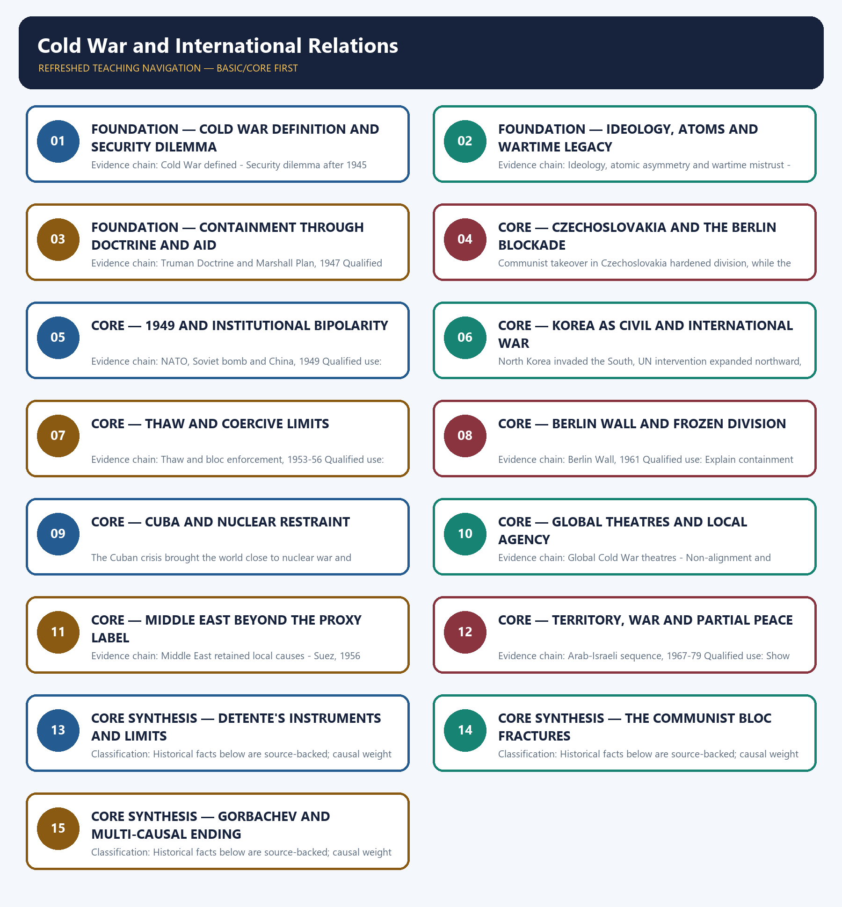

# Cold War and International Relations — Learner-v2 Complete Learning Session

> **Authoring-only generation:** 2026-09-01. No PDF was rendered and no tracker or index was mutated.

### SOURCE, PROGRESSION AND CURRENT-LINKAGE AUDIT

- **Generation date:** 2026-09-01.
- **Repository-first evidence:** the Basic owner is taught first and preserved in full; the Advanced owner is retained only in the optional final teaching block.
- **OCR evidence:** Repository Markdown was used first. The available OCR-searchable Norman Lowe World History PDF was retained as supplementary local context, but no unsupported page number, quotation or precision was imported from it.
- **Qdrant:** not used; repository Markdown and available OCR context were sufficient.
- **PYQ integrity:** No direct UPSC PYQ is verified as owned solely by this topic in the local routing blocks. All six Mains demands are original practice.
- **Live-link boundary:** The U.S. State Department's National Museum of American Diplomacy is scheduled to open in October 2026 and identifies a Berlin Wall segment in its collection. Its official Cold War material covers the Berlin Airlift, nuclear rivalry, proxy wars and diplomacy. Together these pages provide a narrow public-history link to renewed attention to Cold War diplomacy, not a present-day geopolitical analogy.
- **Fact/inference discipline:** no current-affairs item, PYQ wording, figure or quotation is invented.

## BASIC LEARNING SESSION

### DEEP-REVIEW LEARNING CONTRACT

| Control | Binding rule for this package |
|---|---|
| Syllabus boundary | Complete World History Core is taught chronologically, spatially and causally before optional enrichment. |
| Evidence method | Claim → named event/treaty/institution/actor/region or attributed scholarship → analysis → qualification. |
| Chronology | Structural cause, trigger, event, settlement, implementation and long-term process remain distinct. |
| Geography | Europe, Africa, Asia, West Asia and the Americas retain their own actors, routes and unequal connections; Europe is never the default universal viewpoint. |
| Historiography | Liberal, conservative, Marxist, social, feminist, postcolonial and other relevant interpretations are tied to evidence and bounded claims. |
| Practice contract | Every solved item has directive/demand decoding, an examiner-grade model, an executable timed/compression plan, marks rationale and answer-specific improvement. |
| Approval | This immutable successor remains `approved: false` pending explicit approval. |

**Canonical Basic/Core owner:** `upsc-ai-kit\knowledge\World-History\basic\15_Cold-War-and-International-Relations.md`  
**Canonical topic owner:** `upsc-ai-kit\knowledge\World-History\basic\15_Cold-War-and-International-Relations.md`  
**Optional Advanced owner:** `upsc-ai-kit\knowledge\World-History\advanced\15_Cold-War-and-International-Relations.md`  
**Official syllabus mapping:** `upsc-ai-kit\knowledge\World-History\OFFICIAL-UPSC-SYLLABUS-MAPPING.md`

### EVIDENCE, PYQ AND CURRENT-STATUS CONTROL

- **Primary/official evidence:** treaties, declarations, laws, institutional records, speeches and contemporary testimony are dated and read for authorship, audience and purpose.
- **Spatial and social evidence:** maps, trade and migration routes, battlefield geography, class, race, gender and colonial position qualify state-centred narrative.
- **Quantitative evidence:** population, debt, inflation, output, casualties and territorial claims retain unit, place, period, source and uncertainty; no statistic is invented.
- **Interpretive discipline:** teleology, civilisational ranking, single-cause verdicts and present-day nation-state projection are rejected.
- **PYQ discipline:** repository routing ledgers and locally held papers control wording and metadata; neutral rendering, reconstruction and unavailable official keys remain explicitly labelled.
- **Current-status note, rechecked 2026-09-01:** The U.S. State Department's National Museum of American Diplomacy is scheduled to open in October 2026 and identifies a Berlin Wall segment in its collection. Its official Cold War material covers the Berlin Airlift, nuclear rivalry, proxy wars and diplomacy. Together these pages provide a narrow public-history link to renewed attention to Cold War diplomacy, not a present-day geopolitical analogy.

**Live/primary context sources recorded by the predecessor generation:**

- `https://diplomacy.state.gov/about-nmad/`
- `https://diplomacy.state.gov/discover-diplomacy/period/cold-war-diplomacy/`




*Distinct embedded teaching-navigation image. The separate continuous Cārvāka-style flowchart package remains an independent at-a-glance artifact.*

### SESSION 1 — FOUNDATION — COLD WAR DEFINITION AND SECURITY DILEMMA

#### DEFINITION / WHAT THIS IS CALLED

**Plain-language definition:** Precise definition: Cold War definition and security dilemma is the source-bounded relationship among Cold War defined and Security dilemma after 1945 within Cold War and International Relations.

**Technical definition:** Evidence chain: Cold War defined - Security dilemma after 1945 Qualified use: Define the system before assigning blame.

#### ANSWER-GRABBING OPENING — WRITE/ADAPT IN THE EXAM

> Precise definition: Cold War definition and security dilemma is the source-bounded relationship among Cold War defined and Security dilemma after 1945 within Cold War and International Relations.

#### MUST-WRITE KEYWORDS

- **FOUNDATION**
- **Cold War definition**
- **security dilemma**
- **Precise definition**
- **Evidence chain**
- **Qualified use**

**How to use them:** Frame the answer through FOUNDATION; define Cold War definition, connect security dilemma with Precise definition to explain the mechanism, and use Evidence chain for the decisive comparison or qualification.

##### VISUAL FIRST

```text
COLD WAR DEFINITION AND SECURITY DILEMMA
01. Cold War defined
    |
    v
02. Security dilemma after 1945
BOUNDARY -> Organised hostility is neither peace nor direct general war.
```

*This topic-specific rail fixes the evidence sequence and its exam boundary before analysis.*

##### CONCEPT DEFINITIONS

- **Precise definition:** Cold War definition and security dilemma is the source-bounded relationship among Cold War defined and Security dilemma after 1945 within Cold War and International Relations.
- **Classification:** Historical facts below are source-backed; causal weight and evaluative verdicts are analytical synthesis.

##### CORE EXPLANATION

The Cold War was organised hostility between the United States and USSR through ideology, alliances, arms, economic pressure and limited wars without direct general war between them. Soviet pursuit of an eastern European security belt and Western fear of expansion made each side read its own actions as defensive and the other's as aggressive.

##### NAMED EVIDENCE AND MECHANISM

- The Cold War was organised hostility between the United States and USSR through ideology, alliances, arms, economic pressure and limited wars without direct general war between them.
- Soviet pursuit of an eastern European security belt and Western fear of expansion made each side read its own actions as defensive and the other's as aggressive.

##### EXAMINER CAUTION

- Organised hostility is neither peace nor direct general war.

##### EXAM LINK

- **Prelims:** Retain the exact actor, date, document and category in Cold War definition and security dilemma.
- **Mains:** Define the system before assigning blame.

##### MINI RECAP

- **Evidence chain:** Cold War defined -> Security dilemma after 1945
- **Qualified use:** Define the system before assigning blame.

#### CLOSING RECALL FLOW — FOUNDATION — COLD WAR DEFINITION AND SECURITY DILEMMA

```text
START / CONCEPT: FOUNDATION — Cold War definition and security dilemma
        |
        v
EXACT TERMS: FOUNDATION · Cold War definition · security dilemma · Precise definition · Evidence chain · Qualified use
        |
        v
MECHANISM / ARGUMENT: Evidence chain: Cold War defined - Security dilemma after 1945 Qualified use: Define the system before assigning blame.
        |
        v
CONSEQUENCE / CONTRAST: The Cold War was organised hostility between the United States and USSR through ideology, alliances, arms, economic pressure and limited wars without direct general war between them.
        |
        v
UPSC TRAP / ANSWER-USE: Do not miss this limiting distinction: causal weight and evaluative verdicts are analytical synthesis.
        |
        v
ANSWER-GRABBING FORMULATION: Precise definition: Cold War definition and security dilemma is the source-bounded relationship among Cold War defined and Security dilemma after 1945 within Cold War and International Relations.
```
### SESSION 2 — FOUNDATION — IDEOLOGY, ATOMS AND WARTIME LEGACY

#### DEFINITION / WHAT THIS IS CALLED

**Plain-language definition:** Precise definition: Ideology, atoms and wartime legacy is the source-bounded relationship among Ideology, atomic asymmetry and wartime mistrust and Yalta and Potsdam, 1945 within Cold War and International Relations.

**Technical definition:** Evidence chain: Ideology, atomic asymmetry and wartime mistrust - Yalta and Potsdam, 1945 Qualified use: Explain why alliance unity dissolved.

#### ANSWER-GRABBING OPENING — WRITE/ADAPT IN THE EXAM

> Precise definition: Ideology, atoms and wartime legacy is the source-bounded relationship among Ideology, atomic asymmetry and wartime mistrust and Yalta and Potsdam, 1945 within Cold War and International Relations.

#### MUST-WRITE KEYWORDS

- **FOUNDATION**
- **Ideology**
- **atoms**
- **wartime legacy**
- **Precise definition**
- **Evidence chain**

**How to use them:** Frame the answer through FOUNDATION; define Ideology, connect atoms with wartime legacy to explain the mechanism, and use Precise definition for the decisive comparison or qualification.

##### VISUAL FIRST

```text
IDEOLOGY, ATOMS AND WARTIME LEGACY
01. Ideology, atomic asymmetry and wartime mistrust
    |
    v
02. Yalta and Potsdam, 1945
BOUNDARY -> Ideology shapes interpretation while power supplies stakes.
```

*This topic-specific rail fixes the evidence sequence and its exam boundary before analysis.*

##### CONCEPT DEFINITIONS

- **Precise definition:** Ideology, atoms and wartime legacy is the source-bounded relationship among Ideology, atomic asymmetry and wartime mistrust and Yalta and Potsdam, 1945 within Cold War and International Relations.
- **Classification:** Historical facts below are source-backed; causal weight and evaluative verdicts are analytical synthesis.

##### CORE EXPLANATION

Capitalist-communist conflict shaped interpretation, while the US atomic monopoly, second-front delay and occupation disputes deepened mistrust. Wartime agreement coexisted with serious disputes over Poland, Germany, eastern Europe and the meaning of free elections.

##### NAMED EVIDENCE AND MECHANISM

- Capitalist-communist conflict shaped interpretation, while the US atomic monopoly, second-front delay and occupation disputes deepened mistrust.
- Wartime agreement coexisted with serious disputes over Poland, Germany, eastern Europe and the meaning of free elections.

##### EXAMINER CAUTION

- Ideology shapes interpretation while power supplies stakes.

##### EXAM LINK

- **Prelims:** Retain the exact actor, date, document and category in Ideology, atoms and wartime legacy.
- **Mains:** Explain why alliance unity dissolved.

##### MINI RECAP

- **Evidence chain:** Ideology, atomic asymmetry and wartime mistrust -> Yalta and Potsdam, 1945
- **Qualified use:** Explain why alliance unity dissolved.

#### CLOSING RECALL FLOW — FOUNDATION — IDEOLOGY, ATOMS AND WARTIME LEGACY

```text
START / CONCEPT: FOUNDATION — Ideology, atoms and wartime legacy
        |
        v
EXACT TERMS: FOUNDATION · Ideology · atoms · wartime legacy · Precise definition · Evidence chain
        |
        v
MECHANISM / ARGUMENT: Evidence chain: Ideology, atomic asymmetry and wartime mistrust - Yalta and Potsdam, 1945 Qualified use: Explain why alliance unity dissolved.
        |
        v
CONSEQUENCE / CONTRAST: Ideology shapes interpretation while power supplies stakes.
        |
        v
UPSC TRAP / ANSWER-USE: Do not miss this limiting distinction: causal weight and evaluative verdicts are analytical synthesis.
        |
        v
ANSWER-GRABBING FORMULATION: Precise definition: Ideology, atoms and wartime legacy is the source-bounded relationship among Ideology, atomic asymmetry and wartime mistrust and Yalta and Potsdam, 1945 within Cold War and International Relations.
```
### SESSION 3 — FOUNDATION — CONTAINMENT THROUGH DOCTRINE AND AID

#### DEFINITION / WHAT THIS IS CALLED

**Plain-language definition:** Precise definition: Containment through doctrine and aid is the source-bounded relationship among and Truman Doctrine and Marshall Plan, 1947 within Cold War and International Relations.

**Technical definition:** Evidence chain: Truman Doctrine and Marshall Plan, 1947 Qualified use: Connect economics to geopolitical containment.

#### ANSWER-GRABBING OPENING — WRITE/ADAPT IN THE EXAM

> Precise definition: Containment through doctrine and aid is the source-bounded relationship among and Truman Doctrine and Marshall Plan, 1947 within Cold War and International Relations.

#### MUST-WRITE KEYWORDS

- **FOUNDATION**
- **Containment through doctrine**
- **aid**
- **Precise definition**
- **Evidence chain**
- **Qualified use**

**How to use them:** Frame the answer through FOUNDATION; define Containment through doctrine, connect aid with Precise definition to explain the mechanism, and use Evidence chain for the decisive comparison or qualification.

##### VISUAL FIRST

```text
CONTAINMENT THROUGH DOCTRINE AND AID
01. Truman Doctrine and Marshall Plan, 1947
BOUNDARY -> Marshall aid had humanitarian and strategic purposes.
```

*This topic-specific rail fixes the evidence sequence and its exam boundary before analysis.*

##### CONCEPT DEFINITIONS

- **Precise definition:** Containment through doctrine and aid is the source-bounded relationship among  and Truman Doctrine and Marshall Plan, 1947 within Cold War and International Relations.
- **Classification:** Historical facts below are source-backed; causal weight and evaluative verdicts are analytical synthesis.

##### CORE EXPLANATION

The Truman Doctrine supported states resisting communist pressure, while Marshall aid combined recovery, humanitarian purpose and anti-communist strategy.

##### NAMED EVIDENCE AND MECHANISM

- The Truman Doctrine supported states resisting communist pressure, while Marshall aid combined recovery, humanitarian purpose and anti-communist strategy.

##### EXAMINER CAUTION

- Marshall aid had humanitarian and strategic purposes.

##### EXAM LINK

- **Prelims:** Retain the exact actor, date, document and category in Containment through doctrine and aid.
- **Mains:** Connect economics to geopolitical containment.

##### MINI RECAP

- **Evidence chain:** Truman Doctrine and Marshall Plan, 1947
- **Qualified use:** Connect economics to geopolitical containment.

#### CLOSING RECALL FLOW — FOUNDATION — CONTAINMENT THROUGH DOCTRINE AND AID

```text
START / CONCEPT: FOUNDATION — Containment through doctrine and aid
        |
        v
EXACT TERMS: FOUNDATION · Containment through doctrine · aid · Precise definition · Evidence chain · Qualified use
        |
        v
MECHANISM / ARGUMENT: Evidence chain: Truman Doctrine and Marshall Plan, 1947 Qualified use: Connect economics to geopolitical containment.
        |
        v
CONSEQUENCE / CONTRAST: Classification: Historical facts below are source-backed; causal weight and evaluative verdicts are analytical synthesis.
        |
        v
UPSC TRAP / ANSWER-USE: Do not miss this limiting distinction: marshall aid had humanitarian and strategic purposes.
        |
        v
ANSWER-GRABBING FORMULATION: Precise definition: Containment through doctrine and aid is the source-bounded relationship among and Truman Doctrine and Marshall Plan, 1947 within Cold War and International Relations.
```
### SESSION 4 — CORE — CZECHOSLOVAKIA AND THE BERLIN BLOCKADE

#### DEFINITION / WHAT THIS IS CALLED

**Plain-language definition:** Precise definition: Czechoslovakia and the Berlin blockade is the source-bounded relationship among and Czechoslovakia and Berlin, 1948-49 within Cold War and International Relations.

**Technical definition:** Communist takeover in Czechoslovakia hardened division, while the Berlin blockade was answered by airlift rather than direct land war.

#### ANSWER-GRABBING OPENING — WRITE/ADAPT IN THE EXAM

> Precise definition: Czechoslovakia and the Berlin blockade is the source-bounded relationship among and Czechoslovakia and Berlin, 1948-49 within Cold War and International Relations.

#### MUST-WRITE KEYWORDS

- **Czechoslovakia**
- **the Berlin blockade**
- **Precise definition**
- **Evidence chain**
- **Qualified use**
- **1948-49**

**How to use them:** Frame the answer through Czechoslovakia; define the Berlin blockade, connect Precise definition with Evidence chain to explain the mechanism, and use Qualified use for the decisive comparison or qualification.

##### VISUAL FIRST

```text
CZECHOSLOVAKIA AND THE BERLIN BLOCKADE
01. Czechoslovakia and Berlin, 1948-49
BOUNDARY -> Airlift demonstrated pressure with restraint.
```

*This topic-specific rail fixes the evidence sequence and its exam boundary before analysis.*

##### CONCEPT DEFINITIONS

- **Precise definition:** Czechoslovakia and the Berlin blockade is the source-bounded relationship among  and Czechoslovakia and Berlin, 1948-49 within Cold War and International Relations.
- **Classification:** Historical facts below are source-backed; causal weight and evaluative verdicts are analytical synthesis.

##### CORE EXPLANATION

Communist takeover in Czechoslovakia hardened division, while the Berlin blockade was answered by airlift rather than direct land war.

##### NAMED EVIDENCE AND MECHANISM

- Communist takeover in Czechoslovakia hardened division, while the Berlin blockade was answered by airlift rather than direct land war.

##### EXAMINER CAUTION

- Airlift demonstrated pressure with restraint.

##### EXAM LINK

- **Prelims:** Retain the exact actor, date, document and category in Czechoslovakia and the Berlin blockade.
- **Mains:** Use crisis to define Cold War rules.

##### MINI RECAP

- **Evidence chain:** Czechoslovakia and Berlin, 1948-49
- **Qualified use:** Use crisis to define Cold War rules.

#### CLOSING RECALL FLOW — CORE — CZECHOSLOVAKIA AND THE BERLIN BLOCKADE

```text
START / CONCEPT: CORE — Czechoslovakia and the Berlin blockade
        |
        v
EXACT TERMS: Czechoslovakia · the Berlin blockade · Precise definition · Evidence chain · Qualified use · 1948-49
        |
        v
MECHANISM / ARGUMENT: Communist takeover in Czechoslovakia hardened division, while the Berlin blockade was answered by airlift rather than direct land war.
        |
        v
CONSEQUENCE / CONTRAST: Evidence chain: Czechoslovakia and Berlin, 1948-49 Qualified use: Use crisis to define Cold War rules.
        |
        v
UPSC TRAP / ANSWER-USE: Do not miss this limiting distinction: causal weight and evaluative verdicts are analytical synthesis.
        |
        v
ANSWER-GRABBING FORMULATION: Precise definition: Czechoslovakia and the Berlin blockade is the source-bounded relationship among and Czechoslovakia and Berlin, 1948-49 within Cold War and International Relations.
```
### SESSION 5 — CORE — 1949 AND INSTITUTIONAL BIPOLARITY

#### DEFINITION / WHAT THIS IS CALLED

**Plain-language definition:** Precise definition: 1949 and institutional bipolarity is the source-bounded relationship among and NATO, Soviet bomb and China, 1949 within Cold War and International Relations.

**Technical definition:** Evidence chain: NATO, Soviet bomb and China, 1949 Qualified use: Show the rivalry widening and hardening.

#### ANSWER-GRABBING OPENING — WRITE/ADAPT IN THE EXAM

> Precise definition: 1949 and institutional bipolarity is the source-bounded relationship among and NATO, Soviet bomb and China, 1949 within Cold War and International Relations.

#### MUST-WRITE KEYWORDS

- **institutional bipolarity**
- **Precise definition**
- **Evidence chain**
- **Qualified use**
- **Precise definition: 1949 and institutional bipolarity**
- **Precise**

**How to use them:** Frame the answer through institutional bipolarity; define Precise definition, connect Evidence chain with Qualified use to explain the mechanism, and use Precise definition: 1949 and institutional bipolarity for the decisive comparison or qualification.

##### VISUAL FIRST

```text
1949 AND INSTITUTIONAL BIPOLARITY
01. NATO, Soviet bomb and China, 1949
BOUNDARY -> NATO, nuclear parity and China are distinct changes.
```

*This topic-specific rail fixes the evidence sequence and its exam boundary before analysis.*

##### CONCEPT DEFINITIONS

- **Precise definition:** 1949 and institutional bipolarity is the source-bounded relationship among  and NATO, Soviet bomb and China, 1949 within Cold War and International Relations.
- **Classification:** Historical facts below are source-backed; causal weight and evaluative verdicts are analytical synthesis.

##### CORE EXPLANATION

NATO institutionalised western defence, the Soviet bomb opened nuclear competition and communist victory in China widened the rivalry's Asian scale.

##### NAMED EVIDENCE AND MECHANISM

- NATO institutionalised western defence, the Soviet bomb opened nuclear competition and communist victory in China widened the rivalry's Asian scale.

##### EXAMINER CAUTION

- NATO, nuclear parity and China are distinct changes.

##### EXAM LINK

- **Prelims:** Retain the exact actor, date, document and category in 1949 and institutional bipolarity.
- **Mains:** Show the rivalry widening and hardening.

##### MINI RECAP

- **Evidence chain:** NATO, Soviet bomb and China, 1949
- **Qualified use:** Show the rivalry widening and hardening.

#### CLOSING RECALL FLOW — CORE — 1949 AND INSTITUTIONAL BIPOLARITY

```text
START / CONCEPT: CORE — 1949 and institutional bipolarity
        |
        v
EXACT TERMS: institutional bipolarity · Precise definition · Evidence chain · Qualified use · Precise definition: 1949 and institutional bipolarity · Precise
        |
        v
MECHANISM / ARGUMENT: Evidence chain: NATO, Soviet bomb and China, 1949 Qualified use: Show the rivalry widening and hardening.
        |
        v
CONSEQUENCE / CONTRAST: Classification: Historical facts below are source-backed; causal weight and evaluative verdicts are analytical synthesis.
        |
        v
UPSC TRAP / ANSWER-USE: Do not miss this limiting distinction: nATO institutionalised western defence, the Soviet bomb opened nuclear competition and communist victory in...
        |
        v
ANSWER-GRABBING FORMULATION: Precise definition: 1949 and institutional bipolarity is the source-bounded relationship among and NATO, Soviet bomb and China, 1949 within Cold War and International Relations.
```
### SESSION 6 — CORE — KOREA AS CIVIL AND INTERNATIONAL WAR

#### DEFINITION / WHAT THIS IS CALLED

**Plain-language definition:** Precise definition: Korea as civil and international war is the source-bounded relationship among and Korean War, 1950-53 within Cold War and International Relations.

**Technical definition:** North Korea invaded the South, UN intervention expanded northward, China entered and the war ended near the thirty-eighth parallel.

#### ANSWER-GRABBING OPENING — WRITE/ADAPT IN THE EXAM

> Precise definition: Korea as civil and international war is the source-bounded relationship among and Korean War, 1950-53 within Cold War and International Relations.

#### MUST-WRITE KEYWORDS

- **Korea as civil**
- **international war**
- **Precise definition**
- **Evidence chain**
- **Qualified use**
- **1950-53**

**How to use them:** Frame the answer through Korea as civil; define international war, connect Precise definition with Evidence chain to explain the mechanism, and use Qualified use for the decisive comparison or qualification.

##### VISUAL FIRST

```text
KOREA AS CIVIL AND INTERNATIONAL WAR
01. Korean War, 1950-53
BOUNDARY -> Reject both single-label reductions.
```

*This topic-specific rail fixes the evidence sequence and its exam boundary before analysis.*

##### CONCEPT DEFINITIONS

- **Precise definition:** Korea as civil and international war is the source-bounded relationship among  and Korean War, 1950-53 within Cold War and International Relations.
- **Classification:** Historical facts below are source-backed; causal weight and evaluative verdicts are analytical synthesis.

##### CORE EXPLANATION

North Korea invaded the South, UN intervention expanded northward, China entered and the war ended near the thirty-eighth parallel.

##### NAMED EVIDENCE AND MECHANISM

- North Korea invaded the South, UN intervention expanded northward, China entered and the war ended near the thirty-eighth parallel.

##### EXAMINER CAUTION

- Reject both single-label reductions.

##### EXAM LINK

- **Prelims:** Retain the exact actor, date, document and category in Korea as civil and international war.
- **Mains:** Trace UN, US and Chinese escalation.

##### MINI RECAP

- **Evidence chain:** Korean War, 1950-53
- **Qualified use:** Trace UN, US and Chinese escalation.

#### CLOSING RECALL FLOW — CORE — KOREA AS CIVIL AND INTERNATIONAL WAR

```text
START / CONCEPT: CORE — Korea as civil and international war
        |
        v
EXACT TERMS: Korea as civil · international war · Precise definition · Evidence chain · Qualified use · 1950-53
        |
        v
MECHANISM / ARGUMENT: Evidence chain: Korean War, 1950-53 Qualified use: Trace UN, US and Chinese escalation.
        |
        v
CONSEQUENCE / CONTRAST: North Korea invaded the South, UN intervention expanded northward, China entered and the war ended near the thirty-eighth parallel.
        |
        v
UPSC TRAP / ANSWER-USE: Do not miss this limiting distinction: causal weight and evaluative verdicts are analytical synthesis.
        |
        v
ANSWER-GRABBING FORMULATION: Precise definition: Korea as civil and international war is the source-bounded relationship among and Korean War, 1950-53 within Cold War and International Relations.
```
### SESSION 7 — CORE — THAW AND COERCIVE LIMITS

#### DEFINITION / WHAT THIS IS CALLED

**Plain-language definition:** Precise definition: Thaw and coercive limits is the source-bounded relationship among and Thaw and bloc enforcement, 1953-56 within Cold War and International Relations.

**Technical definition:** Evidence chain: Thaw and bloc enforcement, 1953-56 Qualified use: Compare Austria and Hungary.

#### ANSWER-GRABBING OPENING — WRITE/ADAPT IN THE EXAM

> Precise definition: Thaw and coercive limits is the source-bounded relationship among and Thaw and bloc enforcement, 1953-56 within Cold War and International Relations.

#### MUST-WRITE KEYWORDS

- **Thaw**
- **coercive limits**
- **Precise definition**
- **Evidence chain**
- **Qualified use**
- **1953-56**

**How to use them:** Frame the answer through Thaw; define coercive limits, connect Precise definition with Evidence chain to explain the mechanism, and use Qualified use for the decisive comparison or qualification.

##### VISUAL FIRST

```text
THAW AND COERCIVE LIMITS
01. Thaw and bloc enforcement, 1953-56
BOUNDARY -> Peaceful coexistence did not mean political pluralism inside the bloc.
```

*This topic-specific rail fixes the evidence sequence and its exam boundary before analysis.*

##### CONCEPT DEFINITIONS

- **Precise definition:** Thaw and coercive limits is the source-bounded relationship among  and Thaw and bloc enforcement, 1953-56 within Cold War and International Relations.
- **Classification:** Historical facts below are source-backed; causal weight and evaluative verdicts are analytical synthesis.

##### CORE EXPLANATION

The Austrian State Treaty and peaceful-coexistence language suggested thaw, but the Warsaw Pact and Soviet crushing of Hungary exposed its limits.

##### NAMED EVIDENCE AND MECHANISM

- The Austrian State Treaty and peaceful-coexistence language suggested thaw, but the Warsaw Pact and Soviet crushing of Hungary exposed its limits.

##### EXAMINER CAUTION

- Peaceful coexistence did not mean political pluralism inside the bloc.

##### EXAM LINK

- **Prelims:** Retain the exact actor, date, document and category in Thaw and coercive limits.
- **Mains:** Compare Austria and Hungary.

##### MINI RECAP

- **Evidence chain:** Thaw and bloc enforcement, 1953-56
- **Qualified use:** Compare Austria and Hungary.

#### CLOSING RECALL FLOW — CORE — THAW AND COERCIVE LIMITS

```text
START / CONCEPT: CORE — Thaw and coercive limits
        |
        v
EXACT TERMS: Thaw · coercive limits · Precise definition · Evidence chain · Qualified use · 1953-56
        |
        v
MECHANISM / ARGUMENT: Evidence chain: Thaw and bloc enforcement, 1953-56 Qualified use: Compare Austria and Hungary.
        |
        v
CONSEQUENCE / CONTRAST: Classification: Historical facts below are source-backed; causal weight and evaluative verdicts are analytical synthesis.
        |
        v
UPSC TRAP / ANSWER-USE: Do not miss this limiting distinction: thaw and coercive limits is the source-bounded relationship among and Thaw and bloc enforcement...
        |
        v
ANSWER-GRABBING FORMULATION: Precise definition: Thaw and coercive limits is the source-bounded relationship among and Thaw and bloc enforcement, 1953-56 within Cold War and International Relations.
```
### SESSION 8 — CORE — BERLIN WALL AND FROZEN DIVISION

#### DEFINITION / WHAT THIS IS CALLED

**Plain-language definition:** Precise definition: Berlin Wall and frozen division is the source-bounded relationship among and Berlin Wall, 1961 within Cold War and International Relations.

**Technical definition:** Evidence chain: Berlin Wall, 1961 Qualified use: Explain containment by partition.

#### ANSWER-GRABBING OPENING — WRITE/ADAPT IN THE EXAM

> Precise definition: Berlin Wall and frozen division is the source-bounded relationship among and Berlin Wall, 1961 within Cold War and International Relations.

#### MUST-WRITE KEYWORDS

- **Berlin Wall**
- **frozen division**
- **Precise definition**
- **Evidence chain**
- **Qualified use**
- **Precise definition: Berlin Wall and frozen division**

**How to use them:** Frame the answer through Berlin Wall; define frozen division, connect Precise definition with Evidence chain to explain the mechanism, and use Qualified use for the decisive comparison or qualification.

##### VISUAL FIRST

```text
BERLIN WALL AND FROZEN DIVISION
01. Berlin Wall, 1961
BOUNDARY -> Physical stability did not solve sovereignty.
```

*This topic-specific rail fixes the evidence sequence and its exam boundary before analysis.*

##### CONCEPT DEFINITIONS

- **Precise definition:** Berlin Wall and frozen division is the source-bounded relationship among  and Berlin Wall, 1961 within Cold War and International Relations.
- **Classification:** Historical facts below are source-backed; causal weight and evaluative verdicts are analytical synthesis.

##### CORE EXPLANATION

The Berlin Wall physicalised and stabilised division without resolving the German question.

##### NAMED EVIDENCE AND MECHANISM

- The Berlin Wall physicalised and stabilised division without resolving the German question.

##### EXAMINER CAUTION

- Physical stability did not solve sovereignty.

##### EXAM LINK

- **Prelims:** Retain the exact actor, date, document and category in Berlin Wall and frozen division.
- **Mains:** Explain containment by partition.

##### MINI RECAP

- **Evidence chain:** Berlin Wall, 1961
- **Qualified use:** Explain containment by partition.

#### CLOSING RECALL FLOW — CORE — BERLIN WALL AND FROZEN DIVISION

```text
START / CONCEPT: CORE — Berlin Wall and frozen division
        |
        v
EXACT TERMS: Berlin Wall · frozen division · Precise definition · Evidence chain · Qualified use · Precise definition: Berlin Wall and frozen division
        |
        v
MECHANISM / ARGUMENT: Evidence chain: Berlin Wall, 1961 Qualified use: Explain containment by partition.
        |
        v
CONSEQUENCE / CONTRAST: Classification: Historical facts below are source-backed; causal weight and evaluative verdicts are analytical synthesis.
        |
        v
UPSC TRAP / ANSWER-USE: Do not miss this limiting distinction: berlin Wall and frozen division is the source-bounded relationship among and Berlin Wall, 1961...
        |
        v
ANSWER-GRABBING FORMULATION: Precise definition: Berlin Wall and frozen division is the source-bounded relationship among and Berlin Wall, 1961 within Cold War and International Relations.
```
### SESSION 9 — CORE — CUBA AND NUCLEAR RESTRAINT

#### DEFINITION / WHAT THIS IS CALLED

**Plain-language definition:** Precise definition: Cuba and nuclear restraint is the source-bounded relationship among and Cuban missiles crisis, 1962 within Cold War and International Relations.

**Technical definition:** The Cuban crisis brought the world close to nuclear war and demonstrated that catastrophic risk could impose restraint.

#### ANSWER-GRABBING OPENING — WRITE/ADAPT IN THE EXAM

> Precise definition: Cuba and nuclear restraint is the source-bounded relationship among and Cuban missiles crisis, 1962 within Cold War and International Relations.

#### MUST-WRITE KEYWORDS

- **Cuba**
- **nuclear restraint**
- **Precise definition**
- **Evidence chain**
- **Qualified use**
- **Precise definition: Cuba and nuclear restraint**

**How to use them:** Frame the answer through Cuba; define nuclear restraint, connect Precise definition with Evidence chain to explain the mechanism, and use Qualified use for the decisive comparison or qualification.

##### VISUAL FIRST

```text
CUBA AND NUCLEAR RESTRAINT
01. Cuban missiles crisis, 1962
BOUNDARY -> Near-catastrophe encouraged management, not reconciliation.
```

*This topic-specific rail fixes the evidence sequence and its exam boundary before analysis.*

##### CONCEPT DEFINITIONS

- **Precise definition:** Cuba and nuclear restraint is the source-bounded relationship among  and Cuban missiles crisis, 1962 within Cold War and International Relations.
- **Classification:** Historical facts below are source-backed; causal weight and evaluative verdicts are analytical synthesis.

##### CORE EXPLANATION

The Cuban crisis brought the world close to nuclear war and demonstrated that catastrophic risk could impose restraint.

##### NAMED EVIDENCE AND MECHANISM

- The Cuban crisis brought the world close to nuclear war and demonstrated that catastrophic risk could impose restraint.

##### EXAMINER CAUTION

- Near-catastrophe encouraged management, not reconciliation.

##### EXAM LINK

- **Prelims:** Retain the exact actor, date, document and category in Cuba and nuclear restraint.
- **Mains:** Bridge crisis to detente.

##### MINI RECAP

- **Evidence chain:** Cuban missiles crisis, 1962
- **Qualified use:** Bridge crisis to detente.

#### CLOSING RECALL FLOW — CORE — CUBA AND NUCLEAR RESTRAINT

```text
START / CONCEPT: CORE — Cuba and nuclear restraint
        |
        v
EXACT TERMS: Cuba · nuclear restraint · Precise definition · Evidence chain · Qualified use · Precise definition: Cuba and nuclear restraint
        |
        v
MECHANISM / ARGUMENT: The Cuban crisis brought the world close to nuclear war and demonstrated that catastrophic risk could impose restraint.
        |
        v
CONSEQUENCE / CONTRAST: Evidence chain: Cuban missiles crisis, 1962 Qualified use: Bridge crisis to detente.
        |
        v
UPSC TRAP / ANSWER-USE: Do not miss this limiting distinction: causal weight and evaluative verdicts are analytical synthesis.
        |
        v
ANSWER-GRABBING FORMULATION: Precise definition: Cuba and nuclear restraint is the source-bounded relationship among and Cuban missiles crisis, 1962 within Cold War and International Relations.
```
### SESSION 10 — CORE — GLOBAL THEATRES AND LOCAL AGENCY

#### DEFINITION / WHAT THIS IS CALLED

**Plain-language definition:** Precise definition: Global theatres and local agency is the source-bounded relationship among Global Cold War theatres and Non-alignment and decolonised-world agency within Cold War and International Relations.

**Technical definition:** Evidence chain: Global Cold War theatres - Non-alignment and decolonised-world agency Qualified use: Move beyond Europe and proxy shorthand.

#### ANSWER-GRABBING OPENING — WRITE/ADAPT IN THE EXAM

> Precise definition: Global theatres and local agency is the source-bounded relationship among Global Cold War theatres and Non-alignment and decolonised-world agency within Cold War and International Relations.

#### MUST-WRITE KEYWORDS

- **Global theatres**
- **local agency**
- **Precise definition**
- **Evidence chain**
- **Qualified use**
- **Precise definition: Global theatres and local agency**

**How to use them:** Frame the answer through Global theatres; define local agency, connect Precise definition with Evidence chain to explain the mechanism, and use Qualified use for the decisive comparison or qualification.

##### VISUAL FIRST

```text
GLOBAL THEATRES AND LOCAL AGENCY
01. Global Cold War theatres
    |
    v
02. Non-alignment and decolonised-world agency
BOUNDARY -> New states were not passive pieces.
```

*This topic-specific rail fixes the evidence sequence and its exam boundary before analysis.*

##### CONCEPT DEFINITIONS

- **Precise definition:** Global theatres and local agency is the source-bounded relationship among Global Cold War theatres and Non-alignment and decolonised-world agency within Cold War and International Relations.
- **Classification:** Historical facts below are source-backed; causal weight and evaluative verdicts are analytical synthesis.

##### CORE EXPLANATION

Vietnam exposed limits of American military power, Chile showed ideological conflict in domestic politics and Afghanistan revived East-West confrontation. New states often refused bloc membership and used non-alignment to protect sovereignty and bargaining space rather than act as passive proxies.

##### NAMED EVIDENCE AND MECHANISM

- Vietnam exposed limits of American military power, Chile showed ideological conflict in domestic politics and Afghanistan revived East-West confrontation.
- New states often refused bloc membership and used non-alignment to protect sovereignty and bargaining space rather than act as passive proxies.

##### EXAMINER CAUTION

- New states were not passive pieces.

##### EXAM LINK

- **Prelims:** Retain the exact actor, date, document and category in Global theatres and local agency.
- **Mains:** Move beyond Europe and proxy shorthand.

##### MINI RECAP

- **Evidence chain:** Global Cold War theatres -> Non-alignment and decolonised-world agency
- **Qualified use:** Move beyond Europe and proxy shorthand.

#### CLOSING RECALL FLOW — CORE — GLOBAL THEATRES AND LOCAL AGENCY

```text
START / CONCEPT: CORE — Global theatres and local agency
        |
        v
EXACT TERMS: Global theatres · local agency · Precise definition · Evidence chain · Qualified use · Precise definition: Global theatres and local agency
        |
        v
MECHANISM / ARGUMENT: Evidence chain: Global Cold War theatres - Non-alignment and decolonised-world agency Qualified use: Move beyond Europe and proxy shorthand.
        |
        v
CONSEQUENCE / CONTRAST: New states were not passive pieces.
        |
        v
UPSC TRAP / ANSWER-USE: Do not miss this limiting distinction: causal weight and evaluative verdicts are analytical synthesis.
        |
        v
ANSWER-GRABBING FORMULATION: Precise definition: Global theatres and local agency is the source-bounded relationship among Global Cold War theatres and Non-alignment and decolonised-world agency within Cold War and International Relations.
```
### SESSION 11 — CORE — MIDDLE EAST BEYOND THE PROXY LABEL

#### DEFINITION / WHAT THIS IS CALLED

**Plain-language definition:** Precise definition: Middle East beyond the proxy label is the source-bounded relationship among Middle East retained local causes and Suez, 1956 within Cold War and International Relations.

**Technical definition:** Evidence chain: Middle East retained local causes - Suez, 1956 Qualified use: Restore local causal arrows.

#### ANSWER-GRABBING OPENING — WRITE/ADAPT IN THE EXAM

> Precise definition: Middle East beyond the proxy label is the source-bounded relationship among Middle East retained local causes and Suez, 1956 within Cold War and International Relations.

#### MUST-WRITE KEYWORDS

- **Middle East beyond the proxy label**
- **Precise definition**
- **Evidence chain**
- **Qualified use**
- **Precise definition: Middle East beyond the proxy label**
- **Precise**

**How to use them:** Frame the answer through Middle East beyond the proxy label; define Precise definition, connect Evidence chain with Qualified use to explain the mechanism, and use Precise definition: Middle East beyond the proxy label for the decisive comparison or qualification.

##### VISUAL FIRST

```text
MIDDLE EAST BEYOND THE PROXY LABEL
01. Middle East retained local causes
    |
    v
02. Suez, 1956
BOUNDARY -> Suez combined decolonisation with superpower intervention.
```

*This topic-specific rail fixes the evidence sequence and its exam boundary before analysis.*

##### CONCEPT DEFINITIONS

- **Precise definition:** Middle East beyond the proxy label is the source-bounded relationship among Middle East retained local causes and Suez, 1956 within Cold War and International Relations.
- **Classification:** Historical facts below are source-backed; causal weight and evaluative verdicts are analytical synthesis.

##### CORE EXPLANATION

Arab nationalism, Israeli security, Palestinian displacement, decolonisation, oil and territorial conflict had autonomous force even when superpowers intervened. Nasser's canal nationalisation and the British-French-Israeli attack, followed by US and Soviet pressure, exposed declining European imperial power.

##### NAMED EVIDENCE AND MECHANISM

- Arab nationalism, Israeli security, Palestinian displacement, decolonisation, oil and territorial conflict had autonomous force even when superpowers intervened.
- Nasser's canal nationalisation and the British-French-Israeli attack, followed by US and Soviet pressure, exposed declining European imperial power.

##### EXAMINER CAUTION

- Suez combined decolonisation with superpower intervention.

##### EXAM LINK

- **Prelims:** Retain the exact actor, date, document and category in Middle East beyond the proxy label.
- **Mains:** Restore local causal arrows.

##### MINI RECAP

- **Evidence chain:** Middle East retained local causes -> Suez, 1956
- **Qualified use:** Restore local causal arrows.

#### CLOSING RECALL FLOW — CORE — MIDDLE EAST BEYOND THE PROXY LABEL

```text
START / CONCEPT: CORE — Middle East beyond the proxy label
        |
        v
EXACT TERMS: Middle East beyond the proxy label · Precise definition · Evidence chain · Qualified use · Precise definition: Middle East beyond the proxy label · Precise
        |
        v
MECHANISM / ARGUMENT: Evidence chain: Middle East retained local causes - Suez, 1956 Qualified use: Restore local causal arrows.
        |
        v
CONSEQUENCE / CONTRAST: Classification: Historical facts below are source-backed; causal weight and evaluative verdicts are analytical synthesis.
        |
        v
UPSC TRAP / ANSWER-USE: Do not miss this limiting distinction: arab nationalism, Israeli security, Palestinian displacement, decolonisation, oil and territorial conflict had autonomous force...
        |
        v
ANSWER-GRABBING FORMULATION: Precise definition: Middle East beyond the proxy label is the source-bounded relationship among Middle East retained local causes and Suez, 1956 within Cold War and International Relations.
```
### SESSION 12 — CORE — TERRITORY, WAR AND PARTIAL PEACE

#### DEFINITION / WHAT THIS IS CALLED

**Plain-language definition:** Precise definition: Territory, war and partial peace is the source-bounded relationship among and Arab-Israeli sequence, 1967-79 within Cold War and International Relations.

**Technical definition:** Evidence chain: Arab-Israeli sequence, 1967-79 Qualified use: Show settlement without complete resolution.

#### ANSWER-GRABBING OPENING — WRITE/ADAPT IN THE EXAM

> Precise definition: Territory, war and partial peace is the source-bounded relationship among and Arab-Israeli sequence, 1967-79 within Cold War and International Relations.

#### MUST-WRITE KEYWORDS

- **Territory**
- **war**
- **partial peace**
- **Precise definition**
- **Evidence chain**
- **Qualified use**

**How to use them:** Frame the answer through Territory; define war, connect partial peace with Precise definition to explain the mechanism, and use Evidence chain for the decisive comparison or qualification.

##### VISUAL FIRST

```text
TERRITORY, WAR AND PARTIAL PEACE
01. Arab-Israeli sequence, 1967-79
BOUNDARY -> Keep 1967, 1973 and Camp David in sequence.
```

*This topic-specific rail fixes the evidence sequence and its exam boundary before analysis.*

##### CONCEPT DEFINITIONS

- **Precise definition:** Territory, war and partial peace is the source-bounded relationship among  and Arab-Israeli sequence, 1967-79 within Cold War and International Relations.
- **Classification:** Historical facts below are source-backed; causal weight and evaluative verdicts are analytical synthesis.

##### CORE EXPLANATION

The Six-Day War transformed territorial control, the 1973 war restored Arab leverage, and Camp David made Egyptian-Israeli peace without resolving Palestine.

##### NAMED EVIDENCE AND MECHANISM

- The Six-Day War transformed territorial control, the 1973 war restored Arab leverage, and Camp David made Egyptian-Israeli peace without resolving Palestine.

##### EXAMINER CAUTION

- Keep 1967, 1973 and Camp David in sequence.

##### EXAM LINK

- **Prelims:** Retain the exact actor, date, document and category in Territory, war and partial peace.
- **Mains:** Show settlement without complete resolution.

##### MINI RECAP

- **Evidence chain:** Arab-Israeli sequence, 1967-79
- **Qualified use:** Show settlement without complete resolution.

#### CLOSING RECALL FLOW — CORE — TERRITORY, WAR AND PARTIAL PEACE

```text
START / CONCEPT: CORE — Territory, war and partial peace
        |
        v
EXACT TERMS: Territory · war · partial peace · Precise definition · Evidence chain · Qualified use
        |
        v
MECHANISM / ARGUMENT: Evidence chain: Arab-Israeli sequence, 1967-79 Qualified use: Show settlement without complete resolution.
        |
        v
CONSEQUENCE / CONTRAST: Classification: Historical facts below are source-backed; causal weight and evaluative verdicts are analytical synthesis.
        |
        v
UPSC TRAP / ANSWER-USE: Do not miss this limiting distinction: mains: Show settlement without complete resolution.
        |
        v
ANSWER-GRABBING FORMULATION: Precise definition: Territory, war and partial peace is the source-bounded relationship among and Arab-Israeli sequence, 1967-79 within Cold War and International Relations.
```
### SESSION 13 — CORE SYNTHESIS — DETENTE'S INSTRUMENTS AND LIMITS

#### DEFINITION / WHAT THIS IS CALLED

**Plain-language definition:** Precise definition: Detente's instruments and limits is the source-bounded relationship among Detente, 1972-75 and Renewed confrontation after 1979 within Cold War and International Relations.

**Technical definition:** Classification: Historical facts below are source-backed; causal weight and evaluative verdicts are analytical synthesis.

#### ANSWER-GRABBING OPENING — WRITE/ADAPT IN THE EXAM

> Precise definition: Detente's instruments and limits is the source-bounded relationship among Detente, 1972-75 and Renewed confrontation after 1979 within Cold War and International Relations.

#### MUST-WRITE KEYWORDS

- **CORE SYNTHESIS**
- **Detente's instruments**
- **limits**
- **Precise definition**
- **Evidence chain**
- **Qualified use**

**How to use them:** Frame the answer through CORE SYNTHESIS; define Detente's instruments, connect limits with Precise definition to explain the mechanism, and use Evidence chain for the decisive comparison or qualification.

##### VISUAL FIRST

```text
DETENTE'S INSTRUMENTS AND LIMITS
01. Detente, 1972-75
    |
    v
02. Renewed confrontation after 1979
BOUNDARY -> Arms control regulates rivalry rather than abolishing it.
```

*This topic-specific rail fixes the evidence sequence and its exam boundary before analysis.*

##### CONCEPT DEFINITIONS

- **Precise definition:** Detente's instruments and limits is the source-bounded relationship among Detente, 1972-75 and Renewed confrontation after 1979 within Cold War and International Relations.
- **Classification:** Historical facts below are source-backed; causal weight and evaluative verdicts are analytical synthesis.

##### CORE EXPLANATION

SALT I, the US-China opening and Helsinki regulated rivalry because both sides feared nuclear catastrophe and faced strategic strain. Soviet intervention in Afghanistan, missile tension and NATO responses showed that detente managed but did not end rivalry.

##### NAMED EVIDENCE AND MECHANISM

- SALT I, the US-China opening and Helsinki regulated rivalry because both sides feared nuclear catastrophe and faced strategic strain.
- Soviet intervention in Afghanistan, missile tension and NATO responses showed that detente managed but did not end rivalry.

##### EXAMINER CAUTION

- Arms control regulates rivalry rather than abolishing it.

##### EXAM LINK

- **Prelims:** Retain the exact actor, date, document and category in Detente's instruments and limits.
- **Mains:** Evaluate the 1970s phase.

##### MINI RECAP

- **Evidence chain:** Detente, 1972-75 -> Renewed confrontation after 1979
- **Qualified use:** Evaluate the 1970s phase.

#### CLOSING RECALL FLOW — CORE SYNTHESIS — DETENTE'S INSTRUMENTS AND LIMITS

```text
START / CONCEPT: CORE SYNTHESIS — Detente's instruments and limits
        |
        v
EXACT TERMS: CORE SYNTHESIS · Detente's instruments · limits · Precise definition · Evidence chain · Qualified use
        |
        v
MECHANISM / ARGUMENT: Classification: Historical facts below are source-backed; causal weight and evaluative verdicts are analytical synthesis.
        |
        v
CONSEQUENCE / CONTRAST: Evidence chain: Detente, 1972-75 - Renewed confrontation after 1979 Qualified use: Evaluate the 1970s phase.
        |
        v
UPSC TRAP / ANSWER-USE: Do not miss this limiting distinction: detente's instruments and limits is the source-bounded relationship among Detente, 1972-75 and Renewed confrontation...
        |
        v
ANSWER-GRABBING FORMULATION: Precise definition: Detente's instruments and limits is the source-bounded relationship among Detente, 1972-75 and Renewed confrontation after 1979 within Cold War and International Relations.
```
### SESSION 14 — CORE SYNTHESIS — THE COMMUNIST BLOC FRACTURES

#### DEFINITION / WHAT THIS IS CALLED

**Plain-language definition:** Precise definition: The communist bloc fractures is the source-bounded relationship among and Sino-Soviet fracture within Cold War and International Relations.

**Technical definition:** Classification: Historical facts below are source-backed; causal weight and evaluative verdicts are analytical synthesis.

#### ANSWER-GRABBING OPENING — WRITE/ADAPT IN THE EXAM

> Precise definition: The communist bloc fractures is the source-bounded relationship among and Sino-Soviet fracture within Cold War and International Relations.

#### MUST-WRITE KEYWORDS

- **CORE SYNTHESIS**
- **The communist bloc fractures**
- **Precise definition**
- **Evidence chain**
- **Qualified use**
- **Precise definition: The communist bloc fractures**

**How to use them:** Frame the answer through CORE SYNTHESIS; define The communist bloc fractures, connect Precise definition with Evidence chain to explain the mechanism, and use Qualified use for the decisive comparison or qualification.

##### VISUAL FIRST

```text
THE COMMUNIST BLOC FRACTURES
01. Sino-Soviet fracture
BOUNDARY -> Bipolar weapons did not create ideological loyalty.
```

*This topic-specific rail fixes the evidence sequence and its exam boundary before analysis.*

##### CONCEPT DEFINITIONS

- **Precise definition:** The communist bloc fractures is the source-bounded relationship among  and Sino-Soviet fracture within Cold War and International Relations.
- **Classification:** Historical facts below are source-backed; causal weight and evaluative verdicts are analytical synthesis.

##### CORE EXPLANATION

Deterioration after 1956, doctrinal and territorial conflict, aid withdrawal and China's 1979 attack on Soviet-aligned Vietnam disproved a monolithic communist bloc.

##### NAMED EVIDENCE AND MECHANISM

- Deterioration after 1956, doctrinal and territorial conflict, aid withdrawal and China's 1979 attack on Soviet-aligned Vietnam disproved a monolithic communist bloc.

##### EXAMINER CAUTION

- Bipolar weapons did not create ideological loyalty.

##### EXAM LINK

- **Prelims:** Retain the exact actor, date, document and category in The communist bloc fractures.
- **Mains:** Use Sino-Soviet evidence against monoliths.

##### MINI RECAP

- **Evidence chain:** Sino-Soviet fracture
- **Qualified use:** Use Sino-Soviet evidence against monoliths.

#### CLOSING RECALL FLOW — CORE SYNTHESIS — THE COMMUNIST BLOC FRACTURES

```text
START / CONCEPT: CORE SYNTHESIS — The communist bloc fractures
        |
        v
EXACT TERMS: CORE SYNTHESIS · The communist bloc fractures · Precise definition · Evidence chain · Qualified use · Precise definition: The communist bloc fractures
        |
        v
MECHANISM / ARGUMENT: Evidence chain: Sino-Soviet fracture Qualified use: Use Sino-Soviet evidence against monoliths.
        |
        v
CONSEQUENCE / CONTRAST: Bipolar weapons did not create ideological loyalty.
        |
        v
UPSC TRAP / ANSWER-USE: Do not miss this limiting distinction: causal weight and evaluative verdicts are analytical synthesis.
        |
        v
ANSWER-GRABBING FORMULATION: Precise definition: The communist bloc fractures is the source-bounded relationship among and Sino-Soviet fracture within Cold War and International Relations.
```
### SESSION 15 — CORE SYNTHESIS — GORBACHEV AND MULTI-CAUSAL ENDING

#### DEFINITION / WHAT THIS IS CALLED

**Plain-language definition:** Precise definition: Gorbachev and multi-causal ending is the source-bounded relationship among Gorbachev and the end, 1985-91, Renewed confrontation after 1979 and Non-alignment and decolonised-world agency within Cold War and International Relations.

**Technical definition:** Classification: Historical facts below are source-backed; causal weight and evaluative verdicts are analytical synthesis.

#### ANSWER-GRABBING OPENING — WRITE/ADAPT IN THE EXAM

> Precise definition: Gorbachev and multi-causal ending is the source-bounded relationship among Gorbachev and the end, 1985-91, Renewed confrontation after 1979 and Non-alignment and decolonised-world agency within Cold War and International Relations.

#### MUST-WRITE KEYWORDS

- **CORE SYNTHESIS**
- **Gorbachev**
- **multi-causal ending**
- **Precise definition**
- **Evidence chain**
- **Qualified use**

**How to use them:** Frame the answer through CORE SYNTHESIS; define Gorbachev, connect multi-causal ending with Precise definition to explain the mechanism, and use Evidence chain for the decisive comparison or qualification.

##### VISUAL FIRST

```text
GORBACHEV AND MULTI-CAUSAL ENDING
01. Gorbachev and the end, 1985-91
    |
    v
02. Renewed confrontation after 1979
    |
    v
03. Non-alignment and decolonised-world agency
BOUNDARY -> Agency, structure and non-use of force must converge.
```

*This topic-specific rail fixes the evidence sequence and its exam boundary before analysis.*

##### CONCEPT DEFINITIONS

- **Precise definition:** Gorbachev and multi-causal ending is the source-bounded relationship among Gorbachev and the end, 1985-91, Renewed confrontation after 1979 and Non-alignment and decolonised-world agency within Cold War and International Relations.
- **Classification:** Historical facts below are source-backed; causal weight and evaluative verdicts are analytical synthesis.

##### CORE EXPLANATION

Arms reduction, the 1987 INF Treaty, Afghan withdrawal and refusal to use force converged with structural weakness and popular mobilisation as eastern European and Soviet systems collapsed. Soviet intervention in Afghanistan, missile tension and NATO responses showed that detente managed but did not end rivalry. New states often refused bloc membership and used non-alignment to protect sovereignty and bargaining space rather than act as passive proxies.

##### NAMED EVIDENCE AND MECHANISM

- Arms reduction, the 1987 INF Treaty, Afghan withdrawal and refusal to use force converged with structural weakness and popular mobilisation as eastern European and Soviet systems collapsed.
- Soviet intervention in Afghanistan, missile tension and NATO responses showed that detente managed but did not end rivalry.
- New states often refused bloc membership and used non-alignment to protect sovereignty and bargaining space rather than act as passive proxies.

##### EXAMINER CAUTION

- Agency, structure and non-use of force must converge.

##### EXAM LINK

- **Prelims:** Retain the exact actor, date, document and category in Gorbachev and multi-causal ending.
- **Mains:** Conclude without single-cause triumphalism.

##### MINI RECAP

- **Evidence chain:** Gorbachev and the end, 1985-91 -> Renewed confrontation after 1979 -> Non-alignment and decolonised-world agency
- **Qualified use:** Conclude without single-cause triumphalism.

#### COMPLETE BASIC OWNER EVIDENCE BANK

> **Subject:** History (World History) · **Tier:** Must-Do (foundation) · **GS Paper:** GS-I
> **Grounded in:** Norman Lowe, *Mastering Modern World History* (5th ed.), Chapters 7-8, pp. 122-166, and Chapter 11, pp. 225-256; the local PDF was read directly.
> **Exam-relevance anchor:** ✅ UPSC GS-I syllabus includes: "History of the world will include events from 18th century such as industrial revolution, world wars, redrawal of national boundaries, colonization, decolonization, political philosophies like communism, capitalism, socialism etc.-their forms and effect on the society."
> ✅ = source-grounded · ⚠️ = interpretive synthesis / answer-writing line · 📰 = current-affairs peg only when separately verified.
> *Companion: `advanced/15_Cold-War-and-International-Relations.md`.*

#### Mini-timeline

| Date | Event |
|---|---|
| ✅ 1945 | Yalta and Potsdam conferences |
| ✅ 1947 | Truman Doctrine and Marshall Plan |
| ✅ 1948-49 | Czechoslovakia crisis and Berlin blockade/airlift |
| ✅ 1949 | NATO formed; communist victory in China |
| ✅ 1950-53 | Korean War |
| ✅ 1955 | Austrian State Treaty and Warsaw Pact |
| ✅ 1961 | Berlin Wall |
| ✅ 1962 | Cuban missiles crisis |
| ✅ 1967 / 1973 | Six-Day War and Yom Kippur War reshape the Arab-Israeli conflict |
| ✅ 1972 | SALT I and Nixon's China opening |
| ✅ 1975 | Helsinki Agreement |
| ✅ 1979 | Soviet invasion of Afghanistan |
| ✅ 1985-91 | Gorbachev, reform and end of the Cold War |

#### 1. Snapshot and definition

✅ Lowe uses "Cold War" for a period in which the USA and USSR did not fight each other directly in an open general war, but confronted each other through propaganda, arms competition, alliance-building, economic pressure and limited wars.

✅ The core exam line is simple: **the Cold War was not peace; it was organized hostility under the shadow of nuclear weapons**.

#### 2. What caused the Cold War?

| Cause | Lowe-grounded explanation |
|---|---|
| ✅ Differences of principle | Communist planning and collective ownership clashed with capitalist liberal-democratic systems |
| ✅ Soviet security aims | Stalin wanted a protective belt in eastern Europe after vast wartime losses |
| ✅ Western suspicion | Truman and many western leaders saw Soviet moves as expansionist |
| ✅ Atomic factor | The USA had the bomb first; mistrust deepened sharply |
| ✅ Wartime legacy | Delay over the second front, occupation issues and postwar planning all bred suspicion |

✅ Lowe also shows that each side interpreted its own acts as defensive and the other's as aggressive.

#### 3. How the Cold War developed, 1945-53

##### (a) From wartime alliance to postwar rivalry

✅ At Yalta and Potsdam there was agreement on some points, but serious tension remained over Poland, Germany and eastern Europe.

✅ Stalin gradually established pro-communist governments across eastern Europe. The West saw this as breach of the promise of free elections.

##### (b) US response

✅ The Truman Doctrine (1947) pledged support to states resisting communist pressure.

✅ The Marshall Plan used economic recovery as anti-communist strategy. Lowe notes that it had both humanitarian and political purposes.

✅ Stalin responded with the Cominform and tighter control over eastern Europe.

##### (c) The first major crises

- ✅ Communist seizure of power in Czechoslovakia (1948) hardened the "Iron Curtain".
- ✅ The Berlin blockade (1948-49) and Western airlift brought the first great Cold War crisis.
- ✅ NATO was formed in 1949 as a collective western defence arrangement.
- ✅ The Soviet atomic bomb in 1949 began the nuclear arms race in earnest.
- ✅ Communist victory in China widened American fears of a global communist advance.

#### 4. Korea and the militarization of the Cold War

✅ The Korean War turned Cold War rivalry into armed conflict by proxy.

✅ North Korea invaded South Korea in June 1950. The UN, in the absence of the Soviet delegation, authorized intervention. American troops formed the bulk of the force.

✅ The war widened when UN troops moved north and Chinese forces entered. By 1953 the frontier remained roughly near the 38th parallel.

✅ Lowe's key result: Korea entrenched bloc politics in Asia as well as Europe and intensified containment, rearmament and suspicion.

#### 5. Thaw, renewed crises and the global Cold War

##### (a) After 1953

✅ Stalin's death opened a limited thaw. Lowe points to the Korean armistice, the Austrian State Treaty, the easing of tension with Yugoslavia and Khrushchev's language of "peaceful coexistence".

✅ Yet the thaw remained partial:
- ✅ the Warsaw Pact was created in 1955;
- ✅ the USSR crushed the Hungarian rising in 1956;
- ✅ Berlin remained a flashpoint and the Berlin Wall was built in 1961;
- ✅ the Cuban missiles crisis in 1962 brought the world close to nuclear war.

##### (b) The Cold War beyond Europe

✅ Lowe then widens the frame through Chapter 8:
- ✅ Korea showed superpower rivalry in Asia;
- ✅ Cuba showed Soviet-American rivalry in the western hemisphere;
- ✅ Vietnam showed the limits of American military power against communist movements;
- ✅ Chile showed a shorter and more fragile Marxist experiment;
- ✅ Afghanistan in 1979 helped revive East-West tension.

⚠️ For this topic, use these cases to illustrate the **international-relations framework** of the Cold War, not to substitute for region-specific study.

#### 6. The Middle East: local conflict, decolonization and Cold War intervention

✅ Lowe's Chapter 11 prevents a Eurocentric Cold War narrative. The Middle East was not merely a
chessboard for Washington and Moscow: Arab nationalism, the creation and security of Israel,
Palestinian displacement and statehood, decolonization, oil, territorial disputes and domestic
regime choices all had their own force.

| Event | Core significance |
|---|---|
| ✅ Arab-Israeli War, 1948-49 | Israel survived; the Palestinian refugee problem and Arab-Israeli hostility became enduring regional issues |
| ✅ Suez War, 1956 | Nasser's canal nationalization, the British-French-Israeli attack and US/USSR pressure exposed declining European imperial power |
| ✅ Six-Day War, 1967 | Israel occupied the Sinai, Gaza, West Bank, East Jerusalem and Golan Heights, transforming the territorial question |
| ✅ Yom Kippur War, 1973 | Egyptian and Syrian attack restored some Arab leverage; superpower tension and oil politics widened the crisis |
| ✅ Camp David, 1978-79 | Egypt and Israel made peace, but the Palestinian question remained unresolved |
| ✅ Iran-Iraq War, 1980-88 / Gulf War, 1990-91 | Regional rivalry, oil security and outside intervention outlasted the classic Arab-Israeli war cycle |

```text
post-imperial borders + competing national projects
                    +
Palestinian dispossession + Israeli security fears
                    +
Arab nationalism + oil + superpower intervention
                    ->
recurrent wars, partial settlements and unresolved statehood questions
```

⚠️ UPSC-safe conclusion: **the Cold War internationalized Middle Eastern conflicts, but did not
create all of their local causes**.

#### 7. Detente and the end of the Cold War

✅ Detente emerged in the 1970s because both sides feared nuclear catastrophe and faced strategic and economic strain.

✅ Lowe's key markers of detente include:
- ✅ SALT I (1972);
- ✅ summits between US and Soviet leaders;
- ✅ Helsinki Agreement (1975);
- ✅ improvement in US-China relations.

✅ Detente did not remove rivalry. SS-20 deployment, NATO missile responses and the Soviet invasion of Afghanistan revived Cold War tension.

✅ Gorbachev then became central to the ending phase:
- ✅ he pushed arms reduction;
- ✅ he signed the INF Treaty with Reagan in 1987;
- ✅ he withdrew from Afghanistan;
- ✅ he did not use old-style Soviet force to preserve communist rule in eastern Europe.

✅ Between 1988 and 1991 communist systems collapsed across eastern Europe and then in the USSR itself.

#### 8. Must-Know Facts (Prelims) and UPSC traps

- ✅ Truman Doctrine = support for states resisting communist pressure.
- ✅ Marshall Plan = US economic recovery programme for Europe.
- ✅ NATO formed in 1949; Warsaw Pact in 1955.
- ✅ Berlin blockade was answered by airlift, not direct land-war escalation.
- ✅ Korean War ended roughly where it began: near the 38th parallel.
- ✅ The Berlin Wall was built in 1961.
- ✅ Cuban missiles crisis occurred in 1962.
- ✅ SALT I and Helsinki are classic detente markers.
- ✅ INF Treaty (1987) marked destruction of a class of nuclear weapons.
- ✅ Suez (1956), the Six-Day War (1967), the Yom Kippur War (1973) and Camp David (1978-79) must be kept in sequence.

> 🔑 Trap: The Cold War was not only Europe-versus-Europe. Lowe repeatedly shows Asia, Latin America and the wider decolonizing world as major theatres of Cold War competition.

- ❌ Detente ended the Cold War permanently in the 1970s. -> ✅ It relaxed tensions but did not end rivalry.
- ❌ Korea was a straightforward civil war unrelated to superpower politics. -> ✅ Lowe presents it as both a Korean conflict and a Cold War crisis.
- ❌ The Berlin Wall solved the German question. -> ✅ It froze one aspect of the crisis but symbolized continuing division.
- ❌ The Cold War ended because one summit solved everything. -> ✅ It ended through longer structural and political change, especially under Gorbachev.
- ❌ Every Middle Eastern war was only a US-USSR proxy conflict. -> ✅ Local nationalism, territory, refugees, state security and oil politics had autonomous importance.

#### 9. GS-I Mains exam linkage, answer frame and probable questions

✅ This topic enters UPSC through communism, capitalism, postwar international relations and the transformation of world politics after 1945.

⚠️ A strong mains frame:
1. Define the Cold War as rivalry without direct general war.
2. Explain causes through ideology, security and mistrust.
3. Track escalation: Truman Doctrine, Marshall Plan, Berlin, NATO, Korea.
4. Add thaw, Cuba, detente and collapse.
5. Add one non-European theatre, preferably Korea, Vietnam or the Middle East.
6. End with the idea that the Cold War structured post-1945 world politics without erasing local causes.

**Probable Mains questions**
- ⚠️ "What caused the Cold War? Assess the relative role of ideology and power politics."
- ⚠️ "How did the Cold War develop between 1945 and 1962?"
- ⚠️ "Discuss the significance of the Cuban missiles crisis in the history of the Cold War."
- ⚠️ "Explain the causes, course and consequences of detente."
- ⚠️ "Why can the Arab-Israeli conflict not be explained as a Cold War proxy struggle alone?"

#### 10. Answer architecture (10/15/20-mark support)

> **Core-sufficiency note:** this file must independently support origins-debate, crisis, détente,
> end-of-Cold-War **and decolonised-world agency** demands without a Europe-only narrative.
> `advanced/15` adds the blame historiography only.

##### 10.1 Directive and demand map

| If the question says | It is really testing | Do NOT write |
|---|---|---|
| *What caused the Cold War?* | Relative weight of ideology, security and power, plus the security-dilemma logic | A blame verdict |
| *Assess the relative role of ideology and power politics* | Explicit weighting, not a list of both | "Both mattered" |
| *Discuss a crisis (Berlin, Cuba, Korea)* | What the crisis revealed about how bipolarity worked | A crisis narrative |
| *Explain détente* | Why rivals cooperate without ceasing to be rivals | "Tensions reduced" |
| *Why did the Cold War end?* | Multi-causality: structural, economic, agency and choice | "Gorbachev ended it" |
| *The Cold War and the decolonised world* | Local agency, non-alignment and the limits of the proxy label | Treating new states as pawns |
| *Was it only a European conflict?* | Asia, Latin America, Middle East and Africa as autonomous theatres | Europe only |

##### 10.2 Qualified thesis templates

- ⚠️ **Origins:** "The Cold War arose less from a single aggressor than from a security dilemma between two powers whose defensive measures were structurally indistinguishable from offensive ones — ideology determined how each read the other's moves."
- ⚠️ **Ideology vs power:** "Ideology supplied the interpretation, power supplied the stakes: without ideological difference the rivalry would have been negotiable; without the power vacuum in central Europe it would not have arisen at all."
- ⚠️ **Détente:** "Détente was risk management, not reconciliation: it regulated the arms competition precisely because neither side expected the rivalry to end."
- ⚠️ **End:** "The Cold War ended because Soviet economic stagnation, reformist choices in Moscow, mobilised societies in Eastern Europe and the decision not to use force converged — no single one of these was sufficient."
- ⚠️ **Global South:** "Newly independent states were neither pawns nor bystanders: they used superpower competition as leverage, and where they miscalculated, they paid for it in civil war."

##### 10.3 Mark-scaled structures

| Marks | Structure |
|---|---|
| **10** | Thesis → **two** causes or **two** crisis cases with what each proved → one qualification → verdict |
| **15** | Thesis → causes → escalation 1945–53 → crisis phase → détente → verdict |
| **20** | All of the above → **plus** a non-European theatre with local agency, non-alignment, and the multi-causal end → verdict |

##### 10.4 Evidence bank A — origins, weighted

| Cause | ✅ Evidence | ⚠️ Analytical weight | Counter-consideration |
|---|---|---|---|
| **Ideological incompatibility** | ✅ Communist planning and collective ownership clashed with capitalist liberal-democratic systems | Determined interpretation: each side read the other's defensive acts as expansionist | ⚠️ Ideology had not prevented the wartime alliance |
| **Soviet security aims** | ✅ Stalin wanted a protective belt in eastern Europe after vast wartime losses | A genuine security rationale, not merely a pretext | ⚠️ The means — imposed governments — created the very hostility it guarded against |
| **Western reading of Soviet moves** | ✅ Truman and many western leaders saw Soviet moves as expansionist | Explains why containment appeared defensive in Washington | ⚠️ Marshall aid also served US economic and political interests |
| **Atomic asymmetry** | ✅ The USA had the bomb first; mistrust deepened sharply | Made every conventional concession look like a strategic surrender | ✅ The Soviet bomb in 1949 began the arms race in earnest |
| **Wartime legacy** | ✅ Delay over the second front, occupation issues and postwar planning bred suspicion | Explains why 1945 began with a deficit of trust | — |

⚠️ ✅ **Lowe's decisive framing:** each side interpreted its own acts as defensive and the other's
as aggressive. That single sentence is the safest answer to "who was to blame".

##### 10.5 Evidence bank B — crises, and what each proved about the system

| Crisis | ✅ Evidence | ⚠️ What it proved |
|---|---|---|
| Eastern Europe, 1945–48 | ✅ Pro-communist governments established; ✅ Czechoslovakia 1948 hardened the "Iron Curtain" | Spheres of influence would be enforced, not negotiated |
| Truman Doctrine and Marshall Plan, 1947 | ✅ Support for states resisting communist pressure; ✅ economic recovery as anti-communist strategy with both humanitarian and political purposes | Economic power was a Cold War instrument from the outset |
| Berlin blockade, 1948–49 | ✅ Answered by airlift, not land-war escalation | Both sides would risk confrontation but avoid direct war — the founding rule of the Cold War |
| NATO 1949 / Warsaw Pact 1955 | ✅ Formal alliance blocs | Division institutionalised |
| Korea, 1950–53 | ✅ North invaded South June 1950; ✅ UN authorised intervention in the Soviet delegation's absence; ✅ Chinese entry after UN forces moved north; ✅ frontier remained near the 38th parallel | Rivalry could become armed conflict by proxy; and Asia was now a primary theatre |
| Hungary, 1956 | ✅ The USSR crushed the rising | The West would not contest the Soviet sphere militarily |
| Berlin Wall, 1961 | ✅ Built to stop movement | Division was stabilised by making it physical |
| Cuba, 1962 | ✅ Brought the world close to nuclear war | Established that nuclear risk itself would force restraint — the origin of détente |
| Vietnam | ✅ Showed the limits of American military power against communist movements | Military superiority did not equal political outcome |
| Chile | ✅ A shorter and more fragile Marxist experiment | The Cold War penetrated domestic politics in the western hemisphere |
| Afghanistan, 1979 | ✅ Revived East-West tension | Détente was reversible |

##### 10.6 Evidence bank C — the decolonised world: agency, not proxy status

> ⚠️ **This bank exists to prevent the two commonest failures:** a Europe-only Cold War narrative,
> and the reduction of newly independent states to superpower instruments.

| Claim | ✅/⚠️ Evidence | ⚠️ Analytical significance | Caution |
|---|---|---|---|
| Many new states deliberately refused alignment | ✅ After the Second World War many newly emerging states wanted to remain **neutral or non-aligned** in the struggle between communism and capitalism (Lowe; promoted to Core from `advanced/15`); ✅ in Asia, the Korean War and SEATO showed that many states preferred to stay uncommitted rather than enter bloc politics | Non-alignment was a positive strategy of sovereignty, not indecision | ⚠️ India's own non-aligned positioning belongs to `Polity` — cross-link, do not duplicate |
| Non-alignment gave bargaining power | ⚠️ Staying uncommitted allowed states to seek aid, arms and diplomatic support from both blocs | Explains why superpower competition sometimes *increased* the resources available to new states | ⚠️ It also exposed them to pressure and destabilisation from both |
| Local nationalism drove events the superpowers then entered | ✅ Suez 1956: Nasser's canal nationalisation preceded and provoked the intervention; ✅ decolonisation and Arab nationalism had their own force | The causal arrow often ran from the region outward, not from Moscow/Washington inward | ⚠️ This does not mean superpower involvement was marginal |
| Superpower entry changed local conflicts | ✅ Korea, Cuba, Vietnam, Chile, Afghanistan; ✅ external intervention and Cold War competition made internal conflicts worse in several cases (`basic/18`) | Internationalisation raised the intensity, duration and armament of local conflicts | ⚠️ Do not therefore treat local causes as unreal |
| The label "proxy war" is insufficient | ✅ The folder's own trap: not every Middle Eastern war was a US-USSR proxy conflict; local nationalism, territory, refugees, state security and oil politics had autonomous importance | The examinable discrimination: superpower involvement is a **modifier**, not the cause | — |

⚠️ **Usable formulation:** "The Cold War internationalised conflicts it did not create, armed
disputes it did not originate, and prolonged wars it could not win."

##### 10.6A Evidence bank C2 — the communist bloc was not a single actor

> ⚠️ **Why this belongs in the Cold War file.** Almost every Cold War question implicitly asks the
> candidate to treat "the communist bloc" as one side. The strongest answers refuse the premise —
> and this folder holds the evidence to refuse it. ✅ All items are sourced; the **owner** of the
> full Sino-Soviet chain is `basic/17` §8.7A, and this bank is the Cold-War-facing summary.

| Claim | ✅ Evidence | ⚠️ Cold War significance |
|---|---|---|
| The bloc's two largest powers quarrelled openly | ✅ Sino-Soviet relations "deteriorated steadily **after 1956**", from a **1950** treaty of mutual assistance and friendship; ✅ China accused the USSR of "**revisionism**" for reinterpreting Marx and Lenin, rejecting Khrushchev's "**peaceful coexistence**" and his claim that communism could be achieved by methods other than violent revolution; ✅ the USSR cut economic aid to China in retaliation | Destroys the premise that containment faced one adversary; ✅ it is also what made the **1972 US-China opening** possible |
| The quarrel was territorial as well as doctrinal | ✅ China demanded the return of areas Russia had taken in the nineteenth century **north of Vladivostok and in Sinkiang**; ✅ once China softened towards the USA, "the territorial problem was the main bone of contention" | Shows classical state interests operating inside an ideological alliance |
| Communist states fought each other | ✅ **China attacked Vietnam in February 1979** after Vietnam's invasion of Kampuchea removed the Chinese-backed Pol Pot; ✅ Vietnam supported Russia; ✅ China withdrew after three weeks | The single hardest piece of evidence against a monolithic-bloc reading |
| Both communist powers courted Washington | ✅ At the end of the 1970s "both Russia and China were vying for American support, against each other, for the leadership of world communism" | Inverts the standard picture: the USA became the arbiter between two communist powers |
| The rift was formally closed only in 1989 | ✅ Gorbachev signed five-year trade and economic co-operation agreements in **July 1985**, and ✅ "a formal reconciliation took place in **May 1989** when Gorbachev visited **Beijing**"; ✅ Vietnam withdrew from Kampuchea the same year | ⚠️ The bookend: the communist world reunited diplomatically in the very year it began to dissolve politically (`basic/21`) |
| Diversity ran wider than the Sino-Soviet axis | ✅ Yugoslavia followed its own model (`basic/21`); ✅ Asian communisms diverged sharply from each other (`basic/17` §8.7); ✅ Cuban and African Marxist governments acted on their own regional agendas (`basic/18` §7.6A) | Supports the §10.6 agency argument from *inside* the communist camp |

⚠️ **The formulation to use:** "Bipolarity described the distribution of weapons, not the
distribution of loyalty: the eastern bloc contained a doctrinal schism, a territorial claim and,
by 1979, a war between communist states."

##### 10.7 Evidence bank D — détente and the multi-causal end

| Détente: why it happened | ✅ Evidence | Why it did not become peace | ✅ Evidence |
|---|---|---|---|
| Fear of nuclear catastrophe after 1962 | ✅ Both sides feared nuclear catastrophe | Rivalry continued in new theatres | ✅ SS-20 deployment and NATO missile responses |
| Strategic and economic strain | ✅ Both faced strain | Regional intervention resumed | ✅ Soviet invasion of Afghanistan, 1979 |
| Formal arms control | ✅ SALT I, 1972 | No political settlement of the German or European question | ✅ Helsinki was an agreement, not a settlement |
| Diplomatic realignment | ✅ Improvement in US-China relations; ✅ Nixon's China opening, 1972 | — | — |
| Norm-building | ✅ Helsinki Agreement, 1975 | — | — |

**Why the Cold War ended (✅ — four converging causes, none sufficient alone):**
✅ Gorbachev pushed arms reduction; ✅ he signed the INF Treaty with Reagan in 1987; ✅ he withdrew
from Afghanistan; ✅ he did **not** use old-style Soviet force to preserve communist rule in
eastern Europe; ✅ between 1988 and 1991 communist systems collapsed across eastern Europe and
then in the USSR itself. ⚠️ The deeper economic causes are owned by `basic/21` §2 — cross-link
rather than duplicate.

##### 10.8 Verdict scaffolds

- **"What caused it?"** → "A security dilemma read through incompatible ideologies: Soviet defensive expansion produced Western containment, which confirmed Soviet suspicion — and the atomic asymmetry made every step feel irreversible."
- **"Ideology or power?"** → "Power politics created the confrontation; ideology made it non-negotiable and global. Remove ideology and you get a normal great-power rivalry; remove the power vacuum and you get an argument."
- **"Was it European?"** → "European in origin, global in operation, and decided in part by the refusal of the decolonised world to be organised by either bloc."
- **"Was it a contest of two blocs?"** → "Only on the Western side: by 1979 the two largest communist powers were arming each other's enemies and fighting each other's allies, which is why the Cold War's most consequential diplomatic move — the American opening to China in 1972 — was made possible by a quarrel inside the bloc that containment was designed to face."
- **"Why did it end?"** → "Because a reforming Soviet leadership concluded that the costs of the system exceeded its benefits and, decisively, declined to use force to defend it."

##### 10.9 Factual-risk controls

- ❌ Do not say détente ended the Cold War. ✅ It relaxed tension without ending rivalry.
- ❌ Do not treat Korea as a pure civil war or a pure proxy war. ✅ Lowe presents it as both.
- ❌ Do not say the Berlin Wall solved the German question. ✅ It froze one aspect and symbolised continuing division.
- ❌ Do not say one summit ended the Cold War. ✅ It ended through longer structural and political change.
- ❌ Do not reduce every Middle Eastern war to superpower rivalry.
- ❌ Do not give warhead counts, aid figures or casualty totals; none is sourced here.
- ❌ Do not date NATO, the Warsaw Pact, the Wall, Cuba, SALT I, Helsinki or the INF Treaty loosely. ✅ 1949, 1955, 1961, 1962, 1972, 1975, 1987.
- ❌ Do not supply India-specific non-alignment content here. ✅ Cross-link to `Polity`.
- ❌ **Do not describe the communist world as a single bloc.** ✅ Use §10.6A; the full chain and its bounds are owned by `basic/17` §8.7A.
- ❌ Do not define communism, capitalism or socialism in this file. ✅ `basic/01` §9 is the doctrine owner; this file owns the geopolitical record.

#### 11. Study link

> **Study link:** World-History -> `advanced/15_Cold-War-and-International-Relations.md` for the blame historiography (optional).
> **Study link:** World-History -> `basic/01_Enlightenment-and-Age-of-Revolutions-Overview.md` §9 for the doctrines the two blocs claimed to represent.
> **Study link:** World-History -> `basic/16_United-Nations-and-Global-Governance.md` for the UN's role in Korea and later peacekeeping.
> **Study link:** World-History -> `basic/17_China-Communism-and-Asia.md` §8.7A for the full Sino-Soviet chain summarised in §10.6A.
> **Study link:** World-History -> `basic/18_Decolonization-of-Africa-and-Asia.md` for the decolonising states that this rivalry acted upon — §7.6A supplies the Angolan and Congolese evidence.
> **Study link:** World-History -> `basic/21_Cold-War-End-and-New-World-Order.md` for the collapse and its aftermath.
> **Study link:** Polity -> `basic/National-Integration-and-Foreign-Policy.md` for India's non-alignment vocabulary, rather than duplicating it here.

#### CLOSING RECALL FLOW — CORE SYNTHESIS — GORBACHEV AND MULTI-CAUSAL ENDING

```text
START / CONCEPT: CORE SYNTHESIS — Gorbachev and multi-causal ending
        |
        v
EXACT TERMS: CORE SYNTHESIS · Gorbachev · multi-causal ending · Precise definition · Evidence chain · Qualified use
        |
        v
MECHANISM / ARGUMENT: Evidence chain: Gorbachev and the end, 1985-91 - Renewed confrontation after 1979 - Non-alignment and decolonised-world agency Qualified use: Conclude without single-cause triumphalism.
        |
        v
CONSEQUENCE / CONTRAST: ✅ Gorbachev then became central to the ending phase ✅ he pushed arms reduction; ✅ he signed the INF Treaty with Reagan in 1987; ✅ he withdrew from Afghanistan; ✅ he did not use old-style Soviet force to preserve communist rule in eastern Europe.
        |
        v
UPSC TRAP / ANSWER-USE: ❌ Detente ended the Cold War permanently in the 1970s. - ✅ It relaxed tensions but did not end rivalry. ❌ Korea was a straightforward civil war unrelated to superpower politics. - ✅ Lowe presents it as both a Korean conflict and a Cold War crisis. ❌ The Berlin Wall solved the German question. - ✅ It froze one aspect of the crisis but symbolized continuing division. ❌ The Cold War ended because one summit solved everything. - ✅ It ended through longer structural and political change, especially under Gorbachev. ❌ Every Middle Eastern war was only a US-USSR proxy conflict. - ✅ Local nationalism, territory, refugees, state security and oil politics had autonomous importance.
        |
        v
ANSWER-GRABBING FORMULATION: Precise definition: Gorbachev and multi-causal ending is the source-bounded relationship among Gorbachev and the end, 1985-91, Renewed confrontation after 1979 and Non-alignment and decolonised-world agency within Cold War and International Relations.
```
### WORLD HISTORY DEEP-REVIEW CORE CONTROL

- **Must remember:** Truman containment, Marshall aid, NATO, Soviet consolidation and the Warsaw Pact frame one sequence, while Korea, Cuba, Vietnam, détente, renewed tension and the 1989-91 end phase changed its form.
- **Close distinction:** Bipolar structure did not erase non-alignment, decolonised-state agency, intra-bloc disputes or the Sino-Soviet split; proxy arenas had local causes and actors.
- **Evidence / interpretation limit:** Nuclear deterrence constrained direct superpower war but enabled arms racing and risk; détente was managed competition, not the end of ideology or conflict.

## BASIC MCQS / REMEDIATION

### Q1. Which statement correctly identifies Cold War defined?

A. The Cold War was organised hostility between the United States and USSR through ideology, alliances, arms, economic pressure and limited wars without direct general war between them.
B. Capitalist-communist conflict shaped interpretation, while the US atomic monopoly, second-front delay and occupation disputes deepened mistrust.
C. Wartime agreement coexisted with serious disputes over Poland, Germany, eastern Europe and the meaning of free elections.
D. Soviet pursuit of an eastern European security belt and Western fear of expansion made each side read its own actions as defensive and the other's as aggressive.

**Answer: A.**
**Explanation:** The Cold War was organised hostility between the United States and USSR through ideology, alliances, arms, economic pressure and limited wars without direct general war between them. The remaining options belong to different chronology, actor or analytical categories.

### Q2. Which chronology card should be filed under Cold War defined?

A. The Truman Doctrine supported states resisting communist pressure, while Marshall aid combined recovery, humanitarian purpose and anti-communist strategy.
B. The Cold War was organised hostility between the United States and USSR through ideology, alliances, arms, economic pressure and limited wars without direct general war between them.
C. Wartime agreement coexisted with serious disputes over Poland, Germany, eastern Europe and the meaning of free elections.
D. Capitalist-communist conflict shaped interpretation, while the US atomic monopoly, second-front delay and occupation disputes deepened mistrust.

**Answer: B.**
**Explanation:** The Cold War was organised hostility between the United States and USSR through ideology, alliances, arms, economic pressure and limited wars without direct general war between them. The remaining options belong to different chronology, actor or analytical categories.

### Q3. Which option preserves the source-bounded meaning of Cold War defined?

A. Wartime agreement coexisted with serious disputes over Poland, Germany, eastern Europe and the meaning of free elections.
B. Communist takeover in Czechoslovakia hardened division, while the Berlin blockade was answered by airlift rather than direct land war.
C. The Cold War was organised hostility between the United States and USSR through ideology, alliances, arms, economic pressure and limited wars without direct general war between them.
D. The Truman Doctrine supported states resisting communist pressure, while Marshall aid combined recovery, humanitarian purpose and anti-communist strategy.

**Answer: C.**
**Explanation:** The Cold War was organised hostility between the United States and USSR through ideology, alliances, arms, economic pressure and limited wars without direct general war between them. The remaining options belong to different chronology, actor or analytical categories.

### Q4. Which statement avoids a close-option trap about Cold War defined?

A. Communist takeover in Czechoslovakia hardened division, while the Berlin blockade was answered by airlift rather than direct land war.
B. NATO institutionalised western defence, the Soviet bomb opened nuclear competition and communist victory in China widened the rivalry's Asian scale.
C. The Truman Doctrine supported states resisting communist pressure, while Marshall aid combined recovery, humanitarian purpose and anti-communist strategy.
D. The Cold War was organised hostility between the United States and USSR through ideology, alliances, arms, economic pressure and limited wars without direct general war between them.

**Answer: D.**
**Explanation:** The Cold War was organised hostility between the United States and USSR through ideology, alliances, arms, economic pressure and limited wars without direct general war between them. The remaining options belong to different chronology, actor or analytical categories.

### Q5. Which statement correctly identifies Security dilemma after 1945?

A. Soviet pursuit of an eastern European security belt and Western fear of expansion made each side read its own actions as defensive and the other's as aggressive.
B. Capitalist-communist conflict shaped interpretation, while the US atomic monopoly, second-front delay and occupation disputes deepened mistrust.
C. Wartime agreement coexisted with serious disputes over Poland, Germany, eastern Europe and the meaning of free elections.
D. The Truman Doctrine supported states resisting communist pressure, while Marshall aid combined recovery, humanitarian purpose and anti-communist strategy.

**Answer: A.**
**Explanation:** Soviet pursuit of an eastern European security belt and Western fear of expansion made each side read its own actions as defensive and the other's as aggressive. The remaining options belong to different chronology, actor or analytical categories.

### Q6. Which chronology card should be filed under Security dilemma after 1945?

A. Communist takeover in Czechoslovakia hardened division, while the Berlin blockade was answered by airlift rather than direct land war.
B. Soviet pursuit of an eastern European security belt and Western fear of expansion made each side read its own actions as defensive and the other's as aggressive.
C. Wartime agreement coexisted with serious disputes over Poland, Germany, eastern Europe and the meaning of free elections.
D. The Truman Doctrine supported states resisting communist pressure, while Marshall aid combined recovery, humanitarian purpose and anti-communist strategy.

**Answer: B.**
**Explanation:** Soviet pursuit of an eastern European security belt and Western fear of expansion made each side read its own actions as defensive and the other's as aggressive. The remaining options belong to different chronology, actor or analytical categories.

### Q7. Which option preserves the source-bounded meaning of Security dilemma after 1945?

A. The Truman Doctrine supported states resisting communist pressure, while Marshall aid combined recovery, humanitarian purpose and anti-communist strategy.
B. Communist takeover in Czechoslovakia hardened division, while the Berlin blockade was answered by airlift rather than direct land war.
C. Soviet pursuit of an eastern European security belt and Western fear of expansion made each side read its own actions as defensive and the other's as aggressive.
D. NATO institutionalised western defence, the Soviet bomb opened nuclear competition and communist victory in China widened the rivalry's Asian scale.

**Answer: C.**
**Explanation:** Soviet pursuit of an eastern European security belt and Western fear of expansion made each side read its own actions as defensive and the other's as aggressive. The remaining options belong to different chronology, actor or analytical categories.

### Q8. Which statement avoids a close-option trap about Security dilemma after 1945?

A. North Korea invaded the South, UN intervention expanded northward, China entered and the war ended near the thirty-eighth parallel.
B. NATO institutionalised western defence, the Soviet bomb opened nuclear competition and communist victory in China widened the rivalry's Asian scale.
C. Communist takeover in Czechoslovakia hardened division, while the Berlin blockade was answered by airlift rather than direct land war.
D. Soviet pursuit of an eastern European security belt and Western fear of expansion made each side read its own actions as defensive and the other's as aggressive.

**Answer: D.**
**Explanation:** Soviet pursuit of an eastern European security belt and Western fear of expansion made each side read its own actions as defensive and the other's as aggressive. The remaining options belong to different chronology, actor or analytical categories.

### Q9. Which statement correctly identifies Ideology, atomic asymmetry and wartime mistrust?

A. Capitalist-communist conflict shaped interpretation, while the US atomic monopoly, second-front delay and occupation disputes deepened mistrust.
B. Wartime agreement coexisted with serious disputes over Poland, Germany, eastern Europe and the meaning of free elections.
C. The Truman Doctrine supported states resisting communist pressure, while Marshall aid combined recovery, humanitarian purpose and anti-communist strategy.
D. Communist takeover in Czechoslovakia hardened division, while the Berlin blockade was answered by airlift rather than direct land war.

**Answer: A.**
**Explanation:** Capitalist-communist conflict shaped interpretation, while the US atomic monopoly, second-front delay and occupation disputes deepened mistrust. The remaining options belong to different chronology, actor or analytical categories.

### Q10. Which chronology card should be filed under Ideology, atomic asymmetry and wartime mistrust?

A. The Truman Doctrine supported states resisting communist pressure, while Marshall aid combined recovery, humanitarian purpose and anti-communist strategy.
B. Capitalist-communist conflict shaped interpretation, while the US atomic monopoly, second-front delay and occupation disputes deepened mistrust.
C. NATO institutionalised western defence, the Soviet bomb opened nuclear competition and communist victory in China widened the rivalry's Asian scale.
D. Communist takeover in Czechoslovakia hardened division, while the Berlin blockade was answered by airlift rather than direct land war.

**Answer: B.**
**Explanation:** Capitalist-communist conflict shaped interpretation, while the US atomic monopoly, second-front delay and occupation disputes deepened mistrust. The remaining options belong to different chronology, actor or analytical categories.

### Q11. Which option preserves the source-bounded meaning of Ideology, atomic asymmetry and wartime mistrust?

A. Communist takeover in Czechoslovakia hardened division, while the Berlin blockade was answered by airlift rather than direct land war.
B. NATO institutionalised western defence, the Soviet bomb opened nuclear competition and communist victory in China widened the rivalry's Asian scale.
C. Capitalist-communist conflict shaped interpretation, while the US atomic monopoly, second-front delay and occupation disputes deepened mistrust.
D. North Korea invaded the South, UN intervention expanded northward, China entered and the war ended near the thirty-eighth parallel.

**Answer: C.**
**Explanation:** Capitalist-communist conflict shaped interpretation, while the US atomic monopoly, second-front delay and occupation disputes deepened mistrust. The remaining options belong to different chronology, actor or analytical categories.

### Q12. Which statement avoids a close-option trap about Ideology, atomic asymmetry and wartime mistrust?

A. NATO institutionalised western defence, the Soviet bomb opened nuclear competition and communist victory in China widened the rivalry's Asian scale.
B. North Korea invaded the South, UN intervention expanded northward, China entered and the war ended near the thirty-eighth parallel.
C. The Austrian State Treaty and peaceful-coexistence language suggested thaw, but the Warsaw Pact and Soviet crushing of Hungary exposed its limits.
D. Capitalist-communist conflict shaped interpretation, while the US atomic monopoly, second-front delay and occupation disputes deepened mistrust.

**Answer: D.**
**Explanation:** Capitalist-communist conflict shaped interpretation, while the US atomic monopoly, second-front delay and occupation disputes deepened mistrust. The remaining options belong to different chronology, actor or analytical categories.

### Q13. Which statement correctly identifies Yalta and Potsdam, 1945?

A. Wartime agreement coexisted with serious disputes over Poland, Germany, eastern Europe and the meaning of free elections.
B. Communist takeover in Czechoslovakia hardened division, while the Berlin blockade was answered by airlift rather than direct land war.
C. NATO institutionalised western defence, the Soviet bomb opened nuclear competition and communist victory in China widened the rivalry's Asian scale.
D. The Truman Doctrine supported states resisting communist pressure, while Marshall aid combined recovery, humanitarian purpose and anti-communist strategy.

**Answer: A.**
**Explanation:** Wartime agreement coexisted with serious disputes over Poland, Germany, eastern Europe and the meaning of free elections. The remaining options belong to different chronology, actor or analytical categories.

### Q14. Which chronology card should be filed under Yalta and Potsdam, 1945?

A. Communist takeover in Czechoslovakia hardened division, while the Berlin blockade was answered by airlift rather than direct land war.
B. Wartime agreement coexisted with serious disputes over Poland, Germany, eastern Europe and the meaning of free elections.
C. NATO institutionalised western defence, the Soviet bomb opened nuclear competition and communist victory in China widened the rivalry's Asian scale.
D. North Korea invaded the South, UN intervention expanded northward, China entered and the war ended near the thirty-eighth parallel.

**Answer: B.**
**Explanation:** Wartime agreement coexisted with serious disputes over Poland, Germany, eastern Europe and the meaning of free elections. The remaining options belong to different chronology, actor or analytical categories.

### Q15. Which option preserves the source-bounded meaning of Yalta and Potsdam, 1945?

A. The Austrian State Treaty and peaceful-coexistence language suggested thaw, but the Warsaw Pact and Soviet crushing of Hungary exposed its limits.
B. NATO institutionalised western defence, the Soviet bomb opened nuclear competition and communist victory in China widened the rivalry's Asian scale.
C. Wartime agreement coexisted with serious disputes over Poland, Germany, eastern Europe and the meaning of free elections.
D. North Korea invaded the South, UN intervention expanded northward, China entered and the war ended near the thirty-eighth parallel.

**Answer: C.**
**Explanation:** Wartime agreement coexisted with serious disputes over Poland, Germany, eastern Europe and the meaning of free elections. The remaining options belong to different chronology, actor or analytical categories.

### Q16. Which statement avoids a close-option trap about Yalta and Potsdam, 1945?

A. The Berlin Wall physicalised and stabilised division without resolving the German question.
B. North Korea invaded the South, UN intervention expanded northward, China entered and the war ended near the thirty-eighth parallel.
C. The Austrian State Treaty and peaceful-coexistence language suggested thaw, but the Warsaw Pact and Soviet crushing of Hungary exposed its limits.
D. Wartime agreement coexisted with serious disputes over Poland, Germany, eastern Europe and the meaning of free elections.

**Answer: D.**
**Explanation:** Wartime agreement coexisted with serious disputes over Poland, Germany, eastern Europe and the meaning of free elections. The remaining options belong to different chronology, actor or analytical categories.

### Q17. Which statement correctly identifies Truman Doctrine and Marshall Plan, 1947?

A. The Truman Doctrine supported states resisting communist pressure, while Marshall aid combined recovery, humanitarian purpose and anti-communist strategy.
B. Communist takeover in Czechoslovakia hardened division, while the Berlin blockade was answered by airlift rather than direct land war.
C. NATO institutionalised western defence, the Soviet bomb opened nuclear competition and communist victory in China widened the rivalry's Asian scale.
D. North Korea invaded the South, UN intervention expanded northward, China entered and the war ended near the thirty-eighth parallel.

**Answer: A.**
**Explanation:** The Truman Doctrine supported states resisting communist pressure, while Marshall aid combined recovery, humanitarian purpose and anti-communist strategy. The remaining options belong to different chronology, actor or analytical categories.

### Q18. Which chronology card should be filed under Truman Doctrine and Marshall Plan, 1947?

A. North Korea invaded the South, UN intervention expanded northward, China entered and the war ended near the thirty-eighth parallel.
B. The Truman Doctrine supported states resisting communist pressure, while Marshall aid combined recovery, humanitarian purpose and anti-communist strategy.
C. The Austrian State Treaty and peaceful-coexistence language suggested thaw, but the Warsaw Pact and Soviet crushing of Hungary exposed its limits.
D. NATO institutionalised western defence, the Soviet bomb opened nuclear competition and communist victory in China widened the rivalry's Asian scale.

**Answer: B.**
**Explanation:** The Truman Doctrine supported states resisting communist pressure, while Marshall aid combined recovery, humanitarian purpose and anti-communist strategy. The remaining options belong to different chronology, actor or analytical categories.

### Q19. Which option preserves the source-bounded meaning of Truman Doctrine and Marshall Plan, 1947?

A. The Austrian State Treaty and peaceful-coexistence language suggested thaw, but the Warsaw Pact and Soviet crushing of Hungary exposed its limits.
B. North Korea invaded the South, UN intervention expanded northward, China entered and the war ended near the thirty-eighth parallel.
C. The Truman Doctrine supported states resisting communist pressure, while Marshall aid combined recovery, humanitarian purpose and anti-communist strategy.
D. The Berlin Wall physicalised and stabilised division without resolving the German question.

**Answer: C.**
**Explanation:** The Truman Doctrine supported states resisting communist pressure, while Marshall aid combined recovery, humanitarian purpose and anti-communist strategy. The remaining options belong to different chronology, actor or analytical categories.

### Q20. Which statement avoids a close-option trap about Truman Doctrine and Marshall Plan, 1947?

A. The Cuban crisis brought the world close to nuclear war and demonstrated that catastrophic risk could impose restraint.
B. The Austrian State Treaty and peaceful-coexistence language suggested thaw, but the Warsaw Pact and Soviet crushing of Hungary exposed its limits.
C. The Berlin Wall physicalised and stabilised division without resolving the German question.
D. The Truman Doctrine supported states resisting communist pressure, while Marshall aid combined recovery, humanitarian purpose and anti-communist strategy.

**Answer: D.**
**Explanation:** The Truman Doctrine supported states resisting communist pressure, while Marshall aid combined recovery, humanitarian purpose and anti-communist strategy. The remaining options belong to different chronology, actor or analytical categories.

### Q21. Which statement correctly identifies Czechoslovakia and Berlin, 1948-49?

A. Communist takeover in Czechoslovakia hardened division, while the Berlin blockade was answered by airlift rather than direct land war.
B. NATO institutionalised western defence, the Soviet bomb opened nuclear competition and communist victory in China widened the rivalry's Asian scale.
C. North Korea invaded the South, UN intervention expanded northward, China entered and the war ended near the thirty-eighth parallel.
D. The Austrian State Treaty and peaceful-coexistence language suggested thaw, but the Warsaw Pact and Soviet crushing of Hungary exposed its limits.

**Answer: A.**
**Explanation:** Communist takeover in Czechoslovakia hardened division, while the Berlin blockade was answered by airlift rather than direct land war. The remaining options belong to different chronology, actor or analytical categories.

### Q22. Which chronology card should be filed under Czechoslovakia and Berlin, 1948-49?

A. North Korea invaded the South, UN intervention expanded northward, China entered and the war ended near the thirty-eighth parallel.
B. Communist takeover in Czechoslovakia hardened division, while the Berlin blockade was answered by airlift rather than direct land war.
C. The Austrian State Treaty and peaceful-coexistence language suggested thaw, but the Warsaw Pact and Soviet crushing of Hungary exposed its limits.
D. The Berlin Wall physicalised and stabilised division without resolving the German question.

**Answer: B.**
**Explanation:** Communist takeover in Czechoslovakia hardened division, while the Berlin blockade was answered by airlift rather than direct land war. The remaining options belong to different chronology, actor or analytical categories.

### Q23. Which option preserves the source-bounded meaning of Czechoslovakia and Berlin, 1948-49?

A. The Austrian State Treaty and peaceful-coexistence language suggested thaw, but the Warsaw Pact and Soviet crushing of Hungary exposed its limits.
B. The Berlin Wall physicalised and stabilised division without resolving the German question.
C. Communist takeover in Czechoslovakia hardened division, while the Berlin blockade was answered by airlift rather than direct land war.
D. The Cuban crisis brought the world close to nuclear war and demonstrated that catastrophic risk could impose restraint.

**Answer: C.**
**Explanation:** Communist takeover in Czechoslovakia hardened division, while the Berlin blockade was answered by airlift rather than direct land war. The remaining options belong to different chronology, actor or analytical categories.

### Q24. Which statement avoids a close-option trap about Czechoslovakia and Berlin, 1948-49?

A. The Berlin Wall physicalised and stabilised division without resolving the German question.
B. The Cuban crisis brought the world close to nuclear war and demonstrated that catastrophic risk could impose restraint.
C. Vietnam exposed limits of American military power, Chile showed ideological conflict in domestic politics and Afghanistan revived East-West confrontation.
D. Communist takeover in Czechoslovakia hardened division, while the Berlin blockade was answered by airlift rather than direct land war.

**Answer: D.**
**Explanation:** Communist takeover in Czechoslovakia hardened division, while the Berlin blockade was answered by airlift rather than direct land war. The remaining options belong to different chronology, actor or analytical categories.

### Q25. Which statement correctly identifies NATO, Soviet bomb and China, 1949?

A. NATO institutionalised western defence, the Soviet bomb opened nuclear competition and communist victory in China widened the rivalry's Asian scale.
B. North Korea invaded the South, UN intervention expanded northward, China entered and the war ended near the thirty-eighth parallel.
C. The Austrian State Treaty and peaceful-coexistence language suggested thaw, but the Warsaw Pact and Soviet crushing of Hungary exposed its limits.
D. The Berlin Wall physicalised and stabilised division without resolving the German question.

**Answer: A.**
**Explanation:** NATO institutionalised western defence, the Soviet bomb opened nuclear competition and communist victory in China widened the rivalry's Asian scale. The remaining options belong to different chronology, actor or analytical categories.

### Q26. Which chronology card should be filed under NATO, Soviet bomb and China, 1949?

A. The Cuban crisis brought the world close to nuclear war and demonstrated that catastrophic risk could impose restraint.
B. NATO institutionalised western defence, the Soviet bomb opened nuclear competition and communist victory in China widened the rivalry's Asian scale.
C. The Austrian State Treaty and peaceful-coexistence language suggested thaw, but the Warsaw Pact and Soviet crushing of Hungary exposed its limits.
D. The Berlin Wall physicalised and stabilised division without resolving the German question.

**Answer: B.**
**Explanation:** NATO institutionalised western defence, the Soviet bomb opened nuclear competition and communist victory in China widened the rivalry's Asian scale. The remaining options belong to different chronology, actor or analytical categories.

### Q27. Which option preserves the source-bounded meaning of NATO, Soviet bomb and China, 1949?

A. The Cuban crisis brought the world close to nuclear war and demonstrated that catastrophic risk could impose restraint.
B. The Berlin Wall physicalised and stabilised division without resolving the German question.
C. NATO institutionalised western defence, the Soviet bomb opened nuclear competition and communist victory in China widened the rivalry's Asian scale.
D. Vietnam exposed limits of American military power, Chile showed ideological conflict in domestic politics and Afghanistan revived East-West confrontation.

**Answer: C.**
**Explanation:** NATO institutionalised western defence, the Soviet bomb opened nuclear competition and communist victory in China widened the rivalry's Asian scale. The remaining options belong to different chronology, actor or analytical categories.

### Q28. Which statement avoids a close-option trap about NATO, Soviet bomb and China, 1949?

A. Vietnam exposed limits of American military power, Chile showed ideological conflict in domestic politics and Afghanistan revived East-West confrontation.
B. The Cuban crisis brought the world close to nuclear war and demonstrated that catastrophic risk could impose restraint.
C. Arab nationalism, Israeli security, Palestinian displacement, decolonisation, oil and territorial conflict had autonomous force even when superpowers intervened.
D. NATO institutionalised western defence, the Soviet bomb opened nuclear competition and communist victory in China widened the rivalry's Asian scale.

**Answer: D.**
**Explanation:** NATO institutionalised western defence, the Soviet bomb opened nuclear competition and communist victory in China widened the rivalry's Asian scale. The remaining options belong to different chronology, actor or analytical categories.

### Q29. Which statement correctly identifies Korean War, 1950-53?

A. North Korea invaded the South, UN intervention expanded northward, China entered and the war ended near the thirty-eighth parallel.
B. The Berlin Wall physicalised and stabilised division without resolving the German question.
C. The Cuban crisis brought the world close to nuclear war and demonstrated that catastrophic risk could impose restraint.
D. The Austrian State Treaty and peaceful-coexistence language suggested thaw, but the Warsaw Pact and Soviet crushing of Hungary exposed its limits.

**Answer: A.**
**Explanation:** North Korea invaded the South, UN intervention expanded northward, China entered and the war ended near the thirty-eighth parallel. The remaining options belong to different chronology, actor or analytical categories.

### Q30. Which chronology card should be filed under Korean War, 1950-53?

A. Vietnam exposed limits of American military power, Chile showed ideological conflict in domestic politics and Afghanistan revived East-West confrontation.
B. North Korea invaded the South, UN intervention expanded northward, China entered and the war ended near the thirty-eighth parallel.
C. The Berlin Wall physicalised and stabilised division without resolving the German question.
D. The Cuban crisis brought the world close to nuclear war and demonstrated that catastrophic risk could impose restraint.

**Answer: B.**
**Explanation:** North Korea invaded the South, UN intervention expanded northward, China entered and the war ended near the thirty-eighth parallel. The remaining options belong to different chronology, actor or analytical categories.

### Q31. Which option preserves the source-bounded meaning of Korean War, 1950-53?

A. The Cuban crisis brought the world close to nuclear war and demonstrated that catastrophic risk could impose restraint.
B. Vietnam exposed limits of American military power, Chile showed ideological conflict in domestic politics and Afghanistan revived East-West confrontation.
C. North Korea invaded the South, UN intervention expanded northward, China entered and the war ended near the thirty-eighth parallel.
D. Arab nationalism, Israeli security, Palestinian displacement, decolonisation, oil and territorial conflict had autonomous force even when superpowers intervened.

**Answer: C.**
**Explanation:** North Korea invaded the South, UN intervention expanded northward, China entered and the war ended near the thirty-eighth parallel. The remaining options belong to different chronology, actor or analytical categories.

### Q32. Which statement avoids a close-option trap about Korean War, 1950-53?

A. Nasser's canal nationalisation and the British-French-Israeli attack, followed by US and Soviet pressure, exposed declining European imperial power.
B. Arab nationalism, Israeli security, Palestinian displacement, decolonisation, oil and territorial conflict had autonomous force even when superpowers intervened.
C. Vietnam exposed limits of American military power, Chile showed ideological conflict in domestic politics and Afghanistan revived East-West confrontation.
D. North Korea invaded the South, UN intervention expanded northward, China entered and the war ended near the thirty-eighth parallel.

**Answer: D.**
**Explanation:** North Korea invaded the South, UN intervention expanded northward, China entered and the war ended near the thirty-eighth parallel. The remaining options belong to different chronology, actor or analytical categories.

### Q33. Which statement correctly identifies Thaw and bloc enforcement, 1953-56?

A. The Austrian State Treaty and peaceful-coexistence language suggested thaw, but the Warsaw Pact and Soviet crushing of Hungary exposed its limits.
B. The Berlin Wall physicalised and stabilised division without resolving the German question.
C. Vietnam exposed limits of American military power, Chile showed ideological conflict in domestic politics and Afghanistan revived East-West confrontation.
D. The Cuban crisis brought the world close to nuclear war and demonstrated that catastrophic risk could impose restraint.

**Answer: A.**
**Explanation:** The Austrian State Treaty and peaceful-coexistence language suggested thaw, but the Warsaw Pact and Soviet crushing of Hungary exposed its limits. The remaining options belong to different chronology, actor or analytical categories.

### Q34. Which chronology card should be filed under Thaw and bloc enforcement, 1953-56?

A. Vietnam exposed limits of American military power, Chile showed ideological conflict in domestic politics and Afghanistan revived East-West confrontation.
B. The Austrian State Treaty and peaceful-coexistence language suggested thaw, but the Warsaw Pact and Soviet crushing of Hungary exposed its limits.
C. Arab nationalism, Israeli security, Palestinian displacement, decolonisation, oil and territorial conflict had autonomous force even when superpowers intervened.
D. The Cuban crisis brought the world close to nuclear war and demonstrated that catastrophic risk could impose restraint.

**Answer: B.**
**Explanation:** The Austrian State Treaty and peaceful-coexistence language suggested thaw, but the Warsaw Pact and Soviet crushing of Hungary exposed its limits. The remaining options belong to different chronology, actor or analytical categories.

### Q35. Which option preserves the source-bounded meaning of Thaw and bloc enforcement, 1953-56?

A. Vietnam exposed limits of American military power, Chile showed ideological conflict in domestic politics and Afghanistan revived East-West confrontation.
B. Arab nationalism, Israeli security, Palestinian displacement, decolonisation, oil and territorial conflict had autonomous force even when superpowers intervened.
C. The Austrian State Treaty and peaceful-coexistence language suggested thaw, but the Warsaw Pact and Soviet crushing of Hungary exposed its limits.
D. Nasser's canal nationalisation and the British-French-Israeli attack, followed by US and Soviet pressure, exposed declining European imperial power.

**Answer: C.**
**Explanation:** The Austrian State Treaty and peaceful-coexistence language suggested thaw, but the Warsaw Pact and Soviet crushing of Hungary exposed its limits. The remaining options belong to different chronology, actor or analytical categories.

### Q36. Which statement avoids a close-option trap about Thaw and bloc enforcement, 1953-56?

A. Nasser's canal nationalisation and the British-French-Israeli attack, followed by US and Soviet pressure, exposed declining European imperial power.
B. Arab nationalism, Israeli security, Palestinian displacement, decolonisation, oil and territorial conflict had autonomous force even when superpowers intervened.
C. The Six-Day War transformed territorial control, the 1973 war restored Arab leverage, and Camp David made Egyptian-Israeli peace without resolving Palestine.
D. The Austrian State Treaty and peaceful-coexistence language suggested thaw, but the Warsaw Pact and Soviet crushing of Hungary exposed its limits.

**Answer: D.**
**Explanation:** The Austrian State Treaty and peaceful-coexistence language suggested thaw, but the Warsaw Pact and Soviet crushing of Hungary exposed its limits. The remaining options belong to different chronology, actor or analytical categories.

### Q37. Which statement correctly identifies Berlin Wall, 1961?

A. The Berlin Wall physicalised and stabilised division without resolving the German question.
B. The Cuban crisis brought the world close to nuclear war and demonstrated that catastrophic risk could impose restraint.
C. Arab nationalism, Israeli security, Palestinian displacement, decolonisation, oil and territorial conflict had autonomous force even when superpowers intervened.
D. Vietnam exposed limits of American military power, Chile showed ideological conflict in domestic politics and Afghanistan revived East-West confrontation.

**Answer: A.**
**Explanation:** The Berlin Wall physicalised and stabilised division without resolving the German question. The remaining options belong to different chronology, actor or analytical categories.

### Q38. Which chronology card should be filed under Berlin Wall, 1961?

A. Vietnam exposed limits of American military power, Chile showed ideological conflict in domestic politics and Afghanistan revived East-West confrontation.
B. The Berlin Wall physicalised and stabilised division without resolving the German question.
C. Nasser's canal nationalisation and the British-French-Israeli attack, followed by US and Soviet pressure, exposed declining European imperial power.
D. Arab nationalism, Israeli security, Palestinian displacement, decolonisation, oil and territorial conflict had autonomous force even when superpowers intervened.

**Answer: B.**
**Explanation:** The Berlin Wall physicalised and stabilised division without resolving the German question. The remaining options belong to different chronology, actor or analytical categories.

### Q39. Which option preserves the source-bounded meaning of Berlin Wall, 1961?

A. The Six-Day War transformed territorial control, the 1973 war restored Arab leverage, and Camp David made Egyptian-Israeli peace without resolving Palestine.
B. Arab nationalism, Israeli security, Palestinian displacement, decolonisation, oil and territorial conflict had autonomous force even when superpowers intervened.
C. The Berlin Wall physicalised and stabilised division without resolving the German question.
D. Nasser's canal nationalisation and the British-French-Israeli attack, followed by US and Soviet pressure, exposed declining European imperial power.

**Answer: C.**
**Explanation:** The Berlin Wall physicalised and stabilised division without resolving the German question. The remaining options belong to different chronology, actor or analytical categories.

### Q40. Which statement avoids a close-option trap about Berlin Wall, 1961?

A. The Six-Day War transformed territorial control, the 1973 war restored Arab leverage, and Camp David made Egyptian-Israeli peace without resolving Palestine.
B. SALT I, the US-China opening and Helsinki regulated rivalry because both sides feared nuclear catastrophe and faced strategic strain.
C. Nasser's canal nationalisation and the British-French-Israeli attack, followed by US and Soviet pressure, exposed declining European imperial power.
D. The Berlin Wall physicalised and stabilised division without resolving the German question.

**Answer: D.**
**Explanation:** The Berlin Wall physicalised and stabilised division without resolving the German question. The remaining options belong to different chronology, actor or analytical categories.

### Q41. Which statement correctly identifies Cuban missiles crisis, 1962?

A. The Cuban crisis brought the world close to nuclear war and demonstrated that catastrophic risk could impose restraint.
B. Nasser's canal nationalisation and the British-French-Israeli attack, followed by US and Soviet pressure, exposed declining European imperial power.
C. Vietnam exposed limits of American military power, Chile showed ideological conflict in domestic politics and Afghanistan revived East-West confrontation.
D. Arab nationalism, Israeli security, Palestinian displacement, decolonisation, oil and territorial conflict had autonomous force even when superpowers intervened.

**Answer: A.**
**Explanation:** The Cuban crisis brought the world close to nuclear war and demonstrated that catastrophic risk could impose restraint. The remaining options belong to different chronology, actor or analytical categories.

### Q42. Which chronology card should be filed under Cuban missiles crisis, 1962?

A. Nasser's canal nationalisation and the British-French-Israeli attack, followed by US and Soviet pressure, exposed declining European imperial power.
B. The Cuban crisis brought the world close to nuclear war and demonstrated that catastrophic risk could impose restraint.
C. Arab nationalism, Israeli security, Palestinian displacement, decolonisation, oil and territorial conflict had autonomous force even when superpowers intervened.
D. The Six-Day War transformed territorial control, the 1973 war restored Arab leverage, and Camp David made Egyptian-Israeli peace without resolving Palestine.

**Answer: B.**
**Explanation:** The Cuban crisis brought the world close to nuclear war and demonstrated that catastrophic risk could impose restraint. The remaining options belong to different chronology, actor or analytical categories.

### Q43. Which option preserves the source-bounded meaning of Cuban missiles crisis, 1962?

A. Nasser's canal nationalisation and the British-French-Israeli attack, followed by US and Soviet pressure, exposed declining European imperial power.
B. The Six-Day War transformed territorial control, the 1973 war restored Arab leverage, and Camp David made Egyptian-Israeli peace without resolving Palestine.
C. The Cuban crisis brought the world close to nuclear war and demonstrated that catastrophic risk could impose restraint.
D. SALT I, the US-China opening and Helsinki regulated rivalry because both sides feared nuclear catastrophe and faced strategic strain.

**Answer: C.**
**Explanation:** The Cuban crisis brought the world close to nuclear war and demonstrated that catastrophic risk could impose restraint. The remaining options belong to different chronology, actor or analytical categories.

### Q44. Which statement avoids a close-option trap about Cuban missiles crisis, 1962?

A. SALT I, the US-China opening and Helsinki regulated rivalry because both sides feared nuclear catastrophe and faced strategic strain.
B. The Six-Day War transformed territorial control, the 1973 war restored Arab leverage, and Camp David made Egyptian-Israeli peace without resolving Palestine.
C. Soviet intervention in Afghanistan, missile tension and NATO responses showed that detente managed but did not end rivalry.
D. The Cuban crisis brought the world close to nuclear war and demonstrated that catastrophic risk could impose restraint.

**Answer: D.**
**Explanation:** The Cuban crisis brought the world close to nuclear war and demonstrated that catastrophic risk could impose restraint. The remaining options belong to different chronology, actor or analytical categories.

### Q45. Which statement correctly identifies Global Cold War theatres?

A. Vietnam exposed limits of American military power, Chile showed ideological conflict in domestic politics and Afghanistan revived East-West confrontation.
B. The Six-Day War transformed territorial control, the 1973 war restored Arab leverage, and Camp David made Egyptian-Israeli peace without resolving Palestine.
C. Nasser's canal nationalisation and the British-French-Israeli attack, followed by US and Soviet pressure, exposed declining European imperial power.
D. Arab nationalism, Israeli security, Palestinian displacement, decolonisation, oil and territorial conflict had autonomous force even when superpowers intervened.

**Answer: A.**
**Explanation:** Vietnam exposed limits of American military power, Chile showed ideological conflict in domestic politics and Afghanistan revived East-West confrontation. The remaining options belong to different chronology, actor or analytical categories.

### Q46. Which chronology card should be filed under Global Cold War theatres?

A. The Six-Day War transformed territorial control, the 1973 war restored Arab leverage, and Camp David made Egyptian-Israeli peace without resolving Palestine.
B. Vietnam exposed limits of American military power, Chile showed ideological conflict in domestic politics and Afghanistan revived East-West confrontation.
C. Nasser's canal nationalisation and the British-French-Israeli attack, followed by US and Soviet pressure, exposed declining European imperial power.
D. SALT I, the US-China opening and Helsinki regulated rivalry because both sides feared nuclear catastrophe and faced strategic strain.

**Answer: B.**
**Explanation:** Vietnam exposed limits of American military power, Chile showed ideological conflict in domestic politics and Afghanistan revived East-West confrontation. The remaining options belong to different chronology, actor or analytical categories.

### Q47. Which option preserves the source-bounded meaning of Global Cold War theatres?

A. SALT I, the US-China opening and Helsinki regulated rivalry because both sides feared nuclear catastrophe and faced strategic strain.
B. The Six-Day War transformed territorial control, the 1973 war restored Arab leverage, and Camp David made Egyptian-Israeli peace without resolving Palestine.
C. Vietnam exposed limits of American military power, Chile showed ideological conflict in domestic politics and Afghanistan revived East-West confrontation.
D. Soviet intervention in Afghanistan, missile tension and NATO responses showed that detente managed but did not end rivalry.

**Answer: C.**
**Explanation:** Vietnam exposed limits of American military power, Chile showed ideological conflict in domestic politics and Afghanistan revived East-West confrontation. The remaining options belong to different chronology, actor or analytical categories.

### Q48. Which statement avoids a close-option trap about Global Cold War theatres?

A. SALT I, the US-China opening and Helsinki regulated rivalry because both sides feared nuclear catastrophe and faced strategic strain.
B. New states often refused bloc membership and used non-alignment to protect sovereignty and bargaining space rather than act as passive proxies.
C. Soviet intervention in Afghanistan, missile tension and NATO responses showed that detente managed but did not end rivalry.
D. Vietnam exposed limits of American military power, Chile showed ideological conflict in domestic politics and Afghanistan revived East-West confrontation.

**Answer: D.**
**Explanation:** Vietnam exposed limits of American military power, Chile showed ideological conflict in domestic politics and Afghanistan revived East-West confrontation. The remaining options belong to different chronology, actor or analytical categories.

### Q49. Which statement correctly identifies Middle East retained local causes?

A. Arab nationalism, Israeli security, Palestinian displacement, decolonisation, oil and territorial conflict had autonomous force even when superpowers intervened.
B. The Six-Day War transformed territorial control, the 1973 war restored Arab leverage, and Camp David made Egyptian-Israeli peace without resolving Palestine.
C. Nasser's canal nationalisation and the British-French-Israeli attack, followed by US and Soviet pressure, exposed declining European imperial power.
D. SALT I, the US-China opening and Helsinki regulated rivalry because both sides feared nuclear catastrophe and faced strategic strain.

**Answer: A.**
**Explanation:** Arab nationalism, Israeli security, Palestinian displacement, decolonisation, oil and territorial conflict had autonomous force even when superpowers intervened. The remaining options belong to different chronology, actor or analytical categories.

### Q50. Which chronology card should be filed under Middle East retained local causes?

A. Soviet intervention in Afghanistan, missile tension and NATO responses showed that detente managed but did not end rivalry.
B. Arab nationalism, Israeli security, Palestinian displacement, decolonisation, oil and territorial conflict had autonomous force even when superpowers intervened.
C. SALT I, the US-China opening and Helsinki regulated rivalry because both sides feared nuclear catastrophe and faced strategic strain.
D. The Six-Day War transformed territorial control, the 1973 war restored Arab leverage, and Camp David made Egyptian-Israeli peace without resolving Palestine.

**Answer: B.**
**Explanation:** Arab nationalism, Israeli security, Palestinian displacement, decolonisation, oil and territorial conflict had autonomous force even when superpowers intervened. The remaining options belong to different chronology, actor or analytical categories.

### Q51. Which option preserves the source-bounded meaning of Middle East retained local causes?

A. SALT I, the US-China opening and Helsinki regulated rivalry because both sides feared nuclear catastrophe and faced strategic strain.
B. New states often refused bloc membership and used non-alignment to protect sovereignty and bargaining space rather than act as passive proxies.
C. Arab nationalism, Israeli security, Palestinian displacement, decolonisation, oil and territorial conflict had autonomous force even when superpowers intervened.
D. Soviet intervention in Afghanistan, missile tension and NATO responses showed that detente managed but did not end rivalry.

**Answer: C.**
**Explanation:** Arab nationalism, Israeli security, Palestinian displacement, decolonisation, oil and territorial conflict had autonomous force even when superpowers intervened. The remaining options belong to different chronology, actor or analytical categories.

### Q52. Which statement avoids a close-option trap about Middle East retained local causes?

A. Soviet intervention in Afghanistan, missile tension and NATO responses showed that detente managed but did not end rivalry.
B. Deterioration after 1956, doctrinal and territorial conflict, aid withdrawal and China's 1979 attack on Soviet-aligned Vietnam disproved a monolithic communist bloc.
C. New states often refused bloc membership and used non-alignment to protect sovereignty and bargaining space rather than act as passive proxies.
D. Arab nationalism, Israeli security, Palestinian displacement, decolonisation, oil and territorial conflict had autonomous force even when superpowers intervened.

**Answer: D.**
**Explanation:** Arab nationalism, Israeli security, Palestinian displacement, decolonisation, oil and territorial conflict had autonomous force even when superpowers intervened. The remaining options belong to different chronology, actor or analytical categories.

### Q53. Which statement correctly identifies Suez, 1956?

A. Nasser's canal nationalisation and the British-French-Israeli attack, followed by US and Soviet pressure, exposed declining European imperial power.
B. SALT I, the US-China opening and Helsinki regulated rivalry because both sides feared nuclear catastrophe and faced strategic strain.
C. The Six-Day War transformed territorial control, the 1973 war restored Arab leverage, and Camp David made Egyptian-Israeli peace without resolving Palestine.
D. Soviet intervention in Afghanistan, missile tension and NATO responses showed that detente managed but did not end rivalry.

**Answer: A.**
**Explanation:** Nasser's canal nationalisation and the British-French-Israeli attack, followed by US and Soviet pressure, exposed declining European imperial power. The remaining options belong to different chronology, actor or analytical categories.

### Q54. Which chronology card should be filed under Suez, 1956?

A. SALT I, the US-China opening and Helsinki regulated rivalry because both sides feared nuclear catastrophe and faced strategic strain.
B. Nasser's canal nationalisation and the British-French-Israeli attack, followed by US and Soviet pressure, exposed declining European imperial power.
C. New states often refused bloc membership and used non-alignment to protect sovereignty and bargaining space rather than act as passive proxies.
D. Soviet intervention in Afghanistan, missile tension and NATO responses showed that detente managed but did not end rivalry.

**Answer: B.**
**Explanation:** Nasser's canal nationalisation and the British-French-Israeli attack, followed by US and Soviet pressure, exposed declining European imperial power. The remaining options belong to different chronology, actor or analytical categories.

### Q55. Which option preserves the source-bounded meaning of Suez, 1956?

A. Deterioration after 1956, doctrinal and territorial conflict, aid withdrawal and China's 1979 attack on Soviet-aligned Vietnam disproved a monolithic communist bloc.
B. New states often refused bloc membership and used non-alignment to protect sovereignty and bargaining space rather than act as passive proxies.
C. Nasser's canal nationalisation and the British-French-Israeli attack, followed by US and Soviet pressure, exposed declining European imperial power.
D. Soviet intervention in Afghanistan, missile tension and NATO responses showed that detente managed but did not end rivalry.

**Answer: C.**
**Explanation:** Nasser's canal nationalisation and the British-French-Israeli attack, followed by US and Soviet pressure, exposed declining European imperial power. The remaining options belong to different chronology, actor or analytical categories.

### Q56. Which statement avoids a close-option trap about Suez, 1956?

A. Arms reduction, the 1987 INF Treaty, Afghan withdrawal and refusal to use force converged with structural weakness and popular mobilisation as eastern European and Soviet systems collapsed.
B. New states often refused bloc membership and used non-alignment to protect sovereignty and bargaining space rather than act as passive proxies.
C. Deterioration after 1956, doctrinal and territorial conflict, aid withdrawal and China's 1979 attack on Soviet-aligned Vietnam disproved a monolithic communist bloc.
D. Nasser's canal nationalisation and the British-French-Israeli attack, followed by US and Soviet pressure, exposed declining European imperial power.

**Answer: D.**
**Explanation:** Nasser's canal nationalisation and the British-French-Israeli attack, followed by US and Soviet pressure, exposed declining European imperial power. The remaining options belong to different chronology, actor or analytical categories.

### Q57. Which statement correctly identifies Arab-Israeli sequence, 1967-79?

A. The Six-Day War transformed territorial control, the 1973 war restored Arab leverage, and Camp David made Egyptian-Israeli peace without resolving Palestine.
B. Soviet intervention in Afghanistan, missile tension and NATO responses showed that detente managed but did not end rivalry.
C. New states often refused bloc membership and used non-alignment to protect sovereignty and bargaining space rather than act as passive proxies.
D. SALT I, the US-China opening and Helsinki regulated rivalry because both sides feared nuclear catastrophe and faced strategic strain.

**Answer: A.**
**Explanation:** The Six-Day War transformed territorial control, the 1973 war restored Arab leverage, and Camp David made Egyptian-Israeli peace without resolving Palestine. The remaining options belong to different chronology, actor or analytical categories.

### Q58. Which chronology card should be filed under Arab-Israeli sequence, 1967-79?

A. Deterioration after 1956, doctrinal and territorial conflict, aid withdrawal and China's 1979 attack on Soviet-aligned Vietnam disproved a monolithic communist bloc.
B. The Six-Day War transformed territorial control, the 1973 war restored Arab leverage, and Camp David made Egyptian-Israeli peace without resolving Palestine.
C. New states often refused bloc membership and used non-alignment to protect sovereignty and bargaining space rather than act as passive proxies.
D. Soviet intervention in Afghanistan, missile tension and NATO responses showed that detente managed but did not end rivalry.

**Answer: B.**
**Explanation:** The Six-Day War transformed territorial control, the 1973 war restored Arab leverage, and Camp David made Egyptian-Israeli peace without resolving Palestine. The remaining options belong to different chronology, actor or analytical categories.

### Q59. Which option preserves the source-bounded meaning of Arab-Israeli sequence, 1967-79?

A. New states often refused bloc membership and used non-alignment to protect sovereignty and bargaining space rather than act as passive proxies.
B. Arms reduction, the 1987 INF Treaty, Afghan withdrawal and refusal to use force converged with structural weakness and popular mobilisation as eastern European and Soviet systems collapsed.
C. The Six-Day War transformed territorial control, the 1973 war restored Arab leverage, and Camp David made Egyptian-Israeli peace without resolving Palestine.
D. Deterioration after 1956, doctrinal and territorial conflict, aid withdrawal and China's 1979 attack on Soviet-aligned Vietnam disproved a monolithic communist bloc.

**Answer: C.**
**Explanation:** The Six-Day War transformed territorial control, the 1973 war restored Arab leverage, and Camp David made Egyptian-Israeli peace without resolving Palestine. The remaining options belong to different chronology, actor or analytical categories.

### Q60. Which statement avoids a close-option trap about Arab-Israeli sequence, 1967-79?

A. Deterioration after 1956, doctrinal and territorial conflict, aid withdrawal and China's 1979 attack on Soviet-aligned Vietnam disproved a monolithic communist bloc.
B. Arms reduction, the 1987 INF Treaty, Afghan withdrawal and refusal to use force converged with structural weakness and popular mobilisation as eastern European and Soviet systems collapsed.
C. The Cold War was organised hostility between the United States and USSR through ideology, alliances, arms, economic pressure and limited wars without direct general war between them.
D. The Six-Day War transformed territorial control, the 1973 war restored Arab leverage, and Camp David made Egyptian-Israeli peace without resolving Palestine.

**Answer: D.**
**Explanation:** The Six-Day War transformed territorial control, the 1973 war restored Arab leverage, and Camp David made Egyptian-Israeli peace without resolving Palestine. The remaining options belong to different chronology, actor or analytical categories.

### Q61. Which statement correctly identifies Detente, 1972-75?

A. SALT I, the US-China opening and Helsinki regulated rivalry because both sides feared nuclear catastrophe and faced strategic strain.
B. Soviet intervention in Afghanistan, missile tension and NATO responses showed that detente managed but did not end rivalry.
C. Deterioration after 1956, doctrinal and territorial conflict, aid withdrawal and China's 1979 attack on Soviet-aligned Vietnam disproved a monolithic communist bloc.
D. New states often refused bloc membership and used non-alignment to protect sovereignty and bargaining space rather than act as passive proxies.

**Answer: A.**
**Explanation:** SALT I, the US-China opening and Helsinki regulated rivalry because both sides feared nuclear catastrophe and faced strategic strain. The remaining options belong to different chronology, actor or analytical categories.

### Q62. Which chronology card should be filed under Detente, 1972-75?

A. New states often refused bloc membership and used non-alignment to protect sovereignty and bargaining space rather than act as passive proxies.
B. SALT I, the US-China opening and Helsinki regulated rivalry because both sides feared nuclear catastrophe and faced strategic strain.
C. Arms reduction, the 1987 INF Treaty, Afghan withdrawal and refusal to use force converged with structural weakness and popular mobilisation as eastern European and Soviet systems collapsed.
D. Deterioration after 1956, doctrinal and territorial conflict, aid withdrawal and China's 1979 attack on Soviet-aligned Vietnam disproved a monolithic communist bloc.

**Answer: B.**
**Explanation:** SALT I, the US-China opening and Helsinki regulated rivalry because both sides feared nuclear catastrophe and faced strategic strain. The remaining options belong to different chronology, actor or analytical categories.

### Q63. Which option preserves the source-bounded meaning of Detente, 1972-75?

A. Deterioration after 1956, doctrinal and territorial conflict, aid withdrawal and China's 1979 attack on Soviet-aligned Vietnam disproved a monolithic communist bloc.
B. Arms reduction, the 1987 INF Treaty, Afghan withdrawal and refusal to use force converged with structural weakness and popular mobilisation as eastern European and Soviet systems collapsed.
C. SALT I, the US-China opening and Helsinki regulated rivalry because both sides feared nuclear catastrophe and faced strategic strain.
D. The Cold War was organised hostility between the United States and USSR through ideology, alliances, arms, economic pressure and limited wars without direct general war between them.

**Answer: C.**
**Explanation:** SALT I, the US-China opening and Helsinki regulated rivalry because both sides feared nuclear catastrophe and faced strategic strain. The remaining options belong to different chronology, actor or analytical categories.

### Q64. Which statement avoids a close-option trap about Detente, 1972-75?

A. The Cold War was organised hostility between the United States and USSR through ideology, alliances, arms, economic pressure and limited wars without direct general war between them.
B. Soviet pursuit of an eastern European security belt and Western fear of expansion made each side read its own actions as defensive and the other's as aggressive.
C. Arms reduction, the 1987 INF Treaty, Afghan withdrawal and refusal to use force converged with structural weakness and popular mobilisation as eastern European and Soviet systems collapsed.
D. SALT I, the US-China opening and Helsinki regulated rivalry because both sides feared nuclear catastrophe and faced strategic strain.

**Answer: D.**
**Explanation:** SALT I, the US-China opening and Helsinki regulated rivalry because both sides feared nuclear catastrophe and faced strategic strain. The remaining options belong to different chronology, actor or analytical categories.

### Q65. Which statement correctly identifies Renewed confrontation after 1979?

A. Soviet intervention in Afghanistan, missile tension and NATO responses showed that detente managed but did not end rivalry.
B. Arms reduction, the 1987 INF Treaty, Afghan withdrawal and refusal to use force converged with structural weakness and popular mobilisation as eastern European and Soviet systems collapsed.
C. New states often refused bloc membership and used non-alignment to protect sovereignty and bargaining space rather than act as passive proxies.
D. Deterioration after 1956, doctrinal and territorial conflict, aid withdrawal and China's 1979 attack on Soviet-aligned Vietnam disproved a monolithic communist bloc.

**Answer: A.**
**Explanation:** Soviet intervention in Afghanistan, missile tension and NATO responses showed that detente managed but did not end rivalry. The remaining options belong to different chronology, actor or analytical categories.

### Q66. Which chronology card should be filed under Renewed confrontation after 1979?

A. The Cold War was organised hostility between the United States and USSR through ideology, alliances, arms, economic pressure and limited wars without direct general war between them.
B. Soviet intervention in Afghanistan, missile tension and NATO responses showed that detente managed but did not end rivalry.
C. Arms reduction, the 1987 INF Treaty, Afghan withdrawal and refusal to use force converged with structural weakness and popular mobilisation as eastern European and Soviet systems collapsed.
D. Deterioration after 1956, doctrinal and territorial conflict, aid withdrawal and China's 1979 attack on Soviet-aligned Vietnam disproved a monolithic communist bloc.

**Answer: B.**
**Explanation:** Soviet intervention in Afghanistan, missile tension and NATO responses showed that detente managed but did not end rivalry. The remaining options belong to different chronology, actor or analytical categories.

### Q67. Which option preserves the source-bounded meaning of Renewed confrontation after 1979?

A. Arms reduction, the 1987 INF Treaty, Afghan withdrawal and refusal to use force converged with structural weakness and popular mobilisation as eastern European and Soviet systems collapsed.
B. The Cold War was organised hostility between the United States and USSR through ideology, alliances, arms, economic pressure and limited wars without direct general war between them.
C. Soviet intervention in Afghanistan, missile tension and NATO responses showed that detente managed but did not end rivalry.
D. Soviet pursuit of an eastern European security belt and Western fear of expansion made each side read its own actions as defensive and the other's as aggressive.

**Answer: C.**
**Explanation:** Soviet intervention in Afghanistan, missile tension and NATO responses showed that detente managed but did not end rivalry. The remaining options belong to different chronology, actor or analytical categories.

### Q68. Which statement avoids a close-option trap about Renewed confrontation after 1979?

A. The Cold War was organised hostility between the United States and USSR through ideology, alliances, arms, economic pressure and limited wars without direct general war between them.
B. Soviet pursuit of an eastern European security belt and Western fear of expansion made each side read its own actions as defensive and the other's as aggressive.
C. Capitalist-communist conflict shaped interpretation, while the US atomic monopoly, second-front delay and occupation disputes deepened mistrust.
D. Soviet intervention in Afghanistan, missile tension and NATO responses showed that detente managed but did not end rivalry.

**Answer: D.**
**Explanation:** Soviet intervention in Afghanistan, missile tension and NATO responses showed that detente managed but did not end rivalry. The remaining options belong to different chronology, actor or analytical categories.

### Q69. Which statement correctly identifies Non-alignment and decolonised-world agency?

A. New states often refused bloc membership and used non-alignment to protect sovereignty and bargaining space rather than act as passive proxies.
B. Deterioration after 1956, doctrinal and territorial conflict, aid withdrawal and China's 1979 attack on Soviet-aligned Vietnam disproved a monolithic communist bloc.
C. Arms reduction, the 1987 INF Treaty, Afghan withdrawal and refusal to use force converged with structural weakness and popular mobilisation as eastern European and Soviet systems collapsed.
D. The Cold War was organised hostility between the United States and USSR through ideology, alliances, arms, economic pressure and limited wars without direct general war between them.

**Answer: A.**
**Explanation:** New states often refused bloc membership and used non-alignment to protect sovereignty and bargaining space rather than act as passive proxies. The remaining options belong to different chronology, actor or analytical categories.

### Q70. Which chronology card should be filed under Non-alignment and decolonised-world agency?

A. Soviet pursuit of an eastern European security belt and Western fear of expansion made each side read its own actions as defensive and the other's as aggressive.
B. New states often refused bloc membership and used non-alignment to protect sovereignty and bargaining space rather than act as passive proxies.
C. The Cold War was organised hostility between the United States and USSR through ideology, alliances, arms, economic pressure and limited wars without direct general war between them.
D. Arms reduction, the 1987 INF Treaty, Afghan withdrawal and refusal to use force converged with structural weakness and popular mobilisation as eastern European and Soviet systems collapsed.

**Answer: B.**
**Explanation:** New states often refused bloc membership and used non-alignment to protect sovereignty and bargaining space rather than act as passive proxies. The remaining options belong to different chronology, actor or analytical categories.

### Q71. Which option preserves the source-bounded meaning of Non-alignment and decolonised-world agency?

A. Capitalist-communist conflict shaped interpretation, while the US atomic monopoly, second-front delay and occupation disputes deepened mistrust.
B. The Cold War was organised hostility between the United States and USSR through ideology, alliances, arms, economic pressure and limited wars without direct general war between them.
C. New states often refused bloc membership and used non-alignment to protect sovereignty and bargaining space rather than act as passive proxies.
D. Soviet pursuit of an eastern European security belt and Western fear of expansion made each side read its own actions as defensive and the other's as aggressive.

**Answer: C.**
**Explanation:** New states often refused bloc membership and used non-alignment to protect sovereignty and bargaining space rather than act as passive proxies. The remaining options belong to different chronology, actor or analytical categories.

### Q72. Which statement avoids a close-option trap about Non-alignment and decolonised-world agency?

A. Capitalist-communist conflict shaped interpretation, while the US atomic monopoly, second-front delay and occupation disputes deepened mistrust.
B. Wartime agreement coexisted with serious disputes over Poland, Germany, eastern Europe and the meaning of free elections.
C. Soviet pursuit of an eastern European security belt and Western fear of expansion made each side read its own actions as defensive and the other's as aggressive.
D. New states often refused bloc membership and used non-alignment to protect sovereignty and bargaining space rather than act as passive proxies.

**Answer: D.**
**Explanation:** New states often refused bloc membership and used non-alignment to protect sovereignty and bargaining space rather than act as passive proxies. The remaining options belong to different chronology, actor or analytical categories.

### Q73. Which statement correctly identifies Sino-Soviet fracture?

A. Deterioration after 1956, doctrinal and territorial conflict, aid withdrawal and China's 1979 attack on Soviet-aligned Vietnam disproved a monolithic communist bloc.
B. Arms reduction, the 1987 INF Treaty, Afghan withdrawal and refusal to use force converged with structural weakness and popular mobilisation as eastern European and Soviet systems collapsed.
C. Soviet pursuit of an eastern European security belt and Western fear of expansion made each side read its own actions as defensive and the other's as aggressive.
D. The Cold War was organised hostility between the United States and USSR through ideology, alliances, arms, economic pressure and limited wars without direct general war between them.

**Answer: A.**
**Explanation:** Deterioration after 1956, doctrinal and territorial conflict, aid withdrawal and China's 1979 attack on Soviet-aligned Vietnam disproved a monolithic communist bloc. The remaining options belong to different chronology, actor or analytical categories.

### Q74. Which chronology card should be filed under Sino-Soviet fracture?

A. Capitalist-communist conflict shaped interpretation, while the US atomic monopoly, second-front delay and occupation disputes deepened mistrust.
B. Deterioration after 1956, doctrinal and territorial conflict, aid withdrawal and China's 1979 attack on Soviet-aligned Vietnam disproved a monolithic communist bloc.
C. Soviet pursuit of an eastern European security belt and Western fear of expansion made each side read its own actions as defensive and the other's as aggressive.
D. The Cold War was organised hostility between the United States and USSR through ideology, alliances, arms, economic pressure and limited wars without direct general war between them.

**Answer: B.**
**Explanation:** Deterioration after 1956, doctrinal and territorial conflict, aid withdrawal and China's 1979 attack on Soviet-aligned Vietnam disproved a monolithic communist bloc. The remaining options belong to different chronology, actor or analytical categories.

### Q75. Which option preserves the source-bounded meaning of Sino-Soviet fracture?

A. Soviet pursuit of an eastern European security belt and Western fear of expansion made each side read its own actions as defensive and the other's as aggressive.
B. Capitalist-communist conflict shaped interpretation, while the US atomic monopoly, second-front delay and occupation disputes deepened mistrust.
C. Deterioration after 1956, doctrinal and territorial conflict, aid withdrawal and China's 1979 attack on Soviet-aligned Vietnam disproved a monolithic communist bloc.
D. Wartime agreement coexisted with serious disputes over Poland, Germany, eastern Europe and the meaning of free elections.

**Answer: C.**
**Explanation:** Deterioration after 1956, doctrinal and territorial conflict, aid withdrawal and China's 1979 attack on Soviet-aligned Vietnam disproved a monolithic communist bloc. The remaining options belong to different chronology, actor or analytical categories.

### Q76. Which statement avoids a close-option trap about Sino-Soviet fracture?

A. Wartime agreement coexisted with serious disputes over Poland, Germany, eastern Europe and the meaning of free elections.
B. The Truman Doctrine supported states resisting communist pressure, while Marshall aid combined recovery, humanitarian purpose and anti-communist strategy.
C. Capitalist-communist conflict shaped interpretation, while the US atomic monopoly, second-front delay and occupation disputes deepened mistrust.
D. Deterioration after 1956, doctrinal and territorial conflict, aid withdrawal and China's 1979 attack on Soviet-aligned Vietnam disproved a monolithic communist bloc.

**Answer: D.**
**Explanation:** Deterioration after 1956, doctrinal and territorial conflict, aid withdrawal and China's 1979 attack on Soviet-aligned Vietnam disproved a monolithic communist bloc. The remaining options belong to different chronology, actor or analytical categories.

### Q77. Which statement correctly identifies Gorbachev and the end, 1985-91?

A. Arms reduction, the 1987 INF Treaty, Afghan withdrawal and refusal to use force converged with structural weakness and popular mobilisation as eastern European and Soviet systems collapsed.
B. Capitalist-communist conflict shaped interpretation, while the US atomic monopoly, second-front delay and occupation disputes deepened mistrust.
C. Soviet pursuit of an eastern European security belt and Western fear of expansion made each side read its own actions as defensive and the other's as aggressive.
D. The Cold War was organised hostility between the United States and USSR through ideology, alliances, arms, economic pressure and limited wars without direct general war between them.

**Answer: A.**
**Explanation:** Arms reduction, the 1987 INF Treaty, Afghan withdrawal and refusal to use force converged with structural weakness and popular mobilisation as eastern European and Soviet systems collapsed. The remaining options belong to different chronology, actor or analytical categories.

### Q78. Which chronology card should be filed under Gorbachev and the end, 1985-91?

A. Soviet pursuit of an eastern European security belt and Western fear of expansion made each side read its own actions as defensive and the other's as aggressive.
B. Arms reduction, the 1987 INF Treaty, Afghan withdrawal and refusal to use force converged with structural weakness and popular mobilisation as eastern European and Soviet systems collapsed.
C. Capitalist-communist conflict shaped interpretation, while the US atomic monopoly, second-front delay and occupation disputes deepened mistrust.
D. Wartime agreement coexisted with serious disputes over Poland, Germany, eastern Europe and the meaning of free elections.

**Answer: B.**
**Explanation:** Arms reduction, the 1987 INF Treaty, Afghan withdrawal and refusal to use force converged with structural weakness and popular mobilisation as eastern European and Soviet systems collapsed. The remaining options belong to different chronology, actor or analytical categories.

### Q79. Which option preserves the source-bounded meaning of Gorbachev and the end, 1985-91?

A. The Truman Doctrine supported states resisting communist pressure, while Marshall aid combined recovery, humanitarian purpose and anti-communist strategy.
B. Wartime agreement coexisted with serious disputes over Poland, Germany, eastern Europe and the meaning of free elections.
C. Arms reduction, the 1987 INF Treaty, Afghan withdrawal and refusal to use force converged with structural weakness and popular mobilisation as eastern European and Soviet systems collapsed.
D. Capitalist-communist conflict shaped interpretation, while the US atomic monopoly, second-front delay and occupation disputes deepened mistrust.

**Answer: C.**
**Explanation:** Arms reduction, the 1987 INF Treaty, Afghan withdrawal and refusal to use force converged with structural weakness and popular mobilisation as eastern European and Soviet systems collapsed. The remaining options belong to different chronology, actor or analytical categories.

### Q80. Which statement avoids a close-option trap about Gorbachev and the end, 1985-91?

A. Wartime agreement coexisted with serious disputes over Poland, Germany, eastern Europe and the meaning of free elections.
B. Communist takeover in Czechoslovakia hardened division, while the Berlin blockade was answered by airlift rather than direct land war.
C. The Truman Doctrine supported states resisting communist pressure, while Marshall aid combined recovery, humanitarian purpose and anti-communist strategy.
D. Arms reduction, the 1987 INF Treaty, Afghan withdrawal and refusal to use force converged with structural weakness and popular mobilisation as eastern European and Soviet systems collapsed.

**Answer: D.**
**Explanation:** Arms reduction, the 1987 INF Treaty, Afghan withdrawal and refusal to use force converged with structural weakness and popular mobilisation as eastern European and Soviet systems collapsed. The remaining options belong to different chronology, actor or analytical categories.

## PYQS AND ANSWER PRACTICE

### TRANSPARENT ZERO-DIRECT-PYQ AUDIT

No direct UPSC PYQ is verified as owned solely by this topic in the local routing blocks. All six Mains demands are original practice.

### ORIGINAL MAINS 1 — 10 MARKS

**Question:** What caused the Cold War? Answer in about 150 words.

**Model thesis:** A postwar security dilemma interacted with ideological hostility, atomic asymmetry and wartime mistrust; power created stakes and ideology made defensive acts appear aggressive.

**Claim → named evidence → analysis → qualification:**

- Soviet pursuit of an eastern European security belt and Western fear of expansion made each side read its own actions as defensive and the other's as aggressive.
- Capitalist-communist conflict shaped interpretation, while the US atomic monopoly, second-front delay and occupation disputes deepened mistrust.
- Wartime agreement coexisted with serious disputes over Poland, Germany, eastern Europe and the meaning of free elections.

**Qualified conclusion:** A postwar security dilemma interacted with ideological hostility, atomic asymmetry and wartime mistrust; power created stakes and ideology made defensive acts appear aggressive.

**Demand decoding:** The directive **answer** requires a direct position on “What caused the Cold War? Answer in about 150 words.”, every clause and time boundary, chronological-causal organisation, named evidence, a counter-position and a qualified global verdict.

**Detailed examiner-grade model status:** The solved content above is the executable answer base. Preserve its thesis, named chronology, spatial evidence, causal mechanism, counter-position and qualification rather than replacing it with a generic narrative.

**Executable exam-length answer / compression plan:** For a 10-mark answer, open with a two-sentence thesis and a spatial-temporal frame; organise three named events, treaties, actors, regions, institutions or attributed interpretations as claim → evidence → analysis → qualification; reserve the final lines for a graded conclusion.

**Why this earns marks:** The answer obeys the directive, distinguishes structure, trigger and outcome, connects evidence to mechanism, includes non-European agency and avoids teleology, presentism and monocausal explanation.

**How to improve this answer:** For “What caused the Cold War? Answer in about 150 words.”, replace the weakest generalisation with one additional named treaty, regional case, primary record or attributed scholarly position and state what that evidence cannot prove.

### ORIGINAL MAINS 2 — 10 MARKS

**Question:** What did the Berlin blockade reveal about bipolarity? Answer in about 150 words.

**Model thesis:** Both sides accepted severe pressure but avoided direct combat, establishing limited confrontation under nuclear-era risk.

**Claim → named evidence → analysis → qualification:**

- Communist takeover in Czechoslovakia hardened division, while the Berlin blockade was answered by airlift rather than direct land war.

**Qualified conclusion:** Both sides accepted severe pressure but avoided direct combat, establishing limited confrontation under nuclear-era risk.

**Demand decoding:** The directive **answer** requires a direct position on “What did the Berlin blockade reveal about bipolarity? Answer in about 150 words.”, every clause and time boundary, chronological-causal organisation, named evidence, a counter-position and a qualified global verdict.

**Detailed examiner-grade model status:** The solved content above is the executable answer base. Preserve its thesis, named chronology, spatial evidence, causal mechanism, counter-position and qualification rather than replacing it with a generic narrative.

**Executable exam-length answer / compression plan:** For a 10-mark answer, open with a two-sentence thesis and a spatial-temporal frame; organise three named events, treaties, actors, regions, institutions or attributed interpretations as claim → evidence → analysis → qualification; reserve the final lines for a graded conclusion.

**Why this earns marks:** The answer obeys the directive, distinguishes structure, trigger and outcome, connects evidence to mechanism, includes non-European agency and avoids teleology, presentism and monocausal explanation.

**How to improve this answer:** For “What did the Berlin blockade reveal about bipolarity? Answer in about 150 words.”, replace the weakest generalisation with one additional named treaty, regional case, primary record or attributed scholarly position and state what that evidence cannot prove.

### ORIGINAL MAINS 3 — 15 MARKS

**Question:** How did Korea militarise the Cold War? Answer in about 250 words.

**Model thesis:** UN, American, Chinese and Korean forces turned divided-state conflict into armed bloc confrontation and entrenched containment and rearmament in Asia.

**Claim → named evidence → analysis → qualification:**

- NATO institutionalised western defence, the Soviet bomb opened nuclear competition and communist victory in China widened the rivalry's Asian scale.
- North Korea invaded the South, UN intervention expanded northward, China entered and the war ended near the thirty-eighth parallel.

**Qualified conclusion:** UN, American, Chinese and Korean forces turned divided-state conflict into armed bloc confrontation and entrenched containment and rearmament in Asia.

**Demand decoding:** The directive **answer** requires a direct position on “How did Korea militarise the Cold War? Answer in about 250 words.”, every clause and time boundary, chronological-causal organisation, named evidence, a counter-position and a qualified global verdict.

**Detailed examiner-grade model status:** The solved content above is the executable answer base. Preserve its thesis, named chronology, spatial evidence, causal mechanism, counter-position and qualification rather than replacing it with a generic narrative.

**Executable exam-length answer / compression plan:** For a 15-mark answer, open with a two-sentence thesis and a spatial-temporal frame; organise five named events, treaties, actors, regions, institutions or attributed interpretations as claim → evidence → analysis → qualification; reserve the final lines for a graded conclusion.

**Why this earns marks:** The answer obeys the directive, distinguishes structure, trigger and outcome, connects evidence to mechanism, includes non-European agency and avoids teleology, presentism and monocausal explanation.

**How to improve this answer:** For “How did Korea militarise the Cold War? Answer in about 250 words.”, replace the weakest generalisation with one additional named treaty, regional case, primary record or attributed scholarly position and state what that evidence cannot prove.

### ORIGINAL MAINS 4 — 15 MARKS

**Question:** Why was detente risk management rather than peace? Answer in about 250 words.

**Model thesis:** SALT, Helsinki and diplomatic realignment regulated nuclear competition, but missile rivalry and Afghanistan showed the underlying contest survived.

**Claim → named evidence → analysis → qualification:**

- The Cuban crisis brought the world close to nuclear war and demonstrated that catastrophic risk could impose restraint.
- SALT I, the US-China opening and Helsinki regulated rivalry because both sides feared nuclear catastrophe and faced strategic strain.
- Soviet intervention in Afghanistan, missile tension and NATO responses showed that detente managed but did not end rivalry.

**Qualified conclusion:** SALT, Helsinki and diplomatic realignment regulated nuclear competition, but missile rivalry and Afghanistan showed the underlying contest survived.

**Demand decoding:** The directive **answer** requires a direct position on “Why was detente risk management rather than peace? Answer in about 250 words.”, every clause and time boundary, chronological-causal organisation, named evidence, a counter-position and a qualified global verdict.

**Detailed examiner-grade model status:** The solved content above is the executable answer base. Preserve its thesis, named chronology, spatial evidence, causal mechanism, counter-position and qualification rather than replacing it with a generic narrative.

**Executable exam-length answer / compression plan:** For a 15-mark answer, open with a two-sentence thesis and a spatial-temporal frame; organise five named events, treaties, actors, regions, institutions or attributed interpretations as claim → evidence → analysis → qualification; reserve the final lines for a graded conclusion.

**Why this earns marks:** The answer obeys the directive, distinguishes structure, trigger and outcome, connects evidence to mechanism, includes non-European agency and avoids teleology, presentism and monocausal explanation.

**How to improve this answer:** For “Why was detente risk management rather than peace? Answer in about 250 words.”, replace the weakest generalisation with one additional named treaty, regional case, primary record or attributed scholarly position and state what that evidence cannot prove.

### ORIGINAL MAINS 5 — 20 MARKS

**Question:** Why can the Cold War not be written as a two-bloc European conflict? Answer in about 300 words.

**Model thesis:** Asia, the Middle East and decolonised states had local causes and agency, while non-alignment and the Sino-Soviet split fractured bloc assumptions.

**Claim → named evidence → analysis → qualification:**

- North Korea invaded the South, UN intervention expanded northward, China entered and the war ended near the thirty-eighth parallel.
- Vietnam exposed limits of American military power, Chile showed ideological conflict in domestic politics and Afghanistan revived East-West confrontation.
- Arab nationalism, Israeli security, Palestinian displacement, decolonisation, oil and territorial conflict had autonomous force even when superpowers intervened.
- Nasser's canal nationalisation and the British-French-Israeli attack, followed by US and Soviet pressure, exposed declining European imperial power.
- The Six-Day War transformed territorial control, the 1973 war restored Arab leverage, and Camp David made Egyptian-Israeli peace without resolving Palestine.
- New states often refused bloc membership and used non-alignment to protect sovereignty and bargaining space rather than act as passive proxies.
- Deterioration after 1956, doctrinal and territorial conflict, aid withdrawal and China's 1979 attack on Soviet-aligned Vietnam disproved a monolithic communist bloc.

**Qualified conclusion:** Asia, the Middle East and decolonised states had local causes and agency, while non-alignment and the Sino-Soviet split fractured bloc assumptions.

**Demand decoding:** The directive **answer** requires a direct position on “Why can the Cold War not be written as a two-bloc European conflict? Answer in about 300…”, every clause and time boundary, chronological-causal organisation, named evidence, a counter-position and a qualified global verdict.

**Detailed examiner-grade model status:** The solved content above is the executable answer base. Preserve its thesis, named chronology, spatial evidence, causal mechanism, counter-position and qualification rather than replacing it with a generic narrative.

**Executable exam-length answer / compression plan:** For a 20-mark answer, open with a two-sentence thesis and a spatial-temporal frame; organise six to eight named events, treaties, actors, regions, institutions or attributed interpretations as claim → evidence → analysis → qualification; reserve the final lines for a graded conclusion.

**Why this earns marks:** The answer obeys the directive, distinguishes structure, trigger and outcome, connects evidence to mechanism, includes non-European agency and avoids teleology, presentism and monocausal explanation.

**How to improve this answer:** For “Why can the Cold War not be written as a two-bloc European conflict? Answer in about 300…”, replace the weakest generalisation with one additional named treaty, regional case, primary record or attributed scholarly position and state what that evidence cannot prove.

### ORIGINAL MAINS 6 — 20 MARKS

**Question:** Why did the Cold War end? Answer in about 300 words.

**Model thesis:** Soviet economic weakness, reformist choices, arms control, Afghan withdrawal, eastern European mobilisation and the decisive refusal to use force converged.

**Claim → named evidence → analysis → qualification:**

- Soviet intervention in Afghanistan, missile tension and NATO responses showed that detente managed but did not end rivalry.
- Arms reduction, the 1987 INF Treaty, Afghan withdrawal and refusal to use force converged with structural weakness and popular mobilisation as eastern European and Soviet systems collapsed.

**Qualified conclusion:** Soviet economic weakness, reformist choices, arms control, Afghan withdrawal, eastern European mobilisation and the decisive refusal to use force converged.

**Demand decoding:** The directive **answer** requires a direct position on “Why did the Cold War end? Answer in about 300 words.”, every clause and time boundary, chronological-causal organisation, named evidence, a counter-position and a qualified global verdict.

**Detailed examiner-grade model status:** The solved content above is the executable answer base. Preserve its thesis, named chronology, spatial evidence, causal mechanism, counter-position and qualification rather than replacing it with a generic narrative.

**Executable exam-length answer / compression plan:** For a 20-mark answer, open with a two-sentence thesis and a spatial-temporal frame; organise six to eight named events, treaties, actors, regions, institutions or attributed interpretations as claim → evidence → analysis → qualification; reserve the final lines for a graded conclusion.

**Why this earns marks:** The answer obeys the directive, distinguishes structure, trigger and outcome, connects evidence to mechanism, includes non-European agency and avoids teleology, presentism and monocausal explanation.

**How to improve this answer:** For “Why did the Cold War end? Answer in about 300 words.”, replace the weakest generalisation with one additional named treaty, regional case, primary record or attributed scholarly position and state what that evidence cannot prove.

## OPTIONAL ADVANCED DEPTH — NOT REQUIRED FOR A CORE ANSWER

> **Subject:** History (World History) · **Tier:** Advanced · **GS Paper:** GS-I
> **Grounded in:** Norman Lowe, *Mastering Modern World History* (5th ed.), Chapters 7-8, pp. 122-166, and Chapter 11, pp. 225-256; the local PDF was read directly.
> **Exam-relevance anchor:** ✅ UPSC GS-I syllabus includes: "History of the world will include events from 18th century such as industrial revolution, world wars, redrawal of national boundaries, colonization, decolonization, political philosophies like communism, capitalism, socialism etc.-their forms and effect on the society."
> ✅ = source-grounded · ⚠️ = interpretive synthesis / answer-writing line · 📰 = current-affairs peg only when separately verified.
> *Companion: `basic/15_Cold-War-and-International-Relations.md`.*

#### Mini-timeline

| Phase | Analytical marker |
|---|---|
| ✅ 1945-53 | Hardening blocs: Yalta/Potsdam to Korea |
| ✅ 1953-62 | Partial thaw, but Berlin and Cuba keep confrontation alive |
| ✅ 1970s | Detente and triangular diplomacy |
| ✅ 1979-85 | "Second Cold War" after Afghanistan and missile tensions |
| ✅ 1985-91 | Gorbachev, arms control and collapse of communist control in Europe |

#### 1. Who was to blame for the Cold War?

✅ Lowe explicitly lays out the classic three-way historiographical map.

| School | Main claim |
|---|---|
| ✅ Orthodox / traditional western | Stalin's expansionism caused the Cold War; containment was defensive |
| ✅ Revisionist | Soviet moves were largely defensive; US atomic and economic power aggravated the conflict |
| ✅ Post-revisionist | Both sides contributed; each read its own acts as defensive and the other's as aggressive |

✅ George Kennan is central to the orthodox line in Lowe's account.

✅ William Appleman Williams represents the revisionist line that stresses US economic hegemony and atomic leverage.

✅ The post-revisionists, using wider archival access, argue for a mixed responsibility model.

⚠️ Best exam line: **the Cold War emerged from genuine ideological conflict, mutual insecurity and repeated acts that each side interpreted through worst-case assumptions**.

#### 2. How to periodize the Cold War properly

| Phase | What defines it in Lowe |
|---|---|
| ✅ 1945-49 | Settlement disputes, Sovietization of eastern Europe, Truman Doctrine, Marshall Plan, Berlin blockade |
| ✅ 1950-53 | Korea militarizes the conflict and globalizes containment |
| ✅ 1953-62 | Talk of peaceful coexistence, but Hungary, Berlin and Cuba show the thaw's limits |
| ✅ 1970s | Detente, SALT, Helsinki, US-China opening |
| ✅ 1979-85 | Afghanistan, missile tension and renewed confrontation |
| ✅ 1985-91 | Gorbachev, INF, withdrawal from Afghanistan, collapse in eastern Europe |

⚠️ UPSC answers become stronger when they show that "Cold War" was not one frozen condition but a sequence of differently structured confrontations.

#### 3. Crisis cases: how bipolarity actually worked

##### (a) Berlin

✅ Berlin shows how occupation arrangements, economic policy and symbolic prestige turned Germany into a permanent crisis-zone.

##### (b) Korea

✅ Korea shows the Cold War as proxy war under UN cover, with the risk of escalation to China and possibly wider war.

##### (c) Cuba

✅ Cuba shows deterrence logic at its sharpest: Soviet missiles, American blockade, UN mediation pressure and last-minute compromise.

##### (d) Vietnam and Chile

✅ Lowe uses Vietnam to show the limits of US power and Chile to show that Cold War confrontation also operated through internal politics, coups and ideological fear - not just direct invasion.

⚠️ Put differently: **Berlin was about spheres, Korea about containment, Cuba about deterrence, Vietnam about overreach, and Chile about intervention inside the "Third World" political field**.

#### 4. Middle East: why the proxy-war label is insufficient

| Explanatory layer | What it captures | What it misses if used alone |
|---|---|---|
| ✅ Cold War rivalry | Arms, diplomacy and crisis management by the USA and USSR | Local actors made choices and sometimes constrained patrons |
| ✅ Decolonization / Arab nationalism | Suez, anti-imperial sovereignty and Nasserism | Does not by itself explain Israeli security or Palestinian claims |
| ✅ Competing national projects | Israeli state security and Palestinian self-determination | Must also include interstate Arab politics and territorial occupation |
| ✅ Oil and strategic routes | Suez Canal, Gulf security and the 1973 oil shock | Economic strategy cannot replace political causation |

✅ Lowe's sequence—1948-49, Suez, 1967, 1973, Camp David, Lebanon, Iran-Iraq and the
1990-91 Gulf War—shows both continuity and change. Egypt-Israel peace narrowed interstate war,
but occupation, refugees and Palestinian statehood remained unresolved.

⚠️ Historiographical caution: avoid writing either that "ancient hatred" made conflict inevitable
or that superpowers manufactured it from outside. The stronger explanation combines post-imperial
state formation, nationalism, security dilemmas, territorial control and external intervention.

#### 5. Detente: why it happened and why it never became peace

✅ Lowe's reasons for detente are unusually clear:
- ✅ fear of nuclear catastrophe;
- ✅ Soviet economic strain;
- ✅ American exhaustion and disappointment after Vietnam;
- ✅ West European desire for stability;
- ✅ triangular pressure created by China-US rapprochement.

✅ Detente produced real outcomes:
- ✅ SALT I;
- ✅ summit diplomacy;
- ✅ Helsinki Agreement;
- ✅ later INF under Gorbachev.

✅ But Lowe also stresses limits:
- ✅ SS-20 versus Pershing/Cruise missile competition;
- ✅ failure of SALT II ratification;
- ✅ Soviet intervention in Afghanistan;
- ✅ persistence of deep mutual suspicion.

⚠️ Safe answer line: **detente managed rivalry; it did not abolish rivalry**.

#### 6. Why did the Cold War end?

✅ Lowe's later sections point above all to Gorbachev's role, but not to personality alone.

| Factor | Lowe-grounded value |
|---|---|
| ✅ Soviet economic burden | Arms competition and bloc maintenance became too costly |
| ✅ Gorbachev's diplomacy | INF, withdrawal from Afghanistan, readiness to negotiate |
| ✅ Collapse of legitimacy | Popular opposition in eastern Europe overwhelmed communist regimes |
| ✅ No repeat of old-style Soviet repression | Moscow did not impose another Hungary or Czechoslovakia scale response |

✅ The end of the Cold War transformed international relations, but Lowe is careful: new conflicts, especially nationalist ones, quickly emerged.

⚠️ Do not end answers with "peace broke out." Lowe explicitly warns that post-1989 instability did not disappear.

#### 7. India linkage without duplication

✅ Lowe's own narrative gives two useful entry points:
- ✅ after the Second World War, many newly emerging states wanted to remain neutral or non-aligned in the struggle between communism and capitalism;
- ✅ in Asia, the Korean War and SEATO showed that many states wanted to stay uncommitted rather than enter bloc politics.

⚠️ For this knowledge base, do **not** re-explain NAM here at length. The visible `Modern-Indian-History` folder currently stops at 1947 themes and does not contain a dedicated post-1947 NAM note. Use the existing India foreign-policy notes instead:
- `Polity\basic\National-Integration-and-Foreign-Policy.md`
- `Polity\advanced\45_National-Integration-and-Foreign-Policy.md`

⚠️ Mains trick: mention NAM here only as **India's answer to bipolar bloc pressure**, then cross-link to the dedicated India note.

#### 8. Must-Know Facts (Prelims) and UPSC traps

- ✅ Kennan / containment is central to orthodox interpretation.
- ✅ Williams stands for major revisionist criticism of US conduct.
- ✅ Post-revisionism blames both sides in a more archival, mixed way.
- ✅ Cuba matters not only because it was dramatic, but because it produced hotline and test-ban follow-up.
- ✅ Detente includes both USSR-USA and China-USA dimensions.
- ✅ End of Cold War does not mean end of conflict.
- ✅ Suez was simultaneously a decolonization crisis, a UN test and a Cold War episode.

> 🔑 Trap: Do not present "Cold War" as only US versus USSR. Lowe's Chapter 8 makes clear that China, Korea, Cuba, Vietnam, Chile and Afghanistan widened its geography and meaning.

- ❌ Revisionists say Stalin was innocent. -> ✅ They mainly stress Soviet security fears and US provocation.
- ❌ Detente was simply friendship. -> ✅ It was a managed relaxation with continuing rivalry.
- ❌ Gorbachev alone ended the Cold War. -> ✅ He mattered greatly, but structural exhaustion and legitimacy collapse were also crucial.
- ❌ "Middle East conflict" is one unchanging war. -> ✅ Lowe separates interstate wars, Palestinian politics, Lebanon, Iran-Iraq and the Gulf War.

#### 9. GS-I mains angles and probable questions

**A. Blame question**
1. Orthodox line.
2. Revisionist line.
3. Post-revisionist synthesis.

**B. Development question**
1. 1945-49 hardening.
2. Korea and militarization.
3. Thaw plus Berlin/Cuba.
4. Detente and second Cold War.
5. Endgame under Gorbachev.

**C. India linkage question**
1. Explain bipolarity.
2. Insert non-alignment as response.
3. Cross-link to India's strategic autonomy.

**D. Middle East question**
1. Establish the post-imperial and Palestinian-Israeli roots.
2. Track 1956, 1967 and 1973.
3. Add superpower and oil dimensions.
4. Conclude that external rivalry amplified rather than wholly created local conflicts.

**Probable Mains questions**
- ⚠️ "Which side was more responsible for the Cold War?"
- ⚠️ "How far was the post-1953 thaw real?"
- ⚠️ "Explain the causes and consequences of detente."
- ⚠️ "How and why did the Cold War come to an end?"
- ⚠️ "Assess the interaction of regional causes and superpower rivalry in the Middle East after 1948."

#### 10. Study link

> **Study link:** World-History -> `basic/15_Cold-War-and-International-Relations.md` for the narrative sequence.
> **Study link:** World-History -> `basic/16_United-Nations-and-Global-Governance.md` for UN action and paralysis inside Cold War crises.
> **Study link:** Polity -> `advanced/45_National-Integration-and-Foreign-Policy.md` for NAM, Panchsheel and India's strategic vocabulary.

## CONSOLIDATED REGISTER NOTES

### COMPLETE TOPIC ASCII MASTER FLOW DIAGRAM

#### ASCII MASTER FLOW — PANEL 1/12: Cold War security dilemma

```ascii-master
USSR -> security belt in eastern Europe
WEST -> reads belt as expansion
CONTAINMENT -> USSR reads encirclement
RESULT -> defensive acts reproduce hostility
MUST REMEMBER: Truman containment, Marshall aid, NATO, Soviet consolidation and the Warsaw
  Pact frame one sequence, while Korea, Cuba, Vietnam, détente, renewed tension and the
  1989-91 end phase changed its form.
```

#### ASCII MASTER FLOW — PANEL 2/12: Origins weighting

```ascii-master
IDEOLOGY -> defines friend and threat
POWER VACUUM -> creates strategic stakes
ATOMIC ASYMMETRY -> raises mistrust
WARTIME LEGACY -> begins rivalry with low trust
```

#### ASCII MASTER FLOW — PANEL 3/12: Containment sequence

```ascii-master
1947 -> Truman Doctrine and Marshall Plan
1948 -> Czechoslovakia hardens division
1948-49 -> Berlin blockade and airlift
1949 -> NATO, Soviet bomb and communist China
```

#### ASCII MASTER FLOW — PANEL 4/12: Korean escalation

```ascii-master
NORTH INVADES -> June 1950
UN/US FORCE -> advances north
CHINA -> enters the war
1953 -> frontier remains near 38th parallel
```

#### ASCII MASTER FLOW — PANEL 5/12: Thaw versus control

```ascii-master
THAW -> Korean armistice and Austrian treaty
COEXISTENCE -> rhetoric of reduced tension
WARSAW PACT -> bloc institutionalised in 1955
HUNGARY 1956 -> Soviet sphere enforced by force
```

#### ASCII MASTER FLOW — PANEL 6/12: Berlin and Cuba

```ascii-master
BERLIN WALL 1961 -> division made physical
CUBA 1962 -> nuclear confrontation peaks
COMMON RULE -> avoid direct general war
RESULT -> stability through restraint, not settlement
```

#### ASCII MASTER FLOW — PANEL 7/12: Global Cold War map

```ascii-master
ASIA -> Korea, Vietnam and China
LATIN AMERICA -> Cuba and Chile
MIDDLE EAST -> Suez and Arab-Israeli wars
AFGHANISTAN -> renewed confrontation after 1979
```

#### ASCII MASTER FLOW — PANEL 8/12: Middle East causal layers

```ascii-master
LOCAL -> nationalism, territory and refugees
POST-IMPERIAL -> decolonisation and borders
STRATEGIC -> oil and state security
SUPERPOWERS -> internationalise rather than create all causes
```

#### ASCII MASTER FLOW — PANEL 9/12: Detente mechanism

```ascii-master
CUBA -> nuclear risk becomes undeniable
SALT I 1972 -> arms competition regulated
US-CHINA OPENING -> triangular diplomacy
HELSINKI 1975 -> norms without ending rivalry
```

#### ASCII MASTER FLOW — PANEL 10/12: Non-alignment as agency

```ascii-master
REFUSAL -> no automatic bloc membership
SOVEREIGNTY -> room for independent policy
LEVERAGE -> aid and support sought from both sides
CAUTION -> pressure persists despite autonomy
CLOSE DISTINCTION: Bipolar structure did not erase non-alignment, decolonised-state agency,
  intra-bloc disputes or the Sino-Soviet split; proxy arenas had local causes and actors.
```

#### ASCII MASTER FLOW — PANEL 11/12: Communist bloc fracture

```ascii-master
AFTER 1956 -> Sino-Soviet relations deteriorate
DOCTRINE/TERRITORY -> dispute widens
1972 -> US-China opening exploits the rift
1979 -> communist China attacks communist Vietnam
EVIDENCE LIMIT: Nuclear deterrence constrained direct superpower war but enabled arms racing
  and risk; détente was managed competition, not the end of ideology or conflict.
```

#### ASCII MASTER FLOW — PANEL 12/12: Cold War answer spine

```ascii-master
ORIGINS -> security dilemma read through ideology
CRISES -> Berlin, Korea and Cuba define limits
GLOBAL -> local causes, agency and fractured blocs
END -> structural weakness plus reform and non-use of force
```
