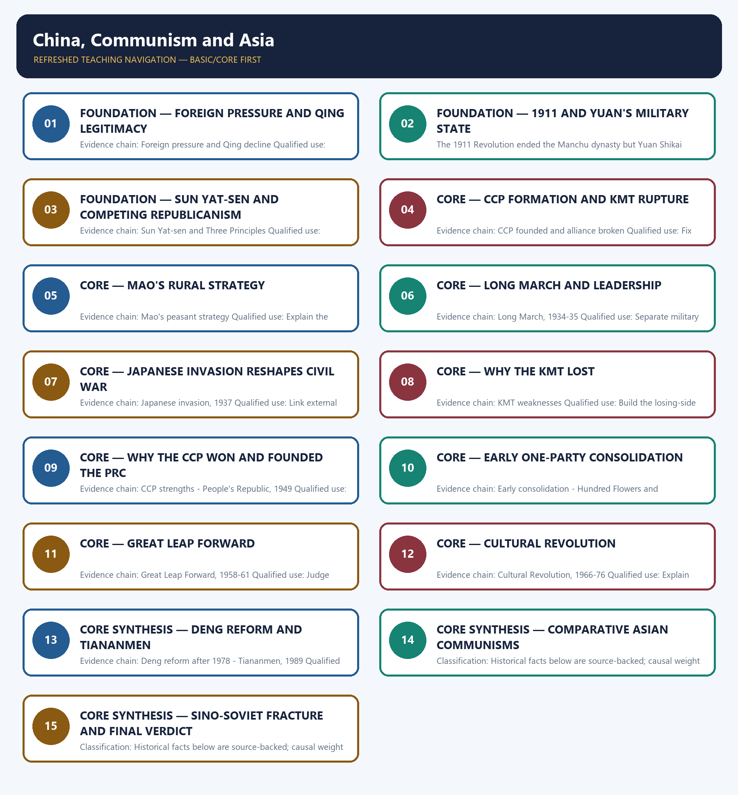

# China, Communism and Asia — Learner-v2 Complete Learning Session

> **Authoring-only generation:** 2026-09-01. No PDF was rendered and no tracker or index was mutated.

### SOURCE, PROGRESSION AND CURRENT-LINKAGE AUDIT

- **Generation date:** 2026-09-01.
- **Repository-first evidence:** the Basic owner is taught first and preserved in full; the Advanced owner is retained only in the optional final teaching block.
- **OCR evidence:** Repository Markdown was used first. The available OCR-searchable Norman Lowe World History PDF was retained as supplementary local context, but no unsupported page number, quotation or precision was imported from it.
- **Qdrant:** not used; repository Markdown and available OCR context were sufficient.
- **PYQ integrity:** No direct UPSC PYQ is verified as owned solely by this topic in the local routing blocks. All six Mains demands are original practice.
- **Live-link boundary:** No verified live current-affairs item is pegged to this historical topic in the repository owners. The package therefore uses the bounded phrase 'no verified live item' rather than inventing a headline, date, institution or contemporary linkage.
- **Fact/inference discipline:** no current-affairs item, PYQ wording, figure or quotation is invented.

## BASIC LEARNING SESSION

### DEEP-REVIEW LEARNING CONTRACT

| Control | Binding rule for this package |
|---|---|
| Syllabus boundary | Complete World History Core is taught chronologically, spatially and causally before optional enrichment. |
| Evidence method | Claim → named event/treaty/institution/actor/region or attributed scholarship → analysis → qualification. |
| Chronology | Structural cause, trigger, event, settlement, implementation and long-term process remain distinct. |
| Geography | Europe, Africa, Asia, West Asia and the Americas retain their own actors, routes and unequal connections; Europe is never the default universal viewpoint. |
| Historiography | Liberal, conservative, Marxist, social, feminist, postcolonial and other relevant interpretations are tied to evidence and bounded claims. |
| Practice contract | Every solved item has directive/demand decoding, an examiner-grade model, an executable timed/compression plan, marks rationale and answer-specific improvement. |
| Approval | This immutable successor remains `approved: false` pending explicit approval. |

**Canonical Basic/Core owner:** `upsc-ai-kit\knowledge\World-History\basic\17_China-Communism-and-Asia.md`  
**Canonical topic owner:** `upsc-ai-kit\knowledge\World-History\basic\17_China-Communism-and-Asia.md`  
**Optional Advanced owner:** `upsc-ai-kit\knowledge\World-History\advanced\17_China-Communism-and-Asia.md`  
**Official syllabus mapping:** `upsc-ai-kit\knowledge\World-History\OFFICIAL-UPSC-SYLLABUS-MAPPING.md`

### EVIDENCE, PYQ AND CURRENT-STATUS CONTROL

- **Primary/official evidence:** treaties, declarations, laws, institutional records, speeches and contemporary testimony are dated and read for authorship, audience and purpose.
- **Spatial and social evidence:** maps, trade and migration routes, battlefield geography, class, race, gender and colonial position qualify state-centred narrative.
- **Quantitative evidence:** population, debt, inflation, output, casualties and territorial claims retain unit, place, period, source and uncertainty; no statistic is invented.
- **Interpretive discipline:** teleology, civilisational ranking, single-cause verdicts and present-day nation-state projection are rejected.
- **PYQ discipline:** repository routing ledgers and locally held papers control wording and metadata; neutral rendering, reconstruction and unavailable official keys remain explicitly labelled.
- **Current-status note, rechecked 2026-09-01:** No verified live current-affairs item is pegged to this historical topic in the repository owners. The package therefore uses the bounded phrase 'no verified live item' rather than inventing a headline, date, institution or contemporary linkage.

**Live/primary context sources recorded by the predecessor generation:**

- No live source is required for a static historical claim in this topic.




*Distinct embedded teaching-navigation image. The separate continuous Cārvāka-style flowchart package remains an independent at-a-glance artifact.*

### SESSION 1 — FOUNDATION — FOREIGN PRESSURE AND QING LEGITIMACY

#### DEFINITION / WHAT THIS IS CALLED

**Plain-language definition:** Precise definition: Foreign pressure and Qing legitimacy is the source-bounded relationship among and Foreign pressure and Qing decline within China, Communism and Asia.

**Technical definition:** Evidence chain: Foreign pressure and Qing decline Qualified use: Begin with the old order's crisis.

#### ANSWER-GRABBING OPENING — WRITE/ADAPT IN THE EXAM

> Precise definition: Foreign pressure and Qing legitimacy is the source-bounded relationship among and Foreign pressure and Qing decline within China, Communism and Asia.

#### MUST-WRITE KEYWORDS

- **FOUNDATION**
- **Foreign pressure**
- **Qing legitimacy**
- **Precise definition**
- **Evidence chain**
- **Qualified use**

**How to use them:** Frame the answer through FOUNDATION; define Foreign pressure, connect Qing legitimacy with Precise definition to explain the mechanism, and use Evidence chain for the decisive comparison or qualification.

##### VISUAL FIRST

```text
FOREIGN PRESSURE AND QING LEGITIMACY
01. Foreign pressure and Qing decline
BOUNDARY -> Foreign humiliation weakened the dynasty before revolution.
```

*This topic-specific rail fixes the evidence sequence and its exam boundary before analysis.*

##### CONCEPT DEFINITIONS

- **Precise definition:** Foreign pressure and Qing legitimacy is the source-bounded relationship among  and Foreign pressure and Qing decline within China, Communism and Asia.
- **Classification:** Historical facts below are source-backed; causal weight and evaluative verdicts are analytical synthesis.

##### CORE EXPLANATION

Opium Wars, concessions and Japanese victories weakened Qing dynasty authority and turned dynastic collapse into a legitimacy crisis.

##### NAMED EVIDENCE AND MECHANISM

- Opium Wars, concessions and Japanese victories weakened Qing dynasty authority and turned dynastic collapse into a legitimacy crisis.

##### EXAMINER CAUTION

- Foreign humiliation weakened the dynasty before revolution.

##### EXAM LINK

- **Prelims:** Retain the exact actor, date, document and category in Foreign pressure and Qing legitimacy.
- **Mains:** Begin with the old order's crisis.

##### MINI RECAP

- **Evidence chain:** Foreign pressure and Qing decline
- **Qualified use:** Begin with the old order's crisis.

#### CLOSING RECALL FLOW — FOUNDATION — FOREIGN PRESSURE AND QING LEGITIMACY

```text
START / CONCEPT: FOUNDATION — Foreign pressure and Qing legitimacy
        |
        v
EXACT TERMS: FOUNDATION · Foreign pressure · Qing legitimacy · Precise definition · Evidence chain · Qualified use
        |
        v
MECHANISM / ARGUMENT: Evidence chain: Foreign pressure and Qing decline Qualified use: Begin with the old order's crisis.
        |
        v
CONSEQUENCE / CONTRAST: Classification: Historical facts below are source-backed; causal weight and evaluative verdicts are analytical synthesis.
        |
        v
UPSC TRAP / ANSWER-USE: Do not miss this limiting distinction: foreign pressure and Qing legitimacy is the source-bounded relationship among and Foreign pressure and...
        |
        v
ANSWER-GRABBING FORMULATION: Precise definition: Foreign pressure and Qing legitimacy is the source-bounded relationship among and Foreign pressure and Qing decline within China, Communism and Asia.
```
### SESSION 2 — FOUNDATION — 1911 AND YUAN'S MILITARY STATE

#### DEFINITION / WHAT THIS IS CALLED

**Plain-language definition:** Precise definition: 1911 and Yuan's military state is the source-bounded relationship among Revolution of 1911 and Warlord fragmentation within China, Communism and Asia.

**Technical definition:** The 1911 Revolution ended the Manchu dynasty but Yuan Shikai converted republican change into military dictatorship.

#### ANSWER-GRABBING OPENING — WRITE/ADAPT IN THE EXAM

> Precise definition: 1911 and Yuan's military state is the source-bounded relationship among Revolution of 1911 and Warlord fragmentation within China, Communism and Asia.

#### MUST-WRITE KEYWORDS

- **FOUNDATION**
- **Yuan's military state**
- **Precise definition**
- **Evidence chain**
- **Qualified use**
- **Precise definition: 1911 and Yuan's military state**

**How to use them:** Frame the answer through FOUNDATION; define Yuan's military state, connect Precise definition with Evidence chain to explain the mechanism, and use Qualified use for the decisive comparison or qualification.

##### VISUAL FIRST

```text
1911 AND YUAN'S MILITARY STATE
01. Revolution of 1911
    |
    v
02. Warlord fragmentation
BOUNDARY -> Regime change did not equal state-building.
```

*This topic-specific rail fixes the evidence sequence and its exam boundary before analysis.*

##### CONCEPT DEFINITIONS

- **Precise definition:** 1911 and Yuan's military state is the source-bounded relationship among Revolution of 1911 and Warlord fragmentation within China, Communism and Asia.
- **Classification:** Historical facts below are source-backed; causal weight and evaluative verdicts are analytical synthesis.

##### CORE EXPLANATION

The 1911 Revolution ended the Manchu dynasty but Yuan Shikai converted republican change into military dictatorship. After Yuan, provincial military rulers fought while central authority remained weak, making state-building the central political problem.

##### NAMED EVIDENCE AND MECHANISM

- The 1911 Revolution ended the Manchu dynasty but Yuan Shikai converted republican change into military dictatorship.
- After Yuan, provincial military rulers fought while central authority remained weak, making state-building the central political problem.

##### EXAMINER CAUTION

- Regime change did not equal state-building.

##### EXAM LINK

- **Prelims:** Retain the exact actor, date, document and category in 1911 and Yuan's military state.
- **Mains:** Explain why republican form failed.

##### MINI RECAP

- **Evidence chain:** Revolution of 1911 -> Warlord fragmentation
- **Qualified use:** Explain why republican form failed.

#### CLOSING RECALL FLOW — FOUNDATION — 1911 AND YUAN'S MILITARY STATE

```text
START / CONCEPT: FOUNDATION — 1911 and Yuan's military state
        |
        v
EXACT TERMS: FOUNDATION · Yuan's military state · Precise definition · Evidence chain · Qualified use · Precise definition: 1911 and Yuan's military state
        |
        v
MECHANISM / ARGUMENT: The 1911 Revolution ended the Manchu dynasty but Yuan Shikai converted republican change into military dictatorship.
        |
        v
CONSEQUENCE / CONTRAST: Evidence chain: Revolution of 1911 - Warlord fragmentation Qualified use: Explain why republican form failed.
        |
        v
UPSC TRAP / ANSWER-USE: Do not miss this limiting distinction: causal weight and evaluative verdicts are analytical synthesis.
        |
        v
ANSWER-GRABBING FORMULATION: Precise definition: 1911 and Yuan's military state is the source-bounded relationship among Revolution of 1911 and Warlord fragmentation within China, Communism and Asia.
```
### SESSION 3 — FOUNDATION — SUN YAT-SEN AND COMPETING REPUBLICANISM

#### DEFINITION / WHAT THIS IS CALLED

**Plain-language definition:** Precise definition: Sun Yat-sen and competing republicanism is the source-bounded relationship among and Sun Yat-sen and Three Principles within China, Communism and Asia.

**Technical definition:** Evidence chain: Sun Yat-sen and Three Principles Qualified use: Preserve ideological plurality.

#### ANSWER-GRABBING OPENING — WRITE/ADAPT IN THE EXAM

> Precise definition: Sun Yat-sen and competing republicanism is the source-bounded relationship among and Sun Yat-sen and Three Principles within China, Communism and Asia.

#### MUST-WRITE KEYWORDS

- **FOUNDATION**
- **Sun Yat-sen**
- **competing republicanism**
- **Precise definition**
- **Evidence chain**
- **Qualified use**

**How to use them:** Frame the answer through FOUNDATION; define Sun Yat-sen, connect competing republicanism with Precise definition to explain the mechanism, and use Evidence chain for the decisive comparison or qualification.

##### VISUAL FIRST

```text
SUN YAT-SEN AND COMPETING REPUBLICANISM
01. Sun Yat-sen and Three Principles
BOUNDARY -> The CCP was not the only alternative.
```

*This topic-specific rail fixes the evidence sequence and its exam boundary before analysis.*

##### CONCEPT DEFINITIONS

- **Precise definition:** Sun Yat-sen and competing republicanism is the source-bounded relationship among  and Sun Yat-sen and Three Principles within China, Communism and Asia.
- **Classification:** Historical facts below are source-backed; causal weight and evaluative verdicts are analytical synthesis.

##### CORE EXPLANATION

Sun Yat-sen's nationalism, democracy and people's livelihood offered a republican alternative to warlordism and imperial subordination.

##### NAMED EVIDENCE AND MECHANISM

- Sun Yat-sen's nationalism, democracy and people's livelihood offered a republican alternative to warlordism and imperial subordination.

##### EXAMINER CAUTION

- The CCP was not the only alternative.

##### EXAM LINK

- **Prelims:** Retain the exact actor, date, document and category in Sun Yat-sen and competing republicanism.
- **Mains:** Preserve ideological plurality.

##### MINI RECAP

- **Evidence chain:** Sun Yat-sen and Three Principles
- **Qualified use:** Preserve ideological plurality.

#### CLOSING RECALL FLOW — FOUNDATION — SUN YAT-SEN AND COMPETING REPUBLICANISM

```text
START / CONCEPT: FOUNDATION — Sun Yat-sen and competing republicanism
        |
        v
EXACT TERMS: FOUNDATION · Sun Yat-sen · competing republicanism · Precise definition · Evidence chain · Qualified use
        |
        v
MECHANISM / ARGUMENT: Evidence chain: Sun Yat-sen and Three Principles Qualified use: Preserve ideological plurality.
        |
        v
CONSEQUENCE / CONTRAST: The CCP was not the only alternative.
        |
        v
UPSC TRAP / ANSWER-USE: Do not miss this limiting distinction: causal weight and evaluative verdicts are analytical synthesis.
        |
        v
ANSWER-GRABBING FORMULATION: Precise definition: Sun Yat-sen and competing republicanism is the source-bounded relationship among and Sun Yat-sen and Three Principles within China, Communism and Asia.
```
### SESSION 4 — CORE — CCP FORMATION AND KMT RUPTURE

#### DEFINITION / WHAT THIS IS CALLED

**Plain-language definition:** Precise definition: CCP formation and KMT rupture is the source-bounded relationship among and CCP founded and alliance broken within China, Communism and Asia.

**Technical definition:** Evidence chain: CCP founded and alliance broken Qualified use: Fix the 1921-27 sequence.

#### ANSWER-GRABBING OPENING — WRITE/ADAPT IN THE EXAM

> Precise definition: CCP formation and KMT rupture is the source-bounded relationship among and CCP founded and alliance broken within China, Communism and Asia.

#### MUST-WRITE KEYWORDS

- **CCP formation**
- **KMT rupture**
- **Precise definition**
- **Evidence chain**
- **Qualified use**
- **1921-27**

**How to use them:** Frame the answer through CCP formation; define KMT rupture, connect Precise definition with Evidence chain to explain the mechanism, and use Qualified use for the decisive comparison or qualification.

##### VISUAL FIRST

```text
CCP FORMATION AND KMT RUPTURE
01. CCP founded and alliance broken
BOUNDARY -> Cooperation preceded civil war.
```

*This topic-specific rail fixes the evidence sequence and its exam boundary before analysis.*

##### CONCEPT DEFINITIONS

- **Precise definition:** CCP formation and KMT rupture is the source-bounded relationship among  and CCP founded and alliance broken within China, Communism and Asia.
- **Classification:** Historical facts below are source-backed; causal weight and evaluative verdicts are analytical synthesis.

##### CORE EXPLANATION

The Chinese Communist Party was founded in 1921, cooperated with the KMT and entered deeper civil war after the alliance broke in 1927.

##### NAMED EVIDENCE AND MECHANISM

- The Chinese Communist Party was founded in 1921, cooperated with the KMT and entered deeper civil war after the alliance broke in 1927.

##### EXAMINER CAUTION

- Cooperation preceded civil war.

##### EXAM LINK

- **Prelims:** Retain the exact actor, date, document and category in CCP formation and KMT rupture.
- **Mains:** Fix the 1921-27 sequence.

##### MINI RECAP

- **Evidence chain:** CCP founded and alliance broken
- **Qualified use:** Fix the 1921-27 sequence.

#### CLOSING RECALL FLOW — CORE — CCP FORMATION AND KMT RUPTURE

```text
START / CONCEPT: CORE — CCP formation and KMT rupture
        |
        v
EXACT TERMS: CCP formation · KMT rupture · Precise definition · Evidence chain · Qualified use · 1921-27
        |
        v
MECHANISM / ARGUMENT: Evidence chain: CCP founded and alliance broken Qualified use: Fix the 1921-27 sequence.
        |
        v
CONSEQUENCE / CONTRAST: Classification: Historical facts below are source-backed; causal weight and evaluative verdicts are analytical synthesis.
        |
        v
UPSC TRAP / ANSWER-USE: Do not miss this limiting distinction: the Chinese Communist Party was founded in 1921, cooperated with the KMT and entered...
        |
        v
ANSWER-GRABBING FORMULATION: Precise definition: CCP formation and KMT rupture is the source-bounded relationship among and CCP founded and alliance broken within China, Communism and Asia.
```
### SESSION 5 — CORE — MAO'S RURAL STRATEGY

#### DEFINITION / WHAT THIS IS CALLED

**Plain-language definition:** Precise definition: Mao's rural strategy is the source-bounded relationship among and Mao's peasant strategy within China, Communism and Asia.

**Technical definition:** Evidence chain: Mao's peasant strategy Qualified use: Explain the peasant social base.

#### ANSWER-GRABBING OPENING — WRITE/ADAPT IN THE EXAM

> Precise definition: Mao's rural strategy is the source-bounded relationship among and Mao's peasant strategy within China, Communism and Asia.

#### MUST-WRITE KEYWORDS

- **Mao's rural strategy**
- **Precise definition**
- **Evidence chain**
- **Qualified use**
- **Precise definition: Mao's rural strategy**
- **Precise**

**How to use them:** Frame the answer through Mao's rural strategy; define Precise definition, connect Evidence chain with Qualified use to explain the mechanism, and use Precise definition: Mao's rural strategy for the decisive comparison or qualification.

##### VISUAL FIRST

```text
MAO'S RURAL STRATEGY
01. Mao's peasant strategy
BOUNDARY -> Do not force an urban revolutionary template on China.
```

*This topic-specific rail fixes the evidence sequence and its exam boundary before analysis.*

##### CONCEPT DEFINITIONS

- **Precise definition:** Mao's rural strategy is the source-bounded relationship among  and Mao's peasant strategy within China, Communism and Asia.
- **Classification:** Historical facts below are source-backed; causal weight and evaluative verdicts are analytical synthesis.

##### CORE EXPLANATION

Mao Zedong rooted communist survival among countryside peasants rather than relying on China's small urban working class.

##### NAMED EVIDENCE AND MECHANISM

- Mao Zedong rooted communist survival among countryside peasants rather than relying on China's small urban working class.

##### EXAMINER CAUTION

- Do not force an urban revolutionary template on China.

##### EXAM LINK

- **Prelims:** Retain the exact actor, date, document and category in Mao's rural strategy.
- **Mains:** Explain the peasant social base.

##### MINI RECAP

- **Evidence chain:** Mao's peasant strategy
- **Qualified use:** Explain the peasant social base.

#### CLOSING RECALL FLOW — CORE — MAO'S RURAL STRATEGY

```text
START / CONCEPT: CORE — Mao's rural strategy
        |
        v
EXACT TERMS: Mao's rural strategy · Precise definition · Evidence chain · Qualified use · Precise definition: Mao's rural strategy · Precise
        |
        v
MECHANISM / ARGUMENT: Evidence chain: Mao's peasant strategy Qualified use: Explain the peasant social base.
        |
        v
CONSEQUENCE / CONTRAST: Do not force an urban revolutionary template on China.
        |
        v
UPSC TRAP / ANSWER-USE: Do not miss this limiting distinction: causal weight and evaluative verdicts are analytical synthesis.
        |
        v
ANSWER-GRABBING FORMULATION: Precise definition: Mao's rural strategy is the source-bounded relationship among and Mao's peasant strategy within China, Communism and Asia.
```
### SESSION 6 — CORE — LONG MARCH AND LEADERSHIP

#### DEFINITION / WHAT THIS IS CALLED

**Plain-language definition:** Precise definition: Long March and leadership is the source-bounded relationship among and Long March, 1934-35 within China, Communism and Asia.

**Technical definition:** Evidence chain: Long March, 1934-35 Qualified use: Separate military and political outcomes.

#### ANSWER-GRABBING OPENING — WRITE/ADAPT IN THE EXAM

> Precise definition: Long March and leadership is the source-bounded relationship among and Long March, 1934-35 within China, Communism and Asia.

#### MUST-WRITE KEYWORDS

- **Long March**
- **leadership**
- **Precise definition**
- **Evidence chain**
- **Qualified use**
- **1934-35**

**How to use them:** Frame the answer through Long March; define leadership, connect Precise definition with Evidence chain to explain the mechanism, and use Qualified use for the decisive comparison or qualification.

##### VISUAL FIRST

```text
LONG MARCH AND LEADERSHIP
01. Long March, 1934-35
BOUNDARY -> Retreat became a source of organisational legitimacy.
```

*This topic-specific rail fixes the evidence sequence and its exam boundary before analysis.*

##### CONCEPT DEFINITIONS

- **Precise definition:** Long March and leadership is the source-bounded relationship among  and Long March, 1934-35 within China, Communism and Asia.
- **Classification:** Historical facts below are source-backed; causal weight and evaluative verdicts are analytical synthesis.

##### CORE EXPLANATION

The Long March preserved the communist leadership, elevated Mao and converted survival into political legitimacy.

##### NAMED EVIDENCE AND MECHANISM

- The Long March preserved the communist leadership, elevated Mao and converted survival into political legitimacy.

##### EXAMINER CAUTION

- Retreat became a source of organisational legitimacy.

##### EXAM LINK

- **Prelims:** Retain the exact actor, date, document and category in Long March and leadership.
- **Mains:** Separate military and political outcomes.

##### MINI RECAP

- **Evidence chain:** Long March, 1934-35
- **Qualified use:** Separate military and political outcomes.

#### CLOSING RECALL FLOW — CORE — LONG MARCH AND LEADERSHIP

```text
START / CONCEPT: CORE — Long March and leadership
        |
        v
EXACT TERMS: Long March · leadership · Precise definition · Evidence chain · Qualified use · 1934-35
        |
        v
MECHANISM / ARGUMENT: Evidence chain: Long March, 1934-35 Qualified use: Separate military and political outcomes.
        |
        v
CONSEQUENCE / CONTRAST: Classification: Historical facts below are source-backed; causal weight and evaluative verdicts are analytical synthesis.
        |
        v
UPSC TRAP / ANSWER-USE: Do not miss this limiting distinction: retreat became a source of organisational legitimacy.
        |
        v
ANSWER-GRABBING FORMULATION: Precise definition: Long March and leadership is the source-bounded relationship among and Long March, 1934-35 within China, Communism and Asia.
```
### SESSION 7 — CORE — JAPANESE INVASION RESHAPES CIVIL WAR

#### DEFINITION / WHAT THIS IS CALLED

**Plain-language definition:** Precise definition: Japanese invasion reshapes civil war is the source-bounded relationship among and Japanese invasion, 1937 within China, Communism and Asia.

**Technical definition:** Evidence chain: Japanese invasion, 1937 Qualified use: Link external war to domestic outcome.

#### ANSWER-GRABBING OPENING — WRITE/ADAPT IN THE EXAM

> Precise definition: Japanese invasion reshapes civil war is the source-bounded relationship among and Japanese invasion, 1937 within China, Communism and Asia.

#### MUST-WRITE KEYWORDS

- **Japanese invasion reshapes civil war**
- **Precise definition**
- **Evidence chain**
- **Qualified use**
- **Precise definition: Japanese invasion reshapes civil war**
- **Precise**

**How to use them:** Frame the answer through Japanese invasion reshapes civil war; define Precise definition, connect Evidence chain with Qualified use to explain the mechanism, and use Precise definition: Japanese invasion reshapes civil war for the decisive comparison or qualification.

##### VISUAL FIRST

```text
JAPANESE INVASION RESHAPES CIVIL WAR
01. Japanese invasion, 1937
BOUNDARY -> National defence changed relative legitimacy.
```

*This topic-specific rail fixes the evidence sequence and its exam boundary before analysis.*

##### CONCEPT DEFINITIONS

- **Precise definition:** Japanese invasion reshapes civil war is the source-bounded relationship among  and Japanese invasion, 1937 within China, Communism and Asia.
- **Classification:** Historical facts below are source-backed; causal weight and evaluative verdicts are analytical synthesis.

##### CORE EXPLANATION

Full-scale Japanese invasion transformed civil conflict into a competition over national defence and damaged the KMT disproportionately.

##### NAMED EVIDENCE AND MECHANISM

- Full-scale Japanese invasion transformed civil conflict into a competition over national defence and damaged the KMT disproportionately.

##### EXAMINER CAUTION

- National defence changed relative legitimacy.

##### EXAM LINK

- **Prelims:** Retain the exact actor, date, document and category in Japanese invasion reshapes civil war.
- **Mains:** Link external war to domestic outcome.

##### MINI RECAP

- **Evidence chain:** Japanese invasion, 1937
- **Qualified use:** Link external war to domestic outcome.

#### CLOSING RECALL FLOW — CORE — JAPANESE INVASION RESHAPES CIVIL WAR

```text
START / CONCEPT: CORE — Japanese invasion reshapes civil war
        |
        v
EXACT TERMS: Japanese invasion reshapes civil war · Precise definition · Evidence chain · Qualified use · Precise definition: Japanese invasion reshapes civil war · Precise
        |
        v
MECHANISM / ARGUMENT: Evidence chain: Japanese invasion, 1937 Qualified use: Link external war to domestic outcome.
        |
        v
CONSEQUENCE / CONTRAST: Classification: Historical facts below are source-backed; causal weight and evaluative verdicts are analytical synthesis.
        |
        v
UPSC TRAP / ANSWER-USE: Do not miss this limiting distinction: japanese invasion reshapes civil war is the source-bounded relationship among and Japanese invasion, 1937...
        |
        v
ANSWER-GRABBING FORMULATION: Precise definition: Japanese invasion reshapes civil war is the source-bounded relationship among and Japanese invasion, 1937 within China, Communism and Asia.
```
### SESSION 8 — CORE — WHY THE KMT LOST

#### DEFINITION / WHAT THIS IS CALLED

**Plain-language definition:** Precise definition: Why the KMT lost is the source-bounded relationship among and KMT weaknesses within China, Communism and Asia.

**Technical definition:** Evidence chain: KMT weaknesses Qualified use: Build the losing-side explanation.

#### ANSWER-GRABBING OPENING — WRITE/ADAPT IN THE EXAM

> Precise definition: Why the KMT lost is the source-bounded relationship among and KMT weaknesses within China, Communism and Asia.

#### MUST-WRITE KEYWORDS

- **Why the KMT lost**
- **Precise definition**
- **Evidence chain**
- **Qualified use**
- **Precise definition: Why the KMT lost**
- **Precise**

**How to use them:** Frame the answer through Why the KMT lost; define Precise definition, connect Evidence chain with Qualified use to explain the mechanism, and use Precise definition: Why the KMT lost for the decisive comparison or qualification.

##### VISUAL FIRST

```text
WHY THE KMT LOST
01. KMT weaknesses
BOUNDARY -> Internal governance failure matters alongside war.
```

*This topic-specific rail fixes the evidence sequence and its exam boundary before analysis.*

##### CONCEPT DEFINITIONS

- **Precise definition:** Why the KMT lost is the source-bounded relationship among  and KMT weaknesses within China, Communism and Asia.
- **Classification:** Historical facts below are source-backed; causal weight and evaluative verdicts are analytical synthesis.

##### CORE EXPLANATION

Corruption, poor administration, inflation and weak mass appeal eroded Chiang Kai-shek's political legitimacy.

##### NAMED EVIDENCE AND MECHANISM

- Corruption, poor administration, inflation and weak mass appeal eroded Chiang Kai-shek's political legitimacy.

##### EXAMINER CAUTION

- Internal governance failure matters alongside war.

##### EXAM LINK

- **Prelims:** Retain the exact actor, date, document and category in Why the KMT lost.
- **Mains:** Build the losing-side explanation.

##### MINI RECAP

- **Evidence chain:** KMT weaknesses
- **Qualified use:** Build the losing-side explanation.

#### CLOSING RECALL FLOW — CORE — WHY THE KMT LOST

```text
START / CONCEPT: CORE — Why the KMT lost
        |
        v
EXACT TERMS: Why the KMT lost · Precise definition · Evidence chain · Qualified use · Precise definition: Why the KMT lost · Precise
        |
        v
MECHANISM / ARGUMENT: Evidence chain: KMT weaknesses Qualified use: Build the losing-side explanation.
        |
        v
CONSEQUENCE / CONTRAST: Classification: Historical facts below are source-backed; causal weight and evaluative verdicts are analytical synthesis.
        |
        v
UPSC TRAP / ANSWER-USE: Do not miss this limiting distinction: why the KMT lost is the source-bounded relationship among and KMT weaknesses within China...
        |
        v
ANSWER-GRABBING FORMULATION: Precise definition: Why the KMT lost is the source-bounded relationship among and KMT weaknesses within China, Communism and Asia.
```
### SESSION 9 — CORE — WHY THE CCP WON AND FOUNDED THE PRC

#### DEFINITION / WHAT THIS IS CALLED

**Plain-language definition:** Precise definition: Why the CCP won and founded the PRC is the source-bounded relationship among CCP strengths and People's Republic, 1949 within China, Communism and Asia.

**Technical definition:** Evidence chain: CCP strengths - People's Republic, 1949 Qualified use: Complete the comparative explanation.

#### ANSWER-GRABBING OPENING — WRITE/ADAPT IN THE EXAM

> Precise definition: Why the CCP won and founded the PRC is the source-bounded relationship among CCP strengths and People's Republic, 1949 within China, Communism and Asia.

#### MUST-WRITE KEYWORDS

- **Why the CCP won**
- **founded the PRC**
- **Precise definition**
- **Evidence chain**
- **Qualified use**
- **Precise**

**How to use them:** Frame the answer through Why the CCP won; define founded the PRC, connect Precise definition with Evidence chain to explain the mechanism, and use Qualified use for the decisive comparison or qualification.

##### VISUAL FIRST

```text
WHY THE CCP WON AND FOUNDED THE PRC
01. CCP strengths
    |
    v
02. People's Republic, 1949
BOUNDARY -> Political legitimacy preceded final military victory.
```

*This topic-specific rail fixes the evidence sequence and its exam boundary before analysis.*

##### CONCEPT DEFINITIONS

- **Precise definition:** Why the CCP won and founded the PRC is the source-bounded relationship among CCP strengths and People's Republic, 1949 within China, Communism and Asia.
- **Classification:** Historical facts below are source-backed; causal weight and evaluative verdicts are analytical synthesis.

##### CORE EXPLANATION

Discipline, land reform, peasant contact and patriotic credibility allowed the CCP to out-govern as well as out-fight the KMT. Mao proclaimed the People's Republic of China in 1949 while Chiang and the KMT retreated to Taiwan.

##### NAMED EVIDENCE AND MECHANISM

- Discipline, land reform, peasant contact and patriotic credibility allowed the CCP to out-govern as well as out-fight the KMT.
- Mao proclaimed the People's Republic of China in 1949 while Chiang and the KMT retreated to Taiwan.

##### EXAMINER CAUTION

- Political legitimacy preceded final military victory.

##### EXAM LINK

- **Prelims:** Retain the exact actor, date, document and category in Why the CCP won and founded the PRC.
- **Mains:** Complete the comparative explanation.

##### MINI RECAP

- **Evidence chain:** CCP strengths -> People's Republic, 1949
- **Qualified use:** Complete the comparative explanation.

#### CLOSING RECALL FLOW — CORE — WHY THE CCP WON AND FOUNDED THE PRC

```text
START / CONCEPT: CORE — Why the CCP won and founded the PRC
        |
        v
EXACT TERMS: Why the CCP won · founded the PRC · Precise definition · Evidence chain · Qualified use · Precise
        |
        v
MECHANISM / ARGUMENT: Evidence chain: CCP strengths - People's Republic, 1949 Qualified use: Complete the comparative explanation.
        |
        v
CONSEQUENCE / CONTRAST: Classification: Historical facts below are source-backed; causal weight and evaluative verdicts are analytical synthesis.
        |
        v
UPSC TRAP / ANSWER-USE: Do not miss this limiting distinction: why the CCP won and founded the PRC is the source-bounded relationship among CCP...
        |
        v
ANSWER-GRABBING FORMULATION: Precise definition: Why the CCP won and founded the PRC is the source-bounded relationship among CCP strengths and People's Republic, 1949 within China, Communism and Asia.
```
### SESSION 10 — CORE — EARLY ONE-PARTY CONSOLIDATION

#### DEFINITION / WHAT THIS IS CALLED

**Plain-language definition:** Precise definition: Early one-party consolidation is the source-bounded relationship among Early consolidation and Hundred Flowers and Anti-Rightist turn within China, Communism and Asia.

**Technical definition:** Evidence chain: Early consolidation - Hundred Flowers and Anti-Rightist turn Qualified use: Evaluate state formation and dissent.

#### ANSWER-GRABBING OPENING — WRITE/ADAPT IN THE EXAM

> Precise definition: Early one-party consolidation is the source-bounded relationship among Early consolidation and Hundred Flowers and Anti-Rightist turn within China, Communism and Asia.

#### MUST-WRITE KEYWORDS

- **Early one-party consolidation**
- **Precise definition**
- **Evidence chain**
- **Qualified use**
- **Precise definition: Early one-party consolidation**
- **Precise**

**How to use them:** Frame the answer through Early one-party consolidation; define Precise definition, connect Evidence chain with Qualified use to explain the mechanism, and use Precise definition: Early one-party consolidation for the decisive comparison or qualification.

##### VISUAL FIRST

```text
EARLY ONE-PARTY CONSOLIDATION
01. Early consolidation
    |
    v
02. Hundred Flowers and Anti-Rightist turn
BOUNDARY -> Land reform and repression coexisted.
```

*This topic-specific rail fixes the evidence sequence and its exam boundary before analysis.*

##### CONCEPT DEFINITIONS

- **Precise definition:** Early one-party consolidation is the source-bounded relationship among Early consolidation and Hundred Flowers and Anti-Rightist turn within China, Communism and Asia.
- **Classification:** Historical facts below are source-backed; causal weight and evaluative verdicts are analytical synthesis.

##### CORE EXPLANATION

Land reform and reconstruction weakened landlord power while a centralised one-party state expanded rapidly. A brief opening to criticism was followed by repression, exposing the narrow limits of organised dissent.

##### NAMED EVIDENCE AND MECHANISM

- Land reform and reconstruction weakened landlord power while a centralised one-party state expanded rapidly.
- A brief opening to criticism was followed by repression, exposing the narrow limits of organised dissent.

##### EXAMINER CAUTION

- Land reform and repression coexisted.

##### EXAM LINK

- **Prelims:** Retain the exact actor, date, document and category in Early one-party consolidation.
- **Mains:** Evaluate state formation and dissent.

##### MINI RECAP

- **Evidence chain:** Early consolidation -> Hundred Flowers and Anti-Rightist turn
- **Qualified use:** Evaluate state formation and dissent.

#### CLOSING RECALL FLOW — CORE — EARLY ONE-PARTY CONSOLIDATION

```text
START / CONCEPT: CORE — Early one-party consolidation
        |
        v
EXACT TERMS: Early one-party consolidation · Precise definition · Evidence chain · Qualified use · Precise definition: Early one-party consolidation · Precise
        |
        v
MECHANISM / ARGUMENT: Evidence chain: Early consolidation - Hundred Flowers and Anti-Rightist turn Qualified use: Evaluate state formation and dissent.
        |
        v
CONSEQUENCE / CONTRAST: Classification: Historical facts below are source-backed; causal weight and evaluative verdicts are analytical synthesis.
        |
        v
UPSC TRAP / ANSWER-USE: Do not miss this limiting distinction: a brief opening to criticism was followed by repression, exposing the narrow limits of...
        |
        v
ANSWER-GRABBING FORMULATION: Precise definition: Early one-party consolidation is the source-bounded relationship among Early consolidation and Hundred Flowers and Anti-Rightist turn within China, Communism and Asia.
```
### SESSION 11 — CORE — GREAT LEAP FORWARD

#### DEFINITION / WHAT THIS IS CALLED

**Plain-language definition:** Precise definition: Great Leap Forward is the source-bounded relationship among and Great Leap Forward, 1958-61 within China, Communism and Asia.

**Technical definition:** Evidence chain: Great Leap Forward, 1958-61 Qualified use: Judge policy through mechanism and effect.

#### ANSWER-GRABBING OPENING — WRITE/ADAPT IN THE EXAM

> Precise definition: Great Leap Forward is the source-bounded relationship among and Great Leap Forward, 1958-61 within China, Communism and Asia.

#### MUST-WRITE KEYWORDS

- **Great Leap Forward**
- **Precise definition**
- **Evidence chain**
- **Qualified use**
- **Precise definition: Great Leap Forward**
- **1958-61**

**How to use them:** Frame the answer through Great Leap Forward; define Precise definition, connect Evidence chain with Qualified use to explain the mechanism, and use Precise definition: Great Leap Forward for the decisive comparison or qualification.

##### VISUAL FIRST

```text
GREAT LEAP FORWARD
01. Great Leap Forward, 1958-61
BOUNDARY -> Use qualitative catastrophe without invented totals.
```

*This topic-specific rail fixes the evidence sequence and its exam boundary before analysis.*

##### CONCEPT DEFINITIONS

- **Precise definition:** Great Leap Forward is the source-bounded relationship among  and Great Leap Forward, 1958-61 within China, Communism and Asia.
- **Classification:** Historical facts below are source-backed; causal weight and evaluative verdicts are analytical synthesis.

##### CORE EXPLANATION

Crash industrialisation and communes produced severe disruption and famine and damaged Mao's standing.

##### NAMED EVIDENCE AND MECHANISM

- Crash industrialisation and communes produced severe disruption and famine and damaged Mao's standing.

##### EXAMINER CAUTION

- Use qualitative catastrophe without invented totals.

##### EXAM LINK

- **Prelims:** Retain the exact actor, date, document and category in Great Leap Forward.
- **Mains:** Judge policy through mechanism and effect.

##### MINI RECAP

- **Evidence chain:** Great Leap Forward, 1958-61
- **Qualified use:** Judge policy through mechanism and effect.

#### CLOSING RECALL FLOW — CORE — GREAT LEAP FORWARD

```text
START / CONCEPT: CORE — Great Leap Forward
        |
        v
EXACT TERMS: Great Leap Forward · Precise definition · Evidence chain · Qualified use · Precise definition: Great Leap Forward · 1958-61
        |
        v
MECHANISM / ARGUMENT: Evidence chain: Great Leap Forward, 1958-61 Qualified use: Judge policy through mechanism and effect.
        |
        v
CONSEQUENCE / CONTRAST: Classification: Historical facts below are source-backed; causal weight and evaluative verdicts are analytical synthesis.
        |
        v
UPSC TRAP / ANSWER-USE: Do not miss this limiting distinction: use qualitative catastrophe without invented totals.
        |
        v
ANSWER-GRABBING FORMULATION: Precise definition: Great Leap Forward is the source-bounded relationship among and Great Leap Forward, 1958-61 within China, Communism and Asia.
```
### SESSION 12 — CORE — CULTURAL REVOLUTION

#### DEFINITION / WHAT THIS IS CALLED

**Plain-language definition:** Precise definition: Cultural Revolution is the source-bounded relationship among and Cultural Revolution, 1966-76 within China, Communism and Asia.

**Technical definition:** Evidence chain: Cultural Revolution, 1966-76 Qualified use: Explain social and administrative disruption.

#### ANSWER-GRABBING OPENING — WRITE/ADAPT IN THE EXAM

> Precise definition: Cultural Revolution is the source-bounded relationship among and Cultural Revolution, 1966-76 within China, Communism and Asia.

#### MUST-WRITE KEYWORDS

- **Cultural Revolution**
- **Precise definition**
- **Evidence chain**
- **Qualified use**
- **Precise definition: Cultural Revolution**
- **1966-76**

**How to use them:** Frame the answer through Cultural Revolution; define Precise definition, connect Evidence chain with Qualified use to explain the mechanism, and use Precise definition: Cultural Revolution for the decisive comparison or qualification.

##### VISUAL FIRST

```text
CULTURAL REVOLUTION
01. Cultural Revolution, 1966-76
BOUNDARY -> Mass mobilisation weakened the institutions it targeted.
```

*This topic-specific rail fixes the evidence sequence and its exam boundary before analysis.*

##### CONCEPT DEFINITIONS

- **Precise definition:** Cultural Revolution is the source-bounded relationship among  and Cultural Revolution, 1966-76 within China, Communism and Asia.
- **Classification:** Historical facts below are source-backed; causal weight and evaluative verdicts are analytical synthesis.

##### CORE EXPLANATION

Mass mobilisation against alleged internal enemies damaged education, administration and social stability.

##### NAMED EVIDENCE AND MECHANISM

- Mass mobilisation against alleged internal enemies damaged education, administration and social stability.

##### EXAMINER CAUTION

- Mass mobilisation weakened the institutions it targeted.

##### EXAM LINK

- **Prelims:** Retain the exact actor, date, document and category in Cultural Revolution.
- **Mains:** Explain social and administrative disruption.

##### MINI RECAP

- **Evidence chain:** Cultural Revolution, 1966-76
- **Qualified use:** Explain social and administrative disruption.

#### CLOSING RECALL FLOW — CORE — CULTURAL REVOLUTION

```text
START / CONCEPT: CORE — Cultural Revolution
        |
        v
EXACT TERMS: Cultural Revolution · Precise definition · Evidence chain · Qualified use · Precise definition: Cultural Revolution · 1966-76
        |
        v
MECHANISM / ARGUMENT: Evidence chain: Cultural Revolution, 1966-76 Qualified use: Explain social and administrative disruption.
        |
        v
CONSEQUENCE / CONTRAST: Classification: Historical facts below are source-backed; causal weight and evaluative verdicts are analytical synthesis.
        |
        v
UPSC TRAP / ANSWER-USE: Do not miss this limiting distinction: mains: Explain social and administrative disruption.
        |
        v
ANSWER-GRABBING FORMULATION: Precise definition: Cultural Revolution is the source-bounded relationship among and Cultural Revolution, 1966-76 within China, Communism and Asia.
```
### SESSION 13 — CORE SYNTHESIS — DENG REFORM AND TIANANMEN

#### DEFINITION / WHAT THIS IS CALLED

**Plain-language definition:** Precise definition: Deng reform and Tiananmen is the source-bounded relationship among Deng reform after 1978 and Tiananmen, 1989 within China, Communism and Asia.

**Technical definition:** Evidence chain: Deng reform after 1978 - Tiananmen, 1989 Qualified use: Build the post-Mao paradox.

#### ANSWER-GRABBING OPENING — WRITE/ADAPT IN THE EXAM

> Precise definition: Deng reform and Tiananmen is the source-bounded relationship among Deng reform after 1978 and Tiananmen, 1989 within China, Communism and Asia.

#### MUST-WRITE KEYWORDS

- **CORE SYNTHESIS**
- **Deng reform**
- **Tiananmen**
- **Precise definition**
- **Evidence chain**
- **Qualified use**

**How to use them:** Frame the answer through CORE SYNTHESIS; define Deng reform, connect Tiananmen with Precise definition to explain the mechanism, and use Evidence chain for the decisive comparison or qualification.

##### VISUAL FIRST

```text
DENG REFORM AND TIANANMEN
01. Deng reform after 1978
    |
    v
02. Tiananmen, 1989
BOUNDARY -> Economic and political liberalisation followed separate paths.
```

*This topic-specific rail fixes the evidence sequence and its exam boundary before analysis.*

##### CONCEPT DEFINITIONS

- **Precise definition:** Deng reform and Tiananmen is the source-bounded relationship among Deng reform after 1978 and Tiananmen, 1989 within China, Communism and Asia.
- **Classification:** Historical facts below are source-backed; causal weight and evaluative verdicts are analytical synthesis.

##### CORE EXPLANATION

Agricultural decollectivisation, foreign investment and market mechanisms generated growth without multi-party political reform. The protest movement was suppressed by force, while economic reform continued and political liberalisation remained blocked.

##### NAMED EVIDENCE AND MECHANISM

- Agricultural decollectivisation, foreign investment and market mechanisms generated growth without multi-party political reform.
- The protest movement was suppressed by force, while economic reform continued and political liberalisation remained blocked.

##### EXAMINER CAUTION

- Economic and political liberalisation followed separate paths.

##### EXAM LINK

- **Prelims:** Retain the exact actor, date, document and category in Deng reform and Tiananmen.
- **Mains:** Build the post-Mao paradox.

##### MINI RECAP

- **Evidence chain:** Deng reform after 1978 -> Tiananmen, 1989
- **Qualified use:** Build the post-Mao paradox.

#### CLOSING RECALL FLOW — CORE SYNTHESIS — DENG REFORM AND TIANANMEN

```text
START / CONCEPT: CORE SYNTHESIS — Deng reform and Tiananmen
        |
        v
EXACT TERMS: CORE SYNTHESIS · Deng reform · Tiananmen · Precise definition · Evidence chain · Qualified use
        |
        v
MECHANISM / ARGUMENT: Evidence chain: Deng reform after 1978 - Tiananmen, 1989 Qualified use: Build the post-Mao paradox.
        |
        v
CONSEQUENCE / CONTRAST: The protest movement was suppressed by force, while economic reform continued and political liberalisation remained blocked.
        |
        v
UPSC TRAP / ANSWER-USE: Do not miss this limiting distinction: causal weight and evaluative verdicts are analytical synthesis.
        |
        v
ANSWER-GRABBING FORMULATION: Precise definition: Deng reform and Tiananmen is the source-bounded relationship among Deng reform after 1978 and Tiananmen, 1989 within China, Communism and Asia.
```
### SESSION 14 — CORE SYNTHESIS — COMPARATIVE ASIAN COMMUNISMS

#### DEFINITION / WHAT THIS IS CALLED

**Plain-language definition:** Precise definition: Comparative Asian communisms is the source-bounded relationship among and Asian communist diversity within China, Communism and Asia.

**Technical definition:** Classification: Historical facts below are source-backed; causal weight and evaluative verdicts are analytical synthesis.

#### ANSWER-GRABBING OPENING — WRITE/ADAPT IN THE EXAM

> Precise definition: Comparative Asian communisms is the source-bounded relationship among and Asian communist diversity within China, Communism and Asia.

#### MUST-WRITE KEYWORDS

- **CORE SYNTHESIS**
- **Comparative Asian communisms**
- **Precise definition**
- **Evidence chain**
- **Qualified use**
- **Precise definition: Comparative Asian communisms**

**How to use them:** Frame the answer through CORE SYNTHESIS; define Comparative Asian communisms, connect Precise definition with Evidence chain to explain the mechanism, and use Qualified use for the decisive comparison or qualification.

##### VISUAL FIRST

```text
COMPARATIVE ASIAN COMMUNISMS
01. Asian communist diversity
BOUNDARY -> Each case has a local route and outcome.
```

*This topic-specific rail fixes the evidence sequence and its exam boundary before analysis.*

##### CONCEPT DEFINITIONS

- **Precise definition:** Comparative Asian communisms is the source-bounded relationship among  and Asian communist diversity within China, Communism and Asia.
- **Classification:** Historical facts below are source-backed; causal weight and evaluative verdicts are analytical synthesis.

##### CORE EXPLANATION

North Korea's divided-state centralisation, Vietnam's anti-colonial nationalism, Cambodia's Khmer Rouge extremism and Laos's pragmatic adjustment followed distinct paths.

##### NAMED EVIDENCE AND MECHANISM

- North Korea's divided-state centralisation, Vietnam's anti-colonial nationalism, Cambodia's Khmer Rouge extremism and Laos's pragmatic adjustment followed distinct paths.

##### EXAMINER CAUTION

- Each case has a local route and outcome.

##### EXAM LINK

- **Prelims:** Retain the exact actor, date, document and category in Comparative Asian communisms.
- **Mains:** Compare rather than list regimes.

##### MINI RECAP

- **Evidence chain:** Asian communist diversity
- **Qualified use:** Compare rather than list regimes.

#### CLOSING RECALL FLOW — CORE SYNTHESIS — COMPARATIVE ASIAN COMMUNISMS

```text
START / CONCEPT: CORE SYNTHESIS — Comparative Asian communisms
        |
        v
EXACT TERMS: CORE SYNTHESIS · Comparative Asian communisms · Precise definition · Evidence chain · Qualified use · Precise definition: Comparative Asian communisms
        |
        v
MECHANISM / ARGUMENT: Evidence chain: Asian communist diversity Qualified use: Compare rather than list regimes.
        |
        v
CONSEQUENCE / CONTRAST: Classification: Historical facts below are source-backed; causal weight and evaluative verdicts are analytical synthesis.
        |
        v
UPSC TRAP / ANSWER-USE: Do not miss this limiting distinction: north Korea's divided-state centralisation, Vietnam's anti-colonial nationalism, Cambodia's Khmer Rouge extremism and Laos's pragmatic...
        |
        v
ANSWER-GRABBING FORMULATION: Precise definition: Comparative Asian communisms is the source-bounded relationship among and Asian communist diversity within China, Communism and Asia.
```
### SESSION 15 — CORE SYNTHESIS — SINO-SOVIET FRACTURE AND FINAL VERDICT

#### DEFINITION / WHAT THIS IS CALLED

**Plain-language definition:** Precise definition: Sino-Soviet fracture and final verdict is the source-bounded relationship among Sino-Soviet split after 1956 and Communist states at war and reconciliation within China, Communism and Asia.

**Technical definition:** Classification: Historical facts below are source-backed; causal weight and evaluative verdicts are analytical synthesis.

#### ANSWER-GRABBING OPENING — WRITE/ADAPT IN THE EXAM

> Precise definition: Sino-Soviet fracture and final verdict is the source-bounded relationship among Sino-Soviet split after 1956 and Communist states at war and reconciliation within China, Communism and Asia.

#### MUST-WRITE KEYWORDS

- **CORE SYNTHESIS**
- **Sino-Soviet fracture**
- **final verdict**
- **Precise definition**
- **Evidence chain**
- **Qualified use**

**How to use them:** Frame the answer through CORE SYNTHESIS; define Sino-Soviet fracture, connect final verdict with Precise definition to explain the mechanism, and use Evidence chain for the decisive comparison or qualification.

##### VISUAL FIRST

```text
SINO-SOVIET FRACTURE AND FINAL VERDICT
01. Sino-Soviet split after 1956
    |
    v
02. Communist states at war and reconciliation
BOUNDARY -> The sourced chain begins after 1956.
```

*This topic-specific rail fixes the evidence sequence and its exam boundary before analysis.*

##### CONCEPT DEFINITIONS

- **Precise definition:** Sino-Soviet fracture and final verdict is the source-bounded relationship among Sino-Soviet split after 1956 and Communist states at war and reconciliation within China, Communism and Asia.
- **Classification:** Historical facts below are source-backed; causal weight and evaluative verdicts are analytical synthesis.

##### CORE EXPLANATION

Disputes over peaceful coexistence, revisionism, aid, territory and strategy broke the 1950 alliance and enabled the later US-China opening. China attacked Soviet-aligned Vietnam in February 1979; five-year agreements followed in July 1985 and formal Sino-Soviet reconciliation came with Gorbachev's May 1989 Beijing visit.

##### NAMED EVIDENCE AND MECHANISM

- Disputes over peaceful coexistence, revisionism, aid, territory and strategy broke the 1950 alliance and enabled the later US-China opening.
- China attacked Soviet-aligned Vietnam in February 1979; five-year agreements followed in July 1985 and formal Sino-Soviet reconciliation came with Gorbachev's May 1989 Beijing visit.

##### EXAMINER CAUTION

- The sourced chain begins after 1956.

##### EXAM LINK

- **Prelims:** Retain the exact actor, date, document and category in Sino-Soviet fracture and final verdict.
- **Mains:** Disprove the monolithic-bloc assumption.

##### MINI RECAP

- **Evidence chain:** Sino-Soviet split after 1956 -> Communist states at war and reconciliation
- **Qualified use:** Disprove the monolithic-bloc assumption.

#### COMPLETE BASIC OWNER EVIDENCE BANK

> **Subject:** History (World History) · **Tier:** Basic (foundation) · **GS Paper:** GS-I
> **Grounded in:** Norman Lowe, *Mastering Modern World History* (5th ed.), Chapters 19-21 + official UPSC GS-I/GS-II syllabus lines.
> ✅ = from Lowe / official syllabus · ⚠️ = synthesis / analytical linkage · 📰 = current affairs.
> *Companion: `advanced/17_China-Communism-and-Asia.md`.*

#### Mini-timeline

| Date / phase | Event |
|---|---|
| ✅ 1911 | Revolution ends the Manchu dynasty; republic proclaimed |
| ✅ 1921 | Chinese Communist Party (CCP) founded |
| ✅ 1927 | KMT-CCP alliance breaks; civil war deepens |
| ✅ 1934-35 | Long March preserves the communist leadership |
| ✅ 1937 | Full-scale Japanese invasion of China |
| ✅ 1949 | Mao proclaims the People's Republic of China; Chiang moves to Taiwan |
| ✅ 1958-61 | Great Leap Forward |
| ✅ 1966-76 | Cultural Revolution |
| ✅ 1975-76 | Communist victories in Laos, Cambodia and reunited Vietnam |
| ✅ 1978 onwards | Deng-era reform and opening |
| ✅ 1989 | Tiananmen Square crackdown |

#### 1. Snapshot and syllabus anchor

- ✅ Official UPSC GS-I syllabus includes: **"History of the world will include events from the 18th century such as ... colonization, decolonization, political philosophies like communism, capitalism, socialism etc.— their forms and effect on the society."**
- ✅ This topic directly fits that line through the Chinese Revolution, Maoist state-building and the spread of communist regimes in East and South-East Asia.
- ✅ Official GS-II syllabus also includes: **"Important International institutions, agencies and fora - their structure, mandate."**
- ⚠️ In practice, UPSC often links the Chinese Revolution with Asian power politics, Cold War alignments and India's foreign-policy choices.

#### 2. From imperial crisis to communist victory

```text
foreign pressure + Qing decline
            ->
     1911 revolution
            ->
      Yuan dictatorship
            ->
       warlord chaos
            ->
      KMT vs CCP rivalry
            ->
  anti-Japanese resistance war
            ->
     CCP victory in 1949
```

| Driver | What Lowe shows |
|---|---|
| ✅ Foreign humiliation | Opium Wars, foreign concessions and Japanese victories weakened the old order and discredited the dynasty. |
| ✅ 1911 Revolution | The Manchu dynasty collapsed, but Yuan Shikai turned republican change into military dictatorship. |
| ✅ Warlord Era | After Yuan, China fragmented; provincial generals fought each other and central authority remained weak. |
| ✅ Sun Yat-sen and the KMT | Sun's Three Principles - nationalism, democracy and land reform / people's livelihood - offered a republican alternative. |
| ✅ Rise of the CCP | The CCP grew after 1921, first co-operating with the KMT and later fighting it. |
| ✅ Mao's strategy | Mao rooted communist survival in the countryside and among peasants rather than in a small urban working class. |

#### 3. Why did the CCP win in 1949?

- ✅ Chiang Kai-shek's KMT lost support because of corruption, poor administration, inflation and weak mass appeal.
- ✅ The communists built a reputation for discipline, land reform and closer contact with peasants.
- ✅ The Long March made Mao the dominant communist leader and turned survival into political legitimacy.
- ✅ The anti-Japanese war damaged the KMT and helped the CCP appear more patriotic and effective.
- ✅ By 1949 the balance had shifted so decisively that Chiang and his supporters retreated to Taiwan.

#### 4. Communist China after 1949

| Phase | Main feature | Social / political effect |
|---|---|---|
| ✅ Early consolidation | Land reform, reconstruction and tighter one-party control | Old landlord power weakened; party-state expanded rapidly |
| ✅ Hundred Flowers and Anti-Rightist turn | Brief criticism followed by repression | Limits of dissent became clear |
| ✅ Great Leap Forward | Crash industrialization and commune experiment | Severe disruption and famine; Mao's prestige suffered |
| ✅ Cultural Revolution | Mass mobilization against alleged enemies inside the system | Education, administration and social stability were badly damaged |
| ✅ Deng-era reform | Pragmatic opening, agricultural decollectivization, foreign investment and market mechanisms | Rapid growth without multi-party democracy |
| ✅ Tiananmen, 1989 | Protest movement crushed by force | Economic reform continued, but political liberalization was blocked |

#### 5. Communism beyond China: Korea and South-East Asia

| Country / region | Communist path | Exam-ready takeaway |
|---|---|---|
| ✅ North Korea | Kim Il-sung built a tightly controlled communist state after division of Korea | Extreme centralization and one-party control endured |
| ✅ Vietnam | Anti-colonial war, division after Geneva, then communist victory and reunification | Nationalism and communism fused more strongly than in China |
| ✅ Cambodia | Khmer Rouge rule under Pol Pot became brutally extreme | Not all communist regimes resembled China; Cambodia became the starkest warning case |
| ✅ Laos | Communist takeover in 1975, later moderated by pragmatic economic adjustment | A quieter but durable one-party model |

#### 6. Must-Know Facts (Prelims) and UPSC traps

- ✅ **1911** ended the Manchu dynasty; it did **not** create a stable democratic order.
- ✅ The **CCP was founded in 1921**.
- ✅ The **Long March (1934-35)** was politically crucial because it preserved the communist movement and elevated Mao.
- ✅ The **People's Republic of China** was proclaimed in **1949**.
- ✅ The **Great Leap Forward** and **Cultural Revolution** belong to the Mao era; **market-oriented reform** belongs to the post-1978 Deng era.
- ✅ Vietnam, Laos and Cambodia show that communism in Asia spread through different local histories, not by copy-paste.

> 🔑 Trap: **Deng reformed the economy; he did not democratize the political system.**

- ❌ 1911 immediately solved China's political crisis -> warlordism and civil conflict continued.
- ❌ The KMT lost only because of foreign interference -> its own corruption and weak governance mattered greatly.
- ❌ All Asian communist regimes followed the Chinese model exactly -> North Korea, Vietnam, Cambodia and Laos all diverged sharply.
- ❌ Tiananmen ended economic reform -> political repression and economic reform proceeded together.

#### 7. Exam linkage, Mains angles and probable questions

- ⚠️ **Recurring UPSC theme:** why some revolutionary ideologies succeed in mobilizing peasants while others fail.
- Discuss the causes of the communist victory in China in 1949.
- Assess the impact of Maoism on Chinese society and state formation.
- Compare the spread of communism in China with one South-East Asian case.

#### 8. Answer architecture (10/15/20-mark support)

> **Core-sufficiency note:** this file must independently support the 1911–49 causal chain, the
> Mao-era evaluation, the reform transition and the comparative-Asian-communism demand.
> `advanced/17` adds the Mao-legacy debate only.

##### 8.1 Directive and demand map

| If the question says | It is really testing | Do NOT write |
|---|---|---|
| *Why did the CCP win in 1949?* | Comparative organisational and social explanation, not just KMT failure | A civil-war narrative |
| *Assess Maoism's impact on society and state* | Achievement **and** catastrophe in one balanced answer | Either alone |
| *Reform without democracy* | The distinction between economic and political liberalisation | "Deng modernised China" |
| *Compare communism in China and one other Asian case* | Real divergence in route, social base and outcome | "Communism spread across Asia" |
| *Peasant-based revolution* | Why a rural strategy worked where an urban one had failed | Repeating Marxist theory |
| *1911 and its consequences* | Why removing a dynasty did not create a state | "The republic was founded" |

##### 8.2 Qualified thesis templates

- ⚠️ **1949:** "The CCP won because it built, in the countryside and during a war of national defence, the two things the KMT lost in the cities — administrative discipline and popular legitimacy."
- ⚠️ **Mao era:** "Mao's regime achieved what the republic had failed to achieve for forty years — a unified, sovereign, centrally governed China — and then inflicted on that achievement two self-generated catastrophes."
- ⚠️ **Deng:** "Deng's reform was a deliberate separation of economic liberalisation from political liberalisation, and Tiananmen was the moment that separation was enforced by force."
- ⚠️ **Comparison:** "Asian communism was not exported from China but locally produced: it fused with anti-colonial nationalism in Vietnam, with division and dynastic personalism in North Korea, and with autogenocidal extremism in Cambodia."

##### 8.3 Mark-scaled structures

| Marks | Structure |
|---|---|
| **10** | Thesis → **two** reasons for CCP victory **or two** Mao-era policies with outcomes → one qualification → verdict |
| **15** | Thesis → the 1911–49 chain → why the CCP won → the Mao era balance-sheet → verdict |
| **20** | All of the above → **plus** the reform transition and a genuine comparison with one non-Chinese Asian case → verdict |

##### 8.4 Evidence bank A — the 1911–49 chain (why removing the dynasty was not enough)

| Link | ✅ Evidence | ⚠️ Why it mattered |
|---|---|---|
| Foreign humiliation delegitimised the Qing | ✅ Opium Wars, foreign concessions and Japanese victories | The dynasty's fall was a legitimacy failure before it was a military one |
| 1911 removed a dynasty, not the problem | ✅ The Manchu dynasty collapsed, but Yuan Shikai turned republican change into military dictatorship | Regime change without state-building |
| Fragmentation followed | ✅ Warlord Era: provincial generals fought each other; central authority remained weak | The problem to be solved became **who can build a state**, not which ideology is best |
| A republican alternative existed | ✅ Sun Yat-sen's Three Principles — nationalism, democracy and land reform / people's livelihood | Shows the CCP's victory was not the only available path |
| The two parties split | ✅ CCP founded 1921; the KMT-CCP alliance broke in 1927 | Civil war becomes the organising conflict |
| The CCP survived and relocated its base | ✅ Long March 1934–35 preserved the leadership and elevated Mao | The rural base was a survival adaptation that became a strategy |
| Japanese invasion reshaped the contest | ✅ Full-scale Japanese invasion 1937 | Turned an ideological civil war into a competition over national defence |

##### 8.5 Evidence bank B — why the CCP won (comparative, both sides)

| CCP strengths | ✅ Evidence | KMT weaknesses | ✅ Evidence |
|---|---|---|---|
| Rural strategy and social base | ✅ Mao rooted communist survival in the countryside and among peasants rather than in a small urban working class | Loss of urban support | ✅ Corruption, poor administration, inflation and weak mass appeal |
| Reputation for discipline and reform | ✅ Discipline, land reform and closer contact with peasants | — | — |
| Legitimacy from the Long March | ✅ Made Mao dominant and turned survival into political legitimacy | — | — |
| Patriotic credibility | ✅ The anti-Japanese war damaged the KMT and helped the CCP appear more patriotic and effective | War exhaustion | ✅ The KMT bore the conventional war and was weakened by it |
| Decisive outcome | ✅ By 1949 the balance had shifted decisively; Chiang retreated to Taiwan | — | — |

⚠️ **The examinable discrimination:** the KMT lost the mandate before it lost the war; land
reform and administrative honesty, not doctrine, were the CCP's decisive assets.

##### 8.6 Evidence bank C — the Mao-era and reform balance-sheet

| Phase | ✅ Achievement | ✅ Cost |
|---|---|---|
| Early consolidation | Land reform, reconstruction and tighter one-party control; old landlord power weakened | The party-state expanded rapidly into every sphere |
| Hundred Flowers / Anti-Rightist | — | Brief criticism followed by repression; the limits of dissent became clear |
| **Great Leap Forward, 1958–61** | Crash industrialisation and commune experiment attempted | Severe disruption and famine; Mao's prestige suffered |
| **Cultural Revolution, 1966–76** | Mass mobilisation against alleged enemies inside the system | Education, administration and social stability badly damaged |
| **Deng-era reform, 1978 onward** | Pragmatic opening, agricultural decollectivisation, foreign investment and market mechanisms; rapid growth | No multi-party democracy |
| **Tiananmen, 1989** | — | Protest movement crushed by force; economic reform continued while political liberalisation was blocked |

⚠️ **Social transformation to name (analytical):** land reform destroyed the landlord class as a
social force; communes and later decollectivisation twice restructured rural life within a
generation; mass literacy and public-health campaigns changed the demographic and educational
profile; and the Cultural Revolution's assault on education produced a lost cohort. ⚠️ Keep all
of this qualitative — no output, famine-death, literacy or growth figures are sourced here.

##### 8.7 Evidence bank D — comparative Asian communism (four genuinely distinct cases)

| Case | ✅ Route to power | ⚠️ Distinctive feature | ⚠️ What it proves |
|---|---|---|---|
| **China** | ✅ Peasant-based revolution and civil-war victory, 1949 | Rural strategy; later market reform without democratisation | Communism could win by out-governing, not only by out-fighting |
| **North Korea** | ✅ Kim Il-sung built a tightly controlled state after the division of Korea | Extreme centralisation, dynastic personalism, enduring one-party control | External division, not internal revolution, created the regime |
| **Vietnam** | ✅ Anti-colonial war, division after Geneva, then communist victory and reunification | ✅ Nationalism and communism fused more strongly than in China | Anti-colonial legitimacy could be the primary asset |
| **Cambodia** | ✅ Khmer Rouge rule under Pol Pot became brutally extreme | ✅ The starkest warning case; not a Chinese copy | Ideological radicalism without institutional restraint produced mass atrocity |
| **Laos** | ✅ Communist takeover 1975, later moderated by pragmatic economic adjustment | A quieter but durable one-party model | Small-state communism could survive by adaptation |

##### 8.7A Evidence bank D2 — the Sino-Soviet split: the communist bloc was never monolithic

> ⚠️ **Why this replaces the earlier bounded note.** The folder does hold Lowe's own account of
> Sino-Soviet relations (§8.6(d)), so a bare "state only the fact of divergence" instruction was
> unnecessarily restrictive and cost marks on any question about the unity of the communist world.
> Everything below is ✅ sourced; the boundary is now drawn at what Lowe does *not* supply.

| Stage | ✅ Evidence | ⚠️ Mechanism / answer use |
|---|---|---|
| **The alliance** | ✅ A **treaty of mutual assistance and friendship, 1950** | Establishes that the split was a *breakdown*, not a permanent condition |
| **Deterioration begins** | ✅ "Relations between the USSR and China deteriorated steadily **after 1956**" | Dates the divergence to the Khrushchev era, i.e. to de-Stalinisation |
| **The doctrinal charge** | ✅ The Chinese "did not approve of Khrushchev's policies, particularly his belief in '**peaceful coexistence**', and his claim that it was possible to achieve communism by **methods other than violent revolution**"; ✅ this "went against the ideas of Lenin", so the Chinese "accused the Russians of '**revisionism**' — revising or reinterpreting the teachings of Marx and Lenin to suit their own needs" | ⚠️ The best available illustration that ideology was *operative*, not decorative, in bloc politics — and the folder's sourced definition of revisionism (`basic/01` §9.3(g)) |
| **The strategic charge** | ✅ The Chinese were "angry at Khrushchev's '**soft**' line towards the USA" | Alliance management, not only doctrine |
| **Material retaliation** | ✅ "In retaliation the Russians **reduced their economic aid to China**" | The point at which a quarrel becomes a rupture |
| **The territorial dispute** | ✅ "There was also a frontier dispute": during the nineteenth century Russia had taken large areas of Chinese territory **north of Vladivostok and in Sinkiang**, which China was "now demanding back, so far without success"; ✅ once China itself softened towards the USA, "it seemed that the territorial problem was the main bone of contention" | ⚠️ Shows an imperial-era grievance outliving the ideology that was supposed to have superseded it — a strong 20-mark observation |
| **Competition for the USA** | ✅ At the end of the 1970s "both Russia and China were vying for American support, against each other, for the **leadership of world communism**" | The Cold War's central antagonist had become an *arbiter* between two communist powers |
| **Proxy conflict** | ✅ Vietnam supported Russia; ✅ **China attacked Vietnam in February 1979**, partly in retaliation for Vietnam's December 1978 invasion of Kampuchea, which had overthrown Pol Pot ("a protégé of China"), and partly over the frontier; ✅ the Chinese withdrew after three weeks, having, as Beijing put it, "taught the Vietnamese a lesson" | ✅ Communist states fighting each other — the decisive empirical refutation of a monolithic bloc |
| **The itemised grievances** | ✅ In **1984** China set out three: Russian troops in Afghanistan; Soviet backing for Vietnamese troops in Kampuchea; the Soviet troop build-up along the Chinese frontiers of Mongolia and Manchuria | A checkable list, useful for a precise answer |
| **The reconciliation bookend** | ✅ **Gorbachev** "was determined to begin a new era in Sino-Russian relations": ✅ five-year trade and economic co-operation agreements were signed in **July 1985**, with regular contact between the governments, and ✅ "a formal reconciliation took place in **May 1989** when Gorbachev visited **Beijing**"; ✅ Vietnam withdrew from Kampuchea in the same year | ⚠️ **The bookend is what makes this a complete argument:** the split opened with de-Stalinisation in 1956 and closed with the last Soviet reformer in 1989 — the same year the bloc itself began to dissolve (`basic/21`), and the same visit that coincided with the Tiananmen crisis (§8.6) |

⚠️ **The examinable formulation:** "The communist world behaved like a states system, not like a
church: China and the USSR quarrelled over doctrine, then over strategy, then over territory, and
finally fought each other's allies — which is why treating 'international communism' as a single
actor is the commonest analytical error in Cold War answers."

⚠️ **Boundary that remains:** ✅ what is sourced above is Lowe's account of the *relationship*.
❌ Do not add Chinese or Soviet internal party history, congress dates, named polemical texts, aid
or trade figures, troop numbers, or a 1969 border-clash narrative — none is sourced here. In
particular, ❌ do not assert a specific 1964 event or a Khrushchev-fall causation for the breach:
✅ this folder dates the deterioration to "steadily after 1956" and supplies no 1964 breach.

##### 8.8 Verdict scaffolds

- **"Why did the CCP win?"** → "Because in a country where the central question since 1911 had been who could actually govern, the CCP demonstrated in the villages and in the anti-Japanese war that it could — and the KMT demonstrated in the cities that it could not."
- **"Mao's legacy?"** → "State-building achievement and social catastrophe are not competing verdicts but the same verdict: the capacity that unified China was the capacity that made the Great Leap Forward and the Cultural Revolution possible."
- **"Deng's paradox?"** → "China proved that market reform does not require political liberalisation — and Tiananmen was the price of proving it."
- **"Asian comparison?"** → "There was no single Asian communism; there were national revolutions that adopted a common vocabulary for very different problems."
- **"Was international communism a single bloc?"** → "No: §8.7A traces a quarrel that began over doctrine in 1956, hardened into a territorial claim, drew both parties into competing for American favour, and ended with communist states at war with each other in 1979 — reconciled only in May 1989, months before the bloc itself dissolved."

⚠️ **Doctrine owner cross-link:** what *communism* is as a political philosophy — its core claims,
its relation to socialism and to social democracy, and the doctrine-versus-regime distinction — is
owned by **`basic/01` §9** (especially §9.2 and §9.3(f)–(g)). This file owns the Chinese and
Asian **historical record**. Do not define communism here or narrate China there.

##### 8.9 Factual-risk controls

- ❌ Do not say 1911 solved China's political crisis. ✅ Warlordism and civil conflict continued.
- ❌ Do not say the KMT lost only because of foreign interference. ✅ Its own corruption and weak governance mattered greatly.
- ❌ Do not say Deng democratised China. ✅ He reformed the economy; the political system remained one-party.
- ❌ Do not say Tiananmen ended economic reform. ✅ Repression and reform proceeded together.
- ❌ Do not give famine, casualty, growth or output figures for the Great Leap Forward, the Cultural Revolution or the reform era; none is sourced here.
- ❌ Do not treat North Korea, Vietnam, Cambodia and Laos as Chinese copies. ✅ All diverged sharply.
- ✅ **The Sino-Soviet split may now be written in full from §8.7A** — the 1950 treaty, deterioration after 1956, the "revisionism" and "peaceful coexistence" charges, the aid cut, the Vladivostok/Sinkiang frontier claim, the February 1979 attack on Vietnam, the 1984 list of grievances, the July 1985 agreements and the **May 1989** Gorbachev visit to Beijing. ❌ Beyond that list, do not add congress dates, polemical texts, aid or trade figures, troop numbers or a 1969 border-clash narrative, and ❌ do not attribute the breach to a 1964 event or to Khrushchev's fall — ✅ Lowe dates the deterioration to "steadily after 1956".
- ✅ **The communist bloc must never be described as monolithic.** ✅ Use the 1979 Sino-Vietnamese war as the decisive evidence.
- ❌ Do not date the CCP's founding, the Long March, the PRC, the Great Leap Forward, the Cultural Revolution or Tiananmen loosely. ✅ 1921, 1934–35, 1949, 1958–61, 1966–76, 1989.

#### 9. Study link

> **Study link:** `advanced/17_China-Communism-and-Asia.md` for the Mao-legacy and post-Mao reform debates (optional).
> **Study link:** World-History → `basic/15_Cold-War-and-International-Relations.md` for the Korea, Vietnam and US-China dimensions of this story.
> **Study link:** World-History → `basic/18_Decolonization-of-Africa-and-Asia.md` for the anti-colonial context that Vietnamese communism grew out of.
> **Study link:** India-side foreign-policy overlap -> `Polity/basic/National-Integration-and-Foreign-Policy.md` and `Polity/advanced/45_National-Integration-and-Foreign-Policy.md`.

#### CLOSING RECALL FLOW — CORE SYNTHESIS — SINO-SOVIET FRACTURE AND FINAL VERDICT

```text
START / CONCEPT: CORE SYNTHESIS — Sino-Soviet fracture and final verdict
        |
        v
EXACT TERMS: CORE SYNTHESIS · Sino-Soviet fracture · final verdict · Precise definition · Evidence chain · Qualified use
        |
        v
MECHANISM / ARGUMENT: "Why did the CCP win?" → "Because in a country where the central question since 1911 had been who could actually govern, the CCP demonstrated in the villages and in the anti-Japanese war that it could — and the KMT demonstrated in the cities that it could not." "Mao's legacy?" → "State-building achievement and social catastrophe are not competing verdicts but the same verdict: the capacity that unified China was the capacity that made the Great Leap Forward and the Cultural Revolution possible." "Deng's paradox?" → "China proved that market reform does not require political liberalisation — and Tiananmen was the price of proving it." "Asian comparison?" → "There was no single Asian communism; there were national revolutions that adopted a common vocabulary for very different problems." "Was international communism a single bloc?" → "No: §8.7A traces a quarrel that began over doctrine in 1956, hardened into a territorial claim, drew both parties into competing for American favour, and ended with communist states at war with each other in 1979 — reconciled only in May 1989, months before the bloc itself dissolved.".
        |
        v
CONSEQUENCE / CONTRAST: ❌ Do not say 1911 solved China's political crisis. ✅ Warlordism and civil conflict continued. ❌ Do not say the KMT lost only because of foreign interference. ✅ Its own corruption and weak governance mattered greatly. ❌ Do not say Deng democratised China. ✅ He reformed the economy; the political system remained one-party. ❌ Do not say Tiananmen ended economic reform. ✅ Repression and reform proceeded together. ❌ Do not give famine, casualty, growth or output figures for the Great Leap Forward, the Cultural Revolution or the reform era; none is sourced here. ❌ Do not treat North Korea, Vietnam, Cambodia and Laos as Chinese copies. ✅ All diverged sharply. ✅ The Sino-Soviet split may now be written in full from §8.7A — the 1950 treaty, deterioration after 1956, the "revisionism" and "peaceful coexistence" charges, the aid cut, the Vladivostok/Sinkiang frontier claim, the February 1979 attack on Vietnam, the 1984 list of grievances, the July 1985 agreements and the May 1989 Gorbachev visit to Beijing. ❌ Beyond that list, do not add congress dates, polemical texts, aid or trade figures, troop numbers or a 1969 border-clash narrative, and ❌ do not attribute the breach to a 1964 event or to Khrushchev's fall — ✅ Lowe dates the deterioration to "steadily after 1956". ✅ The communist bloc must never be described as monolithic. ✅ Use the 1979 Sino-Vietnamese war as the decisive evidence. ❌ Do not date the CCP's founding, the Long March, the PRC, the Great Leap Forward, the Cultural Revolution or Tiananmen loosely. ✅ 1921, 1934–35, 1949, 1958–61, 1966–76, 1989.
        |
        v
UPSC TRAP / ANSWER-USE: ⚠️ The examinable discrimination: the KMT lost the mandate before it lost the war; land reform and administrative honesty, not doctrine, were the CCP's decisive assets.
        |
        v
ANSWER-GRABBING FORMULATION: Precise definition: Sino-Soviet fracture and final verdict is the source-bounded relationship among Sino-Soviet split after 1956 and Communist states at war and reconciliation within China, Communism and Asia.
```
### WORLD HISTORY DEEP-REVIEW CORE CONTROL

- **Must remember:** Qing crisis, 1911 revolution, warlordism, CCP foundation (1921), KMT rupture (1927), Long March, Japanese invasion, 1949 victory, Maoist campaigns and post-1978 reform form distinct state-building phases.
- **Close distinction:** The KMT's inflation, corruption and war burden must be compared with CCP land, discipline, peasant and national-defence strategies; Soviet assistance is not a complete explanation.
- **Evidence / interpretation limit:** Great Leap famine, Cultural Revolution, reform without democratisation, Sino-Soviet rupture and diverse Asian communist routes prevent a triumphalist or monolithic communist-bloc account.

## BASIC MCQS / REMEDIATION

### Q1. Which statement correctly identifies Foreign pressure and Qing decline?

A. Opium Wars, concessions and Japanese victories weakened Qing dynasty authority and turned dynastic collapse into a legitimacy crisis.
B. After Yuan, provincial military rulers fought while central authority remained weak, making state-building the central political problem.
C. The 1911 Revolution ended the Manchu dynasty but Yuan Shikai converted republican change into military dictatorship.
D. Sun Yat-sen's nationalism, democracy and people's livelihood offered a republican alternative to warlordism and imperial subordination.

**Answer: A.**
**Explanation:** Opium Wars, concessions and Japanese victories weakened Qing dynasty authority and turned dynastic collapse into a legitimacy crisis. The remaining options belong to different chronology, actor or analytical categories.

### Q2. Which chronology card should be filed under Foreign pressure and Qing decline?

A. The Chinese Communist Party was founded in 1921, cooperated with the KMT and entered deeper civil war after the alliance broke in 1927.
B. Opium Wars, concessions and Japanese victories weakened Qing dynasty authority and turned dynastic collapse into a legitimacy crisis.
C. Sun Yat-sen's nationalism, democracy and people's livelihood offered a republican alternative to warlordism and imperial subordination.
D. After Yuan, provincial military rulers fought while central authority remained weak, making state-building the central political problem.

**Answer: B.**
**Explanation:** Opium Wars, concessions and Japanese victories weakened Qing dynasty authority and turned dynastic collapse into a legitimacy crisis. The remaining options belong to different chronology, actor or analytical categories.

### Q3. Which option preserves the source-bounded meaning of Foreign pressure and Qing decline?

A. The Chinese Communist Party was founded in 1921, cooperated with the KMT and entered deeper civil war after the alliance broke in 1927.
B. Mao Zedong rooted communist survival among countryside peasants rather than relying on China's small urban working class.
C. Opium Wars, concessions and Japanese victories weakened Qing dynasty authority and turned dynastic collapse into a legitimacy crisis.
D. Sun Yat-sen's nationalism, democracy and people's livelihood offered a republican alternative to warlordism and imperial subordination.

**Answer: C.**
**Explanation:** Opium Wars, concessions and Japanese victories weakened Qing dynasty authority and turned dynastic collapse into a legitimacy crisis. The remaining options belong to different chronology, actor or analytical categories.

### Q4. Which statement avoids a close-option trap about Foreign pressure and Qing decline?

A. The Long March preserved the communist leadership, elevated Mao and converted survival into political legitimacy.
B. The Chinese Communist Party was founded in 1921, cooperated with the KMT and entered deeper civil war after the alliance broke in 1927.
C. Mao Zedong rooted communist survival among countryside peasants rather than relying on China's small urban working class.
D. Opium Wars, concessions and Japanese victories weakened Qing dynasty authority and turned dynastic collapse into a legitimacy crisis.

**Answer: D.**
**Explanation:** Opium Wars, concessions and Japanese victories weakened Qing dynasty authority and turned dynastic collapse into a legitimacy crisis. The remaining options belong to different chronology, actor or analytical categories.

### Q5. Which statement correctly identifies Revolution of 1911?

A. The 1911 Revolution ended the Manchu dynasty but Yuan Shikai converted republican change into military dictatorship.
B. Sun Yat-sen's nationalism, democracy and people's livelihood offered a republican alternative to warlordism and imperial subordination.
C. After Yuan, provincial military rulers fought while central authority remained weak, making state-building the central political problem.
D. The Chinese Communist Party was founded in 1921, cooperated with the KMT and entered deeper civil war after the alliance broke in 1927.

**Answer: A.**
**Explanation:** The 1911 Revolution ended the Manchu dynasty but Yuan Shikai converted republican change into military dictatorship. The remaining options belong to different chronology, actor or analytical categories.

### Q6. Which chronology card should be filed under Revolution of 1911?

A. Sun Yat-sen's nationalism, democracy and people's livelihood offered a republican alternative to warlordism and imperial subordination.
B. The 1911 Revolution ended the Manchu dynasty but Yuan Shikai converted republican change into military dictatorship.
C. The Chinese Communist Party was founded in 1921, cooperated with the KMT and entered deeper civil war after the alliance broke in 1927.
D. Mao Zedong rooted communist survival among countryside peasants rather than relying on China's small urban working class.

**Answer: B.**
**Explanation:** The 1911 Revolution ended the Manchu dynasty but Yuan Shikai converted republican change into military dictatorship. The remaining options belong to different chronology, actor or analytical categories.

### Q7. Which option preserves the source-bounded meaning of Revolution of 1911?

A. The Chinese Communist Party was founded in 1921, cooperated with the KMT and entered deeper civil war after the alliance broke in 1927.
B. The Long March preserved the communist leadership, elevated Mao and converted survival into political legitimacy.
C. The 1911 Revolution ended the Manchu dynasty but Yuan Shikai converted republican change into military dictatorship.
D. Mao Zedong rooted communist survival among countryside peasants rather than relying on China's small urban working class.

**Answer: C.**
**Explanation:** The 1911 Revolution ended the Manchu dynasty but Yuan Shikai converted republican change into military dictatorship. The remaining options belong to different chronology, actor or analytical categories.

### Q8. Which statement avoids a close-option trap about Revolution of 1911?

A. Mao Zedong rooted communist survival among countryside peasants rather than relying on China's small urban working class.
B. The Long March preserved the communist leadership, elevated Mao and converted survival into political legitimacy.
C. Full-scale Japanese invasion transformed civil conflict into a competition over national defence and damaged the KMT disproportionately.
D. The 1911 Revolution ended the Manchu dynasty but Yuan Shikai converted republican change into military dictatorship.

**Answer: D.**
**Explanation:** The 1911 Revolution ended the Manchu dynasty but Yuan Shikai converted republican change into military dictatorship. The remaining options belong to different chronology, actor or analytical categories.

### Q9. Which statement correctly identifies Warlord fragmentation?

A. After Yuan, provincial military rulers fought while central authority remained weak, making state-building the central political problem.
B. Mao Zedong rooted communist survival among countryside peasants rather than relying on China's small urban working class.
C. The Chinese Communist Party was founded in 1921, cooperated with the KMT and entered deeper civil war after the alliance broke in 1927.
D. Sun Yat-sen's nationalism, democracy and people's livelihood offered a republican alternative to warlordism and imperial subordination.

**Answer: A.**
**Explanation:** After Yuan, provincial military rulers fought while central authority remained weak, making state-building the central political problem. The remaining options belong to different chronology, actor or analytical categories.

### Q10. Which chronology card should be filed under Warlord fragmentation?

A. Mao Zedong rooted communist survival among countryside peasants rather than relying on China's small urban working class.
B. After Yuan, provincial military rulers fought while central authority remained weak, making state-building the central political problem.
C. The Long March preserved the communist leadership, elevated Mao and converted survival into political legitimacy.
D. The Chinese Communist Party was founded in 1921, cooperated with the KMT and entered deeper civil war after the alliance broke in 1927.

**Answer: B.**
**Explanation:** After Yuan, provincial military rulers fought while central authority remained weak, making state-building the central political problem. The remaining options belong to different chronology, actor or analytical categories.

### Q11. Which option preserves the source-bounded meaning of Warlord fragmentation?

A. The Long March preserved the communist leadership, elevated Mao and converted survival into political legitimacy.
B. Mao Zedong rooted communist survival among countryside peasants rather than relying on China's small urban working class.
C. After Yuan, provincial military rulers fought while central authority remained weak, making state-building the central political problem.
D. Full-scale Japanese invasion transformed civil conflict into a competition over national defence and damaged the KMT disproportionately.

**Answer: C.**
**Explanation:** After Yuan, provincial military rulers fought while central authority remained weak, making state-building the central political problem. The remaining options belong to different chronology, actor or analytical categories.

### Q12. Which statement avoids a close-option trap about Warlord fragmentation?

A. The Long March preserved the communist leadership, elevated Mao and converted survival into political legitimacy.
B. Corruption, poor administration, inflation and weak mass appeal eroded Chiang Kai-shek's political legitimacy.
C. Full-scale Japanese invasion transformed civil conflict into a competition over national defence and damaged the KMT disproportionately.
D. After Yuan, provincial military rulers fought while central authority remained weak, making state-building the central political problem.

**Answer: D.**
**Explanation:** After Yuan, provincial military rulers fought while central authority remained weak, making state-building the central political problem. The remaining options belong to different chronology, actor or analytical categories.

### Q13. Which statement correctly identifies Sun Yat-sen and Three Principles?

A. Sun Yat-sen's nationalism, democracy and people's livelihood offered a republican alternative to warlordism and imperial subordination.
B. The Chinese Communist Party was founded in 1921, cooperated with the KMT and entered deeper civil war after the alliance broke in 1927.
C. Mao Zedong rooted communist survival among countryside peasants rather than relying on China's small urban working class.
D. The Long March preserved the communist leadership, elevated Mao and converted survival into political legitimacy.

**Answer: A.**
**Explanation:** Sun Yat-sen's nationalism, democracy and people's livelihood offered a republican alternative to warlordism and imperial subordination. The remaining options belong to different chronology, actor or analytical categories.

### Q14. Which chronology card should be filed under Sun Yat-sen and Three Principles?

A. Full-scale Japanese invasion transformed civil conflict into a competition over national defence and damaged the KMT disproportionately.
B. Sun Yat-sen's nationalism, democracy and people's livelihood offered a republican alternative to warlordism and imperial subordination.
C. Mao Zedong rooted communist survival among countryside peasants rather than relying on China's small urban working class.
D. The Long March preserved the communist leadership, elevated Mao and converted survival into political legitimacy.

**Answer: B.**
**Explanation:** Sun Yat-sen's nationalism, democracy and people's livelihood offered a republican alternative to warlordism and imperial subordination. The remaining options belong to different chronology, actor or analytical categories.

### Q15. Which option preserves the source-bounded meaning of Sun Yat-sen and Three Principles?

A. Corruption, poor administration, inflation and weak mass appeal eroded Chiang Kai-shek's political legitimacy.
B. Full-scale Japanese invasion transformed civil conflict into a competition over national defence and damaged the KMT disproportionately.
C. Sun Yat-sen's nationalism, democracy and people's livelihood offered a republican alternative to warlordism and imperial subordination.
D. The Long March preserved the communist leadership, elevated Mao and converted survival into political legitimacy.

**Answer: C.**
**Explanation:** Sun Yat-sen's nationalism, democracy and people's livelihood offered a republican alternative to warlordism and imperial subordination. The remaining options belong to different chronology, actor or analytical categories.

### Q16. Which statement avoids a close-option trap about Sun Yat-sen and Three Principles?

A. Discipline, land reform, peasant contact and patriotic credibility allowed the CCP to out-govern as well as out-fight the KMT.
B. Full-scale Japanese invasion transformed civil conflict into a competition over national defence and damaged the KMT disproportionately.
C. Corruption, poor administration, inflation and weak mass appeal eroded Chiang Kai-shek's political legitimacy.
D. Sun Yat-sen's nationalism, democracy and people's livelihood offered a republican alternative to warlordism and imperial subordination.

**Answer: D.**
**Explanation:** Sun Yat-sen's nationalism, democracy and people's livelihood offered a republican alternative to warlordism and imperial subordination. The remaining options belong to different chronology, actor or analytical categories.

### Q17. Which statement correctly identifies CCP founded and alliance broken?

A. The Chinese Communist Party was founded in 1921, cooperated with the KMT and entered deeper civil war after the alliance broke in 1927.
B. The Long March preserved the communist leadership, elevated Mao and converted survival into political legitimacy.
C. Mao Zedong rooted communist survival among countryside peasants rather than relying on China's small urban working class.
D. Full-scale Japanese invasion transformed civil conflict into a competition over national defence and damaged the KMT disproportionately.

**Answer: A.**
**Explanation:** The Chinese Communist Party was founded in 1921, cooperated with the KMT and entered deeper civil war after the alliance broke in 1927. The remaining options belong to different chronology, actor or analytical categories.

### Q18. Which chronology card should be filed under CCP founded and alliance broken?

A. Full-scale Japanese invasion transformed civil conflict into a competition over national defence and damaged the KMT disproportionately.
B. The Chinese Communist Party was founded in 1921, cooperated with the KMT and entered deeper civil war after the alliance broke in 1927.
C. Corruption, poor administration, inflation and weak mass appeal eroded Chiang Kai-shek's political legitimacy.
D. The Long March preserved the communist leadership, elevated Mao and converted survival into political legitimacy.

**Answer: B.**
**Explanation:** The Chinese Communist Party was founded in 1921, cooperated with the KMT and entered deeper civil war after the alliance broke in 1927. The remaining options belong to different chronology, actor or analytical categories.

### Q19. Which option preserves the source-bounded meaning of CCP founded and alliance broken?

A. Corruption, poor administration, inflation and weak mass appeal eroded Chiang Kai-shek's political legitimacy.
B. Full-scale Japanese invasion transformed civil conflict into a competition over national defence and damaged the KMT disproportionately.
C. The Chinese Communist Party was founded in 1921, cooperated with the KMT and entered deeper civil war after the alliance broke in 1927.
D. Discipline, land reform, peasant contact and patriotic credibility allowed the CCP to out-govern as well as out-fight the KMT.

**Answer: C.**
**Explanation:** The Chinese Communist Party was founded in 1921, cooperated with the KMT and entered deeper civil war after the alliance broke in 1927. The remaining options belong to different chronology, actor or analytical categories.

### Q20. Which statement avoids a close-option trap about CCP founded and alliance broken?

A. Discipline, land reform, peasant contact and patriotic credibility allowed the CCP to out-govern as well as out-fight the KMT.
B. Mao proclaimed the People's Republic of China in 1949 while Chiang and the KMT retreated to Taiwan.
C. Corruption, poor administration, inflation and weak mass appeal eroded Chiang Kai-shek's political legitimacy.
D. The Chinese Communist Party was founded in 1921, cooperated with the KMT and entered deeper civil war after the alliance broke in 1927.

**Answer: D.**
**Explanation:** The Chinese Communist Party was founded in 1921, cooperated with the KMT and entered deeper civil war after the alliance broke in 1927. The remaining options belong to different chronology, actor or analytical categories.

### Q21. Which statement correctly identifies Mao's peasant strategy?

A. Mao Zedong rooted communist survival among countryside peasants rather than relying on China's small urban working class.
B. The Long March preserved the communist leadership, elevated Mao and converted survival into political legitimacy.
C. Full-scale Japanese invasion transformed civil conflict into a competition over national defence and damaged the KMT disproportionately.
D. Corruption, poor administration, inflation and weak mass appeal eroded Chiang Kai-shek's political legitimacy.

**Answer: A.**
**Explanation:** Mao Zedong rooted communist survival among countryside peasants rather than relying on China's small urban working class. The remaining options belong to different chronology, actor or analytical categories.

### Q22. Which chronology card should be filed under Mao's peasant strategy?

A. Corruption, poor administration, inflation and weak mass appeal eroded Chiang Kai-shek's political legitimacy.
B. Mao Zedong rooted communist survival among countryside peasants rather than relying on China's small urban working class.
C. Full-scale Japanese invasion transformed civil conflict into a competition over national defence and damaged the KMT disproportionately.
D. Discipline, land reform, peasant contact and patriotic credibility allowed the CCP to out-govern as well as out-fight the KMT.

**Answer: B.**
**Explanation:** Mao Zedong rooted communist survival among countryside peasants rather than relying on China's small urban working class. The remaining options belong to different chronology, actor or analytical categories.

### Q23. Which option preserves the source-bounded meaning of Mao's peasant strategy?

A. Discipline, land reform, peasant contact and patriotic credibility allowed the CCP to out-govern as well as out-fight the KMT.
B. Corruption, poor administration, inflation and weak mass appeal eroded Chiang Kai-shek's political legitimacy.
C. Mao Zedong rooted communist survival among countryside peasants rather than relying on China's small urban working class.
D. Mao proclaimed the People's Republic of China in 1949 while Chiang and the KMT retreated to Taiwan.

**Answer: C.**
**Explanation:** Mao Zedong rooted communist survival among countryside peasants rather than relying on China's small urban working class. The remaining options belong to different chronology, actor or analytical categories.

### Q24. Which statement avoids a close-option trap about Mao's peasant strategy?

A. Land reform and reconstruction weakened landlord power while a centralised one-party state expanded rapidly.
B. Discipline, land reform, peasant contact and patriotic credibility allowed the CCP to out-govern as well as out-fight the KMT.
C. Mao proclaimed the People's Republic of China in 1949 while Chiang and the KMT retreated to Taiwan.
D. Mao Zedong rooted communist survival among countryside peasants rather than relying on China's small urban working class.

**Answer: D.**
**Explanation:** Mao Zedong rooted communist survival among countryside peasants rather than relying on China's small urban working class. The remaining options belong to different chronology, actor or analytical categories.

### Q25. Which statement correctly identifies Long March, 1934-35?

A. The Long March preserved the communist leadership, elevated Mao and converted survival into political legitimacy.
B. Corruption, poor administration, inflation and weak mass appeal eroded Chiang Kai-shek's political legitimacy.
C. Discipline, land reform, peasant contact and patriotic credibility allowed the CCP to out-govern as well as out-fight the KMT.
D. Full-scale Japanese invasion transformed civil conflict into a competition over national defence and damaged the KMT disproportionately.

**Answer: A.**
**Explanation:** The Long March preserved the communist leadership, elevated Mao and converted survival into political legitimacy. The remaining options belong to different chronology, actor or analytical categories.

### Q26. Which chronology card should be filed under Long March, 1934-35?

A. Discipline, land reform, peasant contact and patriotic credibility allowed the CCP to out-govern as well as out-fight the KMT.
B. The Long March preserved the communist leadership, elevated Mao and converted survival into political legitimacy.
C. Mao proclaimed the People's Republic of China in 1949 while Chiang and the KMT retreated to Taiwan.
D. Corruption, poor administration, inflation and weak mass appeal eroded Chiang Kai-shek's political legitimacy.

**Answer: B.**
**Explanation:** The Long March preserved the communist leadership, elevated Mao and converted survival into political legitimacy. The remaining options belong to different chronology, actor or analytical categories.

### Q27. Which option preserves the source-bounded meaning of Long March, 1934-35?

A. Land reform and reconstruction weakened landlord power while a centralised one-party state expanded rapidly.
B. Mao proclaimed the People's Republic of China in 1949 while Chiang and the KMT retreated to Taiwan.
C. The Long March preserved the communist leadership, elevated Mao and converted survival into political legitimacy.
D. Discipline, land reform, peasant contact and patriotic credibility allowed the CCP to out-govern as well as out-fight the KMT.

**Answer: C.**
**Explanation:** The Long March preserved the communist leadership, elevated Mao and converted survival into political legitimacy. The remaining options belong to different chronology, actor or analytical categories.

### Q28. Which statement avoids a close-option trap about Long March, 1934-35?

A. Land reform and reconstruction weakened landlord power while a centralised one-party state expanded rapidly.
B. Mao proclaimed the People's Republic of China in 1949 while Chiang and the KMT retreated to Taiwan.
C. A brief opening to criticism was followed by repression, exposing the narrow limits of organised dissent.
D. The Long March preserved the communist leadership, elevated Mao and converted survival into political legitimacy.

**Answer: D.**
**Explanation:** The Long March preserved the communist leadership, elevated Mao and converted survival into political legitimacy. The remaining options belong to different chronology, actor or analytical categories.

### Q29. Which statement correctly identifies Japanese invasion, 1937?

A. Full-scale Japanese invasion transformed civil conflict into a competition over national defence and damaged the KMT disproportionately.
B. Corruption, poor administration, inflation and weak mass appeal eroded Chiang Kai-shek's political legitimacy.
C. Discipline, land reform, peasant contact and patriotic credibility allowed the CCP to out-govern as well as out-fight the KMT.
D. Mao proclaimed the People's Republic of China in 1949 while Chiang and the KMT retreated to Taiwan.

**Answer: A.**
**Explanation:** Full-scale Japanese invasion transformed civil conflict into a competition over national defence and damaged the KMT disproportionately. The remaining options belong to different chronology, actor or analytical categories.

### Q30. Which chronology card should be filed under Japanese invasion, 1937?

A. Discipline, land reform, peasant contact and patriotic credibility allowed the CCP to out-govern as well as out-fight the KMT.
B. Full-scale Japanese invasion transformed civil conflict into a competition over national defence and damaged the KMT disproportionately.
C. Land reform and reconstruction weakened landlord power while a centralised one-party state expanded rapidly.
D. Mao proclaimed the People's Republic of China in 1949 while Chiang and the KMT retreated to Taiwan.

**Answer: B.**
**Explanation:** Full-scale Japanese invasion transformed civil conflict into a competition over national defence and damaged the KMT disproportionately. The remaining options belong to different chronology, actor or analytical categories.

### Q31. Which option preserves the source-bounded meaning of Japanese invasion, 1937?

A. Land reform and reconstruction weakened landlord power while a centralised one-party state expanded rapidly.
B. Mao proclaimed the People's Republic of China in 1949 while Chiang and the KMT retreated to Taiwan.
C. Full-scale Japanese invasion transformed civil conflict into a competition over national defence and damaged the KMT disproportionately.
D. A brief opening to criticism was followed by repression, exposing the narrow limits of organised dissent.

**Answer: C.**
**Explanation:** Full-scale Japanese invasion transformed civil conflict into a competition over national defence and damaged the KMT disproportionately. The remaining options belong to different chronology, actor or analytical categories.

### Q32. Which statement avoids a close-option trap about Japanese invasion, 1937?

A. Land reform and reconstruction weakened landlord power while a centralised one-party state expanded rapidly.
B. Crash industrialisation and communes produced severe disruption and famine and damaged Mao's standing.
C. A brief opening to criticism was followed by repression, exposing the narrow limits of organised dissent.
D. Full-scale Japanese invasion transformed civil conflict into a competition over national defence and damaged the KMT disproportionately.

**Answer: D.**
**Explanation:** Full-scale Japanese invasion transformed civil conflict into a competition over national defence and damaged the KMT disproportionately. The remaining options belong to different chronology, actor or analytical categories.

### Q33. Which statement correctly identifies KMT weaknesses?

A. Corruption, poor administration, inflation and weak mass appeal eroded Chiang Kai-shek's political legitimacy.
B. Mao proclaimed the People's Republic of China in 1949 while Chiang and the KMT retreated to Taiwan.
C. Land reform and reconstruction weakened landlord power while a centralised one-party state expanded rapidly.
D. Discipline, land reform, peasant contact and patriotic credibility allowed the CCP to out-govern as well as out-fight the KMT.

**Answer: A.**
**Explanation:** Corruption, poor administration, inflation and weak mass appeal eroded Chiang Kai-shek's political legitimacy. The remaining options belong to different chronology, actor or analytical categories.

### Q34. Which chronology card should be filed under KMT weaknesses?

A. A brief opening to criticism was followed by repression, exposing the narrow limits of organised dissent.
B. Corruption, poor administration, inflation and weak mass appeal eroded Chiang Kai-shek's political legitimacy.
C. Land reform and reconstruction weakened landlord power while a centralised one-party state expanded rapidly.
D. Mao proclaimed the People's Republic of China in 1949 while Chiang and the KMT retreated to Taiwan.

**Answer: B.**
**Explanation:** Corruption, poor administration, inflation and weak mass appeal eroded Chiang Kai-shek's political legitimacy. The remaining options belong to different chronology, actor or analytical categories.

### Q35. Which option preserves the source-bounded meaning of KMT weaknesses?

A. Land reform and reconstruction weakened landlord power while a centralised one-party state expanded rapidly.
B. Crash industrialisation and communes produced severe disruption and famine and damaged Mao's standing.
C. Corruption, poor administration, inflation and weak mass appeal eroded Chiang Kai-shek's political legitimacy.
D. A brief opening to criticism was followed by repression, exposing the narrow limits of organised dissent.

**Answer: C.**
**Explanation:** Corruption, poor administration, inflation and weak mass appeal eroded Chiang Kai-shek's political legitimacy. The remaining options belong to different chronology, actor or analytical categories.

### Q36. Which statement avoids a close-option trap about KMT weaknesses?

A. Crash industrialisation and communes produced severe disruption and famine and damaged Mao's standing.
B. Mass mobilisation against alleged internal enemies damaged education, administration and social stability.
C. A brief opening to criticism was followed by repression, exposing the narrow limits of organised dissent.
D. Corruption, poor administration, inflation and weak mass appeal eroded Chiang Kai-shek's political legitimacy.

**Answer: D.**
**Explanation:** Corruption, poor administration, inflation and weak mass appeal eroded Chiang Kai-shek's political legitimacy. The remaining options belong to different chronology, actor or analytical categories.

### Q37. Which statement correctly identifies CCP strengths?

A. Discipline, land reform, peasant contact and patriotic credibility allowed the CCP to out-govern as well as out-fight the KMT.
B. Mao proclaimed the People's Republic of China in 1949 while Chiang and the KMT retreated to Taiwan.
C. Land reform and reconstruction weakened landlord power while a centralised one-party state expanded rapidly.
D. A brief opening to criticism was followed by repression, exposing the narrow limits of organised dissent.

**Answer: A.**
**Explanation:** Discipline, land reform, peasant contact and patriotic credibility allowed the CCP to out-govern as well as out-fight the KMT. The remaining options belong to different chronology, actor or analytical categories.

### Q38. Which chronology card should be filed under CCP strengths?

A. Crash industrialisation and communes produced severe disruption and famine and damaged Mao's standing.
B. Discipline, land reform, peasant contact and patriotic credibility allowed the CCP to out-govern as well as out-fight the KMT.
C. A brief opening to criticism was followed by repression, exposing the narrow limits of organised dissent.
D. Land reform and reconstruction weakened landlord power while a centralised one-party state expanded rapidly.

**Answer: B.**
**Explanation:** Discipline, land reform, peasant contact and patriotic credibility allowed the CCP to out-govern as well as out-fight the KMT. The remaining options belong to different chronology, actor or analytical categories.

### Q39. Which option preserves the source-bounded meaning of CCP strengths?

A. Crash industrialisation and communes produced severe disruption and famine and damaged Mao's standing.
B. Mass mobilisation against alleged internal enemies damaged education, administration and social stability.
C. Discipline, land reform, peasant contact and patriotic credibility allowed the CCP to out-govern as well as out-fight the KMT.
D. A brief opening to criticism was followed by repression, exposing the narrow limits of organised dissent.

**Answer: C.**
**Explanation:** Discipline, land reform, peasant contact and patriotic credibility allowed the CCP to out-govern as well as out-fight the KMT. The remaining options belong to different chronology, actor or analytical categories.

### Q40. Which statement avoids a close-option trap about CCP strengths?

A. Agricultural decollectivisation, foreign investment and market mechanisms generated growth without multi-party political reform.
B. Mass mobilisation against alleged internal enemies damaged education, administration and social stability.
C. Crash industrialisation and communes produced severe disruption and famine and damaged Mao's standing.
D. Discipline, land reform, peasant contact and patriotic credibility allowed the CCP to out-govern as well as out-fight the KMT.

**Answer: D.**
**Explanation:** Discipline, land reform, peasant contact and patriotic credibility allowed the CCP to out-govern as well as out-fight the KMT. The remaining options belong to different chronology, actor or analytical categories.

### Q41. Which statement correctly identifies People's Republic, 1949?

A. Mao proclaimed the People's Republic of China in 1949 while Chiang and the KMT retreated to Taiwan.
B. Crash industrialisation and communes produced severe disruption and famine and damaged Mao's standing.
C. A brief opening to criticism was followed by repression, exposing the narrow limits of organised dissent.
D. Land reform and reconstruction weakened landlord power while a centralised one-party state expanded rapidly.

**Answer: A.**
**Explanation:** Mao proclaimed the People's Republic of China in 1949 while Chiang and the KMT retreated to Taiwan. The remaining options belong to different chronology, actor or analytical categories.

### Q42. Which chronology card should be filed under People's Republic, 1949?

A. Crash industrialisation and communes produced severe disruption and famine and damaged Mao's standing.
B. Mao proclaimed the People's Republic of China in 1949 while Chiang and the KMT retreated to Taiwan.
C. Mass mobilisation against alleged internal enemies damaged education, administration and social stability.
D. A brief opening to criticism was followed by repression, exposing the narrow limits of organised dissent.

**Answer: B.**
**Explanation:** Mao proclaimed the People's Republic of China in 1949 while Chiang and the KMT retreated to Taiwan. The remaining options belong to different chronology, actor or analytical categories.

### Q43. Which option preserves the source-bounded meaning of People's Republic, 1949?

A. Agricultural decollectivisation, foreign investment and market mechanisms generated growth without multi-party political reform.
B. Crash industrialisation and communes produced severe disruption and famine and damaged Mao's standing.
C. Mao proclaimed the People's Republic of China in 1949 while Chiang and the KMT retreated to Taiwan.
D. Mass mobilisation against alleged internal enemies damaged education, administration and social stability.

**Answer: C.**
**Explanation:** Mao proclaimed the People's Republic of China in 1949 while Chiang and the KMT retreated to Taiwan. The remaining options belong to different chronology, actor or analytical categories.

### Q44. Which statement avoids a close-option trap about People's Republic, 1949?

A. Agricultural decollectivisation, foreign investment and market mechanisms generated growth without multi-party political reform.
B. The protest movement was suppressed by force, while economic reform continued and political liberalisation remained blocked.
C. Mass mobilisation against alleged internal enemies damaged education, administration and social stability.
D. Mao proclaimed the People's Republic of China in 1949 while Chiang and the KMT retreated to Taiwan.

**Answer: D.**
**Explanation:** Mao proclaimed the People's Republic of China in 1949 while Chiang and the KMT retreated to Taiwan. The remaining options belong to different chronology, actor or analytical categories.

### Q45. Which statement correctly identifies Early consolidation?

A. Land reform and reconstruction weakened landlord power while a centralised one-party state expanded rapidly.
B. Mass mobilisation against alleged internal enemies damaged education, administration and social stability.
C. A brief opening to criticism was followed by repression, exposing the narrow limits of organised dissent.
D. Crash industrialisation and communes produced severe disruption and famine and damaged Mao's standing.

**Answer: A.**
**Explanation:** Land reform and reconstruction weakened landlord power while a centralised one-party state expanded rapidly. The remaining options belong to different chronology, actor or analytical categories.

### Q46. Which chronology card should be filed under Early consolidation?

A. Mass mobilisation against alleged internal enemies damaged education, administration and social stability.
B. Land reform and reconstruction weakened landlord power while a centralised one-party state expanded rapidly.
C. Agricultural decollectivisation, foreign investment and market mechanisms generated growth without multi-party political reform.
D. Crash industrialisation and communes produced severe disruption and famine and damaged Mao's standing.

**Answer: B.**
**Explanation:** Land reform and reconstruction weakened landlord power while a centralised one-party state expanded rapidly. The remaining options belong to different chronology, actor or analytical categories.

### Q47. Which option preserves the source-bounded meaning of Early consolidation?

A. Mass mobilisation against alleged internal enemies damaged education, administration and social stability.
B. The protest movement was suppressed by force, while economic reform continued and political liberalisation remained blocked.
C. Land reform and reconstruction weakened landlord power while a centralised one-party state expanded rapidly.
D. Agricultural decollectivisation, foreign investment and market mechanisms generated growth without multi-party political reform.

**Answer: C.**
**Explanation:** Land reform and reconstruction weakened landlord power while a centralised one-party state expanded rapidly. The remaining options belong to different chronology, actor or analytical categories.

### Q48. Which statement avoids a close-option trap about Early consolidation?

A. The protest movement was suppressed by force, while economic reform continued and political liberalisation remained blocked.
B. Agricultural decollectivisation, foreign investment and market mechanisms generated growth without multi-party political reform.
C. North Korea's divided-state centralisation, Vietnam's anti-colonial nationalism, Cambodia's Khmer Rouge extremism and Laos's pragmatic adjustment followed distinct paths.
D. Land reform and reconstruction weakened landlord power while a centralised one-party state expanded rapidly.

**Answer: D.**
**Explanation:** Land reform and reconstruction weakened landlord power while a centralised one-party state expanded rapidly. The remaining options belong to different chronology, actor or analytical categories.

### Q49. Which statement correctly identifies Hundred Flowers and Anti-Rightist turn?

A. A brief opening to criticism was followed by repression, exposing the narrow limits of organised dissent.
B. Mass mobilisation against alleged internal enemies damaged education, administration and social stability.
C. Crash industrialisation and communes produced severe disruption and famine and damaged Mao's standing.
D. Agricultural decollectivisation, foreign investment and market mechanisms generated growth without multi-party political reform.

**Answer: A.**
**Explanation:** A brief opening to criticism was followed by repression, exposing the narrow limits of organised dissent. The remaining options belong to different chronology, actor or analytical categories.

### Q50. Which chronology card should be filed under Hundred Flowers and Anti-Rightist turn?

A. Mass mobilisation against alleged internal enemies damaged education, administration and social stability.
B. A brief opening to criticism was followed by repression, exposing the narrow limits of organised dissent.
C. The protest movement was suppressed by force, while economic reform continued and political liberalisation remained blocked.
D. Agricultural decollectivisation, foreign investment and market mechanisms generated growth without multi-party political reform.

**Answer: B.**
**Explanation:** A brief opening to criticism was followed by repression, exposing the narrow limits of organised dissent. The remaining options belong to different chronology, actor or analytical categories.

### Q51. Which option preserves the source-bounded meaning of Hundred Flowers and Anti-Rightist turn?

A. The protest movement was suppressed by force, while economic reform continued and political liberalisation remained blocked.
B. North Korea's divided-state centralisation, Vietnam's anti-colonial nationalism, Cambodia's Khmer Rouge extremism and Laos's pragmatic adjustment followed distinct paths.
C. A brief opening to criticism was followed by repression, exposing the narrow limits of organised dissent.
D. Agricultural decollectivisation, foreign investment and market mechanisms generated growth without multi-party political reform.

**Answer: C.**
**Explanation:** A brief opening to criticism was followed by repression, exposing the narrow limits of organised dissent. The remaining options belong to different chronology, actor or analytical categories.

### Q52. Which statement avoids a close-option trap about Hundred Flowers and Anti-Rightist turn?

A. The protest movement was suppressed by force, while economic reform continued and political liberalisation remained blocked.
B. North Korea's divided-state centralisation, Vietnam's anti-colonial nationalism, Cambodia's Khmer Rouge extremism and Laos's pragmatic adjustment followed distinct paths.
C. Disputes over peaceful coexistence, revisionism, aid, territory and strategy broke the 1950 alliance and enabled the later US-China opening.
D. A brief opening to criticism was followed by repression, exposing the narrow limits of organised dissent.

**Answer: D.**
**Explanation:** A brief opening to criticism was followed by repression, exposing the narrow limits of organised dissent. The remaining options belong to different chronology, actor or analytical categories.

### Q53. Which statement correctly identifies Great Leap Forward, 1958-61?

A. Crash industrialisation and communes produced severe disruption and famine and damaged Mao's standing.
B. Agricultural decollectivisation, foreign investment and market mechanisms generated growth without multi-party political reform.
C. Mass mobilisation against alleged internal enemies damaged education, administration and social stability.
D. The protest movement was suppressed by force, while economic reform continued and political liberalisation remained blocked.

**Answer: A.**
**Explanation:** Crash industrialisation and communes produced severe disruption and famine and damaged Mao's standing. The remaining options belong to different chronology, actor or analytical categories.

### Q54. Which chronology card should be filed under Great Leap Forward, 1958-61?

A. The protest movement was suppressed by force, while economic reform continued and political liberalisation remained blocked.
B. Crash industrialisation and communes produced severe disruption and famine and damaged Mao's standing.
C. Agricultural decollectivisation, foreign investment and market mechanisms generated growth without multi-party political reform.
D. North Korea's divided-state centralisation, Vietnam's anti-colonial nationalism, Cambodia's Khmer Rouge extremism and Laos's pragmatic adjustment followed distinct paths.

**Answer: B.**
**Explanation:** Crash industrialisation and communes produced severe disruption and famine and damaged Mao's standing. The remaining options belong to different chronology, actor or analytical categories.

### Q55. Which option preserves the source-bounded meaning of Great Leap Forward, 1958-61?

A. The protest movement was suppressed by force, while economic reform continued and political liberalisation remained blocked.
B. North Korea's divided-state centralisation, Vietnam's anti-colonial nationalism, Cambodia's Khmer Rouge extremism and Laos's pragmatic adjustment followed distinct paths.
C. Crash industrialisation and communes produced severe disruption and famine and damaged Mao's standing.
D. Disputes over peaceful coexistence, revisionism, aid, territory and strategy broke the 1950 alliance and enabled the later US-China opening.

**Answer: C.**
**Explanation:** Crash industrialisation and communes produced severe disruption and famine and damaged Mao's standing. The remaining options belong to different chronology, actor or analytical categories.

### Q56. Which statement avoids a close-option trap about Great Leap Forward, 1958-61?

A. Disputes over peaceful coexistence, revisionism, aid, territory and strategy broke the 1950 alliance and enabled the later US-China opening.
B. China attacked Soviet-aligned Vietnam in February 1979; five-year agreements followed in July 1985 and formal Sino-Soviet reconciliation came with Gorbachev's May 1989 Beijing visit.
C. North Korea's divided-state centralisation, Vietnam's anti-colonial nationalism, Cambodia's Khmer Rouge extremism and Laos's pragmatic adjustment followed distinct paths.
D. Crash industrialisation and communes produced severe disruption and famine and damaged Mao's standing.

**Answer: D.**
**Explanation:** Crash industrialisation and communes produced severe disruption and famine and damaged Mao's standing. The remaining options belong to different chronology, actor or analytical categories.

### Q57. Which statement correctly identifies Cultural Revolution, 1966-76?

A. Mass mobilisation against alleged internal enemies damaged education, administration and social stability.
B. North Korea's divided-state centralisation, Vietnam's anti-colonial nationalism, Cambodia's Khmer Rouge extremism and Laos's pragmatic adjustment followed distinct paths.
C. Agricultural decollectivisation, foreign investment and market mechanisms generated growth without multi-party political reform.
D. The protest movement was suppressed by force, while economic reform continued and political liberalisation remained blocked.

**Answer: A.**
**Explanation:** Mass mobilisation against alleged internal enemies damaged education, administration and social stability. The remaining options belong to different chronology, actor or analytical categories.

### Q58. Which chronology card should be filed under Cultural Revolution, 1966-76?

A. Disputes over peaceful coexistence, revisionism, aid, territory and strategy broke the 1950 alliance and enabled the later US-China opening.
B. Mass mobilisation against alleged internal enemies damaged education, administration and social stability.
C. The protest movement was suppressed by force, while economic reform continued and political liberalisation remained blocked.
D. North Korea's divided-state centralisation, Vietnam's anti-colonial nationalism, Cambodia's Khmer Rouge extremism and Laos's pragmatic adjustment followed distinct paths.

**Answer: B.**
**Explanation:** Mass mobilisation against alleged internal enemies damaged education, administration and social stability. The remaining options belong to different chronology, actor or analytical categories.

### Q59. Which option preserves the source-bounded meaning of Cultural Revolution, 1966-76?

A. Disputes over peaceful coexistence, revisionism, aid, territory and strategy broke the 1950 alliance and enabled the later US-China opening.
B. China attacked Soviet-aligned Vietnam in February 1979; five-year agreements followed in July 1985 and formal Sino-Soviet reconciliation came with Gorbachev's May 1989 Beijing visit.
C. Mass mobilisation against alleged internal enemies damaged education, administration and social stability.
D. North Korea's divided-state centralisation, Vietnam's anti-colonial nationalism, Cambodia's Khmer Rouge extremism and Laos's pragmatic adjustment followed distinct paths.

**Answer: C.**
**Explanation:** Mass mobilisation against alleged internal enemies damaged education, administration and social stability. The remaining options belong to different chronology, actor or analytical categories.

### Q60. Which statement avoids a close-option trap about Cultural Revolution, 1966-76?

A. China attacked Soviet-aligned Vietnam in February 1979; five-year agreements followed in July 1985 and formal Sino-Soviet reconciliation came with Gorbachev's May 1989 Beijing visit.
B. Disputes over peaceful coexistence, revisionism, aid, territory and strategy broke the 1950 alliance and enabled the later US-China opening.
C. Opium Wars, concessions and Japanese victories weakened Qing dynasty authority and turned dynastic collapse into a legitimacy crisis.
D. Mass mobilisation against alleged internal enemies damaged education, administration and social stability.

**Answer: D.**
**Explanation:** Mass mobilisation against alleged internal enemies damaged education, administration and social stability. The remaining options belong to different chronology, actor or analytical categories.

### Q61. Which statement correctly identifies Deng reform after 1978?

A. Agricultural decollectivisation, foreign investment and market mechanisms generated growth without multi-party political reform.
B. The protest movement was suppressed by force, while economic reform continued and political liberalisation remained blocked.
C. North Korea's divided-state centralisation, Vietnam's anti-colonial nationalism, Cambodia's Khmer Rouge extremism and Laos's pragmatic adjustment followed distinct paths.
D. Disputes over peaceful coexistence, revisionism, aid, territory and strategy broke the 1950 alliance and enabled the later US-China opening.

**Answer: A.**
**Explanation:** Agricultural decollectivisation, foreign investment and market mechanisms generated growth without multi-party political reform. The remaining options belong to different chronology, actor or analytical categories.

### Q62. Which chronology card should be filed under Deng reform after 1978?

A. Disputes over peaceful coexistence, revisionism, aid, territory and strategy broke the 1950 alliance and enabled the later US-China opening.
B. Agricultural decollectivisation, foreign investment and market mechanisms generated growth without multi-party political reform.
C. North Korea's divided-state centralisation, Vietnam's anti-colonial nationalism, Cambodia's Khmer Rouge extremism and Laos's pragmatic adjustment followed distinct paths.
D. China attacked Soviet-aligned Vietnam in February 1979; five-year agreements followed in July 1985 and formal Sino-Soviet reconciliation came with Gorbachev's May 1989 Beijing visit.

**Answer: B.**
**Explanation:** Agricultural decollectivisation, foreign investment and market mechanisms generated growth without multi-party political reform. The remaining options belong to different chronology, actor or analytical categories.

### Q63. Which option preserves the source-bounded meaning of Deng reform after 1978?

A. Disputes over peaceful coexistence, revisionism, aid, territory and strategy broke the 1950 alliance and enabled the later US-China opening.
B. China attacked Soviet-aligned Vietnam in February 1979; five-year agreements followed in July 1985 and formal Sino-Soviet reconciliation came with Gorbachev's May 1989 Beijing visit.
C. Agricultural decollectivisation, foreign investment and market mechanisms generated growth without multi-party political reform.
D. Opium Wars, concessions and Japanese victories weakened Qing dynasty authority and turned dynastic collapse into a legitimacy crisis.

**Answer: C.**
**Explanation:** Agricultural decollectivisation, foreign investment and market mechanisms generated growth without multi-party political reform. The remaining options belong to different chronology, actor or analytical categories.

### Q64. Which statement avoids a close-option trap about Deng reform after 1978?

A. The 1911 Revolution ended the Manchu dynasty but Yuan Shikai converted republican change into military dictatorship.
B. China attacked Soviet-aligned Vietnam in February 1979; five-year agreements followed in July 1985 and formal Sino-Soviet reconciliation came with Gorbachev's May 1989 Beijing visit.
C. Opium Wars, concessions and Japanese victories weakened Qing dynasty authority and turned dynastic collapse into a legitimacy crisis.
D. Agricultural decollectivisation, foreign investment and market mechanisms generated growth without multi-party political reform.

**Answer: D.**
**Explanation:** Agricultural decollectivisation, foreign investment and market mechanisms generated growth without multi-party political reform. The remaining options belong to different chronology, actor or analytical categories.

### Q65. Which statement correctly identifies Tiananmen, 1989?

A. The protest movement was suppressed by force, while economic reform continued and political liberalisation remained blocked.
B. North Korea's divided-state centralisation, Vietnam's anti-colonial nationalism, Cambodia's Khmer Rouge extremism and Laos's pragmatic adjustment followed distinct paths.
C. China attacked Soviet-aligned Vietnam in February 1979; five-year agreements followed in July 1985 and formal Sino-Soviet reconciliation came with Gorbachev's May 1989 Beijing visit.
D. Disputes over peaceful coexistence, revisionism, aid, territory and strategy broke the 1950 alliance and enabled the later US-China opening.

**Answer: A.**
**Explanation:** The protest movement was suppressed by force, while economic reform continued and political liberalisation remained blocked. The remaining options belong to different chronology, actor or analytical categories.

### Q66. Which chronology card should be filed under Tiananmen, 1989?

A. China attacked Soviet-aligned Vietnam in February 1979; five-year agreements followed in July 1985 and formal Sino-Soviet reconciliation came with Gorbachev's May 1989 Beijing visit.
B. The protest movement was suppressed by force, while economic reform continued and political liberalisation remained blocked.
C. Disputes over peaceful coexistence, revisionism, aid, territory and strategy broke the 1950 alliance and enabled the later US-China opening.
D. Opium Wars, concessions and Japanese victories weakened Qing dynasty authority and turned dynastic collapse into a legitimacy crisis.

**Answer: B.**
**Explanation:** The protest movement was suppressed by force, while economic reform continued and political liberalisation remained blocked. The remaining options belong to different chronology, actor or analytical categories.

### Q67. Which option preserves the source-bounded meaning of Tiananmen, 1989?

A. The 1911 Revolution ended the Manchu dynasty but Yuan Shikai converted republican change into military dictatorship.
B. China attacked Soviet-aligned Vietnam in February 1979; five-year agreements followed in July 1985 and formal Sino-Soviet reconciliation came with Gorbachev's May 1989 Beijing visit.
C. The protest movement was suppressed by force, while economic reform continued and political liberalisation remained blocked.
D. Opium Wars, concessions and Japanese victories weakened Qing dynasty authority and turned dynastic collapse into a legitimacy crisis.

**Answer: C.**
**Explanation:** The protest movement was suppressed by force, while economic reform continued and political liberalisation remained blocked. The remaining options belong to different chronology, actor or analytical categories.

### Q68. Which statement avoids a close-option trap about Tiananmen, 1989?

A. The 1911 Revolution ended the Manchu dynasty but Yuan Shikai converted republican change into military dictatorship.
B. After Yuan, provincial military rulers fought while central authority remained weak, making state-building the central political problem.
C. Opium Wars, concessions and Japanese victories weakened Qing dynasty authority and turned dynastic collapse into a legitimacy crisis.
D. The protest movement was suppressed by force, while economic reform continued and political liberalisation remained blocked.

**Answer: D.**
**Explanation:** The protest movement was suppressed by force, while economic reform continued and political liberalisation remained blocked. The remaining options belong to different chronology, actor or analytical categories.

### Q69. Which statement correctly identifies Asian communist diversity?

A. North Korea's divided-state centralisation, Vietnam's anti-colonial nationalism, Cambodia's Khmer Rouge extremism and Laos's pragmatic adjustment followed distinct paths.
B. China attacked Soviet-aligned Vietnam in February 1979; five-year agreements followed in July 1985 and formal Sino-Soviet reconciliation came with Gorbachev's May 1989 Beijing visit.
C. Disputes over peaceful coexistence, revisionism, aid, territory and strategy broke the 1950 alliance and enabled the later US-China opening.
D. Opium Wars, concessions and Japanese victories weakened Qing dynasty authority and turned dynastic collapse into a legitimacy crisis.

**Answer: A.**
**Explanation:** North Korea's divided-state centralisation, Vietnam's anti-colonial nationalism, Cambodia's Khmer Rouge extremism and Laos's pragmatic adjustment followed distinct paths. The remaining options belong to different chronology, actor or analytical categories.

### Q70. Which chronology card should be filed under Asian communist diversity?

A. The 1911 Revolution ended the Manchu dynasty but Yuan Shikai converted republican change into military dictatorship.
B. North Korea's divided-state centralisation, Vietnam's anti-colonial nationalism, Cambodia's Khmer Rouge extremism and Laos's pragmatic adjustment followed distinct paths.
C. Opium Wars, concessions and Japanese victories weakened Qing dynasty authority and turned dynastic collapse into a legitimacy crisis.
D. China attacked Soviet-aligned Vietnam in February 1979; five-year agreements followed in July 1985 and formal Sino-Soviet reconciliation came with Gorbachev's May 1989 Beijing visit.

**Answer: B.**
**Explanation:** North Korea's divided-state centralisation, Vietnam's anti-colonial nationalism, Cambodia's Khmer Rouge extremism and Laos's pragmatic adjustment followed distinct paths. The remaining options belong to different chronology, actor or analytical categories.

### Q71. Which option preserves the source-bounded meaning of Asian communist diversity?

A. Opium Wars, concessions and Japanese victories weakened Qing dynasty authority and turned dynastic collapse into a legitimacy crisis.
B. The 1911 Revolution ended the Manchu dynasty but Yuan Shikai converted republican change into military dictatorship.
C. North Korea's divided-state centralisation, Vietnam's anti-colonial nationalism, Cambodia's Khmer Rouge extremism and Laos's pragmatic adjustment followed distinct paths.
D. After Yuan, provincial military rulers fought while central authority remained weak, making state-building the central political problem.

**Answer: C.**
**Explanation:** North Korea's divided-state centralisation, Vietnam's anti-colonial nationalism, Cambodia's Khmer Rouge extremism and Laos's pragmatic adjustment followed distinct paths. The remaining options belong to different chronology, actor or analytical categories.

### Q72. Which statement avoids a close-option trap about Asian communist diversity?

A. The 1911 Revolution ended the Manchu dynasty but Yuan Shikai converted republican change into military dictatorship.
B. Sun Yat-sen's nationalism, democracy and people's livelihood offered a republican alternative to warlordism and imperial subordination.
C. After Yuan, provincial military rulers fought while central authority remained weak, making state-building the central political problem.
D. North Korea's divided-state centralisation, Vietnam's anti-colonial nationalism, Cambodia's Khmer Rouge extremism and Laos's pragmatic adjustment followed distinct paths.

**Answer: D.**
**Explanation:** North Korea's divided-state centralisation, Vietnam's anti-colonial nationalism, Cambodia's Khmer Rouge extremism and Laos's pragmatic adjustment followed distinct paths. The remaining options belong to different chronology, actor or analytical categories.

### Q73. Which statement correctly identifies Sino-Soviet split after 1956?

A. Disputes over peaceful coexistence, revisionism, aid, territory and strategy broke the 1950 alliance and enabled the later US-China opening.
B. China attacked Soviet-aligned Vietnam in February 1979; five-year agreements followed in July 1985 and formal Sino-Soviet reconciliation came with Gorbachev's May 1989 Beijing visit.
C. Opium Wars, concessions and Japanese victories weakened Qing dynasty authority and turned dynastic collapse into a legitimacy crisis.
D. The 1911 Revolution ended the Manchu dynasty but Yuan Shikai converted republican change into military dictatorship.

**Answer: A.**
**Explanation:** Disputes over peaceful coexistence, revisionism, aid, territory and strategy broke the 1950 alliance and enabled the later US-China opening. The remaining options belong to different chronology, actor or analytical categories.

### Q74. Which chronology card should be filed under Sino-Soviet split after 1956?

A. Opium Wars, concessions and Japanese victories weakened Qing dynasty authority and turned dynastic collapse into a legitimacy crisis.
B. Disputes over peaceful coexistence, revisionism, aid, territory and strategy broke the 1950 alliance and enabled the later US-China opening.
C. After Yuan, provincial military rulers fought while central authority remained weak, making state-building the central political problem.
D. The 1911 Revolution ended the Manchu dynasty but Yuan Shikai converted republican change into military dictatorship.

**Answer: B.**
**Explanation:** Disputes over peaceful coexistence, revisionism, aid, territory and strategy broke the 1950 alliance and enabled the later US-China opening. The remaining options belong to different chronology, actor or analytical categories.

### Q75. Which option preserves the source-bounded meaning of Sino-Soviet split after 1956?

A. Sun Yat-sen's nationalism, democracy and people's livelihood offered a republican alternative to warlordism and imperial subordination.
B. After Yuan, provincial military rulers fought while central authority remained weak, making state-building the central political problem.
C. Disputes over peaceful coexistence, revisionism, aid, territory and strategy broke the 1950 alliance and enabled the later US-China opening.
D. The 1911 Revolution ended the Manchu dynasty but Yuan Shikai converted republican change into military dictatorship.

**Answer: C.**
**Explanation:** Disputes over peaceful coexistence, revisionism, aid, territory and strategy broke the 1950 alliance and enabled the later US-China opening. The remaining options belong to different chronology, actor or analytical categories.

### Q76. Which statement avoids a close-option trap about Sino-Soviet split after 1956?

A. The Chinese Communist Party was founded in 1921, cooperated with the KMT and entered deeper civil war after the alliance broke in 1927.
B. After Yuan, provincial military rulers fought while central authority remained weak, making state-building the central political problem.
C. Sun Yat-sen's nationalism, democracy and people's livelihood offered a republican alternative to warlordism and imperial subordination.
D. Disputes over peaceful coexistence, revisionism, aid, territory and strategy broke the 1950 alliance and enabled the later US-China opening.

**Answer: D.**
**Explanation:** Disputes over peaceful coexistence, revisionism, aid, territory and strategy broke the 1950 alliance and enabled the later US-China opening. The remaining options belong to different chronology, actor or analytical categories.

### Q77. Which statement correctly identifies Communist states at war and reconciliation?

A. China attacked Soviet-aligned Vietnam in February 1979; five-year agreements followed in July 1985 and formal Sino-Soviet reconciliation came with Gorbachev's May 1989 Beijing visit.
B. After Yuan, provincial military rulers fought while central authority remained weak, making state-building the central political problem.
C. Opium Wars, concessions and Japanese victories weakened Qing dynasty authority and turned dynastic collapse into a legitimacy crisis.
D. The 1911 Revolution ended the Manchu dynasty but Yuan Shikai converted republican change into military dictatorship.

**Answer: A.**
**Explanation:** China attacked Soviet-aligned Vietnam in February 1979; five-year agreements followed in July 1985 and formal Sino-Soviet reconciliation came with Gorbachev's May 1989 Beijing visit. The remaining options belong to different chronology, actor or analytical categories.

### Q78. Which chronology card should be filed under Communist states at war and reconciliation?

A. After Yuan, provincial military rulers fought while central authority remained weak, making state-building the central political problem.
B. China attacked Soviet-aligned Vietnam in February 1979; five-year agreements followed in July 1985 and formal Sino-Soviet reconciliation came with Gorbachev's May 1989 Beijing visit.
C. The 1911 Revolution ended the Manchu dynasty but Yuan Shikai converted republican change into military dictatorship.
D. Sun Yat-sen's nationalism, democracy and people's livelihood offered a republican alternative to warlordism and imperial subordination.

**Answer: B.**
**Explanation:** China attacked Soviet-aligned Vietnam in February 1979; five-year agreements followed in July 1985 and formal Sino-Soviet reconciliation came with Gorbachev's May 1989 Beijing visit. The remaining options belong to different chronology, actor or analytical categories.

### Q79. Which option preserves the source-bounded meaning of Communist states at war and reconciliation?

A. Sun Yat-sen's nationalism, democracy and people's livelihood offered a republican alternative to warlordism and imperial subordination.
B. After Yuan, provincial military rulers fought while central authority remained weak, making state-building the central political problem.
C. China attacked Soviet-aligned Vietnam in February 1979; five-year agreements followed in July 1985 and formal Sino-Soviet reconciliation came with Gorbachev's May 1989 Beijing visit.
D. The Chinese Communist Party was founded in 1921, cooperated with the KMT and entered deeper civil war after the alliance broke in 1927.

**Answer: C.**
**Explanation:** China attacked Soviet-aligned Vietnam in February 1979; five-year agreements followed in July 1985 and formal Sino-Soviet reconciliation came with Gorbachev's May 1989 Beijing visit. The remaining options belong to different chronology, actor or analytical categories.

### Q80. Which statement avoids a close-option trap about Communist states at war and reconciliation?

A. The Chinese Communist Party was founded in 1921, cooperated with the KMT and entered deeper civil war after the alliance broke in 1927.
B. Sun Yat-sen's nationalism, democracy and people's livelihood offered a republican alternative to warlordism and imperial subordination.
C. Mao Zedong rooted communist survival among countryside peasants rather than relying on China's small urban working class.
D. China attacked Soviet-aligned Vietnam in February 1979; five-year agreements followed in July 1985 and formal Sino-Soviet reconciliation came with Gorbachev's May 1989 Beijing visit.

**Answer: D.**
**Explanation:** China attacked Soviet-aligned Vietnam in February 1979; five-year agreements followed in July 1985 and formal Sino-Soviet reconciliation came with Gorbachev's May 1989 Beijing visit. The remaining options belong to different chronology, actor or analytical categories.

## PYQS AND ANSWER PRACTICE

### TRANSPARENT ZERO-DIRECT-PYQ AUDIT

No direct UPSC PYQ is verified as owned solely by this topic in the local routing blocks. All six Mains demands are original practice.

### ORIGINAL MAINS 1 — 10 MARKS

**Question:** Why did the 1911 Revolution fail to stabilise China? Answer in about 150 words.

**Model thesis:** It removed a dynasty without building institutions capable of controlling Yuan or provincial military rulers.

**Claim → named evidence → analysis → qualification:**

- Opium Wars, concessions and Japanese victories weakened Qing dynasty authority and turned dynastic collapse into a legitimacy crisis.
- The 1911 Revolution ended the Manchu dynasty but Yuan Shikai converted republican change into military dictatorship.
- After Yuan, provincial military rulers fought while central authority remained weak, making state-building the central political problem.

**Qualified conclusion:** It removed a dynasty without building institutions capable of controlling Yuan or provincial military rulers.

**Demand decoding:** The directive **answer** requires a direct position on “Why did the 1911 Revolution fail to stabilise China? Answer in about 150 words.”, every clause and time boundary, chronological-causal organisation, named evidence, a counter-position and a qualified global verdict.

**Detailed examiner-grade model status:** The solved content above is the executable answer base. Preserve its thesis, named chronology, spatial evidence, causal mechanism, counter-position and qualification rather than replacing it with a generic narrative.

**Executable exam-length answer / compression plan:** For a 10-mark answer, open with a two-sentence thesis and a spatial-temporal frame; organise three named events, treaties, actors, regions, institutions or attributed interpretations as claim → evidence → analysis → qualification; reserve the final lines for a graded conclusion.

**Why this earns marks:** The answer obeys the directive, distinguishes structure, trigger and outcome, connects evidence to mechanism, includes non-European agency and avoids teleology, presentism and monocausal explanation.

**How to improve this answer:** For “Why did the 1911 Revolution fail to stabilise China? Answer in about 150 words.”, replace the weakest generalisation with one additional named treaty, regional case, primary record or attributed scholarly position and state what that evidence cannot prove.

### ORIGINAL MAINS 2 — 10 MARKS

**Question:** Why was the Long March politically significant? Answer in about 150 words.

**Model thesis:** Military retreat preserved the movement, established Mao's leadership and created a legitimacy narrative for a rural revolutionary strategy.

**Claim → named evidence → analysis → qualification:**

- Mao Zedong rooted communist survival among countryside peasants rather than relying on China's small urban working class.
- The Long March preserved the communist leadership, elevated Mao and converted survival into political legitimacy.

**Qualified conclusion:** Military retreat preserved the movement, established Mao's leadership and created a legitimacy narrative for a rural revolutionary strategy.

**Demand decoding:** The directive **answer** requires a direct position on “Why was the Long March politically significant? Answer in about 150 words.”, every clause and time boundary, chronological-causal organisation, named evidence, a counter-position and a qualified global verdict.

**Detailed examiner-grade model status:** The solved content above is the executable answer base. Preserve its thesis, named chronology, spatial evidence, causal mechanism, counter-position and qualification rather than replacing it with a generic narrative.

**Executable exam-length answer / compression plan:** For a 10-mark answer, open with a two-sentence thesis and a spatial-temporal frame; organise three named events, treaties, actors, regions, institutions or attributed interpretations as claim → evidence → analysis → qualification; reserve the final lines for a graded conclusion.

**Why this earns marks:** The answer obeys the directive, distinguishes structure, trigger and outcome, connects evidence to mechanism, includes non-European agency and avoids teleology, presentism and monocausal explanation.

**How to improve this answer:** For “Why was the Long March politically significant? Answer in about 150 words.”, replace the weakest generalisation with one additional named treaty, regional case, primary record or attributed scholarly position and state what that evidence cannot prove.

### ORIGINAL MAINS 3 — 15 MARKS

**Question:** Why did the CCP win in 1949? Answer in about 250 words.

**Model thesis:** The KMT lost legitimacy through corruption, inflation and war burden while communist discipline, land reform, rural organisation and patriotism built a governing alternative.

**Claim → named evidence → analysis → qualification:**

- Full-scale Japanese invasion transformed civil conflict into a competition over national defence and damaged the KMT disproportionately.
- Corruption, poor administration, inflation and weak mass appeal eroded Chiang Kai-shek's political legitimacy.
- Discipline, land reform, peasant contact and patriotic credibility allowed the CCP to out-govern as well as out-fight the KMT.
- Mao proclaimed the People's Republic of China in 1949 while Chiang and the KMT retreated to Taiwan.

**Qualified conclusion:** The KMT lost legitimacy through corruption, inflation and war burden while communist discipline, land reform, rural organisation and patriotism built a governing alternative.

**Demand decoding:** The directive **answer** requires a direct position on “Why did the CCP win in 1949? Answer in about 250 words.”, every clause and time boundary, chronological-causal organisation, named evidence, a counter-position and a qualified global verdict.

**Detailed examiner-grade model status:** The solved content above is the executable answer base. Preserve its thesis, named chronology, spatial evidence, causal mechanism, counter-position and qualification rather than replacing it with a generic narrative.

**Executable exam-length answer / compression plan:** For a 15-mark answer, open with a two-sentence thesis and a spatial-temporal frame; organise five named events, treaties, actors, regions, institutions or attributed interpretations as claim → evidence → analysis → qualification; reserve the final lines for a graded conclusion.

**Why this earns marks:** The answer obeys the directive, distinguishes structure, trigger and outcome, connects evidence to mechanism, includes non-European agency and avoids teleology, presentism and monocausal explanation.

**How to improve this answer:** For “Why did the CCP win in 1949? Answer in about 250 words.”, replace the weakest generalisation with one additional named treaty, regional case, primary record or attributed scholarly position and state what that evidence cannot prove.

### ORIGINAL MAINS 4 — 15 MARKS

**Question:** Assess Mao's impact on Chinese state and society. Answer in about 250 words.

**Model thesis:** Mao unified and centralised China and weakened landlord power, but the Great Leap and Cultural Revolution converted state capacity into self-generated catastrophe.

**Claim → named evidence → analysis → qualification:**

- Land reform and reconstruction weakened landlord power while a centralised one-party state expanded rapidly.
- A brief opening to criticism was followed by repression, exposing the narrow limits of organised dissent.
- Crash industrialisation and communes produced severe disruption and famine and damaged Mao's standing.
- Mass mobilisation against alleged internal enemies damaged education, administration and social stability.

**Qualified conclusion:** Mao unified and centralised China and weakened landlord power, but the Great Leap and Cultural Revolution converted state capacity into self-generated catastrophe.

**Demand decoding:** The directive **assess** requires a direct position on “Assess Mao's impact on Chinese state and society. Answer in about 250 words.”, every clause and time boundary, chronological-causal organisation, named evidence, a counter-position and a qualified global verdict.

**Detailed examiner-grade model status:** The solved content above is the executable answer base. Preserve its thesis, named chronology, spatial evidence, causal mechanism, counter-position and qualification rather than replacing it with a generic narrative.

**Executable exam-length answer / compression plan:** For a 15-mark answer, open with a two-sentence thesis and a spatial-temporal frame; organise five named events, treaties, actors, regions, institutions or attributed interpretations as claim → evidence → analysis → qualification; reserve the final lines for a graded conclusion.

**Why this earns marks:** The answer obeys the directive, distinguishes structure, trigger and outcome, connects evidence to mechanism, includes non-European agency and avoids teleology, presentism and monocausal explanation.

**How to improve this answer:** For “Assess Mao's impact on Chinese state and society. Answer in about 250 words.”, replace the weakest generalisation with one additional named treaty, regional case, primary record or attributed scholarly position and state what that evidence cannot prove.

### ORIGINAL MAINS 5 — 20 MARKS

**Question:** Explain reform without democratisation in post-Mao China. Answer in about 300 words.

**Model thesis:** Deng separated market adaptation from party monopoly, and Tiananmen enforced that boundary without reversing economic opening.

**Claim → named evidence → analysis → qualification:**

- Agricultural decollectivisation, foreign investment and market mechanisms generated growth without multi-party political reform.
- The protest movement was suppressed by force, while economic reform continued and political liberalisation remained blocked.

**Qualified conclusion:** Deng separated market adaptation from party monopoly, and Tiananmen enforced that boundary without reversing economic opening.

**Demand decoding:** The directive **explain** requires a direct position on “Explain reform without democratisation in post-Mao China. Answer in about 300 words.”, every clause and time boundary, chronological-causal organisation, named evidence, a counter-position and a qualified global verdict.

**Detailed examiner-grade model status:** The solved content above is the executable answer base. Preserve its thesis, named chronology, spatial evidence, causal mechanism, counter-position and qualification rather than replacing it with a generic narrative.

**Executable exam-length answer / compression plan:** For a 20-mark answer, open with a two-sentence thesis and a spatial-temporal frame; organise six to eight named events, treaties, actors, regions, institutions or attributed interpretations as claim → evidence → analysis → qualification; reserve the final lines for a graded conclusion.

**Why this earns marks:** The answer obeys the directive, distinguishes structure, trigger and outcome, connects evidence to mechanism, includes non-European agency and avoids teleology, presentism and monocausal explanation.

**How to improve this answer:** For “Explain reform without democratisation in post-Mao China. Answer in about 300 words.”, replace the weakest generalisation with one additional named treaty, regional case, primary record or attributed scholarly position and state what that evidence cannot prove.

### ORIGINAL MAINS 6 — 20 MARKS

**Question:** Was Asian communism a single model? Answer in about 300 words.

**Model thesis:** China, North Korea, Vietnam, Cambodia and Laos differed in route and social base, while the Sino-Soviet split and Sino-Vietnamese war disproved bloc unity.

**Claim → named evidence → analysis → qualification:**

- North Korea's divided-state centralisation, Vietnam's anti-colonial nationalism, Cambodia's Khmer Rouge extremism and Laos's pragmatic adjustment followed distinct paths.
- Disputes over peaceful coexistence, revisionism, aid, territory and strategy broke the 1950 alliance and enabled the later US-China opening.
- China attacked Soviet-aligned Vietnam in February 1979; five-year agreements followed in July 1985 and formal Sino-Soviet reconciliation came with Gorbachev's May 1989 Beijing visit.

**Qualified conclusion:** China, North Korea, Vietnam, Cambodia and Laos differed in route and social base, while the Sino-Soviet split and Sino-Vietnamese war disproved bloc unity.

**Demand decoding:** The directive **answer** requires a direct position on “Was Asian communism a single model? Answer in about 300 words.”, every clause and time boundary, chronological-causal organisation, named evidence, a counter-position and a qualified global verdict.

**Detailed examiner-grade model status:** The solved content above is the executable answer base. Preserve its thesis, named chronology, spatial evidence, causal mechanism, counter-position and qualification rather than replacing it with a generic narrative.

**Executable exam-length answer / compression plan:** For a 20-mark answer, open with a two-sentence thesis and a spatial-temporal frame; organise six to eight named events, treaties, actors, regions, institutions or attributed interpretations as claim → evidence → analysis → qualification; reserve the final lines for a graded conclusion.

**Why this earns marks:** The answer obeys the directive, distinguishes structure, trigger and outcome, connects evidence to mechanism, includes non-European agency and avoids teleology, presentism and monocausal explanation.

**How to improve this answer:** For “Was Asian communism a single model? Answer in about 300 words.”, replace the weakest generalisation with one additional named treaty, regional case, primary record or attributed scholarly position and state what that evidence cannot prove.

## OPTIONAL ADVANCED DEPTH — NOT REQUIRED FOR A CORE ANSWER

> **Subject:** History (World History) · **Tier:** Advanced (analysis + answer writing) · **GS Paper:** GS-I with GS-II linkage
> **Grounded in:** Norman Lowe, *Mastering Modern World History* (5th ed.), Chapters 19-21 + official UPSC syllabus lines + dated current-affairs continuity note.
> ✅ = from Lowe / official syllabus · ⚠️ = synthesis / Lowe's judgement · 📰 = post-2013 current affairs.
> *Companion: `basic/17_China-Communism-and-Asia.md`.*

#### 1. What UPSC usually extracts from this topic

| Analytical prompt | High-yield answer direction |
|---|---|
| ⚠️ Why did the CCP defeat the KMT? | Combine KMT weakness, communist rural strategy and the effect of the anti-Japanese war. |
| ⚠️ How should Mao be judged? | Nation-building and independence on one side; Great Leap and Cultural Revolution on the other. |
| ⚠️ Why did reform not become democratization? | Deng changed incentives in the economy, not the Party's monopoly of power. |
| ⚠️ Did Asian communism form one bloc? | No; North Korea, Vietnam, Cambodia and Laos evolved very differently. |

#### 2. Why the CCP won: a balance-sheet answer

| Factor | Evidence from Lowe | How to use in Mains |
|---|---|---|
| ✅ KMT weakness | Corruption, inflation, shaky administration, weak social reach | Show that communist success was partly Nationalist failure |
| ✅ CCP peasant base | Mao turned the countryside into the revolution's social base | Useful against the lazy claim that communism was only an urban-worker ideology |
| ✅ Long March legacy | Preserved leadership, hardened cadres, elevated Mao | Use as political myth + organizational survival |
| ✅ Japanese invasion | KMT credibility fell while communists gained patriotic legitimacy | Links civil war with external war |
| ✅ Discipline and propaganda | CCP appeared cleaner and more purposeful than the KMT | Shows why ideology alone is not enough; organization matters |

#### 3. Mao's legacy: achievement and catastrophe together

| Side of the ledger | Points |
|---|---|
| ✅ Achievement | China was politically unified, foreign domination was rolled back and the party-state established real authority across the country. |
| ✅ Achievement | Land reform and mass mobilization changed rural power structures and created a new political order. |
| ❌ Cost | The Great Leap Forward showed the danger of ideological overreach in economic policy. |
| ❌ Cost | The Cultural Revolution shattered educational, administrative and social stability. |
| ❌ Cost | Maoist politics repeatedly blurred criticism, disloyalty and class war. |

- ⚠️ **Lowe argues in effect that Mao gave China unity, independence and revolutionary purpose, but at a huge human and institutional cost when campaigns displaced administrative rationality.**

#### 4. Reform without democracy: Deng's paradox

- ✅ Deng allowed market incentives, foreign investment and agricultural decollectivization.
- ✅ Economic pragmatism replaced permanent mass campaign politics.
- ✅ Yet the Communist Party remained the unquestioned political centre.
- ✅ Tiananmen in 1989 proved that economic opening did not mean acceptance of organized political opposition.
- ⚠️ This is a classic UPSC contrast: **marketization inside a one-party Leninist shell**.

#### 5. Comparative Asian communisms

| Regime | Core character | Distinguishing point |
|---|---|---|
| ✅ China | Revolutionary state that later embraced controlled market reform | Reformist economically, closed politically |
| ✅ North Korea | Hardline centralized communist rule around Kim Il-sung and successors | Most rigid and security-centric model |
| ✅ Vietnam | Communist victory fused with anti-colonial nationalism | Later market reform under party control resembles China more than Cambodia |
| ✅ Cambodia | Khmer Rouge extremism under Pol Pot | Most destructive social engineering case |
| ✅ Laos | Durable but quieter communist one-party rule | Less dramatic than Vietnam/Cambodia, more adaptive over time |

> 🔑 Trap: **"Communism in Asia" is not one story.** UPSC rewards comparison.

#### 6. India linkage without duplication

- ✅ Communist victory in China transformed the balance of power in Asia.
- ⚠️ For India, the relevant sequence is: **1949 PRC -> 1954 Panchsheel -> 1962 border war -> long-term strategic caution**.
- ⚠️ Do not re-narrate India's China policy here; cross-link it.

> **Study link:** `Polity/basic/National-Integration-and-Foreign-Policy.md` and `Polity/advanced/45_National-Integration-and-Foreign-Policy.md` for Panchsheel, NAM and India's IR framing.
> **Study link:** `Geography/advanced/35_Indian-Political-Geography-Boundaries-and-Neighbours.md` for the border-neighbour angle.

#### 7. 📰 Current link

- 📰 **20-23 October 2025:** the official communique of the CCP's Fourth Plenary Session said the meeting adopted recommendations for the Fifteenth Five-Year Plan and continued to frame policy around high-quality development, technological capacity and centralized Party leadership.
- ⚠️ Source caution: this is the Chinese government's own institutional statement, useful for continuity of official doctrine, not independent proof that every target has been achieved.
- 📰 Exam use: the post-Mao story is best remembered as **economic adaptation without surrender of one-party rule**.

#### 8. Must-Know Facts (Prelims) and UPSC Traps

- ✅ The People's Republic of China was proclaimed on 1 October 1949 after the CCP's civil-war victory over the Kuomintang.
- ✅ The Great Leap Forward (late 1950s) and the Cultural Revolution (1966-76) are two distinct Mao-era campaigns with distinct failures — never merge them into one event.
- ✅ Deng Xiaoping's market reforms began after Mao's death (1976) and combined economic opening with unchanged Communist Party political monopoly.
- ✅ The Tiananmen Square crackdown (1989) showed that economic liberalization did not extend to political pluralism.
- ✅ North Korea (Kim family rule), Vietnam (market reform under party control), Cambodia (Khmer Rouge under Pol Pot) and Laos are four distinct communist trajectories in Asia, not one uniform bloc.

- ❌ Mao and Deng belong to the same policy style -> Mao emphasized campaigns; Deng emphasized pragmatic growth.
- ❌ China's reform path disproved communist political control -> growth coexisted with continued one-party rule.
- ❌ Cambodia is just "another Vietnam" -> Lowe treats Khmer Rouge Cambodia as an extreme and distinct case.
- ❌ The communist victory in China can be explained only by Soviet help -> domestic Chinese conditions were decisive.

#### 9. Mains answer framework and probable questions

| Question type | 4-part structure |
|---|---|
| CCP victory | background crisis -> KMT failures -> CCP rural strategy -> effect of Japanese war |
| Mao's legacy | achievements -> policy disasters -> social effect -> balanced judgement |
| Spread in Asia | common communist appeal -> local context -> regime divergence -> conclusion |

- Assess the reasons for the communist triumph in China in 1949.
- "Mao made modern China, but he also deeply damaged it." Comment.
- Compare Chinese communism with Vietnamese or North Korean communism.

#### 10. Study link

> **Study link:** revise the narrative spine first in `basic/17_China-Communism-and-Asia.md`, then use this file for debate language and answer frameworks.

## CONSOLIDATED REGISTER NOTES

### COMPLETE TOPIC ASCII MASTER FLOW DIAGRAM

#### ASCII MASTER FLOW — PANEL 1/12: China's state-collapse chain

```ascii-master
FOREIGN PRESSURE -> Qing legitimacy erodes
1911 -> dynasty falls
YUAN SHIKAI -> republic becomes military dictatorship
WARLORDS -> central authority fragments
MUST REMEMBER: Qing crisis, 1911 revolution, warlordism, CCP foundation (1921), KMT rupture
  (1927), Long March, Japanese invasion, 1949 victory, Maoist campaigns and post-1978 reform
  form distinct state-building phases.
```

#### ASCII MASTER FLOW — PANEL 2/12: Competing political routes

```ascii-master
SUN YAT-SEN -> nationalism, democracy and livelihood
KMT -> republican-national state project
CCP 1921 -> communist organisation
1927 -> alliance breaks into civil war
```

#### ASCII MASTER FLOW — PANEL 3/12: Mao's rural strategy

```ascii-master
SMALL URBAN PROLETARIAT -> orthodox route weak
PEASANTS -> mass rural constituency
LAND REFORM -> material political claim
DISCIPLINE -> local governing legitimacy
```

#### ASCII MASTER FLOW — PANEL 4/12: Long March mechanism

```ascii-master
1934-35 -> communist retreat
SURVIVAL -> leadership preserved
MAO -> dominance consolidated
MEMORY -> retreat converted into legitimacy
```

#### ASCII MASTER FLOW — PANEL 5/12: Why the CCP won

```ascii-master
KMT -> corruption, inflation and poor administration
CCP -> discipline, land reform and peasant contact
JAPANESE WAR -> KMT burden rises
1949 -> Mao proclaims PRC; Chiang retreats
```

#### ASCII MASTER FLOW — PANEL 6/12: Mao-era balance sheet

```ascii-master
CONSOLIDATION -> unity and landlord power weakened
HUNDRED FLOWERS -> criticism followed by repression
GREAT LEAP -> communes, disruption and famine
CULTURAL REVOLUTION -> education and administration damaged
```

#### ASCII MASTER FLOW — PANEL 7/12: Great Leap mechanism

```ascii-master
CRASH TARGETS -> administrative pressure rises
COMMUNES -> rural production reorganised
FEEDBACK FAILS -> error travels upward
RESULT -> severe disruption and famine
```

#### ASCII MASTER FLOW — PANEL 8/12: Cultural Revolution mechanism

```ascii-master
MASS CAMPAIGN -> alleged enemies attacked
EDUCATION -> continuity broken
ADMINISTRATION -> authority destabilised
SOCIAL ORDER -> prolonged damage, 1966-76
```

#### ASCII MASTER FLOW — PANEL 9/12: Deng's reform boundary

```ascii-master
ECONOMY -> decollectivisation and market mechanisms
EXTERNAL -> investment and opening
POLITICS -> one-party rule retained
1989 -> force blocks political liberalisation
```

#### ASCII MASTER FLOW — PANEL 10/12: Asian communist diversity

```ascii-master
NORTH KOREA -> division and extreme centralisation
VIETNAM -> anti-colonial nationalism plus communism
CAMBODIA -> Khmer Rouge extremism
LAOS -> durable one-party pragmatic adjustment
CLOSE DISTINCTION: The KMT's inflation, corruption and war burden must be compared with CCP
  land, discipline, peasant and national-defence strategies; Soviet assistance is not a
  complete explanation.
```

#### ASCII MASTER FLOW — PANEL 11/12: Sino-Soviet split

```ascii-master
1950 -> treaty of friendship and assistance
AFTER 1956 -> doctrine, aid and territory divide
1979 -> China attacks Soviet-aligned Vietnam
1989 -> formal reconciliation in Beijing
EVIDENCE LIMIT: Great Leap famine, Cultural Revolution, reform without democratisation,
  Sino-Soviet rupture and diverse Asian communist routes prevent a triumphalist or monolithic
  communist-bloc account.
```

#### ASCII MASTER FLOW — PANEL 12/12: China answer spine

```ascii-master
CRISIS -> dynasty falls without a functioning state
VICTORY -> rural organisation out-governs KMT
MAO -> unity plus self-generated catastrophe
REFORM -> markets without democracy; bloc fractures
```
