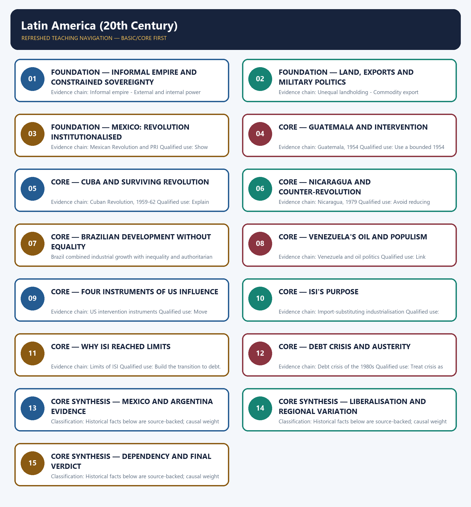

# Latin America (20th Century) — Learner-v2 Complete Learning Session

> **Authoring-only generation:** 2026-09-01. No PDF was rendered and no tracker or index was mutated.

### SOURCE, PROGRESSION AND CURRENT-LINKAGE AUDIT

- **Generation date:** 2026-09-01.
- **Repository-first evidence:** the Basic owner is taught first and preserved in full; the Advanced owner is retained only in the optional final teaching block.
- **OCR evidence:** Repository Markdown was used first. The available OCR-searchable Norman Lowe World History PDF was retained as supplementary local context, but no unsupported page number, quotation or precision was imported from it.
- **Qdrant:** not used; repository Markdown and available OCR context were sufficient.
- **PYQ integrity:** No direct UPSC PYQ is verified as owned solely by this topic in the local routing blocks. All six Mains demands are original practice.
- **Live-link boundary:** A 19 March 2026 statement by UN human rights experts marks the fiftieth anniversary of the beginning of Argentina's 1976 military dictatorship and addresses transitional justice, truth, memory and guarantees of non-repetition after the return to democracy. This is a narrow current link to twentieth-century Latin American military rule and democratic transition; no unverified crowd or other numerical claim is imported.
- **Fact/inference discipline:** no current-affairs item, PYQ wording, figure or quotation is invented.

## BASIC LEARNING SESSION

### DEEP-REVIEW LEARNING CONTRACT

| Control | Binding rule for this package |
|---|---|
| Syllabus boundary | Complete World History Core is taught chronologically, spatially and causally before optional enrichment. |
| Evidence method | Claim → named event/treaty/institution/actor/region or attributed scholarship → analysis → qualification. |
| Chronology | Structural cause, trigger, event, settlement, implementation and long-term process remain distinct. |
| Geography | Europe, Africa, Asia, West Asia and the Americas retain their own actors, routes and unequal connections; Europe is never the default universal viewpoint. |
| Historiography | Liberal, conservative, Marxist, social, feminist, postcolonial and other relevant interpretations are tied to evidence and bounded claims. |
| Practice contract | Every solved item has directive/demand decoding, an examiner-grade model, an executable timed/compression plan, marks rationale and answer-specific improvement. |
| Approval | This immutable successor remains `approved: false` pending explicit approval. |

**Canonical Basic/Core owner:** `upsc-ai-kit\knowledge\World-History\basic\19_Latin-America-20th-Century.md`  
**Canonical topic owner:** `upsc-ai-kit\knowledge\World-History\basic\19_Latin-America-20th-Century.md`  
**Optional Advanced owner:** `upsc-ai-kit\knowledge\World-History\advanced\19_Latin-America-20th-Century.md`  
**Official syllabus mapping:** `upsc-ai-kit\knowledge\World-History\OFFICIAL-UPSC-SYLLABUS-MAPPING.md`

### EVIDENCE, PYQ AND CURRENT-STATUS CONTROL

- **Primary/official evidence:** treaties, declarations, laws, institutional records, speeches and contemporary testimony are dated and read for authorship, audience and purpose.
- **Spatial and social evidence:** maps, trade and migration routes, battlefield geography, class, race, gender and colonial position qualify state-centred narrative.
- **Quantitative evidence:** population, debt, inflation, output, casualties and territorial claims retain unit, place, period, source and uncertainty; no statistic is invented.
- **Interpretive discipline:** teleology, civilisational ranking, single-cause verdicts and present-day nation-state projection are rejected.
- **PYQ discipline:** repository routing ledgers and locally held papers control wording and metadata; neutral rendering, reconstruction and unavailable official keys remain explicitly labelled.
- **Current-status note, rechecked 2026-09-01:** A 19 March 2026 statement by UN human rights experts marks the fiftieth anniversary of the beginning of Argentina's 1976 military dictatorship and addresses transitional justice, truth, memory and guarantees of non-repetition after the return to democracy. This is a narrow current link to twentieth-century Latin American military rule and democratic transition; no unverified crowd or other numerical claim is imported.

**Live/primary context sources recorded by the predecessor generation:**

- `https://www.ohchr.org/en/press-releases/2026/03/argentina-alarming-setbacks-transitional-justice-50th-anniversary-coup-detat`




*Distinct embedded teaching-navigation image. The separate continuous Cārvāka-style flowchart package remains an independent at-a-glance artifact.*

### SESSION 1 — FOUNDATION — INFORMAL EMPIRE AND CONSTRAINED SOVEREIGNTY

#### DEFINITION / WHAT THIS IS CALLED

**Plain-language definition:** Precise definition: Informal empire and constrained sovereignty is the source-bounded relationship among Informal empire and External and internal power interacted within Latin America (20th Century).

**Technical definition:** Evidence chain: Informal empire - External and internal power interacted Qualified use: Define the region's external-power framework.

#### ANSWER-GRABBING OPENING — WRITE/ADAPT IN THE EXAM

> Precise definition: Informal empire and constrained sovereignty is the source-bounded relationship among Informal empire and External and internal power interacted within Latin America (20th Century).

#### MUST-WRITE KEYWORDS

- **FOUNDATION**
- **Informal empire**
- **constrained sovereignty**
- **Precise definition**
- **Evidence chain**
- **Qualified use**

**How to use them:** Frame the answer through FOUNDATION; define Informal empire, connect constrained sovereignty with Precise definition to explain the mechanism, and use Evidence chain for the decisive comparison or qualification.

##### VISUAL FIRST

```text
INFORMAL EMPIRE AND CONSTRAINED SOVEREIGNTY
01. Informal empire
    |
    v
02. External and internal power interacted
BOUNDARY -> Influence is structural, not total control.
```

*This topic-specific rail fixes the evidence sequence and its exam boundary before analysis.*

##### CONCEPT DEFINITIONS

- **Precise definition:** Informal empire and constrained sovereignty is the source-bounded relationship among Informal empire and External and internal power interacted within Latin America (20th Century).
- **Classification:** Historical facts below are source-backed; causal weight and evaluative verdicts are analytical synthesis.

##### CORE EXPLANATION

Twentieth-century US influence in Latin America usually operated through strategic, commercial, financial and political leverage rather than direct colonial rule. US leverage preserved domestic elites, while domestic elites sought external backing; local agency therefore remained central within constrained sovereignty.

##### NAMED EVIDENCE AND MECHANISM

- Twentieth-century US influence in Latin America usually operated through strategic, commercial, financial and political leverage rather than direct colonial rule.
- US leverage preserved domestic elites, while domestic elites sought external backing; local agency therefore remained central within constrained sovereignty.

##### EXAMINER CAUTION

- Influence is structural, not total control.

##### EXAM LINK

- **Prelims:** Retain the exact actor, date, document and category in Informal empire and constrained sovereignty.
- **Mains:** Define the region's external-power framework.

##### MINI RECAP

- **Evidence chain:** Informal empire -> External and internal power interacted
- **Qualified use:** Define the region's external-power framework.

#### CLOSING RECALL FLOW — FOUNDATION — INFORMAL EMPIRE AND CONSTRAINED SOVEREIGNTY

```text
START / CONCEPT: FOUNDATION — Informal empire and constrained sovereignty
        |
        v
EXACT TERMS: FOUNDATION · Informal empire · constrained sovereignty · Precise definition · Evidence chain · Qualified use
        |
        v
MECHANISM / ARGUMENT: Evidence chain: Informal empire - External and internal power interacted Qualified use: Define the region's external-power framework.
        |
        v
CONSEQUENCE / CONTRAST: Influence is structural, not total control.
        |
        v
UPSC TRAP / ANSWER-USE: Do not miss this limiting distinction: causal weight and evaluative verdicts are analytical synthesis.
        |
        v
ANSWER-GRABBING FORMULATION: Precise definition: Informal empire and constrained sovereignty is the source-bounded relationship among Informal empire and External and internal power interacted within Latin America (20th Century).
```
### SESSION 2 — FOUNDATION — LAND, EXPORTS AND MILITARY POLITICS

#### DEFINITION / WHAT THIS IS CALLED

**Plain-language definition:** Precise definition: Land, exports and military politics is the source-bounded relationship among Unequal landholding, Commodity export dependence and Militarised politics within Latin America (20th Century).

**Technical definition:** Evidence chain: Unequal landholding - Commodity export dependence - Militarised politics Qualified use: Build the instability mechanism.

#### ANSWER-GRABBING OPENING — WRITE/ADAPT IN THE EXAM

> Precise definition: Land, exports and military politics is the source-bounded relationship among Unequal landholding, Commodity export dependence and Militarised politics within Latin America (20th Century).

#### MUST-WRITE KEYWORDS

- **FOUNDATION**
- **Land**
- **exports**
- **military politics**
- **Precise definition**
- **Evidence chain**

**How to use them:** Frame the answer through FOUNDATION; define Land, connect exports with military politics to explain the mechanism, and use Precise definition for the decisive comparison or qualification.

##### VISUAL FIRST

```text
LAND, EXPORTS AND MILITARY POLITICS
01. Unequal landholding
    |
    v
02. Commodity export dependence
    |
    v
03. Militarised politics
BOUNDARY -> Domestic structures must precede country cases.
```

*This topic-specific rail fixes the evidence sequence and its exam boundary before analysis.*

##### CONCEPT DEFINITIONS

- **Precise definition:** Land, exports and military politics is the source-bounded relationship among Unequal landholding, Commodity export dependence and Militarised politics within Latin America (20th Century).
- **Classification:** Historical facts below are source-backed; causal weight and evaluative verdicts are analytical synthesis.

##### CORE EXPLANATION

Oligarchic land concentration narrowed domestic markets, blocked reform and tied political power to social inequality. Reliance on narrow export bases made world price movements into fiscal, employment and political crises. Armies repeatedly entered politics through coups or pressure, becoming a twentieth-century institutional successor to caudillismo.

##### NAMED EVIDENCE AND MECHANISM

- Oligarchic land concentration narrowed domestic markets, blocked reform and tied political power to social inequality.
- Reliance on narrow export bases made world price movements into fiscal, employment and political crises.
- Armies repeatedly entered politics through coups or pressure, becoming a twentieth-century institutional successor to caudillismo.

##### EXAMINER CAUTION

- Domestic structures must precede country cases.

##### EXAM LINK

- **Prelims:** Retain the exact actor, date, document and category in Land, exports and military politics.
- **Mains:** Build the instability mechanism.

##### MINI RECAP

- **Evidence chain:** Unequal landholding -> Commodity export dependence -> Militarised politics
- **Qualified use:** Build the instability mechanism.

#### CLOSING RECALL FLOW — FOUNDATION — LAND, EXPORTS AND MILITARY POLITICS

```text
START / CONCEPT: FOUNDATION — Land, exports and military politics
        |
        v
EXACT TERMS: FOUNDATION · Land · exports · military politics · Precise definition · Evidence chain
        |
        v
MECHANISM / ARGUMENT: Evidence chain: Unequal landholding - Commodity export dependence - Militarised politics Qualified use: Build the instability mechanism.
        |
        v
CONSEQUENCE / CONTRAST: Classification: Historical facts below are source-backed; causal weight and evaluative verdicts are analytical synthesis.
        |
        v
UPSC TRAP / ANSWER-USE: Do not miss this limiting distinction: domestic structures must precede country cases.
        |
        v
ANSWER-GRABBING FORMULATION: Precise definition: Land, exports and military politics is the source-bounded relationship among Unequal landholding, Commodity export dependence and Militarised politics within Latin America (20th Century).
```
### SESSION 3 — FOUNDATION — MEXICO: REVOLUTION INSTITUTIONALISED

#### DEFINITION / WHAT THIS IS CALLED

**Plain-language definition:** Precise definition: Mexico: revolution institutionalised is the source-bounded relationship among and Mexican Revolution and PRI within Latin America (20th Century).

**Technical definition:** Evidence chain: Mexican Revolution and PRI Qualified use: Show one-party institutional continuity.

#### ANSWER-GRABBING OPENING — WRITE/ADAPT IN THE EXAM

> Precise definition: Mexico: revolution institutionalised is the source-bounded relationship among and Mexican Revolution and PRI within Latin America (20th Century).

#### MUST-WRITE KEYWORDS

- **FOUNDATION**
- **Mexico**
- **revolution institutionalised**
- **Precise definition**
- **Evidence chain**
- **Qualified use**

**How to use them:** Frame the answer through FOUNDATION; define Mexico, connect revolution institutionalised with Precise definition to explain the mechanism, and use Evidence chain for the decisive comparison or qualification.

##### VISUAL FIRST

```text
MEXICO: REVOLUTION INSTITUTIONALISED
01. Mexican Revolution and PRI
BOUNDARY -> Revolution did not immediately produce pluralism.
```

*This topic-specific rail fixes the evidence sequence and its exam boundary before analysis.*

##### CONCEPT DEFINITIONS

- **Precise definition:** Mexico: revolution institutionalised is the source-bounded relationship among  and Mexican Revolution and PRI within Latin America (20th Century).
- **Classification:** Historical facts below are source-backed; causal weight and evaluative verdicts are analytical synthesis.

##### CORE EXPLANATION

The Mexican Revolution began in 1910, but its institutional outcome became long PRI dominance and only gradual political opening.

##### NAMED EVIDENCE AND MECHANISM

- The Mexican Revolution began in 1910, but its institutional outcome became long PRI dominance and only gradual political opening.

##### EXAMINER CAUTION

- Revolution did not immediately produce pluralism.

##### EXAM LINK

- **Prelims:** Retain the exact actor, date, document and category in Mexico: revolution institutionalised.
- **Mains:** Show one-party institutional continuity.

##### MINI RECAP

- **Evidence chain:** Mexican Revolution and PRI
- **Qualified use:** Show one-party institutional continuity.

#### CLOSING RECALL FLOW — FOUNDATION — MEXICO: REVOLUTION INSTITUTIONALISED

```text
START / CONCEPT: FOUNDATION — Mexico: revolution institutionalised
        |
        v
EXACT TERMS: FOUNDATION · Mexico · revolution institutionalised · Precise definition · Evidence chain · Qualified use
        |
        v
MECHANISM / ARGUMENT: Evidence chain: Mexican Revolution and PRI Qualified use: Show one-party institutional continuity.
        |
        v
CONSEQUENCE / CONTRAST: The Mexican Revolution began in 1910, but its institutional outcome became long PRI dominance and only gradual political opening.
        |
        v
UPSC TRAP / ANSWER-USE: Do not miss this limiting distinction: causal weight and evaluative verdicts are analytical synthesis.
        |
        v
ANSWER-GRABBING FORMULATION: Precise definition: Mexico: revolution institutionalised is the source-bounded relationship among and Mexican Revolution and PRI within Latin America (20th Century).
```
### SESSION 4 — CORE — GUATEMALA AND INTERVENTION

#### DEFINITION / WHAT THIS IS CALLED

**Plain-language definition:** Precise definition: Guatemala and intervention is the source-bounded relationship among and Guatemala, 1954 within Latin America (20th Century).

**Technical definition:** Evidence chain: Guatemala, 1954 Qualified use: Use a bounded 1954 case.

#### ANSWER-GRABBING OPENING — WRITE/ADAPT IN THE EXAM

> Precise definition: Guatemala and intervention is the source-bounded relationship among and Guatemala, 1954 within Latin America (20th Century).

#### MUST-WRITE KEYWORDS

- **Guatemala**
- **intervention**
- **Precise definition**
- **Evidence chain**
- **Qualified use**
- **Precise definition: Guatemala and intervention**

**How to use them:** Frame the answer through Guatemala; define intervention, connect Precise definition with Evidence chain to explain the mechanism, and use Qualified use for the decisive comparison or qualification.

##### VISUAL FIRST

```text
GUATEMALA AND INTERVENTION
01. Guatemala, 1954
BOUNDARY -> Land reform turned domestic conflict international.
```

*This topic-specific rail fixes the evidence sequence and its exam boundary before analysis.*

##### CONCEPT DEFINITIONS

- **Precise definition:** Guatemala and intervention is the source-bounded relationship among  and Guatemala, 1954 within Latin America (20th Century).
- **Classification:** Historical facts below are source-backed; causal weight and evaluative verdicts are analytical synthesis.

##### CORE EXPLANATION

A reform experiment in Guatemala was overturned with US-backed anti-communist intervention, showing how land reform became an international conflict.

##### NAMED EVIDENCE AND MECHANISM

- A reform experiment in Guatemala was overturned with US-backed anti-communist intervention, showing how land reform became an international conflict.

##### EXAMINER CAUTION

- Land reform turned domestic conflict international.

##### EXAM LINK

- **Prelims:** Retain the exact actor, date, document and category in Guatemala and intervention.
- **Mains:** Use a bounded 1954 case.

##### MINI RECAP

- **Evidence chain:** Guatemala, 1954
- **Qualified use:** Use a bounded 1954 case.

#### CLOSING RECALL FLOW — CORE — GUATEMALA AND INTERVENTION

```text
START / CONCEPT: CORE — Guatemala and intervention
        |
        v
EXACT TERMS: Guatemala · intervention · Precise definition · Evidence chain · Qualified use · Precise definition: Guatemala and intervention
        |
        v
MECHANISM / ARGUMENT: A reform experiment in Guatemala was overturned with US-backed anti-communist intervention, showing how land reform became an international conflict.
        |
        v
CONSEQUENCE / CONTRAST: Evidence chain: Guatemala, 1954 Qualified use: Use a bounded 1954 case.
        |
        v
UPSC TRAP / ANSWER-USE: Do not miss this limiting distinction: causal weight and evaluative verdicts are analytical synthesis.
        |
        v
ANSWER-GRABBING FORMULATION: Precise definition: Guatemala and intervention is the source-bounded relationship among and Guatemala, 1954 within Latin America (20th Century).
```
### SESSION 5 — CORE — CUBA AND SURVIVING REVOLUTION

#### DEFINITION / WHAT THIS IS CALLED

**Plain-language definition:** Precise definition: Cuba and surviving revolution is the source-bounded relationship among and Cuban Revolution, 1959-62 within Latin America (20th Century).

**Technical definition:** Evidence chain: Cuban Revolution, 1959-62 Qualified use: Explain success and dependency together.

#### ANSWER-GRABBING OPENING — WRITE/ADAPT IN THE EXAM

> Precise definition: Cuba and surviving revolution is the source-bounded relationship among and Cuban Revolution, 1959-62 within Latin America (20th Century).

#### MUST-WRITE KEYWORDS

- **Cuba**
- **surviving revolution**
- **Precise definition**
- **Evidence chain**
- **Qualified use**
- **1959-62**

**How to use them:** Frame the answer through Cuba; define surviving revolution, connect Precise definition with Evidence chain to explain the mechanism, and use Qualified use for the decisive comparison or qualification.

##### VISUAL FIRST

```text
CUBA AND SURVIVING REVOLUTION
01. Cuban Revolution, 1959-62
BOUNDARY -> Soviet alignment qualified independence from US power.
```

*This topic-specific rail fixes the evidence sequence and its exam boundary before analysis.*

##### CONCEPT DEFINITIONS

- **Precise definition:** Cuba and surviving revolution is the source-bounded relationship among  and Cuban Revolution, 1959-62 within Latin America (20th Century).
- **Classification:** Historical facts below are source-backed; causal weight and evaluative verdicts are analytical synthesis.

##### CORE EXPLANATION

Cuba's revolution survived US hostility by aligning with the Soviet Union, and the missile crisis internationalised the confrontation.

##### NAMED EVIDENCE AND MECHANISM

- Cuba's revolution survived US hostility by aligning with the Soviet Union, and the missile crisis internationalised the confrontation.

##### EXAMINER CAUTION

- Soviet alignment qualified independence from US power.

##### EXAM LINK

- **Prelims:** Retain the exact actor, date, document and category in Cuba and surviving revolution.
- **Mains:** Explain success and dependency together.

##### MINI RECAP

- **Evidence chain:** Cuban Revolution, 1959-62
- **Qualified use:** Explain success and dependency together.

#### CLOSING RECALL FLOW — CORE — CUBA AND SURVIVING REVOLUTION

```text
START / CONCEPT: CORE — Cuba and surviving revolution
        |
        v
EXACT TERMS: Cuba · surviving revolution · Precise definition · Evidence chain · Qualified use · 1959-62
        |
        v
MECHANISM / ARGUMENT: Evidence chain: Cuban Revolution, 1959-62 Qualified use: Explain success and dependency together.
        |
        v
CONSEQUENCE / CONTRAST: Classification: Historical facts below are source-backed; causal weight and evaluative verdicts are analytical synthesis.
        |
        v
UPSC TRAP / ANSWER-USE: Do not miss this limiting distinction: mains: Explain success and dependency together.
        |
        v
ANSWER-GRABBING FORMULATION: Precise definition: Cuba and surviving revolution is the source-bounded relationship among and Cuban Revolution, 1959-62 within Latin America (20th Century).
```
### SESSION 6 — CORE — NICARAGUA AND COUNTER-REVOLUTION

#### DEFINITION / WHAT THIS IS CALLED

**Plain-language definition:** Precise definition: Nicaragua and counter-revolution is the source-bounded relationship among and Nicaragua, 1979 within Latin America (20th Century).

**Technical definition:** Evidence chain: Nicaragua, 1979 Qualified use: Avoid reducing agency to proxy status.

#### ANSWER-GRABBING OPENING — WRITE/ADAPT IN THE EXAM

> Precise definition: Nicaragua and counter-revolution is the source-bounded relationship among and Nicaragua, 1979 within Latin America (20th Century).

#### MUST-WRITE KEYWORDS

- **Nicaragua**
- **counter-revolution**
- **Precise definition**
- **Evidence chain**
- **Qualified use**
- **Precise definition: Nicaragua and counter-revolution**

**How to use them:** Frame the answer through Nicaragua; define counter-revolution, connect Precise definition with Evidence chain to explain the mechanism, and use Qualified use for the decisive comparison or qualification.

##### VISUAL FIRST

```text
NICARAGUA AND COUNTER-REVOLUTION
01. Nicaragua, 1979
BOUNDARY -> Local revolution and outside hostility interacted.
```

*This topic-specific rail fixes the evidence sequence and its exam boundary before analysis.*

##### CONCEPT DEFINITIONS

- **Precise definition:** Nicaragua and counter-revolution is the source-bounded relationship among  and Nicaragua, 1979 within Latin America (20th Century).
- **Classification:** Historical facts below are source-backed; causal weight and evaluative verdicts are analytical synthesis.

##### CORE EXPLANATION

The Sandinistas took power in 1979 and faced counter-revolutionary pressure, joining local revolution to Cold War intervention.

##### NAMED EVIDENCE AND MECHANISM

- The Sandinistas took power in 1979 and faced counter-revolutionary pressure, joining local revolution to Cold War intervention.

##### EXAMINER CAUTION

- Local revolution and outside hostility interacted.

##### EXAM LINK

- **Prelims:** Retain the exact actor, date, document and category in Nicaragua and counter-revolution.
- **Mains:** Avoid reducing agency to proxy status.

##### MINI RECAP

- **Evidence chain:** Nicaragua, 1979
- **Qualified use:** Avoid reducing agency to proxy status.

#### CLOSING RECALL FLOW — CORE — NICARAGUA AND COUNTER-REVOLUTION

```text
START / CONCEPT: CORE — Nicaragua and counter-revolution
        |
        v
EXACT TERMS: Nicaragua · counter-revolution · Precise definition · Evidence chain · Qualified use · Precise definition: Nicaragua and counter-revolution
        |
        v
MECHANISM / ARGUMENT: Evidence chain: Nicaragua, 1979 Qualified use: Avoid reducing agency to proxy status.
        |
        v
CONSEQUENCE / CONTRAST: Classification: Historical facts below are source-backed; causal weight and evaluative verdicts are analytical synthesis.
        |
        v
UPSC TRAP / ANSWER-USE: Do not miss this limiting distinction: nicaragua and counter-revolution is the source-bounded relationship among and Nicaragua, 1979 within Latin America...
        |
        v
ANSWER-GRABBING FORMULATION: Precise definition: Nicaragua and counter-revolution is the source-bounded relationship among and Nicaragua, 1979 within Latin America (20th Century).
```
### SESSION 7 — CORE — BRAZILIAN DEVELOPMENT WITHOUT EQUALITY

#### DEFINITION / WHAT THIS IS CALLED

**Plain-language definition:** Precise definition: Brazilian development without equality is the source-bounded relationship among and Brazilian pattern within Latin America (20th Century).

**Technical definition:** Brazil combined industrial growth with inequality and authoritarian phases, proving that development and social justice are separable.

#### ANSWER-GRABBING OPENING — WRITE/ADAPT IN THE EXAM

> Precise definition: Brazilian development without equality is the source-bounded relationship among and Brazilian pattern within Latin America (20th Century).

#### MUST-WRITE KEYWORDS

- **Brazilian development without equality**
- **Precise definition**
- **Evidence chain**
- **Qualified use**
- **Precise definition: Brazilian development without equality**
- **Precise**

**How to use them:** Frame the answer through Brazilian development without equality; define Precise definition, connect Evidence chain with Qualified use to explain the mechanism, and use Precise definition: Brazilian development without equality for the decisive comparison or qualification.

##### VISUAL FIRST

```text
BRAZILIAN DEVELOPMENT WITHOUT EQUALITY
01. Brazilian pattern
BOUNDARY -> Growth and social justice are different tests.
```

*This topic-specific rail fixes the evidence sequence and its exam boundary before analysis.*

##### CONCEPT DEFINITIONS

- **Precise definition:** Brazilian development without equality is the source-bounded relationship among  and Brazilian pattern within Latin America (20th Century).
- **Classification:** Historical facts below are source-backed; causal weight and evaluative verdicts are analytical synthesis.

##### CORE EXPLANATION

Brazil combined industrial growth with inequality and authoritarian phases, proving that development and social justice are separable.

##### NAMED EVIDENCE AND MECHANISM

- Brazil combined industrial growth with inequality and authoritarian phases, proving that development and social justice are separable.

##### EXAMINER CAUTION

- Growth and social justice are different tests.

##### EXAM LINK

- **Prelims:** Retain the exact actor, date, document and category in Brazilian development without equality.
- **Mains:** Use the strongest development paradox.

##### MINI RECAP

- **Evidence chain:** Brazilian pattern
- **Qualified use:** Use the strongest development paradox.

#### CLOSING RECALL FLOW — CORE — BRAZILIAN DEVELOPMENT WITHOUT EQUALITY

```text
START / CONCEPT: CORE — Brazilian development without equality
        |
        v
EXACT TERMS: Brazilian development without equality · Precise definition · Evidence chain · Qualified use · Precise definition: Brazilian development without equality · Precise
        |
        v
MECHANISM / ARGUMENT: Evidence chain: Brazilian pattern Qualified use: Use the strongest development paradox.
        |
        v
CONSEQUENCE / CONTRAST: Brazil combined industrial growth with inequality and authoritarian phases, proving that development and social justice are separable.
        |
        v
UPSC TRAP / ANSWER-USE: Do not miss this limiting distinction: mains: Use the strongest development paradox.
        |
        v
ANSWER-GRABBING FORMULATION: Precise definition: Brazilian development without equality is the source-bounded relationship among and Brazilian pattern within Latin America (20th Century).
```
### SESSION 8 — CORE — VENEZUELA'S OIL AND POPULISM

#### DEFINITION / WHAT THIS IS CALLED

**Plain-language definition:** Precise definition: Venezuela's oil and populism is the source-bounded relationship among and Venezuela and oil politics within Latin America (20th Century).

**Technical definition:** Evidence chain: Venezuela and oil politics Qualified use: Link commodities to political challenge.

#### ANSWER-GRABBING OPENING — WRITE/ADAPT IN THE EXAM

> Precise definition: Venezuela's oil and populism is the source-bounded relationship among and Venezuela and oil politics within Latin America (20th Century).

#### MUST-WRITE KEYWORDS

- **Venezuela's oil**
- **populism**
- **Precise definition**
- **Evidence chain**
- **Qualified use**
- **Precise definition: Venezuela's oil and populism**

**How to use them:** Frame the answer through Venezuela's oil; define populism, connect Precise definition with Evidence chain to explain the mechanism, and use Qualified use for the decisive comparison or qualification.

##### VISUAL FIRST

```text
VENEZUELA'S OIL AND POPULISM
01. Venezuela and oil politics
BOUNDARY -> Resource wealth can magnify vulnerability.
```

*This topic-specific rail fixes the evidence sequence and its exam boundary before analysis.*

##### CONCEPT DEFINITIONS

- **Precise definition:** Venezuela's oil and populism is the source-bounded relationship among  and Venezuela and oil politics within Latin America (20th Century).
- **Classification:** Historical facts below are source-backed; causal weight and evaluative verdicts are analytical synthesis.

##### CORE EXPLANATION

Oil wealth produced vulnerability as well as revenue, while Hugo Chavez from 1998 became a major symbol of anti-US regional politics.

##### NAMED EVIDENCE AND MECHANISM

- Oil wealth produced vulnerability as well as revenue, while Hugo Chavez from 1998 became a major symbol of anti-US regional politics.

##### EXAMINER CAUTION

- Resource wealth can magnify vulnerability.

##### EXAM LINK

- **Prelims:** Retain the exact actor, date, document and category in Venezuela's oil and populism.
- **Mains:** Link commodities to political challenge.

##### MINI RECAP

- **Evidence chain:** Venezuela and oil politics
- **Qualified use:** Link commodities to political challenge.

#### CLOSING RECALL FLOW — CORE — VENEZUELA'S OIL AND POPULISM

```text
START / CONCEPT: CORE — Venezuela's oil and populism
        |
        v
EXACT TERMS: Venezuela's oil · populism · Precise definition · Evidence chain · Qualified use · Precise definition: Venezuela's oil and populism
        |
        v
MECHANISM / ARGUMENT: Evidence chain: Venezuela and oil politics Qualified use: Link commodities to political challenge.
        |
        v
CONSEQUENCE / CONTRAST: Oil wealth produced vulnerability as well as revenue, while Hugo Chavez from 1998 became a major symbol of anti-US regional politics.
        |
        v
UPSC TRAP / ANSWER-USE: Do not miss this limiting distinction: causal weight and evaluative verdicts are analytical synthesis.
        |
        v
ANSWER-GRABBING FORMULATION: Precise definition: Venezuela's oil and populism is the source-bounded relationship among and Venezuela and oil politics within Latin America (20th Century).
```
### SESSION 9 — CORE — FOUR INSTRUMENTS OF US INFLUENCE

#### DEFINITION / WHAT THIS IS CALLED

**Plain-language definition:** Precise definition: Four instruments of US influence is the source-bounded relationship among and US intervention instruments within Latin America (20th Century).

**Technical definition:** Evidence chain: US intervention instruments Qualified use: Move beyond invasion narratives.

#### ANSWER-GRABBING OPENING — WRITE/ADAPT IN THE EXAM

> Precise definition: Four instruments of US influence is the source-bounded relationship among and US intervention instruments within Latin America (20th Century).

#### MUST-WRITE KEYWORDS

- **Four instruments of US influence**
- **Precise definition**
- **Evidence chain**
- **Qualified use**
- **Precise definition: Four instruments of US influence**
- **Precise**

**How to use them:** Frame the answer through Four instruments of US influence; define Precise definition, connect Evidence chain with Qualified use to explain the mechanism, and use Precise definition: Four instruments of US influence for the decisive comparison or qualification.

##### VISUAL FIRST

```text
FOUR INSTRUMENTS OF US INFLUENCE
01. US intervention instruments
BOUNDARY -> Covert, financial and structural power are distinct.
```

*This topic-specific rail fixes the evidence sequence and its exam boundary before analysis.*

##### CONCEPT DEFINITIONS

- **Precise definition:** Four instruments of US influence is the source-bounded relationship among  and US intervention instruments within Latin America (20th Century).
- **Classification:** Historical facts below are source-backed; causal weight and evaluative verdicts are analytical synthesis.

##### CORE EXPLANATION

Covert action, proxy pressure, diplomatic hostility, financial leverage and commercial weight set limits on domestic reform without eliminating local choices.

##### NAMED EVIDENCE AND MECHANISM

- Covert action, proxy pressure, diplomatic hostility, financial leverage and commercial weight set limits on domestic reform without eliminating local choices.

##### EXAMINER CAUTION

- Covert, financial and structural power are distinct.

##### EXAM LINK

- **Prelims:** Retain the exact actor, date, document and category in Four instruments of US influence.
- **Mains:** Move beyond invasion narratives.

##### MINI RECAP

- **Evidence chain:** US intervention instruments
- **Qualified use:** Move beyond invasion narratives.

#### CLOSING RECALL FLOW — CORE — FOUR INSTRUMENTS OF US INFLUENCE

```text
START / CONCEPT: CORE — Four instruments of US influence
        |
        v
EXACT TERMS: Four instruments of US influence · Precise definition · Evidence chain · Qualified use · Precise definition: Four instruments of US influence · Precise
        |
        v
MECHANISM / ARGUMENT: Evidence chain: US intervention instruments Qualified use: Move beyond invasion narratives.
        |
        v
CONSEQUENCE / CONTRAST: Classification: Historical facts below are source-backed; causal weight and evaluative verdicts are analytical synthesis.
        |
        v
UPSC TRAP / ANSWER-USE: Do not miss this limiting distinction: covert, financial and structural power are distinct.
        |
        v
ANSWER-GRABBING FORMULATION: Precise definition: Four instruments of US influence is the source-bounded relationship among and US intervention instruments within Latin America (20th Century).
```
### SESSION 10 — CORE — ISI'S PURPOSE

#### DEFINITION / WHAT THIS IS CALLED

**Plain-language definition:** Precise definition: ISI's purpose is the source-bounded relationship among and Import-substituting industrialisation within Latin America (20th Century).

**Technical definition:** Evidence chain: Import-substituting industrialisation Qualified use: Explain state-led diversification.

#### ANSWER-GRABBING OPENING — WRITE/ADAPT IN THE EXAM

> Precise definition: ISI's purpose is the source-bounded relationship among and Import-substituting industrialisation within Latin America (20th Century).

#### MUST-WRITE KEYWORDS

- **ISI's purpose**
- **Precise definition**
- **Evidence chain**
- **Qualified use**
- **Precise definition: ISI's purpose**
- **Precise**

**How to use them:** Frame the answer through ISI's purpose; define Precise definition, connect Evidence chain with Qualified use to explain the mechanism, and use Precise definition: ISI's purpose for the decisive comparison or qualification.

##### VISUAL FIRST

```text
ISI'S PURPOSE
01. Import-substituting industrialisation
BOUNDARY -> Define the policy before judging its results.
```

*This topic-specific rail fixes the evidence sequence and its exam boundary before analysis.*

##### CONCEPT DEFINITIONS

- **Precise definition:** ISI's purpose is the source-bounded relationship among  and Import-substituting industrialisation within Latin America (20th Century).
- **Classification:** Historical facts below are source-backed; causal weight and evaluative verdicts are analytical synthesis.

##### CORE EXPLANATION

Mid-century ISI sought to replace imported manufactures through protection, state investment and subsidised domestic industry.

##### NAMED EVIDENCE AND MECHANISM

- Mid-century ISI sought to replace imported manufactures through protection, state investment and subsidised domestic industry.

##### EXAMINER CAUTION

- Define the policy before judging its results.

##### EXAM LINK

- **Prelims:** Retain the exact actor, date, document and category in ISI's purpose.
- **Mains:** Explain state-led diversification.

##### MINI RECAP

- **Evidence chain:** Import-substituting industrialisation
- **Qualified use:** Explain state-led diversification.

#### CLOSING RECALL FLOW — CORE — ISI'S PURPOSE

```text
START / CONCEPT: CORE — ISI's purpose
        |
        v
EXACT TERMS: ISI's purpose · Precise definition · Evidence chain · Qualified use · Precise definition: ISI's purpose · Precise
        |
        v
MECHANISM / ARGUMENT: Define the policy before judging its results.
        |
        v
CONSEQUENCE / CONTRAST: Classification: Historical facts below are source-backed; causal weight and evaluative verdicts are analytical synthesis.
        |
        v
UPSC TRAP / ANSWER-USE: Do not miss this limiting distinction: evidence chain: Import-substituting industrialisation Qualified use: Explain state-led diversification.
        |
        v
ANSWER-GRABBING FORMULATION: Precise definition: ISI's purpose is the source-bounded relationship among and Import-substituting industrialisation within Latin America (20th Century).
```
### SESSION 11 — CORE — WHY ISI REACHED LIMITS

#### DEFINITION / WHAT THIS IS CALLED

**Plain-language definition:** Precise definition: Why ISI reached limits is the source-bounded relationship among and Limits of ISI within Latin America (20th Century).

**Technical definition:** Evidence chain: Limits of ISI Qualified use: Build the transition to debt.

#### ANSWER-GRABBING OPENING — WRITE/ADAPT IN THE EXAM

> Precise definition: Why ISI reached limits is the source-bounded relationship among and Limits of ISI within Latin America (20th Century).

#### MUST-WRITE KEYWORDS

- **Why ISI reached limits**
- **Precise definition**
- **Evidence chain**
- **Qualified use**
- **Precise definition: Why ISI reached limits**
- **Precise**

**How to use them:** Frame the answer through Why ISI reached limits; define Precise definition, connect Evidence chain with Qualified use to explain the mechanism, and use Precise definition: Why ISI reached limits for the decisive comparison or qualification.

##### VISUAL FIRST

```text
WHY ISI REACHED LIMITS
01. Limits of ISI
BOUNDARY -> Borrowing followed structural import and market constraints.
```

*This topic-specific rail fixes the evidence sequence and its exam boundary before analysis.*

##### CONCEPT DEFINITIONS

- **Precise definition:** Why ISI reached limits is the source-bounded relationship among  and Limits of ISI within Latin America (20th Century).
- **Classification:** Historical facts below are source-backed; causal weight and evaluative verdicts are analytical synthesis.

##### CORE EXPLANATION

Small markets, capital-goods import costs and fiscal deficits pushed many economies toward external borrowing during the 1970s.

##### NAMED EVIDENCE AND MECHANISM

- Small markets, capital-goods import costs and fiscal deficits pushed many economies toward external borrowing during the 1970s.

##### EXAMINER CAUTION

- Borrowing followed structural import and market constraints.

##### EXAM LINK

- **Prelims:** Retain the exact actor, date, document and category in Why ISI reached limits.
- **Mains:** Build the transition to debt.

##### MINI RECAP

- **Evidence chain:** Limits of ISI
- **Qualified use:** Build the transition to debt.

#### CLOSING RECALL FLOW — CORE — WHY ISI REACHED LIMITS

```text
START / CONCEPT: CORE — Why ISI reached limits
        |
        v
EXACT TERMS: Why ISI reached limits · Precise definition · Evidence chain · Qualified use · Precise definition: Why ISI reached limits · Precise
        |
        v
MECHANISM / ARGUMENT: Evidence chain: Limits of ISI Qualified use: Build the transition to debt.
        |
        v
CONSEQUENCE / CONTRAST: Classification: Historical facts below are source-backed; causal weight and evaluative verdicts are analytical synthesis.
        |
        v
UPSC TRAP / ANSWER-USE: Do not miss this limiting distinction: borrowing followed structural import and market constraints.
        |
        v
ANSWER-GRABBING FORMULATION: Precise definition: Why ISI reached limits is the source-bounded relationship among and Limits of ISI within Latin America (20th Century).
```
### SESSION 12 — CORE — DEBT CRISIS AND AUSTERITY

#### DEFINITION / WHAT THIS IS CALLED

**Plain-language definition:** Precise definition: Debt crisis and austerity is the source-bounded relationship among and Debt crisis of the 1980s within Latin America (20th Century).

**Technical definition:** Evidence chain: Debt crisis of the 1980s Qualified use: Treat crisis as political economy.

#### ANSWER-GRABBING OPENING — WRITE/ADAPT IN THE EXAM

> Precise definition: Debt crisis and austerity is the source-bounded relationship among and Debt crisis of the 1980s within Latin America (20th Century).

#### MUST-WRITE KEYWORDS

- **Debt crisis**
- **austerity**
- **Precise definition**
- **Evidence chain**
- **Qualified use**
- **Precise definition: Debt crisis and austerity**

**How to use them:** Frame the answer through Debt crisis; define austerity, connect Precise definition with Evidence chain to explain the mechanism, and use Qualified use for the decisive comparison or qualification.

##### VISUAL FIRST

```text
DEBT CRISIS AND AUSTERITY
01. Debt crisis of the 1980s
BOUNDARY -> Debt reaches society through policy and budgets.
```

*This topic-specific rail fixes the evidence sequence and its exam boundary before analysis.*

##### CONCEPT DEFINITIONS

- **Precise definition:** Debt crisis and austerity is the source-bounded relationship among  and Debt crisis of the 1980s within Latin America (20th Century).
- **Classification:** Historical facts below are source-backed; causal weight and evaluative verdicts are analytical synthesis.

##### CORE EXPLANATION

Compounding interest, rescheduling and outside conditions reduced policy autonomy, intensified austerity and weakened the developmental state.

##### NAMED EVIDENCE AND MECHANISM

- Compounding interest, rescheduling and outside conditions reduced policy autonomy, intensified austerity and weakened the developmental state.

##### EXAMINER CAUTION

- Debt reaches society through policy and budgets.

##### EXAM LINK

- **Prelims:** Retain the exact actor, date, document and category in Debt crisis and austerity.
- **Mains:** Treat crisis as political economy.

##### MINI RECAP

- **Evidence chain:** Debt crisis of the 1980s
- **Qualified use:** Treat crisis as political economy.

#### CLOSING RECALL FLOW — CORE — DEBT CRISIS AND AUSTERITY

```text
START / CONCEPT: CORE — Debt crisis and austerity
        |
        v
EXACT TERMS: Debt crisis · austerity · Precise definition · Evidence chain · Qualified use · Precise definition: Debt crisis and austerity
        |
        v
MECHANISM / ARGUMENT: Evidence chain: Debt crisis of the 1980s Qualified use: Treat crisis as political economy.
        |
        v
CONSEQUENCE / CONTRAST: Mains: Treat crisis as political economy.
        |
        v
UPSC TRAP / ANSWER-USE: Do not miss this limiting distinction: causal weight and evaluative verdicts are analytical synthesis.
        |
        v
ANSWER-GRABBING FORMULATION: Precise definition: Debt crisis and austerity is the source-bounded relationship among and Debt crisis of the 1980s within Latin America (20th Century).
```
### SESSION 13 — CORE SYNTHESIS — MEXICO AND ARGENTINA EVIDENCE

#### DEFINITION / WHAT THIS IS CALLED

**Plain-language definition:** CORE SYNTHESIS — Mexico and Argentina evidence comprises CORE SYNTHESIS, Mexico and Argentina evidence as its core connected dimensions.

**Technical definition:** Classification: Historical facts below are source-backed; causal weight and evaluative verdicts are analytical synthesis.

#### ANSWER-GRABBING OPENING — WRITE/ADAPT IN THE EXAM

> Precise definition: Mexico and Argentina evidence is the source-bounded relationship among Mexico's debt vulnerability and Argentina's inflation example within Latin America (20th Century).

#### MUST-WRITE KEYWORDS

- **CORE SYNTHESIS**
- **Mexico**
- **Argentina evidence**
- **Precise definition**
- **Evidence chain**
- **Qualified use**

**How to use them:** Frame the answer through CORE SYNTHESIS; define Mexico, connect Argentina evidence with Precise definition to explain the mechanism, and use Evidence chain for the decisive comparison or qualification.

##### VISUAL FIRST

```text
MEXICO AND ARGENTINA EVIDENCE
01. Mexico's debt vulnerability
    |
    v
02. Argentina's inflation example
BOUNDARY -> Use only owner-permitted figures.
```

*This topic-specific rail fixes the evidence sequence and its exam boundary before analysis.*

##### CONCEPT DEFINITIONS

- **Precise definition:** Mexico and Argentina evidence is the source-bounded relationship among Mexico's debt vulnerability and Argentina's inflation example within Latin America (20th Century).
- **Classification:** Historical facts below are source-backed; causal weight and evaluative verdicts are analytical synthesis.

##### CORE EXPLANATION

Mexico borrowed against expected oil revenue and in 1982 sought an IMF loan and rescheduling of half its ninety-six-billion-dollar overseas debt. Argentina's foreign-debt crisis coincided with inflation around nine hundred per cent, illustrating the destruction of wages and savings.

##### NAMED EVIDENCE AND MECHANISM

- Mexico borrowed against expected oil revenue and in 1982 sought an IMF loan and rescheduling of half its ninety-six-billion-dollar overseas debt.
- Argentina's foreign-debt crisis coincided with inflation around nine hundred per cent, illustrating the destruction of wages and savings.

##### EXAMINER CAUTION

- Use only owner-permitted figures.

##### EXAM LINK

- **Prelims:** Retain the exact actor, date, document and category in Mexico and Argentina evidence.
- **Mains:** Ground debt and inflation mechanisms.

##### MINI RECAP

- **Evidence chain:** Mexico's debt vulnerability -> Argentina's inflation example
- **Qualified use:** Ground debt and inflation mechanisms.

#### CLOSING RECALL FLOW — CORE SYNTHESIS — MEXICO AND ARGENTINA EVIDENCE

```text
START / CONCEPT: CORE SYNTHESIS — Mexico and Argentina evidence
        |
        v
EXACT TERMS: CORE SYNTHESIS · Mexico · Argentina evidence · Precise definition · Evidence chain · Qualified use
        |
        v
MECHANISM / ARGUMENT: Evidence chain: Mexico's debt vulnerability - Argentina's inflation example Qualified use: Ground debt and inflation mechanisms.
        |
        v
CONSEQUENCE / CONTRAST: Classification: Historical facts below are source-backed; causal weight and evaluative verdicts are analytical synthesis.
        |
        v
UPSC TRAP / ANSWER-USE: Do not miss this limiting distinction: mexico and Argentina evidence is the source-bounded relationship among Mexico's debt vulnerability and Argentina's...
        |
        v
ANSWER-GRABBING FORMULATION: Precise definition: Mexico and Argentina evidence is the source-bounded relationship among Mexico's debt vulnerability and Argentina's inflation example within Latin America (20th Century).
```
### SESSION 14 — CORE SYNTHESIS — LIBERALISATION AND REGIONAL VARIATION

#### DEFINITION / WHAT THIS IS CALLED

**Plain-language definition:** Precise definition: Liberalisation and regional variation is the source-bounded relationship among Neoliberal turn and Regional diversity within Latin America (20th Century).

**Technical definition:** Classification: Historical facts below are source-backed; causal weight and evaluative verdicts are analytical synthesis.

#### ANSWER-GRABBING OPENING — WRITE/ADAPT IN THE EXAM

> Precise definition: Liberalisation and regional variation is the source-bounded relationship among Neoliberal turn and Regional diversity within Latin America (20th Century).

#### MUST-WRITE KEYWORDS

- **CORE SYNTHESIS**
- **Liberalisation**
- **regional variation**
- **Precise definition**
- **Evidence chain**
- **Qualified use**

**How to use them:** Frame the answer through CORE SYNTHESIS; define Liberalisation, connect regional variation with Precise definition to explain the mechanism, and use Evidence chain for the decisive comparison or qualification.

##### VISUAL FIRST

```text
LIBERALISATION AND REGIONAL VARIATION
01. Neoliberal turn
    |
    v
02. Regional diversity
BOUNDARY -> Opening did not produce uniform outcomes.
```

*This topic-specific rail fixes the evidence sequence and its exam boundary before analysis.*

##### CONCEPT DEFINITIONS

- **Precise definition:** Liberalisation and regional variation is the source-bounded relationship among Neoliberal turn and Regional diversity within Latin America (20th Century).
- **Classification:** Historical facts below are source-backed; causal weight and evaluative verdicts are analytical synthesis.

##### CORE EXPLANATION

Trade opening, privatisation and fiscal austerity followed the debt crisis, restoring openness without automatically resolving inequality. Brazil, Mexico, Venezuela, Guatemala, Nicaragua and Cuba followed distinct combinations of industrialisation, revolution, authoritarianism and external pressure.

##### NAMED EVIDENCE AND MECHANISM

- Trade opening, privatisation and fiscal austerity followed the debt crisis, restoring openness without automatically resolving inequality.
- Brazil, Mexico, Venezuela, Guatemala, Nicaragua and Cuba followed distinct combinations of industrialisation, revolution, authoritarianism and external pressure.

##### EXAMINER CAUTION

- Opening did not produce uniform outcomes.

##### EXAM LINK

- **Prelims:** Retain the exact actor, date, document and category in Liberalisation and regional variation.
- **Mains:** Compare rather than generalise.

##### MINI RECAP

- **Evidence chain:** Neoliberal turn -> Regional diversity
- **Qualified use:** Compare rather than generalise.

#### CLOSING RECALL FLOW — CORE SYNTHESIS — LIBERALISATION AND REGIONAL VARIATION

```text
START / CONCEPT: CORE SYNTHESIS — Liberalisation and regional variation
        |
        v
EXACT TERMS: CORE SYNTHESIS · Liberalisation · regional variation · Precise definition · Evidence chain · Qualified use
        |
        v
MECHANISM / ARGUMENT: Evidence chain: Neoliberal turn - Regional diversity Qualified use: Compare rather than generalise.
        |
        v
CONSEQUENCE / CONTRAST: Classification: Historical facts below are source-backed; causal weight and evaluative verdicts are analytical synthesis.
        |
        v
UPSC TRAP / ANSWER-USE: Do not miss this limiting distinction: trade opening, privatisation and fiscal austerity followed the debt crisis, restoring openness without automatically...
        |
        v
ANSWER-GRABBING FORMULATION: Precise definition: Liberalisation and regional variation is the source-bounded relationship among Neoliberal turn and Regional diversity within Latin America (20th Century).
```
### SESSION 15 — CORE SYNTHESIS — DEPENDENCY AND FINAL VERDICT

#### DEFINITION / WHAT THIS IS CALLED

**Plain-language definition:** Precise definition: Dependency and final verdict is the source-bounded relationship among Dependency verdict, Informal empire and External and internal power interacted within Latin America (20th Century).

**Technical definition:** Classification: Historical facts below are source-backed; causal weight and evaluative verdicts are analytical synthesis.

#### ANSWER-GRABBING OPENING — WRITE/ADAPT IN THE EXAM

> Precise definition: Dependency and final verdict is the source-bounded relationship among Dependency verdict, Informal empire and External and internal power interacted within Latin America (20th Century).

#### MUST-WRITE KEYWORDS

- **CORE SYNTHESIS**
- **Dependency**
- **final verdict**
- **Precise definition**
- **Evidence chain**
- **Qualified use**

**How to use them:** Frame the answer through CORE SYNTHESIS; define Dependency, connect final verdict with Precise definition to explain the mechanism, and use Evidence chain for the decisive comparison or qualification.

##### VISUAL FIRST

```text
DEPENDENCY AND FINAL VERDICT
01. Dependency verdict
    |
    v
02. Informal empire
    |
    v
03. External and internal power interacted
BOUNDARY -> Neither external nor domestic explanation is sufficient alone.
```

*This topic-specific rail fixes the evidence sequence and its exam boundary before analysis.*

##### CONCEPT DEFINITIONS

- **Precise definition:** Dependency and final verdict is the source-bounded relationship among Dependency verdict, Informal empire and External and internal power interacted within Latin America (20th Century).
- **Classification:** Historical facts below are source-backed; causal weight and evaluative verdicts are analytical synthesis.

##### CORE EXPLANATION

Latin American instability arose from interaction among domestic inequality, commodity dependence, militarised politics and outside leverage, not from any one factor. Twentieth-century US influence in Latin America usually operated through strategic, commercial, financial and political leverage rather than direct colonial rule. US leverage preserved domestic elites, while domestic elites sought external backing; local agency therefore remained central within constrained sovereignty.

##### NAMED EVIDENCE AND MECHANISM

- Latin American instability arose from interaction among domestic inequality, commodity dependence, militarised politics and outside leverage, not from any one factor.
- Twentieth-century US influence in Latin America usually operated through strategic, commercial, financial and political leverage rather than direct colonial rule.
- US leverage preserved domestic elites, while domestic elites sought external backing; local agency therefore remained central within constrained sovereignty.

##### EXAMINER CAUTION

- Neither external nor domestic explanation is sufficient alone.

##### EXAM LINK

- **Prelims:** Retain the exact actor, date, document and category in Dependency and final verdict.
- **Mains:** Conclude with interacting constraints.

##### MINI RECAP

- **Evidence chain:** Dependency verdict -> Informal empire -> External and internal power interacted
- **Qualified use:** Conclude with interacting constraints.

#### COMPLETE BASIC OWNER EVIDENCE BANK

> **Subject:** History (World History) · **Tier:** Basic (foundation) · **GS Paper:** GS-I
> **Grounded in:** Norman Lowe, *Mastering Modern World History* (5th ed.), Chapters 8 and 26 + official UPSC GS-I syllabus line.
> ✅ = from Lowe / official syllabus · ⚠️ = synthesis / analytical linkage · 📰 = current affairs.
> *Companion: `advanced/19_Latin-America-20th-Century.md`.*

#### Mini-timeline

| Date / phase | Event |
|---|---|
| ✅ 1910 onwards | Mexican Revolution opens the century's upheaval |
| ✅ 1954 | Guatemala's reform experiment is overturned |
| ✅ 1959-62 | Cuban Revolution breaks with the US-aligned order; missile crisis internationalizes the confrontation |
| ✅ 1979 | Sandinistas come to power in Nicaragua |
| ✅ 1980s | Debt crisis engulfs much of Latin America |
| ✅ 1990s-2000s | New challenges to US dominance grow in parts of the region |
| ✅ 1998 onwards | Chavez becomes a key symbol of anti-US politics in Venezuela |

#### 1. Snapshot and syllabus anchor

- ✅ Latin America fits the UPSC world-history line because it shows how capitalism, imperial influence, nationalism and social revolution interacted outside Europe.
- ⚠️ The region's twentieth-century story is less about formal colonization and more about **informal domination, inequality and repeated political intervention**.

#### 2. Why was Latin America so unstable?

| Structural problem | Exam-ready meaning |
|---|---|
| ✅ Unequal landholding | Oligarchic control blocked broad social reform |
| ✅ Export dependence | Economies relied heavily on a narrow commodity base |
| ✅ Military intervention | Armies repeatedly entered politics through coups or pressure |
| ✅ US influence | Washington intervened to protect strategic and economic interests, especially during the Cold War |
| ✅ Debt | Borrowing and crisis reduced policy autonomy |

#### 3. Country cases Lowe highlights

| Country | Main pattern | What to remember |
|---|---|---|
| ✅ Brazil | Industrial growth alongside inequality and authoritarian phases | Development did not automatically mean social justice |
| ✅ Venezuela | Oil wealth, instability and later populist challenge to US influence | Resource wealth can distort politics |
| ✅ Mexico | Dominance of the PRI and slow political opening | Revolution did not quickly become pluralist democracy |
| ✅ Guatemala | Reform collided with US-backed anti-communist intervention | Classic Cold War intervention case |
| ✅ Nicaragua | Sandinista experiment and counter-revolutionary pressure | Shows how local revolution met external hostility |
| ✅ Cuba | Castro's revolution, US hostility and Soviet alignment | The clearest successful challenge to US predominance in the region |

#### 4. Challenge to US domination and the debt crisis

- ✅ Lowe presents the USA as the decisive outside power in much of twentieth-century Latin America.
- ✅ Attempts to challenge that dominance came through revolution, nationalist governments and later left-wing electoral movements.
- ✅ The debt crisis of the 1980s badly weakened many states, intensified austerity and increased dependence on outside lenders.
- ⚠️ A good UPSC answer should connect **domestic inequality** with **external leverage** rather than choosing one alone.

#### 5. Must-Know Facts (Prelims) and UPSC traps

- ✅ Latin America's major twentieth-century theme is **US influence without direct colonial rule over the whole region**.
- ✅ **Guatemala** and **Nicaragua** are classic intervention / anti-intervention case studies.
- ✅ **Cuba (1959)** is the decisive revolutionary challenge to US dominance and a bridge to the Cold War.
- ✅ **Mexico** is important for the long dominance of the PRI.
- ✅ **Venezuela** is important for oil politics and later anti-US rhetoric.
- ✅ The **1980s debt crisis** is central for understanding the region's economic strain.

> 🔑 Trap: **Latin America was not politically uniform.** Brazil, Mexico, Venezuela, Guatemala and Nicaragua followed different routes.

- ❌ US influence meant there was no local agency -> domestic elites, armies, parties and social movements mattered throughout.
- ❌ Commodity wealth guaranteed stable prosperity -> Venezuela is the warning example.
- ❌ Revolution always solved inequality -> Mexico and Nicaragua both show limits.
- ❌ Debt crisis was a purely financial event -> it had deep political and social consequences.

#### 6. Exam linkage, Mains angles and probable questions

- ⚠️ **Recurring UPSC theme:** explain how external domination and internal inequality reinforced each other.
- Analyse the nature of US domination in twentieth-century Latin America.
- Discuss the role of debt and dependency in shaping Latin American politics.
- Compare two Latin American states to show the variety within the region.

#### 7. Answer architecture (10/15/20-mark support)

> **Core-sufficiency note:** this file must independently support informal-empire, revolution,
> debt-crisis and economic-transition demands with genuine regional variation.
> `advanced/19` adds the dependency debate only.

##### 7.1 Directive and demand map

| If the question says | It is really testing | Do NOT write |
|---|---|---|
| *Analyse the nature of US domination* | **Informal** empire — influence without formal colonial rule | "The USA controlled Latin America" |
| *Debt and dependency* | Economic constraint translating into political constraint | A finance summary |
| *Compare two Latin American states* | Real divergence in path and outcome | Two country notes |
| *Assess the Cuban Revolution's significance* | Why it succeeded where reform elsewhere was reversed | A Castro narrative |
| *Why so unstable?* | Internal structure **plus** external leverage, interacting | Choosing one |
| *Economic strategy since 1945* | The ISI → debt → liberalisation sequence | Naming policies without the sequence |

##### 7.2 Qualified thesis templates

- ⚠️ **Informal empire:** "Twentieth-century Latin America was governed less by direct rule than by structural dependence: US strategic, financial and commercial leverage set the boundaries within which sovereign governments made real choices."
- ⚠️ **Interaction:** "External domination and internal inequality were not competing explanations but a single mechanism: oligarchic landholding created governments that needed external backing, and external backing preserved oligarchic landholding."
- ⚠️ **Cuba:** "Cuba matters not because it was the region's only revolution but because it was the only one that survived US hostility — and it survived by exchanging one external patron for another."
- ⚠️ **Economic:** "The region's twentieth-century economic history is a single arc: commodity dependence, an attempt to escape it through state-led industrialisation, a debt crisis that ended the attempt, and a liberalisation that restored openness without resolving inequality."

##### 7.3 Mark-scaled structures

| Marks | Structure |
|---|---|
| **10** | Thesis → **two** mechanisms of US influence **or two** structural problems → one case → verdict |
| **15** | Thesis → structural problems → how US domination worked → two contrasting cases → verdict |
| **20** | All of the above → **plus** the ISI/debt/liberalisation sequence and genuine intra-regional variation → verdict |

##### 7.4 Evidence bank A — the structural problems, stated as mechanisms

| Problem | ✅ Evidence | ⚠️ Mechanism | Caution |
|---|---|---|---|
| **Unequal landholding** | ✅ Oligarchic control blocked broad social reform | Concentrated land meant a narrow domestic market and a political class opposed to redistribution | ⚠️ Land structures differed by country |
| **Export dependence** | ✅ Economies relied heavily on a narrow commodity base | Commodity price swings became fiscal and political crises | ⚠️ Some economies diversified substantially |
| **Militarised politics** | ✅ Armies repeatedly entered politics through coups or pressure | The army as arbiter is the 20th-century successor to 19th-century **caudillismo** (`basic/08` §8.6) | ⚠️ Not all coups had the same social base |
| **US influence** | ✅ Washington intervened to protect strategic and economic interests, especially during the Cold War | Set the outer limit of permissible domestic policy | ⚠️ ✅ Domestic elites, armies, parties and social movements mattered throughout |
| **Debt** | ✅ Borrowing and crisis reduced policy autonomy | Converted an economic condition into a loss of sovereignty over policy | ⚠️ Debt exposure varied widely |

##### 7.5 Evidence bank B — how US domination actually worked (four instruments)

| Instrument | ✅ Named case | ⚠️ What it shows |
|---|---|---|
| **Covert and proxy intervention against reform** | ✅ **Guatemala, 1954** — a reform experiment overturned; ✅ **Nicaragua** — the Sandinistas came to power in **1979** and faced counter-revolutionary pressure | Reform that touched land or foreign property met organised external resistance |
| **Hostility and containment of revolution** | ✅ **Cuba, 1959–62** — the revolution broke with the US-aligned order; the missile crisis internationalised the confrontation | Only a revolution that acquired an external patron survived |
| **Financial leverage** | ✅ The **1980s debt crisis** badly weakened many states, intensified austerity and increased dependence on outside lenders | Economic conditionality achieved what intervention could not |
| **Commercial and strategic weight** | ✅ Lowe presents the USA as the decisive outside power in much of twentieth-century Latin America | Structural, continuous influence rather than episodic control |

⚠️ **Challenges to that domination came through three routes:** ✅ revolution, ✅ nationalist
governments, and ✅ later left-wing electoral movements — with ✅ Chávez in **Venezuela from 1998**
as the leading symbol of anti-US politics, and ✅ new challenges to US dominance growing in parts
of the region in the **1990s–2000s**.

##### 7.6 Evidence bank C — the economic arc: commodities → ISI → debt → liberalisation

```text
commodity export dependence (early 20th c.)
        -> Depression and war disrupt export earnings
        -> import-substituting industrialisation: protect domestic industry,
           state investment, subsidised credit  [⚠️ the region's characteristic
           mid-century development strategy]
        -> the strategy runs into small domestic markets, import bills for
           capital goods and fiscal deficits
        -> external borrowing sustains it through the 1970s
        -> ✅ the 1980s debt crisis engulfs much of Latin America
        -> austerity, conditionality and market-opening reforms
        -> ✅ reduced policy autonomy; inequality unresolved
```

- ⚠️ **Import-substituting industrialisation (ISI)** = deliberately replacing imported manufactures with domestically produced ones behind tariff and licensing protection, financed by the state. Use the term; it is the standard analytical vocabulary for the region's mid-century strategy.
- ⚠️ **The neoliberal turn** = the subsequent shift to trade opening, privatisation and fiscal austerity, adopted largely under the pressure of the debt crisis rather than by free domestic choice — which is the political point.
- ✅ **The debt crisis was not a purely financial event**: it had deep political and social consequences.
- ⚠️ **Keep this qualitative.** No debt totals, growth rates, inflation figures or dates for individual programmes are sourced in this folder — do not supply them, **except** the case figures permitted in §7.6A below.

##### 7.6A Evidence bank C2 — the social effects of the debt crisis (named, not asserted)

> ⚠️ **Why this bank exists.** "The debt crisis had deep social consequences" is an assertion until
> it is evidenced. Every item below is ✅ from Lowe Ch. 26 and its neighbours, and each is stated as
> a *mechanism* reaching a social group.

| Mechanism | ✅ Named evidence | ⚠️ Social effect to state | Caution |
|---|---|---|---|
| **Compounding interest destroys fiscal space** | ✅ In the period **1979–81** many debtor nations "could not even pay the interest, let alone repay the debts", and the unpaid interest "was added on to the existing debt"; ✅ they were "forced to borrow from new sources merely to keep up the payments" | Debt service crowds out the budget lines that reach the poor — health, education, subsidies, wages | ⚠️ The compounding mechanism, not the totals, is what an answer needs |
| **Even resource-rich states became insolvent** | ✅ Mexico "had run up huge debts thanks to its extravagant borrowing", confident that oil revenues would always be high, and by 1982 sought an IMF loan and a rescheduling of half its **$96 billion** overseas debt; ✅ President de la Madrid publicly raised repudiation; ✅ Venezuela's revenue fell with world oil prices | Resource wealth borrowed against future prices converts a price fall into a social emergency | ✅ The $96 billion figure and the rescheduling are sourced; ❌ do not add regional aggregates |
| **Rescheduling comes with conditions** | ✅ Debtor countries "reschedule[d]" their debts under agreement; ✅ Zimbabwe accepted an IMF loan and, "very much against public opinion", agreed to an **Economic Structural Adjustment Programme** involving "unpopular cuts in public spending on social services and jobs"; ✅ Ghana's Rawlings "reluctantly… turned to the IMF" and "had to agree to their conditions (austerity measures had to be introduced)" | Austerity is the transmission belt from a balance-of-payments problem to household welfare — jobs, services and prices | ⚠️ ✅ Lowe also records that Ghana's programme "soon seemed to be working" (production up 7 per cent, inflation down to 40 per cent). State both halves |
| **Devaluation and import limits raise the cost of living** | ✅ Ghana, 1971: imports limited and the currency devalued by nearly **50 per cent**; ✅ inflation running at **125 per cent** in 1981 with "widespread labour unrest as wages remained low" | Wage earners bear the adjustment first and most visibly | ⚠️ These are Ghanaian figures used as a *mechanism* illustration; ❌ do not transfer them to Latin America |
| **Hyperinflation destroys savings and wages** | ✅ Argentina was left "with an unprecedentedly high foreign debt and inflation of around **900 per cent**" | Inflation is a regressive tax: it falls on those holding cash and fixed wages | ✅ Sourced for Argentina only |
| **Reversal of state-led development** | ✅ The 1980s debt crisis "badly weakened many states, intensified austerity and increased dependence on outside lenders" (§7.5) | The social contract of the ISI era — protected employment, subsidised consumption, state services — was withdrawn under external conditionality rather than by domestic decision | ⚠️ This is the *political* social effect and the strongest one for a verdict |
| **Later recovery is possible, and must be conceded** | ✅ Brazil brought government debt under control, "a considerable achievement"; ✅ Argentina repaid its IMF debts under Kirchner and won popularity by doing so | Prevents a determinist reading in which debt permanently forecloses development | ⚠️ Recovery was uneven and later; do not use it to soften the 1980s |

⚠️ **The formulation for a "social effects" demand:** "The debt crisis reached society through four
doors — the budget, the currency, the price level and the employment contract — and because
adjustment was imposed by creditors rather than chosen by electorates, its deepest effect was on
the legitimacy of the developmental state itself."

##### 7.7 Evidence bank D — regional variation (the anti-generalisation bank)

| Country | ✅ Pattern | ⚠️ What it proves |
|---|---|---|
| **Brazil** | ✅ Industrial growth alongside inequality and authoritarian phases | Development and social justice are separable — the region's central lesson |
| **Mexico** | ✅ Dominance of the PRI and slow political opening | A revolution can institutionalise into a durable one-party system rather than a pluralist democracy |
| **Venezuela** | ✅ Oil wealth, instability and later populist challenge to US influence | Resource wealth can distort politics rather than stabilise it |
| **Guatemala** | ✅ Reform collided with US-backed anti-communist intervention, 1954 | The classic Cold War intervention case |
| **Nicaragua** | ✅ Sandinista experiment, 1979, and counter-revolutionary pressure | Local revolution meeting external hostility |
| **Cuba** | ✅ Castro's revolution, US hostility and Soviet alignment | The clearest successful challenge to US predominance in the region |

⚠️ ✅ **The trap this bank defeats:** Latin America was not politically uniform. Any answer that
treats "Latin America" as one political unit has already lost marks.

##### 7.8 Verdict scaffolds

- **"Nature of US domination?"** → "Hegemony rather than empire: the USA rarely governed and consistently determined the limits of what could be governed, which is why the region produced sovereign states with constrained sovereignty."
- **"Debt and dependency?"** → "The 1980s crisis achieved through creditors' conditions what intervention had achieved through force in 1954 — the reversal of state-led development — and did so with far less political cost to Washington."
- **"Why did revolution rarely succeed?"** → "Because reform that touched land or foreign assets converted a domestic dispute into an international one, and only Cuba found an external patron willing to underwrite the consequences."
- **"Compare two states."** → "Brazil industrialised without democratising and Mexico institutionalised a revolution without pluralising it — two different ways of postponing the same social question."

##### 7.9 Factual-risk controls

- ❌ Do not say US influence meant there was no local agency. ✅ Domestic elites, armies, parties and social movements mattered throughout.
- ❌ Do not say commodity wealth guaranteed prosperity. ✅ Venezuela is the warning example.
- ❌ Do not say revolution solved inequality. ✅ Mexico and Nicaragua both show limits.
- ❌ Do not treat the debt crisis as purely financial. ✅ It had deep political and social consequences — evidenced in §7.6A.
- ✅ **The only figures permitted in this file** are those in §7.6A: Mexico's **$96 billion** overseas debt and the rescheduling of half of it; Argentina's inflation of around **900 per cent**; and, used explicitly as African illustrations of the same mechanism, Ghana's near-**50 per cent** devaluation (1971), **125 per cent** inflation (1981), **40 per cent** inflation and 7 per cent production rise after adjustment. ❌ Do not add regional debt aggregates, growth rates or programme names beyond the **Economic Structural Adjustment Programme** named for Zimbabwe.
- ✅ **Caudillos and caudillismo are source-grounded categories** (see `basic/08` §8.6) and may be named as such. ❌ Do not name individual caudillos.
- ❌ Do not date the Mexican Revolution, Guatemala, Cuba, Nicaragua, the debt crisis or Chávez loosely. ✅ 1910 onward, 1954, 1959–62, 1979, the 1980s, 1998 onward.
- ❌ Do not attribute ISI or "neoliberalism" to a named economist or institution in this file; ⚠️ both are used here as standard analytical categories.
- ❌ Do not import India's liberalisation content. ✅ Cross-link to `Economy`.

#### 8. Study link

> **Study link:** `advanced/19_Latin-America-20th-Century.md` for the dependency debate and the later challenge to US primacy (optional).
> **Study link:** World-History → `basic/08_Latin-American-Independence-Movements.md` §8.6 for caudillismo and the 19th-century inheritance.
> **Study link:** World-History → `basic/15_Cold-War-and-International-Relations.md` for Cuba, Chile and the Cold-War framing.
> **Study link:** World-History → `basic/20_World-Economy-and-Population-since-1900.md` for the wider debt, North-South and globalisation setting.

#### CLOSING RECALL FLOW — CORE SYNTHESIS — DEPENDENCY AND FINAL VERDICT

```text
START / CONCEPT: CORE SYNTHESIS — Dependency and final verdict
        |
        v
EXACT TERMS: CORE SYNTHESIS · Dependency · final verdict · Precise definition · Evidence chain · Qualified use
        |
        v
MECHANISM / ARGUMENT: Evidence chain: Dependency verdict - Informal empire - External and internal power interacted Qualified use: Conclude with interacting constraints.
        |
        v
CONSEQUENCE / CONTRAST: No debt totals, growth rates, inflation figures or dates for individual programmes are sourced in this folder — do not supply them, except the case figures permitted in §7.6A below.
        |
        v
UPSC TRAP / ANSWER-USE: ⚠️ ✅ The trap this bank defeats: Latin America was not politically uniform.
        |
        v
ANSWER-GRABBING FORMULATION: Precise definition: Dependency and final verdict is the source-bounded relationship among Dependency verdict, Informal empire and External and internal power interacted within Latin America (20th Century).
```
### WORLD HISTORY DEEP-REVIEW CORE CONTROL

- **Must remember:** Twentieth-century US power in Latin America usually operated as informal strategic, commercial, financial and political leverage interacting with domestic elites, armies and reform movements.
- **Close distinction:** Mexico, Guatemala, Cuba, Nicaragua, Brazil and Venezuela followed different paths; revolution, coup, authoritarian development and populism cannot be collapsed into one regional cycle.
- **Evidence / interpretation limit:** Commodity dependence, ISI, borrowing, the 1980s debt crisis and liberalisation form a political-economy sequence whose numerical examples must remain country-, year- and source-bounded.

## BASIC MCQS / REMEDIATION

### Q1. Which statement correctly identifies Informal empire?

A. Twentieth-century US influence in Latin America usually operated through strategic, commercial, financial and political leverage rather than direct colonial rule.
B. Reliance on narrow export bases made world price movements into fiscal, employment and political crises.
C. Armies repeatedly entered politics through coups or pressure, becoming a twentieth-century institutional successor to caudillismo.
D. Oligarchic land concentration narrowed domestic markets, blocked reform and tied political power to social inequality.

**Answer: A.**
**Explanation:** Twentieth-century US influence in Latin America usually operated through strategic, commercial, financial and political leverage rather than direct colonial rule. The remaining options belong to different chronology, actor or analytical categories.

### Q2. Which chronology card should be filed under Informal empire?

A. Armies repeatedly entered politics through coups or pressure, becoming a twentieth-century institutional successor to caudillismo.
B. Twentieth-century US influence in Latin America usually operated through strategic, commercial, financial and political leverage rather than direct colonial rule.
C. Reliance on narrow export bases made world price movements into fiscal, employment and political crises.
D. US leverage preserved domestic elites, while domestic elites sought external backing; local agency therefore remained central within constrained sovereignty.

**Answer: B.**
**Explanation:** Twentieth-century US influence in Latin America usually operated through strategic, commercial, financial and political leverage rather than direct colonial rule. The remaining options belong to different chronology, actor or analytical categories.

### Q3. Which option preserves the source-bounded meaning of Informal empire?

A. The Mexican Revolution began in 1910, but its institutional outcome became long PRI dominance and only gradual political opening.
B. US leverage preserved domestic elites, while domestic elites sought external backing; local agency therefore remained central within constrained sovereignty.
C. Twentieth-century US influence in Latin America usually operated through strategic, commercial, financial and political leverage rather than direct colonial rule.
D. Armies repeatedly entered politics through coups or pressure, becoming a twentieth-century institutional successor to caudillismo.

**Answer: C.**
**Explanation:** Twentieth-century US influence in Latin America usually operated through strategic, commercial, financial and political leverage rather than direct colonial rule. The remaining options belong to different chronology, actor or analytical categories.

### Q4. Which statement avoids a close-option trap about Informal empire?

A. A reform experiment in Guatemala was overturned with US-backed anti-communist intervention, showing how land reform became an international conflict.
B. The Mexican Revolution began in 1910, but its institutional outcome became long PRI dominance and only gradual political opening.
C. US leverage preserved domestic elites, while domestic elites sought external backing; local agency therefore remained central within constrained sovereignty.
D. Twentieth-century US influence in Latin America usually operated through strategic, commercial, financial and political leverage rather than direct colonial rule.

**Answer: D.**
**Explanation:** Twentieth-century US influence in Latin America usually operated through strategic, commercial, financial and political leverage rather than direct colonial rule. The remaining options belong to different chronology, actor or analytical categories.

### Q5. Which statement correctly identifies Unequal landholding?

A. Oligarchic land concentration narrowed domestic markets, blocked reform and tied political power to social inequality.
B. US leverage preserved domestic elites, while domestic elites sought external backing; local agency therefore remained central within constrained sovereignty.
C. Reliance on narrow export bases made world price movements into fiscal, employment and political crises.
D. Armies repeatedly entered politics through coups or pressure, becoming a twentieth-century institutional successor to caudillismo.

**Answer: A.**
**Explanation:** Oligarchic land concentration narrowed domestic markets, blocked reform and tied political power to social inequality. The remaining options belong to different chronology, actor or analytical categories.

### Q6. Which chronology card should be filed under Unequal landholding?

A. The Mexican Revolution began in 1910, but its institutional outcome became long PRI dominance and only gradual political opening.
B. Oligarchic land concentration narrowed domestic markets, blocked reform and tied political power to social inequality.
C. Armies repeatedly entered politics through coups or pressure, becoming a twentieth-century institutional successor to caudillismo.
D. US leverage preserved domestic elites, while domestic elites sought external backing; local agency therefore remained central within constrained sovereignty.

**Answer: B.**
**Explanation:** Oligarchic land concentration narrowed domestic markets, blocked reform and tied political power to social inequality. The remaining options belong to different chronology, actor or analytical categories.

### Q7. Which option preserves the source-bounded meaning of Unequal landholding?

A. US leverage preserved domestic elites, while domestic elites sought external backing; local agency therefore remained central within constrained sovereignty.
B. A reform experiment in Guatemala was overturned with US-backed anti-communist intervention, showing how land reform became an international conflict.
C. Oligarchic land concentration narrowed domestic markets, blocked reform and tied political power to social inequality.
D. The Mexican Revolution began in 1910, but its institutional outcome became long PRI dominance and only gradual political opening.

**Answer: C.**
**Explanation:** Oligarchic land concentration narrowed domestic markets, blocked reform and tied political power to social inequality. The remaining options belong to different chronology, actor or analytical categories.

### Q8. Which statement avoids a close-option trap about Unequal landholding?

A. A reform experiment in Guatemala was overturned with US-backed anti-communist intervention, showing how land reform became an international conflict.
B. The Mexican Revolution began in 1910, but its institutional outcome became long PRI dominance and only gradual political opening.
C. Cuba's revolution survived US hostility by aligning with the Soviet Union, and the missile crisis internationalised the confrontation.
D. Oligarchic land concentration narrowed domestic markets, blocked reform and tied political power to social inequality.

**Answer: D.**
**Explanation:** Oligarchic land concentration narrowed domestic markets, blocked reform and tied political power to social inequality. The remaining options belong to different chronology, actor or analytical categories.

### Q9. Which statement correctly identifies Commodity export dependence?

A. Reliance on narrow export bases made world price movements into fiscal, employment and political crises.
B. The Mexican Revolution began in 1910, but its institutional outcome became long PRI dominance and only gradual political opening.
C. Armies repeatedly entered politics through coups or pressure, becoming a twentieth-century institutional successor to caudillismo.
D. US leverage preserved domestic elites, while domestic elites sought external backing; local agency therefore remained central within constrained sovereignty.

**Answer: A.**
**Explanation:** Reliance on narrow export bases made world price movements into fiscal, employment and political crises. The remaining options belong to different chronology, actor or analytical categories.

### Q10. Which chronology card should be filed under Commodity export dependence?

A. The Mexican Revolution began in 1910, but its institutional outcome became long PRI dominance and only gradual political opening.
B. Reliance on narrow export bases made world price movements into fiscal, employment and political crises.
C. A reform experiment in Guatemala was overturned with US-backed anti-communist intervention, showing how land reform became an international conflict.
D. US leverage preserved domestic elites, while domestic elites sought external backing; local agency therefore remained central within constrained sovereignty.

**Answer: B.**
**Explanation:** Reliance on narrow export bases made world price movements into fiscal, employment and political crises. The remaining options belong to different chronology, actor or analytical categories.

### Q11. Which option preserves the source-bounded meaning of Commodity export dependence?

A. Cuba's revolution survived US hostility by aligning with the Soviet Union, and the missile crisis internationalised the confrontation.
B. The Mexican Revolution began in 1910, but its institutional outcome became long PRI dominance and only gradual political opening.
C. Reliance on narrow export bases made world price movements into fiscal, employment and political crises.
D. A reform experiment in Guatemala was overturned with US-backed anti-communist intervention, showing how land reform became an international conflict.

**Answer: C.**
**Explanation:** Reliance on narrow export bases made world price movements into fiscal, employment and political crises. The remaining options belong to different chronology, actor or analytical categories.

### Q12. Which statement avoids a close-option trap about Commodity export dependence?

A. The Sandinistas took power in 1979 and faced counter-revolutionary pressure, joining local revolution to Cold War intervention.
B. A reform experiment in Guatemala was overturned with US-backed anti-communist intervention, showing how land reform became an international conflict.
C. Cuba's revolution survived US hostility by aligning with the Soviet Union, and the missile crisis internationalised the confrontation.
D. Reliance on narrow export bases made world price movements into fiscal, employment and political crises.

**Answer: D.**
**Explanation:** Reliance on narrow export bases made world price movements into fiscal, employment and political crises. The remaining options belong to different chronology, actor or analytical categories.

### Q13. Which statement correctly identifies Militarised politics?

A. Armies repeatedly entered politics through coups or pressure, becoming a twentieth-century institutional successor to caudillismo.
B. The Mexican Revolution began in 1910, but its institutional outcome became long PRI dominance and only gradual political opening.
C. US leverage preserved domestic elites, while domestic elites sought external backing; local agency therefore remained central within constrained sovereignty.
D. A reform experiment in Guatemala was overturned with US-backed anti-communist intervention, showing how land reform became an international conflict.

**Answer: A.**
**Explanation:** Armies repeatedly entered politics through coups or pressure, becoming a twentieth-century institutional successor to caudillismo. The remaining options belong to different chronology, actor or analytical categories.

### Q14. Which chronology card should be filed under Militarised politics?

A. A reform experiment in Guatemala was overturned with US-backed anti-communist intervention, showing how land reform became an international conflict.
B. Armies repeatedly entered politics through coups or pressure, becoming a twentieth-century institutional successor to caudillismo.
C. Cuba's revolution survived US hostility by aligning with the Soviet Union, and the missile crisis internationalised the confrontation.
D. The Mexican Revolution began in 1910, but its institutional outcome became long PRI dominance and only gradual political opening.

**Answer: B.**
**Explanation:** Armies repeatedly entered politics through coups or pressure, becoming a twentieth-century institutional successor to caudillismo. The remaining options belong to different chronology, actor or analytical categories.

### Q15. Which option preserves the source-bounded meaning of Militarised politics?

A. Cuba's revolution survived US hostility by aligning with the Soviet Union, and the missile crisis internationalised the confrontation.
B. The Sandinistas took power in 1979 and faced counter-revolutionary pressure, joining local revolution to Cold War intervention.
C. Armies repeatedly entered politics through coups or pressure, becoming a twentieth-century institutional successor to caudillismo.
D. A reform experiment in Guatemala was overturned with US-backed anti-communist intervention, showing how land reform became an international conflict.

**Answer: C.**
**Explanation:** Armies repeatedly entered politics through coups or pressure, becoming a twentieth-century institutional successor to caudillismo. The remaining options belong to different chronology, actor or analytical categories.

### Q16. Which statement avoids a close-option trap about Militarised politics?

A. Brazil combined industrial growth with inequality and authoritarian phases, proving that development and social justice are separable.
B. Cuba's revolution survived US hostility by aligning with the Soviet Union, and the missile crisis internationalised the confrontation.
C. The Sandinistas took power in 1979 and faced counter-revolutionary pressure, joining local revolution to Cold War intervention.
D. Armies repeatedly entered politics through coups or pressure, becoming a twentieth-century institutional successor to caudillismo.

**Answer: D.**
**Explanation:** Armies repeatedly entered politics through coups or pressure, becoming a twentieth-century institutional successor to caudillismo. The remaining options belong to different chronology, actor or analytical categories.

### Q17. Which statement correctly identifies External and internal power interacted?

A. US leverage preserved domestic elites, while domestic elites sought external backing; local agency therefore remained central within constrained sovereignty.
B. Cuba's revolution survived US hostility by aligning with the Soviet Union, and the missile crisis internationalised the confrontation.
C. A reform experiment in Guatemala was overturned with US-backed anti-communist intervention, showing how land reform became an international conflict.
D. The Mexican Revolution began in 1910, but its institutional outcome became long PRI dominance and only gradual political opening.

**Answer: A.**
**Explanation:** US leverage preserved domestic elites, while domestic elites sought external backing; local agency therefore remained central within constrained sovereignty. The remaining options belong to different chronology, actor or analytical categories.

### Q18. Which chronology card should be filed under External and internal power interacted?

A. The Sandinistas took power in 1979 and faced counter-revolutionary pressure, joining local revolution to Cold War intervention.
B. US leverage preserved domestic elites, while domestic elites sought external backing; local agency therefore remained central within constrained sovereignty.
C. A reform experiment in Guatemala was overturned with US-backed anti-communist intervention, showing how land reform became an international conflict.
D. Cuba's revolution survived US hostility by aligning with the Soviet Union, and the missile crisis internationalised the confrontation.

**Answer: B.**
**Explanation:** US leverage preserved domestic elites, while domestic elites sought external backing; local agency therefore remained central within constrained sovereignty. The remaining options belong to different chronology, actor or analytical categories.

### Q19. Which option preserves the source-bounded meaning of External and internal power interacted?

A. Brazil combined industrial growth with inequality and authoritarian phases, proving that development and social justice are separable.
B. Cuba's revolution survived US hostility by aligning with the Soviet Union, and the missile crisis internationalised the confrontation.
C. US leverage preserved domestic elites, while domestic elites sought external backing; local agency therefore remained central within constrained sovereignty.
D. The Sandinistas took power in 1979 and faced counter-revolutionary pressure, joining local revolution to Cold War intervention.

**Answer: C.**
**Explanation:** US leverage preserved domestic elites, while domestic elites sought external backing; local agency therefore remained central within constrained sovereignty. The remaining options belong to different chronology, actor or analytical categories.

### Q20. Which statement avoids a close-option trap about External and internal power interacted?

A. Brazil combined industrial growth with inequality and authoritarian phases, proving that development and social justice are separable.
B. The Sandinistas took power in 1979 and faced counter-revolutionary pressure, joining local revolution to Cold War intervention.
C. Oil wealth produced vulnerability as well as revenue, while Hugo Chavez from 1998 became a major symbol of anti-US regional politics.
D. US leverage preserved domestic elites, while domestic elites sought external backing; local agency therefore remained central within constrained sovereignty.

**Answer: D.**
**Explanation:** US leverage preserved domestic elites, while domestic elites sought external backing; local agency therefore remained central within constrained sovereignty. The remaining options belong to different chronology, actor or analytical categories.

### Q21. Which statement correctly identifies Mexican Revolution and PRI?

A. The Mexican Revolution began in 1910, but its institutional outcome became long PRI dominance and only gradual political opening.
B. The Sandinistas took power in 1979 and faced counter-revolutionary pressure, joining local revolution to Cold War intervention.
C. A reform experiment in Guatemala was overturned with US-backed anti-communist intervention, showing how land reform became an international conflict.
D. Cuba's revolution survived US hostility by aligning with the Soviet Union, and the missile crisis internationalised the confrontation.

**Answer: A.**
**Explanation:** The Mexican Revolution began in 1910, but its institutional outcome became long PRI dominance and only gradual political opening. The remaining options belong to different chronology, actor or analytical categories.

### Q22. Which chronology card should be filed under Mexican Revolution and PRI?

A. Cuba's revolution survived US hostility by aligning with the Soviet Union, and the missile crisis internationalised the confrontation.
B. The Mexican Revolution began in 1910, but its institutional outcome became long PRI dominance and only gradual political opening.
C. Brazil combined industrial growth with inequality and authoritarian phases, proving that development and social justice are separable.
D. The Sandinistas took power in 1979 and faced counter-revolutionary pressure, joining local revolution to Cold War intervention.

**Answer: B.**
**Explanation:** The Mexican Revolution began in 1910, but its institutional outcome became long PRI dominance and only gradual political opening. The remaining options belong to different chronology, actor or analytical categories.

### Q23. Which option preserves the source-bounded meaning of Mexican Revolution and PRI?

A. The Sandinistas took power in 1979 and faced counter-revolutionary pressure, joining local revolution to Cold War intervention.
B. Brazil combined industrial growth with inequality and authoritarian phases, proving that development and social justice are separable.
C. The Mexican Revolution began in 1910, but its institutional outcome became long PRI dominance and only gradual political opening.
D. Oil wealth produced vulnerability as well as revenue, while Hugo Chavez from 1998 became a major symbol of anti-US regional politics.

**Answer: C.**
**Explanation:** The Mexican Revolution began in 1910, but its institutional outcome became long PRI dominance and only gradual political opening. The remaining options belong to different chronology, actor or analytical categories.

### Q24. Which statement avoids a close-option trap about Mexican Revolution and PRI?

A. Oil wealth produced vulnerability as well as revenue, while Hugo Chavez from 1998 became a major symbol of anti-US regional politics.
B. Covert action, proxy pressure, diplomatic hostility, financial leverage and commercial weight set limits on domestic reform without eliminating local choices.
C. Brazil combined industrial growth with inequality and authoritarian phases, proving that development and social justice are separable.
D. The Mexican Revolution began in 1910, but its institutional outcome became long PRI dominance and only gradual political opening.

**Answer: D.**
**Explanation:** The Mexican Revolution began in 1910, but its institutional outcome became long PRI dominance and only gradual political opening. The remaining options belong to different chronology, actor or analytical categories.

### Q25. Which statement correctly identifies Guatemala, 1954?

A. A reform experiment in Guatemala was overturned with US-backed anti-communist intervention, showing how land reform became an international conflict.
B. Cuba's revolution survived US hostility by aligning with the Soviet Union, and the missile crisis internationalised the confrontation.
C. Brazil combined industrial growth with inequality and authoritarian phases, proving that development and social justice are separable.
D. The Sandinistas took power in 1979 and faced counter-revolutionary pressure, joining local revolution to Cold War intervention.

**Answer: A.**
**Explanation:** A reform experiment in Guatemala was overturned with US-backed anti-communist intervention, showing how land reform became an international conflict. The remaining options belong to different chronology, actor or analytical categories.

### Q26. Which chronology card should be filed under Guatemala, 1954?

A. Oil wealth produced vulnerability as well as revenue, while Hugo Chavez from 1998 became a major symbol of anti-US regional politics.
B. A reform experiment in Guatemala was overturned with US-backed anti-communist intervention, showing how land reform became an international conflict.
C. Brazil combined industrial growth with inequality and authoritarian phases, proving that development and social justice are separable.
D. The Sandinistas took power in 1979 and faced counter-revolutionary pressure, joining local revolution to Cold War intervention.

**Answer: B.**
**Explanation:** A reform experiment in Guatemala was overturned with US-backed anti-communist intervention, showing how land reform became an international conflict. The remaining options belong to different chronology, actor or analytical categories.

### Q27. Which option preserves the source-bounded meaning of Guatemala, 1954?

A. Brazil combined industrial growth with inequality and authoritarian phases, proving that development and social justice are separable.
B. Oil wealth produced vulnerability as well as revenue, while Hugo Chavez from 1998 became a major symbol of anti-US regional politics.
C. A reform experiment in Guatemala was overturned with US-backed anti-communist intervention, showing how land reform became an international conflict.
D. Covert action, proxy pressure, diplomatic hostility, financial leverage and commercial weight set limits on domestic reform without eliminating local choices.

**Answer: C.**
**Explanation:** A reform experiment in Guatemala was overturned with US-backed anti-communist intervention, showing how land reform became an international conflict. The remaining options belong to different chronology, actor or analytical categories.

### Q28. Which statement avoids a close-option trap about Guatemala, 1954?

A. Covert action, proxy pressure, diplomatic hostility, financial leverage and commercial weight set limits on domestic reform without eliminating local choices.
B. Mid-century ISI sought to replace imported manufactures through protection, state investment and subsidised domestic industry.
C. Oil wealth produced vulnerability as well as revenue, while Hugo Chavez from 1998 became a major symbol of anti-US regional politics.
D. A reform experiment in Guatemala was overturned with US-backed anti-communist intervention, showing how land reform became an international conflict.

**Answer: D.**
**Explanation:** A reform experiment in Guatemala was overturned with US-backed anti-communist intervention, showing how land reform became an international conflict. The remaining options belong to different chronology, actor or analytical categories.

### Q29. Which statement correctly identifies Cuban Revolution, 1959-62?

A. Cuba's revolution survived US hostility by aligning with the Soviet Union, and the missile crisis internationalised the confrontation.
B. Brazil combined industrial growth with inequality and authoritarian phases, proving that development and social justice are separable.
C. Oil wealth produced vulnerability as well as revenue, while Hugo Chavez from 1998 became a major symbol of anti-US regional politics.
D. The Sandinistas took power in 1979 and faced counter-revolutionary pressure, joining local revolution to Cold War intervention.

**Answer: A.**
**Explanation:** Cuba's revolution survived US hostility by aligning with the Soviet Union, and the missile crisis internationalised the confrontation. The remaining options belong to different chronology, actor or analytical categories.

### Q30. Which chronology card should be filed under Cuban Revolution, 1959-62?

A. Brazil combined industrial growth with inequality and authoritarian phases, proving that development and social justice are separable.
B. Cuba's revolution survived US hostility by aligning with the Soviet Union, and the missile crisis internationalised the confrontation.
C. Oil wealth produced vulnerability as well as revenue, while Hugo Chavez from 1998 became a major symbol of anti-US regional politics.
D. Covert action, proxy pressure, diplomatic hostility, financial leverage and commercial weight set limits on domestic reform without eliminating local choices.

**Answer: B.**
**Explanation:** Cuba's revolution survived US hostility by aligning with the Soviet Union, and the missile crisis internationalised the confrontation. The remaining options belong to different chronology, actor or analytical categories.

### Q31. Which option preserves the source-bounded meaning of Cuban Revolution, 1959-62?

A. Covert action, proxy pressure, diplomatic hostility, financial leverage and commercial weight set limits on domestic reform without eliminating local choices.
B. Oil wealth produced vulnerability as well as revenue, while Hugo Chavez from 1998 became a major symbol of anti-US regional politics.
C. Cuba's revolution survived US hostility by aligning with the Soviet Union, and the missile crisis internationalised the confrontation.
D. Mid-century ISI sought to replace imported manufactures through protection, state investment and subsidised domestic industry.

**Answer: C.**
**Explanation:** Cuba's revolution survived US hostility by aligning with the Soviet Union, and the missile crisis internationalised the confrontation. The remaining options belong to different chronology, actor or analytical categories.

### Q32. Which statement avoids a close-option trap about Cuban Revolution, 1959-62?

A. Mid-century ISI sought to replace imported manufactures through protection, state investment and subsidised domestic industry.
B. Covert action, proxy pressure, diplomatic hostility, financial leverage and commercial weight set limits on domestic reform without eliminating local choices.
C. Small markets, capital-goods import costs and fiscal deficits pushed many economies toward external borrowing during the 1970s.
D. Cuba's revolution survived US hostility by aligning with the Soviet Union, and the missile crisis internationalised the confrontation.

**Answer: D.**
**Explanation:** Cuba's revolution survived US hostility by aligning with the Soviet Union, and the missile crisis internationalised the confrontation. The remaining options belong to different chronology, actor or analytical categories.

### Q33. Which statement correctly identifies Nicaragua, 1979?

A. The Sandinistas took power in 1979 and faced counter-revolutionary pressure, joining local revolution to Cold War intervention.
B. Oil wealth produced vulnerability as well as revenue, while Hugo Chavez from 1998 became a major symbol of anti-US regional politics.
C. Brazil combined industrial growth with inequality and authoritarian phases, proving that development and social justice are separable.
D. Covert action, proxy pressure, diplomatic hostility, financial leverage and commercial weight set limits on domestic reform without eliminating local choices.

**Answer: A.**
**Explanation:** The Sandinistas took power in 1979 and faced counter-revolutionary pressure, joining local revolution to Cold War intervention. The remaining options belong to different chronology, actor or analytical categories.

### Q34. Which chronology card should be filed under Nicaragua, 1979?

A. Mid-century ISI sought to replace imported manufactures through protection, state investment and subsidised domestic industry.
B. The Sandinistas took power in 1979 and faced counter-revolutionary pressure, joining local revolution to Cold War intervention.
C. Covert action, proxy pressure, diplomatic hostility, financial leverage and commercial weight set limits on domestic reform without eliminating local choices.
D. Oil wealth produced vulnerability as well as revenue, while Hugo Chavez from 1998 became a major symbol of anti-US regional politics.

**Answer: B.**
**Explanation:** The Sandinistas took power in 1979 and faced counter-revolutionary pressure, joining local revolution to Cold War intervention. The remaining options belong to different chronology, actor or analytical categories.

### Q35. Which option preserves the source-bounded meaning of Nicaragua, 1979?

A. Covert action, proxy pressure, diplomatic hostility, financial leverage and commercial weight set limits on domestic reform without eliminating local choices.
B. Mid-century ISI sought to replace imported manufactures through protection, state investment and subsidised domestic industry.
C. The Sandinistas took power in 1979 and faced counter-revolutionary pressure, joining local revolution to Cold War intervention.
D. Small markets, capital-goods import costs and fiscal deficits pushed many economies toward external borrowing during the 1970s.

**Answer: C.**
**Explanation:** The Sandinistas took power in 1979 and faced counter-revolutionary pressure, joining local revolution to Cold War intervention. The remaining options belong to different chronology, actor or analytical categories.

### Q36. Which statement avoids a close-option trap about Nicaragua, 1979?

A. Compounding interest, rescheduling and outside conditions reduced policy autonomy, intensified austerity and weakened the developmental state.
B. Mid-century ISI sought to replace imported manufactures through protection, state investment and subsidised domestic industry.
C. Small markets, capital-goods import costs and fiscal deficits pushed many economies toward external borrowing during the 1970s.
D. The Sandinistas took power in 1979 and faced counter-revolutionary pressure, joining local revolution to Cold War intervention.

**Answer: D.**
**Explanation:** The Sandinistas took power in 1979 and faced counter-revolutionary pressure, joining local revolution to Cold War intervention. The remaining options belong to different chronology, actor or analytical categories.

### Q37. Which statement correctly identifies Brazilian pattern?

A. Brazil combined industrial growth with inequality and authoritarian phases, proving that development and social justice are separable.
B. Mid-century ISI sought to replace imported manufactures through protection, state investment and subsidised domestic industry.
C. Covert action, proxy pressure, diplomatic hostility, financial leverage and commercial weight set limits on domestic reform without eliminating local choices.
D. Oil wealth produced vulnerability as well as revenue, while Hugo Chavez from 1998 became a major symbol of anti-US regional politics.

**Answer: A.**
**Explanation:** Brazil combined industrial growth with inequality and authoritarian phases, proving that development and social justice are separable. The remaining options belong to different chronology, actor or analytical categories.

### Q38. Which chronology card should be filed under Brazilian pattern?

A. Small markets, capital-goods import costs and fiscal deficits pushed many economies toward external borrowing during the 1970s.
B. Brazil combined industrial growth with inequality and authoritarian phases, proving that development and social justice are separable.
C. Covert action, proxy pressure, diplomatic hostility, financial leverage and commercial weight set limits on domestic reform without eliminating local choices.
D. Mid-century ISI sought to replace imported manufactures through protection, state investment and subsidised domestic industry.

**Answer: B.**
**Explanation:** Brazil combined industrial growth with inequality and authoritarian phases, proving that development and social justice are separable. The remaining options belong to different chronology, actor or analytical categories.

### Q39. Which option preserves the source-bounded meaning of Brazilian pattern?

A. Small markets, capital-goods import costs and fiscal deficits pushed many economies toward external borrowing during the 1970s.
B. Compounding interest, rescheduling and outside conditions reduced policy autonomy, intensified austerity and weakened the developmental state.
C. Brazil combined industrial growth with inequality and authoritarian phases, proving that development and social justice are separable.
D. Mid-century ISI sought to replace imported manufactures through protection, state investment and subsidised domestic industry.

**Answer: C.**
**Explanation:** Brazil combined industrial growth with inequality and authoritarian phases, proving that development and social justice are separable. The remaining options belong to different chronology, actor or analytical categories.

### Q40. Which statement avoids a close-option trap about Brazilian pattern?

A. Compounding interest, rescheduling and outside conditions reduced policy autonomy, intensified austerity and weakened the developmental state.
B. Mexico borrowed against expected oil revenue and in 1982 sought an IMF loan and rescheduling of half its ninety-six-billion-dollar overseas debt.
C. Small markets, capital-goods import costs and fiscal deficits pushed many economies toward external borrowing during the 1970s.
D. Brazil combined industrial growth with inequality and authoritarian phases, proving that development and social justice are separable.

**Answer: D.**
**Explanation:** Brazil combined industrial growth with inequality and authoritarian phases, proving that development and social justice are separable. The remaining options belong to different chronology, actor or analytical categories.

### Q41. Which statement correctly identifies Venezuela and oil politics?

A. Oil wealth produced vulnerability as well as revenue, while Hugo Chavez from 1998 became a major symbol of anti-US regional politics.
B. Covert action, proxy pressure, diplomatic hostility, financial leverage and commercial weight set limits on domestic reform without eliminating local choices.
C. Small markets, capital-goods import costs and fiscal deficits pushed many economies toward external borrowing during the 1970s.
D. Mid-century ISI sought to replace imported manufactures through protection, state investment and subsidised domestic industry.

**Answer: A.**
**Explanation:** Oil wealth produced vulnerability as well as revenue, while Hugo Chavez from 1998 became a major symbol of anti-US regional politics. The remaining options belong to different chronology, actor or analytical categories.

### Q42. Which chronology card should be filed under Venezuela and oil politics?

A. Mid-century ISI sought to replace imported manufactures through protection, state investment and subsidised domestic industry.
B. Oil wealth produced vulnerability as well as revenue, while Hugo Chavez from 1998 became a major symbol of anti-US regional politics.
C. Compounding interest, rescheduling and outside conditions reduced policy autonomy, intensified austerity and weakened the developmental state.
D. Small markets, capital-goods import costs and fiscal deficits pushed many economies toward external borrowing during the 1970s.

**Answer: B.**
**Explanation:** Oil wealth produced vulnerability as well as revenue, while Hugo Chavez from 1998 became a major symbol of anti-US regional politics. The remaining options belong to different chronology, actor or analytical categories.

### Q43. Which option preserves the source-bounded meaning of Venezuela and oil politics?

A. Compounding interest, rescheduling and outside conditions reduced policy autonomy, intensified austerity and weakened the developmental state.
B. Small markets, capital-goods import costs and fiscal deficits pushed many economies toward external borrowing during the 1970s.
C. Oil wealth produced vulnerability as well as revenue, while Hugo Chavez from 1998 became a major symbol of anti-US regional politics.
D. Mexico borrowed against expected oil revenue and in 1982 sought an IMF loan and rescheduling of half its ninety-six-billion-dollar overseas debt.

**Answer: C.**
**Explanation:** Oil wealth produced vulnerability as well as revenue, while Hugo Chavez from 1998 became a major symbol of anti-US regional politics. The remaining options belong to different chronology, actor or analytical categories.

### Q44. Which statement avoids a close-option trap about Venezuela and oil politics?

A. Argentina's foreign-debt crisis coincided with inflation around nine hundred per cent, illustrating the destruction of wages and savings.
B. Compounding interest, rescheduling and outside conditions reduced policy autonomy, intensified austerity and weakened the developmental state.
C. Mexico borrowed against expected oil revenue and in 1982 sought an IMF loan and rescheduling of half its ninety-six-billion-dollar overseas debt.
D. Oil wealth produced vulnerability as well as revenue, while Hugo Chavez from 1998 became a major symbol of anti-US regional politics.

**Answer: D.**
**Explanation:** Oil wealth produced vulnerability as well as revenue, while Hugo Chavez from 1998 became a major symbol of anti-US regional politics. The remaining options belong to different chronology, actor or analytical categories.

### Q45. Which statement correctly identifies US intervention instruments?

A. Covert action, proxy pressure, diplomatic hostility, financial leverage and commercial weight set limits on domestic reform without eliminating local choices.
B. Compounding interest, rescheduling and outside conditions reduced policy autonomy, intensified austerity and weakened the developmental state.
C. Small markets, capital-goods import costs and fiscal deficits pushed many economies toward external borrowing during the 1970s.
D. Mid-century ISI sought to replace imported manufactures through protection, state investment and subsidised domestic industry.

**Answer: A.**
**Explanation:** Covert action, proxy pressure, diplomatic hostility, financial leverage and commercial weight set limits on domestic reform without eliminating local choices. The remaining options belong to different chronology, actor or analytical categories.

### Q46. Which chronology card should be filed under US intervention instruments?

A. Compounding interest, rescheduling and outside conditions reduced policy autonomy, intensified austerity and weakened the developmental state.
B. Covert action, proxy pressure, diplomatic hostility, financial leverage and commercial weight set limits on domestic reform without eliminating local choices.
C. Mexico borrowed against expected oil revenue and in 1982 sought an IMF loan and rescheduling of half its ninety-six-billion-dollar overseas debt.
D. Small markets, capital-goods import costs and fiscal deficits pushed many economies toward external borrowing during the 1970s.

**Answer: B.**
**Explanation:** Covert action, proxy pressure, diplomatic hostility, financial leverage and commercial weight set limits on domestic reform without eliminating local choices. The remaining options belong to different chronology, actor or analytical categories.

### Q47. Which option preserves the source-bounded meaning of US intervention instruments?

A. Compounding interest, rescheduling and outside conditions reduced policy autonomy, intensified austerity and weakened the developmental state.
B. Argentina's foreign-debt crisis coincided with inflation around nine hundred per cent, illustrating the destruction of wages and savings.
C. Covert action, proxy pressure, diplomatic hostility, financial leverage and commercial weight set limits on domestic reform without eliminating local choices.
D. Mexico borrowed against expected oil revenue and in 1982 sought an IMF loan and rescheduling of half its ninety-six-billion-dollar overseas debt.

**Answer: C.**
**Explanation:** Covert action, proxy pressure, diplomatic hostility, financial leverage and commercial weight set limits on domestic reform without eliminating local choices. The remaining options belong to different chronology, actor or analytical categories.

### Q48. Which statement avoids a close-option trap about US intervention instruments?

A. Argentina's foreign-debt crisis coincided with inflation around nine hundred per cent, illustrating the destruction of wages and savings.
B. Trade opening, privatisation and fiscal austerity followed the debt crisis, restoring openness without automatically resolving inequality.
C. Mexico borrowed against expected oil revenue and in 1982 sought an IMF loan and rescheduling of half its ninety-six-billion-dollar overseas debt.
D. Covert action, proxy pressure, diplomatic hostility, financial leverage and commercial weight set limits on domestic reform without eliminating local choices.

**Answer: D.**
**Explanation:** Covert action, proxy pressure, diplomatic hostility, financial leverage and commercial weight set limits on domestic reform without eliminating local choices. The remaining options belong to different chronology, actor or analytical categories.

### Q49. Which statement correctly identifies Import-substituting industrialisation?

A. Mid-century ISI sought to replace imported manufactures through protection, state investment and subsidised domestic industry.
B. Mexico borrowed against expected oil revenue and in 1982 sought an IMF loan and rescheduling of half its ninety-six-billion-dollar overseas debt.
C. Compounding interest, rescheduling and outside conditions reduced policy autonomy, intensified austerity and weakened the developmental state.
D. Small markets, capital-goods import costs and fiscal deficits pushed many economies toward external borrowing during the 1970s.

**Answer: A.**
**Explanation:** Mid-century ISI sought to replace imported manufactures through protection, state investment and subsidised domestic industry. The remaining options belong to different chronology, actor or analytical categories.

### Q50. Which chronology card should be filed under Import-substituting industrialisation?

A. Argentina's foreign-debt crisis coincided with inflation around nine hundred per cent, illustrating the destruction of wages and savings.
B. Mid-century ISI sought to replace imported manufactures through protection, state investment and subsidised domestic industry.
C. Mexico borrowed against expected oil revenue and in 1982 sought an IMF loan and rescheduling of half its ninety-six-billion-dollar overseas debt.
D. Compounding interest, rescheduling and outside conditions reduced policy autonomy, intensified austerity and weakened the developmental state.

**Answer: B.**
**Explanation:** Mid-century ISI sought to replace imported manufactures through protection, state investment and subsidised domestic industry. The remaining options belong to different chronology, actor or analytical categories.

### Q51. Which option preserves the source-bounded meaning of Import-substituting industrialisation?

A. Argentina's foreign-debt crisis coincided with inflation around nine hundred per cent, illustrating the destruction of wages and savings.
B. Mexico borrowed against expected oil revenue and in 1982 sought an IMF loan and rescheduling of half its ninety-six-billion-dollar overseas debt.
C. Mid-century ISI sought to replace imported manufactures through protection, state investment and subsidised domestic industry.
D. Trade opening, privatisation and fiscal austerity followed the debt crisis, restoring openness without automatically resolving inequality.

**Answer: C.**
**Explanation:** Mid-century ISI sought to replace imported manufactures through protection, state investment and subsidised domestic industry. The remaining options belong to different chronology, actor or analytical categories.

### Q52. Which statement avoids a close-option trap about Import-substituting industrialisation?

A. Brazil, Mexico, Venezuela, Guatemala, Nicaragua and Cuba followed distinct combinations of industrialisation, revolution, authoritarianism and external pressure.
B. Argentina's foreign-debt crisis coincided with inflation around nine hundred per cent, illustrating the destruction of wages and savings.
C. Trade opening, privatisation and fiscal austerity followed the debt crisis, restoring openness without automatically resolving inequality.
D. Mid-century ISI sought to replace imported manufactures through protection, state investment and subsidised domestic industry.

**Answer: D.**
**Explanation:** Mid-century ISI sought to replace imported manufactures through protection, state investment and subsidised domestic industry. The remaining options belong to different chronology, actor or analytical categories.

### Q53. Which statement correctly identifies Limits of ISI?

A. Small markets, capital-goods import costs and fiscal deficits pushed many economies toward external borrowing during the 1970s.
B. Mexico borrowed against expected oil revenue and in 1982 sought an IMF loan and rescheduling of half its ninety-six-billion-dollar overseas debt.
C. Argentina's foreign-debt crisis coincided with inflation around nine hundred per cent, illustrating the destruction of wages and savings.
D. Compounding interest, rescheduling and outside conditions reduced policy autonomy, intensified austerity and weakened the developmental state.

**Answer: A.**
**Explanation:** Small markets, capital-goods import costs and fiscal deficits pushed many economies toward external borrowing during the 1970s. The remaining options belong to different chronology, actor or analytical categories.

### Q54. Which chronology card should be filed under Limits of ISI?

A. Mexico borrowed against expected oil revenue and in 1982 sought an IMF loan and rescheduling of half its ninety-six-billion-dollar overseas debt.
B. Small markets, capital-goods import costs and fiscal deficits pushed many economies toward external borrowing during the 1970s.
C. Trade opening, privatisation and fiscal austerity followed the debt crisis, restoring openness without automatically resolving inequality.
D. Argentina's foreign-debt crisis coincided with inflation around nine hundred per cent, illustrating the destruction of wages and savings.

**Answer: B.**
**Explanation:** Small markets, capital-goods import costs and fiscal deficits pushed many economies toward external borrowing during the 1970s. The remaining options belong to different chronology, actor or analytical categories.

### Q55. Which option preserves the source-bounded meaning of Limits of ISI?

A. Trade opening, privatisation and fiscal austerity followed the debt crisis, restoring openness without automatically resolving inequality.
B. Argentina's foreign-debt crisis coincided with inflation around nine hundred per cent, illustrating the destruction of wages and savings.
C. Small markets, capital-goods import costs and fiscal deficits pushed many economies toward external borrowing during the 1970s.
D. Brazil, Mexico, Venezuela, Guatemala, Nicaragua and Cuba followed distinct combinations of industrialisation, revolution, authoritarianism and external pressure.

**Answer: C.**
**Explanation:** Small markets, capital-goods import costs and fiscal deficits pushed many economies toward external borrowing during the 1970s. The remaining options belong to different chronology, actor or analytical categories.

### Q56. Which statement avoids a close-option trap about Limits of ISI?

A. Latin American instability arose from interaction among domestic inequality, commodity dependence, militarised politics and outside leverage, not from any one factor.
B. Brazil, Mexico, Venezuela, Guatemala, Nicaragua and Cuba followed distinct combinations of industrialisation, revolution, authoritarianism and external pressure.
C. Trade opening, privatisation and fiscal austerity followed the debt crisis, restoring openness without automatically resolving inequality.
D. Small markets, capital-goods import costs and fiscal deficits pushed many economies toward external borrowing during the 1970s.

**Answer: D.**
**Explanation:** Small markets, capital-goods import costs and fiscal deficits pushed many economies toward external borrowing during the 1970s. The remaining options belong to different chronology, actor or analytical categories.

### Q57. Which statement correctly identifies Debt crisis of the 1980s?

A. Compounding interest, rescheduling and outside conditions reduced policy autonomy, intensified austerity and weakened the developmental state.
B. Trade opening, privatisation and fiscal austerity followed the debt crisis, restoring openness without automatically resolving inequality.
C. Mexico borrowed against expected oil revenue and in 1982 sought an IMF loan and rescheduling of half its ninety-six-billion-dollar overseas debt.
D. Argentina's foreign-debt crisis coincided with inflation around nine hundred per cent, illustrating the destruction of wages and savings.

**Answer: A.**
**Explanation:** Compounding interest, rescheduling and outside conditions reduced policy autonomy, intensified austerity and weakened the developmental state. The remaining options belong to different chronology, actor or analytical categories.

### Q58. Which chronology card should be filed under Debt crisis of the 1980s?

A. Trade opening, privatisation and fiscal austerity followed the debt crisis, restoring openness without automatically resolving inequality.
B. Compounding interest, rescheduling and outside conditions reduced policy autonomy, intensified austerity and weakened the developmental state.
C. Brazil, Mexico, Venezuela, Guatemala, Nicaragua and Cuba followed distinct combinations of industrialisation, revolution, authoritarianism and external pressure.
D. Argentina's foreign-debt crisis coincided with inflation around nine hundred per cent, illustrating the destruction of wages and savings.

**Answer: B.**
**Explanation:** Compounding interest, rescheduling and outside conditions reduced policy autonomy, intensified austerity and weakened the developmental state. The remaining options belong to different chronology, actor or analytical categories.

### Q59. Which option preserves the source-bounded meaning of Debt crisis of the 1980s?

A. Latin American instability arose from interaction among domestic inequality, commodity dependence, militarised politics and outside leverage, not from any one factor.
B. Brazil, Mexico, Venezuela, Guatemala, Nicaragua and Cuba followed distinct combinations of industrialisation, revolution, authoritarianism and external pressure.
C. Compounding interest, rescheduling and outside conditions reduced policy autonomy, intensified austerity and weakened the developmental state.
D. Trade opening, privatisation and fiscal austerity followed the debt crisis, restoring openness without automatically resolving inequality.

**Answer: C.**
**Explanation:** Compounding interest, rescheduling and outside conditions reduced policy autonomy, intensified austerity and weakened the developmental state. The remaining options belong to different chronology, actor or analytical categories.

### Q60. Which statement avoids a close-option trap about Debt crisis of the 1980s?

A. Twentieth-century US influence in Latin America usually operated through strategic, commercial, financial and political leverage rather than direct colonial rule.
B. Brazil, Mexico, Venezuela, Guatemala, Nicaragua and Cuba followed distinct combinations of industrialisation, revolution, authoritarianism and external pressure.
C. Latin American instability arose from interaction among domestic inequality, commodity dependence, militarised politics and outside leverage, not from any one factor.
D. Compounding interest, rescheduling and outside conditions reduced policy autonomy, intensified austerity and weakened the developmental state.

**Answer: D.**
**Explanation:** Compounding interest, rescheduling and outside conditions reduced policy autonomy, intensified austerity and weakened the developmental state. The remaining options belong to different chronology, actor or analytical categories.

### Q61. Which statement correctly identifies Mexico's debt vulnerability?

A. Mexico borrowed against expected oil revenue and in 1982 sought an IMF loan and rescheduling of half its ninety-six-billion-dollar overseas debt.
B. Trade opening, privatisation and fiscal austerity followed the debt crisis, restoring openness without automatically resolving inequality.
C. Brazil, Mexico, Venezuela, Guatemala, Nicaragua and Cuba followed distinct combinations of industrialisation, revolution, authoritarianism and external pressure.
D. Argentina's foreign-debt crisis coincided with inflation around nine hundred per cent, illustrating the destruction of wages and savings.

**Answer: A.**
**Explanation:** Mexico borrowed against expected oil revenue and in 1982 sought an IMF loan and rescheduling of half its ninety-six-billion-dollar overseas debt. The remaining options belong to different chronology, actor or analytical categories.

### Q62. Which chronology card should be filed under Mexico's debt vulnerability?

A. Latin American instability arose from interaction among domestic inequality, commodity dependence, militarised politics and outside leverage, not from any one factor.
B. Mexico borrowed against expected oil revenue and in 1982 sought an IMF loan and rescheduling of half its ninety-six-billion-dollar overseas debt.
C. Trade opening, privatisation and fiscal austerity followed the debt crisis, restoring openness without automatically resolving inequality.
D. Brazil, Mexico, Venezuela, Guatemala, Nicaragua and Cuba followed distinct combinations of industrialisation, revolution, authoritarianism and external pressure.

**Answer: B.**
**Explanation:** Mexico borrowed against expected oil revenue and in 1982 sought an IMF loan and rescheduling of half its ninety-six-billion-dollar overseas debt. The remaining options belong to different chronology, actor or analytical categories.

### Q63. Which option preserves the source-bounded meaning of Mexico's debt vulnerability?

A. Latin American instability arose from interaction among domestic inequality, commodity dependence, militarised politics and outside leverage, not from any one factor.
B. Twentieth-century US influence in Latin America usually operated through strategic, commercial, financial and political leverage rather than direct colonial rule.
C. Mexico borrowed against expected oil revenue and in 1982 sought an IMF loan and rescheduling of half its ninety-six-billion-dollar overseas debt.
D. Brazil, Mexico, Venezuela, Guatemala, Nicaragua and Cuba followed distinct combinations of industrialisation, revolution, authoritarianism and external pressure.

**Answer: C.**
**Explanation:** Mexico borrowed against expected oil revenue and in 1982 sought an IMF loan and rescheduling of half its ninety-six-billion-dollar overseas debt. The remaining options belong to different chronology, actor or analytical categories.

### Q64. Which statement avoids a close-option trap about Mexico's debt vulnerability?

A. Twentieth-century US influence in Latin America usually operated through strategic, commercial, financial and political leverage rather than direct colonial rule.
B. Oligarchic land concentration narrowed domestic markets, blocked reform and tied political power to social inequality.
C. Latin American instability arose from interaction among domestic inequality, commodity dependence, militarised politics and outside leverage, not from any one factor.
D. Mexico borrowed against expected oil revenue and in 1982 sought an IMF loan and rescheduling of half its ninety-six-billion-dollar overseas debt.

**Answer: D.**
**Explanation:** Mexico borrowed against expected oil revenue and in 1982 sought an IMF loan and rescheduling of half its ninety-six-billion-dollar overseas debt. The remaining options belong to different chronology, actor or analytical categories.

### Q65. Which statement correctly identifies Argentina's inflation example?

A. Argentina's foreign-debt crisis coincided with inflation around nine hundred per cent, illustrating the destruction of wages and savings.
B. Latin American instability arose from interaction among domestic inequality, commodity dependence, militarised politics and outside leverage, not from any one factor.
C. Trade opening, privatisation and fiscal austerity followed the debt crisis, restoring openness without automatically resolving inequality.
D. Brazil, Mexico, Venezuela, Guatemala, Nicaragua and Cuba followed distinct combinations of industrialisation, revolution, authoritarianism and external pressure.

**Answer: A.**
**Explanation:** Argentina's foreign-debt crisis coincided with inflation around nine hundred per cent, illustrating the destruction of wages and savings. The remaining options belong to different chronology, actor or analytical categories.

### Q66. Which chronology card should be filed under Argentina's inflation example?

A. Twentieth-century US influence in Latin America usually operated through strategic, commercial, financial and political leverage rather than direct colonial rule.
B. Argentina's foreign-debt crisis coincided with inflation around nine hundred per cent, illustrating the destruction of wages and savings.
C. Latin American instability arose from interaction among domestic inequality, commodity dependence, militarised politics and outside leverage, not from any one factor.
D. Brazil, Mexico, Venezuela, Guatemala, Nicaragua and Cuba followed distinct combinations of industrialisation, revolution, authoritarianism and external pressure.

**Answer: B.**
**Explanation:** Argentina's foreign-debt crisis coincided with inflation around nine hundred per cent, illustrating the destruction of wages and savings. The remaining options belong to different chronology, actor or analytical categories.

### Q67. Which option preserves the source-bounded meaning of Argentina's inflation example?

A. Twentieth-century US influence in Latin America usually operated through strategic, commercial, financial and political leverage rather than direct colonial rule.
B. Oligarchic land concentration narrowed domestic markets, blocked reform and tied political power to social inequality.
C. Argentina's foreign-debt crisis coincided with inflation around nine hundred per cent, illustrating the destruction of wages and savings.
D. Latin American instability arose from interaction among domestic inequality, commodity dependence, militarised politics and outside leverage, not from any one factor.

**Answer: C.**
**Explanation:** Argentina's foreign-debt crisis coincided with inflation around nine hundred per cent, illustrating the destruction of wages and savings. The remaining options belong to different chronology, actor or analytical categories.

### Q68. Which statement avoids a close-option trap about Argentina's inflation example?

A. Oligarchic land concentration narrowed domestic markets, blocked reform and tied political power to social inequality.
B. Twentieth-century US influence in Latin America usually operated through strategic, commercial, financial and political leverage rather than direct colonial rule.
C. Reliance on narrow export bases made world price movements into fiscal, employment and political crises.
D. Argentina's foreign-debt crisis coincided with inflation around nine hundred per cent, illustrating the destruction of wages and savings.

**Answer: D.**
**Explanation:** Argentina's foreign-debt crisis coincided with inflation around nine hundred per cent, illustrating the destruction of wages and savings. The remaining options belong to different chronology, actor or analytical categories.

### Q69. Which statement correctly identifies Neoliberal turn?

A. Trade opening, privatisation and fiscal austerity followed the debt crisis, restoring openness without automatically resolving inequality.
B. Brazil, Mexico, Venezuela, Guatemala, Nicaragua and Cuba followed distinct combinations of industrialisation, revolution, authoritarianism and external pressure.
C. Latin American instability arose from interaction among domestic inequality, commodity dependence, militarised politics and outside leverage, not from any one factor.
D. Twentieth-century US influence in Latin America usually operated through strategic, commercial, financial and political leverage rather than direct colonial rule.

**Answer: A.**
**Explanation:** Trade opening, privatisation and fiscal austerity followed the debt crisis, restoring openness without automatically resolving inequality. The remaining options belong to different chronology, actor or analytical categories.

### Q70. Which chronology card should be filed under Neoliberal turn?

A. Oligarchic land concentration narrowed domestic markets, blocked reform and tied political power to social inequality.
B. Trade opening, privatisation and fiscal austerity followed the debt crisis, restoring openness without automatically resolving inequality.
C. Twentieth-century US influence in Latin America usually operated through strategic, commercial, financial and political leverage rather than direct colonial rule.
D. Latin American instability arose from interaction among domestic inequality, commodity dependence, militarised politics and outside leverage, not from any one factor.

**Answer: B.**
**Explanation:** Trade opening, privatisation and fiscal austerity followed the debt crisis, restoring openness without automatically resolving inequality. The remaining options belong to different chronology, actor or analytical categories.

### Q71. Which option preserves the source-bounded meaning of Neoliberal turn?

A. Oligarchic land concentration narrowed domestic markets, blocked reform and tied political power to social inequality.
B. Reliance on narrow export bases made world price movements into fiscal, employment and political crises.
C. Trade opening, privatisation and fiscal austerity followed the debt crisis, restoring openness without automatically resolving inequality.
D. Twentieth-century US influence in Latin America usually operated through strategic, commercial, financial and political leverage rather than direct colonial rule.

**Answer: C.**
**Explanation:** Trade opening, privatisation and fiscal austerity followed the debt crisis, restoring openness without automatically resolving inequality. The remaining options belong to different chronology, actor or analytical categories.

### Q72. Which statement avoids a close-option trap about Neoliberal turn?

A. Reliance on narrow export bases made world price movements into fiscal, employment and political crises.
B. Armies repeatedly entered politics through coups or pressure, becoming a twentieth-century institutional successor to caudillismo.
C. Oligarchic land concentration narrowed domestic markets, blocked reform and tied political power to social inequality.
D. Trade opening, privatisation and fiscal austerity followed the debt crisis, restoring openness without automatically resolving inequality.

**Answer: D.**
**Explanation:** Trade opening, privatisation and fiscal austerity followed the debt crisis, restoring openness without automatically resolving inequality. The remaining options belong to different chronology, actor or analytical categories.

### Q73. Which statement correctly identifies Regional diversity?

A. Brazil, Mexico, Venezuela, Guatemala, Nicaragua and Cuba followed distinct combinations of industrialisation, revolution, authoritarianism and external pressure.
B. Twentieth-century US influence in Latin America usually operated through strategic, commercial, financial and political leverage rather than direct colonial rule.
C. Oligarchic land concentration narrowed domestic markets, blocked reform and tied political power to social inequality.
D. Latin American instability arose from interaction among domestic inequality, commodity dependence, militarised politics and outside leverage, not from any one factor.

**Answer: A.**
**Explanation:** Brazil, Mexico, Venezuela, Guatemala, Nicaragua and Cuba followed distinct combinations of industrialisation, revolution, authoritarianism and external pressure. The remaining options belong to different chronology, actor or analytical categories.

### Q74. Which chronology card should be filed under Regional diversity?

A. Reliance on narrow export bases made world price movements into fiscal, employment and political crises.
B. Brazil, Mexico, Venezuela, Guatemala, Nicaragua and Cuba followed distinct combinations of industrialisation, revolution, authoritarianism and external pressure.
C. Twentieth-century US influence in Latin America usually operated through strategic, commercial, financial and political leverage rather than direct colonial rule.
D. Oligarchic land concentration narrowed domestic markets, blocked reform and tied political power to social inequality.

**Answer: B.**
**Explanation:** Brazil, Mexico, Venezuela, Guatemala, Nicaragua and Cuba followed distinct combinations of industrialisation, revolution, authoritarianism and external pressure. The remaining options belong to different chronology, actor or analytical categories.

### Q75. Which option preserves the source-bounded meaning of Regional diversity?

A. Oligarchic land concentration narrowed domestic markets, blocked reform and tied political power to social inequality.
B. Armies repeatedly entered politics through coups or pressure, becoming a twentieth-century institutional successor to caudillismo.
C. Brazil, Mexico, Venezuela, Guatemala, Nicaragua and Cuba followed distinct combinations of industrialisation, revolution, authoritarianism and external pressure.
D. Reliance on narrow export bases made world price movements into fiscal, employment and political crises.

**Answer: C.**
**Explanation:** Brazil, Mexico, Venezuela, Guatemala, Nicaragua and Cuba followed distinct combinations of industrialisation, revolution, authoritarianism and external pressure. The remaining options belong to different chronology, actor or analytical categories.

### Q76. Which statement avoids a close-option trap about Regional diversity?

A. Reliance on narrow export bases made world price movements into fiscal, employment and political crises.
B. US leverage preserved domestic elites, while domestic elites sought external backing; local agency therefore remained central within constrained sovereignty.
C. Armies repeatedly entered politics through coups or pressure, becoming a twentieth-century institutional successor to caudillismo.
D. Brazil, Mexico, Venezuela, Guatemala, Nicaragua and Cuba followed distinct combinations of industrialisation, revolution, authoritarianism and external pressure.

**Answer: D.**
**Explanation:** Brazil, Mexico, Venezuela, Guatemala, Nicaragua and Cuba followed distinct combinations of industrialisation, revolution, authoritarianism and external pressure. The remaining options belong to different chronology, actor or analytical categories.

### Q77. Which statement correctly identifies Dependency verdict?

A. Latin American instability arose from interaction among domestic inequality, commodity dependence, militarised politics and outside leverage, not from any one factor.
B. Reliance on narrow export bases made world price movements into fiscal, employment and political crises.
C. Twentieth-century US influence in Latin America usually operated through strategic, commercial, financial and political leverage rather than direct colonial rule.
D. Oligarchic land concentration narrowed domestic markets, blocked reform and tied political power to social inequality.

**Answer: A.**
**Explanation:** Latin American instability arose from interaction among domestic inequality, commodity dependence, militarised politics and outside leverage, not from any one factor. The remaining options belong to different chronology, actor or analytical categories.

### Q78. Which chronology card should be filed under Dependency verdict?

A. Armies repeatedly entered politics through coups or pressure, becoming a twentieth-century institutional successor to caudillismo.
B. Latin American instability arose from interaction among domestic inequality, commodity dependence, militarised politics and outside leverage, not from any one factor.
C. Oligarchic land concentration narrowed domestic markets, blocked reform and tied political power to social inequality.
D. Reliance on narrow export bases made world price movements into fiscal, employment and political crises.

**Answer: B.**
**Explanation:** Latin American instability arose from interaction among domestic inequality, commodity dependence, militarised politics and outside leverage, not from any one factor. The remaining options belong to different chronology, actor or analytical categories.

### Q79. Which option preserves the source-bounded meaning of Dependency verdict?

A. Armies repeatedly entered politics through coups or pressure, becoming a twentieth-century institutional successor to caudillismo.
B. Reliance on narrow export bases made world price movements into fiscal, employment and political crises.
C. Latin American instability arose from interaction among domestic inequality, commodity dependence, militarised politics and outside leverage, not from any one factor.
D. US leverage preserved domestic elites, while domestic elites sought external backing; local agency therefore remained central within constrained sovereignty.

**Answer: C.**
**Explanation:** Latin American instability arose from interaction among domestic inequality, commodity dependence, militarised politics and outside leverage, not from any one factor. The remaining options belong to different chronology, actor or analytical categories.

### Q80. Which statement avoids a close-option trap about Dependency verdict?

A. The Mexican Revolution began in 1910, but its institutional outcome became long PRI dominance and only gradual political opening.
B. Armies repeatedly entered politics through coups or pressure, becoming a twentieth-century institutional successor to caudillismo.
C. US leverage preserved domestic elites, while domestic elites sought external backing; local agency therefore remained central within constrained sovereignty.
D. Latin American instability arose from interaction among domestic inequality, commodity dependence, militarised politics and outside leverage, not from any one factor.

**Answer: D.**
**Explanation:** Latin American instability arose from interaction among domestic inequality, commodity dependence, militarised politics and outside leverage, not from any one factor. The remaining options belong to different chronology, actor or analytical categories.

## PYQS AND ANSWER PRACTICE

### TRANSPARENT ZERO-DIRECT-PYQ AUDIT

No direct UPSC PYQ is verified as owned solely by this topic in the local routing blocks. All six Mains demands are original practice.

### ORIGINAL MAINS 1 — 10 MARKS

**Question:** What made US influence in Latin America an informal empire? Answer in about 150 words.

**Model thesis:** Sovereign governments remained, but strategic, commercial, financial and intervention capacity constrained the range of policies they could sustain.

**Claim → named evidence → analysis → qualification:**

- Twentieth-century US influence in Latin America usually operated through strategic, commercial, financial and political leverage rather than direct colonial rule.
- US leverage preserved domestic elites, while domestic elites sought external backing; local agency therefore remained central within constrained sovereignty.
- Covert action, proxy pressure, diplomatic hostility, financial leverage and commercial weight set limits on domestic reform without eliminating local choices.

**Qualified conclusion:** Sovereign governments remained, but strategic, commercial, financial and intervention capacity constrained the range of policies they could sustain.

**Demand decoding:** The directive **answer** requires a direct position on “What made US influence in Latin America an informal empire? Answer in about 150 words.”, every clause and time boundary, chronological-causal organisation, named evidence, a counter-position and a qualified global verdict.

**Detailed examiner-grade model status:** The solved content above is the executable answer base. Preserve its thesis, named chronology, spatial evidence, causal mechanism, counter-position and qualification rather than replacing it with a generic narrative.

**Executable exam-length answer / compression plan:** For a 10-mark answer, open with a two-sentence thesis and a spatial-temporal frame; organise three named events, treaties, actors, regions, institutions or attributed interpretations as claim → evidence → analysis → qualification; reserve the final lines for a graded conclusion.

**Why this earns marks:** The answer obeys the directive, distinguishes structure, trigger and outcome, connects evidence to mechanism, includes non-European agency and avoids teleology, presentism and monocausal explanation.

**How to improve this answer:** For “What made US influence in Latin America an informal empire? Answer in about 150 words.”, replace the weakest generalisation with one additional named treaty, regional case, primary record or attributed scholarly position and state what that evidence cannot prove.

### ORIGINAL MAINS 2 — 10 MARKS

**Question:** Why did commodity wealth not guarantee political stability? Answer in about 150 words.

**Model thesis:** Narrow export dependence exposed budgets and social contracts to price shocks, while concentrated control of resource income intensified political conflict.

**Claim → named evidence → analysis → qualification:**

- Reliance on narrow export bases made world price movements into fiscal, employment and political crises.
- Oil wealth produced vulnerability as well as revenue, while Hugo Chavez from 1998 became a major symbol of anti-US regional politics.

**Qualified conclusion:** Narrow export dependence exposed budgets and social contracts to price shocks, while concentrated control of resource income intensified political conflict.

**Demand decoding:** The directive **answer** requires a direct position on “Why did commodity wealth not guarantee political stability? Answer in about 150 words.”, every clause and time boundary, chronological-causal organisation, named evidence, a counter-position and a qualified global verdict.

**Detailed examiner-grade model status:** The solved content above is the executable answer base. Preserve its thesis, named chronology, spatial evidence, causal mechanism, counter-position and qualification rather than replacing it with a generic narrative.

**Executable exam-length answer / compression plan:** For a 10-mark answer, open with a two-sentence thesis and a spatial-temporal frame; organise three named events, treaties, actors, regions, institutions or attributed interpretations as claim → evidence → analysis → qualification; reserve the final lines for a graded conclusion.

**Why this earns marks:** The answer obeys the directive, distinguishes structure, trigger and outcome, connects evidence to mechanism, includes non-European agency and avoids teleology, presentism and monocausal explanation.

**How to improve this answer:** For “Why did commodity wealth not guarantee political stability? Answer in about 150 words.”, replace the weakest generalisation with one additional named treaty, regional case, primary record or attributed scholarly position and state what that evidence cannot prove.

### ORIGINAL MAINS 3 — 15 MARKS

**Question:** Why did the Cuban Revolution matter regionally? Answer in about 250 words.

**Model thesis:** It was the durable revolutionary break with US predominance, but survived through Soviet alignment and therefore exchanged rather than abolished external patronage.

**Claim → named evidence → analysis → qualification:**

- Cuba's revolution survived US hostility by aligning with the Soviet Union, and the missile crisis internationalised the confrontation.

**Qualified conclusion:** It was the durable revolutionary break with US predominance, but survived through Soviet alignment and therefore exchanged rather than abolished external patronage.

**Demand decoding:** The directive **answer** requires a direct position on “Why did the Cuban Revolution matter regionally? Answer in about 250 words.”, every clause and time boundary, chronological-causal organisation, named evidence, a counter-position and a qualified global verdict.

**Detailed examiner-grade model status:** The solved content above is the executable answer base. Preserve its thesis, named chronology, spatial evidence, causal mechanism, counter-position and qualification rather than replacing it with a generic narrative.

**Executable exam-length answer / compression plan:** For a 15-mark answer, open with a two-sentence thesis and a spatial-temporal frame; organise five named events, treaties, actors, regions, institutions or attributed interpretations as claim → evidence → analysis → qualification; reserve the final lines for a graded conclusion.

**Why this earns marks:** The answer obeys the directive, distinguishes structure, trigger and outcome, connects evidence to mechanism, includes non-European agency and avoids teleology, presentism and monocausal explanation.

**How to improve this answer:** For “Why did the Cuban Revolution matter regionally? Answer in about 250 words.”, replace the weakest generalisation with one additional named treaty, regional case, primary record or attributed scholarly position and state what that evidence cannot prove.

### ORIGINAL MAINS 4 — 15 MARKS

**Question:** How did the 1980s debt crisis transform Latin American politics? Answer in about 250 words.

**Model thesis:** Compounding debt, rescheduling and conditionality transmitted financial crisis into austerity, weakened developmental legitimacy and narrowed democratic policy choice.

**Claim → named evidence → analysis → qualification:**

- Compounding interest, rescheduling and outside conditions reduced policy autonomy, intensified austerity and weakened the developmental state.
- Mexico borrowed against expected oil revenue and in 1982 sought an IMF loan and rescheduling of half its ninety-six-billion-dollar overseas debt.
- Argentina's foreign-debt crisis coincided with inflation around nine hundred per cent, illustrating the destruction of wages and savings.
- Trade opening, privatisation and fiscal austerity followed the debt crisis, restoring openness without automatically resolving inequality.

**Qualified conclusion:** Compounding debt, rescheduling and conditionality transmitted financial crisis into austerity, weakened developmental legitimacy and narrowed democratic policy choice.

**Demand decoding:** The directive **answer** requires a direct position on “How did the 1980s debt crisis transform Latin American politics? Answer in about 250 words.”, every clause and time boundary, chronological-causal organisation, named evidence, a counter-position and a qualified global verdict.

**Detailed examiner-grade model status:** The solved content above is the executable answer base. Preserve its thesis, named chronology, spatial evidence, causal mechanism, counter-position and qualification rather than replacing it with a generic narrative.

**Executable exam-length answer / compression plan:** For a 15-mark answer, open with a two-sentence thesis and a spatial-temporal frame; organise five named events, treaties, actors, regions, institutions or attributed interpretations as claim → evidence → analysis → qualification; reserve the final lines for a graded conclusion.

**Why this earns marks:** The answer obeys the directive, distinguishes structure, trigger and outcome, connects evidence to mechanism, includes non-European agency and avoids teleology, presentism and monocausal explanation.

**How to improve this answer:** For “How did the 1980s debt crisis transform Latin American politics? Answer in about 250 words.”, replace the weakest generalisation with one additional named treaty, regional case, primary record or attributed scholarly position and state what that evidence cannot prove.

### ORIGINAL MAINS 5 — 20 MARKS

**Question:** Explain the interaction of domestic inequality and US influence. Answer in about 300 words.

**Model thesis:** Landholding and elite power created allies for intervention, while external support preserved social structures that repeatedly generated reform and revolution.

**Claim → named evidence → analysis → qualification:**

- Oligarchic land concentration narrowed domestic markets, blocked reform and tied political power to social inequality.
- US leverage preserved domestic elites, while domestic elites sought external backing; local agency therefore remained central within constrained sovereignty.
- A reform experiment in Guatemala was overturned with US-backed anti-communist intervention, showing how land reform became an international conflict.
- The Sandinistas took power in 1979 and faced counter-revolutionary pressure, joining local revolution to Cold War intervention.
- Covert action, proxy pressure, diplomatic hostility, financial leverage and commercial weight set limits on domestic reform without eliminating local choices.
- Latin American instability arose from interaction among domestic inequality, commodity dependence, militarised politics and outside leverage, not from any one factor.

**Qualified conclusion:** Landholding and elite power created allies for intervention, while external support preserved social structures that repeatedly generated reform and revolution.

**Demand decoding:** The directive **explain** requires a direct position on “Explain the interaction of domestic inequality and US influence. Answer in about 300 words.”, every clause and time boundary, chronological-causal organisation, named evidence, a counter-position and a qualified global verdict.

**Detailed examiner-grade model status:** The solved content above is the executable answer base. Preserve its thesis, named chronology, spatial evidence, causal mechanism, counter-position and qualification rather than replacing it with a generic narrative.

**Executable exam-length answer / compression plan:** For a 20-mark answer, open with a two-sentence thesis and a spatial-temporal frame; organise six to eight named events, treaties, actors, regions, institutions or attributed interpretations as claim → evidence → analysis → qualification; reserve the final lines for a graded conclusion.

**Why this earns marks:** The answer obeys the directive, distinguishes structure, trigger and outcome, connects evidence to mechanism, includes non-European agency and avoids teleology, presentism and monocausal explanation.

**How to improve this answer:** For “Explain the interaction of domestic inequality and US influence. Answer in about 300 words.”, replace the weakest generalisation with one additional named treaty, regional case, primary record or attributed scholarly position and state what that evidence cannot prove.

### ORIGINAL MAINS 6 — 20 MARKS

**Question:** Trace Latin America's economic arc from commodities to liberalisation. Answer in about 300 words.

**Model thesis:** Commodity vulnerability encouraged ISI; its import and fiscal constraints encouraged borrowing; debt crisis then drove market opening without settling inequality.

**Claim → named evidence → analysis → qualification:**

- Reliance on narrow export bases made world price movements into fiscal, employment and political crises.
- Mid-century ISI sought to replace imported manufactures through protection, state investment and subsidised domestic industry.
- Small markets, capital-goods import costs and fiscal deficits pushed many economies toward external borrowing during the 1970s.
- Compounding interest, rescheduling and outside conditions reduced policy autonomy, intensified austerity and weakened the developmental state.
- Trade opening, privatisation and fiscal austerity followed the debt crisis, restoring openness without automatically resolving inequality.
- Brazil, Mexico, Venezuela, Guatemala, Nicaragua and Cuba followed distinct combinations of industrialisation, revolution, authoritarianism and external pressure.

**Qualified conclusion:** Commodity vulnerability encouraged ISI; its import and fiscal constraints encouraged borrowing; debt crisis then drove market opening without settling inequality.

**Demand decoding:** The directive **trace** requires a direct position on “Trace Latin America's economic arc from commodities to liberalisation. Answer in about 300…”, every clause and time boundary, chronological-causal organisation, named evidence, a counter-position and a qualified global verdict.

**Detailed examiner-grade model status:** The solved content above is the executable answer base. Preserve its thesis, named chronology, spatial evidence, causal mechanism, counter-position and qualification rather than replacing it with a generic narrative.

**Executable exam-length answer / compression plan:** For a 20-mark answer, open with a two-sentence thesis and a spatial-temporal frame; organise six to eight named events, treaties, actors, regions, institutions or attributed interpretations as claim → evidence → analysis → qualification; reserve the final lines for a graded conclusion.

**Why this earns marks:** The answer obeys the directive, distinguishes structure, trigger and outcome, connects evidence to mechanism, includes non-European agency and avoids teleology, presentism and monocausal explanation.

**How to improve this answer:** For “Trace Latin America's economic arc from commodities to liberalisation. Answer in about 300…”, replace the weakest generalisation with one additional named treaty, regional case, primary record or attributed scholarly position and state what that evidence cannot prove.

## OPTIONAL ADVANCED DEPTH — NOT REQUIRED FOR A CORE ANSWER

> **Subject:** History (World History) · **Tier:** Advanced (analysis + answer writing) · **GS Paper:** GS-I
> **Grounded in:** Norman Lowe, *Mastering Modern World History* (5th ed.), Chapters 8 and 26 + dated current-affairs continuity note.
> ✅ = from Lowe · ⚠️ = synthesis / analytical judgement · 📰 = post-2013 current affairs.
> *Companion: `basic/19_Latin-America-20th-Century.md`.*

#### 1. The right analytical phrase: informal empire

- ⚠️ For UPSC, Latin America is best described not as a classic twentieth-century colony but as a region often constrained by **informal US hegemony**, unequal trade structures and domestic oligarchies.
- ✅ Lowe's chapter repeatedly ties politics to the interaction of **foreign influence + local social inequality + unstable institutions**.

#### 2. How US domination worked

| Mechanism | What it meant in practice |
|---|---|
| ✅ Economic leverage | Investment, trade and finance shaped policy space |
| ✅ Strategic intervention | Anti-communism justified covert and overt intervention |
| ✅ Political signalling | Governments seen as hostile to US interests faced intense pressure |
| ⚠️ Local partnership | US power usually worked through domestic elites, armies and anti-left coalitions |

#### 3. The debt crisis debate

| Explanation | Value in Mains |
|---|---|
| ✅ Excess borrowing and fragile export earnings | Explains why the 1980s crisis spread so widely |
| ✅ Global financial shocks | Shows Latin America was tied into the wider capitalist system |
| ⚠️ Structural dependency | Useful to explain why crisis reduced sovereignty and deepened IMF-style discipline |
| ⚠️ Domestic governance failures | Needed to avoid blaming everything on outsiders alone |

> 🔑 Best answer style: combine **dependency** with **domestic institutional weakness**.

#### 4. Comparing the major cases

| Case | Main insight |
|---|---|
| ✅ Brazil | Industrial advance can coexist with inequality and authoritarian politics |
| ✅ Mexico | Revolutionary legitimacy can harden into long single-party dominance |
| ✅ Guatemala | Reformist nationalism could be crushed in the Cold War atmosphere |
| ✅ Nicaragua | Anti-US revolution faced prolonged external counter-pressure |
| ✅ Venezuela | Oil wealth can empower populism but also intensify instability |

#### 5. From anti-US challenge to multipolar competition

- ✅ Lowe already shows that US domination did not go unchallenged.
- ⚠️ In long-run perspective, later left turns in the region were built on old frustrations: dependency, inequality, debt and resentment of outside intervention.

#### 6. 📰 Current link

- 📰 **13 May 2025:** the Fourth Ministerial Meeting of the China-CELAC Forum in Beijing adopted the Beijing Declaration and the China-CELAC Joint Action Plan for Cooperation in Key Areas (2025-2027), according to China's Ministry of Foreign Affairs.
- 📰 Exam use: this is a modern echo of Lowe's theme that US influence in the region has repeatedly been contested rather than passively accepted.
- ⚠️ Source caution: the document confirms the meeting and agreed framework; it does not by itself prove that every announced project has been implemented or that US influence has been displaced.

#### 7. Must-Know Facts (Prelims) and UPSC Traps

- ✅ The Cuban Revolution (1959, Fidel Castro) is Lowe's key case of a Latin American state successfully breaking from US-aligned dominance.
- ✅ By 1985, Latin American external debt had reached roughly $368 billion (Lowe), driving the region's 1980s "debt crisis".
- ✅ Guatemala's reformist Arbenz government was overthrown in a US-linked intervention in the 1950s Cold War climate.
- ✅ Mexico's post-revolutionary single-party dominance (PRI) illustrates how revolutionary legitimacy can harden into long-term one-party rule rather than competitive democracy.
- ✅ Venezuela's oil-wealth-linked populism is a recurring illustration of how resource wealth can fund populist politics while also deepening instability.

- ❌ Dependency means Latin Americans had no political agency -> Lowe shows constant local conflict, reform and resistance.
- ❌ The region moved in one ideological direction -> the twentieth century saw swings between oligarchy, military rule, reformism and left politics.
- ❌ Debt crisis is separate from politics -> debt changed regimes, policy choices and foreign alignments.
- ❌ Challenge to US power began only with Chavez -> earlier nationalist and revolutionary challenges already existed.

#### 8. Mains answer framework and probable questions

| Question type | Suggested flow |
|---|---|
| Nature of US domination | informal empire -> intervention tools -> local allies -> limits |
| Why instability persisted | inequality -> military role -> dependency -> debt |
| Assess challenge to US dominance | early resistance -> Cold War cases -> late left turn -> conclusion |

- Examine the nature of US domination in Latin America during the twentieth century.
- Why did debt become a central political issue in Latin America?
- "Latin American instability was produced jointly by domestic inequality and external intervention." Comment.

#### 9. Study link

> **Study link:** revise the country narratives in `basic/19_Latin-America-20th-Century.md`, then return here for dependency-language and evaluative framing.

## CONSOLIDATED REGISTER NOTES

### COMPLETE TOPIC ASCII MASTER FLOW DIAGRAM

#### ASCII MASTER FLOW — PANEL 1/12: Informal empire mechanism

```ascii-master
US STRATEGIC WEIGHT -> intervention capacity
COMMERCIAL/FINANCIAL POWER -> policy limits
DOMESTIC ELITES -> seek external backing
RESULT -> sovereignty real but constrained
MUST REMEMBER: Twentieth-century US power in Latin America usually operated as informal
  strategic, commercial, financial and political leverage interacting with domestic elites,
  armies and reform movements.
```

#### ASCII MASTER FLOW — PANEL 2/12: Instability structure

```ascii-master
LAND -> oligarchic political power
EXPORTS -> commodity price vulnerability
ARMY -> repeated political arbitration
DEBT -> outside lenders narrow policy choice
```

#### ASCII MASTER FLOW — PANEL 3/12: Revolution and intervention

```ascii-master
1954 -> Guatemalan reform overturned
1959 -> Cuban Revolution succeeds
1962 -> missile crisis globalises Cuba
1979 -> Sandinistas take power in Nicaragua
```

#### ASCII MASTER FLOW — PANEL 4/12: Why Cuba differed

```ascii-master
GUATEMALA -> reform reversed
NICARAGUA -> revolution faces counter-pressure
CUBA -> revolution survives
PRICE -> Soviet alignment replaces isolated autonomy
```

#### ASCII MASTER FLOW — PANEL 5/12: Regional diversity

```ascii-master
BRAZIL -> industrial growth plus inequality
MEXICO -> revolution plus long PRI dominance
VENEZUELA -> oil wealth plus instability
CUBA -> durable anti-US revolutionary state
```

#### ASCII MASTER FLOW — PANEL 6/12: Economic strategy arc

```ascii-master
COMMODITY EXPORTS -> external shock exposure
ISI -> protected domestic industry
IMPORT/FISCAL LIMITS -> external borrowing
DEBT CRISIS -> austerity and liberalisation
```

#### ASCII MASTER FLOW — PANEL 7/12: ISI balance sheet

```ascii-master
GOAL -> replace imported manufactures
TOOLS -> tariffs, licensing and state investment
GAIN -> industrial diversification
LIMIT -> small markets and capital-goods imports
```

#### ASCII MASTER FLOW — PANEL 8/12: Debt-to-society chain

```ascii-master
INTEREST COMPOUNDS -> debt service grows
RESCHEDULING -> creditor conditions expand
AUSTERITY -> jobs and services contract
LEGITIMACY -> developmental state weakens
```

#### ASCII MASTER FLOW — PANEL 9/12: Bounded debt evidence

```ascii-master
MEXICO 1982 -> IMF and debt rescheduling
$96 BILLION -> owner-bounded overseas debt
ARGENTINA -> inflation around 900 per cent
RULE -> figures illustrate cases, not the region
```

#### ASCII MASTER FLOW — PANEL 10/12: US influence toolkit

```ascii-master
COVERT/PROXY -> Guatemala and Nicaragua
HOSTILITY -> Cuba contained
FINANCE -> debt conditionality
STRUCTURE -> commercial and strategic predominance
CLOSE DISTINCTION: Mexico, Guatemala, Cuba, Nicaragua, Brazil and Venezuela followed different
  paths; revolution, coup, authoritarian development and populism cannot be collapsed into one
  regional cycle.
```

#### ASCII MASTER FLOW — PANEL 11/12: External and internal loop

```ascii-master
INEQUALITY -> elites resist reform
ELITES -> seek outside protection
INTERVENTION -> inequality preserved
NEW MOVEMENTS -> challenge the same order
EVIDENCE LIMIT: Commodity dependence, ISI, borrowing, the 1980s debt crisis and liberalisation
  form a political-economy sequence whose numerical examples must remain country-, year- and
  source-bounded.
```

#### ASCII MASTER FLOW — PANEL 12/12: Latin America answer spine

```ascii-master
STRUCTURE -> land, exports, armies and US influence
CASES -> Mexico, Guatemala, Cuba and Nicaragua
ECONOMY -> ISI, debt and liberalisation
VERDICT -> constrained sovereignty with persistent agency
```
