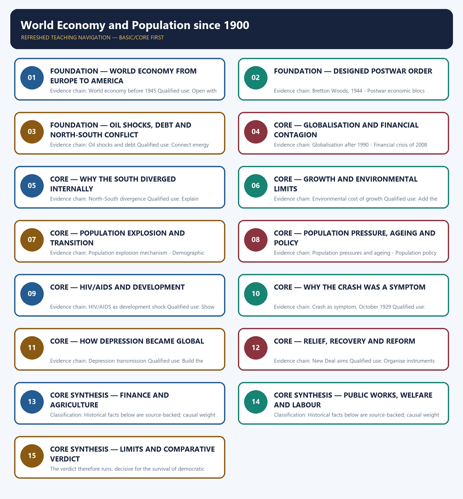

# World Economy and Population since 1900 — Learner-v2 Complete Learning Session

> **Authoring-only generation:** 2026-09-01. No PDF was rendered and no tracker or index was mutated.

### SOURCE, PROGRESSION AND CURRENT-LINKAGE AUDIT

- **Generation date:** 2026-09-01.
- **Repository-first evidence:** the Basic owner is taught first and preserved in full; the Advanced owner is retained only in the optional final teaching block.
- **OCR evidence:** Repository Markdown was used first. The available OCR-searchable Norman Lowe World History PDF was retained as supplementary local context, but no unsupported page number, quotation or precision was imported from it.
- **Qdrant:** not used; repository Markdown and available OCR context were sufficient.
- **PYQ integrity:** The owner records one pre-2018 GS-I demand in neutral rendering only: the policy instruments deployed to contain the Great Economic Depression. No verbatim 2013 wording or question number is held locally.
- **Live-link boundary:** The UN World Economic Situation and Prospects 2026 describes slower and uneven world growth, trade and investment headwinds, and a need for stronger policy coordination. The UN World Population Prospects portal supplies the official current demographic-data anchor. Together they provide a bounded link to unequal globalisation and population analysis; no 2026 population estimate or unfetched economic figure is invented.
- **Fact/inference discipline:** no current-affairs item, PYQ wording, figure or quotation is invented.

## BASIC LEARNING SESSION

### DEEP-REVIEW LEARNING CONTRACT

| Control | Binding rule for this package |
|---|---|
| Syllabus boundary | Complete World History Core is taught chronologically, spatially and causally before optional enrichment. |
| Evidence method | Claim → named event/treaty/institution/actor/region or attributed scholarship → analysis → qualification. |
| Chronology | Structural cause, trigger, event, settlement, implementation and long-term process remain distinct. |
| Geography | Europe, Africa, Asia, West Asia and the Americas retain their own actors, routes and unequal connections; Europe is never the default universal viewpoint. |
| Historiography | Liberal, conservative, Marxist, social, feminist, postcolonial and other relevant interpretations are tied to evidence and bounded claims. |
| Practice contract | Every solved item has directive/demand decoding, an examiner-grade model, an executable timed/compression plan, marks rationale and answer-specific improvement. |
| Approval | This immutable successor remains `approved: false` pending explicit approval. |

**Canonical Basic/Core owner:** `upsc-ai-kit\knowledge\World-History\basic\20_World-Economy-and-Population-since-1900.md`  
**Canonical topic owner:** `upsc-ai-kit\knowledge\World-History\basic\20_World-Economy-and-Population-since-1900.md`  
**Optional Advanced owner:** `upsc-ai-kit\knowledge\World-History\advanced\20_World-Economy-and-Population-since-1900.md`  
**Official syllabus mapping:** `upsc-ai-kit\knowledge\World-History\OFFICIAL-UPSC-SYLLABUS-MAPPING.md`

### EVIDENCE, PYQ AND CURRENT-STATUS CONTROL

- **Primary/official evidence:** treaties, declarations, laws, institutional records, speeches and contemporary testimony are dated and read for authorship, audience and purpose.
- **Spatial and social evidence:** maps, trade and migration routes, battlefield geography, class, race, gender and colonial position qualify state-centred narrative.
- **Quantitative evidence:** population, debt, inflation, output, casualties and territorial claims retain unit, place, period, source and uncertainty; no statistic is invented.
- **Interpretive discipline:** teleology, civilisational ranking, single-cause verdicts and present-day nation-state projection are rejected.
- **PYQ discipline:** repository routing ledgers and locally held papers control wording and metadata; neutral rendering, reconstruction and unavailable official keys remain explicitly labelled.
- **Current-status note, rechecked 2026-09-01:** The UN World Economic Situation and Prospects 2026 describes slower and uneven world growth, trade and investment headwinds, and a need for stronger policy coordination. The UN World Population Prospects portal supplies the official current demographic-data anchor. Together they provide a bounded link to unequal globalisation and population analysis; no 2026 population estimate or unfetched economic figure is invented.

**Live/primary context sources recorded by the predecessor generation:**

- `https://unctad.org/publication/world-economic-situation-and-prospects-2026`
- `https://population.un.org/wpp/`




*Distinct embedded teaching-navigation image. The separate continuous Cārvāka-style flowchart package remains an independent at-a-glance artifact.*

### SESSION 1 — FOUNDATION — WORLD ECONOMY FROM EUROPE TO AMERICA

#### DEFINITION / WHAT THIS IS CALLED

**Plain-language definition:** Precise definition: World economy from Europe to America is the source-bounded relationship among and World economy before 1945 within World Economy and Population since 1900.

**Technical definition:** Evidence chain: World economy before 1945 Qualified use: Open with the pre-1945 rupture.

#### ANSWER-GRABBING OPENING — WRITE/ADAPT IN THE EXAM

> Precise definition: World economy from Europe to America is the source-bounded relationship among and World economy before 1945 within World Economy and Population since 1900.

#### MUST-WRITE KEYWORDS

- **FOUNDATION**
- **World economy from Europe to America**
- **Precise definition**
- **Evidence chain**
- **Qualified use**
- **Precise definition: World economy from Europe to America**

**How to use them:** Frame the answer through FOUNDATION; define World economy from Europe to America, connect Precise definition with Evidence chain to explain the mechanism, and use Qualified use for the decisive comparison or qualification.

##### VISUAL FIRST

```text
WORLD ECONOMY FROM EUROPE TO AMERICA
01. World economy before 1945
BOUNDARY -> War and Depression changed relative economic power.
```

*This topic-specific rail fixes the evidence sequence and its exam boundary before analysis.*

##### CONCEPT DEFINITIONS

- **Precise definition:** World economy from Europe to America is the source-bounded relationship among  and World economy before 1945 within World Economy and Population since 1900.
- **Classification:** Historical facts below are source-backed; causal weight and evaluative verdicts are analytical synthesis.

##### CORE EXPLANATION

Wars and Depression shattered the older Europe-centred liberal economy and strengthened the relative position of the United States.

##### NAMED EVIDENCE AND MECHANISM

- Wars and Depression shattered the older Europe-centred liberal economy and strengthened the relative position of the United States.

##### EXAMINER CAUTION

- War and Depression changed relative economic power.

##### EXAM LINK

- **Prelims:** Retain the exact actor, date, document and category in World economy from Europe to America.
- **Mains:** Open with the pre-1945 rupture.

##### MINI RECAP

- **Evidence chain:** World economy before 1945
- **Qualified use:** Open with the pre-1945 rupture.

#### CLOSING RECALL FLOW — FOUNDATION — WORLD ECONOMY FROM EUROPE TO AMERICA

```text
START / CONCEPT: FOUNDATION — World economy from Europe to America
        |
        v
EXACT TERMS: FOUNDATION · World economy from Europe to America · Precise definition · Evidence chain · Qualified use · Precise definition: World economy from Europe to America
        |
        v
MECHANISM / ARGUMENT: Evidence chain: World economy before 1945 Qualified use: Open with the pre-1945 rupture.
        |
        v
CONSEQUENCE / CONTRAST: Classification: Historical facts below are source-backed; causal weight and evaluative verdicts are analytical synthesis.
        |
        v
UPSC TRAP / ANSWER-USE: Do not miss this limiting distinction: world economy from Europe to America is the source-bounded relationship among and World economy...
        |
        v
ANSWER-GRABBING FORMULATION: Precise definition: World economy from Europe to America is the source-bounded relationship among and World economy before 1945 within World Economy and Population since 1900.
```
### SESSION 2 — FOUNDATION — DESIGNED POSTWAR ORDER

#### DEFINITION / WHAT THIS IS CALLED

**Plain-language definition:** Precise definition: Designed postwar order is the source-bounded relationship among Bretton Woods, 1944 and Postwar economic blocs within World Economy and Population since 1900.

**Technical definition:** Evidence chain: Bretton Woods, 1944 - Postwar economic blocs Qualified use: Explain Bretton Woods and Cold War systems.

#### ANSWER-GRABBING OPENING — WRITE/ADAPT IN THE EXAM

> Precise definition: Designed postwar order is the source-bounded relationship among Bretton Woods, 1944 and Postwar economic blocs within World Economy and Population since 1900.

#### MUST-WRITE KEYWORDS

- **FOUNDATION**
- **Designed postwar order**
- **Precise definition**
- **Evidence chain**
- **Qualified use**
- **Precise definition: Designed postwar order**

**How to use them:** Frame the answer through FOUNDATION; define Designed postwar order, connect Precise definition with Evidence chain to explain the mechanism, and use Qualified use for the decisive comparison or qualification.

##### VISUAL FIRST

```text
DESIGNED POSTWAR ORDER
01. Bretton Woods, 1944
    |
    v
02. Postwar economic blocs
BOUNDARY -> Institutional architecture and bloc competition are distinct.
```

*This topic-specific rail fixes the evidence sequence and its exam boundary before analysis.*

##### CONCEPT DEFINITIONS

- **Precise definition:** Designed postwar order is the source-bounded relationship among Bretton Woods, 1944 and Postwar economic blocs within World Economy and Population since 1900.
- **Classification:** Historical facts below are source-backed; causal weight and evaluative verdicts are analytical synthesis.

##### CORE EXPLANATION

The 1944 Bretton Woods framework created the International Monetary Fund (IMF) for balance-of-payments adjustment and the World Bank for reconstruction and development. The capitalist West and communist bloc developed through different systems while decolonised economies entered an unequal North-South structure.

##### NAMED EVIDENCE AND MECHANISM

- The 1944 Bretton Woods framework created the International Monetary Fund (IMF) for balance-of-payments adjustment and the World Bank for reconstruction and development.
- The capitalist West and communist bloc developed through different systems while decolonised economies entered an unequal North-South structure.

##### EXAMINER CAUTION

- Institutional architecture and bloc competition are distinct.

##### EXAM LINK

- **Prelims:** Retain the exact actor, date, document and category in Designed postwar order.
- **Mains:** Explain Bretton Woods and Cold War systems.

##### MINI RECAP

- **Evidence chain:** Bretton Woods, 1944 -> Postwar economic blocs
- **Qualified use:** Explain Bretton Woods and Cold War systems.

#### CLOSING RECALL FLOW — FOUNDATION — DESIGNED POSTWAR ORDER

```text
START / CONCEPT: FOUNDATION — Designed postwar order
        |
        v
EXACT TERMS: FOUNDATION · Designed postwar order · Precise definition · Evidence chain · Qualified use · Precise definition: Designed postwar order
        |
        v
MECHANISM / ARGUMENT: The capitalist West and communist bloc developed through different systems while decolonised economies entered an unequal North-South structure.
        |
        v
CONSEQUENCE / CONTRAST: Evidence chain: Bretton Woods, 1944 - Postwar economic blocs Qualified use: Explain Bretton Woods and Cold War systems.
        |
        v
UPSC TRAP / ANSWER-USE: Do not miss this limiting distinction: causal weight and evaluative verdicts are analytical synthesis.
        |
        v
ANSWER-GRABBING FORMULATION: Precise definition: Designed postwar order is the source-bounded relationship among Bretton Woods, 1944 and Postwar economic blocs within World Economy and Population since 1900.
```
### SESSION 3 — FOUNDATION — OIL SHOCKS, DEBT AND NORTH-SOUTH CONFLICT

#### DEFINITION / WHAT THIS IS CALLED

**Plain-language definition:** Precise definition: Oil shocks, debt and North-South conflict is the source-bounded relationship among and Oil shocks and debt within World Economy and Population since 1900.

**Technical definition:** Evidence chain: Oil shocks and debt Qualified use: Connect energy and development.

#### ANSWER-GRABBING OPENING — WRITE/ADAPT IN THE EXAM

> Precise definition: Oil shocks, debt and North-South conflict is the source-bounded relationship among and Oil shocks and debt within World Economy and Population since 1900.

#### MUST-WRITE KEYWORDS

- **FOUNDATION**
- **Oil shocks**
- **debt**
- **North-South conflict**
- **Precise definition**
- **Evidence chain**

**How to use them:** Frame the answer through FOUNDATION; define Oil shocks, connect debt with North-South conflict to explain the mechanism, and use Precise definition for the decisive comparison or qualification.

##### VISUAL FIRST

```text
OIL SHOCKS, DEBT AND NORTH-SOUTH CONFLICT
01. Oil shocks and debt
BOUNDARY -> Use the sourced oil-to-vulnerability chain cautiously.
```

*This topic-specific rail fixes the evidence sequence and its exam boundary before analysis.*

##### CONCEPT DEFINITIONS

- **Precise definition:** Oil shocks, debt and North-South conflict is the source-bounded relationship among  and Oil shocks and debt within World Economy and Population since 1900.
- **Classification:** Historical facts below are source-backed; causal weight and evaluative verdicts are analytical synthesis.

##### CORE EXPLANATION

Oil-price shocks, commodity vulnerability and borrowing intensified North-South conflict and debt pressure during the 1970s and 1980s.

##### NAMED EVIDENCE AND MECHANISM

- Oil-price shocks, commodity vulnerability and borrowing intensified North-South conflict and debt pressure during the 1970s and 1980s.

##### EXAMINER CAUTION

- Use the sourced oil-to-vulnerability chain cautiously.

##### EXAM LINK

- **Prelims:** Retain the exact actor, date, document and category in Oil shocks, debt and North-South conflict.
- **Mains:** Connect energy and development.

##### MINI RECAP

- **Evidence chain:** Oil shocks and debt
- **Qualified use:** Connect energy and development.

#### CLOSING RECALL FLOW — FOUNDATION — OIL SHOCKS, DEBT AND NORTH-SOUTH CONFLICT

```text
START / CONCEPT: FOUNDATION — Oil shocks, debt and North-South conflict
        |
        v
EXACT TERMS: FOUNDATION · Oil shocks · debt · North-South conflict · Precise definition · Evidence chain
        |
        v
MECHANISM / ARGUMENT: Evidence chain: Oil shocks and debt Qualified use: Connect energy and development.
        |
        v
CONSEQUENCE / CONTRAST: Classification: Historical facts below are source-backed; causal weight and evaluative verdicts are analytical synthesis.
        |
        v
UPSC TRAP / ANSWER-USE: Do not miss this limiting distinction: use the sourced oil-to-vulnerability chain cautiously.
        |
        v
ANSWER-GRABBING FORMULATION: Precise definition: Oil shocks, debt and North-South conflict is the source-bounded relationship among and Oil shocks and debt within World Economy and Population since 1900.
```
### SESSION 4 — CORE — GLOBALISATION AND FINANCIAL CONTAGION

#### DEFINITION / WHAT THIS IS CALLED

**Plain-language definition:** Precise definition: Globalisation and financial contagion is the source-bounded relationship among Globalisation after 1990 and Financial crisis of 2008 within World Economy and Population since 1900.

**Technical definition:** Evidence chain: Globalisation after 1990 - Financial crisis of 2008 Qualified use: Evaluate integration after 1990.

#### ANSWER-GRABBING OPENING — WRITE/ADAPT IN THE EXAM

> Precise definition: Globalisation and financial contagion is the source-bounded relationship among Globalisation after 1990 and Financial crisis of 2008 within World Economy and Population since 1900.

#### MUST-WRITE KEYWORDS

- **Globalisation**
- **financial contagion**
- **Precise definition**
- **Evidence chain**
- **Qualified use**
- **Precise definition: Globalisation and financial contagion**

**How to use them:** Frame the answer through Globalisation; define financial contagion, connect Precise definition with Evidence chain to explain the mechanism, and use Qualified use for the decisive comparison or qualification.

##### VISUAL FIRST

```text
GLOBALISATION AND FINANCIAL CONTAGION
01. Globalisation after 1990
    |
    v
02. Financial crisis of 2008
BOUNDARY -> The same channels transmit growth and crisis.
```

*This topic-specific rail fixes the evidence sequence and its exam boundary before analysis.*

##### CONCEPT DEFINITIONS

- **Precise definition:** Globalisation and financial contagion is the source-bounded relationship among Globalisation after 1990 and Financial crisis of 2008 within World Economy and Population since 1900.
- **Classification:** Historical facts below are source-backed; causal weight and evaluative verdicts are analytical synthesis.

##### CORE EXPLANATION

Trade, finance and production chains deepened integration after the Cold War while distributing gains unevenly. The 2008 crisis demonstrated that integration transmits financial contagion as efficiently as prosperity.

##### NAMED EVIDENCE AND MECHANISM

- Trade, finance and production chains deepened integration after the Cold War while distributing gains unevenly.
- The 2008 crisis demonstrated that integration transmits financial contagion as efficiently as prosperity.

##### EXAMINER CAUTION

- The same channels transmit growth and crisis.

##### EXAM LINK

- **Prelims:** Retain the exact actor, date, document and category in Globalisation and financial contagion.
- **Mains:** Evaluate integration after 1990.

##### MINI RECAP

- **Evidence chain:** Globalisation after 1990 -> Financial crisis of 2008
- **Qualified use:** Evaluate integration after 1990.

#### CLOSING RECALL FLOW — CORE — GLOBALISATION AND FINANCIAL CONTAGION

```text
START / CONCEPT: CORE — Globalisation and financial contagion
        |
        v
EXACT TERMS: Globalisation · financial contagion · Precise definition · Evidence chain · Qualified use · Precise definition: Globalisation and financial contagion
        |
        v
MECHANISM / ARGUMENT: Evidence chain: Globalisation after 1990 - Financial crisis of 2008 Qualified use: Evaluate integration after 1990.
        |
        v
CONSEQUENCE / CONTRAST: Classification: Historical facts below are source-backed; causal weight and evaluative verdicts are analytical synthesis.
        |
        v
UPSC TRAP / ANSWER-USE: Do not miss this limiting distinction: globalisation and financial contagion is the source-bounded relationship among Globalisation after 1990 and Financial...
        |
        v
ANSWER-GRABBING FORMULATION: Precise definition: Globalisation and financial contagion is the source-bounded relationship among Globalisation after 1990 and Financial crisis of 2008 within World Economy and Population since 1900.
```
### SESSION 5 — CORE — WHY THE SOUTH DIVERGED INTERNALLY

#### DEFINITION / WHAT THIS IS CALLED

**Plain-language definition:** Precise definition: Why the South diverged internally is the source-bounded relationship among and North-South divergence within World Economy and Population since 1900.

**Technical definition:** Evidence chain: North-South divergence Qualified use: Explain unequal capability.

#### ANSWER-GRABBING OPENING — WRITE/ADAPT IN THE EXAM

> Precise definition: Why the South diverged internally is the source-bounded relationship among and North-South divergence within World Economy and Population since 1900.

#### MUST-WRITE KEYWORDS

- **Why the South diverged internally**
- **Precise definition**
- **Evidence chain**
- **Qualified use**
- **Precise definition: Why the South diverged internally**
- **Precise**

**How to use them:** Frame the answer through Why the South diverged internally; define Precise definition, connect Evidence chain with Qualified use to explain the mechanism, and use Precise definition: Why the South diverged internally for the decisive comparison or qualification.

##### VISUAL FIRST

```text
WHY THE SOUTH DIVERGED INTERNALLY
01. North-South divergence
BOUNDARY -> Reject one Third World trajectory.
```

*This topic-specific rail fixes the evidence sequence and its exam boundary before analysis.*

##### CONCEPT DEFINITIONS

- **Precise definition:** Why the South diverged internally is the source-bounded relationship among  and North-South divergence within World Economy and Population since 1900.
- **Classification:** Historical facts below are source-backed; causal weight and evaluative verdicts are analytical synthesis.

##### CORE EXPLANATION

Debt, commodity dependence and weak industrial capacity held back many states, while others industrialised enough to make the Third World an invalid single category.

##### NAMED EVIDENCE AND MECHANISM

- Debt, commodity dependence and weak industrial capacity held back many states, while others industrialised enough to make the Third World an invalid single category.

##### EXAMINER CAUTION

- Reject one Third World trajectory.

##### EXAM LINK

- **Prelims:** Retain the exact actor, date, document and category in Why the South diverged internally.
- **Mains:** Explain unequal capability.

##### MINI RECAP

- **Evidence chain:** North-South divergence
- **Qualified use:** Explain unequal capability.

#### CLOSING RECALL FLOW — CORE — WHY THE SOUTH DIVERGED INTERNALLY

```text
START / CONCEPT: CORE — Why the South diverged internally
        |
        v
EXACT TERMS: Why the South diverged internally · Precise definition · Evidence chain · Qualified use · Precise definition: Why the South diverged internally · Precise
        |
        v
MECHANISM / ARGUMENT: Classification: Historical facts below are source-backed; causal weight and evaluative verdicts are analytical synthesis.
        |
        v
CONSEQUENCE / CONTRAST: Evidence chain: North-South divergence Qualified use: Explain unequal capability.
        |
        v
UPSC TRAP / ANSWER-USE: Do not miss this limiting distinction: why the South diverged internally is the source-bounded relationship among and North-South divergence within...
        |
        v
ANSWER-GRABBING FORMULATION: Precise definition: Why the South diverged internally is the source-bounded relationship among and North-South divergence within World Economy and Population since 1900.
```
### SESSION 6 — CORE — GROWTH AND ENVIRONMENTAL LIMITS

#### DEFINITION / WHAT THIS IS CALLED

**Plain-language definition:** Precise definition: Growth and environmental limits is the source-bounded relationship among and Environmental cost of growth within World Economy and Population since 1900.

**Technical definition:** Evidence chain: Environmental cost of growth Qualified use: Add the physical cost of the growth model.

#### ANSWER-GRABBING OPENING — WRITE/ADAPT IN THE EXAM

> Precise definition: Growth and environmental limits is the source-bounded relationship among and Environmental cost of growth within World Economy and Population since 1900.

#### MUST-WRITE KEYWORDS

- **Growth**
- **environmental limits**
- **Precise definition**
- **Evidence chain**
- **Qualified use**
- **Precise definition: Growth and environmental limits**

**How to use them:** Frame the answer through Growth; define environmental limits, connect Precise definition with Evidence chain to explain the mechanism, and use Qualified use for the decisive comparison or qualification.

##### VISUAL FIRST

```text
GROWTH AND ENVIRONMENTAL LIMITS
01. Environmental cost of growth
BOUNDARY -> Keep evidence qualitative and historical.
```

*This topic-specific rail fixes the evidence sequence and its exam boundary before analysis.*

##### CONCEPT DEFINITIONS

- **Precise definition:** Growth and environmental limits is the source-bounded relationship among  and Environmental cost of growth within World Economy and Population since 1900.
- **Classification:** Historical facts below are source-backed; causal weight and evaluative verdicts are analytical synthesis.

##### CORE EXPLANATION

Twentieth-century production pursued wealth with little attention to resource exhaustion, pollution, ecosystem damage and global warming.

##### NAMED EVIDENCE AND MECHANISM

- Twentieth-century production pursued wealth with little attention to resource exhaustion, pollution, ecosystem damage and global warming.

##### EXAMINER CAUTION

- Keep evidence qualitative and historical.

##### EXAM LINK

- **Prelims:** Retain the exact actor, date, document and category in Growth and environmental limits.
- **Mains:** Add the physical cost of the growth model.

##### MINI RECAP

- **Evidence chain:** Environmental cost of growth
- **Qualified use:** Add the physical cost of the growth model.

#### CLOSING RECALL FLOW — CORE — GROWTH AND ENVIRONMENTAL LIMITS

```text
START / CONCEPT: CORE — Growth and environmental limits
        |
        v
EXACT TERMS: Growth · environmental limits · Precise definition · Evidence chain · Qualified use · Precise definition: Growth and environmental limits
        |
        v
MECHANISM / ARGUMENT: Evidence chain: Environmental cost of growth Qualified use: Add the physical cost of the growth model.
        |
        v
CONSEQUENCE / CONTRAST: Classification: Historical facts below are source-backed; causal weight and evaluative verdicts are analytical synthesis.
        |
        v
UPSC TRAP / ANSWER-USE: Do not miss this limiting distinction: growth and environmental limits is the source-bounded relationship among and Environmental cost of growth...
        |
        v
ANSWER-GRABBING FORMULATION: Precise definition: Growth and environmental limits is the source-bounded relationship among and Environmental cost of growth within World Economy and Population since 1900.
```
### SESSION 7 — CORE — POPULATION EXPLOSION AND TRANSITION

#### DEFINITION / WHAT THIS IS CALLED

**Plain-language definition:** Precise definition: Population explosion and transition is the source-bounded relationship among Population explosion mechanism and Demographic transition within World Economy and Population since 1900.

**Technical definition:** Evidence chain: Population explosion mechanism - Demographic transition Qualified use: Use the demographic mechanism correctly.

#### ANSWER-GRABBING OPENING — WRITE/ADAPT IN THE EXAM

> Precise definition: Population explosion and transition is the source-bounded relationship among Population explosion mechanism and Demographic transition within World Economy and Population since 1900.

#### MUST-WRITE KEYWORDS

- **Population explosion**
- **transition**
- **Precise definition**
- **Evidence chain**
- **Qualified use**
- **Precise definition: Population explosion and transition**

**How to use them:** Frame the answer through Population explosion; define transition, connect Precise definition with Evidence chain to explain the mechanism, and use Qualified use for the decisive comparison or qualification.

##### VISUAL FIRST

```text
POPULATION EXPLOSION AND TRANSITION
01. Population explosion mechanism
    |
    v
02. Demographic transition
BOUNDARY -> Falling mortality precedes fertility decline.
```

*This topic-specific rail fixes the evidence sequence and its exam boundary before analysis.*

##### CONCEPT DEFINITIONS

- **Precise definition:** Population explosion and transition is the source-bounded relationship among Population explosion mechanism and Demographic transition within World Economy and Population since 1900.
- **Classification:** Historical facts below are source-backed; causal weight and evaluative verdicts are analytical synthesis.

##### CORE EXPLANATION

Population grew rapidly when death rates fell through medicine, clean water and public health before fertility adjusted downward. High births and falling deaths create rapid growth; later education, urbanisation, child survival, women's employment and family planning reduce fertility.

##### NAMED EVIDENCE AND MECHANISM

- Population grew rapidly when death rates fell through medicine, clean water and public health before fertility adjusted downward.
- High births and falling deaths create rapid growth; later education, urbanisation, child survival, women's employment and family planning reduce fertility.

##### EXAMINER CAUTION

- Falling mortality precedes fertility decline.

##### EXAM LINK

- **Prelims:** Retain the exact actor, date, document and category in Population explosion and transition.
- **Mains:** Use the demographic mechanism correctly.

##### MINI RECAP

- **Evidence chain:** Population explosion mechanism -> Demographic transition
- **Qualified use:** Use the demographic mechanism correctly.

#### CLOSING RECALL FLOW — CORE — POPULATION EXPLOSION AND TRANSITION

```text
START / CONCEPT: CORE — Population explosion and transition
        |
        v
EXACT TERMS: Population explosion · transition · Precise definition · Evidence chain · Qualified use · Precise definition: Population explosion and transition
        |
        v
MECHANISM / ARGUMENT: Evidence chain: Population explosion mechanism - Demographic transition Qualified use: Use the demographic mechanism correctly.
        |
        v
CONSEQUENCE / CONTRAST: Classification: Historical facts below are source-backed; causal weight and evaluative verdicts are analytical synthesis.
        |
        v
UPSC TRAP / ANSWER-USE: Do not miss this limiting distinction: high births and falling deaths create rapid growth.
        |
        v
ANSWER-GRABBING FORMULATION: Precise definition: Population explosion and transition is the source-bounded relationship among Population explosion mechanism and Demographic transition within World Economy and Population since 1900.
```
### SESSION 8 — CORE — POPULATION PRESSURE, AGEING AND POLICY

#### DEFINITION / WHAT THIS IS CALLED

**Plain-language definition:** Precise definition: Population pressure, ageing and policy is the source-bounded relationship among Population pressures and ageing and Population policy within World Economy and Population since 1900.

**Technical definition:** Evidence chain: Population pressures and ageing - Population policy Qualified use: Compare welfare and coercive routes.

#### ANSWER-GRABBING OPENING — WRITE/ADAPT IN THE EXAM

> Precise definition: Population pressure, ageing and policy is the source-bounded relationship among Population pressures and ageing and Population policy within World Economy and Population since 1900.

#### MUST-WRITE KEYWORDS

- **Population pressure**
- **ageing**
- **policy**
- **Precise definition**
- **Evidence chain**
- **Qualified use**

**How to use them:** Frame the answer through Population pressure; define ageing, connect policy with Precise definition to explain the mechanism, and use Evidence chain for the decisive comparison or qualification.

##### VISUAL FIRST

```text
POPULATION PRESSURE, AGEING AND POLICY
01. Population pressures and ageing
    |
    v
02. Population policy
BOUNDARY -> Different regions face opposite age structures.
```

*This topic-specific rail fixes the evidence sequence and its exam boundary before analysis.*

##### CONCEPT DEFINITIONS

- **Precise definition:** Population pressure, ageing and policy is the source-bounded relationship among Population pressures and ageing and Population policy within World Economy and Population since 1900.
- **Classification:** Historical facts below are source-backed; causal weight and evaluative verdicts are analytical synthesis.

##### CORE EXPLANATION

Food, employment, housing and services faced pressure in younger societies while low-fertility societies increasingly faced ageing. States used voluntary welfare and development routes as well as coercive controls, with China's one-child policy as a major direct-intervention case.

##### NAMED EVIDENCE AND MECHANISM

- Food, employment, housing and services faced pressure in younger societies while low-fertility societies increasingly faced ageing.
- States used voluntary welfare and development routes as well as coercive controls, with China's one-child policy as a major direct-intervention case.

##### EXAMINER CAUTION

- Different regions face opposite age structures.

##### EXAM LINK

- **Prelims:** Retain the exact actor, date, document and category in Population pressure, ageing and policy.
- **Mains:** Compare welfare and coercive routes.

##### MINI RECAP

- **Evidence chain:** Population pressures and ageing -> Population policy
- **Qualified use:** Compare welfare and coercive routes.

#### CLOSING RECALL FLOW — CORE — POPULATION PRESSURE, AGEING AND POLICY

```text
START / CONCEPT: CORE — Population pressure, ageing and policy
        |
        v
EXACT TERMS: Population pressure · ageing · policy · Precise definition · Evidence chain · Qualified use
        |
        v
MECHANISM / ARGUMENT: Evidence chain: Population pressures and ageing - Population policy Qualified use: Compare welfare and coercive routes.
        |
        v
CONSEQUENCE / CONTRAST: Classification: Historical facts below are source-backed; causal weight and evaluative verdicts are analytical synthesis.
        |
        v
UPSC TRAP / ANSWER-USE: Do not miss this limiting distinction: population pressures and ageing - Population policy Qualified use.
        |
        v
ANSWER-GRABBING FORMULATION: Precise definition: Population pressure, ageing and policy is the source-bounded relationship among Population pressures and ageing and Population policy within World Economy and Population since 1900.
```
### SESSION 9 — CORE — HIV/AIDS AND DEVELOPMENT

#### DEFINITION / WHAT THIS IS CALLED

**Plain-language definition:** Precise definition: HIV/AIDS and development is the source-bounded relationship among and HIV/AIDS as development shock within World Economy and Population since 1900.

**Technical definition:** Evidence chain: HIV/AIDS as development shock Qualified use: Show demographic-economic interaction.

#### ANSWER-GRABBING OPENING — WRITE/ADAPT IN THE EXAM

> Precise definition: HIV/AIDS and development is the source-bounded relationship among and HIV/AIDS as development shock within World Economy and Population since 1900.

#### MUST-WRITE KEYWORDS

- **HIV/AIDS**
- **development**
- **Precise definition**
- **Evidence chain**
- **Qualified use**
- **Precise definition: HIV/AIDS and development**

**How to use them:** Frame the answer through HIV/AIDS; define development, connect Precise definition with Evidence chain to explain the mechanism, and use Qualified use for the decisive comparison or qualification.

##### VISUAL FIRST

```text
HIV/AIDS AND DEVELOPMENT
01. HIV/AIDS as development shock
BOUNDARY -> Treat health, labour and family as one system.
```

*This topic-specific rail fixes the evidence sequence and its exam boundary before analysis.*

##### CONCEPT DEFINITIONS

- **Precise definition:** HIV/AIDS and development is the source-bounded relationship among  and HIV/AIDS as development shock within World Economy and Population since 1900.
- **Classification:** Historical facts below are source-backed; causal weight and evaluative verdicts are analytical synthesis.

##### CORE EXPLANATION

HIV/AIDS affected labour, family structure, life expectancy and development, especially in poorer African societies.

##### NAMED EVIDENCE AND MECHANISM

- HIV/AIDS affected labour, family structure, life expectancy and development, especially in poorer African societies.

##### EXAMINER CAUTION

- Treat health, labour and family as one system.

##### EXAM LINK

- **Prelims:** Retain the exact actor, date, document and category in HIV/AIDS and development.
- **Mains:** Show demographic-economic interaction.

##### MINI RECAP

- **Evidence chain:** HIV/AIDS as development shock
- **Qualified use:** Show demographic-economic interaction.

#### CLOSING RECALL FLOW — CORE — HIV/AIDS AND DEVELOPMENT

```text
START / CONCEPT: CORE — HIV/AIDS and development
        |
        v
EXACT TERMS: HIV/AIDS · development · Precise definition · Evidence chain · Qualified use · Precise definition: HIV/AIDS and development
        |
        v
MECHANISM / ARGUMENT: Evidence chain: HIV/AIDS as development shock Qualified use: Show demographic-economic interaction.
        |
        v
CONSEQUENCE / CONTRAST: Classification: Historical facts below are source-backed; causal weight and evaluative verdicts are analytical synthesis.
        |
        v
UPSC TRAP / ANSWER-USE: Do not miss this limiting distinction: treat health, labour and family as one system.
        |
        v
ANSWER-GRABBING FORMULATION: Precise definition: HIV/AIDS and development is the source-bounded relationship among and HIV/AIDS as development shock within World Economy and Population since 1900.
```
### SESSION 10 — CORE — WHY THE CRASH WAS A SYMPTOM

#### DEFINITION / WHAT THIS IS CALLED

**Plain-language definition:** Precise definition: Why the Crash was a symptom is the source-bounded relationship among and Crash as symptom, October 1929 within World Economy and Population since 1900.

**Technical definition:** Evidence chain: Crash as symptom, October 1929 Qualified use: Correct the classic causal trap.

#### ANSWER-GRABBING OPENING — WRITE/ADAPT IN THE EXAM

> Precise definition: Why the Crash was a symptom is the source-bounded relationship among and Crash as symptom, October 1929 within World Economy and Population since 1900.

#### MUST-WRITE KEYWORDS

- **Precise definition**
- **Evidence chain**
- **Qualified use**
- **Precise**
- **Why**
- **Crash**

**How to use them:** Frame the answer through Precise definition; define Evidence chain, connect Qualified use with Precise to explain the mechanism, and use Why for the decisive comparison or qualification.

##### VISUAL FIRST

```text
WHY THE CRASH WAS A SYMPTOM
01. Crash as symptom, October 1929
BOUNDARY -> Open Depression answers with structural causes.
```

*This topic-specific rail fixes the evidence sequence and its exam boundary before analysis.*

##### CONCEPT DEFINITIONS

- **Precise definition:** Why the Crash was a symptom is the source-bounded relationship among  and Crash as symptom, October 1929 within World Economy and Population since 1900.
- **Classification:** Historical facts below are source-backed; causal weight and evaluative verdicts are analytical synthesis.

##### CORE EXPLANATION

Lowe treats the Wall Street Crash as a symptom rather than the cause of deeper overproduction, unequal income, export contraction and speculation.

##### NAMED EVIDENCE AND MECHANISM

- Lowe treats the Wall Street Crash as a symptom rather than the cause of deeper overproduction, unequal income, export contraction and speculation.

##### EXAMINER CAUTION

- Open Depression answers with structural causes.

##### EXAM LINK

- **Prelims:** Retain the exact actor, date, document and category in Why the Crash was a symptom.
- **Mains:** Correct the classic causal trap.

##### MINI RECAP

- **Evidence chain:** Crash as symptom, October 1929
- **Qualified use:** Correct the classic causal trap.

#### CLOSING RECALL FLOW — CORE — WHY THE CRASH WAS A SYMPTOM

```text
START / CONCEPT: CORE — Why the Crash was a symptom
        |
        v
EXACT TERMS: Precise definition · Evidence chain · Qualified use · Precise · Why · Crash
        |
        v
MECHANISM / ARGUMENT: Lowe treats the Wall Street Crash as a symptom rather than the cause of deeper overproduction, unequal income, export contraction and speculation.
        |
        v
CONSEQUENCE / CONTRAST: Evidence chain: Crash as symptom, October 1929 Qualified use: Correct the classic causal trap.
        |
        v
UPSC TRAP / ANSWER-USE: Do not miss this limiting distinction: retain the exact actor, date, document and category in Why the Crash was a...
        |
        v
ANSWER-GRABBING FORMULATION: Precise definition: Why the Crash was a symptom is the source-bounded relationship among and Crash as symptom, October 1929 within World Economy and Population since 1900.
```
### SESSION 11 — CORE — HOW DEPRESSION BECAME GLOBAL

#### DEFINITION / WHAT THIS IS CALLED

**Plain-language definition:** Precise definition: How Depression became global is the source-bounded relationship among and Depression transmission within World Economy and Population since 1900.

**Technical definition:** Evidence chain: Depression transmission Qualified use: Build the international chain.

#### ANSWER-GRABBING OPENING — WRITE/ADAPT IN THE EXAM

> Precise definition: How Depression became global is the source-bounded relationship among and Depression transmission within World Economy and Population since 1900.

#### MUST-WRITE KEYWORDS

- **How Depression became global**
- **Precise definition**
- **Evidence chain**
- **Qualified use**
- **Precise**
- **How Depression**

**How to use them:** Frame the answer through How Depression became global; define Precise definition, connect Evidence chain with Qualified use to explain the mechanism, and use Precise for the decisive comparison or qualification.

##### VISUAL FIRST

```text
HOW DEPRESSION BECAME GLOBAL
01. Depression transmission
BOUNDARY -> Credit transmission preceded some trade effects.
```

*This topic-specific rail fixes the evidence sequence and its exam boundary before analysis.*

##### CONCEPT DEFINITIONS

- **Precise definition:** How Depression became global is the source-bounded relationship among  and Depression transmission within World Economy and Population since 1900.
- **Classification:** Historical facts below are source-backed; causal weight and evaluative verdicts are analytical synthesis.

##### CORE EXPLANATION

American credit withdrawal, bank failures, falling trade, tariffs and commodity collapse transformed a US slump into a global crisis.

##### NAMED EVIDENCE AND MECHANISM

- American credit withdrawal, bank failures, falling trade, tariffs and commodity collapse transformed a US slump into a global crisis.

##### EXAMINER CAUTION

- Credit transmission preceded some trade effects.

##### EXAM LINK

- **Prelims:** Retain the exact actor, date, document and category in How Depression became global.
- **Mains:** Build the international chain.

##### MINI RECAP

- **Evidence chain:** Depression transmission
- **Qualified use:** Build the international chain.

#### CLOSING RECALL FLOW — CORE — HOW DEPRESSION BECAME GLOBAL

```text
START / CONCEPT: CORE — How Depression became global
        |
        v
EXACT TERMS: How Depression became global · Precise definition · Evidence chain · Qualified use · Precise · How Depression
        |
        v
MECHANISM / ARGUMENT: Prelims: Retain the exact actor, date, document and category in How Depression became global.
        |
        v
CONSEQUENCE / CONTRAST: Evidence chain: Depression transmission Qualified use: Build the international chain.
        |
        v
UPSC TRAP / ANSWER-USE: Do not miss this limiting distinction: causal weight and evaluative verdicts are analytical synthesis.
        |
        v
ANSWER-GRABBING FORMULATION: Precise definition: How Depression became global is the source-bounded relationship among and Depression transmission within World Economy and Population since 1900.
```
### SESSION 12 — CORE — RELIEF, RECOVERY AND REFORM

#### DEFINITION / WHAT THIS IS CALLED

**Plain-language definition:** Precise definition: Relief, recovery and reform is the source-bounded relationship among and New Deal aims within World Economy and Population since 1900.

**Technical definition:** Evidence chain: New Deal aims Qualified use: Organise instruments by function.

#### ANSWER-GRABBING OPENING — WRITE/ADAPT IN THE EXAM

> Precise definition: Relief, recovery and reform is the source-bounded relationship among and New Deal aims within World Economy and Population since 1900.

#### MUST-WRITE KEYWORDS

- **Relief**
- **recovery**
- **reform**
- **Precise definition**
- **Evidence chain**
- **Qualified use**

**How to use them:** Frame the answer through Relief; define recovery, connect reform with Precise definition to explain the mechanism, and use Evidence chain for the decisive comparison or qualification.

##### VISUAL FIRST

```text
RELIEF, RECOVERY AND REFORM
01. New Deal aims
BOUNDARY -> Use Roosevelt's three aims as classification.
```

*This topic-specific rail fixes the evidence sequence and its exam boundary before analysis.*

##### CONCEPT DEFINITIONS

- **Precise definition:** Relief, recovery and reform is the source-bounded relationship among  and New Deal aims within World Economy and Population since 1900.
- **Classification:** Historical facts below are source-backed; causal weight and evaluative verdicts are analytical synthesis.

##### CORE EXPLANATION

Roosevelt's relief, recovery and reform framework sought immediate support, restored demand and protection against recurrence.

##### NAMED EVIDENCE AND MECHANISM

- Roosevelt's relief, recovery and reform framework sought immediate support, restored demand and protection against recurrence.

##### EXAMINER CAUTION

- Use Roosevelt's three aims as classification.

##### EXAM LINK

- **Prelims:** Retain the exact actor, date, document and category in Relief, recovery and reform.
- **Mains:** Organise instruments by function.

##### MINI RECAP

- **Evidence chain:** New Deal aims
- **Qualified use:** Organise instruments by function.

#### CLOSING RECALL FLOW — CORE — RELIEF, RECOVERY AND REFORM

```text
START / CONCEPT: CORE — Relief, recovery and reform
        |
        v
EXACT TERMS: Relief · recovery · reform · Precise definition · Evidence chain · Qualified use
        |
        v
MECHANISM / ARGUMENT: Evidence chain: New Deal aims Qualified use: Organise instruments by function.
        |
        v
CONSEQUENCE / CONTRAST: Classification: Historical facts below are source-backed; causal weight and evaluative verdicts are analytical synthesis.
        |
        v
UPSC TRAP / ANSWER-USE: Do not miss this limiting distinction: use Roosevelt's three aims as classification.
        |
        v
ANSWER-GRABBING FORMULATION: Precise definition: Relief, recovery and reform is the source-bounded relationship among and New Deal aims within World Economy and Population since 1900.
```
### SESSION 13 — CORE SYNTHESIS — FINANCE AND AGRICULTURE

#### DEFINITION / WHAT THIS IS CALLED

**Plain-language definition:** Precise definition: Finance and agriculture is the source-bounded relationship among and Financial and agricultural instruments within World Economy and Population since 1900.

**Technical definition:** Classification: Historical facts below are source-backed; causal weight and evaluative verdicts are analytical synthesis.

#### ANSWER-GRABBING OPENING — WRITE/ADAPT IN THE EXAM

> Precise definition: Finance and agriculture is the source-bounded relationship among and Financial and agricultural instruments within World Economy and Population since 1900.

#### MUST-WRITE KEYWORDS

- **CORE SYNTHESIS**
- **Finance**
- **agriculture**
- **Precise definition**
- **Evidence chain**
- **Qualified use**

**How to use them:** Frame the answer through CORE SYNTHESIS; define Finance, connect agriculture with Precise definition to explain the mechanism, and use Evidence chain for the decisive comparison or qualification.

##### VISUAL FIRST

```text
FINANCE AND AGRICULTURE
01. Financial and agricultural instruments
BOUNDARY -> Each instrument needs purpose and limitation.
```

*This topic-specific rail fixes the evidence sequence and its exam boundary before analysis.*

##### CONCEPT DEFINITIONS

- **Precise definition:** Finance and agriculture is the source-bounded relationship among  and Financial and agricultural instruments within World Economy and Population since 1900.
- **Classification:** Historical facts below are source-backed; causal weight and evaluative verdicts are analytical synthesis.

##### CORE EXPLANATION

Bank guarantees and the SEC restored confidence, while the 1933 agricultural programme compensated lower output but displaced farm labourers.

##### NAMED EVIDENCE AND MECHANISM

- Bank guarantees and the SEC restored confidence, while the 1933 agricultural programme compensated lower output but displaced farm labourers.

##### EXAMINER CAUTION

- Each instrument needs purpose and limitation.

##### EXAM LINK

- **Prelims:** Retain the exact actor, date, document and category in Finance and agriculture.
- **Mains:** Ground early New Deal action.

##### MINI RECAP

- **Evidence chain:** Financial and agricultural instruments
- **Qualified use:** Ground early New Deal action.

#### CLOSING RECALL FLOW — CORE SYNTHESIS — FINANCE AND AGRICULTURE

```text
START / CONCEPT: CORE SYNTHESIS — Finance and agriculture
        |
        v
EXACT TERMS: CORE SYNTHESIS · Finance · agriculture · Precise definition · Evidence chain · Qualified use
        |
        v
MECHANISM / ARGUMENT: Classification: Historical facts below are source-backed; causal weight and evaluative verdicts are analytical synthesis.
        |
        v
CONSEQUENCE / CONTRAST: Evidence chain: Financial and agricultural instruments Qualified use: Ground early New Deal action.
        |
        v
UPSC TRAP / ANSWER-USE: Do not miss this limiting distinction: finance and agriculture is the source-bounded relationship among and Financial and agricultural instruments within...
        |
        v
ANSWER-GRABBING FORMULATION: Precise definition: Finance and agriculture is the source-bounded relationship among and Financial and agricultural instruments within World Economy and Population since 1900.
```
### SESSION 14 — CORE SYNTHESIS — PUBLIC WORKS, WELFARE AND LABOUR

#### DEFINITION / WHAT THIS IS CALLED

**Plain-language definition:** Precise definition: Public works, welfare and labour is the source-bounded relationship among and Public works and social reform within World Economy and Population since 1900.

**Technical definition:** Classification: Historical facts below are source-backed; causal weight and evaluative verdicts are analytical synthesis.

#### ANSWER-GRABBING OPENING — WRITE/ADAPT IN THE EXAM

> Precise definition: Public works, welfare and labour is the source-bounded relationship among and Public works and social reform within World Economy and Population since 1900.

#### MUST-WRITE KEYWORDS

- **CORE SYNTHESIS**
- **Public works**
- **welfare**
- **labour**
- **Precise definition**
- **Evidence chain**

**How to use them:** Frame the answer through CORE SYNTHESIS; define Public works, connect welfare with labour to explain the mechanism, and use Precise definition for the decisive comparison or qualification.

##### VISUAL FIRST

```text
PUBLIC WORKS, WELFARE AND LABOUR
01. Public works and social reform
BOUNDARY -> Permanent federal capacity outlasted the slump.
```

*This topic-specific rail fixes the evidence sequence and its exam boundary before analysis.*

##### CONCEPT DEFINITIONS

- **Precise definition:** Public works, welfare and labour is the source-bounded relationship among  and Public works and social reform within World Economy and Population since 1900.
- **Classification:** Historical facts below are source-backed; causal weight and evaluative verdicts are analytical synthesis.

##### CORE EXPLANATION

The TVA and public works created jobs and assets, while Social Security, labour standards and collective bargaining expanded federal social responsibility.

##### NAMED EVIDENCE AND MECHANISM

- The TVA and public works created jobs and assets, while Social Security, labour standards and collective bargaining expanded federal social responsibility.

##### EXAMINER CAUTION

- Permanent federal capacity outlasted the slump.

##### EXAM LINK

- **Prelims:** Retain the exact actor, date, document and category in Public works, welfare and labour.
- **Mains:** Show institutional consequence.

##### MINI RECAP

- **Evidence chain:** Public works and social reform
- **Qualified use:** Show institutional consequence.

#### CLOSING RECALL FLOW — CORE SYNTHESIS — PUBLIC WORKS, WELFARE AND LABOUR

```text
START / CONCEPT: CORE SYNTHESIS — Public works, welfare and labour
        |
        v
EXACT TERMS: CORE SYNTHESIS · Public works · welfare · labour · Precise definition · Evidence chain
        |
        v
MECHANISM / ARGUMENT: The TVA and public works created jobs and assets, while Social Security, labour standards and collective bargaining expanded federal social responsibility.
        |
        v
CONSEQUENCE / CONTRAST: Evidence chain: Public works and social reform Qualified use: Show institutional consequence.
        |
        v
UPSC TRAP / ANSWER-USE: Do not miss this limiting distinction: causal weight and evaluative verdicts are analytical synthesis.
        |
        v
ANSWER-GRABBING FORMULATION: Precise definition: Public works, welfare and labour is the source-bounded relationship among and Public works and social reform within World Economy and Population since 1900.
```
### SESSION 15 — CORE SYNTHESIS — LIMITS AND COMPARATIVE VERDICT

#### DEFINITION / WHAT THIS IS CALLED

**Plain-language definition:** Precise definition: Limits and comparative verdict is the source-bounded relationship among New Deal limits and Democratic and authoritarian responses within World Economy and Population since 1900.

**Technical definition:** The verdict therefore runs: decisive for the survival of democratic capitalism, insufficient for recovery." "Democratic versus authoritarian response?" → "Both discovered that only large-scale state spending could absorb mass unemployment; the difference is that the American programme was constrained by courts, states and elections and produced partial recovery with liberty intact, while the German programme achieved full employment through rearmament, the abolition of trade unions and the purging of Jews and opponents from employment — an outcome that cannot be scored as policy success.".

#### ANSWER-GRABBING OPENING — WRITE/ADAPT IN THE EXAM

> Precise definition: Limits and comparative verdict is the source-bounded relationship among New Deal limits and Democratic and authoritarian responses within World Economy and Population since 1900.

#### MUST-WRITE KEYWORDS

- **CORE SYNTHESIS**
- **Limits**
- **comparative verdict**
- **Precise definition**
- **Evidence chain**
- **Qualified use**

**How to use them:** Frame the answer through CORE SYNTHESIS; define Limits, connect comparative verdict with Precise definition to explain the mechanism, and use Evidence chain for the decisive comparison or qualification.

##### VISUAL FIRST

```text
LIMITS AND COMPARATIVE VERDICT
01. New Deal limits
    |
    v
02. Democratic and authoritarian responses
BOUNDARY -> Economic recovery and democratic survival are different tests.
```

*This topic-specific rail fixes the evidence sequence and its exam boundary before analysis.*

##### CONCEPT DEFINITIONS

- **Precise definition:** Limits and comparative verdict is the source-bounded relationship among New Deal limits and Democratic and authoritarian responses within World Economy and Population since 1900.
- **Classification:** Historical facts below are source-backed; causal weight and evaluative verdicts are analytical synthesis.

##### CORE EXPLANATION

The programme restored confidence and democratic legitimacy but did not end mass unemployment; reduced spending in 1938 produced another recession. Both the New Deal and Nazi rearmament used state spending, but Germany's employment recovery rested on militarisation, union destruction and racial-political exclusion.

##### NAMED EVIDENCE AND MECHANISM

- The programme restored confidence and democratic legitimacy but did not end mass unemployment; reduced spending in 1938 produced another recession.
- Both the New Deal and Nazi rearmament used state spending, but Germany's employment recovery rested on militarisation, union destruction and racial-political exclusion.

##### EXAMINER CAUTION

- Economic recovery and democratic survival are different tests.

##### EXAM LINK

- **Prelims:** Retain the exact actor, date, document and category in Limits and comparative verdict.
- **Mains:** Conclude without binary judgement.

##### MINI RECAP

- **Evidence chain:** New Deal limits -> Democratic and authoritarian responses
- **Qualified use:** Conclude without binary judgement.

#### COMPLETE BASIC OWNER EVIDENCE BANK

> **Subject:** History (World History) · **Tier:** Basic (foundation) · **GS Paper:** GS-I
> **Grounded in:** Norman Lowe, *Mastering Modern World History* (5th ed.), Chapters 27-28, and Chapter 22 §§22.6-22.7 for the Great Depression and the New Deal + official UPSC GS-I syllabus line.
> ✅ = from Lowe / official syllabus · ⚠️ = synthesis / analytical linkage · 📰 = current affairs.
> *Companion: `advanced/20_World-Economy-and-Population-since-1900.md`.*

#### Mini-timeline

| Date / phase | Event |
|---|---|
| ✅ 1900s-1945 | Shift from old European economic dominance through wars and depression |
| ✅ Oct 1929 | Wall Street Crash; the boom turns into the Great Depression / world economic crisis |
| ✅ 1929-33 | Credit withdrawal, banking failure, trade contraction and tariff retaliation spread the slump worldwide |
| ✅ 1933-40 | Roosevelt's New Deal: relief, recovery and reform in the USA |
| ✅ 1945 onwards | US-led capitalist order expands; communist bloc remains separate |
| ✅ 1970s-1980s | Oil shocks, North-South debate and debt pressures intensify |
| ✅ 1990s | Globalization deepens after Cold War shifts |
| ✅ 2008 | World financial crisis exposes fragility of integrated capitalism |
| ✅ 20th century | Population grows rapidly as death rates fall |
| ✅ Late 20th century | HIV/AIDS becomes a major global population-health crisis |

#### 1. Snapshot and syllabus anchor

- ✅ Official UPSC GS-I syllabus includes world-history themes and political philosophies such as capitalism and socialism and their effect on society.
- ✅ Lowe's economy chapter is ideal for this because it tracks the changing balance between **capitalist**, **communist** and **developing-world** economies.
- ⚠️ The population chapter matters because economic change cannot be separated from mortality decline, urbanization, fertility change and health shocks.

#### 2. The changing world economy in four exam-ready phases

| Phase | Main pattern | What to remember |
|---|---|---|
| ✅ Early 20th century to 1945 | Wars and depression shattered the older liberal world economy | Europe weakened; the USA emerged far stronger |
| ✅ 1945-1970s | Capitalist West and communist bloc developed separately | Cold War economics was also ideological competition |
| ✅ 1970s-1990s | Oil shocks, debt, uneven development and North-South conflict | "Third World" unity weakened as some states industrialized faster than others |
| ✅ 1990s-2008 | Globalization accelerated after the Cold War | Trade, finance and production chains deepened integration but also vulnerability |
| ✅ 2008 aftermath | Crisis spread across an interconnected world economy | Globalization linked prosperity and contagion alike |

#### 3. North-South divide and uneven development

- ✅ Lowe stresses that the developing world did not move together: some states industrialized far more successfully than others.
- ✅ The gap between rich and poor countries remained central even when globalization expanded.
- ✅ Debt, commodity dependence and weak industrial bases constrained many poorer states.
- ⚠️ A strong UPSC answer should therefore avoid treating the "Third World" as a single economic category.

#### 4. Why did world population grow so fast?

```text
better medicine + cleaner water + lower death rates
                     +
           slower fall in fertility in many regions
                     ->
            rapid population growth
                     ->
    pressure on food, jobs, housing and services
```

| Driver / issue | Lowe's emphasis |
|---|---|
| ✅ Falling death rates | Medical advances and public-health gains reduced mortality |
| ✅ Continued high fertility in many regions | Population surged before fertility declined sufficiently |
| ✅ Pressure on resources | Food supply, housing, employment and urban services came under strain |
| ✅ Population control attempts | States tried varied measures; some were voluntary, some coercive |
| ✅ China example | One-child control policy became a major state intervention case |

#### 5. Population, health and HIV/AIDS

- ✅ Lowe includes HIV/AIDS as a major late-twentieth-century population issue, especially destructive in parts of Africa.
- ✅ The epidemic was not only a medical problem; it affected labour, family structure, life expectancy and development.
- ✅ International organizations and campaigns mattered, but the burden remained highly unequal.

#### 6. Must-Know Facts (Prelims) and UPSC traps

- ✅ The **USA** emerged as the leading capitalist power in the twentieth century.
- ✅ The **communist bloc** and the **capitalist West** followed different economic systems during the Cold War.
- ✅ The **North-South divide** remained a key world-economic issue even after decolonization.
- ✅ The **2008 crisis** showed that global integration spreads shocks quickly.
- ✅ Rapid population growth was closely linked to **falling death rates**, not simply to "more births".
- ✅ **HIV/AIDS** must be remembered as a world population and development issue, not only a medical one.

> 🔑 Trap: **Population explosion is about the gap between falling mortality and slower fertility decline.**

- ❌ Globalization benefited all regions equally -> Lowe repeatedly shows uneven gains.
- ❌ The Third World moved as one bloc -> internal divergence was large.
- ❌ Population growth proves economic failure everywhere -> some fast-growing populations coexisted with development, while some low-growth societies faced ageing problems.
- ❌ HIV/AIDS belongs outside population history -> Lowe treats it inside the population chapter.

#### 7. Exam linkage, Mains angles and probable questions

- ⚠️ **Recurring UPSC theme:** link economic systems with their social outcomes.
- Trace the major changes in the world economy since 1900.
- Explain the causes and consequences of rapid population growth in the twentieth century.
- Discuss why globalization did not remove the North-South divide.

#### 8. Answer architecture (10/15/20-mark support)

> **Core-sufficiency note:** this file must independently support world-economy, globalisation,
> demographic-transition and inequality demands. `advanced/20` adds the globalisation debate and
> population-control ethics only.

##### 8.1 Directive and demand map

| If the question says | It is really testing | Do NOT write |
|---|---|---|
| *Trace the major changes in the world economy since 1900* | Phase logic and what drives each transition | A century-long chronicle |
| *Why did globalisation not remove the North-South divide?* | Mechanisms of uneven gain | "Globalisation was unfair" |
| *Explain rapid population growth* | The **gap** between mortality decline and fertility decline | "More births" |
| *Consequences of population growth* | Resource, employment, urban and health pressure, plus divergence | Malthusian alarm |
| *Capitalism versus socialism in practice* | Comparative economic performance and social outcome | Ideological assertion |
| *HIV/AIDS as a development issue* | Labour, family, life expectancy and unequal burden | A medical account |
| *What caused the Great Depression / how was it contained?* | See the dedicated **§9** demand family | Treating the Crash as the cause |
| *Effects of the oil shocks* | The supply-shock → surplus → borrowing → debt-vulnerability chain (§8.5A) | "Oil got expensive" |
| *Economic growth and the environment* | Growth model, resource exhaustion, pollution, global warming (§8.5B) | An Environment-paper answer with no history in it |

##### 8.2 Qualified thesis templates

- ⚠️ **World economy:** "The twentieth-century world economy moved from European-centred liberal integration, through war-and-depression fragmentation, to a US-led rules-based order, and finally to a globalised system that spread growth and contagion by the same channels."
- ⚠️ **Divergence:** "Globalisation did not fail to reduce the North-South gap; it reduced it for some countries and widened it for others, which is why 'the South' ceased to be an analytically useful single category."
- ⚠️ **Population:** "The population explosion was a mortality event before it was a fertility event: death rates fell faster than birth rates adjusted, and the gap between the two curves is the explosion."
- ⚠️ **Inequality:** "Integration raised aggregate output and did not by itself determine distribution — which is why the same decades produced both mass poverty reduction and rising inequality within countries."

##### 8.3 Mark-scaled structures

| Marks | Structure |
|---|---|
| **10** | Thesis → **two** phases or **two** drivers with named evidence → one qualification → verdict |
| **15** | Thesis → the phase sequence → the divergence mechanism → one social consequence → verdict |
| **20** | All of the above → **plus** the institutional architecture, the population dimension and genuine regional variation → verdict |

##### 8.4 Evidence bank A — the phase sequence, with the transition driver named

| Phase | ✅ Pattern | ⚠️ What ended the phase |
|---|---|---|
| **Early 20th c. to 1945** | ✅ Wars and depression shattered the older liberal world economy; Europe weakened and the USA emerged far stronger | Total war and the 1930s collapse of trade and credit |
| **1945–1970s** | ✅ Capitalist West and communist bloc developed separately; Cold War economics was also ideological competition | The oil shocks and the strains of the 1970s |
| **1970s–1990s** | ✅ Oil shocks, debt, uneven development and North-South conflict; ✅ "Third World" unity weakened as some states industrialised faster than others | The end of the Cold War and the opening of the former communist economies |
| **1990s–2008** | ✅ Globalisation accelerated after the Cold War; trade, finance and production chains deepened integration but also vulnerability | The financial crisis |
| **2008 aftermath** | ✅ Crisis spread across an interconnected world economy; globalisation linked prosperity and contagion alike | — |

**The post-1945 institutional architecture (⚠️ standard, cross-verifiable chronology, consistent with the folder's convention in `00_Master-Chronology.md`):**

- ⚠️ The **Bretton Woods** conference of **1944** created the framework of the post-war economic order — a fixed-exchange-rate system with the **IMF** to manage balance-of-payments adjustment and the **World Bank (IBRD)** to finance reconstruction and development. ✅ Both are UN specialized agencies (`basic/16` §9.5).
- ⚠️ Trade liberalisation proceeded through **GATT** and, from 1995, the **WTO**. ✅ The WTO belongs to the wider multilateral trade system but is **not** a UN specialized agency.
- ⚠️ The fixed-rate element of the Bretton Woods system broke down in the early **1970s**, after which floating exchange rates and freer capital movement became the norm — the institutional precondition for the financial globalisation of the 1990s.
- ⚠️ **Bound this section deliberately:** name the institutions and their functions; do not supply quota shares, voting weights, lending figures or specific programme names, none of which is sourced in this folder.

⚠️ **Why this matters analytically:** the post-1945 order was the first attempt to design the
world economy rather than let it emerge — and the North-South debate of the 1970s was, at its
core, an argument about who had designed it.

##### 8.5 Evidence bank B — why globalisation produced divergence, not convergence

| Mechanism | ✅/⚠️ Evidence | Significance |
|---|---|---|
| Unequal starting structures | ✅ Debt, commodity dependence and weak industrial bases constrained many poorer states | Integration rewards those already able to supply manufactures |
| Internal divergence in the South | ✅ Lowe stresses the developing world did not move together: some states industrialised far more successfully than others | Destroys "the Third World" as a single economic category |
| Persisting gap | ✅ The gap between rich and poor countries remained central even when globalisation expanded | Growth and convergence are different things |
| Oil shocks and debt | ✅ 1970s–80s oil shocks, debt pressures and North-South conflict | An external price shock became a decade-long development reversal (see §8.5A below and `basic/19` §7.6) |
| Contagion | ✅ The 2008 crisis showed that global integration spreads shocks quickly | Integration transmits losses as efficiently as gains |
| ⚠️ Distribution within countries | ⚠️ Openness altered the distribution of gains between sectors, regions and skill groups inside countries as well as between them | Explains why globalisation became politically contested in rich countries too |

##### 8.5A Evidence bank B2 — the oil shock, stated as a mechanism (bounded to what Lowe supports)

> ⚠️ **Why a separate bank.** "Oil shock" is the folder's most-used shorthand and its least-explained
> mechanism. The chain below is written **only** to the extent this folder's source supports each
> link; the two weakest links are marked and bounded rather than asserted.

```text
supply action by producers (1973 OPEC price rise, partly to conserve supplies)
        -> sharp rise in the price of imported energy
        -> importing economies face higher costs AND weaker demand at once
        -> producer states accumulate large surpluses
        -> those surpluses are recycled as lending to developing countries
        -> borrowing looks cheap while commodity prices hold
        -> commodity prices fall / interest costs rise
        => sovereign-debt crisis
```

| Link | ✅/⚠️ Status in this folder | Evidence | Caution |
|---|---|---|---|
| **Supply action → price shock** | ✅ Sourced | ✅ In **1973** the members of **OPEC**, "partly in an attempt to conserve oil supplies, began to charge more for their oil"; ✅ Lowe records the same 1973–4 rise in his Japan chapter | ✅ Note the stated motive is conservation as well as revenue; do not reduce it to a single political motive |
| **Price shock → producer surpluses** | ✅ Sourced | ✅ "The Middle East oil-producing states made huge profits, as did Nigeria and Libya"; ✅ Libya used oil profits for agricultural and industrial development and to set up a welfare state | ✅ Lowe adds the qualification himself: this "did not necessarily mean that their governments spent the money wisely" |
| **Price shock → importer strain** | ✅ Sourced | ✅ Rising oil prices worsened America's balance-of-payments deficit; ✅ Ghana's military governments struggled with problems "exacerbated by sharp rises in the price of oil and other imports"; ✅ Zimbabwe "suffered from the high world price of oil"; ✅ Tanzania's rising oil prices "used up almost half her earnings from exports" | The importer side of the shock is best evidenced from the African cases in `basic/18` §7.6A — use them rather than an abstract claim |
| **"Stagflation"** | ⚠️ **Not sourced — do not use as a folder fact** | The folder's sources do not use or define the term, and supply no inflation or unemployment series | ⚠️ If you use the word at all, define it in your own words as an ⚠️ analytical label for simultaneous stagnation and price rises, and attach no figures |
| **Recycled surpluses → borrowing** | ⚠️ **Partly sourced, bounded** | ✅ Lowe records the outcome, not the plumbing: debt and finance "had reached crisis proportions"; many debtor nations "could not even pay the interest, let alone repay the debts", and unpaid interest was added to the existing debt, forcing them "to borrow from new sources merely to keep up the payments" | ⚠️ Do **not** assert that oil surpluses were the specific source of the loans; the folder does not establish that link. Write the sequence as: high borrowing preceded the crisis, and the debt then became self-compounding |
| **Debt → sovereign vulnerability** | ✅ Sourced | ✅ The compounding-interest trap above; ✅ Ghana's debt service was using about **40 per cent** of export profits under Busia; ✅ debtor states had to reschedule debts; ✅ Mexico's president spoke openly of the possibility of repudiation | ⚠️ Do not give aggregate regional debt totals; only the case figures above are sourced |
| **Commodity price reversal** | ✅ Sourced | ✅ Oil-dependent economies suffered whenever prices fell — Nigeria, Venezuela and Mexico are all recorded as hit by later oil-price falls; ✅ Ghana's cocoa and Zambia's copper show the same logic for non-oil commodities | The symmetrical point examiners reward: a commodity boom and a commodity bust are the **same** structural vulnerability |

⚠️ **The one-line examinable formulation:** "The oil shock did not simply make energy expensive;
it redistributed world purchasing power towards producers, financed a decade of borrowing by
importers, and left commodity-dependent states exposed to the moment the terms of trade turned —
which is why an energy event of 1973 is read as the origin of a debt crisis of the 1980s."

##### 8.5B Evidence bank B3 — the world economy and the environment (historical dimension)

> ✅ Lowe treats the environment as an economic-history subject in the same chapter as the world
> economy (§§27.4–27.5), which is what makes this a legitimate GS-I world-history dimension rather
> than an imported Environment-paper section.

| Theme | ✅ Lowe's evidence | ⚠️ Analytical significance | Caution |
|---|---|---|---|
| **Growth without accounting for side effects** | ✅ "As the twentieth century wore on, and the North became more and more obsessed with industrialization, new methods and techniques were invented to help increase production and efficiency. The main motive was the creation of wealth and profit, and very little attention was paid to the side effects" | Locates environmental damage as a *structural feature* of the post-war growth model, not an accident | ⚠️ The claim is about the industrialised North's model; do not extend it to a blanket verdict on all industrialisation |
| **When awareness arrived** | ✅ "During the 1970s people became increasingly aware that all was not well with their environment" | Dates the emergence of environment as a *political* subject to the same decade as the oil shocks and the North-South debate — the three belong in one paragraph | ⚠️ Awareness is not the same as policy; do not claim policy outcomes here |
| **Resource exhaustion** | ✅ Fossil fuels "cannot be replaced, and are rapidly being used up"; ✅ oil production increased enormously across the century; ✅ this was **one of the reasons why OPEC tried to conserve oil during the 1970s**; ✅ Britain responded by drilling in the **North Sea**, and another response was to develop **nuclear power** | Directly connects the environmental dimension back to §8.5A — scarcity is part of the oil story, not a separate topic | ⚠️ Do not give reserve, production or price figures beyond "increased enormously" |
| **Pollution and the ecosystem** | ✅ "Massive pollution of the environment"; scientists realised continuation "was likely to severely damage the ecosystem"; ✅ Lowe defines the **ecosystem** as the interconnected system of living creatures, trees and plants within the environment, and **ecology** as its study | Supplies usable terminology without needing the Environment folder | ⚠️ Keep qualitative |
| **Global warming** | ✅ Lowe defines it as "the uncontrollable warming of the Earth's atmosphere caused by the large quantities of gases emitted from industry", and devotes a section to it (§27.5) | Lets a 20-mark world-economy answer close on the longest-run consequence of industrial growth — the strongest available "effect on society" ending | ⚠️ **Bounded:** do not supply temperature, emission, concentration or target figures, and do not describe any treaty, conference or current climate-policy status from this file. Those belong to `Environment-and-Ecology`, dated and sourced separately |

⚠️ **Answer use:** the environmental section converts the world-economy topic from "growth and
inequality" into "growth, inequality **and** the physical limits of the growth model" — which is
the difference between a competent 15-mark answer and a 20-mark one.

##### 8.6 Evidence bank C — population: the demographic transition, stated properly

```text
Stage 1: high births, high deaths            -> slow growth
Stage 2: DEATHS FALL (medicine, clean water, -> RAPID GROWTH  <-- the "explosion"
         public health), births stay high
Stage 3: births begin to fall (education,    -> growth slows
         urbanisation, women's employment,
         child survival, family planning)
Stage 4: low births, low deaths              -> stabilisation, then ageing
```

- ⚠️ This is the **demographic transition** framework; the "population explosion" is simply the widening of the gap in Stage 2. Use the model — it converts description into analysis.
- ⚠️ **Model ownership (verified cross-link).** The demographic transition model itself — its stages, assumptions, criticisms and population-resource debates — is owned and taught by
  **`Geography/basic/26_World-Population-and-Demographic-Transition.md` §2**, with population
  composition, pyramids and population-resource ideas in its §§3–4. **World History's role is
  different and is retained here:** this file owns the *historical* population question — why the
  mortality decline of the twentieth century happened when it did, what its social and economic
  effects were, how states responded, and how the epidemic shock of HIV/AIDS interacted with
  development. Use Geography for the model, this file for the history; do not duplicate either.
- ✅ **Falling death rates:** medical advances and public-health gains reduced mortality.
- ✅ **Continued high fertility in many regions:** population surged before fertility declined sufficiently.
- ✅ **Pressure on resources:** food supply, housing, employment and urban services came under strain.
- ✅ **Policy response varied:** states tried varied measures, some voluntary and some coercive; ✅ China's one-child control policy became a major state intervention case.
- ⚠️ **Regional variation is mandatory:** different regions entered Stage 2 and Stage 3 decades apart, which is why some societies faced youth-employment pressure while others faced ageing in the same years.

##### 8.7 Evidence bank D — health as development: HIV/AIDS

- ✅ Lowe includes HIV/AIDS as a major late-twentieth-century population issue, especially destructive in parts of Africa.
- ✅ It was not only a medical problem: it affected **labour**, **family structure**, **life expectancy** and **development**.
- ✅ International organisations and campaigns mattered, but the burden remained highly unequal.
- ⚠️ **Answer use:** HIV/AIDS is the clearest single case that health and economic development are the same subject — a working-age mortality shock removes exactly the cohort that produces output and raises children.
- ⚠️ Do not supply prevalence, mortality or funding figures; none is sourced here.

##### 8.8 Verdict scaffolds

- **"Changes since 1900?"** → "The century moved the world economy's centre out of Europe, replaced an emergent liberal order with a designed one after 1944, and ended by integrating production and finance so completely that the same channels carried growth and crisis."
- **"Why did the divide persist?"** → "Because integration rewards existing capability: countries that could supply manufactures converged, and countries that could supply only commodities and debt service did not."
- **"Population growth?"** → "Not a failure of restraint but a success of public health arriving decades before the social changes that reduce fertility — which is why the policy answer was education, child survival and women's employment rather than coercion."
- **"Capitalism versus socialism?"** → "The comparison cannot be settled on output alone; the capitalist West produced higher consumption and the communist bloc produced faster early industrialisation at far higher social cost — and both left inequality unresolved in different forms."

##### 8.9 Factual-risk controls

- ❌ Do not say globalisation benefited all regions equally. ✅ Lowe repeatedly shows uneven gains.
- ❌ Do not treat "the Third World" as one bloc. ✅ Internal divergence was large.
- ❌ Do not say population growth proves economic failure. ✅ Some fast-growing populations coexisted with development, while some low-growth societies faced ageing problems.
- ❌ Do not give GDP, trade-share, population, fertility, life-expectancy, debt or HIV figures; **none** is sourced in this folder.
- ❌ Do not date Bretton Woods other than ✅/⚠️ **1944**, or the WTO's start other than **1995**; and do not describe current IMF/World Bank governance, quotas or programmes in a history answer.
- ❌ Do not attribute the demographic transition model to a named demographer here. ✅ The model's own owner is `Geography/basic/26_World-Population-and-Demographic-Transition.md` §2; cite that file rather than inventing an attribution.
- ❌ Do not write a stagflation, gold-standard or monetary-regime mechanism in this file (see §8.5A and §9.9).
- ❌ Do not supply climate figures, targets, treaties or conference outcomes from §8.5B. ✅ Lowe supplies the definition and the industrial cause only; live climate policy belongs to `Environment-and-Ecology`, dated separately.
- ❌ Do not supply India's population-policy or 1991-reform detail. ✅ Cross-link to `Economy`.

#### 9. Answer architecture — the Great Depression and the New Deal (Core demand family)

> **Why this is a separate Core demand family.** The interwar slump is the single most frequently
> examined world-economic episode in GS-I, and it is demanded in three distinct forms: **causes**,
> **international transmission**, and **the policy instruments used to contain it**. It is also the
> hinge between `basic/11` (why collective security collapsed) and `basic/12` (why parliamentary
> democracy lost legitimacy), both of which use the Depression as a **causal variable** and now
> cross-link here for the mechanism. This section is grounded in ✅ Lowe §§22.6–22.7, with the
> German, Japanese and Italian transmission evidence taken from ✅ Lowe's Chapters 13–15 and 3–4.
>
> **PYQ provenance note.** A GS-I question on the **policy instruments deployed to contain the
> Great Economic Depression** is a recorded recurring demand from the pre-2018 period. The local
> ledgers (`../_PYQ-ROUTING-MAINS-GS1-GS2-ESSAY-2018-2023.md` and `...-2024-2025.md`) begin at
> 2018, so **no verbatim 2013 text is held in this repository**. The demand is therefore rendered
> neutrally here and answered in full; no question number or verbatim wording is invented.

##### 9.1 Directive and demand map

| If the question says | It is really testing | Do NOT write |
|---|---|---|
| *What caused the Great Depression?* | Structural imbalance in the American economy; the Crash as **symptom**, not cause | "The Wall Street Crash caused the Depression" |
| *How did it become a **world** crisis?* | The transmission channels — credit, banking, trade, tariffs | "It spread because economies are connected" |
| *What policy instruments were deployed to contain it?* | An **instrument-by-instrument** account with what each was meant to do and whether it worked | A New Deal narrative, or a list of Acts |
| *Did the New Deal save capitalism?* | Confidence, legitimacy and regime-survival versus economic recovery — two different tests | Yes/no without separating the two |
| *Effects on society* | Savings, employment, farming, migration, and the political consequences abroad | An American-only account |
| *Compare democratic and authoritarian responses* | The New Deal against rearmament-led recovery, with the political price named | Treating full employment as proof of a better policy |

##### 9.2 Qualified thesis templates

- ⚠️ **Causes:** "The Crash of October 1929 was the moment the American economy's structural imbalance became visible, not the cause of it: overproduction, an income distribution too narrow to absorb that output, contracting export demand and a speculative boom had already exhausted the conditions for growth."
- ⚠️ **Transmission:** "The Depression became a world crisis through American credit rather than American trade alone — because the 1920s recovery of Europe had been financed by short-term American lending, calling those loans in transmitted the slump faster than any fall in demand could have."
- ⚠️ **Policy instruments:** "The instruments deployed against the Depression were of four kinds — stabilising the financial system, supporting incomes, coordinating production, and building institutional protection against recurrence — and it is their *combination*, not any single measure, that arrested the collapse without ending it."
- ⚠️ **New Deal verdict:** "The New Deal succeeded politically and failed economically on its own terms: it restored confidence in banks, government and the constitutional order, but did not restore full employment, which came only with war production."

##### 9.3 Mark-scaled structures

| Marks | Structure |
|---|---|
| **10** | Thesis → **two** causes → **one** transmission channel → **two** named instruments with their purpose → verdict |
| **15** | Thesis → the four causes → the transmission chain → instruments grouped by function (financial / income / production / institutional) → limits → verdict |
| **20** | All of the above → **plus** the social effects, the international political consequences, the authoritarian counter-case and the "did it save capitalism?" evaluation → graded verdict |

##### 9.4 Evidence bank E — causes of the 1929 crisis (the Crash was a symptom)

| Cause | ✅ Lowe's evidence | ⚠️ Mechanism to state | Caution |
|---|---|---|---|
| **Domestic overproduction** | ✅ Industrialists, helped by increased mechanisation, produced more than the home market could absorb; unsold stocks built up, manufacturers produced less, men were laid off, and with no unemployment benefit those families bought less | A self-reinforcing contraction: falling output *causes* the falling demand that justifies the next cut | ⚠️ Lowe applies the same logic to farmers; do not present it as an industry-only problem |
| **Unequal distribution of income** | ✅ Average industrial wages rose about **8 per cent** between 1923 and 1929 while industrial profits rose about **72 per cent**; the 8 per cent was only about **1.4 per cent** in real terms | Purchasing power could not sustain the boom; credit postponed the limit rather than removing it | ⚠️ ✅ Lowe explicitly says a slump was *still not inevitable* if exports had held up — quote the conditionality, it is a mark-winner |
| **Falling demand for exports** | ✅ American tariff barriers — ✅ the **Fordney-McCumber tariff (1922)** — kept foreign goods out and so denied Europeans the dollar earnings needed to buy American goods or service war debts; ✅ many states retaliated with tariffs of their own | Protection is self-defeating when you are the world's creditor: you cannot be paid in goods you refuse to admit | ⚠️ This is the causal bridge from the *domestic* to the *world* crisis |
| **Speculation** | ✅ Momentum from about **1926**; average share value rose from **$9 (1924)** to **$26 (1929)**; ✅ RCA stock rose from **$85 (early 1928)** to **$505 (September 1929)** though it paid no dividends; ✅ shares bought on credit, brokers selling on credit, banks speculating with deposits | ⚠️ Lowe names the mechanism: **self-fulfilling expectation** — investors' own selling produced the collapse they feared | ⚠️ Do not moralise about greed; name the expectation mechanism instead |
| **The Crash itself** | ✅ **24 October 1929, "Black Thursday"** — nearly **13 million** shares dumped at very low prices; by mid-1930 prices averaged about **25 per cent** of the previous year's peak; rock bottom in **1932** | ✅ Lowe is explicit: "The Wall Street Crash did not cause the depression; it was just a symptom of a problem whose real causes lay much deeper" | ⚠️ The single most examined discrimination in this topic — make it your opening move |

##### 9.5 Evidence bank F — how a national slump became a world crisis (transmission)

```text
US structural imbalance
   -> Wall Street Crash (Oct 1929) destroys confidence
   -> US banks fail; US lending abroad stops and short-term loans are CALLED IN
   -> European (esp. German) banking crisis, runs on banks, currency panic
   -> world demand collapses; exports fall everywhere
   -> tariffs raised in self-defence -> trade contracts further
   -> mass unemployment
   => political radicalisation: extreme right takes power in Germany and Japan
```

| Channel | ✅ Named evidence | Significance | Limit / caution |
|---|---|---|---|
| **Credit withdrawal** | ✅ After the Crash the USA "stopped any further loans and began to call in many of the short-term loans already made to Germany" — the Dawes-era recovery had been built on exactly this lending | The fastest channel: it required no fall in trade at all | ⚠️ ✅ Lowe notes Germany's dependence was already recognised as a danger *before* 1929 |
| **Banking failure and financial contagion** | ✅ USA: over **25,000** banks in 1929, fewer than **15,000** by 1933; ✅ Germany: "a crisis of confidence in the currency and… a run on the banks, many of which had to close" | Banking collapse destroys savings and credit simultaneously, so the shock hits consumption and investment together | ⚠️ Do not give German bank counts; none is sourced |
| **Trade contraction** | ✅ "The industrial boom had led to worldwide over-production, and German exports, along with those of other countries, were severely reduced"; ✅ Japan: "Exports shrank disastrously"; ✅ Italy: "Exports fell further" | Export-dependent economies imported the depression whether or not their own banks failed | ⚠️ Effects differed by what a country exported |
| **Tariff retaliation / protectionism** | ✅ Fordney-McCumber (1922) and retaliation against American goods; ✅ "other countries introduced or raised tariffs against Japanese goods to safeguard their own industries" | Each country's rational defence made the aggregate contraction worse — the classic collective-action failure | ⚠️ Lowe treats tariffs as both a *cause* and an *amplifier*; say which you mean |
| **Commodity and specialised-export collapse** | ✅ Japanese **raw silk**, sold mostly to the USA, fell by 1932 to **less than one-fifth** of its 1923 price, and about half of Japan's farmers depended on silk as well as rice | Shows the transmission reaching the *village*, not just the stock exchange | ⚠️ A single-commodity case; do not generalise the ratio |
| **Currency policy as a constraint** | ✅ Mussolini "refused to devalue the lira until 1936"; instead "wages and salaries were cut", and because wages fell faster than prices, workers suffered a real loss | Refusing external devaluation forces **internal** devaluation — wage cuts — which deepens the demand collapse | ⚠️ **Bounded:** this folder's sources do **not** discuss the gold standard. State the lira case as evidence of the *choice*; do not write a gold-standard mechanism (see §9.9) |
| **Political transmission** | ✅ The crisis "caused extreme right-wing governments to come to power in Japan and Germany"; ✅ over **six million** unemployed in Germany by 1932; ✅ Italy's unemployment rose to **1.1 million**; ✅ without the crisis "Hitler would probably never have been able to come to power" | The Depression's largest world-historical output was not economic but constitutional | ⚠️ Necessary condition, not sufficient — `basic/12` §10.4 owns the fuller argument |

##### 9.6 Evidence bank G — the policy instruments (the direct answer to the "instruments" demand)

> ⚠️ **Structure the answer by function, not chronologically.** Examiners reward a candidate who
> can say *what each instrument was designed to do*. ✅ Lowe supplies Roosevelt's own three aims —
> **relief** (direct help to the destitute), **recovery** (reduce unemployment, stimulate demand,
> restart the economy) and **reform** (prevent recurrence) — which is itself a ready-made
> classification. ✅ The measures ran from **1933 to 1940**; ✅ Roosevelt drew on a group of
> economists and academics he called the **Brain Trust**, and his willingness to intervene and to
> spend was "a complete change from those of the laissez-faire Republicans".

> **Count discipline.** The table below has **eleven rows**, which group into the **four functional
> families** used by the thesis in §9.2 and the verdict in §9.8: (i) financial stabilisation —
> rows 1–2; (ii) income and agricultural support — rows 3, 6, 7, 8; (iii) coordinated production —
> rows 4, 5; (iv) institutional capacity and doctrine — rows 9, 10. Row 11 is the **authoritarian
> counter-case**, not a New Deal instrument. Cite four families and illustrate with two or three
> rows each; do not list eleven items in an answer.

| Instrument family | ✅ Named measures | Purpose (what it was meant to fix) | ⚠️ Result / limitation |
|---|---|---|---|
| **Banking and financial stabilisation** | ✅ Government took over the banks temporarily and **guaranteed depositors** against loss in a future crisis; ✅ **Securities Exchange Commission (1934)** reformed the stock exchange, requiring a down payment of at least **50 per cent** instead of **10 per cent** on shares bought on credit | Stop the runs, restore confidence, and remove the credit-fuelled speculation that produced the bubble | ✅ "This restored confidence, and money began to flow into the banks again" — the clearest single success |
| **Emergency lending to institutions** | ⚠️ The **Reconstruction Finance Corporation**, created under Hoover, lent money to banks and railways and supported public works | Shows the pre-New-Deal turn to intervention had already begun | ⚠️ The institution is standard historical context but is not named in the locally extracted Lowe text. Lowe's sourced judgement is that Hoover's efforts failed to make a significant impression; use this row to date the *change of doctrine*, not to credit Hoover with recovery |
| **Agricultural support** | ✅ **Farmers' Relief Act (1933)** and the **Agricultural Adjustment Administration (AAA)** — government **compensation to farmers who reduced output**, thereby raising prices | Farm distress was overproduction in another form; raising prices restores rural purchasing power | ⚠️ ✅ It "certainly helped farmers, but it threw many farm labourers out of work", and did little for the drought-and-erosion "dustbowl" areas of **Kansas, Oklahoma and Texas** |
| **Industrial coordination and regulation** | ✅ The **NRA** among the codes and agencies of the first phase; ⚠️ expand it as the **National Recovery Administration**, since the local Lowe extract supplies the acronym rather than the full name | Coordinate prices, output and labour conditions instead of letting deflation set them | ⚠️ ✅ The **Supreme Court ruled several measures, including the NRA, unconstitutional**, holding up their operation — an instrument defeated by the constitutional order it was meant to save |
| **Public works and relief** | ✅ **Public works schemes**; ✅ the **Tennessee Valley Authority (1933)**, which built dams for cheap electricity and organised conservation, irrigation and afforestation across a region ruined by soil erosion; ✅ slum clearance and house/flat building; ✅ loans for householders facing mortgage default | Create employment directly, and leave durable assets behind | ✅ "The public works schemes and the Tennessee Valley Authority provided services of lasting value" |
| **Labour standards and collective bargaining** | ✅ **Fair Labour Standards Act (1938)** — maximum working week, minimum wage in certain low-paid trades, most child labour made illegal; ✅ collective bargaining between workers and management "became accepted"; ✅ **General Motors and US Steel** were forced to recognise unions | Raise the floor under wages so that recovery is not bought by cutting incomes | ⚠️ Precisely what made business the New Deal's most determined opponent |
| **Social insurance** | ✅ **Social Security Act (1935)** — welfare benefits described by Lowe as "an important step towards a welfare state" | Reform, not recovery: protect households against the *next* downturn | ⚠️ ✅ "Rugged individualism" remained a vital ingredient; this was a step, not a completed welfare state |
| **Taxation and trade policy** | ✅ **Increased taxes on the incomes of the wealthy**; ✅ **trade agreements** that "at last reduced American tariffs in return for tariff reductions by the other party", in the hope of increasing American exports | Redistribute demand downward; reverse the export-strangling protectionism of the 1920s | ⚠️ A partial reversal of the Fordney-McCumber logic in §9.4, not its abolition |
| **Fiscal expansion (state as spender)** | ✅ Roosevelt "was prepared to intervene in economic and social affairs as much as possible and to spend government cash to pull the country out of depression" | The decisive doctrinal break: government spending as an instrument of recovery | ⚠️ **Careful historical wording required.** ✅ Lowe's verdict is that Roosevelt "was too cautious in the amounts of money he was prepared to spend to stimulate industry", and that when he **reduced government spending in 1938** the result was **another recession**, pushing unemployment up to **10.5 million**. Write this as evidence that the instrument worked in proportion to its size — do **not** attribute it to a named economist or theory (see §9.9) |
| **Institutional centralisation** | ✅ National direction of resources; ✅ increased federal-government authority over the state governments; ✅ Roosevelt "had put in place the structures to enable Washington to manage the economy and social policy" | The most durable output: a permanent capacity to manage demand | ⚠️ ✅ Some state governments resented federal interference in what they saw as internal state affairs |
| **⚠️ The authoritarian counter-case: rearmament-led recovery** | ✅ Nazi Germany combined "vast schemes of public works — slum clearance, land drainage and autobahn building" with **rearmament from 1934** and **conscription from 1935**; ✅ unemployment fell from over **6 million** at Hitler's accession to just over **2 million** by the end of 1935 and to negligible levels by 1939; ✅ by **1938–9 the military budget was 52 per cent of government spending** | Proves that mass unemployment was solvable by public spending — and that the scale required was politically available only to a regime that did not have to win a re-election | ⚠️ **Mandatory qualification:** the same programme rested on ✅ the abolition of trade unions and ✅ purges of Jews and anti-Nazis from the civil service, law, education, journalism, broadcasting, theatre and music, "leaving large numbers of vacancies". Full employment achieved by exclusion and rearmament is not a policy model; ⚠️ never present it as the "successful" alternative without this sentence |

##### 9.7 Evidence bank H — social effects, and the New Deal's achievements and limits

**Social effects (✅ all from Lowe §22.6(c) unless marked):**

| Group | ✅ Effect | ⚠️ Why it matters analytically |
|---|---|---|
| Investors and their creditors | ✅ Millions ruined; those who had lent to buy shares lost too, having no hope of repayment | The loss cascaded beyond the speculators to those who financed them |
| Ordinary depositors | ✅ Banks collapsed, so "millions of ordinary people who had had nothing to do with the speculation were ruined as their life savings disappeared" | The decisive fact for legitimacy: the innocent were punished with the guilty |
| Industrial workers | ✅ Industrial production in 1933 was **only half** the 1929 total; unemployment stood at around **14 million** — about **a quarter of the total labour force** | Converts an abstraction into the scale of the social emergency |
| Farmers | ✅ **One in eight** farmers lost all their property; ⚠️ mid-1930s drought and soil erosion turned parts of Kansas, Oklahoma and Texas into a "dustbowl" | Ecological and economic disaster compounding each other — a usable environment-history link |
| Households | ✅ Falling living standards, bread queues, charity soup kitchens, evictions | The imagery examiners expect a candidate to earn, not assert |
| Abroad | ✅ Germany over **6 million** unemployed by 1932; ✅ Japan's north suffered "desperate poverty", for which factory workers and peasants blamed the government and big business; ✅ Italian workers lost over 10 per cent in real terms | The Depression's social effects were the raw material of interwar political extremism |

**Achievements (✅ Lowe §22.7(d)):**

- ✅ Relief for the destitute and jobless, and "the creation of millions of extra jobs" — the chief early success.
- ✅ Confidence restored in the financial system **and in government**; ✅ "some historians think it may even have prevented a violent revolution".
- ✅ Public works and the TVA left services of lasting value.
- ✅ The 1935 Social Security Act was "an important step towards a welfare state": ✅ "the American government had accepted that it had a duty to help those in need".
- ✅ National direction of resources, accepted collective bargaining and greater federal authority became permanent.
- ⚠️ **The strongest single formulation:** the New Deal changed what an American government was *for*, and that change outlived the Depression.

**Limits and opposition (✅ Lowe §22.7(c)–(d)):**

| Source of limit / opposition | ✅ Evidence | ⚠️ Analytical use |
|---|---|---|
| **Business and the right** | ✅ Businessmen objected to trade-union growth, regulation of hours and wages, and higher taxation, arguing that intervention would stifle private enterprise and encourage socialism | The New Deal was attacked as socialism precisely because it was saving capitalism — the paradox to build a 20-mark answer on |
| **The states** | ✅ Some state governments resented federal interference in internal state affairs | Federalism as a real constraint on crisis management |
| **The Supreme Court** | ✅ It held that the president was taking too much power and ruled several measures, including the NRA, unconstitutional; ✅ the Court became more amenable in the second term after Roosevelt appointed five more co-operative judges | Constitutional limits bind emergency economics — and shift over time |
| **The left** | ✅ Socialists felt it "was not drastic enough and still left too much power in the hands of big business"; ✅ **Huey Long**, governor of Louisiana and US senator, launched **Share Our Wealth** in 1934, to be financed by taxing the rich; ✅ he was assassinated in **September 1935** | Prevents the lazy framing of the New Deal as "the radical option" |
| **Economic outcome** | ✅ Unemployment fell to under **8 million** by 1937 but remained "a serious problem"; ✅ the 1938 spending cut caused another recession and **10.5 million** unemployed; ✅ "The New Deal therefore did not rescue the USA from the depression; it was only the war effort which brought unemployment below the million mark in 1943" | The decisive concession any honest answer must make |
| **What war did** | ✅ US GNP almost **doubled** between 1939 and 1945; ✅ in June 1940 8 million were still out of work but by the end of 1942 there was almost full employment; ✅ the war effort had created about **7 million** extra jobs by 1945 | Establishes the scale of spending that the Depression actually required |

##### 9.8 Verdict scaffolds

- **"What caused the Depression?"** → "A structural failure of demand inside the world's largest economy, made visible by a speculative collapse: the Crash destroyed confidence, but overproduction, an income distribution too narrow to absorb it, and a tariff regime that strangled the export escape route had already made a slump likely."
- **"How did it become global?"** → "Through American credit before American trade: the 1920s European recovery had been financed by short-term American lending, so when the loans were called in, banking crises and unemployment arrived in Europe faster than the fall in exports alone could have delivered them."
- **"What instruments were deployed?"** → "Four families of instrument — financial stabilisation, income and agricultural support, coordinated public works and industrial regulation, and permanent social insurance — backed by an unprecedented expansion of federal spending and authority; together they arrested the collapse, and separately none of them ended it."
- **"Did the New Deal save capitalism?"** → **Graded verdict:** "It saved the *political legitimacy* of capitalism without restoring its *output*. Confidence in banks, government and the constitutional order returned, and — unlike Germany, Japan and Italy — the American constitutional system survived the Depression intact. But unemployment remained in the millions until war production began, and by Lowe's own account the New Deal did not rescue the USA from the depression. The verdict therefore runs: **decisive for the survival of democratic capitalism, insufficient for recovery**."
- **"Democratic versus authoritarian response?"** → "Both discovered that only large-scale state spending could absorb mass unemployment; the difference is that the American programme was constrained by courts, states and elections and produced partial recovery with liberty intact, while the German programme achieved full employment through rearmament, the abolition of trade unions and the purging of Jews and opponents from employment — an outcome that cannot be scored as policy success."

##### 9.9 Factual-risk controls for this demand family

- ❌ Do not write that the **Wall Street Crash caused** the Depression. ✅ Lowe: it "was just a symptom of a problem whose real causes lay much deeper".
- ✅ The **only** figures permitted here are those sourced above: 8 per cent wage rise / 72 per cent profit rise / 1.4 per cent real, 1923–29; share average $9 (1924) → $26 (1929); RCA $85 → $505; 13 million shares on 24 October 1929; ~25 per cent of peak by mid-1930; over 25,000 banks (1929) → fewer than 15,000 (1933); industrial production in 1933 half the 1929 total; ~14 million US unemployed and about a quarter of the labour force; one in eight farmers; under 8 million (1937); 10.5 million (1938); below 1 million in 1943; US GNP nearly doubled 1939–45 and ~7 million extra war jobs; SEC 50 per cent versus 10 per cent down payment; Germany over 6 million unemployed (1932) falling to just over 2 million (end-1935); German military budget 52 per cent of government spending in 1938–9; Italian unemployment 1.1 million; Japanese raw silk below one-fifth of its 1923 price by 1932.
- ❌ Do not add GDP, national-income, money-supply, world-trade-volume, price-index or relief-expenditure figures. **None** is sourced in this folder.
- ❌ **Do not construct a gold-standard argument.** This folder's sources do not discuss the gold standard, gold reserves, convertibility or the sequence of departures from it. The sourced currency-policy evidence is Mussolini's refusal to devalue the lira until 1936 and the resulting wage cuts — use that, and say explicitly that the wider monetary regime is outside the evidence you hold.
- ❌ Do not attribute the New Deal's fiscal expansion to Keynes or to "Keynesian economics". ✅ Lowe names only Roosevelt's **Brain Trust** of economists and academics. Describe the practice, not a doctrine, unless a separately verified source is cited.
- ❌ Do not date New Deal measures other than as sourced: ✅ measures introduced **1933–1940**; Farmers' Relief Act and TVA **1933**; SEC **1934**; Social Security Act **1935**; Fair Labour Standards Act **1938**.
- ❌ Do not present the "First/Second/Third New Deal" periodisation as established. ⚠️ Lowe records that **Michael Heale** regards it as an oversimplification and that the administration "was never governed by a single political ideology"; cite the caution, do not adopt the scheme.
- ❌ Do not claim the New Deal ended the Depression, and do not claim it achieved nothing. Both fail the directive.
- ❌ Do not present Nazi rearmament recovery as a policy success without the trade-union abolition and racial/political purge qualification in §9.6.
- ❌ Do not invent a 2013 question number or verbatim wording. ✅ The demand is rendered neutrally; no pre-2018 paper is held locally.

#### 10. Study link

> **Study link:** `advanced/20_World-Economy-and-Population-since-1900.md` for the globalisation debate and population-control ethics (optional).
> **Study link:** World-History → `basic/11_International-Relations-1919-39.md` §8.5 and `basic/12_Rise-of-Fascism-Italy-Germany-Japan.md` §10.4 use the Depression as a causal variable; **§9 of this file is their mechanism owner**.
> **Study link:** World-History → `basic/19_Latin-America-20th-Century.md` §7.6 for the debt crisis as a regional case of these forces.
> **Study link:** World-History → `basic/18_Decolonization-of-Africa-and-Asia.md` §7.6A for the African commodity-and-debt cases that evidence §8.5A.
> **Study link:** World-History → `basic/01_Enlightenment-and-Age-of-Revolutions-Overview.md` §9 owns the political-philosophies clause (capitalism, socialism, communism, social democracy, the welfare state); this file supplies their *economic* record and outcomes.
> **Study link:** World-History → `basic/16_United-Nations-and-Global-Governance.md` §9.5 for the legal status of the IMF, World Bank, UNCTAD and WTO.
> **Study link:** World-History → `basic/21_Cold-War-End-and-New-World-Order.md` for the post-1991 political framing of globalisation.
> **Study link:** Demographic transition **model** owner -> `Geography/basic/26_World-Population-and-Demographic-Transition.md` §2 (stages, criticisms, population-resource ideas). This file keeps the historical population-effects role.
> **Study link:** India's 1991 reform overlap -> `Economy/basic/16_Industrial-Policy-1991-Reforms-PSUs-and-Disinvestment.md` and its advanced companion.

#### CLOSING RECALL FLOW — CORE SYNTHESIS — LIMITS AND COMPARATIVE VERDICT

```text
START / CONCEPT: CORE SYNTHESIS — Limits and comparative verdict
        |
        v
EXACT TERMS: CORE SYNTHESIS · Limits · comparative verdict · Precise definition · Evidence chain · Qualified use
        |
        v
MECHANISM / ARGUMENT: ⚠️ Answer use: the environmental section converts the world-economy topic from "growth and inequality" into "growth, inequality and the physical limits of the growth model" — which is the difference between a competent 15-mark answer and a 20-mark one.
        |
        v
CONSEQUENCE / CONTRAST: ⚠️ Causes: "The Crash of October 1929 was the moment the American economy's structural imbalance became visible, not the cause of it: overproduction, an income distribution too narrow to absorb that output, contracting export demand and a speculative boom had already exhausted the conditions for growth." ⚠️ Transmission: "The Depression became a world crisis through American credit rather than American trade alone — because the 1920s recovery of Europe had been financed by short-term American lending, calling those loans in transmitted the slump faster than any fall in demand could have." ⚠️ Policy instruments: "The instruments deployed against the Depression were of four kinds — stabilising the financial system, supporting incomes, coordinating production, and building institutional protection against recurrence — and it is their combination, not any single measure, that arrested the collapse without ending it." ⚠️ New Deal verdict: "The New Deal succeeded politically and failed economically on its own terms: it restored confidence in banks, government and the constitutional order, but did not restore full employment, which came only with war production.".
        |
        v
UPSC TRAP / ANSWER-USE: "What caused the Depression?" → "A structural failure of demand inside the world's largest economy, made visible by a speculative collapse: the Crash destroyed confidence, but overproduction, an income distribution too narrow to absorb it, and a tariff regime that strangled the export escape route had already made a slump likely." "How did it become global?" → "Through American credit before American trade: the 1920s European recovery had been financed by short-term American lending, so when the loans were called in, banking crises and unemployment arrived in Europe faster than the fall in exports alone could have delivered them." "What instruments were deployed?" → "Four families of instrument — financial stabilisation, income and agricultural support, coordinated public works and industrial regulation, and permanent social insurance — backed by an unprecedented expansion of federal spending and authority; together they arrested the collapse, and separately none of them ended it." "Did the New Deal save capitalism?" → Graded verdict: "It saved the political legitimacy of capitalism without restoring its output.
        |
        v
ANSWER-GRABBING FORMULATION: Precise definition: Limits and comparative verdict is the source-bounded relationship among New Deal limits and Democratic and authoritarian responses within World Economy and Population since 1900.
```
### WORLD HISTORY DEEP-REVIEW CORE CONTROL

- **Must remember:** War and Depression, Bretton Woods (1944), Cold War blocs, oil shocks and debt, post-1990 globalisation and the 2008 crisis form the economic chronology; integration transmitted gains and contagion unevenly.
- **Close distinction:** Rapid population growth followed falling mortality before fertility transition, while younger and ageing societies face different pressures; coercive and welfare-based population policies are not one category.
- **Evidence / interpretation limit:** The New Deal stabilised finance, relief, labour and social protection without ending mass unemployment; comparison with Nazi rearmament must retain dictatorship, racial exclusion and militarisation.

## BASIC MCQS / REMEDIATION

### Q1. Which statement correctly identifies World economy before 1945?

A. Wars and Depression shattered the older Europe-centred liberal economy and strengthened the relative position of the United States.
B. The capitalist West and communist bloc developed through different systems while decolonised economies entered an unequal North-South structure.
C. The 1944 Bretton Woods framework created the International Monetary Fund (IMF) for balance-of-payments adjustment and the World Bank for reconstruction and development.
D. Oil-price shocks, commodity vulnerability and borrowing intensified North-South conflict and debt pressure during the 1970s and 1980s.

**Answer: A.**
**Explanation:** Wars and Depression shattered the older Europe-centred liberal economy and strengthened the relative position of the United States. The remaining options belong to different chronology, actor or analytical categories.

### Q2. Which chronology card should be filed under World economy before 1945?

A. The capitalist West and communist bloc developed through different systems while decolonised economies entered an unequal North-South structure.
B. Wars and Depression shattered the older Europe-centred liberal economy and strengthened the relative position of the United States.
C. Trade, finance and production chains deepened integration after the Cold War while distributing gains unevenly.
D. Oil-price shocks, commodity vulnerability and borrowing intensified North-South conflict and debt pressure during the 1970s and 1980s.

**Answer: B.**
**Explanation:** Wars and Depression shattered the older Europe-centred liberal economy and strengthened the relative position of the United States. The remaining options belong to different chronology, actor or analytical categories.

### Q3. Which option preserves the source-bounded meaning of World economy before 1945?

A. Trade, finance and production chains deepened integration after the Cold War while distributing gains unevenly.
B. Oil-price shocks, commodity vulnerability and borrowing intensified North-South conflict and debt pressure during the 1970s and 1980s.
C. Wars and Depression shattered the older Europe-centred liberal economy and strengthened the relative position of the United States.
D. The 2008 crisis demonstrated that integration transmits financial contagion as efficiently as prosperity.

**Answer: C.**
**Explanation:** Wars and Depression shattered the older Europe-centred liberal economy and strengthened the relative position of the United States. The remaining options belong to different chronology, actor or analytical categories.

### Q4. Which statement avoids a close-option trap about World economy before 1945?

A. Debt, commodity dependence and weak industrial capacity held back many states, while others industrialised enough to make the Third World an invalid single category.
B. The 2008 crisis demonstrated that integration transmits financial contagion as efficiently as prosperity.
C. Trade, finance and production chains deepened integration after the Cold War while distributing gains unevenly.
D. Wars and Depression shattered the older Europe-centred liberal economy and strengthened the relative position of the United States.

**Answer: D.**
**Explanation:** Wars and Depression shattered the older Europe-centred liberal economy and strengthened the relative position of the United States. The remaining options belong to different chronology, actor or analytical categories.

### Q5. Which statement correctly identifies Bretton Woods, 1944?

A. The 1944 Bretton Woods framework created the International Monetary Fund (IMF) for balance-of-payments adjustment and the World Bank for reconstruction and development.
B. Oil-price shocks, commodity vulnerability and borrowing intensified North-South conflict and debt pressure during the 1970s and 1980s.
C. Trade, finance and production chains deepened integration after the Cold War while distributing gains unevenly.
D. The capitalist West and communist bloc developed through different systems while decolonised economies entered an unequal North-South structure.

**Answer: A.**
**Explanation:** The 1944 Bretton Woods framework created the International Monetary Fund (IMF) for balance-of-payments adjustment and the World Bank for reconstruction and development. The remaining options belong to different chronology, actor or analytical categories.

### Q6. Which chronology card should be filed under Bretton Woods, 1944?

A. Oil-price shocks, commodity vulnerability and borrowing intensified North-South conflict and debt pressure during the 1970s and 1980s.
B. The 1944 Bretton Woods framework created the International Monetary Fund (IMF) for balance-of-payments adjustment and the World Bank for reconstruction and development.
C. Trade, finance and production chains deepened integration after the Cold War while distributing gains unevenly.
D. The 2008 crisis demonstrated that integration transmits financial contagion as efficiently as prosperity.

**Answer: B.**
**Explanation:** The 1944 Bretton Woods framework created the International Monetary Fund (IMF) for balance-of-payments adjustment and the World Bank for reconstruction and development. The remaining options belong to different chronology, actor or analytical categories.

### Q7. Which option preserves the source-bounded meaning of Bretton Woods, 1944?

A. Debt, commodity dependence and weak industrial capacity held back many states, while others industrialised enough to make the Third World an invalid single category.
B. Trade, finance and production chains deepened integration after the Cold War while distributing gains unevenly.
C. The 1944 Bretton Woods framework created the International Monetary Fund (IMF) for balance-of-payments adjustment and the World Bank for reconstruction and development.
D. The 2008 crisis demonstrated that integration transmits financial contagion as efficiently as prosperity.

**Answer: C.**
**Explanation:** The 1944 Bretton Woods framework created the International Monetary Fund (IMF) for balance-of-payments adjustment and the World Bank for reconstruction and development. The remaining options belong to different chronology, actor or analytical categories.

### Q8. Which statement avoids a close-option trap about Bretton Woods, 1944?

A. Twentieth-century production pursued wealth with little attention to resource exhaustion, pollution, ecosystem damage and global warming.
B. The 2008 crisis demonstrated that integration transmits financial contagion as efficiently as prosperity.
C. Debt, commodity dependence and weak industrial capacity held back many states, while others industrialised enough to make the Third World an invalid single category.
D. The 1944 Bretton Woods framework created the International Monetary Fund (IMF) for balance-of-payments adjustment and the World Bank for reconstruction and development.

**Answer: D.**
**Explanation:** The 1944 Bretton Woods framework created the International Monetary Fund (IMF) for balance-of-payments adjustment and the World Bank for reconstruction and development. The remaining options belong to different chronology, actor or analytical categories.

### Q9. Which statement correctly identifies Postwar economic blocs?

A. The capitalist West and communist bloc developed through different systems while decolonised economies entered an unequal North-South structure.
B. The 2008 crisis demonstrated that integration transmits financial contagion as efficiently as prosperity.
C. Trade, finance and production chains deepened integration after the Cold War while distributing gains unevenly.
D. Oil-price shocks, commodity vulnerability and borrowing intensified North-South conflict and debt pressure during the 1970s and 1980s.

**Answer: A.**
**Explanation:** The capitalist West and communist bloc developed through different systems while decolonised economies entered an unequal North-South structure. The remaining options belong to different chronology, actor or analytical categories.

### Q10. Which chronology card should be filed under Postwar economic blocs?

A. Debt, commodity dependence and weak industrial capacity held back many states, while others industrialised enough to make the Third World an invalid single category.
B. The capitalist West and communist bloc developed through different systems while decolonised economies entered an unequal North-South structure.
C. Trade, finance and production chains deepened integration after the Cold War while distributing gains unevenly.
D. The 2008 crisis demonstrated that integration transmits financial contagion as efficiently as prosperity.

**Answer: B.**
**Explanation:** The capitalist West and communist bloc developed through different systems while decolonised economies entered an unequal North-South structure. The remaining options belong to different chronology, actor or analytical categories.

### Q11. Which option preserves the source-bounded meaning of Postwar economic blocs?

A. Debt, commodity dependence and weak industrial capacity held back many states, while others industrialised enough to make the Third World an invalid single category.
B. The 2008 crisis demonstrated that integration transmits financial contagion as efficiently as prosperity.
C. The capitalist West and communist bloc developed through different systems while decolonised economies entered an unequal North-South structure.
D. Twentieth-century production pursued wealth with little attention to resource exhaustion, pollution, ecosystem damage and global warming.

**Answer: C.**
**Explanation:** The capitalist West and communist bloc developed through different systems while decolonised economies entered an unequal North-South structure. The remaining options belong to different chronology, actor or analytical categories.

### Q12. Which statement avoids a close-option trap about Postwar economic blocs?

A. Population grew rapidly when death rates fell through medicine, clean water and public health before fertility adjusted downward.
B. Debt, commodity dependence and weak industrial capacity held back many states, while others industrialised enough to make the Third World an invalid single category.
C. Twentieth-century production pursued wealth with little attention to resource exhaustion, pollution, ecosystem damage and global warming.
D. The capitalist West and communist bloc developed through different systems while decolonised economies entered an unequal North-South structure.

**Answer: D.**
**Explanation:** The capitalist West and communist bloc developed through different systems while decolonised economies entered an unequal North-South structure. The remaining options belong to different chronology, actor or analytical categories.

### Q13. Which statement correctly identifies Oil shocks and debt?

A. Oil-price shocks, commodity vulnerability and borrowing intensified North-South conflict and debt pressure during the 1970s and 1980s.
B. Debt, commodity dependence and weak industrial capacity held back many states, while others industrialised enough to make the Third World an invalid single category.
C. The 2008 crisis demonstrated that integration transmits financial contagion as efficiently as prosperity.
D. Trade, finance and production chains deepened integration after the Cold War while distributing gains unevenly.

**Answer: A.**
**Explanation:** Oil-price shocks, commodity vulnerability and borrowing intensified North-South conflict and debt pressure during the 1970s and 1980s. The remaining options belong to different chronology, actor or analytical categories.

### Q14. Which chronology card should be filed under Oil shocks and debt?

A. Twentieth-century production pursued wealth with little attention to resource exhaustion, pollution, ecosystem damage and global warming.
B. Oil-price shocks, commodity vulnerability and borrowing intensified North-South conflict and debt pressure during the 1970s and 1980s.
C. Debt, commodity dependence and weak industrial capacity held back many states, while others industrialised enough to make the Third World an invalid single category.
D. The 2008 crisis demonstrated that integration transmits financial contagion as efficiently as prosperity.

**Answer: B.**
**Explanation:** Oil-price shocks, commodity vulnerability and borrowing intensified North-South conflict and debt pressure during the 1970s and 1980s. The remaining options belong to different chronology, actor or analytical categories.

### Q15. Which option preserves the source-bounded meaning of Oil shocks and debt?

A. Debt, commodity dependence and weak industrial capacity held back many states, while others industrialised enough to make the Third World an invalid single category.
B. Twentieth-century production pursued wealth with little attention to resource exhaustion, pollution, ecosystem damage and global warming.
C. Oil-price shocks, commodity vulnerability and borrowing intensified North-South conflict and debt pressure during the 1970s and 1980s.
D. Population grew rapidly when death rates fell through medicine, clean water and public health before fertility adjusted downward.

**Answer: C.**
**Explanation:** Oil-price shocks, commodity vulnerability and borrowing intensified North-South conflict and debt pressure during the 1970s and 1980s. The remaining options belong to different chronology, actor or analytical categories.

### Q16. Which statement avoids a close-option trap about Oil shocks and debt?

A. Population grew rapidly when death rates fell through medicine, clean water and public health before fertility adjusted downward.
B. High births and falling deaths create rapid growth; later education, urbanisation, child survival, women's employment and family planning reduce fertility.
C. Twentieth-century production pursued wealth with little attention to resource exhaustion, pollution, ecosystem damage and global warming.
D. Oil-price shocks, commodity vulnerability and borrowing intensified North-South conflict and debt pressure during the 1970s and 1980s.

**Answer: D.**
**Explanation:** Oil-price shocks, commodity vulnerability and borrowing intensified North-South conflict and debt pressure during the 1970s and 1980s. The remaining options belong to different chronology, actor or analytical categories.

### Q17. Which statement correctly identifies Globalisation after 1990?

A. Trade, finance and production chains deepened integration after the Cold War while distributing gains unevenly.
B. Twentieth-century production pursued wealth with little attention to resource exhaustion, pollution, ecosystem damage and global warming.
C. Debt, commodity dependence and weak industrial capacity held back many states, while others industrialised enough to make the Third World an invalid single category.
D. The 2008 crisis demonstrated that integration transmits financial contagion as efficiently as prosperity.

**Answer: A.**
**Explanation:** Trade, finance and production chains deepened integration after the Cold War while distributing gains unevenly. The remaining options belong to different chronology, actor or analytical categories.

### Q18. Which chronology card should be filed under Globalisation after 1990?

A. Debt, commodity dependence and weak industrial capacity held back many states, while others industrialised enough to make the Third World an invalid single category.
B. Trade, finance and production chains deepened integration after the Cold War while distributing gains unevenly.
C. Population grew rapidly when death rates fell through medicine, clean water and public health before fertility adjusted downward.
D. Twentieth-century production pursued wealth with little attention to resource exhaustion, pollution, ecosystem damage and global warming.

**Answer: B.**
**Explanation:** Trade, finance and production chains deepened integration after the Cold War while distributing gains unevenly. The remaining options belong to different chronology, actor or analytical categories.

### Q19. Which option preserves the source-bounded meaning of Globalisation after 1990?

A. Twentieth-century production pursued wealth with little attention to resource exhaustion, pollution, ecosystem damage and global warming.
B. High births and falling deaths create rapid growth; later education, urbanisation, child survival, women's employment and family planning reduce fertility.
C. Trade, finance and production chains deepened integration after the Cold War while distributing gains unevenly.
D. Population grew rapidly when death rates fell through medicine, clean water and public health before fertility adjusted downward.

**Answer: C.**
**Explanation:** Trade, finance and production chains deepened integration after the Cold War while distributing gains unevenly. The remaining options belong to different chronology, actor or analytical categories.

### Q20. Which statement avoids a close-option trap about Globalisation after 1990?

A. Population grew rapidly when death rates fell through medicine, clean water and public health before fertility adjusted downward.
B. High births and falling deaths create rapid growth; later education, urbanisation, child survival, women's employment and family planning reduce fertility.
C. Food, employment, housing and services faced pressure in younger societies while low-fertility societies increasingly faced ageing.
D. Trade, finance and production chains deepened integration after the Cold War while distributing gains unevenly.

**Answer: D.**
**Explanation:** Trade, finance and production chains deepened integration after the Cold War while distributing gains unevenly. The remaining options belong to different chronology, actor or analytical categories.

### Q21. Which statement correctly identifies Financial crisis of 2008?

A. The 2008 crisis demonstrated that integration transmits financial contagion as efficiently as prosperity.
B. Population grew rapidly when death rates fell through medicine, clean water and public health before fertility adjusted downward.
C. Debt, commodity dependence and weak industrial capacity held back many states, while others industrialised enough to make the Third World an invalid single category.
D. Twentieth-century production pursued wealth with little attention to resource exhaustion, pollution, ecosystem damage and global warming.

**Answer: A.**
**Explanation:** The 2008 crisis demonstrated that integration transmits financial contagion as efficiently as prosperity. The remaining options belong to different chronology, actor or analytical categories.

### Q22. Which chronology card should be filed under Financial crisis of 2008?

A. High births and falling deaths create rapid growth; later education, urbanisation, child survival, women's employment and family planning reduce fertility.
B. The 2008 crisis demonstrated that integration transmits financial contagion as efficiently as prosperity.
C. Twentieth-century production pursued wealth with little attention to resource exhaustion, pollution, ecosystem damage and global warming.
D. Population grew rapidly when death rates fell through medicine, clean water and public health before fertility adjusted downward.

**Answer: B.**
**Explanation:** The 2008 crisis demonstrated that integration transmits financial contagion as efficiently as prosperity. The remaining options belong to different chronology, actor or analytical categories.

### Q23. Which option preserves the source-bounded meaning of Financial crisis of 2008?

A. Population grew rapidly when death rates fell through medicine, clean water and public health before fertility adjusted downward.
B. Food, employment, housing and services faced pressure in younger societies while low-fertility societies increasingly faced ageing.
C. The 2008 crisis demonstrated that integration transmits financial contagion as efficiently as prosperity.
D. High births and falling deaths create rapid growth; later education, urbanisation, child survival, women's employment and family planning reduce fertility.

**Answer: C.**
**Explanation:** The 2008 crisis demonstrated that integration transmits financial contagion as efficiently as prosperity. The remaining options belong to different chronology, actor or analytical categories.

### Q24. Which statement avoids a close-option trap about Financial crisis of 2008?

A. States used voluntary welfare and development routes as well as coercive controls, with China's one-child policy as a major direct-intervention case.
B. High births and falling deaths create rapid growth; later education, urbanisation, child survival, women's employment and family planning reduce fertility.
C. Food, employment, housing and services faced pressure in younger societies while low-fertility societies increasingly faced ageing.
D. The 2008 crisis demonstrated that integration transmits financial contagion as efficiently as prosperity.

**Answer: D.**
**Explanation:** The 2008 crisis demonstrated that integration transmits financial contagion as efficiently as prosperity. The remaining options belong to different chronology, actor or analytical categories.

### Q25. Which statement correctly identifies North-South divergence?

A. Debt, commodity dependence and weak industrial capacity held back many states, while others industrialised enough to make the Third World an invalid single category.
B. Twentieth-century production pursued wealth with little attention to resource exhaustion, pollution, ecosystem damage and global warming.
C. Population grew rapidly when death rates fell through medicine, clean water and public health before fertility adjusted downward.
D. High births and falling deaths create rapid growth; later education, urbanisation, child survival, women's employment and family planning reduce fertility.

**Answer: A.**
**Explanation:** Debt, commodity dependence and weak industrial capacity held back many states, while others industrialised enough to make the Third World an invalid single category. The remaining options belong to different chronology, actor or analytical categories.

### Q26. Which chronology card should be filed under North-South divergence?

A. Food, employment, housing and services faced pressure in younger societies while low-fertility societies increasingly faced ageing.
B. Debt, commodity dependence and weak industrial capacity held back many states, while others industrialised enough to make the Third World an invalid single category.
C. High births and falling deaths create rapid growth; later education, urbanisation, child survival, women's employment and family planning reduce fertility.
D. Population grew rapidly when death rates fell through medicine, clean water and public health before fertility adjusted downward.

**Answer: B.**
**Explanation:** Debt, commodity dependence and weak industrial capacity held back many states, while others industrialised enough to make the Third World an invalid single category. The remaining options belong to different chronology, actor or analytical categories.

### Q27. Which option preserves the source-bounded meaning of North-South divergence?

A. Food, employment, housing and services faced pressure in younger societies while low-fertility societies increasingly faced ageing.
B. High births and falling deaths create rapid growth; later education, urbanisation, child survival, women's employment and family planning reduce fertility.
C. Debt, commodity dependence and weak industrial capacity held back many states, while others industrialised enough to make the Third World an invalid single category.
D. States used voluntary welfare and development routes as well as coercive controls, with China's one-child policy as a major direct-intervention case.

**Answer: C.**
**Explanation:** Debt, commodity dependence and weak industrial capacity held back many states, while others industrialised enough to make the Third World an invalid single category. The remaining options belong to different chronology, actor or analytical categories.

### Q28. Which statement avoids a close-option trap about North-South divergence?

A. States used voluntary welfare and development routes as well as coercive controls, with China's one-child policy as a major direct-intervention case.
B. HIV/AIDS affected labour, family structure, life expectancy and development, especially in poorer African societies.
C. Food, employment, housing and services faced pressure in younger societies while low-fertility societies increasingly faced ageing.
D. Debt, commodity dependence and weak industrial capacity held back many states, while others industrialised enough to make the Third World an invalid single category.

**Answer: D.**
**Explanation:** Debt, commodity dependence and weak industrial capacity held back many states, while others industrialised enough to make the Third World an invalid single category. The remaining options belong to different chronology, actor or analytical categories.

### Q29. Which statement correctly identifies Environmental cost of growth?

A. Twentieth-century production pursued wealth with little attention to resource exhaustion, pollution, ecosystem damage and global warming.
B. Population grew rapidly when death rates fell through medicine, clean water and public health before fertility adjusted downward.
C. High births and falling deaths create rapid growth; later education, urbanisation, child survival, women's employment and family planning reduce fertility.
D. Food, employment, housing and services faced pressure in younger societies while low-fertility societies increasingly faced ageing.

**Answer: A.**
**Explanation:** Twentieth-century production pursued wealth with little attention to resource exhaustion, pollution, ecosystem damage and global warming. The remaining options belong to different chronology, actor or analytical categories.

### Q30. Which chronology card should be filed under Environmental cost of growth?

A. High births and falling deaths create rapid growth; later education, urbanisation, child survival, women's employment and family planning reduce fertility.
B. Twentieth-century production pursued wealth with little attention to resource exhaustion, pollution, ecosystem damage and global warming.
C. Food, employment, housing and services faced pressure in younger societies while low-fertility societies increasingly faced ageing.
D. States used voluntary welfare and development routes as well as coercive controls, with China's one-child policy as a major direct-intervention case.

**Answer: B.**
**Explanation:** Twentieth-century production pursued wealth with little attention to resource exhaustion, pollution, ecosystem damage and global warming. The remaining options belong to different chronology, actor or analytical categories.

### Q31. Which option preserves the source-bounded meaning of Environmental cost of growth?

A. Food, employment, housing and services faced pressure in younger societies while low-fertility societies increasingly faced ageing.
B. States used voluntary welfare and development routes as well as coercive controls, with China's one-child policy as a major direct-intervention case.
C. Twentieth-century production pursued wealth with little attention to resource exhaustion, pollution, ecosystem damage and global warming.
D. HIV/AIDS affected labour, family structure, life expectancy and development, especially in poorer African societies.

**Answer: C.**
**Explanation:** Twentieth-century production pursued wealth with little attention to resource exhaustion, pollution, ecosystem damage and global warming. The remaining options belong to different chronology, actor or analytical categories.

### Q32. Which statement avoids a close-option trap about Environmental cost of growth?

A. Lowe treats the Wall Street Crash as a symptom rather than the cause of deeper overproduction, unequal income, export contraction and speculation.
B. HIV/AIDS affected labour, family structure, life expectancy and development, especially in poorer African societies.
C. States used voluntary welfare and development routes as well as coercive controls, with China's one-child policy as a major direct-intervention case.
D. Twentieth-century production pursued wealth with little attention to resource exhaustion, pollution, ecosystem damage and global warming.

**Answer: D.**
**Explanation:** Twentieth-century production pursued wealth with little attention to resource exhaustion, pollution, ecosystem damage and global warming. The remaining options belong to different chronology, actor or analytical categories.

### Q33. Which statement correctly identifies Population explosion mechanism?

A. Population grew rapidly when death rates fell through medicine, clean water and public health before fertility adjusted downward.
B. High births and falling deaths create rapid growth; later education, urbanisation, child survival, women's employment and family planning reduce fertility.
C. Food, employment, housing and services faced pressure in younger societies while low-fertility societies increasingly faced ageing.
D. States used voluntary welfare and development routes as well as coercive controls, with China's one-child policy as a major direct-intervention case.

**Answer: A.**
**Explanation:** Population grew rapidly when death rates fell through medicine, clean water and public health before fertility adjusted downward. The remaining options belong to different chronology, actor or analytical categories.

### Q34. Which chronology card should be filed under Population explosion mechanism?

A. HIV/AIDS affected labour, family structure, life expectancy and development, especially in poorer African societies.
B. Population grew rapidly when death rates fell through medicine, clean water and public health before fertility adjusted downward.
C. Food, employment, housing and services faced pressure in younger societies while low-fertility societies increasingly faced ageing.
D. States used voluntary welfare and development routes as well as coercive controls, with China's one-child policy as a major direct-intervention case.

**Answer: B.**
**Explanation:** Population grew rapidly when death rates fell through medicine, clean water and public health before fertility adjusted downward. The remaining options belong to different chronology, actor or analytical categories.

### Q35. Which option preserves the source-bounded meaning of Population explosion mechanism?

A. Lowe treats the Wall Street Crash as a symptom rather than the cause of deeper overproduction, unequal income, export contraction and speculation.
B. HIV/AIDS affected labour, family structure, life expectancy and development, especially in poorer African societies.
C. Population grew rapidly when death rates fell through medicine, clean water and public health before fertility adjusted downward.
D. States used voluntary welfare and development routes as well as coercive controls, with China's one-child policy as a major direct-intervention case.

**Answer: C.**
**Explanation:** Population grew rapidly when death rates fell through medicine, clean water and public health before fertility adjusted downward. The remaining options belong to different chronology, actor or analytical categories.

### Q36. Which statement avoids a close-option trap about Population explosion mechanism?

A. Lowe treats the Wall Street Crash as a symptom rather than the cause of deeper overproduction, unequal income, export contraction and speculation.
B. HIV/AIDS affected labour, family structure, life expectancy and development, especially in poorer African societies.
C. American credit withdrawal, bank failures, falling trade, tariffs and commodity collapse transformed a US slump into a global crisis.
D. Population grew rapidly when death rates fell through medicine, clean water and public health before fertility adjusted downward.

**Answer: D.**
**Explanation:** Population grew rapidly when death rates fell through medicine, clean water and public health before fertility adjusted downward. The remaining options belong to different chronology, actor or analytical categories.

### Q37. Which statement correctly identifies Demographic transition?

A. High births and falling deaths create rapid growth; later education, urbanisation, child survival, women's employment and family planning reduce fertility.
B. HIV/AIDS affected labour, family structure, life expectancy and development, especially in poorer African societies.
C. States used voluntary welfare and development routes as well as coercive controls, with China's one-child policy as a major direct-intervention case.
D. Food, employment, housing and services faced pressure in younger societies while low-fertility societies increasingly faced ageing.

**Answer: A.**
**Explanation:** High births and falling deaths create rapid growth; later education, urbanisation, child survival, women's employment and family planning reduce fertility. The remaining options belong to different chronology, actor or analytical categories.

### Q38. Which chronology card should be filed under Demographic transition?

A. Lowe treats the Wall Street Crash as a symptom rather than the cause of deeper overproduction, unequal income, export contraction and speculation.
B. High births and falling deaths create rapid growth; later education, urbanisation, child survival, women's employment and family planning reduce fertility.
C. HIV/AIDS affected labour, family structure, life expectancy and development, especially in poorer African societies.
D. States used voluntary welfare and development routes as well as coercive controls, with China's one-child policy as a major direct-intervention case.

**Answer: B.**
**Explanation:** High births and falling deaths create rapid growth; later education, urbanisation, child survival, women's employment and family planning reduce fertility. The remaining options belong to different chronology, actor or analytical categories.

### Q39. Which option preserves the source-bounded meaning of Demographic transition?

A. Lowe treats the Wall Street Crash as a symptom rather than the cause of deeper overproduction, unequal income, export contraction and speculation.
B. HIV/AIDS affected labour, family structure, life expectancy and development, especially in poorer African societies.
C. High births and falling deaths create rapid growth; later education, urbanisation, child survival, women's employment and family planning reduce fertility.
D. American credit withdrawal, bank failures, falling trade, tariffs and commodity collapse transformed a US slump into a global crisis.

**Answer: C.**
**Explanation:** High births and falling deaths create rapid growth; later education, urbanisation, child survival, women's employment and family planning reduce fertility. The remaining options belong to different chronology, actor or analytical categories.

### Q40. Which statement avoids a close-option trap about Demographic transition?

A. American credit withdrawal, bank failures, falling trade, tariffs and commodity collapse transformed a US slump into a global crisis.
B. Lowe treats the Wall Street Crash as a symptom rather than the cause of deeper overproduction, unequal income, export contraction and speculation.
C. Roosevelt's relief, recovery and reform framework sought immediate support, restored demand and protection against recurrence.
D. High births and falling deaths create rapid growth; later education, urbanisation, child survival, women's employment and family planning reduce fertility.

**Answer: D.**
**Explanation:** High births and falling deaths create rapid growth; later education, urbanisation, child survival, women's employment and family planning reduce fertility. The remaining options belong to different chronology, actor or analytical categories.

### Q41. Which statement correctly identifies Population pressures and ageing?

A. Food, employment, housing and services faced pressure in younger societies while low-fertility societies increasingly faced ageing.
B. States used voluntary welfare and development routes as well as coercive controls, with China's one-child policy as a major direct-intervention case.
C. HIV/AIDS affected labour, family structure, life expectancy and development, especially in poorer African societies.
D. Lowe treats the Wall Street Crash as a symptom rather than the cause of deeper overproduction, unequal income, export contraction and speculation.

**Answer: A.**
**Explanation:** Food, employment, housing and services faced pressure in younger societies while low-fertility societies increasingly faced ageing. The remaining options belong to different chronology, actor or analytical categories.

### Q42. Which chronology card should be filed under Population pressures and ageing?

A. Lowe treats the Wall Street Crash as a symptom rather than the cause of deeper overproduction, unequal income, export contraction and speculation.
B. Food, employment, housing and services faced pressure in younger societies while low-fertility societies increasingly faced ageing.
C. HIV/AIDS affected labour, family structure, life expectancy and development, especially in poorer African societies.
D. American credit withdrawal, bank failures, falling trade, tariffs and commodity collapse transformed a US slump into a global crisis.

**Answer: B.**
**Explanation:** Food, employment, housing and services faced pressure in younger societies while low-fertility societies increasingly faced ageing. The remaining options belong to different chronology, actor or analytical categories.

### Q43. Which option preserves the source-bounded meaning of Population pressures and ageing?

A. American credit withdrawal, bank failures, falling trade, tariffs and commodity collapse transformed a US slump into a global crisis.
B. Roosevelt's relief, recovery and reform framework sought immediate support, restored demand and protection against recurrence.
C. Food, employment, housing and services faced pressure in younger societies while low-fertility societies increasingly faced ageing.
D. Lowe treats the Wall Street Crash as a symptom rather than the cause of deeper overproduction, unequal income, export contraction and speculation.

**Answer: C.**
**Explanation:** Food, employment, housing and services faced pressure in younger societies while low-fertility societies increasingly faced ageing. The remaining options belong to different chronology, actor or analytical categories.

### Q44. Which statement avoids a close-option trap about Population pressures and ageing?

A. Roosevelt's relief, recovery and reform framework sought immediate support, restored demand and protection against recurrence.
B. Bank guarantees and the SEC restored confidence, while the 1933 agricultural programme compensated lower output but displaced farm labourers.
C. American credit withdrawal, bank failures, falling trade, tariffs and commodity collapse transformed a US slump into a global crisis.
D. Food, employment, housing and services faced pressure in younger societies while low-fertility societies increasingly faced ageing.

**Answer: D.**
**Explanation:** Food, employment, housing and services faced pressure in younger societies while low-fertility societies increasingly faced ageing. The remaining options belong to different chronology, actor or analytical categories.

### Q45. Which statement correctly identifies Population policy?

A. States used voluntary welfare and development routes as well as coercive controls, with China's one-child policy as a major direct-intervention case.
B. Lowe treats the Wall Street Crash as a symptom rather than the cause of deeper overproduction, unequal income, export contraction and speculation.
C. HIV/AIDS affected labour, family structure, life expectancy and development, especially in poorer African societies.
D. American credit withdrawal, bank failures, falling trade, tariffs and commodity collapse transformed a US slump into a global crisis.

**Answer: A.**
**Explanation:** States used voluntary welfare and development routes as well as coercive controls, with China's one-child policy as a major direct-intervention case. The remaining options belong to different chronology, actor or analytical categories.

### Q46. Which chronology card should be filed under Population policy?

A. American credit withdrawal, bank failures, falling trade, tariffs and commodity collapse transformed a US slump into a global crisis.
B. States used voluntary welfare and development routes as well as coercive controls, with China's one-child policy as a major direct-intervention case.
C. Roosevelt's relief, recovery and reform framework sought immediate support, restored demand and protection against recurrence.
D. Lowe treats the Wall Street Crash as a symptom rather than the cause of deeper overproduction, unequal income, export contraction and speculation.

**Answer: B.**
**Explanation:** States used voluntary welfare and development routes as well as coercive controls, with China's one-child policy as a major direct-intervention case. The remaining options belong to different chronology, actor or analytical categories.

### Q47. Which option preserves the source-bounded meaning of Population policy?

A. Roosevelt's relief, recovery and reform framework sought immediate support, restored demand and protection against recurrence.
B. Bank guarantees and the SEC restored confidence, while the 1933 agricultural programme compensated lower output but displaced farm labourers.
C. States used voluntary welfare and development routes as well as coercive controls, with China's one-child policy as a major direct-intervention case.
D. American credit withdrawal, bank failures, falling trade, tariffs and commodity collapse transformed a US slump into a global crisis.

**Answer: C.**
**Explanation:** States used voluntary welfare and development routes as well as coercive controls, with China's one-child policy as a major direct-intervention case. The remaining options belong to different chronology, actor or analytical categories.

### Q48. Which statement avoids a close-option trap about Population policy?

A. Roosevelt's relief, recovery and reform framework sought immediate support, restored demand and protection against recurrence.
B. Bank guarantees and the SEC restored confidence, while the 1933 agricultural programme compensated lower output but displaced farm labourers.
C. The TVA and public works created jobs and assets, while Social Security, labour standards and collective bargaining expanded federal social responsibility.
D. States used voluntary welfare and development routes as well as coercive controls, with China's one-child policy as a major direct-intervention case.

**Answer: D.**
**Explanation:** States used voluntary welfare and development routes as well as coercive controls, with China's one-child policy as a major direct-intervention case. The remaining options belong to different chronology, actor or analytical categories.

### Q49. Which statement correctly identifies HIV/AIDS as development shock?

A. HIV/AIDS affected labour, family structure, life expectancy and development, especially in poorer African societies.
B. American credit withdrawal, bank failures, falling trade, tariffs and commodity collapse transformed a US slump into a global crisis.
C. Lowe treats the Wall Street Crash as a symptom rather than the cause of deeper overproduction, unequal income, export contraction and speculation.
D. Roosevelt's relief, recovery and reform framework sought immediate support, restored demand and protection against recurrence.

**Answer: A.**
**Explanation:** HIV/AIDS affected labour, family structure, life expectancy and development, especially in poorer African societies. The remaining options belong to different chronology, actor or analytical categories.

### Q50. Which chronology card should be filed under HIV/AIDS as development shock?

A. Roosevelt's relief, recovery and reform framework sought immediate support, restored demand and protection against recurrence.
B. HIV/AIDS affected labour, family structure, life expectancy and development, especially in poorer African societies.
C. American credit withdrawal, bank failures, falling trade, tariffs and commodity collapse transformed a US slump into a global crisis.
D. Bank guarantees and the SEC restored confidence, while the 1933 agricultural programme compensated lower output but displaced farm labourers.

**Answer: B.**
**Explanation:** HIV/AIDS affected labour, family structure, life expectancy and development, especially in poorer African societies. The remaining options belong to different chronology, actor or analytical categories.

### Q51. Which option preserves the source-bounded meaning of HIV/AIDS as development shock?

A. The TVA and public works created jobs and assets, while Social Security, labour standards and collective bargaining expanded federal social responsibility.
B. Roosevelt's relief, recovery and reform framework sought immediate support, restored demand and protection against recurrence.
C. HIV/AIDS affected labour, family structure, life expectancy and development, especially in poorer African societies.
D. Bank guarantees and the SEC restored confidence, while the 1933 agricultural programme compensated lower output but displaced farm labourers.

**Answer: C.**
**Explanation:** HIV/AIDS affected labour, family structure, life expectancy and development, especially in poorer African societies. The remaining options belong to different chronology, actor or analytical categories.

### Q52. Which statement avoids a close-option trap about HIV/AIDS as development shock?

A. Bank guarantees and the SEC restored confidence, while the 1933 agricultural programme compensated lower output but displaced farm labourers.
B. The TVA and public works created jobs and assets, while Social Security, labour standards and collective bargaining expanded federal social responsibility.
C. The programme restored confidence and democratic legitimacy but did not end mass unemployment; reduced spending in 1938 produced another recession.
D. HIV/AIDS affected labour, family structure, life expectancy and development, especially in poorer African societies.

**Answer: D.**
**Explanation:** HIV/AIDS affected labour, family structure, life expectancy and development, especially in poorer African societies. The remaining options belong to different chronology, actor or analytical categories.

### Q53. Which statement correctly identifies Crash as symptom, October 1929?

A. Lowe treats the Wall Street Crash as a symptom rather than the cause of deeper overproduction, unequal income, export contraction and speculation.
B. Bank guarantees and the SEC restored confidence, while the 1933 agricultural programme compensated lower output but displaced farm labourers.
C. Roosevelt's relief, recovery and reform framework sought immediate support, restored demand and protection against recurrence.
D. American credit withdrawal, bank failures, falling trade, tariffs and commodity collapse transformed a US slump into a global crisis.

**Answer: A.**
**Explanation:** Lowe treats the Wall Street Crash as a symptom rather than the cause of deeper overproduction, unequal income, export contraction and speculation. The remaining options belong to different chronology, actor or analytical categories.

### Q54. Which chronology card should be filed under Crash as symptom, October 1929?

A. The TVA and public works created jobs and assets, while Social Security, labour standards and collective bargaining expanded federal social responsibility.
B. Lowe treats the Wall Street Crash as a symptom rather than the cause of deeper overproduction, unequal income, export contraction and speculation.
C. Roosevelt's relief, recovery and reform framework sought immediate support, restored demand and protection against recurrence.
D. Bank guarantees and the SEC restored confidence, while the 1933 agricultural programme compensated lower output but displaced farm labourers.

**Answer: B.**
**Explanation:** Lowe treats the Wall Street Crash as a symptom rather than the cause of deeper overproduction, unequal income, export contraction and speculation. The remaining options belong to different chronology, actor or analytical categories.

### Q55. Which option preserves the source-bounded meaning of Crash as symptom, October 1929?

A. The programme restored confidence and democratic legitimacy but did not end mass unemployment; reduced spending in 1938 produced another recession.
B. The TVA and public works created jobs and assets, while Social Security, labour standards and collective bargaining expanded federal social responsibility.
C. Lowe treats the Wall Street Crash as a symptom rather than the cause of deeper overproduction, unequal income, export contraction and speculation.
D. Bank guarantees and the SEC restored confidence, while the 1933 agricultural programme compensated lower output but displaced farm labourers.

**Answer: C.**
**Explanation:** Lowe treats the Wall Street Crash as a symptom rather than the cause of deeper overproduction, unequal income, export contraction and speculation. The remaining options belong to different chronology, actor or analytical categories.

### Q56. Which statement avoids a close-option trap about Crash as symptom, October 1929?

A. The TVA and public works created jobs and assets, while Social Security, labour standards and collective bargaining expanded federal social responsibility.
B. Both the New Deal and Nazi rearmament used state spending, but Germany's employment recovery rested on militarisation, union destruction and racial-political exclusion.
C. The programme restored confidence and democratic legitimacy but did not end mass unemployment; reduced spending in 1938 produced another recession.
D. Lowe treats the Wall Street Crash as a symptom rather than the cause of deeper overproduction, unequal income, export contraction and speculation.

**Answer: D.**
**Explanation:** Lowe treats the Wall Street Crash as a symptom rather than the cause of deeper overproduction, unequal income, export contraction and speculation. The remaining options belong to different chronology, actor or analytical categories.

### Q57. Which statement correctly identifies Depression transmission?

A. American credit withdrawal, bank failures, falling trade, tariffs and commodity collapse transformed a US slump into a global crisis.
B. Bank guarantees and the SEC restored confidence, while the 1933 agricultural programme compensated lower output but displaced farm labourers.
C. Roosevelt's relief, recovery and reform framework sought immediate support, restored demand and protection against recurrence.
D. The TVA and public works created jobs and assets, while Social Security, labour standards and collective bargaining expanded federal social responsibility.

**Answer: A.**
**Explanation:** American credit withdrawal, bank failures, falling trade, tariffs and commodity collapse transformed a US slump into a global crisis. The remaining options belong to different chronology, actor or analytical categories.

### Q58. Which chronology card should be filed under Depression transmission?

A. The programme restored confidence and democratic legitimacy but did not end mass unemployment; reduced spending in 1938 produced another recession.
B. American credit withdrawal, bank failures, falling trade, tariffs and commodity collapse transformed a US slump into a global crisis.
C. Bank guarantees and the SEC restored confidence, while the 1933 agricultural programme compensated lower output but displaced farm labourers.
D. The TVA and public works created jobs and assets, while Social Security, labour standards and collective bargaining expanded federal social responsibility.

**Answer: B.**
**Explanation:** American credit withdrawal, bank failures, falling trade, tariffs and commodity collapse transformed a US slump into a global crisis. The remaining options belong to different chronology, actor or analytical categories.

### Q59. Which option preserves the source-bounded meaning of Depression transmission?

A. Both the New Deal and Nazi rearmament used state spending, but Germany's employment recovery rested on militarisation, union destruction and racial-political exclusion.
B. The TVA and public works created jobs and assets, while Social Security, labour standards and collective bargaining expanded federal social responsibility.
C. American credit withdrawal, bank failures, falling trade, tariffs and commodity collapse transformed a US slump into a global crisis.
D. The programme restored confidence and democratic legitimacy but did not end mass unemployment; reduced spending in 1938 produced another recession.

**Answer: C.**
**Explanation:** American credit withdrawal, bank failures, falling trade, tariffs and commodity collapse transformed a US slump into a global crisis. The remaining options belong to different chronology, actor or analytical categories.

### Q60. Which statement avoids a close-option trap about Depression transmission?

A. Wars and Depression shattered the older Europe-centred liberal economy and strengthened the relative position of the United States.
B. Both the New Deal and Nazi rearmament used state spending, but Germany's employment recovery rested on militarisation, union destruction and racial-political exclusion.
C. The programme restored confidence and democratic legitimacy but did not end mass unemployment; reduced spending in 1938 produced another recession.
D. American credit withdrawal, bank failures, falling trade, tariffs and commodity collapse transformed a US slump into a global crisis.

**Answer: D.**
**Explanation:** American credit withdrawal, bank failures, falling trade, tariffs and commodity collapse transformed a US slump into a global crisis. The remaining options belong to different chronology, actor or analytical categories.

### Q61. Which statement correctly identifies New Deal aims?

A. Roosevelt's relief, recovery and reform framework sought immediate support, restored demand and protection against recurrence.
B. Bank guarantees and the SEC restored confidence, while the 1933 agricultural programme compensated lower output but displaced farm labourers.
C. The TVA and public works created jobs and assets, while Social Security, labour standards and collective bargaining expanded federal social responsibility.
D. The programme restored confidence and democratic legitimacy but did not end mass unemployment; reduced spending in 1938 produced another recession.

**Answer: A.**
**Explanation:** Roosevelt's relief, recovery and reform framework sought immediate support, restored demand and protection against recurrence. The remaining options belong to different chronology, actor or analytical categories.

### Q62. Which chronology card should be filed under New Deal aims?

A. Both the New Deal and Nazi rearmament used state spending, but Germany's employment recovery rested on militarisation, union destruction and racial-political exclusion.
B. Roosevelt's relief, recovery and reform framework sought immediate support, restored demand and protection against recurrence.
C. The TVA and public works created jobs and assets, while Social Security, labour standards and collective bargaining expanded federal social responsibility.
D. The programme restored confidence and democratic legitimacy but did not end mass unemployment; reduced spending in 1938 produced another recession.

**Answer: B.**
**Explanation:** Roosevelt's relief, recovery and reform framework sought immediate support, restored demand and protection against recurrence. The remaining options belong to different chronology, actor or analytical categories.

### Q63. Which option preserves the source-bounded meaning of New Deal aims?

A. Wars and Depression shattered the older Europe-centred liberal economy and strengthened the relative position of the United States.
B. Both the New Deal and Nazi rearmament used state spending, but Germany's employment recovery rested on militarisation, union destruction and racial-political exclusion.
C. Roosevelt's relief, recovery and reform framework sought immediate support, restored demand and protection against recurrence.
D. The programme restored confidence and democratic legitimacy but did not end mass unemployment; reduced spending in 1938 produced another recession.

**Answer: C.**
**Explanation:** Roosevelt's relief, recovery and reform framework sought immediate support, restored demand and protection against recurrence. The remaining options belong to different chronology, actor or analytical categories.

### Q64. Which statement avoids a close-option trap about New Deal aims?

A. Wars and Depression shattered the older Europe-centred liberal economy and strengthened the relative position of the United States.
B. The 1944 Bretton Woods framework created the International Monetary Fund (IMF) for balance-of-payments adjustment and the World Bank for reconstruction and development.
C. Both the New Deal and Nazi rearmament used state spending, but Germany's employment recovery rested on militarisation, union destruction and racial-political exclusion.
D. Roosevelt's relief, recovery and reform framework sought immediate support, restored demand and protection against recurrence.

**Answer: D.**
**Explanation:** Roosevelt's relief, recovery and reform framework sought immediate support, restored demand and protection against recurrence. The remaining options belong to different chronology, actor or analytical categories.

### Q65. Which statement correctly identifies Financial and agricultural instruments?

A. Bank guarantees and the SEC restored confidence, while the 1933 agricultural programme compensated lower output but displaced farm labourers.
B. The TVA and public works created jobs and assets, while Social Security, labour standards and collective bargaining expanded federal social responsibility.
C. Both the New Deal and Nazi rearmament used state spending, but Germany's employment recovery rested on militarisation, union destruction and racial-political exclusion.
D. The programme restored confidence and democratic legitimacy but did not end mass unemployment; reduced spending in 1938 produced another recession.

**Answer: A.**
**Explanation:** Bank guarantees and the SEC restored confidence, while the 1933 agricultural programme compensated lower output but displaced farm labourers. The remaining options belong to different chronology, actor or analytical categories.

### Q66. Which chronology card should be filed under Financial and agricultural instruments?

A. Wars and Depression shattered the older Europe-centred liberal economy and strengthened the relative position of the United States.
B. Bank guarantees and the SEC restored confidence, while the 1933 agricultural programme compensated lower output but displaced farm labourers.
C. Both the New Deal and Nazi rearmament used state spending, but Germany's employment recovery rested on militarisation, union destruction and racial-political exclusion.
D. The programme restored confidence and democratic legitimacy but did not end mass unemployment; reduced spending in 1938 produced another recession.

**Answer: B.**
**Explanation:** Bank guarantees and the SEC restored confidence, while the 1933 agricultural programme compensated lower output but displaced farm labourers. The remaining options belong to different chronology, actor or analytical categories.

### Q67. Which option preserves the source-bounded meaning of Financial and agricultural instruments?

A. The 1944 Bretton Woods framework created the International Monetary Fund (IMF) for balance-of-payments adjustment and the World Bank for reconstruction and development.
B. Both the New Deal and Nazi rearmament used state spending, but Germany's employment recovery rested on militarisation, union destruction and racial-political exclusion.
C. Bank guarantees and the SEC restored confidence, while the 1933 agricultural programme compensated lower output but displaced farm labourers.
D. Wars and Depression shattered the older Europe-centred liberal economy and strengthened the relative position of the United States.

**Answer: C.**
**Explanation:** Bank guarantees and the SEC restored confidence, while the 1933 agricultural programme compensated lower output but displaced farm labourers. The remaining options belong to different chronology, actor or analytical categories.

### Q68. Which statement avoids a close-option trap about Financial and agricultural instruments?

A. Wars and Depression shattered the older Europe-centred liberal economy and strengthened the relative position of the United States.
B. The 1944 Bretton Woods framework created the International Monetary Fund (IMF) for balance-of-payments adjustment and the World Bank for reconstruction and development.
C. The capitalist West and communist bloc developed through different systems while decolonised economies entered an unequal North-South structure.
D. Bank guarantees and the SEC restored confidence, while the 1933 agricultural programme compensated lower output but displaced farm labourers.

**Answer: D.**
**Explanation:** Bank guarantees and the SEC restored confidence, while the 1933 agricultural programme compensated lower output but displaced farm labourers. The remaining options belong to different chronology, actor or analytical categories.

### Q69. Which statement correctly identifies Public works and social reform?

A. The TVA and public works created jobs and assets, while Social Security, labour standards and collective bargaining expanded federal social responsibility.
B. The programme restored confidence and democratic legitimacy but did not end mass unemployment; reduced spending in 1938 produced another recession.
C. Wars and Depression shattered the older Europe-centred liberal economy and strengthened the relative position of the United States.
D. Both the New Deal and Nazi rearmament used state spending, but Germany's employment recovery rested on militarisation, union destruction and racial-political exclusion.

**Answer: A.**
**Explanation:** The TVA and public works created jobs and assets, while Social Security, labour standards and collective bargaining expanded federal social responsibility. The remaining options belong to different chronology, actor or analytical categories.

### Q70. Which chronology card should be filed under Public works and social reform?

A. Wars and Depression shattered the older Europe-centred liberal economy and strengthened the relative position of the United States.
B. The TVA and public works created jobs and assets, while Social Security, labour standards and collective bargaining expanded federal social responsibility.
C. The 1944 Bretton Woods framework created the International Monetary Fund (IMF) for balance-of-payments adjustment and the World Bank for reconstruction and development.
D. Both the New Deal and Nazi rearmament used state spending, but Germany's employment recovery rested on militarisation, union destruction and racial-political exclusion.

**Answer: B.**
**Explanation:** The TVA and public works created jobs and assets, while Social Security, labour standards and collective bargaining expanded federal social responsibility. The remaining options belong to different chronology, actor or analytical categories.

### Q71. Which option preserves the source-bounded meaning of Public works and social reform?

A. The 1944 Bretton Woods framework created the International Monetary Fund (IMF) for balance-of-payments adjustment and the World Bank for reconstruction and development.
B. The capitalist West and communist bloc developed through different systems while decolonised economies entered an unequal North-South structure.
C. The TVA and public works created jobs and assets, while Social Security, labour standards and collective bargaining expanded federal social responsibility.
D. Wars and Depression shattered the older Europe-centred liberal economy and strengthened the relative position of the United States.

**Answer: C.**
**Explanation:** The TVA and public works created jobs and assets, while Social Security, labour standards and collective bargaining expanded federal social responsibility. The remaining options belong to different chronology, actor or analytical categories.

### Q72. Which statement avoids a close-option trap about Public works and social reform?

A. The 1944 Bretton Woods framework created the International Monetary Fund (IMF) for balance-of-payments adjustment and the World Bank for reconstruction and development.
B. The capitalist West and communist bloc developed through different systems while decolonised economies entered an unequal North-South structure.
C. Oil-price shocks, commodity vulnerability and borrowing intensified North-South conflict and debt pressure during the 1970s and 1980s.
D. The TVA and public works created jobs and assets, while Social Security, labour standards and collective bargaining expanded federal social responsibility.

**Answer: D.**
**Explanation:** The TVA and public works created jobs and assets, while Social Security, labour standards and collective bargaining expanded federal social responsibility. The remaining options belong to different chronology, actor or analytical categories.

### Q73. Which statement correctly identifies New Deal limits?

A. The programme restored confidence and democratic legitimacy but did not end mass unemployment; reduced spending in 1938 produced another recession.
B. Wars and Depression shattered the older Europe-centred liberal economy and strengthened the relative position of the United States.
C. The 1944 Bretton Woods framework created the International Monetary Fund (IMF) for balance-of-payments adjustment and the World Bank for reconstruction and development.
D. Both the New Deal and Nazi rearmament used state spending, but Germany's employment recovery rested on militarisation, union destruction and racial-political exclusion.

**Answer: A.**
**Explanation:** The programme restored confidence and democratic legitimacy but did not end mass unemployment; reduced spending in 1938 produced another recession. The remaining options belong to different chronology, actor or analytical categories.

### Q74. Which chronology card should be filed under New Deal limits?

A. The 1944 Bretton Woods framework created the International Monetary Fund (IMF) for balance-of-payments adjustment and the World Bank for reconstruction and development.
B. The programme restored confidence and democratic legitimacy but did not end mass unemployment; reduced spending in 1938 produced another recession.
C. The capitalist West and communist bloc developed through different systems while decolonised economies entered an unequal North-South structure.
D. Wars and Depression shattered the older Europe-centred liberal economy and strengthened the relative position of the United States.

**Answer: B.**
**Explanation:** The programme restored confidence and democratic legitimacy but did not end mass unemployment; reduced spending in 1938 produced another recession. The remaining options belong to different chronology, actor or analytical categories.

### Q75. Which option preserves the source-bounded meaning of New Deal limits?

A. The 1944 Bretton Woods framework created the International Monetary Fund (IMF) for balance-of-payments adjustment and the World Bank for reconstruction and development.
B. Oil-price shocks, commodity vulnerability and borrowing intensified North-South conflict and debt pressure during the 1970s and 1980s.
C. The programme restored confidence and democratic legitimacy but did not end mass unemployment; reduced spending in 1938 produced another recession.
D. The capitalist West and communist bloc developed through different systems while decolonised economies entered an unequal North-South structure.

**Answer: C.**
**Explanation:** The programme restored confidence and democratic legitimacy but did not end mass unemployment; reduced spending in 1938 produced another recession. The remaining options belong to different chronology, actor or analytical categories.

### Q76. Which statement avoids a close-option trap about New Deal limits?

A. Oil-price shocks, commodity vulnerability and borrowing intensified North-South conflict and debt pressure during the 1970s and 1980s.
B. Trade, finance and production chains deepened integration after the Cold War while distributing gains unevenly.
C. The capitalist West and communist bloc developed through different systems while decolonised economies entered an unequal North-South structure.
D. The programme restored confidence and democratic legitimacy but did not end mass unemployment; reduced spending in 1938 produced another recession.

**Answer: D.**
**Explanation:** The programme restored confidence and democratic legitimacy but did not end mass unemployment; reduced spending in 1938 produced another recession. The remaining options belong to different chronology, actor or analytical categories.

### Q77. Which statement correctly identifies Democratic and authoritarian responses?

A. Both the New Deal and Nazi rearmament used state spending, but Germany's employment recovery rested on militarisation, union destruction and racial-political exclusion.
B. The 1944 Bretton Woods framework created the International Monetary Fund (IMF) for balance-of-payments adjustment and the World Bank for reconstruction and development.
C. The capitalist West and communist bloc developed through different systems while decolonised economies entered an unequal North-South structure.
D. Wars and Depression shattered the older Europe-centred liberal economy and strengthened the relative position of the United States.

**Answer: A.**
**Explanation:** Both the New Deal and Nazi rearmament used state spending, but Germany's employment recovery rested on militarisation, union destruction and racial-political exclusion. The remaining options belong to different chronology, actor or analytical categories.

### Q78. Which chronology card should be filed under Democratic and authoritarian responses?

A. The 1944 Bretton Woods framework created the International Monetary Fund (IMF) for balance-of-payments adjustment and the World Bank for reconstruction and development.
B. Both the New Deal and Nazi rearmament used state spending, but Germany's employment recovery rested on militarisation, union destruction and racial-political exclusion.
C. Oil-price shocks, commodity vulnerability and borrowing intensified North-South conflict and debt pressure during the 1970s and 1980s.
D. The capitalist West and communist bloc developed through different systems while decolonised economies entered an unequal North-South structure.

**Answer: B.**
**Explanation:** Both the New Deal and Nazi rearmament used state spending, but Germany's employment recovery rested on militarisation, union destruction and racial-political exclusion. The remaining options belong to different chronology, actor or analytical categories.

### Q79. Which option preserves the source-bounded meaning of Democratic and authoritarian responses?

A. The capitalist West and communist bloc developed through different systems while decolonised economies entered an unequal North-South structure.
B. Trade, finance and production chains deepened integration after the Cold War while distributing gains unevenly.
C. Both the New Deal and Nazi rearmament used state spending, but Germany's employment recovery rested on militarisation, union destruction and racial-political exclusion.
D. Oil-price shocks, commodity vulnerability and borrowing intensified North-South conflict and debt pressure during the 1970s and 1980s.

**Answer: C.**
**Explanation:** Both the New Deal and Nazi rearmament used state spending, but Germany's employment recovery rested on militarisation, union destruction and racial-political exclusion. The remaining options belong to different chronology, actor or analytical categories.

### Q80. Which statement avoids a close-option trap about Democratic and authoritarian responses?

A. Trade, finance and production chains deepened integration after the Cold War while distributing gains unevenly.
B. Oil-price shocks, commodity vulnerability and borrowing intensified North-South conflict and debt pressure during the 1970s and 1980s.
C. The 2008 crisis demonstrated that integration transmits financial contagion as efficiently as prosperity.
D. Both the New Deal and Nazi rearmament used state spending, but Germany's employment recovery rested on militarisation, union destruction and racial-political exclusion.

**Answer: D.**
**Explanation:** Both the New Deal and Nazi rearmament used state spending, but Germany's employment recovery rested on militarisation, union destruction and racial-political exclusion. The remaining options belong to different chronology, actor or analytical categories.

## PYQS AND ANSWER PRACTICE

### TRANSPARENT ZERO-DIRECT-PYQ AUDIT

The owner records one pre-2018 GS-I demand in neutral rendering only: the policy instruments deployed to contain the Great Economic Depression. No verbatim 2013 wording or question number is held locally.

### PYQ DEMAND CARD 1 — 2013 GS-I · legacy demand · marks and verbatim wording not locally held

**Demand:** Discuss the policy instruments deployed to contain the Great Economic Depression.

**Status:** Owner-verified neutral rendering; not claimed as verbatim.

**Model solution:** The response combined four instrument families. Financial stabilisation temporarily controlled banks, guaranteed depositors and used the Securities Exchange Commission to constrain credit-fuelled speculation. Income and agricultural support compensated lower output and provided relief, though farm labourers could lose work. Public works, especially the Tennessee Valley Authority, created employment and durable infrastructure. Social Security, labour standards and collective bargaining created protection against recurrence, while federal spending and authority expanded. These measures restored confidence and helped preserve democratic capitalism, but did not end unemployment; war production completed the recovery. Containment was therefore institutionally decisive but economically incomplete.

**Demand decoding:** The directive **answer** requires a direct position on “PYQ DEMAND CARD 1 — 2013 GS-I · legacy demand · marks and verbatim wording not locally held”, every clause and time boundary, chronological-causal organisation, named evidence, a counter-position and a qualified global verdict.

**Detailed examiner-grade model status:** The solved content above is the executable answer base. Preserve its thesis, named chronology, spatial evidence, causal mechanism, counter-position and qualification rather than replacing it with a generic narrative.

**Executable exam-length answer / compression plan:** For a 15-mark answer, open with a two-sentence thesis and a spatial-temporal frame; organise five named events, treaties, actors, regions, institutions or attributed interpretations as claim → evidence → analysis → qualification; reserve the final lines for a graded conclusion.

**Why this earns marks:** The answer obeys the directive, distinguishes structure, trigger and outcome, connects evidence to mechanism, includes non-European agency and avoids teleology, presentism and monocausal explanation.

**How to improve this answer:** For “PYQ DEMAND CARD 1 — 2013 GS-I · legacy demand · marks and verbatim wording not locally held”, replace the weakest generalisation with one additional named treaty, regional case, primary record or attributed scholarly position and state what that evidence cannot prove.

**Detailed examiner-grade model answer:**

**Introduction and thesis:** The response combined four instrument families. Financial stabilisation temporarily controlled banks, guaranteed depositors and used the Securities Exchange Commission to constrain credit-fuelled speculation. Income and agricultural support compensated lower output and provided relief, though farm labourers could lose work. Public works, especially the Tennessee Valley Authority, created employment and durable infrastructure. Social Security, labour standards and collective bargaining created protection against recurrence, while federal spending and authority expanded. These measures restored confidence and helped preserve democratic capitalism, but did not end unemployment; war production completed the recovery. Containment was therefore institutionally decisive but economically incomplete.

**Qualification:** Treat the stated causal weight as bounded by the question's period, geography and evidence status; do not convert it into inevitability or a universal civilisational claim.

### ORIGINAL MAINS 1 — 10 MARKS

**Question:** Why did globalisation not eliminate the North-South divide? Answer in about 150 words.

**Model thesis:** Integration rewards prior industrial and institutional capacity, so some states converged while commodity-dependent and indebted states remained vulnerable.

**Claim → named evidence → analysis → qualification:**

- Trade, finance and production chains deepened integration after the Cold War while distributing gains unevenly.
- The 2008 crisis demonstrated that integration transmits financial contagion as efficiently as prosperity.
- Debt, commodity dependence and weak industrial capacity held back many states, while others industrialised enough to make the Third World an invalid single category.

**Qualified conclusion:** Integration rewards prior industrial and institutional capacity, so some states converged while commodity-dependent and indebted states remained vulnerable.

**Demand decoding:** The directive **answer** requires a direct position on “Why did globalisation not eliminate the North-South divide? Answer in about 150 words.”, every clause and time boundary, chronological-causal organisation, named evidence, a counter-position and a qualified global verdict.

**Detailed examiner-grade model status:** The solved content above is the executable answer base. Preserve its thesis, named chronology, spatial evidence, causal mechanism, counter-position and qualification rather than replacing it with a generic narrative.

**Executable exam-length answer / compression plan:** For a 10-mark answer, open with a two-sentence thesis and a spatial-temporal frame; organise three named events, treaties, actors, regions, institutions or attributed interpretations as claim → evidence → analysis → qualification; reserve the final lines for a graded conclusion.

**Why this earns marks:** The answer obeys the directive, distinguishes structure, trigger and outcome, connects evidence to mechanism, includes non-European agency and avoids teleology, presentism and monocausal explanation.

**How to improve this answer:** For “Why did globalisation not eliminate the North-South divide? Answer in about 150 words.”, replace the weakest generalisation with one additional named treaty, regional case, primary record or attributed scholarly position and state what that evidence cannot prove.

**Detailed examiner-grade model answer:**

**Introduction and thesis:** Integration rewards prior industrial and institutional capacity, so some states converged while commodity-dependent and indebted states remained vulnerable.

**Analytical body:**

1. **Claim and named evidence:** Trade, finance and production chains deepened integration after the Cold War while distributing gains unevenly. **Analysis:** Use this evidence to establish the mechanism asked in the directive, not merely to narrate the event. **Qualification:** Keep its chronological, regional and interpretive boundary explicit.
2. **Claim and named evidence:** The 2008 crisis demonstrated that integration transmits financial contagion as efficiently as prosperity. **Analysis:** Use this evidence to establish the mechanism asked in the directive, not merely to narrate the event. **Qualification:** Keep its chronological, regional and interpretive boundary explicit.
3. **Claim and named evidence:** Debt, commodity dependence and weak industrial capacity held back many states, while others industrialised enough to make the Third World an invalid single category. **Analysis:** Use this evidence to establish the mechanism asked in the directive, not merely to narrate the event. **Qualification:** Keep its chronological, regional and interpretive boundary explicit.

**Counter-position / limit:** No single actor, battle, treaty, ideology or economic pressure should be made sufficient where the evidence shows interaction among structures, triggers, agency and uneven regional outcomes.

**Qualified conclusion:** Integration rewards prior industrial and institutional capacity, so some states converged while commodity-dependent and indebted states remained vulnerable.

### ORIGINAL MAINS 2 — 10 MARKS

**Question:** Why was twentieth-century population growth primarily a mortality event? Answer in about 150 words.

**Model thesis:** Medicine and public health reduced deaths before fertility fell, temporarily widening the gap between births and deaths.

**Claim → named evidence → analysis → qualification:**

- Population grew rapidly when death rates fell through medicine, clean water and public health before fertility adjusted downward.
- High births and falling deaths create rapid growth; later education, urbanisation, child survival, women's employment and family planning reduce fertility.

**Qualified conclusion:** Medicine and public health reduced deaths before fertility fell, temporarily widening the gap between births and deaths.

**Demand decoding:** The directive **answer** requires a direct position on “Why was twentieth-century population growth primarily a mortality event? Answer in about 150…”, every clause and time boundary, chronological-causal organisation, named evidence, a counter-position and a qualified global verdict.

**Detailed examiner-grade model status:** The solved content above is the executable answer base. Preserve its thesis, named chronology, spatial evidence, causal mechanism, counter-position and qualification rather than replacing it with a generic narrative.

**Executable exam-length answer / compression plan:** For a 10-mark answer, open with a two-sentence thesis and a spatial-temporal frame; organise three named events, treaties, actors, regions, institutions or attributed interpretations as claim → evidence → analysis → qualification; reserve the final lines for a graded conclusion.

**Why this earns marks:** The answer obeys the directive, distinguishes structure, trigger and outcome, connects evidence to mechanism, includes non-European agency and avoids teleology, presentism and monocausal explanation.

**How to improve this answer:** For “Why was twentieth-century population growth primarily a mortality event? Answer in about 150…”, replace the weakest generalisation with one additional named treaty, regional case, primary record or attributed scholarly position and state what that evidence cannot prove.

**Detailed examiner-grade model answer:**

**Introduction and thesis:** Medicine and public health reduced deaths before fertility fell, temporarily widening the gap between births and deaths.

**Analytical body:**

1. **Claim and named evidence:** Population grew rapidly when death rates fell through medicine, clean water and public health before fertility adjusted downward. **Analysis:** Use this evidence to establish the mechanism asked in the directive, not merely to narrate the event. **Qualification:** Keep its chronological, regional and interpretive boundary explicit.
2. **Claim and named evidence:** High births and falling deaths create rapid growth; later education, urbanisation, child survival, women's employment and family planning reduce fertility. **Analysis:** Use this evidence to establish the mechanism asked in the directive, not merely to narrate the event. **Qualification:** Keep its chronological, regional and interpretive boundary explicit.

**Counter-position / limit:** No single actor, battle, treaty, ideology or economic pressure should be made sufficient where the evidence shows interaction among structures, triggers, agency and uneven regional outcomes.

**Qualified conclusion:** Medicine and public health reduced deaths before fertility fell, temporarily widening the gap between births and deaths.

### ORIGINAL MAINS 3 — 15 MARKS

**Question:** Trace the main phases of the world economy since 1900. Answer in about 250 words.

**Model thesis:** War and depression weakened Europe; Bretton Woods designed a US-led order; oil and debt fractured the South; globalisation widened integration and contagion.

**Claim → named evidence → analysis → qualification:**

- Wars and Depression shattered the older Europe-centred liberal economy and strengthened the relative position of the United States.
- The 1944 Bretton Woods framework created the International Monetary Fund (IMF) for balance-of-payments adjustment and the World Bank for reconstruction and development.
- The capitalist West and communist bloc developed through different systems while decolonised economies entered an unequal North-South structure.
- Oil-price shocks, commodity vulnerability and borrowing intensified North-South conflict and debt pressure during the 1970s and 1980s.
- Trade, finance and production chains deepened integration after the Cold War while distributing gains unevenly.
- The 2008 crisis demonstrated that integration transmits financial contagion as efficiently as prosperity.

**Qualified conclusion:** War and depression weakened Europe; Bretton Woods designed a US-led order; oil and debt fractured the South; globalisation widened integration and contagion.

**Demand decoding:** The directive **trace** requires a direct position on “Trace the main phases of the world economy since 1900. Answer in about 250 words.”, every clause and time boundary, chronological-causal organisation, named evidence, a counter-position and a qualified global verdict.

**Detailed examiner-grade model status:** The solved content above is the executable answer base. Preserve its thesis, named chronology, spatial evidence, causal mechanism, counter-position and qualification rather than replacing it with a generic narrative.

**Executable exam-length answer / compression plan:** For a 15-mark answer, open with a two-sentence thesis and a spatial-temporal frame; organise five named events, treaties, actors, regions, institutions or attributed interpretations as claim → evidence → analysis → qualification; reserve the final lines for a graded conclusion.

**Why this earns marks:** The answer obeys the directive, distinguishes structure, trigger and outcome, connects evidence to mechanism, includes non-European agency and avoids teleology, presentism and monocausal explanation.

**How to improve this answer:** For “Trace the main phases of the world economy since 1900. Answer in about 250 words.”, replace the weakest generalisation with one additional named treaty, regional case, primary record or attributed scholarly position and state what that evidence cannot prove.

**Detailed examiner-grade model answer:**

**Introduction and thesis:** War and depression weakened Europe; Bretton Woods designed a US-led order; oil and debt fractured the South; globalisation widened integration and contagion.

**Analytical body:**

1. **Claim and named evidence:** Wars and Depression shattered the older Europe-centred liberal economy and strengthened the relative position of the United States. **Analysis:** Use this evidence to establish the mechanism asked in the directive, not merely to narrate the event. **Qualification:** Keep its chronological, regional and interpretive boundary explicit.
2. **Claim and named evidence:** The 1944 Bretton Woods framework created the International Monetary Fund (IMF) for balance-of-payments adjustment and the World Bank for reconstruction and development. **Analysis:** Use this evidence to establish the mechanism asked in the directive, not merely to narrate the event. **Qualification:** Keep its chronological, regional and interpretive boundary explicit.
3. **Claim and named evidence:** The capitalist West and communist bloc developed through different systems while decolonised economies entered an unequal North-South structure. **Analysis:** Use this evidence to establish the mechanism asked in the directive, not merely to narrate the event. **Qualification:** Keep its chronological, regional and interpretive boundary explicit.
4. **Claim and named evidence:** Oil-price shocks, commodity vulnerability and borrowing intensified North-South conflict and debt pressure during the 1970s and 1980s. **Analysis:** Use this evidence to establish the mechanism asked in the directive, not merely to narrate the event. **Qualification:** Keep its chronological, regional and interpretive boundary explicit.
5. **Claim and named evidence:** Trade, finance and production chains deepened integration after the Cold War while distributing gains unevenly. **Analysis:** Use this evidence to establish the mechanism asked in the directive, not merely to narrate the event. **Qualification:** Keep its chronological, regional and interpretive boundary explicit.
6. **Claim and named evidence:** The 2008 crisis demonstrated that integration transmits financial contagion as efficiently as prosperity. **Analysis:** Use this evidence to establish the mechanism asked in the directive, not merely to narrate the event. **Qualification:** Keep its chronological, regional and interpretive boundary explicit.

**Counter-position / limit:** No single actor, battle, treaty, ideology or economic pressure should be made sufficient where the evidence shows interaction among structures, triggers, agency and uneven regional outcomes.

**Qualified conclusion:** War and depression weakened Europe; Bretton Woods designed a US-led order; oil and debt fractured the South; globalisation widened integration and contagion.

### ORIGINAL MAINS 4 — 15 MARKS

**Question:** Explain HIV/AIDS as an economic and demographic shock. Answer in about 250 words.

**Model thesis:** Working-age mortality reduced labour, disrupted households raising children, lowered life expectancy and deepened unequal development burdens.

**Claim → named evidence → analysis → qualification:**

- HIV/AIDS affected labour, family structure, life expectancy and development, especially in poorer African societies.

**Qualified conclusion:** Working-age mortality reduced labour, disrupted households raising children, lowered life expectancy and deepened unequal development burdens.

**Demand decoding:** The directive **explain** requires a direct position on “Explain HIV/AIDS as an economic and demographic shock. Answer in about 250 words.”, every clause and time boundary, chronological-causal organisation, named evidence, a counter-position and a qualified global verdict.

**Detailed examiner-grade model status:** The solved content above is the executable answer base. Preserve its thesis, named chronology, spatial evidence, causal mechanism, counter-position and qualification rather than replacing it with a generic narrative.

**Executable exam-length answer / compression plan:** For a 15-mark answer, open with a two-sentence thesis and a spatial-temporal frame; organise five named events, treaties, actors, regions, institutions or attributed interpretations as claim → evidence → analysis → qualification; reserve the final lines for a graded conclusion.

**Why this earns marks:** The answer obeys the directive, distinguishes structure, trigger and outcome, connects evidence to mechanism, includes non-European agency and avoids teleology, presentism and monocausal explanation.

**How to improve this answer:** For “Explain HIV/AIDS as an economic and demographic shock. Answer in about 250 words.”, replace the weakest generalisation with one additional named treaty, regional case, primary record or attributed scholarly position and state what that evidence cannot prove.

**Detailed examiner-grade model answer:**

**Introduction and thesis:** Working-age mortality reduced labour, disrupted households raising children, lowered life expectancy and deepened unequal development burdens.

**Analytical body:**

1. **Claim and named evidence:** HIV/AIDS affected labour, family structure, life expectancy and development, especially in poorer African societies. **Analysis:** Use this evidence to establish the mechanism asked in the directive, not merely to narrate the event. **Qualification:** Keep its chronological, regional and interpretive boundary explicit.

**Counter-position / limit:** No single actor, battle, treaty, ideology or economic pressure should be made sufficient where the evidence shows interaction among structures, triggers, agency and uneven regional outcomes.

**Qualified conclusion:** Working-age mortality reduced labour, disrupted households raising children, lowered life expectancy and deepened unequal development burdens.

### ORIGINAL MAINS 5 — 20 MARKS

**Question:** What caused and transmitted the Great Depression? Answer in about 300 words.

**Model thesis:** Structural demand imbalance, export barriers and speculation preceded the Crash; credit withdrawal, bank failure, trade contraction and tariffs globalised it.

**Claim → named evidence → analysis → qualification:**

- Lowe treats the Wall Street Crash as a symptom rather than the cause of deeper overproduction, unequal income, export contraction and speculation.
- American credit withdrawal, bank failures, falling trade, tariffs and commodity collapse transformed a US slump into a global crisis.

**Qualified conclusion:** Structural demand imbalance, export barriers and speculation preceded the Crash; credit withdrawal, bank failure, trade contraction and tariffs globalised it.

**Demand decoding:** The directive **answer** requires a direct position on “What caused and transmitted the Great Depression? Answer in about 300 words.”, every clause and time boundary, chronological-causal organisation, named evidence, a counter-position and a qualified global verdict.

**Detailed examiner-grade model status:** The solved content above is the executable answer base. Preserve its thesis, named chronology, spatial evidence, causal mechanism, counter-position and qualification rather than replacing it with a generic narrative.

**Executable exam-length answer / compression plan:** For a 20-mark answer, open with a two-sentence thesis and a spatial-temporal frame; organise six to eight named events, treaties, actors, regions, institutions or attributed interpretations as claim → evidence → analysis → qualification; reserve the final lines for a graded conclusion.

**Why this earns marks:** The answer obeys the directive, distinguishes structure, trigger and outcome, connects evidence to mechanism, includes non-European agency and avoids teleology, presentism and monocausal explanation.

**How to improve this answer:** For “What caused and transmitted the Great Depression? Answer in about 300 words.”, replace the weakest generalisation with one additional named treaty, regional case, primary record or attributed scholarly position and state what that evidence cannot prove.

**Detailed examiner-grade model answer:**

**Introduction and thesis:** Structural demand imbalance, export barriers and speculation preceded the Crash; credit withdrawal, bank failure, trade contraction and tariffs globalised it.

**Analytical body:**

1. **Claim and named evidence:** Lowe treats the Wall Street Crash as a symptom rather than the cause of deeper overproduction, unequal income, export contraction and speculation. **Analysis:** Use this evidence to establish the mechanism asked in the directive, not merely to narrate the event. **Qualification:** Keep its chronological, regional and interpretive boundary explicit.
2. **Claim and named evidence:** American credit withdrawal, bank failures, falling trade, tariffs and commodity collapse transformed a US slump into a global crisis. **Analysis:** Use this evidence to establish the mechanism asked in the directive, not merely to narrate the event. **Qualification:** Keep its chronological, regional and interpretive boundary explicit.

**Counter-position / limit:** No single actor, battle, treaty, ideology or economic pressure should be made sufficient where the evidence shows interaction among structures, triggers, agency and uneven regional outcomes.

**Qualified conclusion:** Structural demand imbalance, export barriers and speculation preceded the Crash; credit withdrawal, bank failure, trade contraction and tariffs globalised it.

### ORIGINAL MAINS 6 — 20 MARKS

**Question:** Did the New Deal save capitalism? Answer in about 300 words.

**Model thesis:** It stabilised finance, created relief, enlarged social protection and preserved democratic legitimacy, but full economic recovery arrived only with war production.

**Claim → named evidence → analysis → qualification:**

- Roosevelt's relief, recovery and reform framework sought immediate support, restored demand and protection against recurrence.
- Bank guarantees and the SEC restored confidence, while the 1933 agricultural programme compensated lower output but displaced farm labourers.
- The TVA and public works created jobs and assets, while Social Security, labour standards and collective bargaining expanded federal social responsibility.
- The programme restored confidence and democratic legitimacy but did not end mass unemployment; reduced spending in 1938 produced another recession.
- Both the New Deal and Nazi rearmament used state spending, but Germany's employment recovery rested on militarisation, union destruction and racial-political exclusion.

**Qualified conclusion:** It stabilised finance, created relief, enlarged social protection and preserved democratic legitimacy, but full economic recovery arrived only with war production.

**Demand decoding:** The directive **answer** requires a direct position on “Did the New Deal save capitalism? Answer in about 300 words.”, every clause and time boundary, chronological-causal organisation, named evidence, a counter-position and a qualified global verdict.

**Detailed examiner-grade model status:** The solved content above is the executable answer base. Preserve its thesis, named chronology, spatial evidence, causal mechanism, counter-position and qualification rather than replacing it with a generic narrative.

**Executable exam-length answer / compression plan:** For a 20-mark answer, open with a two-sentence thesis and a spatial-temporal frame; organise six to eight named events, treaties, actors, regions, institutions or attributed interpretations as claim → evidence → analysis → qualification; reserve the final lines for a graded conclusion.

**Why this earns marks:** The answer obeys the directive, distinguishes structure, trigger and outcome, connects evidence to mechanism, includes non-European agency and avoids teleology, presentism and monocausal explanation.

**How to improve this answer:** For “Did the New Deal save capitalism? Answer in about 300 words.”, replace the weakest generalisation with one additional named treaty, regional case, primary record or attributed scholarly position and state what that evidence cannot prove.

**Detailed examiner-grade model answer:**

**Introduction and thesis:** It stabilised finance, created relief, enlarged social protection and preserved democratic legitimacy, but full economic recovery arrived only with war production.

**Analytical body:**

1. **Claim and named evidence:** Roosevelt's relief, recovery and reform framework sought immediate support, restored demand and protection against recurrence. **Analysis:** Use this evidence to establish the mechanism asked in the directive, not merely to narrate the event. **Qualification:** Keep its chronological, regional and interpretive boundary explicit.
2. **Claim and named evidence:** Bank guarantees and the SEC restored confidence, while the 1933 agricultural programme compensated lower output but displaced farm labourers. **Analysis:** Use this evidence to establish the mechanism asked in the directive, not merely to narrate the event. **Qualification:** Keep its chronological, regional and interpretive boundary explicit.
3. **Claim and named evidence:** The TVA and public works created jobs and assets, while Social Security, labour standards and collective bargaining expanded federal social responsibility. **Analysis:** Use this evidence to establish the mechanism asked in the directive, not merely to narrate the event. **Qualification:** Keep its chronological, regional and interpretive boundary explicit.
4. **Claim and named evidence:** The programme restored confidence and democratic legitimacy but did not end mass unemployment; reduced spending in 1938 produced another recession. **Analysis:** Use this evidence to establish the mechanism asked in the directive, not merely to narrate the event. **Qualification:** Keep its chronological, regional and interpretive boundary explicit.
5. **Claim and named evidence:** Both the New Deal and Nazi rearmament used state spending, but Germany's employment recovery rested on militarisation, union destruction and racial-political exclusion. **Analysis:** Use this evidence to establish the mechanism asked in the directive, not merely to narrate the event. **Qualification:** Keep its chronological, regional and interpretive boundary explicit.

**Counter-position / limit:** No single actor, battle, treaty, ideology or economic pressure should be made sufficient where the evidence shows interaction among structures, triggers, agency and uneven regional outcomes.

**Qualified conclusion:** It stabilised finance, created relief, enlarged social protection and preserved democratic legitimacy, but full economic recovery arrived only with war production.

## OPTIONAL ADVANCED DEPTH — NOT REQUIRED FOR A CORE ANSWER

> **Subject:** History (World History) · **Tier:** Advanced (analysis + answer writing) · **GS Paper:** GS-I with GS-III overlap
> **Grounded in:** Norman Lowe, *Mastering Modern World History* (5th ed.), Chapters 27-28 + IMF *World Economic Outlook Update* (July 2026) + UN *World Population Prospects 2024*.
> ✅ = from Lowe · ⚠️ = synthesis / analytical judgement · 📰 = post-2013 current affairs.
> *Companion: `basic/20_World-Economy-and-Population-since-1900.md`.*

#### 1. The big debate: globalization or unequal globalization?

| View | How to use it |
|---|---|
| ✅ Integration view | Trade, technology and capital flows increased output and accelerated growth in some regions |
| ✅ Critical view | Gains were uneven; crises, debt and dependency also spread more quickly |
| ⚠️ Best UPSC answer | Globalization should be judged as **uneven integration**, not as pure success or pure failure |

#### 2. Why the developing world diverged internally

| Factor | Why some advanced faster |
|---|---|
| ✅ Industrial capacity | States with stronger manufacturing bases gained more from world trade |
| ✅ State policy | Education, infrastructure and strategy mattered alongside markets |
| ✅ Commodity dependence | Reliance on raw-material exports made many economies fragile |
| ✅ Debt burden | High external debt narrowed policy choice |
| ⚠️ Conclusion | "Third World" is too broad unless internally differentiated |

#### 3. Capitalism, socialism and the social question

- ✅ Lowe's economy chapter is valuable because it does not discuss capitalism only as production; it links systems to employment, inequality and development.
- ⚠️ In UPSC terms, this topic is where world history touches the syllabus phrase **"political philosophies like communism, capitalism, socialism etc.— their forms and effect on the society."**
- ⚠️ Use the Cold War contrast carefully: capitalist dynamism, socialist planning and mixed-economy experiments all produced gains and distortions.

#### 4. Population control: welfare route versus coercive route

| Approach | Meaning |
|---|---|
| ✅ Welfare / development route | Education, health, urbanization and women's empowerment gradually reduce fertility |
| ✅ Direct state control | Strong interventions try to lower births more quickly |
| ⚠️ China case | Effective in reducing births but raises major ethical and social questions |

> 🔑 Trap: do not discuss population policy only numerically; UPSC expects the **human consequences** too.

#### 5. HIV/AIDS as a development issue

- ✅ Lowe treats HIV/AIDS as a major shock to world population patterns, especially in poorer societies.
- ✅ It reduced life expectancy and hit labour, households and public services.
- ⚠️ This is a good Mains bridge between demography and development: health crises can reverse gains even without war.

#### 6. India linkage without duplication

- ⚠️ India's **1991 liberalization** belongs to the Economy folder, but in world-history terms it can be used as an example of how post-Cold-War globalization pulled states more deeply into world markets.
- ⚠️ Do not retell LPG reforms here; cross-link them.

> **Study link:** `Economy/basic/16_Industrial-Policy-1991-Reforms-PSUs-and-Disinvestment.md` and `Economy/advanced/16_Industrial-Policy-1991-Reforms-PSUs-and-Disinvestment.md`.

#### 7. 📰 Current link

- 📰 **IMF World Economic Outlook Update, July 2026:** global growth was projected at **3.0% for 2026** and **3.4% for 2027**. Keep the forecast vintage attached; later updates are not interchangeable with this baseline.
- 📰 **UN World Population Prospects, 2024:** world population was estimated at about **8.2 billion**, with a projected peak of about **10.3 billion** in the mid-2080s.
- 📰 Exam use: both updates reinforce Lowe's long-run themes - world integration remains fragile, while population growth is slowing but still historically large.

#### 8. Must-Know Facts (Prelims) and UPSC Traps

- ✅ Lowe frames the "North-South divide" as the core twentieth-century fault line between industrialized and developing economies, distinct from the earlier East-West Cold War divide.
- ✅ The 2008 global financial crisis is Lowe's standard example of a shock exposing the fragility of an integrated world economy, not a reversal of integration itself.
- ✅ China's population-control policy is Lowe's key illustration of the "direct state control" route to fertility reduction, contrasted with the gradual welfare/development route.
- ✅ The HIV/AIDS epidemic is treated by Lowe as a demographic and developmental shock, especially in poorer societies, distinct from war or famine-driven population change.
- ✅ IMF/UN-style current data (IMF July 2026 forecast: **3.0% for 2026, 3.4% for 2027**; UN 2024 world population: ~8.2 billion) should always be cited with their own source and date, not merged into Lowe's pre-2013 narrative.

- ❌ 2008 disproved globalization completely -> it exposed vulnerability, not the end of integration.
- ❌ Population growth is only a poor-country problem -> ageing and low fertility are the reverse side in other regions.
- ❌ Population policy is separate from social policy -> education, health and gender change are central.
- ❌ Development can be inferred from GDP alone -> Lowe repeatedly links economy to distribution and social outcomes.

#### 9. Mains answer framework and probable questions

| Question type | Suggested flow |
|---|---|
| Change in world economy | phases -> system contrast -> North-South divide -> crisis / globalization |
| Population explosion | mortality decline -> fertility lag -> consequences -> policy response |
| Assess globalization | gains -> unevenness -> crises -> balanced conclusion |

- "Globalization widened both opportunity and vulnerability." Discuss.
- Why did the North-South divide persist despite the growth of the world economy?
- Examine the causes and implications of the population explosion in the twentieth century.

#### 10. Study link

> **Study link:** revise the phase-wise narrative in `basic/20_World-Economy-and-Population-since-1900.md`, then use this file for evaluative language and answer structure.

## CONSOLIDATED REGISTER NOTES

### COMPLETE TOPIC ASCII MASTER FLOW DIAGRAM

#### ASCII MASTER FLOW — PANEL 1/12: World economy phase map

```ascii-master
1900-45 -> war and Depression weaken Europe
1944-70s -> designed US-led order and bloc systems
1970s-90s -> oil, debt and North-South divergence
1990s-2008 -> globalisation then contagious crisis
MUST REMEMBER: War and Depression, Bretton Woods (1944), Cold War blocs, oil shocks and debt,
  post-1990 globalisation and the 2008 crisis form the economic chronology; integration
  transmitted gains and contagion unevenly.
MUST REMEMBER: War and Depression, Bretton Woods (1944), Cold War blocs, oil shocks and debt,
  post-1990 globalisation and the 2008 crisis form the economic chronology; integration
  transmitted gains and contagion unevenly.
```

#### ASCII MASTER FLOW — PANEL 2/12: Bretton Woods architecture

```ascii-master
1944 -> designed postwar framework
IMF -> balance-of-payments adjustment
WORLD BANK -> reconstruction and development
GATT/WTO -> trade system outside UN agency status
```

#### ASCII MASTER FLOW — PANEL 3/12: Divergence mechanism

```ascii-master
UNEQUAL START -> different industrial capability
COMMODITY DEPENDENCE -> price vulnerability
DEBT -> policy autonomy contracts
RESULT -> integration produces varied convergence
```

#### ASCII MASTER FLOW — PANEL 4/12: Oil and debt chain

```ascii-master
1973 PRICE RISE -> importer costs grow
PRODUCER PROFITS -> world balances shift
BORROWING -> vulnerable economies accumulate debt
PRICE/INTEREST REVERSAL -> crisis becomes self-compounding
```

#### ASCII MASTER FLOW — PANEL 5/12: Population transition

```ascii-master
STAGE 1 -> high births and deaths
STAGE 2 -> deaths fall; rapid growth
STAGE 3 -> fertility begins to fall
STAGE 4 -> low growth and ageing
```

#### ASCII MASTER FLOW — PANEL 6/12: Why deaths fall first

```ascii-master
MEDICINE -> survival improves
CLEAN WATER -> disease exposure falls
PUBLIC HEALTH -> mortality drops
FERTILITY LAG -> population grows rapidly
```

#### ASCII MASTER FLOW — PANEL 7/12: Population policy comparison

```ascii-master
WELFARE ROUTE -> health, education and child survival
SOCIAL ROUTE -> urbanisation and women's employment
DIRECT CONTROL -> coercive fertility restrictions
VERDICT -> demographic results carry rights questions
```

#### ASCII MASTER FLOW — PANEL 8/12: Health as development

```ascii-master
HIV/AIDS -> working-age mortality
LABOUR -> productive capacity falls
FAMILY -> care and dependency burdens rise
DEVELOPMENT -> unequal burden deepens
```

#### ASCII MASTER FLOW — PANEL 9/12: Depression cause map

```ascii-master
OVERPRODUCTION -> unsold stocks and layoffs
UNEQUAL INCOME -> demand cannot absorb output
TARIFFS -> export route contracts
SPECULATION -> Crash reveals deeper imbalance
```

#### ASCII MASTER FLOW — PANEL 10/12: Global transmission chain

```ascii-master
US LOANS CALLED IN -> European finance contracts
BANK FAILURES -> savings and credit disappear
TRADE FALLS -> export economies weaken
TARIFFS -> national defence worsens global slump
CLOSE DISTINCTION: Rapid population growth followed falling mortality before fertility
  transition, while younger and ageing societies face different pressures; coercive and
  welfare-based population policies are not one category.
CLOSE DISTINCTION: Rapid population growth followed falling mortality before fertility
  transition, while younger and ageing societies face different pressures; coercive and
  welfare-based population policies are not one category.
```

#### ASCII MASTER FLOW — PANEL 11/12: New Deal instrument families

```ascii-master
FINANCE -> guarantees and SEC
INCOME -> agriculture, relief and labour standards
PRODUCTION -> TVA and public works
REFORM -> Social Security and federal capacity
EVIDENCE LIMIT: The New Deal stabilised finance, relief, labour and social protection without
  ending mass unemployment; comparison with Nazi rearmament must retain dictatorship, racial
  exclusion and militarisation.
EVIDENCE LIMIT: The New Deal stabilised finance, relief, labour and social protection without
  ending mass unemployment; comparison with Nazi rearmament must retain dictatorship, racial
  exclusion and militarisation.
```

#### ASCII MASTER FLOW — PANEL 12/12: World economy answer spine

```ascii-master
PHASES -> war, design, oil-debt and globalisation
INEQUALITY -> North-South divergence
POPULATION -> mortality-fertility gap
DEPRESSION -> structural causes, instruments and limits
```
