# Medieval History 06 - Decline of the Sultanate: Timur, Sayyids & Lodis - Complete Topic Package

> **Subject:** Medieval Indian History | **Topic:** 06 | **Export date:** 2026-08-16
>
> **Approval:** false - awaiting explicit user approval.
>
> **Source order:** repository Markdown -> local OCR-searchable Satish Chandra concise volume, Part I Sultanate chapters, and Part II Babur-Panipat chapter -> bounded repository source-bank on administration, architecture and Babur -> no forced current-affairs insert -> Qdrant not used.
>
> **Tag rule:** [FACT] source-grounded statement; [ANALYSIS] evidence-led synthesis; [DEBATE] historiographical disagreement or source-method caution; [LIMIT] evidentiary, numerical, geographical or attribution qualification.

## Package counts, provenance and honest limitations

- Learning sections: 24; learning MCQ loops: 16.
- Workbook content: 4 verified or honestly-adjacent PYQs; 32 original broad-coverage MCQs; 12 remedial MCQs; 6 original solved Mains questions; final register modules: 10.
- Original PNG visuals: 25 total - 24 body visuals plus 1 topic-specific cover visual. All route diagrams and political maps are schematic and not to scale.
- Repository sources used most heavily: Topic 06 basic and advanced owners; bounded Topics 05, 07, 08, 11, 12 and 13; `README.md`; `00_Master-Chronology.md`; `REVISION-CHART_Ages-Eras-and-Distinctive-Features.md`; `ANSWER-WORTHINESS-AUDIT.md`; PYQ integration audits; the already-generated Medieval 04 and 05 packages for house style and overlap control.
- OCR evidence used most heavily from Satish Chandra's *History of Medieval India* sections on the disintegration of the Delhi Sultanate and north India in the fifteenth century, from *Medieval India: From Sultanat to the Mughals, Part I* chapter "India and a System of Balance of Power: Rise of Regional Kingdoms in North India", and from Part II chapter "Central Asian Politics and the Advance of Babur towards India".
- [LIMIT] Local OCR is strong on the structural breakdown, Jaunpur-Lodi politics, Sikandar's administration and Panipat tactics, but thinner on the internal micro-chronology of every Sayyid campaign. Accordingly, the Sayyid section keeps the ruler-ladder compact, avoids inflated campaign narrative, and flags symbolic legitimacy claims carefully.
- [LIMIT] Timur's violence is described with source caution. Timurid and later chronicles often provide dramatic killing, captive and booty numbers; these are treated as **reported claims**, not verified demographic totals.
- [LIMIT] The package does **not** describe "decline" as a single moral collapse caused by weak rulers. It treats 1388-1526 as a transition shaped by succession disorder, fiscal-military strain, regional agrarian bases, elite bargaining, Delhi's contraction, and the military-political opening exploited by Babur.
- [LIMIT] Topic 06 owns the post-Firuz breakdown, Timur's 1398 raid, Sayyid weak sovereignty, Lodi Afghan state-building, Panipat as the terminal transition from Sultanate to Mughal rule, and the source-historiography debates attached to that arc. Full ownership of Bengal/Gujarat/Malwa/Jaunpur/Kashmir remains with Topic 08, Bahmani-Vijayanagara with Topic 09, full Sultanate architectural form with Topic 11, Babur's Central Asian background with Topic 12, and the longer Afghan-Mughal struggle after 1526 with Topic 13.

## Sources actually used

| Source class | Exact source | Use and caveat |
|---|---|---|
| Repository knowledge | Topic 06 basic and advanced owners; bounded Topics 05, 07, 08, 11, 12 and 13; Medieval README; Master Chronology; Revision Chart; Answer-Worthiness Audit; prior complete packages for Topics 04 and 05; PYQ integration audits and local paper OCRs. | Controlled chronology, owner boundaries, battle-date caution, institutional vocabulary, source-bank discipline and overlap reduction. |
| Local book | Satish Chandra, *History of Medieval India*, searchable OCR around the decline/disintegration chapter and the fifteenth-century north-India chapter (printed pp. 116-128, 175-189 in the local OCR flow). | Core evidence for post-Firuz weakness, Timur's raid as plundering incursion, the balance-of-power frame, Bahlul's Roh mobilisation, Sikandar's administration, orthodoxy and Agra foundation. |
| Local book | Satish Chandra, *Medieval India: From Sultanat to the Mughals, Part I*, searchable OCR around the regional-kingdom chapter and architecture sections. | Deeper evidence for the regionalisation thesis, Khizr Khan's Timurid link, Sharqi significance, Afghan political culture, and Lodi-state recovery in north India. |
| Local book | Satish Chandra, *Medieval India: From Sultanat to the Mughals, Part II*, chapter on Babur's advance to India and Panipat. | Core evidence for Ibrahim Lodi's noble crisis, Daulat Khan and Alam Khan, Babur's Punjab struggle, Panipat tactics, unreliable number tradition and the non-instant character of Mughal consolidation. |
| Source-bank / material evidence | Topic 07's Persian-source matrix; Topic 11/Art-Culture architecture notes; coins/inscriptions/monument survivals used through repository syntheses. | Allowed cautious treatment of *Baburnama*, Timurid memoir traditions, Afghan later histories and Lodi tomb architecture without inflating any one textual genre into transparent fact. |
| Live source | None required for completion. | Architecture and chronology were adequately grounded in repository files and OCR-searchable books; no decorative current-affairs or unsourced monument trivia was forced into the package. |

## Original visual asset index

- `notes/Medieval-Indian-History/assets/06_Decline-of-the-Sultanate-Timur-Sayyids-Lodis/00_transition_cover_delhi_to_panipat.png`
- `notes/Medieval-Indian-History/assets/06_Decline-of-the-Sultanate-Timur-Sayyids-Lodis/01_1388_1526_chronology_evidence_spine.png`
- `notes/Medieval-Indian-History/assets/06_Decline-of-the-Sultanate-Timur-Sayyids-Lodis/02_structural_fragmentation_causal_web.png`
- `notes/Medieval-Indian-History/assets/06_Decline-of-the-Sultanate-Timur-Sayyids-Lodis/03_delhi_contraction_regional_state_formation.png`
- `notes/Medieval-Indian-History/assets/06_Decline-of-the-Sultanate-Timur-Sayyids-Lodis/04_late_tughlaq_succession_faction_flow.png`
- `notes/Medieval-Indian-History/assets/06_Decline-of-the-Sultanate-Timur-Sayyids-Lodis/05_timur_route_raid_withdrawal_schematic.png`
- `notes/Medieval-Indian-History/assets/06_Decline-of-the-Sultanate-Timur-Sayyids-Lodis/06_timur_motives_claims_evidence_matrix.png`
- `notes/Medieval-Indian-History/assets/06_Decline-of-the-Sultanate-Timur-Sayyids-Lodis/07_sack_consequence_recovery_timeline.png`
- `notes/Medieval-Indian-History/assets/06_Decline-of-the-Sultanate-Timur-Sayyids-Lodis/08_timur_source_criticism_matrix.png`
- `notes/Medieval-Indian-History/assets/06_Decline-of-the-Sultanate-Timur-Sayyids-Lodis/09_sayyid_ruler_ladder_territorial_reach.png`
- `notes/Medieval-Indian-History/assets/06_Decline-of-the-Sultanate-Timur-Sayyids-Lodis/10_sayyid_weak_sovereignty_tribute_network.png`
- `notes/Medieval-Indian-History/assets/06_Decline-of-the-Sultanate-Timur-Sayyids-Lodis/11_khizr_khan_timurid_legitimacy_chain.png`
- `notes/Medieval-Indian-History/assets/06_Decline-of-the-Sultanate-Timur-Sayyids-Lodis/12_afghan_political_tradition_claims_cautions.png`
- `notes/Medieval-Indian-History/assets/06_Decline-of-the-Sultanate-Timur-Sayyids-Lodis/13_bahlul_consolidation_jaunpur_flow.png`
- `notes/Medieval-Indian-History/assets/06_Decline-of-the-Sultanate-Timur-Sayyids-Lodis/14_sikandar_centralisation_agra_revenue_matrix.png`
- `notes/Medieval-Indian-History/assets/06_Decline-of-the-Sultanate-Timur-Sayyids-Lodis/15_ibrahim_noble_conflict_causal_chain.png`
- `notes/Medieval-Indian-History/assets/06_Decline-of-the-Sultanate-Timur-Sayyids-Lodis/16_road_to_panipat_coalition_network.png`
- `notes/Medieval-Indian-History/assets/06_Decline-of-the-Sultanate-Timur-Sayyids-Lodis/17_panipat_battlefield_system.png`
- `notes/Medieval-Indian-History/assets/06_Decline-of-the-Sultanate-Timur-Sayyids-Lodis/18_why_babur_won_multicausal_matrix.png`
- `notes/Medieval-Indian-History/assets/06_Decline-of-the-Sultanate-Timur-Sayyids-Lodis/19_continuity_after_1526_matrix.png`
- `notes/Medieval-Indian-History/assets/06_Decline-of-the-Sultanate-Timur-Sayyids-Lodis/20_economy_recovery_vs_fragmentation.png`
- `notes/Medieval-Indian-History/assets/06_Decline-of-the-Sultanate-Timur-Sayyids-Lodis/21_sayyid_lodi_architecture_comparison.png`
- `notes/Medieval-Indian-History/assets/06_Decline-of-the-Sultanate-Timur-Sayyids-Lodis/22_source_contemporaneity_agenda_matrix.png`
- `notes/Medieval-Indian-History/assets/06_Decline-of-the-Sultanate-Timur-Sayyids-Lodis/23_historiography_ladder.png`
- `notes/Medieval-Indian-History/assets/06_Decline-of-the-Sultanate-Timur-Sayyids-Lodis/24_gs1_answer_spine.png`

# PART I - Complete learning session

## 01. Scope, framing and chronology discipline

[FACT] Topic 06 begins with the **post-1388 breakdown after Firuz Shah Tughlaq** and runs to the **First Battle of Panipat (1526)**. It explains how Delhi's contracting authority, regional state formation, Timur's raid, Sayyid weak sovereignty and Lodi Afghan state-building together created the transition from late Sultanate to early Mughal rule.

[ANALYSIS] The exam-safe framing is **regionalisation plus fiscal-military transition**, not a schoolbook morality tale about weak rulers alone. Between 1388 and 1526, Delhi unquestionably weakened; yet Bengal, Gujarat, Malwa, Jaunpur, Kashmir, Bahmani and Vijayanagara politics remained vigorous. The political centre shrank, but north India did **not** become a civilisational vacuum.

[DEBATE] "Decline" is still a useful term if handled carefully. It accurately captures the shrinking coercive reach of Delhi, the prestige loss of the sultanate throne, and the final replacement of Lodi rule by Babur. It becomes misleading when it is made to mean a total Indian collapse, an uninterrupted economic death, or a single-cause story.

[LIMIT] Timur's 1398 assault must not be called the conquest of all India. Babur's 1526 victory must not be called the instant establishment of secure Mughal rule over India. Both are turning points, but both require geographical and political boundaries.

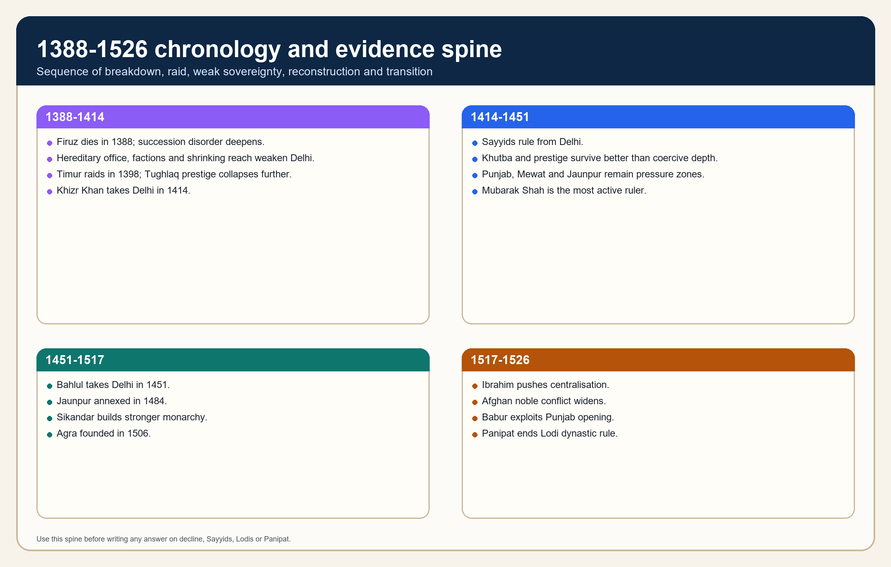

*Chronology visual. It separates Tughlaq breakdown, Timur's raid, Sayyid weak sovereignty, Lodi recovery and Panipat so that transition is not mistaken for one event.*

### Topic ownership firewall

| Owner | What remains primarily there | What Topic 06 legitimately uses |
|---|---|---|
| Topic 05 - Tughlaqs | Muhammad bin Tughlaq, Firuz Shah, heredity, canals, public works and the immediate late-Tughlaq weakening | Only the **post-1388 succession bridge** needed to explain why Timur met a vulnerable Delhi |
| Topic 08 - Regional kingdoms | Full histories of Bengal, Gujarat, Malwa, Jaunpur and Kashmir | Only brief owner-boundary sketches proving that Delhi's contraction was not India-wide collapse |
| Topic 09 - Vijayanagara and Bahmani | Detailed Deccan state formation | Only bounded use to show that Deccan politics had moved beyond Delhi's command horizon |
| Topic 11 - Sultanate art and architecture | Full formal analysis of Sultanate styles and regional schools | Only bounded use of Sayyid-Lodi tomb types, garden settings, platforms and the double-dome transition |
| Topic 12 - Babur and Central Asian backdrop | Full Central Asian politics and Babur's earlier career | Only the Panipat-facing background necessary to explain the Lodi-Mughal military-political transition |
| Topic 13 - Humayun, Afghans and Rajputs after 1526 | Post-Panipat Afghan resistance, Sur challenge and the longer struggle for empire | Only the immediate non-finality of 1526 as a caution against instant-conquest narratives |

### Governing thesis

- [ANALYSIS] The Delhi Sultanate fragmented because succession, provincial control, agrarian extraction, army upkeep and elite cohesion were not stabilised institutionally enough to survive repeated shocks.
- [ANALYSIS] Timur's 1398 raid accelerated that breakdown dramatically, but the raid struck a polity already thinned by hereditary office, factionalism and provincial autonomy.
- [ANALYSIS] The Sayyids preserved the **symbol** of Delhi more than its broad coercive capacity; the Lodis rebuilt a stronger north-Indian monarchy, but Afghan elite politics made centralisation difficult.
- [ANALYSIS] Panipat mattered because Babur combined generalship, field fortification, tulughma manoeuvre, matchlocks/artillery and a more coherent war-system against a larger but politically strained Lodi force.

## 02. From Firuz's late regime to the post-1388 succession crisis

[FACT] The local OCR and Topic 05 together make the structural bridge clear. Firuz Shah's concessions - hereditary offices, hereditary military claims, and softening of central checks - purchased short-term peace but strengthened nobles and weakened the disciplined military-fiscal core. After his death in **1388**, ambitious princes, nobles, provincial commanders and slave factions intervened in succession.

[FACT] Satish Chandra's concise text says the governors of provinces became independent and that the sultan of Delhi was gradually confined to a small territory around Delhi. The famous quip that the dominion of the "Lord of the Universe" extended only **from Delhi to Palam** captures prestige loss, even if its exact phrasing is literary.

[ANALYSIS] This was not a one-dimensional court quarrel. Four processes overlapped: **(1)** rival claimants at the centre, **(2)** a nobility whose corporate strength had grown, **(3)** provincial elites and zamindars withholding obedience, and **(4)** a thinner military instrument unable to restore control quickly.

[DEBATE] The late-Tughlaq crisis must also be read against the geography of rule. The larger the earlier conquests, the more difficult it became to maintain direct command over distant governors once the centre looked weak. In that sense, the post-1388 crisis was the political afterlife of earlier over-extension as much as of Firuz's conciliation.

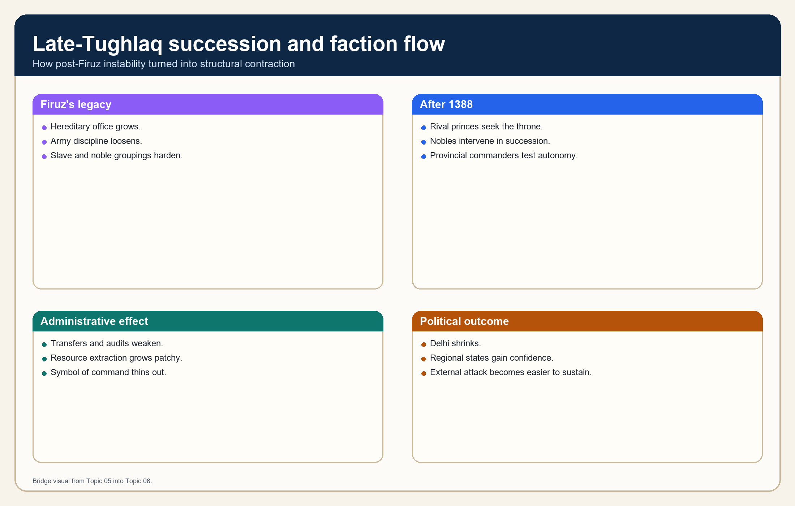

*Succession-flow visual. It tracks how hereditary office, weak succession law, nobles, slaves and provincial autonomy converted late-Tughlaq instability into a general political contraction.*

### Secure bridge points from Topic 05

| Bridge point | Secure statement | Why Topic 06 needs it |
|---|---|---|
| Hereditary offices and iqtas | [FACT] Firuz's regime strengthened hereditary claims in service and office | Explains why post-1388 nobles and service families were harder to discipline |
| Army relaxation | [FACT] The army became less efficient and more localised | Explains why Delhi could not answer every provincial or external threat |
| Slave corps and faction | [FACT] The Firuzi slave establishment became a political force | Shows that succession disorder had institutional carriers, not only personal intrigue |
| Provincial assertion | [FACT] Governors and local rulers stopped behaving as tightly controlled subordinates | Bridges directly to Gujarat, Malwa, Jaunpur and Punjab autonomy |
| Prestige collapse | [FACT] The throne's aura shrank sharply before Timur arrived | Separates internal weakening from the external blow |

## Learning MCQ 01

**Question:** Which statement best captures the post-1388 crisis inherited by Topic 06?

A. It grew from succession disorder combined with hereditary office, factional elites and shrinking central reach.  
B. It was caused only by Timur's later raid.  
C. It resulted mainly from Delhi's conversion into a maritime state.  
D. It was solved immediately by the Sayyids.

**Correct answer:** **A**

**Explanation:** Topic 06 begins with internal weakening already underway before Timur entered north India.

## 03. Why the Sultanate fragmented: structural causes, not a weak-successor cliché

[FACT] The concise history explicitly refuses to blame any one ruler alone for the disintegration of the Delhi Sultanate. It highlights recurring medieval problems: relations between monarch and nobles, conflict with local rulers and zamindars, and the pull of regional and geographical factors.

[ANALYSIS] Topic 06 therefore needs a **multi-causal matrix**, not a moral fable. The Sultanate was vulnerable because succession remained open, iqta extraction depended on supervision, cavalry and fort maintenance were expensive, communications were slow, climate and ecology varied sharply by region, and regional agrarian-commercial bases could sustain ambitious local powers once the centre faltered.

[ANALYSIS] Military organisation also mattered. A Delhi-centred monarchy needed a dependable cash or assignment system, mobile cavalry, command loyalty and information flow. When noble cohesion weakened and provincial commanders began treating their tracts as personal power-bases, Delhi's ability to aggregate force declined faster than its ideological claims.

[DEBATE] "Weak successors" is therefore an incomplete answer. It identifies the immediate political symptom but obscures the deeper conditions that made succession weakness repeatedly devastating. UPSC rewards the student who moves from personality to **institutional vulnerability**.

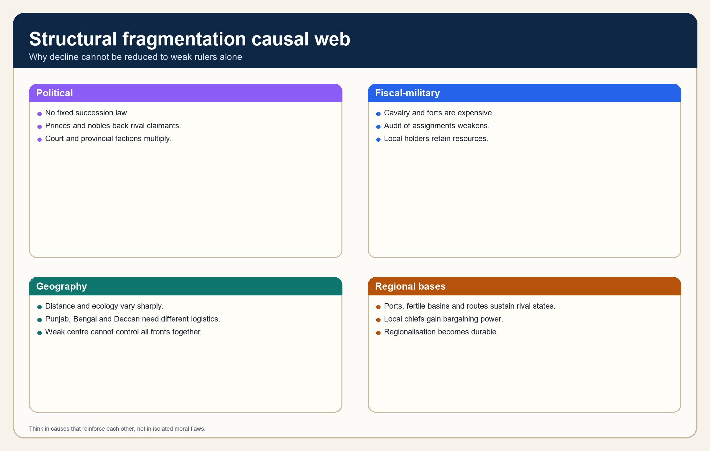

*Causal-web visual. It treats succession, fiscal strain, military organisation, communication, agrarian bases and elite conflict as linked causes rather than as competing single explanations.*

### Structural matrix

| Structural pressure | Mechanism | Political effect | Exam-safe caution |
|---|---|---|---|
| Succession ambiguity | No fixed law of primogeniture; noble backing mattered | Rival claimants and repeated civil war | Do not reduce this to "bad sons" alone |
| Noble and iqta autonomy | Strong muqtis, jagirdars and office-holding families retained resources locally | Centre found it harder to audit and transfer officials | Iqta strain varied by region and ruler |
| Fiscal-military burden | Cavalry, forts, communication and urban provisioning were expensive | Army discipline and central response capacity weakened | Not every fiscal problem was immediate collapse |
| Ecological and distance factors | Bengal, Deccan, Punjab and Rajasthan posed different logistics | Provinces could detach once centre weakened | Geography explains resilience, not inevitability |
| Regional agrarian-commercial bases | Ports, routes, fertile basins and urban nodes supported alternative courts | Provincial kingdoms became durable, not merely rebellious | Durability differed across states |
| Elite coalition failure | Turks, Indian Muslims, Afghans, converts, local allies and old nobles did not act as one bloc | Internal distrust magnified every crisis | Avoid racial or timeless cultural stereotypes |

## Learning MCQ 02

**Question:** Which explanatory move is most unsafe for a GS-I answer on the Sultanate's fragmentation?

A. Connecting fiscal-military strain with noble autonomy.  
B. Explaining everything simply by saying "weak successors followed Firuz".  
C. Noting that geography and regional agrarian bases mattered.  
D. Treating disintegration as a multi-causal process.

**Correct answer:** **B**

**Explanation:** The unsafe move is the reduction of a structural crisis to the lazy weak-successor cliché; the other three are stronger analytical approaches.

## 04. Delhi's contraction versus regional-state formation

[FACT] The Part I chapter opens with a direct warning: it would be wrong to treat the fifteenth century simply as a period of decadence and decline. The various states rarely extended beyond their broad regional zones, and a definite **balance of power** emerged among the eastern, western and northern groups.

[FACT] Bengal was checked by Orissa and Jaunpur; Gujarat, Malwa and Mewar balanced one another; Kashmir remained somewhat aloof; and the rise of the Lodis at Delhi later produced a drawn-out contest with Jaunpur for control of the Ganga-Jamuna doab. Delhi's loss of empire therefore did not mean the end of organised politics in India.

[ANALYSIS] This is the core corrective to simplistic "decline" writing. Delhi contracted. But trade, patronage, court culture, architecture, agrarian expansion and military competition continued - often intensely - in the regional kingdoms. Topic 06 uses this not to deny Delhi's crisis, but to place it within a wider subcontinental redistribution of power.

[LIMIT] Owner-boundary discipline matters. Topic 06 uses Bengal, Gujarat, Malwa, Jaunpur, Kashmir, Bahmani and Vijayanagara only to prove the argument about **regional vitality**. Their internal political narratives stay chiefly with Topics 08 and 09.

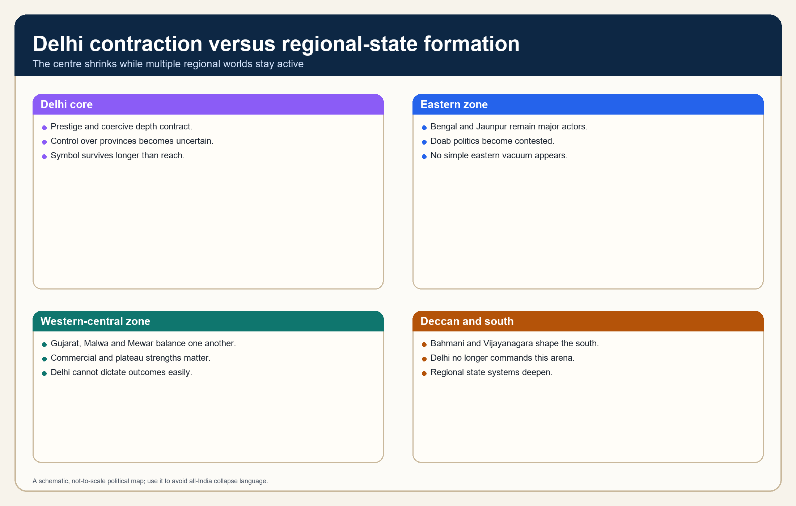

*Schematic map visual. It distinguishes Delhi's contracting core from regional-state formation, showing balance-of-power zones rather than hard modern borders.*

### Brief regional-owner matrix

| Region / polity | Why Topic 06 needs it | Exam-safe takeaway | Detailed owner |
|---|---|---|---|
| Bengal | Shows ecological autonomy and durable eastern state formation | Delhi's crisis did not stop prosperity or cultural patronage in the east | Topic 08 |
| Gujarat | Shows commercial power, port wealth and west-coast resilience | Political contraction at Delhi coexisted with powerful mercantile states | Topic 08 |
| Malwa | Shows the centrality of plateau routes and north-India strategic competition | Whoever influenced Malwa moved closer to north-Indian hegemony | Topic 08 |
| Jaunpur | Shows eastern-Ganga state formation and cultural prestige | Sharqi Jaunpur was a real competitor, not a footnote | Topic 08 |
| Kashmir | Shows a partially separate valley polity with its own shifts | Delhi's collapse did not define every northern story | Topic 08 |
| Bahmani / Vijayanagara | Show southern political worlds no longer governed by Delhi | Delhi's decline was partly the backdrop to new Deccan state systems | Topic 09 |

## Learning MCQ 03

**Question:** Which one-line summary best fits the fifteenth century in north India?

A. A complete absence of states after Delhi weakened.  
B. A purely religious civil war everywhere.  
C. Delhi's contraction combined with a wider regional balance-of-power system.  
D. A century without urban culture or court patronage.

**Correct answer:** **C**

**Explanation:** Topic 06 consistently distinguishes the weakening of Delhi from the vitality of regional states.

## 05. Timur before Delhi: Central Asian context, route, motive and self-justification

[FACT] The concise history describes Timur as a Turk who could claim blood relationship with Chinggis and who, from **1370**, built a vast empire from Syria to Trans-Oxiana and from southern Russia to the Indus. India was one theatre in a much wider imperial career.

[FACT] The local books are firm on motive at the broadest level: the Indian incursion was a **plundering raid** aimed at seizing the wealth accumulated by the Delhi sultans over roughly two centuries. This does not mean self-justification was absent. Timurid tradition also clothed the invasion in the language of righteous war, punishment of disorder and Islamic legitimacy.

[ANALYSIS] A safe UPSC answer therefore separates **stated justification** from **operative motive**. In memoir-like or courtly traditions, Timur presents himself as a restorer of order and religion. But the secure historical reading is that he exploited an already weakened Delhi, sought portable wealth, prestige, captives and skilled artisans, and had no intention of administering all India as a settled conquest.

[LIMIT] Route details should be kept to secure nodes unless specifically sourced. The safest formulation is: Timur came through the **north-western corridor, crossed the Indus into Punjab, moved through the upper north-western towns toward Delhi, attacked the capital, and withdrew with booty, captives and symbolic arrangements left behind**.

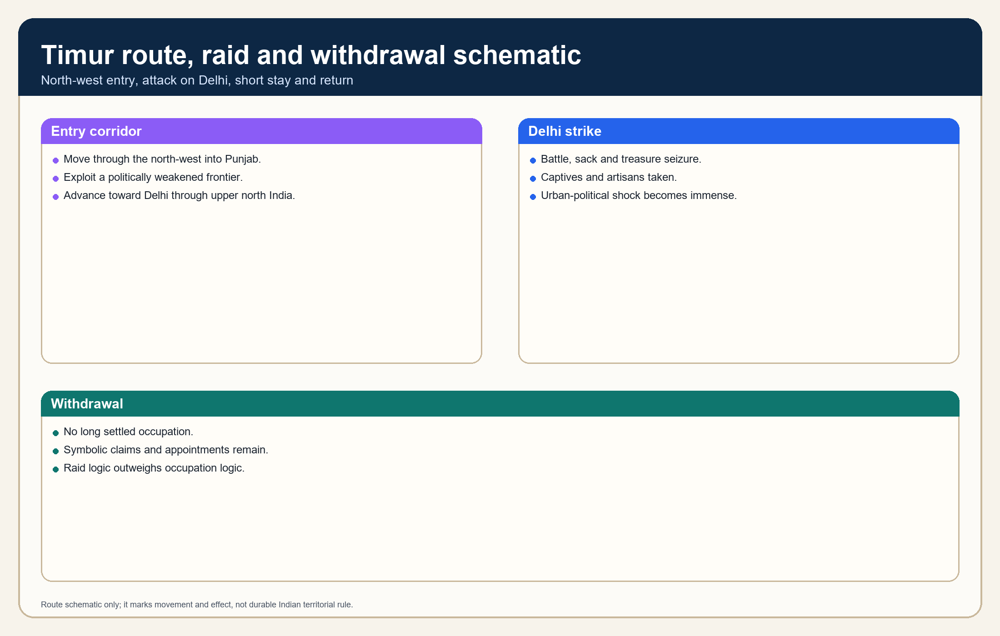

*Route schematic. It marks movement through the north-west corridor into Punjab and Delhi, then withdrawal with booty and captives. It is not a territorial map of rule over all India.*

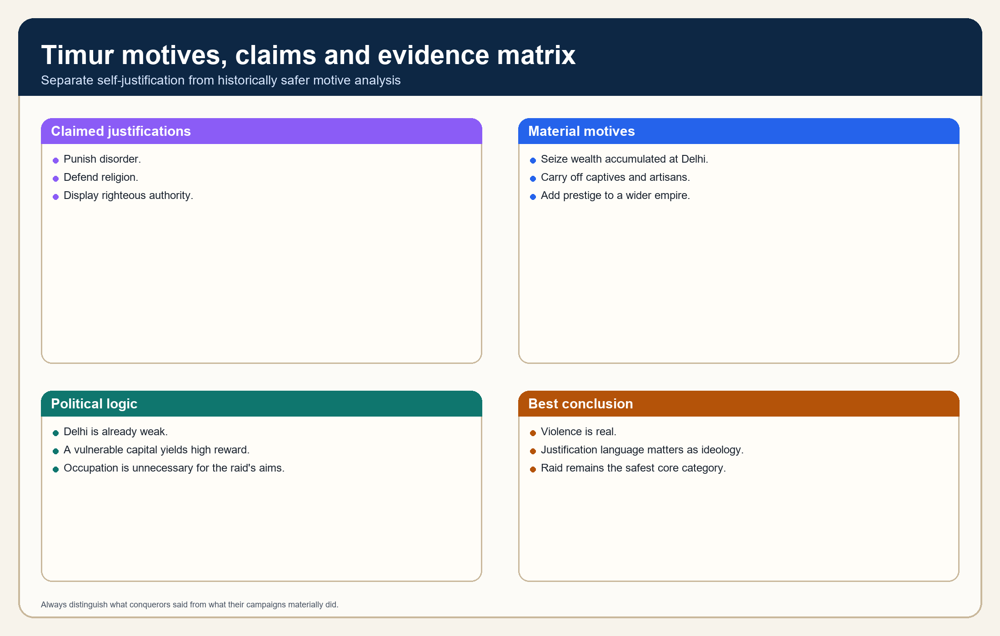

*Motives matrix. It separates Timurid justification language from the historically safer reading of raid, plunder, prestige and political exploitation.*

### Claims versus motives table

| Layer | Secure minimum | Why it matters |
|---|---|---|
| Timurid self-presentation | [FACT] Language of order, piety and punishment appears in later Timurid narrative traditions | Shows how conquerors justified violence |
| Material motive | [FACT] Wealth, portable treasure, captives and artisans were major outcomes and likely objectives | Aligns with the concise book's plunder emphasis |
| Political calculation | [ANALYSIS] Delhi was already weak and therefore a low-cost, high-prestige target | Prevents the raid from being explained as pure zeal alone |
| Administrative intention | [LIMIT] There is no secure evidence that Timur planned to occupy and govern the entire subcontinent | Guards against calling 1398 a conquest of India |

## Learning MCQ 04

**Question:** Which description of Timur's 1398 action is safest for UPSC use?

A. A settled conquest of all India with durable empire-wide administration.  
B. A peaceful pilgrimage with no political purpose.  
C. A maritime expedition launched from Gujarat.  
D. A north-western plundering raid dressed in legitimising language and aimed at a weakened Delhi.

**Correct answer:** **D**

**Explanation:** The safest answer separates Timur's justificatory language from the historically clearer pattern of raid, plunder and withdrawal.

## 06. Delhi 1398: sack, violence, destruction and source caution

[FACT] Timur's army entered Delhi after the weak Sultanate failed to stop the invasion. The local concise text is unequivocal that Delhi was sacked without mercy and that large numbers of people - Hindu and Muslim, women and children included - were killed.

[FACT] The same text also states that Timur drained large quantities of wealth from India and carried away many Indian artisans - masons, stone-cutters, carpenters and others - who later helped embellish Samarqand. This point is important because it joins violence, plunder and skilled-capital transfer in one event.

[ANALYSIS] Yet the historian must still distinguish **secure minimum** from **chronicler arithmetic**. Timurid texts and later retellings can make killings, captives and booty seem almost immeasurable. For UPSC, the mark-winning line is that the violence was real and destructive, but the exact tallies belong to rhetorical traditions and cannot be used as census-quality numbers.

[DEBATE] Nor should the event be communalised crudely. Timur's own discourse used religious categories, but the sack damaged Delhi as an urban-political centre, and both Muslims and Hindus suffered. The key issue is not to sanitise the violence, but to refuse lazy civilisational caricature.

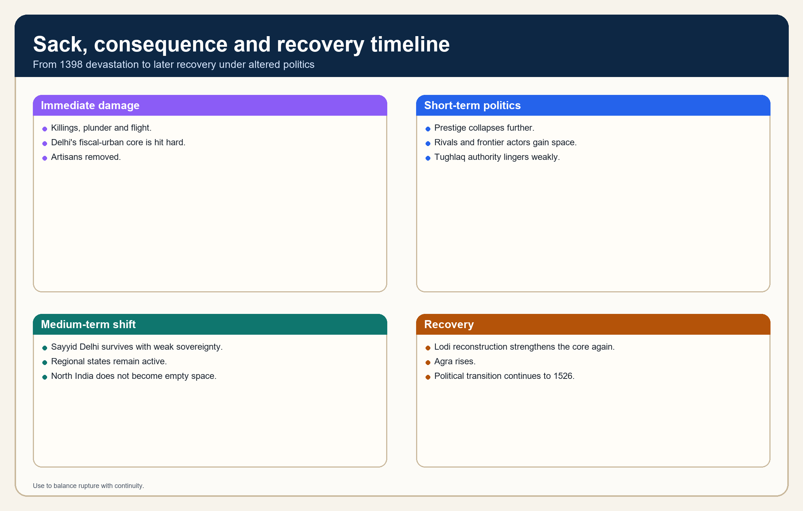

*Timeline visual. It links sack, immediate demographic and fiscal disruption, political vacuum and later recovery without reducing the entire fifteenth century to one event.*

### Secure phrasing bank for the sack of Delhi

| Unsafe phrasing | Better phrasing |
|---|---|
| "Timur destroyed all India" | "Timur devastated Delhi and parts of the north-western corridor, then withdrew." |
| "Exactly X lakh people were killed" | "Chronicles report very large killings, but exact totals are contested and rhetorical." |
| "The invasion created permanent desolation everywhere" | "The raid caused severe disruption in Delhi and its core, but regional states and later recovery continued." |
| "Timur founded a new Indian empire" | "Timur left symbolic claims and appointments behind rather than durable all-India rule." |

## Learning MCQ 05

**Question:** What is the safest numerical approach to Timur's violence at Delhi?

A. Treat large chronicler numbers as reported claims and keep the core point on real devastation.  
B. Quote every body-count literally as verified demographic fact.  
C. Deny mass violence because exact totals are uncertain.  
D. Say only Hindus suffered and no Muslims did.

**Correct answer:** **A**

**Explanation:** Source criticism requires neither denial nor blind literalism.

## 07. How to read Timur: memoir traditions, court chronicles and material evidence

[DEBATE] The most delicate source issue here is the so-called **Malfuzat-i-Timuri / Tuzuk-i-Timuri** tradition. It presents itself as Timur's own words or memoir-like instruction, but modern scholarship widely treats the extant Persian text as a **later compilation or inauthentic memoir tradition**, not as a straightforward contemporary self-written record from 1398.

[FACT] By contrast, **Sharaf al-Din Ali Yazdi's Zafarnama** belongs much closer to the Timurid courtly archive, though it too is a legitimising victory narrative. That makes it more valuable than the later Tuzuk tradition for campaign sequence and imperial ideology, but not ideologically neutral.

[FACT] Indian-side reconstruction depends on later Delhi and regional chronicles, plus what coins, architectural survival, urban decline and recovery, and subsequent political outcomes can show. No one source yields the whole truth.

[ANALYSIS] This is a classic source-method lesson: court victories magnify legitimacy; later memoir claims may back-project authority; Indian chronicles stress the damage to Delhi; material evidence checks exaggeration but cannot by itself narrate motive. Use **triangulation**.

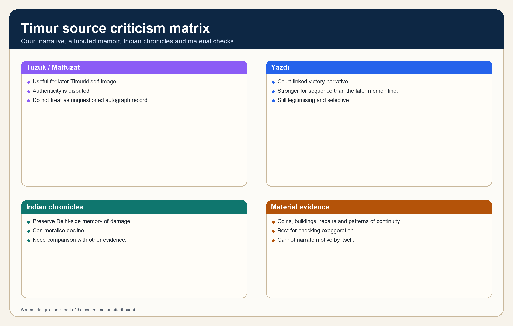

*Source-criticism visual. It separates later attributed memoir tradition, Timurid court narrative, Indian chronicles and material evidence by proximity and agenda.*

### Timur source-bank table

| Source family | What it can give | Main caution |
|---|---|---|
| Later attributed *Tuzuk/Malfuzat* tradition | Narrative of motive, campaign and ruler-self-image | [DEBATE] Authenticity is disputed; use chiefly for later Timurid/Mughal afterlife and ideology |
| Yazdi's *Zafarnama* | Court-linked Timurid victory narrative, chronology and imperial rhetoric | Strong legitimising agenda; not an eyewitness free from patronage |
| Indian chronicles | Aftermath for Delhi, regional political effects and memory of disruption | Often later and not always eyewitness; can moralise decline |
| Material evidence | Coins, monuments, archaeology, patterns of survival and repair | Material traces show impact and continuity, not full intention or narrative sequence |

## Learning MCQ 06

**Question:** Which statement best captures the Tuzuk/Malfuzat problem?

A. It is unquestionably Timur's autograph diary and needs no checking.  
B. It is best treated with authenticity caution and read against Yazdi, Indian chronicles and material evidence.  
C. It is irrelevant because all text sources are useless.  
D. It was written by Babur after Panipat.

**Correct answer:** **B**

**Explanation:** Topic 06 uses the text as a source problem, not as an unquestioned archive.

## 08. Consequences of the invasion: disruption, prestige collapse, political vacuum and continuity

[FACT] The concise volume says the direct political effect of Timur's invasion was small in one narrow sense: Timur did not stay to govern India. Yet the same text also says the invasion marked the **end of the phase of strong rule by the Delhi sultans**, even though the Tughlaq line lingered till 1412.

[ANALYSIS] The distinction is important. Timur did not administratively replace the Sultanate with a stable Timurid Indian empire. But he inflicted a blow severe enough to deepen the political vacancy around Delhi, hasten prestige collapse, and encourage ambitious regional and frontier actors.

[ANALYSIS] Consequences should therefore be grouped carefully:

- [FACT] **Immediate urban-core damage:** deaths, flight, treasure drain, destruction and artisan deportation.
- [FACT] **Political effect:** Delhi's claim to unquestioned supremacy was shattered further; Khizr Khan and others advanced.
- [ANALYSIS] **Regional effect:** provincial autonomy hardened rather than softened.
- [LIMIT] **Continuity:** agrarian life, regional courts, trade and cultural production elsewhere continued; even Delhi eventually recovered in altered political form.

[DEBATE] The best conclusion is neither minimisation nor apocalypse. Timur's raid was a catalytic rupture for the Delhi core, but it sat inside a longer process of fragmentation whose beginnings pre-dated 1398 and whose consequences were uneven across India.

## Learning MCQ 07

**Question:** Which conclusion about Timur's consequences is the most balanced?

A. The raid mattered only symbolically and caused no material damage.  
B. The raid permanently ended all urban life in north India.  
C. The raid caused severe disruption in Delhi and helped enlarge the political vacuum, but it did not erase regional vitality across India.  
D. The raid created a durable Timurid all-India administration.

**Correct answer:** **C**

**Explanation:** Topic 06 balances Delhi's severe disruption with the continued vitality of regional political and economic worlds.

## 09. Khizr Khan: Timurid connection, capture of Delhi and symbolic legitimacy

[FACT] The advanced owner note and the local Part I OCR agree on the broad sequence. After Timur's attack on Delhi, **Khizr Khan** - already linked with Multan and Dipalpur - did not immediately take Delhi while the Tughlaq ruler still returned intermittently. After the effective end of the Tughlaq line in **1412**, he entered Delhi and established a new order in **1414**.

[FACT] The same OCR adds a crucial caution: the Sayyids were **not simply subordinates of the Timurid rulers**, even though Timurid names were included in the khutba for some time. This is the best safe line for UPSC.

[ANALYSIS] Khizr Khan's legitimacy therefore worked through a double language. On one side, association with Timur gave prestige in a landscape of broken sovereignty. On the other, Khizr actually ruled through local bargaining in Punjab-Delhi conditions, not through an effective Timurid bureaucracy stretching from Central Asia into India.

[LIMIT] Standard textbook statements that Khizr Khan never assumed the full title of sultan are plausible and widely repeated, but the safest exam phrasing is: **he ruled cautiously under the symbolic shadow of Timurid legitimacy rather than as a fully independent, ideologically unqualified successor on the Balban-Alauddin model**.

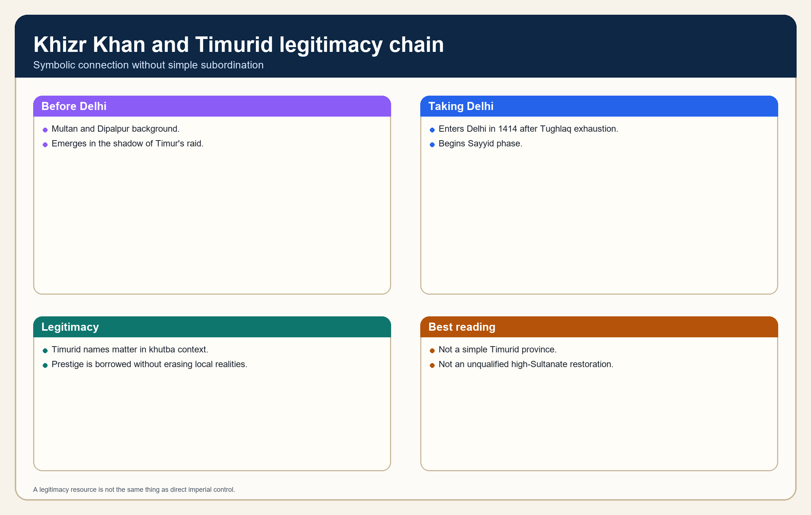

*Legitimacy-chain visual. It shows Timur's raid, Khizr's Punjab base, Delhi entry and the difference between symbolic Timurid connection and real local rule.*

### Khizr Khan phrasing bank

| Unsafe phrasing | Better phrasing |
|---|---|
| "Khizr Khan was Timur's obedient provincial governor in India." | "Khizr used Timurid connection as a legitimacy resource, but ruled in a fragmented north-Indian setting." |
| "Khizr founded a strong restored Delhi empire." | "Khizr recovered Delhi but not the wide coercive reach of earlier sultans." |
| "Timur directly governed through Khizr." | "Timurid names and claims mattered symbolically; direct subordination is too simple." |

## Learning MCQ 08

**Question:** Which statement about Khizr Khan is the safest?

A. He ruled Bengal from Gaur as Timur's naval governor.  
B. He destroyed Jaunpur before entering Delhi.  
C. He was entirely independent of all symbolic Timurid connection from the first day.  
D. He recovered Delhi under the shadow of Timurid legitimacy, but his rule rested on local north-Indian bargaining rather than direct Timurid control.

**Correct answer:** **D**

**Explanation:** This is the safe middle line between "pure Timurid dependency" and "no Timurid link at all."

## 10. Sayyid ruler ladder: compact chronology without padding

[FACT] The Sayyid dynasty ruled Delhi from **1414 to 1451**. The secure ruler ladder is: **Khizr Khan (1414-1421)**, **Mubarak Shah (1421-1434)**, **Muhammad Shah (1434-1445)** and **Alauddin Alam Shah (1445-1451)**.

[FACT] For the internal narrative of the early Sayyid phase, **Yahya bin Ahmad Sirhindi's *Tarikh-i-Mubarak Shahi*** is the key named chronicle. It is especially valuable for the later Tughlaq and early Sayyid world, though like all courtly chronicles it requires author-position caution.

[FACT] Mubarak Shah is usually treated as the most active of the Sayyid rulers. The dynasty is also associated with the urban foundation or naming of **Mubarakabad** in Delhi's political landscape.

[LIMIT] Topic 06 should not inflate the Sayyids into a major reconquest dynasty. Their importance lies less in spectacular expansion than in showing how the *symbol* of Delhi survived under weak coercive conditions until Afghan-Lodi power displaced them.

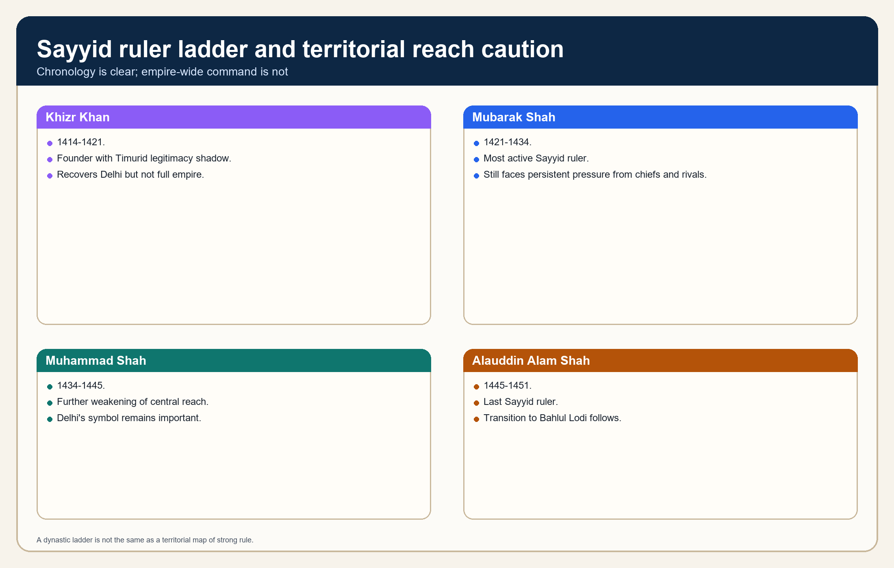

*Ruler-ladder visual. It keeps the regnal sequence precise while warning that dynastic continuity did not equal large territorial control.*

### Compact Sayyid ruler table

| Ruler | Regnal span | Safe significance | Caution |
|---|---|---|---|
| Khizr Khan | 1414-1421 | Founder; recovered Delhi with Timurid-legitimacy shadow | Did not recover an Alauddin-style empire |
| Mubarak Shah | 1421-1434 | Most assertive Sayyid; associated with *Tarikh-i-Mubarak Shahi* era and Mubarakabad | Still struggled constantly with chiefs and rivals |
| Muhammad Shah | 1434-1445 | Further weakening of central grip | Avoid padding with inflated campaign claims |
| Alauddin Alam Shah | 1445-1451 | Final Sayyid; Delhi passes to Bahlul Lodi | End marks transition, not dramatic battle-glory |

## Learning MCQ 09

**Question:** Which ruler order of the Sayyid dynasty is correct?

A. Khizr Khan -> Mubarak Shah -> Muhammad Shah -> Alauddin Alam Shah  \nB. Mubarak Shah -> Khizr Khan -> Alauddin Alam Shah -> Muhammad Shah  \nC. Alauddin Alam Shah -> Khizr Khan -> Muhammad Shah -> Mubarak Shah  \nD. Khizr Khan -> Muhammad Shah -> Mubarak Shah -> Alauddin Alam Shah

**Correct answer:** **A**

**Explanation:** The secure Sayyid sequence runs from Khizr Khan to Alauddin Alam Shah through Mubarak and Muhammad Shah.

## 11. Nature of the Sayyid state: weak sovereignty, tribute and limited coercive reach

[FACT] The advanced owner file states that the Sayyids could not establish themselves firmly and were pressured by the **Khokhars of the Punjab**, the **Mewatis**, and the **Sharqi rulers of Jaunpur**.

[ANALYSIS] This is the real meaning of a weak-sovereignty state. The ruler possessed Delhi's symbolism, but not uninterrupted command over the countryside. Authority was mediated through tribute, tactical campaigns, temporary submission, and the shifting behaviour of chiefs who could obey, evade or revolt depending on opportunity.

[ANALYSIS] In such a system, the throne did not vanish, yet it no longer resembled the integrated military-fiscal machine of Alauddin Khalji. The Sayyid state was best understood as a **negotiated Delhi-centred monarchy** surviving amid stronger local actors.

[DEBATE] Weak sovereignty does not mean complete irrelevance. Delhi still mattered symbolically and logistically. But the distance between *claim* and *enforcement* was far greater than under the high Sultanate.

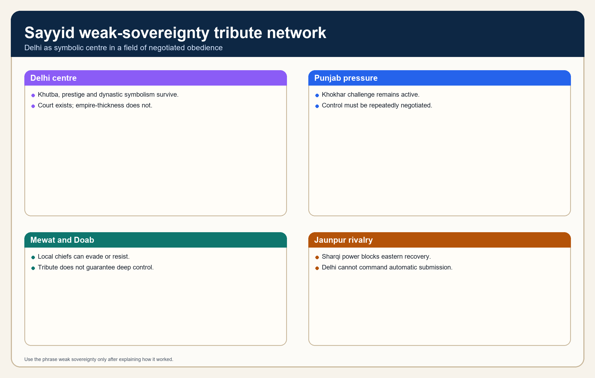

*Weak-sovereignty visual. It shows Delhi at the centre of a network of tribute, pressure, rebellion and partial reach rather than a neatly unified state.*

### Symbol versus reality under the Sayyids

| Dimension | Symbolic claim | Operational reality |
|---|---|---|
| Delhi throne | Right to govern the old Sultanate core | Narrow effective command around Delhi-Doab-Punjab pockets |
| Timurid association | Prestige and external legitimacy shadow | No strong Timurid administrative machine in India |
| Tribute | Signs of submission from chiefs | Tribute was negotiable and easily reversible |
| Military action | Campaigns against challengers | Campaigns rarely translated into durable empire-wide control |

## Learning MCQ 10

**Question:** Which phrase best defines the Sayyid state?

A. Complete disappearance of Delhi as a political symbol.  
B. Delhi-centred weak sovereignty sustained by negotiation, tribute and limited coercive reach.  
C. A fully restored all-India monarchy.  
D. A maritime customs state centred on Bengal's ports.

**Correct answer:** **B**

**Explanation:** The Sayyids mattered because Delhi's symbol survived, but without wide stable control.

## 12. Regional powers in the Sayyid-Lodi age: Delhi lost range, not Indian vitality

[FACT] In Topic 06, the regional world is not an appendix; it is the context that explains why Delhi could no longer command the subcontinent simply by invoking old prestige. Bengal sustained an eastern power-base; Gujarat drew strength from ports, craft wealth and route-control; Malwa sat on plateau transit lines; Jaunpur held the eastern Ganga political-culture zone; Kashmir followed its own valley logic; and the Deccan was already structured by Bahmani-Vijayanagara competition.

[ANALYSIS] This matters for answer writing because it stops the student from calling every fifteenth-century event a symptom of "Indian decline." In reality, the centre of political initiative had become **plural**. Delhi was one claimant among several.

[LIMIT] Topic 06 does not repeat the detailed owner files of Topic 08 and Topic 09. It uses the regional map only to show that Lodi recovery later had to contend not with empty space, but with already formed regional powers and hardened frontiers.

## 13. Afghan political traditions: solidarity, equality claims, consultation and caution

[FACT] Both the advanced owner file and the local OCR emphasise that Afghan nobles possessed a sturdy sense of **tribal independence** and were not accustomed to treating the sultan as anything more than a **first among equals**.

[ANALYSIS] Four analytical points follow:

1. **Lineage and clan mattered.** Recruitment and solidarity often moved through kin, tribal memory and patron-client linkage.
2. **Distribution of power mattered.** Afghan nobles expected a share in honour, office and resources; they did not naturally fit a purely awe-based Balban model.
3. **Consultation mattered.** Authority was expected to be heard, bargained and distributed rather than merely announced.
4. **Partition ideas mattered.** The notion that a ruler's domains could be shared among sons and relatives did not disappear easily.

[DEBATE] Yet Topic 06 must avoid turning this into a timeless ethnic essence. "Afghan political culture" is a historical shorthand, not a biological or unchanging fact. Afghan nobles in India also operated inside Persianate court worlds, iqta assignments, agrarian revenue politics and Delhi's urban setting. They were not tribal nomads frozen outside history.

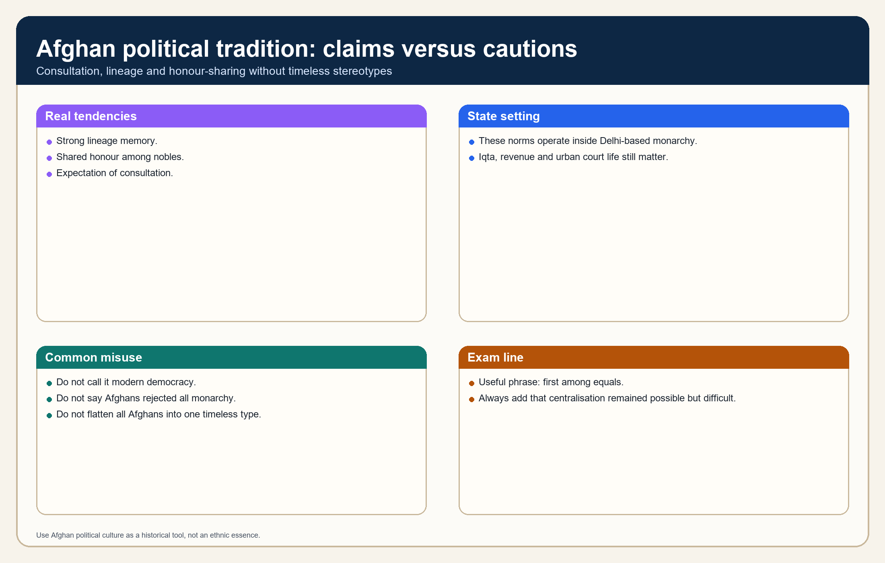

*Claims-versus-cautions visual. It distinguishes real bargaining norms among Afghan elites from the misleading idea of a timeless, homogeneous "Afghan character."*

### Analytical contrast table

| Lens | Earlier high-Sultanate court monarchy | Lodi-Afghan tendency |
|---|---|---|
| Ruler image | Awe, distance, strict hierarchy | More bargaining with powerful lineages |
| Noble expectation | Service under exalted monarch | Stronger claim to shared honour and consultation |
| Inheritance tendency | No secure succession law, but less explicit tribal-equality idiom | Partition and kin-right claims more politically visible |
| Exam caution | Do not idealise Turkish monarchy as fully centralised | Do not romanticise Afghan politics as democracy |

## Learning MCQ 11

**Question:** Which statement best uses "Afghan political traditions" safely?

A. Afghan nobles had no sense of hierarchy or office in India at all.  
B. Afghan political culture meant modern democratic equality for all subjects.  
C. Afghan nobles often expected consultation, honour and a share in power, but these norms operated inside changing Indian state conditions.  
D. Afghan rule was automatically weaker because Afghans disliked all monarchy.

**Correct answer:** **C**

**Explanation:** Topic 06 uses Afghan political culture analytically, not as a timeless stereotype.

## 14. Bahlul Lodi: Afghan mobilisation, Delhi takeover and Jaunpur strategy

[FACT] The Part I OCR states that Bahlul Lodi had established himself in Punjab along with Afghan sardars, checked the Khokhars, dominated Punjab, and - once called in to help the Delhi ruler against Malwa - stayed on until his men took control of Delhi. He formally crowned himself in **1451**.

[FACT] Bahlul's main long-term struggle was with the **Sharqi rulers of Jaunpur**. The same OCR records that, finding himself weak, he invited the **Afghans of Roh** to India. Abbas Sarwani's later phrase that they came "like locusts" is likely exaggerated, but it preserves the memory of significant Afghan in-migration and military reinforcement.

[ANALYSIS] Bahlul's achievement lay less in imperial theory than in **bargaining consolidation**. He built an Afghan power-base, distributed honours, relied on personal and lineage networks, and gradually wore down Sharqi resistance rather than instantly erecting a fully centralised monarchy.

[FACT] In **1484**, Bahlul occupied Jaunpur and annexed the Sharqi kingdom, ending the strongest eastern competitor to Delhi's revived north-Indian ambitions.

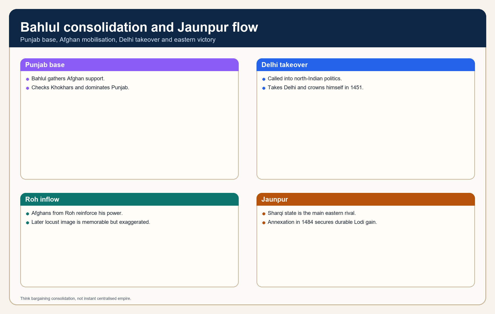

*Consolidation-flow visual. It tracks Bahlul's Punjab base, Afghan mobilisation, Delhi takeover and the eventual defeat of Jaunpur.*

### Why Bahlul matters

| Dimension | Historical importance | Qualification |
|---|---|---|
| Delhi takeover | Replaced the Sayyids and began the Lodi phase | Delhi recovery was still regional, not subcontinental |
| Afghan mobilisation | Made Afghans a much larger element in north-Indian Muslim politics | Abbas Sarwani's rhetoric must not be read literally everywhere |
| Jaunpur defeat | Eliminated Delhi's strongest eastern rival | Did not solve the problem of noble autonomy permanently |
| Political style | Relied on negotiation and kin-based support | This style made later centralisation harder for successors |

## Learning MCQ 12

**Question:** What was Bahlul Lodi's most durable political achievement?

A. Turning Delhi into a naval empire.  
B. Destroying Bengal's port trade.  
C. Re-establishing Tughlaq rule in the Deccan.  
D. Building an Afghan north-Indian power-base and ending Sharqi Jaunpur through annexation.

**Correct answer:** **D**

**Explanation:** Bahlul's real strength lay in Punjab-Afghan mobilisation and the defeat of Jaunpur.

## 15. Sikandar Lodi: noble discipline, revenue control and the founding of Agra

[FACT] The OCR describes Sikandar Lodi (**1489-1517**) as the most important Lodi ruler. He made nobles stand before him, required them to receive the royal farman with due honour, and compelled jagir-holders to submit accounts. These measures were aimed at asserting the superiority of the sultan over Afghan sardars who saw themselves as more than mere servants.

[FACT] The same source credits Sikandar with efficient administration, strong concern for justice, safe highways, cheap essential commodities, agricultural interest, abolition of **octroi on grain**, the introduction of the **gazz-i-Sikandari**, and rent-rolls that later informed Sher Shah's system.

[FACT] In **1506**, after careful survey and deliberation, Sikandar selected the site of **Agra**. The source explains the location strategically: it commanded eastern Rajasthan, the route to Malwa and Gujarat, and the rebellious zone of the doab.

[ANALYSIS] Sikandar's reign therefore represents the **high point of Lodi state-building**: a stronger crown, better accounting, safer communications, urban growth, and a more purposeful agrarian-administrative order.

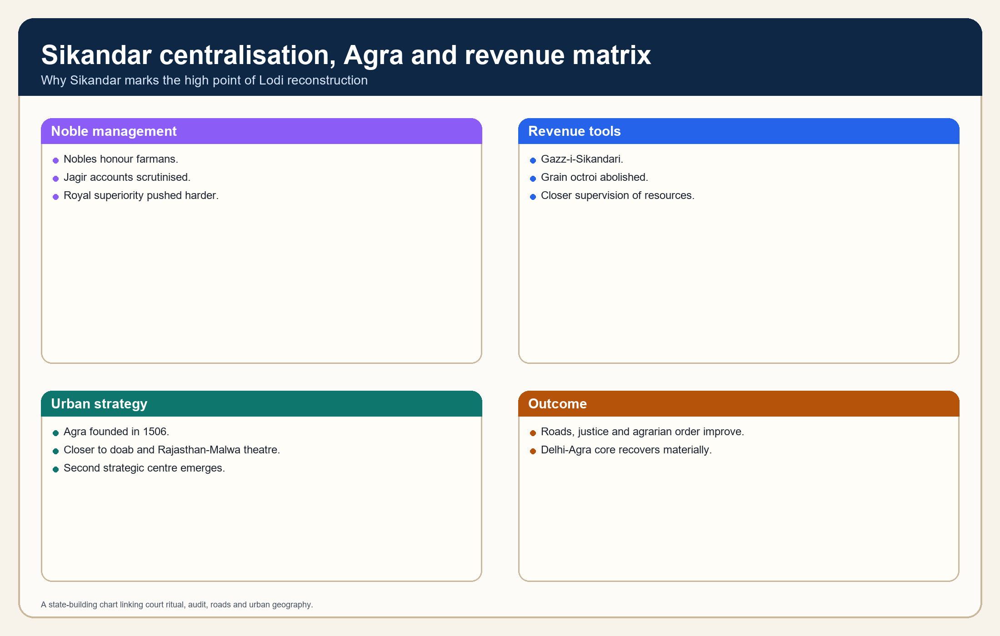

*State-building matrix. It links noble management, jagir accounting, agrarian measures and the strategic founding of Agra as one coherent programme.*

### Sikandar's state-building toolkit

| Measure | Function | Why UPSC cares |
|---|---|---|
| Court discipline | Forced nobles to recognise superior royal status | Shows monarchy versus Afghan equality claims |
| Jagir accounts | Checked embezzlement and corruption | Connects politics with fiscal supervision |
| Grain-octroi abolition | Supported provisioning and agrarian-commercial flow | Links revenue policy with price environment |
| Gazz-i-Sikandari | Standardised measurement | Classic Prelims marker and revenue-infrastructure point |
| Agra foundation | Strategic second capital closer to doab-Rajasthan-Malwa theatre | Shows military geography, not just city-building |

## Learning MCQ 13

**Question:** Which measure most clearly belongs to Sikandar Lodi's effort to centralise authority over Afghan nobles?

A. Requiring nobles to honour farmans formally and submit jagir accounts.  
B. Abandoning all audit and leaving accounts unexamined.  
C. Moving the capital permanently to Kabul.  
D. Ending all provincial command in favour of temple corporations.

**Correct answer:** **A**

**Explanation:** Court ritual and fiscal audit were tools to reduce noble equality claims.

## 16. Sikandar Lodi beyond the binary: orthodoxy, culture, language and economic recovery

[FACT] The OCR openly describes Sikandar as orthodox, even bigoted, in certain policies: he forbade some Muslim practices deemed contrary to sharia, re-imposed jizyah on Hindus, executed a Brahman for claiming scriptural parity, and demolished some temples during campaign contexts such as Nagarkot.

[FACT] Yet the same source also says Sikandar gave magnificent grants to scholars and philosophers, attracted cultured people from Arabia and Iran, encouraged translation of Sanskrit works into Persian, took interest in music, and oversaw a period in which many Hindus learned Persian and entered administrative service.

[ANALYSIS] This is exactly why Topic 06 must reject one-word labels. Sikandar was not simply "tolerant" and not simply "intolerant." He combined stronger juristic ordering with active literary-cultural patronage and practical state interests in recruitment, administration and urban growth.

[LIMIT] The later tradition that Sikandar wrote Persian poetry under the pen-name **Gulrukhi** is widely repeated and plausible, but it should be used as a minor cultural marker rather than as the centre of an answer.

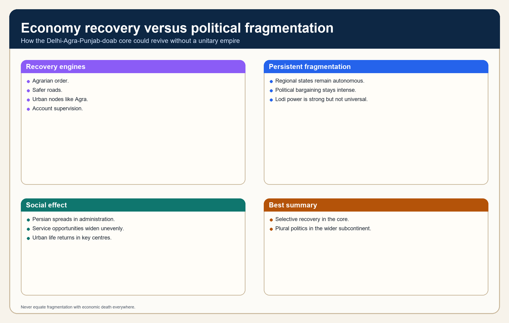

*Economy-versus-politics visual. It shows how the Lodi north-Indian core could recover through roads, accounting, agriculture and cities even while the wider subcontinent remained politically plural.*

### Nuanced Sikandar table

| Domain | Secure evidence | Better interpretation |
|---|---|---|
| Religion | Jizyah, campaign-time temple destruction, anti-sharia practice bans | Juristic ordering mattered, but it does not exhaust the reign |
| Culture | Grants to scholars, Persian learning, Sanskrit-to-Persian translations, music | Statecraft and literary patronage coexisted with orthodoxy |
| Administration | Justice emphasis, safe roads, cheap prices, accounts | Recovery of the north-Indian core was real |
| Language and society | More Hindus learning Persian and entering office | Pragmatic cultural interaction continued despite ideological tension |

## Learning MCQ 14

**Question:** Which line best captures Sikandar Lodi's reign?

A. Pure tolerance without any coercive religious policy.  
B. Strong administration and literary patronage coexisted with sharper juristic and coercive religious policies.  
C. Total administrative collapse with no urban growth.  
D. No Hindu entered service or Persian learning in his time.

**Correct answer:** **B**

**Explanation:** Topic 06 insists on this mixed, source-bounded reading.

## 17. Ibrahim Lodi: centralising monarchy, Afghan resentment and dynastic fracture

[FACT] The local Part II OCR presents Ibrahim Lodi as more energetic and ambitious than a simple "last weak ruler" stereotype suggests. He sought to strengthen royal authority and curb noble independence.

[FACT] The same OCR also emphasises that this effort alienated powerful Afghan nobles and relatives. His uncle **Alam Khan** and the Punjab governor **Daulat Khan Lodi** became central to the anti-Ibrahim alignment that later opened the way for Babur.

[ANALYSIS] Ibrahim's problem was structural. The more he tried to move from a negotiated Afghan kingship toward a tighter monarchy, the more he threatened elites who believed they had customary rights to status, office and consultation. Thus centralisation created resistance before it created capacity.

[LIMIT] Rana Sanga enters Topic 06 only as a bounded contextual factor. Late Lodi-Rajput conflict weakened Ibrahim's position and widened the field of north-Indian contest, but Topic 06 does not turn Panipat into a simple "Rajput invitation" story. Source traditions about who invited Babur and with what expectation must be handled cautiously.

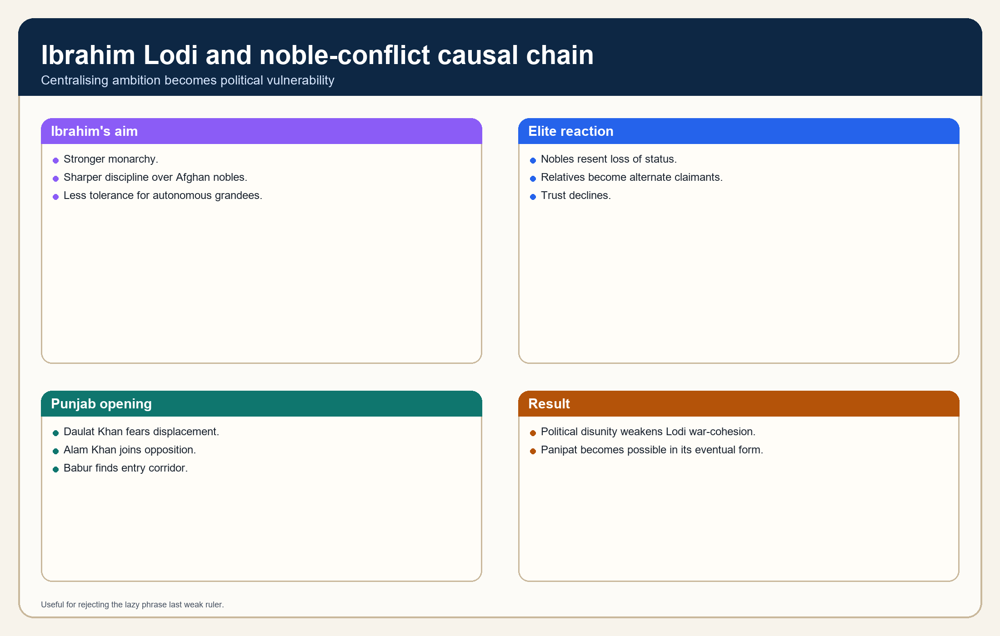

*Causal-chain visual. It links Ibrahim's centralising push to Afghan noble alienation, factional invitations and the strategic opening for Babur.*

### Why Ibrahim failed to stabilise the throne

| Pressure point | Mechanism | Effect |
|---|---|---|
| Stronger royal assertion | Reduced noble autonomy | Deepened Afghan elite resentment |
| Kin rivalry | Relatives became alternative nodes of legitimacy | Enabled Alam Khan's political use |
| Punjab instability | Daulat Khan feared replacement and loss | Opened gateway to Babur's intervention |
| Rajput challenge | Continuous strategic distraction | Reduced Delhi's ability to face one threat at a time |

## 18. The road to Panipat: Babur's aims, Punjab politics and coalition breakdown

[FACT] Topic 12 and the Part II OCR agree that Babur's Indian advance cannot be read merely as a random invasion. He had long searched for a stable territorial base, invoked **Timurid claims**, and saw north India as both opportunity and compensation after struggles in Central Asia.

[FACT] Punjab politics mattered decisively. The OCR describes Babur's negotiations and contests involving **Daulat Khan Lodi**, **Alam Khan**, and the unstable politics of Lahore and Punjab. He did not simply march from Kabul to Delhi in one straight, uncontested sweep.

[ANALYSIS] The road to Panipat therefore had three interlocking layers:

1. **Babur's ambition and Timurid claim language.**
2. **Lodi factional fracture in Punjab and among Afghan nobles.**
3. **A larger north-Indian field in which Rajputs, Afghans and regional rulers were all calculating advantage.**

[DEBATE] The invitation narrative is real but easy to oversimplify. It is safer to say that disgruntled Lodi factions and frontier actors **opened a political corridor** for Babur than to say they fully controlled him or knew the final consequences.

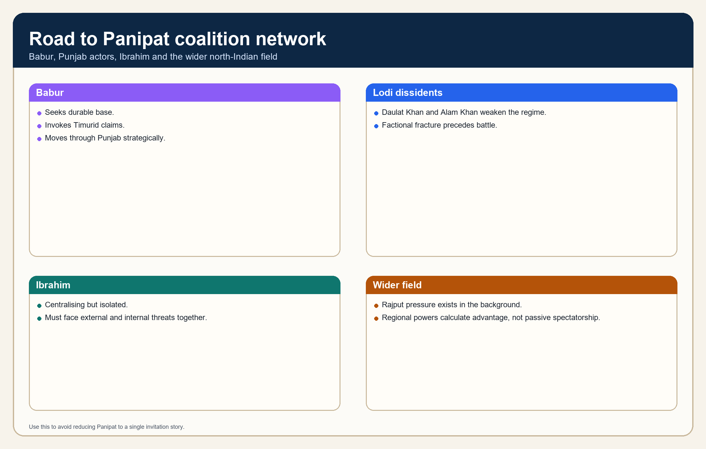

*Coalition-network visual. It shows Babur, Punjab actors, Ibrahim, Afghan dissidents and Rajput pressure as a networked crisis rather than a single invitation story.*

## 19. First Battle of Panipat (1526): battlefield system, technology and organisation

[FACT] The local Part II source emphasises that Babur had studied **Ottoman gunpowder methods** and in 1525-26 brought with him the experienced Ottoman gunners **Ustad Ali** and **Mustafa**. At Panipat he arranged carts in front, tied them with rawhide ropes, left tactical gaps for cavalry movement, and placed artillery and matchlock men effectively.

[FACT] The same source describes Babur's use of **tulughma/tulghuma** manoeuvre - mobile flank divisions that could envelop the enemy - together with field fortification and firearms. Ibrahim Lodi, by contrast, commanded a much larger host and many war elephants, but his army lacked the same coordinated battle-system.

[LIMIT] Exact numbers of troops and elephants differ across traditions and should not be repeated mechanically. The secure exam line is that Ibrahim's army was **larger**, Babur's was **smaller but better organised**, and victory came from system, discipline and leadership - **not guns alone**.

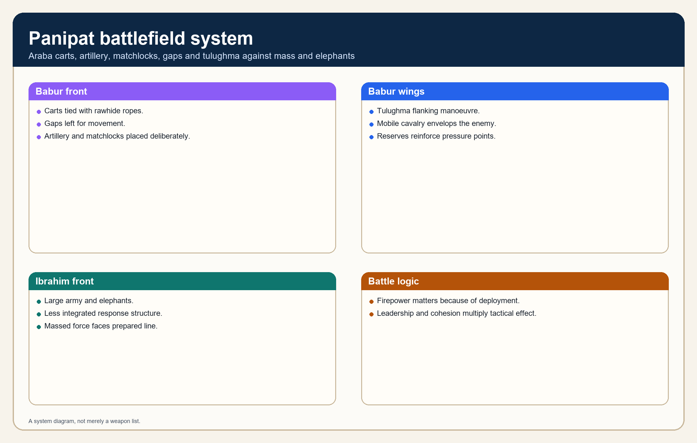

*Battle-system visual. It contrasts Babur's carts, artillery, matchlocks, gaps and flanking manoeuvre with Ibrahim's massed force and elephants.*

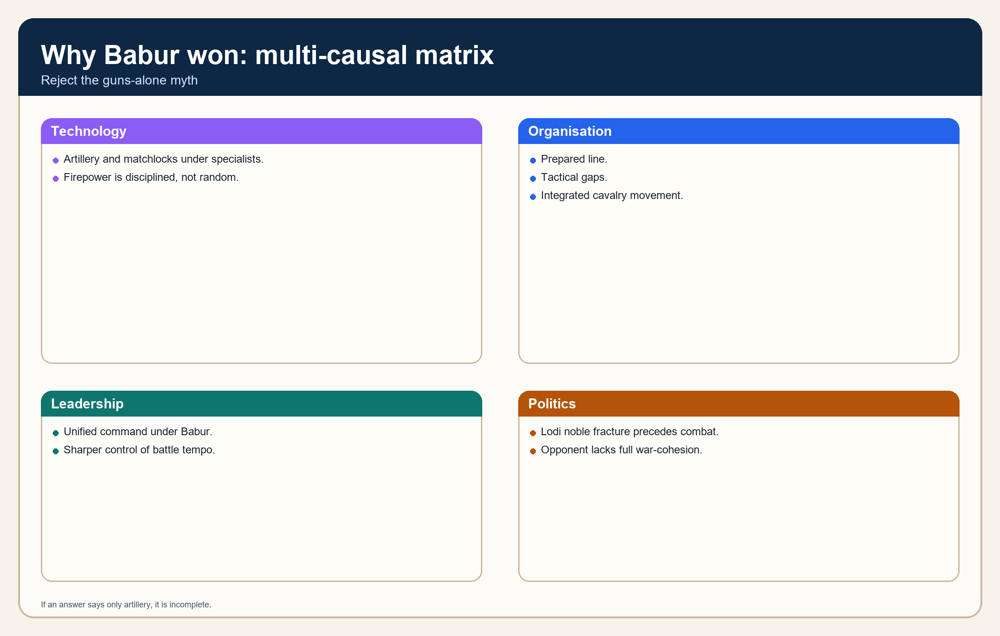

*Victory-matrix visual. It argues for guns plus organisation plus leadership plus coalition failure, not a monocausal technology myth.*

### Why "guns alone" is wrong

| Factor | Babur's advantage | Ibrahim's weakness |
|---|---|---|
| Artillery / matchlocks | Controlled placement under specialists | Weaker integration with battlefield doctrine |
| Field fortification | Araba-cart line, ropes and firing positions | Mass frontal pressure became costly |
| Mobility | Tulughma flanking and reserve use | Less flexible command response |
| Leadership | Cohesive direction under one commander | Internal distrust and weaker coordination |
| Politics | Opponent already factionally strained | Noble alienation reduced war-cohesion |

## Learning MCQ 15

**Question:** Which explanation of Babur's victory at Panipat is strongest?

A. Guns automatically defeat all pre-modern armies regardless of leadership.  
B. Ibrahim lost only because his army was numerically smaller.  
C. Babur combined artillery, carts, tactical gaps, tulughma manoeuvre, leadership and a more coherent political-military coalition.  
D. The battle ended because Delhi's troops refused to enter the field at all.

**Correct answer:** **C**

**Explanation:** Topic 06 explicitly rejects the "guns alone" story and stresses a multi-causal war system.

## 20. Transition from Sultanate to Mughal rule: why 1526 was decisive but not final

[FACT] The Part II OCR directly warns that Panipat, despite being decisive in one sense, was **not really decisive** politically in the broader subcontinental sense. Delhi and Agra came to Babur, but the Afghans were not extinguished and Babur still had to face **Rana Sanga** and later eastern-Afghan resistance.

[ANALYSIS] The correct formula is: **decisive as dynastic replacement, non-final as territorial consolidation**. Ibrahim died, the Lodi monarchy collapsed, and Babur occupied the Delhi-Agra core; but all India did not thereby become a settled Mughal empire overnight.

[ANALYSIS] Equally important, Mughal rule initially built upon continuities. Administrative practices, revenue habits, urban centres, Persianate court language, service elites and regional power calculations did not vanish at Panipat. The transition was substantial, but it was not civilisational tabula rasa.

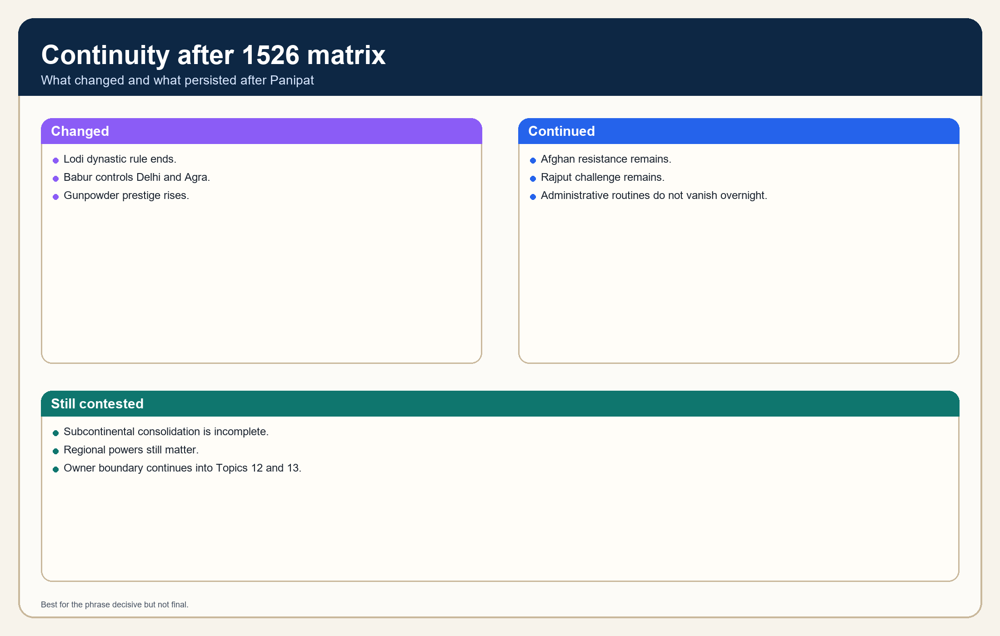

*Transition visual. It separates what changed in 1526 from what persisted into the early Mughal phase.*

### Change versus continuity after 1526

| Changed quickly | Continued substantially |
|---|---|
| Lodi dynastic rule at the centre ended | Revenue routines and agrarian extraction still required old intermediaries |
| Babur became master of Delhi and Agra | Persianate political culture continued |
| Gunpowder-field tactics gained prestige | Regional powers and Afghan resistance remained real |
| Timurid-Mughal claim entered north-Indian politics | Administrative personnel and local bargaining did not disappear overnight |

## Learning MCQ 16

**Question:** Which statement best captures the significance of 1526?

A. It instantly produced uncontested Mughal rule over all India.  
B. It had no importance because only one battle was fought.  
C. It changed nothing except coin design.  
D. It ended Lodi dynastic rule at Delhi-Agra but left major work of consolidation, coalition-building and further warfare still to be done.

**Correct answer:** **D**

**Explanation:** This is the safest line for both Prelims elimination and GS-I analytical writing.

## 21. Lodi administration, army, economy and society

[FACT] Under the Lodis, the old iqta-jagir logic did not disappear; instead it operated in a more intensely Afghan political field. Provincial governance still depended on office-holders, jagirdars, local allies and military commanders who had to be supervised rather than merely appointed.

[FACT] The OCR attributes to Sikandar Lodi closer account-checking, attention to justice, agricultural concern, safe routes, and measures such as the **gazz-i-Sikandari** and grain-octroi abolition. These suggest an administration trying to rebuild the **Delhi-Agra-Punjab-Doab** core materially.

[ANALYSIS] Lodi administration is best described as a **partly restored military-fiscal monarchy under persistent bargaining pressure**. Its army remained heavily dependent on cavalry and nobles' retainers; its fiscal success depended on supervision and agrarian prosperity; and its provincial governance never became mechanically centralised.

[ANALYSIS] Socially and economically, political fragmentation did not equal death. Urban life recovered in key centres, Agra rose, the doab remained important, and Persian language spread further in administration even as vernacular and Sufi networks continued to thicken across the landscape.

## 22. Sayyid-Lodi architecture: bounded forms, tomb landscapes and the road to Mughal garden-tombs

[FACT] The repository art-culture notes and OCR support several secure points. The late Sultanate and Lodi period saw a growing preference for **tombs on high platforms**, the use of **octagonal** and **square** plans, and the shaping of tombs within **garden settings** that later anticipate Mughal funerary landscapes.

[FACT] The architecture note specifically marks the **double dome** as appearing in India in the period that moves from Sikandar Lodi's tomb toward Humayun's tomb. This makes the Lodi phase architecturally transitional and significant.

[LIMIT] Attribution and exact chronology of individual monuments such as **Bara Gumbad** and **Shish Gumbad** can be discussed, but with caution. Topic 06 uses them chiefly as examples of the broader late-Sultanate/Lodi design world, not as a full owner-package on every structure.

*Architecture comparison visual. It contrasts square and octagonal tomb tendencies, garden setting, platform use and the transition toward Mughal funerary form.*

### Architecture takeaway

| Feature | Why it matters historically |
|---|---|
| Octagonal and square tomb types | Shows experimentation within the late Sultanate idiom |
| High platforms | Enhances monumentality and spatial dominance |
| Garden setting | Prefigures later Mughal charbagh-tomb sensibilities |
| Double-dome transition | Marks technological-formal movement into the sixteenth century |

## 23. Sources and historiography: contemporaneity, agenda and the decline-versus-regionalisation debate

[FACT] The key textual matrix for Topic 06 includes: Afif as a boundary source for the late Tughlaq world; Yahya bin Ahmad Sirhindi for the early Sayyid frame; Timurid narrative traditions such as Yazdi and the disputed Tuzuk/Malfuzat line for Timur; *Baburnama* for Babur's Indian campaign; later Afghan histories such as Abbas Sarwani for memory of Afghan mobilisation; and coins, inscriptions, architecture and regional outcomes as material checks.

[ANALYSIS] Source handling should follow a simple rule: **the closer a source is to events, the more valuable it may be for sequence - but also the more it may serve a live political agenda**. Later sources may preserve institutional memory but also harden court myths.

[DEBATE] Historiographically, three debates dominate Topic 06:

1. **Decline versus regionalisation:** Was the fifteenth century mainly collapse or redistribution of power?
2. **Timurid rupture versus long structural fragmentation:** Did Timur cause the break, or merely intensify one already underway?
3. **Afghan confederacy versus monarchy:** Were the Lodis trapped by Afghan elite norms, or were they building a workable monarchy that Ibrahim mishandled?

*Source matrix visual. It ranks sources by proximity, agenda and best-use function.*

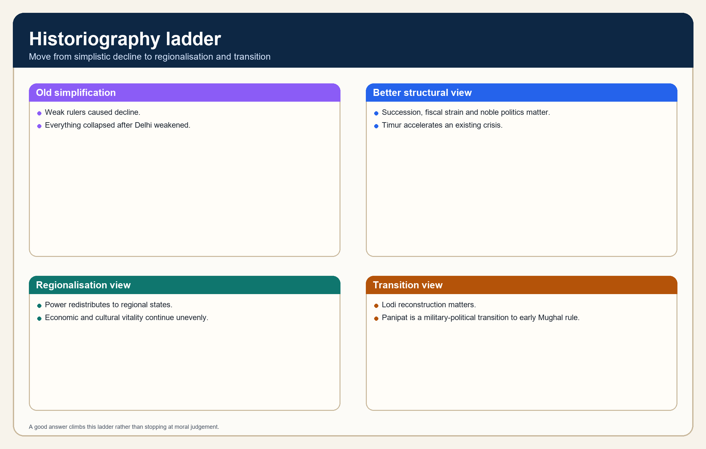

*Historiography visual. It climbs from moralised decline to structural fragmentation, regionalisation and multi-causal military transition.*

## 24. Historical significance and GS-I answer synthesis

[ANALYSIS] Topic 06 matters because it explains how north India moved from the high Delhi Sultanate to a new early-modern imperial formation without erasing the intermediate century. It joins political fragmentation, regional resilience, source criticism, Afghan elite politics and gunpowder-era battlefield adaptation in one answer frame.

[ANALYSIS] A strong GS-I conclusion usually says:

- the Tughlaq breakdown after 1388 exposed structural weaknesses already embedded in succession and fiscal-military organisation;
- Timur's 1398 raid devastated Delhi and accelerated prestige collapse but did not conquer all India;
- the Sayyids preserved Delhi's symbol under weak sovereignty;
- the Lodis rebuilt a stronger north-Indian monarchy but could not fully reconcile Afghan noble claims with centralising kingship;
- Panipat in 1526 was won by Babur through multi-causal superiority in leadership, organisation, field fortification, artillery and the exploitation of Lodi factional fracture;
- the victory was decisive in dynastic terms but not instantly final in subcontinental terms.

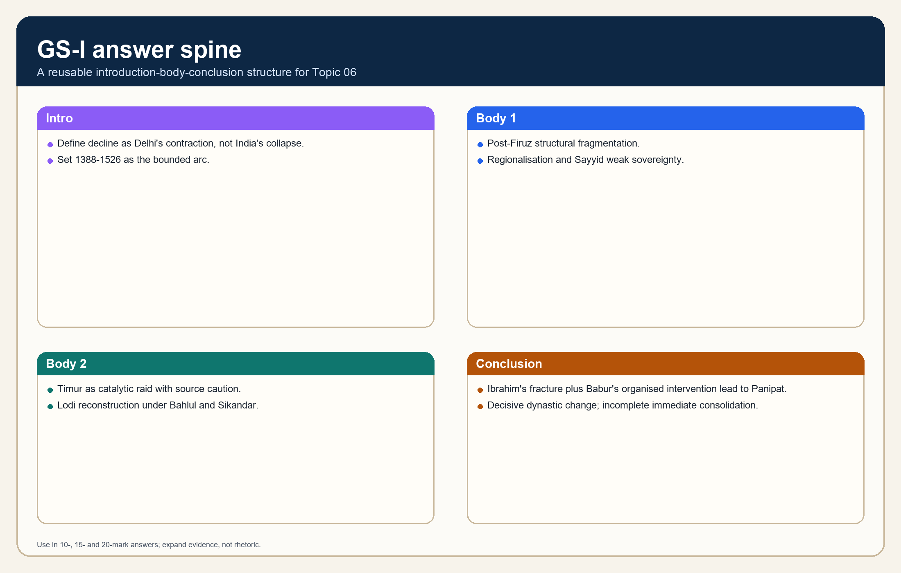

*Answer-spine visual. It gives a reusable introduction-body-conclusion structure for 10-, 15- and 20-mark answers.*

### 150-word answer spine

1. **Intro:** define decline as Delhi's contraction, not India's collapse.
2. **Body 1:** post-1388 succession, hereditary office, factionalism, provincial autonomy.
3. **Body 2:** Timur's raid as catalytic rupture with source caution.
4. **Body 3:** Sayyid weak sovereignty and symbolic Delhi.
5. **Body 4:** Lodi recovery, Afghan bargaining and Sikandar's state-building.
6. **Body 5:** Ibrahim's elite crisis and Panipat as multi-causal transition.
7. **Conclusion:** 1526 was dynastic replacement plus administrative continuity, not instant all-India consolidation.

# PART II - Premium solved-practice workbook source

## Solved topic-specific MCQs

This workbook block contains all practice material that must also be exported separately as the premium solved workbook PDF. The questions are divided into verified-or-honestly-adjacent PYQs, original broad-coverage MCQs, remedial trap MCQs and original Mains answers.

## Verified and honestly-adjacent PYQs

### PYQ 01 - UPSC Prelims GS-I 2021 (adjacent chronology route; wording verified locally, option row partly OCR-garbled)

**Question as securely verified from local OCR:** Consider the following statements:

1. It was during the reign of Iltutmish that Chengiz Khan reached the Indus in pursuit of the fugitive Khwarezm prince.  
2. It was during the reign of Muhammad bin Tughluq that Taimur occupied Multan and crossed the Indus.  
3. It was during the reign of Deva Raya II of Vijayanagara Empire that Vasco da Gama reached the coast of Kerala.

**Option-row status:** The local OCR preserves the combination row imperfectly, but earlier validated repository usage supports the standard set containing "1 only", "1 and 2", "3 only" and "2 and 3".

**Inferred answer - not officially verified locally:** **1 only**. Confidence: high.

**Model explanation:** Statement 1 is correct because Chinggis Khan reached the Indus in 1221 while pursuing Jalal al-Din Mangburni during Iltutmish's reign. Statement 2 is incorrect because Timur's Indian invasion belongs to the post-Firuz phase and culminates in 1398, far after Muhammad bin Tughlaq. Statement 3 is incorrect because Vasco da Gama reached Kerala in 1498, not in Deva Raya II's time.  

**Why this earns marks:** It secures chronology and prevents the common error of attaching every north-west frontier episode to Muhammad bin Tughlaq.

### PYQ 02 - UPSC Prelims GS-I 2022 (adjacent frontier chronology; wording verified locally)

**Question:** With reference to Indian history, consider the following statements:

1. The first Mongol invasion of India happened during the reign of Jalal-ud-din Khalji.  
2. During the reign of Ala-ud-din Khalji, one Mongol assault marched up to Delhi and besieged the city.  
3. Muhammad-bin-Tughlaq temporarily lost portions of north-west of his kingdom to Mongols.

Which of the statements given above is/are correct?

(a) 1 and 2  
(b) 2 only  
(c) 1 and 3  
(d) 3 only

**Inferred answer - not officially verified locally:** **(b) 2 only**. Confidence: high.

**Model explanation:** Statement 1 is incorrect because Mongol pressure on India predates Jalaluddin Khalji. Statement 2 is correct because a major Mongol attack reached Delhi during Alauddin's reign. Statement 3 is not supported in the secure form used in this repository.  

**Why this earns marks:** It separates early frontier pressure from the famous Delhi-siege moment and trains ruler-event discipline.

### PYQ 03 - UPSC GS-I 2020 (adjacent but highly useful source-criticism question; wording preserved in repository)

**Question:** Persian literary sources of medieval India reflect the spirit of the age. Comment. (Answer in 250 words)

**Model answer:**

Persian literary sources are indispensable for reconstructing medieval India because they preserve the language of kingship, conquest, moral anxiety, administrative aspiration and courtly self-fashioning. Yet they reflect the spirit of the age only when read with **genre and patronage caution**.  

For Topic 06, this method is essential. Timurid victory narratives and later memoir traditions present violence, piety and legitimacy through the conqueror's lens. Yahya bin Ahmad Sirhindi is crucial for the Sayyid world, but he also writes from within a courtly-political frame. *Baburnama* gives vivid first-person detail for the road to Panipat, yet it remains ruler-self-representation, not neutral reportage. Earlier texts such as Barani and Afif likewise reveal the assumptions of elite Persianate politics more fully than the experience of peasants, women or local vernacular communities.  

These works therefore reflect the age in a **refracted** way: they reveal the values of courts, officials, warriors and legitimising intellectuals. Their silence on subaltern life, and their tendency to moralise success and failure, require constant checking against coins, inscriptions, architecture and regional evidence.  

Hence Persian literary sources do reflect the spirit of the age - but mainly the political and ideological spirit of elite society. Used critically and comparatively, they become powerful historical evidence rather than decorative quotation.

**Why this earns marks:** It turns the word *reflect* into a method question, names applicable source families and shows both value and limitation.

### PYQ 04 - UPSC GS-I 2023 (adjacent Sultanate-wide technology question; wording preserved in repository)

**Question:** What were the major technological changes introduced during the Sultanate period? How did those technological changes influence the Indian society? (Answer in 250 words)

**Model answer:**

The Sultanate period mattered technologically because it accelerated the diffusion, adaptation and systematisation of techniques in construction, irrigation, warfare and administration. Its importance lay less in isolated inventions than in the **social use of technology for state-building**.  

In building, the stronger use of the true arch, dome and lime mortar changed both engineering possibility and the symbolism of power. In irrigation, canals associated with Firuz Shah show technology tied directly to agrarian expansion and revenue growth. In administration, branding, descriptive rolls, measurement practices and revenue accounting improved the capacity of rulers to supervise men, horses, produce and assignment holders. Topic 06 also reminds us that by the early sixteenth century, firearms and field artillery had entered Indian warfare more systematically; Panipat showed how technology mattered most when integrated with battle-organisation.  

These changes influenced society unevenly. They strengthened capitals, roads, agrarian cores and military-fiscal extraction more than they democratised life. Monumental construction supported courtly urbanity; irrigation expanded cultivation; accounting practices sharpened control over intermediaries; and gunpowder-era methods began to reshape elite warfare.  

Thus Sultanate technology influenced society chiefly by enlarging **state capacity, urban growth and military transformation**, while also deepening hierarchy and resource mobilisation.

**Why this earns marks:** It connects technology with irrigation, architecture, administration and Panipat without reducing the issue to weapons alone.

## PYQ verification ledger and scope honesty

- No direct standalone UPSC PYQ devoted only to Timur's raid, the Sayyids, Bahlul, Sikandar or Ibrahim was verified locally in the bounded repository audit set used for this export.
- The package therefore uses **adjacent but honest** PYQs on chronology, Persian sources and Sultanate technology.
- No coaching-question stem is relabelled as an official UPSC PYQ.

## Original broad-coverage MCQs

### Broad MCQ 01

**Question:** Which statement best explains the crisis after Firuz Shah Tughlaq's death?

A. It emerged from succession conflict layered over hereditary office, factional elites and weakening central military-fiscal control.  
B. It was caused solely by Babur's artillery.  
C. It began only after Agra was founded.  
D. It reflected a sudden shift of Delhi to maritime trade.

**Correct answer:** **A**

**Explanation:** The breakdown predates Timur and Panipat; it is rooted in structural and political weakening after 1388.

### Broad MCQ 02

**Question:** Why did hereditary offices and assignments matter in the late Tughlaq phase?

A. They made every province a republic.  
B. They strengthened office-holding families and made later central discipline harder.  
C. They abolished military service.  
D. They converted iqtas into temples.

**Correct answer:** **B**

**Explanation:** Hereditary claims reduced the centre's ability to reshuffle and discipline service elites.

### Broad MCQ 03

**Question:** Which statement best reflects the fifteenth-century political pattern?

A. Delhi expanded while all regional states disappeared.  
B. No stable court culture survived outside Delhi.  
C. Delhi contracted while regional states such as Bengal, Gujarat, Malwa and Jaunpur remained active and durable.  
D. Timur governed India permanently from Delhi after 1398.

**Correct answer:** **C**

**Explanation:** Topic 06 insists on regional vitality alongside Delhi's contraction.

### Broad MCQ 04

**Question:** Timur's 1398 Indian invasion is most safely described as:

A. a peaceful pilgrimage.  
B. a full annexation of the subcontinent.  
C. a Gujarati naval expedition.  
D. a plundering raid on a weakened Delhi, clothed in legitimising language and followed by withdrawal.

**Correct answer:** **D**

**Explanation:** This wording captures motive, method and the absence of durable all-India occupation.

### Broad MCQ 05

**Question:** What is the safest way to handle chronicler numbers for Timur's killings and captives?

A. Treat them as reported and often exaggerated claims while retaining the fact of real devastation.  
B. Quote them all literally as verified census data.  
C. Reject all violence because numbers differ.  
D. Use only modern round figures with no sources.

**Correct answer:** **A**

**Explanation:** Source criticism means caution with numbers, not denial of violence.

### Broad MCQ 06

**Question:** Which specific outcome of Timur's raid is securely supported in the local OCR?

A. He founded Agra.  
B. He carried away Indian artisans who were later employed in Samarqand.  
C. He permanently ruled Jaunpur.  
D. He introduced the gazz-i-Sikandari.

**Correct answer:** **B**

**Explanation:** The artisan-transfer point is a core secure fact linking plunder to imperial construction elsewhere.

### Broad MCQ 07

**Question:** What is the safest statement about Khizr Khan's legitimacy?

A. He ruled exactly like Alauddin Khalji without any legitimacy problem.  
B. He had no Timurid connection at all.  
C. He used Timurid association symbolically while ruling through local north-Indian bargaining.  
D. He was Timur's permanent viceroy over all India.

**Correct answer:** **C**

**Explanation:** The Sayyid founder sat between symbolic Timurid connection and practical local rule.

### Broad MCQ 08

**Question:** The Sayyid state is best described as:

A. an all-India agrarian democracy.  
B. a strong empire from Bengal to the Deccan.  
C. a maritime customs regime.  
D. a Delhi-centred weak sovereignty dependent on tribute, negotiation and limited coercive reach.

**Correct answer:** **D**

**Explanation:** Delhi's symbol survived, but not the wide command structure of the high Sultanate.

### Broad MCQ 09

**Question:** The *Tarikh-i-Mubarak Shahi* is associated with:

A. Yahya bin Ahmad Sirhindi.  
B. Sharaf al-Din Yazdi.  
C. Ibn Battuta.  
D. Abbas Sarwani.

**Correct answer:** **A**

**Explanation:** Yahya bin Ahmad Sirhindi is the key named chronicler for the later Tughlaq-early Sayyid world.

### Broad MCQ 10

**Question:** Which phrase best captures Afghan elite political expectations under the Lodis?

A. Absolute rejection of monarchy in every form.  
B. The ruler as first among powerful equals, with consultation and honour-sharing claims among nobles.  
C. Automatic acceptance of Balban-like distance.  
D. Complete absence of lineage politics.

**Correct answer:** **B**

**Explanation:** Afghan nobles often expected status, consultation and a distributive share in power.

### Broad MCQ 11

**Question:** Why is Abbas Sarwani's "came like locusts" line used cautiously?

A. Because it proves Afghans never came to India.  
B. Because it was written by Timur.  
C. Because it is later rhetorical language that may exaggerate the scale while still preserving memory of strong Afghan inflow.  
D. Because it refers to Portuguese traders.

**Correct answer:** **C**

**Explanation:** Later Afghan histories can preserve memory but also heighten effect.

### Broad MCQ 12

**Question:** Which achievement is most securely associated with Bahlul Lodi?

A. Building Firozabad.  
B. Replacing Babur at Kabul.  
C. Conquering Vijayanagara.  
D. Defeating and annexing Sharqi Jaunpur after building an Afghan Punjab-Delhi base.

**Correct answer:** **D**

**Explanation:** Bahlul's major durable success was the consolidation of Lodi power through the defeat of Jaunpur.

### Broad MCQ 13

**Question:** Why was the founding of Agra under Sikandar Lodi historically significant?

A. It provided a strategic centre closer to the doab, Rajasthan, Malwa and Gujarat-facing theatre.  
B. It was built as a coastal harbour for Indian Ocean trade.  
C. It marked Sikandar's withdrawal from north India.  
D. It abolished all rivalry with Afghan nobles.

**Correct answer:** **A**

**Explanation:** Agra was chosen for military-geographical reasons, not as a decorative urban project alone.

### Broad MCQ 14

**Question:** The gazz-i-Sikandari refers to:

A. a field artillery unit.  
B. a standard unit of measurement associated with Sikandar Lodi's administration.  
C. a Timurid cavalry formation.  
D. a Sayyid coin type.

**Correct answer:** **B**

**Explanation:** It is a classic administrative-marker fact tied to measurement and revenue supervision.

### Broad MCQ 15

**Question:** Which description best captures Sikandar Lodi's religious-cultural profile?

A. A purely liberal ruler with no coercive religious action.  
B. An anti-literary ruler hostile to Persian learning.  
C. An administratively able ruler whose orthodoxy coexisted with significant literary patronage and cultural activity.  
D. A ruler who excluded all Hindus from office and language learning completely.

**Correct answer:** **C**

**Explanation:** The safe reading is mixed and source-bounded, not one-word moral labelling.

### Broad MCQ 16

**Question:** Which factor most directly opened the way for Babur's intervention against Ibrahim Lodi?

A. The instant collapse of all regional states.  
B. Portuguese naval support to Daulat Khan.  
C. The disappearance of Punjab politics.  
D. Conflict between Ibrahim and major Afghan nobles such as Daulat Khan and Alam Khan.

**Correct answer:** **D**

**Explanation:** Internal Lodi fracture created the political corridor through which Babur advanced.

### Broad MCQ 17

**Question:** Which statement about Panipat is correct?

A. Babur's army was smaller but fought with a more integrated battle-system of artillery, carts, tactical gaps and cavalry manoeuvre.  
B. Ibrahim Lodi had no elephants at all.  
C. Babur deliberately fought without any field preparation.  
D. The battle was won before armies met.

**Correct answer:** **A**

**Explanation:** Coordination, not mere numbers, explains Babur's battlefield success.

### Broad MCQ 18

**Question:** The tulughma/tulghuma tactic is best understood as:

A. temple endowment under the Sayyids.  
B. a flanking and enveloping cavalry manoeuvre within Babur's battle-plan.  
C. grain taxation under Sikandar.  
D. a chronicle by Yahya bin Ahmad.

**Correct answer:** **B**

**Explanation:** Tulughma refers to mobile divisions used to envelop and outmanoeuvre the enemy.

### Broad MCQ 19

**Question:** Which explanation best rejects the "guns alone" myth?

A. Artillery was irrelevant.  
B. Ibrahim lacked war elephants.  
C. Babur's success came from firearms integrated with leadership, fortification, manoeuvre and Lodi political weakness.  
D. Victory was caused only by Timurid bloodline.

**Correct answer:** **C**

**Explanation:** Topic 06 treats technology as effective only when embedded in organisation and command.

### Broad MCQ 20

**Question:** Which statement about the date of Panipat is safest in this repository's usage?

A. The exact date is unknowable and must never be mentioned.  
B. The battle occurred in 1498.  
C. The repository rejects all textbook dates.  
D. The battle is commonly given as 21 April 1526, but repository caution notes that some local source handling has also preserved 20 April; the key is to flag the variance honestly if needed.

**Correct answer:** **D**

**Explanation:** The export follows repository caution rather than pretending there is no date-variant issue in the local source trail.

### Broad MCQ 21

**Question:** Which statement best captures the immediate result of Babur's victory?

A. It ended Lodi dynastic rule at the centre but did not instantly create uncontested Mughal rule across India.  
B. It erased all Afghan resistance immediately.  
C. It transferred power directly to the Portuguese.  
D. It made Bengal part of Babur's secure empire the same week.

**Correct answer:** **A**

**Explanation:** Panipat was decisive dynastically, not immediately final territorially.

### Broad MCQ 22

**Question:** Which administrative feature is most visible in the Lodi recovery of the Delhi-Agra core?

A. Complete abandonment of revenue supervision.  
B. Greater attention to account-checking, measurement, roads and agrarian order.  
C. Refusal to found or support urban centres.  
D. Replacement of cavalry by an all-infantry militia.

**Correct answer:** **B**

**Explanation:** Lodi recovery worked through military-fiscal rebuilding, not administrative withdrawal.

### Broad MCQ 23

**Question:** Which statement about Sayyid-Lodi architecture is safest?

A. It had no connection with later Mughal garden-tomb development.  
B. It abandoned all tomb building.  
C. It includes square and octagonal tomb forms, high platforms and transitional features important for later Mughal funerary architecture.  
D. It was exclusively wooden architecture.

**Correct answer:** **C**

**Explanation:** The late Sultanate-Lodi phase is an architectural bridge, especially in tomb design and landscape setting.

### Broad MCQ 24

**Question:** Why should Bara Gumbad and Shish Gumbad be handled carefully in Topic 06?

A. Because they belong only to ancient history.  
B. Because they are Jain cave monasteries.  
C. Because they were built by Babur in Kabul.  
D. Because exact attribution and chronology debates require caution even when they illustrate the broader Lodi architectural world.

**Correct answer:** **D**

**Explanation:** Topic 06 uses them as bounded examples, not as a licence for overconfident monument trivia.

### Broad MCQ 25

**Question:** Which source is most closely associated with the Timurid courtly victory tradition?

A. Sharaf al-Din Ali Yazdi's *Zafarnama*.  
B. Yahya bin Ahmad Sirhindi's *Tarikh-i-Mubarak Shahi*.  
C. Afif's *Tarikh-i Firuz Shahi*.  
D. Abbas Sarwani's Afghan narrative.

**Correct answer:** **A**

**Explanation:** Yazdi is central to the Timurid courtly narrative, though still agenda-laden.

### Broad MCQ 26

**Question:** What is the safest statement about the *Tuzuk-i-Timuri / Malfuzat-i-Timuri* tradition?

A. It is Babur's memoir under another name.  
B. It must be treated with authenticity caution and used comparatively, not literally as unquestioned autobiography.  
C. It is a Mughal land-revenue manual.  
D. It proves Timur intended a settled all-India empire.

**Correct answer:** **B**

**Explanation:** The source is valuable chiefly as a source problem and ideological tradition, not as transparent self-authored fact.

### Broad MCQ 27

**Question:** Which statement best uses the *Baburnama* safely for Topic 06?

A. It is useless because memoirs are always false.  
B. It is a neutral military log with no self-fashioning.  
C. It is a vivid first-person source for campaign detail and self-representation, best checked against politics, material evidence and later outcomes.  
D. It was written by Ibrahim Lodi after Panipat.

**Correct answer:** **C**

**Explanation:** The memoir is exceptionally valuable, but still a ruler's account.

### Broad MCQ 28

**Question:** Which summary best fits fifteenth-century north India?

A. Uniform economic collapse from Bengal to Gujarat.  
B. A timeless war of races.  
C. A fully restored unitary Delhi empire.  
D. Political fragmentation at the old centre combined with regional state vitality and selective economic recovery.

**Correct answer:** **D**

**Explanation:** This is the core interpretive sentence of the topic.

### Broad MCQ 29

**Question:** Which statement about the economy and society of the age is strongest?

A. Political fragmentation did not prevent recovery in centres such as Delhi, Agra, Punjab and the doab, especially under the later Lodis.  
B. All trade routes disappeared permanently after 1398.  
C. Persian ceased to matter in administration.  
D. Urban life vanished from north India for a century.

**Correct answer:** **A**

**Explanation:** Topic 06 avoids confusing political contraction with total economic death.

### Broad MCQ 30

**Question:** What is the best distinction between symbolic claim and durable rule?

A. They are always identical in medieval history.  
B. A ruler could possess khutba, coin or dynastic symbolism without commanding deep and stable coercive control everywhere.  
C. Symbols never mattered politically.  
D. Durable rule required no revenue or army.

**Correct answer:** **B**

**Explanation:** This distinction is crucial for reading the Sayyids and also Timur's shadow over Delhi.

### Broad MCQ 31

**Question:** The "Delhi to Palam" trope is mainly used to indicate:

A. Delhi's maritime expansion.  
B. the building of a new river canal to Palam.  
C. the dramatic shrinkage of the Delhi sultan's effective authority and prestige.  
D. the Sayyid conquest of all Punjab.

**Correct answer:** **C**

**Explanation:** It is a literary image of contraction and humiliation, not a cartographic measurement.

### Broad MCQ 32

**Question:** Which concluding thesis is most appropriate for Topic 06?

A. The Delhi Sultanate fell only because Timur attacked.  
B. The Lodis failed because Afghans were biologically unfit for monarchy.  
C. Panipat was purely a gunpowder miracle.  
D. The decline of Delhi was a long structural and political transition in which regionalisation, elite fracture, fiscal-military strain, Timur's raid and Babur's organised intervention all mattered.

**Correct answer:** **D**

**Explanation:** This is the full multi-causal conclusion expected in a high-quality GS-I answer.

## Remedial trap MCQs

### Remedial MCQ 01

**Question:** Which statement is false?

A. Delhi's decline automatically means that all of India experienced total collapse in the same way.  
B. Regional states could remain active while Delhi weakened.  
C. A shrinking centre and resilient provinces can coexist.  
D. Political fragmentation and selective economic recovery are compatible.

**Correct answer:** **A**

**Explanation:** The main trap of the topic is to confuse Delhi's contraction with India-wide death.

### Remedial MCQ 02

**Question:** Which statement is the strongest correction to the phrase "Timur conquered India"?

A. He never entered India at all.  
B. He conducted a devastating raid on Delhi and the north-west, then withdrew rather than building durable all-India rule.  
C. He ruled from Agra for twenty years.  
D. He was defeated before reaching Punjab.

**Correct answer:** **B**

**Explanation:** Topic 06 distinguishes raid, plunder and symbolic aftermath from settled conquest.

### Remedial MCQ 03

**Question:** Which statement is correct?

A. The Sayyids restored the empire of Alauddin Khalji in full.  
B. Khizr Khan had no relation at all to Timurid legitimacy claims.  
C. The Sayyid polity is best seen as weak sovereignty centred on Delhi rather than as a massive reconquest empire.  
D. The Sayyids permanently eliminated Jaunpur and Malwa.

**Correct answer:** **C**

**Explanation:** The Sayyids mattered symbolically, but their coercive reach remained limited.

### Remedial MCQ 04

**Question:** Which statement best corrects the phrase "Afghan equality"?

A. Afghan nobles rejected every kind of rank.  
B. Afghan politics meant modern universal democracy.  
C. Afghan rulers always partitioned India peacefully.  
D. Afghan elite culture often involved strong claims to consultation and shared honour among nobles, but it was still embedded in hierarchical state politics.

**Correct answer:** **D**

**Explanation:** "Equality" here is an elite political idiom, not a modern social doctrine.

### Remedial MCQ 05

**Question:** Which statement about Sikandar Lodi is most misleading?

A. His reign can be described simply as either complete tolerance or total civilisational darkness.  
B. He founded Agra for strategic reasons.  
C. He is associated with gazz-i-Sikandari and account scrutiny.  
D. His reign mixed stronger administration with sharper juristic-religious policies.

**Correct answer:** **A**

**Explanation:** Topic 06 rejects flat moral binaries; the other three statements are defensible and source-grounded.

### Remedial MCQ 06

**Question:** Which statement best corrects the image of Ibrahim Lodi as merely a passive weakling?

A. He had no political will whatsoever.  
B. He attempted to strengthen monarchy, but this sharpened conflict with Afghan nobles and relatives.  
C. He voluntarily surrendered to Babur before battle.  
D. He ruled only Kashmir.

**Correct answer:** **B**

**Explanation:** Ibrahim's failure came partly from an assertive but politically costly centralising push.

### Remedial MCQ 07

**Question:** Which statement about Panipat is correct?

A. Babur won without any preparation or tactical innovation.  
B. Firearms were irrelevant to the battle.  
C. Panipat shows how firearms mattered when combined with fortification, manoeuvre and leadership.  
D. Ibrahim's army was politically united and tactically superior.

**Correct answer:** **C**

**Explanation:** The trap is to isolate guns from the battle-system that made them effective.

### Remedial MCQ 08

**Question:** Which statement best corrects the phrase "1526 instantly created the Mughal Empire in all India"?

A. Babur never took Delhi.  
B. Panipat was a small skirmish of no consequence.  
C. Ibrahim survived and ruled for ten more years.  
D. Panipat ended Lodi dynastic rule at the centre, but Babur still faced Rajput and Afghan resistance before wider consolidation.

**Correct answer:** **D**

**Explanation:** Topic 06 repeatedly distinguishes dynastic victory from full imperial consolidation.

### Remedial MCQ 09

**Question:** Which statement is correct?

A. The *Tuzuk/Malfuzat* tradition needs authenticity caution and comparative reading.  
B. It is unquestionably Timur's autograph manuscript.  
C. It completely replaces Yazdi and Indian chronicles.  
D. It is a revenue survey of Agra.

**Correct answer:** **A**

**Explanation:** Source criticism is central to this topic.

### Remedial MCQ 10

**Question:** Which statement best distinguishes Jaunpur in Topic 06?

A. It was irrelevant to Delhi.  
B. It was the strongest eastern rival whose defeat mattered to Bahlul Lodi's consolidation.  
C. It was conquered by Timur and ruled from Samarqand.  
D. It functioned only as a temple town without state power.

**Correct answer:** **B**

**Explanation:** Jaunpur is a serious regional-state actor, not a decorative footnote.

### Remedial MCQ 11

**Question:** Which statement is correct?

A. Every route and market died permanently after 1398.  
B. Urban life vanished permanently from the Delhi-Agra region after Timur.  
C. Political fragmentation did not prevent roads, agrarian recovery and urban revival in parts of north India.  
D. Persian stopped spreading in administration.

**Correct answer:** **C**

**Explanation:** Recovery in the Delhi-Agra-doab core is a major counter-trap in the topic.

### Remedial MCQ 12

**Question:** Which statement best captures the architectural value of the Sayyid-Lodi phase?

A. It has no relation to Mughal architecture.  
B. It is valuable only for fort walls.  
C. It should be ignored because chronology debates exist.  
D. It offers transitional tomb forms, platform use and garden settings that help explain later Mughal funerary developments.

**Correct answer:** **D**

**Explanation:** Caution about individual monuments does not cancel the broader architectural significance of the phase.

## Original solved Mains questions

### Mains 01 - 10 marks

**Question:** Explain the structural causes of the fragmentation of the Delhi Sultanate after 1388. (Answer in 150 words)

**Model answer:**

- **Claim:** The fragmentation after 1388 was structural, not merely the product of weak successors.  
- **Evidence / source line:** Satish Chandra's concise and Part I discussions emphasise succession disorder, noble-centre conflict, provincial assertion and geographical-regional factors. Topic 05 adds Firuz's hereditary office and weakened military discipline.  
- **Mechanism:** Open succession encouraged civil war; hereditary offices strengthened service families; muqtis and regional commanders retained resources; cavalry-fort maintenance strained finances; distance and ecology favoured provincial autonomy; local agrarian-commercial bases could sustain rival courts.  
- **Significance:** Once Delhi's aura dimmed, Bengal, Gujarat, Malwa and Jaunpur no longer behaved like temporary rebels but as viable states.  
- **Limitation:** Rulers still mattered; structure did not make collapse automatic.  
- **Verdict:** The Sultanate fragmented because institutions of succession, extraction and command were too weak to survive repeated shocks.  

**Why this earns marks:** It moves beyond the cliché of weak successors and builds a five-factor answer with causation.

### Mains 02 - 10 marks

**Question:** Assess the impact of Timur's invasion on the Delhi Sultanate. (Answer in 150 words)

**Model answer:**

- **Claim:** Timur's 1398 raid was a devastating catalyst, not the sole cause of the Sultanate's decline.  
- **Evidence / source line:** Local OCR stresses sack, killings, plunder and the carrying away of artisans; the concise volume also says Timur's political effect was limited because he did not stay, yet the invasion marked the end of strong Delhi rule.  
- **Mechanism:** The raid destroyed life and wealth in Delhi, deepened prestige collapse, enlarged the political vacuum and encouraged frontier and provincial actors such as Khizr Khan.  
- **Significance:** It accelerated transition from late Tughlaq weakness to Sayyid weak sovereignty.  
- **Limitation:** Regional vitality elsewhere continued; India as a whole was not conquered or permanently destroyed.  
- **Verdict:** Timur's invasion was a decisive blow to Delhi's core authority, but it operated within a longer process of structural fragmentation already underway.  

**Why this earns marks:** It balances devastation, causation and continuity without either minimising or apocalyptic exaggeration.

### Mains 03 - 15 marks

**Question:** "The Sayyid dynasty preserved the symbol of Delhi more than the substance of empire." Examine. (Answer in 250 words)

**Model answer:**

- **Claim:** The statement is substantially correct.  
- **Evidence / source line:** Topic 06 owner files and local OCR place Khizr Khan's Delhi recovery in 1414 under a Timurid legitimacy shadow, while also noting that the Sayyids never became strong empire-builders. The dynasty faced Khokhars in Punjab, Mewatis and Sharqi Jaunpur.  
- **Mechanism:** Delhi remained valuable as a symbol of sovereignty, khutba and courtly precedence. However, control beyond the core required negotiated tribute, intermittent campaigns and compromise with local chiefs. The gap between claim and enforcement widened.  
- **Significance:** The Sayyid phase shows how a state can survive through **symbolic centrality** even after the high-capacity imperial machine has thinned out. It explains why Bahlul Lodi could later take Delhi and still inherit prestige from the city.  
- **Limitation:** Weak sovereignty should not be read as zero importance. Mubarak Shah especially tried to act more assertively, and Delhi still mattered strategically.  
- **Verdict:** The Sayyids preserved the throne's symbolic relevance, but not the broad coercive reach of the Khalji-Tughlaq zenith.  

**Why this earns marks:** It defines symbolism and substance separately and uses them as analytical categories, not rhetoric.

### Mains 04 - 15 marks

**Question:** Analyse Sikandar Lodi's contribution to the reconstruction of north-Indian monarchy. (Answer in 250 words)

**Model answer:**

- **Claim:** Sikandar Lodi was the most effective Lodi ruler and the chief architect of the dynasty's administrative consolidation.  
- **Evidence / source line:** Local OCR credits him with making nobles honour farmans, demanding jagir accounts, ensuring justice, safe roads, cheap prices, abolishing grain octroi, introducing gazz-i-Sikandari and founding Agra in 1506.  
- **Mechanism:** He reduced the autonomy of Afghan nobles through court discipline and audit; strengthened the military-fiscal core through measurement and supervision; and shifted strategic focus eastward and southward through Agra. Agrarian and road security improved the revenue base.  
- **Significance:** Under Sikandar, Delhi recovered enough to become once more a serious north-Indian monarchy rather than merely a symbolic seat. His reign also demonstrates that political fragmentation did not preclude material recovery.  
- **Limitation:** His coercive religious actions and orthodoxy complicate any celebratory picture; moreover, noble bargaining remained structurally unresolved and resurfaced sharply under Ibrahim.  
- **Verdict:** Sikandar reconstructed monarchy through discipline, supervision and strategic urban policy, but could not eliminate the contradictions of Afghan-Lodi kingship.  

**Why this earns marks:** It joins political authority, revenue supervision and urban geography in one integrated answer.

### Mains 05 - 20 marks

**Question:** Panipat (1526) was won by Babur not because of firearms alone, but because of a superior military-political system. Discuss. (Answer in 250 words)

**Model answer:**

- **Claim:** Firearms mattered, but Panipat was fundamentally a victory of coordinated system over disjointed mass.  
- **Evidence / source line:** Part II OCR names Ustad Ali and Mustafa, cart-lines tied by rawhide ropes, tactical gaps, artillery and tulughma manoeuvre. It also stresses Ibrahim's larger host and the continuing factional weakness of the Lodi camp.  
- **Mechanism:** Babur used artillery from prepared positions, protected it with carts, preserved mobility through gaps, and enveloped with tulughma cavalry. This tactical design multiplied the value of firearms. Leadership cohesion mattered equally: Babur commanded one organised plan, whereas Ibrahim drew upon a politically strained coalition less capable of flexible response.  
- **Political setting:** Daulat Khan and Alam Khan had already exposed Lodi fracture. Thus battlefield technology rested on prior political disunity.  
- **Significance:** Panipat marks the transition to a new style of north-Indian warfare in which gunpowder, fortification and manoeuvre increasingly worked together.  
- **Limitation:** It would still be wrong to claim that all Indian polities were helpless before guns; later battles show adaptation.  
- **Verdict:** Babur won because firearms were embedded in superior organisation, command, fieldcraft and political timing.  

**Why this earns marks:** It directly addresses the word "alone" and integrates technology with tactics, leadership and politics.

### Mains 06 - 20 marks

**Question:** "The decline of the Delhi Sultanate was also an age of regionalisation, selective recovery and historical transition." Evaluate. (Answer in 250 words)

**Model answer:**

- **Claim:** The statement is the most accurate way to read the fifteenth and early sixteenth centuries.  
- **Evidence / source line:** Part I explicitly warns against reading the age simply as decadence and decline. Bengal, Gujarat, Malwa, Jaunpur and other regional powers remained active. Topic 06 also shows Delhi's urban-political disruption after Timur, Sayyid weak sovereignty, Lodi recovery and Panipat's non-finality.  
- **Mechanism:** After 1388, succession disorder, fiscal-military strain and provincial autonomy weakened Delhi. Timur's 1398 raid deepened that crisis. Yet regional agrarian-commercial bases sustained alternative courts and cultural centres. Under the Lodis, especially Sikandar, the Delhi-Agra-doab core recovered through roads, supervision, measurement and strategic urban policy.  
- **Transition dimension:** Babur's victory at Panipat ended Lodi dynastic rule but did not erase administrative continuities or regional resistance. Thus the period links the high Sultanate to the early Mughal order.  
- **Limitation:** Regionalisation should not obscure the severe damage suffered by Delhi itself; nor should recovery be overstated into full imperial restoration.  
- **Verdict:** The age was one of contraction at the centre, vitality in the regions and eventually a military-political transition to Mughal supremacy.  

**Why this earns marks:** It avoids both collapse-romance and progress-romance, which is exactly what examiners reward in higher-order answers.

## Final consolidated register notes

### Register Module 01 - 1388 to 1526 chronology spine

| Date / phase | What to remember | Why it matters |
|---|---|---|
| 1388 | Death of Firuz Shah Tughlaq | Opens post-Firuz succession disorder |
| 1398 | Timur's raid on Delhi | Catalytic rupture, not all-India conquest |
| 1414 | Khizr Khan takes Delhi | Beginning of Sayyid rule under Timurid-legitimacy shadow |
| 1414-1451 | Sayyid dynasty | Symbol of Delhi survives amid weak sovereignty |
| 1451 | Bahlul Lodi takes Delhi | Afghan-Lodi phase begins |
| 1484 | Jaunpur annexed by Bahlul | Major eastern rival removed |
| 1489-1517 | Sikandar Lodi | High point of Lodi reconstruction |
| 1506 | Agra founded by Sikandar | Strategic shift to doab-Rajasthan-Malwa theatre |
| 1517-1526 | Ibrahim Lodi | Centralising ambition, noble conflict |
| 1526 | First Battle of Panipat | Dynastic transition to Babur |

### Register Module 02 - Structural causes of fragmentation

- Succession remained open and violence-prone.
- Hereditary offices and assignments weakened later central control.
- Noble factions, slave corps and relatives became political actors.
- Provincial commanders and chiefs could retain resources locally.
- Cavalry, forts and communications imposed fiscal strain.
- Ecology and distance favoured regional autonomy.
- Regional agrarian-commercial bases sustained alternative states.
- Delhi's prestige decline amplified every local rebellion.
- Timur accelerated the crisis but did not create all underlying weaknesses.
- Best formula: **structural fragmentation + political shocks**, not "weak successors" alone.

### Register Module 03 - Delhi contraction versus regional vitality

| Delhi-side decline | Regional-side vitality |
|---|---|
| Weakening coercive core | Bengal, Gujarat, Malwa, Jaunpur, Kashmir remain active |
| Shrinking prestige of the throne | Regional courts patronise culture and politics |
| Difficulty controlling provinces | Agrarian-commercial bases support durable state formation |
| Sayyid weak sovereignty | Balance-of-power logic emerges across regions |

**Memory line:** Delhi declined; India regionalised.

### Register Module 04 - Timur essentials

- Timur's India campaign was a **plundering raid** in a wider Central Asian imperial career.
- Justification language invoked order and religion; operative motives included wealth, prestige, captives and artisans.
- Route should be stated schematically through the north-west and Punjab to Delhi.
- Delhi was sacked brutally; exact body-count and captive numbers are contested.
- Artisans were carried away to Samarqand.
- He withdrew quickly and did not build a durable Indian empire.
- Consequence: Delhi's prestige fell further; political vacuum widened.
- Do not communalise crudely; urban-political damage affected wider society.
- Safe contrast: **raid, not all-India occupation**.

### Register Module 05 - Sayyids in one page

| Ruler | Years | Core note |
|---|---|---|
| Khizr Khan | 1414-1421 | Delhi recovered under Timurid-legitimacy shadow |
| Mubarak Shah | 1421-1434 | Most active Sayyid ruler; *Tarikh-i-Mubarak Shahi* era |
| Muhammad Shah | 1434-1445 | Further weakening of central power |
| Alauddin Alam Shah | 1445-1451 | Last Sayyid; transition to Bahlul Lodi |

- Nature of state: tribute, negotiation, limited coercion.
- Pressure points: Khokhars, Mewatis, Sharqis.
- Safe thesis: symbol of Delhi outlived strong empire.

### Register Module 06 - Afghan political traditions and Bahlul Lodi

- Afghan nobles often expected honour, consultation and distribution of power.
- "First among equals" is a useful but bounded phrase.
- Do not treat "Afghan character" as timeless essence.
- Bahlul built a Punjab-Afghan base.
- He used bargaining and kin-based mobilisation rather than pure central fiat.
- Roh Afghan influx is important but later chronicler rhetoric may exaggerate scale.
- Jaunpur was the key eastern rival.
- 1484 annexation of Jaunpur marked durable Lodi consolidation.

### Register Module 07 - Sikandar Lodi in one sheet

| Area | Key points |
|---|---|
| Noble control | Nobles honoured farmans; jagir accounts scrutinised |
| Revenue / measure | Gazz-i-Sikandari; supervision; grain-octroi abolition |
| Urban strategy | Agra founded in 1506 |
| Economy | Safe roads, justice, agrarian attention, lower commodity stress |
| Religion / culture | Orthodoxy and coercive acts coexisted with patronage and Persian learning |

**Trap:** Never write "purely tolerant" or "purely intolerant" without nuance.

### Register Module 08 - Ibrahim and Panipat

- Ibrahim tried to strengthen monarchy more sharply.
- This alienated Afghan nobles and relatives.
- Daulat Khan Lodi and Alam Khan opened a corridor for Babur.
- Rana Sanga is context, not the whole story.
- Babur used artillery, carts, tactical gaps and tulughma.
- Ibrahim had larger numbers and elephants but weaker integration.
- Babur won by **technology + organisation + leadership + Lodi fracture**.
- Panipat ended Lodi rule but not all Afghan resistance.

### Register Module 09 - Sources and source caution

| Source | Use | Caution |
|---|---|---|
| Yazdi's *Zafarnama* | Timurid court narrative | Legitimising agenda |
| *Tuzuk/Malfuzat* tradition | Later ideological/memoir tradition | Authenticity dispute |
| Yahya bin Ahmad Sirhindi | Early Sayyid frame | Courtly angle |
| *Baburnama* | Panipat and Babur's self-representation | Memoir, not neutral log |
| Abbas Sarwani | Later Afghan memory | Rhetorical exaggeration possible |
| Coins / inscriptions / architecture | Material check | Cannot narrate motive alone |

**Golden rule:** triangulate text with text, then with material evidence.

### Register Module 10 - Historiography and answer language

- Better than "weak successors": **structural fragmentation**.
- Better than "all-India collapse": **Delhi's contraction and regionalisation**.
- Better than "Timur conquered India": **Timur raided Delhi and withdrew**.
- Better than "Sayyids were irrelevant": **weak sovereignty under symbolic Delhi**.
- Better than "Afghans hated monarchy": **Afghan elite bargaining complicated centralisation**.
- Better than "guns alone": **military-political system at Panipat**.
- Better than "Mughals instantly ruled India": **dynastic victory followed by further consolidation**.

### One-line final recap

**Topic 06 = post-1388 structural fragmentation -> Timur's catalytic raid -> Sayyid symbolic Delhi -> Lodi Afghan reconstruction -> Ibrahim's elite crisis -> Panipat as multi-causal transition, not instant all-India conquest.**
