# Medieval History 10 — The Bhakti & Sufi Movements — Complete Topic Package

> **Subject:** Medieval Indian History | **GS Paper:** GS-I (History; Art & Culture) | **Export date:** 2026-08-17  
> **Approval:** false — awaiting explicit user approval.  
> **Evidence tags:** [FACT] source-grounded; [ANALYSIS] evidence-led synthesis; [LIMIT] scope or evidentiary qualification.

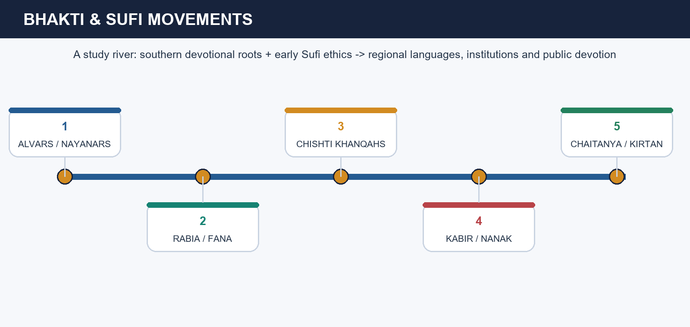

*Topic cover — a deterministic concept river, not a claim of one-way influence.*

## Package scope, source order and evidence discipline

- This is a complete Guided-Tutor-style learning session, not a short revision substitute. It contains 15 teaching modules, 16 distributed learning MCQs, four routed PYQs, 40 original broad-coverage MCQs, 12 remedial MCQs, and ten solved Mains answers (two routed PYQs plus eight originals).
- **Source order used:** Topic 10 basic Markdown → Topic 10 advanced Markdown → master chronology, answer-worthiness audit and PYQ routing ledgers/local official papers → OCR-searchable Satish Chandra *Medieval India: From Sultanat to the Mughals, Part I* → no live anchor because a modern heritage/commemoration page would not improve proof of medieval facts → Qdrant not needed.
- OCR corroboration was used for the early Sufi, Chishti/Suhrawardi and Bhakti chapters. The package preserves the local source’s cautions on Chishti conversion claims, Kabir’s oral/later corpus, Ramananda genealogies, Nimbarka chronology and Kulah-Daran provenance.
- All 27 visuals are original deterministic PNGs, including the cover. Geographic sketches say **SCHEMATIC — NOT TO SCALE**. Every image reference is repository-relative.
- **PYQ key rule:** 2019 and 2022 Prelims official keys are absent locally. Their inferences are labelled prominently and never called official. The 2018 and 2021 Mains wording below was verified against local official papers.

## Guided Tutor roadmap

| Stage | Subtopic | Retrieval output |
|---|---|---|
| Foundation | plural definitions; early Sufi terms | define without flattening |
| Core | Chishti/Suhrawardi institutions | explain popularity and comparison |
| Core | southern roots; Kabir; Nanak; Chaitanya | chronology + named evidence |
| Advanced | literature, gender, caste, symbiosis | qualified cultural/social analysis |
| Exam | PYQs, MCQs, Mains models | claim → evidence → limit |

## How to use the learning session

Read each module in the order **visual → evidence → mechanism → limit → question**. Facts state what the local source base supports; analysis is a reasoned synthesis; limits stop a memorable story from becoming an overclaim. The repeating Mains discipline is **claim → named evidence/example → what it proves → qualification → verdict**.

## 01. Roadmap: a plural field, not two monoliths

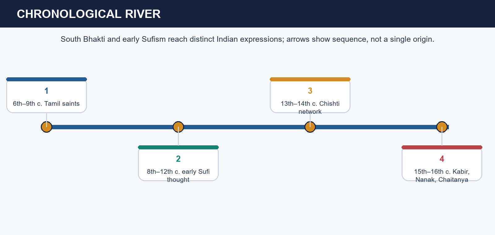

*01. Roadmap: a plural field, not two monoliths — compact retrieval visual.*

[FACT] “Bhakti” names forms of devoted relation to a chosen divine reality; “Sufism” names Islamic mystical traditions that sought nearness to God through discipline, love and remembrance. Neither expression identifies a single medieval organisation with one founder, uniform doctrine, social base or chronology. In India, Bhakti included Tamil Shaiva and Vaishnava hymn traditions, Vedanta-inflected schools, Rama and Krishna devotional worlds, nirguna critique, regional literary communities and temple-centred practices. Sufism included several silsilahs, varying relations to law, music, urban life, shrine practice and political authority.

[ANALYSIS] The exam advantage of this opening is analytical control. A comparison must begin by separating **a family of orientations** from **an institutionally organised order**. Bhakti could be anchored in a temple, a guru, a song community or a poet-saint’s remembered corpus. A Sufi silsilah normally made the pir–murid relation, authorised succession and a khanqah more visible as institutions. But this contrast is a tendency, not a rule that erases diversity. It explains why a shared word such as love can create contact without making all actors doctrinally identical.

[LIMIT] Do not replace a communal binary with a sentimental binary. Devotional and mystical currents could generate hospitality, ethical critique and new idioms of dignity; they could also operate within inherited caste, gender, property and institutional hierarchies. “Popular” does not mean socially uniform, and “inclusive” does not mean that every boundary ended. The package therefore uses a constant answer rule: **claim → named example → mechanism → limitation**.

The chronological river starts with south Indian devotional poetry and early Islamic mystical reflection rather than presenting a sudden fifteenth-century awakening. It then follows the thirteenth- and fourteenth-century Chishti network, northern vernacular traditions, Kabir and Nanak, and Chaitanya’s Bengal–Puri kirtan. The river is not an arrow of one-way influence. It is a retrieval device: multiple currents met in a medieval landscape of towns, craft groups, shrines, pilgrimage, courts, temples and regional languages.

### Q1. Which definition is most defensible?

A. Bhakti is a family of devotional orientations, not one centrally governed organisation.

B. Bhakti was a single empire-wide church.

C. Bhakti was identical to every temple ritual.

D. Bhakti began only after the Delhi Sultanate.

**Answer:** **A**

**Explanation:** **A** is correct because Bhakti names diverse devotional orientations rather than a centrally governed body. **C** (“Bhakti was identical to every temple ritual”) mistakes one important setting for the whole field, which also included poet-saints, gurus and regional performance traditions.

## 02. Early Sufi development: love, fana and disciplined community

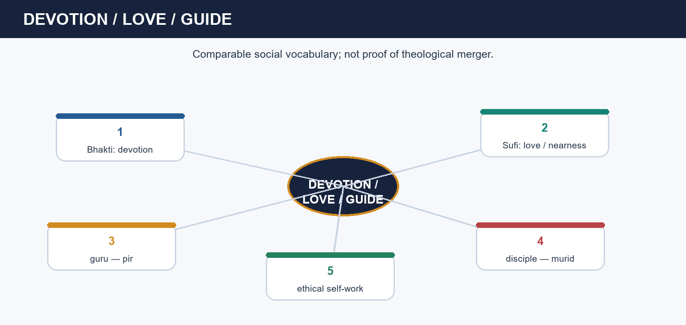

*02. Early Sufi development: love, fana and disciplined community — compact retrieval visual.*

[FACT] Early Sufi history precedes the Indian silsilahs. Rabia of Basra is conventionally associated with disinterested love of God: devotion not reduced to fear of punishment or desire for reward. Mansur al-Hallaj’s execution became emblematic of the controversy around ecstatic utterance and mystical union. **Fana** denotes the passing away of egocentric selfhood before God; it should not be flattened into a casual synonym for political rebellion or simple pantheism. Al-Ghazali is important in the repository chronology as a major figure in reconciling mystical life with orthodox Islamic thought.

[ANALYSIS] These references show that Sufism brought an Islamic intellectual and ethical genealogy to India. It was not invented by Indian local contact. Yet forms of discipline and social organisation were historically mobile. The source spine notes interaction with Buddhist/Christian monastic patterns and with yogic practices such as breathing control. The defensible conclusion is two-layered: Sufi metaphysical and scriptural self-understandings remained Islamic, while techniques, vocabulary and social practices could be adapted in new regional environments.

An order’s vocabulary marks this structure. A **silsilah** is a chain/order of spiritual transmission. A **pir** guides a **murid**; an authorised **khalifa** can act as successor or deputy. A **khanqah** is a hospice/community institution where discipline, teaching, hospitality and counsel may converge. A **wali** is a saintly friend of God in a wider devotional idiom. **Sama** refers to devotional audition/listening, often involving poetry and music; its legitimacy was debated and cannot be made a universal Sufi rule. **Ziyarat** refers to visiting a saint’s tomb or shrine, again with practices and evaluations that varied.

[LIMIT] Vocabulary is not a shortcut to social uniformity. A person’s use of sama does not establish a uniform legal view, and a shrine visit does not tell us the precise belief of every participant. UPSC rewards the distinction between what a term denotes and what a source can prove about scale, intention or reception.

*Supplementary retrieval visual for 02. Early Sufi development: love, fana and disciplined community.*

### Q2. Which early Sufi vocabulary is correctly paired?

A. Silsilah: a land-revenue grant.

B. Fana: dissolution of the ego/self in mystical union.

C. Khanqah: a royal court chronicle.

D. Ziyarat: a formal tax assessment.

**Answer:** **B**

**Explanation:** **B** is correct because *fana* denotes the effacement of ego/self in mystical experience. **A** (“Silsilah: a land-revenue grant”) fails because a *silsilah* is a chain of spiritual transmission, not a fiscal assignment.

## 03. Ba-shara, be-shara and the institutional grammar of Sufism

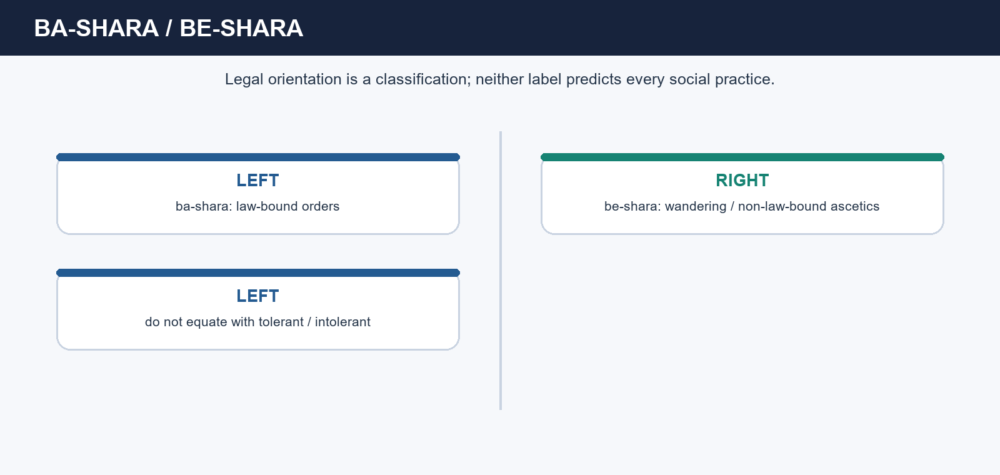

*03. Ba-shara, be-shara and the institutional grammar of Sufism — compact retrieval visual.*

[FACT] The basic source distinguishes **ba-shara** orders, understood as bound by the sharia, from **be-shara** wandering saints or qalandars who were not similarly law-bound. The two major ba-shara orders highlighted for north India are the Chishtis and Suhrawardis. This is a classification of normative orientation and form of discipline, not a one-word moral judgement about tolerance, austerity or political opposition.

[ANALYSIS] The distinction explains why the phrase “the Sufis believed” is normally too blunt. An order could value a lineage, discipline, supervised discipleship and a khanqah while still differ in wealth, relation to rulers, music, travel and local language. Wandering ascetics might be more visibly unconventional in one setting, but their classification does not prove that they were automatically socially radical or that law-bound orders were socially closed. Ask instead: What was the relation to law? Who authorised a disciple? Which institution sustained everyday contact? How did the group negotiate urban society and political power?

The institutional grammar matters for Mains answers. A khanqah was neither a modern welfare office nor merely an isolated retreat. It could provide food, counsel, a setting for instruction, space for visiting disciples and a reputation for ethical authority. The pir–murid relation made spiritual instruction personal but did not make every order a private household. A silsilah permitted continuity through remembered chains, while shrine and literary memory could deepen authority after a saint’s death.

[LIMIT] Later shrine memory can preserve a real institutional inheritance while also idealising a saint or compressing chronology. It cannot by itself be used as a census of medieval visitors or as proof that every person interpreted a saint identically. Keep the source question visible: hagiography is strong for remembered charisma and devotional norms; court records may be stronger for formal office; architecture can show a built complex but not every individual motive.

### Q3. What does ba-shara primarily classify?

A. All saints who used Hindawi.

B. Every hereditary shrine custodian.

C. Sufi formations understood as bound by the sharia.

D. Any group that rejected music.

**Answer:** **C**

**Explanation:** **C** is correct because *ba-shara* marks Sufi formations understood as bound by the sharia. **D** (“Any group that rejected music”) substitutes an attitude toward *sama* for the legal-normative distinction; musical audition was debated and was not the classifier.

## 04. The Chishtis: line, place, service and state-distance

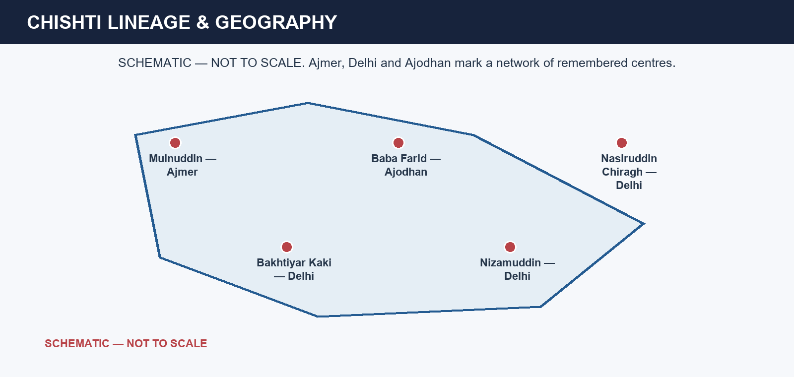

*04. The Chishtis: line, place, service and state-distance — compact retrieval visual.*

[FACT] The Chishti line in the repository spine runs through Muinuddin Chishti at Ajmer, Bakhtiyar Kaki at Delhi, Baba Farid at Ajodhan, Nizamuddin Auliya at Delhi and Nasiruddin Chiragh-i-Delhi. Muinuddin’s settlement at Ajmer is placed around the early thirteenth century; he died in 1235. Nizamuddin died in 1325. These centres form a network rather than a modern administrative map. The geography visual is explicitly schematic and not to scale.

[ANALYSIS] Chishti popularity is best explained as a combination: poverty/simplicity created moral credibility; hospitality and service made the khanqah socially accessible; sama and local linguistic contact could create emotional participation; and relative distance from court office protected a reputation for autonomy in a politically unstable Sultanate world. Nizamuddin’s long career in Delhi is valuable evidence of this mechanism: he remained socially influential amid dynastic shifts without converting his khanqah into an organ of royal power.

The source specifically cautions against a conversion-machine account. Muinuddin’s primary object is described as helping Muslims live a life of devotion, not seeking conversions. The point is not that no individual conversion ever occurred near a shrine or that all encounters were identical. It is that a causal explanation of Chishti popularity must not invent a single proselytising programme when service, discipline, counsel, music and shared local space offer more source-grounded mechanisms.

[LIMIT] “State-distance” is not an absolute ban on rulers, gifts, visitors or political awareness. Nor does poverty mean that every khanqah lacked resources. In an answer, write “a tendency to preserve distance from courtly office” rather than “never met a ruler.” This calibrated phrasing makes the Chishti–Suhrawardi comparison accurate and avoids turning an institutional history into a saintly caricature.

### Q4. What best describes Chishti political posture?

A. A permanent ban on every encounter with rulers.

B. An exclusive commitment to military conquest.

C. A doctrine that every Sufi accepted royal grants.

D. A tendency to avoid courtly office and cultivate social credibility through service.

**Answer:** **D**

**Explanation:** **D** is correct because the source describes a tendency to avoid courtly office while building moral credibility through service. **A** (“A permanent ban on every encounter with rulers”) turns that calibrated institutional tendency into an absolute, which the source expressly cautions against.

## 05. Chishti khanqah, sama and the social ecosystem

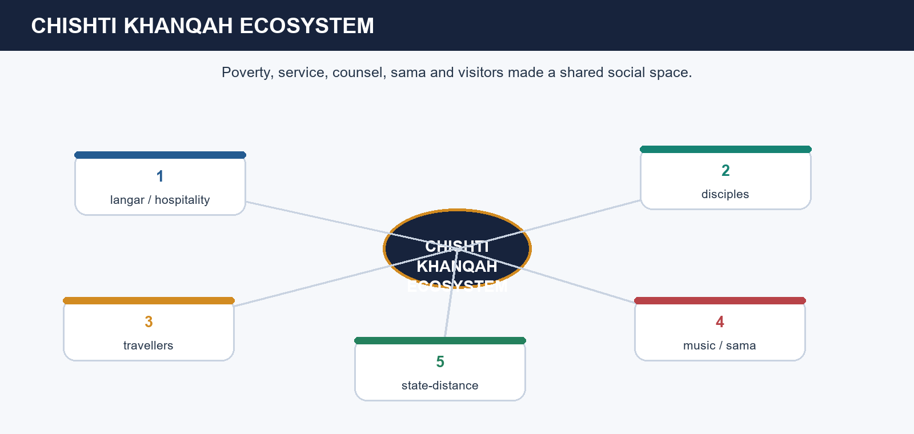

*05. Chishti khanqah, sama and the social ecosystem — compact retrieval visual.*

[FACT] Chishti sources emphasise simplicity, poverty, humility, service, tolerance and honest work. The repository notes Chishti association with **sama**, and records local contact through Hindawi/Hindi verses and encounters with Hindu/Jain yogis. Nizamuddin Auliya’s association with yogic breathing is presented as an example of practical contact; yogis are reported to have called him a sidh.

[ANALYSIS] Treat the khanqah as a social ecosystem. A visitor could encounter a pir’s ethical authority, fellow disciples, hospitality, devotional listening, local speech and a reputation for refusing worldly prestige. This explains why a Sufi centre could matter to urban and semi-urban social life without being reducible to a court, mosque, market or temple. Sama is especially useful as a mechanism: poetry and listening can make a doctrinal idiom emotionally shareable across levels of literacy. It does not follow that every listener shared the same theology, nor that music alone caused popularity.

The same caution applies to yogic interaction. Breath control and local terms can signal contact in a shared social field. They cannot prove that Sufism “came from” yoga, that all Sufis used yogic practice, or that Hindu and Muslim doctrinal worlds merged. The source’s balanced frame is stronger: Muslim mystical currents maintained an Islamic ideological frame while their Indian forms could be affected by local disciplines and social interaction.

[LIMIT] Avoid two opposite mistakes. First, do not deny contact because traditions were distinct. Second, do not make contact into wholesale borrowing because an anecdote is striking. A high-quality answer uses Nizamuddin’s breathing association as a bounded example, then adds the limitation: an individual practice is not proof of systematic institutional adoption.

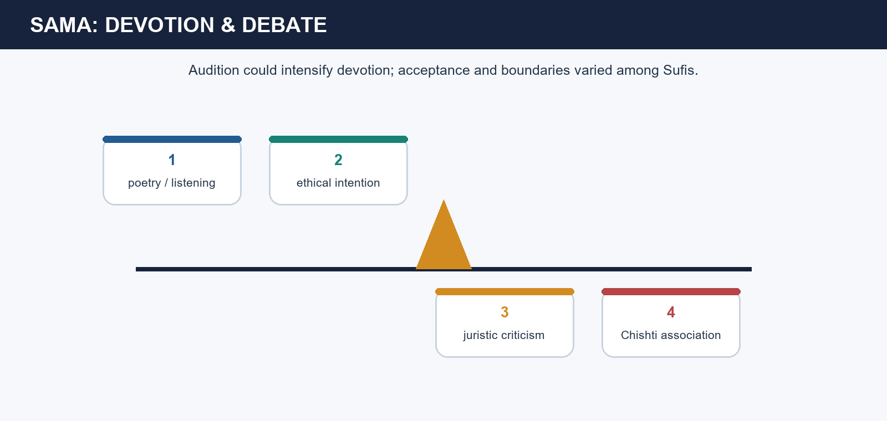

*Supplementary retrieval visual for 05. Chishti khanqah, sama and the social ecosystem.*

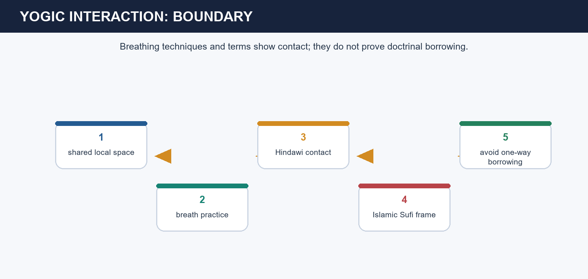

*Supplementary retrieval visual for 05. Chishti khanqah, sama and the social ecosystem.*

### Q5. Which association fits the Suhrawardi order in the repository source?

A. Bahauddin Zakariya, Multan, and relatively greater acceptance of grants/state ties.

B. Nizamuddin Auliya, Ajmer, and compulsory renunciation of law.

C. Chaitanya, Puri, and Krishna kirtan.

D. Madhva, Udupi, and Dvaita.

**Answer:** **A**

**Explanation:** **A** is correct because Bahauddin Zakariya, Multan and relatively readier acceptance of grants/state ties form the stated Suhrawardi association. **B** wrongly relocates Nizamuddin Auliya from Delhi to Ajmer and falsely assigns him compulsory renunciation of religious law.

## 06. Suhrawardis: comparison without a moral binary

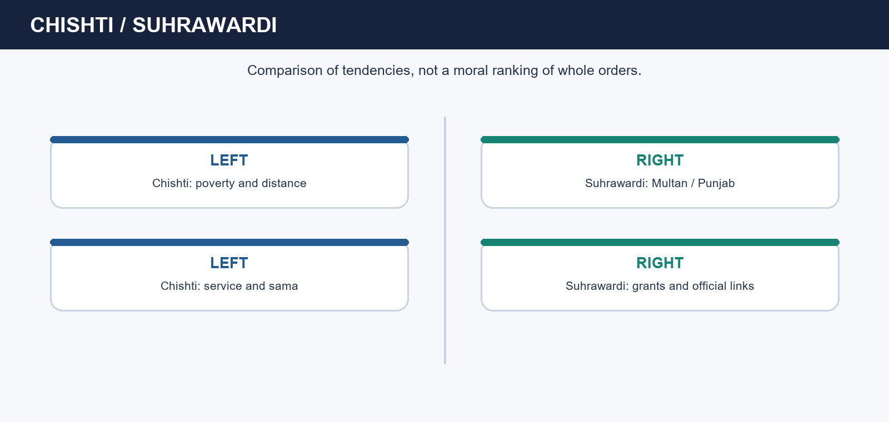

*06. Suhrawardis: comparison without a moral binary — compact retrieval visual.*

[FACT] The Suhrawardi order is associated in the source spine with Punjab and Multan, and with Bahauddin Zakariya. In comparison with Chishtis, Suhrawardis accepted grants and state connections more readily; some held official positions. This does not mean that every Suhrawardi was wealthy, every Chishti was materially detached, or that one order was ethically “good” and the other “bad.”

[ANALYSIS] The comparison lets an answer show that mysticism was not outside institutions. A religious order could gain urban influence through official links, grants, learned authority and connections to commercial or regional centres. A Chishti khanqah could gain credibility through public service and refusal of courtly incorporation. Both strategies required social organisation; they simply made different bargains with wealth and state proximity. Multan and Punjab were not passive margins but important nodes of travel, learning and regional power.

Use a four-cell comparison in Mains answers: (1) geography—Ajmer/Delhi/Ajodhan versus Multan/Punjab; (2) political posture—relative Chishti distance versus greater Suhrawardi acceptance of grants; (3) ethical-social idiom—poverty/service versus learned/official connections; (4) qualification—neither column is an unchanging universal. This is more accurate than pairing “liberal Chishti” with “orthodox Suhrawardi,” labels that flatten actual variation.

[LIMIT] State connection cannot be treated as evidence of spiritual insincerity, just as poverty cannot prove that a group was socially revolutionary. The historical question is institutional: how did resources, authority and public credibility interact? This keeps the answer analytical rather than hagiographic.

### Q6. Why is yogic interaction a methodological caution?

A. Breathing practice proves Sufism originated in yoga.

B. Borrowed techniques or terms can show contact without proving a wholesale doctrinal fusion.

C. A yogi's visit establishes a shared scripture.

D. Hindawi verses eliminate Islamic intellectual genealogy.

**Answer:** **B**

**Explanation:** **B** is correct because a borrowed technique or shared term can evidence contact without establishing doctrinal derivation. **A** (“Breathing practice proves Sufism originated in yoga”) ignores the earlier Islamic mystical genealogy and makes one bounded practice prove a total origin claim.

## 07. Southern devotional roots and distinct Vedanta articulations

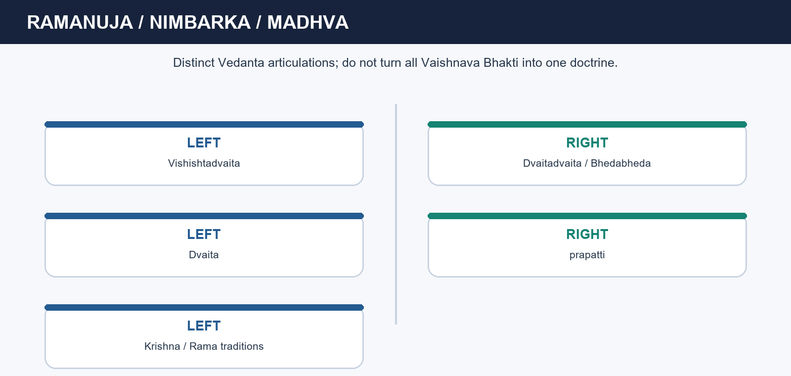

*07. Southern devotional roots and distinct Vedanta articulations — compact retrieval visual.*

[FACT] South Indian Bhakti has deep roots in the Tamil hymn traditions of the Alvars (Vaishnava) and Nayanars (Shaiva). These traditions demonstrate that devotion, poetry and popular religious participation did not begin with Indo-Islamic contact. The source notes egalitarian features among Alvars and Nayanars, alongside a later moderation of such impulses through temple-centred ritual and Brahmanical authority.

Ramanuja is associated with **Vishishtadvaita** and with the bridge between popular **prapatti** (surrender) and Vedic tradition; the source presents him as widening bhakti access across castes. Nimbarka is associated with **Dvaitadvaita/Bhedabheda** and Krishna–Radha devotion. Madhva is associated with **Dvaita**. These are distinct doctrinal articulations; exact dates and some transmission histories require caution, especially for Nimbarka. The secure Prelims route is doctrine plus devotional association, not a falsely precise chronology.

[ANALYSIS] The comparison exposes a major trap: “Bhakti” is neither a synonym for non-dualism nor for one social policy. Ramanuja’s qualified non-dual framework, Nimbarka’s difference-and-non-difference articulation, and Madhva’s dualism give different conceptual accounts of relation between divine and soul. Yet each could sustain devotion. The analytical point is not to write a philosophy optional answer, but to show why a single saguna/nirguna or “reform/orthodoxy” label cannot exhaust the field.

[LIMIT] Temple institutions can preserve and expand devotional forms while also mediating access through hierarchy. Therefore an answer may state that Bhakti made powerful claims of access and surrender, but should not convert that moral opening into proof that caste hierarchy disappeared. The source’s south Indian sequence is precisely useful because it holds early egalitarian resonance and later institutional constraint together.

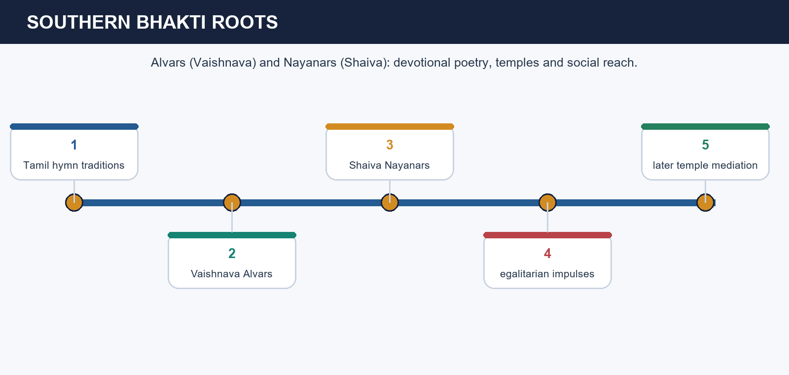

*Supplementary retrieval visual for 07. Southern devotional roots and distinct Vedanta articulations.*

### Q7. Which statement captures the southern roots of Bhakti?

A. They were two Sufi silsilahs founded in Delhi.

B. They were Mughal revenue officials.

C. Alvars and Nayanars produced Tamil devotional traditions with Vaishnava and Shaiva orientations.

D. They were later Sikh military institutions.

**Answer:** **C**

**Explanation:** **C** is correct because the Alvars and Nayanars were Tamil Vaishnava and Shaiva poet-saint traditions that predate the Sultanate-centred northern story. **A** recasts them as Delhi Sufi *silsilahs*, confusing southern devotional lineages with Islamic orders.

## 08. Northward transmission, Ramananda and hagiographic caution

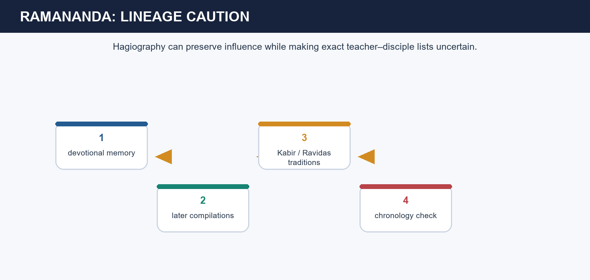

*08. Northward transmission, Ramananda and hagiographic caution — compact retrieval visual.*

[FACT] The repository’s timeline associates Namadeva and Ramananda with the fourteenth- and fifteenth-century northward transmission of popular Bhakti. Traditions linked to Ramananda include Ravidas, Kabir, Sena and Sadhana, and represent an opening of devotion across caste boundaries. The source explicitly adds that exact teacher–disciple chronology is not equally secure for every name.

[ANALYSIS] This is not a reason to discard Ramananda. It is a reason to define the claim carefully. Hagiography and later devotional compilation can preserve a community’s memory of spiritual affinity, pedagogic descent and inclusive aspiration. They may also compress time, create exemplary lineages and arrange saints into a cleaner succession than independent contemporary evidence permits. The best historical statement is therefore: Ramananda traditions became an important vehicle for imagining wider access to devotion; the exact genealogical list should be used as tradition unless corroborated.

Namadeva helps break the misleading map in which medieval Bhakti simply begins in Tamil country and jumps straight to Kabir. Maharashtrian devotional currents, pilgrimage routes, literary circulation, local craft and regional speech all contributed to a field of transmission. “Northward” should not be read as one preacher’s unilateral migration. It names a web of practices, remembered saints and vernacular worlds.

[LIMIT] Do not claim that caste-crossing devotional traditions automatically dissolved caste in local marriage, occupation, temple control or political authority. Their significance lies in a revaluation of spiritual worth and access; their limitation lies in the persistence and adaptation of social structure. This distinction turns a narrative of saints into a historical argument about moral vocabulary and institutional endurance.

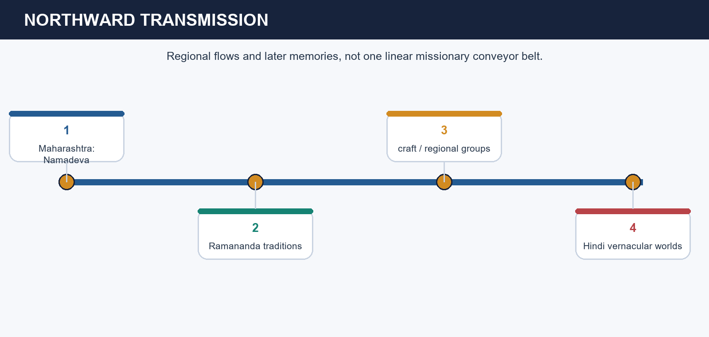

*Supplementary retrieval visual for 08. Northward transmission, Ramananda and hagiographic caution.*

### Q8. Which doctrinal pairing is correct?

A. Ramanuja: Dvaita; Nimbarka: Advaita; Madhva: Sufism.

B. Ramanuja: ba-shara; Nimbarka: be-shara; Madhva: sama.

C. Ramanuja: Chishti; Nimbarka: Suhrawardi; Madhva: Qalandar.

D. Ramanuja: Vishishtadvaita; Nimbarka: Dvaitadvaita/Bhedabheda; Madhva: Dvaita.

**Answer:** **D**

**Explanation:** **D** is correct: Ramanuja is associated with Vishishtadvaita, Nimbarka with Dvaitadvaita/Bhedabheda, and Madhva with Dvaita. **A** scrambles those Vedanta positions and then assigns Madhva to Sufism, a different religious-intellectual tradition altogether.

## 09. Kabir: critique, corpus and institutional limits

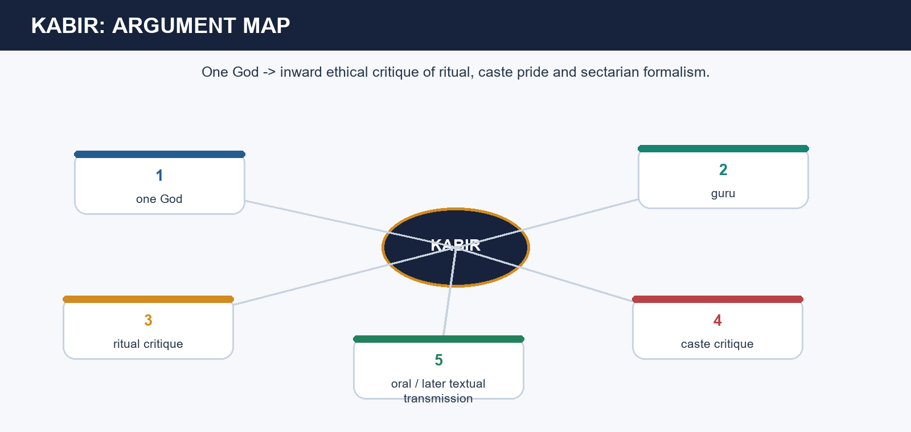

*09. Kabir: critique, corpus and institutional limits — compact retrieval visual.*

[FACT] Kabir’s remembered teaching centres on one God, the importance of a true guru and a critique of empty ritual, idol worship, pilgrimage, caste discrimination and sectarian formalism. The source notes that his equality followed from belief in one God. It also warns that Kabir’s message was transmitted orally and written down later, with additions and alterations possible.

[ANALYSIS] Kabir is powerful for a Mains answer because his critique works on more than one target. He does not merely oppose one community to another; he questions religious externalism, inherited status and the confidence that ritual performance alone yields spiritual truth. This makes his language a resource for a shared ethical vocabulary. But it is a historical error to call him a modern social reformer with a legislative programme. His idiom is devotional, moral and guru-centred, not a blueprint for a modern state or a completed egalitarian institution.

Textual method is central. Oral transmission gives access to performance, memory and community reception. Later compilations preserve a corpus but may vary by sectarian location and editorial history. No single verse should be treated as an unquestioned autograph simply because it is familiar today. In an answer, write “Kabir’s remembered corpus” or “later Kabir traditions” when the provenance of a precise wording is uncertain. This is not evasiveness; it signals historical discipline.

[LIMIT] Kabir’s critique created a climate of opinion rather than an immediate collapse of caste, religious boundary or hierarchy. Panths and later communities had their own institutional histories. Thus the strongest verdict is neither “Kabir changed nothing” nor “Kabir abolished caste”; it is that one-God language destabilised moral justifications for status while social structures persisted.

### Q9. How should Ramananda's disciple lists be used?

A. As influential devotional tradition, while exact teacher–disciple chronology is qualified where evidence is late.

B. As a court register with unchallengeable dates.

C. As proof that every northern saint met Ramananda.

D. As evidence that Bhakti had no caste-crossing appeal.

**Answer:** **A**

**Explanation:** **A** is correct because the lists can preserve influential devotional memory while exact teacher-disciple chronology remains hagiographically mediated. **B** treats a tradition shaped by later transmission as a contemporaneous court register, a source-provenance claim the evidence cannot sustain.

## 10. Guru Nanak: ethical monotheism and the householder path

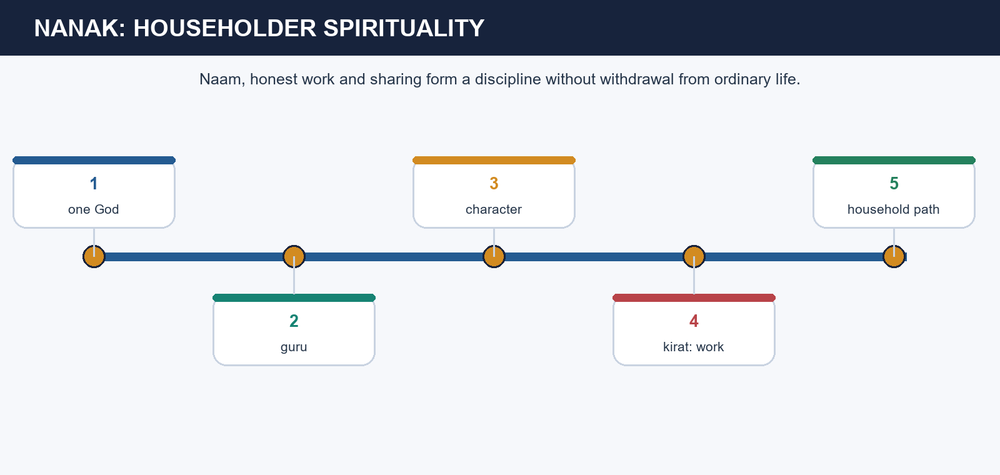

*10. Guru Nanak: ethical monotheism and the householder path — compact retrieval visual.*

[FACT] Guru Nanak, born in 1469 in the repository chronology, stressed one God, the guru, purity of character, honest work and household life. He criticised empty ritual and renunciation as sufficient routes to spiritual truth. The basic source says Nanak did not intend to found a new religion; his ideas later gave rise to Sikhism. The chronology notes a 1538/1539 death-date discrepancy, with standard Sikh chronology generally using 1539.

[ANALYSIS] Nanak’s distinctive contribution is an ethic of spirituality in ordinary social life. The householder path links remembrance and moral character to labour, family responsibility and sharing rather than making withdrawal from work the sole ideal. This is why a comparison with Kabir should identify both overlap and difference. Both criticise ritualism and caste pride through a one-God orientation. Nanak’s remembered teaching gives special weight to disciplined life within work and household; Kabir’s corpus is particularly marked by sharp idioms of critique and oral-textual plurality.

The caution about later Sikh history is not a denial of continuity. It is a chronology rule. Later Gurus, communities, institutions, texts and political developments shaped Sikh history in ways that should not be treated as already complete in Nanak’s lifetime. An answer that collapses all later institutional forms into the first Guru loses the very historical process it is asked to explain.

[LIMIT] The householder ideal did not mean that social hierarchy vanished among all followers. It offered an ethical grammar through which ordinary life could be dignified; it did not mechanically transform every social relation. This is the same climate-of-opinion versus structural-change distinction that is essential across the topic.

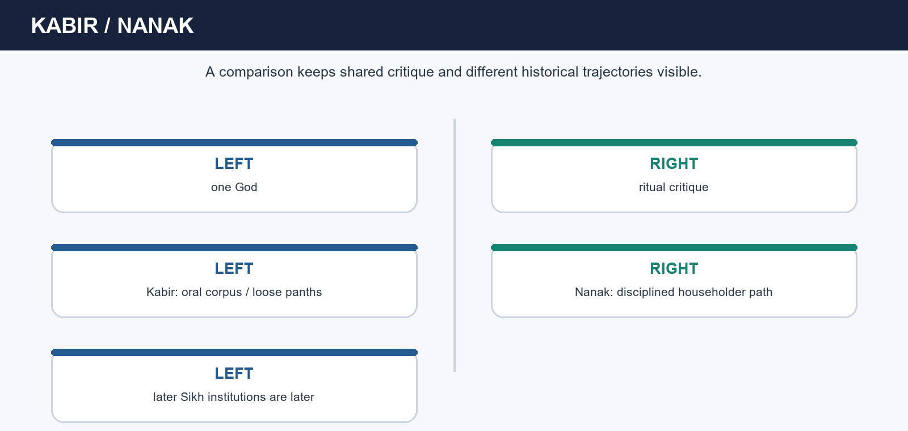

*Supplementary retrieval visual for 10. Guru Nanak: ethical monotheism and the householder path.*

### Q10. Kabir's critique is best described as

A. a plan for a new Sultanate revenue system.

B. a one-God, inwardly ethical critique of ritualism, caste pride and sectarian formalism.

C. an endorsement of pilgrimage as sufficient salvation.

D. a call to reduce devotion to Sanskrit scholasticism.

**Answer:** **B**

**Explanation:** **B** is correct because Kabir’s remembered idiom joins one-God devotion to critique of empty ritual, caste pride and sectarian formalism. **C** (“an endorsement of pilgrimage as sufficient salvation”) reverses the inward ethical test central to that critique.

## 11. Chaitanya and the reorientation of Bhakti

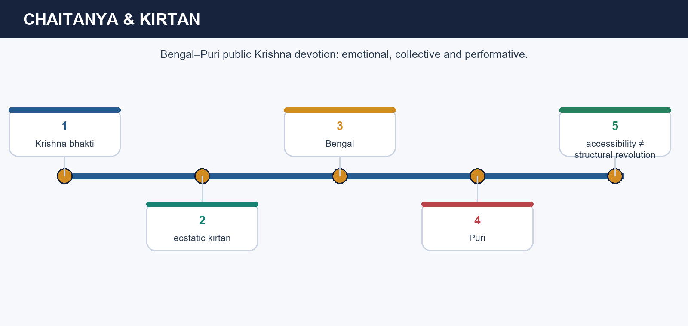

*11. Chaitanya and the reorientation of Bhakti — compact retrieval visual.*

[FACT] Chaitanya (1486–1533) is associated with Bengal and Puri and with ecstatic Krishna **kirtan**. The source presents him as energising/reorienting Bhakti by making devotion emotional, public and accessible through collective performance. The 2018 GS-I PYQ asks precisely about this “remarkable re-orientation.”

[ANALYSIS] A good answer identifies five linked changes. First, Chaitanya intensified Krishna-centred Vaishnava devotion through affective love rather than only philosophical exposition. Second, kirtan made participation collective: song, rhythm and memory allowed devotion to travel beyond elite textual learning. Third, Bengal and Puri connected a regional devotional movement to pilgrimage and public space. Fourth, performance reshaped the idiom of accessibility—devotion could be enacted, heard and shared. Fifth, this reorientation helped stimulate literary and cultural worlds around Krishna devotion.

The word “reorientation” does not mean that Chaitanya invented Bhakti. Southern Vaishnava and Shaiva traditions, Ramanuja, Nimbarka and other devotional formations predate him. Nor does it mean that every later Bhakti saint copied Chaitanya. It means that a particular Krishna-centred, emotionally intense and publicly performed mode acquired striking force in Bengal–Puri contexts and became an important cultural reference.

[LIMIT] Emotional accessibility should not be inflated into a complete programme of structural reform. Kirtan could widen devotional participation while social hierarchy, gender constraints and institutional mediation continued. The graded conclusion is therefore: Chaitanya widened the affective-public horizon of Bhakti and reoriented its performance, but did not erase the plurality or limits of medieval devotional society.

### Q11. Guru Nanak's teaching highlights

A. royal service as the only spiritual discipline.

B. a rejection of all work and family life.

C. the guru, truthful character, work and household life rather than renunciation.

D. the already completed later Sikh institutional order.

**Answer:** **C**

**Explanation:** **C** is correct because Nanak’s teaching joins guru, truthful character, work and household responsibility rather than renunciation. **D** projects the already formed later Sikh institutional order back into Nanak’s own historical moment, erasing subsequent development.

## 12. Bhakti literature, vernacularisation and cultural contribution

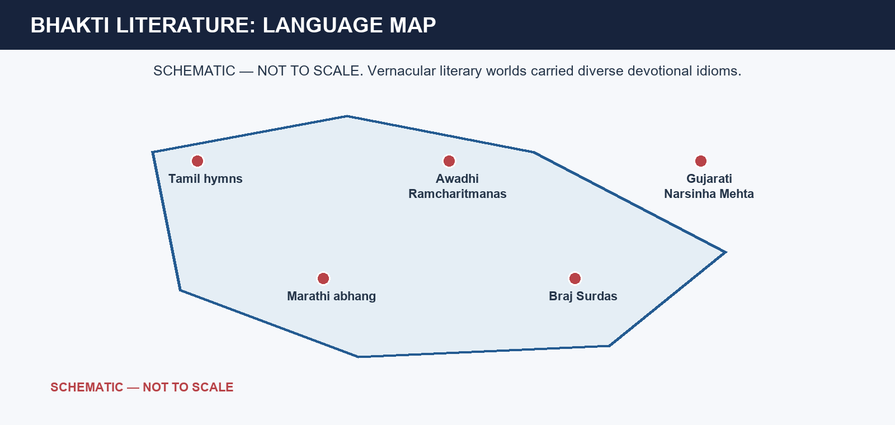

*12. Bhakti literature, vernacularisation and cultural contribution — compact retrieval visual.*

[FACT] Bhakti literature spread through multiple regional languages and genres. The source engine identifies Tulsidas’s *Ramcharitmanas* in Awadhi, Surdas’s Krishna lyrics in Braj Bhasha, Meera’s Rajasthani/Hindi Krishna devotion, Eknath and Tukaram in Marathi, and Narsinha Mehta in Gujarati. Tamil Alvar/Nayanar hymns supply an earlier southern literary field. These examples should not be fused into one uniform doctrine or exact chronological sequence.

[ANALYSIS] The 2021 GS-I demand asks for the “nature” and cultural contribution of Bhakti literature. Its nature was devotional, lyrical, performative, regional and often accessible through song rather than only scholastic exposition. Vernacularisation was a mechanism: composition in regional speech met singing, recitation, pilgrimage, community memory and later manuscript/print circulation. This expanded cultural reach without implying that Sanskrit disappeared or that all listeners were illiterate. It also made emotional relations—love, longing, surrender, separation, service—into durable literary idioms.

Its cultural contribution includes enrichment of regional languages, new poetic forms, shared repertoires of performance, links across social groups and the articulation of women’s devotional voices such as Meera’s. It also created a memory archive through which later communities recognised saints, places and ethical ideals. But the contribution is not best measured by claiming a single “national culture” before modern nationalism. It is better described as overlapping regional cultural worlds whose devotional idioms travelled and interacted.

[LIMIT] A literary voice is not a social census. Meera illustrates devotional agency but cannot prove universal female emancipation. Anti-caste language can contest status while caste endures in communities. A strong evaluation ends with this balance: Bhakti literature democratised idiom and affect more reliably than it transformed every material hierarchy.

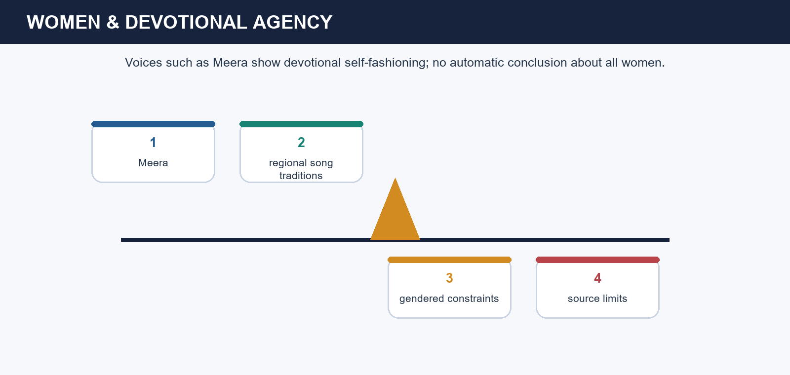

*Supplementary retrieval visual for 12. Bhakti literature, vernacularisation and cultural contribution.*

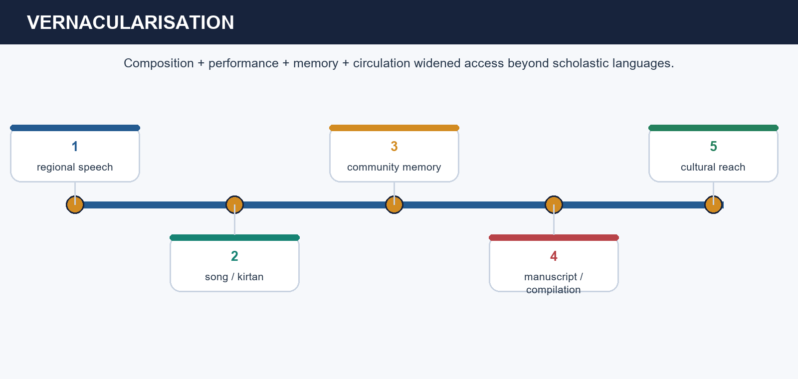

*Supplementary retrieval visual for 12. Bhakti literature, vernacularisation and cultural contribution.*

### Q12. What made Chaitanya's reorientation distinctive?

A. The abolition of all temple traditions by royal decree.

B. A Sufi legal manual issued from Multan.

C. A denial of emotion in devotional practice.

D. Ecstatic, collective Krishna kirtan in Bengal and Puri made devotion publicly affective.

**Answer:** **D**

**Explanation:** **D** is correct because collective, ecstatic Krishna *kirtan* in Bengal and Puri made devotion publicly affective and performative. **A** invents a royal abolition of temple traditions, whereas the discriminator is devotional performance, not state coercion.

## 13. Saguna, nirguna, gender and social reach

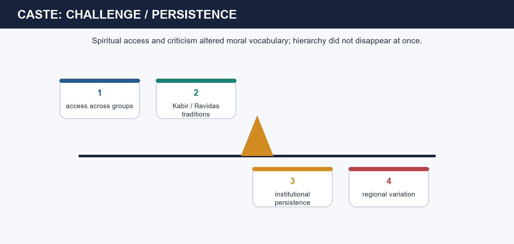

*13. Saguna, nirguna, gender and social reach — compact retrieval visual.*

[FACT] The repository explicitly treats saguna and nirguna as analytical groupings rather than rigid organisations. Saguna traditions may be associated with devotion to a divine form such as Rama or Krishna; nirguna language is associated in this topic with Kabir and Nanak’s critique of empty ritual and emphasis on one God. Saints differed in image, incarnation, scripture, social practice, institution and the role of guru.

[ANALYSIS] The spectrum is useful because it prevents two errors. First, it stops us from putting every Vaishnava poet in one fixed social category. Second, it stops us from treating nirguna critique as socially identical across Kabir, Nanak and later communities. For Mains, pair a doctrinal label with an actual mechanism: Chaitanya’s kirtan reoriented public Krishna devotion; Kabir’s one-God language criticised externalism; Nanak tied ethics to household work. Then add the social question: whose access widened, and which hierarchies remained?

Women’s devotional voices demand the same method. Meera’s remembered refusal of restrictive expectation and her Krishna-centred lyric voice can be used as evidence of agency and self-fashioning. It cannot stand as proof that patriarchy ceased, that every woman could circulate freely, or that all female-authored traditions had identical conditions. The distinction between a literary archive and a general social transformation is both historically honest and exam-useful.

[LIMIT] Do not reverse the qualification into cynicism. A climate of opinion matters. To make spiritual worth less dependent on pedigree, ritual expertise or elite language can alter social imagination even when institutions persist. The best verdict is graded: devotional traditions opened moral and expressive spaces, but their capacity to overturn hierarchy was uneven, mediated and historically limited.

### Q13. Saguna and nirguna should be treated as

A. analytical tendencies on a spectrum, not airtight organisations.

B. two medieval political parties with fixed membership lists.

C. a division between Hindus and Muslims.

D. a chronological division before and after 1526.

**Answer:** **A**

**Explanation:** **A** is correct because *saguna* and *nirguna* are analytical tendencies whose meaning must be tested against image, incarnation, guru and practice. **D** mistakes them for a before/after-1526 chronology, though they are doctrinal-devotional categories rather than dynastic periods.

## 14. Bhakti–Sufi comparison: symbiosis, parallel exchange, differences

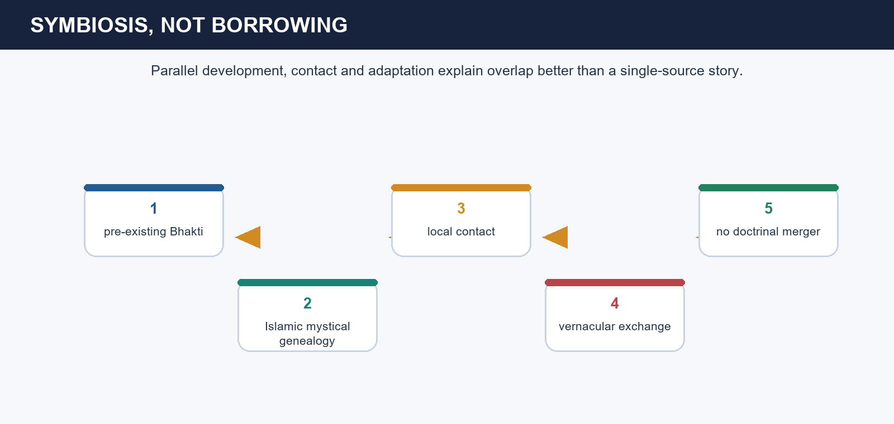

*14. Bhakti–Sufi comparison: symbiosis, parallel exchange, differences — compact retrieval visual.*

[FACT] Bhakti and Sufi currents can be compared through devotion/love, the importance of a guide (guru/pir), music or performance, local-language contact, criticism of empty ritual and social reach. They must also be distinguished through theology, scriptures, Islamic legal frames, Vedanta and devotional-philosophical contexts, order structures, temple/shrine institutions and historical genealogies. Satish Chandra’s framing cautions against both a defensive-reaction theory of Bhakti and a direct-borrowing theory from Sufism.

[ANALYSIS] **Symbiosis** is the stronger model. South Indian Bhakti clearly predates north Indian Sufi networks; early Sufi love and fana have an Islamic intellectual genealogy; medieval India nevertheless created shared spaces of language, music, craft, pilgrimage, urban life and ethical debate. In these spaces, traditions could take renewed notice of comparable vocabularies—love, the guide, inwardness, humility and criticism of ritualism—without becoming one doctrine. “Parallel exchange” is sometimes clearer than “syncretism” because it preserves difference and avoids implying an effortless fusion.

Use a two-column answer, then a bridge. Column one: Chishti khanqah, silsilah, pir–murid, sama, sharia-related classifications. Column two: Alvar/Nayanar roots, Vedanta diversities, guru-centred traditions, kirtan and vernacular devotional literature. Bridge: shared local social spaces allowed reciprocity of language and practice. Qualification: no source permits a mechanical one-direction model.

[LIMIT] A similarity is not a causal proof. Devotion, music and a spiritual guide can arise within distinct traditions. Conversely, difference does not mean no contact. This double discipline—avoid merger, avoid isolation—is the key to a high-quality comparison.

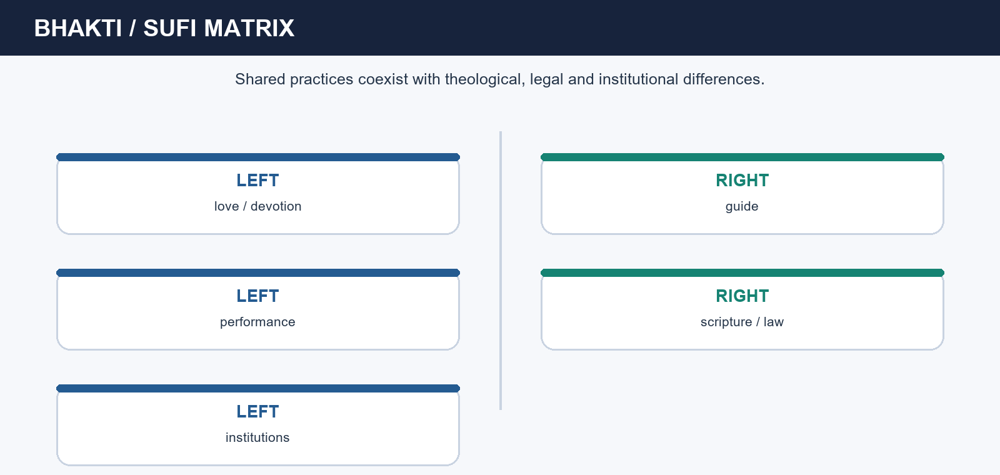

*Supplementary retrieval visual for 14. Bhakti–Sufi comparison: symbiosis, parallel exchange, differences.*

### Q14. Which statement is safest about women and Bhakti?

A. Every devotional community abolished patriarchy.

B. Meera's devotional voice shows agency, but it cannot by itself prove universal female emancipation.

C. Female authorship was absent from all regional traditions.

D. Gender mattered only in court chronicles.

**Answer:** **B**

**Explanation:** **B** is correct because Meera’s devotional voice evidences female agency while not functioning as a social census. **A** converts that possibility into an unsupported claim that every devotional community abolished patriarchy.

## 15. Sources, unusual terms and forward links

*15. Sources, unusual terms and forward links — compact retrieval visual.*

[FACT] The evidence base for this topic includes hagiographies, oral verse, later compilations, shrine/institutional memory, court chronicles and architecture/material culture. Each has a different reach. Hagiography can preserve remembered virtues, lineages and devotional imagination. Oral transmission reveals performance and memory but complicates exact wording. Later compilations preserve corpora while inviting attribution questions. Chronicles can show elite contexts but are not neutral social surveys. Shrine and built evidence show institutional persistence, not the private conviction of every visitor.

The unusual term **Kulah-Daran**, literally “cap-wearers,” belongs here only as a bounded Prelims extension. The source associates it with Sayyid phase/nobility in later Sultanate historical writing and warns that provenance in primary-source usage is weak. It must not be made a Chishti order, a Bhakti sect, a musical form or a central explanation of devotional history. The correct pedagogy is term → bounded association → provenance caution.

[ANALYSIS] The forward links should also be chronological. Bhakti literature prepares study of regional languages and later cultural memory. Nanak is a bridge to later Sikh history, but later institutional development must not be read back wholesale. Chishti/Suhrawardi material provides context for later Mughal religious-policy discussions, not a ready-made explanation of every Mughal decision. Living shrines and contemporary heritage practices can show continuity and adaptation, but a modern commemoration cannot prove a medieval motive.

[LIMIT] This package uses no live current-affairs anchor because a modern event would add little evidentiary value to a static medieval-history export and risks anachronism. The evidence order remains repository basic/advanced Markdown → chronology/audits/PYQ ledgers → OCR-searchable Satish Chandra Part I → no blocking Qdrant retrieval. That restraint is itself a source-method decision.

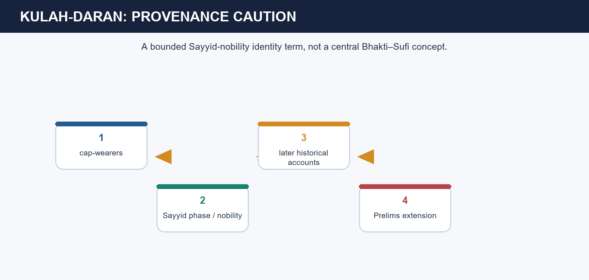

*Supplementary retrieval visual for 15. Sources, unusual terms and forward links.*

*Supplementary retrieval visual for 15. Sources, unusual terms and forward links.*

### Q15. What is the strongest account of Bhakti–Sufi interaction?

A. Sufism mechanically created all Bhakti traditions.

B. Bhakti had no pre-Islamic devotional history.

C. Symbiosis: contact and shared social vocabularies without a simple borrowing or merger thesis.

D. Similarity proves identical theology.

**Answer:** **C**

**Explanation:** **C** is correct because symbiosis allows local contact and shared social vocabularies while retaining independent intellectual genealogies. **D** treats resemblance as proof of identical theology, overlooking distinct scriptural, doctrinal and institutional histories.

## 16. Capstone source-method retrieval

### Q16. Which source-method statement is sound?

A. Later compilations reproduce every original utterance word for word.

B. Shrine memory can date every saint precisely.

C. A court chronicle makes devotional poetry unnecessary.

D. Oral verses and hagiographies need comparison with compilations, chronicles and material/institutional evidence.

**Answer:** **D**

**Explanation:** **D** is correct because oral verse and hagiography must be read alongside compilations, chronicles and material/institutional evidence, each for its proper reach. **A** grants later compilations verbatim authority over every original utterance, precisely the provenance assumption this method tests.

## Part III — Solved locally available UPSC Prelims PYQs

### PYQ 1 — UPSC Prelims GS-I 2019 Q13

**Exact locally preserved question (Series BKL-F-GHP):** Consider the following statements:

1. Saint Nimbarka was a contemporary of Akbar.  
2. Saint Kabir was greatly influenced by Shaikh Ahmad Sirhindi.

Which of the statements given above is/are correct?

A. 1 only  
B. 2 only  
C. Both 1 and 2  
D. Neither 1 nor 2

**INFERRED ANSWER — NOT OFFICIALLY VERIFIED. Confidence: high.** **D. Neither 1 nor 2.** The local routing ledger confirms that no 2018–2023 official Prelims key is held. The repository source places Nimbarka’s doctrinal world before the early-modern Akbar context, while also warning against falsely precise dating. Kabir belongs to the fifteenth-century devotional world; Shaikh Ahmad Sirhindi belongs to a later Mughal-era context. Therefore neither statement is historically defensible.

**Elimination logic:** Statement 1 is eliminated by broad chronology, not by claiming a disputed exact birth year. Statement 2 is eliminated because the alleged influence reverses chronology. This is a strong example of why a candidate should build a period map before relying on a familiar saint’s name.

### PYQ 2 — UPSC Prelims GS-I 2022 Q58

**Exact locally preserved question (Series VGYH-U-FGT):** With reference to Indian history, who of the following were known as “Kulah-Daran”?

A. Arab merchants  
B. Qalandars  
C. Persian calligraphists  
D. Sayyids

**INFERRED ANSWER — NOT OFFICIALLY VERIFIED. Confidence: high.** **D. Sayyids.** The local official question booklet is readable, but the official key is unavailable locally. The repository source identifies Kulah-Daran (“cap-wearers”) with Sayyid phase/nobility in later Sultanate historical writing and expressly asks for provenance caution.

**Elimination logic:** Arab merchants, Qalandars and Persian calligraphists are historically plausible medieval categories, which makes the question discriminating. But the supplied source route connects the term specifically with Sayyids. Retain the bounded association; do not manufacture a stronger primary-source claim or make the term central to Bhakti/Sufi history.

## Part IV — Solved routed UPSC Mains PYQs

### PYQ 3 — UPSC Mains GS-I 2018 Q11 — Discuss — 15 marks — 250 words

**Exact locally verified wording:** “The Bhakti movement received a remarkable re-orientation with the advent of Sri Chaitanya Mahaprabhu. Discuss. (Answer in 250 words)”

**Model solution**

Chaitanya Mahaprabhu (1486–1533) did not create Bhakti, whose Tamil, Vaishnava and Vedanta roots predated him. He nevertheless reoriented a major stream of it in Bengal and Puri by making Krishna devotion intensely affective, collective and publicly performed.

**Public affect and participation:** His ecstatic **kirtan** turned devotion from a primarily individual or learned practice into collective singing, movement and remembrance. The form enabled participation through sound, rhythm and shared memory, not only through scholastic command of Sanskrit. Bengal and Puri connected this practice to regional devotional communities and pilgrimage circuits.

**Krishna-centred emotional idiom:** Chaitanya gave powerful emphasis to loving attachment to Krishna. This widened the expressive repertoire of Bhakti—longing, surrender and ecstatic joy became public devotional experience rather than merely doctrinal proposition. It thereby strengthened a Vaishnava cultural field that could nourish Bengali and related literary-devotional traditions.

**Accessibility, not a complete social revolution:** Kirtan made devotional participation more visible and emotionally accessible. Yet accessibility should not be confused with the abolition of caste, gender constraint or institutional mediation. South Indian Bhakti roots and other currents—Kabir’s nirguna critique, Nanak’s householder ethic, Marathi and Gujarati traditions—also show that Bhakti remained plural.

Thus Chaitanya’s contribution was a reorientation in **mode**: public, ecstatic, Krishna-centred and performative devotion. Its cultural reach was considerable, but it was not the origin or totality of Bhakti, nor an automatic programme of structural equality.

**Why this earns marks:** It answers “re-orientation” rather than merely narrating Chaitanya’s life; uses Bengal, Puri, kirtan and Krishna devotion as named evidence; explains the mechanism of public accessibility; and ends with a historically necessary qualification on plurality and social limits.

### PYQ 4 — UPSC Mains GS-I 2021 Q1 — Evaluate — 10 marks — 150 words

**Exact locally verified wording:** “Evaluate the nature of the Bhakti literature and its contribution to Indian culture. (Answer in 150 words)”

**Model solution**

Bhakti literature was devotional, lyrical, performative and regional rather than a single canon. Tamil Alvar and Nayanar hymns provided early southern foundations; later works included Tulsidas’s *Ramcharitmanas* in Awadhi, Surdas’s Krishna lyrics in Braj, Meera’s Rajasthani/Hindi voice, Eknath and Tukaram in Marathi, and Narsinha Mehta in Gujarati.

Its principal cultural contribution was **vernacularisation**. Composition in regional speech, combined with song, recitation, pilgrimage and community memory, made devotion emotionally accessible beyond narrow scholastic circles. It enriched regional languages, sustained new poetic idioms of love and surrender, and created shared repertoires of performance. Meera also makes visible a significant mode of female devotional self-fashioning.

However, “popular” should not be romanticised. Literary visibility does not prove universal literacy, female emancipation or caste equality. Temple, sectarian and social hierarchies persisted; saguna and nirguna traditions also differed markedly.

Bhakti literature therefore contributed less by creating one homogeneous national culture than by deepening overlapping regional cultural worlds and widening devotional expression.

**Why this earns marks:** It evaluates nature and contribution separately, gives precise language–author evidence, explains vernacularisation as a mechanism, and supplies a concise limit rather than an inflated social-revolution claim.

## Part V — Original broad-coverage MCQs (40; strict A → B → C → D rotation)

### Q1. Rabia is best remembered in the early Sufi tradition for

A. the language of disinterested love of God.

B. a Multan grant administration.

C. the founding of the Chishti order at Ajmer.

D. a fifteenth-century Marathi abhang corpus.

**Answer:** **A**

**Explanation:** **A** is correct because Rabia of Basra is conventionally associated with disinterested love of God, beyond fear or reward. **C** assigns her the early thirteenth-century Indian Chishti establishment at Ajmer, a different person, place and historical setting.

### Q2. Mansur al-Hallaj is a useful historical reference because

A. he led Chaitanya's kirtan at Puri.

B. his execution became emblematic of tension around ecstatic mystical utterance.

C. he authored the Ramcharitmanas.

D. he founded the Suhrawardi hospice at Multan.

**Answer:** **B**

**Explanation:** **B** is correct because Hallaj’s execution became emblematic of controversy around ecstatic mystical utterance. **D** assigns him the Suhrawardi hospice at Multan, an Indian institutional association linked instead with the later Bahauddin Zakariya tradition.

### Q3. Al-Ghazali's place in this topic is best stated as

A. a Chishti successor of Nizamuddin Auliya.

B. a Tamil Alvar composer.

C. a thinker associated with reconciling mysticism and orthodox Islamic thought.

D. a Sayyid Kulah-Daran.

**Answer:** **C**

**Explanation:** **C** is correct because al-Ghazali is used for reconciling mystical life with orthodox Islamic thought. **A** makes him a successor of Nizamuddin Auliya; that reverses chronology, since al-Ghazali belongs to the earlier Islamic intellectual history.

### Q4. A silsilah is

A. a Vaishnava temple tax.

B. a genre of Marathi verse.

C. a courtly title of the Sayyids.

D. a Sufi initiatory order or chain of transmission.

**Answer:** **D**

**Explanation:** **D** is correct because a *silsilah* is an initiatory order or remembered chain of spiritual transmission. **A** invents a Vaishnava temple tax, confusing a Sufi lineage mechanism with a fiscal category.

### Q5. The most precise description of a khanqah is

A. a Sufi hospice/community space for teaching, hospitality and discipline.

B. a Delhi Sultanate cavalry unit.

C. a type of Sanskrit philosophical commentary.

D. a revenue village under the iqta system.

**Answer:** **A**

**Explanation:** **A** is correct because a *khanqah* was a Sufi community institution for teaching, hospitality and discipline. **B** treats it as a Sultanate cavalry unit, whereas its defining form is a religious-social hospice, not a military formation.

### Q6. In a Sufi setting, a murid is

A. a hereditary ruler of Multan.

B. a disciple committed to a guide's discipline.

C. a Vaishnava theologian.

D. a musician who necessarily led sama.

**Answer:** **B**

**Explanation:** **B** is correct because a *murid* is a disciple formed through a guide’s discipline in the pir-murid relation. **D** narrows the role to a musician who led *sama*, but devotional audition neither defines discipleship nor required every disciple to perform music.

### Q7. The term khalifa in a Sufi order can denote

A. a ritual object in Krishna worship.

B. a Tamil hymn anthology.

C. an authorised successor or deputy in a line of transmission.

D. a category of be-shara wanderer.

**Answer:** **C**

**Explanation:** **C** is correct because *khalifa* can mean an authorised deputy or successor in a spiritual line. **D** confuses succession within an order with *be-shara*, a classification of wandering saints not similarly law-bound.

### Q8. Ziyarat is most safely understood as

A. a mandatory Chishti rejection of all shrines.

B. a technical name for breath control.

C. a mode of Mughal land measurement.

D. a visit or pilgrimage to a holy person's tomb/shrine in devotional practice.

**Answer:** **D**

**Explanation:** **D** is correct because *ziyarat* is a devotional visit or pilgrimage to a holy person’s tomb or shrine. **A** asserts a mandatory Chishti rejection of shrines; it reverses the practice named by the term and suppresses the source’s caution that evaluations varied.

### Q9. Muinuddin Chishti is associated in the source spine with

A. Ajmer and the early Chishti establishment in India.

B. Bengal's Krishna kirtan.

C. Madhva's Dvaita at Udupi.

D. Tulsidas's Awadhi epic.

**Answer:** **A**

**Explanation:** **A** is correct because Muinuddin Chishti is linked with Ajmer and the early Chishti establishment in India. **B** relocates him to Bengal’s Krishna-*kirtan* world, which belongs to a different regional devotional tradition.

### Q10. Bakhtiyar Kaki matters for Chishti history because

A. he was a Suhrawardi grant-holder at Multan.

B. he helped establish Chishti influence at Delhi.

C. he wrote the Guru Granth Sahib.

D. he led the Alvar hymn tradition.

**Answer:** **B**

**Explanation:** **B** is correct because Bakhtiyar Kaki helped establish Chishti influence at Delhi. **A** transfers to him the Suhrawardi/Multan association of grant-holding, thereby confusing both order and regional network.

### Q11. Baba Farid is most closely linked here with

A. the founding of the Bahmani kingdom.

B. the Brahma-sutra commentary of Ramanuja.

C. Ajodhan and a Chishti devotional legacy in Punjab.

D. a Bengali kirtan order.

**Answer:** **C**

**Explanation:** **C** is correct because Baba Farid is tied to Ajodhan and a Chishti devotional legacy in Punjab. **D** assigns him to Bengali *kirtan*, a Krishna-devotional performance context associated with Chaitanya rather than Farid.

### Q12. Nizamuddin Auliya's popularity in Delhi is best explained by

A. exclusive reliance on royal revenue assignments.

B. a ban on all musical audition.

C. leadership of the Sayyid dynasty.

D. service, accessibility, a khanqah network and relative distance from court office.

**Answer:** **D**

**Explanation:** **D** is correct because it combines service, accessibility, the khanqah network and relative distance from court office. **A** makes royal revenue assignments the exclusive mechanism, replacing the source’s social-institutional explanation with the contrasting Suhrawardi tendency toward readier state ties.

### Q13. Nasiruddin Chiragh-i-Delhi is remembered as

A. a later major Chishti figure in Delhi.

B. the founder of the Suhrawardi order.

C. a companion of Ramanuja in Tamil country.

D. an author of the Ramcharitmanas.

**Answer:** **A**

**Explanation:** **A** is correct because Nasiruddin Chiragh-i-Delhi belongs to the later major Chishti line in Delhi. **B** assigns him the founding of the Suhrawardi order, confusing a Delhi Chishti successor with another order’s earlier origin.

### Q14. Why is the conversion claim a trap in Chishti questions?

A. Every visitor to a khanqah legally converted.

B. The source foregrounds devotional life and service rather than treating the order as a conversion machine.

C. Chishtis rejected any contact with non-Muslims.

D. Conversion was the only reason for sama.

**Answer:** **B**

**Explanation:** **B** is correct because the source foregrounds devotional life and service rather than a conversion-machine purpose. **A** (“Every visitor to a khanqah legally converted”) makes a universal legal outcome from social contact, for which the source provides no warrant.

### Q15. Which comparative sentence about Suhrawardis is safest?

A. They rejected every urban and official relationship.

B. They were a Vaishnava school of Dvaita.

C. They often had closer state connections and accepted grants more readily than Chishtis.

D. They never operated in Punjab or Multan.

**Answer:** **C**

**Explanation:** **C** is correct because Suhrawardis often had closer state connections and accepted grants more readily than Chishtis. **A** claims they rejected every urban and official relationship, the opposite of the comparative tendency and an unwarranted universal.

### Q16. The Alvars were primarily

A. Suhrawardi jurists in Multan.

B. Bengali court historians.

C. Sayyid military nobles.

D. Tamil Vaishnava devotional poet-saints.

**Answer:** **D**

**Explanation:** **D** is correct because the Alvars were Tamil Vaishnava devotional poet-saints. **A** recasts them as Suhrawardi jurists in Multan, confusing south Indian hymn traditions with a north-western Islamic order.

### Q17. The Nayanars were primarily

A. Tamil Shaiva devotional poet-saints.

B. Chishti custodians at Ajmer.

C. Mughal mansabdars.

D. followers of Madhva's Dvaita only.

**Answer:** **A**

**Explanation:** **A** is correct because the Nayanars were Tamil Shaiva devotional poet-saints. **D** reduces them to followers of Madhva’s Dvaita, although their Shaiva hymn tradition is distinct from Madhva’s later Vaishnava philosophical school.

### Q18. Prapatti most directly refers to

A. a legal distinction between ba-shara and be-shara.

B. surrender as a path of devotion, associated especially with Ramanuja's Vaishnava tradition.

C. a Chishti musical instrument.

D. a title of Sayyid rulers.

**Answer:** **B**

**Explanation:** **B** is correct because *prapatti* denotes surrender as a devotional path, especially in Ramanuja’s Vaishnava tradition. **A** substitutes the Sufi legal distinction between *ba-shara* and *be-shara* for a Vedanta-inflected devotional doctrine.

### Q19. Nimbarka's doctrine is commonly named

A. Vishishtadvaita alone.

B. Suhrawardi law-bound mysticism.

C. Dvaitadvaita/Bhedabheda, with Krishna–Radha devotion.

D. Nirguna rejection of all devotion.

**Answer:** **C**

**Explanation:** **C** is correct because Nimbarka is associated with Dvaitadvaita/Bhedabheda and Krishna-Radha devotion. **A** assigns him Vishishtadvaita, the doctrinal label conventionally associated with Ramanuja; the source separately cautions that Nimbarka’s exact chronology is disputed.

### Q20. Madhva is associated with

A. fana as an early Sufi mystical term.

B. the Chishti hospice at Delhi.

C. the Marathi abhangs of Tukaram.

D. Dvaita, a strong distinction between God and individual souls.

**Answer:** **D**

**Explanation:** **D** is correct because Madhva’s Dvaita stresses a strong distinction between God and individual souls. **A** substitutes *fana*, an early Sufi term for ego-effacement, for a Vaishnava Vedanta doctrine.

### Q21. Namadeva's importance in a northward Bhakti discussion lies in

A. his place in Maharashtrian devotional currents and their wider transmission.

B. his role as a Sayyid ruler.

C. his composition of Persian court chronicles.

D. his leadership of the Chishti order.

**Answer:** **A**

**Explanation:** **A** is correct because Namadeva locates Maharashtrian devotional currents within wider transmission and exchange. **D** makes him a Chishti order leader, confusing a regional Bhakti figure with a Sufi institutional lineage.

### Q22. The safest use of the Ramananda tradition is to say that it

A. provides an exact contemporary attendance register.

B. is associated with wider devotional access, while several disciple genealogies remain hagiographically mediated.

C. proves Kabir's date from a royal farman.

D. eliminates regional variation in north India.

**Answer:** **B**

**Explanation:** **B** is correct because it can be associated with wider devotional access while particular disciple genealogies remain hagiographically mediated. **A** promotes that memory to an exact contemporary attendance register, a level of chronological precision the source does not permit.

### Q23. Kabir's corpus requires textual caution chiefly because

A. Kabir wrote only one court-issued legal code.

B. all verses survive in a single autograph manuscript.

C. much teaching circulated orally and later collections can vary in attribution and wording.

D. no community ever preserved his memory.

**Answer:** **C**

**Explanation:** **C** is correct because much Kabir teaching circulated orally and later collections can vary in attribution and wording. **B** assumes a single autograph manuscript, which would erase the transmission history that makes provenance and variant readings necessary.

### Q24. A historically careful description of Kabir is

A. a Mughal minister who legislated abolition of caste.

B. a Chishti pir who founded the Sayyid dynasty.

C. a purely Sanskrit temple theologian.

D. a devotional critic of empty ritual and caste pride, not a modern state-led social reformer.

**Answer:** **D**

**Explanation:** **D** is correct because Kabir is presented as a devotional critic of empty ritual and caste pride, not as a modern state-led reformer. **A** invents a Mughal minister legislating abolition of caste, an anachronistic office and institutional outcome.

### Q25. Nanak's emphasis on work is analytically important because it

A. integrates spiritual discipline with the householder's ethical labour.

B. requires withdrawal from family and livelihood.

C. makes pilgrimage the only religious obligation.

D. describes a Chishti grant policy.

**Answer:** **A**

**Explanation:** **A** is correct because Nanak brings spiritual discipline into the householder’s honest labour and ethical life. **B** reverses that discriminator by treating family and livelihood as obstacles requiring withdrawal.

### Q26. Why must later Sikh institutional development be separated from Nanak's own moment?

A. Nanak never taught a guru-centred path.

B. Institutions developed through subsequent Gurus and communities; retrospectively collapsing them erases historical process.

C. there was no later Sikh history.

D. Nanak was a Suhrawardi successor.

**Answer:** **B**

**Explanation:** **B** is correct because subsequent Gurus and communities shaped Sikh institutions over time. **A** denies Nanak’s guru-centred path altogether, whereas the required caution is against projecting later institutional completion backwards, not against continuity.

### Q27. Chaitanya's principal regional association in this topic is

A. Ajmer and Delhi.

B. Multan and Uch.

C. Bengal and Puri.

D. Udupi and Karnataka alone.

**Answer:** **C**

**Explanation:** **C** is correct because Chaitanya is anchored in Bengal and Puri within a Krishna-bhakti performance tradition. **A** shifts him to Ajmer and Delhi, the principal Chishti network rather than his regional devotional setting.

### Q28. Kirtan in the Chaitanya context is best described as

A. a Persian bureaucratic register.

B. a legal category of law-bound Sufism.

C. a form of Delhi Sultanate tax.

D. collective devotional singing that intensified emotional and public participation.

**Answer:** **D**

**Explanation:** **D** is correct because *kirtan* is collective devotional singing that intensifies emotional and public participation. **A** treats it as a Persian bureaucratic register, confusing a performative religious practice with an administrative document.

### Q29. Surdas is most usefully linked with

A. Braj-language Krishna devotional lyric.

B. the Suhrawardi order in Multan.

C. the Tamil Nayanar corpus.

D. the Sayyid label Kulah-Daran.

**Answer:** **A**

**Explanation:** **A** is correct because Surdas is linked with Braj-language Krishna devotional lyric. **C** assigns him to the Tamil Nayanar corpus, a Shaiva south Indian tradition with a different language, region and historical formation.

### Q30. Tulsidas's Ramcharitmanas is central to this topic because it

A. was a Chishti sama manual.

B. gave Rama-bhakti a major Awadhi literary expression.

C. was composed by Nizamuddin Auliya.

D. was a Persian state chronicle.

**Answer:** **B**

**Explanation:** **B** is correct because the *Ramcharitmanas* gave Rama-bhakti a major Awadhi literary expression. **D** calls it a Persian state chronicle, confusing its vernacular devotional genre with courtly administrative historiography.

### Q31. Meera's devotional legacy is best used to show

A. that all women had identical access to learning.

B. a Suhrawardi administrative system.

C. the possibility of female devotional voice and self-fashioning within gendered constraints.

D. the end of patriarchal social norms.

**Answer:** **C**

**Explanation:** **C** is correct because Meera demonstrates the possibility of female devotional voice and self-fashioning within gendered constraints. **D** converts that literary evidence into proof that patriarchal norms ended, a structural claim far beyond what one voice establishes.

### Q32. Eknath and Tukaram illustrate

A. the establishment of ba-shara law in Delhi.

B. the Suhrawardi migration to Bengal.

C. a single Sanskrit-only devotional world.

D. the vitality of Marathi Bhakti literature and performance.

**Answer:** **D**

**Explanation:** **D** is correct because Eknath and Tukaram exemplify Marathi Bhakti literature and performance. **C** posits a Sanskrit-only devotional world, which their regional-language corpus directly contradicts.

### Q33. Narsinha Mehta is linked to

A. Gujarati Bhakti and regional devotional idiom.

B. the Chishti succession at Delhi.

C. the Sayyid dynasty's political title.

D. Madhva's Udupi institution.

**Answer:** **A**

**Explanation:** **A** is correct because Narsinha Mehta is linked to Gujarati Bhakti and a regional devotional idiom. **D** relocates him to Madhva’s Udupi institution, mixing Gujarati literary association with a Karnataka Vaishnava centre.

### Q34. Vernacularisation in Bhakti worked through

A. a single royal decree replacing all languages.

B. composition, performance, memorisation and circulation in regional languages.

C. the disappearance of Sanskrit from India.

D. only silent individual reading.

**Answer:** **B**

**Explanation:** **B** is correct because vernacularisation worked through composition, performance, memorisation and circulation in regional languages. **D** reduces that social and collective mechanism to silent individual reading, omitting song, recitation and community memory.

### Q35. Which similarity between Bhakti and Sufi currents is defensible?

A. Both shared identical scripture and legal authority.

B. Both were one institution with the same initiation chain.

C. Both could value inward devotion/love and a guide-disciple relation.

D. Both rejected every form of ritual in identical ways.

**Answer:** **C**

**Explanation:** **C** is correct because both currents could value inward devotion/love and a guide-disciple relation. **D** claims identical rejection of every ritual, an overclaim that ignores different theologies and variation within both traditions.

### Q36. Which difference must remain in a Bhakti–Sufi comparison?

A. Both used precisely the same doctrinal vocabulary.

B. Neither had any institutional or textual history.

C. All Bhakti saints were Sufis in another language.

D. Sufi orders remained framed by Islamic theological and often legal traditions; Bhakti currents drew on diverse Hindu devotional-philosophical worlds.

**Answer:** **D**

**Explanation:** **D** is correct because Sufi orders remained framed by Islamic theological and often legal traditions, whereas Bhakti drew on diverse Hindu devotional-philosophical worlds. **C** (“All Bhakti saints were Sufis in another language”) erases those independent genealogies and institutions.

### Q37. The phrase 'climate of opinion' is useful for social impact because

A. devotional critique could reshape ethical horizons without immediately dismantling caste and gender hierarchy.

B. it proves immediate equality in every village.

C. it makes material institutions irrelevant.

D. it means no one experienced devotional change.

**Answer:** **A**

**Explanation:** **A** is correct because devotional critique could widen ethical horizons without immediately dismantling caste and gender hierarchy. **B** mistakes an influence on moral discourse for proof of immediate equality in every village, an unsupported scale claim.

### Q38. Kulah-Daran should be revised as

A. a Chishti musical genre.

B. a bounded 'cap-wearers' term associated with Sayyids/nobility in later Sultanate historical usage.

C. a name for the Alvars.

D. a universal name for medieval pilgrims.

**Answer:** **B**

**Explanation:** **B** is correct because Kulah-Daran is a bounded “cap-wearers” term associated with Sayyids/nobility in later Sultanate historical usage. **D** turns that provenance-sensitive social label into a universal name for medieval pilgrims.

### Q39. Which source combination best tests a claim about a saint's remembered social reach?

A. A single miracle narrative treated as a complete census.

B. A court chronicle without any concern for its elite perspective.

C. Hagiography, oral/later textual traditions, institutional memory and material evidence, each used within its limit.

D. A modern commemorative programme treated as direct medieval evidence.

**Answer:** **C**

**Explanation:** **C** is correct because hagiography, oral/later textual traditions, institutional memory and material evidence can test different dimensions when their limits are stated. **A** treats one miracle narrative as a complete census, confusing remembered charisma with measurable social reach.

### Q40. Which forward link is historically careful?

A. Treat all later Sikh institutions as fully present in Nanak's lifetime.

B. Use a living shrine's current practice as unaltered proof of a thirteenth-century motive.

C. Treat regional Bhakti literature as proof that one fixed modern language identity existed unchanged.

D. Use Chishti and Suhrawardi histories to supply context for later Mughal religious-policy questions, not a ready-made explanation for every Mughal decision.

**Answer:** **D**

**Explanation:** **D** is correct because Chishti and Suhrawardi histories can contextualise later Mughal religious-policy questions without predetermining every decision. **B** uses a living shrine’s current practice as unaltered proof of a thirteenth-century motive, collapsing later memory into direct medieval evidence.

## Part VI — Remedial MCQs (12; strict A → B → C → D rotation)

### Q1. A statement says 'Chishti popularity proves a planned programme of mass conversion.' What is the best correction?

A. Chishti social reach is better explained through devotion, service, hospitality and credibility than a simple conversion-machine claim.

B. Chishti sources record no contact with ordinary people.

C. Every visitor to Ajmer changed religion.

D. Suhrawardis were the only order in India.

**Answer:** **A**

**Explanation:** **A** is correct because Chishti social reach is better explained through devotion, service, hospitality and credibility than a conversion-machine claim. **C** (“Every visitor to Ajmer changed religion”) invents a universal outcome where the source foregrounds devotional life rather than a planned conversion programme.

### Q2. A candidate calls all Vaishnava saints 'nirguna'. Which repair is strongest?

A. Assign every Krishna devotee to the Chishti silsilah.

B. Use saguna/nirguna as an analytical spectrum and identify the saint's actual devotional language and practice.

C. Treat categories as political parties with fixed membership.

D. Ignore image and incarnation altogether.

**Answer:** **B**

**Explanation:** **B** is correct because *saguna*/*nirguna* are analytical tendencies that must be tested against each saint’s language and practice. **C** treats them as political parties with fixed membership, concealing variation in image, incarnation, guru and devotional form.

### Q3. A paragraph says 'Kabir founded a modern anti-caste movement that abolished hierarchy.' What is the best revision?

A. Kabir's verses praised caste hierarchy as salvation.

B. Kabir worked as a Sultanate finance minister.

C. Kabir's one-God critique challenged caste pride and ritualism, while hierarchy persisted and later institutions varied.

D. Kabir's message had no social resonance.

**Answer:** **C**

**Explanation:** **C** is correct because Kabir’s one-God critique challenged caste pride and ritualism while hierarchy persisted and later institutions varied. **D** (“Kabir’s message had no social resonance”) makes the opposite error by denying the ethical force and remembered reception of the corpus.

### Q4. A note says 'Nanak rejected household life.' Which response is accurate?

A. Nanak made court office the spiritual ideal.

B. Nanak taught that labour contaminates devotion.

C. Nanak was a ba-shara legal category.

D. Nanak joined spirituality to work, character, sharing and household responsibility.

**Answer:** **D**

**Explanation:** **D** is correct because Nanak joins spirituality to work, character, sharing and household responsibility. **B** says labour contaminates devotion, directly contradicting the householder ethic that distinguishes his remembered teaching.

### Q5. A student infers from Nizamuddin's breathing practice that Sufism was borrowed from yoga. What is missing?

A. Evidence of contact must be distinguished from evidence of total doctrinal derivation.

B. One technique automatically changes every theology.

C. Yogic practitioners never met Sufis.

D. Islamic mystical history begins only in India.

**Answer:** **A**

**Explanation:** **A** is correct because evidence of contact must be separated from evidence of total doctrinal derivation. **B** claims one technique automatically changes every theology, an inferential leap inconsistent with Sufism’s prior Islamic intellectual history.

### Q6. A source note presents Ramananda's named disciples as a dated attendance list. What should it add?

A. A claim that devotional memory has no historical value.

B. Hagiographic and later-compilation cautions about exact teacher–disciple chronology.

C. A claim that all named saints are fictitious.

D. A claim that oral traditions are court decrees.

**Answer:** **B**

**Explanation:** **B** is correct because hagiographic and later-compilation cautions qualify exact teacher-disciple chronology. **A** rejects devotional memory altogether, whereas the source-critical task is to preserve its value while refusing archival certainty.

### Q7. A comparative table says 'Chishtis good, Suhrawardis bad.' Which revision is proper?

A. Delete all differences between orders.

B. Claim all Suhrawardis were royal officials.

C. Compare tendencies in poverty, service, grants and court relation without moralising entire orders.

D. Claim all Chishtis had no institutional resources.

**Answer:** **C**

**Explanation:** **C** is correct because it compares tendencies in poverty, service, grants and court relation without moralising whole orders. **B** replaces one stereotype with another by making all Suhrawardis royal officials, an absolute the comparative evidence does not support.

### Q8. A Mains answer calls Bhakti–Sufi contact 'syncretism' and stops. What should be added?

A. A claim that all traditions had one scripture.

B. A claim that contact cannot occur across communities.

C. A claim that performance has no social role.

D. Independent genealogies, local interaction, shared vocabulary and continuing theological/institutional differences.

**Answer:** **D**

**Explanation:** **D** is correct because independent genealogies, local interaction, shared vocabulary and continuing differences make the comparison analytically usable. **A** claims that all traditions had one scripture, erasing the distinct textual and theological foundations that the qualification preserves.

### Q9. A revision card dates Nimbarka precisely to Akbar's court. What is the correction?

A. Nimbarka's exact chronology is disputed; use Dvaitadvaita and Krishna–Radha devotion as the secure route.

B. Nimbarka was a Sayyid Kulah-Daran.

C. Nimbarka wrote Chishti malfuzat.

D. Nimbarka was Chaitanya's Delhi successor.

**Answer:** **A**

**Explanation:** **A** is correct because Nimbarka’s exact chronology is disputed, while Dvaitadvaita and Krishna-Radha devotion are the secure recall route. **D** makes him Chaitanya’s Delhi successor, a false person-place sequence that compounds the chronology problem.

### Q10. A Prelims note calls Kulah-Daran a Bhakti sect. Which replacement is safest?

A. A Tamil Shaiva hymn tradition.

B. A bounded Sayyid/nobility identity term in later Sultanate historical usage, with provenance caution.

C. A Sufi order founded by Hallaj.

D. A synonym for kirtan.

**Answer:** **B**

**Explanation:** **B** is correct because Kulah-Daran is a provenance-qualified Sayyid/nobility identity term in later Sultanate usage. **C** makes it a Sufi order founded by Hallaj; Hallaj neither names this political-social label nor founded such an order.

### Q11. A cultural-history answer uses Meera to prove complete gender equality. Which qualification is needed?

A. No women participated in devotional culture.

B. Only royal women heard devotional poetry.

C. Her voice demonstrates devotional agency, but literary visibility cannot stand for all women's lived conditions.

D. Gender was absent from medieval society.

**Answer:** **C**

**Explanation:** **C** is correct because Meera’s voice demonstrates devotional agency, but literary visibility cannot stand for all women’s lived conditions. **A** (“No women participated in devotional culture”) denies the very evidence under discussion and substitutes another absolute for the original overclaim.

### Q12. A source answer treats a shrine tradition as an exact medieval census. What is the best method?

A. Reject every non-court source as useless.

B. Treat every later story as a verbatim transcript.

C. Assume architecture tells us every devotee's belief.

D. Read shrine memory alongside hagiography, oral transmission, chronicles and material evidence, specifying each source's reach.

**Answer:** **D**

**Explanation:** **D** is correct because shrine memory should be read with hagiography, oral transmission, chronicles and material evidence, specifying each source’s reach. **B** treats every later story as a verbatim transcript, abandoning the provenance and chronology checks needed for historical use.

## Part VII — Original solved Mains practice

### Original Mains 1 — Discuss the Chishti order's social popularity in the Delhi Sultanate. (10 marks; 150 words)

**Model solution**

The Chishti order became socially influential because its ethics and institutions made devotion credible in everyday urban life. Muinuddin Chishti’s Ajmer legacy, Bakhtiyar Kaki’s Delhi presence, Baba Farid’s Ajodhan association and Nizamuddin Auliya’s Delhi khanqah supplied a remembered network rather than a single court-backed structure.

First, poverty, humility and relative distance from court office generated moral authority. Second, the khanqah offered hospitality, counsel and a setting for disciples and visitors; service was therefore institutional as well as ethical. Third, sama and Hindawi/local-language contact could make devotion emotionally accessible. Nizamuddin’s enduring popularity through Delhi’s political changes illustrates the value of social credibility not tied to a dynasty.

Yet this should not be made a conversion-machine narrative: the source foregrounds devotional life and service. Nor was state-distance an absolute absence of contact. Chishti popularity rested on a workable combination of ethical reputation, social service and devotional performance, while theological and institutional boundaries remained.

**Why this earns marks:** Direct thesis, four named figures/places, a mechanism-based explanation and two calibrated qualifications fit a 10-marker.

### Original Mains 2 — Compare Chishti and Suhrawardi approaches to wealth and political authority. (10 marks; 150 words)

**Model solution**

Chishti and Suhrawardi Sufis shared an Islamic mystical vocabulary, but their institutional postures toward resources and rulers differed. Chishti centres associated with Muinuddin, Baba Farid and Nizamuddin Auliya stressed simplicity, poverty, service and relative distance from courtly office. This could generate popular credibility: a khanqah appeared able to counsel and feed visitors without being easily read as an arm of a ruler.

The Suhrawardi order, associated with Bahauddin Zakariya and Multan/Punjab, accepted grants and state connections more readily; some members held official posts. Such links could offer resources, learned authority and regional influence rather than simply spiritual compromise.

The contrast is therefore not “pure versus corrupt.” Chishti state-distance was a tendency, not total isolation; Suhrawardi resource links were not identical everywhere. The analytical conclusion is that Sufi authority could be organised through different relationships between ethical prestige, institutional support and political proximity.

**Why this earns marks:** It compares on the directive’s two axes, uses named evidence and rejects a moral binary.

### Original Mains 3 — Examine the social promise and structural limits of Kabir's critique. (15 marks; 250 words)

**Model solution**

Kabir’s remembered corpus offered a sharp ethical challenge to inherited spiritual privilege, but its historical effect is best seen as a climate of opinion rather than an immediate structural revolution.

**Promise of critique:** Kabir’s one-God language undermined claims that caste pedigree, ritual display, pilgrimage or sectarian formalism automatically guaranteed truth. His insistence on the true guru and inward moral transformation addressed Hindu and Muslim externalisms without simply privileging one community. In a craft and town-centred social world, such language could dignify devotees outside elite ritual expertise and create a shared vocabulary of humility and ethical authenticity.

**Evidence and method:** Kabir’s verses travelled orally and were written down later in varying collections. This transmission shows continuing community memory and performance, but it requires caution: a familiar verse is not automatically an autograph. The historian can securely analyse the remembered themes—one God, ritual critique, caste critique—while qualifying exact wording or genealogy where provenance is late.

**Limits:** Kabir was not a modern policy reformer or state legislator. Caste practices, gender constraints and sectarian institutions persisted; later Kabir panths had their own histories. Calling his message “anti-caste” is defensible when tied to spiritual critique, but claiming that it abolished hierarchy mistakes moral challenge for institutional outcome.

Kabir therefore widened the moral imagination of equality and inward devotion. His lasting significance lies in destabilising spiritual justifications for status while reminding the historian that transformative language and transformed structure are not the same thing.

**Why this earns marks:** It follows claim → Kabir’s named themes → analysis → oral-source qualification → social limit, and directly examines both promise and limit.

### Original Mains 4 — Analyse Guru Nanak's householder spirituality as a critique of ritualism and renunciation. (15 marks; 250 words)

**Model solution**

Guru Nanak’s teaching made spiritual discipline compatible with ordinary ethical life. Its force lay not in rejecting devotion, but in rejecting the belief that ritual performance or withdrawal alone guaranteed spiritual worth.

**One God, guru and character:** Nanak stressed one God and the guru’s guidance. This redirected attention from inherited status and empty ceremonial display to truthful conduct. His critique could address ritualism across community boundaries because the test was ethical and devotional authenticity rather than mere outward identity.

**Householder path:** Nanak’s emphasis on honest work, sharing and household responsibility is historically distinctive. Labour and family life became sites of discipline rather than obstacles to it. This gave spiritual dignity to ordinary social participation and differentiated his path from idealisations of complete renunciation. It also makes a useful comparison with Kabir: both use one-God and anti-ritual language, while Nanak’s remembered teaching more explicitly forms an ethic of work and household life.

**Historical qualification:** The later Sikh institutional trajectory must not be projected fully into Nanak’s own moment. Subsequent Gurus, communities, texts and political experiences shaped that history. Nor did an ethical householder ideal automatically dissolve caste or gender hierarchy among all followers.

Nanak’s contribution was thus a disciplined devotional humanism: inner truth was tested in work, relation and character. It broadened spiritual access without making medieval social transformation complete.

**Why this earns marks:** It analyses the mechanism of the householder path, compares appropriately, avoids anachronism and gives a balanced verdict.

### Original Mains 5 — Evaluate vernacularisation as the cultural mechanism of Bhakti. (15 marks; 250 words)

**Model solution**

Vernacularisation was one of Bhakti’s most consequential cultural mechanisms because it connected devotional ideas to regional speech, performance and memory. It was more than translating Sanskrit concepts into local languages, and it did not eliminate Sanskrit or make all communities identical.

**Regional literary evidence:** Tamil Alvar and Nayanar hymns show an early devotional literary world. Tulsidas’s *Ramcharitmanas* gave Rama-bhakti a major Awadhi expression; Surdas developed Krishna lyric in Braj; Eknath and Tukaram extended Marathi devotional literature; Narsinha Mehta enriched Gujarati idiom; Meera’s Rajasthani/Hindi voice adds a gendered devotional register. These examples establish plurality rather than one pan-Indian language.

**Mechanism:** Song, kirtan, recitation, pilgrimage and community memory allowed texts and motifs to circulate beyond formal scholastic training. Chaitanya’s collective kirtan illustrates how performance made devotion public and affective. Vernacular literary forms preserved local landscapes and social idioms while generating wider shared repertoires of love, surrender, longing and service.

**Qualification:** Literary accessibility is not a proxy for universal literacy or social equality. Caste and gender constraints persisted; temple, sectarian and political institutions continued to mediate access. Nor should modern nationalism be read into every regional devotional text.

Vernacularisation’s largest contribution was therefore cultural: it thickened regional languages and made devotional experience publicly shareable, while retaining linguistic, doctrinal and social diversity.

**Why this earns marks:** Precise author–language evidence supports each claim, and the answer evaluates both cultural reach and its limits.

### Original Mains 6 — 'Bhakti and Sufism in medieval India are better understood as symbiosis than as borrowing.' Discuss. (20 marks; 250 words)

**Model solution**

The borrowing thesis is attractive because Bhakti and Sufi currents share love, inwardness, a guide-disciple relation, performance and ritual critique. It is nevertheless inadequate. “Symbiosis” better captures encounter and adaptation while preserving distinct genealogies, institutions and theologies.

**Independent historical roots:** Tamil Alvar and Nayanar devotional traditions and Ramanuja’s prapatti predate the major north Indian Sufi networks. Likewise Rabia’s language of love, Hallaj’s mystical controversy, fana and al-Ghazali’s reconciliation of mysticism with orthodoxy belong to an Islamic intellectual history preceding Indian Chishti expansion. Therefore neither movement can be made a simple derivative of the other.

**Contact and shared social space:** In India, Chishti khanqahs associated with Muinuddin at Ajmer, Baba Farid at Ajodhan and Nizamuddin at Delhi created spaces of hospitality, counsel, sama and local-language contact. Nizamuddin’s breathing-practice association is a bounded example of interaction with yogic technique. Kabir’s one-God, anti-ritual language and Chaitanya’s public kirtan demonstrate diverse Bhakti idioms operating in the same larger social world of towns, pilgrimage, performance and vernacularisation.

**Differences:** Sufi silsilahs, pir–murid authority and sharia-related categories have no exact Bhakti equivalent. Bhakti includes divergent Vedanta doctrines, temple worlds, guru traditions and saguna/nirguna tendencies. Similarity of form does not prove identical scripture, theology or law.

**Verdict:** Symbiosis means parallel development plus real exchange. It avoids both isolation and merger: shared ethical vocabularies could foster cultural rapprochement without abolishing religious or social boundaries.

**Why this earns marks:** It explicitly tests the proposition, gives evidence on both sides, distinguishes technique from doctrine and reaches a graded conclusion.

### Original Mains 7 — Discuss Chaitanya's role in making Bhakti public and affective. (20 marks; 250 words)

**Model solution**

Chaitanya Mahaprabhu’s importance lies in the reorganisation of devotional experience around collective, emotionally intense Krishna kirtan. His role was not to invent Bhakti but to give a major Vaishnava current a striking public and affective form in Bengal and Puri.

**Public performance:** Kirtan brought singing, rhythm, body and shared remembrance into devotional practice. It allowed participation that did not depend solely on formal philosophical training. In regional towns, pilgrimage settings and communities of devotees, such performance could convert an abstract relation to Krishna into a repeated public experience.

**Affective theology:** Chaitanya’s Krishna devotion gave special salience to love, longing and ecstatic surrender. This reoriented emphasis from doctrinal exposition alone toward a pedagogy of feeling. Bengal and Puri supplied regional and pilgrimage anchors, while the practice stimulated literary and performative repertoires around Krishna.

**Comparison and scope:** Earlier Alvar/Nayanar traditions and Ramanuja’s devotional framework demonstrate that Chaitanya had predecessors; Kabir and Nanak show that north Indian Bhakti was not one Krishna-centred stream. Chaitanya’s contribution is therefore one of distinctive intensity and mode, not total origin. His movement should not be confused with every later Gaudiya institution or with a universal political programme.

**Limit:** Public accessibility did not automatically remove caste, gender or sectarian mediation. Yet it changed the cultural grammar of devotion by making collective emotion a central pathway to religious participation.

Chaitanya thus made Bhakti more publicly audible and affectively participatory, while its social consequences remained uneven and historically bounded.

**Why this earns marks:** The answer explains public, affective, regional and literary mechanisms, compares without erasing predecessors, and includes a structural-limit paragraph.

### Original Mains 8 — How should historians use hagiography and oral transmission in studying Bhakti and Sufi movements? (20 marks; 250 words)

**Model solution**

Hagiography and oral transmission are indispensable for Bhakti and Sufi history, but they must be read as structured memory rather than transparent biography. Their value lies in the questions they can answer; their limitation lies in the claims they cannot secure alone.

**What hagiography can establish:** Lives of saints preserve ideals of humility, miracle, service, guru–disciple affinity and remembered community boundaries. Ramananda traditions, for example, illuminate an aspiration to wider devotional access even where exact disciple genealogies are uncertain. Chishti memories preserve the ethical reputation of figures such as Muinuddin and Nizamuddin and the social role of khanqahs.

**What oral verse can establish:** Kabir’s orally transmitted corpus shows durable themes of one God, ritual critique and caste criticism, and reveals performance as a mode of preservation. Meera’s remembered devotional voice can show a repertoire of agency and longing. But oral variation and later collections mean that precise authorship, wording and chronology require careful qualification.

**Triangulation:** Compare hagiography and oral material with compilations, court chronicles, shrine records where available, architecture and material culture. A khanqah or shrine can establish institutional presence; it cannot count every believer. A court chronicle may reveal elite patronage; it cannot exhaust popular reception.

**Conclusion:** The historian should neither dismiss devotional memory as fiction nor canonise it as verbatim fact. A layered reading turns source plurality into evidence: it can reconstruct ideals, networks and cultural reach while marking uncertainty about dates, biographies and social scale.

**Why this earns marks:** It answers method directly, names Ramananda, Kabir, Meera and Chishti memory, assigns each source a reach and a limit, and proposes triangulation.

## FINAL CONSOLIDATED REGISTER NOTES — Bhakti & Sufi Movements

### A. Chronology and conceptual anchors

- **Bhakti:** plural devotional orientations; not a single organisation or a post-Sultanate invention.
- **Sufism:** Islamic mystical traditions of nearness to God; early reference spine = Rabia (love), Hallaj (ecstatic-union controversy), **fana** (passing of ego/self), al-Ghazali (mysticism and orthodoxy).
- Chishti Indian spine: Muinuddin Chishti—Ajmer—d. 1235; Bakhtiyar Kaki—Delhi; Baba Farid—Ajodhan; Nizamuddin Auliya—Delhi—d. 1325; Nasiruddin Chiragh—Delhi.
- Southern Bhakti roots: Tamil **Alvars** (Vaishnava) and **Nayanars** (Shaiva); do not date Bhakti’s start to fifteenth-century north India.
- Chaitanya: 1486–1533; Bengal + Puri; Krishna kirtan. Nanak: b. 1469; repository flags 1538/standard 1539 death-date issue.

### B. Sufi institutional recall

| Term | Revision meaning | Trap |
|---|---|---|
| silsilah | spiritual order/chain of transmission | not a revenue system |
| pir–murid | guide–disciple discipline | not identical to every Bhakti guru relation |
| khalifa | authorised successor/deputy in an order | context-sensitive word |
| khanqah | hospice/community space: discipline, hospitality, counsel | not merely a private cell |
| sama | devotional audition/listening | debated; not universal |
| ziyarat | visit to a saint’s shrine/tomb | practice varies |
| ba-shara / be-shara | law-bound order / non-law-bound wandering ascetic tendency | not good/bad labels |

### C. Chishti–Suhrawardi answer grid

| Axis | Chishti tendency | Suhrawardi tendency | Qualification |
|---|---|---|---|
| Geography | Ajmer, Delhi, Ajodhan | Punjab, Multan | networks overlap and change |
| Resources | poverty/simplicity ethic | grants and state ties more readily accepted | neither column is universal |
| Public mechanism | service, hospitality, sama, moral credibility | learned/official and regional connections | no moral binary |
| Political relation | relative state-distance | closer contact possible | distance is not total isolation |

### D. Bhakti doctrine and transmission

- **Ramanuja:** Vishishtadvaita; prapatti; bridge to wider access.
- **Nimbarka:** Dvaitadvaita/Bhedabheda; Krishna–Radha devotion; chronology disputed—avoid false precision.
- **Madhva:** Dvaita; retain distinction from Ramanuja/Nimbarka.
- Namadeva and Ramananda: use as regional/northward transmission nodes; Ramananda disciple lists require hagiographic caution.
- **Saguna/nirguna:** spectrum for analysis, not organisations with sealed membership.

### E. Saints as answer evidence

| Figure | Claim → evidence → qualification |
|---|---|
| Kabir | one God, guru, ritual/caste critique → oral/later corpus → not a modern state reformer; hierarchy persisted |
| Nanak | one God, character, work, householder path → critique of renunciation/empty ritual → later Sikh institutions are later history |
| Chaitanya | Bengal–Puri, ecstatic Krishna kirtan → public affective reorientation → did not invent Bhakti or abolish hierarchy |
| Meera | devotional voice and self-fashioning → gendered agency → not universal emancipation |
| Tulsidas / Surdas | Awadhi Rama / Braj Krishna literary reach → vernacular cultural contribution → not a single social programme |
| Eknath/Tukaram/Narsinha Mehta | Marathi/Gujarati regional worlds → plural language map → avoid homogenisation |

### F. Comparison and social impact

- Similarities: devotion/love; guide; performance; local-language contact; ritual critique; social reach.
- Differences: Islamic theology and legal frames; silsilah/khanqah/shrine institutions; diverse Vedanta, temple and guru worlds; different scripture and lineage claims.
- Best frame: **symbiosis / parallel exchange**, not mechanical borrowing, defensive reaction or doctrinal merger.
- Social verdict: challenged status and widened moral/expressive access; did **not** automatically end caste, patriarchy, sectarian or institutional hierarchy.

### G. Source-method and Prelims traps

- Hagiography = ideals and remembered lineage; weak for exact chronology alone.
- Oral verse = performance and durable theme; weak for autograph-level wording.
- Later compilation = corpus preservation; inspect attribution and editing.
- Chronicle = elite context; not whole social census.
- Shrine/material evidence = institutional continuity; not private belief of every visitor.
- **Kulah-Daran:** “cap-wearers,” Sayyid/nobility association in later Sultanate historical usage; provenance caution; bounded Prelims extension only.
- 2019 P Q13: Nimbarka–Akbar and Kabir–Sirhindi statements → **inferred D (neither)**; official key absent locally.
- 2022 P Q58: Kulah-Daran → **inferred D (Sayyids)**; official key absent locally.

### H. Answer spines and rapid recall

- **Chishti popularity:** poverty/service + khanqah + sama/local language + state-distance → credibility; avoid conversion machine.
- **Chaitanya reorientation:** Krishna love + public kirtan + Bengal/Puri + affective participation + literary culture → accessibility, not structural revolution.
- **Bhakti literature:** regional languages + performance + authors/texts → cultural deepening; qualify gender/caste limits.
- **Bhakti–Sufi:** independent roots + contact + shared vocabulary + institutional/theological difference → symbiosis.
- **Source answer:** source type → what it establishes → what it cannot establish → triangulate.

> **MEMORY HOOK:** **LOVE–GUIDE–LANGUAGE–LIMIT.** Love/devotion; guru–pir; vernacular/performance; limits of source and social transformation.
