# Medieval History 07 - Administration, Economy & Society under the Sultanate - Complete Topic Package

> **Subject:** Medieval Indian History | **Topic:** 07 | **Export date:** 2026-08-16
>
> **Approval:** false - awaiting explicit user approval.
>
> **Source order:** repository Markdown -> local OCR-searchable Satish Chandra concise volume and Part I Sultanate chapters -> bounded repository source-bank on Topics 01 and 03-06 plus Topic 10 and Topic 11 where ownership requires controlled borrowing -> no forced live current-affairs insert -> Qdrant not used.
>
> **Tag rule:** [FACT] source-grounded statement; [ANALYSIS] evidence-led synthesis; [DEBATE] historiographical disagreement or category caution; [LIMIT] evidentiary, chronological or regional qualification.

## Package counts, provenance and honest limitations

- Learning sections: 24; learning MCQ loops: 18.
- Workbook content: 4 verified or honestly-adjacent solved PYQs; 32 original broad-coverage MCQs; 12 remedial trap MCQs; 6 original solved Mains questions; final register modules: 13.
- Original PNG visuals: 31 total - 30 body visuals plus 1 topic-specific cover visual. All route and hierarchy diagrams are schematic and not to scale.
- Repository sources used most heavily: Topic 07 basic and advanced owners; bounded Topics 01, 03, 04, 05, 06, 10 and 11; `README.md`; `00_Master-Chronology.md`; `REVISION-CHART_Ages-Eras-and-Distinctive-Features.md`; `ANSWER-WORTHINESS-AUDIT.md`; PYQ routing ledgers; and the already-generated Medieval 03-06 packages for house style, source discipline and overlap control.
- OCR evidence used most heavily from Satish Chandra's *History of Medieval India* chapter "Government, and Economic and Social Life" and from *Medieval India: From Sultanat to the Mughals, Part I* chapters on centralised monarchy, government and administration, economic and social life in north India, and the nature of the state under the Sultanate.
- [LIMIT] Local OCR is strong on offices, iqta, revenue demand, traders, craft change, slavery and social hierarchy, but weaker on exact local micro-chronology below the province. Accordingly, terms such as *pargana*, *qanungo* and even *zamindar* are used with chronology caution rather than projected automatically into every reign.
- [LIMIT] The package does not use precise production figures, trade volumes, fixed tax rates for every reign, or dramatic demographic counts unsupported by the local source base. When a chronicle number or later label is insecure, the package says so.
- [LIMIT] Categories such as *ashraf*, *ajlaf* and especially *arzal* are useful for signalling social differentiation within Muslim society, but they are not treated as timeless census boxes for the whole Sultanate. Their chronology and source setting are kept explicit.
- [LIMIT] Topic 07 owns the cross-dynastic thematic synthesis. Political biographies in detail remain with Topics 03-06, regional kingdoms with Topics 08-09, Bhakti-Sufi movements with Topic 10, and the full architecture survey with Topic 11.

## Sources actually used

| Source class | Exact source | Use and caveat |
|---|---|---|
| Repository knowledge | Topic 07 basic and advanced owners; bounded Topics 01, 03, 04, 05, 06, 10 and 11; Medieval README; Master Chronology; Revision Chart; Answer-Worthiness Audit; PYQ ledgers; prior complete packages for Topics 03-06. | Controlled chronology, topic boundaries, correction of older textbook overstatement, and exact repository semantics on offices, technology, fanam, Persian sources and local caution. |
| Local book | Satish Chandra, *History of Medieval India*, searchable OCR around the printed chapter "Government, and Economic and Social Life". | Core evidence for the ministries, iqta, village hierarchy, towns, merchants, paper-making, spinning wheel, slavery, caste and the formal Islamic-but-pragmatic character of the state. |
| Local book | Satish Chandra, *Medieval India: From Sultanat to the Mughals, Part I (Delhi Sultanat, 1206-1526)*, searchable OCR around printed pp. 136-171 and the state chapter. | Deeper evidence for mushrif/mustaufi checks, diwan-i-risalat caution, ashraf-ajlaf language, hundis, Persian-knowing Hindus, new landed gentry, and the debate over state character. |
| Source families through source-critical repository synthesis | Minhaj, Barani, Amir Khusrau, Ibn Battuta, Isami, Afif, coins, inscriptions and architecture. | Used for answer architecture and evidentiary discipline. Court bias, chronology distance and literary agenda are flagged rather than hidden. |
| Live source | None required for completion. | A historical package of this kind was fully supportable from repository Markdown and local OCR-searchable books; no decorative current-affairs hook was forced into the topic. |

## Original visual asset index

- `notes/Medieval-Indian-History/assets/07_Administration-Economy-Society-under-the-Sultanate/00_sultanate_admin_economy_society_cover.png`

- `notes/Medieval-Indian-History/assets/07_Administration-Economy-Society-under-the-Sultanate/01_thematic_chronology_institution_spine.png`

- `notes/Medieval-Indian-History/assets/07_Administration-Economy-Society-under-the-Sultanate/02_state_formation_coercion_negotiation_network.png`

- `notes/Medieval-Indian-History/assets/07_Administration-Economy-Society-under-the-Sultanate/03_central_departments_comparison_period_caveat.png`

- `notes/Medieval-Indian-History/assets/07_Administration-Economy-Society-under-the-Sultanate/04_sultan_khutba_sikka_caliphate_legitimacy_chain.png`

- `notes/Medieval-Indian-History/assets/07_Administration-Economy-Society-under-the-Sultanate/05_nobility_composition_faction_matrix.png`

- `notes/Medieval-Indian-History/assets/07_Administration-Economy-Society-under-the-Sultanate/06_bandagan_lifecycle_political_role.png`

- `notes/Medieval-Indian-History/assets/07_Administration-Economy-Society-under-the-Sultanate/07_iqta_revenue_troop_audit_remittance_flow.png`

- `notes/Medieval-Indian-History/assets/07_Administration-Economy-Society-under-the-Sultanate/08_iqta_evolution_across_dynasties.png`

- `notes/Medieval-Indian-History/assets/07_Administration-Economy-Society-under-the-Sultanate/09_central_provincial_local_negotiated_hierarchy.png`

- `notes/Medieval-Indian-History/assets/07_Administration-Economy-Society-under-the-Sultanate/10_revenue_categories_legal_vs_practice_matrix.png`

- `notes/Medieval-Indian-History/assets/07_Administration-Economy-Society-under-the-Sultanate/11_army_logistics_horse_supply_system.png`

- `notes/Medieval-Indian-History/assets/07_Administration-Economy-Society-under-the-Sultanate/12_law_judicial_pluralism_network.png`

- `notes/Medieval-Indian-History/assets/07_Administration-Economy-Society-under-the-Sultanate/13_agrarian_surplus_transfer_chain.png`

- `notes/Medieval-Indian-History/assets/07_Administration-Economy-Society-under-the-Sultanate/14_irrigation_crop_environment_matrix.png`

- `notes/Medieval-Indian-History/assets/07_Administration-Economy-Society-under-the-Sultanate/15_currency_monetisation_timeline.png`

- `notes/Medieval-Indian-History/assets/07_Administration-Economy-Society-under-the-Sultanate/16_urbanisation_demand_supply_network.png`

- `notes/Medieval-Indian-History/assets/07_Administration-Economy-Society-under-the-Sultanate/17_crafts_technology_evidence_matrix.png`

- `notes/Medieval-Indian-History/assets/07_Administration-Economy-Society-under-the-Sultanate/18_inland_maritime_trade_route_schematic.png`

- `notes/Medieval-Indian-History/assets/07_Administration-Economy-Society-under-the-Sultanate/19_merchant_credit_transport_network.png`

- `notes/Medieval-Indian-History/assets/07_Administration-Economy-Society-under-the-Sultanate/20_social_groups_non_census_matrix.png`

- `notes/Medieval-Indian-History/assets/07_Administration-Economy-Society-under-the-Sultanate/21_caste_jati_mobility_process.png`

- `notes/Medieval-Indian-History/assets/07_Administration-Economy-Society-under-the-Sultanate/22_conversion_multi_causal_model.png`

- `notes/Medieval-Indian-History/assets/07_Administration-Economy-Society-under-the-Sultanate/23_slavery_forms_comparison.png`

- `notes/Medieval-Indian-History/assets/07_Administration-Economy-Society-under-the-Sultanate/24_gender_evidence_ladder.png`

- `notes/Medieval-Indian-History/assets/07_Administration-Economy-Society-under-the-Sultanate/25_education_language_knowledge_network.png`

- `notes/Medieval-Indian-History/assets/07_Administration-Economy-Society-under-the-Sultanate/26_state_ulema_sufi_relationship_matrix.png`

- `notes/Medieval-Indian-History/assets/07_Administration-Economy-Society-under-the-Sultanate/27_centralisation_debate.png`

- `notes/Medieval-Indian-History/assets/07_Administration-Economy-Society-under-the-Sultanate/28_urban_revolution_economic_historiography_matrix.png`

- `notes/Medieval-Indian-History/assets/07_Administration-Economy-Society-under-the-Sultanate/29_source_criticism_matrix.png`

- `notes/Medieval-Indian-History/assets/07_Administration-Economy-Society-under-the-Sultanate/30_gs1_answer_spine.png`

## 01. Scope, framing and chronology discipline

[FACT] Topic 07 spans the Delhi Sultanate from its thirteenth-century consolidation to the Lodi transition, but it does so through institutions, revenue, markets, social hierarchy and historiography rather than by repeating ruler-biographies already owned by Topics 03-06.

[ANALYSIS] The best exam-safe frame is **changing, negotiated and regionally uneven rule**. Mamluk consolidation, Khalji tightening, Muhammad bin Tughlaq's over-centralising experiments, Firuz's softer audit and hereditary drift, and the Sayyid-Lodi rebalancing all altered how administration, economy and society worked.

[DEBATE] Three distortions must be blocked at the beginning: the idea of a fully uniform modern bureaucracy; the idea of a timeless Islamic state whose legal language automatically governed all practice; and the idea of a static Hindu-Muslim social binary with no shared administrative or economic spaces.

[LIMIT] Source form matters. Court chroniclers, travellers, coins, inscriptions and architecture illuminate different layers. Therefore the package separates normative Persian vocabulary, chronicler claims, actual administration and later textbook generalisation before drawing conclusions.

### Topic ownership firewall

| Owner | What remains primarily there | What Topic 07 legitimately uses |
|---|---|---|
| Topics 03-06 | Mamluk, Khalji, Tughlaq, Sayyid and Lodi political narratives in full | Only bounded ruler-specific examples needed to explain institutional change |
| Topic 08-09 | Bengal, Gujarat, Malwa, Jaunpur, Kashmir, Vijayanagara and Bahmani in depth | Only regional illustrations proving that Delhi's institutions always met local variation |
| Topic 10 | Bhakti and Sufi movements in detail | Only the limited social and political relevance of ulema-Sufi-state interaction |
| Topic 11 | Full architecture survey and style-history | Only technology, urban building demand and the evidentiary value of monuments |

*Chronology visual. It keeps the topic thematic by separating institutional change from ruler-list memorisation.*

## Learning MCQ 01

**Question:** What is the safest opening description of Topic 07?

A. It studies institutions as changing, negotiated and regionally uneven across the Sultanate rather than repeating ruler biographies.  
B. It is a single-reign summary of Alauddin's reforms.  
C. It treats the Delhi Sultanate as a finished modern bureaucracy from 1206 onward.  
D. It replaces administration with only art and architecture.  

**Correct answer:** **A**

**Explanation:** The topic is cross-dynastic and thematic; reduction to one ruler or one administrative diagram is exactly the trap to avoid.

## 02. State formation: conquest, court form and inherited agrarian structures

[FACT] Turkish conquest created fortified nodes, campaign corridors and cavalry households, but these alone did not produce a working state. Durable rule required revenue, communication, a persuasive court idiom and local intermediaries able to collect, report and police.

[FACT] The repository's Topic 01 and Topic 03 materials, read with the local OCR, show that the Turks who entered India were already Islamised and Persianised. They brought cavalry organisation, Persian chancery culture, elite military slavery and established idioms of sovereignty from West and Central Asia.

[FACT] At the same time, local agrarian structures were not rebuilt from zero. Village communities, headmen, chiefs, accountants and pre-existing revenue habits remained necessary for countryside control. Early Turkish rulers depended heavily on those structures.

[ANALYSIS] This is why the Delhi Sultanate is best described as a **hierarchical military-fiscal network**. Coercion mattered, but so did negotiated continuity. The crown inserted itself above older structures, redirected surplus and promoted new elites without abolishing every earlier layer.

[DEBATE] The contrast is not between conquest and accommodation as mutually exclusive options. The actual historical process involved both: armed superiority at nodal points, then bargaining, delegation, audit and selective retention of local personnel.

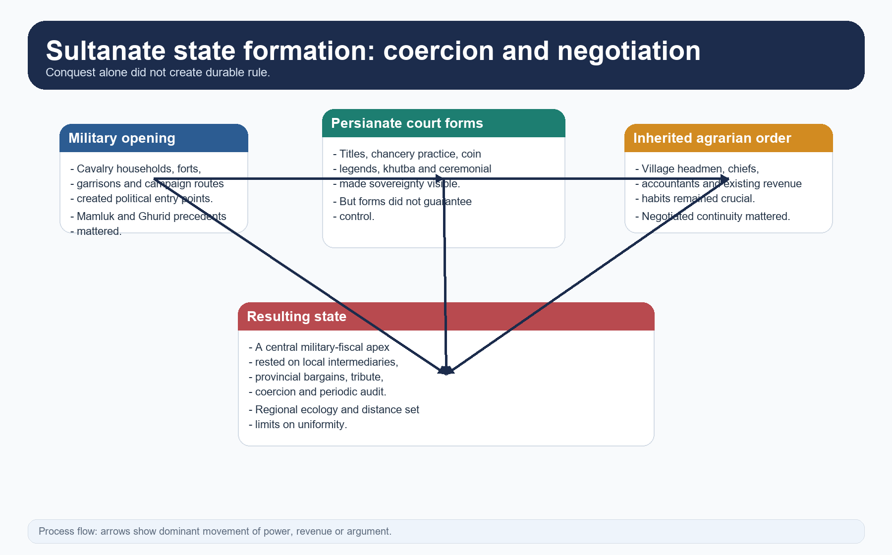

*State-formation visual. It shows why conquest, Persianate court practice and inherited agrarian society had to be combined.*

## 03. Sultan, kingship, caliphate and political expediency

[FACT] The sultan stood at the apex of military command, office distribution, coinage and high justice. Sovereignty was signalled through **khutba**, **sikka**, titulature, court ceremonial and the power to hear petitions or overrule great officials.

[FACT] Iltutmish's caliphal recognition in 1229, Muhammad bin Tughlaq's use of Abbasid symbolism, and Firuz's later search for investiture all show that caliphal idiom mattered. Yet the evidence used across Topics 03 and 05 makes the key point unmistakable: such recognition enhanced status but did not create the army, the revenue base or the countryside network of rule.

[ANALYSIS] Kingship under the Sultanate therefore mixed Islamic legitimacy, Persianate performance and reason of state. Balban heightened awe and ceremonial distance; Alauddin argued that state necessity could not be reduced to juristic advice; Muhammad bin Tughlaq sought symbolic legitimacy while also issuing regulations; Firuz leaned further toward juristic approval without surrendering political calculation.

[DEBATE] This is why modern labels such as 'secular' or 'theocratic' mislead. The better contrast is between **sharia-backed normative language** and **zawabit or political expediency**. Different rulers drew that balance differently, and the balance shifted with crisis.

*Legitimacy visual. It separates symbols of sovereignty from the material foundations of rule.*

## Learning MCQ 02

**Question:** Which statement best captures Sultanate state formation?

A. Once Delhi won a battle, countryside administration became automatic.  
B. Military conquest created openings, but durable rule depended on court forms, local intermediaries and inherited agrarian structures.  
C. State formation was purely urban and detached from villages.  
D. Persianate symbols replaced all local institutions overnight.  

**Correct answer:** **B**

**Explanation:** The strongest answer links cavalry and forts to revenue, local collaboration and social continuities.

## 04. Central departments and the problem of projecting one reign across all centuries

[FACT] The local OCR and Topic 03 package together confirm the main institutional cluster: **wazir / Diwan-i-Wizarat** for finance and oversight, **ariz / Diwan-i-Arz** for muster and equipment, **Diwan-i-Insha** for correspondence, and **Diwan-i-Risalat** in Satish Chandra's reconstruction for religious grants and pious matters.

[FACT] Other key offices included the **sadr**, chief **qazi**, **muhtasib**, **barid**, **wakil-i-dar**, **amir hajib**, royal stores or **karkhanas**, public works, and under Firuz a separate department for slaves.

[LIMIT] Topic 07 must resist the temptation to draw one permanent chart. The OCR itself shows caution around Diwan-i-Risalat; the weight of the wazir and the subordinates of finance shifted; some offices are best evidenced only under stronger or better-documented reigns.

[ANALYSIS] Institutional differentiation was real, and this matters against caricatures of pure personal rule. But differentiation did not mean a modern file-driven bureaucracy. The crown relied on people whose actual reach depended on the ruler's strength, military follow-through and local mediation.

*Institution matrix. The point is function with chronology caution, not bureaucratic timelessness.*

## 05. Nobility and elite composition: wider recruitment, sharper faction

[FACT] The Sultanate elite included Turks, military slaves, Tajiks/Persians, Khaljis, Afghans, Indian Muslims, converts, ulema, clerks, local chiefs and Hindu managers or accountants. The composition widened over time and varied by ruler.

[FACT] The Part I OCR shows that many chroniclers turned social prejudice into political theory. Barani, for example, openly distrusted the promotion of people of humble occupational background, converts and low-born officials. His rage is evidence for elite hierarchy as much as for the appointments themselves.

[ANALYSIS] Political consequence followed social composition. Narrower Mamluk-Turkish dominance gave strong early cohesion but also exclusion; Khalji and Tughlaq widening increased talent and reach but aggravated faction; Lodi Afghan politics carried strong expectations of consultation and honour, complicating central monarchy.

[DEBATE] The safest way to write this is not 'racial conflict' or 'class conflict' alone, but **status-stratified elite competition** in which ethnicity, household rank, old service, new service and local landed connections all mattered.

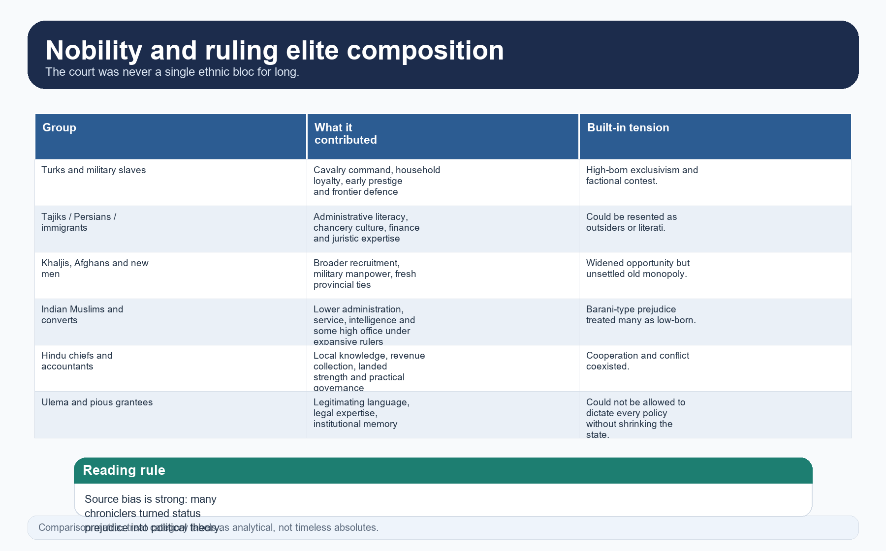

*Elite-composition visual. It shows why widening the ruling class changed both state capacity and political friction.*

## Learning MCQ 03

**Question:** How should caliphal recognition be interpreted in Sultanate answers?

A. As proof that the caliph governed India directly.  
B. As irrelevant decorative theology with no political use.  
C. As symbolic recognition that could enhance standing but did not by itself create army, territory or revenue power.  
D. As a permanent legal chain preventing rulers from issuing their own regulations.  

**Correct answer:** **C**

**Explanation:** Iltutmish and later rulers used caliphal idiom, but practical sovereignty rested elsewhere.

## 06. Bandagan and military slavery: elite training, not mass chattel equivalence

[FACT] Topic 03 establishes the core distinction: *mamluk* or military-household slavery referred to selected dependants trained in warfare, service, etiquette and loyalty. Manumission allowed them to hold office, marriage alliances and even sovereignty.

[FACT] Aibak, Iltutmish and Balban all emerged from such service worlds. Their careers show why military slavery cannot be read only as degradation; it was also an elite recruitment technology.

[ANALYSIS] Yet the institution generated its own instability. The same household training that produced loyal commanders could also produce rivals once those men accumulated troops, assignments and prestige. Topic 06 shows the later edge of this problem when Firuz's vast slave establishment became politically dangerous after his death.

[LIMIT] Military slavery should not erase other forms of slavery. Domestic, artisanal, war-captive and palace slavery remained part of medieval society, usually without the path to power visible in the elite bandagan pattern.

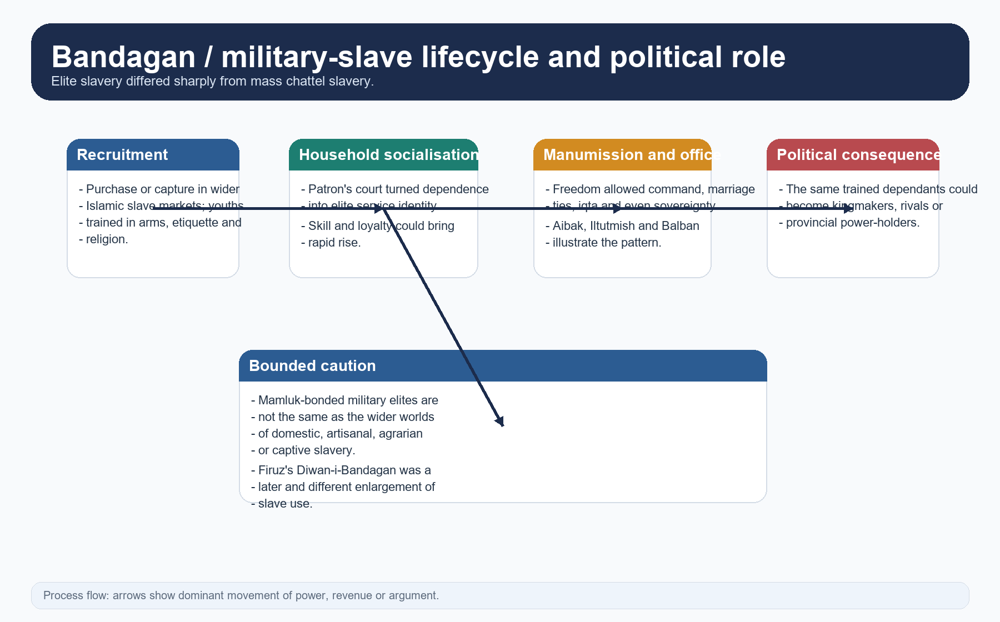

*Bandagan visual. It distinguishes recruitment, training, manumission and later political risk.*

## 07. Iqta as assignment, not simple property

[FACT] The iqta carried a right to realise revenue and often to maintain order and troops in a tract. The muqti or wali was not the absolute owner of soil and population.

[FACT] Both the concise and advanced OCRs show the same basic logic: the crown claimed superior fiscal right; the muqti met expenditure and service obligations; surplus and accounts were, in principle, answerable to the centre; transfer or recall prevented permanent rooting when the state was strong.

[ANALYSIS] Iqta linked agrarian surplus to military capacity. It allowed the Sultanate to support cavalry and provincial administration without paying everything from a single treasury. This made it a central device of state formation.

[LIMIT] In principle is not the same as in practice. Distance, armed followings, provincial autonomy and weak rulers reduced the effectiveness of transfer and audit. Therefore the iqta must be explained as a moving field of negotiation, not as a fixed legal machine.

*Iqta flow visual. It puts service, expenditure, local mediation and central claim into one chain.*

## Learning MCQ 04

**Question:** Which office statement is correct?

A. The ariz was the empire's supreme sovereign judge.  
B. The Diwan-i-Insha permanently handled irrigation canals.  
C. The Diwan-i-Risalat had one universally fixed portfolio in every reign.  
D. The ariz or Diwan-i-Arz supervised the military department, but the sultan remained commander-in-chief.  

**Correct answer:** **D**

**Explanation:** This question tests against projecting later or unrelated portfolios onto Sultanate offices.

## 08. Iqta across dynasties: tightening, overreach and hereditary drift

[FACT] Under the Mamluks, iqta helped consolidation. Under Alauddin, closer supervision, khalisa expansion and direct revenue pressure in the core sharpened control. Under Muhammad bin Tughlaq, large empire and fiscal experimentation strained the system. Under Firuz, heredity and softer audit localised claims.

[ANALYSIS] This sequence matters more than any static definition. A mature answer explains iqta as one institution whose political meaning changed with central strength. The same assignment logic could support centralisation in one phase and oligarchic localisation in another.

[DEBATE] The safest comparison with Mughal *jagir* is through tenure, accountability and service obligation. The safest comparison with European feudalism is to say that the analogy is limited: a transferable state assignment tied to fiscal claim is not the same thing as an inherited proprietary fief.

[LIMIT] Phrases such as 'feudalisation' may be used only if unpacked carefully. On their own they often hide more than they explain.

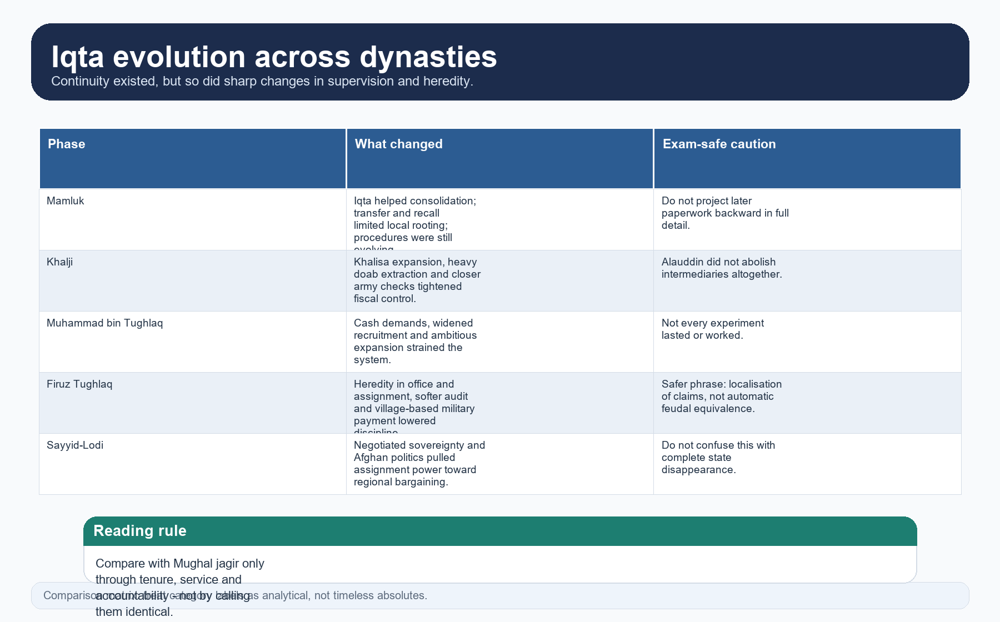

*Evolution visual. It shows why one sentence on iqta is never enough for all Sultanate centuries.*

## Learning MCQ 05

**Question:** What is the best way to describe iqta?

A. A transferable fiscal-military assignment tied to service, administration and in-principle audit.  
B. Absolute private ownership of land and peasants.  
C. A modern district with salaried bureaucracy only.  
D. A south Indian gold coin used in coastal trade.  

**Correct answer:** **A**

**Explanation:** Iqta should be defined through claim, service and recall - not as private estate.

## 09. Provincial and local administration: hierarchy below the province

[FACT] The advanced OCR notes provinces under larger rulers and confirms that below them one hears of **shiqs**, **parganas**, **sadis** and **chaurasis**, though not with equal clarity for all periods. The pargana was associated with the **amil**, while village society revolved around the **khut**, **muqaddam** and **patwari**.

[FACT] Topic 07's own repaired core also cautions that the term **zamindar** appears more clearly by the early fourteenth century and broadens later. Likewise, the historian must be careful with later familiar offices such as **qanungo**.

[ANALYSIS] The hierarchy below the province was where negotiated sovereignty became real. The local holder knew the fields, the cattle, the people and the conditions of transport. Therefore no central revenue order could work without this stratum.

[LIMIT] We should not turn the local layer into complete village autonomy. Nor should we turn it into a standardised district bureaucracy identical from Lahore to Mabar. The evidence supports something in between.

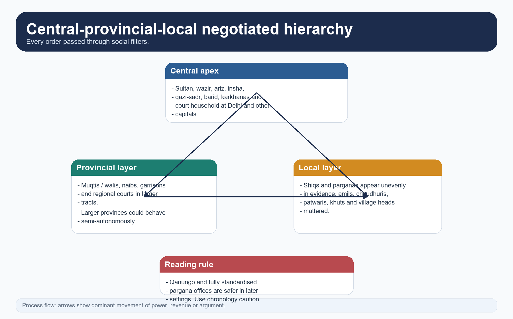

*Hierarchy visual. It emphasises mediation, not a clean top-down administrative pipe.*

## Learning MCQ 06

**Question:** Why must local administration be described cautiously?

A. Because no local officials existed below the province.  
B. Because terms such as shiq, pargana, zamindar and qanungo do not have identical meaning or visibility across all Sultanate centuries.  
C. Because villages were completely untouched by the state.  
D. Because only Mughal sources discuss local society.  

**Correct answer:** **B**

**Explanation:** Chronology caution is essential in medieval administrative vocabulary.

## 10. Revenue system: legal categories and actual fiscal practice

[FACT] Sultanate revenue language included *kharaj*, *ushr*, *zakat*, *jizya*, *khams*, transit dues and cesses such as *ghari*, *charai* and later irrigation dues such as *haqq-i-sharb*.

[FACT] The local OCR is especially useful on the gap between label and practice. Early on, jizya was often difficult to distinguish from land demand. Firuz later insisted on making it a separate tax and extended it to Brahmans, using juristic language to present the order as purified.

[ANALYSIS] Alauddin's half-share demand in the upper doab, Muhammad bin Tughlaq's standard-yield cash incidence and Firuz's share-based reassessment show that actual revenue practice turned on political aim, local coercive ability and environmental conditions far more than on one legal formula.

[DEBATE] Therefore the correct method is to use legal categories as starting points, then ask what was actually being taken, from whom, through which intermediary and for which political purpose.

*Fiscal matrix. It separates juristic label from lived extraction, which is the heart of Topic 07.*

## Learning MCQ 07

**Question:** Which revenue statement is safest?

A. Jizya had the same practical meaning in every district from 1206 to 1526.  
B. Kharaj was only a symbolic tax and never a real burden.  
C. Legal labels such as kharaj, jizya and zakat matter, but actual fiscal practice often merged, varied and depended on political circumstance.  
D. Firuz abolished all non-sharia fiscal categories everywhere permanently.  

**Correct answer:** **C**

**Explanation:** UPSC rewards the distinction between juristic vocabulary and working extraction.

## 11. Army and logistics: cavalry, elephants, branding and route security

[FACT] The Sultanate army centred on cavalry, but also used infantry, archers, elephants, miners, sappers, fort garrisons and transport labour. The concise OCR directly notes the sappers and miners attached to armies.

[FACT] Horses were crucial and expensive. Their supply depended on inland trade, import channels and monitoring. Alauddin's **dagh** and **chehra** tightened that system; Firuz's regime relaxed it.

[ANALYSIS] Military history here is really fiscal history plus transport history. A cavalry state needed grain, remounts, road security, garrisons, reliable intelligence and money or assignments capable of turning field command into durable obedience.

[LIMIT] Chronicle troop totals are among the least safe materials in the archive. For UPSC, organisation, inspection, pay form and logistical chains are much stronger than raw numbers.

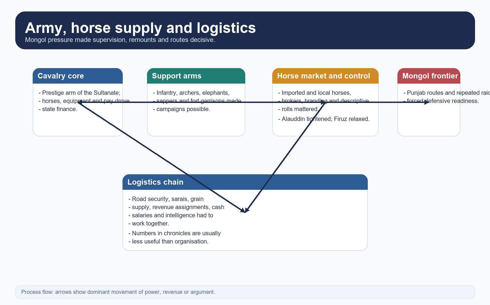

*Army-system visual. It shows why horse control, grain and intelligence belong in the same answer.*

## Learning MCQ 08

**Question:** What drove Alauddin's dagh and chehra controls?

A. A project to spread paper currency.  
B. A village self-government reform.  
C. A Lodi attempt to promote maritime trade.  
D. The need to supervise cavalry quality and salary claims within a military-fiscal system.  

**Correct answer:** **D**

**Explanation:** Horse branding and descriptive rolls belong to army control, not to Mughal-first mythology.

## 12. Police, market oversight and judicial plurality

[FACT] The **kotwal** maintained urban order, regulated entry, watched markets and oversaw security. The **muhtasib** checked weights, measures and public conduct in terms defined by Muslim moral law. The **qazi** and **mufti** handled formal legal business for Muslims.

[FACT] The same OCR also states that Hindus were often governed by their own laws through panchayats in villages and caste-community authorities in towns. Criminal justice, meanwhile, could rest on royal regulation.

[ANALYSIS] Judicial plurality was built into the structure. Sharia mattered, but it was not the only operating norm. This is especially important when answering questions on law, society or religious policy.

[LIMIT] Delhi gives the richest evidence. It is unsafe to describe every town of the Sultanate as if it had identical policing density or documentary depth.

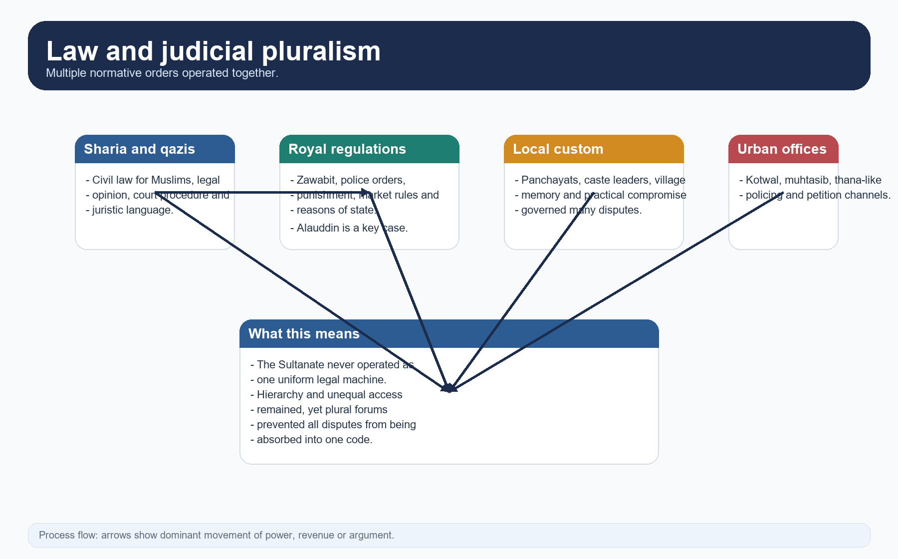

*Judicial-pluralism visual. It links qazi courts, royal regulation, local custom and urban offices.*

## Learning MCQ 09

**Question:** What is the best reading of Sultanate justice?

A. Sharia courts, royal regulations, kotwal policing and local custom coexisted in a plural and hierarchical order.  
B. Only one uniform civil code operated everywhere.  
C. Village panchayats disappeared entirely after 1206.  
D. Qazis governed non-Muslim communities in all matters without exception.  

**Correct answer:** **A**

**Explanation:** Judicial pluralism is one of Topic 07's safest high-value themes.

## 13. Agrarian base: crops, irrigation, wells, canals and environmental risk

[FACT] The source base repeatedly mentions rice, sugarcane, wheat, oilseeds, sesame, indigo and cotton. Rain-fed agriculture remained dominant, but wells, bunds, tanks and local water control were significant.

[FACT] The concise and advanced OCR both highlight Firuz's canals, especially in the Haryana-Hisar zone. They represented a major state intervention, but not a transformation of every agrarian landscape in India.

[ANALYSIS] Agrarian history should therefore be read through ecology as well as administration. Forest cover, cattle wealth, recurrent famine, war and transport difficulty all shaped what the state could actually collect.

[LIMIT] The evidence does not support neat production totals. Topic 07 therefore uses crop range, irrigation form, and regional caution instead of invented output statistics.

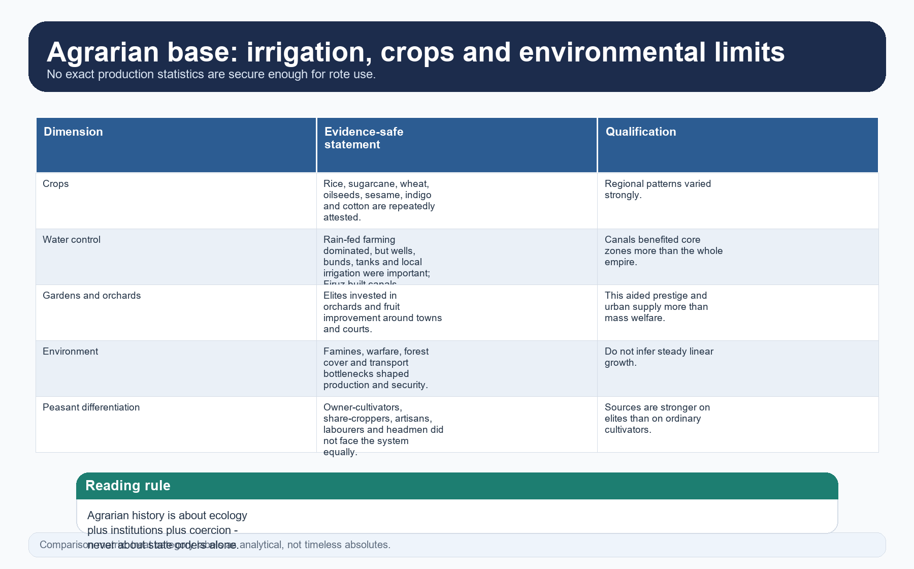

*Agrarian matrix. It keeps crops, water control and environmental limits in one analytical frame.*

## 14. Surplus transfer, peasant burden and the military-fiscal state

[FACT] The overwhelming mass of cultivators worked close to subsistence, but not all rural groups stood alike. Owner-cultivators, prosperous village heads, chiefs and concessions for privileged intermediaries created strong internal differentiation.

[FACT] The concise OCR notes the prosperity of khuts and muqaddams in some areas before Alauddin cut their privileges. The advanced OCR explains that Firuz's irrigation success also channelled gain strongly toward holders of assignments and privileged rural groups.

[ANALYSIS] This is the core of the military-fiscal interpretation. The state did not merely tax an undifferentiated peasantry. It pushed demand through a hierarchy in which local elites could protect themselves, shift burden downward or bargain with the centre.

[DEBATE] Historiography divides between growth and extraction less sharply than textbooks often suggest. Urban and commercial vitality was real; so was hard agrarian transfer. The strongest answer combines both.

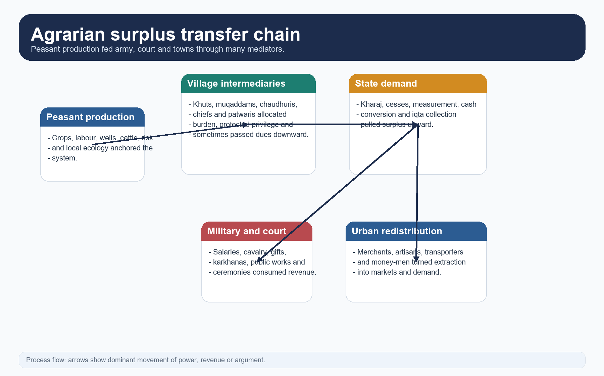

*Surplus-chain visual. It shows how peasant production, intermediaries and state demand fed court and town life.*

## Learning MCQ 10

**Question:** Why is agrarian history central to Topic 07?

A. Because Sultanate economy was mainly based on overseas tribute only.  
B. Because peasant production and intermediary control financed the court, army and towns through surplus transfer.  
C. Because towns had no relationship with villages.  
D. Because military spending was independent of revenue and grain.  

**Correct answer:** **B**

**Explanation:** A military-fiscal state cannot be explained without its agrarian base.

## 15. Currency, trust and uneven monetisation

[FACT] Iltutmish's silver **tanka** and copper **jital** became important markers of stable Delhi-centred monetary authority. Satish Chandra's concise source sometimes uses *dirham* language for copper units, which itself is a reminder that terminology may vary by narrative register.

[FACT] Monetisation was real enough for cavalry salaries, market schedules and hundis to matter. It was also real enough for Muhammad bin Tughlaq's token currency failure to become a classic problem of administrative trust.

[ANALYSIS] Yet Topic 07 must reject the tidy textbook story of a linear march to a fully monetised economy. Grain, share, cash conversion and local variation coexisted. Coin circulation expanded possibilities; it did not wipe out all non-cash relations.

[LIMIT] Token currency is a bounded example, not the whole monetary history of the Sultanate. It must never be described as paper currency.

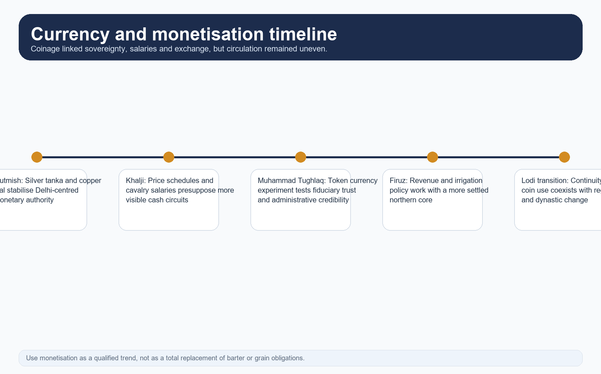

*Monetisation visual. It places stable coinage, fiduciary experiment and uneven circulation on the same timeline.*

## Learning MCQ 11

**Question:** How should monetisation be described?

A. As complete replacement of grain demand by cash in every region.  
B. As paper money introduced permanently by Muhammad bin Tughlaq.  
C. As a real but uneven expansion of cash circuits, coin use and credit, not as a neat linear transition from barter to market modernity.  
D. As irrelevant to trade because only gifts mattered.  

**Correct answer:** **C**

**Explanation:** Tanka, jital, hundis and salary systems all matter, but unevenly.

## 16. Urbanisation: capitals, qasbas, provincial towns and the urban-revival debate

[FACT] Delhi and Daulatabad receive dramatic attention in the sources, but the urban world was much wider: Lahore, Multan, Kara, Lakhnauti, Anhilwara/Patan, Cambay/Khambayat and Sonargaon all appear as important nodes.

[FACT] Many towns grew around garrisons, but they did not remain mere camps. Administrators, clerks, artisans, merchants, scholars, slaves and performers created mixed urban societies.

[ANALYSIS] Urban growth under the Sultanate is best explained through **demand plus connection**. Court and army demand pulled in food and craft goods; merchants and routes widened exchange; the growth of a money nexus and specialised production fed further urban concentration.

[DEBATE] Historians disagree over how transformative this was. Topic 07 therefore uses the phrase 'urban revival' or 'urban expansion' more safely than a mechanically celebratory 'urban revolution' without qualification.

*Urbanisation visual. It connects towns to armies, merchants, craft and rural surplus rather than treating them in isolation.*

## Learning MCQ 12

**Question:** Which description of Sultanate urbanisation is safest?

A. Every town was only a military cantonment with no commerce.  
B. Urban growth ended long-distance trade.  
C. The Sultanate had one single capital and no provincial cities.  
D. Towns grew through court demand, garrisons, trade, crafts and regional exchange, while still depending on rural surplus.  

**Correct answer:** **D**

**Explanation:** Urbanisation debate is strongest when tied to both demand and extraction.

## 17. Crafts and technology: diffusion, adaptation and scale

[FACT] The OCR evidence is strongest for paper-making, the wider use of the spinning wheel, the cotton-carder's bow, improved looms, water-lifting devices, lime mortar, arches, domes, armour, saddles and other metal crafts.

[FACT] The advanced OCR treats paper-making as a new industry and places the widespread use of the spinning wheel in India by the middle of the fourteenth century, with caution on origins and transfer routes.

[ANALYSIS] The real historical value of these techniques lies in social effect. Textile efficiency, easier record-keeping, deeper irrigation in some areas, larger building projects and better cavalry equipment changed state capacity, urban demand and labour use.

[DEBATE] The wrong story is one-way civilisation from outside to passive India. The better story is diffusion through existing craft skill, local demand, state projects and regional adaptation.

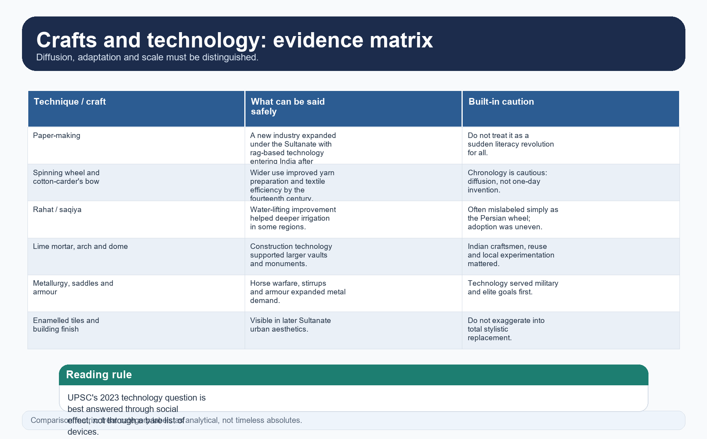

*Technology matrix. It combines what can be said securely with the cautions demanded by the 2023 GS-I question.*

## Learning MCQ 13

**Question:** What is the best way to answer the 2023 technology PYQ?

A. By linking devices and techniques to social effects on crafts, irrigation, construction, administration and hierarchy.  
B. By listing inventions without saying who used them.  
C. By claiming all technology came fully formed from one foreign source.  
D. By discussing only gunpowder and nothing else.  

**Correct answer:** **A**

**Explanation:** The question is social-history oriented, not a trivia list.

## 18. Inland and maritime trade: corridors, sarais and horses

[FACT] The Sultanate inherited and expanded long-distance trade through north-west routes, internal roads and maritime exchange. The sources repeatedly mention the Peshawar-Delhi-Sonargaon axis, the road to Daulatabad, and western links through Gujarat.

[FACT] Trees, sarais and relay systems show that transport infrastructure was a political concern. Horses remained a vital import; textiles remained the leading export cluster.

[ANALYSIS] Trade history belongs inside the state narrative because the army, the nobility and the urban population all depended on regular movement of grain, animals, cloth and money. Trade was not a decorative add-on to politics.

[LIMIT] Route diagrams are schematic and not to scale. They indicate corridor logic, not exact continuous border control by Delhi.

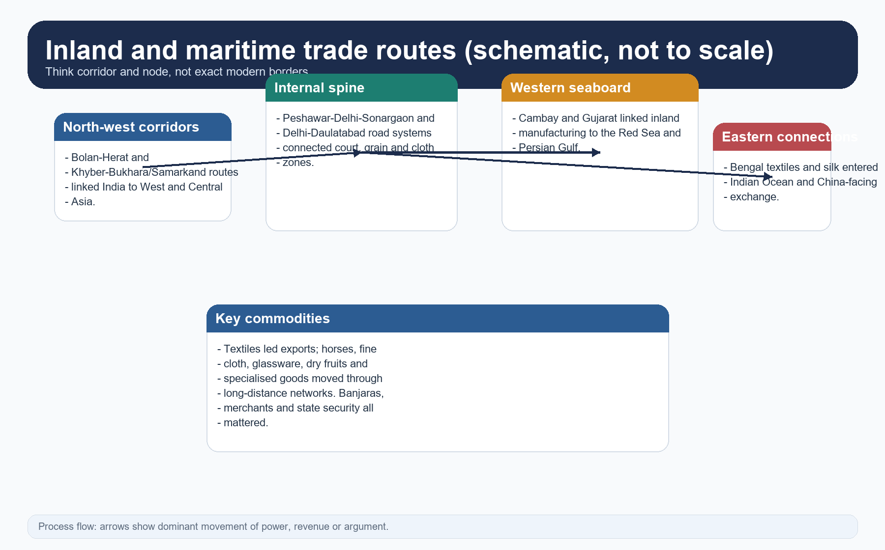

*Trade-route visual. It emphasises corridors and nodes, not false cartographic precision.*

## 19. Merchants, brokers, banjaras and credit

[FACT] The OCR and Topic 07 advanced owner identify Multanis, Khurasanis, Afghans, Gujaratis, Marwaris, Jains and Bohras as important commercial actors, though in different settings and degrees. Wealthy merchants could lend heavily even to nobles.

[FACT] **Hundis**, money-changing and sarrafs mattered for long-distance finance, transport and even storage of noble wealth. Banjaras carried grain and were central to provisioning mechanisms.

[ANALYSIS] This evidence blocks the habit of reducing the Sultanate economy to state extraction alone. Merchant initiative, finance and transport were indispensable, even where the state regulated, taxed or supervised their activity.

[DEBATE] Alauddin's controls are best handled as a capital-centred military-fiscal episode inside this wider commercial system. Topic 07 therefore insists: **intervention did not erase market society**.

*Commerce visual. It shows how merchants, financiers and transporters mediated between countryside, town and state.*

## Learning MCQ 14

**Question:** How should Alauddin's market regulation be placed in the wider economy?

A. As proof that ordinary markets ceased to exist forever.  
B. As an intense state intervention within a broader commercial world still run through merchants, banjaras, brokers and credit.  
C. As the beginning of a socialist planned economy.  
D. As a measure that removed all need for grain transport.  

**Correct answer:** **B**

**Explanation:** The market episode is important, but it should not swallow the whole economy.

## 20. Social groups, caste and non-census hierarchy

[FACT] Sultanate society included rulers, nobles, ulema, officials, soldiers, peasants, artisans, merchants, slaves, mendicants, entertainers and service groups. The sources are strongest on elites, yet they also reveal sharp social inequality.

[FACT] Smriti writers preserved Brahmanical hierarchy and restrictions on many lower groups. At the same time, the urban world and state service created more mixed settings than a simple textbook pyramid suggests.

[ANALYSIS] The historian should therefore think in terms of **overlapping social layers**, not a neat medieval census chart. Class, status, religion, occupation, gender and locality interacted differently in towns, villages, courts and frontiers.

[LIMIT] Social groups are analytical labels, not exact population measures. The archive rarely allows precise numerical breakdowns.

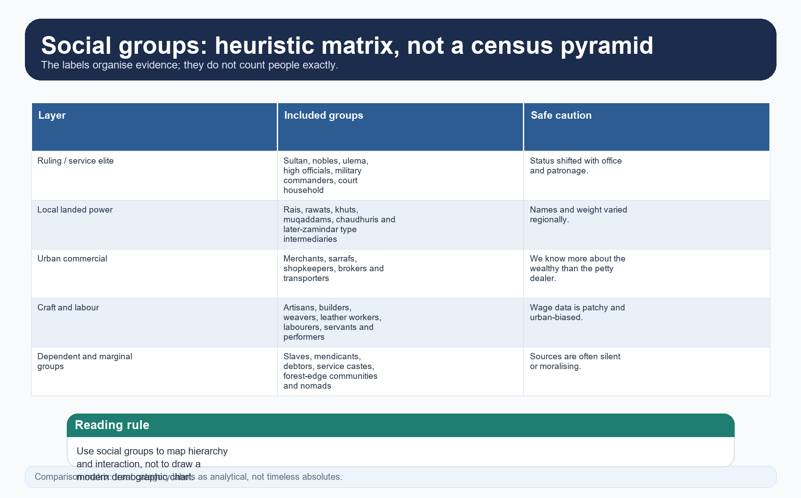

*Social-matrix visual. It organises evidence without pretending to produce a medieval census.*

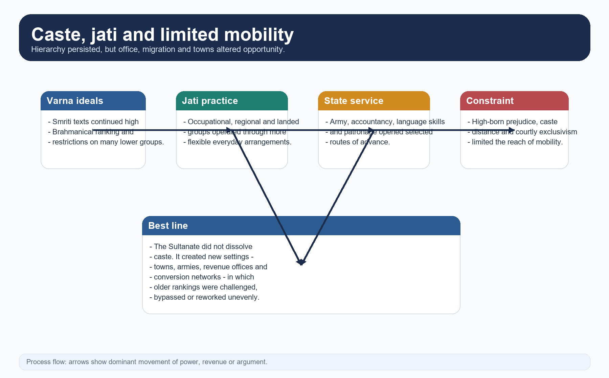

*Mobility visual. It shows why state service and towns mattered without dissolving hierarchy.*

## Learning MCQ 15

**Question:** What is the safest description of Muslims as a social category under the Sultanate?

A. All Muslims formed a perfectly equal community from the outset.  
B. The terms ashraf, ajlaf and arzal can be projected backward without caution.  
C. They were internally differentiated by ethnicity, status, occupation and origin; they were not one timeless homogeneous bloc.  
D. Only foreign-born Muslims mattered in any occupation.  

**Correct answer:** **C**

**Explanation:** Status language changed over time and must be used carefully.

## 21. Hindus, Muslims and conversion: differentiated communities, not static blocs

[FACT] The OCR is explicit that Muslim society itself remained internally divided among Turks, Iranians, Afghans and Indian Muslims. The advanced source uses *ashraf* and *ajlaf* language for status differentiation and shows discrimination against many converts and occupational groups.

[FACT] The concise OCR is equally explicit that Hindus were not absent from Sultanate power. They remained crucial in local administration, revenue collection, trade and even military service. Most nobles kept Hindu managers, and the local administrative machinery stayed largely in Hindu hands.

[ANALYSIS] The best social frame is therefore one of **differentiated communities in unequal interaction**. There was tension, hierarchy and violence; there was also dependence, employment, translation and shared urban space.

[ANALYSIS] Conversion should be treated as multi-causal: patronage, social mobility, service, belief, Sufi contact, political association and in some places frontier settlement all mattered. Bounded coercive episodes existed, but they do not explain the whole pattern.

[LIMIT] Topic 07 deliberately avoids a mass-conversion or total-exclusion narrative because neither is supported by the evidence base used here.

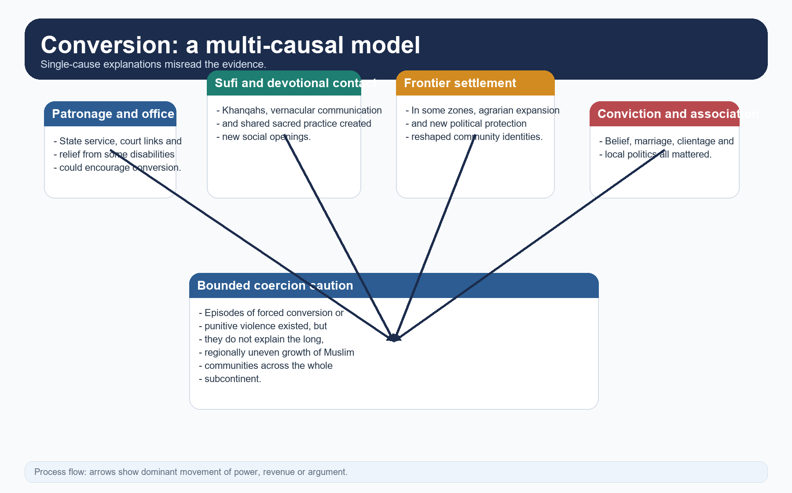

*Conversion visual. It keeps political, social, devotional and regional mechanisms together and refuses single-cause explanation.*

## 22. Slavery, gender and everyday material inequality

[FACT] Slavery remained an important part of Sultanate social life. Prisoners of war, purchased slaves, domestic slaves, artisanal slaves and bodyguards all appear in the evidence. Firuz's reported 1,80,000 slaves and 12,000 trained artisans must remain labelled as chronicle-scale claims, not audited census truth.

[FACT] The OCR also shows that slavery lowered the status of free labour and helped structure elite comfort. Some military slaves rose high, but most slaves did not.

[FACT] On gender, upper-class seclusion or **purdah** spread more widely in the Sultanate centuries, especially among courtly and elite groups. Yet the evidence itself treats this as classed and situational. It does not justify a universal rule for all women.

[DEBATE] Sati, jauhar, widow rights, property claims, royal women and women's labour must therefore be handled on an evidence ladder: prescription, elite norm, specific episode, then careful inference. Topic 07 does not romanticise either complete repression or complete emancipation.

*Slavery visual. It keeps elite military slavery distinct from domestic, artisanal and captive forms.*

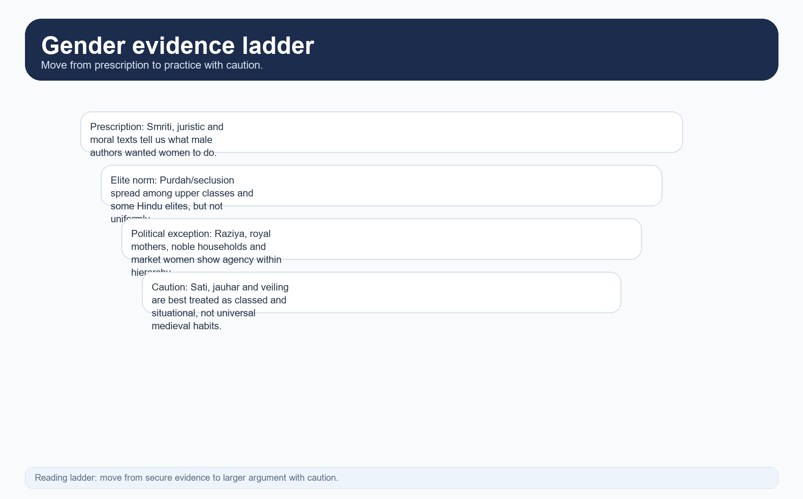

*Gender visual. It shows why prescription, elite norm and lived practice must be kept separate.*

## Learning MCQ 16

**Question:** Which conversion statement is safest?

A. Conversion happened only by the sword.  
B. Conversion happened only by mystical preaching and never by politics.  
C. No social or regional variation mattered.  
D. Conversion was multi-causal: patronage, mobility, local politics, devotional contact, frontier processes and belief all mattered in uneven ways.  

**Correct answer:** **D**

**Explanation:** This defeats the most common one-cause narratives.

## 23. Education, language, ulema, Sufis and social interaction

[FACT] Maktabs, madrasas, mosques, khanqahs, courtly scholarship, Sanskrit learning and local teaching traditions coexisted. The spread of paper-making made record-keeping and manuscripts easier, but did not automatically democratise learning.

[FACT] Persian became the leading language of administration and much elite literary production; Arabic retained high religious prestige; Hindavi and other vernaculars expanded in everyday speech, Sufi conversation, poetic expression and later literary growth.

[FACT] The advanced OCR's note on Persian-knowing Hindus is especially important. By the Tughlaq period, a class of Hindus trained in Persian was entering service, showing that administrative culture could widen across community boundaries.

[ANALYSIS] Topic 07 uses Sufis and ulema not to retell Topic 10, but to explain how language, legitimacy and social contact worked. Chishti use of Hindavi, saint-yogi interaction, juristic office and court patronage all helped mediate the social life of rule.

[LIMIT] 'Composite culture' is a useful phrase only if mechanism is supplied - language contact, service, translation, shared urbanity, music or shrine interaction - not if it becomes a slogan.

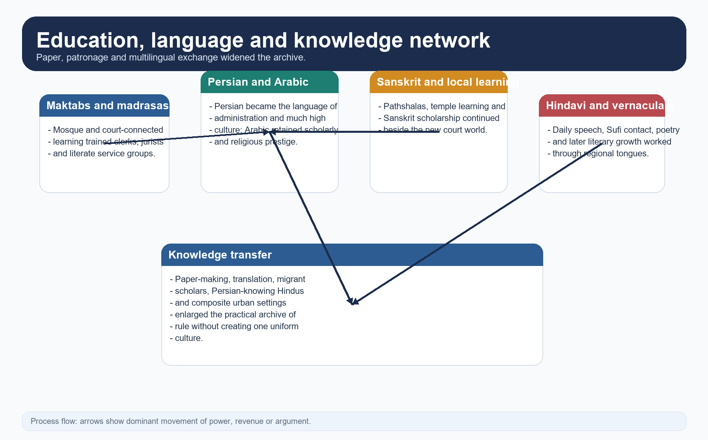

*Knowledge-network visual. It links institutions, paper, languages and service culture rather than isolating them.*

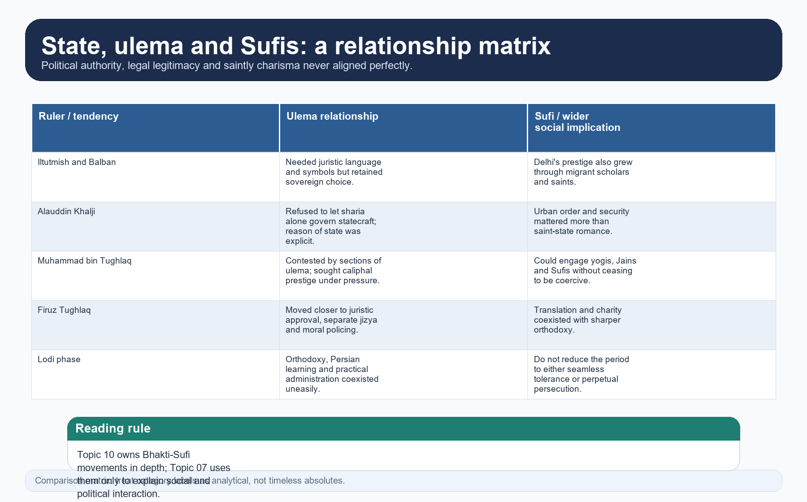

*Relationship visual. It keeps juristic authority, saintly charisma and royal expediency analytically separate.*

## Learning MCQ 17

**Question:** How should gender evidence be handled?

A. By distinguishing elite prescription from practice and by noting class and regional variation in seclusion, property and ritual.  
B. By assuming all women everywhere observed the same purdah pattern.  
C. By treating sati and jauhar as everyday universal institutions.  
D. By claiming women disappear entirely from the source record.  

**Correct answer:** **A**

**Explanation:** The evidence is uneven, but not nonexistent; cautious layering is essential.

## 24. Synthesis and historiography: centralisation, feudalism, urban change and sources

[DEBATE] Was the Sultanate centralised? Yes, at the apex; unevenly, below. This is why the strongest answer speaks of **centralising aspiration plus negotiated sovereignty**.

[DEBATE] Was iqta feudalism? The comparison can illuminate service-linked assignment, but breaks down if it ignores state superiority, transfer, audit and the changing political meaning of assignment over time.

[DEBATE] Was there an urban revolution? Town growth, monetisation, crafts and trade were substantial, but their energy rested on agrarian extraction and hierarchy. Growth and coercion must therefore be read together.

[DEBATE] Did technology simply arrive from outside? No. The better frame is diffusion and adaptation through artisans, courts, merchants and local needs. The same caution applies to language and culture.

[DEBATE] Was the state religious or secular? Neither label is adequate by itself. Sharia, caliphal idiom, jurists, zawabit, royal expediency and local custom coexisted in changing proportion.

[FACT] The core source matrix remains: Barani, Minhaj, Amir Khusrau, Ibn Battuta, Isami, Afif, coins, inscriptions, architecture, archaeology and regional texts. Every good answer should move from named evidence to mechanism to qualification to verdict.

*Centralisation visual. It turns a yes-or-no question into a layered argument.*

*Historiography visual. It contrasts growth, extraction and technology without forcing false choices.*

*Source matrix. It keeps genre and limitation at the centre of explanation.*

*Answer-spine visual. It gives a repeatable structure for administrative, economic and social questions.*

## Learning MCQ 18

**Question:** What is the best closing line for a GS-I answer on Topic 07?

A. The Sultanate was either fully feudal or fully modern, with no middle ground.  
B. The Sultanate was centralising in aspiration, negotiated in practice, and socially uneven in effect.  
C. The Sultanate economy was prosperous for every class in the same way.  
D. The Sultanate state can be understood entirely from one chronicle.  

**Correct answer:** **B**

**Explanation:** This verdict keeps institution, debate and social hierarchy together.

## Solved topic-specific MCQs

This workbook block contains the practice set that also feeds the separate premium solved-practice workbook PDF. The sequences below preserve honest PYQ status, exact wording only where verified, and strict A -> B -> C -> D rotation for original MCQ series.

## Verified and honestly-adjacent PYQs

### PYQ 01 - UPSC Prelims GS-I 2019 (directly relevant; exact wording verified locally)

**Question:** Consider the following statements:

1. In the revenue administration of Delhi Sultanate, the in-charge of revenue collection was known as "Amil".  
2. The Iqta system of Sultans of Delhi was an ancient indigenous institution.  
3. The office of "Mir Bakshi" came into existence during the reign of Khalji Sultans of Delhi.

Which of the statements given above is/are correct?

A. 1 only  
B. 1 and 2 only  
C. 3 only  
D. 1, 2 and 3

**Inferred answer - not officially verified locally:** **1 only**. Confidence: high.

**Model explanation:** Statement 1 is correct because *amil* was the revenue-collection functionary at the relevant level. Statement 2 is incorrect because iqta had West and Central Asian antecedents before its Indian adaptation. Statement 3 is incorrect because *Mir Bakshi* belongs to the Mughal system; the Sultanate military department centred on the ariz and Diwan-i-Arz.  

**Why this earns marks:** It tests statement-by-statement institutional placement and blocks both the indigenous-iqta myth and the Mughal-office projection trap.

### PYQ 02 - UPSC GS-I 2020 (directly relevant source-method question; wording preserved in repository)

**Question:** Persian literary sources of medieval India reflect the spirit of the age. Comment. (Answer in 250 words)

**Model answer:**

Persian literary sources are indispensable for medieval India because they preserve the language of sovereignty, conquest, justice, bureaucracy and courtly aspiration. Yet they reflect the spirit of the age only when read through **genre, patronage and silence**.  

For Topic 07 this is especially clear. Barani helps explain kingship, aristocratic prejudice, Alauddin's market measures and the tension between sharia and political expediency, but he is late, moralising and hostile to low-born advancement. Ibn Battuta illuminates roads, towns, gifts, punishments and products, yet his traveller's eye seeks the vivid rather than the statistically ordinary. Afif and Firuz's own *Futuhat* reveal how a ruler wished benevolence and piety to be seen. Coins, inscriptions and buildings in turn provide harder public claims, but not full social life.  

Thus Persian sources do reflect the age - especially its elite political culture, administrative ambition and moral vocabulary - but not as neutral mirrors. They require comparison with material evidence, local structures and non-courtly social realities.  

**Why this earns marks:** It comments on the word 'reflect' itself, names multiple source types and turns source bias into method rather than complaint.

### PYQ 03 - UPSC Prelims GS-I 2022 (adjacent but useful frontier-institution question; exact wording verified locally)

**Question:** With reference to Indian history, consider the following statements:

1. The first Mongol invasion of India happened during the reign of Jalal-ud-din Khalji.  
2. During the reign of Ala-ud-din Khalji, one Mongol assault marched up to Delhi and besieged the city.  
3. Muhammad-bin-Tughlaq temporarily lost portions of north-west of his kingdom to Mongols.

Which of the statements given above is/are correct?

(a) 1 and 2  
(b) 2 only  
(c) 1 and 3  
(d) 3 only

**Inferred answer - not officially verified locally:** **2 only**. Confidence: high.

**Model explanation:** Statement 1 is incorrect because Mongol pressure predates Jalaluddin Khalji. Statement 2 is correct because a major Mongol assault reached and besieged Delhi in Alauddin's time. Statement 3 is not secure in the form stated.  

**Why this earns marks:** It is adjacent rather than core, but it sharpens the army-frontier chronology that any Topic 07 answer on cavalry finance and defence must keep straight.

### PYQ 04 - UPSC GS-I 2023 (directly relevant; wording preserved in repository)

**Question:** What were the major technological changes introduced during the Sultanate period? How did those technological changes influence the Indian society? (Answer in 250 words)

**Model answer:**

The Sultanate period witnessed important technological diffusion in textiles, record-keeping, irrigation, construction and military equipment. Their significance lay less in isolated invention than in **how they reshaped production, urban growth and state capacity**.  

Paper-making widened the practical world of accounts, letters and manuscripts. The spinning wheel, cotton-carder's bow and improved looms strengthened textile production. Water-lifting devices and, in some regions, canal networks supported cultivation. Lime mortar, arches and domes enlarged the scale and durability of construction. Saddles, armour, stirrups and horse-management techniques mattered to cavalry warfare.  

Social effect was uneven. Urban workshops, state offices, merchants and military systems benefited most. Artisans found new demand, but hierarchy persisted and slavery or low-wage labour remained embedded in production. Irrigation and construction enhanced elite and state power more than universal welfare.  

Thus technological change under the Sultanate contributed to urbanisation, stronger administration, wider textile production and military organisation, while remaining filtered through social inequality.  

**Why this earns marks:** It answers both parts, moves from devices to effects and avoids the trap of a bare technology list.

## PYQ verification ledger and scope honesty

- **Directly verified and solved:** 2019 Prelims GS-I revenue administration; 2020 GS-I Persian literary sources; 2023 GS-I Sultanate technology.
- **Directly verified but honestly adjacent:** 2022 Prelims GS-I Mongol chronology question.
- **Routed but exact wording not locally recoverable in the available paper set:** 2022 Prelims GS-I Q52 on *fanam* medieval monetary terminology. Topic 07 covers the demand honestly in the learning sections and in the register notes, but does not invent an unverified official stem.
- No coaching-studio question and no optional-paper question has been relabelled as a UPSC PYQ.

## Original broad-coverage MCQs

> **Rotation check rule:** This original broad-coverage sequence starts at **A** and rotates strictly through **B, C and D**.

### Broad MCQ 01

**Question:** Which phrase most accurately describes the Delhi Sultanate?

A. A Persianate military-fiscal state whose central claims depended on negotiation below.  
B. A timeless nation-state with fixed ministries.  
C. A society without villages or intermediaries.  
D. A purely spiritual caliphate run from Baghdad.  

**Correct answer:** **A**

**Explanation:** The best phrase joins ideology, coercion and agrarian mediation.

### Broad MCQ 02

**Question:** Why is the phrase 'Persianate' useful in Topic 07?

A. Because all rulers were ethnically Persian.  
B. Because it captures a transregional language-administrative culture that could include rulers and officials of varied origins.  
C. Because only Persian literature mattered in the Sultanate.  
D. Because Persianate culture abolished local languages.  

**Correct answer:** **B**

**Explanation:** The term is cultural-political, not ethnic.

### Broad MCQ 03

**Question:** What made Delhi important beyond military conquest?

A. It was the only town in north India.  
B. It had no link with monetisation.  
C. Coinage, chancery, migrant scholars, court ritual and revenue coordination reinforced its centrality.  
D. It mattered only after the Mughals.  

**Correct answer:** **C**

**Explanation:** Delhi became a nodal political and cultural centre, not just a fort.

### Broad MCQ 04

**Question:** Which statement about succession under the Sultanate is safest?

A. Primogeniture operated without interruption.  
B. Caliphal appointment automatically settled succession.  
C. Village panchayats chose the sultan.  
D. Nomination, noble acceptance, military strength and household politics all shaped succession.  

**Correct answer:** **D**

**Explanation:** This defeats simplistic dynastic assumptions.

### Broad MCQ 05

**Question:** Why should Diwan-i-Risalat be handled cautiously?

A. Because its exact portfolio is reconstructed differently by scholars and may shift across reigns.  
B. Because the office certainly never existed.  
C. Because it only managed artillery.  
D. Because it was a Mughal-only innovation.  

**Correct answer:** **A**

**Explanation:** Terminology caution itself is a mark of strong historical method.

### Broad MCQ 06

**Question:** What was the political use of the barid network?

A. It replaced the military department entirely.  
B. It carried intelligence upward and helped rulers watch governors, nobles and markets.  
C. It minted copper jitals.  
D. It managed Hindu temple endowments only.  

**Correct answer:** **B**

**Explanation:** Information was a technology of rule.

### Broad MCQ 07

**Question:** Which social group is most directly linked to village headship in Topic 07's core evidence?

A. Mir bakhshis.  
B. Barids.  
C. Muqaddams and related local landed intermediaries.  
D. Caliphal envoys.  

**Correct answer:** **C**

**Explanation:** Village headship belongs to local agrarian hierarchy.

### Broad MCQ 08

**Question:** Why is iqta not equivalent to European feudalism?

A. Because iqta had no connection at all with revenue.  
B. Because Europe had no cavalry.  
C. Because iqta was a maritime customs office.  
D. Because the Sultanate state's superior claim, transfer power and audit logic differ from a simple proprietary-vassal model.  

**Correct answer:** **D**

**Explanation:** The comparison is useful only when its limits are stated.

### Broad MCQ 09

**Question:** What does khalisa most clearly indicate?

A. Revenue reserved for more direct crown collection and visibility.  
B. A type of slave corps.  
C. A class of urban merchants.  
D. The village police post.  

**Correct answer:** **A**

**Explanation:** Khalisa is central to any discussion of Alauddin or crown finance.

### Broad MCQ 10

**Question:** Which ruler most clearly combined price regulation with military horse inspection?

A. Khizr Khan Sayyid.  
B. Alauddin Khalji.  
C. Raziya Sultan.  
D. Babur.  

**Correct answer:** **B**

**Explanation:** Dagh and chehra must be placed correctly.

### Broad MCQ 11

**Question:** Which statement about Muhammad bin Tughlaq is safest for Topic 07?

A. He abolished monetisation.  
B. He had no interest in caliphal legitimacy.  
C. He pushed centralisation, cash demand and recruitment widening further than his predecessors, but strained compliance and trust.  
D. He ruled only Delhi and Palam.  

**Correct answer:** **C**

**Explanation:** The strongest line explains ambition and breakdown together.

### Broad MCQ 12

**Question:** Why does Firuz matter in Topic 07?

A. He invented the iqta from nothing.  
B. He removed all slave institutions.  
C. He abandoned public works entirely.  
D. He softened audit, encouraged heredity, expanded canals and workshops, and sharpened some juristic markers such as separate jizya.  

**Correct answer:** **D**

**Explanation:** Firuz's regime altered both welfare and hierarchy.

### Broad MCQ 13

**Question:** What is the safest reading of jizya under the Sultanate?

A. It mattered politically and symbolically, but it should not stand in for the totality of Hindu-Muslim social relations.  
B. It was absent from all Sultanate history.  
C. It was always completely separate from land demand from the first day.  
D. It proves that all policy was only religious.  

**Correct answer:** **A**

**Explanation:** The tax has to be placed in a broader fiscal and political field.

### Broad MCQ 14

**Question:** What best explains the growth of hundis?

A. The end of road travel.  
B. Long-distance trade, credit needs and the work of money-changers and financiers across regions.  
C. A ban on merchant initiative.  
D. The replacement of silver coins by cowries in Delhi.  

**Correct answer:** **B**

**Explanation:** Hundis belong to commercial and financial integration.

### Broad MCQ 15

**Question:** Which commodity cluster best captures long-distance Sultanate trade?

A. Only war booty outward and nothing inward.  
B. Only rice and wheat outward from every region.  
C. Textiles outward; horses, high-grade cloth and select goods inward.  
D. Only temple icons and paper outward.  

**Correct answer:** **C**

**Explanation:** Textiles remained India's most important manufacturing strength.

### Broad MCQ 16

**Question:** What is the safest claim about artisans under the Sultanate?

A. They were all state slaves.  
B. They were all village serfs with no urban presence.  
C. They disappeared after market regulation.  
D. They worked in towns and villages, in independent settings and in state-linked workshops, under unequal social conditions.  

**Correct answer:** **D**

**Explanation:** Craft life was varied and often poorly documented.

### Broad MCQ 17

**Question:** How should the spinning wheel be used in an answer?

A. As evidence of technological diffusion and textile efficiency, with chronology caution and social-effect analysis.  
B. As a guaranteed twelfth-century Indian invention with exact first date.  
C. As proof that every household became prosperous.  
D. As irrelevant to cloth production.  

**Correct answer:** **A**

**Explanation:** Technology claims need both mechanism and caution.

### Broad MCQ 18

**Question:** Why is the term 'urban revolution' debated?

A. Because no towns existed at all.  
B. Because town growth, crafts and monetisation were real, yet they rested on coercive extraction and uneven benefit.  
C. Because only European trade created Indian towns.  
D. Because the debate concerns only architecture.  

**Correct answer:** **B**

**Explanation:** This is one of Topic 07's major historiographical axes.

### Broad MCQ 19

**Question:** What is the safest interpretation of ashraf-ajlaf language?

A. It proves perfect class equality among Muslims.  
B. It is a fixed fourteenth-century bureaucratic census category everywhere.  
C. It signals social differentiation within Muslim society, but its use needs chronology and source caution.  
D. It replaces all regional and occupational distinctions.  

**Correct answer:** **C**

**Explanation:** The labels are real and useful, but not timeless.

### Broad MCQ 20

**Question:** Which statement best captures the position of Hindus under the Sultanate?

A. No Hindu served any state function.  
B. All Hindus were treated identically across all reigns.  
C. Hindu society vanished from the countryside.  
D. They were not simply excluded: chiefs, peasants, merchants, soldiers, accountants and managers all remained important, amid conflict and hierarchy.  

**Correct answer:** **D**

**Explanation:** The strongest answer combines cooperation and coercion.

### Broad MCQ 21

**Question:** Why is conversion a poor master-explanation for Sultanate society?

A. Because social history also turns on landed power, towns, labour, language, courts, trade and everyday negotiation.  
B. Because conversions never happened.  
C. Because conversions alone explain every town and market.  
D. Because only rulers converted.  

**Correct answer:** **A**

**Explanation:** Conversion matters, but it is not the only explanatory engine.

### Broad MCQ 22

**Question:** What is the best distinction between bandagan and wider slavery?

A. Bandagan were simply village tenants.  
B. Bandagan were elite household military slaves with training and office prospects, unlike most domestic or captive slaves.  
C. Bandagan were identical to all slaves in law and social effect.  
D. Bandagan were Mughal revenue clerks.  

**Correct answer:** **B**

**Explanation:** This is a crucial conceptual distinction in Topic 07.

### Broad MCQ 23

**Question:** How should purdah be described?

A. As absent from all medieval India.  
B. As identical among every caste and class.  
C. As a stronger upper-class and courtly norm that spread unevenly; not as a universal practice for all women in all regions.  
D. As a Sultanate law imposed successfully on everyone.  

**Correct answer:** **C**

**Explanation:** Gender answers need class and region built in.

### Broad MCQ 24

**Question:** Which statement about education is safest?

A. Persian replaced every other language immediately.  
B. Paper-making ended manuscript culture.  
C. Only royal princes were educated.  
D. Maktabs, madrasas, mosques, khanqahs, Sanskrit learning and practical multilingualism coexisted.  

**Correct answer:** **D**

**Explanation:** Knowledge institutions were multiple, not singular.

### Broad MCQ 25

**Question:** Why are Persian-knowing Hindus important for Topic 07?

A. They show that administrative culture could expand across community lines without erasing hierarchy.  
B. They prove caste disappeared.  
C. They prove Persian ceased to dominate administration.  
D. They were only nineteenth-century phenomena.  

**Correct answer:** **A**

**Explanation:** Language competence created new service niches.

### Broad MCQ 26

**Question:** Which statement about Sufis in Topic 07 is safest?

A. Topic 07 must ignore Sufis completely.  
B. They matter here mainly as part of social interaction and political context, while full movement ownership belongs to Topic 10.  
C. All Sufis were anti-state in every setting.  
D. Sufis alone ran Sultanate law courts.  

**Correct answer:** **B**

**Explanation:** Boundary discipline is part of a strong package.

### Broad MCQ 27

**Question:** How should temple destruction and patronage be framed in Topic 07?

A. Every temple was always protected.  
B. Every temple was always destroyed.  
C. Episodes must be placed in political, military and local context rather than being flattened into a single civilisational formula.  
D. The issue is irrelevant to social history.  

**Correct answer:** **C**

**Explanation:** This avoids communal simplification while remaining evidence-led.

### Broad MCQ 28

**Question:** What is the strongest way to read Barani?

A. As a perfectly neutral census reporter.  
B. As useless because he was biased.  
C. As the only source that matters.  
D. As indispensable for elite ideology and policy language, but shaped by aristocratic prejudice and normative aims.  

**Correct answer:** **D**

**Explanation:** Good answers use Barani critically, not blindly.

### Broad MCQ 29

**Question:** Why are coins valuable in Topic 07?

A. They connect sovereignty, minting, monetisation and public claims without proving complete territorial control.  
B. They reveal precise peasant income.  
C. They replace the need for all written sources.  
D. They show that all provinces used one fixed economy at all times.  

**Correct answer:** **A**

**Explanation:** Coins are strong but bounded evidence.

### Broad MCQ 30

**Question:** Which statement about qanungo is safest?

A. It is the normal office for every Mamluk village.  
B. Use the term only with chronology caution; it is not a secure universal office for the early Sultanate local hierarchy.  
C. It was another name for the ariz.  
D. It replaced the kotwal.  

**Correct answer:** **B**

**Explanation:** Administrative vocabulary must be time-bound.

### Broad MCQ 31

**Question:** What best captures Lodi politics from a Topic 07 perspective?

A. The Lodis rejected all revenue supervision.  
B. The Lodis ruled only through Sufi shrines.  
C. Afghan claims of consultation and equality complicated but did not abolish monarchy or centralisation.  
D. The Lodis ended all iqta-like assignment structures overnight.  

**Correct answer:** **C**

**Explanation:** The Afghan angle is about elite bargaining, not statelessness.

### Broad MCQ 32

**Question:** What is the safest one-line verdict on Sultanate society?

A. It was a static Hindu-Muslim binary with no shared spaces.  
B. It was a casteless commercial utopia.  
C. It can be reconstructed perfectly from one chronicle.  
D. It was stratified, interactive and changing - never socially flat, never wholly segregated, never fully equal.  

**Correct answer:** **D**

**Explanation:** This verdict is short, balanced and high-yield.

## Remedial trap MCQs

> **Rotation check rule:** This remedial sequence restarts at **A** and rotates strictly through **B, C and D**.

### Remedial MCQ 01

**Question:** Which mistake most distorts Topic 07?

A. Treating one ruler's office-chart as the permanent bureaucracy of the whole Sultanate.  
B. Noting that departmental functions evolved.  
C. Using chronology caution in local vocabulary.  
D. Separating caliphal idiom from effective sovereignty.  

**Correct answer:** **A**

**Explanation:** The topic demands variation across Mamluk, Khalji, Tughlaq and Lodi phases.

### Remedial MCQ 02

**Question:** Which description of iqta is wrong?

A. A service-linked assignment.  
B. A permanent private estate freely inheritable without superior state claim.  
C. A tract whose holder could be transferred.  
D. A mechanism that tied revenue to military obligation.  

**Correct answer:** **B**

**Explanation:** This is the core remedial distinction.

### Remedial MCQ 03

**Question:** What is the safest comparison with the Mughal jagir?

A. Iqta and jagir were identical in every respect.  
B. Iqta had no link at all to military service.  
C. There is family resemblance in transferable revenue assignment, but no full equivalence in procedure, service scale or chronology.  
D. Jagir existed unchanged before the Sultanate.  

**Correct answer:** **C**

**Explanation:** Comparison helps only when differences are preserved.

### Remedial MCQ 04

**Question:** Which statement is unsafe on state and religion?

A. Sharia mattered to legitimation and some offices.  
B. Rulers also issued state regulations.  
C. Ulema-state relations varied by ruler.  
D. The Sultanate can be labelled simply a timeless theocracy without discussing zawabit, expediency or political limits.  

**Correct answer:** **D**

**Explanation:** The strongest answer refuses one-word labels.

### Remedial MCQ 05

**Question:** What is the correct approach to conversion?

A. Reject one-cause narratives and map multiple local processes.  
B. Explain everything through force alone.  
C. Explain everything through saintly preaching alone.  
D. Assume every region changed identically.  

**Correct answer:** **A**

**Explanation:** This is a recurring UPSC trap in medieval history.

### Remedial MCQ 06

**Question:** Which statement about social categories is safest?

A. They are timeless democratic self-descriptions.  
B. Terms like ashraf and ajlaf are useful only with chronology, source and status caution.  
C. They erase ethnic and occupational differences.  
D. They can replace all local evidence.  

**Correct answer:** **B**

**Explanation:** Never force later or broader categories as rigid census blocks.

### Remedial MCQ 07

**Question:** How should technology transfer be framed?

A. As proof that Indians had no prior craft skill.  
B. As immediate uniform adoption everywhere.  
C. As diffusion and adaptation through local artisans, state demand and regional conditions - not as one-way civilising import.  
D. As a topic unrelated to society.  

**Correct answer:** **C**

**Explanation:** UPSC prefers mechanism and adaptation over civilisational cliché.

### Remedial MCQ 08

**Question:** What is wrong with describing towns as only military camps?

A. It recognises that some towns began near garrisons.  
B. It notes court demand in urban growth.  
C. It links towns to roads and sarais.  
D. It ignores textile production, merchant finance, administrative clerks, religious institutions and regional trade.  

**Correct answer:** **D**

**Explanation:** Many towns were mixed military, administrative and commercial spaces.

### Remedial MCQ 09

**Question:** What is the safest reading of slavery?

A. Multiple forms existed, and slavery depressed free labour status even when some elite slaves rose high.  
B. Only military slavery mattered.  
C. Slavery was socially harmless because masters fed slaves.  
D. Slavery ended after the Mamluks.  

**Correct answer:** **A**

**Explanation:** This restores social history to the institution.

### Remedial MCQ 10

**Question:** Which statement about Hindus under the Sultanate is most misleading?

A. Local machinery often remained in Hindu hands.  
B. That they were uniformly excluded from administration, trade and military activity.  
C. Conflict and accommodation coexisted.  
D. Upper-caste restrictions also shaped interaction.  

**Correct answer:** **B**

**Explanation:** The simplest exclusion formula is historically unsafe.

### Remedial MCQ 11

**Question:** How should under-80-word evidence boxes in answers be handled?

A. Replace the whole answer with one slogan.  
B. Avoid evidence because it complicates the narrative.  
C. Use them as concise synthesis only when anchored in a larger argument with named evidence.  
D. Write only verdicts and no mechanism.  

**Correct answer:** **C**

**Explanation:** This reinforces answer architecture discipline.

### Remedial MCQ 12

**Question:** Which closing judgement is best?

A. It was fully modern or fully feudal with no middle ground.  
B. It changed nothing socially or economically.  
C. It can be summarised entirely by one tax term.  
D. The Sultanate combined centralising aspiration, negotiated enforcement and socially uneven outcomes.  

**Correct answer:** **D**

**Explanation:** This sentence recovers the whole topic in one line.

## Original solved Mains questions

### Mains 01 - 10 marks

**Question:** Explain why the Delhi Sultanate is best described as a centralised apex resting on negotiated local power. Answer in 150 words.

**Model answer:**

The Delhi Sultanate built a visible central apex: the sultan distributed office and iqta, commanded the army, issued coinage, controlled chancery communication and projected justice. Departments such as the Wizarat, Arz and Insha show that rule had differentiated institutional form. Coins, khutba and court ceremonial further publicised sovereignty.  

Yet this apex never operated in a social vacuum. Muqtis, amils, khuts, muqaddams, chaudhuris, patwaris, chiefs and merchants translated central claims into actual grain, cash, horses and obedience. Village structures were not erased; they were used. Even when Alauddin tightened khalisa control, he did not abolish local intermediaries. Firuz later softened audit and hereditary claims widened.  

Thus the best formulation is that the Sultanate was centralised in aspiration and more centralised than many earlier regional monarchies, but it remained negotiated in implementation. Distance, ecology, faction and local landed strength limited uniform bureaucratic control.  

**Why this earns marks:** It opens with a direct thesis, names institutions, explains the local mechanism, adds dynastic variation and ends with a balanced verdict.

### Mains 02 - 10 marks

**Question:** How did the iqta system function, and why should it not be equated with private property? Answer in 150 words.

**Model answer:**

The iqta was a fiscal-military assignment through which the sultan transferred the right to collect revenue from a tract to a muqti or wali in return for service, administration and troop maintenance. The holder preserved order, met authorised expenses and, in principle, remained accountable for the balance due to the centre. Transfer, recall and audit were the key checks.  

It should not be treated as private property because legal superiority remained with the state. The muqti did not own the soil, all peasants, or an automatically hereditary estate. Procedures differed across time: Mamluk rulers used iqta for consolidation, Alauddin tightened supervision in the core, Muhammad bin Tughlaq experimented with cash and revenue farming, and Firuz encouraged heredity and softer audit.  

Therefore the iqta was a service-linked revenue assignment whose meaning changed with political strength. Calling it simple property, or equating it mechanically with European feudalism or Mughal jagir, obscures its historical function.  

**Why this earns marks:** It defines the institution, shows mechanism, inserts chronology and blocks the standard property trap.

### Mains 03 - 15 marks

**Question:** Examine the relationship between monetisation, urbanisation and agrarian extraction under the Delhi Sultanate. Answer in 250 words.

**Model answer:**

The Delhi Sultanate's towns did not float free from the countryside. Monetisation and urbanisation expanded, but they did so through a military-fiscal system that drew agrarian surplus upward.  

First, stable coinage - especially the silver tanka and copper jital - helped taxation, salary payment and market exchange. Second, a stronger central state improved roads, relays and sarais, allowing grain, cloth, horses and money to move between regions. Third, merchant finance through hundis, modis and sarrafs widened the reach of long-distance trade. Delhi, Lahore, Multan, Lakhnauti, Cambay and Sonargaon all grew through this interaction of state demand and commerce.  

But the urban story cannot be separated from rural burden. Alauddin's core-zone extraction, Muhammad bin Tughlaq's harsh doab assessment and the dependence of iqta-holders on rural realisation show that towns and armies were sustained by peasant production. Khuts, muqaddams and chiefs mediated this transfer and often protected their own position.  

Hence growth and coercion must be read together. Urban revival was real - textiles, paper, metallurgy and trade flourished - yet much of that revival depended on unequal surplus extraction and elite consumption.  

**Why this earns marks:** It links coinage, roads, finance and towns to the agrarian mechanism instead of narrating them separately.

### Mains 04 - 15 marks

**Question:** Assess the changing composition of the Sultanate nobility and its political consequences. Answer in 250 words.

**Model answer:**

The Sultanate nobility changed from an early concentration of Turks and military slaves to a wider, more contested elite including Persians, Khaljis, Afghans, Indian Muslims, converts and local allies. That widening mattered politically because it altered both opportunity and instability.  

In the Mamluk phase, elite slavery and Turkish high-status claims gave the court a disciplined but narrow ruling circle. Barani's later contempt for low-born appointment reflects this older exclusionary ideal. Yet even early Delhi required Tajik administrators, Hindu accountants and local chiefs.  

The Khalji phase widened access to office by weakening old Turkish monopoly. Alauddin's state needed talent and force more than pedigree alone. Muhammad bin Tughlaq widened recruitment further, appointing foreigners, new men and some Hindus to high office. This improved reach, but chroniclers portray intense aristocratic resentment. Firuz reversed course toward conciliation, high salaries and heredity, which reduced friction in the short run but narrowed discipline and hardened oligarchic interests. In the Lodi phase, Afghan notions of consultation complicated monarchical centralisation further.  

Therefore, changing noble composition was not a background detail. It shaped succession, military command, revenue control and ideological conflict at the heart of the Sultanate.  

**Why this earns marks:** It uses chronology, named source bias and political consequence rather than listing communities mechanically.

### Mains 05 - 20 marks

**Question:** 'The Delhi Sultanate was neither a uniform bureaucracy nor a timeless Islamic state.' Discuss. Answer in 250 words.

**Model answer:**

The statement is persuasive because it rejects two misleading simplifications at once. The Delhi Sultanate did develop differentiated institutions, but these never produced a uniform modern-style bureaucracy across all regions and reigns. Likewise, Islamic language and law mattered deeply, yet the state cannot be reduced to a timeless theocracy.  

On the administrative side, the Sultanate had a clear central apex: the sultan, wazir, ariz, insha, qazi-sadr and barid network. Coinage, khutba, court ceremonial and iqta transfers demonstrate organised sovereignty. Yet implementation depended on muqtis, amils, khuts, muqaddams, chaudhuris, chiefs, merchants and village accountants. Terms such as shiq, pargana and zamindar must themselves be used chronologically and regionally. Alauddin's tighter supervision, Muhammad bin Tughlaq's over-centralising experiments, Firuz's hereditary drift and Lodi Afghan bargaining show that no single administrative diagram fits the whole period.  

On the religious side, rulers invoked sharia, appointed qazis and ulema, and used caliphal or juristic idiom. But political expediency repeatedly supplemented formal law. Alauddin openly asserted reason of state; Muhammad bin Tughlaq mixed symbolic caliphal legitimacy with wider intellectual contact; Firuz moved toward sharper juristic display yet still governed through public works, compromise and material calculation. Non-Muslim communities retained their own social institutions and local law in many settings.  

Thus the Sultanate is best read as a Persianate military-fiscal monarchy using Islamic legitimacy while ruling through negotiated, uneven and practical governance.  

**Why this earns marks:** It answers both negations directly, organises the body into state and religion, and ends with a precise synthetic verdict.

### Mains 06 - 20 marks

**Question:** Evaluate the social consequences of technology diffusion, trade growth and labour hierarchy under the Delhi Sultanate. Answer in 250 words.

**Model answer:**

Technology diffusion and trade growth under the Delhi Sultanate reshaped production and exchange, but their social effects were filtered through hierarchy. Gains were real, yet unevenly distributed.  

In production, wider use of the spinning wheel, cotton-carder's bow, improved looms, paper-making and construction techniques supported textiles, record-keeping and urban building. Water-lifting improvements and canals aided cultivation in some regions. Better roads, sarais and monetary circulation widened long-distance exchange. Merchant groups - Multanis, Gujaratis, Khurasanis, Marwaris, Jains and Bohras - worked with financiers and hundis to move goods and credit.  

These processes encouraged urbanisation and specialised craft activity. Delhi, Cambay, Sonargaon and other towns became centres of demand and exchange. Court consumption, army provisioning and merchant trade stimulated artisans in both towns and villages.  

Yet the social gains were not equal. Peasants still bore heavy revenue pressure. Artisans often worked for low wages or in dependent conditions. Slavery - domestic, artisanal and military - remained embedded in elite society, and the use of slaves could depress the status of free labour. Upper-status prejudice persisted among both Hindu and Muslim elites; purdah and social restriction spread most strongly among the upper classes.  

Therefore technology and trade expanded capability, but they did not democratise society. They enlarged state power, urban consumption and commercial reach within a deeply stratified order.  

**Why this earns marks:** It ties technique to trade, then to class outcome, and refuses to confuse growth with equality.

## Final consolidated register notes

### Register Module 01 - Chronology and ownership spine

- Topic 07 covers Sultanate institutions across Mamluk, Khalji, Tughlaq, Sayyid and Lodi phases.
- Topic 03-06 own political narrative in depth; Topic 07 owns the thematic synthesis.
- Best timeline anchors: Iltutmish consolidation -> Balban kingship -> Alauddin military-fiscal tightening -> Muhammad bin Tughlaq's overreach -> Firuz's heredity and canals -> Lodi bargaining and transition.
- Use chronology to show change, not to turn the answer into a dynasty list.

### Register Module 02 - State formation formula

- Conquest created nodal control; it did not automatically create countryside rule.
- Persianate court forms gave ideological and administrative language.
- Local chiefs, khuts, muqaddams, accountants and merchants made rule workable.
- Best phrase: **central military-fiscal apex resting on negotiated local power**.

### Register Module 03 - Kingship and legitimacy

- Sultan = military commander, distributor of office and source of high justice.
- Khutba and sikka signalled sovereignty.
- Caliphal recognition enhanced standing; it did not create power.
- Sharia mattered, but rulers repeatedly used political expediency and regulations.
- Avoid both 'modern secularism' and 'timeless theocracy'.

### Register Module 04 - Offices and departments

| Office | Core meaning | Caution |
|---|---|---|
| Wazir | Finance and oversight | Weight varied by ruler |
| Ariz / Diwan-i-Arz | Muster, equipment, pay | Sultan remained commander-in-chief |
| Diwan-i-Insha | Chancery and correspondence | Documentary survival uneven |
| Diwan-i-Risalat | Often religious grants in this source base | Portfolio debated |
| Sadr / qazi / muhtasib / barid | Grants, justice, moral policing, intelligence | Best evidenced in stronger centres |

### Register Module 05 - Nobility and bandagan

- Elite = Turks, Tajiks/Persians, Khaljis, Afghans, Indian Muslims, converts, ulema and local allies.
- Barani-style prejudice matters as evidence of status anxiety.
- Bandagan = elite military-household slavery with training and possible manumission.
- Distinguish this from domestic or artisanal slavery.

### Register Module 06 - Iqta essentials

- Iqta = assignment, not simple private property.
- Muqti / wali collected revenue, maintained order and in principle answered to the centre.
- Transfer, recall and audit mattered when rulers were strong.
- Khalji tightening and Firuz's heredity changed iqta's political meaning.
- Compare with jagir carefully; do not equate automatically.

### Register Module 07 - Provincial and local administration

- Shiq and pargana language requires chronology caution.
- Amil, chaudhuri, khuts, muqaddams and patwari are high-yield terms.
- Qanungo is safer in later contexts; do not project everywhere backward.
- Zamindar broadens over time; use cautiously.

### Register Module 08 - Revenue, army and law

- Fiscal language: kharaj, jizya, zakat, ushr, khams, customs, cesses.
- Practice often diverged from formal category.
- Dagh and chehra belong to cavalry supervision, not to Mughal invention.
- Kotwal, qazi, muhtasib and local custom formed a plural legal world.
- Numbers are less useful than mechanism and hierarchy.

### Register Module 09 - Agrarian base and surplus transfer

- Main crops: rice, sugarcane, wheat, oilseeds, sesame, indigo, cotton.
- Irrigation: wells, bunds, tanks, later canals under Firuz.
- Peasant burden worked through intermediaries; village elites could shift costs downward.
- Urban and military growth rested on agrarian transfer.

### Register Module 10 - Currency, towns, trade and technology

- Silver tanka + copper jital = core coinage language.
- Monetisation was real but uneven.
- Important towns: Delhi, Lahore, Multan, Lakhnauti, Cambay, Sonargaon, Daulatabad.
- Textiles led trade; horses were crucial imports.
- Paper-making, spinning wheel, cotton-carder's bow, rahat, lime mortar, arch and dome are the high-yield technology cluster.

### Register Module 11 - Society, conversion, slavery and gender

- Muslim society was internally stratified; *ashraf-ajlaf* language needs caution.
- Hindus remained vital to local administration, trade and landed society.
- Conversion was multi-causal, not one-cause.
- Slavery had multiple forms; elite military slavery was only one of them.
- Purdah, sati and jauhar require class and evidence caution.

### Register Module 12 - Education, language and interaction

- Maktabs, madrasas, mosques, khanqahs and Sanskrit learning coexisted.
- Persian dominated administration; Arabic retained scholarly prestige.
- Hindavi and regional languages mattered in everyday contact and later literature.
- Persian-knowing Hindus show administrative widening without social equality.

### Register Module 13 - Historiography and answer language

- Better than 'fully centralised': **centralising but unevenly realised**.
- Better than 'feudal': **service-linked revenue assignment with limited analogy**.
- Better than 'urban revolution' alone: **urban growth plus coercive extraction**.
- Better than 'Islamic state' alone: **sharia, zawabit and expediency in changing balance**.
- Best answer pattern: **claim -> named evidence -> mechanism -> limitation -> verdict**.
