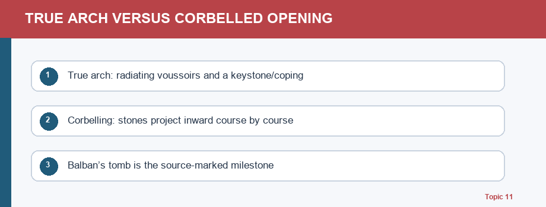
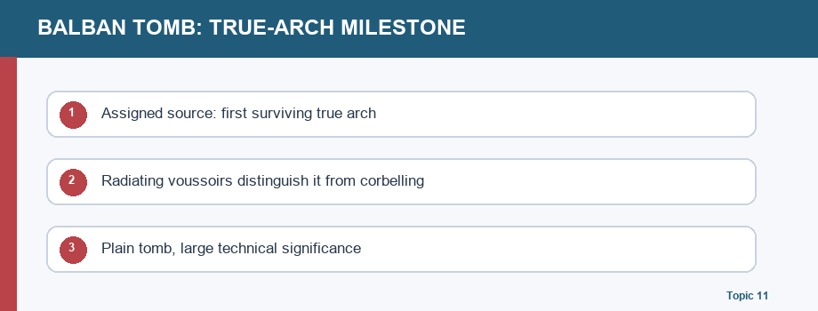
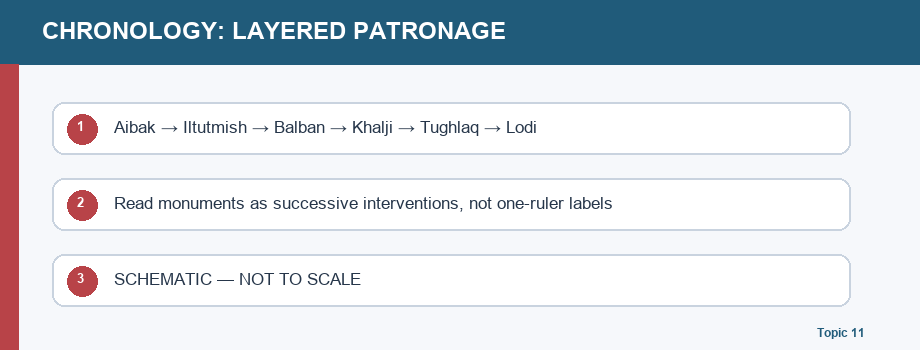

# Medieval History 11 — Art, Architecture & Culture of the Sultanate — Complete Topic Package

> **Subject:** Medieval Indian History | **GS Paper:** GS-I (History and Art & Culture) | **Export date:** 2026-08-18
> **Approval:** false — generated package awaiting explicit user approval.
> **Evidence convention:** ✅ fact is grounded in the assigned Markdown, local OCR books, or named official page; ⚠️ analysis is an interpretation with a stated limit.

*Sultanate art, architecture and culture topic-map cover*

## Roadmap and evidence protocol

This is a complete Guided-Tutor-style session for Topic 11. It treats **Sultanate culture** as a connected field of political patronage, technical change, craft labour, language and literature, music/performance, and regional adaptation. Architecture is therefore a principal evidence base, not the entire syllabus. The sequence moves from vocabulary and construction to early reuse, Delhi phases, regional forms, cultural production, source criticism, current conservation and examination practice.

✅ **Primary study spine:** the assigned `basic/11_Sultanate-Art-and-Architecture.md` and `advanced/11_Sultanate-Art-and-Architecture.md`; their chronology is checked against `00_Master-Chronology.md`. ✅ **Deeper local evidence:** OCR pages 232–235 and 262–264 of Satish Chandra, *Medieval India: From Sultanat to the Mughals, Part I*, and the local Nitin Singhania OCR pages 129–130 and 172. ✅ **Official current anchor:** UNESCO’s Qutb Minar and its Monuments page, fetched on 2026-08-18, on authenticity, ASI management and reversible conservation. ⚠️ No Qdrant retrieval was needed; the local evidence was sufficient.

### Pre-teach checklist

| Check | Result |
|---|---|
| Book context | ✅ Assigned Markdown plus OCR-searchable Satish Chandra and Nitin Singhania evidence queried |
| PYQ routing | ✅ Medieval audit rates Topic 11 as a compact topic; routing-ledger search found no 2018–2025 direct UPSC question owned by Topic 11 |
| Current anchor | ✅ UNESCO Qutb Complex page: managed by ASI; integrity/authenticity and reversible repairs stated |
| Scope guard | ✅ Delhi Sultanate core; Bengal/Gujarat/Malwa/Jaunpur only as bounded regional adaptations; no Mughal/Rajput/Sikh/Awadh survey |

### Learning path

1. Define the cultural field and terminology.
2. Explain trabeate/arcuate change without a false “invention” story.
3. Read early reuse and adaptation precisely.
4. Track Qutb, Iltutmish, Balban and Khalji technical milestones.
5. Compare Khalji and Tughlaq forms and bounded regional schools.
6. Recover language, literature, music and workshop history.
7. Practice source criticism and answer writing.
8. Finish with topic-specific register notes — intentionally placed last.

    ## 1. What this topic means: culture, power and production

    

*1. What this topic means: culture, power and production*

    ✅ A Delhi Sultanate cultural answer begins with more than a list of monuments. Rulers and elites commissioned mosques, minars, fortifications, tombs and learning spaces; these were built through supplies of stone, brick, lime, timber, transport and skilled labour. Their form could make congregational ritual possible, mark a skyline, order a courtly or funerary space, and project political authority. Architecture is thus a record of patronage and material organisation as well as beauty.

⚠️ “Indo-Islamic synthesis” is useful only when unpacked. At the technical level, it involves arcuate knowledge, mortar and dome-building alongside continuing slab-and-beam work. At the workshop level, it involves Indian stonecutters and masons, and, where the source says so, master architects arriving from West Asia. At the decorative level, it includes calligraphy and arabesque with local floral, bell, lotus and swastika motifs. It does **not** mean that power disappeared or that every form was equally shared.

✅ Satish Chandra frames the early period through conflict and rapprochement. Quwwat-ul-Islam and Arhai Din ka Jhonpra show early conversion/reuse, while later new buildings show confidence, experimentation and skilled collaboration. The evidence should be neither sanitised into a timeless cultural harmony nor inflated into a universal description of all construction. A particular reuse inscription or fabric tells us about that monument, its date and its intervention; it cannot alone narrate every regional Sultanate experience.

⚠️ For UPSC, use a three-part thesis: **rupture** names conquest and specific reuse; **adaptation** names local material and labour; **synthesis** names the concrete structural and decorative outcome. This avoids the vague opening, “two cultures met and mixed.” It also leaves space for regional difference and for uncertainty about motive.

    | Lens | What to identify | Named evidence |
|---|---|---|
| Power | Patronage, conquest, legitimacy, memory | Quwwat-ul-Islam; Qutb Minar; Tughlaqabad |
| Technique | Load path, mortar, dome transition, wall profile | Balban tomb; Iltutmish tomb; Alai Darwaza |
| Work | Labour, materials, craft transfer | Indian masons/stonecutters; local motifs |
| Culture | Court language, texts, music, regional speech | Persian; Sanskrit continuity; Amir Khusrau |
| Region | Material and climate adaptation | Bengal, Gujarat, Malwa, Jaunpur |

    ### Revision ledger

- ✅ Do not reduce culture to architecture alone.
- ✅ Name mechanism before using “synthesis.”
- ⚠️ A form may signal authority; the patron’s exact motive is rarely written on the wall.
- ❌ Do not turn one documented reuse case into a claim about every mosque.

    ## 2. Technical vocabulary: from beam to arch, dome and vault

    

*2. Technical vocabulary: from beam to arch, dome and vault*

    ✅ **Trabeate** construction uses posts or columns and horizontal lintels/beams. It is a load path across a span, not a religious label. **Arcuate** construction uses an arch, vault or dome to transfer compression around an opening and into supports. A **true arch** is built of radiating wedge-shaped **voussoirs**; a corbelled opening narrows by projecting courses inward until the gap is capped. Visual similarity does not erase structural difference.

✅ The corrective matters: arches and domes were known in India before the Sultanate. Satish Chandra’s account says that their correct scientific construction was rarely used at large scale; Sultanate building spread stronger lime-mortar construction and an arcuate repertoire. **Lime mortar** helps bind masonry, but it is not a magical explanation: design, cutting, centring, setting and skilled labour remain necessary. The Sultanate builders also continued to use slab-and-beam work. Therefore change is best understood as expanded capacity and combination, not replacement.

✅ A **dome** covers a space in compression; a **vault** is a continuous arched roof. A square room poses a geometric transition problem for a circular or polygonal dome base. A **squinch**, where source-grounded, is a corner device that mediates that transition; Iltutmish’s tomb is used in the assigned source for square-to-octagonal/domed experimentation. Do not introduce a pendentive as a memorised term unless the evidence for the monument supports it.

⚠️ Form changes function. A reliable arch and dome can reduce the need for a forest of pillars, creating larger covered halls, clearer sightlines and a stronger skyline. That makes mosques, palaces and assembly areas more usable and more visible. It does not mean every building was pillarless, or that technology alone explains political authority.

    | Term | Exam-safe meaning | Trap to avoid |
|---|---|---|
| Trabeate | Post-and-lintel, horizontal spanning member | Calling it “Hindu architecture” as an essence |
| Arcuate | Arch/vault/dome construction in compression | Saying it instantly displaced beams |
| Corbelled arch | Inward-projecting courses capped over a gap | Calling every pointed opening a true arch |
| True arch | Radiating voussoirs carrying compression | Confusing it with Alai Darwaza’s later maturity |
| Squinch | Transition device from square to dome zone | Using it without monument evidence |
| Batter | Deliberately sloping wall profile | Confusing it with corbelling |

    ### Revision ledger

- ✅ Balban’s tomb = first surviving true arch in the assigned source.
- ✅ Alai Darwaza = mature scientific arch-and-dome mastery, not the first surviving true arch.
- ✅ Mortar is a material condition; workmanship and geometry still matter.
- ❌ Never write “Muslims invented the arch and dome.”

    ## 3. Early phase: reuse, conversion and adaptation

    

*3. Early phase: reuse, conversion and adaptation*

    ✅ In the early Sultanate, new rulers needed residences, places of worship and a built political presence. Satish Chandra identifies Quwwat-ul-Islam near the Qutb Minar and Arhai Din ka Jhonpra at Ajmer among structures converted/adapted in the early phase. At Quwwat-ul-Islam, the source describes an arcaded courtyard of reused pillars and a new façade/screen; decorative treatment avoided human and animal figures in the religious setting and used floral scrolls and Quranic verses. This is direct evidence of conquest, reuse and a new ritual programme.

✅ **Spolia/reuse** means material or architectural elements from an earlier structure incorporated in a later one. It is not a euphemism for power: reuse can record appropriation and disruption. But it is not a universal explanation either. The advanced source stresses that Quwwat-ul-Islam is a documented case. An answer should name the inscription/fabric context if available rather than generalise a claim about all Sultanate buildings. It should equally notice craft adaptation: reused columns and newly constructed arches/screens required decisions by workshops, not passive juxtaposition.

✅ Arhai Din ka Jhonpra should be handled carefully. The assigned source describes it in the category of early converted/adapted buildings and associates it with a monastery in its account. The answer does not need to force one later popular story of origin. Its value is comparative: it shows that early mosque formation could involve an existing fabric and a newly articulated façade, while Qutb offers the most developed Delhi complex for evidence-led analysis.

⚠️ The interpretive gain is precision. “Rupture and synthesis” are not competing slogans. The same complex may register conquest through reuse, technical experimentation through arches and mortar, and workshop collaboration through local stone carving. The historian must separate what the material demonstrates from the broader claim it cannot carry.

    | Evidence layer | What it can show | What it cannot prove alone |
|---|---|---|
| Reused pillar/fabric | A material intervention and continuity of material | A universal policy across every region |
| Inscription | Named patron, act, date or formula where legible | Every social motive behind the act |
| Monument plan | Courtyard, screen, access and ritual arrangement | Exact labour relations without corroboration |
| Later legend | Memory and later reception | Unchecked medieval provenance |

    ### Revision ledger

- ✅ Use “specific documented reuse” rather than blanket language.
- ✅ Quwwat-ul-Islam: courtyard, arcades, screen and minar must not be collapsed into one date.
- ⚠️ A workshop can adapt material while political domination remains real.
- ❌ “Spolia means there was no new architecture” is false.

    ## 4. The Qutb complex: layered patronage and experimental craft

    

*4. The Qutb complex: layered patronage and experimental craft*

    ✅ The Qutb Minar is a layered monument. The assigned sources attribute its beginning to Qutbuddin Aibak, major completion to Iltutmish, and later repair/rebuilding of damaged upper work to Firoz Shah Tughlaq. This sequence is more useful than an isolated ruler-monument pair. It makes the tower a record of successive patronage, repair, technical continuity and changing claims on the complex.

✅ Satish Chandra emphasises its tapering height, projecting balconies, ribbed/angular projections and red-and-white sandstone contrast. The form has a functional association with the call to prayer, but an answer can also read it as a landmark and a statement of scale. Do not reduce it to one function or repeat an unsourced certainty about whom its later name commemorates. The source itself notes that later saintly association and the name’s explanation require care.

✅ Iltutmish’s nearby tomb offers a different lesson. Its square chamber shows experiments in creating an octagonal transition and a dome zone using squinch-like devices. That is a technical history, not merely ornament. Calligraphy and arabesque coexist with local floral carving, making the tomb a strong example for “form, surface and craft” in one evidence unit.

✅ UNESCO’s official Qutb page describes the property as a complex of mosques, minars, tombs, a madrasa, the Iron Pillar and other structures; it notes the Quwwatu’l-Islam courtyard and later additions. UNESCO says the property is managed by ASI, regards its authenticity and integrity as substantially maintained, and describes periodic repairs as respecting original construction, architectural and ornamentation systems and being reversible. ⚠️ This is a conservation anchor, not proof that every medieval attribution in later debate is settled.

    | Component | Primary answer use |
|---|---|
| Quwwat-ul-Islam | Early reuse, congregational court, decorative transition |
| Qutb Minar | Layered patronage, visibility, stonework, repair history |
| Iltutmish tomb | Square-to-dome experiment, tomb tradition, surface grammar |
| Alai Darwaza | Khalji gateway and mature arcuate proportion |
| Alai Minar base | Ambition and incompletion; do not invent its finished form |

    ### Revision ledger

- ✅ Use the complex as a connected ensemble, not a photo-caption list.
- ✅ Qutb Minar’s later repair is evidence of maintenance and layered patronage.
- ⚠️ UNESCO conservation language is present-day management evidence.
- ❌ Do not transfer Alai Darwaza’s technical claim to Balban or vice versa.

    ## 5. Balban and Khalji: milestone, mastery and urban ambition

    

*5. Balban and Khalji: milestone, mastery and urban ambition*

    ✅ The distinction between Balban’s tomb and the Alai Darwaza is a high-value Prelims and Mains discriminator. The assigned source identifies the **first surviving true arch** in Balban’s tomb. Its significance lies in the use of radiating voussoirs rather than merely stepping stones inward across a gap. The monument is comparatively plain; technical importance does not depend on surface splendour.

✅ The **Alai Darwaza**, built in Alauddin Khalji’s programme, represents a later stage of mature scientific arch-and-dome construction. Satish Chandra highlights its radiating voussoirs, horseshoe arch, proportion and red sandstone/white marble contrast. The advanced file calls it an accomplished use of dome, arch and proportion. Therefore the correct sentence is: Balban provides the surviving true-arch milestone; Alai Darwaza displays mature mastery. The tempting sentence, “Alai Darwaza was the first true arch,” loses the sequence.

✅ Khalji patronage also included Siri and an ambitious, incomplete Alai Minar. Siri’s fragmentary survival is itself a caution against invented detail. Alauddin’s expansion of the Qutb ensemble and its ceremonial gateway can be read as urban and political ambition, but an answer should distinguish observed scale and programme from a claimed inner motive. “It projected authority” is a reasonable inference when linked to visibility, enclosure, gateway and scale; “it proves a single motive” is not.

⚠️ The Khalji phase shows why technique and ornament should not be put in separate boxes. Proportion, structural confidence, contrast of materials, inscriptions and geometry make one visual and spatial language. The same building can answer a technical question, a patronage question and an art-history question if the evidence is selected rather than merely listed.

    | Comparison | Balban tomb | Alai Darwaza |
|---|---|---|
| Core value | First surviving true arch in assigned source | Mature scientific arch and dome |
| Structural cue | Radiating voussoirs | Accomplished proportion and arcuate construction |
| Phase | Later 13th-century Mamluk context | Alauddin Khalji programme |
| Exam trap | Do not call it merely corbelled | Do not call it first surviving true arch |

    ### Revision ledger

- ✅ Qutb complex + Alai Darwaza = gateway, programme, ornament and engineering.
- ✅ Siri = Khalji urban ambition, but surviving evidence is limited.
- ⚠️ “Legitimacy” needs form-based evidence: scale, location, visibility, patronage.
- ❌ Never fabricate the unbuilt height or final form of Alai Minar.

    ## 6. Tughlaq form: fortification, batter and qualified interpretation

    

*6. Tughlaq form: fortification, batter and qualified interpretation*

    ✅ Tughlaq architecture changes the visual register. The assigned source associates Tughlaqabad and the tomb of Ghiyasuddin Tughlaq with sloping or battered walls, high platforms, a stronger/fortress-like profile and comparatively restrained decoration. **Batter** means a wall that slopes, producing an effect of solidity and strength. It is directly observable form; do not confuse it with the true-arch question or with corbelling.

✅ Satish Chandra describes Tughlaqabad as a major fortified complex and associates an artificial lake with the blocking of a water passage in the account. The tomb of Ghiyasuddin is described through sloping walls, a high setting and a marble dome. These elements can support an answer on military architecture, skyline and the relation of enclosure to authority. They do not, without more evidence, settle whether economy, military threat, aesthetic choice or patronal temperament was the sole cause of the style.

✅ The Tughlaq source also records combination: arches and domes could coexist with lintel-and-beam principles. Rubble, lime plaster and limited carving helped yield a different surface character from the red sandstone emphasis of the Khalji example. Lotus devices appear in the account, another reason not to present Tughlaq austerity as a complete rejection of local decorative vocabulary.

✅ The Sayyid–Lodi transition matters only as a bridge. The sources locate a more confident double-dome device in later Sultanate/Lodi experimentation, separating outer silhouette from the interior ceiling height. This is useful as a technical continuation and a forward link to Mughal architectural development; it is not a licence to turn Topic 11 into a Mughal survey or to claim a single absolute “first” without source qualification.

    | Feature | Direct observation | Careful inference |
|---|---|---|
| Batter | Sloping wall/profile | Defence, economy or political mood as a sole motive |
| Rubble/lime/plaster | Material and surface character | A universal absence of decoration |
| Tughlaqabad | Enclosure, fortification, water association | Exact scale of every lost element |
| Ghiyasuddin tomb | Platform, slope, dome, profile | One fixed symbolic meaning |
| Double-dome transition | Technical response to inner/outer proportion | A clean Sultanate–Mughal rupture |

    ### Revision ledger

- ✅ Khalji versus Tughlaq is a comparison of form, material, ornament and setting.
- ✅ Form is evidence; motive is interpretation.
- ✅ Trabeate and arcuate methods continue together.
- ❌ “Tughlaq = no decoration” ignores the source’s qualifications and lotus device.

    ## 7. Bounded regional schools: adaptation rather than a second dynastic survey

    

*7. Bounded regional schools: adaptation rather than a second dynastic survey*

    ✅ Regionalisation is essential because it demonstrates that Sultanate-era building did not reproduce one Delhi template. This topic only needs a bounded matrix, with the detailed political history retained in Topic 08. The question to ask is: how do form, material, craft vocabulary and climate/resource setting change when a shared architectural repertoire moves across regions?

✅ **Bengal** is associated in the supplied materials with brick construction, curved/Bangla roof adaptation and the drop-arch tradition. The point is not that every Bengal building follows one formula; it is that local material and heavy-rainfall vernacular roof forms helped produce a recognisable adaptation. **Gujarat** is useful for fine stone work and a craft vocabulary shaped by Jain-associated carving traditions; this offers a strong workshop rather than “fusion” explanation.

✅ **Malwa/Mandu** can be used for mass, ventilation, water and climate-responsive features. **Jaunpur** is associated in the source spine with lofty portal/screen emphasis and a no-minar tendency. Each requires a named form and a regional reason, not a bare school label. Do not pull Bijapur, Rajput, Sikh or Awadh material into a Delhi Sultanate answer simply because it is “Indo-Islamic”; that violates chronology and scope.

⚠️ Regional comparison also corrects a politics-only account. Provincial courts could appropriate, adapt or reject particular Delhi emphases while relying on local workers and local material supplies. Style becomes evidence of political autonomy only after the material/form has first been described. It is stronger to write “Bengal’s brick and curved roof translated regional building conditions” than “Bengal had a unique spirit.”

    | School | Bounded marker | Analytical use |
|---|---|---|
| Bengal | Brick; curved/Bangla roof; drop-arch association | Material/climate adaptation |
| Gujarat | Fine stone; Jain craft vocabulary | Workshop and motif continuity |
| Malwa/Mandu | Mass, ventilation, water/climate response | Environment and court setting |
| Jaunpur | Lofty portals/screens; no-minar tendency | Regional formal choice and autonomy |

    ### Revision ledger

- ✅ Give a device plus a regional setting.
- ✅ Link forward to Topic 08 for dynastic detail.
- ⚠️ Regional style is not an ethnic essence.
- ❌ Avoid a full Mughal/Rajput/Sikh/Awadh survey here.

    ## 8. Decoration, function and the built social world

    

*8. Decoration, function and the built social world*

    ✅ Sultanate religious architecture often places non-figural ornament at the centre: Quranic calligraphy, geometric pattern, floral design and **arabesque**. Arabesque is not simply “Islamic decoration”; in this topic it means an interlaced/continuous geometric-vegetal grammar whose surface can be joined to inscription. Satish Chandra observes that Arabic script itself became a work of art. The value of naming calligraphy is that it explains how text becomes visual structure and prestige, not merely how a wall is labelled.

✅ Local motifs matter. The assigned sources name bell, lotus and swastika motifs alongside floral forms. Their presence supports an account of craftsmen, visual vocabulary and adaptation; it does not prove that political power was absent or that all buildings were stylistically identical. The safest formulation is specific: religious settings emphasised non-figural decoration, and local motifs could be incorporated. An absolute ban on all figures across private, secular and all regional contexts goes beyond the evidence.

✅ Form also performs work. A **mosque** gathers worshippers and needs a legible orientation and covered/uncovered communal space; a large hall and reduced pillar obstruction can improve sightlines and ritual assembly. A **madrasa** is a place of learning. A **khanqah** supports Sufi discipline, teaching, hospitality and social encounter. A **tomb/mausoleum** structures burial memory and dynastic or saintly commemoration. A **minar** is associated with the call to prayer and can operate as an elevated landmark. These are functional starting points, not exhaustive social histories.

⚠️ Political legitimacy is built through this functional world: a gate controls approach and creates ceremony; a minar changes the skyline; a tomb stabilises memory; a madrasa and khanqah organise learning and hospitality. An answer earns more when it moves from form to use to authority, rather than asserting “buildings showed power” without a mechanism.

    | Form | Immediate function | Broader analytical question |
|---|---|---|
| Mosque | Congregation, orientation, ritual gathering | Access, acoustic/sightline and public presence |
| Madrasa | Teaching and learned patronage | Knowledge, patronage and urban institution |
| Khanqah | Sufi discipline and hospitality | Networks, service and cultural encounter |
| Tomb | Burial and remembrance | Dynastic/saintly memory and skyline |
| Minar | Call-to-prayer association, landmark | Visibility and layered patronage |

    ### Revision ledger

- ✅ Arabesque = patterned geometry/vegetal design with inscriptional possibilities.
- ✅ Calligraphy can be visual art as well as text.
- ✅ Functional explanation must be tied to a form.
- ❌ Do not make non-figural religious decoration into an all-context absolute.

    ## 9. Language, literature, music and Amir Khusrau: plurality with attribution caution

    

*9. Language, literature, music and Amir Khusrau: plurality with attribution caution*

    ✅ Culture under the Sultanate includes texts and languages. Satish Chandra states that Persian became a language of administration, diplomacy, upper-class culture and literary production. It also says Sanskrit and Persian functioned as important link languages in politics, religion and philosophy, while regional languages developed as literary and sometimes administrative media. This is not a clean succession from Sanskrit to Persian to vernaculars; it is coexistence, translation, patronage and uneven regional use.

✅ Amir Khusrau is an unusually valuable source and subject. Satish Chandra cites his early-fourteenth-century observation that provinces had distinct languages, including Hindavi and a range of regional languages. That makes him evidence for linguistic plurality, though a courtly literary observer is not a census. His Persianate literary corpus and Hindavi association make him an appropriate example of cultural production at a courtly/Sufi intersection. His *Nuh Sipihr* is locally noted for praising India’s climate, languages, arts and music.

✅ The source-based caution is as important as the celebratory fact. Later traditions credit Khusrau with many musical inventions. The local Satish Chandra OCR states there is no evidence for the sitar attribution and places tabla’s development much later; the local Nitin OCR says qawwali-originator credit is widely disputed. Use the safe claim: he is a major literary-cultural figure connected with musical/cultural interaction. Do not attach every form or instrument to one famous name.

✅ Music can be framed as contact. Satish Chandra notes systematic interaction in India under the Sultanate between an inherited Arab-Iranian/Central Asian musical tradition and Indian musicians, modes and regulations. Courtly patronage, Sufi gatherings and regional centres mattered, but Topic 11 should not duplicate Topic 10’s full Bhakti-Sufi doctrinal narrative. The analytical result is cultural rapprochement through practice, not proof of a frictionless social merger.

    | Domain | Source-grounded point | Qualification |
|---|---|---|
| Persian | Court, administration, diplomacy and chronicles | Not the only language in every setting |
| Sanskrit | Continued learned/religious and literary role | Prestige and use varied by region/context |
| Regional languages | Literary maturity and administrative use expanded | Do not assign one simple cause |
| Amir Khusrau | Literary-cultural figure; observes language plurality | Courtly observer, not a census |
| Music | Contact and incorporation of modes/instruments | Invention legends need proof |

    ### Revision ledger

- ✅ Persian + Sanskrit + regional speech = coexistence model.
- ✅ Khusrau supports linguistic plurality and cultural production.
- ⚠️ A later legend is evidence of reception, not automatically origin.
- ❌ Do not write that Khusrau invented tabla.

    ## 10. Source method, conservation and answer discipline

    

*10. Source method, conservation and answer discipline*

    ✅ Monumental form is evidence, but it has a defined reach. A battered wall can demonstrate slope and profile; a courtyard can demonstrate spatial organisation; masonry can demonstrate material use. An inscription may provide a more precise patron/date/act. A court chronicle can narrate patronage and political idiom but has authorial perspective. Literary tradition records cultural memory and vocabulary; later legend may be valuable for reception but is weak proof of medieval technical authorship. A strong answer makes these distinctions visible.

✅ The official UNESCO Qutb page supplies a bounded current heritage anchor. It calls the Qutb complex an outstanding testimony to early Islamic rulers’ architectural and artistic achievements, describes Quwwatu’l-Islam’s courtyard and carved pillars, and places the complex’s protection and management with the Archaeological Survey of India. It also says conservation repairs respect original systems and are reversible. These facts support an answer on authenticity, heritage management and the ethics of conserving layered fabric.

⚠️ Modern litigation, political assertion or a viral “original identity” claim should not be made medieval evidence. The relevant medieval question still requires dated inscription, archaeological fabric, comparative form or contemporary text. The relevant contemporary question is different: how do ASI and UNESCO manage authenticity, integrity, visitor pressure, repair and interpretation? Keeping these evidentiary questions separate is not evasive; it is historical method.

✅ A Mains answer should follow a compact spine: **claim → named evidence → what its form/text proves → qualification → verdict.** For example: “Sultanate architecture was a negotiated technical transformation” (claim); “Balban’s radiating voussoirs, Alai Darwaza’s mature arcuate geometry, and Iltutmish’s square-to-dome experiment” (evidence); “together they show increasing confidence with arches/domes” (analysis); “but beams and local craft grammar persisted” (qualification); “therefore change was expansion and adaptation, not an abrupt replacement” (verdict).

    | Source | Best question it answers | Main limitation |
|---|---|---|
| Monument/form | How a structure works or is organised | Motive/meaning may be underdetermined |
| Inscription | Patron, act, date, formula | Does not narrate all social effects |
| ASI/UNESCO description | Present management/authenticity framing | Not a substitute for medieval provenance |
| Court chronicle | Patronage, ideology, elite vocabulary | Genre and patronage bias |
| Literary tradition/legend | Reception and memory | Later attribution needs independent checks |

    ### Revision ledger

- ✅ A conservation anchor belongs in the conclusion or value-addition box, not as a substitute for medieval proof.
- ✅ Every architectural claim needs a named building and a feature.
- ⚠️ Separate observed form from inferred motive.
- ❌ Avoid modern dispute as evidence for medieval provenance.

## Distributed learning MCQ loop (18 questions; strict A → B → C → D rotation)

### Q1. Which formulation best corrects the claim that the Sultanate 'invented' arches and domes in India?

A. Arches and domes were known earlier; Sultanate builders expanded scientifically constructed arcuate use with strong mortar.
B. Arches and domes first appeared only after 1206.
C. The Sultanate abandoned all lintel-and-beam construction.
D. A dome was only an ornamental cap unrelated to structure.

**Answer:** **A**

**Explanation:** The chronology is decisive: **A** separates earlier Indian knowledge from the Sultanate’s wider scientific arcuate practice. **B** (“Arches and domes first appeared only after 1206.”) makes 1206 an impossible starting line and deletes the pre-Sultanate antecedent.
### Q2. A trabeate system is most accurately described as

A. a dome transferred to a square by a squinch.
B. post-and-lintel construction in which a horizontal member spans supports.
C. a pointed arch made of radiating voussoirs.
D. a wall deliberately sloped outward at its base.

**Answer:** **B**

**Explanation:** A trabeate span is identified by its horizontal load path, which **B** states accurately. **A** (“a dome transferred to a square by a squinch.”) names the square-to-dome transition instead of posts carrying a lintel.
### Q3. What makes a true arch structurally distinct from a corbelled opening?

A. A horizontal lintel crosses the opening.
B. Each course projects inward until a capstone can bridge the gap.
C. Radiating voussoirs form the arch and transmit compression around the opening.
D. A plastered rubble wall is set at a batter.

**Answer:** **C**

**Explanation:** Compression through radiating wedge stones is the technical marker captured by **C**. **B** (“Each course projects inward until a capstone can bridge the gap.”) describes inwardly projected courses, the corbelling mechanism the question asks the reader to distinguish.
### Q4. In the assigned source, the first surviving true arch is located in

A. Adhai Din ka Jhonpra.
B. the Quwwat-ul-Islam mosque.
C. the Alai Darwaza.
D. the tomb of Sultan Balban.

**Answer:** **D**

**Explanation:** The assigned-source milestone belongs to Balban’s tomb, so **D** preserves the stated attribution. **C** (“the Alai Darwaza.”) is the tempting later monument: it represents mature mastery, not the first surviving true arch.
### Q5. The most defensible description of the Alai Darwaza is that it

A. marks Khalji-era mature scientific arch-and-dome construction and proportion.
B. was the first surviving true arch in India.
C. was a Tughlaq fortress gate defined by batter.
D. was a Lodi double-dome tomb.

**Answer:** **A**

**Explanation:** Khalji-era proportion, dome work and scientific arcuate construction make **A** the defensible description. **B** (“was the first surviving true arch in India.”) steals Balban’s earlier structural milestone and reverses the sequence.
### Q6. The best way to use Quwwat-ul-Islam as evidence is to say that it

A. proves every Sultanate mosque reused temple material.
B. documents a particular early case of reuse, conversion and workshop adaptation within conquest.
C. proves political power was absent from architecture.
D. can be treated as a finished building of only one patron.

**Answer:** **B**

**Explanation:** The evidence has a deliberately limited scale: **B** identifies a documented early reuse and adaptation case within conquest. **A** (“proves every Sultanate mosque reused temple material.”) converts one complex into a rule for every Sultanate mosque.
### Q7. What was a central construction advantage of fine lime mortar in this topic?

A. It eliminated the need for skilled masons.
B. It converted every building into red sandstone.
C. It helped bind masonry for reliable arches, vaults and domes.
D. It made calligraphy structurally load-bearing.

**Answer:** **C**

**Explanation:** Reliable binding of arcuate masonry is the material advantage named in **C**. **A** (“It eliminated the need for skilled masons.”) treats mortar as a substitute for geometry and skilled stonecutting, whereas it enabled rather than replaced craft.
### Q8. Iltutmish's tomb is especially useful for explaining

A. the fully developed Mughal charbagh.
B. the first Lodi double dome.
C. a Jaunpur no-minar facade.
D. experiments in carrying a dome above a square chamber through an octagonal/squinch transition.

**Answer:** **D**

**Explanation:** The square-to-octagon/squinch transition is the experimental problem that **D** correctly attaches to Iltutmish’s tomb. **B** (“the first Lodi double dome.”) imports the later Lodi double-dome milestone into the wrong monument and phase.
### Q9. Qutb Minar is best remembered as a layered record because

A. Aibak began it, Iltutmish completed major work, and Firoz Shah Tughlaq repaired later damaged upper portions.
B. Alauddin Khalji alone completed all five storeys.
C. Balban built it as a tomb.
D. Sikandar Lodi added its first storey.

**Answer:** **A**

**Explanation:** Successive work by Aibak, Iltutmish and Firoz Shah Tughlaq makes **A** a layered-patronage reading rather than a single-builder label. **B** (“Alauddin Khalji alone completed all five storeys.”) wrongly assigns the entire tower to Alauddin Khalji, whose programme is associated with Alai work.
### Q10. Tughlaq 'batter' refers to

A. a painted calligraphic band.
B. sloping walls that create an effect of strength and solidity.
C. a masonry device of inward-projecting corbels.
D. the circular balcony of a minar.

**Answer:** **B**

**Explanation:** Batter is a wall profile—sloping and visually massive—as **B** specifies. **C** (“a masonry device of inward-projecting corbels.”) names the inward projection used in corbelling, not the slope of a Tughlaq wall.
### Q11. Which conclusion about Tughlaq architecture is most disciplined?

A. Every Tughlaq building was made only for war.
B. Austere form proves a ruler rejected all ornament on principle.
C. Its battered walls, rubble/lime surfaces and restrained decoration are observable; motives such as cost or insecurity need qualification.
D. Tughlaq builders used no arches or domes.

**Answer:** **C**

**Explanation:** The disciplined inference in **C** separates observable battered walls and materials from unproven motives. **A** (“Every Tughlaq building was made only for war.”) turns a fortress-like register into an all-purpose military function, an overclaim the surviving forms cannot establish.
### Q12. Which pairing is most appropriate for a bounded regional comparison?

A. Bengal—red-sandstone Alai Darwaza; Gujarat—Tughlaq batter as its sole device.
B. Bengal—Mughal pietra dura; Gujarat—Sikh onion domes.
C. Bengal—no-minar Sharqi portals; Gujarat—Gol Gumbaj.
D. Bengal—brick and curved-roof/drop-arch adaptation; Gujarat—fine stone carving shaped by local craft traditions.

**Answer:** **D**

**Explanation:** Material and form must stay tied to their regional setting; **D** pairs Bengal’s brick/curved-roof adaptation with Gujarat’s craft-rich stone work. **A** (“Bengal—red-sandstone Alai Darwaza; Gujarat—Tughlaq batter as its sole device.”) relocates Delhi’s red-sandstone Khalji gateway to Bengal and distorts both regions.
### Q13. In a mosque decoration answer, the safest formulation is that

A. religious structures often emphasised non-figural calligraphy, arabesque and geometry, while local floral motifs also appear.
B. all Sultanate visual culture prohibited every figure in every context.
C. calligraphy was merely a label and not ornament.
D. local bell and lotus motifs vanished from all buildings.

**Answer:** **A**

**Explanation:** The religious-architecture qualification in **A** accurately joins calligraphy, arabesque, geometry and local floral vocabulary. **B** (“all Sultanate visual culture prohibited every figure in every context.”) extends a bounded decorative pattern into an absolute claim about every Sultanate visual context.
### Q14. A khanqah is most accurately treated as

A. a congregational mosque’s western prayer wall.
B. a Sufi hospice/community institution for discipline, teaching and hospitality.
C. a royal tomb with a double dome.
D. a minar used solely for call to prayer.

**Answer:** **B**

**Explanation:** A khanqah’s distinctive role is Sufi discipline, teaching and hospitality, all retained in **B**. **D** (“a minar used solely for call to prayer.”) instead defines a minar, an elevated landmark associated with the call to prayer.
### Q15. The Persian language under the Sultanate is best described as

A. the only language used in administration across all regions.
B. a replacement that ended Sanskrit learning.
C. a major language of court, administration, diplomacy and chronicle writing that coexisted with Sanskrit and regional languages.
D. a language confined to music rather than texts.

**Answer:** **C**

**Explanation:** The correct historical model is multilingual coexistence: **C** gives Persian its courtly and administrative reach without erasing Sanskrit or regional languages. **A** (“the only language used in administration across all regions.”) imposes a total administrative monopoly not supported by the sources.
### Q16. A careful statement about Amir Khusrau is that he

A. can securely be credited with inventing tabla.
B. founded the Delhi Sultanate’s first mosque.
C. was the architect of Balban’s tomb.
D. was a major Persianate and Hindavi literary-cultural figure whose observations help evidence linguistic plurality.

**Answer:** **D**

**Explanation:** Literary-cultural work and observations of linguistic plurality are the source-grounded contributions in **D**. **A** (“can securely be credited with inventing tabla.”) repeats the tabla-invention legend, whose chronology is treated cautiously in the assigned material.
### Q17. UNESCO's Qutb-complex material is most useful in a current anchor because it

A. records authenticity, integrity, ASI management and reversible conservation principles rather than proving medieval claims through present disputes.
B. settles every disputed medieval attribution.
C. turns modern litigation into primary evidence of medieval provenance.
D. replaces monument and inscription evidence with tourism promotion.

**Answer:** **A**

**Explanation:** UNESCO supplies a present-day conservation anchor—authenticity, integrity, ASI management and reversible repair—which **A** defines correctly. **B** (“settles every disputed medieval attribution.”) exaggerates that modern heritage record into a final verdict on every medieval attribution.
### Q18. Which source pairing is most appropriate for a claim about Sultanate construction?

A. Use present political commentary as the primary medieval source.
B. Use monument form and secure inscriptional evidence for the medieval intervention, then use UNESCO/ASI material for present conservation.
C. Use a later legend alone to identify an original architect.
D. Use a conservation brochure to replace all architectural analysis.

**Answer:** **B**

**Explanation:** The source hierarchy in **B** keeps medieval intervention and current conservation in their proper evidentiary lanes. **D** (“Use a conservation brochure to replace all architectural analysis.”) wrongly lets a conservation brochure replace the fabric, form and inscriptional analysis required for construction history.

## Part II — Examiner-grade solved Mains practice

*Mains answer spine: claim, evidence, analysis, qualification and verdict*
### Mains 1. Sultanate architecture as rupture and synthesis — Discuss — 15 marks — Answer in 250 words

**Model solution**

Sultanate architecture should be read as a field of rupture, adaptation and technical synthesis, not as either a foreign imposition or a frictionless fusion. **Rupture** is visible in the early reuse at Quwwat-ul-Islam: the assigned sources describe an arcaded court using earlier pillars and a new mosque-facing screen. This is specific material evidence of conquest and reprogramming; it should not be universalised to every later mosque.

**Adaptation** followed in the workshop. Indian stonecutters and masons worked with local material and retained decorative vocabularies such as lotus, bell and swastika motifs. At Iltutmish’s tomb, the square chamber and squinch-like transition show an experiment in solving a local construction problem rather than a ready-made imported object.

**Synthesis** became structural and visual. Balban’s tomb supplies the source-marked surviving true arch of radiating voussoirs; Alai Darwaza later shows mature arcuate proportion, dome work, red sandstone and white marble contrast. These are concrete mechanisms of change, not a vague cultural label.

Yet the result was not uniform: beam-and-lintel work continued and Bengal, Gujarat, Malwa and Jaunpur adapted forms to material and craft settings. Thus Sultanate architecture records unequal power and reuse, while also producing a new, regionally varied construction language.

**Why this earns marks:** It answers the directive with a graded thesis; gives Quwwat-ul-Islam, Iltutmish’s tomb, Balban and Alai Darwaza as named evidence; explains what each proves; and limits both celebratory fusion and universal destruction claims.

### Mains 2. Technical transformation under the Sultanate — Explain — 10 marks — Answer in 150 words

**Model solution**

The technical contribution of the Sultanate was not the invention of arches or domes: both were known earlier in India. Its importance was the wider, more scientifically constructed use of the **arcuate** system with strong lime mortar and skilled masonry.

A trabeate span uses a horizontal lintel; a true arch uses radiating voussoirs to distribute compression. The assigned source identifies Balban’s tomb as the first surviving true arch, whereas the Alai Darwaza marks later mastery of well-proportioned arch-and-dome construction. Iltutmish’s tomb records the associated square-to-dome problem through an octagonal/squinch transition.

These changes permitted wider covered spaces with fewer supports, improved sightlines in mosques and palaces, and more conspicuous domes and minars on the skyline. Lime mortar was a necessary binding technology, but not the sole cause: Indian masons, stonecutters and continuing lintel-and-beam practice remained central.

Therefore the change was an expansion of reliable structural capacity and a combination of methods, not a total architectural replacement.

**Why this earns marks:** It directly corrects the invention trap, differentiates true arch from trabeate work, uses three monuments, connects technique to function, and retains the labour/continuity qualification.

### Mains 3. Khalji and Tughlaq architectural idioms — Compare — 15 marks — Answer in 250 words

**Model solution**

Khalji and Tughlaq buildings share Sultanate-era experimentation, yet their dominant visual languages differ. The Khalji idiom is best represented by the Alai Darwaza and the Siri programme. The gateway combines mature arcuate construction, a dome, carefully proportioned arches and red sandstone with white marble contrast. It makes ornament, colour and engineering work together; Siri and the incomplete Alai programme indicate urban ambition, although fragmentary survival limits reconstruction.

Tughlaq architecture presents a more massive profile. Tughlaqabad, Ghiyasuddin’s tomb and later buildings use battered or sloping walls, rubble/lime-plaster surfaces and relatively restrained carving. The tomb’s platform, slope and marble dome create a strong silhouette. The source also records continued combinations of arch principles with lintel-and-beam work and local lotus devices.

The contrast is therefore not “ornate culture versus unartistic austerity.” Khalji form foregrounds proportion, surface contrast and ceremonial gateway architecture; Tughlaq form foregrounds enclosure, mass and fortress effect. Political insecurity or economy may help interpret the latter, but the wall profile is direct evidence whereas a single motive is not.

Both styles show that technological confidence could serve different formal and political programmes.

**Why this earns marks:** It compares shared ground and divergence, uses four named monuments/programmes, distinguishes observation from motive, and avoids a simplistic value judgement.

### Mains 4. Regional adaptation — Examine — 15 marks — Answer in 250 words

**Model solution**

Regional Sultanate schools demonstrate that the Delhi repertoire was adapted rather than copied. In **Bengal**, brick and curved/Bangla-roof or drop-arch associations translate local material and rainfall-sensitive vernacular form into monumental building. In **Gujarat**, fine stone carving and Jain-associated craft vocabularies show that workshops mattered as much as a patron’s imported forms. In **Malwa/Mandu**, mass, ventilation and water-related features support a climate-responsive reading. In **Jaunpur**, lofty portals/screens and a no-minar tendency distinguish a regional formal choice.

These examples should not be presented as four isolated “styles.” Each connects material, worker skill, climate or court setting to visible form. Nor should a candidate extend the comparison into a generic survey of Mughal, Rajput, Sikh and Awadh architecture; those later traditions have different chronology and questions.

Regional variation also qualifies the phrase Indo-Islamic synthesis. It is better to say that a common repertoire of arches, domes, inscription and mosque typology was locally reworked than to posit an abstract national fusion. The forms preserve political autonomy and resource contexts without implying sealed cultural blocks.

Thus regional schools convert a Delhi-centred history into a material and spatial history of adaptation.

**Why this earns marks:** It supplies a device and analytical driver for four regions, preserves the topic boundary, and gives a precise anti-essentialist conclusion.

### Mains 5. Spolia and source interpretation — Assess — 10 marks — Answer in 150 words

**Model solution**

Spolia/reuse should be treated as a source problem, not as a slogan. Quwwat-ul-Islam provides a specific early Sultanate case: the assigned sources describe an arcaded courtyard using earlier pillars and a new mosque-facing screen. This material evidence can support an argument about conquest, conversion, reuse and workshop adaptation.

Its strength is concreteness. Fabric and, where available, inscription are closer to the act of building than a later polemical claim. But they have limits. One complex cannot prove that every Sultanate mosque was made through identical destruction or that reuse exhausted the era’s architecture. Later buildings such as Iltutmish’s tomb and Alai Darwaza show new construction and technical experimentation.

An outstanding answer therefore names the object, identifies what reused material shows, and separates direct evidence from inference about motive. It neither erases violence through the word “synthesis” nor converts a specific episode into a civilisational totality.

Spolia is most useful when it makes the answer more precise about power, material continuity and evidence limits.

**Why this earns marks:** It interprets one named, source-grounded case; brings in a counter-example; and makes the source hierarchy explicit rather than asserting an unsupported generalisation.

### Mains 6. Craft labour and technology — Discuss — 10 marks — Answer in 150 words

**Model solution**

Sultanate monuments were collective production systems. Satish Chandra notes the centrality of indigenous stonecutters and masons, later joined in some cases by master architects from West Asia. Their work connected quarrying, transport, lime-mortar preparation, stone cutting, setting, carving and repair.

This labour history explains why “Indo-Islamic synthesis” is material rather than merely visual. Iltutmish’s tomb records experiments in moving from a square chamber towards a dome; Balban’s radiating-voussoir arch reflects structural knowledge; the Alai Darwaza combines proportion with coloured stone and ornament. Local bell, lotus and floral motifs further show that workshops carried visual vocabularies across new patronage.

Patronage made such projects possible, but a ruler’s name does not create an arch by itself. Qutb Minar’s multi-reign construction and Firoz Shah’s later repair make this especially clear: monuments have long material lives.

Thus craft labour is not background scenery. It is the mechanism through which patronage, technology and local material became durable cultural form.

**Why this earns marks:** It makes labour causal, not decorative; gives three technical examples plus Qutb’s repair history; and ties workshop evidence to the question’s central concept.

### Mains 7. Architecture and legitimacy — Analyse — 20 marks — Answer in 250 words

**Model solution**

Architecture enabled legitimacy through spatial, technical and memorial mechanisms, but it should not be reduced to propaganda. A mosque’s courtyard and screen organise congregation; a minar creates a landmark and is associated with the call to prayer; a fortified enclosure structures access and defence; a tomb stabilises dynastic or saintly memory. These functions make political visibility possible.

The Qutb complex offers layered evidence. Quwwat-ul-Islam’s reworked fabric and new screen mark an early regime’s religious-political presence. Qutb Minar, begun by Aibak, substantially completed by Iltutmish and later repaired under Firoz Shah, creates a durable skyline and a record of successive patronage. Alauddin’s Alai Darwaza adds a ceremonial, technically mature gateway to the ensemble: scale, approach, colour contrast and proportion can support an inference of royal aspiration.

Tughlaqabad and Ghiyasuddin’s tomb demonstrate a different idiom. Battered walls, enclosure, high setting and a strong dome profile produce an effect of solidity and fortress character. These visible forms support a claim about defensive and authoritative presentation. They do not prove that fiscal economy or insecurity alone caused the style; motive needs corroborating text and context.

Regional schools qualify an imperial-centre story. Bengal’s brick/curved roof, Gujarat’s stone craft, Malwa’s climate response and Jaunpur’s portal emphasis show that legitimacy was articulated through local material and form, not a single Delhi language.

Thus buildings made authority visible and memorable through function, circulation, skyline and material command. The strongest conclusion is graded: architecture was a medium of legitimacy, mediated by workers, regions and practical use rather than a transparent statement of royal intention.

**Why this earns marks:** It works at 20-mark breadth: functions, five named evidence units, regional qualification, source-method restraint and a reasoned verdict.

### Mains 8. Cultural and language production — Discuss — 15 marks — Answer in 250 words

**Model solution**

Sultanate cultural production was multilingual and institutionally layered. Persian became a major language of court, administration, diplomacy and chronicle writing. Yet Satish Chandra also identifies Sanskrit and Persian as important link languages and notes the expansion of regional-language literary and administrative use. The right image is therefore coexistence, translation and uneven patronage, not a simple replacement of one language by another.

Amir Khusrau provides a named evidence unit. His early-fourteenth-century observation of distinctive provincial languages, including Hindavi, documents awareness of linguistic plurality. His Persianate literary work and Hindavi association make him a bridge between courtly and wider cultural worlds; *Nuh Sipihr* is locally noted for celebrating India’s languages, arts and music. This does not make him a census-taker or the solitary creator of a composite culture.

Translations, regional courts and devotional use of vernaculars also mattered. Sanskrit learning continued; regional languages gained literary maturity; Persian forms circulated. In music, contacts between Persianate and Indian modes developed under Sultanate conditions, but no single famous attribution should substitute for evidence.

The period’s cultural significance lies in the expansion of a multilingual public and literary field, shaped by patronage and practice, not in the birth of one homogeneous language or culture.

**Why this earns marks:** It answers culture beyond buildings, uses Persian/Sanskrit/regional evidence and Khusrau, explains coexistence, and limits overlarge claims about language or composite culture.

### Mains 9. Amir Khusrau and attribution caution — Examine — 10 marks — Answer in 150 words

**Model solution**

Amir Khusrau is a major literary-cultural figure, but a high-quality answer separates source-grounded contribution from later attribution. Satish Chandra uses his early-fourteenth-century comments to show that regional languages, including Hindavi, had distinct provincial lives. His Persianate writing and *Nuh Sipihr* make him evidence for literary production and for courtly recognition of Indian languages, arts and music.

He is also associated with cultural and musical interaction around the Delhi Sultanate and Sufi milieu. That association can support a discussion of contact between Persianate and Indian traditions. It cannot securely establish that he invented every famous instrument or musical form. The local Satish Chandra OCR explicitly says there is no evidence for the sitar attribution and dates tabla’s development much later; the local Nitin material calls qawwali-origin credit widely disputed.

The proper verdict is therefore neither dismissal nor legend. Khusrau’s documented literary and cultural role is substantial; particular invention claims must pass chronology and source tests.

**Why this earns marks:** It preserves Khusrau’s real importance while identifying two exact attribution cautions and the method—chronology plus source test—needed by the directive.

### Mains 10. Conservation and source method — Evaluate — 20 marks — Answer in 250 words

**Model solution**

Conservation of Sultanate monuments requires historical method because a monument is both medieval evidence and a living protected property. The first task is to separate evidence types. Building form can establish a courtyard, battered wall, dome transition or material palette; an inscription may identify an act or patron; a court chronicle explains elite language but has genre bias; a later tradition reveals reception rather than automatically medieval provenance.

The Qutb complex demonstrates this layered method. Quwwat-ul-Islam’s reused fabric must be read as specific evidence of early intervention; Qutb Minar’s Aibak–Iltutmish–Firoz sequence shows layered patronage and repair; Iltutmish’s tomb records a technical transition; Alai Darwaza illustrates Khalji arcuate maturity. These claims are strengthened by form, source-assigned chronology and inscriptions where available, not by a modern political assertion.

UNESCO provides the bounded contemporary anchor. Its official page describes the complex’s authenticity and integrity, ASI management, and periodic repairs that respect original construction, architectural and ornamentation systems and are reversible. Such language is directly useful for conservation ethics: retain layered fabric, document interventions, prefer reversibility and distinguish repair from reconstruction.

However, UNESCO/ASI management statements do not settle every medieval attribution, and modern litigation is not primary medieval evidence. Heritage interpretation should explain both reuse/power and technical/craft achievements without suppressing either.

The best evaluation joins preservation with evidentiary humility: conserve the material record precisely because it permits future, testable historical questions rather than turning the site into an answer to present-day polemic.

**Why this earns marks:** It meets a 20-marker with source hierarchy, four Qutb evidence units, official conservation facts, concrete conservation principles and a clear distinction between present management and medieval provenance.

## Part III — Advanced evidence laboratories: turning facts into answers

### Laboratory 1. Read structure before style labels

*True versus corbelled arch — visual structural discriminator*

*Dome and squinch transition — schematic technical sequence*

*Lime mortar technology chain — material to spatial capacity*

Architecture questions often fail because a candidate starts from a style label and then adds decorative adjectives. Start instead from **how the structure stands**. A trabeate span places a horizontal lintel on supports. The technical risk lies in the lintel’s span and in the concentration of load at its bearings. An arcuate opening is constructed as a compressive ring: wedge-shaped voussoirs press against one another, carrying force around the curve and down into the supports. A dome extends this logic in three dimensions; its thrust and transition require deliberate geometric and material management.

✅ Satish Chandra’s architecture pages give a particularly useful sequence. Earlier Indian builders knew arches and domes, but “the correct scientific method” was rarely used on a large scale. The source contrasts putting one stone over another to narrow a gap with a true arch based on radiating voussoirs and a coping stone. The tomb of Balban is its first surviving true-arch example. This must be written as a source-specific identification, not as a universal claim that no earlier structural arch could exist anywhere. In an answer, source qualification is a strength: it tells the examiner that the candidate knows why a classification is being made.

✅ The same pages make **lime mortar** a causal link. Mortar binds the masonry so that the pressure system of arch, vault and dome can work reliably. It helps explain larger, more open covered spaces, but it does not “cause” them alone. A patron must finance work; labour must prepare, cut and set materials; workers need empirical and/or transmitted technical knowledge; a site must have supply chains. The right causal line is: resources and patronage → workshop organisation → mortar and masonry technique → wider/loftier spaces → changed ritual, courtly and visual possibilities. Each arrow should be stated rather than implied.

✅ Iltutmish’s tomb supplies the geometry laboratory. A dome is circular or polygonal in plan while the chamber beneath may be square. The assigned source explains experiments through a square, an octagonal zone and squinch arches. The evidence supports “technical experimentation” and “adaptation of a square-to-dome problem.” It does **not** support a casually imported lecture on all Byzantine pendentives or an unqualified claim that the tomb is the first dome in India. High-scoring answers resist an attractive but irrelevant technical digression.

### The four-step diagnostic

| Ask | If the answer is yes | Useful conclusion |
|---|---|---|
| Is there a horizontal beam on supports? | Trabeate load path | Continuity of lintel-and-beam practice |
| Are stones wedge-shaped and radial? | True arch logic | Arcuate structural confidence |
| Do courses project inward? | Corbelled opening | Not a true arch merely because it looks curved |
| Does a square room become an octagon before a dome? | Transition device/squinch evidence | Experiment in dome construction |

⚠️ An examiner does not need engineering jargon for display. Use a term only when it answers the directive. “The Alai Darwaza is beautiful” is weak. “Its radiating-voussoir arch and dome show a later stage of proportioned arcuate construction than the Balban tomb” contains chronology, structure and analysis. A small labelled sketch of load direction can earn value addition when it remains accurate and compact.

### Laboratory 2. The Qutb complex is a sequence, not a single monument

*Quwwat-ul-Islam complex plan schematic — not to scale*

*Arhai Din ka Jhonpra transition — evidence-led adaptation*

*Iltutmish tomb — square-to-dome technical experiment*

*Balban tomb — first surviving true-arch milestone*

*Siri and Alai urban ambition — survival and reconstruction caution*

The Qutb complex is the most efficient evidence cluster in this topic because it contains several different historical questions in a small area. A candidate should not simply write five names. The **Quwwat-ul-Islam mosque** addresses early mosque formation, reuse and congregational space. The **Qutb Minar** addresses layered patronage, landmark visibility and repair. **Iltutmish’s tomb** addresses a royal tomb tradition, surface decoration and a technical dome transition. The **Alai Darwaza** addresses Khalji ceremonial access and mature arcuate construction. The **Alai Minar** base addresses ambition and incompletion. The complex thereby becomes a source laboratory, not an example bank.

✅ UNESCO’s official account describes Quwwatu’l-Islam as a large rectangular courtyard enclosed by arcades and a five-arched western screen, with carved temple elements including pillars and cladding. It says that later rulers completed the ensemble and describes Qutb Minar as a minar at the mosque’s south-eastern corner, with inscriptional bands and projecting balconies. In a conservation answer, use these as official statements of the current World Heritage interpretation. In a medieval construction answer, combine them with the assigned Satish Chandra analysis rather than treating a visitor description as a full social history.

✅ The minar is a particularly good case for “layered patronage.” The source spine gives Aibak’s initiation, Iltutmish’s major completion and Firoz Shah Tughlaq’s repair after damage. This explains why a monument’s present appearance is not necessarily the work of one founder or one year. It also gives a transferable method: first identify initial construction, then additions, then repair, then later name/reception. A similar method prevents careless claims about medieval buildings that have been altered by weather, use and later conservation.

⚠️ Qutb’s ritual association with the call to prayer is valid; its extraordinary scale also changes urban perception. These are complementary, not competing, meanings. Yet a candidate should avoid certainty about every symbolic intention. “The minar made authority visible” is a supported inference when connected to height, location and landmark quality. “It proves that one ruler intended only religious conversion” is an untestable reduction.

**Arhai Din ka Jhonpra** is an excellent comparative restraint exercise. The early source calls it a converted/adapted existing building and identifies it with a monastery in its narrative. The answer should say only what the evidence warrants: early reuse/alteration, a changing ritual and formal programme, and a comparison with Quwwat’s more elaborate Delhi ensemble. It should not solve a different dispute through an unverified later tale. Precision is not a loss of confidence; it is how the answer remains historical.

### Laboratory 3. From Khalji proportion to Tughlaq mass

*Tughlaqabad fortress-water-city schematic — not to scale*

*Ghiyasuddin Tughlaq tomb — profile and analytical caution*

*Khalji versus Tughlaq — form, material and inference comparison*

*Lodi transition and double-dome boundary — carefully scoped*

The Khalji–Tughlaq comparison is not an invitation to rank two “styles”; it tests whether the candidate can turn material description into controlled analysis. **Khalji:** the Alai Darwaza’s red sandstone, white marble contrast, arches and dome point to a composed surface and mature arcuate confidence. Its gateway function also controls approach and ritual/ceremonial transition in the Qutb programme. **Tughlaq:** Tughlaqabad’s enclosure and water association, and Ghiyasuddin’s tomb with sloping walls, high setting and dome, foreground mass and a fortress-like profile. The source says battered walls create an effect of strength and solidity.

✅ A causal explanation needs more than a slogan such as “Tughlaqs were poor.” Material change can arise from availability of stone, cost and speed of construction, military demands, visual preference, workshop habits or a patron’s wider political conditions. The text may help establish some context, but form by itself does not disclose one hidden motive. The correct Mains move is a two-column sentence: “Batter and rubble/lime-plaster surfaces are directly visible; their association with defensive need or cost constraint is plausible but must be qualified.” This turns a weakness—uncertainty—into explicit method.

✅ The source’s mention of the **lotus** in Tughlaq buildings should be used to dismantle a binary contrast. Tughlaq austerity means restrained surface articulation relative to the Khalji example; it cannot mean “no decorative vocabulary” or “no local motif.” Similarly, the continuing combination of arches with beam-and-lintel principles prevents a technical binary: the arcuate repertoire expanded but did not erase older methods. These qualifications show the examiner that “style” is not a sealed box.

✅ The **double dome** needs a narrow treatment. The local art-and-culture source places a true double-dome development around the Lodi/Humayun transition and describes its solution: the external skyline can rise while the inner ceiling remains proportionate to the room. This is an excellent forward link. It is not a reason to narrate Humayun’s tomb, the Taj Mahal or all Mughal design in a Sultanate answer. Write one line: “Later Sultanate/Lodi experimentation with the double dome anticipates a technical refinement developed monumentally under the Mughals.” Then return to the question.

### Comparative paragraph template

> **Thesis:** Both phases used Sultanate-era technical resources, but Khalji form emphasised proportioned ceremonial ornament while Tughlaq form emphasised enclosure, battered mass and fortress effect.
> **Khalji evidence:** Alai Darwaza—arch/dome, colour contrast, gateway.
> **Tughlaq evidence:** Tughlaqabad and Ghiyasuddin tomb—batter, platform, enclosure/profile.
> **Qualification:** Wall form is direct evidence; a single fiscal or military motive is an inference.
> **Verdict:** The difference is a change in formal programme, not a shift from “art” to “no art.”

### Laboratory 4. Regional adaptation and workshop history

*Craft workshop collaboration — patron, material and labour chain*

*Delhi imperial style chronology — fast evidence map*

*Material and climate adaptation — regional construction logic*

*Patronage, labour and legitimacy — causal chain*

The four-school matrix—Bengal, Gujarat, Malwa and Jaunpur—is not a memory test about capitals. It trains a general proposition: an architectural repertoire moves through **materials, labour markets, climates, patrons and older local forms**. In Bengal, brick and the translated curve of the Bangla roof show how a region’s material conditions and wet-climate vernacular could enter a mosque architecture. In Gujarat, fine stone working and Jain-associated carving vocabularies show why local craftsmen cannot be reduced to silent executioners of an imported plan. In Malwa, mass, large openings/ventilation and water relationships give an environmental register. In Jaunpur, lofty portals and the no-minar tendency establish an alternative emphasis in façade and skyline.

✅ This matrix makes the phrase “provincial style” more exact. A province is not merely a smaller Delhi. It has a court, resource base, building traditions and political claims of its own. When a candidate says “Bengal adapted the Islamic arch to rain,” that is still too loose. The better statement identifies the visible form (brick and curved roof), the contextual driver (local material and rainfall-sensitive vernacular), and the analytical inference (a common repertoire was regionalised rather than mechanically copied). This three-part sentence can be applied to Gujarat, Malwa and Jaunpur without recycling identical language.

✅ Workshop history corrects a ruler-centred narrative. The source gives indigenous stonecutters and masons central place, with some master architects from West Asia later in the period. It is reasonable to infer collaboration, but do not invent named architects, contracts or ethnic workforces absent evidence. The durable claim is material: stone cutting, carving and transitional construction at Iltutmish’s tomb or the coloured masonry at Alai Darwaza require coordinated skilled work. A minar’s layered repairs further demonstrate that monuments have maintenance histories, not only founding moments.

⚠️ “Local motif” needs similar discipline. A lotus, bell or swastika does not prove a harmonious social merger; it demonstrates a visual vocabulary available to a workshop. Nor does inscriptional calligraphy prove a total external imposition; it may coexist with local carving methods. The strongest conclusion keeps both truth claims: political patronage and conquest shape what gets built; labour, material and prior practice shape how it is built.

### Evidence-to-analysis matrix

| Evidence | Immediate fact | Better analytical sentence |
|---|---|---|
| Bengal brick/curved roof | Material/form differs from Delhi red sandstone | Regional conditions transformed a shared mosque repertoire |
| Gujarat stone carving | Fine craft vocabulary visible | Workshop continuities make synthesis material |
| Malwa ventilation/water features | Spatial/environmental response | Climate and use influence formal choice |
| Jaunpur portal/no-minar tendency | Façade and skyline differ | Provincial courts select rather than merely receive forms |
| Lotus/bell motifs | Local device appears in source | Adaptation operates at visual/workshop level |

### Laboratory 5. Cultural production: languages, texts, music and evidence limits

*Amir Khusrau evidence versus legend — attribution caution*

*Music under Sultanate conditions — contact without invention myth*

*Mosque, madrasa, khanqah, tomb and minar — function matrix*

Culture is not only a residual category after architecture. **Persian** became a language of court, administration, diplomacy and chronicle writing, providing a key medium for elite memory and political discourse. **Sanskrit** continued in learned, religious and literary worlds. **Regional languages** developed literary maturity and, in some settings, administrative use; their rise was connected to regional courts, devotional practice, translation and wider social communication. A candidate should use “coexistence” but avoid treating that word as evidence-free harmony. Linguistic fields can overlap while access to patronage and prestige remains unequal.

✅ Amir Khusrau enables a precise answer. His observation that provinces possessed distinct languages—including Hindavi and many named regional languages—records an early-fourteenth-century awareness of plurality. His Persianate literary work, use of Hindavi associations and *Nuh Sipihr* make him a cultural intermediary, not a simple founder of a new language. He is a courtly literary observer, so the source cannot give statistical linguistic distribution. Yet it is exceptionally useful for demonstrating that medieval cultural life was not limited to Persian-speaking rulers and Sanskrit-speaking scholars.

✅ Music should be framed through **contact and circulation**. Satish Chandra writes that systematic contact between inherited Arab-Iranian/Central Asian traditions and Indian musical practice began in India under the Sultanate. The source refers to new modes and instruments and to later regional/courtly patronage. This supports an answer about interaction, repertoire and performance institutions. It does not support the legend that one person invented every later “Hindustani” form. The local OCR explicitly calls the sitar attribution unsupported and dates tabla much later; the Nitin OCR calls qawwali-originator credit widely disputed.

✅ Building functions reinforce this cultural picture. A madrasa makes learned patronage spatial. A khanqah makes discipline, hospitality and teaching spatial. A mosque organises congregation and ritual; a tomb organises remembrance; a minar shapes an audible/visible landmark. These are not just glossary definitions. They enable answers on cultural networks, education, Sufi presence and political memory without duplicating Topic 10’s full doctrinal history.

### Source criticism mini-drill

1. **Claim:** “Khusrau invented tabla.”
   **Test:** chronology and a local Satish Chandra statement place tabla’s development in the late seventeenth/early eighteenth century.
   **Verdict:** reject as an origin claim; retain Khusrau’s real literary-cultural importance.
2. **Claim:** “A lotus motif proves complete harmony.”
   **Test:** motif is visual/workshop evidence; Quwwat’s reuse also registers conquest.
   **Verdict:** treat motif as adaptation, not as a total social verdict.
3. **Claim:** “UNESCO settles medieval provenance.”
   **Test:** UNESCO page concerns contemporary World Heritage value, authenticity and management.
   **Verdict:** use it for conservation, then return to inscriptions, form and period sources for medieval attribution.

### Laboratory 6. How to build an exam answer under pressure

*Chronology visual — layered patronage and phase control*

*Conservation/current anchor — official evidence and scope*

The first thirty seconds should classify the directive. **“Discuss synthesis”** asks for mechanisms: technique, material, motif and labour. **“Explain technological transformation”** asks for trabeate/arcuate distinction, mortar, true arch, dome transition and function. **“Compare Khalji and Tughlaq”** asks for form/material/ornament and a careful motive qualification. **“Assess regional schools”** asks for each region’s device plus contextual driver. **“Evaluate culture”** asks for Persian, Sanskrit, regional languages, Khusrau and music caution. **“Heritage/source method”** asks for evidence hierarchy and bounded UNESCO/ASI value addition.

Next, build a named evidence ladder. For a 10-marker, choose two or three units: Balban plus Alai Darwaza, or Quwwat plus Iltutmish tomb. For a 15-marker, arrange four or five units across time and dimension. For a 20-marker, add regional adaptation, craft labour and source method. Avoid twelve names with no verbs. Every evidence unit needs a verb: Quwwat **registers** reuse; Iltutmish tomb **experiments** with transition; Balban tomb **marks** a surviving technical milestone; Alai Darwaza **displays** mature proportion; Tughlaqabad **organises** enclosure and mass; Bengali brick/roof **adapts** a repertoire.

Finally, write a qualification before the conclusion. It should be genuine, not ritual. Examples: “The documentation supports a particular case of reuse, not a universal pattern”; “batter is observable but a single political motive is inferred”; “Khusrau’s literary role is secure, individual invention claims are not”; “UNESCO manages present heritage, not every medieval attribution.” Such sentences make the conclusion defensible rather than merely balanced in tone.

### Ready-to-use answer skeletons

| Demand | Opening | Evidence order | Closing qualification |
|---|---|---|---|
| Synthesis | “A negotiated construction transformation, not a vague fusion” | Quwwat → Iltutmish → Balban → Alai → region | Power/reuse remains specific and real |
| Technology | “Expanded scientific arcuate use, not invention of arch/dome” | Trabeate contrast → mortar → Balban → Alai | Beams and local craft continue |
| Khalji–Tughlaq | “Different formal programmes within shared technical capacity” | Alai/Siri → Tughlaqabad/Ghiyasuddin | Motive is inferred from, not identical with, form |
| Culture | “A multilingual and performative field beyond buildings” | Persian/Sanskrit → regional languages → Khusrau → music | Legends require chronology/source tests |
| Conservation | “Layered fabric is evidence requiring reversible care” | Qutb units → UNESCO/ASI → source hierarchy | Present management ≠ medieval provenance |

### Laboratory 7. Monument biographies: how one site acquires several dates

*Rapid recall visual — keep technical milestones distinct*

A monument biography prevents the familiar but weak sentence, “X was built by Y.” Start with four questions: **Who initiated or altered it? When did each intervention occur? What material/form identifies the intervention? How has repair or later memory changed the object we see?** The Qutb complex answers all four. Its mosque courtyard, minar, tomb and gateway do not share one patron or one construction moment. Aibak, Iltutmish, Alauddin Khalji and Firoz Shah Tughlaq appear at different points in the complex’s material story. The appropriate verb is often “began,” “added,” “completed,” “repaired” or “altered,” rather than the indiscriminate “built.”

✅ This chronology matters for interpretation. The early Quwwat-ul-Islam fabric is a source for initial conquest-era reuse and mosque formation. Iltutmish’s tomb marks a later royal and technical moment within the same precinct. Alai Darwaza alters access and ceremonial expression in the Khalji programme. Firoz Shah’s upper-level repair of the minar records maintenance after damage. These events do not create a linear aesthetic progression in every dimension, but they demonstrate that monuments are active resources for successive courts.

⚠️ A monument biography should also distinguish **construction history** from **name history**. A later popular association may explain why a building is remembered under one name; it does not necessarily identify an architect, founder or original purpose. The assigned source itself advises caution about mechanical explanations of “Qutb” and saintly association. This is an excellent place to show source awareness without overloading the answer: “Later reception is historically important, but it should not replace the construction sequence preserved by fabric, inscriptions and the source spine.”

The approach travels beyond Delhi. A Tughlaq fortress may have stages of enclosure, water arrangement, repairs and later occupation. A regional mosque may combine a court’s commission with older craft conventions and later conservation. The candidate does not need to memorise every repair, but should learn the method: never assume a present monument is a frozen single-date object.

### Biography checklist for a 150-word answer

1. Name the **site and phase**, not merely the dynasty.
2. Identify one **form/material**: courtyard, arch, dome, batter, brick or stone carving.
3. State the **intervention verb**: begun, completed, added, repaired or adapted.
4. Give one **function**: congregation, approach, remembrance, learning, defence or visibility.
5. Add one **limit**: later alteration, fragmentary survival, or source scope.

### Laboratory 8. Terminology precision under Prelims pressure

The most deceptive Topic 11 questions are not obscure; they exchange two plausible terms. Build pairs rather than isolated flashcards. **Trabeate/arcuate** is a load-path pair. **True/corbelled arch** is a construction-method pair. **Balban/Alai Darwaza** is a chronology-and-significance pair. **Batter/corbelling** is a wall-profile versus opening-method pair. **Spolia/synthesis** is an evidence-and-interpretation pair. **Calligraphy/arabesque** is a text-image versus patterned-surface pair. **Madrasa/khanqah** is a learning institution versus Sufi hospitality/discipline pair.

✅ The elimination method follows from these pairs. If an option says Balban’s tomb had the first surviving true arch, test “true arch” against radiating voussoirs and the assigned source: it survives. If it says Alai Darwaza shows mature scientific arch-and-dome mastery, it survives. If it swaps those two claims, reject it even if both monuments “have arches.” If an option says Sultanate builders introduced arches and domes *for the first time*, reject it because the source makes the distinction between earlier knowledge and expanded correct scientific use. The test is often in the qualifier—*first*, *only*, *all*, *invented*—not the monument name.

✅ Regional options use the same rule. Bengal should trigger brick and curved-roof/drop-arch association; Gujarat fine stone and local carving tradition; Malwa mass/ventilation/water response; Jaunpur lofty portals and no-minar tendency. A Delhi feature placed in a regional option is a warning. An option that gives a genuine regional device but then declares it true of every provincial school is also vulnerable to elimination.

⚠️ For language/culture questions, reject total replacement stories. Persian was important to court, administration and chronicles; it did not make Sanskrit disappear. Regional languages had prior histories and acquired expanding literary and sometimes administrative roles; they did not emerge from one decree. Amir Khusrau’s language observations are evidence of contemporary awareness, but not a statistical survey. The correct answer is frequently the one that preserves this layered relationship.

### Rapid option-audit table

| If an option says | Ask this | Likely verdict |
|---|---|---|
| “All” / “only” / “every” | Does the source actually make a universal claim? | Usually reject unless the evidence is explicit |
| “First true arch” | Balban or Alai Darwaza? | Balban in assigned source |
| “Mature arch and dome” | Is it a Khalji gateway? | Alai Darwaza |
| “Sloping walls” | Wall profile or arch technique? | Batter/Tughlaq form |
| “Invented arches and domes” | Earlier knowledge acknowledged? | Reject; use expansion/scientific construction |
| “Khusrau invented tabla” | Does chronology support it? | Reject |

### Laboratory 9. A 20-mark integrated answer map

*Integrated answer map — patronage, labour, form and legitimacy*

An integrated 20-marker may ask about “the cultural contribution of the Delhi Sultanate” or “architecture as an index of social and political change.” The answer should not place architecture in the first half and language in a disconnected second half. Use **production** as the bridge. Courts and elites directed resources toward built and literary institutions; workers, scholars, poets, performers and administrators transformed those resources into public forms; those forms then structured worship, memory, education, hospitality, political visibility and regional identity.

Open with a qualified thesis: “Sultanate culture was neither a simple foreign overlay nor a seamless fusion; it was produced through patronage and unequal power, technical adaptation, collective labour and a multilingual cultural field.” Then provide a compact architecture sequence: Quwwat-ul-Islam for early reuse and power; Iltutmish’s tomb for experiment; Balban for true-arch milestone; Alai Darwaza for mature geometry; Tughlaqabad/Ghiyasuddin for mass, enclosure and batter. Each example must have an analytical verb.

Move to regional adaptation before literature. Bengal, Gujarat, Malwa and Jaunpur show that workers and materials regionalised a Delhi-centred repertoire. That transition allows language/culture to enter naturally: Persian made a courtly/administrative literary sphere; Sanskrit continued; regional languages expanded; Amir Khusrau observed plurality and wrote across a Persianate/Hindavi cultural environment. Music can be one qualified sentence on contact between traditions, followed immediately by attribution caution.

Close by rejoining the parts: “The period’s durable cultural achievement was the creation of varied institutions and forms—mosque, madrasa, khanqah, tomb, minar, courtly text and regional literature—whose meanings depended on concrete material and social conditions.” Add a single source-method sentence if space permits: “A monument shows form; an inscription may name an intervention; a court text frames elite culture; later legend must be tested.” This is integration, not accumulation.

### Final evidence bank: choose, do not dump

For **early rupture/adaptation**, choose Quwwat-ul-Islam and Arhai Din ka Jhonpra. State early reuse/adaptation, then identify what the fabric can and cannot prove. For **technical development**, choose Iltutmish’s tomb, Balban’s tomb and Alai Darwaza in that order: square-to-dome experimentation; first surviving true arch in the assigned source; mature scientifically proportioned arch-and-dome work. For **layered patronage**, choose Qutb Minar and use the verbs began, completed and repaired. For **Khalji–Tughlaq comparison**, choose Alai Darwaza/Siri against Tughlaqabad/Ghiyasuddin’s tomb, then use colour/proportion versus batter/mass/enclosure. For **regional adaptation**, choose exactly two or four regions with a form and driver each, rather than twenty unanalysed monuments.

For **culture**, choose Persian’s administrative-literary role, Sanskrit’s continuity, one regional-language mechanism and Amir Khusrau’s language observation. Add the music-contact point only if there is room to add the attribution caution. For **heritage**, use UNESCO’s authenticity, integrity, ASI management and reversible-repair language, then state that this is contemporary conservation evidence rather than medieval provenance. This evidence bank is intentionally redundant in places: UPSC questions alter directive and mark level, but the evidence must remain accurate when it is rearranged.

The final discipline is proportion. A 150-word answer can do one thesis, two monuments and one qualification. A 250-word answer can add a comparison and a regional or cultural extension. A 20-marker should expand dimensions, not pad descriptions: connect technique to labour, form to function, patronage to legitimacy, region to material, and current conservation to source method. Whenever a sentence adds none of these links, cut it and give the evidence more analytical work.

### Laboratory 10. Worked transformation of a weak answer

**Weak version:** “Sultanate architecture was a mixture of Hindu and Muslim styles. The Qutb Minar, Alai Darwaza and Tughlaqabad are famous. The rulers used arches and domes and built beautiful buildings. The Tughlaqs used strong walls. This shows cultural unity.”

This version risks marks for four reasons. First, “mixture” says nothing about structure, material, craft or power. Second, the names are decorative because no feature is attached to any of them. Third, it repeats the false invention story by suggesting that arches and domes simply arrived with rulers. Fourth, “cultural unity” suppresses specific reuse and regional variation. The repair is not to add more monuments; it is to make each sentence perform analytical work.

**Rebuilt version:** “Sultanate architecture was a contested technical and workshop transformation rather than a simple stylistic mixture. At Quwwat-ul-Islam, reused pillars and a new mosque-facing screen provide specific evidence of early conquest-era intervention and adaptation; this instance should not be universalised. Iltutmish’s tomb records attempts to carry a dome over a square chamber through an octagonal/squinch transition. The tomb of Balban then supplies the assigned source’s first surviving true arch, based on radiating voussoirs rather than corbelling, while Alai Darwaza demonstrates a later stage of proportioned arch-and-dome construction. Tughlaqabad and Ghiyasuddin’s tomb change the visual language through battered walls, enclosure and mass; the walls are directly observable, although a sole fiscal or military motive remains inferential. The result was plural, because Bengal’s brick and curved roof, Gujarat’s stone craft, Malwa’s climate response and Jaunpur’s portal emphasis regionalised a shared repertoire. Thus technical change, local labour and political power operated together without erasing rupture or diversity.”

Notice the repair sequence. The thesis is qualified. Each site is followed by a feature. The feature is followed by what it proves. A limitation is stated where the evidence is narrow. The region is not a second essay but a one-sentence test of the central claim. This model can be scaled down: for 10 marks, retain Quwwat, Balban, Alai Darwaza and the final verdict; for 15 marks, add Iltutmish and Tughlaq comparison; for 20 marks, add regional adaptation and source method.

### Laboratory 11. Worked transformation of a culture answer

**Weak version:** “The Delhi Sultanate brought Persian culture to India. Amir Khusrau invented many musical instruments and united all languages. Persian replaced Sanskrit, and Hindi developed because of the Turks.”

The problem is not merely factual. It imagines one-directional cultural action, converts a historical individual into a mythic inventor and makes a blanket language-replacement claim. The source spine instead shows a multilingual field. Persian had an important court, administrative, diplomatic and chronicle role. Sanskrit remained a learned and literary language. Regional languages had older trajectories but developed literary and, at points, administrative uses under multiple forms of patronage. That is a richer answer because it identifies institutions and media rather than assigning “culture” to one community.

**Rebuilt version:** “Cultural production under the Sultanate was multilingual and institutionally distributed. Persian became central to administration, diplomacy, courtly writing and chronicles, while Sanskrit continued as a learned and literary link language. Regional languages expanded through local courts, translation, devotional circulation and administrative practice; their development cannot be reduced to one conquest or decree. Amir Khusrau is a key literary-cultural figure because his early-fourteenth-century observations recognise distinct provincial languages, including Hindavi, and his *Nuh Sipihr* praises Indian languages, arts and music. His testimony is valuable but is not a census. In music, the period enabled contact between Persianate and Indian modes, musicians and performance settings. However, the local Satish Chandra material gives no evidence for a sitar invention by Khusrau and places tabla’s development much later; qawwali-origin claims are also disputed. Therefore the strongest conclusion is not that one person created a composite culture, but that courtly, Sufi, scholarly and regional institutions widened a multilingual cultural field.”

This answer earns marks because it has a direct thesis, four mechanisms of language expansion, a named text, an evidentiary limitation and a source-tested musical caution. It remains within Topic 11: it does not retell every Bhakti or Sufi doctrine, and it does not drift into an early-modern Urdu survey. When the directive says “culture,” architecture can then be added as one evidence stream—mosque/madrasa/khanqah/tomb/minar institutions and the workshop/material world that built them—rather than being a disconnected first paragraph.

### Laboratory 12. Revision dialogue: ask the monument the right question

| Question to ask | Qutb/Quwwat answer | Tughlaq answer | Regional answer |
|---|---|---|---|
| What is the chronological layer? | Aibak, Iltutmish, Khalji and Firoz interventions | Ghiyasuddin/Muhammad/Firoz phase shifts | Provincial court and local adaptation |
| What structural issue appears? | Courtyard/screen, minar, square-to-dome, true arch, gateway | Batter, enclosure, arches plus beams | Brick, stone, ventilation, portals |
| What social function is visible? | Congregation, landmark, tomb memory, ceremonial entry | Defence/access, courtly/urban profile, tomb memory | Local court, climate/use, regional identity |
| What must be qualified? | Reuse is specific; later name is not original proof | Motive cannot be read directly from wall slope | A regional trait is not a timeless essence |

Use the table as a self-test. If a revision note has only a ruler and a date, it is not yet an answer unit. Add a feature, a function and a limit. If it has only a technical term, attach it to a monument. If it has only a monument, attach it to a process. This small discipline converts factual recall into answer-worthy evidence.

### Laboratory 13. Eight comparative sentences worth memorising

1. **Trabeate and arcuate:** “The Sultanate expanded dependable arcuate construction through arches, domes and lime mortar, but trabeate slab-and-beam practice continued; technical change was cumulative rather than a clean replacement.” This sentence prevents both the invention myth and the false rupture.

2. **Corbelled and true arch:** “A corbelled opening narrows through inward-projecting courses, whereas Balban’s source-marked true arch uses radiating voussoirs; the difference is structural, not merely a difference in silhouette.” Use this in a Prelims explanation or a technical Mains paragraph.

3. **Balban and Alai Darwaza:** “Balban’s tomb is the assigned source’s first surviving true-arch milestone, while Alai Darwaza represents later mature scientific arch-and-dome proportion; treating both as the same ‘first’ erases development.” This sentence captures the most likely option trap.

4. **Quwwat and later construction:** “Quwwat-ul-Islam records a specific early case of reuse, conversion and new mosque formation; Iltutmish’s tomb and Alai Darwaza show that the Sultanate was also a period of new construction and technical experiment.” This is the antidote to both euphemism and overgeneralisation.

5. **Khalji and Tughlaq:** “Khalji architecture foregrounds proportioned gateways, colour contrast and ornament, whereas Tughlaq architecture foregrounds battered mass, enclosure and fortress effect; both remain part of one evolving technical field.” This compare-and-contrast line needs only a named monument after it.

6. **Delhi and region:** “Delhi’s imperial sequence gives a chronology of patronage, but Bengal’s brick/curved roof, Gujarat’s stone craft, Malwa’s climate response and Jaunpur’s portal emphasis show that a shared repertoire was regionally remade.” Use this to avoid a Delhi-only answer.

7. **Persian and regional languages:** “Persian’s administrative and courtly reach coexisted with Sanskrit learning and expanding regional literary practices; the language field was layered, not a one-way replacement story.” This turns a culture answer into an institutional argument.

8. **Khusrau and legend:** “Amir Khusrau’s literary-cultural role and observations on linguistic plurality are source-grounded, whereas individual invention legends must be checked against chronology and evidence.” This permits a candidate to use the famous name without becoming captive to it.

### Laboratory 14. Error log before the examination

| Error | Why it loses marks | Fast correction |
|---|---|---|
| “Muslims invented arches and domes.” | Contradicts assigned source; essentialises technique | Say earlier knowledge, later expanded scientific/large-scale use |
| “Alai Darwaza was the first true arch.” | Swaps the Balban milestone and Khalji maturity | Balban = first surviving true arch; Alai = mature mastery |
| “Tughlaq walls prove poverty.” | Treats visual form as total motive | Describe batter/material; qualify cost/insecurity as inference |
| “All figures were prohibited.” | Extends religious-building evidence to all contexts | Write non-figural emphasis in religious structures |
| “Khusrau invented tabla.” | Fails local chronology caution | Use literary-cultural role; reject unsupported invention |
| “Bengal/Gujarat/Malwa/Jaunpur were just Delhi copies.” | Ignores material, climate and workshop variation | Give one distinctive regional device plus contextual driver |
| “UNESCO proves medieval provenance.” | Confuses current management with historical source | Use UNESCO for conservation; use form/inscription/chronicle for medieval claims |

One final practical rule: never leave a famous monument unsupported by a **feature word**. Qutb Minar needs “layered patronage,” “taper,” “balcony,” “repair” or “landmark.” Quwwat needs “courtyard,” “arcade,” “reuse” or “screen.” Iltutmish’s tomb needs “square-to-dome transition” or “squinch-like experiment.” Balban needs “radiating voussoirs.” Alai Darwaza needs “mature arch/dome,” “proportion” or “colour contrast.” Tughlaqabad needs “enclosure,” “batter” or “water association.” Ghiyasuddin’s tomb needs “sloping wall,” “platform” or “dome profile.” A feature word makes a monument evidence rather than a memorised label.

### Laboratory 15. A final 10-minute revision routine

Minute 1: draw the chronology line—early reuse, Iltutmish experiment, Balban true arch, Khalji Alai Darwaza, Tughlaq batter, Lodi double-dome bridge. Minute 2: draw the true-arch versus corbelling sketch and write **voussoirs**. Minute 3: say the Qutb complex as five evidence units: mosque, minar, tomb, gateway, incomplete minar. Minute 4: contrast Khalji proportion/colour with Tughlaq mass/batter. Minute 5: recall the four regional anchors. Minute 6: write the four institutional functions—mosque, madrasa, khanqah, tomb/minar. Minute 7: say Persian, Sanskrit, regional languages and Khusrau with the no-tabla caution. Minute 8: rehearse source hierarchy. Minute 9: draft one thesis on synthesis. Minute 10: state the conservation limit: UNESCO/ASI help with present management, not medieval provenance.

This routine works because it alternates chronological retrieval, structural distinction, spatial evidence, cultural content and answer method. It also exposes the dangerous gaps quickly. If Balban and Alai Darwaza blur, revisit true arch versus mature mastery. If Bengal and Jaunpur blur, revisit material/roof versus portal/no-minar tendency. If Khusrau feels like a list of inventions, return to his documented literary-language role. If “synthesis” feels vague, make it a sentence about mortar, craftsmen, motifs and continuing beams.

### Laboratory 16. Cross-link map without scope drift

Topic 11 is deliberately connected to other Medieval History topics, but connections must not become imported narratives. **Topic 08 (Provincial and Regional Kingdoms)** supplies the political histories of Bengal, Gujarat, Malwa and Jaunpur; Topic 11 borrows only their material/form adaptations for an architecture answer. **Topic 10 (Bhakti and Sufi movements)** supplies doctrinal, saintly and devotional detail; Topic 11 borrows the built institution of the khanqah, a bounded music-contact point and the cultural setting in which Khusrau is studied. **Topic 07 (Administration, Economy and Society)** supplies state capacity, urbanisation, labour and technology context; Topic 11 borrows lime mortar, workshop/material questions and patronage mechanisms. The cross-link is a source of explanation, not permission to repeat an entire chapter.

The Mughal forward link follows the same rule. A later double dome can be mentioned as a technical refinement, and the contrast may help a candidate avoid treating the Sultanate as an isolated episode. But the answer must return to the Sultanate’s experimental and regional development. The Taj Mahal, Fatehpur Sikri and Shah Jahan’s marble are not evidence for a question asking what Iltutmish’s tomb or Alai Darwaza achieved. Chronology is itself an analytical boundary.

This scope discipline has a practical benefit. It helps the candidate choose the best evidence rather than the most famous evidence. A question about “architecture and political legitimacy” is often better answered with Quwwat, Qutb, Alai Darwaza and Tughlaqabad than with a later Mughal monument. A question about “cultural synthesis” is better answered with material, labour, local motifs, Persian/Sanskrit/regional coexistence and source caution than with a universalised civilisational slogan.

### Cross-link decision rule

| If the directive asks about | Bring in | Keep out |
|---|---|---|
| Provincial adaptation | Topic 08’s regional material/form context | Full provincial dynastic chronology |
| Sufi cultural space | Khanqah function and one music-contact caution | Complete Bhakti-Sufi theology |
| Labour/technology | Mortar, masons, material supply, state patronage | Unrelated administration detail |
| Forward architectural development | One double-dome bridge sentence | Full Mughal architectural survey |
| Heritage management | Official Qutb conservation anchor | Modern political claims as medieval proof |

The ultimate self-check is simple: if a borrowed fact does not make a Sultanate monument, institution, language practice or source problem clearer, it is probably scope drift. Delete it, and make the direct evidence do more work.

## Part IV — Direct-PYQ gap, adjacent routes and expanded MCQ practice

### Direct-PYQ finding

✅ The Medieval answer-worthiness audit marks Topic 11 (“Sultanate Art and Architecture”) as a compact topic and does not assign a direct UPSC Mains question to it. ✅ The 2018–2023 routing ledger was searched by topic name and defining monuments; local 2024–2025 official Mains text was also searched. **Result: no direct verified UPSC PYQ owned by Medieval Topic 11 for 2018–2025.** This is a gap in direct ownership, not a reason to manufacture a PYQ.

### Adjacent, locally verified demand routes

1. **UPSC Mains GS-I 2018 Q1 — adjacent Art & Culture/heritage route, not Topic 11 ownership:** “Safeguarding the Indian art heritage is the need of the moment. Discuss. (Answer in 150 words)” The locally held official-paper text and routing ledger route it to Heritage Conservation. It is useful here only for Qutb-complex conservation/source-method practice.
2. **CAPF 2017 Q50 — adjacent competitive-exam practice, not UPSC CSE:** Local OCR of Nitin Singhania preserves this exact wording: “In which one of the following buildings the first extant true arch is found?” Options: (a) Adhai Din Ka Jhonpra (b) Quwwat-ul-Islam Mosque (c) Tomb of Sultan Balban (d) Alai Darwaza. The local OCR identifies **(c) Tomb of Sultan Balban**. This item is retained as an adjacent technical discriminator, not relabelled “UPSC PYQ.”

### Solved adjacent Mains route — UPSC Mains GS-I 2018 Q1 (10 marks)

**Exact locally verified wording:** “Safeguarding the Indian art heritage is the need of the moment. Discuss. (Answer in 150 words)”

**Model solution**

Safeguarding art heritage protects irreplaceable evidence as well as aesthetic objects. At the Qutb complex, the mosque, minar, tomb, gateway and reused fabric enable questions about early Sultanate patronage, technical change and later repair; loss of material context would narrow future historical interpretation.

Conservation should begin with documentation of fabric, inscriptions, repair history and visitor impacts. UNESCO’s official Qutb page identifies the property’s authenticity and integrity, ASI management, and periodic repairs that respect original construction, architectural and ornamentation systems and are reversible. These principles favour minimum, compatible and reversible intervention over speculative reconstruction.

Safeguarding also requires interpretation. Quwwat-ul-Islam should be explained as specific evidence of early reuse and power, while Balban’s tomb and Alai Darwaza should be distinguished as technical milestones. Public interpretation must not turn modern disputes into evidence of medieval provenance.

Thus heritage protection is both material care and evidence discipline: it keeps layered monuments accessible, legible and open to future research.

**Why this earns marks:** It uses a directly relevant Sultanate case while respecting the question’s wider heritage ownership; supplies named official conservation evidence; converts conservation into concrete principles; and retains source-method caution.

### Solved adjacent technical route — CAPF 2017 Q50

**Exact locally preserved wording:** “In which one of the following buildings the first extant true arch is found?”

A. Adhai Din Ka Jhonpra
B. Quwwat-ul-Islam Mosque
C. Tomb of Sultan Balban
D. Alai Darwaza

**Locally OCR-preserved answer:** **C. Tomb of Sultan Balban.** The assigned Medieval sources also identify Balban’s tomb as the first surviving true arch, constructed through radiating voussoirs rather than corbelling. Alai Darwaza remains the closest distractor because it represents later, mature scientific arch-and-dome construction; it is not the source-marked first surviving true arch.

## Part V — Original broad-coverage MCQs (40; independent strict A → B → C → D rotation)

*Qutb conservation source-method visual*

### Q1. The most useful first sentence in an answer on Sultanate architecture is

A. Arches and domes were known earlier; Sultanate builders expanded large-scale scientific arcuate construction while trabeate work continued.
B. The Sultanate invented arches and domes for the first time.
C. All earlier Indian buildings were structurally identical.
D. Delhi architecture immediately displaced all regional forms.

**Answer:** **A**

**Explanation:** The useful opening in **A** retains both continuity and the Sultanate’s expansion of scientifically built arcuate forms. **B** (“The Sultanate invented arches and domes for the first time.”) converts that development into a false invention story and breaks the chronology.
### Q2. A trabeate roof is carried principally by

A. a ring of radiating voussoirs.
B. a horizontal lintel or beam spanning vertical supports.
C. a dome springing directly from a square without transition.
D. a sloping battered wall.

**Answer:** **B**

**Explanation:** A horizontal lintel spanning posts is the load path identified by **B**. **A** (“a ring of radiating voussoirs.”) belongs to a true arch, where radial wedge stones—not a beam—carry compression.
### Q3. The word voussoir is most relevant when identifying

A. the reused pillar of an arcaded courtyard.
B. the lime-plastered surface of a Tughlaq wall.
C. the wedge-shaped masonry units of a true arch.
D. the balcony ring of a minar.

**Answer:** **C**

**Explanation:** The word *voussoir* names the radiating wedge masonry of a true arch, precisely the discriminator in **C**. **A** (“the reused pillar of an arcaded courtyard.”) may involve reused fabric but tells nothing about an arch’s compressive ring.
### Q4. A corbelled opening is produced by

A. a horizontal lintel set between two supports.
B. radiating voussoirs arranged round a curved opening.
C. a double shell separating an inner and outer dome.
D. successive courses projecting inward until the gap is capped.

**Answer:** **D**

**Explanation:** Successive inward projections, stated in **D**, create a corbelled opening without a self-supporting arch ring. **B** (“radiating voussoirs arranged round a curved opening.”) describes radiating voussoirs and therefore the genuinely arcuate alternative.
### Q5. The construction role of lime mortar was to

A. bind masonry so arches, vaults and domes could be built more reliably.
B. replace all stone-cutting skill.
C. make every mosque an unroofed courtyard.
D. serve as a script used in calligraphic bands.

**Answer:** **A**

**Explanation:** The technical contribution of lime mortar in **A** is reliable binding for arches, vaults and domes. **B** (“replace all stone-cutting skill.”) removes the masons whose cutting, geometry and setting remained indispensable.
### Q6. Which pair correctly captures the Balban–Alai Darwaza distinction?

A. Balban’s tomb—first double dome; Alai Darwaza—first minar.
B. Balban’s tomb—first surviving true arch in the assigned source; Alai Darwaza—later mature arch-and-dome mastery.
C. Balban’s tomb—Tughlaq batter; Alai Darwaza—Lodi tomb.
D. Balban’s tomb—corbelled façade; Alai Darwaza—first surviving true arch.

**Answer:** **B**

**Explanation:** The chronological distinction survives only in **B**: Balban is the assigned source’s first-surviving-true-arch marker, while Alai Darwaza is mature later work. **D** (“Balban’s tomb—corbelled façade; Alai Darwaza—first surviving true arch.”) reverses those two technical positions.
### Q7. Iltutmish’s tomb is most valuable as evidence of

A. a completed Khalji urban enclosure.
B. a Bengali curved-brick roof.
C. an experiment in moving from a square chamber toward a domed/octagonal transition.
D. a Jaunpur no-minar gateway.

**Answer:** **C**

**Explanation:** Iltutmish’s tomb is valuable for its square-chamber-to-dome transition experiment, the feature selected by **C**. **A** (“a completed Khalji urban enclosure.”) describes Khalji Siri’s urban programme rather than this early tomb’s geometry.
### Q8. A source-sensitive statement about Qutb Minar is that it

A. was wholly built by Alauddin Khalji.
B. was erected as Balban’s mausoleum.
C. was a Jaunpur regional portal.
D. records construction and repair across Aibak, Iltutmish and Firoz Shah Tughlaq.

**Answer:** **D**

**Explanation:** Multi-reign construction and repair make **D** the source-sensitive account of Qutb Minar. **A** (“was wholly built by Alauddin Khalji.”) assigns the monument wholesale to Alauddin Khalji, confusing it with his Alai/Siri patronage.
### Q9. Quwwat-ul-Islam should be used in a Mains answer as

A. a specific case of early reuse, conquest and workshop adaptation.
B. proof that all Sultanate mosques reused identical temple fabric.
C. proof that no new Sultanate construction occurred.
D. evidence that regional Bengal used only brick.

**Answer:** **A**

**Explanation:** The answer in **A** treats Quwwat-ul-Islam as a concrete early reuse, conquest and workshop-adaptation case. **B** (“proof that all Sultanate mosques reused identical temple fabric.”) enlarges one documented complex into an unsupported claim about every Sultanate mosque.
### Q10. Arhai Din ka Jhonpra belongs in this topic because it

A. is a Mughal marble mausoleum.
B. illustrates early conversion/adaptation and a new mosque-facing intervention in an existing fabric.
C. is a Tughlaq fortress-lake complex.
D. is the main Lodi double-dome example.

**Answer:** **B**

**Explanation:** Early conversion/adaptation of existing fabric plus a new mosque-facing intervention is the historical use of Arhai Din ka Jhonpra in **B**. **C** (“is a Tughlaq fortress-lake complex.”) misidentifies it as the Tughlaq fortress-and-lake setting.
### Q11. Siri is best treated as

A. a fully preserved Lodi garden-tomb.
B. a completed second Qutb Minar.
C. a Khalji urban/patronage programme whose fragmentary survival limits reconstruction.
D. a Bengal brick mosque.

**Answer:** **C**

**Explanation:** Siri is a Khalji urban programme with fragmentary survival, so **C** draws an ambitious but evidence-limited conclusion. **B** (“a completed second Qutb Minar.”) mistakes the unfinished Alai Minar project for a completed second tower.
### Q12. The visual effect of Tughlaq batter is

A. a geometric floral band in calligraphy.
B. a set of radiating wedges in an arch.
C. a hanging balcony on a minar.
D. a sloping wall profile that conveys strength and solidity.

**Answer:** **D**

**Explanation:** A sloping wall profile that projects solidity is the visual effect named by **D**. **B** (“a set of radiating wedges in an arch.”) defines voussoirs, individual arch wedges rather than the profile of an entire Tughlaq wall.
### Q13. A disciplined Tughlaq interpretation should

A. separate observable battered walls and materials from a claimed single motive such as economy.
B. treat every Tughlaq building as a military structure only.
C. infer belief directly from each wall slope.
D. deny arches and domes to Tughlaq builders.

**Answer:** **A**

**Explanation:** The method in **A** distinguishes visible battered walls and materials from a hypothesised motive. **B** (“treat every Tughlaq building as a military structure only.”) turns fortress character into a universal military explanation and suppresses variation in function and intention.
### Q14. Ghiyasuddin Tughlaq’s tomb can support an answer on

A. pietra dura in mature Mughal marble.
B. platform, sloping wall profile, dome and strong skyline effect.
C. a Bengali Bangla roof.
D. a Chishti khanqah’s hospitality system.

**Answer:** **B**

**Explanation:** Platform, sloping walls, dome and a forceful skyline are the concrete formal evidence gathered by **B** for Ghiyasuddin’s tomb. **A** (“pietra dura in mature Mughal marble.”) imports Mughal pietra dura, a much later marble inlay idiom.
### Q15. The most accurate regional pairing is

A. Jaunpur—curved brick Bangla roof.
B. Jaunpur—fine Jain-derived stone carving as its only marker.
C. Jaunpur—lofty portal/screen and no-minar tendency.
D. Jaunpur—five-storeyed Qutb Minar.

**Answer:** **C**

**Explanation:** Jaunpur’s lofty portal/screen and no-minar tendency are the bounded regional markers retained by **C**. **A** (“Jaunpur—curved brick Bangla roof.”) substitutes Bengal’s curved brick-roof adaptation for the Sharqi setting.
### Q16. Bengal’s regional adaptation is best anchored in

A. red sandstone and white marble contrast at Alai Darwaza.
B. battered grey-rubble walls of Tughlaqabad.
C. a double-dome Lodi garden tomb.
D. brick construction and curved-roof/drop-arch associations.

**Answer:** **D**

**Explanation:** Brick construction and curved-roof/drop-arch associations make **D** a Bengal-specific material response. **A** (“red sandstone and white marble contrast at Alai Darwaza.”) transfers Alai Darwaza’s Delhi Khalji colour contrast to a different region and building tradition.
### Q17. Gujarat’s place in this bounded matrix is illuminated by

A. fine stone work and Jain-associated craft vocabulary.
B. complete rejection of local craft.
C. the creation of the Qutb complex.
D. a no-minar policy shared by all schools.

**Answer:** **A**

**Explanation:** Gujarat’s fine stone work and Jain-associated craft vocabulary, named in **A**, point to workshop continuity. **D** (“a no-minar policy shared by all schools.”) turns a Jaunpur tendency into an implausible subcontinental rule.
### Q18. Malwa/Mandu is useful for discussing

A. only Quranic calligraphy with no environmental adaptation.
B. mass, ventilation, water and climate-responsive features.
C. only the earliest Delhi reuse phase.
D. a universal ban on minars.

**Answer:** **B**

**Explanation:** Mass, ventilation, water and climatic response are the linked analytical cues in **B** for Mandu. **A** (“only Quranic calligraphy with no environmental adaptation.”) reduces Malwa to calligraphy alone and removes the environmental and spatial dimensions.
### Q19. An arabesque is best defined as

A. a structural device for a square-to-dome transition.
B. a fiscal revenue assignment.
C. a geometric-vegetal ornamental grammar often joined to inscription.
D. a wooden roof curve in Bengal.

**Answer:** **C**

**Explanation:** An arabesque is a geometric-vegetal ornamental grammar, as **C** states, often coordinated with inscription. **A** (“a structural device for a square-to-dome transition.”) names a square-to-dome structural transition rather than surface decoration.
### Q20. Calligraphy in Sultanate religious architecture should be read as

A. a neutral inventory label with no artistic role.
B. evidence that figures occurred in every religious setting.
C. a method of producing lime mortar.
D. text made visually significant through scale, placement and ornament.

**Answer:** **D**

**Explanation:** Scale, placement and ornament make calligraphy visually architectural, the point captured by **D**. **A** (“a neutral inventory label with no artistic role.”) empties the script of its ornamental and spatial work by calling it a neutral label.
### Q21. The presence of lotus or bell motifs most strongly supports

A. a workshop and visual-vocabulary account of adaptation.
B. the claim that all political conflict vanished.
C. the claim that every monument was a temple.
D. the claim that religious spaces used only figural imagery.

**Answer:** **A**

**Explanation:** Lotus or bell motifs most securely reveal workshop and visual-vocabulary adaptation, which is the narrow claim in **A**. **B** (“the claim that all political conflict vanished.”) imagines that borrowing a motif abolished the documented politics of conquest and patronage.
### Q22. A mosque’s large covered hall can be linked to

A. the elimination of all open courtyards.
B. congregation, ritual use and clearer sightlines where fewer supports are needed.
C. only funerary commemoration.
D. a ban on scholarly teaching.

**Answer:** **B**

**Explanation:** A larger covered hall can support congregation, ritual use and clearer sightlines; **B** links structural span to those functions. **C** (“only funerary commemoration.”) turns a mosque hall into a funerary form, whereas burial memory is primarily associated with tombs.
### Q23. A madrasa is primarily a

A. fortified water reservoir.
B. tower for the call to prayer.
C. place of learning and learned patronage.
D. device for carrying a dome over a square.

**Answer:** **C**

**Explanation:** Learning and learned patronage define a madrasa, the institutional role chosen in **C**. **B** (“tower for the call to prayer.”) describes a minar’s call-to-prayer association, not an educational institution.
### Q24. A khanqah is most closely associated with

A. a royal revenue office.
B. a purely military garrison.
C. a structural wedge in an arch.
D. Sufi discipline, teaching, hospitality and community life.

**Answer:** **D**

**Explanation:** Sufi discipline, teaching, hospitality and community life are the social functions bundled in **D** for a khanqah. **B** (“a purely military garrison.”) substitutes a military garrison for a hospice-centred institution.
### Q25. A mausoleum/tomb is especially useful for studying

A. burial memory, patronage and skyline.
B. the mechanics of every true arch.
C. only commercial market regulation.
D. the sole source of regional language growth.

**Answer:** **A**

**Explanation:** Burial memory, patronage and skyline are the appropriate analytical lens for a mausoleum in **A**. **B** (“the mechanics of every true arch.”) treats the tomb as a universal lesson in true-arch mechanics, although its primary function is memorial.
### Q26. A minar is best introduced as

A. a required feature of every regional Sultanate school.
B. an elevated landmark associated with the call to prayer and urban visibility.
C. a synonym for a madrasa.
D. a name for a corbelled opening.

**Answer:** **B**

**Explanation:** An elevated landmark linked to the call to prayer and urban visibility is the careful definition in **B**. **A** (“a required feature of every regional Sultanate school.”) makes a minar compulsory for every regional school, contradicted by Jaunpur’s no-minar tendency.
### Q27. Persian under the Sultanate was

A. the only language of all regional administration.
B. a language that eliminated Sanskrit learning.
C. a major court, administrative, diplomatic and chronicle language.
D. limited to architectural inscriptions only.

**Answer:** **C**

**Explanation:** Court, administration, diplomacy and chronicle writing give Persian the broad but non-exclusive role stated in **C**. **B** (“a language that eliminated Sanskrit learning.”) falsely turns its prominence into the disappearance of Sanskrit learning.
### Q28. Sanskrit in this period should be described as

A. ending when Persian court culture began.
B. being confined to one Sultanate monument.
C. being identical to Hindavi.
D. continuing as a learned and literary link language alongside Persian.

**Answer:** **D**

**Explanation:** Sanskrit continued as a learned and literary link language alongside Persian, which **D** accurately preserves. **A** (“ending when Persian court culture began.”) turns Persian court culture into a terminal date for Sanskrit, contrary to the multilingual record.
### Q29. Regional languages expanded through

A. literary production, administrative use in some settings, patronage and devotional circulation.
B. a single decree that abolished Persian.
C. the disappearance of all Sanskrit texts.
D. only military conquest of Delhi.

**Answer:** **A**

**Explanation:** Literary production, some administrative use, patronage and devotional circulation form the multiple channels in **A**. **B** (“a single decree that abolished Persian.”) invents a single decree abolishing Persian and reduces an uneven process to one act.
### Q30. Amir Khusrau’s language observations are valuable because

A. they function as an exact modern census.
B. they record awareness of diverse provincial languages, including Hindavi.
C. they prove a single national language already existed.
D. they are architectural plans of the Qutb complex.

**Answer:** **B**

**Explanation:** Khusrau’s value lies in a contemporary literary observer’s awareness of diverse provincial languages, specified in **B**. **A** (“they function as an exact modern census.”) mistakes a courtly textual observation for a statistically complete modern census.
### Q31. A source-grounded statement about Amir Khusrau is that

A. he securely invented tabla.
B. he designed Tughlaqabad’s battered walls.
C. his literary-cultural importance is strong, while individual musical-invention claims require caution.
D. he built the Alai Darwaza.

**Answer:** **C**

**Explanation:** The source-grounded balance in **C** recognises Khusrau’s literary-cultural importance while withholding unsupported musical-invention claims. **A** (“he securely invented tabla.”) is the closest lure, but the assigned chronology places tabla later.
### Q32. The safest account of music under the Sultanate highlights

A. a total absence of Indian musical influence.
B. one inventor responsible for all Hindustani forms.
C. music as irrelevant to cultural rapprochement.
D. contact between Persianate/West Asian and Indian modes, instruments and musicians.

**Answer:** **D**

**Explanation:** Contact among Persianate/West Asian and Indian modes, instruments and musicians is the defensible cultural process in **D**. **B** (“one inventor responsible for all Hindustani forms.”) replaces that many-sided exchange with a lone inventor legend.
### Q33. An inscription is normally strongest for

A. a dated or named act, patron or formula when its reading is secure.
B. proving every private motive of every builder.
C. replacing all study of monument form.
D. settling modern political claims by itself.

**Answer:** **A**

**Explanation:** A securely read inscription can name or date an act, patron or formula, the limited strength given in **A**. **B** (“proving every private motive of every builder.”) asks a formal record to expose every private motive, a claim its genre cannot sustain.
### Q34. A court chronicle should be used as

A. a neutral photograph of all social groups.
B. evidence of elite vocabulary, patronage and narration, with genre and patronage bias considered.
C. a substitute for material evidence.
D. proof that later legends are false in every detail.

**Answer:** **B**

**Explanation:** A court chronicle can document elite vocabulary, patronage and narration when its genre and patronage bias are assessed, as **B** says. **A** (“a neutral photograph of all social groups.”) treats it as a neutral photograph of all social groups and overlooks its silences.
### Q35. UNESCO’s Qutb-complex page most directly supports

A. a claim that every medieval architectural attribution is closed.
B. a reconstruction of every lost Siri building.
C. a present conservation discussion of authenticity, integrity, ASI management and reversible repair.
D. a musical attribution to Amir Khusrau.

**Answer:** **C**

**Explanation:** UNESCO’s page directly supports contemporary authenticity, integrity, ASI management and reversible-repair discussion, the bounded use in **C**. **A** (“a claim that every medieval architectural attribution is closed.”) inflates this management record into closure on every medieval attribution.
### Q36. The word 'synthesis' is strongest when it names

A. a timeless harmony that makes power irrelevant.
B. a claim that all buildings looked alike.
C. a replacement for naming monuments.
D. a specific combination of structural technique, material, motif and labour.

**Answer:** **D**

**Explanation:** Synthesis becomes analytical only when it identifies technique, material, motif and labour together, as **D** does. **A** (“a timeless harmony that makes power irrelevant.”) makes it a timeless harmony and deletes the evidence of unequal power and specific reuse.
### Q37. A strong 15-mark answer on Sultanate culture should include

A. architecture, workshop/material evidence, language-literature, a qualified music point and regional variation.
B. only a catalogue of Delhi gates.
C. only a biography of Amir Khusrau.
D. only a list of dynasties without cultural mechanisms.

**Answer:** **A**

**Explanation:** A 15-marker needs architecture, workshop/material evidence, language-literature, a qualified music point and regional variation—the integrated scope in **A**. **B** (“only a catalogue of Delhi gates.”) reduces culture to a catalogue of Delhi gates and leaves out the other evidence fields.
### Q38. The best final verdict for Topic 11 is

A. the period was either wholly foreign or wholly indigenous.
B. Sultanate culture was a contested yet productive field in which power, techniques, workers, languages and regions created varied forms.
C. all monuments have one religious meaning.
D. technical change made source criticism unnecessary.

**Answer:** **B**

**Explanation:** The graded verdict in **B** holds power, technique, workers, languages and regional forms in one contested but productive field. **A** (“the period was either wholly foreign or wholly indigenous.”) forces the period into a wholly foreign/wholly indigenous binary that the material record resists.
### Q39. The strongest evidence hierarchy for a reuse claim begins with

A. a modern slogan detached from the site.
B. a later legend treated as a construction record.
C. the monument’s fabric and secure inscriptional/contextual evidence, then compares source accounts.
D. a generic definition of synthesis with no monument.

**Answer:** **C**

**Explanation:** Fabric plus secure inscriptional or contextual evidence sits closest to the intervention, the hierarchy stated in **C**. **B** (“a later legend treated as a construction record.”) treats later reception as an original construction record without site-based corroboration.
### Q40. Which sequence best links form to cultural function?

A. madrasa—batter; khanqah—true arch; tomb—lime mortar; minar—squinch.
B. madrasa—fortress lake; khanqah—regional roof; tomb—calligraphic alphabet; minar—revenue unit.
C. madrasa—only private residence; khanqah—military payroll; tomb—market hall; minar—water tank.
D. madrasa—learning; khanqah—hospitality and Sufi discipline; tomb—burial memory; minar—landmark/call-to-prayer association.

**Answer:** **D**

**Explanation:** The form-to-function chain in **D** correctly matches madrasa with learning, khanqah with hospitality and Sufi discipline, tomb with burial memory, and minar with landmark/call-to-prayer association. **A** (“madrasa—batter; khanqah—true arch; tomb—lime mortar; minar—squinch.”) merely pairs institutions with unrelated structural terms.

## Part VI — Original remedial MCQs (12; independent strict A → B → C → D rotation)

### Q1. Which statement avoids the Balban–Alai Darwaza trap?

A. Balban’s tomb carries the assigned source’s first-surviving-true-arch claim; Alai Darwaza marks later mature mastery.
B. Alai Darwaza alone is the first true arch.
C. Both are Tughlaq battered tombs.
D. Balban’s tomb is a Bengal brick adaptation.

**Answer:** **A**

**Explanation:** The repair in **A** preserves the sequence: Balban carries the first-surviving-true-arch claim and Alai Darwaza shows later mastery. **B** (“Alai Darwaza alone is the first true arch.”) promotes Alai Darwaza to the earlier milestone and erases Balban’s role.
### Q2. Which construction is corbelled rather than truly arcuate?

A. Wedge-shaped voussoirs arranged round a curve.
B. Courses progressively projecting inward until a cap closes the opening.
C. A dome supported through a square-to-octagonal transition.
D. A lintel resting directly on posts.

**Answer:** **B**

**Explanation:** Inward-projecting courses capped over the gap are the corbelling mechanics named in **B**. **A** (“Wedge-shaped voussoirs arranged round a curve.”) describes radiating wedge stones, the diagnostic construction of a true arch.
### Q3. Which sentence correctly limits the Quwwat-ul-Islam evidence?

A. It proves every later mosque followed the same material practice.
B. It proves no fresh construction was undertaken.
C. It is a specific documented reuse/adaptation case, not a statistical description of every Sultanate mosque.
D. It makes monument form irrelevant.

**Answer:** **C**

**Explanation:** The bounded formulation in **C** recognises Quwwat-ul-Islam as one documented reuse/adaptation case. **A** (“It proves every later mosque followed the same material practice.”) asks a single complex to prove that every later mosque repeated its material practice.
### Q4. What does Tughlaq batter describe?

A. An inscriptional band.
B. A radial arch stone.
C. A Bengali roof curve.
D. A sloping wall profile.

**Answer:** **D**

**Explanation:** A sloping wall profile is what *batter* means, and **D** gives that formal definition. **B** (“A radial arch stone.”) identifies a radial arch stone—a voussoir—rather than the profile of a wall.
### Q5. Which formulation is safest for religious decoration?

A. Non-figural calligraphy, arabesque, geometry and floral forms were prominent in religious structures; absolute all-context bans are unsafe.
B. All Sultanate art excluded all figures everywhere.
C. Calligraphy had no visual role.
D. Local motifs never appear.

**Answer:** **A**

**Explanation:** The religious-structure scope and the prominence of non-figural calligraphy, arabesque, geometry and floral forms are retained in **A**. **B** (“All Sultanate art excluded all figures everywhere.”) widens that evidence into a ban on figures in all Sultanate art and every setting.
### Q6. Which point is source-grounded about Amir Khusrau?

A. He demonstrably invented tabla.
B. He is a major literary-cultural figure and observer of linguistic plurality.
C. He designed Qutb Minar’s first storey.
D. He founded the Jaunpur kingdom.

**Answer:** **B**

**Explanation:** Khusrau’s securely grounded contribution is literary-cultural and linguistic observation, exactly as **B** states. **A** (“He demonstrably invented tabla.”) relies on the tabla-origin story that the local source treats as chronologically untenable.
### Q7. Which is an acceptable use of UNESCO’s Qutb page?

A. Use it as the sole proof of every medieval patron.
B. Use present litigation as a medieval source.
C. Use it for present ASI management, integrity, authenticity and reversible-repair principles.
D. Use it to identify every regional school.

**Answer:** **C**

**Explanation:** Integrity, authenticity, ASI management and reversible repair are the legitimate present-conservation uses in **C**. **A** (“Use it as the sole proof of every medieval patron.”) asks UNESCO’s modern page to serve as sole evidence for every medieval patron.
### Q8. Which pair keeps the regional matrix accurate?

A. Bengal—Tughlaq batter; Jaunpur—Qutb Minar.
B. Bengal—pietra dura; Jaunpur—Sikh chhatris.
C. Bengal—Alai Darwaza; Jaunpur—Gol Gumbaj.
D. Bengal—brick/curved roof; Jaunpur—lofty portals/no-minar tendency.

**Answer:** **D**

**Explanation:** Bengal’s brick/curved-roof adaptation and Jaunpur’s lofty portals/no-minar tendency are accurately paired in **D**. **A** (“Bengal—Tughlaq batter; Jaunpur—Qutb Minar.”) relocates the Tughlaq wall profile and Qutb Minar to regional schools where they are not defining markers.
### Q9. Which statement is a qualified technical claim?

A. Lime mortar aided reliable arcuate masonry, alongside geometry and skilled labour.
B. Mortar alone created every Sultanate monument.
C. Masons became unnecessary after lime mortar.
D. Mortar proves a building was always Khalji.

**Answer:** **A**

**Explanation:** Lime mortar aids reliable arcuate masonry only alongside geometry and skilled labour, which makes **A** the qualified technical claim. **B** (“Mortar alone created every Sultanate monument.”) elevates one material condition into the complete production system.
### Q10. Why is the Qutb Minar a layered-patronage example?

A. It was completed in a single year by one patron.
B. Its construction and later repair span Aibak, Iltutmish and Firoz Shah Tughlaq.
C. It is an unaltered provincial Bengal monument.
D. It is a mausoleum of Balban.

**Answer:** **B**

**Explanation:** Aibak’s beginning, Iltutmish’s major work and Firoz Shah’s repair form the multi-reign sequence in **B**. **A** (“It was completed in a single year by one patron.”) replaces that layered chronology with a fictional one-year, one-patron completion.
### Q11. What is the best scope guard in a Topic 11 answer?

A. Add every Rajput, Sikh and Awadh monument to show breadth.
B. Ignore Bengal, Gujarat, Malwa and Jaunpur.
C. Use regional schools as bounded adaptations and forward-link to Mughal development without turning the answer into a later-period survey.
D. Replace architecture with only dynasty chronology.

**Answer:** **C**

**Explanation:** A bounded Sultanate core with Bengal, Gujarat, Malwa and Jaunpur as analytical regional comparisons is the scope discipline in **C**. **A** (“Add every Rajput, Sikh and Awadh monument to show breadth.”) turns the answer into a Rajput, Sikh and Awadh survey and crosses the topic’s chronology.
### Q12. Which answer sequence best fits an architecture-and-legitimacy question?

A. Claim → a bare Sayyid–Lodi succession list → slogan.
B. Modern dispute → conclusion without medieval evidence.
C. Decorative adjective → unqualified motive.
D. Claim → named monument/form → mechanism of visibility/use → qualification → verdict.

**Answer:** **D**

**Explanation:** The sequence in **D** follows the examiner-grade chain from claim through named form and mechanism to qualification and verdict. **C** (“Decorative adjective → unqualified motive.”) offers a decorative label followed by an untested motive, so it never demonstrates how architecture produced legitimacy.

## Final consolidated topic-specific register notes — revise last

*Rapid recall visual for Sultanate architecture and culture*

### A. One-sentence thesis bank

- **Synthesis:** Sultanate architecture was a material and technical transformation: arcuate methods, mortar, imported knowledge and local workshops combined with continuing trabeate practice and local motifs.
- **Rupture:** Quwwat-ul-Islam is a specific source-grounded case of early reuse/conquest; never turn it into a universal rule.
- **Technology:** Arches/domes were known earlier; the period expanded large-scale, scientifically constructed arcuate work with strong mortar.
- **Culture:** Persian court culture, Sanskrit continuities, regional-language growth, literature and music form one plural cultural field.
- **Region:** Bengal, Gujarat, Malwa and Jaunpur prove that a Delhi repertoire was adapted to materials, craft and setting.

### B. Chronology and monument ladder

| Phase | Evidence unit | What to say |
|---|---|---|
| Early/Aibak | Quwwat-ul-Islam; Arhai Din ka Jhonpra | Reuse/adaptation, mosque formation, workshop transition |
| Iltutmish | Qutb Minar completion; tomb | Layered patronage; square-to-dome experiment |
| Balban | Tomb | First surviving true arch in assigned source |
| Khalji | Siri; Alai Darwaza; Alai programme | Urban ambition; mature arch/dome and proportion |
| Tughlaq | Tughlaqabad; Ghiyasuddin tomb | Batter, enclosure, mass, qualified motive |
| Lodi bridge | Double-dome experimentation | Inner/outer dome proportion; forward link only |

### C. Vocabulary in one line each

- **Trabeate:** post-and-lintel system; horizontal load path.
- **Arcuate:** arch/vault/dome construction in compression.
- **Corbelled opening:** inward-projecting courses, then capstone; not a true arch.
- **True arch:** radiating **voussoirs** around an opening; Balban distinction.
- **Dome/vault:** compression roof forms; square-to-dome transition needs a device such as a source-grounded squinch.
- **Batter:** sloping wall profile, especially useful for Tughlaq form.
- **Arabesque/calligraphy:** geometric-vegetal pattern and inscription made visual.
- **Spolia/reuse:** earlier fabric in later construction; evidence needs narrow use.
- **Lime mortar:** strong binding material enabling more reliable arcuate masonry.
- **Mosque/madrasa/khanqah/tomb/minar:** congregation; learning; hospitality/discipline; memory; elevated landmark/call-to-prayer association.

### D. The four non-negotiable distinctions

1. **Balban tomb ≠ Alai Darwaza:** first surviving true arch in the assigned source versus later mature scientific arch/dome.
2. **True arch ≠ corbelling:** radiating voussoirs versus inward projections.
3. **Observed form ≠ inferred motive:** batter is visible; a sole fiscal or military motive needs qualification.
4. **Medieval evidence ≠ present dispute:** use monument/inscription/chronicle for provenance; UNESCO/ASI for current conservation management.

### E. Decoration, regional and culture recall

- Religious building decoration often foregrounds non-figural calligraphy, arabesque, geometry and floral pattern; do not assert an all-context ban.
- Local bell, lotus and swastika motifs support a workshop/adaptation explanation.
- **Bengal:** brick + curved roof/drop-arch association. **Gujarat:** fine stone/Jain craft vocabulary. **Malwa:** mass, ventilation, water/climate. **Jaunpur:** lofty portals and no-minar tendency.
- **Persian:** administration, diplomacy, courtly/literary production. **Sanskrit:** continued learned/religious role. **Regional languages:** expanding literary/administrative use.
- **Amir Khusrau:** source-grounded literary-cultural figure and observer of language plurality; do not credit tabla, sitar or every musical form without evidence.

### F. PYQ route and answer algorithm

- **Verified direct UPSC, 2018–2025:** none owned by Medieval Topic 11 after routing-ledger and local-paper checks.
- **Adjacent route:** UPSC Mains 2018 GS-I heritage safeguarding (Art & Culture) can be used for conservation method; a locally OCR-preserved CAPF 2017 true-arch question is adjacent competitive-exam practice, not a UPSC PYQ.
- **10 marker:** definition/corrective → two named monuments → mechanism → one limit.
- **15 marker:** thesis → 4–6 evidence units → comparison/region → qualification → verdict.
- **20 marker:** add source method, labour/patronage, regional variation and a bounded official conservation anchor.

### G. Rapid recall chain

`reuse → workshop → mortar → true arch → dome transition → Khalji mastery → Tughlaq batter → regional adaptation → multilingual culture → source criticism`

> 🔑 **Final trap card:** “Sultanate architecture introduced arches and domes” is inferior. Write: “Arches and domes were known earlier; the Sultanate expanded their scientifically constructed, large-scale use with strong mortar, while trabeate work and local craft vocabularies continued.”
