# Medieval History 12 - Babur & the Central Asian Backdrop - Premium Solved PYQ Workbook

> **Subject:** Medieval Indian History | **Topic:** 12 | **Export date:** 2026-08-18
>
> **Approval:** false - awaiting explicit user approval.
>
> **Tags:** [FACT] repository/local-OCR grounded; [ANALYSIS] evidence-led synthesis; [DEBATE] interpretation; [LIMIT] qualification.

## Package provenance, coverage and limits

- Source order applied: Topic 12 basic -> Topic 12 advanced -> master chronology, Topics 06/07/08, answer-worthiness audit and PYQ routing ledgers -> searchable local Satish Chandra Part I/II evidence -> no forced live heritage insert -> Qdrant not used.
- Content coverage: Central Asian political field; genealogy and identity; Samarqand/Kabul/Qandahar; Punjab/Lodi opening; campaigns; Panipat; post-Panipat; Khanwa/Chanderi/Ghagra; military system; legitimacy; trade; Baburnama source method; historiography; original practice and final register notes.
- Visual coverage: 31 original PNGs, including a topic-specific cover. All route and map-like visuals are marked **SCHEMATIC - NOT TO SCALE**.
- PYQ honesty: no direct verified 2018-2025 Topic 12 CSE PYQ was located; no official answer is fabricated.
- Current-affairs limit: no modern commemoration is used as proof for medieval events, and no weak current hook is forced.

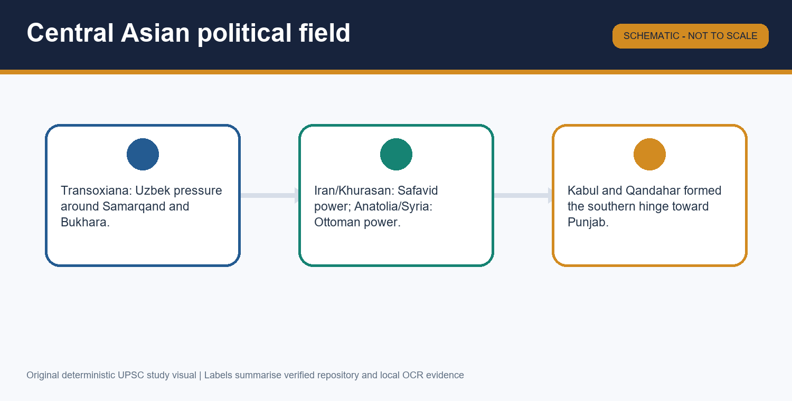

## Workbook orientation: the evidence map

[FACT] This companion contains no manufactured direct PYQ. It begins with the verified gap, then gives original practice across all Topic 12 subtopics. Consult the learning-session Markdown for complete teaching before attempting it.

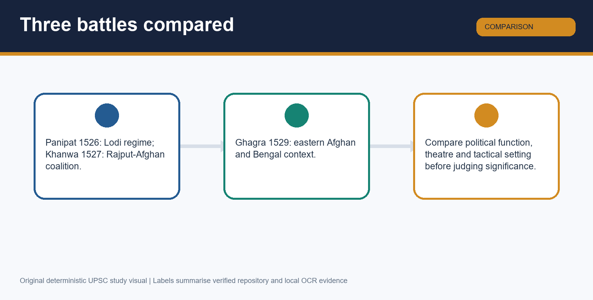

## PART III. PYQ route audit, direct gap and adjacent-route discipline

### Direct-PYQ result

[FACT] The repository routing ledgers for UPSC CSE 2018-2025 were checked for this Topic 12 ownership. They contain **no direct 2018-2025 CSE question owned by Medieval History Topic 12 on Babur, Panipat I, Khanwa, Ghagra, the Baburnama, or the Central Asian backdrop**. This is a direct-PYQ gap, not an invitation to manufacture a question.

[FACT] The local official-paper/OCR search did not produce a trustworthy exact adjacent CSE wording on these Topic 12 themes that can be reproduced here with its official provenance. The 2024-2025 routing ledgers contain Medieval items routed elsewhere, including the 2024 Bhatkal item (Topic 09) and the 2025 Akbar religious-syncretism Mains item (Topic 17); they are not falsely relabelled as Babur PYQs.

| PYQ category | Status | What this package does |
|---|---|---|
| Direct 2018-2025 CSE PYQ owned by Topic 12 | None located in the verified routing ledgers. | States the gap plainly; adds original UPSC-style practice. |
| Exact adjacent local official wording on Babur/Panipat/Khanwa/Ghagra/Baburnama | None trustworthy enough to reproduce from the searched local OCR/papers. | Does not invent wording, answer keys or provenance. |
| Nearby Medieval routing | Present but owned by other topics. | Keeps links transparent rather than padding this workbook. |
| Official answer key | No exact Topic 12 question to key. | No inferred official answer is claimed. |

### What the gap means for preparation

[ANALYSIS] A direct-PYQ gap does not make the topic low-value. It is a high-yield connector for Early Mughal chronology, military history, north-west frontier geography, Persianate source method, Lodi decline, Afghan politics and the methodological pitfalls of causation. The correct response is original practice that reproduces UPSC demand families without pretending that an original question is official.

### Transparent adjacent routes

- **Topic 06: Decline, Sayyids and Lodis.** Use for Ibrahim Lodi, Afghan noble equality, Rana Sanga's pre-Babur setting and political opportunity.
- **Topic 07: Administration, Economy and Society.** Use its Persian-source method as a transferable framework, not as an assertion that the Baburnama is a Persian original.
- **Topic 08: Provincial and Regional Kingdoms.** Use for Mewar and regional balance-of-power context; do not borrow a regional history as a fake Babur PYQ.
- **Topics 13-15: Humayun, Sur and Akbar.** Use only for forward qualification: Babur's foundation remained fragile and was later consolidated.

## PART IV. Premium broad-coverage MCQs: 40 original questions

The correct-option sequence is printed for audit: **ABCDABCDABCDABCDABCDABCDABCDABCDABCDABCD**.

### Q1. A phrase such as 'Turco-Mongol and Persianate inheritance' is useful because it:

- **A.** Keeps dynastic, military-political and cultural strands distinct while showing their overlap.
- **B.** Proves a fixed biological hierarchy among Central Asian groups.
- **C.** Identifies Babur as a Safavid Shiite monarch.
- **D.** Means Babur rejected all Timurid claims.

**Answer: A**

**Explanation:** The phrase prevents a single-label reduction while retaining a real historical inheritance. The nearest distractor is B, which converts political and cultural affiliations into an unsupported biological hierarchy.

### Q2. Timur's posthumous political legacy most directly mattered to Babur through:

- **A.** A unified hereditary state that Babur inherited intact.
- **B.** Fragmented Timurid principalities, prestige of Samarqand and a repertoire of imperial legitimacy.
- **C.** A Delhi administration founded by Timur in 1398.
- **D.** A permanent Timurid-Ottoman military alliance.

**Answer: B**

**Explanation:** Fragmentation and symbolic prestige coexisted after Timur; that contradiction shaped Babur's choices. Option A is closest because it preserves the inheritance idea but wrongly assumes a consolidated territorial bequest.

### Q3. Shaibani Khan's importance to Babur's trajectory lies chiefly in the fact that he:

- **A.** Founded the Safavid order in Iran.
- **B.** Provided Babur with the Kabul revenue system.
- **C.** Consolidated Uzbek power that expelled or constrained Babur in Transoxiana.
- **D.** Led Ibrahim Lodi's force at Panipat.

**Answer: C**

**Explanation:** Shaibani's Uzbek consolidation closed the Samarqand route for a resource-poor Timurid claimant. Option A is the nearest regional confusion: the Safavids were a separate Iranian power.

### Q4. Babur's 1504 capture of Kabul changed his options by:

- **A.** Making Samarqand irrelevant to him for the rest of his life.
- **B.** Eliminating the need for any army or noble support.
- **C.** Creating a direct, secure conquest of the Punjab.
- **D.** Giving a base for recovery and expansion, while leaving an income and resource constraint.

**Answer: D**

**Explanation:** Kabul was an enabling base, not a fully sufficient end state. Option C is the closest overstatement because Kabul facilitated later Punjab ventures but did not itself conquer or secure Punjab.

### Q5. Which formulation best explains why Punjab was contested before 1526?

- **A.** Babur's claims, Lodi provincial politics and rival local ambitions converged there.
- **B.** It was politically empty after Timur's raid.
- **C.** It lay beyond the reach of any Kabul-based campaign.
- **D.** It was controlled by the Safavids after Merv.

**Answer: A**

**Explanation:** Punjab was a zone of intersecting claims rather than a vacuum. Option B is the closest simplification because Timur's earlier raid mattered to political memory, but it did not erase Lodi and provincial power.

### Q6. The early Bhira and Sialkot advances are important because they:

- **A.** Show that Babur's Punjab project preceded the final 1525 march.
- **B.** Were campaigns against Shah Ismail in Iran.
- **C.** Occurred only after the victory at Panipat.
- **D.** Prove that Babur had already secured Bengal.

**Answer: B**

**Explanation:** These advances show a longer contest over Punjab rather than a sudden 1526 appearance. Option D is closest geographically only in the sense of eastern expansion, but Bengal remained outside Babur's settled control.

### Q7. The final 1525 march should not be narrated as a bare cavalry dash because it followed:

- **A.** A surrender of the Uzbeks at Samarqand.
- **B.** An Ottoman conquest of Punjab.
- **C.** Efforts to secure Babur's rear and flank in the Afghan-Qandahar zone.
- **D.** The end of all Lodi opposition.

**Answer: C**

**Explanation:** Rear and flank security made the Indian campaign more feasible; campaigns depend on theatre preparation. Option A is the nearest Central Asian distraction, but the Samarqand problem was not solved by an Uzbek surrender.

### Q8. At Panipat, the cart-line's operational value was that it:

- **A.** Replaced all need for cavalry.
- **B.** Prevented Babur from using any gaps in the front.
- **C.** Was a Lodi formation captured by Babur.
- **D.** Created a protected firing and control platform rather than a passive wall alone.

**Answer: D**

**Explanation:** The cart line supported guns, matchlocks and controlled openings for action. Option B is closest because gaps existed, but they were retained intentionally rather than prevented.

### Q9. Ustad Ali and Mustafa are relevant to Panipat because they were:

- **A.** Ottoman gunners associated with Babur's artillery organisation.
- **B.** Rajput commanders fighting under Rana Sanga.
- **C.** Bengal river pilots at Ghagra.
- **D.** Lodi governors who invited Babur.

**Answer: A**

**Explanation:** The names anchor the artillery component of Babur's battle system. Option D is closest to the invitation theme but wrongly turns technical specialists into Lodi political brokers.

### Q10. A narrow frontage at Panipat assisted Babur because it:

- **A.** Guaranteed victory even without planning.
- **B.** Could restrict the effective deployment of an opposing mass against a prepared line.
- **C.** Made firearms ineffective by preventing sound from travelling.
- **D.** Allowed Ibrahim Lodi to surround Babur from every direction.

**Answer: B**

**Explanation:** Frontage converted terrain into a tactical constraint on the opposing force. Option A is closest to a common determinism error: terrain helps only when combined with an organised formation and command.

### Q11. Why is mounted archery indispensable to an account of Babur's Panipat tactics?

- **A.** It was the only weapon used by Babur's army.
- **B.** It proves artillery had no value.
- **C.** It connected mobile Central Asian cavalry practice with the cart-and-gun defensive system.
- **D.** It was used by Ibrahim Lodi after his defeat.

**Answer: C**

**Explanation:** Mounted archery shows the hybrid character of Babur's method rather than a transition from 'old' to 'new' warfare. Option B is closest to the opposite monocausal error: guns mattered, but did not displace cavalry.

### Q12. The most defensible assessment of Ibrahim Lodi at Panipat is that:

- **A.** He did not personally command any force.
- **B.** He possessed no cavalry at all.
- **C.** He had invited Babur to replace him.
- **D.** He fought and died on the field, but his organisation faced Babur's prepared system.

**Answer: D**

**Explanation:** This avoids caricature while still recognising a mismatch of organisation and tactics. Option A is the closest false simplification because Ibrahim's personal presence and death on the field are source-grounded.

### Q13. The immediate post-Panipat problem of Babur's begs illustrates:

- **A.** How conquest required retaining followers who found India unfamiliar and wanted to return.
- **B.** That Kabul had become richer than India.
- **C.** That Rajput power had already been eliminated.
- **D.** That the eastern Afghan challenge was invented later.

**Answer: A**

**Explanation:** The begs' homesickness tied political allegiance to material and social experience of conquest. Option B is closest to the resource theme but reverses the relative attraction that made Indian territorial resources important.

### Q14. A valid reason Babur chose to remain in India after Panipat was:

- **A.** The absence of any need to confront Rana Sanga.
- **B.** The prospect of using Delhi-Agra resources for a durable Timurid-centred polity.
- **C.** A promise that all Afghan chiefs would accept equality with him.
- **D.** The complete loss of Kabul to the Safavids.

**Answer: B**

**Explanation:** India offered the resource base unavailable in Kabul, even though it also imposed new resistance. Option A is closest chronologically but false because Rana Sanga's challenge soon demonstrated the cost of staying.

### Q15. Rana Sanga's importance in this topic follows from his role as:

- **A.** A Bengal ruler at Ghagra.
- **B.** A Timurid prince seeking Samarqand.
- **C.** A political alternative in north India whose coalition challenged Babur after Panipat.
- **D.** An Ottoman artillery adviser.

**Answer: C**

**Explanation:** Rana Sanga's coalition made Khanwa a contest over the future political order of north India. Option A is the closest regional confusion, but Bengal's role belongs to the distinct eastern context of Ghagra.

### Q16. Mahmud Lodi's presence in the Khanwa setting matters because it:

- **A.** Proves Ibrahim Lodi survived Panipat.
- **B.** Makes the battle a Safavid succession struggle.
- **C.** Eliminates Rana Sanga's leadership role.
- **D.** Shows an Afghan link within a coalition that cannot be reduced to a Hindu-Muslim binary.

**Answer: D**

**Explanation:** Mahmud Lodi adds a political-Afghan strand to the coalition without making it homogeneous. Option A is closest in name but false: Ibrahim died at Panipat; Mahmud is a different Lodi claimant.

### Q17. Hasan Khan Mewati is best used in an answer on Khanwa as:

- **A.** A named coalition participant that reinforces the political complexity of the opposition.
- **B.** Proof that every Mewati group followed an identical policy.
- **C.** A master gunner appointed by Babur.
- **D.** A Bengal ruler who negotiated at Ghagra.

**Answer: A**

**Explanation:** His source-grounded association with the coalition helps break a rigid communal reading. Option B is the nearest misuse because it extrapolates from one elite actor to an entire social population.

### Q18. Which comparison between Panipat and Khanwa is accurate?

- **A.** Both were fought against Bengal in the same eastern theatre.
- **B.** They shared tactical continuities, but Panipat removed the Lodi ruler and Khanwa checked a Rajput-Afghan coalition.
- **C.** Khanwa restored Ibrahim Lodi while Panipat removed Rana Sanga.
- **D.** Only Khanwa involved a political contest over north India.

**Answer: B**

**Explanation:** The political function differs even where Babur reused a combined-arms system. Option D is closest because Khanwa certainly involved political stakes, but Panipat also decided the Lodi centre.

### Q19. Chanderi (1528) belongs in a Babur answer primarily as:

- **A.** A substitute name for the battle of Khanwa.
- **B.** The Bengal capital at the time of Ghagra.
- **C.** A bounded subsequent operation against a remaining Rajput stronghold after Khanwa.
- **D.** The site of the final Timurid recovery of Samarqand.

**Answer: C**

**Explanation:** Chanderi is useful as a follow-through stage, not as a reason to merge or erase Khanwa. Option A is the closest timeline error because both belong to the Rajput challenge phase but are distinct events.

### Q20. Ghagra should be separated analytically from Panipat because:

- **A.** It happened before Babur captured Kabul.
- **B.** It was fought solely against Rana Sanga.
- **C.** It ended Mughal-Safavid rivalry over Qandahar.
- **D.** It addressed eastern Afghan resistance and a Bengal-linked setting rather than the Lodi capital contest.

**Answer: D**

**Explanation:** Ghagra's theatre and political problem were eastern and post-Panipat. Option B is closest because Rana Sanga is a major rival in the topic, but he belongs to Khanwa, not the Ghagra confrontation.

### Q21. Why is Nusrat Shah relevant to an account of Ghagra?

- **A.** Bengal under his rule formed part of the regional context in which Afghan resistance was handled.
- **B.** He was the Lodi commander killed at Panipat.
- **C.** He was an Ottoman gunner at Khanwa.
- **D.** He ruled Kabul after Babur's death.

**Answer: A**

**Explanation:** Nusrat Shah's Bengal contextualises the eastern campaign and its diplomacy. Option B is closest by association with a north Indian battle, but Ibrahim Lodi, not Nusrat Shah, died at Panipat.

### Q22. The phrase 'consolidation ladder' for Babur's three major Indian battles means:

- **A.** Each battle had the same opponent and purpose.
- **B.** Panipat removed the Lodi centre, Khanwa checked a Rajput alternative, and Ghagra contained an eastern Afghan challenge.
- **C.** Ghagra occurred before the Lodi removal.
- **D.** Khanwa ended every later problem of legitimacy.

**Answer: B**

**Explanation:** The ladder makes political functions sequential without pretending the sequence produced final stability. Option D is closest because Khanwa was crucial, but eastern Afghan resistance required the distinct Ghagra campaign.

### Q23. The later loss of Mughal power by Humayun qualifies Babur's achievement by showing:

- **A.** That Panipat never occurred.
- **B.** That Kabul had no strategic significance.
- **C.** That political foundation is not identical with durable institutional consolidation.
- **D.** That the Lodi Sultanate continued unchanged after 1526.

**Answer: C**

**Explanation:** Humayun's displacement and the Sur interregnum demonstrate fragility after Babur's short reign. Option D is the nearest chronological error: the Lodi Sultanate ended at Panipat even though Afghan political power persisted.

### Q24. The phrase 'gunpowder empire' is most useful when it:

- **A.** Explains every Mughal success through artillery alone.
- **B.** Excludes cavalry from Babur's warfare.
- **C.** Treats firearms as unknown in any Indian setting before 1526.
- **D.** Names an important military-technical dimension while retaining organisation, mobility, logistics and politics.

**Answer: D**

**Explanation:** Gunpowder can name a component of state formation, not a complete causal machine. Option A is the closest reduction because artillery was visible and important, yet Babur's system also depended on cavalry, planning and opponents.

### Q25. Kabul-Qandahar mattered to the early Mughal state as:

- **A.** A security-diplomacy-trade hinge connecting Hindustan with wider Asian circuits.
- **B.** A purely ceremonial pair of cities with no strategic role.
- **C.** A region detached from routes toward Iran and Central Asia.
- **D.** An area that made the Punjab frontier irrelevant.

**Answer: A**

**Explanation:** The pair linked strategic shielding with connections toward Khurasan, Turkistan and West Asia. Option D is closest because the north-west context matters, but connectivity heightened rather than erased frontier concerns.

### Q26. The contrast between Timurid prestige and Afghan noble equality helps explain:

- **A.** Why all Afghan subjects enjoyed equal political rights.
- **B.** Different elite expectations about the ruler's superiority and bargaining with nobles.
- **C.** Why Babur rejected all noble service.
- **D.** Why the Lodi state had no monarch.

**Answer: B**

**Explanation:** This is a comparison of political culture and elite relations, not a social census. Option A is closest in language but wrongly expands elite tribal equality into universal popular equality.

### Q27. A careful use of 'beg' in Babur's context would be:

- **A.** A fixed village revenue office created by Sher Shah.
- **B.** A Safavid religious cleric only.
- **C.** A military-noble follower whose support and expectations mattered to the ruler.
- **D.** A synonym for an ordinary peasant.

**Answer: C**

**Explanation:** Begs were leading followers and military-noble figures whose loyalty was politically consequential. Option A is closest because it names an administrative category, but it wrongly relocates the term to a later revenue office.

### Q28. The Baburnama's original literary language is significant because it was written in:

- **A.** Arabic, which proves it is a legal manual.
- **B.** Only Persian, without any later translations.
- **C.** Sanskrit, for a Rajput audience.
- **D.** Chagatai Turkish, while later Persian translations must not be confused with the original language.

**Answer: D**

**Explanation:** Chagatai Turkish anchors both the text's literary status and the warning about translations. Option B is closest because Persian versions are historically important, yet they are not the original composition.

### Q29. A source-critical reading of Babur's environmental observations should:

- **A.** Use observations for historical geography and ruler perception while separating description from objective totality.
- **B.** Treat every descriptive preference as a modern ecological measurement.
- **C.** Dismiss landscape writing as irrelevant to political history.
- **D.** Assume gardens automatically prove popular welfare.

**Answer: A**

**Explanation:** Observation is evidence of perception, place and comparison, not a neutral survey. Option B is closest because the descriptions can illuminate environment, but they are not modern quantified measurements.

### Q30. A self-representational text may be selective because:

- **A.** A ruler-author can shape memory, failure, courage and legitimacy for readers and posterity.
- **B.** It is therefore unusable alongside other evidence.
- **C.** It cannot mention any factual event.
- **D.** It contains no chronology.

**Answer: B**

**Explanation:** Self-fashioning does not make a text false; it changes the questions an historian asks of it. Option C is closest as an overreaction because factual events can still be preserved amid selection and rhetoric.

### Q31. The 'invader versus founder' debate is best resolved by saying that Babur:

- **A.** Was only a raid leader because he used cavalry.
- **B.** Was born in India and therefore cannot be called an invader.
- **C.** Entered from outside but, by choosing to stay and build a Delhi-Agra-centred base, began a founding process rather than a mere raid.
- **D.** Founded a fully stable empire in a single battle.

**Answer: C**

**Explanation:** The answer separates origin of entry from the political decision to settle and govern. Option D is closest to a celebratory overclaim, refuted by post-Panipat resistance and the later Sur interruption.

### Q32. The external push/internal opportunity framework combines:

- **A.** Only Central Asian events, excluding Indian politics.
- **B.** Only Daulat Khan's invitation, excluding Babur's earlier aims.
- **C.** Only artillery technology, excluding diplomacy.
- **D.** Uzbek pressure and Timurid failure with Lodi tensions, Punjab politics and invitations.

**Answer: D**

**Explanation:** The framework is strongest when both sides remain causally active. Option B is the closest one-sided explanation because invitations were enabling, but could not generate Babur's Central Asian constraints by themselves.

### Q33. An answer that says 'Panipat was caused by artillery' is weak principally because it:

- **A.** Omits formation, controlled gaps, cavalry, terrain, command and the opponent's organisation.
- **B.** Forgets that artillery did not exist in the sixteenth century.
- **C.** Makes Rana Sanga commander of Ibrahim Lodi's army.
- **D.** Fails to mention the later battle of Talikota.

**Answer: A**

**Explanation:** The missing variables are precisely what turn guns from objects into an organised battle system. Option D is closest as another military-history event, but it is irrelevant to an explanation of Panipat.

### Q34. The most defensible forward link from Babur to Akbar is that:

- **A.** Akbar inherited a perfectly settled state with no Afghan problem.
- **B.** Babur's foundation was later consolidated, contested and reworked through Humayun, the Surs and Akbar.
- **C.** Babur invented every later Mughal institution in finished form.
- **D.** Sher Shah had no bearing on Mughal state formation.

**Answer: B**

**Explanation:** The forward link preserves continuity without erasing rupture and later innovation. Option C is closest to a lineage argument, but it mistakes an initial political foundation for a completed administrative architecture.

### Q35. A historian using Panipat should avoid an exact troop-total claim when:

- **A.** A modern official battlefield census exists.
- **B.** The question requires the year 1526.
- **C.** The local source base provides conflicting, rhetorical or uncorroborated numbers.
- **D.** The names Babur and Ibrahim Lodi are both stated.

**Answer: C**

**Explanation:** The evidence rule concerns what narratives can reliably support, not whether the battle itself is real. Option B is closest in exam practice but a secure year does not validate uncertain numerical totals.

### Q36. A strong conclusion about Babur's advent would say:

- **A.** His Central Asian failure mechanically forced an inevitable Indian empire.
- **B.** Ibrahim Lodi's invitation alone made Babur king.
- **C.** Babur's success had no connection with Kabul.
- **D.** Central Asian pressure made India strategically attractive, but Indian political opportunity and Babur's decisions converted possibility into conquest.

**Answer: D**

**Explanation:** This conclusion preserves contingency: pressure narrowed choices, while Indian divisions and agency shaped the outcome. Option A is closest because it acknowledges pressure, yet it falsely removes political opportunity and decision.

### Q37. Why is Farghana important in an answer on Babur?

- **A.** It was the small principality Babur inherited in 1494 before the Samarqand cycle.
- **B.** It was a Bengal fort captured after Ghagra.
- **C.** It was the battlefield where Ibrahim Lodi died.
- **D.** It was an Ottoman capital after Chaldiran.

**Answer: A**

**Explanation:** Farghana identifies the modest starting point of Babur's career and makes the later resource problem intelligible. Option C is the closest battle-associated location, but Ibrahim Lodi died at Panipat, not in Central Asia.

### Q38. What does the failed Samarqand experience teach about medieval state formation?

- **A.** A prestigious city automatically supplies a loyal army.
- **B.** Dynastic prestige must be matched by revenue, provisions, followers and defensible political control.
- **C.** Mercenaries cannot affect political outcomes.
- **D.** Only the Safavids mattered in Transoxiana.

**Answer: B**

**Explanation:** Babur's loss after apparent success makes material capacity and elite loyalty visible. Option A is the nearest seductive answer because Samarqand did offer prestige, but its possession did not sustain Babur's rule.

### Q39. Why is it misleading to describe Babur's tactics as either entirely Ottoman or entirely Central Asian?

- **A.** He refused all use of carts or firearms.
- **B.** The tactics were invented after Ghagra.
- **C.** The Panipat system combined Ottoman-linked field-defence/firearm elements with Central Asian cavalry and tulghuma manoeuvre.
- **D.** Ibrahim Lodi commanded the Ottoman gunners.

**Answer: C**

**Explanation:** The hybrid formulation best fits carts and master gunners alongside mounted archery and wheeling flanks. Option D is closest because the gunners are relevant, but Ustad Ali and Mustafa served Babur, not Ibrahim.

### Q40. What is the safest use of the phrase 'Indian territorial resources' in this topic?

- **A.** It means every region of India became equally controlled in 1526.
- **B.** It means trade alone financed Babur's campaigns.
- **C.** It means Kabul ceased to matter once Panipat was won.
- **D.** It identifies the richer Delhi-Agra political base that made sustained rule more feasible than Kabul alone.

**Answer: D**

**Explanation:** Delhi-Agra resources helped transform a Kabul-based claimant into a ruler able to contemplate settlement. Option B is the closest partial truth because trade mattered to the wider hinge, but agrarian and territorial resources cannot be reduced to trade.

## PART V. Remedial MCQs: 12 targeted misconception checks

The correct-option sequence is printed for audit: **ABCDABCDABCD**.

### Q0. Which item is a secure Panipat fact rather than a risky numerical assertion?

- **A.** Babur defeated Ibrahim Lodi in 1526.
- **B.** Babur had exactly a named total of troops accepted by every source.
- **C.** Ibrahim's force had a universally agreed numerical size.
- **D.** The battle occurred after Ghagra.

**Answer: A**

**Explanation:** The year and combatants are secure; exact totals are not. The closest distractor is B because chronicles do report numbers, but reports are not a universally agreed evidentiary base.

### Q1. A statement that 'Khanwa was purely Hindu versus Muslim' fails because:

- **A.** No Rajput leader participated.
- **B.** Mahmud Lodi and Hasan Khan Mewati show an Afghan strand in Rana Sanga's coalition.
- **C.** Babur did not use any political rhetoric.
- **D.** Khanwa occurred in Bengal.

**Answer: B**

**Explanation:** The named Afghan participants demonstrate why a purely binary label is inadequate. Option A is closest in the sense that it concerns coalition composition, but Rana Sanga's Rajput leadership is central.

### Q2. Which distinction prevents confusion between Panipat and Ghagra?

- **A.** Panipat concerned eastern Bengal while Ghagra removed Ibrahim Lodi.
- **B.** Both battles were fights over Samarqand.
- **C.** Panipat removed the Lodi ruler; Ghagra addressed eastern Afghan resistance in a Bengal-linked context.
- **D.** Ghagra occurred before Kabul was captured.

**Answer: C**

**Explanation:** The theatres and political functions differ: Lodi centre at Panipat, eastern Afghan-Bengal setting at Ghagra. Option A reverses both associations and is the closest pairwise confusion.

### Q3. The best correction to 'Babur won only because he had guns' is:

- **A.** He had no artillery at Panipat.
- **B.** He won because every opponent lacked cavalry.
- **C.** He merely repeated an Ottoman battle without adaptation.
- **D.** Guns worked with a cart-line, matchlocks, controlled gaps, tulghuma, cavalry, terrain and command.

**Answer: D**

**Explanation:** The correction restores the combined-arms system. Option C is closest because Ottoman-linked techniques mattered, but Babur adapted them to his own Central Asian cavalry method and Panipat frontage.

### Q4. What does Kabul's resource constraint explain most directly?

- **A.** Why a richer Indian territorial base became strategically attractive.
- **B.** Why Babur had no need for Punjab.
- **C.** Why Safavid Iran lost at Chaldiran.
- **D.** Why Ibrahim Lodi ruled Samarqand.

**Answer: A**

**Explanation:** Kabul's insufficient resources connect Central Asian setback to the logic of Indian settlement. Option B is closest because Kabul and Punjab are linked, but it reverses the motive.

### Q5. Why should the Baburnama not be dismissed as 'biased and useless'?

- **A.** Bias turns it into an official answer key.
- **B.** Its Chagatai Turkish observations and chronology become more useful when cross-checked for self-fashioning and selectivity.
- **C.** It was written by a Bengal sultan.
- **D.** It contains no account of Babur's own experiences.

**Answer: B**

**Explanation:** Source criticism asks how a text works rather than discarding it outright. Option D is closest to a source-method claim, yet autobiographical experience is exactly the text's distinctive vantage point.

### Q6. Which chronology is correct?

- **A.** Khanwa 1526 -> Panipat 1527 -> Ghagra 1529.
- **B.** Ghagra 1527 -> Kabul 1528 -> Panipat 1529.
- **C.** Kabul 1504 -> Panipat 1526 -> Khanwa 1527 -> Ghagra 1529.
- **D.** Panipat 1504 -> Samarqand 1526 -> Kabul 1529.

**Answer: C**

**Explanation:** The Kabul-Panipat-Khanwa-Ghagra ladder is the safe sequence. Option A is closest because it preserves the three battle dates' vicinity but reverses the first two.

### Q7. Why is 'Mughal' alone an incomplete identity label for Babur?

- **A.** It means he had no Timurid connection.
- **B.** It proves he was ethnically uniform in a modern racial sense.
- **C.** It identifies a Persian translation rather than a dynasty.
- **D.** It can hide Timurid, Chagatai/Chingizid, Turco-Mongol and Persianate layers.

**Answer: D**

**Explanation:** The corrective is layered political-cultural history, not a replacement essentialism. Option B is closest because modern racial language is the specific analytical danger.

### Q8. Which factor is an internal Indian opportunity rather than an external Central Asian push?

- **A.** Tensions around Ibrahim Lodi and Lodi provincial politics.
- **B.** Uzbek consolidation under Shaibani Khan.
- **C.** Safavid-Uzbek contest over Transoxiana.
- **D.** Babur's loss of Samarqand.

**Answer: A**

**Explanation:** Lodi tensions belong to the Indian opportunity side of the framework. Option D is closest because it shaped Babur's move, but it occurred in the Central Asian trajectory.

### Q9. What is the appropriate scope of Chanderi in this topic?

- **A.** It replaces Ghagra as the eastern Afghan campaign.
- **B.** It is a bounded post-Khanwa operation, useful but not a reason to crowd out the main three-battle ladder.
- **C.** It is the original name of Kabul.
- **D.** It is the site of Chaldiran.

**Answer: B**

**Explanation:** Chanderi belongs as a subsequent consolidation marker after Khanwa. Option A is closest chronologically in being another campaign, but Ghagra handles the eastern Afghan-Bengal context.

### Q10. Which formulation best qualifies 'Babur founded an empire'?

- **A.** The phrase is impossible because he entered India from outside.
- **B.** It means every later Mughal institution already existed in 1526.
- **C.** It marks a real political foundation, qualified by unresolved Afghan resistance, Humayun's reverses and later consolidation.
- **D.** It applies only to Babur's garden observations.

**Answer: C**

**Explanation:** The formulation grants a foundational achievement without turning it into instant permanence. Option B is closest because later institutions had antecedents, but they were not fully formed in Babur's short reign.

### Q11. Why is Qandahar relevant beside Kabul?

- **A.** It was unrelated to any route or security calculation.
- **B.** It was only a literary metaphor.
- **C.** It ended all Persian-Mughal rivalry forever.
- **D.** Together with Kabul it strengthened a strategic and commercial north-western connection.

**Answer: D**

**Explanation:** Kabul-Qandahar combined security, diplomacy and trade linkages across regions. Option C is closest to a later foreign-policy theme but wrongly claims permanent resolution.

## PART VI. Original Mains practice and examiner-grade model solutions

Every model follows claim -> named evidence -> analysis -> qualification -> conclusion. It is original practice, not an official UPSC question.

### Mains 1. Explain how the Central Asian backdrop shaped Babur's turn towards India.

**10 marks | 150 words | GS-I | Original UPSC-style practice**

**Model solution**

**Claim.** Babur's Indian project grew from constrained Central Asian choices, not from an isolated appetite for conquest. **Named evidence.** He inherited Farghana in 1494, repeatedly won and lost Samarqand, faced Shaibani Khan's Uzbek consolidation, and captured Kabul in 1504. Samarqand carried Timurid prestige and resources, but the local Part II account shows that capture did not solve supplies, money or dependable followers. **Analysis.** The Uzbek closure of Transoxiana and Kabul's limited income made a richer, defensible base attractive. Punjab offered a frontier with Timurid claims and an opening into Hindustan. **Qualification.** Central Asian pressure did not mechanically cause conquest: Lodi tensions, Daulat Khan and Alam Khan, and Babur's own preparations made the opportunity usable. **Conclusion.** India was the strategic reorientation of a Timurid claimant whose Central Asian recovery had become untenable.

### Mains 2. Assess the external push and internal Indian opportunity in Babur's conquest.

**10 marks | 150 words | GS-I | Original UPSC-style practice**

**Model solution**

**Claim.** Babur's success required the conjunction of external pressure and internal opportunity. **Named evidence.** Externally, Shaibani Khan's Uzbeks displaced Timurid prospects in Transoxiana; Babur's Samarqand reverses and Kabul's resource constraint sharpened the search for a durable base. Internally, Ibrahim Lodi faced Afghan noble tensions, while Daulat Khan Lodi and Alam Khan supplied a political opening in Punjab. **Analysis.** The first set explains why Babur looked east; the second explains why a Kabul-based claimant could intervene effectively in a contested north Indian frontier. His earlier Bhira and Sialkot moves show that invitation did not create the policy from nothing. **Qualification.** Neither factor alone suffices: a weak Lodi polity did not automatically produce a victor, and Central Asian failure did not guarantee settlement. **Conclusion.** Babur converted an external displacement and an internal fissure into conquest through agency, planning and military organisation.

### Mains 3. Analyse the tactical system behind Babur's victory at the First Battle of Panipat.

**15 marks | 250 words | GS-I | Original UPSC-style practice**

**Model solution**

**Claim.** Panipat was a victory of an organised combined-arms system fitted to terrain and command, not a simple weapon duel. **Named evidence.** Babur's 1526 force arranged carts linked by raw-hide ropes, breastworks for matchlockmen, artillery associated with Ustad Ali and Mustafa, controlled gaps for cavalry, mounted archery and tulghuma flanking parties. A narrow defended frontage constrained the effective deployment of Ibrahim Lodi's force. **Analysis.** The carts did not merely block: they made a firing and control platform. Artillery and matchlocks generated pressure from protected positions; gaps preserved initiative; cavalry and tulghuma struck from the sides. This joined fixed defence to mobile Central Asian tactics. Ibrahim fought and died on the field, but his organisation encountered a prepared plan rather than a casual encounter. **Qualification.** Terrain and opponent organisation mattered, while chronicle army totals should not be repeated as exact facts. Artillery alone cannot explain the coordination of formation, movement and command. **Conclusion.** Panipat demonstrates how technology becomes decisive only when embedded in organisation, mobility, logistics and political-military leadership.

**Why this earns marks:** It names the formation, technical personnel and manoeuvre, explains how the parts worked together, and explicitly rejects the artillery-only and fabricated-number traps.

### Mains 4. “Artillery alone did not win Panipat.” Critically examine.

**15 marks | 250 words | GS-I | Original UPSC-style practice**

**Model solution**

**Claim.** The statement is correct because artillery was a decisive component, but not an autonomous cause. **Named evidence.** Babur used guns and matchlockmen behind carts tied with raw-hide ropes; Ustad Ali and Mustafa were linked to the artillery organisation; mounted archery and tulghuma flanking action operated alongside the front. **Analysis.** Firearms supplied shock and protected fire. Yet the defensive cart-line ordered the battlefield, breastworks protected personnel, gaps allowed cavalry sorties, and the narrow frontage reduced the value of an opposing mass. Babur's command integrated these elements, while Ibrahim Lodi's army faced an unfamiliar tactical disposition. Thus the relevant unit of analysis is a military system: technology, organisation, terrain, mobility, logistics and enemy response. **Qualification.** The phrase 'gunpowder empire' remains useful as a cautious shorthand for the early modern importance of firearms, but it becomes misleading if it erases cavalry, command or Indian political opportunity. The source record also makes exact army-number claims unsafe. **Conclusion.** Guns mattered because a commander made them part of a disciplined defensive-offensive design; neither the weapon nor a number alone explains Panipat.

**Why this earns marks:** The answer answers the word “critically”, keeps artillery in the argument, and then uses named operational evidence to show why it cannot carry the entire explanation.

### Mains 5. Examine the political meaning of the Battle of Khanwa.

**15 marks | 250 words | GS-I | Original UPSC-style practice**

**Model solution**

**Claim.** Khanwa mattered because it checked a powerful alternative political alignment in north India after the Lodi centre had fallen. **Named evidence.** In 1527 Babur faced Rana Sanga; the repository source identifies a Rajput-Afghan coalition and names Mahmud Lodi and Hasan Khan Mewati among Afghan associates. Babur again organised wagons, trenches, matchlocks and flanking tactics. **Analysis.** Panipat had removed Ibrahim Lodi but had not settled who would dominate the Delhi-Agra region. Khanwa placed Babur's claim against a coalition around Rana Sanga and a residual Afghan strand. Its outcome therefore secured Babur's position more deeply than a simple succession battle. Babur's jihad language should be included as a mobilisation and self-representational move, but the coalition's composition makes a Hindu-Muslim binary analytically inadequate. **Qualification.** The victory did not dissolve all opposition or make politics uniform; eastern Afghan resistance persisted and required Ghagra. Nor should one named participant stand for all Rajput or Afghan groups. **Conclusion.** Khanwa is best read as a political contest over north Indian supremacy, fought through military tactics and framed through rhetoric whose source setting must be assessed.

**Why this earns marks:** It identifies the post-Panipat political demand, names Rana Sanga, Mahmud Lodi and Hasan Khan Mewati, and handles rhetoric without evasion or communal reduction.

### Mains 6. Assess Panipat, Khanwa and Ghagra as stages in the consolidation of Babur's power.

**20 marks | 250 words | GS-I | Original UPSC-style practice**

**Model solution**

**Claim.** The three battles formed a consolidation ladder, each addressing a distinct political obstacle rather than repeating a single conquest. **Named evidence.** Panipat (1526) defeated Ibrahim Lodi and removed the Delhi Sultanate's ruler; Khanwa (1527) defeated Rana Sanga's Rajput-Afghan coalition, with Mahmud Lodi and Hasan Khan Mewati among the named Afghan strand; Ghagra (1529) addressed eastern Afghan resistance in a Bengal-linked setting under Nusrat Shah's regional shadow. **Analysis.** Panipat secured the Delhi-Agra opening but left a legitimacy and territorial problem. Khanwa checked a rival north Indian alternative and demonstrated that Babur's cart, firearm, cavalry and flanking system could be adapted against another coalition. Ghagra shifted eastward, showing that Afghan power had not disappeared with Ibrahim. Together the sequence moved Babur from regime overthrow to regional containment. **Qualification.** The word consolidation must remain graded. Homesick begs, local resistance and continuing Afghan political capacity reveal how incomplete control was after Panipat. Babur died in 1530; Humayun's later expulsion by Sher Shah proves that an empire founded was not yet an unbreakable empire. **Conclusion.** The battles laid a political foundation by stages, but durable Mughal consolidation was a longer process involving Humayun, the Sur interregnum and Akbar.

**Why this earns marks:** It uses every battle for its distinct function, avoids a date-list answer, and gives a historically necessary limitation through Humayun and Sher Shah.

### Mains 7. Discuss the geostrategic importance of Kabul and Qandahar in Babur's project.

**15 marks | 250 words | GS-I | Original UPSC-style practice**

**Model solution**

**Claim.** Kabul and Qandahar were the north-western hinge of Babur's project: they connected survival, security, diplomacy and exchange. **Named evidence.** Babur captured Kabul in 1504 after Central Asian reverses; local Part II evidence states that Kabul and Qandahar did not comfortably meet the resource needs of his army and begs. The same source describes Kabul's connections toward Kashgar, Transoxiana and Turkistan, and Qandahar's connection toward Khurasan, Iran and West Asia. **Analysis.** Kabul gave a recoverable base and route toward Punjab, while Qandahar improved the security of the rear and the capacity to participate in Central Asian-Iranian politics. Their commercial role made the north-west more than a military corridor. When combined with Delhi-Agra resources, the pair helped create a transregional state rather than a closed Indian kingdom. **Qualification.** Connectivity does not prove automatic wealth or total frontier security, and later Mughal-Persian contests over Qandahar should not be projected wholesale into Babur's reign. **Conclusion.** Their significance lies in the union of strategic shielding and commercial-diplomatic connection, while Kabul's fiscal limitation also helps explain the move toward a richer Indian core.

**Why this earns marks:** It answers both “geo” and “strategic”, gives named route evidence, links fiscal limits to expansion, and avoids unverified trade quantities.

### Mains 8. Compare Timurid monarchical legitimacy with the Afghan noble-equality idiom in explaining Babur's early statecraft.

**15 marks | 250 words | GS-I | Original UPSC-style practice**

**Model solution**

**Claim.** The contrast helps explain different patterns of elite politics, but must not be converted into a rigid civilisational stereotype. **Named evidence.** The local Part II source describes a post-Mongol/Timurid political tradition in which the supreme ruler's exceptional claim encouraged leading followers to describe themselves as servants. Topic 06, by contrast, notes Afghan elite equality and bargaining among Lodi nobles, while Sikandar Lodi tried to discipline nobles through court practices and jagir accountability. **Analysis.** Babur's Timurid prestige strengthened a claim to sovereign superiority over begs, useful when holding a heterogeneous military following together. Afghan equality made the Lodi ruler's efforts to impose hierarchy more politically fraught. This comparison illuminates why an Indian territorial base, resource distribution and dynastic legitimacy mattered together in Babur's project. **Qualification.** Afghan equality refers to relations among armed elite lineages, not democratic equality for all subjects; Timurid prestige did not erase negotiation, faction or dependence on begs. **Conclusion.** Babur's early statecraft combined an exalted dynastic idiom with practical need to retain followers and command Indian resources, whereas the Lodi setting exposed the limits of monarchical centralisation within Afghan elite politics.

**Why this earns marks:** It compares mechanisms rather than labels, supplies evidence from both political settings, and includes the vital warning against treating elite equality as popular democracy.

### Mains 9. Evaluate the Baburnama as a source for Babur's career and early Mughal history.

**20 marks | 250 words | GS-I | Original UPSC-style practice**

**Model solution**

**Claim.** The Baburnama is an unusually rich first-person source, but its value increases when its observational strengths are read with its self-representational limits. **Named evidence.** It is a classic of Chagatai Turkish prose, not originally a Persian text merely because later Persian translations circulated. It records Babur's movement through Farghana, Samarqand, Kabul and India; it describes places, routes, gardens, warfare and followers; and it supplies the ruler's own vocabulary of memory and ambition. **Analysis.** The work can illuminate historical geography, the Samarqand resource problem, Kabul's setting, military dispositions and the mental world of a mobile Timurid claimant. Its authorial proximity produces chronology and detail unavailable in a remote narrative. Yet a ruler chooses what to remember, shapes courage and failure, judges allies and creates legitimacy. Army numbers and heroic episode framing require especially careful cross-checking. **Qualification.** A critical historian therefore compares it with other chronicles, material evidence, political geography and later scholarly caution; bias does not make the text worthless, nor does vivid prose make it transparent truth. **Conclusion.** The Baburnama is indispensable evidence for perspective and experience, but never a solitary tribunal for disputed fact.

**Why this earns marks:** It identifies language, genre, evidentiary uses and concrete limitations, then gives a method of corroboration instead of either worshipping or discarding the source.

### Mains 10. Was Babur an invader, a founder, or both? Discuss with reference to Central Asia and north India.

**20 marks | 250 words | GS-I | Original UPSC-style practice**

**Model solution**

**Claim.** Babur was both an external invader in the mode of entry and a founder in the political direction of his subsequent decisions; the terms answer different parts of the historical process. **Named evidence.** In Central Asia, Farghana (1494), repeated Samarqand reverses, Shaibani's Uzbek pressure and Kabul's capture (1504) formed the strategic background. In India, earlier Punjab moves, Lodi fissures and the final 1525 march led to Panipat (1526); Babur then chose to remain despite homesick begs, fought Rana Sanga at Khanwa (1527), and addressed eastern Afghan resistance at Ghagra (1529). **Analysis.** 'Invader' accurately marks an external contender crossing into a divided political field. 'Founder' becomes defensible because he turned Delhi-Agra into a base, mobilised Timurid legitimacy, used Indian resources and undertook successive campaigns to defend a claim to rule rather than simply extract and leave. **Qualification.** Founder must not mean finished empire. Local resistance, Afghan political resilience, Humayun's later loss and Sher Shah's rise show a fragile beginning. Nor does Central Asian pressure erase Babur's agency or Indian opportunity. **Conclusion.** Babur founded a process of Mughal state formation through an invasion whose success rested on the convergence of Central Asian constraint, Indian political openings and deliberate settlement.

**Why this earns marks:** It resolves the apparent binary by differentiating entry from political outcome, names the full causal chain, and qualifies foundation through the Sur interruption.

## PART VI-A. Advanced refinement: how to make this topic answer-worthy

### 1. Causation is a chain, not a list

[ANALYSIS] A weak answer places 'Uzbek pressure', 'Daulat Khan', 'artillery' and 'Rana Sanga' in four disconnected bullets. A stronger answer gives each factor a job. Uzbek consolidation and the failure to hold Samarqand narrowed Babur's Central Asian future. Kabul gave him a defensible base but not a sufficiently ample material base. Punjab linked his inherited claims and frontier policy to a contested Indian political field. Lodi dissidence supplied a usable opening. Panipat converted an opening into possession of the Delhi-Agra core. Khanwa and Ghagra then tested whether possession could become authority. This is causal sequencing, not mere chronological narration.

[LIMIT] Do not make the chain deterministic. Shah Ismail's victory at Merv briefly changed Babur's choices, showing that the future was not fixed. Babur's own decision to abandon a further Central Asian recovery in favour of a more durable Indian strategy was political agency under constraint. A good conclusion says that conditions made India attractive and feasible; it does not say they made a Mughal empire inevitable.

### 2. Keep scales separate, then connect them

| Scale | Evidence | What it explains | What it cannot explain alone |
|---|---|---|---|
| Transregional | Uzbeks, Safavids, Ottomans, Chaldiran | Why the Central Asian balance constrained Babur | Why a particular Indian coalition failed |
| Regional frontier | Kabul, Qandahar, Punjab | Routes, security, fiscal pressure and access | Why Panipat's formation worked |
| North Indian politics | Ibrahim Lodi, Daulat Khan, Alam Khan, Rana Sanga | Openings and opponents | Why one army prevailed tactically |
| Battlefield | carts, ropes, artillery, tulghuma | The mechanism of victory | The legitimacy problem after victory |
| State formation | begs, resources, monarchy, Ghagra | Why a conquest might become settlement | Later mature Mughal administration |

[ANALYSIS] This scale discipline earns marks because it prevents two kinds of collapse: reducing political history to weapons, and treating distant Central Asian rivalry as a decorative opening paragraph. The answer moves between scales only when it states the connecting mechanism: revenue, routes, alliance, command, legitimacy or resistance.

### 3. Evidence vocabulary for precise writing

- Use **'resource base'** for the gap between Samarqand/Kabul aspirations and sustainable provision; avoid vague phrases such as 'Babur needed money'.
- Use **'contested frontier'** for Punjab; avoid 'political vacuum'.
- Use **'prepared defended frontage'** for Panipat; avoid 'wall of carts' without explaining gaps, firearms and cavalry.
- Use **'combined-arms system'** for the integration of carts, firearms and manoeuvre; avoid 'modern weapons defeated medieval weapons'.
- Use **'mobilising self-representation'** for Khanwa rhetoric; avoid either suppressing the rhetoric or treating it as the complete cause.
- Use **'staged consolidation'** for Panipat-Khanwa-Ghagra; avoid 'empire completed in 1526'.
- Use **'layered identity'** for Babur's Timurid, Chagatai/Chingizid and Persianate inheritances; avoid racial shorthand.

### 4. Comparative prompts that UPSC may derive from the topic

[ANALYSIS] **Babur and the Lodis:** Compare the political task, not ethnic labels. The Lodis inherited an Afghan elite milieu in which powerful nobles had a strong equality/bargaining idiom. Babur used Timurid prestige to articulate a superior monarchical claim, but he still needed begs and distribution. The comparison explains a problem of statecraft, not a timeless contrast between two peoples.

[ANALYSIS] **Panipat and Khanwa:** Compare opponent configuration and political function before tactics. At Panipat, Ibrahim Lodi's regime was the target; at Khanwa, Rana Sanga's coalition represented a rival north Indian configuration. Tactical continuity is relevant, but it should not erase changed politics.

[ANALYSIS] **Babur and Sher Shah:** The appropriate forward link is qualification. Babur began a Mughal political foundation; Sher Shah's subsequent Afghan success displays the resilience of competing political and military resources. Do not credit Babur with Sher Shah's later administrative measures, and do not use Sher Shah to deny that Panipat, Khanwa and Ghagra changed the field.

### 5. The 30-second concluding paragraph

[ANALYSIS] “Babur's victory in India was made possible by a Central Asian crisis but was not produced by it alone. The loss of a sustainable Samarqand future, Kabul's fiscal limits and the north-western frontier pushed a Timurid claimant toward a richer field. Lodi fragmentation and Punjab politics opened that field; the Panipat system gave him the Delhi-Agra centre; Khanwa and Ghagra addressed later political challenges. The result was a real foundation of Mughal rule, qualified by the instability exposed under Humayun and the Sur interregnum.”

This conclusion earns value because every clause does a different job: context, mechanism, political opening, military evidence, staged consolidation and historical qualification.

## PART VII. Consolidated register notes - revise last

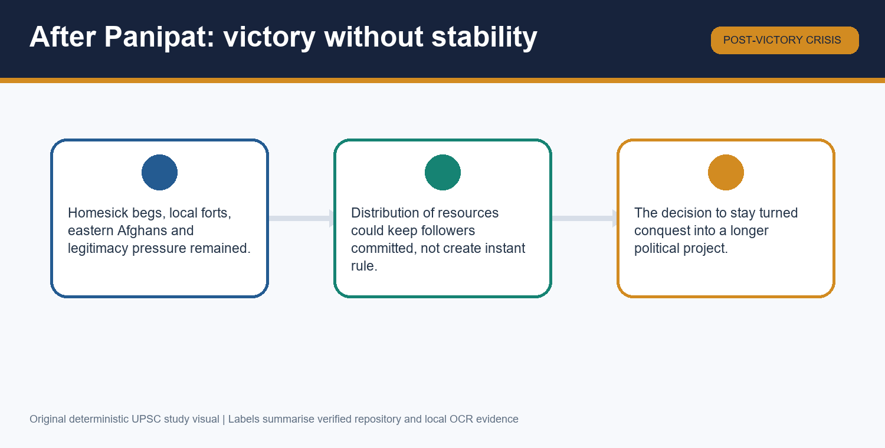

### A. The causal spine: Central Asia to Hindustan

- **1494 Farghana:** Babur inherited a small principality; succession did not yield a secure empire.
- **Samarqand:** Timurid capital, prestige and resources; Babur's captures failed because supplies, money and follower loyalty were inadequate.
- **Uzbeks:** Shaibani Khan's consolidation closed the Transoxianan route; this is the external push.
- **Safavid opening:** Merv (1510) briefly reopened Samarqand; dependency and Uzbek recovery prevented permanence.
- **Chaldiran (1514):** Ottoman victory over Shah Ismail changed the regional balance; do not write that it directly caused Panipat.
- **Kabul 1504:** survival base and southward platform, but resource-constrained.
- **Kabul-Qandahar:** security + diplomacy + trade hinge toward Khurasan/Central Asia/West Asia; never attach unverified quantities.
- **Punjab:** contested frontier, not vacuum; Babur's claims and advances preceded the final invitation setting.
- **Lodi opening:** Ibrahim's tensions, Daulat Khan, Alam Khan and anti-Ibrahim actors enabled timing but were not the whole cause.

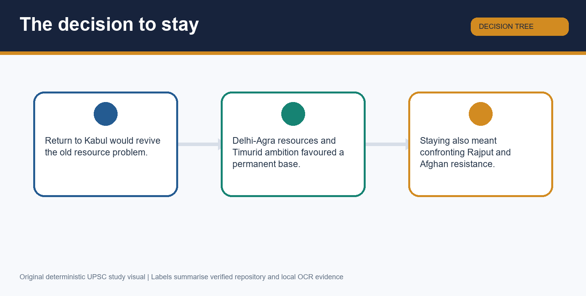

### B. Chronology and the battle ladder

| Date | Event | Revision meaning |
|---|---|---|
| 1494 | Babur succeeds in Farghana | Start of the Central Asian claimant story |
| 1497 / 1501 | Samarqand captures in the recurring cycle | Prestige without sustainable resources is insufficient |
| 1504 | Kabul captured | New base; fiscal constraint remains |
| 1510 | Merv: Shah Ismail defeats Shaibani | Temporary Samarqand opening |
| 1514 | Chaldiran | Regional balance shifts; Uzbek dominance returns |
| 1519-20 | Bhira/Sialkot advances | Punjab project precedes final invasion |
| Nov 1525 | Final march from Kabul | Rear/flank preparation matters |
| 1526 | Panipat I: Babur vs Ibrahim Lodi | Lodi centre removed |
| 1527 | Khanwa: Babur vs Rana Sanga coalition | Rajput alternative checked |
| 1528 | Chanderi | Bounded post-Khanwa follow-through |
| 1529 | Ghagra | Eastern Afghan/Bengal-linked setting |
| 1530 | Babur dies | Foundation remains short and fragile |

> MEMORY: **P-K-G = Palace centre, Kingly alternative, Gangetic-east problem.** Translate back in an answer: Panipat removed Lodi rule; Khanwa checked the Rana Sanga coalition; Ghagra contained eastern Afghan resistance.

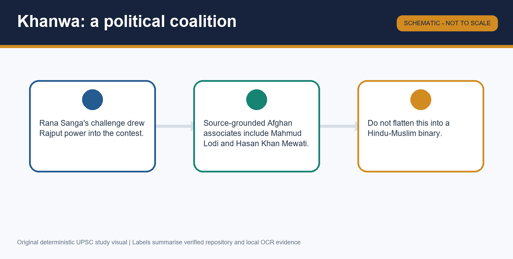

### C. Panipat system card

- **Secure core:** 1526, Babur versus Ibrahim Lodi. Day: Part II says 20 April; many chronologies say 21 April. State only the year unless source precision matters.
- **Defended front:** carts linked with raw-hide ropes; breastworks; matchlockmen; artillery; gaps for cavalry.
- **Named technical evidence:** Ustad Ali and Mustafa.
- **Mobile arm:** mounted archery + **tulghuma** wheeling flanks.
- **Battlefield:** narrow frontage constrained effective deployment of the opposing mass.
- **Causal formula:** technology + organisation + command + mobility + logistics + terrain + opponent's organisation.
- **Never write:** artillery alone; exact army totals without source caution; Babur's cavalry was irrelevant.

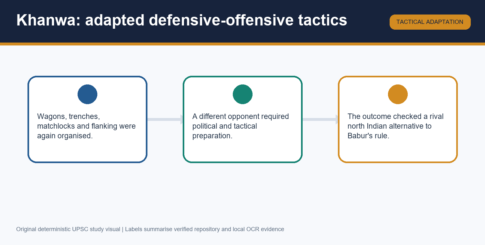

### D. Khanwa, Chanderi and Ghagra card

- **Khanwa 1527:** Rana Sanga's political challenge; Rajput-Afghan coalition; source-grounded Afghan names include Mahmud Lodi and Hasan Khan Mewati.
- **Rhetoric rule:** jihad language = mobilisation/self-representation; neither erase it nor let it explain every participant and motive.
- **Chanderi 1528:** a bounded subsequent operation against a remaining Rajput stronghold; do not let it displace Khanwa in an answer.
- **Ghagra 1529:** eastern Afghan resistance in a Bengal-linked context under Nusrat Shah; distinct theatre and function from Panipat/Khanwa.
- **Significance:** consolidation occurred in stages, not instant empire stability.

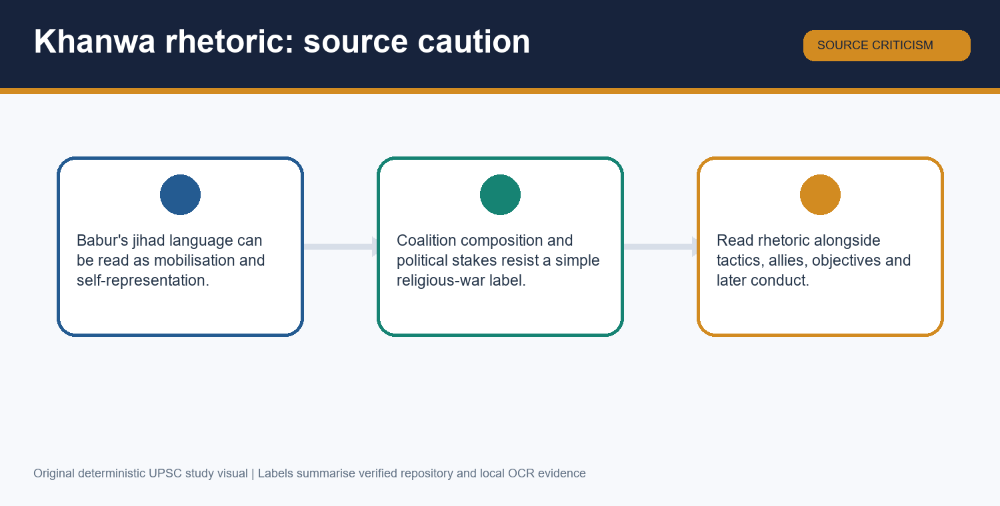

### E. Identity, legitimacy and statecraft

- **Babur:** paternal Timurid descent; maternal Chagatai/Chingizid association.
- **Use:** Turco-Mongol military-political and Persianate cultural inheritance.
- **Avoid:** racial-essentialist shorthand; 'Mughal' alone hiding layered identity.
- **Timurid legitimacy:** sovereign superiority over begs; prestige helps monarchical claim.
- **Afghan equality:** elite-lineage bargaining, not popular democracy; relevant to Lodi centralisation limits.
- **Bridge:** Central Asian inheritance + Indian territorial resources + Kabul-Qandahar linkage.
- **Forward qualifier:** Humayun's reverses and Sher Shah demonstrate incomplete consolidation; Akbar is a later consolidator, not a finished Babur institution.

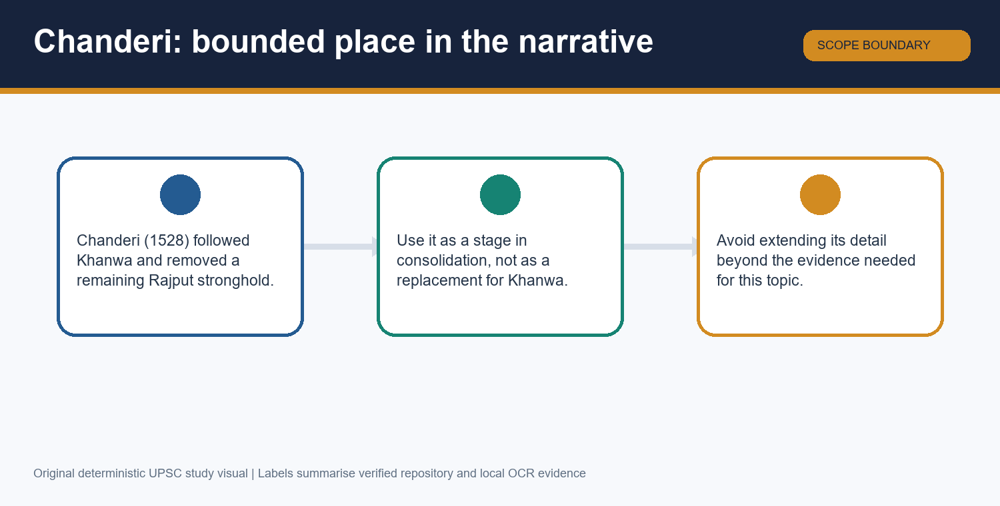

### F. Baburnama source-method card

- Original literary language: **Chagatai Turkish**; later Persian translations are not Babur's original composition.
- Strengths: first-person chronology, routes, campaigns, landscapes, comparisons and ruler perception.
- Limits: self-fashioning, selective memory, authorial judgement, political rhetoric and possible number inflation.
- Cross-check: other chronicles, historical geography, material remains and scholarly source caution.
- Environmental/cultural observation: use only when source-grounded; not romantic filler or a complete social survey.
- Numbers: describe the battle system rather than repeat uncorroborated totals.

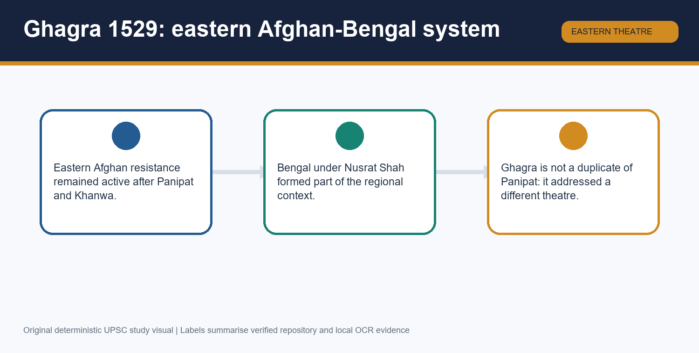

### G. Historiography and traps

| Claim | Better verdict |
|---|---|
| Babur came only on invitation. | Invitations enabled entry; Central Asian pressure and Babur's prior Punjab policy matter. |
| Panipat was artillery alone. | Combined arms: carts, firearms, cavalry, tulghuma, terrain and command. |
| Khanwa was simply Hindu versus Muslim. | Coalition politics plus Afghan strand and rhetoric-source caution. |
| Panipat instantly created a stable empire. | Political foundation; Khanwa/Ghagra and later Sur challenge qualify. |
| Babur was only an invader. | External entry, then settlement-oriented state formation after deciding to stay. |
| Baburnama is neutral autobiography. | High-value first-person source, also selective ruler self-representation. |

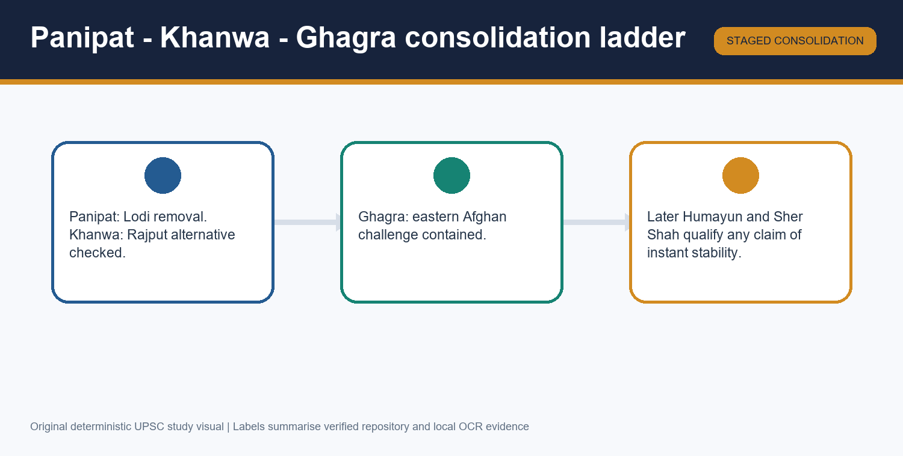

### H. PYQ route and answer spine

- **Direct-PYQ gap:** no verified direct CSE 2018-2025 Topic 12 question in the routing ledgers; never manufacture one.
- **Adjacent routes:** Topic 06 Lodi decline; Topic 07 source method; Topic 08 regional balance; Topics 13-15 forward fragility/consolidation.
- **10-marker spine:** Central Asian push -> Kabul constraint -> Indian opening -> one battle evidence -> qualified verdict.
- **15-marker spine:** Add Punjab/invitations + Panipat system or Khanwa coalition + source/technology caution.
- **20-marker spine:** external push/internal opportunity; P-K-G ladder; legitimacy/geostrategy; Humayun-Sher Shah qualification.
- **Last 30-second recall:** Farghana 1494; Kabul 1504; Panipat 1526; Khanwa 1527; Ghagra 1529; death 1530.

### I. Rapid recall checks

1. **Who at Panipat?** Babur versus Ibrahim Lodi, 1526.
2. **Gunmen?** Ustad Ali and Mustafa; but do not write artillery alone.
3. **Tulghuma?** Wheeling flanking action.
4. **Khanwa coalition warning?** Rajput-Afghan, not binary communal shorthand.
5. **Ghagra warning?** Eastern Afghan challenge, Bengal-linked context, not an instant annexation story.
6. **Baburnama language?** Chagatai Turkish.
7. **One-line verdict?** Central Asian failure made India strategically attractive; Babur's decisions and Indian political fissures made a foundational but fragile empire possible.

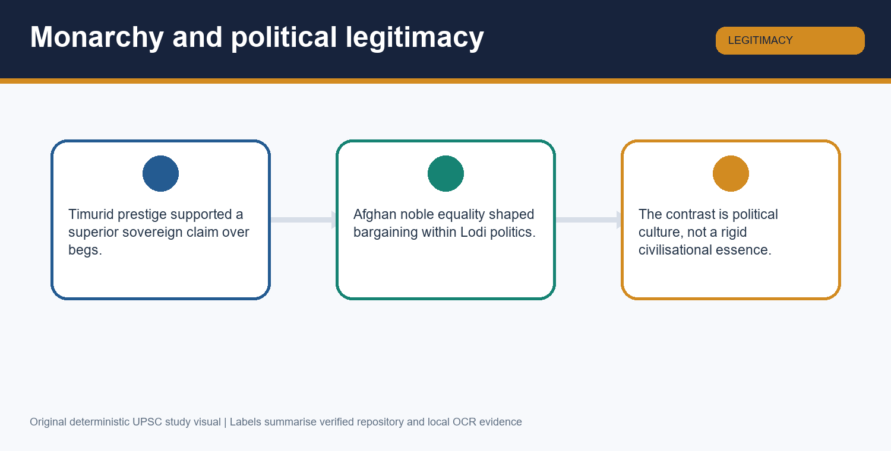

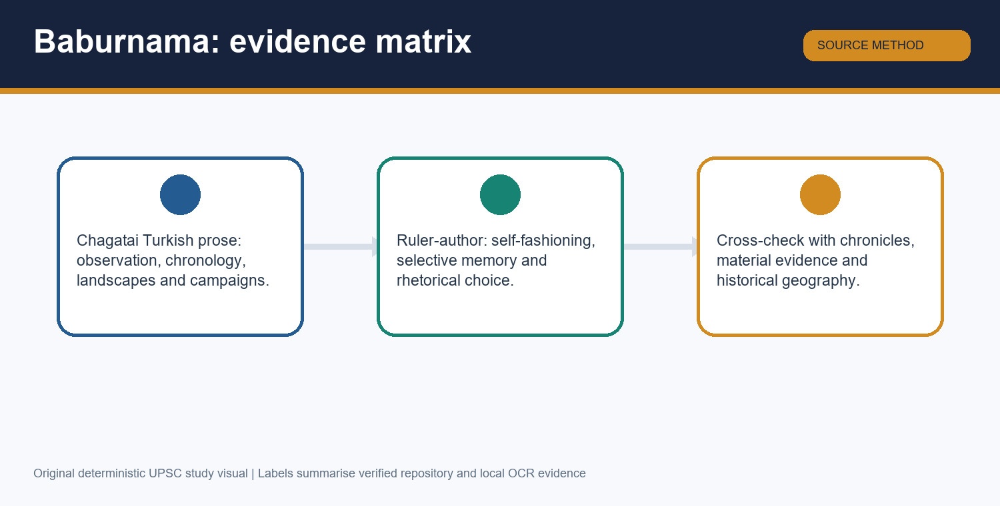

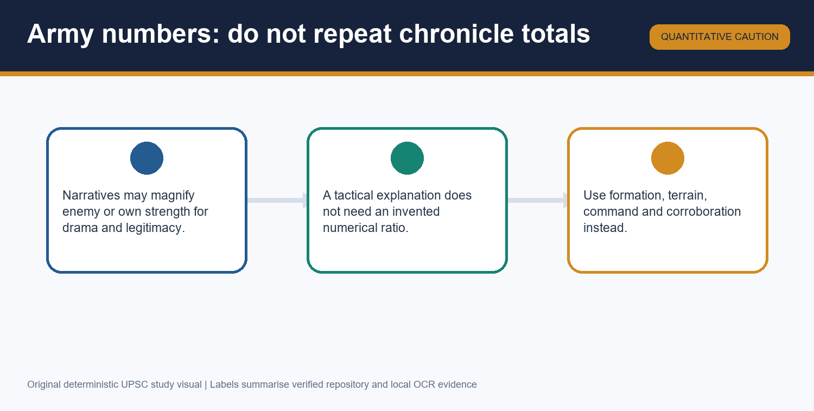

