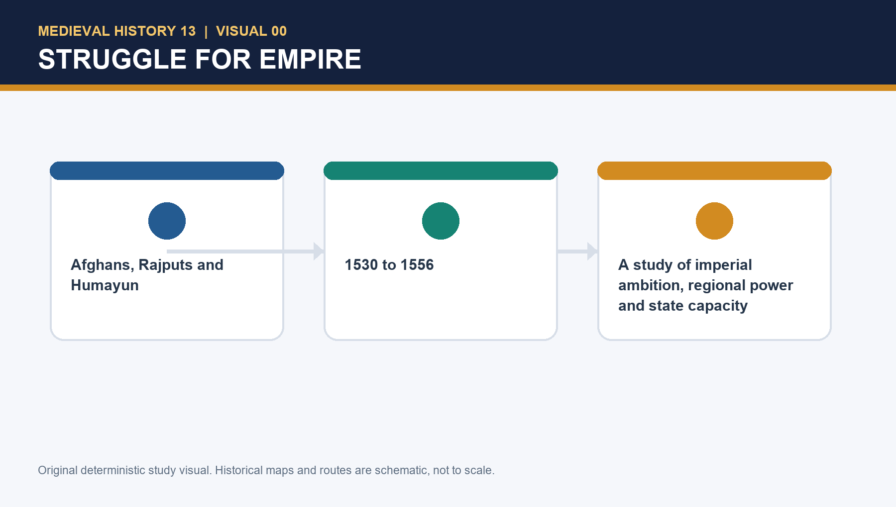

# Medieval History 13 — Struggle for Empire: Afghans, Rajputs & Humayun — Premium Solved PYQ Workbook

> **Subject:** Medieval Indian History | **Topic:** 13 | **Export date:** 2026-08-18
>
> **Approval:** false — awaiting explicit user approval.
>
> **Workbook status:** original practice with transparent direct-PYQ gap; no reconstructed official answer key.

## Workbook orientation: evidence before recall

[FACT] This workbook is deliberately practice-complete while refusing to manufacture a direct Topic 13 CSE PYQ. It uses the audited gap, an adjacent Topic 08 Gujarat–Portuguese/Diu route and original questions calibrated to factual discrimination, source method, campaign causation and Mains answer writing.

## PART III. PYQ route audit, direct gap and adjacent-route discipline

### Direct-PYQ result

[FACT] The repository's 2018–2023 Prelims routing ledger, 2024–2025 integration audit and 2026 audit were checked for this Topic 13 ownership. They contain **no direct verified CSE 2018–2025 question owned by Medieval History Topic 13 on Humayun, Sher Khan, Chausa, Kannauj/Bilgram, Din Panah, or Humayun's restoration**. This is a genuine direct-PYQ gap; no question or answer key is invented to fill it.

[FACT] A trustworthy **adjacent** route exists in the 2023 Prelims GS-I routing ledger: the neutral, verified ledger label is **“Medieval Gujarat rulers Portuguese and Diu surrender”**, owned by Topic 08, not Topic 13. The ledger explicitly says that the answer key is unavailable locally. This package does not reproduce a reconstructed exact paper wording, does not assign a letter, and does not call it a Humayun PYQ.

| Category | Status | Safe use in this package |
|---|---|---|
| Direct CSE 2018–2025 Topic 13 PYQ | None located in audited routing records | State the gap; use original practice |
| Exact adjacent official wording on Humayun/Chausa/Kannauj/Sher Khan | None located with trustworthy local wording/provenance | Do not manufacture a quotation |
| Topic 08 Gujarat–Portuguese/Diu route | Adjacent 2023 ledger route; key unavailable locally | Link as context for Bahadur Shah, with ownership retained by Topic 08 |
| Inferred answer | Not needed here | If ever used, label **INFERRED ANSWER — NOT OFFICIALLY VERIFIED** with evidence and elimination |

### Transparent adjacent study routes

- **Topic 12:** Babur's foundational but fragile conquest and the preceding Afghan/Lodi setting.
- **Topic 08:** Gujarat, Malwa, Mewar and the bounded Portuguese/Diu context.
- **Topic 14:** Sher Shah and Sur institutions after the political-military rise explained here.
- **Topic 15:** Akbar's difficult accession and later consolidation after Humayun's 1555–56 transition.

[ANALYSIS] A PYQ gap does not make the topic minor. Its demand families—state capacity, campaign logistics, historical source criticism, regional power, battle comparison and qualified causation—are reusable in GS-I answers and Prelims statement elimination.

## PART I. Practice — learning MCQ loops: 18 questions

The correct-option sequence is printed for audit: **ABCDABCDABCDABCDAB**.

### Q1. What best describes the empire Humayun received in December 1530?

- **A.** A conquest with weak finances, shallow administration, active Afghan resistance and mobile nobles.
- **B.** A settled revenue state with a uniformly loyal service elite.
- **C.** A kingdom whose eastern and western frontiers were already permanently secured.
- **D.** A polity where Timurid princes had abandoned all claims to separate shares.

**Answer: A**

**Explanation:** Babur's conquest opened Delhi–Agra but did not create an entrenched Indian ruling apparatus; the inherited constraints were fiscal, administrative, political and regional. The closest distractor is **B**; A settled revenue state with a uniformly loyal service elite. does not survive the source-based distinction in the stem.

### Q2. Why is Kamran's early position not best described as an immediate explanation of every later Mughal defeat?

- **A.** He never held territory outside Kabul.
- **B.** He held Kabul–Qandahar and then Lahore–Punjab, but the early eastern and Gujarat episodes also had independent strategic causes.
- **C.** He commanded Sher Khan's forces at Chausa.
- **D.** He submitted all troops to Humayun after 1530.

**Answer: B**

**Explanation:** Kamran's de facto partition mattered, yet the evidence warns against making fraternal rivalry a universal explanation before the Bengal crisis and Chausa. The closest distractor is **A**; He never held territory outside Kabul. does not survive the source-based distinction in the stem.

### Q3. What is the safest treatment of Dadrah/Daurah and Chunar chronology?

- **A.** Their day and month are fixed by every chronicle.
- **B.** Nizamuddin Ahmad describes both in exactly the same sequence as Abul Fazl.
- **C.** Nizamuddin's different dating/sequence means precise reconstruction is qualified, while the consolidation logic remains clear.
- **D.** The discrepancy proves that no Afghan threat existed.

**Answer: C**

**Explanation:** The source issue affects tight chronology, not the broader reading that Humayun sought to secure eastern Uttar Pradesh without yet invading Bihar. The closest distractor is **B**; Nizamuddin Ahmad describes both in exactly the same sequence as Abul Fazl. does not survive the source-based distinction in the stem.

### Q4. Chunar was strategically important chiefly because it:

- **A.** was a ceremonial capital of Gujarat.
- **B.** was the only route between Delhi and Bengal.
- **C.** automatically controlled every Bengal river crossing.
- **D.** sat at a key approach toward Bihar and Bengal, linking fort, land movement and river-side communications.

**Answer: D**

**Explanation:** A powerful fort could threaten a campaign's communications, but it was one node within a wider logistical landscape, not a magical single-cause bottleneck. The closest distractor is **C**; automatically controlled every Bengal river crossing. does not survive the source-based distinction in the stem.

### Q5. Din Panah is best read as:

- **A.** a Delhi-centred legitimacy and political project whose full institutional effect could not be immediate.
- **B.** proof that Humayun had permanently abandoned Agra.
- **C.** a Safavid military camp in Kabul.
- **D.** a monument built after Humayun's death by Akbar.

**Answer: A**

**Explanation:** Delhi's accumulated imperial prestige made a new capital intelligible; the project should neither be romanticised nor dismissed as fantasy. The closest distractor is **B**; proof that Humayun had permanently abandoned Agra. does not survive the source-based distinction in the stem.

### Q6. Which statement captures the Karnavati–rakhi story responsibly?

- **A.** It is fully confirmed by a contemporary Mughal dispatch.
- **B.** A later Rajasthani account records a bracelet tradition, but the cited contemporary evidence is silent; it is historiographical memory, not event proof.
- **C.** It establishes a permanent Mughal–Rajput alliance.
- **D.** It proves Humayun captured Chittor in 1532.

**Answer: B**

**Explanation:** The issue is provenance: a later tradition can illuminate memory, but silence in contemporary sources prevents treating it as settled political fact. The closest distractor is **D**; It proves Humayun captured Chittor in 1532. does not survive the source-based distinction in the stem.

### Q7. Humayun's 1535 Gujarat campaign shows that:

- **A.** Gujarat lacked any military capacity.
- **B.** Humayun was incapable of rapid campaigning.
- **C.** military drive brought Mandu, Champaner and Ahmedabad, but conquest was not converted into durable administration.
- **D.** Bahadur Shah had no connection with Malwa or Chittor.

**Answer: C**

**Explanation:** The campaign demonstrates real operational ability; its failure lay in settlement, coordination and willingness to administer, rather than in a denial of the victories. The closest distractor is **A**; Gujarat lacked any military capacity. does not survive the source-based distinction in the stem.

### Q8. Why did Gujarat slip from Mughal control after the campaign?

- **A.** A single local popular uprising expelled every Mughal force.
- **B.** Humayun never appointed anyone in Gujarat.
- **C.** Portuguese troops occupied all of Malwa.
- **D.** Disunited command, reluctant nobles, weak revenue settlement, regional reassertion and Bahadur Shah's recovery worked together.

**Answer: D**

**Explanation:** Askari received charge and divisions were assigned, but the arrangements did not generate stable co-operation or locally rooted rule. The closest distractor is **B**; Humayun never appointed anyone in Gujarat. does not survive the source-based distinction in the stem.

### Q9. Sher Khan's rise must be understood as:

- **A.** a Bihar-centred Afghan state-building challenge with regional resources, alliances and growing independence.
- **B.** a minor court rebel with no territorial base.
- **C.** a Portuguese governor at Diu.
- **D.** a Mughal officer permanently bound by the first Chunar agreement.

**Answer: A**

**Explanation:** Surajgarh, Bihar and Gaur reveal an autonomous political trajectory; the earlier accommodation did not freeze Sher Khan in a subordinate role. The closest distractor is **D**; a Mughal officer permanently bound by the first Chunar agreement. does not survive the source-based distinction in the stem.

### Q10. The Bengal campaign was not merely an attempt to rescue a displaced Bengal ruler because:

- **A.** Humayun had no contact with Bengal politics.
- **B.** the source presents Bengal itself—wealth, strategic extent and an imperial north-Indian vision—as the central prize.
- **C.** Sher Khan offered Humayun all of Gujarat.
- **D.** Gaur lay west of Agra.

**Answer: B**

**Explanation:** Mahmud Shah's appeal was an additional reason in the narrative; it cannot displace the broader contest over Bengal and imperial reach. The closest distractor is **A**; Humayun had no contact with Bengal politics. does not survive the source-based distinction in the stem.

### Q11. The six-month 1537–38 siege of Chunar mattered because it:

- **A.** immediately destroyed Sher Khan's Bihar base.
- **B.** proved Bengal had been annexed before the siege.
- **C.** consumed time while Sher Khan captured Gaur and reconfigured the eastern contest.
- **D.** made river movement irrelevant thereafter.

**Answer: C**

**Explanation:** The fort had operational importance, but its fall did not dissolve Sher Khan's wider coalition or prevent his Bengal advance. The closest distractor is **A**; immediately destroyed Sher Khan's Bihar base. does not survive the source-based distinction in the stem.

### Q12. What made Humayun's occupation of Gaur strategically hazardous?

- **A.** Mewar's army surrounded Gaur.
- **B.** the city had no river links.
- **C.** Humayun had no army in Bengal.
- **D.** Sher Khan could press the lines back toward Agra while nobles lacked commitment to govern a distant region.

**Answer: D**

**Explanation:** The problem was not a vacant army but communications, horses, distance, administrative reluctance and a rival who exploited the western corridor. The closest distractor is **C**; Humayun had no army in Bengal. does not survive the source-based distinction in the stem.

### Q13. At Chausa on 26 June 1539, the clearest source-grounded operational criticism is that Humayun:

- **A.** kept the Karmnasa at his back, deployed poorly and was surprised by Sher Khan.
- **B.** had no knowledge that Sher Khan existed.
- **C.** lost because all Rajputs switched sides.
- **D.** was defeated at Delhi by Bahadur Shah.

**Answer: A**

**Explanation:** The battle is explained through position, surprise and command within a fatigued campaign, not by pretending the Afghan challenge had been invisible for years. The closest distractor is **B**; had no knowledge that Sher Khan existed. does not survive the source-based distinction in the stem.

### Q14. Kannauj/Bilgram, 17 May 1540, differs from Chausa because it:

- **A.** was a Gujarat siege.
- **B.** was the decisive battle after Chausa that removed Humayun from north India, fought with a hastily assembled force without Kamran's hardened troops.
- **C.** occurred before Humayun's accession.
- **D.** was an unimportant skirmish won by the Mughals.

**Answer: B**

**Explanation:** Chausa exposed vulnerability; Kannauj converted it into political displacement. Kamran's non-cooperation mattered acutely after Chausa. The closest distractor is **D**; was an unimportant skirmish won by the Mughals. does not survive the source-based distinction in the stem.

### Q15. Which assessment of Askari and Hindal is historically balanced?

- **A.** They opposed Humayun from the first month of his reign.
- **B.** They controlled the Safavid court.
- **C.** They broadly served Humayun until the Bengal phase, after which Hindal's independent bid and elite defections sharpened the crisis.
- **D.** They were Afghan chiefs under Sher Khan.

**Answer: C**

**Explanation:** The source expressly cautions that their opposition has been overextended backward; chronology matters to causal explanation. The closest distractor is **A**; They opposed Humayun from the first month of his reign. does not survive the source-based distinction in the stem.

### Q16. Humayun's recourse to Shah Tahmasp should be described as:

- **A.** a wholly cost-free rescue that ended all frontier problems.
- **B.** proof that Qandahar never mattered to the Mughals.
- **C.** a forced religious conversion established by an uncontested source.
- **D.** a political alliance and aid relationship requiring careful treatment of its conditions, enabling recovery of Qandahar and Kabul in 1545.

**Answer: D**

**Explanation:** The secure point is assistance and recovery; over-simple conversion tales exceed the precision allowed by the assigned evidence. The closest distractor is **C**; a forced religious conversion established by an uncontested source. does not survive the source-based distinction in the stem.

### Q17. The 1555 restoration is best explained by:

- **A.** Humayun's return through a field opened by Sur fragmentation, followed by recovery of Delhi—not by retroactively erasing 1540.
- **B.** Sher Shah's personal surrender in 1555.
- **C.** a direct continuation of Gujarat administration from 1535.
- **D.** an Ottoman conquest of north India.

**Answer: A**

**Explanation:** Restoration demonstrates resilience and opportunity, but it does not turn the earlier loss of state capacity into a fiction. The closest distractor is **C**; a direct continuation of Gujarat administration from 1535. does not survive the source-based distinction in the stem.

### Q18. A defensible final judgement on Humayun is that:

- **A.** personal weakness alone explains everything.
- **B.** his imperial aims outran fiscal, administrative and logistical depth, while Sher Khan's leadership and Afghan regional capacity made the gap decisive.
- **C.** he never showed military energy in any theatre.
- **D.** Afghan success was caused by a timeless tribal trait.

**Answer: B**

**Explanation:** The evidence supports neither caricature nor exoneration: decision sequencing and character matter within an inherited structural and competitive political field. The closest distractor is **A**; personal weakness alone explains everything. does not survive the source-based distinction in the stem.

## PART II. Premium broad-coverage MCQs: 40 original questions

The correct-option sequence is printed for audit: **ABCDABCDABCDABCDABCDABCDABCDABCDABCDABCD**.

### Q1. The most accurate meaning of 'unfinished conquest' in this topic is:

- **A.** A political gain without fully rooted fiscal-administrative control.
- **B.** A dynasty with no territorial centre at all.
- **C.** A completed Bengal revenue survey.
- **D.** A permanent settlement with every Afghan chief.

**Answer: A**

**Explanation:** It denotes fragility after conquest, not the absence of a Delhi–Agra core. The closest distractor is **D**; A permanent settlement with every Afghan chief. does not survive the source-based distinction in the stem.

### Q2. Babur's late fiscal difficulty matters to Humayun because it:

- **A.** gave Gujarat to Bahadur Shah.
- **B.** left an already stretched treasury beside a large military-political task.
- **C.** made Chunar inaccessible by river.
- **D.** ended the need to pay begs.

**Answer: B**

**Explanation:** The fiscal inheritance conditioned capacity; it did not make every campaign impossible. The closest distractor is **D**; ended the need to pay begs. does not survive the source-based distinction in the stem.

### Q3. A Timurid partition norm most directly complicated sovereignty by:

- **A.** abolishing all royal claims.
- **B.** requiring every province to be formally independent.
- **C.** making princely shares politically plausible even when the sovereign expected loyalty.
- **D.** placing Sher Khan in charge of Kabul.

**Answer: C**

**Explanation:** Share expectations did not eliminate kingship; they put pressure on its exclusive territorial form. The closest distractor is **A**; abolishing all royal claims. does not survive the source-based distinction in the stem.

### Q4. Kamran's retention of khutba and sikka in Humayun's name initially indicates:

- **A.** a Safavid conquest of Punjab.
- **B.** a completed union of all Mughal territory.
- **C.** a Rajput treaty at Chittor.
- **D.** formal acknowledgement alongside a de facto regional power position.

**Answer: D**

**Explanation:** Outer forms of sovereignty coexisted with Kamran's practical territorial autonomy. The closest distractor is **B**; a completed union of all Mughal territory. does not survive the source-based distinction in the stem.

### Q5. The main value of the Dadrah/Daurah discrepancy for an answer is to:

- **A.** teach source method and date caution without abandoning the strategic narrative.
- **B.** deny that Humayun fought Afghans.
- **C.** make Nizamuddin Ahmad a contemporary eyewitness to every event.
- **D.** replace all evidence with a popular legend.

**Answer: A**

**Explanation:** It disciplines claims about sequence; it does not nullify the conflict. The closest distractor is **C**; make Nizamuddin Ahmad a contemporary eyewitness to every event. does not survive the source-based distinction in the stem.

### Q6. Kalinjar belongs to the early phase because it:

- **A.** was captured by Sher Khan after Gaur.
- **B.** formed part of a southern defensive-fort setting around Agra and preceded the Chunar episode.
- **C.** was a port on the Gujarat coast.
- **D.** marked restoration in 1555.

**Answer: B**

**Explanation:** The fort setting explains a consolidation move before the main east-west struggle. The closest distractor is **D**; marked restoration in 1555. does not survive the source-based distinction in the stem.

### Q7. At the first Chunar accommodation, Humayun's calculation was that:

- **A.** Bahadur Shah would govern Bihar for him.
- **B.** Chunar no longer mattered at all.
- **C.** Sher Khan was not yet a sufficient danger to require a Bihar campaign, and an accommodation held tactical value.
- **D.** the Mughal empire had already conquered Bengal.

**Answer: C**

**Explanation:** The compromise was a contemporary calculation, not proof of ignorance about all eastern politics. The closest distractor is **A**; Bahadur Shah would govern Bihar for him. does not survive the source-based distinction in the stem.

### Q8. Din Panah's location and timing most strongly support the view that it:

- **A.** was a Portuguese coastal enclave.
- **B.** replaced every previous Mughal centre overnight.
- **C.** was a private library unrelated to politics.
- **D.** used Delhi's prestige to frame a dynastic political project.

**Answer: D**

**Explanation:** Building at Delhi carried legitimacy, even though a capital project alone could not solve state depth. The closest distractor is **B**; replaced every previous Mughal centre overnight. does not survive the source-based distinction in the stem.

### Q9. Bahadur Shah's power rested on:

- **A.** Gujarat, Malwa acquisition, pressure toward Rajasthan and artillery resources in a western regional state.
- **B.** only a small Afghan jagir near Jaunpur.
- **C.** direct control of Kabul under Humayun.
- **D.** the dismantling of all Gujarati ports.

**Answer: A**

**Explanation:** This was a substantial regional challenge, not a peripheral rebellion. The closest distractor is **B**; only a small Afghan jagir near Jaunpur. does not survive the source-based distinction in the stem.

### Q10. A sound explanation for Humayun's stance near Chittor avoids:

- **A.** placing Malwa–Mewar–Gujarat in a strategic field.
- **B.** reducing the episode solely to a romanticised rakhi anecdote.
- **C.** recognising Rajput resistance.
- **D.** linking eastern Rajasthan to the Agra–Delhi position.

**Answer: B**

**Explanation:** The later legend cannot substitute for the documented regional power calculus. The closest distractor is **A**; placing Malwa–Mewar–Gujarat in a strategic field. does not survive the source-based distinction in the stem.

### Q11. At Mandsor, Humayun's response to Bahadur Shah's defended camp was to:

- **A.** attack blindly because artillery did not exist.
- **B.** leave Malwa for Bengal immediately.
- **C.** avoid a frontal assault and squeeze supplies, exposing the limits of the camp's defensive plan.
- **D.** appoint Sher Khan governor of Gujarat.

**Answer: C**

**Explanation:** This is evidence of operational judgement rather than a blanket incompetence thesis. The closest distractor is **A**; attack blindly because artillery did not exist. does not survive the source-based distinction in the stem.

### Q12. The capture of Champaner demonstrates:

- **A.** the immediate creation of a stable Gujarat bureaucracy.
- **B.** the end of Portuguese interest at Diu.
- **C.** the automatic loyalty of every Gujarati noble.
- **D.** a significant military success whose treasure could not substitute for political settlement.

**Answer: D**

**Explanation:** Fort capture and treasure acquisition did not build an administrative coalition. The closest distractor is **C**; the automatic loyalty of every Gujarati noble. does not survive the source-based distinction in the stem.

### Q13. Askari's Gujarat assignment is important because it:

- **A.** shows a formal attempt at direct administration that did not generate co-ordinated authority.
- **B.** proves Askari never held any command.
- **C.** makes Bengal a Mughal province.
- **D.** defeated Sher Khan at Chausa.

**Answer: A**

**Explanation:** The issue is failed implementation and elite cohesion, not a complete absence of planning. The closest distractor is **B**; proves Askari never held any command. does not survive the source-based distinction in the stem.

### Q14. The phrase 'rootlessness of Mughal nobles' means:

- **A.** they had no families anywhere.
- **B.** their stronger attachment to the Delhi–Agra zone made distant Gujarat and Bengal administration unattractive.
- **C.** they were all born in Central Asia.
- **D.** they had no military resources.

**Answer: B**

**Explanation:** It is a political-administrative observation, not a literal statement about birthplace. The closest distractor is **C**; they were all born in Central Asia. does not survive the source-based distinction in the stem.

### Q15. Surajgarh belongs in Sher Khan's rise because it:

- **A.** was a battle won by Humayun in Malwa.
- **B.** was a Portuguese naval action.
- **C.** helped Sher Khan break Bengal's pressure on Bihar and marked a higher political standing.
- **D.** occurred after Humayun's death.

**Answer: C**

**Explanation:** The 1534 victory contributes to the move from local sardar to regional contender. The closest distractor is **A**; was a battle won by Humayun in Malwa. does not survive the source-based distinction in the stem.

### Q16. The best reading of Gaur in 1538 is:

- **A.** a city without strategic or symbolic value.
- **B.** a fort built by Humayun after 1555.
- **C.** an Afghan camp with no Bengal context.
- **D.** Bengal's capital, whose seizure gave Sher Khan resources and changed the scale of the contest.

**Answer: D**

**Explanation:** Gaur made the struggle a contest for a large eastern polity, not only a fort dispute. The closest distractor is **A**; a city without strategic or symbolic value. does not survive the source-based distinction in the stem.

### Q17. Why did Humayun not simply bypass Chunar in 1537?

- **A.** A hostile fort could threaten communications during a Bengal advance.
- **B.** it stood in Rajasthan between Chittor and Mandu.
- **C.** Bengal had already become loyal.
- **D.** Kamran demanded it as his residence.

**Answer: A**

**Explanation:** The route-function is the point; a key fort posed a communications risk. The closest distractor is **B**; it stood in Rajasthan between Chittor and Mandu. does not survive the source-based distinction in the stem.

### Q18. Sher Khan's offer regarding Bihar and Bengal demonstrates:

- **A.** his continued acceptance of a Mughal jagir only.
- **B.** a negotiation between actors each imagining a wider political order, with Bengal as a central issue.
- **C.** the end of Afghan state-building.
- **D.** that Humayun had already lost Kabul.

**Answer: B**

**Explanation:** The terms illustrate independent political ambition, even though reports of negotiations require source caution. The closest distractor is **A**; his continued acceptance of a Mughal jagir only. does not survive the source-based distinction in the stem.

### Q19. Humayun's stay at Gaur could not solve the Bengal problem because:

- **A.** Bengal lacked any local population.
- **B.** no one could travel by river.
- **C.** officers' lack of commitment, horse losses, distance and broken communications undermined administration.
- **D.** Chittor remained unconquered.

**Answer: C**

**Explanation:** The occupation encountered a capacity problem rather than merely a missing ceremony of annexation. The closest distractor is **A**; Bengal lacked any local population. does not survive the source-based distinction in the stem.

### Q20. Hindal's move at Agra during the Bengal phase shows:

- **A.** the earliest cause of the 1530 inheritance.
- **B.** that Kamran was never politically active.
- **C.** a Portuguese intervention in the north.
- **D.** how elite defections and a princely bid compounded a campaign already stretched eastward.

**Answer: D**

**Explanation:** Its timing matters: it intensified a later crisis, rather than explaining all prior episodes. The closest distractor is **B**; that Kamran was never politically active. does not survive the source-based distinction in the stem.

### Q21. Chausa should be analysed as:

- **A.** a battle where position, surprise, command and campaign exhaustion converged.
- **B.** a decisive 1540 restoration victory.
- **C.** a naval battle at Diu.
- **D.** a proof that no Mughal force reached Bihar.

**Answer: A**

**Explanation:** The Karmnasa-back position and surprise explain the disaster better than a single moral trait. The closest distractor is **D**; a proof that no Mughal force reached Bihar. does not survive the source-based distinction in the stem.

### Q22. The distinct significance of Kannauj/Bilgram is that it:

- **A.** was fought before Chausa.
- **B.** converted the prior shock into a decisive Afghan victory that displaced Humayun from north India.
- **C.** settled Gujarat's administration.
- **D.** brought Shah Tahmasp to Delhi.

**Answer: B**

**Explanation:** It must be separated from Chausa by date, force condition and political result. The closest distractor is **D**; brought Shah Tahmasp to Delhi. does not survive the source-based distinction in the stem.

### Q23. Kamran's hardened troops matter especially because:

- **A.** they supplied Humayun at Chausa without conditions.
- **B.** they fought for Bahadur Shah at Mandu.
- **C.** their non-availability after Chausa deprived Humayun of a significant reinforcement in the decisive phase.
- **D.** they were stationed at Gaur under Hindal.

**Answer: C**

**Explanation:** The source assigns their importance to the post-Chausa turning point, not to every earlier campaign. The closest distractor is **A**; they supplied Humayun at Chausa without conditions. does not survive the source-based distinction in the stem.

### Q24. A fair reading of the brothers is:

- **A.** all were either heroes or traitors throughout.
- **B.** their conduct has no relation to state structure.
- **C.** they determined Bahadur Shah's Portuguese policy.
- **D.** their roles changed across time; rivalry interacted with campaign stress, legitimacy and noble calculation.

**Answer: D**

**Explanation:** Chronology resists a static family-villain narrative. The closest distractor is **A**; all were either heroes or traitors throughout. does not survive the source-based distinction in the stem.

### Q25. The exile in Sindh underscores that:

- **A.** regional rulers such as Sindh's authorities and Maldeo did not automatically risk themselves for a fallen Mughal.
- **B.** Humayun controlled every regional ruler.
- **C.** Iran was irrelevant to recovery.
- **D.** Sher Shah granted Humayun Bengal.

**Answer: A**

**Explanation:** Loss of the north Indian core exposed the limits of dynastic prestige without usable resources. The closest distractor is **B**; Humayun controlled every regional ruler. does not survive the source-based distinction in the stem.

### Q26. Safavid help under Shah Tahmasp should be presented as:

- **A.** an entirely religious crusade with no frontier politics.
- **B.** a consequential political alliance whose terms and sectarian dimensions require precise sourcing.
- **C.** a direct annexation of Delhi by Iran.
- **D.** a literary legend with no recovery outcome.

**Answer: B**

**Explanation:** The safe historical result is aid in the recovery of Qandahar and Kabul; reductionism is unsafe. The closest distractor is **C**; a direct annexation of Delhi by Iran. does not survive the source-based distinction in the stem.

### Q27. The 1545 recovery of Qandahar and Kabul provided:

- **A.** a restoration of Gujarat through Askari.
- **B.** instant control of all north India.
- **C.** a north-western base from which a later return became possible.
- **D.** the elimination of Sur factions in Delhi.

**Answer: C**

**Explanation:** It rebuilt a territorial platform, but the Delhi–Agra recovery came only later. The closest distractor is **B**; instant control of all north India. does not survive the source-based distinction in the stem.

### Q28. Sur fragmentation matters in 1555 because it:

- **A.** proves Sher Shah never had a state.
- **B.** was caused by the 1535 Champaner siege.
- **C.** made Afghanistan irrelevant.
- **D.** created openings that Humayun could exploit in regaining Delhi.

**Answer: D**

**Explanation:** A strong ruler's earlier success and a successor regime's fragmentation are not contradictory. The closest distractor is **A**; proves Sher Shah never had a state. does not survive the source-based distinction in the stem.

### Q29. Humayun's death in 1556 is historically significant because:

- **A.** the restored dynasty passed into Akbar's accession crisis rather than becoming a settled personal rule.
- **B.** it took place before Chausa.
- **C.** it ended the Mughal line.
- **D.** it transferred Delhi to Bahadur Shah.

**Answer: A**

**Explanation:** The succession point connects restoration to the next phase without claiming smooth stability. The closest distractor is **C**; it ended the Mughal line. does not survive the source-based distinction in the stem.

### Q30. Which formulation rejects the opium caricature without exonerating Humayun?

- **A.** He made no serious error.
- **B.** Campaign energy in Gujarat coexisted with poor sequencing, administrative limits and serious misjudgement of Sher Khan.
- **C.** His private habits mechanically decided every battle.
- **D.** Sher Khan had no role in the outcome.

**Answer: B**

**Explanation:** Historical judgement should compare demonstrated capacity with demonstrable decisions and opposition. The closest distractor is **D**; Sher Khan had no role in the outcome. does not survive the source-based distinction in the stem.

### Q31. A source-critical hierarchy would treat:

- **A.** a later popular legend as superior to all contemporary evidence.
- **B.** all Mughal chronicles as identical.
- **C.** Nizamuddin's compressed chronology, later Mughal narratives and regional traditions as sources with different reach and limits.
- **D.** a monument as direct proof of every sixteenth-century political event.

**Answer: C**

**Explanation:** Different genres answer different questions; source criticism prevents chronology and memory from being flattened. The closest distractor is **B**; all Mughal chronicles as identical. does not survive the source-based distinction in the stem.

### Q32. UNESCO's Humayun's Tomb description is useful in this package only as:

- **A.** proof that Karnavati sent a rakhi.
- **B.** evidence for the troop position at Chausa.
- **C.** a replacement for early Mughal chronicles.
- **D.** a bounded modern heritage anchor for dynastic memory, garden-tomb form and conservation.

**Answer: D**

**Explanation:** A later monument can illuminate memorialisation and architecture, not establish contested campaign events. The closest distractor is **A**; proof that Karnavati sent a rakhi. does not survive the source-based distinction in the stem.

### Q33. The Rajput dimension of this struggle is best framed as:

- **A.** variable relations among Mewar, Gujarat and Mughal power, not a permanent homogeneous Rajput bloc.
- **B.** a unified army permanently allied to either side.
- **C.** irrelevant to Malwa and Chittor.
- **D.** evidence that every conflict was religiously binary.

**Answer: A**

**Explanation:** Mewar and Chittor belong to a shifting regional field rather than title-tokenism. The closest distractor is **D**; evidence that every conflict was religiously binary. does not survive the source-based distinction in the stem.

### Q34. The Portuguese/Diu context belongs here because:

- **A.** it proves a Portuguese victory at Kannauj.
- **B.** Bahadur Shah's coastal pressures and Diu context intersected with Gujarat politics; the detail remains bounded to Topic 08's larger frame.
- **C.** Portugal controlled Gaur.
- **D.** Humayun built Diu.

**Answer: B**

**Explanation:** It provides west-coast context without becoming the topic's main explanation. The closest distractor is **A**; it proves a Portuguese victory at Kannauj. does not survive the source-based distinction in the stem.

### Q35. Which causal ordering is strongest for Gujarat?

- **A.** Treasure → automatic allegiance → permanent administration.
- **B.** Bahadur Shah's death → no need for a campaign.
- **C.** Military success → weak settlement and elite coordination → regional reassertion and Mughal withdrawal.
- **D.** Chausa → capture of Mandu.

**Answer: C**

**Explanation:** The chain keeps operational success and political failure in the correct order. The closest distractor is **A**; Treasure → automatic allegiance → permanent administration. does not survive the source-based distinction in the stem.

### Q36. Which causal ordering is strongest for Bengal?

- **A.** Gaur occupation → completed Mughal administration → Sher Khan disappears.
- **B.** Karnavati legend → Chunar falls.
- **C.** Kabul recovery → Surajgarh.
- **D.** Long siege and eastward advance → Gaur occupation amid administrative weakness → communications pressure → Chausa.

**Answer: D**

**Explanation:** This sequence connects choices, logistics and rival action without reducing the outcome to weather or personality. The closest distractor is **B**; Karnavati legend → Chunar falls. does not survive the source-based distinction in the stem.

### Q37. The Afghan alternative should not be stereotyped because:

- **A.** its effectiveness rested on identifiable regional roots, military networks, leadership and political organisation.
- **B.** Afghans possessed a fixed timeless military essence.
- **C.** every Afghan chief supported Sher Khan from the beginning.
- **D.** they were incapable of administration.

**Answer: A**

**Explanation:** The explanatory variables are coalition, resources, terrain and leadership, not essentialised identity. The closest distractor is **B**; Afghans possessed a fixed timeless military essence. does not survive the source-based distinction in the stem.

### Q38. A strong 20-marker on Humayun should:

- **A.** list every date without an argument.
- **B.** link inheritance, campaign sequencing, rival capacity, brothers/nobles, logistics and a qualified verdict.
- **C.** treat restoration as proof that there was no failure.
- **D.** omit Sher Khan to focus on personality.

**Answer: B**

**Explanation:** A multidimensional argument explains both collapse and recovery. The closest distractor is **D**; omit Sher Khan to focus on personality. does not survive the source-based distinction in the stem.

### Q39. The forward link to Topic 14 should be:

- **A.** detailed Sur revenue administration as if it occurred before Chausa.
- **B.** a claim that all Akbar's institutions were copied unchanged.
- **C.** Sher Shah's rise creates the next topic; detailed Sur reforms remain there.
- **D.** a denial that the Sur interregnum mattered.

**Answer: C**

**Explanation:** The boundary keeps this topic's political-military struggle distinct from the subsequent administrative study. The closest distractor is **B**; a claim that all Akbar's institutions were copied unchanged. does not survive the source-based distinction in the stem.

### Q40. The forward link to Akbar should be:

- **A.** Akbar's later era had no relationship to Humayun's experience.
- **B.** Akbar immediately ruled from Gaur.
- **C.** the 1555 recovery ended all succession risks.
- **D.** Humayun's restoration supplied a dynastic opening, while Akbar's later consolidation addressed a still-fragile inheritance.

**Answer: D**

**Explanation:** This relates phases without projecting Akbar's institutions backward. The closest distractor is **A**; Akbar's later era had no relationship to Humayun's experience. does not survive the source-based distinction in the stem.

## PART III. Remedial MCQs: 12 targeted misconception checks

The correct-option sequence is printed for audit: **ABCDABCDABCD**.

### Q1. Which date-event pair is secure?

- **A.** Chausa — 26 June 1539
- **B.** Chausa — 17 May 1540
- **C.** Kannauj — December 1530
- **D.** Delhi recovery — 1540

**Answer: A**

**Explanation:** Chausa is dated 26 June 1539; 17 May 1540 belongs to Kannauj/Bilgram. The closest distractor is **B**; Chausa — 17 May 1540 does not survive the source-based distinction in the stem.

### Q2. Which battle finally displaced Humayun from north India?

- **A.** Dadrah/Daurah
- **B.** Kannauj/Bilgram
- **C.** Surajgarh
- **D.** Mandsor

**Answer: B**

**Explanation:** Kannauj/Bilgram was the decisive 1540 defeat; Dadrah/Daurah was an earlier success against eastern Afghans. The closest distractor is **A**; Dadrah/Daurah does not survive the source-based distinction in the stem.

### Q3. Which statement about the Karnavati tradition is safe?

- **A.** It is a fully corroborated contemporary dispatch.
- **B.** It proves Humayun occupied Chittor.
- **C.** It is a later tradition requiring provenance caution.
- **D.** It establishes a permanent Rajput bloc.

**Answer: C**

**Explanation:** The source warning is about later provenance and contemporary silence, not about a settled event. The closest distractor is **A**; It is a fully corroborated contemporary dispatch. does not survive the source-based distinction in the stem.

### Q4. What does the Chunar siege best show?

- **A.** One fort alone caused the Mughal collapse.
- **B.** Humayun had no artillery.
- **C.** Sher Khan was already defeated permanently.
- **D.** A strategic communications problem could consume time while the eastern contest changed.

**Answer: D**

**Explanation:** Chunar mattered operationally but cannot bear an exclusive causal claim. The closest distractor is **A**; One fort alone caused the Mughal collapse. does not survive the source-based distinction in the stem.

### Q5. Which brother's hardened troops particularly mattered after Chausa?

- **A.** Kamran's
- **B.** Askari's
- **C.** Hindal's
- **D.** Sulaiman Mirza's

**Answer: A**

**Explanation:** The source links Kamran's 10,000 hardened troops and refusal of unified command to the post-Chausa crisis. The closest distractor is **B**; Askari's does not survive the source-based distinction in the stem.

### Q6. Din Panah was:

- **A.** a Gujarat fort taken in 1535.
- **B.** a Delhi capital project tied to legitimacy and prestige.
- **C.** a Safavid city captured in 1545.
- **D.** a Bengal port under Sher Khan.

**Answer: B**

**Explanation:** Din Panah was built at Delhi; it should be interpreted politically rather than as a campaign fort. The closest distractor is **A**; a Gujarat fort taken in 1535. does not survive the source-based distinction in the stem.

### Q7. Sher Khan's offer over Bengal demonstrates:

- **A.** he had ceased all political ambition.
- **B.** Humayun had accepted his sovereignty permanently.
- **C.** Bengal, not merely a personal feud, was central to the contest.
- **D.** Gujarat had already been restored.

**Answer: C**

**Explanation:** The offer makes Bengal a disputed imperial prize; no final settlement followed. The closest distractor is **B**; Humayun had accepted his sovereignty permanently. does not survive the source-based distinction in the stem.

### Q8. The heritage anchor for Humayun's Tomb is used to discuss:

- **A.** a source for Chausa deployment.
- **B.** direct evidence of Dadrah's date.
- **C.** proof of a rakhi exchange.
- **D.** dynastic memory and conservation, not sixteenth-century political-event proof.

**Answer: D**

**Explanation:** UNESCO describes the later monument and its architecture; it cannot decide contested campaign narratives. The closest distractor is **A**; a source for Chausa deployment. does not survive the source-based distinction in the stem.

### Q9. Which interpretation of Gujarat is fair?

- **A.** It was a major military achievement but failed as durable direct administration.
- **B.** It was an unbroken Mughal provincial success.
- **C.** Humayun never reached Mandu.
- **D.** Bahadur Shah had no regional power.

**Answer: A**

**Explanation:** The campaign's temporal military success and administrative reversal must be held together. The closest distractor is **B**; It was an unbroken Mughal provincial success. does not survive the source-based distinction in the stem.

### Q10. Why did Gaur not become a secure Mughal gain?

- **A.** The city did not exist.
- **B.** Distant administration, weak noble commitment and cut communications undermined occupation.
- **C.** Kamran surrendered all Punjab troops.
- **D.** Chittor was unconquered.

**Answer: B**

**Explanation:** The eastern occupation's weakness came from capacity and communication, not from the unrelated Chittor front. The closest distractor is **D**; Chittor was unconquered. does not survive the source-based distinction in the stem.

### Q11. Which statement avoids an Afghan stereotype?

- **A.** All Afghans acted identically.
- **B.** Afghan capacity had no territorial basis.
- **C.** Sher Khan mobilised regional networks, resources, leadership and home-terrain advantages.
- **D.** Afghan success needed no strategy.

**Answer: C**

**Explanation:** The account explains political-military organisation rather than attributing success to an essential trait. The closest distractor is **A**; All Afghans acted identically. does not survive the source-based distinction in the stem.

### Q12. What did the restoration of 1555 not mean?

- **A.** Humayun regained Delhi amid Sur fragmentation.
- **B.** The Mughal dynasty gained a platform for Akbar's accession.
- **C.** The 1540 collapse can be ignored.
- **D.** The earlier failure was automatically erased.

**Answer: D**

**Explanation:** Return is not retrospective cancellation; a good verdict keeps collapse, recovery and continuing fragility together. The closest distractor is **C**; The 1540 collapse can be ignored. does not survive the source-based distinction in the stem.

## PART VI. Original Mains practice and examiner-grade model solutions

Every model follows claim → named evidence/example → analysis → qualification → conclusion. These are original UPSC-style prompts, not official questions.

### Mains 1. Examine the proposition that Humayun inherited an unfinished conquest.

**10 marks | 150 words | Original UPSC-style practice**

**Model solution**

**Claim.** Humayun inherited a conquest rather than a settled empire. Babur's victories had created a Delhi–Agra core, but the state that passed in December 1530 remained financially and administratively thin.

**Named evidence and analysis.** First, the local Satish Chandra account notes stretched finances after Babur had exhausted the Lodi treasure and sought a share from assigned revenues. That evidence matters because war, rewards and office-holding required a dependable fiscal base; a victory treasury was not a routine revenue system. Second, the administration relied heavily on begs holding large assignments. Such delegation could mobilise men, yet it also made local authority and collection dependent on followers whose interests were not automatically identical with the centre. Third, eastern Afghans remained politically active from east Uttar Pradesh to Bihar, while Sher Khan had access to Chunar. This shows that Panipat and Ghaghra had not dissolved Afghan political capacity.

**Qualification.** The inheritance was not empty. Humayun had Delhi–Agra prestige, military resources and scope for action, as Dadrah and Gujarat later show. Nor should Kamran's position be presented as an instant terminal fracture: it relieved Humayun of some north-western burdens before becoming acute in the later crisis.

**Conclusion.** The phrase 'unfinished conquest' therefore means a mismatch between territorial claim and institutional depth. It explains vulnerability without denying agency: Humayun still had to choose priorities, and Sher Khan still had to build an alternative coalition.

**Why this earns marks:** It defines the proposition, deploys fiscal, administrative and Afghan evidence, and ends with a qualified causal verdict rather than a personality label.

### Mains 2. Assess structural and personal factors in Humayun's failure.

**15 marks | 200 words | Original UPSC-style practice**

**Model solution**

**Claim.** Humayun's fall cannot be explained either by a private moral defect or by structures that made choices irrelevant. Structural fragility set the field; sequencing and judgement shaped how he lost it.

**Structural field.** Babur's stretched finances, large beg assignments and shallow local roots restricted the administrative reach of the new Mughal regime. Kamran's Lahore–Punjab position represented a de facto partition inside a Timurid political culture of princely shares. In the east, Sher Khan possessed a Bihar base, Afghan networks and later Bengal resources. These conditions meant that a ruler could not safely assume that a military advance would yield settled authority.

**Personal and strategic choices.** Humayun nevertheless displayed ability: at Mandsor he avoided a frontal assault on Bahadur Shah's defended camp and used a supply squeeze; he took Mandu, Champaner and Ahmedabad. The failure followed when victory was treated as equivalent to administration. Askari's Gujarat charge lacked co-ordination and noble commitment. In Bengal, the six-month Chunar siege and long stay at Gaur gave Sher Khan time to threaten communications. At Chausa, placing the Karmnasa behind his position and permitting surprise were concrete operational errors.

**Qualification.** The old 'opium' caricature is inadequate. Mirza Haider's observation is a source, not a total explanation; the record also shows sustained campaigning. Equally, rehabilitation cannot make Chausa or the Bengal sequence disappear.

**Conclusion.** Humayun's ambition outran the fiscal, logistical and administrative capacity available to enforce it. Personal error made an inherited vulnerability exploitable by a capable opponent.

**Why this earns marks:** The answer weighs both levels, uses named episodes, challenges a caricature through source method, and gives a graded conclusion.

### Mains 3. Discuss the Afghan challenge under Sher Khan as a political-military alternative.

**15 marks | 200 words | Original UPSC-style practice**

**Model solution**

**Claim.** Sher Khan was not simply a rebellious jagirdar who happened to defeat an emperor. By the late 1530s he represented an alternative north-Indian political project, built from a Bihar base, Afghan networks, Bengal resources and superior strategic adaptation.

**Evidence and mechanism.** Chunar gave Sher Khan a strong eastern position, while the Afghan field extended across east Uttar Pradesh and Bihar. The earlier Mughal–Afghan contest had already shown that these regions contained mobile leaders and sanctuaries. Sher Khan's victory at Surajgarh in 1534 against Bengal pressure strengthened his Bihar position; the subsequent seizure of Gaur enlarged his resource and symbolic reach. The reported offer to leave Bihar and remit revenue if Bengal were confirmed to him is analytically revealing: it treats Bengal as a sovereign-scale prize, not as an office held at imperial pleasure.

At Chausa, Sher Khan exploited Humayun's exposed posture; at Kannauj/Bilgram he led the force that decisively expelled the Mughals from north India. These were not accidents of ethnic identity. They joined leadership, regional roots, intelligence, movement, terrain and an ability to gather Afghan support under a credible command.

**Qualification.** Afghan politics were not permanently uniform: chiefs had differing interests, and no timeless 'tribal' essence explains success. Mughal errors—especially the Bengal communications problem and later fractured command—enlarged the opportunity. Detailed Sur administrative reforms belong to the following topic and should not be pre-dated here.

**Conclusion.** Sher Khan's strength lay in converting a regional Afghan social-military field into a state-building coalition at the exact moment Mughal expansion exceeded its administrative base.

**Why this earns marks:** It replaces a stereotype with concrete evidence, distinguishes political scale from office-holding, and respects the Topic 14 boundary.

### Mains 4. Evaluate Humayun's Gujarat campaign.

**10 marks | 150 words | Original UPSC-style practice**

**Model solution**

**Claim.** The Gujarat campaign was a serious military achievement but an administrative failure; either half of that judgement is inadequate.

**Evidence and analysis.** Bahadur Shah's Gujarat–Malwa power and pressure around Chittor made the western theatre strategically relevant to Delhi–Agra. In 1535 Humayun moved through eastern Malwa, held a position near Ujjain/Mandsor, and avoided the frontal attack that Bahadur Shah's artillery-backed camp invited. By cutting supplies, he compelled withdrawal; Mandu, Champaner and later Ahmedabad fell. These named stages demonstrate drive, operational patience and personal courage, not passivity.

The holding problem was different. Humayun gave Askari overall responsibility and divided Gujarat among nobles, yet no durable revenue or co-ordination system emerged. Begs who regarded the Delhi–Agra region as home were reluctant to remain in Gujarat; suspicions between Askari and commanders deepened the failure. Bahadur Shah's recovery and regional reassertion followed. Humayun's own slow intervention from Mandu and later fear about Askari compounded the breakdown.

**Qualification.** The loss should not be described as a simple popular revolt or as proof that the campaign achieved nothing. It removed Bahadur Shah as an immediate northern threat; his subsequent death in a Portuguese-related fracas further reduced that danger.

**Conclusion.** Gujarat shows the central lesson of the topic: battle success without administrative settlement becomes a temporary occupation.

**Why this earns marks:** It separates campaign from governance, supplies named military evidence, and qualifies both the failure and the achievement.

### Mains 5. Analyse the Bengal campaign as a test of logistics and imperial ambition.

**20 marks | 250 words | Original UPSC-style practice**

**Model solution**

**Claim.** Humayun's Bengal expedition was not a narrow punitive march against Sher Khan. It tested an expansive claim to northern imperial unity against the actual logistical and administrative capacity of the early Mughal regime.

**Imperial aim.** The local Part II discussion treats Bengal as the principal prize. Mahmud Shah's appeal after Gaur fell was an additional reason, but Bengal's wealth, strategic extent and place in a Delhi-Sultanate-scale imagination made it central. Sher Khan's own stance—after Surajgarh and the capture of Gaur—confirms that the issue was a political order under Mughal or Afghan leadership.

**Logistics and geography.** Humayun left Agra in the rainy season of 1537 and invested Chunar because a powerful hostile fort could threaten communications toward Bengal. Its six-month capture consumed time while Sher Khan took Gaur. The fort was strategically relevant, but not an all-purpose explanation: it operated with land routes, river movement, supply and the political choices of both sides. At Gaur, horse losses, distance and a return route vulnerable to Sher Khan's westward moves increased the burden.

**Administrative capacity.** The Gujarat precedent reappeared more sharply. Mughal officers did not want to settle a distant territory they saw as foreign; a reluctant governor was not an accidental detail but evidence of the regime's limited local rooting. Sher Khan's moves against links toward Agra turned occupation into isolation. Hindal's independent bid at Agra made the campaign's domestic rear equally unstable.

**Qualification.** Humayun was not wholly inactive or incompetent: he reached Gaur and brought much of the army back toward Chausa despite harassment. Monsoon, rivers and climate affected operations, but geography does not independently decide politics.

**Conclusion.** Bengal exposed the mismatch between a vision of all-north-Indian sovereignty and a state unable to staff, supply and communicate across that vision. The failure was therefore logistical, administrative and strategic at once.

**Why this earns marks:** It answers the directive at two scales, embeds Chunar/Gaur/Agra evidence, treats geography as a mechanism, and avoids both weather determinism and moral caricature.

### Mains 6. Compare Chausa and Kannauj/Bilgram in the collapse of Humayun's first reign.

**15 marks | 200 words | Original UPSC-style practice**

**Model solution**

**Claim.** Chausa and Kannauj/Bilgram form a sequence, not duplicate names for one defeat: the first exposed operational weakness and shattered confidence; the second made Mughal displacement from north India decisive.

**Chausa, 26 June 1539.** Humayun had returned from Bengal through a field in which Sher Khan had pressed communications back toward Agra. At Chausa he kept the Karmnasa at his back, deployed badly and allowed surprise. The named river position matters because it restricted retreat; Sher Khan's initiative matters because a poor position alone does not win a battle for the opponent. Humayun escaped, so Chausa did not itself finish Mughal rule.

**Kannauj/Bilgram, 17 May 1540.** The later battle was fought after morale, time and command had deteriorated. Kamran had 10,000 hardened troops but would not put them under Humayun's command after Chausa, and then withdrew toward Lahore. Humayun's force was hastily assembled; Sher Khan was the better-prepared Afghan commander. The result was decisive expulsion from north India.

**Comparison.** Both battles belong to the Bengal–Afghan strategic crisis and reveal the effect of fractured Mughal co-operation. Yet Chausa should not be narrated as Kannauj in advance: it was a tactical disaster with survival; Kannauj was the political decision.

**Qualification.** It is wrong to make Kamran the cause of Chausa, since the operational error and Sher Khan's command were already present. It is equally wrong to omit Kamran from the final phase, where the unavailable hardened troops mattered materially.

**Conclusion.** The pair shows how tactical error, rival capacity and post-defeat political fragmentation can turn a reversible shock into regime collapse.

**Why this earns marks:** It uses dates, battlefield mechanism and force condition, then makes a true comparison rather than two disconnected mini-narratives.

### Mains 7. Examine brothers and nobility in Humayun's loss of power.

**10 marks | 150 words | Original UPSC-style practice**

**Model solution**

**Claim.** Fraternal and noble politics weakened Humayun, but their causal force changed across the reign. A chronology-sensitive answer avoids treating them as a pre-written explanation for every failure.

**Evidence and analysis.** Kamran's seizure of Lahore and control across Punjab created a de facto partition. Humayun confirmed the position while facing Afghan activity in the east and Bahadur Shah in the west. The decision reflected an immediate political calculation, though it weakened central authority and encouraged wider princely claims. Askari's and Hindal's early roles were not uniformly hostile: they broadly served Humayun until the Bengal crisis. Askari was entrusted with Gujarat; Hindal's independent move at Agra occurred when Humayun was stretched in Bengal and dissatisfied nobles joined him.

Noble rootlessness linked family politics to administration. Gujarat and Bengal were distant from the Delhi–Agra region in which many Mughal chiefs had settled; they resisted prolonged service and did not create stable local coalitions. After Chausa, Kamran's refusal to place his hardened troops under Humayun's command sharply worsened the military balance before Kannauj.

**Qualification.** Brothers did not cause Humayun's early victory loss at Gujarat by themselves, nor did nobles make Sher Khan's leadership irrelevant. The state confronted real Afghan and regional competitors.

**Conclusion.** Dynastic partition norms and factional nobles amplified a structural crisis; they became most destructive after battlefield confidence had already collapsed.

**Why this earns marks:** It names Kamran, Askari and Hindal separately, ties elite behaviour to administration, and refuses one-cause family blame.

### Mains 8. Discuss the Rajput–Gujarat–Mughal triangle, with special reference to source caution on the Karnavati tradition.

**15 marks | 200 words | Original UPSC-style practice**

**Model solution**

**Claim.** The Rajput dimension in Humayun's reign is best understood through a changing regional triangle of Mewar, Gujarat–Malwa and the Mughal core, not through a permanent Rajput bloc or a single sentimental anecdote.

**Regional field.** Bahadur Shah of Gujarat had expanded into Malwa and sought influence in Rajasthan. Chittor's siege and Mewar's resistance mattered because eastern Rajasthan connected the Gujarat–Malwa theatre with the Agra–Delhi zone. Humayun's movement toward Gwalior and later his 1535 campaign therefore belong to strategic geography: control or pressure in Malwa and Rajasthan affected the security of the northern imperial core. Bahadur Shah's Diu/Portuguese context is relevant only as bounded Topic 08 background to a Gujarat ruler operating under multiple pressures; it should not displace the inland political field.

**Source caution.** A mid-seventeenth-century Rajasthani account reports that Rani Karnavati sent a bracelet as rakhi and Humayun responded. The assigned source observes that contemporary records do not mention the episode. A careful answer may call it later historiographical memory, not evidence that decisively caused Humayun's action or proved a permanent Mughal–Rajput alliance. It cannot establish that Humayun captured Chittor.

**Qualification.** Source silence does not make regional politics empty: the Chittor context, Bahadur Shah's campaigns and Humayun's strategic responses are independently analysable. Nor should Rajputs be treated as mere props; Mewar's resistance materially affected the field.

**Conclusion.** The triangle demonstrates plural regional politics. Good source method protects that complexity from both romantic legend and communal simplification.

**Why this earns marks:** It integrates geography, campaign logic and provenance criticism while keeping the Portuguese reference in its proper bounded role.

### Mains 9. Assess Humayun's exile and Safavid assistance as a phase of political recovery.

**20 marks | 250 words | Original UPSC-style practice**

**Model solution**

**Claim.** Exile after 1540 exposed the limits of Mughal prestige without a territorial base, while Safavid assistance showed how frontier diplomacy could rebuild that base. Neither episode should be reduced to an adventure story or a simple religious conversion narrative.

**Loss and regional difficulty.** After Kannauj, Humayun and his brothers could not agree on a strategy. Kamran prioritised Kabul; Humayun moved toward Sindh and explored a Gujarat route. The local source records years of wandering in which the rulers of Sindh and Maldeo of Marwar were unwilling to stake themselves on a fallen claimant with limited resources. This is political evidence: regional rulers calculated risk, capacity and survival rather than responding automatically to Timurid status.

**Safavid connection and recovery.** Humayun eventually took shelter with Shah Tahmasp of Iran. Safavid support enabled the recapture of Qandahar and then Kabul in 1545. Qandahar and Kabul mattered not merely as refuges: together they provided a north-western political and military base, a connection to Iranian–Central Asian diplomacy, and a platform from which later recovery could be imagined.

**Source and religious caution.** Political and religious conditions attached to the Safavid relationship must be stated only with source precision. The evidence safely supports a consequential alliance and aid; an unqualified assertion of a simple, permanently forced conversion flattens complex court and diplomatic circumstances. Similarly, later Mughal chronicles have dynastic purposes and should be read alongside their chronology limits.

**Qualification.** External help did not by itself restore Delhi. The recovery of 1555 depended also on fragmentation within the Sur order. Conversely, Sur fragmentation does not make the Safavid bridge irrelevant: without the Kabul–Qandahar base, a return remained far harder.

**Conclusion.** Exile transformed Humayun from a dispossessed claimant into a ruler rebuilding resources through diplomacy and frontier recovery. It is a political recovery phase, not a narrative interlude.

**Why this earns marks:** It uses Sindh, Maldeo, Shah Tahmasp, Qandahar and Kabul as evidence, addresses religious caution directly, and links aid to the later restoration without monocausality.

### Mains 10. Explain the significance and limits of Humayun's restoration in 1555.

**20 marks | 250 words | Original UPSC-style practice**

**Model solution**

**Claim.** Humayun's recovery of Delhi in 1555 was historically significant because it restored the Mughal dynastic foothold, but it was enabled by Sur fragmentation and did not cancel the earlier evidence of institutional fragility.

**Why restoration was possible.** The Sur order that had displaced Humayun after Kannauj did not remain politically unified. This fragmentation opened a field that Humayun, now backed by the Kabul–Qandahar base recovered after Safavid assistance, could exploit. Delhi recovery therefore depended on a convergence of external recovery, opponent fragmentation and renewed Mughal agency. It was not a simple replay of the 1530 inheritance.

**Why it mattered.** Delhi carried accumulated imperial prestige; its recovery restored a political centre and made the Mughal line viable at the moment before Akbar's accession. The later architectural memory of Humayun's Tomb—UNESCO describes a grand 1560s garden-tomb patronised by Akbar—can be used only to illustrate dynastic memorialisation and a restored imperial language. It is not evidence that the first reign's campaigns had been successful.

**Limits and continuity.** The period 1530–40 had revealed weak finances, unrooted nobles, insecure communications, Timurid fraternal competition and the force of an Afghan alternative under Sher Khan. A Delhi recovery did not retrospectively solve those problems. Humayun died in 1556, leaving Akbar an opening rather than a completed institutional achievement. The correct forward link is that Akbar would consolidate on a restored foundation; it is not that all later Mughal capacities existed in 1555.

**Qualification.** Restoration nevertheless refutes a terminal-failure thesis. Humayun showed resilience, diplomatic adaptability and an ability to regain a centre after a profound defeat. The historical verdict must therefore hold collapse and recovery together.

**Conclusion.** 1555 marks dynastic rehabilitation, not the erasure of 1540. Its significance lies precisely in preserving a fragile opening through which a later, more durable Mughal consolidation became possible.

**Why this earns marks:** It makes restoration causal rather than ceremonial, bounds the heritage anchor correctly, and supplies a balanced transition to Akbar.

## Workbook closing recall card

- **Direct gap:** no verified 2018–2025 Topic 13 CSE PYQ in local audited records.
- **Battle ladder:** Chausa, 26 June 1539 → Kannauj/Bilgram, 17 May 1540.
- **Campaign verdict:** Gujarat shows victory without administration; Bengal shows ambition without communications and rooted personnel.
- **Source rule:** Nizamuddin chronology, later Mughal narratives, tradition and heritage have different evidentiary reach.
- **Final thesis:** Humayun's reverses were structural and personal; Sher Khan's regional Afghan alternative was active and capable.
