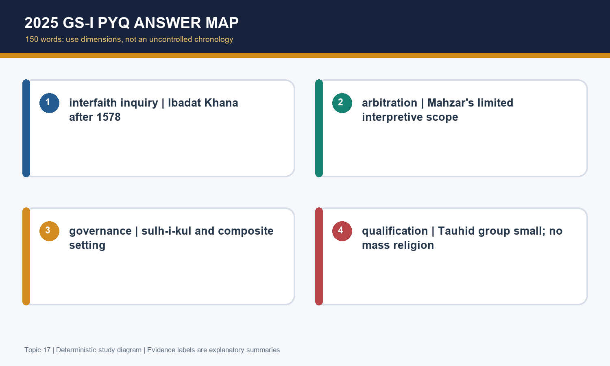
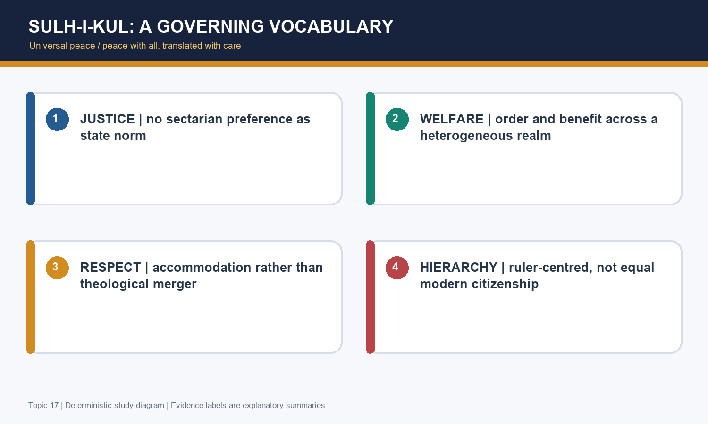
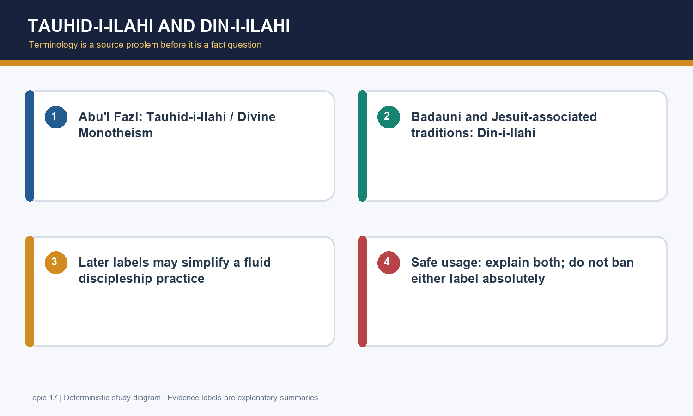
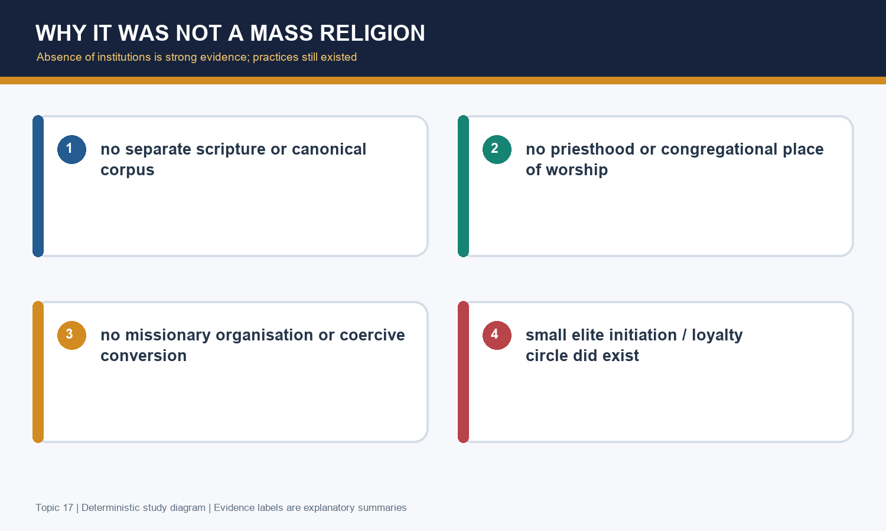
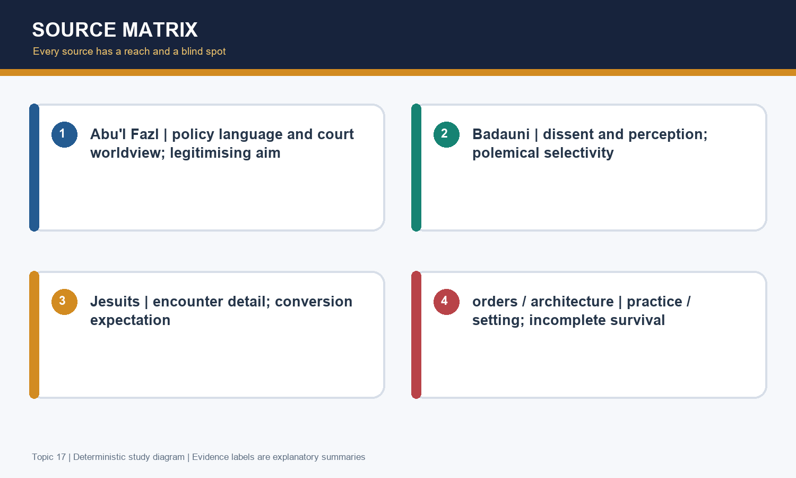

# Akbar's Religious Views: Ibadat Khana & Din-i-Ilahi - Premium Solved PYQ Workbook

> **Subject:** Medieval Indian History | **GS-I + Prelims** | **Date:** 18 August 2026
>
> **Workbook method:** exact verified PYQ provenance, answer rotation, individual discriminators and examiner-grade model answers. The workbook ends with solved practice, not revision notes.

## Scope and PYQ transparency

The direct owned question is 2025 GS-I Q2. Local 2018-25 routing ledgers and official/OCR paper exports were searched for Ibadat Khana, Mahzar, Din-i-Ilahi, jizyah and syncretism. No further exact direct CSE question was verified locally. Adjacent Akbar consolidation and administration routes remain with Topics 15 and 16. This transparency is intentional: no plausible coaching question is disguised as a PYQ.

## PART X - Exact direct PYQ, answer map and practice

### Direct CSE Mains PYQ - verified local official/OCR route

**2025 GS-I, Q2 - Direct/owned**

> “Examine the main aspects of Akbar's religious syncretism. (Answer in 150 words)”

**Provenance:** local OCR `knowledge-export/Mains PYQ/UPSC Mains 2025 GS Paper 1.md` (Question 2) and the 2024-25 GS-I routing ledger. It is descriptive; no answer key is required. A 2018-25 local-ledger search found **no additional exact direct CSE question** on Ibadat Khana, Mahzar, Din-i-Ilahi, jizyah or Akbar's religious policy. Topic 16's 2021 hierarchy Prelims question and Topic 15's political questions are adjacent only; they are not relabelled as Topic 17 direct PYQs.

## Examiner-grade solved Mains practice - 10 answers

> **Method:** Each model follows claim -> named evidence -> analysis -> qualification -> verdict. The direct 2025 response preserves the printed 150-word demand.

### 2025 GS-I Q2 - Direct PYQ

**Question:** Examine the main aspects of Akbar's religious syncretism. (Answer in 150 words)

**Format:** 10 marks | 150 words

**Model solution**

Akbar's syncretism was a graduated imperial policy, not the sudden creation of a mass faith. First, he removed visible disabilities by remitting pilgrim tax in 1563 and abolishing jizyah in 1564, signalling that loyal Hindu subjects could serve the crown without these fiscal markers. Secondly, the Ibadat Khana at Fatehpur Sikri opened inquiry from Muslim scholars to Hindu, Jain, Christian and Zoroastrian interlocutors; its quarrels widened Akbar's horizon rather than producing harmony. Thirdly, the Mahzar (1579) strengthened his limited authority to choose among conflicting juristic opinions for public welfare, not papal infallibility. Fourthly, sulh-i-kul made justice and non-sectarian treatment a governing principle, reinforced by a composite nobility and translations. Finally, Tauhid-i-Ilahi/Din-i-Ilahi expressed selective elite discipleship and loyalty; it had no scripture, priesthood or mass following. Thus, syncretism integrated a plural empire, but remained ruler-centred, hierarchical and dependent on Akbar's authority, and did not confer constitutional equality upon all subjects.

**Why this earns marks:** It directly answers 'aspects' through six compressed dimensions: fiscal change, inquiry, Mahzar, sulh-i-kul, composite setting and limited discipleship. Each has named evidence and the conclusion rejects both a mass-religion claim and modern-secularism anachronism.

### Original 10-marker

**Question:** Trace the evolution of Akbar's religious policy from early reform to sulh-i-kul. (Answer in 150 words)

**Format:** 10 marks | 150 words

**Model solution**

Akbar's policy evolved through connected, not identical, stages. The early phase made concrete adjustments: pilgrim tax was remitted in 1563, jizyah abolished in 1564, and the enslavement of wives and children of rebellious villagers was forbidden in the source narrative. These measures reduced selected disabilities while Rajput alliances widened the political base. From 1575, the Ibadat Khana turned personal Sufi-inflected inquiry into public dispute; its opening to non-Muslim interlocutors after 1578 exposed both truth claims and the limits of courtly consensus. The Mahzar (1579) gave the emperor a limited arbitral role among conflicting legal opinions, linked to welfare and administration. In the 1580-81 crisis, loyalty and public order became urgent. Sulh-i-kul then supplied the more durable state idiom: justice and non-sectarian accommodation across communities. This was innovative imperial integration, not equal citizenship or religious neutrality.

**Why this earns marks:** The answer obeys 'trace' by using chronology, then converts dates into a causal explanation. It includes three precise evidence points and limits the conclusion.

### Original 10-marker

**Question:** Why did the Ibadat Khana debates fail as dialogue yet matter for Mughal statecraft? (Answer in 150 words)

**Format:** 10 marks | 150 words

**Model solution**

The Ibadat Khana, built at Fatehpur Sikri in 1575, failed to create the concord that a modern reader may expect, but it mattered politically and intellectually. Initially, Thursday-night discussions among ulama, Sufis, scholars and court companions became contests over precedence, legal interpretation and truth. After 1578, Hindu, Jain, Christian and Zoroastrian interlocutors widened questions about revelation, prophethood, resurrection and divine unity. That widening did not dissolve certainty; it intensified bitterness and the public forum declined around 1581-82. Yet the debates demonstrated to Akbar the plurality of religious claims and the factional limits of courtly juristic monopoly. Private conversations and translations continued after closure. Their chief legacy was therefore not an interfaith institution or new religion, but the intellectual passage toward sulh-i-kul and a more ruler-centred policy of justice and accommodation. The result was consequential, though neither harmonious nor modern pluralism.

**Why this earns marks:** The response answers both halves of 'why': mechanism of failure and mechanism of significance. It uses chronology, participant groups and a qualified statecraft conclusion.

### Original 15-marker

**Question:** Assess the Mahzar of 1579 as an assertion of imperial sovereignty. (Answer in 250 words)

**Format:** 15 marks | 250 words

**Model solution**

The Mahzar of 1579 was an assertion of imperial sovereignty, but its authority must be described more narrowly than the familiar 'Decree of Infallibility' label permits. It was an attested declaration signed by leading ulama. Where qualified jurists differed on a religious issue, it authorised Akbar to select one existing opinion with reference to public welfare and orderly administration; its language also invoked consistency with the Quran and benefit. Thus it did not make him a prophet, a pope, or an unlimited maker of sacred law.

Its political force was nonetheless considerable. The Ibadat Khana had exposed sharp disagreements among court theologians, while disputes over madadd-i-maash grants and status made religious authority an institutional question. Akbar's decision to arbitrate reduced the possibility that a single clerical network could veto imperial policy. The subsequent eastern rebellion and fatwas of 1580-81 sharpened the practical issue of final loyalty within an expanding empire. In this sense the Mahzar helped move authority from competing court jurists toward the emperor as guardian of order.

However, it should not be presented as an anti-Islamic rupture. The document worked through juristic disagreement and Islamic political vocabulary. Abu'l Fazl's courtly reading emphasises justice and sovereignty; Badauni's hostility reveals how threatening this redistribution of authority appeared. The best verdict is that the Mahzar enlarged imperial arbitration within a stated legal-moral frame, making it a major bridge to sulh-i-kul rather than a charter of personal infallibility.

**Why this earns marks:** It defines scope before evaluating consequence, brings grants and rebellion into the analysis, and uses court/hostile-source contrast as a qualification.

### Original 15-marker

**Question:** Explain sulh-i-kul as a principle of state formation, not merely personal tolerance. (Answer in 250 words)

**Format:** 15 marks | 250 words

**Model solution**

Sulh-i-kul, conventionally rendered as universal peace or peace with all, was more than Akbar's private liking for religious discussion. In Abu'l Fazl's idiom, a just ruler owed paternal care, inquiry and protection from sectarian conflict to a heterogeneous population. The principle therefore connected ethical kingship to the practical problem of converting a conquering Timurid dynasty into a broad Indian imperial order.

Its institutional expression lay in selected removal of religious disabilities, wider recruitment and calibrated patronage. Pilgrim-tax remission in 1563 and jizyah abolition in 1564 removed visible fiscal distinctions. Rajput and other non-Muslim elites could receive rank, honour and imperial service; the administrative mechanics belong to Topic 16, but their political implication belongs here. After the Ibadat Khana's disputes, non-sectarian treatment was preferable to enforcing theological agreement. Translation projects and permission for varied communities to petition the court extended this elite language, though neither was a universal social transformation.

Sulh-i-kul was not syncretic merger, indifference to religion, democracy or modern secularism. It remained ruler-centred: the emperor determined protection, rank and limits. Nor did inclusion eliminate coercion, as the Chittor massacre and imperial hierarchy show. Yet it was more durable than the volatile debate hall or Tauhid discipleship because it supplied a workable rule of public order and legitimacy. Its legacy was real but contingent: later policy depended on imperial interpretation rather than constitutional rights.

**Why this earns marks:** This answer defines the term, proves its institutional relevance and then limits it with hierarchy, coercion and personality dependence.

### Original 15-marker

**Question:** Was Tauhid-i-Ilahi a new religion? Discuss with source caution. (Answer in 250 words)

**Format:** 15 marks | 250 words

**Model solution**

Tauhid-i-Ilahi should not be described simply as a new religion. Terminology itself is contested: Abu'l Fazl uses Tauhid-i-Ilahi, or Divine Monotheism, whereas Din-i-Ilahi is strongly associated with Badauni, Jesuit-associated and later narratives. The labels point to a late-Akbar court practice of spiritual-political discipleship, but they do not prove a settled, mass creed.

The negative evidence is important. There was no separate scripture, priesthood, public congregational institution, missionary organisation or coercive conversion programme. The circle was small; Birbal is commonly identified as its prominent Hindu member, and Blochmann's eighteen high-grade names are a scholarly reconstruction rather than a census. These facts rule out the image of a rival religion imposed upon the empire.

But the contrary error is to say that nothing existed. Sources report initiation, the shast, greeting formulas, and four degrees of devotion involving property, life, honour and religion. These resemble Sufi pir-murid idioms and carried a political meaning: elite attachment to a sovereign claiming spiritual guidance. Reported sun/fire respect or dietary practice must be separated from court etiquette, selective borrowing and hostile polemic.

Therefore Tauhid-i-Ilahi is best seen as a limited ethical and loyalist fellowship, rooted in Islamic-Sufi vocabulary while open to comparative inquiry. It failed as a surviving sect after Akbar, but its importance lies in the experiment in spiritual kingship and elite integration, not in a fiction of mass conversion.

**Why this earns marks:** It answers the binary directly, weighs absence of institutions against reported practice, and makes terminology and source genre part of the evidence.

### Original 20-marker

**Question:** Analyse Akbar's interfaith encounters. How far can influence be distinguished from adoption? (Answer in 250 words)

**Format:** 20 marks | 250 words

**Model solution**

Akbar's interfaith encounters are best analysed as a graded process of hearing, selective adaptation and limited institutional translation, rather than as a catalogue of borrowed rituals. The Ibadat Khana became open after 1578 to Hindu, Jain, Christian and Zoroastrian interlocutors, while private conversations continued beyond the public debates. The resulting questions concerned revelation, prophethood, resurrection, unity and ethics; they did not constitute an equal modern parliament of faiths.

Hindu engagement included Brahmanical interlocutors such as Purushottam and Devi in source traditions and a Sanskrit-Persian translation milieu. This widened court knowledge but does not show that Akbar became Hindu. Jain contact, particularly with Hiravijaya Suri, is relevant to petitions and selected concern for animal life. Yet a claim about slaughter restraint, release or prohibition must specify the order, territory and duration; no universal permanent ban should be invented. Jesuits from Goa supplied Christian books, images and theological challenge. Their letters are precious encounter evidence, but missionary expectation led them to interpret attention as possible conversion; Akbar did not become Christian. Meherji Rana and respect for sun/fire are linked with Parsi traditions, but light also has Islamic philosophical and Sufi meanings, so one symbol cannot establish Zoroastrian adoption.

What became institutionalised was not a combined doctrine but translation, broader court access and sulh-i-kul's non-sectarian governing idiom. Tauhid discipleship remained elite and ambiguous. Thus influence was real as intellectual exchange and selective symbolism; adoption was restricted, and conversion narratives are source-driven exaggerations.

**Why this earns marks:** The answer uses a four-way comparison, distinguishes encounter from adoption, and makes each community-specific claim carry an evidentiary limit.

### Original 20-marker

**Question:** Evaluate Akbar's religious policy as an instrument of state formation in a plural empire. (Answer in 250 words)

**Format:** 20 marks | 250 words

**Model solution**

Akbar's religious policy assisted state formation because it widened legitimacy and reduced some barriers to service in a heterogeneous empire; it was not, however, a neutral withdrawal of power from religion. The early remission of pilgrim tax (1563) and abolition of jizyah (1564) made a visible statement that loyal non-Muslim subjects could participate without those fiscal marks. Rajput alliances and a composite nobility translated that message into political integration, although conquest and administrative detail must be located in Topics 15 and 16.

The Ibadat Khana (1575) exposed the limits of relying on a single clerical monopoly. Its Muslim debates and later comparative encounters did not produce harmony, but they sharpened Akbar's awareness of conflicting claims. The Mahzar (1579) then allowed him, within its stated public-good and textual framework, to choose among conflicting juristic opinions. This helped secure the emperor's final arbitral authority at a time of grant scrutiny, factional tension and the 1580-81 rebellion/fatwa context. Sulh-i-kul transformed the lesson into a governing idiom of justice, welfare and non-sectarian treatment.

The limits are central to the evaluation. Inclusion was selective, hierarchical and dependent on royal patronage; Chittor demonstrates that coercion accompanied accommodation. Tauhid-i-Ilahi created no mass fraternity and did not survive Akbar as a sect. Abu'l Fazl's teleology can overstate harmony, while Badauni's polemic can overstate apostasy. The balanced verdict is that religious policy was a sophisticated instrument of integration and sovereignty, innovative for its setting but not modern pluralist equality.

**Why this earns marks:** It uses reforms, debates, sovereignty and state principle as linked mechanisms; coercion and source critique prevent an unqualified celebratory conclusion.

### Original 20-marker

**Question:** Discuss Akbar's social reforms and their limits in the context of his religious policy. (Answer in 250 words)

**Format:** 20 marks | 250 words

**Model solution**

Akbar's social regulations belonged to a wider claim that custom should be tested by justice and reason, but they should not be inflated into a modern programme of social equality. The local Satish Chandra source reports measures concerning marriage age, consent, widow remarriage, sati, regulation of prostitution and alcohol, and restriction on sale and purchase of slaves. It also records an earlier ban on enslaving wives and children of rebellious villagers. Such evidence shows an imperial aspiration to check selected harms and to curb practices treated as irrational or oppressive.

Religious policy supplied part of the context. Pilgrim-tax remission, jizyah abolition and permission for forced converts to revert in the source narrative widened the idea of religious freedom. Jain encounters are relevant to selected animal-life restraint, and translation activity to a critique of blind imitation. Yet each claim must be bounded: an order on slaughter or social custom needs its exact scope; an imperial rule did not automatically transform village, caste, household or gender relations.

The enforcement problem is not a minor footnote. Mughal capacity varied across region and social domain, while elite and patriarchal hierarchy remained entrenched. Sati regulations, marriage rules and slavery restrictions cannot demonstrate feminist equality, universal consent or the disappearance of servitude. Badauni's hostile description of 'new' practices is itself evidence of controversy, not a neutral implementation report.

Therefore the reforms deepen the social meaning of Akbar's policy, but their best interpretation is selective imperial prescription. They make his statecraft more than revenue and conquest, while leaving a strongly hierarchical society and ruler-centred enforcement intact.

**Why this earns marks:** It keeps exact measures source-bound, explains their policy context and evaluates reach rather than treating edicts as social outcomes.

### Original 20-marker

**Question:** How should historians use Abu'l Fazl, Badauni, Jesuit reports and material evidence to study Akbar's religious views? (Answer in 250 words)

**Format:** 20 marks | 250 words

**Model solution**

Akbar's religious views cannot be recovered by choosing one 'true' chronicle; they require a source matrix that matches claim to genre, purpose and reach. Abu'l Fazl, author of the Akbarnama and Ain-i Akbari, is indispensable for court policy, sulh-i-kul and spiritual kingship. His access is exceptional, yet his language makes Akbar the rational, just guide of a new polity. It can establish imperial ideology and administrative aspiration more securely than spontaneous social reception.

Badauni supplies the vital counter-voice. His hostile account preserves conflict over the Ibadat Khana, Mahzar, rituals and elite discipleship. But polemic, orthodox anxiety and selective narration mean that a sensational claim - for example, a complete abandonment of Islam - needs corroboration. Jesuit letters and reports document missions from Goa, Christian texts and court discussion. Their conversion hopes make them prone to read courtesy as imminent baptism, but that very expectation illuminates the encounter. Jain, Sanskrit and Persian translation evidence broadens the archive beyond two Muslim court authors; farmans can anchor a specific order but not automatically prove universal implementation.

Material evidence works differently. Fatehpur Sikri, protected by ASI and inscribed by UNESCO, securely establishes a planned late-sixteenth-century imperial setting. It cannot by itself settle the exact surviving location of the Ibadat Khana, whose identification remains debated. Architecture, paintings and court ritual likewise require textual context.

Thus historians should triangulate chronology, language, patronage and material survival. The result is a layered Akbar: neither Abu'l Fazl's flawless sage nor Badauni's apostate, but a ruler whose inquiry and sovereignty reshaped imperial policy.

**Why this earns marks:** This answer makes method the argument: each source is assigned a positive use and a limit, then material evidence is prevented from proving more than it can.

## Learning MCQ loop - 18 questions

> **Answer rotation:** `ABCDABCDABCDABCDAB`. The correct content is physically placed under the rotating label, not merely announced after the question.

### Q1. Which sequence is chronologically sound for Akbar's early religious measures and Ibadat Khana?

A. Pilgrim-tax remission (1563), jizyah abolition (1564), Ibadat Khana (1575)
B. Jizyah abolition (1563), pilgrim-tax remission (1564), Ibadat Khana (1579)
C. Ibadat Khana (1563), pilgrim-tax remission (1575), jizyah abolition (1579)
D. Pilgrim-tax remission (1564), Ibadat Khana (1575), jizyah abolition (1582)

**Answer: A - Pilgrim-tax remission (1563), jizyah abolition (1564), Ibadat Khana (1575).**

**Explanation:** The sequence separates early fiscal policy from later inquiry; it disproves the sudden-1582 story. In this question, **Jizyah abolition (1563), pilgrim-tax remission (1564), Ibadat Khana (1579)** is tempting only if one overlooks that the tested proposition is specifically **Pilgrim-tax remission (1563), jizyah abolition (1564), Ibadat Khana (1575)**.

### Q2. The safest description of the Ibadat Khana's initial format is that it

A. was designed from its first meeting as a parliament of equal religious representatives
B. began with Muslim scholars, Sufis, learned men and court companions in Thursday-night discussion
C. was a public mosque for a new congregational faith
D. was a Jesuit chapel supplied from Goa

**Answer: B - began with Muslim scholars, Sufis, learned men and court companions in Thursday-night discussion.**

**Explanation:** The initial participants were Muslim circles, while later opening to other traditions is a distinct phase. In this question, **was designed from its first meeting as a parliament of equal religious representatives** is tempting only if one overlooks that the tested proposition is specifically **began with Muslim scholars, Sufis, learned men and court companions in Thursday-night discussion**.

### Q3. Why is the label 'Decree of Infallibility' misleading for the Mahzar?

A. It correctly means Akbar became a prophet
B. It proves the emperor could reject the Quran without limit
C. It obscures the stated power to choose among conflicting juristic opinions for public welfare
D. It shows every qazi lost all legal function

**Answer: C - It obscures the stated power to choose among conflicting juristic opinions for public welfare.**

**Explanation:** The document asserted arbitration within a stated framework; it did not turn Akbar into pope, prophet or unlimited legislator. In this question, **It correctly means Akbar became a prophet** is tempting only if one overlooks that the tested proposition is specifically **It obscures the stated power to choose among conflicting juristic opinions for public welfare**.

### Q4. Sulh-i-kul is best used in an answer as

A. a complete theological merger of all Indian religions
B. a modern constitutional guarantee of equal citizenship
C. proof that the Mughal state had no relation to religion
D. a ruler-centred principle of universal peace, justice and non-sectarian governance

**Answer: D - a ruler-centred principle of universal peace, justice and non-sectarian governance.**

**Explanation:** It was an imperial governing norm, not religious indifference or modern secularism. In this question, **a complete theological merger of all Indian religions** is tempting only if one overlooks that the tested proposition is specifically **a ruler-centred principle of universal peace, justice and non-sectarian governance**.

### Q5. Which statement most accurately qualifies Tauhid-i-Ilahi / Din-i-Ilahi?

A. It was a small elite discipleship practice without scripture, priesthood or mass organisation
B. It was a compulsory empire-wide conversion programme
C. It had no practices or personal attachments at all
D. It was a formal replacement for Islam with a public church

**Answer: A - It was a small elite discipleship practice without scripture, priesthood or mass organisation.**

**Explanation:** The absence of mass institutions matters, but initiation and loyalty practices mean 'nothing existed' is also wrong. In this question, **It was a compulsory empire-wide conversion programme** is tempting only if one overlooks that the tested proposition is specifically **It was a small elite discipleship practice without scripture, priesthood or mass organisation**.

### Q6. The strongest source-method use of Badauni is to treat him as

A. an objective stenographer who settles every disputed ritual
B. a valuable dissenting witness whose polemical hostility requires cross-checking
C. a source to discard because he criticised Akbar
D. a neutral official author of the Ain-i Akbari

**Answer: B - a valuable dissenting witness whose polemical hostility requires cross-checking.**

**Explanation:** Badauni preserves contemporaneous dissent, but his polemical stake affects how broad claims should be used. In this question, **an objective stenographer who settles every disputed ritual** is tempting only if one overlooks that the tested proposition is specifically **a valuable dissenting witness whose polemical hostility requires cross-checking**.

### Q7. Jesuit reports of Akbar's interest in Christianity should lead a student to conclude that

A. Akbar accepted baptism after the first mission
B. Christianity became the Mughal state religion
C. court curiosity and missionary hopes coexisted, but Akbar did not become Christian
D. Jesuit letters have no value as encounter evidence

**Answer: C - court curiosity and missionary hopes coexisted, but Akbar did not become Christian.**

**Explanation:** Missionary expectation explains over-reading; their observations still help reconstruct debate and courtly exchange. In this question, **Akbar accepted baptism after the first mission** is tempting only if one overlooks that the tested proposition is specifically **court curiosity and missionary hopes coexisted, but Akbar did not become Christian**.

### Q8. The debated location of the Ibadat Khana should be described as

A. securely identified as the Diwan-i-Khas by excavation
B. unknown even at the level of city or ruler
C. a structure in Agra Fort built after Akbar's death
D. textually associated with the court zone near Anup Talao and Abdullah Niyazi's cell, while exact archaeological identification remains uncertain

**Answer: D - textually associated with the court zone near Anup Talao and Abdullah Niyazi's cell, while exact archaeological identification remains uncertain.**

**Explanation:** Textual proximity is not equivalent to a settled identification of one standing building. In this question, **securely identified as the Diwan-i-Khas by excavation** is tempting only if one overlooks that the tested proposition is specifically **textually associated with the court zone near Anup Talao and Abdullah Niyazi's cell, while exact archaeological identification remains uncertain**.

### Q9. The political setting of the 1579 Mahzar included

A. juristic disagreement, contest over grants and the need to arbitrate within an expanding empire
B. only an abstract desire to copy the Roman papacy
C. a completed Muslim-Hindu constitutional compact
D. a decision by foreign Jesuit authorities

**Answer: A - juristic disagreement, contest over grants and the need to arbitrate within an expanding empire.**

**Explanation:** It was not reducible to one motive: legal conflict and state formation intersected. In this question, **only an abstract desire to copy the Roman papacy** is tempting only if one overlooks that the tested proposition is specifically **juristic disagreement, contest over grants and the need to arbitrate within an expanding empire**.

### Q10. Which claim best avoids overstatement about Jain influence?

A. Akbar imposed permanent vegetarianism on the whole empire
B. Jain encounters could inform selective animal-life restrictions, but every order needs its own scope and duration checked
C. Jain monks never met the court
D. all reported restrictions are necessarily fictional

**Answer: B - Jain encounters could inform selective animal-life restrictions, but every order needs its own scope and duration checked.**

**Explanation:** The historical issue is exact order and reach, not a cartoon of universal prohibition. In this question, **Akbar imposed permanent vegetarianism on the whole empire** is tempting only if one overlooks that the tested proposition is specifically **Jain encounters could inform selective animal-life restrictions, but every order needs its own scope and duration checked**.

### Q11. The four degrees of devotion are most safely read as

A. a universally observed Hindu caste hierarchy
B. a legal tax scale fixed for all subjects
C. a graded language of property, life, honour and religion with Sufi analogies and political implications
D. a definitive creed proved by one neutral transcript

**Answer: C - a graded language of property, life, honour and religion with Sufi analogies and political implications.**

**Explanation:** The formulation is source-bound and the analogy to discipleship helps explain elite loyalty without making it a mass dogma. In this question, **a universally observed Hindu caste hierarchy** is tempting only if one overlooks that the tested proposition is specifically **a graded language of property, life, honour and religion with Sufi analogies and political implications**.

### Q12. Which contrast correctly separates Ibadat Khana from sulh-i-kul?

A. The former was a taxation system; the latter a military office
B. The former ended all interfaith contact; the latter began only under Aurangzeb
C. Both were names for a new congregational religion
D. The former was a volatile forum of debate; the latter was a more durable state principle of accommodation

**Answer: D - The former was a volatile forum of debate; the latter was a more durable state principle of accommodation.**

**Explanation:** The failure of public discussion did not prevent its policy consequences from developing. In this question, **The former was a taxation system; the latter a military office** is tempting only if one overlooks that the tested proposition is specifically **The former was a volatile forum of debate; the latter was a more durable state principle of accommodation**.

### Q13. A balanced account of Akbar and the ulama should say that

A. court jurists were internally diverse and conflict involved interpretation, patronage and status as well as theology
B. all ulama were uniformly corrupt and ignorant
C. all Muslim opposition was only a revenue dispute
D. no jurist ever supported Akbar

**Answer: A - court jurists were internally diverse and conflict involved interpretation, patronage and status as well as theology.**

**Explanation:** The record contains faction, learning and polemic; a totalising label erases the political institutions at stake. In this question, **all ulama were uniformly corrupt and ignorant** is tempting only if one overlooks that the tested proposition is specifically **court jurists were internally diverse and conflict involved interpretation, patronage and status as well as theology**.

### Q14. Why are Rajput alliances relevant to Topic 17 but not its main administrative detail?

A. They show Din-i-Ilahi was a Rajput religion
B. They supplied the political context for inclusion, while conquests and mansab mechanics belong chiefly to Topics 15 and 16
C. They make religious policy irrelevant to state formation
D. They replace the need to discuss fiscal measures

**Answer: B - They supplied the political context for inclusion, while conquests and mansab mechanics belong chiefly to Topics 15 and 16.**

**Explanation:** The link is state integration; ownership boundaries prevent an answer from becoming a generic Akbar narrative. In this question, **They show Din-i-Ilahi was a Rajput religion** is tempting only if one overlooks that the tested proposition is specifically **They supplied the political context for inclusion, while conquests and mansab mechanics belong chiefly to Topics 15 and 16**.

### Q15. Akbar's social-reform orders are best evaluated as

A. proof of modern feminist equality across the empire
B. evidence that no hierarchy existed in Mughal society
C. imperial prescriptions whose practical reach was uneven and did not end gender or social hierarchy
D. irrelevant because no regulations were ever issued

**Answer: C - imperial prescriptions whose practical reach was uneven and did not end gender or social hierarchy.**

**Explanation:** Policy aspiration, enforcement capacity and lived social practice must be kept analytically distinct. In this question, **proof of modern feminist equality across the empire** is tempting only if one overlooks that the tested proposition is specifically **imperial prescriptions whose practical reach was uneven and did not end gender or social hierarchy**.

### Q16. The most defensible comparison with Aurangzeb is that

A. Akbar had no coercive policies while Aurangzeb had only religious motives
B. Jahangir immediately erased all of Akbar's inclusiveness
C. all Rajputs stopped Mughal service after 1679
D. later jizyah reimposition in 1679 highlights a changed policy context without making every reign a simple tolerant-versus-bigoted binary

**Answer: D - later jizyah reimposition in 1679 highlights a changed policy context without making every reign a simple tolerant-versus-bigoted binary.**

**Explanation:** Comparison needs chronology and political context; total moral binaries conceal continuity and variation. In this question, **Akbar had no coercive policies while Aurangzeb had only religious motives** is tempting only if one overlooks that the tested proposition is specifically **later jizyah reimposition in 1679 highlights a changed policy context without making every reign a simple tolerant-versus-bigoted binary**.

### Q17. What is the central source limitation of Abu'l Fazl for this topic?

A. His insider detail is shaped by a courtly project that legitimises Akbar's rational-spiritual kingship
B. He knew nothing of imperial policy
C. He was a Jesuit missionary
D. He wrote only about archaeological ruins

**Answer: A - His insider detail is shaped by a courtly project that legitimises Akbar's rational-spiritual kingship.**

**Explanation:** Court sponsorship does not make the text useless; it makes corroboration and rhetorical reading essential. In this question, **He knew nothing of imperial policy** is tempting only if one overlooks that the tested proposition is specifically **His insider detail is shaped by a courtly project that legitimises Akbar's rational-spiritual kingship**.

### Q18. The best final verdict on Akbar's religious policy is that it

A. created modern secular democracy
B. joined inquiry, sovereignty and integration in an innovative but ruler-centred and personality-dependent imperial project
C. was only an eccentric private faith unrelated to politics
D. was merely a cynical fraud with no intellectual content

**Answer: B - joined inquiry, sovereignty and integration in an innovative but ruler-centred and personality-dependent imperial project.**

**Explanation:** A multi-causal verdict recognises both spiritual search and state formation, then retains hierarchy and coercion as limits. In this question, **created modern secular democracy** is tempting only if one overlooks that the tested proposition is specifically **joined inquiry, sovereignty and integration in an innovative but ruler-centred and personality-dependent imperial project**.

## Broad MCQ bank - 40 questions

> **Answer rotation:** `ABCDABCDABCDABCDABCDABCDABCDABCDABCDABCD`. The correct content is physically placed under the rotating label, not merely announced after the question.

### Q1. A 1563 measure associated with Akbar removed

A. the pilgrim tax at Hindu sacred places
B. jizyah from all imperial subjects
C. the mansab rank system
D. the provincial diwan

**Answer: A - the pilgrim tax at Hindu sacred places.**

**Explanation:** Pilgrim tax is the 1563 measure; jizyah follows in 1564. In this question, **jizyah from all imperial subjects** is tempting only if one overlooks that the tested proposition is specifically **the pilgrim tax at Hindu sacred places**.

### Q2. Jizyah abolition is dated in the owner chronology to

A. 1556
B. 1564
C. 1575
D. 1582

**Answer: B - 1564.**

**Explanation:** 1564 follows the 1563 pilgrim-tax remission and precedes the Ibadat Khana. In this question, **1556** is tempting only if one overlooks that the tested proposition is specifically **1564**.

### Q3. The Ibadat Khana was built at

A. Agra in 1563
B. Lahore in 1579
C. Fatehpur Sikri in 1575
D. Delhi in 1582

**Answer: C - Fatehpur Sikri in 1575.**

**Explanation:** Fatehpur Sikri and 1575 are paired anchor facts. In this question, **Agra in 1563** is tempting only if one overlooks that the tested proposition is specifically **Fatehpur Sikri in 1575**.

### Q4. In the first phase of Ibadat Khana debates, participants were chiefly

A. only Portuguese priests
B. only Rajput rulers
C. all South Asian communities in equal delegations
D. Muslim scholars, Sufis, ulama and court companions

**Answer: D - Muslim scholars, Sufis, ulama and court companions.**

**Explanation:** Wider participation was later, not original. In this question, **only Portuguese priests** is tempting only if one overlooks that the tested proposition is specifically **Muslim scholars, Sufis, ulama and court companions**.

### Q5. The normal evening associated with the debates was

A. Thursday night
B. Friday noon
C. Sunday dawn
D. Tuesday afternoon

**Answer: A - Thursday night.**

**Explanation:** The Thursday-night rhythm is a source-based detail, not a claim of weekly perfect regularity. In this question, **Friday noon** is tempting only if one overlooks that the tested proposition is specifically **Thursday night**.

### Q6. After 1578 the debates widened to include, among others,

A. only military officers from Central Asia
B. Hindu, Jain, Christian and Zoroastrian interlocutors
C. only Shia jurists
D. only village tax collectors

**Answer: B - Hindu, Jain, Christian and Zoroastrian interlocutors.**

**Explanation:** The wider spectrum is central, while attendance at one identical sitting must not be invented. In this question, **only military officers from Central Asia** is tempting only if one overlooks that the tested proposition is specifically **Hindu, Jain, Christian and Zoroastrian interlocutors**.

### Q7. One question reported as troubling the debates concerned

A. the design of the mansab salary table
B. the European discovery of Australia
C. revelation, prophethood, resurrection and divine unity
D. the British parliamentary system

**Answer: C - revelation, prophethood, resurrection and divine unity.**

**Explanation:** The debates are religious-philosophical, though politics shaped their setting. In this question, **the design of the mansab salary table** is tempting only if one overlooks that the tested proposition is specifically **revelation, prophethood, resurrection and divine unity**.

### Q8. Public debate in the Ibadat Khana produced

A. instant interfaith harmony
B. a new elected assembly
C. a uniform new scripture
D. disagreement and bitterness as well as wider intellectual exposure

**Answer: D - disagreement and bitterness as well as wider intellectual exposure.**

**Explanation:** The paradox is exam-relevant: dialogue changed horizons without resolving truth claims. In this question, **instant interfaith harmony** is tempting only if one overlooks that the tested proposition is specifically **disagreement and bitterness as well as wider intellectual exposure**.

### Q9. The most cautious closure chronology is

A. practical decline around 1581 and final closure commonly placed in 1582
B. closure in 1575 before debates began
C. permanent continuation until 1707
D. destruction by the British in 1605

**Answer: A - practical decline around 1581 and final closure commonly placed in 1582.**

**Explanation:** The distinction avoids pretending the forum ended in one uncontested instant. In this question, **closure in 1575 before debates began** is tempting only if one overlooks that the tested proposition is specifically **practical decline around 1581 and final closure commonly placed in 1582**.

### Q10. The Mahzar was

A. a new sacred scripture
B. an attested statement signed by leading ulama
C. a Jesuit mission report
D. a revenue village survey

**Answer: B - an attested statement signed by leading ulama.**

**Explanation:** Its documentary form matters before any interpretation. In this question, **a new sacred scripture** is tempting only if one overlooks that the tested proposition is specifically **an attested statement signed by leading ulama**.

### Q11. Under the Mahzar, Akbar could

A. announce any creed without textual limit
B. appoint himself a prophet
C. choose among differing juristic opinions when conditions stated in the declaration applied
D. abolish all courts

**Answer: C - choose among differing juristic opinions when conditions stated in the declaration applied.**

**Explanation:** Selection among opinions is narrower than unlimited lawmaking. In this question, **announce any creed without textual limit** is tempting only if one overlooks that the tested proposition is specifically **choose among differing juristic opinions when conditions stated in the declaration applied**.

### Q12. The stated standard tied to Mahzar choices included

A. election by all subjects
B. European canon law
C. hereditary Rajput veto
D. public welfare and proper administration

**Answer: D - public welfare and proper administration.**

**Explanation:** Public good and order frame the decision, not modern representation. In this question, **election by all subjects** is tempting only if one overlooks that the tested proposition is specifically **public welfare and proper administration**.

### Q13. A fair statement about the Mahzar is that it

A. enhanced imperial arbitral authority over a clerical monopoly
B. made the emperor religiously infallible in every domain
C. ended all Islamic legal discourse
D. removed every ulama office

**Answer: A - enhanced imperial arbitral authority over a clerical monopoly.**

**Explanation:** Sovereignty grew, but the famous 'infallibility' label overstates scope. In this question, **made the emperor religiously infallible in every domain** is tempting only if one overlooks that the tested proposition is specifically **enhanced imperial arbitral authority over a clerical monopoly**.

### Q14. Sulh-i-kul is conventionally translated as

A. holy war
B. universal peace or peace with all
C. a ten-year revenue average
D. a form of hereditary grant

**Answer: B - universal peace or peace with all.**

**Explanation:** Use the phrase with governance content rather than as a slogan alone. In this question, **holy war** is tempting only if one overlooks that the tested proposition is specifically **universal peace or peace with all**.

### Q15. Abu'l Fazl's political language connects sulh-i-kul most closely with

A. popular elections and party competition
B. withdrawal of all state patronage
C. justice, paternal care, inquiry and imperial sovereignty
D. a ban on all religious debate

**Answer: C - justice, paternal care, inquiry and imperial sovereignty.**

**Explanation:** His ideal is ruler-centred and ethical, not democratic. In this question, **popular elections and party competition** is tempting only if one overlooks that the tested proposition is specifically **justice, paternal care, inquiry and imperial sovereignty**.

### Q16. A durable expression of sulh-i-kul was

A. mass conversion to one cult
B. abolition of imperial hierarchy
C. end of all revenue collection
D. non-sectarian recruitment and accommodation in imperial governance

**Answer: D - non-sectarian recruitment and accommodation in imperial governance.**

**Explanation:** Inclusion works through service and patronage, not equal citizenship. In this question, **mass conversion to one cult** is tempting only if one overlooks that the tested proposition is specifically **non-sectarian recruitment and accommodation in imperial governance**.

### Q17. Tauhid-i-Ilahi literally foregrounds

A. Divine Monotheism
B. taxation on pilgrims
C. a Rajput marriage alliance
D. a Christian sacrament

**Answer: A - Divine Monotheism.**

**Explanation:** The term is associated with Abu'l Fazl's vocabulary. In this question, **taxation on pilgrims** is tempting only if one overlooks that the tested proposition is specifically **Divine Monotheism**.

### Q18. Din-i-Ilahi is most closely associated in the source debate with

A. a universally accepted official title in every court source
B. Badauni, Jesuit-associated and later naming traditions
C. an ASI archaeological label
D. the revenue department

**Answer: B - Badauni, Jesuit-associated and later naming traditions.**

**Explanation:** A safe answer explains term divergence instead of pretending one label never existed. In this question, **a universally accepted official title in every court source** is tempting only if one overlooks that the tested proposition is specifically **Badauni, Jesuit-associated and later naming traditions**.

### Q19. Which institution was absent from the small Tauhid-i-Ilahi circle?

A. elite association with Akbar
B. language of discipline and loyalty
C. a separate priesthood and congregational worship structure
D. reported initiation practices

**Answer: C - a separate priesthood and congregational worship structure.**

**Explanation:** Lack of religious institution disproves the mass-religion claim, not the existence of all practice. In this question, **elite association with Akbar** is tempting only if one overlooks that the tested proposition is specifically **a separate priesthood and congregational worship structure**.

### Q20. The four degrees of devotion invoked readiness to sacrifice

A. land, cavalry, cattle and coin
B. prayer, fasting, pilgrimage and alms
C. grain, water, labour and tax
D. property, life, honour and religion

**Answer: D - property, life, honour and religion.**

**Explanation:** The source formulation is political-spiritual vocabulary, not fiscal assessment. In this question, **land, cavalry, cattle and coin** is tempting only if one overlooks that the tested proposition is specifically **property, life, honour and religion**.

### Q21. The safest statement on membership is that

A. the circle was very small; Birbal is commonly named as its prominent Hindu member
B. every mansabdar joined
C. all Rajputs were initiated
D. membership can be counted exactly from a census

**Answer: A - the circle was very small; Birbal is commonly named as its prominent Hindu member.**

**Explanation:** Blochmann's eighteen is a scholarly reconstruction, not an empire-wide census. In this question, **every mansabdar joined** is tempting only if one overlooks that the tested proposition is specifically **the circle was very small; Birbal is commonly named as its prominent Hindu member**.

### Q22. Shast is best described with caution as

A. a standard provincial revenue record
B. an initiation-related object or token in reported discipleship practice
C. the universal scripture of a mass faith
D. a European military decoration

**Answer: B - an initiation-related object or token in reported discipleship practice.**

**Explanation:** Securely reported initiation does not turn the circle into a formal church. In this question, **a standard provincial revenue record** is tempting only if one overlooks that the tested proposition is specifically **an initiation-related object or token in reported discipleship practice**.

### Q23. Allah-o-Akbar and Jall Jalalhu appear in sources as

A. the titles of two revenue manuals
B. proof of Akbar's Christian baptism
C. reported greeting or formula traditions around the discipleship context
D. names of Rajput provinces

**Answer: C - reported greeting or formula traditions around the discipleship context.**

**Explanation:** Reported formulas need separation from claims of a settled doctrinal code. In this question, **the titles of two revenue manuals** is tempting only if one overlooks that the tested proposition is specifically **reported greeting or formula traditions around the discipleship context**.

### Q24. The Sufi pir-murid comparison is useful because it

A. proves Akbar was a Sufi saint outside politics
B. shows every subject was a murid
C. eliminates court ritual
D. explains a relationship of guide and disciple while flagging elite loyalty

**Answer: D - explains a relationship of guide and disciple while flagging elite loyalty.**

**Explanation:** Analogy clarifies form but should not erase imperial power. In this question, **proves Akbar was a Sufi saint outside politics** is tempting only if one overlooks that the tested proposition is specifically **explains a relationship of guide and disciple while flagging elite loyalty**.

### Q25. Hiravijaya Suri is relevant chiefly to

A. Jain engagement with Akbar's court
B. the Ottoman caliphate
C. Jesuit governance of Goa
D. the first battle of Panipat

**Answer: A - Jain engagement with Akbar's court.**

**Explanation:** He is a securely named Jain figure; exact orders need separate verification. In this question, **the Ottoman caliphate** is tempting only if one overlooks that the tested proposition is specifically **Jain engagement with Akbar's court**.

### Q26. Jesuit missions at Akbar's court came from

A. London
B. Goa
C. Mecca
D. Samarkand

**Answer: B - Goa.**

**Explanation:** Goa is the relevant colonial-ecclesiastical base for the missions. In this question, **London** is tempting only if one overlooks that the tested proposition is specifically **Goa**.

### Q27. The main interpretive caution for Jesuit accounts is

A. they were written in Sanskrit by Jain monks
B. they had no interest in religion
C. missionary hopes could turn curiosity into apparent willingness to convert
D. they describe only tax registers

**Answer: C - missionary hopes could turn curiosity into apparent willingness to convert.**

**Explanation:** The reports are evidence, but their conversion lens needs identification. In this question, **they were written in Sanskrit by Jain monks** is tempting only if one overlooks that the tested proposition is specifically **missionary hopes could turn curiosity into apparent willingness to convert**.

### Q28. Meherji Rana is cautiously associated with

A. the Mahzar's signatories
B. the early Afghan rebellions
C. Alauddin's market system
D. Zoroastrian / Parsi encounters in Akbar's religious world

**Answer: D - Zoroastrian / Parsi encounters in Akbar's religious world.**

**Explanation:** Use association and source caution, not a claim that one meeting determined doctrine. In this question, **the Mahzar's signatories** is tempting only if one overlooks that the tested proposition is specifically **Zoroastrian / Parsi encounters in Akbar's religious world**.

### Q29. Respect for sun or fire cannot automatically prove Zoroastrian conversion because

A. light also has Islamic philosophical and Sufi resonances
B. Akbar did not know any Persian
C. sun symbolism existed only in Europe
D. no source ever mentions ritual

**Answer: A - light also has Islamic philosophical and Sufi resonances.**

**Explanation:** Multiple intellectual genealogies require a non-exclusive inference. In this question, **Akbar did not know any Persian** is tempting only if one overlooks that the tested proposition is specifically **light also has Islamic philosophical and Sufi resonances**.

### Q30. The central Islamic continuity in Akbar's later thinking includes

A. a rejection of any divine unity
B. tawhid, meditation and critique of blind imitation
C. a ban on all Sufi language
D. a hereditary church hierarchy

**Answer: B - tawhid, meditation and critique of blind imitation.**

**Explanation:** Eclecticism developed within, not outside, Islamic and Sufi idioms. In this question, **a rejection of any divine unity** is tempting only if one overlooks that the tested proposition is specifically **tawhid, meditation and critique of blind imitation**.

### Q31. A social-reform answer should distinguish

A. every regulation from modern constitutional law
B. personal curiosity from a source
C. an imperial ordinance from its uneven enforcement in society
D. a date from a term

**Answer: C - an imperial ordinance from its uneven enforcement in society.**

**Explanation:** State capacity, family practices and hierarchy limit claims of social transformation. In this question, **every regulation from modern constitutional law** is tempting only if one overlooks that the tested proposition is specifically **an imperial ordinance from its uneven enforcement in society**.

### Q32. The 1580 rebellion context matters because

A. it proves all rebels rejected Islam
B. it ended the Mughal Empire
C. it was caused by a Jain monk
D. fatwas and political revolt sharpened questions of loyalty and sovereignty

**Answer: D - fatwas and political revolt sharpened questions of loyalty and sovereignty.**

**Explanation:** The crisis connects political and religious authority without reducing either to the other. In this question, **it proves all rebels rejected Islam** is tempting only if one overlooks that the tested proposition is specifically **fatwas and political revolt sharpened questions of loyalty and sovereignty**.

### Q33. Mirza Hakim is relevant here as

A. a political threat during the 1580-81 crisis context
B. the architect of Fatehpur Sikri
C. a Jesuit visitor
D. a Jain acharya

**Answer: A - a political threat during the 1580-81 crisis context.**

**Explanation:** Use him for sovereignty context rather than campaign narration. In this question, **the architect of Fatehpur Sikri** is tempting only if one overlooks that the tested proposition is specifically **a political threat during the 1580-81 crisis context**.

### Q34. The correct balance on Akbar's politics is

A. all expansion was peaceful
B. inclusion coexisted with coercion and imperial hierarchy
C. religion had no political dimension
D. all subjects had equal rights

**Answer: B - inclusion coexisted with coercion and imperial hierarchy.**

**Explanation:** Chittor and ranked service qualify a purely liberal image. In this question, **all expansion was peaceful** is tempting only if one overlooks that the tested proposition is specifically **inclusion coexisted with coercion and imperial hierarchy**.

### Q35. The cleanest topic boundary is that

A. Topic 17 owns every Mughal event
B. Topic 15 owns no Rajput context
C. Topic 15 owns detailed conquest while Topic 17 owns religious policy and ideological integration
D. Topic 16 owns all cultural translations

**Answer: C - Topic 15 owns detailed conquest while Topic 17 owns religious policy and ideological integration.**

**Explanation:** Cross-links are useful only when ownership stays clear. In this question, **Topic 17 owns every Mughal event** is tempting only if one overlooks that the tested proposition is specifically **Topic 15 owns detailed conquest while Topic 17 owns religious policy and ideological integration**.

### Q36. Jahangir's relation to Akbar's religious legacy is best described as

A. total abandonment of all Akbari practice in 1605
B. a mass spread of Din-i-Ilahi
C. immediate reimposition of jizyah
D. broad continuity in inclusive governance, while formal discipleship initiation did not continue in the same way

**Answer: D - broad continuity in inclusive governance, while formal discipleship initiation did not continue in the same way.**

**Explanation:** Continuity should not be confused with an unchanged ritual fellowship. In this question, **total abandonment of all Akbari practice in 1605** is tempting only if one overlooks that the tested proposition is specifically **broad continuity in inclusive governance, while formal discipleship initiation did not continue in the same way**.

### Q37. Aurangzeb's 1679 jizyah is relevant as

A. a later contrast that must not replace analysis of Akbar's own policy
B. proof Akbar never abolished jizyah
C. a date in the Ibadat Khana timeline
D. a Jain dietary ordinance

**Answer: A - a later contrast that must not replace analysis of Akbar's own policy.**

**Explanation:** It marks a changed later fiscal-religious policy, owned in Topic 22. In this question, **proof Akbar never abolished jizyah** is tempting only if one overlooks that the tested proposition is specifically **a later contrast that must not replace analysis of Akbar's own policy**.

### Q38. Abu'l Fazl's source limitation is primarily

A. illiteracy about Mughal affairs
B. courtly teleology and a legitimising imperial project
C. Jesuit missionary prejudice
D. lack of Persian prose

**Answer: B - courtly teleology and a legitimising imperial project.**

**Explanation:** Insider access and political purpose coexist. In this question, **illiteracy about Mughal affairs** is tempting only if one overlooks that the tested proposition is specifically **courtly teleology and a legitimising imperial project**.

### Q39. Badauni's distinctive value is that he

A. provides an official constitutional text
B. is a neutral archaeological report
C. records a hostile contemporary perception of court change
D. wrote the Mahzar itself

**Answer: C - records a hostile contemporary perception of court change.**

**Explanation:** His dissent makes him indispensable, while polemic limits direct acceptance. In this question, **provides an official constitutional text** is tempting only if one overlooks that the tested proposition is specifically **records a hostile contemporary perception of court change**.

### Q40. Architecture helps this topic by

A. proving all reported conversations occurred in one room
B. replacing textual sources entirely
C. showing Akbar converted to Christianity
D. locating the imperial setting but not conclusively identifying every named debate building

**Answer: D - locating the imperial setting but not conclusively identifying every named debate building.**

**Explanation:** Material remains give context; they do not settle every textual claim. In this question, **proving all reported conversations occurred in one room** is tempting only if one overlooks that the tested proposition is specifically **locating the imperial setting but not conclusively identifying every named debate building**.

## Remedial MCQ bank - 12 questions

> **Answer rotation:** `ABCDABCDABCD`. The correct content is physically placed under the rotating label, not merely announced after the question.

### Q1. Which proposition is a myth rather than a sound chronology?

A. Akbar invented all religious policy suddenly in 1582
B. Early fiscal reforms preceded the Ibadat Khana
C. Debates developed over years
D. Discipleship belongs to a later phase

**Answer: A - Akbar invented all religious policy suddenly in 1582.**

**Explanation:** The 1563-64 measures make a sudden-1582 origin impossible. In this question, **Early fiscal reforms preceded the Ibadat Khana** is tempting only if one overlooks that the tested proposition is specifically **Akbar invented all religious policy suddenly in 1582**.

### Q2. What is the most accurate result of the Ibadat Khana debates?

A. They immediately reconciled every faith
B. They produced polemic as well as a broader intellectual horizon
C. They created a democratic council
D. They ended all private discussion

**Answer: B - They produced polemic as well as a broader intellectual horizon.**

**Explanation:** The key correction is that failed public harmony can still have ideological consequences. In this question, **They immediately reconciled every faith** is tempting only if one overlooks that the tested proposition is specifically **They produced polemic as well as a broader intellectual horizon**.

### Q3. Which reading of the Mahzar is wrong?

A. It strengthened final imperial arbitration
B. It addressed conflicting opinions
C. It made Akbar infallible in every religious and secular matter
D. It invoked public welfare

**Answer: C - It made Akbar infallible in every religious and secular matter.**

**Explanation:** The misleading label removes declared limits and turns an arbitral document into a papal claim. In this question, **It strengthened final imperial arbitration** is tempting only if one overlooks that the tested proposition is specifically **It made Akbar infallible in every religious and secular matter**.

### Q4. Which equation should be rejected?

A. Sulh-i-kul = ruler-centred accommodation
B. Sulh-i-kul includes justice
C. Sulh-i-kul did not erase hierarchy
D. Sulh-i-kul = modern constitutional secularism

**Answer: D - Sulh-i-kul = modern constitutional secularism.**

**Explanation:** Modern secularism requires categories of citizenship and constitutional restraint absent from the Mughal setting. In this question, **Sulh-i-kul = ruler-centred accommodation** is tempting only if one overlooks that the tested proposition is specifically **Sulh-i-kul = modern constitutional secularism**.

### Q5. Which pair avoids two opposite Din-i-Ilahi errors?

A. Small elite practices existed; it was not a mass religion
B. It was compulsory for all subjects
C. It had absolutely no practices
D. It had a universal priesthood

**Answer: A - Small elite practices existed; it was not a mass religion.**

**Explanation:** The correct pair retains initiation while rejecting mass institutional religion. In this question, **It was compulsory for all subjects** is tempting only if one overlooks that the tested proposition is specifically **Small elite practices existed; it was not a mass religion**.

### Q6. How should Abu'l Fazl and Badauni be used together?

A. As identical neutral witnesses
B. As positioned, contrasting sources to be cross-checked
C. By accepting only Abu'l Fazl
D. By accepting only Badauni

**Answer: B - As positioned, contrasting sources to be cross-checked.**

**Explanation:** Their disagreement is evidence about contested court politics, not a reason to discard one voice. In this question, **As identical neutral witnesses** is tempting only if one overlooks that the tested proposition is specifically **As positioned, contrasting sources to be cross-checked**.

### Q7. What does Jesuit courtesy most securely establish?

A. Akbar converted to Christianity
B. A Mughal church replaced mosques
C. Akbar permitted engagement and was curious enough to hear Christian claims
D. Every courtier became a missionary

**Answer: C - Akbar permitted engagement and was curious enough to hear Christian claims.**

**Explanation:** Courtesy and theological discussion do not establish conversion. In this question, **Akbar converted to Christianity** is tempting only if one overlooks that the tested proposition is specifically **Akbar permitted engagement and was curious enough to hear Christian claims**.

### Q8. Which generalisation is unsafe?

A. Court factions were diverse
B. Political interests intersected with doctrine
C. Inclusion was selective
D. All ulama opposed and all Hindus supported Akbar

**Answer: D - All ulama opposed and all Hindus supported Akbar.**

**Explanation:** The polarity suppresses variation among both Muslims and Hindus. In this question, **Court factions were diverse** is tempting only if one overlooks that the tested proposition is specifically **All ulama opposed and all Hindus supported Akbar**.

### Q9. How should ritual lists be handled?

A. Separate secure reported practice from polemical or overextended claims
B. Treat every hostile list as settled doctrine
C. Ignore all court ritual evidence
D. Call every symbol a conversion

**Answer: A - Separate secure reported practice from polemical or overextended claims.**

**Explanation:** Source genre and corroboration determine how much can be claimed. In this question, **Treat every hostile list as settled doctrine** is tempting only if one overlooks that the tested proposition is specifically **Separate secure reported practice from polemical or overextended claims**.

### Q10. What is the right inference from social-reform regulations?

A. They prove modern equality
B. They show policy intent but not uniform social implementation
C. They prove no social change was intended
D. They ended hierarchy in one decree

**Answer: B - They show policy intent but not uniform social implementation.**

**Explanation:** Implementation needs evidence about enforcement and social reach. In this question, **They prove modern equality** is tempting only if one overlooks that the tested proposition is specifically **They show policy intent but not uniform social implementation**.

### Q11. Why is personal curiosity not a sufficient explanation?

A. Curiosity never mattered at all
B. All policy was merely revenue collection
C. Policy also served sovereignty, public order and integration in a plural empire
D. Only Rajput marriage explains debate

**Answer: C - Policy also served sovereignty, public order and integration in a plural empire.**

**Explanation:** A layered explanation is better than either private-faith or cynical-politics reductionism. In this question, **Curiosity never mattered at all** is tempting only if one overlooks that the tested proposition is specifically **Policy also served sovereignty, public order and integration in a plural empire**.

### Q12. Which answer respects topic boundaries?

A. Retell every conquest in detail
B. Explain dahsala instead of sulh-i-kul
C. Omit state formation entirely
D. Use Rajput and mansab context briefly, then analyse religion, debate and sovereignty

**Answer: D - Use Rajput and mansab context briefly, then analyse religion, debate and sovereignty.**

**Explanation:** Context should illuminate Topic 17, not swallow it. In this question, **Retell every conquest in detail** is tempting only if one overlooks that the tested proposition is specifically **Use Rajput and mansab context briefly, then analyse religion, debate and sovereignty**.

## Visual evidence sheets for practice

Use these diagrams to check whether a response distinguishes chronology, scope, terminology and source reach before writing the final answer.

## Workbook close - how to self-check

Before accepting an answer, test it against six controls: chronology before 1582; distinction between inquiry and policy; Mahzar scope; sulh-i-kul versus modern secularism; small discipleship versus mass religion; and source/implementation caution. A high-quality response should place at least one limit beside every major claim.
