# Medieval History 20 - Jahangir & the Early Seventeenth Century (Nur Jahan) - Complete Learning Session

> Subject: Medieval Indian History | GS-I | Prelims | Date: 2026-08-18.
>
> Source order used: Topic 20 basic and advanced Markdown; master chronology; answer-worthiness audit; local PYQ routes and official/OCR material; local Satish Chandra Part II OCR; bounded cross-links to Topics 15, 17, 18, 19, 21 and 24; then official heritage live-source checks. FACT and ANALYSIS claims are deliberately distinguished in prose.

*Visual 1: Jahangir: consolidation, contest and evidence. Read it as a compact argument map; spatial diagrams marked schematic are not to scale.*

## Learning roadmap

This complete learning session moves from accession language and early crisis to negotiated frontiers, commercial diplomacy, Nur Jahan's authority, court networks, succession, sources, practice and final register notes. It cross-links owner topics without copying their full Deccan, Qandahar, Akbar, Shah Jahan or culture narratives.

# PART I - FRAMING, CHRONOLOGY AND ACCESSION

## 1. Reign frame: continuity, consolidation and contest

Jahangir, born Prince Salim, reigned from 1605 to 1627. The useful starting proposition is neither a courtly celebration nor an automatic decline narrative. He inherited Akbar's large fiscal-military monarchy, composite ruling class and language of universal sovereignty. He also inherited unfinished frontiers, powerful princes and nobles, Rajput negotiations, Deccan resistance, and a competitive commercial coast. Continuity therefore describes institutional inheritance; it does not promise a placid reign.

The bounded pre-accession context matters because it explains why accession had to be made public as a settlement. Sources record Salim's tensions with Akbar and his separate court at Allahabad. They do not license psycho-biographical certainty about a permanently rebellious personality, nor do they turn every later decision into revenge. A better historical question is what an accession needed to accomplish: confirm elite confidence, display command, release or reward selected persons, and signal that the machinery of rule continued.

The chronology should be learned as linked pressures. The 1606 revolt of Khusrau and the Guru Arjan episode tested succession and political suspicion. Marriage to Nur Jahan in 1611 placed a new household network near the sovereign. The Mewar settlement process of 1613-15 and Kangra's capture in 1620 show real consolidation. Roe's embassy belonged to a Mughal-centred commercial hierarchy. Qandahar's loss and Khurram's rupture after 1622, followed by Mahabat Khan's 1626 coup, reveal how frontier stress, princely ambition and household politics could converge without dissolving the state.

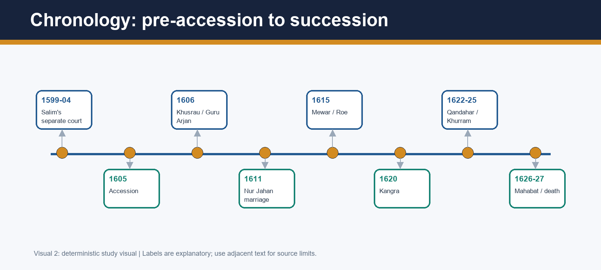

*Visual 2: Chronology: pre-accession to succession. Read it as a compact argument map; spatial diagrams marked schematic are not to scale.*

*Visual 3: Continuity versus decline: the right frame. Read it as a compact argument map; spatial diagrams marked schematic are not to scale.*

# PART I - FRAMING, CHRONOLOGY AND ACCESSION

## 2. Early orders, justice and political language

At accession Jahangir assumed the imperial title Nur-ud-din Muhammad Jahangir Padshah Ghazi in the form preserved by the courtly record; spellings and titulary should follow the edition being cited. The key point is political rather than ornamental. Titles, ceremonial appearance, rewards and regulations helped make a contested succession look like a continuing order. The nobility was not a passive audience: grants and recognition formed an accession bargain inside an inherited hierarchy.

The Jahangirnama records twelve early orders or regulations. This is important evidence that the emperor wished to publicise a programme of rectitude, relief and control. It is not evidence that a modern uniform code was enacted across the empire. A high-quality answer distinguishes three steps: a memoir's list is a claim; an order may be transmitted; local implementation needs separate evidence. Do not repeat long popular lists unless every item is verified in an edition and its effect can be distinguished from its proclamation.

The zanjir-i-adl, or chain of justice, is best read the same way. Jahangir's memoir describes a gold chain with bells near the Agra Fort/riverfront setting as a route by which an aggrieved person could summon royal attention. It visualised accessibility and made the ruler's body a focus of justice. Its material and location make it more than a vague metaphor, but it is not proof that every subject could bypass officials or obtain equal remedy. Punishment, clemency and spectacle were ruler-centred sovereignty, not an impersonal modern rule-of-law regime.

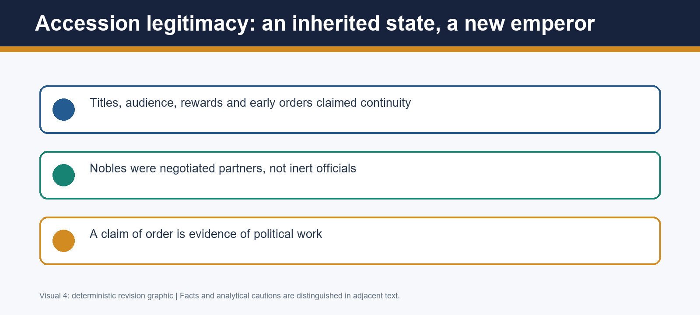

*Visual 4: Accession legitimacy: an inherited state, a new emperor. Read it as a compact argument map; spatial diagrams marked schematic are not to scale.*

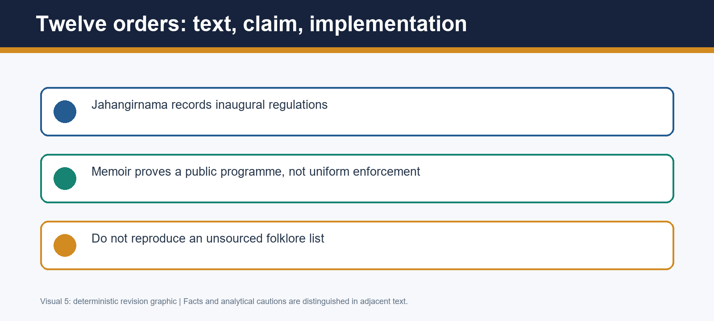

*Visual 5: Twelve orders: text, claim, implementation. Read it as a compact argument map; spatial diagrams marked schematic are not to scale.*

*Visual 6: Zanjir-i-adl: claim versus reach. Read it as a compact argument map; spatial diagrams marked schematic are not to scale.*

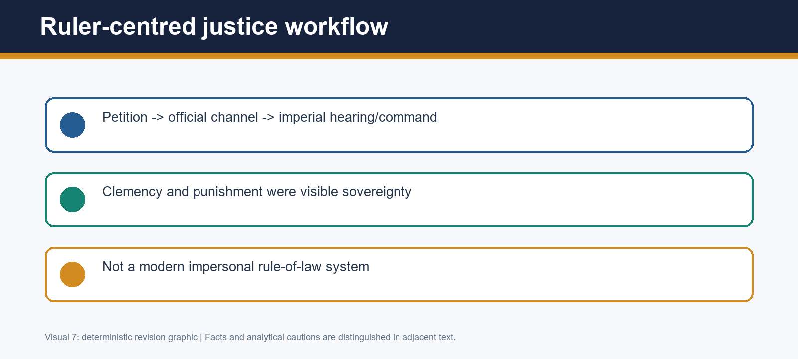

*Visual 7: Ruler-centred justice workflow. Read it as a compact argument map; spatial diagrams marked schematic are not to scale.*

# PART II - EARLY CHALLENGE: KHUSRAU AND GURU ARJAN

## 3. Khusrau's revolt: a succession crisis in a Punjab field

Khusrau's revolt of 1606 was a princely challenge to a new emperor. The relevant field was the route north-west towards Punjab and Lahore, where succession politics could attract mobile supporters, local resources and discontented nobles. The story should not be reduced to a neat civil war between two religious communities. A prince's claim, noble calculation, regional movement and an emperor's need to establish punishment all mattered.

Jahangir defeated the rising and dealt harshly with participants. The chronology and precise forms of punishment must be stated only where the source permits; later episodes are often telescoped into the early crisis. What is secure for analysis is that the revolt made succession a continuing problem and encouraged the court to treat contacts with the rebel as politically consequential. The event also confirms that accession did not immediately settle elite allegiance.

For Prelims, locate Khusrau in 1606 and connect him to Jahangir, not to a later war of succession. For Mains, use the revolt as evidence that dynastic monarchy depended on personal loyalty and provincial networks. The qualification is equally important: the suppression did not produce an institutional collapse, and Khusrau's political challenge should not be used to stereotype every noble or Punjabi actor as a permanent opponent of the empire.

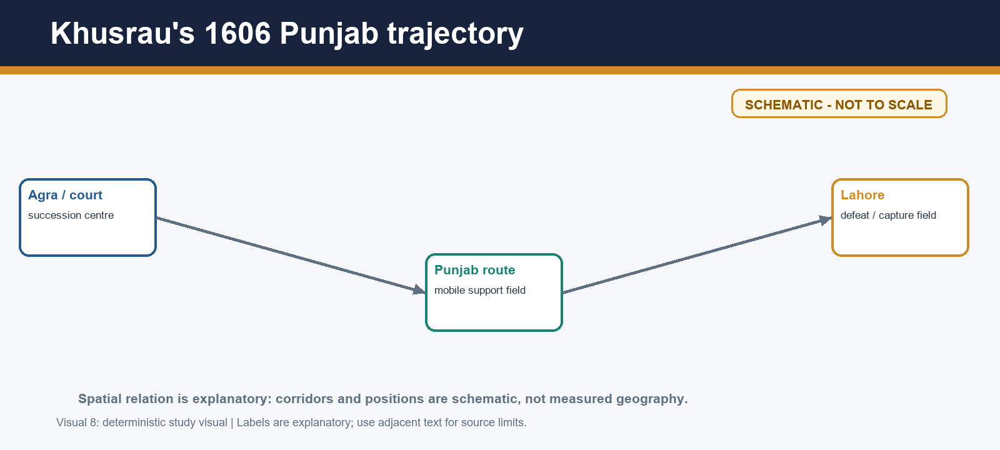

*Visual 8: Khusrau's 1606 Punjab trajectory. Read it as a compact argument map; spatial diagrams marked schematic are not to scale.*

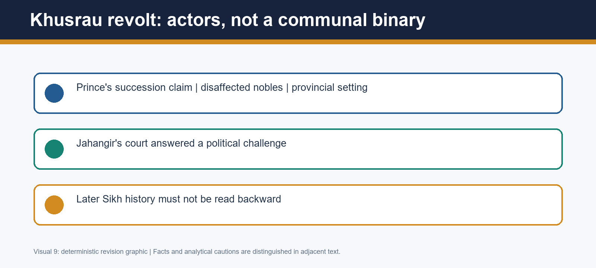

*Visual 9: Khusrau revolt: actors, not a communal binary. Read it as a compact argument map; spatial diagrams marked schematic are not to scale.*

# PART II - EARLY CHALLENGE: KHUSRAU AND GURU ARJAN

## 4. Guru Arjan: source criticism before a verdict

The execution of Guru Arjan in 1606 belongs to the political aftermath of Khusrau's revolt, but a one-cause formula is inadequate. Jahangir's own memoir frames Guru Arjan as a figure who had attracted followers and, in the emperor's presentation, had given Khusrau a mark of support. That is direct evidence of what the emperor represented as politically suspect. It does not by itself settle the exact character of the meeting, its financial dimension, or every motive that informed the penalty.

Sikh traditions preserve the community's memory of Guru Arjan's martyrdom and are indispensable for the Sikh side of the event. Later Persian chronicles offer other courtly mediations. A responsible source matrix therefore keeps political challenge, religious suspicion, fiscal penalty/confiscation language and punishment in view without declaring that historians have recovered one final motive. The memoir's harsh language proves an imperial action and self-justification; it is not a transparent transcript of social causation.

The event was a turning point in Mughal-Sikh relations because it intensified a remembered and political rupture. It was not an instant creation of a fully militarised Sikh conflict. Later Sikh institutional and military developments need their own chronology and should not be imported into 1606. This precision protects students from both communal reductionism and a sanitised denial of coercion.

*Visual 10: Guru Arjan: source reach matrix. Read it as a compact argument map; spatial diagrams marked schematic are not to scale.*

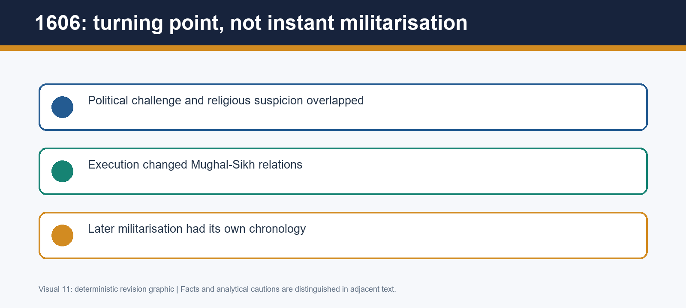

*Visual 11: 1606: turning point, not instant militarisation. Read it as a compact argument map; spatial diagrams marked schematic are not to scale.*

# PART III - NEGOTIATED CONSOLIDATION

## 5. Mewar, 1613-15: pressure, honour and accommodation

Mewar must be placed against the longer Akbar-era background of Chittor, Sisodia resistance and difficult hill campaigning; Topic 15 owns that full narrative. Under Jahangir, earlier expeditions had not ended the problem. The emperor's personal presence at Ajmer and Prince Khurram's campaign intensified pressure in 1613-15. Exhaustion, disruption and the costs of protracted war made negotiation attractive, but it would be wrong to call the result either a free alliance among equals or a humiliating annihilation.

The 1615 arrangement recognised Mughal suzerainty. Rana Amar Singh was excused personal attendance at court, an important concession to dynastic honour. His son Karan Singh was received and honoured within the imperial service hierarchy. The source tradition also associates the settlement with a bar on reconstructing the fortifications of Chittor. These terms preserve an asymmetry of power while showing that incorporation could operate through status, service and carefully protected face rather than wholesale annexation.

Why did it work? Mughal military weight and Mewar's exhaustion mattered, but so did the design of the accommodation. Jahangir did not demand the Rana's personal humiliation or a matrimonial alliance as the price of peace. The comparison with Akbar's coercive Chittor phase should be analytical, not moralistic: coercion had demonstrated imperial capacity; conciliation made a durable relationship more feasible. Mewar retained an internal dynasty, while Mughal sovereignty gained recognition and a potentially stabilised frontier.

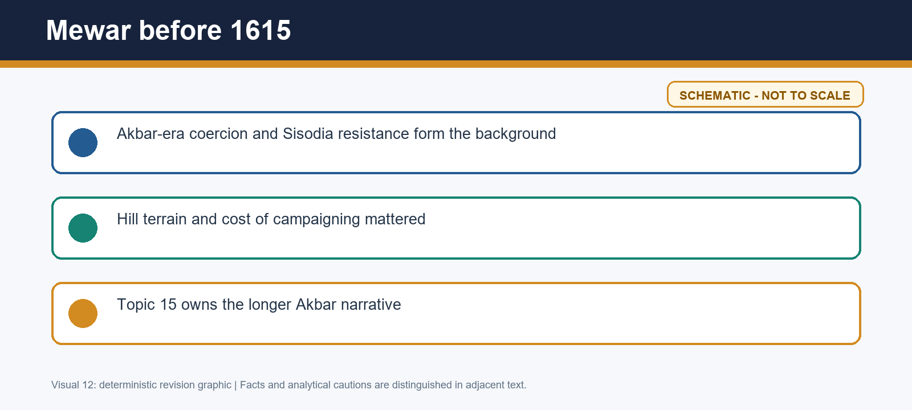

*Visual 12: Mewar before 1615. Read it as a compact argument map; spatial diagrams marked schematic are not to scale.*

*Visual 13: 1615 Mewar accommodation. Read it as a compact argument map; spatial diagrams marked schematic are not to scale.*

*Visual 14: Chittor coercion and Jahangiri conciliation. Read it as a compact argument map; spatial diagrams marked schematic are not to scale.*

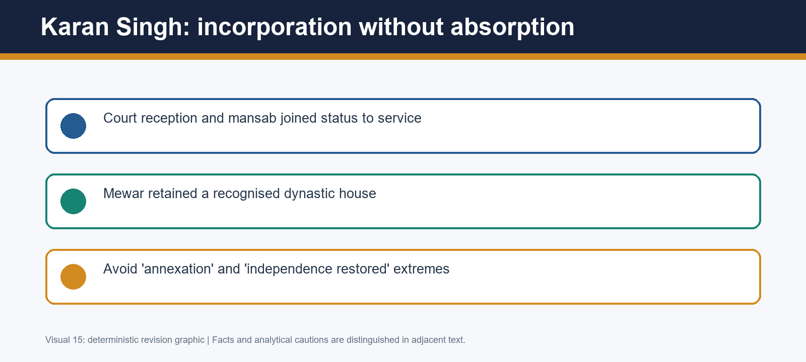

*Visual 15: Karan Singh: incorporation without absorption. Read it as a compact argument map; spatial diagrams marked schematic are not to scale.*

# PART III - NEGOTIATED CONSOLIDATION

## 6. Kangra, eastern consolidation and bounded frontiers

The capture of Kangra fort in 1620 represented a strategic and symbolic success in the Himalayan zone. A fort stood for route control, prestige and an ability to overcome an earlier pattern of difficulty; it did not mean that every surrounding political society had become administratively simple. Use Kangra to demonstrate a capable imperial campaign, but do not inflate a fortress into a full map of northern consolidation.

The reign also saw continued work in eastern India, including Bengal and Orissa, where Afghan and local political formations had not ceased to matter after a nominal conquest. This package does not turn that complex region into a catalogue because the supplied owner material prioritises Jahangir's Mewar, Kangra and court politics. The transferable point is that consolidation worked through campaigns, governors, agreements and repeated assertion, not a single date of finality.

The Deccan exposes the boundary of this success. Malik Ambar's political-military capacity limited Mughal outcomes, while Prince Khurram's successes brought a contingent settlement rather than final conquest. Topic 18 owns the detailed Deccan sequence. Likewise Qandahar's Safavid loss in 1622 is an external-strategy case owned by Topic 19. In this topic they function as reminders that a reign can consolidate key areas while retaining incomplete frontiers.

*Visual 16: Regional consolidation: uneven frontiers. Read it as a compact argument map; spatial diagrams marked schematic are not to scale.*

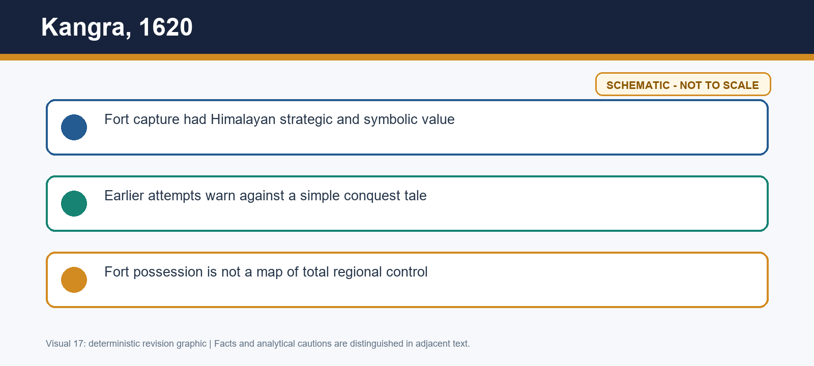

*Visual 17: Kangra, 1620. Read it as a compact argument map; spatial diagrams marked schematic are not to scale.*

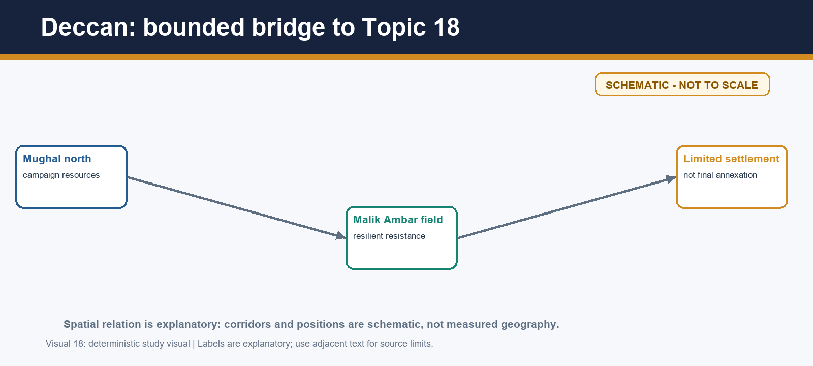

*Visual 18: Deccan: bounded bridge to Topic 18. Read it as a compact argument map; spatial diagrams marked schematic are not to scale.*

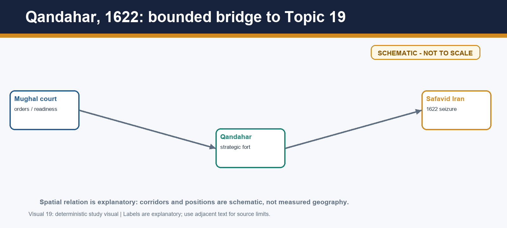

*Visual 19: Qandahar, 1622: bounded bridge to Topic 19. Read it as a compact argument map; spatial diagrams marked schematic are not to scale.*

# PART IV - EUROPEAN COMMERCIAL DIPLOMACY

## 7. Hawkins, Surat and the maritime setting

William Hawkins reached the Mughal commercial world as an English East India Company representative seeking permission and security for trade, especially in the Surat orbit. His court experience demonstrates an important hierarchy: English merchants entered as supplicants within Mughal sovereignty. Personal favour, language, gifts and rivalry with Portuguese interests could alter access, but no episode turned the Company into a territorial partner of the empire.

The 1612 Swally/Suvali naval setting is relevant because Portuguese maritime power and an English naval success changed bargaining conditions near the Gujarat coast. It must be kept in proportion. A maritime encounter could strengthen a petitioning company's utility or confidence; the Mughal court did not thereby surrender maritime jurisdiction, create a modern alliance or authorise a future colonial state. Port trade connected imperial revenue, merchants, shipowners and political prestige.

Hawkins's account is an encounter source, not a neutral administrative report. It is valuable for what an English visitor saw, sought and found frustrating. Its limits arise from his commercial objectives, partial court access and European categories of rank. Compare his testimony with farmans, local practice and later factory records rather than treating one English narrative as the complete voice of the Mughal state.

*Visual 20: William Hawkins at court. Read it as a compact argument map; spatial diagrams marked schematic are not to scale.*

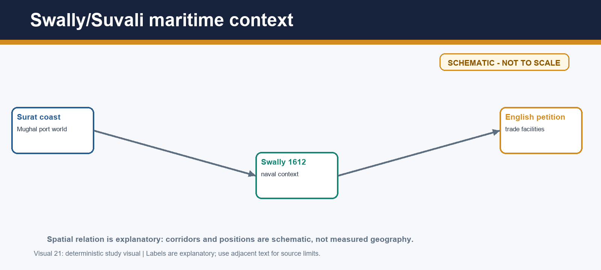

*Visual 21: Swally/Suvali maritime context. Read it as a compact argument map; spatial diagrams marked schematic are not to scale.*

# PART IV - EUROPEAN COMMERCIAL DIPLOMACY

## 8. Roe, 1615-19: facility without teleology

Sir Thomas Roe was James I's ambassador at Jahangir's court from 1615 to 1619. His mission sought stable commercial facilities, diplomatic recognition and an improved position for English trade. His journal is rich because it records gifts, audiences, rank disputes, delays and disappointment. It is also interested: a frustrated ambassador used European assumptions about embassies and privilege while negotiating in a court that did not have to treat a merchant company's demands as equal to imperial policy.

The 1618 farman and associated permissions should be described cautiously as trading facilities, including the English position at Surat, granted on Mughal terms. They did not give territorial sovereignty, an exclusive empire-wide monopoly, a private army, or a constitutional foundation for British rule. The immediate result was limited commercial access. The larger retrospective importance lay in how a small commercial foothold could later be used in a transformed eighteenth-century political landscape; that later outcome cannot explain Jahangir's decision in advance.

The strongest answer uses a three-part formula: maritime balance affected negotiations; Mughal sovereignty set the terms; Company records preserve a merchant lens. This avoids two equal and opposite errors - imagining the English as already rulers, or imagining their early commercial persistence as historically irrelevant. For the 1610s, they were petitioning merchants whose advantages depended on permissions, local conditions and wider Asian competition.

*Visual 22: Sir Thomas Roe, 1615-1619. Read it as a compact argument map; spatial diagrams marked schematic are not to scale.*

*Visual 23: Mughal-English hierarchy. Read it as a compact argument map; spatial diagrams marked schematic are not to scale.*

*Visual 24: 1618 farman: scope versus myth. Read it as a compact argument map; spatial diagrams marked schematic are not to scale.*

*Visual 25: Roe's journal: source lens. Read it as a compact argument map; spatial diagrams marked schematic are not to scale.*

# PART V - NUR JAHAN: BIOGRAPHY, AUTHORITY AND GENDER

## 9. Biography without romance

Mihr-un-Nisa came from a Persian migrant-family background associated with her father Ghiyas Beg, later Itimad-ud-Daulah. She had earlier married Ali Quli Istajlu, often called Sher Afghan in later accounts; after widowhood she married Jahangir in 1611. This chronology and kinship context are more secure and more useful than sensational stories which make her rise depend on a predestined romance or an unproven murder conspiracy.

Her household connections were politically consequential. Ghiyas Beg and her mother Asmat Begum belonged to the family network; her brother Asaf Khan became a major noble. Asaf Khan's daughter Arjumand Banu, later Mumtaz Mahal, married Prince Khurram. Nur Jahan's daughter Ladli Begum later married Shahryar. These connections did not form a machine with unchanging interests. They created channels through which office, patronage, marriage and succession could be negotiated.

Titles such as Nur Mahal and Nur Jahan must be dated only when a secure source edition is in hand. The analytical fact is that names and styles changed with rank and public recognition. Do not treat a title as a constitutional office, nor erase the deliberate cultivation of imperial female status. Biography becomes historical explanation only when it is connected to documentary evidence, household institutions and shifting political situations.

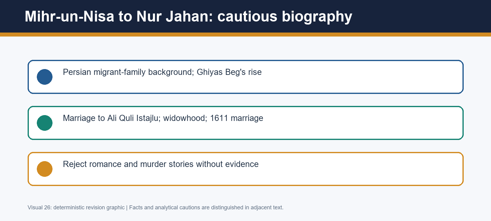

*Visual 26: Mihr-un-Nisa to Nur Jahan: cautious biography. Read it as a compact argument map; spatial diagrams marked schematic are not to scale.*

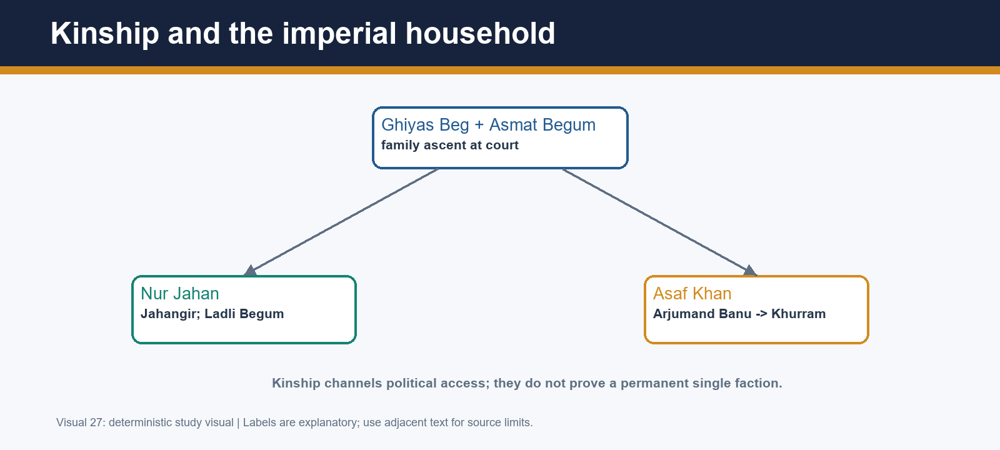

*Visual 27: Kinship and the imperial household. Read it as a compact argument map; spatial diagrams marked schematic are not to scale.*

# PART V - NUR JAHAN: BIOGRAPHY, AUTHORITY AND GENDER

## 10. Authority: documents, coins, access and limits

Nur Jahan's authority was exceptional because it had both intimate and public forms. Access to Jahangir, control of household patronage, receptivity to petitions, the advancement of relatives and political intervention in moments of crisis created real leverage. Surviving farmans issued in her name and coins bearing a joint or linked authority formula are especially significant because they make female authority publicly visible beyond anecdote.

The correct inference is neither that farmans and coins are trivial nor that they prove sovereign replacement. A farman can prove that a named woman exercised formalised authority in a particular context; a coin can prove that a formula was publicly struck and circulated. Neither automatically enumerates all decisions, proves total control of appointments, or turns Jahangir into a permanent absentee. Each item should be read for date, issuer, seal/formula, audience and corroboration.

Gender analysis must remain historically specific. Nur Jahan worked through the imperial household, kinship, patronage and sovereign intimacy within a patriarchal court. Her authority demonstrates agency and institutional permeability at the top; it did not abolish patriarchy or establish general political equality for women. A high-quality conclusion calls her an exceptional power-holder within Mughal monarchy, not an empress-regnant in a modern constitutional sense and not merely a decorative consort.

*Visual 28: Nur Jahan's channels of authority. Read it as a compact argument map; spatial diagrams marked schematic are not to scale.*

*Visual 29: Farmans and coins: strong but bounded evidence. Read it as a compact argument map; spatial diagrams marked schematic are not to scale.*

*Visual 30: Gender and power: exceptional authority. Read it as a compact argument map; spatial diagrams marked schematic are not to scale.*

# PART V - NUR JAHAN: BIOGRAPHY, AUTHORITY AND GENDER

## 11. Patronage and the Itimad-ud-Daulah bridge

Patronage should be arranged by evidence strength. The tomb of Itimad-ud-Daulah is a durable material anchor for Nur Jahan's family commemoration. The official District Agra page identifies it as an ASI-protected monument built between 1622 and 1628 by Nur Jahan for her father Mirza Ghiyas Beg, and notes white marble and extensive pietra dura inlay. That supports an architectural transition and a family-patronage claim more securely than a long list of unverified inventions.

Gardens, caravanserais, textiles, perfumes and courtly taste may be connected to her in sources and later memory, but each attribution needs provenance. A popular object list is not a substitute for a dated farman, inscription, building record, artistic attribution or contemporary account. The monument's riverine Agra setting also helps students connect household politics to material culture without claiming that architecture itself proves a fixed political faction.

Live-source check: searches of official ASI/UNESCO/Ministry/state-heritage material within the requested six-month window did not yield a dated, topic-specific official conservation or archaeology announcement suitable as a current-affairs anchor. The District Agra government page is used as a static official heritage reference, not as a recent news claim. No material recent official current-affairs anchor found; static and heritage relevance retained.

*Visual 31: Patronage: evidence hierarchy. Read it as a compact argument map; spatial diagrams marked schematic are not to scale.*

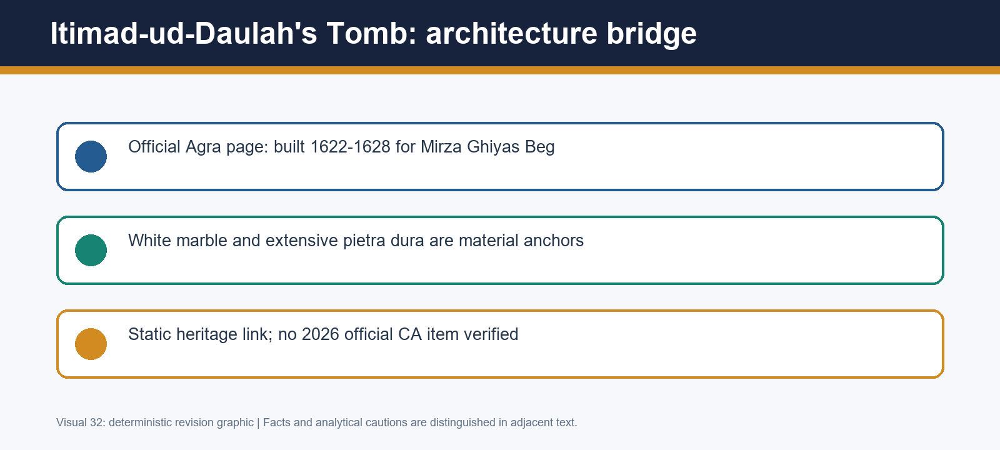

*Visual 32: Itimad-ud-Daulah's Tomb: architecture bridge. Read it as a compact argument map; spatial diagrams marked schematic are not to scale.*

# PART VI - THE 'NUR JAHAN JUNTA' DEBATE

## 12. Fixed-junta thesis and its revision

Beni Prasad's influential formulation described a Nur Jahan 'junta' made up of Nur Jahan, Itimad-ud-Daulah, Asaf Khan and Prince Khurram. It offers a clear story of family power and helps explain why contemporaries and later readers noticed the rise of Nur Jahan's kin. But clarity is not proof. The label should be introduced as a historiographical model, not silently used as a contemporary constitutional institution.

Nurul Hasan's critique, followed in Satish Chandra's treatment, challenges a fixed early bloc. Promotions were not monopolised by one family group, and contemporary evidence does not securely establish a stable Nur Jahan-Khurram alliance from 1611 to 1620. Court politics involved overlapping personal, regional, service and household networks. The failure of a static model is not a reason to deny that Nur Jahan's family rose or that she possessed unusual influence.

The useful periodisation has two phases. In 1611-21, family advancement and influence were real but alignments were fluid. After 1622, Itimad-ud-Daulah's death, Qandahar's loss, Jahangir's health, Khurram's rebellion and the sharpening succession question produced active crisis politics. This explains why influence could become more visibly political without assuming that an unchanging junta had governed every decision since 1611.

*Visual 33: Beni Prasad's fixed 'junta' model. Read it as a compact argument map; spatial diagrams marked schematic are not to scale.*

*Visual 34: Nurul Hasan / Satish Chandra critique. Read it as a compact argument map; spatial diagrams marked schematic are not to scale.*

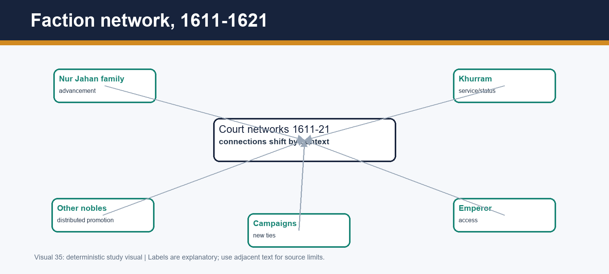

*Visual 35: Faction network, 1611-1621. Read it as a compact argument map; spatial diagrams marked schematic are not to scale.*

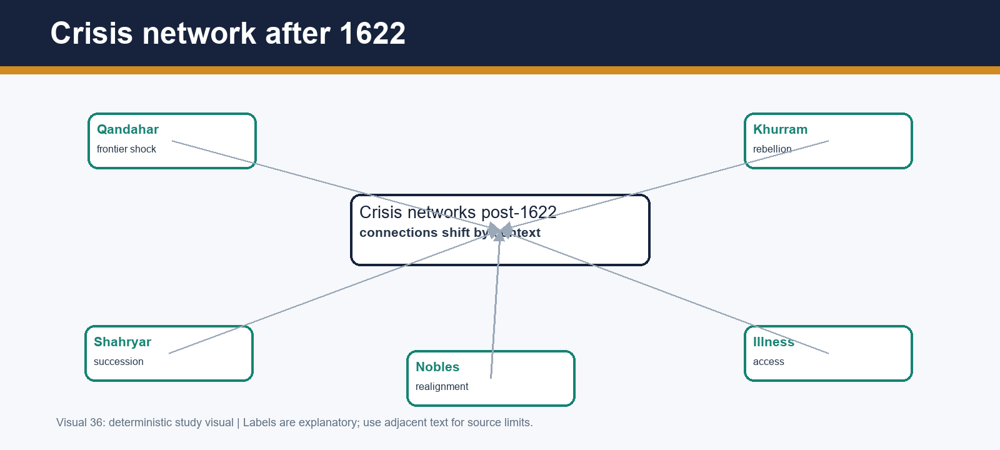

*Visual 36: Crisis network after 1622. Read it as a compact argument map; spatial diagrams marked schematic are not to scale.*

# PART VII - SUCCESSION, KHURRAM AND MAHABAT KHAN

## 13. Khurram's rebellion, 1622-25: converging causes

The princes Khusrau, Parvez, Khurram and Shahryar made succession a structural issue. Khurram's service in Mewar and the Deccan built military reputation and courtly standing; his title Shah Jahan expressed favour, not a settled right to succeed. His marriage into Asaf Khan's family and Shahryar's marriage to Ladli Begum created intersecting household links, but kinship did not mechanically dictate all policy.

Khurram's rebellion after 1622 should be explained through converging causes: anxiety about succession, the Qandahar command/refusal problem, jagir and resource disputes, court competition, Nur Jahan's perceived or actual alignment with Shahryar, and the emperor's demand for obedience. The claim that Nur Jahan alone expelled Khurram is too simple because it turns structural imperial politics into a personal melodrama. Conversely, denying court factions ignores the evidence that succession relationships mattered.

The consequences were substantial: resources and attention were diverted; coordination was strained; noble alignments moved; and succession hardened into a more acute conflict. Yet Jahangir's empire continued to field forces and negotiate. Topic 21 owns the post-1627 accession and the evolution of the ruling class. This topic ends by showing how a prince's rebellion exposed the limits of a courtly system that had previously accommodated multiple heirs.

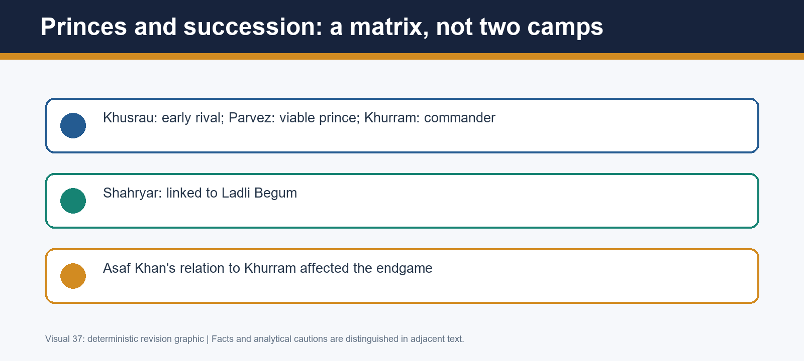

*Visual 37: Princes and succession: a matrix, not two camps. Read it as a compact argument map; spatial diagrams marked schematic are not to scale.*

*Visual 38: Khurram's rise. Read it as a compact argument map; spatial diagrams marked schematic are not to scale.*

*Visual 39: Khurram rebellion, 1622-1625: converging causes. Read it as a compact argument map; spatial diagrams marked schematic are not to scale.*

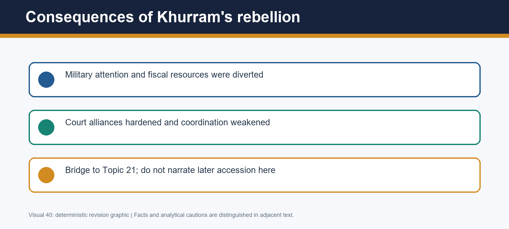

*Visual 40: Consequences of Khurram's rebellion. Read it as a compact argument map; spatial diagrams marked schematic are not to scale.*

# PART VII - SUCCESSION, KHURRAM AND MAHABAT KHAN

## 14. Mahabat Khan's coup de main, 1626

Mahabat Khan had a substantial service career. His grievances are reported through narratives shaped by court rivalry, including concerns over accounts, recall, and fear of Nur Jahan or competing interests. A secure explanation must therefore separate an identifiable grievance environment from a single proven psychological motive. What made the coup possible was not anger alone but access to armed retainers, timing during a river crossing and the vulnerability of a travelling court.

Near the Jhelum crossing in 1626, Mahabat Khan staged a coup de main and seized Jahangir. Rajput troops formed an important part of his immediate coercive force. The event is a vivid case of embodied sovereignty: control over the emperor's person produced immediate leverage because orders, legitimacy and access flowed through the monarch. But physical custody was not the same thing as durable command over the empire.

Accounts of Nur Jahan's response differ in sequence and emphasis. They allow us to state that she attempted resistance and manoeuvre, entered the captive situation, and worked politically to detach support from Mahabat Khan and restore effective authority. The coup eventually failed because Mahabat did not secure the bureaucracy, treasury, wide nobility or an alternative legitimacy. It shows fragility in a personalised monarchy, not proof that the Mughal empire had already collapsed.

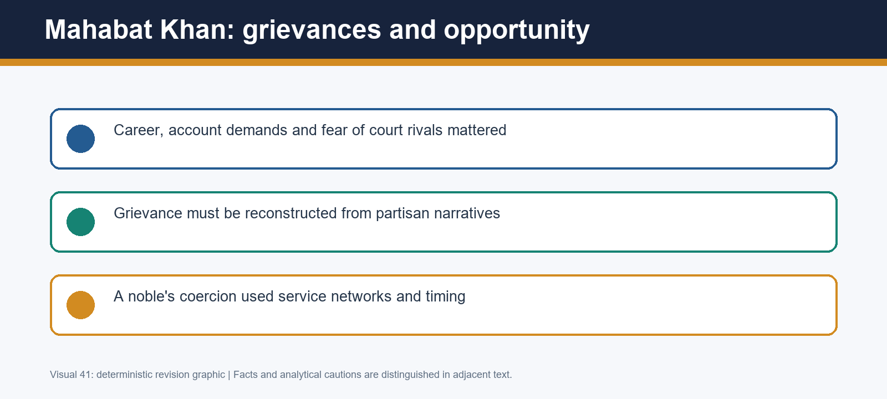

*Visual 41: Mahabat Khan: grievances and opportunity. Read it as a compact argument map; spatial diagrams marked schematic are not to scale.*

*Visual 42: Jhelum coup de main, 1626. Read it as a compact argument map; spatial diagrams marked schematic are not to scale.*

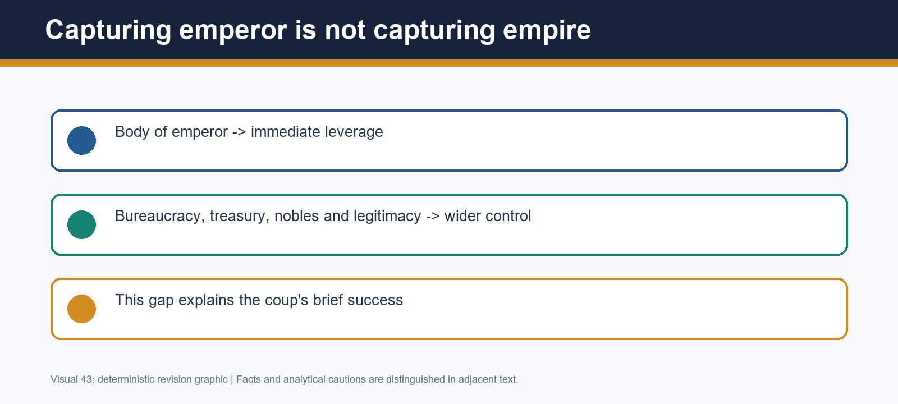

*Visual 43: Capturing emperor is not capturing empire. Read it as a compact argument map; spatial diagrams marked schematic are not to scale.*

*Visual 44: Nur Jahan's recovery strategy. Read it as a compact argument map; spatial diagrams marked schematic are not to scale.*

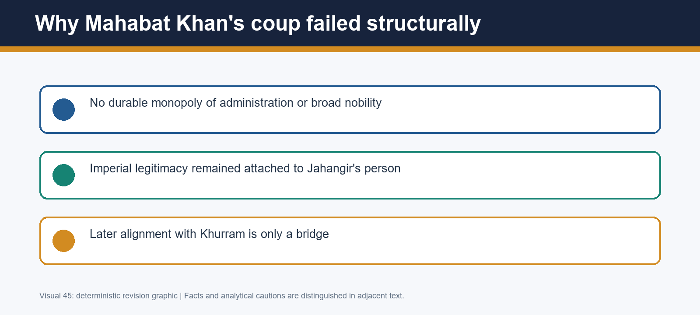

*Visual 45: Why Mahabat Khan's coup failed structurally. Read it as a compact argument map; spatial diagrams marked schematic are not to scale.*

# PART VIII - JAHANGIR AS RULER, SOURCES AND VERDICT

## 15. Governing, religion and personal reputation

Jahangir continued Akbar's broad administrative and religious framework, including a composite ruling class; he did not restore jizyah. That continuity is compatible with coercive episodes. Guru Arjan's execution, particular actions affecting religious communities, and the court's moments of orthodoxy should be read in their context and at their evidentiary scale. A tolerant-versus-bigot binary replaces history with a moral label and cannot explain the coexistence of plural courtly practice, imperial coercion and changing political suspicion.

The Jahangirnama makes observation central to Jahangir's persona. Natural-history interests, connoisseurship and court painting are important evidence for an observing, self-fashioning emperor. A painting is not a photograph of governance; a memoir is not transparent private thought. Detailed art, culture, commodity and economic history belongs to Topic 24, but their bridge here is clear: cultural patronage and close observation were part of the idiom through which imperial authority was displayed.

Alcohol, opium, illness and mobility appear in the record and help explain why access around the ruler could gain importance. They do not authorise the weak, pleasure-loving ruler caricature. Jahangir continued to govern, campaigns were directed, settlements were made, and documents were issued. The best balance sheet sees Mewar, Kangra and institutional continuity as achievements; Deccan limits, Qandahar, princely rebellion and Mahabat's coup as serious qualifications.

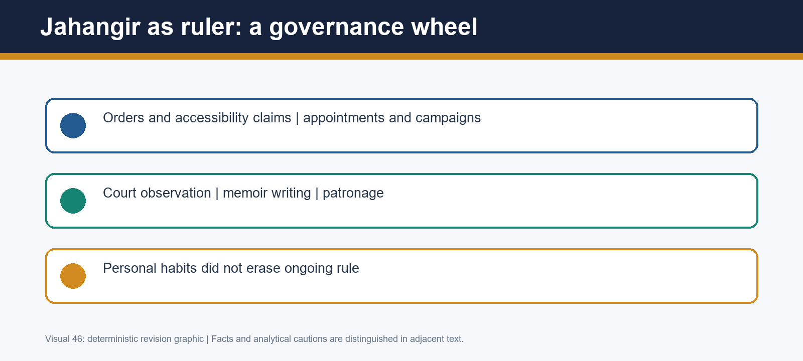

*Visual 46: Jahangir as ruler: a governance wheel. Read it as a compact argument map; spatial diagrams marked schematic are not to scale.*

*Visual 47: Religion: broad framework, coercive episodes. Read it as a compact argument map; spatial diagrams marked schematic are not to scale.*

*Visual 48: Health and personal rule: caution. Read it as a compact argument map; spatial diagrams marked schematic are not to scale.*

*Visual 49: Painting and natural observation. Read it as a compact argument map; spatial diagrams marked schematic are not to scale.*

# PART VIII - JAHANGIR AS RULER, SOURCES AND VERDICT

## 16. Sources, historiography and a graded verdict

The Tuzuk-i-Jahangiri or Jahangirnama is indispensable for chronology, imperial self-fashioning, natural observations, the justice chain and episodes such as Guru Arjan. It contains Jahangir's authorial voice for the portions he composed; its transmission also involved later continuation or editorial layers. Always identify the edition and time segment before making a sweeping claim. A royal memoir can prove representation, perception and a reported decision; it cannot alone prove that a policy reached every locality or reveal all private motives.

Mutamad Khan's Iqbalnama and other Persian chronicles offer courtly narratives that can corroborate or contest sequence but carry their own patronage and retrospective concerns. Farmans, seals, coins and inscriptions give formal and material evidence of authority, including Nur Jahan's public standing. Paintings encode hierarchy and desired imperial image. Roe, Hawkins and factory records illuminate commercial diplomacy but are shaped by European merchant objectives. Sikh traditions are essential for community memory but must be read with genre and chronology. No source is a transparent substitute for method.

The weak-ruler thesis fails because it turns illnesses and court politics into permanent abdication and ignores Mewar, Kangra and administrative continuity. The personal-rule thesis overstates Nur Jahan's authority by confusing exceptional influence with sovereign replacement. The fixed-junta thesis overstates stability of faction. The decline thesis mistakes uneven frontiers and succession crisis for institutional disappearance. A graded verdict is stronger: Jahangir's reign was one of consolidation through inherited institutions and negotiated status, accompanied by increasingly visible stresses that later succession would expose.

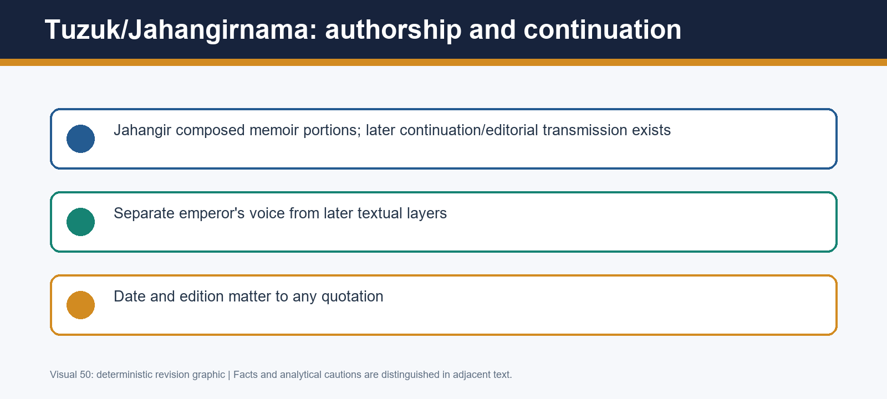

*Visual 50: Tuzuk/Jahangirnama: authorship and continuation. Read it as a compact argument map; spatial diagrams marked schematic are not to scale.*

*Visual 51: Memoir: claim versus reality. Read it as a compact argument map; spatial diagrams marked schematic are not to scale.*

*Visual 52: Source reach matrix. Read it as a compact argument map; spatial diagrams marked schematic are not to scale.*

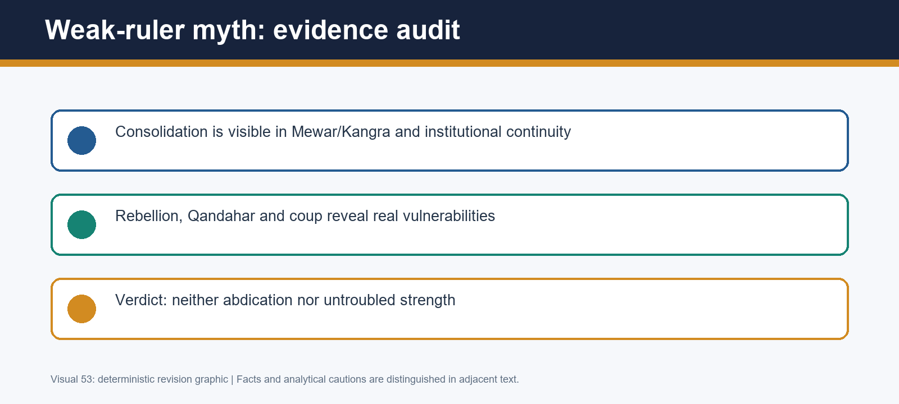

*Visual 53: Weak-ruler myth: evidence audit. Read it as a compact argument map; spatial diagrams marked schematic are not to scale.*

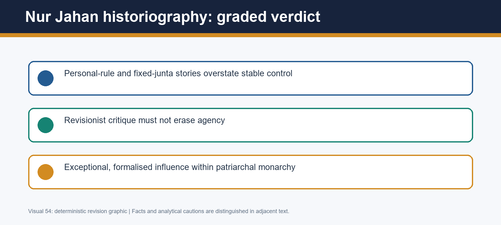

*Visual 54: Nur Jahan historiography: graded verdict. Read it as a compact argument map; spatial diagrams marked schematic are not to scale.*

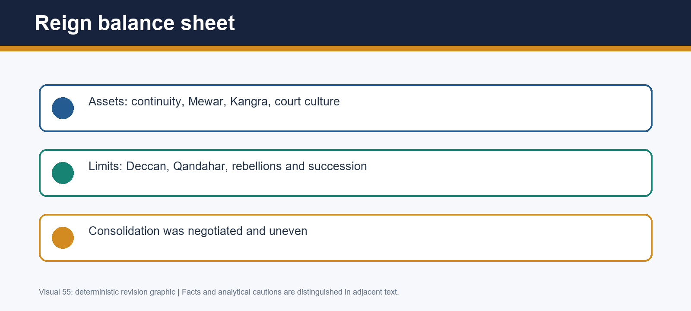

*Visual 55: Reign balance sheet. Read it as a compact argument map; spatial diagrams marked schematic are not to scale.*

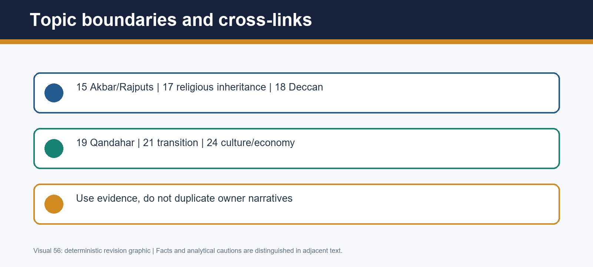

*Visual 56: Topic boundaries and cross-links. Read it as a compact argument map; spatial diagrams marked schematic are not to scale.*

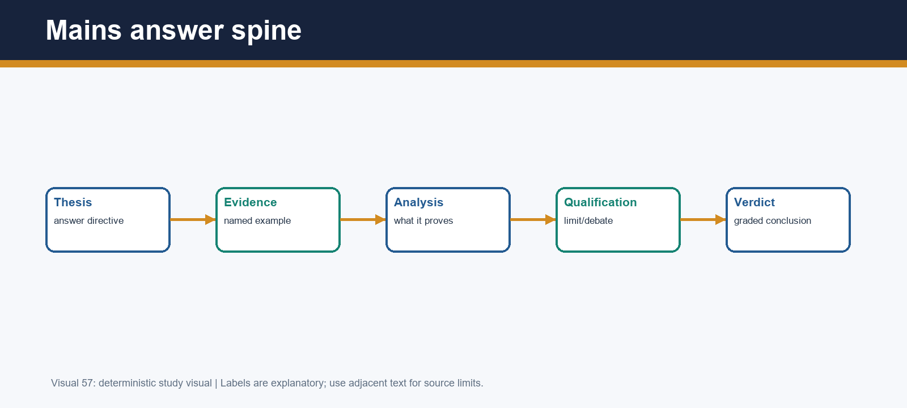

*Visual 57: Mains answer spine. Read it as a compact argument map; spatial diagrams marked schematic are not to scale.*

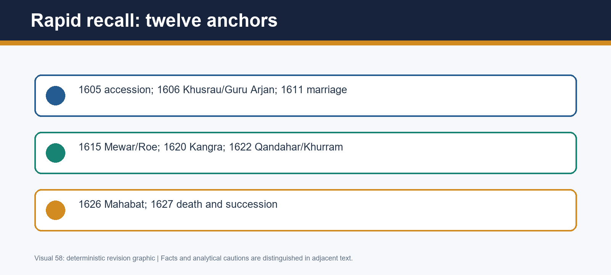

*Visual 58: Rapid recall: twelve anchors. Read it as a compact argument map; spatial diagrams marked schematic are not to scale.*

# PART IX - PYQ AUDIT, LEARNING LOOP AND EXAM PRACTICE

## Verified PYQ audit and route transparency

The local official/OCR papers and routing material covering 2018-2025 were searched for direct CSE Prelims and GS-I items on Jahangir, Nur Jahan, Khusrau, Guru Arjan, the Mewar settlement, Thomas Roe/Hawkins, Mahabat Khan, the chain of justice, the Tuzuk, and Itimad-ud-Daulah. No direct verified item was located. Broad questions on Mughal painting, architecture, economy or later Sikh history are not silently reassigned to this topic. Therefore there is no fabricated 'exact PYQ' or unofficial key in this package. The practice below is original and clearly labelled.

# PART IXA - ADVANCED EVIDENCE AND ANSWER-WRITING HANDBOOK

## Evidence bank 1. Accession as political work

An accession is not merely a date at which an heir becomes a ruler. In Jahangir's case, title, audience, rewards and inaugural regulations worked together to make succession legible to nobles, officials and petitioners. The important analytical distinction is between inheritance and reproduction. Akbar's administrative and elite framework gave Jahangir a strong starting position, but the Khusrau revolt shows why the new emperor still needed to manufacture confidence through visible acts of command and favour.

Use this bank when an answer asks about continuity. Name the inherited composite ruling class and the early orders, then explain that a royal memoir publicises a programme rather than measuring compliance. The qualification is essential: the phrase 'continuity with Akbar' should not be used to erase Salim's earlier tensions or the bargaining position of nobles. It means that the institutional frame survived the person of Akbar, while the political coalition had to be renewed.

The closest exam error is to call the reign a smooth succession because the empire was large. A large empire creates more places where succession may be contested. The better answer treats ceremonial language, rewards and regulations as instruments through which an emperor tried to reduce that risk.

## Evidence bank 2. Justice as an idiom of sovereignty

The chain of justice is ideal evidence for separating an object, a claim and a social effect. Jahangir's memoir describes a gold chain with bells in the Agra Fort-riverfront setting. The object and its location support the conclusion that accessibility was made a public imperial image. The conceptual work of the chain was to make the emperor appear reachable when intermediary officials failed. It also made justice audible and spectacular, converting an ideal of direct hearing into courtly political theatre.

What the chain cannot prove is equally examinable. It does not supply a count of complainants, a map of rural access, an appellate procedure or a guarantee that status and distance ceased to matter. The empire's justice remained ruler-centred and discretionary in important respects. Punishment and clemency were part of the same public grammar because both announced that the sovereign could correct, reward and discipline.

In a Mains answer, write 'claim of accessibility' rather than 'proof of egalitarian justice.' This phrasing neither dismisses the evidence nor mistakes it for a modern constitutional promise. It is a compact demonstration of source criticism with an exact named example.

## Evidence bank 3. Punjab, succession and community memory

Khusrau's 1606 movement shows why a route should be treated as a political field. His north-westward trajectory through the Punjab-Lahore setting connected a princely claim to possibilities of noble support, local resources and movement. A prince did not need a modern party machine to become dangerous; dynastic legitimacy, personal ties and the difficulty of a new emperor's first years could produce a volatile coalition.

Guru Arjan's execution entered this field through Jahangir's accusation that the Guru had supported or marked Khusrau. The memoir is invaluable precisely because it records what the emperor chose to make politically blameworthy. Sikh traditions preserve a different but indispensable community memory of martyrdom. The historical task is triangulation, not a forced choice between an imperial statement and a later collective tradition. Political challenge, religious anxiety and fiscal-punitive language can coexist without collapsing into a single proven motive.

This bank guards against two opposite mistakes: turning 1606 into an inevitable Hindu/Sikh-versus-Muslim war, and treating the episode as a minor administrative penalty detached from coercion. The defensible conclusion is a political rupture with religious consequences whose later Sikh trajectory must be dated separately.

## Evidence bank 4. Mewar and the vocabulary of hierarchy

Mewar is the clearest lesson in the vocabulary of pre-modern hierarchy. 'Suzerainty' means that the Mughal emperor's superior claim was accepted while a subordinate dynasty could retain recognised internal rule and status. In 1615 Rana Amar Singh did not become an equal ally, yet the Sisodia house was not removed. His exemption from personal attendance and Karan Singh's honourable reception were devices for making subordination bearable to a prestige-conscious court.

Chittor's fortification restriction adds the necessary qualification. Accommodation did not dissolve Mughal superiority or the memory of earlier coercion. The settlement combined military pressure, exhaustion, status and a deliberate refusal to demand the Rana's personal humiliation. A student who writes only 'Jahangir was generous' loses causation; one who writes only 'Mewar surrendered' loses the design of the settlement.

Use a comparison sentence with Topic 15: Akbar's Chittor phase demonstrated capacity but did not end Sisodia resistance; Jahangir's settlement turned a long contest into a more stable relationship. This is not a moral contrast between a bad coercer and a good conciliator. It explains how force and honour can be sequentially connected within an unequal empire.

## Evidence bank 5. Forts, frontiers and limits

Kangra's capture in 1620 should be put beside the Deccan and Qandahar, not isolated as a bare date. A fort could be a strategic choke-point, an emblem of capacity and a bargaining asset. Its capture therefore says something real about an emperor's ability to project force. Yet fort possession is not a synonym for complete control of mountains, communities, routes or revenue. This distinction prevents a map-colouring answer from substituting for political analysis.

The same reign confronted Malik Ambar's capacity in the Deccan and the Safavid seizure of Qandahar in 1622. Each is an incomplete-frontier case, but they are not identical: the Deccan belongs to a complex peninsular campaign-and-settlement field; Qandahar belongs to a Safavid-Mughal strategic rivalry. Cross-link them to Topics 18 and 19 rather than re-narrating their owner histories.

The comparative result is a better balance sheet. Jahangir's state could settle Mewar and take Kangra while still failing to turn every frontier into a permanent administrative success. 'Uneven consolidation' has more explanatory value than either 'empire at peak' or 'empire in decline.'

## Evidence bank 6. Merchant diplomacy without colonial teleology

Hawkins and Roe should be studied as evidence of a commercial petition within a powerful host state. English Company representatives sought facilities in an Indian Ocean world already shaped by Indian merchants, Portuguese sea power, customs, ports and Mughal sovereignty. Hawkins's experience at court makes personal access and competition visible. Roe's journal makes diplomatic status, gifts and procedural frustration unusually vivid.

The 1612 Swally/Suvali naval context could change the bargaining environment around Surat. It did not transfer Gujarat's jurisdiction to the English. The 1618 farman and related permissions should similarly be read as practical commercial facilities, not an exclusive empire-wide monopoly, a territorial grant or the constitutional beginning of British rule. The later colonial result makes early access retrospectively important, but it cannot be used as the motive or meaning of Jahangir's contemporaries.

For source criticism, add that Roe and factory records describe a merchant-diplomatic vantage point. Their complaints about delay or protocol reveal negotiation, not administrative incapacity. Compare them with a farman's language and with the fact that English trade required permission and local operational conditions.

## Evidence bank 7. Household politics as institution

Nur Jahan's career requires a language of household politics rather than a choice between romance and constitutional office. Marriage to Jahangir in 1611 placed Mihr-un-Nisa in a household where access to the sovereign, petitions, patronage and family marriage could influence public decision. Ghiyas Beg, Asaf Khan, Arjumand Banu/Mumtaz, Khurram, Ladli Begum and Shahryar form a kinship diagram, but a diagram is not a proof that all ties pointed in one direction.

Farmans issued in Nur Jahan's name and coins with a linked authority formula supply the strongest evidence of public authority. These are not merely court gossip. A dated farman proves formal intervention in a particular legal-administrative context; a coin proves that a political formula acquired public material expression. Together they justify the phrase 'exceptional formalised influence.'

The limitation should be stated immediately. Neither document type counts all decisions or shows Jahangir permanently ceased governing. This is why the phrase 'sovereign replacement' goes too far. Nur Jahan's authority was real precisely because it worked through a monarchy whose sovereign remained Jahangir.

## Evidence bank 8. Gender, material culture and attribution

Gender analysis begins by taking Nur Jahan's agency seriously and ends by locating it in a patriarchal imperial structure. Household intimacy, kinship and access were not private in the modern sense because they could shape petitions, patronage and succession. Yet the exceptional position of an empress cannot be used to infer general political equality for Mughal women. Agency and structural hierarchy can coexist.

The Itimad-ud-Daulah tomb makes this argument material. The official District Agra page identifies the ASI-protected tomb as built in 1622-28 by Nur Jahan for Mirza Ghiyas Beg, and highlights white marble and extensive pietra dura. It therefore supports a carefully bounded claim about family commemoration, patronage and architectural development. Its riverine Agra setting links court family history to the built environment.

Avoid a popular-attribution catalogue. Claims about gardens, clothing, perfumes or designs need a document, inscription, securely attributed object or contemporary record. The tomb is not evidence that Nur Jahan invented every court fashion, just as it is not evidence that a permanent junta controlled government. Material evidence is strongest when its claim is kept proportionate to its form.

## Evidence bank 9. Historiography as an evidence test

Beni Prasad's 'Nur Jahan junta' offers a memorable explanation: Nur Jahan, Itimad-ud-Daulah, Asaf Khan and Khurram are imagined as a coherent group. The model has a genuine insight - kinship and patronage mattered - but its strongest form requires evidence of durable common action across time. A list of relatives and promotions is not automatically such evidence.

Nurul Hasan's critique directs attention to the distribution of promotions and the lack of contemporary proof for a stable Nur Jahan-Khurram alliance in 1611-20. Satish Chandra accordingly favours changing networks. The revision does not say Nur Jahan's family lacked influence; it asks a more precise question: when, through which connection, and against which other network did that influence operate?

Periodisation supplies the answer-writing gain. In the earlier phase, advancement and influence coexist with plural alignments. After 1622, Qandahar, Itimad-ud-Daulah's death, illness and Khurram's rebellion magnify succession politics. A dynamic network model can explain change; a fixed junta merely repeats a label.

## Evidence bank 10. Khurram and resources of succession

Khurram's rebellion illustrates that succession in a Mughal service monarchy was about more than birth order. His service in Mewar and the Deccan gave him military prestige. The title Shah Jahan expressed favour and enlarged expectation, but it did not remove Khusrau's prior claim, Parvez's presence, Shahryar's later relevance or the emperor's authority to choose and discipline.

After the Safavid seizure of Qandahar, the issue of command became entangled with fear of political absence. Jagir and resource disputes also mattered because rank, military capacity and household status rested on material support. The marriage of Ladli Begum and Shahryar could be read by Khurram as a succession risk; his marriage link through Asaf Khan created a countervailing household channel. The analytical word is convergence.

Do not make Nur Jahan either omnipotent villain or irrelevant bystander. Her later crisis politics mattered, but Khurram's actions also responded to frontier emergency, imperial orders, resources and a multi-prince succession system. The consequence was costly diversion and sharpened alignment, not immediate administrative dissolution.

## Evidence bank 11. The body of the emperor and the state

Mahabat Khan's 1626 coup near the Jhelum crossing is a microhistory of embodied sovereignty. Seizing Jahangir during movement gave a noble immediate leverage over access, commands and symbolic legitimacy. A Rajput contingent formed part of the coercive apparatus. This makes the coup a useful corrective to overly impersonal descriptions of Mughal government: the emperor's person mattered materially and politically.

Its failure provides the counter-correction. The emperor's body was not the entire state. Mahabat needed durable cooperation from bureaucracy, treasury, broad noble networks and holders of local authority. Accounts vary over Nur Jahan's moves, but their broad significance is that she could operate through relationships, legitimacy and supporter realignment even after immediate coercion had constrained the household.

Use the phrase **coup de main** to signal a swift tactical seizure. Then explain why tactical seizure does not equal regime construction. The event shows a genuine vulnerability of personalised monarchy and an institutional depth that prevented a single armed group from making capture permanent.

## Evidence bank 12. A source-reach verdict

The Jahangirnama is a foundation source because it lets historians examine the emperor's chronology, observational persona, chain of justice, orders and representations of crisis. Its reliability cannot be reduced to 'true' or 'false.' A memoir may offer a valuable date and a revealing self-image in the same passage. The presence of later continuation/editorial layers makes authorship and edition an active question, not a reason to abandon the text.

Mutamad Khan's Iqbalnama and other Persian chronicles can corroborate or correct sequence, yet they too are courtly narratives. Farmans and coins make formal authority visible; tombs and inscriptions anchor material patronage; paintings build ideological images; European visitors record commercial encounters; Sikh traditions retain community experience. No one source controls the rest.

This method delivers the best overall assessment. Mewar and Kangra prevent a weak-ruler tale. Qandahar, Khurram and Mahabat prevent a complacent consolidation story. Nur Jahan's documents prevent her erasure; their limits prevent personal-rule myth. The evidence supports a governing emperor and an exceptional consort operating in an empire whose strength and stresses were both real.

# PART IXB - ADVANCED INTERPRETIVE LABS

## Advanced lab 1. Claim, mechanism and scale

A ruler's action can operate on more than one scale. The chain of justice is an object at Agra, a claim about royal hearing across the empire, and a mechanism for centralising moral attention on the emperor. A good answer labels the scale before making an inference. The error to avoid is to take a spectacular metropolitan object as a census of everyday provincial justice. Conversely, dismissing it as propaganda alone misses why courts invested in public symbols: a claim can alter expectation, petitioning language and elite reputation even if access remains uneven.

Apply the same scale test to farmans: a particular grant can prove a particular administrative act, but it cannot quantify all governance. This is not pedantry; it is how an answer avoids both credulity and cynicism.

## Advanced lab 2. Geography without map colouring

A schematic map should be used to ask what a place enabled. Punjab/Lahore made Khusrau's flight a succession problem with a north-western field; Agra's riverfront made justice and tomb architecture visible; Mewar's hills altered the cost of conquest; Kangra magnified the importance of a fort; Surat connected court permissions to maritime commerce; Jhelum made a travelling court vulnerable. None of these locations is a passive backdrop.

When drawing a map, label only relations that the map can support and write SCHEMATIC - NOT TO SCALE. Geography explains corridors, access and logistics, not a deterministic fate or a modern border.

## Advanced lab 3. Honour as a political resource

Mewar demonstrates that honour was not an ornamental cultural detail. Exempting Rana Amar Singh from personal attendance and honouring Karan Singh made a subordinate relation politically usable. These terms lowered the symbolic cost of accommodation for a dynasty with a deep resistance tradition. Chittor's fortification restriction simultaneously preserved the Mughal memory of victory. This duality explains why a settlement could be both unequal and durable.

The same method helps with Roe's gift and rank disputes. Protocol was political because reception staged hierarchy. Do not write that honour displaced material interest; in court politics, status, service and resources were often mutually reinforcing.

## Advanced lab 4. Causation under source disagreement

The Guru Arjan episode and Mahabat's coup both warn against the comfort of a single explanation. Jahangir's memoir gives an imperial account of Guru Arjan; Sikh traditions organise memory differently. Mahabat's grievances appear in courtly narratives entangled with rivalry. In each case historians should list the source, its vantage point, what it directly records, and the inference it permits. A short source table is often stronger than an emphatic sentence about motive.

A qualified conclusion is not evasive. It can say that political challenge and religious suspicion interacted, or that accounting pressure and fear of rivals were part of a grievance environment, without pretending that private intention is recoverable in full.

## Advanced lab 5. Household versus administration

The Mughal household was not outside government. Marriage, access, petitions and patronage could shape who spoke to the emperor and which claims acquired urgency. Nur Jahan's farmans and coins show that household authority could become public. Yet administration was not dissolved into household: offices, campaigns, revenue assignments, provincial actors and wider noble networks retained their own weight. The fixed-junta model fails when it collapses these layers into one family command.

Use a two-column answer logic: household channels explain access and alignment; administrative and service networks explain why influence had to be negotiated beyond kin.

## Advanced lab 6. Avoiding forward teleology

The English factory is a classic site of teleology. Since the East India Company later acquired territorial power, it is tempting to write that Roe 'founded British rule.' In the 1610s the documentary and political setting points elsewhere: English representatives asked a sovereign Mughal court for facilities, navigated Portuguese competition and relied on local conditions. Later outcomes may explain why historians notice the encounter, but they cannot be retrofitted as Jahangir's intent.

The same discipline prevents reading later Sikh militarisation, Shah Jahan's accession or Aurangzeb's policy backward into Jahangir's early decisions.

## Advanced lab 7. Evidence from material culture

The Itimad-ud-Daulah tomb has a different evidentiary texture from a memoir. Its marble, inlay, location and surviving form are material facts; the official District Agra page supplies a state heritage description of its 1622-28 construction for Ghiyas Beg by Nur Jahan. Interpretation still needs care. A tomb can demonstrate patronage, commemoration and an architectural vocabulary; it does not speak unaided about all political conflicts at court.

Material evidence gains force when paired with documents, inscriptions or dated stylistic comparison. It loses force when made to carry a romance story, a claim of total female sovereignty or an unsupported list of inventions.

## Advanced lab 8. A dynamic faction timeline

The period 1611-21 is not empty of politics simply because a fixed junta is unproven. It includes the advancement of Nur Jahan's family, Khurram's rising military position and many other noble networks. The post-1622 phase is different because Qandahar, Itimad-ud-Daulah's death, health and rebellion raised the stakes around access. This chronology lets an answer acknowledge change rather than merely attach a scholar's name to a slogan.

A network diagram should therefore use movable connections and dates, not two permanently coloured camps.

## Advanced lab 9. What a balance sheet does

A balance sheet is not a list of good and bad events. It asks whether gains and setbacks reveal a common mechanism. Mewar and Kangra show an empire able to convert campaigns into political authority. Deccan limits and Qandahar show that distance, rival capacity and coordination constrained that conversion. Khurram and Mahabat show that a dynastic state could face acute internal contests while retaining administrative and military resources.

The verdict 'uneven consolidation' is earned only when each item is analysed; it should not be a safe label pasted on after unconnected chronology.

## Advanced lab 10. Source criticism in one paragraph

For a source question, start with genre. The Jahangirnama is memoir and self-fashioning; Iqbalnama is a court chronicle; coins/farmans are formal material documents; Roe is a merchant-diplomat; a painting is a visual assertion; Sikh tradition is community memory. Next state a precise use. Finally add a limitation linked to the same genre. This three-step method is far better than writing 'sources are biased' as a detached ritual.

It also supports positive inference: bias can reveal what a court wished to persuade an audience about, which is itself historical evidence.

## Advanced lab 11. Revision synthesis

In ninety seconds, build the reign around four relationships: emperor and elite (accession/justice); emperor and prince (Khusrau, then Khurram); emperor and frontier (Mewar, Kangra, Deccan, Qandahar); emperor and household (Nur Jahan, Mahabat). Add European merchants as petitioners within sovereignty and sources as contested representations. This makes the topic an argument rather than a gallery of famous names.

The most reliable final sentence is: Jahangir maintained and consolidated an Akbarian imperial framework through negotiated hierarchy, while successive frontier and succession crises revealed stresses that neither a weak-ruler story nor a Nur Jahan personal-rule story can adequately explain.

# PART IXC - SYNTHESIS EXTENSIONS

## Synthesis extension 1. The emperor as a node, not a lone actor

Jahangir's monarchy was highly personal without being merely personal. The emperor's body, voice, title and audience were channels through which commands acquired force, as the chain of justice and Mahabat's coup both demonstrate. Yet the same episodes show why a lone-actor model fails. A justice claim presupposed officials, petition routes and an audience; a coup that held the emperor could still fail without treasury, scribal administration, provincial command and broad noble consent. This double observation is useful against two common answer errors: presenting Mughal administration as an impersonal modern bureaucracy, and presenting it as no more than the ruler's private will.

Nur Jahan's prominence fits this structure. Access to Jahangir could matter enormously because access was politically productive; it did not make formal and service networks disappear. Khurram's rebellion likewise arose around the emperor's command but mobilised resources, jagirs and military reputation. In an answer, connect personal sovereignty to institutional mediation. That is more precise than using 'centralised' as a label without mechanism.

## Synthesis extension 2. Why chronology changes explanation

Several statements are true only in a date range. Nur Jahan's marriage in 1611 did not by itself establish the post-1622 crisis alignment. Khurram's success in Mewar and the Deccan increased his standing but did not settle succession. The cordial diplomatic language exchanged with the Safavid court before 1622 did not mean that Qandahar ceased to be strategic. A static answer can be factually correct in isolated sentences and still historically wrong because it removes sequence.

Use chronology as a causal device. The early years combine accession work and Khusrau's challenge. The middle period contains Mewar, Roe and Kangra, showing consolidation and negotiated integration. The later period clusters frontier loss, household bereavement, health, Khurram's rebellion and Mahabat's coup. The cluster does not prove a pre-existing collapse; it explains why political relationships became more combustible. This is the proper basis for a phased answer to the junta debate.

## Synthesis extension 3. The value and danger of rulerly observation

Jahangir's interest in observation, animals, plants and painting gives the Jahangirnama a texture unusual in an imperial memoir. It can offer information that a later narrative does not preserve and also show how a ruler wanted to be known: discriminating, attentive and capable of judgement. Both uses matter. A student should not discard the observation because it is self-fashioning, nor assume that self-fashioning makes every description false.

The same double register applies to court painting. A painting associated with Jahangir's connoisseurship can reveal choices of hierarchy, gaze and political image. It cannot be treated as a camera image of a campaign or of an opponent's actual submission. Topic 24 owns the full history of Mughal culture and economy; this topic uses cultural material to refine a political portrait. An observing ruler may be engaged in governance and representation at once.

## Synthesis extension 4. Regionality without regional isolation

Mewar, Kangra, Punjab, Agra, Surat, the Deccan and Qandahar appear in one reign, but they were not interchangeable spaces. Mewar's settlement involved a Rajput dynasty, hill warfare and honour; Kangra centred on a fort and Himalayan prestige; Punjab made an early princely revolt mobile; Surat joined inland imperial power to maritime commerce; Qandahar belonged to a Safavid-Mughal strategic field. Regional specificity prevents a generic sentence about 'expansion' from doing all the work.

At the same time, these were connected fields. A prince's military reputation could be created in one region and turned into a claim at court. Commercial information from the coast could influence diplomatic petitioning. A frontier loss could reshape succession because command and absence became political. The right map is therefore a network of corridors, courts and contingencies, never a colour-filled territory whose boundaries mechanically explain every action.

## Synthesis extension 5. Coercion and accommodation are not opposites

The Mewar settlement is often used to celebrate conciliation, while the Guru Arjan episode is used to condemn coercion. The analytical task is not to average the two into a bland description. Each uses a different mechanism in a different political field. In Mewar, sustained military pressure and exhaustion made a status-sensitive settlement possible; in 1606, an early succession crisis produced a harsh rulerly response to perceived political and religious challenge. Both disclose the range of an imperial state.

An examiner-grade answer explains why a policy was chosen and what its limitation was. Mewar's accommodation did not create equality; its terms preserved Mughal superiority. Coercion in the Guru Arjan episode did not prove a uniform all-religion policy or explain all later Sikh history. This approach avoids both a romantic harmony narrative and a totalising persecution narrative.

## Synthesis extension 6. Public authority has different material forms

A memoir, a coin, a farman and a tomb do not answer the same question. The Jahangirnama can make a ruler's declared intention and remembered sequence available. A coin circulates a compressed public formula, giving authority a material and repeated presence. A farman can preserve a directed formal intervention to an official or beneficiary. A tomb makes family commemoration and patronage visible in stone, site and design. The historian gains strength by assigning each form a specific burden of proof.

For Nur Jahan, this prevents both scepticism and exaggeration. Farmans and coins do not have to prove that she ruled alone to be historically extraordinary; they already prove an unusual formal visibility. The Itimad-ud-Daulah tomb does not have to prove a political conspiracy to show patronage. A document-by-document answer is more persuasive than a sweeping assertion about influence.

## Synthesis extension 7. Diplomacy is not equality

European embassies and trading petitions can tempt students to imagine two sovereign states negotiating on equal terms. Roe's experience corrects that picture. The English ambassador brought a king's letter and sought recognition, but reception, gift protocol and permission remained embedded in Mughal concepts of rank. The Company wanted commercial continuity; the Mughal court could permit, delay, qualify or ignore demands. The resulting relationship was consequential without being equal.

This is also why Portuguese maritime power should be treated as context, not as a replacement sovereign over Mughal territory. Swally could alter what the English offered or how their petition appeared, but it did not erase the emperor's authority over Surat's inland political environment. The best conclusion reads European commercial diplomacy as an early modern negotiation over access, not a preview of inevitable empire.

## Synthesis extension 8. Factions are verbs, not nouns

Calling a group a faction can be a shortcut for avoiding evidence. The more useful question is who was connected to whom, through which office, marriage, campaign, grievance or moment of access, and whether the connection endured. Beni Prasad's junta label identifies a real family cluster but freezes it. Nurul Hasan's critique restores motion by looking at promotions and the missing evidence for a stable Nur Jahan-Khurram alliance before 1622.

The distinction has practical writing value. Instead of saying 'the junta controlled court,' write that Nur Jahan's family rose, that Khurram's service gave him standing, that Asaf Khan's marriage link mattered, and that post-1622 succession pressures altered alignments. Such sentences are testable against evidence and leave room for non-kin nobles, shifting loyalty and the emperor's own decisions.

## Synthesis extension 9. Health, habit and historical causation

References to Jahangir's alcohol, opium and illness need neither concealment nor moral theatre. They are relevant when they affect mobility, access, physical endurance or the opportunities of people around the ruler. They are not a universal solvent that explains Mewar, European trade, Qandahar, Khurram and Mahabat in one word: weakness. The record contains continued decision-making, campaigns and public authority alongside health concerns.

The methodological point is to translate personal information into a demonstrable political mechanism. Later health may increase the importance of household mediation and succession anxiety; it does not prove permanent abdication. This calibrated use of biography is especially valuable in questions on Nur Jahan, where an emperor's illness is often made to do more explanatory work than the sources permit.

## Synthesis extension 10. A balanced conclusion without false symmetry

Balanced history does not mean giving every claim equal weight. The material and documentary evidence of Nur Jahan's exceptional authority is stronger than a claim that she was merely ceremonial. The absence of proof for a permanent junta is stronger than a romantic story that all relatives moved as one. The Mewar terms make annexation inaccurate; Qandahar and rebellion make triumphal consolidation inaccurate. A final answer should rank these propositions rather than mechanically splitting the difference.

Use the phrase 'graded verdict' as a discipline. State what the evidence strongly establishes, what it plausibly suggests, and what it cannot decide. For this reign: institutional continuity and some major consolidation are strongly established; later crisis politics and exceptional female influence are strongly established; total personal rule, a fixed junta and automatic decline are unsupported extensions.

## Synthesis extension 11. The revision chain

Build a revision chain that does not depend on isolated names: accession legitimacy -> justice persona -> Khusrau/Guru Arjan -> Mewar accommodation -> Kangra/uneven frontier -> Hawkins/Roe access -> Nur Jahan's documentary authority -> junta critique -> Khurram's multi-causal rebellion -> Mahabat's coup -> source-reach verdict. Each arrow is a causal or methodological bridge. It helps students retrieve the topic as a connected explanation under examination pressure.

At each bridge, add one qualifier: orders are not implementation; turning point is not instant militarisation; suzerainty is not annexation; permission is not sovereignty; coins are not total control; capture is not state control; memoir is not transparent fact. These qualifiers are not decorative caveats. They are the exact discriminators that separate a high-quality UPSC answer from an attractive but brittle narrative.

## Synthesis extension 12. Turning a fact bank into an answer

For a 10-marker, select two or three evidence units and make each one do analytical work. For example, on consolidation: open with the claim that Jahangir preserved an Akbarian framework under pressure; use Mewar's suzerainty-plus-honour formula; use Kangra as a bounded strategic success; qualify with Qandahar or the Deccan; close with uneven consolidation. On Nur Jahan: use a farman or coin for formal authority; a kinship connection for household mechanism; the junta critique for qualification; and a verdict of exceptional influence rather than replacement sovereignty. A list of ten names will score less than two evidence units whose significance is explained.

For a 15-marker, add a comparison or a source lens. Mewar can be compared with the earlier Chittor coercion, provided the answer does not re-narrate Topic 15. Roe can be paired with a farman to distinguish a visitor's frustration from the legal-administrative scope of permission. Guru Arjan can be paired with Sikh tradition to distinguish imperial framing from community memory. For a 20-marker, add periodisation: early accession and consolidation, then the post-1622 convergence of frontier and succession crises.

The conclusion should never merely repeat that Jahangir was 'great', 'weak', 'tolerant' or 'controlled by Nur Jahan.' Rank the evidence. The most defensible language is: Jahangir continued to govern through inherited institutions; Nur Jahan possessed unusually formalised authority; alliances changed rather than forming a fixed junta; and serious setbacks exposed constraints without proving collapse. This conclusion is concise because the body has already supplied the named evidence and limitations that make it credible.

Revision discipline: retain the source, date, mechanism and limitation together; separating them is the fastest route to an attractive but inaccurate answer.

## Learning MCQs - 18 original questions

The option sequence is deliberately rotated. Each explanation identifies the factual discriminator and the closest attractive error.

### Q1. Which framing best describes Jahangir's reign?

A. Institutional continuity with consolidation and serious court/frontier contests
B. Automatic decline from 1605
C. A uniformly peaceful continuation of Akbar
D. A complete break from Akbar's polity

**Answer: A.** The reign continued Akbar's institutional inheritance, yet Khusrau, Qandahar, Khurram and Mahabat show why 'peaceful continuity' is the closest but still inadequate lure.

### Q2. What can the Jahangirnama's twelve orders establish most securely?

A. That every order was uniformly implemented across the empire
B. That Jahangir publicly represented an early programme of regulation
C. That a modern written constitution replaced discretion
D. That later folklore lists are all authentic

**Answer: B.** The memoir is direct evidence of programme and self-presentation; empire-wide enforcement is the specific extra claim the source cannot carry by itself.

### Q3. The chain of justice is best used as evidence for

A. A universal right to bypass officials
B. An elected judicial institution
C. A ruler-centred claim of accessibility and justice
D. A surviving register of equal remedies

**Answer: C.** Its gold-and-bell image stages royal accessibility. The tempting universal-access option confuses a sovereign symbol with documented egalitarian procedure.

### Q4. Khusrau's revolt of 1606 should first be analysed as

A. An instant empire-wide religious war
B. A Portuguese attack on Surat
C. A later Mughal war of succession after 1627
D. A princely succession challenge using Punjab political networks

**Answer: D.** The central discriminator is date and actor: Khusrau was Jahangir's son and the episode was an early-reign political challenge, not a later or maritime conflict.

### Q5. Why must Guru Arjan's execution be treated with source caution?

A. Jahangir's memoir gives an imperial accusation but does not settle every motive
B. Sikh traditions are irrelevant to the event
C. Only a fiscal penalty is mentioned in all sources
D. The event had no political context

**Answer: A.** Jahangirnama is crucial for the imperial framing; the closest error treats that courtly claim as a final explanation and excludes Sikh memory.

### Q6. The 1615 Mewar arrangement included

A. Outright annexation and removal of the Sisodia dynasty
B. Mughal suzerainty while excusing Rana Amar Singh's personal attendance
C. A compulsory Mughal-Rana matrimonial alliance
D. Mewar's recovery of complete external independence

**Answer: B.** The settlement's distinctive balance was subordination with honour. The annexation option misses Karan Singh's incorporation and the continued Rana house.

### Q7. Kangra's 1620 capture most safely demonstrates

A. Automatic administration of all Himalayan polities
B. A decisive Deccan settlement with Malik Ambar
C. Strategic and symbolic consolidation through a fort
D. The recovery of Qandahar from the Safavids

**Answer: C.** A fort mattered for prestige and routes; the nearest overclaim converts a fortress capture into a total regional map.

### Q8. William Hawkins is best described as

A. A governor who ruled Surat for the English crown
B. A Safavid ambassador sent to recover Qandahar
C. A Mughal mansabdar commanding Mewar
D. An English Company representative seeking Mughal trading access

**Answer: D.** Hawkins's court experience belongs to petitioning English trade. The Surat-ruler distractor projects later colonial power back onto the early seventeenth century.

### Q9. Roe's 1615-19 embassy shows that the English were

A. Supplicant merchants/diplomats negotiating within Mughal sovereignty
B. Equal sovereign allies controlling Gujarat
C. Already territorial rulers of India
D. Portuguese officers appointed by Jahangir

**Answer: A.** Roe sought facilities and status; the closest lure is equality, but his complaints themselves show he did not set Mughal terms.

### Q10. The 1618 farman should NOT be described as

A. A cautiously framed trading facility
B. A grant of English territorial sovereignty
C. A document to be read with factory practice
D. A limited basis for commercial access

**Answer: B.** No farman gave the Company land-based sovereignty or an empire-wide monopoly. Calling it a trading facility is careful rather than dismissive.

### Q11. Nur Jahan's farmans and coins most directly demonstrate

A. That Jahangir ceased to rule permanently
B. That all noble promotions came from one family
C. Exceptional formal public authority alongside household influence
D. General political equality for Mughal women

**Answer: C.** Material documents make authority visible. The closest overreach is sovereign replacement; documents prove particular formal authority, not total control.

### Q12. The Itimad-ud-Daulah tomb is strongest evidence for

A. A permanent Nur Jahan-Khurram alliance
B. Jahangir's tomb in Agra
C. A dated 2026 conservation announcement
D. Family commemoration and architectural patronage linked to Nur Jahan

**Answer: D.** The monument anchors patronage and Ghiyas Beg's commemoration; it cannot prove a factional alliance, and Jahangir's tomb is in Lahore.

### Q13. Beni Prasad's 'junta' thesis is challenged because

A. Promotions and alliances do not demonstrate a fixed bloc from 1611-20
B. Nur Jahan's family never rose at court
C. No household politics existed in Mughal rule
D. Khurram had no service career

**Answer: A.** The revisionist point is not family irrelevance but the absence of proof for a stable four-person coalition across the whole early period.

### Q14. A useful post-1622 reading of court politics stresses

A. An unchanged alliance since 1611
B. Crisis-driven realignment amid Qandahar, illness and succession
C. The disappearance of all noble networks
D. A completed Deccan annexation

**Answer: B.** The time boundary matters: after 1622 pressures sharpened. The fixed-alliance distractor erases the very chronology the historiographical debate requires.

### Q15. Khurram's rebellion is best explained by

A. Only Nur Jahan's personal hostility
B. Only a religious policy dispute
C. Succession insecurity, resources, Qandahar and court competition together
D. Only a Portuguese naval defeat

**Answer: C.** Several connected pressures explain the rebellion. The personal-hostility answer is deliberately tempting but replaces structural politics with one-cause drama.

### Q16. Mahabat Khan's coup reveals that

A. An emperor's capture automatically transferred every institution
B. The Mughal empire instantly ended in 1626
C. Rajput troops had no role in the episode
D. Seizing the emperor gave leverage without securing the whole state

**Answer: D.** The coup's short life exposes the gap between bodily custody and command of treasury, bureaucracy, legitimacy and broad noble support.

### Q17. Which assessment of Jahangir's religious policy is most defensible?

A. Broad continuity with Akbar alongside contextual coercive episodes
B. A simple tolerant ruler with no coercion
C. A complete restoration of jizyah and exclusion
D. A policy unrelated to political context

**Answer: A.** The composite-nobility framework and no jizyah restoration matter, but Guru Arjan prevents a flattering no-coercion story.

### Q18. The best use of the Jahangirnama is to

A. Treat every royal claim as transparent social fact
B. Read it for chronology and representation while testing claims against other evidence
C. Reject it because it is royal
D. Use it only for European trade

**Answer: B.** Source criticism preserves the memoir's value and limits. The closest bad practice is accepting the chain or orders as proof of universal reality.

## Broad MCQs - 40 original questions

The option sequence is deliberately rotated. Each explanation identifies the factual discriminator and the closest attractive error.

### Q19. Salim's separate court before accession should be used as

A. bounded evidence of pre-accession tension, not a fixed personality diagnosis
B. proof that Akbar's administration ended before 1605
C. evidence that Salim never negotiated with nobles
D. a reason to ignore the 1605 accession settlement

**Answer: A.** A separate court signals real tension. The diagnosis distractor is closest because it illegitimately turns a political episode into certain inner character.

### Q20. The term 'Padshah' in accession context principally signals

A. a modern elected office
B. imperial sovereignty and ceremonial legitimacy
C. a provincial revenue post
D. a European factory privilege

**Answer: B.** Titulary stages rank and sovereignty. The provincial-office option confuses court language with an administrative post.

### Q21. A claim of clemency in a royal memoir should be checked against

A. the assumption that all clemency was equal
B. only a later tourist description
C. the episode's wider record, recipients and implementation
D. a numerical vote of nobles

**Answer: C.** Clemency is a rulerly claim and action whose reach needs contextual evidence; the equality assumption is the nearest modern projection.

### Q22. Why was Lahore/Punjab important in the Khusrau episode?

A. it was Jahangir's permanent mausoleum site in 1606
B. it was a Portuguese base controlling Surat
C. it lay inside the Deccan campaign zone
D. It was a political-military field along the rebel's north-west movement

**Answer: D.** Punjab connected succession politics to movement and support. The tomb lure mixes the later burial association with the revolt.

### Q23. Jahangir's record of Guru Arjan can securely show

A. the emperor's stated grounds and decision to punish
B. the private intentions of every actor
C. the later Sikh military organisation
D. a neutral community census

**Answer: A.** A ruler's memoir records his framing and order. It cannot transparently supply private motive or later institutional history.

### Q24. The word 'suzerainty' in the Mewar settlement means

A. a federation of equal states
B. an unequal superior claim alongside retained internal dynasty
C. complete provincial annexation
D. a relation with no political obligations

**Answer: B.** Suzerainty is the middle category students often lose: stronger than courtesy, less than wholesale annexation.

### Q25. Karan Singh's reception at court illustrates

A. the extinction of the Sisodia line
B. Roe's embassy protocol
C. service-linked integration and honourable incorporation
D. Safavid control of Chittor

**Answer: C.** Karan Singh makes the Mewar settlement concrete. The closest false choice, extinction, contradicts the retained Rana house.

### Q26. A restriction on rebuilding Chittor's fortifications would most likely signify

A. a grant of full military independence
B. a Company right to garrison the fort
C. a Kangra treaty term
D. an imperial memory of victory and a limit on military restoration

**Answer: D.** The restriction marks asymmetry and the memory of Chittor; it cannot be inverted into a sovereignty grant.

### Q27. The best generalisation about Jahangir's eastern policy is

A. consolidation remained a process involving regional and Afghan challenges
B. Bengal and Orissa ceased to need governance after conquest
C. all eastern politics were identical to Mewar
D. European factories controlled the east

**Answer: A.** The process language avoids a finality myth. The Mewar comparison distractor ignores different regional political structures.

### Q28. Malik Ambar in this topic chiefly functions as

A. the leader of the 1606 Khusrau revolt
B. a reminder of the limits of Mughal Deccan consolidation
C. the English envoy who obtained the 1618 farman
D. the Safavid governor of Qandahar

**Answer: B.** Malik Ambar anchors the unfinished Deccan; detailed operations are intentionally owned by Topic 18.

### Q29. The 1622 Qandahar loss cautions against

A. studying Safavid-Mughal relations
B. using Qandahar as a strategic node
C. equating diplomatic cordiality with frontier readiness
D. noting court coordination problems

**Answer: C.** Gift exchange and cordial words did not secure a fort. The closest wrong option says diplomacy itself should be ignored rather than qualified.

### Q30. Swally/Suvali is relevant because

A. it made the English sovereign over Gujarat
B. it was the site of Mewar's settlement
C. it ended Portuguese maritime power everywhere
D. maritime balance affected English petitions in the Surat world

**Answer: D.** A local naval context altered bargaining without conferring land sovereignty or ending all Portuguese power.

### Q31. A factory record is especially useful for

A. commercial practice and a merchant's operational perspective
B. a complete neutral account of Mughal society
C. the internal motives of Nur Jahan
D. the exact content of every Persian chronicle

**Answer: A.** Factory records see trade and permissions well; the whole-society option is the closest scope error.

### Q32. Gift disputes in Roe's journal tell us about

A. a modern treaty-ratification procedure
B. rank, reception and diplomatic culture as political practice
C. the abolition of Mughal hierarchy
D. the end of merchant rivalry

**Answer: B.** Gifts and audience protocol carried rank claims. The treaty distractor imports modern diplomatic law.

### Q33. Which is a sound statement about early English access?

A. It guaranteed a territorial empire
B. It gave an exclusive monopoly over Indian Ocean trade
C. It was contingent on Mughal permissions and local commercial conditions
D. It eliminated Indian merchants from Surat

**Answer: C.** Contingency captures the 1610s situation; territorial or monopoly formulations telescope later changes backward.

### Q34. Ghiyas Beg is important because he was

A. Jahangir's English ambassador
B. the Rana of Mewar in 1615
C. Mahabat Khan's Rajput commander
D. Nur Jahan's father, later titled Itimad-ud-Daulah

**Answer: D.** Family identification anchors the tomb and court network. The Mewar lure swaps entirely different political fields.

### Q35. Asaf Khan matters to succession analysis because

A. his daughter Arjumand Banu married Khurram
B. he commanded the 1612 English fleet
C. he was Guru Arjan's successor
D. he was a Safavid shah

**Answer: A.** The marriage link explains a household channel, not an automatic fixed faction.

### Q36. A title such as Nur Mahal/Nur Jahan should be handled by

A. assuming the title created a modern monarchy
B. checking chronology and source rather than treating it as a constitutional office
C. discarding all title evidence
D. equating it with a mansab rank

**Answer: B.** Titles are meaningful public markers, but not automatically modern offices or mansab positions.

### Q37. Why are coins especially useful in assessing Nur Jahan?

A. they record every private conversation
B. they prove she alone commanded the army
C. They provide material, public evidence of a named authority formula
D. they eliminate the need for dates

**Answer: C.** Coins are independent material evidence, yet their circulation/formula must still be dated and cannot become a total-control claim.

### Q38. A patronage attribution is strongest when supported by

A. a circulating internet list
B. a romantic court tale without provenance
C. a title alone
D. a surviving monument, inscription, document or secure contemporary record

**Answer: D.** Material or documentary provenance ranks above repetition. The court-tale lure is precisely why evidence hierarchy is needed.

### Q39. Itimad-ud-Daulah's tomb is located in

A. Agra, on the Yamuna-side heritage landscape
B. Lahore as Jahangir's own tomb
C. Ajmer as the Mewar campaign headquarters
D. Surat as the English factory

**Answer: A.** Agra is the tomb's site; Lahore is the separate burial geography of Jahangir.

### Q40. The central problem with the fixed-junta thesis is

A. it acknowledges family patronage
B. it converts shifting networks into a permanent four-person bloc
C. it dates Jahangir's accession to 1605
D. it notes Khurram's military service

**Answer: B.** Family rise is genuine, so the problem is rigidity rather than the mere recognition of kinship.

### Q41. Nurul Hasan's critique directs attention to

A. the denial of all court faction
B. only European trade data
C. distribution of promotions and absence of proof for a stable alliance
D. the annexation of Mewar

**Answer: C.** The critique is empirical and networked, not a claim that court politics disappeared.

### Q42. Why is 1622 a useful turning point for Nur Jahan's politics?

A. it marks her 1611 marriage
B. it is the date of Mewar's settlement
C. it ends Jahangir's reign
D. Multiple crises made access, succession and alignment more consequential

**Answer: D.** The date clusters Qandahar, household loss and Khurram's rupture; marriage and death belong to other dates.

### Q43. Shahryar's political significance sharpened because of

A. his marriage to Ladli Begum and the succession field
B. his command of Kangra in 1620
C. his role as James I's envoy
D. his capture of Qandahar

**Answer: A.** The marriage link mattered in succession calculations; the other roles belong to different actors/events.

### Q44. Khurram's Deccan/Mewar service should be read as

A. proof that he had already become emperor
B. a source of stature that did not guarantee succession
C. evidence that court politics ended
D. a reason Qandahar no longer mattered

**Answer: B.** Military success bolstered claims but succession remained contested, as the later rebellion itself demonstrates.

### Q45. Jagir/resource disputes matter in the Khurram crisis because

A. they were unrelated to princes
B. they gave English merchants sovereignty
C. they linked rank, military capacity and political bargaining
D. they replaced all kinship ties

**Answer: C.** Resources were political in a service monarchy. The closest wrong option makes money the only cause and erases succession/kinship.

### Q46. A 'one-cause' narrative of Khurram's revolt fails because

A. the rebellion did not occur
B. Qandahar had no connection to court politics
C. all sources agree on one motive
D. command, succession, resources and court alignments interacted

**Answer: D.** Interaction is the explanatory gain; the all-sources option is false precisely because evidence and motives are contested.

### Q47. Mahabat Khan's account-related grievance should be treated as

A. a reported political grievance requiring source and faction context
B. a fully documented private emotion
C. an English trading regulation
D. a Mewar settlement term

**Answer: A.** Grievance language comes through partisan narratives. The private-emotion lure asks sources to do more than they can.

### Q48. The Jhelum setting mattered to Mahabat's coup because

A. it was a stable fixed capital court
B. a river crossing created a moment of movement and vulnerability
C. it placed the emperor at the Surat coast
D. it was within Chittor fort

**Answer: B.** A travelling river crossing could be exploited. The fixed-capital option erases the tactical opportunity.

### Q49. The Rajput contingent in the 1626 coup shows

A. all Rajput houses held one permanent position
B. Mewar had been annexed
C. service networks could be used in a noble's immediate coercion
D. the emperor lacked any legitimacy

**Answer: C.** A contingent shows a specific service connection, not a monolithic Rajput bloc or a total collapse of imperial legitimacy.

### Q50. Nur Jahan's recovery from the coup depended in part on

A. a guaranteed constitutional office
B. English military intervention
C. the instant disappearance of Jahangir
D. manoeuvring within legitimacy and detaching support from Mahabat

**Answer: D.** Her leverage was relational and political; a constitutional-office story imports a structure the court did not possess.

### Q51. Why did Mahabat's seizure not endure?

A. He lacked durable control over administration, treasury and broad nobles
B. the emperor's person had no political value
C. the coup happened after Jahangir's death
D. all troops immediately changed sides

**Answer: A.** Custody mattered greatly, but it was insufficient. The no-value choice reverses the lesson about embodied sovereignty.

### Q52. No restoration of jizyah under Jahangir helps establish

A. the absence of all coercive episodes
B. continuity with Akbar's broad fiscal-religious framework
C. a modern secular constitution
D. an English commercial monopoly

**Answer: B.** This is a useful institutional fact, but it cannot erase individual coercive episodes or create anachronistic secularism.

### Q53. Jahangir's natural-history observations are best read as

A. a modern scientific survey with no genre bias
B. evidence that he did not govern
C. part of a memoir's observing and self-fashioning rulerly persona
D. a Company shipping log

**Answer: C.** Observation has real evidentiary value, yet genre and imperial self-presentation remain active.

### Q54. A Mughal court painting most directly preserves

A. a camera-like record of every event
B. a modern census
C. the full text of a farman
D. a visual construction of hierarchy, taste and imperial ideology

**Answer: D.** Paintings are highly valuable but representational. The camera lure is the exact source-method error.

### Q55. The word 'continuation' in relation to the Jahangirnama alerts us to

A. later textual layers beyond Jahangir's own composed portions
B. the claim that Jahangir wrote nothing
C. a European translation monopoly
D. the end of Persian chronicles

**Answer: A.** The memoir has an imperial authorial core and later transmission/continuation issues; neither wholesale rejection nor total transparency follows.

### Q56. Mutamad Khan's Iqbalnama should be used as

A. a substitute for all evidence
B. a Persian chronicle to compare with memoir and material sources
C. an English factory journal
D. a legal code enacted by Roe

**Answer: B.** Comparison is the point: court chronicles offer sequence and rhetoric but have patronage and perspective.

### Q57. A source-conscious use of Jahangir's health is to

A. treat illness as proof that every decision was Nur Jahan's
B. ignore all references to health as irrelevant
C. connect it cautiously to access and crisis politics without asserting permanent abdication
D. use it to date the Mewar settlement to 1622

**Answer: C.** Health can alter access and political opportunity, but the closest lure converts that possibility into a total-transfer-of-rule claim unsupported by the record.

### Q58. Which overall verdict is best supported by the reign's evidence?

A. A collapsed empire ruled only by a junta from 1611
B. A peaceful reign with no frontier or succession stress
C. An English territorial state created by the Surat farman
D. A governing emperor and exceptional consort in an unevenly consolidating empire

**Answer: D.** This verdict holds Mewar/Kangra, Qandahar, rebellion, documents and source limits together; each alternative elevates one familiar story into an absolute.

## Remedial MCQs - 12 original questions

The option sequence is deliberately rotated. Each explanation identifies the factual discriminator and the closest attractive error.

### Q59. Which phrase corrects the 'decline from 1605' shortcut?

A. Inherited institutions plus uneven consolidation and real stress
B. Immediate systemic collapse
C. A reign without challenges
D. A total break with Akbar

**Answer: A.** Mewar and Kangra make collapse untenable, while Qandahar and revolt make a no-challenge story equally inaccurate.

### Q60. The chain of justice was NOT

A. a royal symbol of accessibility
B. a demonstrated modern system of equal access to courts
C. a memoir-described public object
D. part of Jahangir's justice persona

**Answer: B.** The anachronism is converting a ruler-centred claim into an impersonal equal-rights system.

### Q61. What is unsafe about a one-cause Guru Arjan explanation?

A. It notices Jahangir's memoir
B. It uses Sikh tradition
C. It turns competing political, religious and fiscal evidence into certainty
D. It asks for chronology

**Answer: C.** The problem is certainty beyond source reach, not the use of any one source when it is clearly identified.

### Q62. The Mewar settlement was not

A. an acceptance of Mughal suzerainty
B. an arrangement protecting Rana honour
C. a setting for Karan Singh's incorporation
D. a straightforward annexation that erased the Rana house

**Answer: D.** The Sisodia dynasty and internal space remained; 'annexation' destroys the settlement's negotiated character.

### Q63. Roe's trading facilities did not grant

A. territorial sovereignty to the English Company
B. Mughal-term commercial access
C. a reason to study protocol
D. a contingent Surat position

**Answer: A.** The future-colonial lure is teleology: commercial permission in the 1610s was not sovereignty.

### Q64. Why is 'fixed junta' an unsafe answer?

A. It acknowledges family advancement
B. It treats fluid 1611-20 networks as a proven permanent coalition
C. It names a historiographical model
D. It invites evidence testing

**Answer: B.** The named model is useful only when paired with the critique; permanence is the unsupported step.

### Q65. Nur Jahan's authority did not amount to

A. exceptional public authority
B. household-patronage leverage
C. automatic sovereign replacement of Jahangir
D. documentary visibility

**Answer: C.** Farmans and coins prove unusual authority, but they cannot alone convert influence into sole kingship.

### Q66. The romance/murder story fails method because

A. family biography matters
B. widowhood precedes the 1611 marriage
C. titles need chronology
D. it substitutes sensational narrative for dated corroborated evidence

**Answer: D.** Biography is important; unsupported melodrama is not evidence of political causation.

### Q67. Khurram did not rebel for

A. one personal reason detached from command, resources and succession
B. succession anxiety
C. court competition
D. resource/jagir concerns

**Answer: A.** A multi-causal political crisis cannot be reduced to a single person or grievance.

### Q68. Mahabat's coup did not prove

A. that the emperor's body had political value
B. that the empire ceased to exist in 1626
C. that wider institutions mattered
D. that noble networks could be coercive

**Answer: B.** Its reversal demonstrates the state was more than physical custody of its monarch.

### Q69. Jahangir was neither simply tolerant nor simply bigoted because

A. all religious policy was uniform
B. jizyah was restored
C. broad continuity coexisted with contextual coercive episodes
D. politics never shaped coercion

**Answer: C.** The binary fails to handle both composite governance and specific coercion in their political contexts.

### Q70. A memoir is not transparent fact because

A. it has no chronology value
B. it cannot be compared
C. it is always false
D. genre, self-fashioning and silence shape what it can prove

**Answer: D.** Source criticism limits and preserves use; wholesale disbelief is no better than uncritical acceptance.

# PART X - EXAMINER-GRADE MAINS PRACTICE WITH SOLUTIONS

The ten original models are deliberately distributed across 10, 15 and 20 marks. Each uses directive fidelity and the pattern claim -> named evidence -> analysis -> qualification -> verdict.

### Mains 1. Continuity and consolidation - 10 marks

**Question:** Assess the proposition that Jahangir's reign was more a phase of consolidation than of decline. Answer in 150 words.

**Model solution**

**Directive and thesis.** 'Assess' requires a qualified balance. Jahangir inherited Akbar's composite ruling class and did not dismantle the institutional frame; his reign is therefore better read as consolidation under pressure than automatic decline.

**Claim -> evidence -> analysis.** The 1615 Mewar settlement is decisive evidence. Rana Amar Singh accepted Mughal suzerainty, while exemption from personal attendance and the reception of Karan Singh protected Sisodia honour. This converted a chronic Rajput frontier into a more workable unequal accommodation, showing that imperial authority could use status rather than annexation. The capture of Kangra in 1620 similarly demonstrated strategic and symbolic capacity. The continuity of composite nobility and absence of jizyah restoration reinforce an inherited governing framework.

**Qualification.** Consolidation was uneven. Malik Ambar limited Mughal Deccan aims; Qandahar fell to the Safavids in 1622; Khurram's rebellion and Mahabat Khan's 1626 coup exposed succession and court vulnerabilities. These are not minor incidents, but they do not prove that Jahangir abdicated or that institutions vanished.

**Verdict.** The reign consolidated key relationships and territories while revealing the costs of incomplete frontiers and personalised succession politics.

**Why this earns marks:** It directly weighs the proposition, uses Mewar, Kangra, policy continuity and counter-evidence, and concludes with a graded rather than celebratory verdict.

*Visual 3: Continuity versus decline: the right frame. Read it as a compact argument map; spatial diagrams marked schematic are not to scale.*

### Mains 2. Khusrau and Guru Arjan - 15 marks

**Question:** Discuss the political and religious dimensions of the 1606 Khusrau revolt and Guru Arjan's execution. Answer in 200 words.

**Model solution**

**Directive and thesis.** The question asks for dimensions, not a single cause. The two events were connected by an early succession crisis, but their relationship must be reconstructed through unequal sources.

**Political dimension.** Khusrau's movement toward the Punjab-Lahore field challenged a newly installed emperor and could attract nobles and local support. Jahangir's suppression was therefore a performance of dynastic authority. The revolt confirms that accession did not mechanically settle elite loyalty.

**Evidence and religious dimension.** Jahangirnama represents Guru Arjan as a religious figure with followers who had, in the emperor's account, marked or assisted Khusrau; it records an imperial decision to punish him. This is strong evidence for imperial suspicion and rulerly justification. Sikh traditions are equally essential for the community's memory of martyrdom. Political challenge, religious suspicion and fiscal/confiscatory language can all be relevant; none authorises a monocausal verdict.

**Qualification.** The execution became a turning point in Mughal-Sikh relations, but it did not instantly create the later fully militarised Sikh conflict. That later development needs a separate chronology.

**Verdict.** 1606 shows how a dynastic emergency could make religious authority politically legible to the court, while source criticism prevents communal reductionism.

**Why this earns marks:** It answers both dimensions, names Jahangirnama and Sikh traditions, distinguishes source reach, and avoids importing later Sikh history into 1606.

*Visual 10: Guru Arjan: source reach matrix. Read it as a compact argument map; spatial diagrams marked schematic are not to scale.*

### Mains 3. Mewar settlement - 10 marks

**Question:** Why was the Mewar settlement of 1615 politically durable? Answer in 150 words.

**Model solution**

**Thesis.** The 1615 settlement endured because it combined Mughal superiority with a carefully designed protection of Sisodia honour; it was neither equality nor simple annexation.

**Evidence -> analysis.** Jahangir intensified pressure through the 1613-15 campaign under Prince Khurram after prior efforts had not produced a settlement. Rana Amar Singh accepted Mughal suzerainty, demonstrating an unequal imperial outcome. Yet the Rana was excused personal attendance at court, while Karan Singh was received and honoured in imperial service. These provisions allowed Mewar to enter the Mughal political order without a ritual of personal humiliation. The restriction associated with rebuilding Chittor's fortifications preserved the imperial memory of victory, showing that conciliation did not remove asymmetry.

**Qualification.** Military exhaustion and difficult hill warfare made accommodation rational; generosity alone did not produce it. Nor did Mewar become a simple province: the continued Rana house and internal autonomy qualify the language of conquest.

**Verdict.** Durability came from a credible balance - force established leverage, while status-sensitive terms made recognition sustainable.

**Why this earns marks:** It explains mechanism rather than narrating terms, gives three named provisions, and distinguishes suzerainty from both independence and annexation.

*Visual 13: 1615 Mewar accommodation. Read it as a compact argument map; spatial diagrams marked schematic are not to scale.*

### Mains 4. European diplomacy - 15 marks

**Question:** Evaluate the significance of Hawkins and Roe for Mughal-English commercial relations. Answer in 200 words.

**Model solution**

**Thesis.** Hawkins and Roe were significant as early experiments in access and protocol, not as founders of English territorial rule. They reveal a Company operating within Mughal sovereignty and a maritime field shaped by Portuguese competition.

**Hawkins.** As an English Company representative, Hawkins sought a viable trading position in the Surat world. His court experience demonstrates that personal access, gifts and Portuguese maritime pressure could affect petitions. It does not show that England had become a Mughal ally or that Surat was English-controlled.

**Roe.** James I's ambassador, Roe stayed from 1615 to 1619 and sought facilities, protection and status. His journal records audience, gift and rank problems, thus revealing diplomatic culture as well as commercial ambition. The 1618 farman and related permissions are best described as limited trade facilities on Mughal terms. They did not convey territory, an empire-wide monopoly or sovereign jurisdiction.

**Source qualification.** Roe's frustration and factory records privilege a merchant-diplomatic viewpoint; farmans and local practice are required to check scope. Swally's naval context affected bargaining but did not reverse Mughal hierarchy.

**Verdict.** Immediate importance was commercial and contingent; retrospective importance became greater only in a later political world.

**Why this earns marks:** It uses both envoys, farman scope, maritime context and source criticism, while directly rejecting teleology.

*Visual 24: 1618 farman: scope versus myth. Read it as a compact argument map; spatial diagrams marked schematic are not to scale.*

### Mains 5. Nur Jahan's authority - 20 marks

**Question:** Examine Nur Jahan's political authority without reducing it either to personal rule or ceremonial influence. Answer in 250 words.

**Model solution**

**Thesis.** Nur Jahan exercised exceptional, partly formalised authority through household access, patronage, kinship and documentary visibility. This was more than ceremonial influence, but it did not replace Jahangir as sovereign.

**Channels of power.** Her 1611 marriage placed her within the imperial household where access to the emperor, petitions and patronage could shape political outcomes. Her father Ghiyas Beg/Itimad-ud-Daulah and brother Asaf Khan were significant elite connections; Asaf Khan's daughter Arjumand Banu married Khurram. Such links made the household politically consequential, though they did not create a permanent automatic bloc.

**Public evidence.** Surviving farmans in Nur Jahan's name and coins carrying a linked authority formula are crucial. A farman demonstrates formal action in a particular named context; coinage demonstrates public representation and circulation. Together they make female authority materially visible beyond anecdote. The Itimad-ud-Daulah tomb, built for her father, further anchors patronage in durable architecture.

**Qualification.** Documents and coins cannot quantify every appointment or prove that Jahangir was an absentee. Jahangir continued to issue decisions, direct campaigns and sustain imperial persona. Gender analysis must also avoid generalisation: Nur Jahan's authority worked through a patriarchal household and did not establish political equality for women.

**Verdict.** She was an exceptional power-holder whose influence became especially consequential in later crisis politics, not an empress-regnant governing a separate constitutional office.

**Why this earns marks:** It has a clear middle thesis, names farmans, coins, kinship and architecture, explains what each proves, and places agency within institutional and gender limits.

*Visual 29: Farmans and coins: strong but bounded evidence. Read it as a compact argument map; spatial diagrams marked schematic are not to scale.*

### Mains 6. Junta debate - 15 marks

**Question:** Critically examine the 'Nur Jahan junta' interpretation of Jahangir's court. Answer in 200 words.

**Model solution**

**Thesis.** The junta interpretation captures the visible rise of Nur Jahan's family but fails when used as a fixed, all-explaining coalition from 1611 onward.

**The claim.** Beni Prasad's model groups Nur Jahan, Itimad-ud-Daulah, Asaf Khan and Khurram. It directs attention to household patronage, promotions and marriage links - real mechanisms in a personal monarchy. It also prevents an implausible picture of the imperial harem as politically sealed off.

**The critique.** Nurul Hasan's evidence-led objection, taken up by Satish Chandra, notes that promotions were distributed beyond the family and that contemporary proof of a stable Nur Jahan-Khurram bloc during 1611-20 is lacking. Office, service, regional affiliation, rivalry and shifting access produced multiple networks. Thus family advancement does not establish a permanent junta.

**Periodisation.** A better model separates 1611-21 from the post-1622 crisis. After Itimad-ud-Daulah's death, Qandahar's loss, Jahangir's illness and Khurram's rebellion, succession politics sharpened and Nur Jahan's interventions became more visibly consequential. This is active politics, but not evidence that the same four persons had monopolised every earlier decision.

**Verdict.** Replace a static junta with shifting factional networks around a sovereign whose household was politically important but not institutionally sovereign.

**Why this earns marks:** It presents Beni Prasad fairly, uses Nurul Hasan/Satish Chandra as a specific critique, periodises the evidence, and retains rather than erases Nur Jahan's influence.

*Visual 34: Nurul Hasan / Satish Chandra critique. Read it as a compact argument map; spatial diagrams marked schematic are not to scale.*

### Mains 7. Khurram's rebellion - 20 marks

**Question:** Analyse the causes and consequences of Khurram's rebellion of 1622-25. Answer in 250 words.

**Model solution**

**Thesis.** Khurram's rebellion arose from a convergence of succession anxiety, frontier command, resources and court alignment; its consequence was to sharpen a latent dynastic problem and weaken coordination without ending Mughal capacity.

**Causes.** Khurram's earlier Mewar and Deccan service had given him military stature and the title Shah Jahan, making succession expectations politically weighty. The Safavid seizure of Qandahar in 1622 created a command crisis: the question of marching, obedience and risk could not be detached from his fear that absence would weaken his position at court. Jagir and resource issues mattered because rank financed service and armed followings. The rise of Shahryar, strengthened by marriage to Ladli Begum, and Nur Jahan's perceived alignment with him made access to the emperor a succession issue.

**Analysis.** No single factor is enough. A one-cause claim that Nur Jahan 'drove out' Khurram ignores the emperor's authority, the Qandahar emergency and material bargaining; an account of resources alone ignores kinship and dynastic legitimacy.

**Consequences.** Campaigning against a prince diverted men and resources from frontier coordination. It intensified noble realignment and made succession alternatives more explicit. Yet imperial forces operated, negotiations remained possible and Jahangir's state did not disappear.

**Verdict.** The rebellion exposed the costs of a personalised monarchy with several credible princes; it is a bridge to, not a substitute for, Topic 21's succession outcome.

**Why this earns marks:** It analyses causation across four linked dimensions, attaches named evidence to each, and separates immediate strain from the later accession narrative.

*Visual 39: Khurram rebellion, 1622-1625: converging causes. Read it as a compact argument map; spatial diagrams marked schematic are not to scale.*

### Mains 8. Mahabat Khan - 10 marks

**Question:** Why did Mahabat Khan's 1626 coup achieve immediate success but fail to create durable power? Answer in 150 words.

**Model solution**

**Thesis.** Mahabat Khan succeeded tactically because he captured the emperor at a vulnerable moment; he failed strategically because imperial power was wider than the emperor's physical custody.

**Immediate success.** During the Jhelum crossing, movement and surprise created an opening. Mahabat Khan's service network, including a Rajput contingent, enabled the seizure of Jahangir. In a ruler-centred monarchy, possession of the sovereign's person gave access to orders, audiences and the language of legitimacy.

**Why it failed.** The same act did not secure treasury, bureaucracy, wide noble acceptance or an alternative source of legitimacy. Accounts differ over the sequence of Nur Jahan's resistance and captivity, but they support a broader point: she could manoeuvre within household and imperial networks to detach supporters. Mahabat's coercion lacked the administrative and social breadth required to convert a coup into rule.

**Verdict.** The episode reveals a vulnerability of embodied sovereignty, yet its reversal proves that Mughal government was not reducible to a single armed seizure.

**Why this earns marks:** It directly answers the contrast, names Jhelum, Rajput support and Nur Jahan's manoeuvre, and explains the institutional gap rather than merely retelling the coup.

*Visual 44: Nur Jahan's recovery strategy. Read it as a compact argument map; spatial diagrams marked schematic are not to scale.*

### Mains 9. Jahangir as ruler - 15 marks

**Question:** Assess Jahangir as a ruler in the light of his personal reputation and political record. Answer in 200 words.

**Model solution**

**Thesis.** Jahangir's personal habits and illness shaped access to him, but the political record prevents a weak-ruler caricature. He governed through inherited institutions, public justice claims, campaigns and negotiated settlements.

**Record.** The Jahangirnama's twelve orders and chain of justice project a ruler attentive to rectitude and accessibility. They are evidence of political self-fashioning, not proof of universal justice. The 1615 Mewar settlement and 1620 Kangra capture show real capacity for consolidation. Composite nobility continued and jizyah was not restored, indicating broad institutional and religious-policy continuity with Akbar.

**Personal reputation and culture.** The memoir's natural-history observations and painting connoisseurship show an unusually observing courtly persona. Alcohol, opium and later health problems are historically relevant because they made access and household politics more consequential. They do not establish permanent abdication: Jahangir continued to rule and Nur Jahan's influence was exceptional rather than a substitute monarchy.

**Qualification.** Qandahar's loss, Deccan limits, Khurram's rebellion and Mahabat's coup are substantial failures or stresses. They demonstrate that consolidation was incomplete.

**Verdict.** Jahangir was a capable but constrained ruler whose record is best understood as continuity under escalating pressures, not as either golden calm or helpless decline.

**Why this earns marks:** It balances persona, sources, achievements and setbacks, and turns personal habits into a political-access argument instead of a moral judgement.

*Visual 47: Religion: broad framework, coercive episodes. Read it as a compact argument map; spatial diagrams marked schematic are not to scale.*

### Mains 10. Sources and overall verdict - 20 marks

**Question:** How should historians use the Jahangirnama, court chronicles, material evidence and European accounts to assess Jahangir's reign? Answer in 250 words.

**Model solution**

**Thesis.** A sound assessment emerges from a source-reach matrix, not from selecting one flattering or hostile narrative. Each source proves a different kind of claim.

**Jahangirnama.** The memoir is central for chronology, the emperor's account of Guru Arjan, the chain of justice, early orders and natural observation. It gives access to rulerly self-fashioning and reported decisions. Its limitations are equally productive: a royal claim to accessible justice is not a complaint register, and later continuation/editorial transmission means that authorship and edition must be identified.

**Court and material sources.** Mutamad Khan's Iqbalnama and other Persian chronicles can check sequence and provide alternative court narratives, but patronage and retrospective rhetoric matter. Nur Jahan's farmans and coins are strong evidence for formal public authority; they cannot prove total control. The Itimad-ud-Daulah tomb is durable evidence of family patronage and architectural change, not proof of a permanent junta. Paintings illuminate hierarchy and ideology, not camera-like events.

**European and community sources.** Roe, Hawkins and factory records show commercial negotiations, rank problems and merchant priorities. Their commercial lens cannot stand for the whole empire. Sikh traditions are indispensable to the memory and meaning of Guru Arjan's execution, while requiring chronological and genre awareness.

**Verdict.** Triangulation supports a graded conclusion: Jahangir's reign combined genuine consolidation with stressed frontiers and shifting court networks. It rejects the weak-ruler, total-Nur-Jahan-rule and fixed-junta shortcuts without erasing coercion or female agency.

**Why this earns marks:** It defines what each source can and cannot prove, uses concrete examples, and turns method into a substantive balanced verdict.

*Visual 52: Source reach matrix. Read it as a compact argument map; spatial diagrams marked schematic are not to scale.*

# FINAL CONSOLIDATED REGISTER NOTES - LAST

## Reign spine: dates and framing

- 1605-1627: Jahangir/Prince Salim; write **continuity + consolidation + court contest**, never automatic decline.
- Bounded pre-history: Salim's separate court/tensions under Akbar are political evidence, not proof of a fixed psychology.
- Anchor ladder: 1605 accession; 1606 Khusrau revolt and Guru Arjan; 1611 Nur Jahan marriage; 1615 Mewar/Roe; 1620 Kangra; 1622 Qandahar and Khurram rupture; 1622-25 rebellion; 1626 Mahabat; 1627 death.
- Accession means title, audience, rewards and regulation claims had to reassure an inherited composite ruling class.

## Justice, rebellion and source method

- Twelve orders: **memoir claim -> possible transmission -> implementation needs other evidence**.
- Zanjir-i-adl: Agra Fort/riverfront gold-chain image; ruler-centred accessibility symbol, **not** proof of universal modern justice.
- Khusrau 1606: princely succession challenge in Punjab/Lahore field; avoid Hindu-Sikh-Muslim binary.
- Guru Arjan: Jahangirnama gives imperial allegation/action; Sikh tradition gives community memory; political, religious and fiscal dimensions cannot be compressed into one certain motive.
- Turning point in Mughal-Sikh relations, not instant completion of later Sikh militarisation.

## Consolidation and frontier balance

- Mewar 1615: Rana Amar Singh accepted suzerainty; personal attendance excused; Karan Singh honoured; Chittor rebuilding restriction. **Not annexation, not equality.**
- Logic: force + exhaustion + honour-sensitive accommodation = durable frontier settlement.
- Kangra 1620: fort success with Himalayan strategic/symbolic meaning; fort possession is not total regional control.
- Deccan/Malik Ambar = Topic 18 owner; Qandahar 1622 = Topic 19 owner. Use here as limits on an otherwise consolidating reign.

## English commercial diplomacy

- Hawkins: Company representative at court, seeking commercial access; petitioning merchant, not governor.
- Swally 1612: maritime context altered bargaining; no English sovereignty.
- Roe, James I's ambassador, 1615-19: journal records protocol and merchant frustration.
- 1618 farman: limited facilities, especially Surat context, on Mughal terms. **No territory, exclusive empire-wide monopoly or British-rule foundation.**
- Source rule: Roe/factory records = commercial encounter lens; compare with farmans and local practice.

## Nur Jahan: authority without myths

- Mihr-un-Nisa; Persian migrant-family background; earlier marriage to Ali Quli Istajlu; widowhood; Jahangir marriage 1611.
- Kinship: Ghiyas Beg/Itimad-ud-Daulah; Asmat Begum; Asaf Khan; Arjumand Banu/Mumtaz and Khurram; Ladli Begum and Shahryar.
- Power channels: access, petitions, household patronage, kinship, farmans, coins, crisis politics.
- Farmans/coins = formal public authority; **not automatic sovereign replacement**.
- Gender verdict: exceptional agency inside patriarchal monarchy; no general equality claim.
- Itimad-ud-Daulah tomb: official Agra reference gives 1622-28, Nur Jahan for father; use for durable patronage/architecture, not romance or junta proof.
- CA status: **No material recent official current-affairs anchor found; static and heritage relevance retained.**

## Historiography, succession and coup

- Beni Prasad: fixed Nur Jahan-Itimad-Asaf-Khurram junta model.
- Nurul Hasan/Satish Chandra: promotions broader; no secure stable Nur Jahan-Khurram alliance 1611-20; network approach.
- Periodise: 1611-21 influence/family advancement; post-1622 crisis politics.
- Khurram 1622-25: succession + Qandahar command + jagir/resources + court alignment; never one-cause Nur Jahan tale.
- Mahabat 1626: Jhelum coup; emperor captured, but no durable treasury/bureaucracy/noble monopoly. Capturing body is not capturing empire.

## Jahangir as ruler and source matrix

- Composite nobility continued; no jizyah restoration. Avoid tolerant/bigot binary; contextual coercion remains visible.
- Alcohol/opium/illness affect access, not a licence for weak-ruler caricature.
- Painting/natural observation: culture and self-fashioning bridge to Topic 24; paintings are ideological representations.
- Jahangirnama: chronology + persona + reported acts; check authorship/continuation, genre, silence.
- Iqbalnama/chronicles: court perspectives; farmans/coins: formal authority; tomb/inscription: material patronage; Roe/Hawkins: commercial lens; Sikh tradition: community memory.
- Final verdict: a governing, consolidating reign with unfinished frontiers and intensified succession politics - neither collapse, personal rule, nor static junta.

## PYQ route and 30-second answer spine

- 2018-2025 local routing/official-OCR audit: **no direct verified CSE Prelims or GS-I question was located** on Jahangir, Nur Jahan, Khusrau, Guru Arjan, 1615 Mewar, Roe/Hawkins, Mahabat, chain of justice, Tuzuk or Itimad-ud-Daulah. Do not misroute broad Mughal art/economy or later Sikh questions.
- Answer spine: **thesis -> named evidence -> what it proves -> limitation -> graded verdict**.
- Five safest named units: Mewar 1615; Roe 1615-19/1618 farman; Nur Jahan farmans/coins; Qandahar 1622 + Khurram; Jhelum coup 1626.
- Five high-yield traps: chain is not modern justice; Mewar is not annexation; farman is not territory; junta is not proven permanence; memoir is not transparent fact.

