# Medieval History 20 - Jahangir & the Early Seventeenth Century (Nur Jahan) - Premium Solved PYQ Workbook

> Subject: Medieval Indian History | GS-I | Prelims | Date: 2026-08-18.

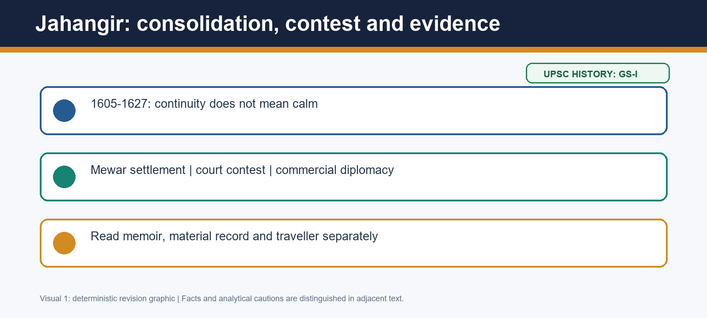

*Visual 1: Jahangir: consolidation, contest and evidence. Read it as a compact argument map; spatial diagrams marked schematic are not to scale.*

## Workbook purpose and verified PYQ status

This is a solved practice workbook, not an assertion that original practice is UPSC PYQ material. Search of local official/OCR and routing material for CSE 2018-2025 found no direct verified Prelims or GS-I question on Jahangir, Nur Jahan, Khusrau, Guru Arjan, 1615 Mewar, Roe/Hawkins, Mahabat Khan, chain of justice, Tuzuk or Itimad-ud-Daulah. Broad Mughal painting/architecture/economy and later Sikh questions are adjacent, not misrouted. Consequently no unofficial 'official key' is invented. The 70 MCQs and 10 Mains questions below are original.

## Source discipline before practice

Use the Jahangirnama for a ruler's chronology and self-representation; the Iqbalnama and other chronicles for comparison; farmans, seals and coins for formal public authority; the Itimad-ud-Daulah tomb for material patronage; Roe/Hawkins/factory records for commercial encounters; and Sikh traditions for community memory. A correct option is usually the one that states exactly what its source can establish and rejects an attractive extension.

# PART I - EVIDENCE AND ANSWER-WRITING HANDBOOK

## Evidence bank 1. Accession as political work

An accession is not merely a date at which an heir becomes a ruler. In Jahangir's case, title, audience, rewards and inaugural regulations worked together to make succession legible to nobles, officials and petitioners. The important analytical distinction is between inheritance and reproduction. Akbar's administrative and elite framework gave Jahangir a strong starting position, but the Khusrau revolt shows why the new emperor still needed to manufacture confidence through visible acts of command and favour.

Use this bank when an answer asks about continuity. Name the inherited composite ruling class and the early orders, then explain that a royal memoir publicises a programme rather than measuring compliance. The qualification is essential: the phrase 'continuity with Akbar' should not be used to erase Salim's earlier tensions or the bargaining position of nobles. It means that the institutional frame survived the person of Akbar, while the political coalition had to be renewed.

The closest exam error is to call the reign a smooth succession because the empire was large. A large empire creates more places where succession may be contested. The better answer treats ceremonial language, rewards and regulations as instruments through which an emperor tried to reduce that risk.

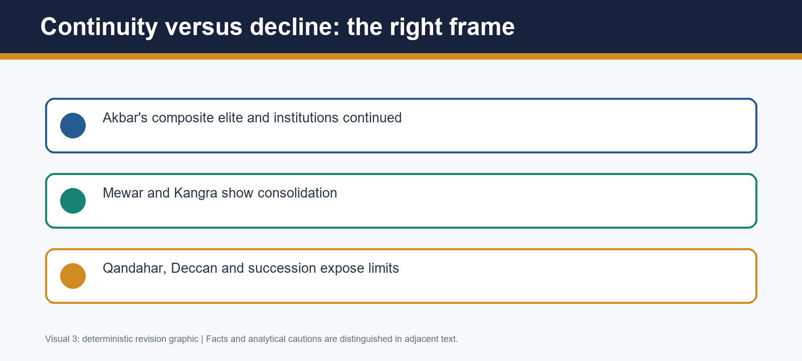

*Visual 3: Continuity versus decline: the right frame. Read it as a compact argument map; spatial diagrams marked schematic are not to scale.*

## Evidence bank 2. Justice as an idiom of sovereignty

The chain of justice is ideal evidence for separating an object, a claim and a social effect. Jahangir's memoir describes a gold chain with bells in the Agra Fort-riverfront setting. The object and its location support the conclusion that accessibility was made a public imperial image. The conceptual work of the chain was to make the emperor appear reachable when intermediary officials failed. It also made justice audible and spectacular, converting an ideal of direct hearing into courtly political theatre.

What the chain cannot prove is equally examinable. It does not supply a count of complainants, a map of rural access, an appellate procedure or a guarantee that status and distance ceased to matter. The empire's justice remained ruler-centred and discretionary in important respects. Punishment and clemency were part of the same public grammar because both announced that the sovereign could correct, reward and discipline.

In a Mains answer, write 'claim of accessibility' rather than 'proof of egalitarian justice.' This phrasing neither dismisses the evidence nor mistakes it for a modern constitutional promise. It is a compact demonstration of source criticism with an exact named example.

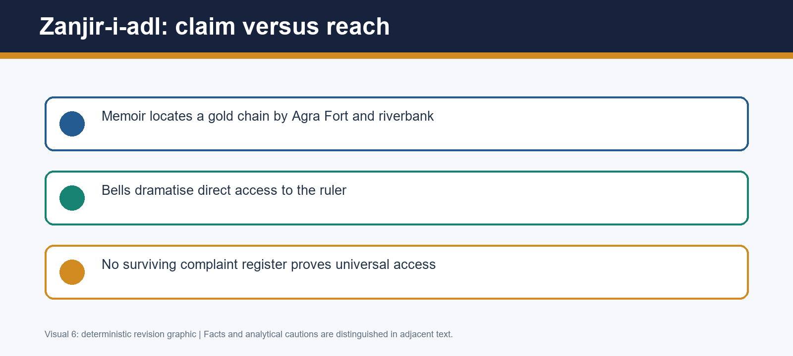

*Visual 6: Zanjir-i-adl: claim versus reach. Read it as a compact argument map; spatial diagrams marked schematic are not to scale.*

## Evidence bank 3. Punjab, succession and community memory

Khusrau's 1606 movement shows why a route should be treated as a political field. His north-westward trajectory through the Punjab-Lahore setting connected a princely claim to possibilities of noble support, local resources and movement. A prince did not need a modern party machine to become dangerous; dynastic legitimacy, personal ties and the difficulty of a new emperor's first years could produce a volatile coalition.

Guru Arjan's execution entered this field through Jahangir's accusation that the Guru had supported or marked Khusrau. The memoir is invaluable precisely because it records what the emperor chose to make politically blameworthy. Sikh traditions preserve a different but indispensable community memory of martyrdom. The historical task is triangulation, not a forced choice between an imperial statement and a later collective tradition. Political challenge, religious anxiety and fiscal-punitive language can coexist without collapsing into a single proven motive.

This bank guards against two opposite mistakes: turning 1606 into an inevitable Hindu/Sikh-versus-Muslim war, and treating the episode as a minor administrative penalty detached from coercion. The defensible conclusion is a political rupture with religious consequences whose later Sikh trajectory must be dated separately.

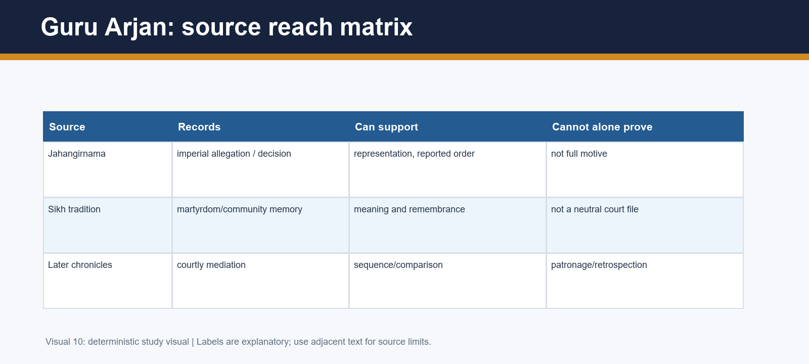

*Visual 10: Guru Arjan: source reach matrix. Read it as a compact argument map; spatial diagrams marked schematic are not to scale.*

## Evidence bank 4. Mewar and the vocabulary of hierarchy

Mewar is the clearest lesson in the vocabulary of pre-modern hierarchy. 'Suzerainty' means that the Mughal emperor's superior claim was accepted while a subordinate dynasty could retain recognised internal rule and status. In 1615 Rana Amar Singh did not become an equal ally, yet the Sisodia house was not removed. His exemption from personal attendance and Karan Singh's honourable reception were devices for making subordination bearable to a prestige-conscious court.

Chittor's fortification restriction adds the necessary qualification. Accommodation did not dissolve Mughal superiority or the memory of earlier coercion. The settlement combined military pressure, exhaustion, status and a deliberate refusal to demand the Rana's personal humiliation. A student who writes only 'Jahangir was generous' loses causation; one who writes only 'Mewar surrendered' loses the design of the settlement.

Use a comparison sentence with Topic 15: Akbar's Chittor phase demonstrated capacity but did not end Sisodia resistance; Jahangir's settlement turned a long contest into a more stable relationship. This is not a moral contrast between a bad coercer and a good conciliator. It explains how force and honour can be sequentially connected within an unequal empire.

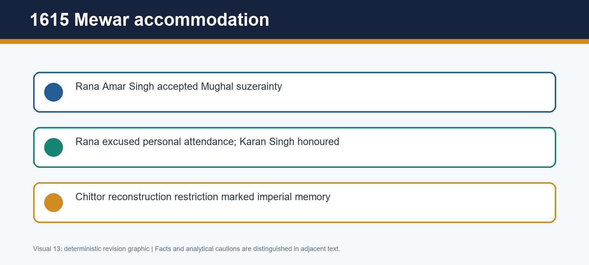

*Visual 13: 1615 Mewar accommodation. Read it as a compact argument map; spatial diagrams marked schematic are not to scale.*

## Evidence bank 5. Forts, frontiers and limits

Kangra's capture in 1620 should be put beside the Deccan and Qandahar, not isolated as a bare date. A fort could be a strategic choke-point, an emblem of capacity and a bargaining asset. Its capture therefore says something real about an emperor's ability to project force. Yet fort possession is not a synonym for complete control of mountains, communities, routes or revenue. This distinction prevents a map-colouring answer from substituting for political analysis.

The same reign confronted Malik Ambar's capacity in the Deccan and the Safavid seizure of Qandahar in 1622. Each is an incomplete-frontier case, but they are not identical: the Deccan belongs to a complex peninsular campaign-and-settlement field; Qandahar belongs to a Safavid-Mughal strategic rivalry. Cross-link them to Topics 18 and 19 rather than re-narrating their owner histories.

The comparative result is a better balance sheet. Jahangir's state could settle Mewar and take Kangra while still failing to turn every frontier into a permanent administrative success. 'Uneven consolidation' has more explanatory value than either 'empire at peak' or 'empire in decline.'

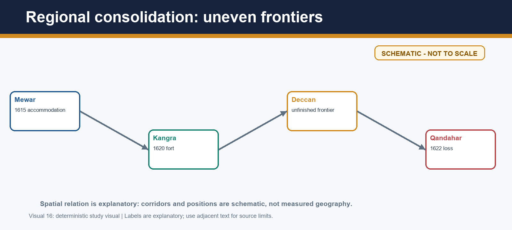

*Visual 16: Regional consolidation: uneven frontiers. Read it as a compact argument map; spatial diagrams marked schematic are not to scale.*

## Evidence bank 6. Merchant diplomacy without colonial teleology

Hawkins and Roe should be studied as evidence of a commercial petition within a powerful host state. English Company representatives sought facilities in an Indian Ocean world already shaped by Indian merchants, Portuguese sea power, customs, ports and Mughal sovereignty. Hawkins's experience at court makes personal access and competition visible. Roe's journal makes diplomatic status, gifts and procedural frustration unusually vivid.

The 1612 Swally/Suvali naval context could change the bargaining environment around Surat. It did not transfer Gujarat's jurisdiction to the English. The 1618 farman and related permissions should similarly be read as practical commercial facilities, not an exclusive empire-wide monopoly, a territorial grant or the constitutional beginning of British rule. The later colonial result makes early access retrospectively important, but it cannot be used as the motive or meaning of Jahangir's contemporaries.

For source criticism, add that Roe and factory records describe a merchant-diplomatic vantage point. Their complaints about delay or protocol reveal negotiation, not administrative incapacity. Compare them with a farman's language and with the fact that English trade required permission and local operational conditions.

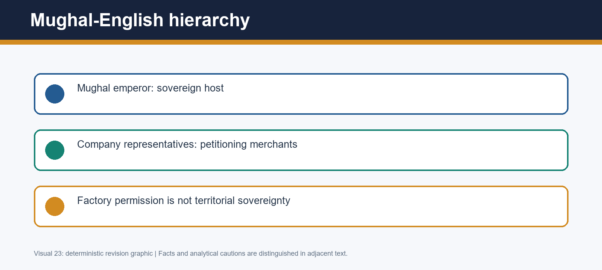

*Visual 23: Mughal-English hierarchy. Read it as a compact argument map; spatial diagrams marked schematic are not to scale.*

## Evidence bank 7. Household politics as institution

Nur Jahan's career requires a language of household politics rather than a choice between romance and constitutional office. Marriage to Jahangir in 1611 placed Mihr-un-Nisa in a household where access to the sovereign, petitions, patronage and family marriage could influence public decision. Ghiyas Beg, Asaf Khan, Arjumand Banu/Mumtaz, Khurram, Ladli Begum and Shahryar form a kinship diagram, but a diagram is not a proof that all ties pointed in one direction.

Farmans issued in Nur Jahan's name and coins with a linked authority formula supply the strongest evidence of public authority. These are not merely court gossip. A dated farman proves formal intervention in a particular legal-administrative context; a coin proves that a political formula acquired public material expression. Together they justify the phrase 'exceptional formalised influence.'

The limitation should be stated immediately. Neither document type counts all decisions or shows Jahangir permanently ceased governing. This is why the phrase 'sovereign replacement' goes too far. Nur Jahan's authority was real precisely because it worked through a monarchy whose sovereign remained Jahangir.

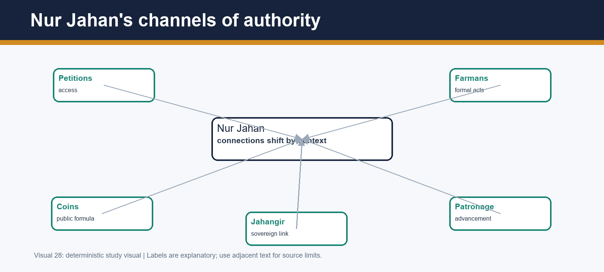

*Visual 28: Nur Jahan's channels of authority. Read it as a compact argument map; spatial diagrams marked schematic are not to scale.*

## Evidence bank 8. Gender, material culture and attribution

Gender analysis begins by taking Nur Jahan's agency seriously and ends by locating it in a patriarchal imperial structure. Household intimacy, kinship and access were not private in the modern sense because they could shape petitions, patronage and succession. Yet the exceptional position of an empress cannot be used to infer general political equality for Mughal women. Agency and structural hierarchy can coexist.

The Itimad-ud-Daulah tomb makes this argument material. The official District Agra page identifies the ASI-protected tomb as built in 1622-28 by Nur Jahan for Mirza Ghiyas Beg, and highlights white marble and extensive pietra dura. It therefore supports a carefully bounded claim about family commemoration, patronage and architectural development. Its riverine Agra setting links court family history to the built environment.

Avoid a popular-attribution catalogue. Claims about gardens, clothing, perfumes or designs need a document, inscription, securely attributed object or contemporary record. The tomb is not evidence that Nur Jahan invented every court fashion, just as it is not evidence that a permanent junta controlled government. Material evidence is strongest when its claim is kept proportionate to its form.

*Visual 31: Patronage: evidence hierarchy. Read it as a compact argument map; spatial diagrams marked schematic are not to scale.*

## Evidence bank 9. Historiography as an evidence test

Beni Prasad's 'Nur Jahan junta' offers a memorable explanation: Nur Jahan, Itimad-ud-Daulah, Asaf Khan and Khurram are imagined as a coherent group. The model has a genuine insight - kinship and patronage mattered - but its strongest form requires evidence of durable common action across time. A list of relatives and promotions is not automatically such evidence.

Nurul Hasan's critique directs attention to the distribution of promotions and the lack of contemporary proof for a stable Nur Jahan-Khurram alliance in 1611-20. Satish Chandra accordingly favours changing networks. The revision does not say Nur Jahan's family lacked influence; it asks a more precise question: when, through which connection, and against which other network did that influence operate?

Periodisation supplies the answer-writing gain. In the earlier phase, advancement and influence coexist with plural alignments. After 1622, Qandahar, Itimad-ud-Daulah's death, illness and Khurram's rebellion magnify succession politics. A dynamic network model can explain change; a fixed junta merely repeats a label.

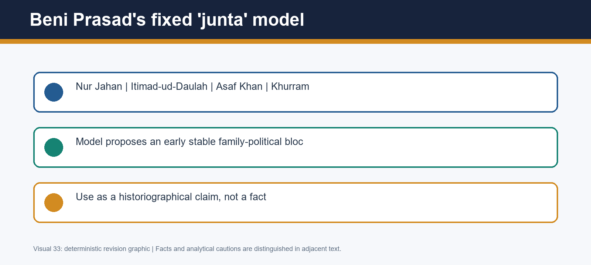

*Visual 33: Beni Prasad's fixed 'junta' model. Read it as a compact argument map; spatial diagrams marked schematic are not to scale.*

## Evidence bank 10. Khurram and resources of succession

Khurram's rebellion illustrates that succession in a Mughal service monarchy was about more than birth order. His service in Mewar and the Deccan gave him military prestige. The title Shah Jahan expressed favour and enlarged expectation, but it did not remove Khusrau's prior claim, Parvez's presence, Shahryar's later relevance or the emperor's authority to choose and discipline.

After the Safavid seizure of Qandahar, the issue of command became entangled with fear of political absence. Jagir and resource disputes also mattered because rank, military capacity and household status rested on material support. The marriage of Ladli Begum and Shahryar could be read by Khurram as a succession risk; his marriage link through Asaf Khan created a countervailing household channel. The analytical word is convergence.

Do not make Nur Jahan either omnipotent villain or irrelevant bystander. Her later crisis politics mattered, but Khurram's actions also responded to frontier emergency, imperial orders, resources and a multi-prince succession system. The consequence was costly diversion and sharpened alignment, not immediate administrative dissolution.

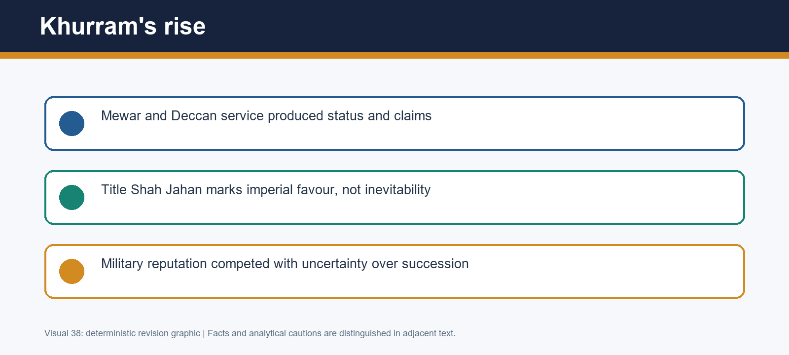

*Visual 38: Khurram's rise. Read it as a compact argument map; spatial diagrams marked schematic are not to scale.*

## Evidence bank 11. The body of the emperor and the state

Mahabat Khan's 1626 coup near the Jhelum crossing is a microhistory of embodied sovereignty. Seizing Jahangir during movement gave a noble immediate leverage over access, commands and symbolic legitimacy. A Rajput contingent formed part of the coercive apparatus. This makes the coup a useful corrective to overly impersonal descriptions of Mughal government: the emperor's person mattered materially and politically.

Its failure provides the counter-correction. The emperor's body was not the entire state. Mahabat needed durable cooperation from bureaucracy, treasury, broad noble networks and holders of local authority. Accounts vary over Nur Jahan's moves, but their broad significance is that she could operate through relationships, legitimacy and supporter realignment even after immediate coercion had constrained the household.

Use the phrase **coup de main** to signal a swift tactical seizure. Then explain why tactical seizure does not equal regime construction. The event shows a genuine vulnerability of personalised monarchy and an institutional depth that prevented a single armed group from making capture permanent.

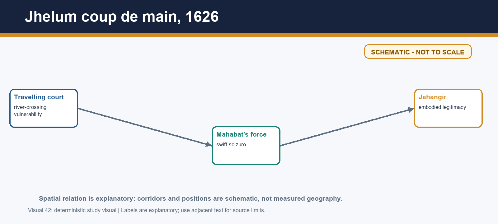

*Visual 42: Jhelum coup de main, 1626. Read it as a compact argument map; spatial diagrams marked schematic are not to scale.*

## Evidence bank 12. A source-reach verdict

The Jahangirnama is a foundation source because it lets historians examine the emperor's chronology, observational persona, chain of justice, orders and representations of crisis. Its reliability cannot be reduced to 'true' or 'false.' A memoir may offer a valuable date and a revealing self-image in the same passage. The presence of later continuation/editorial layers makes authorship and edition an active question, not a reason to abandon the text.

Mutamad Khan's Iqbalnama and other Persian chronicles can corroborate or correct sequence, yet they too are courtly narratives. Farmans and coins make formal authority visible; tombs and inscriptions anchor material patronage; paintings build ideological images; European visitors record commercial encounters; Sikh traditions retain community experience. No one source controls the rest.

This method delivers the best overall assessment. Mewar and Kangra prevent a weak-ruler tale. Qandahar, Khurram and Mahabat prevent a complacent consolidation story. Nur Jahan's documents prevent her erasure; their limits prevent personal-rule myth. The evidence supports a governing emperor and an exceptional consort operating in an empire whose strength and stresses were both real.

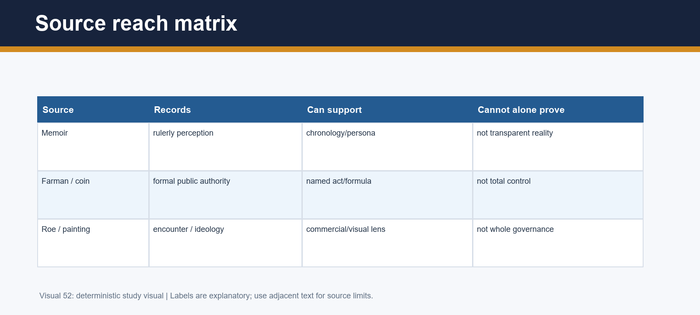

*Visual 52: Source reach matrix. Read it as a compact argument map; spatial diagrams marked schematic are not to scale.*

# PART IA - ADVANCED INTERPRETIVE LABS

## Advanced lab 1. Claim, mechanism and scale

A ruler's action can operate on more than one scale. The chain of justice is an object at Agra, a claim about royal hearing across the empire, and a mechanism for centralising moral attention on the emperor. A good answer labels the scale before making an inference. The error to avoid is to take a spectacular metropolitan object as a census of everyday provincial justice. Conversely, dismissing it as propaganda alone misses why courts invested in public symbols: a claim can alter expectation, petitioning language and elite reputation even if access remains uneven.

Apply the same scale test to farmans: a particular grant can prove a particular administrative act, but it cannot quantify all governance. This is not pedantry; it is how an answer avoids both credulity and cynicism.

## Advanced lab 2. Geography without map colouring

A schematic map should be used to ask what a place enabled. Punjab/Lahore made Khusrau's flight a succession problem with a north-western field; Agra's riverfront made justice and tomb architecture visible; Mewar's hills altered the cost of conquest; Kangra magnified the importance of a fort; Surat connected court permissions to maritime commerce; Jhelum made a travelling court vulnerable. None of these locations is a passive backdrop.

When drawing a map, label only relations that the map can support and write SCHEMATIC - NOT TO SCALE. Geography explains corridors, access and logistics, not a deterministic fate or a modern border.

## Advanced lab 3. Honour as a political resource

Mewar demonstrates that honour was not an ornamental cultural detail. Exempting Rana Amar Singh from personal attendance and honouring Karan Singh made a subordinate relation politically usable. These terms lowered the symbolic cost of accommodation for a dynasty with a deep resistance tradition. Chittor's fortification restriction simultaneously preserved the Mughal memory of victory. This duality explains why a settlement could be both unequal and durable.

The same method helps with Roe's gift and rank disputes. Protocol was political because reception staged hierarchy. Do not write that honour displaced material interest; in court politics, status, service and resources were often mutually reinforcing.

## Advanced lab 4. Causation under source disagreement

The Guru Arjan episode and Mahabat's coup both warn against the comfort of a single explanation. Jahangir's memoir gives an imperial account of Guru Arjan; Sikh traditions organise memory differently. Mahabat's grievances appear in courtly narratives entangled with rivalry. In each case historians should list the source, its vantage point, what it directly records, and the inference it permits. A short source table is often stronger than an emphatic sentence about motive.

A qualified conclusion is not evasive. It can say that political challenge and religious suspicion interacted, or that accounting pressure and fear of rivals were part of a grievance environment, without pretending that private intention is recoverable in full.

## Advanced lab 5. Household versus administration

The Mughal household was not outside government. Marriage, access, petitions and patronage could shape who spoke to the emperor and which claims acquired urgency. Nur Jahan's farmans and coins show that household authority could become public. Yet administration was not dissolved into household: offices, campaigns, revenue assignments, provincial actors and wider noble networks retained their own weight. The fixed-junta model fails when it collapses these layers into one family command.

Use a two-column answer logic: household channels explain access and alignment; administrative and service networks explain why influence had to be negotiated beyond kin.

## Advanced lab 6. Avoiding forward teleology

The English factory is a classic site of teleology. Since the East India Company later acquired territorial power, it is tempting to write that Roe 'founded British rule.' In the 1610s the documentary and political setting points elsewhere: English representatives asked a sovereign Mughal court for facilities, navigated Portuguese competition and relied on local conditions. Later outcomes may explain why historians notice the encounter, but they cannot be retrofitted as Jahangir's intent.

The same discipline prevents reading later Sikh militarisation, Shah Jahan's accession or Aurangzeb's policy backward into Jahangir's early decisions.

## Advanced lab 7. Evidence from material culture

The Itimad-ud-Daulah tomb has a different evidentiary texture from a memoir. Its marble, inlay, location and surviving form are material facts; the official District Agra page supplies a state heritage description of its 1622-28 construction for Ghiyas Beg by Nur Jahan. Interpretation still needs care. A tomb can demonstrate patronage, commemoration and an architectural vocabulary; it does not speak unaided about all political conflicts at court.

Material evidence gains force when paired with documents, inscriptions or dated stylistic comparison. It loses force when made to carry a romance story, a claim of total female sovereignty or an unsupported list of inventions.

## Advanced lab 8. A dynamic faction timeline

The period 1611-21 is not empty of politics simply because a fixed junta is unproven. It includes the advancement of Nur Jahan's family, Khurram's rising military position and many other noble networks. The post-1622 phase is different because Qandahar, Itimad-ud-Daulah's death, health and rebellion raised the stakes around access. This chronology lets an answer acknowledge change rather than merely attach a scholar's name to a slogan.

A network diagram should therefore use movable connections and dates, not two permanently coloured camps.

## Advanced lab 9. What a balance sheet does

A balance sheet is not a list of good and bad events. It asks whether gains and setbacks reveal a common mechanism. Mewar and Kangra show an empire able to convert campaigns into political authority. Deccan limits and Qandahar show that distance, rival capacity and coordination constrained that conversion. Khurram and Mahabat show that a dynastic state could face acute internal contests while retaining administrative and military resources.

The verdict 'uneven consolidation' is earned only when each item is analysed; it should not be a safe label pasted on after unconnected chronology.

## Advanced lab 10. Source criticism in one paragraph

For a source question, start with genre. The Jahangirnama is memoir and self-fashioning; Iqbalnama is a court chronicle; coins/farmans are formal material documents; Roe is a merchant-diplomat; a painting is a visual assertion; Sikh tradition is community memory. Next state a precise use. Finally add a limitation linked to the same genre. This three-step method is far better than writing 'sources are biased' as a detached ritual.

It also supports positive inference: bias can reveal what a court wished to persuade an audience about, which is itself historical evidence.

## Advanced lab 11. Revision synthesis

In ninety seconds, build the reign around four relationships: emperor and elite (accession/justice); emperor and prince (Khusrau, then Khurram); emperor and frontier (Mewar, Kangra, Deccan, Qandahar); emperor and household (Nur Jahan, Mahabat). Add European merchants as petitioners within sovereignty and sources as contested representations. This makes the topic an argument rather than a gallery of famous names.

The most reliable final sentence is: Jahangir maintained and consolidated an Akbarian imperial framework through negotiated hierarchy, while successive frontier and succession crises revealed stresses that neither a weak-ruler story nor a Nur Jahan personal-rule story can adequately explain.

## Learning MCQs - 18 original questions

The option sequence is deliberately rotated. Each explanation identifies the factual discriminator and the closest attractive error.

### Q1. Which framing best describes Jahangir's reign?

A. Institutional continuity with consolidation and serious court/frontier contests
B. Automatic decline from 1605
C. A uniformly peaceful continuation of Akbar
D. A complete break from Akbar's polity

**Answer: A.** The reign continued Akbar's institutional inheritance, yet Khusrau, Qandahar, Khurram and Mahabat show why 'peaceful continuity' is the closest but still inadequate lure.

### Q2. What can the Jahangirnama's twelve orders establish most securely?

A. That every order was uniformly implemented across the empire
B. That Jahangir publicly represented an early programme of regulation
C. That a modern written constitution replaced discretion
D. That later folklore lists are all authentic

**Answer: B.** The memoir is direct evidence of programme and self-presentation; empire-wide enforcement is the specific extra claim the source cannot carry by itself.

### Q3. The chain of justice is best used as evidence for

A. A universal right to bypass officials
B. An elected judicial institution
C. A ruler-centred claim of accessibility and justice
D. A surviving register of equal remedies

**Answer: C.** Its gold-and-bell image stages royal accessibility. The tempting universal-access option confuses a sovereign symbol with documented egalitarian procedure.

### Q4. Khusrau's revolt of 1606 should first be analysed as

A. An instant empire-wide religious war
B. A Portuguese attack on Surat
C. A later Mughal war of succession after 1627
D. A princely succession challenge using Punjab political networks

**Answer: D.** The central discriminator is date and actor: Khusrau was Jahangir's son and the episode was an early-reign political challenge, not a later or maritime conflict.

### Q5. Why must Guru Arjan's execution be treated with source caution?

A. Jahangir's memoir gives an imperial accusation but does not settle every motive
B. Sikh traditions are irrelevant to the event
C. Only a fiscal penalty is mentioned in all sources
D. The event had no political context

**Answer: A.** Jahangirnama is crucial for the imperial framing; the closest error treats that courtly claim as a final explanation and excludes Sikh memory.

### Q6. The 1615 Mewar arrangement included

A. Outright annexation and removal of the Sisodia dynasty
B. Mughal suzerainty while excusing Rana Amar Singh's personal attendance
C. A compulsory Mughal-Rana matrimonial alliance
D. Mewar's recovery of complete external independence

**Answer: B.** The settlement's distinctive balance was subordination with honour. The annexation option misses Karan Singh's incorporation and the continued Rana house.

### Q7. Kangra's 1620 capture most safely demonstrates

A. Automatic administration of all Himalayan polities
B. A decisive Deccan settlement with Malik Ambar
C. Strategic and symbolic consolidation through a fort
D. The recovery of Qandahar from the Safavids

**Answer: C.** A fort mattered for prestige and routes; the nearest overclaim converts a fortress capture into a total regional map.

### Q8. William Hawkins is best described as

A. A governor who ruled Surat for the English crown
B. A Safavid ambassador sent to recover Qandahar
C. A Mughal mansabdar commanding Mewar
D. An English Company representative seeking Mughal trading access

**Answer: D.** Hawkins's court experience belongs to petitioning English trade. The Surat-ruler distractor projects later colonial power back onto the early seventeenth century.

### Q9. Roe's 1615-19 embassy shows that the English were

A. Supplicant merchants/diplomats negotiating within Mughal sovereignty
B. Equal sovereign allies controlling Gujarat
C. Already territorial rulers of India
D. Portuguese officers appointed by Jahangir

**Answer: A.** Roe sought facilities and status; the closest lure is equality, but his complaints themselves show he did not set Mughal terms.

### Q10. The 1618 farman should NOT be described as

A. A cautiously framed trading facility
B. A grant of English territorial sovereignty
C. A document to be read with factory practice
D. A limited basis for commercial access

**Answer: B.** No farman gave the Company land-based sovereignty or an empire-wide monopoly. Calling it a trading facility is careful rather than dismissive.

### Q11. Nur Jahan's farmans and coins most directly demonstrate

A. That Jahangir ceased to rule permanently
B. That all noble promotions came from one family
C. Exceptional formal public authority alongside household influence
D. General political equality for Mughal women

**Answer: C.** Material documents make authority visible. The closest overreach is sovereign replacement; documents prove particular formal authority, not total control.

### Q12. The Itimad-ud-Daulah tomb is strongest evidence for

A. A permanent Nur Jahan-Khurram alliance
B. Jahangir's tomb in Agra
C. A dated 2026 conservation announcement
D. Family commemoration and architectural patronage linked to Nur Jahan

**Answer: D.** The monument anchors patronage and Ghiyas Beg's commemoration; it cannot prove a factional alliance, and Jahangir's tomb is in Lahore.

### Q13. Beni Prasad's 'junta' thesis is challenged because

A. Promotions and alliances do not demonstrate a fixed bloc from 1611-20
B. Nur Jahan's family never rose at court
C. No household politics existed in Mughal rule
D. Khurram had no service career

**Answer: A.** The revisionist point is not family irrelevance but the absence of proof for a stable four-person coalition across the whole early period.

### Q14. A useful post-1622 reading of court politics stresses

A. An unchanged alliance since 1611
B. Crisis-driven realignment amid Qandahar, illness and succession
C. The disappearance of all noble networks
D. A completed Deccan annexation

**Answer: B.** The time boundary matters: after 1622 pressures sharpened. The fixed-alliance distractor erases the very chronology the historiographical debate requires.

### Q15. Khurram's rebellion is best explained by

A. Only Nur Jahan's personal hostility
B. Only a religious policy dispute
C. Succession insecurity, resources, Qandahar and court competition together
D. Only a Portuguese naval defeat

**Answer: C.** Several connected pressures explain the rebellion. The personal-hostility answer is deliberately tempting but replaces structural politics with one-cause drama.

### Q16. Mahabat Khan's coup reveals that

A. An emperor's capture automatically transferred every institution
B. The Mughal empire instantly ended in 1626
C. Rajput troops had no role in the episode
D. Seizing the emperor gave leverage without securing the whole state

**Answer: D.** The coup's short life exposes the gap between bodily custody and command of treasury, bureaucracy, legitimacy and broad noble support.

### Q17. Which assessment of Jahangir's religious policy is most defensible?

A. Broad continuity with Akbar alongside contextual coercive episodes
B. A simple tolerant ruler with no coercion
C. A complete restoration of jizyah and exclusion
D. A policy unrelated to political context

**Answer: A.** The composite-nobility framework and no jizyah restoration matter, but Guru Arjan prevents a flattering no-coercion story.

### Q18. The best use of the Jahangirnama is to

A. Treat every royal claim as transparent social fact
B. Read it for chronology and representation while testing claims against other evidence
C. Reject it because it is royal
D. Use it only for European trade

**Answer: B.** Source criticism preserves the memoir's value and limits. The closest bad practice is accepting the chain or orders as proof of universal reality.

## Broad MCQs - 40 original questions

The option sequence is deliberately rotated. Each explanation identifies the factual discriminator and the closest attractive error.

### Q19. Salim's separate court before accession should be used as

A. bounded evidence of pre-accession tension, not a fixed personality diagnosis
B. proof that Akbar's administration ended before 1605
C. evidence that Salim never negotiated with nobles
D. a reason to ignore the 1605 accession settlement

**Answer: A.** A separate court signals real tension. The diagnosis distractor is closest because it illegitimately turns a political episode into certain inner character.

### Q20. The term 'Padshah' in accession context principally signals

A. a modern elected office
B. imperial sovereignty and ceremonial legitimacy
C. a provincial revenue post
D. a European factory privilege

**Answer: B.** Titulary stages rank and sovereignty. The provincial-office option confuses court language with an administrative post.

### Q21. A claim of clemency in a royal memoir should be checked against

A. the assumption that all clemency was equal
B. only a later tourist description
C. the episode's wider record, recipients and implementation
D. a numerical vote of nobles

**Answer: C.** Clemency is a rulerly claim and action whose reach needs contextual evidence; the equality assumption is the nearest modern projection.

### Q22. Why was Lahore/Punjab important in the Khusrau episode?

A. it was Jahangir's permanent mausoleum site in 1606
B. it was a Portuguese base controlling Surat
C. it lay inside the Deccan campaign zone
D. It was a political-military field along the rebel's north-west movement

**Answer: D.** Punjab connected succession politics to movement and support. The tomb lure mixes the later burial association with the revolt.

### Q23. Jahangir's record of Guru Arjan can securely show

A. the emperor's stated grounds and decision to punish
B. the private intentions of every actor
C. the later Sikh military organisation
D. a neutral community census

**Answer: A.** A ruler's memoir records his framing and order. It cannot transparently supply private motive or later institutional history.

### Q24. The word 'suzerainty' in the Mewar settlement means

A. a federation of equal states
B. an unequal superior claim alongside retained internal dynasty
C. complete provincial annexation
D. a relation with no political obligations

**Answer: B.** Suzerainty is the middle category students often lose: stronger than courtesy, less than wholesale annexation.

### Q25. Karan Singh's reception at court illustrates

A. the extinction of the Sisodia line
B. Roe's embassy protocol
C. service-linked integration and honourable incorporation
D. Safavid control of Chittor

**Answer: C.** Karan Singh makes the Mewar settlement concrete. The closest false choice, extinction, contradicts the retained Rana house.

### Q26. A restriction on rebuilding Chittor's fortifications would most likely signify

A. a grant of full military independence
B. a Company right to garrison the fort
C. a Kangra treaty term
D. an imperial memory of victory and a limit on military restoration

**Answer: D.** The restriction marks asymmetry and the memory of Chittor; it cannot be inverted into a sovereignty grant.

### Q27. The best generalisation about Jahangir's eastern policy is

A. consolidation remained a process involving regional and Afghan challenges
B. Bengal and Orissa ceased to need governance after conquest
C. all eastern politics were identical to Mewar
D. European factories controlled the east

**Answer: A.** The process language avoids a finality myth. The Mewar comparison distractor ignores different regional political structures.

### Q28. Malik Ambar in this topic chiefly functions as

A. the leader of the 1606 Khusrau revolt
B. a reminder of the limits of Mughal Deccan consolidation
C. the English envoy who obtained the 1618 farman
D. the Safavid governor of Qandahar

**Answer: B.** Malik Ambar anchors the unfinished Deccan; detailed operations are intentionally owned by Topic 18.

### Q29. The 1622 Qandahar loss cautions against

A. studying Safavid-Mughal relations
B. using Qandahar as a strategic node
C. equating diplomatic cordiality with frontier readiness
D. noting court coordination problems

**Answer: C.** Gift exchange and cordial words did not secure a fort. The closest wrong option says diplomacy itself should be ignored rather than qualified.

### Q30. Swally/Suvali is relevant because

A. it made the English sovereign over Gujarat
B. it was the site of Mewar's settlement
C. it ended Portuguese maritime power everywhere
D. maritime balance affected English petitions in the Surat world

**Answer: D.** A local naval context altered bargaining without conferring land sovereignty or ending all Portuguese power.

### Q31. A factory record is especially useful for

A. commercial practice and a merchant's operational perspective
B. a complete neutral account of Mughal society
C. the internal motives of Nur Jahan
D. the exact content of every Persian chronicle

**Answer: A.** Factory records see trade and permissions well; the whole-society option is the closest scope error.

### Q32. Gift disputes in Roe's journal tell us about

A. a modern treaty-ratification procedure
B. rank, reception and diplomatic culture as political practice
C. the abolition of Mughal hierarchy
D. the end of merchant rivalry

**Answer: B.** Gifts and audience protocol carried rank claims. The treaty distractor imports modern diplomatic law.

### Q33. Which is a sound statement about early English access?

A. It guaranteed a territorial empire
B. It gave an exclusive monopoly over Indian Ocean trade
C. It was contingent on Mughal permissions and local commercial conditions
D. It eliminated Indian merchants from Surat

**Answer: C.** Contingency captures the 1610s situation; territorial or monopoly formulations telescope later changes backward.

### Q34. Ghiyas Beg is important because he was

A. Jahangir's English ambassador
B. the Rana of Mewar in 1615
C. Mahabat Khan's Rajput commander
D. Nur Jahan's father, later titled Itimad-ud-Daulah

**Answer: D.** Family identification anchors the tomb and court network. The Mewar lure swaps entirely different political fields.

### Q35. Asaf Khan matters to succession analysis because

A. his daughter Arjumand Banu married Khurram
B. he commanded the 1612 English fleet
C. he was Guru Arjan's successor
D. he was a Safavid shah

**Answer: A.** The marriage link explains a household channel, not an automatic fixed faction.

### Q36. A title such as Nur Mahal/Nur Jahan should be handled by

A. assuming the title created a modern monarchy
B. checking chronology and source rather than treating it as a constitutional office
C. discarding all title evidence
D. equating it with a mansab rank

**Answer: B.** Titles are meaningful public markers, but not automatically modern offices or mansab positions.

### Q37. Why are coins especially useful in assessing Nur Jahan?

A. they record every private conversation
B. they prove she alone commanded the army
C. They provide material, public evidence of a named authority formula
D. they eliminate the need for dates

**Answer: C.** Coins are independent material evidence, yet their circulation/formula must still be dated and cannot become a total-control claim.

### Q38. A patronage attribution is strongest when supported by

A. a circulating internet list
B. a romantic court tale without provenance
C. a title alone
D. a surviving monument, inscription, document or secure contemporary record

**Answer: D.** Material or documentary provenance ranks above repetition. The court-tale lure is precisely why evidence hierarchy is needed.

### Q39. Itimad-ud-Daulah's tomb is located in

A. Agra, on the Yamuna-side heritage landscape
B. Lahore as Jahangir's own tomb
C. Ajmer as the Mewar campaign headquarters
D. Surat as the English factory

**Answer: A.** Agra is the tomb's site; Lahore is the separate burial geography of Jahangir.

### Q40. The central problem with the fixed-junta thesis is

A. it acknowledges family patronage
B. it converts shifting networks into a permanent four-person bloc
C. it dates Jahangir's accession to 1605
D. it notes Khurram's military service

**Answer: B.** Family rise is genuine, so the problem is rigidity rather than the mere recognition of kinship.

### Q41. Nurul Hasan's critique directs attention to

A. the denial of all court faction
B. only European trade data
C. distribution of promotions and absence of proof for a stable alliance
D. the annexation of Mewar

**Answer: C.** The critique is empirical and networked, not a claim that court politics disappeared.

### Q42. Why is 1622 a useful turning point for Nur Jahan's politics?

A. it marks her 1611 marriage
B. it is the date of Mewar's settlement
C. it ends Jahangir's reign
D. Multiple crises made access, succession and alignment more consequential

**Answer: D.** The date clusters Qandahar, household loss and Khurram's rupture; marriage and death belong to other dates.

### Q43. Shahryar's political significance sharpened because of

A. his marriage to Ladli Begum and the succession field
B. his command of Kangra in 1620
C. his role as James I's envoy
D. his capture of Qandahar

**Answer: A.** The marriage link mattered in succession calculations; the other roles belong to different actors/events.

### Q44. Khurram's Deccan/Mewar service should be read as

A. proof that he had already become emperor
B. a source of stature that did not guarantee succession
C. evidence that court politics ended
D. a reason Qandahar no longer mattered

**Answer: B.** Military success bolstered claims but succession remained contested, as the later rebellion itself demonstrates.

### Q45. Jagir/resource disputes matter in the Khurram crisis because

A. they were unrelated to princes
B. they gave English merchants sovereignty
C. they linked rank, military capacity and political bargaining
D. they replaced all kinship ties

**Answer: C.** Resources were political in a service monarchy. The closest wrong option makes money the only cause and erases succession/kinship.

### Q46. A 'one-cause' narrative of Khurram's revolt fails because

A. the rebellion did not occur
B. Qandahar had no connection to court politics
C. all sources agree on one motive
D. command, succession, resources and court alignments interacted

**Answer: D.** Interaction is the explanatory gain; the all-sources option is false precisely because evidence and motives are contested.

### Q47. Mahabat Khan's account-related grievance should be treated as

A. a reported political grievance requiring source and faction context
B. a fully documented private emotion
C. an English trading regulation
D. a Mewar settlement term

**Answer: A.** Grievance language comes through partisan narratives. The private-emotion lure asks sources to do more than they can.

### Q48. The Jhelum setting mattered to Mahabat's coup because

A. it was a stable fixed capital court
B. a river crossing created a moment of movement and vulnerability
C. it placed the emperor at the Surat coast
D. it was within Chittor fort

**Answer: B.** A travelling river crossing could be exploited. The fixed-capital option erases the tactical opportunity.

### Q49. The Rajput contingent in the 1626 coup shows

A. all Rajput houses held one permanent position
B. Mewar had been annexed
C. service networks could be used in a noble's immediate coercion
D. the emperor lacked any legitimacy

**Answer: C.** A contingent shows a specific service connection, not a monolithic Rajput bloc or a total collapse of imperial legitimacy.

### Q50. Nur Jahan's recovery from the coup depended in part on

A. a guaranteed constitutional office
B. English military intervention
C. the instant disappearance of Jahangir
D. manoeuvring within legitimacy and detaching support from Mahabat

**Answer: D.** Her leverage was relational and political; a constitutional-office story imports a structure the court did not possess.

### Q51. Why did Mahabat's seizure not endure?

A. He lacked durable control over administration, treasury and broad nobles
B. the emperor's person had no political value
C. the coup happened after Jahangir's death
D. all troops immediately changed sides

**Answer: A.** Custody mattered greatly, but it was insufficient. The no-value choice reverses the lesson about embodied sovereignty.

### Q52. No restoration of jizyah under Jahangir helps establish

A. the absence of all coercive episodes
B. continuity with Akbar's broad fiscal-religious framework
C. a modern secular constitution
D. an English commercial monopoly

**Answer: B.** This is a useful institutional fact, but it cannot erase individual coercive episodes or create anachronistic secularism.

### Q53. Jahangir's natural-history observations are best read as

A. a modern scientific survey with no genre bias
B. evidence that he did not govern
C. part of a memoir's observing and self-fashioning rulerly persona
D. a Company shipping log

**Answer: C.** Observation has real evidentiary value, yet genre and imperial self-presentation remain active.

### Q54. A Mughal court painting most directly preserves

A. a camera-like record of every event
B. a modern census
C. the full text of a farman
D. a visual construction of hierarchy, taste and imperial ideology

**Answer: D.** Paintings are highly valuable but representational. The camera lure is the exact source-method error.

### Q55. The word 'continuation' in relation to the Jahangirnama alerts us to

A. later textual layers beyond Jahangir's own composed portions
B. the claim that Jahangir wrote nothing
C. a European translation monopoly
D. the end of Persian chronicles

**Answer: A.** The memoir has an imperial authorial core and later transmission/continuation issues; neither wholesale rejection nor total transparency follows.

### Q56. Mutamad Khan's Iqbalnama should be used as

A. a substitute for all evidence
B. a Persian chronicle to compare with memoir and material sources
C. an English factory journal
D. a legal code enacted by Roe

**Answer: B.** Comparison is the point: court chronicles offer sequence and rhetoric but have patronage and perspective.

### Q57. A source-conscious use of Jahangir's health is to

A. treat illness as proof that every decision was Nur Jahan's
B. ignore all references to health as irrelevant
C. connect it cautiously to access and crisis politics without asserting permanent abdication
D. use it to date the Mewar settlement to 1622

**Answer: C.** Health can alter access and political opportunity, but the closest lure converts that possibility into a total-transfer-of-rule claim unsupported by the record.

### Q58. Which overall verdict is best supported by the reign's evidence?

A. A collapsed empire ruled only by a junta from 1611
B. A peaceful reign with no frontier or succession stress
C. An English territorial state created by the Surat farman
D. A governing emperor and exceptional consort in an unevenly consolidating empire

**Answer: D.** This verdict holds Mewar/Kangra, Qandahar, rebellion, documents and source limits together; each alternative elevates one familiar story into an absolute.

## Remedial MCQs - 12 original questions

The option sequence is deliberately rotated. Each explanation identifies the factual discriminator and the closest attractive error.

### Q59. Which phrase corrects the 'decline from 1605' shortcut?

A. Inherited institutions plus uneven consolidation and real stress
B. Immediate systemic collapse
C. A reign without challenges
D. A total break with Akbar

**Answer: A.** Mewar and Kangra make collapse untenable, while Qandahar and revolt make a no-challenge story equally inaccurate.

### Q60. The chain of justice was NOT

A. a royal symbol of accessibility
B. a demonstrated modern system of equal access to courts
C. a memoir-described public object
D. part of Jahangir's justice persona

**Answer: B.** The anachronism is converting a ruler-centred claim into an impersonal equal-rights system.

### Q61. What is unsafe about a one-cause Guru Arjan explanation?

A. It notices Jahangir's memoir
B. It uses Sikh tradition
C. It turns competing political, religious and fiscal evidence into certainty
D. It asks for chronology

**Answer: C.** The problem is certainty beyond source reach, not the use of any one source when it is clearly identified.

### Q62. The Mewar settlement was not

A. an acceptance of Mughal suzerainty
B. an arrangement protecting Rana honour
C. a setting for Karan Singh's incorporation
D. a straightforward annexation that erased the Rana house

**Answer: D.** The Sisodia dynasty and internal space remained; 'annexation' destroys the settlement's negotiated character.

### Q63. Roe's trading facilities did not grant

A. territorial sovereignty to the English Company
B. Mughal-term commercial access
C. a reason to study protocol
D. a contingent Surat position

**Answer: A.** The future-colonial lure is teleology: commercial permission in the 1610s was not sovereignty.

### Q64. Why is 'fixed junta' an unsafe answer?

A. It acknowledges family advancement
B. It treats fluid 1611-20 networks as a proven permanent coalition
C. It names a historiographical model
D. It invites evidence testing

**Answer: B.** The named model is useful only when paired with the critique; permanence is the unsupported step.

### Q65. Nur Jahan's authority did not amount to

A. exceptional public authority
B. household-patronage leverage
C. automatic sovereign replacement of Jahangir
D. documentary visibility

**Answer: C.** Farmans and coins prove unusual authority, but they cannot alone convert influence into sole kingship.

### Q66. The romance/murder story fails method because

A. family biography matters
B. widowhood precedes the 1611 marriage
C. titles need chronology
D. it substitutes sensational narrative for dated corroborated evidence

**Answer: D.** Biography is important; unsupported melodrama is not evidence of political causation.

### Q67. Khurram did not rebel for

A. one personal reason detached from command, resources and succession
B. succession anxiety
C. court competition
D. resource/jagir concerns

**Answer: A.** A multi-causal political crisis cannot be reduced to a single person or grievance.

### Q68. Mahabat's coup did not prove

A. that the emperor's body had political value
B. that the empire ceased to exist in 1626
C. that wider institutions mattered
D. that noble networks could be coercive

**Answer: B.** Its reversal demonstrates the state was more than physical custody of its monarch.

### Q69. Jahangir was neither simply tolerant nor simply bigoted because

A. all religious policy was uniform
B. jizyah was restored
C. broad continuity coexisted with contextual coercive episodes
D. politics never shaped coercion

**Answer: C.** The binary fails to handle both composite governance and specific coercion in their political contexts.

### Q70. A memoir is not transparent fact because

A. it has no chronology value
B. it cannot be compared
C. it is always false
D. genre, self-fashioning and silence shape what it can prove

**Answer: D.** Source criticism limits and preserves use; wholesale disbelief is no better than uncritical acceptance.

# ORIGINAL MAINS PRACTICE - 10 SOLVED MODELS

### Mains 1. Continuity and consolidation - 10 marks

**Question:** Assess the proposition that Jahangir's reign was more a phase of consolidation than of decline. Answer in 150 words.

**Model solution**

**Directive and thesis.** 'Assess' requires a qualified balance. Jahangir inherited Akbar's composite ruling class and did not dismantle the institutional frame; his reign is therefore better read as consolidation under pressure than automatic decline.

**Claim -> evidence -> analysis.** The 1615 Mewar settlement is decisive evidence. Rana Amar Singh accepted Mughal suzerainty, while exemption from personal attendance and the reception of Karan Singh protected Sisodia honour. This converted a chronic Rajput frontier into a more workable unequal accommodation, showing that imperial authority could use status rather than annexation. The capture of Kangra in 1620 similarly demonstrated strategic and symbolic capacity. The continuity of composite nobility and absence of jizyah restoration reinforce an inherited governing framework.

**Qualification.** Consolidation was uneven. Malik Ambar limited Mughal Deccan aims; Qandahar fell to the Safavids in 1622; Khurram's rebellion and Mahabat Khan's 1626 coup exposed succession and court vulnerabilities. These are not minor incidents, but they do not prove that Jahangir abdicated or that institutions vanished.

**Verdict.** The reign consolidated key relationships and territories while revealing the costs of incomplete frontiers and personalised succession politics.

**Why this earns marks:** It directly weighs the proposition, uses Mewar, Kangra, policy continuity and counter-evidence, and concludes with a graded rather than celebratory verdict.

*Visual 3: Continuity versus decline: the right frame. Read it as a compact argument map; spatial diagrams marked schematic are not to scale.*

### Mains 2. Khusrau and Guru Arjan - 15 marks

**Question:** Discuss the political and religious dimensions of the 1606 Khusrau revolt and Guru Arjan's execution. Answer in 200 words.

**Model solution**

**Directive and thesis.** The question asks for dimensions, not a single cause. The two events were connected by an early succession crisis, but their relationship must be reconstructed through unequal sources.

**Political dimension.** Khusrau's movement toward the Punjab-Lahore field challenged a newly installed emperor and could attract nobles and local support. Jahangir's suppression was therefore a performance of dynastic authority. The revolt confirms that accession did not mechanically settle elite loyalty.

**Evidence and religious dimension.** Jahangirnama represents Guru Arjan as a religious figure with followers who had, in the emperor's account, marked or assisted Khusrau; it records an imperial decision to punish him. This is strong evidence for imperial suspicion and rulerly justification. Sikh traditions are equally essential for the community's memory of martyrdom. Political challenge, religious suspicion and fiscal/confiscatory language can all be relevant; none authorises a monocausal verdict.

**Qualification.** The execution became a turning point in Mughal-Sikh relations, but it did not instantly create the later fully militarised Sikh conflict. That later development needs a separate chronology.

**Verdict.** 1606 shows how a dynastic emergency could make religious authority politically legible to the court, while source criticism prevents communal reductionism.

**Why this earns marks:** It answers both dimensions, names Jahangirnama and Sikh traditions, distinguishes source reach, and avoids importing later Sikh history into 1606.

*Visual 10: Guru Arjan: source reach matrix. Read it as a compact argument map; spatial diagrams marked schematic are not to scale.*

### Mains 3. Mewar settlement - 10 marks

**Question:** Why was the Mewar settlement of 1615 politically durable? Answer in 150 words.

**Model solution**

**Thesis.** The 1615 settlement endured because it combined Mughal superiority with a carefully designed protection of Sisodia honour; it was neither equality nor simple annexation.

**Evidence -> analysis.** Jahangir intensified pressure through the 1613-15 campaign under Prince Khurram after prior efforts had not produced a settlement. Rana Amar Singh accepted Mughal suzerainty, demonstrating an unequal imperial outcome. Yet the Rana was excused personal attendance at court, while Karan Singh was received and honoured in imperial service. These provisions allowed Mewar to enter the Mughal political order without a ritual of personal humiliation. The restriction associated with rebuilding Chittor's fortifications preserved the imperial memory of victory, showing that conciliation did not remove asymmetry.

**Qualification.** Military exhaustion and difficult hill warfare made accommodation rational; generosity alone did not produce it. Nor did Mewar become a simple province: the continued Rana house and internal autonomy qualify the language of conquest.

**Verdict.** Durability came from a credible balance - force established leverage, while status-sensitive terms made recognition sustainable.

**Why this earns marks:** It explains mechanism rather than narrating terms, gives three named provisions, and distinguishes suzerainty from both independence and annexation.

*Visual 13: 1615 Mewar accommodation. Read it as a compact argument map; spatial diagrams marked schematic are not to scale.*

### Mains 4. European diplomacy - 15 marks

**Question:** Evaluate the significance of Hawkins and Roe for Mughal-English commercial relations. Answer in 200 words.

**Model solution**

**Thesis.** Hawkins and Roe were significant as early experiments in access and protocol, not as founders of English territorial rule. They reveal a Company operating within Mughal sovereignty and a maritime field shaped by Portuguese competition.

**Hawkins.** As an English Company representative, Hawkins sought a viable trading position in the Surat world. His court experience demonstrates that personal access, gifts and Portuguese maritime pressure could affect petitions. It does not show that England had become a Mughal ally or that Surat was English-controlled.

**Roe.** James I's ambassador, Roe stayed from 1615 to 1619 and sought facilities, protection and status. His journal records audience, gift and rank problems, thus revealing diplomatic culture as well as commercial ambition. The 1618 farman and related permissions are best described as limited trade facilities on Mughal terms. They did not convey territory, an empire-wide monopoly or sovereign jurisdiction.

**Source qualification.** Roe's frustration and factory records privilege a merchant-diplomatic viewpoint; farmans and local practice are required to check scope. Swally's naval context affected bargaining but did not reverse Mughal hierarchy.

**Verdict.** Immediate importance was commercial and contingent; retrospective importance became greater only in a later political world.

**Why this earns marks:** It uses both envoys, farman scope, maritime context and source criticism, while directly rejecting teleology.

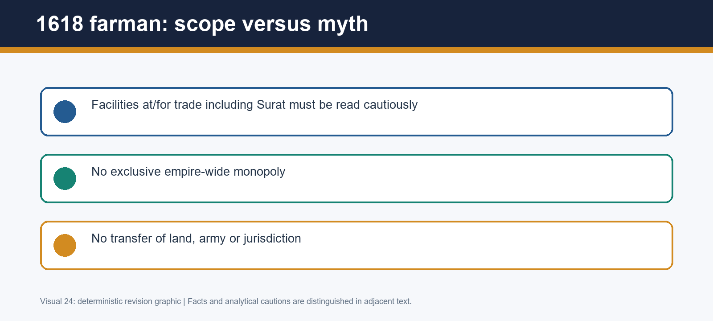

*Visual 24: 1618 farman: scope versus myth. Read it as a compact argument map; spatial diagrams marked schematic are not to scale.*

### Mains 5. Nur Jahan's authority - 20 marks

**Question:** Examine Nur Jahan's political authority without reducing it either to personal rule or ceremonial influence. Answer in 250 words.

**Model solution**

**Thesis.** Nur Jahan exercised exceptional, partly formalised authority through household access, patronage, kinship and documentary visibility. This was more than ceremonial influence, but it did not replace Jahangir as sovereign.

**Channels of power.** Her 1611 marriage placed her within the imperial household where access to the emperor, petitions and patronage could shape political outcomes. Her father Ghiyas Beg/Itimad-ud-Daulah and brother Asaf Khan were significant elite connections; Asaf Khan's daughter Arjumand Banu married Khurram. Such links made the household politically consequential, though they did not create a permanent automatic bloc.

**Public evidence.** Surviving farmans in Nur Jahan's name and coins carrying a linked authority formula are crucial. A farman demonstrates formal action in a particular named context; coinage demonstrates public representation and circulation. Together they make female authority materially visible beyond anecdote. The Itimad-ud-Daulah tomb, built for her father, further anchors patronage in durable architecture.

**Qualification.** Documents and coins cannot quantify every appointment or prove that Jahangir was an absentee. Jahangir continued to issue decisions, direct campaigns and sustain imperial persona. Gender analysis must also avoid generalisation: Nur Jahan's authority worked through a patriarchal household and did not establish political equality for women.

**Verdict.** She was an exceptional power-holder whose influence became especially consequential in later crisis politics, not an empress-regnant governing a separate constitutional office.

**Why this earns marks:** It has a clear middle thesis, names farmans, coins, kinship and architecture, explains what each proves, and places agency within institutional and gender limits.

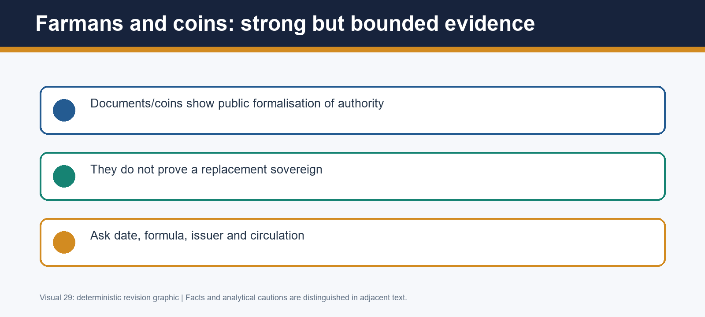

*Visual 29: Farmans and coins: strong but bounded evidence. Read it as a compact argument map; spatial diagrams marked schematic are not to scale.*

### Mains 6. Junta debate - 15 marks

**Question:** Critically examine the 'Nur Jahan junta' interpretation of Jahangir's court. Answer in 200 words.

**Model solution**

**Thesis.** The junta interpretation captures the visible rise of Nur Jahan's family but fails when used as a fixed, all-explaining coalition from 1611 onward.

**The claim.** Beni Prasad's model groups Nur Jahan, Itimad-ud-Daulah, Asaf Khan and Khurram. It directs attention to household patronage, promotions and marriage links - real mechanisms in a personal monarchy. It also prevents an implausible picture of the imperial harem as politically sealed off.

**The critique.** Nurul Hasan's evidence-led objection, taken up by Satish Chandra, notes that promotions were distributed beyond the family and that contemporary proof of a stable Nur Jahan-Khurram bloc during 1611-20 is lacking. Office, service, regional affiliation, rivalry and shifting access produced multiple networks. Thus family advancement does not establish a permanent junta.

**Periodisation.** A better model separates 1611-21 from the post-1622 crisis. After Itimad-ud-Daulah's death, Qandahar's loss, Jahangir's illness and Khurram's rebellion, succession politics sharpened and Nur Jahan's interventions became more visibly consequential. This is active politics, but not evidence that the same four persons had monopolised every earlier decision.

**Verdict.** Replace a static junta with shifting factional networks around a sovereign whose household was politically important but not institutionally sovereign.

**Why this earns marks:** It presents Beni Prasad fairly, uses Nurul Hasan/Satish Chandra as a specific critique, periodises the evidence, and retains rather than erases Nur Jahan's influence.

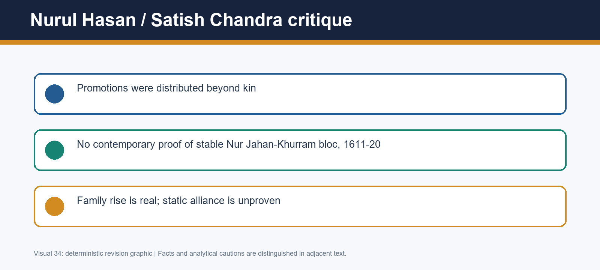

*Visual 34: Nurul Hasan / Satish Chandra critique. Read it as a compact argument map; spatial diagrams marked schematic are not to scale.*

### Mains 7. Khurram's rebellion - 20 marks

**Question:** Analyse the causes and consequences of Khurram's rebellion of 1622-25. Answer in 250 words.

**Model solution**

**Thesis.** Khurram's rebellion arose from a convergence of succession anxiety, frontier command, resources and court alignment; its consequence was to sharpen a latent dynastic problem and weaken coordination without ending Mughal capacity.

**Causes.** Khurram's earlier Mewar and Deccan service had given him military stature and the title Shah Jahan, making succession expectations politically weighty. The Safavid seizure of Qandahar in 1622 created a command crisis: the question of marching, obedience and risk could not be detached from his fear that absence would weaken his position at court. Jagir and resource issues mattered because rank financed service and armed followings. The rise of Shahryar, strengthened by marriage to Ladli Begum, and Nur Jahan's perceived alignment with him made access to the emperor a succession issue.

**Analysis.** No single factor is enough. A one-cause claim that Nur Jahan 'drove out' Khurram ignores the emperor's authority, the Qandahar emergency and material bargaining; an account of resources alone ignores kinship and dynastic legitimacy.

**Consequences.** Campaigning against a prince diverted men and resources from frontier coordination. It intensified noble realignment and made succession alternatives more explicit. Yet imperial forces operated, negotiations remained possible and Jahangir's state did not disappear.

**Verdict.** The rebellion exposed the costs of a personalised monarchy with several credible princes; it is a bridge to, not a substitute for, Topic 21's succession outcome.

**Why this earns marks:** It analyses causation across four linked dimensions, attaches named evidence to each, and separates immediate strain from the later accession narrative.

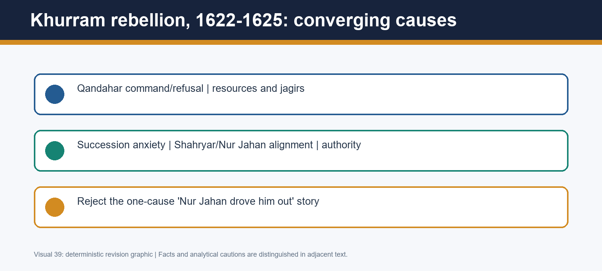

*Visual 39: Khurram rebellion, 1622-1625: converging causes. Read it as a compact argument map; spatial diagrams marked schematic are not to scale.*

### Mains 8. Mahabat Khan - 10 marks

**Question:** Why did Mahabat Khan's 1626 coup achieve immediate success but fail to create durable power? Answer in 150 words.

**Model solution**

**Thesis.** Mahabat Khan succeeded tactically because he captured the emperor at a vulnerable moment; he failed strategically because imperial power was wider than the emperor's physical custody.

**Immediate success.** During the Jhelum crossing, movement and surprise created an opening. Mahabat Khan's service network, including a Rajput contingent, enabled the seizure of Jahangir. In a ruler-centred monarchy, possession of the sovereign's person gave access to orders, audiences and the language of legitimacy.

**Why it failed.** The same act did not secure treasury, bureaucracy, wide noble acceptance or an alternative source of legitimacy. Accounts differ over the sequence of Nur Jahan's resistance and captivity, but they support a broader point: she could manoeuvre within household and imperial networks to detach supporters. Mahabat's coercion lacked the administrative and social breadth required to convert a coup into rule.

**Verdict.** The episode reveals a vulnerability of embodied sovereignty, yet its reversal proves that Mughal government was not reducible to a single armed seizure.

**Why this earns marks:** It directly answers the contrast, names Jhelum, Rajput support and Nur Jahan's manoeuvre, and explains the institutional gap rather than merely retelling the coup.

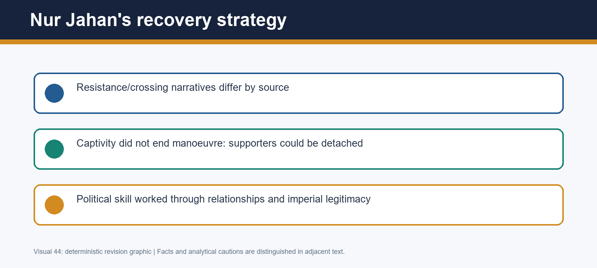

*Visual 44: Nur Jahan's recovery strategy. Read it as a compact argument map; spatial diagrams marked schematic are not to scale.*

### Mains 9. Jahangir as ruler - 15 marks

**Question:** Assess Jahangir as a ruler in the light of his personal reputation and political record. Answer in 200 words.

**Model solution**

**Thesis.** Jahangir's personal habits and illness shaped access to him, but the political record prevents a weak-ruler caricature. He governed through inherited institutions, public justice claims, campaigns and negotiated settlements.

**Record.** The Jahangirnama's twelve orders and chain of justice project a ruler attentive to rectitude and accessibility. They are evidence of political self-fashioning, not proof of universal justice. The 1615 Mewar settlement and 1620 Kangra capture show real capacity for consolidation. Composite nobility continued and jizyah was not restored, indicating broad institutional and religious-policy continuity with Akbar.

**Personal reputation and culture.** The memoir's natural-history observations and painting connoisseurship show an unusually observing courtly persona. Alcohol, opium and later health problems are historically relevant because they made access and household politics more consequential. They do not establish permanent abdication: Jahangir continued to rule and Nur Jahan's influence was exceptional rather than a substitute monarchy.

**Qualification.** Qandahar's loss, Deccan limits, Khurram's rebellion and Mahabat's coup are substantial failures or stresses. They demonstrate that consolidation was incomplete.

**Verdict.** Jahangir was a capable but constrained ruler whose record is best understood as continuity under escalating pressures, not as either golden calm or helpless decline.

**Why this earns marks:** It balances persona, sources, achievements and setbacks, and turns personal habits into a political-access argument instead of a moral judgement.

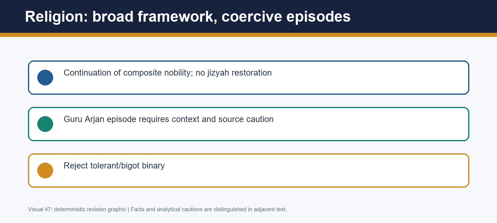

*Visual 47: Religion: broad framework, coercive episodes. Read it as a compact argument map; spatial diagrams marked schematic are not to scale.*

### Mains 10. Sources and overall verdict - 20 marks

**Question:** How should historians use the Jahangirnama, court chronicles, material evidence and European accounts to assess Jahangir's reign? Answer in 250 words.

**Model solution**

**Thesis.** A sound assessment emerges from a source-reach matrix, not from selecting one flattering or hostile narrative. Each source proves a different kind of claim.

**Jahangirnama.** The memoir is central for chronology, the emperor's account of Guru Arjan, the chain of justice, early orders and natural observation. It gives access to rulerly self-fashioning and reported decisions. Its limitations are equally productive: a royal claim to accessible justice is not a complaint register, and later continuation/editorial transmission means that authorship and edition must be identified.

**Court and material sources.** Mutamad Khan's Iqbalnama and other Persian chronicles can check sequence and provide alternative court narratives, but patronage and retrospective rhetoric matter. Nur Jahan's farmans and coins are strong evidence for formal public authority; they cannot prove total control. The Itimad-ud-Daulah tomb is durable evidence of family patronage and architectural change, not proof of a permanent junta. Paintings illuminate hierarchy and ideology, not camera-like events.

**European and community sources.** Roe, Hawkins and factory records show commercial negotiations, rank problems and merchant priorities. Their commercial lens cannot stand for the whole empire. Sikh traditions are indispensable to the memory and meaning of Guru Arjan's execution, while requiring chronological and genre awareness.

**Verdict.** Triangulation supports a graded conclusion: Jahangir's reign combined genuine consolidation with stressed frontiers and shifting court networks. It rejects the weak-ruler, total-Nur-Jahan-rule and fixed-junta shortcuts without erasing coercion or female agency.

**Why this earns marks:** It defines what each source can and cannot prove, uses concrete examples, and turns method into a substantive balanced verdict.

*Visual 52: Source reach matrix. Read it as a compact argument map; spatial diagrams marked schematic are not to scale.*

## Final workbook exit check

- I can write Mewar as suzerainty plus honour, not annexation.
- I can explain farman/factory access without territorial teleology.
- I can use Nur Jahan's documents as formal authority without calling her a replacement sovereign.
- I can replace the junta slogan with a dated shifting-network argument.
- I can distinguish memoir representation from transparent administrative reality.

