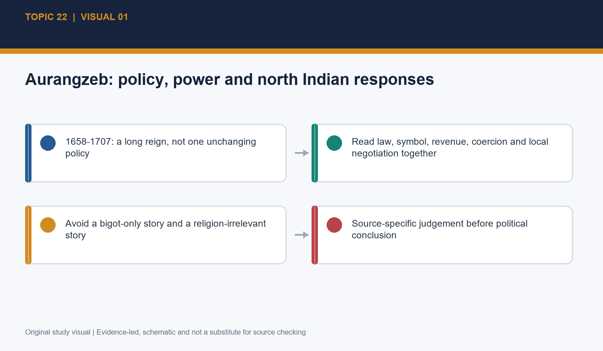
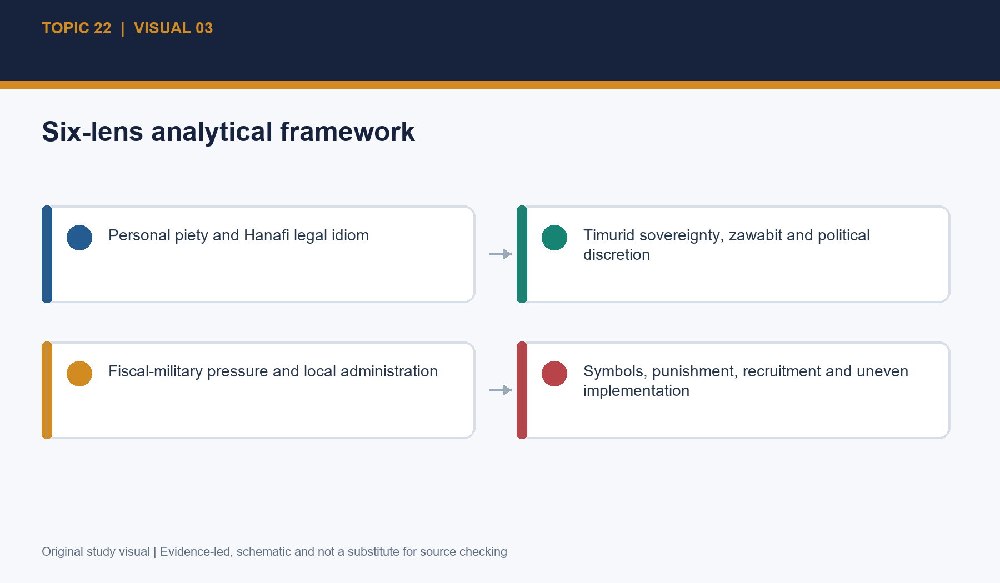
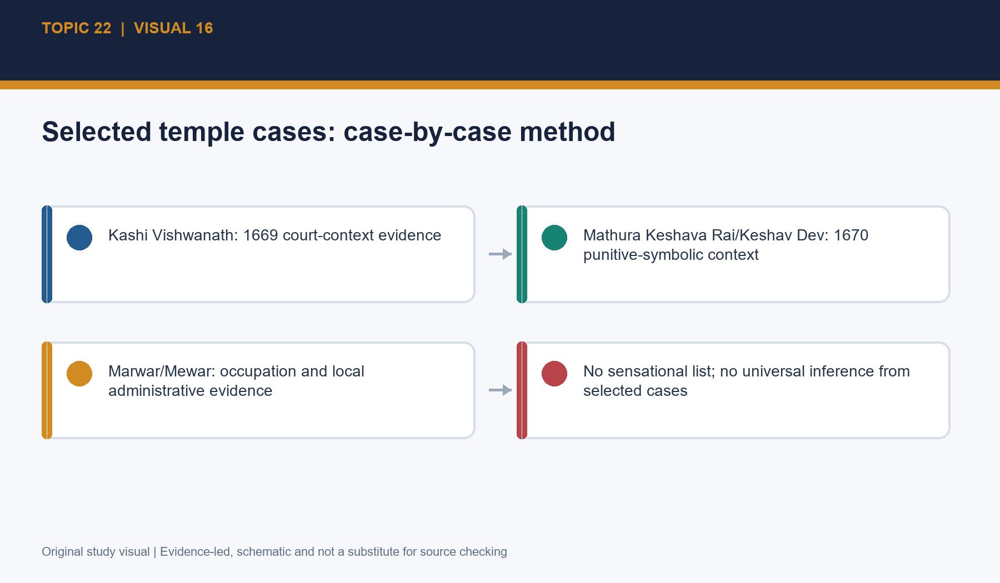
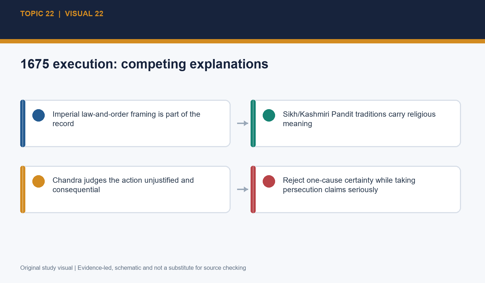
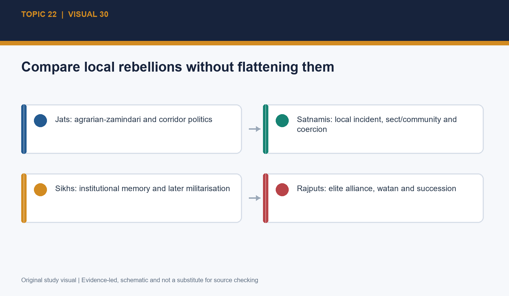

# Medieval History 22 — Aurangzeb: Religious Policy, North India & the Rajputs — Premium Solved PYQ Workbook

## Verified PYQ status and workbook instruction

Local official/OCR CSE 2018–2025 Prelims and GS-I material plus the available routing/ownership material were searched for exact direct questions on Aurangzeb's religious policy, jizyah, temples, Guru Tegh Bahadur, Jats, Satnamis, Marwar-Mewar, Durgadas, Prince Akbar and Rajput relations. **No direct verified CSE owner PYQ was found.** Adjacent generic Sikh, Maratha/Deccan and culture questions are deliberately not misrouted. No unofficial wording or key is dressed up as official. This is therefore a premium original-practice workbook with transparent PYQ gap status.

*Visual 1: Aurangzeb: policy, power and north Indian responses. Original topic-specific study visual; schematic maps are explicitly NOT TO SCALE.*

# PART I - COMPACT EVIDENCE BANKS

## Bank 1 — Policy frame

Use the six-lens frame: personal piety; Hanafi legal idiom; Timurid sovereignty and zawabit; political calculation; local administration; fiscal-military circumstances. The answer quality test is whether it can explain both jizyah and continued Hindu elite recruitment without collapsing one into the other. Fatawa-i-Alamgiri is an imperially sponsored Hanafi compendium, not a modern constitution. Court symbol, legal text and local practice must be kept distinct.

*Visual 3: Six-lens analytical framework. Original topic-specific study visual; schematic maps are explicitly NOT TO SCALE.*

## Bank 2 — Jizyah and temple evidence

Jizyah was reimposed in 1679 and is a poll tax, not land revenue or customs. Its fiscal form, religious-status symbolism and political signal can all be analysed. Do not attach unverified rates or yield. For temples, classify an action precisely and state source reach. The 1669 order, Kashi/Mathura cases, local Marwar-Mewar actions and grants/protection must be treated as different evidence units; neither a grant nor a demolition settles the whole empire.

*Visual 12: Implementation limits and political effect. Original topic-specific study visual; schematic maps are explicitly NOT TO SCALE.*

*Visual 16: Selected temple cases: case-by-case method. Original topic-specific study visual; schematic maps are explicitly NOT TO SCALE.*

## Bank 3 — North Indian responses

Guru Tegh Bahadur's 1675 execution requires a source matrix: Mughal law-order framing, Sikh martyr tradition and Chandra's assessment of an unjustified act with major repercussions. Gokula's Mathura-region rising and the Satnami revolt at Narnaul in 1672 demonstrate local mobilisation under pressure, but they were neither one movement nor a proof of instant collapse. Retain agrarian, local power, community and coercion dimensions.

*Visual 22: 1675 execution: competing explanations. Original topic-specific study visual; schematic maps are explicitly NOT TO SCALE.*

*Visual 30: Compare local rebellions without flattening them. Original topic-specific study visual; schematic maps are explicitly NOT TO SCALE.*

## Bank 4 — Rajput rupture

Jaswant Singh died at Jamrud in 1678 without a surviving male heir at that moment; posthumous claimants make “died childless” inaccurate. Khalisa means crown-revenue administration and had precedents; official conduct, Inder Singh's favour, Ajit's claim, Durgadas and Rathor honour transformed a succession difficulty into resistance. Mewar's motives included kinship, autonomy, security and interference, not jizyah alone. Prince Akbar's 1681 revolt failed but did not repair trust. Ajit's 1698 recognition was limited.

*Visual 36: Khalisa after Jaswant: precedent, not automatic verdict. Original topic-specific study visual; schematic maps are explicitly NOT TO SCALE.*

*Visual 44: Marwar-Mewar chronology. Original topic-specific study visual; schematic maps are explicitly NOT TO SCALE.*

# PART I-B - EXAMINER'S DISCRIMINATION DRILLS

Each drill converts a common contentious claim into an evidence-led response. These are not extra facts; they are answer-writing tests.

## Drill 1 — Chronology as causal discipline

**Claim to test:** A date sequence should separate coexistence from causation. The 1669 Jat disturbance and temple-order context, the 1672 Satnami revolt, the 1675 execution, the 1678-79 Marwar rupture, and the 1681 revolt arose in different arenas. Their closeness in time is a reason to ask how policy signals travelled, not proof that one central instruction mechanically produced all of them.

**Evidence-and-mechanism response:** Use the 1658-1707 ladder to identify the institutional arena—court, revenue apparatus, local official, religious community, Rajput house or dynastic faction—before supplying a motive. This prevents a familiar essay from treating a tax, a succession dispute and a local clash as interchangeable evidence.

**Qualification:** The important qualification is that chronology alone cannot settle motive. It can rule out careless claims, such as making the 1681 revolt the origin of the 1678 succession crisis, but it must be joined to source reach, locality and political mechanism.

**Exam move:** In an answer, add a five-date micro-timeline beside the opening thesis. It makes the causal argument visible without wasting words on a ruler-by-ruler narrative.

## Drill 2 — Law, compendium and administration

**Claim to test:** A legal text has at least three possible reaches: it may reveal juristic opinion, inform courtly legitimacy and be invoked by an official. It does not automatically demonstrate a uniform rule in a village or district. The Fatawa-i-Alamgiri is particularly useful for demonstrating imperially valued Hanafi learning, not for proving that every branch of governance became a codified legal bureaucracy.

**Evidence-and-mechanism response:** Pair the compendium with the category of zawabit. A Timurid emperor could sponsor scholarship, appoint qazis and use a legal idiom while also issuing administrative regulations, making political exceptions and selecting between authorities. The object of explanation is the imperial decision and its execution, not a false institutional choice between law and politics.

**Qualification:** A caution follows for the ulama. Religious specialists had appointments, interests and local settings; they were not a single machine that replaced sovereign power. A qazi's role in collection or adjudication may create a particular local effect without defining all religious specialists or every district.

**Exam move:** In a 10-marker, define sharia and zawabit in one line, then test the distinction through jizyah or a temple case. This earns marks because it turns terminology into an explanatory tool.

## Drill 3 — Jizyah as a contact point

**Claim to test:** Jizyah should be imagined not only as a column in an imperial ledger but as a contact point between legal status, collector, payer and local authority. That makes a discussion of collection machinery historically important even where exact totals are unavailable. An administrative system can produce delays, exemptions, discretion, corruption or harassment; it can also be uneven across regions.

**Evidence-and-mechanism response:** Satish Chandra's observation that jizyah did not rally Muslims or resolve state problems is a better conclusion than an invented revenue figure. The measure had fiscal form, but the public act of reimposition after Akbar carried a symbolic reversal. These two propositions are compatible: a tax can yield uncertain revenue while changing how subjects read the state.

**Qualification:** The caution is symmetrical. One should not announce universal oppression from a legal category, and one should not make collection difficulty proof of harmlessness. Evidence must show locality, actor and result. Where the record is silent, write that the effect is likely differentiated rather than filling the gap with a total claim.

**Exam move:** For Mains, draw the fiscal-symbol-signal matrix and end by stating that jizyah reinforced rather than created every conflict. This blocks both the 'only fiscal' and 'only religious' traps.

## Drill 4 — Temple claims as source tests

**Claim to test:** A sensitive temple claim should be dismantled into answerable questions. What precise site is named? When is the action dated? Does the source describe demolition, conversion, seizure, closure, restriction or a grant? Is the source a court chronicle, a local record, a farman, an inscription, a tradition or a modern retelling? This procedure is not evasive; it is how a claim becomes historical evidence.

**Evidence-and-mechanism response:** The Kashi and Mathura cases are useful because their names and the 1669-70 context allow a focused discussion. They do not license a total list, nor does a later temple grant elsewhere undo them. A source-grounded paragraph may explain a legal ideal concerning older places, a documented departure in a named case, and the risk of universalising either proposition.

**Qualification:** The key qualification is that uncertainty varies. A securely dated, corroborated action is stronger than a later local story; a local story is not worthless merely because it is not a court text. It must be labelled according to its provenance and corroboration. Modern litigation is a separate legal process and cannot fill the evidentiary gap for the medieval past.

**Exam move:** In an answer, use the verbs exactly. 'Destroyed' is not interchangeable with 'converted' or 'confiscated'; this precision is a substantive argument about motive, aftermath and reach.

## Drill 5 — Guru Tegh Bahadur: consequence without simplification

**Claim to test:** The 1675 execution can be examined through two linked but distinct questions: what explanations contemporaries and traditions provide for the act, and what political-religious consequences it acquired. Mughal law-and-order framing answers the first question from an official perspective. Sikh martyr tradition answers it from a community memory and ethical perspective. Neither source should be made to disappear.

**Evidence-and-mechanism response:** The consequence is historically large even where an exclusive immediate motive cannot be settled. Chandra's judgement that the action was unjustified, and the later centrality of martyr memory, explain why it mattered for Sikh identity. The Khalsa in 1699 then provides a dated organisational landmark, but a responsible answer adds leadership, discipline, local politics and continuing conflict as mediating factors.

**Qualification:** The qualification is not a denial of religious persecution or of Sikh tradition. It is a refusal to claim that one execution mechanically produced every later development or that all early Sikh-Mughal interaction had the same character. A source matrix makes the distinction clear.

**Exam move:** For a 15-marker, put 'immediate framing' and 'long-term meaning' in separate headings. It satisfies directive fidelity and prevents a simple chronicle of martyrdom from replacing analysis.

## Drill 6 — Jats and Satnamis: compare mechanisms, not labels

**Claim to test:** The Jat rising around Gokula and the Satnami revolt should be compared through mechanism. In the Mathura corridor, agrarian production, zamindar power, routes and official coercion gave a local conflict wider significance. At Narnaul, a triggering clash could become a community mobilisation in a sectarian setting. Both cases show that the imperial state encountered local societies through intermediaries, force and revenue rather than only at court.

**Evidence-and-mechanism response:** Their differences are as important as their similarities. Jat recurrence under Rajaram and later Churaman points toward a longer regional political process; it does not retrospectively create a sovereign Bharatpur state at the moment of Gokula's uprising. The Satnami revolt was quickly suppressed; that shows continued imperial capacity while leaving intact the evidence of grievance and mobilisation.

**Qualification:** The qualification is aimed at two opposite errors: calling every episode religious ignores agrarian/local power, while calling every episode class conflict ignores community identities and cultural claims where sources supply them. A named local official, revenue demand or sacred grievance should be used only at the scope the source permits.

**Exam move:** In an answer, use a compact comparison table—region, social base, trigger, response, result—and conclude that multiple conflicts were not a coordinated national programme.

## Drill 7 — Marwar: administration becomes legitimacy crisis

**Claim to test:** The analytical gain from Waqa-i-Ajmer and Jodhpur Hukumat-ri-Bahi is not that they deliver one final motive, but that they show why administrative form and political experience must be read together. Khalisa control after a disputed succession had precedents and may have been connected with debt. That fact blocks a simple annexation claim. It does not make the actual occupation benign or politically neutral.

**Evidence-and-mechanism response:** Jaswant Singh's death left no surviving male heir at that moment, while posthumous claimants made Ajit's title central. Favour to Inder Singh, property searches, military occupation and uncertainty about custody or division made a technical succession management appear to threaten a watan. Durgadas and Rathor sardars could therefore turn a claimant into a rallying symbol.

**Qualification:** The qualification concerns narrative detail. The various escape and conversion/custody stories should be version-labelled. A strong answer keeps the secure political core—resistance coalesced around Ajit and Durgadas—without treating every later dramatic episode as an archive-certified transcript.

**Exam move:** For Mains, explain why a policy with precedent could still fail: precedent is not trust, and a succession rule without credible honour and local restraint can produce the resistance it is designed to prevent.

## Drill 8 — Mewar and the 1681 dynastic opening

**Claim to test:** Mewar's role makes clear that the Rajput conflict was not only an internal Marwar succession. Rana Raj Singh could see imperial occupation and succession interference as a threat to regional balance, kinship ties, security and autonomy. Jizyah supplied a broader signal of differentiation but cannot be assigned the whole causal burden. The Aravalli setting also turned a political dispute into a logistical and territorial problem.

**Evidence-and-mechanism response:** Prince Akbar's 1681 revolt introduced a dynastic alternative. Support from parts of the Rathor/Mewar political world and Durgadas's role made it more than a local raid, yet the coalition was contingent rather than universal. The collapse demonstrates the limits of a claim to the throne built on a fragile alliance. It should not be retold as a story of all Rajputs acting as one nation.

**Qualification:** The forged-letter episode is an excellent test of provenance discipline. It may be important to later explanation, but a source-sensitive answer labels its evidentiary standing rather than building an entire causal account on a famous anecdote. The documented political result is clearer: failure did not restore trust.

**Exam move:** Use the contrast 'failed rebellion / enduring breach' in a conclusion. It gives a precise answer to questions about military outcome and political prestige.

# PART II - ORIGINAL MCQS WITH SOLUTIONS

## Learning MCQs — original (correct options A-B-C-D x5)

*Original practice. Correct options rotate A -> B -> C -> D independently in this set; no item is presented as a verified CSE PYQ.*

### Learning MCQs 1
Which formulation best captures Aurangzeb's reign for historical analysis?
- **A.** Personal orthodoxy, legal idiom, sovereignty, politics and uneven administration interacted.
- **B.** Religion alone explains every policy and rebellion.
- **C.** Politics alone makes religious policy irrelevant.
- **D.** The ulama replaced the emperor as sovereign.

**Answer: A — Personal orthodoxy, legal idiom, sovereignty, politics and uneven administration interacted.**

**Explanation:** It preserves both agency and institution; the closest distractor, 'politics alone', wrongly removes the documented legal-symbolic dimension.

### Learning MCQs 2
Which pair is correctly matched?
- **A.** Jai Singh — death in 1658.
- **B.** Aurangzeb — reign from 1658 to 1707.
- **C.** Jaswant Singh — death in 1667.
- **D.** Ajit Singh — recognition in 1679.

**Answer: B — Aurangzeb — reign from 1658 to 1707.**

**Explanation:** 1658-1707 is the secure reign span; the closest distractor reverses the dated roles of Jai Singh and Jaswant Singh.

### Learning MCQs 3
Why is the Fatawa-i-Alamgiri not safely described as a modern constitution?
- **A.** It was a village revenue register.
- **B.** It abolished imperial regulations.
- **C.** It was a collective Hanafi legal compendium whose uniform enforcement cannot be presumed.
- **D.** It was written after Aurangzeb's death.

**Answer: C — It was a collective Hanafi legal compendium whose uniform enforcement cannot be presumed.**

**Explanation:** The discriminator is compendium versus statute; the 'abolished regulations' option ignores zawabit and imperial discretion.

### Learning MCQs 4
What does zawabit most usefully indicate in this context?
- **A.** A hereditary Rajput homeland.
- **B.** A jizyah collection category.
- **C.** A Sikh initiation rite.
- **D.** Ruler-made administrative regulations alongside legal idiom.

**Answer: D — Ruler-made administrative regulations alongside legal idiom.**

**Explanation:** Zawabit concerns imperial regulation; the closest distractor confuses it with watan, a distinct Rajput political vocabulary.

### Learning MCQs 5
Which inference is safest about court puritan measures?
- **A.** A court-centred measure needs separate evidence before being made an empire-wide social claim.
- **B.** Every reported measure was uniformly enforced.
- **C.** No symbolic measure had political meaning.
- **D.** All reports are mere folklore.

**Answer: A — A court-centred measure needs separate evidence before being made an empire-wide social claim.**

**Explanation:** Scale is the discriminator: court action can matter without proving universal compliance; 'no meaning' is the opposite overcorrection.

### Learning MCQs 6
Jizyah should be distinguished most directly from:
- **A.** A poll tax in legal-political idiom.
- **B.** Land revenue and customs duties.
- **C.** A measure reimposed in 1679.
- **D.** A policy with symbolic effects.

**Answer: B — Land revenue and customs duties.**

**Explanation:** Jizyah is not kharaj/land revenue or customs; the closest distractor states a true but non-distinguishing feature.

### Learning MCQs 7
Which is a defensible account of motives for jizyah in 1679?
- **A.** Only a proven revenue crisis explains it.
- **B.** Only private piety explains it.
- **C.** Orthodoxy, legitimacy, political signalling and fiscal context can be weighed without assigning one exclusive motive.
- **D.** It had no political meaning because collection varied.

**Answer: C — Orthodoxy, legitimacy, political signalling and fiscal context can be weighed without assigning one exclusive motive.**

**Explanation:** The correct answer keeps motive plural and qualified; 'only private piety' mistakes one relevant factor for a complete proof.

### Learning MCQs 8
What is the safest conclusion about jizyah's effects?
- **A.** It uniformly reached every non-Muslim subject.
- **B.** It solved the empire's fiscal problems.
- **C.** It instantly ended Hindu elite service.
- **D.** Its uneven collection did not prevent a substantial symbolic and alienating effect.

**Answer: D — Its uneven collection did not prevent a substantial symbolic and alienating effect.**

**Explanation:** Uneven implementation is not political insignificance; the closest distractor overstates universal collection.

### Learning MCQs 9
Which distinction is essential in temple-policy analysis?
- **A.** Demolition, conversion, confiscation, restriction and grant are separate actions.
- **B.** Every temple case proves a universal order.
- **C.** A grant proves no destruction elsewhere.
- **D.** A court text proves identical village practice.

**Answer: A — Demolition, conversion, confiscation, restriction and grant are separate actions.**

**Explanation:** Action taxonomy is the discriminator; the closest distractor wrongly lets one type of evidence settle the whole empire.

### Learning MCQs 10
How should the 1669 temple/schools order be used?
- **A.** As an undated universal destruction order.
- **B.** As a chronicle-context claim whose wording, cases and follow-through must be assessed.
- **C.** As proof no old temple was ever harmed.
- **D.** As a modern court finding.

**Answer: B — As a chronicle-context claim whose wording, cases and follow-through must be assessed.**

**Explanation:** Chronicle genre and precise reach matter; the universal-order option converts a difficult text into a claim it cannot bear alone.

### Learning MCQs 11
What does a documented temple grant most directly establish?
- **A.** That no punitive temple action occurred elsewhere.
- **B.** That all temples were legally equal.
- **C.** A particular transaction or protection in its stated context.
- **D.** That court chronicles are useless.

**Answer: C — A particular transaction or protection in its stated context.**

**Explanation:** Case-specific reach is the discriminator; the closest distractor mistakes counter-evidence to a universal claim for total exoneration.

### Learning MCQs 12
Which statement best handles Hindu participation in Mughal service?
- **A.** It proves all religious differentiation disappeared.
- **B.** It proves no Rajput resisted.
- **C.** It makes jizyah economically impossible.
- **D.** Continued service shows elite incorporation but does not demonstrate mass religious equality.

**Answer: D — Continued service shows elite incorporation but does not demonstrate mass religious equality.**

**Explanation:** Inclusion and equality are different questions; the closest distractor converts an elite pattern into a total social conclusion.

### Learning MCQs 13
Why are precise late-reign nobility percentages risky without a citation?
- **A.** A percentage needs a date, denominator and defined category.
- **B.** Percentages are never useful in history.
- **C.** Recruitment ended after 1679.
- **D.** Only Rajputs could hold mansabs.

**Answer: A — A percentage needs a date, denominator and defined category.**

**Explanation:** Quantification is valid only when specified; the closest distractor falsely claims recruitment stopped.

### Learning MCQs 14
What is the most evidence-sensitive account of Guru Tegh Bahadur's execution?
- **A.** One source can settle every motive beyond dispute.
- **B.** Imperial law-and-order framing and Sikh martyr-memory accounts must both be located and assessed.
- **C.** It had no religious consequence.
- **D.** It alone mechanically created the Khalsa.

**Answer: B — Imperial law-and-order framing and Sikh martyr-memory accounts must both be located and assessed.**

**Explanation:** The key is source reach and consequence; the closest distractor mistakes a profound antecedent for a sole cause of 1699.

### Learning MCQs 15
Which date pair is correctly matched?
- **A.** Jizyah — 1675; Khalsa — 1679.
- **B.** Jaswant Singh's death — 1699; Khalsa — 1707.
- **C.** Guru Tegh Bahadur's execution — 1675; Khalsa — 1699.
- **D.** Satnami revolt — 1669; Khalsa — 1681.

**Answer: C — Guru Tegh Bahadur's execution — 1675; Khalsa — 1699.**

**Explanation:** 1675 and 1699 are the secure anchors; the closest distractor interchanges the jizyah and execution dates.

### Learning MCQs 16
Why should the Khalsa not be explained by one event alone?
- **A.** The Khalsa had no relation to earlier Sikh history.
- **B.** Only hill chiefs caused Sikh change.
- **C.** The 1675 execution had no importance.
- **D.** Organisation, leadership, memory and local political conflict also shaped Sikh militarisation.

**Answer: D — Organisation, leadership, memory and local political conflict also shaped Sikh militarisation.**

**Explanation:** Multi-causality is the discriminator; the closest distractor denies the execution's consequence rather than resisting monocausality.

### Learning MCQs 17
What is the strongest frame for Gokula's Jat uprising?
- **A.** Local power, agrarian pressure, official coercion and community mobilisation interacted.
- **B.** A single temple issue fully explains it.
- **C.** It was already the Bharatpur state.
- **D.** It was a coordinated all-India rebellion.

**Answer: A — Local power, agrarian pressure, official coercion and community mobilisation interacted.**

**Explanation:** The correct answer preserves the Mathura-region complexity; the closest distractor converts later political formation into an immediate outcome.

### Learning MCQs 18
What does the Satnami revolt of 1672 most clearly illustrate?
- **A.** The Mughal Empire had already collapsed.
- **B.** A local confrontation could escalate through sect/community mobilisation and be rapidly suppressed.
- **C.** All local rebellions shared one programme.
- **D.** Satnamis controlled Mewar.

**Answer: B — A local confrontation could escalate through sect/community mobilisation and be rapidly suppressed.**

**Explanation:** Rapid suppression and escalation belong together; the closest distractor mistakes a local rising for proof of total collapse.

### Learning MCQs 19
Which proposition about Rajput policy before 1678 is best supported?
- **A.** He planned Rajput destruction from accession.
- **B.** All Rajputs were excluded from mansabs.
- **C.** Aurangzeb initially used and valued leading Rajput service, including Jai Singh and Jaswant Singh.
- **D.** The Marwar crisis began with Akbar's revolt.

**Answer: C — Aurangzeb initially used and valued leading Rajput service, including Jai Singh and Jaswant Singh.**

**Explanation:** Early partnership is the key chronological control; the closest distractor reverses the later 1681 revolt and 1678 succession crisis.

### Learning MCQs 20
What did watan mean most centrally in the Marwar conflict?
- **A.** A temporary jizyah exemption.
- **B.** An imperial legal compendium.
- **C.** A Deccan military grant.
- **D.** Hereditary homeland and authority whose recognition affected honour and service.

**Answer: D — Hereditary homeland and authority whose recognition affected honour and service.**

**Explanation:** Watan denotes hereditary territorial-political stake; the closest distractor confuses it with jagir-like revenue assignment.

## Broad MCQs — original (correct options A-B-C-D x11)

*Original practice. Correct options rotate A -> B -> C -> D independently in this set; no item is presented as a verified CSE PYQ.*

### Broad MCQs 1
Which formulation about Jaswant Singh's death is accurate?
- **A.** He died at Jamrud in 1678 without a surviving male heir at that moment; posthumous claims followed.
- **B.** He died childless in 1679 and left no claimant.
- **C.** He died in Jodhpur after Ajit's recognition.
- **D.** He was killed in the 1681 revolt.

**Answer: A — He died at Jamrud in 1678 without a surviving male heir at that moment; posthumous claims followed.**

**Explanation:** The qualification about posthumous claimants prevents the misleading 'childless' shorthand; the closest distractor erases Ajit's legitimacy.

### Broad MCQs 2
What did taking Marwar into khalisa automatically mean?
- **A.** It legally ended all Rathor hereditary claims.
- **B.** It meant crown-revenue administration, not automatically permanent annexation.
- **C.** It made Inder Singh emperor.
- **D.** It abolished Rajput service elsewhere.

**Answer: B — It meant crown-revenue administration, not automatically permanent annexation.**

**Explanation:** Khalisa is an administrative category; the closest distractor mistakes temporary imperial control for a final political verdict.

### Broad MCQs 3
Why are Waqa-i-Ajmer and Jodhpur Hukumat-ri-Bahi valuable?
- **A.** They are neutral complete archives of all India.
- **B.** They replace all court chronicles.
- **C.** They add local detail on succession, debt and administrative context.
- **D.** They prove every later bardic episode literally.

**Answer: C — They add local detail on succession, debt and administrative context.**

**Explanation:** Their local specificity is the strength and limit; the closest distractor turns a valuable source into a total archive.

### Broad MCQs 4
What is the secure core of Durgadas's role?
- **A.** Every escape-story detail is independently verified.
- **B.** He led the Satnami revolt.
- **C.** He permanently expelled the Mughals in 1679.
- **D.** He became central to Rathor resistance and protection of Ajit's claim.

**Answer: D — He became central to Rathor resistance and protection of Ajit's claim.**

**Explanation:** The stable political role matters more than embellishment; the closest distractor treats varying rescue narratives as uniformly proven.

### Broad MCQs 5
Which factor did NOT by itself explain failure of compromise in Marwar?
- **A.** A single, uncomplicated religious motive.
- **B.** Honour and distrust over custody.
- **C.** Occupation and official conduct.
- **D.** Factional and centralising pressures.

**Answer: A — A single, uncomplicated religious motive.**

**Explanation:** The Marwar crisis is multi-causal; the closest distractor ignores succession and watan politics.

### Broad MCQs 6
Why did Mewar support Marwar?
- **A.** Jizyah alone mechanically determined the decision.
- **B.** Kinship, concern about imperial interference, security and Rajput autonomy mattered alongside jizyah's signal.
- **C.** Mewar had no interest in Marwar's succession.
- **D.** All Mewar elites joined Prince Akbar in 1678.

**Answer: B — Kinship, concern about imperial interference, security and Rajput autonomy mattered alongside jizyah's signal.**

**Explanation:** The correct answer has multiple motives; the closest distractor reduces a political decision to one tax.

### Broad MCQs 7
What terrain lesson follows from the Mewar war?
- **A.** Terrain made all Mughal occupation impossible.
- **B.** Mewar lay on the Bengal delta.
- **C.** Aravalli hill conditions increased the value of mobility, passes and local knowledge.
- **D.** Rajput warfare had no logistical dimension.

**Answer: C — Aravalli hill conditions increased the value of mobility, passes and local knowledge.**

**Explanation:** Terrain shapes rather than predetermines outcomes; the closest distractor turns a strategic advantage into impossibility.

### Broad MCQs 8
How should the forged-letter episode in Prince Akbar's revolt be presented?
- **A.** As conclusive proof of every Rajput motive.
- **B.** As a jizyah regulation.
- **C.** As an event before Jaswant's death.
- **D.** As a provenance-sensitive account, not an independently settled explanatory fact.

**Answer: D — As a provenance-sensitive account, not an independently settled explanatory fact.**

**Explanation:** The relevant discriminator is source status; the closest distractor asks the episode to carry far more causal weight than its provenance permits.

### Broad MCQs 9
Which outcome of the 1681 revolt is accurate?
- **A.** The dynastic challenge failed, but it did not restore trust or end Rajput resistance.
- **B.** Prince Akbar immediately became emperor.
- **C.** All Rajput houses left Mughal service.
- **D.** Ajit was fully restored in 1681.

**Answer: A — The dynastic challenge failed, but it did not restore trust or end Rajput resistance.**

**Explanation:** Failure of a revolt is not repair of a political breach; the closest distractor confuses later 1698 recognition with 1681.

### Broad MCQs 10
What is the safest account of Ajit's 1698 recognition?
- **A.** It fully restored the pre-1678 compact.
- **B.** It was a limited settlement; Mughal control over Jodhpur remained an issue.
- **C.** It permanently ended all conflict by 1698.
- **D.** It preceded Jaswant Singh's death.

**Answer: B — It was a limited settlement; Mughal control over Jodhpur remained an issue.**

**Explanation:** Recognition with limits is the key; the closest distractor converts a compromise into complete restoration.

### Broad MCQs 11
Why does continued Hada/Kachhwaha service matter?
- **A.** It proves Marwar-Mewar suffered no political cost.
- **B.** It makes all temple evidence false.
- **C.** It shows differentiated Rajput politics rather than universal secession.
- **D.** It makes jizyah a land tax.

**Answer: C — It shows differentiated Rajput politics rather than universal secession.**

**Explanation:** Continued service qualifies a universal claim; the closest distractor wrongly uses it to erase the serious breach.

### Broad MCQs 12
What is meant by the political cost exceeding immediate military cost?
- **A.** The Rajputs defeated every Mughal army.
- **B.** No military resources were used.
- **C.** The empire fell immediately in 1681.
- **D.** Prestige and confidence in Mughal guarantees could be damaged even when later fighting used limited forces.

**Answer: D — Prestige and confidence in Mughal guarantees could be damaged even when later fighting used limited forces.**

**Explanation:** Legitimacy can have strategic value; the closest distractor turns a qualified cost argument into an impossible absolute.

### Broad MCQs 13
How should Topic 22 connect to the Deccan?
- **A.** As a bounded timing and cooperation problem; Topic 23 owns the full Deccan narrative.
- **B.** By explaining every Rajput event as a Maratha event.
- **C.** By inventing precise Rajasthan-to-Deccan budgets.
- **D.** By ignoring the Deccan after 1681.

**Answer: A — As a bounded timing and cooperation problem; Topic 23 owns the full Deccan narrative.**

**Explanation:** The bridge is political-resource interaction; the closest distractor supplies unsupported budgets.

### Broad MCQs 14
Which comparison of Akbar and Aurangzeb is most defensible?
- **A.** Akbar never used force.
- **B.** Compare inclusive idiom, fiscal differentiation, elite bargains and political contexts, not moral caricatures.
- **C.** Aurangzeb never recruited Hindus.
- **D.** Their policies were identical in every respect.

**Answer: B — Compare inclusive idiom, fiscal differentiation, elite bargains and political contexts, not moral caricatures.**

**Explanation:** A common yardstick is needed; the closest distractor makes an absolute claim contradicted by continued composite service.

### Broad MCQs 15
What does 'victim and maker of circumstances' invite?
- **A.** Excuse every decision as inevitable.
- **B.** Treat personality as the sole cause.
- **C.** Weigh inherited constraints with Aurangzeb's own policy choices.
- **D.** Avoid evidence because motives are complex.

**Answer: C — Weigh inherited constraints with Aurangzeb's own policy choices.**

**Explanation:** Structure and agency must be jointly analysed; the closest distractor turns context into exoneration.

### Broad MCQs 16
Which source has the strongest direct reach for a particular grant?
- **A.** A general modern polemic.
- **B.** An unrelated traveller's anecdote.
- **C.** A later undated internet list.
- **D.** The dated farman or record of that grant.

**Answer: D — The dated farman or record of that grant.**

**Explanation:** Specificity and provenance matter; the closest distractor replaces a case record with a general claim.

### Broad MCQs 17
What can a court chronicle most reliably contribute?
- **A.** Official chronology and ideology, with attention to selection and silence.
- **B.** A complete social census.
- **C.** An automatically neutral local record.
- **D.** A guarantee of uniform implementation.

**Answer: A — Official chronology and ideology, with attention to selection and silence.**

**Explanation:** Genre is the discriminator; the closest distractor overextends official narrative into a social census.

### Broad MCQs 18
Why is modern litigation not proof of a medieval event?
- **A.** Courts can never examine archives.
- **B.** Pleadings and modern adjudication answer present legal questions, not automatically historical proof.
- **C.** All historical sources are equally weak.
- **D.** A claim needs no medieval provenance.

**Answer: B — Pleadings and modern adjudication answer present legal questions, not automatically historical proof.**

**Explanation:** The boundary is evidentiary reach; the closest distractor mistakes a current claim for a dated historical source.

### Broad MCQs 19
What is the final causal verdict on religious policy and decline?
- **A.** It had no political effect.
- **B.** It explains every Deccan outcome.
- **C.** It was contributory to weakened legitimacy, not a monocausal explanation of decline.
- **D.** It produced immediate empire-wide collapse in 1679.

**Answer: C — It was contributory to weakened legitimacy, not a monocausal explanation of decline.**

**Explanation:** A contributory mechanism fits the evidence; the closest distractor asserts immediate collapse despite continued imperial capacity.

### Broad MCQs 20
Which formulation best captures Aurangzeb's reign for historical analysis?
- **A.** Religion alone explains every policy and rebellion.
- **B.** Politics alone makes religious policy irrelevant.
- **C.** The ulama replaced the emperor as sovereign.
- **D.** Personal orthodoxy, legal idiom, sovereignty, politics and uneven administration interacted.

**Answer: D — Personal orthodoxy, legal idiom, sovereignty, politics and uneven administration interacted.**

**Explanation:** It preserves both agency and institution; the closest distractor, 'politics alone', wrongly removes the documented legal-symbolic dimension.

### Broad MCQs 21
Which pair is correctly matched?
- **A.** Aurangzeb — reign from 1658 to 1707.
- **B.** Jai Singh — death in 1658.
- **C.** Jaswant Singh — death in 1667.
- **D.** Ajit Singh — recognition in 1679.

**Answer: A — Aurangzeb — reign from 1658 to 1707.**

**Explanation:** 1658-1707 is the secure reign span; the closest distractor reverses the dated roles of Jai Singh and Jaswant Singh.

### Broad MCQs 22
Why is the Fatawa-i-Alamgiri not safely described as a modern constitution?
- **A.** It was a village revenue register.
- **B.** It was a collective Hanafi legal compendium whose uniform enforcement cannot be presumed.
- **C.** It abolished imperial regulations.
- **D.** It was written after Aurangzeb's death.

**Answer: B — It was a collective Hanafi legal compendium whose uniform enforcement cannot be presumed.**

**Explanation:** The discriminator is compendium versus statute; the 'abolished regulations' option ignores zawabit and imperial discretion.

### Broad MCQs 23
What does zawabit most usefully indicate in this context?
- **A.** A hereditary Rajput homeland.
- **B.** A jizyah collection category.
- **C.** Ruler-made administrative regulations alongside legal idiom.
- **D.** A Sikh initiation rite.

**Answer: C — Ruler-made administrative regulations alongside legal idiom.**

**Explanation:** Zawabit concerns imperial regulation; the closest distractor confuses it with watan, a distinct Rajput political vocabulary.

### Broad MCQs 24
Which inference is safest about court puritan measures?
- **A.** Every reported measure was uniformly enforced.
- **B.** No symbolic measure had political meaning.
- **C.** All reports are mere folklore.
- **D.** A court-centred measure needs separate evidence before being made an empire-wide social claim.

**Answer: D — A court-centred measure needs separate evidence before being made an empire-wide social claim.**

**Explanation:** Scale is the discriminator: court action can matter without proving universal compliance; 'no meaning' is the opposite overcorrection.

### Broad MCQs 25
Jizyah should be distinguished most directly from:
- **A.** Land revenue and customs duties.
- **B.** A poll tax in legal-political idiom.
- **C.** A measure reimposed in 1679.
- **D.** A policy with symbolic effects.

**Answer: A — Land revenue and customs duties.**

**Explanation:** Jizyah is not kharaj/land revenue or customs; the closest distractor states a true but non-distinguishing feature.

### Broad MCQs 26
Which is a defensible account of motives for jizyah in 1679?
- **A.** Only a proven revenue crisis explains it.
- **B.** Orthodoxy, legitimacy, political signalling and fiscal context can be weighed without assigning one exclusive motive.
- **C.** Only private piety explains it.
- **D.** It had no political meaning because collection varied.

**Answer: B — Orthodoxy, legitimacy, political signalling and fiscal context can be weighed without assigning one exclusive motive.**

**Explanation:** The correct answer keeps motive plural and qualified; 'only private piety' mistakes one relevant factor for a complete proof.

### Broad MCQs 27
What is the safest conclusion about jizyah's effects?
- **A.** It uniformly reached every non-Muslim subject.
- **B.** It solved the empire's fiscal problems.
- **C.** Its uneven collection did not prevent a substantial symbolic and alienating effect.
- **D.** It instantly ended Hindu elite service.

**Answer: C — Its uneven collection did not prevent a substantial symbolic and alienating effect.**

**Explanation:** Uneven implementation is not political insignificance; the closest distractor overstates universal collection.

### Broad MCQs 28
Which distinction is essential in temple-policy analysis?
- **A.** Every temple case proves a universal order.
- **B.** A grant proves no destruction elsewhere.
- **C.** A court text proves identical village practice.
- **D.** Demolition, conversion, confiscation, restriction and grant are separate actions.

**Answer: D — Demolition, conversion, confiscation, restriction and grant are separate actions.**

**Explanation:** Action taxonomy is the discriminator; the closest distractor wrongly lets one type of evidence settle the whole empire.

### Broad MCQs 29
How should the 1669 temple/schools order be used?
- **A.** As a chronicle-context claim whose wording, cases and follow-through must be assessed.
- **B.** As an undated universal destruction order.
- **C.** As proof no old temple was ever harmed.
- **D.** As a modern court finding.

**Answer: A — As a chronicle-context claim whose wording, cases and follow-through must be assessed.**

**Explanation:** Chronicle genre and precise reach matter; the universal-order option converts a difficult text into a claim it cannot bear alone.

### Broad MCQs 30
What does a documented temple grant most directly establish?
- **A.** That no punitive temple action occurred elsewhere.
- **B.** A particular transaction or protection in its stated context.
- **C.** That all temples were legally equal.
- **D.** That court chronicles are useless.

**Answer: B — A particular transaction or protection in its stated context.**

**Explanation:** Case-specific reach is the discriminator; the closest distractor mistakes counter-evidence to a universal claim for total exoneration.

### Broad MCQs 31
Which statement best handles Hindu participation in Mughal service?
- **A.** It proves all religious differentiation disappeared.
- **B.** It proves no Rajput resisted.
- **C.** Continued service shows elite incorporation but does not demonstrate mass religious equality.
- **D.** It makes jizyah economically impossible.

**Answer: C — Continued service shows elite incorporation but does not demonstrate mass religious equality.**

**Explanation:** Inclusion and equality are different questions; the closest distractor converts an elite pattern into a total social conclusion.

### Broad MCQs 32
Why are precise late-reign nobility percentages risky without a citation?
- **A.** Percentages are never useful in history.
- **B.** Recruitment ended after 1679.
- **C.** Only Rajputs could hold mansabs.
- **D.** A percentage needs a date, denominator and defined category.

**Answer: D — A percentage needs a date, denominator and defined category.**

**Explanation:** Quantification is valid only when specified; the closest distractor falsely claims recruitment stopped.

### Broad MCQs 33
What is the most evidence-sensitive account of Guru Tegh Bahadur's execution?
- **A.** Imperial law-and-order framing and Sikh martyr-memory accounts must both be located and assessed.
- **B.** One source can settle every motive beyond dispute.
- **C.** It had no religious consequence.
- **D.** It alone mechanically created the Khalsa.

**Answer: A — Imperial law-and-order framing and Sikh martyr-memory accounts must both be located and assessed.**

**Explanation:** The key is source reach and consequence; the closest distractor mistakes a profound antecedent for a sole cause of 1699.

### Broad MCQs 34
Which date pair is correctly matched?
- **A.** Jizyah — 1675; Khalsa — 1679.
- **B.** Guru Tegh Bahadur's execution — 1675; Khalsa — 1699.
- **C.** Jaswant Singh's death — 1699; Khalsa — 1707.
- **D.** Satnami revolt — 1669; Khalsa — 1681.

**Answer: B — Guru Tegh Bahadur's execution — 1675; Khalsa — 1699.**

**Explanation:** 1675 and 1699 are the secure anchors; the closest distractor interchanges the jizyah and execution dates.

### Broad MCQs 35
Why should the Khalsa not be explained by one event alone?
- **A.** The Khalsa had no relation to earlier Sikh history.
- **B.** Only hill chiefs caused Sikh change.
- **C.** Organisation, leadership, memory and local political conflict also shaped Sikh militarisation.
- **D.** The 1675 execution had no importance.

**Answer: C — Organisation, leadership, memory and local political conflict also shaped Sikh militarisation.**

**Explanation:** Multi-causality is the discriminator; the closest distractor denies the execution's consequence rather than resisting monocausality.

### Broad MCQs 36
What is the strongest frame for Gokula's Jat uprising?
- **A.** A single temple issue fully explains it.
- **B.** It was already the Bharatpur state.
- **C.** It was a coordinated all-India rebellion.
- **D.** Local power, agrarian pressure, official coercion and community mobilisation interacted.

**Answer: D — Local power, agrarian pressure, official coercion and community mobilisation interacted.**

**Explanation:** The correct answer preserves the Mathura-region complexity; the closest distractor converts later political formation into an immediate outcome.

### Broad MCQs 37
What does the Satnami revolt of 1672 most clearly illustrate?
- **A.** A local confrontation could escalate through sect/community mobilisation and be rapidly suppressed.
- **B.** The Mughal Empire had already collapsed.
- **C.** All local rebellions shared one programme.
- **D.** Satnamis controlled Mewar.

**Answer: A — A local confrontation could escalate through sect/community mobilisation and be rapidly suppressed.**

**Explanation:** Rapid suppression and escalation belong together; the closest distractor mistakes a local rising for proof of total collapse.

### Broad MCQs 38
Which proposition about Rajput policy before 1678 is best supported?
- **A.** He planned Rajput destruction from accession.
- **B.** Aurangzeb initially used and valued leading Rajput service, including Jai Singh and Jaswant Singh.
- **C.** All Rajputs were excluded from mansabs.
- **D.** The Marwar crisis began with Akbar's revolt.

**Answer: B — Aurangzeb initially used and valued leading Rajput service, including Jai Singh and Jaswant Singh.**

**Explanation:** Early partnership is the key chronological control; the closest distractor reverses the later 1681 revolt and 1678 succession crisis.

### Broad MCQs 39
What did watan mean most centrally in the Marwar conflict?
- **A.** A temporary jizyah exemption.
- **B.** An imperial legal compendium.
- **C.** Hereditary homeland and authority whose recognition affected honour and service.
- **D.** A Deccan military grant.

**Answer: C — Hereditary homeland and authority whose recognition affected honour and service.**

**Explanation:** Watan denotes hereditary territorial-political stake; the closest distractor confuses it with jagir-like revenue assignment.

### Broad MCQs 40
Which formulation about Jaswant Singh's death is accurate?
- **A.** He died childless in 1679 and left no claimant.
- **B.** He died in Jodhpur after Ajit's recognition.
- **C.** He was killed in the 1681 revolt.
- **D.** He died at Jamrud in 1678 without a surviving male heir at that moment; posthumous claims followed.

**Answer: D — He died at Jamrud in 1678 without a surviving male heir at that moment; posthumous claims followed.**

**Explanation:** The qualification about posthumous claimants prevents the misleading 'childless' shorthand; the closest distractor erases Ajit's legitimacy.

### Broad MCQs 41
What did taking Marwar into khalisa automatically mean?
- **A.** It meant crown-revenue administration, not automatically permanent annexation.
- **B.** It legally ended all Rathor hereditary claims.
- **C.** It made Inder Singh emperor.
- **D.** It abolished Rajput service elsewhere.

**Answer: A — It meant crown-revenue administration, not automatically permanent annexation.**

**Explanation:** Khalisa is an administrative category; the closest distractor mistakes temporary imperial control for a final political verdict.

### Broad MCQs 42
Why are Waqa-i-Ajmer and Jodhpur Hukumat-ri-Bahi valuable?
- **A.** They are neutral complete archives of all India.
- **B.** They add local detail on succession, debt and administrative context.
- **C.** They replace all court chronicles.
- **D.** They prove every later bardic episode literally.

**Answer: B — They add local detail on succession, debt and administrative context.**

**Explanation:** Their local specificity is the strength and limit; the closest distractor turns a valuable source into a total archive.

### Broad MCQs 43
What is the secure core of Durgadas's role?
- **A.** Every escape-story detail is independently verified.
- **B.** He led the Satnami revolt.
- **C.** He became central to Rathor resistance and protection of Ajit's claim.
- **D.** He permanently expelled the Mughals in 1679.

**Answer: C — He became central to Rathor resistance and protection of Ajit's claim.**

**Explanation:** The stable political role matters more than embellishment; the closest distractor treats varying rescue narratives as uniformly proven.

### Broad MCQs 44
Which factor did NOT by itself explain failure of compromise in Marwar?
- **A.** Honour and distrust over custody.
- **B.** Occupation and official conduct.
- **C.** Factional and centralising pressures.
- **D.** A single, uncomplicated religious motive.

**Answer: D — A single, uncomplicated religious motive.**

**Explanation:** The Marwar crisis is multi-causal; the closest distractor ignores succession and watan politics.

## Remedial MCQs — original (correct options A-B-C-D x4)

*Original practice. Correct options rotate A -> B -> C -> D independently in this set; no item is presented as a verified CSE PYQ.*

### Remedial MCQs 1
Which inference is safest about court puritan measures?
- **A.** A court-centred measure needs separate evidence before being made an empire-wide social claim.
- **B.** Every reported measure was uniformly enforced.
- **C.** No symbolic measure had political meaning.
- **D.** All reports are mere folklore.

**Answer: A — A court-centred measure needs separate evidence before being made an empire-wide social claim.**

**Explanation:** Scale is the discriminator: court action can matter without proving universal compliance; 'no meaning' is the opposite overcorrection.

### Remedial MCQs 2
Jizyah should be distinguished most directly from:
- **A.** A poll tax in legal-political idiom.
- **B.** Land revenue and customs duties.
- **C.** A measure reimposed in 1679.
- **D.** A policy with symbolic effects.

**Answer: B — Land revenue and customs duties.**

**Explanation:** Jizyah is not kharaj/land revenue or customs; the closest distractor states a true but non-distinguishing feature.

### Remedial MCQs 3
Which is a defensible account of motives for jizyah in 1679?
- **A.** Only a proven revenue crisis explains it.
- **B.** Only private piety explains it.
- **C.** Orthodoxy, legitimacy, political signalling and fiscal context can be weighed without assigning one exclusive motive.
- **D.** It had no political meaning because collection varied.

**Answer: C — Orthodoxy, legitimacy, political signalling and fiscal context can be weighed without assigning one exclusive motive.**

**Explanation:** The correct answer keeps motive plural and qualified; 'only private piety' mistakes one relevant factor for a complete proof.

### Remedial MCQs 4
What is the safest conclusion about jizyah's effects?
- **A.** It uniformly reached every non-Muslim subject.
- **B.** It solved the empire's fiscal problems.
- **C.** It instantly ended Hindu elite service.
- **D.** Its uneven collection did not prevent a substantial symbolic and alienating effect.

**Answer: D — Its uneven collection did not prevent a substantial symbolic and alienating effect.**

**Explanation:** Uneven implementation is not political insignificance; the closest distractor overstates universal collection.

### Remedial MCQs 5
Which distinction is essential in temple-policy analysis?
- **A.** Demolition, conversion, confiscation, restriction and grant are separate actions.
- **B.** Every temple case proves a universal order.
- **C.** A grant proves no destruction elsewhere.
- **D.** A court text proves identical village practice.

**Answer: A — Demolition, conversion, confiscation, restriction and grant are separate actions.**

**Explanation:** Action taxonomy is the discriminator; the closest distractor wrongly lets one type of evidence settle the whole empire.

### Remedial MCQs 6
How should the 1669 temple/schools order be used?
- **A.** As an undated universal destruction order.
- **B.** As a chronicle-context claim whose wording, cases and follow-through must be assessed.
- **C.** As proof no old temple was ever harmed.
- **D.** As a modern court finding.

**Answer: B — As a chronicle-context claim whose wording, cases and follow-through must be assessed.**

**Explanation:** Chronicle genre and precise reach matter; the universal-order option converts a difficult text into a claim it cannot bear alone.

### Remedial MCQs 7
What does a documented temple grant most directly establish?
- **A.** That no punitive temple action occurred elsewhere.
- **B.** That all temples were legally equal.
- **C.** A particular transaction or protection in its stated context.
- **D.** That court chronicles are useless.

**Answer: C — A particular transaction or protection in its stated context.**

**Explanation:** Case-specific reach is the discriminator; the closest distractor mistakes counter-evidence to a universal claim for total exoneration.

### Remedial MCQs 8
Which statement best handles Hindu participation in Mughal service?
- **A.** It proves all religious differentiation disappeared.
- **B.** It proves no Rajput resisted.
- **C.** It makes jizyah economically impossible.
- **D.** Continued service shows elite incorporation but does not demonstrate mass religious equality.

**Answer: D — Continued service shows elite incorporation but does not demonstrate mass religious equality.**

**Explanation:** Inclusion and equality are different questions; the closest distractor converts an elite pattern into a total social conclusion.

### Remedial MCQs 9
Why are precise late-reign nobility percentages risky without a citation?
- **A.** A percentage needs a date, denominator and defined category.
- **B.** Percentages are never useful in history.
- **C.** Recruitment ended after 1679.
- **D.** Only Rajputs could hold mansabs.

**Answer: A — A percentage needs a date, denominator and defined category.**

**Explanation:** Quantification is valid only when specified; the closest distractor falsely claims recruitment stopped.

### Remedial MCQs 10
What is the most evidence-sensitive account of Guru Tegh Bahadur's execution?
- **A.** One source can settle every motive beyond dispute.
- **B.** Imperial law-and-order framing and Sikh martyr-memory accounts must both be located and assessed.
- **C.** It had no religious consequence.
- **D.** It alone mechanically created the Khalsa.

**Answer: B — Imperial law-and-order framing and Sikh martyr-memory accounts must both be located and assessed.**

**Explanation:** The key is source reach and consequence; the closest distractor mistakes a profound antecedent for a sole cause of 1699.

### Remedial MCQs 11
Which date pair is correctly matched?
- **A.** Jizyah — 1675; Khalsa — 1679.
- **B.** Jaswant Singh's death — 1699; Khalsa — 1707.
- **C.** Guru Tegh Bahadur's execution — 1675; Khalsa — 1699.
- **D.** Satnami revolt — 1669; Khalsa — 1681.

**Answer: C — Guru Tegh Bahadur's execution — 1675; Khalsa — 1699.**

**Explanation:** 1675 and 1699 are the secure anchors; the closest distractor interchanges the jizyah and execution dates.

### Remedial MCQs 12
Why should the Khalsa not be explained by one event alone?
- **A.** The Khalsa had no relation to earlier Sikh history.
- **B.** Only hill chiefs caused Sikh change.
- **C.** The 1675 execution had no importance.
- **D.** Organisation, leadership, memory and local political conflict also shaped Sikh militarisation.

**Answer: D — Organisation, leadership, memory and local political conflict also shaped Sikh militarisation.**

**Explanation:** Multi-causality is the discriminator; the closest distractor denies the execution's consequence rather than resisting monocausality.

### Remedial MCQs 13
What is the strongest frame for Gokula's Jat uprising?
- **A.** Local power, agrarian pressure, official coercion and community mobilisation interacted.
- **B.** A single temple issue fully explains it.
- **C.** It was already the Bharatpur state.
- **D.** It was a coordinated all-India rebellion.

**Answer: A — Local power, agrarian pressure, official coercion and community mobilisation interacted.**

**Explanation:** The correct answer preserves the Mathura-region complexity; the closest distractor converts later political formation into an immediate outcome.

### Remedial MCQs 14
What does the Satnami revolt of 1672 most clearly illustrate?
- **A.** The Mughal Empire had already collapsed.
- **B.** A local confrontation could escalate through sect/community mobilisation and be rapidly suppressed.
- **C.** All local rebellions shared one programme.
- **D.** Satnamis controlled Mewar.

**Answer: B — A local confrontation could escalate through sect/community mobilisation and be rapidly suppressed.**

**Explanation:** Rapid suppression and escalation belong together; the closest distractor mistakes a local rising for proof of total collapse.

### Remedial MCQs 15
Which proposition about Rajput policy before 1678 is best supported?
- **A.** He planned Rajput destruction from accession.
- **B.** All Rajputs were excluded from mansabs.
- **C.** Aurangzeb initially used and valued leading Rajput service, including Jai Singh and Jaswant Singh.
- **D.** The Marwar crisis began with Akbar's revolt.

**Answer: C — Aurangzeb initially used and valued leading Rajput service, including Jai Singh and Jaswant Singh.**

**Explanation:** Early partnership is the key chronological control; the closest distractor reverses the later 1681 revolt and 1678 succession crisis.

### Remedial MCQs 16
What did watan mean most centrally in the Marwar conflict?
- **A.** A temporary jizyah exemption.
- **B.** An imperial legal compendium.
- **C.** A Deccan military grant.
- **D.** Hereditary homeland and authority whose recognition affected honour and service.

**Answer: D — Hereditary homeland and authority whose recognition affected honour and service.**

**Explanation:** Watan denotes hereditary territorial-political stake; the closest distractor confuses it with jagir-like revenue assignment.

# PART XVI - EXAMINER-GRADE MAINS PRACTICE WITH SOLUTIONS

Each model follows directive fidelity, direct thesis, claim -> named evidence -> analysis -> qualification, and a bounded conclusion.

## Mains 1 — 10 marks
**Question:** Examine Aurangzeb's religious policy through the relationship between orthodoxy and statecraft. Answer in 150 words.

**Model solution**
Aurangzeb's policy cannot be read as either private belief mechanically governing every act or value-free statecraft. Orthodoxy shaped the legal-symbolic idiom: the preference for Hanafi jurisprudence, patronage of the Fatawa-i-Alamgiri and jizyah in 1679 are named evidence. The emperor nevertheless remained a Timurid sovereign using zawabit, office, recruitment and political discretion. Continued Hindu and Rajput/Maratha service shows that state incorporation did not end. The mechanism is therefore differentiated rule: religious preference changed public signals and selected policies, while imperial necessity still shaped timing and implementation. The qualification is crucial: uneven implementation does not erase discrimination or documented coercion. A balanced verdict is that orthodoxy and statecraft were mutually entangled, with political choices giving religious idiom concrete consequences.

**Why this earns marks:** It answers the directive directly, uses named evidence rather than a slogan, explains a mechanism, and keeps a source/causal qualification visible. For 10 marks, reproduce the thesis, two to six precise evidence units as appropriate, and the final bounded verdict rather than adding an unverified statistic.

## Mains 2 — 15 marks
**Question:** Assess whether jizyah was more fiscal, religious or political in significance. Answer in 250 words.

**Model solution**
Jizyah, reimposed in 1679, was formally a poll tax and must be separated from land revenue and customs. Its fiscal character is real because collection machinery and officials were involved; however, no uncited empire-wide yield should be asserted. Its religious significance lay in the classical legal idiom of differentiated subject status and in reversal of an Akbar-era position. Its political significance was larger still: a visible signal could alienate sections of Hindu subjects, offer legitimacy to a particular idiom of rule and create local opportunities for harassment. Satish Chandra's stress on uneven collection, corruption and failure to rally Muslims prevents a simple revenue-success story. Conversely, uneven collection is not evidence that the signal had no effect. The best verdict is layered: fiscal in form, religious in status language and political in consequence. It reinforced existing tensions but did not independently explain every revolt or Mughal decline.

**Why this earns marks:** It answers the directive directly, uses named evidence rather than a slogan, explains a mechanism, and keeps a source/causal qualification visible. For 15 marks, reproduce the thesis, two to six precise evidence units as appropriate, and the final bounded verdict rather than adding an unverified statistic.

## Mains 3 — 15 marks
**Question:** Discuss Aurangzeb's temple policy without reducing it to either blanket destruction or blanket protection. Answer in 250 words.

**Model solution**
Temple policy requires case-by-case reconstruction. Legal discussion around old places, new construction and repair provides one normative frame; it cannot substitute for evidence of what particular officials did. The 1669 order in chronicle context and the cases of Kashi Vishwanath and Mathura Keshava Rai show that punitive and symbolic action occurred. Marwar/Mewar actions must additionally be placed in occupation and local administrative settings. Motives may combine orthodoxy, rebellion, sovereignty display, complaint and strategy. Equally, farmans or grants to temples, Brahmins and institutions show continuing transactions and protection in particular cases. They qualify a universal-destruction thesis but do not erase destruction. An examiner-grade conclusion classifies the action precisely—demolition, conversion, confiscation, closure, restriction or grant—and rates source certainty. This approach acknowledges real violence and discrimination while refusing sensational lists or unsupported modern allegations.

**Why this earns marks:** It answers the directive directly, uses named evidence rather than a slogan, explains a mechanism, and keeps a source/causal qualification visible. For 15 marks, reproduce the thesis, two to six precise evidence units as appropriate, and the final bounded verdict rather than adding an unverified statistic.

## Mains 4 — 10 marks
**Question:** Evaluate the consequences of Guru Tegh Bahadur's execution for Sikh political development. Answer in 150 words.

**Model solution**
Guru Tegh Bahadur's execution in 1675 was consequential because it became a powerful focus of Sikh martyr memory and sharpened the community's relationship to imperial power. Mughal framing in terms of law and order and Sikh traditions, including religious-freedom memory, need not be collapsed into a single uncontested motive. Satish Chandra records the official framing but judges the act unjustified and notes its wider religious repercussions. The named later evidence is Guru Gobind Singh's establishment of the Khalsa in 1699. The analytical link is not mechanical: memory, leadership, organisation, hill politics and later conflicts mediate between 1675 and 1699. Thus the execution was a major accelerant in political-military transformation, not the solitary cause of Khalsa formation or proof that all Sikh-Mughal relations began as purely religious conflict.

**Why this earns marks:** It answers the directive directly, uses named evidence rather than a slogan, explains a mechanism, and keeps a source/causal qualification visible. For 10 marks, reproduce the thesis, two to six precise evidence units as appropriate, and the final bounded verdict rather than adding an unverified statistic.

## Mains 5 — 15 marks
**Question:** Analyse Jat and Satnami resistance as evidence of local stress and mobilisation. Answer in 250 words.

**Model solution**
The Mathura-region Jat rising around Gokula and the Satnami revolt at Narnaul in 1672 reveal how local encounters could become armed challenges. In the Jat case, cultivation, zamindari power, revenue pressure, official coercion, routes linking Mathura-Agra-Delhi and community mobilisation must be held together. Religious grievance should be added only where a specific source makes that connection. In the Satnami case, a local confrontation escalated through a sect/community setting and was rapidly suppressed by imperial force. The comparison shows that neither event was a simple class revolution, mere religious disturbance or proof of general collapse. They differed in geography, leadership and social composition. Recurrence under later Jat figures such as Rajaram, and then Churaman after Aurangzeb, helps trace a longer regional process without prematurely creating Bharatpur in 1669. The conclusion: coercive capacity endured, but local legitimacy and extraction could remain unstable.

**Why this earns marks:** It answers the directive directly, uses named evidence rather than a slogan, explains a mechanism, and keeps a source/causal qualification visible. For 15 marks, reproduce the thesis, two to six precise evidence units as appropriate, and the final bounded verdict rather than adding an unverified statistic.

## Mains 6 — 15 marks
**Question:** Examine the Marwar succession crisis as a failure of Mughal statecraft. Answer in 250 words.

**Model solution**
Jaswant Singh's 1678 death at Jamrud produced a disputed succession; he had no surviving male heir at the moment, but posthumous claimants made Ajit Singh central. The first analytical error is to say he simply died childless; the second is to equate khalisa with permanent annexation. Crown-revenue control had precedents in disputed succession and alleged debt, as local materials such as Waqa-i-Ajmer and Jodhpur Hukumat-ri-Bahi help illuminate. Yet formal precedent could not neutralise political experience. Searches, occupation, official conduct, favour to Inder Singh and uncertainty about Ajit's custody or settlement converted administrative intervention into an honour-and-watan crisis. Durgadas's role in protecting Ajit's claim gave resistance a durable symbol. Temple actions could intensify the sense of insult, but they do not remove the succession and sovereignty issue. The verdict is statecraft failure: a potentially manageable succession was handled in a manner that exhausted trust and yielded no equivalent gain.

**Why this earns marks:** It answers the directive directly, uses named evidence rather than a slogan, explains a mechanism, and keeps a source/causal qualification visible. For 15 marks, reproduce the thesis, two to six precise evidence units as appropriate, and the final bounded verdict rather than adding an unverified statistic.

## Mains 7 — 10 marks
**Question:** Discuss Mewar's role and Prince Akbar's revolt in the Rajput crisis. Answer in 150 words.

**Model solution**
Mewar's intervention reflected kinship with Rajput concerns, fear of Mughal interference in Marwar, territorial-security interests and defence of autonomy; jizyah was a signal but not a sufficient explanation. Aravalli terrain increased the value of local mobility and made occupation costly. Prince Akbar's 1681 revolt created a dynastic alternative with Rathor and Mewar support; Durgadas formed an important link in resistance memory. It failed because coalition and legitimacy were fragile and imperial counter-moves were effective. The forged-letter episode should be labelled source-sensitive rather than repeated as settled fact. The revolt's military failure did not repair the alliance: resistance and distrust survived. It is therefore best read as a failed immediate challenge that exposed a deeper prestige and guarantee problem.

**Why this earns marks:** It answers the directive directly, uses named evidence rather than a slogan, explains a mechanism, and keeps a source/causal qualification visible. For 10 marks, reproduce the thesis, two to six precise evidence units as appropriate, and the final bounded verdict rather than adding an unverified statistic.

## Mains 8 — 20 marks
**Question:** Assess the political cost of the Rajput rupture to the Mughal Empire. Answer in 250 words.

**Model solution**
The breach with Marwar and Mewar was politically more damaging than its later narrow troop figures suggest. Earlier Mughal-Rajput partnership supplied commanders, local knowledge and a language of reciprocal honour. Aurangzeb initially used Jai Singh and Jaswant Singh, making the later rupture a loss of confidence within a living alliance rather than a foreordained religious war. The Marwar succession handling, jizyah in 1679 and contested temple/occupation actions together made imperial guarantees appear less reliable. Chandra's judgement that the policy was clumsy and blundering rests on this absence of compensating advantage. Continued Hada and Kachhwaha service is a necessary qualification: there was no universal Rajput secession. Nor did the empire collapse in 1681. Yet differentiated service cannot remove the political mechanism: distrust raises bargaining and enforcement costs, while wider Deccan commitments increase the value of dependable allies. The best verdict is a serious legitimacy loss that compounded, but did not replace, fiscal-military pressures and the Deccan war.

**Why this earns marks:** It answers the directive directly, uses named evidence rather than a slogan, explains a mechanism, and keeps a source/causal qualification visible. For 20 marks, reproduce the thesis, two to six precise evidence units as appropriate, and the final bounded verdict rather than adding an unverified statistic.

## Mains 9 — 20 marks
**Question:** Compare Akbar's and Aurangzeb's approaches to religious policy and elite bargain. Answer in 250 words.

**Model solution**
Akbar's sulh-i-kul provided an inclusive imperial idiom and helped turn Rajput partnership into a durable state practice. It did not make the Mughal state a modern secular democracy, nor did it eliminate hierarchy and force. Aurangzeb's policy placed greater public stress on Hanafi legal idiom, supported the Fatawa-i-Alamgiri, reimposed jizyah and authorised or permitted important temple actions in particular contexts. These measures altered the fiscal-symbolic environment and damaged trust, especially when joined to the Marwar crisis. Yet Aurangzeb also retained sovereign discretion, zawabit and composite recruitment; continued Hindu service means the contrast cannot be rendered as total inclusion versus total exclusion. The proper comparative axes are legal idiom, fiscal differentiation, case-specific temple policy, office/recruitment and credibility of alliance. The conclusion is not a tolerance-intolerance morality play: Akbar's bargain invested more in a shared public language, whereas Aurangzeb's choices made political incorporation coexist with sharper differentiation and more fragile legitimacy.

**Why this earns marks:** It answers the directive directly, uses named evidence rather than a slogan, explains a mechanism, and keeps a source/causal qualification visible. For 20 marks, reproduce the thesis, two to six precise evidence units as appropriate, and the final bounded verdict rather than adding an unverified statistic.

## Mains 10 — 20 marks
**Question:** Using source criticism, evaluate religious policy as a factor in Mughal weakening. Answer in 250 words.

**Model solution**
Religious policy contributed to weakening by changing legitimacy signals, alienating sections of subjects and aggravating particular local conflicts; it is not a monocausal explanation. Jizyah in 1679, the documented Kashi/Mathura sequence, Guru Tegh Bahadur's execution and Marwar-Mewar mistrust are named evidence for concrete political consequences. But their reach must be assessed through source type. Court chronicles such as Maasir-i-Alamgiri give official chronology and ideology; Waqa-i-Ajmer and Jodhpur Hukumat-ri-Bahi add local succession and administrative context; farmans and inscriptions prove particular grants or actions rather than an empire-wide rule; Sikh and Rajput traditions preserve memory but require provenance analysis. Continued service by many Hindu elites qualifies universal exclusion. Deccan war, elite/jagirdari pressures and regional assertion qualify a one-cause decline story. Thus historical disagreement should be resolved by specificity and corroboration, not false balance. Aurangzeb was both constrained by circumstances and a maker of circumstances: his choices worsened a multi-causal imperial problem.

**Why this earns marks:** It answers the directive directly, uses named evidence rather than a slogan, explains a mechanism, and keeps a source/causal qualification visible. For 20 marks, reproduce the thesis, two to six precise evidence units as appropriate, and the final bounded verdict rather than adding an unverified statistic.

## Final solved-answer self-audit

Before reproducing any model answer, test whether it actually answers the directive. A response on jizyah should distinguish poll tax from land revenue, name 1679, analyse fiscal form and religious-political signal, and avoid an invented yield. A temple-policy response should classify the action, name the source type and refuse both a universal-destruction assertion and a grant-as-alibi assertion. A Rajput response should distinguish watan, khalisa and succession from a simple religious explanation, while still acknowledging that jizyah and temple action could deepen distrust. A Sikh answer should separate immediate framing from long-term martyr memory and the 1699 Khalsa. Finally, an empire-wide verdict must state why religious policy was consequential without treating it as a replacement for the Deccan war, elite pressure and regional assertion. If the answer cannot state one limitation that changes its scale, it is probably reciting rather than analysing.

**Solved-practice completion check:** Every answer should end with a bounded verdict, not a slogan: a dated case can support a wider qualified inference, but it cannot bear a claim about every locality, subject or motive.
