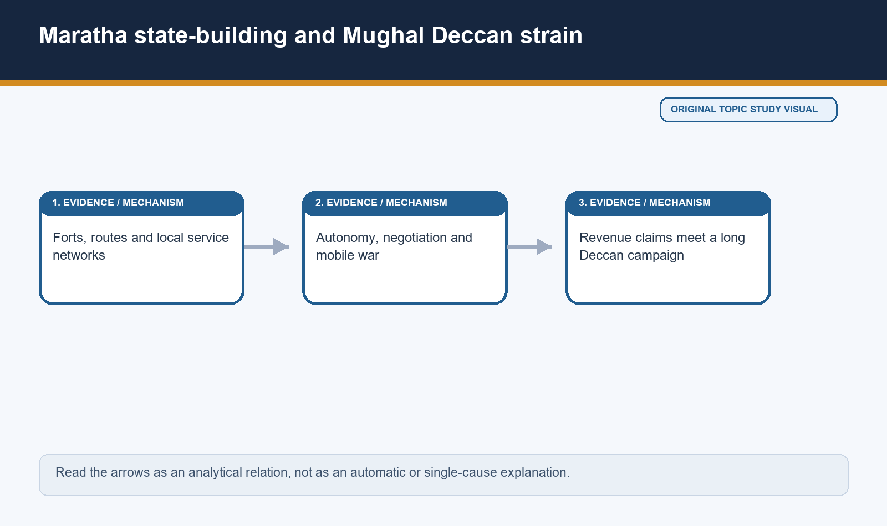
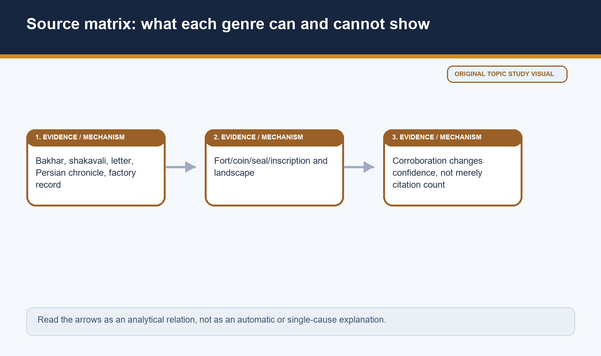
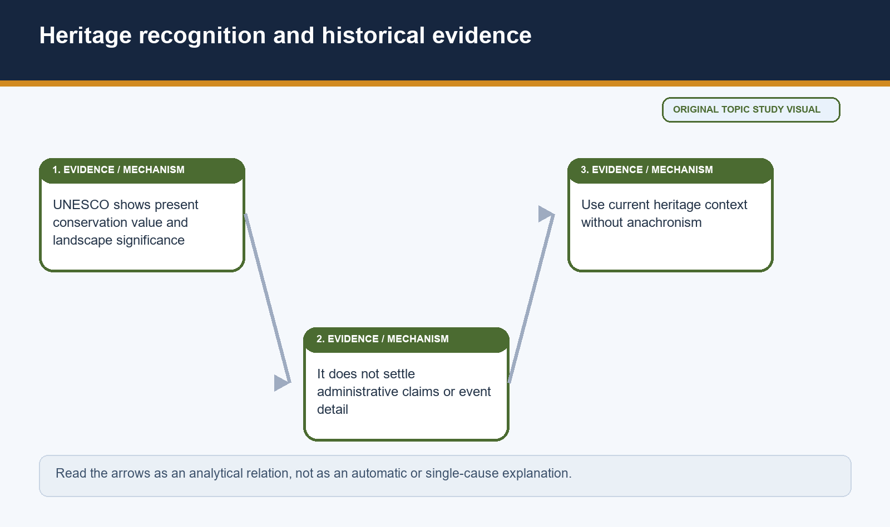
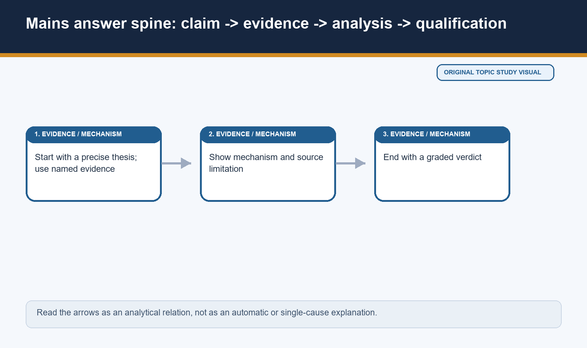
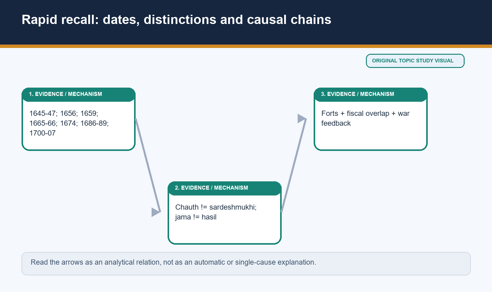
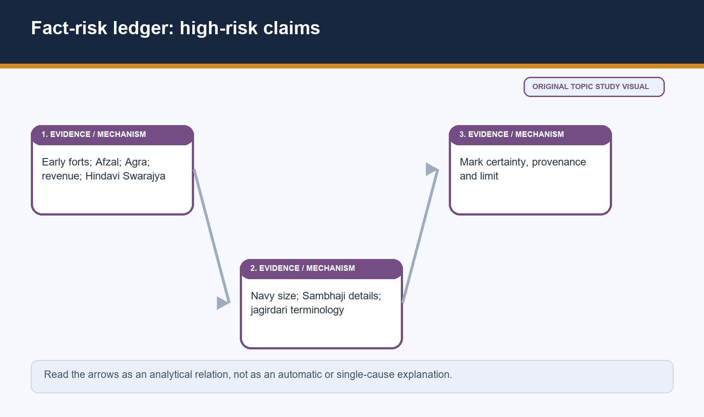

# Medieval History 23 - The Marathas, Shivaji & Aurangzeb's Deccan; Jagirdari Crisis - Premium Solved PYQ Workbook

> Subject: Medieval Indian History | GS-I | Prelims | Date: 2026-08-19. This is a separate solved-practice workbook; no verified direct owner PYQ is invented.

*Visual 0: workbook cover. Original deterministic study visual; schematic maps are NOT TO SCALE where marked.*

## Transparent PYQ audit and route decision

**Audit scope:** Local official/OCR CSE Prelims and GS-I material for 2018-2025, the repository routing ledgers, and available official answer-key material were searched for exact direct questions on Shivaji, Maratha administration, Ashtapradhan, chauth/sardeshmukhi, forts, Purandar, coronation, navy, Sambhaji, Aurangzeb's Deccan and jagirdari crisis.

**Result:** No direct verified CSE 2018-2025 owner PYQ was located for this Topic 23 cluster. The routing ledgers do not assign a direct question to Topic 23; nearby generic Maratha Confederacy/eighteenth-century, UNESCO/current-affairs, Deccan geography and the 2024 Bhatkal-fort question belong elsewhere and are deliberately not misrouted. Local OCR searching also found no exact direct wording in the available official paper corpus.

**Workbook policy consequence:** There is no fabricated 'official PYQ' or unofficial wording dressed up as one. No official key is claimed. The exercise set below is original practice, clearly marked as such. If a future direct question is added, preserve original option order and label any key as INFERRED ANSWER - NOT OFFICIALLY VERIFIED unless an official key is present.

**Adjacent evidence, not PYQ substitution:** Satish Chandra's interpretation of Purandar/Agra, the Deccan war and the jagirdari mechanism is used for analytical practice. It is not a claim that UPSC has asked a word-for-word question on this topic.
## Compact evidence banks

### Bank 1 - Geography and mobilisation
Use Sahyadri, Maval, Konkan, passes and forts as operational conditions. Add deshmukhs, village elites, service networks and Bijapur/Mughal constraints to avoid terrain determinism. Javli (1656) is the named bridge from terrain to territorial consolidation.

### Bank 2 - Negotiation and sovereignty
Purandar (1665): 23 forts ceded, 12 retained, Sambhaji mansab 5000. Explain negotiated incorporation through Jai Singh's forward Bijapur policy. Agra (1666): status/confinement/escape core; basket detail as source version. Coronation (1674): Raigad, Gaga Bhatta, Kshatriya status, contemporary sovereignty not modern nationalism.

### Bank 3 - State and revenue
Ashtapradhan is individual ruler-centred responsibility, not cabinet government. Annaji Datto assessment around 1679 shows measurement; distinguish demand from collection. Deshmukhs and mirasdars were curbed/used, not abolished. Two-fifths plus cesses is a debated source claim.

### Bank 4 - Fiscal claims and military
Chauth = one-quarter claim; sardeshmukhi = additional ten-percent superior-deshmukh claim. Bargir/silhedar distinguish horse/equipment maintenance. Ganimi kava means an operational repertoire. Coastal power is regional, drawing on varied sailors, not blue-water empire.

### Bank 5 - War, crisis and sources
Bijapur 1686/Golconda 1687 gain territory but remove buffers. Sambhaji 1689 -> decentralised resistance; Rajaram/Jinji -> depth; Tarabai -> regency leadership. Jama differs from hasil; be-jagiri includes usable jagir shortage. Bakhar, shakavali, Persian chronicle, factory record and material landscape each need provenance.

*Visual 74: workbook source matrix. Original deterministic study visual; schematic maps are NOT TO SCALE where marked.*
## Advanced evidence notebook: twenty-eight source-to-argument labs

*Visual 77 repeat: keep heritage and historical proof distinct. Original deterministic study visual; schematic maps are NOT TO SCALE where marked.*
### Lab 1 - Birth-date discipline

**Evidence focus:** The commonly used Shivneri-1630 birth date is a standard chronological anchor, while variant calendrical claims circulate in later debate.

**Mechanism:** A sound answer does not need an inflated childhood story to explain later political capacity.

**Boundary:** Name a date only with a source; do not turn birth commemoration into proof of later ideology.

**Answer use:** Use this as a one-line source-method caution before early-fort chronology.

**Cross-check protocol:** Before using this point, identify whether the supporting material is a court narrative, administrative record, local chronology, merchant observation, material remain or modern synthesis. For **Birth-date discipline**, compare the claim with a source type able to show its scale and sequence. That discipline prevents a striking sentence from carrying more weight than it can bear, especially where a later retelling or an institutional label is involved.

**Revision payoff:** The point is usable because it turns an isolated fact into a testable relationship: A sound answer does not need an inflated childhood story to explain later political capacity. In a timed answer, write the fact, then the relationship, then the qualification. This keeps evidence from becoming decorative and makes the limitation part of the argument rather than an afterthought.

### Lab 2 - Language and mobilisation

**Evidence focus:** Marathi language provided an important political-cultural field, but administration and service also operated in wider Deccani and Persianate environments.

**Mechanism:** Language can facilitate communication, patronage and memory without making every speaker a member of one political class.

**Boundary:** Do not treat language as a caste census or as automatic sovereignty.

**Answer use:** Pair Marathi context with deshmukh, service and fort evidence.

**Cross-check protocol:** Before using this point, identify whether the supporting material is a court narrative, administrative record, local chronology, merchant observation, material remain or modern synthesis. For **Language and mobilisation**, compare the claim with a source type able to show its scale and sequence. That discipline prevents a striking sentence from carrying more weight than it can bear, especially where a later retelling or an institutional label is involved.

**Revision payoff:** The point is usable because it turns an isolated fact into a testable relationship: Language can facilitate communication, patronage and memory without making every speaker a member of one political class. In a timed answer, write the fact, then the relationship, then the qualification. This keeps evidence from becoming decorative and makes the limitation part of the argument rather than an afterthought.

### Lab 3 - Shahji and divided allegiance

**Evidence focus:** Shahji's movements among Nizam Shahi, Bijapur and Mughal arenas and his Karnataka interests show elite service mobility.

**Mechanism:** A household could preserve assets and opportunities by adapting to changing patrons; this is a mechanism of Deccan politics.

**Boundary:** Do not read later Shivaji-Aurangzeb conflict backward into a fixed paternal programme.

**Answer use:** Use Shahji to introduce contingency before discussing the Poona base.

**Cross-check protocol:** Before using this point, identify whether the supporting material is a court narrative, administrative record, local chronology, merchant observation, material remain or modern synthesis. For **Shahji and divided allegiance**, compare the claim with a source type able to show its scale and sequence. That discipline prevents a striking sentence from carrying more weight than it can bear, especially where a later retelling or an institutional label is involved.

**Revision payoff:** The point is usable because it turns an isolated fact into a testable relationship: A household could preserve assets and opportunities by adapting to changing patrons; this is a mechanism of Deccan politics. In a timed answer, write the fact, then the relationship, then the qualification. This keeps evidence from becoming decorative and makes the limitation part of the argument rather than an afterthought.

### Lab 4 - Jija Bai and household politics

**Evidence focus:** Jija Bai's place in the Poona household is significant for legitimacy and local authority, although exact directives must not be invented.

**Mechanism:** Households supplied claims, patronage and social memory that could stabilise emerging authority.

**Boundary:** Avoid both devotional idealisation and unsupported denial of agency.

**Answer use:** Use the household as a bridge from jagir to local political legitimacy.

**Cross-check protocol:** Before using this point, identify whether the supporting material is a court narrative, administrative record, local chronology, merchant observation, material remain or modern synthesis. For **Jija Bai and household politics**, compare the claim with a source type able to show its scale and sequence. That discipline prevents a striking sentence from carrying more weight than it can bear, especially where a later retelling or an institutional label is involved.

**Revision payoff:** The point is usable because it turns an isolated fact into a testable relationship: Households supplied claims, patronage and social memory that could stabilise emerging authority. In a timed answer, write the fact, then the relationship, then the qualification. This keeps evidence from becoming decorative and makes the limitation part of the argument rather than an afterthought.

### Lab 5 - Forts and record keeping

**Evidence focus:** Fort governance included stores, garrisons, correspondence and officers as well as walls and visible elevation.

**Mechanism:** Records and supplies turn an elevated site into a durable command point capable of supporting movement.

**Boundary:** Do not assume every fort had an identical office arrangement or permanent allegiance.

**Answer use:** In a fort answer, add records and stores after military function.

**Cross-check protocol:** Before using this point, identify whether the supporting material is a court narrative, administrative record, local chronology, merchant observation, material remain or modern synthesis. For **Forts and record keeping**, compare the claim with a source type able to show its scale and sequence. That discipline prevents a striking sentence from carrying more weight than it can bear, especially where a later retelling or an institutional label is involved.

**Revision payoff:** The point is usable because it turns an isolated fact into a testable relationship: Records and supplies turn an elevated site into a durable command point capable of supporting movement. In a timed answer, write the fact, then the relationship, then the qualification. This keeps evidence from becoming decorative and makes the limitation part of the argument rather than an afterthought.

### Lab 6 - Violence at Javli

**Evidence focus:** The More family's displacement at Javli is evidence of political elimination as well as territorial gain.

**Mechanism:** New routes and manpower were obtained through coercion against a rival local power, not by a neutral map adjustment.

**Boundary:** Do not romanticise consolidation as bloodless, or reduce the outcome to violence alone.

**Answer use:** This adds social and political depth to a geography answer.

**Cross-check protocol:** Before using this point, identify whether the supporting material is a court narrative, administrative record, local chronology, merchant observation, material remain or modern synthesis. For **Violence at Javli**, compare the claim with a source type able to show its scale and sequence. That discipline prevents a striking sentence from carrying more weight than it can bear, especially where a later retelling or an institutional label is involved.

**Revision payoff:** The point is usable because it turns an isolated fact into a testable relationship: New routes and manpower were obtained through coercion against a rival local power, not by a neutral map adjustment. In a timed answer, write the fact, then the relationship, then the qualification. This keeps evidence from becoming decorative and makes the limitation part of the argument rather than an afterthought.

### Lab 7 - Afzal Khan genres

**Evidence focus:** Courtly Maratha narrative, Persianate adversarial framing and later public memory can disagree over conduct at Pratapgad.

**Mechanism:** Genre and patronage shape blame, courage and sequence; agreement on consequence does not settle each detail.

**Boundary:** Avoid assigning a fixed moral verdict to an uncorroborated first-blow narrative.

**Answer use:** Write 'accounts differ' and return to military-political consequence.

**Cross-check protocol:** Before using this point, identify whether the supporting material is a court narrative, administrative record, local chronology, merchant observation, material remain or modern synthesis. For **Afzal Khan genres**, compare the claim with a source type able to show its scale and sequence. That discipline prevents a striking sentence from carrying more weight than it can bear, especially where a later retelling or an institutional label is involved.

**Revision payoff:** The point is usable because it turns an isolated fact into a testable relationship: Genre and patronage shape blame, courage and sequence; agreement on consequence does not settle each detail. In a timed answer, write the fact, then the relationship, then the qualification. This keeps evidence from becoming decorative and makes the limitation part of the argument rather than an afterthought.

### Lab 8 - Panhala withdrawal

**Evidence focus:** The siege setting around Panhala and the memory of a difficult withdrawal are more secure than every detail of later heroic retelling.

**Mechanism:** A withdrawal can preserve a force and therefore be strategically consequential even when it is not a conventional victory.

**Boundary:** Do not dismiss regional memory; qualify its provenance instead.

**Answer use:** Use it to demonstrate how source method improves rather than erases history.

**Cross-check protocol:** Before using this point, identify whether the supporting material is a court narrative, administrative record, local chronology, merchant observation, material remain or modern synthesis. For **Panhala withdrawal**, compare the claim with a source type able to show its scale and sequence. That discipline prevents a striking sentence from carrying more weight than it can bear, especially where a later retelling or an institutional label is involved.

**Revision payoff:** The point is usable because it turns an isolated fact into a testable relationship: A withdrawal can preserve a force and therefore be strategically consequential even when it is not a conventional victory. In a timed answer, write the fact, then the relationship, then the qualification. This keeps evidence from becoming decorative and makes the limitation part of the argument rather than an afterthought.

### Lab 9 - Surat and merchant knowledge

**Evidence focus:** European factory papers register merchant alarm, disrupted trade and circulating reports around Surat.

**Mechanism:** They illuminate commercial impact and perceptions because their writers were embedded in trade, credit and security concerns.

**Boundary:** They cannot by themselves establish a total loot figure or a neutral account of policy.

**Answer use:** Use factory records as a named source with a merchant-lens limitation.

**Cross-check protocol:** Before using this point, identify whether the supporting material is a court narrative, administrative record, local chronology, merchant observation, material remain or modern synthesis. For **Surat and merchant knowledge**, compare the claim with a source type able to show its scale and sequence. That discipline prevents a striking sentence from carrying more weight than it can bear, especially where a later retelling or an institutional label is involved.

**Revision payoff:** The point is usable because it turns an isolated fact into a testable relationship: They illuminate commercial impact and perceptions because their writers were embedded in trade, credit and security concerns. In a timed answer, write the fact, then the relationship, then the qualification. This keeps evidence from becoming decorative and makes the limitation part of the argument rather than an afterthought.

### Lab 10 - Jai Singh's forward policy

**Evidence focus:** Jai Singh connected pressure on Shivaji to a larger Bijapur-oriented imperial strategy.

**Mechanism:** An imperial commander could seek hierarchy and alliance together when a local power offered operational value.

**Boundary:** Do not romanticise this as equality or assume Delhi uniformly agreed with him.

**Answer use:** This is the best evidence for Purandar as incorporation rather than capitulation.

**Cross-check protocol:** Before using this point, identify whether the supporting material is a court narrative, administrative record, local chronology, merchant observation, material remain or modern synthesis. For **Jai Singh's forward policy**, compare the claim with a source type able to show its scale and sequence. That discipline prevents a striking sentence from carrying more weight than it can bear, especially where a later retelling or an institutional label is involved.

**Revision payoff:** The point is usable because it turns an isolated fact into a testable relationship: An imperial commander could seek hierarchy and alliance together when a local power offered operational value. In a timed answer, write the fact, then the relationship, then the qualification. This keeps evidence from becoming decorative and makes the limitation part of the argument rather than an afterthought.

### Lab 11 - Court ritual and status

**Evidence focus:** At Agra, relative placement at court was a language of hierarchy, not a minor etiquette dispute.

**Mechanism:** Status communicated who could command, negotiate and claim dignity within an imperial order.

**Boundary:** Avoid treating rank as private emotion or reducing later conflict to a single insult.

**Answer use:** Link status to the structural difficulty of incorporation.

**Cross-check protocol:** Before using this point, identify whether the supporting material is a court narrative, administrative record, local chronology, merchant observation, material remain or modern synthesis. For **Court ritual and status**, compare the claim with a source type able to show its scale and sequence. That discipline prevents a striking sentence from carrying more weight than it can bear, especially where a later retelling or an institutional label is involved.

**Revision payoff:** The point is usable because it turns an isolated fact into a testable relationship: Status communicated who could command, negotiate and claim dignity within an imperial order. In a timed answer, write the fact, then the relationship, then the qualification. This keeps evidence from becoming decorative and makes the limitation part of the argument rather than an afterthought.

### Lab 12 - Recovery and resource cycle

**Evidence focus:** The recovery phase after 1670 combined fort operations with renewed pressure on Surat and political reputation.

**Mechanism:** Resource acquisition, legitimacy and territorial recovery can reinforce each other without being a single dramatic reversal.

**Boundary:** Do not present Sinhagad/Tanaji traditions as a complete substitute for campaign analysis.

**Answer use:** Use a campaign sequence rather than a hero episode.

**Cross-check protocol:** Before using this point, identify whether the supporting material is a court narrative, administrative record, local chronology, merchant observation, material remain or modern synthesis. For **Recovery and resource cycle**, compare the claim with a source type able to show its scale and sequence. That discipline prevents a striking sentence from carrying more weight than it can bear, especially where a later retelling or an institutional label is involved.

**Revision payoff:** The point is usable because it turns an isolated fact into a testable relationship: Resource acquisition, legitimacy and territorial recovery can reinforce each other without being a single dramatic reversal. In a timed answer, write the fact, then the relationship, then the qualification. This keeps evidence from becoming decorative and makes the limitation part of the argument rather than an afterthought.

### Lab 13 - Genealogy as political work

**Evidence focus:** Gaga Bhatta's Kshatriya genealogy at the coronation addressed eligibility for high royal ritual.

**Mechanism:** Genealogy was an instrument for making rank legible to contemporaries, which is why contest around it matters.

**Boundary:** It is not biological proof of a fixed social origin or unanimous acceptance.

**Answer use:** Use it to explain legitimacy, then qualify it with social contest.

**Cross-check protocol:** Before using this point, identify whether the supporting material is a court narrative, administrative record, local chronology, merchant observation, material remain or modern synthesis. For **Genealogy as political work**, compare the claim with a source type able to show its scale and sequence. That discipline prevents a striking sentence from carrying more weight than it can bear, especially where a later retelling or an institutional label is involved.

**Revision payoff:** The point is usable because it turns an isolated fact into a testable relationship: Genealogy was an instrument for making rank legible to contemporaries, which is why contest around it matters. In a timed answer, write the fact, then the relationship, then the qualification. This keeps evidence from becoming decorative and makes the limitation part of the argument rather than an afterthought.

### Lab 14 - Karnataka connections

**Evidence focus:** The southern expedition linked Shivaji's interests to Jinji, Vellore and relations around Ekoji/Venkoji and Tanjavur.

**Mechanism:** Strategic depth and resource access can make a distant theatre central during a later crisis, as Jinji shows after 1689.

**Boundary:** Do not turn a seventeenth-century expedition into a complete history of later southern Maratha power.

**Answer use:** Use it as a bounded bridge between Shivaji and Rajaram.

**Cross-check protocol:** Before using this point, identify whether the supporting material is a court narrative, administrative record, local chronology, merchant observation, material remain or modern synthesis. For **Karnataka connections**, compare the claim with a source type able to show its scale and sequence. That discipline prevents a striking sentence from carrying more weight than it can bear, especially where a later retelling or an institutional label is involved.

**Revision payoff:** The point is usable because it turns an isolated fact into a testable relationship: Strategic depth and resource access can make a distant theatre central during a later crisis, as Jinji shows after 1689. In a timed answer, write the fact, then the relationship, then the qualification. This keeps evidence from becoming decorative and makes the limitation part of the argument rather than an afterthought.

### Lab 15 - Office lists and practice

**Evidence focus:** Ashtapradhan office titles supply a useful institutional vocabulary, but surviving descriptions are stronger on designation than on every day-to-day procedure.

**Mechanism:** This is why individual responsibility to the ruler and mixed duties are more defensible than cabinet analogy.

**Boundary:** Do not supply invented departmental budgets or modern separation-of-powers claims.

**Answer use:** In Mains, list only selected offices and explain their institutional limit.

**Cross-check protocol:** Before using this point, identify whether the supporting material is a court narrative, administrative record, local chronology, merchant observation, material remain or modern synthesis. For **Office lists and practice**, compare the claim with a source type able to show its scale and sequence. That discipline prevents a striking sentence from carrying more weight than it can bear, especially where a later retelling or an institutional label is involved.

**Revision payoff:** The point is usable because it turns an isolated fact into a testable relationship: This is why individual responsibility to the ruler and mixed duties are more defensible than cabinet analogy. In a timed answer, write the fact, then the relationship, then the qualification. This keeps evidence from becoming decorative and makes the limitation part of the argument rather than an afterthought.

### Lab 16 - Revenue rate and incidence

**Evidence focus:** Measurement and classification can standardise an assessment process while local collection remains differentiated.

**Mechanism:** The same nominal demand may have different effects owing to crop, cesses, intermediaries, war and enforcement.

**Boundary:** Do not write a uniform two-fifths burden as if all villages were identical.

**Answer use:** Use jama-hasil language even in a Shivaji revenue answer.

**Cross-check protocol:** Before using this point, identify whether the supporting material is a court narrative, administrative record, local chronology, merchant observation, material remain or modern synthesis. For **Revenue rate and incidence**, compare the claim with a source type able to show its scale and sequence. That discipline prevents a striking sentence from carrying more weight than it can bear, especially where a later retelling or an institutional label is involved.

**Revision payoff:** The point is usable because it turns an isolated fact into a testable relationship: The same nominal demand may have different effects owing to crop, cesses, intermediaries, war and enforcement. In a timed answer, write the fact, then the relationship, then the qualification. This keeps evidence from becoming decorative and makes the limitation part of the argument rather than an afterthought.

### Lab 17 - Chauth as a relationship

**Evidence focus:** Chauth was a fiscal claim embedded in a relationship of threat, protection, negotiation and political recognition.

**Mechanism:** The mechanism shows why a payment can coexist with disputed territorial sovereignty.

**Boundary:** Do not call every payer a fully subordinated subject or every collector a simple bandit.

**Answer use:** This is a high-value distinction for Prelims and Mains.

**Cross-check protocol:** Before using this point, identify whether the supporting material is a court narrative, administrative record, local chronology, merchant observation, material remain or modern synthesis. For **Chauth as a relationship**, compare the claim with a source type able to show its scale and sequence. That discipline prevents a striking sentence from carrying more weight than it can bear, especially where a later retelling or an institutional label is involved.

**Revision payoff:** The point is usable because it turns an isolated fact into a testable relationship: The mechanism shows why a payment can coexist with disputed territorial sovereignty. In a timed answer, write the fact, then the relationship, then the qualification. This keeps evidence from becoming decorative and makes the limitation part of the argument rather than an afterthought.

### Lab 18 - Coastal social evidence

**Evidence focus:** Maritime work depended on local seafaring communities, including Koli, Bhandari and Muslim personnel.

**Mechanism:** Personnel composition demonstrates that strategic capacity was assembled through specialised labour rather than one identity bloc.

**Boundary:** Do not infer a uniform religious policy from an occupational list.

**Answer use:** Use it to qualify the religious-character debate.

**Cross-check protocol:** Before using this point, identify whether the supporting material is a court narrative, administrative record, local chronology, merchant observation, material remain or modern synthesis. For **Coastal social evidence**, compare the claim with a source type able to show its scale and sequence. That discipline prevents a striking sentence from carrying more weight than it can bear, especially where a later retelling or an institutional label is involved.

**Revision payoff:** The point is usable because it turns an isolated fact into a testable relationship: Personnel composition demonstrates that strategic capacity was assembled through specialised labour rather than one identity bloc. In a timed answer, write the fact, then the relationship, then the qualification. This keeps evidence from becoming decorative and makes the limitation part of the argument rather than an afterthought.

### Lab 19 - Sambhaji source risk

**Evidence focus:** The capture at Sangameshwar and execution in 1689 are chronological anchors, whereas elaborate torture narratives and exclusive motives vary by tradition.

**Mechanism:** Separating core event from interpretive detail preserves the seriousness of violence without sensationalising unsupported particulars.

**Boundary:** Do not make one source genre settle political, religious and personal motive simultaneously.

**Answer use:** State the distinction before discussing decentralisation.

**Cross-check protocol:** Before using this point, identify whether the supporting material is a court narrative, administrative record, local chronology, merchant observation, material remain or modern synthesis. For **Sambhaji source risk**, compare the claim with a source type able to show its scale and sequence. That discipline prevents a striking sentence from carrying more weight than it can bear, especially where a later retelling or an institutional label is involved.

**Revision payoff:** The point is usable because it turns an isolated fact into a testable relationship: Separating core event from interpretive detail preserves the seriousness of violence without sensationalising unsupported particulars. In a timed answer, write the fact, then the relationship, then the qualification. This keeps evidence from becoming decorative and makes the limitation part of the argument rather than an afterthought.

### Lab 20 - Jinji and distance

**Evidence focus:** Jinji's value lay in being a fortified southern base outside the immediate centre of Mughal concentration.

**Mechanism:** Distance changes time, supply and communication, so it can make a centralised campaign geographically expensive.

**Boundary:** Do not assume distance alone wins wars; garrison, patronage and local support remain necessary.

**Answer use:** Use Jinji as named evidence for strategic depth.

**Cross-check protocol:** Before using this point, identify whether the supporting material is a court narrative, administrative record, local chronology, merchant observation, material remain or modern synthesis. For **Jinji and distance**, compare the claim with a source type able to show its scale and sequence. That discipline prevents a striking sentence from carrying more weight than it can bear, especially where a later retelling or an institutional label is involved.

**Revision payoff:** The point is usable because it turns an isolated fact into a testable relationship: Distance changes time, supply and communication, so it can make a centralised campaign geographically expensive. In a timed answer, write the fact, then the relationship, then the qualification. This keeps evidence from becoming decorative and makes the limitation part of the argument rather than an afterthought.

### Lab 21 - Tarabai and legitimacy

**Evidence focus:** Tarabai's regency used dynastic legitimacy while organising a continuing resistance after Rajaram's death.

**Mechanism:** Regency is political work because it distributes authority, validates commands and maintains patronage during uncertainty.

**Boundary:** Do not make gender a decorative conclusion or claim she personally directed every field operation.

**Answer use:** Use her to show leadership within a wider network.

**Cross-check protocol:** Before using this point, identify whether the supporting material is a court narrative, administrative record, local chronology, merchant observation, material remain or modern synthesis. For **Tarabai and legitimacy**, compare the claim with a source type able to show its scale and sequence. That discipline prevents a striking sentence from carrying more weight than it can bear, especially where a later retelling or an institutional label is involved.

**Revision payoff:** The point is usable because it turns an isolated fact into a testable relationship: Regency is political work because it distributes authority, validates commands and maintains patronage during uncertainty. In a timed answer, write the fact, then the relationship, then the qualification. This keeps evidence from becoming decorative and makes the limitation part of the argument rather than an afterthought.

### Lab 22 - Imperial capacity and strain

**Evidence focus:** Aurangzeb could still sustain major armies and sieges while facing falling returns from long Deccan operations.

**Mechanism:** Capacity and strain can coexist; a state need not be dead for its fiscal-military system to be under pressure.

**Boundary:** Do not equate jagirdari crisis with an overnight vacuum of authority.

**Answer use:** This qualification lifts a decline answer above a collapse narrative.

**Cross-check protocol:** Before using this point, identify whether the supporting material is a court narrative, administrative record, local chronology, merchant observation, material remain or modern synthesis. For **Imperial capacity and strain**, compare the claim with a source type able to show its scale and sequence. That discipline prevents a striking sentence from carrying more weight than it can bear, especially where a later retelling or an institutional label is involved.

**Revision payoff:** The point is usable because it turns an isolated fact into a testable relationship: Capacity and strain can coexist; a state need not be dead for its fiscal-military system to be under pressure. In a timed answer, write the fact, then the relationship, then the qualification. This keeps evidence from becoming decorative and makes the limitation part of the argument rather than an afterthought.

### Lab 23 - Annexed-noble pressure

**Evidence focus:** Bijapur and Golconda annexation added Deccani elites and new claimants to an already pressured assignment system.

**Mechanism:** Promotion and factional competition raise the political cost of scarce productive jagirs.

**Boundary:** Do not reduce entrants to one ethnic category or assume every new noble received a usable jagir.

**Answer use:** Link claimant pressure to quality and realisation of assignments.

**Cross-check protocol:** Before using this point, identify whether the supporting material is a court narrative, administrative record, local chronology, merchant observation, material remain or modern synthesis. For **Annexed-noble pressure**, compare the claim with a source type able to show its scale and sequence. That discipline prevents a striking sentence from carrying more weight than it can bear, especially where a later retelling or an institutional label is involved.

**Revision payoff:** The point is usable because it turns an isolated fact into a testable relationship: Promotion and factional competition raise the political cost of scarce productive jagirs. In a timed answer, write the fact, then the relationship, then the qualification. This keeps evidence from becoming decorative and makes the limitation part of the argument rather than an afterthought.

### Lab 24 - Jama and hasil example

**Evidence focus:** A model in which jama is 100 and hasil 55 is an explanatory device, not a recovered historical district figure.

**Mechanism:** It shows why a mansabdar's nominal entitlement cannot fund a contingent if collection is disturbed.

**Boundary:** Do not cite analytical numbers as archival statistics.

**Answer use:** Use the model to explain mechanism in a Mains answer.

**Cross-check protocol:** Before using this point, identify whether the supporting material is a court narrative, administrative record, local chronology, merchant observation, material remain or modern synthesis. For **Jama and hasil example**, compare the claim with a source type able to show its scale and sequence. That discipline prevents a striking sentence from carrying more weight than it can bear, especially where a later retelling or an institutional label is involved.

**Revision payoff:** The point is usable because it turns an isolated fact into a testable relationship: It shows why a mansabdar's nominal entitlement cannot fund a contingent if collection is disturbed. In a timed answer, write the fact, then the relationship, then the qualification. This keeps evidence from becoming decorative and makes the limitation part of the argument rather than an afterthought.

### Lab 25 - Private pacts as evidence

**Evidence focus:** A private payment arrangement between a jagirdar and a parallel collector can be a rational response to local insecurity.

**Mechanism:** It turns fiscal weakness into political erosion because a competitor gains access, recognition and information.

**Boundary:** Do not call every pact formal secession or assume local actors had no coercive agency.

**Answer use:** This is the bridge from revenue to sovereignty.

**Cross-check protocol:** Before using this point, identify whether the supporting material is a court narrative, administrative record, local chronology, merchant observation, material remain or modern synthesis. For **Private pacts as evidence**, compare the claim with a source type able to show its scale and sequence. That discipline prevents a striking sentence from carrying more weight than it can bear, especially where a later retelling or an institutional label is involved.

**Revision payoff:** The point is usable because it turns an isolated fact into a testable relationship: It turns fiscal weakness into political erosion because a competitor gains access, recognition and information. In a timed answer, write the fact, then the relationship, then the qualification. This keeps evidence from becoming decorative and makes the limitation part of the argument rather than an afterthought.

### Lab 26 - Modern historians and evidence

**Evidence focus:** Nationalist, communal, Marxist/peasant and regional-state readings illuminate different questions about Shivaji and the Deccan.

**Mechanism:** Their value depends on whether they connect a claim to source types - office, revenue, terrain, personnel or narrative - rather than simply adding labels.

**Boundary:** Do not create false balance by treating every interpretation as equally evidenced.

**Answer use:** End a historiography answer with a source-weighted verdict.

**Cross-check protocol:** Before using this point, identify whether the supporting material is a court narrative, administrative record, local chronology, merchant observation, material remain or modern synthesis. For **Modern historians and evidence**, compare the claim with a source type able to show its scale and sequence. That discipline prevents a striking sentence from carrying more weight than it can bear, especially where a later retelling or an institutional label is involved.

**Revision payoff:** The point is usable because it turns an isolated fact into a testable relationship: Their value depends on whether they connect a claim to source types - office, revenue, terrain, personnel or narrative - rather than simply adding labels. In a timed answer, write the fact, then the relationship, then the qualification. This keeps evidence from becoming decorative and makes the limitation part of the argument rather than an afterthought.

### Lab 27 - UNESCO as bounded bridge

**Evidence focus:** UNESCO's 2025 twelve-fort inscription identifies present heritage value for a networked landscape, mostly in Maharashtra plus Gingee in Tamil Nadu.

**Mechanism:** It can make a static topic memorable and connect conservation to fort geography.

**Boundary:** It cannot independently verify a seventeenth-century battle sequence, fleet count or office list.

**Answer use:** Label it STATIC HERITAGE LINK, especially because no six-month official fort-specific update was located.

**Cross-check protocol:** Before using this point, identify whether the supporting material is a court narrative, administrative record, local chronology, merchant observation, material remain or modern synthesis. For **UNESCO as bounded bridge**, compare the claim with a source type able to show its scale and sequence. That discipline prevents a striking sentence from carrying more weight than it can bear, especially where a later retelling or an institutional label is involved.

**Revision payoff:** The point is usable because it turns an isolated fact into a testable relationship: It can make a static topic memorable and connect conservation to fort geography. In a timed answer, write the fact, then the relationship, then the qualification. This keeps evidence from becoming decorative and makes the limitation part of the argument rather than an afterthought.

## Evidence and answer-writing drills

*Visual 74 repeat: source matrix for answer drills. Original deterministic study visual; schematic maps are NOT TO SCALE where marked.*
### Drill 1 - Fort verbs are evidence

**Claim:** Write 'Torna was taken; Murumbdev was developed/renamed Rajgad; Kondana was acquired' rather than collapsing all actions into capture. This small distinction protects chronology and shows that state-building involved repair and provisioning as well as seizure.

**Exam move:** State the named evidence, explain what it proves, add the limit, then return to the directive.

### Drill 2 - Afzal Khan without moral certainty

**Claim:** Start with mutual suspicion, meeting and killing; then say accounts vary on first blow. A courtly or later heroic account can show political memory, but it cannot by itself end the sequence dispute.

**Exam move:** State the named evidence, explain what it proves, add the limit, then return to the directive.

### Drill 3 - Purandar without surrender language

**Claim:** Use 23 ceded, 12 retained and Sambhaji's 5000 mansab. Then explain why service plus retained forts makes the agreement an incorporation attempt rather than an endpoint.

**Exam move:** State the named evidence, explain what it proves, add the limit, then return to the directive.

### Drill 4 - Agra without basket certainty

**Claim:** Treat confinement and escape as the historical core. Basket/sweetmeat staging needs a named source version; its popularity demonstrates memory, not direct verification.

**Exam move:** State the named evidence, explain what it proves, add the limit, then return to the directive.

### Drill 5 - Coronation without nationalism

**Claim:** Gaga Bhatta and Kshatriya genealogy show a status-making ritual at Raigad. Explain sovereignty in seventeenth-century idiom; do not substitute a twentieth-century nation-state.

**Exam move:** State the named evidence, explain what it proves, add the limit, then return to the directive.

### Drill 6 - Revenue without universal rate

**Claim:** Annaji Datto's assessment shows measurement and classification. Separate a source's about-two-fifths claim from actual incidence across villages, cesses and collection conditions.

**Exam move:** State the named evidence, explain what it proves, add the limit, then return to the directive.

### Drill 7 - Chauth without a false binary

**Claim:** Describe one-quarter contribution/protection claim with coercive capacity; distinguish it from sardeshmukhi's additional ten-percent superior-right rationale. Payment can coexist with overlapping control.

**Exam move:** State the named evidence, explain what it proves, add the limit, then return to the directive.

### Drill 8 - Navy without oceanic myth

**Claim:** Use coast, creeks, customs, sea forts and local sailors. The strongest conclusion is regional strategic capability, not an unsupported blue-water fleet.

**Exam move:** State the named evidence, explain what it proves, add the limit, then return to the directive.

### Drill 9 - Sambhaji without sensationalism

**Claim:** Fix capture at Sangameshwar and execution in 1689, then separate source versions of details and motives. The political consequence was decentralisation, not instantaneous resistance collapse.

**Exam move:** State the named evidence, explain what it proves, add the limit, then return to the directive.

### Drill 10 - Tarabai without tokenism

**Claim:** After Rajaram's 1700 death, explain regency as legitimacy, patronage and coordination in a dispersed war. This is a political mechanism, not an inspirational aside.

**Exam move:** State the named evidence, explain what it proves, add the limit, then return to the directive.

### Drill 11 - Jagirdari without arithmetic reduction

**Claim:** Define mansab, jagir, jama, hasil and be-jagiri; reconnect them to war, transfers, local resistance, chauth and contingent maintenance. A noble count alone does not explain crisis.

**Exam move:** State the named evidence, explain what it proves, add the limit, then return to the directive.

### Drill 12 - Heritage without evidentiary leap

**Claim:** UNESCO's 2025 twelve-fort inscription is a static conservation linkage. It corroborates present recognition of a landscape, not every battle legend or administrative detail.

**Exam move:** State the named evidence, explain what it proves, add the limit, then return to the directive.

## Learning MCQs (20; key rotation A -> B -> C -> D repeated five times)

Correct options are deliberately rotated by actual option placement, not by relabeling: A -> B -> C -> D through the full set. Read the explanation after attempting each item.

*Visual 78: answer evidence spine. Original deterministic study visual; schematic maps are NOT TO SCALE where marked.*

### Q1. Why is western Deccan geography relevant to Shivaji's rise?

A. It offered routes, nodes and constraints that political organisation could exploit.

B. It mechanically created a unified Maratha nation.

C. It made diplomacy unnecessary.

D. It prevented all Mughal movement.

**Answer: A. It offered routes, nodes and constraints that political organisation could exploit.**

**Explanation:** Terrain shaped choices, especially passes, forts and logistics. The closest distractor is the national-destiny claim, which confuses enabling conditions with automatic political unity.

### Q2. Which formulation best describes the early Murumbdev-Rajgad episode?

A. It was a Portuguese coastal fort.

B. It should distinguish development/refortification and renaming from a simple capture label.

C. It was obtained only after the 1665 treaty.

D. It had no role in the Poona-Maval base.

**Answer: B. It should distinguish development/refortification and renaming from a simple capture label.**

**Explanation:** The discriminator is the action verb: Murumbdev's development as Rajgad is not the same claim as a clean capture. The 1665 option confuses the early fort phase with Purandar.

### Q3. What did the conquest of Javli in 1656 most directly change?

A. It completed Mughal annexation of Bijapur.

B. It created the Ashtapradhan as a cabinet.

C. It strengthened access from Maval toward Satara and the Konkan while eliminating a rival political position.

D. It transferred Surat customs to Shivaji.

**Answer: C. It strengthened access from Maval toward Satara and the Konkan while eliminating a rival political position.**

**Explanation:** Javli's importance is territorial and political: routes, manpower and the More challenge. The Surat option imports a separate commercial episode.

### Q4. Which statement is most defensible about Afzal Khan at Pratapgad?

A. Every contemporaneous source gives an identical sequence.

B. Only supernatural explanation can explain the result.

C. The episode ended all Bijapur-Maratha conflict.

D. The meeting involved mutual suspicion and armed precautions, while the exact first blow varies by source.

**Answer: D. The meeting involved mutual suspicion and armed precautions, while the exact first blow varies by source.**

**Explanation:** The correct approach separates a secure core from disputed sequencing. The 'identical source' distractor ignores courtly and later narrative variation.

### Q5. The 1663 Poona raid is best used as evidence that:

A. Mughal occupation could be vulnerable to local intelligence and surprise.

B. Shivaji had already conquered all Mughal India.

C. No Mughal force remained in the Deccan.

D. Artillery was irrelevant to early modern war.

**Answer: A. Mughal occupation could be vulnerable to local intelligence and surprise.**

**Explanation:** It challenged the image of secure occupation, not the existence of Mughal power. The all-India option converts a raid into implausible territorial conquest.

### Q6. What is the safest reading of Surat's sack in 1664?

A. It was only a religious attack.

B. It affected a major commercial- imperial port and must be studied through source-specific claims.

C. It was a modern national tax collection.

D. European factory records are neutral totals of loot.

**Answer: B. It affected a major commercial- imperial port and must be studied through source-specific claims.**

**Explanation:** Surat linked commerce and imperial prestige. Factory records help but remain merchant sources, so the 'neutral totals' claim is the closest but wrong shortcut.

### Q7. Which Purandar term is securely retained in the topic evidence?

A. All 35 forts were permanently surrendered.

B. No service obligation was involved.

C. Shivaji ceded 23 forts, retained 12, and Sambhaji received mansab 5000.

D. The treaty created an independent modern republic.

**Answer: C. Shivaji ceded 23 forts, retained 12, and Sambhaji received mansab 5000.**

**Explanation:** The 23/12 division and Sambhaji's 5000 mansab anchor the treaty. 'All 35' confuses surrender language with the retained territorial base.

### Q8. Why is Purandar better described as an incorporation attempt than a final surrender?

A. It ended all later Mughal-Maratha contact.

B. It required Aurangzeb to abdicate.

C. It abolished Bijapur immediately.

D. It combined territorial concessions with service, mansab and continuing strategic bargaining.

**Answer: D. It combined territorial concessions with service, mansab and continuing strategic bargaining.**

**Explanation:** The agreement tried to fit Shivaji into a Mughal-led forward policy. The 'ended contact' option misses Agra and renewed conflict.

### Q9. Which claim about Agra in 1666 is source-critical?

A. Escape after confinement is secure; basket or sweetmeat staging should be labelled a version.

B. No confinement occurred.

C. The event proves every later legend literally.

D. It was a coronation ceremony.

**Answer: A. Escape after confinement is secure; basket or sweetmeat staging should be labelled a version.**

**Explanation:** The distinction is event versus narrative detail. The literal-legend option treats later retelling as a court transcript.

### Q10. The 1674 coronation most directly expressed:

A. A twentieth-century nation-state constitution.

B. Sovereignty and status in contemporary political and ritual idiom.

C. The abolition of all Deccani borrowing.

D. A guarantee of universal acceptance of genealogy.

**Answer: B. Sovereignty and status in contemporary political and ritual idiom.**

**Explanation:** Coronation raised royal status and legitimacy; it was not modern independence. The genealogy option ignores visible status debate.

### Q11. Why is the Ashtapradhan not a modern cabinet?

A. It had no named offices.

B. It was elected by universal franchise.

C. Its officers were individually responsible to the ruler and could hold non-modern combinations of duties.

D. It replaced fort administration entirely.

**Answer: C. Its officers were individually responsible to the ruler and could hold non-modern combinations of duties.**

**Explanation:** The eight offices existed, but collective cabinet responsibility did not. The 'no named offices' distractor contradicts the office list.

### Q12. What is the best use of Annaji Datto's assessment?

A. As proof that every cultivator everywhere paid exactly two-fifths.

B. As proof that intermediaries disappeared.

C. As a navy-building programme.

D. As evidence of measurement-based state capacity with variable local incidence.

**Answer: D. As evidence of measurement-based state capacity with variable local incidence.**

**Explanation:** Assessment improves estimation, not uniform outcome. The exact universal rate option confuses a debated source claim with actual collection.

### Q13. How do chauth and sardeshmukhi differ?

A. Chauth is a one-quarter contribution claim; sardeshmukhi is an additional ten-percent superior-deshmukh claim.

B. Both are names for mansab rank.

C. Both are exactly the same one-quarter levy.

D. Sardeshmukhi is a sea-fort tax only.

**Answer: A. Chauth is a one-quarter contribution claim; sardeshmukhi is an additional ten-percent superior-deshmukh claim.**

**Explanation:** The percentage and asserted rationale distinguish the two. The same-levy option is the standard Prelims trap.

### Q14. Which description fits ganimi kava best?

A. A modern ideology of mass revolution.

B. A repertoire of mobility, intelligence, surprise and supply disruption.

C. A permanent refusal to use forts.

D. A doctrine that cavalry never mattered.

**Answer: B. A repertoire of mobility, intelligence, surprise and supply disruption.**

**Explanation:** The term should not be modernised into ideology. Fort support and cavalry both remain within the operational repertoire.

### Q15. Why should Shivaji's navy not be called a blue-water empire navy?

A. It used no local sailors.

B. It had no relationship to forts.

C. Its evidence supports regional coastal and creek defence, trade and pressure rather than oceanic supremacy.

D. It existed only after 1707.

**Answer: C. Its evidence supports regional coastal and creek defence, trade and pressure rather than oceanic supremacy.**

**Explanation:** Regional maritime capacity is significant without imagined oceanic scale. The 'only after 1707' option breaks chronology.

### Q16. Which formulation best captures religious legitimacy under Shivaji?

A. Administration was exclusively Hindu and created from nothing.

B. Royal ritual made diplomatic pragmatism impossible.

C. All sources prove uniform tolerance.

D. Hindu royal idiom coexisted with Deccani-Persianate borrowing and differentiated personnel.

**Answer: D. Hindu royal idiom coexisted with Deccani-Persianate borrowing and differentiated personnel.**

**Explanation:** The answer holds idiom and institutional plurality together. Exclusivity is the closest ideological oversimplification.

### Q17. What was the consequence of annexing Bijapur and Golconda?

A. The empire gained territory and claimants while losing buffers and adding administrative burdens.

B. It automatically ended Maratha resistance.

C. It removed all need for garrisons.

D. It converted jama into hasil without collection.

**Answer: A. The empire gained territory and claimants while losing buffers and adding administrative burdens.**

**Explanation:** Annexation widened sovereign claim but deepened the governing problem. The jama-hasil option mistakes paper assessment for realised resources.

### Q18. Why did Sambhaji's execution not end resistance?

A. All forts surrendered immediately.

B. It removed a recognised head and helped shift war toward dispersed commanders and networks.

C. Aurangzeb withdrew from the Deccan.

D. No fiscal collection continued.

**Answer: B. It removed a recognised head and helped shift war toward dispersed commanders and networks.**

**Explanation:** Decentralisation made resistance harder to negotiate, not impossible. The immediate-fort-surrender claim invents a total collapse.

### Q19. What is the analytical value of Tarabai's role after 1700?

A. She belongs only to a nineteenth-century reform story.

B. She ended all Mughal military capacity in one battle.

C. It shows political leadership in regency, legitimacy and resistance rather than symbolic widowhood.

D. She had no connection with administration.

**Answer: C. It shows political leadership in regency, legitimacy and resistance rather than symbolic widowhood.**

**Explanation:** Tarabai organised a continuing political-military field. The one-battle option reproduces a hero-story rather than a mechanism.

### Q20. What does jama-hasil mismatch mean?

A. Every jagir had no assessed revenue.

B. Hasil is another word for coronation.

C. It proves immediate state bankruptcy.

D. Assessed revenue can exceed what is actually collected, weakening service and troop maintenance.

**Answer: D. Assessed revenue can exceed what is actually collected, weakening service and troop maintenance.**

**Explanation:** The gap explains fiscal strain; it does not prove total collapse. The bankruptcy claim ignores continued imperial capacity.

## Broad MCQs (44; key rotation A -> B -> C -> D repeated eleven times)

Correct options are deliberately rotated by actual option placement, not by relabeling: A -> B -> C -> D through the full set. Read the explanation after attempting each item.

*Visual 79: rapid recall before practice. Original deterministic study visual; schematic maps are NOT TO SCALE where marked.*

### Q21. Which feature best explains why forts mattered in state-building?

A. They linked garrison, store, communication, refuge and local command.

B. They were decorative residences only.

C. They eliminated need for revenue.

D. They were permanent symbols that never changed hands.

**Answer: A. They linked garrison, store, communication, refuge and local command.**

**Explanation:** A fort was a multi-function node. The 'never changed hands' distractor ignores siege and recapture cycles.

### Q22. Which actor should not be erased from Maratha mobilisation?

A. Only a homogeneous warrior caste mattered.

B. Deshmukhs and village elites with their own hereditary and local interests.

C. Only Mughal officials mattered.

D. No local intermediary existed.

**Answer: B. Deshmukhs and village elites with their own hereditary and local interests.**

**Explanation:** Mobilisation used differentiated social actors. Homogeneity is the tempting but false shortcut.

### Q23. Why is Shahji's career relevant?

A. It proves a fixed anti-Mughal identity from birth.

B. It makes Jija Bai historically irrelevant.

C. It reveals shifting service across Deccan courts and a Poona/Karnataka political setting.

D. It began after Shivaji's coronation.

**Answer: C. It reveals shifting service across Deccan courts and a Poona/Karnataka political setting.**

**Explanation:** Shahji's mobility is evidence of a service world, not a prewritten nationalism. The fixed identity option overreads later outcome.

### Q24. What is the best source-critical use of Bhakti context?

A. Every saint commanded the army.

B. It replaces administrative records.

C. It proves all groups had identical interests.

D. It can illuminate a cultural setting but not automatically prove a direct state programme.

**Answer: D. It can illuminate a cultural setting but not automatically prove a direct state programme.**

**Explanation:** Devotional literature does not transparently dictate policy. The administrative-record option confuses genres.

### Q25. Why does the More-family episode at Javli matter?

A. It shows territorial consolidation through elimination of a rival, route control and manpower access.

B. It was a Mughal court ritual.

C. It created the 1689 execution.

D. It was only a coastal naval battle.

**Answer: A. It shows territorial consolidation through elimination of a rival, route control and manpower access.**

**Explanation:** Javli joined political coercion to strategic geography. The naval distractor mislocates its Maval-Satara-Konkkan logic.

### Q26. What is a sound inference from Pratapgad?

A. Terrain alone guarantees victory.

B. A prepared local force could convert terrain and intelligence into political advantage.

C. All later sources are equally reliable.

D. Bijapur ceased to exist in 1659.

**Answer: B. A prepared local force could convert terrain and intelligence into political advantage.**

**Explanation:** The mechanism combines preparation, place and organisation. Terrain determinism is the closest but inadequate explanation.

### Q27. Which statement about Pavan Khind is appropriate?

A. Reject all memory as worthless.

B. Treat every devotional retelling as court record.

C. Separate the historical withdrawal context from later tradition's detailed narrative.

D. Date it after 1707.

**Answer: C. Separate the historical withdrawal context from later tradition's detailed narrative.**

**Explanation:** Source qualification preserves both event and memory without flattening them. 'All memory worthless' is the opposite error.

### Q28. Why did Shaista Khan's large force face a strategic problem?

A. It had no cavalry.

B. It could not use any forts.

C. It was stationed in Bengal.

D. Occupation required information and control across terrain while other fronts competed for attention.

**Answer: D. Occupation required information and control across terrain while other fronts competed for attention.**

**Explanation:** Scale does not equal local control. The Bengal option simply removes the campaign from its setting.

### Q29. What can European factory records contribute for Surat?

A. Merchant-facing evidence of commercial shock and rumour, checked against their interests.

B. An automatically complete military archive.

C. A proof that no Indian actors traded.

D. A replacement for all Persian sources.

**Answer: A. Merchant-facing evidence of commercial shock and rumour, checked against their interests.**

**Explanation:** Factory records provide a commercial lens, not neutral total knowledge. The 'complete archive' option overstates genre reach.

### Q30. What did Jai Singh's policy toward Shivaji seek?

A. To abolish Mughal hierarchy immediately.

B. To combine pressure and accommodation within a forward Deccan strategy.

C. To make all forts independent.

D. To avoid any Bijapur policy.

**Answer: B. To combine pressure and accommodation within a forward Deccan strategy.**

**Explanation:** Jai Singh saw use in incorporation and a Bijapur-oriented strategy. 'Avoid Bijapur' reverses the policy context.

### Q31. Which Purandar reading is erroneous?

A. It involved a territorial concession.

B. It retained a Shivaji base.

C. It was a permanent end to Mughal-Maratha conflict.

D. It included Sambhaji's mansab.

**Answer: C. It was a permanent end to Mughal-Maratha conflict.**

**Explanation:** The permanent-end statement is wrong because Agra and later conflict followed. The other options identify why it was an incorporation attempt.

### Q32. What made rank at Agra politically important?

A. Rank was a private matter with no political meaning.

B. It concerned only naval vessel size.

C. It settled jagir realisation.

D. Court placement expressed the status relationship that Shivaji was contesting.

**Answer: D. Court placement expressed the status relationship that Shivaji was contesting.**

**Explanation:** Court hierarchy was political grammar. The jagir option belongs to a different analytical arena.

### Q33. Which caution applies to the second coronation claim?

A. Mention it only with a verified source and stated ritual rationale.

B. Invent expenditure to show royal power.

C. Treat it as a modern election.

D. Assume it proves universal consent.

**Answer: A. Mention it only with a verified source and stated ritual rationale.**

**Explanation:** Ritual repetition needs source-specific explanation. Universal consent cannot be inferred from an elite ceremony.

### Q34. The southern expedition is best analysed as:

A. A full eighteenth-century confederacy history.

B. A move for strategic depth, resources and dynastic-political leverage.

C. A proof the Deccan had no local rulers.

D. A replacement for fort policy.

**Answer: B. A move for strategic depth, resources and dynastic-political leverage.**

**Explanation:** The episode expands southern reach but should remain bounded. Importing later confederacy history is an ownership error.

### Q35. Which office pair is correctly associated with justice and religious grants?

A. Peshwa and Senapati only.

B. Havaldar and Koli.

C. Nyayadhish and Panditrao.

D. Bargir and silhedar.

**Answer: C. Nyayadhish and Panditrao.**

**Explanation:** Nyayadhish and Panditrao are differentiated offices. Bargir/silhedar are cavalry categories, a plausible but wrong pairing.

### Q36. Why is later Peshwa power a poor guide to seventeenth-century Ashtapradhan functioning?

A. It adds too many forts to a map.

B. It denies coronation happened.

C. It makes jama equal hasil.

D. It projects a later political balance backward onto ruler-centred offices.

**Answer: D. It projects a later political balance backward onto ruler-centred offices.**

**Explanation:** Chronological projection is the error. The fiscal equation is unrelated to the office-function question.

### Q37. What is the function of divided fort offices?

A. They can create checks across command, records and stores.

B. They prove every fort used an identical constitution.

C. They eliminate military command.

D. They make villages irrelevant.

**Answer: A. They can create checks across command, records and stores.**

**Explanation:** Checks are a useful model, but variation remains. Universal identical-chart claims exceed the evidence.

### Q38. Which statement fits local administration?

A. All patils and kulkarnis disappeared.

B. Central orders moved through inherited local authority and negotiation.

C. Every deshmukh became a Mughal emperor.

D. Forts alone collected all revenue.

**Answer: B. Central orders moved through inherited local authority and negotiation.**

**Explanation:** The state used intermediaries rather than abolishing them. 'Forts alone' turns a node into an entire revenue system.

### Q39. What is the key caution about cash salary claims?

A. They prove all soldiers were cavalry.

B. They abolished agriculture.

C. They indicate a regular-troop preference in some contexts, not the disappearance of all local/service ties.

D. They mean no fort required stores.

**Answer: C. They indicate a regular-troop preference in some contexts, not the disappearance of all local/service ties.**

**Explanation:** Cash payment can enhance control without remaking all social relations. The agriculture distractor is a deliberately exaggerated inference.

### Q40. Why distinguish assessment from collection?

A. Assessment has no relation to revenue.

B. Collection occurs only at coronation.

C. A rate is always uniform.

D. A measured demand can remain unrealised because of locality, resistance and enforcement.

**Answer: D. A measured demand can remain unrealised because of locality, resistance and enforcement.**

**Explanation:** The chain from jama to hasil is the point. Uniform-rate reasoning mistakes administrative intention for actual incidence.

### Q41. What is a correct statement about deshmukhs?

A. Their power could be curbed and negotiated without being wholly abolished.

B. They were invented after 1707.

C. They were identical to all cultivators.

D. They had no local role.

**Answer: A. Their power could be curbed and negotiated without being wholly abolished.**

**Explanation:** Continuity plus constraint is more accurate than abolition. The 'identical cultivators' option removes a key intermediary distinction.

### Q42. Why is chauth not automatically sovereignty?

A. It always ended Mughal officials' presence.

B. A payment claim can operate amid overlapping authority and coercive bargaining.

C. It was a Buddhist monastic levy.

D. It was exactly sardeshmukhi.

**Answer: B. A payment claim can operate amid overlapping authority and coercive bargaining.**

**Explanation:** Collection practice can erode authority without formal territorial transfer. The exactly-same option confuses chauth with sardeshmukhi.

### Q43. Which statement identifies sardeshmukhi?

A. A one-quarter naval customs duty.

B. A Mughal mansab of 5000.

C. An additional ten-percent claim justified by superior deshmukh right.

D. A fort commander title.

**Answer: C. An additional ten-percent claim justified by superior deshmukh right.**

**Explanation:** The ten-percent superior-right claim is the defining distinction. The 5000 distractor imports Sambhaji's mansab.

### Q44. What should a comparison of bargir and silhedar foreground?

A. A religious divide in all units.

B. An identical state-provided horse for both.

C. A ban on cavalry movement.

D. The relation of horse/equipment maintenance to military organisation.

**Answer: D. The relation of horse/equipment maintenance to military organisation.**

**Explanation:** Ownership/maintenance is the discriminator. Religious essentialism adds a division not supplied by the categories.

### Q45. Which statement best qualifies 'guerrilla warfare' here?

A. Use a period-sensitive repertoire of mobility rather than a modern ideological label.

B. It means never negotiating.

C. It means no intelligence was needed.

D. It makes naval strategy impossible.

**Answer: A. Use a period-sensitive repertoire of mobility rather than a modern ideological label.**

**Explanation:** Ganimi kava concerns tactical practice, not a full modern revolutionary ideology. 'Never negotiating' ignores Shivaji's diplomacy.

### Q46. What is the relationship between forts and mobility?

A. Mobility means forts were unnecessary.

B. Fort stores and nodes can make rapid movement sustainable.

C. Forts prevent all intelligence gathering.

D. Only coastal forts mattered.

**Answer: B. Fort stores and nodes can make rapid movement sustainable.**

**Explanation:** Mobility needs logistical support. The unnecessary-fort claim misses the system relationship.

### Q47. What makes the Mughal-Maratha military comparison analytical?

A. It declares artillery permanently useless.

B. It assumes all Mughals fought only on foot.

C. It compares campaign logics and constraints rather than stereotypes of strong versus weak.

D. It ignores terrain and logistics.

**Answer: C. It compares campaign logics and constraints rather than stereotypes of strong versus weak.**

**Explanation:** A comparison asks where each system faced costs. The terrain-ignoring option destroys the very explanatory frame.

### Q48. Which coastal proposition is sound?

A. The coast had no relation to trade.

B. Only Europeans could navigate it.

C. All vessels had the same role.

D. Sea forts, creeks, customs and local sailors made the coast a political arena.

**Answer: D. Sea forts, creeks, customs and local sailors made the coast a political arena.**

**Explanation:** Coastal strategy joined commerce and defence. 'Only Europeans' erases Koli, Bhandari, Muslim and other local expertise.

### Q49. Why are vessel counts risky?

A. Fleet scale and terminology need documentary support and should not be inflated.

B. No vessels existed.

C. Counts prove every battle legend.

D. A coastal force equals a global empire.

**Answer: A. Fleet scale and terminology need documentary support and should not be inflated.**

**Explanation:** Caution prevents blue-water mythmaking. The global-empire option turns regional capacity into an unsupported claim.

### Q50. What does Persianate borrowing demonstrate?

A. Royal idiom was absent.

B. Shivaji's state adapted Deccani institutional resources alongside Hindu royal idiom.

C. All personnel were religiously identical.

D. No administration existed before 1674.

**Answer: B. Shivaji's state adapted Deccani institutional resources alongside Hindu royal idiom.**

**Explanation:** Adaptation is compatible with indigenous sovereignty claims. The absent-royal-idiom choice is the opposite simplification.

### Q51. How should claims about protected religious sites be handled?

A. By treating every anecdote as uniform policy.

B. By refusing all source criticism.

C. By naming site, act, date, source genre and corroboration before generalising.

D. By using modern litigation as medieval proof.

**Answer: C. By naming site, act, date, source genre and corroboration before generalising.**

**Explanation:** Precise verbs and provenance matter. The uniform-policy option turns a local claim into an empire-wide conclusion.

### Q52. Why is a direct Bhakti-to-state claim risky?

A. Bhakti had no cultural significance.

B. All literature is false.

C. It proves no Marathi world existed.

D. Devotional context does not itself demonstrate a political command or programme.

**Answer: D. Devotional context does not itself demonstrate a political command or programme.**

**Explanation:** The caution concerns inferential reach, not cultural irrelevance. 'No significance' is the straw-man alternative.

### Q53. What changed after Sambhaji's death?

A. Resistance could use decentralised command, fort and fiscal networks more diffusely.

B. The Marathas ceased to collect revenue.

C. The Deccan became administratively simple.

D. Jinji vanished from strategy.

**Answer: A. Resistance could use decentralised command, fort and fiscal networks more diffusely.**

**Explanation:** Loss of a head did not erase infrastructure. The simplicity option reverses the decentralisation mechanism.

### Q54. Why did Jinji matter to Rajaram?

A. It was inside Surat port.

B. It offered distance and fortification as strategic depth against imperial concentration.

C. It ended need for all supplies.

D. It was a post-1707 British capital.

**Answer: B. It offered distance and fortification as strategic depth against imperial concentration.**

**Explanation:** Strategic depth changes campaign geometry, not logistical needs. The no-supplies claim is an obvious but instructive false inference.

### Q55. What is historically important about Santaji and Dhanaji?

A. They were the two Ashtapradhan religious officers.

B. They made all local mediation vanish.

C. They illustrate pressure on communications and dispersed deployments within a networked war.

D. They fought only naval battles.

**Answer: C. They illustrate pressure on communications and dispersed deployments within a networked war.**

**Explanation:** Their importance is operational, not office-list or exclusive naval role. The office distractor confuses military leaders with the council.

### Q56. What does Tarabai's regency demonstrate?

A. That succession ended in 1680.

B. That no commanders mattered.

C. That Mughal campaigning ceased in 1700.

D. Political agency in organising legitimacy, patronage and resistance after Rajaram's death.

**Answer: D. Political agency in organising legitimacy, patronage and resistance after Rajaram's death.**

**Explanation:** Tarabai's leadership needs to be treated as action, not symbolism. The final distractor contradicts the fort-campaign phase.

### Q57. What is the analytical meaning of a siege-recapture cycle?

A. Tactical capture may yield weak strategic return when the adversary can recover nodes.

B. Every capture proves permanent sovereignty.

C. Sieges require no logistics.

D. Only one side ever used forts.

**Answer: A. Tactical capture may yield weak strategic return when the adversary can recover nodes.**

**Explanation:** Cycles explain attrition and weak returns. Permanent-sovereignty is the map-colouring fallacy.

### Q58. Which is a defensible description of Aurangzeb's motivations?

A. Only one religious motive explains every decision.

B. Several aims - sovereignty, security, sultanate politics and Maratha subjugation - interacted.

C. No imperial aim existed.

D. The Deccan was outside Mughal concern.

**Answer: B. Several aims - sovereignty, security, sultanate politics and Maratha subjugation - interacted.**

**Explanation:** Multi-causality is not evasion; it matches different policy arenas. The single-motive option is reductive.

### Q59. Why did annexation worsen administration?

A. More territory always means more cash in hand.

B. Annexation removed local bargaining.

C. New land and nobles added claims while distance, garrisons and low realisation added costs.

D. It shortened all communications.

**Answer: C. New land and nobles added claims while distance, garrisons and low realisation added costs.**

**Explanation:** Nominal expansion is not realised resource. The cash-in-hand claim mistakes jama for hasil.

### Q60. What makes a missed-settlement argument cautious?

A. It claims history had only one inevitable path.

B. It supplies exact unrecorded promises.

C. It removes all agency from Shivaji.

D. It identifies plausible alternatives while recognising autonomy, mistrust and uncertainty.

**Answer: D. It identifies plausible alternatives while recognising autonomy, mistrust and uncertainty.**

**Explanation:** Counterfactuals must be bounded. Inevitable-path reasoning is the opposite of historical contingency.

### Q61. What does mansab describe in this context?

A. Rank and service obligation within Mughal administrative-military organisation.

B. A Maratha coastal fort.

C. A synonym for chauth.

D. The realised collection of a jagir.

**Answer: A. Rank and service obligation within Mughal administrative-military organisation.**

**Explanation:** Mansab is not jagir or hasil. The realised-collection option deliberately confuses rank with fiscal outcome.

### Q62. What does be-jagiri add beyond a count of nobles?

A. It proves no jagir had a jama.

B. It highlights shortage of assignable productive or usable revenue assignments.

C. It means every noble was a cultivator.

D. It is the same as a navy shortage.

**Answer: B. It highlights shortage of assignable productive or usable revenue assignments.**

**Explanation:** Productivity and usability are central. The navy option makes a fiscal term absurdly literal.

### Q63. Why do inflated Deccan assessments matter?

A. They guarantee high hasil.

B. They end transfer corruption.

C. They can create nominal revenue claims that war-disturbed districts cannot realise.

D. They abolish garrison costs.

**Answer: C. They can create nominal revenue claims that war-disturbed districts cannot realise.**

**Explanation:** An inflated jama worsens the paper-realisation gap. Guaranteed-hasil is the exact misconception to avoid.

### Q64. How do private pacts affect sovereignty?

A. They automatically create legal independence.

B. They eliminate all coercion.

C. They prove local actors were passive.

D. They can secure local relief while normalising parallel fiscal authority.

**Answer: D. They can secure local relief while normalising parallel fiscal authority.**

**Explanation:** Pacts are negotiated practical arrangements, not automatic formal cession. Passive-local-actor reasoning misses mediation.

### Q65. Why is jagirdari crisis not identical with bankruptcy?

A. The empire could remain formidable while service, collection and campaign feedback deteriorated.

B. It means every office instantly vanished.

C. It began only after 1707.

D. It has no military consequence.

**Answer: A. The empire could remain formidable while service, collection and campaign feedback deteriorated.**

**Explanation:** Strain can coexist with capacity. Instant-disappearance and post-1707-only claims deny the long Deccan mechanism.

## Remedial MCQs (16; key rotation A -> B -> C -> D repeated four times)

Correct options are deliberately rotated by actual option placement, not by relabeling: A -> B -> C -> D through the full set. Read the explanation after attempting each item.

*Visual 75 repeat: fact-risk checks for distractors. Original deterministic study visual; schematic maps are NOT TO SCALE where marked.*

### Q66. Which answer rejects geography determinism?

A. Terrain enabled specific choices; organisation and local politics made them effective.

B. The Sahyadris automatically created a nation.

C. Mountains made revenue irrelevant.

D. No actor made strategic decisions.

**Answer: A. Terrain enabled specific choices; organisation and local politics made them effective.**

**Explanation:** The exact corrective is enablement without inevitability. The automatic-nation option is geography determinism in its clearest form.

### Q67. Which statement avoids proto-national inevitability?

A. A modern nation-state existed unchanged in 1645.

B. Maratha political identity emerged through multiple service, landed, linguistic and conflict processes.

C. Language alone made all interests identical.

D. No political identity existed at all.

**Answer: B. Maratha political identity emerged through multiple service, landed, linguistic and conflict processes.**

**Explanation:** The multiple-process formulation avoids both anachronism and denial. The unchanged-nation claim is the target error.

### Q68. What corrects the 'exclusively Hindu administration' claim?

A. All royal ritual was absent.

B. Every office was a Mughal invention.

C. Hindu royal idiom coexisted with Deccani institutional borrowing and diverse personnel.

D. No Muslim sailor or officer could serve.

**Answer: C. Hindu royal idiom coexisted with Deccani institutional borrowing and diverse personnel.**

**Explanation:** Plurality is the key. The no-Muslim-service option is a factual and interpretive overclaim.

### Q69. Which early-fort wording is safest?

A. Call Rajgad a simple capture without qualification.

B. Date all forts to the 1700s.

C. Treat Surat as an early hill fort.

D. Describe Torna, Murumbdev/Rajgad and Kondana with capture/development distinctions.

**Answer: D. Describe Torna, Murumbdev/Rajgad and Kondana with capture/development distinctions.**

**Explanation:** Action-specific wording prevents a common factual error. Surat is a port, so its inclusion tests basic spatial discipline.

### Q70. How should an answer handle Afzal Khan's first blow?

A. State mutual suspicion and source variation rather than declare certainty.

B. Choose a version because it is more dramatic.

C. Say sources never mention the meeting.

D. Treat it as a revenue survey.

**Answer: A. State mutual suspicion and source variation rather than declare certainty.**

**Explanation:** The issue is contested sequencing. Drama is not a criterion of historical certainty.

### Q71. What corrects 'Purandar was final surrender'?

A. It abolished every fort.

B. It was a negotiated incorporation effort retaining a base and service relationship.

C. It ended the Agra episode.

D. It made Jai Singh a Maratha king.

**Answer: B. It was a negotiated incorporation effort retaining a base and service relationship.**

**Explanation:** Retention and later conflict disprove final-surrender language. The Agra option reverses chronology.

### Q72. What corrects basket-escape certainty?

A. Deny the escape itself.

B. Invent an exact basket count.

C. Escape is secure, but the basket/sweetmeat mechanism must be labelled a source version.

D. Use it as evidence for navy size.

**Answer: C. Escape is secure, but the basket/sweetmeat mechanism must be labelled a source version.**

**Explanation:** The method preserves event core while qualifying detail. Exact invented count is a classic false precision trap.

### Q73. Why is 'Ashtapradhan cabinet' inaccurate?

A. The offices had no functions.

B. It means there were nine ministers.

C. It was created by Tarabai after 1700.

D. It imports collective modern cabinet responsibility into ruler-centred offices.

**Answer: D. It imports collective modern cabinet responsibility into ruler-centred offices.**

**Explanation:** The problem is analogy, not the existence of offices. Tarabai chronology is a separate error.

### Q74. What corrects 'deshmukhs and jagirs were abolished'?

A. Shivaji curbed and used intermediaries but did not erase hereditary rights or all assignments.

B. Every village became directly ruled without mediation.

C. Mirasdars ceased to exist everywhere.

D. Revenue was no longer collected.

**Answer: A. Shivaji curbed and used intermediaries but did not erase hereditary rights or all assignments.**

**Explanation:** Continuity with constraint is the discriminator. Direct-rule absolutism turns reform into an unproven revolution.

### Q75. How should the two-fifths figure be used?

A. As exact proof for every village.

B. As a debated, source-specific assessment claim, not universal incidence.

C. As a naval levy.

D. As Sambhaji's mansab.

**Answer: B. As a debated, source-specific assessment claim, not universal incidence.**

**Explanation:** The number needs context and qualification. Universalisation is the test's intended error.

### Q76. Which correction separates chauth from sardeshmukhi?

A. Both mean the same one-quarter amount.

B. Both are fort ranks.

C. Chauth is one-quarter; sardeshmukhi is an additional ten-percent claim.

D. Neither involved fiscal claims.

**Answer: C. Chauth is one-quarter; sardeshmukhi is an additional ten-percent claim.**

**Explanation:** The two rates and rationales are distinct. 'Same amount' is the standard close distractor.

### Q77. Which correction avoids reducing chauth to sovereignty or plunder only?

A. It always settled lawful title.

B. It was entirely voluntary charity.

C. It had no collectors.

D. It functioned through protection claims, coercion and overlapping political authority.

**Answer: D. It functioned through protection claims, coercion and overlapping political authority.**

**Explanation:** The answer keeps bargaining and coercion together. The lawful-title claim makes collection mechanically sovereign.

### Q78. What corrects the blue-water navy myth?

A. The evidence supports regional coastal capability, not oceanic empire-scale power.

B. Sea forts had no strategic role.

C. Local sailors did not matter.

D. Every vessel could cross the Atlantic.

**Answer: A. The evidence supports regional coastal capability, not oceanic empire-scale power.**

**Explanation:** Scale is the issue, not absence. Atlantic capability is an anachronistic exaggeration.

### Q79. What corrects 'Sambhaji's execution ended resistance'?

A. All commanders disappeared.

B. It removed a head while making resistance more decentralised and difficult to negotiate.

C. Aurangzeb then left the Deccan.

D. No forts were used again.

**Answer: B. It removed a head while making resistance more decentralised and difficult to negotiate.**

**Explanation:** The causal result is diffusion, not extinction. The no-forts option ignores the continuing fort war.

### Q80. What corrects 'annexation automatically strengthened the empire'?

A. It guaranteed high realised revenue.

B. It ended logistics.

C. It increased claims and territory while removing buffers and multiplying costs.

D. It eliminated local enemies.

**Answer: C. It increased claims and territory while removing buffers and multiplying costs.**

**Explanation:** The gain-cost paradox is the intended insight. Guaranteed revenue confuses acquisition with collection.

### Q81. What corrects 'jagirdari crisis means only too many nobles or instant collapse'?

A. It was a single-cause arithmetic shortage.

B. It proves total bankruptcy in one year.

C. It had no link to the Deccan war.

D. It joined jagir quality, jama-hasil gaps, war, resistance, transfers and troop maintenance strain.

**Answer: D. It joined jagir quality, jama-hasil gaps, war, resistance, transfers and troop maintenance strain.**

**Explanation:** The crisis is multi-causal and maturational. The one-year-bankruptcy choice turns structural strain into a cartoon.

## Examiner-grade solved Mains practice (12 answers)

*Visual 78: examiner-grade answer spine. Original deterministic study visual; schematic maps are NOT TO SCALE where marked.*

### Mains 1 - 10 marks | 150 words

**Question:** Explain how the ecology of the western Deccan contributed to, but did not determine, Shivaji's rise.

**Directive alignment:** Explain a conditional contribution, then reject determinism.

**Introduction:** The western Deccan supplied an operational setting rather than an automatic political outcome. Sahyadri ridges, Maval valleys, Konkan creeks and passes altered the cost of movement, supply and surveillance.

**Claim - evidence - analysis:** First, hill forts such as the early Poona-Maval nodes linked defensive height to stores, garrisons and signals. This made short, informed movement possible; it did not make every hill-holder sovereign. Second, Javli in 1656 mattered because control over a rival political position opened routes toward Satara and the Konkan. The evidence shows terrain became useful only when combined with coercion and local recruitment. Third, the Konkan coast connected forts, creeks, customs and maritime rivals, creating a coastal dimension to state capacity.

**Qualification:** Bijapur's distractions, Shahji's service-world connections, deshmukh and village networks, negotiations and fiscal organisation are indispensable. The same landscape also contained rival chiefs and imperial armies. Geography neither explains a homogeneous 'Maratha people' nor makes diplomacy superfluous.

**Verdict:** Shivaji converted ecological advantages into a political network through forts, information, local mediation and revenue; ecology enabled the repertoire, while organisation made it durable.

**Why this earns marks:** It answers the conditional directive, uses named spatial evidence and explicitly blocks geography determinism.

### Mains 2 - 15 marks | 250 words

**Question:** Assess the role of forts in Shivaji's state-building.

**Directive alignment:** Assess means weigh functions, evidence and limitation rather than narrate captures.

**Introduction:** Shivaji's forts were infrastructure of state formation: military nodes, administrative stores, communication points and visible claims to authority.

**Military and operational role:** The 1645-47 early phase - Torna, Murumbdev developed as Rajgad, and Kondana - created a Poona-Maval base. The action-specific wording matters: development and renaming are not identical to capture. Javli in 1656 then tied Maval access to Satara-Konkkan routes. Fort stores, garrisons and signals made mobile operations sustainable; ganimi kava was not movement without logistical anchorage.

**Administrative and fiscal role:** Forts protected grain, arms, records and refuge, while officers such as havaldar and sabnis show the need to divide command and record functions. This made a fort an administrative as well as battlefield institution. Raigad's coronation setting in 1674 also turned a fortified centre into a spatial statement of sovereignty.

**Strategic limitation:** Forts changed hands. Aurangzeb's c.1700-05 siege-recapture cycle demonstrates that capture did not secure a final political outcome. A fort without nearby support, revenue and information could become an expensive liability. The network, rather than any isolated castle, was decisive.

**Verdict:** Forts formed the skeleton of Shivaji's regional state, but their value arose from integration with local society, supply, revenue and mobile warfare.

**Why this earns marks:** It uses early forts, Javli, Raigad and later siege cycles as evidence, differentiates functions and gives a qualified verdict.

### Mains 3 - 15 marks | 250 words

**Question:** Examine Purandar and Agra as a failed attempt to incorporate Shivaji into Mughal strategy.

**Directive alignment:** Examine both negotiation and failure, avoiding a final-surrender narrative.

**Introduction:** Purandar and Agra reveal that Mughal-Maratha relations could move between coercion and incorporation; their failure was political and structural, not simply ceremonial.

**Purandar as incorporation:** Jai Singh's 1665 strategy combined siege, diplomacy and a forward Bijapur policy. The treaty's secure terms - 23 forts ceded, 12 retained, and Sambhaji's mansab of 5000 - show a hierarchy trying to bind Shivaji to service while preserving a territorial base. This is more complex than surrender: service obligations and strategic bargaining remained.

**Agra as rupture:** At Agra in 1666, court rank and reception communicated political status. Shivaji's perceived insult, confinement and later escape turned an unstable agreement into mistrust. The escape is secure; basket/sweetmeat mechanics are source-version material. Satish Chandra's criticism of Aurangzeb's undervaluation of Shivaji captures the missed alliance value that Jai Singh had seen.

**Qualification:** A stable settlement was not guaranteed. Shivaji sought autonomy and could deploy negotiation instrumentally; Mughal hierarchy and Maratha sovereignty were difficult to reconcile. Thus the event should not be reduced to one ruler's bad manners.

**Verdict:** Purandar created a viable but fragile incorporation channel; Agra destroyed the political confidence needed to sustain it.

**Why this earns marks:** It gives exact terms, explains court status as politics, qualifies the counterfactual and distinguishes secure event from legend.

### Mains 4 - 10 marks | 150 words

**Question:** How did the coronation of 1674 strengthen Shivaji's kingship?

**Directive alignment:** Explain mechanisms of strengthened kingship, not a ritual list.

**Introduction:** Raigad's coronation in 1674 transformed accumulated power into an explicit claim of chhatrapati sovereignty in the idiom of contemporary hierarchy.

**Mechanisms:** Gaga Bhatta's role and Kshatriya genealogy addressed a status problem: royal ritual could place Shivaji above other chiefs and make diplomacy with Deccani sultans more legible. The ceremony connected royal household, fort-centre and revenue-bearing territory to a public language of authority. It also helped consolidate a Maratha political sentiment without requiring a modern nationalist reading.

**Qualification:** Genealogical dispute demonstrates that legitimacy was contested, not automatically accepted. The coronation did not erase Deccani institutional borrowing, local intermediaries or the practical need for coercion and revenue. If a second ceremony is mentioned, its ritual rationale and source must be supplied rather than invented.

**Verdict:** Coronation made sovereignty visible and negotiable in its own period, but it crowned a state-building process rather than replacing it.

**Why this earns marks:** It treats ritual as political evidence, uses Gaga Bhatta/Raigad precisely and prevents anachronism.

### Mains 5 - 20 marks | 250 words

**Question:** Discuss Shivaji's administration and revenue policy without treating it as either a modern bureaucracy or a peasant revolution.

**Directive alignment:** Discuss requires a balanced institutional account with two explicit rejected extremes.

**Introduction:** Shivaji developed ruler-centred institutions that enhanced oversight and fiscal capacity while continuing to work through local intermediaries and inherited Deccani practices.

**Administration:** The Ashtapradhan named Peshwa, Amatya/Mazumdar, Sachiv, Mantri/Waqia-navis, Senapati/Sar-i-naubat, Sumant/Dabir, Nyayadhish and Panditrao. Their existence demonstrates differentiated functions, but they were individually responsible to the ruler, not a collective cabinet. Later Peshwa dominance cannot be retrojected. In forts, divided roles including havaldar and sabnis suggest checks over command, stores and records, although a universal rigid chart should not be asserted.

**Revenue and society:** Annaji Datto's assessment around 1679 used measurement and classification. It improved calculation, but jama is not hasil: local conditions determined realisation. The figure of about two-fifths plus cesses appears in some accounts and must be labelled debated/source-specific. Patils, kulkarnis, deshmukhs, mirasdars and cultivators remained active. Shivaji curbed illegal exactions and some intermediary autonomy; he did not abolish hereditary rights, all mokasa/jagir or local mediation. Cash salaries for regular troops were an instrument of control, not a universal social transformation.

**Verdict:** The system was a capable regional state apparatus combining oversight, records and fiscal reform with negotiated local power and extraction.

**Why this earns marks:** It names offices, links assessment to collection, rejects both anachronistic bureaucracy and hagiographic abolition, and includes evidence-led limits.

### Mains 6 - 15 marks | 250 words

**Question:** Evaluate the relationship between Shivaji's military system and coastal strategy.

**Directive alignment:** Evaluate interaction and scale; do not list weapons or forts.

**Introduction:** Shivaji's military system joined mobile land warfare to a regional coastal strategy, both sustained by forts, intelligence and local labour.

**Land system:** Mavali infantry, fort garrisons and cavalry categories supplied complementary capabilities. Bargirs were associated with state-provided horse/equipment, whereas silhedars maintained their own; the distinction illuminates organisation rather than a complete social census. Ganimi kava describes surprise, intelligence, supply disruption and avoidance of unfavourable battle, anchored by forts and stores. It should not be translated into modern ideological insurgency.

**Coastal system:** Konkan creeks, customs and sea forts connected defence and commerce. Engagements with the Sidis of Janjira, Portuguese and English made coastal capacity strategically valuable. Koli, Bhandari, Muslim and other sailors/commanders show why the navy cannot be described as socially or religiously homogeneous. Vessels such as gurabs and galivats should be named only when source context is clear.

**Qualification:** This was not a blue-water empire-scale navy, and the number of vessels should not be inflated. Nor could fort-mobility neutralise Mughal artillery and siege capacity in every setting.

**Verdict:** The strength lay in integration: forts, local intelligence, mobile war and coastal defence enlarged the state's range without making it omnipotent.

**Why this earns marks:** It gives exact military distinctions, treats coast as political economy and adds the needed scale caution.

### Mains 7 - 15 marks | 250 words

**Question:** Assess the religious character of Shivaji's kingship.

**Directive alignment:** Assess competing evidence rather than affirm either communal slogan.

**Introduction:** Shivaji's kingship used a recognisable Hindu royal idiom, but its administrative practices and personnel make an exclusive communal-state description historically inadequate.

**Evidence for royal idiom:** The 1674 Raigad coronation, Gaga Bhatta's Kshatriya genealogy and claims of protection deployed Sanskritised status language. These acts mattered because royal legitimacy was contested and needed ritual articulation. They can support an argument about sovereignty and political identity.

**Evidence for plurality:** The state borrowed from Deccani and Persianate administrative practice and included Muslim officers and sailors alongside varied local groups. Coastal strategy depended on Koli, Bhandari and Muslim expertise; diplomacy was pragmatic. These facts do not negate Hindu idiom; they show that political institutions cannot be deduced from ceremony alone.

**Source discipline:** Claims about mosques, Qurans, women or universal protection need a named act, date and source genre. A bakhar anecdote, an administrative order and local practice have different reaches. Hindavi Swarajya needs provenance and cannot automatically mean a modern nation-state.

**Verdict:** Shivaji's kingship combined Hindu royal legitimacy with Deccani institutional continuity and practical plurality; its historical specificity is lost in both perfect-tolerance and exclusive-Hindu-state myths.

**Why this earns marks:** It has a clear thesis, named evidence, source method and a balanced but non-evasive conclusion.

### Mains 8 - 20 marks | 250 words

**Question:** Could a political settlement have prevented Aurangzeb's Deccan impasse? Analyse cautiously.

**Directive alignment:** Analyse an alternative without claiming certainty.

**Introduction:** A settlement was plausible at several moments, but not predetermined; it had to reconcile Mughal hierarchy with a growing Maratha autonomy project.

**Evidence for possibility:** Jai Singh's Purandar strategy in 1665 recognised Shivaji's military and political usefulness against Bijapur. The treaty's 23/12-fort arrangement, Sambhaji's mansab 5000 and service obligations supplied a framework for incorporation. Agra's rank dispute, confinement and escape in 1666 then damaged confidence. Satish Chandra's judgement that Aurangzeb undervalued Shivaji identifies a strategic error: an opponent who might have become a stakeholder was treated narrowly.

**Why settlement remained difficult:** Shivaji retained forts and independent objectives; Mughal service language could not easily contain sovereign claims sharpened by the 1674 coronation. Later, Sambhaji's strategic field, annexation of Bijapur and Golconda, and growing mistrust increased stakes. A post-1689 settlement also faced decentralised actors rather than one recognised head.

**Qualification:** Counterfactuals cannot turn an unrealised agreement into proof. Aurangzeb's choices mattered, but war also grew from imperial sovereignty, local networks, fiscal interests and rival political ambitions.

**Verdict:** A durable settlement was possible enough to expose the cost of its neglect, but structural incompatibility and changing actors mean it cannot be called certain.

**Why this earns marks:** It uses Purandar/Agra evidence, states the counterfactual test and gives a reasoned limitation.

### Mains 9 - 10 marks | 150 words

**Question:** Explain why Sambhaji's execution did not end the Maratha challenge.

**Directive alignment:** Explain causal mechanism after a leadership loss.

**Introduction:** Sambhaji's capture at Sangameshwar and execution in 1689 removed a recognised head, but it did not remove the fort, command and fiscal networks that sustained resistance.

**Mechanism:** The execution altered negotiation by eliminating a leader with whom an imperial settlement might have been discussed. Rajaram's move toward Jinji supplied strategic depth; commanders such as Santaji Ghorpade and Dhanaji Jadhav could attack communications and dispersed detachments. Ramchandra Pant Amatya and Shankaraji Narayan represent administrative and networked dimensions. Chauth collection through agents increasingly overlapped with Mughal fiscal claims.

**Qualification:** Do not claim decentralisation was automatic unity or that the Mughal army was powerless. Imperial siege campaigns remained formidable; the difficulty was weak strategic return from repeated capture and recapture.

**Verdict:** Execution shifted the form of the conflict from a more centralised opponent to a diffuse, locally embedded challenge.

**Why this earns marks:** It uses named post-1689 actors and shows a causal shift rather than a sentimental assertion.

### Mains 10 - 15 marks | 250 words

**Question:** Evaluate Tarabai's contribution to the survival of Maratha resistance.

**Directive alignment:** Evaluate agency, evidence and limitation.

**Introduction:** Tarabai's regency after Rajaram's death in 1700 was political leadership in a war of legitimacy, patronage and dispersed command, not merely symbolic succession.

**Contribution:** She provided a dynastic focus at a moment when Aurangzeb expected central leadership to collapse. Her leadership helped coordinate resistance that used forts, local networks and commanders such as Santaji/Dhanaji traditions. The c.1700-05 siege-recapture pattern shows the context: Mughal forces could take forts, but their investment in time, supply and garrison did not always produce stable control. Tarabai's political work made a decentralised war claim continuity and direction.

**Administrative implication:** A regency had to manage relationships among commanders, fiscal claims and local patrons. This is why gendered descriptions of a passive widow miss the evidence of rule. It also prevents an answer from reducing survival solely to terrain or male battlefield heroism.

**Qualification:** Coordination could be uneven, and later Shahu/civil-war developments should not be imported as if they were already settled in 1700. Mughal military capacity persisted; resistance did not equal immediate triumph.

**Verdict:** Tarabai was central to transforming a leadership crisis into a continuing political resistance, though success rested on a wider network rather than one individual.

**Why this earns marks:** It makes her agency institutional and strategic, uses siege-cycle context and avoids both iconisation and erasure.

### Mains 11 - 20 marks | 250 words

**Question:** Discuss the jagirdari crisis as a combined fiscal, administrative, agrarian and military problem.

**Directive alignment:** Discuss a mechanism with four linked dimensions, not a single-cause definition.

**Introduction:** The jagirdari crisis was a failure in the fit between rank/service claims, revenue assignments and what war-disturbed society could actually yield. It matured under the Deccan war; it was neither simple bankruptcy nor a mere surplus of nobles.

**Fiscal dimension:** Jama was assessed revenue; hasil was actual collection. An apparently adequate jagir could yield poorly because assessment was inflated, areas were disturbed or collection was costly. Be-jagiri meant shortage of assignable productive/usable jagirs, not simply lack of paper labels. Topic 21's month-scale roots show the problem preceded its mature Deccan form.

**Administrative and agrarian dimension:** Transfers, corruption, factional pressure, new entrants and khanazads competed for assignments. Zamindars, deshmukhs and local armed groups mediated or resisted revenue. Annexed Bijapur/Golconda districts added nominal jama and claimants, but also difficult administration. Collection pressure could be shifted down through intermediaries toward cultivators, though locality varied.

**Military dimension:** A jagirdar unable to realise income could not maintain required contingents. Maratha agents/kamaishdars collected chauth alongside Mughal claims; private pacts could reduce immediate disruption yet normalise parallel authority. Thus weak hasil led to troop shortfall, harder campaigns and further disturbance.

**Verdict:** The crisis was a feedback system in which fiscal mismatch, administrative competition, social resistance and war weakened each other without making the empire instantly powerless.

**Why this earns marks:** It defines terms, supplies a four-part mechanism, connects Topic 21 roots to Deccan pressure and rejects two standard simplifications.

### Mains 12 - 20 marks | 250 words

**Question:** Assess the proposition: 'Aurangzeb won Bijapur and Golconda but lost the Deccan.'

**Directive alignment:** Assess a paradox by distinguishing territorial conquest from governable authority.

**Introduction:** The proposition captures a real divergence between annexation and political control, but it should not obscure Mughal military capacity or make one ruler the sole cause of imperial strain.

**Why 'won' is defensible:** Bijapur fell in 1686 and Golconda in 1687. These annexations enlarged imperial territory, removed formal sultanate rivals and brought new revenue claims and nobles. On a conquest map, they were major successes.

**Why 'lost' is analytically useful:** Buffer removal expanded the Maratha field of action rather than settling it. Long communications, garrisons and Deccan administration raised costs; jama in disturbed territories did not reliably become hasil. Sambhaji's 1689 execution did not end war but preceded diffuse resistance under Rajaram, commanders and later Tarabai. Aurangzeb's personal fort campaigns around 1700-05 encountered repeated siege-recapture cycles. Chauth and private fiscal arrangements further eroded exclusive Mughal authority.

**Qualification and source verdict:** Religious policy and Rajput rupture from Topic 22, factional competition and earlier mansab-jagir strains were linked factors. Persian chronicles reveal imperial framing; bakhars and local records need corroboration. The empire remained formidable and did not collapse in the Deccan overnight.

**Verdict:** Aurangzeb achieved annexation but not a durable Deccan settlement. The war intensified a multi-causal administrative and fiscal strain whose post-1707 transition belongs to Topic 25.

**Why this earns marks:** It gives exact annexation dates, separates map conquest from realisation, includes source method and reaches a graded conclusion.

