---

cover_image: ../../../../notes/Medieval-Indian-History/assets/24_Mughal-Society-Economy-Culture/00_00_cover.png

---

# Medieval History 24 - Mughal Society, Economy & Culture - Premium Solved PYQ Workbook - 2026-08-19

> Separate solved practice workbook | GS-I + Prelims | Date: 2026-08-19.

*Visual 0: MUGHAL SOCIETY, ECONOMY AND CULTURE. Original deterministic study visual; schematic maps are NOT TO SCALE.*

## Workbook audit

Exact routed Prelims wording/options/order are retained. Local official keys are unavailable, so all objective keys are marked INFERRED ANSWER - NOT OFFICIALLY VERIFIED. Every original set has an independent A-B-C-D rotation.

## Exact routed UPSC PYQs: wording, option order and answer status

### 2018 Prelims GS-I Q73
**Which one of the following foreign travellers elaborately discussed about diamonds and diamond mines of India?**

A. Francois Bernier  
B. Jean-Baptiste Tavernier  
C. Jean de Thevenot  
D. Abbe Barthelemy Carre

**INFERRED ANSWER - NOT OFFICIALLY VERIFIED: B. Jean-Baptiste Tavernier (high confidence).** A local official key is not held. Tavernier was a French jeweller-merchant whose account is specialised in diamonds/mines. Bernier is the property debate traveller; Thevenot and Carre are not the specialised diamond source. Original option order retained.

### 2019 Prelims GS-I Q1
**With reference to Mughal India, what is/are the difference/differences between Jagirdar and Zamindar?**

1. Jagirdars were holders of land assignments in lieu of judicial and police duties, whereas Zamindars were holders of revenue rights without obligation to perform any duty other than revenue collection.  
2. Land assignments to Jagirdars were hereditary and revenue rights of Zamindars were not hereditary.

Select the correct answer using the code given below:

A. 1 only  
B. 2 only  
C. Both 1 and 2  
D. Neither 1 nor 2

**INFERRED ANSWER - NOT OFFICIALLY VERIFIED: D. Neither 1 nor 2 (high confidence).** Jagirdari was a transferable revenue assignment, not hereditary land assignment in the asserted contrast. Zamindars could have hereditary rights and were not limited to bare collection. Original option order retained.

### 2020 Prelims GS-I Q21
**With reference to the history of India, consider the following pairs:**

1. Aurang : In-charge of treasury of the State  
2. Banian : Indian agent of the East India Company  
3. Mirasidar : Designated revenue payer to the State

Which of the pairs given above is/are correctly matched?

A. 1 and 2 only  
B. 2 and 3 only  
C. 3 only  
D. 1, 2 and 3

**INFERRED ANSWER - NOT OFFICIALLY VERIFIED: B. 2 and 3 only (high confidence).** Aurang is warehouse/depot, so Pair 1 fails. Banian fits company agent/broker and Mirasidar the exam's revenue-payer frame. Original option order retained.

### 2022 Prelims GS-I Q94
**"Yogavasistha" was translated into Persian by Nizamuddin Panipati during the reign of:**

A. Akbar  
B. Humayun  
C. Shahjahan  
D. Aurangzeb

**INFERRED ANSWER - NOT OFFICIALLY VERIFIED: A. Akbar (high confidence).** Nizamuddin Panipati's Persian Yogavasistha/Jug Basis belongs to Akbar's reign. Dara Shukoh's Majma-ul-Bahrain and Sirr-i-Akbar are distinct. Original option order retained.

### 2020 GS-I Q12
**Persian literary sources of medieval India reflect the spirit of the age. Comment. (250 words, 15 marks)**

The direct ~250-word examiner-grade answer appears as Mains 1 below. It treats "reflect" as qualified "refract," uses named genres and evidence, and ends with corroboration.

*Visual 3: SOURCE METHOD WHEEL. Original deterministic study visual; schematic maps are NOT TO SCALE.*

*Visual 5: CENTRE AND LOCAL POWER. Original deterministic study visual; schematic maps are NOT TO SCALE.*

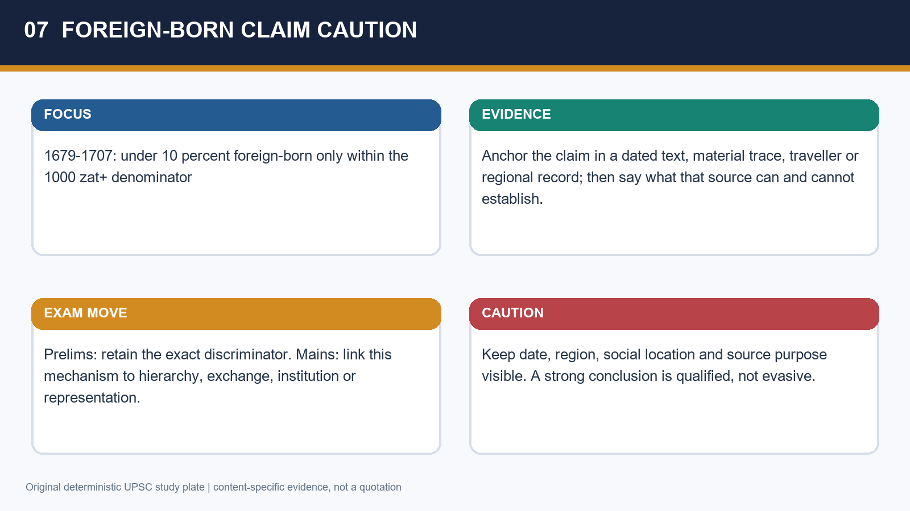

*Visual 7: FOREIGN-BORN CLAIM CAUTION. Original deterministic study visual; schematic maps are NOT TO SCALE.*

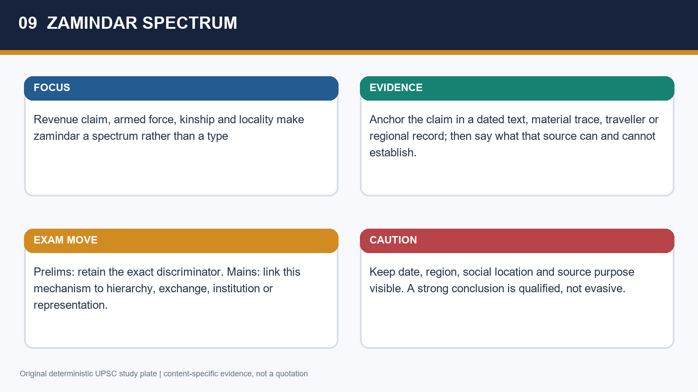

*Visual 9: ZAMINDAR SPECTRUM. Original deterministic study visual; schematic maps are NOT TO SCALE.*

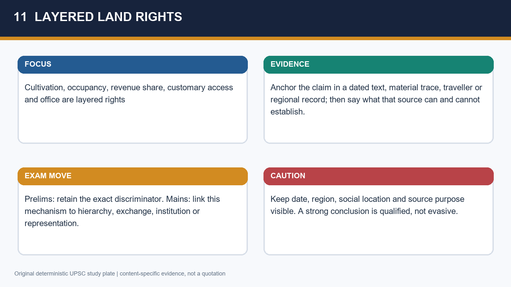

*Visual 11: LAYERED LAND RIGHTS. Original deterministic study visual; schematic maps are NOT TO SCALE.*

*Visual 13: AGRARIAN EXPANSION. Original deterministic study visual; schematic maps are NOT TO SCALE.*

*Visual 15: IRRIGATION SYSTEMS. Original deterministic study visual; schematic maps are NOT TO SCALE.*

*Visual 17: WOMEN LABOUR MATRIX. Original deterministic study visual; schematic maps are NOT TO SCALE.*

*Visual 19: GENDER HIERARCHY. Original deterministic study visual; schematic maps are NOT TO SCALE.*

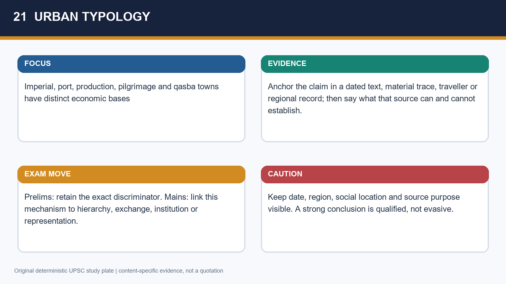

*Visual 21: URBAN TYPOLOGY. Original deterministic study visual; schematic maps are NOT TO SCALE.*

*Visual 23: MIDDLE STRATA. Original deterministic study visual; schematic maps are NOT TO SCALE.*

*Visual 25: CRAFT SECTORS. Original deterministic study visual; schematic maps are NOT TO SCALE.*

*Visual 27: IMPERIAL AND PRIVATE KARKHANA. Original deterministic study visual; schematic maps are NOT TO SCALE.*

*Visual 29: PRODUCTION TO EXPORT CHAIN. Original deterministic study visual; schematic maps are NOT TO SCALE.*

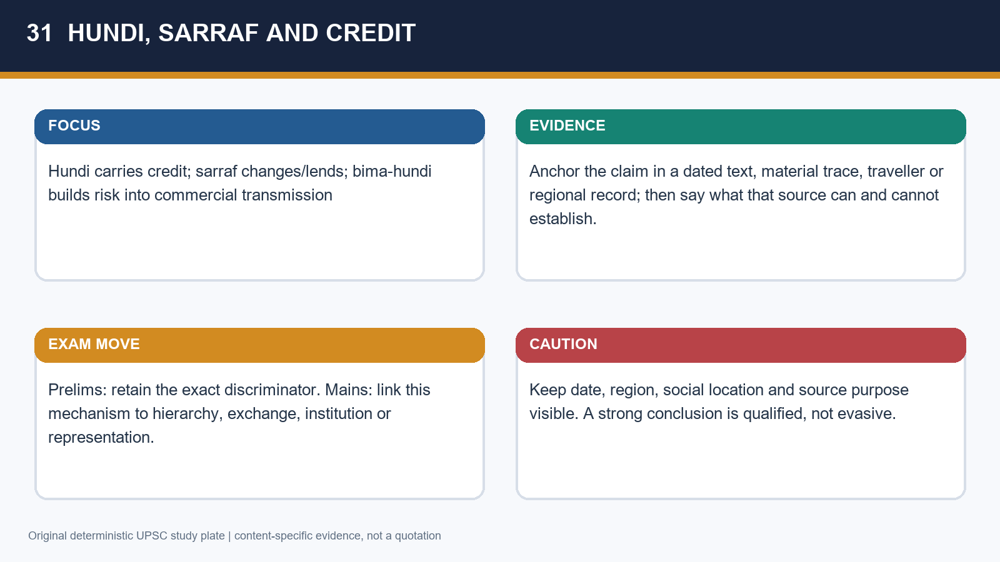

*Visual 31: HUNDI, SARRAF AND CREDIT. Original deterministic study visual; schematic maps are NOT TO SCALE.*

*Visual 33: MIRASIDAR: LOCAL RIGHT. Original deterministic study visual; schematic maps are NOT TO SCALE.*

*Visual 35: VIRJI VOHRA AND ABDUL GHAFFUR. Original deterministic study visual; schematic maps are NOT TO SCALE.*

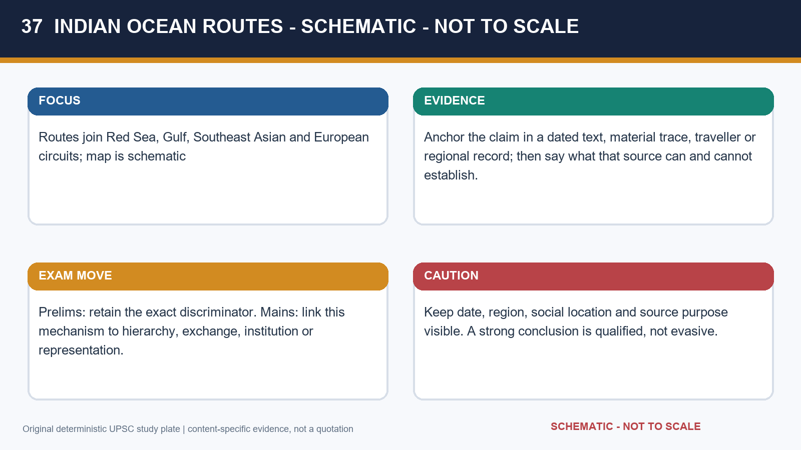

*Visual 37: INDIAN OCEAN ROUTES - SCHEMATIC - NOT TO SCALE. Original deterministic study visual; schematic maps are NOT TO SCALE.*

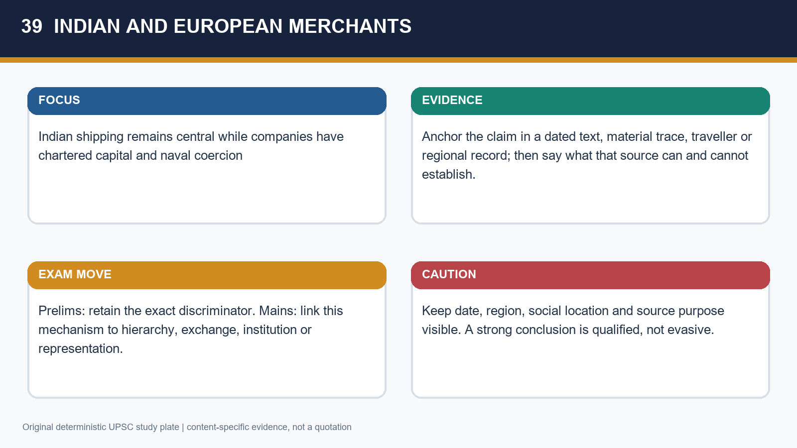

*Visual 39: INDIAN AND EUROPEAN MERCHANTS. Original deterministic study visual; schematic maps are NOT TO SCALE.*

*Visual 41: TAVERNIER DIAMOND ROUTE. Original deterministic study visual; schematic maps are NOT TO SCALE.*

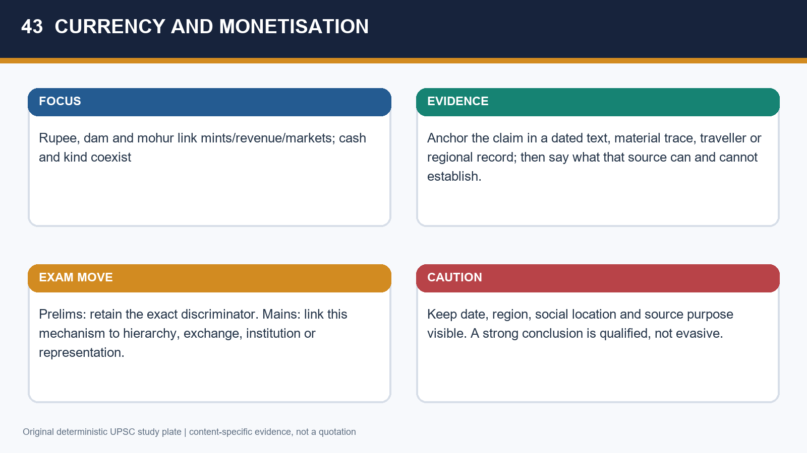

*Visual 43: CURRENCY AND MONETISATION. Original deterministic study visual; schematic maps are NOT TO SCALE.*

*Visual 45: TECHNOLOGY SECTORS. Original deterministic study visual; schematic maps are NOT TO SCALE.*

*Visual 47: SCIENCE-ARTISAN GAP. Original deterministic study visual; schematic maps are NOT TO SCALE.*

*Visual 49: ARCHITECTURE TIMELINE. Original deterministic study visual; schematic maps are NOT TO SCALE.*

*Visual 51: JAHANGIR TRANSITION. Original deterministic study visual; schematic maps are NOT TO SCALE.*

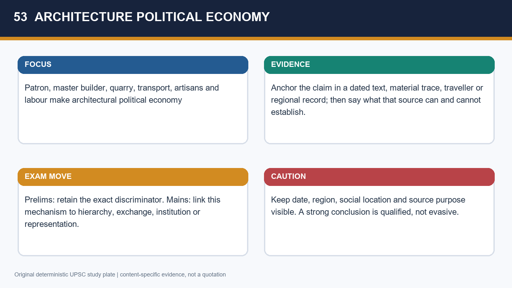

*Visual 53: ARCHITECTURE POLITICAL ECONOMY. Original deterministic study visual; schematic maps are NOT TO SCALE.*

*Visual 55: HAMZANAMA WORKSHOP. Original deterministic study visual; schematic maps are NOT TO SCALE.*

*Visual 57: ARTIST DISPERSAL. Original deterministic study visual; schematic maps are NOT TO SCALE.*

*Visual 59: MUSIC CONTINUITY. Original deterministic study visual; schematic maps are NOT TO SCALE.*

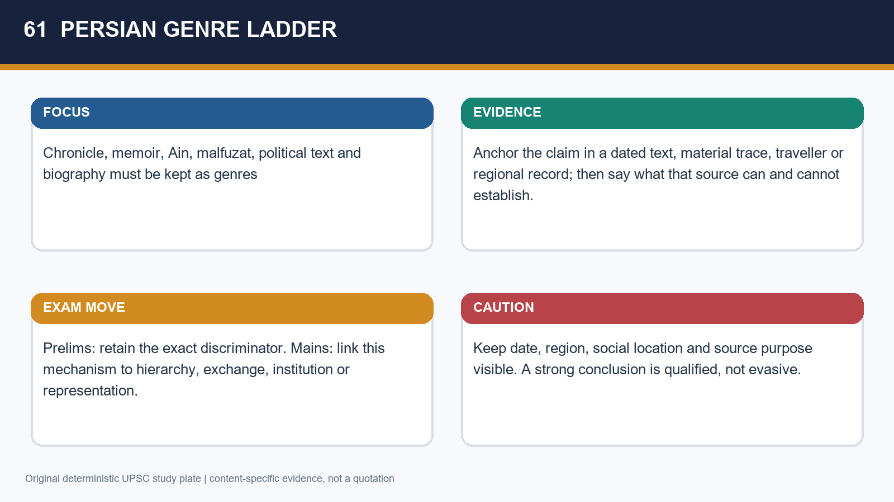

*Visual 61: PERSIAN GENRE LADDER. Original deterministic study visual; schematic maps are NOT TO SCALE.*

*Visual 63: REFLECT OR REFRACT. Original deterministic study visual; schematic maps are NOT TO SCALE.*

*Visual 65: TRANSLATION BUREAU. Original deterministic study visual; schematic maps are NOT TO SCALE.*

*Visual 67: DARA SHUKOH DISTINCT WORKS. Original deterministic study visual; schematic maps are NOT TO SCALE.*

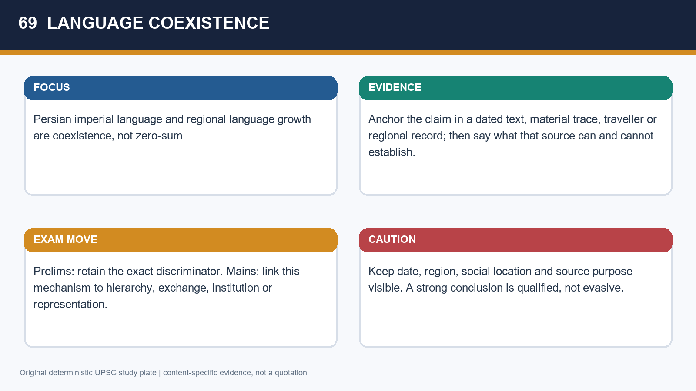

*Visual 69: LANGUAGE COEXISTENCE. Original deterministic study visual; schematic maps are NOT TO SCALE.*

*Visual 71: COMPOSITE CULTURE MATRIX. Original deterministic study visual; schematic maps are NOT TO SCALE.*

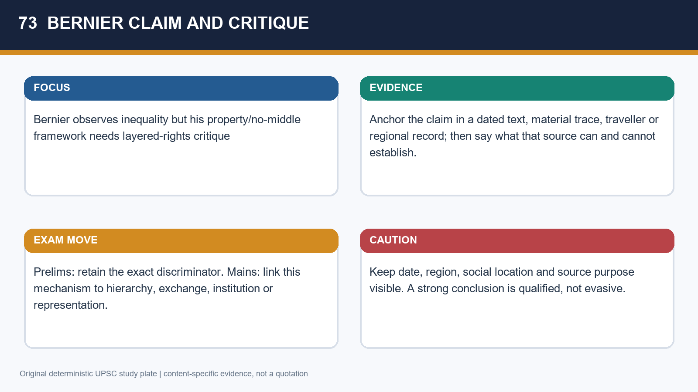

*Visual 73: BERNIER CLAIM AND CRITIQUE. Original deterministic study visual; schematic maps are NOT TO SCALE.*

*Visual 75: 2018 PRELIMS PYQ MAP. Original deterministic study visual; schematic maps are NOT TO SCALE.*

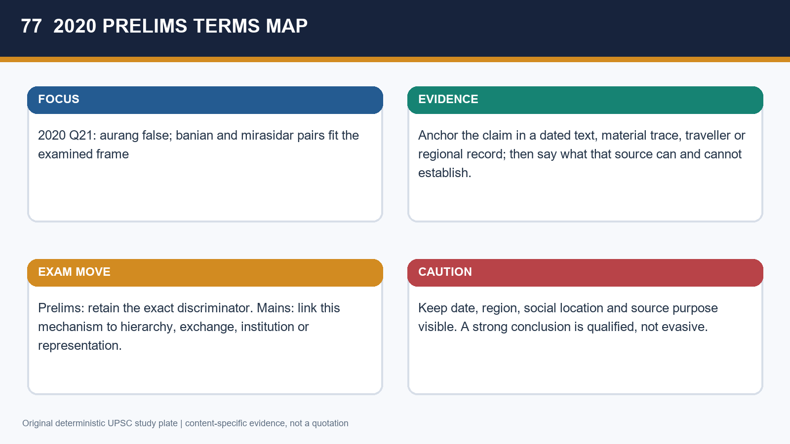

*Visual 77: 2020 PRELIMS TERMS MAP. Original deterministic study visual; schematic maps are NOT TO SCALE.*

*Visual 79: SOURCE REACH MATRIX. Original deterministic study visual; schematic maps are NOT TO SCALE.*

*Visual 81: CURRENT-STATIC LINK. Original deterministic study visual; schematic maps are NOT TO SCALE.*

*Visual 83: MAINS ANSWER SPINE. Original deterministic study visual; schematic maps are NOT TO SCALE.*

## Learning MCQ loop (24; keys A-B-C-D x6)

Original learning practice. Correct positions rotate A -> B -> C -> D without changing the underlying answer.
### Q1. Which description best avoids a uniform-society error?

A. A layered Mughal order whose hierarchy and mobility varied by region
B. A rigid all-India legal pyramid
C. A society without occupational difference
D. A court-versus-peasant binary

**Answer: A. A layered Mughal order whose hierarchy and mobility varied by region**

**Explanation:** The answer retains hierarchy and variation; the binary distractor suppresses merchants, professionals, artisans and local chiefs.

### Q2. Which late-Aurangzeb foreign-born statement is careful?

A. All Iranis/Turanis were foreign-born
B. Under 10 percent of 1000-zat-and-above nobles were foreign-born in 1679-1707
C. Ancestry had no elite importance
D. Foreign-born nobles were always a majority

**Answer: B. Under 10 percent of 1000-zat-and-above nobles were foreign-born in 1679-1707**

**Explanation:** Date and denominator control the claim. Iranis/Turanis are not identical to foreign-born persons.

### Q3. Mansab is best described as

A. A hereditary European title
B. A village revenue tax
C. A service-rank system bureaucratising an aristocratic patronage world
D. A port customs office

**Answer: C. A service-rank system bureaucratising an aristocratic patronage world**

**Explanation:** Mansab regulates service and rank without abolishing elite household power; hereditary title reverses the formal rule.

### Q4. A zamindar should not be reduced to

A. A locally rooted claimant with varied rights
B. An actor sometimes linked to force and clan
C. A category with variable scale
D. A British landlord or a mere tax clerk

**Answer: D. A British landlord or a mere tax clerk**

**Explanation:** The correct answer blocks both anachronisms. Local claimant is true but too partial as a definition.

### Q5. Khud-kasht most carefully denotes

A. A resident owner-cultivator with stronger resource and status position
B. Every village resident
C. Only landless seasonal labour
D. A transferable jagir holder

**Answer: A. A resident owner-cultivator with stronger resource and status position**

**Explanation:** Residence alone is insufficient: cultivation, ownership and resource position matter.

### Q6. Pahi-kasht were often

A. Treasury officials
B. Incoming cultivators settling new, surplus or abandoned land on possible concessions
C. Non-cultivating nomads only
D. A synonym for all khud-kasht

**Answer: B. Incoming cultivators settling new, surplus or abandoned land on possible concessions**

**Explanation:** Pahi concerns entrant settlement. Khud-kasht reverses the resident/entrant distinction.

### Q7. Layered Mughal land rights mean

A. State alone held every right
B. Modern private ownership was complete
C. Cultivation, occupancy, revenue claim and customary access could be separated
D. Every zamindar owned every field

**Answer: C. Cultivation, occupancy, revenue claim and customary access could be separated**

**Explanation:** Layering defeats both simple state ownership and modern property assumptions.

### Q8. Bernier is best treated as

A. A total census of property
B. A source to discard because European
C. Proof that agriculture never grew
D. A situated observer whose property argument needs comparison with Indian evidence

**Answer: D. A situated observer whose property argument needs comparison with Indian evidence**

**Explanation:** His observed inequality matters; the mistake is converting comparison into a complete theory.

### Q9. A sound inference about women is

A. Labour and elite patronage show agency without proving general equality
B. Elite women prove equality for all
C. Women had no productive role
D. Every inheritance practice was identical

**Answer: A. Labour and elite patronage show agency without proving general equality**

**Explanation:** Elite visibility is the closest false leap because archives privilege courtly women.

### Q10. Mughal urbanisation included

A. Only army camps
B. Imperial cities, ports, production/pilgrimage centres and qasbas
C. Only coast cities
D. One craft in every city

**Answer: B. Imperial cities, ports, production/pilgrimage centres and qasbas**

**Explanation:** Functional diversity, not a single urban form, is the evidence-based approach.

### Q11. Chandra's middle-strata argument names

A. No urban occupations
B. A modern democratic middle class
C. Merchants, clerks, professionals, brokers and master-craftsmen
D. Only company employees

**Answer: C. Merchants, clerks, professionals, brokers and master-craftsmen**

**Explanation:** The listed groups refute Bernier's binary but should not be relabelled a modern middle class.

### Q12. Imperial karkhanas were

A. All Mughal manufacture
B. Only barracks
C. Agrarian assignments
D. Household/workshop/store systems alongside private production

**Answer: D. Household/workshop/store systems alongside private production**

**Explanation:** Coexistence with private workshops and putting-out is the discriminator.

### Q13. Aurang in the 2020 pair was not

A. The in-charge of the state treasury
B. A warehouse/depot term
C. Commercial storage
D. A trade-infrastructure word

**Answer: A. The in-charge of the state treasury**

**Explanation:** Aurang is a depot/warehouse. Treasury office is the specific mismatch.

### Q14. Banian in company trade meant

A. Any foreign merchant
B. An Indian broker-agent connecting purchase, credit and information
C. Treasury officer
D. Hereditary military rank

**Answer: B. An Indian broker-agent connecting purchase, credit and information**

**Explanation:** Generic merchant is too broad; the intermediary function is decisive.

### Q15. Mirasidar is safest as

A. A mansabdar
B. A sea captain
C. A hereditary/local right-holder, contextually a designated revenue payer in 2020
D. A factory resident

**Answer: C. A hereditary/local right-holder, contextually a designated revenue payer in 2020**

**Explanation:** Local-right context prevents confusing it with service rank.

### Q16. A hundi was

A. A noble title
B. A fixed silver coin
C. A fortification permit
D. A credit instrument transmitting value across distance/time

**Answer: D. A credit instrument transmitting value across distance/time**

**Explanation:** Hundi reduces risky cash movement; a coin is financial but not the instrument.

### Q17. Banjaras are associated with

A. Moving bulk goods overland, often with oxen caravans
B. Issuing coin
C. Painting albums
D. Holding mansabs

**Answer: A. Moving bulk goods overland, often with oxen caravans**

**Explanation:** Transport of grain and bulk supply, not minting, is the function.

### Q18. European companies were

A. Instant masters of all trade
B. Entrants into existing networks with growing naval-coercive capacity
C. Irrelevant everywhere
D. Mughal departments

**Answer: B. Entrants into existing networks with growing naval-coercive capacity**

**Explanation:** The answer avoids instant dominance and irrelevance alike.

### Q19. Tavernier is especially relevant because he

A. Wrote Ain-i-Akbari
B. Created mansab
C. Elaborately discussed Indian diamonds and diamond mines
D. Translated Yogavasistha

**Answer: C. Elaborately discussed Indian diamonds and diamond mines**

**Explanation:** Jeweller-merchant expertise explains the diamond route; Nizamuddin, not Tavernier, is the translator.

### Q20. Monetisation is best described as

A. A universal cash-only economy
B. End of regional mints
C. Automatic rural welfare
D. Important cash/revenue linkage while kind and barter persisted unevenly

**Answer: D. Important cash/revenue linkage while kind and barter persisted unevenly**

**Explanation:** Cash circulation does not abolish kind exchange or distribute welfare equally.

### Q21. Technology is best judged as

A. High artisanal skill with selective adoption and uneven science-production linkage
B. Uniform inferiority
C. No technical craft skill
D. Completed industrialisation

**Answer: A. High artisanal skill with selective adoption and uneven science-production linkage**

**Explanation:** Sectoral comparison avoids a civilisational stereotype and an industrial anachronism.

### Q22. Printing requires the distinction between

A. No printing in India
B. Textile blocks, knowledge of presses and uneven institutional uptake
C. Mass printing in every court
D. Universal literacy

**Answer: B. Textile blocks, knowledge of presses and uneven institutional uptake**

**Explanation:** The no-printing absolute is the central trap; medium and institution matter.

### Q23. Aurangzeb and music: the careful claim is

A. All music ceased in India
B. He invented dhrupad
C. Singers left court but instruments, treatises and patronage continued
D. No regional court continued music

**Answer: C. Singers left court but instruments, treatises and patronage continued**

**Explanation:** Court restriction is not social extinction; the funeral anecdote is satirical.

### Q24. Yogavasistha/Jug Basis matches

A. Dara Shukoh and Aurangzeb
B. Tavernier and Jahangir
C. Bernier and Shah Jahan
D. Nizamuddin Panipati and Akbar's reign

**Answer: D. Nizamuddin Panipati and Akbar's reign**

**Explanation:** This corrects the owner-risk: Dara's distinct works are Majma-ul-Bahrain and Sirr-i-Akbar.

## Broad MCQ bank (48; keys A-B-C-D x12)

Original broad practice. Correct positions rotate A -> B -> C -> D without changing the underlying answer.
### Q1. In a source-disciplined reading, Which description best avoids a uniform-society error?

A. A layered Mughal order whose hierarchy and mobility varied by region
B. A rigid all-India legal pyramid
C. A society without occupational difference
D. A court-versus-peasant binary

**Answer: A. A layered Mughal order whose hierarchy and mobility varied by region**

**Explanation:** The answer retains hierarchy and variation; the binary distractor suppresses merchants, professionals, artisans and local chiefs.

### Q2. When testing a common overclaim, Which late-Aurangzeb foreign-born statement is careful?

A. All Iranis/Turanis were foreign-born
B. Under 10 percent of 1000-zat-and-above nobles were foreign-born in 1679-1707
C. Ancestry had no elite importance
D. Foreign-born nobles were always a majority

**Answer: B. Under 10 percent of 1000-zat-and-above nobles were foreign-born in 1679-1707**

**Explanation:** Date and denominator control the claim. Iranis/Turanis are not identical to foreign-born persons.

### Q3. For a period-and-region qualified answer, Mansab is best described as

A. A hereditary European title
B. A village revenue tax
C. A service-rank system bureaucratising an aristocratic patronage world
D. A port customs office

**Answer: C. A service-rank system bureaucratising an aristocratic patronage world**

**Explanation:** Mansab regulates service and rank without abolishing elite household power; hereditary title reverses the formal rule.

### Q4. In a mechanism-based comparison, A zamindar should not be reduced to

A. A locally rooted claimant with varied rights
B. An actor sometimes linked to force and clan
C. A category with variable scale
D. A British landlord or a mere tax clerk

**Answer: D. A British landlord or a mere tax clerk**

**Explanation:** The correct answer blocks both anachronisms. Local claimant is true but too partial as a definition.

### Q5. When an option removes a social boundary, Khud-kasht most carefully denotes

A. A resident owner-cultivator with stronger resource and status position
B. Every village resident
C. Only landless seasonal labour
D. A transferable jagir holder

**Answer: A. A resident owner-cultivator with stronger resource and status position**

**Explanation:** Residence alone is insufficient: cultivation, ownership and resource position matter.

### Q6. For a term-versus-inference distinction, Pahi-kasht were often

A. Treasury officials
B. Incoming cultivators settling new, surplus or abandoned land on possible concessions
C. Non-cultivating nomads only
D. A synonym for all khud-kasht

**Answer: B. Incoming cultivators settling new, surplus or abandoned land on possible concessions**

**Explanation:** Pahi concerns entrant settlement. Khud-kasht reverses the resident/entrant distinction.

### Q7. When court and locality are compared, Layered Mughal land rights mean

A. State alone held every right
B. Modern private ownership was complete
C. Cultivation, occupancy, revenue claim and customary access could be separated
D. Every zamindar owned every field

**Answer: C. Cultivation, occupancy, revenue claim and customary access could be separated**

**Explanation:** Layering defeats both simple state ownership and modern property assumptions.

### Q8. In a claim-and-counterclaim frame, Bernier is best treated as

A. A total census of property
B. A source to discard because European
C. Proof that agriculture never grew
D. A situated observer whose property argument needs comparison with Indian evidence

**Answer: D. A situated observer whose property argument needs comparison with Indian evidence**

**Explanation:** His observed inequality matters; the mistake is converting comparison into a complete theory.

### Q9. In a source-disciplined reading, A sound inference about women is

A. Labour and elite patronage show agency without proving general equality
B. Elite women prove equality for all
C. Women had no productive role
D. Every inheritance practice was identical

**Answer: A. Labour and elite patronage show agency without proving general equality**

**Explanation:** Elite visibility is the closest false leap because archives privilege courtly women.

### Q10. When testing a common overclaim, Mughal urbanisation included

A. Only army camps
B. Imperial cities, ports, production/pilgrimage centres and qasbas
C. Only coast cities
D. One craft in every city

**Answer: B. Imperial cities, ports, production/pilgrimage centres and qasbas**

**Explanation:** Functional diversity, not a single urban form, is the evidence-based approach.

### Q11. For a period-and-region qualified answer, Chandra's middle-strata argument names

A. No urban occupations
B. A modern democratic middle class
C. Merchants, clerks, professionals, brokers and master-craftsmen
D. Only company employees

**Answer: C. Merchants, clerks, professionals, brokers and master-craftsmen**

**Explanation:** The listed groups refute Bernier's binary but should not be relabelled a modern middle class.

### Q12. In a mechanism-based comparison, Imperial karkhanas were

A. All Mughal manufacture
B. Only barracks
C. Agrarian assignments
D. Household/workshop/store systems alongside private production

**Answer: D. Household/workshop/store systems alongside private production**

**Explanation:** Coexistence with private workshops and putting-out is the discriminator.

### Q13. When an option removes a social boundary, Aurang in the 2020 pair was not

A. The in-charge of the state treasury
B. A warehouse/depot term
C. Commercial storage
D. A trade-infrastructure word

**Answer: A. The in-charge of the state treasury**

**Explanation:** Aurang is a depot/warehouse. Treasury office is the specific mismatch.

### Q14. For a term-versus-inference distinction, Banian in company trade meant

A. Any foreign merchant
B. An Indian broker-agent connecting purchase, credit and information
C. Treasury officer
D. Hereditary military rank

**Answer: B. An Indian broker-agent connecting purchase, credit and information**

**Explanation:** Generic merchant is too broad; the intermediary function is decisive.

### Q15. When court and locality are compared, Mirasidar is safest as

A. A mansabdar
B. A sea captain
C. A hereditary/local right-holder, contextually a designated revenue payer in 2020
D. A factory resident

**Answer: C. A hereditary/local right-holder, contextually a designated revenue payer in 2020**

**Explanation:** Local-right context prevents confusing it with service rank.

### Q16. In a claim-and-counterclaim frame, A hundi was

A. A noble title
B. A fixed silver coin
C. A fortification permit
D. A credit instrument transmitting value across distance/time

**Answer: D. A credit instrument transmitting value across distance/time**

**Explanation:** Hundi reduces risky cash movement; a coin is financial but not the instrument.

### Q17. In a source-disciplined reading, Banjaras are associated with

A. Moving bulk goods overland, often with oxen caravans
B. Issuing coin
C. Painting albums
D. Holding mansabs

**Answer: A. Moving bulk goods overland, often with oxen caravans**

**Explanation:** Transport of grain and bulk supply, not minting, is the function.

### Q18. When testing a common overclaim, European companies were

A. Instant masters of all trade
B. Entrants into existing networks with growing naval-coercive capacity
C. Irrelevant everywhere
D. Mughal departments

**Answer: B. Entrants into existing networks with growing naval-coercive capacity**

**Explanation:** The answer avoids instant dominance and irrelevance alike.

### Q19. For a period-and-region qualified answer, Tavernier is especially relevant because he

A. Wrote Ain-i-Akbari
B. Created mansab
C. Elaborately discussed Indian diamonds and diamond mines
D. Translated Yogavasistha

**Answer: C. Elaborately discussed Indian diamonds and diamond mines**

**Explanation:** Jeweller-merchant expertise explains the diamond route; Nizamuddin, not Tavernier, is the translator.

### Q20. In a mechanism-based comparison, Monetisation is best described as

A. A universal cash-only economy
B. End of regional mints
C. Automatic rural welfare
D. Important cash/revenue linkage while kind and barter persisted unevenly

**Answer: D. Important cash/revenue linkage while kind and barter persisted unevenly**

**Explanation:** Cash circulation does not abolish kind exchange or distribute welfare equally.

### Q21. When an option removes a social boundary, Technology is best judged as

A. High artisanal skill with selective adoption and uneven science-production linkage
B. Uniform inferiority
C. No technical craft skill
D. Completed industrialisation

**Answer: A. High artisanal skill with selective adoption and uneven science-production linkage**

**Explanation:** Sectoral comparison avoids a civilisational stereotype and an industrial anachronism.

### Q22. For a term-versus-inference distinction, Printing requires the distinction between

A. No printing in India
B. Textile blocks, knowledge of presses and uneven institutional uptake
C. Mass printing in every court
D. Universal literacy

**Answer: B. Textile blocks, knowledge of presses and uneven institutional uptake**

**Explanation:** The no-printing absolute is the central trap; medium and institution matter.

### Q23. When court and locality are compared, Aurangzeb and music: the careful claim is

A. All music ceased in India
B. He invented dhrupad
C. Singers left court but instruments, treatises and patronage continued
D. No regional court continued music

**Answer: C. Singers left court but instruments, treatises and patronage continued**

**Explanation:** Court restriction is not social extinction; the funeral anecdote is satirical.

### Q24. In a claim-and-counterclaim frame, Yogavasistha/Jug Basis matches

A. Dara Shukoh and Aurangzeb
B. Tavernier and Jahangir
C. Bernier and Shah Jahan
D. Nizamuddin Panipati and Akbar's reign

**Answer: D. Nizamuddin Panipati and Akbar's reign**

**Explanation:** This corrects the owner-risk: Dara's distinct works are Majma-ul-Bahrain and Sirr-i-Akbar.

### Q25. In a source-disciplined reading, In a high-level UPSC elimination, which description best avoids a uniform-society error?

A. A layered Mughal order whose hierarchy and mobility varied by region
B. A rigid all-India legal pyramid
C. A society without occupational difference
D. A court-versus-peasant binary

**Answer: A. A layered Mughal order whose hierarchy and mobility varied by region**

**Explanation:** A second route to the answer: The answer retains hierarchy and variation; the binary distractor suppresses merchants, professionals, artisans and local chiefs.

### Q26. When testing a common overclaim, In a high-level UPSC elimination, which late-Aurangzeb foreign-born statement is careful?

A. All Iranis/Turanis were foreign-born
B. Under 10 percent of 1000-zat-and-above nobles were foreign-born in 1679-1707
C. Ancestry had no elite importance
D. Foreign-born nobles were always a majority

**Answer: B. Under 10 percent of 1000-zat-and-above nobles were foreign-born in 1679-1707**

**Explanation:** A second route to the answer: Date and denominator control the claim. Iranis/Turanis are not identical to foreign-born persons.

### Q27. For a period-and-region qualified answer, In a high-level UPSC elimination, mansab is best described as

A. A hereditary European title
B. A village revenue tax
C. A service-rank system bureaucratising an aristocratic patronage world
D. A port customs office

**Answer: C. A service-rank system bureaucratising an aristocratic patronage world**

**Explanation:** A second route to the answer: Mansab regulates service and rank without abolishing elite household power; hereditary title reverses the formal rule.

### Q28. In a mechanism-based comparison, In a high-level UPSC elimination, a zamindar should not be reduced to

A. A locally rooted claimant with varied rights
B. An actor sometimes linked to force and clan
C. A category with variable scale
D. A British landlord or a mere tax clerk

**Answer: D. A British landlord or a mere tax clerk**

**Explanation:** A second route to the answer: The correct answer blocks both anachronisms. Local claimant is true but too partial as a definition.

### Q29. When an option removes a social boundary, In a high-level UPSC elimination, khud-kasht most carefully denotes

A. A resident owner-cultivator with stronger resource and status position
B. Every village resident
C. Only landless seasonal labour
D. A transferable jagir holder

**Answer: A. A resident owner-cultivator with stronger resource and status position**

**Explanation:** A second route to the answer: Residence alone is insufficient: cultivation, ownership and resource position matter.

### Q30. For a term-versus-inference distinction, In a high-level UPSC elimination, pahi-kasht were often

A. Treasury officials
B. Incoming cultivators settling new, surplus or abandoned land on possible concessions
C. Non-cultivating nomads only
D. A synonym for all khud-kasht

**Answer: B. Incoming cultivators settling new, surplus or abandoned land on possible concessions**

**Explanation:** A second route to the answer: Pahi concerns entrant settlement. Khud-kasht reverses the resident/entrant distinction.

### Q31. When court and locality are compared, In a high-level UPSC elimination, layered Mughal land rights mean

A. State alone held every right
B. Modern private ownership was complete
C. Cultivation, occupancy, revenue claim and customary access could be separated
D. Every zamindar owned every field

**Answer: C. Cultivation, occupancy, revenue claim and customary access could be separated**

**Explanation:** A second route to the answer: Layering defeats both simple state ownership and modern property assumptions.

### Q32. In a claim-and-counterclaim frame, In a high-level UPSC elimination, bernier is best treated as

A. A total census of property
B. A source to discard because European
C. Proof that agriculture never grew
D. A situated observer whose property argument needs comparison with Indian evidence

**Answer: D. A situated observer whose property argument needs comparison with Indian evidence**

**Explanation:** A second route to the answer: His observed inequality matters; the mistake is converting comparison into a complete theory.

### Q33. In a source-disciplined reading, In a high-level UPSC elimination, a sound inference about women is

A. Labour and elite patronage show agency without proving general equality
B. Elite women prove equality for all
C. Women had no productive role
D. Every inheritance practice was identical

**Answer: A. Labour and elite patronage show agency without proving general equality**

**Explanation:** A second route to the answer: Elite visibility is the closest false leap because archives privilege courtly women.

### Q34. When testing a common overclaim, In a high-level UPSC elimination, mughal urbanisation included

A. Only army camps
B. Imperial cities, ports, production/pilgrimage centres and qasbas
C. Only coast cities
D. One craft in every city

**Answer: B. Imperial cities, ports, production/pilgrimage centres and qasbas**

**Explanation:** A second route to the answer: Functional diversity, not a single urban form, is the evidence-based approach.

### Q35. For a period-and-region qualified answer, In a high-level UPSC elimination, chandra's middle-strata argument names

A. No urban occupations
B. A modern democratic middle class
C. Merchants, clerks, professionals, brokers and master-craftsmen
D. Only company employees

**Answer: C. Merchants, clerks, professionals, brokers and master-craftsmen**

**Explanation:** A second route to the answer: The listed groups refute Bernier's binary but should not be relabelled a modern middle class.

### Q36. In a mechanism-based comparison, In a high-level UPSC elimination, imperial karkhanas were

A. All Mughal manufacture
B. Only barracks
C. Agrarian assignments
D. Household/workshop/store systems alongside private production

**Answer: D. Household/workshop/store systems alongside private production**

**Explanation:** A second route to the answer: Coexistence with private workshops and putting-out is the discriminator.

### Q37. When an option removes a social boundary, In a high-level UPSC elimination, aurang in the 2020 pair was not

A. The in-charge of the state treasury
B. A warehouse/depot term
C. Commercial storage
D. A trade-infrastructure word

**Answer: A. The in-charge of the state treasury**

**Explanation:** A second route to the answer: Aurang is a depot/warehouse. Treasury office is the specific mismatch.

### Q38. For a term-versus-inference distinction, In a high-level UPSC elimination, banian in company trade meant

A. Any foreign merchant
B. An Indian broker-agent connecting purchase, credit and information
C. Treasury officer
D. Hereditary military rank

**Answer: B. An Indian broker-agent connecting purchase, credit and information**

**Explanation:** A second route to the answer: Generic merchant is too broad; the intermediary function is decisive.

### Q39. When court and locality are compared, In a high-level UPSC elimination, mirasidar is safest as

A. A mansabdar
B. A sea captain
C. A hereditary/local right-holder, contextually a designated revenue payer in 2020
D. A factory resident

**Answer: C. A hereditary/local right-holder, contextually a designated revenue payer in 2020**

**Explanation:** A second route to the answer: Local-right context prevents confusing it with service rank.

### Q40. In a claim-and-counterclaim frame, In a high-level UPSC elimination, a hundi was

A. A noble title
B. A fixed silver coin
C. A fortification permit
D. A credit instrument transmitting value across distance/time

**Answer: D. A credit instrument transmitting value across distance/time**

**Explanation:** A second route to the answer: Hundi reduces risky cash movement; a coin is financial but not the instrument.

### Q41. In a source-disciplined reading, In a high-level UPSC elimination, banjaras are associated with

A. Moving bulk goods overland, often with oxen caravans
B. Issuing coin
C. Painting albums
D. Holding mansabs

**Answer: A. Moving bulk goods overland, often with oxen caravans**

**Explanation:** A second route to the answer: Transport of grain and bulk supply, not minting, is the function.

### Q42. When testing a common overclaim, In a high-level UPSC elimination, european companies were

A. Instant masters of all trade
B. Entrants into existing networks with growing naval-coercive capacity
C. Irrelevant everywhere
D. Mughal departments

**Answer: B. Entrants into existing networks with growing naval-coercive capacity**

**Explanation:** A second route to the answer: The answer avoids instant dominance and irrelevance alike.

### Q43. For a period-and-region qualified answer, In a high-level UPSC elimination, tavernier is especially relevant because he

A. Wrote Ain-i-Akbari
B. Created mansab
C. Elaborately discussed Indian diamonds and diamond mines
D. Translated Yogavasistha

**Answer: C. Elaborately discussed Indian diamonds and diamond mines**

**Explanation:** A second route to the answer: Jeweller-merchant expertise explains the diamond route; Nizamuddin, not Tavernier, is the translator.

### Q44. In a mechanism-based comparison, In a high-level UPSC elimination, monetisation is best described as

A. A universal cash-only economy
B. End of regional mints
C. Automatic rural welfare
D. Important cash/revenue linkage while kind and barter persisted unevenly

**Answer: D. Important cash/revenue linkage while kind and barter persisted unevenly**

**Explanation:** A second route to the answer: Cash circulation does not abolish kind exchange or distribute welfare equally.

### Q45. When an option removes a social boundary, In a high-level UPSC elimination, technology is best judged as

A. High artisanal skill with selective adoption and uneven science-production linkage
B. Uniform inferiority
C. No technical craft skill
D. Completed industrialisation

**Answer: A. High artisanal skill with selective adoption and uneven science-production linkage**

**Explanation:** A second route to the answer: Sectoral comparison avoids a civilisational stereotype and an industrial anachronism.

### Q46. For a term-versus-inference distinction, In a high-level UPSC elimination, printing requires the distinction between

A. No printing in India
B. Textile blocks, knowledge of presses and uneven institutional uptake
C. Mass printing in every court
D. Universal literacy

**Answer: B. Textile blocks, knowledge of presses and uneven institutional uptake**

**Explanation:** A second route to the answer: The no-printing absolute is the central trap; medium and institution matter.

### Q47. When court and locality are compared, In a high-level UPSC elimination, aurangzeb and music: the careful claim is

A. All music ceased in India
B. He invented dhrupad
C. Singers left court but instruments, treatises and patronage continued
D. No regional court continued music

**Answer: C. Singers left court but instruments, treatises and patronage continued**

**Explanation:** A second route to the answer: Court restriction is not social extinction; the funeral anecdote is satirical.

### Q48. In a claim-and-counterclaim frame, In a high-level UPSC elimination, yogavasistha/Jug Basis matches

A. Dara Shukoh and Aurangzeb
B. Tavernier and Jahangir
C. Bernier and Shah Jahan
D. Nizamuddin Panipati and Akbar's reign

**Answer: D. Nizamuddin Panipati and Akbar's reign**

**Explanation:** A second route to the answer: This corrects the owner-risk: Dara's distinct works are Majma-ul-Bahrain and Sirr-i-Akbar.

## Remedial MCQ bank (16; keys A-B-C-D x4)

Original remedial practice. Correct positions rotate A -> B -> C -> D without changing the underlying answer.
### Q1. Which description best avoids a uniform-society error?

A. A layered Mughal order whose hierarchy and mobility varied by region
B. A rigid all-India legal pyramid
C. A society without occupational difference
D. A court-versus-peasant binary

**Answer: A. A layered Mughal order whose hierarchy and mobility varied by region**

**Explanation:** The answer retains hierarchy and variation; the binary distractor suppresses merchants, professionals, artisans and local chiefs.

### Q2. Which late-Aurangzeb foreign-born statement is careful?

A. All Iranis/Turanis were foreign-born
B. Under 10 percent of 1000-zat-and-above nobles were foreign-born in 1679-1707
C. Ancestry had no elite importance
D. Foreign-born nobles were always a majority

**Answer: B. Under 10 percent of 1000-zat-and-above nobles were foreign-born in 1679-1707**

**Explanation:** Date and denominator control the claim. Iranis/Turanis are not identical to foreign-born persons.

### Q3. A zamindar should not be reduced to

A. A locally rooted claimant with varied rights
B. An actor sometimes linked to force and clan
C. A British landlord or a mere tax clerk
D. A category with variable scale

**Answer: C. A British landlord or a mere tax clerk**

**Explanation:** The correct answer blocks both anachronisms. Local claimant is true but too partial as a definition.

### Q4. Khud-kasht most carefully denotes

A. Every village resident
B. Only landless seasonal labour
C. A transferable jagir holder
D. A resident owner-cultivator with stronger resource and status position

**Answer: D. A resident owner-cultivator with stronger resource and status position**

**Explanation:** Residence alone is insufficient: cultivation, ownership and resource position matter.

### Q5. Bernier is best treated as

A. A situated observer whose property argument needs comparison with Indian evidence
B. A total census of property
C. A source to discard because European
D. Proof that agriculture never grew

**Answer: A. A situated observer whose property argument needs comparison with Indian evidence**

**Explanation:** His observed inequality matters; the mistake is converting comparison into a complete theory.

### Q6. A sound inference about women is

A. Elite women prove equality for all
B. Labour and elite patronage show agency without proving general equality
C. Women had no productive role
D. Every inheritance practice was identical

**Answer: B. Labour and elite patronage show agency without proving general equality**

**Explanation:** Elite visibility is the closest false leap because archives privilege courtly women.

### Q7. Chandra's middle-strata argument names

A. No urban occupations
B. A modern democratic middle class
C. Merchants, clerks, professionals, brokers and master-craftsmen
D. Only company employees

**Answer: C. Merchants, clerks, professionals, brokers and master-craftsmen**

**Explanation:** The listed groups refute Bernier's binary but should not be relabelled a modern middle class.

### Q8. Imperial karkhanas were

A. All Mughal manufacture
B. Only barracks
C. Agrarian assignments
D. Household/workshop/store systems alongside private production

**Answer: D. Household/workshop/store systems alongside private production**

**Explanation:** Coexistence with private workshops and putting-out is the discriminator.

### Q9. Aurang in the 2020 pair was not

A. The in-charge of the state treasury
B. A warehouse/depot term
C. Commercial storage
D. A trade-infrastructure word

**Answer: A. The in-charge of the state treasury**

**Explanation:** Aurang is a depot/warehouse. Treasury office is the specific mismatch.

### Q10. Banian in company trade meant

A. Any foreign merchant
B. An Indian broker-agent connecting purchase, credit and information
C. Treasury officer
D. Hereditary military rank

**Answer: B. An Indian broker-agent connecting purchase, credit and information**

**Explanation:** Generic merchant is too broad; the intermediary function is decisive.

### Q11. Mirasidar is safest as

A. A mansabdar
B. A sea captain
C. A hereditary/local right-holder, contextually a designated revenue payer in 2020
D. A factory resident

**Answer: C. A hereditary/local right-holder, contextually a designated revenue payer in 2020**

**Explanation:** Local-right context prevents confusing it with service rank.

### Q12. European companies were

A. Instant masters of all trade
B. Irrelevant everywhere
C. Mughal departments
D. Entrants into existing networks with growing naval-coercive capacity

**Answer: D. Entrants into existing networks with growing naval-coercive capacity**

**Explanation:** The answer avoids instant dominance and irrelevance alike.

### Q13. Monetisation is best described as

A. Important cash/revenue linkage while kind and barter persisted unevenly
B. A universal cash-only economy
C. End of regional mints
D. Automatic rural welfare

**Answer: A. Important cash/revenue linkage while kind and barter persisted unevenly**

**Explanation:** Cash circulation does not abolish kind exchange or distribute welfare equally.

### Q14. Technology is best judged as

A. Uniform inferiority
B. High artisanal skill with selective adoption and uneven science-production linkage
C. No technical craft skill
D. Completed industrialisation

**Answer: B. High artisanal skill with selective adoption and uneven science-production linkage**

**Explanation:** Sectoral comparison avoids a civilisational stereotype and an industrial anachronism.

### Q15. Aurangzeb and music: the careful claim is

A. All music ceased in India
B. He invented dhrupad
C. Singers left court but instruments, treatises and patronage continued
D. No regional court continued music

**Answer: C. Singers left court but instruments, treatises and patronage continued**

**Explanation:** Court restriction is not social extinction; the funeral anecdote is satirical.

### Q16. Yogavasistha/Jug Basis matches

A. Dara Shukoh and Aurangzeb
B. Tavernier and Jahangir
C. Bernier and Shah Jahan
D. Nizamuddin Panipati and Akbar's reign

**Answer: D. Nizamuddin Panipati and Akbar's reign**

**Explanation:** This corrects the owner-risk: Dara's distinct works are Majma-ul-Bahrain and Sirr-i-Akbar.

## Twelve examiner-grade solved Mains questions

Each answer follows claim -> named evidence -> analysis -> qualification -> verdict.
### Mains 1. 2020 GS-I Q12 (15 marks, 250 words): Persian literary sources of medieval India reflect the spirit of the age. Comment.

**Model solution**

Persian literary sources are indispensable to medieval India, but "reflect" requires qualification. Court chronicles such as Barani's Tarikh-i-Firuz Shahi and Abul Fazl's Akbarnama disclose ideas of sovereignty, hierarchy and legitimate rule; Ain-i-Akbari turns revenue categories, offices and courtly order into an imperial knowledge project. Memoirs such as Baburnama and Tuzuk-i-Jahangiri offer more personal registers, while Sufi malfuzat such as Fawaid-ul-Fuad reveal devotional language and urban religious worlds. Translation projects such as Razmnama show scholarly contact across Sanskrit and Persian fields.

These sources reveal political vocabulary, literary aesthetics, patronage, religious debate and administrative aspiration. Badauni's dissenting tone itself prevents their reduction to unbroken official praise. Yet genre is a limit: chronicles seek legitimacy, compendia classify for rule, and memoirs centre privileged observers. Peasants, many women, oral communities and non-court regions remain unevenly visible; silence is not absence.

Persian letters, biographies and regional chronicles further register networks of service, learning and memory that a single imperial chronicle cannot exhaust. They also remind us that Persian was a working language of administration and literary exchange, not merely a royal ornament. Their evidence must still be located in patronage and circulation before it is made representative.

Persian literary sources therefore refract rather than mechanically mirror the spirit of the age. A reliable reconstruction reads them with vernacular literature, inscriptions, coins, paintings, buildings, archaeology and travellers. Their partiality is historically productive because it identifies the priorities and exclusions through which medieval power represented itself.

**Why this earns marks:** It directly answers the directive, uses named genres/texts, explains reach and silence, and ends with corroboration.

### Mains 2. Discuss social hierarchy and mobility in Mughal India. (15 marks, 250 words)

**Model solution**

Mughal society was layered, not frozen. Emperor and household, mansabdars, local chiefs/zamindars, merchants, professionals, artisans, cultivators and labourers held different claims on office, income and status. Mansab made service rank legible, yet khanazad advantage shows social reproduction despite formal non-heredity. The dated 1679-1707 evidence that foreign-born nobles were under 10 percent of 1000-zat-and-above total corrects Bernier's foreigner generalisation without erasing ancestry prestige.

Local power complicates a court-only account. Zamindars combined revenue claims, clan/caste links, armed following and local information; their scale ranged from village gentry to rajas. Mobility came through service, military employment, trade, migration and settlement. Pahi cultivators could enter new land on concession, while Virji Vohra's agency network shows commercial mobility. Yet caste, gender, access to cattle/credit and patronage constrained outcomes. Gulbadan or Jahanara illuminate elite female agency, not general equality.

The correct verdict is hierarchy with channelled movement, not either a rigid caste prison or equal opportunity.

**Why this earns marks:** It defines structure, gives mansab/zamindar/pahi/merchant evidence and distinguishes mobility from equality.

### Mains 3. Examine the agrarian structure of Mughal India. (20 marks, 250 words)

**Model solution**

Mughal agrarian structure combined productive expansion with differentiated rights and fiscal pressure. Khud-kasht were resident owner-cultivators with stronger resource position; raiyati/muzarian categories covered varied owners and tenants; pahi-kasht entered new or abandoned land, often on concession. These are local social categories, not a uniform all-India caste schedule.

Rights were layered: cultivators held labour/occupancy claims, zamindars revenue and social claims, and the state assessment. Patil, muqaddam, chaudhuri, qanungo, patwari and deshmukh mediated with regional variation. Clearance, migration and resettlement extended cultivation; pattas, seed and cattle could enable it, while debt could bind it. Wells, Persian wheels, tanks and canals served different ecological settings.

Cash demand and cotton, indigo, sugarcane and oilseeds connected some regions to markets, but food crops and kind exchange remained important. Bernier observed extraction; his claim that transferable jagirs prevented improvement is qualified by layered rights and expansion evidence. Thus the order was productive and integrated but negotiated, unequal and insecure.

**Why this earns marks:** It connects categories, rights, ecology, market and source debate instead of reciting revenue formulae.

### Mains 4. Analyse zamindars in the Mughal rural order. (10 marks, 150 words)

**Model solution**

Zamindars were local power-holders rather than mere collectors. The term covered a range from village-linked claimants to chiefs and rajas, often with armed retainers, garhis, caste-clan ties and local knowledge. Zamindari rights could be hereditary, divisible and saleable, and joined revenue share to prestige.

The state needed these actors for collection, order and cultivation but also tried to regulate dues and incorporate chiefs. This created cooperation, mansab links and resistance. A zamindar could assist pahi settlement and improvement while also making exactions.

They were therefore both bridge and constraint between centre and countryside. Scale is the required qualification: a small rural holder cannot be equated with an autonomous raja.

**Why this earns marks:** It defines, gives mechanisms and ends with regional/scale qualification appropriate to ten marks.

### Mains 5. Assess women's work and agency in Mughal society. (15 marks, 250 words)

**Model solution**

Women's history must begin with labour as well as elite visibility. Agriculture, spinning, embroidery and domestic production linked women to rural and craft economies, even when courtly records understate them. Paintings may suggest work and material practice, but cannot be read as an occupational census.

Elite evidence establishes particular agency. Gulbadan Begum's Humayun-nama provides a courtly female voice; Nur Jahan's visibility and Jahanara's patronage show that imperial women could command resources and cultural authority. Such evidence is strong precisely because its courtly setting is named, and weak when made a measure of all women's condition.

Purdah, marriage, widowhood, inheritance and sati varied by class, caste, region and community. Access to cattle, credit, market and household protection altered actual options. Caste hierarchy and domestic servitude constrained many lives. The sound conclusion is differentiated agency inside a strongly unequal social order.

**Why this earns marks:** It includes productive work, named elite evidence, source caution and intersectional qualification.

### Mains 6. Discuss Indian merchants and overseas trade in seventeenth-century Mughal India. (15 marks, 250 words)

**Model solution**

Seventeenth-century India was a major Indian Ocean participant without being a European monopoly. Surat/Cambay, Hugli/Balasore, Masulipatnam/Pulicat and Malabar joined different hinterlands to Red Sea, Gulf, Southeast Asian and European circuits. Textiles, silk, grain, sugar, indigo and saltpetre moved outward; horses, metals and luxury goods came in. Bullion helped silver circulation but was not a welfare index.

Indian agency appears in Virji Vohra's commercial network and Abdul Ghaffur's maritime activity. Hundi, sarraf, broker, gumashta and banian practices linked credit and information; banjaras and rivers connected inland supply. Companies entered an already developed system with chartered capital and coercive naval capacity. Factories remained dependent on farmans and were land-vulnerable, while maritime leverage grew.

The best verdict is commercial dynamism with Indian merchant centrality, regional differentiation and a gradual coercive-company challenge.

**Why this earns marks:** It combines ports, commodities, named merchants and institutions without unsupported trade totals.

### Mains 7. Critically evaluate Bernier as a source for Mughal society and economy. (15 marks, 250 words)

**Model solution**

Bernier is valuable for courtly inequality, political economy and peasant insecurity, and he raised questions about jagirs and property that historians still test. His observation of elite consumption and extraction should not be discarded because he was European.

Yet he compared Mughal arrangements with European landed assumptions. His claim that transferable jagirs and absence of private property destroyed improvement is qualified by occupancy, zamindari, settlement and commercial evidence. His "no middle state" is challenged by merchants, shops, clerks, qazis, physicians, brokers and master-craftsmen. This does not turn the countryside into a secure idyll: debt, cesses, flight and coercion remain real possibilities.

Bernier is a situated witness, strong for visible inequality and weak as a total theory. Read him with Ain, regional records, vernacular material and other travellers.

**Why this earns marks:** It preserves observation, explains the comparison lens, supplies counter-evidence and avoids blanket dismissal.

### Mains 8. Evaluate technology and production in Mughal India without teleology. (20 marks, 250 words)

**Model solution**

Mughal India combined craft excellence with uneven technical diffusion, so a straight road-to-industrial-Britain comparison misleads. Textiles, dyes, jewellery and shipbuilding display skilled production; Indian cloth was globally competitive. Yet water pumps, furnace/bellows scale, cannon casting, screws/springs, glass and telescopic observation show constraints in specified sectors.

Printing requires a three-way distinction: textile block printing, encounter with presses and uneven institutional uptake in Persian/vernacular worlds. "No printing" is therefore false. Possible explanations for selective adoption include abundant low-cost skilled labour, merchant advances without tool investment, and weak linkage between elite/scientific knowledge and productive improvement. Caste inheritance may shape training but cannot be the single cause because new trades recruited entrants.

Commercialisation did not automatically produce mechanisation. The appropriate conclusion is sectoral and institutional, rejecting both stagnation stereotype and premature industrialisation.

**Why this earns marks:** It balances strengths/limits, corrects printing, and uses multi-causal analysis rather than civilisational judgement.

### Mains 9. Explain Mughal architecture and painting as institutional productions. (20 marks, 250 words)

**Model solution**

Architecture and painting were collective institutions, not emperor-alone creations. Humayun's Tomb joins charbagh and Timurid-Persian bridge; Akbar's Agra Fort and Fatehpur Sikri mobilise red sandstone and trabeate-arcuate forms; Itimad-ud-Daulah anticipates marble/inlay; Taj Mahal, Red Fort and Jama Masjid stage Shahjahani formality. Patron, master builder, artisan, quarry, transport and labour form the production chain.

Akbar's kitabkhana/karkhana organised collaborative painting; Hamzanama is its key example. Jahangir's portrait/albums and Mansur's natural studies show court taste and representation. Later artist dispersal assisted Rajasthan and Pahari transformation rather than ending art.

These media expressed sovereignty and composite craftsmanship, but not universal harmony or welfare. Paintings can illuminate costume and ideology yet are not photographs. Institutional history restores makers, material and political economy to a ruler-by-ruler list.

**Why this earns marks:** It couples named monuments/artwork systems to makers, evidence limits and social context.

### Mains 10. Discuss literature and translation as cultural interaction under the Mughals. (15 marks, 250 words)

**Model solution**

Cultural interaction was institutional and linguistic, not a simple fusion. Persian was imperial language of administration and high literature, while Akbar's Maktab Khana sponsored Sanskrit-Persian dialogue through Razmnama and Ramayana projects. Precision is decisive: Nizamuddin Panipati's Persian Yogavasistha/Jug Basis belongs to Akbar, whereas Dara Shukoh's secure associations are Majma-ul-Bahrain and Sirr-i-Akbar.

Vernacular production widened cultural fields. Tulsidas, Surdas, Rahim, Raskhan and Keshavdas; Eknath, Tukaram and Ramdas; Sikh Guru traditions/Adi Granth demonstrate varied language, patronage and audience. Persian and regional languages coexisted rather than cancelling each other.

Translation and literature reveal elite dialogue, vernacularisation and plural cultural publics. They do not prove caste hierarchy, gender inequality, orthodoxy or political coercion vanished.

**Why this earns marks:** It uses exact correction, named texts/authors and distinguishes coexistence from equality.

### Mains 11. "Composite culture was real, but not socially egalitarian." Discuss. (10 marks, 150 words)

**Model solution**

Composite culture is observable through collaborative workshops, translation, architecture, painting, music and regional patronage. Maktab Khana translations, Akbar's painting workshop and artist movement into Rajasthan/Pahari courts show mechanisms of interaction rather than vague harmony. Persian and vernacular literary fields coexisted.

But cultural contact did not equal distribution of power. Caste hierarchy, gendered restrictions, elite patronage, orthodoxy and coercion persisted. Translation remained largely elite; court art represented sovereignty; elite women's visibility did not prove ordinary autonomy.

The verdict is relational: forms were made through contact and adaptation inside an unequal social order.

**Why this earns marks:** It defines the claim through concrete institutions, then separates interaction from equality.

### Mains 12. Assess the Mughal economy: prosperity, integration and limits. (20 marks, 250 words)

**Model solution**

The Mughal economy combined agrarian productivity, commercial integration and cultural consumption, but gains were uneven and technical transition incomplete. Silver currency, revenue demand, roads, sarais, rivers, hundis and merchant networks linked many regions. Textiles, indigo, sugar, saltpetre and foodstuffs moved through Surat, Hugli and Masulipatnam; Virji Vohra and Abdul Ghaffur show merchant agency.

Expansion used clearance, pahi settlement and investment in cattle, seed and water, while khud-kasht, raiyati/muzarian, pahi, service and labour groups held unequal resources. Zamindars mediated revenue/local power; credit and cesses could turn growth into insecurity. Bullion and court demand cannot be universal welfare.

Craft skill coexisted with selective technology adoption. The best judgement is dynamic, integrated and productive within a hierarchical agrarian order-neither golden-age abundance nor stagnant isolation.

**Why this earns marks:** It synthesises agriculture, trade, finance, class and technology with named evidence and a graded verdict.

## Deep evidence-to-answer labs

These twenty-four independent labs extend the teaching into source discrimination, answer construction and revision repair. Each gives evidence, inference and a boundary; they are substantive practice, not a substitute for owner topics.
### Lab 1: Foreign-born noble claim

**Evidence focus.** Use Chandra's 1679-1707 rank-specific evidence: Iranis/Turanis are 40 percent at 1000 zat+, and fewer than one quarter of them were born outside India.

**Analytical inference.** The calculation corrects Bernier's image of an overwhelmingly foreign nobility without erasing ancestry as a status resource.

**Boundary and trap.** Do not state "less than ten percent" without period, rank threshold and denominator; never turn birthplace into a racial category.

**Timed-answer move.** In a 10- or 15-mark response, use the evidence above as a named anchor, then explain the causal or institutional link in one sentence. The final sentence must retain the stated boundary. This converts factual recall into a claim that can survive source scrutiny and prevents an attractive but over-wide conclusion.

### Lab 2: Mansab and household

**Evidence focus.** Mansab records rank and service, while khanazad status, retainers, mansions and patronage reveal social reproduction and aristocratic consumption.

**Analytical inference.** The state made service legible but did not create impersonal bureaucratic equality; rule and household worked together.

**Boundary and trap.** Do not call mansab hereditary or claim that formal non-heredity eliminated family advantage.

**Timed-answer move.** In a 10- or 15-mark response, use the evidence above as a named anchor, then explain the causal or institutional link in one sentence. The final sentence must retain the stated boundary. This converts factual recall into a claim that can survive source scrutiny and prevents an attractive but over-wide conclusion.

### Lab 3: Zamindar spectrum

**Evidence focus.** Read zamindar beside deshmukh, patil, nayak, chief and raja; add garhi, armed following, caste-clan ties and revenue claim where evidence supports them.

**Analytical inference.** Local power made revenue collection and cultivation dependent on negotiation, not just orders from court.

**Boundary and trap.** Do not substitute the nineteenth-century British landlord model or imagine every zamindar had the same territory.

**Timed-answer move.** In a 10- or 15-mark response, use the evidence above as a named anchor, then explain the causal or institutional link in one sentence. The final sentence must retain the stated boundary. This converts factual recall into a claim that can survive source scrutiny and prevents an attractive but over-wide conclusion.

### Lab 4: Cultivator categories

**Evidence focus.** Compare khud-kasht resident ownership/resource position, raiyati-muzarian variability, and pahi entrant settlement with pattas/concessions.

**Analytical inference.** The categories show a rural society differentiated by residence, cattle, credit and office, rather than a single peasant mass.

**Boundary and trap.** Do not make pahi a temporary non-cultivator; settlers could acquire durable local standing.

**Timed-answer move.** In a 10- or 15-mark response, use the evidence above as a named anchor, then explain the causal or institutional link in one sentence. The final sentence must retain the stated boundary. This converts factual recall into a claim that can survive source scrutiny and prevents an attractive but over-wide conclusion.

### Lab 5: Rights and Bernier

**Evidence focus.** Put Bernier's jagir/property argument beside occupancy, zamindari, produce share and customary-access claims.

**Analytical inference.** Layered rights make both total state ownership and simple modern private property inadequate; they also make source disagreement analytically useful.

**Boundary and trap.** Do not deny observed hardship simply because Bernier's generalisation is overbroad.

**Timed-answer move.** In a 10- or 15-mark response, use the evidence above as a named anchor, then explain the causal or institutional link in one sentence. The final sentence must retain the stated boundary. This converts factual recall into a claim that can survive source scrutiny and prevents an attractive but over-wide conclusion.

### Lab 6: Expansion and insecurity

**Evidence focus.** Use clearance, migration, resettlement, seed/bullock advances, water access and commercial crops as expansion mechanisms.

**Analytical inference.** The same credit and revenue connections that expanded cultivation could create cesses, debt, flight and differentiated vulnerability.

**Boundary and trap.** Do not make new crops or irrigation an all-India automatic prosperity map.

**Timed-answer move.** In a 10- or 15-mark response, use the evidence above as a named anchor, then explain the causal or institutional link in one sentence. The final sentence must retain the stated boundary. This converts factual recall into a claim that can survive source scrutiny and prevents an attractive but over-wide conclusion.

### Lab 7: Women's labour

**Evidence focus.** Start with agriculture, spinning, embroidery and domestic production; then place Gulbadan, Nur Jahan or Jahanara in an explicitly elite archive.

**Analytical inference.** Women were economically present and some courtly women exercised agency, but record survival is socially selective.

**Boundary and trap.** Do not infer equality from elite visibility or infer economic absence from courtly seclusion norms.

**Timed-answer move.** In a 10- or 15-mark response, use the evidence above as a named anchor, then explain the causal or institutional link in one sentence. The final sentence must retain the stated boundary. This converts factual recall into a claim that can survive source scrutiny and prevents an attractive but over-wide conclusion.

### Lab 8: Urban middle strata

**Evidence focus.** List merchants, shopkeepers, clerks, revenue officials, qazis, physicians, teachers, brokers and master-craftsmen; relate them to bazaars, sarais and craft circulation.

**Analytical inference.** These roles undermine Bernier's simple rich-versus-poor urban schema and explain mediation between court, market and producer.

**Boundary and trap.** Do not rename them a modern middle class with citizenship, wage structure or politics they did not possess.

**Timed-answer move.** In a 10- or 15-mark response, use the evidence above as a named anchor, then explain the causal or institutional link in one sentence. The final sentence must retain the stated boundary. This converts factual recall into a claim that can survive source scrutiny and prevents an attractive but over-wide conclusion.

### Lab 9: Karkhana and craft

**Evidence focus.** Separate imperial household/store/workshop establishments from private masters, households, merchant advances and putting-out.

**Analytical inference.** Production relations turn on tools, raw material, credit and sale, not the loose word "factory".

**Boundary and trap.** Do not claim all manufacturing was state-owned because imperial karkhanas existed.

**Timed-answer move.** In a 10- or 15-mark response, use the evidence above as a named anchor, then explain the causal or institutional link in one sentence. The final sentence must retain the stated boundary. This converts factual recall into a claim that can survive source scrutiny and prevents an attractive but over-wide conclusion.

### Lab 10: Hundi and commercial terms

**Evidence focus.** Pair hundi with sarraf/shroff, insurance/risk and agency houses; distinguish aurang storage, banian brokerage and mirasidar local-revenue context.

**Analytical inference.** Commerce relied on information, credit and intermediaries that connected inland production to markets.

**Boundary and trap.** Do not turn aurang into treasury or banian into every merchant; terms are functional and contextual.

**Timed-answer move.** In a 10- or 15-mark response, use the evidence above as a named anchor, then explain the causal or institutional link in one sentence. The final sentence must retain the stated boundary. This converts factual recall into a claim that can survive source scrutiny and prevents an attractive but over-wide conclusion.

### Lab 11: Ports and companies

**Evidence focus.** Set Surat/Cambay, Bengal, Coromandel and Malabar within different hinterlands; then place companies in pre-existing Asian networks.

**Analytical inference.** Indian merchant/shipping centrality and European chartered/naval power are simultaneous facts, explaining gradual bargaining change.

**Boundary and trap.** Do not choose either Europe-already-dominant or Europe-irrelevant extreme.

**Timed-answer move.** In a 10- or 15-mark response, use the evidence above as a named anchor, then explain the causal or institutional link in one sentence. The final sentence must retain the stated boundary. This converts factual recall into a claim that can survive source scrutiny and prevents an attractive but over-wide conclusion.

### Lab 12: Tavernier and bullion

**Evidence focus.** Use Tavernier's jeweller-merchant profile for diamond/luxury evidence and connect bullion to silver currency/payment circuits.

**Analytical inference.** Specialist observation is strongest where it is narrow; favourable specie balance is not a social welfare statistic.

**Boundary and trap.** Do not use a luxury account to estimate all production or a bullion flow to erase agrarian inequality.

**Timed-answer move.** In a 10- or 15-mark response, use the evidence above as a named anchor, then explain the causal or institutional link in one sentence. The final sentence must retain the stated boundary. This converts factual recall into a claim that can survive source scrutiny and prevents an attractive but over-wide conclusion.

### Lab 13: Technology debate

**Evidence focus.** Contrast weaving/dyeing/shipbuilding skill with pumps, furnace scale, screws, clocks, telescopes and print uptake; assess incentives and institutions.

**Analytical inference.** Selective adoption can arise from labour cost, capital strategy and science-workshop disconnection, not civilisational incapacity.

**Boundary and trap.** Do not write "no printing" or blame one caste rule as a total explanation.

**Timed-answer move.** In a 10- or 15-mark response, use the evidence above as a named anchor, then explain the causal or institutional link in one sentence. The final sentence must retain the stated boundary. This converts factual recall into a claim that can survive source scrutiny and prevents an attractive but over-wide conclusion.

### Lab 14: Architecture institutions

**Evidence focus.** Move from Humayun Tomb through Akbar, Jahangir and Shah Jahan, but add master builders, artisans, quarries, transport and labour.

**Analytical inference.** Monuments were material organisations that staged sovereignty and consumed specialised work, not emperor-alone aesthetic acts.

**Boundary and trap.** Do not read Taj/Red Fort/Jama Masjid as proof of universal prosperity or harmony.

**Timed-answer move.** In a 10- or 15-mark response, use the evidence above as a named anchor, then explain the causal or institutional link in one sentence. The final sentence must retain the stated boundary. This converts factual recall into a claim that can survive source scrutiny and prevents an attractive but over-wide conclusion.

### Lab 15: Painting and music

**Evidence focus.** Use Hamzanama workshop, Jahangir/Mansur natural studies, later artist movement, Tansen/dhrupad and Aurangzeb-era music writing.

**Analytical inference.** Court preference matters, but artistic and musical practice travels through nobles, households, regions and workshops.

**Boundary and trap.** Do not treat painting as photograph or the funeral-of-music story as literal cultural extinction.

**Timed-answer move.** In a 10- or 15-mark response, use the evidence above as a named anchor, then explain the causal or institutional link in one sentence. The final sentence must retain the stated boundary. This converts factual recall into a claim that can survive source scrutiny and prevents an attractive but over-wide conclusion.

### Lab 16: Persian genres

**Evidence focus.** Classify chronicle, memoir, Ain, malfuzat, political text, letter and biography before extracting a fact.

**Analytical inference.** Genre/patronage makes Persian literature a powerful record of sovereignty, aesthetics and debate while revealing silences.

**Boundary and trap.** Do not answer the 2020 Mains question by author-list alone or treat "reflect" as full transparency.

**Timed-answer move.** In a 10- or 15-mark response, use the evidence above as a named anchor, then explain the causal or institutional link in one sentence. The final sentence must retain the stated boundary. This converts factual recall into a claim that can survive source scrutiny and prevents an attractive but over-wide conclusion.

### Lab 17: Translation correction

**Evidence focus.** Separate Akbar's Maktab Khana, Razmnama and Nizamuddin Panipati's Yogavasistha/Jug Basis from Dara's Majma-ul-Bahrain and Sirr-i-Akbar.

**Analytical inference.** Precision shows that intellectual exchange had distinct patrons, dates and purposes instead of one undifferentiated syncretism.

**Boundary and trap.** Do not automatically attach every Sanskrit-Persian translation to Dara Shukoh.

**Timed-answer move.** In a 10- or 15-mark response, use the evidence above as a named anchor, then explain the causal or institutional link in one sentence. The final sentence must retain the stated boundary. This converts factual recall into a claim that can survive source scrutiny and prevents an attractive but over-wide conclusion.

### Lab 18: Vernacular coexistence

**Evidence focus.** Place Tulsidas, Surdas, Rahim/Raskhan, Eknath/Tukaram/Ramdas and Sikh traditions alongside Persian imperial usage.

**Analytical inference.** Multiple literary languages created distinct audiences and patronages while remaining connected through translation/contact.

**Boundary and trap.** Do not write a zero-sum Persian-versus-vernacular narrative or duplicate Topic 10 theology.

**Timed-answer move.** In a 10- or 15-mark response, use the evidence above as a named anchor, then explain the causal or institutional link in one sentence. The final sentence must retain the stated boundary. This converts factual recall into a claim that can survive source scrutiny and prevents an attractive but over-wide conclusion.

### Lab 19: Composite culture limits

**Evidence focus.** Identify workshop collaboration, translation, regional patronage, architecture and music as concrete interaction mechanisms.

**Analytical inference.** Composite forms are historical processes, not a moral scorecard; hierarchy, gender inequality, orthodoxy and coercion endured.

**Boundary and trap.** Do not use "syncretic" as a synonym for social equality or absence of conflict.

**Timed-answer move.** In a 10- or 15-mark response, use the evidence above as a named anchor, then explain the causal or institutional link in one sentence. The final sentence must retain the stated boundary. This converts factual recall into a claim that can survive source scrutiny and prevents an attractive but over-wide conclusion.

### Lab 20: Traveller triangulation

**Evidence focus.** Compare Bernier's political economy, Tavernier's gems/trade, Pelsaert's urban observation, Roe/Hawkins diplomacy, Manucci's anecdotes and Mundy/Thevenot routes.

**Analytical inference.** Different lenses create complementary and competing evidence; disagreement can expose purpose rather than simply error.

**Boundary and trap.** Do not elevate one European visitor into a total archive or discard all travellers as biased.

**Timed-answer move.** In a 10- or 15-mark response, use the evidence above as a named anchor, then explain the causal or institutional link in one sentence. The final sentence must retain the stated boundary. This converts factual recall into a claim that can survive source scrutiny and prevents an attractive but over-wide conclusion.

### Lab 21: PYQ terms

**Evidence focus.** Keep the original 2018/2019/2020/2022 option order, then solve from Tavernier, jagir-zamindar distinction, aurang-banian-mirasidar and Akbar-Nizamuddin facts.

**Analytical inference.** Prelims rewards exact discriminator control: profession, institution, heredity, and reign.

**Boundary and trap.** Do not call inferred answers official when local official keys are absent.

**Timed-answer move.** In a 10- or 15-mark response, use the evidence above as a named anchor, then explain the causal or institutional link in one sentence. The final sentence must retain the stated boundary. This converts factual recall into a claim that can survive source scrutiny and prevents an attractive but over-wide conclusion.

### Lab 22: Mains answer craft

**Evidence focus.** For any demand, write a qualified thesis, select named evidence, show mechanism, add a limitation and return to the directive.

**Analytical inference.** This structure converts accumulated facts into an examiner-readable argument and prevents decorative listing.

**Boundary and trap.** Do not import a memorised answer family when the directive asks source critique, assessment or comparison.

**Timed-answer move.** In a 10- or 15-mark response, use the evidence above as a named anchor, then explain the causal or institutional link in one sentence. The final sentence must retain the stated boundary. This converts factual recall into a claim that can survive source scrutiny and prevents an attractive but over-wide conclusion.

### Lab 23: Current-static boundary

**Evidence focus.** The official search gap itself is evidence discipline: no verified India-specific last-six-month anchor was found, while Culture ministry mandate supports a general heritage context.

**Analytical inference.** A modern handloom/heritage comparison may motivate study but cannot supply Mughal wages, ownership or welfare data.

**Boundary and trap.** Do not force a scheme headline or beneficiary number into a static medieval answer.

**Timed-answer move.** In a 10- or 15-mark response, use the evidence above as a named anchor, then explain the causal or institutional link in one sentence. The final sentence must retain the stated boundary. This converts factual recall into a claim that can survive source scrutiny and prevents an attractive but over-wide conclusion.

### Lab 24: Fact-risk ledger

**Evidence focus.** Audit date/denominator, source type, term context, chronology and material claim before finalising a note or option.

**Analytical inference.** This prevents foreign-born percentage misuse, Yogavasistha patronage error, printing absolute, music myth and unsupported trade totals.

**Boundary and trap.** Do not turn a confident mnemonic into a historical fact without its source boundary.

**Timed-answer move.** In a 10- or 15-mark response, use the evidence above as a named anchor, then explain the causal or institutional link in one sentence. The final sentence must retain the stated boundary. This converts factual recall into a claim that can survive source scrutiny and prevents an attractive but over-wide conclusion.

## Comparative evidence cards

These cards strengthen conceptual discrimination across the whole topic. They are designed for revision and answer-writing, with a different historical operation in every card.
### Card 1: Court and household

**Observation.** Read mansab records with household consumption, patronage and retainers.

**What it establishes.** Administrative rules discipline rank, but elite reproduction uses family and clientage.

**Control.** Never infer an impersonal bureaucracy from record-keeping alone.

**Examiner test.** A strong answer does not merely cite this point. It explicitly ties the observation to the question's directive-discuss, examine, assess or comment-and makes clear whether the evidence is administrative, literary, material or traveller-based. This is how a precise fact becomes a defensible historical inference rather than a recall fragment.

### Card 2: Foreign origin and assimilation

**Observation.** Separate ancestry, birthplace, service recruitment and cultural assimilation.

**What it establishes.** An immigrant family can become India-based while ancestry retains status meaning.

**Control.** Never substitute culture label for birthplace.

**Examiner test.** A strong answer does not merely cite this point. It explicitly ties the observation to the question's directive-discuss, examine, assess or comment-and makes clear whether the evidence is administrative, literary, material or traveller-based. This is how a precise fact becomes a defensible historical inference rather than a recall fragment.

### Card 3: Chief and revenue intermediary

**Observation.** Ask whether the source refers to chief, local raja, village-holder or collector.

**What it establishes.** One label can aggregate relationships of very different autonomy and force.

**Control.** Never use a single revenue formula for every zamindar.

**Examiner test.** A strong answer does not merely cite this point. It explicitly ties the observation to the question's directive-discuss, examine, assess or comment-and makes clear whether the evidence is administrative, literary, material or traveller-based. This is how a precise fact becomes a defensible historical inference rather than a recall fragment.

### Card 4: Patta and settlement

**Observation.** Treat a patta as evidence of terms, not a guarantee of welfare.

**What it establishes.** Concessions can attract cultivators while preserving future extraction.

**Control.** Never treat a concession as permanent ownership.

**Examiner test.** A strong answer does not merely cite this point. It explicitly ties the observation to the question's directive-discuss, examine, assess or comment-and makes clear whether the evidence is administrative, literary, material or traveller-based. This is how a precise fact becomes a defensible historical inference rather than a recall fragment.

### Card 5: Cattle and credit

**Observation.** Use oxen, seed and implements as evidence of differentiated productive capacity.

**What it establishes.** Access to means of cultivation links social status to output and debt.

**Control.** Never call all cultivators equally endowed.

**Examiner test.** A strong answer does not merely cite this point. It explicitly ties the observation to the question's directive-discuss, examine, assess or comment-and makes clear whether the evidence is administrative, literary, material or traveller-based. This is how a precise fact becomes a defensible historical inference rather than a recall fragment.

### Card 6: Cash crop and food crop

**Observation.** Connect cotton/indigo/sugarcane to market, water and labour; retain rice/wheat/millet diversity.

**What it establishes.** Commercial cultivation may raise opportunity and exposure together.

**Control.** Never make a cash crop a universal all-India landscape.

**Examiner test.** A strong answer does not merely cite this point. It explicitly ties the observation to the question's directive-discuss, examine, assess or comment-and makes clear whether the evidence is administrative, literary, material or traveller-based. This is how a precise fact becomes a defensible historical inference rather than a recall fragment.

### Card 7: Irrigation and ecology

**Observation.** Specify wells, Persian wheel, tank, canal or local practice with a region.

**What it establishes.** Water technology depends on ecology, maintenance and investment.

**Control.** Never credit all irrigation to central state works.

**Examiner test.** A strong answer does not merely cite this point. It explicitly ties the observation to the question's directive-discuss, examine, assess or comment-and makes clear whether the evidence is administrative, literary, material or traveller-based. This is how a precise fact becomes a defensible historical inference rather than a recall fragment.

### Card 8: Elite women and archive

**Observation.** Name a woman, work or patronage act, then identify the courtly archive that preserves it.

**What it establishes.** Visibility is evidence of particular agency and archival selection.

**Control.** Never transform a palace record into a social average.

**Examiner test.** A strong answer does not merely cite this point. It explicitly ties the observation to the question's directive-discuss, examine, assess or comment-and makes clear whether the evidence is administrative, literary, material or traveller-based. This is how a precise fact becomes a defensible historical inference rather than a recall fragment.

### Card 9: Caste and occupation

**Observation.** Link jati to occupational organisation and hierarchy while noting service/trade/migration routes.

**What it establishes.** Social reproduction and limited movement can coexist.

**Control.** Never call mobility abolition of caste.

**Examiner test.** A strong answer does not merely cite this point. It explicitly ties the observation to the question's directive-discuss, examine, assess or comment-and makes clear whether the evidence is administrative, literary, material or traveller-based. This is how a precise fact becomes a defensible historical inference rather than a recall fragment.

### Card 10: City and hinterland

**Observation.** Pair a city with court demand, port link, craft zone or river/road route.

**What it establishes.** Urban vitality rests on several connections rather than one ruler's presence.

**Control.** Never use a city name without its economic function.

**Examiner test.** A strong answer does not merely cite this point. It explicitly ties the observation to the question's directive-discuss, examine, assess or comment-and makes clear whether the evidence is administrative, literary, material or traveller-based. This is how a precise fact becomes a defensible historical inference rather than a recall fragment.

### Card 11: Sarais and security

**Observation.** Treat sarais as nodes of lodging, information and circulation; add route risk.

**What it establishes.** Infrastructure can reduce friction without ending coercion or seasonal constraint.

**Control.** Never call roads uniformly safe.

**Examiner test.** A strong answer does not merely cite this point. It explicitly ties the observation to the question's directive-discuss, examine, assess or comment-and makes clear whether the evidence is administrative, literary, material or traveller-based. This is how a precise fact becomes a defensible historical inference rather than a recall fragment.

### Card 12: Merchant community

**Observation.** Use community name as network evidence, then avoid occupational essentialism.

**What it establishes.** Trust, credit and migration can scale trade without fixing religious identity to one job.

**Control.** Never write that a community exclusively controlled a commodity.

**Examiner test.** A strong answer does not merely cite this point. It explicitly ties the observation to the question's directive-discuss, examine, assess or comment-and makes clear whether the evidence is administrative, literary, material or traveller-based. This is how a precise fact becomes a defensible historical inference rather than a recall fragment.

### Card 13: Factory and farman

**Observation.** A factory needs political permission, local purchase and protection as well as maritime shipping.

**What it establishes.** Company power is contingent on land authority and sea force.

**Control.** Never portray early factory as sovereign territory.

**Examiner test.** A strong answer does not merely cite this point. It explicitly ties the observation to the question's directive-discuss, examine, assess or comment-and makes clear whether the evidence is administrative, literary, material or traveller-based. This is how a precise fact becomes a defensible historical inference rather than a recall fragment.

### Card 14: Bullion and distribution

**Observation.** Trace bullion to currency and payments, then ask who had access to cash and credit.

**What it establishes.** Macro trade gain can coexist with rural inequality and kind payment.

**Control.** Never equate trade surplus with common prosperity.

**Examiner test.** A strong answer does not merely cite this point. It explicitly ties the observation to the question's directive-discuss, examine, assess or comment-and makes clear whether the evidence is administrative, literary, material or traveller-based. This is how a precise fact becomes a defensible historical inference rather than a recall fragment.

### Card 15: Diamond and mine

**Observation.** Use Tavernier's profession and route to establish specialised expertise.

**What it establishes.** A narrow commercial witness can be excellent on a narrow commodity world.

**Control.** Never inflate it into a census of mining labour.

**Examiner test.** A strong answer does not merely cite this point. It explicitly ties the observation to the question's directive-discuss, examine, assess or comment-and makes clear whether the evidence is administrative, literary, material or traveller-based. This is how a precise fact becomes a defensible historical inference rather than a recall fragment.

### Card 16: Coin and price

**Observation.** Name rupee, dam and mohur as a framework before claiming value trend.

**What it establishes.** Money forms, mints and purchasing power must be time/place specific.

**Control.** Never import European inflation narratives by analogy alone.

**Examiner test.** A strong answer does not merely cite this point. It explicitly ties the observation to the question's directive-discuss, examine, assess or comment-and makes clear whether the evidence is administrative, literary, material or traveller-based. This is how a precise fact becomes a defensible historical inference rather than a recall fragment.

### Card 17: Shipbuilding and naval power

**Observation.** Separate hull/workmanship from gunnery, navigation, command and state strategy.

**What it establishes.** A strong craft sector does not guarantee military parity at sea.

**Control.** Never use one ship as proof of total naval equality.

**Examiner test.** A strong answer does not merely cite this point. It explicitly ties the observation to the question's directive-discuss, examine, assess or comment-and makes clear whether the evidence is administrative, literary, material or traveller-based. This is how a precise fact becomes a defensible historical inference rather than a recall fragment.

### Card 18: Tool and technique

**Observation.** Ask whether a tool was known, adopted, diffused and linked to production.

**What it establishes.** Technical encounter is not technical transformation.

**Control.** Never confuse awareness of a novelty with economy-wide use.

**Examiner test.** A strong answer does not merely cite this point. It explicitly ties the observation to the question's directive-discuss, examine, assess or comment-and makes clear whether the evidence is administrative, literary, material or traveller-based. This is how a precise fact becomes a defensible historical inference rather than a recall fragment.

### Card 19: Architecture and labour

**Observation.** Move from style to material supply, quarry, artisan and transport networks.

**What it establishes.** A monument is a political-economic organisation as well as art.

**Control.** Never credit its creation to an emperor alone.

**Examiner test.** A strong answer does not merely cite this point. It explicitly ties the observation to the question's directive-discuss, examine, assess or comment-and makes clear whether the evidence is administrative, literary, material or traveller-based. This is how a precise fact becomes a defensible historical inference rather than a recall fragment.

### Card 20: Painting and representation

**Observation.** Identify workshop, patron, subject and intended audience before using a painting.

**What it establishes.** Image selection reveals ideology as much as observed appearance.

**Control.** Never treat court image as photograph.

**Examiner test.** A strong answer does not merely cite this point. It explicitly ties the observation to the question's directive-discuss, examine, assess or comment-and makes clear whether the evidence is administrative, literary, material or traveller-based. This is how a precise fact becomes a defensible historical inference rather than a recall fragment.

### Card 21: Music and patronage

**Observation.** Separate emperor's personal taste, court regulation, instrument, treatise and regional patronage.

**What it establishes.** Practice can continue outside the restricted central setting.

**Control.** Never turn one court ban into cultural extinction.

**Examiner test.** A strong answer does not merely cite this point. It explicitly ties the observation to the question's directive-discuss, examine, assess or comment-and makes clear whether the evidence is administrative, literary, material or traveller-based. This is how a precise fact becomes a defensible historical inference rather than a recall fragment.

### Card 22: Chronicle and dissent

**Observation.** Set panegyric chronicle alongside Badauni or a differently placed genre.

**What it establishes.** Disagreement can reveal faction, faith and patronage rather than simple falsity.

**Control.** Never homogenise Persian authors.

**Examiner test.** A strong answer does not merely cite this point. It explicitly ties the observation to the question's directive-discuss, examine, assess or comment-and makes clear whether the evidence is administrative, literary, material or traveller-based. This is how a precise fact becomes a defensible historical inference rather than a recall fragment.

### Card 23: Translation and politics

**Observation.** Ask who commissioned a translation, which languages met, and for which learned audience.

**What it establishes.** Translation may be intellectual, administrative and symbolic at once.

**Control.** Never call it evidence that boundaries vanished.

**Examiner test.** A strong answer does not merely cite this point. It explicitly ties the observation to the question's directive-discuss, examine, assess or comment-and makes clear whether the evidence is administrative, literary, material or traveller-based. This is how a precise fact becomes a defensible historical inference rather than a recall fragment.

### Card 24: Vernacular audience

**Observation.** Name author/work/language and resist a single popular-public claim.

**What it establishes.** Regional literature has distinct patrons, theology and circulation.

**Control.** Never assume every text reached every social group.

**Examiner test.** A strong answer does not merely cite this point. It explicitly ties the observation to the question's directive-discuss, examine, assess or comment-and makes clear whether the evidence is administrative, literary, material or traveller-based. This is how a precise fact becomes a defensible historical inference rather than a recall fragment.

### Card 25: Composite form and conflict

**Observation.** Identify a concrete form-workshop, garden, language, music or translation-then retain hierarchy.

**What it establishes.** Contact can coexist with coercion and unequal access to patronage.

**Control.** Never write harmony as the absence of politics.

**Examiner test.** A strong answer does not merely cite this point. It explicitly ties the observation to the question's directive-discuss, examine, assess or comment-and makes clear whether the evidence is administrative, literary, material or traveller-based. This is how a precise fact becomes a defensible historical inference rather than a recall fragment.

### Card 26: Traveller and hearsay

**Observation.** Mark whether a statement is direct observation, report, comparison or retrospective anecdote.

**What it establishes.** The source's travel route and purpose shape its factual reach.

**Control.** Never quote a traveller without a provenance clause.

**Examiner test.** A strong answer does not merely cite this point. It explicitly ties the observation to the question's directive-discuss, examine, assess or comment-and makes clear whether the evidence is administrative, literary, material or traveller-based. This is how a precise fact becomes a defensible historical inference rather than a recall fragment.

### Card 27: Quantitative discipline

**Observation.** Attach source, date, unit and denominator to any percentage, price, fleet or population number.

**What it establishes.** Numbers persuade only when their scale and context are inspectable.

**Control.** Never use a bare statistic as decoration.

**Examiner test.** A strong answer does not merely cite this point. It explicitly ties the observation to the question's directive-discuss, examine, assess or comment-and makes clear whether the evidence is administrative, literary, material or traveller-based. This is how a precise fact becomes a defensible historical inference rather than a recall fragment.

### Card 28: Revision synthesis

**Observation.** Use dynamic-integrated-unequal-diverse as a memory frame, then unpack it with evidence.

**What it establishes.** A synthesis is useful only when it contains mechanisms and limits.

**Control.** Never let a mnemonic replace historical explanation.

**Examiner test.** A strong answer does not merely cite this point. It explicitly ties the observation to the question's directive-discuss, examine, assess or comment-and makes clear whether the evidence is administrative, literary, material or traveller-based. This is how a precise fact becomes a defensible historical inference rather than a recall fragment.

## Workbook close: solved-practice exit protocol

### 1. Objective-error ledger

For every wrong answer, record the actual temptation rather than only the correct letter. If the error was **aurang**, write "depot/warehouse, not treasury"; if it was **banian**, write "company-facing broker-agent, not generic merchant"; if it was **mirasidar**, write both the local/hereditary-right context and the 2020 designated-revenue-payer frame. For Yogavasistha, write the full corrective chain: Nizamuddin Panipati -> Jug Basis/Persian translation -> Akbar, while keeping Dara Shukoh with Majma-ul-Bahrain and Sirr-i-Akbar. This prevents a memory cue from creating a new factual error.

### 2. Source-error ledger

When an answer overuses Bernier, label the mistake "traveller comparison overreach" and repair it with layered rights, zamindari claims, merchants/professions or agrarian expansion. When a painting or monument is treated as transparent evidence, label the mistake "representation mistaken for census" and add patronage, audience, workshop or material-production context. When a statistic is recalled without a date/denominator, do not retain it in revision notes. These are not merely source footnotes: they are the logic that earns marks in a Mains answer.

### 3. Five-minute Mains rebuild

Select one solved Mains model and reduce it to five lines: qualified thesis; two named examples; one mechanism; one source/social limitation; graded verdict. A trade answer can use Surat plus Virji Vohra, hundi/banian credit linkage, company naval coercion as qualification, and the verdict that Indian merchant centrality coexisted with gradual change. A culture answer can use Hamzanama and Maktab Khana, explain workshop/translation institution, then qualify composite culture through caste/gender hierarchy.

### 4. Rotation and retention check

The learning set keys are A-B-C-D x6; the broad set keys are A-B-C-D x12; the remedial set keys are A-B-C-D x4. Re-attempt without looking at labels. A correct answer is retained only when you can name why the closest distractor fails. This workbook ends with solved practice, an error-correction mechanism and an answer-writing bridge rather than a bare answer list.