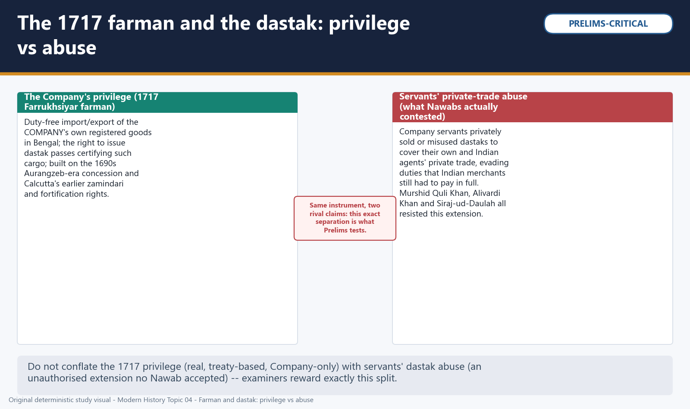
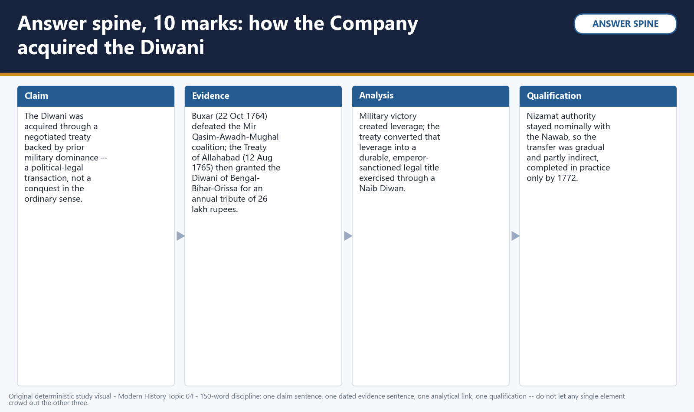

# The British Conquest of Bengal (Plassey 1757, Buxar 1764, Dual Government) — Solved Practice Workbook

> Built from the same normalized practice source as the complete learner-v2 session. Official/inferred PYQ status and true topic ownership are preserved.

## BASIC MCQS / REMEDIATION

### Q1. What did the 1717 Farrukhsiyar farman actually grant the English East India Company in Bengal?

A. Duty-free import and export of the Company's own registered goods, certified by dastak passes
B. A permanent exemption from internal transit duties for any merchant carrying a Company employee's personal letter
C. Full zamindari and revenue-collection rights over Murshidabad and its surrounding parganas
D. The right to maintain an armed garrison at Murshidabad itself

**Answer: A.**
**Explanation:** The farman was a bounded, Company-only commercial privilege; the other options describe things no Nawab ever granted, or things that mimic servants' later dastak abuse rather than the farman's actual terms.

### Q2. Which of the following correctly describes resistance to dastak abuse before 1757?

A. Only Siraj-ud-Daulah objected to it; Murshid Quli Khan and Alivardi Khan tolerated it as a cost of trade
B. Murshid Quli Khan, Alivardi Khan and Siraj-ud-Daulah all resisted the unauthorised extension of dastak privileges by Company servants
C. The Mughal emperor personally revoked the 1717 farman once abuse was reported
D. Dastak abuse was permanently resolved by the Treaty of Alinagar in 1757

**Answer: B.**
**Explanation:** All three successive Nawabs objected to the same unauthorised extension; the farman was never revoked, and Alinagar addressed the Calcutta crisis of 1756-57, not dastak abuse specifically.

### Q3. Why did Siraj-ud-Daulah march on Calcutta in June 1756?

A. To seize the Company's textile monopoly at Dhaka
B. In direct retaliation for the Black Hole incident
C. Because the English refused to stop unauthorised fortification of Fort William and dismantle existing works
D. To pre-empt a French attack on Chandernagore

**Answer: C.**
**Explanation:** The fortification dispute was the proximate cause; the Black Hole is alleged to have occurred only after Calcutta fell, so it cannot have caused the march, and Chandernagore was seized by the Company later, not attacked by the French first.

### Q4. Why did Clive and Watson seize the French factory at Chandernagore in March 1757, before any confrontation with Siraj-ud-Daulah?

A. Because Chandernagore had itself attacked Fort William in 1756
B. On the direct written order of Mir Jafar
C. Because the 1717 farman entitled the Company to seize rival European factories during wartime
D. To remove Siraj's potential French counterweight while the Plassey conspiracy was maturing

**Answer: D.**
**Explanation:** This was a calculated pre-emptive move tied to the wider Anglo-French war and the developing Plassey conspiracy; no such Chandernagore attack, farman clause, or Mir Jafar directive existed.

### Q5. What is the principal source-critical problem with the Holwell account of the 'Black Hole of Calcutta'?

A. It rests on a single interested narrator with no independently corroborated casualty count
B. It was written by an anonymous Bengali chronicler with no connection to the Company
C. It was independently verified by three separate Company officials before publication
D. Modern forensic examination of the Fort William guardroom has settled the exact death toll

**Answer: A.**
**Explanation:** Holwell was himself a Company official and survivor with a strong personal stake in the story; no independent corroboration or forensic settlement of numbers exists, which is exactly why the episode must be treated as disputed.

### Q6. Which of the following was NOT part of the 1757 Plassey conspiracy network?

A. Mir Jafar, Siraj-ud-Daulah's own Mir Bakshi
B. Shuja-ud-Daula, the Nawab-Wazir of Awadh
C. The Jagat Seth banking house
D. Rai Durlabh, Bengal's Diwan

**Answer: B.**
**Explanation:** Shuja-ud-Daula joined the later Buxar coalition of 1764, seven years after Plassey; he had no role in the 1757 conspiracy against Siraj-ud-Daulah.

### Q7. What was the 'red treaty' deception in the Plassey conspiracy?

A. A secret treaty in which Mir Jafar promised Bengal's Diwani to the Mughal emperor
B. A false peace treaty shown to Siraj-ud-Daulah to delay his mobilisation
C. A fraudulent copy of the conspiracy treaty carrying a commission clause for Amichand, with Admiral Watson's signature forged onto it after he refused to sign
D. The genuine treaty version that was later honoured in full after Plassey

**Answer: C.**
**Explanation:** Clive prepared a genuine white-paper treaty without any Amichand clause and a fraudulent red-paper version with a forged Watson signature, deceiving his own co-conspirator, not Siraj or the emperor.

### Q8. Which best describes the decisive mechanism at the Battle of Plassey, 23 June 1757?

A. Superior Company artillery overwhelmed a numerically smaller Nawabi force
B. A full day's pitched battle, evenly matched, was turned by a late cavalry charge
C. Naval bombardment from Company ships on the Hooghly river decided the outcome
D. A pre-arranged political conspiracy had already neutralised most of Siraj's army before serious fighting began

**Answer: D.**
**Explanation:** Mir Jafar's and Rai Durlabh's wings, the bulk of Siraj's nominal strength, had a prior understanding with Clive and never engaged; the conspiracy, not artillery, naval power or a cavalry charge, was decisive.

### Q9. At Plassey, which two commanders led the only wing that fought hard for Siraj-ud-Daulah?

A. Mir Madan and Mohan Lal
B. Mir Jafar and Rai Durlabh
C. Amichand and Jagat Seth
D. Shuja-ud-Daula and Mir Qasim

**Answer: A.**
**Explanation:** Mir Madan and Mohan Lal's wing fought a genuine artillery duel; Mir Jafar and Rai Durlabh were the conspirators who withheld their forces, and the remaining names had no battlefield command role at Plassey.

### Q10. What territorial or fiscal concession did Mir Jafar grant the Company immediately after Plassey, beyond cash compensation?

A. The Diwani of Bengal, Bihar and Orissa
B. The zamindari of the 24 Parganas near Calcutta
C. Duty-free trade throughout the entire Mughal empire
D. The fortress and district of Munger

**Answer: B.**
**Explanation:** The Diwani came only in 1765 via the Treaty of Allahabad; the 24-Parganas zamindari grant is the correct 1757 concession, well before any Diwani existed.

### Q11. Why was Mir Jafar deposed by the Company in 1760?

A. He refused to pay any compensation after Plassey
B. He allied openly with the French at Chandernagore
C. He could no longer meet the Company's escalating fresh financial demands, driven partly by its regional military commitments
D. He abolished internal transit duties, angering Company traders

**Answer: C.**
**Explanation:** The duty-abolition measure (the fourth option) describes Mir Qasim's later 1763 reform, not Mir Jafar's; Mir Jafar's actual failure was fiscal exhaustion under continuing Company demands.

### Q12. Why did Mir Qasim shift his capital from Murshidabad to Munger after 1760?

A. Munger was closer to the Mughal emperor's court at Delhi
B. Murshidabad had been destroyed in the Calcutta crisis fighting
C. The Jagat Seths refused to extend him further credit at Murshidabad
D. To gain distance from Calcutta's overbearing influence while positioning himself closer to his own recruits and revenue base

**Answer: D.**
**Explanation:** The move to Munger (Monghyr) in Bihar was a deliberate assertion of administrative and military independence from Company oversight, not a response to any of the other listed events.

### Q13. What was Mir Qasim's stated aim in abolishing internal transit duties in 1763?

A. Equal, uniform taxation for Indian and European merchants alike
B. To raise additional revenue for his own treasury by taxing all trade at a higher combined rate
C. To punish Indian merchants who had collaborated with the Company
D. To comply with a direct order from the Mughal emperor Shah Alam II

**Answer: A.**
**Explanation:** Mir Qasim's measure removed duties rather than raising them; its explicit aim was competitive parity between Indian and European traders, not revenue-raising, favouritism, or imperial instruction.

### Q14. Which three parties formed the coalition defeated at the Battle of Buxar in 1764?

A. Mir Jafar, the Jagat Seths and Rai Durlabh
B. Mir Qasim, Shuja-ud-Daula and Shah Alam II
C. Siraj-ud-Daulah, Amichand and Mir Madan
D. Warren Hastings, Muhammad Reza Khan and Raja Shitab Rai

**Answer: B.**
**Explanation:** The first option names 1757 Plassey conspirators; the third mixes a Nawab already dead by 1764 with Plassey-era figures; the fourth names Dual Government-era administrators from after 1765, not the 1764 coalition.

### Q15. What was the principal reason the Buxar coalition lost to a numerically smaller Company force?

A. The coalition lacked artillery of any kind
B. Shah Alam II refused to commit any troops to the battle
C. The coalition's segmented command -- three separate treasuries and commanders with no shared war-chest -- could not match the Company's single unified chain of command
D. Heavy monsoon rains disabled the coalition's cavalry

**Answer: C.**
**Explanation:** The coalition did field a large combined force with artillery and committed troops from all three partners; its structural weakness was divided, mutually distrustful command, not equipment, troop refusal or weather.

### Q16. Which statement correctly distinguishes what Plassey changed from what Buxar and Allahabad changed?

A. Plassey granted the Diwani; Buxar merely confirmed Mir Jafar as Nawab
B. Both events achieved identical outcomes and can be treated as a single turning point
C. Buxar changed who sat on Bengal's throne; Plassey created the Company's legal revenue title
D. Plassey changed who sat on the throne; Buxar and Allahabad created the Company's legal revenue title, the more decisive change

**Answer: D.**
**Explanation:** The fourth option states the correct, examiner-tested sequence; the first and third options reverse the actual causal order, and the second collapses a distinction the exam specifically tests.

### Q17. The two treaties signed at Allahabad on 12 August 1765 did which two distinct things?

A. One granted the Company the Diwani of Bengal-Bihar-Orissa from Shah Alam II; the other restored Awadh to Shuja-ud-Daula in exchange for an indemnity
B. Both treaties jointly restored the full Mughal empire's real authority over Bengal
C. One treaty abolished the Nizamat outright; the other created the Dual Government
D. One treaty ended the Bengal famine response; the other began the Regulating Act process

**Answer: A.**
**Explanation:** The Diwani grant and the Awadh restoration were the two real 1765 instruments; the Nizamat was not abolished (it continued nominally), and the famine (1770) and Regulating Act (1773) are later, unrelated events.

### Q18. Which statement most accurately describes the Diwani-Nizamat split after 1765?

A. The Company and the Nawab shared power on genuinely equal terms, each fully independent in their own domain
B. The Company held the substantively powerful Diwani through its own Naib Diwans, while the Nawab's Nizamat was nominal and, in practice, ran through the same Company-influenced deputies
C. The Nizamat was more powerful than the Diwani because it covered military affairs
D. The Diwani and Nizamat were merged into a single office in 1765 and separated again only in 1772

**Answer: B.**
**Explanation:** The split was legally real but operationally unequal from very early on; describing it as equal power-sharing or as a merged office both misstate the arrangement, and revenue collection was the more consequential power in practice.

### Q19. The Dual Government's 'accountability paradox' refers to which arrangement?

A. Both the Company and the Nawab held equal formal responsibility for Bengal's welfare
B. Neither the Company nor the Nawab held any responsibility for Bengal at all
C. The Company held real power without formal responsibility, while the Nawab's government held nominal responsibility without real power
D. The Nawab held real power while the Company held only ceremonial status

**Answer: C.**
**Explanation:** This is Clive's own 1765 design, named directly in his 1772 testimony about pervasive 'confusion and mismanagement'; the other options each misstate which side held power versus responsibility.

### Q20. Which causal formulation for the Bengal famine of 1770 is most defensible?

A. Company policy alone created the drought.
B. Natural conditions alone explain severity and governance is irrelevant.
C. A precise mortality total is required even when the evidence cannot sustain it.
D. Harvest failure and disease formed the shock, while revenue rigidity and divided administration amplified vulnerability.

**Answer: D.**
**Explanation:** Harvest failure and disease formed the shock, while revenue rigidity and divided administration amplified vulnerability.

### Q21. Which term describes Murshid Quli Khan's method of assigning revenue collection to the highest bidder, later criticised for encouraging short-term extraction over long-term agrarian investment?

A. Ijaradari (revenue farming)
B. Zamindari settlement
C. Ryotwari settlement
D. Permanent Settlement

**Answer: A.**
**Explanation:** Ijaradari was Murshid Quli Khan's own method; the other three are different revenue systems from later, mostly post-1793 Company administration, not his Bengal.

### Q22. Two different battles at a place called Giria appear in this topic's timeline. Which pairing is correct?

A. Alivardi Khan's 1740 Giria victory was against the Company; Mir Qasim's 1763 Giria defeat was against Shuja-ud-Daula
B. Alivardi Khan's 1740 Giria victory was over Sarfaraz Khan for the Nawabship; Mir Qasim's 1763 Giria defeat was against the Company during his own conflict
C. Both Giria battles were fought by the same person, twenty-three years apart
D. Giria refers to a single 1757 battle also known as Plassey

**Answer: B.**
**Explanation:** These are two separate battles at the same place name, 23 years apart, involving different combatants and different stakes; year-anchoring, not the place name alone, distinguishes them.

### Q23. Which of these is the clearest example of individual servant abuse, as distinct from the Company's own chartered privilege?

A. The Company's tax-free trade in its own registered goods under the 1717 farman
B. The Company's right to fortify Fort William under its original settlement terms
C. A private Company servant using a personal dastak to move his own unregistered goods duty-free, for personal profit
D. The Company's right to mint coinage after 1765

**Answer: C.**
**Explanation:** This is precisely the abuse pattern Nawabs objected to -- a personal privilege stretched beyond its authorised, Company-only, registered-goods scope; the other options describe genuine institutional or later authorised rights.

### Q24. Which issue most directly converted Company-Nawab friction into the 1756 Calcutta crisis?

A. The Nawab granted the Company the Diwani before Plassey.
B. Awadh was annexed by the Company.
C. Mir Qasim abolished inland duties before becoming Nawab.
D. The Company strengthened Fort William without Nawabi permission and resisted Siraj's demand to stop.

**Answer: D.**
**Explanation:** The Company strengthened Fort William without Nawabi permission and resisted Siraj's demand to stop.

### Q25. Which Company factory fell to Siraj-ud-Daulah's forces in June 1756, before Fort William itself was attacked?

A. Kasimbazar
B. Chandernagore
C. Munger
D. Patna

**Answer: A.**
**Explanation:** Kasimbazar, the Company's up-country factory near Murshidabad, was seized first; Chandernagore was a French factory seized later by the Company itself, and Munger/Patna belong to Mir Qasim's later career.

### Q26. On which date did Fort William, Calcutta, fall to Siraj-ud-Daulah's forces in 1756?

A. 2 January 1757
B. 20 June 1756
C. 23 June 1757
D. 12 August 1765

**Answer: B.**
**Explanation:** Fort William fell on 20 June 1756; 2 January 1757 is Clive/Watson's recapture, 23 June 1757 is Plassey, and 12 August 1765 is the Treaty of Allahabad.

### Q27. What happened to the Holwell monument commemorating the 'Black Hole' victims in 1940?

A. It was expanded into a full memorial museum by the colonial government
B. It was relocated to Fort William's parade ground for the first time
C. It was removed from its central Calcutta location amid nationalist campaigning that questioned the episode's contested memory
D. It was declared a protected heritage monument by the Archaeological Survey of India

**Answer: C.**
**Explanation:** The 1940 removal, linked to nationalist agitation, reflects exactly the episode's disputed and politically charged historical memory, not commemorative expansion or heritage recognition.

### Q28. The Treaty of Alinagar, February 1757, achieved which outcome?

A. It granted the Company the Diwani of Bengal
B. It formally deposed Siraj-ud-Daulah
C. It ended the Anglo-French rivalry in Bengal permanently
D. It restored the Company's Calcutta privileges and compensated its losses, temporarily settling the crisis before Plassey

**Answer: D.**
**Explanation:** Alinagar was a temporary settlement following the Fort William recapture; the Diwani (1765) and Siraj's deposition (Plassey, June 1757) both came later, and Anglo-French rivalry continued well beyond 1757.

### Q29. What was the strategic significance of the Company's capture of French Chandernagore in March 1757?

A. It removed Siraj-ud-Daulah's potential French military counterweight just as the Plassey conspiracy was maturing
B. It gave the Company its first access to Bengal's textile trade
C. It marked the first Company factory established anywhere in Bengal
D. It directly triggered the Black Hole incident

**Answer: A.**
**Explanation:** The other options are chronologically impossible: Company textile-trade access and its first Bengal factories long predated 1757, and the Black Hole (1756) preceded Chandernagore's capture (1757), not the reverse.

### Q30. What is the most defensible reading of the Jagat Seth banking house's motive for joining the Plassey conspiracy?

A. Religious solidarity with the incoming Company administration
B. Protecting their credit and banking interests, which Siraj-ud-Daulah's hostility and unpredictability threatened
C. A personal blood feud with Siraj-ud-Daulah's family stretching back generations
D. Direct instructions from the Mughal emperor Alamgir II

**Answer: B.**
**Explanation:** The Jagat Seths' documented concern was financial and institutional self-preservation under an unpredictable young Nawab, fitting the broader pattern of interest-based, not simply ideological, participation.

### Q31. What official position did Rai Durlabh hold in Siraj-ud-Daulah's administration before joining the Plassey conspiracy?

A. Mir Bakshi (paymaster-general)
B. Naib Nazim of Bihar
C. Diwan (chief revenue officer) of Bengal
D. Qiladar of Munger fort

**Answer: C.**
**Explanation:** Rai Durlabh was Bengal's Diwan; Mir Jafar held the Mir Bakshi post, and the other two positions belong to different office-holders later in this topic's timeline.

### Q32. What was Amichand (Omichand)'s specific role in the events preceding Plassey?

A. Commander of Siraj-ud-Daulah's cavalry wing
B. Bengal's Diwan and chief revenue officer
C. The Mughal-appointed governor of Bihar
D. A wealthy merchant-broker who demanded a commission for his conspiracy role and was deceived by Clive's forged 'red treaty'

**Answer: D.**
**Explanation:** Amichand was a merchant-broker central to the conspiracy's financing and negotiation, not a military commander, revenue officer, or provincial governor.

### Q33. Robert Clive's role at Plassey is best described in modern analysis as combining which two functions?

A. Military commander and chief political negotiator of the conspiracy
B. Naval admiral and chief revenue collector
C. Mughal-appointed provincial governor and religious mediator
D. Company director in London and Parliamentary representative

**Answer: A.**
**Explanation:** Clive personally led both the nominal battlefield operation and the secret political negotiations with Mir Jafar's camp -- central to reading Plassey as a political coup rather than a purely military event.

### Q34. How should casualty claims about Plassey be handled in an examination answer?

A. Treat every repeated textbook number as an audited roll.
B. Avoid unsupported precision and focus on the conspiracy-backed political mechanism rather than inherited battlefield totals.
C. State that no fighting occurred at all.
D. Replace source criticism with larger speculative estimates.

**Answer: B.**
**Explanation:** Avoid unsupported precision and focus on the conspiracy-backed political mechanism rather than inherited battlefield totals.

### Q35. Which of the following was NOT part of the immediate 1757 Plassey settlement?

A. Mir Jafar's installation as Nawab of Bengal
B. Company compensation payments and territorial concessions
C. The grant of Diwani rights over Bengal, Bihar and Orissa
D. Confirmation of the Company's Calcutta trading privileges

**Answer: C.**
**Explanation:** The Diwani grant came only in 1765 via the Treaty of Allahabad, eight years after Plassey; the other three were genuinely part of the 1757 settlement.

### Q36. What best describes the post-Plassey extraction mechanism under Mir Jafar?

A. A single payment ended Company intervention in Bengal.
B. Mir Jafar received the Diwani from Shah Alam II.
C. The Company immediately assumed direct administration in 1757.
D. Transfers and concessions deepened the client's dependence and expanded Company political leverage.

**Answer: D.**
**Explanation:** Transfers and concessions deepened the client's dependence and expanded Company political leverage.

### Q37. What personal grant did Robert Clive receive from Mir Jafar in addition to Company compensation?

A. A jagir (land grant) yielding a substantial personal annual income, on top of personal gifts
B. The formal title of Nawab of Bengal
C. Command of the Mughal imperial army
D. Ownership of the Jagat Seth banking house

**Answer: A.**
**Explanation:** Clive's jagir grant became a major point of later controversy, including in his 1772-73 parliamentary scrutiny, precisely because it was a personal, not institutional, gain.

### Q38. After Plassey, how did the Company primarily sustain its political leverage over Bengal's Nawab?

A. Through direct Mughal imperial appointment as co-ruler
B. Through its role as kingmaker and financier, with a Nawab dependent on continued Company military support against external threats
C. Through a permanent occupation force stationed inside Murshidabad's palace
D. Through control of the Nawab's personal religious establishment

**Answer: B.**
**Explanation:** The Company's leverage was structural and financial-military, best understood as the extraction 'circuit' described for the 1757-60 period, not imperial appointment, palace occupation, or religious control.

### Q39. Why did the Company's demands on Mir Jafar escalate rather than stabilise after 1757?

A. Mir Jafar voluntarily offered ever-larger gifts to secure Company favour
B. The Mughal emperor demanded an increased tribute share from the Company
C. The Company's own regional military and administrative costs kept rising, and it passed these costs on to a Nawab it now effectively controlled
D. Bengal's agricultural output increased, allowing larger extractions without strain

**Answer: C.**
**Explanation:** Rising Company costs, not voluntary generosity, imperial pressure, or an agricultural windfall, drove the escalating demands that eventually exhausted Mir Jafar's capacity to pay.

### Q40. Which of the following was part of Mir Qasim's military and fiscal reform programme after 1760?

A. Disbanding his standing army entirely in favour of feudal levies
B. Outsourcing all revenue collection to European trading companies
C. Adopting French artillery exclusively while banning Indian gunsmiths
D. Reorganising and modernising his army's training and equipment while tightening fiscal administration from his new Munger base

**Answer: D.**
**Explanation:** Mir Qasim's programme aimed at strengthening, not disbanding, his military and administrative capacity; the other options describe measures he did not undertake.

### Q41. The Patna Massacre of October 1763 refers to which event?

A. The killing of a group of English Company prisoners on Mir Qasim's orders during his conflict with the Company
B. A Company massacre of Bengali weavers protesting duty policy
C. The killing of Siraj-ud-Daulah by Mir Jafar's son
D. A famine-related mass-death event in Patna city

**Answer: A.**
**Explanation:** The Patna Massacre refers specifically to Mir Qasim's killing of English captives during the escalating 1763 conflict; the other options describe unrelated or fictional events.

### Q42. In which order did Mir Qasim suffer defeats against the Company in 1763, before fleeing to Awadh?

A. Udhanala, then Giria, then Katwa
B. Katwa, then Giria, then Udhanala
C. Giria, then Udhanala, then Katwa
D. All three battles were fought simultaneously on a single day

**Answer: B.**
**Explanation:** The sequence of reverses at Katwa, Giria and Udhanala through 1763 progressively weakened Mir Qasim's position before his flight to Awadh; the other orderings do not match the actual campaign chronology.

### Q43. After his 1763 defeats, where did Mir Qasim take refuge, setting up the coalition that fought at Buxar?

A. The Maratha court at Pune
B. The Mysore court under Haidar Ali
C. Shuja-ud-Daula's court in Awadh
D. The Sikh Misls in Punjab

**Answer: C.**
**Explanation:** Mir Qasim fled to Awadh, where Shuja-ud-Daula's protection and shared interest with the fugitive emperor Shah Alam II formed the coalition that met the Company at Buxar in 1764.

### Q44. The Battle of Buxar was fought on which date, at a location on which river?

A. 23 June 1757, on the Bhagirathi-Hooghly
B. 12 August 1765, on the Ganges near Allahabad
C. 2 January 1757, on the Hooghly at Calcutta
D. 22 October 1764, on the Ganges near Buxar in present-day Bihar

**Answer: D.**
**Explanation:** The other three dates/locations belong to Plassey, the Treaty of Allahabad, and the Fort William recapture respectively -- each a genuinely different event in this topic's chronology.

### Q45. Major Hector Munro commanded the Company forces at Buxar; which of these best describes his command's key structural advantage?

A. A single, unified chain of command, unlike the coalition's three separate treasuries and commanders
B. Overwhelming numerical superiority of at least five to one
C. Superior knowledge of the local terrain from decades of prior residence
D. Direct reinforcement from a simultaneous naval bombardment

**Answer: A.**
**Explanation:** Munro's force was actually outnumbered by the coalition; its decisive advantage was unified command and coordination, not numbers, terrain familiarity, or naval support -- Buxar was an inland battle with no naval role.

### Q46. What happened to Mir Qasim after the Company's victory at Buxar?

A. He was restored as Nawab of Bengal under a new treaty
B. He disappeared into obscurity, dying in reduced circumstances some years later without recovering political power
C. He was executed publicly by the Company at Munger
D. He became the Company's first Naib Diwan

**Answer: B.**
**Explanation:** Unlike Shuja-ud-Daula and Shah Alam II, who both received negotiated 1765 settlements, Mir Qasim's political career effectively ended at Buxar without restoration, execution, or an administrative post.

### Q47. What was Shah Alam II's status under the 1765 Treaty of Allahabad arrangements?

A. Full sovereign ruler of Bengal, Bihar and Orissa with real administrative power
B. Formally deposed and stripped of the imperial title altogether
C. Nominal Mughal emperor, recognised in title, but a Company-supported pensioner holding Kora and Allahabad districts
D. Appointed as the Company's Resident at Murshidabad

**Answer: C.**
**Explanation:** Shah Alam II retained his imperial title and received Kora, Allahabad, and an annual payment, but held no genuine administrative power over Bengal -- distinct from full sovereignty, deposition, or a Company post.

### Q48. What did the 1765 Diwani grant change most directly?

A. It made the Company Nawab and abolished every Nizamat function.
B. It annexed Awadh into Bengal.
C. It created the EIC's original commercial charter.
D. It gave the Company a recognised legal-fiscal title to collect the revenues of Bengal, Bihar and Orissa.

**Answer: D.**
**Explanation:** It gave the Company a recognised legal-fiscal title to collect the revenues of Bengal, Bihar and Orissa.

### Q49. Which two districts were ceded to Shah Alam II as part of the 1765 Allahabad settlement, forming the material basis of his pensioner status?

A. Kora and Allahabad
B. Munger and Patna
C. Murshidabad and Kasimbazar
D. Awadh and Lucknow

**Answer: A.**
**Explanation:** Kora and Allahabad were the specific districts assigned to the emperor; the other pairs name places tied to different actors, including Awadh itself, which remained Shuja-ud-Daula's separately restored territory.

### Q50. What was the strategic result of the separate Allahabad settlement with Shuja-ud-Daula?

A. The Company made Mir Qasim Nawab again.
B. Most of Awadh was restored under its ruler so that it could serve as a buffer rather than being annexed.
C. Shah Alam II transferred the French factories to Awadh.
D. The settlement merged Diwani and Nizamat into Nawabship.

**Answer: B.**
**Explanation:** Most of Awadh was restored under its ruler so that it could serve as a buffer rather than being annexed.

### Q51. What powers did the Diwani specifically confer on its holder?

A. Command of the Nawab's standing army
B. Criminal justice administration across Bengal
C. The right to collect land revenue and administer civil justice in Bengal, Bihar and Orissa
D. Appointment of the Mughal emperor's own household staff

**Answer: C.**
**Explanation:** Revenue collection and civil justice were the Diwani's specific domain; military command and criminal justice belonged to the Nizamat, and household appointments were an unrelated Mughal court function.

### Q52. Which powers remained, at least nominally, within the Nizamat rather than the Diwani after 1765?

A. Land revenue collection across the three provinces
B. Civil justice administration in revenue disputes
C. The stipulated annual payment to the emperor
D. Criminal justice administration and nominal military command, formally retained by the Nawab's office

**Answer: D.**
**Explanation:** These functions stayed with the Nizamat in form, even as Company-influenced deputies effectively ran much administration in practice; the other options describe Diwani-side functions or the separate tribute arrangement.

### Q53. Who were appointed as the Company's principal Naib Diwans (deputy revenue administrators) for Bengal and Bihar respectively during the Dual Government?

A. Muhammad Reza Khan for Bengal and Raja Shitab Rai for Bihar
B. Mir Jafar for Bengal and Mir Qasim for Bihar
C. Robert Clive for Bengal and Hector Munro for Bihar
D. Warren Hastings for Bengal and Robert Clive for Bihar

**Answer: A.**
**Explanation:** Muhammad Reza Khan and Raja Shitab Rai were the actual Indian intermediaries administering revenue for the Company; the other names belong to earlier Nawabs or Company officials holding different roles.

### Q54. In 1772, Warren Hastings ended the Dual Government by taking which specific step?

A. Formally annexing Bengal to the British Crown
B. Having the Company itself 'stand forth as Diwan,' assuming direct revenue administration rather than governing through Naib Diwans
C. Restoring full sovereign power to the Nawab of Bengal
D. Transferring the Diwani back to the Mughal emperor

**Answer: B.**
**Explanation:** Hastings's own phrase, that the Company would 'stand forth as Diwan,' captures the shift to direct administration; Crown annexation came only in 1858, and no full Nawabi restoration or Diwani reversion occurred.

### Q55. Which combination of factors is the most defensible explanation for the severity of the Bengal famine of 1770?

A. Drought alone, with governance playing no meaningful role
B. Company revenue policy alone, with no natural trigger
C. A poor 1768 harvest and 1769-70 drought combined with revenue rigidity, commercial priorities and Dual Government administrative confusion
D. A sudden, unprecedented locust infestation with no prior harvest problems

**Answer: C.**
**Explanation:** The sources consulted converge on compound causation combining natural and governance factors; monocausal claims and the unsupported locust claim overstate certainty the evidence does not provide.

### Q56. Which sequence best captures the Company's transformation described in this topic, from trader to sovereign power?

A. Sovereign power first, then trading company, then kingmaker
B. Kingmaker first, then sovereign power, then trading company
C. Trading company and sovereign power simultaneously from the Company's founding in 1600
D. Trading company with local privileges, then political kingmaker after Plassey, then direct revenue sovereign after Buxar and the Diwani grant

**Answer: D.**
**Explanation:** This sequence -- commerce, then political leverage, then formal revenue sovereignty -- is the structural transformation this topic traces, unfolding across nearly a decade, not instantaneously or in reverse order.

### Q57. Which of these best reflects a 'constrained choice' rather than a simple 'betrayal' reading of Mir Jafar's role in the Plassey conspiracy?

A. Mir Jafar, as a senior military commander sidelined by Siraj-ud-Daulah's inner circle, saw an alliance with the Company as his best available path to power
B. Mir Jafar acted purely out of personal greed with no institutional context whatsoever
C. Mir Jafar was coerced at gunpoint into signing the conspiracy treaty
D. Mir Jafar had no prior relationship with Siraj-ud-Daulah's court and joined the conspiracy as an outsider

**Answer: A.**
**Explanation:** Reading his choice through his actual institutional position is the 'constrained choice' framing this topic uses, in contrast to a purely moralised, coercion-based, or context-free account.

### Q58. Which named historian's phrase 'open plunder and loot,' cited within Bipan Chandra's own analysis, represents the nationalist historiographical critique of Company extraction from Bengal?

A. Percival Spear
B. R.C. Dutt
C. P.J. Marshall
D. C.A. Bayly

**Answer: B.**
**Explanation:** R.C. Dutt's characterisation, as cited in Bipan Chandra's work, represents the nationalist economic-drain critique; Marshall and Bayly represent a different, corporate/fiscal-military-state historiographical lens.

### Q59. The 'collaboration thesis' historiographical lens on Plassey and its aftermath emphasises which analytical focus?

A. Purely military tactics and troop-movement analysis
B. A single moral verdict of collective Indian betrayal
C. The specific institutional interests (bankers, nobles, military commanders) that led Indian elites to align with the Company at particular moments
D. Denial that Bengal's political economy played any role in the conquest

**Answer: C.**
**Explanation:** This lens, associated with the wider Cambridge school approach, is precisely about specific, interest-based elite alignment, not troop movements, a single moral verdict, or a denial of political-economy context.

### Q60. Which historiographical framing, associated with historians such as P.J. Marshall and C.A. Bayly, describes the Company's post-Plassey transformation?

A. The 'betrayal narrative,' focused solely on Mir Jafar's personal culpability
B. The 'pure commerce' view, denying any political or military dimension to the Company's activity
C. The 'monocausal drought' explanation applied to the entire conquest period
D. The 'corporate-military-fiscal state' framing, describing the Company's fusion of trading, taxing and war-making functions into a single institutional form

**Answer: D.**
**Explanation:** This framing captures the Company's institutional fusion of commerce, coercion and revenue administration, distinct from a personalised betrayal narrative, a purely commercial view, or an unrelated drought-based explanation.

### Q61. Which historiographical approach, associated with historians such as Sekhar Bandyopadhyay, situates the conquest within Bengal's own pre-existing political-economic structures rather than treating it as an external event imposed on a passive region?

A. The Bengal political-economy approach, tracing continuities and ruptures in Bengal's own commercial and agrarian structures across the conquest period
B. The 'sudden rupture' approach, treating 1757 as a total break with no prior continuity
C. The 'purely religious' approach, framing the conquest as a primarily sectarian conflict
D. The 'great man' approach, explaining the conquest solely through Clive's individual genius

**Answer: A.**
**Explanation:** This approach foregrounds Bengal's own internal political-economic structures and continuities, in contrast to a sudden-rupture, sectarian, or purely biographical framing.

### Q62. In a comparative assessment, why is Buxar often judged strategically more decisive than Plassey, despite Plassey's greater fame?

A. Buxar involved a larger territorial area than all of Bengal
B. Buxar, through the subsequent Treaty of Allahabad, produced the Company's formal legal revenue title (the Diwani), whereas Plassey only changed Bengal's ruling personnel
C. Buxar was fought entirely without any Indian participants on either side
D. Plassey is historiographically disputed while Buxar's outcome faces no historical debate

**Answer: B.**
**Explanation:** The decisive distinction is legal-institutional, not territorial scale, participant composition, or relative historiographical controversy -- both battles in fact involve debate and predominantly Indian troops on most sides.

### Q63. Topic 04 ends its narrative at 1772-73. Which subsequent development is explicitly handed to a later topic (Topic 06) rather than analysed in depth here?

A. The Battle of Buxar's tactical details
B. The exact terms of the 1765 Diwani grant
C. The 1773 Regulating Act's reform of Company governance structures
D. The 1763 abolition of internal transit duties by Mir Qasim

**Answer: C.**
**Explanation:** The Regulating Act of 1773, and the constitutional reforms that followed it, are explicitly Topic 06's material; Topic 04's own boundary ends at the Dual Government's 1772 termination, used here only as a forward-looking bridge.

### Q64. How many Prelims or Mains questions are directly routed to Topic 04 in this repository's own PYQ ledgers, as verified by this topic's audit?

A. Twelve, spread evenly across the past decade
B. Three, all from the 2013-2015 period
C. One, from 2022, owned exclusively by this topic
D. Zero directly routed items; only two adjacent items exist, both explicitly owned by other topics and used here strictly as bounded, labelled bridges

**Answer: D.**
**Explanation:** The repository's own ledgers show zero PYQs routed to Topic 04; the two adjacent items used in this package are explicitly attributed to their owning topics (05 and 07), never claimed as Topic 04's own.

### Q65. A student writes: 'The 1717 farman itself authorised Company servants to trade duty-free using dastaks for their personal goods.' What is the correct remedial statement?

A. The farman authorised only the Company's own registered trade goods; dastak misuse for servants' personal trade was an unauthorised extension that Nawabs consistently resisted
B. The statement is entirely accurate as written
C. The farman authorised personal trade but only for goods worth under a fixed value
D. The farman was issued in 1757, not 1717, making the entire statement's date wrong

**Answer: A.**
**Explanation:** This is the single most common conflation in this topic; the date 1717 is itself correct, so the fix is scope (Company-only vs personal), not the year.

### Q66. A student writes: 'Plassey was a hard-fought, evenly matched pitched battle decided by superior British tactics.' What is the correct remedial statement?

A. The statement is accurate; British tactical superiority alone explains the outcome
B. Real fighting was confined mainly to Mir Madan's and Mohan Lal's small loyal wing; the bulk of Siraj's nominal force, under conspirators Mir Jafar and Rai Durlabh, never engaged -- making this substantially a political, not tactical, victory
C. The battle lasted several days of continuous fighting before a British breakthrough
D. Naval bombardment, not land tactics, decided the battle

**Answer: B.**
**Explanation:** The evenly-matched/tactical-superiority framing, and the multi-day and naval-bombardment variants, all misdescribe Plassey's actual, largely pre-arranged, one-day outcome.

### Q67. A student writes: 'The British conquest of Bengal was complete by 1757.' What is the correct remedial statement?

A. The statement is accurate; nothing of significance happened after 1757
B. The conquest was actually complete earlier, by 1740
C. Plassey (1757) only changed Bengal's ruling personnel; the Company's durable legal revenue title came only with Buxar (1764) and the Treaty of Allahabad (1765) -- conquest in the fullest sense is an eight-year process, not a single 1757 event
D. The conquest was not complete until the Regulating Act of 1773

**Answer: C.**
**Explanation:** While 1773 is too late a marker (governance reform, not conquest, is what that year addresses), the core correction is that 1757 alone did not establish revenue sovereignty -- that took until 1765.

### Q68. A student writes: 'The Company received the Diwani of Bengal immediately after its victory at Plassey in 1757.' What is the correct remedial statement?

A. The statement is accurate as written
B. The Diwani was granted in 1740, well before Plassey
C. The Diwani was granted at the Treaty of Alinagar in early 1757
D. The Diwani was granted only in 1765, via the Treaty of Allahabad, eight years after Plassey, following the Company's separate victory at Buxar

**Answer: D.**
**Explanation:** This 1757-vs-1765 date confusion is one of the most heavily exam-tested traps in this topic; the eight-year gap and Buxar's intervening role must be stated explicitly.

### Q69. A student writes: 'Mir Jafar granted the Company the Diwani of Bengal after Plassey in 1757.' What is the correct remedial statement?

A. Mir Jafar granted the Company the zamindari of the 24 Parganas in 1757; the Diwani came only in 1765 from Emperor Shah Alam II, not from Mir Jafar
B. The statement is accurate; Mir Jafar did grant the Diwani in 1757
C. Mir Jafar granted the Nizamat, not the Diwani, in 1757
D. No grant of any kind was made in 1757

**Answer: A.**
**Explanation:** The specific 1757 grant was the 24-Parganas zamindari from Mir Jafar; the Diwani is a distinct 1765 grant from a different authority (the Mughal emperor), not the Nawab.

### Q70. A student writes: 'Mir Jafar abolished internal transit duties to promote equal trade in 1763.' What is the correct remedial statement?

A. The statement is accurate as written
B. This measure belongs to Mir Qasim, not Mir Jafar; Mir Jafar had already been deposed in 1760, three years before this 1763 reform
C. The measure was actually undertaken jointly by both Nawabs in sequence
D. The measure refers to a Company policy, not any Nawab's initiative

**Answer: B.**
**Explanation:** This is a common actor-confusion error; keeping the 1757-60 Mir Jafar period and the 1760-63 Mir Qasim period chronologically separate resolves it immediately.

### Q71. A student writes: 'Alivardi Khan was defeated at the Battle of Giria.' What is the correct remedial statement?

A. The statement is accurate as written
B. There is no such place as Giria in this topic's chronology
C. Alivardi Khan won at Giria in 1740 (over Sarfaraz Khan, to become Nawab); Mir Qasim suffered a defeat at a place also called Giria in 1763, during his conflict with the Company -- two different battles, 23 years apart
D. Both Giria battles were fought against the Company by the same ruler

**Answer: C.**
**Explanation:** The place-name repetition (Giria, 1740 and 1763) is a frequent trap; year-anchoring each battle to its correct ruler and opponent resolves the confusion.

### Q72. A student writes: 'Mir Jafar and Jagat Seth led the coalition defeated at Buxar in 1764.' What is the correct remedial statement?

A. The statement is accurate as written
B. Mir Jafar and Jagat Seth were present at Buxar but played a minor role
C. Only Jagat Seth was present at Buxar; Mir Jafar was not involved in this period at all
D. Mir Jafar and Jagat Seth were 1757 Plassey conspirators; the 1764 Buxar coalition instead comprised Mir Qasim, Shuja-ud-Daula and Shah Alam II

**Answer: D.**
**Explanation:** This is a common cross-event actor confusion; Plassey's conspirators (1757) and Buxar's coalition members (1764) are two entirely distinct sets of historical actors, separated by seven years and opposing loyalties.

### Q73. A student writes: 'The Nizamat gave the Company the right to collect land revenue in Bengal.' What is the correct remedial statement?

A. Revenue collection was the Diwani's function, held substantively by the Company; the Nizamat covered criminal justice and nominal military command, retained in form by the Nawab
B. The statement is accurate as written
C. Both the Diwani and Nizamat covered identical, overlapping functions with no real distinction
D. The Nizamat was abolished in 1765, so it held no functions at all

**Answer: A.**
**Explanation:** This function-swap, attributing revenue collection to the Nizamat instead of the Diwani, is a frequent and serious factual error; the two offices had genuinely distinct domains.

### Q74. A student writes: 'The Dual Government of 1765-72 meant Bengal was ruled jointly and equally by two separate Nawabs.' What is the correct remedial statement?

A. The statement is accurate as written
B. The Dual Government was not a two-Nawab arrangement at all; it was the Company, holding the substantive Diwani, governing alongside a single Nawab's nominal Nizamat, with real power concentrated in the Company's Naib Diwans
C. It refers to joint rule by the Mughal emperor and the Nawab, with no Company role at all
D. It refers to two separate Company Governors ruling different halves of Bengal

**Answer: B.**
**Explanation:** 'Dual' refers to the Diwani-Nizamat split between the Company and one Nawab's office, not to two rival Nawabs or two Company governors -- a frequent terminological misreading.

### Q75. A student writes: 'In 1772, Warren Hastings formally annexed Bengal to the British Crown, ending Mughal sovereignty.' What is the correct remedial statement?

A. The statement is accurate as written
B. Hastings restored full Mughal sovereignty over Bengal in 1772, reversing the Company's role entirely
C. In 1772, Hastings ended the Dual Government by having the Company itself 'stand forth as Diwan' and administer revenue directly -- an internal administrative shift, not a Crown annexation, which occurred only in 1858
D. Hastings's 1772 action concerned only Awadh, not Bengal

**Answer: C.**
**Explanation:** This overclaim, confusing an internal Company administrative reform with formal Crown annexation (which came 86 years later, after the 1857 revolt), is a serious chronological error worth correcting precisely.

### Q76. A student blames the 1770 famine entirely on Company revenue policy. What is the correction?

A. Revenue policy had no bearing on vulnerability or relief.
B. The famine should be explained only through a precise population-loss estimate.
C. Dual Government had already ended before the famine.
D. Company governance amplified a crisis with natural and epidemiological dimensions; neither side of the causal pair should be erased.

**Answer: D.**
**Explanation:** Company governance amplified a crisis with natural and epidemiological dimensions; neither side of the causal pair should be erased.

### Q77. A student writes: 'The Treaty of Allahabad, 1765, was a single document granting the Diwani and restoring Awadh in one combined agreement.' What is the correct remedial statement?

A. Two separate instruments were signed on the same day, 12 August 1765 -- one with Shah Alam II granting the Diwani, another with Shuja-ud-Daula restoring most of Awadh for an indemnity; treating them as one document elides a distinction examiners test directly
B. The statement is accurate as written
C. Only the Awadh treaty was signed in 1765; the Diwani grant came a decade later
D. Only the Diwani treaty was signed in 1765; Awadh was never restored to Shuja-ud-Daula

**Answer: A.**
**Explanation:** The 'two treaties, same day, different jobs' framing is essential; both events did occur in 1765, so the alternative date claims are also incorrect.

### Q78. A student writes: 'The Black Hole of Calcutta is a settled historical fact with an exact, universally agreed death toll.' What is the correct remedial statement?

A. The statement is accurate as written
B. The episode rests substantially on a single interested narrator (Holwell) with no independent corroboration of the casualty count, and its memory has been historically contested, including the 1940 removal of its commemorative monument amid nationalist campaigning -- it should be discussed with explicit source-criticism, not treated as an exact settled fact
C. The episode has been entirely disproven and definitely did not occur in any form
D. The exact death toll was confirmed by twentieth-century forensic examination of Fort William's ruins

**Answer: B.**
**Explanation:** The defensible position is neither blank certainty nor blank denial, but disciplined source-criticism -- acknowledging the episode is alleged and disputed in its specifics, without asserting it never happened at all.

### Q79. A student supplies exact Plassey casualty totals without a reliable source. What is the correction?

A. Increase the estimates to make the battle appear more decisive.
B. Claim that the battle involved no casualties of any kind.
C. Omit false precision, identify the estimates as disputed if mentioned, and analyse the conspiracy and command collapse.
D. Use the figures as proof that Plassey alone completed Company sovereignty.

**Answer: C.**
**Explanation:** Omit false precision, identify the estimates as disputed if mentioned, and analyse the conspiracy and command collapse.

### Q80. A student writes: 'The 2022 GS-I Mains question on Company armies acquiring political power is a directly routed Topic 04 PYQ.' What is the correct remedial statement?

A. The statement is accurate; this question is directly routed to Topic 04
B. No such question exists in any repository ledger
C. The question exists but is routed to Topic 06, not Topic 04
D. This question is verified and used in this package, but it is explicitly owned by Topic 05 (broader territorial expansion) in the repository's ledgers and is used here only as a labelled, bounded adjacent bridge -- Topic 04 itself has zero directly routed PYQs

**Answer: D.**
**Explanation:** Overclaiming PYQ ownership violates this package's strict integrity policy; adjacent items must always carry their true owning topic, never be silently absorbed as if directly routed to the topic using them.

## PYQS AND ANSWER PRACTICE

#### Transparent PYQ audit and route decision

**Audit scope:** every Prelims and Mains GS-I/GS-II/Essay routing ledger and integration-audit file currently in the repository, covering 2018 through 2026, was checked line by line for any question mentioning Murshid Quli Khan, Alivardi Khan, the 1717 farman or dastak abuse, Siraj-ud-Daulah, the Calcutta crisis or the Black Hole, the Plassey conspiracy or battle, Mir Jafar, Mir Qasim, Buxar, Shah Alam II, Shuja-ud-Daula, the Treaty of Allahabad, the Diwani/Nizamat split, the Dual Government, or the Bengal famine of 1770.

**Audit result:** `PYQ-INTEGRATION-AUDIT-2018-2023.md`, `PYQ-INTEGRATION-AUDIT-2024-2025.md` and `PYQ-INTEGRATION-AUDIT-2026.md` each explicitly list Modern History Topic 04 (basic and advanced files alike) as owning no routed question across their respective windows. No Prelims or Mains question in any checked ledger, and no entry in either PYQ-ROUTING-PRELIMS or PYQ-ROUTING-MAINS ledger, is routed to Topic 04.

**Workbook/session policy consequence:** because this topic owns zero verified direct PYQs, this package does not fabricate a "Topic 04 PYQ list," and no official answer key is invented where none exists. Two thematically adjacent items only are used below, each with true ownership named explicitly, strictly as bounded bridge illustrations:

1. **2022 Mains GS-I, Q2**, 10 marks/150 words -- *"Why did the armies of the British East India Company -- mostly comprising of Indian soldiers -- win consistently against the more numerous and better equipped armies of the then Indian rulers? Give reasons."* This repository's own routing ledger (`_PYQ-ROUTING-MAINS-GS1-GS2-ESSAY-2018-2023.md`) stores only a neutral thematic rendering of this item ("East India Company armies winning against Indian rulers") and routes it to **Modern History Topic 05** (British Territorial Expansion), not to Topic 04; the fully verbatim wording quoted above was independently cross-checked against live official-paper sources for this package and is reproduced here only as a bounded forward-bridge illustration, since Topic 04's own account of segmented coalition command at Buxar (subtopic 9) is a relevant precondition to this question's theme, even though the specific multi-theatre military-fiscal mechanism the question tests belongs to Topic 05.
2. **2022 Mains GS-I, Q3**, 10 marks/150 words -- *"Why was there a sudden spurt in famines in colonial India since the mid-eighteenth century? Give reasons."* This repository's ledger again stores only a neutral paraphrase ("spurt in famines in colonial India since the mid-eighteenth century"); the verbatim wording above was likewise independently cross-checked for this package. It is routed to **Modern History Topic 07** (economic impact of British rule), and is referenced here only descriptively, as a thematic pointer toward the 1770 famine's place in a longer colonial pattern -- never claimed as Topic 04's own question, and not developed here into a full solved answer.

**Adjacent evidence is not substitution:** an adjacent item illustrates a related theme; it is never claimed as "this topic's own question," and a candidate should not cite either item in an answer as if Topic 04 itself were the question's subject. No further PYQ is claimed for this topic. Where this package's own original MCQs and Mains questions appear below, they are clearly original practice material, not represented as previous UPSC questions, and any answer without a locally verified official key is explicitly labelled **INFERRED ANSWER -- NOT OFFICIALLY VERIFIED**.

#### Evidence and answer-writing drills

*Visual 2: Repeat: the farman-vs-dastak-abuse distinction, previewed before the drills below. Original deterministic study visual; schematic maps are NOT TO SCALE where marked.*

##### Drill 1 - The 1717 farman is not the same claim as dastak abuse

**Claim:** Write the 1717 Farrukhsiyar farman as a real, treaty-based, Company-only duty exemption; write servants' dastak misuse as a separate, unauthorised extension that Murshid Quli Khan, Alivardi Khan and Siraj-ud-Daulah all resisted. Never merge the two into one generic "trade privilege."

**Exam move:** Prelims statement-pairs on this period are built almost entirely around this exact split -- answer by testing whether a statement describes the 1717 grant itself or servants' abuse of it, not by recalling the year alone.

##### Drill 2 - The Black Hole is a source-criticism question, not a body-count question

**Claim:** Name Holwell as a single interested narrator, note the absence of independent corroboration, and mention the episode's own later contested memory (the 1940 campaign against the Holwell monument) as part of the answer, not a footnote.

**Exam move:** If a question asks you to "discuss" the Black Hole, spend as many words on why the evidence is disputed as on what is alleged to have happened -- a answer that states a specific death toll as settled fact has already lost marks before reaching its conclusion.

##### Drill 3 - Plassey is a coup question, even when it is asked as a battle question

**Claim:** Whatever the question's wording, describe Plassey's decisive mechanism as the pre-arranged conspiracy (Mir Jafar, Jagat Seth, Rai Durlabh, Amichand), with real fighting confined to Mir Madan's and Mohan Lal's small loyal wing.

**Exam move:** If a question asks "how was Plassey won," the expected answer is political, not tactical; a purely military description of troop movements, without the conspiracy, answers a different and less accurate question.

##### Drill 4 - Hold casualty figures loosely, and say so explicitly

**Exam move:** Add a short qualifying clause -- "figures traditionally cited in general accounts" -- whenever a casualty number appears in an answer; this single habit protects against being marked down for false precision.

##### Drill 5 - Post-Plassey extraction is a circuit, not a bribe

**Claim:** Describe Mir Jafar's payments, Clive's personal fortune and the 24-Parganas zamindari grant as a self-reinforcing circuit -- dependence produces payment, payment deepens dependence -- ending in Mir Jafar's own deposition in 1760 once he could not sustain it.

**Exam move:** A "why was Mir Jafar deposed" question is answered by this circuit, not by a single act of defiance on his part; keep this subtopic's material bounded to 1757-60 and hand the wider drain-of-wealth analysis to Topic 07 rather than re-deriving it here.

##### Drill 6 - Mir Qasim wanted equal taxation, not simply to expel the Company

**Claim:** State his 1763 abolition of internal duties as aimed at equal treatment for Indian and European merchants alike; treat Company hostility to this measure as the consequence of lost tax advantage, not evidence that Mir Qasim was primarily an anti-colonial nationalist in the modern sense.

**Exam move:** A question inviting a character assessment of Mir Qasim rewards naming his specific administrative aims (Munger, army reform, equal duties) before any conflict narrative, not the reverse order.

##### Drill 7 - Buxar's coalition lost to structure, not to a lack of courage

**Claim:** Explain the coalition's defeat through its own segmented command -- three treasuries, three commanders, no shared war-chest -- against Munro's single unified chain of command, rather than through any claim about troop quality or morale.

**Exam move:** If a question invites comparison between Plassey and Buxar's military character, lead with command structure, not troop numbers -- numbers favoured the coalition; structure did not.

##### Drill 8 - State precisely which event changed what

**Claim:** Attribute regime change (a new Nawab) to Plassey, and the Company's legal revenue title to Buxar plus the Treaty of Allahabad; never credit Plassey alone with establishing Company sovereignty in Bengal.

**Exam move:** Any answer beginning "the British conquered Bengal at Plassey in 1757" without qualification has already made the single most common factual overreach on this topic; add "politically" after "conquered" or replace the sentence with the Plassey-then-Buxar-then-Allahabad sequence.

##### Drill 9 - Two treaties at Allahabad did two different jobs

**Claim:** Name the Shah Alam II treaty as the source of the Diwani grant and the Shuja-ud-Daula treaty as the separate Awadh-restoration settlement, both signed 12 August 1765; never describe "the Treaty of Allahabad" as a single undifferentiated document.

**Exam move:** A Prelims option that says "the Treaty of Allahabad restored Awadh to Shuja-ud-Daula and granted the Diwani to the Company" is correct only if you recognise it is quietly describing two instruments as one -- true in combined outcome, imprecise in legal form.

##### Drill 10 - Diwani and Nizamat were not an equal split

**Claim:** State that the Company held the substantively powerful Diwani directly through its own Naib Diwans, while the Nawab's Nizamat was nominal and, in practice, exercised through the same Company-influenced deputies.

**Exam move:** Reject any statement describing 1765-72 Bengal as "jointly ruled" by the Company and the Nawab on genuinely equal terms; the correct formulation is one substantive power-holder and one nominal title-holder, which is exactly the Dual Government's own internal paradox.

##### Drill 11 - Name the Dual Government's paradox in both directions

**Claim:** State both halves explicitly -- Company power without formal responsibility, Nawab's government responsibility without real power -- rather than describing only one side of the arrangement.

**Exam move:** A 15-mark "why did the Dual Government fail" answer that names only Company misrule, or only the Nawab's weakness, has described half the mechanism; both halves together are what "failed by design" means here.

##### Drill 12 - The 1770 famine takes two causes, stated together, never one

**Claim:** Pair the natural trigger (poor 1768 harvest, 1769-70 drought) with the governance vulnerability (revenue rigidity, commercial priorities, Dual Government administrative confusion) in the same sentence; never present drought or Company policy as a sufficient standalone cause.

**Exam move:** Do not state a specific famine mortality figure as verified fact; if scale must be mentioned, attribute it explicitly as a repeated secondary-source estimate, not a census result.

##### Drill 13 - Indian actors chose within constraints; they were not simply traitors or dupes

**Claim:** Place each named actor (Mir Jafar, Jagat Seth, Amichand, Mir Qasim, Siraj-ud-Daulah, Bengal's peasantry) on the collaboration-to-resistance spectrum with their own institutional motive stated, rather than collapsing all of them into a single moral verdict.

**Exam move:** An answer that uses the word "betrayal" as its entire explanatory mechanism has substituted a moral label for an analytical one; name the specific interest (credit protection, personal ambition, fiscal parity) instead.

##### Drill 14 - Never invent a PYQ, an official key, or a topic boundary

**Claim:** This topic owns zero routed PYQs, per the repository's own three integration audits; any adjacent item used must carry its true owning topic explicitly, and any answer without a locally verified official key must be labelled INFERRED ANSWER -- NOT OFFICIALLY VERIFIED.

**Exam move:** When a question edges toward Topics 03, 05, 06 or 07's material, state the boundary explicitly ("this is [Topic]'s material") rather than either refusing to engage or silently absorbing that topic's content as if it were Topic 04's own.

#### Mains practice: solved model answers

Word limits scale with marks in this package's own convention: 10 marks = 150 words, 15 marks = 250 words, 20 marks = 300 words. The "Directive alignment" and "Why this earns marks" notes are examiner-craft scaffolding around the answer, not part of the counted word limit.

*Visual 21: Repeat: topic boundaries, previewed before Mains practice (see Mains 2's bounded bridge answer). Original deterministic study visual; schematic maps are NOT TO SCALE where marked.*

##### Mains 1 - 10 marks | 150 words

**Question:** Examine the political method by which the English East India Company acquired the Diwani of Bengal in 1765.

**Directive alignment:** "Examine" requires identifying the actual mechanism -- military leverage converted into a legal instrument -- not a narrative retelling of battles.

**Introduction:** The Diwani was not won on a battlefield; it was negotiated from a position of military dominance established at Buxar.

**Answer:** The Diwani of Bengal, Bihar and Orissa was acquired through a two-step political method: military victory creating leverage, then a negotiated legal grant from the one authority still recognised as its source. Company forces under Hector Munro had defeated the Mir Qasim-Shuja-ud-Daula-Shah Alam II coalition at Buxar in October 1764. Rather than annex territory outright, Clive negotiated the Treaty of Allahabad (12 August 1765): Shah Alam II, a fugitive emperor without a throne, granted the Diwani in exchange for a stipulated annual payment and the districts, Kora and Allahabad, that gave him a nominal seat. This was conquest legitimised through Mughal legal form rather than open usurpation.

**Qualification:** The Nizamat (criminal justice, nominal military command) was not transferred in 1765; it stayed, in form, with the Nawab.

**Verdict:** The Company's method was to convert battlefield leverage into a legally sanctioned fiscal title, not to rule as an open conqueror.

**Why this earns marks:** Full marks require naming Buxar as the precondition, the exact 1765 instrument and authority (Shah Alam II, not Mir Jafar), the tribute figure, and the Nizamat's separate, unresolved status.

*Visual 22: Answer spine, 10 marks: the political method behind the 1765 Diwani grant. Original deterministic study visual; schematic maps are NOT TO SCALE where marked.*

##### Mains 2 - 10 marks | 150 words (bounded bridge to a verified Topic 05 PYQ)

**Question (2022 Mains GS-I, Q2 -- verified verbatim, owned by Modern History Topic 05):** "Why did the armies of the British East India Company -- mostly comprising of Indian soldiers -- win consistently against the more numerous and better equipped armies of the then Indian rulers? Give reasons."

**Boundary note:** This question's complete answer (Mysore, Maratha and Sikh theatres, subsidiary-alliance financing, subcontinent-wide comparison) belongs to Topic 05. What follows is a bounded, explicitly labelled bridge answer drawing only on Topic 04's own Bengal evidence -- a partial illustration, not a complete answer to the full examination demand.

**Directive alignment:** "Why... Give reasons" calls for causal reasons, not a chronological account.

**Introduction:** Within Bengal alone, the Company's decisive victories at Plassey and Buxar rested less on raw military superiority and more on unified command exploiting the opposing camp's political divisions.

**Answer (bounded to Topic 04 evidence only):** At Plassey, Mir Jafar's and Rai Durlabh's wings, the bulk of Siraj-ud-Daulah's nominal strength, withheld their forces under a prior conspiracy; only Mir Madan's and Mohan Lal's small wing fought. At Buxar, the Mir Qasim-Shuja-ud-Daula-Shah Alam II coalition fielded a larger combined force but divided it across three separate treasuries and commanders, while Hector Munro commanded a single coordinated force. In both cases, Company success depended on converting an opponent's structural or political disunity into a battlefield advantage.

**Qualification:** This bridge covers only the Bengal theatre; the fuller comparative answer -- Mysore's centralised resistance, Maratha confederate rivalry, Sikh frontier collapse, and Company financing through Bengal's own revenues -- is Topic 05's material and is not attempted here.

**Verdict:** Bengal's evidence supports "disunity exploited by unified command" as one genuine causal thread, but this alone under-answers a subcontinent-wide question.

**Why this earns marks:** A candidate must recognise that a single-region answer, however well evidenced, under-answers a "then Indian rulers" (plural) question -- exactly the boundary discipline this package models by refusing to over-extend Topic 04's material into Topic 05's territory.

##### Mains 3 - 10 marks | 150 words

**Question:** Account for the source-critical problems in accepting the traditional narrative of the 1756 "Black Hole of Calcutta" as settled historical fact.

**Directive alignment:** "Account for" requires reasoned explanation of why the evidentiary basis is weak, not a retelling of the alleged events.

**Introduction:** The Black Hole episode is a case study in single-source history: its evidentiary weight rests almost entirely on one interested witness.

**Answer:** The narrative's central problem is that it derives almost wholly from John Zephaniah Holwell, a Company official and self-described survivor with a direct personal and institutional stake in dramatising Fort William's fall. No independent Indian, French, or neutral European account from 1756 corroborates Holwell's specific casualty figures, and subsequent scholarship has repeatedly noted the absence of any corroborating administrative or eyewitness record. The episode's contested memory is itself documented: colonial Calcutta's Holwell monument was removed from its central site in 1940 amid nationalist campaigning that questioned the narrative's political use. A single interested narrator, absent corroboration, and a demonstrably contested public memory together mean the episode should be presented as alleged and disputed, not audited fact.

**Qualification:** This does not require asserting the episode never happened in any form; the defensible position is agnosticism about scale and precision, not blanket denial.

**Verdict:** The Black Hole belongs in this topic as a case study in source criticism, not as a settled casualty count.

**Why this earns marks:** Full marks require naming Holwell specifically, stating the corroboration problem precisely, and citing the monument's contested memory as evidence of disputed status.

##### Mains 4 - 15 marks | 250 words

**Question:** Discuss why the Dual Government established by Robert Clive in Bengal (1765-72) failed as a system of governance, despite its apparent administrative convenience for the Company.

**Directive alignment:** "Discuss" requires weighing multiple structural causes, not a single-factor explanation.

**Introduction:** The Dual Government's failure was not incidental maladministration; it was a structural consequence of splitting power from responsibility between two authorities.

**Structural design:** Clive's 1765 arrangement gave the Company the substantively powerful Diwani (revenue collection, civil justice) through its own Naib Diwans, Muhammad Reza Khan in Bengal and Raja Shitab Rai in Bihar, while the Nawab retained only the nominal Nizamat (criminal justice, titular military command).

**The accountability paradox:** This created power without responsibility -- the Company, which controlled revenue, bore no formal administrative duty to Bengal's population -- and responsibility without power -- the Nawab's office, formally answerable for governance, controlled neither revenue nor real administrative machinery. Clive's own later testimony, in 1772, described the result as one where "corruption universally prevails, and confusion and mismanagement pervade every department."

**Fiscal and administrative outcomes:** Revenue collection prioritised short-term extraction over investment in agrarian or famine infrastructure, and the two-tier administrative chain (Company oversight, Naib Diwan implementation, local revenue officials beneath that) diffused responsibility so thoroughly that no single office could be held accountable for failures -- a vulnerability starkly exposed by the 1770 famine.

**Qualification:** The individual competence of the Naib Diwans is not primarily at issue; the failure is best read as designed into the structure itself, not attributable mainly to individual misconduct.

**Verdict:** The Dual Government failed because it deliberately separated power from responsibility on both sides of the arrangement -- precisely why Warren Hastings ended it in 1772 by having the Company itself "stand forth as Diwan."

**Why this earns marks:** A strong answer states both halves of the paradox explicitly, uses Clive's own 1772 testimony as evidence, and connects the structural failure forward to Hastings's remedy; naming only one half of the paradox caps the answer below full marks.

*Visual 23: Answer spine, 15 marks: why the Dual Government failed structurally. Original deterministic study visual; schematic maps are NOT TO SCALE where marked.*

##### Mains 5 - 15 marks | 250 words

**Question:** Evaluate Mir Qasim's administrative and fiscal reforms as Nawab of Bengal (1760-63), and explain why they brought him into direct conflict with the East India Company.

**Directive alignment:** "Evaluate... and explain" requires both an assessment of the reforms' substance and a causal account of the resulting conflict.

**Introduction:** Mir Qasim's short reign is best read as a genuine, if ultimately unsuccessful, attempt to rebuild Nawabi authority against mounting Company pressure.

**Reform substance:** After his 1760 installation, replacing the fiscally exhausted Mir Jafar, Mir Qasim shifted his capital from Murshidabad to Munger, gaining distance from Calcutta's influence while positioning himself nearer his own recruitment base; he reorganised and modernised his army's training and equipment, and tightened fiscal administration.

**The equality measure:** His most consequential step was the 1763 abolition of internal transit duties, applied equally to Indian and European traders alike, removing the tax advantage Company servants had exploited (often via dastak misuse) over Indian merchants.

**Company response and conflict:** Company traders, having lost their competitive advantage, protested; escalating friction produced open conflict, including the October 1763 Patna Massacre (the killing of English captives during hostilities) and a sequence of defeats for Mir Qasim at Katwa, Giria and Udhanala through 1763.

**Aftermath:** Defeated, Mir Qasim fled to Shuja-ud-Daula's Awadh, where the coalition that fought at Buxar in 1764 took shape.

**Qualification:** Mir Qasim's aims are better read as strengthening Nawabi sovereignty and ensuring commercial parity than as a modern anti-colonial nationalism; his conflict with the Company followed from lost privilege, not an anachronistic anti-imperial programme.

**Verdict:** Mir Qasim's reforms were substantively serious state-building measures whose direct effect -- removing Company servants' fiscal advantage -- made conflict with the Company almost unavoidable.

**Why this earns marks:** A complete answer names the specific reforms, the precise equality rationale, the Patna Massacre and defeat sequence, and correctly distinguishes Mir Qasim's aims from a retrospective nationalist framing.

##### Mains 6 - 15 marks | 250 words

**Question:** Examine the causes of the Bengal famine of 1770, and assess the extent to which the East India Company's administrative and revenue policies contributed to its severity.

**Directive alignment:** "Examine... and assess the extent" requires both cause-listing and a calibrated judgement of relative weight, not a monocausal verdict either way.

**Introduction:** The famine of 1770 is best explained as a natural trigger meeting a governance system unusually poorly positioned to absorb it.

**Natural trigger:** A poor 1768 harvest was compounded by drought conditions through 1769-70, reducing the food-grain base going into the crisis.

**Governance vulnerability:** This natural shock met a Dual Government marked by revenue rigidity (land revenue demands were not meaningfully relaxed to match falling output), commercial priorities that could crowd out subsistence considerations, and the administrative confusion built into the divided Diwani-Nizamat structure.

**Weighing the contribution:** The available evidence supports treating the Company's governance failures as a severity-amplifying factor operating alongside, not instead of, the natural trigger -- drought and harvest failure were real and would have caused hardship under any administration, but the Dual Government's specific rigidities plausibly worsened the outcome.

**Qualification:** Any specific mortality estimate (sometimes expressed through disputed secondary-source estimates) should be treated as a repeated historiographical estimate, not a census-verified figure, and precise numbers should not be asserted as settled fact.

**Verdict:** The famine's severity is best explained by compound causation -- natural failure meeting institutional vulnerability -- with the Company's revenue rigidity as a real but not sole contributing factor.

**Why this earns marks:** Strong answers state both causal strands explicitly, calibrate the Company's contribution as amplifying rather than sole, and add an explicit mortality-estimate caveat.

##### Mains 7 - 15 marks | 250 words

**Question:** "The British conquest of Bengal was as much the work of Indian bankers, nobles and soldiers as of the East India Company." Examine this statement with reference to the events of 1756-65.

**Directive alignment:** "Examine... with reference to" requires specific named evidence across the stated period, not generalised assertion.

**Introduction:** Read across 1756-65, Bengal's conquest depended at every decisive juncture on Indian actors making specific, interest-driven choices, not solely on Company initiative.

**Financial and political actors:** The Jagat Seth banking house's participation in the Plassey conspiracy protected its credit and banking interests against an unpredictable young Nawab; Mir Jafar, a senior commander sidelined within Siraj-ud-Daulah's court, saw alliance with the Company as his most viable path to power; Rai Durlabh, Bengal's Diwan, and the broker Amichand each pursued their own institutional or financial stakes.

**Post-conquest administration:** After 1765, the Dual Government depended entirely on Indian intermediaries -- Muhammad Reza Khan and Raja Shitab Rai as Naib Diwans -- without whom the Company had neither the administrative language nor local knowledge to collect revenue at all.

**Resistance as counter-evidence:** The statement is not one-directional collaboration only -- Mir Qasim's 1760-63 reforms and Siraj-ud-Daulah's own initial resistance to Company privilege show Indian agency running in both directions, resistance and alignment alike, each rooted in specific institutional calculation.

**Qualification:** This reading should not collapse into either a "willing collaboration" or a "simple betrayal" morality tale; each actor's choice reflected a real, bounded set of options, not free political agency in the modern sense, nor pure treachery.

**Verdict:** The statement is substantially correct: the conquest was co-produced by Company military-political method and specific, self-interested Indian financial, administrative and military participation.

**Why this earns marks:** A complete answer names specific individuals and their specific institutional motives, shows agency running in both directions, and explicitly avoids a single moralised verdict.

##### Mains 8 - 15 marks | 250 words

**Question:** Compare the nationalist and the "corporate-military-fiscal state" interpretations of the East India Company's transformation in Bengal after Plassey.

**Directive alignment:** "Compare" requires setting the two named lenses side by side on shared ground, not describing them in isolation.

**Introduction:** These two lenses read the same 1757-72 evidence toward different analytical ends -- moral-economic critique versus institutional description.

**Nationalist lens:** Associated with R.C. Dutt (whose characterisation of Company extraction as "open plunder and loot" is cited within Bipan Chandra's own analysis) and carried forward by Bipan Chandra's economic-nationalist historiography, this lens foregrounds the drain of wealth, the post-Plassey extraction circuit, and reads the Company's transformation primarily as organised economic exploitation with a clear moral verdict attached.

**Corporate-military-fiscal state lens:** Associated with historians such as P.J. Marshall and C.A. Bayly, this lens describes the same transformation institutionally -- the Company's fusion of trading, taxing and war-making functions into a single organisational form -- with less emphasis on moral verdict and more on explaining how such a fusion was administratively and fiscally possible.

**Point of comparison:** Both lenses agree on the empirical sequence (trader to kingmaker to revenue sovereign) and both take the extraction evidence seriously; they differ chiefly in whether the analytical centre of gravity is moral-economic critique or institutional-structural description.

**Qualification:** These are not the only two lenses available -- collaboration-thesis and Bengal-political-economy approaches (the latter associated with Sekhar Bandyopadhyay) offer further angles this comparison does not exhaust.

**Verdict:** The two lenses are complementary rather than contradictory: one supplies moral-economic judgement, the other institutional mechanism.

**Why this earns marks:** Full marks require naming specific historians correctly attributed to each lens, identifying genuine points of both agreement and difference, and avoiding the error of treating one lens as simply "right" and the other "wrong."

##### Mains 9 - 20 marks | 300 words

**Question:** "Plassey supplied the political opening, but Buxar and the Treaty of Allahabad supplied the durable institutional foundation of British power in Bengal." Critically examine this statement.

**Directive alignment:** "Critically examine" requires testing the statement's claim against evidence for and against, not simply illustrating it.

**Introduction:** This statement's core distinction -- regime change versus legal-institutional foundation -- holds up well against the evidence, though it requires qualification about intervening developments.

**The case for the statement:** Plassey (23 June 1757) replaced Siraj-ud-Daulah with the Company's chosen client Mir Jafar, but changed nothing in Bengal's formal constitutional position -- the Company remained, in law, a chartered trading concern operating under Mughal-derived local privilege. Only Buxar (22 October 1764), where a unified Company command under Hector Munro defeated the combined Mir Qasim-Shuja-ud-Daula-Shah Alam II coalition, and the subsequent Treaty of Allahabad (12 August 1765) -- granting the Diwani of Bengal, Bihar and Orissa from the emperor himself in exchange for a stipulated tribute -- gave the Company a durable, legally sourced revenue title.

**Testing the claim against intervening developments:** Between 1757 and 1764, the post-Plassey extraction circuit and Mir Jafar's 1760 deposition show the Company was already exercising substantial de facto political control well before Buxar, so "political opening" understates how much power Plassey's aftermath actually generated, even without a legal title attached.

**Assessing durability:** Still, 1757-64's power remained personalist and revocable, dependent on which client Nawab the Company could install or depose, whereas the Diwani was a title good against successive Nawabs and against later Parliamentary scrutiny -- an institutional fact rather than a personal arrangement.

**The Nizamat qualification:** Even after 1765, the Nizamat remained formally with the Nawab, so "durable institutional foundation" should be read as revenue and administrative dominance specifically, not total, unqualified sovereignty.

**Qualification:** The statement's binary slightly understates the substantial de facto power the Company already held in 1757-64; the more precise formulation is that Plassey opened informal political dominance, and Buxar-Allahabad converted it into formal, legal sovereignty.

**Verdict:** The statement is broadly correct, provided "political opening" is not read as merely nominal.

**Why this earns marks:** A top answer engages critically rather than restating the quotation, and precisely distinguishes Diwani-level durability from the still-nominal Nizamat.

*Visual 24: Answer spine, 20 marks: Plassey's opening versus Buxar-Allahabad's institutional foundation. Original deterministic study visual; schematic maps are NOT TO SCALE where marked.*

##### Mains 10 - 20 marks | 300 words

**Question:** Trace the transformation of the English East India Company from a chartered trading concern to a territorial revenue-collecting power in Bengal between 1757 and 1772, and examine the main drivers of this transformation at each stage.

**Directive alignment:** "Trace... and examine the main drivers" requires a staged chronological account paired with causal analysis at each stage.

**Introduction:** The Company's transformation unfolded in three distinguishable stages, each driven by a different mechanism: political kingmaking, coalition victory, and legal-institutional conversion.

**Stage one -- political kingmaker (1757-60):** Following Plassey, the driver was leverage over a dependent client Nawab: Mir Jafar's payments, Clive's personal jagir, and the Company's escalating fiscal demands, tied to its own rising regional military costs, produced a self-reinforcing extraction circuit Mir Jafar could not indefinitely sustain, ending in his 1760 deposition.

**Stage two -- contested sovereignty (1760-64):** Mir Qasim's attempt to rebuild genuine Nawabi authority directly threatened Company commercial privilege, driving escalating conflict that culminated in his defeat and flight to Awadh, and the formation of the Buxar coalition.

**Stage three -- legal-institutional conversion (1764-72):** The driver shifted from political manoeuvre to formal institution-building: Buxar's unified-command victory, followed by the Diwani grant, converted military dominance into a legally sourced revenue title; the Dual Government then attempted, and structurally failed, to administer this title through Indian intermediaries under a nominal Nawab, prompting Hastings's 1772 decision to have the Company itself "stand forth as Diwan."

**Cross-stage continuity:** Across all three stages, the recurring driver is the Company's growing need to fund its own expanding military-political commitments, requiring progressively more secure and direct access to Bengal's revenue base.

**Qualification:** This staged account should not be read as a smoothly planned strategy; each stage responded to immediate crises more than to any single long-term design formed in 1757.

**Verdict:** The Company's transformation was driven, at each stage, by the widening gap between its expanding footprint and the security of its revenue base -- a gap the first two stages failed to close.

**Why this earns marks:** Full marks require distinct, correctly sequenced stages with named drivers, plus the cross-stage continuity argument, and an explicit caution against over-reading the sequence as deliberately planned from the outset.

##### Mains 11 - 20 marks | 300 words

**Question:** "The settlement of 1765 created a divided sovereignty in Bengal that no single institution could be held fully accountable for." Discuss this statement with reference to the Diwani-Nizamat split and the Dual Government (1765-72).

**Directive alignment:** "Discuss... with reference to" requires engaging the accountability claim specifically, using both named institutions as evidence.

**Introduction:** The 1765 settlement's defining feature was not an absence of power, but a deliberate separation of power from responsibility across two institutions simultaneously.

**The Diwani-Nizamat split itself:** The Treaty of Allahabad gave the Company the Diwani -- land revenue collection and civil justice -- while the Nizamat, covering criminal justice and nominal military command, remained formally with the Nawab; a real legal division, in which the Diwani was substantively far more consequential.

**Operationalising the split -- the Dual Government:** The Company administered its Diwani through Naib Diwans, Indian intermediaries who exercised real administrative power without ultimate accountability to Bengal's population, while the Nawab's own office, formally responsible under the Nizamat, lacked the revenue and administrative machinery to act on that responsibility.

**Testing the "no single institution accountable" claim:** This is well supported -- the Company disclaimed direct administrative responsibility while governing "behind the curtain," the Naib Diwans answered to a Company that bore no formal welfare duty itself, and the Nawab's office had responsibility on paper but no operative power; Clive's own 1772 testimony describing pervasive "confusion and mismanagement" is direct evidence contemporaries recognised this gap.

**Consequence:** This diffusion of accountability is a structural explanation for administrative failures culminating in the 1770 famine, and is precisely why Hastings's 1772 reform sought to close the gap by making the Company itself directly answerable as Diwan.

**Qualification:** The claim should not imply total institutional collapse; revenue was in fact collected and courts did function -- the failure is one of accountability, not total non-function.

**Verdict:** The statement holds: 1765's divided sovereignty let both the Company and the Nawab's office avoid full accountability, a vulnerability only addressed by Hastings's 1772 structural change.

**Why this earns marks:** A strong answer connects the legal split to the operational accountability gap, cites Clive's own testimony as evidence, and distinguishes diffused accountability from total governmental collapse.

##### Mains 12 - 20 marks | 300 words

**Question:** "The conquest of Bengal is best understood not as a single battle or treaty but as a decade-long process of corporate-state formation, co-produced by Company initiative and Indian institutional choices." Critically evaluate this characterisation with reference to Plassey, Buxar and the Dual Government.

**Directive alignment:** "Critically evaluate... with reference to" requires testing the "process not event" and "co-produced" claims against named evidence from all three episodes.

**Introduction:** Read across Plassey, Buxar and the Dual Government together, this characterisation withstands scrutiny on both its central claims, provided each is precisely evidenced.

**Testing "a decade-long process, not a single event":** Plassey (1757) changed Bengal's ruler but not its legal-constitutional position; real institutional change required Buxar's 1764 victory and the 1765 Diwani grant; even then, the Dual Government was itself an unstable, transitional arrangement, only resolved by Hastings's 1772 decision -- a full fifteen years after Plassey.

**Testing "co-produced by Company initiative and Indian institutional choices":** At Plassey, the conspiracy network supplied the mechanism of victory as much as Clive's own planning; at Buxar, the coalition's segmented command was itself an Indian-side institutional choice that shaped the outcome as much as Munro's unified leadership; under the Dual Government, Indian Naib Diwans were the actual administrative machinery through which the Diwani operated at all.

**Weighing the "corporate-state formation" framing:** This is best read through the corporate-military-fiscal state lens (Marshall, Bayly), while the nationalist lens (Dutt, cited in Chandra) supplies the necessary moral-economic counterweight regarding the extraction this process enabled.

**Qualification:** "Co-produced" should not imply equal power or shared benefit; each Indian actor operated within a constrained, unequal set of options, and the process's ultimate institutional beneficiary was unambiguously the Company.

**Verdict:** The characterisation is substantially sound: 1757-72 is best read as an extended process of corporate-state formation in which Indian institutional actors were indispensable, though the process's power remained fundamentally asymmetric throughout.

**Why this earns marks:** A top-band answer tests both halves of the characterisation against named evidence from all three episodes, invokes the correct historiographical lens by name, and adds the asymmetry qualification.
