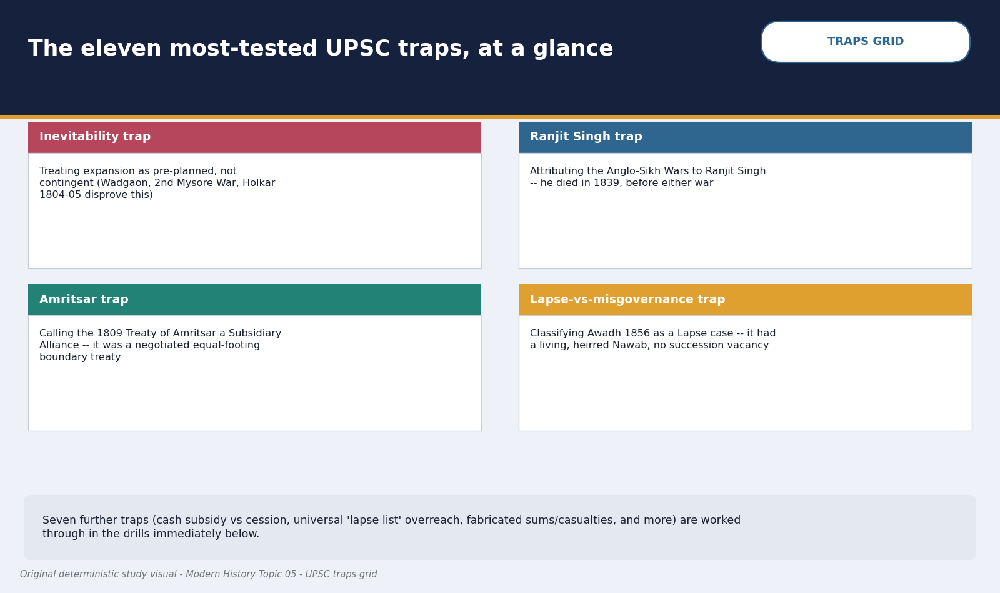
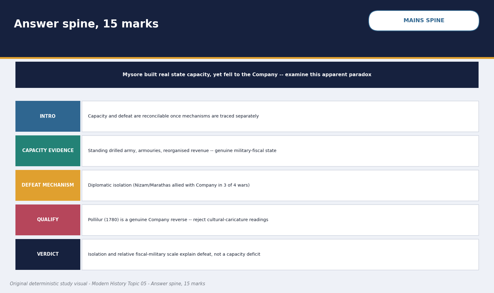
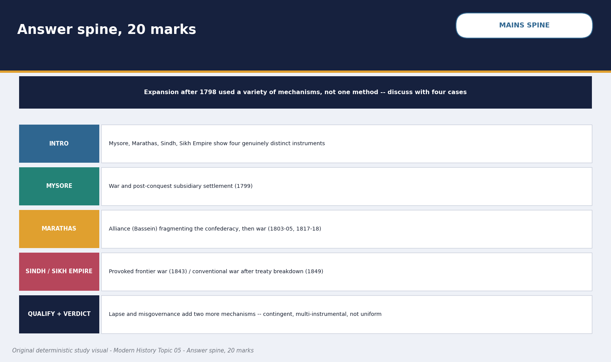

# British Territorial Expansion (Mysore, Marathas, Sikhs; Subsidiary Alliance & Lapse) — Solved Practice Workbook

> Built from the same normalized practice source as the complete learner-v2 session. Official/inferred PYQ status and true topic ownership are preserved.

## BASIC MCQS / REMEDIATION

### Q1. Which sequence correctly orders the "rungs" of Company territorial expansion introduced in this topic's analytical frame?

A. Ring-fence a friendly buffer state, impose subsidiary dependency, assert paramountcy, then annex
B. Annex first, then impose a buffer, then negotiate paramountcy
C. Assert paramountcy first, then create buffers, then negotiate subsidiary status
D. Impose subsidiary dependency before any buffer state exists, then annex without paramountcy

**Answer: A.**
**Explanation:** Subtopic 1 establishes this as the recurring, though not universally rigid, escalation logic -- buffer/ring-fence first, then subsidiary dependency, then the broader paramountcy claim (Hastings, 1813), with annexation as a possible final step, not a fixed first move.

### Q2. Which of the following is the clearest direct evidence against a purely "inevitable Company victory" reading of this period?

A. The size of the Bengal Army by 1856
B. The Company's own reverses at Wadgaon (1779) and against Holkar (1804-05)
C. The Treaty of Amritsar's negotiated boundary
D. The Subsidiary Alliance's six core clauses

**Answer: B.**
**Explanation:** Subtopic 2's contingency argument is best supported by named Company defeats or stalemates, showing outcomes were not predetermined; the other options describe Company strength or negotiated settlements, not reverses.

### Q3. Which feature most directly converted Indian recruitment into durable Company military capacity?

A. Recruitment alone, without regular pay, drill or supply
B. Exclusive dependence on European soldiers for field operations
C. A salaried sepoy army integrated with standardised drill, artillery, officers and organised logistics
D. A refusal to use Indian bankers, suppliers or allied contingents

**Answer: C.**
**Explanation:** Indian recruitment became strategically effective because the Company combined it with regular finance, command, artillery and supply. Numbers alone do not explain repeated campaigning or battlefield endurance.

### Q4. Which factor is specifically identified in this topic as part of "why Company armies prevailed II," alongside credit/supply and maritime reinforcement?

A. Superior European racial characteristics, as claimed in some colonial-era writing
B. A fixed, unchanging alliance structure applied identically on every frontier
C. Universal Indian passivity toward Company rule
D. Diplomacy that serially isolated opponents, aided by Indian allies and recruits

**Answer: D.**
**Explanation:** Subtopic 4 names diplomatic isolation and Indian allies/recruits explicitly as structural factors; the other options are either unsupported colonial-era claims or contradicted by this topic's own contingency and alliance-shift evidence.

### Q5. Historian Burton Stein's term "military fiscalism," as applied to Tipu Sultan's Mysore, refers specifically to which practice?

A. Direct, broad-based state revenue collection deliberately mobilised to sustain a large standing army
B. A policy of refusing all taxation in favour of voluntary contributions
C. Reliance solely on plunder from neighbouring states for army funding
D. A system copied wholesale from contemporary British parliamentary taxation

**Answer: A.**
**Explanation:** Subtopic 5 defines Stein's "military fiscalism" precisely this way -- direct assessment replacing intermediary-based collection, specifically to fund centralised military capacity, structurally comparable to the Company's own Bengal-based strategy.

### Q6. In which Anglo-Mysore War did the Marathas and the Nizam of Hyderabad fight ALONGSIDE Haidar Ali/Tipu Sultan, AGAINST the Company?

A. The First Anglo-Mysore War (1767-69)
B. The Second Anglo-Mysore War (1780-84)
C. The Third Anglo-Mysore War (1790-92)
D. The Fourth Anglo-Mysore War (1799)

**Answer: B.**
**Explanation:** Subtopic 6 states this precisely: the Marathas and the Nizam sided with the Company in the First and Third wars, but joined Haidar Ali against the Company in the Second War -- a frequently tested alliance-sequencing point.

### Q7. Which is the most historically balanced reading of Tipu Sultan's diplomatic outreach to Revolutionary France, per this topic's sourced assessment?

A. It never happened; the French connection is a later British fabrication
B. It was a decisive, fully realised military alliance that came close to defeating the Company outright
C. The outreach was real and diplomatically significant, but Edward Ingram's assessment holds that the actual probability of French intervention by 1798-99 was low, exaggerated by Wellesley as partial pretext
D. France formally annexed part of Mysore as a colony before 1799

**Answer: C.**
**Explanation:** Subtopic 7 requires holding both halves together -- genuine diplomacy, exaggerated invasion probability -- as the correct, source-supported position; the other options err toward denial or overstatement.

### Q8. After the fall of Seringapatam in 1799, what happened to Mysore's core territory and its ruling dynasty?

A. It was annexed outright and never restored to any Indian ruling family
B. It was given independently to the Nizam of Hyderabad as a reward
C. It was declared a fully sovereign, unrestricted kingdom under Tipu's own surviving family
D. It was restored to the Wodeyar dynasty, but immediately bound by a Subsidiary Alliance authorising British assumption of administration if judged necessary

**Answer: D.**
**Explanation:** Subtopic 8 confirms the Wodeyar restoration alongside immediate subsidiary subordination -- nominal restoration combined with substantive dependency, not full annexation and not unrestricted sovereignty.

### Q9. Which five houses together made up the Maratha confederacy discussed in this topic?

A. The Peshwa (Poona), Sindhia (Gwalior), Holkar (Indore), Bhonsle (Nagpur), and Gaekwad (Baroda)
B. The Peshwa, the Nizam, the Wodeyar, the Sikh Khalsa, and the Amirs of Sindh
C. Sindhia, Holkar, Bhonsle, Gaekwad, and the Mughal emperor
D. The Peshwa, Sindhia, Holkar, the Rani of Jhansi, and Nana Sahib

**Answer: A.**
**Explanation:** Subtopic 9 names exactly these five houses; the other options mix in unrelated states or actors from entirely different fronts (Sikh, Sindh) or later periods (Jhansi, Nana Sahib).

### Q10. The First Anglo-Maratha War (1775-82) concluded with which treaty, restoring the pre-war status quo?

A. The Treaty of Bassein
B. The Treaty of Salbai (1782), mediated by Mahadji Sindhia
C. The Treaty of Seringapatam
D. The Treaty of Rajghat

**Answer: B.**
**Explanation:** Subtopic 10 identifies Salbai as the genuinely negotiated settlement ending the First Anglo-Maratha War, restoring the pre-war position and securing roughly twenty years of peace; the other treaties belong to different wars or fronts entirely.

### Q11. Why is the Treaty of Bassein (1802) described in this topic as the single most consequential turning point in Company-Maratha relations?

A. It ended all Maratha military resistance permanently and immediately
B. It formally annexed the entire Maratha confederacy to the Company
C. It removed the Peshwa, the confederacy's nominal head, from the field of opposition, converting an external contest into separable conflicts with individual houses
D. It restored Baji Rao II's full, unrestricted sovereignty

**Answer: C.**
**Explanation:** Subtopic 11 explains that Bassein's significance lies in enabling serial isolation of Sindhia, Bhonsle and Holkar individually, not in ending resistance outright (which continued through 1818) or in formal annexation (which came only in 1818 for the Peshwaship).

### Q12. At which battle did Lord Lake defeat Sindhia's forces and occupy Delhi and Agra during the Second Anglo-Maratha War?

A. Assaye
B. Argaon
C. Chillianwala
D. Laswari (1 November 1803)

**Answer: D.**
**Explanation:** Subtopic 12 attributes Laswari to Lord Lake's northern campaign against Sindhia; Assaye and Argaon were Arthur Wellesley's Deccan-theatre victories, and Chillianwala belongs to the unrelated Second Anglo-Sikh War.

### Q13. What was the ultimate outcome for the Peshwaship at the end of the Third Anglo-Maratha War (1817-18)?

A. It was abolished outright; Baji Rao II was deposed and pensioned at Bithur
B. It was restored with expanded powers under British protection
C. It passed to Yeshwant Rao Holkar as the new Peshwa
D. It was merged permanently with the Nizam's Hyderabad state

**Answer: A.**
**Explanation:** Subtopic 13 confirms the Peshwaship's outright abolition, never restored -- a sharper outcome than the dependency (not abolition) imposed on Hyderabad, Awadh or Mysore.

### Q14. Which of the following was NOT one of the Subsidiary Alliance's six core clauses as set out in this topic?

A. Acceptance of a British Resident at the ruler's court
B. Permanent stationing of a British force at the ruler's own expense, with no promise of Company protection in return
C. A ban on employing Europeans without British approval
D. A restriction on independent diplomacy or war-making without consulting the Governor-General

**Answer: B.**
**Explanation:** Subtopic 14 states the Company DID undertake, at least formally, to defend the ruler in return -- a promise seldom honoured in practice, but nominally present; describing the arrangement as offering no reciprocal promise at all misstates the sixth clause.

### Q15. In which order did Wellesley's Subsidiary Alliance system spread across major states, per the verified case sequence in this topic?

A. Awadh (1801), then Hyderabad (1798), then Mysore (1799), then Bassein (1802)
B. Bassein (1802), then Mysore (1799), then Hyderabad (1798), then Awadh (1801)
C. Hyderabad (1798), then Mysore (1799), then Awadh (1801), then the Peshwa via Bassein (1802)
D. Mysore (1799), then Awadh (1801), then Bassein (1802), then Hyderabad (1798)

**Answer: C.**
**Explanation:** Subtopic 15 fixes this exact chronological sequence -- Hyderabad first, Mysore immediately after conquest, then Awadh, then the Peshwa -- a frequently tested ordering point.

### Q16. The "responsibility paradox" of indirect rule, as this topic defines it, refers to which arrangement?

A. The ruler retained full army and treasury control but lost only ceremonial status
B. The Company assumed full formal governing responsibility while the ruler retained real power
C. Both sides shared power and responsibility equally at all times
D. The Company created conditions for administrative strain (fiscal pressure, disbanded armies, Resident interference) while the ruler remained formally responsible for governance, later cited to justify further intervention

**Answer: D.**
**Explanation:** Subtopic 16 defines the paradox precisely as responsibility without power, followed by annexation or intervention justified by the very administrative strain the Company's own system had helped create.

### Q17. What was the primary strategic-commercial context that drew Company attention to Sindh before its 1843 annexation?

A. A desire to control the Indus river trade route and secure the north-western frontier approaches amid wider concern over Russian and Persian influence
B. A succession dispute among the Talpur Amirs requiring British arbitration
C. A request from the Amirs themselves for British administrative merger
D. A religious dispute requiring British intervention

**Answer: A.**
**Explanation:** Subtopic 17 identifies this commercial-strategic frontier logic as Sindh's defining context, not a succession dispute (that mechanism belongs to Lapse cases), a request for merger, or a religious dispute.

### Q18. The Treaty of Amritsar (1809) between the Company and Ranjit Singh established which boundary and relationship?

A. Full Subsidiary Alliance status for Ranjit Singh's kingdom
B. The Sutlej river as boundary, recognising Ranjit Singh's sovereignty north and west of it, with cis-Sutlej chiefs under Company protection
C. Outright Company annexation of Lahore
D. A boundary at the Indus river, with Ranjit Singh accepting British paramountcy

**Answer: B.**
**Explanation:** Subtopic 18 confirms Amritsar as a negotiated boundary treaty between comparative equals, not a Subsidiary Alliance or annexation -- the Sutlej, not the Indus, was the fixed boundary.

### Q19. How many rulers occupied the Sikh throne in the roughly six years following Ranjit Singh's death in June 1839, illustrating the succession crisis?

A. Only one, in an unbroken and stable succession
B. Two, with no factional rivalry
C. Five, amid intense factional rivalry and the Khalsa army's rise as an independent political force
D. None; the throne remained vacant throughout

**Answer: C.**
**Explanation:** Subtopic 19 traces this rapid five-ruler succession crisis (Kharak Singh, Nau Nihal Singh, and further short reigns before the child Duleep Singh), directly preconditioning the First Anglo-Sikh War.

### Q20. Which four battles, in correct chronological order, decided the First Anglo-Sikh War (1845-46)?

A. Chillianwala, Gujrat, Ramnagar, Multan
B. Plassey, Buxar, Assaye, Laswari
C. Seringapatam, Mangalore, Madras, Wadgaon
D. Mudki, Ferozeshah, Aliwal, Sobraon

**Answer: D.**
**Explanation:** Subtopic 20 fixes this exact sequence (18 Dec 1845 to 10 Feb 1846); the other options list battles from entirely different wars (Bengal, Mysore, Maratha) or wrongly include Second Anglo-Sikh War battles (Chillianwala, Gujrat, Ramnagar, Multan).

### Q21. The "ring-fence" concept in this topic's analytical frame refers to which strategy?

A. Creating or supporting a friendly buffer state along a frontier to protect Company territory from a rival power, before any deeper dependency is imposed
B. Physically walling Company cantonments for defence
C. A Mughal-era customs boundary later inherited unchanged by the Company
D. A purely naval blockade strategy used only against European rivals

**Answer: A.**
**Explanation:** Subtopic 1 uses "ring-fence" for this buffer-creation logic, the first rung before subsidiary dependency, paramountcy and annexation; the other options are unrelated or invented meanings.

### Q22. In the Second Anglo-Mysore War (1780-84), which outcome best illustrates the Company facing a genuine reverse rather than an inevitable advance?

A. Immediate Company capture of Seringapatam
B. Haidar Ali's repeated defeats of Company forces in the Carnatic, with the war ending inconclusively at the Treaty of Mangalore
C. A swift, decisive Company naval victory off Mangalore
D. The Nizam's unconditional surrender to the Company

**Answer: B.**
**Explanation:** Subtopic 6 confirms this war's inconclusive, mutually-restoring settlement after Haidar's battlefield successes -- a clear reverse/stalemate, not a smooth Company advance.

### Q23. Which combination of factors is cited in this topic as underpinning Company officer, artillery and logistics superiority, alongside sepoy numbers?

A. Reliance purely on mercenary European regiments with no Indian troops at all
B. Superior individual soldier physical stature, as claimed in colonial-era racial theory
C. A comparatively thin but professionalised British officer corps, standardised artillery, and organised logistics drawing on Bengal's revenue base
D. Complete avoidance of any artillery in the field, relying solely on cavalry

**Answer: C.**
**Explanation:** Subtopic 3 attributes Company effectiveness to this specific combination -- professional officers, standardised artillery, and a revenue-funded logistics chain -- not to racial theory or an all-European force, which this package explicitly does not assert.

### Q24. Which factor, alongside diplomacy and serial isolation of opponents, is specifically named in "why Company armies prevailed II"?

A. A policy of never accepting Indian recruits into any regiment
B. Complete Company self-sufficiency in supply, without reliance on Indian bankers or credit
C. Reliance on foreign mercenary loans exclusively from continental Europe
D. Credit and supply networks together with maritime reinforcement capacity

**Answer: D.**
**Explanation:** Subtopic 4 names credit/supply and maritime reinforcement as structural advantages alongside diplomacy; the other options misstate or invert this topic's own claims about Indian recruits and credit reliance.

### Q25. How did Haidar Ali rise to effective control of Mysore by 1761?

A. He ousted the corrupt dalavai Nanjaraj as a rising army officer, leaving the Wodeyar king a titular figurehead
B. He was formally crowned king by the Mughal emperor
C. He inherited the throne directly from the previous Wodeyar ruler
D. He was appointed by the Company as a subsidiary ruler

**Answer: A.**
**Explanation:** Subtopic 5 confirms this precise rise-to-power route -- military talent displacing an existing minister, not inheritance, Mughal coronation, or Company appointment.

### Q26. The Treaty of Madras (1769), ending the First Anglo-Mysore War, involved which outcome?

A. Outright Company annexation of Mysore
B. Haidar Ali's forces threatened Madras directly and dictated a peace of mutual restoration and mutual defence, which the Company later failed to honour
C. Formal French recognition of Haidar Ali as emperor
D. A permanent ban on Mysore maintaining any standing army

**Answer: B.**
**Explanation:** Subtopic 6 confirms Haidar dictated these terms after a strong military position, and that the Company did not honour the mutual-defence promise when the Marathas attacked Haidar in 1771.

### Q27. What was the key outcome of the Treaty of Mangalore (1784), ending the Second Anglo-Mysore War?

A. Establishment of a Subsidiary Alliance over Mysore
B. Cession of half of Mysore's territory to the Company
C. Restoration of each side's conquests, concluded after Haidar Ali's death by his son Tipu Sultan
D. Tipu Sultan's death in battle

**Answer: C.**
**Explanation:** Subtopic 6 confirms Mangalore as a mutual-restoration peace, concluded by Tipu after Haidar's December 1782 death; the territorial cession and Subsidiary Alliance belong to later settlements (1792 and 1799 respectively).

### Q28. Under the Treaty of Seringapatam (1792), ending the Third Anglo-Mysore War, Tipu Sultan was required to do what?

A. Accept full Company annexation of Mysore
B. Accept a Subsidiary Alliance immediately
C. Disband his entire army permanently
D. Cede roughly half his territory to the allied powers and pay a war indemnity

**Answer: D.**
**Explanation:** Subtopic 6 confirms this cession-and-indemnity outcome after Cornwallis's combined campaign with the Marathas and the Nizam; annexation and the Subsidiary Alliance came only after the Fourth War in 1799.

### Q29. Haidar Ali's 1766 annexation of which coastal region first extended Mysore's reach to lucrative pepper, sandalwood and cardamom trade?

A. Malabar and Calicut
B. Bengal's coastal districts
C. The Coromandel Carnatic coast
D. Sindh's coastline

**Answer: A.**
**Explanation:** Subtopic 7 confirms this 1766 annexation as the origin of Mysore's recurring friction with the Marathas' own coastal reach and with Travancore.

### Q30. Tipu Sultan's mid-1780s trade policy toward English merchants in his ports involved which measure?

A. Free, unrestricted trade access granted specifically to Company merchants
B. Export embargoes on pepper, sandalwood and cardamom, and restrictions on English traders' dealings
C. A formal customs union with the Company
D. Abolition of all export duties on every commodity

**Answer: B.**
**Explanation:** Subtopic 7 names this specific embargo policy as a commercial friction reinforcing the wider strategic rivalry with the Company, particularly around Malabar's trade.

### Q31. How did Tipu Sultan die in 1799?

A. In exile after surrendering Seringapatam without resistance
B. By suicide following the city's fall
C. Defending Seringapatam on 4 May 1799, with his army remaining loyal through the city's fall
D. In a naval battle off the Malabar coast

**Answer: C.**
**Explanation:** Subtopic 8 confirms Tipu died defending his capital, with his forces recorded as loyal to the end, not surrendering or fleeing.

### Q32. What supplied Lord Cornwallis's direct pretext for launching the Third Anglo-Mysore War (1790-92)?

A. A dispute over Sindh's frontier
B. A direct Mysorean attack on Madras itself
C. Tipu's refusal to pay tribute to the Mughal emperor
D. Tipu Sultan's 1789-90 attack on the Raja of Travancore, a state under Company protection

**Answer: D.**
**Explanation:** Subtopic 7 identifies this attack on a Company-protected neighbour as the direct pretext Cornwallis used to launch the Third Anglo-Mysore War.

### Q33. Whose death in 1800 removed the Maratha confederacy's most experienced check on internal rivalry, directly preconditioning the Treaty of Bassein?

A. Nana Phadnis
B. Mahadji Sindhia
C. Peshwa Baji Rao II
D. Yeshwant Rao Holkar

**Answer: A.**
**Explanation:** Subtopic 11 identifies Nana Phadnis's 1800 death, after roughly three decades holding the confederacy together, as the precipitating event for the succession-era feuding that led to Bassein.

### Q34. Raghunath Rao's 1775 appeal to the Company's Bombay establishment, backed after his defeat in Gujarat, is associated with which early, uncounted-by-Calcutta agreement?

A. The Treaty of Salbai
B. An early Bombay-led agreement traditionally associated with the Treaty of Surat, not ratified by the Company's Calcutta authorities
C. The Treaty of Bassein
D. The Treaty of Rajghat

**Answer: B.**
**Explanation:** Subtopic 10 confirms this Bombay-Calcutta split -- the Bombay government's own initiative was not endorsed by Calcutta, which instead concluded the separate Treaty of Purandar in 1776.

### Q35. The 1779 Convention/Treaty of Wadgaon required the Company's Bombay force to do what?

A. Annex additional Maratha territory
B. Install Raghunath Rao as Peshwa immediately
C. Renounce all its conquests and abandon Raghunath Rao's cause outright, after being defeated and encircled
D. Pay an indemnity to Mahadji Sindhia only

**Answer: C.**
**Explanation:** Subtopic 10 confirms Wadgaon as a humiliating Company reverse -- forced renunciation after encirclement, not a negotiated gain or partial settlement.

### Q36. On what date was the Treaty of Bassein signed, formalising Peshwa Baji Rao II's Subsidiary Alliance?

A. 23 June 1757
B. 22 October 1764
C. 1 November 1803
D. 31 December 1802

**Answer: D.**
**Explanation:** Subtopic 11 fixes this precise date, immediately after Holkar's 25 October 1802 defeat of the combined Peshwa-Sindhia forces near Poona; the other dates belong to Plassey, Buxar and Laswari respectively.

### Q37. At which battle, in September 1803, did Arthur Wellesley (the future Duke of Wellington) defeat the combined Sindhia-Bhonsle forces in the Deccan theatre?

A. Assaye
B. Chillianwala
C. Sobraon
D. Miani

**Answer: A.**
**Explanation:** Subtopic 12 confirms Assaye (September 1803) as Arthur Wellesley's Deccan-theatre victory, distinct from Lord Lake's northern-theatre Laswari and from the unrelated Sikh and Sindh battles listed as distractors.

### Q38. The Treaty of Rajghat (1805/06), restoring much of Holkar's territory, followed which development?

A. Holkar's immediate surrender at the war's outset
B. Yeshwant Rao Holkar's continued resistance, using mobile cavalry tactics, forcing Company financial strain and a change of Governor-General policy
C. Holkar's alliance with the Company against Sindhia
D. The abolition of the Peshwaship

**Answer: B.**
**Explanation:** Subtopic 12 confirms Holkar's sustained resistance and the Company's recall of Wellesley amid financial strain, leading to Rajghat's comparatively lenient restoration of territory.

### Q39. Lord Hastings's explicit articulation of the "paramountcy" doctrine from 1813 held which position?

A. The Company should never intervene beyond existing treaty obligations
B. Only Parliament in London could authorise any Indian military action
C. The Company's own security interests entitled it to act against any Indian power it judged a threat, allied or not
D. Only the Mughal emperor retained authority to sanction Company military action

**Answer: C.**
**Explanation:** Subtopic 13 attributes this explicit paramountcy doctrine to Hastings, directly enabling the decisive campaign against the Peshwa, Bhonsle and Holkar in 1817-18.

### Q40. Nana Sahib's grievance against the Company, which fed into his later role in 1857, arose from which specific decision?

A. The 1818 abolition of the Peshwaship itself, which Nana Sahib is said to have personally fought against
B. The Doctrine of Lapse applied to a Maratha territory Nana Sahib ruled directly
C. The 1802 Treaty of Bassein's terms
D. Dalhousie's refusal to continue Baji Rao II's personal pension and title to his adopted son after Baji Rao II's 1851 death

**Answer: D.**
**Explanation:** Subtopic 24 (and subtopic 22's title/pension distinction) confirms this was a personal pension/title denial in 1851, structurally separate from territorial Doctrine of Lapse cases and from the already-completed 1818 abolition of the Peshwaship.

### Q41. The technique of stationing a Company-paid force alongside an allied Indian ruler, later systematised by Wellesley as the Subsidiary Alliance, had which characteristic before 1798?

A. It had precedents in earlier Company practice and in comparable French subsidiary arrangements, but lacked Wellesley's systematic, near-universal application
B. It was entirely unprecedented and invented wholly by Wellesley
C. It had been used only once before, by Warren Hastings against Awadh
D. It originated with the Marathas, who imposed it on the Company

**Answer: A.**
**Explanation:** Subtopic 14 explicitly credits Wellesley with systematisation, not invention -- the underlying technique had genuine precedents that Wellesley then applied far more aggressively and universally.

### Q42. The contemporary characterisation quoted in this topic -- describing the Subsidiary Alliance as "a system of fattening allies as we fatten oxen, till they were worthy of being devoured" -- is presented as which kind of evidence?

A. This package's own original analytical claim
B. A period British commentator's reflection, quoted as a contemporary characterisation, not this package's own analytical claim
C. An official East India Company government resolution
D. A verified quotation from Tipu Sultan

**Answer: B.**
**Explanation:** Subtopic 14 explicitly frames this vivid quotation as a period reflection cited via Bipan Chandra, distinguishing it from this package's own analytical voice.

### Q43. The Nizam of Hyderabad's Subsidiary Alliance arrangement, first concluded in 1798 and enlarged in 1800, required the Nizam to do what?

A. Accept direct Mughal suzerainty instead of British protection
B. Cede his entire kingdom outright to the Company
C. Dismiss his French-trained troops and maintain a subsidiary force at his own cost, later partly through territorial cession
D. Pay no subsidy at all, receiving the force free of charge

**Answer: C.**
**Explanation:** Subtopic 15 confirms this was the Company's first Subsidiary Alliance case (1798), later enlarged in 1800 with part-payment converted to ceded territory.

### Q44. Under the 1801 Subsidiary Treaty imposed on Awadh, the Nawab surrendered roughly which territories in place of an enlarged cash subsidy?

A. Malabar and Canara
B. The Jullundur Doab and Kashmir
C. Berar and Nagpur
D. Rohilkhand and the Doab (between the Ganga and the Yamuna)

**Answer: D.**
**Explanation:** Subtopic 15 confirms these were the specific territories ceded under Awadh's 1801 settlement; the other options belong to Mysore's coast, later Central India annexations, and the 1846 Sikh settlement respectively.

### Q45. Which of the following states/rulers were compelled to cede their kingdoms outright in exchange for a pension, rather than accepting a Subsidiary Alliance, under Wellesley?

A. The Nawab of the Carnatic (1801), and the rulers of Tanjore and Surat
B. The Nizam of Hyderabad
C. Peshwa Baji Rao II
D. Ranjit Singh's Punjab

**Answer: A.**
**Explanation:** Subtopic 15 distinguishes these direct-pension annexations (forming the enlarged Madras Presidency) from the Subsidiary Alliance route applied to Hyderabad, the Peshwa, and (in a wholly different, later mechanism) Punjab.

### Q46. What is the precise difference between a "cash subsidy" and a "territorial cession" under the Subsidiary Alliance system, as this topic defines them?

A. They are simply two names for the identical arrangement with no practical difference
B. A cash subsidy was an annual cash payment for the stationed force's upkeep; a territorial cession transferred revenue-yielding land in lieu of, or partial substitution for, that payment, permanently reducing the state's own resource base
C. A cash subsidy applied only to Mysore; a territorial cession applied only to the Marathas
D. A territorial cession was always larger in value than any cash subsidy

**Answer: B.**
**Explanation:** Subtopic 16 draws this precise distinction, noting a territorial cession's more permanent impact on the ceding state's future capacity -- a frequently tested precision point connected to the 2018 Prelims PYQ solved in this Part.

### Q47. The disbandment of a protected state's own army under the Subsidiary Alliance system is linked in this topic to which subsequent development?

A. The immediate abolition of the Doctrine of Lapse
B. A permanent reduction in Company military strength
C. A rise in the number of unemployed soldiers and officers, some of whom joined the roving Pindari bands
D. Direct annexation of Awadh in 1801

**Answer: C.**
**Explanation:** Subtopic 16 draws this direct link between disbanded subsidiary-state armies and the Pindari problem that later justified Lord Hastings's paramountcy-based intervention (subtopic 13).

### Q48. The 1832 commercial treaty affecting Sindh achieved which outcome?

A. Outright annexation of Sindh to the Company
B. Ceded Karachi to the Company permanently
C. Established a Subsidiary Alliance over the Amirs
D. Opened the Indus river and Sindh's roads to Company trade

**Answer: D.**
**Explanation:** Subtopic 17 confirms this 1832 treaty's commercial, non-annexationist character, well before the 1839 subsidiary treaty and 1843 annexation.

### Q49. The 1839 Subsidiary Treaty imposed on Sindh's Amirs is best understood in the context of which wider Company undertaking?

A. The First Afghan War (1838-42), which brought British troops into Sindh
B. The Third Anglo-Maratha War
C. The Second Anglo-Sikh War
D. The Fourth Anglo-Mysore War

**Answer: A.**
**Explanation:** Subtopic 17 links the 1839 Subsidiary Treaty on Sindh directly to Company military transit needs for the First Afghan War, not to any of the other, unrelated campaigns listed.

### Q50. At which two battles, in 1843, did Charles Napier defeat the Amirs' forces before Sindh's annexation?

A. Assaye and Argaon
B. Miani (17 February 1843) and Dabo/Hyderabad (24 March 1843)
C. Mudki and Ferozeshah
D. Chillianwala and Gujrat

**Answer: B.**
**Explanation:** Subtopic 17 confirms these two 1843 battles as the immediate military prelude to Sindh's annexation; the other pairs belong to the Maratha, First Anglo-Sikh, and Second Anglo-Sikh wars respectively.

### Q51. Which quotation is verified and used in this topic regarding Sindh's annexation, and which popular story is deliberately excluded as unverified?

A. Verified: Wellesley's letter on the "most favourable opportunity"; excluded: the Black Hole narrative
B. Verified: Clive's 1772 testimony on corruption; excluded: Napier's diary entry
C. Verified: Napier's diary entry admitting the annexation's dubious legality; excluded: the popular "Peccavi" ("I have sinned"/"I have Sindh") telegram pun
D. Verified: the "fattening allies" quote; excluded: Napier's diary entry

**Answer: C.**
**Explanation:** Subtopic 17 and Drill 9 both confirm this exact verified-versus-excluded pairing; the "Peccavi" pun is a widely repeated but historically unverified anecdote deliberately excluded from this package.

### Q52. Ranjit Singh's Khalsa army was modernised with the help of which kind of recruited personnel?

A. Ottoman Turkish cavalry officers exclusively
B. Afghan mercenary commanders exclusively
C. Exclusively Company-trained British officers on loan
D. French, Italian and other European officers (including Jean-Francois Allard and Jean-Baptiste Ventura)

**Answer: D.**
**Explanation:** Subtopic 18 names these specific European officers recruited by Ranjit Singh to modernise the Khalsa army's infantry, artillery and drill.

### Q53. In which month and year did Ranjit Singh die, six years before the First Anglo-Sikh War began?

A. June 1839
B. December 1845
C. March 1849
D. February 1846

**Answer: A.**
**Explanation:** Subtopic 18/19 fix this precise date, underscoring that Ranjit Singh never fought the Company -- the wars began only after his death produced succession instability.

### Q54. Which two Sikh rulers died in rapid succession immediately after Ranjit Singh, deepening the post-1839 crisis?

A. Duleep Singh and Rani Jindan Kaur
B. Kharak Singh (died 1840) and Nau Nihal Singh (died the same day as his father's funeral procession, 1840)
C. Wajid Ali Shah and Nana Sahib
D. Baji Rao II and Raghunath Rao

**Answer: B.**
**Explanation:** Subtopic 19 confirms this specific, unusually rapid double succession crisis as a key precondition for the Khalsa army's rising political independence and the eventual war.

### Q55. What precipitated the crossing of the Sutlej by the Khalsa army in December 1845, starting the First Anglo-Sikh War?

A. A direct order from Ranjit Singh
B. The Multan rebellion
C. Rising mutual suspicion from Company frontier build-up after the Afghan war and the Khalsa army's own increasingly independent political assertiveness at Lahore
D. Dalhousie's Doctrine of Lapse

**Answer: C.**
**Explanation:** Subtopic 20 identifies this mutual-suspicion dynamic as the war's precipitating context; Ranjit Singh had already been dead for six years, the Multan rebellion belongs to the Second War, and the Doctrine of Lapse is an unrelated, later mechanism.

### Q56. Under the Treaty of Lahore (March 1846), which territories did the Sikh state cede?

A. Sindh and Malabar
B. Satara and Jhansi
C. Rohilkhand and the Doab
D. The Jullundur Doab and Kashmir (the latter separately sold to Gulab Singh of Jammu)

**Answer: D.**
**Explanation:** Subtopic 20 confirms this specific cession, including the creation of Jammu and Kashmir as a princely state under British paramountcy through the Kashmir sale to Gulab Singh.

### Q57. Under the Treaty of Bhyrowal (16 December 1846), who held effectively decisive authority at Lahore during Duleep Singh's minority?

A. Henry Lawrence, as British Resident, under a Council of Regency
B. Rani Jindan Kaur alone, without British oversight
C. Diwan Mulraj
D. Charles Napier

**Answer: A.**
**Explanation:** Subtopic 20 names Henry Lawrence specifically as the Resident holding real authority under the Bhyrowal settlement, a dependency arrangement short of outright annexation.

### Q58. The Second Anglo-Sikh War (1848-49) began with a rebellion centred at which location, triggered by which figure?

A. Lahore, triggered by Duleep Singh
B. Multan, triggered by Diwan Mulraj's killing of two British officers sent to oversee the province's transfer
C. Amritsar, triggered by Ranjit Singh's heirs
D. Peshawar, triggered by an Afghan incursion

**Answer: B.**
**Explanation:** Subtopic 21 confirms Multan and Diwan Mulraj's specific role as the war's proximate trigger, distinct from the earlier, unrelated First War's Sutlej-crossing trigger.

### Q59. Which battle, on 21 February 1849, decisively broke the Khalsa army's remaining organised resistance in the Second Anglo-Sikh War?

A. Mudki
B. Ferozeshah
C. Gujrat
D. Ramnagar

**Answer: C.**
**Explanation:** Subtopic 21 confirms Gujrat (21 February 1849) as the decisive engagement, following the inconclusive Ramnagar and the costly, disputed Chillianwala; Mudki and Ferozeshah belong to the earlier, separate First War.

### Q60. On what date was the Punjab formally annexed, ending the Sikh Empire, and what happened to Maharaja Duleep Singh?

A. 1858; he was made a British peer immediately
B. 10 February 1846; he was restored to full sovereignty
C. 1856; he was declared Governor-General's agent
D. 29 March 1849; he was pensioned and sent to England, and the Khalsa army was disbanded

**Answer: D.**
**Explanation:** Subtopic 21 fixes this precise annexation date and outcome, distinct from the 1846 date (First War settlement, not annexation) and unrelated later dates offered as distractors.

### Q61. The Doctrine of Lapse, as articulated by Dalhousie, permitted the Company to annex a dependent state under which specific condition?

A. Where the ruler died without a natural (biological) male heir and Dalhousie refused to recognise an adopted heir
B. Whenever the ruler's territory was strategically valuable, regardless of succession
C. Whenever a ruler was accused of misgovernance, regardless of succession status
D. Only where the ruler voluntarily requested annexation

**Answer: A.**
**Explanation:** Subtopic 22 defines the Doctrine of Lapse precisely by this natural-heir/adoption-refusal condition, distinguishing it sharply from misgovernance annexation (Awadh, subtopic 23) or purely strategic conquest (Sindh, subtopic 17).

### Q62. Raja Gangadhar Rao's adoption of Damodar Rao shortly before his death in November 1853 was refused recognition by Dalhousie, leading to which outcome?

A. Satara's annexation in 1848
B. Jhansi's annexation (1853-54), later contested by Rani Lakshmibai
C. Awadh's annexation in 1856
D. Sindh's annexation in 1843

**Answer: B.**
**Explanation:** Subtopic 22 confirms this exact sequence for Jhansi, feeding directly into Rani Lakshmibai's role in 1857 (subtopic 24), distinct from Satara (the first Lapse case, 1848), Awadh (misgovernance, not Lapse), and Sindh (frontier conquest).

### Q63. Why does this topic explicitly classify the 1856 annexation of Awadh as separate from the Doctrine of Lapse?

A. Because Awadh was annexed by Napier, not Dalhousie
B. Because Awadh had never signed a Subsidiary Alliance
C. Because Awadh's Nawab, Wajid Ali Shah, was alive with heirs and no succession dispute existed; the annexation rested instead on alleged internal misgovernance reported by James Outram
D. Because Awadh's annexation predated Dalhousie's tenure

**Answer: C.**
**Explanation:** Subtopic 23 draws this precise distinction -- misgovernance annexation with a living, heir-bearing ruler, categorically different from a true Lapse case's succession-without-heir condition.

### Q64. Which historiographical lens, per this topic's four-lens framework, best combines with the fiscal-military lens to explain both Company capacity and why that capacity found exploitable local divisions?

A. The military-revolution/contingency lens alone, without reference to any other lens
B. A lens denying that any historiographical disagreement exists on this topic
C. A lens asserting British racial or civilisational superiority
D. The collaboration and Indian-agency lens, emphasising autonomous regional alliance calculations and Indian staffing of the Company's own machine

**Answer: D.**
**Explanation:** Subtopic 25's analysis explicitly identifies combining the fiscal-military lens (capacity) with the collaboration/agency lens (why that capacity found local partners and exploitable divisions) as the strongest analytical move; the other options misstate or reject the framework.

### Q65. A student writes: 'The Company's armies that defeated Indian rulers were overwhelmingly British soldiers.' What is the correct remedial statement?

A. These armies were composed mostly of Indian sepoys, organised through regular finance, drill, artillery, logistics and a comparatively thin British officer corps
B. The statement is accurate; sepoys were a small minority throughout
C. Only Bengal's army used Indian troops; Madras and Bombay armies were entirely British
D. Indian soldiers were used only in non-combat logistics roles

**Answer: A.**
**Explanation:** This is precisely the framing the 2022 Mains PYQ itself uses; describing Company victories as demographically "British" misreads both the question and the source evidence in subtopic 3.

### Q66. A student writes: 'Tipu Sultan's Mysore had already achieved a level of industrial modernity comparable to contemporary Europe.' What is the correct remedial statement?

A. The statement is accurate without qualification
B. Tipu's reforms (direct revenue assessment, agrarian and irrigation encouragement, "military fiscalism") were genuine, but Irfan Habib's own caution notes his modernising ambition ran ahead of the state's actual resources
C. Tipu made no meaningful reforms at all; this is a nationalist myth
D. Modernity is irrelevant to assessing Mysore's military capacity

**Answer: B.**
**Explanation:** Subtopic 5's balanced position credits real reform while flagging its resource limits -- both overstatement and dismissal are errors this topic explicitly guards against.

### Q67. A student writes: 'The Marathas and the Nizam always allied with the Company against Mysore in every Anglo-Mysore War.' What is the correct remedial statement?

A. Only the Nizam ever allied with Mysore; the Marathas never did
B. The statement is accurate for all four wars
C. They allied with the Company in the First and Third wars, but sided WITH Haidar Ali AGAINST the Company in the Second Anglo-Mysore War (1780-84)
D. Neither the Marathas nor the Nizam were involved in any Anglo-Mysore War

**Answer: C.**
**Explanation:** Subtopic 6 and Drill 4 both flag this exact alliance-sequencing error as one of the most common in this topic.

### Q68. A student writes: 'Napier's famous telegram "Peccavi" ("I have sinned"/"I have Sindh") is a verified primary-source quotation confirming his own admission of wrongdoing.' What is the correct remedial statement?

A. The quotation is from Wellesley, not Napier
B. The statement is accurate and the telegram's original text is held in this repository
C. Napier never expressed any doubt about Sindh's annexation in any document
D. The "Peccavi" story is a widely repeated but historically unverified anecdote, deliberately excluded from this package; the verified quotation is Napier's own diary entry admitting the annexation's dubious legality

**Answer: D.**
**Explanation:** Subtopic 17 and Drill 9 both draw this exact verified-versus-unverified distinction; citing "Peccavi" as sourced fact is a specifically flagged error in this package.

### Q69. A student writes: 'Ranjit Singh personally led the Sikh Empire's forces against the Company in the Anglo-Sikh Wars and was defeated.' What is the correct remedial statement?

A. Ranjit Singh died in June 1839, a full six years before the First Anglo-Sikh War began in December 1845; he never fought the Company
B. The statement is accurate; he led the First Anglo-Sikh War personally
C. He led only the Second Anglo-Sikh War, not the First
D. He was captured and pensioned after the First Anglo-Sikh War

**Answer: A.**
**Explanation:** Subtopic 18/19 and Drill 10 both flag this precise actor-timeline error; the wars followed only after his death produced succession instability.

### Q70. A student writes: 'The First Anglo-Sikh War (1845-46) ended with the outright annexation of the Punjab.' What is the correct remedial statement?

A. The statement is accurate; annexation followed directly from Sobraon
B. The First War ended with the Treaty of Lahore and the Treaty of Bhyrowal, establishing a Resident-controlled dependency, not annexation; Punjab was annexed only in March 1849, after the Second Anglo-Sikh War
C. The First War ended in a Sikh victory with no treaty at all
D. Punjab was annexed in 1846 but restored to Duleep Singh in 1849

**Answer: B.**
**Explanation:** Subtopic 20-21 and Drill 11 both confirm this precise war-to-outcome sequencing; conflating the First War's dependency outcome with the Second War's annexation is a frequent error.

### Q71. A student writes: 'Awadh was annexed in 1856 under Dalhousie's Doctrine of Lapse, after the Nawab died without an heir.' What is the correct remedial statement?

A. Awadh was annexed by Napier, not Dalhousie
B. The statement is accurate; Awadh is a standard Lapse case
C. Awadh's Nawab, Wajid Ali Shah, was alive with heirs; annexation rested on alleged internal misgovernance reported by James Outram, a mechanism this package explicitly distinguishes from the Doctrine of Lapse
D. Awadh was never actually annexed; it remained independent until 1947

**Answer: C.**
**Explanation:** Subtopic 23 and Drill 12 both flag grouping Awadh under the Doctrine of Lapse as one of the single most common and heavily penalised errors on this topic.

### Q72. A student writes: 'Nana Sahib's grievance against the Company was a territorial Doctrine of Lapse case, just like Jhansi.' What is the correct remedial statement?

A. Nana Sahib's grievance concerned Sindh's annexation
B. The statement is accurate; both are identical Lapse cases
C. Nana Sahib ruled a state that was annexed under Lapse in 1853
D. Nana Sahib's grievance was Dalhousie's refusal to continue his adoptive father Baji Rao II's personal pension and title after Baji Rao II's 1851 death -- a title/pension denial, structurally distinct from a territorial Lapse annexation like Jhansi's

**Answer: D.**
**Explanation:** Subtopic 22/24 and Drill 12 draw this precise mechanism distinction; the Peshwaship itself had already been abolished in 1818, well before this 1851 pension dispute.

### Q73. A student writes: 'The Treaty of Bassein (1802) ended all Maratha military resistance to the Company outright.' What is the correct remedial statement?

A. Bassein removed only the Peshwa from the field of opposition; Sindhia, Bhonsle and Holkar continued fighting through the Second Anglo-Maratha War (1803-05), and the confederacy was defeated only by 1818 in the Third War
B. The statement is accurate; no Maratha house fought after 1802
C. Bassein was a Maratha military victory over the Company
D. Bassein applied only to Sindhia, not to the Peshwa

**Answer: A.**
**Explanation:** Subtopic 11 and Drill 6 both flag overstating Bassein's immediate effect as a common error; its significance is structural (isolating the Peshwa), not an instant end to all resistance.

### Q74. A student writes: 'Every Subsidiary Alliance treaty required the allied ruler to pay in ceded territory; cash payment was never used.' What is the correct remedial statement?

A. The statement is accurate for every single case
B. Payment could be either a cash subsidy or a territorial cession (or a combination, as at the Nizam's 1800 treaty and Awadh's 1801 settlement); the two are distinct mechanisms, not identical or mutually exclusive across all cases
C. Cash payment was used only by the Marathas
D. Territorial cession was used only in Sindh

**Answer: B.**
**Explanation:** Subtopic 14/16 and Drill 7 both require this precise cash-versus-cession distinction, directly relevant to the 2018 Prelims PYQ solved in this Part.

### Q75. A student writes: 'A cash subsidy and a territorial cession under the Subsidiary Alliance are simply two names for an identical arrangement.' What is the correct remedial statement?

A. A cash subsidy was always larger in value than a territorial cession
B. The statement is accurate; there is no practical difference
C. They are distinct: a cash subsidy was an annual payment, while a territorial cession transferred revenue-yielding land, permanently reducing the ceding state's own resource base -- a materially different long-term effect
D. Only Mysore ever paid a cash subsidy

**Answer: C.**
**Explanation:** Subtopic 16 and Drill 7 both require naming this precise, frequently tested difference explicitly, not treating the two mechanisms as interchangeable.

### Q76. A student writes: 'Sindh was annexed in 1843 primarily for religious or cultural reasons.' What is the correct remedial statement?

A. Sindh's annexation had no connection to trade or strategy at all
B. The statement is accurate as written
C. Sindh was annexed to protect a specific religious pilgrimage route
D. Sindh's annexation was driven primarily by commercial and strategic frontier logic -- control of the Indus trade route and the north-western approaches, amid wider concern over Russian and Persian influence -- not religious or cultural motives

**Answer: D.**
**Explanation:** Subtopic 17 identifies this commercial-strategic frontier context as Sindh's defining logic; no religious or cultural motive is asserted anywhere in this package's sourced account.

### Q77. A student writes: 'Company armies won consistently purely because of superior weapons technology.' What is the correct remedial statement?

A. Technology was only one factor among several -- Bengal's fiscal base, sepoy recruitment, officer/artillery/logistics organisation, credit and supply, maritime reinforcement, diplomacy and serial isolation of opponents, and Indian allies/recruits together explain Company success, per Parts I and IX's PYQ model answer
B. The statement is accurate and sufficient on its own
C. Technology played no role whatsoever
D. Only naval technology mattered; land technology was irrelevant

**Answer: A.**
**Explanation:** Subtopics 3-4 and the 2022 Mains PYQ model both require this multi-factor answer; a technology-only explanation under-answers the question and loses marks.

### Q78. A student writes: 'British territorial expansion in India was an inevitable, predetermined process from the outset.' What is the correct remedial statement?

A. The statement is accurate; no alternative outcome was ever possible
B. Expansion proceeded through a sequence of contingent, case-by-case choices shaped by local alliance opportunities and internal politics; the Company's own reverses (Wadgaon 1779, the Second Mysore War, Holkar's 1804-05 resistance) are direct evidence against inevitability
C. Only Mysore's defeat was contingent; all other fronts were inevitable
D. Contingency applies only to the Sikh front

**Answer: B.**
**Explanation:** Subtopic 2 and Drill 2 both require citing at least one specific Company reverse to demonstrate the contingency argument, not merely asserting it.

### Q79. A student writes: 'British territorial expansion and annexation alone fully explain the 1857 revolt.' What is the correct remedial statement?

A. Only the Doctrine of Lapse cases caused 1857; Awadh and Sindh are unrelated
B. The statement is accurate; Topic 11 adds nothing further
C. This topic supplies only a bounded set of antecedent grievances (Nana Sahib's pension denial, the Rani of Jhansi's refused adoption, Awadh's dispossessed taluqdars, disbanded soldiers); the revolt's fuller causation (military grievances, religious anxiety, peasant taxation pressure) belongs to Topic 11, and no monocausal claim is made here
D. 1857 had no connection whatsoever to any material in this topic

**Answer: C.**
**Explanation:** Subtopic 24 and Drill 13 both require this precise bounded-bridge framing; a monocausal claim is explicitly flagged as an error throughout this package.

### Q80. A student writes: 'The Treaty of Amritsar (1809) was a Subsidiary Alliance the Company imposed on Ranjit Singh.' What is the correct remedial statement?

A. Amritsar was signed in 1846, not 1809
B. The statement is accurate; Ranjit Singh accepted a Resident and a subsidiary force under this treaty
C. Amritsar annexed Ranjit Singh's kingdom outright
D. Amritsar was a negotiated boundary treaty between the Company and a militarily strong, sovereign equal -- fixing the Sutlej as boundary and each side's sphere -- not a Subsidiary Alliance and not a dependency arrangement

**Answer: D.**
**Explanation:** Subtopic 18 and Q18 above both confirm Amritsar's character as a negotiated boundary settlement between comparative equals, not a dependency instrument -- one of this topic's clearest illustrations of contingent, adaptive Company diplomacy.

## PYQS AND ANSWER PRACTICE

#### Transparent PYQ audit and route decision

**Audit scope:** every Prelims and Mains GS-I/GS-II/Essay routing ledger and integration-audit file currently in the repository, covering 2018 through 2026, was checked line by line for any question mentioning Haidar Ali, Tipu Sultan, the Anglo-Mysore Wars, the Maratha confederacy or Anglo-Maratha Wars, the Treaty of Bassein, the Subsidiary Alliance, Sindh or Napier, Ranjit Singh, the Khalsa army, the Anglo-Sikh Wars, Dalhousie, the Doctrine of Lapse, or the 1856 annexation of Awadh.

**Audit result:** this topic **owns exactly two verified, directly routed PYQs** across the entire 2018-2026 window, confirmed independently against local OCR'd official papers held under `attempts/_pyq_text/`, with no further item found routed here in any checked ledger:

1. **2018 Prelims, GS-I, Q75** -- Subsidiary Alliance, solved in full immediately below, with its answer explicitly labelled `INFERRED ANSWER -- NOT OFFICIALLY VERIFIED`, since no official answer key for this paper is held locally.
2. **2022 Mains, GS-I, Q2** -- on why Company armies prevailed, solved as Mains 1 below with a complete, non-bounded, multi-theatre examiner-grade model; this is the same question Topic 04's own package deliberately answered only as a bounded, Bengal-only bridge, explicitly deferring the full answer to this topic.

**No further PYQ is claimed for this topic.** Where this package's own original MCQs and Mains questions appear below, they are clearly original practice material, not represented as previous UPSC questions.

##### PYQ 1 solved -- 2018 Prelims, GS-I, Q75 (Subsidiary Alliance)

**Question (verbatim, original option order preserved):** "Which one of the following statements does not apply to the system of Subsidiary Alliance introduced by Lord Wellesley?

(a) To maintain a large standing army at other's expense

(b) To keep India safe from Napoleonic danger

(c) To secure a fixed income for the Company

(d) To establish British paramountcy over the Indian States."

**Official key status:** not held locally; a targeted search for the official Civil Services Preliminary Examination 2018 answer key for this paper was carried out before concluding this, and no locally verifiable official key text was found. The label below therefore applies in full.

**`INFERRED ANSWER -- NOT OFFICIALLY VERIFIED`: (c) To secure a fixed income for the Company.**

**Confidence:** moderate-to-high (independent web corroboration converged on option (c) across multiple sources on a second search attempt; this package's own elimination logic, set out below, independently reaches the same option).

**Elimination reasoning:**
- **(a) does apply:** subtopic 14 establishes that a permanently stationed subsidiary force, maintained at the allied ruler's own expense (by cash subsidy or ceded revenue), was the Subsidiary Alliance's defining first clause -- this is precisely what the system did.
- **(b) does apply:** subtopic 7 and subtopic 14 both confirm that Wellesley repeatedly invoked the danger of French/Napoleonic influence reaching India (via Tipu's outreach, and via the wider European war) as a stated justification for his forward, systematised alliance policy, whatever later historians conclude about how exaggerated that danger actually was.
- **(d) does apply:** subtopic 16's entire analysis of sovereignty erosion, and the case sequence in subtopic 15, show that establishing British paramountcy over Indian states was the system's central strategic effect and openly stated aim.
- **(c) is the best-supported exception:** the Subsidiary Alliance's payment mechanism (subtopic 14, subtopic 16) was structured as cost recovery for maintaining an externally stationed force, or as a compensating territorial cession, not as a scheme to generate a net "fixed income" surplus for the Company's general treasury; describing the system's purpose as securing "a fixed income for the Company" mischaracterises a cost-recovery and control mechanism as a revenue-generation scheme, making it the statement least accurately describing the system's actual design purpose among the four options.

**Why this matters for exam technique:** this is a "does NOT apply" negative-framing question; the safest method is to confirm each of the other three options against a named subtopic before selecting the exception, exactly as done above, rather than guessing directly at the "odd one out."

#### Evidence and answer-writing drills

*Visual 27: the eleven most-tested UPSC traps in this topic, at a glance. Original deterministic study visual; schematic maps are NOT TO SCALE where marked.*

##### Drill 1 - Company armies were overwhelmingly Indian, not "British"

**Claim:** State explicitly, as the 2022 PYQ itself frames it, that these armies were "mostly comprising of Indian soldiers" under a comparatively thin layer of British officers. Never describe Company victories as demographically "British"; explain how Indian recruitment was integrated with regular finance, command, artillery and logistics.

**Exam move:** Any answer that explains Company success purely through "British" military or technological superiority, without naming the Indian sepoy composition, has misread the question's own framing and lost an easy opening mark.

##### Drill 2 - Contingency, not inevitability

**Claim:** Present expansion as a sequence of case-by-case choices shaped by local alliance opportunities and each ruler's internal politics (subtopic 2), not as a predetermined "rise of British power" narrative; cite the Company's own reverses (Wadgaon 1779, the Second Mysore War, Holkar's 1804-05 resistance) as direct evidence against inevitability.

**Exam move:** A question asking "how" or "why" expansion succeeded rewards naming at least one specific Company reverse alongside the successes -- this single habit demonstrates the contingency argument rather than merely asserting it.

##### Drill 3 - Tipu's reforms were real but bounded, not myth and not modern industry

**Claim:** Credit Tipu's revenue centralisation, agrarian and irrigation encouragement, and "military fiscalism" (Burton Stein's term) as genuine and source-attested, while also naming Irfan Habib's caution that Mysore's modernising ambition ran ahead of its actual resources -- never claim Mysore rivalled contemporary European industrial capacity, and never dismiss the reforms as fabricated nationalist myth either.

**Exam move:** A balanced answer on Tipu names one specific reform (direct revenue assessment, replacing intermediaries) and one specific limit (resource constraint per Habib) in the same paragraph.

##### Drill 4 - The Mysore wars' alliance pattern shifted every time; it was never fixed

**Claim:** State precisely: Marathas and the Nizam sided WITH the Company in the First (1767-69) and Third (1790-92) wars, but WITH Haidar Ali AGAINST the Company in the Second (1780-84) war; only in the Fourth (1799) was there no comparable counterweight, because Hyderabad was already a Subsidiary Alliance dependency since 1798.

**Exam move:** Never write "the Marathas and the Nizam always supported the Company against Mysore" -- this is factually wrong for the Second War specifically and is one of the most common alliance-sequencing errors in this topic.

##### Drill 5 - Tipu's French connection was real diplomacy, not proof of an imminent French invasion

**Claim:** Confirm Tipu's genuine outreach to Revolutionary France, Kabul, Arabia and Turkey (subtopic 7), while also naming Edward Ingram's assessment that the actual probability of French military intervention by 1798-99 was low -- Wellesley's invocation of the "French danger" functioned significantly as a pretext for a war he had independent reasons to want.

**Exam move:** State both halves together -- "real diplomatic outreach, exaggerated invasion threat" -- rather than either denying the French contact occurred or accepting Wellesley's threat assessment at face value.

##### Drill 6 - Bassein (1802) was a turning point, not the end of Maratha resistance

**Claim:** Bassein removed the Peshwa -- the confederacy's nominal head -- from the field of opposition, but Sindhia, Bhonsle and Holkar all continued fighting through the Second Anglo-Maratha War (1803-05), and the confederacy was defeated only by 1818 in the Third War; never state that Bassein ended Maratha resistance outright.

**Exam move:** A "significance of Bassein" answer earns full marks only by explaining WHY it mattered (removing the confederacy's legitimating head, enabling serial isolation) rather than by overstating WHAT it immediately ended.

##### Drill 7 - Distinguish a cash subsidy from a territorial cession precisely

**Claim:** A cash subsidy was a direct annual payment; a territorial cession transferred revenue-yielding land in lieu of, or partial substitution for, that payment (as at the Nizam's 1800 treaty and Awadh's 1801 settlement) -- both produced dependency, but only cession permanently reduced the state's own resource base.

**Exam move:** For any named Subsidiary Alliance case, state explicitly whether payment was in cash or in ceded land; this is a frequently tested precision point, and the 2018 Prelims PYQ solved above turns on a closely related distinction.

##### Drill 8 - Name the responsibility paradox in both directions

**Claim:** State both halves explicitly -- the Subsidiary Alliance stripped a ruler of army, treasury and diplomacy while leaving him formally responsible for governance outcomes, and the Company then used resulting administrative strain (fiscal pressure, Resident interference, disbanded soldiers turning to Pindari banditry) as its own justification for further intervention.

**Exam move:** An answer naming only "the ruler lost power" or only "the Company blamed misgovernance," without connecting the two as cause and consequence, has described half the mechanism -- exactly as Topic 04's Dual Government paradox required both halves.

##### Drill 9 - Napier's Sindh quote is genuine; the "Peccavi" pun is not

**Claim:** Cite only Napier's attested diary entry ("We have no right to seize Sind, yet we shall do so...") as evidence of the annexation's dubious legality; do not repeat the popular "Peccavi" ("I have sinned"/"I have Sindh") telegram story, which is a widely circulated but historically unverified anecdote excluded from this package.

**Exam move:** If a question invites a quotation on Sindh's annexation, use the diary entry only, and never present the Peccavi pun as a sourced historical fact.

##### Drill 10 - Ranjit Singh never fought an Anglo-Sikh War

**Claim:** State plainly that Ranjit Singh died in June 1839, a full six years before the First Anglo-Sikh War began in December 1845; the Treaty of Amritsar (1809) was a negotiated boundary settlement between the Company and a militarily strong, sovereign equal, not a Subsidiary Alliance and not a war treaty.

**Exam move:** Any statement implying Ranjit Singh fought, negotiated after defeat, or was annexed by the Company is a basic actor-timeline error; the wars followed only after his death produced succession chaos (subtopic 19).

##### Drill 11 - Match each Anglo-Sikh war to its own battles and settlement, never mix them

**Claim:** First War (Dec 1845-Feb 1846): Mudki, Ferozeshah, Aliwal, Sobraon, then the Treaty of Lahore and the Treaty of Bhyrowal (dependency, not annexation). Second War (1848-49): the Multan rebellion trigger, Ramnagar, Chillianwala, Gujrat, then outright annexation of Punjab in March 1849.

**Exam move:** A statement placing Chillianwala or Gujrat in the First War, or Mudki/Sobraon in the Second, is a common date-battle mismatch; anchor each battle to its correct war using the trigger event (Sutlej crossing in 1845; Multan rebellion in 1848) as the memory hook.

##### Drill 12 - Keep Lapse, title/pension denial, and misgovernance annexation as three separate mechanisms

**Claim:** The Doctrine of Lapse applied specifically where a dependent ruler died without a natural heir and an adoption was refused (Satara, Nagpur, Jhansi); Nana Sahib's case was a personal pension/title denial, not territorial Lapse (the Peshwaship itself had already been abolished in 1818); Awadh's 1856 annexation rested on alleged misgovernance, with a living Nawab and no succession dispute at all.

**Exam move:** A question naming "Dalhousie's annexations" collectively still expects each case correctly assigned to its own mechanism; grouping Awadh under "Doctrine of Lapse" is one of the single most common and heavily penalised errors on this topic.

##### Drill 13 - The 1857 bridge is bounded evidence, never a monocausal claim

**Claim:** Name only the specific, attested links this topic owns -- Nana Sahib's pension denial, the Rani of Jhansi's refused adoption, Awadh's dispossessed taluqdars, disbanded soldiers -- as antecedent grievances feeding into 1857, while stating explicitly that the rising's fuller causation (military grievances, religious anxiety, peasant taxation pressure) belongs to Topic 11.

**Exam move:** Never write "territorial expansion and annexation caused the 1857 revolt" as a standalone, sufficient claim; always pair named antecedents with an explicit hand-off statement naming Topic 11 for the fuller picture.

##### Drill 14 - Never invent a PYQ, an official key, or a topic boundary

**Claim:** This topic owns exactly two verified routed PYQs (2018 Prelims Q75; 2022 Mains Q2), per this package's own audit above; the 2018 answer is explicitly labelled INFERRED ANSWER -- NOT OFFICIALLY VERIFIED because no local key exists, and no further PYQ, troop strength, subsidy sum, territorial share, casualty figure or quotation is invented anywhere in this package.

**Exam move:** When a question edges toward Topics 02, 04, 06, 07 or 11's material, state the boundary explicitly (e.g., "Topic 02's material," "Topic 11's material") rather than silently absorbing or refusing to engage with adjacent content.

#### Mains practice: solved model answers

Word limits scale with marks in this package's own convention: 10 marks = 150 words, 15 marks = 250 words, 20 marks = 300 words. The "Directive alignment" and "Why this earns marks" notes are examiner-craft scaffolding around the answer, not part of the counted word limit.

##### Mains 1 - 10 marks | 150 words (2022 Mains GS-I, Q2 -- verified verbatim; this topic's own PYQ, answered in full)

**Question (verbatim, verified against local official paper):** "Why did the armies of the British East India Company -- mostly comprising of Indian soldiers -- win consistently against the more numerous and better equipped armies of the then Indian rulers? Give reasons."

**Boundary note:** Topic 04's own package answered this question only as a bounded, Bengal-only bridge, explicitly deferring the complete, subcontinent-wide answer to this topic. What follows is that complete answer, drawing on Mysore, Maratha, Sikh and fiscal-diplomatic evidence across this entire package.

**Directive alignment:** "Why... Give reasons" calls for a multi-factor causal answer, not a chronological retelling of any single campaign.

**Introduction:** Company armies, though "mostly comprising of Indian soldiers," won consistently because they combined a larger, more reliable fiscal base with organisational discipline and a diplomacy that kept opponents divided -- not because of any single technological or racial advantage.

**Answer:** Four reinforcing reasons explain this consistency. First, fiscal depth: Bengal's revenue base funded a permanent sepoy army, composed mostly of Indian soldiers, that combined regular pay with a comparatively thin professional officer corps, standardised artillery and organised logistics -- capacity rival states like Mysore and the Marathas could approach but not sustain with equal continuity. Second, credit, supply and maritime reinforcement let the Company sustain campaigns (and absorb reverses like Wadgaon) that would have broken a less resourced state. Third, and most decisively, diplomacy repeatedly isolated opponents serially: the Nizam and Marathas fought with the Company against Mysore in three of four wars; Bassein (1802) removed the Maratha Peshwa from the field, letting Sindhia, Bhonsle and Holkar be fought one at a time; Ranjit Singh's death (1839) produced Sikh succession chaos the Company then exploited. Fourth, Indian soldiers, bankers and regional allies staffed and financed the Company's own machine throughout.

**Qualification:** This advantage was neither automatic nor unbroken -- the Second Mysore War, Wadgaon (1779), and Holkar's 1804-05 resistance were genuine Company reverses, confirming contingency rather than inevitability.

**Verdict:** Company armies won consistently through a compounding fiscal-military-diplomatic system, not raw numbers or technology alone -- and Indian soldiers, credit and allies were central to that system's own operation, not incidental to it.

**Why this earns marks:** Full marks require naming at least three distinct reason-categories (fiscal, diplomatic/isolation, organisational) across more than one theatre, citing the sepoy-growth figures, and acknowledging at least one genuine Company reverse to avoid an inevitability overstatement.

*Visual 29: answer spine, 10 marks -- why Company armies won consistently, 2022 Mains GS-I Q2. Original deterministic study visual; schematic maps are NOT TO SCALE where marked.*

##### Mains 2 - 15 marks | 250 words

**Question:** Compare Wellesley's application of the Subsidiary Alliance system at Hyderabad (1798), Mysore (1799), Awadh (1801) and the Maratha Peshwa (Bassein, 1802).

**Directive alignment:** "Compare" requires identifying both the shared mechanism and the case-specific variations, not four separate unconnected narratives.

**Introduction:** Wellesley applied the same six-clause Subsidiary Alliance template in each case, but the immediate trigger and payment form varied by case.

**Shared mechanism:** In all four cases, the ruler accepted a permanently stationed British force, a Resident, a ban on employing Europeans without approval, and loss of independent diplomacy, in exchange for a formal (if seldom honoured) protection promise.

**Case-specific variation:** Hyderabad (1798, enlarged 1800) came first, driven by fear of Maratha encroachment, with payment partly converted from cash to ceded territory in 1800. Mysore (1799) followed immediately after Tipu Sultan's defeat and death at Seringapatam -- a post-conquest settlement restoring the Wodeyar dynasty under subsidiary control, not a peacetime negotiation. Awadh (1801) involved outright cession of Rohilkhand and the Doab in place of an enlarged cash subsidy, alongside British "advice" on internal administration. The Peshwa's Bassein (1802) was extracted from Baji Rao II only after Holkar's battlefield defeat of the combined Peshwa-Sindhia force, exploiting a succession-era Maratha crisis rather than any external Company war.

**Qualification:** Bassein alone triggered further war (the Second Anglo-Maratha War), since Sindhia and Bhonsle rejected the Peshwa's subordination -- a consequence none of the other three cases produced.

**Verdict:** The template was constant; the leverage behind each signature -- conquest, fiscal fear, cession bargaining, or internal rivalry -- was specific to each case.

**Why this earns marks:** A strong answer names the exact years, the payment form (cash/cession) for each case, and explains why only Bassein triggered a subsequent war.

##### Mains 3 - 10 marks | 150 words

**Question:** Examine why the Treaty of Bassein (1802) is considered the single most consequential turning point in Company-Maratha relations.

**Directive alignment:** "Examine" requires explaining the mechanism of Bassein's significance, not merely narrating its terms.

**Introduction:** Bassein mattered less for its own clauses than for what it removed from the confederacy's chessboard.

**Answer:** Nana Phadnis's 1800 death removed the confederacy's most experienced unifying figure, and succession-era rivalry between Yeshwant Rao Holkar and Daulat Rao Sindhia/Peshwa Baji Rao II intensified. Holkar's decisive victory near Poona (25 October 1802) drove Baji Rao II to accept a Subsidiary Alliance at Bassein (31 December 1802), ceding territory, admitting a Resident, and accepting a permanent British force. This removed the Peshwa -- the confederacy's nominal head and legitimating authority -- from the field of opposition, converting what had been a potential unified Maratha response into separable conflicts the Company then fought individually against Sindhia, Bhonsle and (later) Holkar.

**Qualification:** Bassein did not itself end Maratha resistance -- the Second (1803-05) and Third (1817-18) wars followed -- its significance is structural, not terminal.

**Verdict:** Bassein's importance lies in fragmenting the confederacy's political unity, enabling the Company's serial-isolation diplomacy to operate at full effect thereafter.

**Why this earns marks:** Full marks require explaining WHY Bassein mattered (removing the Peshwa's legitimating authority), not just WHAT it said, and explicitly denying that it ended Maratha resistance outright.

##### Mains 4 - 15 marks | 250 words

**Question:** "Haidar Ali and Tipu Sultan built one of the most capable states of eighteenth-century India, yet Mysore fell to the Company." Examine this apparent paradox.

**Directive alignment:** "Examine this apparent paradox" requires reconciling genuine state capacity with eventual defeat -- not choosing one side of the paradox and ignoring the other.

**Introduction:** Mysore's capability and its defeat are not contradictory once the specific mechanisms of both are traced.

**Answer:** Haidar Ali and Tipu built real capacity: a standing, drilled infantry-artillery army, state-organised armouries and (under Tipu) state trading agencies, and administrative reorganisation of revenue collection -- a genuine "military-fiscal" state by regional standards. This capacity explains Mysore's real successes: near-victory in the Second Anglo-Mysore War and the humiliating 1780 Pollilur defeat of a Company force. Yet Mysore fell across four wars (1767-69, 1780-84, 1790-92, 1799) because of compounding disadvantages beyond capacity alone: geographic isolation without a matching subcontinental fiscal base comparable to Company Bengal; repeated diplomatic isolation, as the Nizam and Marathas fought WITH the Company against Mysore in three of the four wars; Tipu's French connections and Malabar/Travancore friction supplying repeated pretexts without ever delivering matching material support; and the concentrated, decisive nature of the final siege of Seringapatam (1799), where Tipu died defending the breach.

**Qualification:** This was not a failure of will, technology, or "civilisational" capacity -- explicitly rejecting any cultural-caricature explanation -- but a specific, contingent combination of isolation and relative fiscal-military scale.

**Verdict:** Mysore's fall illustrates that state capacity alone could not offset diplomatic isolation and a narrower fiscal base against a rival operating at greater and more resilient scale.

**Why this earns marks:** Full marks require citing specific evidence for BOTH sides of the paradox (a genuine Company reverse like Pollilur, AND the isolation/fiscal explanation for defeat), while explicitly rejecting cultural-caricature framing.

*Visual 30: answer spine, 15 marks -- reconciling Mysore's genuine state capacity with its eventual defeat. Original deterministic study visual.*

##### Mains 5 - 20 marks | 300 words

**Question:** "British territorial expansion in India after 1798 proceeded through a variety of mechanisms, not a single method of conquest." Discuss with reference to Mysore, the Marathas, Sindh and the Sikh Empire.

**Directive alignment:** "Discuss with reference to" four named cases requires a genuinely comparative essay, not four disconnected mini-narratives.

**Introduction:** Between 1799 and 1849, the Company annexed Mysore-adjacent control, Maratha territory, Sindh and the Punjab through four distinct legal-political mechanisms, not a uniform method.

**Answer:** Mysore (1799) fell through outright war and post-conquest settlement -- Tipu's death at Seringapatam followed by Wodeyar restoration under subsidiary control, not lapse or misgovernance annexation. The Marathas experienced a graduated sequence: Subsidiary Alliance (Bassein, 1802) fragmenting the confederacy, then war against the remaining chiefs (Second, 1803-05; Third, 1817-18), ending in Baji Rao II's exile and the Peshwaship's abolition -- alliance-then-war, not either mechanism alone. Sindh (1843) was annexed under Napier through disputed treaty violations and a deliberately provoked frontier conflict at Miani/Hyderabad, in a strategic (Russo-Persian frontier anxiety) rather than fiscal context -- war on a manufactured pretext, distinct from both subsidiary dependency and lapse. The Sikh Empire fell through two conventional wars (1845-46, 1848-49) fought against a militarily formidable, previously independent equal (Ranjit Singh's Khalsa army), following his death and a succession crisis the British did not create but exploited -- outright annexation after conventional war, not a subsidiary relationship, since the Treaty of Amritsar (1809) had been a negotiated boundary settlement between equals, not a dependency instrument.

**Qualification:** Doctrine of Lapse (Satara, Nagpur, Jhansi) and misgovernance annexation (Awadh, 1856) supply two further, distinct mechanisms outside these four cases, confirming the multi-mechanism thesis further (Part VII).

**Verdict:** Expansion after 1798 was contingent and multi-instrumental -- war, alliance-then-war, provoked frontier conflict, and (elsewhere) lapse/misgovernance -- not a single uniform method of conquest.

**Why this earns marks:** Full marks require correctly differentiating the mechanism (not just outcome) for all four named cases and explicitly naming at least one further mechanism (lapse or misgovernance) to demonstrate range beyond the question's own four cases.

*Visual 31: answer spine, 20 marks -- comparing war, alliance, provoked conflict, lapse and misgovernance as distinct mechanisms. Original deterministic study visual.*

##### Mains 6 - 10 marks | 150 words

**Question:** Account for the differing outcomes of the Second Anglo-Maratha War (1803-05) for Sindhia and Bhonsle on one hand and Holkar on the other.

**Directive alignment:** "Account for the differing outcomes" requires explaining WHY the outcomes differed, not merely listing each chief's treaty.

**Introduction:** All three major Maratha chiefs faced the Company in 1803-05, but only two were decisively defeated within the war itself.

**Answer:** Sindhia and Bhonsle fought as a coordinated force and suffered concentrated defeats -- Assaye and Laswari (Sindhia, 1803) and Delhi/Argaon-adjacent actions (Bhonsle) -- leading both to accept subsidiary terms by late 1803, ceding territory and accepting Residents. Holkar, by contrast, had stayed outside this initial coalition (partly from the same succession-era rivalry that produced Bassein) and fought on alone into 1804, achieving real successes before a costly, drawn-out campaign eventually produced the Treaty of Rajghat (1805) on comparatively less punitive terms than Sindhia or Bhonsle had accepted.

**Qualification:** This divergence itself illustrates Maratha disunity as a Company advantage -- serial, not simultaneous, engagement -- while confirming Holkar's genuine resistance capacity rather than uniform Maratha weakness.

**Verdict:** Differing outcomes reflect differing degrees of coalition unity at the point of engagement, not differing intrinsic strength among the three chiefs.

**Why this earns marks:** Full marks require naming the specific battles/treaties for each chief and explaining the coalition-unity variable, not treating "the Marathas" as a single undifferentiated actor.

##### Mains 7 - 15 marks | 250 words

**Question:** Distinguish the Doctrine of Lapse from the annexation of Awadh in 1856. Why does this distinction matter for evaluating Dalhousie's expansionism?

**Directive alignment:** "Distinguish... why does this matter" requires both a clear conceptual separation and an explanation of its significance, not just a list of differences.

**Introduction:** Lapse and the Awadh annexation are frequently conflated but rest on entirely different legal claims.

**Answer:** The Doctrine of Lapse held that a dependent or subordinate state's paramountcy-derived privileges (including adoption rights) could lapse to the paramount power when a ruler died without a natural heir, absent prior sanction for adoption -- applied at Satara (1848), Jhansi (1853) and Nagpur (1854), each a debated case turning on succession and paramountcy doctrine, not on the ruler's own conduct. Awadh (1856), by contrast, was annexed on an entirely different ground -- alleged chronic misgovernance under a still-living, still-heirred Nawab (Wajid Ali Shah) -- explicitly NOT a lapse case, since no succession vacancy existed at all.

**Qualification:** Conflating the two mechanisms understates the range of Dalhousie's expansionism -- he did not rely on one doctrine alone but deployed succession-based lapse AND conduct-based misgovernance annexation as separate instruments, alongside continuing war/treaty mechanisms elsewhere (Second Anglo-Sikh War, 1849).

**Verdict:** The distinction matters because it reveals Dalhousie's annexation programme as multi-instrumental and opportunistic in its legal reasoning, not a single doctrine mechanically applied -- a point directly relevant to why dispossessed rulers, taluqdars and soldiers from BOTH mechanisms fed grievance into 1857 (Part VIII, bounded bridge).

**Why this earns marks:** Full marks require explicitly stating that Awadh involved a living ruler (no succession vacancy), correctly naming this as the reason it cannot be classified as lapse, and connecting the distinction to the breadth of Dalhousie's methods.

##### Mains 8 - 10 marks | 150 words

**Question:** Why did the Company negotiate a boundary treaty with Ranjit Singh's Punjab in 1809 rather than attempting a Subsidiary Alliance, as it had with Hyderabad, Mysore and Awadh?

**Directive alignment:** "Why" calls for a reasoned explanation grounded in comparative capacity, not a narrative of the treaty's terms alone.

**Introduction:** The Treaty of Amritsar (1809) treated Ranjit Singh differently because Punjab's Khalsa army made it a materially different kind of neighbour.

**Answer:** By 1809, Ranjit Singh commanded a large, disciplined, artillery-equipped Khalsa army trained partly under European (including French) officers -- a genuinely formidable conventional military force, not a weakened or internally divided state of the kind the Company had subordinated elsewhere. Company priorities at that moment (Napoleonic-era concern over a possible northwestern threat) favoured a secure negotiated boundary along the Sutlej over an uncertain war against a strong neighbour. Amritsar accordingly fixed mutual spheres and boundaries without a Resident, without a subsidiary force, and without any loss of Ranjit Singh's independent diplomacy.

**Qualification:** This equal-footing relationship changed only after Ranjit Singh's 1839 death produced internal Sikh political instability the British did not create but subsequently exploited (Part VI).

**Verdict:** Amritsar reflects contingent capability assessment, not any fixed British policy -- confirming this package's broader "contingency, not inevitability" analytical frame (Part I).

**Why this earns marks:** Full marks require citing the Khalsa army's genuine strength as the specific reason for negotiation over subordination, and linking forward to the 1839 instability that later changed this relationship.

##### Mains 9 - 15 marks | 250 words

**Question:** Explain the "responsibility paradox" of indirect rule under the Subsidiary Alliance system.

**Directive alignment:** "Explain" requires unpacking the specific mechanism of the paradox, not simply describing Subsidiary Alliance clauses in general.

**Introduction:** Subsidiary Alliance rulers lost the practical instruments of sovereignty while nominally retaining the title and formal responsibility of rule -- a structural paradox with real governance consequences.

**Answer:** Under the Subsidiary Alliance's core clauses (Part IV), a ruler surrendered independent diplomacy, disbanded or reduced an independent army in favour of a Company-controlled subsidiary force, and accepted a Resident whose "advice" carried de facto authority -- yet remained nominally the sovereign, formally accountable for the state's internal administration and revenue collection to pay the subsidy itself. This produced a structural paradox: the ruler bore formal responsibility for outcomes (administration, order, revenue) while lacking the practical instruments (army, diplomacy, often fiscal discretion) to control those outcomes, since real leverage sat with the Resident and the Company. Awadh's 1856 annexation illustrates the paradox's endpoint: misgovernance was cited as grounds for annexation, even though the Nawab's practical capacity to reform had already been structurally hollowed out by decades of subsidiary dependency.

**Qualification:** The paradox does not deny Indian rulers' own agency or responsibility entirely -- some subsidiary rulers retained genuine internal initiative -- but it identifies a structural tendency built into the system's own design, not merely individual rulers' personal failures.

**Verdict:** The responsibility paradox reveals Subsidiary Alliance "protection" as a system that could structurally manufacture the very governance failures it later cited to justify further intervention or annexation.

**Why this earns marks:** Full marks require explaining the mechanism (formal responsibility without practical instruments) precisely, and applying it to a concrete case (Awadh) rather than describing it only in the abstract.

##### Mains 10 - 20 marks | 300 words

**Question:** Critically evaluate the competing historiographical explanations for British territorial expansion in India, 1798-1856.

**Directive alignment:** "Critically evaluate... competing" requires presenting multiple named schools of interpretation and weighing them against each other, not describing one framework as settled fact.

**Introduction:** At least four distinct historiographical lenses have been applied to this period's expansion, each foregrounding a different causal mechanism (Part VIII).

**Answer:** The nationalist "conquest and drain" critique (associated with writers in the tradition of R.C. Dutt and later Bipan Chandra) emphasises expansion as extractive dispossession serving metropolitan and Company commercial interests, with subsidiary payments and ceded revenue read as continuous with Bengal-style resource transfer. The fiscal-military/corporate-state framework (drawing on scholars including Seema Alavi and, for the wider East India Company corporate-state literature, P.J. Marshall) instead foregrounds the Company's own organisational capacity -- army, credit, logistics -- as the primary explanatory variable, treating expansion as the product of institutional capability rather than ideological design alone. A collaboration/Indian-agency framework (C.A. Bayly among others) stresses that Indian bankers, sepoys, regional allies and even rival rulers' own strategic choices actively shaped outcomes, cautioning against narratives that reduce Indians to passive victims of an external force. A military-revolution/contingency framework (Douglas Peers, Burton Stein on Mysore specifically) emphasises specific tactical-organisational advantages and the genuinely contingent, reversible nature of individual campaigns (citing Company reverses like Wadgaon and the Second Mysore War) over any inevitabilist reading.

**Qualification:** These frameworks are not mutually exclusive -- fiscal capacity, institutional organisation, Indian collaboration, and contingent battlefield outcomes can all operate simultaneously within a single case (Bassein illustrates fiscal-diplomatic exploitation of Maratha succession politics AND genuine Indian agency on both sides at once).

**Verdict:** No single lens fully explains this period; the strongest answer treats expansion as an overdetermined outcome of compounding, not competing, causal mechanisms, examined case by case rather than through one master narrative.

**Why this earns marks:** Full marks require naming at least three distinct schools with an associated scholar or scholarly tradition for each, and explicitly stating that the frameworks can combine rather than simply competing to "win."

##### Mains 11 - 10 marks | 150 words

**Question:** Explain the strategic logic behind Napier's 1843 annexation of Sindh.

**Directive alignment:** "Explain the strategic logic" requires the specific frontier/geopolitical reasoning, not a narrative retelling of the Miani campaign alone.

**Introduction:** Sindh's annexation rested on frontier and commercial logic specific to its geography, not religious or cultural motive.

**Answer:** Sindh commanded the lower Indus, a river the Company had sought commercial and strategic access to since the 1830s amid wider concern over Russian and Persian influence approaching India's north-western approaches. Disputed treaty compliance by the Amirs of Sindh gave Napier grounds to advance and, following the battles of Miani and Hyderabad (1843), to annex the territory outright, securing the river route and a forward frontier position without needing a subsidiary arrangement of the kind used further east.

**Qualification:** Sources verified for this package do not support anecdotal claims sometimes attached to this episode (including the unverified "Peccavi" pun); this account restricts itself to the confirmed commercial-strategic frontier logic and the outcome.

**Verdict:** Sindh's annexation illustrates a distinct, frontier-driven mechanism of expansion, separate from both Subsidiary Alliance dependency and Doctrine of Lapse succession claims.

**Why this earns marks:** Full marks require citing the Indus/frontier-strategic rationale specifically and explicitly declining unverified anecdotal material.

##### Mains 12 - 15 marks | 250 words

**Question:** "The annexations of the 1840s and 1850s created a reservoir of dispossessed grievance that fed into the events of 1857." Examine this statement, being careful to avoid a monocausal explanation.

**Directive alignment:** "Examine... being careful to avoid a monocausal explanation" explicitly signals that the answer must be bounded and multi-causal, directly matching this package's own topic-boundary discipline.

**Introduction:** This topic's own scope supplies only a bounded set of antecedent grievances feeding into 1857; the revolt's fuller causation belongs to Topic 11.

**Answer:** Several specific, verified grievances trace directly to this topic's annexations: Nana Sahib's denied pension continuation after Baji Rao II's adopted son was refused recognition; the Rani of Jhansi's contested adoption rejection under Lapse doctrine; Awadh's taluqdars and title-holders dispossessed under the 1856 annexation and subsequent land settlement; and disbanded soldiers and retainers from annexed Awadh and Punjab establishments who lost livelihood and status. These grievances plausibly contributed antecedent resentment and, in Awadh's case specifically, elite/taluqdar cooperation with the wider revolt once it began elsewhere.

**Qualification:** This bounded set of grievances is explicitly NOT the full causation of 1857 -- military grievances (cartridge issue, service conditions), religious anxiety over perceived interference, and peasant/taxation pressure are separate causal strands belonging to Topic 11's own fuller treatment, and no single mechanism (including annexation grievance alone) explains the revolt's scale or timing.

**Verdict:** Annexation-driven dispossession is a genuine, verifiable contributing strand feeding into 1857, but only one strand among several -- the statement should be examined as a partial, not complete, explanation.

**Why this earns marks:** Full marks require naming specific individuals/groups (Nana Sahib, Rani of Jhansi, Awadh taluqdars, disbanded soldiers) as concrete evidence, while explicitly and correctly declining to claim this topic's own annexations as the revolt's sole or primary cause.
